# MANET-GNN: Learned Decentralized Optimization of Power Allocation in Multi-Channel MANETs

Tomer Alter, Nir Shlezinger, and Michael Segal

Abstract—Mobile ad hoc networks (MANETs) enable flexible infrastructure-less wireless connectivity in dynamic and resourceconstrained environments. As modern MANETs exploit multiple frequency channels and support heterogeneous traffic patterns, decentralized transmit-power allocation becomes increasingly challenging. We develop a unified learned optimization framework for decentralized power allocation in dynamic multi-hop, multi-channel MANETs. We formulate a constrained end-to-end throughput maximization problem covering unicast, multicast, multicommodity, convergecast, and many-to-many communication. Although centralized and non-convex, this problem serves as an unsupervised training objective for MANET-GNN, a message-passing graph neural network (GNN) that operates as a distributed learned optimizer. MANET-GNN uses only local, possibly noisy, channel state information (CSI) and a prescribed number of neighbor message exchanges, enabling low-latency decentralized inference while generalizing across topologies and network sizes. Numerical results show that MANET-GNN achieves centralized-competitive performance across communication frameworks, remains robust to channel uncertainty, and scales effectively across MANET configurations.

## I. INTRODUCTION

Mobile ad hoc networks (MANETs) are infrastructure-less wireless networks in which mobile devices autonomously form multi-hop topologies and sustain end-to-end connectivity [2]. They arise in applications such as vehicular coordination, industrial IoT, public safety, and temporary communication infrastructures, where nodes are energy-limited, latency-constrained, and subject to rapidly varying topologies and channels. Efficient and scalable resource allocation is essential for exploiting the potential of MANETs [3]. Modern MANET technologies increasingly support multi-channel communication, where each link may use several orthogonal channels, e.g., through heterogeneous technologies, multi-band radios, or multi-carrier signaling [4]–[6]. While this provides additional degrees of freedom for improving throughput and reliability, it also complicates resource allocation: nodes must distribute limited transmit power across outgoing links, channels, and possibly multiple concurrent messages, while accounting for multi-hop routing and end-to-end performance. This motivates scalable decentralized mechanisms for joint routing-aware power allocation in multi-channel MANETs.

A broad range of optimization-based methods has been pro posed for routing and power allocation in MANETs [7], including shortest- and widest-path routing, backpressure scheduling, max–min fair allocation [8]–[10], radio-state adaptation [11], [12], load balancing [13], location- and multicast-based routing [14], [15], and cross-layer optimization [16]. Learning-based routing and resource-allocation methods have also been considered for heterogeneous wireless networks with multiple flows [17]–[22]. However, existing approaches typically focus on single-channel systems, specific traffic patterns, or routing without joint decentralized power allocation, and therefore do not directly address multi-channel MANETs with diverse communication objectives.

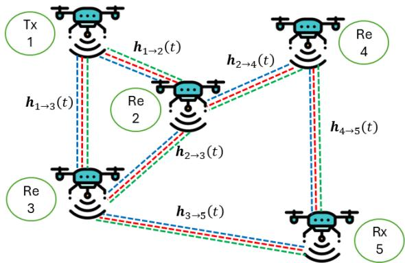  
Fig. 1: Illustration of a multi-channel MANET with $B = 3$ channels, $\vert \mathcal { V } \vert = 5$ nodes, and $| \mathcal { E } | = 6$ links.

Data-driven methods offer an alternative to repeatedly solving difficult optimization problems. Distributed reinforcementlearning approaches equip agents with local deep neural networks (DNNs) for decentralized resource allocation [23]–[25], but may not explicitly exploit graph structure, limiting their generalization across topologies. The learn-to-optimize paradigm trains neural networks or unfolded optimizers to rapidly generate feasible solutions [26], [27], with applications to centralized resource allocation [28] and decentralized consensus optimization [29], [30].

For graph-structured decentralized problems, graph neural networks (GNNs) provide a natural architecture due to their permutation equivariance [31] and local message-passing operations [32]–[34]. They have been applied to wireless power allocation [35]–[37], resource allocation [38], graph-unfolded optimization [37], over-the-air graph learning [39], link scheduling [40], [41], routing [42], beamforming [43], and wireless federated learning [44]. Nevertheless, existing works generally target individual tasks in infrastructure-based or interference-limited networks rather than decentralized multi-hop, multi-channel MANETs supporting multiple communication frameworks. This gap motivates the proposed MANET-GNN architecture.

Building on these insights, we develop a unified learned optimization framework for decentralized power allocation in multi-channel MANETs. We first formulate routing-aware power allocation as a constrained optimization problem that maximizes an end-to-end throughput metric encompassing several MANET communication frameworks [45]. Although the resulting problem is centralized and non-convex, it serves as an unsupervised training objective for a dedicated GNN architecture, termed MANET-GNN. The learned policy operates using only local channel state information (CSI) and a limited number of message exchanges, while approximating centralized optimization across varying topologies and communication objectives.

Our main contributions are:

• Unified formulation for multi-framework MANETs: We formulate multi-channel MANET power allocation for unicast, multicast, multicommodity, convergecast, and many-to-many scenarios [45] using a common end-to-end rate objective.

• MANET-GNN decentralized learned optimizer: We design a message-passing GNN that respects decentralization and latency constraints, uses only local possibly noisy CSI, and generalizes across topologies and network sizes.

• Framework-aware unsupervised training: We train MANET-GNN directly through the centralized optimization objective, without requiring ground-truth power allocations, while accounting for the communication framework and CSI uncertainty.

• Extensive experimentation: We show that MANET-GNN achieves near-centralized performance across multiple communication frameworks, remains robust to CSI uncertainty, and scales to unseen network sizes and topologies.

The remainder of the paper is organized as follows. Section II presents the system model and problem formulation. Section III introduces MANET-GNN, and Section IV evaluates its performance. Section V concludes the paper.

Throughout the paper, $\| \cdot \| _ { 0 }$ denotes the $\ell _ { 0 }$ pseudo-norm, i.e., the number of nonzero entries. The Frobenius norm is denoted by $\| \cdot \| _ { F }$ . For tensor indexing, $[ X ] _ { i _ { 1 } , i _ { 2 } , \dots , i _ { n } }$ denotes a scalar entry, while $[ X ] _ { : , . . . , : , i _ { k } , : , . . . , : }$ denotes the sub-tensor obtained by fixing the �th index.

## II. SYSTEM MODEL

In this section, we formulate the system model for multichannel MANETs. We commence with presenting the MANET system in Subsection II-A, and the different communication frameworks considered for such multi-user networks in Subsection II-B. Based on these, we formulate the decentralized power allocation optimization problem in Subsection II-C.

## A. MANET System Model

We consider a dynamic multi-hop multi-channel MANET with reciprocal links, as illustrated in Fig. 1. The dynamic nature implies that both the MANET topology and the corresponding channels can change in a block-wise fashion. Specifically, during block �, the network topology is modeled as an undirected connected graph $\mathcal { G } ( t ) = ( \mathcal { V } ( t ) , \mathcal { E } ( t ) )$ , where $\mathcal { V } ( t )$ is the set of nodes (user devices) and $\mathcal { E } ( t ) \subseteq \mathcal { V } ( t ) \times \mathcal { V } ( t )$ is the set of links. The dependence on � indicates that users can join and leave the network, and that connectivity can change due to, e.g., user mobility.

Each link in the multi-channel MANET can utilize one of � communication resources, $\mathrm { e . g . }$ , frequency channels, subcarriers, or resource blocks. The considered variations are described as block-fading, where the coefficients of the channels are assumed to remain constant within a block and vary independently across blocks, capturing the temporal dynamics of mobile ad hoc environments [46], [47]. Specifically, during block $t ,$ the channel over link $( i , j )$ is represented by a $B \times 1$ vector $\mathbf { h } _ { i  j } ( t ) \triangleq [ h _ { i  j } ^ { ( 1 ) } ( t ) , \hdots , h _ { i  j } ^ { ( B ) } ( t ) ] ^ { \mathrm { ~ l ~ } } \in \mathbb { C } ^ { B }$ , where $h _ { i  j } ^ { ( b ) } ( t )$ denotes the channel realization over channel �. Reciprocity implies that for every $( i , j ) \in \mathcal { E } ( t )$ , the forward and reverse channels are identical.

The considered formulation also accommodates heterogeneous communication capabilities across nodes. Specifically, a node is not required to support all � communication resources. If node � does not support resource $^ { b , }$ the corresponding channel coefficients are set to zero, i.e., $h _ { i \to j } ^ { ( b ) } ~ = ~ 0$ for all $j ~ \in ~ \mathcal { V } .$ Consequently, the corresponding links are removed from the feasible topology on resource $^ { b , }$ allowing the model to represent heterogeneous communication technologies and frequency availability across the network.

Let $N _ { j } ( t )$ denote the set of one-hop neighbors of node $j$ in $\mathcal { G } ( t )$ , i.e., $N _ { j } ( t ) = \{ l \in \mathcal { V } ( t ) : ( l , j ) \in \mathcal { E } ( t ) \}$ . Transmissions over different channels are orthogonal, while simultaneous transmissions over the same channel may interfere at neighboring receivers. Thus, letting $s _ { i \to j } ^ { ( b ) } ( t ) \in \mathbb { C }$ be the unit-variance signal transmitted by node � to node � over channel $^ { b , }$ node � observes

$$
y _ { i  j } ^ { ( b ) } ( t ) = h _ { i  j } ^ { ( b ) } ( t ) p _ { i  j } ^ { ( b ) } ( t ) s _ { i  j } ^ { ( b ) } ( t ) + I _ { j } ^ { ( b ) } ( t ) + w _ { j } ^ { ( b ) } ( t ) ,\tag{1}
$$

where $I _ { j } ^ { ( b ) } ( t )$ , defined as

$$
I _ { j } ^ { ( b ) } ( t ) = \sum _ { l \in N _ { j } ( t ) \backslash \{ i \} } h _ { l  j } ^ { ( b ) } ( t ) p _ { l  j } ^ { ( b ) } ( t ) s _ { l  j } ^ { ( b ) } ( t ) ,
$$

represents the aggregate co-channel interference at node $j$ generated by neighboring transmitters that reuse channel $^ { b , }$ and $w _ { i } ^ { ( b ) } ( t ) \sim \bar { C N } ( 0 , \sigma _ { b } ^ { 2 } )$ is additive white Gaussian noise (AWGN) [48]. For convenience, the key variables used in the system model are summarized in Table I.

## B. Communication Frameworks over MANETs

The dynamic multi-channel MANET detailed in Subsection II-A represents a multi-hop multi-user communication network. As such, it accommodates various communication frameworks which, as illustrated in Fig. 2, vary based on the specification of the set of source nodes, destination nodes, and message relations [45]. We focus here on five different representative communication frameworks that can be supported by a multi-channel MANETs with topology $\mathcal { G } = ( \mathcal { V } , \mathcal { E } )$

F1 Unicast, which involves a single transmitter–receiver pair. A designated node $u ^ { \mathrm { T x } } \in { \mathcal { V } }$ acts as the source and a node $u ^ { \mathrm { { \bar { R } x } } } \in { \mathcal { V } }$ acts as the destination, while all other nodes operate as relays. The objective is to deliver a single message from $u ^ { \mathrm { T x } }$ to $u ^ { \mathrm { R x } }$ via multi-hop routing.

F2 Multicast, where a single transmitter $u ^ { \mathrm { T x } } \in \mathrm { ~ \mathcal { V } ~ }$ communicates a common message to a set of $Q$ receivers $\{ u _ { 1 } ^ { \mathrm { R x } } , \ldots , u _ { O } ^ { \mathrm { R x } } \} \subset \mathcal { V }$ . All receivers expect to decode the same information. This framework generalizes broadcaststyle dissemination with the requirement that each destination successfully receives the common message.

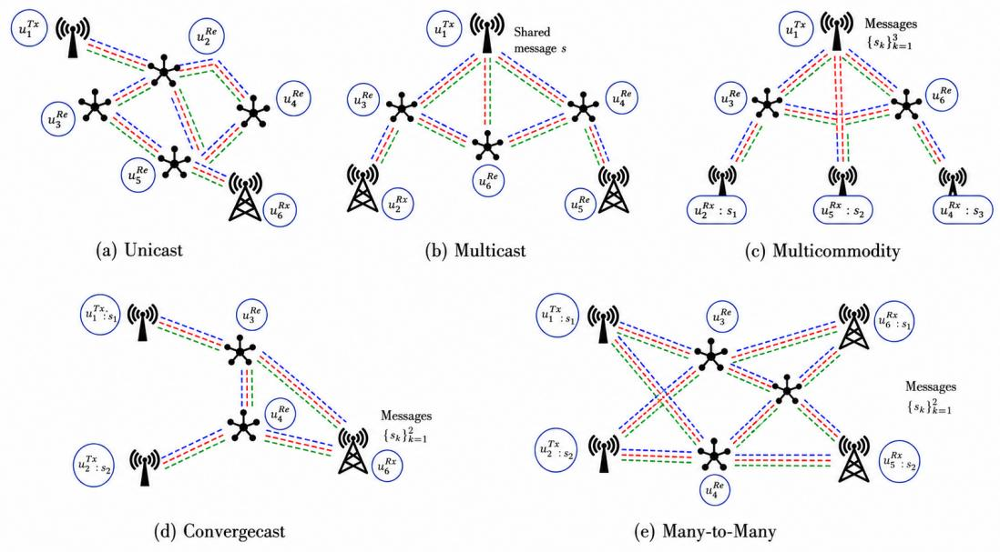  
Fig. 2: Illustration of the considered multi-channel MANET communication frameworks.

F3 Multicommodity, which extends multicast by associating each receiver with its own message. A single transmitter $u ^ { \mathrm { T x } } \in \mathcal { V }$ sends � independent messages to � receivers $\{ u _ { 1 } ^ { \mathrm { R x } } , \ldots , u _ { K } ^ { \mathrm { R x } } \} \subset \mathcal { V }$ , where receiver $u _ { k } ^ { \mathrm { { \tiny { R x } } } }$ expects the �th message $m _ { k }$ . Unlike multicast, messages are distinct and cannot be reused across destinations. This setting introduces traffic differentiation and competition for network resources.

F4 Convergecast, which can be viewed as the inverse of the multicommodity framework. Here, a set of transmitters $\{ u _ { 1 } ^ { \mathrm { T x } } , \ldots , u _ { K } ^ { \mathrm { T x } } \} \subset \mathcal { V }$ each hold a distinct message, which must be delivered to a single receiver $u ^ { \mathrm { R x } } \in \mathcal { V }$ . This setting arises naturally in data gathering, sensor fusion, and consensus applications, where information from multiple sources must be collected at a single node.

F5 Many-to-Many, which extends multicommodity by allowing multiple transmitters to simultaneously inject independent traffic into the network. Specifically, a set of transmitters $\{ u _ { 1 } ^ { \mathrm { T x } } , \ldots , u _ { K } ^ { \mathrm { T x } } \} \subset \mathcal { V }$ communicates with a set of receivers $\{ u _ { 1 } ^ { \mathrm { { \tiny { R x } } } } , \ldots , u _ { K } ^ { \mathrm { { \tiny { R x } } } } \} \subset \mathcal { V }$ , where transmitter $u _ { k } ^ { \operatorname { T x } }$ sends message �� to receiver $u _ { k } ^ { \mathrm { R x } }$ . Unlike multicommodity communication, messages may originate from different source nodes, resulting in multiple concurrent communication flows that compete for network resources and jointly determine the routing and power-allocation decisions.

While F1-F5 differ in message relationships and traffic patterns, they are all evaluated over the same physical-layer model described in Subsection II-A. The distinction arises at the network layer: information must be routed from transmitters to receivers over multi-hop paths in G. In this work, routing is handled at the optimization layer by explicitly evaluating available paths between communicating nodes and selecting paths based on their achievable end-to-end performance, as formalized next.

TABLE I: Key variables and parameters
<table><tr><td>Symbol</td><td>Definition</td></tr><tr><td> $\overline { { w _ { i } ^ { ( b ) } ( t ) } }$ </td><td>AWGN noise received at node j on channel b</td></tr><tr><td> $h _ { i  j } ^ { ( b ) } ( t )$ </td><td>Channel coefficient between nodes i and j on channel b</td></tr><tr><td> $p _ { i  j } ^ { ( b ) } ( t )$ </td><td>Power allocated by node i to node j on channel b</td></tr><tr><td> $s _ { i } ^ { ( b ) } ( t )$   $N _ { j } ( t )$ </td><td>Transmitted signal from node i on channel b Set of neighboring nodes of node j</td></tr></table>

## C. Power Allocation Problem Formulation

The ability to reliably carry out the communication frameworks F1-F5 largely depends on how the nodes allocate their transmission power across the � channels for all links in the MANET. Namely, power allocation refers to setting the collection $\{ p _ { i \to j } ^ { ( b ) } ( t ) \}$ for all $( i , j ) \in \mathcal { E } ( t )$ and $b \in \{ 1 , \ldots , B \}$ }, such that appropriate end-to-end performance metrics are optimized under F1-F5, while satisfying per-node power constraints.

We assume that a message cannot switch channels between hops within a transmission block. Thus, all links carrying a message on channel � use the same channel throughout its route. Per-hop channel switching would require additional coordination and channel-assignment variables, substantially increasing the optimization complexity and signaling overhead [49]. We leave dynamic channel adaptation for future work.

We next formulate the constraints on power allocation and cast this task as an optimization setting, based on which we introduce a unified formulation the power allocation problem. Since our formulation focuses a single signal block, we henceforth omit the block index � for brevity.

1) Power Constraint: The communication frameworks F1-F5 require each user to allocate its power between � messages (with $K = 1$ for single-message frameworks F1-F2) and across all its outgoing channels. Accordingly, we stack the power allocation as a $B \times K \times | \mathcal { V } | \times | \mathcal { V } |$ tensor $P ,$ with

$$
\sum _ { k = 1 } ^ { K } [ P ] _ { b , k , i , j } = p _ { i  j } ^ { ( b ) } .\tag{2}
$$

The variables $P _ { b , k , i , j }$ denote transmission amplitudes, such that the corresponding received signal power is proportional to $P _ { b , k , i , j } ^ { 2 }$ . We assume orthogonal message transmission over each link–channel resource; hence,

$$
\| \mathbf { P } _ { b , : , i , j } \| _ { 0 } \leq 1 , \qquad ( i , j ) \in \mathcal { E } , \quad b \in \{ 1 , . . . , B \} .\tag{3}
$$

Thus, at most one message occupies a given link and channel, although different links may reuse the same channel and consequently generate co-channel interference.

The transmit-power constraint is imposed jointly over all messages, channels, and outgoing links of each node. Since P contains amplitudes, it is expressed as

$$
\left\| [ \mathbf { P } ] _ { : , : , i , : } \right\| _ { F } = \sqrt { \sum _ { b , k , j } \left( P _ { b , k , i , j } \right) ^ { 2 } } \leq 1 , \qquad \forall i \in \mathcal { V } .\tag{4}
$$

Moreover, each node is subject to a unit power constraint and cannot allocate negative power to transmission. As a result, the set of feasible power allocations can be written as

$$
\begin{array} { r } { \begin{array} { r } { \mathcal { P } = \big \{ P \in [ 0 , 1 ] ^ { B \times K \times | \mathcal { V } | \times | \mathcal { V } | } : \| [ P ] _ { : ; i , : i , : } \| _ { F } \leq 1 , \ \forall i \in \mathcal { V } , } \\ { \| [ P ] _ { b , : , i , j } \| _ { 0 } \leq 1 , \ \forall ( i , j , b ) \in \mathcal { E } \times \{ 1 , . . . , B \} \big \} . \qquad ( } \end{array} } \end{array}\tag{5}
$$

2) Power Allocation as Constrained Optimization: We assess power allocation based on the throughput supported for each communication framework. To formulate this objective, first, we note that for orthogonal communication over the AWGN channel in (1), the achievable rate for communicating the �th message over frequency band � and link $( i \to j ) \in \mathcal { E }$ is given by

$$
R _ { i  j , k } ^ { ( b ) } ( P ) = \log _ { 2 } ( 1 + \frac { | h _ { i  j } ^ { ( b ) } | ^ { 2 } [ P ] _ { b , k , i , j } ^ { 2 } } { \sigma _ { b } ^ { 2 } + I _ { i  j } ^ { ( b ) } ( P ) } ) ,\tag{6}
$$

where

$$
I _ { i \to j } ^ { ( b ) } ( P ) = \sum _ { l \in N _ { j } } \left. h _ { l \to j } ^ { ( b ) } \right. ^ { 2 } \sum _ { k = 1 } ^ { K } \sum _ { q \in N _ { l } } P _ { b , k , l , q } ^ { 2 } .
$$

Following the widely adopted treating-interference-as-noise assumption, co-channel interference from neighboring transmitters is modeled as additive Gaussian noise at the receiver [50]. The interference model assumes that each neighboring transmitter occupies a single outgoing transmission on a given communication resource. This is consistent with the per-link message allocation constraint introduced in (5).

When communicating over multiple links, the throughput is dictated by the weakest link. Accordingly, for a given connected subgraph of $\mathcal { G }$ with edges $\psi \subseteq \mathcal { E }$ satisfying the communication requirements of the considered framework, the rate one can achieve for conveying the �th message over channel � is

$$
R _ { \psi , k } ^ { ( b ) } ( P ) = \operatorname* { m i n } _ { ( i  j ) \in \psi } R _ { i  j , k } ^ { ( b ) } ( P ) .\tag{7}
$$

In multi-channel MANETs, a transmitter can encode a message over several different channels, and possibly employ different routes over different channels for the same message. Therefore, a transmitter $u ^ { \mathrm { T x } }$ can convey its �th message to a set of $Q$ intended receivers $\{ u _ { 1 } ^ { \mathrm { R x } } , \ldots , u _ { O } ^ { \mathrm { R x } } \}$ by selecting the route with maximal rate for each channel, achieving end-to-end rate of

$$
R _ { k } ^ { \mathrm { E 2 E } } ( P ; \Phi ) = \sum _ { b = 1 } ^ { B } \operatorname* { m a x } _ { \psi \in \Phi } R _ { \psi , k } ^ { ( b ) } ( \mathbf { P } ) ,\tag{8}
$$

where Φ denotes the set of all subgraphs of $\mathcal { G }$ containing $u ^ { \mathrm { T x } }$ and $\{ u _ { 1 } ^ { \mathrm { R x } } , \ldots , u _ { O } ^ { \mathrm { R x } } \}$ . A power allocation $_ { r }$ is assessed by the end-to-end rate that can be achieved for all messages; namely, the power allocation problem can be written as

$$
P ^ { \star } = \operatorname * { a r g m a x } _ { P \in \mathcal { P } } \operatorname* { m i n } _ { k \in \{ 1 , . . . , K \} } R _ { k } ^ { \mathrm { E 2 E } } ( P ; \Phi _ { k } ) .\tag{9}
$$

The unified problem formulation in (9) accommodates F1-F5, which vary in the parameters of the optimization. For F1-F2, there is only one message $( \mathrm { i . e . , } K = 1 )$ , with Φ specializing into all paths from $u ^ { \mathrm { T x } }$ to the single receiver $u ^ { \mathrm { R x } }$ for F1, and including all subgraphs including all $Q$ intended receivers for F2. The frameworks with $K > 1$ messages differ in the setting of the set of subgraphs $\Phi _ { k }$ , which for F3 accommodates the set of paths from the single transmitter $u ^ { \mathrm { T x } }$ to $u _ { k } ^ { \mathrm { R x } }$ , for F4 dictates all paths from $u _ { k } ^ { \mathrm { T x } }$ to the single receiver $u ^ { \mathrm { { R x } } }$ ,and for F5 contains all paths from $u _ { k } ^ { \mathrm { T x } }$ to $u _ { k } ^ { \mathrm { R x } }$

The candidate set $\Phi _ { k }$ is constructed offline according to the communication framework. For F1 and F3-F5, it contains all simple source–destination paths, found by depth-first search without cycles. For F2, Φ contains all connected subgraphs spanning the source and all intended receivers. These sets are used only during offline training for objective evaluation and gradient computation; at inference, MANET-GNN outputs the power allocation after a fixed number of message-passing rounds, without path or subgraph enumeration.

3) Problem Formulation: Our goal is to design a policy for setting the power allocations $_ { P }$ based on the centralized optimization objective in (9), under the different frameworks F1- F5. While (9) is formulated as a centralized optimization setting, i.e., a mapping of the full MANET CSI $\{ h _ { i  j } ^ { ( b ) } \}$ into $P _ { \mathrm { f w } } ^ { \star }$ , we aim to design a method that meets the following requirements:

R1 Decentralized operation, i.e., each node � sets its own $\{ p _ { i  j } ^ { ( b ) } \}$ (and, when applicable, $\{ p _ { i \to j , k } ^ { ( b ) } \} )$ based on knowing its neighbors $( N _ { i } )$ and its local CSI $\{ \hat { h } _ { i  j } ^ { ( b ) } \} _ { j \in N _ { i } , b \in \{ 1 , \dots B \} }$

R2 Limited latency optimization, where each node � is allowed to exchange at most � messages with its neighbors $\mathcal { N } _ { i }$

R3 The method should be applicable on different topologies, i.e., generalize across graphs with varying sizes and topologies.

R4 The local CSI $\{ \hat { h } _ { i  j } ^ { ( b ) } \} _ { j \in N _ { i } , b \in \{ 1 , \dots B \} }$ may be a noisy estimate of the actual CSI.

To cope with R1–R4, we assume access during design to CSI

from various MANET realizations, represented by the data set

$$
\mathcal { D } = \{ \{ h _ { i  j , d } ^ { ( b ) } \} _ { ( i , j ) \in \mathcal { E } _ { d } , b \in \{ 1 , \dots B \} } , \ G _ { d } = ( \mathcal { V } _ { d } , \mathcal { E } _ { d } ) \} _ { d = 1 } ^ { | \mathcal { D } | } ,\tag{10}
$$

with $h _ { i  j , d } ^ { ( b ) }$ representing the realization of $h _ { i  j } ^ { ( b ) }$ in the �th MANET in D. Note that (10) does not contain ground-truth power allocations, and that its CSIs come from different MANETs with different topologies and channel conditions.

## III. DECENTRALIZED LEARNED OPTIMIZATION

In this section, we present our decentralized learned optimiza tion framework for the power allocation problem described in Subsection II-C. We leverage the ability to formulate the allocation problem globally for all considered communication frameworks, with the objective (9) depending on end-to-end paths or subgraphs and on per-node power constraints. To address requirements R1–R4, we propose to tune the power allocation policy by leveraging the optimization formulation in (9) through learned optimization tools. Our design builds upon the empirical success of GNNs in solving learned optimization tasks [36], [43], exploiting their inherent ability to operate in a decentralized manner (R1) while naturally adapting to different network topologies (R3) [51].

Specifically, we introduce a dedicated GNN architecture, termed MANET-GNN. The architecture of MANET-GNN, detailed in Subsection III-A, is inspired by message-passing networks [34], and explicitly constrains the number of message exchanges to meet the latency requirement (R2), while being inherently scalable to different topologies (R3). To enable efficient decentralized tuning of the power P, we propose a dedicated training method in Subsection III-B, that trains MANET-GNN as a distributed learned optimizer. Our learning formulation encourages MANET-GNN to approximate the centralized power allocation solutions in a manner accommodating F1-F5, while leveraging the casting of the GNN as an optimizer to learn in an unsupervised manner, i.e., without requiring ground-truth labels. We conclude with a discussion in Subsection III-C.

## A. MANET-GNN Distributed Optimizer Architecture

MANET-GNN consists of a gated message-passing backbone followed by shared per-edge decoders that map the learned node and edge embeddings into framework-specific power and routing variables. The architecture encodes the local CSI, topology, and communication roles into graph signals, processes them through a fixed number of decentralized message-passing rounds, and outputs a feasible power allocation.

1) Input Encoding: As formulated in Subsection II-C, the allocation depends on the MANET topology, the available CSI $\{ h _ { i \to j } ^ { ( b ) } \} _ { b = 1 } ^ { B }$ , and the communication framework. MANET-GNN represents these quantities as multivariate node and edge features over the communication graph [52].

For each edge $( i , j ) \in \mathcal { E }$ , the input edge feature stacks the real and imaginary parts of the channel gains:

$$
\begin{array} { r } { \boldsymbol { e } _ { i  j } ^ { ( 0 ) } = [ \mathrm { R e } \{ h _ { i  j } ^ { ( 1 ) } , \ldots , h _ { i  j } ^ { ( B ) } \} \parallel \mathrm { I m } \{ h _ { i  j } ^ { ( 1 ) } , \ldots , h _ { i  j } ^ { ( B ) } \} ] ^ { \top } . } \end{array}
$$

The node feature combines a coarse equal-split power prior with a role encoding. The role vector $\mathbf { \nabla } _ { r _ { i } }$ identifies whether

node � acts as a transmitter, receiver, relay, and as part of a specific commodity. Using the equal-split initialization $p _ { i  j } ^ { ( b ) } = 1 / \sqrt { | { \cal N } _ { i } | B } ,$ , the input node feature is

$$
\pmb { x } _ { i } ^ { ( 0 ) } = \Big [ \sum _ { j \in N _ { i } } \big [ p _ { i  j } ^ { ( 1 ) } , . . . , p _ { i  j } ^ { ( B ) } , p _ { j  i } ^ { ( 1 ) } , . . . , p _ { j  i } ^ { ( B ) } \big ] \| r _ { i } ^ { \top } \Big ] ^ { \top } .\tag{11}
$$

Only the first � entries are used as the initial node embedding.

2) Gated Message-Passing Backbone: The MANET-GNN backbone stacks $L / 2$ gated GNN layers. Each layer corresponds to two neighbor-to-neighbor message exchanges and updates the node and edge embeddings locally. At layer �, node � uses its embedding $\pmb { x } _ { i } ^ { ( l - 1 ) }$ , its incident edge embeddings, and messages received from neighboring nodes.

For each edge $( i \  \ j )$ , the normalized node and edge embeddings are used to compute an edge update:

$$
\begin{array} { r } { \Delta e _ { i  j } ^ { ( l ) } = \mathrm { M L P } _ { \mathrm { e } } ^ { ( l ) } \big ( \bar { e } _ { i  j } ^ { ( l - 1 ) } \parallel \bar { \mathbf { x } } _ { j } ^ { ( l - 1 ) } \parallel \bar { \mathbf { x } } _ { i } ^ { ( l - 1 ) } \big ) , } \end{array}\tag{12a}
$$

$$
\begin{array} { r } { \boldsymbol { e } _ { i  j } ^ { ( l ) } = \mathrm { L N } \Big ( \boldsymbol { e } _ { i  j } ^ { ( l - 1 ) } + \sigma ( \Delta \boldsymbol { e } _ { i  j } ^ { ( l ) } ) \odot \Delta \boldsymbol { e } _ { i  j } ^ { ( l ) } \Big ) , } \end{array}\tag{12b}
$$

where LN(·) is layer normalization and $\sigma ( \cdot )$ is element-wise sigmoid. The gate adaptively scales each feature of the edge update before the residual addition based learned importance.

The refined edge embedding parametrizes a Feature-wise Linear Modulation (FiLM) [53] modulation of the message:

$$
\begin{array} { r } { \pmb { m } _ { i  j } ^ { ( l ) } = \big ( \mathbf { 1 } + \gamma _ { i  j } ^ { ( l ) } \big ) \odot \pmb { W } _ { \mathrm { m s g } } ^ { ( l ) } \bar { \pmb { x } } _ { i } ^ { ( l - 1 ) } + \beta _ { i  j } ^ { ( l ) } \in \mathbb { R } ^ { B } , } \end{array}\tag{13}
$$

with $\begin{array} { r c l } { \gamma _ { i \to j } ^ { ( l ) } } & { = } & { W _ { \gamma } ^ { ( l ) } e _ { i \to j } ^ { ( l ) } } \end{array}$ and $\beta _ { i  j } ^ { ( l ) } = W _ { \beta } ^ { ( l ) } e _ { i  j } ^ { ( l ) } ,$ where $\mathbf { W } _ { \mathrm { m s g } } ^ { ( l ) } \ \in \ \mathring { \mathbb { R } } ^ { D _ { n } ^ { ( l + 1 ) } \times D _ { n } ^ { ( l ) } } , \qquad \mathbf { W } _ { \gamma } ^ { ( l ) } , \mathbf { W } _ { \beta } ^ { ( l ) } \ \in \ \mathbb { R } ^ { D _ { n } ^ { ( \bar { l } + 1 ) } \times D _ { e } ^ { ( \bar { l } + 1 ) } }$ . Here, ${ D } _ { n } ^ { ( l ) }$ and ${ D } _ { e } ^ { ( l ) }$ denote the node and edge embedding dimensions at layer �, respectively. All hidden node and edge embeddings have dimension �. Node � then aggregates the incoming messages and updates its embedding via

$$
\pmb { x } _ { i } ^ { ( l ) } = \mathrm { L N } ( \pmb { x } _ { i } ^ { ( l - 1 ) } + \mathrm { M L P } _ { \mathrm { a } } ^ { ( l ) } ( \frac { 1 } { \lvert \pmb { N } _ { i } \rvert } \sum _ { j \in N _ { i } } \pmb { m } _ { j  i } ^ { ( l ) } ) ) .\tag{14}
$$

In the first layer, if $\pmb { x } _ { i } ^ { ( 0 ) }$ has more than � entries, only its first � entries are used in the residual connection.

3) Output Processing: After $L / 2$ gated layers, each node applies shared decoders to its outgoing links. For link $( i  j )$ the decoder input is

$$
{ f } _ { i \to j } = \big [ e _ { i \to j } ^ { ( L / 2 ) } \big | \big | \pmb { x } _ { i } ^ { ( L / 2 ) } \big | \big | \pmb { x } _ { j } ^ { ( L / 2 ) } \big ] .\tag{15}
$$

1) Tentative power allocations: Denoted $\tilde { p } i \to j \in \mathbb { R } + ^ { B }$ obtained by applying a fully-connected (FC) layer with Softplus activation to $f _ { i \to j }$

2) Candidate-Based Routing Head: For the multi-message frameworks F3-F5, routing variables must represent complete routes rather than independent link activations. For commodity �, with source $s _ { k }$ and destination $d _ { k }$ , we define the local candidate set

$\mathcal { P } _ { k } ^ { ( L / 2 ) } = \left\{ p _ { k , m } : p _ { k , m } \right\}$ connects �� to ��, $| p _ { k , m } | \leq L / 2 \} _ { m = 1 } ^ { M _ { k } }$

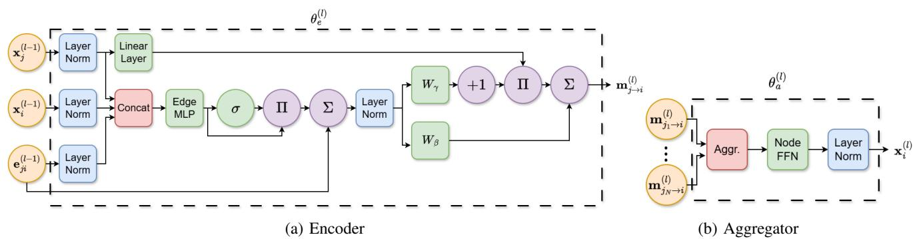  
Fig. 3: Gated message-passing layer of MANET-GNN.

The same $L / 2$ -hop candidate set is used during training and inference. Thus, route selection requires only locally available information and does not rely on global topology knowledge or a centralized route table.

For each candidate path, the routing head forms a path embedding $\begin{array} { r } { \bar { e } _ { k , m } ^ { ( l ) } \ = \ \frac { 1 } { | p _ { k , m } | } \sum _ { ( i , j ) \in p _ { k , m } } e _ { i  j } ^ { ( l ) } , } \end{array}$ that is concatenated with band-dependent route features

$$
\begin{array} { r } { \pmb { r } _ { b , k , m } = \left[ g _ { b , k , m } ^ { \operatorname* { m i n } } , g _ { b , k , m } ^ { \mathrm { a v g } } , | p _ { k , m } | , \eta _ { b , k , m } \right] , } \end{array}\tag{16}
$$

where $\begin{array} { r l r l r l } { g _ { b , k , m } ^ { \operatorname* { m i n } } } & { { } } & { = } & { { } } & { \operatorname* { m i n } _ { ( i , j ) \in p _ { k , m } } | h _ { i  j } ^ { ( b ) } | ^ { 2 } , } \end{array}$ $\begin{array} { r l r } { g _ { b , k , m } ^ { \mathrm { a v g } } } & { { } \quad } & { = \quad } & { \frac { 1 } { | p _ { k , m } | } \sum _ { ( i , j ) \in p _ { k , m } } | h _ { i  j } ^ { ( b ) } | ^ { 2 } , } \end{array}$ and $\begin{array} { r l r } { \eta _ { b , k , m } } & { = } & { \sum _ { ( i , j ) \in p _ { k , m } } \sum _ { q \in N _ { i } ^ { ( L / 2 ) } \backslash \{ i \} } | h _ { q  j } ^ { ( b ) } | ^ { 2 } . } \end{array}$ The last term measures local receiver-side interference exposure. A shared multilayer perceptron (MLP) assigns a band-dependent score to each candidate:

$$
a _ { b , k , m } = \phi _ { \mathrm { r o u t e } } \left( \left[ \bar { e } _ { k , m } ^ { ( l ) } , r _ { b , k , m } \right] \right) .\tag{17}
$$

During training, differentiability is preserved by applying a soft selection over the candidate paths of each band:

$$
\pi _ { b , k , m } = \frac { \exp ( a _ { b , k , m } / \tau _ { r } ) } { \sum _ { m ^ { \prime } = 1 } ^ { M _ { k } } \exp ( a _ { b , k , m ^ { \prime } } / \tau _ { r } ) } .\tag{18}
$$

The routing tensor is constructed by projecting the selected candidates onto their constituent edges:

$$
Z _ { b , k , i , j } = \sum _ { m = 1 } ^ { M _ { k } } \pi _ { b , k , m } \mathbb { 1 } \{ ( i , j ) \in p _ { k , m } \} .\tag{19}
$$

Hence, nonzero entries of $Z _ { b , k , : , }$ : represent candidate routes. At inference, the soft selection is replaced by a hard per-band decision:

$$
\boldsymbol { m } _ { b , k } ^ { \star } = \operatorname * { a r g m a x } _ { \boldsymbol { m } : \boldsymbol { p } _ { k , m } \in \boldsymbol { \mathcal { P } } _ { k } ^ { ( L / 2 ) } } \boldsymbol { a } _ { b , k , m } .\tag{20}
$$

Then $Z _ { b , k , i , j } ~ = ~ 1$ only for edges belonging to $p _ { k , m _ { b , k } ^ { \star } }$ Since the maximization is performed independently for each band, a commodity may use different routes over different frequency bands, consistently with (8).

The routing and power-allocation heads are trained jointly using the full differentiable objective, including the interference generated by all commodities. Restricting training and inference to the same local candidate sets avoids a train–test mismatch, enforces route consistency by construction, and preserves decentralized multi-band routing flexibility.

The final transmission amplitude assigned by node � to message � over link $( i , j )$ is obtained by masking the raw amplitude with the routing variable and normalizing it to satisfy the per-node power constraint:

$$
[ P ] _ { : , k , i , j } = \frac { \sqrt { [ z _ { i  j , k } ] } \odot \tilde { p } _ { i  j , k } } { \sqrt { \sum _ { k ^ { \prime } = 1 } ^ { K } \sum _ { j ^ { \prime } \in N _ { i } } \| \sqrt { [ z _ { i  j ^ { \prime } , k ^ { \prime } } ] } \odot \tilde { p } _ { i  j ^ { \prime } , k ^ { \prime } } \| _ { 2 } ^ { 2 } } } .\tag{21}
$$

4) Overall Algorithm: MANET-GNN operates as a learned decentralized optimizer. Each gated layer implements two neighbor-to-neighbor message exchanges, and the depth $L / 2$ directly controls the number of communication rounds and the receptive field. After $L / 2$ rounds, each node has access only to information within its �/2-hop neighborhood; dependencies beyond this range cannot be captured in a single forward pass. Increasing the depth therefore enables longer-range coordination, at the cost of additional communication and computation.

The trainable parameters of MANET-GNN are

$$
\pmb { \theta } = \left\{ \{ \pmb { \theta } _ { \mathrm { e } } ^ { ( l ) } , \pmb { \theta } _ { \mathrm { a } } ^ { ( l ) } \} _ { l = 1 } ^ { L / 2 } , \pmb { \theta } _ { \mathrm { d } } ^ { ( P ) } , \pmb { \theta } _ { \mathrm { d } } ^ { ( Z ) } \right\} .\tag{22}
$$

During inference, nodes execute only the forward pass of MANET-GNN, yielding a fully decentralized power-allocation policy. The overall flow is illustrated in Fig. 3, where the stacked gated layers serve as iterations of a learned optimizer and the final decoders output the routing-aware power allocation.

## B. Training Across Communication Frameworks

The parameters of MANET-GNN (22) are trained in an unsupervised fashion using the unlabeled dataset D in (10). The key ideas underlying our training procedure are: (�) treat MANET-GNN as a parameterized mapping from CSI and topology to power allocations; (��) formulate a loss that encourages it to gradually improve the objective $R _ { k } ^ { \mathrm { E 2 E } }$ , without requiring ground-truth power labels; and (���) account for the expected presence of noisy CSI by injecting noise in training.

1) Training Loss: Given a sample $( { \mathcal { G } } _ { d } , \{ h _ { i  j , d } ^ { ( b ) } \} )$ from D, we denote the sequence of power allocations produced by processing the output of the �th layer MANET-GNN as $\dot { P } ^ { ( l ) } ( { \mathcal G } _ { d } , \{ h _ { i  j , d } ^ { ( \bar { b } ) } \} ; \pmb { \theta } )$ . The rate expressions used in the loss are evaluated according to the signal-to-interference-and-noise ratio (SINR)-based formulation of Section II, and therefore account for both channel noise and co-channel interference. Based on the optimization objective in (9), we compute the rate achieved as

Algorithm 1: MANET-GNN at Node � (Layer �)   
Init : Trained θ; neighbors N�   
Input : Node features $\pmb { x } _ { i } ^ { ( l - 1 ) }$ ; neighbors node features   
$\{ \pmb { x } _ { j } ^ { ( l - 1 ) } \} _ { j \in N _ { i } } ;$ edge features $\{ e _ { i \to j } ^ { ( l - 1 ) } \} _ { j \in N _ { i } } ;$   
Message encode:   
1 for $\overline { { j \in { \cal N } _ { i } } }$ do   
2 Update edge embedding $e _ { i \to j } ^ { ( l ) }$ via (12);   
3 Compute message $m _ { i  j } ^ { ( l ) }$ via (13);   
4 Send $m _ { i  j } ^ { ( l ) }$ to node � ; // Message pass 1   
Aggregate:   
5 Update $\overline { { { \pmb x } _ { i } ^ { ( l ) } } }$ via (14);   
6 Broadcast $\pmb { x } _ { i } ^ { ( l ) }$ to neighbors ; $/ /$ Message pass 2   
Power setting:   
7 if Last layer then   
8 for $j \in \mathcal N _ { i }$ do   
9 Compute features $f _ { i \to j }$ via (15);   
10 Compute $\tilde { p } _ { i \to j }$   
and $z _ { i  j }$ via FC network and routing head;   
11 Set power allocation $[ P ] _ { : , : , i , }$ : via (21);

$$
R _ { d } ^ { ( l ) } ( \pm \operatorname { \pm } \operatorname * { m i n } _ { k \in \{ 1 , . . . , K \} } R _ { k } ^ { \mathrm { E } 2 \mathrm { E } } ( P ^ { ( l ) } ( \mathcal { G } _ { d } , \{ h _ { i  j , d } ^ { ( b ) } \} ; \pmb { \theta } ) ; \Phi _ { k } ) .\tag{23}
$$

The primary empirical loss term is set to

$$
\mathcal { L } _ { \mathcal { D } } ^ { \mathrm { r a t e } } ( \pmb { \theta } ) = - \frac { 1 } { | \mathcal { D } | } \sum _ { d = 1 } ^ { | \mathcal { D } | } R _ { d } ^ { ( L / 2 ) } ( \pmb { \theta } ) ,\tag{24}
$$

which encourages the final layer to maximize this rate.

The objective in (9) contains a minimum over the links of each route and a maximum over the feasible routes. These operations capture the route bottleneck and route selection, respectively, but are non-smooth and therefore unsuitable for gradient-based training. We replace them with differentiable soft approximations.

For a path �, the bottleneck rate on band � for message � is approximated as

$$
\widetilde { R } _ { \psi , k } ^ { ( b ) } = - \frac { 1 } { \tau _ { \mathrm { m i n } } } \log \sum _ { ( i , j ) \in \psi } \exp ( - \tau _ { \mathrm { m i n } } R _ { i  j , k } ^ { ( b ) } ) ,
$$

where $\tau _ { \operatorname* { m i n } } > 0$ . Route selection is similarly approximated by

$$
\widetilde { R } _ { k } ^ { ( b ) } = \frac { 1 } { \tau _ { \mathrm { m a x } } } \log \sum _ { \psi \in \Phi _ { k } } \exp \left( \tau _ { \mathrm { m a x } } \widetilde { R } _ { \psi , k } ^ { ( b ) } \right) ,
$$

where $\tau _ { \mathrm { m a x } } \ > \ 0 .$ Increasing $\tau _ { \mathrm { m i n } }$ and $\tau _ { \mathrm { m a x } }$ sharpens the approximations toward the corresponding minimum and maximum operators. These relaxations are used only for training; inference and evaluation employ feasible allocations and the original communication objective. The candidate path/subgraph sets $\Phi _ { k }$ required to evaluate the training objective are constructed offline. Their preprocessing cost increases with the network size, connectivity density, and number of commodities. This global search is not part of the MANET-GNN forward pass: during deployment, the nodes produce the allocation from locally available CSI and exchanged messages.

To stabilize training and to better align MANET-GNN with the notion of a learned iterative optimizer, we impose a monotonicity regularizer that encourages the rate to improve across consecutive layers [27]. For each sample we measure the rate differences $\Delta R _ { d } ^ { ( \bar { l } ) } ( \pmb { \theta } ) \dot { = } R _ { d } ^ { ( l + 1 ) } ( \pmb { \theta } ) - R _ { d } ^ { ( \bar { l } ) } ( \pmb { \theta } )$ , and penalize violations of a small positive margin $\delta > 0$ via

$$
\mathcal { L } _ { \mathcal { D } } ^ { \mathrm { m o n o } } ( \pmb { \theta } ) = \frac { 1 } { | \mathcal { D } | L } \sum _ { d = 1 } ^ { | \mathcal { D } | } \sum _ { l = 1 } ^ { L / 2 - 1 } \operatorname* { m a x } \big ( \delta - \Delta R _ { d } ^ { ( l ) } ( \pmb { \theta } ) , 0 \big ) .\tag{25}
$$

To encourage route concentration in the single-message frameworks F1-F2, we add a sparsity penalty on the transmission amplitudes. Let: $\begin{array} { r } { a _ { i , j } \ = \ \sqrt { \sum _ { b = 1 } ^ { B } P _ { b , i , j } ^ { 2 } } } \end{array}$ denote the aggregate amplitude assigned to edge $( i , j )$ . The penalty is defined as

$$
\mathcal { L } _ { \mathcal { D } } ^ { \mathrm { s p a r s e } } ( \pmb { \theta } ) = | R _ { \mathcal { D } } ( \pmb { \theta } ) | \left( \frac { \| \pmb { A } \| _ { 1 } } { \| \pmb { A } \| _ { 2 } } \mathrm { - } , 1 \right) ,\tag{26}
$$

where $A = \left[ a _ { i , j } \right]$ and � is the achieved rate. The ratio $\frac { \| A \| _ { 1 } } { \| A \| _ { 2 } }$ is minimized when the power is concentrated on fewer edges, encouraging to form a compact route from the source to the destination(s). The overall loss takes the form

$$
\begin{array} { r } { \mathcal { L } _ { \mathcal { D } } ( \pmb { \theta } ) = \mathcal { L } _ { \mathcal { D } } ^ { \mathrm { r a t e } } ( \pmb { \theta } ) + \lambda _ { m } \mathcal { L } _ { \mathcal { D } } ^ { \mathrm { m o n o } } ( \pmb { \theta } ) + \lambda _ { s } \mathcal { L } _ { \mathcal { D } } ^ { \mathrm { s p a r s e } } ( \pmb { \theta } ) , } \end{array}\tag{27}
$$

with $\lambda _ { m } \geq 0$ controlling the strength of the monotonicity regularization, and $\lambda _ { \mathrm { s } } \geq 0$ is the sparsity weight. This loss is minimized by mini-batch stochastic gradient descent (SGD) type learning.

2) Noisy-CSI-Aware Training: To enhance robustness to imperfect CSI and satisfy requirement R4, we train MANET-GNN under a noisy-CSI regime. In particular, for each sample in a batch we replace the true channel realization $\{ h _ { i  j , d } ^ { ( b ) } \}$ used in the forward pass with an estimated version $\{ \hat { h } _ { i \to i , d } ^ { ( b ) } \}$ obtained using a linear minimum mean-squared error (LMMSE) channel estimator under the assumed AWGN observation model. The model thus learns to produce power allocations based on estimates that mimic those available at run time.

While the input CSI provided to MANET-GNN in training is noisy, the loss $\mathcal { L } _ { \mathcal { D } } ( \pmb { \theta } )$ is always evaluated with respect to the true CSI, so that improvements in the learned policy are measured in terms of the actual end-to-end performance under perfect knowledge. This training protocol can be interpreted as an adversarial learned optimization scheme [54], in which the optimizer is trained to be robust to perturbations in its inputs. The overall training procedure based on SGD is summarized as Algorithm 2.

## C. Discussion

The proposed MANET-GNN framework provides a principled mechanism for meeting the requirements R1–R4 across all considered communication frameworks. First, its decentralized message-passing design inherently ensures that each node sets its local power allocations based solely on its local CSI and messages from its neighbors, thereby satisfying R1. The explicit limitation on the number of message-passing rounds directly controls the number of communication exchanges between neighboring nodes and thus provides a handle on latency and overhead, addressing R2. The use of GNNs with shared parameters across nodes and edges allows the same model to operate on graphs with different sizes and topologies, enabling generalization across heterogeneous MANETs as required by R3. Finally, the noisy-CSI-aware training procedure equips the model with robustness to estimation errors and mismatches between training and deployment conditions, thereby tackling R4. Because unsupported communication resources are represented through zero-valued channel coefficients, the resulting topology is naturally encoded in the graph representation. Therefore, the proposed MANET-GNN architecture can operate on heterogeneous networks without architectural modifications.

Algorithm 2: MANET-GNN SGD Training   
Init : Initial parameters θ; Learning rate �; #epochs   
$\mathrm { { e p o c h } _ { \mathrm { { m a x } } } ; }$ ; #batches �; Hyperparameters $\lambda , \delta , L ;$   
Input : Training set $\mathcal { D } = \{ ( \mathcal { G } _ { d } ^ { \mathrm { ~ \tiny ~ \{ ~ \hat { h } _ { i \to j , d } ^ { \mathrm { ~ \tiny ~ \{ ~ \mathcal ~ { D } \vert ~ } } } \} }  \} _ { d = 1 } ^ { | \mathcal { D } | } ,$   
Framework Tx/Rx sets; #Commodities �.   
1 for epoch $\cdot = 0 , 1 , \cdot \cdot \cdot , \mathrm { e p o c h } _ { \mathrm { m a x } } - 1$ do   
2 Randomly divide D into � batches $\{ \mathcal { D } _ { q } \} _ { q = 1 } ^ { Q } ;$   
3 for $q = 1 , \ldots , Q$ do   
4 Apply MANET GNN θ to $\{ \mathcal { G } _ { d } , \{ \hat { h } _ { i  j , d } ^ { ( b ) } \} \} _ { d \in \mathcal { D } _ { q } } ;$   
5 Compute loss $\mathcal { L } _ { \mathcal { D } _ { q } } ( \pmb { \theta } )$ via (27);   
6 Update $\pmb { \theta } \gets \pmb { \theta } - \eta \mathbf { \dot { \nabla } } _ { \pmb { \theta } } \mathcal { L } _ { \mathcal { D } _ { q } } ( \pmb { \theta } ) ;$   
7 return θ

While our framework and the architecture of MANET-GNN accommodates multiple different communication frameworks F1- F5, the formulation of the loss in (27) is framework-dependent by (23). Accordingly, the specific weights of MANET-GNN are trained for a given framework, and modularity can be supported by training a set of MANET-GNN weight configurations, one per communication framework, while fixing a maximum supported number of commodities � at the firmware level. One can potentially extend this approach into a single multi-framework model via, e.g., hypernetworks [55] or mixture-of-experts formulations [56]. We leave these extensions for future work.

We consider joint routing and power allocation under fixed channel assignments: links may reuse channels and cause co-channel interference, but each message remains on a single channel along its multi-hop route within a transmission block. Per-hop channel switching would require additional channelassignment variables and is left for future work. Future work may extend the framework to decentralized OFDMA, where routing, power, and band assignment are jointly optimized, as well as to heterogeneous per-flow QoS requirements through weighted utilities. Finally, the present work considers single-antenna communications for each channel. Extending the proposed decentralized learned optimization framework to multi-antenna systems by jointly optimizing beamforming and spatial resource allocation is an important direction for future research.

## IV. EXPERIMENTAL STUDY

Here, we numerically evaluate $\mathbf { M A N E T - G N N } ^ { 1 }$ , with the aims of: (�) validate that it correctly instantiates classical communication paradigms of F1-F5 from the formulation of the unified parent problem; (��) assess performance relative to centralized and heuristic baselines under varying network sizes, channel conditions, and levels of CSI; and (���) examine scalability, robustness, and inference latency in representative MANET settings.

## A. Setup

1) MANET Generation: We generate MANET topologies by sampling an undirected random graph over $\lvert \mathcal { V } \rvert$ nodes. The adjacency matrix $\textbf { A } \in \ \{ 0 , 1 \} ^ { | \mathcal { V } | \asymp | \bar { \mathcal { V } } | }$ is constructed by drawing each off-diagonal entry independently from a Bernoulli distribution with edge probability $p ,$ followed by symmetrization to enforce undirected connectivity while avoiding isolated nodes. During training and testing, the datasets included graphs with $p \in \{ 0 . 1 , 0 . 2 , 0 . 3 , 0 . 4 , 0 . 5 \}$

2) Channel Generation: For each realization, we generate complex reciprocal channels $\{ h _ { i  j } ^ { ( b ) } \}$ over feasible links, i.e., $h _ { i  j } ^ { ( b ) } = 0$ whenever $\mathbf { A } _ { i j } \ = \ 0$ and $h _ { i  j } ^ { ( b ) } = h _ { j  i } ^ { ( b ) }$ . For multimessage settings, the physical channel realization is shared across all message indices $k \in \{ 1 , 2 , \ldots , K \}$ , i.e., the MANET physical channel is independent of the communication framework.

We consider QuaDRiGa frequency-selective channels [57]. Nodes are placed in a $1 0 0 \times 1 0 0$ m urban block with heights drawn such that most nodes are at street level and a minority are elevated (second-floor) users. For every active edge $\{ i , j \} \in { \mathcal { E } } _ { \ }$ we instantiate an omnidirectional link in QuaDRiGa fixed urban scenario using the normalized channel over � sub-channels. The dynamic signal-to-noise ratio (SNR) range is controlled across experiments by varying the noise level $\sigma _ { b } ^ { \bar { 2 } } .$ , while keeping channel statistics fixed, defining $\begin{array} { r } { \mathbf { S N R } ^ { \left( b \right) } = 1 0 \cdot \log _ { 1 0 } \left( \frac { 1 } { \sigma _ { . } ^ { 2 } } \right) } \end{array}$

We evaluate our framework under two CSI regimes: full CSI and noisy CSI. This allows us to disentangle the performance of the learned decentralized optimizer from the impact of channel estimation errors. In the full CSI setting, each node is assumed to have access to the true channel coefficients. In the noisy CSI setting, CSI is obtained through pilot-based estimates.

3) Training Details: For each framework, MANET-GNN is trained on 2000 randomly generated topologies, each with $| \mathcal { V } | =$ 10 nodes and $B = 6$ frequency bands, of which 1600 are used for training and 400 for validation, with unseen validation samples. Each topology is associated with a fixed channel realization, and the training is performed jointly with SNR values ranging from 0 to 50 dB in increments of 5 dB. The model consists of three gated GNN layers (total $L = 6$ communication rounds), trained for 100 epochs using AdamW (learning rate $5 ^ { - 4 }$ , weight decay $3 \times 1 0 ^ { - 5 } )$ with cosine scheduling and dropout $( p = 0 . 2 )$

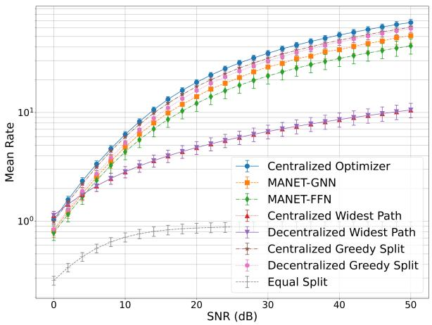  
(a) Full CSI.

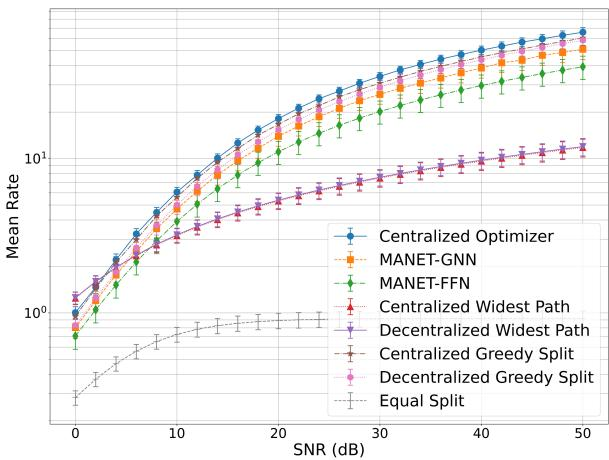  
(b) Estimated CSI.  
Fig. 4: Mean rate versus SNR for unicast (F1) communication over QuaDRiGa channels.

4) Testing Details: All reported results are evaluated on 500 independently generated test topologies, each with $\vert \mathcal { V } \vert = 1 0$ nodes and � = 6 frequency bands. For communication frameworks with multiple messages, we use $K = 4$ . The reported performance is averaged over all test realizations, and the error bars in the figures denote the corresponding 95% confidence intervals.

## B. Compared Algorithms

1) Benchmarks: We compare MANET-GNN against a diverse set of centralized, decentralized, heuristic, and learned baselines.

B1 Centralized Optimizer, which has access to the complete topology and CSI, and solves (9) using AdamW [59]. We use four initializations, namely random, Greedy-Split, Widest-Path, and MANET-GNN, and run 1000 iterations with line search over 5 step sizes. After each update, power allocation is projected onto the per-node constraints.

B2 Equal-Split, where each transmitter distributes its power uniformly over all feasible outgoing links and frequency bands. This channel-agnostic rule serves as a simple lowcomplexity baseline [60].

B3 Centralized Greedy Split (CGS), which centrally enumerates all feasible paths, or multicast subgraphs, and selects one of the shortest candidates uniformly at random. The available power is then split equally over the active links and frequency bands [61], [62].

B4 Distributed Greedy Split (DGR), the decentralized counterpart of CGS. Nodes use distributed Bellman–Ford updates [58] to compute minimum-hop routes using only neighbor exchanges. The resulting allocation is evaluated using the same interference-aware objective.

B5 Centralized Widest Path (CWP), which centrally examines the feasible paths, or multicast subgraphs, on each frequency band and selects the route whose weakest link has the largest channel gain. Transmission is then performed over the band with the largest bottleneck value [63].

B6 Distributed Widest Path (DWP), the decentralized counterpart of CWP. Nodes execute Bellman–Ford-like max–min updates [58] to find bottleneck-maximizing paths using only local information. For multicast and multi-flow settings, this procedure is applied per destination or transmitter– receiver pair, and the resulting paths are combined into the corresponding routing structure.

B7 Feedforward Network (FFN), which receives the full channel and predicts the power allocation using a fully connected neural network. Unlike MANET-GNN, it does not explicitly exploit graph topology, and therefore serves as a centralized learned baseline.

All benchmarks output a power allocation tensor compatible with the parent problem formulation and are evaluated using the same objective functions and constraints as the proposed method.

2) Complexity Analysis: Table II summarizes the online computational and communication complexities of the considered methods. Let $C ( { \mathcal { G } } )$ denote the number of routing objects examined for a given instance: simple source–destination paths for path-based frameworks and connected source–receiver subgraphs for multicast. In the worst case, these quantities scale as $O ( ( | \mathcal { V } | - 2 ) ! )$ and $O ( 2 ^ { | \varepsilon | } ,$ ), respectively. Consequently, centralized optimizers and route-enumeration heuristics may become prohibitively expensive as the network grows or densifies.

MANET-GNN avoids online combinatorial search and performs $L / 2$ fixed message-passing rounds. Its inference complexity is $\mathcal { O } \big ( \frac { 1 } { 2 } L | \theta | \big )$ , with total communication $O ( L | \mathcal { E } | B K )$ and pernode communication $O ( L { \mathrm { d e g } } ( i ) B K )$ . Hence, its latency and signaling overhead are fixed independently of the number of feasible paths or subgraphs. Path/subgraph enumeration is required only during offline training and does not affect deployment complexity.

## C. Comparative Study

We evaluate MANET-GNN against B1-B5 under the different communication frameworks F1-F5. For each framework, we report the average end-to-end rate versus SNR, averaged over independently generated MANET realizations. All evaluations were performed on a $| \mathcal { V } | = 1 0$ nodes and � = 6 frequency bands MANET. For multicast and multicommodity, the MANET

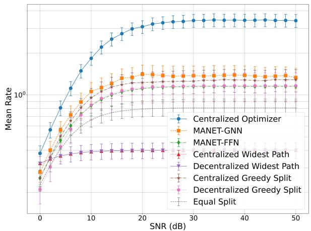  
(a) Full CSI.

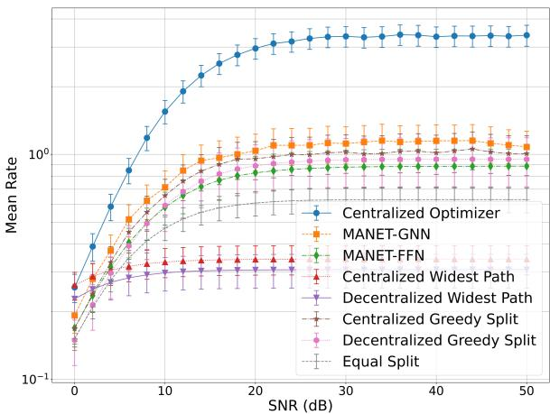  
(b) Estimated CSI.  
Fig. 5: Mean rate versus SNR for multicast communication over QuaDRiGa channels.

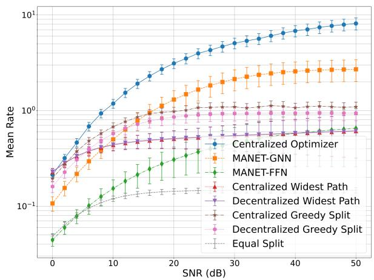  
(a) Full CSI.

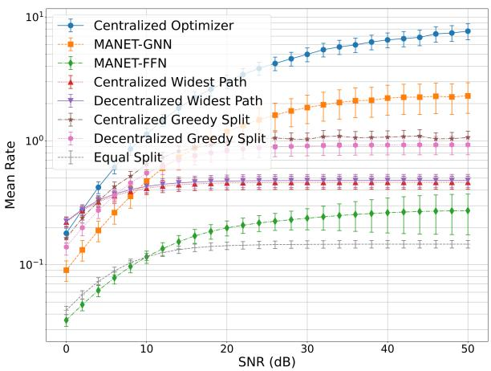  
(b) Estimated CSI.  
Fig. 6: Mean rate versus SNR for multicommodity (F3) communication over QuaDRiGa channels.

  
(a) Full CSI.

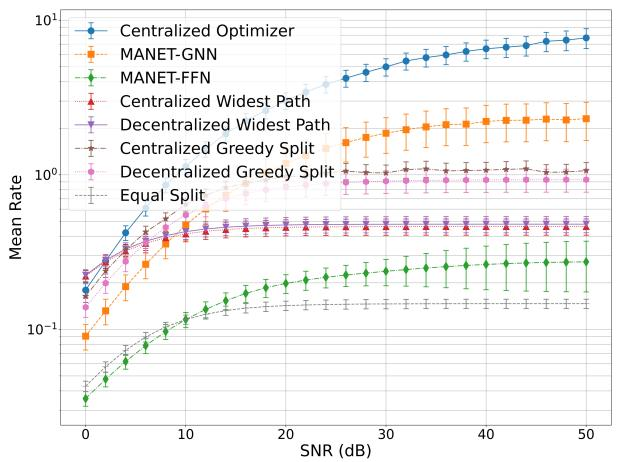  
(b) Estimated CSI.  
Fig. 7: Mean rate versus SNR for convergecast (F4) communication over QuaDRiGa channels.

TABLE II: Online complexity of considered algorithms in floating point operations and in communications
<table><tr><td colspan="5">Method Computational Complexity Total Communication Node i Communication</td></tr><tr><td>MANET-GNN (Decentralized)</td><td>O(L|θ|)</td><td>O(L|ε|BK)</td><td>O(Ldeg(i)BK)</td><td>Remarks L fixed rounds (latency-bounded learned optimizer)</td></tr><tr><td>Centralized Optimizer B1</td><td>O(I(|ε|BK + C(G)))</td><td></td><td></td><td>Iterative optimization with objective evaluation each iteration</td></tr><tr><td>Equal Split B2 (Each Node Locally)</td><td>O(|V|)</td><td></td><td></td><td>One-shot local allocation (no routing required)</td></tr><tr><td>Greedy-Split B3 (Centralized)</td><td>O(C(G) + |V|)</td><td></td><td></td><td>Shortest-path/smallest-subgraph selection, equal power on chosen route</td></tr><tr><td>Greedv-Split B4 (Decentralized)</td><td>O(Iν|2|ε|)</td><td>0(|ν||ε|)</td><td>O(|V|)</td><td>Distributed Bellman-Ford-style path discovery [58]</td></tr><tr><td>Best Single Channel B5 (Centralized)</td><td>O(C(G) + |V|)</td><td></td><td></td><td>Max-min link evaluation per band, full power on the strongest bottleneck</td></tr><tr><td>Best Single Channel B6 (Decentralized)</td><td>O(|ν|2|ε|)</td><td>0(|ν||ε|)</td><td>O(|V|)</td><td>Distributed Bellman-Ford-style path discovery [58]</td></tr><tr><td>Feed-Forward Network B7 (Centralized)</td><td> $O \big ( 2 B | \mathcal { V } | ^ { 2 } H + \big ( \ddot { n } _ { L } - \dot { 2 } \big ) \ddot { H } ^ { 2 } + B K | \mathcal { V } | ^ { 2 } H \big )$ </td><td></td><td></td><td>Feedforward fully-connected network with nL linear layers of dimension H</td></tr></table>

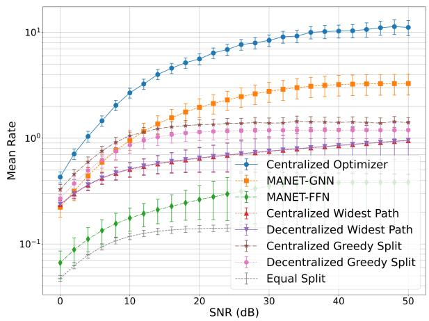  
(a) Full CSI.

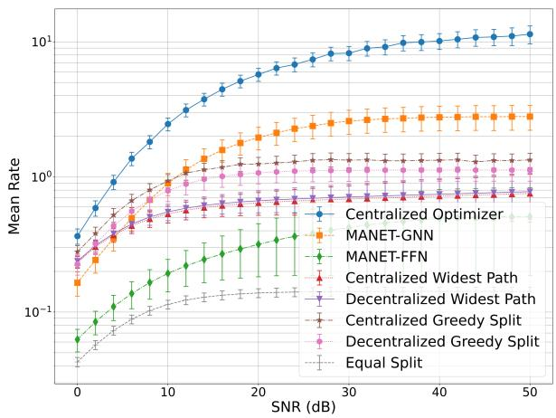  
(b) Estimated CSI.  
Fig. 8: Mean rate versus SNR for Many-to-Many (F5) communication over QuaDRiGa channels.

includes 4 receivers; in convergecast , there are 4 transmitters;   
and in many-to-many, there are 4 transmitter-receiver pairs.

1) Unicast: We begin with unicast communication (F1) over frequency-selective QuaDRiGa channels. Fig. 4 shows the results under full and estimated CSI. The centralized optimizer achieves the highest rate, while the Greedy-Split benchmarks slightly outperform MANET-GNN. This is expected, since unicast involves a single source–destination pair, for which selecting a short route and splitting power along it is often near-optimal. Still, MANET GNN remains close to these specialized heuristics and preserves its performance under CSI errors. The weaker performance of Widest-Path, Equal-Split, and MANET-FFN reflects their limited ability to exploit topology and band resources.

2) Multicast: We next consider multicast communication (F2), where a common message is delivered from one source to multiple receivers. As shown in Fig. 5, MANET-GNN achieves the best performance among the all benchmarks under both full and estimated CSI, second only to the centralized optimizer.. Unlike unicast, multicast requires selecting a connected subgraph that reaches all destinations while coordinating power over shared and destination-specific links. The Greedy-Split policies are competitive but do not jointly account for channel quality, interference, and power coupling across the multicast subgraph, causing them to saturate below MANET-GNN at moderate and high SNR. The similar ordering under estimated CSI demonstrates the robustness of the learned decentralized policy.

3) Multicommodity: We next consider multicommodity communication (F3), where a common source transmits distinct messages to multiple destinations under a shared power budget. Fig. 6 shows that the centralized optimizer achieves the highest rate, while MANET-GNN is the strongest remaining method from moderate SNR onward. In this setting, independently selecting short or high-bottleneck routes cannot coordinate the messages competing for the source power and shared network resources. Consequently, Greedy-Split and Widest-Path saturate earlier, whereas MANET-GNN continues to benefit from increasing SNR. The gap to the centralized optimizer reflects its access to global information, multiple initializations, and iterative line-search optimization, compared with the fixed number of local message-passing rounds used by MANET-GNN.

4) Convergecast: We next consider convergecast communication (F4), where multiple sources transmit distinct messages to a common destination. This setting mirrors multicommodity communication, with routes converging toward a shared sink instead of diverging from a shared source. Accordingly, Fig. 7 exhibits similar trends: the centralized optimizer performs best, while MANET-GNN clearly outperforms the remaining benchmarks from moderate SNR onward. The heuristic policies cannot effectively coordinate commodities that compete for shared links and frequency resources near the destination. In contrast, MANET-GNN captures this coupling through local message passing and remains robust under estimated CSI.

5) Many-to-Many: Finally, we consider many-to-many communication (F5), where multiple source–destination pairs simultaneously transmit distinct messages. This is the most general setting considered, as commodities have different sources and destinations while competing for overlapping routes, frequency resources, and transmit power. As shown in Fig. 8, MANET-GNN becomes the strongest benchmark after the low-SNR regime under both full and estimated CSI, second only to the centralized optimizer. Unlike unicast, independently selecting short or high-bottleneck routes cannot coordinate the interactions among several simultaneous flows, causing Greedy-Split and Widest-Path to saturate earlier. The consistent behavior under estimated CSI shows that MANET-GNN preserves its coordination capability despite channel-estimation errors.

6) Generalization Across Topologies and Message-Passing Depth: Finally, we examine MANET-GNN under unseen and time-varying topologies, and study the effect of the message-passing depth. We first evaluate size generalization in the F5 framework by comparing a model trained on $| \mathcal { V } | = 1 0$ graphs, whose average diameter is 3.4, with $L / 2 = 3$ gated layers, against a model trained on $\vert \mathcal { V } \vert = 3 0$ graphs, whose average diameter is 5.2, with $L / 2 = 5$ gated layers. Both models are evaluated on the same 200 unseen 30-node test graphs.

As shown in Fig. 9a, the model trained only on 10-node graphs remains effective when applied, without retraining, to networks three times larger. This demonstrates that the shared local computations of MANET-GNN generalize across network sizes and connectivity patterns. The model trained directly on 30-node graphs with $L = 1 0$ achieves about 20% higher mean rate. This is expected, since its five-hop receptive field better matches the testgraph diameter, whereas the $L / 2 = 3$ model observes only threehop neighborhoods. Thus, MANET-GNN can generalize to larger unseen networks, while matching the message-passing depth to the expected graph diameter further improves performance.

We next isolate the effect of the depth parameter �. For this ablation, all MANET-GNN models are trained on $\vert \mathcal { V } \vert = 3 0$ topologies with average graph diameter 5.2, and are evaluated on 200 unseen 30-node test graphs. Thus, the only architectural parameter varied across the curves is the number of message-passing rounds. Fig. 9b shows that increasing � initially improves performance, since a larger receptive field enables coordination over longer routes and better captures inter-flow coupling. The best performance is obtained for $L = 1 0$ , corresponding to $L / 2 = 5$ gated layers, which closely matches the average diameter of the test graphs. Smaller depths, such as $L = 2$ and $L = 4$ , provide only limited local information and therefore perform worse. The $L = 6$ model achieves strong performance but remains below $L = 1 0$ , reflecting the remaining loss from an insufficient receptive field. Increasing the depth further to $L = 1 4$ degrades the performance, which is consistent with the over-smoothing effect commonly observed in deep GNNs [64]. These results demonstrate the expected performance– latency tradeoff: larger � improves coordination up to the point where the receptive field matches the relevant network scale.

## V. CONCLUSIONS

We introduced MANET-GNN, a learned decentralized optimization framework for power allocation in multi-channel MANETs. By casting the resource allocation task as a unified optimization problem encompassing multiple communication paradigms, MANET-GNN learns topology-aware messagepassing policies that operate using only local CSI and a limited number of neighbor exchanges. We numerically show that

MANET-GNN consistently approaches centralized optimization across diverse settings while being robust to noisy CSI.

## REFERENCES

[1] T. Alter, N. Shlezinger, and M. Segal, “Decentralized multi-channel MANET power optimization using graph neural networks,” in IEEE ICC, 2026.

[2] B. Tavli and W. Heinzelman, Mobile Ad hoc networks. Springer, 2006.

[3] D. Kafetzis, S. Vassilaras, G. Vardoulias, and I. Koutsopoulos, “Softwaredefined networking meets software-defined radio in mobile ad hoc networks: state of the art and future directions,” IEEE Access, vol. 10, pp. 9989–10 014, 2022.

[4] T. Xie, H. Zhao, J. Xiong, and N. I. Sarkar, “A multi-channel MAC protocol with retrodirective array antennas in flying ad hoc networks,” IEEE Trans. Veh. Technol., vol. 70, no. 2, pp. 1606–1617, 2021.

[5] M. A. Karabulut, A. S. Shah, and H. Ilhan, “A novel MIMO-OFDM based MAC protocol for VANETs,” IEEE Trans. Intell. Transp. Syst., vol. 23, no. 11, pp. 20 255–20 267, 2022.

[6] J. Chen, J. Wang, J. Wang, and L. Bai, “Joint fairness and efficiency optimization for CSMA/CA-based multi-user MIMO UAV ad hoc networks,” IEEE J. Sel. Topics Signal Process., vol. 18, no. 7, pp. 1311–1323, 2024.

[7] D. Kanellopoulos and V. K. Sharma, “Survey on power-aware optimization solutions for MANETs,” Electronics, vol. 9, no. 7, p. 1129, 2020.

[8] E. Alotaibi and B. Mukherjee, “A survey on routing algorithms for wireless ad-hoc and mesh networks,” Computer Networks, vol. 56, no. 2, pp. 940–965, 2012.

[9] G. Jayakumar and G. Gopinath, “Ad hoc mobile wireless networks routing protocols–a review,” J. Comput. Sci, vol. 3, no. 8, pp. 574–582, 2007.

[10] S. Mishra and B. K. Pattanayak, “Power aware routing in mobile ad hoc networks-a survey,” ARPN J. Eng. Appl. Sci., vol. 8, no. 3, 2013.

[11] S. Singh and C. S. Raghavendra, “PAMAS—power aware multi-access protocol with signalling for ad hoc networks,” Comput. Commun. Rev., vol. 28, no. 3, pp. 5–26, 1998.

[12] W. Ye, J. Heidemann, and D. Estrin, “An energy-efficient MAC protocol for wireless sensor networks,” in IEEE INFOCOM, 2002.

[13] D. Kim, J. Garcia-Luna-Aceves, K. Obraczka, J.-C. Cano, and P. Manzoni, “Power-aware routing based on the energy drain rate for mobile ad hoc networks,” in IEEE ICCCN, 2002, pp. 565–569.

[14] B. Karp and H.-T. Kung, “GPSR: Greedy perimeter stateless routing for wireless networks,” in ACM MobiCom, 2000, pp. 243–254.

[15] Q. Li, J. Aslam, and D. Rus, “Online power-aware routing in wireless ad-hoc networks,” in ACM MobiCom, 2001, pp. 97–107.

[16] C. Mafirabadza, T. T. Makausi, and P. Khatri, “Efficient power aware AODV routing protocol in MANET,” in AICTC, 2016.

[17] B. Kim, J. H. Kong, T. J. Moore, and F. T. Dagefu, “Deep reinforcement learning for multi-flow routing in heterogeneous wireless networks,” arXiv preprint arXiv:2511.02030, 2025.

[18] ——, “Deep reinforcement learning based routing for heterogeneous multi-hop wireless networks,” in IEEE MILCOM, 2025.

[19] J. H. Kong, T. J. Moore, and F. T. Dagefu, “Joint routing and resource allocation in covert multi-flow heterogeneous networks,” IEEE Commun. Lett., 2025.

[20] K. F. Haque, J. Kong, T. J. Moore, F. Restuccia, and F. T. Dagefu, “Deer: Simultaneous multi-modal decentralized energy efficient covert routing,” in IEEE WCNC, 2025.

[21] A. Gillani, B. Lorenzo, M. Ghaderi, F. Dagefu, and D. Goeckel, “Optimal link configuration for covert heterogeneous wireless networks with power constraints,” in IEEE CISS, 2025.

[22] J. Kong, T. J. Moore, and F. T. Dagefu, “Decentralized covert routing in heterogeneous networks using reinforcement learning,” IEEE Commun. Lett., vol. 28, no. 11, pp. 2683–2687, 2024.

[23] Z. Liu et al., “Graph neural network meets multi-agent reinforcement learning: Fundamentals, applications, and future directions,” IEEE Wireless Commun., vol. 31, no. 6, pp. 39–47, 2024.

[24] Y. Dai et al., “A survey of graph-based resource management in wireless networks-part ii: Learning approaches,” IEEE Trans. on Cogn. Commun. Netw., vol. 11, no. 4, pp. 2101–2122, 2025.

[25] H. Feng et al., “GNN-enabled multi-agent DRL for adaptive path selection in multi-network domains,” IEEE Trans. Netw. Sci. Eng., vol. 13, no. 4, pp. 130–145, 2025.

[26] N. Shlezinger, Y. C. Eldar, and S. P. Boyd, “Model-based deep learning: On the intersection of deep learning and optimization,” IEEE Access, vol. 10, pp. 115 384–115 398, 2022.

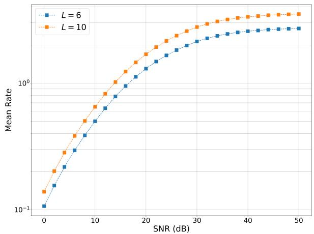  
(a) Size generalization.

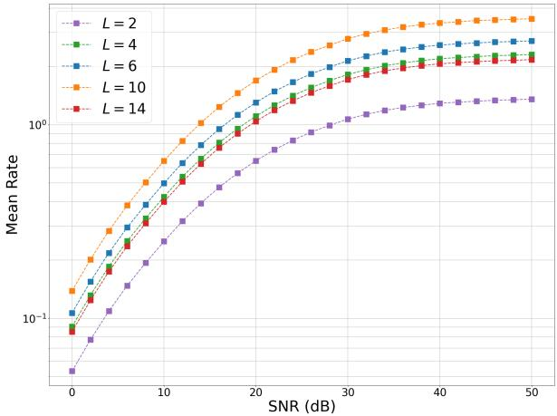  
(b) Depth ablation.  
Fig. 9: Generalization and depth analysis for MANET-GNN in the many-to-many framework.

[27] N. Shlezinger et al., “Deep unfolding: Recent developments, theory, and design guidelines,” arXiv preprint arXiv:2512.03768, 2025.

[28] T. Alter and N. Shlezinger, “Rapid optimization of superposition codes for multi-hop NOMA MANETs via deep unfolding,” IEEE Trans. Commun., vol. 73, no. 10, pp. 8720–8733, 2025.

[29] Y. Noah and N. Shlezinger, “Distributed learn-to-optimize: Limited communications optimization over networks via deep unfolded distributed ADMM,” IEEE Trans. Mobile Comput., vol. 24, no. 4, pp. 3012–3024, 2025.

[30] A. D. Saravanos, H. Kuperman, A. Oshin, A. T. Abdul, V. Pacelli, and E. A. Theodorou, “Deep distributed optimization for large-scale quadratic programming,” ICLR, 2025.

[31] M. M. Bronstein, J. Bruna, T. Cohen, and P. Velickoviˇ c, “Geometric deep´ learning: Grids, groups, graphs, geodesics, and gauges,” arXiv preprint arXiv:2104.13478, 2021.

[32] J. Gilmer, S. S. Schoenholz, P. F. Riley, O. Vinyals, and G. E. Dahl, “Neural message passing for quantum chemistry,” in ICML, 2017.

[33] T. Kipf, “Semi-supervised classification with graph convolutional networks,” arXiv preprint arXiv:1609.02907, 2016.

[34] J. Feng, Y. Chen, F. Li, A. Sarkar, and M. Zhang, “How powerful are k-hop message passing graph neural networks,” Advances in Neural Information Processing Systems, vol. 35, pp. 4776–4790, 2022.

[35] M. Eisen and A. Ribeiro, “Optimal wireless resource allocation with random edge graph neural networks,” IEEE Trans. Signal Process., vol. 68, pp. 2977–2991, 2020.

[36] M. Randall, P. Belzarena, F. Larroca, and P. Casas, “GROWS: improving decentralized resource allocation in wireless networks through graph neural networks,” in ACM GNNet, 2022.

[37] H. Yang et al., “Knowledge-driven resource allocation for wireless networks: A WMMSE unrolled graph neural network approach,” IEEE Internet Things J., vol. 11, no. 10, pp. 18 902–18 916, 2024.

[38] Y. Peng, J. Guo, and C. Yang, “Learning resource allocation policy: Vertex-GNN or edge-GNN?” IEEE Transactions on Machine Learning in Communications and Networking, vol. 2, pp. 190–209, 2024.

[39] Y. Gu, C. She, Z. Quan, C. Qiu, and X. Xu, “Graph neural networks for distributed power allocation in wireless networks: Aggregation over-the-air,” IEEE Trans. Wireless Commun., vol. 22, no. 11, pp. 7551–7564, 2023.

[40] Z. Zhao et al., “Link scheduling using graph neural networks,” IEEE Trans. Wireless Commun., vol. 22, no. 6, pp. 3997–4012, 2022.

[41] Z. Zhao, G. Verma, A. Swami, and S. Segarra, “Distributed link sparsification for scalable scheduling using graph neural networks,” IEEE Trans. Wireless Commun., vol. 25, pp. 3879–3893, 2025.

[42] S. Das, K. G. Panda, and N. NaderiAlizadeh, “Opportunistic routing in wireless communications via learnable state-augmented policies,” arXiv preprint arXiv:2503.03736, 2025.

[43] Y. Shen, Y. Shi, J. Zhang, and K. B. Letaief, “Graph neural networks for scalable radio resource management: Architecture design and theoretical analysis,” IEEE J. Sel. Areas Commun., vol. 39, no. 1, pp. 101–115, 2020.

[44] Z. Gao and D. Gund ¨ uz, “Graph neural networks over the air for¨ decentralized tasks in wireless networks,” IEEE Trans. Signal Process., vol. 73, pp. 721–737, 2025.

[45] A. El Gamal and Y.-H. Kim, Network information theory. Cambridge university press, 2011.

[46] E. Biglieri, G. Caire, and G. Taricco, “Limiting performance of block-fading channels with multiple antennas,” IEEE Trans. Inf. Theory, vol. 47, no. 4, pp. 1273–1289, 2001.

[47] W. Yang, G. Durisi, T. Koch, and Y. Polyanskiy, “Block-fading channels at finite blocklength,” in IEEE ISWCS, 2013.

[48] D. Tse and P. Viswanath, Fundamentals of wireless communication. Cambridge university press, 2005.

[49] A. H. Mohsenian-Rad and V. W. Wong, “Joint logical topology design, interface assignment, channel allocation, and routing for multi-channel wireless mesh networks,” IEEE Trans. Wireless Commun., vol. 6, no. 12, pp. 4432–4440, 2007.

[50] C. Geng, N. Naderializadeh, A. S. Avestimehr, and S. A. Jafar, “On the optimality of treating interference as noise,” IEEE Trans. Inf. Theory, vol. 61, no. 4, pp. 1753–1767, 2015.

[51] G. Corso, H. Stark, S. Jegelka, T. Jaakkola, and R. Barzilay, “Graph neural networks,” Nature Reviews Methods Primers, vol. 4, no. 1, p. 17, 2024.

[52] A. Ortega et al., “Graph signal processing: Overview, challenges, and applications,” Proc. IEEE, vol. 106, no. 5, pp. 808–828, 2018.

[53] M. Brockschmidt, “GNN-FiLM: Graph neural networks with feature-wise linear modulation,” in ICML, 2020.

[54] E. Sofer et al., “Unveiling and mitigating adversarial vulnerabilities in iterative optimizers,” IEEE Trans. Signal Process., vol. 73, 2025.

[55] T. Raviv and N. Shlezinger, “Modular hypernetworks for scalable and adaptive deep MIMO receivers,” IEEE Open Journal of Signal Processing, vol. 6, pp. 256–265, 2025.

[56] S. Masoudnia and R. Ebrahimpour, “Mixture of experts: a literature survey,” Artificial Intelligence Review, vol. 42, no. 2, pp. 275–293, 2014.

[57] S. Jaeckel, L. Raschkowski, K. Borner, and L. Thiele, “QuaDRiGa: A 3-D¨ multi-cell channel model with time evolution for enabling virtual field trials,” IEEE Trans. Antennas Propag., vol. 62, no. 6, pp. 3242–3256, Jun. 2014.

[58] K. R. Hutson, T. L. Schlosser, and D. R. Shier, “On the distributed Bellman-ord algorithm and the looping problem,” INFORMS Journal on Computing, vol. 19, no. 4, pp. 542–551, 2007.

[59] Z. Zhuang, M. Liu, A. Cutkosky, and F. Orabona, “Understanding AdamW through proximal methods and scale-freeness,” Transactions on Machine Learning Research, 2022.

[60] J. Jang and K. B. Lee, “Transmit power adaptation for multiuser OFDM systems,” IEEE J. Sel. Areas Commun., vol. 21, no. 2, pp. 171–178, 2003.

[61] R. Draves, J. Padhye, and B. Zill, “Routing in multi-radio, multi-hop wireless mesh networks,” in MobiCom, 2004.

[62] M. Saad, “On optimal spectrum-efficient routing in TDMA and FDMA multihop wireless networks,” Comput. Commun., vol. 35, no. 5, pp. 628–636, 2012.

[63] S. H. Low, “A duality model of TCP and queue management algorithms,” IEEE/ACM Trans. Netw., vol. 11, no. 4, pp. 525–536, 2003.

[64] T. K. Rusch, M. M. Bronstein, and S. Mishra, “A survey on oversmoothing in graph neural networks,” arXiv preprint arXiv:2303.10993, 2023.