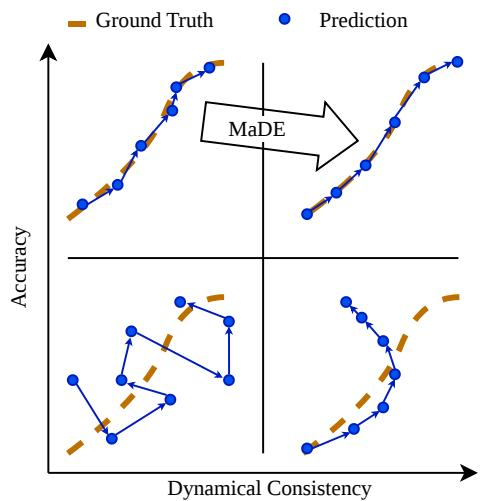
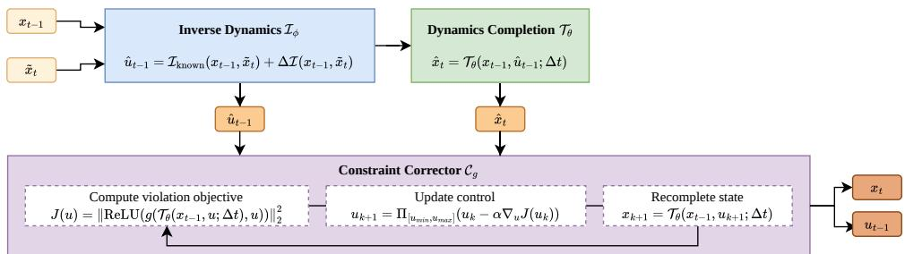

# Markovian Dynamics Enforcer: Feasibility Preserving Correction on Learned Dynamics Manifolds

Kevin Yu1∗ Tao Guo2 Constantinos Antoniou2 Panagiotis Angeloudis1 1Imperial College London, UK 2Technical University of Munich, Germany

## Abstract

Neural trajectory predictors can reach low prediction error while violating dynamics, actuator limits, or state constraints, especially when controls are unobserved and dynamics are partially specified. We introduce the Markovian Dynamics Enforcer (MaDE)1, a time-invariant post-hoc operator mapping state-transition proposals onto a learned feasible dynamics manifold, trained on feasible states without ground-truth controls. For each transition it infers a control and recomputes the state through a completion model of known physics plus a learned residual. It then corrects that control by gradient-based inequality reduction, so inequality satisfaction is best-effort within an iteration budget. Since every correction iterate re-enters the completion model, the returned state is dynamically consistent by construction relative to that model and the supplied previous-state anchor. MaDE drives dynamics residuals to essentially zero on fully specified simulated systems, and on an underspecified system leaves a smaller true-dynamics residual than the baselines. Designed to attach to arbitrary predictors, the frozen operator is evaluated downstream of recurrent, structured state-space, and transformer predictors. On recorded vehicle trajectories the one-step residual against a kinematic bicycle model is 0.0071 to 0.0072 for MaDE and 0.1703 to 0.1714 for raw predictors. MaDE raises average displacement error by a factor of 1.57 to 1.83.

## 1 Introduction

Neural trajectory models are increasingly used in physical-system pipelines for vehicle trajectory reconstruction, simulation, and behavioural forecasting. In these settings, predicted trajectories do not suffice as merely statistical outputs, since they are consumed by downstream modules that implicitly assume physical admissibility. A trajectory may achieve low prediction error while still violating actuator limits, state constraints, or basic dynamical consistency (Figure 1), making it unreliable for physical interpretation, safety analysis, or control-aware reasoning.

This mismatch arises because modern neural predictors are typically optimised for predictive accuracy rather than feasibility. Existing approaches partially address the problem by embedding optimisation layers [Amos and Kolter, 2017, Agrawal et al., 2019], incorporating physics priors [Raissi et al., 2019, Karniadakis et al., 2021], or learning structured dynamical models [Chen et al., 2018, Rackauckas et al., 2020, Yin et al., 2021]. However, these approaches often require retraining the predictor itself, assume analytically specified dynamics, or tightly couple feasibility enforcement to the upstream sequence architecture. In many practical settings, the available physics is incomplete and controls are unobserved.

We introduce Markovian Dynamics Enforcer (MaDE), a differentiable downstream correction operator for neural trajectory predictions. An inverse dynamics model infers latent controls from adjacent states, and a known-physics model augmented with a learned residual uses those controls to recompute the state. A correction stage then adjusts the inferred controls by gradient descent on a violation objective for explicit state and control bounds, while remaining on the learned dynamics manifold. The resulting operator is Markovian, time-invariant, and deterministic, and is designed to attach downstream of arbitrary predictors without retraining them. Dynamics consistency holds by construction relative to the learned completion operator and the supplied previous-state anchor, and asserts nothing about validity against the true data-generating system. Inequality satisfaction by the correction stage is best-effort and limited to a fixed iteration budget.

This work makes the following contributions. We define a post-hoc feasibility-enforcement problem for neural trajectory proposals under partially specified controlled dynamics and unobserved controls. For that problem we instantiate a completion– correction operator whose completion function is a learned controlled dynamics manifold rather than a fully specified analytical equality map. Its correction is posed in physically typed control space from state-only data. We evaluate the operator in two settings, reporting every method’s dynamics residuals and inequality violations as measured. On a simulation ladder from fully specified to underspecified dynamics, the operator preserves learned dynamics consistency and improves fidelity over direct-mapping and learned-projection baselines. Downstream of three independently trained neural trajectory predictors on recorded vehicle trajectories, the frozen operator lowers the known-model dynamics residual at an accuracy cost we quantify. Its effect on the inequality violation rate is reported separately from that residual.

  
Figure 1: Schematic of MaDE. MaDE improves the dynamical consistency of trajectory predictions at a cost in accuracy.

## 2 Related Work

Differentiable optimisation and completion–correction. Optimisation layers embed convex programs in neural networks and differentiate through their solutions [Amos and Kolter, 2017, Agrawal et al., 2019], while related approaches parameterise feasible sets directly [Frerix et al., 2020]. Donti et al. [2021] introduce a completion–correction framework in which a network proposes free variables, equality constraints determine the remaining variables, and inequality violations are reduced by gradient steps that remain on the equality manifold. Optimisation layers assume an analytical equality map. MaDE is closest to the completion–correction framework, adapting it to an equality manifold that a known physical model and a learned residual supply instead of an analytical specification.

Continuous-time and state-space sequence models. Neural ODEs and Neural CDEs learn continuous vector fields or controlled differential equations that are integrated forward in time [Chen et al., 2018, Kidger et al., 2020]. Kalman filtering provides the classical predict-update structure for sequential estimation [Kalman, 1960], and deep state-space and latent-sequential models extend the state-space formulation with nonlinear transitions, variational inference, or expressive recurrent parameterisations [Krishnan et al., 2015, Gu et al., 2022, Gu and Dao, 2024]. These methods estimate or generate whole sequences while carrying state across the trajectory. MaDE is a discrete, stateless, per-transition correction operator that projects arbitrary trajectory proposals onto an explicitly constrained learned dynamics manifold.

Imitation from observation. Here the actions that produced a demonstration are unavailable. Behavioural Cloning from Observation infers missing actions through an inverse dynamics model before policy learning [Torabi et al., 2018a], while related methods match transition distributions adversarially [Torabi et al., 2018b] or introduce latent action spaces before mapping them to executable controls [Edwards et al., 2019]. Inverse-dynamics prediction also supplies self-supervision for representation learning and exploration [Pathak et al., 2017]. Imitation from observation recovers missing actions to learn a policy, imitate an expert, or match transition distributions, whereas MaDE’s inverse dynamics recovers the physically typed controls the completion step needs.

Hybrid physical models. Physics-informed neural networks impose physical laws via architectural or training-time constraints [Raissi et al., 2019, Karniadakis et al., 2021], while universal differential equations and hybrid simulators couple mechanistic and neural components in differentiable pipelines [Rackauckas et al., 2020, Heiden et al., 2021]. APHYNITY [Yin et al., 2021] is the closest comparison among these hybrid models, decomposing dynamics into a known physical component and a minimum-norm learned augmentation. Hybrid physical models fit a learned residual inside an end-to-end autonomous dynamics model, without inferring unobserved controls and without reducing inequality violations. MaDE adds those two steps to the APHYNITY decomposition.

Vehicle trajectory pipelines. Kinodynamic plausibility in vehicle trajectory pipelines is enforced by classical estimation over a kinematic motion model, by kinematic architectures, and by optimal control. Rauch-Tung-Striebel smoothing adds a fixed-interval backward recursion to the predictupdate filtering structure above [Rauch et al., 1965]. Deep Kinematic Models place a kinematic vehicle model in the predictor’s final layer so that decoded trajectories are kinematically feasible [Cui et al., 2020]. The Realistic Residual Block appends a module carrying kinematic knowledge to a data-driven predictor [Bahari et al., 2021]. Differentiable model predictive control embeds a finite-horizon optimal control solve as a network layer that is itself the policy, with its cost and dynamics terms learned end to end [Amos et al., 2018]. Each of these four methods assumes an analytically specified motion model, or is a component of the model that produces the trajectory rather than an operator applied to a finished proposal. MaDE infers unobserved physical controls for a supplied transition and reduces analytical inequality violations on the state those controls produce, under dynamics that are only partially specified.

## 3 Methodology

Markovian Dynamics Enforcer (MaDE) is a Markovian, time-invariant one-step correction operator for controlled dynamical systems with unobserved controls. It maps adjacent state estimates from data, simulation, or an upstream predictor to a state-control pair on a learned dynamics manifold, corrected against explicit inequality constraints. Statelessness lets one operator serve any horizon, because the same cell is applied to every transition and no separate model is trained per trajectory length within a system. The cost is that a horizon is corrected by recursive application of a local map, which can trade sequence-level accuracy for one-step dynamic admissibility, at a size Section 5 reports.

## 3.1 Problem Setup

Let $x _ { t - 1 } \in \mathbb { R } ^ { n _ { x } }$ denote the supplied previous-state anchor for the one-step correction problem, and let $\tilde { { \boldsymbol { x } } } _ { t } \in \mathbb { R } ^ { n _ { \boldsymbol { x } } }$ denote the raw next-state proposal presented to MaDE. The tilde therefore marks the state that is proposed for correction, not the anchor used as the ODE initial condition. Let $u _ { t - 1 } \in \mathbb { R } ^ { n _ { u } }$ denote the physical control over the interval [t − 1, t]. The control is not observed during training or inference.

Feasibility is defined by two constraints. First, the returned state must be consistent with a dynamics map T over the sampling interval ∆t:

$$
x _ { t } = { \mathcal { T } } _ { \theta } ( x _ { t - 1 } , u _ { t - 1 } ; \Delta t ) .\tag{1}
$$

Second, the returned transition must satisfy the analytical inequality constraint $g ( x _ { t } , u _ { t - 1 } ) \leq 0$ , where g encodes state bounds, actuator bounds, speed limits, or other one-step local domain constraints. Appendix C instantiates g per system. It reaches the corrector through the violation objective J of Eq. (7) and training through the Phase 2 inequality penalty. For a fixed previous state, the target feasible set is therefore the set of controls whose completed next state satisfies both Eq. (1) and the inequality condition above.

  
Figure 2: Overview of the MaDE cell. The control update is drawn with zero momentum.

## 3.2 The MaDE Cell

MaDE instantiates a completion-correction pipeline inspired by DC3 [Donti et al., 2021], with a learned dynamics model as the completion function (Figure 2). A single cell is

$$
\mathcal { M } _ { \Theta , g } : ( x _ { t - 1 } , \tilde { x } _ { t } ) \mapsto ( x _ { t } , u _ { t - 1 } ) ,\tag{2}
$$

with shared parameters $\Theta = \{ \phi , \theta \}$ . It is composed of three operators:

$$
\hat { u } _ { t - 1 } = \mathcal { T } _ { \phi } ( x _ { t - 1 } , \tilde { x } _ { t } ) ,\tag{3}
$$

$$
\hat { x } _ { t } = \mathcal { T } _ { \theta } ( x _ { t - 1 } , \hat { u } _ { t - 1 } ; \Delta t ) ,\tag{4}
$$

$$
( x _ { t } , u _ { t - 1 } ) = \mathcal { C } _ { g } ( x _ { t - 1 } , \hat { x } _ { t } , \hat { u } _ { t - 1 } ) .\tag{5}
$$

The inverse dynamics operator $\mathcal { T } _ { \phi }$ proposes the free variables: physically typed controls $\hat { u } _ { t - 1 }$ that explain the transition from the supplied anchor $x _ { t - 1 }$ to the raw proposal $\tilde { x } _ { t }$ . The augmented dynamics operator $\mathcal { T } _ { \theta }$ completes the transition by recomputing the next state $\hat { x } _ { t }$ from the anchor $x _ { t - 1 }$ and inferred control $\hat { u } _ { t - 1 }$ . The corrector $\mathcal { C } _ { g }$ updates the control to reduce inequality violations, recomputing the state through $\mathcal { T } _ { \theta }$ after every update. Thus the proposal $\tilde { x } _ { t }$ guides control inference, but the output state is generated by the dynamics model rather than copied from the proposal.

The analogy is conceptual, and the mechanism DC3 uses does not carry over to either stage. DC3 completes by solving an implicit algebraic equality system and corrects with gradient steps projected onto the tangent space of the equality manifold [Donti et al., 2021]. MaDE completes by explicit forward numerical integration, so any state $\mathcal { T } _ { \theta }$ returns satisfies Eq. (1) without an implicit solve. The corrector re-integrates through $\mathcal { T } _ { \theta }$ after each control update, which does the work a tangent projection does in DC3.

## 3.3 Completion and Inverse Dynamics

The completion model follows the APHYNITY idea of augmenting a known physical vector field with a minimum-norm learned residual [Yin et al., 2021]. For a generic previous state $x _ { \mathrm { p r e v } }$ , MaDE uses a continuous-time controlled vector field $\dot { X } ( \tau ) ~ = ~ f _ { \mathrm { p h y s } } ( X ( \tau ) , u _ { t - 1 } ) + F _ { a , \theta } ( X ( \tau ) , u _ { t - 1 } )$ with $X ( 0 ) = x _ { \mathrm { p r e v } }$ , and exposes the fixed-step map $\mathcal { T } _ { \theta } ( x _ { \mathrm { p r e v } } , u _ { t - 1 } ; \Delta t ) = X ( \Delta t )$ . The known component $f _ { \mathrm { p h y s } }$ supplies the structural dynamics, while $F _ { a , \theta }$ captures the part of the dynamics that the known model cannot explain. The residual is trained with a minimum-norm penalty, written schematically as $\mathcal { R } _ { a } = \mathbb { E } [ \| \mathbf { \dot { F } } _ { a , \theta } ( x , u ) \| _ { 2 } ^ { 2 } ]$ , which discourages it from absorbing structure already represented by the physics. Systems with no useful known physics model are therefore outside the intended scope of the method.

The inverse dynamics operator $\mathcal { T } _ { \phi }$ of Eq. (3) infers a control that explains the transition between adjacent states under the completion model, as a fixed prior plus a learned residual:

$$
\hat { u } _ { t - 1 } = \mathbb { Z } _ { \phi } ( x _ { t - 1 } , \tilde { x } _ { t } ) = \mathbb { Z } _ { \mathrm { k n o w n } } ( x _ { t - 1 } , \tilde { x } _ { t } ; \Delta t ) + \Delta \mathbb { Z } _ { \phi } ( x _ { t - 1 } , \tilde { x } _ { t } ) .\tag{6}
$$

The fixed term $\mathcal { T } _ { \mathrm { k n o w n } }$ is a system-specific kinematic prior, such as a finite-difference acceleration estimate or a closed-form steering approximation. The inferred control is physically typed and bounded, but it is model-relative: it is the control that makes the completion model reproduce the transition, rather than an estimate of the command the system actually applied (Appendix E). The residual $\Delta \mathcal { T } _ { \phi }$ corrects discretisation error and mismatch between the prior and the data. Initialising this residual near zero anchors the model to physically meaningful controls at the start of training, reducing the chance that the inverse model and dynamics residual learn a mutually convenient but physically uninterpretable decomposition. A minimum-norm penalty $\mathcal { R } _ { \Delta \tau } = \mathbb { E } [ \| \dot { \Delta \mathcal { T } } _ { \phi } ( x _ { t - 1 } , \tilde { x } _ { t } ) \| _ { 2 } ^ { 2 } ]$ mirroring the one on $F _ { a }$ , keeps the inverse residual small throughout training.

## 3.4 Control-Space Inequality Correction

The corrector enforces inequalities by optimising over controls, not by directly clipping the state. For a fixed previous state and parameters, define the violation objective

$$
J ( u ) = \left\| \mathrm { R e L U } \left( g \left( \mathcal { T } _ { \theta } ( x _ { t - 1 } , u ; \Delta t ) , u \right) \right) \right\| _ { 2 } ^ { 2 } .\tag{7}
$$

Starting from $\hat { u } _ { t - 1 }$ with $ { \boldsymbol { v } } ^ { 0 } = 0$ , MaDE applies gradient updates with optional momentum:

$$
\begin{array} { r l } & { v ^ { k + 1 } = \beta v ^ { k } - \alpha \nabla _ { u } J ( u ^ { k } ) , } \\ & { u ^ { k + 1 } = \Pi _ { [ u _ { \operatorname* { m i n } } , u _ { \operatorname* { m a x } } ] } \left( u ^ { k } + v ^ { k + 1 } \right) , } \\ & { x ^ { k + 1 } = \mathcal { T } _ { \theta } ( x _ { t - 1 } , u ^ { k + 1 } ; \Delta t ) , } \end{array}\tag{8}
$$

where $\beta \in [ 0 , 1 )$ is the momentum coefficient $( \beta = 0$ recovers projected gradient descent) and $\Pi _ { [ u _ { \mathrm { m i n } } , u _ { \mathrm { m a x } } ] } ( z ) = \operatorname* { m i n } ( \operatorname* { m a x } ( z , u _ { \mathrm { m i n } } ) , u _ { \mathrm { m a x } } )$ is the componentwise projection onto the control box defined by the inequality constraints. The re-completion step in Eq. (8) is essential, since every intermediate correction iterate remains on the dynamics manifold of $\mathcal { T } _ { \theta }$ and the algorithm never edits $x _ { t }$ independently of the dynamics. The correction loop runs a fixed number of steps at training time and an adaptive, tolerance-based number at evaluation time, detailed in Appendix D.

## 3.5 Training Objectives

MaDE is trained by self-supervision on state transitions alone, with no ground-truth controls: the inverse and forward operators supervise each other through cycle consistency, and the augmented dynamics residual is kept small through the minimum-norm penalties. Training runs in two phases, summarised in Algorithm 1 in Appendix D: Phase 1 fits the consistency losses and residual penalties, and Phase 2 adds inequality-aware training through the corrector. In both phases the observed next state $x _ { t }$ is used as the proposal input in place of $\tilde { x } _ { t } ,$ so the loss definitions below reuse feasible dataset transitions while keeping the same one-step operator structure. For a data transition $( x _ { t - 1 } , x _ { t } )$ forward consistency trains the inferred control and completed dynamics to reconstruct the observed next state:

$$
\begin{array} { r } { \mathcal { L } _ { \mathrm { f w d } } = \Vert \mathcal { T } _ { \theta } \left( x _ { t - 1 } , \mathcal { T } _ { \phi } ( x _ { t - 1 } , x _ { t } ) ; \Delta t \right) - x _ { t } \Vert _ { 2 } ^ { 2 } . } \end{array}\tag{9}
$$

Inverse consistency samples a contro $u \sim q ( u )$ , completes a synthetic transition through the current dynamics, and trains the inverse model to recover the sampled control:

$$
\begin{array} { r } { \mathcal { L } _ { \mathrm { i n v } } = \left\| \mathcal { L } _ { \phi } \left( x _ { t - 1 } , \mathcal { T } _ { \theta } ( x _ { t - 1 } , u ; \Delta t ) \right) - u \right\| _ { 2 } ^ { 2 } . } \end{array}\tag{10}
$$

The two terms supervise complementary failure modes. $\mathcal { L } _ { \mathrm { f w d } }$ tests whether the inferred control reproduces the next state through $\mathcal { T } _ { \theta }$ , and used alone leaves the inverse map free to drift toward a mutually convenient but physically opaque decomposition with $\tau _ { \theta } . ~ \mathcal { L } _ { \mathrm { i n v } }$ tests the reverse, recovering controls from synthetic transitions produced by $\mathcal { T } _ { \theta }$ without requiring $\mathcal { T } _ { \phi }$ to explain the observed data.

The total Phase 1 loss $\mathcal { L } _ { 1 } = \mathcal { L } _ { \mathrm { f w d } } + \lambda _ { \mathrm { i n v } } \mathcal { L } _ { \mathrm { i n v } } + \lambda _ { a } \mathcal { R } _ { a } + \lambda _ { \Delta \mathcal { T } } \mathcal { R } _ { \Delta \mathcal { T } }$ is logged for validation, early stopping and comparison across alternation schedules and stopping criteria, and no module is trained directly against it. Algorithm 1 in Appendix D gives the per-side objectives and the gradient-freezing rule that keeps the inverse model and augmented dynamics from freely colluding while still letting the two modules improve each other over training.

Phase 2 introduces inequality-aware training through the full pipeline, applying the corrector to the training pair to give $( x _ { t } ^ { \mathcal { C } } , u _ { t - 1 } ^ { \mathcal { C } } ) = \mathcal { C } _ { g } \left( \bar { x _ { t - 1 } } , \bar { \mathcal { T } _ { \theta } } ( x _ { t - 1 } , \bar { \mathcal { T } _ { \phi } ( x _ { t - 1 } , x _ { t } ) } ; \bar { \Delta t } ) , \bar { \mathcal { T } _ { \phi } ( x _ { t - 1 } , x _ { t } ) } \right)$ . The inequality loss is

$$
\mathcal { L } _ { \mathrm { i n e q } } = \left\| \mathrm { R e L U } \left( g ( x _ { t } ^ { c } , u _ { t - 1 } ^ { c } ) \right) \right\| _ { 2 } ^ { 2 } ,\tag{11}
$$

and the total Phase 2 loss $\mathcal { L } _ { 2 } = \mathcal { L } _ { 1 } + \lambda _ { g } \mathcal { L } _ { \mathrm { i n e q } }$ is likewise only logged, with Phase 2 updates alternating under the same freezing rule. The inequality term updates the inverse model: it shapes $\mathcal { T } _ { \phi }$ toward controls that already lie closer to the feasible region, reducing the amount of correction needed at inference time. Its gradient is stopped in the loss that updates ${ \mathcal { T } } _ { \theta } .$ so the forward model and its learned residual $F _ { a }$ receive no inequality signal. The corrector itself remains an algorithmic layer rather than a separate learned network.

## 4 Experimentation

MaDE is evaluated in two experiments: a simulated four-system ladder spanning fully specified and underspecified known physics in Section 4.2, and the real-data experiment on inD in Section 4.3. The two share the evaluation metrics and the training protocol of Section 4.1.

## 4.1 Evaluation metrics and training protocol

We report both the rate and the magnitude of inequality violations. The rate (Ineq. rate) is the fraction of steps violating the analytical bounds $g \le 0$ , and the magnitude (Ineq. mag.) is the mean violation norm over the violating steps. Both score states and controls together, on a method’s own controls where it emits them and otherwise on controls recovered from its states through the inverse of the known model. The one-step residual of the returned transition is measured against the known physics (Dyn.-K), the augmented dynamics (Dyn.-L), and the true generating model (Dyn.-T). Fidelity (Fid.) is the mean Euclidean distance from the corrected next state to the unperturbed simulator trajectory at the same step. The average displacement error (ADE) is the mean Euclidean distance in metres from the returned position $( x , y )$ to the recorded position over the prediction horizon. The final displacement error (FDE) is that distance at the last step. Fid. and ADE both measure distance to a reference, and the two experiments supply different ones. Fid. scores each corrected transition against the unperturbed simulator state, and ADE scores the whole forecast against the recorded trajectory, the only reference recorded data provide. Table 4 in Appendix C gives every metric except ADE and FDE in symbols, and Appendix D gives MaDE’s training protocol, validation-driven early stopping in each phase.

## 4.2 Single-agent simulated dynamics

We work with a single agent, fixed scalar physics parameters, and no upstream predictor, so the pipeline reduces to the bare MaDE cell of Section 3. Access to the true generating process makes this the controlled setting of the paper. Posing correction on a single state transition lets MaDE sit behind a predictor with no access to its history, horizon, or decoding scheme, and items 1 and 2 of Appendix A state what this scope puts out of reach.

Data and seeds. Training data consist of feasible trajectories of length $T = 3 2$ generated by integrating the true system over the sampling interval $\bar { \Delta t } = 0 . 1$ . Each cell is run for five random seeds, each a complete training run of every learned method. Appendix C gives the splits and what each seed varies. At evaluation time every proposal after the unperturbed feasible state $x _ { 0 }$ is perturbed under the condition-specific protocol below, and MaDE is required to project the perturbed transitions back into the feasible set. Within a seed every method and ablation sees the same perturbed proposals, so the comparisons are paired. Correction is applied recursively along the trajectory from $x _ { 0 }$ , and each corrected state is the anchor for the next transition over the whole horizon.

Systems. We evaluate MaDE under four conditions, linear double integrator (DI), kinematic unicycle (UNI), kinematic bicycle (KB), and dynamic bicycle (DB), each specified in Appendix C. For each of DI, UNI, and KB, the known forward dynamics $\tau _ { \mathrm { p h y s } }$ and analytical inverse prior $\mathcal { T } _ { \mathrm { k n o w n } }$ match the data-generating model. Dyn.-T therefore equals Dyn.-K on these three systems, and the dynamics decomposition predicts $F _ { a } \to 0$ at convergence, which reduces the augmented dynamics of Dyn.-L to the known physics. These three systems act as pipeline-correctness checks at progressively richer geometry, and as a control that the residual does not absorb structure already explained by the known physics. Table 1 reports Dyn.-K alone for them, and Table 3 in Appendix B reports all three for MaDE and its variants. For DB, the data-generating model is the dynamic bicycle, while MaDE retains the kinematic bicycle as both $\mathcal { T } _ { \mathrm { p h y s } }$ and $\pmb { \mathcal { T } } _ { \mathrm { k n o w n } } .$ . The forward residual $F _ { a }$ and inverse residual $\Delta \mathcal { T } _ { \phi }$ must therefore absorb the missing tyre forces, lateral slip, and inertial coupling. All four conditions take a deterministic bound-violation evaluation perturbation of scale 0.10, with angular state components at half scale, 0.05, where present. At evaluation, DB inputs also carry zero-mean Gaussian observation noise of scale 0.02. For training on DB, where the known dynamics are underspecified, MaDE adds a separate zero-mean Gaussian augmentation of scale 0.02 to both states of each training and validation transition. The fully specified systems train without augmentation.

Baselines. The baseline set is clamp-only, per-step MLP, and FAB, which span the natural alternatives to MaDE’s completion-correction structure. Clamp-only enforces available box constraints by elementwise clipping and ignores dynamics consistency, isolating what a constraint-aware but physics-unaware projection achieves. Per-step MLP directly maps a proposed transition to a corrected transition with no explicit physics or controls, isolating what an unstructured one-step regressor learns from feasible data. FAB follows Fast Autoencoder-Based Projections [Chzhen and Donti, 2026]: a transition-pair encoder, a clip to a fixed-radius latent ball, and a single decoder return an approximate feasible projection, giving a structured learned-projection baseline without explicit physics, controls, or dynamics-manifold completion. We reimplement both of its training phases (Appendix D.5).

Scoring. The simulated methods fall into two groups for scoring. MaDE, its variants and the prior-only comparator of Appendix K emit a control with each state, and the three baselines emit none. Dyn.-K scores every method on controls recovered from its returned states through the inverse of the known model. On DB, Dyn.-T scores MaDE, its variants and the prior-only comparator on their emitted controls, and scores each baseline on controls recovered through the inverse of the known kinematic bicycle. Dyn.-L scores MaDE and its variants on their emitted controls under their own learned dynamics. The baselines have no learned dynamics or inverse model, so a baseline’s Dyn.-L is taken under the MaDE model trained on the same system and seed (Appendix B). A baseline’s Dyn.-L therefore measures agreement with MaDE’s model rather than a model of its own. The inequality metrics score the methods that emit controls on those controls, and each baseline on recovered controls.

## 4.3 Correction of neural trajectory predictors

We train three physics-unaware predictors from scratch, a recurrent model (LSTM) [Hochreiter and Schmidhuber, 1997], a compact structured state-space (S6/Mamba-style) sequence model [Gu and Dao, 2024], and a transformer [Vaswani et al., 2017], each at five seeds, giving 15 predictor runs. Trajectories are sampled at 5 Hz, a step of $\Delta t = 0 . 2 \mathrm { s }$ , and each predictor reads a 10-step (2 s) state history and per-vehicle metadata. It decodes the 15-step (3 s) horizon in one pass, as cumulative state deltas from the last observed state. All three are trained on a mean-squared-error objective alone, with no dynamics penalty and no inequality penalty. MaDE therefore corrects the predictor’s own forecast error rather than a synthetic perturbation.

Data and MaDE training. In the real-data experiment the windows come from the inD dataset of drone-recorded intersections [Bock et al., 2020]. MaDE is trained on inD states and per-vehicle metadata, with no control labels, under the training protocol of Section 4.1, then frozen. Its known model is the kinematic bicycle at a reference wheelbase of 2.7 m. Its inverse and completion steps add to that wheelbase a signed per-vehicle residual, which a small encoder trained with ${ \bar { F } } _ { a }$ predicts from the vehicle’s recorded length, width, class and recording location. Dyn.-K scores every method on controls recovered through the inverse of the known model at the 2.7 m reference wheelbase, without the per-vehicle wheelbase residual that MaDE learns. The recordings are dominated by vehicles that never move, and two displacement filters remove them: a window-level filter for the predictors and the evaluation, and a track-level filter for MaDE, which trains on transition pairs and builds no prediction windows. Both use a displacement threshold of 0.5 m, and Appendix C defines them and gives the counts each leaves. MaDE is trained at three seeds, and each of the three MaDE models corrects all 15 predictor runs, giving 45 cells that separate predictor variation from MaDE’s own.

Constraints. Every method of the real-data experiment is scored against one physical constraint set, the set MaDE is trained against, whose bounds were set by hand as reasonable limits (Appendix C). The clamp baseline projects onto the state bounds of that same set.

Table 2 reports the combined inequality violation rate, in which a step counts as violating when it breaks any state or control bound. Appendix I splits the rate and the magnitude into their state-bound and control-bound components for every method, and states how the components combine. The split matters for clamp, which satisfies the state bounds by construction but cannot reach the control bounds, so all of its violation lies on the controls.

Table 1: Results on the four simulated systems. Lower is better for every metric. Within each metric row the best mean is set in bold and the second-best in underline.
<table><tr><td></td><td></td><td colspan="3">Baselines</td><td>MaDE</td></tr><tr><td></td><td>Cond. Metric</td><td>Clamp</td><td>MLP</td><td>FAB</td><td>MaDE</td></tr><tr><td>DI</td><td>Ineq. rate</td><td> $0 . 2 5 5 1 \pm 0 . 0 0 0 0$ </td><td> $0 . 3 9 5 5 \pm 0 . 0 0 4 5$ </td><td> $0 . 3 0 0 0 \pm 0 . 0 1 2 9$ </td><td> $\mathbf { 0 . 2 0 3 4 \pm 0 . 0 0 0 0 }$ </td></tr><tr><td></td><td>Ineq. mag.</td><td> $\overline { { 9 . 8 7 7 7 \pm 0 . 0 0 0 0 } }$ </td><td> $4 . 3 8 3 5 \pm 0 . 2 0 3 8$ </td><td> $2 . 4 1 7 1 \pm 0 . 4 2 7 2$ </td><td> $\mathbf { 0 . 2 4 2 8 \pm 0 . 0 0 0 0 }$ </td></tr><tr><td></td><td>Dyn.-K</td><td> $0 . 3 3 3 2 \pm 0 . 0 0 0 0$ </td><td> $0 . 2 3 9 7 \pm 0 . 0 0 1 2$ </td><td> $\overline { { 0 . 3 3 0 4 \pm 0 . 0 2 0 6 } }$ </td><td> $\mathbf { 0 . 0 0 0 0 } \pm \mathbf { 0 . 0 0 0 0 }$ </td></tr><tr><td></td><td>Fid.</td><td> $3 . 0 2 0 7 \pm 0 . 0 0 0 0$ </td><td> $2 . 9 8 0 0 \pm 0 . 0 0 5 4$ </td><td> $\underline { { 2 . 7 1 3 9 \pm 0 . 1 3 3 9 } }$ </td><td> $\mathbf { 2 . 2 7 9 2 \pm 0 . 0 0 0 0 }$ </td></tr><tr><td>UNI</td><td>Ineq. rate</td><td> $\mathbf { 0 . 0 6 4 0 \pm 0 . 0 0 0 0 }$ </td><td> $0 . 3 8 3 1 \pm 0 . 0 0 3 8$ </td><td> $0 . 2 9 3 3 \pm 0 . 0 0 9 0$ </td><td> $0 . 1 0 4 2 \pm 0 . 0 0 0 0$ </td></tr><tr><td></td><td>Ineq. mag.</td><td> $4 . 7 1 8 1 \pm 0 . 0 0 0 0$ </td><td> $2 . 1 5 8 5 \pm 0 . 0 5 5 3$ </td><td> $\underline { { 1 . 1 3 0 5 \pm 0 . 1 5 1 4 } }$ </td><td> $\mathbf { 0 . 0 5 3 8 } \pm \mathbf { 0 . 0 0 0 0 }$ </td></tr><tr><td></td><td>Dyn.-K</td><td> $0 . 3 2 5 1 \pm 0 . 0 0 0 0$ </td><td> $0 . 2 6 1 4 \pm 0 . 0 0 5 7$ </td><td> $\overline { { 0 . 2 7 2 9 \pm 0 . 0 3 8 6 } }$ </td><td> $\mathbf { 0 . 0 0 0 0 } \pm \mathbf { 0 . 0 0 0 0 }$ </td></tr><tr><td></td><td>Fid.</td><td> $5 . 3 3 1 5 \pm 0 . 0 0 0 0$ </td><td> $\overline { { 5 . 4 5 8 8 \pm 0 . 0 1 2 8 } }$ </td><td> $5 . 0 1 1 5 \pm 0 . 1 0 3 4$ </td><td> $\mathbf { 1 . 4 1 2 6 \pm 0 . 0 0 0 0 }$ </td></tr><tr><td>KB</td><td>Ineq. rate</td><td> $0 . 3 0 0 8 \pm 0 . 0 0 0 0$ </td><td> $0 . 5 0 5 2 \pm 0 . 0 0 7 8$ </td><td> $0 . 4 2 9 3 \pm 0 . 0 2 1 3$ </td><td> $\mathbf { 0 . 1 9 6 5 \pm 0 . 0 0 0 0 }$ </td></tr><tr><td></td><td>Ineq. mag.</td><td> $5 . 3 7 2 3 \pm 0 . 0 0 0 0$ </td><td> $2 . 8 3 4 4 \pm 0 . 2 0 4 1$ </td><td> $1 . 9 0 3 3 \pm 0 . 3 8 2 0$ </td><td> $\mathbf { 0 . 1 4 3 1 \pm 0 . 0 0 0 1 }$ </td></tr><tr><td></td><td> $\mathrm { D y n . - K }$ </td><td> $0 . 8 5 4 6 \pm 0 . 0 0 0 0$ </td><td> $0 . 7 4 1 8 \pm 0 . 0 1 5 5$ </td><td> $\overline { { 0 . 7 1 5 2 \pm 0 . 1 1 1 5 } }$ </td><td> $\mathbf { 0 . 0 0 0 3 \pm 0 . 0 0 0 0 }$ </td></tr><tr><td></td><td>Fid.</td><td> $1 3 . 3 7 5 6 \pm 0 . 0 0 0 0$ </td><td> $1 3 . 7 2 4 9 \pm 0 . 0 4 2 4$ </td><td> $1 3 . 1 3 3 2 \pm 0 . 3 5 9 9$ </td><td> $\mathbf { 3 . 6 7 9 7 \pm 0 . 0 0 0 6 }$ </td></tr><tr><td>DB</td><td>Ineq. rate</td><td> $0 . 1 5 9 5 \pm 0 . 0 0 4 3$ </td><td> $0 . 4 3 7 1 \pm 0 . 0 1 8 9$ </td><td> $0 . 7 4 8 0 \pm 0 . 0 6 9 7$ </td><td> $\mathbf { 0 . 1 3 8 4 \pm 0 . 0 0 5 5 }$ </td></tr><tr><td></td><td> ${ \underline { { \mathrm { I n e q . } } } } \operatorname* { m a g . } $ </td><td> $\bar { 1 2 . 6 6 7 7 \pm 0 . 1 2 0 7 }$ </td><td> $2 . 2 6 2 4 \pm 0 . 1 0 8 0$ </td><td> $6 . 6 7 6 6 \pm 2 . 8 2 4 1$ </td><td> $\mathbf { 0 . 2 6 0 7 \pm 0 . 0 3 9 2 }$ </td></tr><tr><td></td><td> $\mathrm { D y n . - K }$ </td><td> $1 . 6 0 7 8 \pm 0 . 0 0 0 3$ </td><td> $\overline { { 1 . 4 0 7 4 \pm 0 . 0 5 7 7 } }$ </td><td> $2 . 1 7 5 6 \pm 0 . 4 4 6 3$ </td><td> $\mathbf { 0 . 0 7 3 3 \pm 0 . 0 3 2 6 }$ </td></tr><tr><td></td><td> $\mathrm { \Delta D \bar { y } n . - L }$ </td><td> $1 . 5 5 6 7 \pm 0 . 0 3 5 1$ </td><td> $\overline { { 1 . 3 6 7 5 \pm 0 . 0 7 2 3 } }$ </td><td> $2 . 1 8 0 9 \pm 0 . 4 5 1 8$ </td><td> $\mathbf { 0 . 0 0 0 0 } \pm \mathbf { 0 . 0 0 0 0 }$ </td></tr><tr><td></td><td> $\mathrm { D y n . ^ { - T } }$ </td><td> $1 . 6 9 7 6 \pm 0 . 0 0 5 8$ </td><td> $\overline { { 1 . 4 8 9 7 \pm 0 . 0 5 7 6 } }$ </td><td> $2 . 3 5 5 2 \pm 0 . 4 0 5 8$ </td><td> $\mathbf { 0 . 3 7 3 6 \pm 0 . 0 6 4 7 }$ </td></tr><tr><td></td><td>Fid.</td><td> $1 3 . 5 1 1 2 \pm 0 . 0 0 0 3$ </td><td> $\overline { { 1 3 . 8 2 1 3 \pm 0 . 0 2 6 4 } }$ </td><td> $1 2 . 5 0 7 4 \pm 3 . 2 8 3 7$ </td><td> $\mathbf { 5 . 2 0 2 1 \pm 0 . 2 7 4 0 }$ </td></tr></table>

Baselines. The real-data experiment sets MaDE against three baselines, each built on the same predictor forecast that MaDE corrects. The raw forecast itself serves as the uncorrected reference, and the clamp-only baseline of Section 4.2 projects it onto the state bounds. An EKF/RTS smoother, the classical engineering answer to post-hoc kinematic feasibility, completes the set, and it takes each forecast whole where MaDE corrects one transition pair at a time. It runs an extended Kalman filter (EKF) forward pass [Kalman, 1960, Jazwinski, 1970] followed by a fixed-interval Rauch-Tung Striebel (RTS) backward pass [Rauch et al., 1965]. Its process model is MaDE’s known model, the 2.7 m kinematic bicycle without the per-vehicle wheelbase residual, so the smoother carries that model’s misspecification on real vehicles. None of the inequality constraints MaDE is trained against enters the smoother, whose controls are those it infers within its estimated state. For the inequality metrics, MaDE and the smoother are scored on their own controls, and the raw predictor and clamp on controls recovered from their states. The smoother’s covariances are tuned on the training split (Appendix D.5), where the lowest ADE picks the accuracy-tuned setting and the lowest residual against the known model picks the residual-tuned one.

## 5 Results and Discussion

Section 5.1 scores the bare operator on the simulated ladder, where the true generating model is known and no upstream predictor intervenes. Section 5.2 places MaDE behind trained predictors on recorded inD trajectories, which supply no true model. It asks what correction buys there in dynamics residual and inequality violation, and what it costs in accuracy.

## 5.1 Simulated experiment

Table 1 reports the mean and the population standard deviation over five seeds, with the ablation study in Appendix B and the prior-only comparator and control recovery in Appendices K and E.

Dynamics consistency. MaDE’s returned state is $\mathcal { T } _ { \theta }$ evaluated at the returned control whether or not the corrector iterates (Appendix A), so its Dyn.-L on DB is below $1 0 ^ { - 1 5 }$ . On DI, UNI and KB the decomposition predicts that the learned model reduces to the known physics. There MaDE is the only method that drives Dyn.-K to essentially zero, below 0.0004 on each. On the underspecified DB it has the lowest Dyn.-K and the lowest Dyn.-T of the four methods. The baselines’ Dyn.-L there is below their Dyn.-K for clamp-only and the per-step MLP and above it for FAB.

Table 2: Results on the inD experiment. The smoother (acc.) and smoother (res.) columns are the accuracy-tuned and residual-tuned smoothers. For every metric, each cell’s value is a mean over the filtered test windows. Entries are the mean ± the population standard deviation over cells, 5 per predictor family for raw, clamp and both smoothers and 15 for MaDE. Lower is better. Within each predictor family and metric, bold marks the lowest mean of the five columns and underline the second lowest, and tied means carry the same mark.
<table><tr><td rowspan="2">Predictor</td><td rowspan="2">Metric</td><td colspan="4">Baselines</td><td>MaDE</td></tr><tr><td>raw</td><td>clamp</td><td>smoother (acc.)</td><td>smoother (res.)</td><td>MaDE</td></tr><tr><td>Recurrent</td><td>ADE (m)</td><td> $\mathbf { 0 . 6 3 4 5 \pm 0 . 0 2 4 0 }$ </td><td> $\mathbf { 0 . 6 3 4 5 \pm 0 . 0 2 4 0 }$ </td><td> $\underline { { 0 . 7 1 2 2 \pm 0 . 0 1 9 2 } }$ </td><td> $0 . 7 1 2 2 \pm 0 . 0 1 9 2$ </td><td> $1 . 1 5 9 9 \pm 0 . 1 3 6 7$ </td></tr><tr><td></td><td>FDE (m)</td><td> $\mathbf { 1 . 7 2 0 6 \pm 0 . 0 5 8 6 }$ </td><td> $\mathbf { 1 . 7 2 0 6 \pm 0 . 0 5 8 6 }$ </td><td> $\overline { { 1 . 8 0 9 6 \pm 0 . 0 5 9 2 } }$ </td><td> $\overline { { 1 . 8 0 9 6 \pm 0 . 0 5 9 2 } }$ </td><td> $3 . 0 4 5 9 \pm 0 . 3 7 6 6$ </td></tr><tr><td></td><td>Dyn.-K</td><td> $0 . 1 7 1 1 \pm 0 . 0 2 2 4$ </td><td> $0 . 1 6 8 7 \pm 0 . 0 2 1 8$ </td><td> $\overline { { 0 . 0 2 7 7 \pm 0 . 0 0 1 2 } }$ </td><td> $\overline { { 0 . 0 2 7 7 \pm 0 . 0 0 1 2 } }$ </td><td> $\mathbf { 0 . 0 0 7 2 \pm 0 . 0 0 3 5 }$ </td></tr><tr><td></td><td>Ineq. rate</td><td> $0 . 0 5 7 2 \pm 0 . 0 0 9 3$ </td><td> $\underline { { 0 . 0 4 6 8 \pm 0 . 0 0 9 1 } }$ </td><td> $\overline { { 0 . 0 8 5 5 \pm 0 . 0 0 9 3 } }$ </td><td> $\overline { { 0 . 0 8 5 5 \pm 0 . 0 0 9 3 } }$ </td><td> $\mathbf { 0 . 0 1 1 4 \pm 0 . 0 0 5 9 }$ </td></tr><tr><td>State-space</td><td>ADE (m)</td><td> $\mathbf { 0 . 6 2 5 1 \pm 0 . 0 1 3 4 }$ </td><td> $\mathbf { 0 . 6 2 5 1 \pm 0 . 0 1 3 4 }$ </td><td> $0 . 7 0 6 3 \pm 0 . 0 1 8 0$ </td><td> $\underline { { 0 . 7 0 2 2 \pm 0 . 0 1 7 8 } }$ </td><td> $1 . 1 4 1 7 \pm 0 . 0 8 3 9$ </td></tr><tr><td></td><td>FDE (m)</td><td> $\mathbf { 1 . 6 5 4 6 \pm 0 . 0 2 5 9 }$ </td><td> $\mathbf { 1 . 6 5 4 6 \pm 0 . 0 2 5 9 }$ </td><td> $1 . 7 7 2 3 \pm 0 . 0 2 8 6$ </td><td> $\frac { 1 . 7 7 1 7 \pm 0 . 0 2 9 0 } { 1 . 7 7 1 7 \pm 0 . 0 2 9 0 }$ </td><td> $3 . 0 5 6 9 \pm 0 . 2 2 3 3$ </td></tr><tr><td></td><td>Dyn.-K</td><td> $0 . 1 7 1 4 \pm 0 . 0 1 5 0$ </td><td> $0 . 1 6 8 5 \pm 0 . 0 1 4 5$ </td><td> $0 . 0 2 9 1 \pm 0 . 0 0 0 7$ </td><td> $\underline { { \overline { { 0 . 0 2 7 7 \pm 0 . 0 0 0 7 } } } }$ </td><td> $\mathbf { 0 . 0 0 7 2 \pm 0 . 0 0 3 5 }$ </td></tr><tr><td></td><td>Ineq. rate</td><td> $0 . 0 5 8 3 \pm 0 . 0 0 5 7$ </td><td> $\underline { { 0 . 0 4 7 8 \pm 0 . 0 0 6 6 } }$ </td><td> $0 . 0 8 5 9 \pm 0 . 0 0 5 0$ </td><td> $\overline { { 0 . 0 8 4 9 \pm 0 . 0 0 5 4 } }$ </td><td> $\mathbf { 0 . 0 1 1 1 \pm 0 . 0 0 5 3 }$ </td></tr><tr><td>Transformer ADE (m)</td><td></td><td> $\mathbf { 0 . 7 0 3 3 \pm 0 . 0 1 7 5 }$ </td><td> $\mathbf { 0 . 7 0 3 3 \pm 0 . 0 1 7 5 }$ </td><td> $0 . 7 7 7 6 \pm 0 . 0 2 1 0$ </td><td> $0 . 7 7 7 6 \pm 0 . 0 2 1 0$ </td><td> $1 . 1 0 5 8 \pm 0 . 1 4 6 6$ </td></tr><tr><td></td><td>FDE (m)</td><td> $\mathbf { 1 . 7 8 0 2 \pm 0 . 0 3 0 4 }$ </td><td> $\mathbf { 1 . 7 8 0 2 \pm 0 . 0 3 0 4 }$ </td><td> $\overline { { 1 . 8 6 5 2 \pm 0 . 0 2 8 7 } }$ </td><td> $\overline { { 1 . 8 6 5 2 \pm 0 . 0 2 8 7 } }$ </td><td> $2 . 9 4 6 5 \pm 0 . 3 8 3 4$ </td></tr><tr><td></td><td> $\mathrm { D y n . - K }$ </td><td> $0 . 1 7 0 3 \pm 0 . 0 2 3 3$ </td><td> $0 . 1 6 7 1 \pm 0 . 0 2 2 8$ </td><td> $\overline { { 0 . 0 2 8 5 \pm 0 . 0 0 2 7 } }$ </td><td> $\overline { { 0 . 0 2 8 5 \pm 0 . 0 0 2 7 } }$ </td><td> $\mathbf { 0 . 0 0 7 1 \pm 0 . 0 0 3 5 }$ </td></tr><tr><td></td><td>Ineq. rate</td><td> $0 . 0 3 5 8 \pm 0 . 0 0 9 6$ </td><td> $\underline { { 0 . 0 2 8 8 \pm 0 . 0 0 8 0 } }$ </td><td> $\overline { { 0 . 0 6 4 8 \pm 0 . 0 1 3 4 } }$ </td><td> $\overline { { 0 . 0 6 4 8 \pm 0 . 0 1 3 4 } }$ </td><td> $\mathbf { 0 . 0 0 6 5 \pm 0 . 0 0 4 7 }$ </td></tr></table>

Inequality violation. Inequality satisfaction rests on the corrector. Without it MaDE has a higher Ineq. rate and a higher Ineq. mag. on all four systems (Appendix B). With it MaDE has the lowest Ineq. mag. on all four and the lowest Ineq. rate on DI, KB and DB. The violations that remain indicate that the corrector does not always eliminate inequality error within its iteration budget. Clamp-only has the lowest Ineq. rate on UNI, yet the highest Ineq. mag. of the four methods on every system.

Fidelity. MaDE also has the lowest fidelity error on all four systems, and FAB is second-best on all four, ahead of both clamp-only and the per-step MLP. On DB, the one underspecified system, MaDE’s fidelity error is 5.20 against 12.51 for FAB.

The FAB baseline. Away from DB, FAB is second-best on Ineq. mag., and on Dyn.-K it is secondbest on KB and behind the per-step MLP on DI and UNI. On DB, by contrast, it has the highest Dyn.-K, Dyn.-T and Ineq. rate of the four methods. Its population standard deviation across seeds is also larger there than on the other three systems on Ineq. rate, Ineq. mag., Dyn.-K and fidelity.

## 5.2 Real-data experiment

Table 2 compares the five methods within each of the three predictor families, recurrent, state-space and transformer, with every method in a family working from the same forecasts.

Dynamics residual. On inD, MaDE’s dynamics consistency holds relative to its learned operator, at the learned per-vehicle wheelbase, and to the supplied anchor. Dyn.-K scores it instead against the kinematic bicycle at the 2.7 m reference wheelbase. On that measure MaDE is lowest in every predictor family, from 0.00712 to 0.00722, against 0.1703 to 0.1714 for the raw predictors (Appendix J). The residual-tuned smoother is next lowest in every family, and the accuracy-tuned smoother shares its value in the recurrent and transformer families, where both tuning criteria select the same setting (Appendix D.5). The recordings themselves, taken from real vehicles at 5 Hz, set the scale for this residual. They carry sensor and tracking noise and follow dynamics the kinematic bicycle only approximates, so none of them sits on the manifold of the 2.7 m kinematic bicycle. With controls recovered from their states in the same way, the recordings score 0.04038 on the 6,681 evaluation windows. On the same windows the raw forecasts score above that level in every family and MaDE scores below it (Table 2). The corrected trajectories therefore sit closer to the 2.7 m kinematic bicycle than the recordings do.

Accuracy cost. MaDE’s correction also costs position accuracy, leaving it with the highest mean FDE of the five methods in every family. Across the three families its ADE rises by a factor of 1.57 to 1.83 over the 3 s horizon, and its FDE by a factor of 1.66 to 1.85 (Appendix J). Clamp has the same ADE and FDE as the raw predictor in every family, because the position channels carry no bound and clamp leaves every forecast position unchanged. Real data supplies neither true controls nor a true model, so the result is a trade-off between consistency and accuracy under an approximate prior. It is no evidence that the corrected trajectories are physically truer than the recordings.

Inequality violation. On recorded data, the gap between MaDE’s inequality violation rate and the raw predictor’s comes from the control bounds. The raw predictors violate the control bounds more often than the state bounds in every family. Every control-bound violation of the raw predictor and of clamp is at the steering-angle bound. MaDE’s emitted controls violate a control bound in 2 of its 45 cells, at a rate below 10−5 in each, so its state-bound rates match its combined rates to four decimal places (Appendix I). Its state-bound rate is above the raw predictor’s in the recurrent and state-space families and below it in the transformer family. In every family the combined rate orders MaDE, clamp and the raw predictor from lowest to highest. Both smoothers exceed the raw predictor on the combined rate, on the state bounds and, through their inferred controls, on the control bounds. On recovered controls the recordings have a rate of 0.0047 on the same windows, the rate this scoring assigns to real driving.

Completion and correction. Completion alone raises inequality violation, and the corrector brings it below the raw forecast. The completion-only variant applies the inverse and completion steps of Eqs. (3) and (4) and skips the corrector of Eq. (5). Each of its 45 cells is paired with the raw forecast of its own predictor family and seed (Appendix L). On the evaluation windows the variant raises the inequality violation rate from 0.0504 for the raw forecast to 0.1178, against 0.0096 for the full operator. In all 45 cells the completion-only variant exceeds its paired raw forecast in both violation rate and magnitude, on the evaluation windows and on the unfiltered set of all test windows. The full operator is below the raw forecast on both metrics in all 45 cells on both sets.

Runtime. Amortised in a batch of 16, MaDE costs a mean of 2.5127 ms per corrected trajectory over the 45 cells of the real-data grid, rising to 4.9297 ms at batch size 1. In both forms the mean exceeds the median because the cells split into a larger cheaper group and a smaller costlier one (Appendix F). Across cells, the spread at batch size 1 reflects which cells hit the corrector’s 50- iteration cap on the timed window. Every cell is timed on that same window, so the spread cannot come from variation in the data. These timings are taken at the 0.2 s step size of the inD evaluation windows. They come from one run on a device that was idle when the run started, while a second device on the same machine was carrying another process.

The corrector’s iteration counts measure the finite-budget caveat of Appendix A when pooled over all 6,681 evaluation windows and the 45 cells, a different population from the single timed window. One call corrects one timestep of one window, and the iteration count per call has a 95th percentile of 1 (Appendix F). The corrector reaches the 50-iteration cap with the maximum violation still above the 10−6 tolerance on 0.964% of calls.

## 6 Conclusion

We introduced MaDE, a time-invariant Markov correction operator that composes inverse dynamics, a known-physics-plus-residual completion model, and a control-space inequality corrector into a differentiable one-step map. Trained from feasible transitions without ground-truth controls, it is a frozen plug-and-play layer, attachable downstream of an arbitrary upstream predictor. Its dynamics consistency holds by construction, relative to the learned completion operator and the supplied previous-state anchor. Its inequality satisfaction, by contrast, is best-effort and limited by the corrector’s iteration budget. Across a four-system fully-specified-to-underspecified APHYNITY ladder with deterministic bound-violation and Gaussian observation-noise stress tests, MaDE achieves better trajectory fidelity than learned-projection and direct-mapping baselines. In the inD experiment it gives the lowest one-step residual against the 2.7 m kinematic bicycle and the lowest inequality violation rate of the compared methods in every predictor family. The accuracy cost measured there is a rise in average displacement error by a factor of 1.57 to 1.83 over the raw predictors.

## Ethics statement

The inD dataset consists of drone recordings of public road traffic, used under its provider’s terms for non-commercial research use and not redistributed with this work. No personally identifying information is used and no human subjects were involved. The intended use of MaDE is post-hoc feasibility checking of predicted trajectories, and its guarantees are model-relative, holding against a learned completion model and a supplied anchor rather than against the true system. It should not be read as a safety certificate for a deployed system.

## Reproducibility statement

Section 3 defines the MaDE cell and its training objectives, and Algorithm 1 gives the two-phase training procedure. Section 4.1 defines the evaluation metrics, and Table 4 gives the simulated metrics in symbols. For the simulated experiment, Section 4.2 gives the perturbation and noise protocol, the baselines and the scoring of each method. Appendix C specifies the four simulated systems, their data splits and what each seed varies. For the real-data experiment, Section 4.3 describes the predictors, MaDE’s training, the constraint set and the baselines. Appendix C gives the real-data constraint bounds, the learned wheelbase, the inD split and both displacement filters with the counts they leave, and specifies the three predictor families and their training. Appendix D gives the integrator, the inverse priors, the network architectures, the optimisers, the early-stopping policy and the baseline implementations. It gives the epoch budget, batch size and validation schedule for the simulated systems. Appendix B defines the MaDE ablations, and Appendices K and L define the prior-only comparator and the completion-only variant. Appendix G tabulates the default hyperparameters, and Appendix F gives the hardware, the training compute and the inference timing protocol and results.

## Acknowledgments and Disclosure of Funding

We thank the anonymous reviewers and the area chair for their feedback, which shaped this version of the paper. Kevin Yu is supported by the Skempton Scholarship from the Department of Civil and Environmental Engineering at Imperial College London and by the Imperial-TUM Joint Academy of Doctoral Studies. Tao Guo is supported by the ATHLOS project (Project No. J2301), funded by the International Graduate School of Science and Engineering (IGSSE) of the Technical University of Munich. The authors declare no competing interests.

## References

Akshay Agrawal, Brandon Amos, Shane Barratt, Stephen Boyd, Steven Diamond, and J. Zico Kolter. Differentiable convex optimization layers. In Advances in Neural Information Processing Systems (NeurIPS), volume 32, 2019.

Brandon Amos and J. Zico Kolter. OptNet: Differentiable optimization as a layer in neural networks. In International Conference on Machine Learning (ICML), pages 136–145, 2017.

Brandon Amos, Ivan Dario Jimenez Rodriguez, Jacob Sacks, Byron Boots, and J. Zico Kolter. Differentiable MPC for end-to-end planning and control. In Advances in Neural Information Processing Systems (NeurIPS), volume 31, 2018.

Mohammadhossein Bahari, Ismail Nejjar, and Alexandre Alahi. Injecting knowledge in data-driven vehicle trajectory predictors. Transportation Research Part C: Emerging Technologies, 128:103010, 2021.

Julian Bock, Robert Krajewski, Tobias Moers, Steffen Runde, Lennart Vater, and Lutz Eckstein. The inD dataset: A drone dataset of naturalistic road user trajectories at German intersections. In IEEE Intelligent Vehicles Symposium (IV), pages 1929–1934, 2020. doi: 10.1109/IV47402.2020. 9304839.

Ricky T. Q. Chen, Yulia Rubanova, Jesse Bettencourt, and David K. Duvenaud. Neural ordinary differential equations. In Advances in Neural Information Processing Systems (NeurIPS), volume 31, 2018.

Maria Chzhen and Priya L. Donti. Improving feasibility via fast autoencoder-based projections. arXiv preprint arXiv:2604.03489, 2026. doi: 10.48550/arXiv.2604.03489. URL https://arxiv.org/ abs/2604.03489.

Henggang Cui, Thi Nguyen, Fang-Chieh Chou, Tsung-Han Lin, Jeff Schneider, David Bradley, and Nemanja Djuric. Deep kinematic models for kinematically feasible vehicle trajectory predictions. In IEEE International Conference on Robotics and Automation (ICRA), pages 10563–10569, 2020.

Priya L. Donti, David Rolnick, and J. Zico Kolter. DC3: A learning method for optimization with hard constraints. In International Conference on Learning Representations (ICLR), 2021.

Ashley D. Edwards, Himanshu Sahni, Yannick Schroecker, and Charles L. Isbell. Imitating latent policies from observation. In International Conference on Machine Learning (ICML), 2019.

Thomas Frerix, Matthias Nießner, and Daniel Cremers. Homogeneous linear inequality constraints for neural network activations. In IEEE/CVF Conference on Computer Vision and Pattern Recognition Workshops (CVPRW), 2020.

Albert Gu and Tri Dao. Mamba: Linear-time sequence modeling with selective state spaces. In Conference on Language Modeling (COLM), 2024. Originally arXiv:2312.00752, 2023.

Albert Gu, Karan Goel, and Christopher Ré. Efficiently modeling long sequences with structured state spaces. In International Conference on Learning Representations (ICLR), 2022.

Eric Heiden, David Millard, Erwin Coumans, Yizhou Sheng, and Gaurav S. Sukhatme. NeuralSim: Augmenting differentiable simulators with neural networks. In IEEE International Conference on Robotics and Automation (ICRA), 2021.

Sepp Hochreiter and Jürgen Schmidhuber. Long short-term memory. Neural Computation, 9(8): 1735–1780, 1997.

Andrew H. Jazwinski. Stochastic Processes and Filtering Theory. Academic Press, 1970.

Rudolf E. Kalman. A new approach to linear filtering and prediction problems. Journal ofBasic Engineering (Transactions of the ASME, Series D), 82(1):35–45, 1960.

George Em Karniadakis, Ioannis G. Kevrekidis, Lu Lu, Paris Perdikaris, Sifan Wang, and Liu Yang. Physics-informed machine learning. Nature Reviews Physics, 3(6):422–440, 2021.

Patrick Kidger, James Morrill, James Foster, and Terry Lyons. Neural controlled differential equations for irregular time series. In Advances in Neural Information Processing Systems (NeurIPS), volume 33, 2020.

Rahul G. Krishnan, Uri Shalit, and David Sontag. Deep kalman filters. arXiv preprint arXiv:1511.05121, 2015.

Deepak Pathak, Pulkit Agrawal, Alexei A. Efros, and Trevor Darrell. Curiosity-driven exploration by self-supervised prediction. In International Conference on Machine Learning (ICML), 2017.

Christopher Rackauckas, Yingbo Ma, Julius Martensen, Collin Warner, Kirill Zubov, Rohit Supekar, Dominic Skinner, Ali Ramadhan, and Alan Edelman. Universal differential equations for scientific machine learning. arXiv preprint arXiv:2001.04385, 2020.

Maziar Raissi, Paris Perdikaris, and George Em Karniadakis. Physics-informed neural networks: A deep learning framework for solving forward and inverse problems involving nonlinear partial differential equations. Journal ofComputational Physics, 378:686–707, 2019.

H. E. Rauch, F. Tung, and C. T. Striebel. Maximum likelihood estimates of linear dynamic systems. AIAA Journal, 3(8):1445–1450, 1965. doi: 10.2514/3.3166.

Si Heng Teng. Correcting nominal models with learned residuals for aggressive real-time control. Master’s thesis, Carnegie Mellon University, July 2025. URL https://publications.ri.cmu. edu/storage/publications/2025/08/sihengt\_ms\_r\_2025-1.pdf. The Robotics Institute, School of Computer Science, CMU-RI-TR-25-80.

Faraz Torabi, Garrett Warnell, and Peter Stone. Behavioral cloning from observation. In International Joint Conference on Artificial Intelligence (IJCAI), 2018a.

Faraz Torabi, Garrett Warnell, and Peter Stone. Generative adversarial imitation from observation. arXiv preprint arXiv:1807.06158, 2018b.

Ashish Vaswani, Noam Shazeer, Niki Parmar, Jakob Uszkoreit, Llion Jones, Aidan N. Gomez, Łukasz Kaiser, and Illia Polosukhin. Attention is all you need. In Advances in Neural Information Processing Systems (NeurIPS), volume 30, 2017.

Yuan Yin, Vincent Le Guen, Jérémie Dona, Emmanuel de Bézenac, Ibrahim Ayed, Nicolas Thome, and Patrick Gallinari. Augmenting physical models with deep networks for complex dynamics forecasting. In International Conference on Learning Representations (ICLR), 2021.

## A Scope and Failure Modes

By construction, MaDE returns $( x _ { t } , u _ { t - 1 } )$ with $x _ { t } = \mathscr { T } _ { \theta } ( x _ { t - 1 } , u _ { t - 1 } ; \Delta t )$ up to solver tolerance: every iterate of the correction update in Eq. (8) re-evaluates $\mathcal { T } _ { \theta }$ at the current control, so the returned state is never edited independently of the dynamics. Likewise, if the corrector terminates at a control with $J ( u _ { t - 1 } ) = 0$ , the definition of J in Eq. (7) forces $g ( x _ { t } , u _ { t - 1 } ) \leq 0$ componentwise. Both statements are model-relative and conditional: they hold relative to the learned $\bar { \mathcal { T } } _ { \theta }$ and the supplied anchor $x _ { t - 1 } .$ , and make no claim about agreement with the true system, optimality of the correction, or feasibility of the anchor itself.

These by-construction properties are operative only within a specific scope:

1. One-step locality. Constraints are evaluated from a single transition $( x _ { t } , u _ { t - 1 } )$ . Trajectorylevel constraints (e.g., total energy budgets, multi-step path constraints) are out of scope.

2. State sufficiency. $x _ { t }$ contains every variable needed to evaluate one-step dynamics and constraints. Hidden multi-step modes cannot be recovered by a Markov, time-invariant operator.

3. Parameter availability. The static physical parameters of the known model are fixed at evaluation, supplied or fitted, and MaDE does not learn them online. On the simulated systems they are supplied per condition. On inD the wheelbase is the 2.7 m reference wheelbase plus a per-vehicle residual that a metadata encoder outputs (Appendix C). The encoder is fitted during training and frozen with the rest of MaDE, so the residual is fixed at evaluation. On inD the statements above therefore hold relative to the learned $\mathcal { T } _ { \theta }$ evaluated at that per-vehicle wheelbase and the supplied anchor $x _ { t - 1 }$

4. Known physics is meaningful. The APHYNITY decomposition presumes that $f _ { \mathrm { p h y s } }$ explains a substantial fraction of the dynamics. Otherwise $F _ { a , \theta }$ carries the entire model and the minimum-norm penalty becomes a drag rather than a regulariser. Under the assumptions required by the APHYNITY decomposition, the learned residual is interpretable as the minimum-norm complement to the known physical family. Lifting the APHYNITY argument from autonomous to controlled systems is best read as motivation rather than re-proof: the residual story transfers to the lifted vector-field domain $X \times U \times P$ when the analogous projection-style assumptions hold for the chosen physics family.

5. The known model substitutes rather than omits. This qualifies the preceding presumption that $f _ { \mathrm { p h y s } }$ explains a substantial fraction of the dynamics. On DB the presumption must be read channel by channel, and it does not hold for the heading, lateral-velocity or yaw-rate derivatives. The known kinematic bicycle is embedded to act on the six-dimensional state, a pairing of a kinematic model with a learned residual that has been done before [Teng, 2025]. It returns zero for the derivatives of lateral velocity and yaw rate, and reads neither variable when computing its other four derivatives. In the true system the heading rate equals the yaw rate exactly, and the yaw rate is one of the observed state components. The kinematic model instead computes a heading rate from longitudinal velocity and steering angle, and its position derivatives omit the lateral velocity contribution the true system carries. $F _ { a , \theta }$ must therefore cancel the kinematic heading-rate term and substitute the yaw rate, in addition to supplying the two absent derivatives. The minimum-norm penalty then acts against a residual that cannot be small on the affected channels. The minimum-norm interpretation of the residual still applies here, because the APHYNITY decomposition places no condition distinguishing a prior that omits a term from one that substitutes for it.

6. Anchor exogeneity. The supplied previous-state anchor $x _ { t - 1 }$ is treated as exogenous. MaDE does not correct the anchor itself, so rollouts inherit anchor feasibility from whatever produces the anchor.

7. Inverse-model error on out-of-distribution proposals. $\mathcal { T } _ { \phi }$ is trained on feasible transitions, so far-out-of-distribution upstream proposals $\tilde { x } _ { t }$ can yield out-of-distribution inferred controls, in which case some forcing mismatch may be absorbed by $F _ { a , \theta } { } _ { : }$ , weakening the APHYNITY interpretation. Cycle consistency, alternating optimisation, and the inverseresidual penalty $\mathcal { R } _ { \Delta \mathcal { I } }$ are mitigations, not removals.

8. Finite-budget non-termination. The fixed-iteration corrector $\mathcal { C } _ { g }$ is not guaranteed to reach $J ( u ) = 0$ within budget. When it stops short, the dynamics property above still holds for the returned transition, and the inequality property does not.

Outside these conditions, MaDE remains a well-defined algorithm, but its outputs lose their interpretation as projections onto a learned-dynamics-feasible set.

Empirical robustness to upstream errors is characterised by the perturbation protocol in the experiments, not by a distribution-free analytic claim. The simulated single-agent experiments with controlled perturbations establish how the operator responds to a prescribed perturbation, not how it behaves under the error distribution of a deployed predictor. The architecture ablations were run in simulation only, so whether their ordering holds on real data has not been tested.

The anchor-exogeneity and finite-budget items in the list above interact in a recursive rollout, where the anchor is MaDE’s own previous output rather than an exogenous quantity. An unresolved violation at one step then initialises the next step from an infeasible anchor. A set is controlled invariant when, from every state in it, some control inside the admissible box $[ u _ { \mathrm { m i n } } , u _ { \mathrm { m a x } } ]$ keeps the next state under $\mathcal { T } _ { \theta }$ inside the set. If the anchor falls outside the largest controlled-invariant subset of $\{ g \ \leq \ 0 \}$ the one-step forward reachable set under $\mathcal { T } _ { \theta }$ and that control box need not intersect $\{ g \le 0 \}$ . No admissible control restores satisfaction of the inequalities within one step in that case, and gradient descent on J stalls at a non-zero minimum. MaDE offers no mechanism for recovering from this state, because it never edits the anchor. Characterising the conditions under which recursive application keeps the anchor inside a controlled-invariant set is left to future work.

## B MaDE Ablations

Each condition is paired with MaDE ablations that share the same train, validation, and test splits as the headline MaDE run. The learned ablations are trained under the same two-phase protocol and comparable optimisation budget as the default cell unless stated otherwise. The default cell uses $\mathcal { T } _ { \phi } \doteq \mathcal { T } _ { \mathrm { k n o w n } } + \Delta \mathcal { T } _ { \phi } , \mathcal { T } _ { \theta } = \mathcal { T } _ { \mathrm { p h y s } } + F _ { a }$ , and the inequality corrector.

MaDE w/o $F _ { a }$ sets the residual identically to zero, so the dynamics reduce to the known physics. In the fully-specified conditions this variant should match full MaDE because the APHYNITY decomposition predicts $F _ { a } \to 0$ . In the underspecified conditions the gap to full MaDE quantifies missing tyre dynamics. MaDE w/o C retains the augmented dynamics but skips inequality correction, isolating the contribution of correction independently of dynamics quality. MaDE fixed-I disables $\Delta \mathcal { T } _ { \phi }$ and uses only the analytical control prior for the inverse step. MaDE supervised-I trains $\Delta \bar { Z _ { \phi } }$ against simulator ground-truth controls rather than through cycle consistency, and is therefore available only in simulation.

On DI, UNI and KB, Dyn.-T scores MaDE, its variants and the three baselines on controls recovered through the inverse of the true model, which on these systems is the inverse of the known model. MaDE’s Dyn.-L is below $1 0 ^ { - 1 5 }$ on these three systems, as it is on DB. On every system a baseline’s Dyn.-L takes the controls that MaDE’s inverse $\dot { \mathcal { T } } _ { \phi }$ recovers from the baseline’s returned states, and MaDE’s augmented dynamics $\mathcal { T } _ { \theta }$ gives the residual. No table reports the baselines’ Dyn.-L on the three systems. It is 0.2397 to 0.8547, and each of these nine means differs from the same baseline’s Dyn.-K by at most $1 . 5 \times 1 0 ^ { - 5 }$

MaDE w/o $F _ { a }$ has a known-physics residual of zero by definition rather than by learning. On DB its true-dynamics residual is 0.3049 against 0.3736 for full MaDE, and it is the lower of the two in each of the five seeds. This ordering is the reverse of the one the decomposition predicts for the underspecified conditions, where full MaDE should have the lower residual. MaDE fixed-I is lower on that residual than both, at 0.1933, and is below full MaDE in each of the five seeds. The ordering the decomposition predicts appears in fidelity, where full MaDE has the lowest fidelity error of the five variants. The DB means over five seeds are 5.2021 for full MaDE, 5.4608 for fixed-I and 5.4978 for w/o $F _ { a }$

MaDE supervised-I is a supervised operating point rather than a subtractive ablation, because it replaces cycle consistency with control-label supervision instead of removing a component, so it does not speak to whether a component is needed.

The two MaDE variants that remove or replace a component shaping the optimisation are the two that produce unstable seeds on the reported metrics, and both cases appear on DB. On Dyn.-K MaDE w/o C places one seed at 1.0241 while the other four sit between 0.0493 and 0.2323. On Dyn.-T the same seed sits at 14.0704 while the other four sit between 0.4489 and 0.9623. MaDE supervised-I places one seed at 1.4487 on $\mathrm { D y n . - K }$ while the other four sit between 0.0448 and 0.6121. On Ineq. mag. it places one seed at 11.4278 and a second at 3.6965 while the other three sit between 0.1504 and 0.3312. On Dyn.-T the same two seeds sit at 84.8408 and 13.9413 while the other three sit between 0.3139 and 0.3363. MaDE w/o $F _ { a }$ and MaDE fixed-I disable the two components that add capacity, the residual $F _ { a }$ and $\Delta \mathcal { T } _ { \phi } ,$ and show no such seed on any condition or reported metric.

Table 3: MaDE ablations on the four simulated systems. Entries are the mean ± the population standard deviation over five seeds, and the MaDE column repeats the full-cell result as the reference. The inequality metrics score each variant on the controls it emits. Lower is better for every metric. Within each metric row the best mean is set in bold and the second-best underlined. A dagger marks an entry with at least one seed whose value exceeds 1.0 in the metric’s own units and three times the median of the other four seeds.
<table><tr><td colspan="2"></td><td colspan="4">Ablations</td><td>Reference</td></tr><tr><td></td><td>Cond. Metric</td><td> $\mathrm { w } / \mathrm { o } ~ F _ { a }$ </td><td>w/o C</td><td>fixed-T</td><td>sup.-I</td><td>MaDE</td></tr><tr><td>DI</td><td>Ineq. rate</td><td>0.2034 ± 0.0000</td><td> $0 . 2 9 2 7 \pm 0 . 0 0 0 0$ </td><td> $\mathbf { 0 . 2 0 3 4 \pm 0 . 0 0 0 0 }$ </td><td> $\mathbf { 0 . 2 0 3 4 \pm 0 . 0 0 0 0 }$ </td><td>0.2034 ± 0.0000</td></tr><tr><td></td><td>Ineq. mag.</td><td> $0 . 2 4 2 8 \pm 0 . 0 0 0 0$ </td><td> $\overline { { 8 . 4 1 9 8 \pm 0 . 0 0 0 0 } }$ </td><td> $0 . 2 4 2 8 \pm 0 . 0 0 0 0$ </td><td> $\mathbf { 0 . 2 4 2 8 \pm 0 . 0 0 0 0 }$ </td><td> $0 . 2 4 2 8 \pm 0 . 0 0 0 0$ </td></tr><tr><td></td><td>Dyn.-K</td><td> $\mathbf { 0 . 0 0 0 0 } \pm \mathbf { 0 . 0 0 0 0 }$ </td><td> $0 . 0 0 0 0 \pm 0 . 0 0 0 0$ </td><td> $0 . 0 0 0 0 \pm 0 . 0 0 0 0$ </td><td> $0 . 0 0 0 0 \pm 0 . 0 0 0 0$ </td><td> $0 . 0 0 0 0 \pm 0 . 0 0 0 0$ </td></tr><tr><td></td><td>Dyn.-L</td><td> $\mathbf { 0 . 0 0 0 0 } \pm \mathbf { 0 . 0 0 0 0 }$ </td><td> $0 . 0 0 0 0 \pm 0 . 0 0 0 0$ </td><td> $0 . 0 0 0 0 \pm 0 . 0 0 0 0$ </td><td> $0 . 0 0 0 0 \pm 0 . 0 0 0 0$ </td><td> $\overline { { 0 . 0 0 0 0 \pm 0 . 0 0 0 0 } }$ </td></tr><tr><td></td><td>Dyn.-T</td><td> $\mathbf { 0 . 0 0 0 0 } \pm \mathbf { 0 . 0 0 0 0 }$ </td><td> $0 . 0 0 0 0 \pm 0 . 0 0 0 0$ </td><td> $0 . 0 0 0 0 \pm 0 . 0 0 0 0$ </td><td> $0 . 0 0 0 0 \pm 0 . 0 0 0 0$ </td><td> $0 . 0 0 0 0 \pm 0 . 0 0 0 0$ </td></tr><tr><td></td><td>Fid.</td><td> $\mathbf { 2 . 2 7 9 2 \pm 0 . 0 0 0 0 }$ </td><td> $2 . 5 5 1 3 \pm 0 . 0 0 0 0$ </td><td> $2 . 2 7 9 2 \pm 0 . 0 0 0 0$ </td><td> $2 . 2 7 9 2 \pm 0 . 0 0 0 0$ </td><td> $2 . 2 7 9 2 \pm 0 . 0 0 0 0$ </td></tr><tr><td>UNI</td><td>Ineq. rate</td><td> $\mathbf { 0 . 1 0 4 2 \pm 0 . 0 0 0 0 }$ </td><td> $0 . 1 7 5 4 \pm 0 . 0 0 0 1$ </td><td> $\mathbf { 0 . 1 0 4 2 \pm 0 . 0 0 0 0 }$ </td><td> $\mathbf { 0 . 1 0 4 2 \pm 0 . 0 0 0 0 }$ </td><td> $\mathbf { 0 . 1 0 4 2 \pm 0 . 0 0 0 0 }$ </td></tr><tr><td></td><td></td><td>Ineq. mag. 0.0537 ± 0.0000</td><td> $3 . 8 5 0 1 \pm 0 . 0 0 3 7$ </td><td> $0 . 0 5 3 8 \pm 0 . 0 0 0 0$ </td><td> $\underline { { 0 . 0 5 3 8 \pm 0 . 0 0 0 0 } }$ </td><td> $0 . 0 5 3 8 \pm 0 . 0 0 0 0$ </td></tr><tr><td></td><td>Dyn.-K</td><td> $\mathbf { 0 . 0 0 0 0 } \pm \mathbf { 0 . 0 0 0 0 }$ </td><td> $0 . 0 0 0 0 \pm 0 . 0 0 0 0$ </td><td> $0 . 0 0 0 0 \pm 0 . 0 0 0 0$ </td><td> $\overline { { 0 . 0 0 0 0 \pm 0 . 0 0 0 0 } }$ </td><td> $0 . 0 0 0 0 \pm 0 . 0 0 0 0$ </td></tr><tr><td></td><td>Dyn.-L</td><td> $\mathbf { 0 . 0 0 0 0 } \pm \mathbf { 0 . 0 0 0 0 }$ </td><td> $0 . 0 0 0 0 \pm 0 . 0 0 0 0$ </td><td> $\overline { { 0 . 0 0 0 0 \pm 0 . 0 0 0 0 } }$ </td><td> $0 . 0 0 0 0 \pm 0 . 0 0 0 0$ </td><td> $0 . 0 0 0 0 \pm 0 . 0 0 0 0$ </td></tr><tr><td></td><td>Dyn.-T</td><td> $\mathbf { 0 . 0 0 0 0 } \pm \mathbf { 0 . 0 0 0 0 }$ </td><td> $0 . 0 0 0 0 \pm 0 . 0 0 0 0$ </td><td> $\overline { { 0 . 0 0 0 0 \pm 0 . 0 0 0 0 } }$ </td><td> $0 . 0 0 0 0 \pm 0 . 0 0 0 0$ </td><td> $0 . 0 0 0 0 \pm 0 . 0 0 0 0$ </td></tr><tr><td></td><td>Fid.</td><td> $1 . 4 1 2 6 \pm 0 . 0 0 0 0$ </td><td> $1 . 4 9 4 0 \pm 0 . 0 0 0 0$ </td><td> $\mathbf { i . 4 1 2 6 \pm 0 . 0 0 0 0 }$ </td><td> $1 . 4 1 2 6 \pm 0 . 0 0 0 0$ </td><td> $\underline { { 1 . 4 1 2 6 \pm 0 . 0 0 0 0 } }$ </td></tr><tr><td>KB</td><td>Ineq. rate</td><td> $\mathbf { 0 . 1 9 6 5 \pm 0 . 0 0 0 0 }$ </td><td> $0 . 4 3 0 2 \pm 0 . 0 0 0 2$ </td><td> $\mathbf { 0 . 1 9 6 5 \pm 0 . 0 0 0 0 }$ </td><td> $0 . 1 9 6 6 \pm 0 . 0 0 0 1$ </td><td> $\mathbf { 0 . 1 9 6 5 \pm 0 . 0 0 0 0 }$ </td></tr><tr><td></td><td>Ineq. mag.</td><td> $\mathbf { 0 . 1 4 2 8 \pm 0 . 0 0 0 0 }$ </td><td> $4 . 2 8 8 0 \pm 0 . 0 0 0 7$ </td><td> $0 . 1 4 3 0 \pm 0 . 0 0 0 1$ </td><td> $\overline { { 0 . 1 4 2 9 \pm 0 . 0 0 0 1 } }$ </td><td> $0 . 1 4 3 1 \pm 0 . 0 0 0 1$ </td></tr><tr><td></td><td>Dyn.-K</td><td> $\mathbf { 0 . 0 0 0 0 } \pm \mathbf { 0 . 0 0 0 0 }$ </td><td> $0 . 0 0 0 3 \pm 0 . 0 0 0 1$ </td><td> $0 . 0 0 0 3 \pm 0 . 0 0 0 0$ </td><td> $\overline { { 0 . 0 0 0 3 \pm 0 . 0 0 0 1 } }$ </td><td> $0 . 0 0 0 3 \pm 0 . 0 0 0 0$ </td></tr><tr><td></td><td>Dyn.-L</td><td> $\mathbf { 0 . 0 0 0 0 } \pm \mathbf { 0 . 0 0 0 0 }$ </td><td> $0 . 0 0 0 0 \pm 0 . 0 0 0 0$ </td><td> $\underline { { 0 . 0 0 0 0 } } \pm 0 . 0 0 0 0$ </td><td> $\overline { { 0 . 0 0 0 0 \pm 0 . 0 0 0 0 } }$ </td><td> $0 . 0 0 0 0 \pm 0 . 0 0 0 0$ </td></tr><tr><td></td><td>Dyn.-T</td><td> $\mathbf { 0 . 0 0 0 0 } \pm \mathbf { 0 . 0 0 0 0 }$ </td><td> $0 . 0 0 0 3 \pm 0 . 0 0 0 1$ </td><td> $\overline { { 0 . 0 0 0 3 \pm 0 . 0 0 0 0 } }$ </td><td> $0 . 0 0 0 3 \pm 0 . 0 0 0 1$ </td><td> $0 . 0 0 0 3 \pm 0 . 0 0 0 0$ </td></tr><tr><td></td><td>Fid.</td><td> $3 . 6 7 9 6 \pm 0 . 0 0 0 0$ </td><td> $3 . 9 5 8 9 \pm 0 . 0 0 0 5$ </td><td> $\underline { { 3 . 6 7 9 4 } } \pm 0 . 0 0 0 2$ </td><td> $\mathbf { 3 . 6 7 9 2 \pm 0 . 0 0 0 1 }$ </td><td> $3 . 6 7 9 7 \pm 0 . 0 0 0 6$ </td></tr><tr><td>DB</td><td>Ineq. rate</td><td> $\mathbf { 0 . 1 2 7 9 \pm 0 . 0 0 1 5 }$ </td><td> $0 . 4 8 6 2 \pm 0 . 1 4 2 7$ </td><td> $\underline { { 0 . 1 2 7 9 \pm 0 . 0 0 1 0 } }$ </td><td> $0 . 2 0 8 8 \pm 0 . 1 1 2 5$ </td><td> $0 . 1 3 8 4 \pm 0 . 0 0 5 5$ </td></tr><tr><td></td><td>Ineq. mag.</td><td> $\mathbf { 0 . 1 6 5 7 \pm 0 . 0 0 1 4 }$ </td><td> $4 . 8 1 9 9 \pm 1 . 1 5 9 9$ </td><td> $\underline { { 0 . 1 6 6 1 \pm 0 . 0 0 4 6 } }$ </td><td> $3 . 1 5 4 0 \pm 4 . 3 5 1 5 ^ { \dagger }$ </td><td> $0 . 2 6 0 7 \pm 0 . 0 3 9 2$ </td></tr><tr><td></td><td>Dyn.-K</td><td> $\mathbf { 0 . 0 0 0 0 } \pm \mathbf { 0 . 0 0 0 0 }$ </td><td> $0 . 2 8 7 3 \pm 0 . 3 7 4 4 ^ { \dag }$ </td><td> $0 . 0 4 9 4 \pm 0 . 0 0 1 6$ </td><td> $0 . 4 4 6 7 \pm 0 . 5 4 5 1 ^ { \dag }$ </td><td> $0 . 0 7 3 3 \pm 0 . 0 3 2 6$ </td></tr><tr><td></td><td>Dyn.-L</td><td> $\mathbf { 0 . 0 0 0 0 } \pm \mathbf { 0 . 0 0 0 0 }$ </td><td> $0 . 0 0 0 0 \pm 0 . 0 0 0 0$ </td><td> $\overline { { 0 . 0 0 0 0 \pm 0 . 0 0 0 0 } }$ </td><td> $0 . 0 0 0 0 \pm 0 . 0 0 0 0$ </td><td> $0 . 0 0 0 0 \pm 0 . 0 0 0 0$ </td></tr><tr><td></td><td>Dyn.-T</td><td> $0 . 3 0 4 9 \pm 0 . 0 0 2 4$ </td><td> $3 . 3 1 2 0 \pm 5 . 3 8 2 2 ^ { \dagger }$ </td><td> $\mathbf { 0 . 1 9 3 3 \pm 0 . 0 0 3 1 }$ </td><td> $1 9 . 9 5 1 0 \pm 3 2 . 8 7 0 7 ^ { \dagger }$ </td><td> $0 . 3 7 3 6 \pm 0 . 0 6 4 7$ </td></tr><tr><td></td><td>Fid.</td><td> $\overline { { 5 . 4 9 7 8 \pm 0 . 0 1 5 3 } }$ </td><td> $6 . 6 7 7 3 \pm 1 . 7 6 2 6$ </td><td> $\underline { { 5 . 4 6 0 8 \pm 0 . 0 2 3 8 } }$ </td><td>7.9124 ± 3.8902</td><td> $\mathbf { 5 . 2 0 2 1 } \pm \mathbf { 0 . 2 7 4 0 }$ </td></tr><tr><td></td><td></td><td></td><td></td><td></td><td></td><td></td></tr></table>

## C System Specifications

We summarise the state, control, physics parameters, and inequality structure of each system. The four simulated systems use the sampling interval $\Delta t = 0 . 1$ , and the real-data experiment uses $\Delta t = 0 . 2 \mathrm { s } ,$ the step of its recordings after downsampling to 5 Hz. MaDE’s dynamics map $\mathcal { T } _ { \theta }$ holds the control constant over each step, on the simulated systems and on inD alike.

Double integrator (DI). State $\boldsymbol { x } = ( x , y , \dot { x } , \dot { y } )$ and control $\boldsymbol { u } = \left( a _ { x } , a _ { y } \right)$ . The vector field is linear, no heading or geometry is involved, and the system has no physics parameters. Inequalities are box bounds on position, velocity, and acceleration, augmented with a nonlinear speed-norm bound $\| ( \dot { x } , \dot { y } ) \| _ { 2 } \leq v _ { \operatorname* { m a x } }$

Table 4: Evaluation metrics for the simulated systems. A hat marks a returned state or the control a metric is scored on.
<table><tr><td>Metric</td><td>Definition</td></tr><tr><td>Ineq. rate</td><td>Fraction of steps violating analytical bounds  $g ( \hat { x } _ { t } , \hat { u } _ { t - 1 } ) \leq 0$ </td></tr><tr><td>Ineq. mag.</td><td>Mean  $\lVert \mathrm { R e L U } ( g ( \hat { x } _ { t } , \hat { u } _ { t - 1 } ) ) \rVert _ { 2 }$  over violating steps</td></tr><tr><td>Dyn.-K</td><td> $\| \hat { x } _ { t } - \mathcal { T } _ { \mathrm { p h y s } } ( \hat { x } _ { t - 1 } , \hat { u } _ { t - 1 } ) \| _ { 2 }$ </td></tr><tr><td>Dyn.-L</td><td> $\lVert \hat { x } _ { t } - ( \dot { T } _ { \mathrm { p h y s } } ^ { \cdot } + F _ { a } ) ( \hat { x } _ { t - 1 } , \hat { u } _ { t - 1 } ) \rVert _ { 2 }$ </td></tr><tr><td>Dyn.-T</td><td> $\| \hat { x } _ { t } - \mathcal { T } ^ { \mathrm { t r u e } } ( \hat { x } _ { t - 1 } , \hat { u } _ { t - 1 } ) \| _ { 2 }$ </td></tr><tr><td>Fid.</td><td>Mean  $\| \hat { x } _ { t } - x _ { t } ^ { \mathrm { g t } } \| _ { 2 }$  against the unperturbed simulator trajectory</td></tr></table>

Unicycle (UNI). State $x = ( x , y , \theta , v )$ and control $u = \left( \delta , a \right)$ corresponding to heading rate and longitudinal acceleration. Position couples to heading through sin θ and cos θ, but there is no vehicle geometry and no inertial coupling. The system has no physics parameters, and inequalities are box bounds on position, $\theta , v , \delta ,$ and a.

Kinematic bicycle (KB). State $x = ( x , y , \theta , v )$ and control $u = \left( \delta , a \right)$ corresponding to steering angle and longitudinal acceleration. The single physics parameter is the wheelbase L. Inequalities are box bounds on position, $\theta , v , \delta ,$ and a.

Dynamic bicycle (DB). State $x = ( x , y , \theta , v _ { x } , v _ { y } , \dot { \theta } )$ and control $u = ( \delta , a )$ . The six physics parameters are $( C _ { f } , C _ { r } , m , I _ { z } , l _ { f } , l _ { r } )$ , the front and rear cornering stiffnesses, vehicle mass, yaw moment of inertia, and the front and rear wheelbase distances. Inequalities are box bounds on position, $\theta , v _ { x } , v _ { y } , \dot { \theta } , \delta ,$ and a. The controls that generate every DB trajectory are drawn uniformly from $\delta \in [ - 0 . 2 , 0 . 2 ]$ rad and $a \in [ - 1 . 5 , 1 . 5 ]$ metres per second squared, inside the inequality bounds of ±0.5 rad and ±3.0 metres per second squared. Initial states are drawn uniformly from the inequality bounds on the state, narrowed on three channels to $v _ { x } \geq 2 . 0$ metres per second, $v _ { y } \in [ - 1 . \bar { 0 } , 1 . 0 \bar { ] }$ metres per second, and $\dot { \theta } \in [ - 0 . 3 , 0 . 3 ]$ rad per second. In the underspecified DB condition, MaDE is exposed to the kinematic bicycle as its known forward and inverse model and must learn the residual to the true dynamic bicycle through $F _ { a }$ and $\Delta \mathcal { T } _ { \phi }$ while using the canonical Gaussian state-transition augmentation. Empirically, the augmentation stabilised training in this condition.

Simulated data and seeds. The trajectories of each simulated condition are partitioned into 1024 training, 128 validation, and 128 test trajectories. Each seed has its own parameter initialisation and minibatch order on the same generated trajectories. The bound-violation evaluation perturbation is identical across seeds, and on DB the observation noise and training augmentation of Section 4.2 are drawn afresh for each seed.

Real-data experiment (inD). The real-data experiment bounds heading, speed, steering angle, and acceleration. Speed is bounded from 0 to 22.0 metres per second (about 79 km/h), steering angle from −0.5 to 0.5 rad (about ±29◦), and acceleration from −8.0 to 4.0 metres per second squared. These bounds were set by hand as reasonable limits. The position channels are carried at plus and minus infinity, where no position value can violate a bound. The recorded positions do not support a reliable bound, and the simulated systems use the position bounds that generated their data, which are known exactly.

On inD, MaDE’s known model is the kinematic bicycle at the reference wheelbase $L _ { \mathrm { r e f } } = 2 . 7$ m, and a metadata encoder adds a signed per-vehicle residual $\Delta L ,$ so that $L = L _ { \mathrm { r e f } } + \Delta L$ . The encoder reads the vehicle’s recorded length and width, two class indicators and a learned embedding of the recording location, and its output is neither bounded nor clamped. Across the 1,265 test-split vehicles the learned L has a mean of 2.9238, 2.7879 and 2.7196 m for the models trained with seeds 0, 1 and 2, with population standard deviations of 0.0449, 0.0815 and 0.0530 m. For the same models it ranges from 2.8797 to 3.2265 m, from 2.6884 to 3.3163 m and from 2.6675 to 3.1035 m. The sign of $\Delta L$ depends on the seed: it is positive for all 1,265 vehicles under the seed-0 model, and negative for 3 vehicles under the seed-1 model and for 294 under the seed-2 model. The Pearson correlation of the learned L with vehicle length is 0.987, 0.997 and 0.996 for the three models.

inD split. The inD split is made by recording, and each recording is assigned whole to one split. The 33 recordings come from four intersections, and within each intersection one recording is held out for validation and one for test, with the rest used for training. That gives 25 training, 4 validation and 4 test recordings, and every intersection appears in every split. The assignment is fixed by hand, so no random seed enters it. Tracks of cars and of trucks and buses are kept, and pedestrian and bicycle tracks are dropped. Each track is downsampled from 25 Hz to 5 Hz, and a track shorter than 8 frames at 5 Hz is dropped, which leaves 5,798 training, 1,155 validation and 1,265 test tracks. Prediction windows pair a 10-step history with a 15-step horizon and start every 5 steps along each track. The three splits yield 289,075, 50,114 and 54,465 windows. The window-level filter excludes a prediction window when its net displacement over the 3 s horizon is at most 0.5 m. It keeps 33,329 of 289,075 training, 5,551 of 50,114 validation and 6,681 of 54,465 test windows, and the predictors are trained, validated and evaluated on those windows. The track-level filter excludes a track when its end-to-end displacement over its valid length is at most 0.5 m, and keeps every transition pair of a surviving track. A moving track that pauses therefore keeps those stationary transitions in MaDE’s training, while an evaluation window inside that pause is removed. MaDE trains on transition pairs, and in both of its training phases the track-level filter keeps 315,288 of 1,566,934 training pairs and 56,813 of 274,778 validation pairs.

inD predictors. The three predictor families share their inputs and their output. The state of an inD vehicle is its position, heading and speed, $x = ( x , y , \theta , v )$ . Each of the 10 history states enters as five features: the position offset from the last observed state, the cosine and sine of the heading, and the speed, with the offset scaled and the speed standardised by training-split statistics. Each predictor also receives the vehicle’s recorded length and width, two class indicators and a learned 4-dimensional embedding of its recording location, and conditions on them through a projection initialised at zero. Every family decodes the full 15-step horizon in one forward pass, as per-step state deltas summed cumulatively from the last observed state.

The recurrent model runs an LSTM cell of hidden size 64 over the history features, with its initia hidden and cell states set from the metadata by a ReLU MLP with one hidden layer of width 64. Its final hidden state feeds a ReLU MLP decoder with two hidden layers of width 128, which emits all 15 state deltas at once. The compact structured state-space (S6/Mamba-style) sequence model projects each history step to width 64 and applies two pre-norm residual blocks. Each block expands to an inner width of 128 and applies a depthwise causal convolution of kernel size 4 followed by a selective scan with state dimension 16. The scan’s initial state is a linear function of the metadata. After a final layer normalisation, the last step’s output feeds a decoder of the same shape as the recurrent model’s. The transformer embeds each history step at width 64 with a sinusoidal positional encoding and applies two pre-norm encoder layers, each with 4 attention heads and a GELU feed-forward block of width 128. Its decoder holds 15 learned query vectors, one per horizon step and each offset by a linear function of the metadata, which cross-attend once to the encoded history. A ReLU MLP with two hidden layers of width 128 maps each attended query to its step’s state delta.

Each predictor is trained on the mean-squared error between its forecast and the recorded future states, with no other loss term. The optimiser is Adam at a constant learning rate of $1 0 ^ { - 3 }$ , on minibatches of 32 windows. Validation mean-squared error is computed after every epoch, and training stops once it has failed to improve for 10 epochs, after a burn-in of 5 epochs and under a ceiling of 200 epochs. The weights with the lowest validation error are kept, and the 15 runs stopped after 29 to 69 epochs. Each family is trained at seeds 0 to 4, and the seed sets the parameter initialisation and the minibatch order.

## D Solvers, Inverse Priors, and Training Hyperparameters

This appendix describes the integrator, the inverse priors, the network architectures, the optimisation settings and the baselines of both the simulated and the real-data experiments.

## D.1 ODE Integration

Training and evaluation integrator. $\mathcal { T } _ { \theta }$ is integrated with the embedded 2(1) Heun method (diffrax.Heun) under diffrax.ConstantStepSize, taking exactly one fixed step of size $\Delta t$ over [0, ∆t]. The step is $\Delta t = 0 . 1$ on the four simulated systems and $\Delta t = 0 . 2 \mathrm { ~ s ~ }$ in the realdata experiment. A constant step controller is required because Heun in diffrax is adaptive by default and can otherwise shrink the step under stiff dynamics, exhausting the maximum step budget. Backpropagation uses diffrax.RecursiveCheckpointAdjoint for the standalone forward pass and diffrax.DirectAdjoint inside the corrector’s inner violation-gradient solve. The latter adjoint is required to support reverse-mode differentiation through the nested correction loop.

Algorithm 1 MaDE training (Phases 1 and 2)   
Require: Feasible transitions $( x _ { t - 1 } , x _ { t } )$ , control sampler $q ( u )$ , constraint map g, weights   
$\lambda _ { \mathrm { i n v } } , \lambda _ { a } , \lambda _ { \Delta \mathcal { T } } , \lambda _ { g }$   
1: for training iteration do   
2: Sample a minibatch of feasible transitions   
3: Phase 1 I-side: update $\mathcal { T } _ { \phi }$ using ${ \mathcal { L } } _ { \mathrm { f w d } } + \lambda _ { \mathrm { i n v } } { \mathcal { L } } _ { \mathrm { i n v } } + \lambda _ { \Delta \mathcal { T } } { \mathcal { R } } _ { \Delta \mathcal { T } }$ , with dynamics gradients   
frozen   
4: Phase 1 T-side: sample controls $u \sim q ( u )$ and update $\mathcal { T } _ { \theta }$ using $\mathcal { L } _ { \mathrm { f w d } } + \lambda _ { a } \mathcal { R } _ { a }$ , with inverse  
model gradients frozen   
5: if inequality-aware training is enabled then   
6: Run $\mathcal { T } _ { \phi } , \mathcal { T } _ { \theta } .$ , and a fixed differentiable correction loop $\mathcal { C } _ { g }$   
7: Phase 2 I-side: update $\mathcal { T } _ { \phi }$ using ${ \mathcal { L } } _ { \mathrm { f w d } } + \lambda _ { \mathrm { i n v } } { \mathcal { L } } _ { \mathrm { i n v } } + \lambda _ { \Delta \mathcal { T } } { \mathcal { R } } _ { \Delta \mathcal { T } } + \lambda _ { g } { \mathcal { L } } _ { \mathrm { i n e q } }$   
8: Phase 2 T-side: update $\dot { \mathcal { T } _ { \theta } }$ using $\mathcal { L } _ { \mathrm { f w d } } + \lambda _ { a } \mathcal { R } _ { a }$ , with inverse-model gradients frozen and   
no gradient from $\mathcal { L } _ { \mathrm { i n e q } }$   
9: end if   
10: end for   
11: return trained MaDE cell $\mathcal { M } _ { \Theta , g }$

The known-, learned-, and true-dynamics violation metrics use the same fixed-step Heun convention. Known and true metrics integrate the relevant pure-physics vector field directly, while the learned metric calls AugmentedDynamics.integrate, which uses the same default Heun and constant-step controller. This keeps the reported consistency metrics aligned with the integration rule that MaDE is trained to satisfy.

All integration runs at float64. The ODE solvers are unstable at float32, exhibiting NaN gradients near the dynamic-bicycle low ${ - } v _ { x }$ region.

## D.2 Inverse Priors

The inverse module is decomposed as ${ \mathcal { T } } _ { \phi } = { \mathcal { T } } _ { \mathrm { k n o w n } } + \Delta { \mathcal { T } } _ { \phi }$ with the analytical control prior $\mathcal { T } _ { \mathrm { k n o w n } }$ implemented per system. The prior is a structural baseline rather than an exact inverse of the numerical ODE solve, and the residual $\Delta \mathcal { T } _ { \phi }$ corrects for solver discretisation and any unmodelled mismatch.

Double integrator. Acceleration is recovered exactly from the velocity finite difference $a =$ $( \dot { x } _ { t } - \dot { x } _ { t - 1 } ) / \bar { \Delta } t .$ , which is exact under continuous-time double-integrator dynamics with zero-orderhold control.

Unicycle. Heading rate and acceleration are recovered as finite differences $\delta = ( \theta _ { t } - \theta _ { t - 1 } ) / \Delta t$ and $a = ( v _ { t } - v _ { t - 1 } ) / \Delta t$ , exact under zero-order-hold inputs.

Kinematic bicycle. Heun integration of $\dot { \theta } = v$ tan $\delta / L$ under constant $( \delta , a )$ has a closed-form average velocity $v _ { \mathrm { a v g } } = \textstyle \frac { 1 } { 2 } ( v _ { t - 1 } + v _ { t } )$ , giving the Heun-exact inverse δ = arctan $\left( L \Delta \theta / \left( v _ { \mathrm { a v g } } \Delta t \right) \right)$ and $a = ( v _ { t } - v _ { t - 1 } ) / \Delta t$ , with a numerical floor of $1 0 ^ { - 6 }$ on $| v _ { \mathrm { a v g } } |$ to avoid the near-zero-velocity singularity. The real-data experiment uses the same inverse, except that the steering angle is set to zero wherever $| v _ { \mathrm { a v g } } |$ is below 0.5 m/s and the acceleration is left unchanged. Jitter in the recorded heading would otherwise turn the near-zero-velocity singularity into spurious steering.

Dynamic bicycle. The dynamic bicycle has no closed-form inverse under Heun integration, so we use a two-stage Newton scheme that aligns with the training integrator. Stage A initialises δ from the kinematic prior, runs two unrolled Newton iterations on the algebraic yaw-rate finite-difference equation for $\delta ,$ and then closes the form for a from the $v _ { x }$ equation given the solved δ. Stage B runs three outer Newton iterations on the two-dimensional residual

$$
r ( \delta , a ) \ = \ \big ( \mathrm { H e u n } ( x _ { t - 1 } , [ \delta , a ] ) _ { [ v _ { x } ] } - x _ { t , [ v _ { x } ] } , \ \mathrm { H e u n } ( x _ { t - 1 } , [ \delta , a ] ) _ { [ \dot { \theta } ] } - x _ { t , [ \dot { \theta } ] } \big ) ,
$$

where the two residual rows pick the $v _ { x }$ and yaw-rate components, the two state dimensions most sensitive to a and δ respectively. The $2 \times 2$ Jacobian is computed by forward-mode autodiff and inverted in closed form, with a determinant floor of $1 0 ^ { - 1 2 }$ for gradient stability. At $\Delta t = 0 . 1$ the resulting prior matches the Heun simulator to roughly $1 0 ^ { - 1 2 ^ { \circ } }$ on the tested manoeuvres. The underspecified-condition prior is the kinematic prior wrapped to the dynamic state vector, since the underspecified case is kinematic-by-design, and we deliberately do not promote it to a dynamic prior.

Parameter normalisation. The dynamic-bicycle parameters $( C _ { f } , C _ { r } , m , I _ { z } , l _ { f } , l _ { r } )$ span four orders of magnitude. We normalise the parameter input to both $\Delta \mathcal { T } _ { \phi }$ and the residual $F _ { a }$ by per-system scales so the MLPs see O(1) inputs. The kinematic-bicycle wheelbase is normalised by 3, and the dynamic-bicycle scales are $( \dot { 2 } \times \dot { 1 } 0 ^ { 4 } , 2 \times 1 0 ^ { 4 }$ , 1500, 3000, 2, 2). The known physics still receives the raw parameters, and only the learned components see the normalised values.

## D.3 Network Architectures

The learned components are deliberately small. $\Delta \mathcal { T } _ { \phi }$ is a two-hidden-layer MLP of width 256 with ReLU activation, taking $( x _ { t - 1 } , \tilde { x } _ { t } )$ together with the physics parameters in normalised form (Section D.2, “Parameter normalisation”), and emitting a control increment of dimension $n _ { u } .$ . The final layer weights and biases are scaled by zero at initialisation, so $\mathcal { T } _ { \phi }$ starts equal to the analytical prior. The residual vector field $F _ { a }$ is also a two-hidden-layer ReLU MLP of width 256, taking $\bar { ( } X ( \tau ) , u _ { t - 1 } )$ and the same normalised parameters, and emitting a state-derivative increment, with the same zero-scaled final layer so the augmented dynamics begin at the known physics. On the simulated systems the physics parameters are fixed inputs supplied at runtime. On inD the wheelbase comes from the metadata encoder of Appendix C, a two-hidden-layer ReLU MLP of width 64 over four metadata columns and an 8-dimensional location embedding. Its output is added to the 2.7 m reference wheelbase as a signed per-vehicle residual, without a bound or clamp. The encoder is updated with $F _ { a }$ in the T-side step of Algorithm 1, which alternates with the I-side step.

## D.4 Optimisation

Optimisers. On the simulated systems runs use a maximum budget of 100 epochs per phase at batch size 512. We use two Adam optimisers, one over the inverse-side parameters (the $\Delta \mathcal { T } _ { \phi }$ MLP) and one over the dynamics-side parameters $( F _ { a } ,$ and on inD also the wheelbase encoder). Each side uses a linear warmup of 100 steps from 0 to $1 0 ^ { - 3 }$ followed by a constant rate, with a global gradient norm clip of 1.0 on each side. The two sides alternate every 10 steps under host-side dispatch, so the compiled training step only sees its own side’s parameters as trainable, and the opposing side’s parameters are frozen via stop\_gradient.

Phase 1 cycle consistency. We combine the forward-consistency loss with the inverse-consistency loss $\mathcal { L } _ { \mathrm { i n v } } .$ , the residual minimum-norm penalty $\textstyle { \mathcal { R } } _ { a } .$ , and the inverse-residual minimum-norm penalty $\mathcal { R } _ { \Delta \mathcal { I } }$ at weights $\lambda _ { \mathrm { i n v } } = 1 , \lambda _ { a } = 0 . 0 1$ , and $\lambda _ {  { \Delta }  { \tau } } = 0 . 0 1$ . Inverse-consistency synthetic controls are drawn under a mixture strategy that interpolates from a uniform prior over the control box to the inverse-dynamics prediction across training, with mixing weight α = step/total\_steps.

Phase 2 inequality-aware training. Phase 2 adds the inequality penalty $\mathcal { L } _ { \mathrm { i n e q } }$ at weight $\lambda _ { g } = 1$ evaluated through a fixed-budget differentiable correction loop. The default DB result evaluates the Gaussian-augmented underspecified model directly under its native Gaussian regime, with no curriculum-specific training.

Corrector. The corrector takes 5 inner gradient steps at training time with step size $\alpha = 0 . 0 1$ and momentum $\beta = 0$ , implemented as a jax.lax.fori\_loop whose fixed count keeps the loop differentiable with a static shape. At evaluation time it instead runs a jax.lax.while\_loop until max $g ( x , u ) \leq 1 0 ^ { - 6 }$ , capped at 50 iterations. Every iterate re-completes the state through $\mathcal { T } _ { \theta }$ at the updated control, so intermediate iterates remain on the dynamics manifold of the augmented dynamics. After every update, u is projected to the control box $[ u _ { \mathrm { m i n } } , u _ { \mathrm { m a x } } ]$ defined by the inequality

constraints. The projection is a no-op for iterates already inside the box and bounds them otherwise.   
The projected control feeds the next $\mathcal { T } _ { \theta }$ re-completion.

Proximity to the upstream proposal. The violation objective $J ( u )$ in Eq. (7) carries no term penalising deviation from the upstream proposal. Gradient descent therefore moves the control along the direction of steepest violation reduction in control space, without reference to the waypoint, heading or speed the predictor intended. The division of labour is intentional: proximity to the proposal is left to $\mathcal { T } _ { \theta }$ and $\mathcal { T } _ { \phi } .$ , and the $J ( u )$ step is isolated to inequality violations alone. Two mechanisms realise that division: the initialisation at the inferred control $\hat { u } _ { t - 1 }$ supplied by $\mathcal { T } _ { \phi } .$ , and the finite iteration budget, which at evaluation time stops once the maximum violation falls below the tolerance. Neither mechanism bounds the displacement explicitly, and the only hard limit on the corrected control is the box $[ u _ { \mathrm { m i n } } , u _ { \mathrm { m a x } } ]$

Gradient of the inequality loss after correction. The Phase 2 inequality loss $\mathcal { L } _ { \mathrm { i n e q } }$ of Eq. (11) is evaluated on the output of the unrolled correction loop rather than on the uncorrected proposal. Whenever the five training-time steps drive the candidate strictly inside the region where $g \leq 0$ , the ReLU is identically zero and the term contributes no gradient on that sample. The inequality term is therefore active only on the samples the corrector does not resolve within its training budget. A sample already resolved to satisfy the inequalities needs no further signal from this term, because the property the term asks for is present, and the Phase 1 losses still supervise it. On the samples where it is active, the term drives proposals toward controls the corrector can resolve within its five training-time steps. In the training of every reported MaDE model, the term is stopped out of the dynamics-side loss, so it updates $\mathcal { T } _ { \phi }$ and never reaches the forward residual $F _ { a } .$ It supplies no gradient toward reducing the iterations spent on samples the corrector already resolves.

Early stopping. MaDE is trained with validation-driven early stopping within each training phase, under a patience window, a minimum delta, and a minimum-epoch burn-in. Two physics-motivated criteria also stop a phase: an exactness criterion on the four Phase 1 loss terms and a saturation criterion on consistency and residual norms, with the tolerances given below. When early stopping fires, the best validation checkpoint for that phase is restored before training proceeds. The alternation period between I-side and T-side updates is fixed at 10 steps unless noted otherwise.

Early-stopping tolerances. On the simulated systems the validation-driven policy above validates once per epoch and uses a minimum-epoch burn-in of 5, patience of 10 validations, and minimum delta of 0. The exactness criterion fires when forward consistency, inverse consistency, residual minimum-norm, and inverse-residual minimum-norm all fall below $1 0 ^ { - 6 }$ . The saturation criterion fires when forward and inverse consistency stay below $1 0 ^ { - 6 }$ over a sliding window of 5 validations while the two minimum-norm penalties stay stable to within $1 0 ^ { - 5 }$

## D.5 Baselines

We reimplement both of FAB’s training phases, a reconstruction phase on feasible data and an adversarial latent-structuring phase that fits a discriminator alongside the autoencoder. Hyperparameters follow the source’s Safety Gym setting, with the latent dimension set to eight, the six free state dimensions and two controls that determine a successor.

The EKF/RTS smoother of the real-data experiment receives the whole forecast, a larger input than the single transition pair MaDE is given. It needs the whole forecast because a fixed-interval smoother applied one pair at a time degrades to a forward filter. It is tuned for each predictor family on the training-split forecasts of the same five predictor runs it corrects at evaluation. Its covariances are diagonal, and every diagonal is measured on the training split. The smoother’s measurements are the predictor’s forecast, so its measurement covariance $R$ is the predictor’s per-channel mean squared error against ground truth. The process covariance Q is one scale factor times a measured diagonal, whose state block is the per-channel mean squared one-step residual of the known model on ground-truth trajectories. Its control block is the per-channel mean squared one-step increment of the controls that the known model’s analytic inverse recovers from those trajectories. A common rescaling of the initial covariance $P _ { 0 } , Q$ and R leaves the Kalman gain and the estimate unchanged, so the estimate depends only on the ratio between the covariances. Throughout the sweep R keeps its measured value and the state block of $P _ { 0 }$ is pinned equal to it. That pinning, with the invariance, is why a single factor on $Q$ suffices to sweep the ratio. The control block of $P _ { 0 }$ lies outside that invariance: it is held at the training-split variance of the recovered controls and is not tuned. For each family, the accuracy-tuned smoother takes the scale factor with the lowest training-split ADE, and the residual-tuned smoother the one with the lowest residual against the known model on the same split. The two criteria select the same scale factor in the recurrent and transformer families and factors half a decade apart in the state-space family. Each real-data baseline is deterministic and has no MaDE seed, so each aggregates 15 cells, three predictor families crossed with five predictor seeds.

## E Control Recovery

Table 5 reports how closely the known inverse, MaDE and supervised-I recover the true controls. On DI and UNI, where the supplied model is exact, every variant recovers the true controls to the discretisation floor, at or below ${ \dot { 2 } } . 2 \times 1 0 ^ { - 5 }$ nRMSE in every seed. On KB the analytic control prior recovers steering to $5 . 0 \times 1 0 ^ { - 1 5 }$ nRMSE, and the learned inverse recovers it to $0 . 0 0 1 0 \pm 0 . 0 0 0 5$ . On the underspecified dynamic bicycle no variant recovers the true controls, and a negative acceleration bias remains. That bias appears in all three columns, the known inverse included, so it belongs to the setting rather than the learned model. These results are why Section 3.3 describes the inferred control as model-relative.

Table 5: Control recovery on the four simulated systems, as nRMSE per control channel normalised by the standard deviation of the true control on that channel. The final row is instead a signed bias on the acceleration channel. The known-inverse column is the analytical control prior alone, which is deterministic and so has no spread. The other two columns are the mean ± the population standard deviation across seeds. Lower nRMSE is better.
<table><tr><td>System</td><td>Channel</td><td>known inverse</td><td>MaDE</td><td>sup.-I</td></tr><tr><td>DI (exact)</td><td> $a _ { x } \ \mathrm { ( n R M S E ) }$ </td><td> $7 . 9 0 \times 1 0 ^ { - 1 6 }$ </td><td> $2 . 3 6 \times { 1 0 ^ { - 6 } } \pm 1 . 1 4 \times { 1 0 ^ { - 6 } }$ </td><td> $6 . 2 3 \times { 1 0 ^ { - 6 } } \pm 6 . 3 9 \times { 1 0 ^ { - 6 } }$ </td></tr><tr><td>DI (exact)</td><td> $a _ { y } \ ( \mathrm { n R M S E } )$ </td><td> $9 . 5 4 \times 1 0 ^ { - 1 6 }$ </td><td> $2 . 4 4 \times 1 0 ^ { - 6 } \pm 1 . 0 1 \times 1 0 ^ { - 6 }$ </td><td> $2 . 3 6 \times 1 0 ^ { - 6 }$   $_ { \pm 5 . 2 4 \times 1 0 ^ { - 7 } }$  11</td></tr><tr><td>UNI (exact)</td><td>δ(nRMSE)</td><td> $1 . 3 4 \times 1 0 ^ { - 1 5 }$ </td><td> $9 . 9 7 \times 1 0 ^ { - 6 }$   $2 . 8 1 \times 1 0 ^ { - 6 }$  十</td><td> $1 . 1 2 \times 1 0 ^ { - 5 }$   $\phantom { + } 5 . 4 5 \times 1 0 ^ { - 6 }$ </td></tr><tr><td>UNI (exact)</td><td>a (nRMSE)</td><td> $1 . 1 7 \times 1 0 ^ { - 1 5 }$ </td><td> $6 . 9 9 \times { 1 0 ^ { - 6 } } \pm 1 . 6 3 \times { 1 0 ^ { - 6 } }$ </td><td> $7 . 4 4 \times 1 0 ^ { - 6 } \pm 1 . 3 4 \times 1 0 ^ { - 6 }$ </td></tr><tr><td>KB (exact)</td><td>δ(nRMSE)</td><td> $5 . 0 4 \times 1 0 ^ { - 1 5 }$ </td><td> $1 . 0 1 \times { 1 0 } ^ { - 3 } \pm 4 . 9 5 \times { 1 0 } ^ { - 4 }$ </td><td> $6 . 5 1 \times { 1 0 ^ { - 4 } } \pm 3 . 2 0 \times { 1 0 ^ { - 4 } }$ </td></tr><tr><td>DB (underspec.) δ (nRMSE)</td><td></td><td>0.9200</td><td> $2 . 2 2 5 6 \pm 0 . 3 2 7 1$ </td><td> $2 . 0 0 4 5 \pm 0 . 3 5 5 5$ </td></tr><tr><td>DB (underspec.) a (nRMSE)</td><td></td><td>0.2602</td><td> $0 . 2 5 8 2 \pm 0 . 0 0 5 1$ </td><td> $0 . 2 5 8 6 \pm 0 . 0 0 2 7$ </td></tr><tr><td>DB (underspec.) a (bias)</td><td></td><td>-0.1594</td><td> $- 0 . 1 5 6 9 \pm 0 . 0 0 5 8$ </td><td> $- 0 . 1 5 7 5 \pm 0 . 0 0 3 3$ </td></tr></table>

## F Runtime

Table 6: Correction cost on the real-data experiment. Lower is better.
<table><tr><td>Method</td><td>Cost per corrected trajectory</td></tr><tr><td>Raw predictor, amortised in a batch of 16</td><td>0.0500 ms</td></tr><tr><td>Raw predictor, batch size 1</td><td>0.4739 ms</td></tr><tr><td>Clamp, amortised in a batch of 16</td><td>0.0504 ms</td></tr><tr><td>Clamp, batch size 1</td><td>0.4799 ms</td></tr><tr><td>MaDE, amortised in a batch of 16</td><td>2.5127 ms</td></tr><tr><td>MaDE, batch size 1</td><td>4.9297 ms</td></tr></table>

Every cost uses the timing routine the evaluation pass itself uses, with that pass’s own arguments and defaults, at the 0.2 s step size of the inD evaluation windows. A cell’s batch-size-1 figure is the median of five timed calls on one evaluation window. Its amortised figure is one timed call on a batch of 16 evaluation windows, divided by 16, and every cell uses the same windows. Each baseline figure is the mean over 15 cells, three predictor families crossed with five predictor seeds. At batch size 1 the raw predictor costs 0.4739 ms per trajectory, clamp 0.4799 ms, the accuracy-tuned smoother 3.9078 ms, and the residual-tuned smoother 3.9205 ms. Amortised over a batch of 16 the same four cost 0.0500 ms, 0.0504 ms, 0.2721 ms, and 0.2722 ms. Every row, MaDE’s included, was measured in one run on one device that was idle when the run started, while a second device on the same machine was carrying another process.

The protocol is one NVIDIA RTX 3090 (24 GB), float64, and a 15-step 3 s corrected horizon. Each corrected timestep costs one inverse-model evaluation, one fixed-step Heun solve, and then the corrector loop, where each iteration costs one gradient of the violation objective with respect to the control plus one Heun re-completion. The evaluation loop early-stops at tolerance 10−6 and is capped at 50 iterations, so cost tracks the violation actually present in the proposal.

For a fixed MaDE model the evaluation corrector’s iteration count depends on the window it corrects. Over the 6,681 evaluation windows and the 45 cells the corrector makes 4,509,675 calls, where one call corrects one timestep of one window, and each of the three MaDE models makes 1,503,225 of them. The pooled count has a median of 0, a 95th percentile of 1, a mean of 0.614 and a maximum of 50 iterations, which is the cap. Of these calls, 0.964% stop at the cap with the maximum violation still above the tolerance of 10−6. Each of the three models has the same median, 95th percentile and maximum as the pooled count. Their means are 0.467, 0.850 and 0.525 iterations, and their cap-hit shares are 0.397%, 1.600% and 0.896%, for the models trained with seeds 0, 1 and 2.

At batch size 1 every cell is timed on the same single window. On that window the MaDE cells fall into two cost groups, 38 cells from 1.6224 ms to 2.8739 ms and seven from 9.0582 ms to 35.0782 ms. Because every cell times the same window, a spread of that cost across cells cannot come from variation in the data. The iteration figures above pool all 6,681 windows while each batch-size-1 figure times one, so the two describe different populations. On that window each MaDE model makes 225 corrector calls, 15 in each of its 15 cells. The models trained with seeds 0, 1 and 2 average 1.964, 2.538 and 0.933 iterations per call and stop at the cap on 7, 10 and 2 of their calls. The 19 cap hits fall in 7 of the 45 cells, between 1 and 5 in each, and no call in the other 38 cells runs more than one iteration. Three of the seven are the transformer predictor run with seed 1 under each of the three MaDE models. The other four use the LSTM run with seed 2 or a state-space run with seed 1 or 2. The seven cells with cap hits are the seven slower cells.

At each timestep a batched correction runs as many corrector iterations as the slowest of its trajectories needs at that timestep, so the amortised figure depends on every window in the batch. That figure is taken over 45 cells, five predictor seeds of each of three predictor families crossed with three MaDE models. Its mean is 2.5127 ms, its median 0.6382 ms, and its range 0.6144 to 16.0995 ms. The batch of 16 includes the window timed at batch size 1. The amortised costs split into a group of 31 cells between 0.6144 ms and 0.6420 ms and a group of 14 between 1.7657 ms and 16.0995 ms. The group of 14 includes the seven cells that stop at the cap on the window timed at batch size 1. The iteration counts above pool all windows over the 45 cells and per MaDE model, so they do not show which windows of a batch set its cost. These are reference-implementation figures in float64 with nothing profiled or fused.

Deployment envelope. MaDE at its present cost is scoped to the uses this paper names: vehicle trajectory reconstruction, simulation, batched behavioural forecasting, and offline certification. Realtime onboard use inside a closed-loop control stack is not claimed. Reaching a real-time budget on embedded automotive hardware is a direction left to future work.

The amortised cost per corrected trajectory is a throughput figure rather than a latency figure, obtained by spreading the cost of one 16-trajectory batch across its members. At batch size 1 the same 45 cells have a median of 2.4116 ms and a mean of 4.9297 ms per corrected trajectory. A stack that corrects one trajectory at a time pays a batch-size-1 cost rather than the amortised one.

The reported costs are scoped to the measured protocol, and no cost is claimed for any other precision or device.

Training compute. Each training run below used one of the machine’s two NVIDIA RTX 3090 (24 GB) cards in float64, and the two cards ran separate jobs. Each compute figure below is single-GPU wall-clock time taken from recorded run times. On the real-data experiment, MaDE took 47.92 to 71.05 minutes per seed over both training phases, 3.13 GPU-hours over the three seeds. Phase 1 accounts for 0.53 of those hours, a split read from checkpoint times and accurate to about one checkpoint interval. The 15 predictors took 1.34 GPU-hours, at 2.99 to 6.93 minutes per run. The original training of the simulated-system MaDE models, ablations included, has no timing record, so the paper gives no compute figure for it.

## G Default Hyperparameters

Table 7: Default MaDE hyperparameters.
<table><tr><td>Setting</td><td>Value</td></tr><tr><td>Corrector iterations, training</td><td>5, fixed</td></tr><tr><td>Corrector iterations, evaluation</td><td>adaptive, tolerance  $1 0 ^ { - 6 }$  , cap 50</td></tr><tr><td>Corrector step size on u</td><td>0.01</td></tr><tr><td>λ inverse consistency</td><td>1.0</td></tr><tr><td>λ inequality (Phase  $^ { 2 ) }$ </td><td>1.0</td></tr><tr><td>λ minimum-norm on  $F _ { a }$ </td><td>0.01</td></tr><tr><td>λ minimum-norm on  $\Delta \mathcal { T } _ { \phi }$ </td><td>0.01</td></tr><tr><td>Gradient clipping, both parameter groups</td><td>1.0</td></tr><tr><td>Warm-up steps</td><td>100</td></tr><tr><td>Loss early-stopping tolerance</td><td> $1 0 ^ { - 6 }$ </td></tr></table>

This is one setting rather than a per-system search, and it is identical across all four simulated systems and every ablation. The evaluation cap bounds worst-case compute, but it becomes an accuracy setting on any proposal that reaches it first. On the real-data experiment the share of the 4,509,675 corrector calls that stop at the cap is 0.964%, where one call corrects one timestep of one evaluation window in one of the 45 cells. A cell pairs one of 15 predictor runs, five seeds of each of three predictor families, with one of three MaDE models. The fully specified systems are the diagnostic for the minimum-norm weights, because the decomposition predicts $F _ { a } \to 0$ wherever the known physics already explains the data.

## H Gradient-Depth Probe

Table 8: Gradient norms at five depths of the recursive corrector. Each row is the exact Phase-2 training gradient recomputed at that depth on the trained real-data model, over one fixed batch of 64 training transition pairs. Each norm is taken over one operator’s own parameter subtree, before clipping.
<table><tr><td>Correction depth</td><td>Norm on  $\mathcal { T } _ { \phi }$ </td><td>Norm on  $\mathcal { T } _ { \theta }$ </td></tr><tr><td>0</td><td>12.0192</td><td>0.079757</td></tr><tr><td>1</td><td>11.5167</td><td>0.079757</td></tr><tr><td>2</td><td>11.5160</td><td>0.079757</td></tr><tr><td>4</td><td>11.5148</td><td>0.079757</td></tr><tr><td>8</td><td>11.5123</td><td>0.079757</td></tr></table>

The gradient norm on $\mathcal { T } _ { \phi }$ neither diverges nor collapses across depths. It falls from 12.0192 at depth 0, where no correction is applied, to 11.5167 at depth 1, a change of 4.18%. From depth 1 it falls at each further probed depth, to 11.5123 at depth 8, a change of 0.038%. Each iterate takes one gradient step on the violation objective $J ( u )$ with step size 0.01, then re-completes the state through $\mathcal { T } _ { \theta }$ at the control clipped to the control box. Averaged over each interval between probed depths from depth 1 onward, one added iterate lowers the norm on $\mathcal { T } _ { \phi }$ by $6 . 2 8 0 \times 1 0 ^ { - 4 }$ to $6 . 3 0 7 \times 1 0 ^ { - 4 }$ . The decrement is smallest over the interval from depth 4 to depth 8, the deepest one probed. The checkpoint probed here was trained at corrector depth 5. The probe batch is drawn from all 1,566,934 training pairs, while the model was trained on the 315,288 that survive the track-level filter.

The norm on $\mathcal { T } _ { \theta }$ is 0.079757 at every depth, and no statement about conditioning rests on it. The probed model was trained with the inequality term cut out of the dynamics-side gradient. The remaining dynamics-side terms contain no corrector, so the gradient reaching T cannot depend on the correction depth.

## I Inequality Components on the Real-Data Experiment

Tables 9 and 10 split the real-data inequality violation rate and magnitude into a state-bound and a control-bound component, with the combined figure beside them. The inequality vector stacks the upper and lower state bounds and then the upper and lower control bounds, and each component is computed on the entries of that vector that belong to its own bounds. On the real-data experiment the state bounds are those on the vehicle state, including the speed bounds of Section 4.3, and the control bounds are the steering-angle and acceleration bounds.

The combined rate is the fraction of steps that violate at least one state bound or control bound. A step violating both a state bound and a control bound is counted once, so the combined rate lies between the larger of the two components and their sum. It falls short of the sum by the fraction of steps that violate both a state bound and a control bound.

Each magnitude is the mean violation norm over the steps that violate the bounds it covers, averaged over windows. On a single step the combined norm is the Euclidean norm of the two component norms, because the state-bound and control-bound entries are disjoint parts of one violation vector. Averaging does not preserve that relation, since a mean of norms is not the norm of the means. In 104 of the 105 cells of the real-data experiment the combined mean lies between the Euclidean norm of the two component means and their sum. In the remaining cell the combined mean is 0.0030689, below its state component of 0.0030712, with a control component of $1 . 0 \times 1 0 ^ { - 1 0 }$ . The two bounds coincide where one component is zero, and there the combined mean equals both.

Table 9: Inequality violation rate on the real-data experiment, by component. The rows are the methods that form the columns of Table 2, and the predictor families are those of that table. That table’s caption defines the smoother (acc.) and smoother (res.) labels. Entries are the mean ± the population standard deviation over cells, 5 per predictor family for raw, clamp and both smoothers and 15 for MaDE. Lower is better.
<table><tr><td>Predictor</td><td>Row</td><td>state</td><td>control</td><td>combined</td></tr><tr><td rowspan="5">Recurrent</td><td>raw</td><td>0.0108 ± 0.0034</td><td>0.0483 ± 0.0090</td><td>0.0572 ± 0.0093</td></tr><tr><td>clamp</td><td>0.0000 ± 0.0000</td><td>0.0468 ± 0.0091</td><td>0.0468 ± 0.0091</td></tr><tr><td>smoother (acc.)</td><td>0.0250 ± 0.0089</td><td>0.0790 ± 0.0071</td><td>0.0855 ± 0.0093</td></tr><tr><td>smoother (res.)</td><td>0.0250 ± 0.0089</td><td>0.0790 ± 0.0071</td><td>0.0855 ± 0.0093</td></tr><tr><td>MaDE</td><td>0.0114 ± 0.0059</td><td>0.0000 ± 0.0000</td><td>0.0114 ± 0.0059</td></tr><tr><td rowspan="5">State-space</td><td>raw</td><td>0.0110 ± 0.0013</td><td>0.0504 ± 0.0067</td><td>0.0583 ± 0.0057</td></tr><tr><td>clamp</td><td>0.0000 ± 0.0000</td><td>0.0478 ± 0.0066</td><td>0.0478 ± 0.0066</td></tr><tr><td>smoother (acc.)</td><td>0.0279 ± 0.0028</td><td>0.0779 ± 0.0055</td><td>0.0859 ± 0.0050</td></tr><tr><td>smoother (res.)</td><td>0.0271 ± 0.0029</td><td>0.0769 ± 0.0055</td><td>0.0849 ± 0.0054</td></tr><tr><td>MaDE</td><td>0.0111 ± 0.0053</td><td>0.0000 ± 0.0000</td><td>0.0111 ± 0.0053</td></tr><tr><td rowspan="5">Transformer</td><td>raw</td><td>0.0072 ± 0.0017</td><td>0.0307 ± 0.0083</td><td>0.0358 ± 0.0096</td></tr><tr><td>clamp</td><td>0.0000 ± 0.0000</td><td>0.0288 ± 0.0080</td><td>0.0288 ± 0.0080</td></tr><tr><td>smoother (acc.)</td><td>0.0158 ± 0.0024</td><td>0.0578 ± 0.0144</td><td>0.0648 ± 0.0134</td></tr><tr><td>smoother (res.)</td><td>0.0158 ± 0.0024</td><td>0.0578 ± 0.0144</td><td>0.0648 ± 0.0134</td></tr><tr><td>MaDE</td><td>0.0065 ± 0.0047</td><td>0.0000 ± 0.0000 0.0065 ± 0.0047</td><td></td></tr></table>

## J Per-Model Breakdown of the Real-Data Results

Pooled over all cells on the evaluation windows, the mean Dyn.-K is 0.00718 for MaDE over its 45 cells and 0.17095 for the raw forecasts over their 15 predictor runs. The ratio of MaDE’s pooled mean ADE to that of the raw predictors is 1.74.

Across the three frozen real-data MaDE models, ADE spans 1.0646 to 1.1944 m, a factor of 1.122, and Dyn.-K, the one-step residual against the kinematic bicycle at the 2.7 m reference wheelbase, spans 0.00230 to 0.01032. Across the 15 predictor runs the raw inequality violation rate spans 0.0228 to 0.0687, a factor of 3.015. After correction it spans 0.00036 to 0.00817, 0.01044 to 0.02135 and 0.00430 to 0.01413 for the models trained with seeds 0, 1 and 2. In all 15 predictor runs the seed-1 model has the lowest Dyn.-K and the seed-0 model the highest, with means of 0.00230 and 0.01032 against 0.00891 for seed 2. The seed-1 model has the lowest mean ADE and FDE, 1.0646 m and 2.8443 m, and the seed-0 model the highest, 1.1944 m and 3.1763 m. Run by run, the seed-0 model is the highest on both in all 15 runs, and the seed-1 model is below the seed-2 model in 14 of the 15 on ADE and in all 15 on FDE. The seed-0 model has the lowest mean inequality violation rate, 0.00397, and the seed-1 model the highest, 0.01600. Run by run, the seed-0 model is the lowest and the seed-1 model the highest in all 15 runs.

Table 10: Inequality violation magnitude on the real-data experiment, by component. The rows are the methods that form the columns of Table 2, and the predictor families are those of that table. That table’s caption defines the smoother (acc.) and smoother (res.) labels. Entries are the ${ \mathrm { m e a n ~ } } \pm$ the population standard deviation over cells, 5 per predictor family for raw, clamp and both smoothers and 15 for MaDE. Lower is better.
<table><tr><td>Predictor</td><td>Row</td><td>state</td><td>control</td><td>combined</td></tr><tr><td rowspan="5">Recurrent</td><td>raw</td><td> $0 . 0 0 5 7 \pm 0 . 0 0 1 8$ </td><td> $0 . 0 3 1 7 \pm 0 . 0 0 5 7$ </td><td> $0 . 0 3 3 7 \pm 0 . 0 0 4 8$ </td></tr><tr><td>clamp</td><td> $0 . 0 0 0 0 \pm 0 . 0 0 0 0$ </td><td> $0 . 0 3 0 9 \pm 0 . 0 0 5 8$ </td><td> $0 . 0 3 0 9 \pm 0 . 0 0 5 8$ </td></tr><tr><td>smoother (acc.)</td><td> $0 . 0 1 7 8 \pm 0 . 0 0 5 2$ </td><td> $0 . 0 5 3 9 \pm 0 . 0 0 7 7$ </td><td> $0 . 0 6 5 0 \pm 0 . 0 1 0 8$ </td></tr><tr><td>smoother (res.)</td><td> $0 . 0 1 7 8 \pm 0 . 0 0 5 2$ </td><td> $0 . 0 5 3 9 \pm 0 . 0 0 7 7$ </td><td> $0 . 0 6 5 0 \pm 0 . 0 1 0 8$ </td></tr><tr><td>MaDE</td><td> $0 . 0 0 3 4 \pm 0 . 0 0 2 1$ </td><td> $0 . 0 0 0 0 \pm 0 . 0 0 0 0$ </td><td> $0 . 0 0 3 4 \pm 0 . 0 0 2 1$ </td></tr><tr><td rowspan="5">State-space</td><td>raw</td><td> $0 . 0 0 7 9 \pm 0 . 0 0 1 3$ </td><td> $0 . 0 3 7 1 \pm 0 . 0 0 2 8$ </td><td> $0 . 0 3 9 7 \pm 0 . 0 0 3 0$ </td></tr><tr><td>clamp</td><td> $0 . 0 0 0 0 \pm 0 . 0 0 0 0$ </td><td> $0 . 0 3 6 3 \pm 0 . 0 0 2 8$ </td><td> $0 . 0 3 6 3 \pm 0 . 0 0 2 8$ </td></tr><tr><td>smoother (acc.)</td><td> $0 . 0 2 4 8 \pm 0 . 0 0 3 6$ </td><td> $0 . 0 5 3 9 \pm 0 . 0 0 4 6$ </td><td> $0 . 0 6 9 4 \pm 0 . 0 0 3 7$ </td></tr><tr><td>smoother (res.)</td><td> $0 . 0 2 2 9 \pm 0 . 0 0 3 3$ </td><td> $0 . 0 5 5 6 \pm 0 . 0 0 4 6$ </td><td> $0 . 0 6 9 2 \pm 0 . 0 0 4 0$ </td></tr><tr><td>MaDE</td><td> $0 . 0 0 3 7 \pm 0 . 0 0 2 2$ </td><td> $0 . 0 0 0 0 \pm 0 . 0 0 0 0$ </td><td> $0 . 0 0 3 7 \pm 0 . 0 0 2 2$ </td></tr><tr><td rowspan="5"></td><td>raw</td><td> $0 . 0 0 7 1 \pm 0 . 0 0 2 1$ </td><td> $0 . 0 2 5 1 \pm 0 . 0 0 7 1$ </td><td> $0 . 0 2 8 7 \pm 0 . 0 0 7 7$ </td></tr><tr><td>clamp</td><td> $0 . 0 0 0 0 \pm 0 . 0 0 0 0$ </td><td> $0 . 0 2 3 9 \pm 0 . 0 0 6 9$ </td><td> $0 . 0 2 3 9 \pm 0 . 0 0 6 9$ </td></tr><tr><td>Transformer smoother (acc.)</td><td> $0 . 0 1 7 3 \pm 0 . 0 0 3 3$ </td><td> $0 . 0 2 8 2 \pm 0 . 0 0 8 8$ </td><td> $0 . 0 3 8 5 \pm 0 . 0 0 8 8$ </td></tr><tr><td>smoother (res.)</td><td> $0 . 0 1 7 3 \pm 0 . 0 0 3 3$ </td><td> $0 . 0 2 8 2 \pm 0 . 0 0 8 8$ </td><td> $0 . 0 3 8 5 \pm 0 . 0 0 8 8$ </td></tr><tr><td>MaDE</td><td> $0 . 0 0 2 6 \pm 0 . 0 0 2 0$ </td><td> $0 . 0 0 0 0 \pm 0 . 0 0 0 0$ </td><td> $0 . 0 0 2 6 \pm 0 . 0 0 2 0$ </td></tr></table>

Table 11: The completion-only variant on the real-data experiment. Each cell’s value is a mean over its windows, and entries are the mean ± the population standard deviation over cells, 5 per predictor family for raw and 15 for completion only and MaDE. The completion-only row is scored on the controls it emits. Lower is better.
<table><tr><td></td><td></td><td colspan="2">Filtered windows</td><td>All test windows</td></tr><tr><td>Predictor</td><td>Row</td><td>Ineq. rate (filt.)</td><td>Ineq. mag. (filt.)</td><td>Ineq. mag. (all)</td></tr><tr><td rowspan="3">Recurrent</td><td>raw</td><td> $0 . 0 5 7 2 \pm 0 . 0 0 9 3$ </td><td> $0 . 0 3 3 7 \pm 0 . 0 0 4 8$ </td><td> $0 . 0 7 4 8 \pm 0 . 0 3 3 3$ </td></tr><tr><td>completion only</td><td> $0 . 1 2 0 7 \pm 0 . 0 6 5 3$ </td><td> $0 . 1 0 2 3 \pm 0 . 0 6 9 6$ </td><td> $0 . 3 7 8 4 \pm 0 . 2 3 9 3$ </td></tr><tr><td>MaDE</td><td> $0 . 0 1 1 4 \pm 0 . 0 0 5 9$ </td><td> $0 . 0 0 3 4 \pm 0 . 0 0 2 1$ </td><td> $0 . 0 1 6 7 \pm 0 . 0 1 0 7$ </td></tr><tr><td rowspan="3">State-space</td><td>raw</td><td> $0 . 0 5 8 3 \pm 0 . 0 0 5 7$ </td><td> $0 . 0 3 9 7 \pm 0 . 0 0 3 0$ </td><td> $0 . 0 8 9 7 \pm 0 . 0 3 4 2$ </td></tr><tr><td>completion only</td><td> $0 . 1 2 9 5 \pm 0 . 0 6 9 3$ </td><td> $0 . 1 0 7 4 \pm 0 . 0 7 0 9$ </td><td> $0 . 3 6 0 8 \pm 0 . 1 8 3 9$ </td></tr><tr><td>MaDE</td><td> $0 . 0 1 1 1 \pm 0 . 0 0 5 3$ </td><td> $0 . 0 0 3 7 \pm 0 . 0 0 2 2$ </td><td> $0 . 0 2 5 9 \pm 0 . 0 1 0 8$ </td></tr><tr><td rowspan="3">Transformer</td><td>raw</td><td> $0 . 0 3 5 8 \pm 0 . 0 0 9 6$ </td><td> $0 . 0 2 8 7 \pm 0 . 0 0 7 7$ </td><td> $0 . 0 3 4 0 \pm 0 . 0 2 1 4$ </td></tr><tr><td>completion only</td><td> $0 . 1 0 3 2 \pm 0 . 0 8 1 4$ </td><td> $0 . 0 8 7 7 \pm 0 . 0 6 4 9$ </td><td> $0 . 4 1 0 3 \pm 0 . 2 5 7 3$ </td></tr><tr><td>MaDE</td><td> $0 . 0 0 6 5 \pm 0 . 0 0 4 7$ </td><td> $0 . 0 0 2 6 \pm 0 . 0 0 2 0$ </td><td> $0 . 0 0 3 7 \pm 0 . 0 0 6 2$ </td></tr></table>

## K Prior-Only Comparator

The prior-only comparator is the known physics, the analytic inverse control prior, and the same corrector, with no trainable parameters, 12 bookkeeping floats against 139,796 for full MaDE. Run standalone on the underspecified dynamic bicycle it beats full MaDE on both inequality metrics. It also has the lower true-dynamics residual, $0 . 3 0 3 0 \pm 0 . 0 0 0 7$ against $0 . 3 7 3 6 \pm 0 . 0 6 4 7$ for full MaDE, each the mean and population standard deviation over five evaluations. The comparator has no trainable parameters, so its five evaluations differ only in the observation-noise draw they are scored on, while those of full MaDE also differ in its training seed. The comparator is below full MaDE on that residual in each of the five paired evaluations. Full MaDE keeps the best fidelity. This configuration was run after the submission and is not a column in the ablation table.

## L Completion-Only Variant on the Real-Data Experiment

Table 11 gives, for each predictor family, the inequality figures of the raw forecast, the completiononly variant and the full operator on the real-data experiment. The completion-only variant stops MaDE after its completion step, so its output never passes through the corrector. The three rows come from a single evaluation run and follow the inequality convention of Section 4.1, against the physical constraint set of Section 4.3. On the evaluation windows the completion-only variant has a mean inequality violation rate of 0.1178 over its 45 cells, against 0.0504 for the raw forecast over its 15 predictor runs and 0.0096 for the full operator over the same 45 cells. The mean violation magnitude on those windows is 0.0340 for the raw forecast, 0.0992 for the completion-only variant and 0.0032 for the full operator. On all 54,465 test windows the mean violation magnitude is 0.0662 for the raw forecast, 0.3832 for the completion-only variant and 0.0154 for the full operator. The mean violation rate on those windows is 0.1377 for the raw forecast, 0.3207 for the completion-only variant and 0.0778 for the full operator. Cell by cell, the completion-only variant is above the raw forecast of the same predictor run in all 45 cells, on both the violation rate and the magnitude, over the evaluation windows and over all test windows. The full operator is below both the completion-only variant and the raw forecast in all 45 cells on each of those four figures.