# Mitigating Representation Gaps in Amortized Bayesian Inference with Auxiliary Supervision

Hans Olischläger Department of Statistics, TU Dortmund University, Germany

hi@hans.olischlaeger.com

Svenja Jedhof Department of Statistics, TU Dortmund University, Germany

Šimon Kucharský Department of Statistics, TU Dortmund University, Germany

Aayush Mishra Department of Statistics, TU Dortmund University, Germany

Stefan T. Radev

Rensselaer Polytechnic Institute

Paul Bürkner

Department of Statistics, TU Dortmund University, Germany

## Abstract

Casting Bayesian inference as a neural network optimization problem targeting an amortized posterior is attractive, as it extends to otherwise intractable statistical models and ofers near instantaneous inference for new datasets after prepaying the training cost. Although theory guarantees faithfulness under ideal convergence, practical amortized inference still requires iterating over architectures and optimization choices and ultimately “satisficing” under finite simulation, compute, and time budgets. Even the best-performing solution may thus retain avoidable representation gaps that typically require problem-specific fixes. Here, we propose a generic alternative which improves training dynamics with auxiliary guidance losses applied to internal representations. Specifically, we show how such guidance leads to faster convergence when training data is abundant and to better performance when it is scarce. We formalize representation gaps as getting stuck in a local optimum at the information bottleneck between the parts of the network tasked with feature learning and those tasked with conditional distribution learning, and ofer a generic diagnostic to separate summary failures from inference failures. Finally, we demonstrate that auxiliary supervision improves convergence speed and accuracy on a range of challenging real-world inference problems.

## 1 Introduction

Bayesian inference is a cornerstone of scientific modeling, but it is often computationally intractable for complex, realistic models (Cranmer et al., 2020). Amortized Bayesian inference (ABI) addresses this by recasting posterior estimation as a neural network optimization problem (Zammit-Mangion et al., 2025; Arruda et al., 2025): instead of solving inference anew for each dataset, a network learns to approximate the posterior conditional on any data by first training on labeled simulations. Once trained, this network delivers near-instantaneous inference for new data, ofering an attractive trade-of between an upfront simulation and training cost and downstream inference speed.

While the theoretical guarantees behind ABI are appealing (Frazier et al., 2024), practice looks diferent. Realistic training runs operate under finite simulation, compute, and time budgets, and practitioners must repeatedly iterate over architectures and optimization strategies. Even the best solution found under these constraints is typically only a "satisficing" one, and can sufer representation gaps—systematic discrepancies between the amortized approximation and the analytic posterior (Hermans et al., 2022; Schmitt et al., 2023; Falkiewicz et al., 2023; Mishra et al., 2026). In practice, closing such gaps relies on problem-specific fixes, which require a lot of expertise in deep learning and do not transfer easily across applications.

In this work, we propose a generic alternative that improves the training dynamics of ABI directly via auxiliary losses applied to internal representations. We show that this auxiliary supervision yields faster convergence when training data is abundant and improved performance when data is scarce. To understand why such gaps arise in the first place, we formalize them as the network becoming stuck in a local optimum at the information bottleneck separating the components responsible for feature (summary) learning from those responsible for conditional distribution (inference) learning. Building on this formalization, we introduce a generic diagnostic that disentangles summary failures from inference failures, providing a principled way to localize where a representation gap originates.

Taken together, our contributions are threefold: (1) a generic, architecture-agnostic supervision mechanism for improving training dynamics in ABI; (2) a formal account of representation gaps as local optima at the summary–inference bottleneck, along with a diagnostic to distinguish their sources; and (3) an empirical demonstration, across a range of challenging real-world inference problems, that auxiliary supervision improves both convergence speed and final accuracy.

## 2 Background

## 2.1 Amortized Bayesian Inference

An amortized posterior approximation is obtained by minimizing the empirical Bayes risk over a suitably parameterized family of conditional distributions that is amenable to gradient based optimization. The Bayes risk is the expected value of a strictly proper scoring rule $\mathcal { I }$ that assigns a numerical score based on the predictive distribution $q ( \cdot \mid x )$ and on the value that materializes θ

$$
\hat { q } = \underset { q } { \arg \operatorname* { m i n } } \mathbb { E } _ { ( \pmb { \theta } , \mathbf { x } ) \sim p ( \pmb { \theta } , \mathbf { x } ) } \left[ \mathcal { I } \big ( q ( \cdot \mid \pmb { x } ) , \pmb { \theta } \big ) \right] \approx \underset { q } { \arg \operatorname* { m i n } } \frac { 1 } { B } \sum _ { b = 1 } ^ { B } \mathcal { I } \big ( q ( \cdot \mid \pmb { x } ^ { ( b ) } ) , \pmb { \theta } ^ { ( b ) } \big ) ,\tag{1}
$$

We represent the candidate posterior $q$ by a neural network that is a composition of a summary network $s _ { \psi }$ and an inference network $q _ { \phi }$

$$
q ( \cdot \mid x ) = q _ { \phi } { \bigl ( } \cdot \mid s _ { \psi } ( x ) { \bigr ) } ,\tag{2}
$$

with summary dimension $S = \dim ( s _ { \psi } ( { \pmb x } ) )$ exceeding the parameter dimension $D = \dim ( \theta )$ . We simply write s for the summary vector whenever the underlying data is clear from context. Both point and distributional estimates of the Bayesian posterior can be obtained from Equation 1 with appropriate choices of $\mathcal { I }$ and parameterizations of $q .$

If J is strictly proper (Gneiting & Raftery, 2007), the analytic posterior is the unique minimizer of Equation 1, such that perfect convergence implies proper posterior inference. For $q$ to reach its global optimum $q ^ { \star }$ , it is also necessary that $s _ { \psi }$ learns maximally informative, and thus suficient (Halmos & Savage, 1949) summary statistics $s _ { \psi } ^ { \star } ( { \pmb x } )$ . Only then do we have

$$
p ( \pmb \theta \mid \pmb x ) = q _ { \phi } ^ { \star } \big ( \pmb \theta \mid s _ { \psi } ^ { \star } ( \pmb x ) \big ) ,\tag{3}
$$

which motivates joint optimization of $s _ { \psi }$ and $q _ { \phi }$ with respect to Equation 1 (Radev et al., 2020).

## 2.2 Information bottlenecks and representation gaps

From an information-theoretic standpoint, the decomposition into $s _ { \psi }$ and $q _ { \phi }$ constitutes an information bottleneck (Saxe et al., 2018) at the learned summary statistics s. Consequently, learning summary statistics reduces representation complexity by discarding unnecessary information while maximizing task-relevant information. On the one hand, such a bottleneck is attractive for its efect of controlling generalization error (Kawaguchi et al., 2023) and inference speed. On the other hand, the information bottleneck can exhibit approximation, estimation, and optimization errors (Bach, 2024; Rödder et al., 2025). These arise, respectively, from limited model capacity, finite simulation budgets, and suboptimal training dynamics. We call the failure to learn maximally informative summary statistics the representation $g a p .$

Assume an idealized inference network that returns the exact partial posterior $q _ { \phi } ^ { \star } ( \pmb \theta \mid s _ { \psi } ( \pmb x ) ) = p ( \pmb \theta \mid s _ { \psi } ( \pmb x ) )$ conditional on the learned summary statistics $s _ { \psi } ( { \pmb x } )$ . When choosing $\mathcal { I }$ to be the log-score, the excess over the full-data posterior is a mutual information gap

$$
\Delta ( s _ { \psi } ) = \mathbb { E } _ { x } \Big [ \mathrm { K L } \big ( p ( \theta \mid x ) \big | \big | p ( \theta \mid s _ { \psi } ( x ) ) \big ) \Big ] = \mathcal { Z } ( \theta ; x ) - \mathcal { Z } ( \theta ; s _ { \psi } ( x ) ) \ge 0 ,\tag{4}
$$

which vanishes if and only if $s _ { \psi } ( { \pmb x } )$ is suficient. For a finite-capacity inference network, jointly-optimal convergence of both networks becomes mutually dependent: Learned summaries need not only be informative, but their representation needs to be usable by the inference network; the inference network itself is pushed to ignore not immediately exploitable summaries. Conversely, the inference network needs to supply training signal to the summary network in order to improve that representation during training.

## 3 Origins and Mitigation of Representation Gaps

## 3.1 Failure to escape fixed points in training dynamics

We now discuss how the training dynamics of summary–inference network pairs (Equation 2) can lead to partial posterior learning. In particular, we show that training may fail to identify informative statistics for all posterior directions, and argue that such suboptimal solutions can be metastable: they are (near-)stationary points that the optimizer escapes only slowly, if at all.

Suppose that, at some point during training, the summaries split into $\pmb { s } = ( \pmb { s } ^ { ( i ) } , \pmb { s } ^ { ( u ) } )$ , where $\mathbf { \boldsymbol { s } } ^ { ( i ) }$ is informative about a subset of parameters $\pmb \theta ^ { ( i ) }$ , while $\pmb { s } ^ { ( u ) }$ carries (almost) no information about the remaining directions $\pmb \theta ^ { ( u ) }$ . The loss then drives the inference network towards the partial posterior $q _ { \phi } ( \theta \mid s ) \approx p ( \theta ^ { ( i ) } \mid \bar { s ^ { ( i ) } } ) p ( \theta ^ { ( u ) } )$ ), which falls back to the prior for $\pmb \theta ^ { ( u ) }$ and ignores $\pmb { s } ^ { ( u ) }$

This state is self-reinforcing: the inference network ignores $\pmb { s } ^ { ( u ) }$ because it is uninformative, and $\pmb { s } ^ { ( u ) }$ stays uninformative because the inference network ignores it. To see the latter, consider a single training pair $( \pmb \theta , \pmb x )$ with loss ${ \mathcal { I } } = - \log q _ { \phi } ( \theta \mid s )$ , where $\pmb { s } = \pmb { s } _ { \psi } ( \pmb { x } )$ . Its gradient with respect to the summary network parameters $\psi$ is

$$
\frac { \partial \mathcal { I } } { \partial \psi } = - \frac { 1 } { q _ { \phi } } \frac { \partial q _ { \phi } } { \partial s } \frac { \partial s } { \partial \psi } = - \frac { 1 } { q _ { \phi } } \left[ \frac { \partial q _ { \phi } } { \partial s ^ { ( i ) } } \frac { \partial s ^ { ( i ) } } { \partial \psi } + \frac { \partial q _ { \phi } } { \partial s ^ { ( u ) } } \frac { \partial s ^ { ( u ) } } { \partial \psi } \right] .\tag{5}
$$

The only term that could make $\pmb { s } ^ { ( u ) }$ informative is proportional to $\partial q _ { \phi } / \partial s ^ { ( u ) }$ , which vanishes when the inference network ignores $\pmb { s } ^ { ( u ) }$ . The partial posterior is therefore a saddle point (Saxe et al., 2014), which gradient descent escapes only slowly. In stochastic training, this weak escape signal on the weights $\psi$ is easily masked by minibatch noise from the dominant first term, which keeps trying to refine $\mathbf { \boldsymbol { s } } ^ { ( i ) }$

## 3.2 Diagnosing unresolved posterior directions

To diagnose how much information about the parameters is contained in the summaries, we propose a diagnostic based on canonical correlation analysis (CCA; Hotelling, 1936). Concretely, for summary vector $\mathbf { s } \in \mathbb { R } ^ { S }$ and parameter vector $\pmb \theta \in \mathbb { R } ^ { D }$ , the goal is to quantify whether s preserves the directions of variation contained in θ. In particular, we ask: Can every relevant linear combination of the target variables be recovered from some linear combination of the learned summaries?

CCA first whitens both summary and parameter vectors individually by computing $\widetilde { \mathbf { s } } = \pmb { \Sigma } _ { s } ^ { - 1 / 2 } \mathbf { s }$ and $\tilde { \pmb { \theta } } =$ $\Sigma _ { \theta } ^ { - 1 / 2 } \theta$ , such that Cov(˜s) = I and $\mathrm { C o v } ( \tilde { \pmb { \theta } } ) = \mathbf { I }$ . Their cross-covariance is then

$$
\mathrm { C o v } ( \tilde { \mathbf { s } } , \tilde { \pmb { \theta } } ) = \mathrm { C o v } ( \mathbf { s } ) ^ { - 1 / 2 } \mathrm { C o v } ( \mathbf { s } , \pmb { \theta } ) \mathrm { C o v } ( \pmb { \theta } ) ^ { - 1 / 2 } .\tag{6}
$$

Its singular values $\rho \in [ 0 , 1 ] ^ { R }$ , with $R = \operatorname* { m i n } ( S , D )$ , are known as canonical correlations, which can be sorted as $1 \geq \rho _ { 1 } \geq . . . \geq \rho _ { R } \geq 0$ . Since the canonical directions are mutually uncorrelated, CCA finds the coordinate systems in which summaries and parameters are maximally aligned.

If $S \geq D$ , the standard in ABI, the canonical correlation $\rho _ { i }$ describes how well the ith independent direction in parameter space is represented by the summary space. To diagnose how well the whole parameter space is represented, we propose to use $\rho _ { \mathrm { m i n } } = \rho _ { R }$ as a diagnostic since it measures the worst-preserved parameter direction. When $\rho _ { \mathrm { m i n } } \approx 1$ against a posterior-mean target, all parameter directions are almost perfectly represented by the summaries. Conversely, a small $\rho _ { \mathrm { m i n } }$ indicates that at least one parameter direction is absent or only weakly represented by the learned summaries. Alternatively, using the mean correlation can be a useful diagnostic too but may hide failures in recovering individual parameters.

CCA requires access to parameter-summary pairs. In simulated scenarios, ground-truth parameters can be used. In this case, the CCA diagnostic indicates the informativeness of the summaries to recover the ground truth, but $\rho _ { \mathrm { m i n } }$ is then bounded by $\sqrt { 1 - v }$ , with v the largest normalized expected posterior variance over parameter directions, and should be read against that ceiling (Appendix A.2). Alternatively one can use a point estimate $( \mathrm { e . g . }$ , posterior mean) obtained from a reference approach (e.g., MCMC). In that case, CCA indicates the informativeness of the summaries to recover that posterior point. We apply the latter in our case studies, since it also works for empirical data without ground-truths.

## 3.3 Guidance losses in summary space

Our proposed losses guide summary dimensions towards learning posterior point estimates of the parameters. Consider K point estimates of interest (e.g., posterior mean or quantiles) towards which the summary should be guided. For simplicity, we assume that guidance is applied to all D parameters. Then, we need a summary dimension $S \ge K D$ . To ensure suficient flexibility of the summary space, we recommend $S \ge ( K + 1 ) D$ such that at least D summary dimensions are unafected by the guidance losses. Let $\ell _ { k }$ be the loss function to learn the kth point estimate (e.g., the squared loss for the posterior mean; Gneiting & Raftery, 2007) with a weight $\lambda _ { k }$ to control its influence on the overall loss. Further, we denote the specific summary dimension learning the kth point estimate for the dth parameter as $s _ { k d }$ . The proposed joint loss is then given by

$$
\hat { q } , \hat { s } = \underset { q , s } { \arg \operatorname* { m i n } } \mathbb { E } _ { ( \pmb { \theta } , \mathbf { x } ) \sim p ( \pmb { \theta } , \mathbf { x } ) } \left[ \mathcal { I } \big ( q ( \cdot \mid s ( \pmb { x } ) ) , \pmb { \theta } \big ) + \sum _ { k = 1 } ^ { K } \sum _ { d = 1 } ^ { D } \lambda _ { k } \ell _ { k } \big ( s _ { k d } ( \pmb { x } ) , \pmb { \theta } _ { d } \big ) \right] .\tag{7}
$$

Recommendations for practical choices of $\lambda _ { k }$ are provided in Appendix A.4.

We additionally propose a second variant of our guidance approach, which imposes the losses not on the summary space directly, but on a set of learnable functions $f = \left( f _ { 1 } , \dots , f _ { K } \right)$ , conditional on the summaries. Each $f _ { k }$ has output dimension D to learn the kth point estimate for all D parameters:

$$
\hat { q } , \hat { s } , \hat { f } = \underset { q , s , f } { \arg \operatorname* { m i n } } \mathbb { E } _ { ( \pmb { \theta } , \mathbf { x } ) \sim p ( \pmb { \theta } , \mathbf { x } ) } \left[ \mathcal { I } \big ( q ( \cdot \mid s ( \pmb { x } ) ) , \pmb { \theta } \big ) + \sum _ { k = 1 } ^ { K } \sum _ { d = 1 } ^ { D } \lambda _ { k } \ell _ { k } \left( f _ { k } ( s ( \pmb { x } ) ) _ { d } , \pmb { \theta } _ { d } \right) \right] ,\tag{8}
$$

The functions $f _ { k }$ can be standard MLPs. Together with q, they form an ensemble of $K + 1$ members sharing the same summary network. The advantage of the ensemble approach is that the summaries are not directly restricted by guidance at the expense of slightly increasing architectural complexity.

While our guidance losses are defined for arbitrary point estimates, we focus primarily on the posterior mean in our experiments, for both theoretical and empirical reasons. Theoretically, for posteriors of conjugate exponential family models with known sample size, the posterior mean $\bar { \theta } ( x )$ is already a suficient statistic, that is, $p ( \pmb \theta \mid \pmb x ) = p ( \pmb \theta \mid \bar { \pmb \theta } ( \pmb x ) )$ (Diaconis & Ylvisaker, 1979). Outside of the exponential family, this is not guaranteed (Chen et al., 2021); indeed, used alone as a summary statistic in approximate Bayesian computation (ABC), the posterior mean performs clearly worse than standard neural ABI (Arruda et al., 2026). Nonetheless, posterior means remain “weakly” suficient in the sense that they retain first-moment information (Fearnhead & Prangle, 2012). Empirically, we see these theoretical results confirmed in that guidance by the posterior mean alone already fixes the existing representation gaps in all but one case study (see Section 5).

## 4 Related work

Sainsbury-Dale et al. (2024) formalize neural point estimators using estimate-specific loss functions. Posterior mean estimates have also been used as summary statistics for ABC (Fearnhead & Prangle, 2012; Jiang et al., 2017). We build on this line of work, but use point estimates to guide training of a full posterior network, rather than as standalone estimates or as summary statistics for ABC.

Our approach guides standard ABI training with an auxiliary loss, counteracting problematic training dynamics. Previous work has introduced auxiliary losses which can have similar efects. Falkiewicz et al. (2023) add a diferentiable relaxation of the expected coverage error. Balancing losses (Delaunoy et al., 2022; 2023) bias ratio and posterior estimators toward conservative posteriors. Both losses mitigate overconfident posteriors. However, calibration and balance are necessary but not suficient conditions for a correct posterior approximation: the prior itself is perfectly calibrated and balanced. These losses therefore cannot distinguish a well-calibrated posterior approximation from one that ignores the data and returns the prior. In contrast, our training guidance fixes the representation gap that can lead to exactly this failure.

Methods from unsupervised domain adaptation (Elsemüller et al., 2025; Huang et al., 2023; Swierc et al., 2024; Khoo et al., 2026) add a domain-alignment loss that matches the distribution of summary statistics between simulated and empirical data, rendering the resulting networks more robust to distribution shifts. Elsemüller et al. (2025) show that the domain-alignment changes the inference target from the exact posterior to a posterior on adjusted data. Our guidance does not alter the inference target, but merely improves the training dynamics.

## 5 Experiments

In the following, we demonstrate empirically how our guidance losses improve neural ABI on one toy and four real-world case studies. All experiments follow the same general setup described below.

General setup. Every compared estimator within an experiment shares the same summary network configuration so that the performance diferences can be attributed to the additional training signal via the auxiliary losses rather than the architecture or capacity. We compare four methods: First, our baseline is a neural posterior estimator consisting of a summary network with a conditional generative inference network, which is either coupling flow (Dinh et al., 2016; Ardizzone et al., 2018) or flow-matching Lipman et al. (2022), trained with Adam (Kingma & Ba, 2014) and a cosine learning rate decay. In this baseline, the summary network receives gradients only through the inference loss. Second and third, our proposed guidance methods, which add an auxiliary point-estimate loss either on the summary space directly, or in the form of an ensemble with separate point estimate heads (see Section 3.3). In both cases, the auxiliary loss is weighted so that its contribution is comparable in magnitude to the standard loss throughout training, ensuring neither objective dominates the shared representation. Fourth, a point-estimate network with posterior mean score as training objective as a baseline reflecting point-only estimation. All networks were implemented in BayesFlow (Kühmichel et al., 2026).

Metrics. We evaluate each trained approximator on M freshly simulated test instances $\{ ( \pmb { x } ^ { ( m ) } , \pmb { \theta } ^ { ( m ) } ) \} _ { m = 1 } ^ { M }$ disjoint from the data used during training, drawing S posterior samples $\{ \hat { \pmb { \theta } } ^ { ( m , s ) } \} _ { s = 1 } ^ { S } \sim q ( \cdot \mid \pmb { x } ^ { ( m ) } )$ from each approximator. We report three parameter-specific metrics, computed per parameter component $j = 1 , \ldots , D$ and, where applicable, aggregated across the M test instances (see Appendix A.1 for details): The RMSE of posterior mean estimate vs. ground-truth measures parameter recovery. Posterior contraction reflects how much the posterior narrows relative to the prior. Calibration error measures whether credible intervals achieve their nominal coverage. As two global, parameter-independent metrics, we report the expected log posterior density — the log-probability the trained neural posterior estimate assigns to the true parameters given the test data — and the CCA diagnostic (see Section 3.2), which quantifies how much parameter information the summary network retains. For the neural point estimation networks, no posterior samples are available, so only RMSE and CCA can be evaluated in this case.

## 5.1 Experiment 1: Simple location-scale models

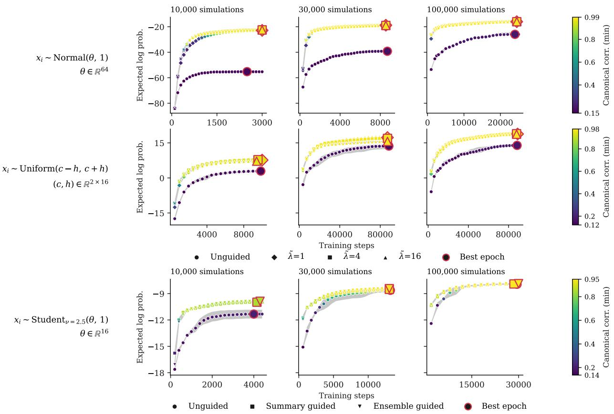  
Figure 1: Location-scale models (Experiment 1). Trajectories of posterior accuracy, measured by the expected log probability (y-axes), as well as summary informativeness, measured by the minimum canonical correlation (color) during training. The efectiveness of our guidance losses is evident in both metrics and across inference tasks, with parameter dimension $D = 6 4 , 3 2$ and 16 for the Normal, Uniform and Student-t likelihood respectively (rows). All models are trained until convergence but with simulation budgets varying from 10k to 100k (columns). For Normal and Uniform tasks guidance is applied directly to half of the summary statistics with varying weight factor λ˜. For Student-t, we additionally include ensemble guidance, fixing $\tilde { \lambda } = 4$ for both guidance losses.

Multivariate location-scale distributions allow us to study the efect of point estimate guidance for summary learning as a function of parameter and condition dimensionality, while using highly accurate reference posteriors (either analytic or grid quadrature). We use standard normal priors throughout and consider diferent likelihoods, each producing n = 10 i.i.d. observations $x _ { i } , i \in \{ 1 , \ldots n \}$ from a diferent location scale distribution corresponding to diferent suficient statistics: (1) A Normal distribution with fixed scale, for which we learn the mean parameter $\theta \in \mathbb { R } ^ { D }$ . By virtue of being in the exponential family, the sample mean, or equivalently the posterior mean of θ, is minimally suficient (see Section 3.3). Posteriors are analytic and normal themselves. (2) A Uniform distribution over $\mathbb { R } ^ { D / 2 }$ , parameterized by a center and a half-width per dimension, such that $\boldsymbol { \dot { \theta } } \in \mathbb { R } ^ { D }$ . Uniform is not in the exponential family, but still permits finite dimensional suficient statistics, namely the minimum and maximum value in x per dimension. Posteriors are analytic with sharp, edge-like boundaries. (3) A Student-t distribution with fixed scale and low degrees of freedom, for which we learn the mean parameter $\theta \in \mathbb { R } ^ { D }$ . No suficient statistic smaller than x exists. Instead the summary network has to learn an informative compression of the full order statistic. Posteriors are non-analytic with heavy tails. Details on architectures and training setup are in Appendix A.5.

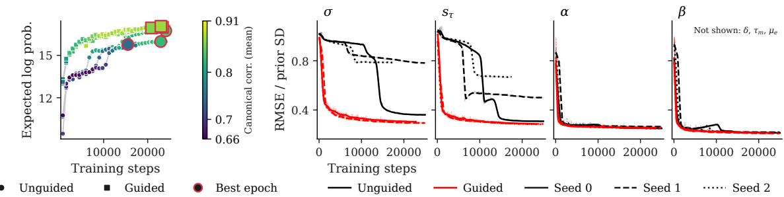  
Figure 2: Human decision making (Experiment 2). Guidance removes a long plateau in parameter recovery on the joint EEG–drift-difusion model at a 10k simulation budget. Overall posterior accuracy and summary informativeness (left), posterior-mean error on the prior scale for the four worst-recovered parameters (right). Unguided runs (black) leave σ and sτ near their prior spread for thousands of steps, each seed (line style) breaking at a diferent point, while guided runs (λ˜ = 4, red) recover both immediately and without seed spread.

Results. Figure 1 shows that our loss guidance approaches speed up learning of informative data summaries significantly in all investigated cases. For both Normal and Uniform, unguided inference exhibits a representation gap that does not vanish even for 100k training simulations. Specifically, entire parameter directions remain unlearned as indicated by the CCA diagnostic; an issue that our guidance losses fully resolve. For Normal, the posterior mean is minimally suficient and posterior-mean guidance can quickly and fully resolve the representation gap already for small simulation budgets. For Uniform, optimal posterio inference requires more than just the mean, but rather sample minimums and maximums. Nonetheless, the representation gap is closed by training with posterior mean guidance as indicated by the CCA diagnostic. For Student-t, no posterior point estimate is suficient on its own. Yet, posterior-mean guidance remains highly beneficial: it fully resolves the representation gap already for small simulation budgets and also yields more stable training dynamics (less variation between training seeds). Conversely, for unguided training, resolving the representation gap requires a significantly higher simulation budget and more training steps.

## 5.2 Experiment 2: Human decision making

As a first real-world inference task, we consider model 1c of Ghaderi-Kangavari et al. (2023), a joint driftdifusion model of decision making, response time, and single-trial EEG, connecting electrophysiological measurements with human behavior. A latent, trial-wise encoding time adds to the non-decision time and is observed through the N200 latency, an EEG marker of visual encoding time. Each dataset has 120 trials of (response time, choice, N200 latency), and the model has seven parameters with uniform priors. See Appendix A.6 for more details and additional results.

Results. Figure 2 shows how our guidance losses mitigate flawed training dynamics leading to plateaus in parameter recovery. Specifically, without guidance, the parameters that are identified the weakest are learned late, if at all. According to the CCA diagnostic, we can attribute this to a representation gap: Improvements in overall posterior accuracy (expected log probability) coincide with a reduction in error of the posterior means for σ and s specifically.

## 5.3 Experiment 3: Eye movements

We investigate the benefits of the proposed methods for inferring parameters of a computational model of eye movement control in scene viewing (Nuthmann et al., 2010; Walshe & Nuthmann, 2021). The model represents fixation durations as a sequence of autonomous timer, labile, and non-labile saccadic programming stages, each an independent discrete random walk with a common threshold α but distinct transition rates (τtimer, τlabile, and $\tau _ { \mathrm { n o n l a b i l e } } )$ . This setup exhibits a partial information bottleneck: two parameters (τtimer, $\tau _ { \mathrm { l a b i l e } } )$ are recovered with unguided training, whereas parameters α and $\tau _ { \mathrm { n o n l a b i l e } }$ are recovered poorly.

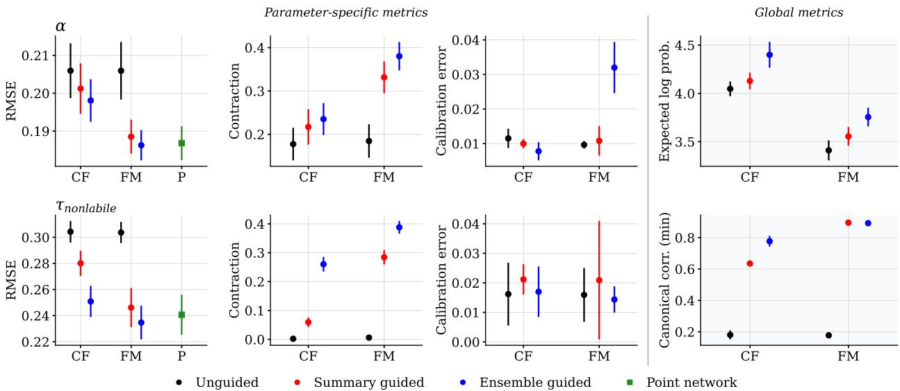  
Figure 3: Eye Movements (Experiment 3). Parameter-specific metrics for two parameters, and global metrics. Metrics averaged over three independent test sets of 500 simulations each. Error bars represent standard deviation across the test sets. CF = Coupling flow, FM = Flow matching, P = Point estimation network (posterior mean).

Results. Figure 3 shows metrics for the two parameters that are dificult to recover without guidance as well as global metrics. Here, we show results with a set transformer as summary network. Full results over all parameters and experimental configurations are reported in Appendix A.7. Both summary and ensemble guided training outperform unguided training. Ensemble guided training gives the best RMSE and contraction; summary guided training improves these metrics for flow matching inference networks but not as much for coupling flows. Calibration error stays relatively stable. The overall improvement is clearly shown in terms of higher expected log probability as well as improving the minimum canonical correlation.

## 5.4 Experiment 4: Strong gravitational lensing

We demonstrate the eficacy of our proposed methods in inferring strong gravitational lensing parameters from simulated lensing images. Strong lensing occurs when a suficiently dense foreground mass distribution (the lens) deflects light from a distant background source so strongly that the source is observed as multiple images, extended arcs, or, under near-perfect alignment, a complete Einstein ring (Schneider et al., 1992; Treu, 2010). Recovering the lens and source parameters from such images is an astrophysical inverse problem to which neural density estimation methods have been widely applied (Brehmer et al., 2019; Legin et al., 2021; Wagner-Carena et al., 2023; Swierc et al., 2024). We simulate observations based on the Euclid VIS instrument configuration (Cropper et al., 2025). Each draw is rendered as a noiseless 64 × 64 image at 0.1 arcsec/pixel, corrupted with per-pixel noise. The deflector and the source components are together controlled by 17 parameters $\bar { ( \pmb { \theta } ) } \in \mathbb { R } ^ { 1 7 } )$ . For details on the simulation and training pipeline, see Appendix A.8.

Results. Figure 4 reports the results for the two external-shear parameters $( \gamma _ { 1 } , \gamma _ { 2 } )$ that are the hardest to recover without guidance along with the global metrics. Both proposed methods improve point-estimate accuracy: for flow matching inference network, both summary- and ensemble-guided training produce RMSE comparable to that of a point network. For coupling flow, ensemble-guided training achieves comparable RMSE as well, summary-guided training with slightly higher RMSE. Posterior contraction improves markedly in all cases and follows the same pattern: coupling flow with summary-guidance slightly lags behind flow matching and coupling flows with ensemble guidance. Crucially, this contraction does not come at the cost of calibration. On the contrary, the calibration error even decreases with training guidance. Moreover, guided training improves inference for the whole joint posterior: both summary- and ensemble-guiding improve expected log probability. The CCA diagnostic further shows that the summary outputs of the guided networks are more informative of the full 17-dimensional posterior than the unguided baseline network.

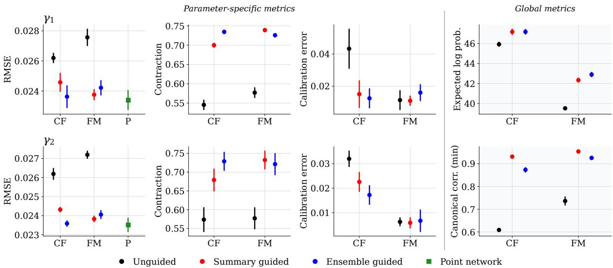  
Figure 4: Strong gravitational lensing (Experiment 4). Rows show the two external-shear components, the least identified parameters. The right block shows global posterior metrics. Unguided networks sufer from a representation gap as indicated by the CCA diagnostic: $\rho _ { \mathrm { m i n } } = 0 . 6 1$ for coupling flow (CF) and $\rho _ { \mathrm { m i n } } = 0 . 7 3$ for flow matching (FM). Guidance through the summary loss (red) or an ensemble member (blue) clearly improves all metrics and raises $\rho _ { \mathrm { m i n } } \ge 0 . 8 7$

## 5.5 Experiment 5: Social interactions between mice

We investigate how social interactions among free-ranging mice, represented as a social graph, shape the composition of their gut microbiome. The experimental setup and graph simulator used here are grounded in real-world observational data (Raulo et al., 2023; 2024). The parameters of interest in our simulated setup are the network density of the social graph and the exchange factor, which governs the amount of taxa transferred between two mice upon contact. In Jedhof et al. (2026), this setup was used to compare the performance of four graph-suitable summary networks for this inference task, each combined with a coupling flow as the inference network. Results varied strongly across employed summary networks, suggesting the presence of representation gaps. To this end, we employ our guidance losses. More details are in Appendix A.9.

Results. Figure 5 shows the parameter-specific and global metrics, grouped by the four summary networks. The graph convolutional network (GCN) performs worse than the other three summary networks, consistent with previous findings (Jedhof et al., 2026). For the GCN, summary-guided and ensemble-guided training lead to small improvements, though not enough to match the performance of the other summary networks. For the latter, guided training does not lead to any improvements, which is confirmed by the CCA diagnostic already attaining high values under unguided training in this case. What is more, the point estimation network does not provide better RMSE than the unguided inference network given any of the summary networks. This indicates that little further improvement is possible through guided training and that variations among summary networks are unlikely to stem from a representation gap caused by flawed training dynamics.

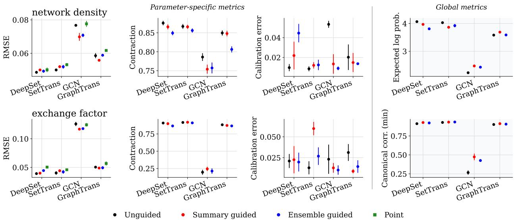  
Figure 5: Social interactions between mice (Experiment 5). Parameter-specific metrics for the two parameters network density and exchange factor, and global metrics. Metrics are grouped by the four diferent summary networks and averaged over three independent test sets of 500 simulations each. Error bars represent standard deviation across the test sets.

## 6 Conclusion

This paper aims to close the representation gap in amortized Bayesian inference that arises when summary networks fail to learn maximally informative statistics. To this end, we introduce auxiliary losses based on posterior point estimates that guide training. We evaluate two versions, summary-guided and ensembleguided training, across one toy and four real-world case studies. In all toy settings, both losses clearly speed up convergence and improve recovery. Across three real-world case studies, guided training substantially improves recovery of poorly-estimated parameters, without sacrificing uncertainty calibration. Our proposed diagnostic confirms that these gaps trace back to insuficient summaries. In a fourth real-world case study, guidance yields no consistent improvement—indicating the poor recovery there stems from architectura representation gaps that cannot be fixed by improving training dynamics alone. This also points to a limitation of our method: If neural point estimation cannot provide better parameter recovery than the unguided inference network, there is no room for our guidance losses to improve performance. Another limitation is our focus on the posterior mean for guidance. This choice suits our case studies, where the representation gap primarily afected parameter recovery. When the gap instead manifests as poor uncertainty calibration, other point estimates, such as posterior variances or tail quantiles, may be better suited for guidance. Their efectiveness remains an open question for future research.

## Acknowledgements

This work was partially funded by the U.S. National Science Foundation under Grant No. 2448380, the Deutsche Forschungsgemeinschaft (DFG, German Research Foundation) Project 528702768 as well as DFG Collaborative Research Center 391 (Spatio-Temporal Statistics for the Transition of Energy and Transport) – 520388526. Furthermore, we also thank the Department of Statistics at TU Dortmund University for providing computing resources and the developers of lenstronomy (Birrer & Amara, 2018; Birrer et al., 2021) for making their gravitational lensing software publicly available.

## References

Lynton Ardizzone, Jakob Kruse, Sebastian Wirkert, Daniel Rahner, Eric W Pellegrini, Ralf S Klessen, Lena Maier-Hein, Carsten Rother, and Ullrich Köthe. Analyzing inverse problems with invertible neural networks. arXiv:1808.04730, 2018.

Jonas Arruda, Niels Bracher, Ullrich Köthe, Jan Hasenauer, and Stefan T Radev. Difusion models in simulation-based inference: A tutorial review. arXiv:2512.20685, 2025.

Jonas Arruda, Emad Alamoudi, Robert Mueller, Marc Vaisband, Ronja Molkenbur, Jack Merrin, Eva Kiermaier, and Jan Hasenauer. Simulation-based inference of cell migration dynamics in complex spatial environments. NPJ Systems Biology and Applications, 12(1), 2026. doi: 10.1038/s41540-026-00648-9.

Francis Bach. Learning theory from first principles. Adaptive computation and machine learning. The MIT Press, Cambridge, Massachusetts, 2024.

Simon Birrer and Adam Amara. Lenstronomy: Multi-purpose gravitational lens modelling software package. Physics of the Dark Universe, 22, 2018. doi: 10.1016/j.dark.2018.11.002.

Simon Birrer, Anowar Shajib, Daniel Gilman, Aymeric Galan, Jelle Aalbers, Martin Millon, Robert Morgan, Giulia Pagano, Ji Park, Luca Teodori, Nicolas Tessore, Madison Ueland, Lyne Van de Vyvere, Sebastian Wagner-Carena, Ewoud Wempe, Lilan Yang, Xuheng Ding, Thomas Schmidt, Dominique Sluse, Ming Zhang, and Adam Amara. lenstronomy II: A gravitational lensing software ecosystem. The Journal of Open Source Software, June 2021. doi: 10.21105/joss.03283.

Johann Brehmer, Siddharth Mishra-Sharma, Joeri Hermans, Gilles Louppe, and Kyle Cranmer. Mining for Dark Matter Substructure: Inferring Subhalo Population Properties from Strong Lenses with Machine Learning. The Astrophysical Journal, 886(1), 2019. doi: 10.3847/1538-4357/ab4c41.

Yanzhi Chen, Dinghuai Zhang, Michael Gutmann, Aaron Courville, and Zhanxing Zhu. Neural approximate suficient statistics for implicit models. arXiv:2010.10079, 2021.

Euclid Collaboration. Euclid quick data release (Q1) XXXIII. The first catalogue of strong-lensing galaxy clusters. Astronomy & Astrophysics, 711, 2026.

Samantha R Cook, Andrew Gelman, and Donald B Rubin. Validation of Software for Bayesian Models Using Posterior Quantiles. Journal of Computational and Graphical Statistics, 15(3), 2006. doi: 10.1198/ 106186006X136976.

Kyle Cranmer, Johann Brehmer, and Gilles Louppe. The frontier of simulation-based inference. Proceedings of the National Academy of Sciences, 117(48), 2020.

Mark S Cropper, A Al-Bahlawan, J Amiaux, S Awan, R Azzollini, K Benson, M Berthe, J Boucher, E Bozzo, C Brockley-Blatt, et al. Euclid II. The VIS instrument. Astronomy & Astrophysics, 697, 2025.

Arnaud Delaunoy, Joeri Hermans, François Rozet, Antoine Wehenkel, and Gilles Louppe. Towards reliable simulation-based inference with balanced neural ratio estimation. Advances in Neural Information Processing Systems, 35, 2022.

Arnaud Delaunoy, Benjamin Kurt Miller, Patrick Forré, Christoph Weniger, and Gilles Louppe. Balancing simulation-based inference for conservative posteriors. arXiv:2304.10978, 2023.

Persi Diaconis and Donald Ylvisaker. Conjugate Priors for Exponential Families. The Annals of Statistics, 7(2), 1979. doi: 10.1214/aos/1176344611.

Laurent Dinh, Jascha Sohl-Dickstein, and Samy Bengio. Density estimation using Real NVP. arXiv:1605.08803, 2016.

Lasse Elsemüller, Valentin Pratz, Mischa von Krause, Andreas Voss, Paul-Christian Bürkner, and Stefan T. Radev. Does Unsupervised Domain Adaptation Improve the Robustness of Amortized Bayesian Inference? A Systematic Evaluation. Transactions on Machine Learning Research, 2025.

Maciej Falkiewicz, Naoya Takeishi, Imahn Shekhzadeh, Antoine Wehenkel, Arnaud Delaunoy, Gilles Louppe, and Alexandros Kalousis. Calibrating Neural Simulation-Based Inference with Diferentiable Coverage Probability. Advances in Neural Information Processing Systems, 36, 2023.

Paul Fearnhead and Dennis Prangle. Constructing Summary Statistics for Approximate Bayesian Computation: Semi-Automatic Approximate Bayesian Computation. Journal of the Royal Statistical Society Series B: Statistical Methodology, 74(3), 2012. doi: 10.1111/j.1467-9868.2011.01010.x.

David T. Frazier, Ryan Kelly, Christopher Drovandi, and David J. Warne. The Statistical Accuracy of Neural Posterior and Likelihood Estimation. arXiv:2411.12068, 2024.

Amin Ghaderi-Kangavari, Jamal Amani Rad, and Michael D. Nunez. A General Integrative Neurocognitive Modeling Framework to Jointly Describe EEG and Decision-making on Single Trials. Computational Brain & Behavior, 6(3), 2023. doi: 10.1007/s42113-023-00167-4.

Tilmann Gneiting and Adrian E Raftery. Strictly Proper Scoring Rules, Prediction, and Estimation. Journal of the American Statistical Association, 102(477), 2007. doi: 10.1198/016214506000001437.

Paul R. Halmos and L. J. Savage. Application of the Radon-Nikodym Theorem to the Theory of Suficient Statistics. The Annals of Mathematical Statistics, 20(2), 1949. doi: 10.1214/aoms/1177730032.

Joeri Hermans, Arnaud Delaunoy, François Rozet, Antoine Wehenkel, Volodimir Begy, and Gilles Louppe. A Crisis In Simulation-Based Inference? Beware, Your Posterior Approximations Can Be Unfaithful. Transactions on Machine Learning Research, 2022.

Harold Hotelling. Relations between two sets of variates. Biometrika, 28(3/4), 1936. doi: 10.2307/2333955.

Daolang Huang, Ayush Bharti, Amauri Souza, Luigi Acerbi, and Samuel Kaski. Learning robust statistics for simulation-based inference under model misspecification. Advances in neural information processing systems, 36, 2023.

Svenja Jedhof, Elizaveta Semenova, Aura Raulo, Anne Meyer, and Paul-Christian Bürkner. From Mice to Trains: Amortized Bayesian Inference on Graph Data. Transactions on Machine Learning Research, 2026.

Bai Jiang, Tung-yu Wu, Charles Zheng, and Wing H Wong. Learning summary statistic for approximate bayesian computation via deep neural network. Statistica Sinica, 2017. doi: 10.5705/ss202015.0340.

Kenji Kawaguchi, Zhun Deng, Xu Ji, and Jiaoyang Huang. How Does Information Bottleneck Help Deep Learning? arXiv:2305.18887, 2023.

Sherman Khoo, Dennis Prangle, Song Liu, and Mark Beaumont. Minimum distance summaries for robust neural posterior estimation. arXiv:2602.09161, 2026.

Diederik P Kingma and Jimmy Ba. Adam: A method for stochastic optimization. arXiv preprint arXiv:1412.6980, 2014.

Lars Kühmichel, Jerry M. Huang, Valentin Pratz, Jonas Arruda, Hans Olischläger, Daniel Habermann, Šimon Kucharský, Lasse Elsemüller, Aayush Mishra, Niels Bracher, Svenja Jedhof, Marvin Schmitt, Paul-Christian Bürkner, and Stefan T. Radev. BayesFlow 2.0: Multi-Backend Amortized Bayesian Inference in Python. arXiv:2602.07098, 2026.

Ronan Legin, Yashar Hezaveh, Laurence Perreault Levasseur, and Benjamin Wandelt. Simulation-based inference of strong gravitational lensing parameters. arXiv:2112.05278, 2021.

Yaron Lipman, Ricky TQ Chen, Heli Ben-Hamu, Maximilian Nickel, and Matt Le. Flow matching for generative modeling. arXiv:2210.02747, 2022.

Aayush Mishra, Daniel Habermann, Marvin Schmitt, Stefan Radev, and Paul-Christian Bürkner. Robust Amortized Bayesian Inference with Self-Consistency Losses on Unlabeled Data. International Conference on Learning Representations, 2026.

Martin Modrák, Angie H. Moon, Shinyoung Kim, Paul Bürkner, Niko Huurre, Kateřina Faltejsková, Andrew Gelman, and Aki Vehtari. Simulation-Based Calibration Checking for Bayesian Computation: The Choice of Test Quantities Shapes Sensitivity. Bayesian Analysis, 20(2), 2025. doi: 10.1214/23-BA1404.

Antje Nuthmann, Tim J Smith, Ralf Engbert, and John M Henderson. CRISP: A computational model of fixation durations in scene viewing. Psychological Review, 117(2), 2010. doi: 10.1037/a0018924.

Stefan T. Radev, Ulf K. Mertens, Andreas Voss, Lynton Ardizzone, and Ullrich Köthe. BayesFlow: Learning Complex Stochastic Models With Invertible Neural Networks. IEEE Transactions on Neural Networks and Learning Systems, 33(4), 2020. doi: 10.1109/TNNLS.2020.3042395.

A. Raulo, J. Firth, T. Coulson, S.C.L. Knowles, C. Lamberth, H. English, M. Quicray, and J. Dale. Wild rodent tracking and gut microbiome data, Holly Hill, Wytham Woods, UK, 2018-2019, 2023.

Aura Raulo, Paul-Christian Bürkner, Genevieve E. Finerty, Jarrah Dale, Eveliina Hanski, Holly M. English, Curt Lamberth, Josh A. Firth, Tim Coulson, and Sarah C. L. Knowles. Social and environmental transmission spread diferent sets of gut microbes in wild mice. Nature Ecology & Evolution, 8(5), 2024. doi: 10.1038/s41559-024-02381-0.

Almut Rödder, Manuel Hentschel, and Sebastian Engelke. Theoretical guarantees for neural estimators in parametric statistics. arXiv:2506.18508, 2025.

Matthew Sainsbury-Dale, Andrew Zammit-Mangion, and Raphaël Huser. Likelihood-Free Parameter Estimation with Neural Bayes Estimators. The American Statistician, 78(1), 2024. doi: 10.1080/00031305. 2023.2249522.

Andrew M. Saxe, James L. McClelland, and Surya Ganguli. Exact solutions to the nonlinear dynamics of learning in deep linear neural networks. International Conference on Learning Representations, 2014.

Andrew M. Saxe, Yamini Bansal, Joel Dapello, Madhu Advani, Artemy Kolchinsky, Brendan Daniel Tracey, and David Daniel Cox. On the Information Bottleneck Theory of Deep Learning. International Conference on Learning Representations, 2018.

Daniel J Schad, Michael Betancourt, and Shravan Vasishth. Toward a principled Bayesian workflow in cognitive science. Psychological methods, 26(1), 2021. doi: 10.1037/met0000275.

Marvin Schmitt, Paul-Christian Bürkner, Ullrich Köthe, and Stefan T. Radev. Detecting Model Misspecification in Amortized Bayesian Inference with Neural Networks. German Conference on Pattern Recognition, 2023.

Peter Schneider, Jürgen Ehlers, and Emilio E. Falco. Gravitational Lenses. Astronomy and Astrophysics Library. Springer Berlin Heidelberg, Berlin, Heidelberg, 1992. doi: 10.1007/978-3-662-03758-4.

Paxson Swierc, Marcos Tamargo-Arizmendi, Aleksandra Ćiprijanović , and Brian D Nord. Domain-adaptive neural posterior estimation for strong gravitational lens analysis. arXiv:2410.16347, 2024.

Sean Talts, Michael Betancourt, Daniel Simpson, Aki Vehtari, and Andrew Gelman. Validating Bayesian Inference Algorithms with Simulation- Based Calibration. arXiv:1804.06788, 2020.

Tommaso Treu. Strong lensing by galaxies. Annual Review of Astronomy and Astrophysics, 48, 2010.

Sebastian Wagner-Carena, Jelle Aalbers, Simon Birrer, Ethan O Nadler, Elise Darragh-Ford, Philip J Marshall, and Risa H Wechsler. From images to dark matter: End-to-end inference of substructure from hundreds of strong gravitational lenses. The Astrophysical Journal, 942(2):75, 2023.

Mike Walmsley, Philip Holloway, Natalie Lines, Karina Rojas, Thomas Collett, Aprajita Verma, Tian Li, James Nightingale, Giulia Despali, and Stefan Schuldt. Euclid Quick Data Release (Q1): The Strong Lensing Discovery Engine, 2025.

Calen Walshe and Antje Nuthmann. A computational dual-process model of fixation-duration control in natural scene viewing. Computational Brain & Behavior, 4(4), 2021. doi: 10.1007/s42113-021-00111-4.

R Calen Walshe and Antje Nuthmann. Asymmetrical control of fixation durations in scene viewing. Vision research, 100:38–46, 2014.

Andrew Zammit-Mangion, Matthew Sainsbury-Dale, and Raphaël Huser. Neural Methods for Amortized Inference. Annual Review of Statistics and Its Application, 12, 2025. doi: 10.1146/ annurev-statistics-112723-034123.

## A Appendix

The Appendix contains further details on the experiments (Section 5). We first describe the evaluation metrics used throughout the experiments in more detail, then outline the network architectures and training concepts shared across experiments. We then present each of the five experiments in turn, detailing its simulation setup, any experiment-specific architecture and training choices, and, where applicable, additiona results.

## A.1 Metrics

Let m index test datasets over which to compute metrics, j index parameters, and s index posterior samples. The RMSE measures performance of the posterior mean $\begin{array} { r } { \mathbf { \bar { \theta } } _ { j } ^ { ( m ) } = \bar { \frac { 1 } { S } } \sum _ { s = 1 } ^ { S } \hat { \pmb { \theta } } _ { j } ^ { ( m , s ) } } \end{array}$ to recover the ground-truth parameter for test dataset m:

$$
\mathrm { R M S E } _ { j } = \sqrt { \frac { 1 } { M } \sum _ { m = 1 } ^ { M } \left( \bar { \pmb { \theta } } _ { j } ^ { ( m ) } - { \pmb { \theta } } _ { j } ^ { ( m ) } \right) ^ { 2 } } .\tag{9}
$$

For the point-estimate network, where no posterior samples are available, $\bar { \theta } _ { j } ^ { ( m ) }$ is directly given by the network’s output.

Posterior contraction quantifies how much $q _ { \phi } ( \pmb \theta \mid \pmb x )$ narrows relative to the prior $p ( \pmb \theta )$ , and is a standard diagnostic in the Bayesian workflow validation (Schad et al., 2021). With empirical posterior variance $\hat { \sigma } _ { j } ^ { 2 , ( m ) }$ and prior variance $\sigma _ { j , \mathrm { p r i o r } } ^ { 2 }$ estimated empirically from the prior draws $\{ \pmb { \theta } _ { j } ^ { ( m ) } \} _ { m = 1 } ^ { M }$ , the posterior contraction is

$$
\mathrm { P C } _ { j } = 1 - \frac { 1 } { M } \sum _ { m = 1 } ^ { M } \frac { { \hat { \sigma } _ { j } } ^ { 2 , ( m ) } } { \sigma _ { j , \mathrm { p r i o r } } ^ { 2 } } ,\tag{10}
$$

with $\mathrm { P C } _ { j } \to 1$ indicating that $q _ { \phi } ( \pmb \theta \mid \pmb x )$ is far more concentrated than the prior, and $\mathrm { P C } _ { j } \to 0$ indicating no gain in information from x.

We assess whether $q _ { \phi } ( \pmb \theta \mid \pmb x )$ is calibrated via simulation-based calibration (SBC) coverage (Cook et al., 2006; Talts et al., 2020; Modrák et al., 2025). For a grid of R nominal central credible-interval levels $q _ { r } \in [ q _ { \operatorname* { m i n } } , q _ { \operatorname* { m a x } } ]$ (with $R = 2 0$ and $[ q _ { \mathrm { m i n } } , q _ { \mathrm { m a x } } ] = [ 0 . 0 0 5 , 0 . 9 9 5 ]$ ; BayesFlow defaults), the empirical coverage is the fraction of test instances for which $\theta _ { j } ^ { ( m ) }$ falls within the $q _ { r }$ -credible interval $\mathrm { C I } _ { q _ { r } } ( \cdot )$ , estimated from the posterior draws:

$$
\hat { C } _ { j } ( q _ { r } ) = \frac { 1 } { M } \sum _ { m = 1 } ^ { M } \mathbb { 1 } \Big [ \pmb { \theta } _ { j } ^ { ( m ) } \in \mathrm { C I } _ { q _ { r } } \big ( \hat { \pmb { \theta } } _ { j } ^ { ( m , 1 : S ) } \big ) \Big ] .\tag{11}
$$

The calibration error aggregates the deviation from nominal coverage across this grid,

$$
\mathrm { C E } _ { j } = \mathrm { m e d i a n } _ { r = 1 , \ldots , R } \big | \hat { C } _ { j } ( q _ { r } ) - q _ { r } \big | ,\tag{12}
$$

with $\mathrm { C E } _ { j } = 0$ corresponding to perfect calibration.

We also use two global metrics, which are parameter independent. One of them is the expected log probability, computed as

$$
\mathrm { E L P } = \frac { 1 } { M } \sum _ { m = 1 } ^ { M } \log q _ { \phi } ( \pmb { \theta } ^ { ( m ) } \mid \pmb { x } ^ { ( m ) } )\tag{13}
$$

This corresponds to the log probability that the trained model assigns to the true parameters $\pmb \theta ^ { ( m ) }$ given the test data conditions $\pmb { x } ^ { ( m ) }$ . A high expected log probability is favorable.

As a further diagnostic, we report the canonical correlation analysis (CCA, Section 3.2) between summaries and parameters. The metric indicates how much information about the parameters is retained in the summaries. Against a posterior-mean target, $\rho _ { \mathrm { m i n } } \approx 1$ is desirable. Against ground-truth parameters, $\rho _ { \mathrm { m i n } }$ is capped by the posterior variance.

## A.2 Properties of the CCA diagnostic

The CCA diagnostic of Section 3.2 can be computed against the ground-truth parameters $\theta ,$ or the posterior mean $\pmb { \mu } = \mathbb { E } [ \pmb { \theta } | \pmb { x } ]$ . Here we explain how the interpretation of $\rho _ { \mathrm { m i n } }$ difers.

Split each parameter draw into the posterior mean and the remaining deviation,

$$
{ \pmb \theta } = { \pmb \mu } + { \pmb \varepsilon } , \qquad { \pmb \varepsilon } = { \pmb \theta } - \mathbb { E } [ { \pmb \theta } | { \pmb x } ] .\tag{14}
$$

The mean $\pmb { \mu }$ is what the data x reveal about the first moment of θ and the deviation ε is the posterior uncertainty that remains. Note that $\varepsilon$ is uncorrelated with any function of x.

The summary $s _ { \psi } ( { \pmb x } )$ is such a function, so it co-varies with $\pmb \theta$ only through $\mu { : }$

$$
\operatorname { C o v } ( s , \pmb \theta ) = \operatorname { C o v } ( s , \pmb \mu ) .\tag{15}
$$

Both targets therefore have the same cross-covariance with the summary and they difer only in their own variance, which for θ additionally contains the posterior uncertainty ε. Two consequences follow.

Ground-truth targets. Even when the CCA diagnostic is computed against ground-truth parameters θ, the best any summary can do is to recover $\pmb { \mu }$ exactly, since the deviation ε cannot be predicted from x. Hence $\rho _ { \operatorname* { m i n } } ( s , \pmb \theta ) \leq \sqrt { 1 - v } .$ , where v is the fraction of prior variance that remains in the posterior, on average, in the least identified parameter direction. Even a suficient summary thus scores $\rho _ { \mathrm { m i n } } < 1$ against ground truth, and canonical correlations against $\pmb { \mu }$ are never lower than against $\theta ,$ , as seen in Figure 12.

Posterior-mean targets. The canonical correlation $\rho _ { \mathrm { m i n } } ( s , \mu )$ is the worst-case correlation between a direction of $\pmb { \mu }$ and its best linear prediction from s. If $\rho _ { \mathrm { m i n } } ( s , \mu ) \approx 1$ , then $\pmb { \mu }$ is recoverable from s in every direction, so conditioning on s instead of x loses almost no information about the posterior mean. The converse does not hold: a small $\rho _ { \mathrm { m i n } }$ may reflect a non-linear dependence of $\pmb { \mu }$ on s rather than lost information.

## A.3 Network architectures and training

All experiments are run using BayesFlow 2.0.12 (Kühmichel et al., 2026) with the JAX backend. Unless stated otherwise, networks and training use default hyperparameters. We consider three inference network types: coupling flows, flow matching, and a point network trained with a scoring rule to estimate the posterior mean. For summary networks, we chose architectures suited to each experiment’s data.

Beyond architecture, we varied the training regime: unguided, in which the inference network trains directly on the summary network’s output with no auxiliary signal; summary guided, in which a point-estimation loss (mean score) on the summary embedding is combined with the distributional loss via a weighting term; and ensemble guided, in which a separate point-estimation network is trained jointly with the distributiona inference network, again combined via a weighting term. For the guided regimes, the weight λ was either fixed or set automatically, depending on the experiment.

Training was performed either online or ofline, depending on the cost of the simulator, using Adam (online) or AdamW (ofline) with a cosine-decay learning-rate schedule. Explicit settings for each experiment and its simulation setup are detailed below, if they difer from the default settings.

## A.4 Choosing the auxiliary loss weight

To ensure a relevant impact on the training dynamics, the auxiliary guidance loss needs to be of comparable scale to the generative network’s loss. We express the guidance loss weight λ with respect to normalized magnitudes of both losses on a freshly initialized network with a batch of simulated data, then keeping it fixed throughout training. This proved to be a robust policy that gives comparable results across architectures. Concretely, we choose λ˜ as a multiplicative scaling factor from which to compute the architecture-specific weight as $\lambda = \tilde { \lambda } | \overline { { \mathcal { I } } } | / | \overline { { \ell } } |$ . The initial-batch losses of the generative network and the guidance term, respectively, are defined as

$$
\bar { \mathcal { I } } = \frac { 1 } { B } \sum _ { b = 1 } ^ { B } \mathcal { I } \big ( \boldsymbol { q } ( \cdot \mid s ( \pmb { x } ^ { ( b ) } ) ) , \pmb { \theta } ^ { ( b ) } \big ) , \qquad \bar { \ell } = \frac { 1 } { B } \sum _ { b = 1 } ^ { B } \sum _ { d = 1 } ^ { D } \ell \big ( \pmb { s } _ { d } ( \pmb { x } ^ { ( b ) } ) , \pmb { \theta } _ { d } ^ { ( b ) } \big ) .\tag{16}
$$

For ensemble guidance, ${ \pmb s } _ { d } ( { \pmb x } )$ is replaced by $f ( \pmb { s } ( \pmb { x } ) ) _ { d }$ . In our experiments, we found the guidance to be similarly efective for any $\tilde { \lambda } \in [ 1 , 1 6 ]$

## A.5 Experiment 1: Simple location-scale models

Simulation. Every task draws n = 10 i.i.d. observations per dataset, with all components independent, and difers only in prior and likelihood. Below, j indexes parameter components and i the observations.

Normal $( D = 6 4 )$ , whose posterior is available in closed form by conjugacy:

$$
\mu _ { j } \sim { \mathcal { N } } ( 0 , 1 ) , \qquad x _ { i j } \mid \mu _ { j } \sim { \mathcal { N } } ( \mu _ { j } , 1 ) .\tag{17}
$$

Uniform $( D = 3 2$ , i.e. $D / 2 = 1 6$ blocks of a center and a half-width), the only task whose prior is not standard normal, since the half-width must stay positive:

$$
c _ { j } \sim { \mathcal { N } } ( 0 , 1 ) , \qquad \log h _ { j } \sim { \mathcal { N } } ( 0 , 0 . 5 ^ { 2 } ) , \qquad x _ { i j } \mid c _ { j } , h _ { j } \sim \operatorname { U n i f o r m } ( c _ { j } - h _ { j } , \ c _ { j } + h _ { j } ) .\tag{18}
$$

Student-t $( D = 1 6 )$ with $\nu = 2 . 5$ 5 degrees of freedom and unit scale:

$$
\mu _ { j } \sim { \mathcal { N } } ( 0 , 1 ) , \qquad x _ { i j } \mid \mu _ { j } \sim \mu _ { j } + t _ { \nu } .\tag{19}
$$

For Normal, the posterior is Gaussian in closed form. Uniform and Student-t have none, but both factorize over components given the data, so each block’s posterior is integrated on a fixed grid over its one- or two-dimensional support. These references supply the posterior means that the CCA diagnostic correlates against and the expected log probabilities the trajectories are compared to.

Network architectures and training. Experimental results shown in Figure 1 all employ a set transformer summary network with an afine coupling flow. The summary dimension is twice the parameter dimension (128, 64 and 32 for Normal, Uniform and Student-t), which leaves half the summary space unconstrained by guidance, as recommended in Section 3.3. Optimization uses BayesFlow’s default policy, AdamW under a cosine-decay schedule with warmup and a batch size of 200. Each configuration is repeated for three training seeds, which set both the simulated training data and the network initialization.

Training durations are set per simulation budget so that runs are not step-constrained: 3,000, 9,000 and 25,000 gradient steps for Normal, 10,000, 90,000 and 90,000 for Uniform, and 4,500, 13,500 and 30,000 for Student-t, at the 10k, 30k and 100k budgets respectively. For Normal, each budget was additionally trained twice as long to confirm that the reported trajectories have converged rather than been truncated. For the other tasks training step sensitivity was probed similarly, although with smaller factors, and conclusively. Since the Normal task reaches the overfitting regime at the two smaller simulation budgets, dropout is raised to 0.2 and 0.1 at the 10k and 30k budgets and left at the default for 100k; the other two tasks use the defaults throughout. The efects of increasing dropout were not found to interact with the gap between unguided and guided performance, yet to ensure a conservative estimation of the benefit of our proposed method, we tuned dropout towards optimal performance of the unguided training via a grid scan.

Because all three tasks admit the computation of analytic or near-analytic reference posteriors, the CCA diagnostic here is computed against the exact posterior mean rather than against a reference network’s estimate or the true parameter of the simulated samples.

## A.6 Experiment 2: Human decision making

Simulation. We simulate from model 1c of Ghaderi-Kangavari et al. (2023), a drift-difusion model in which the trial-wise encoding time is measured by the N200 latency. Evidence starts at βα and evolves as a Wiener process with drift δ and unit difusion coeficient until it hits 0 or the boundary $\alpha ;$ the choice is 1 for the upper boundary and 0 otherwise. The process is simulated with Euler steps of 5 ms, and the decision time T is the number of steps times the step size, without a correction for boundary overshoot. The encoding time on trial i is uniformly distributed with mean $\mu _ { e }$ and standard deviation $s _ { \tau }$ , and the N200 latency $z _ { i }$ is a truncated normal centered on it:

$$
\begin{array} { r l } & { \quad \tau _ { e , i } \sim \mathrm { U n i f o r m } \big ( \mu _ { e } - \sqrt { 3 } s _ { \tau } , \mu _ { e } + \sqrt { 3 } s _ { \tau } \big ) } \\ & { z _ { i } \mid \tau _ { e , i } \sim \mathcal { N } ( \tau _ { e , i } , \sigma ^ { 2 } ) \mathrm { ~ t r u n c a t e d ~ t o ~ } ( 0 , 0 . 5 ) } \\ & { \quad \mathrm { R T } _ { i } = T _ { i } + \tau _ { e , i } + \tau _ { m } . } \end{array}\tag{20}
$$

The truncation is implemented by rejection, redrawing $\tau _ { e , i }$ together with $z _ { i }$ until $z _ { i }$ lies in the window. Each dataset consists of 120 independent trials of (RT, choice, z), with RT and $z$ in seconds. The seven free parameters have independent uniform priors:

$$
\begin{array} { r l } & { \delta \sim \mathrm { U n i f o r m } ( - 3 , 3 ) \qquad \alpha \sim \mathrm { U n i f o r m } ( 0 . 5 , 2 ) } \\ & { \beta \sim \mathrm { U n i f o r m } ( 0 . 1 , 0 . 9 ) \qquad \mu _ { e } \sim \mathrm { U n i f o r m } ( 0 . 0 5 , 0 . 4 0 ) } \\ & { \tau _ { m } \sim \mathrm { U n i f o r m } ( 0 . 0 6 , 0 . 6 0 ) \quad \sigma \sim \mathrm { U n i f o r m } ( 0 , 0 . 1 ) } \\ & { s _ { \tau } \sim \mathrm { U n i f o r m } ( 0 , 0 . 1 ) . } \end{array}\tag{21}
$$

Compared to Ghaderi-Kangavari et al. (2023), the prior upper bounds for $\mu _ { e } , \ \tau _ { m } , \ \sigma$ and $s _ { \tau }$ are smaller (paper: 0.6, 0.8, 0.3, 0.3), the lower truncation bound for z is 0 s instead of 0.05 s, and z is truncated jointly with $\tau _ { e , i }$ rather than conditionally on it.

Networks architectures and Training In this experiment we exceptionally use BayesFlow in version 2.0.11, instead of 2.0.12, which includes a modification of the set transformer that is used as the summary network. The improvements within release 2.0.12 proved to be suficient to largely fix the representation gap with default configurations. Generally, the failure mode we describe, as any training dynamics issue, is contingent on architecture, initialization, optimizer hyperparameters, and task. The value of the proposed treatment (3.3) is that it is generic and thus sidesteps the search for a remedy specific to any given combination of these.

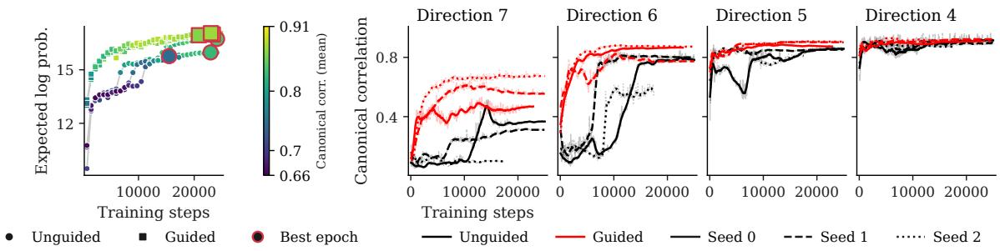  
Figure 6: Decision making (Experiment 2): Complements Figure 2 by showing the trajectories of the last canonical correlations (right) instead of individual parameter’s posterior mean accuracy.

Additional results Employing CCA periodically during training allows us to investigate how linearly decodable information develops. In Figure 6 the trajectories of the least informative summary directions are traced, which complements Figure 2 from the main text. The learnt summaries get more informative in distinct steps rather than gradually. Note that consecutive canonical correlations are computed independently from each other and correspond to diferent coordinate systems.

## A.7 Experiment 3: Eye movements

Simulation. We simulate training data from the baseline model described in Walshe & Nuthmann (2021): Fixation durations are generated as a result of consecutive saccadic programming stages, each an independent discrete random walk with a common threshold α (number of discrete steps to transition to the next stage) but distinct transition rates. Three of the stage rates are inferred $( \tau _ { \mathrm { t i m e r } } , \ \tau _ { \mathrm { l a b i l e } } ,$ , and $\tau _ { \mathrm { n o n l a b i l e } } ) , \tau _ { \mathrm { m o t o r i c } }$ is held fixed at 30ms as per Walshe & Nuthmann (2021). Following the motoric stage, a saccade is launched with a fixed transition rate $\tau _ { \mathrm { s a c c a d e } } = 2 0 \mathrm { m s }$ (Walshe & Nuthmann, 2021). Each dataset is composed of 100 independent trials; a trial ends when the maximum number of 40 fixations or maximum trial duration of 25s has been reached, replicating an experimental setting typical for such models (Walshe & Nuthmann, 2014). Priors for the free parameters were set based on the parameter ranges recommended by Walshe & Nuthmann (2021):

$$
\begin{array} { c } { \alpha \sim \mathrm { P o i s s o n } ( 2 0 ) } \\ { \tau _ { \mathrm { t i m e r } } \sim \mathrm { G a m m a } ( 6 , 3 5 ) } \\ { \tau _ { \mathrm { l a b i l e } } \sim \mathrm { G a m m a } ( 6 , 3 0 ) } \\ { \tau _ { \mathrm { n o n l a b i l e } } \sim \mathrm { G a m m a } ( 1 0 , 7 . 5 ) . } \end{array}\tag{22}
$$

For easier network training, we added a uniform noise to α; then, all four parameters were divided by their respective prior mean and log-transformed, making all inference variables unbounded and centered close to zero.

Network architectures and training. We trained three inference network types (coupling flow, flow matching, and point network), which were combined with two summary network types (deep set or set transformer), resulting in $3 \times 2$ architecture combinations. All summary networks were hierarchical: a bidirectional LSTM network with 16 units first encoded the 40 fixation observation sequences per trial, and its output was pooled across trials by the deep set or set transformer network to produce the final summary output. The summary output had a fixed size of 16. For the guided training regimes, the weight λ was either fixed (10 or 100) or set automatically (see Appendix A.4). All models were trained ofline on 8192 pre-simulated datasets for 50 epochs of 128 steps each with a batch size of 64.

Additional results. The main text reports results only for the two parameters that are hardest to train, using the set transformer summary network and guided training with λ = 10. Figure 7 reports all four parameters and shows that guidance helps the other two as well, even though inference for those parameters was already relatively accurate without it. Figures 8, 9, 10, and 11 report the full results across all training regimes, both summary network architectures, and all parameters. Overall, guided training tends to match or outperform unguided training, though with considerable variability. In some settings $( \mathrm { e . g . } , \lambda = 1 0 0 )$ guided training improves parameter-specific RMSE but worsens expected joint log probability, suggesting that the point weight overemphasizes the posterior mean at the expense of learning the full posterior within the limited training budget. In others (deep set, coupling flow, λ˜ = 1 or λ = 10), RMSE and contraction fail to improve for $\tau _ { \mathrm { n o n l a b i l e } }$ . Together, these results suggest that the ideal point weight is architecture-dependent and may in some cases require careful tuning.

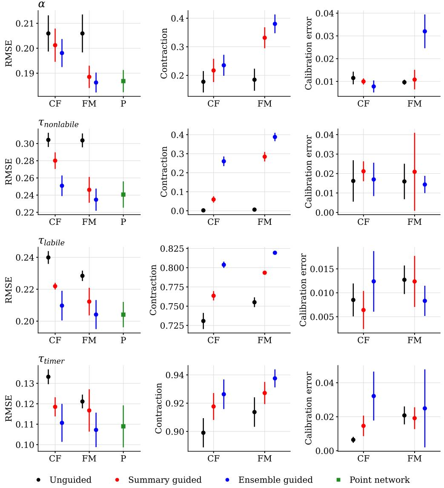  
Figure 7: Experiment 3: Eye Movements. Parameter-specific metrics for all four parameters of the model.

In section 3.2, we explain that canonical correlation may be computed using diferent targets. In all experiments, that target is the approximate posterior mean from one of the summary networks. In the Eye movement case study, that network is using set transformer with 16 output dimensions as a summary network. In this case study, however, one could also use a canonical correlation with the true parameter labels. Figure 12 shows the minimum and mean canonical correlations across all simulation settings and all three evaluation test sets, computed using the true parameter labels as targets vs. using the estimated posterior mean as the target. The figure reveals that the approximate posterior mean typically achieves larger canon ical correlations than the true targets; relatively speaking, the two methods correlate with each other rather strongly, suggesting overall agreement between the two options.

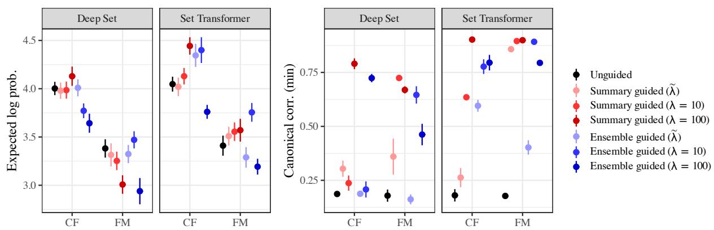  
Figure 8: Experiment 3: Eye Movements. Expected log probability of the parameters and minimum canonical correlation, across all combinations of inference and summary network architectures, and guidance type and weight. CF=Coupling flow, FM=Flow matching.

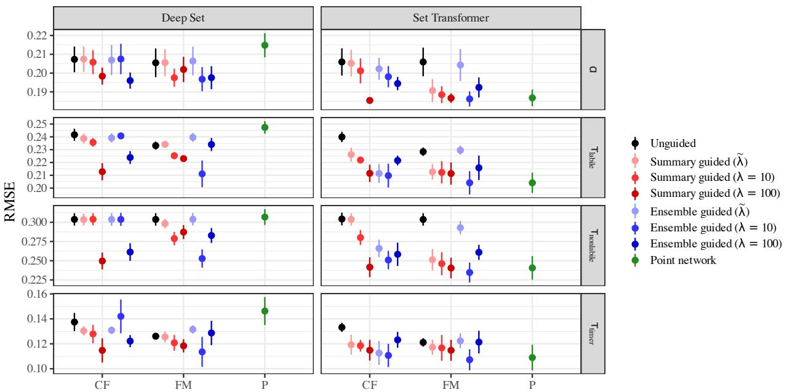  
Figure 9: Experiment 3: Eye Movements. RMSE of the parameters, across all combinations of inference and summary network architectures, and guidance type and weight. CF=Coupling flow, FM=Flow matching, P=Point network.

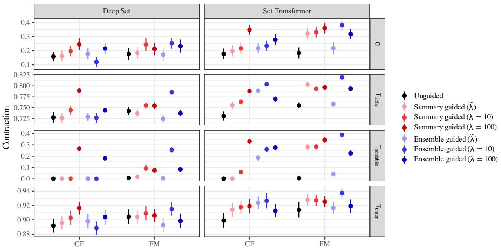  
Figure 10: Experiment 3: Eye Movements. Posterior contraction of the parameters, across all combinations of inference and summary network architectures, and guidance type and weight. CF=Coupling flow, FM=Flow matching, P=Point network.

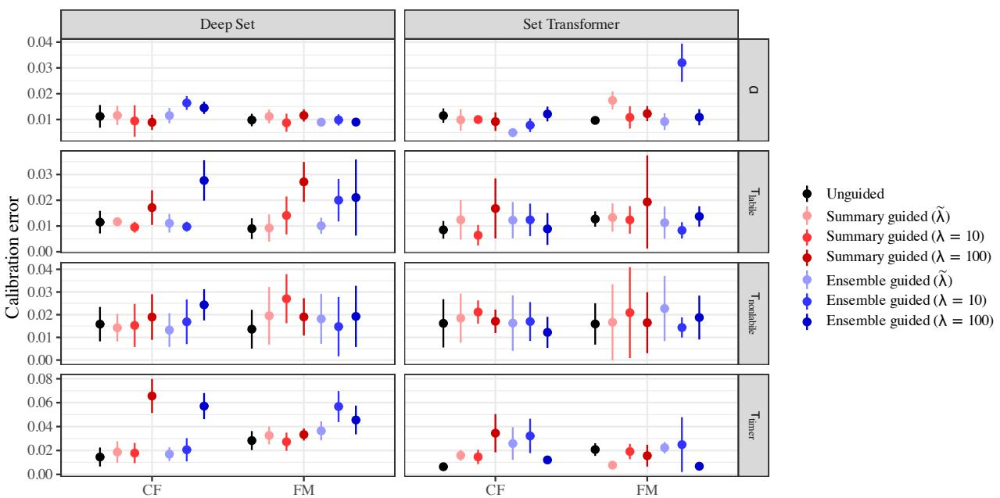  
Figure 11: Experiment 3: Eye Movements. Calibration error of the parameters, across all combinations of inference and summary network architectures, and guidance type and weight. CF=Coupling flow, FM=Flow matching, P=Point network.

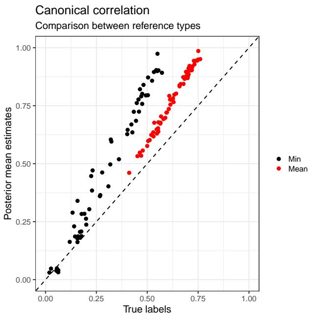  
Figure 12: Experiment 3: Eye Movements. Minimum and mean canonical correlations computed against the true parameter labels versus against the approximate posterior mean (from the set transformer summary network, 16 output dimensions), across all simulation settings and all three evaluation test sets. Canonical correlations computed against the estimated posterior mean are typically higher than those against the true labels, but the two targets yield strongly correlated diagnostics overall.

## A.8 Experiment 4: Strong gravitational lensing

Gravitational lensing is the deflection of light from a distant source by the gravitational field of an intervening mass distribution (which we refer to as lens). The deflection is described by the lens equation $\beta = \vartheta - \alpha ( \vartheta )$ which maps a position $\vartheta$ on the sky to the true source position $\beta$ through the scaled deflection angle α (Schneider et al., 1992; Treu, 2010). When the projected surface mass density of the deflector exceeds the critical density, this mapping becomes non-injective and the lens equation admits multiple solutions. The source is then observed as several distinct images, extended arcs, or, under near-perfect alignment, a complete Einstein ring. This is the strong lensing regime (Treu, 2010).

Simulation. We simulate strong lensing images based on the Euclid VIS instrument configuration (Cropper et al., 2025). Each simulation draws 17 parameters from their prior distribution (described below) and renders a noiseless image with lenstronomy (Birrer & Amara, 2018; Birrer et al., 2021) after which instrumental noise is added. The mass distribution of the deflector is a singular isothermal ellipsoid (SIE) plus an external shear field. The deflector’s own light is an elliptical Sérsic profile and the lensed background source is a second, independent elliptical Sérsic profile. Images are $6 4 \times 6 4$ pixels at $0 . 1 ^ { \prime \prime } / \mathrm { p i x e l }$ , i.e., a $6 . 4 ^ { \prime \prime } \times 6 . 4 ^ { \prime \prime }$ field of view. Observational settings are taken from the built-in Euclid VIS configuration in lenstronomy. Noise is added as a single per-pixel Gaussian draw with $\sigma _ { i j } ^ { 2 } = \sigma _ { \mathrm { b k g } } ^ { 2 } + \mu _ { i j } / t _ { \mathrm { e x p } }$ , where $\mu _ { i j }$ is the noiseless model flux and $\sigma _ { \mathrm { b k g } } \approx 1 . 0 8 \times 1 0 ^ { - 2 }$ counts $\mathrm { s } ^ { - 1 }$ is the combined sky-plus-read background level and $t _ { \mathrm { e x p } }$ is the exposure time. Finally, the noisy image x is passed through arcsinh $( x / \sigma _ { \mathrm { b k g } } )$ transformation which the simulator outputs for better neural network training.

We infer 17 parameters from the observed simulated lensing image. Priors for the deflector are mostly based on the Euclid Q1 data release catalog (Collaboration, 2026; Walmsley et al., 2025). The Einstein radius $\left( \pmb { \theta } _ { E } \right)$ is a Beta(2, 2) rescaled to $[ 0 . 5 , 1 . 2 ] ^ { \prime \prime }$ . The two mass ellipticity components $( e _ { 1 m } , e _ { 2 m } )$ are independent $\mathcal { N } ( 0 , 0 . 1 5 ^ { 2 } )$ draws. The deflector’s light ellipticity $( e _ { 1 l } , ~ e _ { 2 l } )$ components are drawn independently of the mass from a narrower $\mathcal { N } ( 0 , 0 . 0 9 ^ { 2 } )$ . The external shear components $( \gamma _ { 1 } , \gamma _ { 2 } )$ follow $\mathcal { N } ( 0 , 0 . 0 4 ^ { 2 } )$ . The deflector brightness $( { \mathrm { m a g } } _ { \mathrm { l e n s } } )$ is $\mathcal { N } ( 2 1 . 3 , 1 . 0 5 ^ { 2 } )$ . Its half-light radius $R _ { \mathrm { l e n s } }$ is lognormal with median $0 . 6 5 ^ { \prime \prime }$ and range $[ 0 . 3 3 , 1 . 2 9 ] ^ { \prime \prime }$ , slightly tighter than the measured $0 . 6 8 5 ^ { \prime \prime }$ so that the extended light profile fits inside the $6 . 4 ^ { \prime \prime }$ cutout. The deflector Sérsic index $n _ { \mathrm { l e n s } }$ is lognormal with median 3.7 and range [2.70, 5.06]. The background source being lensed does not have parameters in the released Euclid catalog as it was fitted non-parametrically (Collaboration, 2026; Walmsley et al., 2025); its parameters are therefore set from physical expectation. The source brightness $( \mathrm { m a g } _ { \mathrm { s r c } } )$ is $\mathcal { N } ( 2 3 . 5 , 0 . 9 ^ { 2 } )$ and the size $R _ { \mathrm { s r c } }$ is lognormal with median $0 . 2 5 ^ { \prime \prime }$ and range $[ 0 . 1 1 , 0 . 5 5 ] ^ { \prime \prime }$ The source Sérsic index $( n _ { \mathrm { s r c } } )$ is lognormal with median 1.2 and range $[ 0 . 6 7 , 2 . 1 6 ] _ { : }$ , disc-like rather than bulge-dominated. The source ellipticity components $( e _ { \mathrm { 1 s r c } } , e _ { \mathrm { 2 s r c } } )$ are sampled from $\mathcal { N } ( 0 , 0 . 2 0 ^ { 2 } )$ The source position $( x _ { \mathrm { s r c } } , y _ { \mathrm { s r c } } )$ follow independent Gaussian distributions around the center $\mathcal { N } ( 0 , 0 . 2 0 ^ { 2 } )$ while the deflector is fixed at the center. Figure 13 shows eight randomly drawn simulated images as per the simulation pipeline.

Network architecture and training. Training is fully online such that each run draws fresh simulations from the simulator at 1563 batches per epoch with batch size 64 for 100 epochs, giving 156,300 gradient steps and ≈ $1 0 ^ { 7 }$ unique simulated images, none of which is ever reused. Validation and test data stay ofline and identical across every method: a fixed 4,000-image validation split and three independent 1,000-image test sets are drawn from separate simulator seeds.

Every neural estimator uses the same convolutional summary network with summary dimension of 64, stage widths (32, 64, 128), two residual blocks per stage, and an attention pooling head mapping the $6 4 \times 6 4$ image to a 64-dimensional summary vector. Remaining settings are BayesFlow defaults. The coupling flow is six afine coupling layers with random permutations and activation normalisation, whose coupling subnets are three-layer, 256-wide MLPs which is the sole deviation from the defaults.

## A.9 Experiment 5: Social Interactions between mice

Simulation. We represent a cohort of mice as a weighted interaction network $G = ( V , E )$ , where nodes $i \in V$ are mice and edge weights $w _ { i j } \in [ 0 , 1 ]$ capture expected daily interaction intensity based on spatial proximity, temporal co-occurrence, and/or social association; a global density parameter $\delta$ controls the overall number of ties. Each mouse is initialized with a random subset of microbial taxa. On each discrete daily step, mouse pairs with $w _ { i j } > 0$ exchange microbiota in proportion to $w _ { i j }$ and an exchange factor $\alpha \in [ 0 , 1 ]$ Repeated over multiple days, this yields gradual convergence of community composition among strongly connected mice, while weakly connected or isolated mice retain more distinct microbiomes; depending on δ and $\alpha ,$ the system approaches a steady state after several days.

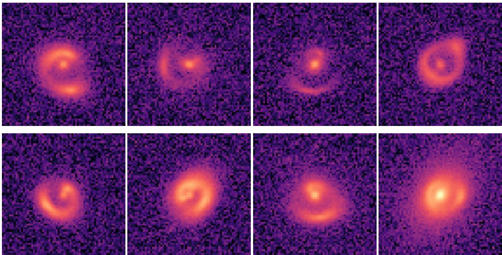  
Figure 13: Experiment 4: Strong gravitational lensing. Eight independent draws from the prior, each rendered as a single noisy cutout as per the simulation pipeline.

We simulate a group of 30 mice, each initialized with 5 taxa drawn from a pool of 20. Taxon abundances are encoded in the node-feature matrix $X \in \mathbb { R } ^ { 3 0 \times 2 0 }$ (rows: mice; columns: taxa; absent taxa as zero, present taxa as relative amounts summing to 100% per mouse). Taxa are removed once their abundance falls below a 0.0001% presence threshold or once they are not exchanged for four consecutive days.

Our goal is to infer the network density δ and exchange factor $\alpha$ from (i) the interaction network’s adjacency matrix and (ii) the final-day microbial composition X, under priors $\delta \sim \mathrm { U n i f } ( 0 . 0 1 , 0 . 5 )$ and $\alpha \sim \mathrm { U n i f } ( 0 . 0 5 , 0 . 5 )$ . We run the simulator for 5 days.

Network architecture and training. For training four diferent summary network types are considered: deep set, set transformer, graph transformer and a graph convolutional network. The summary output had a fixed size of 8. For the guided training regime, the magnitude normalized weight λ˜ was fixed to 1, see A.4. Each configuration is trained online for 100 epochs of 100 batches each (batch size 128), validated on 1,000 simulations, and evaluated on three independent test sets of 200 simulations each.