# NO TASK VECTOR IS AN ISLAND: A COMPREHENSIVE STUDY ON THE COMPOSABILITY OF TASK VECTORS FROM ON-POLICY DISTILLATION

Jingang Zhou1,2 Feiyu Han2 Han Zhu1,2 Yuyi Zhou1,2 Ruiyang Zhang3 Jian Xu1,2 Sirui Gao3 Qingpei Guo3 Xu-Yao Zhang1,2,\*

1 Institute of Automation, Chinese Academy of Sciences 2 University of Chinese Academy of Sciences 3 Ant Group Corresponding author

## ABSTRACT

Task vectors provide a simple mechanism for composing learned capabilities through model merging. However, the composability of task vectors produced by on-policy distillation (OPD) remains largely unexplored. OPD trains a student using teacher feedback on student-generated trajectories, yielding parameter updates that differ from those produced by the teacher model, usually by reinforcement learning (RL). We therefore ask whether OPD task vectors can complement their RL teacher updates and compose effectively across tasks. Across five domains and two model architectures, we find evidence for both forms of composability. Within a task, merging OPD and RL task vectors can outperform both constituent models, even when the OPD student is weaker than its RL teacher. Across tasks, OPD task-vector compositions achieve higher average scores than corresponding RL compositions in seven of eight backbone–merging-rule comparisons. Parameter-space analyses reveal substantial non-collinearity between OPD and RL updates. Experiment in CODE domain on SMOLLM3-3B shows that the combined direction outperforms either constituent direction at the tested global update norm, supporting directional complementarity in this configuration. Across tasks, OPD updates also show lower overlap among the top-10% feedforward channels ranked by update energy. Together, these results show that weaker standalone performance does not imply weaker task-vector composability. OPD task vectors can complement stronger RL teacher updates and combine effectively across tasks, highlighting composability as a distinct property for understanding and evaluating post-training updates.

## 1 INTRODUCTION

Post-training develops general-purpose language models into domain experts. Training with human feedback improves instruction following (Ouyang et al., 2022), while reinforcement learning with verifiable rewards (RLVR) strengthens mathematical reasoning and code generation (DeepSeek-AI, 2025). Consolidating experts trained from a shared base is therefore a practical challenge. Parameter-space merging combines their task vectors—the displacements from the common base— through addition, interpolation, or other merging rules, without further gradient-based training (Il harco et al., 2023). Multi-teacher on-policy distillation (OPD) instead transfers teacher behavior into a shared student through dense supervision on student-generated trajectories (Agarwal et al., 2024; Ma et al., 2026; Gao et al., 2026). The compatibility of task vectors depends on how these updates are learned: RL-trained experts can exhibit different conflict patterns from supervised fine-tuning (SFT) experts (Ren et al., 2026), and CAMFT explicitly encourages updates to occupy coordinates with lower cross-task conflict during fine-tuning (Zhou et al., 2026a). These findings motivate studying how the training procedure shapes mergeability alongside the choice of merging algorithm.

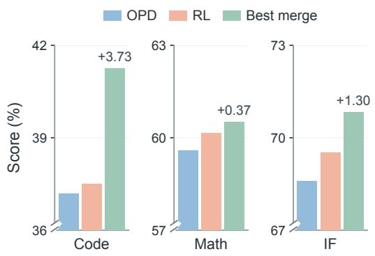  
(a) Within-task composition

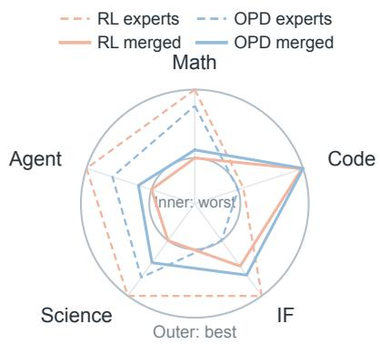  
(b) Cross-task composition  
Figure 1: OPD task-vector composition on QWEN3-4B. (a) Best within-task OPD–RL merges; labels show gains over RL (pp). (b) Specialists (dashed) and TIES merges (solid); radial scores are min–max normalized separately for each task.

OPD provides a useful setting for studying how post-training shapes mergeability: it trains on student-generated trajectories using token-level feedback from a stronger teacher (Agarwal et al., 2024; Zhou et al., 2026b). The construction of this supervision matters. The parameter-space analyses suggest that OPD produces update structures distinct from standard RL or SFT (Shen et al., 2026; Yu et al., 2026). An OPD student’s task vector may therefore differ from its RL teacher’s. We ask: how composable are the task vectors produced by OPD? Figure 1 illustrates the two relationships we examine. Within the same task, we test whether merging a weaker OPD student with its RL teacher can outperform both constituent models, which would reveal complementarity beyond selecting the stronger endpoint. Across different tasks, we compare independently trained OPD and RL task vectors to test whether OPD reduces interference when combining domain capabilities.

We investigate these questions across five domains and two model architectures. SMOLLM3 cover MATHEMATICAL REASONING, CODE GENERATION, and INSTRUCTION FOLLOWING, while QWEN additionally includes SCIENCE and AGENT tasks. Across these settings, we observe two main empirical phenomena. First, within a task, merging an OPD task vector with its own RL teacher’s task vector can outperform both constituent models. On QWEN3-4B in CODE, the OPD student and RL teacher score 37.18% and 37.51% (Table 2); their within-task TIES composition reaches 41.24% (Table 1), improving on the teacher by 3.73 pp. Thus, a weaker OPD student can contribute useful parameter changes to its teacher. The results span multiple tasks and merging operators (Section 3.2).

Second, across tasks, OPD task vectors generally compose more effectively than corresponding RL task vectors. When multiple domain-specific updates are merged from the same base model, OPD-based compositions achieve higher overall scores in seven of the eight backbone–merging-rule comparisons, with SMOLLM3 Raw Sum as the exception. Across all eight comparisons, OPD has a more favorable change from its own standalone specialist average. This distinction is useful because final merged performance alone can hide asymmetric task degradation: two merging methods may obtain similar averages while preserving their constituent experts very differently. Our results therefore evaluate both the final multi-task model and the performance drop relative to each method’s own single-task specialists. Across the five-task, this comparison consistently favors the compositional behavior of OPD updates, although the magnitude of the advantage varies across domains.

We further connect these performance differences to the geometry of the learned updates. Within the same task, OPD updates have substantial components orthogonal to the RL direction, although noncollinearity alone does not establish a functional benefit. On SMOLLM3 in CODE, the combined update outperforms both constituent directions when each is rescaled to the same global norm (Section 4.2), supporting directional complementarity at the tested norm. Across tasks, we find a complementary pattern. Direction retention improves for CODE, SCIENCE, and AGENT, but declines for MATH and IF. These diagnostics describe task-dependent interactions; they do not establish a general relationship between alignment and performance retention. Together, these findings suggest that OPD does more than transfer teacher performance into a student: it can reshape the resulting task vector in ways that make learned capabilities easier to compose.

Our contributions are:

• We systematically study the composability of OPD task vectors, covering both withintask OPD–RL composition and cross-task multi-expert merging across five domains and two model architectures.

• To our knowledge, we are the first to show two complementary empirical properties of OPD updates: an OPD task vector can strengthen the RL expert from which it was distilled, and multiple OPD task vectors can retain their specialist capabilities more effectively than corresponding RL task vectors under cross-task merging.

• We characterize OPD update geometry and test directional complementarity with normmatched controls, alongside task-dependent patterns of overlap and direction retention across tasks.

## 2 PRELIMINARIES

## 2.1 POST-TRAINING

We focus on reinforcement learning with verifiable rewards (RLVR) and policy-gradient on-policy distillation (OPD). RLVR derives its learning signal from response-level answer checks or executable tests (DeepSeek-AI, 2025; Shao et al., 2024). In OPD, a fixed teacher provides token-level feedback on student-generated trajectories. We follow Li et al. (2026), using either sampled-token feedback or supervision over multiple top-k candidates. The two methods share a closely related policy-gradient structure: RLVR optimizes verifier-defined outcomes, while OPD aligns the student with its teacher through token-level feedback. Appendix A gives the objective functions and token-weighting notation.

## 2.2 COMPOSABILITY OF TASK VECTORS

Task Vectors and Merging. For parameter-aligned models sharing an initialization $\theta _ { 0 } .$ , let $\theta _ { t } ^ { m }$ denote the parameters after training on task t using $m \in \{ \mathrm { O P D } , \mathrm { R L V R } \}$ . The corresponding task vector is the parameter displacement from the shared initialization (Ilharco et al., 2023):

$$
\tau _ { t } ^ { m } = \theta _ { t } ^ { m } - \theta _ { 0 } .\tag{1}
$$

In particular, an OPD task vector is measured from the student’s initialization rather than from its teacher. For a collection of task vectors $\nu ,$ we write a general composition as

$$
\theta _ { \mathrm { c o m p } } = \theta _ { 0 } + \mathcal { F } _ { \phi } ( \mathcal { V } ) ,\tag{2}
$$

where $\mathcal { F } _ { \phi }$ denotes a merging operator with configuration ϕ. Task Arithmetic (TA) uses a scaled sum, $\begin{array} { r } { \mathcal { F } _ { \lambda } ^ { \mathrm { T A } } ( \mathcal { V } ) \stackrel { \cdot } { = } \lambda \sum _ { \tau \in \mathcal { V } } \tau } \end{array}$ (Ilharco et al., 2023). This formulation also includes TIES-Merging (Yadav et al., 2023) and TSV-M (Gargiulo et al., 2025), which transform task vectors before aggregation.

Composability of OPD Task Vectors. We use composability to describe how effectively taskspecific capabilities are retained or improved when multiple task vectors are combined. Our experiments consider three composition settings. For a task t, within-task composition combines its OPD and RLVR vectors,

$$
{ \mathcal { V } } _ { t } ^ { \mathrm { w i t h i n } } = \{ \tau _ { t } ^ { \mathrm { O P D } } , \tau _ { t } ^ { \mathrm { R L V R } } \} .\tag{3}
$$

For a set of tasks $\tau _ { \ast }$ , cross-task composition combines vectors produced by the same post-training method, $\mathcal { V } _ { m } ^ { \mathrm { c r o s s } } = \{ \tau _ { t } ^ { m } : t \in \mathcal { T } \}$ . Finally, joint composition combines vectors across both tasks and post-training methods, $\mathcal { V } ^ { \mathrm { j o i n t } } = \{ \tau _ { t } ^ { m } : t \in \mathcal { T } , m \in \{ \mathrm { O P D } , \mathrm { R L V R } \} \}$ . We evaluate these settings under multiple merging operators, with training and evaluation details provided in Section 3.1.

## 3 COMPOSABILITY OF OPD TASK VECTORS

We evaluate OPD task vectors in the three composition settings defined in Section 2. After introducing the experimental setup (Section 3.1), we first test whether an OPD update can improve its

own RL teacher within the same task (Section 3.2), then compare OPD and RL updates when composed across tasks (Section 3.3). Finally, we combine both sources across tasks to test whether their within-task complementarity can benefit a unified multi-task model (Section 3.4).

## 3.1 EXPERIMENTAL SETUP

Models and training. We use SmolLM3-3B with a MixSFT anchor and Qwen3-4B-Instruct-2507 with its instruction-tuned anchor. SmolLM3’s Math, Code, and IF RL experts come from Open-MOPD (Gao et al., 2026); Qwen’s five-domain RL experts come from Wu et al. (2026b) and additionally cover Science and Agent. For each domain, one OPD student starts from the shared anchor and uses the corresponding RL expert as its sole teacher. Within each family and domain, RL and OPD use identical training prompts. SmolLM3 uses student-top-k feedback and Qwen uses sampled-token feedback (Appendix A).

Evaluation. Both model families are evaluated on AIME 2024 and 2025 for Math. The remaining benchmarks follow the expert releases: LiveCodeBench for Code, IFEval and IFBench for IF, and, for Qwen only, GPQA-Diamond for Science and a BFCL v3 subset for Agent (Gao et al., 2026; Wu et al., 2026b; Di-viner, 2026). All checkpoints we evaluate within a family–benchmark pair use identical decoding and evaluation settings. We average benchmarks within domains and then weight domains equally; the two families’ averages cover different task sets. Our experimental scores are means over three repetitions. Here avg@k is average correctness over k independent responses, not pass@k. Training datasets, benchmark versions, subset sizes, and sampling counts are listed in Appendix B.1–B.2.

Merging. We compare TA, TIES, and TSV-M (Section 2), including Raw Sum as TA with λ = 1. Each merge combines task vectors from one model family and anchor. Each multi-task row uses one materialized merged checkpoint across all domains.

## 3.2 WITHIN-TASK COMPLEMENTARITY OF OPD TASK VECTORS

Table 1: Within-task composition on QWEN3-4B (%).
<table><tr><td>Method</td><td>Math</td><td>Code</td><td>IF</td></tr><tr><td>RL</td><td>60.14</td><td>37.51</td><td>69.53</td></tr><tr><td>OPD</td><td>59.58</td><td>37.18</td><td>68.60</td></tr><tr><td>TA</td><td>60.51 (+0.37)</td><td>37.48 (-0.03)</td><td>68.92 (-0.61)</td></tr><tr><td>TIES</td><td>60.35 (+0.21)</td><td>41.24(+3.73)</td><td>69.66 (+0.13)</td></tr><tr><td>TSV-M</td><td>56.51 (-3.63)</td><td>38.52(+1.01)</td><td>69.29 (-0.24)</td></tr><tr><td>Raw Sum</td><td>59.78 (-0.36)</td><td>41.01 (+3.50)</td><td>70.83 (+1.30)</td></tr></table>

Parentheses show percentage-point changes relative to the RL teacher.

For each of the three Qwen domains shown in Table 1, we merge the OPD task vector with the task vector of its corresponding RL teacher using TA, TIES, TSV-M, or Raw Sum. Since the RL teacher consistently outperforms the standalone OPD expert, we assess complementarity by whether the merged model surpasses the RL teacher, which necessarily implies outperforming both constituent models.

Overall, seven of the 12 task–merging configurations exceed both endpoints in point estimate. The largest gains occur on Code: TIES and Raw Sum improve over the RL teacher by 3.73 and 3.50 percentage points (pp), respectively, while TSV-M yields a 1.01 pp gain. Raw Sum also improves instruction following by 1.30 pp. On Math, TA achieves the highest score, exceeding the RL teacher by 0.37 pp, followed by TIES with a 0.21 pp gain.

The benefit of composition depends on both the task and the merging rule. TIES improves over the RL teacher on Math, Code, and IF, whereas Raw Sum does so on Code and IF. These results show that, despite its weaker standalone performance, an OPD task vector can provide complementary updates that produce a model stronger than either constituent, although such complementarity is not consistently recovered by every merging configuration.

Table 2: Cross-task composition of OPD and RL task vectors (%). Avg.: equal-weight domain mean. Bold marks the higher displayed score in each merging pair (both for ties), not statistical significance. Single denotes separate task-specific experts.
<table><tr><td colspan="2"></td><td colspan="4">SMOLLM3-3B</td><td colspan="6">QWEN3-4B</td></tr><tr><td>Method</td><td>Src.</td><td>Math</td><td>Code</td><td>IF</td><td>Avg.</td><td>Math</td><td>Code</td><td>IF</td><td>Sci.</td><td>Agent</td><td>Avg.</td></tr><tr><td rowspan="2">Single</td><td>RL</td><td>24.38</td><td>23.08</td><td>48.23</td><td>31.90</td><td>60.14</td><td>37.51</td><td>69.53</td><td>44.95</td><td>74.00</td><td>57.23</td></tr><tr><td>OPD</td><td>20.42</td><td>22.69</td><td>47.92</td><td>30.34</td><td>59.58</td><td>37.18</td><td>68.60</td><td>42.42</td><td>73.00</td><td>56.16</td></tr><tr><td>Raw Sum</td><td>RL OPD</td><td>25.21 24.79</td><td>23.39 24.24</td><td>48.75 47.14</td><td>32.45 32.06</td><td>58.19 60.56</td><td>40.97 40.04</td><td>69.51 68.71</td><td>35.86 38.89</td><td>69.50 70.00</td><td>54.81 55.64</td></tr><tr><td>TA</td><td>RL OPD</td><td>18.31 19.12</td><td>18.23 18.98</td><td>44.14 44.01</td><td>26.89 27.37</td><td>53.61 54.86</td><td>34.87 35.36</td><td>58.18 57.79</td><td>42.93 43.94</td><td>64.50 64.50</td><td>50.82 51.29</td></tr><tr><td>TIES</td><td>RL OPD</td><td>25.63 26.46</td><td>24.50 23.36</td><td>46.34 48.32</td><td>32.16 32.71</td><td>57.78</td><td>41.23</td><td>69.03</td><td>37.37</td><td>71.50</td><td>55.38</td></tr><tr><td></td><td>RL</td><td>19.17</td><td>19.89</td><td>43.71</td><td>27.59</td><td>58.06 56.94</td><td>41.32 37.22</td><td>69.18 64.46</td><td>40.40 39.39</td><td>72.00 68.00</td><td>56.19 53.20</td></tr><tr><td>TSV-M</td><td>OPD</td><td>20.21</td><td>20.64</td><td>43.96</td><td>28.27</td><td>57.64</td><td>36.42</td><td>62.90</td><td>43.94</td><td>70.00</td><td>54.18</td></tr></table>

Finding 1. Within a task, an OPD task vector can improve its RL teacher even when the OPD expert has weaker standalone performance.

## 3.3 CROSS-TASK COMPOSABILITY OF OPD TASK VECTORS

For the cross-task setting in Table 2, we merge task vectors from a single training source, either OPD or RL, into one model using Raw Sum, TA, TIES, or TSV-M. We evaluate three domains on SmolLM3-3B and five on Qwen3-4B. Since the OPD and RL experts differ in standalone performance, we assess composition using both the merged model’s equal-weight domain average and its change from the corresponding standalone specialist average. This change measures how much performance is gained or lost when separate experts are consolidated into one model.

Overall, OPD compositions achieve higher averages than their RL counterparts in seven of the eight backbone–merging-rule comparisons, despite starting from weaker standalone experts. Under TIES, OPD reaches 32.71% on SmolLM3-3B and 56.19% on Qwen3-4B, compared with 32.16% and 55.38% for RL, respectively. The exception is Raw Sum on SmolLM3-3B, where RL reaches 32.45% and OPD reaches 32.06%. Thus, the final merged scores generally favor OPD, although the advantage depends on the backbone and merging rule.

Relative to their own specialists, OPD compositions show a larger average gain or a smaller average loss in all eight comparisons. For example, TIES on SmolLM3-3B improves the OPD specialist average by 2.37 pp, compared with 0.26 pp for RL. On Qwen3-4B, OPD approximately preserves its specialist average (+0.03 pp), whereas RL loses 1.85 pp. These results indicate that OPD updates retain specialist performance more effectively on average when combined across tasks. The benefit is not uniform across individual domains: under Raw Sum, the Qwen RL composition still scores higher on Code and IF.

Finding 2. Cross tasks, OPD task vectors can form stronger multi-task models and preserve specialist performance more effectively on average than RL task vectors.

## 3.4 OPD TASK VECTORS IN JOINT MULTI-TASK COMPOSITION

We next examine whether the within-task complementarity between OPD and RL updates can improve a model that combines multiple tasks. Joint composition introduces many possible choices of within-task source weights, cross-task weights, and merging operators, making an exhaustive search costly. The preceding results motivate a simple construction: within-task combinations can improve the RL teacher, while cross-task Raw Sum outperforms scaled TA on both backbones. We therefore average the OPD and RL updates within each task and directly sum the resulting updates across tasks, using the same recipe for every domain.

Table 3: Joint composition of OPD and RL task vectors across backbones. Scores are percentages; Avg. equally weights the domains available for each backbone. Bold marks column-wise maxima within each backbone.
<table><tr><td></td><td colspan="4">SMOLLM3-3B</td><td colspan="6">QWEN3-4B</td></tr><tr><td>Method</td><td>Math</td><td>Code</td><td>IF</td><td>Avg.</td><td>Math</td><td>Code</td><td>IF</td><td>Sci.</td><td>Agent</td><td>Avg.</td></tr><tr><td>RL</td><td>25.21</td><td>23.39</td><td>48.75</td><td>32.45</td><td>58.19</td><td>40.97</td><td>69.51</td><td>35.86</td><td>69.50</td><td>54.81</td></tr><tr><td>OPD</td><td>24.79</td><td>24.24</td><td>47.14</td><td>32.06</td><td>60.56</td><td>40.04</td><td>68.71</td><td>38.89</td><td>70.00</td><td>55.64</td></tr><tr><td>OPD+ RL</td><td>26.04</td><td>24.64</td><td>49.16</td><td>33.28</td><td>60.42</td><td>40.39</td><td>68.64</td><td>40.40</td><td>73.50</td><td>56.67</td></tr></table>

Specifically, we construct $\begin{array} { r } { \theta _ { \mathrm { j o i n t } } = \theta _ { 0 } + \sum _ { t = 1 } ^ { K } ( o _ { t } + r _ { t } ) / 2 } \end{array}$ , where $o _ { t }$ and $r _ { t }$ denote the OPD and RL task vectors for task t, and $K = 3$ for SmolLM3-3B and $K = 5$ for Qwen3-4B. Averaging assigns equal weight to the two sources and keeps the sum of their coefficients within each task at one, matching a single-source Raw Sum. Table 3 compares this joint construction with compositions built from OPD or RL alone; each result corresponds to one checkpoint evaluated across all domains.

On Qwen3-4B, joint composition achieves an average of 56.67%, compared with 54.81% for RLonly and 55.64% for OPD-only composition. Relative to RL-only composition, it improves Math, Science, and Agent, while Code and IF decline. The way the sources are combined also matters: alternative ten-vector Raw Sum and TIES configurations score 52.16% and 48.10%, respectively. The balanced construction therefore achieves the highest observed average among these configurations. These comparisons use means over three repetitions. The mean improvements are descriptive point estimates and do not, by themselves, establish statistical significance.

On SmolLM3-3B, joint composition reaches 33.28%, exceeding 32.45% for RL-only and 32.06% for OPD-only composition. It also surpasses both single-source compositions in each domain, with scores of 26.04% on Math, 24.64% on Code, and 49.16% on IF. The benefit therefore extends across all three evaluated domains on SmolLM3, while the Qwen results show task-dependent trade-offs.

Table 4 additionally compares the SmolLM3 results with published multi-teacher distillation baselines from Gao et al. (2026). Joint composition has the highest displayed average, while Open-MOPD has the highest IF score (49.58%) and an average of 31.24%. These published re-

Table 4: Comparison with multi-model OPD baselines on SMOLLM3-3B. Scores are percentages; Avg. equally weights Math, Code, and IF. Bold marks column-wise maxima.
<table><tr><td>Method</td><td>Math</td><td>Code</td><td>IF</td><td>Avg.</td></tr><tr><td>RL</td><td>25.21</td><td>23.39</td><td>48.75</td><td>32.45</td></tr><tr><td>OPD</td><td>24.79</td><td>24.24</td><td>47.14</td><td>32.06</td></tr><tr><td>OPD+ RL</td><td>26.04</td><td>24.64</td><td>49.16</td><td>33.28</td></tr><tr><td>Naive M-OPD</td><td>21.26</td><td>19.26</td><td>43.64</td><td>28.05</td></tr><tr><td>Open-MOPD</td><td>22.42</td><td>21.73</td><td>49.58</td><td>31.24</td></tr></table>

sults provide useful reference points, but they come from separate runs and use Math avg@64 rather than our avg@8, limiting conclusions about relative method effectiveness.

Finding 3. Joint composition by simple averaging and summation yields higher observed multitask mean scores than either single-source composition on both evaluated backbones.

## 4 UNDERSTANDING THE TASK VECTORS FROM OPD

In this section, we examine update structure, within-task complementarity, and cross-task geometry.

## 4.1 PARAMETER STRUCTURE OF OPD TASK VECTORS

Figure 2 compares Math and Code task vectors from a common SmolLM3-3B base. OPD’s update norm is 59.7% of RL’s for Math and 68.7% for Code. OPD changes fewer saved BF16 coordinates and has lower spectral concentration at all six measured ranks from 8 to 256. The final 12 layers contain 37.7% versus 32.1% of each vector’s squared $L _ { 2 }$ energy for Code, and 44.7% versus 32.3% for Math. These larger relative shares coexist with lower absolute late-layer energy.

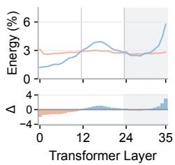  
(a) Layer-wise energy

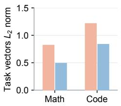  
(b) Update magnitude

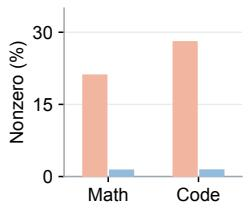  
(c) BF16-visible sparsity

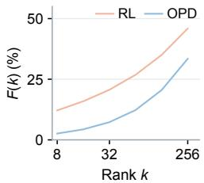  
(d) Spectral concentration  
Figure 2: SMOLLM3-3B task-vector structure. (a) Code layer-wise energy share; shading marks the final 12 layers and ∆ denotes OPD minus RL (pp). (b) Update $L _ { 2 }$ norms and (c) BF16-visible nonzero fractions for Math and Code. (d) Code rank-k energy retention $F ( k )$ . Full profiles: Fig. 5.

Spectral concentration $F ( k )$ aggregates rank-k retained energy over 252 attention and MLP projection matrices, using approximate randomized SVD and normalizing by their total update energy. Coordinate sparsity and spectral concentration capture different properties: fewer changed coordinates can coexist with energy spread across singular directions. Appendix C.1 gives complete measurements and definitions.

## 4.2 WITHIN-TASK PARAMETER COMPLEMENTARITY BETWEEN OPD AND RL

We ask whether combining RL and OPD updates provides a useful direction beyond matching update magnitude. All analyses in this subsection use SmolLM3-3B. The Code controls reuse the RL–OPD checkpoint pair used for the Code geometry measurements. Figure 3 shows that RL–OPD alignment varies across layers and projections.

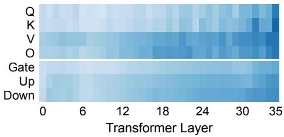  
(a) Math

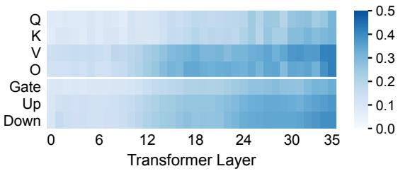  
(b) Code  
Figure 3: Layer-wise RL–OPD alignment on SMOLLM3-3B. Task-vector matrix cosine similarities for (a) Math and (b) Code, with a shared color scale. Columns index Transformer layers; rows index attention (Q, K, V, O) and MLP (Gate, Up, Down) projections.

For RL and OPD task vectors r and o, write $o = \alpha r + q .$ where $\alpha = \langle o , r \rangle / \left. r \right. _ { 2 } ^ { 2 }$ and $q \perp r .$ . The orthogonal energy share, $\| q \| _ { 2 } ^ { 2 } / \| o \| _ { 2 } ^ { 2 }$ , is 93.0% for Math and 95.2% for Code in the measured task vectors. These values indicate substantial non-collinearity, but do not establish whether the residual improves task performance.

To test directional complementarity on Code, we set $R = \| r + o \| _ { 2 }$ and rescale the RL-only and OPD-only updates to this norm. Table 5 gives the constructions and score differences. Raw Sum exceeds the norm-matched RL and OPD controls by 1.77 and 2.07 pp, respectively. Thus, at the tested global update norm, the combined direction yields higher mean Code scores than either constituent direction.

Table 5: Within-task composition on SMOLLM3-3B in CODE: norm-matched controls and residual ablation.  
All models take the form $\theta _ { 0 } + u ,$ with $R = \| r + o \| _ { 2 } .$
<table><tr><td>Configuration</td><td>Update u</td><td> $\Vert u \Vert _ { 2 } / R$   $\Delta$ </td><td>vs. Raw Sum (pp)</td></tr><tr><td>Raw Sum</td><td> $r + o$ </td><td>1</td><td>0.00</td></tr><tr><td>Norm-matched RL</td><td> $( R / \parallel r \parallel _ { 2 } ) r$ </td><td>1</td><td>-1.77</td></tr><tr><td>Norm-matched OPD</td><td> $( R / \left. o \right. _ { 2 } ) o$ </td><td>1</td><td>-2.07</td></tr><tr><td>Residual removed</td><td> $( 1 + \alpha ) r$ </td><td>&lt; 1</td><td>-2.88</td></tr></table>

$\Delta = \mathrm { S c o r e } ( \theta _ { 0 } + u ) - \mathrm { S c o r e } ( \theta _ { 0 } + r + o )$ , using the reported mean scores. The last row is not norm-matched: removing q reduces both the score and update norm. The Code geometry measurements and controls in this subsection use the same checkpoint pair (Appendix C.2).

Removing q from $r + o = ( 1 + \alpha ) r + q$ lowers the mean score by 2.88 pp. Since $q \perp r ,$ this also reduces the update norm and does not by itself isolate a directional effect. The norm-matched comparison supports directional complementarity in the tested configuration; it does not establish superiority over the best scalar rescaling of either constituent update. Appendix C.2 provides the measurement scope and a local loss interpretation of the residual.

## 4.3 HOW UPDATE STRUCTURE SHAPES MULTI-TASK COMPOSITION

On Qwen3-4B, we examine how updates from other tasks enter a target task’s high-energy channels and alter its direction during additive composition.

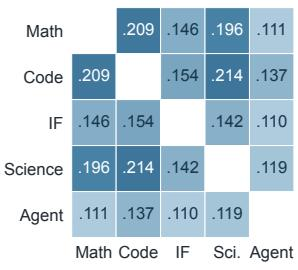  
(a) RL overlap

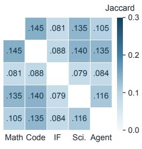  
(b) OPD overlap

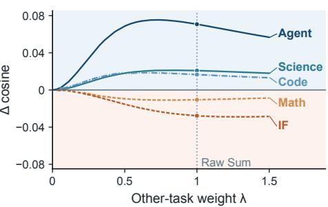  
(c) Direction preservation  
Figure 4: Cross-task overlap and direction retention on QWEN3-4B. (a,b) Jaccard overlap of RL/OPD top-10% MLP-channel sets (shared scale). (c) OPD–RL difference in $c _ { t } ( \lambda ) = \cos ( u _ { t } , u _ { t } +$ λvt); positive values favor OPD, $\lambda = 1$ denotes Raw Sum.

For each layer, we select the top 10% of MLP channels by squared update magnitude. OPD exhibits lower Jaccard overlap than RL across all ten task pairs, with the mean decreasing from 0.15368 to 0.11064, a 28% reduction (Fig. 4a,b). Thus, the high-energy regions of OPD updates are less shared across tasks.

Let $S _ { t }$ denote task $t \mathbf { \bar { s } }$ hotspots and $\tau _ { s , S _ { t } }$ the update from task s restricted to them. The summed individual off-task energy relative to the target task’s own energy is

$$
R _ { t } = \frac { \sum _ { s \neq t } \big \| \tau _ { s , S _ { t } } \big \| _ { 2 } ^ { 2 } } { \big \| \tau _ { t , S _ { t } } \big \| _ { 2 } ^ { 2 } } .\tag{4}
$$

OPD has lower $R _ { t }$ than RL on Code, Science, and Agent, and higher $R _ { t }$ on Math and IF. For Science, $R _ { t }$ decreases from 3.613 to 3.262; for Agent, it decreases from 4.637 to 3.103. Thus, relative incoming energy varies by task despite the overall reduction in hotspot overlap. Appendix C.3 decomposes $R _ { t }$ into relative update scale and localization.

We next measure how these updates align and accumulate. For $u _ { t } = \tau _ { t , S _ { t } }$ and $\begin{array} { r } { v _ { t } = \sum _ { s \neq t } \tau _ { s , S _ { t } } } \end{array}$ direction retention is

$$
c _ { t } ( \lambda ) = \cos ( u _ { t } , \ u _ { t } + \lambda v _ { t } ) ,\tag{5}
$$

where λ controls the weight of the other-task updates. At λ = 1, corresponding to Raw Sum, OPD improves direction retention by 0.016, 0.021, and 0.071 for Code, Science, and Agent, respectively. Direction retention decreases by 0.011 for Math and 0.028 for IF (Fig. 4c).

Across the five tasks, lower relative incoming energy coincides with better direction retention for Code, Science, and Agent, while Math and IF show the opposite pattern. These observations connect update distribution and relative magnitude with direction retention in the measured hotspots.

Takeaway. OPD contributes update directions beyond those of its RL teachers and exhibits lower overlap across tasks. These properties provide a geometric perspective on its within-task complementarity and cross-task composability.

## 5 RELATED WORK

On-Policy Distillation and Capability Integration. GKD studies flexible teacher–student divergence objectives for student-generated trajectories, while MiniLLM develops reverse-KL optimization (Agarwal et al., 2024; Gu et al., 2024). MOPD and Open-MOPD study multi-teacher capability integration during training (Ma et al., 2026; Gao et al., 2026). We instead study whether the resulting task-specific OPD updates can compose in parameter space. Further details appear in Appendix D.

Task Vectors and Model Merging. Model Soups (Wortsman et al., 2022) can improve accuracy and robustness by averaging models fine-tuned from a common initialization with different hyperparameters, without increasing inference cost. Task Arithmetic (Ilharco et al., 2023) defines task vectors as fine-tuned minus initial weights and composes or edits models through arithmetic on these vectors. TIES-Merging (Yadav et al., 2023) trims small-magnitude changes and resolves sign conflicts; DARE (Yu et al., 2024) randomly drops and rescales parameter deltas. These methods motivate our study of OPD-derived task-vector composition.

Geometry and Composability of Post-Training Updates. Task arithmetic is linked to weight disentanglement, with parameter directions inducing localized function-space changes (Ortiz-Jimenez´ et al., 2023). LLM post-training studies examine SFT–RLVR structural differences for capability synthesis (Yuan et al., 2026) and relate update sparsity and cross-domain alignment to merging behavior (Wu et al., 2026a;b). OPD studies identify checkpoint-precision coordinate sparsity, spectral concentration, and early subspace locking, and demonstrate effective training in restricted update subspaces or subnetworks (Shen et al., 2026; Yu et al., 2026). We examine how OPD update geometry relates to composition with RL updates within a task and with OPD updates across tasks.

## 6 DISCUSSION AND CONCLUSION

We study the composability of task vectors produced by on-policy distillation (OPD), using reinforcement-learning (RL) teacher updates as the main comparison. Across five domains and two model architectures, we find that within a task, merging OPD and RL task vectors can outperform both constituent models even when the OPD student is weaker, while across tasks, OPD compositions achieve higher average performance than corresponding RL compositions in seven of eight backbone–merging-rule comparisons. OPD updates are not collinear with RL updates, and SmolLM3-3B Code controls support directional complementarity at the tested global update norm. These results suggest that task-vector composability captures a distinct property of post-training updates beyond standalone model performance.

Limitations and Future Work. We evaluate general-purpose merging rules. Future work could exploit the observed differences in update direction, scale, and concentration to develop OPD-aware merging methods and evaluate them across additional tasks and model families.

## REPRODUCIBILITY STATEMENT

Section 2 defines the objects, and Section 3.1 introduces the evaluation protocols; Sections 3.2–3.4 specify the merging experiments. Section 4 presents the associated analyses and controls. Appendix B documents the data, OPD training configurations, merging parameters, and score aggregation. All experimental results obtained in this study are supported by statistical analyses. Performance scores are reported as arithmetic means over three repetitions.

## AI USE STATEMENT

Generative AI assisted with language polishing.

## REFERENCES

Rishabh Agarwal, Nino Vieillard, Yongchao Zhou, Piotr Stanczyk, Sabela Ramos Garea, Matthieu Geist, and Olivier Bachem. On-policy distillation of language models: Learning from selfgenerated mistakes. In International Conference on Learning Representations, pp. 21246–21263, 2024. URL https://proceedings.iclr.cc/paper\_files/paper/2024/file/ 5be69a584901a26c521c2b51e40a4c20-Paper-Conference.pdf.

Agentica. DeepCoder-Preview-Dataset. Hugging Face dataset, 2025. URL https://huggingf ace.co/datasets/agentica-org/DeepCoder-Preview-Dataset.

Wasi Uddin Ahmad, Sean Narenthiran, Somshubra Majumdar, Aleksander Ficek, Siddhartha Jain, Jocelyn Huang, Vahid Noroozi, and Boris Ginsburg. OpenCodeReasoning: Advancing data distillation for competitive coding. In Second Conference on Language Modeling, 2025. URL https://openreview.net/forum?id=aykM7KUVJZ.

Chenxin An, Zhihui Xie, Xiaonan Li, Lei Li, Jun Zhang, Shansan Gong, Ming Zhong, Jingjing Xu, Xipeng Qiu, Mingxuan Wang, and Lingpeng Kong. POLARIS: A post-training recipe for scaling reinforcement learning on advanced reasoning models, 2025. URL https://hkunlp.git hub.io/blog/2025/Polaris/.

Akhiad Bercovich, Itay Levy, Izik Golan, Mohammad Dabbah, Ran El-Yaniv, Omri Puny, et al. Llama-Nemotron: Efficient reasoning models, 2025. URL https://arxiv.org/abs/25 05.00949.

BytedTsinghua-SIA. Open-MOPD Data. Hugging Face dataset, 2026. URL https://hu ggingface.co/datasets/BytedTsinghua-SIA/Open-MOPD-Data. Processed RL/OPD prompt mixture and evaluation suite; release manifest inspected at revision 9e897efe3257599d4300e2d5ee865a1cc714af87.

DeepSeek-AI. DeepSeek-R1: Incentivizing reasoning capability in LLMs via reinforcement learning, 2025. URL https://arxiv.org/abs/2501.12948v1. arXiv preprint, version 1.

Di-viner. LLM-Fusion: Consolidating RLVR capabilities across domains. GitHub repository, 2026. URL https://github.com/Di-viner/LLM-Fusion/tree/e314dd28cea056e 617490065fc08c4aed90204f3. Revision e314dd28cea056e617490065fc08c4aed90204f3; accessed September 26, 2026.

Huan-ang Gao, Haohan Chi, Yong Yan, Shiyuan Feng, Hanlin Wu, Zheng Jiang, Bingxiang He, Wei-Ying Ma, Ya-Qin Zhang, and Hao Zhou. Open-MOPD: Diagnosing and fixing capability imbalance in multi-teacher on-policy distillation, 2026. URL https://arxiv.org/abs/ 2608.19098v1. arXiv preprint, version 1.

Antonio Andrea Gargiulo, Donato Crisostomi, Maria Sofia Bucarelli, Simone Scardapane, Fabrizio Silvestri, and Emanuele Rodola. Task singular vectors: Reducing task interference in model merg-\` ing. In Proceedings of the IEEE/CVF Conference on Computer Vision and Pattern Recognition, 2025. URL https://arxiv.org/abs/2412.00081v3.

Yuxian Gu, Li Dong, Furu Wei, and Minlie Huang. MiniLLM: Knowledge distillation of large language models. In International Conference on Learning Representations, 2024. URL https: //arxiv.org/abs/2306.08543v4.

Hugging Face H4. AIME 2024 dataset. Hugging Face dataset, 2025. URL https://huggin gface.co/datasets/HuggingFaceH4/aime\_2024/tree/2fe88a2f1091d50 48c0f36abc874fb997b3dd99a. Revision 2fe88a2f1091d5048c0f36abc874fb997b3dd99a; 30 problems from AIME I and II 2024; machine-readable representation cited by Open-MOPD; accessed September 26, 2026.

Gabriel Ilharco, Marco Tulio Ribeiro, Mitchell Wortsman, Suchin Gururangan, Ludwig Schmidt, Hannaneh Hajishirzi, and Ali Farhadi. Editing models with task arithmetic. In International Conference on Learning Representations, 2023. URL https://openreview.net/forum ?id=6t0Kwf8-jrj.

Naman Jain, King Han, Alex Gu, Wen-Ding Li, Fanjia Yan, Tianjun Zhang, Sida Wang, Armando Solar-Lezama, Koushik Sen, and Ion Stoica. LiveCodeBench: Holistic and contamination free evaluation of large language models for code, 2024. URL https://arxiv.org/abs/2403 .07974v2. arXiv preprint, version 2.

Yaxuan Li, Yuxin Zuo, Bingxiang He, Jinqian Zhang, Chaojun Xiao, Cheng Qian, Tianyu Yu, Huanang Gao, Wenkai Yang, Zhiyuan Liu, and Ning Ding. Rethinking on-policy distillation of large language models: Phenomenology, mechanism, and recipe. arXiv preprint arXiv:2604.13016, 2026. URL https://arxiv.org/abs/2604.13016v2.

Michael Luo, Sijun Tan, Roy Huang, Ameen Patel, Alpay Ariyak, Qingyang Wu, Xiaoxiang Shi, Rachel Xin, Colin Cai, Maurice Weber, Ce Zhang, Li Erran Li, Raluca Ada Popa, and Ion Stoica. DeepCoder: A fully open-source 14B coder at O3-mini level. Agentica and Together AI research blog, April 2025. URL https://www.together.ai/blog/deepcoder.

Wenhan Ma, Jianyu Wei, Liang Zhao, Hailin Zhang, Bangjun Xiao, Lei Li, Qibin Yang, Bofei Gao, Yudong Wang, Rang Li, Jinhao Dong, Zhifang Sui, and Fuli Luo. MOPD: Multi-teacher onpolicy distillation for capability integration in LLM post-training, 2026. URL https://arxi v.org/abs/2606.30406v1. arXiv preprint, version 1.

math-ai. AIME25 dataset. Hugging Face dataset, 2025. URL https://huggingface. co/datasets/math-ai/aime25/tree/563bb8404243c5f09de6ec262f2d b674fe5bce9b. Revision 563bb8404243c5f09de6ec262f2db674fe5bce9b; machine-readable representation cited by Open-MOPD; accessed September 26, 2026.

Mathematical Association of America. MAA invitational competitions: American Invitational Mathematics Examination. Official competition website, n.d. URL https://maa.org/ma a-invitational-competitions/. Accessed September 26, 2026; historical 2024–2025 evaluation problems.

NVIDIA Corporation. Llama-Nemotron-Post-Training-Dataset. Hugging Face dataset, 2025a. URL https://huggingface.co/datasets/nvidia/Llama-Nemotron-Post-Train ing-Dataset.

NVIDIA Corporation. Nemotron-RL-agent-workplace assistant. Hugging Face dataset, 2025b. URL https://huggingface.co/datasets/nvidia/Nemotron-RL-agent-wor kplace\_assistant. Accessed September 26, 2026.

NVIDIA Corporation. Nemotron-RL-coding-competitive coding. Hugging Face dataset, 2025c. URL https://huggingface.co/datasets/nvidia/Nemotron-RL-coding-c ompetitive\_coding. Accessed September 26, 2026.

NVIDIA Corporation. Nemotron-RL-instruction following. Hugging Face dataset, 2025d. URL https://huggingface.co/datasets/nvidia/Nemotron-RL-instruction\_f ollowing.

NVIDIA Corporation. OpenScienceReasoning-2. Hugging Face dataset, 2025e. URL https: //huggingface.co/datasets/nvidia/OpenScienceReasoning-2. Accessed September 26, 2026.

NVIDIA Corporation. Nemotron-Cascade-2-RL-data. Hugging Face dataset, 2026. URL https: //huggingface.co/datasets/nvidia/Nemotron-Cascade-2-RL-data. IF-RL subset.

Open R1. OpenR1-Math-220k. Hugging Face dataset, 2025. URL https://huggingface. co/datasets/open-r1/OpenR1-Math-220k.

Guillermo Ortiz-Jimenez, Alessandro Favero, and Pascal Frossard. Task arithmetic in the tangent´ space: Improved editing of pre-trained models. In Advances in Neural Information Processing Systems, volume 36, 2023. URL https://proceedings.neurips.cc/paper\_files /paper/2023/hash/d28077e5ff52034cd35b4aa15320caea-Abstract.html.

Long Ouyang, Jeff Wu, Xu Jiang, Diogo Almeida, Carroll L. Wainwright, Pamela Mishkin, Chong Zhang, Sandhini Agarwal, Katarina Slama, Alex Ray, John Schulman, Jacob Hilton, Fraser Kelton, Luke Miller, Maddie Simens, Amanda Askell, Peter Welinder, Paul Christiano, Jan Leike, and Ryan Lowe. Training language models to follow instructions with human feedback. In Advances in Neural Information Processing Systems, volume 35, pp. 27730–27744. Curran Associates, Inc., 2022. URL https://proceedings.neurips.cc/paper\_files/paper/2022/fi le/b1efde53be364a73914f58805a001731-Paper-Conference.pdf.

Shishir G Patil, Huanzhi Mao, Fanjia Yan, Charlie Cheng-Jie Ji, Vishnu Suresh, Ion Stoica, and Joseph E. Gonzalez. The Berkeley Function Calling Leaderboard (BFCL): From tool use to agentic evaluation of large language models. In Proceedings ofthe 42nd International Conference on Machine Learning, volume 267 of Proceedings of Machine Learning Research, pp. 48371– 48392. PMLR, 2025. URL https://proceedings.mlr.press/v267/patil25a.ht ml.

Valentina Pyatkin, Saumya Malik, Victoria Graf, Hamish Ivison, Shengyi Huang, Pradeep Dasigi, Nathan Lambert, and Hannaneh Hajishirzi. Generalizing verifiable instruction following. In Advances in Neural Information Processing Systems, volume 38. Curran Associates, Inc., 2025. doi: 10.52202/085713-1645. URL https://proceedings.neurips.cc/paper\_fil es/paper/2025/hash/46499a0622ecf568b72d17b61e45dbd5-Abstract-Dat asets\_and\_Benchmarks\_Track.html. Datasets and Benchmarks Track.

David Rein, Betty Li Hou, Asa Cooper Stickland, Jackson Petty, Richard Yuanzhe Pang, Julien Dirani, Julian Michael, and Samuel R. Bowman. GPQA: A graduate-level Google-proof Q&A benchmark. In First Conference on Language Modeling, 2024. URL https://openreview .net/forum?id=Ti67584b98.

Zixuan Ren, Jinliang Lu, Junhong Wu, Yang Zhao, Dai Dai, Hua Wu, Haifeng Wang, and Chengqing Zong. Enough is as good as a feast: A comprehensive analysis of how reinforcement learning mitigates task conflicts in LLMs. In International Conference on Learning Representations, pp. 25142–25161, 2026. URL https://proceedings.iclr.cc/paper\_files/paper/ 2026/file/2abb64561fc02424152256eef40f220e-Paper-Conference.pdf.

Zhihong Shao, Peiyi Wang, Qihao Zhu, Runxin Xu, Junxiao Song, Xiao Bi, Haowei Zhang, Mingchuan Zhang, Y. K. Li, Y. Wu, and Daya Guo. DeepSeekMath: Pushing the limits of mathematical reasoning in open language models, 2024. URL https://arxiv.org/abs/2402 .03300v3. arXiv preprint, version 3.

Zhennan Shen, Yanshu Li, Qingyu Yin, Chak Tou Leong, Zhilin Wang, Yanxu Chen, Rongduo Han, Sunbowen Lee, and Yi R. Fung. On the geometry of on-policy distillation, 2026. URL https://arxiv.org/abs/2606.07082v3. arXiv preprint, version 3.

Siye01. LLM-Fusion-Test: Released evaluation data. Hugging Face dataset, Siye01/LLM-Fusion-Test, 2026a. URL https://huggingface.co/datasets/Siye01/LLM-Fusio n-Test/tree/c044cd49eaeb9e147ee5a8c001891ba5b6eb225c. Revision c044cd49eaeb9e147ee5a8c001891ba5b6eb225c; accessed September 26, 2026.

Siye01. LLM-Fusion-Train: Multi-domain RLVR training data. Hugging Face dataset, 2026b. URL https://huggingface.co/datasets/Siye01/LLM-Fusion-Train. Accessed September 16, 2026.

Mitchell Wortsman, Gabriel Ilharco, Samir Ya Gadre, Rebecca Roelofs, Raphael Gontijo-Lopes, Ari S Morcos, Hongseok Namkoong, Ali Farhadi, Yair Carmon, Simon Kornblith, and Ludwig Schmidt. Model soups: averaging weights of multiple fine-tuned models improves accuracy without increasing inference time. In Proceedings of the 39th International Conference on Machine Learning, volume 162 of Proceedings ofMachine Learning Research, pp. 23965–23998. PMLR, 2022. URL https://proceedings.mlr.press/v162/wortsman22a.html.

Chenrui Wu, Zexi Li, Jiajun Bu, Jiangchuan Liu, and Haishuai Wang. Sparsity curse: Understanding RLVR model parameter space from model merging. In Proceedings of the 32nd ACM SIGKDD Conference on Knowledge Discovery and Data Mining V.2, pp. 5384–5394. Association for Computing Machinery, 2026a. doi: 10.1145/3770855.3817679. URL https: //doi.org/10.1145/3770855.3817679.

Siye Wu, Kai Yang, Yuchen Cai, Xin Xu, Peng-Yuan Wang, Jiaxuan Wang, Jiashun Liu, Jiafei Lyu, Yangkun Chen, Saiyong Yang, and Yanghua Xiao. Consolidating RLVR capabilities across domains: A deep dive into fusion paradigms, 2026b. URL https://arxiv.org/abs/26 08.27409v1. Version 1.

Prateek Yadav, Derek Tam, Leshem Choshen, Colin Raffel, and Mohit Bansal. TIES-merging: Resolving interference when merging models. In Advances in Neural Information Processing Systems, volume 36, pp. 7093–7115. Curran Associates, Inc., 2023. doi: 10.52202/075280-0310. URL https://proceedings.neurips.cc/paper\_files/paper/2023/file/1 644c9af28ab7916874f6fd6228a9bcf-Paper-Conference.pdf.

Zhuolin Yang, Zihan Liu, Yang Chen, Wenliang Dai, Boxin Wang, Sheng-Chieh Lin, Chankyu Lee, Yangyi Chen, Dongfu Jiang, Jiafan He, Renjie Pi, Grace Lam, Nayeon Lee, Alexander Bukharin, Mohammad Shoeybi, Bryan Catanzaro, and Wei Ping. Nemotron-Cascade 2: Posttraining LLMs with cascade RL and multi-domain on-policy distillation, 2026. URL https: //arxiv.org/abs/2603.19220.

Guo Yu, Wenlin Liu, Yulan Hu, Hao-Xuan Ma, Jun-Peng Jiang, and Han-Jia Ye. Dense supervision, sparse updates: On the sparsity and geometry of on-policy distillation, 2026. URL https: //arxiv.org/abs/2606.13657v3. Version 3.

Le Yu, Bowen Yu, Haiyang Yu, Fei Huang, and Yongbin Li. Language models are Super Mario: Absorbing abilities from homologous models as a free lunch. In Proceedings of the 41st International Conference on Machine Learning, volume 235 of Proceedings of Machine Learning Research, pp. 57755–57775. PMLR, 2024. URL https://proceedings.mlr.press/ v235/yu24p.html.

Qiying Yu, Zheng Zhang, Ruofei Zhu, Yufeng Yuan, Xiaochen Zuo, Yu Yue, Weinan Dai, Tiantian Fan, Gaohong Liu, Juncai Liu, LingJun Liu, Xin Liu, Haibin Lin, Zhiqi Lin, Bole Ma, Guangming Sheng, Yuxuan Tong, Chi Zhang, Mofan Zhang, Ru Zhang, Wang Zhang, Hang Zhu, Jinhua Zhu, Jiaze Chen, Jiangjie Chen, Chengyi Wang, Hongli Yu, Yuxuan Song, Xiangpeng Wei, Hao Zhou, Jingjing Liu, Wei-Ying Ma, Ya-Qin Zhang, Lin Yan, Yonghui Wu, and Mingxuan Wang. DAPO: An open-source LLM reinforcement learning system at scale. In Advances in Neural Information Processing Systems, volume 38, pp. 113222–113244. Curran Associates, Inc., 2025. doi: 10.52202/085713-3775. URL https://proceedings.neurips.cc/paper\_fil es/paper/2025/hash/a4277440d50f1f15d2cb4c14f7e0c0d2-Abstract-Con ference.html.

Chaohao Yuan, Chenghao Xiao, Yu Rong, Hong Cheng, and Long-Kai Huang. Decouple before integration: Test-time synthesis of SFT and RLVR task vectors, 2026. URL https://arxiv. org/abs/2605.00610v1.

Jeffrey Zhou, Tianjian Lu, Swaroop Mishra, Siddhartha Brahma, Sujoy Basu, Yi Luan, Denny Zhou, and Le Hou. Instruction-following evaluation for large language models, 2023. URL https: //arxiv.org/abs/2311.07911v1.

Jingang Zhou, Haiyang Guo, Yuan Ma, Han Zhu, and Xu-Yao Zhang. CAMFT: Conflict-aware mergeable fine-tuning for large language models, 2026a. URL https://arxiv.org/abs/ 2609.22253v1. arXiv preprint, version 1.

Jingang Zhou, Yuyi Zhou, Haiyang Guo, Xukai Wang, Shuai Feng, Sirui Gao, Jian Xu, Qingpei Guo, and Xu-Yao Zhang. Teacher should think ahead: Adaptive continuations for reliable onpolicy distillation, 2026b. URL https://arxiv.org/abs/2609.22254v1. arXiv preprint, version 1.

## A POST-TRAINING OBJECTIVES

Post-training adapts pretrained models through supervised fine-tuning (SFT), reinforcement learning, and distillation. SFT learns from demonstrations and can provide a cold-start initialization for subsequent optimization (DeepSeek-AI, 2025). We focus on RLVR and policy-gradient OPD.

Let $\pi _ { \theta }$ denote the policy being optimized, $\pi _ { \mathrm { o l d } }$ the behavior policy used to generate the current rollouts, and $y \sim \pi _ { \mathrm { o l d } } ( \cdot \mid x )$ a response to $x \sim \mathcal { D }$ , with $h _ { i } = ( x , y _ { < i } )$

Reinforcement Learning with Verifiable Rewards (RLVR). RLVR constructs advantages $\widehat { A } _ { i } ^ { \mathrm { R L V R } }$ from verifier rewards $R ( x , y )$ obtained through answer checks or executable tests (DeepSeek-AI, 2025). Omitting clipping, regularization, and loss normalization, its policy-gradient surrogate is (Shao et al., 2024)

$$
\mathcal { I } _ { \mathrm { R L V R } } ( \theta ) = \mathbb { E } _ { \boldsymbol { y } \sim \pi _ { \mathrm { o l d } } ( \cdot | \boldsymbol { x } ) } \left[ \sum _ { i = 1 } ^ { | \boldsymbol { y } | } \rho _ { i } ( y _ { i } ) \mathrm { s g } \Big ( \widehat { A } _ { i } ^ { \mathrm { R L V R } } \Big ) \right] ,\tag{6}
$$

where $\rho _ { i } ( v ) = \pi _ { \theta } ( v \mid h _ { i } ) / \pi _ { \mathrm { o l d } } ( v \mid h _ { i } )$ and sg denotes stop-gradient. In outcome-based RLVR, the advantages are derived from response-level verification.

On-Policy Distillation (OPD). Following the supervision-granularity distinction of Li et al. (2026), we consider sampled-token and student-top-k feedback. As in Open-MOPD (Gao et al., 2026), a fixed teacher $q$ provides log-probability feedback on student-generated prefixes. We write the token-feedback signal used here as

$$
\begin{array} { r } { \widehat { A } _ { i } ^ { \mathrm { O P D } } ( v ) = w _ { i } ( v ) \left[ \log q ( v \mid h _ { i } ) - \log \pi _ { \mathrm { o l d } } ( v \mid h _ { i } ) \right] , \qquad v \in S _ { i } , } \end{array}\tag{7}
$$

where $S _ { i }$ and wi specify the supervised tokens and their weights. Sampled-token OPD uses $S _ { i } =$ $\{ y _ { i } \}$ and $w _ { i } = 1$ , while top-k OPD supervises multiple selected candidates. The corresponding policy-gradient surrogate aggregates $\rho _ { i } ( v ) \mathrm { s g } ( \widehat { A } _ { i } ^ { \mathrm { O P D } } ( v ) )$ over $v \in S _ { i }$ at each prefix. Thus, RLVR and OPD share a closely related policy-gradient structure but differ in the source and granularity of their learning signals: RLVR optimizes verifier-defined outcomes, whereas OPD aligns the student toward a teacher through token-level feedback.

## B DETAILED EXPERIMENTAL SETUP

Models and Experts. We study two model families: SmolLM3-3B and Qwen3-4B-Instruct-2507. Their task-vector anchors are the SmolLM3 MixSFT checkpoint and Qwen3-4B-Instruct-2507, respectively. For SmolLM3-3B, we use the three domain-specific RL experts released by Open-MOPD, covering mathematics, coding, and instruction following (Gao et al., 2026). For Qwen3- 4B-Instruct-2507, we use the five-domain RL experts released by Wu et al. (2026b), which additionally cover science and agentic tool use. For each domain, we train one OPD student from the same task-vector anchor, using the corresponding RL expert as its sole teacher. Both model families follow the policy-gradient OPD formulation in Appendix A; the SmolLM3 implementation uses student-top-k feedback, whereas the Qwen implementation uses sampled-token feedback.

Data provenance of the reused SmolLM3 anchor. The released MixSFT checkpoint was trained on three processed SFT collections: 93,733 OpenR1-Math examples with verified mathematical reasoning traces (Open R1, 2025); 50,000 sampled OpenCodeReasoning examples containing programming problems and reasoning/code responses (Ahmad et al., 2025); and 820,039 Instruction-Nemotron-aligned examples derived from the Llama-Nemotron post-training collection (Bercovich et al., 2025; NVIDIA Corporation, 2025a). These counts describe Open-MOPD’s released SFT configurations (Gao et al., 2026; BytedTsinghua-SIA, 2026). We reuse this checkpoint as the anchor; the domain-specific OPD runs use the prompt sets described below.

## B.1 TRAINING DATASETS

We use the training prompts associated with each family’s released RL experts. Within a family and domain, RL and OPD use the same prompt set; RL receives the dataset’s verifier reward, whereas OPD receives feedback from the corresponding RL teacher on student-generated responses. Table 6 summarizes the processed training splits in the Open-MOPD and LLM-Fusion releases (Gao et al., 2026; BytedTsinghua-SIA, 2026; Wu et al., 2026b; Siye01, 2026b). Counts refer to these processed releases, after their preparation and filtering, rather than to the full upstream collections.

Table 6: Training-data provenance and released split sizes. Each row supplies the prompts for one domain-specific RL expert and its corresponding OPD student.
<table><tr><td>Domain Source of the processed training prompts</td><td></td><td>Released examples</td></tr><tr><td colspan="2">SmolLM3-3B: Open-MOPD-Data</td><td></td></tr><tr><td>Math</td><td>DAPO-Math-17k</td><td>17,917</td></tr><tr><td>Code</td><td>DeepCoder-Preview, excluding LiveCodeBench-source prompts</td><td>23,667</td></tr><tr><td>IF</td><td>Nemotron-Cascade-2-RL-data, IF-RL subset</td><td>45,347</td></tr><tr><td colspan="2">Qwen3-4B: LLM-Fusion-Train</td><td></td></tr><tr><td>Math</td><td>Polaris-Dataset-53K</td><td>38,131</td></tr><tr><td>Science</td><td>OpenScienceReasoning-2</td><td>50,000</td></tr><tr><td>Code</td><td>Nemotron-RL competitive coding</td><td>19,169</td></tr><tr><td>IF</td><td>Nemotron-RL instruction following</td><td>16,575</td></tr><tr><td>Agent</td><td>Nemotron-RL workplace assistant</td><td>10,229</td></tr></table>

SmolLM3 mathematics. DAPO-Math-17k contains mathematical problems collected from web and competition sources, with selection and reformulation to obtain integer-valued answers suitable for rule-based verification (Yu et al., 2025). The Open-MOPD preparation reformats the problem prompt and preserves the reference answer; its released Math portion contains 17,917 examples.

SmolLM3 coding. DeepCoder-Preview pairs programming problems with executable test cases (Luo et al., 2025; Agentica, 2025). Its upstream training sources include TACO, PrimeIntellect, and LiveCodeBench. The Open-MOPD release excludes the LiveCodeBench-source training examples and retains 23,667 processed Code prompts from the remaining sources. This source exclusion is the decontamination step associated with the coding set used here. The executable tests define the correctness signal for the RL expert.

SmolLM3 instruction following. The IF prompts originate from the IF-RL subset of Nemotron-Cascade-2-RL-data (Yang et al., 2026; NVIDIA Corporation, 2026). This subset derives from Nemotron-RL-instruction following, which combines WildChat prompts with automatically checkable instruction constraints (NVIDIA Corporation, 2025d); Cascade-2 corrects inconsistent formatting of constraint arguments. Each example specifies a prompt, instruction identifiers, and their arguments, so success can be checked programmatically. The upstream IF-RL subset has 45,879 examples, and the processed Open-MOPD IF portion contains 45,347.

Qwen mathematics and science. The Math split derives from Polaris-Dataset-53K, a mathematical reasoning collection with reference answers and model-estimated solve rates (An et al., 2025). The Science split derives from OpenScienceReasoning-2, which contains synthetic multiple-choice and open-ended questions with reference answers and reasoning traces across scientific and academic subjects (NVIDIA Corporation, 2025e). We use the preparation of Wu et al. (2026b). For Math, the source release uses the provided eight-sample DeepSeek-R1-Distill-Qwen-7B solve-rate annotations and removes problems with a success rate greater than 4/8, yielding 38,131 prompts. For Science, the source authors estimate difficulty with eight responses from Qwen3-4B-Instruct-2507, remove problems solved more than 6/8 of the time, and sample 50,000 from the remaining problems. We reuse these released splits and their problem/reference-answer structure.

Qwen coding, instruction following, and agentic tool use. The remaining splits originate from NVIDIA’s Nemotron-RL competitive-coding, instruction-following, and workplace-assistant datasets (NVIDIA Corporation, 2025c;d;b). Coding examples pair programming tasks with executable tests. Instruction-following examples pair requests with verifiable constraints. Workplaceassistant examples specify tasks, available tools, and environment information for evaluating toolmediated actions. The corresponding processed LLM-Fusion splits contain 19,169, 16,575, and 10,229 examples, respectively.

Released artifacts. The SmolLM3 counts are recorded in the rl prompt mix manifest of Open-MOPD-Data, revision 9e897efe. For Qwen, the five domains correspond to the Math, Science, Code, IF, and Agent configurations of LLM-Fusion-Train, revision 7250d328, each using its train split. These release identifiers specify the processed data underlying Table 6; the original sources above describe how the constituent tasks were collected and verified.

## B.2 EVALUATION DATASETS AND SCORING

Table 7 summarizes the benchmark instances and metrics. Both model families use AIME 2024 and 2025 for Math. The remaining benchmarks use the processed subsets distributed with Open-MOPD for SmolLM3 (Gao et al., 2026; BytedTsinghua-SIA, 2026) and LLM-Fusion-Test for Qwen (Wu et al., 2026b; Siye01, 2026a). The descriptions below identify the original benchmarks and the particular subsets used for evaluation.

Table 7: Evaluation datasets and per-benchmark metrics. Counts are benchmark instances before response sampling and averaging across experimental repetitions.
<table><tr><td>Domain</td><td>Benchmark</td><td>Instances</td><td>Metric</td><td>Backbones</td></tr><tr><td>Math</td><td>AIME 2024</td><td>30</td><td>Answer accuracy, avg@8</td><td>Both</td></tr><tr><td rowspan="2">Code</td><td>AIME 2025</td><td>30</td><td>Answer accuracy, avg@8</td><td>Both</td></tr><tr><td>LiveCodeBench v5</td><td>167</td><td>Execution correctness, avg@10</td><td>Both</td></tr><tr><td rowspan="2">IF</td><td>LiveCodeBench v6</td><td>175</td><td>Execution correctness, avg@10</td><td>Both</td></tr><tr><td>IFEval</td><td>541</td><td>Strict prompt-level accuracy</td><td>Both</td></tr><tr><td></td><td>IFBench (test)</td><td>300</td><td>Strict prompt-level accuracy</td><td>Both</td></tr><tr><td>Science</td><td>GPQA-Diamond</td><td>198</td><td>Multiple-choice accuracy</td><td>Qwen</td></tr><tr><td>Agent</td><td>BFCL v3 subset</td><td>200</td><td>Tool-task success</td><td>Qwen</td></tr></table>

Mathematical reasoning: AIME. The American Invitational Mathematics Examination (AIME) is organized by the Mathematical Association of America (Mathematical Association of America, n.d.). We evaluate the 2024 and 2025 editions, each combining the 15 problems in AIME I and the 15 problems in AIME II. Problems require mathematical reasoning and have integer answers between 0 and 999. We score the extracted final answer against the reference answer. For AIME 2024, both model families use the 30-problem HuggingFaceH4/aime 2024 dataset (Hugging Face H4, 2025). A machine-readable version of AIME 2025 is distributed by math-ai (math-ai, 2025). For both SmolLM3-3B and Qwen3-4B-Instruct-2507, the Math score is the equal-weight mean of AIME 2024 and AIME 2025 avg@8. Here avg@k averages correctness over k independently generated responses per problem. The published Open-MOPD baseline scores quoted in Table 4 use their original Math avg@64 protocol (Gao et al., 2026).

Code generation: LiveCodeBench. LiveCodeBench collects time-stamped competitive programming problems from LeetCode, AtCoder, and Codeforces (Jain et al., 2024). We use its codegeneration task, where a generated program is checked against executable test cases. We use the incremental evaluation subsets packaged in the expert releases: 167 problems for v5 and 175 for v6. In the benchmark’s official versioning, these increments correspond to October 2024–January 2025 and February–April 2025, respectively. For each problem, avg@10 averages the correctness of ten sampled programs; the Code score equally averages the two benchmark scores.

Instruction following: IFEval and IFBench. IFEval contains 541 prompts spanning 25 types of automatically verifiable response constraints, such as length, keywords, and output structure (Zhou et al., 2023). We use strict prompt-level accuracy: a response succeeds when it satisfies every instruction attached to its prompt under the strict checker. IFBench introduces 58 verifiable instruction types across seven groups, including counts, ratios, words, sentences, formats, custom constraints, and copying, to evaluate generalization in instruction following (Pyatkin et al., 2025). We use its 300-prompt test split with strict prompt-level accuracy. The IF domain score equally averages IFEval and IFBench accuracies.

Scientific reasoning: GPQA-Diamond. GPQA consists of expert-written, graduate-level multiple-choice questions in biology, physics, and chemistry (Rein et al., 2024). We use the 198- question Diamond subset, whose selection incorporates expert agreement and difficulty for nonexpert validators. Each question has four answer options, and correctness is determined by the selected option. This benchmark supplies Qwen’s Science score.

Agentic tool use: BFCL v3. The Berkeley Function Calling Leaderboard evaluates selecting tools, providing appropriate arguments, and completing tasks through tool execution (Patil et al., 2025). We use the 200-instance BFCL v3/test subset distributed with LLM-Fusion-Test, derived from the multi turn base category (Siye01, 2026a). Each released instance contains one user request and supports multiple tool-execution steps. The released evaluator replays the predicted and reference tool calls from the same initial environment and checks the resulting tool states and execution responses (Di-viner, 2026). The percentage of successful instances gives the Agent score.

Evaluation coverage. For question-level paired analyses, the five Qwen domains contain 1,641 evaluation instances in total.

Repeated experiments and reported means. For the experiments conducted in this study, we report the arithmetic mean of three experimental repetitions. If $s _ { d , b } ^ { ( j ) }$ is the score of benchmark b in domain d for repetition $j ,$ the reported domain score and overall score are

$$
\bar { s } _ { d } = \frac { 1 } { 3 } \sum _ { j = 1 } ^ { 3 } \frac { 1 } { | \mathscr { B } _ { d } | } \sum _ { b \in \mathscr { B } _ { d } } s _ { d , b } ^ { ( j ) } , \qquad \bar { s } = \frac { 1 } { | \mathscr { D } | } \sum _ { d \in \mathscr { D } } \bar { s } _ { d } ,\tag{8}
$$

where $B _ { d }$ is the benchmark set for domain d and D is the set of evaluated domains for the backbone. Within each repetition, avg@k is computed using the stated number of responses per problem; averaging across three repetitions is a separate aggregation step. Reported improvements are differences between these mean scores. We do not interpret a positive mean difference as establishing statistical significance. Published baseline scores quoted from prior work retain their original evaluation and aggregation protocols. Parameter-space diagnostics describe the analyzed checkpoints and are not accuracy averages.

All checkpoints evaluated in this study within the same model-family–benchmark pair use identical decoding and evaluation settings. When reporting aggregate performance, we first average benchmarks within each domain and then assign equal weight to each domain. Consequently, the three-domain SmolLM3 and five-domain Qwen averages summarize different task sets and are not directly comparable in absolute value.

## B.3 TRAINING CONFIGURATIONS

OPD training configurations. We perform full-parameter OPD using the shared optimization and rollout settings of the corresponding GRPO experts: the SmolLM3 configurations in Appendix 8.2, Table 7 of Gao et al. (2026) and the Qwen configuration in Appendix B, Table 3 of Wu et al. (2026b), together with their released implementation defaults. For every task and backbone, we generate four rollout responses per training prompt and train for three epochs. All other shared training hyperparameters remain the same as in the corresponding GRPO configuration. Table 8 lists the OPD settings used in this study. The teacher-feedback objective is defined in Appendix A.

Table 8: OPD training configurations. Rollout n is the number of responses generated per training prompt.
<table><tr><td rowspan="2">Hyperparameter</td><td colspan="3">SmolLM3-3B</td><td rowspan="2">Qwen3-4B All five</td></tr><tr><td>Math</td><td>Code</td><td>IF</td></tr><tr><td>Optimizer</td><td>AdamW</td><td>AdamW</td><td>AdamW</td><td>domains AdamW</td></tr><tr><td>Learning rate</td><td>10-6</td><td>10-6</td><td>10-6</td><td>10-6</td></tr><tr><td>Training batch size</td><td>128</td><td>128</td><td>128</td><td>128</td></tr><tr><td>Mini-batch size</td><td>32</td><td>32</td><td>32</td><td>128</td></tr><tr><td>Rollout n</td><td>4</td><td>4</td><td>4</td><td>4</td></tr><tr><td>Training epochs</td><td>3</td><td>3</td><td>3</td><td>3</td></tr><tr><td>Maximum prompt tokens</td><td>1,024</td><td>2,048</td><td>2,048</td><td>5,120</td></tr><tr><td>Maximum response tokens</td><td>30,000</td><td>30,000</td><td>2,048</td><td>16,384</td></tr><tr><td>Rollout temperature</td><td>1.0</td><td>1.0</td><td>1.0</td><td>1.0</td></tr><tr><td>Learning-rate schedule</td><td>Constant</td><td>Constant</td><td>Constant</td><td>Constant</td></tr><tr><td>Warmup steps</td><td>10</td><td>10</td><td>10</td><td>0</td></tr><tr><td>Gradient clipping</td><td>1.0</td><td>1.0</td><td>1.0</td><td>1.0</td></tr><tr><td>PPO clip (lower / upper)</td><td>0.2 / 0.25</td><td>0.2 / 0.25</td><td>0.2 / 0.25</td><td>0.2 / 0.2</td></tr><tr><td>Reference KL coefficient</td><td>0</td><td>0</td><td>0</td><td>0.001</td></tr><tr><td>Entropy coefficient</td><td>0</td><td>0</td><td>0</td><td>0</td></tr></table>

The shared implementation settings follow Open-MOPD commit 4809a96 for SmolLM3 and LLM-Fusion commit e314dd2 for Qwen. We use AdamW with $( \beta _ { 1 } , \beta _ { 2 } ) \ = \ ( 0 . 9 , 0 . 9 9 9 )$ and weight decay 0.01. For Qwen, the 0.001 coefficient applies to a separate reference-policy KL loss.

## B.4 MODEL MERGING

Model Merging. We evaluate three representative families of merging operators: Task Arithmetic (TA), which directly combines task vectors through scaled summation (Ilharco et al., 2023); TIES-Merging, which introduces coordinate sparsification and sign conflict resolution (Yadav et al., 2023); and TSV-M, which uses an SVD-based transformation before aggregation (Gargiulo et al., 2025). We also report Raw Sum as the λ = 1 instance of Task Arithmetic where appropriate. These methods span increasingly structured approaches to resolving interactions among task vectors, allowing us to test whether the observed OPD effects depend on a particular merging rule.

All merges combine parameter-aligned task vectors from the same model family and shared anchor. For multi-task experiments, each reported row corresponds to a single materialized merged checkpoint evaluated across all included domains; we never select different checkpoints for different benchmarks.

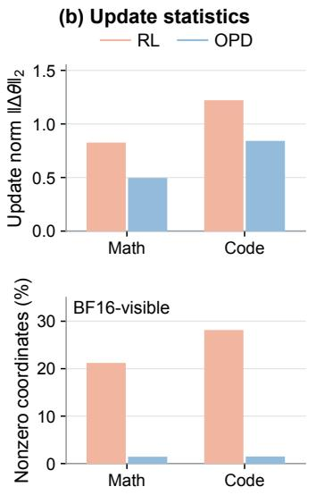

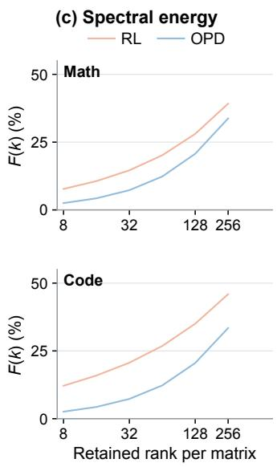

Merging hyperparameters and selection. For each merging operator, the reported configuration is selected as the best-performing one among the evaluated candidates. Raw Sum uses a global scale of λ = 1. For the cross-task TSV-M results in Table 2, the final merged update is scaled by $\alpha = 0 . 5$ for SmolLM3 and $\alpha = 1 . 0$ for Qwen.

## C COMPLETE PARAMETER-STRUCTURE DIAGNOSTICS

## C.1 PARAMETER-STRUCTURE MEASUREMENTS

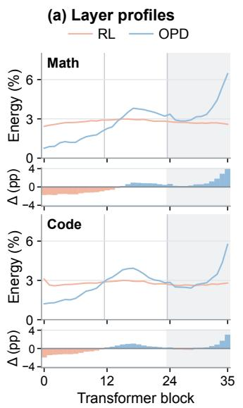  
Figure 5: Complete parameter-structure profiles for Math and Code. (a) Layer-wise squared $L _ { 2 }$ norms normalized by full-vector energy, with the final 12 Transformer layers shaded; lower strips show OPD minus RL in percentage points. (b) Task-vector $L _ { 2 }$ norms (top) and nonzero-coordinate fractions in task vectors computed from saved BF16 weights (bottom). (c) Spectral concentration $F ( k )$ , estimated as the fraction of total matrix-update energy captured by rank-k approximations across 252 attention and $\bf M L P$ projection matrices. The six measured ranks are 8, 16, 32, 64, 128, and 256, shown on a logarithmic axis. These are descriptive statistics of the evaluated checkpoints.

For task t and method $m \in \{ \mathrm { R L } , \mathrm { O P D } \}$ , we use $\Delta \theta _ { t , m } = \theta _ { t , m } - \theta _ { 0 }$ . Layer-wise energy is the squared $L _ { 2 }$ norm normalized by full-vector energy. The final 12 layers contain $3 2 . 1 \%  3 7 . 7 \%$ of update energy for Code and $3 2 . 3 \%  4 4 . 7 \%$ for Math, comparing RL with OPD; the share in the first 12 layers decreases in both tasks. The OPD $L _ { 2 }$ norm is 59.7% of RL for Math and 68.7% for Code, so absolute late-layer energy is lower despite its larger relative share. BF16-visible nonzerocoordinate fractions are 1.27% versus 21.04% for Math and 1.31% versus 27.98% for Code (OPD versus RL). These fractions count saved BF16 coordinates that differ from the base, rather than claiming exact sparsity at higher precision.

We estimate spectral concentration $F ( k )$ using approximate randomized SVD: rank-k retained energies are summed over 252 attention and MLP projection matrices and divided by their total update energy. OPD has lower $F ( k )$ at all six measured ranks, 8 through 256. $\mathrm { A t } ~ k = 2 5 6$ , OPD captures $3 3 . 4 \%$ of Code energy and 33.7% of Math energy, versus 45.9% and 39.2% for RL, respectively. Figure 5 provides the complete profiles.

## C.2 WITHIN-TASK DIAGNOSTICS AND CONTROLS

Scope of the within-task diagnostics. Figure 3, the orthogonal energy shares in Section 4.2, and the Code controls in Table 5 all use SmolLM3-3B. Within each task, the diagnostics use the same RL–OPD checkpoint pair; the Code controls reuse the checkpoints and shared anchor used for the Code geometry measurements. Table 5 reports mean score differences relative to the corresponding SmolLM3-3B Raw Sum model.

A local interpretation of the orthogonal residual. For $o = \alpha r + q$ and $\phi = \theta _ { 0 } + ( 1 + \alpha ) r$ , a smooth task loss has the local approximation $\begin{array} { r } { L ( \phi + q ) - L ( \phi ) \approx \nabla \hat { L ( \phi ) } ^ { \top } q + \frac { 1 } { 2 } q ^ { \top } H ( \phi ) q } \end{array}$ , where H is the loss Hessian. Orthogonality to r therefore does not determine the residual’s functional effect; this depends on its interaction with the task loss. This expression is a local interpretation, not a measured curvature result. The Code norm-matched controls support a directional contribution, whereas removing q also changes magnitude and cannot isolate direction.

Qwen within-task performance references. Separately, the Qwen3-4B RL specialist means in Table 2 and within-task Raw Sum means in Table 1 yield $5 9 . 7 8 - 6 0 . 1 4 = - 0 . 3 \bar { 6 }$ pp for Math and $4 1 . 0 1 - 3 7 . 5 1 = + 3 . 5 0$ pp for Code. These are within-task comparisons and show that gains vary by task; the cross-task Raw Sum rows of Table 2 are different compositions. These Qwen performance comparisons are separate from the SmolLM3-3B controls in Table 5.

## C.3 SCALE AND LOCALIZATION WITHIN TASK HOTSPOTS

The relative incoming energy in Eq. 4 factors as $R _ { t } = A _ { t } L _ { t }$ . Here $A _ { t }$ measures relative update scale, and $L _ { t }$ compares the off-task and own-task energy fractions entering the target hotspots $S _ { t }$ The factorization concerns the sum of individual incoming energies. Science’s ratio decreases from 3.613 to 3.262: its localization factor $L _ { t }$ decreases despite a slight increase in relative scale $A _ { t } .$ Agent’s ratio decreases from 4.637 to 3.103: At decreases substantially despite higher $L _ { t }$ . Code has reductions in both factors, while the increase in $A _ { t }$ outweighs lower $L _ { t }$ for Math and IF. Jaccard measures shared membership among selected channels, while $L _ { t }$ measures energy localization. Direction retention in Eq. 5 further captures the alignment among incoming vectors and with the target-task update through their actual vector sum.

## D ADDITIONAL CONTEXT ON OPD AND CAPABILITY INTEGRATION

On-Policy Distillation and Capability Integration. On-policy distillation (OPD) trains a student using teacher feedback on student-generated trajectories, reducing the mismatch between training sequences and inference-time behavior. Generalized Knowledge Distillation (GKD; Agarwal et al., 2024) studies this approach with flexible teacher–student divergence objectives, while MiniLLM (Gu et al., 2024) develops reverse-KL optimization for generative language-model distillation. Beyond single-teacher transfer, MOPD (Ma et al., 2026) consolidates domain-specific RL teachers into a shared student through token-level supervision on its own rollouts. Open-MOPD (Gao et al., 2026) examines capability imbalance in multi-teacher distillation, identifying token-level optimization-budget misallocation as a major bottleneck in its controlled setting and improving integration through budget balancing, adaptive allocation, and reward refresh. Complementing these training-time integration approaches, we examine the parameter updates produced by task-specific OPD and their reuse as task vectors for subsequent composition in parameter space.