# NODEGROUND: A NODE CLASSIFICATION BENCHMARK IN THE GRAPH FOUNDATION MODEL ERA

Jinmo Lee1∗ Dooho Lee1∗ Minho Jeong1∗ Jaemin Yoo1 1Nums AI

{jinmo.lee, dooho, minho.jeong, jaemin}@nums.world

## ABSTRACT

Can a pretrained graph model replace training and tuning a separate predictor for each dataset? Answering this requires evaluating prediction quality alongside computational cost. We present NODEGROUND, a node classification benchmark that puts graph foundation models (GFMs) and dataset-specific supervised learning under a common evaluation framework. The benchmark spans 51 datasets and evaluates six GFMs alongside 15 supervised methods under two label-availability regimes. Shared data partitions, validation-only model selection, controlled hyperparameter searches, and multiple predictive metrics make comparisons systematic, while workflow measurements account for adaptation, training, tuning, and inference. The results favor carefully tuned graph neural networks overall. GraphPFN reaches third place by Elo when more labels are available, yet its relative strengths vary substantially with dataset properties. Efficiency comparisons further qualify the benefits of pretrained reuse: GVT and GraphPFN appear on the Pareto frontiers when supervised methods are represented by their default and fully tuned configurations. Adding intermediate tuning budgets removes this advantage for GVT and leaves GraphPFN extending the estimated frontier in the label-rich setting alone. Thus, reusing pretrained parameters does not yet provide a broadly reliable route to either stronger predictions or cheaper workflows. We release the evaluation pipeline, run-level records, and an open leaderboard at https://github.com/nums-ai/nodeground.

## 1 INTRODUCTION

Graph neural networks (GNNs) learn node representations by propagating and aggregating information along graph edges (Kipf & Welling, 2016; Hamilton et al., 2017). They have shown strong performance across diverse domains, including social, scholarly, commerce, and transportation networks (Hu et al., 2020; Bazhenov et al., 2026; Liang et al., 2026). Although this success has made GNNs a dominant approach to node classification, achieving strong performance on a new graph typically requires training from scratch and extensive hyperparameter tuning, which demand substantial time and effort.

Recent graph foundation models (GFMs) aim to reduce this repeated cost by transferring pretrained knowledge to new graphs with minimal adaptation (Zhao et al., 2025; Lee et al., 2025; Lee & Yoo, 2026). Existing studies report promising gains of GFMs over GNNs (Choi et al., 2026; Eremeev et al., 2025a;b), but the consistency and cost-effectiveness ternatives to supervised methods trained and tuned separately for each dataset: (i) how consistently GFMs match or outperform supervised methods across diverse graph datasets, and (ii) how their adaptation cost compares with the cost of training and tuning a supervised method.

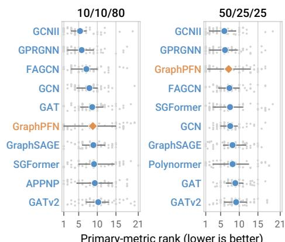  
Figure 1: Top ten methods under two label splits, ranked over 51 datasets using binary AUROC and multiclass accuracy. Gray points show dataset ranks; lines show IQRs.

To answer these questions, we need a large systematic benchmark that compares GFMs with supervised methods across diverse datasets with controlled cost measurements. Node classification is a natural setting for this comparison, as it has long served as a symbolic task in graph learning and requires models to fully leverage both features and graph topology. However, existing benchmarks remain fragmented across dataset suites (Hu et al., 2020; Pei et al., 2020; Zhu et al., 2020) and differ in data splits, implementations, and hyperparameter tuning (Shchur et al., 2018; Errica et al., 2019). This leaves no unified framework that combines broad dataset coverage, controlled evaluation, and computational cost measurement to assess the performance–cost trade-offs.

To address these gaps, we introduce NODEGROUND, a comprehensive node classification benchmark for evaluating GFMs with strong supervised methods. Our contributions are summarized as follows:

• Broad benchmark coverage. We curate 51 datasets across six domains, spanning diverse graph structures and feature specifications, and evaluate 15 supervised methods with six recent GFMs.

• Joint performance–cost measurement. We jointly measure predictive performance along with the wall-clock time required to adapt each GFM and to train and tune each supervised method.

• Standardized evaluation protocol. For every dataset, we evaluate all methods under two datasplit regimes of 10/10/80 and 50/25/25, each comprising five fixed splits. All evaluations use documented method implementations, predefined hyperparameter search spaces, equal configurationsearch budgets, and uniform model-selection criteria.

We further release the evaluation pipeline, exact data splits, raw results, and selected hyperparameters for each repeat. These resources support reproducibility and enable experiments and analyses beyond those reported here. To support continued GFM development, we also provide a leaderboard and submission system for evaluating new methods under the same protocol.

Main findings. As shown in Figure 1, GCNII (Chen et al., 2020) and GPRGNN (Chien et al., 2020) lead the mean-rank comparison under both splits. GraphPFN (Eremeev et al., 2025b) is the strongest GFM, rising from sixth under 10/10/80 to third under 50/25/25 (Section 5.1). However, these leading methods exhibit complementary strengths across data properties (Section 5.2). GVT (Lee et al., 2025) and GraphPFN lie on the performance–cost Pareto frontier in both regimes, but including intermediate tuning budgets leaves GraphPFN as the sole GFM on the frontier (Section 5.3). Current GFMs thus offer limited practical advantages, motivating future works to deliver stronger predictions across diverse graphs within the same budget as supervised training and tuning.

## 2 BACKGROUND

With foundation models, node classification has begun shifting from training a separate model for each graph to reusing a single pretrained model across graphs. We review this shift, examine gaps in current evaluations, and identify key requirements for evaluating this emerging paradigm.

Supervised node classification. Supervised graph neural networks (GNNs) have long dominated node classification and evolved through architectural advances in neighborhood aggregation (Kipf & Welling, 2016; Hamilton et al., 2017), attention-based message passing (Velickoviˇ c et al., 2017;´ Brody et al., 2021), decoupled transformation and propagation (Gasteiger et al., 2018; Wu et al., 2019; Chien et al., 2020), and scalable graph-wide interaction (Wu et al., 2022; 2023; Chen et al., 2022; Deng et al., 2024). However, strong performance typically requires training and extensive hyperparameter tuning for each graph dataset. This repeated optimization motivates GFMs, which seek to replace per-dataset learning with pretrained knowledge reusable across graphs.

Graph foundation models. GFMs move per-dataset learning into reusable pretrained components, with different expectations on what must be learned from each new dataset. GraphAny (Zhao et al., 2025) fits LinearGNN predictors per graph and combines their predictions using a pretrained model. GVT (Lee et al., 2025) and Node4All (Lee & Yoo, 2026) use pretrained encoders to produce node representations, on which a lightweight predictor is trained. A different approach comes from tabular learning. Prior-data fitted networks (PFNs) (Muller et al., 2021) are pretrained on synthetic¨ tables to predict from labeled examples as context, without updating model parameters on the target dataset. G2T-FM (Eremeev et al., 2025a) extends this paradigm to graphs by adding structural information to node features before passing them to a pretrained PFN. NodePFN (Choi et al., 2026) and GraphPFN (Eremeev et al., 2025b) incorporate graph structure more directly to the PFN architecture through graph-specific architectures and synthetic graph priors.

Table 1: Comparison of node-classification benchmarks and evaluation protocols. Columns correspond to the five criteria given in Section 2. Under Cost accounting, the three symbols indicate reporting of training, tuning, and inference costs, respectively. ❍, △, and × denote full, partial, and no documented support. A dagger marks an evaluation protocol rather than a benchmark. Appendix B.6 defines the criteria and documents the evidence for each assessment.
<table><tr><td rowspan="2"></td><td colspan="3">Dataset coverage Comparison control</td><td colspan="2">Eval. robustness</td><td colspan="2">Cost accounting</td><td colspan="2">Transparency</td></tr><tr><td>Number of datasets</td><td>HPO control</td><td>Val. selection</td><td>Data splits</td><td></td><td>Multi- metric</td><td>Compute cost</td><td>Raw Leader- results</td><td>board</td></tr><tr><td>Yang et al. (2016)†</td><td>4</td><td>X</td><td>O</td><td>1</td><td>X</td><td>× × ×</td><td></td><td>X</td><td>X</td></tr><tr><td>Shchur et al. (2018)†</td><td>8</td><td>O</td><td>△</td><td>100</td><td>X</td><td>× × ×</td><td></td><td>X</td><td>X</td></tr><tr><td>Pei et al. (2020)†</td><td>9</td><td>O</td><td>O</td><td>10</td><td>X</td><td>O × ×</td><td></td><td>X</td><td>X</td></tr><tr><td>Platonov et al. (2026)†</td><td>4</td><td>O</td><td>O</td><td>1</td><td>X</td><td></td><td>0〇〇</td><td>△</td><td>X</td></tr><tr><td>You et al. (2020)</td><td>18</td><td>O</td><td>△</td><td>3</td><td>X</td><td></td><td>ο△△</td><td>X</td><td>X</td></tr><tr><td>Hu et al. (2020)</td><td>5</td><td>X</td><td>O</td><td>1</td><td>X</td><td></td><td>× × ×</td><td>X</td><td>O</td></tr><tr><td>Lim et al. (2021)</td><td>7</td><td>△</td><td>O</td><td>5</td><td>X</td><td></td><td>△ × ×</td><td>X</td><td>X</td></tr><tr><td>Dwivedi et al. (2023)</td><td>3</td><td>△</td><td>△</td><td>{1, 20}</td><td>X</td><td></td><td>O × ×</td><td>X</td><td>X</td></tr><tr><td>Platonov et al. (2023b)</td><td>5</td><td>△</td><td>O</td><td>10</td><td>X</td><td></td><td>× × ×</td><td>X</td><td>X</td></tr><tr><td>Luo et al. (2024)</td><td>18</td><td>O</td><td>O</td><td>{1, 10}</td><td>X</td><td></td><td>× × ×</td><td>X</td><td>X</td></tr><tr><td>Bazhenov et al. (2026)</td><td>7</td><td>△</td><td>O</td><td>{2,3}</td><td>X</td><td></td><td>△ × ×</td><td>X</td><td>X</td></tr><tr><td>Yu et al. (2026)</td><td>15</td><td>△</td><td>X</td><td>50</td><td>O</td><td></td><td>△×△</td><td>X</td><td>X</td></tr><tr><td>NODEGROUND</td><td>51</td><td>O</td><td>O</td><td>5</td><td>O</td><td></td><td>0〇o</td><td>O</td><td>O</td></tr></table>

Limitations of current evaluations. Although these methods report matching or outperforming supervised GNNs in their original evaluations, the evidence remains limited in coverage or baseline strength. NodePFN (Choi et al., 2026) uses only graphs with fewer than 50,000 nodes, while G2T-FM (Eremeev et al., 2025a) and GraphPFN (Eremeev et al., 2025b) consider fewer than 500 input features. GraphAny (Zhao et al., 2025) and NodePFN (Choi et al., 2026) compare against only two GNNs; GVT (Lee et al., 2025) and Node4All (Lee & Yoo, 2026) cover more baselines but omit the residual connection and layer normalization, which can strengthen GNNs (Luo et al., 2024).

The computational advantages of GFMs also remain unclear, although reducing per-dataset adaptation costs is a central motivation for GFMs. Some methods require target-specific preprocessing or search (Choi et al., 2026; Lee et al., 2025), while dense interactions among labeled nodes can make PFN-based inference costly on large graphs (Choi et al., 2026; Eremeev et al., 2025b). These costs have not been systematically compared with the training and hyper-parameter tuning costs of super vised GNNs. Existing evaluations therefore leave unclear whether pretrained reuse offers consistent predictive gains at competitive computational costs over supervised methods.

Node-classification benchmarks. Existing node-classification benchmarks were primarily designed to compare and assess the power of supervised GNNs (Shchur et al., 2018; You et al., 2020; Luo et al., 2024) or to include diverse graph datasets (Pei et al., 2020; Lim et al., 2021; Hu et al., 2020; Platonov et al., 2023b; Bazhenov et al., 2026). Evaluating GFMs poses a different question: whether pretrained reuse works broadly, remains competitive with strong supervised methods, and reduces per-dataset computation. Answering this requires (i) dataset coverage across diverse graphs and domains, (ii) comparison control through consistent tuning and model selection, (iii) evaluation robustness across splits and predictive metrics, (iv) computational cost covering training, tuning, adaptation, and inference, and (v) transparency through released run-level results.

As summarized in Table 1, no benchmark in our comparison covers all five aspects. NODEGROUND brings them together with 51 datasets, two label regimes, controlled training and tuning, repeated multi-metric evaluation, comprehensive cost measurement, and released run-level results. Detailed definitions, scoring rules, and evidence for each entry are provided in Appendix B.6.

## 3 NODEGROUND DATASET COLLECTION

NODEGROUND focuses on transductive, single-label node classification on small- and mediumscale homogeneous attributed graphs. Directed and temporal sources are converted into static, undirected graphs. Multilabel classification, heterogeneous graphs, and web-scale training are outside the current scope. In this section, we describe how we curate 51 datasets within this scope (Section 3.1) and characterize their structural, feature, and label properties (Section 3.2).

## 3.1 DATASET SELECTION PROTOCOL

We collect 117 candidate datasets from four sources: datasets available through PyTorch Geometric (PyG) (Fey & Lenssen, 2019), the Open Graph Benchmark (OGB) (Hu et al., 2020), the heterophilous graph collection introduced by Platonov et al. (2023b),1 and the Text-Attributed-Graphs (TAG) collection introduced by Wang et al. (2025).2

Selection criteria. We screen candidates using five sequential checks. (1) The task must be node classification on a homogeneous graph. (2) Each labeled node must have a single class label. (3) The dataset must provide node attributes that are neither identity-only, topology-only, nor directly derived from target labels. (4) The graph and features must meet the specified scale limits. (5) The dataset must not duplicate one already retained. These checks successively reduce the pool to 101, 94, 79, 67, and 51 candidates.

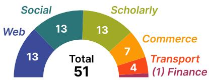  
Figure 2: Application domains of the 51 retained datasets.

As shown in Figure 2, the retained datasets span six application domains. Web, social, and scholarly datasets are equally represented, with 13 datasets each, alongside smaller collections from commerce (7), transport (4), and finance (1). No single domain accounts for more than approximately one quarter of the collection. Appendix B.2 details the selection criteria, stage-wise screening outcomes, and how duplicate datasets were handled. Appendix B.3 lists each retained dataset’s source, domain, prediction target, citation, and upstream license evidence.

## 3.2 COVERAGE OF DATASET PROPERTIES

Having established the sources and domains represented in NODEGROUND, we examine the range of its structural, feature, and target properties and how these properties combine within each dataset.

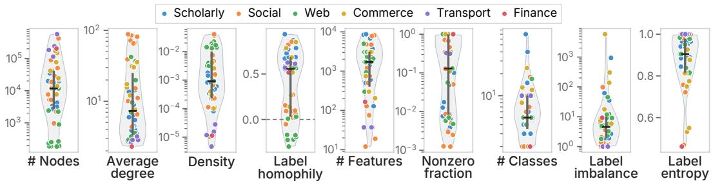  
Figure 3: Individual property coverage of NODEGROUND. Panels summarize graph structure, node features, and targets. Each point represents one dataset, with colors indicating application domains. Gray boxes show interquartile ranges and black lines show medians.

Individual property coverage. Figure 3 summarizes the dataset properties from left to right in terms of graph structure, node features, and prediction targets. The structural properties span several orders of magnitude in node count, average degree, and graph density. To measure label alignment with graph structure, we use adjusted homophily, which is the label-based form of Newman’s assortativity coefficient (Newman, 2003; Platonov et al., 2023a). The resulting values range from strongly heterophilous to strongly homophilous graphs. The feature matrices also cover both compact dense representations and high-dimensional sparse inputs. The tasks range from binary to high-cardinality classification, with class distributions ranging from balanced to highly imbalanced. These properties form distinct profiles across application domains. Transportation graphs are among the largest but have low average degree and density, while scholarly graphs tend to be homophilous and have high-dimensional, sparse features. Appendix B.5 reports the exact values for every dataset.

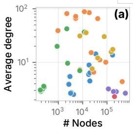

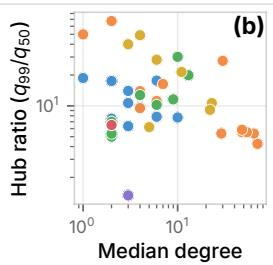

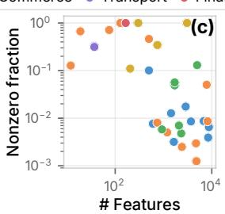

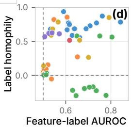  
Figure 4: Joint property coverage of NODEGROUND. (a) Node count versus average degree. (b) Median nonzero degree $q _ { 5 0 }$ versus hub concentration q99/q50. (c) Feature dimension versus nonzero fraction. (d) Class-balanced feature-similarity AUROC versus adjusted homophily. Dashed lines in panel (d) mark chance-level feature separation and zero adjusted homophily.

Joint property coverage. The marginal ranges above show how each property varies, but not which combinations a model encounters. Figure 4 reveals differences that a single statistic would miss. (a) Graphs with similar node counts can have very different average degrees, while (b) similar median degrees can hide large differences in hub concentration, measured as the ratio of the 99th-percentile to the median nonzero degree. (c) High-dimensional features can be either sparse or dense. (d) In eight datasets, features can distinguish labels despite negative adjusted homophily. Overall, datasets that look alike on one axis can present quite different learning conditions.

## 4 STANDARDIZED EVALUATION PROTOCOL

NODEGROUND standardizes data representation, label splits, hyperparameter optimization and model selection. Table 2 lists all evaluated methods, and Section C.2 provides implementation details.

Table 2: Methods evaluated in NODEGROUND. We evaluate 15 supervised models trained from scratch for each dataset and split, alongside six recent GFMs.
<table><tr><td>Group</td><td>Methods</td></tr><tr><td>Supervised</td><td>MLP (feature-only), GCN (Kipf &amp; Welling, 2016), GraphSAGE (Hamilton et al., 2017), GAT (Veličković et al., 2017), APPNP (Gasteiger et al., 2018), SGC (Wu et al., 2019), GCNII (Chen et al., 2020), FAGCN (Bo et al., 2021), GPRGNN (Chien et al., 2020), LINKX (Lim et al., 2021), GATv2 (Brody et al., 2021), NodeFormer (Wu et al., 2022),</td></tr><tr><td>Foundation</td><td>SGFormer (Wu et al., 2023), NAGphormer (Chen et al., 2022), Polynormer (Deng et al., 2024) G2T-FM (Eremeev et al., 2025a), GraphPFN (Eremeev et al., 2025b), NodePFN (Choi et al., 2026) GraphAny (Zhao et al., 2025), GVT (Lee et al., 2025), Node4All (Lee &amp; Yoo, 2026)</td></tr></table>

## 4.1 MODEL OPTIMIZATION AND DATA PROTOCOL.

Data representation and splits. We represent each dataset as a PyG Data object, coalesce repeated edges, make the graph undirected, and add a self-loop per node. Method-specific preprocess ing subsequently modifies this representation (Appendix C.3).

We use two shared, class-stratified train/validation/test ratios. The 10/10/80 split represents limited label availability, while the 50/25/25 split represents a label-rich setting. For each ratio, we use five fixed experimental indices, where each identifies one shared data partition and deterministically sets the random seeds for all stochastic components of the evaluation. Appendix D.1 explains how the indices determine the shared partitions and random seeds.

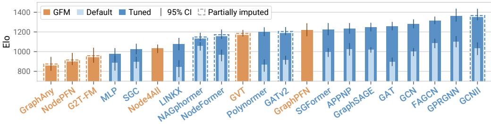  
(a) 10/10/80 split.

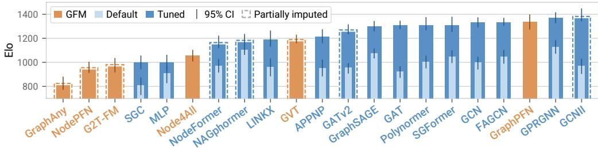  
(b) 50/25/25 split.  
Figure 5: Overall comparison of GFMs and supervised methods. Primary-metric Elo scores (binary AUROC and multiclass accuracy) across all 51 datasets under (a) 10/10/80 and (b) 50/25/25. Orange denotes GFMs, while light and dark blue denote the default and tuned supervised methods.

Hyperparameter optimization. Each supervised method is evaluated in both its default and tuned forms. The default evaluation uses the released or author-recommended configuration. The tuned result is selected from a pool containing the default and up to 200 unique configurations sampled from a method-specific search space. We train a model separately for each configuration and select the final checkpoint and configuration based on validation cross-entropy. GFMs retain their released pretrained components and optimize only the target-specific preprocessing, label-conditioning, or head-training choices exposed by their interfaces. Appendix C.4 reports the default settings, search spaces, executed trial counts, and method-level selection outcomes.

## 4.2 EVALUATION AND REPORTING

We first average each method’s scores over the five experimental indices for dataset-level summaries. The main analysis then weights all 51 datasets equally, while missing results are replaced with the default-GCN result. Appendix D.3 provides details on the full aggregation and imputation.

Predictive performance. We use accuracy as the primary metric for multiclass and AUROC for binary datasets. We also report macro-F1 and cross-entropy for multiclass datasets, as well as accuracy, positive-class precision, and binary cross-entropy for binary datasets. For overall comparisons, we report Elo ratings derived from pairwise method outcomes on these primary metrics.

Computational cost. In terms of costs, we record training-and-tuning time, prediction time, their sum (as total workflow time), and peak allocated GPU memory during fitting and prediction. For the default configuration, training-and-tuning time includes preprocessing and representation construction within the overall training process. For the tuned method, it includes all executed search trials. GFM measurements exclude upstream pretraining and previously cached downloads. Appendix D.4 specifies the measurement boundaries and compute environments.

## 5 EXPERIMENTAL RESULTS

We present the first systematic comparison of six GFMs and 15 supervised methods across 51 node classification datasets, assessing both predictive generality and computational efficiency.

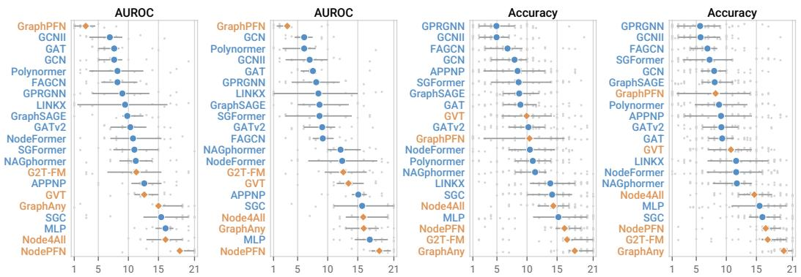  
Figure 6: Primary-metric ranks of all methods. From left to right: binary, 10/10/80; binary, 50/25/25; multiclass, 10/10/80; and multiclass, 50/25/25. Gray points show dataset ranks, gray horizontal lines show interquartile ranges, and large markers show mean ranks (blue circles for supervised methods and orange diamonds for GFMs).

## 5.1 HOW DO GFMS COMPARE WITH SUPERVISED METHODS (RQ1)?

RQ1 asks whether the cross-dataset reuse offered by GFMs translates into predictive performance competitive with methods trained and tuned for each dataset.

Tuned supervised methods remain strongest overall. Figure 5 reports primary-metric Elo scores across all 51 datasets. GVT and GraphPFN score above all default supervised configurations under both splits. After tuning, however, GCNII and GPRGNN occupy the two leading positions in both regimes. GraphPFN remains the strongest GFM, ranking below several tuned methods under 10/10/80 but rising to third under 50/25/25. The remaining GFMs fall below the leading tuned methods in both regimes. Thus, gains over default baselines do not necessarily persist against well-tuned supervised methods, although GraphPFN remains competitive with sufficient labeled nodes.

GraphPFN leads on binary tasks but trails on multiclass tasks. Figure 6 separates the overall comparison into binary and multiclass tasks. On binary tasks, GraphPFN achieves the best mean AUROC rank under both splits, ahead of the tuned supervised methods, whereas the other GFMs generally rank lower. On multiclass tasks, this advantage disappears. GPRGNN and GCNII lead under both splits, while the GFMs are generally less competitive. Thus, GraphPFN’s strong overall position under 50/25/25 split Elo leaderboard reflects a pronounced advantage on binary tasks together with improved multiclass performance as more labeled nodes become available.

## 5.2 HOW BROADLY DO GFMS TRANSFER ACROSS DATASET CONDITIONS (RQ2)?

GFMs aim to reuse pretrained knowledge across graphs with different structures, features, and prediction tasks. We examine how broadly this promise holds by comparing performance across dataset conditions. We focus on GraphPFN, the highest-ranked GFM in our benchmark, and compare it with well-tuned GCNII and GPRGNN. Figure 7 reports mean within-dataset ranks across 22 overlapping subgroups defined by seven properties. Ranks use each dataset’s primary metric and include all 21 methods. Appendices B.4 and B.5 define the properties and report their per-dataset values.

Transfer remains uneven across graph conditions. GraphPFN ranks ahead of both GNNs on binary tasks, high-degree graphs, and graphs with intermediate label homophily under the 10/10/80 splits. However, it fails under strong homophily, on high-dimensional features, and on highly imbalanced targets. Tasks with more than ten classes also remain unfavorable. Thus, even the highest ranked GFM does not provide consistently competitive results across dataset conditions, indicating that its success in some settings does not translate into broad transfer across diverse graphs.

More labeled context does not resolve the gaps. Under the 50/25/25 split, GraphPFN ranks ahead of both GNNs on large graphs and datasets with intermediate feature nonzero fractions. Yet its weaknesses on high-dimensional features, highly imbalanced targets, and tasks with more than ten classes persist. Additional context therefore does not suffice to make its predictions competitive. These persistent gaps suggest limitations in adapting pretrained representations to a new graph. Moreover, tasks with more than ten classes exceed the output space of GraphPFN’s tabular foundation mode backbone and require mechanisms such as output coding (Eremeev et al., 2025b). Feature adaptation and larger label spaces are therefore concrete priorities for extending its applicability.

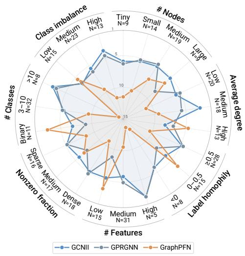  
(a) 10/10/80 split.

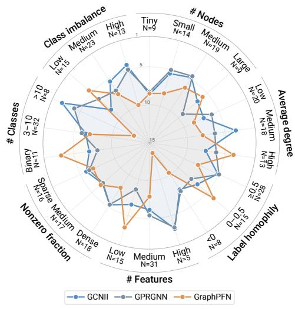  
(b) 50/25/25 split.

Figure 7: Primary-metric ranks across dataset conditions. GCNII, GPRGNN, and GraphPFN are compared across 22 subgroups. The radial scale is truncated at rank 15. Farther outward indicates a better (lower) rank; N denotes the number of datasets in each subgroup.  
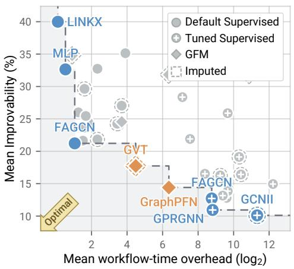  
(a) 10/10/80 split.

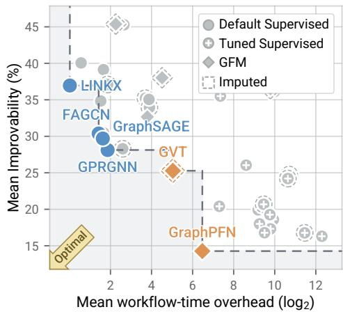  
(b) 50/25/25 split.  
Figure 8: Performance–cost frontiers under both label splits. Mean Improvability is plotted against mean workflow-time overhead for GFMs and the default and tuned supervised methods. Dashed lines mark the Pareto frontiers; lower is better on both axes.

## 5.3 DO GFMS IMPROVE THE PERFORMANCE–COST FRONTIER (RQ3)?

GFMs can be useful without outperforming supervised methods if they offer competitive predictions at lower cost. We measure predictive quality using Mean Improvability, the average fraction of error removable by matching the best method on each dataset (Erickson et al., 2026). We introduce Mean Overhead as a general measure of computational cost, defined as the $\log _ { 2 }$ geometric-mean cost ratio relative to the least costly method on each dataset; a value of k means $2 ^ { k }$ times the reference cost. We use workflow time as the metric of cost for this RQ. Appendix D.5 provides formal definitions.

Two GFMs occupy the endpoint frontiers. Figure 8 compares the performance–cost frontiers under (a) 10/10/80 and (b) 50/25/25, plotting mean workflow-time overhead against Mean Improvability. GVT and GraphPFN lie on the Pareto frontier under both splits. GVT reaches the frontier through lower workflow time but retains a larger predictive gap. GraphPFN achieves stronger predictions at greater cost and, under 50/25/25, attains the lowest Mean Improvability. Its mean workflow-time overhead of approximately 6.4, however, corresponds to roughly 84× the reference cost. All other GFMs are dominated by methods with both better performance and lower cost.

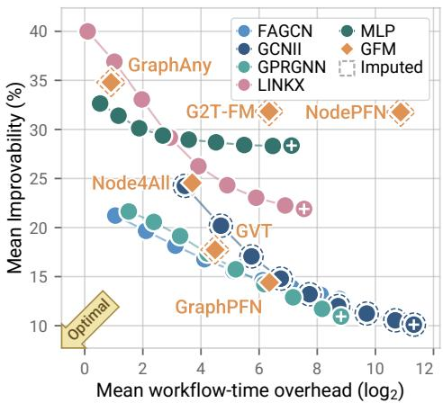  
(a) 10/10/80 split.

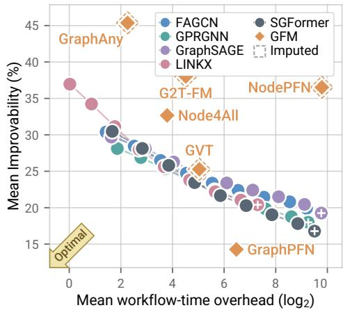  
(b) 50/25/25 split.  
Figure 9: Performance–cost trajectories across tuning budgets. Lines trace supervised methods from 1 to 201 configurations, while diamonds mark GFMs, under (a) 10/10/80 and (b) 50/25/25.

Only GraphPFN reaches the frontier against partially tuned methods. The above comparisons can overstate the effectiveness of GFMs because they represent each supervised method only before and after a full tuning. The stricter test is whether a GFM outperforms the best supervised configuration attainable with the same or less workflow time. Figure 9 enables this comparison by tracing supervised methods over budgets of 1, 2, 4, 8, 16, 32, 64, 128, and 201 configurations. Intermediate workflow costs are interpolated between the default and full-search endpoints (Appendix D.5).

Under this new setting, partially tuned supervised methods overtake both GVT and GraphPFN under 10/10/80, so no GFM expands the aggregate performance–cost frontier. Under 50/25/25, GraphPFN is the sole exception. It achieves lower Mean Improvability than every supervised trajectory and extends the estimated aggregate frontier, whereas all remaining GFMs are dominated.

Avoiding target-specific training often shifts cost to inference. PFN-based GFMs such as G2T-FM, NodePFN, and GraphPFN rely on self-attention with quadratically growing cost to the context length. Their avoidance of target-specific optimization can therefore be offset by expensive adaptation and inference. In contrast, GFMs with lighter mechanisms run faster but generally underperform partially tuned supervised methods at comparable costs. Together with RQ1 and RQ2, this result sets a concrete goal for future GFMs: they should outperform the best supervised method attainable within the same workflow-time budget, consistently across label regimes and graph conditions.

## 6 CONCLUSION

The idea of graph foundation models (GFMs) is that knowledge acquired from pretraining should reduce the work needed to work on a new graph. NODEGROUND tests how far current GFMs fulfill this promise through a unified comparison of 21 methods across 51 node-classification datasets. The results expose a gap between reusing a pretrained model and obtaining broadly competitive predictions. Tuned GNNs remain the strongest overall, while GraphPFN’s strengths depend on the prediction task, graph conditions, and available labels. Avoiding model parameter updates also does not guarantee an inexpensive workflow, as adaptation and inference can absorb the computation.

These findings establish a definite target for future GFMs. Pretrained knowledge should support competitive predictions across varied graphs within the time a supervised method would need to train and tune. Achieving this requires progress in both transfer across feature and label spaces and the cost of using the pretrained model. By releasing shared splits, implementations, trial-level results, and a public leaderboard, NODEGROUND makes these requirements testable.

Limitations and future work. Our evaluation focuses on node classification under fixed label budgets and shared data splits. Although the datasets span diverse graph conditions, these protocols do not fully capture non-IID settings, where labeled and query nodes may come from systematically different communities or time periods. Evaluating such shifts would clarify whether the benefits of pretrained knowledge persist under distribution changes. The conclusions also do not extend to edge-level or graph-level tasks, such as link prediction and graph classification. Extending the benchmark to these settings would provide a broader assessment of graph foundation models.

## REFERENCES

Gleb Bazhenov, Oleg Platonov, and Liudmila Prokhorenkova. Graphland: Evaluating graph machine learning models on diverse industrial data. Advances in Neural Information Processing Systems, 38, 2026.

Deyu Bo, Xiao Wang, Chuan Shi, and Huawei Shen. Beyond low-frequency information in graph convolutional networks. In Proceedings of the AAAI conference on artificial intelligence, volume 35, pp. 3950–3957, 2021.

Aleksandar Bojchevski and Stephan Gunnemann. Deep gaussian embedding of graphs: Unsuper-¨ vised inductive learning via ranking. arXiv preprint arXiv:1707.03815, 2017.

Shaked Brody, Uri Alon, and Eran Yahav. How attentive are graph attention networks? arXiv preprint arXiv:2105.14491, 2021.

Jinsong Chen, Kaiyuan Gao, Gaichao Li, and Kun He. Nagphormer: A tokenized graph transformer for node classification in large graphs. arXiv preprint arXiv:2206.04910, 2022.

Ming Chen, Zhewei Wei, Zengfeng Huang, Bolin Ding, and Yaliang Li. Simple and deep graph convolutional networks. In International conference on machine learning, pp. 1725–1735. PMLR, 2020.

Eli Chien, Jianhao Peng, Pan Li, and Olgica Milenkovic. Adaptive universal generalized pagerank graph neural network. arXiv preprint arXiv:2006.07988, 2020.

Jeongwhan Choi, Jongwoo Kim, Woosung Kang, and Noseong Park. Learning posterior predictive distributions for node classification from synthetic graph priors. arXiv preprint arXiv:2604.19028, 2026.

Mark Craven, Dan DiPasquo, Dayne Freitag, Andrew McCallum, Tom Mitchell, Kamal Nigam, and Sean Slattery. Learning to extract symbolic knowledge from the world wide web.´ AAAI/IAAI, 3 (3.6):2, 1998.

Chenhui Deng, Zichao Yue, and Zhiru Zhang. Polynormer: Polynomial-expressive graph transformer in linear time. In International Conference on Learning Representations, volume 2024, pp. 18323–18348, 2024.

Vijay Prakash Dwivedi, Chaitanya K Joshi, Anh Tuan Luu, Thomas Laurent, Yoshua Bengio, and Xavier Bresson. Benchmarking graph neural networks. Journal of Machine Learning Research, 24(43):1–48, 2023.

Dmitry Eremeev, Gleb Bazhenov, Oleg Platonov, Artem Babenko, and Liudmila Prokhorenkova. Turning tabular foundation models into graph foundation models. arXiv preprint arXiv:2508.20906, 2025a.

Dmitry Eremeev, Oleg Platonov, Gleb Bazhenov, Artem Babenko, and Liudmila Prokhorenkova. Graphpfn: A prior-data fitted graph foundation model. arXiv preprint arXiv:2509.21489, 2025b.

Nick Erickson, Lennart Purucker, Andrej Tschalzev, David Holzmuller, Prateek Desai, David Sali-¨ nas, and Frank Hutter. Tabarena: A living benchmark for machine learning on tabular data. Advances in Neural Information Processing Systems, 38, 2026.

Federico Errica, Marco Podda, Davide Bacciu, and Alessio Micheli. A fair comparison of graph neural networks for graph classification. arXiv preprint arXiv:1912.09893, 2019.

Matthias Fey and Jan Eric Lenssen. Fast graph representation learning with pytorch geometric. arXiv preprint arXiv:1903.02428, 2019.

Johannes Gasteiger, Aleksandar Bojchevski, and Stephan Gunnemann. Predict then propagate:¨ Graph neural networks meet personalized pagerank. arXiv preprint arXiv:1810.05997, 2018.

Will Hamilton, Zhitao Ying, and Jure Leskovec. Inductive representation learning on large graphs. Advances in neural information processing systems, 30, 2017.

Weihua Hu, Matthias Fey, Marinka Zitnik, Yuxiao Dong, Hongyu Ren, Bowen Liu, Michele Catasta, and Jure Leskovec. Open graph benchmark: Datasets for machine learning on graphs. Advances in neural information processing systems, 33:22118–22133, 2020.

Xiao Huang, Jundong Li, and Xia Hu. Label informed attributed network embedding. In Proceedings of the tenth ACM international conference on web search and data mining, pp. 731–739, 2017.

Thomas N Kipf and Max Welling. Semi-supervised classification with graph convolutional networks. arXiv preprint arXiv:1609.02907, 2016.

Dooho Lee and Jaemin Yoo. Node4all: Learning node representation beyond datasets. In Proceedings of the 32nd ACM SIGKDD Conference on Knowledge Discovery and Data Mining V. 2, pp. 2461–2472, 2026.

Dooho Lee, Myeong Kong, Minho Jeong, and Jaemin Yoo. View space: Learning representation across arbitrary graphs. arXiv preprint arXiv:2512.11561, 2025.

Jundong Li, Xia Hu, Jiliang Tang, and Huan Liu. Unsupervised streaming feature selection in social media. In Proceedings of the 24th ACM international on conference on information and knowledge management, pp. 1041–1050, 2015.

Huidong Liang, Haitz Saez de Oc´ ariz Borde, Baskaran Sripathmanathan, Michael Bronstein, and´ Xiaowen Dong. Towards quantifying long-range interactions in graph machine learning: a large graph dataset and a measurement. In International Conference on Learning Representations, volume 2026, pp. 34655–34688, 2026.

Derek Lim, Felix Hohne, Xiuyu Li, Sijia Linda Huang, Vaishnavi Gupta, Omkar Bhalerao, and Ser Nam Lim. Large scale learning on non-homophilous graphs: New benchmarks and strong simple methods. Advances in neural information processing systems, 34:20887–20902, 2021.

Yuankai Luo, Lei Shi, and Xiao-Ming Wu. Classic gnns are strong baselines: Reassessing gnns for node classification. Advances in Neural Information Processing Systems, 37:97650–97669, 2024.

Julian McAuley, Christopher Targett, Qinfeng Shi, and Anton Van Den Hengel. Image-based recommendations on styles and substitutes. In Proceedings of the 38th international ACM SIGIR conference on research and development in information retrieval, pp. 43–52, 2015.

Peter Mernyei and C´ at˘ alina Cangea. Wiki-cs: A wikipedia-based benchmark for graph neural net-˘ works. arXiv preprint arXiv:2007.02901, 2020.

Samuel Muller, Noah Hollmann, Sebastian Pineda Arango, Josif Grabocka, and Frank Hutter. Trans-¨ formers can do bayesian inference. arXiv preprint arXiv:2112.10510, 2021.

Galileo Namata, Ben London, Lise Getoor, Bert Huang, and U Edu. Query-driven active surveying for collective classification. In 10th international workshop on mining and learning with graphs, volume 8, pp. 1, 2012.

Mark EJ Newman. Mixing patterns in networks. Physical review E, 67(2):026126, 2003.

Hongbin Pei, Bingzhe Wei, Kevin Chen-Chuan Chang, Yu Lei, and Bo Yang. Geom-gcn: Geometric graph convolutional networks. arXiv preprint arXiv:2002.05287, 2020.

Oleg Platonov, Denis Kuznedelev, Artem Babenko, and Liudmila Prokhorenkova. Characterizing graph datasets for node classification: Homophily-heterophily dichotomy and beyond. Advances in Neural Information Processing Systems, 36:523–548, 2023a.

Oleg Platonov, Denis Kuznedelev, Michael Diskin, Artem Babenko, and Liudmila Prokhorenkova. A critical look at the evaluation of gnns under heterophily: Are we really making progress? arXiv preprint arXiv:2302.11640, 2023b.

Oleg Platonov, Gleb Bazhenov, Dmitry Eremeev, and Liudmila Prokhorenkova. A fair evaluation of graph foundation models for node property prediction. arXiv preprint arXiv:2606.24509, 2026.

Benedek Rozemberczki and Rik Sarkar. Characteristic functions on graphs: Birds of a feather, from statistical descriptors to parametric models. In Proceedings of the 29th ACM international conference on information & knowledge management, pp. 1325–1334, 2020.

Benedek Rozemberczki, Carl Allen, and Rik Sarkar. Multi-scale attributed node embedding. Journal ofComplex Networks, 9(2):cnab014, 2021.

Prithviraj Sen, Galileo Namata, Mustafa Bilgic, Lise Getoor, Brian Gallagher, and Tina Eliassi-Rad. Collective classification in network data. AI magazine, 29(3):93–106, 2008.

Oleksandr Shchur, Maximilian Mumme, Aleksandar Bojchevski, and Stephan Gunnemann. Pitfalls¨ of graph neural network evaluation. arXiv preprint arXiv:1811.05868, 2018.

Amanda L Traud, Peter J Mucha, and Mason A Porter. Social structure of facebook networks. Physica A: Statistical Mechanics and its Applications, 391(16):4165–4180, 2012.

Petar Velickoviˇ c, Guillem Cucurull, Arantxa Casanova, Adriana Romero, Pietro Lio, and Yoshua´ Bengio. Graph attention networks. arXiv preprint arXiv:1710.10903, 2017.

Haoyu Peter Wang, Shikun Liu, Rongzhe Wei, and Pan Li. Generalization principles for inference over text-attributed graphs with large language models. In Forty-second International Conference on Machine Learning, 2025.

Mark Weber, Giacomo Domeniconi, Jie Chen, Daniel Karl I Weidele, Claudio Bellei, Tom Robinson, and Charles E Leiserson. Anti-money laundering in bitcoin: Experimenting with graph convolutional networks for financial forensics. arXiv preprint arXiv:1908.02591, 2019.

Felix Wu, Amauri Souza, Tianyi Zhang, Christopher Fifty, Tao Yu, and Kilian Weinberger. Simplifying graph convolutional networks. In International conference on machine learning, pp. 6861–6871. Pmlr, 2019.

Qitian Wu, Wentao Zhao, Zenan Li, David P Wipf, and Junchi Yan. Nodeformer: A scalable graph structure learning transformer for node classification. Advances in neural information processing systems, 35:27387–27401, 2022.

Qitian Wu, Wentao Zhao, Chenxiao Yang, Hengrui Zhang, Fan Nie, Haitian Jiang, Yatao Bian, and Junchi Yan. Sgformer: Simplifying and empowering transformers for large-graph representations. Advances in neural information processing systems, 36:64753–64773, 2023.

Renchi Yang, Jieming Shi, Xiaokui Xiao, Yin Yang, Juncheng Liu, Sourav S Bhowmick, et al. Scaling attributed network embedding to massive graphs. Proceedings of the VLDB Endowment, 14(1):37–49, 2020.

Zhilin Yang, William Cohen, and Ruslan Salakhudinov. Revisiting semi-supervised learning with graph embeddings. In International conference on machine learning, pp. 40–48. PMLR, 2016.

Jiaxuan You, Zhitao Ying, and Jure Leskovec. Design space for graph neural networks. Advances in Neural Information Processing Systems, 33:17009–17021, 2020.

Xingtong Yu, Shenghua Ye, Ruijuan Liang, Chang Zhou, Hong Cheng, Xinming Zhang, and Yuan Fang. Evaluating progress in graph foundation models: A comprehensive benchmark and new insights. arXiv preprint arXiv:2603.10033, 2026.

Hanqing Zeng, Hongkuan Zhou, Ajitesh Srivastava, Rajgopal Kannan, and Viktor Prasanna. Graphsaint: Graph sampling based inductive learning method. arXiv preprint arXiv:1907.04931, 2019.

Jianan Zhao, Zhaocheng Zhu, Mikhail Galkin, Hesham Mostafa, Michael Bronstein, and Jian Tang. Fully-inductive node classification on arbitrary graphs. In International Conference on Learning Representations, volume 2025, pp. 23968–23986, 2025.

Jiong Zhu, Yujun Yan, Lingxiao Zhao, Mark Heimann, Leman Akoglu, and Danai Koutra. Beyond homophily in graph neural networks: Current limitations and effective designs. Advances in neural information processing systems, 33:7793–7804, 2020.

## Table of Contents.

A Additional Analyses and Robustness 15   
A.1 Analysis Cohorts and Sensitivity to Evaluation Choices . 15   
A.2 Performance–Memory Tradeoffs . 22   
A.3 Pairwise Win Rates and Statistical Significance 22   
A.4 Tuning Requirements and Model-Selection Robustness . 23   
B Dataset Curation and Catalog 27   
B.1 Candidate Sources 27   
B.2 Ordered Screening, Canonicalization, and Task Identity 27   
B.3 Retained Dataset Catalog 28   
B.4 Dataset Properties 28   
B.5 Per-Dataset Statistics 30   
B.6 Benchmark Comparison Criteria and Evidence . 35   
C Methods, Artifacts, and Optimization 37   
C.1 Method Scope and GFM Definition 37   
C.2 Implementations and Target-Dataset Adaptation . 37   
C.3 Pretrained Artifacts, Preprocessing, and Overlap 38   
C.4 Optimization Protocol, Search Spaces, and Outcomes . 38   
D Evaluation and Computational Accounting 43   
D.1 Splits and Randomness 43   
D.2 Predictive Metrics and Model Selection 43   
D.3 Aggregation, Missing Results, and Uncertainty 43   
D.4 Computational Measurement . 44   
D.5 Mean Improvability, Mean Overhead, and Pareto Frontiers . 45   
E Additional Dataset-Level and Configuration Results 46   
E.1 Dataset-Level Predictive Outcomes 46   
E.2 Configuration-Level Rankings 47   
E.3 Predictive Coverage 48

## A ADDITIONAL ANALYSES AND ROBUSTNESS

The main analysis reveals a clear trade-off between predictive performance and computational cost among the 21 evaluated methods. Tuned GNNs are strongest overall, while GraphPFN is the only GFM to join the leading group; its strongest results occur in the label-rich regime and require substantial computation. This appendix examines the robustness and practical implications of these findings. We first check whether the conclusions change when we use different subsets of datasets and methods, handle missing results differently, or change the predictive metrics and aggregation rules. We then compare alternative measures of computational cost, examine how often each method outperforms another across datasets, and quantify how tuning budgets affect performance and cost.

## A.1 ANALYSIS COHORTS AND SENSITIVITY TO EVALUATION CHOICES

Section 5 compares all 21 methods across the full set of 51 datasets. Because some method–dataset results are unavailable, the primary rankings replace them with the corresponding GCN-Default results. We assess the sensitivity of the conclusions to this choice by recomputing the rankings under three fixed cohorts that vary dataset coverage, method coverage, and imputation.

Cohort V1 (full benchmark) follows the main-text policy of replacing each unavailable result with the corresponding GCN-Default result. Cohort V2 (complete case) retains the 28 datasets with observed results for all 21 methods and uses no predictive imputation. Cohort V3 (restricted method) retains all 51 datasets but limits the comparison to 15 near-complete methods. Its only imputed entries are GraphAny and GVT on ogbn arxiv, whose observed results are excluded because of pretraining overlap. Table 3 reports the details for each cohort.

Table 3: Predictive-result cohorts used throughout the paper and release. A run cell is one dataset–method–split–index record. Cohort V3 is near-complete rather than a strict complete-case cohort. Its 20 imputed run cells are GraphAny and GVT on ogbn arxiv.
<table><tr><td>Cohort</td><td>Definition</td><td>Split</td><td>Datasets</td><td>Methods</td><td>Idx.</td><td>Cells</td><td>Imputed</td></tr><tr><td>V1</td><td>Full benchmark</td><td>10/10/80</td><td>51</td><td>21</td><td>5</td><td>5355</td><td>144</td></tr><tr><td>V1</td><td>Full benchmark</td><td>50/25/25</td><td>51</td><td>21</td><td>5</td><td>5355</td><td>244</td></tr><tr><td>V2</td><td>Complete case</td><td>10/10/80</td><td>28</td><td>21</td><td>5</td><td>2940</td><td>0</td></tr><tr><td>V2</td><td>Complete case</td><td>50/25/25</td><td>28</td><td>21</td><td>5</td><td>2940</td><td>0</td></tr><tr><td>V3</td><td>Restricted method</td><td>10/10/80</td><td>51</td><td>15</td><td>5</td><td>3825</td><td>10</td></tr><tr><td>V3</td><td>Restricted method</td><td>50/25/25</td><td>51</td><td>15</td><td>5</td><td>3825</td><td>10</td></tr></table>

The leading methods remain similar across evaluation subsets. Figure 10 compares Elo rankings under both label splits using all 51 datasets (V1), the 28 datasets with complete results (V2), and all 51 datasets with a reduced set of methods (V3). Under 10/10/80, GCNII leads V1 and V2, while GPRGNN leads V3, which excludes GCNII. Under 50/25/25, GraphPFN rises from third in V1 to first in V2, whereas GPRGNN leads V3. GraphPFN’s exact position therefore depends on which datasets and competitors are included, but it remains the sole GFM among the leading methods. Across all three comparisons, the strongest competition comes from tuned GNNs.

Metric-specific strengths persist across cohorts. Figures 11–14 compare within-dataset ranks for every reported predictive metric. Across all three cohorts, GraphPFN leads binary accuracy, AUROC, and binary cross-entropy under both splits, whereas positive-class precision produces a different ordering. The multiclass results consistently favor GPRGNN and FAGCN, together with GCNII in the cohorts that include it. Accuracy and Macro-F1 yield similar leading groups; crossentropy moves several methods but does not make any GFM a consistent multiclass leader. The main contrast between GraphPFN’s binary strength and the GNN advantage on multiclass datasets is therefore not created by imputation or by a single predictive metric.

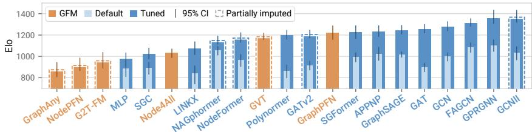

(a) Cohort V1, 10/10/80.  
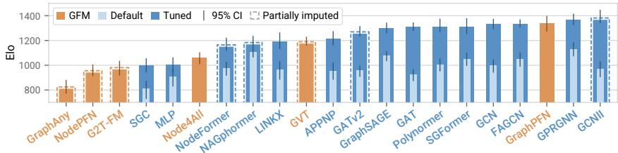

(b) Cohort V1, 50/25/25.  
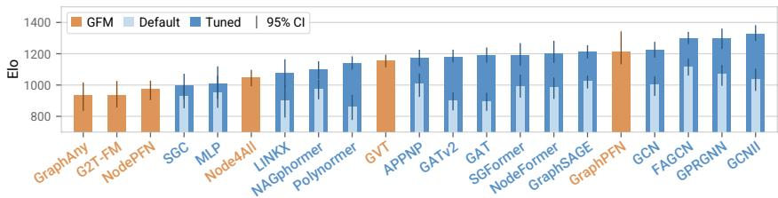

(c) Cohort V2, 10/10/80.  
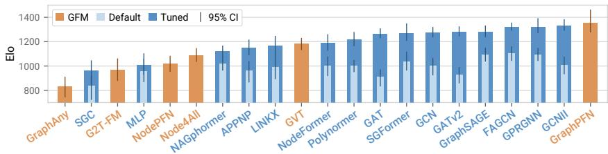

(d) Cohort V2, 50/25/25.  
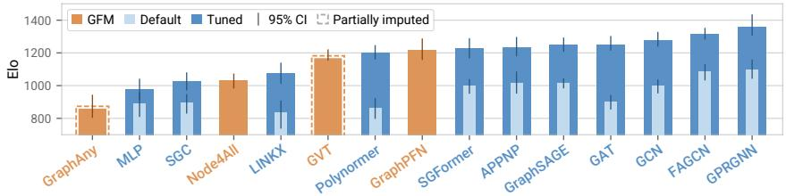

(e) Cohort V3, 10/10/80.  
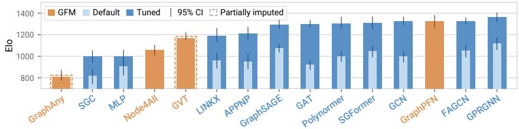  
(f) Cohort V3, 50/25/25.  
Figure 10: Elo leaderboards across analysis cohorts and label splits. Cohort V1 evaluates all 21 methods on all 51 datasets using the benchmark replacement policy; Cohort V2 uses the 28 complete-case datasets; and Cohort V3 evaluates 15 near-complete methods on all 51 datasets. Dashed outlines identify partially imputed results, and error bars show 95% confidence intervals.

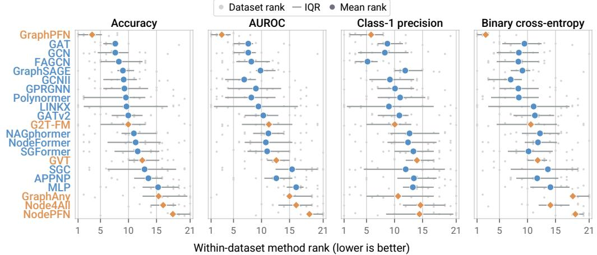

(a) Cohort V1.  
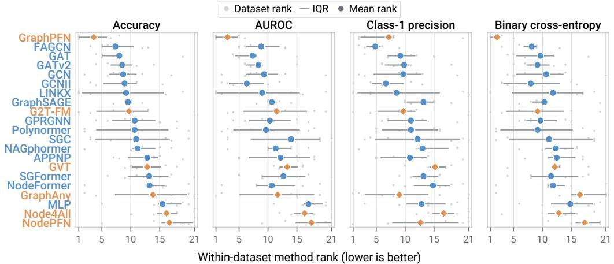

(b) Cohort V2.  
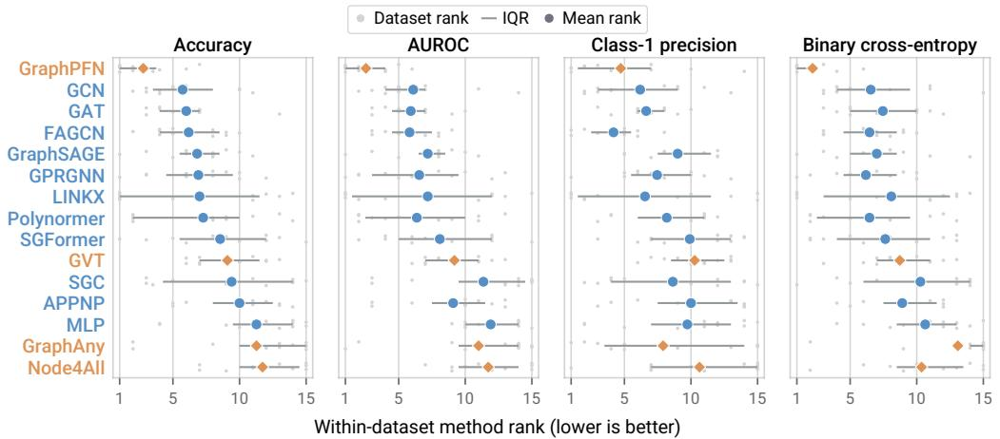  
(c) Cohort V3.  
Figure 11: Binary-metric ranks across analysis cohorts under the 10/10/80 split. Gray points show dataset-level ranks, and gray horizontal lines show interquartile ranges. Large blue circles and orange diamonds show mean ranks for supervised methods and GFMs, respectively. Lower ranks are better.

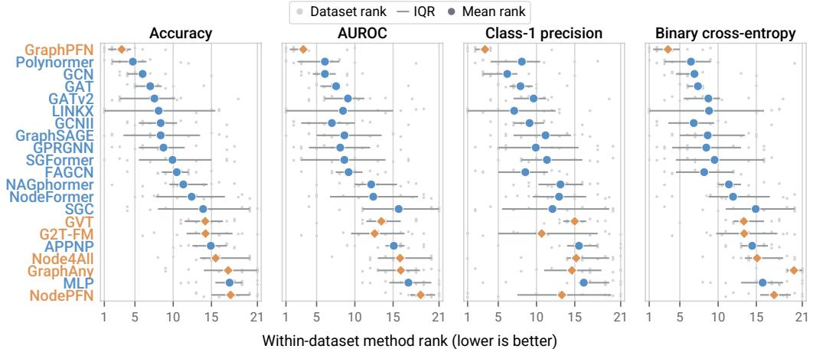

(a) Cohort V1.  
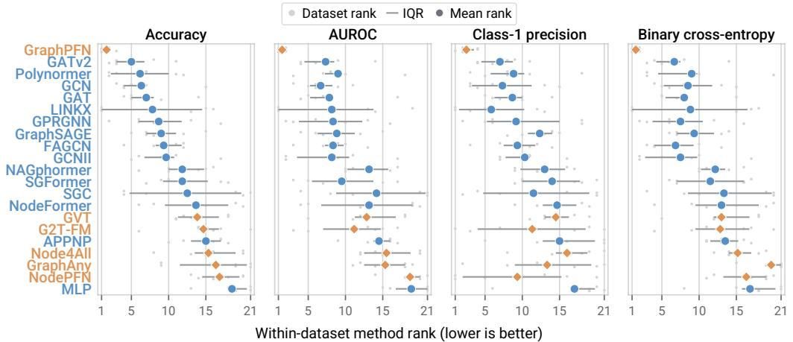

(b) Cohort V2.  
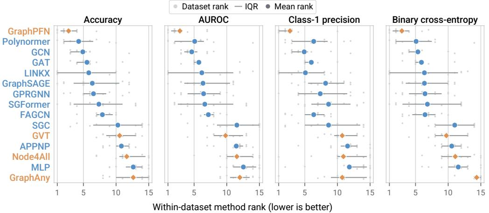  
(c) Cohort V3.  
Figure 12: Binary-metric ranks across analysis cohorts under the 50/25/25 split. Panels and visual encodings follow Figure 11.

(b) Cohort V2.  
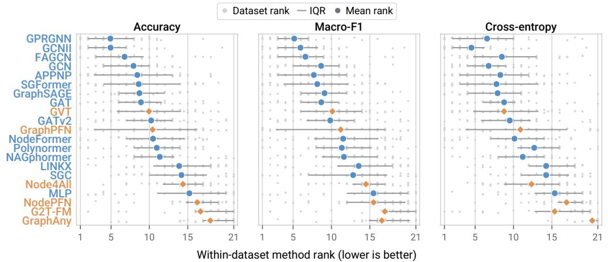

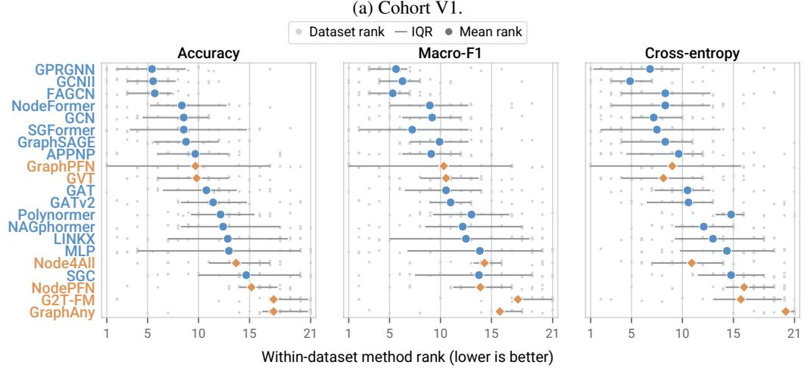

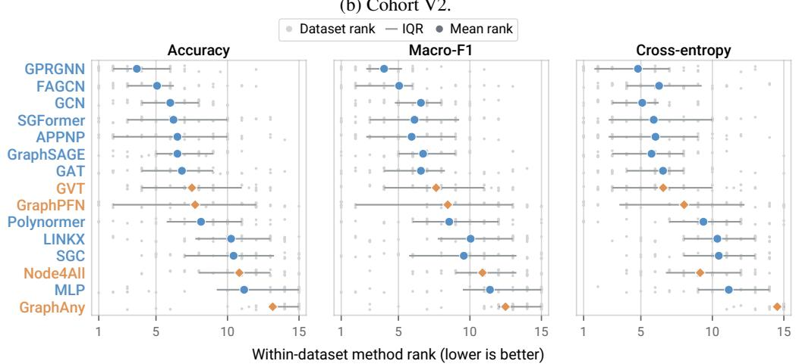  
(c) Cohort V3.  
Figure 13: Multiclass-metric ranks across analysis cohorts under the 10/10/80 split. Gray points show dataset-level ranks, and gray horizontal lines show interquartile ranges. Large blue circles and orange diamonds show mean ranks for supervised methods and GFMs, respectively. Lower ranks are better.

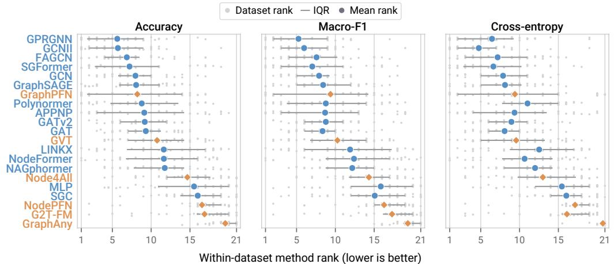

(a) Cohort V1.  
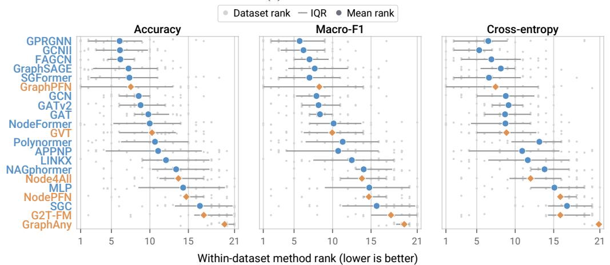

(b) Cohort V2.  
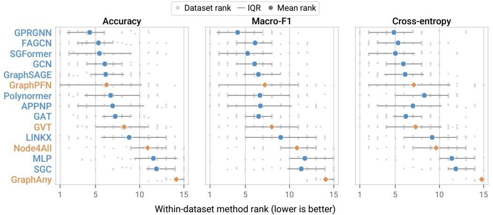  
(c) Cohort V3.  
Figure 14: Multiclass-metric ranks across analysis cohorts under the 50/25/25 split. Panels and visual encodings follow Figure 13.

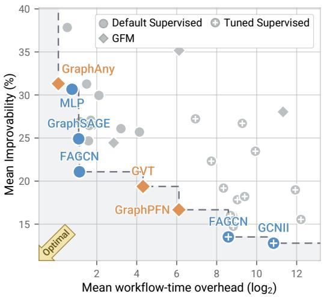  
(a) Cohort V2, 10/10/80 split.

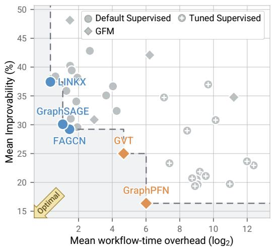  
(b) Cohort V2, 50/25/25 split.

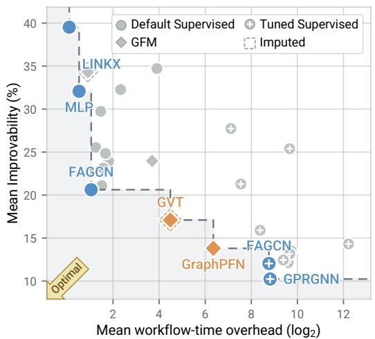  
(c) Cohort V3, 10/10/80 split.

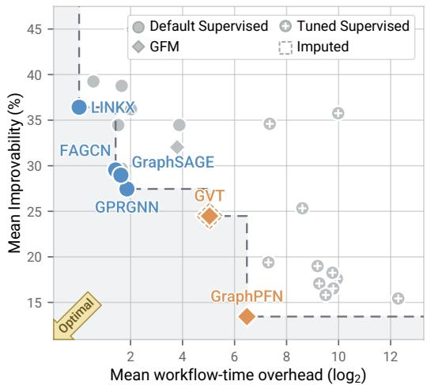  
(d) Cohort V3, 50/25/25 split.  
Figure 15: Workflow-time performance–cost frontiers under alternative analysis cohorts. Mean Improvability is plotted against Mean Overhead from total target-dataset time; lower is better on both axes. Dashed lines mark Pareto frontiers. The Cohort V1 analyses appear in Figure 8.

The performance–cost conclusion also survives cohort changes. Figure 15 repeats the endpoint performance–cost analysis for V2 and V3 and complements the V1 results in Figure 8. Cohort choice changes some efficient low-cost points: GraphAny, for example, joins the low-overhead end of the V2 frontier under 10/10/80. It does not change the central tradeoff. In every cohort, GraphPFN trails the strongest tuned GNNs under 10/10/80 but attains the lowest Mean Improvability under 50/25/25, always at substantial workflow overhead. GVT remains cheaper but leaves a larger predictive gap. Apart from the low-cost GraphAny exception noted above, the remaining GFMs are dominated. Thus neither complete-case filtering nor the restricted method universe produces a GFM that is both broadly strong and computationally inexpensive.

Changing the metric can change which methods rank highest. Using the 28 datasets with complete results (V2), Table 4 checks whether different predictive metrics give similar method rankings. For multiclass tasks, switching from accuracy to Macro-F1 barely changes the ordering: the Spearman correlations are 0.978 and 0.989 under 10/10/80 and 50/25/25, respectively. For binary tasks, AUROC and positive-class precision give less consistent rankings, with Kendall correlations of 0.519 and 0.664. A method that ranks positive examples above negative ones well may therefore not be the best at avoiding false positives among its positive predictions. The preferred method can depend on which of these objectives matters for the task.

Table 4: Selected ranking correlations on Cohort V2. The released correlation table contains every metric, split, and aggregation comparison.
<table><tr><td>Comparison</td><td>Coefficient</td><td>10/10/80</td><td>50/25/25</td><td>Interpretation</td></tr><tr><td>Multiclass accuracy vs. Macro-F1</td><td>Spearman</td><td>0.978</td><td>0.989</td><td>Strong agreement</td></tr><tr><td>Binary AUROC vs. positive precision</td><td>Kendall</td><td>0.519</td><td>0.664</td><td>Metric-sensitive ordering</td></tr></table>

Table 5: Agreement among cross-dataset aggregation rules on Cohort V2. Rank denotes mean within-dataset rank and MI denotes Mean Improvability. Each coefficient is the Spearman correlation between the indicated pair of complete method rankings. Leader is the method ranked first by all three rules. Max. shift is the largest change in any method’s position across the three rankings, and Same top four indicates whether they retain the same set of four leading methods.
<table><tr><td>Split</td><td>Rank-Elo</td><td>Rank-MI</td><td>Elo-MI</td><td>Leader</td><td>Max. shift</td><td>Same top four</td></tr><tr><td>10/10/80</td><td>0.990</td><td>0.962</td><td>0.969</td><td>GCNII</td><td>4</td><td>No</td></tr><tr><td>50/25/25</td><td>0.993</td><td>0.972</td><td>0.955</td><td>GraphPFN</td><td>6</td><td>No</td></tr></table>

Changing how results are combined preserves the winner, but not every position. Table 5 combines the same V2 results in three ways. Mean rank summarizes where each method places on each dataset, Elo summarizes how often it beats other methods, and Mean Improvability measures how much of its prediction error could be removed by using the best configuration. All three place GCNII first under 10/10/80 and GraphPFN first under 50/25/25. The overall orderings are also similar, with pairwise Spearman correlations ranging from 0.955 to 0.993. However, individual methods move by up to four places under 10/10/80 and six under 50/25/25, and the set of top-four methods changes. Thus, the choice of summary measure does not change the winner in either split, but it does affect comparisons among the remaining methods.

## A.2 PERFORMANCE–MEMORY TRADEOFFS

We examine whether the performance–cost tradeoff in RQ3 also holds when computational cost is measured by peak GPU memory rather than workflow time. Using Cohort V1, we compare 15 supervised-method defaults, 15 tuned endpoints, and six GFMs across all 51 datasets. Missing performance and memory values are replaced with the corresponding GCN-Default results, following the main-text policy.

Low memory use and strong predictions favor different GFMs. Figure 16 plots Mean Improvability against memory overhead. Workflow peak memory is the larger of the fit/search and prediction peaks, not their sum, because these stages run sequentially. For GraphAny, which fits on CPU, we use its prediction-stage GPU peak; this measure does not include CPU memory.

GraphAny anchors the low-memory end of the frontier under both splits, but leaves a large predictive gap. GraphPFN is dominated under 10/10/80 and reaches the 50/25/25 frontier through stronger predictions, at roughly 26 times the reference memory on a geometric-mean basis. Thus, the two GFMs reach the frontier for different reasons: GraphAny minimizes GPU memory use, whereas GraphPFN trades substantially more memory for predictive quality. The memory analysis therefore reinforces the workflow-time finding: current GFMs do not consistently combine strong predictions with low resource requirements across both label regimes.

## A.3 PAIRWISE WIN RATES AND STATISTICAL SIGNIFICANCE

Overall rankings do not show how often one method outperforms a particular competitor. We first compare every pair of methods across all 51 datasets (V1), using the same replacement policy for missing results as in the main analysis. We then test whether the observed performance differences are statistically supported using the 28 datasets with complete results.

The Elo leader does not win most often against every competitor. Figure 17 shows how often each row method outperforms each column method across datasets. A win rate above 50% means that the row method wins more often than its competitor. Although GCNII ranks first by Elo under both label splits, it does not have a majority of wins against every method. Under 10/10/80, GPRGNN wins more often than all 20 competitors, including GCNII. Under 50/25/25, GraphPFN ranks third by Elo but wins more often than every competitor, including GCNII and GPRGNN.

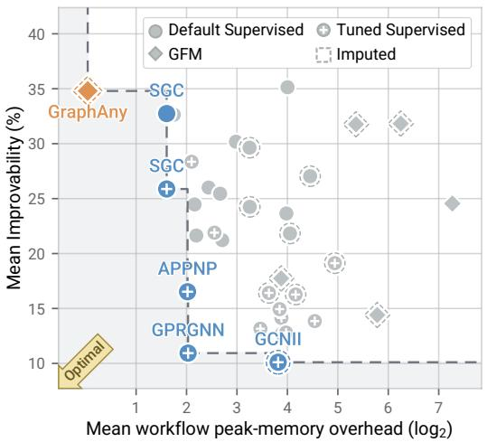  
(a) 10/10/80 split.

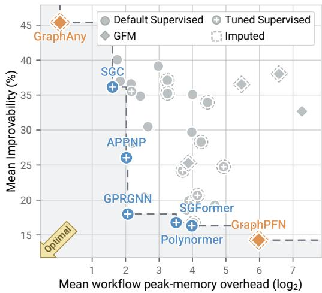  
(b) 50/25/25 split.  
Figure 16: Workflow-peak-memory performance–cost frontiers on Cohort V1. Mean Improvability is plotted against Mean Overhead from the larger of fit/search and prediction peak GPU memory. Dashed lines mark Pareto frontiers; lower is better on both axes.

These results reflect different ways of summarizing performance. Elo fits a single rating to pairwise outcomes across datasets and experimental indices, whereas the win-rate analysis compares scores averaged over the five indices within each dataset. A narrow majority against a strong competitor can therefore coexist with a lower overall Elo rating. The pairwise results complement the leaderboard by showing which direct comparisons depart from its overall ordering.

Winning more often does not establish a reliable performance advantage. A win rate counts a small improvement and a large improvement equally. A method can therefore win on more datasets while losing by larger margins on others. To assess whether the performance differences provide evidence of an advantage, we compare each pair’s scores on the same datasets using a paired Wilcoxon signed-rank test. This test considers both the direction and the relative size of the differences without assuming that they follow a normal distribution. We use the 28 datasets with complete results so that these tests rely entirely on observed scores.

Within each label split, we test all ${ \binom { 2 1 } { 2 } } = 2 1 0$ method pairs. Testing so many pairs increases the chance of declaring an advantage by chance. We therefore apply Holm’s correction to keep the probability of any false-positive conclusion across the 210 tests at no more than 5%, under the test assumptions. All tests are two-sided, and exact ties are handled using the Pratt procedure.

Table 6 counts the statistically significant wins and losses for each method. A significant win requires a positive median score difference and a Holm-adjusted $p < 0 . 0 5$ . Under 10/10/80, GCNII records 11 significant wins and no losses, while GraphPFN records one significant win. Under 50/25/25, GraphPFN records seven significant wins and no losses; GCNII and FAGCN each record eight, and GPRGNN records six. These counts use 28 datasets, so they are not directly comparable to the win-rate counts over all 51 datasets above. GraphPFN has more statistically supported advantages when more labels are available, but no method significantly outperforms every competitor. The absence of a significant difference also does not establish that two methods perform equally.

## A.4 TUNING REQUIREMENTS AND MODEL-SELECTION ROBUSTNESS

Our main experiments compare GFMs with supervised methods trained and tuned separately for each dataset. For each supervised method, the search evaluates up to 201 configurations and selects one using validation data. We now examine how much of this search is needed to obtain strong test performance, and whether improvements on validation nodes carry over to test nodes. This analysis covers the 15 supervised methods on the 28 datasets with complete results.

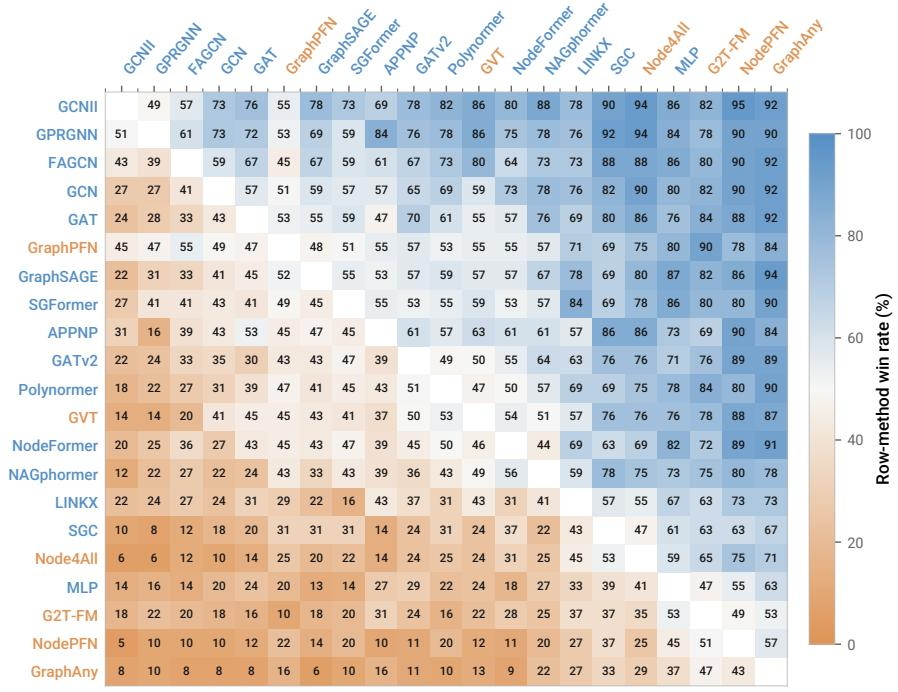  
(a) 10/10/80 split.

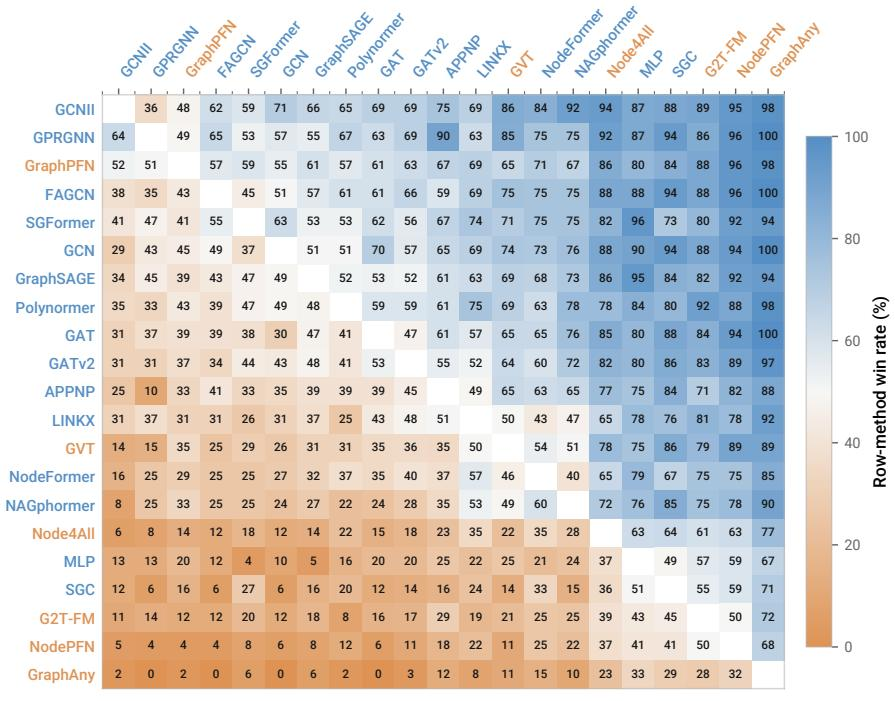  
(b) 50/25/25 split.  
Figure 17: Pairwise primary-metric win rates on Cohort V1. Each cell gives the percentage of the 51 datasets on which the row method beats the column method. Methods are ordered separately for each split by increasing mean within-dataset primary-metric rank.

Table 6: Holm-corrected pairwise comparisons. Counts are computed on the 28-dataset predictive complete-case cohort, with Holm correction applied jointly across all 210 method pairs within each split. Counts summarize the 20 paired method comparisons for each row method. A win requires a positive median paired effect and adjusted $p < 0 . 0 5$
<table><tr><td></td><td colspan="2">10/10/80</td><td colspan="2">50/25/25</td></tr><tr><td>Method</td><td>Significant wins</td><td>Significant losses</td><td>Significant wins</td><td>Significant losses</td></tr><tr><td>GCNII</td><td>11</td><td></td><td></td><td>0</td></tr><tr><td>GraphPFN</td><td></td><td></td><td></td><td>0</td></tr><tr><td>GPRGNN</td><td></td><td></td><td>7 6</td><td>0</td></tr><tr><td>FAGCN</td><td></td><td></td><td>8</td><td>0</td></tr><tr><td>GCN</td><td>5</td><td></td><td>7</td><td>0</td></tr><tr><td>GraphSAGE</td><td>4</td><td></td><td>7</td><td>0</td></tr><tr><td>SGFormer</td><td>3</td><td>0 0</td><td>4</td><td>0</td></tr><tr><td>NodeFormer</td><td>4</td><td>0</td><td>3</td><td>0</td></tr><tr><td>GAT</td><td>1</td><td>1</td><td>5</td><td>0</td></tr><tr><td>GATv2</td><td>0</td><td>1</td><td>6</td><td>0</td></tr><tr><td>GVT</td><td>3</td><td>1</td><td>4</td><td>0</td></tr><tr><td>Polynormer</td><td>0</td><td>2</td><td>3</td><td>0</td></tr><tr><td>APPNP</td><td>1</td><td>1</td><td>1</td><td>4</td></tr><tr><td>LINKX</td><td>0</td><td>0</td><td>2</td><td>0</td></tr><tr><td>NAGphormer</td><td>0</td><td>1</td><td>1</td><td>7</td></tr><tr><td>MLP</td><td>0</td><td>3</td><td>0</td><td>6</td></tr><tr><td>Node4All</td><td>0</td><td>6</td><td>1</td><td>8</td></tr><tr><td>NodePFN</td><td>0</td><td>8</td><td>0</td><td>11</td></tr><tr><td>SGC</td><td>0</td><td>4</td><td>0</td><td>9</td></tr><tr><td>G2T-FM</td><td>0</td><td>10</td><td>0</td><td>12</td></tr><tr><td>GraphAny</td><td>0</td><td>7</td><td>0</td><td>16</td></tr></table>

We reuse stored trials to evaluate budgets of 1, 2, 5, 10, 25, 50, 100, 150, and 201 attempted configurations. Each search starts with the default configuration. We randomly reorder the remaining 200 configurations 20 times and evaluate progressively larger portions of each order. At every budget, validation cross-entropy or binary cross-entropy selects the configuration. Failed trials count toward the budget but cannot be selected. We then measure the selected configuration’s performance on both validation and test nodes, using accuracy for multiclass tasks and AUROC for binary tasks.

Some methods benefit much more from tuning than others. We summarize tuning with two quantities. The first is the test improvement from the default to the full 201-configuration search. The second is the smallest evaluated budget that comes within one percentage point of the full-search result. Letting $P _ { m } ( k )$ denote method m’s mean test score at budget k, these quantities are

$$
\Delta _ { m } = P _ { m } ( 2 0 1 ) - P _ { m } ( 1 ) , \qquad B _ { m } ^ { \mathrm { 1 p p } } = \operatorname* { m i n } \left\{ k : P _ { m } ( k ) \geq P _ { m } ( 2 0 1 ) - 1 \mathrm { ~ p e r c e n t a g e ~ p o i n t } \right\} .
$$

Table 7 shows substantial differences between methods. Under 10/10/80, tuning improves SGC by 1.2 percentage points but Polynormer by 9.4. GCN, GPRGNN, and Polynormer need 50 configurations to come within one point of their full-search results. Under 50/25/25, GAT and GATv2 improve by about ten points and reach this threshold at 50 configurations. MLP improves by only 1.4 points and reaches it after two. A small tuning budget therefore captures most of the benefit for some methods while understating the performance of others.

The table also reports estimated workflow cost relative to the default. For example, the 50- configuration budgets above cost approximately 28× the default under 10/10/80. Intermediate costs are estimated by linear interpolation between the measured default and full-search costs,

$$
C _ { k } = C _ { 1 } + \frac { k - 1 } { 2 0 0 } ( C _ { 2 0 1 } - C _ { 1 } ) .
$$

They are not direct measurements of cumulative trial time. The main-text performance–cost trajectories use a different set of budgets, as specified in Appendix D.5.

Table 7: Tuning dependence by method. ∆ is the test-performance gain from 1 to 201 configurations. $B ^ { \mathrm { 1 p p } }$ is the smallest sampled budget within one percentage point of the 201-configuration result. Results average the 28-dataset predictive complete-case cohort, five experimental indices, and 20 nested configuration samples. Cost is the workflow multiplier relative to the default, estimated by linear interpolation between the measured default and 201-configuration endpoints.
<table><tr><td></td><td colspan="3">10/10/80</td><td colspan="3">50/25/25</td></tr><tr><td>Method</td><td> $\Delta \left( \mathsf { p p } \right)$ </td><td> $B ^ { \mathrm { 1 p p } }$ </td><td>Cost at B (×)</td><td> $\Delta \left( \mathsf { p p } \right)$ </td><td> $B ^ { \mathrm { 1 p p } }$ </td><td>Cost at B (×)</td></tr><tr><td>APPNP</td><td>4.5</td><td>25</td><td>14.0</td><td>6.0</td><td>25</td><td>14.8</td></tr><tr><td>FAGCN</td><td>3.0</td><td>10</td><td>5.6</td><td>2.9</td><td>25</td><td>14.8</td></tr><tr><td>GAT</td><td>7.3</td><td>25</td><td>13.9</td><td>10.0</td><td>50</td><td>29.4</td></tr><tr><td>GATv2</td><td>6.9</td><td>25</td><td>10.2</td><td>10.0</td><td>50</td><td>20.1</td></tr><tr><td>GCN</td><td>5.5</td><td>50</td><td>27.7</td><td>8.2</td><td>25</td><td>14.7</td></tr><tr><td>GCNII</td><td>5.9</td><td>25</td><td>13.1</td><td>5.3</td><td>25</td><td>13.9</td></tr><tr><td>GPRGNN</td><td>5.1</td><td>50</td><td>28.0</td><td>3.3</td><td>25</td><td>14.8</td></tr><tr><td>GraphSAGE</td><td>3.6</td><td>25</td><td>13.9</td><td>2.9</td><td>25</td><td>14.7</td></tr><tr><td>LINKX</td><td>7.3</td><td>25</td><td>13.9</td><td>4.6</td><td>25</td><td>14.7</td></tr><tr><td>MLP</td><td>1.7</td><td>5</td><td>2.8</td><td>1.4</td><td>2</td><td>1.3</td></tr><tr><td>NAGphormer</td><td>2.0</td><td>5</td><td>2.7</td><td>2.6</td><td>25</td><td>13.8</td></tr><tr><td>NodeFormer</td><td>3.3</td><td>25</td><td>7.5</td><td>2.8</td><td>25</td><td>7.9</td></tr><tr><td>Polynormer</td><td>9.4</td><td>50</td><td>28.0</td><td>4.9</td><td>25</td><td>14.8</td></tr><tr><td>SGC</td><td>1.2</td><td>5</td><td>2.8</td><td>2.0</td><td>10</td><td>5.9</td></tr><tr><td>SGFormer</td><td>3.5</td><td>25</td><td>14.0</td><td>2.8</td><td>25</td><td>14.7</td></tr></table>

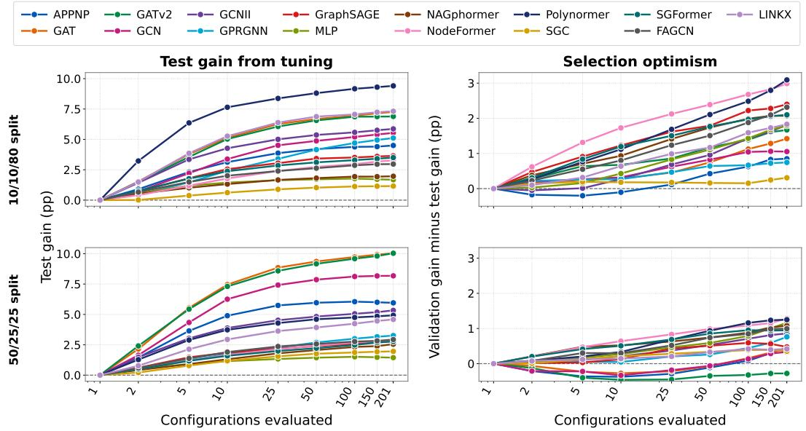  
Figure 18: How tuning improves test performance and changes the gap between validation and test gains. Left: test-score improvement over the default configuration. Right: validation improvement minus test improvement, each measured relative to the default. Positive values mean that tuning appears more beneficial on validation nodes than on test nodes. All gains are in percentage points (pp). Configurations are selected by validation loss; gains use multiclass accuracy or binary AUROC. Curves average over 28 datasets, five shared splits, and 20 search orders.

Most test gains appear within 25–50 configurations. The left panels of Figure 18 show how test performance improves as more configurations are tried. Polynormer benefits most under 10/10/80, while GAT and GATv2 benefit most under 50/25/25. For every method, extending the search from 50 to 201 configurations adds less than one percentage point on average. Much of the full-search cost therefore buys relatively little additional improvement. This pattern supports comparing GFMs with partially tuned supervised methods, whose performance can approach the full-search result at substantially lower cost.

With fewer labels, validation gains exceed test gains by more. The right panels check whether the improvement observed during model selection is also realized on test nodes. We subtract the test improvement from the validation improvement, both relative to the default. For example, a fivepoint validation gain and a two-point test gain produce a gap of three points. This quantity is called selection optimism:

$$
O _ { m } ( k ) = \left[ V _ { m } ( k ) - V _ { m } ( 1 ) \right] - \left[ P _ { m } ( k ) - P _ { m } ( 1 ) \right] ,
$$

where $V _ { m } ( k )$ is the mean validation primary metric of the configuration selected at budget k. Zero means that validation and test improve equally; negative values mean that test improves more.

Under 10/10/80, this gap generally grows with the search budget and reaches approximately three points. Under 50/25/25, it stays below 1.3 points and is sometimes negative. Thus, with fewer labels, the improvement observed on validation nodes can substantially overstate the improvement on unseen test nodes. Together, the two columns show why larger searches need careful interpretation: test gains can level off while validation gains continue to grow.

## B DATASET CURATION AND CATALOG

This section documents how the benchmark dataset collection was constructed. It identifies the four candidate sources, applies a fixed sequence of eligibility checks, records every canonicalization decision, and enumerates the 51 retained tasks. It then defines the dataset properties and group assignments used in the main analyses.

## B.1 CANDIDATE SOURCES

We assembled 117 loader records from PyTorch Geometric (PyG), the Hugging Face Text-Attributed-Graphs collection (HF TAG), the Heterophilous Graphs collection, and OGB. Table 8 reports the initial records, the records remaining after the four eligibility checks, and the canonical tasks retained from each channel.

Table 8: Candidate records and retained benchmark tasks by discovery channel. Eligible records pass the scope, target, feature, and scale checks. Final tasks are counted after canonicalization.

<table><tr><td>Source channel</td><td>Candidate records</td><td>Eligible records</td><td>Retained tasks</td></tr><tr><td>PyG</td><td>94</td><td>48</td><td>32</td></tr><tr><td>HF TAG</td><td>11</td><td>11</td><td>11</td></tr><tr><td>Heterophilous</td><td>11</td><td>7</td><td>7</td></tr><tr><td>OGB</td><td>1</td><td>1</td><td>1</td></tr><tr><td>Total</td><td>117</td><td>67</td><td>51</td></tr></table>

## B.2 ORDERED SCREENING, CANONICALIZATION, AND TASK IDENTITY

Every candidate passes through five checks in a fixed order. The scope check requires homogeneous, single-domain, single-graph node classification. The target check requires one verified categorical label per evaluated node. The feature check requires observable, label-independent node information supplied upstream or produced by a documented transformation. Missing, identity-based, and topology-only features are excluded. The scale check enforces the graph and feature limits. Finally, canonicalization merges eligible loader records that represent the same benchmark task. Table 9 defines each decision and shows how the pool decreases from 117 records to 51 tasks.

The first four checks retain 67 eligible records. Fifteen alias groups then consolidate 16 redundant records, with most groups joining two loader records and pubmed joining three. Records are merged only when their graph structure, node attributes, and target semantics identify the same task. Table 10 lists every merged alias. Since some datasets are exposed through multiple loaders, we merge records only when they provide the same graph, node features, and labels. We do not merge cora, pubmed, and wiki cs with their respective TAG variants because each pair shares the same graph topology but provides different node features. They therefore remain separate benchmark tasks, yielding 51 tasks over 48 distinct graph topologies.

Table 9: Ordered candidate-screening criteria and resulting funnel. Each record is assigned to the first check that it fails.
<table><tr><td>Check</td><td>Criterion</td><td>Excluded</td><td>Retained</td><td>Typical exclusions or merges</td></tr><tr><td>Scope</td><td>Homogeneous, single-domain, single-graph node classification.</td><td>16</td><td></td><td>101 PPI, WikipediaNetwork:Crocodile, Twitch:DE</td></tr><tr><td>Target</td><td>Verified categorical single label per evaluated node.</td><td>7</td><td>94</td><td>Yelp, AttributedGraphDataset:PPI, AttributedGraphDataset:Facebook</td></tr><tr><td>Feature</td><td>Eligible observable node attributes; no missing, identity-only, topology-only, or disallowed legacy representations.</td><td>15</td><td>79</td><td>KarateClub, Roman-empire, Minesweeper</td></tr><tr><td>Scale</td><td> $\dot { F ^ { \prime } } \le 1 0 , 0 0 0 ; | V | _ { \star } | \le 1 . 7 \times 1 0 ^ { 6 } ;$  |V||E| ≤ 5 × 1011.</td><td>12</td><td></td><td>67 NELL, Reddit, Reddit2</td></tr><tr><td></td><td>Canonicalization Merge eligible loader records representing the same benchmark task.</td><td>16</td><td></td><td>51 CitationFull:Cora, CitationFull:PubMed, AttributedGraphDataset:Cora</td></tr></table>

Table 10: Eligible loader-record aliases consolidated into canonical benchmark tasks.  
Canonical task Records Merged loader records   
actor 2 Actor; heterophilous graph:actor   
amazon ratings 2 HeterophilousGraphDataset:Amazon-ratings; heterophilous graph:amazon ratings   
chameleon 2 WikipediaNetwork:Chameleon; heterophilous graph:chameleon   
citeseer 2 Planetoid:CiteSeer; AttributedGraphDataset:CiteSeer   
cora 2 Planetoid:Cora; AttributedGraphDataset:Cora   
cornell 2 WebKB:Cornell; heterophilous graph:cornell   
deezer 2 DeezerEurope; local raw fallback:deezer   
elliptic bitcoin 2 EllipticBitcoinDataset; EllipticBitcoinTemporalDataset   
facebook large 2 FacebookPagePage; local raw fallback:facebook large   
full cora 2 CitationFull:Cora; CoraFull   
lastfm asia 2 LastFMAsia; local raw fallback:lastfm asia   
pubmed 3 Planetoid:PubMed; CitationFull:PubMed; AttributedGraphDataset:PubMed   
squirrel 2 WikipediaNetwork:Squirrel; heterophilous graph:squirrel   
texas 2 WebKB:Texas; heterophilous graph:texas   
wisconsin 2 WebKB:Wisconsin; heterophilous graph:wisconsin

## B.3 RETAINED DATASET CATALOG

Table 11 documents the 51 retained tasks, providing each task’s source, application domain, prediction target, citation, and upstream license information. Links in the table allow readers to trace these entries to their original sources.

We assign application domains based on the meaning of the nodes, their connections, and the pre diction targets. Social datasets cover people, accounts, organizations, and workers, while scholarly datasets represent publications or authors connected through citations or coauthorship. Web datasets concern pages and hyperlinks, and commerce datasets cover products, reviews, and users. Trans portation and finance datasets represent road networks and financial transactions, respectively.

For 49 of the 51 tasks, NODEGROUND retrieves the data from the listed upstream sources and preprocesses them locally into the shared evaluation format. The remaining two tasks, deezer and lastfm asia, originally relied on graphmining.ai download endpoints through PyG, but these endpoints were unavailable when the benchmark release was prepared. To keep these tasks accessible and reproducible, we provide copies through a pinned Hugging Face release, together with their upstream provenance, available license information, and file checksums.

## B.4 DATASET PROPERTIES

The RQ2 analysis compares performance across 22 overlapping subgroups defined by seven dataset properties. These cover graph scale (node count), topology (average degree and adjusted homophily), features (dimension and nonzero fraction), and targets (class count and class imbalance). Table 12 defines each property, gives the subgroup boundaries, and reports the number of datasets in each subgroup. Each dataset belongs to one subgroup per property. For example, a graph can have many nodes, low average degree, and binary targets at the same time. Subgroups therefore overlap across properties, while those within a property are mutually exclusive. The boundaries are fixed and shared across both label regimes.

Table 11: Catalog of the 51 retained node-classification tasks. Channel labels link to upstream sources. Citations identify the corresponding data or benchmark publications. License entries reproduce terms stated by the linked upstream repository or data release. “Not stated” means that no explicit license was found at that source; it does not imply that research use is prohibited. NODE-GROUND does not redistribute or relicense these datasets; our pipeline downloads data from upstream sources, preprocesses them locally, and reports evaluation results. The four road-network datasets derive from OpenStreetMap contributors (ODbL 1.0); their processed release states no separate license.
<table><tr><td>Dataset</td><td>Channel</td><td>Domain</td><td>Task</td><td>Citation</td><td>License</td></tr><tr><td>actor</td><td>Heteroph.</td><td>Web</td><td>Actor category classification</td><td>(Pei et al., 2020)</td><td>MIT</td></tr><tr><td>amazon_computer</td><td>PyG</td><td>Commerce</td><td>Product category classification</td><td>(McAuley et al., 2015; Shchur et al., 2018)</td><td>MIT</td></tr><tr><td>amazon_photo</td><td>PyG</td><td>Commerce</td><td>Product category classification</td><td>(McAuley et al., 2015; Shchur et al., 2018)</td><td>MIT</td></tr><tr><td>amazon_ratings</td><td>Heteroph.</td><td>Commerce</td><td>Binned mean product-rating classification</td><td>(Platonov et al., 2023b)</td><td>MIT</td></tr><tr><td>amherst41</td><td>PyG</td><td>Social</td><td>Student gender classification</td><td>(Traud et al., 2012; Lim et al., 2021)</td><td>not stated</td></tr><tr><td>artnet-exp</td><td>PyG</td><td>Social</td><td>Explicit-content creator classification</td><td>(Bazhenov et al., 2026)</td><td>Apache-2.0</td></tr><tr><td>blogcatalog</td><td>PyG</td><td>Social</td><td>Blogger topic classification</td><td>(Li et al., 2015; Huang et al., 2017)</td><td>not stated</td></tr><tr><td>chameleon</td><td>Heteroph.</td><td>Web</td><td>Page-traffic quantile classification</td><td>(Rozemberczki et al., 2021; Platonov et al., 2023b)</td><td>MIT</td></tr><tr><td>citation_citeseer</td><td>PyG</td><td>Scholarly</td><td>Scholarly topic or field classification</td><td>(Bojchevski &amp; Günnemann, 2017)</td><td>MIT</td></tr><tr><td>citeseer</td><td>PyG</td><td>Scholarly</td><td>Scholarly topic or field classification</td><td>(Sen et al., 2008; Yang et al., 2016)</td><td>MIT</td></tr><tr><td>city-reviews</td><td>PyG</td><td>Commerce</td><td>Fraudulent-reviewer classification</td><td>(Bazhenov et al., 2026)</td><td>Apache-2.0</td></tr><tr><td>coauthor_cs</td><td>PyG</td><td>Scholarly</td><td>Scholarly topic or field classification</td><td>(Shchur et al., 2018)</td><td>MIT</td></tr><tr><td>coauthor_physics</td><td>PyG</td><td>Scholarly</td><td>Scholarly topic or field classification</td><td>(Shchur et al., 2018)</td><td>MIT</td></tr><tr><td>cora</td><td>PyG</td><td>Scholarly</td><td>Scholarly topic or field classification</td><td>(Sen et al., 2008; Yang et al., 2016)</td><td>MIT</td></tr><tr><td>cora_ml</td><td>PyG</td><td>Scholarly</td><td>Scholarly topic or field classification</td><td>(Bojchevski &amp; Günnemann, 2017)</td><td>MIT</td></tr><tr><td>cornell</td><td>Heteroph.</td><td>Web</td><td>Web-page câtegory classification</td><td>(Cräven et al., 1998; Pei et al., 2020)</td><td>MIT</td></tr><tr><td>cornell5</td><td>PyG</td><td>Social</td><td>Student gender classification</td><td>(Traud et al., 2012; Lim et al., 2021)</td><td>not stated</td></tr><tr><td>dblp</td><td>PyG</td><td>Scholarly</td><td>Scholarly topic or field classification</td><td>(Bojchevski &amp; Günnemann, 2017)</td><td>MIT</td></tr><tr><td>deezer</td><td>PyG</td><td>Social</td><td>User gender classification</td><td>(Rozemberczki &amp; Sarkar, 2020)</td><td>not stated</td></tr><tr><td>elliptic_bitcoin</td><td>PyG</td><td>Finance</td><td>Licit versus illicit transaction classification</td><td>(Weber et al., 2019)</td><td>CC BY-NC-ND 4.0</td></tr><tr><td>facebook_large</td><td>PyG</td><td>Social</td><td>Facebook page category classification</td><td>(Rozemberczki et al., 2021)</td><td>GPL-3.0</td></tr><tr><td>flickr</td><td>PyG</td><td>Social</td><td>Image-tag classification</td><td>(Zeng et al., 2019)</td><td>MIT</td></tr><tr><td>full_cora</td><td>PyG</td><td>Scholarly</td><td>Scholarly topic or field classification</td><td>(Bojchevski &amp; Günnemann, 2017)</td><td>MIT</td></tr><tr><td>genius</td><td>PyG</td><td>Social</td><td>Marked-user-account classification</td><td>(Lim et al., 2021)</td><td>not stated</td></tr><tr><td>johnshopkins55</td><td>PyG PyG</td><td>Social Transport</td><td>Student gender classification 10-quantile road-junction eccentricity</td><td>(Traud et al., 2012; Lim et al., 2021) (Liang et al., 2026)</td><td>not stated not stated</td></tr><tr><td>la</td><td></td><td></td><td>classification</td><td></td><td></td></tr><tr><td>lastfm_asia</td><td>PyG</td><td>Social</td><td>User home-country classification</td><td>(Rozemberczki &amp; Sarkar, 2020)</td><td>not stated</td></tr><tr><td>london</td><td>PyG</td><td>Transport</td><td>10-quantile road-junction eccentricity</td><td>(Liang et al., 2026)</td><td>not stated</td></tr><tr><td></td><td>OGB</td><td></td><td>classification Scholarly topic or field classification</td><td>(Hu et al., 2020)</td><td>ODC-BY 1.0</td></tr><tr><td>ogbn_arxiv paris</td><td>PyG</td><td>Scholarly Transport</td><td>10-quantile road-junction eccentricity</td><td>(Liang et al., 2026)</td><td>not stated</td></tr><tr><td></td><td></td><td></td><td>classification</td><td></td><td></td></tr><tr><td>penn94</td><td>PyG</td><td>Social</td><td>Student gender classification</td><td>(Traud et al., 2012; Lim et al., 2021)</td><td>not stated</td></tr><tr><td>pubmed</td><td>PyG</td><td>Scholarly</td><td>Scholarly topic or field classification Student gender classification</td><td>(Namata et al., 2012; Yang et al., 2016)</td><td>MIT</td></tr><tr><td>reed98</td><td>PyG PyG</td><td>Social</td><td>10-quantile road-junction eccentricity</td><td>(Traud et al., 2012; Lim et al., 2021) (Liang et al., 2026)</td><td>not stated</td></tr><tr><td>shanghai</td><td></td><td>Transport</td><td>classification</td><td></td><td>not stated</td></tr><tr><td>squirrel</td><td>Heteroph. Web</td><td></td><td>Page-traffic quantile classification</td><td>(Rozemberczki et al., 2021; Platonov et al., 2023b) MIT</td><td></td></tr><tr><td>tag_bookchild</td><td>HF TAG</td><td>Commerce</td><td>Product category classification</td><td>(Wang et al., 2025)</td><td>Apache-2.0</td></tr><tr><td>tag_bookhis</td><td>HF TAG</td><td>Commerce</td><td>Product category classification</td><td>(Wang et al., 2025)</td><td>Apache-2.0</td></tr><tr><td>tag_citeseer</td><td>HF TAG</td><td>Scholarly</td><td>Scholarly topic or field classification</td><td>(Wang et al., 2025; Sen et al., 2008)</td><td>Apache-2.0</td></tr><tr><td>tag-cora</td><td>HF TAG</td><td>Scholarly</td><td>Scholarly topic or field classification</td><td>(Wang et al., 2025; Sen et al., 2008)</td><td>Apache-2.0</td></tr><tr><td></td><td>HF TAG</td><td>Web</td><td>Web-page category classification</td><td>(Wang et al., 2025; Craven et al., 1998)</td><td></td></tr><tr><td>tag-cornell</td><td>HF TAG</td><td>Scholarly</td><td></td><td>(Wang et al., 2025; Namata et al., 2012)</td><td>Apache-2.0</td></tr><tr><td>tag-pubmed</td><td>HF TAG</td><td>Commerce</td><td>Scholarly topic or field classification</td><td></td><td>Apache-2.0</td></tr><tr><td>tag-sportsfit</td><td>HF TAG</td><td></td><td>Product category classification</td><td>(Wang et al., 2025)</td><td>Apache-2.0</td></tr><tr><td>tag_texas</td><td></td><td>Web</td><td>Web-page category classification</td><td>(Wang et al., 2025; Craven et al., 1998)</td><td>Apache-2.0</td></tr><tr><td>tag_washington</td><td>HF TAG</td><td>Web</td><td>Web-page category classification</td><td>(Wang et al., 2025; Craven et al., 1998)</td><td>Apache-2.0</td></tr><tr><td>tag-wikics</td><td>HF TAG</td><td>Web</td><td>Wikipedia page category classification</td><td>(Wang et al., 2025; Mernyei &amp; Cangea, 2020)</td><td>Apache-2.0</td></tr><tr><td>tag-wisconsin</td><td>HF TAG</td><td>Web</td><td>Web-page category classification</td><td>(Wang et al., 2025; Craven et al., 1998)</td><td>Apache-2.0</td></tr><tr><td>texas</td><td>Heteroph. Web</td><td></td><td>Web-page category classification</td><td>(Craven et al., 1998; Pei et al., 2020)</td><td>MIT</td></tr><tr><td>tolokers-2</td><td>PyG</td><td>Social</td><td>Banned-worker classification</td><td>(Bazhenov et al., 2026)</td><td>Apache-2.0</td></tr><tr><td>wiki</td><td>PyG</td><td>Web</td><td>Wikipedia page category classification</td><td>(Yang et al., 2020)</td><td>not stated</td></tr><tr><td>wiki_cs</td><td>PyG</td><td>Web</td><td>Wikipedia page category classification Web-page category classification</td><td>(Mernyei &amp; Cangea, 2020) (Craven et al., 1998; Pei et al., 2020)</td><td>MIT MIT</td></tr></table>

Structural statistics are computed on a simple undirected graph with self-loops removed and dupli cate edge orientations counted once. Node count and feature dimension use the shared graph and feature representation. Class counts and imbalance use valid labels, while adjusted homophily uses edges whose endpoints are both labeled. For adjusted homophily, h is the fraction of these edges joining nodes of the same class, and $h _ { 0 }$ is the agreement expected from the class proportions at their endpoints. The feature nonzero fraction is measured on min(N, 4096) rows sampled uniformly without replacement, counting finite entries only, with a SHA256-derived seed based on 20260806.

Table 13 defines the remaining statistics used to describe dataset coverage in Figures 3 and 4. These include density, degree quantiles, hub concentration, feature-similarity AUROC, and label entropy. They are retained as descriptive statistics but do not define the subgroups in Figure 7.

Table 12: Property definitions and subgroup boundaries for RQ2. Seven properties define the 22 subgroups in Figure 7. Each dataset belongs to one subgroup per property; #data gives the subgroup size.
<table><tr><td>Property and definition</td><td>Subgroup</td><td>Boundary</td><td>#data</td></tr><tr><td>Number of nodes</td><td>Tiny</td><td> $N \leq 2 { , } 0 0 0$ </td><td>9</td></tr><tr><td> $N = | V |$ </td><td>Small</td><td> $2 , 0 0 0 < N \leq 1 0 , 0 0 0$ </td><td>14</td></tr><tr><td>Number of graph nodes.</td><td>Medium</td><td> $1 0 , 0 0 0 < N \leq 1 0 0 , 0 0 0$ </td><td>19</td></tr><tr><td></td><td>Large</td><td> $N > 1 0 0 { , } 0 0 0$ </td><td>9</td></tr><tr><td>Average degree</td><td>Low</td><td> $\bar { d } \le 5$ </td><td>20</td></tr><tr><td> $\bar { d } = 2 E / N$ </td><td>Medium</td><td> $5 < \bar { d } \le 2 0$ </td><td>18</td></tr><tr><td>Mean number of neighbors per node.</td><td>High</td><td> $\bar { d } > 2 0$ </td><td>13</td></tr><tr><td>Label homophily</td><td>&lt; 0</td><td> $h _ { \mathrm { a d j } } < 0$ </td><td>8</td></tr><tr><td> $h _ { \mathrm { a d j } } = ( h - h _ { 0 } ) / ( 1 - h _ { 0 } )$ </td><td>0-0.5</td><td> $0 \leq h _ { \mathrm { a d j } } < 0 . 5$ </td><td>15</td></tr><tr><td>Label agreement along edges, adjusted for chance.</td><td> $\geq 0 . 5$ </td><td> $h _ { \mathrm { a d j } } \geq 0 . 5$ </td><td>28</td></tr><tr><td>Number of features</td><td>Low</td><td> $F \leq 5 0 0$ </td><td>15</td></tr><tr><td>F</td><td>Medium</td><td> $5 0 0 < F < 5 { , } 0 0 0$ </td><td>31</td></tr><tr><td>Number of columns in the node-feature matrix.</td><td>High</td><td> $F \ge 5 , 0 0 0$ </td><td>5</td></tr><tr><td>Feature nonzero fraction</td><td>Sparse</td><td> $s \leq 0 . 0 1$ </td><td>16</td></tr><tr><td>S</td><td>Medium</td><td> $0 . 0 1 < s \le 0 . 5$ </td><td>17</td></tr><tr><td>Fraction of sampled finite feature entries that are nonzero.</td><td>Dense</td><td> $s > 0 . 5$ </td><td>18</td></tr><tr><td>Number of classes</td><td>Binary</td><td> $C = 2$ </td><td>11</td></tr><tr><td>C</td><td>3-10</td><td> $3 \leq C \leq 1 0$ </td><td>32</td></tr><tr><td>Number of nonempty classes among labeled nodes.</td><td> $> 1 0$ </td><td> $C > 1 0$ </td><td>8</td></tr><tr><td>Class imbalance</td><td>Low</td><td> $r \leq 2$ </td><td>15</td></tr><tr><td>r = maxc  ${ { n } _ { c } } /$  minc  $n _ { c }$ </td><td>Medium</td><td> $2 < r \leq 1 0$ </td><td>23</td></tr><tr><td>Ratio of the largest to smallest nonempty class size.</td><td>High</td><td> $r > 1 0$ </td><td>13</td></tr></table>

## B.5 PER-DATASET STATISTICS

Tables 14 and 15 report the seven grouping properties for every dataset, with each numerical value placed beside its subgroup. The first table covers node count, average degree, and adjusted homophily; the second covers feature dimension, feature nonzero fraction, class count, and class imbalance. For example, coauthor cs has 6,805 features and 15 classes, placing it in the High feature-dimension group and the $> 1 0$ class-count group. Table 16 reports the additional descriptive statistics.

Table 13: Additional statistics for describing dataset coverage. These describe dataset coverage but do not define the RQ2 subgroups.
<table><tr><td>Quantity</td><td>Definition</td></tr><tr><td>Edge count</td><td> $E \colon$  number of unique undirected non-self-loop edges. Reciprocal orientations are counted once.</td></tr><tr><td>Density</td><td> $\rho = 2 E / [ N ( N - 1 ) ]$  for  $N \geq 2 ;$  zero for  $N < 2 .$ </td></tr><tr><td>Degree quantiles</td><td>q50 and q99: median and 99th percentile of nonzero node degrees.</td></tr><tr><td>Hub concentration</td><td> ${ q _ { 9 9 } } / { q _ { 5 0 } } \mathrm { : }$  ratio of the 99th-percentile to the median nonzero degree.</td></tr><tr><td>Feature-similarity AUROC</td><td>AUROC of cosine feature similarity for distinguishing same-label from different-label node pairs. Sampling is specified below.</td></tr><tr><td>Labeled-node count</td><td> $N _ { L } \colon$  number of nodes with valid target labels.</td></tr><tr><td>Normalized label entropy</td><td> $\begin{array} { r } { H ( y ) = - \sum _ { c } p _ { { \mathrm { ~ } } } } \end{array}$  log pc/ log C, where  $p _ { c }$  is the fraction of labeled nodes in class c.</td></tr><tr><td>Feature representation</td><td> $B i n a r y – l i k e \colon b > 0 . 9 9 9 .$  Dense:  $s > 0 . 9 9$  and  $b < 0 . 0 1$  Mixed/sparse: all other cases.</td></tr></table>

Feature-similarity AUROC: measurement protocol.  
1. Eligible nodes. Use labeled nodes with finite, nonzero feature vectors.  
2. Pair sampling. Draw 20,000 same-label and 20,000 different-label pairs. Balance same-label quotas across classes and different-label quotas across unordered class pairs.  
3. Repeated draws. Sample with replacement across pairs; the two nodes within each same-label pair must be distinct.  
4. Random seed. Derive the seed using SHA256 from 20260806 and the dataset name.  
Feature representation. b is the fraction of sampled finite feature entries equal to zero or one; s is the fraction that are nonzero. These representation categories are descriptive and differ from the Sparse/Medium/Dense subgroups in Table 12.

Table 14: Structural values and subgroup assignments. Each property has a value column and a group column. Groups follow Table 12; homophily group 0–0.5 means $0 \leq h _ { \mathrm { a d j } } < 0 . 5$ . The displayed values are rounded.
<table><tr><td></td><td colspan="2">Number of nodes</td><td colspan="2">Average degree</td><td colspan="2">Label homophily</td></tr><tr><td>Dataset</td><td>N</td><td>Group</td><td> $\bar { d }$ </td><td>Group</td><td> $h _ { \mathrm { a d j } }$ </td><td>Group</td></tr><tr><td>actor</td><td>7,600</td><td>Small</td><td>7.02</td><td>Medium</td><td>0.003</td><td>0-0.5</td></tr><tr><td>amazon_computer</td><td>13,752</td><td>Medium</td><td>35.76</td><td>High</td><td>0.682</td><td>≥ 0.5</td></tr><tr><td>amazon_photo</td><td>7,650</td><td>Small</td><td>31.13</td><td>High</td><td>0.785</td><td>≥0.5</td></tr><tr><td>amazon_ratings</td><td>24,492</td><td>Medium</td><td>7.60</td><td>Medium</td><td>0.140</td><td>0-0.5</td></tr><tr><td>amherst41</td><td>2,235</td><td>Small</td><td>81.39</td><td>High</td><td>0.060</td><td>0-0.5</td></tr><tr><td>artnet-exp</td><td>50,405</td><td>Medium</td><td>11.12</td><td>Medium</td><td>0.155</td><td>0-0.5</td></tr><tr><td>blogcatalog</td><td>5,196</td><td>Small</td><td>66.11</td><td>High</td><td>0.272</td><td>0-0.5</td></tr><tr><td>chameleon</td><td>890</td><td>Tiny</td><td>19.90</td><td>Medium</td><td>0.030</td><td>0-0.5</td></tr><tr><td>citation_citeseer</td><td>4,230</td><td>Small</td><td>2.52</td><td>Low</td><td>0.938</td><td>≥ 0.5</td></tr><tr><td>citeseer</td><td>3,327</td><td>Small</td><td>2.74</td><td>Low</td><td>0.671</td><td>≥ 0.5</td></tr><tr><td>city-reviews</td><td>148,801</td><td>Large</td><td>15.66</td><td>Medium</td><td>0.591</td><td>≥ 0.5</td></tr><tr><td>coauthor_cs</td><td>18,333</td><td>Medium</td><td>8.93</td><td>Medium</td><td>0.785</td><td>≥ 0.5</td></tr><tr><td>coauthor_physics</td><td>34,493</td><td>Medium</td><td>14.38</td><td>Medium</td><td>0.872</td><td>≥ 0.5</td></tr><tr><td>cora</td><td>2,708</td><td>Small</td><td>3.90</td><td>Low</td><td>0.771</td><td>≥ 0.5</td></tr><tr><td>cora_ml</td><td>2,995</td><td>Small</td><td>5.45</td><td>Medium</td><td>0.749</td><td>≥ 0.5</td></tr><tr><td>cornell</td><td>183</td><td>Tiny</td><td>3.03</td><td>Low</td><td>-0.220</td><td>&lt; 0</td></tr><tr><td>cornell5</td><td>18,660</td><td>Medium</td><td>84.76</td><td>High</td><td>0.091</td><td>0-0.5</td></tr><tr><td>dblp</td><td>17,716</td><td>Medium</td><td>5.97</td><td>Medium</td><td>0.679</td><td>≥ 0.5</td></tr><tr><td>deezer</td><td>28,281</td><td>Medium</td><td>6.56</td><td>Medium</td><td>0.030</td><td>0-0.5</td></tr><tr><td>elliptic_bitcoin</td><td>203,769</td><td>Large</td><td>2.30</td><td>Low</td><td>0.516</td><td>≥ 0.5</td></tr><tr><td>facebook_large</td><td>22,470</td><td>Medium</td><td>15.20</td><td>Medium</td><td>0.821</td><td>≥ 0.5</td></tr><tr><td>flickr</td><td>89,250</td><td>Medium</td><td>10.08</td><td>Medium</td><td>0.094</td><td>0-0.5</td></tr><tr><td>full_cora</td><td>19,793</td><td>Medium</td><td>6.41</td><td>Medium</td><td>0.556</td><td>≥ 0.5</td></tr><tr><td>genius</td><td>421,961</td><td>Large</td><td>4.37</td><td>Low</td><td>-0.053</td><td>&lt; 0</td></tr><tr><td>johnshopkins55</td><td>5,180</td><td>Small</td><td>72.04</td><td>High</td><td>0.097</td><td>0-0.5</td></tr><tr><td>la</td><td>240,587</td><td>Large</td><td>2.84</td><td>Low</td><td>0.618</td><td>≥ 0.5</td></tr><tr><td>lastfm_asia</td><td>7,624</td><td>Small</td><td>7.29</td><td>Medium</td><td>0.856</td><td>≥ 0.5</td></tr><tr><td>london</td><td>568,795</td><td>Large</td><td>2.66</td><td>Low</td><td>0.626</td><td>≥ 0.5</td></tr><tr><td>ogbn_arxiv</td><td>169,343</td><td>Large</td><td>13.67</td><td>Medium</td><td>0.588</td><td>≥ 0.5</td></tr><tr><td>paris</td><td>114,127</td><td>Large</td><td>3.20</td><td>Low</td><td>0.570</td><td>≥ 0.5</td></tr><tr><td>penn94</td><td>41,554</td><td>Medium</td><td>65.56</td><td>High</td><td>0.021</td><td>0-0.5</td></tr><tr><td>pubmed</td><td>19,717</td><td>Medium</td><td>4.50</td><td>Low</td><td>0.686</td><td>≥ 0.5</td></tr><tr><td>reed98</td><td>962</td><td>Tiny</td><td>39.11</td><td>High</td><td>0.022</td><td>0-0.5</td></tr><tr><td>shanghai</td><td>183,917</td><td>Large</td><td>2.85</td><td>Low</td><td>0.613</td><td>≥ 0.5</td></tr><tr><td>squirrel</td><td>2,223</td><td>Small</td><td>42.28</td><td>High</td><td>0.009</td><td>0-0.5</td></tr><tr><td>tag_bookchild</td><td>76,875</td><td>Medium</td><td>30.24</td><td>High</td><td>0.265</td><td>0-0.5</td></tr><tr><td>tag_bookhis</td><td>41,551</td><td>Medium</td><td>12.11</td><td>Medium</td><td>0.519</td><td>≥ 0.5</td></tr><tr><td>tag-citeseer</td><td>3,186</td><td>Small</td><td>2.65</td><td>Low</td><td>0.729</td><td>≥ 0.5</td></tr><tr><td>tag_cora</td><td>2,708</td><td>Small</td><td>3.90</td><td>Low</td><td>0.771</td><td>≥ 0.5</td></tr><tr><td>tag-cornell</td><td>191</td><td>Tiny</td><td>2.87</td><td>Low</td><td>-0.225</td><td>&lt; 0</td></tr><tr><td>tag-pubmed</td><td>19,717</td><td>Medium</td><td>4.50</td><td>Low</td><td>0.686</td><td>≥ 0.5</td></tr><tr><td>tag-sportsfit</td><td>173,055</td><td>Large</td><td>17.45</td><td>Medium</td><td>0.851</td><td>≥ 0.5</td></tr><tr><td>tag_texas</td><td>187</td><td>Tiny</td><td>2.99</td><td>Low</td><td>-0.294</td><td>&lt; 0</td></tr><tr><td>tag_washington</td><td>229</td><td>Tiny</td><td>3.19</td><td>Low</td><td>-0.194</td><td>&lt; 0</td></tr><tr><td>tag_wikics</td><td>11,701</td><td>Medium</td><td>36.85</td><td>High</td><td>0.579</td><td>≥ 0.5</td></tr><tr><td>tag_wisconsin</td><td>265</td><td>Tiny</td><td>3.46</td><td>Low</td><td>-0.169</td><td>&lt; 0</td></tr><tr><td>texas</td><td>183</td><td>Tiny</td><td>3.05</td><td>Low</td><td>-0.298</td><td>&lt; 0</td></tr><tr><td>tolokers-2</td><td>11,758</td><td>Medium</td><td>88.28</td><td>High</td><td>0.093</td><td>0-0.5</td></tr><tr><td>wiki</td><td>2,405</td><td>Small</td><td>9.64</td><td>Medium</td><td>0.564</td><td>≥ 0.5</td></tr><tr><td>wiki_cs</td><td>11,701</td><td>Medium</td><td>36.85</td><td>High</td><td>0.579</td><td>≥ 0.5</td></tr><tr><td>wisconsin</td><td>251</td><td>Tiny</td><td>3.59</td><td>Low</td><td>-0.173</td><td>&lt; 0</td></tr></table>

Table 15: Feature and target values and subgroup assignments. Each property has a value column and a group column. F is the number of features, s is the feature nonzero fraction, C is the number of classes, and r is the class-imbalance ratio. Groups follow Table 12; displayed values are rounded.
<table><tr><td rowspan="2">Dataset</td><td colspan="2">Number of features</td><td colspan="2">Nonzero fraction</td><td colspan="2">Classes</td><td colspan="2">Class imbalance</td></tr><tr><td>F</td><td>Group</td><td>S</td><td>Group</td><td>C</td><td>Group</td><td>r</td><td>Group</td></tr><tr><td>actor</td><td>932</td><td>Medium</td><td>0.006</td><td>Sparse</td><td>5</td><td>3-10</td><td>2.30</td><td>Medium</td></tr><tr><td>amazon_computer</td><td>767</td><td>Medium</td><td>0.343</td><td>Medium</td><td>10</td><td>3-10</td><td>17.73</td><td>High</td></tr><tr><td>amazon_photo</td><td>745</td><td>Medium</td><td>0.344</td><td>Medium</td><td>8</td><td>3-10</td><td>5.86</td><td>Medium</td></tr><tr><td>amazon_ratings</td><td>300</td><td>Low</td><td>1.000</td><td>Dense</td><td>5</td><td>3-10</td><td>8.49</td><td>Medium</td></tr><tr><td>amherst41</td><td>1,193</td><td>Medium</td><td>0.005</td><td>Sparse</td><td>2</td><td>Binary</td><td>1.00</td><td>Low</td></tr><tr><td>artnet-exp</td><td>75</td><td>Low</td><td>0.712</td><td>Dense</td><td>2</td><td>Binary</td><td>9.00</td><td>Medium</td></tr><tr><td>blogcatalog</td><td>8,189</td><td>High</td><td>0.009</td><td>Sparse</td><td>6</td><td>3-10</td><td>1.19</td><td>Low</td></tr><tr><td>chameleon</td><td>2,325</td><td>Medium</td><td>0.005</td><td>Sparse</td><td>5</td><td>3-10</td><td>1.81</td><td>Low</td></tr><tr><td>citation_citeseer</td><td>602</td><td>Medium</td><td>0.008</td><td>Sparse</td><td>6</td><td>3-10</td><td>1.49</td><td>Low</td></tr><tr><td>citeseer</td><td>3,703</td><td>Medium</td><td>0.009</td><td>Sparse</td><td>6</td><td>3-10</td><td>2.66</td><td>Medium</td></tr><tr><td>city-reviews</td><td>204</td><td>Low</td><td>0.110</td><td>Medium</td><td>2</td><td>Binary</td><td>7.27</td><td>Medium</td></tr><tr><td>coauthor_cs</td><td>6,805</td><td>High</td><td>0.009</td><td>Sparse</td><td>15</td><td>&gt; 10</td><td>35.05</td><td>High</td></tr><tr><td>coauthor_physics</td><td>8,415</td><td>High</td><td>0.004</td><td>Sparse</td><td>5</td><td>3-10</td><td>6.33</td><td>Medium</td></tr><tr><td>cora</td><td>1,433</td><td>Medium</td><td>0.013</td><td>Medium</td><td>7</td><td>3-10</td><td>4.54</td><td>Medium</td></tr><tr><td>cora_ml</td><td>2,879</td><td>Medium</td><td>0.018</td><td>Medium</td><td>7</td><td>3-10</td><td>4.44</td><td>Medium</td></tr><tr><td>cornell</td><td>1,703</td><td>Medium</td><td>0.055</td><td>Medium</td><td>5</td><td>3-10</td><td>5.12</td><td>Medium</td></tr><tr><td>cornell5</td><td>4,735</td><td>Medium</td><td>0.001</td><td>Sparse</td><td>2</td><td>Binary</td><td>1.07</td><td>Low</td></tr><tr><td>dblp</td><td>1,639</td><td>Medium</td><td>0.003</td><td>Sparse</td><td>4</td><td>3-10</td><td>4.00</td><td>Medium</td></tr><tr><td>deezer</td><td>128</td><td>Low</td><td>1.000</td><td>Dense</td><td>2</td><td>Binary</td><td>1.26</td><td>Low</td></tr><tr><td>elliptic_bitcoin</td><td>165</td><td>Low</td><td>1.000</td><td>Dense</td><td>2</td><td>Binary</td><td>9.25</td><td>Medium</td></tr><tr><td>facebook_large</td><td>4,714</td><td>Medium</td><td>0.003</td><td>Sparse</td><td>4</td><td>3-10</td><td>2.07</td><td>Medium</td></tr><tr><td>flickr</td><td>500</td><td>Low</td><td>0.463</td><td>Medium</td><td>7</td><td>3-10</td><td>10.84</td><td>High</td></tr><tr><td>full_cora</td><td>8,710</td><td>High</td><td>0.006</td><td>Sparse</td><td>70</td><td>&gt; 10</td><td>61.87</td><td>High</td></tr><tr><td>genius</td><td>12</td><td>Low</td><td>0.128</td><td>Medium</td><td>2</td><td>Binary</td><td>4.00</td><td>Medium</td></tr><tr><td>johnshopkins55</td><td>2,406</td><td>Medium</td><td>0.002</td><td>Sparse</td><td>2</td><td>Binary</td><td>1.21</td><td>Low</td></tr><tr><td>la</td><td>37</td><td>Low</td><td>0.321</td><td>Medium</td><td>10</td><td>3-10</td><td>1.00</td><td>Low</td></tr><tr><td>lastfm_asia</td><td>7,842</td><td>High</td><td>0.050</td><td>Medium</td><td>18</td><td>&gt; 10</td><td>98.25</td><td>High</td></tr><tr><td>london</td><td>37</td><td>Low</td><td>0.317</td><td>Medium</td><td>10</td><td>3-10</td><td>1.00</td><td>Low</td></tr><tr><td>ogbn_arxiv</td><td>128</td><td>Low</td><td>1.000</td><td>Dense</td><td>40</td><td>&gt; 10</td><td>942.10</td><td>High</td></tr><tr><td>paris</td><td>37</td><td>Low</td><td>0.326</td><td>Medium</td><td>10</td><td>3-10</td><td>1.00</td><td>Low</td></tr><tr><td>penn94</td><td>4,814</td><td>Medium</td><td>0.001</td><td>Sparse</td><td>2</td><td>Binary</td><td>1.11</td><td>Low</td></tr><tr><td>pubmed</td><td>500</td><td>Low</td><td>0.101</td><td>Medium</td><td>3</td><td>3-10</td><td>1.92</td><td>Low</td></tr><tr><td>reed98</td><td>745</td><td>Medium</td><td>0.008</td><td>Sparse</td><td>2</td><td>Binary</td><td>1.40</td><td>Low</td></tr><tr><td>shanghai</td><td>37</td><td>Low</td><td>0.314</td><td>Medium</td><td>10</td><td>3-10</td><td>1.00</td><td>Low</td></tr><tr><td>squirrel</td><td>2,089</td><td>Medium</td><td>0.007</td><td>Sparse</td><td>5</td><td>3-10</td><td>3.24</td><td>Medium</td></tr><tr><td>tag_bookchild</td><td>3,072</td><td>Medium</td><td>1.000</td><td>Dense</td><td>24</td><td>&gt; 10</td><td>304.68</td><td>High</td></tr><tr><td>tag_bookhis</td><td>3,072</td><td>Medium</td><td>1.000</td><td>Dense</td><td>12</td><td>&gt; 10</td><td>5842.00</td><td>High</td></tr><tr><td>tag_citeseer</td><td>3,072</td><td>Medium</td><td>1.000</td><td>Dense</td><td>6</td><td>3-10</td><td>3.36</td><td>Medium</td></tr><tr><td>tag_cora</td><td>3,072</td><td>Medium</td><td>1.000</td><td>Dense</td><td>7</td><td>3-10</td><td>4.54</td><td>Medium</td></tr><tr><td>tag_cornell</td><td>3,072</td><td>Medium</td><td>1.000</td><td>Dense</td><td>5</td><td>3-10</td><td>4.88</td><td>Medium</td></tr><tr><td>tag-pubmed</td><td>3,072</td><td>Medium</td><td>1.000</td><td>Dense</td><td>3</td><td>3-10</td><td>1.92</td><td>Low</td></tr><tr><td>tag-sportsfit</td><td>3,072</td><td>Medium</td><td>1.000 1.000</td><td>Dense Dense</td><td>13 4</td><td>&gt; 10 3-10</td><td>137.91 5.72</td><td>High Medium</td></tr><tr><td>tag_texas tag_washington</td><td>3,072 3,072</td><td>Medium Medium</td></table>

Table 16: Additional dataset statistics. These quantities describe dataset coverage but do not define the RQ2 subgroups. E counts undirected non-self-loop edges, q50 and q99 are nonzero-degree quantiles, Hub is $q _ { 9 9 } / q _ { 5 0 }$ , and $N _ { L }$ counts labeled nodes. Feature AUROC and label entropy follow Table 13.
<table><tr><td rowspan="2">Dataset</td><td colspan="5">E</td><td rowspan="2">Feature AUROC</td><td rowspan="2"> $N _ { L }$ </td><td rowspan="2">Label entropy</td></tr><tr><td></td><td>q50</td><td>q99</td><td>Hub</td><td>Density</td></tr><tr><td>actor</td><td>26,659</td><td>4.00</td><td>51.00</td><td>12.75</td><td>9.23e-04</td><td>0.503</td><td>7,600</td><td>0.977</td></tr><tr><td>amazon_computer</td><td>245,861</td><td>23.00</td><td>245.00</td><td>10.65</td><td>2.60e-03</td><td>0.542</td><td>13,752</td><td>0.813</td></tr><tr><td>amazon_photo</td><td>119,081</td><td>22.00</td><td>201.32</td><td>9.15</td><td>4.07e-03</td><td>0.566</td><td>7,650</td><td>0.926</td></tr><tr><td>amazon_ratings</td><td>93,050</td><td>5.00</td><td>31.00</td><td>6.20</td><td>3.10e-04</td><td>0.502</td><td>24,492</td><td>0.877</td></tr><tr><td>amherst41</td><td>90,954</td><td>70.00</td><td>297.98</td><td>4.26</td><td>3.64e-02</td><td>0.500</td><td>2,032</td><td>1.000</td></tr><tr><td>artnet-exp</td><td>280,348</td><td>2.00</td><td>135.00</td><td>67.50</td><td>2.21e-04</td><td>0.521</td><td>50,405</td><td>0.469</td></tr><tr><td>blogcatalog</td><td>171,743</td><td>48.00</td><td>265.00</td><td>5.52</td><td>1.27e-02</td><td>0.652</td><td>5,196</td><td>0.999</td></tr><tr><td>chameleon</td><td>8,854</td><td>9.00</td><td>104.11</td><td>11.57</td><td>2.24e-02</td><td>0.516</td><td>890</td><td>0.984</td></tr><tr><td>citation_citeseer</td><td>5,337</td><td>1.00</td><td>18.71</td><td>18.71</td><td>5.97e-04</td><td>0.590</td><td>4,230</td><td>0.995</td></tr><tr><td>citeseer</td><td>4,552</td><td>2.00</td><td>15.00</td><td>7.50</td><td>8.23e-04</td><td>0.606</td><td>3,327</td><td>0.979</td></tr><tr><td>city-reviews</td><td>1,165,415</td><td>4.00</td><td>196.00</td><td>49.00</td><td>1.05e-04</td><td>0.536</td><td>138,879</td><td>0.532</td></tr><tr><td>coauthor_cs</td><td>81,894</td><td>6.00</td><td>47.00</td><td>7.83</td><td>4.87e-04</td><td>0.843</td><td>18,333</td><td>0.889</td></tr><tr><td>coauthor_physics</td><td>247,962</td><td>10.00</td><td>77.00</td><td>7.70</td><td>4.17e-04</td><td>0.762</td><td>34,493</td><td>0.845</td></tr><tr><td>cora</td><td>5,278</td><td>3.00</td><td>19.00</td><td>6.33</td><td>1.44e-03</td><td>0.612</td><td>2,708</td><td>0.941</td></tr><tr><td>cora_ml</td><td>8,158</td><td>3.00</td><td>32.00</td><td>10.67</td><td>1.82e-03</td><td>0.616</td><td>2,995</td><td>0.952</td></tr><tr><td>cornell</td><td>277</td><td>2.00</td><td>10.18</td><td>5.09</td><td>1.66e-02</td><td>0.630</td><td>183</td><td>0.880</td></tr><tr><td>cornell5</td><td>790,777</td><td>64.00</td><td>343.41</td><td>5.37</td><td>4.54e-03</td><td>0.505</td><td>16,822</td><td>0.999</td></tr><tr><td>dblp</td><td>52,867</td><td>3.00</td><td>42.00</td><td>14.00</td><td>3.37e-04</td><td>0.532</td><td>17,716</td><td>0.885</td></tr><tr><td>deezer</td><td>92,752</td><td>4.00</td><td>38.00</td><td>9.50</td><td>2.32e-04</td><td>0.506</td><td>28,281</td><td>0.991</td></tr><tr><td>elliptic_bitcoin</td><td>234,355</td><td>2.00</td><td>13.00</td><td>6.50</td><td>1.13e-05</td><td>0.617</td><td>46,564</td><td>0.461</td></tr><tr><td>facebook_large</td><td>170,823</td><td>7.00</td><td>114.31</td><td>16.33</td><td>6.77e-04</td><td>0.548</td><td>22,470</td><td>0.976</td></tr><tr><td>flickr</td><td>449,878</td><td>6.00</td><td>67.00</td><td>11.17</td><td>1.13e-04</td><td>0.511</td><td>89,250</td><td>0.812</td></tr><tr><td>full_cora</td><td>63,421</td><td>4.00</td><td>39.00</td><td>9.75</td><td>3.24e-04</td><td>0.662</td><td>19,793</td><td>0.943</td></tr><tr><td>genius</td><td>922,868</td><td>1.00</td><td>50.00</td><td>50.00</td><td>1.04e-05</td><td>0.537</td><td>421,961</td><td>0.722</td></tr><tr><td>johnshopkins55</td><td>186,586</td><td>54.00</td><td>298.21</td><td>5.52</td><td>1.39e-02</td><td>0.504</td><td>4,762</td><td>0.993</td></tr><tr><td>la</td><td>341,523</td><td>3.00</td><td>4.00</td><td>1.33</td><td>1.18e-05</td><td>0.525</td><td>240,587</td><td>1.000</td></tr><tr><td>lastfm_asia</td><td>27,806</td><td>4.00</td><td>55.77</td><td>13.94</td><td>9.57e-04</td><td>0.606</td><td>7,624</td><td>0.821</td></tr><tr><td>london</td><td>756,502</td><td>3.00</td><td>4.00</td><td>1.33</td><td>4.68e-06</td><td>0.539</td><td>568,795</td><td>1.000</td></tr><tr><td>ogbn_arxiv</td><td>1,157,799</td><td>6.00</td><td>106.00</td><td>17.67</td><td>8.07e-05</td><td>0.628</td><td>169,343</td><td>0.811</td></tr><tr><td>paris</td><td>182,511</td><td>3.00</td><td>4.00</td><td>1.33</td><td>2.80e-05</td><td>0.507</td><td>114,127</td><td>1.000</td></tr><tr><td>penn94</td><td>1,362,229</td><td>48.00</td><td>280.47</td><td>5.84</td><td>1.58e-03</td><td>0.502</td><td>38,815</td><td>0.998</td></tr><tr><td>pubmed</td><td>44,324</td><td>2.00</td><td>35.00</td><td>17.50</td><td>2.28e-04</td><td>0.639</td><td>19,717</td><td>0.965</td></tr><tr><td>reed98</td><td>18,812</td><td>29.00</td><td>155.78</td><td>5.37</td><td>4.07e-02</td><td>0.506</td><td>865</td><td>0.980</td></tr><tr><td>shanghai</td><td>262,092</td><td>3.00</td><td>4.00</td><td>1.33</td><td>1.55e-05</td><td>0.572</td><td>183,917</td><td>1.000</td></tr><tr><td>squirrel</td><td>46,998</td><td>10.00</td><td>301.56</td><td>30.16</td><td>1.90e-02</td><td>0.513</td><td>2,223</td><td>0.950</td></tr><tr><td>tag_bookchild</td><td>1,162,522</td><td>11.00</td><td>236.00</td><td>21.45</td><td>3.93e-04</td><td>0.701</td><td>76,875</td><td>0.749</td></tr><tr><td>tag_bookhis</td><td>251,590</td><td>3.00</td><td>120.00</td><td>40.00</td><td>2.91e-04</td><td>0.662</td><td>41,551</td><td>0.550</td></tr><tr><td>tag_citeseer</td><td>4,225</td><td>2.00</td><td>15.00</td><td>7.50</td><td>8.33e-04</td><td>0.708</td><td>3,186</td><td>0.971</td></tr><tr><td>tag_cora</td><td>5,278</td><td>3.00</td><td>19.00</td><td>6.33</td><td>1.44e-03</td><td>0.737</td><td>2,708</td><td>0.941</td></tr><tr><td>tag-cornell</td><td>274</td><td>2.00</td><td>10.00</td><td>5.00</td><td>1.51e-02</td><td>0.736</td><td>191</td><td>0.886</td></tr><tr><td>tag-pubmed</td><td>44,324</td><td>2.00</td><td>35.00</td><td>17.50</td><td>2.28e-04</td><td>0.690</td><td>19,717</td><td>0.965</td></tr><tr><td>tag-sportsfit</td><td>1,510,067</td><td>6.00</td><td>169.46</td><td>28.24</td><td>1.01e-04</td><td>0.792 0.779</td><td>173,055 186</td><td>0.775 0.839</td></tr><tr><td>tag_texas tag_washington</td><td>280 365</td><td>2.00 2.00</td><td>13.64 10.70</td><td>6.82 5.35</td><td>1.61e-02 1.40e-02</td></table>

## B.6 BENCHMARK COMPARISON CRITERIA AND EVIDENCE

This subsection explains the entries in Table 1. We first define the columns from left to right, then discuss the benchmarks in the order shown in the table. Assessments use the original papers and official documentation; for raw results, we also inspect publicly available files in the official releases. A circle indicates full support, a triangle partial support, and a cross no support established by these sources.

## Column definitions, from left to right.

1. Number of datasets. We count distinct node-classification tasks, excluding tasks such as graph classification and link prediction.

2. HPO control. A circle requires specified, comparable hyperparameter-search conditions across the compared methods. A triangle indicates that tuning is performed, but the search conditions differ across methods or are not fully specified. A cross indicates that no controlled search is documented.

3. Validation selection. A circle requires explicit validation-only selection at both stages: choosing the checkpoint within a training run and choosing the final hyperparameter configuration. A triangle indicates that only one stage, or an incomplete selection procedure, is documented. A cross indicates that validation-only selection is not established.

4. Data splits. We report the number of train/validation/test partitions used in the evaluation. A set, such as {1, 10}, means that the number varies by dataset.

5. Multi-metric evaluation. Full support requires reporting more than one predictive metric for each evaluated node-classification task. Reporting accuracy on one dataset and AUROC on another does not qualify: each task is still evaluated using a single metric. Metrics available only in implementation code, without a reported multi-metric evaluation, do not establish this support.

6. Compute cost. The three symbols refer, in order, to training, hyperparameter tuning, and inference. For each phase, a circle indicates direct measurements; a triangle indicates incomplete measurements, such as an aggregate time, a proxy, or a lower bound; and a cross indicates no reported measurement. A circle does not necessarily mean that costs are reported for every method–dataset pair.

7. Raw results. A circle requires released run-level records covering the full comparison. Downloading existing records through a command or an external repository counts in the same way as downloading a file directly. A triangle indicates that records cover only part of the comparison. A cross indicates that no original run-level records are released. Code that generates records only after rerunning training or tuning does not count. Aggregate means and standard deviations also do not count, because they do not expose the individual runs.

8. Leaderboard. Full support requires a public leaderboard that accepts external submissions. A static table of published results is not sufficient.

Evidence for each table row. The descriptions below follow the same column order: dataset count;   
tuning and selection; splits and metrics; computational cost; and released results and leaderboard.

Yang et al. (2016) (Planetoid). The evaluation covers four node-classification tasks. It does not specify comparable hyperparameter-search conditions across model families, but documents validation-based model selection. Results use one standard partition and a single predictive metric per task. Training, tuning, and inference costs are not reported. The official release provides datasets and runnable code, but no original run-level evaluation records. No public submission leaderboard is provided.

Shchur et al. (2018) (Pitfalls). The evaluation covers eight node-classification datasets. A common random-search framework provides HPO control. Validation selection is partial because validation only selection is not established at both the checkpoint and final-configuration stages for every compared result. The evaluation uses 100 partitions and a single predictive metric per task; none of the three cost phases is reported. The official framework can export individual-run records from its experiment database, but the original database is not released. Obtaining these records there fore requires rerunning experiments, so raw results receive a cross. There is no public submission leaderboard.

Pei et al. (2020) (Geom-GCN). The evaluation covers nine node-classification datasets, with controlled hyperparameter tuning and validation-based selection. Results use ten fixed partitions and a single predictive metric per task. Training time is measured, but tuning and inference times are not reported separately. The official repository provides result CSVs containing means and standard deviations. Individual-run files are written to a local runs directory only after retraining. These aggregate files and reproduction commands do not constitute released run-level records. There is no public submission leaderboard.

Platonov et al. (2026) (Fair GFM Evaluation). The comparison covers four node-classification tasks, with controlled tuning and validation-based selection. It uses one reported partition and does not report multiple predictive metrics per task. Training, tuning, and inference costs are all measured. The official release includes run-level GNN experiment reports, but directs readers to separate model repositories for the GFM experiments. The released records therefore cover only part of the comparison, which gives raw results a triangle. No public submission leaderboard is provided.

You et al. (2020) (GraphGym). The node-classification comparison covers 18 tasks. Controlled design-space searches provide HPO control, but validation-only selection at both stages is only partially established across the reported analyses. The evaluation reports three repetitions and a single predictive metric per task. Training runtime is directly measured, while tuning and inference costs are reported incompletely. The official release describes its design-space outputs as raw results, but the distributed CSVs aggregate results across random seeds. Individual seed-level files require rerunning the experiments, so raw results receive a cross. There is no public submission leaderboard.

Hu et al. (2020) (OGB). The comparison includes five node-classification tasks. OGB provides a common evaluation framework and validation-based model selection, but does not require comparable HPO budgets across submitted methods. Each task has one official split and a designated predictive metric, rather than a multi-metric evaluation of the same task. The three cost phases are not reported. The public leaderboard accepts external submissions, but its submitted scores do not provide the underlying individual-run records. Thus, OGB receives a circle for the leaderboard and a cross for raw results.

Lim et al. (2021) (LINKX). The evaluation introduces seven node-classification tasks. HPO control is partial because search conditions are method-dependent; validation-based selection is docu mented. Results use five partitions and a single predictive metric per task. Training-runtime information is incomplete, and separate tuning and inference costs are not reported. The official code writes aggregate scores to its result CSV, rather than releasing the individual-run records underlying the comparison. Raw results therefore receive a cross. There is no public submission leaderboard.

Dwivedi et al. (2023) (Benchmarking GNNs). The node-classification subset contains three tasks. HPO control and validation selection are partial because the search conditions and selection procedures are not fully established under our criteria across all evaluated settings. The evaluation uses one or 20 partitions depending on the dataset, without a reported multi-metric comparison for each task. Training runtime is directly reported, but separate tuning and inference costs are not. The official reproduction guide describes result files produced by running the experimental scripts; it does not provide downloadable records from the original runs. Raw results therefore receive a cross. No public submission leaderboard is documented.

Platonov et al. (2023b) (Heterophily). The evaluation covers five node-classification datasets. Tuning conditions are only partially controlled across methods, while validation-based selection is documented. Results use ten partitions and a single predictive metric per task. Training, tuning, and inference costs are not reported. The official logger can save individual validation and test results to metrics.yaml, but records from the original experiments are not released. Generating the file requires rerunning experiments, so raw results receive a cross. There is no public submission leaderboard.

Luo et al. (2024) (Classic GNNs). The comparison covers 18 node-classification datasets, with controlled tuning and validation-based selection. It uses one or ten partitions depending on the dataset and does not report multiple predictive metrics per task. None of the three cost phases is reported. The official logger prints individual-run scores during execution, but the saved result CSV contains only their mean and standard deviation. The original individual-run records are not released, so raw results receive a cross. There is no public submission leaderboard.

Bazhenov et al. (2026) (GraphLand). The benchmark contains seven node-classification tasks. Method-specific search conditions give partial HPO control, while validation-based selection is documented. Results use two or three partitions and a single predictive metric per task. Training-cost reporting is incomplete, and separate tuning and inference costs are not reported. The official workflow saves individual results locally when experiments are run, but does not release the original run-level records. Raw results therefore receive a cross. There is no public submission leaderboard.

Yu et al. (2026) (GFM Benchmark). The comparison covers 15 node-classification tasks. HPO control is partial, and the published protocol does not establish validation-only checkpoint and finalconfiguration selection. Results use 50 reported partitions and multiple predictive metrics. Training and inference costs are reported incompletely, without a separate tuning-cost account. The official scripts generate experiment logs after pretraining and downstream evaluation are rerun. The automated download supplies datasets, splits, and checkpoints, not the original result logs. Raw results therefore receive a cross. There is no public submission leaderboard.

NODEGROUND. Our comparison covers 51 node-classification tasks. It uses controlled tuning and selects both checkpoints and final configurations using validation data only. Each label regime uses five shared partitions, with multiple predictive metrics reported for each task. Training, tuning, and inference costs are directly measured. We release run-level records for the comparison and provide a public leaderboard accepting external submissions. The implementation and reporting procedures are described in Appendices B–D.5.

## C METHODS, ARTIFACTS, AND OPTIMIZATION

This appendix specifies the methods and configurations used in the benchmark. It defines the method scope, identifies each implementation and pretrained artifact, describes target-dataset adaptation and preprocessing, documents the pretraining-overlap policy, and reports the optimization spaces and observed selection outcomes.

## C.1 METHOD SCOPE AND GFM DEFINITION

The benchmark contains 21 methods comprising one feature-only MLP, ten GNNs, four graph Transformers, and six GFMs. We include methods that support homogeneous single-graph node classification with the released node features, provide a runnable implementation and sufficiently specified configuration or pretrained artifact, use the shared graph, labels, masks, and evaluation interface, and add a distinct design family. Unsupported or failed target cells remain explicit. Checkpoint variants count as one method unless they change the target-evaluation procedure.

Our evaluated GFMs use a shared pretrained model that can be applied to unseen graphs with different sizes, feature dimensions, and label spaces. We restrict the evaluation to target-dataset adaptation that keeps the pretrained parameters fixed. We exclude methods that update the pretrained backbone on each target dataset, address a different graph task, or lack a runnable and sufficiently specified release. The registered Cora, Wisconsin, Product, and arXiv GraphAny checkpoints therefore count as one method, for which we evaluate the arXiv artifact.

## C.2 IMPLEMENTATIONS AND TARGET-DATASET ADAPTATION

Table 17 identifies the implementation provenance and evaluated configuration set for every method. All 15 supervised methods run through benchmark-owned code rather than the original authors training scripts. Seven implementations wrap the named PyG operators. The other eight are written directly in NODEGROUND, including the feature-only MLP and reimplementations of the published architectures. The GFM rows separately identify official implementations and benchmark adapters that load official pretrained artifacts.

For every method, model and configuration selection use validation data, and test labels are reserved for final reporting. Table 18 describes whether each GFM uses labels as prediction context, fits analytical predictors, or trains a target-specific head.

Table 17: Implementation provenance and evaluated configuration sets. Benchmark implementation and benchmark reimplementation denote code maintained within NODEGROUND rather than execution of the original authors’ repositories. Benchmark wrapper denotes NODEGROUND code built from the named PyG operator, whereas the GFM rows explicitly distinguish official implementations from adapters that load official checkpoints.
<table><tr><td>Method</td><td>Family</td><td>Implementation used</td><td>Configuration set</td></tr><tr><td>MLP</td><td>Feature-only</td><td>Benchmark implementation (PyTorch)</td><td>default + 200 sampled</td></tr><tr><td>APPNP</td><td>GNN</td><td>Benchmark wrapper using PyG APPNP</td><td>default + 200 sampled</td></tr><tr><td>FAGCN</td><td>GNN</td><td>Benchmark wrapper using PyG FAConv</td><td>default + 200 sampled</td></tr><tr><td>GAT</td><td>GNN</td><td>Benchmark wrapper using PyG GATConv</td><td>default + 200 sampled</td></tr><tr><td>GATv2</td><td>GNN</td><td>Benchmark wrapper using PyG GATv2Conv</td><td>default + 200 sampled</td></tr><tr><td>GCN</td><td>GNN</td><td>Benchmark wrapper using PyG GCNConv</td><td>default + 200 sampled</td></tr><tr><td>GCNII</td><td>GNN</td><td>Benchmark wrapper using PyG GCN2Conv</td><td>default + 200 sampled</td></tr><tr><td>GPRGNN</td><td>GNN</td><td>Benchmark reimplementation</td><td>default + 200 sampled</td></tr><tr><td>GraphSAGE</td><td>GNN</td><td>Benchmark wrapper using PyG SAGEConv</td><td>default + 200 sampled</td></tr><tr><td>LINKX</td><td>GNN</td><td>Benchmark reimplementation</td><td>default + 200 sampled</td></tr><tr><td>SGC</td><td>GNN</td><td>Benchmark reimplementation</td><td>default + 200 sampled</td></tr><tr><td>NAGphormer</td><td>GT</td><td>Benchmark reimplementation of Hop2Token/PE</td><td>default + 200 sampled</td></tr><tr><td>NodeFormer</td><td>GT</td><td>Benchmark reimplementation of all-pair attention</td><td>default + 200 sampled</td></tr><tr><td>Polynormer</td><td>GT</td><td>Benchmark reimplementation of local-to-global path</td><td>default + 200 sampled</td></tr><tr><td>SGFormer</td><td>GT</td><td>Benchmark reimplementation of hybrid architecture</td><td>default + 200 sampled</td></tr><tr><td>G2T-FM</td><td>GFM</td><td>Official G2T-FM implementation</td><td>canonical</td></tr><tr><td>GraphAny</td><td>GFM</td><td>Benchmark adapter to official checkpoint</td><td>canonical arXiv artifact</td></tr><tr><td>GraphPFN</td><td>GFM</td><td>Official GraphPFN implementation</td><td>PCA off / 64</td></tr><tr><td>GVT</td><td>GFM</td><td>Benchmark adapter to official RGVT checkpoint</td><td>encoder depths 1–8</td></tr><tr><td>Node4All</td><td>GFM</td><td>Benchmark adapter to official CGT checkpoint</td><td>canonical MLP head</td></tr><tr><td>NodePFN</td><td>GFM</td><td>Official v1.0.0 implementation and checkpoint</td><td>default + 200 sampled</td></tr></table>

## C.3 PRETRAINED ARTIFACTS, PREPROCESSING, AND OVERLAP

Table 18 records the released artifact used for each GFM, which components remain frozen, and the target-dataset operation.

All methods receive labels remapped to contiguous nonnegative integers and source features cast to float32. Invalid labels are removed from all masks. Edges are coalesced, converted to a bidirectional view, and assigned exactly one self-loop per node before method-specific transforms. MLP ignores the edges. FAGCN and LINKX remove self-loops internally. NAGphormer constructs Hop2Token neighborhoods and positional encodings, NodeFormer constructs adjacency powers for relational bias, and Polynormer applies its staged local-to-global path. GFM-specific reduction, structural descriptors, label conditioning, and head training are summarized in Table 18.

We audit pretraining overlap by canonical graph identity rather than loader name. A shared node– edge topology counts as overlap even when two loaders provide different feature matrices. The evaluated GraphAny and GVT checkpoints were pretrained on OGBN-Arxiv (Zhao et al., 2025; Lee et al., 2025). Their native results on ogbn arxiv are therefore omitted, and common-universe analyses replace only those two cells with the matched GCN-Default result. The other four GFMs use synthetic pretraining tasks or graphs. G2T-FM uses synthetic tabular tasks, GraphPFN and Node4All use synthetic attributed graphs, and NodePFN uses synthetic Erdos–R˝ enyi and contextual´ block-model graphs (Eremeev et al., 2025a;b; Lee & Yoo, 2026; Choi et al., 2026). None has an exact real-target overlap among the 51 datasets. The cora/tag cora, pubmed/tag pubmed, and wiki cs/tag wikics pairs share topology-level identity, but none of the included GFMs was pretrained on these graph families. Evaluation-only exposure in an original publication is not counted as pretraining.

## C.4 OPTIMIZATION PROTOCOL, SEARCH SPACES, AND OUTCOMES

For each dataset, label split, and experimental repeat, we select each method’s configuration independently. This section explains how configurations are trained and selected, which settings are searched, and how the resulting search outcomes are summarized.

Checkpoint and configuration selection. Both the checkpoint within each trial and the final configuration across trials are selected using validation loss: cross-entropy for multiclass tasks and

Table 18: Pretrained artifacts and target-dataset adaptation. The table identifies the released artifact actually evaluated and states which components, if any, are trained on each target dataset.
<table><tr><td>Method</td><td>Artifact and source</td><td>Frozen / trainable</td><td>Target operation</td></tr><tr><td>G2T-FM</td><td>Official G2T-FM implementation with the TabPFNv2 classifier checkpoint</td><td>TabPFNv2 frozen; no trainable head</td><td>Constructs graph-derived tabular features and supplies training labels as context. Uses n_epochs=0 and no</td></tr><tr><td>GraphAny</td><td>Official graph_any-arxiv.pt checkpoint</td><td>Fusion MLP frozen; no trainable head</td><td>fine-tuning. Forms feature and propagated channels, analytically solves label-conditioned linear channels from the training</td></tr><tr><td></td><td>GraphPFN Official GraphPFN 1.3 release</td><td>Complete pretrained model frozen; no trainable head</td><td>labels, and fuses their logits. Runs graph-aware label-conditioned inference and selects between PCA disabled</td></tr><tr><td>GVT</td><td>Official RGVT seed_42. pth RGVT encoder frozen; target checkpoint</td><td>MLP head trained</td><td>and 64 dimensions. Computes representations at depths 1–8 and trains a separate validation-selected head at each</td></tr><tr><td>Node4All</td><td>Official cgt_enc.pth checkpoint</td><td>CGT encoder frozen; target MLP head trained</td><td>depth. Computes one canonical representation and trains a validation-selected</td></tr><tr><td>NodePFN</td><td>Official v1.0.0 checkpoint_ epoch_30.ckpt</td><td>Complete pretrained model frozen; no trainable head</td><td>target-specific MLP head. Uses training labels as context and selects dimensionality reduction, component count, smoothing, and ensemble settings.</td></tr></table>

binary cross-entropy for binary tasks. Ties are broken by training loss and then evaluation order.   
Test performance is never used for either decision.

Supervised training and tuning. Each supervised method is first evaluated with its default configuration, recorded as trial 1. Table 19 lists the default hyperparameters and validation-selection objectives for all evaluated methods. We then sample up to 200 additional unique configurations from each supervised method’s predefined search space, giving at most 201 trials in total. Search dimensions are sampled independently. Duplicate configurations are detected using a sorted, serialized configuration signature and resampled. Exceeding the duplicate-resampling limit raises an error.

Training uses Adam, except for NAGphormer, which uses AdamW. Each trial runs for at most 2,500 epochs unless the method specifies a smaller limit. The default early-stopping patience is 100; the search considers patience values of {20, 100}.

An additional trial that fails or produces non-finite results is skipped and excluded from selection. It is not replaced by another trial, so the budget allows up to 201 attempted configurations rather than guaranteeing 201 successful ones. The default is executed before the error-handling procedure for additional trials; a default failure can therefore stop the evaluation for that method, dataset, split, and repeat.

GFM adaptation, search, and inference settings. GFM searches vary only settings exposed by their target-evaluation interfaces; they never update the pretrained backbone. GVT and Node4All train prediction heads, while the other methods use their respective inference or analytical adaptation procedures. Early stopping applies to gradient-based training, not to frozen in-context inference. The settings below are implemented by the benchmark adapters.

• G2T-FM. We use one canonical configuration without gradient updates. All training nodes are supplied as in-context labels. The inference batch size is 1, seq len pred is 1024, and the PEARL batch size is 8.

• GraphAny. We use one canonical configuration. The method processes nodes in batches of 100,000 and adapts analytically using the training labels.

• GraphPFN. We compare two PCA settings. Each evaluation uses a full-graph call with all training nodes supplied as labeled context. The requested ensemble size is 10, which the model increases automatically when required.

• GVT. We compare encoder depths from 1 to 8. For each depth, the frozen encoder processes the full graph, and a separate two-layer prediction head is trained. The head has hidden width 128, a ReLU activation, and no dropout. It uses Adam with learning rate 0.005, zero weight decay, a maximum of 2,500 epochs, and patience 200. The checkpoint with the lowest validation CE or BCE is restored, with training loss breaking ties. These head settings are shared across all 510 stored GVT results.

• Node4All. We use one canonical configuration with a frozen encoder and a two-layer prediction head of hidden width 512. The method receives the full graph and processes features in chunks as needed, using a budget of 1,000,000 feature elements. The head uses Adam with learning rate 0.001, zero weight decay, a maximum of 2,500 epochs, and patience 200. Only training labels are used to fit the head; validation loss selects its checkpoint.

• NodePFN. We evaluate the default and up to 200 additional preprocessing and inference configurations. The search considers ensemble sizes of {1, 4, 8, 16, 32}, either no dimensionality reduction or truncated SVD with {10, 15, 20, 25, 50} components, and the exposed smoothing choices. All training nodes are used as context. All nontraining nodes are treated as queries and evaluated in batches of 32.

Reading the optimization outcomes. Table 20 summarizes how many trials were attempted and completed, and which configurations were selected. An evaluation is counted as successful when it has at least one finite validation result and a stored output from the selected configuration.

The default-selection rate is the percentage of successful evaluations that select trial 1. The median trial identifier summarizes the identifiers of the selected trials. The modal selected settings give the most frequently selected value of each method-specific search dimension.

Table 19: Default configurations and source-defined search spaces. The shared training row applies where a method row does not give a different training setting. NodeFormer and Polynormer learning rates, weight decays, and dropout values are categorical choices, not continuous or loguniform ranges.
<table><tr><td>Method(s)</td><td>Default</td><td>Varied values</td></tr><tr><td>Shared supervised</td><td>Adam; learning rate 10−2, weight decay</td><td>learning rate  $\{ 1 0 ^ { - 3 } , 5 \times 1 0 ^ { - 3 } , 1 0 ^ { - 2 } \} ;$  weight decay</td></tr><tr><td>training</td><td>5 × 10−4, 2,500 epochs, patience 100 hidden 64; feature dropout  $. 5 ; K = 1 0 ;$ </td><td> $\{ 0 , 5 \times { 1 0 } ^ { - 5 } , 5 \times { 1 0 } ^ { - 4 } \}$  ; patience {20, 100} hidden {64, 128, 256, 512}; feature dropout  $\{ 0 , . 3 , . 5 , . 7 \} ;$ </td></tr><tr><td>APPNP</td><td>α = .1; propagation dropout 0</td><td> $K \in \{ \bar { 5 } , 1 0 , 2 0 \} ; \alpha \in \{ . 1 , . 2 , . 5 \}$  ; propagation dropout  $\{ 0 , . 3 , . 5 \} ;$  shared training</td></tr><tr><td>FAGCN</td><td>hidden 32; feature dropout .5; 2 layers;  $\epsilon = . 3 ;$  edge dropout .5 hidden 64; one head; feature dropout .5;</td><td>hidden {32, 64, 128}; feature and edge dropout {0, .3, .5, .7}; layers  $\{ 1 , 2 , \dot { 3 , 4 } \} ; \epsilon \in \{ . \dot { 1 } , . 2 , . 3 , . 5 \} ;$  shared training hidden {64, 128, 256, 512}; heads {1, 4}; feature dropout</td></tr><tr><td>GAT, GATv2</td><td>attention dropout .2; 2 layers; no normalization, residual, or pre-transform</td><td>{0, .3, .5, .7}; attention dropout {0, .2}; layers {1, 2, 4, 8}; normalization {none, layernorm }; residual and pre-transform booleans; shared training</td></tr><tr><td>GCN, GraphSAGE</td><td>hidden 64; feature dropout .5; 2 layers; no normalization, residual, or pre-transform</td><td>hidden {64, 128, 256, 512}; feature dropout {0, .3, .5, .7}; layers {1, 2, 4, 8}; normalization {none, 1ayernorm}; residual and pre-transform booleans; shared training</td></tr><tr><td>GCNII</td><td>hidden 64; feature dropout .6; 16 layers;  $\alpha = . 1 ; \theta = . 5 ;$  shared weights; no normalization, residual, or pre-transform</td><td>hidden {64, 128, 256, 512}; feature dropout  $\{ 0 , . 3 , . 5 , . 7 \}$  ; layers {4, 8, 16, 32}; α ∈ {.1, .2, .5}; θ ∈ {.5, 1, 1.5}; normalization, residual, and pre-transform choices; shared training</td></tr><tr><td>GPRGNN</td><td>hidden 64; feature dropout .5; propagation dropout 0;  $K = 1 0 ; \overset { \cdot } { \alpha } = . 1 ; \overset { \cdot } { \mathrm { P P R } }$  initialization</td><td>hidden {64, 128, 256, 512}; both dropouts  $\{ 0 , . 3 , . 5 , . 7 \} ;$   $K \in \{ \tilde { 5 } , 1 0 , 1 5 , 2 0 \} ; \alpha \in \{ . 1 , . 2 , . 5 , . 9 \} ;$  initialization {ppr, sgc, random}; shared training</td></tr><tr><td>LINKX</td><td>hidden 32; feature dropout .5; 2 total layers; one adjacency and one feature layer hidden 64; feature dropout .5; 2 layers; no</td><td>hidden {32, 64, 128}; feature dropout  $\{ 0 , . 3 , . 5 , . 7 \}$  ; total layers {1, 2, 3}; adjacency and feature layers {1, 2}; shared training hidden {64, 128, 256, 512}; feature dropout  $\{ 0 , . 3 , . 5 , . 7 \} ;$  layers</td></tr><tr><td>MLP</td><td>normalization or identity skip</td><td>{1, 2, 3, 4}; normalization {none, layernorm}; identity-skip boolean; shared training hidden {128, 256, 512}; hops  $\{ 2 , \ldots , 2 0 \}$  ; layers  $\{ 1 , \ldots , 5 \}$ </td></tr><tr><td>NAGphormer</td><td>AdamW; hidden 512; 7 hops; 1 layer; 8 heads; dropout .1; PE dimension 15; learning rate  $1 0 ^ { - 3 }$  ; weight decay  $1 0 ^ { - 5 }$  hidden 32; 2 layers; 4 heads; dropout 0; 30</td><td>dropout  $\{ . 1 , . 3 , . 5 \}$  ; learning rate  $\{ 1 0 ^ { - 4 } , 1 0 ^ { - 3 } , 5 \times 1 0 ^ { - 3 } \}$  ; weight decay  $\{ 1 0 ^ { - 5 } , 1 0 ^ { - 4 } , 5 \times 1 0 ^ { - 4 } \}$  hidden {32, 64, 128 }; layers {2, 3}; heads {1, 2, 4}; dropout</td></tr><tr><td></td><td>random features; 10 Gumbel samples; link weight 1; bias order 2 and sigmoid transform; learning rate 10−3; weight decay 5 × 10−3</td><td>{0, .3, .5}; random features {30, 50}; samples {5, 10}; link weight {.01, .1, 1 }; bias order {1, 2, 3} and transform {sigmoid, identity}; activation and jumping-knowledge booleans; learning rate  $\{ 1 0 ^ { - 5 } , 1 0 ^ { - 4 } , 1 0 ^ { - 3 } , 1 0 ^ { - 2 } \}$  ; weight decay  $\{ 0 , 5 \times 1 0 ^ { - 4 } , 5 \times 1 0 ^ { - 3 } , . 0 5 \}$ </td></tr><tr><td></td><td>hidden 64; 7 local and 2 global layers; one head;  $\beta = - 1 ;$  input, model, and global dropout .15/.5/.5; 100 local epochs; learning rate 10−3; weight decay 5× 10− 4</td><td>hidden {64, 128, 256, 512}; local layers  $\{ 5 , 7 , 1 0 \} \mathrm { ; }$  global layers  $\{ 1 , 2 , 3 , 4 \}$  ; heads  $\{ 1 , 2 , 4 , 8 \} ; \beta \in \{ - 1 , . 1 , . 5 , . 9 \}$  ; input dropout  $\{ 0 , . 1 5 , . 2 , . 5 \}$  ; model dropout  $\{ . 2 , . 3 , . 5 , . 7 \} ;$  global dropout {.3, .5}; pre-layernorm boolean; local epochs {100, 200 }; learning rate  $\{ 3 \times \mathrm { { \dot { 1 } 0 ^ { - 5 } } , 5 \times 1 0 ^ { - 4 } , 1 0 ^ { - 3 } } \}$  ; weight decay</td></tr><tr><td>SGC SGFormer</td><td>feature dropout 0; K = 2 hidden 64; graph weight .5;</td><td> $\{ 0 , 5 \times 1 0 ^ { - 5 } , 5 \times 1 0 ^ { - 4 } \}$  feature dropout  $\{ 0 , . 2 , . 5 \} ; K \in \{ 1 , . . . , 8 \}$  ; shared training hidden {64, 128, 256, 512}; graph weight {.5, .8}; transformer and</td></tr><tr><td></td><td>transformer/GNN layers 1/2; both dropouts 0; no initial-feature reuse</td><td>GNN dropout {0, .3, .5}; GNN layers {1, 2, 4, 8}; initial-feature-reuse boolean; shared training</td></tr><tr><td>G2T-FM</td><td>TabPFNv2 backend; zero fine-tuning epochs evaluated arXiv checkpoint and canonical</td><td>one canonical target configuration one canonical target configuration</td></tr><tr><td>GraphAny</td><td>analytical adaptation PCA enabled at 64 dimensions</td><td>PCA disabled or 64 dimensions</td></tr><tr><td>GraphPFN GVT</td><td>RGVT depth 8; hidden-128 ReLU head</td><td>encoder depth  $\{ 1 , \ldots , 8 \} ;$  a separate head is trained at each depth</td></tr><tr><td></td><td>without dropout; Adam; learning rate .005; weight decay 0; patience 200</td><td></td></tr><tr><td>Node4All</td><td>frozen CGT encoder; hidden-512 MLP head; learning rate  $1 0 ^ { - 3 }$  ; weight decay 0; patience 200</td><td>one encoder/head configuration; validation selects the head epoch</td></tr><tr><td>NodePFN</td><td>TSVD; 10 components; randomized solver; reduction smoothing 2; ensemble 1</td><td> $\{ \mathrm { n o n e } , \mathrm { t } \mathrm { s v d } \}$  ; components  $\{ 1 0 , 1 5 , 2 0 , 2 5 , 5 0 \} ; \mathrm { T S V D }$  solver {arpack, randomized}; smoothing  $\{ 0 , \ldots , 4 \}$  ; ensemble  $\{ 1 , 4 , \tilde { 8 } , 1 \bar { 6 } , 3 2 \}$ </td></tr></table>

Table 20: Optimization execution and selected-configuration summaries. Trial records are suc cessful/attempted totals. Cell coverage is measured against 510 possible dataset–split–index cells per method. Default selected is the percentage of successful cells whose selected trial identifier is 1. For one-configuration methods this is necessarily 100%. The last column gives the modal selected values of method-specific search dimensions.
<table><tr><td>Method</td><td>Trial records</td><td>Cells</td><td>Default selected</td><td>Median ID</td><td>Modal selected settings</td></tr><tr><td>APPNP</td><td>95,403/102,510</td><td>510/510</td><td>2.5%</td><td></td><td>101.5 hidden 512; feature drop  $. 7 ; K = 5 ; \alpha = . 5 ;$  propagation drop 0</td></tr><tr><td>FAGCN</td><td>102,510/102,510510/510</td><td></td><td>0.2%</td><td></td><td>104.5 hidden 128; feature drop .7; 4 layers; € = .5; edge drop .3</td></tr><tr><td>GAT</td><td>102,510/102,510510/510</td><td></td><td>0.2%</td><td></td><td>97 hidden 64; 4 heads; feature/attention drop .3/.2; 1 layer; layer norm; residual on; pre-transform off</td></tr><tr><td>GATv2</td><td>92,862/92,862 462/510</td><td></td><td>0.0%</td><td></td><td>99 hidden 64; 4 heads; feature/attention drop .3/.2; 1 layer; layer norm;</td></tr><tr><td>GCN</td><td>102,510/102,510 510/510</td><td></td><td>1.0%</td><td></td><td>residual on; pre-transform off 102 hidden 512; feature drop .3; 2 layers; layer norm; residual on;</td></tr><tr><td>GCNII</td><td>100,500/100,500 500/510</td><td></td><td>3.4%</td><td></td><td>pre-transform off 99.5 hidden 512; feature drop .7; 32 layers;  $\alpha = . 5 ; \theta = . 5 ;$  layer</td></tr><tr><td>GPRGNN</td><td>102,510/102,510 510/510</td><td></td><td>0.6%</td><td></td><td>norm; residual and pre-transform off 106.5 hidden 512; feature drop .7; propagation drop  $) ; K = 5 ; \alpha = . 9 ;$ </td></tr><tr><td>GraphSAGE</td><td>102,510/102,510510/510</td><td></td><td>0.4%</td><td></td><td>random initialization 97 hidden 512; feature drop .3; 1 layer; layer norm; residual and</td></tr><tr><td>LINKX</td><td>102,510/102,510510/510</td><td></td><td>0.2%</td><td></td><td>pre-transform off 97.5 hidden 128; feature drop .7; 1 total, 1 adjacency, and 1 feature layer</td></tr><tr><td>MLP</td><td>102,510/102,510510/510</td><td></td><td>0.4%</td><td></td><td>101 hidden 512; feature drop .7; 1 layer; layer norm; identity skip off</td></tr><tr><td>NAGphormer</td><td>99,286/100,500 500/510</td><td></td><td>8.2%</td><td></td><td>91.5 hidden 512; dropout .1; 7 hops; 1 layer</td></tr><tr><td>NodeFormer</td><td>78,984/82,410410/510</td><td></td><td>0.0%</td><td></td><td>109 hidden 128; dropout .5; 50 random features; 10 samples; 3 layers; 2 heads; link weight .1; bias order 3 with identity transform</td></tr><tr><td>Polynormer</td><td>102,283/102,510510/510</td><td></td><td>0.0%</td><td></td><td>100 hidden 512; 5 local and 4 global layers; 8 heads;  $\beta = . 9 ;$  input/model/global drop .5/.2/.5; 200 local epochs; pre-LN on</td></tr><tr><td>SGC</td><td>102,510/102,510510/510</td><td></td><td>3.5%</td><td>86.5</td><td>feature drop .5;  $K = { \dot { 2 } }$ </td></tr><tr><td>SGFormer</td><td>102,510/102,510 510/510</td><td></td><td>0.0%</td><td></td><td>109 hidden 64; graph weight .8; transformer/GNN drop .5/.3; 8 GNN layers; initial-feature reuse off</td></tr><tr><td>G2T-FM</td><td>370/370 370/510</td><td></td><td>100.0%</td><td></td><td>1 canonical configuration</td></tr><tr><td>GraphAny</td><td>500/500 500/510</td><td></td><td>100.0%</td><td></td><td>1 canonical arXiv configuration</td></tr><tr><td>GraphPFN</td><td>860/1,020 510/510</td><td></td><td>84.7%</td><td></td><td>1 PCA enabled at 64 dimensions</td></tr><tr><td>GVT</td><td>4,000/4,000 500/510</td><td></td><td>9.6%</td><td></td><td>4 encoder depth 1</td></tr><tr><td>Node4All</td><td></td><td>510/510 510/510</td><td>100.0%</td><td></td><td>1 canonical frozen encoder and MLP head</td></tr><tr><td>NodePFN</td><td>78,156/90,450450/510</td><td></td><td>0.2%</td><td></td><td>108 TSVD; 15 components; ARPACK solver; smoothing 0; ensemble 32</td></tr></table>

## D EVALUATION AND COMPUTATIONAL ACCOUNTING

This appendix explains how we obtain the predictive scores and computational costs reported in the paper. We describe how data are split, how models are selected, how results are combined across datasets, and what is included in each cost measurement. We then define the quantities used to compare predictive performance against computational cost.

## D.1 SPLITS AND RANDOMNESS

Shared stratified splits. Each dataset is evaluated under 10/10/80 and 50/25/25 train/validation/test ratios, with five fixed stratified partitions per ratio. All methods load and validate the same stored partitions. We first separate the training nodes, then divide the remaining labeled nodes into validation and test sets, preserving class proportions through stratification.

Only nodes with valid labels are eligible for splitting. We initially require at least two nodes per class and increase this threshold only if a valid stratified partition cannot be constructed. Nodes from excluded classes remain in the graph but are excluded from all labeled masks; retained classes are remapped to consecutive integer labels. If no valid partition can be constructed, the run stops with an error.

Randomness control. We use deterministically derived seeds for splitting, representation construction, training, and hyperparameter search, with trial-specific seeds for additional supervised configurations. Split seeds depend on the dataset, label ratio, and experimental index; training and search seeds are shared across ratios for a fixed dataset and index. GFM adapters follow their respective interfaces for inference randomness. Python, NumPy, and PyTorch random generators are seeded, although some CUDA operations may prevent bitwise-identical results.

## D.2 PREDICTIVE METRICS AND MODEL SELECTION

Validation selects the model; test data measure its performance. For trainable methods, we first select the checkpoint with the lowest validation loss within each trial. We then compare configurations using the same validation loss. The loss is cross-entropy for multiclass tasks and binary cross-entropy for binary tasks. No test metric is used to select either the checkpoint or the configuration.

The retrospective tuning analysis in Appendix A.4 follows the same separation: it reports the test performance of validation-selected configurations at different budgets, without using test performance to choose them.

Primary and additional test metrics. Accuracy is the primary metric for multiclass tasks, and AUROC is the primary metric for binary tasks. The additional metrics describe other aspects of the same selected predictions; they do not trigger separate model selection. For binary tasks, class index 1 is the positive class, including when computing positive-class precision. Table 21 lists the metrics and their corresponding selection losses.

## D.3 AGGREGATION, MISSING RESULTS, AND UNCERTAINTY

Mean ranks summarize relative performance across datasets. For each dataset, we first average a method’s score over the five partitions. We then rank methods within that dataset, assigning average ranks to ties. Overall mean ranks weight each dataset equally. A subgroup’s mean rank is calculated in the same way, using only the datasets belonging to that subgroup.

Figure 7 uses each dataset’s primary metric: AUROC for binary tasks and accuracy for multiclass tasks. All 21 methods enter the ranking, although the figure displays only GCNII, GPRGNN, and GraphPFN. The 22 subgroups are defined by seven properties in Appendix B.4. Datasets can appear in several subgroups, but each subgroup is summarized separately; subgroup results are not averaged again across properties.

Missing results are replaced only in the imputed comparisons. Comparisons over the full dataset collection require the same methods to be represented on every dataset. When a built-in method lacks a required result, the imputed analysis uses the GCN Default result from the same dataset, label ratio, and partition. Affected results are marked as imputed.

Table 21: Primary and secondary predictive metrics. Selection always minimizes validation cross-entropy or binary cross-entropy; primary denotes the headline test metric, not the selection objective.
<table><tr><td>task</td><td>primary</td><td>secondary</td><td>selection loss</td></tr><tr><td>Multiclass Accuracy</td><td></td><td>Macro-F1; cross-entropy</td><td>Validation cross-entropy</td></tr><tr><td>Binary</td><td>AUROC</td><td>Accuracy; class-1 precision; binary cross-entropy</td><td>Validation binary cross-entropy</td></tr></table>

Replacement occurs before computing ranks, pairwise outcomes, best-error references, or bootstrap samples. The pretraining-overlap policy also replaces GraphAny and GVT results on ogbn arxiv. User submissions are never imputed. Table 24 reports coverage before replacement, showing which methods require imputation.

Elo summarizes pairwise wins rather than averaging raw scores. Elo combines results across datasets by asking which method wins each pairwise comparison. This avoids directly averaging accuracy and AUROC values from different tasks. For each dataset and partition, we compare test AUROC on binary tasks and test accuracy on multiclass tasks. The higher score wins; an exact tie contributes half a win. Each partition-level comparison has weight $\bar { 1 } / 5$ , so the five partitions together give each dataset equal weight.

We fit the pooled outcomes with a logistic Bradley–Terry model without an intercept. The fit uses weak L2 regularization, with $C = 1 0 ^ { \breve { 6 } }$ , and at most 1,000 iterations. The fitted method strengths are converted to Elo ratings satisfying

$$
P ( m > n ) = \frac { 1 } { 1 + 1 0 ^ { ( R _ { n } - R _ { m } ) / 4 0 0 } } .
$$

Thus, a larger rating difference corresponds to a larger estimated probability that one method outperforms the other. We shift all ratings by the same amount so that GCN Default has rating 1000. Degenerate bootstrap fits use a deterministic iterative fallback.

Unlike mean-rank summaries, Elo compares methods within each partition before pooling their outcomes. Mean ranks instead rank the scores obtained after averaging the five partitions.

Confidence intervals and rank distributions show different variation. To estimate Elo uncertainty, we resample datasets with replacement 200 times using seed 0. Each sampled dataset retains all five of its partitions. The reported 95% intervals use the 2.5th and 97.5th percentiles, with the estimator’s center correction and rating calibration.

Mean Improvability uses 100 dataset-bootstrap replicates with seed 0, after averaging the values within each dataset. By contrast, the interquartile ranges in the rank figures describe how a method’s rank varies across datasets. They are not bootstrap confidence intervals.

## D.4 COMPUTATIONAL MEASUREMENT

The fitting phase differs by evaluation setting:

• Default supervised method. The fitting time includes preprocessing, representation construction, and training the default model.

• Tuned supervised method. The fitting/search time includes the default and all executed HPO trials, their validation evaluations, and configuration selection. Time spent on failed or skipped trials remains included when the search continues. This is the cost of the entire search, not just the selected trial.

• GFM. The corresponding phase measures target-specific preprocessing and adaptation, including any head training or configuration search performed inside the fitting call.

GPU synchronization and peak memory. CUDA is synchronized immediately before and after each timed operation, so the wall-clock measurement includes completion of the GPU work. For memory, we reset the CUDA peak counter around the operation and record the maximum allocated memory.

Workflow peak memory is the larger of the fitting/search/adaptation peak and the prediction peak. We take their maximum rather than their sum because these stages run sequentially. GraphAny fitting is CPU-only, so its CUDA fit-memory value is not applicable, rather than zero.

Hardware and software environment. All reported measurements were collected on an NVIDIA H200 with CUDA 12.1, cuDNN 90100, PyTorch 2.4.0, and Python 3.10.20. Memory accounting covers the designated CUDA device and does not automatically sum allocations across multiple devices.

## D.5 MEAN IMPROVABILITY, MEAN OVERHEAD, AND PARETO FRONTIERS

Mean Improvability measures the remaining predictive gap. Mean Improvability asks how much of a configuration’s error could be removed by matching the best evaluated configuration on the same dataset, label ratio, and partition. Here, error is defined as one minus the primary test score: AUROC for binary tasks and accuracy for multiclass tasks. It is not the validation CE or BCE used for model selection.

For primary score $s _ { m , d , q , i } ,$ , let

$$
e _ { m , d , q , i } = 1 - s _ { m , d , q , i } , \qquad e _ { d , q , i } ^ { \star } = \operatorname* { m i n } _ { j \in \mathcal { M } } e _ { j , d , q , i } .
$$

The corresponding Improvability is

$$
I _ { m , d , q , i } = \left\{ \begin{array} { l l } { 0 , } & { e _ { m , d , q , i } \leq 1 0 ^ { - 1 2 } , } \\ { 1 0 0 \frac { e _ { m , d , q , i } - e _ { d , q , i } ^ { \star } } { e _ { m , d , q , i } } , } & { \mathrm { o t h e r w i s e . } } \end{array} \right.
$$

For example, an Improvability of 50% means that matching the best configuration would halve the error defined above. Lower values are better.

We first average Improvability across the five partitions, then average equally across datasets. The comparison set M contains all configurations in the analysis cohort. The full Pareto comparison includes 36 configurations: the default and tuned versions of 15 supervised methods, plus six GFMs.

Mean Overhead expresses cost relative to a common reference. Raw runtime and memory requirements differ greatly across datasets. We therefore compare each configuration with the least expensive eligible reference on the same dataset, label ratio, and compute environment. For resource $r ,$

$$
O _ { m , d , q } ^ { ( r ) } = \log _ { 2 } \left( \frac { C _ { m , d , q } ^ { ( r ) } } { \operatorname* { m i n } _ { j \in \mathcal { R } } C _ { j , d , q } ^ { ( r ) } } \right) .
$$

Mean Overhead averages these log-ratios over eligible datasets.

On an individual dataset, an overhead of zero matches the least expensive reference, and an overhead of one means twice its cost. A negative value means that the evaluated configuration is cheaper than every eligible reference. Across datasets, 2Mean Overhead is the geometric-mean cost multiplier.

The cost-reference pool is fixed. The reference pool R contains 32 configurations, rather than all 36 evaluated configurations. It excludes the default and tuned versions of FAGCN and LINKX, and includes both endpoints of the other 13 supervised methods and the six canonical GFMs.

The common-methods analysis uses the intersection of this fixed pool with the configurations included in that analysis. Evaluating a new method does not change the reference pool.

A Pareto frontier identifies configurations that are not dominated. A configuration is Paretooptimal if no other configuration is at least as good in both Mean Improvability and Mean Overhead, and strictly better in one of them. The frontier therefore contains configurations for which better predictive performance cannot be obtained at the same or lower reported cost within the evaluated set. Lower values are better on both axes.

Intermediate tuning budgets combine stored predictions with estimated costs. Figure 9 evaluates budgets of

$$
b \in \{ 1 , 2 , 4 , 8 , 1 6 , 3 2 , 6 4 , 1 2 8 , 2 0 1 \} .
$$

The predictive results come from stored trials. Only the default and full-search workflow costs are measured directly; intermediate costs are interpolated. The trajectories are constructed as follows.

1. Construct a trial order. For each method, dataset, label split, and partition, trial 1 remains the default configuration. Trial identifiers 2–201 are uniformly permuted in each of 20 deterministic resamples. The SHA-256-derived seed includes the protocol, split, method, dataset, and partition. Within each resample, larger budgets extend the same trial order.

2. Select a configuration at each budget. Budget b includes the first b attempted positions. Failed trials consume budget but cannot be selected. Among the eligible trials, we select the configuration with the lowest validation BCE for binary tasks or validation CE for multiclass tasks. Ties retain the configuration encountered first in that permutation. This tie rule is specific to the trajectory analysis; the primary HPO procedure follows Appendix C.4.

3. Read its stored test performance. The selected configuration’s test AUROC or accuracy determines its predictive result at that budget. The best-error reference used for Mean Improvability is computed from the cohort’s complete configuration set and remains fixed across budgets. In the imputed analysis, a missing full-result record is replaced by the matched GCN Default trajectory.

4. Estimate its workflow cost. Let $C _ { 1 }$ and $C _ { 2 0 1 }$ be the measured default and full-search workflow costs. We estimate the cost at budget b by

$$
C _ { b } = C _ { 1 } + \frac { b - 1 } { 2 0 0 } ( C _ { 2 0 1 } - C _ { 1 } ) .
$$

These values are interpolated between measured endpoints; they are not measurements of cumulative trial time.

5. Compute and display the frontier. All 15 supervised methods and six GFM points enter the frontier calculation. A supervised trajectory is displayed only if at least one of its budget points lies on the resulting lower-left frontier.

These trajectories compare aggregate predictive performance with estimated relative workflow cost. They are not a directly measured experiment that gives each method the same wall-clock budget on each dataset.

This analysis is also distinct from the resampled predictive tuning analysis in Appendix A.4, which uses a different budget grid. Table 7 supplements that analysis with cost multipliers obtained from the same endpoint-interpolation approach.

## E ADDITIONAL DATASET-LEVEL AND CONFIGURATION RESULTS

This appendix reports per-dataset predictive outcomes, ranks all 36 evaluated configurations, and makes predictive coverage explicit.

## E.1 DATASET-LEVEL PREDICTIVE OUTCOMES

Table 22 reports the leading method on each of the 51 datasets under both label ratios. Candidates are the single report point of each method: the validation-selected tuned configuration for supervised methods and the canonical configuration for GFMs. Supervised defaults are not included. Multiclass tasks use accuracy and binary tasks use AUROC. Each entry gives the mean and standard deviation across the five shared partitions, and none of the winning entries is imputed.

GFMs lead 15 datasets under 10/10/80 and 13 under 50/25/25. GraphPFN accounts for 14 and 13 of these wins, respectively, while GraphAny contributes one 10/10/80 win. The table therefore shows both sides of the aggregate result: GraphPFN can be the strongest method on individual datasets, but supervised methods collectively lead most of the benchmark.

Table 22: Per-dataset primary-metric leaders in the 51-dataset cohort. Leaders are selected among the single report point of each method: the validation-selected tuned configuration for supervised methods and the canonical configuration for GFMs. Values are mean ± standard deviation over five shared partitions. M uses multiclass accuracy and B uses binary AUROC. No imputed result is selected as a leader.
<table><tr><td>Dataset</td><td>Task</td><td>Best, 10/10/80</td><td>Best, 50/25/25</td></tr><tr><td>actor</td><td>M (Acc.)</td><td>GraphPFN 38.15±0.56</td><td>GraphPFN 39.64±0.34</td></tr><tr><td>amazon_computer</td><td>M (Acc.)</td><td>GraphPFN 91.09±0.27</td><td>GraphPFN 93.04±0.36</td></tr><tr><td>amazon_photo</td><td>M (Acc.)</td><td>GraphPFN 94.95±0.33</td><td>GraphPFN 96.25±0.47</td></tr><tr><td>amazon_ratings</td><td>M (Acc.)</td><td>GraphPFN 43.78±0.29</td><td>LINKX 50.63±1.07</td></tr><tr><td>amherst41</td><td>B (AUROC)</td><td>LINKX 76.50±1.36</td><td>LINKX 89.42±1.73</td></tr><tr><td>artnet-exp</td><td>B (AUROC)</td><td>GraphPFN 84.60±0.33</td><td>GraphPFN 86.75±0.27</td></tr><tr><td>blogcatalog</td><td>M (Acc.)</td><td>GCNII 94.00±0.40</td><td>GPRGNN 96.67±0.51</td></tr><tr><td>chameleon</td><td>M (Acc.)</td><td>GraphPFN 46.63±2.17</td><td>GraphPFN 51.03±3.22</td></tr><tr><td>citation_citeseer</td><td>M (Acc.)</td><td>GCNII 90.29±0.81</td><td>GPRGNN 94.95±0.67</td></tr><tr><td>citeseer</td><td>M (Acc.)</td><td>GPRGNN 73.11±0.51</td><td>GraphSAGE 77.72±1.38</td></tr><tr><td>city-reviews</td><td>B (AUROC)</td><td>GraphPFN 93.00±0.11</td><td>Polynormer 93.92±0.20</td></tr><tr><td>coauthor_cs</td><td>M (Acc.)</td><td>GCNII 94.66±0.24</td><td>GCNII 96.08±0.23</td></tr><tr><td>coauthor-physics</td><td>M (Acc.)</td><td>GCNII 96.46±0.11</td><td>GCNII 97.17±0.15</td></tr><tr><td>cora</td><td>M (Acc.)</td><td>GPRGNN 85.36±1.15</td><td>GPRGNN 89.19±1.06</td></tr><tr><td>cora_ml</td><td>M (Acc.)</td><td>APPNP 86.78±0.23</td><td>GPRGNN 90.17±0.84</td></tr><tr><td>cornell</td><td>M (Acc.)</td><td>NodeFormer 65.58±3.87</td><td>NodeFormer 80.43±5.54</td></tr><tr><td>cornell5</td><td>B (AUROC)</td><td>LINKX 83.00±0.47</td><td>LINKX 91.65±0.49</td></tr><tr><td>dblp</td><td>M (Acc.)</td><td>GPRGNN 84.80±0.31</td><td>GPRGNN 85.83±0.39</td></tr><tr><td>deezer</td><td>B (AUROC)</td><td>GraphPFN 70.74±0.53</td><td>GraphPFN 73.32±0.69</td></tr><tr><td>elliptic_bitcoin</td><td>B (AUROC)</td><td>GraphPFN 98.22±0.20</td><td>Polynormer 99.40±0.18</td></tr><tr><td>facebook_large</td><td>M (Acc.)</td><td>GCNII 93.20±0.10</td><td>Polynormer 95.23±0.25</td></tr><tr><td>flickr</td><td>M (Acc.)</td><td>GraphPFN 53.67±0.11</td><td>Polynormer 56.92±0.36</td></tr><tr><td>full_cora</td><td>M (Acc.)</td><td>GPRGNN 66.84±0.45</td><td>GPRGNN 72.79±1.19</td></tr><tr><td>genius</td><td>B (AUROC)</td><td>GraphSAGE 92.06±0.12</td><td>GraphSAGE 92.33±0.03</td></tr><tr><td>johnshopkins55</td><td>B (AUROC)</td><td>LINKX 79.23±1.69</td><td>LINKX 89.11±0.61</td></tr><tr><td>la</td><td>M (Acc.)</td><td>Polynormer 45.21±4.84</td><td>Polynormer 67.22±5.48</td></tr><tr><td>lastfm_asia</td><td>M (Acc.)</td><td>FAGCN 87.01±0.67</td><td>APPNP 89.90±0.69</td></tr><tr><td>london</td><td>M (Acc.)</td><td>Polynormer 42.47±4.23</td><td>GraphPFN 61.30±1.59</td></tr><tr><td>ogbn_arxiv</td><td>M (Acc.)</td><td>GCNII 71.62±0.44</td><td>GCNII 74.18±0.33</td></tr><tr><td>paris</td><td>M (Acc.)</td><td>GraphPFN 46.59±0.86</td><td>GraphPFN 60.82±0.89</td></tr><tr><td>penn94</td><td>B (AUROC)</td><td>GPRGNN 87.13±0.61</td><td>LINKX 92.89±0.27</td></tr><tr><td>pubmed</td><td>M (Acc.)</td><td>GraphPFN 90.50±0.15</td><td>GraphPFN 91.70±0.33</td></tr><tr><td>reed98</td><td>B (AUROC)</td><td>GraphAny 59.72±2.97</td><td>LINKX 72.96±1.95</td></tr><tr><td>shanghai</td><td>M (Acc.)</td><td>GCNII 46.60±3.01</td><td>Polynormer 68.59±4.56</td></tr><tr><td>squirrel</td><td>M (Acc.)</td><td>GraphPFN 43.97±0.56</td><td>GraphPFN 46.19±1.20</td></tr><tr><td>tag-bookchild</td><td>M (Acc.)</td><td>APPNP 58.55±0.37</td><td>GPRGNN 63.56±0.58</td></tr><tr><td>tag_bookhis</td><td>M (Acc.)</td><td>APPNP 85.19±0.20</td><td>GCNII 86.78±0.49</td></tr><tr><td>tag_citeseer</td><td>M (Acc.)</td><td>GPRGNN 77.91±0.50</td><td>FAGCN 81.93±1.02</td></tr><tr><td>tag-cora</td><td>M (Acc.)</td><td>FAGCN 87.34±0.88</td><td>GPRGNN 90.10±1.13</td></tr><tr><td>tag_cornell</td><td>M (Acc.)</td><td>SGFormer 76.34±2.59</td><td>GCNII 87.50±3.29</td></tr><tr><td>tag-pubmed</td><td>M (Acc.)</td><td>FAGCN 92.20±0.27</td><td>GPRGNN 93.88±0.31</td></tr><tr><td>tag-sportsfit</td><td>M (Acc.)</td><td>GraphSAGE 93.05±0.09</td><td>GPRGNN 94.47±0.18</td></tr><tr><td>tag_texas</td><td>M (Acc.)</td><td>SGFormer 85.73±2.61</td><td>FAGCN 95.32±4.09</td></tr><tr><td>tag-washington</td><td>M (Acc.)</td><td>GPRGNN 79.67±2.54</td><td>SGFormer 87.93±2.73</td></tr><tr><td>tag-wikics</td><td>M (Acc.)</td><td>GAT 85.07±0.56</td><td>GraphPFN 88.24±0.44</td></tr><tr><td>tag-wisconsin</td><td>M (Acc.)</td><td>SGFormer 85.16±3.16</td><td>SGFormer 92.54±2.36</td></tr><tr><td>texas</td><td>M (Acc.)</td><td>NodeFormer 74.25±2.40</td><td>GraphSAGE 87.39±4.96</td></tr><tr><td>tolokers-2</td><td>B (AUROC)</td><td>GraphPFN 85.83±0.36</td><td>GraphPFN 87.67±0.34</td></tr><tr><td>wiki</td><td>M (Acc.)</td><td>GCNII 78.76±1.44</td><td>GCNII 85.81±1.62</td></tr><tr><td>wiki_cs</td><td>M (Acc.)</td><td>GAT 81.85±0.69</td><td>GraphPFN 85.48±0.25</td></tr><tr><td>wisconsin</td><td>M (Acc.)</td><td>NodeFormer 78.31±2.10</td><td>NodeFormer 87.94±4.71</td></tr></table>

## E.2 CONFIGURATION-LEVEL RANKINGS

Table 23 expands the method comparison to all 36 default, tuned, and canonical configurations in Cohort V1. Rankings use accuracy on multiclass datasets and AUROC on binary datasets. Reporting default and tuned endpoints separately makes the contribution of optimization visible and prevents a tuned method from being treated as interchangeable with its default implementation.

Under 10/10/80, tuned supervised methods occupy the first eight positions, and GraphPFN is the highest-ranked GFM in ninth. Under 50/25/25, tuned GNNs occupy the first four positions and GraphPFN moves to fifth. Optimization changes the ordering substantially. GPRGNN moves from ranks 15 and 16 in its default form to rank 2 under both label ratios, while GCNII moves from ranks

19 and 27 to rank 1. Polynormer similarly moves from ranks 35 and 24 to ranks 12 and 8. These shifts explain why default-only comparisons would understate the strongest supervised baselines.  
Table 23: Primary-metric ranks of all 36 default, tuned, and canonical configurations in Cohort V1.
<table><tr><td>Configuration</td><td>Mean rank 10/10/80</td><td>Mean rank 50/25/25</td><td>Rank 10/10/80</td><td>Rank 50/25/25</td></tr><tr><td></td><td>6.4216</td><td>7.1667</td><td>1</td><td>1</td></tr><tr><td>GCNII [hp_tuned] GPRGNN [hp_tuned]</td><td>6.8039</td><td>7.3333</td><td>2</td><td>2</td></tr><tr><td>FAGCN [hp_tuned]</td><td>8.2353</td><td>8.4608</td><td>3</td><td>3</td></tr><tr><td>GCN [hp_tuned]</td><td>9.9216</td><td>9.1373</td><td>4</td><td>4</td></tr><tr><td>GAT [hp_tuned]</td><td>10.8431</td><td>10.7157</td><td>5</td><td>9</td></tr><tr><td>GraphSAGE [hp_tuned]</td><td>11.2843</td><td>9.8627</td><td>6</td><td>7</td></tr><tr><td>APPNP [hp_tuned]</td><td>11.5882</td><td>13.5686</td><td>7</td><td>11</td></tr><tr><td>SGFormer [hp_tuned]</td><td>12.1373</td><td>9.7745</td><td>8</td><td>6</td></tr><tr><td>GraphPFN [canonical]</td><td>12.5</td><td>9.4412</td><td>9</td><td>5</td></tr><tr><td>GATv2 [hp_tuned]</td><td>13.1569</td><td>11.2451</td><td>10</td><td>10</td></tr><tr><td>GVT [canonical]</td><td>13.3137</td><td>14.402</td><td>11</td><td>12</td></tr><tr><td>Polynormer [hp-tuned]</td><td>13.6176</td><td>10.3137</td><td>12</td><td>8</td></tr><tr><td>NodeFormer [hp_tuned]</td><td>14</td><td>15.7549</td><td>13</td><td>15</td></tr><tr><td>NAGphormer [hp_tuned]</td><td>14.6373</td><td>15.1078</td><td>14</td><td>14</td></tr><tr><td>GPRGNN [default]</td><td>17.6373</td><td>17.7353</td><td>15</td><td>16</td></tr><tr><td>LINKX [hp_tuned]</td><td>18.5294</td><td>14.902</td><td>16</td><td>13</td></tr><tr><td>FAGCN [default]</td><td>18.6471</td><td>21.1765</td><td>17</td><td>20</td></tr><tr><td>NAGphormer [default]</td><td>19.7941</td><td>18.7451</td><td>18</td><td>17</td></tr><tr><td>GCNII [default]</td><td>20.0294</td><td>24.5098</td><td>19</td><td>27</td></tr><tr><td>Node4All [canonical]</td><td>20.7843</td><td>20.9902</td><td>20</td><td>19</td></tr><tr><td>SGC [hp_tuned]</td><td>20.9804</td><td>23.0784</td><td>21</td><td>22</td></tr><tr><td>APPNP [default]</td><td>21.0294</td><td>24.5294</td><td>22</td><td>28</td></tr><tr><td>GraphSAGE [default]</td><td>21.6765</td><td>20.5392</td><td>23</td><td>18</td></tr><tr><td>SGFormer [default]</td><td>22.3039</td><td>21.2843</td><td>24</td><td>21</td></tr><tr><td>GCN [default]</td><td>22.4216</td><td>23.5196</td><td>25</td><td>25</td></tr><tr><td>MLP [hp_tuned]</td><td>22.8431</td><td>23.1765</td><td>26</td><td>23</td></tr><tr><td>G2T-FM [canonical]</td><td>23.4608</td><td>23.598</td><td>27</td><td>26</td></tr><tr><td>NodeFormer [default]</td><td>23.4902</td><td>24.5784</td><td>28</td><td>29</td></tr><tr><td>NodePFN [canonical]</td><td>25.2843</td><td>24.9216</td><td>29</td><td>31</td></tr><tr><td>GATv2 [default]</td><td>26.1275</td><td>25.2549</td><td>30</td><td>32</td></tr><tr><td>MLP [default]</td><td>26.1471</td><td>26.9608</td><td>31</td><td>34</td></tr><tr><td>SGC [default]</td><td>26.7353</td><td>30.1373</td><td>32</td><td>36</td></tr><tr><td>GAT [default]</td><td>26.7941</td><td>26.5196</td><td>33</td><td>33</td></tr><tr><td>GraphAny [canonical]</td><td>26.8235</td><td>29.3431</td><td>34</td><td>35</td></tr><tr><td>Polynormer [default]</td><td>28</td><td>23.451</td><td>35</td><td>24</td></tr><tr><td>LINKX [default]</td><td>28</td><td>24.7647</td><td>35</td><td>30</td></tr></table>

## E.3 PREDICTIVE COVERAGE

Thirteen of the 21 methods have native results for all 51 datasets under both label ratios. Table 24 reports the remaining eight methods, for which at least one dataset uses a GCN-Default replacement. A dataset is counted as imputed when any of its five partitions is replaced, so the table makes each method’s native contribution to Cohort V1 explicit.

Table 24: Methods requiring at least one GCN-Default replacement in Cohort V1. All unlisted methods have native results on all 51 datasets under both label ratios.
<table><tr><td>Method</td><td>Observed 10/10/80</td><td>Imputed 10/10/80</td><td>Observed 50/25/25</td><td>Imputed 50/25/25</td></tr><tr><td>GATv2</td><td>46</td><td>5</td><td>46</td><td>5</td></tr><tr><td>GCNII</td><td>50</td><td>1</td><td>50</td><td>1</td></tr><tr><td>NAGphormer</td><td>50</td><td>1</td><td>50</td><td>1</td></tr><tr><td>NodeFormer</td><td>41</td><td>10</td><td>41</td><td>10</td></tr><tr><td>G2T-FM</td><td>44</td><td>7</td><td>30</td><td>21</td></tr><tr><td>GraphAny</td><td>50</td><td>1</td><td>50</td><td>1</td></tr><tr><td>GVT</td><td>50</td><td>1</td><td>50</td><td>1</td></tr><tr><td>NodePFN</td><td>48</td><td>3</td><td>42</td><td>9</td></tr></table>