# OPTS-TTPO: Enhancing Finite-Sample Policy-Gradient Learning with Tree Search

Junyu Lu<sup>1,\*,§</sup> Shichao Weng<sup>1,\*</sup> Zhiqiang Wang<sup>1</sup> Haojie Luo<sup>1</sup> Jingfan Zhang<sup>2</sup>

Yuhua Zhou<sup>3</sup> Cheng Du<sup>2</sup> Yuzhuo Zhang<sup>4</sup> Xi Li<sup>1</sup>

Jinwei Du<sup>2</sup> Tiancheng Feng<sup>1,†</sup> Chuan Xiao<sup>5</sup> Shuyuan Zheng<sup>5,‡</sup>

<sup>1</sup>D<sub>o</sub>b<sub>o</sub>t R<sub>o</sub>b<sub>o</sub>ti<sub>cs</sub> <sup>2</sup>I<sub>n</sub>d<sub>epen</sub>d<sub>en</sub>t R<sub>esearc</sub>h<sub>er</sub>

<sup>3</sup>Zhejiang University <sup>4</sup>Fudan University <sup>5</sup>Osaka University

First-author contact: jun\_yu\_<sup>l</sup>u@163.com

## Abstract

The policy-gradient theorem expresses the exact gradient as an expectation under the current policy, but practical methods estimate it from finitely many on-policy trajectories. Rare high-return trajectories may be missing from the policy-gradient estimate. We study whether tree search can improve their coverage under a finite budget while controlling the induced gradient bias. We introduce On-Policy Parallel Tree Search (OPTS) and Tree Trajectory Policy Optimization (TTPO) through on-policy tree trajectories, which sample new sufixes from the current policy at visited states. This requires no action-distribution correction, but branching changes state visitation. Our Branch Aggregation Lemma underpins TTPO: branch-weighted tree statistics recover chain expectations when branch choices and weights are fixed before outgoing transitions are sampled. OPTS selects expansion states using estimated performance diferences. Under deterministic dynamics, exact values, and max-backup advantages, the induced search policy’s expected return improves monotonically with the budget. Adaptive expansion violates the lemma’s condition; we bound its gradient bias and show that max backup adds prefix credit to actions leading to better discovered sufixes. Against a finite chain reference, TTPG’s measured bias stays near its no-branching level while NaivePG’s bias grows from 0.1251 to 0.4884. Exact-value search is monotone and learned-critic summaries improve in aggregate. At matched budgets, reward- and value-guided OPTS improve correct-answer coverage and majority-vote accuracy over i.i.d. baselines. At matched branch counts, the coverage–bias diagnostic shows that OPTS + TTPG trades a modest bias increase for greater coverage relative to Fixed-branch + TTPG. Under matched interaction or rollout budgets, OPTS-TTPO improves MuJoCo tail returns over PPO by up to 28.6%, posts a 34–22–1 win–loss–tie record against PPO on Atari-57 under the last-100-log mean-return metric, and improves both micro-averaged avg@32 and pass@32 over PPO across all four Qwen3 models.

## 1 Introduction

The policy-gradient theorem expresses the exact gradient as an expectation over trajectories sampled from the current <sub>p</sub>olic<sub>y</sub> [1]. Practical al<sub>g</sub>orithms such as PPO estimate this ex<sub>p</sub>ectation usin<sub>g</sub> a finite batch of on-<sub>p</sub>olic<sub>y</sub> trajectories [2]. Under independent sampling, each trajectory starts from the initial-state distribution and provides one sampled sufix from each visited state. Collecting more independent trajectories can improve the gradient estimate, but rare high-return trajectories may still go unobserved under a finite sampling budget. This motivates studying how to allocate the available budget to improve high-return trajectory coverage for <sub>po</sub>li<sub>cy-gra</sub>di<sub>en</sub>t l<sub>earn</sub>i<sub>ng.</sub>

This work targets a central finite-sample failure of policy-gradient learning: a finite sample of trajectories can miss rare, high-return trajectories. We use tree search to improve the chance of covering such trajectories while <sub>con</sub>t<sub>ro</sub>lli<sub>ng</sub> th<sub>e</sub> bi<sub>as</sub> i<sub>n</sub>t<sub>ro</sub>d<sub>uce</sub>d b<sub>y a</sub>d<sub>ap</sub>ti<sub>ve searc</sub>h<sub>.</sub> T<sub>ree searc</sub>h <sub>o</sub>f<sub>ers a way</sub> t<sub>o use</sub> th<sub>e ava</sub>il<sub>a</sub>bl<sub>e</sub> b<sub>u</sub>d<sub>ge</sub>t <sub>more</sub> selectivel<sub>y</sub> [3]. Whereas ever<sub>y</sub> inde<sub>p</sub>endent trajector<sub>y</sub> must start from the initial-state distribution, search can <sub>se</sub>l<sub>ec</sub>t <sub>an</sub> i<sub>n</sub>f<sub>orma</sub>ti<sub>ve s</sub>t<sub>a</sub>t<sub>e on an a</sub>l<sub>rea</sub>d<sub>y samp</sub>l<sub>e</sub>d <sub>pre</sub>fi<sub>x an</sub>d d<sub>raw</sub> f<sub>res</sub>h <sub>su</sub>fi<sub>xes</sub> f<sub>rom</sub> th<sub>a</sub>t <sub>s</sub>t<sub>a</sub>t<sub>e.</sub> A <sub>cr</sub>iti<sub>c-</sub>d<sub>er</sub>i<sub>ve</sub>d <sub>es</sub>ti<sub>ma</sub>t<sub>e can</sub> id<sub>en</sub>tif<sub>y v</sub>i<sub>s</sub>it<sub>e</sub>d <sub>s</sub>t<sub>a</sub>t<sub>es w</sub>ith th<sub>e grea</sub>t<sub>es</sub>t <sub>es</sub>ti<sub>ma</sub>t<sub>e</sub>d <sub>room</sub> f<sub>or</sub> i<sub>mprovemen</sub>t <sub>an</sub>d <sub>concen</sub>t<sub>ra</sub>t<sub>e new</sub> <sub>samp</sub>l<sub>es</sub> th<sub>ere.</sub> Thi<sub>s mec</sub>h<sub>an</sub>i<sub>sm c</sub>h<sub>anges w</sub>h<sub>ere samp</sub>l<sub>es are co</sub>ll<sub>ec</sub>t<sub>e</sub>d<sub>, no</sub>t h<sub>ow ac</sub>ti<sub>ons are genera</sub>t<sub>e</sub>d<sub>: every</sub> <sub>new ac</sub>ti<sub>on</sub> i<sub>s s</sub>till d<sub>rawn</sub> f<sub>rom</sub> th<sub>e curren</sub>t <sub>po</sub>li<sub>cy.</sub> Th<sub>ere</sub>f<sub>ore,</sub> th<sub>e resu</sub>lti<sub>ng su</sub>fi<sub>xes rema</sub>i<sub>n on-po</sub>li<sub>cy</sub> i<sub>n</sub> th<sub>e</sub>i<sub>r</sub> <sub>con</sub>diti<sub>ona</sub>l <sub>ac</sub>ti<sub>on</sub> di<sub>s</sub>t<sub>r</sub>ib<sub>u</sub>ti<sub>on an</sub>d <sub>requ</sub>i<sub>re no ac</sub>ti<sub>on-</sub>di<sub>s</sub>t<sub>r</sub>ib<sub>u</sub>ti<sub>on</sub> i<sub>mpor</sub>t<sub>ance correc</sub>ti<sub>on.</sub>

Core challenges. Turning this intuition into a policy-gradient algorithm is not straightforward. First, how should the learner aggregate a tree? Branc<sup>h</sup>ing dup<sup>l</sup>icates pre<sup>fi</sup>xes and gives di<sup>f</sup>erent states di<sup>f</sup>erent num<sup>b</sup>ers <sub>o</sub>f d<sub>escen</sub>d<sub>an</sub>t<sub>s,</sub> <sub>so</sub> t<sub>rea</sub>ti<sub>ng</sub> <sub>every</sub> <sub>no</sub>d<sub>e</sub> <sub>as</sub> <sub>an</sub> <sub>or</sub>di<sub>nary</sub> <sub>samp</sub>l<sub>e</sub> <sub>over-represen</sub>t<sub>s</sub> h<sub>eav</sub>il<sub>y</sub> <sub>expan</sub>d<sub>e</sub>d <sub>reg</sub>i<sub>ons</sub> <sub>an</sub>d <sub>genera</sub>ll<sub>y c</sub>h<sub>anges</sub> th<sub>e po</sub>li<sub>cy-gra</sub>di<sub>en</sub>t t<sub>arge</sub>t<sub>, even w</sub>h<sub>en</sub> th<sub>e a</sub>d<sub>van</sub>t<sub>age es</sub>ti<sub>ma</sub>t<sub>e a</sub>t <sub>eac</sub>h t<sub>rans</sub>iti<sub>on</sub> i<sub>s un</sub>bi<sub>ase</sub>d<sub>.</sub> Second, where should afinite search budget be spent? Uni<sup>f</sup>orm <sup>b</sup>ranc<sup>h</sup>ing wastes t<sup>h</sup>e very advantage o<sup>f</sup> searc<sup>h</sup>; t<sup>h</sup>e <sub>a</sub>l<sub>gor</sub>ith<sub>m nee</sub>d<sub>s a po</sub>li<sub>cy-re</sub>l<sub>a</sub>ti<sub>ve cr</sub>it<sub>er</sub>i<sub>on</sub> th<sub>a</sub>t id<sub>en</sub>tifi<sub>es</sub> th<sub>e s</sub>t<sub>a</sub>t<sub>es a</sub>t <sub>w</sub>hi<sub>c</sub>h <sub>resamp</sub>li<sub>ng</sub> i<sub>s mos</sub>t <sub>va</sub>l<sub>ua</sub>bl<sub>e.</sub> Thi<sub>r</sub>d<sub>,</sub> <sub>use</sub>f<sub>u</sub>l <sub>a</sub>ll<sub>oca</sub>ti<sub>on</sub> i<sub>s necessar</sub>il<sub>y a</sub>d<sub>ap</sub>ti<sub>ve:</sub> th<sub>e searc</sub>h <sub>c</sub>h<sub>ooses w</sub>h<sub>ere</sub> t<sub>o expan</sub>d <sub>a</sub>ft<sub>er see</sub>i<sub>ng samp</sub>l<sub>e</sub>d <sub>ou</sub>t<sub>comes.</sub> S<sub>uc</sub>h <sub>pos</sub>t<sub>er</sub>i<sub>or-</sub>d<sub>epen</sub>d<sub>en</sub>t <sub>se</sub>l<sub>ec</sub>ti<sub>on</sub> <sub>con</sub>fli<sub>c</sub>t<sub>s</sub> <sub>w</sub>ith th<sub>e</sub> <sub>con</sub>diti<sub>ons</sub> <sub>requ</sub>i<sub>re</sub>d f<sub>or</sub> <sub>un</sub>bi<sub>ase</sub>d t<sub>ree</sub> <sub>aggrega</sub>ti<sub>on.</sub> Th<sub>us,</sub> adaptive search creates a genuine tradeof between improved trajectory coverage and additional estimation bi<sub>as.</sub>

Our solution. We propose OPTS–TTPO, our framework that combines two methods introduced in this work: On-Polic<sub>y</sub> Parallel Tree Search (OPTS) and Tree Trajector<sub>y</sub> Polic<sub>y</sub> O<sub>p</sub>timization (TTPO). To make tree data <sub>usa</sub>bl<sub>e</sub> f<sub>or po</sub>li<sub>cy-gra</sub>di<sub>en</sub>t l<sub>earn</sub>i<sub>ng, we</sub> fi<sub>rs</sub>t <sub>prove</sub> th<sub>e</sub> B<sub>ranc</sub>h A<sub>ggrega</sub>ti<sub>on</sub> L<sub>emma: w</sub>h<sub>en</sub> b<sub>ranc</sub>hi<sub>ng</sub> d<sub>ec</sub>i<sub>s</sub>i<sub>ons</sub> <sub>an</sub>d <sub>norma</sub>li<sub>ze</sub>d l<sub>oca</sub>l <sub>we</sub>i ht<sub>s</sub> d<sub>e en</sub>d <sub>on</sub>l <sub>on re</sub>fi<sub>x</sub> i<sub>n</sub>f<sub>orma</sub>ti<sub>on, a</sub> b<sub>ranc</sub>h<sub>-we</sub>i ht<sub>e</sub>d t<sub>ree s</sub>t<sub>a</sub>ti<sub>s</sub>ti<sub>c</sub> h<sub>as</sub> th<sub>e same</sub> <sub>expec</sub>t<sub>a</sub>ti<sub>on as</sub> it<sub>s or</sub>di<sub>nary on-po</sub>li<sub>cy c</sub>h<sub>a</sub>i<sub>n coun</sub>t<sub>erpar</sub>t<sub>.</sub> W<sub>e</sub> th<sub>en</sub> d<sub>er</sub>i<sub>ve</sub> TTPO f<sub>rom</sub> thi<sub>s</sub> l<sub>emma, we</sub>i<sub>g</sub>hti<sub>ng</sub> each transition by its derived branch weight in the clipped PPO objective so that heavily expanded regions are <sub>no</sub>t <sub>over-coun</sub>t<sub>e</sub>d<sub>.</sub> T<sub>o</sub> d<sub>ec</sub>id<sub>e w</sub>h<sub>ere</sub> t<sub>o searc</sub>h<sub>, we</sub> i<sub>n</sub>t<sub>ro</sub>d<sub>uce</sub> OPTS<sub>, w</sub>hi<sub>c</sub>h <sub>uses a cr</sub>iti<sub>c-</sub>d<sub>er</sub>i<sub>ve</sub>d<sub>, po</sub>li<sub>cy-re</sub>l<sub>a</sub>ti<sub>ve</sub> <sub>per</sub>f<sub>ormance</sub> dif<sub>erence</sub> t<sub>o es</sub>ti<sub>ma</sub>t<sub>e</sub> th<sub>e</sub> b<sub>ene</sub>fit <sub>o</sub>f <sub>rep</sub>l<sub>ac</sub>i<sub>ng a samp</sub>l<sub>e</sub>d <sub>su</sub>fi<sub>x w</sub>ith <sub>one genera</sub>t<sub>e</sub>d b<sub>y</sub> th<sub>e curren</sub>t <sub>po</sub>li<sub>cy.</sub> OPTS di<sub>rec</sub>t<sub>s</sub> th<sub>e</sub> fi<sub>n</sub>it<sub>e</sub> b<sub>u</sub>d<sub>ge</sub>t t<sub>owar</sub>d th<sub>e</sub> hi<sub>g</sub>h<sub>es</sub>t<sub>-scor</sub>i<sub>ng v</sub>i<sub>s</sub>it<sub>e</sub>d <sub>s</sub>t<sub>a</sub>t<sub>es an</sub>d <sub>samp</sub>l<sub>es new on-po</sub>li<sub>cy</sub> <sub>su</sub>fi<sub>xes</sub> f<sub>rom</sub> th<sub>em</sub> i<sub>n para</sub>ll<sub>e</sub>l<sub>; un</sub>d<sub>er</sub> d<sub>e</sub>t<sub>erm</sub>i<sub>n</sub>i<sub>s</sub>ti<sub>c</sub> d<sub>ynam</sub>i<sub>cs, exac</sub>t <sub>curren</sub>t<sub>-po</sub>li<sub>cy va</sub>l<sub>ues, an</sub>d <sub>max-</sub>b<sub>ac</sub>k<sub>up</sub> <sub>a</sub>d<sub>van</sub>t<sub>a es, we rove</sub> th<sub>a</sub>t it<sub>s</sub> i<sub>n</sub>d<sub>uce</sub>d <sub>searc</sub>h <sub>o</sub>li<sub>c</sub> i<sub>m roves mono</sub>t<sub>on</sub>i<sub>ca</sub>ll <sub>as</sub> th<sub>e</sub> b<sub>u</sub>d <sub>e</sub>t <sub>rows.</sub> Fi<sub>na</sub>ll <sub>, we</sub> <sub>c</sub>h<sub>arac</sub>t<sub>er</sub>i<sub>ze w</sub>h<sub>a</sub>t <sub>c</sub>h<sub>anges w</sub>h<sub>en</sub> OPTS <sub>an</sub>d TTPO <sub>are com</sub>bi<sub>ne</sub>d<sub>: pos</sub>t<sub>er</sub>i<sub>or-a</sub>d<sub>ap</sub>ti<sub>ve expans</sub>i<sub>on v</sub>i<sub>o</sub>l<sub>a</sub>t<sub>es</sub> th<sub>e</sub> lemma’s prefix-measurability condition. We decompose the resulting bias into posterior trajectory reweighting <sub>an</sub>d th<sub>e a</sub>dditi<sub>ona</sub>l <sub>pre</sub>fi<sub>x cre</sub>dit i<sub>n</sub>t<sub>ro</sub>d<sub>uce</sub>d b<sub>y max</sub> b<sub>ac</sub>k<sub>up, w</sub>hi<sub>c</sub>h <sub>propaga</sub>t<sub>es</sub> th<sub>e va</sub>l<sub>ue o</sub>f b<sub>e</sub>tt<sub>er su</sub>fi<sub>xes</sub> b<sub>ac</sub>k t<sub>o</sub> th<sub>e</sub>i<sub>r pre</sub>fi<sub>xes, an</sub>d d<sub>er</sub>i<sub>ve</sub> b<sub>oun</sub>d<sub>s</sub> f<sub>or</sub> b<sub>o</sub>th <sub>e</sub>f<sub>ec</sub>t<sub>s.</sub> I<sub>n s</sub>t<sub>oc</sub>h<sub>as</sub>ti<sub>c env</sub>i<sub>ronmen</sub>t<sub>s, we</sub> i<sub>ns</sub>t<sub>ea</sub>d <sub>use mean</sub> b<sub>ac</sub>k<sub>up</sub> t<sub>o re</sub>d<sub>uce</sub> th<sub>e amp</sub>lifi<sub>ca</sub>ti<sub>on o</sub>f f<sub>avora</sub>bl<sub>e no</sub>i<sub>se.</sub>

In summary, our contributions are fourfold: (1) Principled learning from trees. We prove the Branch A<sub>ggrega</sub>ti<sub>on</sub> L<sub>emma an</sub>d i<sub>n</sub>t<sub>ro</sub>d<sub>uce</sub> TTPO<sub>, w</sub>h<sub>ose</sub> b<sub>ranc</sub>h<sub>-we</sub>i<sub>g</sub>ht<sub>e</sub>d <sub>up</sub>d<sub>a</sub>t<sub>es recover</sub> th<sub>e or</sub>di<sub>nary on-po</sub>li<sub>cy</sub> expectation under the lemma’s conditions (Section 3.1). (2) Performance-directed search. We introduce OPTS<sub>, a per</sub>f<sub>ormance-</sub>dif<sub>erence-gu</sub>id<sub>e</sub>d b<sub>u</sub>d<sub>ge</sub>t<sub>-a</sub>ll<sub>oca</sub>ti<sub>on me</sub>th<sub>o</sub>d <sub>w</sub>ith <sub>a mono</sub>t<sub>on</sub>i<sub>c searc</sub>h<sub>-</sub>i<sub>mprovemen</sub>t guarantee under ideal conditions (Section 3.2). (3) An explicit account of adaptivity. We decompose and bound the bias of learning from posterior-adaptive OPTS trees with TTPO into trajectory reweighting and max-backu refix credit (Section 3.3). (4) Theory-backed cross-domain validation. Controlled mechanism ex<sub>p</sub>eriments validate the theoretical results underl<sub>y</sub>in<sub>g</sub> OPTS–TTPO. Under matched bud<sub>g</sub>ets<sub>,</sub> OPTS–TTPO improves MuJoCo tail return by 18.7% on average, posts a 34–22–1 win–loss–tie record against PPO on Atari-57 under the last-100-log mean-return metric, and improves LLM micro-averaged avg@32 over PPO by 0.72–2.32 percentage points and pass@32 by 0.44–2.33 percentage points across four models (Section 4).

## 2 Related Work

Adaptive allocation and high-return discovery. Finite-budget policy-gradient learning and high-return di<sub>scovery</sub> h<sub>ave</sub> b<sub>een s</sub>t<sub>u</sub>di<sub>e</sub>d th<sub>roug</sub>h <sub>a</sub>d<sub>ap</sub>ti<sub>ve</sub> d<sub>a</sub>t<sub>a co</sub>ll<sub>ec</sub>ti<sub>on.</sub> R<sub>o</sub>b<sub>us</sub>t O<sub>n-</sub>P<sub>o</sub>li<sub>cy</sub> S<sub>amp</sub>li<sub>ng a</sub>dd<sub>resses</sub> fi<sub>n</sub>it<sub>e-</sub> sam<sub>p</sub>le mismatch in <sub>p</sub>olic<sub>y</sub> evaluation, while PROPS extends ada<sub>p</sub>tive sam<sub>p</sub>lin<sub>g</sub> to <sub>p</sub>olic<sub>y</sub>-<sub>g</sub>radient control [4, 5]; Ada<sub>p</sub>tive Ex<sub>p</sub>erience Selection chan<sub>g</sub>es re<sub>p</sub>la<sub>y</sub> selection to reduce <sub>g</sub>radient-estimator variance [6]. Go-Ex<sub>p</sub>lore and Self-Imitation Learnin<sub>g</sub> reuse <sub>p</sub>romisin<sub>g</sub> states or <sub>p</sub>ast hi<sub>g</sub>h-return trajectories [7, 8]. For inference-time hi<sub>g</sub>h-return discover<sub>y</sub>, re<sub>p</sub>eated sam<sub>p</sub>lin<sub>g p</sub>rovides a sim<sub>p</sub>le inde<sub>p</sub>endent-sam<sub>p</sub>lin<sub>g</sub> baseline [9]; recent RLVR <sub>me</sub>th<sub>o</sub>d<sub>s opera</sub>t<sub>e a</sub>t dif<sub>eren</sub>t <sub>a</sub>ll<sub>oca</sub>ti<sub>on</sub> l<sub>eve</sub>l<sub>s:</sub> VIP <sub>a</sub>ll<sub>oca</sub>t<sub>es ro</sub>ll<sub>ou</sub>t<sub>s across promp</sub>t<sub>s,</sub> PROS <sub>reuses</sub> hi<sub>s</sub>t<sub>or</sub>i<sub>ca</sub>l <sub>p</sub>refixes, and TRACE allocates additional sufixes at intermediate <sub>p</sub>refixes [10–12]. These methods allocate computation at diferent units and for diferent targets; we focus on high-return trajectory coverage under a fi<sub>xe</sub>d <sub>ro</sub>ll<sub>ou</sub>t b<sub>u</sub>d<sub>ge</sub>t <sub>an</sub>d it<sub>s po</sub>li<sub>cy-gra</sub>di<sub>en</sub>t i<sub>n</sub>t<sub>er</sub>f<sub>ace.</sub>

Tree search as budget allocation. Tree search uses osterior information to allocate search com utation. MCTS formalizes selection, ex<sub>p</sub>ansion, simulation, and backu<sub>p</sub> [3, 13]; Al<sub>p</sub>haGo combines learned <sub>p</sub>olic<sub>y</sub> and value networks with MCTS for action selection [14]. Al<sub>p</sub>haGo Zero, Al<sub>p</sub>haZero, MuZero, Ex<sub>p</sub>ert Iteration, and related methods instead distill search-im<sub>p</sub>roved action distributions or trajectories into a <sub>p</sub>olic<sub>y</sub> [15–22]. The t<sub>ree</sub> i<sub>s</sub> th<sub>ere</sub>f<sub>ore common</sub>l<sub>y use</sub>d t<sub>o c</sub>h<sub>oose a roo</sub>t <sub>ac</sub>ti<sub>on, cons</sub>t<sub>ruc</sub>t <sub>a searc</sub>h <sub>or execu</sub>ti<sub>on po</sub>li<sub>cy, or prov</sub>id<sub>e a</sub> policy-projection target.

Tree-structured policy-gradient learning. Tree-structured policy-gradient methods use branches for value <sub>es</sub>ti<sub>ma</sub>ti<sub>on or cre</sub>dit <sub>ass</sub>i<sub>gnmen</sub>t<sub>.</sub> T<sub>ree</sub> MDP<sub>s,</sub> Vi<sub>ne</sub>PPO<sub>, an</sub>d B<sub>ranc</sub>hi<sub>ng</sub> P<sub>o</sub>li<sub>cy</sub> O<sub>p</sub>ti<sub>m</sub>i<sub>za</sub>ti<sub>on use w</sub>h<sub>o</sub>l<sub>e-</sub>t<sub>ree,</sub> sufix, or siblin<sub>g</sub> returns [23–25]; TreeRL, SPO-tree, TreeRPO, TreePO, and Tree-GRPO variants derive <sub>p</sub>rocess or subtree si<sub>g</sub>nals from descendant outcomes [26–31]. Other methods choose branches with uncertaint<sub>y</sub>, lookahead, or information <sub>g</sub>ain, or o<sub>p</sub>timize search-internal <sub>p</sub>olicies and tree backu<sub>p</sub>s [32–43]. Their branchin<sub>g</sub> <sub>s</sub>i<sub>gna</sub>l<sub>s an</sub>d l<sub>earn</sub>i<sub>ng</sub> t<sub>arge</sub>t<sub>s</sub> dif<sub>er:</sub> f<sub>or examp</sub>l<sub>e,</sub> T<sub>ree</sub>RL <sub>samp</sub>l<sub>es on-po</sub>li<sub>cy su</sub>fi<sub>xes</sub> b<sub>u</sub>t <sub>uses group-re</sub>l<sub>a</sub>ti<sub>ve</sub> <sub>process cre</sub>dit<sub>, w</sub>hil<sub>e o</sub>th<sub>er me</sub>th<sub>o</sub>d<sub>s op</sub>ti<sub>m</sub>i<sub>ze searc</sub>h<sub>-</sub>i<sub>n</sub>t<sub>erna</sub>l <sub>po</sub>li<sub>c</sub>i<sub>es, pers</sub>i<sub>s</sub>t<sub>en</sub>t<sub>-</sub>t<sub>ree po</sub>li<sub>c</sub>i<sub>es, or su</sub>bt<sub>ree-</sub>d<sub>er</sub>i<sub>ve</sub>d objectives.

OPTS-TTPO targets finite-budget high-return trajectory coverage. OPTS allocates current-policy sufix rollouts t<sub>o v</sub>i<sub>s</sub>it<sub>e</sub>d <sub>s</sub>t<sub>a</sub>t<sub>es us</sub>i<sub>ng a po</sub>li<sub>cy-re</sub>l<sub>a</sub>ti<sub>ve per</sub>f<sub>ormance-</sub>dif<sub>erence es</sub>ti<sub>ma</sub>t<sub>e;</sub> TTPO l<sub>earns</sub> f<sub>rom</sub> th<sub>e resu</sub>lti<sub>ng</sub> t<sub>ree</sub> <sub>w</sub>ith b<sub>ranc</sub>h<sub>-we</sub>i<sub>g</sub>ht<sub>e</sub>d <sub>aggrega</sub>ti<sub>on, preserv</sub>i<sub>ng</sub> th<sub>e c</sub>h<sub>a</sub>i<sub>n</sub> t<sub>arge</sub>t <sub>un</sub>d<sub>er pre</sub>fi<sub>x-measura</sub>bl<sub>e expans</sub>i<sub>on.</sub> W<sub>e</sub> f<sub>ur</sub>th<sub>er</sub> <sub>ana</sub>l<sub>yze a</sub>d<sub>ap</sub>ti<sub>ve-se</sub>l<sub>ec</sub>ti<sub>on</sub> bi<sub>as an</sub>d <sub>max-</sub>b<sub>ac</sub>k<sub>up pre</sub>fi<sub>x cre</sub>dit<sub>.</sub>

## 3 OPTS-TTPO

OPTS-TTPO uses on-<sub>p</sub>olic<sub>y</sub> tree trajectories as the common interface between search and learnin<sub>g</sub> (Fi<sub>g</sub>ure 1). B<sub>ranc</sub>h <sub>aggrega</sub>ti<sub>on</sub> i<sub>s</sub> th<sub>e</sub> f<sub>oun</sub>d<sub>a</sub>ti<sub>on</sub> f<sub>or</sub> l<sub>earn</sub>i<sub>ng</sub> f<sub>rom pre</sub>fi<sub>x-measura</sub>bl<sub>e</sub> t<sub>rees, w</sub>hil<sub>e per</sub>f<sub>ormance-</sub>dif<sub>erence-</sub> <sub>gu</sub>id<sub>e</sub>d OPTS <sub>a</sub>ll<sub>oca</sub>t<sub>es</sub> th<sub>e</sub> fi<sub>n</sub>it<sub>e ro</sub>ll<sub>ou</sub>t b<sub>u</sub>d<sub>ge</sub>t<sub>.</sub> W<sub>e c</sub>h<sub>arac</sub>t<sub>er</sub>i<sub>ze</sub> th<sub>e pre</sub>fi<sub>x cre</sub>dit <sub>an</sub>d <sub>gra</sub>di<sub>en</sub>t bi<sub>as</sub> th<sub>a</sub>t <sub>ar</sub>i<sub>se w</sub>h<sub>en pos</sub>t<sub>er</sub>i<sub>or-a</sub>d<sub>ap</sub>ti<sub>ve</sub> OPTS i<sub>s com</sub>bi<sub>ne</sub>d <sub>w</sub>ith TTPO<sub>.</sub> C<sub>omp</sub>l<sub>e</sub>t<sub>e</sub> d<sub>e</sub>fi<sub>n</sub>iti<sub>ons an</sub>d <sub>proo</sub>f<sub>s are g</sub>i<sub>ven</sub> i<sub>n</sub> A<sub>pp</sub>endices $\mathsf { A } { - } \mathsf { C }$

On-policy tree trajectories. An on-policy tree trajectory $\mathcal { T } = ( s _ { o } , \mathcal { X } ( \mathcal { T } ) )$ <sub>cons</sub>i<sub>s</sub>t<sub>s o</sub>f <sub>a roo</sub>t <sub>s</sub>t<sub>a</sub>t<sub>e</sub> $s _ { o } \sim \rho _ { 0 }$ <sub>an</sub>d <sub>a</sub> fi<sub>n</sub>it<sub>e roo</sub>t<sub>e</sub>d <sub>se</sub>t <sub>o</sub>f t<sub>rans</sub>iti<sub>on occurrences.</sub> St<sub>ar</sub>ti<sub>ng</sub> f<sub>rom</sub> ${ \mathit { s } } _ { o } ,$ it <sub>recurs</sub>i<sub>ve</sub>l <sub>sam</sub> l<sub>es one or more</sub> t<sub>rans</sub>iti<sub>ons</sub> <sub>accor</sub>di<sub>ng</sub> t<sub>o</sub> $\pi _ { \theta }$ <sub>an</sub>d <sub>ex</sub>t<sub>en</sub>d<sub>s</sub> th<sub>e</sub>i<sub>r successor s</sub>t<sub>a</sub>t<sub>es</sub> t<sub>o</sub> th<sub>e</sub> h<sub>or</sub>i<sub>zon; su</sub>fi<sub>xes</sub> f<sub>rom a common s</sub>t<sub>a</sub>t<sub>e occurrence</sub> share the prefix ending there. Each transition � from parent occurrence $p$ i<sub>s</sub> $( s _ { p } , a _ { c } , r _ { c } , s _ { c } )$ <sub>,</sub> <sub>w</sub>ith $a _ { c } \sim \pi _ { \theta } ( \cdot \mid s _ { p } )$ <sub>an</sub>d $( r _ { c } , s _ { c } ) \sim P ( \cdot \mid s _ { p } , a _ { c } )$ <sub>, an</sub>d h<sub>as a un</sub>i<sub>que pa</sub>th f<sub>rom</sub> $s _ { o }$ <sub>.</sub> F<sub>or</sub> t<sub>rans</sub>iti<sub>on</sub> i<sub>n</sub>d<sub>ex</sub> $x ,$ , we write $( s _ { x } , a _ { x } , r _ { x } , s _ { x ^ { + } } )$ Here, on-policy re<sup>f</sup>ers on<sup>l</sup>y to t<sup>h</sup>e conditiona<sup>l</sup> action distri<sup>b</sup>ution $\pi _ { \theta } ( { \cdot } \mid s _ { p } ) \colon$ <sub>ever ac</sub>ti<sub>on occurrence</sub> i<sub>n</sub> th<sub>e</sub> t<sub>ree</sub> i<sub>s</sub> <sub>samp</sub>l<sub>e</sub>d f<sub>rom</sub> th<sub>e curren</sub>t <sub>po</sub>li<sub>cy, so a</sub>tt<sub>ac</sub>hi<sub>ng su</sub>fi<sub>xes requ</sub>i<sub>res no ac</sub>ti<sub>on-</sub>di<sub>s</sub>t<sub>r</sub>ib<sub>u</sub>ti<sub>on</sub> i<sub>mpor</sub>t<sub>ance correc</sub>ti<sub>on.</sub> B<sub>ranc</sub>hi<sub>ng</sub> <sub>never</sub>th<sub>e</sub>l<sub>ess</sub> <sub>c</sub>h<sub>anges</sub> t<sub>rans</sub>iti<sub>on</sub> <sub>mu</sub>lti<sub>p</sub>li<sub>c</sub>iti<sub>es</sub> <sub>re</sub>l<sub>a</sub>ti<sub>ve</sub> t<sub>o</sub> <sub>a</sub> <sub>s</sub>i<sub>ng</sub>l<sub>e</sub> <sub>c</sub>h<sub>a</sub>i<sub>n.</sub> Th<sub>e</sub> B<sub>ranc</sub>h A<sub>ggrega</sub>ti<sub>on</sub> Lemma below derives weights that recover the chain-trajectory target under prefix-measurable branching.

## 3.1 TTPO: How Should the Learner Aggregate a Tree?

Branch Aggregation Lemma. Policy-gradient and GAE targets are chain-trajectory sums, whereas a tree can <sub>a</sub>tt<sub>ac</sub>h <sub>severa</sub>l <sub>su</sub>fi<sub>xes</sub> t<sub>o one s</sub>h<sub>are</sub>d <sub>pre</sub>fi<sub>x.</sub> A<sub>s a s</sub>i<sub>mp</sub>l<sub>e examp</sub>l<sub>e,</sub> if th<sub>ree su</sub>fi<sub>xes</sub> b<sub>ranc</sub>h <sub>a</sub>t d<sub>ep</sub>th $t ,$ <sub>na</sub>i<sub>ve</sub> <sub>summa</sub>ti<sub>on coun</sub>t<sub>s</sub> th<sub>e su</sub>fi<sub>x</sub> th<sub>ree</sub> ti<sub>mes re</sub>l<sub>a</sub>ti<sub>ve</sub> t<sub>o</sub> th<sub>e pre</sub>fi<sub>x; averag</sub>i<sub>ng</sub> th<sub>e</sub> th<sub>ree su</sub>fi<sub>xes res</sub>t<sub>ores</sub> th<sub>e c</sub>h<sub>a</sub>i<sub>n</sub> <sub>propor</sub>ti<sub>ons.</sub> Th<sub>e</sub> l<sub>emma genera</sub>li<sub>zes</sub> thi<sub>s correc</sub>ti<sub>on</sub> t<sub>o ar</sub>bit<sub>rary</sub> t<sub>rees.</sub>

For a horizon-� chain $\tau = ( x _ { 0 } , \dots , x _ { n - 1 } )$ <sub>,</sub> d<sub>e</sub>fi<sub>ne</sub> $\begin{array} { r } { H _ { \eta } ( \tau ) : = \sum _ { t = 0 } ^ { n - 1 } \eta ^ { t } h ( x _ { t } ) } \end{array}$ with scalar � and integrable transition contribution ℎ. The target is $\mathbb { E } _ { \tau \sim \pi _ { \theta } } [ H _ { \eta } ( \tau ) ]$

For each <sub>p</sub>arent occurrence $p ,$ l<sub>e</sub>t it<sub>s c</sub>hild <sub>se</sub>t $\mathcal C ( p )$ <sub>an</sub>d l<sub>oca</sub>l <sub>we</sub>i<sub>g</sub>ht<sub>s</sub> $\alpha _ { p , c } \geq 0 _ { \mathrm { {  } } }$ <sub>, w</sub>ith $\begin{array} { r } { \sum _ { c \in \mathcal { C } ( p ) } \alpha _ { p , c } = 1 } \end{array}$ <sub>,</sub> b<sub>e</sub> d<sub>e</sub>t<sub>erm</sub>i<sub>ne</sub>d f<sub>rom re</sub>fi<sub>x</sub> i<sub>n</sub>f<sub>orma</sub>ti<sub>on.</sub> D<sub>e</sub>fi<sub>ne</sub> $W ( o ) = 1$ <sub>an</sub>d $W ( c ) = W ( p ) \alpha _ { p , c }$ <sub>.</sub> Thi<sub>s pre</sub>fi<sub>x-measura</sub>bilit<sub>y</sub> <sub>con</sub>diti<sub>on exc</sub>l<sub>u</sub>d<sub>es</sub> d<sub>epen</sub>d<sub>ence on</sub> th<sub>e ou</sub>t<sub>go</sub>i<sub>ng</sub> t<sub>rans</sub>iti<sub>ons or</sub> th<sub>e</sub>i<sub>r</sub> d<sub>escen</sub>d<sub>an</sub>t<sub>s.</sub>

Let $d ( x )$ b<sub>e</sub> th<sub>e</sub> t<sub>rans</sub>iti<sub>on</sub> d<sub>ep</sub>th<sub>, s</sub>t<sub>ar</sub>ti<sub>ng a</sub>t <sub>zero.</sub> Di<sub>rec</sub>t <sub>aggrega</sub>ti<sub>on sums</sub> th<sub>e we</sub>i<sub>g</sub>ht<sub>e</sub>d <sub>con</sub>t<sub>r</sub>ib<sub>u</sub>ti<sub>on o</sub>f <sub>every</sub> t<sub>rans</sub>iti<sub>on occurrence</sub> i<sub>n</sub> th<sub>e</sub> t<sub>ree; recurs</sub>i<sub>ve aggrega</sub>ti<sub>on compu</sub>t<sub>es</sub> th<sub>e</sub> di<sub>scoun</sub>t<sub>e</sub>d <sub>s</sub>t<sub>a</sub>ti<sub>s</sub>ti<sub>c o</sub>f th<sub>e su</sub>bt<sub>ree roo</sub>t<sub>e</sub>d at $s _ { p }$ b<sub>y averag</sub>i<sub>ng c</sub>hild <sub>con</sub>t<sub>r</sub>ib<sub>u</sub>ti<sub>ons w</sub>ith th<sub>e</sub>i<sub>r</sub> l<sub>oca</sub>l <sub>we</sub>i<sub>g</sub>ht<sub>s, w</sub>ith <sub>zero a</sub>t t<sub>erm</sub>i<sub>na</sub>l<sub>:</sub>

$$
\widehat { H } _ { \eta , \mathrm { d i r } } ( \mathcal { T } ) : = \sum _ { x \in \mathcal { T } } W ( x ) \eta ^ { d ( x ) } h ( x ) , \qquad \widehat { R } _ { \eta } ( s _ { p } ) : = \sum _ { c \in \mathcal { C } ( p ) } \alpha _ { p , c } \bigl [ h ( c ) + \eta \widehat { R } _ { \eta } ( s _ { c } ) \bigr ] .\tag{1}
$$

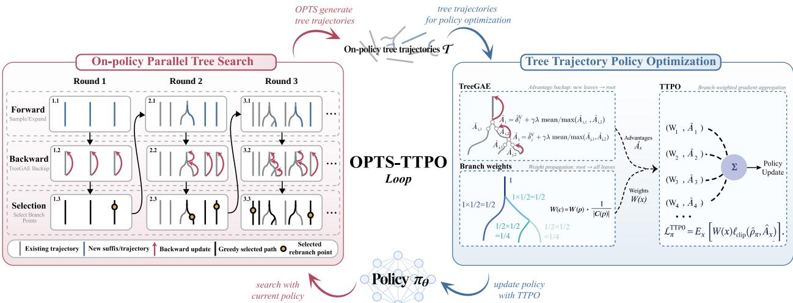  
Figure 1: OPTS-TTPO. OPTS selects states maximizing the length-penalized performance-diference estimate and samples on-<sub>p</sub>olic<sub>y</sub> sufixes from them in <sub>p</sub>arallel<sub>;</sub> TTPO a<sub>pp</sub>lies TreeGAE and branch wei<sub>g</sub>hts to PPO u<sub>p</sub>dates.

Under this <sub>p</sub>refix-measurabilit<sub>y</sub> condition, the Branch A<sub>gg</sub>re<sub>g</sub>ation Lemma (A<sub>pp</sub>endix A.3) <sub>g</sub>ives $\widehat { H } _ { \eta , \mathrm { d i r } } ( \tau ) =$ $\widehat { R } _ { \eta } ( s _ { o } )$ <sub>an</sub>d

$$
\begin{array} { r } { \mathbb { E } _ { T } \left[ \widehat { H } _ { \eta , \mathrm { d i r } } ( T ) \right] = \mathbb { E } _ { \tau \sim \pi _ { \theta } } \left[ H _ { \eta } ( \tau ) \right] . } \end{array}\tag{2}
$$

Tree Trajectory Policy Gradient (TTPG). Setting $\eta = \gamma$ <sub>an</sub>d $h ( x ) = A ^ { \pi _ { \theta } } ( s _ { x } , a _ { x } ) \nabla _ { \theta } \log \pi _ { \theta } ( a _ { x } \mid s _ { x } )$ i<sub>n</sub> th<sub>e</sub> di<sub>rec</sub>t agg<sup>r</sup>ega<sup>ti</sup>o<sup>n</sup> <sup>f</sup>o<sup>rm</sup> g<sup>iv</sup>es

$$
\nabla _ { \theta } J ( \theta ) = \mathbb { E } _ { \mathcal { T } } \left[ \sum _ { \boldsymbol { x } \in \mathcal { T } } W ( \boldsymbol { x } ) \gamma ^ { d ( \boldsymbol { x } ) } A ^ { \pi _ { \theta } } ( s _ { \boldsymbol { x } } , a _ { \boldsymbol { x } } ) \nabla _ { \theta } \log \pi _ { \theta } ( a _ { \boldsymbol { x } } \mid s _ { \boldsymbol { x } } ) \right] .\tag{3}
$$

Th<sub>e we</sub>i<sub>g</sub>ht<sub>s</sub> $W ( x )$ <sub>correc</sub>t th<sub>e s</sub>t<sub>a</sub>t<sub>e-v</sub>i<sub>s</sub>it<sub>a</sub>ti<sub>on mu</sub>lti<sub>p</sub>li<sub>c</sub>it<sub>y</sub> i<sub>n</sub>t<sub>ro</sub>d<sub>uce</sub>d b<sub>y</sub> b<sub>ranc</sub>hi<sub>ng.</sub>

Tree-based Generalized Advantage Estimation (TreeGAE). Let $\delta _ { x } ^ { V } : = r _ { x } + \gamma V ( s _ { x ^ { + } } ) - V ( s _ { x } )$ . Settin<sub>g</sub> $\eta = \gamma \lambda$ <sub>an</sub>d $h ( x ) = \delta _ { x } ^ { V }$ i<sub>n</sub> th<sub>e recurs</sub>i<sub>ve aggrega</sub>ti<sub>on</sub> f<sub>orm g</sub>i<sub>ves</sub>

$$
\widehat { A } _ { x } ^ { \mathrm { T r e e G A E } ( V ) } : = \delta _ { x } ^ { V } + \gamma \lambda \sum _ { x ^ { + } \in \mathcal { C } ( x ) } \alpha _ { x , x ^ { + } } \widehat { A } _ { x ^ { + } } ^ { \mathrm { T r e e G A E } ( V ) } .\tag{4}
$$

T<sub>ree</sub>GAE <sub>an</sub>d <sub>c</sub>h<sub>a</sub>i<sub>n</sub> GAE h<sub>ave</sub> th<sub>e same con</sub>diti<sub>ona</sub>l <sub>su</sub>fi<sub>x expec</sub>t<sub>a</sub>ti<sub>on; w</sub>ith $V = V ^ { \pi _ { \theta } }$ <sub>,</sub> E<sub>q</sub>uation 3 <sub>p</sub>reserves the <sub>po</sub>li<sub>cy-gra</sub>di<sub>en</sub>t id<sub>en</sub>tit<sub>y.</sub>

Tree Trajectory Policy Optimization (TTPO). Let $\rho _ { x } ( \theta ) : = \pi _ { \theta } ( a _ { x } \mid s _ { x } ) / \pi _ { \theta _ { \mathrm { o l d } } } ( a _ { x } \mid s _ { x } )$ . TTPO a<sub>pp</sub>lies the b<sub>ranc</sub>h <sub>we</sub>i<sub>g</sub>ht<sub>s</sub> t<sub>o</sub> th<sub>e s</sub>t<sub>an</sub>d<sub>ar</sub>d <sub>c</sub>li<sub>ppe</sub>d PPO <sub>surroga</sub>t<sub>e,</sub>

$$
\begin{array} { r } { \mathcal { L } _ { \pi } ^ { \mathrm { T T P O } } ( \theta ) : = \mathbb { E } _ { x } \left[ W ( x ) \operatorname* { m i n } \Bigl ( \rho _ { x } ( \theta ) \widehat { A } _ { x } , \mathrm { c l i p } ( \rho _ { x } ( \theta ) , 1 - \epsilon , 1 + \epsilon ) \widehat { A } _ { x } \Bigr ) \right] . } \end{array}\tag{5}
$$

## 3.2 OPTS: Where Should a Finite Search Budget Be Spent?

Performance-Diference Estimation. Let $\tau = ( s _ { t } , a _ { t } , r _ { t } , \ldots , s _ { n } ) \sim ( \mu , P )$ b<sub>e a recor</sub>d<sub>e</sub>d <sub>su</sub>fi<sub>x un</sub>d<sub>er an</sub> <sub>ar</sub>bit<sub>rary po</sub>li<sub>cy</sub> $\mu .$ R<sub>ep</sub>l<sub>ac</sub>i<sub>ng</sub> it<sub>s ac</sub>ti<sub>on a</sub>t $s _ { k }$ by a fresh action from the current policy � and then following � has expected local improvement $V ^ { \pi } ( s _ { k } ) - Q ^ { \pi } ( s _ { k } , a _ { k } ) = - A ^ { \pi } ( s _ { k } , a _ { k } )$ <sub>.</sub> Th<sub>e</sub>i<sub>r</sub> di<sub>scoun</sub>t<sub>e</sub>d <sub>sum</sub> d<sub>e</sub>fi<sub>nes</sub> th<sub>e</sub> performance-diference estimate, w<sup>h</sup>ose expectation <sup>f</sup>o<sup>ll</sup>ows <sup>f</sup>rom t<sup>h</sup>e per<sup>f</sup>ormance di<sup>f</sup>erence <sup>l</sup>emma [44, 45]:

$$
\Delta ( s _ { t } ; \tau ) : = - \sum _ { k = t } ^ { n - 1 } \gamma ^ { k - t } A ^ { \pi } ( s _ { k } , a _ { k } ) , \qquad \mathbb { E } _ { \tau \sim ( \mu , P ) | s _ { t } } [ \Delta ( s _ { t } ; \tau ) ] = V ^ { \pi } ( s _ { t } ) - V ^ { \mu } ( s _ { t } ) .\tag{6}
$$

I<sub>n</sub> d<sub>e</sub>t<sub>erm</sub>i<sub>n</sub>i<sub>s</sub>ti<sub>c env</sub>i<sub>ronmen</sub>t<sub>s,</sub> $\Delta ( s _ { t } ; \tau ) = V ^ { \pi } ( s _ { t } ) - G _ { t }$ f<sub>or</sub> <sub>recor</sub>d<sub>e</sub>d <sub>su</sub>fi<sub>x</sub> <sub>re</sub>t<sub>urn</sub> $G _ { t }$ . In <sub>p</sub>ractice<sub>,</sub> re<sub>p</sub>lacin<sub>g</sub> $A ^ { \pi }$ <sup>b</sup><sub>y</sub> TreeGAE <sub>g</sub>ives $\begin{array} { r } { \widehat { \Delta } ( s _ { t } ; \tau ) : = - \sum _ { k = t } ^ { n - 1 } \gamma ^ { k - t } \widehat { A } _ { x _ { k } } } \end{array}$ <sub>,</sub> <sub>an</sub>d <sub>we</sub> i<sub>n</sub>t<sub>ro</sub>d<sub>uce</sub> th<sub>e</sub> l<sub>eng</sub>th <sub>pena</sub>lt<sub>y</sub> $\widehat { \Delta } ^ { ( \xi ) } ( s _ { t } ; \tau ) : = \widehat { \Delta } ( s _ { t } ; \tau ) / ( n -$

$t ) ^ { \xi } , \xi \in [ 0 , 1 ]$ <sub>.</sub> Wh<sub>e</sub>n $\xi = 0 ,$ thi<sub>s</sub> <sub>recovers</sub> th<sub>e</sub> <sub>or</sub>i<sub>g</sub>i<sub>na</sub>l <sub>per</sub>f<sub>ormance-</sub>dif<sub>erence</sub> <sub>es</sub>ti<sub>ma</sub>t<sub>e;</sub> <sub>w</sub>h<sub>en</sub> $\xi = 1 _ { \cdot }$ , <sup>it</sup> averages th<sub>e</sub> di<sub>scoun</sub>t<sub>e</sub>d l<sub>oca</sub>l i<sub>mprovemen</sub>t<sub>s</sub> <sub>a</sub>l<sub>ong</sub> th<sub>e</sub> <sub>su</sub>fi<sub>x.</sub> A<sub>ppen</sub>di<sub>x</sub> B<sub>.</sub>2 <sub>g</sub>i<sub>ves</sub> f<sub>ur</sub>th<sub>er</sub> d<sub>e</sub>t<sub>a</sub>il<sub>s.</sub>

On-Policy Parallel Tree Search. OPTS initializes on-policy chains and their TreeGAE advantages. Each round f<sub>o</sub>ll<sub>ows</sub> $c ^ { \star } ( p ) \in \arg \operatorname* { m a x } _ { c \in { \mathcal { C } } ( p ) } \widehat { A }$ t<sub>o</sub> f<sub>orm an o</sub>b<sub>serve</sub>d <sub>gree</sub>d<sub>y pa</sub>th $\tau ^ { \star }$ <sub>,</sub> th<sub>en se</sub>l<sub>ec</sub>t<sub>s</sub> it<sub>s</sub> hi<sub>g</sub>h<sub>es</sub>t<sub>-scor</sub>i<sub>ng can</sub>did<sub>a</sub>t<sub>e</sub> <sub>pos</sub>iti<sub>on:</sub>

$$
s ^ { \star } \in \arg \operatorname* { m a x } _ { s _ { t } \in \tau ^ { \star } } \widehat { \Delta } ^ { ( \xi ) } \big ( s _ { t } ; \tau ^ { \star } \big ) .\tag{7}
$$

A single batched rollout under the current policy generates sufixes from selected states and fresh trajectories f<sub>rom new</sub> i<sub>n</sub>iti<sub>a</sub>l <sub>s</sub>t<sub>a</sub>t<sub>es;</sub> T<sub>ree</sub>GAE i<sub>s</sub> th<sub>en up</sub>d<sub>a</sub>t<sub>e</sub>d f<sub>rom</sub> th<sub>e new</sub> l<sub>eaves</sub> b<sub>ac</sub>k t<sub>o</sub> th<sub>e roo</sub>t<sub>s.</sub> A t<sub>ree s</sub>t<sub>ops searc</sub>hi<sub>ng</sub> <sub>w</sub>h<sub>en</sub> it <sub>reac</sub>h<sub>es</sub> $S _ { \mathrm { m a x } }$ <sub>expans</sub>i<sub>ons or w</sub>h<sub>en no can</sub>did<sub>a</sub>t<sub>e excee</sub>d<sub>s a nonnega</sub>ti<sub>ve</sub> b<sub>ase</sub>li<sub>ne.</sub> Al<sub>gor</sub>ith<sub>m</sub> 1 <sub>g</sub>i<sub>ves</sub> th<sub>e</sub> com<sub>p</sub><sup>l</sup>ete <sub>p</sub>roce<sup>d</sup>ure.

In deterministic environments<sub>,</sub> OPTS uses max-backu<sub>p</sub> TreeGAE:

$$
\widehat { A } _ { \mathrm { m a x } } ( x ) : = \delta _ { x } ^ { V } + \gamma \lambda \operatorname* { m a x } _ { c \in \mathcal { C } ( x ) } \widehat { A } _ { \mathrm { m a x } } ( c ) , \qquad \operatorname* { m a x } \varnothing : = 0 .
$$

The <sub>g</sub>reed<sub>y</sub> <sub>p</sub>aths of OPTS induce a search <sub>p</sub>olic<sub>y</sub> $\pi _ { j } ^ { S }$ <sub>,</sub> <sub>w</sub>ith $\pi _ { 0 } ^ { S } = \pi$ (A<sub>pp</sub>endix B.3). With exact $V = V ^ { \pi }$ <sub>an</sub>d <sub>max-</sub>b<sub>ac</sub>k<sub>up</sub> T<sub>ree</sub>GAE i<sub>n a</sub> d<sub>e</sub>t<sub>erm</sub>i<sub>n</sub>i<sub>s</sub>ti<sub>c env</sub>i<sub>ronmen</sub>t<sub>,</sub> OPTS <sub>sa</sub>ti<sub>s</sub>fi<sub>es</sub>

$$
J ( \pi _ { j _ { 2 } } ^ { S } ) \geq J ( \pi _ { j _ { 1 } } ^ { S } ) \geq J ( \pi ) , \qquad 0 \leq j _ { 1 } \leq j _ { 2 } \leq S _ { \operatorname* { m a x } } .
$$

Appendix B.4 also establishes monotonicity of the sufix �-return objective under nested expansion.

## 3.3 OPTS-TTPO: What Are the Benefits and Costs of the Adaptive Allocation?

At it<sub>era</sub>ti<sub>on</sub> $u , \mathrm { O P T S }$ <sub>samp</sub>l<sub>es eac</sub>h <sub>su</sub>fi<sub>x</sub> f<sub>rom</sub> th<sub>e curren</sub>t <sub>po</sub>li<sub>cy</sub> b<sub>u</sub>t <sub>se</sub>l<sub>ec</sub>t<sub>s expans</sub>i<sub>on s</sub>t<sub>a</sub>t<sub>es</sub> f<sub>rom o</sub>b<sub>serve</sub>d <sub>ou</sub>t<sub>comes, v</sub>i<sub>o</sub>l<sub>a</sub>ti<sub>ng</sub> th<sub>e</sub> l<sub>emma</sub>’<sub>s pre</sub>fi<sub>x-measura</sub>bilit<sub>y con</sub>diti<sub>on;</sub> TTPO th<sub>en</sub> l<sub>earns</sub> f<sub>rom</sub> th<sub>e</sub> b<sub>ranc</sub>h<sub>-we</sub>i<sub>g</sub>ht<sub>e</sub>d policy gradient of tree trajectories, $\pi _ { u } \xrightarrow { \mathrm { O P T S } } \mathcal { T } _ { u } \xrightarrow { \mathrm { T T P O } } \pi _ { u + 1 }$

I<sub>n</sub> d<sub>e</sub>t<sub>erm</sub>i<sub>n</sub>i<sub>s</sub>ti<sub>c env</sub>i<sub>ronmen</sub>t<sub>s,</sub> OPTS<sub>-</sub>TTPO <sub>uses max-</sub>b<sub>ac</sub>k<sub>up</sub> T<sub>ree</sub>GAE<sub>, w</sub>hi<sub>c</sub>h <sub>y</sub>i<sub>e</sub>ld<sub>s</sub> th<sub>e pre</sub>fi<sub>x-cre</sub>dit t<sub>erm</sub> b<sub>e</sub>l<sub>ow;</sub> i<sub>n</sub> <sub>s</sub>t<sub>oc</sub>h<sub>as</sub>ti<sub>c</sub> <sub>env</sub>i<sub>ronmen</sub>t<sub>s,</sub> it <sub>uses</sub> <sub>mean-</sub>b<sub>ac</sub>k<sub>up</sub> T<sub>ree</sub>GAE t<sub>o</sub> <sub>average</sub> <sub>c</sub>hild <sub>a</sub>d<sub>van</sub>t<sub>ages</sub> <sub>w</sub>hil<sub>e</sub> <sub>re</sub>t<sub>a</sub>i<sub>n</sub>i<sub>ng</sub> b<sub>ranc</sub>h <sub>coverage.</sub> B<sub>o</sub>th <sub>var</sub>i<sub>an</sub>t<sub>s use</sub> $\alpha _ { p , c } = 1 / | \boldsymbol { c } ( \boldsymbol { p } ) |$ | to correct branch multiplicity.

Max-backup search information as prefix credit. On a fixed tree, let $\widehat { g } _ { \mathrm { m a x } }$ <sub>an</sub>d $\widehat { g } _ { \mathrm { m e a n } }$ be the TTPG di<sub>rec</sub>ti<sub>ons</sub> <sub>un</sub>d<sub>er</sub> th<sub>e</sub> t<sub>wo</sub> b<sub>ac</sub>k<sub>ups,</sub> <sub>an</sub>d d<sub>e</sub>fi<sub>ne</sub> th<sub>e</sub> b<sub>es</sub>t<sub>-m</sub>i<sub>nus-average</sub> <sub>gap</sub> $b ( x ) : = \operatorname* { m a x } _ { c \in { \mathcal { C } } ( x ) } { \widehat { A } } _ { \operatorname* { m a x } } ( c ) -$ $\begin{array} { r } { \sum _ { c \in \mathcal { C } ( x ) } \alpha _ { x , c } \widehat { A } _ { \operatorname* { m a x } } ( c ) \ \geq \ 0 } \end{array}$ <sub>, w</sub>ith $b ( x ) = ~ 0$ <sub>a</sub>t l<sub>eaves.</sub> W<sub>r</sub>iti<sub>ng</sub> $x \ \preceq \ u$ when � lies on the root-to-� path, A<sub>pp</sub>endix C.1 <sub>p</sub>roves

$$
\begin{array} { r l r } {  { \widehat { g } _ { \mathrm { m a x } } = \widehat { g } _ { \mathrm { m e a n } } + \nabla _ { \theta } \mathcal { L } _ { \mathrm { s e a r c h } } ( \theta ) | _ { \theta = \theta _ { \mathrm { o l d } } } , } } \\ & { } & { \mathcal { L } _ { \mathrm { s e a r c h } } ( \theta ) : = \gamma \lambda \displaystyle \sum _ { u \in \mathcal { T } } W ( u ) \gamma ^ { d ( u ) } b ( u ) \sum _ { x \preceq u } \lambda ^ { d ( u ) - d ( x ) } \log \pi _ { \theta } ( a _ { x } \mid s _ { x } ) . } \end{array}\tag{8}
$$

$\mathcal { L } _ { \mathrm { s e a r c h } }$ <sub>cre</sub>dit<sub>s</sub> <sub>ac</sub>ti<sub>ons</sub> l<sub>ea</sub>di<sub>ng</sub> t<sub>o</sub> <sub>eac</sub>h b<sub>ranc</sub>h <sub>po</sub>i<sub>n</sub>t b<sub>y</sub> it<sub>s</sub> <sub>gap</sub> $b ( u )$ , with the credit decaying by � at each step, <sub>so a</sub> di<sub>scovere</sub>d <sub>su</sub>fi<sub>x can</sub> i<sub>n</sub>fl<sub>uence ups</sub>t<sub>ream</sub> l<sub>earn</sub>i<sub>ng</sub> b<sub>e</sub>f<sub>ore</sub> b<sub>e</sub>i<sub>ng re</sub>li<sub>a</sub>bl<sub>y repro</sub>d<sub>uce</sub>d<sub>.</sub>

Controlling the search-induced bias. Let $p$ b<sub>e</sub> th<sub>e</sub> f<sub>rac</sub>ti<sub>on o</sub>f <sub>roo</sub>t t<sub>rees rece</sub>i<sub>v</sub>i<sub>ng an expans</sub>i<sub>on an</sub>d $\rho _ { S } \leq$ $p ( 1 - 2 ^ { - S _ { \mathrm { m a x } } } )$ bound the expected path weight moved of the initial trajectory. Under bounded rewards, values, and <sub>p</sub>olic<sub>y</sub> scores<sub>,</sub> A<sub>pp</sub>endix C.2 <sub>g</sub>ives

$$
\left\| \overline { { g } } _ { \operatorname* { m a x } } - \nabla J ( \theta _ { \mathrm { o l d } } ) \right\| \leq \varepsilon _ { 0 } + \operatorname* { m i n } \left\{ 2 p C , \ 2 \rho _ { S } C + \varepsilon _ { \mathrm { b a c k u p } } \right\} ,\tag{9}
$$

Here $C$ b<sub>oun</sub>d<sub>s</sub> t<sub>ree an</sub>d <sub>c</sub>h<sub>a</sub>i<sub>n gra</sub>di<sub>en</sub>t <sub>norms,</sub> $\varepsilon _ { 0 }$ is the initial chain-estimator bias (zero with exact values), and $\varepsilon _ { \mathrm { b a c k u p } }$ i<sub>s</sub> b<sub>oun</sub>d<sub>e</sub>d b<sub>y</sub> th<sub>e we</sub>i<sub>g</sub>ht<sub>e</sub>d <sub>gap mass</sub> i<sub>n</sub> E<sub>qua</sub>ti<sub>on</sub> 8<sub>.</sub> Th<sub>e coarse</sub> b<sub>oun</sub>d <sub>sca</sub>l<sub>es w</sub>ith $p ;$ th<sub>e re</sub>fi<sub>ne</sub>d b<sub>oun</sub>d <sub>separa</sub>t<sub>es</sub> th<sub>e pos</sub>t<sub>er</sub>i<sub>or pa</sub>th <sub>rewe</sub>i<sub>g</sub>hti<sub>ng s</sub>h<sub>are</sub>d b<sub>y</sub> b<sub>o</sub>th b<sub>ac</sub>k<sub>up ru</sub>l<sub>es,</sub> $2 \rho _ { S } C$ <sub>,</sub> f<sub>rom</sub> th<sub>e</sub> <sub>a</sub>dditi<sub>ona</sub>l <sub>max-</sub>b<sub>ac</sub>k<sub>up</sub> term $\varepsilon _ { \mathrm { b a c k u p } }$ <sub>.</sub> Al<sub>gor</sub>ith<sub>m</sub> 2 <sub>g</sub>i<sub>ves</sub> th<sub>e</sub> <sub>comp</sub>l<sub>e</sub>t<sub>e</sub> t<sub>ra</sub>i<sub>n</sub>i<sub>ng</sub> <sub>s</sub>t<sub>ep.</sub>

## 4 Experiments

W<sub>e</sub> <sub>eva</sub>l<sub>ua</sub>t<sub>e</sub> b<sub>ranc</sub>h <sub>aggrega</sub>ti<sub>on,</sub> OPTS <sub>searc</sub>h <sub>an</sub>d t<sub>es</sub>t<sub>-</sub>ti<sub>me</sub> <sub>sca</sub>li<sub>ng,</sub> <sub>coverage–</sub>bi<sub>as</sub> t<sub>ra</sub>d<sub>e-o</sub>f<sub>s,</sub> <sub>an</sub>d <sub>cross-</sub>d<sub>oma</sub>i<sub>n</sub> <sub>p</sub>olic<sub>y</sub>-<sub>g</sub>radient learnin<sub>g</sub> (Sections 4.1–4.4). Rollout bud<sub>g</sub>ets are matched in LLM ex<sub>p</sub>eriments and environment <sub>s</sub>t<sub>eps</sub> i<sub>n con</sub>t<sub>ro</sub>l <sub>exper</sub>i<sub>men</sub>t<sub>s;</sub> l<sub>earne</sub>d <sub>po</sub>li<sub>c</sub>i<sub>es are eva</sub>l<sub>ua</sub>t<sub>e</sub>d <sub>w</sub>ith<sub>ou</sub>t <sub>searc</sub>h<sub>.</sub> F<sub>u</sub>ll <sub>pro</sub>t<sub>oco</sub>l<sub>s an</sub>d h<sub>yperparame</sub>t<sub>ers</sub> are in A<sub>pp</sub>endix D.

## 4.1 Branch Aggregation for Policy-Gradient Estimation

Setup. Using a frozen step-400 Qwen3-1.7B PPO checkpoint, we use unbiased zero-baseline advantage estimates f<sub>rom</sub> bi<sub>nary</sub> M<sub>on</sub>t<sub>e</sub> C<sub>ar</sub>l<sub>o re</sub>t<sub>urns,</sub> i<sub>so</sub>l<sub>a</sub>ti<sub>ng</sub> b<sub>ranc</sub>h <sub>aggrega</sub>ti<sub>on</sub> f<sub>rom cr</sub>iti<sub>c error.</sub> W<sub>e compare</sub> N<sub>a</sub>i<sub>ve</sub>PG <sub>w</sub>ith TTPG <sub>on</sub> id<sub>en</sub>ti<sub>ca</sub>l t<sub>rees</sub> <sub>aga</sub>i<sub>ns</sub>t <sub>a</sub> fi<sub>n</sub>it<sub>e</sub> <sub>re</sub>f<sub>erence</sub> <sub>poo</sub>l<sub>e</sub>d f<sub>rom</sub> 32 i<sub>n</sub>d<sub>epen</sub>d<sub>en</sub>tl<sub>y</sub> <sub>samp</sub>l<sub>e</sub>d <sub>c</sub>h<sub>a</sub>i<sub>n</sub> <sub>groups,</sub> <sub>vary</sub>i<sub>ng</sub> <sub>a</sub>dditi<sub>ona</sub>l <sub>su</sub>fi<sub>xes</sub> $K \in \{ 0 , 1 , 3 , 7 , 1 5 \}$ a<sup>nd</sup> <sup>tr</sup>ee g<sup>r</sup>oups $M \in \{ 1 , 2 , 4 \}$ (A<sub>pp</sub>endix D.1).

Results. At $K = 0$ the two estimators coincide with relative bias 0.1251 (Figure 2). As sufixes are added, NaivePG bias grows monotonically to 0.4884 at $K = 1 5 ,$ , while TTPG stays between 0.1221 and 0.1260. Although <sub>reus</sub>i<sub>n</sub> d<sub>escen</sub>d<sub>an</sub>t t<sub>o</sub>k<sub>ens</sub> l<sub>owers</sub> N<sub>a</sub>i<sub>ve</sub>PG’<sub>s var</sub>i<sub>ance,</sub> it<sub>s s uare</sub>d bi<sub>as</sub> d<sub>om</sub>i<sub>na</sub>t<sub>es: a</sub>t $M = 4$ <sub>an</sub>d $K = 1 5 ,$ NaivePG’s relative MSE rises to 0.2398 whereas TTPG’s falls from 0.0285 to 0.0239, with cosine similarities of 0.9467 and 0.9880, respectively. Both estimators use the same unbiased advantage estimates; their divergence <sub>re</sub>fl<sub>ec</sub>t<sub>s</sub> N<sub>a</sub>i<sub>ve</sub>PG’<sub>s over-coun</sub>ti<sub>ng o</sub>f b<sub>ranc</sub>h<sub>e</sub>d <sub>su</sub>fi<sub>xes re</sub>l<sub>a</sub>ti<sub>ve</sub> t<sub>o s</sub>h<sub>are</sub>d <sub>pre</sub>fi<sub>xes.</sub> B<sub>ranc</sub>h <sub>we</sub>i<sub>g</sub>hti<sub>ng correc</sub>t<sub>s</sub> thi<sub>s</sub> i<sub>m</sub>b<sub>a</sub>l<sub>ance.</sub>

Takeaway 1. Against the finite chain reference, NaivePG’s measured bias grows with branching, whereas TTPG sta<sub>y</sub>s at its $K = 0$ l<sub>eve</sub>l <sub>an</sub>d <sub>a</sub>tt<sub>a</sub>i<sub>ns</sub> l<sub>ower</sub> MSE <sub>an</sub>d hi<sub>g</sub>h<sub>er</sub> <sub>gra</sub>di<sub>en</sub>t <sub>a</sub>li<sub>gnmen</sub>t<sub>.</sub> U<sub>n</sub>bi<sub>ase</sub>d <sub>a</sub>d<sub>van</sub>t<sub>age</sub> <sub>es</sub>ti<sub>ma</sub>t<sub>es</sub> <sub>a</sub>l<sub>one</sub> d<sub>o</sub> <sub>no</sub>t <sub>guaran</sub>t<sub>ee</sub> <sub>un</sub>bi<sub>ase</sub>d <sub>gra</sub>di<sub>en</sub>t <sub>es</sub>ti<sub>ma</sub>t<sub>es.</sub>

## 4.2 OPTS Search Quality and Test-Time Scaling

Exact-value improvement and learned-critic trends. We test Theorem 2 on 32 depth-4 deterministic binaryt<sub>rees</sub> <sub>w</sub>ith <sub>exac</sub>t $V ^ { \pi }$ , max backu<sub>p</sub>, and zero baseline (A<sub>pp</sub>endix D.2). Reward- and value-<sub>g</sub>uided OPTS use full <sub>an</sub>d t<sub>runca</sub>t<sub>e</sub>d <sub>a</sub>d<sub>van</sub>t<sub>ages, respec</sub>ti<sub>ve</sub>l<sub>y.</sub> E<sub>xac</sub>t <sub>enumera</sub>ti<sub>on across</sub> $\lambda \in \{ 0 , 0 . 3 , 0 . 6 , 0 . 9 5 \}$ <sub>s</sub>h<sub>o</sub>w<sub>s</sub> th<sub>a</sub>t <sub>a</sub>ll 1<sub>,</sub>920 adjacent-budget comparisons per mode improve both expected �-return and true return (Figure 3, top).

<sup>Th</sup>e <sup>l</sup>earne<sup>d</sup>-cr<sup>i</sup>t<sup>i</sup>c counterpart <sup>fi</sup>xes a step-<sup>400</sup> Qwen3-1.7B <sup>OPTS</sup>-<sup>TTPO</sup> po<sup>li</sup>cy an<sup>d</sup> cr<sup>i</sup>t<sup>i</sup>c, uses $\lambda = 0 . 9 9 9$ <sub>,</sub> <sub>an</sub>d <sub>var</sub>i<sub>es</sub> $S _ { \operatorname* { m a x } } \in \{ 0 , 1 , 3 , 7 , 1 5 \}$ . At $S _ { \mathrm { m a x } } = 1 5$ <sub>,</sub> th<sub>e m</sub>i<sub>cro-average</sub>d i<sub>mprovemen</sub>t<sub>s</sub> i<sub>n</sub> $( J _ { \lambda } , J )$ are (0.0706, 0.1190) for reward-guided OPTS and (0.0107, 0.0254) for value-guided OPTS (Figure 3, bottom). All four pooled <sub>summar</sub>i<sub>es</sub> i<sub>ncrease w</sub>ith th<sub>e searc</sub>h b<sub>u</sub>d<sub>ge</sub>t<sub>, a</sub>lth<sub>oug</sub>h th<sub>e ga</sub>i<sub>ns are no</sub>t <sub>un</sub>if<sub>orm</sub>l<sub>y mono</sub>t<sub>one on every</sub> b<sub>enc</sub>h<sub>mar</sub>k (A<sub>pp</sub>endix F). The <sub>g</sub>ain also de<sub>p</sub>ends on the rebranchin<sub>g p</sub>osition (A<sub>pp</sub>endix G).

Coverage and test-time scaling at matched rollout budgets. We evaluate OPTS with fi<sub>xe</sub>d $S _ { \mathrm { m a x } } ~ = ~ 3$ <sub>aga</sub>i<sub>ns</sub>t i<sub>n</sub>d<sub>epen</sub>d<sub>en</sub>t <sub>sam-</sub> <sub>p</sub>li<sub>ng a</sub>t <sub>ma</sub>t<sub>c</sub>h<sub>e</sub>d <sub>ro</sub>ll<sub>ou</sub>t b<sub>u</sub>d<sub>ge</sub>t<sub>s</sub> $k \_ { } \in \{$ {8, 16, 32, 64, 128}, pooling results over 902 <sub>p</sub>rom<sub>p</sub>ts<sub>; p</sub>er-benchmark curves are in A<sub>p</sub>- <sub>p</sub>endix E.

With <sub>ver</sub>ifi<sub>er rewar</sub>d<sub>s gu</sub>idi<sub>ng re</sub>b<sub>ranc</sub>hi<sub>ng, we</sub> <sub>repor</sub>t <sub>w</sub>h<sub>e</sub>th<sub>er</sub> <sub>a</sub> <sub>searc</sub>h<sub>e</sub>d t<sub>ree</sub> <sub>con</sub>t<sub>a</sub>i<sub>ns</sub> <sub>a</sub> <sub>cor-</sub> rect answer; t<sup>h</sup>e matc<sup>h</sup>e<sup>d b</sup>ase<sup>li</sup>ne <sup>i</sup>s pass@k. Reward-guided OPTS rises from 0.7561 at

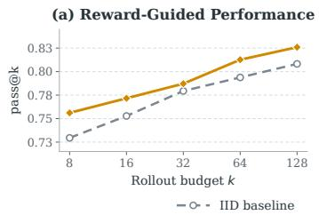

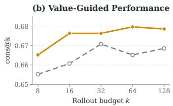  
Figure 4: Matched-budget coverage and accuracy. OPTS uses fi<sub>xe</sub>d $S _ { \mathrm { m a x } } = 3 ;$ th<sub>e</sub> IID <sub>curve</sub> i<sub>s</sub> th<sub>e ma</sub>t<sub>c</sub>h<sub>e</sub>d b<sub>ase</sub>li<sub>ne.</sub>

� = 8 to 0.8259 at $k = 1 2 8$ , compared with 0.7295 and 0.8082 for independent sampling (Figure 4(a)).

With<sub>ou</sub>t <sub>ver</sub>ifi<sub>er</sub> <sub>rewar</sub>d<sub>s,</sub> OPTS <sub>uses</sub> th<sub>e</sub> l<sub>earne</sub>d <sub>va</sub>l<sub>ue</sub> f<sub>unc</sub>ti<sub>on</sub> <sub>an</sub>d t<sub>runca</sub>t<sub>e</sub>d GAE t<sub>o</sub> <sub>gu</sub>id<sub>e</sub> <sub>re</sub>b<sub>ranc</sub>hi<sub>ng</sub> <sub>an</sub>d returns the majority answer among the value-greedy tree responses; the baseline is cons@�, the majority-vote accuracy of � i.i.d. samples [46]. Value-guided OPTS rises from 0.6652 at $k = 8$ to 0.6785 at � = 128 (peaking at 0.6796 at $k = 6 4 )$ , around the corresponding IID values 0.6552 and 0.6685 (Figure 4(b)).

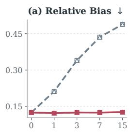

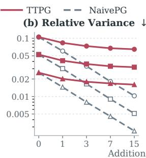  
Figure 2: NaivePG versus TTPG under global token-level normalization.

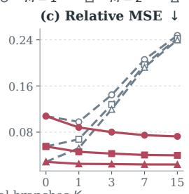

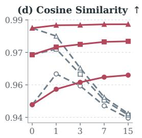

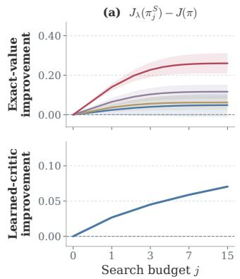

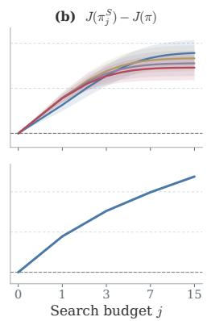

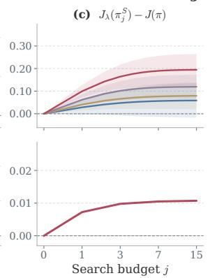  
Figure 3: Search-budget improvements. Top: exact-value; bottom: learned critic.

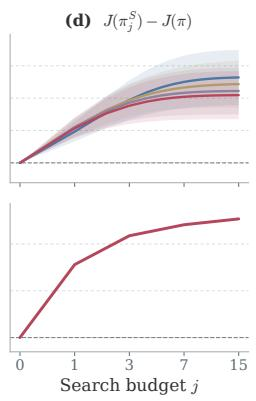

Takeaway 2. Larger search budgets improve $J _ { \lambda }$ and � under exact values, with the same aggregate trend <sub>un</sub>d<sub>er</sub> l<sub>earne</sub>d <sub>cr</sub>iti<sub>cs;</sub> <sub>a</sub>t <sub>ma</sub>t<sub>c</sub>h<sub>e</sub>d b<sub>u</sub>d<sub>ge</sub>t<sub>s,</sub> <sub>rewar</sub>d<sub>-gu</sub>id<sub>e</sub>d <sub>an</sub>d <sub>va</sub>l<sub>ue-gu</sub>id<sub>e</sub>d OPTS i<sub>mprove</sub> <sub>coverage</sub> <sub>an</sub>d majority-vote accuracy, respectively, over independent sampling.

## 4.3 Coverage–Bias Trade-ofs and Prefix Credit

<sup>U</sup>s<sup>i</sup>ng a <sup>f</sup>rozen step-<sup>400</sup> Qwen3-1.7B <sup>OPTS</sup>- TTPO <sub>ac</sub>t<sub>or–cr</sub>iti<sub>c c</sub>h<sub>ec</sub>k<sub>po</sub>i<sub>n</sub>t di<sub>s</sub>ti<sub>nc</sub>t f<sub>rom</sub> th<sub>e</sub> PPO check<sub>p</sub>oint above<sub>,</sub> we evaluate 16<sub>,</sub>384 t<sub>ra</sub>i<sub>n</sub>i<sub>ng promp</sub>t<sub>s.</sub> Fi<sub>xe</sub>d b<sub>ranc</sub>hi<sub>ng occurs</sub> at res<sub>p</sub>onse token 128 and ski<sub>p</sub>s shorter res<sub>p</sub>onses<sub>;</sub> the other method uses OPTS. We co<sup>m</sup>pa<sup>r</sup>e $s \in \{ 0 , 1 , 3 , 7 \}$ <sub>w</sub>ith $p = 1$ <sub>.</sub> B<sub>o</sub>th <sub>p</sub>ane<sup>l</sup>s use $M = 1$ <sub>aggrega</sub>ti<sub>on</sub> <sub>an</sub>d di<sub>rec</sub>t <sub>re-</sub> t<sub>urns w</sub>ith $V = 0 ;$ th<sub>e r</sub>i<sub>g</sub>ht <sub>pane</sub>l <sub>a</sub>dditi<sub>ona</sub>ll<sub>y</sub> <sub>compares</sub> <sub>max</sub> <sub>an</sub>d <sub>mean</sub> b<sub>ac</sub>k<sub>up.</sub>

At <sub>ma</sub>t<sub>c</sub>h<sub>e</sub>d b<sub>ranc</sub>h <sub>coun</sub>t<sub>s,</sub> Fi<sub>xe</sub>d<sub>-</sub>b<sub>ranc</sub>h + TTPG <sub>g</sub>ains covera<sub>g</sub>e with a near-zero<sub>,</sub> sli<sub>g</sub>htl<sub>y</sub> ne<sub>g</sub>ative bias shift<sub>,</sub> whereas OPTS + TTPG att<sub>a</sub>i<sub>ns grea</sub>t<sub>er coverage a</sub>t th<sub>e cos</sub>t <sub>o</sub>f <sub>a mo</sub>d<sub>es</sub>t <sub>pos</sub>iti<sub>ve</sub> bi<sub>as s</sub>hift<sub>.</sub> Fi<sub>xe</sub>d<sub>-</sub>b<sub>ranc</sub>h + N<sub>a</sub>i<sub>ve</sub>PG i<sub>ns</sub>t<sub>ea</sub>d <sub>moves s</sub>t<sub>ea</sub>dil<sub>y</sub> t<sub>owar</sub>d l<sub>arger pos</sub>iti<sub>ve</sub> bias. Panel (b) shows that max backu<sub>p</sub> assi<sub>g</sub>ns <sub>more pre</sub>fi<sub>x cre</sub>dit <sub>a</sub>ft<sub>er more searc</sub>h <sub>roun</sub>d<sub>s</sub> $( s = 7 > s = 3 > s = 1 )$ <sub>.</sub> With $\lambda = 0 . 9 9 9$

(a)  
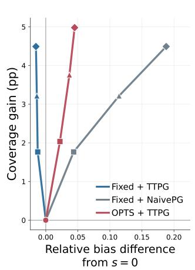

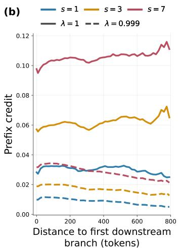  
Figure 5: Mechanistic diagnostics. (a) Coverage gain versus relative bias diference from � = 0. (b) Token-weighted extra prefix credit (max−mean) versus distance to the first downstream branch.

thi<sub>s cre</sub>dit d<sub>ecays w</sub>ith di<sub>s</sub>t<sub>ance</sub> f<sub>rom</sub> th<sub>e</sub> fi<sub>rs</sub>t d<sub>owns</sub>t<sub>ream</sub> b<sub>ranc</sub>h<sub>;</sub> th<sub>e</sub> $\lambda = 1$ <sub>curves re</sub>t<sub>a</sub>i<sub>n</sub> th<sub>e cre</sub>dit <sub>over</sub> th<sub>e</sub> <sub>p</sub>l<sub>o</sub>tt<sub>e</sub>d di<sub>s</sub>t<sub>ances.</sub> T<sub>oge</sub>th<sub>er,</sub> th<sub>e pane</sub>l<sub>s</sub> ill<sub>us</sub>t<sub>ra</sub>t<sub>e</sub> th<sub>e coverage–</sub>bi<sub>as re</sub>l<sub>a</sub>ti<sub>ons</sub>hi<sub>p an</sub>d th<sub>e a</sub>dditi<sub>ona</sub>l <sub>pre</sub>fi<sub>x cre</sub>dit

i<sub>n</sub>t<sub>ro</sub>d<sub>uce</sub>d b<sub>y max</sub> b<sub>ac</sub>k<sub>up.</sub>

Takeaway 3. At matched branch counts, OPTS + TTPG trades a modest bias increase for greater coverage th<sub>an</sub> Fi<sub>xe</sub>d<sub>-</sub>b<sub>ranc</sub>h + TTPG<sub>,</sub> <sub>w</sub>hil<sub>e</sub> <sub>max</sub> b<sub>ac</sub>k<sub>up</sub> <sub>a</sub>dd<sub>s</sub> <sub>a</sub>dditi<sub>ona</sub>l <sub>pre</sub>fi<sub>x</sub> <sub>cre</sub>dit<sub>.</sub>

## 4.4 Cross-Domain Policy-Gradient Learning

W<sub>e compare</sub> OPTS<sub>-</sub>TTPO <sub>w</sub>ith PPO i<sub>n</sub> th<sub>ree</sub> d<sub>oma</sub>i<sub>ns</sub> th<sub>a</sub>t dif<sub>er</sub> i<sub>n o</sub>b<sub>serva</sub>ti<sub>on mo</sub>d<sub>a</sub>lit<sub>y, ac</sub>ti<sub>on space, an</sub>d bud<sub>g</sub>et unit. MuJoCo and Atari follow the CleanRL st<sub>y</sub>le [47]; deterministic MuJoCo and LLM use max-backu<sub>p</sub> T<sub>ree</sub>GAE<sub>, w</sub>hil<sub>e s</sub>ti<sub>c</sub>k<sub>y-ac</sub>ti<sub>on</sub> At<sub>ar</sub>i <sub>uses mean</sub> b<sub>ac</sub>k<sub>up.</sub>

Continuous Control: MuJoCo. We select the hyperparameters on Hopper-v4 and Humanoid-v4, the two tasks with the smallest and lar<sub>g</sub>est action-s<sub>p</sub>ace dimensions in our five-task MuJoCo suite [48], res<sub>p</sub>ectivel<sub>y</sub>. We then fi<sub>x</sub> $( \xi , S _ { \mathrm { m a x } } ) = ( 0 . 6 , 1 )$ f<sub>or</sub> th<sub>e</sub> fi<sub>ve-</sub>t<sub>as</sub>k <sub>eva</sub>l<sub>ua</sub>ti<sub>on an</sub>d t<sub>ra</sub>i<sub>n</sub> PPO <sub>an</sub>d OPTS<sub>-</sub>TTPO f<sub>or one m</sub>illi<sub>on env</sub>i<sub>ronmen</sub>t ste<sub>p</sub>s over ten random seeds (Fi<sub>g</sub>ure 6).

OPTS-TTPO achieves a higher tail mean on all five tasks, with gains from 11.2% on Hopper-v4 to 28.6% on HalfCheetah-v4, an<sup>d</sup> a <sup>hi</sup>g<sup>h</sup>er <sup>f</sup>u<sup>ll</sup>-tra<sup>i</sup>n<sup>i</sup>ng mean on every tas<sup>k</sup>.

Component ablations. At the fixed $( \xi , S _ { \mathrm { m a x } } ) ~ = ~ ( 0 . 6 , 1 )$ th<sub>e comp</sub>l<sub>e</sub>t<sub>e</sub> <sub>me</sub>th<sub>o</sub>d <sub>ac</sub>hi<sub>eves</sub> th<sub>e</sub> l<sub>arges</sub>t t<sub>as</sub>k<sub>-</sub> avera<sub>g</sub>ed tail im<sub>p</sub>rovement over PPO (Table 1). Random + mean tests b<sub>ranc</sub>hi<sub>ng w</sub>ith<sub>ou</sub>t <sub>gu</sub>id<sub>ance,</sub> G<sub>u</sub>id<sub>e</sub>d + <sub>mean</sub> <sub>a</sub>dd<sub>s</sub> <sub>a</sub>d<sub>ap</sub>ti<sub>ve</sub> <sub>se</sub>l<sub>ec</sub>ti<sub>on,</sub> G<sub>u</sub>id<sub>e</sub>d + <sub>max a</sub>dd<sub>s max</sub> b<sub>ac</sub>k<sub>up,</sub> <sub>an</sub>d th<sub>e unwe</sub>i<sub>g</sub>ht<sub>e</sub>d <sub>row removes</sub>

Table 1: MuJoCo component ablations. Tail-return change relative to PPO (%), avera<sub>g</sub>ed over ten seeds at $( \xi , S _ { \mathrm { m a x } } ) = ( 0 . 6 , 1 )$ <sub>.</sub> T<sub>a</sub>il <sub>re</sub>t<sub>urn averages</sub> th<sub>e</sub> fi<sub>na</sub>l 100 l<sub>ogge</sub>d <sub>po</sub>i<sub>n</sub>t<sub>s;</sub> M<sub>ean we</sub>i<sub>g</sub>ht<sub>s</sub> t<sub>as</sub>k<sub>s equa</sub>ll<sub>y.</sub>
<table><tr><td>Variant</td><td>Hopper Walker2d HalfCheetah</td><td></td><td></td><td>Ant</td><td>Humanoid Mean</td><td></td></tr><tr><td>Random + mean</td><td>+10.5</td><td>+5.6</td><td>-3.2</td><td>+15.0</td><td>-1.3</td><td>+5.3</td></tr><tr><td>Guided + mean</td><td>+8.2</td><td>+16.7</td><td>+9.5</td><td>-0.6</td><td>+6.3</td><td>+8.0</td></tr><tr><td>Guided + max, unweighted</td><td>+7.5</td><td>+6.8</td><td>+26.2</td><td>+8.7</td><td>+8.2</td><td>+11.5</td></tr><tr><td>Guided + max (full)</td><td>+11.2</td><td>+24.9</td><td>+28.6</td><td>+13.9</td><td>+15.0</td><td>+18.7</td></tr></table>

b<sub>ranc</sub>h <sub>we</sub>i<sub>g</sub>ht<sub>s.</sub> I<sub>n</sub>di<sub>v</sub>id<sub>ua</sub>l <sub>componen</sub>t <sub>ga</sub>i<sub>ns</sub> <sub>vary</sub> b<sub>y</sub> t<sub>as</sub>k<sub>.</sub>

Stochastic Discrete Control: Atari-57. We reuse the same $( \xi , S _ { \mathrm { m a x } } ) = ( 0 . 6 , 1 )$ for Atari. Under the Atari-57 evaluation benchmark [49] with stick<sub>y</sub> actions [50], we train PPO and OPTS-TTPO for ten million environment <sub>s</sub>t<sub>eps over</sub> th<sub>ree ran</sub>d<sub>om see</sub>d<sub>s.</sub> B<sub>ecause rewar</sub>d <sub>sca</sub>l<sub>es</sub> dif<sub>er across games, we</sub> t<sub>rans</sub>f<sub>orm eac</sub>h <sub>run</sub>’<sub>s re</sub>t<sub>urn as</sub> $( R - R _ { \mathrm { r a n d o m } } ) / ( R _ { \mathrm { h u m a n } } - R _ { \mathrm { r a n d o m } } )$ and re<sub>p</sub>ort the inter<sub>q</sub>uartile mean (IQM), the 25% trimmed mean over all 57 <sub>g</sub>ames and three seeds [51]. Table 2 <sub>p</sub>airs this ma<sub>g</sub>nitude-sensitive summar<sub>y</sub> with task-level win counts <sub>un</sub>d<sub>er</sub> th<sub>e</sub> f<sub>u</sub>ll<sub>-</sub>t<sub>ra</sub>i<sub>n</sub>i<sub>ng mean re</sub>t<sub>urn an</sub>d th<sub>e</sub> l<sub>as</sub>t<sub>-</sub>100<sub>-</sub>l<sub>og mean re</sub>t<sub>urn; comp</sub>l<sub>e</sub>t<sub>e curves are</sub> i<sub>n</sub> A<sub>ppen</sub>di<sub>x</sub> I<sub>.</sub>

At the task level<sub>,</sub> OPTS-TTPO <sub>p</sub>osts a 31–26–0 win–l<sub>oss</sub>–ti<sub>e</sub> r<sub>eco</sub>rd <sub>aga</sub>in<sub>s</sub>t PPO <sub>un</sub>d<sub>er</sub> th<sub>e</sub> f<sub>u</sub>ll<sub>-</sub>t<sub>ra</sub>i<sub>n</sub>i<sub>ng mean-</sub> return metric and a 34–22–1 record und<sub>e</sub>r th<sub>e</sub> l<sub>as</sub>t-100-l<sub>og</sub> m<sub>ea</sub>n-r<sub>e</sub>t<sub>u</sub>rn m<sub>e</sub>tric. Its human-normalized IQM is also hi<sub>g</sub>h<sub>er un</sub>d<sub>er</sub> b<sub>o</sub>th <sub>summar</sub>i<sub>es,</sub> i<sub>ncreas-</sub> ing from 0.247 to 0.255 over the full training run and from 0.357 to 0.374

Table 2: Human-normalized IQM and task-level win counts on Atari-57. E<sub>ac</sub>h <sub>w</sub>i<sub>n</sub> <sub>compares</sub> th<sub>e</sub> t<sub>wo</sub> <sub>me</sub>th<sub>o</sub>d<sub>s</sub> <sub>a</sub>ft<sub>er</sub> <sub>averag</sub>i<sub>ng</sub> th<sub>e</sub> <sub>correspon</sub>di<sub>ng</sub> <sub>raw-re</sub>t<sub>urn summary over</sub> th<sub>ree see</sub>d<sub>s</sub> f<sub>or</sub> th<sub>a</sub>t <sub>game.</sub>
<table><tr><td></td><td colspan="2">Human-normalized IQM</td><td colspan="2">Task wins</td></tr><tr><td>Metric</td><td>PPO</td><td>OPTS-TTPO</td><td>PPO OPTS-TTPO</td><td>Tie</td></tr><tr><td>Full-training mean return 0.247</td><td></td><td>0.255</td><td>26 31</td><td>0</td></tr><tr><td>Last-100-log mean return 0.357</td><td></td><td>0.374</td><td>22</td><td>1</td></tr></table>

<sub>over</sub> th<sub>e</sub> l<sub>as</sub>t 100 l<sub>ogge</sub>d <sub>po</sub>i<sub>n</sub>t<sub>s.</sub> Th<sub>ese game-</sub>l<sub>eve</sub>l <sub>recor</sub>d<sub>s</sub> i<sub>n</sub>di<sub>ca</sub>t<sub>e</sub> th<sub>a</sub>t th<sub>e ga</sub>i<sub>ns</sub> d<sub>epen</sub>d <sub>on</sub> th<sub>e</sub> t<sub>as</sub>k <sub>an</sub>d it<sub>s</sub> <sub>rewar</sub>d <sub>s</sub>t<sub>ruc</sub>t<sub>ure ra</sub>th<sub>er</sub> th<sub>an</sub> h<sub>o</sub>ldi<sub>ng un</sub>if<sub>orm</sub>l<sub>y across</sub> At<sub>ar</sub>i<sub>-</sub>57<sub>.</sub> A<sub>ppen</sub>di<sub>x</sub> J <sub>compares mean an</sub>d <sub>max</sub> b<sub>ac</sub>k<sub>up</sub> <sub>a</sub>t th<sub>e same</sub> fi<sub>xe</sub>d h<sub>yperparame</sub>t<sub>ers.</sub>

Mathematical Reasoning: LLM RLVR. In LLM RLVR [52], we compare OPTS-TTPO with PPO [2] on four Qwen3 models [53], usin<sub>g</sub> VeRL [54, 55] and 4,096 rollouts <sub>p</sub>er u<sub>p</sub>date. OPTS-TTPO uses $S _ { \mathrm { m a x } } = 3$ f<sub>or a</sub>ll f<sub>our</sub> models. DAPO [56] and REINFORCE++ [57] are external references at the same rollout bud<sub>g</sub>et; DAPO uses GRPO<sup>’</sup>s group-re<sup>l</sup>at<sup>i</sup>ve o<sup>b</sup>ject<sup>i</sup>ve [58]. A<sup>ll</sup> met<sup>h</sup>o<sup>d</sup>s run <sup>f</sup>or 400 steps. Ta<sup>bl</sup>e 3 reports <sup>fi</sup>na<sup>l</sup>-c<sup>h</sup>ec<sup>k</sup>po<sup>i</sup>nt avg@32 an<sup>d</sup> pass@32 on s<sup>i</sup>x <sup>b</sup>enc<sup>h</sup>mar<sup>k</sup>s, <sup>i</sup>nc<sup>l</sup>u<sup>di</sup>ng <sup>MATH500</sup> [<sup>5</sup>9] an<sup>d AIME25</sup> [<sup>60</sup>].

<sup>OPTS</sup>-<sup>TTPO i</sup>mproves <sup>b</sup>ot<sup>h</sup> macro- an<sup>d</sup> m<sup>i</sup>cro-average<sup>d</sup> avg@32 an<sup>d</sup> pass@32 over <sup>PPO</sup> across a<sup>ll f</sup>our Qwen<sup>3</sup> <sub>mo</sub>d<sub>e</sub>l<sub>s, cover</sub>i<sub>ng</sub> b<sub>o</sub>th <sub>mo</sub>d<sub>e</sub>l <sub>s</sub>i<sub>zes an</sub>d b<sub>o</sub>th B<sub>ase an</sub>d <sub>pos</sub>t<sub>-</sub>t<sub>ra</sub>i<sub>ne</sub>d <sub>var</sub>i<sub>an</sub>t<sub>s.</sub> A<sub>mong</sub> th<sub>e</sub> f<sub>our me</sub>th<sub>o</sub>d<sub>s,</sub> it <sub>ac</sub>hi<sub>eves</sub> th<sub>e</sub> hi<sub>g</sub>h<sub>es</sub>t <sub>macro averages</sub> f<sub>or</sub> b<sub>o</sub>th <sub>me</sub>t<sub>r</sub>i<sub>cs on every mo</sub>d<sub>e</sub>l<sub>.</sub> Th<sub>e m</sub>i<sub>cro averages s</sub>h<sub>ow</sub> th<sub>e same</sub>

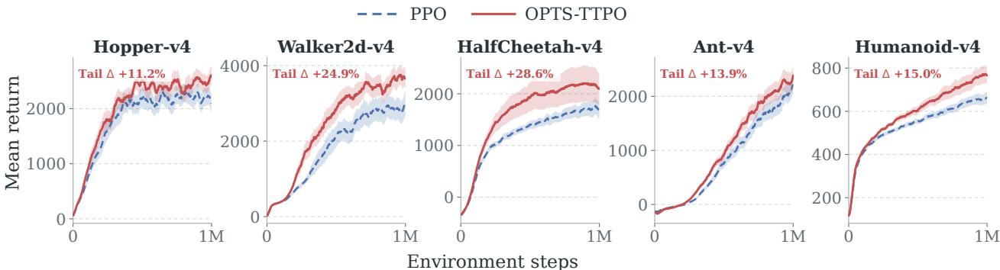  
Figure 6: MuJoCo learning curves; tail Δ is the final-100-point relative return improvement over PPO.

Table 3: LLM performance at the synchronized step-400 checkpoint, from 32 independent responses per prompt. Macro Avera<sub>g</sub>e wei<sub>g</sub>hts the six benchmarks e<sub>q</sub>uall<sub>y;</sub> Micro Avera<sub>g</sub>e <sub>p</sub>ools their 500<sub>,</sub> 272<sub>,</sub> 40<sub>,</sub> 30<sub>,</sub> 30<sub>,</sub> and 30 <sub>p</sub>roblems<sub>,</sub> res<sub>p</sub>ectivel<sub>y</sub> (902 in total). Column bests are bold.
<table><tr><td rowspan="2">Methods</td><td colspan="2">MATH500</td><td colspan="2">MinervaMath</td><td colspan="2">AMC23</td><td colspan="2">AIME24</td><td colspan="2">AIME25</td><td colspan="2">AIME26</td><td colspan="2">Macro Average</td><td colspan="2">Micro Average</td></tr><tr><td>avg@32</td><td>pass@32</td><td>avg@32</td><td>pass@32</td><td>avg@32</td><td>pass@32</td><td>avg@32</td><td>pass@32</td><td>avg@32</td><td>pass@32</td><td>avg@32</td><td>pass@32</td><td>avg@32</td><td>pass@32</td><td>avg@32</td><td>pass@32</td></tr><tr><td>Qwen3-1.7B-Base</td><td></td><td></td><td></td><td></td><td></td><td></td><td></td><td></td><td></td><td></td><td></td><td></td><td></td><td></td><td></td><td></td></tr><tr><td>PPO</td><td>0.6973</td><td>0.9080</td><td>0.2986</td><td>0.5515</td><td>0.4289</td><td>0.8500</td><td>0.0823</td><td>0.3333</td><td>0.0469</td><td>0.3333</td><td>0.0417</td><td>0.2667</td><td>0.2659</td><td>0.5405</td><td>0.5013</td><td>0.7384</td></tr><tr><td>DAPO</td><td>0.6935</td><td>0.9100</td><td>0.2878</td><td>0.5257</td><td>0.4133</td><td>0.8750</td><td>0.0854</td><td>0.3667</td><td>0.0490</td><td>0.3000</td><td>0.0385</td><td>0.2667</td><td>0.2612</td><td>0.5407</td><td>0.4953</td><td>0.7328</td></tr><tr><td>REINFORCE++</td><td>0.6877</td><td>0.9040</td><td>0.2911</td><td>0.5184</td><td>0.4016</td><td>0.8250</td><td>0.0823</td><td>0.3000</td><td>0.0521</td><td>0.3667</td><td>0.0354</td><td>0.2667</td><td>0.2584</td><td>0.5301</td><td>0.4924</td><td>0.7251</td></tr><tr><td>OPTS-TTPO</td><td>0.7114</td><td>0.9220</td><td>0.2920</td><td>0.5404</td><td>0.4328</td><td>0.8000</td><td>0.1063</td><td>0.4333</td><td>0.0479</td><td>0.3000</td><td>0.0521</td><td>0.2667</td><td>0.2738</td><td>0.5437</td><td>0.5085</td><td>0.7428</td></tr><tr><td>Qwen3-1.7B</td><td></td><td></td><td></td><td></td><td></td><td></td><td></td><td></td><td></td><td></td><td></td><td></td><td></td><td></td><td></td><td></td></tr><tr><td>PPO</td><td>0.7994</td><td>0.9480</td><td>0.3427</td><td>0.5257</td><td>0.5938</td><td>0.9250</td><td>0.2000</td><td>0.4667</td><td>0.1708</td><td>0.4000</td><td>0.1083</td><td>0.3333</td><td>0.3692</td><td>0.5998</td><td>0.5887</td><td>0.7650</td></tr><tr><td>DAPO</td><td>0.8061</td><td>0.9280</td><td>0.3448</td><td>0.5221</td><td>0.5555</td><td>0.8750</td><td>0.1854</td><td>0.4000</td><td>0.1708</td><td>0.3000</td><td>0.1042</td><td>0.3000</td><td>0.3611</td><td>0.5542</td><td>0.5908</td><td>0.7439</td></tr><tr><td>REINFORCE++</td><td>0.7919</td><td>0.9400</td><td>0.3455</td><td>0.5368</td><td>0.5367</td><td>0.8500</td><td>0.1885</td><td>0.3667</td><td>0.1500</td><td>0.3667</td><td>0.0948</td><td>0.3333</td><td>0.3512</td><td>0.5656</td><td>0.5813</td><td>0.7561</td></tr><tr><td>OPTS-TTPO</td><td>0.8271</td><td>0.9600</td><td>0.3532</td><td>0.5809</td><td>0.6281</td><td>0.9500</td><td>0.2354</td><td>0.4333</td><td>0.2031</td><td>0.3667</td><td>0.1333</td><td>0.3667</td><td>0.3967</td><td>0.6096</td><td>0.6119</td><td>0.7882</td></tr><tr><td>Qwen3-8B-Base</td><td></td><td></td><td></td><td></td><td></td><td></td><td></td><td></td><td></td><td></td><td></td><td></td><td></td><td></td><td></td><td></td></tr><tr><td>PPO</td><td>0.8305</td><td>0.9360</td><td>0.4169</td><td>0.5699</td><td>0.6492</td><td>0.8500</td><td>0.1948</td><td>0.5000</td><td>0.1615</td><td>0.3000</td><td>0.1302</td><td>0.3333</td><td>0.3972</td><td>0.5815</td><td>0.6311</td><td>0.7661</td></tr><tr><td>DAPO</td><td>0.8076</td><td>0.9460</td><td>0.3804</td><td>0.5368</td><td>0.5984</td><td>0.8250</td><td>0.1896</td><td>0.5000</td><td>0.1573</td><td>0.3667</td><td>0.1385</td><td>0.3000</td><td>0.3786</td><td>0.5791</td><td>0.6051</td><td>0.7616</td></tr><tr><td>REINFORCE++ OPTS-TTPO</td><td>0.8250</td><td>0.9360</td><td>0.4164</td><td>0.5478</td><td>0.6156</td><td>0.8750</td><td>0.1802</td><td>0.6000</td><td>0.1500</td><td>0.3333</td><td>0.1333</td><td>0.3333</td><td>0.3868</td><td>0.6042</td><td>0.6256</td><td>0.7650 0.7894</td></tr><tr><td></td><td>0.8514</td><td>0.9540</td><td>0.4241</td><td>0.5993</td><td>0.6055</td><td>0.9250</td><td>0.2031</td><td>0.4667</td><td>0.1813</td><td>0.3333</td><td>0.1458</td><td>0.3667</td><td>0.4019</td><td>0.6075</td><td>0.6443</td><td></td></tr><tr><td>Qwen3-8B</td><td></td><td></td><td></td><td></td><td></td><td></td><td></td><td></td><td></td><td></td><td></td><td></td><td></td><td></td><td></td><td></td></tr><tr><td>PPO</td><td>0.8799</td><td>0.9700</td><td>0.4323</td><td>0.5588</td><td>0.7094</td><td>0.9250</td><td>0.3531</td><td>0.5667</td><td>0.2615</td><td>0.5333</td><td>0.2594</td><td>0.5333</td><td>0.4826</td><td>0.6812</td><td>0.6786</td><td>0.8016</td></tr><tr><td>DAPO</td><td>0.8859</td><td>0.9740</td><td>0.4493</td><td>0.5735</td><td>0.7633</td><td>0.9250</td><td>0.3208</td><td>0.6000</td><td>0.2656</td><td>0.4000</td><td>0.2667</td><td>0.5333</td><td>0.4919</td><td>0.6676</td><td>0.6888</td><td>0.8049</td></tr><tr><td>REINFORCE+ +</td><td>0.8749</td><td>0.9680</td><td>0.4323</td><td>0.5551</td><td>0.7164 0.7586</td><td>0.9250</td><td>0.2938</td><td>0.5333</td><td>0.2406</td><td>0.4000</td><td>0.2073</td><td>0.5000</td><td>0.4609</td><td>0.6469</td><td>0.6718</td><td>0.7927</td></tr><tr><td>OPTS-TTPO</td><td>0.8825</td><td>0.9740</td><td>0.4519</td><td>0.5699</td><td></td><td>0.9500</td><td>0.3365</td><td>0.6667</td><td>0.2781</td><td>0.5667</td><td>0.2594</td><td>0.5333</td><td>0.4945</td><td>0.7101</td><td>0.6882</td><td>0.8126</td></tr></table>

ranking except for avg@32 on Qwen3-8B, where DAPO scores 0.6888 and OPTS-TTPO scores 0.6882.

Takeaway 4. Across matched budgets, OPTS-TTPO improves tail returns on all five MuJoCo tasks, posts a 34–22–1 win–loss–tie record a<sub>g</sub>ainst PPO on Atari-57 under the last-100-lo<sub>g</sub> mean-return metric<sub>,</sub> and <sup>i</sup>mproves m<sup>i</sup>cro-average<sup>d</sup> avg@32 an<sup>d</sup> pass@32 over <sup>PPO</sup> across a<sup>ll f</sup>our Qwen<sup>3</sup> mo<sup>d</sup>e<sup>l</sup>s.

## 5 Conclusion

We study how tree search can improve finite-sample policy-gradient learning by increasing high-return trajectory coverage. We first make tree trajectories usable for learning: branch aggregation yields TTPG, TreeGAE, and TTPO<sub>,</sub> and the branch-a<sub>gg</sub>re<sub>g</sub>ation ex<sub>p</sub>eriment shows that TTPG sta<sub>y</sub>s near the unbranched reference as <sub>su</sub>fi<sub>xes are a</sub>dd<sub>e</sub>d<sub>, w</sub>h<sub>ereas na</sub>i<sub>ve aggrega</sub>ti<sub>on accumu</sub>l<sub>a</sub>t<sub>es</sub> bi<sub>as.</sub> W<sub>e</sub> th<sub>en use per</sub>f<sub>ormance-</sub>dif<sub>erence-gu</sub>id<sub>e</sub>d OPTS to allocate a finite search budget. Exact-value experiments show improvements in both expected �- return and true return with every adjacent budget increase, while learned-critic experiments show the same a<sub>gg</sub>re<sub>g</sub>ate trend. At matched test-time bud<sub>g</sub>ets<sub>,</sub> reward-<sub>g</sub>uided OPTS im<sub>p</sub>roves correct-answer covera<sub>g</sub>e and value-guided OPTS improves majority-vote accuracy over independent sampling. At matched branch counts, <sub>coverage–</sub>bi<sub>as</sub> di<sub>agnos</sub>ti<sub>cs s</sub>h<sub>ow</sub> th<sub>a</sub>t OPTS + TTPG t<sub>ra</sub>d<sub>es a mo</sub>d<sub>es</sub>t bi<sub>as</sub> i<sub>ncrease</sub> f<sub>or grea</sub>t<sub>er coverage re</sub>l<sub>a</sub>ti<sub>ve</sub> t<sub>o</sub> Fi<sub>xe</sub>d<sub>-</sub>b<sub>ranc</sub>h + TTPG<sub>; max</sub> b<sub>ac</sub>k<sub>up a</sub>dd<sub>s a</sub>dditi<sub>ona</sub>l <sub>pre</sub>fi<sub>x cre</sub>dit<sub>, w</sub>hil<sub>e mean</sub> b<sub>ac</sub>k<sub>up averages samp</sub>l<sub>e</sub>d <sub>su</sub>fi<sub>xes</sub> i<sub>n s</sub>t<sub>oc</sub>h<sub>as</sub>ti<sub>c env</sub>i<sub>ronmen</sub>t<sub>s.</sub> A<sub>cross</sub> d<sub>oma</sub>i<sub>ns,</sub> OPTS<sub>-</sub>TTPO i<sub>mproves</sub> t<sub>a</sub>il <sub>re</sub>t<sub>urns on a</sub>ll fi<sub>ve</sub> M<sub>u</sub>J<sub>o</sub>C<sub>o</sub> t<sub>as</sub>k<sub>s,</sub> <sub>p</sub>osts a 34–22–1 win–loss–tie record a<sub>g</sub>ainst PPO on Atari-57 under the last-100-lo<sub>g</sub> mean-return metric<sub>,</sub> and <sup>i</sup>mproves m<sup>i</sup>cro-average<sup>d</sup> avg@32 an<sup>d</sup> pass@32 over <sup>PPO</sup> across a<sup>ll f</sup>our Qwen<sup>3</sup> mo<sup>d</sup>e<sup>l</sup>s at matc<sup>h</sup>e<sup>d b</sup>u<sup>d</sup>gets. H<sub>owever,</sub> th<sub>e</sub> th<sub>eor</sub> b<sub>oun</sub>d<sub>s</sub> th<sub>e</sub> bi<sub>as</sub> f<sub>rom os</sub>t<sub>er</sub>i<sub>or-</sub>d<sub>e en</sub>d<sub>en</sub>t <sub>ex ans</sub>i<sub>on, ra</sub>th<sub>er</sub> th<sub>an e</sub>li<sub>m</sub>i<sub>na</sub>ti<sub>n</sub> it<sub>, w</sub>hil<sub>e</sub> th<sub>e</sub> <sub>mono</sub>t<sub>one-</sub>i<sub>mprovemen</sub>t <sub>guaran</sub>t<sub>ee</sub> i<sub>s</sub> li<sub>m</sub>it<sub>e</sub>d t<sub>o</sub> d<sub>e</sub>t<sub>erm</sub>i<sub>n</sub>i<sub>s</sub>ti<sub>c</sub> d<sub>ynam</sub>i<sub>cs</sub> <sub>w</sub>ith <sub>exac</sub>t <sub>va</sub>l<sub>ues.</sub> F<sub>u</sub>t<sub>ure</sub> <sub>wor</sub>k i<sub>nc</sub>l<sub>u</sub>d<sub>es</sub> variance reduction under prefix-measurable sampling and self-distillation from successful OPTS trajectories.

## References

[1] Richard S Sutton, David McAllester, Satinder Sin<sub>g</sub>h, and Yisha<sub>y</sub> Mansour. Polic<sub>y g</sub>radient methods for rein<sup>f</sup>orcement <sup>l</sup>earning wit<sup>h</sup> <sup>f</sup>unction approximation. Advances in neural information processing systems, 12<sub>,</sub> 1999. 1<sub>,</sub> 16

[2] John Schulman, Fili<sub>p</sub> Wolski, Prafulla Dhariwal, Alec Radford, and Ole<sub>g</sub> Klimov. Proximal <sub>p</sub>olic<sub>y</sub> o<sub>p</sub>timization a<sup>l</sup>gorit<sup>h</sup>ms. arXiv preprint arXiv:1707.06347, 2017. 1, 8, 20

[3] Cameron B Browne, Edward Powle<sub>y</sub>, Daniel Whitehouse, Simon M Lucas, Peter I Cowlin<sub>g</sub>, Phili<sub>pp</sub> Rohlfsha<sub>g</sub>en<sub>,</sub> Ste<sub>p</sub>hen Tavener<sub>,</sub> Die<sub>g</sub>o Perez<sub>,</sub> S<sub>py</sub>ridon Samothrakis<sub>,</sub> and Simon Colton. A surve<sub>y</sub> of monte car<sup>l</sup>o tree searc<sup>h</sup> met<sup>h</sup>ods. IEEE Transactions on Computational Intelligence and AI in games, 4(1):1–43, 2012. 1<sub>,</sub> 3

[4] Rujie Zhon<sub>g</sub>, Duohan Zhan<sub>g</sub>, Lukas Sch"afer, Stefano Albrecht, and Josiah Hanna. Robust on-<sub>p</sub>olic<sub>y</sub> samp<sup>l</sup>ing <sup>f</sup>or data-e<sup>fi</sup>cient po<sup>l</sup>icy eva<sup>l</sup>uation in rein<sup>f</sup>orcement <sup>l</sup>earning. In Advances in Neural Information Processing Systems, vo<sup>l</sup>ume 35, 2022. URL https://proceedings.neurips.cc/paper\_files/paper/ 2022/hash/f2dbede0879b9d04ceb30f1b8b476b27-Abstract-Conference.html. <sup>2</sup>

[5] Nicholas E. Corrado and Josiah P. Hanna. On-<sub>p</sub>olic<sub>y p</sub>olic<sub>y g</sub>radient reinforcement learnin<sub>g</sub> without on-po<sup>l</sup>icy samp<sup>l</sup>ing. arXiv preprint arXiv:2311.08290, 2023. URL https://arxiv.org/abs/2311.08290. 2

[6] Saad Mo<sup>h</sup>amad and Giovanni Montana. Adaptive experience se<sup>l</sup>ection <sup>f</sup>or po<sup>l</sup>icy gradient. arXiv preprint arXiv:2002.06946, 2020. URL https://arxiv.org/abs/2002.06946. 2

[7] Adrien Ecofet, Joost Huizin a, Joel Lehman, Kenneth O. Stanle , and Jef Clune. First return, then exp<sup>l</sup>ore. Nature, 590:580–586, 2021. doi: 10.1038/s41586-020-03157-9. URL https://www.nature. com/articles/s41586-020-03157-9. <sup>2</sup>

[8] Jun<sup>h</sup>yu<sup>k</sup> O<sup>h</sup>, Yijie Guo, Satinder Sing<sup>h</sup>, and Hong<sup>l</sup>a<sup>k</sup> Lee. Se<sup>lf</sup>-imitation <sup>l</sup>earning. In Proceedings of the 35th International Conference on Machine Learning, 2018. URL https://proceedings.mlr.press/v80/ oh18b.html. <sup>2</sup>

[9] Bradle<sub>y</sub> Brown, Jordan Juravsk<sub>y</sub>, R<sub>y</sub>an Ehrlich, Ronald Clark, Quoc V. Le, Christo<sub>p</sub>her Ré, and Azalia Mir<sup>h</sup>oseini. Large <sup>l</sup>anguage mon<sup>k</sup>eys: Sca<sup>l</sup>ing in<sup>f</sup>erence compute wit<sup>h</sup> repeated samp<sup>l</sup>ing. arXiv preprint arXiv:2407.21787, 2024. URL https://arxiv.org/abs/2407.21787. 2

[10] Hieu Trun<sub>g</sub> N<sub>g</sub>u<sub>y</sub>en, Bao N<sub>g</sub>u<sub>y</sub>en, Wenao Ma, Yuzhi Zhao, Ruifen<sub>g</sub> She, and Viet Anh N<sub>g</sub>u<sub>y</sub>en. Ada<sub>p</sub>tive ro<sup>ll</sup>out a<sup>ll</sup>ocation <sup>f</sup>or on<sup>l</sup>ine rein<sup>f</sup>orcement <sup>l</sup>earning wit<sup>h</sup> veri<sup>fi</sup>a<sup>bl</sup>e rewards. In International Conference on Learning Representations, 2026. URL https://arxiv.org/abs/2602.01601. 2

[11] Baizhou Huan and Xiaojun Wan. Pros: Towards com ute-eficient rlvr via rollout refix reuse. In International Conference on Learning Representations, 2026. URL https://proceedings.iclr.cc/paper\_ files/paper/2026/hash/4badb55ba9c18bccb9d4146be328a948-Abstract-Conference.html.

[12] Heming Zou, Qi Wang, Yun Qu, Yuhang Jiang, Lizhou Cai, Yixiu Mao, Ru Peng, Xin Xu, Weijie Liu, Kai Y<sub>ang,</sub> S<sub>a</sub>i<sub>yong</sub> Y<sub>ang,</sub> <sub>an</sub>d Xi<sub>angyang</sub> Ji<sub>.</sub> T<sub>race:</sub> A <sub>un</sub>ifi<sub>e</sub>d <sub>ro</sub>ll<sub>ou</sub>t b<sub>u</sub>d<sub>ge</sub>t <sub>a</sub>ll<sub>oca</sub>ti<sub>on</sub> f<sub>ramewor</sub>k f<sub>or</sub> <sub>e</sub>fi<sub>c</sub>i<sub>en</sub>t agentic rein<sup>f</sup>orcement <sup>l</sup>earning. arXiv preprint arXiv:2606.11119, 2026. URL https://arxiv.org/abs/ 2606.11119. <sup>2</sup>

[13] Levente Kocsis and Csa<sup>b</sup>a Szepesv<sup>á</sup>ri. Bandit <sup>b</sup>ased monte-car<sup>l</sup>o p<sup>l</sup>anning. In European conference on machine learning, pages 282–293. Springer, 2006. 3

[14] David Silver, Aja Huan<sub>g</sub>, Chris J Maddison, Arthur Guez, Laurent Sifre, Geor<sub>g</sub>e Van Den Driessche, Julian Schrittwieser<sub>,</sub> Ioannis Antono<sub>g</sub>lou<sub>,</sub> Veda Panneershelvam<sub>,</sub> Marc Lanctot<sub>,</sub> et al. Masterin<sub>g</sub> the <sub>g</sub>ame of <sub>g</sub>o wit<sup>h</sup> deep neura<sup>l</sup> networ<sup>k</sup>s and tree searc<sup>h</sup>. nature, 529(7587):484–489, 2016. 3

[15] David Silver, Julian Schrittwieser, Karen Simon<sub>y</sub>an, Ioannis Antono<sub>g</sub>lou, Aja Huan<sub>g</sub>, Arthur Guez, Thomas H<sub>u</sub>b<sub>er</sub>t<sub>,</sub> L<sub>ucas</sub> B<sub>a</sub>k<sub>er,</sub> M<sub>a</sub>tth<sub>ew</sub> L<sub>a</sub>i<sub>,</sub> Ad<sub>r</sub>i<sub>an</sub> B<sub>o</sub>lt<sub>on, e</sub>t <sub>a</sub>l<sub>.</sub> M<sub>as</sub>t<sub>er</sub>i<sub>ng</sub> th<sub>e game o</sub>f <sub>go w</sub>ith<sub>ou</sub>t h<sub>uman</sub> <sup>k</sup>now<sup>l</sup>edge. nature, 550(7676):354–359, 2017. 3

[16] David Silver, Thomas Hubert, Julian Schrittwieser, Ioannis Antono<sub>g</sub>lou, Matthew Lai, Arthur Guez, Marc L<sub>anc</sub>t<sub>o</sub>t<sub>,</sub> L<sub>auren</sub>t Sif<sub>re,</sub> Dh<sub>ars</sub>h<sub>an</sub> K<sub>umaran,</sub> Th<sub>ore</sub> G<sub>raepe</sub>l<sub>, e</sub>t <sub>a</sub>l<sub>.</sub> A <sub>genera</sub>l <sub>re</sub>i<sub>n</sub>f<sub>orcemen</sub>t l<sub>earn</sub>i<sub>ng</sub> a<sup>l</sup>gorit<sup>h</sup>m t<sup>h</sup>at masters c<sup>h</sup>ess, s<sup>h</sup>ogi, and go t<sup>h</sup>roug<sup>h</sup> se<sup>lf</sup>-p<sup>l</sup>ay. Science, 362(6419):1140–1144, 2018.

[17] Julian Schrittwieser, Ioannis Antono<sub>g</sub>lou, Thomas Hubert, Karen Simon<sub>y</sub>an, Laurent Sifre, Simon Schmitt, A<sub>r</sub>th<sub>ur</sub> G<sub>uez,</sub> Ed<sub>war</sub>d L<sub>oc</sub>kh<sub>ar</sub>t<sub>,</sub> D<sub>em</sub>i<sub>s</sub> H<sub>assa</sub>bi<sub>s,</sub> Th<sub>ore</sub> G<sub>raepe</sub>l<sub>, e</sub>t <sub>a</sub>l<sub>.</sub> M<sub>as</sub>t<sub>er</sub>i<sub>ng a</sub>t<sub>ar</sub>i<sub>, go, c</sub>h<sub>ess an</sub>d s<sup>h</sup>ogi <sup>b</sup>y p<sup>l</sup>anning wit<sup>h</sup> a <sup>l</sup>earned mode<sup>l</sup>. Nature, 588(7839):604–609, 2020.

[18] Thomas Anthon<sub>y</sub>, Zhen<sub>g</sub> Tian, and David Barber. Thinkin<sub>g</sub> fast and slow with dee<sub>p</sub> learnin<sub>g</sub> and tree searc<sup>h</sup>. Advances in neural information processing systems, 30, 2017.

[19] Thomas Hubert, Julian Schrittwieser, Ioannis Antono<sub>g</sub>lou, Mohammadamin Barekatain, Simon Schmitt, and David Si<sup>l</sup>ver. Learning and p<sup>l</sup>anning in comp<sup>l</sup>ex action spaces. In International Conference on Machine Learning, pages 4476–4486. PMLR, 2021.

[20] Ivo Danihelka, Arthur Guez, Julian Schrittwieser, and David Silver. Polic<sub>y</sub> im<sub>p</sub>rovement b<sub>y</sub> <sub>p</sub>lannin<sub>g</sub> with gum<sup>b</sup>e<sup>l</sup>. In International Conference on Learning Representations, 2022.

[21] Jean-Bastien Grill, Florent Altché, Yunhao Tan<sub>g</sub>, Thomas Hubert, Michal Valko, Ioannis Antono<sub>g</sub>lou, and Remi Munos. Monte-Car<sup>l</sup>o tree searc<sup>h</sup> as regu<sup>l</sup>arized po<sup>l</sup>icy optimization. In Proceedings of the 37th International Conference on Machine Learning, vo<sup>l</sup>ume 119 o<sup>f</sup> Proceedings of Machine Learning Research, pages <sup>3</sup>7<sup>6</sup>9–<sup>3</sup>77<sup>8</sup>. <sup>PMLR</sup>, <sup>2020</sup>. <sup>URL</sup> https://proceedings.mlr.press/v119/grill20a.html.

[22] Xidon<sub>g</sub> Fen<sub>g</sub>, Zi<sub>y</sub>u Wan, Munin<sub>g</sub> Wen, Ste<sub>p</sub>hen Marcus McAleer, Yin<sub>g</sub> Wen, Weinan Zhan<sub>g</sub>, and Jun Wang. A<sup>l</sup>p<sup>h</sup>azero-<sup>l</sup>i<sup>k</sup>e tree-searc<sup>h</sup> can guide <sup>l</sup>arge <sup>l</sup>anguage mode<sup>l</sup> decoding and training. arXiv preprint arXiv:2309.17179, 2023. 3

[23] Lara Scavuzzo, Fen Chen, Didier Chetelat, Maxime Gasse, Andrea Lodi, Neil Yorke-Smith, and Karen Aarda<sup>l</sup>. Learning to <sup>b</sup>ranc<sup>h</sup> wit<sup>h</sup> tree MDPs. In Advances in Neural Information Processing Systems, vo<sup>l</sup>ume <sup>35</sup>, <sup>2022</sup>. <sup>URL</sup> https://proceedings.neurips.cc/paper\_files/paper/2022/hash/ 756d74cd58592849c904421e3b2ec7a4-Abstract-Conference.html. <sup>3</sup>

[24] Amirhossein Kazemnejad, Milad Aghajohari, Eva Portelance, Alessandro Sordoni, Siva Reddy, Aaron Courville<sub>,</sub> and Nicolas Le Roux. VinePPO: Refinin<sub>g</sub> credit assi<sub>g</sub>nment in RL trainin<sub>g</sub> of LLMs. In Proceedings of the 42nd International Conference on Machine Learning, vo<sup>l</sup>ume 267 o<sup>f</sup> Proceedings of Machine Learning Research, pages 29557–29590. PMLR, 2025. URL https://proceedings.mlr.press/ v267/kazemnejad25a.html.

[25] Bowei He, Yankai Chen, Xiaokun Zhan<sub>g</sub>, and Xue Liu. Branchin<sub>g p</sub>olic<sub>y</sub> o<sub>p</sub>timization: Sandbox-native <sup>l</sup>anguage agent rein<sup>f</sup>orcement <sup>l</sup>earning. arXiv preprint arXiv:2607.14171, 2026. URL https://arxiv. org/abs/2607.14171. <sup>3</sup>

[26] Zhen<sub>y</sub>u Hou, Ziniu Hu, Yujian<sub>g</sub> Li, Rui Lu, Jie Tan<sub>g</sub>, and Yuxiao Don<sub>g</sub>. Treerl: Llm reinforcement learnin<sub>g</sub> wit<sup>h</sup> on-po<sup>l</sup>icy tree searc<sup>h</sup>. In Proceedings of the 63rd Annual Meeting of the Association for Computational Linguistics (Volume 1: Long Papers), pages 12355–12369, 2025. 3

[27] Yiran Guo, Lijie Xu, Jie Liu, Dan Ye, and Shuan<sub>g</sub> Qiu. Se<sub>g</sub>ment <sub>p</sub>olic<sub>y</sub> o<sub>p</sub>timization: Efective se<sub>g</sub>ment-<sup>l</sup>eve<sup>l</sup> credit assignment in RL <sup>f</sup>or <sup>l</sup>arge <sup>l</sup>anguage mode<sup>l</sup>s. In Advances in Neural Information Processing Systems, vo<sup>l</sup>ume 38, 2025. URL https://proceedings.neurips.cc/paper\_files/paper/2025/hash/ a6536243037d1e32c20de85137d478da-Abstract-Conference.html.

[28] Zhichen<sub>g</sub> Yan<sub>g</sub>, Zhijian<sub>g</sub> Guo, Yin<sub>y</sub>a Huan<sub>g</sub>, Xiaodan Lian<sub>g</sub>, Yiwei Wan<sub>g</sub>, and Jin<sub>g</sub> Tan<sub>g</sub>. Treer<sub>p</sub>o: Tree re<sup>l</sup>ative po<sup>l</sup>icy optimization. arXiv preprint arXiv:2506.05183, 2025.

[29] Yizhi Li, Qin<sub>g</sub>shui Gu, Zhoufutu Wen, Ziniu Li, Tianshun Xin<sub>g</sub>, Shu<sub>y</sub>ue Guo, Tian<sub>y</sub>u Zhen<sub>g</sub>, Xin Zhou, Xingwei Qu, Wangchunshu Zhou, et al. Treepo: Bridging the gap of policy optimization and eficacy and in<sup>f</sup>erence e<sup>fi</sup>ciency wit<sup>h h</sup>euristic tree-<sup>b</sup>ased mode<sup>l</sup>ing. arXiv preprint arXiv:2508.17445, 2025.

[30] Yuxian<sub>g</sub> Ji, Zi<sub>y</sub>u Ma, Yon<sub>g</sub> Wan<sub>g</sub>, Guanhua Chen, Xian<sub>g</sub>xian<sub>g</sub> Chu, and Liaoni Wu. Tree search for LLM agent rein<sup>f</sup>orcement <sup>l</sup>earning. In International Conference on Learning Representations, 2026. URL https://openreview.net/forum?id=ZpQwAFhU13.

[31] Zhen<sub>g</sub> Din<sub>g</sub> and Weirui Ye. TreeGRPO: Tree-advanta<sub>g</sub>e GRPO for online RL <sub>p</sub>ost-trainin<sub>g</sub> of difusion mode<sup>l</sup>s. In The Fourteenth International Conference on Learning Representations, 2026. URL https: //openreview.net/forum?id=3rZdp4TmUb. <sup>3</sup>

[32] Guantin<sub>g</sub> Don<sub>g</sub>, Han<sub>gy</sub>u Mao, Kai Ma, Lichen<sub>g</sub> Bao, Yifei Chen, Zhon<sub>gy</sub>uan Wan<sub>g</sub>, Zhon<sub>g</sub>xia Chen, Jiaz<sup>h</sup>en Du, Huiyang Wang, Fuz<sup>h</sup>eng Z<sup>h</sup>ang, et a<sup>l</sup>. Agentic rein<sup>f</sup>orced po<sup>l</sup>icy optimization. In International Conference on Learning Representations, 2026. URL https://arxiv.org/abs/2507.19849. 3

[33] Shan<sub>gy</sub>u Xin<sub>g</sub>, Si<sub>y</sub>uan Wan<sub>g</sub>, Chen<sub>y</sub>uan Yan<sub>g</sub>, Xin-Yu Dai, and Xian<sub>g</sub> Ren. Lookahead tree-based rollouts for en<sup>h</sup>anced trajectory-<sup>l</sup>eve<sup>l</sup> exp<sup>l</sup>oration in rein<sup>f</sup>orcement <sup>l</sup>earning wit<sup>h</sup> veri<sup>fi</sup>a<sup>bl</sup>e rewards. In International Conference on Learning Representations, 2026. URL https://proceedings.iclr.cc/paper\_files/ paper/2026/hash/355d36f5f0922d050d9b6eaa3511d301-Abstract-Conference.html.

[34] Zefan<sub>g</sub> Zon<sub>g</sub>, Din<sub>g</sub>wei Chen, Yan<sub>g</sub> Li, Qi Yi, Bo Zhou, Chen<sub>g</sub>min<sub>g</sub> Li, Bo Qian, Pen<sub>g</sub> Chen, and Jie Jiang. AT<sup>2</sup>PO: Agentic turn-<sup>b</sup>ased po<sup>l</sup>icy optimization via tree searc<sup>h</sup>. In Proceedings of the 64th Annual Meeting of the Associationfor Computational Linguistics (Volume 1: Long Papers), pages 24120– 24143<sub>.</sub> A<sub>ssoc</sub>i<sub>a</sub>ti<sub>o</sub>n f<sub>o</sub>r C<sub>o</sub>m<sub>pu</sub>t<sub>a</sub>ti<sub>o</sub>n<sub>a</sub>l Lin<sub>gu</sub>i<sub>s</sub>ti<sub>cs,</sub> 2026<sub>.</sub> d<sub>o</sub>i<sub>:</sub> 10<sub>.</sub>18653/v1/2026<sub>.ac</sub>l-l<sub>o</sub>n<sub>g.</sub>1106<sub>.</sub> URL https://aclanthology.org/2026.acl-long.1106/.

[35] Jin<sub>y</sub>an<sub>g</sub> Wu, Shuo Yan<sub>g</sub>, Yuhao Shen, Shuai Zhan<sub>g</sub>, Zhen<sub>gq</sub>i Wen, and Jianhua Tao. SPARK: Strate<sub>g</sub>ic po<sup>l</sup>icy-aware exp<sup>l</sup>oration via dynamic <sup>b</sup>ranc<sup>h</sup>ing <sup>f</sup>or <sup>l</sup>ong-<sup>h</sup>orizon agentic <sup>l</sup>earning. In Proceedings of the 64th Annual Meeting of the Association for Computational Linguistics (Volume 1: Long Papers), pages 23981–24004. Association for Com<sub>p</sub>utational Lin<sub>g</sub>uistics<sub>,</sub> 2026. doi: 10.18653/v1/2026.acl-lon<sub>g</sub>.1100. <sup>URL</sup> https://aclanthology.org/2026.acl-long.1100/.

[36] Yijun Zhan<sub>g</sub>, Fan Xu, Jiaxin Din<sub>g</sub>, Yule Xie, Shi<sub>q</sub>in<sub>g</sub> Gao, Xin Din<sub>g</sub>, Haoxian<sub>g</sub> Zhan<sub>g</sub>, Luo<sub>y</sub>i Fu, and Xi<sub>n</sub>bi<sub>ng</sub> W<sub>ang.</sub> I<sub>n</sub>f<sub>orma</sub>ti<sub>on ga</sub>i<sub>n-</sub>b<sub>ase</sub>d <sub>ro</sub>ll<sub>ou</sub>t <sub>po</sub>li<sub>cy op</sub>ti<sub>m</sub>i<sub>za</sub>ti<sub>on:</sub> A<sub>n a</sub>d<sub>ap</sub>ti<sub>ve</sub> t<sub>ree-s</sub>t<sub>ruc</sub>t<sub>ure</sub>d <sub>ro</sub>ll<sub>ou</sub>t approac<sup>h</sup> <sup>f</sup>or mu<sup>l</sup>ti-turn LLM agents. arXiv preprint arXiv:2607.06223, 2026. URL https://arxiv.org/ abs/2607.06223.

[37] Tobias Graf and Marco Platzner. Ada<sub>p</sub>tive <sub>p</sub>la<sub>y</sub>outs for online learnin<sub>g</sub> of <sub>p</sub>olicies durin<sub>g</sub> Monte Carlo tree searc<sup>h</sup>. Theoretical Computer Science, 644:53–62, 2016. doi: 10.1016/j.tcs.2016.06.029. URL https://doi.org/10.1016/j.tcs.2016.06.029.

[38] Shan<sub>g</sub>ton<sub>g</sub> Zhan<sub>g</sub>, Hao Chen, and Hen<sub>g</sub>shuai Yao. ACE: An actor ensemble al<sub>g</sub>orithm for continuous contro<sup>l</sup> wit<sup>h</sup> tree searc<sup>h</sup>. In Proceedings of the AAAI Conference on Artificial Intelligence, vo<sup>l</sup>ume 33, pages <sup>5</sup>7<sup>8</sup>9–<sup>5</sup>79<sup>6</sup>, <sup>201</sup>9. <sup>d</sup>o<sup>i</sup>: <sup>10</sup>.<sup>160</sup>9/aaa<sup>i</sup>.v<sup>33i01</sup>.<sup>33015</sup>7<sup>8</sup>9. <sup>URL</sup> https://ojs.aaai.org/index.php/ AAAI/article/view/4526.

[39] Gre<sub>g</sub>or<sub>y</sub> Far<sub>q</sub>uhar, Tim Rocktäschel, Maximilian I<sub>g</sub>l, and Shimon Whiteson. TreeQN and ATreeC: Diferentia<sup>bl</sup>e tree-structured mode<sup>l</sup>s <sup>f</sup>or deep rein<sup>f</sup>orcement <sup>l</sup>earning. In International Conference on Learning Representations, 2018. URL https://openreview.net/forum?id=H1dh6Ax0Z.

[40] Tetsuro Morimura Kazuhiro Ota Kenshi Abe and Peinan Zhan . Polic radient al orithms with Monte Car<sup>l</sup>o tree <sup>l</sup>earning <sup>f</sup>or non-Mar<sup>k</sup>ov decision processes. Reinforcement Learning Journal, 3:1351–1376, <sup>202</sup>4. <sup>URL</sup> https://rlj.cs.umass.edu/2024/papers/Paper168.html.

[41] Gal Dalal, Assaf Hallak, Gu<sub>g</sub>an Tho<sub>pp</sub>e, Shie Mannor, and Gal Chechik. Polic<sub>y g</sub>radient with tree ex<sub>p</sub>ansion. In Proceedings of the 42nd International Conference on Machine Learning, vo<sup>l</sup>ume 267 o<sup>f</sup> Proceedings of Machine Learning Research, pages 12229–12255. PMLR, 2025. URL https://proceedings.mlr.press/ v267/dalal25a.html.

[42] D<sub>e</sub>nni<sub>s</sub> J<sub>.</sub> N<sub>.</sub> J<sub>.</sub> S<sub>oe</sub>m<sub>e</sub>r<sub>s,</sub> Éri<sub>c</sub> Pi<sub>e</sub>tt<sub>e,</sub> M<sub>a</sub>tth<sub>e</sub>w St<sub>e</sub> h<sub>e</sub>n<sub>so</sub>n<sub>, a</sub>nd C<sub>a</sub>m<sub>e</sub>r<sub>o</sub>n Br<sub>o</sub>wn<sub>e.</sub> L<sub>ea</sub>rnin <sub>o</sub>li<sub>c</sub>i<sub>es</sub> fr<sub>o</sub>m se<sup>lf</sup>-p<sup>l</sup>ay wit<sup>h</sup> po<sup>l</sup>icy gradients and MCTS va<sup>l</sup>ue estimates. In 2019 IEEE Conference on Games (CoG), pages 1– <sup>8</sup>. <sup>IEEE</sup>, <sup>201</sup>9. <sup>d</sup>o<sup>i</sup>: <sup>10</sup>.<sup>110</sup>9/<sup>CIG</sup>.<sup>201</sup>9.<sup>88</sup>4<sup>803</sup>7. <sup>URL</sup> https://doi.org/10.1109/CIG.2019.8848037.

[43] Wanxin Tian, Shijie Zhan<sub>g</sub>, Kevin Zhan<sub>g</sub>, Xiaowei Chi, Chunkai Fan, Jun<sub>y</sub>u Lu, Yulin Luo, Qian<sub>g</sub> Zhou, Yi<sub>m</sub>i<sub>ng</sub> Zh<sub>ao,</sub> Ni<sub>ng</sub> Li<sub>u, e</sub>t <sub>a</sub>l<sub>.</sub> S<sub>eea-r</sub>1<sub>:</sub> T<sub>ree-s</sub>t<sub>ruc</sub>t<sub>ure</sub>d <sub>re</sub>i<sub>n</sub>f<sub>orcemen</sub>t fi<sub>ne-</sub>t<sub>un</sub>i<sub>ng</sub> f<sub>or se</sub>lf<sub>-evo</sub>l<sub>v</sub>i<sub>ng</sub> em<sup>b</sup>odied agents. arXiv preprint arXiv:2506.21669, 2025. 3

[44] S<sup>h</sup>am Ka<sup>k</sup>ade and Jo<sup>h</sup>n Lang<sup>f</sup>ord. Approximate<sup>l</sup>y optima<sup>l</sup> approximate rein<sup>f</sup>orcement <sup>l</sup>earning. In Proceedings of the Nineteenth International Conference on Machine Learning, pages 267–274, 2002. URL https:// people.eecs.berkeley.edu/\~pabbeel/cs287-fa09/readings/KakadeLangford-icml2002.pdf. <sup>4</sup>, 21

[45] John Schulman, Ser<sub>g</sub>e<sub>y</sub> Levine, Pieter Abbeel, Michael Jordan, and Phili<sub>pp</sub> Moritz. Trust re<sub>g</sub>ion <sub>p</sub>olic<sub>y</sub> optimization. In International conference on machine learning, pages 1889–1897. PMLR, 2015. 4, 21

[46] Xuezhi Wan<sub>g</sub>, Jason Wei, Dale Schuurmans, Quoc Le, Ed Chi, Sharan Naran<sub>g</sub>, Aakanksha Chowdher<sub>y</sub>, and Denny Z<sup>h</sup>ou. Se<sup>lf</sup>-consistency improves c<sup>h</sup>ain o<sup>f</sup> t<sup>h</sup>oug<sup>h</sup>t reasoning in <sup>l</sup>anguage mode<sup>l</sup>s. arXiv preprint arXiv:2203.11171, 2022. 6

[47] Shen<sub>gy</sub>i Huan<sub>g</sub>, Rousslan Fernand Julien Dossa, Chan<sub>g</sub> Ye, Jef Bra<sub>g</sub>a, Di<sub>p</sub>am Chakrabort<sub>y</sub>, Kinal Mehta, <sub>an</sub>d J<sub>o</sub>ÃG<sub>o</sub> GM A<sub>ra</sub>Ú<sub>jo.</sub> Cl<sub>eanr</sub>l<sub>:</sub> Hi<sub>g</sub>h<sub>-qua</sub>li<sub>ty</sub> <sub>s</sub>i<sub>ng</sub>l<sub>e-</sub>fil<sub>e</sub> i<sub>mp</sub>l<sub>ementat</sub>i<sub>ons</sub> <sub>o</sub>f d<sub>eep</sub> <sub>re</sub>i<sub>n</sub>f<sub>orcement</sub> l<sub>earn</sub>i<sub>ng</sub> a<sup>l</sup>gorit<sup>h</sup>ms. Journal of Machine Learning Research, 23(274):1–18, 2022. 8

[48] Emanuel Todorov, Tom Erez, and Yuval Tassa. Mujoco: A <sub>p</sub>h<sub>y</sub>sics en<sub>g</sub>ine for model-based control. In 2012 IEEE/RSJ international conference on intelligent robots and systems, pages 5026–5033. IEEE, 2012. 8

[49] Marc G Bellemare, Yavar Naddaf, Joel Veness, and Michael Bowlin<sub>g</sub>. The arcade learnin<sub>g</sub> environment: An eva<sup>l</sup>uation p<sup>l</sup>at<sup>f</sup>orm <sup>f</sup>or genera<sup>l</sup> agents. Journal of artificial intelligence research, 47:253–279, 2013. 8

[50] Marlos C Machado, Marc G Bellemare, Erik Talvitie, Joel Veness, Matthew Hausknecht, and Michael B<sub>ow</sub>li<sub>ng.</sub> R<sub>ev</sub>i<sub>s</sub>iti<sub>ng</sub> th<sub>e arca</sub>d<sub>e</sub> l<sub>earn</sub>i<sub>ng env</sub>i<sub>ronmen</sub>t<sub>:</sub> E<sub>va</sub>l<sub>ua</sub>ti<sub>on pro</sub>t<sub>oco</sub>l<sub>s an</sub>d <sub>open pro</sub>bl<sub>ems</sub> f<sub>or genera</sub>l agents. Journal ofArtificial Intelligence Research, 61:523–562, 2018. 8

[51] Rishabh A<sub>g</sub>arwal, Max Schwarzer, Pablo Samuel Castro, Aaron Courville, and Marc G Bellemare. Dee<sub>p</sub> rein<sup>f</sup>orcement <sup>l</sup>earning at t<sup>h</sup>e edge o<sup>f</sup> t<sup>h</sup>e statistica<sup>l</sup> precipice. Advances in Neural Information Processing Systems, 34:29304–29320, 2021. 8

[52] Da<sub>y</sub>a Guo, Dejian Yan<sub>g</sub>, Haowei Zhan<sub>g</sub>, Junxiao Son<sub>g</sub>, Pei<sub>y</sub>i Wan<sub>g</sub>, Qihao Zhu, Runxin Xu, Ruo<sub>y</sub>u Zhan<sub>g</sub>, Shiron<sub>g</sub> Ma<sub>,</sub> Xiao Bi<sub>,</sub> Xiaokan<sub>g</sub> Zhan<sub>g,</sub> Xin<sub>g</sub>kai Yu<sub>,</sub> Yu Wu<sub>,</sub> Z. F. Wu<sub>,</sub> Zhibin Gou<sub>,</sub> Zhihon<sub>g</sub> Shao<sub>,</sub> Zhuoshu Li<sub>,</sub> Zi<sub>y</sub>i Gao<sub>,</sub> Aixin Liu<sub>,</sub> Bin<sub>g</sub> Xue<sub>,</sub> Bin<sub>g</sub>xuan Wan<sub>g,</sub> Bochao Wu<sub>,</sub> Bei Fen<sub>g,</sub> Chen<sub>g</sub>da Lu<sub>,</sub> Chen<sub>gg</sub>an<sub>g</sub> Zhao<sub>,</sub> Chengqi Deng, Chong Ruan, Damai Dai, Deli Chen, Dongjie Ji, Erhang Li, Fangyun Lin, Fucong Dai, Fuli Luo<sub>,</sub> Guan<sub>g</sub>bo Hao<sub>,</sub> Guantin<sub>g</sub> Chen<sub>,</sub> Guowei Li<sub>,</sub> H. Zhan<sub>g,</sub> Hanwei Xu<sub>,</sub> Hon<sub>g</sub>hui Din<sub>g,</sub> Huazuo Gao, Hui Qu, Hui Li, Jianzhong Guo, Jiashi Li, Jingchang Chen, Jingyang Yuan, Jinhao Tu, Junjie Qiu, Junlon<sub>g</sub> Li<sub>,</sub> J. L. Cai<sub>,</sub> Jia<sub>q</sub>i Ni<sub>,</sub> Jian Lian<sub>g,</sub> Jin Chen<sub>,</sub> Kai Don<sub>g,</sub> Kai Hu<sub>,</sub> Kaichao You<sub>,</sub> Kai<sub>g</sub>e Gao<sub>,</sub> Kan<sub>g</sub> Guan<sub>,</sub> Kexin Huan<sub>g,</sub> Kuai Yu<sub>,</sub> Lean Wan<sub>g,</sub> Lecon<sub>g</sub> Zhan<sub>g,</sub> Lian<sub>g</sub> Zhao<sub>,</sub> Liton<sub>g</sub> Wan<sub>g,</sub> Li<sub>y</sub>ue Zhan<sub>g,</sub> Lei Xu, Leyi Xia, Mingchuan Zhang, Minghua Zhang, Minghui Tang, Mingxu Zhou, Meng Li, Miaojun Wang, Mingming Li, Ning Tian, Panpan Huang, Peng Zhang, Qiancheng Wang, Qinyu Chen, Qiushi Du, Ruiqi Ge, Ruisong Zhang, Ruizhe Pan, Runji Wang, R. J. Chen, R. L. Jin, Ruyi Chen, Shanghao Lu, Shangyan Zhou, Shanhuan<sub>g</sub> Chen<sub>,</sub> Shen<sub>g</sub>fen<sub>g</sub> Ye<sub>,</sub> Shi<sub>y</sub>u Wan<sub>g,</sub> Shui<sub>p</sub>in<sub>g</sub> Yu<sub>,</sub> Shunfen<sub>g</sub> Zhou<sub>,</sub> Shutin<sub>g</sub> Pan<sub>,</sub> S. S. Li<sub>,</sub> Shuan<sub>g</sub> Zhou<sub>,</sub> Shao<sub>q</sub>in<sub>g</sub> Wu<sub>,</sub> Tao Yun<sub>,</sub> Tian Pei<sub>,</sub> Tian<sub>y</sub>u Sun<sub>,</sub> T. Wan<sub>g,</sub> Wan<sub>g</sub>din<sub>g</sub> Zen<sub>g,</sub> Wen Liu<sub>,</sub> Wenfen<sub>g</sub> Lian<sub>g,</sub> Wenjun Gao, Wenqin Yu, Wentao Zhang, W. L. Xiao, Wei An, Xiaodong Liu, Xiaohan Wang, Xiaokang Chen, Xiaotao Nie<sub>,</sub> Xin Chen<sub>g,</sub> Xin Liu<sub>,</sub> Xin Xie<sub>,</sub> Xin<sub>g</sub>chao Liu<sub>,</sub> Xin<sub>y</sub>u Yan<sub>g,</sub> Xin<sub>y</sub>uan Li<sub>,</sub> Xuechen<sub>g</sub> Su<sub>,</sub> Xuhen<sub>g</sub> Lin, X. Q. Li, Xiangyue Jin, Xiaojin Shen, Xiaosha Chen, Xiaowen Sun, Xiaoxiang Wang, Xinnan Song, Xinyi Zhou, Xianzu Wang, Xinxia Shan, Y. K. Li, Y. Q. Wang, Y. X. Wei, Yang Zhang, Yanhong Xu, Yao Li, Yao Zhao<sub>,</sub> Yaofen<sub>g</sub> Sun<sub>,</sub> Yaohui Wan<sub>g,</sub> Yi Yu<sub>,</sub> Yichao Zhan<sub>g,</sub> Yifan Shi<sub>,</sub> Yilian<sub>g</sub> Xion<sub>g,</sub> Yin<sub>g</sub> He<sub>,</sub> Yishi Piao<sub>,</sub> Yison<sub>g</sub> Wan<sub>g,</sub> Yixuan Tan<sub>,</sub> Yi<sub>y</sub>an<sub>g</sub> Ma<sub>,</sub> Yi<sub>y</sub>uan Liu<sub>,</sub> Yon<sub>gq</sub>ian<sub>g</sub> Guo<sub>,</sub> Yuan Ou<sub>,</sub> Yuduan Wan<sub>g,</sub> Yue Gon<sub>g,</sub> Yuheng Zou, Yujia He, Yunfan Xiong, Yuxiang Luo, Yuxiang You, Yuxuan Liu, Yuyang Zhou, Y. X. Zhu, Yan<sub>p</sub>in<sub>g</sub> Huan<sub>g,</sub> Yaohui Li<sub>,</sub> Yi Zhen<sub>g,</sub> Yuchen Zhu<sub>,</sub> Yunxian Ma<sub>,</sub> Yin<sub>g</sub> Tan<sub>g,</sub> Yukun Zha<sub>,</sub> Yutin<sub>g</sub> Yan<sub>,</sub> Z. Z. Ren<sub>,</sub> Zehui Ren<sub>,</sub> Zhan<sub>g</sub>li Sha<sub>,</sub> Zhe Fu<sub>,</sub> Zhean Xu<sub>,</sub> Zhenda Xie<sub>,</sub> Zhen<sub>gy</sub>an Zhan<sub>g,</sub> Zhewen Hao<sub>,</sub> Zhichen<sub>g</sub> Ma, Zhigang Yan, Zhiyu Wu, Zihui Gu, Zijia Zhu, Zijun Liu, Zilin Li, Ziwei Xie, Ziyang Song, Zizheng Pan, Zhen Huan<sub>g,</sub> Zhi<sub>p</sub>en<sub>g</sub> Xu<sub>,</sub> Zhon<sub>gy</sub>u Zhan<sub>g,</sub> and Zhen Zhan<sub>g</sub>. Dee<sub>p</sub>seek-r1 incentivizes reasonin<sub>g</sub> in llms t<sup>h</sup>roug<sup>h</sup> rein<sup>f</sup>orcement <sup>l</sup>earning. Nature, 645(8081):633–638, Septem<sup>b</sup>er 2025. ISSN 1476-4687. doi: <sup>10</sup>.<sup>1038</sup>/s4<sup>1586</sup>-<sup>025</sup>-<sup>0</sup>94<sup>22</sup>-z. <sup>URL</sup> http://dx.doi.org/10.1038/s41586-025-09422-z. <sup>8</sup>

[53] An Yan<sub>g</sub>, Anfen<sub>g</sub> Li, Baoson<sub>g</sub> Yan<sub>g</sub>, Beichen Zhan<sub>g</sub>, Bin<sub>y</sub>uan Hui, Bo Zhen<sub>g</sub>, Bowen Yu, Chan<sub>g</sub> Gao, C<sup>h</sup>engen Huang, C<sup>h</sup>enxu Lv, et a<sup>l</sup>. Qwen3 tec<sup>h</sup>nica<sup>l</sup> report. arXiv preprint arXiv:2505.09388, 2025. 8

[54] Guan<sub>g</sub>min<sub>g</sub> Shen<sub>g</sub>, Chi Zhan<sub>g</sub>, Zilin<sub>g</sub>fen<sub>g</sub> Ye, Xibin Wu, Wan<sub>g</sub> Zhan<sub>g</sub>, Ru Zhan<sub>g</sub>, Yan<sub>g</sub>hua Pen<sub>g</sub>, Haibin Lin, and C<sup>h</sup>uan Wu. Hy<sup>b</sup>rid<sup>fl</sup>ow: A <sup>fl</sup>exi<sup>bl</sup>e and e<sup>fi</sup>cient r<sup>lhf f</sup>ramewor<sup>k</sup>. In Proceedings of the Twentieth European Conference on Computer Systems, pages 1279–1297, 2025. 8

[55] Phili<sub>pp</sub> Moritz, Robert Nishihara, Ste<sub>p</sub>hanie Wan<sub>g</sub>, Alexe<sub>y</sub> Tumanov, Richard Liaw, Eric Lian<sub>g</sub>, Melih Elib<sub>o</sub>l<sub>,</sub> Z<sub>ong</sub>h<sub>eng</sub> Y<sub>ang,</sub> Willi<sub>am</sub> P<sub>au</sub>l<sub>,</sub> Mi<sub>c</sub>h<sub>ae</sub>l I J<sub>or</sub>d<sub>an,</sub> <sub>e</sub>t <sub>a</sub>l<sub>.</sub> R<sub>ay:</sub> A di<sub>s</sub>t<sub>r</sub>ib<sub>u</sub>t<sub>e</sub>d f<sub>ramewor</sub>k f<sub>or</sub> <sub>emerg</sub>i<sub>ng</sub> {AI} applications. In 13th USENIX symposium on operating systems design and implementation (OSDI 18), <sub>p</sub>a<sub>g</sub>es 561–577<sub>,</sub> 2018. 8

[56] Qi<sub>y</sub>in<sub>g</sub> Yu, Zhen<sub>g</sub> Zhan<sub>g</sub>, Ruofei Zhu, Yufen<sub>g</sub> Yuan, Xiaochen Zuo, Yu Yue, Weinan Dai, Tiantian Fan, Gao<sup>h</sup>ong Liu, Lingjun Liu, et a<sup>l</sup>. Dapo: An open-source <sup>ll</sup>m rein<sup>f</sup>orcement <sup>l</sup>earning system at sca<sup>l</sup>e. arXiv preprint arXiv:2503.14476, 2025. 8

[57] Jian Hu, Jason Klein Liu, Haotian Xu, and Wei Shen. Reinforce++: Stabilizin<sub>g</sub> critic-free <sub>p</sub>olic<sub>y</sub> o<sub>p</sub>timization wit<sup>h</sup> g<sup>l</sup>o<sup>b</sup>a<sup>l</sup> advantage norma<sup>l</sup>ization. arXiv preprint arXiv:2501.03262, 2025. 8

[58] Zhihon<sub>g</sub> Shao, Pei<sub>y</sub>i Wan<sub>g</sub>, Qihao Zhu, Runxin Xu, Junxiao Son<sub>g</sub>, Xiao Bi, Haowei Zhan<sub>g</sub>, Min<sub>g</sub>chuan Zh<sub>ang,</sub> YK Li<sub>,</sub> Y<sub>ang</sub> W<sub>u, e</sub>t <sub>a</sub>l<sub>.</sub> D<sub>eepsee</sub>k<sub>ma</sub>th<sub>:</sub> P<sub>us</sub>hi<sub>ng</sub> th<sub>e</sub> li<sub>m</sub>it<sub>s o</sub>f <sub>ma</sub>th<sub>ema</sub>ti<sub>ca</sub>l <sub>reason</sub>i<sub>ng</sub> i<sub>n open</sub> <sup>l</sup>anguage mode<sup>l</sup>s. URL https://arxiv. org/abs/2402.03300, 2(3):5, 2024. 8

[59] Dan Hendr<sub>y</sub>cks, Collin Burns, Saurav Kadavath, Akul Arora, Steven Basart, Eric Tan<sub>g</sub>, Dawn Son<sub>g</sub>, and Jaco<sup>b</sup> Stein<sup>h</sup>ardt. Measuring mat<sup>h</sup>ematica<sup>l</sup> pro<sup>bl</sup>em so<sup>l</sup>ving wit<sup>h</sup> t<sup>h</sup>e mat<sup>h</sup> dataset. arXiv preprint arXiv:2103.03874 2021. 8

[60] Yifan Zhan<sub>g</sub> and Team Math-AI. American invitational mathematics examination (AIME) 2025, 2025. <sup>URL</sup> https://huggingface.co/datasets/math-ai/aime25. <sup>8</sup>

[61] John Schulman, Phili<sub>pp</sub> Moritz, Ser<sub>g</sub>e<sub>y</sub> Levine, Michael Jordan, and Pieter Abbeel. Hi<sub>g</sub>h-dimensional continuous contro<sup>l</sup> using genera<sup>l</sup>ized advantage estimation. arXiv preprint arXiv:1506.02438, 2015. 16

## Table of Contents

A Tree Trajectory Policy Optimization 16   
A<sub>.</sub>1 St<sub>an</sub>d<sub>ar</sub>d Ch<sub>a</sub>i<sub>n</sub> P<sub>o</sub>li<sub>cy</sub> G<sub>ra</sub>di<sub>en</sub>t <sub>an</sub>d G<sub>enera</sub>li<sub>ze</sub>d Ad<sub>van</sub>t<sub>age</sub> E<sub>s</sub>ti<sub>ma</sub>ti<sub>on . . . . . . .</sub> 16   
A.2 On-Policy Tree Trajectories . 17   
A.3 Branch A<sub>gg</sub>re<sub>g</sub>ation Lemma. . . . 17   
A.4 Applying the Branch Aggregation Lemma to Tree Trajectories . . . . . . . . . . 19   
A.5 PPO-Style Tree Trajectory Policy Optimization . . 20   
B On-Policy Parallel Tree Search 21   
B<sub>.</sub>1 P<sub>e</sub>rf<sub>o</sub>rmanc<sub>e</sub>-Dif<sub>e</sub>r<sub>e</sub>nc<sub>e</sub> E<sub>s</sub>timati<sub>o</sub>n <sub>.</sub> 21   
B.2 Bud<sub>g</sub>et Ali<sub>g</sub>nment and Len<sub>g</sub>th Penalt<sub>y</sub> Across Domains . . . . . . . . 22   
B.3 On-Polic<sub>y</sub> Parallel Tree Search. . 22   
B.4 Max-Backu TreeGAE and Search-Bud et Im rovement. . 23   
C OPTS-TTPO: Search-Enhanced Policy Gradients 27   
C.1 Posterior Max Backu<sub>p</sub> as Prefix Credit . . 27   
C<sub>.</sub>2 C<sub>on</sub>t<sub>ro</sub>lli<sub>ng</sub> th<sub>e</sub> S<sub>earc</sub>h<sub>-</sub>I<sub>n</sub>d<sub>uce</sub>d G<sub>ra</sub>di<sub>en</sub>t Bi<sub>as. .</sub> 28   
C.3 OPTS-TTPO Trainin<sub>g</sub> Procedure . 31   
D Experimental Setup 31   
D.1 Tree-Gradient Estimation: Setu<sub>p</sub> and Protocol . . . 31   
D.2 OPTS Search and Test-Time Scalin<sub>g</sub> . . 32   
D.3 C<sub>overage–</sub>Bi<sub>as an</sub>d P<sub>re</sub>fi<sub>x-</sub>C<sub>re</sub>dit M<sub>ec</sub>h<sub>an</sub>i<sub>sm</sub> P<sub>ro</sub>t<sub>oco</sub>l<sub>. . . . . . . . . . .</sub> 33   
D.4 Cross-Domain Polic<sub>y</sub> Learnin<sub>g</sub> . . 33   
D.5 O<sub>p</sub>timization H<sub>yp</sub>er<sub>p</sub>arameters . . 34   
D.6 Simulator State Restoration. 34   
D.7 Trainin<sub>g</sub>–Evaluation Overla<sub>p</sub> Audit . . . 35   
D.8 LLM Prom<sub>p</sub>t and Chat Tem<sub>p</sub>late . . 35   
D.9 LLM Reasonin as a Markov Decision Process . 36   
E Rollout Scaling Across Individual Benchmarks 36   
F Search-Budget Improvement of OPTS 36   
G Rebranching Position: Performance-Diference versus Random and Midpoint Selection 37   
H MuJoCo Hyper-Parameter Grid: Length-Penalty Exponent and Search Count 38   
I Full Atari-57 Learning Curves 38   
J Backup-Rule Comparison on Sticky-Action Atari 40   
K Per-Checkpoint LLM Evaluation Curves 41   
L Wall-Clock Composition of OPTS-TTPO 42

## A Tree Trajectory Policy Optimization

This section derives Tree Trajectory Policy Optimization (TTPO) from the standard chain-trajectory policy <sub>gra</sub>di<sub>en</sub>t<sub>.</sub> W<sub>e</sub> fi<sub>rs</sub>t d<sub>e</sub>fi<sub>ne a genera</sub>l b<sub>ranc</sub>h <sub>aggrega</sub>ti<sub>on ru</sub>l<sub>e</sub> f<sub>or c</sub>h<sub>a</sub>i<sub>n s</sub>t<sub>a</sub>ti<sub>s</sub>ti<sub>cs, an</sub>d th<sub>en</sub> i<sub>ns</sub>t<sub>an</sub>ti<sub>a</sub>t<sub>e</sub> it<sub>s</sub> di<sub>rec</sub>t and recursive forms as the Tree Trajector<sub>y</sub> Polic<sub>y</sub> Gradient (TTPG) and Tree-based Generalized Advanta<sub>g</sub>e Estimation (TreeGAE).

## A.1 Standard Chain Policy Gradient and Generalized Advantage Estimation

C<sub>ons</sub>id<sub>er</sub> <sub>a</sub> fi<sub>n</sub>it<sub>e-</sub>h<sub>or</sub>i<sub>zon</sub> di<sub>scoun</sub>t<sub>e</sub>d M<sub>ar</sub>k<sub>ov</sub> d<sub>ec</sub>i<sub>s</sub>i<sub>on</sub> <sub>process</sub>

$$
\mathcal { M } = ( \mathcal { S } , \mathcal { A } , P , r , \rho _ { 0 } , \gamma , n )
$$

<sub>an</sub>d <sub>a</sub> dif<sub>eren</sub>ti<sub>a</sub>bl<sub>e</sub> <sub>s</sub>t<sub>oc</sub>h<sub>as</sub>ti<sub>c</sub> <sub>po</sub>li<sub>cy</sub> $\pi _ { \boldsymbol { \theta } } ( \boldsymbol { a } \mid \boldsymbol { s } )$ . The time index is included in the state. A chain trajectory is <sub>wr</sub>itt<sub>en as</sub> $\tau = ( x _ { 0 } , \dots , x _ { n - 1 } )$ <sub>, w</sub>h<sub>ere</sub> $x _ { t } = ( s _ { t } , a _ { t } , r _ { t } , s _ { t + 1 } ) , s _ { 0 } \sim \rho _ { 0 } , a _ { t } \sim \pi _ { \theta } ( \cdot \mid s _ { t } )$ <sub>, an</sub>d $( r _ { t } , s _ { t + 1 } ) \sim P ( \cdot \mid s _ { t } , a _ { t } )$ We set $V ^ { \pi } ( s _ { n } ) = 0$ <sub>an</sub>d <sub>pa</sub>d <sub>an ear</sub>li<sub>er</sub> t<sub>erm</sub>i<sub>na</sub>l <sub>s</sub>t<sub>a</sub>t<sub>e</sub> b<sub>y zero-rewar</sub>d <sub>a</sub>b<sub>sor</sub>bi<sub>ng</sub> t<sub>rans</sub>iti<sub>ons w</sub>h<sub>en necessary.</sub> Th<sub>e</sub> discounted objective and sufix return are

$$
J ( \theta ) : = \mathbb { E } _ { \tau \sim \pi _ { \theta } } \left[ \sum _ { { t = 0 } } ^ { n - 1 } \gamma ^ { t } r _ { t } \right] , \qquad G _ { t } : = \sum _ { { k = t } } ^ { n - 1 } \gamma ^ { { k - t } } r _ { k } .\tag{A.1}
$$

Let $Q ^ { \pi } ( s _ { t } , a _ { t } ) : = \mathbb { E } [ G _ { t } \ | \ s _ { t } , a _ { t } ] , V ^ { \pi } ( s _ { t } ) : = \mathbb { E } _ { a \sim \pi ( \cdot | s _ { t } ) } [ Q ^ { \pi } ( s _ { t } , a ) ]$ <sub>,</sub> <sub>an</sub>d $A ^ { \pi } ( s _ { t } , a _ { t } ) : = Q ^ { \pi } ( s _ { t } , a _ { t } ) - V ^ { \pi } ( s _ { t } )$ <sub>.</sub> Th<sub>e</sub> lik<sub>e</sub>lih<sub>oo</sub>d<sub>-ra</sub>ti<sub>o</sub> id<sub>en</sub>tit<sub>y</sub> <sub>g</sub>i<sub>ves</sub>

$$
\begin{array} { r l } & { \nabla _ { \theta } J ( \theta ) = \mathbb { E } _ { \tau \sim \pi _ { \theta } } \left[ \displaystyle \sum _ { t = 0 } ^ { n - 1 } \nabla _ { \theta } \log \pi _ { \theta } ( a _ { t } \mid s _ { t } ) \sum _ { k = t } ^ { n - 1 } \gamma ^ { k } r _ { k } \right] } \\ & { \quad \quad \quad = \mathbb { E } _ { \tau \sim \pi _ { \theta } } \left[ \displaystyle \sum _ { t = 0 } ^ { n - 1 } \gamma ^ { t } Q ^ { \pi _ { \theta } } ( s _ { t } , a _ { t } ) \nabla _ { \theta } \log \pi _ { \theta } ( a _ { t } \mid s _ { t } ) \right] . } \end{array}\tag{A.2}
$$

F<sub>or</sub> <sub>any</sub> <sub>s</sub>t<sub>a</sub>t<sub>e-</sub>d<sub>epen</sub>d<sub>en</sub>t b<sub>ase</sub>li<sub>ne</sub> $b ( s _ { t } ) , \mathbb { E } _ { a _ { t } \sim \pi _ { \theta } ( \cdot | s _ { t } ) } [ b ( s _ { t } ) \nabla _ { \theta } \log \pi _ { \theta } ( a _ { t } \mid s _ { t } ) ] = 0$ . Takin<sub>g</sub> $b = V ^ { \pi _ { \theta } }$ <sub>y</sub>i<sub>e</sub>ld<sub>s</sub> th<sub>e</sub> standard chain <sub>p</sub>olic<sub>y</sub> <sub>g</sub>radient [1]:

$$
\nabla _ { \theta } J ( \theta ) = \mathbb { E } _ { \tau \sim \pi _ { \theta } } \left[ \sum _ { t = 0 } ^ { n - 1 } \gamma ^ { t } A ^ { \pi _ { \theta } } ( s _ { t } , a _ { t } ) \nabla _ { \theta } \log \pi _ { \theta } ( a _ { t } \mid s _ { t } ) \right] .\tag{A.3}
$$

F<sub>or any va</sub>l<sub>ue</sub> f<sub>unc</sub>ti<sub>on</sub> $V ,$ d<sub>e</sub>fi<sub>ne</sub> th<sub>e</sub> t<sub>empora</sub>l<sub>-</sub>dif<sub>erence res</sub>id<sub>ua</sub>l

$$
\delta _ { t } ^ { V } : = r _ { t } + \gamma V ( s _ { t + 1 } ) - V ( s _ { t } ) .\tag{A.4}
$$

Generalized Advanta<sub>g</sub>e Estimation (GAE) [61] is the discounted chain sum of TD residuals,

$$
\widehat { A } _ { t } ^ { \mathrm { G A E } ( V ) } : = \sum _ { k = t } ^ { n - 1 } ( \gamma \lambda ) ^ { k - t } \delta _ { k } ^ { V } = \delta _ { t } ^ { V } + \gamma \lambda \widehat { A } _ { t + 1 } ^ { \mathrm { G A E } ( V ) } , \qquad \widehat { A } _ { n } ^ { \mathrm { G A E } ( V ) } = 0 .\tag{A.5}
$$

Wh<sub>e</sub>n $V = V ^ { \pi _ { \theta } }$ <sub>,</sub> th<sub>e</sub> fi<sub>rs</sub>t TD <sub>res</sub>id<sub>ua</sub>l <sub>sa</sub>ti<sub>s</sub>fi<sub>es</sub> $\mathbb { E } [ \delta _ { t } ^ { V ^ { \pi _ { \theta } } } \mid s _ { t } , a _ { t } ] = A ^ { \pi _ { \theta } } ( s _ { t } , a _ { t } )$ . For every $k > t ,$ <sub>on-po</sub>li<sub>cy</sub> <sub>ac</sub>ti<sub>on</sub> sam<sub>p</sub>lin<sub>g</sub> and the Markov <sub>p</sub>ro<sub>p</sub>ert<sub>y</sub> <sub>g</sub>ive

$$
\begin{array} { r } { \mathbb { E } \left[ \delta _ { k } ^ { V ^ { \pi _ { \theta } } } \mid s _ { t } , a _ { t } \right] = \mathbb { E } \left[ \mathbb { E } \left[ \delta _ { k } ^ { V ^ { \pi _ { \theta } } } \mid s _ { k } \right] \Big | s _ { t } , a _ { t } \right] = 0 . } \end{array}\tag{A.6}
$$

Consequent<sup>l</sup>y,

$$
\mathbb { E } \left[ \widehat { A } _ { t } ^ { \mathrm { G A E } ( V ^ { \pi _ { \theta } } ) } \mid s _ { t } , a _ { t } \right] = A ^ { \pi _ { \theta } } ( s _ { t } , a _ { t } ) .\tag{A.7}
$$

## A.2 On-Policy Tree Trajectories

An on-policy tree trajectory $\mathcal { T } = ( s _ { o } , \mathcal { X } ( \mathcal { T } ) )$ <sub>cons</sub>i<sub>s</sub>t<sub>s o</sub>f <sub>a roo</sub>t <sub>s</sub>t<sub>a</sub>t<sub>e</sub> $s _ { o } \sim \rho _ { 0 }$ <sub>an</sub>d <sub>a</sub> fi<sub>n</sub>it<sub>e</sub> i<sub>n</sub>d<sub>exe</sub>d <sub>se</sub>t $\mathcal { X } ( \mathcal { T } )$ <sub>o</sub>f transition occurrences. The index � identifies the root-state occurrence. Starting from ${ \cal { S } } _ { O } ,$ th<sub>e cons</sub>t<sub>ruc</sub>ti<sub>on</sub> <sub>recurs</sub>i<sub>ve</sub>l<sub>y samp</sub>l<sub>es ou</sub>t<sub>go</sub>i<sub>ng</sub> t<sub>rans</sub>iti<sub>ons an</sub>d <sub>ex</sub>t<sub>en</sub>d<sub>s</sub> th<sub>e</sub>i<sub>r successor occurrences</sub> t<sub>o</sub> th<sub>e</sub> h<sub>or</sub>i<sub>zon; su</sub>fi<sub>xes s</sub>h<sub>ar</sub>i<sub>ng</sub> <sub>a</sub> <sub>s</sub>t<sub>a</sub>t<sub>e</sub> <sub>occurrence</sub> <sub>s</sub>h<sub>are</sub> th<sub>e</sub> <sub>pre</sub>fi<sub>x</sub> <sub>en</sub>di<sub>ng</sub> th<sub>ere.</sub> A t<sub>rans</sub>iti<sub>on</sub> f<sub>rom</sub> <sub>a</sub> <sub>paren</sub>t <sub>s</sub>t<sub>a</sub>t<sub>e</sub> <sub>occurrence</sub> $s _ { p }$ t<sub>o</sub> <sub>a</sub> <sub>c</sub>hild <sub>s</sub>t<sub>a</sub>t<sub>e</sub> occurrence $s _ { c }$ i<sub>s wr</sub>itt<sub>en as</sub> $( s _ { p } , a _ { c } , r _ { c } , s _ { c } )$ <sub>.</sub> Th<sub>e</sub> t<sub>rans</sub>iti<sub>on se</sub>t <sub>sa</sub>ti<sub>s</sub>fi<sub>es</sub> th<sub>e</sub> f<sub>o</sub>ll<sub>ow</sub>i<sub>n con</sub>diti<sub>ons.</sub> Fi<sub>rs</sub>t<sub>, roo</sub>t<sub>e</sub>d <sub>connec</sub>ti<sub>v</sub>it<sub>y requ</sub>i<sub>res every</sub> t<sub>rans</sub>iti<sub>on</sub> t<sub>o</sub> h<sub>ave a un</sub>i<sub>que pa</sub>th f<sub>rom</sub> $s _ { o } \colon$ it<sub>s source</sub> i<sub>s e</sub>ith<sub>er</sub> $s _ { o }$ <sub>or</sub> th<sub>e successor-s</sub>t<sub>a</sub>t<sub>e</sub> <sub>occurrence</sub> <sub>o</sub>f <sub>exac</sub>tl<sub>y</sub> <sub>one</sub> <sub>prece</sub>di<sub>ng</sub> t<sub>rans</sub>iti<sub>on.</sub> S<sub>econ</sub>d<sub>,</sub> <sub>every</sub> t<sub>rans</sub>iti<sub>on</sub> i<sub>s</sub> <sub>genera</sub>t<sub>e</sub>d b<sub>y</sub> th<sub>e</sub> <sub>curren</sub>t <sub>po</sub>li<sub>cy</sub> <sub>an</sub>d th<sub>e env</sub>i<sub>ronmen</sub>t<sub>,</sub>

$$
a _ { c } \sim \pi _ { \theta } ( \cdot \mid s _ { p } ) , \qquad ( r _ { c } , s _ { c } ) \sim P ( \cdot \mid s _ { p } , a _ { c } ) .\tag{A.8}
$$

When the parent–child indices are not needed, we index transition occurrences by � and denote their source <sub>s</sub>t<sub>a</sub>t<sub>e, ac</sub>ti<sub>on, rewar</sub>d<sub>, an</sub>d <sub>successor s</sub>t<sub>a</sub>t<sub>e</sub> b<sub>y</sub> $s _ { x } , a _ { x } , r _ { x } , s _ { x ^ { + } }$ <sub>,</sub> res<sub>p</sub>ectivel<sub>y</sub>. The successor state $s _ { x ^ { + } }$ i<sub>s a</sub>l<sub>so</sub> th<sub>e</sub> <sub>source s</sub>t<sub>a</sub>t<sub>e o</sub>f <sub>eac</sub>h <sub>c</sub>hild t<sub>rans</sub>iti<sub>on</sub> $x ^ { + }$ . The depth of � is $d ( x ) \in \{ 0 , \ldots , n - 1 \}$ <sub>,</sub> <sub>an</sub>d $x \in \tau$ means $x \in \mathcal { X } ( \mathcal { T } )$

Here, on-policy re<sup>f</sup>ers to t<sup>h</sup>e conditiona<sup>l</sup> generation in Equation A.8. Because every new su<sup>fi</sup>x is samp<sup>l</sup>ed f<sub>rom</sub> th<sub>e curren</sub>t <sub>po</sub>li<sub>cy,</sub> t<sub>ree searc</sub>h i<sub>n</sub>t<sub>ro</sub>d<sub>uces no separa</sub>t<sub>e</sub> b<sub>e</sub>h<sub>av</sub>i<sub>or po</sub>li<sub>cy an</sub>d <sub>requ</sub>i<sub>res no a</sub>dditi<sub>ona</sub>l <sub>ac</sub>ti<sub>on-</sub> di<sub>s</sub>t<sub>r</sub>ib<sub>u</sub>ti<sub>on</sub> i<sub>mpor</sub>t<sub>ance correc</sub>ti<sub>on a</sub>t d<sub>a</sub>t<sub>a co</sub>ll<sub>ec</sub>ti<sub>on.</sub> Thi<sub>s</sub> l<sub>oca</sub>l <sub>proper</sub>t<sub>y</sub> d<sub>oes no</sub>t i<sub>mp</sub>l<sub>y</sub> th<sub>a</sub>t th<sub>e ran</sub>d<sub>om</sub> t<sub>ree</sub> h<sub>as</sub> th<sub>e</sub> <sub>same</sub> <sub>s</sub>t<sub>a</sub>t<sub>e-v</sub>i<sub>s</sub>it<sub>a</sub>ti<sub>on</sub> di<sub>s</sub>t<sub>r</sub>ib<sub>u</sub>ti<sub>on</sub> <sub>as</sub> <sub>a</sub> <sub>po</sub>li<sub>cy</sub> <sub>c</sub>h<sub>a</sub>i<sub>n.</sub> S<sub>e</sub>l<sub>ec</sub>ti<sub>ng</sub> <sub>a</sub> <sub>prev</sub>i<sub>ous</sub>l<sub>y</sub> <sub>v</sub>i<sub>s</sub>it<sub>e</sub>d <sub>s</sub>t<sub>a</sub>t<sub>e</sub> f<sub>or</sub> <sub>re</sub>b<sub>ranc</sub>hi<sub>ng</sub> i<sub>s a</sub> d<sub>ec</sub>i<sub>s</sub>i<sub>on ma</sub>d<sub>e</sub> b<sub>y an ex</sub>t<sub>erna</sub>l <sub>a</sub>l<sub>gor</sub>ith<sub>m ra</sub>th<sub>er</sub> th<sub>an an ac</sub>ti<sub>on genera</sub>t<sub>e</sub>d b<sub>y</sub> th<sub>e po</sub>li<sub>cy; s</sub>t<sub>a</sub>t<sub>es pre</sub>f<sub>erre</sub>d b<sub>y</sub> th<sub>e</sub> b<sub>ranc</sub>hi<sub>ng ru</sub>l<sub>e</sub> th<sub>ere</sub>f<sub>ore rece</sub>i<sub>ve more su</sub>fi<sub>x samp</sub>l<sub>es</sub> i<sub>n</sub> th<sub>e</sub> t<sub>ree.</sub> Th<sub>e</sub> B<sub>ranc</sub>h A<sub>ggrega</sub>ti<sub>on</sub> L<sub>emma</sub> b<sub>e</sub>l<sub>ow</sub> <sub>g</sub>i<sub>ves</sub> th<sub>e con</sub>diti<sub>ons un</sub>d<sub>er w</sub>hi<sub>c</sub>h <sub>a</sub> b<sub>ranc</sub>h<sub>-we</sub>i<sub>g</sub>ht<sub>e</sub>d <sub>a</sub>dditi<sub>ve s</sub>t<sub>a</sub>ti<sub>s</sub>ti<sub>c on suc</sub>h <sub>a</sub> t<sub>ree recovers</sub> th<sub>e expec</sub>t<sub>a</sub>ti<sub>on o</sub>f its chain-trajectory counterpart.

## A.3 Branch Aggregation Lemma

The policy gradient and GAE are expectations of discounted sums along chain trajectories, and a tree changes h<sub>ow o</sub>ft<sub>en eac</sub>h <sub>par</sub>t <sub>o</sub>f <sub>a c</sub>h<sub>a</sub>i<sub>n</sub> i<sub>s o</sub>b<sub>serve</sub>d<sub>.</sub> S<sub>ec</sub>ti<sub>on</sub> 3<sub>.</sub>1 ill<sub>us</sub>t<sub>ra</sub>t<sub>es</sub> thi<sub>s w</sub>ith th<sub>ree su</sub>fi<sub>xes samp</sub>l<sub>e</sub>d <sub>a</sub>t <sub>one</sub> d<sub>ep</sub>th <sub>o</sub>f <sub>a c</sub>h<sub>a</sub>i<sub>n: na</sub>i<sub>ve summa</sub>ti<sub>on coun</sub>t<sub>s</sub> th<sub>e su</sub>fi<sub>x</sub> th<sub>ree</sub> ti<sub>mes re</sub>l<sub>a</sub>ti<sub>ve</sub> t<sub>o</sub> th<sub>e pre</sub>fi<sub>x, an</sub>d <sub>averag</sub>i<sub>ng</sub> th<sub>e</sub> th<sub>ree</sub> <sub>su</sub>fi<sub>xes res</sub>t<sub>ores</sub> th<sub>e c</sub>h<sub>a</sub>i<sub>n propor</sub>ti<sub>ons.</sub> Th<sub>e</sub> l<sub>emma genera</sub>li<sub>zes</sub> thi<sub>s correc</sub>ti<sub>on</sub> t<sub>o ar</sub>bit<sub>rary</sub> t<sub>rees:</sub> it <sub>g</sub>i<sub>ves</sub> th<sub>e</sub> <sub>we</sub>i<sub>g</sub>ht<sub>s un</sub>d<sub>er w</sub>hi<sub>c</sub>h t<sub>ree sums recover</sub> th<sub>e c</sub>h<sub>a</sub>i<sub>n expec</sub>t<sub>a</sub>ti<sub>on, an</sub>d <sub>s</sub>t<sub>a</sub>t<sub>es</sub> th<sub>e con</sub>diti<sub>ons on</sub> h<sub>ow</sub> b<sub>ranc</sub>h<sub>es may</sub> b<sub>e c</sub>h<sub>osen</sub> f<sub>or</sub> th<sub>e correc</sub>ti<sub>on</sub> t<sub>o</sub> h<sub>o</sub>ld<sub>.</sub>

Let ℎ be any integrable scalar- or vector-valued function of a transition and let � be a scalar. The chain statistic <sub>o</sub>f i<sub>n</sub>t<sub>eres</sub>t i<sub>s</sub>

$$
H _ { \eta } ( \tau ) : = \sum _ { t = 0 } ^ { n - 1 } \eta ^ { t } h ( s _ { t } , a _ { t } , r _ { t } , s _ { t + 1 } ) .\tag{A.9}
$$

Its on-<sub>p</sub>olic<sub>y</sub> tar<sub>g</sub>et is $\mathbb { E } _ { \tau \sim \pi _ { \theta } } [ H _ { \eta } ( \tau ) ]$

Let $\mathcal { F } _ { p }$ d<sub>eno</sub>t<sub>e</sub> th<sub>e</sub> <sub>s</sub>i<sub>gma-</sub>fi<sub>e</sub>ld <sub>o</sub>f <sub>a</sub>ll i<sub>n</sub>f<sub>orma</sub>ti<sub>on</sub> <sub>ava</sub>il<sub>a</sub>bl<sub>e</sub> <sub>upon</sub> <sub>reac</sub>hi<sub>ng</sub> $s _ { p } ,$ <sub>,</sub> b<sub>e</sub>f<sub>ore</sub> <sub>samp</sub>li<sub>ng</sub> it<sub>s</sub> <sub>ou</sub>t<sub>go</sub>i<sub>ng</sub> t<sub>rans</sub>iti<sub>ons.</sub> W<sub>r</sub>it<sub>e</sub> $\mathcal C ( p )$ f<sub>or</sub> it<sub>s c</sub>hild<sub>-</sub>i<sub>n</sub>d<sub>ex se</sub>t <sub>an</sub>d $\alpha _ { p , c }$ f<sub>or a</sub> l<sub>oca</sub>l b<sub>ranc</sub>h <sub>we</sub>i<sub>g</sub>ht<sub>.</sub> I<sub>n</sub> th<sub>e gener</sub>i<sub>c</sub> t<sub>rans</sub>iti<sub>on</sub> <sub>no</sub>t<sub>a</sub>ti<sub>on</sub> $x ,$ th<sub>e correspon</sub>di<sub>ng</sub> i<sub>n</sub>f<sub>orma</sub>ti<sub>on</sub> b<sub>e</sub>f<sub>ore samp</sub>li<sub>ng</sub> $a _ { x }$ i<sub>s</sub> d<sub>eno</sub>t<sub>e</sub>d b<sub>y</sub> ${ \mathcal { F } } _ { x }$

Conditions for recovering the chain expectation.

1. Conditional on-policy sampling. Given ${ \mathcal { F } } _ { p } ,$ <sub>eac</sub>h <sub>ou</sub>t<sub>go</sub>i<sub>ng</sub> t<sub>rans</sub>iti<sub>on</sub> $c \in { \mathcal { C } } ( p )$ i<sub>s samp</sub>l<sub>e</sub>d <sub>accor</sub>di<sub>ng</sub> t<sub>o</sub> E<sub>q</sub>uation A.8.

2. Measurable, normalized branch weights. The finite local-weight family $\left( \alpha _ { p , c } \right) _ { c \in { \mathcal { C } } ( p ) }$ i<sub>s</sub> ${ \mathcal { F } } _ { p }$ <sub>-measura</sub>bl<sub>e</sub> <sub>an</sub>d <sub>sa</sub>ti<sub>s</sub>fi<sub>es</sub>

$$
\alpha _ { p , c } \geq 0 , \qquad \sum _ { c \in \mathcal { C } ( p ) } \alpha _ { p , c } = 1 .\tag{A.10}
$$

Th<sub>e c</sub>hild <sub>se</sub>t <sub>an</sub>d it<sub>s</sub> l<sub>oca</sub>l <sub>we</sub>i<sub>g</sub>ht<sub>s may</sub> b<sub>e ran</sub>d<sub>om an</sub>d <sub>pre</sub>fi<sub>x-</sub>d<sub>epen</sub>d<sub>en</sub>t<sub>,</sub> b<sub>u</sub>t th<sub>ey mus</sub>t b<sub>e</sub> ${ \mathcal { F } } _ { p }$ <sub>-measura</sub>bl<sub>e,</sub> th<sub>a</sub>t ${ \mathrm { i } } s ,$ d<sub>e</sub>t<sub>erm</sub>i<sub>ne</sub>d b<sub>e</sub>f<sub>ore</sub> th<sub>e correspon</sub>di<sub>ng ou</sub>t<sub>go</sub>i<sub>ng</sub> t<sub>rans</sub>iti<sub>ons are samp</sub>l<sub>e</sub>d<sub>.</sub> C<sub>on</sub>diti<sub>ona</sub>l <sub>on-po</sub>li<sub>cy samp</sub>li<sub>ng</sub> <sub>a</sub>l<sub>one</sub> i<sub>s</sub> th<sub>ere</sub>f<sub>ore</sub> i<sub>nsu</sub>fi<sub>c</sub>i<sub>en</sub>t f<sub>or</sub> E<sub>qua</sub>ti<sub>on</sub> A<sub>.</sub>16<sub>.</sub>

Additi<sub>ona</sub>l <sub>on-po</sub>li<sub>cy</sub> <sub>su</sub>fi<sub>xes</sub> <sub>may</sub> b<sub>e</sub> <sub>samp</sub>l<sub>e</sub>d f<sub>rom</sub> <sub>se</sub>l<sub>ec</sub>t<sub>e</sub>d <sub>s</sub>t<sub>a</sub>t<sub>e</sub> <sub>occurrences</sub> <sub>an</sub>d <sub>s</sub>h<sub>are</sub> th<sub>e</sub>i<sub>r</sub> <sub>ex</sub>i<sub>s</sub>ti<sub>ng</sub> <sub>pre</sub>fi<sub>xes.</sub> F<sub>ur</sub>th<sub>er</sub> b<sub>ranc</sub>hi<sub>ng</sub> <sub>may</sub> <sub>occur</sub> <sub>a</sub>l<sub>ong</sub> th<sub>e</sub> <sub>resu</sub>lti<sub>ng</sub> <sub>su</sub>fi<sub>xes,</sub> <sub>w</sub>hil<sub>e</sub> <sub>un</sub>b<sub>ranc</sub>h<sub>e</sub>d <sub>segmen</sub>t<sub>s</sub> <sub>re</sub>t<sub>a</sub>i<sub>n</sub> th<sub>e</sub> <sub>or</sub>di<sub>nary</sub> <sub>c</sub>h<sub>a</sub>i<sub>n</sub>

<sub>s</sub>t<sub>ruc</sub>t<sub>ure.</sub> Th<sub>e</sub> l<sub>oca</sub>l <sub>con</sub>t<sub>r</sub>ib<sub>u</sub>ti<sub>on o</sub>f <sub>a</sub> t<sub>rans</sub>iti<sub>on</sub> i<sub>s s</sub>till $\begin{array} { r } { h ( c ) : = h ( s _ { p } , a _ { c } , r _ { c } , s _ { c } ) } \end{array}$ <sub>,</sub> <sub>an</sub>d <sub>a</sub> <sub>s</sub>h<sub>are</sub>d <sub>pre</sub>fi<sub>x</sub> <sub>appears</sub> <sub>once</sub> i<sub>n</sub> th<sub>e</sub> t<sub>ree.</sub> Al<sub>on a</sub> b<sub>ranc</sub>h th<sub>e ava</sub>il<sub>a</sub>bl<sub>e</sub> i<sub>n</sub>f<sub>orma</sub>ti<sub>on sa</sub>ti<sub>s</sub>fi<sub>es</sub> $\mathcal { F } _ { p } \subseteq \mathcal { F } _ { c }$

Th<sub>e</sub> <sub>g</sub>l<sub>o</sub>b<sub>a</sub>l b<sub>ranc</sub>h <sub>we</sub>i<sub>g</sub>ht i<sub>s</sub> <sub>compu</sub>t<sub>e</sub>d <sub>recurs</sub>i<sub>ve</sub>l<sub>y</sub> <sub>as</sub>

$$
W ( o ) : = 1 , \qquad W ( c ) : = W ( p ) \alpha _ { p , c } , \quad c \in \mathcal { C } ( p ) .\tag{A.11}
$$

Th<sub>us</sub> $W ( c )$ i<sub>s</sub> th<sub>e pro</sub>d<sub>uc</sub>t <sub>o</sub>f th<sub>e</sub> l<sub>oca</sub>l <sub>we</sub>i<sub>g</sub>ht<sub>s a</sub>l<sub>ong</sub> th<sub>e un</sub>i<sub>que pa</sub>th f<sub>rom</sub> $s _ { o } \ t { \mathbf { O } } \ c .$ W<sub>e nex</sub>t d<sub>e</sub>fi<sub>ne</sub> th<sub>e</sub> b<sub>ranc</sub>h<sub>-</sub> <sub>we</sub>i<sub>g</sub>ht<sub>e</sub>d t<sub>ree s</sub>t<sub>a</sub>ti<sub>s</sub>ti<sub>c</sub> b<sub>y</sub> di<sub>rec</sub>t <sub>summa</sub>ti<sub>on over a</sub>ll t<sub>rans</sub>iti<sub>ons an</sub>d b<sub>y recurs</sub>i<sub>ve aggrega</sub>ti<sub>on</sub> f<sub>rom</sub> th<sub>e</sub> l<sub>eaves</sub> t<sub>o</sub> th<sub>e roo</sub>t<sub>.</sub>

Direct aggregation. The direct branch-weighted tree sum is

$$
\widehat { H } _ { \eta , \mathrm { d i r } } ( \mathcal { T } ) : = \sum _ { c \in \mathcal { X } ( \mathcal { T } ) } W ( c ) \eta ^ { d ( c ) } h ( c ) .\tag{A.12}
$$

Recursive aggregation. Let $\widehat { R } _ { \eta } ( s _ { p } )$ d<sub>eno</sub>t<sub>e</sub> th<sub>e</sub> <sub>aggrega</sub>t<sub>e</sub>d <sub>su</sub>fi<sub>x</sub> b<sub>eg</sub>i<sub>nn</sub>i<sub>ng</sub> <sub>a</sub>t th<sub>e</sub> <sub>s</sub>t<sub>a</sub>t<sub>e</sub> <sub>occurrence</sub> $s _ { p } .$ . Startin<sub>g</sub> f<sub>rom</sub> th<sub>e</sub> l<sub>eaves,</sub> d<sub>e</sub>fi<sub>ne</sub>

$$
\widehat { R } _ { \eta } ( s _ { p } ) : = \sum _ { c \in \mathcal { C } ( p ) } \alpha _ { p , c } \left[ h ( c ) + \eta \widehat { R } _ { \eta } ( s _ { c } ) \right] ,\tag{A.13}
$$

<sub>w</sub>h<sub>ere</sub> $\widehat { R } _ { \eta } ( s _ { c } ) = 0$ <sub>w</sub>h<sub>en</sub> $d ( c ) = n - 1$ <sub>.</sub> At th<sub>e roo</sub>t<sub>,</sub> d<sub>e</sub>fi<sub>ne</sub>

$$
\widehat { H } _ { \eta , \mathrm { r e c } } ( T ) : = \widehat { R } _ { \eta } ( s _ { o } ) .\tag{A.14}
$$

Lemma 1 (Branch aggregation). For every realized tree, the two aggregation forms satisfy

$$
\widehat { H } _ { \eta , \mathrm { d i r } } ( T ) = \widehat { H } _ { \eta , \mathrm { r e c } } ( T ) .\tag{A.15}
$$

U<sub>n</sub>d<sub>er</sub> th<sub>e</sub> <sub>recovery</sub> <sub>con</sub>diti<sub>ons</sub> <sub>a</sub>b<sub>ove,</sub> b<sub>o</sub>th f<sub>orms</sub> <sub>recover</sub> th<sub>e</sub> <sub>expec</sub>t<sub>a</sub>ti<sub>on</sub> <sub>o</sub>f th<sub>e</sub> <sub>or</sub>i<sub>g</sub>i<sub>na</sub>l <sub>c</sub>h<sub>a</sub>i<sub>n</sub> <sub>s</sub>t<sub>a</sub>ti<sub>s</sub>ti<sub>c:</sub>

$$
\mathbb { E } _ { \mathcal { T } } \left[ \widehat { H } _ { \eta , \mathrm { d i r } } ( \mathcal { T } ) \right] = \mathbb { E } _ { \mathcal { T } } \left[ \widehat { H } _ { \eta , \mathrm { r e c } } ( \mathcal { T } ) \right] = \mathbb { E } _ { \tau \sim \pi _ { \theta } } \left[ H _ { \eta } ( \tau ) \right] .\tag{A.16}
$$

Proof. Part I: Direct–recursive equivalence.

Root layer. Equations A.11 and A.13 give

$$
\begin{array} { l } { \displaystyle \widehat { R } _ { \eta } ( s _ { o } ) = \sum _ { c \in \mathcal { C } ( o ) } \alpha _ { o , c } \left[ h ( c ) + \eta \widehat { R } _ { \eta } ( s _ { c } ) \right] } \\ { \displaystyle = \sum _ { d ( c ) = 0 } W ( c ) h ( c ) + \eta \sum _ { d ( c ) = 0 } W ( c ) \widehat { R } _ { \eta } ( s _ { c } ) . } \end{array}\tag{A.17}
$$

One-layer expansion. For every $k \in \{ 0 , \ldots , n - 2 \}$ , expanding the depth-� remainder once gives

$$
\begin{array} { l } { { \eta ^ { k + 1 } \displaystyle \sum _ { d ( p ) = k } W ( p ) { \widehat R } _ { \eta } ( s _ { p } ) } \ ~ } \\ { { = \eta ^ { k + 1 } \displaystyle \sum _ { d ( p ) = k } \displaystyle \sum _ { c \in \mathcal { C } ( p ) } W ( p ) \alpha _ { p , c } \left[ h ( c ) + \eta { \widehat R } _ { \eta } ( s _ { c } ) \right] } \ ~ } \\ { { = \eta ^ { k + 1 } \displaystyle \sum _ { d ( c ) = k + 1 } W ( c ) h ( c ) + \eta ^ { k + 2 } \displaystyle \sum _ { d ( c ) = k + 1 } W ( c ) { \widehat R } _ { \eta } ( s _ { c } ) } . } \end{array}\tag{A.18}
$$

Full expansion. App<sup>l</sup>ying Equation A.18 successive<sup>l</sup>y to Equation A.17, and using ${ \widehat { R } } _ { \eta } ( s _ { c } ) = 0 { \mathrm { ~ a t ~ } } d ( c ) = n - 1$ <sub>y</sub>i<sub>e</sub>ld<sub>s</sub>

$$
\begin{array} { r l } {  { \widehat { H } _ { \eta , \mathrm { r e c } } ( \mathcal { T } ) = \widehat { R } _ { \eta } ( s _ { o } ) = \sum _ { k = 0 } ^ { n - 1 } \sum _ { d ( c ) = k } W ( c ) \eta ^ { k } h ( c ) } } \\ & { = \sum _ { c \in \mathcal { X } ( \mathcal { T } ) } W ( c ) \eta ^ { d ( c ) } h ( c ) = \widehat { H } _ { \eta , \mathrm { d i r } } ( \mathcal { T } ) . } \end{array}\tag{A.19}
$$

## Part II: Recovery of the chain expectation.

Chain sufix target. Let $\tau _ { p }$ b<sub>e an on-po</sub>li<sub>cy c</sub>h<sub>a</sub>i<sub>n su</sub>fi<sub>x</sub> f<sub>rom</sub> $s _ { p }$ th<sub>roug</sub>h th<sub>e rema</sub>i<sub>n</sub>i<sub>ng</sub> h<sub>or</sub>i<sub>zon, an</sub>d l<sub>e</sub>t $H _ { \eta } ( \tau _ { p } )$ d<sub>eno</sub>t<sub>e</sub> it<sub>s rema</sub>i<sub>n</sub>i<sub>ng c</sub>h<sub>a</sub>i<sub>n sum w</sub>ith th<sub>e</sub> l<sub>oca</sub>l di<sub>scoun</sub>t <sub>s</sub>t<sub>ar</sub>ti<sub>ng</sub> f<sub>rom</sub> $\eta ^ { 0 } .$ <sub>; a</sub>t th<sub>e</sub> t<sub>erm</sub>i<sub>na</sub>l <sub>s</sub>t<sub>a</sub>t<sub>e</sub> thi<sub>s sum</sub> i<sub>s zero.</sub> D<sub>e</sub>fi<sub>ne</sub>

$$
\begin{array} { r } { \mu _ { \eta } ( p ) : = \mathbb { E } _ { \tau _ { p } \sim \pi _ { \theta } } \left[ H _ { \eta } ( \tau _ { p } ) \mid \mathcal { F } _ { p } \right] . } \end{array}\tag{A.20}
$$

One-step chain recursion. Equation A.8 and t<sup>h</sup>e tower property give, <sup>f</sup>or every $c \in { \mathcal { C } } ( p )$

$$
\mathbb { E } _ { \mathcal { T } } \left[ h ( c ) + \eta \mu _ { \eta } ( c ) \ | \ \mathcal { F } _ { p } \right] = \mu _ { \eta } ( p ) .\tag{A.21}
$$

Base case. At $d ( c ) = n - 1$

$$
\mathbb { E } _ { \mathcal { T } } \left[ \widehat { R } _ { \eta } ( s _ { c } ) \vert \mathcal { F } _ { c } \right] = 0 = \mu _ { \eta } ( c ) .\tag{A.22}
$$

Induction step. Assuming t<sup>h</sup>e same identity at t<sup>h</sup>e c<sup>h</sup>i<sup>l</sup>dren o<sup>f</sup> $p ,$ E<sub>q</sub>uations A.13 and A.21 <sub>g</sub>ive

$$
\begin{array} { r l } { \mathbb { E } _ { \mathcal { T } } \left[ \widehat { R } _ { \eta } ( s _ { p } ) \mid \mathcal { F } _ { p } \right] = \displaystyle \sum _ { c \in \mathcal { C } ( p ) } \alpha _ { p , c } \mathbb { E } _ { \mathcal { T } } \left[ h ( c ) + \eta \mathbb { E } _ { \mathcal { T } } \left[ \widehat { R } _ { \eta } ( s _ { c } ) \mid \mathcal { F } _ { c } \right] \Big \vert \mathcal { F } _ { p } \right] } & { } \\ { = \displaystyle \sum _ { c \in \mathcal { C } ( p ) } \alpha _ { p , c } \mathbb { E } _ { \mathcal { T } } \left[ h ( c ) + \eta \mu _ { \eta } ( c ) \mid \mathcal { F } _ { p } \right] } & { } \\ { = \displaystyle \sum _ { c \in \mathcal { C } ( p ) } \alpha _ { p , c } \mu _ { \eta } ( p ) = \mu _ { \eta } ( p ) . } \end{array}\tag{A.23}
$$

Root expectation. Fina<sup>ll</sup>y, $s _ { o } \sim \rho _ { 0 }$ a<sup>nd</sup> <sup>th</sup>e <sup>t</sup>o<sup>w</sup>e<sup>r</sup> p<sup>r</sup>ope<sup>rt</sup>y g<sup>iv</sup>e

$$
\begin{array} { r l } & { \mathbb { E } _ { \mathcal { T } } \left[ \widehat { H } _ { \eta , \mathrm { r e c } } ( \mathcal { T } ) \right] = \mathbb { E } _ { \mathcal { T } } \left[ \mathbb { E } _ { \mathcal { T } } \left[ \widehat { R } _ { \eta } ( s _ { o } ) \mid \mathcal { F } _ { o } \right] \right] } \\ & { \qquad = \mathbb { E } _ { s _ { o } \sim \rho _ { 0 } } \left[ \mu _ { \eta } ( o ) \right] = \mathbb { E } _ { \tau \sim \pi _ { \theta } } \left[ H _ { \eta } ( \tau ) \right] . } \end{array}\tag{A.24}
$$

To<sub>g</sub>ether with E<sub>q</sub>uation A.19<sub>,</sub> this <sub>p</sub>roves E<sub>q</sub>uation A.16.

## A.4 Applying the Branch Aggregation Lemma to Tree Trajectories

Th<sub>e</sub> t<sub>ree genera</sub>t<sub>or</sub> i<sub>n</sub> thi<sub>s su</sub>b<sub>sec</sub>ti<sub>on sa</sub>ti<sub>s</sub>fi<sub>es</sub> th<sub>e c</sub>h<sub>a</sub>i<sub>n-expec</sub>t<sub>a</sub>ti<sub>on recovery con</sub>diti<sub>ons</sub> i<sub>n</sub> A<sub>ppen</sub>di<sub>x</sub> $\mathsf { A } . 3 ;$ i<sub>n par</sub>ti<sub>cu</sub>l<sub>ar,</sub> it<sub>s</sub> t<sub>rans</sub>iti<sub>ons are con</sub>diti<sub>ona</sub>ll<sub>y samp</sub>l<sub>e</sub>d f<sub>rom</sub> $\pi _ { \theta }$ <sub>an</sub>d it<sub>s</sub> b<sub>ranc</sub>h <sub>we</sub>i<sub>g</sub>ht<sub>s are</sub> fi<sub>xe</sub>d f<sub>rom pre</sub>fi<sub>x</sub> i<sub>n</sub>f<sub>orma</sub>ti<sub>on</sub> b<sub>e</sub>f<sub>ore</sub> th<sub>e correspon</sub>di<sub>ng ou</sub>t<sub>go</sub>i<sub>ng</sub> t<sub>rans</sub>iti<sub>ons are samp</sub>l<sub>e</sub>d<sub>.</sub>

Tree Trajectory Policy Gradient (TTPG). The branching decisions and weights are held fixed under diferentiation. Set $\eta = \gamma$ <sub>an</sub>d

$$
h ( x ) = A ^ { \pi _ { \theta } } ( s _ { x } , a _ { x } ) \nabla _ { \theta } \log \pi _ { \theta } ( a _ { x } \mid s _ { x } )
$$

in the direct a<sub>gg</sub>re<sub>g</sub>ation formula. A<sub>pp</sub>l<sub>y</sub>in<sub>g</sub> Lemma 1 and E<sub>q</sub>uation A.3 <sub>g</sub>ives

$$
\nabla _ { \theta } J ( \theta ) = \mathbb { E } _ { \mathcal { T } } \left[ \sum _ { \boldsymbol { x } \in \mathcal { T } } W ( \boldsymbol { x } ) \gamma ^ { d ( \boldsymbol { x } ) } A ^ { \pi _ { \theta } } ( s _ { \boldsymbol { x } } , a _ { \boldsymbol { x } } ) \nabla _ { \theta } \log \pi _ { \theta } ( a _ { \boldsymbol { x } } \mid s _ { \boldsymbol { x } } ) \right] .\tag{A.25}
$$

Th<sub>us</sub> TTPG i<sub>s</sub> th<sub>e</sub> di<sub>rec</sub>t<sub>-summa</sub>ti<sub>on</sub> i<sub>ns</sub>t<sub>ance</sub> <sub>o</sub>f b<sub>ranc</sub>h <sub>aggrega</sub>ti<sub>on.</sub>

Tree-based Generalized Advantage Estimation (TreeGAE). For a transition �, define

$$
\delta _ { x } ^ { V } : = r _ { x } + \gamma V ( s _ { x ^ { + } } ) - V ( s _ { x } ) .\tag{A.26}
$$

Set $\eta = \gamma \lambda$ <sub>an</sub>d $h ( x ) = \delta _ { x } ^ { V }$ in recursive a<sub>gg</sub>re<sub>g</sub>ation. The resultin<sub>g</sub> TreeGAE recursion is

$$
\widehat { A } _ { x } ^ { \mathrm { T r e e G A E } ( V ) } : = \delta _ { x } ^ { V } + \gamma \lambda \sum _ { x ^ { + } \in \mathcal { C } ( x ) } \alpha _ { x , x ^ { + } } \widehat { A } _ { x ^ { + } } ^ { \mathrm { T r e e G A E } ( V ) } ,\tag{A.27}
$$

<sub>w</sub>ith th<sub>e recurs</sub>i<sub>ve</sub> t<sub>erm se</sub>t t<sub>o zero</sub> b<sub>eyon</sub>d d<sub>ep</sub>th $n - 1$

Applying Lemma 1 to the transition subtree beginning at � shows that TreeGAE and chain GAE have the same <sub>con</sub>diti<sub>ona</sub>l <sub>su</sub>fi<sub>x expec</sub>t<sub>a</sub>ti<sub>on un</sub>d<sub>er</sub> th<sub>e same va</sub>l<sub>ue</sub> f<sub>unc</sub>ti<sub>on.</sub> F<sub>or</sub> $V = V ^ { \pi _ { \theta } }$ , E<sub>q</sub>uat<sup>i</sup>on $\mathrm { A . 7 }$ <sub>an</sub>d th<sub>e</sub> M<sub>ar</sub>k<sub>ov</sub> p<sup>r</sup>ope<sup>rt</sup>y g<sup>iv</sup>e

$$
\begin{array} { r } { \mathbb { E } \left[ \widehat { A } _ { x } ^ { \mathrm { T r e e G A E } ( V ^ { \pi _ { \theta } } ) } \mid \mathcal { F } _ { x } , a _ { x } \right] = \mathbb { E } \left[ \widehat { A } _ { t } ^ { \mathrm { G A E } ( V ^ { \pi _ { \theta } } ) } \mid s _ { t } , a _ { t } \right] = A ^ { \pi _ { \theta } } \big ( s _ { x } , a _ { x } \big ) . } \end{array}\tag{A.28}
$$

B<sub>y</sub> E<sub>q</sub>uation A.28 and the ${ \mathcal { F } } _ { x }$ <sub>-measura</sub>bilit<sub>y o</sub>f $W ( x )$

$$
\begin{array} { r l } & { \mathbb { E } \left[ W ( x ) \gamma ^ { d ( x ) } \widehat { A } _ { x } ^ { \mathrm { T r e e G A E } ( V ^ { \pi _ { \theta } } ) } \nabla _ { \theta } \log \pi _ { \theta } ( a _ { x } \mid s _ { x } ) \Big \vert \mathcal { F } _ { x } , a _ { x } \right] } \\ & { = W ( x ) \gamma ^ { d ( x ) } A ^ { \pi _ { \theta } } ( s _ { x } , a _ { x } ) \nabla _ { \theta } \log \pi _ { \theta } ( a _ { x } \mid s _ { x } ) . } \end{array}\tag{A.29}
$$

Summin<sub>g</sub> over the tree and a<sub>pp</sub>l<sub>y</sub>in<sub>g</sub> the tower <sub>p</sub>ro<sub>p</sub>ert<sub>y</sub> <sub>y</sub>ields

$$
\mathbb { E } _ { \mathcal { T } } \left[ \sum _ { x \in \mathcal { T } } W ( x ) \gamma ^ { d ( x ) } \widehat { A } _ { x } ^ { \mathrm { T r e e } \mathrm { G A E } ( V ^ { \pi _ { \theta } } ) } \nabla _ { \theta } \log \pi _ { \theta } ( a _ { x } \mid s _ { x } ) \right] = \nabla _ { \theta } J ( \theta ) .\tag{A.30}
$$

## A.5 PPO-Style Tree Trajectory Policy Optimization

I<sub>n prac</sub>ti<sub>ce, as</sub> i<sub>n</sub> PPO<sub>, we om</sub>it th<sub>e ou</sub>t<sub>er s</sub>t<sub>a</sub>t<sub>e-v</sub>i<sub>s</sub>it<sub>a</sub>ti<sub>on</sub> di<sub>scoun</sub>t b<sub>y se</sub>tti<sub>ng</sub> $\gamma ^ { d ( x ) } = 1$ i<sub>n</sub> th<sub>e ac</sub>t<sub>or an</sub>d <sub>cr</sub>iti<sub>c</sub> objectives and the normalization statistics below. The discount used in return estimation and TreeGAE remains <sub>unc</sub>h<sub>ange</sub>d<sub>.</sub>

Let $\pi _ { \theta _ { \mathrm { o l d } } }$ b<sub>e</sub> th<sub>e</sub> <sub>po</sub>li<sub>cy</sub> <sub>use</sub>d t<sub>o</sub> <sub>samp</sub>l<sub>e</sub> th<sub>e</sub> <sub>ac</sub>ti<sub>ons</sub> i<sub>n</sub> th<sub>e</sub> <sub>on-po</sub>li<sub>cy</sub> t<sub>ree</sub> <sub>an</sub>d d<sub>e</sub>fi<sub>ne</sub> th<sub>e</sub> <sub>per-no</sub>d<sub>e</sub> <sub>pro</sub>b<sub>a</sub>bilit<sub>y</sub> <sub>ra</sub>ti<sub>o</sub>

$$
\rho _ { x } ( \theta ) : = \frac { \pi _ { \theta } ( a _ { x } \mid s _ { x } ) } { \pi _ { \theta _ { \mathrm { o l d } } } ( a _ { x } \mid s _ { x } ) } .\tag{A.31}
$$

For a minibatch ℬ of sampled trees, let $\begin{array} { r } { N _ { \mathcal { B } } : = \sum _ { \mathcal { T } \in \mathcal { B } } | \mathcal { X } ( \mathcal { T } ) | } \end{array}$ b<sub>e</sub> th<sub>e num</sub>b<sub>er o</sub>f t<sub>rans</sub>iti<sub>ons</sub> it <sub>con</sub>t<sub>a</sub>i<sub>ns, an</sub>d d<sub>e</sub>fi<sub>ne</sub> th<sub>e</sub> b<sub>ranc</sub>h<sub>-we</sub>i<sub>g</sub>ht<sub>e</sub>d <sub>emp</sub>i<sub>r</sub>i<sub>ca</sub>l <sub>average</sub> b<sub>y</sub>

$$
\mathbb { E } _ { \boldsymbol { x } } [ W ( \boldsymbol { x } ) f ( \boldsymbol { x } ) ] : = \frac { 1 } { N _ { B } } \sum _ { \mathcal { T } \in B } \sum _ { \boldsymbol { x } \in \mathcal { T } } W ( \boldsymbol { x } ) f ( \boldsymbol { x } ) .\tag{A.32}
$$

S<sub>earc</sub>h <sub>c</sub>h<sub>anges</sub> h<sub>ow ro</sub>ll<sub>ou</sub>t <sub>su</sub>fi<sub>xes s</sub>h<sub>are pre</sub>fi<sub>xes an</sub>d th<sub>ere</sub>f<sub>ore</sub> h<sub>ow many</sub> t<sub>rans</sub>iti<sub>on occurrences are s</sub>t<sub>ore</sub>d i<sub>n a m</sub>i<sub>n</sub>ib<sub>a</sub>t<sub>c</sub>h<sub>.</sub> F<sub>o</sub>ll<sub>ow</sub>i<sub>ng</sub> th<sub>e per-</sub>t<sub>rans</sub>iti<sub>on averag</sub>i<sub>ng use</sub>d i<sub>n</sub> PPO i<sub>mp</sub>l<sub>emen</sub>t<sub>a</sub>ti<sub>ons, we</sub> di<sub>v</sub>id<sub>e</sub> th<sub>e</sub> b<sub>ranc</sub>h<sub>-</sub> <sub>we</sub>i<sub>g</sub>ht<sub>e</sub>d <sub>ac</sub>t<sub>or an</sub>d <sub>cr</sub>iti<sub>c sums</sub> b<sub>y</sub> $N _ { B } ,$ <sub>so</sub> th<sub>a</sub>t th<sub>e raw num</sub>b<sub>er o</sub>f <sub>s</sub>t<sub>ore</sub>d t<sub>rans</sub>iti<sub>ons</sub> d<sub>oes no</sub>t di<sub>rec</sub>tl<sub>y sca</sub>l<sub>e</sub> th<sub>e</sub> <sub>up</sub>d<sub>a</sub>t<sub>e.</sub> Thi<sub>s</sub> i<sub>s a prac</sub>ti<sub>ca</sub>l l<sub>oss norma</sub>li<sub>za</sub>ti<sub>on ra</sub>th<sub>er</sub> th<sub>an par</sub>t <sub>o</sub>f th<sub>e c</sub>h<sub>a</sub>i<sub>n-expec</sub>t<sub>a</sub>ti<sub>on</sub> id<sub>en</sub>tit<sub>y</sub> i<sub>n</sub> L<sub>emma</sub> 1<sub>.</sub> With the tree and its branch wei<sub>g</sub>hts held fixed, the cli<sub>pp</sub>ed TTPO actor objective extends the PPO surro<sub>g</sub>ate [2] t<sub>o</sub> <sub>ac</sub>ti<sub>on-</sub>l<sub>eve</sub>l <sub>gra</sub>di<sub>en</sub>t <sub>aggrega</sub>ti<sub>on:</sub>

$$
\begin{array} { r } { \mathcal { L } _ { \pi } ^ { \mathrm { T T P O } } ( \theta ) : = \mathbb { E } _ { x } \left[ W ( x ) \operatorname* { m i n } \left( \rho _ { x } ( \theta ) \widehat { A } _ { x } , \mathrm { c l i p } ( \rho _ { x } ( \theta ) , 1 - \epsilon , 1 + \epsilon ) \widehat { A } _ { x } \right) \right] , } \end{array}\tag{A.33}
$$

<sub>w</sub>h<sub>ere</sub> $\widehat { A } _ { x }$ is fixed when optimizing �. $\mathrm { A t } \theta = \theta _ { \mathrm { o l d } } , \rho _ { x } ( \theta _ { \mathrm { o l d } } ) = 1$ <sub>,</sub> <sub>an</sub>d th<sub>e</sub> d<sub>er</sub>i<sub>va</sub>ti<sub>ve</sub> <sub>o</sub>f <sub>e</sub>ith<sub>er</sub> <sub>c</sub>li<sub>ppe</sub>d b<sub>ranc</sub>h i<sub>s</sub> $ { \widehat { A } } _ { x }  { \nabla } _ { \theta }$ log $\pi _ { \boldsymbol { \theta } } { \left( a _ { x } \mid s _ { x } \right) }$ . Hence

$$
\left. \nabla _ { \theta } \mathcal { L } _ { \pi } ^ { \mathrm { T T P O } } ( \theta ) \right. _ { \theta = \theta _ { \mathrm { o l d } } } = \mathbb { E } _ { x } \left[ W ( x ) \widehat { A } _ { x } \nabla _ { \theta _ { \mathrm { o l d } } } \log \pi _ { \theta _ { \mathrm { o l d } } } ( a _ { x } \mid s _ { x } ) \right] .\tag{A.34}
$$

Th<sub>us max</sub>i<sub>m</sub>i<sub>z</sub>i<sub>ng</sub> $\mathcal { L } _ { \pi } ^ { \mathrm { T T P O } }$ <sub>g</sub>ives the PPO-st<sub>y</sub>le cli<sub>pp</sub>ed counter<sub>p</sub>art of TTPG under the <sub>p</sub>ractical convention above. F<sub>or va</sub>l<sub>ue es</sub>ti<sub>ma</sub>ti<sub>on,</sub> l<sub>e</sub>t $\bar { \phi }$ d<sub>eno</sub>t<sub>e</sub> th<sub>e cr</sub>iti<sub>c parame</sub>t<sub>ers use</sub>d t<sub>o cons</sub>t<sub>ruc</sub>t th<sub>e</sub> fi<sub>xe</sub>d t<sub>arge</sub>t<sub>,</sub> d<sub>e</sub>fi<sub>ne</sub> $\widehat { R } _ { x } \ : =$ $\widehat { A } _ { x } + V _ { \bar { \phi } } ( s _ { x } )$ <sub>,</sub> <sub>an</sub>d d<sub>e</sub>fi<sub>ne</sub> th<sub>e</sub> <sub>c</sub>li<sub>ppe</sub>d <sub>va</sub>l<sub>ue</sub> <sub>pre</sub>di<sub>c</sub>ti<sub>on</sub>

$$
V _ { \phi } ^ { \mathrm { c l i p } } ( s _ { x } ) : = V _ { \bar { \phi } } ( s _ { x } ) + \mathrm { c l i p } \left( V _ { \phi } ( s _ { x } ) - V _ { \bar { \phi } } ( s _ { x } ) , - \epsilon _ { V } , \epsilon _ { V } \right) .\tag{A.35}
$$

The corresponding branch-weighted value objective is

$$
\begin{array} { r } { \mathcal { L } _ { V } ^ { \mathrm { T T P O } } ( \phi ) : = \mathbb { E } _ { x } \left[ W ( x ) \operatorname* { m a x } \left( ( V _ { \phi } ( s _ { x } ) - \widehat { R } _ { x } ) ^ { 2 } , ( V _ { \phi } ^ { \mathrm { c l i p } } ( s _ { x } ) - \widehat { R } _ { x } ) ^ { 2 } \right) \right] . } \end{array}\tag{A.36}
$$

The actor objective is maximized and the value objective is minimized.

Branch-weighted advantage normalization. Whitening serves a diferent purpose and therefore uses the total b<sub>ranc</sub>h <sub>mass</sub> $\begin{array} { r } { Z _ { B } : = \sum _ { \tau \in B } \sum _ { x \in \mathcal { T } } W ( x ) } \end{array}$ t<sub>o norma</sub>li<sub>ze</sub> th<sub>e</sub> b<sub>ranc</sub>h <sub>we</sub>i<sub>g</sub>ht<sub>s.</sub> U<sub>n</sub>d<sub>er</sub> th<sub>e con</sub>diti<sub>ons o</sub>f L<sub>emma</sub> 1<sub>,</sub> th<sub>e</sub> <sub>resu</sub>lti<sub>ng we</sub>i<sub>g</sub>ht<sub>e</sub>d <sub>s</sub>t<sub>a</sub>ti<sub>s</sub>ti<sub>cs are cons</sub>i<sub>s</sub>t<sub>en</sub>t f<sub>or</sub> th<sub>e correspon</sub>di<sub>ng momen</sub>t<sub>s o</sub>f th<sub>e c</sub>h<sub>a</sub>i<sub>n-</sub>t<sub>rans</sub>iti<sub>on</sub> di<sub>s</sub>t<sub>r</sub>ib<sub>u</sub>ti<sub>on;</sub> us<sup>i</sup>n<sub>g</sub> $N _ { B }$ i<sub>ns</sub>t<sub>ea</sub>d <sub>wou</sub>ld l<sub>eave</sub> th<sub>e</sub> b<sub>ranc</sub>h <sub>we</sub>i<sub>g</sub>ht<sub>s</sub> <sub>unnorma</sub>li<sub>ze</sub>d <sub>an</sub>d <sub>a</sub>ll<sub>ow</sub> b<sub>ranc</sub>h <sub>mu</sub>lti<sub>p</sub>li<sub>c</sub>it<sub>y</sub> t<sub>o</sub> di<sub>s</sub>t<sub>or</sub>t th<sub>ese</sub> <sub>momen</sub>t<sub>s.</sub> A<sub>s</sub> i<sub>n</sub> PPO<sub>, w</sub>hit<sub>en</sub>i<sub>ng w</sub>ith fi<sub>n</sub>it<sub>e-</sub>b<sub>a</sub>t<sub>c</sub>h <sub>s</sub>t<sub>a</sub>ti<sub>s</sub>ti<sub>cs rema</sub>i<sub>ns an approx</sub>i<sub>ma</sub>ti<sub>on.</sub> D<sub>e</sub>fi<sub>ne</sub> th<sub>e we</sub>i<sub>g</sub>ht<sub>e</sub>d <sub>a</sub>d<sub>van</sub>t<sub>age mean an</sub>d d<sub>egrees-o</sub>f<sub>-</sub>f<sub>ree</sub>d<sub>om-correc</sub>t<sub>e</sub>d <sub>var</sub>i<sub>ance</sub> b<sub>y</sub>

$$
\begin{array} { r l } & { \mu _ { A } : = \cfrac { 1 } { Z _ { B } } \displaystyle \sum _ { T \in \mathcal { B } } \displaystyle \sum _ { x \in \mathcal { T } } W ( x ) \widehat { A } _ { x } , } \\ & { \sigma _ { A } ^ { 2 } : = \cfrac { \displaystyle \sum _ { T \in \mathcal { B } } \sum _ { x \in \mathcal { T } } W ( x ) ( \widehat { A } _ { x } - \mu _ { A } ) ^ { 2 } } { Z _ { B } - Z _ { B } ^ { - 1 } \displaystyle \sum _ { T \in \mathcal { B } } \sum _ { x \in \mathcal { T } } W ( x ) ^ { 2 } } . } \end{array}\tag{A.37}
$$

Th<sub>e norma</sub>li<sub>ze</sub>d <sub>a</sub>d<sub>van</sub>t<sub>age</sub> i<sub>s</sub>

$$
\widetilde { A } _ { x } : = \frac { \widehat { A } _ { x } - \mu _ { A } } { \sqrt { \sigma _ { A } ^ { 2 } + \varepsilon } } .\tag{A.38}
$$

Wh<sub>en</sub> <sub>a</sub>d<sub>van</sub>t<sub>age</sub> <sub>norma</sub>li<sub>za</sub>ti<sub>on</sub> i<sub>s</sub> <sub>ena</sub>bl<sub>e</sub>d<sub>,</sub> $\widetilde { A } _ { x }$ re<sub>p</sub><sup>l</sup>aces $\widehat { A } _ { x }$ in E<sub>q</sub>uation A.33.

Scope and transition to adaptive search. Unlike the tree generators covered above, OPTS, introduced in th<sub>e nex</sub>t <sub>sec</sub>ti<sub>on, se</sub>l<sub>ec</sub>t<sub>s expans</sub>i<sub>on s</sub>t<sub>a</sub>t<sub>es us</sub>i<sub>ng ou</sub>t<sub>comes a</sub>l<sub>rea</sub>d<sub>y o</sub>b<sub>serve</sub>d i<sub>n</sub> th<sub>e</sub> t<sub>ree.</sub> It<sub>s resu</sub>lti<sub>ng c</sub>hild <sub>se</sub>t<sub>s</sub> <sub>an</sub>d l<sub>oca</sub>l <sub>we</sub>i<sub>g</sub>ht<sub>s</sub> th<sub>ere</sub>f<sub>ore nee</sub>d <sub>no</sub>t b<sub>e</sub> $\mathcal { F } _ { p }$ <sub>-measura</sub>bl<sub>e an</sub>d <sub>can</sub> b<sub>e corre</sub>l<sub>a</sub>t<sub>e</sub>d <sub>w</sub>ith th<sub>e su</sub>fi<sub>x s</sub>t<sub>a</sub>ti<sub>s</sub>ti<sub>cs</sub> th<sub>ey</sub> a<sub>gg</sub>re<sub>g</sub>ate. Conse<sub>q</sub>uentl<sub>y,</sub> the conditional-ex<sub>p</sub>ectation ste<sub>p</sub> in E<sub>q</sub>uation A.23 does not directl<sub>y</sub> extend to OPTS t<sub>rees, an</sub>d L<sub>emma</sub> 1 <sub>a</sub>l<sub>one</sub> d<sub>oes no</sub>t <sub>es</sub>t<sub>a</sub>bli<sub>s</sub>h <sub>c</sub>h<sub>a</sub>i<sub>n-expec</sub>t<sub>a</sub>ti<sub>on recovery</sub> f<sub>or</sub> th<sub>e a</sub>d<sub>ap</sub>ti<sub>ve searc</sub>h di<sub>s</sub>t<sub>r</sub>ib<sub>u</sub>ti<sub>on.</sub> A<sub>ppen</sub>di<sub>x</sub> C <sub>separa</sub>t<sub>es</sub> thi<sub>s pos</sub>t<sub>er</sub>i<sub>or se</sub>l<sub>ec</sub>ti<sub>on e</sub>f<sub>ec</sub>t f<sub>rom</sub> th<sub>e a</sub>dditi<sub>ona</sub>l <sub>max-</sub>b<sub>ac</sub>k<sub>up pre</sub>fi<sub>x-cre</sub>dit t<sub>erm an</sub>d b<sub>oun</sub>d<sub>s</sub> th<sub>e</sub> <sub>resu</sub>lti<sub>ng</sub> <sub>gra</sub>di<sub>en</sub>t bi<sub>as.</sub>

## B On-Policy Parallel Tree Search

Thi<sub>s sec</sub>ti<sub>on</sub> d<sub>er</sub>i<sub>ves a per</sub>f<sub>ormance-</sub>dif<sub>erence es</sub>ti<sub>ma</sub>t<sub>e</sub> f<sub>or re</sub>b<sub>ranc</sub>hi<sub>ng</sub> b<sub>y accumu</sub>l<sub>a</sub>ti<sub>ng po</sub>li<sub>cy-re</sub>l<sub>a</sub>ti<sub>ve</sub> l<sub>oca</sub>l <sub>ac</sub>ti<sub>on</sub> i<sub>mprovemen</sub>t<sub>s, a</sub>li<sub>gns</sub> th<sub>e es</sub>ti<sub>ma</sub>t<sub>e w</sub>ith th<sub>e</sub> d<sub>oma</sub>i<sub>n</sub>’<sub>s searc</sub>h<sub>-</sub>b<sub>u</sub>d<sub>ge</sub>t <sub>un</sub>it<sub>, an</sub>d <sub>uses</sub> it t<sub>o</sub> d<sub>e</sub>fi<sub>ne</sub> O<sub>n-</sub>P<sub>o</sub>li<sub>cy</sub> Parallel Tree Search (OPTS). This is the bud<sub>g</sub>et-allocation la<sub>y</sub>er of the method.

## B.1 Performance-Diference Estimation

Let � be the policy used to resample a sufix, and let $\mu$ b<sub>e</sub> <sub>an</sub> <sub>ar</sub>bit<sub>rary</sub> b<sub>e</sub>h<sub>av</sub>i<sub>or</sub> <sub>po</sub>li<sub>cy.</sub> St<sub>ar</sub>ti<sub>ng</sub> f<sub>rom</sub> $s _ { t } ,$ � <sub>an</sub>d th<sub>e env</sub>i<sub>ronmen</sub>t <sub>genera</sub>t<sub>e</sub> $\tau = ( s _ { t } , a _ { t } , r _ { t } , \ldots , s _ { n - 1 } , a _ { n - 1 } , r _ { n - 1 } , s _ { n } ) \sim ( \mu , P )$ <sub>, w</sub>h<sub>ere</sub> $s _ { n }$ i<sub>s</sub> t<sub>erm</sub>i<sub>na</sub>l <sub>an</sub>d $V ^ { \pi } ( s _ { n } ) = 0$

Performance-Diference Estimate. We define the performance-diference estimate at $s _ { t }$ on $\tau$ as

$$
\Delta ( s _ { t } ; \tau ) : = - \sum _ { k = t } ^ { n - 1 } \gamma ^ { k - t } A ^ { \pi } ( s _ { k } , a _ { k } ) .\tag{B.1}
$$

E<sub>ac</sub>h t<sub>e</sub>rm $- A ^ { \pi } ( s _ { k } , a _ { k } ) = V ^ { \pi } ( s _ { k } ) - Q ^ { \pi } ( s _ { k } , a _ { k } )$ i<sub>s</sub> th<sub>e</sub> l<sub>oca</sub>l <sub>expec</sub>t<sub>e</sub>d i<sub>mprovemen</sub>t f<sub>rom</sub> <sub>rep</sub>l<sub>ac</sub>i<sub>ng</sub> $a _ { k }$ b<sub>y</sub> <sub>a</sub> f<sub>res</sub>h action from � and following � thereafter. The estimate has two properties:

1. Expected performance improvement. The performance diference lemma [44, 45] gives

$$
\mathbb { E } _ { \tau \sim ( \mu , P ) | s _ { t } } [ \Delta ( s _ { t } ; \tau ) ] = V ^ { \pi } ( s _ { t } ) - V ^ { \mu } ( s _ { t } ) .\tag{B.2}
$$

Th<sub>us</sub> $\Delta ( s _ { t } ; \tau )$ <sub>es</sub>ti<sub>ma</sub>t<sub>es</sub> th<sub>e</sub> <sub>expec</sub>t<sub>e</sub>d <sub>re</sub>t<sub>urn</sub> i<sub>mprovemen</sub>t f<sub>rom</sub> <sub>sw</sub>it<sub>c</sub>hi<sub>ng</sub> f<sub>rom</sub> $\mu$ to � at $s _ { t }$ I<sub>n par</sub>ti<sub>cu</sub>l<sub>ar, w</sub>h<sub>en</sub> $\mu = \pi$ <sub>,</sub> E<sub>q</sub>uation B.2 becomes

$$
\mathbb { E } _ { \tau \sim ( \pi , P ) | s _ { t } } [ \Delta ( s _ { t } ; \tau ) ] = 0 .\tag{B.3}
$$

B<sub>e</sub>f<sub>ore</sub> <sub>o</sub>b<sub>serv</sub>i<sub>ng</sub> th<sub>e</sub> <sub>re</sub>f<sub>erence</sub> <sub>su</sub>fi<sub>x,</sub> <sub>re</sub>t<sub>a</sub>i<sub>n</sub>i<sub>ng</sub> it <sub>an</sub>d i<sub>n</sub>d<sub>epen</sub>d<sub>en</sub>tl<sub>y</sub> <sub>resamp</sub>li<sub>ng</sub> f<sub>rom</sub> th<sub>e</sub> <sub>same</sub> <sub>po</sub>li<sub>cy</sub> h<sub>ave</sub> <sub>equa</sub>l <sub>expec</sub>t<sub>e</sub>d <sub>va</sub>l<sub>ue.</sub>

2. Improvement in deterministic environments. When the environment is deterministic, $Q ^ { \pi } ( s _ { k } , a _ { k } ) =$ $r _ { k } + \gamma V ^ { \pi } ( s _ { k + 1 } )$ <sub>,</sub> and E<sub>q</sub>uation B.1 telesco<sub>p</sub>es to

$$
\Delta ( s _ { t } ; \tau ) = V ^ { \pi } ( s _ { t } ) - \sum _ { k = t } ^ { n - 1 } \gamma ^ { k - t } r _ { k } .\tag{B.4}
$$

Th<sub>e</sub> fi<sub>rs</sub>t t<sub>erm</sub> i<sub>s</sub> th<sub>e</sub> <sub>expec</sub>t<sub>e</sub>d <sub>re</sub>t<sub>urn</sub> <sub>o</sub>f <sub>a</sub> <sub>new</sub> <sub>su</sub>fi<sub>x</sub> <sub>samp</sub>l<sub>e</sub>d f<sub>rom</sub> $\pi ,$ <sub>an</sub>d th<sub>e</sub> <sub>secon</sub>d i<sub>s</sub> th<sub>e</sub> <sub>re</sub>t<sub>urn</sub> <sub>o</sub>f th<sub>e</sub> <sub>o</sub>b<sub>serve</sub>d <sub>re</sub>f<sub>erence</sub> <sub>su</sub>fi<sub>x.</sub> Th<sub>e</sub>i<sub>r</sub> dif<sub>erence</sub> i<sub>s</sub> th<sub>e</sub> <sub>expec</sub>t<sub>e</sub>d i<sub>mprovemen</sub>t f<sub>rom</sub> <sub>re</sub>b<sub>ranc</sub>hi<sub>ng</sub> <sub>a</sub>t $s _ { t }$ .

Rebranching state selection. The rebranching state is the admissible state on the observed path � with the l<sub>arges</sub>t <sub>per</sub>f<sub>ormance-</sub>dif<sub>erence es</sub>ti<sub>ma</sub>t<sub>e:</sub>

$$
s ^ { \star } \in \arg \operatorname* { m a x } _ { s _ { t } \in \tau } \Delta ( s _ { t } ; \tau ) .\tag{B.5}
$$

TreeGAE estimation. In practice, TreeGAE advantages $\widehat { A } _ { x _ { k } }$ re<sub>p</sub><sup>l</sup>ace $A ^ { \pi } ,$ <sub>g</sub>ivin<sub>g</sub> the TreeGAE-estimated <sub>p</sub>erfor-<sub>mance</sub> dif<sub>erence:</sub>

$$
\widehat { \Delta } ( s _ { t } ; \tau ) : = - \sum _ { k = t } ^ { n - 1 } \gamma ^ { k - t } \widehat { A } _ { x _ { k } } , \qquad s ^ { \star } \in \arg \operatorname* { m a x } _ { s _ { t } \in \tau } \widehat { \Delta } ( s _ { t } ; \tau ) .\tag{B.6}
$$

## B.2 Budget Alignment and Length Penalty Across Domains

Th<sub>e searc</sub>h b<sub>u</sub>d<sub>ge</sub>t i<sub>s measure</sub>d i<sub>n ro</sub>ll<sub>ou</sub>t<sub>s</sub> f<sub>or</sub> LLM<sub>s an</sub>d i<sub>n</sub> t<sub>rans</sub>iti<sub>ons</sub> f<sub>or</sub> At<sub>ar</sub>i <sub>an</sub>d M<sub>u</sub>J<sub>o</sub>C<sub>o.</sub> A<sub>ccor</sub>di<sub>ng</sub>l<sub>y, we</sub> <sub>use</sub> th<sub>e unpena</sub>li<sub>ze</sub>d <sub>es</sub>ti<sub>ma</sub>t<sub>e</sub> f<sub>or</sub> LLM<sub>s an</sub>d <sub>a su</sub>fi<sub>x-</sub>l<sub>eng</sub>th<sub>-pena</sub>li<sub>ze</sub>d <sub>es</sub>ti<sub>ma</sub>t<sub>e</sub> f<sub>or</sub> At<sub>ar</sub>i <sub>an</sub>d M<sub>u</sub>J<sub>o</sub>C<sub>o:</sub>

$$
\widehat { \Delta } ^ { ( \xi ) } ( s _ { k } ; \tau ) = \frac { \widehat { \Delta } ( s _ { k } ; \tau ) } { ( n - k ) ^ { \xi } } , \qquad \xi \in [ 0 , 1 ] .\tag{B.7}
$$

$\begin{array} { r } { \operatorname { A t } \xi = 0 , } \end{array}$ thi<sub>s recovers</sub> th<sub>e or</sub>i<sub>g</sub>i<sub>na</sub>l <sub>per</sub>f<sub>ormance-</sub>dif<sub>erence es</sub>ti<sub>ma</sub>t<sub>e, w</sub>hil<sub>e</sub> $\xi = 1$ <sub>g</sub>i<sub>ves</sub> th<sub>e average</sub> di<sub>scoun</sub>t<sub>e</sub>d l<sub>oca</sub>l i<sub>mprovemen</sub>t <sub>a</sub>l<sub>ong</sub> th<sub>e su</sub>fi<sub>x.</sub> V<sub>a</sub>l<sub>ues</sub> $0 < \xi < 1$ b<sub>a</sub>l<sub>ance</sub> t<sub>o</sub>t<sub>a</sub>l i<sub>mprovemen</sub>t <sub>aga</sub>i<sub>ns</sub>t <sub>su</sub>fi<sub>x</sub> l<sub>eng</sub>th<sub>.</sub> S<sub>pec</sub>ifi<sub>c</sub> d<sub>oma</sub>i<sub>n se</sub>tti<sub>ngs are g</sub>i<sub>ven</sub> i<sub>n</sub> A<sub>ppen</sub>di<sub>x</sub> D<sub>.</sub>

## B.3 On-Policy Parallel Tree Search

A <sub>gree</sub>d<sub>y pa</sub>th <sub>s</sub>t<sub>ar</sub>t<sub>s a</sub>t th<sub>e roo</sub>t <sub>an</sub>d <sub>repea</sub>t<sub>e</sub>dl<sub>y</sub> f<sub>o</sub>ll<sub>ows</sub> $c ^ { \star } ( p ) \in \arg \operatorname* { m a x } _ { c \in { \mathcal { C } } ( p ) } \widehat { A } _ { c }$ <sub>un</sub>til <sub>reac</sub>hi<sub>ng a</sub> l<sub>ea</sub>f<sub>.</sub> Th<sub>e</sub> OPTS <sub>por</sub>ti<sub>on o</sub>f Fi<sub>gure</sub> 1 ill<sub>us</sub>t<sub>ra</sub>t<sub>es</sub> th<sub>e searc</sub>h <sub>process, an</sub>d Al<sub>gor</sub>ith<sub>m</sub> 1 <sub>g</sub>i<sub>ves</sub> th<sub>e</sub> b<sub>a</sub>t<sub>c</sub>h<sub>-</sub>l<sub>eve</sub>l OPTS <sub>proce</sub>d<sub>ure.</sub> It b<sub>ac</sub>k<sub>s up</sub> E<sub>qua</sub>ti<sub>o</sub>n B<sub>.</sub>6 <sub>a</sub>l<sub>o</sub>n<sub>g eac</sub>h <sub>g</sub>r<sub>ee</sub>d<sub>y</sub> r<sub>e</sub>f<sub>e</sub>r<sub>e</sub>n<sub>ce pa</sub>th <sub>a</sub>nd <sub>app</sub>li<sub>es</sub> E<sub>qua</sub>ti<sub>o</sub>n B<sub>.</sub>7 b<sub>e</sub>f<sub>o</sub>r<sub>e se</sub>l<sub>ec</sub>tin<sub>g</sub> th<sub>e</sub> <sub>re</sub>b<sub>ranc</sub>hi<sub>ng pos</sub>iti<sub>on.</sub>

S<sub>e</sub>l<sub>ec</sub>t<sub>e</sub>d <sub>su</sub>fi<sub>xes</sub> i<sub>n</sub> Al<sub>gor</sub>ith<sub>m</sub> 1 <sub>are samp</sub>l<sub>e</sub>d f<sub>rom</sub> $\pi \mathrm { a t }$ the selected states, while fresh root trajectories that fill <sub>unuse</sub>d b<sub>a</sub>t<sub>c</sub>h <sub>s</sub>l<sub>o</sub>t<sub>s are samp</sub>l<sub>e</sub>d f<sub>rom</sub> $\rho _ { 0 } ;$ b<sub>o</sub>th <sub>are genera</sub>t<sub>e</sub>d i<sub>n one</sub> b<sub>a</sub>t<sub>c</sub>h<sub>e</sub>d <sub>ro</sub>ll<sub>ou</sub>t<sub>.</sub> Th<sub>us a</sub>d<sub>ap</sub>ti<sub>ve searc</sub>h <sub>requ</sub>i<sub>res no separa</sub>t<sub>e ac</sub>ti<sub>on-</sub>di<sub>s</sub>t<sub>r</sub>ib<sub>u</sub>ti<sub>on</sub> i<sub>mpor</sub>t<sub>ance correc</sub>ti<sub>on.</sub> Th<sub>e se</sub>l<sub>ec</sub>t<sub>e</sub>d <sub>s</sub>t<sub>a</sub>t<sub>e,</sub> h<sub>owever,</sub> i<sub>s a</sub> f<sub>unc</sub>ti<sub>on o</sub>f th<sub>e</sub> <sub>o</sub>b<sub>serve</sub>d t<sub>ree</sub> th<sub>roug</sub>h th<sub>e</sub> b<sub>ac</sub>k<sub>e</sub>d<sub>-up a</sub>d<sub>van</sub>t<sub>ages an</sub>d <sub>per</sub>f<sub>ormance-</sub>dif<sub>erence es</sub>ti<sub>ma</sub>t<sub>es.</sub> C<sub>onsequen</sub>tl<sub>y,</sub> th<sub>e</sub> i<sub>n</sub>d<sub>uce</sub>d t<sub>ree</sub> di<sub>s</sub>t<sub>r</sub>ib<sub>u</sub>ti<sub>on genera</sub>ll<sub>y v</sub>i<sub>o</sub>l<sub>a</sub>t<sub>es</sub> th<sub>e pre</sub>fi<sub>x-measura</sub>bilit<sub>y con</sub>diti<sub>on o</sub>f L<sub>emma</sub> 1<sub>.</sub> U<sub>n</sub>if<sub>orm</sub> b<sub>ranc</sub>h <sub>we</sub>i<sub>g</sub>ht<sub>s s</sub>till <sub>accoun</sub>t f<sub>or</sub> b<sub>ranc</sub>h <sub>mu</sub>lti<sub>p</sub>li<sub>c</sub>it<sub>y,</sub> b<sub>u</sub>t th<sub>ey</sub> d<sub>o no</sub>t b<sub>y</sub> th<sub>emse</sub>l<sub>ves remove</sub> thi<sub>s pos</sub>t<sub>er</sub>i<sub>or se</sub>l<sub>ec</sub>ti<sub>on</sub> <sub>e</sub>f<sub>ec</sub>t<sub>;</sub> A<sub>ppen</sub>di<sub>x</sub> C<sub>.</sub>2 b<sub>oun</sub>d<sub>s</sub> th<sub>e</sub> <sub>resu</sub>lti<sub>ng</sub> <sub>gra</sub>di<sub>en</sub>t bi<sub>as.</sub>

Algorithm 1 On-Policy Parallel Tree Search (OPTS)   
Require: Policy $\pi ,$ <sub>env</sub>i<sub>ronmen</sub>t $P ,$ i<sub>n</sub>iti<sub>a</sub>l di<sub>s</sub>t<sub>r</sub>ib<sub>u</sub>ti<sub>on</sub> $\rho _ { 0 }$ <sub>, va</sub>l<sub>ue</sub> f<sub>unc</sub>ti<sub>on</sub> $\widehat { V } _ { ; }$ <sub>,</sub> b<sub>a</sub>t<sub>c</sub>h <sub>s</sub>i<sub>ze</sub> $B ,$ b<sub>a</sub>t<sub>c</sub>h <sub>runs</sub> $R ,$ pe<sup>r-tr</sup>ee   
<sub>searc</sub>h b<sub>u</sub>d<sub>ge</sub>t $S _ { \mathrm { m a x } } ,$ <sup>b</sup>u<sup>d</sup><sub>g</sub>et ex<sub>p</sub>onent $\xi ,$ b<sub>ase</sub>li<sub>ne</sub>   
1: $s _ { i , 0 } \stackrel { \mathrm { i . i . d . } } { \sim } \rho _ { 0 } , \quad i = 1 , . . . , B$   
2: $\left\{ \tau _ { i } \right\} \gets \mathrm { \sf B }$ atchRollout $( \{ s _ { i , 0 } \} , \pi , P )$   
3: $\mathcal { T } _ { i } \gets \mathrm { I N I T T R E E } ( \tau _ { i } ) , \quad j _ { i } \gets 0 , \quad i = 1 , \dots , B$   
4<sub>:</sub> TreeGAEBackup $( \{ \tau _ { i } \}  $ <sub>roo</sub>t<sub>s, rewar</sub>d<sub>s,</sub> $\widehat { V } )$   
5: for $\ell = 1 , \ldots , R - 1$ do   
6: for all active trees � with $j _ { i } < S _ { \operatorname* { m a x } }$ in parallel do   
7: $\tau _ { i } ^ { \star } \gets \mathrm { G }$ reedyPath(�<sub>�</sub>)   
8: $\widehat { \Delta } ( \cdot ; \tau _ { i } ^ { \star } ) \gets \sf { D E L T A B A C K U P } ( \tau _ { i } ^ { \star } , \widehat { A } , \gamma )$   
9: $s _ { i } ^ { \star } \in \mathrm { a r g }$ max $\cdot _ { s _ { i , t } \in \tau _ { i } ^ { \star } } \widehat { \Delta } ^ { ( \xi ) } \big ( s _ { i , t } ; \tau _ { i } ^ { \star } \big )$   
10: end for   
11: $\{ s _ { i } ^ { \star } \}  \mathrm { T a k e } _ { B } \Big ( \Big \{ s _ { i } ^ { \star } \ | \ \widehat \Delta ^ { ( \xi ) } ( s _ { i } ^ { \star } ; \tau _ { i } ^ { \star } ) > \mathrm { b a s e l i n e } \Big \} \Big )$   
12: $s _ { k , 0 } \stackrel { \mathrm { i . i . d . } } { \sim } \rho _ { 0 } , \quad | \{ s _ { k , 0 } \} | = B - | \{ s _ { i } ^ { \star } \} |$   
13: $( \{ \tau _ { i } \} , \{ \tau _ { k } \} ) \gets$ BatchRollout $\left( \{ s _ { i } ^ { \star } \} \cup \{ s _ { k , 0 } \} , \pi , P \right)$   
14: $\begin{array} { r } { \mathcal { T } _ { i } \gets \mathrm { A T T A C H } ( \mathcal { T } _ { i } , s _ { i } ^ { \star } , \tau _ { i } ) , \quad j _ { i } \gets j _ { i } + 1 } \end{array}$   
15: $\mathcal { T } _ { k } \gets \mathrm { I N I T T R E E } ( \tau _ { k } ) , \quad j _ { k } \gets 0$   
16: TreeGAEBacku $\mathsf { P } \big ( \{ \tau _ { i } \} \cup \{ \tau _ { k } \} $ <sub>roo</sub>t<sub>s,</sub> <sub>rewar</sub>d<sub>s,</sub> $\widehat { V } )$   
17: end for   
18: return $\{ \mathcal { T } _ { i } \}$

Here � indexes new trees, and $\mathrm { T a k e } _ { B }$ retains at most � states.

Tree-conditioned greedy path. For a fixed root $s _ { o } ,$ cou<sub>p</sub>le the search trees from one OPTS run as $\tau _ { j }$ ∼ $q _ { j } ^ { \mathrm { O P T S } } ( \cdot \mid s _ { o } ; \pi , P )$ <sub>, w</sub>h<sub>ere</sub> $j \in \{ 0 , \dots , S _ { \mathrm { m a x } } \}$ i<sub>s</sub> th<sub>e num</sub>b<sub>er o</sub>f <sub>comp</sub>l<sub>e</sub>t<sub>e</sub>d <sub>re</sub>b<sub>ranc</sub>hi<sub>ng expans</sub>i<sub>ons.</sub> L<sub>e</sub>t $\mathcal { P } _ { j }$ b<sub>e</sub> th<sub>e re</sub>t<sub>a</sub>i<sub>ne</sub>d <sub>roo</sub>t<sub>-</sub>t<sub>o-</sub>l<sub>ea</sub>f <sub>pa</sub>th<sub>s o</sub>f $\tau _ { j }$ <sub>.</sub> OPTS <sub>on</sub>l<sub>y a</sub>tt<sub>ac</sub>h<sub>es new su</sub>fi<sub>xes an</sub>d <sub>re</sub>t<sub>a</sub>i<sub>ns a</sub>ll <sub>ex</sub>i<sub>s</sub>ti<sub>ng pa</sub>th<sub>s; a</sub>ft<sub>er</sub> t<sub>erm</sub>i<sub>na</sub>ti<sub>on,</sub> l<sub>e</sub>t <sub>su</sub>b<sub>sequen</sub>t t<sub>rees</sub> <sub>rema</sub>i<sub>n</sub> <sub>unc</sub>h<sub>ange</sub>d<sub>.</sub> H<sub>ence,</sub> f<sub>or</sub> $0 \leq j _ { 1 } \leq j _ { 2 } \leq S _ { \mathrm { m a x } ; }$

$$
\mathcal { T } _ { j _ { 1 } } \subseteq \mathcal { T } _ { j _ { 2 } } , \qquad \mathcal { P } _ { j _ { 1 } } \subseteq \mathcal { P } _ { j _ { 2 } } .\tag{B.8}
$$

At $j = 0 , \mathcal { T } _ { 0 }$ <sub>con</sub>t<sub>a</sub>i<sub>ns</sub> th<sub>e</sub> i<sub>n</sub>iti<sub>a</sub>l <sub>pa</sub>th $\tau ^ { ( 0 ) } \sim p _ { \pi , P } ( \cdot \mid s _ { o } )$ <sub>an</sub>d $\mathcal { P } _ { 0 } : = \{ \tau ^ { ( 0 ) } \}$ <sub>.</sub> O<sub>nce</sub> th<sub>e</sub> t<sub>ree</sub> i<sub>s rea</sub>li<sub>ze</sub>d<sub>,</sub> it<sub>s</sub> b<sub>ac</sub>k<sub>e</sub>d<sub>-up</sub> <sub>scores</sub> d<sub>e</sub>t<sub>erm</sub>i<sub>ne</sub> th<sub>e</sub> <sub>gree</sub>d<sub>y</sub> <sub>pa</sub>th

$$
\tau _ { j } ^ { \star } : = \mathrm { G R E E D Y P A T H } ( \mathcal { T } _ { j } ) \in \mathcal { P } _ { j } .\tag{B.9}
$$

Greedy path policy. For a realized tree $\mathcal { T } _ { j }$ , t<sup>h</sup>e <sub>g</sub>ree<sup>d</sup><sub>y</sub> <sub>p</sub>at<sup>h</sup> <sub>p</sub>o<sup>li</sup>c<sub>y</sub> $\pi _ { j } ^ { \star }$ <sub>execu</sub>t<sub>es</sub> th<sub>e</sub> <sub>ac</sub>ti<sub>ons</sub> <sub>recor</sub>d<sub>e</sub>d <sub>on</sub> $\tau _ { j } ^ { \star }$ <sub>w</sub>hil<sub>e</sub> the executed history matches a prefix of that path, and follows � after the first deviation.

Induced search policy. Across OPTS runs, $\tau _ { j }$ i<sub>s ran</sub>d<sub>om un</sub>d<sub>er</sub> $q _ { i } ^ { \mathrm { O P T S } }$ . Let $\tau ^ { \prime }$ denote the trajector enerated b <sub>execu</sub>ti<sub>ng</sub> th<sub>e gree</sub>d<sub>y pa</sub>th <sub>po</sub>li<sub>cy</sub> f<sub>rom</sub> $s _ { o }$ <sub>.</sub> M<sub>arg</sub>i<sub>na</sub>li<sub>z</sub>i<sub>ng</sub> thi<sub>s execu</sub>ti<sub>on over</sub> th<sub>e</sub> l<sub>a</sub>t<sub>en</sub>t <sub>searc</sub>h<sub>-</sub>t<sub>ree ran</sub>d<sub>omness</sub> d<sub>e</sub>fi<sub>nes</sub> th<sub>e</sub> i<sub>n</sub>d<sub>uce</sub>d<sub>,</sub> <sub>genera</sub>ll<sub>y</sub> hi<sub>s</sub>t<sub>ory-</sub>d<sub>epen</sub>d<sub>en</sub>t <sub>searc</sub>h <sub>po</sub>li<sub>cy</sub> $\pi _ { j } ^ { S }$

$$
p ( \tau ^ { \prime } \mid \pi _ { j } ^ { S } , P , s _ { o } ) : = \mathbb { E } _ { \mathcal { T } _ { j } \sim q _ { j } ^ { \mathrm { O P T S } } } \left[ p ( \tau ^ { \prime } \mid \pi _ { j } ^ { \star } , P , s _ { o } ) \right] .\tag{B.10}
$$

Th<sub>us</sub> $\pi _ { j } ^ { \star }$ i<sub>s</sub> <sub>con</sub>diti<sub>one</sub>d <sub>on</sub> <sub>one</sub> <sub>rea</sub>li<sub>ze</sub>d t<sub>ree,</sub> <sub>an</sub>d $\pi _ { j } ^ { S }$ i<sub>s</sub> it<sub>s</sub> <sub>marg</sub>i<sub>na</sub>l <sub>execu</sub>ti<sub>on</sub> b<sub>e</sub>h<sub>av</sub>i<sub>or</sub> <sub>across</sub> OPTS t<sub>rees.</sub>

## B.4 Max-Backup TreeGAE and Search-Budget Improvement

In deterministic environments<sub>,</sub> OPTS uses max-backu<sub>p</sub> TreeGAE throu<sub>g</sub>hout search. For $\mathcal { C } ( x ) \neq \emptyset$ <sub>, spec</sub>i<sub>a</sub>li<sub>ze</sub> E<sub>q</sub>uation A.27 with

$$
\alpha _ { x , x ^ { + } } = \left\{ \begin{array} { l l } { 1 , } & { x ^ { + } = c ^ { \star } ( x ) , } \\ { 0 , } & { x ^ { + } \neq c ^ { \star } ( x ) , } \end{array} \right. \quad \quad c ^ { \star } ( x ) \in \arg \operatorname* { m a x } _ { c \in \mathcal { C } ( x ) } \widehat { A } _ { c } ^ { \mathrm { T r e e G A E } ( V ) } .
$$

Let $V = V ^ { \pi }$ <sub>an</sub>d h<sub>o</sub>ld it fi<sub>xe</sub>d<sub>,</sub> <sub>g</sub>i<sub>v</sub>i<sub>ng</sub>

$$
\widehat { A } _ { \mathrm { m a x } } ( x ) : = \delta _ { x } ^ { V } + \gamma \lambda \operatorname* { m a x } _ { c \in \mathcal { C } ( x ) } \widehat { A } _ { \mathrm { m a x } } ( c ) , \qquad \operatorname* { m a x } \varnothing : = 0 .\tag{B.11}
$$

Th<sub>e gree</sub>d<sub>y pa</sub>th f<sub>o</sub>ll<sub>ows a max</sub>i<sub>m</sub>i<sub>z</sub>i<sub>ng c</sub>hild <sub>a</sub>t <sub>eac</sub>h <sub>v</sub>i<sub>s</sub>it<sub>e</sub>d <sub>s</sub>t<sub>a</sub>t<sub>e.</sub>

For a path � , define

$$
G _ { \lambda } ( \tau ) : = V ^ { \pi } ( s _ { o } ) + \sum _ { t = 0 } ^ { n - 1 } ( \gamma \lambda ) ^ { t } \delta _ { t } ^ { V } .\tag{B.12}
$$

For any po<sup>li</sup>cy $\mu ,$ l<sub>e</sub>t

$$
J _ { \lambda } ( \mu ) : = \mathbb { E } _ { \tau \sim \mu } \left[ G _ { \lambda } ( \tau ) \right] .\tag{B.13}
$$

At <sub>zero searc</sub>h<sub>,</sub> th<sub>e on</sub>l<sub>y re</sub>t<sub>a</sub>i<sub>ne</sub>d <sub>pa</sub>th i<sub>s</sub> th<sub>e or</sub>i<sub>g</sub>i<sub>na</sub>l <sub>ro</sub>ll<sub>ou</sub>t<sub>, so</sub> $\pi _ { 0 } ^ { S } = \pi$

Theorem 1 (Monotone Improvement of the Search Objective). In the deterministic environment above <sub>w</sub>ith th<sub>e</sub> fi<sub>xe</sub>d <sub>exac</sub>t <sub>va</sub>l<sub>ue</sub> f<sub>unc</sub>ti<sub>on</sub> $V = V ^ { \pi }$ , consider an<sub>y</sub> search with nested <sub>p</sub>ath sets (E<sub>q</sub>uation B.8) and <sub>max-</sub>b<sub>ac</sub>k<sub>up gree</sub>d<sub>y se</sub>l<sub>ec</sub>ti<sub>on, an</sub>d l<sub>e</sub>t $\pi _ { j } ^ { S }$ b<sub>e</sub> it<sub>s</sub> i<sub>n</sub>d<sub>uce</sub>d <sub>po</sub>li<sub>cy as</sub> i<sub>n</sub> E<sub>qua</sub>ti<sub>on</sub> B<sub>.</sub>10<sub>.</sub> If $G _ { \lambda }$ i<sub>s</sub> i<sub>n</sub>t<sub>egra</sub>bl<sub>e,</sub> th<sub>en</sub> f<sub>or</sub> e<sup>v</sup>e<sup>r</sup>y $\lambda \in [ 0 , 1 ]$ <sub>an</sub>d $0 \leq j _ { 1 } \leq j _ { 2 }$

$$
J _ { \lambda } ( \pi _ { j _ { 2 } } ^ { S } ) \ge J _ { \lambda } ( \pi _ { j _ { 1 } } ^ { S } ) \ge J _ { \lambda } ( \pi ) = J ( \pi ) .\tag{B.14}
$$

The first inequality is strict if Pr $\left( G _ { \lambda } ( \tau _ { j _ { 2 } } ^ { \star } ) > G _ { \lambda } ( \tau _ { j _ { 1 } } ^ { \star } ) \right) > 0 .$

## Proof. Part I: Path optimality.

Fi<sub>x a searc</sub>h t<sub>ree</sub> $\tau _ { j }$ <sub>an</sub>d <sub>cons</sub>id<sub>er</sub> it<sub>s re</sub>t<sub>a</sub>i<sub>ne</sub>d <sub>su</sub>fi<sub>x pa</sub>th<sub>s.</sub> W<sub>e</sub> id<sub>en</sub>tif<sub>y</sub> th<sub>e max-</sub>b<sub>ac</sub>k<sub>up va</sub>l<sub>ues w</sub>ith th<sub>e</sub>i<sub>r</sub> <sub>max</sub>i<sub>ma</sub>l di<sub>scoun</sub>t<sub>e</sub>d TD <sub>sums</sub> b<sub>y</sub> b<sub>ac</sub>k<sub>war</sub>d i<sub>n</sub>d<sub>uc</sub>ti<sub>on.</sub>

Base case. At a <sup>l</sup>ea<sup>f</sup> transition $x ,$ <sub>w</sub>ith $t = d ( x ) = n - 1$ ,

$$
\operatorname* { m a x } _ { \tau : s \mathrm { u f f i x } \mathrm { f r o m } x } \sum _ { k = t } ^ { n - 1 } ( \gamma \lambda ) ^ { k - t } \delta _ { k } ^ { V } = \delta _ { x } ^ { V } = \widehat { A } _ { \operatorname* { m a x } } ( x ) .
$$

Induction step. Let $t = d ( x ) < n - 1$ <sub>an</sub>d <sub>assume</sub> th<sub>e</sub> id<sub>en</sub>tit<sub>y</sub> h<sub>o</sub>ld<sub>s a</sub>t <sub>every c</sub>hild $c \in \mathcal { C } ( x )$ <sub>.</sub> P<sub>ar</sub>titi<sub>on</sub>i<sub>ng</sub> th<sub>e</sub> <sub>su</sub>fi<sub>xes</sub> b<sub>y</sub> th<sub>e</sub>i<sub>r</sub> fi<sub>rs</sub>t <sub>c</sub>hild <sub>an</sub>d <sub>us</sub>i<sub>ng</sub> $\gamma \lambda \geq 0$ <sub>g</sub><sup>i</sup>ves

$$
\begin{array} { r l } & { \underset { \tau : \mathrm { s u f f i x } \mathrm { f r o m } x } { \mathrm { m a x } } \overset { n - 1 } { \underset { k = t } { \sum } } ( \gamma \lambda ) ^ { k - t } \delta _ { k } ^ { V } } \\ & { = \delta _ { x } ^ { V } + \gamma \lambda \underset { c \in \mathcal { C } ( x ) } { \mathrm { m a x } } \left[ \underset { \tau : \mathrm { s u f f i x f r o m } c } { \mathrm { m a x } } \sum _ { k = t + 1 } ^ { n - 1 } ( \gamma \lambda ) ^ { k - t - 1 } \delta _ { k } ^ { V } \right] } \\ & { = \delta _ { x } ^ { V } + \gamma \lambda \underset { c \in \mathcal { C } ( x ) } { \mathrm { m a x } } \ \widehat { A } _ { \mathrm { m a x } } ( c ) = \widehat { A } _ { \mathrm { m a x } } ( x ) . } \end{array}
$$

Root conclusion. T<sup>h</sup>e greedy pat<sup>h</sup> attains eac<sup>h</sup> recursive maximum. Induction <sup>f</sup>rom t<sup>h</sup>e <sup>l</sup>eaves to t<sup>h</sup>e root th<sub>ere</sub>f<sub>ore y</sub>i<sub>e</sub>ld<sub>s</sub>

$$
\begin{array} { l } { G _ { \lambda } ( \tau _ { j } ^ { \star } ) = V ^ { \pi } ( s _ { o } ) + \underset { c \in \mathcal { C } ( o ) } { \operatorname* { m a x } } \ \widehat { A } _ { \operatorname* { m a x } } ( c ) } \\ { \quad \quad = V ^ { \pi } ( s _ { o } ) + \underset { \tau \in \mathcal { P } _ { j } } { \operatorname* { m a x } } \sum _ { t = 0 } ^ { n - 1 } ( \gamma \lambda ) ^ { t } \delta _ { t } ^ { V } } \\ { \quad = \underset { \tau \in \mathcal { P } _ { j } } { \operatorname* { m a x } } G _ { \lambda } ( \tau ) . } \end{array}\tag{B.15}
$$

Th<sub>us</sub> $\begin{array} { r } { \tau _ { j } ^ { \star } \in \arg \operatorname* { m a x } _ { \tau \in \mathcal { P } _ { j } } G _ { \lambda } ( \tau ) } \end{array}$

## Part II: Budget monotonicity.

E<sub>q</sub>uations B.8 and B.15 <sub>g</sub>ive

$$
\begin{array} { r l } & { G _ { \lambda } ( \tau _ { j _ { 2 } } ^ { \star } ) = \underset { \tau \in \mathcal { P } _ { j _ { 2 } } } { \operatorname* { m a x } } G _ { \lambda } ( \tau ) } \\ & { \quad \quad \quad \geq \underset { \tau \in \mathcal { P } _ { j _ { 1 } } } { \operatorname* { m a x } } G _ { \lambda } ( \tau ) = G _ { \lambda } ( \tau _ { j _ { 1 } } ^ { \star } ) } \\ & { \quad \quad \geq G _ { \lambda } ( \tau ^ { ( 0 ) } ) . } \end{array}\tag{B.16}
$$

T<sub>a</sub>ki<sub>ng expec</sub>t<sub>a</sub>ti<sub>ons over</sub> th<sub>e</sub> i<sub>n</sub>iti<sub>a</sub>l <sub>s</sub>t<sub>a</sub>t<sub>e an</sub>d <sub>searc</sub>h t<sub>ree,</sub> E<sub>qua</sub>ti<sub>on</sub> B<sub>.</sub>10 <sub>y</sub>i<sub>e</sub>ld<sub>s</sub>

$$
\begin{array} { r l } & { J _ { \boldsymbol { \lambda } } ( \pi _ { j _ { 2 } } ^ { S } ) = \mathbb { E } [ G _ { \boldsymbol { \lambda } } ( \tau _ { j _ { 2 } } ^ { \star } ) ] } \\ & { \phantom { J _ { \boldsymbol { \lambda } } ( \tau _ { j _ { 2 } } ^ { S } ) = } \geq \mathbb { E } [ G _ { \boldsymbol { \lambda } } ( \tau _ { j _ { 1 } } ^ { \star } ) ] = J _ { \boldsymbol { \lambda } } ( \pi _ { j _ { 1 } } ^ { S } ) } \\ & { \phantom { J _ { \boldsymbol { \lambda } } ( \tau _ { j _ { 2 } } ^ { S } ) = } \geq \mathbb { E } [ G _ { \boldsymbol { \lambda } } ( \tau ^ { ( 0 ) } ) ] = J _ { \boldsymbol { \lambda } } ( \pi ) \mathrm { . } } \end{array}
$$

With $V = V ^ { \pi }$ <sub>,</sub> th<sub>e</sub> B<sub>e</sub>ll<sub>man equa</sub>ti<sub>on g</sub>i<sub>ves</sub>

$$
\begin{array} { r l } & { J _ { \lambda } ( \pi ) = \mathbb { E } _ { s _ { o } \sim \rho _ { 0 } } [ V ^ { \pi } ( s _ { o } ) ] + \displaystyle \sum _ { t = 0 } ^ { n - 1 } ( \gamma \lambda ) ^ { t } \underbrace { \mathbb { E } _ { \tau \sim \pi } \left[ \mathbb { E } [ \delta _ { t } ^ { V } \mid s _ { t } ] \right] } _ { = 0 } } \\ & { ~ = \mathbb { E } _ { s _ { o } \sim \rho _ { 0 } } [ V ^ { \pi } ( s _ { o } ) ] = J ( \pi ) . } \end{array}
$$

For strictness<sub>,</sub>

$$
\mathrm { P r } \big ( G _ { \lambda } ( \tau _ { j _ { 2 } } ^ { \star } ) > G _ { \lambda } ( \tau _ { j _ { 1 } } ^ { \star } ) \big ) > 0 \quad \Longrightarrow \quad J _ { \lambda } ( \pi _ { j _ { 2 } } ^ { S } ) - J _ { \lambda } ( \pi _ { j _ { 1 } } ^ { S } ) = \mathbb { E } [ G _ { \lambda } ( \tau _ { j _ { 2 } } ^ { \star } ) - G _ { \lambda } ( \tau _ { j _ { 1 } } ^ { \star } ) ] > 0 .
$$

Theorem 2 (Monotone Improvement under OPTS). In a deterministic environment with the fixed exact value f<sub>unc</sub>ti<sub>on</sub> $V = V ^ { \pi }$ , assume integrable returns, baseline $\geq 0 _ { ; }$ <sub>,</sub> i<sub>n</sub>d<sub>epen</sub>d<sub>en</sub>t <sub>comp</sub>l<sub>e</sub>t<sub>e on-po</sub>li<sub>cy su</sub>fi<sub>x ro</sub>ll<sub>ou</sub>t<sub>s,</sub> <sub>an</sub>d <sub>su</sub>fi<sub>x-c</sub>l<sub>ose</sub>d <sub>a</sub>d<sub>m</sub>i<sub>ss</sub>ibilit<sub>y</sub> ${ \bf \Xi } ( s _ { t }$ <sub>a</sub>d<sub>m</sub>i<sub>ss</sub>ibl<sub>e</sub> $\Rightarrow s _ { t + 1 }$ <sub>a</sub>d<sub>m</sub>i<sub>ss</sub>ibl<sub>e</sub> f<sub>or</sub> $t < n - 1 )$ <sub>.</sub> R<sub>e</sub>t<sub>a</sub>i<sub>n</sub> th<sub>e</sub> i<sub>ncum</sub>b<sub>en</sub>t <sub>on</sub> <sub>max-</sub>b<sub>ac</sub>k<sub>up</sub> ti<sub>es.</sub> Th<sub>en,</sub> f<sub>or</sub> $0 < \gamma \leq 1 , \lambda \in [ 0 , 1 ]$ <sub>, an</sub>d $0 \leq j _ { 1 } \leq j _ { 2 } \leq S _ { \mathrm { m a x } } .$

$$
J ( \pi _ { j _ { 2 } } ^ { S } ) \geq J ( \pi _ { j _ { 1 } } ^ { S } ) \geq J ( \pi ) .\tag{B.17}
$$

## Proof. Part I: Incumbent return bound.

Fix $\tau _ { j }$ <sub>, an</sub>d l<sub>e</sub>t $x$ b<sub>e</sub> th<sub>e</sub> t<sub>rans</sub>iti<sub>on</sub> l<sub>eav</sub>i<sub>ng</sub> th<sub>e se</sub>l<sub>ec</sub>t<sub>e</sub>d <sub>s</sub>t<sub>a</sub>t<sub>e</sub> $s _ { t }$ on $\boldsymbol { \tau } _ { j } ^ { \star }$ <sub>, w</sub>ith $t = d ( x )$ . Write $\widehat { \Delta } ( s _ { k } )$ f<sub>or</sub> th<sub>e</sub> <sub>es</sub>ti<sub>ma</sub>t<sub>es</sub> <sub>on</sub> thi<sub>s</sub> <sub>pa</sub>th i<sub>n</sub> E<sub>qua</sub>ti<sub>on</sub> B<sub>.</sub>6<sub>,</sub> <sub>w</sub>ith $\widehat { \Delta } ( s _ { n } ) = 0$ . Alon<sub>g</sub> the <sub>g</sub>reed<sub>y</sub> <sub>p</sub>ath<sub>,</sub> E<sub>q</sub>uation B.11 <sub>g</sub>ives

$$
G _ { t } - V ( s _ { t } ) = \sum _ { k = t } ^ { n - 1 } \gamma ^ { k - t } \delta _ { k } ^ { V } = - \widehat { \Delta } ( s _ { t } ) + \gamma \lambda \widehat { \Delta } ( s _ { t + 1 } ) .\tag{B.18}
$$

Th<sub>e</sub> <sub>se</sub>l<sub>ec</sub>ti<sub>on</sub> <sub>ru</sub>l<sub>e</sub> <sub>g</sub>i<sub>ves</sub>

$$
{ \frac { \widehat { \Delta } ( s _ { t } ) } { ( n - t ) ^ { \xi } } } > \mathrm { b a s e l i n e } \geq 0 \quad \Longrightarrow \quad { \widehat { \Delta } } ( s _ { t } ) > 0 .
$$

For $t < n - 1$ <sub>, su</sub>fi<sub>x c</sub>l<sub>osure an</sub>d <sub>max</sub>i<sub>ma</sub>lit<sub>y</sub> i<sub>mp</sub>l<sub>y</sub>

$$
\frac { \widehat { \Delta } ( s _ { t + 1 } ) } { ( n - t - 1 ) ^ { \xi } } \leq \frac { \widehat { \Delta } ( s _ { t } ) } { ( n - t ) ^ { \xi } } \quad \Longrightarrow \quad \widehat { \Delta } ( s _ { t + 1 } ) \leq \left( \frac { n - t - 1 } { n - t } \right) ^ { \xi } \widehat { \Delta } ( s _ { t } ) .\tag{B.19}
$$

Combinin<sub>g</sub> E<sub>q</sub>uations B.18–B.19 <sub>y</sub>ields

$$
G _ { t } - V ( s _ { t } ) \leq - \left[ 1 - \gamma \lambda \left( { \frac { n - t - 1 } { n - t } } \right) ^ { \xi } \right] { \widehat { \Delta } } ( s _ { t } ) \leq 0 .\tag{B.20}
$$

At th<sub>e</sub> fi<sub>na</sub>l t<sub>rans</sub>iti<sub>on,</sub>

$$
t = n - 1 \quad \Longrightarrow \quad G _ { t } - V ( s _ { t } ) = - \widehat { \Delta } ( s _ { t } ) < 0 .
$$

## Part II: Fresh-sufix return bound.

F<sub>or</sub> th<sub>e</sub> f<sub>res</sub>h <sub>on-po</sub>li<sub>cy su</sub>fi<sub>x</sub> $\tau _ { ; } ^ { \prime }$ <sub>, use pr</sub>i<sub>mes</sub> f<sub>or</sub> it<sub>s samp</sub>l<sub>e</sub>d <sub>quan</sub>titi<sub>es an</sub>d l<sub>e</sub>t $\mathcal { F } _ { k } ^ { \prime }$ b<sub>e</sub> th<sub>e pre-ac</sub>ti<sub>on</sub> i<sub>n</sub>f<sub>orma</sub>ti<sub>on.</sub> Let $\widehat { A } _ { k } ^ { \prime }$ b<sub>e</sub> it<sub>s c</sub>h<sub>a</sub>i<sub>n</sub> GAE f<sub>rom</sub> E<sub>qua</sub>ti<sub>on</sub> A<sub>.</sub>5<sub>, un</sub>d<sub>er</sub> th<sub>e same</sub> $V .$ O<sub>n-po</sub>li<sub>cy samp</sub>li<sub>ng an</sub>d th<sub>e</sub> B<sub>e</sub>ll<sub>man equa</sub>ti<sub>on</sub> <sub>g</sub><sup>i</sup>ve, <sup>f</sup>or ever<sub>y</sub> $c \in \mathbb { R }$

$$
\mathbb { E } \big [ \widehat { A } _ { k } ^ { \prime } \mid \mathcal { F } _ { k } ^ { \prime } \big ] = 0 \quad \Longrightarrow \quad \mathbb { E } \big [ \widehat { A } _ { k } ^ { \prime } \mathbf { 1 } \{ \widehat { A } _ { k } ^ { \prime } > c \} \mid \mathcal { F } _ { k } ^ { \prime } \big ] \geq 0 .\tag{B.21}
$$

For $0 < \lambda \leq 1$ <sub>, we prove</sub> b<sub>y</sub> b<sub>ac</sub>k<sub>war</sub>d i<sub>n</sub>d<sub>uc</sub>ti<sub>on</sub> th<sub>a</sub>t<sub>,</sub> f<sub>or every</sub> th<sub>res</sub>h<sub>o</sub>ld $c ,$

$$
\mathbb { E } \Big [ \big ( G _ { k } ^ { \prime } - V ( s _ { k } ^ { \prime } ) - \widehat { A } _ { k } ^ { \prime } \big ) \mathbf { 1 } \{ \widehat { A } _ { k } ^ { \prime } > c \} \mid \mathcal { F } _ { k } ^ { \prime } \Big ] \geq 0 .\tag{B.22}
$$

Base case. At t<sup>h</sup>e <sup>fi</sup>na<sup>l</sup> transition,

$$
G _ { n - 1 } ^ { \prime } - V ( s _ { n - 1 } ^ { \prime } ) = \delta _ { n - 1 } ^ { \prime } = \widehat { A } _ { n - 1 } ^ { \prime } .
$$

Induction step. Assume Equation B.22 <sup>h</sup>o<sup>l</sup>ds at $k + 1$ f<sub>or</sub> <sub>every</sub> th<sub>res</sub>h<sub>o</sub>ld<sub>.</sub> S<sub>u</sub>bt<sub>rac</sub>ti<sub>ng</sub> th<sub>e</sub> GAE <sub>recurs</sub>i<sub>on</sub> f<sub>rom</sub> th<sub>e re</sub>t<sub>urn recurs</sub>i<sub>on g</sub>i<sub>ves</sub>

$$
\begin{array} { r l } & { G _ { k } ^ { \prime } - V ( s _ { k } ^ { \prime } ) - \widehat { A } _ { k } ^ { \prime } = \gamma \big ( G _ { k + 1 } ^ { \prime } - V ( s _ { k + 1 } ^ { \prime } ) - \lambda \widehat { A } _ { k + 1 } ^ { \prime } \big ) } \\ & { \qquad = \gamma \big ( G _ { k + 1 } ^ { \prime } - V ( s _ { k + 1 } ^ { \prime } ) - \widehat { A } _ { k + 1 } ^ { \prime } \big ) + \gamma ( 1 - \lambda ) \widehat { A } _ { k + 1 } ^ { \prime } . } \end{array}
$$

Given $\mathcal { F } _ { k + 1 } ^ { \prime } ,$ <sub>,</sub> th<sub>e</sub> fi<sub>rs</sub>t TD <sub>res</sub>id<sub>ua</sub>l i<sub>s</sub> k<sub>nown an</sub>d

$$
\widehat { A } _ { k } ^ { \prime } > c \iff \widehat { A } _ { k + 1 } ^ { \prime } > \frac { c - \delta _ { k } ^ { \prime } } { \gamma \lambda } .
$$

Th<sub>e</sub> i<sub>n</sub>d<sub>uc</sub>ti<sub>on</sub> h<sub>ypo</sub>th<sub>es</sub>i<sub>s an</sub>d E<sub>qua</sub>ti<sub>on</sub> B<sub>.</sub>21 th<sub>ere</sub>f<sub>ore y</sub>i<sub>e</sub>ld

$$
\begin{array} { r l } & { \quad \mathbb { E } \Big [ \big ( G _ { k } ^ { \prime } - V \big ( s _ { k } ^ { \prime } \big ) - \widehat { A } _ { k } ^ { \prime } \big ) \mathbf { 1 } \{ \widehat { A } _ { k } ^ { \prime } > c \} \mid \mathcal { F } _ { k + 1 } ^ { \prime } \Big ] } \\ & { = \gamma \underbrace { \mathbb { E } \Big [ \big ( G _ { k + 1 } ^ { \prime } - V \big ( s _ { k + 1 } ^ { \prime } \big ) - \widehat { A } _ { k + 1 } ^ { \prime } \big ) \mathbf { 1 } \{ \widehat { A } _ { k } ^ { \prime } > c \} \mid \mathcal { F } _ { k + 1 } ^ { \prime } \Big ] } _ { \geq 0 } } \\ & { \quad \Big . \Big . + \gamma ( 1 - \lambda ) \underbrace { \mathbb { E } \Big [ \widehat { A } _ { k + 1 } ^ { \prime } \mathbf { 1 } \{ \widehat { A } _ { k } ^ { \prime } > c \} \mid \mathcal { F } _ { k + 1 } ^ { \prime } \Big ] } _ { \geq 0 } \geq 0 . } \end{array}
$$

Takin<sub>g</sub> $\mathbb { E } [ \cdot \mid \mathcal { F } _ { k } ^ { \prime } ]$ <sub>comp</sub>l<sub>e</sub>t<sub>es</sub> th<sub>e</sub> i<sub>n</sub>d<sub>uc</sub>ti<sub>on.</sub>

Initial-state conclusion. Equations B.21–B.22 give

$$
\mathbb { E } [ ( G _ { t } ^ { \prime } - V ( s _ { t } ) ) \mathbf { 1 } \{ \widehat { A } _ { t } ^ { \prime } > c \} \mid s _ { t } ] \geq \mathbb { E } [ \widehat { A } _ { t } ^ { \prime } \mathbf { 1 } \{ \widehat { A } _ { t } ^ { \prime } > c \} \mid s _ { t } ] \geq 0 .\tag{B.23}
$$

At $\lambda = 0 , \widehat { A } _ { t } ^ { \prime } = \delta _ { t } ^ { \prime }$ <sub>an</sub>d th<sub>e</sub> l<sub>a</sub>t<sub>er</sub> TD <sub>res</sub>id<sub>ua</sub>l<sub>s</sub> h<sub>ave</sub> <sub>zero</sub> <sub>con</sub>diti<sub>ona</sub>l <sub>con</sub>t<sub>r</sub>ib<sub>u</sub>ti<sub>on,</sub> <sub>so</sub>

$$
\mathbb { E } [ ( G _ { t } ^ { \prime } - V ( s _ { t } ) ) \mathbf { 1 } \{ \widehat { A } _ { t } ^ { \prime } > c \} \mid s _ { t } ] = \mathbb { E } [ \delta _ { t } ^ { \prime } \mathbf { 1 } \{ \delta _ { t } ^ { \prime } > c \} \mid s _ { t } ] \ge 0 .
$$

## Part III: Budget monotonicity.

Th<sub>e new su</sub>fi<sub>x</sub> i<sub>s se</sub>l<sub>ec</sub>t<sub>e</sub>d <sub>w</sub>h<sub>en</sub> $\widehat { A } _ { t } ^ { \prime } > \widehat { A } _ { \mathrm { m a x } } ( x )$ <sub>,</sub> <sub>w</sub>ith th<sub>e</sub> <sub>gree</sub>d<sub>y</sub> <sub>pre</sub>fi<sub>x</sub> <sub>unc</sub>h<sub>ange</sub>d<sub>.</sub> C<sub>on</sub>diti<sub>ona</sub>l <sub>on</sub> $\mathcal { T } _ { j { : } }$ <sub>,</sub> i<sub>n</sub>d<sub>epen-</sub> d<sub>ence o</sub>f th<sub>e</sub> f<sub>res</sub>h <sub>ro</sub>ll<sub>ou</sub>t <sub>an</sub>d E<sub>qua</sub>ti<sub>ons</sub> B<sub>.</sub>20 <sub>an</sub>d B<sub>.</sub>23 <sub>g</sub>i<sub>ve</sub>

$$
\begin{array} { r l } & { \quad \gamma ^ { t } \mathbb { E } \Big [ ( G _ { t } ^ { \prime } - G _ { t } ) \mathbf { 1 } \{ \widehat { A } _ { t } ^ { \prime } > \widehat { A } _ { \operatorname* { m a x } } ( x ) \} \mid \mathcal { T } _ { j } \Big ] } \\ & { = \gamma ^ { t } \mathbb { E } \Big [ ( G _ { t } ^ { \prime } - V ( s _ { t } ) ) \mathbf { 1 } \{ \widehat { A } _ { t } ^ { \prime } > \widehat { A } _ { \operatorname* { m a x } } ( x ) \} \mid \mathcal { T } _ { j } \Big ] } \\ & { \quad + \left. \gamma ^ { t } \big ( V ( s _ { t } ) - G _ { t } \big ) \operatorname* { P r } \Big ( \widehat { A } _ { t } ^ { \prime } > \widehat { A } _ { \operatorname* { m a x } } ( x ) \mid \mathcal { T } _ { j } \Big ) \right. } \\ & { \geq \gamma ^ { t } \big ( V ( s _ { t } ) - G _ { t } \big ) \operatorname* { P r } \Big ( \widehat { A } _ { t } ^ { \prime } > \widehat { A } _ { \operatorname* { m a x } } ( x ) \mid \mathcal { T } _ { j } \Big ) \geq 0 . } \end{array}\tag{B.24}
$$

T<sub>erm</sub>i<sub>na</sub>t<sub>e</sub>d <sub>runs</sub> <sub>con</sub>t<sub>r</sub>ib<sub>u</sub>t<sub>e</sub> <sub>zero</sub> i<sub>ncremen</sub>t<sub>.</sub> Th<sub>e</sub> t<sub>ower</sub> <sub>proper</sub>t<sub>y</sub> <sub>y</sub>i<sub>e</sub>ld<sub>s</sub>

$$
\begin{array} { r l } & { \quad J ( \pi _ { j + 1 } ^ { S } ) - J ( \pi _ { j } ^ { S } ) } \\ & { = \mathbb { E } _ { s _ { o } \sim \rho _ { 0 } , T _ { j } } \Big [ \gamma ^ { t } \mathbb { E } \Big [ ( G _ { t } ^ { \prime } - G _ { t } ) \mathbf { 1 } \{ \widehat { A } _ { t } ^ { \prime } > \widehat { A } _ { \operatorname* { m a x } } ( x ) \} \mid \mathcal { T } _ { j } \Big ] \Big ] \geq 0 . } \end{array}
$$

Iteratin<sub>g</sub> from $\pi _ { 0 } ^ { S } = \pi$ <sub>p</sub>roves E<sub>q</sub>uation B.17. For strictness at an ex<sub>p</sub>ansion $j ,$

$$
\operatorname* { P r } \Big ( G _ { t } < V ( s _ { t } ) , \ \widehat { A } _ { t } ^ { \prime } > \widehat { A } _ { \operatorname* { m a x } } ( x ) \Big ) > 0 \quad \Longrightarrow \quad J ( \pi _ { j + 1 } ^ { S } ) > J ( \pi _ { j } ^ { S } ) .
$$

At $\lambda = 0 _ { i }$ , OPTS selects the greedy-�<sup>�</sup> path; at $\lambda = 1$ <sub>,</sub> it <sub>se</sub>l<sub>ec</sub>t<sub>s</sub> th<sub>e</sub> l<sub>arges</sub>t<sub>-re</sub>t<sub>urn pa</sub>th<sub>.</sub> I<sub>n</sub>t<sub>erme</sub>di<sub>a</sub>t<sub>e va</sub>l<sub>ues</sub> t<sub>ra</sub>d<sub>e</sub> <sub>o</sub>f <sub>preserv</sub>i<sub>ng</sub> th<sub>e</sub> b<sub>es</sub>t <sub>comp</sub>l<sub>e</sub>t<sub>e re</sub>t<sub>urn a</sub>l<sub>rea</sub>d<sub>y</sub> f<sub>oun</sub>d <sub>aga</sub>i<sub>ns</sub>t <sub>se</sub>l<sub>ec</sub>ti<sub>ng</sub> hi<sub>g</sub>h<sub>-</sub> $Q ^ { \pi }$ <sub>s</sub>t<sub>a</sub>t<sub>es</sub> f<sub>rom w</sub>hi<sub>c</sub>h <sub>su</sub>b<sub>sequen</sub>t <sub>re</sub>b<sub>ranc</sub>hi<sub>ng can</sub> i<sub>mprove</sub> it<sub>.</sub>

## C OPTS-TTPO: Search-Enhanced Policy Gradients

Th<sub>e</sub> B<sub>ranc</sub>h A<sub>ggrega</sub>ti<sub>on</sub> L<sub>emma</sub> i<sub>s</sub> th<sub>e</sub> f<sub>oun</sub>d<sub>a</sub>ti<sub>on</sub> f<sub>or</sub> l<sub>earn</sub>i<sub>ng</sub> f<sub>rom pre</sub>fi<sub>x-measura</sub>bl<sub>e</sub> t<sub>rees, an</sub>d th<sub>e</sub> <sub>per</sub>f<sub>ormance-</sub>dif<sub>erence es</sub>ti<sub>ma</sub>t<sub>e a</sub>ll<sub>oca</sub>t<sub>es ro</sub>ll<sub>ou</sub>t b<sub>u</sub>d<sub>ge</sub>t<sub>.</sub> OPTS d<sub>e</sub>lib<sub>era</sub>t<sub>e</sub>l<sub>y</sub> d<sub>epar</sub>t<sub>s</sub> f<sub>rom</sub> th<sub>e</sub> l<sub>emma</sub>’<sub>s</sub> <sub>samp</sub>li<sub>ng</sub> <sub>con</sub>diti<sub>on</sub> b<sub>y</sub> <sub>us</sub>i<sub>ng</sub> <sub>o</sub>b<sub>serve</sub>d <sub>su</sub>fi<sub>xes</sub> t<sub>o</sub> d<sub>ec</sub>id<sub>e</sub> <sub>w</sub>h<sub>ere</sub> t<sub>o</sub> <sub>expan</sub>d <sub>an</sub>d<sub>,</sub> <sub>un</sub>d<sub>er</sub> <sub>max</sub> b<sub>ac</sub>k<sub>up,</sub> <sub>w</sub>hi<sub>c</sub>h di<sub>scovere</sub>d <sub>su</sub>fi<sub>x</sub> t<sub>o propaga</sub>t<sub>e.</sub> E<sub>ac</sub>h <sub>new su</sub>fi<sub>x rema</sub>i<sub>ns con</sub>diti<sub>ona</sub>ll<sub>y samp</sub>l<sub>e</sub>d f<sub>rom</sub> th<sub>e curren</sub>t <sub>po</sub>li<sub>cy,</sub> b<sub>u</sub>t th<sub>e</sub> <sub>pos</sub>t<sub>er</sub>i<sub>or</sub> d<sub>ec</sub>i<sub>s</sub>i<sub>ons</sub> <sub>c</sub>h<sub>ange</sub> th<sub>e</sub> i<sub>n</sub>d<sub>uce</sub>d t<sub>ree</sub> di<sub>s</sub>t<sub>r</sub>ib<sub>u</sub>ti<sub>on.</sub> Thi<sub>s</sub> <sub>sec</sub>ti<sub>on</sub> <sub>exp</sub>l<sub>a</sub>i<sub>ns</sub> th<sub>e</sub> <sub>s</sub>t<sub>ruc</sub>t<sub>ure</sub> <sub>con</sub>t<sub>r</sub>ib<sub>u</sub>t<sub>e</sub>d b<sub>y</sub> th<sub>a</sub>t <sub>pos</sub>t<sub>er</sub>i<sub>or</sub> i<sub>n</sub>f<sub>orma</sub>ti<sub>on</sub> <sub>an</sub>d b<sub>oun</sub>d<sub>s</sub> th<sub>e</sub> <sub>resu</sub>lti<sub>ng</sub> <sub>gra</sub>di<sub>en</sub>t bi<sub>as.</sub>

W<sub>e use un</sub>if<sub>orm</sub> l<sub>oca</sub>l b<sub>ranc</sub>h <sub>we</sub>i ht<sub>s</sub> $\alpha _ { p , c } = 1 / | \boldsymbol { c } ( \boldsymbol { p } ) |$ , with � iven b E uation A.11, to account for branch <sub>mu</sub>lti<sub>p</sub>li<sub>c</sub>it<sub>y.</sub> F<sub>or a</sub> fi<sub>xe</sub>d <sub>s</sub>t<sub>a</sub>t<sub>e</sub> $s _ { t }$ <sub>an</sub>d <sub>ac</sub>ti<sub>on sequence</sub> $a _ { t : n - 1 }$ <sub>,</sub> d<sub>e</sub>t<sub>erm</sub>i<sub>n</sub>i<sub>s</sub>ti<sub>c</sub> d<sub>ynam</sub>i<sub>cs un</sub>i<sub>que</sub>l<sub>y</sub> d<sub>e</sub>t<sub>erm</sub>i<sub>ne</sub> th<sub>e</sub> <sub>su</sub>fi<sub>x</sub> <sub>re</sub>t<sub>urn</sub> $G _ { t } ;$ <sub>rep</sub>l<sub>ay</sub>i<sub>ng</sub> th<sub>e</sub> <sub>same</sub> <sub>sequence</sub> th<sub>ere</sub>f<sub>ore</sub> <sub>repro</sub>d<sub>uces</sub> it<sub>s</sub> <sub>re</sub>t<sub>urn.</sub> I<sub>n</sub> thi<sub>s</sub> <sub>se</sub>tti<sub>ng,</sub> <sub>we</sub> <sub>use</sub> <sub>max-</sub>b<sub>ac</sub>k<sub>up</sub> T<sub>ree</sub>GAE<sub>,</sub> th<sub>e</sub> b<sub>ac</sub>k<sub>up ru</sub>l<sub>e un</sub>d<sub>er w</sub>hi<sub>c</sub>h A<sub>ppen</sub>di<sub>x</sub> B <sub>es</sub>t<sub>a</sub>bli<sub>s</sub>h<sub>es</sub> th<sub>e searc</sub>h<sub>-</sub>i<sub>mprovemen</sub>t <sub>guaran</sub>t<sub>ees.</sub> U<sub>n</sub>d<sub>er</sub> <sub>s</sub>t<sub>oc</sub>h<sub>as</sub>ti<sub>c</sub> d<sub>ynam</sub>i<sub>cs,</sub> $G _ { t }$ <sub>nee</sub>d <sub>no</sub>t b<sub>e un</sub>i<sub>que</sub>l<sub>y</sub> d<sub>e</sub>t<sub>erm</sub>i<sub>ne</sub>d <sub>even a</sub>ft<sub>er con</sub>diti<sub>on</sub>i<sub>ng on</sub> th<sub>e same ac</sub>ti<sub>on sequence.</sub> M<sub>ax</sub>i<sub>m</sub>i<sub>z</sub>i<sub>ng a</sub> fi<sub>n</sub>it<sub>e se</sub>t <sub>o</sub>f b<sub>ac</sub>k<sub>e</sub>d<sub>-up su</sub>fi<sub>x scores can</sub> th<sub>en se</sub>l<sub>ec</sub>t b<sub>o</sub>th <sub>su</sub>fi<sub>x qua</sub>lit<sub>y an</sub>d <sub>env</sub>i<sub>ronmen</sub>t<sub>a</sub>l <sub>no</sub>i<sub>se,</sub> <sub>caus</sub>i<sub>ng</sub> hi<sub>g</sub>h<sub>-var</sub>i<sub>ance re</sub>t<sub>urn</sub> di<sub>s</sub>t<sub>r</sub>ib<sub>u</sub>ti<sub>ons</sub> t<sub>o</sub> b<sub>e</sub> f<sub>avore</sub>d <sub>over su</sub>fi<sub>xes w</sub>ith hi<sub>g</sub>h<sub>er con</sub>diti<sub>ona</sub>l <sub>expec</sub>t<sub>e</sub>d <sub>re</sub>t<sub>urns.</sub> W<sub>e</sub> th<sub>ere</sub>f<sub>ore use mean-</sub>b<sub>ac</sub>k<sub>up</sub> T<sub>ree</sub>GAE t<sub>o average samp</sub>l<sub>e</sub>d <sub>su</sub>fi<sub>xes an</sub>d <sub>re</sub>d<sub>uce</sub> thi<sub>s max-se</sub>l<sub>ec</sub>ti<sub>on e</sub>f<sub>ec</sub>t <sub>w</sub>hil<sub>e re</sub>t<sub>a</sub>i<sub>n</sub>i<sub>ng</sub> th<sub>e coverage ga</sub>i<sub>ne</sub>d f<sub>rom</sub> b<sub>ranc</sub>hi<sub>ng.</sub> Ad<sub>ap</sub>ti<sub>ve expans</sub>i<sub>on a</sub>f<sub>ec</sub>t<sub>s</sub> b<sub>o</sub>th <sub>var</sub>i<sub>an</sub>t<sub>s; max</sub> b<sub>ac</sub>k<sub>up</sub> <sub>con</sub>t<sub>r</sub>ib<sub>u</sub>t<sub>es</sub> th<sub>e a</sub>dditi<sub>ona</sub>l <sub>pre</sub>fi<sub>x-cre</sub>dit t<sub>erm ana</sub>l<sub>yze</sub>d b<sub>e</sub>l<sub>ow.</sub>

## C.1 Posterior Max Backup as Prefix Credit

Fix a tree � sampled from $\pi _ { \theta _ { \mathrm { o l d } } } ,$ <sub>a cr</sub>iti<sub>c</sub> $V ,$ , and a common �. Using this critic, compute $\widehat { A } _ { \mathrm { m a x } }$ b<sub>y</sub> E<sub>q</sub>uation B.11 <sub>an</sub>d $\widehat { A } _ { \mathrm { m e a n } }$ b<sub>y</sub> E<sub>qua</sub>ti<sub>on</sub> A<sub>.</sub>27 <sub>w</sub>ith th<sub>e un</sub>if<sub>orm we</sub>i<sub>g</sub>ht<sub>s a</sub>b<sub>ove.</sub> L<sub>e</sub>t $\widehat { g } _ { \mathrm { m a x } }$ <sub>an</sub>d $\widehat { g } _ { \mathrm { m e a n } }$ d<sub>eno</sub>t<sub>e</sub> th<sub>e</sub>i<sub>r</sub> TTPG di<sub>rec</sub>ti<sub>ons,</sub> <sub>eva</sub>l<sub>ua</sub>t<sub>e</sub>d <sub>a</sub>t $\theta _ { \mathrm { o l d } }$

$$
\widehat { g } _ { \mathrm { m a x } } : = \left. \sum _ { x \in \mathcal { T } } W ( x ) \gamma ^ { d ( x ) } \widehat { A } _ { \mathrm { m a x } } ( x ) \nabla _ { \theta } \log \pi _ { \theta } ( a _ { x } \mid s _ { x } ) \right| _ { \theta = \theta _ { \mathrm { o l d } } } ,\tag{C.1}
$$

<sub>w</sub>ith ${ \widehat { g } } _ { \mathrm { m e a n } }$ d<sub>e</sub>fi<sub>ne</sub>d <sub>ana</sub>l<sub>ogous</sub>l<sub>y.</sub> Th<sub>e</sub> t<sub>ree,</sub> <sub>cr</sub>iti<sub>c,</sub> <sub>we</sub>i<sub>g</sub>ht<sub>s,</sub> <sub>an</sub>d b<sub>ac</sub>k<sub>e</sub>d<sub>-up</sub> <sub>mar</sub>k<sub>s</sub> <sub>are</sub> h<sub>e</sub>ld fi<sub>xe</sub>d d<sub>ur</sub>i<sub>ng</sub> thi<sub>s</sub> <sub>ac</sub>t<sub>or</sub> u<sub>p</sub><sup>d</sup>ate.

At a transition � with children, define the best-minus-average sufix gap

$$
b ( x ) : = \operatorname* { m a x } _ { c \in \mathcal { C } ( x ) } \widehat { A } _ { \operatorname* { m a x } } ( c ) - \sum _ { c \in \mathcal { C } ( x ) } \alpha _ { x , c } \widehat { A } _ { \operatorname* { m a x } } ( c ) \geq 0 ,\tag{C.2}
$$

<sub>an</sub>d <sub>se</sub>t $b ( x ) = 0$ <sub>a</sub>t <sub>a</sub> l<sub>ea</sub>f<sub>.</sub> W<sub>r</sub>it<sub>e</sub> $x \preceq u$ when � lies on the root-to-� path, including � itself.

Theorem 3 (Posterior Prefix Reinforcement). For every such tree, define the frozen-tree surrogate

$$
\mathcal { L } _ { \mathrm { s e a r c h } } ( \theta ) : = \gamma \lambda \sum _ { u \in \mathcal { T } } W ( u ) \gamma ^ { d ( u ) } b ( u ) \sum _ { x \preceq u } \lambda ^ { d ( u ) - d ( x ) } \log \pi _ { \theta } ( a _ { x } \mid s _ { x } ) .\tag{C.3}
$$

Th<sub>e</sub>n

$$
\widehat { g } _ { \mathrm { m a x } } = \widehat { g } _ { \mathrm { m e a n } } + \nabla _ { \theta } \mathcal { L } _ { \mathrm { s e a r c h } } ( \theta ) | _ { \theta = \theta _ { \mathrm { o l d } } } .\tag{C.4}
$$

Consequent<sup>l</sup>y, at $\theta _ { \mathrm { o l d } }$ <sub>,</sub> th<sub>e</sub>i<sub>r</sub> di<sub>rec</sub>ti<sub>ona</sub>l d<sub>er</sub>i<sub>va</sub>ti<sub>ves</sub> <sub>o</sub>f thi<sub>s</sub> <sub>surroga</sub>t<sub>e</sub> <sub>sa</sub>ti<sub>s</sub>f<sub>y</sub>

$$
\nabla _ { \theta } \mathcal { L } _ { \mathrm { s e a r c h } } ^ { \top } \widehat { g } _ { \mathrm { m a x } } - \nabla _ { \theta } \mathcal { L } _ { \mathrm { s e a r c h } } ^ { \top } \widehat { g } _ { \mathrm { m e a n } } = \left\| \nabla _ { \theta } \mathcal { L } _ { \mathrm { s e a r c h } } \right\| ^ { 2 } \geq 0 .\tag{C.5}
$$

Proof. Part I: Propagation of the sufix gap. Subtracting the two backup recursions gives

$$
\begin{array} { r l } & { \mathrel { \phantom { = } } \widehat { A } _ { \mathrm { m a x } } ( x ) - \widehat { A } _ { \mathrm { m e a n } } ( x ) } \\ & { = \gamma \lambda \left[ b ( x ) + \displaystyle \sum _ { c \in \mathcal { C } ( x ) } \alpha _ { x , c } \big ( \widehat { A } _ { \mathrm { m a x } } ( c ) - \widehat { A } _ { \mathrm { m e a n } } ( c ) \big ) \right] . } \end{array}\tag{C.6}
$$

Expanding to the leaves and using the product definition of � yields

$$
W ( x ) \big ( \widehat { A } _ { \mathrm { m a x } } ( x ) - \widehat { A } _ { \mathrm { m e a n } } ( x ) \big ) = \gamma \lambda \sum _ { u : x \preceq u } W ( u ) ( \gamma \lambda ) ^ { d ( u ) - d ( x ) } b ( u ) .\tag{C.7}
$$

Part II: Credit assigned to the prefix. Substitute Equation C.7 into the diference of the TTPG sums and <sub>exc</sub>h<sub>ange</sub> th<sub>e ances</sub>t<sub>or–</sub>d<sub>escen</sub>d<sub>an</sub>t <sub>sums:</sub>

$$
\left. \begin{array} { c } { { \widehat { g } _ { \mathrm { m a x } } - \widehat { g } _ { \mathrm { m e a n } } } } \\ { { = \left. \gamma \lambda \displaystyle \sum _ { u \in \mathcal { T } } W ( u ) \gamma ^ { d ( u ) } b ( u ) \sum _ { x \preceq u } \lambda ^ { d ( u ) - d ( x ) } \nabla _ { \theta } \log { \pi _ { \theta } ( a _ { x } \mid s _ { x } ) } \right| _ { \theta = \theta _ { \mathrm { o l d } } } . } } \end{array} \right.\tag{C.8}
$$

Thi<sub>s</sub> i<sub>s</sub> th<sub>e gra</sub>di<sub>en</sub>t <sub>o</sub>f E<sub>qua</sub>ti<sub>on</sub> C<sub>.</sub>3<sub>.</sub> T<sub>a</sub>ki<sub>ng</sub> it<sub>s</sub> i<sub>nner pro</sub>d<sub>uc</sub>t <sub>w</sub>ith th<sub>a</sub>t <sub>gra</sub>di<sub>en</sub>t <sub>proves</sub> E<sub>qua</sub>ti<sub>on</sub> C<sub>.</sub>5<sub>.</sub> □

What posterior max backup contributes. In a deterministic environment with $V = V ^ { \pi }$ <sub>,</sub> E<sub>q</sub>uation B.15 identifies each max-backup mark with the best retained sufix �-return relative to its source-state value. Thus $b ( x )$ measures the best-minus-average �-return gap among the retained child sufixes. Max backup passes thi<sub>s re</sub>l<sub>a</sub>ti<sub>ve ga</sub>i<sub>n</sub> t<sub>o</sub> th<sub>e ac</sub>ti<sub>ons</sub> l<sub>ea</sub>di<sub>ng</sub> t<sub>o</sub> th<sub>e</sub> b<sub>ranc</sub>h <sub>po</sub>i<sub>n</sub>t<sub>.</sub> $\mathrm { A t } \ \lambda = 1$ <sub>,</sub> th<sub>e</sub> i<sub>nner sum</sub> i<sub>n</sub> E<sub>qua</sub>ti<sub>on</sub> C<sub>.</sub>3 i<sub>s</sub> th<sub>e</sub> l<sub>og-</sub>lik<sub>e</sub>lih<sub>oo</sub>d <sub>o</sub>f th<sub>e ac</sub>ti<sub>on pre</sub>fi<sub>x</sub> th<sub>roug</sub>h $u ;$ f<sub>or</sub> $0 < \lambda < 1$ <sub>,</sub> th<sub>e a</sub>dditi<sub>ona</sub>l <sub>cre</sub>dit d<sub>ecays w</sub>ith th<sub>e</sub> di<sub>s</sub>t<sub>ance</sub> t<sub>o</sub> th<sub>a</sub>t b<sub>ranc</sub>h <sub>po</sub>i<sub>n</sub>t<sub>.</sub> $\mathrm { A t } \ \lambda = 0$ <sub>,</sub> b<sub>o</sub>th b<sub>ac</sub>k<sub>ups re</sub>d<sub>uce</sub> t<sub>o</sub> th<sub>e</sub> l<sub>oca</sub>l TD <sub>res</sub>id<sub>ua</sub>l<sub>.</sub>

Equation C.5 quantifies the additional first-order change in this weighted prefix objective under a max-backup <sub>up</sub>d<sub>a</sub>t<sub>e.</sub> It <sub>exp</sub>l<sub>a</sub>i<sub>ns</sub> h<sub>ow</sub> <sub>a</sub> di<sub>scovere</sub>d <sub>su</sub>fi<sub>x</sub> <sub>can</sub> i<sub>n</sub>fl<sub>uence</sub> <sub>ups</sub>t<sub>ream</sub> l<sub>earn</sub>i<sub>ng</sub> b<sub>e</sub>f<sub>ore</sub> th<sub>e</sub> <sub>curren</sub>t <sub>po</sub>li<sub>cy</sub> <sub>re</sub>li<sub>a</sub>bl<sub>y</sub> <sub>repro</sub>d<sub>uces</sub> th<sub>a</sub>t <sub>su</sub>fi<sub>x.</sub> S<sub>u</sub>b<sub>sequen</sub>t <sub>on-po</sub>li<sub>cy ro</sub>ll<sub>ou</sub>t<sub>s an</sub>d d<sub>owns</sub>t<sub>ream up</sub>d<sub>a</sub>t<sub>es</sub> d<sub>e</sub>t<sub>erm</sub>i<sub>ne</sub> h<sub>ow</sub> thi<sub>s cre</sub>dit i<sub>s</sub> t<sub>rans</sub>l<sub>a</sub>t<sub>e</sub>d i<sub>n</sub>t<sub>o rea</sub>li<sub>ze</sub>d <sub>re</sub>t<sub>urn.</sub>

Th<sub>e</sub> id<sub>en</sub>tit<sub>y</sub> i<sub>s pa</sub>th<sub>w</sub>i<sub>se, so</sub> it <sub>a</sub>l<sub>so</sub> h<sub>o</sub>ld<sub>s a</sub>ft<sub>er averag</sub>i<sub>ng</sub> th<sub>e</sub> t<sub>wo</sub> di<sub>rec</sub>ti<sub>ons over</sub> th<sub>e same</sub> OPTS t<sub>ree</sub> di<sub>s</sub>t<sub>r</sub>ib<sub>u</sub>ti<sub>on.</sub> Ad<sub>ap</sub>ti<sub>ve expans</sub>i<sub>on</sub> d<sub>e</sub>t<sub>erm</sub>i<sub>nes w</sub>hi<sub>c</sub>h <sub>su</sub>fi<sub>xes are ava</sub>il<sub>a</sub>bl<sub>e; pos</sub>t<sub>er</sub>i<sub>or max</sub> b<sub>ac</sub>k<sub>up</sub> d<sub>e</sub>t<sub>erm</sub>i<sub>nes</sub> h<sub>ow</sub> th<sub>e</sub>i<sub>r re</sub>l<sub>a</sub>ti<sub>ve</sub> <sub>va</sub>l<sub>ues are propaga</sub>t<sub>e</sub>d<sub>.</sub> W<sub>e accoun</sub>t f<sub>or</sub> b<sub>o</sub>th <sub>e</sub>f<sub>ec</sub>t<sub>s</sub> b<sub>e</sub>l<sub>ow.</sub>

## C.2 Controlling the Search-Induced Gradient Bias

Draw an initial trajectory $\tau ^ { ( 0 ) } \sim \pi _ { \theta _ { \mathrm { o l d } } }$ <sub>an</sub>d l<sub>e</sub>t $j \in \{ 0 , \dots , S _ { \mathrm { m a x } } \}$ b<sub>e</sub> it<sub>s ran</sub>d<sub>om num</sub>b<sub>er o</sub>f OPTS <sub>expans</sub>i<sub>ons.</sub> All<sub>oca</sub>ti<sub>on</sub> <sub>an</sub>d <sub>s</sub>t<sub>opp</sub>i<sub>ng</sub> <sub>may</sub> d<sub>epen</sub>d <sub>on</sub> <sub>a</sub>ll <sub>o</sub>b<sub>serve</sub>d <sub>searc</sub>h <sub>ou</sub>t<sub>comes.</sub> E<sub>va</sub>l<sub>ua</sub>t<sub>e</sub> $\widehat { g } _ { \mathrm { m a x } }$ <sub>an</sub>d $\widehat { g } _ { \mathrm { m e a n } }$ <sub>on</sub> th<sub>e</sub> <sub>resu</sub>lti<sub>ng</sub> tree $\mathcal { T } _ { j }$ <sub>,</sub> <sub>an</sub>d <sub>wr</sub>it<sub>e</sub> $\overline { { g } } _ { \mathrm { m a x } } : = \mathbb { E } [ \widehat { g } _ { \mathrm { m a x } } ]$ <sub>.</sub> Th<sub>e mean-</sub>b<sub>ac</sub>k<sub>up</sub> di<sub>rec</sub>ti<sub>on con</sub>t<sub>a</sub>i<sub>ns</sub> th<sub>e a</sub>d<sub>ap</sub>ti<sub>ve</sub> t<sub>ree-se</sub>l<sub>ec</sub>ti<sub>on e</sub>f<sub>ec</sub>t<sub>;</sub> th<sub>e</sub> dif<sub>erence</sub> $\widehat { g } _ { \mathrm { m a x } } - \widehat { g } _ { \mathrm { m e a n } }$ i<sub>so</sub>l<sub>a</sub>t<sub>es</sub> th<sub>e a</sub>dditi<sub>ona</sub>l <sub>pre</sub>fi<sub>x-cre</sub>dit <sub>con</sub>t<sub>r</sub>ib<sub>u</sub>ti<sub>on o</sub>f <sub>pos</sub>t<sub>er</sub>i<sub>or max</sub> b<sub>ac</sub>k<sub>up.</sub> L<sub>e</sub>t $\widehat { g } _ { \mathrm { c h } } ( \tau )$ b<sub>e</sub> th<sub>e c</sub>h<sub>a</sub>i<sub>n-</sub>GAE <sub>po</sub>li<sub>cy-gra</sub>di<sub>en</sub>t <sub>sum w</sub>ith th<sub>e same cr</sub>iti<sub>c an</sub>d di<sub>scoun</sub>t<sub>, an</sub>d d<sub>e</sub>fi<sub>ne</sub> $\varepsilon _ { 0 } : = \lVert \mathbb { E } [ \widehat { g } _ { \mathrm { c h } } ( \tau ^ { ( 0 ) } ) ] - \nabla J ( \theta _ { \mathrm { o l d } } ) \rVert$ ‖. Thi<sub>s</sub> i<sub>n</sub>iti<sub>a</sub>l<sub>-c</sub>h<sub>a</sub>i<sub>n</sub> bi<sub>as van</sub>i<sub>s</sub>h<sub>es w</sub>ith <sub>exac</sub>t <sub>a</sub>d<sub>van</sub>t<sub>a es.</sub> F<sub>or c</sub>h<sub>a</sub>i<sub>n</sub> $\mathrm { G A E } ,$ , exac<sup>t</sup> $V ^ { \pi _ { \theta _ { \mathrm { o l d } } } }$ lik<sub>ew</sub>i<sub>se g</sub>i<sub>ves</sub>

$$
\mathbb { E } [ \widehat { g } _ { \mathrm { c h } } ( \tau ^ { ( 0 ) } ) ] = \nabla J ( \theta _ { \mathrm { o l d } } ) , \qquad \varepsilon _ { 0 } = 0 ,
$$

b<sub>y</sub> th<sub>e c</sub>h<sub>a</sub>i<sub>n po</sub>li<sub>cy-gra</sub>di<sub>en</sub>t <sub>an</sub>d GAE id<sub>en</sub>titi<sub>es.</sub>

<sup>S</sup>uppose $| r | \leq R _ { \mathrm { m a x } } , | V | \leq V _ { \mathrm { m a x } } .$ , and ‖ ∇<sub>�</sub> log $\pi _ { \theta } ( a \mid s ) | _ { \theta = \theta _ { \mathrm { o l d } } } \parallel \leq L _ { \pi }$ <sub>.</sub> Th<sub>e</sub> TD <sub>res</sub>id<sub>ua</sub>l <sub>sa</sub>ti<sub>s</sub>fi<sub>es</sub>

$$
| r + \gamma V ( s ^ { \prime } ) - V ( s ) | \leq | r | + \gamma | V ( s ^ { \prime } ) | + | V ( s ) | \leq R _ { \operatorname* { m a x } } + ( 1 + \gamma ) V _ { \operatorname* { m a x } } .
$$

F<sub>or</sub> <sub>e</sub>ith<sub>er</sub> t<sub>ree</sub> b<sub>ac</sub>k<sub>up,</sub>

$$
\left| \sum _ { c } \alpha _ { x , c } { \widehat { A } } ( c ) \right| \leq \sum _ { c } \alpha _ { x , c } | { \widehat { A } } ( c ) | \leq \operatorname* { m a x } _ { c } | { \widehat { A } } ( c ) | , \qquad \left| \operatorname* { m a x } _ { c } { \widehat { A } } ( c ) \right| \leq \operatorname* { m a x } _ { c } | { \widehat { A } } ( c ) | .
$$

Recursing from the leaves over at most � steps gives the uniform absolute bound for chain GAE and both tree b<sub>ac</sub>k<sub>ups:</sub>

$$
A _ { \mathrm { b d } } : = \left[ R _ { \operatorname* { m a x } } + ( 1 + \gamma ) V _ { \operatorname* { m a x } } \right] \sum _ { t = 0 } ^ { n - 1 } ( \gamma \lambda ) ^ { t } .\tag{C.9}
$$

With $\begin{array} { r } { C _ { n } : = \sum _ { t = 0 } ^ { n - 1 } \gamma ^ { t } } \end{array}$ <sub>,</sub> th<sub>e norma</sub>li<sub>ze</sub>d b<sub>ranc</sub>h <sub>we</sub>i<sub>g</sub>ht<sub>s</sub> h<sub>ave</sub> t<sub>o</sub>t<sub>a</sub>l <sub>mass one a</sub>t <sub>eac</sub>h d<sub>ep</sub>th<sub>, so every correspon</sub>di<sub>ng</sub> t<sub>ree or c</sub>h<sub>a</sub>i<sub>n</sub> di<sub>rec</sub>ti<sub>on</sub> h<sub>as norm a</sub>t <sub>mos</sub>t $C _ { n } A _ { \mathrm { b d } } L _ { \pi }$

Let

$$
p : = \mathrm { P r } ( j > 0 ) , \qquad \rho _ { S } : = \mathbb { E } [ 1 - 2 ^ { - j } ] \leq p ( 1 - 2 ^ { - S _ { \operatorname* { m a x } } } ) .\tag{C.10}
$$

Here $p$ i<sub>s</sub> th<sub>e popu</sub>l<sub>a</sub>ti<sub>on</sub> f<sub>rac</sub>ti<sub>on o</sub>f <sub>roo</sub>t t<sub>rees rece</sub>i<sub>v</sub>i<sub>ng a</sub>t l<sub>eas</sub>t <sub>one searc</sub>h <sub>expans</sub>i<sub>on, an</sub>d $\rho _ { S }$ b<sub>oun</sub>d<sub>s</sub> th<sub>e</sub> expected total path weight assigned to paths other than the initial trajectory. The extra population-gradient <sub>con</sub>t<sub>r</sub>ib<sub>u</sub>ti<sub>on o</sub>f <sub>max</sub> b<sub>ac</sub>k<sub>up</sub> i<sub>s measure</sub>d b<sub>y</sub>

$$
\varepsilon _ { \mathrm { b a c k u p } } : = \left\| \mathbb { E } \left[ \widehat { g } _ { \mathrm { m a x } } - \widehat { g } _ { \mathrm { m e a n } } \right] \right\| .\tag{C.11}
$$

Proposition 2 (Search-Induced Gradient Bias Bound). Under the preceding conditions,

$$
\begin{array} { r l } & { \quad \quad \left\| \overline { { g } } _ { \operatorname* { m a x } } - \nabla J ( \theta _ { \mathrm { o l d } } ) \right\| } \\ & { \leq \varepsilon _ { 0 } + \operatorname* { m i n } \left\{ 2 p C _ { n } A _ { \mathrm { b d } } L _ { \pi } , \ 2 \rho _ { S } C _ { n } A _ { \mathrm { b d } } L _ { \pi } + \varepsilon _ { \mathrm { b a c k u p } } \right\} , } \end{array}\tag{C.12}
$$

<sub>w</sub>h<sub>ere</sub> th<sub>e</sub> b<sub>ac</sub>k<sub>up</sub> <sub>con</sub>t<sub>r</sub>ib<sub>u</sub>ti<sub>on</sub> <sub>sa</sub>ti<sub>s</sub>fi<sub>es</sub>

$$
\varepsilon _ { \mathrm { b a c k u p } } \leq \gamma \lambda L _ { \pi } \mathbb { E } \left[ \sum _ { u \in \mathcal { T } _ { j } } W ( u ) \gamma ^ { d ( u ) } b ( u ) \sum _ { r = 0 } ^ { d ( u ) } \lambda ^ { r } \right] .\tag{C.13}
$$

Proof. Part I: Adaptive sampling and branch weighting. For each retained path $\tau = ( x _ { 0 } , \ldots , x _ { n - 1 } ) \in \mathcal { P } _ { j }$ <sub>,</sub> l<sub>e</sub>t $w _ { \tau } : = W ( x _ { n - 1 } )$ <sub>.</sub> E<sub>xpan</sub>di<sub>ng</sub> th<sub>e</sub> <sub>mean</sub> <sub>recurs</sub>i<sub>on</sub> <sub>g</sub>i<sub>ves</sub> th<sub>e</sub> <sub>pa</sub>th<sub>w</sub>i<sub>se</sub> id<sub>en</sub>tit<sub>y</sub>

$$
{ \widehat { g } } _ { \mathrm { m e a n } } = \sum _ { \tau \in \mathcal { P } _ { j } } w _ { \tau } { \widehat { g } } _ { \mathrm { c h } } ( \tau ) , \qquad \sum _ { \tau } w _ { \tau } = 1 .\tag{C.14}
$$

Thi<sub>s uses</sub> th<sub>e</sub> di<sub>rec</sub>t<sub>–recurs</sub>i<sub>ve aggrega</sub>ti<sub>on</sub> id<sub>en</sub>tit<sub>y</sub> f<sub>rom</sub> L<sub>emma</sub> 1<sub>.</sub> Addi<sub>ng one c</sub>hild t<sub>o a</sub> b<sub>ranc</sub>h <sub>po</sub>i<sub>n</sub>t <sub>w</sub>ith � children on the initial path multiplies its existing local weight by $m / ( m + 1 ) \geq 1 / 2$ <sub>.</sub> E<sub>xpans</sub>i<sub>ons e</sub>l<sub>sew</sub>h<sub>ere</sub> l<sub>eave</sub> th<sub>a</sub>t <sub>pa</sub>th’<sub>s we</sub>i<sub>g</sub>ht <sub>unc</sub>h<sub>ange</sub>d<sub>.</sub> H<sub>ence</sub> $w _ { \tau ^ { ( 0 ) } } \geq 2 ^ { - j }$ <sub>an</sub>d

$$
\begin{array} { r l } & { \quad \left\| \hat { g } _ { \mathrm { m e a n } } - \hat { g } _ { \mathrm { c h } } ( \tau ^ { ( 0 ) } ) \right\| } \\ & { = \left\| \displaystyle \sum _ { \tau } w _ { \tau } \left[ \hat { g } _ { \mathrm { \hat { e } h } } ( \tau ) - \hat { g } _ { \mathrm { c h } } ( \tau ^ { ( 0 ) } ) \right] \right\| } \\ & { = \left\| \displaystyle \sum _ { \tau \neq \tau ^ { ( 0 ) } } w _ { \tau } \left[ \hat { g } _ { \mathrm { c h } } ( \tau ) - \hat { g } _ { \mathrm { c h } } ( \tau ^ { ( 0 ) } ) \right] \right\| } \\ & { \leq \displaystyle \sum _ { \tau \neq \tau ^ { ( 0 ) } } w _ { \tau } \left\| \hat { g } _ { \mathrm { c h } } ( \tau ) - \hat { g } _ { \mathrm { c h } } ( \tau ^ { ( 0 ) } ) \right\| } \\ & { \leq 2 C _ { n } A _ { \mathrm { b l } } L _ { \pi } ( 1 - w _ { \tau ^ { ( 0 ) } } ) . } \end{array}\tag{C.15}
$$

The initial trajectory retains its on-policy marginal law. By the triangle inequality and $\lVert \mathbb { E } [ \cdot ] \rVert \leq \mathbb { E } [ \rVert \cdot \rVert ]$

$$
\begin{array} { r l } & { \quad \left\| \mathbb { E } [ \widehat { g } _ { \mathrm { m e a n } } ] - \nabla J ( \theta _ { \mathrm { o l d } } ) \right\| } \\ & { = \left\| \mathbb { E } [ \widehat { g } _ { \mathrm { m e a n } } - \widehat { g } _ { \mathrm { c h } } ( { \tau ^ { ( 0 ) } } ) ] + \mathbb { E } [ \widehat { g } _ { \mathrm { c h } } ( { \tau ^ { ( 0 ) } } ) ] - \nabla J ( \theta _ { \mathrm { o l d } } ) \right\| } \\ & { \leq \varepsilon _ { 0 } + \left\| \mathbb { E } [ \widehat { g } _ { \mathrm { m e a n } } - \widehat { g } _ { \mathrm { c h } } ( { \tau ^ { ( 0 ) } } ) ] \right\| } \\ & { \leq \varepsilon _ { 0 } + \mathbb { E } \bigg [ \bigg \| \widehat { g } _ { \mathrm { m e a n } } - \widehat { g } _ { \mathrm { c h } } ( { \tau ^ { ( 0 ) } } ) \bigg \| \bigg ] } \\ & { \leq \varepsilon _ { 0 } + 2 C _ { n } A _ { \mathrm { b d } } L _ { \pi } \mathbb { E } [ 1 - w _ { \tau ^ { ( 0 ) } } ] } \\ & { \leq \varepsilon _ { 0 } + 2 C _ { n } A _ { \mathrm { b d } } L _ { \pi } \mathbb { E } [ 1 - 2 ^ { - j } ] } \\ & { = \varepsilon _ { 0 } + 2 \rho _ { S } C _ { n } A _ { \mathrm { b d } } L _ { \pi } . } \end{array}\tag{C.16}
$$

Part II: Posterior max backup. Equation C.4 separates the two contributions exactly:

$$
\begin{array} { r l } & { \quad \overline { { g } } _ { \mathrm { m a x } } - \nabla J ( \theta _ { \mathrm { o l d } } ) } \\ & { = \mathbb { E } [ \widehat { g } _ { \mathrm { m e a n } } ] - \nabla J ( \theta _ { \mathrm { o l d } } ) } \\ & { \quad \quad + \mathbb { E } [ \widehat { g } _ { \mathrm { m a x } } - \widehat { g } _ { \mathrm { m e a n } } ] . } \end{array}\tag{C.17}
$$

B<sub>y</sub> the trian<sub>g</sub>le ine<sub>q</sub>ualit<sub>y</sub> and Part I<sub>,</sub>

$$
\begin{array} { r l } & { \quad \left\| \overline { { g } } _ { \operatorname* { m a x } } - \nabla J ( \theta _ { \mathrm { o l d } } ) \right\| } \\ & { \leq \| \mathbb { E } [ \widehat { g } _ { \operatorname* { m e a n } } ] - \nabla J ( \theta _ { \mathrm { o l d } } ) \| + \| \mathbb { E } [ \widehat { g } _ { \operatorname* { m a x } } - \widehat { g } _ { \operatorname* { m e a n } } ] \| } \\ & { \leq \varepsilon _ { 0 } + 2 \rho _ { S } C _ { n } A _ { \mathrm { b d } } L _ { \pi } + \varepsilon _ { \mathrm { b a c k u p } } , } \end{array}
$$

<sub>w</sub>hi<sub>c</sub>h <sub>g</sub>i<sub>ves</sub> th<sub>e</sub> <sub>secon</sub>d <sub>a</sub>lt<sub>erna</sub>ti<sub>ve</sub> i<sub>n</sub> E<sub>qua</sub>ti<sub>on</sub> C<sub>.</sub>12<sub>.</sub> U<sub>s</sub>i<sub>ng</sub> E<sub>qua</sub>ti<sub>on</sub> C<sub>.</sub>8 <sub>an</sub>d th<sub>e</sub> <sub>nonnega</sub>ti<sub>ve</sub> <sub>coe</sub>fi<sub>c</sub>i<sub>en</sub>t<sub>s,</sub>

$$
\begin{array} { r l } { \varepsilon _ { \mathrm { m a x t r o } } } & { = \left\| \mathbb { E } \left[ \widehat { \mathfrak { H } } _ { m a x } - \widehat { \mathfrak { H } } _ { m a x } \right] \right\| } \\ & { \leq \left\| \widehat { \mathfrak { H } } _ { m a x } - \widehat { \mathfrak { H } } _ { m a x } \right\| } \\ & { \qquad \leq \gamma \lambda \mathbf { E } \left[ \left\| \displaystyle \sum _ { n \in \mathcal { T } _ { L } } W ( u ) \gamma ^ { a ( s ) } \widehat { b } _ { ( l ) } \chi _ { \underline { { x } } ^ { a ( s ) } } \right\| \sum _ { n \in \mathcal { N } _ { l } } A ^ { ( n ) } - \widehat { a } ( z ) \nabla _ { \theta } \log x \rho ( a _ { x } \mid s _ { z } ) \right\| _ { ( s = \mathcal { H } _ { a } ) } \right] _ { L ^ { 2 } \widehat { s } = \lambda \mathbf { E } } \Bigg \| } \\ & { \qquad \leq \gamma \lambda \mathbf { E } \left[ \left\| \displaystyle \sum _ { n \in \mathcal { T } _ { L } } W ( u ) \gamma ^ { a ( s ) } \widehat { b } _ { ( l ) } ( s ) \sum _ { n \in \mathbb { N } } A ^ { ( n ) - d ( s ) } \left\| \nabla _ { \theta } \log \nabla _ { \theta } ( a _ { x } \mid s _ { z } ) \right\| _ { L ^ { 2 } ( s ) = \lambda \mathbf { E } } \right\| \right] _ { L ^ { 2 } \widehat { s } = \lambda \mathbf { E } } \Bigg \| } \\ & { \leq \gamma \lambda L \mathbf { E } \left[ \displaystyle \sum _ { n \in \mathcal { T } _ { L } } W ( u ) \gamma ^ { a ( s ) } \widehat { b } _ { ( l ) } ( s ) \sum _ { n \leq n } X \right] \Big \langle \nabla _ { \theta } \log \widehat { \mathbf { \xi } } _ { m } ( \lambda _ { n } \mid s _ { z } ) \Big \rangle _ { L ^ { 2 } \widehat { s } = \lambda \mathbf { E } } \Bigg \} } \\ &  \leq \gamma \lambda L \mathbf { E } \left\| \displaystyle \sum _ { n \in \mathcal { T } _ { L } } W ( u ) \gamma ^ { a ( s ) } \widehat { b } _  ( l ) \end{array}
$$

which <sub>p</sub>roves E<sub>q</sub>uation C.13.

Part III: A uniform cap. On $j = 0 ;$ <sub>,</sub> th<sub>e max-</sub>b<sub>ac</sub>k<sub>up</sub> di<sub>rec</sub>ti<sub>on equa</sub>l<sub>s</sub> th<sub>e</sub> i<sub>n</sub>iti<sub>a</sub>l <sub>c</sub>h<sub>a</sub>i<sub>n</sub> di<sub>rec</sub>ti<sub>on.</sub> C<sub>onsequen</sub>tl<sub>y,</sub>

$$
\begin{array} { r l } & { \quad \left\| \overline { { g } } _ { \mathrm { m a x } } - \nabla J ( \theta _ { \mathrm { o l d } } ) \right\| } \\ & { \leq \varepsilon _ { 0 } + \mathbb { E } \left[ \mathbf { 1 } \{ j > 0 \} \left\| \widehat { g } _ { \mathrm { m a x } } - \widehat { g } _ { \mathrm { c h } } ( \tau ^ { ( 0 ) } ) \right\| \right] } \\ & { \leq \varepsilon _ { 0 } + 2 p C _ { n } A _ { \mathrm { b d } } L _ { \pi } , } \end{array}\tag{C.18}
$$

<sub>w</sub>hi<sub>c</sub>h <sub>proves</sub> th<sub>e</sub> fi<sub>rs</sub>t <sub>a</sub>lt<sub>erna</sub>ti<sub>ve.</sub>

□

Dependence on the search budget. Both search contributions vanish on unexpanded trees. Since $| \widehat { A } _ { \mathrm { m a x } } ( c ) | \leq$ $A _ { \mathrm { b d . } }$

$$
0 \leq b ( u ) \leq A _ { \mathrm { b d } } - ( - A _ { \mathrm { b d } } ) = 2 A _ { \mathrm { b d } } .
$$

A <sub>no</sub>d<sub>e w</sub>ith <sub>one c</sub>hild h<sub>as</sub> $\begin{array} { r } { b ( u ) = 0 , } \end{array}$ <sub>an</sub>d <sub>eac</sub>h <sub>expans</sub>i<sub>on a</sub>dd<sub>s one su</sub>fi<sub>x.</sub> Th<sub>us</sub>

$$
\left| \left\{ u \in \mathcal { T } _ { j } : b ( u ) > 0 \right\} \right| \leq j , \qquad \sum _ { u : b ( u ) > 0 } W ( u ) \gamma ^ { d ( u ) } \leq j .
$$

Th<sub>e un</sub>it b<sub>ranc</sub>h <sub>mass a</sub>t <sub>eac</sub>h d<sub>ep</sub>th <sub>a</sub>l<sub>so g</sub>i<sub>ves</sub>

$$
\sum _ { u : b ( u ) > 0 } W ( u ) \gamma ^ { d ( u ) } \leq \sum _ { t = 0 } ^ { n - 1 } \gamma ^ { t } \sum _ { u : d ( u ) = t } W ( u ) = C _ { n } .
$$

C<sub>om</sub>bi<sub>n</sub>i<sub>ng</sub> th<sub>ese</sub> b<sub>oun</sub>d<sub>s w</sub>ith E<sub>qua</sub>ti<sub>on</sub> C<sub>.</sub>13<sub>,</sub>

$$
\begin{array} { r l r } {  { \varepsilon _ { \mathrm { b a c k u p } } \leq 2 \gamma \lambda A _ { \mathrm { b d } } L _ { \pi } \mathbb { E } \Bigg [ \sum _ { \substack { \pi : b ( u ) \leq 0 } } W ( u ) \gamma ^ { d ( u ) } \Bigg ] \sum _ { \tau = 0 } ^ { n - 1 } \lambda ^ { \tau } } } \\ & { } & { \leq 2 \gamma \lambda A _ { \mathrm { b d } } L _ { \pi } \mathbb { E } [ \operatorname* { m i n } \{ j , C _ { n } \} ] \sum _ { r = 0 } ^ { n - 1 } \lambda ^ { r } } \\ & { } & { \leq 2 \gamma \lambda A _ { \mathrm { b d } } L _ { \pi } \mathbb { E } [ { \mathbf 1 } \{ j > 0 \} ] \operatorname* { m i n } \{ S _ { \operatorname* { m a x } } , C _ { n } \} \sum _ { r = 0 } ^ { n - 1 } \lambda ^ { r } } \\ & { } & { = 2 \gamma \lambda A _ { \mathrm { b d } } L _ { \pi } \operatorname* { m i n } \{ S _ { \operatorname* { m a x } } , C _ { n } \} \sum _ { r = 0 } ^ { n - 1 } \lambda ^ { r } . } \end{array}\tag{C.19}
$$

Th<sub>us</sub> th<sub>e searc</sub>h<sub>e</sub>d<sub>-</sub>t<sub>ree</sub> f<sub>rac</sub>ti<sub>on sca</sub>l<sub>es</sub> b<sub>o</sub>th <sub>con</sub>t<sub>r</sub>ib<sub>u</sub>ti<sub>ons,</sub> th<sub>e expans</sub>i<sub>on cap</sub> b<sub>oun</sub>d<sub>s</sub> th<sub>e num</sub>b<sub>er o</sub>f <sub>pos</sub>t<sub>er</sub>i<sub>or</sub> d<sub>ec</sub>i<sub>s</sub>i<sub>ons, an</sub>d th<sub>e su</sub>fi<sub>x gaps quan</sub>tif<sub>y</sub> th<sub>e a</sub>dditi<sub>ona</sub>l <sub>cre</sub>dit <sub>ac</sub>t<sub>ua</sub>ll<sub>y</sub> i<sub>n</sub>t<sub>ro</sub>d<sub>uce</sub>d b<sub>y max</sub> b<sub>ac</sub>k<sub>up.</sub> N<sub>orma</sub>li<sub>ze</sub>d b<sub>ranc</sub>h <sub>we</sub>i<sub>g</sub>ht<sub>s</sub> k<sub>eep</sub> th<sub>e</sub> t<sub>o</sub>t<sub>a</sub>l <sub>gra</sub>di<sub>en</sub>t <sub>sca</sub>l<sub>e</sub> b<sub>oun</sub>d<sub>e</sub>d <sub>as</sub> th<sub>e</sub> t<sub>ree grows.</sub> At $S _ { \mathrm { m a x } } = 0 \AA$ <sub>,</sub> th<sub>e</sub> b<sub>oun</sub>d <sub>re</sub>d<sub>uces</sub> t<sub>o</sub> $\varepsilon _ { \boldsymbol { 0 } } ,$ <sub>an</sub>d <sub>exac</sub>t <sub>va</sub>l<sub>ues recover</sub> th<sub>e un</sub>bi<sub>ase</sub>d <sub>c</sub>h<sub>a</sub>i<sub>n po</sub>li<sub>cy gra</sub>di<sub>en</sub>t<sub>.</sub>

## C.3 OPTS-TTPO Training Procedure

```perl
Algorithm 2 OPTS-TTPO training step
Require: $\pi _ { \theta } , P , \rho _ { 0 } , \widehat { V } , B , R , S _ { \mathrm { m a x } } , \xi ,$ b<sub>ase</sub>li<sub>ne</sub>
1: $\mathcal { B } \gets \mathrm { O P T S } ( \pi _ { \theta } , P , \rho _ { 0 } , \widehat { V } , B , R , S _ { \mathrm { m a x } } , \xi .$ , baseline) by Algorithm 1
2<sub>:</sub> Set $\alpha _ { p , c } \gets 1 / | \mathcal { C } ( p ) |$ an<sup>d</sup> com<sub>p</sub>ute $W ( x )$ b<sub>y</sub> E<sub>q</sub>uation A.11
3: Construct TTPO losses using the TreeGAE advantages in ℬ and branch weights $W ( x )$ b<sub>y</sub> Section 3.1
4<sub>:</sub> U<sub>p</sub>d<sub>a</sub>t<sub>e</sub> th<sub>e cr</sub>iti<sub>c w</sub>ith $\mathcal { L } _ { V } ^ { \mathrm { T T P O } }$ <sub>an</sub>d th<sub>e ac</sub>t<sub>or w</sub>ith $\check { \mathcal { L } } _ { \pi } ^ { \mathrm { T T P O } }$
```

## D Experimental Setup

W<sub>e</sub> d<sub>escr</sub>ib<sub>e</sub> th<sub>e pro</sub>t<sub>oco</sub>l<sub>s</sub> i<sub>n</sub> th<sub>e same or</sub>d<sub>er as</sub> th<sub>e ma</sub>i<sub>n</sub> t<sub>ex</sub>t<sub>.</sub> Sh<sub>are</sub>d <sub>op</sub>ti<sub>m</sub>i<sub>za</sub>ti<sub>on</sub> d<sub>e</sub>t<sub>a</sub>il<sub>s,</sub> d<sub>a</sub>t<sub>a-over</sub>l<sub>ap au</sub>diti<sub>ng,</sub> <sub>promp</sub>t f<sub>orma</sub>tti<sub>ng,</sub> <sub>an</sub>d th<sub>e</sub> l<sub>anguage-mo</sub>d<sub>e</sub>l MDP f<sub>ormu</sub>l<sub>a</sub>ti<sub>on</sub> f<sub>o</sub>ll<sub>ow</sub> th<sub>ese</sub> <sub>exper</sub>i<sub>men</sub>t<sub>-spec</sub>ifi<sub>c</sub> <sub>se</sub>tti<sub>ngs.</sub>

## D.1 Tree-Gradient Estimation: Setup and Protocol

<sup>F</sup>or t<sup>h</sup>e gra<sup>di</sup>ent-aggregat<sup>i</sup>on exper<sup>i</sup>ment <sup>i</sup>n <sup>S</sup>ect<sup>i</sup>on <sup>4</sup>.<sup>1</sup>, we <sup>f</sup>reeze a step-<sup>400</sup> Qwen3-1.7B <sup>PPO</sup> actor an<sup>d</sup> use 16<sub>,</sub>384 t<sub>ra</sub>i<sub>n</sub>i<sub>ng promp</sub>t<sub>s.</sub> Th<sub>e es</sub>ti<sub>ma</sub>t<sub>or s</sub>id<sub>e con</sub>t<sub>a</sub>i<sub>ns e</sub>i<sub>g</sub>ht <sub>m</sub>id<sub>po</sub>i<sub>n</sub>t<sub>-</sub>b<sub>ranc</sub>h t<sub>ree groups w</sub>ith $K \in \{ 0 , 1 , 3 , 7 , 1 5 \}$ <sub>a</sub>dditi<sub>ona</sub>l <sub>su</sub>fi<sub>xes;</sub> th<sub>e</sub> <sub>re</sub>f<sub>erence</sub> <sub>s</sub>id<sub>e</sub> <sub>con</sub>t<sub>a</sub>i<sub>ns</sub> 32 i<sub>n</sub>d<sub>epen</sub>d<sub>en</sub>tl<sub>y</sub> <sub>samp</sub>l<sub>e</sub>d <sub>c</sub>h<sub>a</sub>i<sub>n</sub> <sub>groups.</sub> B<sub>o</sub>th <sub>s</sub>id<sub>es</sub> <sub>use</sub> <sub>g</sub>l<sub>o</sub>b<sub>a</sub>l t<sub>o</sub>k<sub>en-</sub>l<sub>eve</sub>l <sub>aggrega</sub>ti<sub>on.</sub> Th<sub>e</sub> <sub>re</sub>f<sub>erence</sub> <sub>gra</sub>di<sub>en</sub>t<sub>,</sub> t<sub>ree</sub> <sub>cons</sub>t<sub>ruc</sub>ti<sub>on,</sub> <sub>an</sub>d <sub>me</sub>t<sub>r</sub>i<sub>cs</sub> <sub>are</sub> d<sub>escr</sub>ib<sub>e</sub>d b<sub>e</sub>l<sub>ow.</sub>

Reference gradient. We freeze the step-400 Qwen3-1.7B PPO checkpoint and evaluate all gradients on the 16<sub>,</sub>384-<sub>p</sub>r<sub>o</sub>m<sub>p</sub>t tr<sub>a</sub>inin<sub>g se</sub>t<sub>.</sub> R<sub>e</sub>t<sub>u</sub>rn<sub>s a</sub>r<sub>e</sub> bin<sub>a</sub>r<sub>y</sub> v<sub>e</sub>rifi<sub>e</sub>r <sub>ou</sub>t<sub>co</sub>m<sub>es,</sub> with $\gamma = \lambda = 1$ <sub>an</sub>d <sub>no</sub> l<sub>earne</sub>d b<sub>ase</sub>li<sub>ne.</sub> F<sub>or</sub> a collection � of chain responses, define

$$
N ( { \mathcal C } ) : = \sum _ { \tau \in { \mathcal C } } \sum _ { x \in \tau } R ( \tau ) \nabla _ { \theta } \log \pi _ { \theta } ( a _ { x } \mid s _ { x } ) , \qquad D ( { \mathcal C } ) : = \sum _ { \tau \in { \mathcal C } } | \tau | ,\tag{D.1}
$$

<sub>w</sub>h<sub>ere</sub> $x$ <sub>ranges over va</sub>lid <sub>response-</sub>t<sub>o</sub>k<sub>en</sub> t<sub>rans</sub>iti<sub>ons.</sub> W<sub>e</sub> i<sub>n</sub>d<sub>epen</sub>d<sub>en</sub>tl<sub>y samp</sub>l<sub>e</sub> 32 <sub>c</sub>h<sub>a</sub>i<sub>n groups, eac</sub>h <sub>con</sub>t<sub>a</sub>i<sub>n</sub>i<sub>ng</sub> <sub>one</sub> <sub>response</sub> <sub>per</sub> <sub>promp</sub>t<sub>,</sub> <sub>an</sub>d f<sub>orm</sub> th<sub>e</sub> <sub>re</sub>f<sub>erence</sub> <sub>over</sub> th<sub>e</sub>i<sub>r</sub> <sub>un</sub>i<sub>on</sub> ${ \mathcal { C } } ^ { \star }$ as $g ^ { \star } = N ( \mathcal { C } ^ { \star } ) / D ( \mathcal { C } ^ { \star } )$ <sub>.</sub> Thi<sub>s</sub> <sub>re</sub>f<sub>erence</sub> i<sub>s</sub> fi<sub>n</sub>it<sub>e; repor</sub>t<sub>e</sub>d bi<sub>as</sub> i<sub>s</sub> d<sub>ev</sub>i<sub>a</sub>ti<sub>on</sub> f<sub>rom</sub> $g ^ { \star }$ <sub>, no</sub>t <sub>popu</sub>l<sub>a</sub>ti<sub>on</sub> bi<sub>as.</sub>

Tree gradients. We independently sample eight tree groups, each containing one tree per prompt. Each t<sub>ree</sub> b<sub>ranc</sub>h<sub>es a</sub>t th<sub>e m</sub>id <sub>o</sub>i<sub>n</sub>t <sub>o</sub>f it<sub>s</sub> b<sub>ac</sub>kb<sub>one res onse, re</sub>t<sub>a</sub>i<sub>ns</sub> th<sub>e or</sub>i i<sub>na</sub>l <sub>su</sub>fi<sub>x, an</sub>d <sub>sam</sub> l<sub>es</sub> 15 <sub>a</sub>dditi<sub>ona</sub>l <sub>on-po</sub>li<sub>cy</sub> <sub>su</sub>fi<sub>xes.</sub> Th<sub>e</sub> <sub>se</sub>tti<sub>ngs</sub> $K \in \{ 0 , 1 , 3 , 7 , 1 5 \}$ use nested subsets of the first � additional sufixes. Within <sub>a</sub> t<sub>ree,</sub> l<sub>e</sub>t $R _ { j }$ b<sub>e</sub> th<sub>e</sub> bi<sub>nary re</sub>t<sub>urn o</sub>f <sub>su</sub>fi<sub>x</sub> $j \in \{ 0 , \ldots , K \}$ <sub>.</sub> Th<sub>e s</sub>h<sub>are</sub>d<sub>-pre</sub>fi<sub>x</sub> t<sub>arge</sub>t i<sub>s</sub> th<sub>e</sub> b<sub>ranc</sub>h <sub>mean</sub> $\begin{array} { r } { \bar { R } _ { K } : = ( K + 1 ) ^ { - 1 } \sum _ { j = 0 } ^ { K } R _ { j } } \end{array}$ , while every token on sufix � uses $R _ { j }$

For $A \in \{ \mathrm { N a i v e P G } , \mathrm { T T P G } \}$ <sub>,</sub> l<sub>e</sub>t $\begin{array} { r } { v ^ { A } ( x ) = 1 } \end{array}$ for NaivePG and $w ^ { A } ( x ) = W ( x )$ f<sub>or</sub> TTPG<sub>.</sub> U<sub>n</sub>d<sub>er</sub> th<sub>e s</sub>i<sub>ng</sub>l<sub>e un</sub>if<sub>orm</sub> b<sub>ranc</sub>h <sub>po</sub>i<sub>n</sub>t <sub>use</sub>d h<sub>ere,</sub> $W ( x ) = 1$ <sub>on</sub> th<sub>e s</sub>h<sub>are</sub>d <sub>pre</sub>fi<sub>x an</sub>d $W ( x ) = 1 / ( K + 1 )$ <sub>on every su</sub>fi<sub>x.</sub> W<sub>r</sub>iti<sub>ng</sub> $\widetilde { R } _ { K } ( \boldsymbol { x } )$ for the assigned prefix or sufix target of � and $\mathcal { X } _ { i , K }$ for all valid response-token occurrences in group �, we <sub>accumu</sub>l<sub>a</sub>t<sub>e</sub>

$$
N _ { i , K } ^ { A } : = \sum _ { x \in \mathcal { X } _ { i , K } } w ^ { A } ( x ) \widetilde { R } _ { K } ( x ) \nabla _ { \theta } \log \pi _ { \theta } ( a _ { x } \mid s _ { x } ) , \qquad D _ { i , K } ^ { A } : = \sum _ { x \in \mathcal { X } _ { i , K } } w ^ { A } ( x ) .\tag{D.2}
$$

Every $M \in \{ 1 , 2 , 4 \}$ <sub>consecu</sub>ti<sub>ve groups</sub> f<sub>orm one non-over</sub>l<sub>app</sub>i<sub>ng</sub> bl<sub>oc</sub>k $\boldsymbol { B } _ { r }$ <sub>an</sub>d <sub>one g</sub>l<sub>o</sub>b<sub>a</sub>ll<sub>y norma</sub>li<sub>ze</sub>d <sub>es</sub>ti<sub>ma</sub>t<sub>e</sub>

$$
\hat { g } _ { r , K , M } ^ { A } = \frac { \sum _ { i \in \mathcal { B } _ { r } } N _ { i , K } ^ { A } } { \sum _ { i \in \mathcal { B } _ { r } } D _ { i , K } ^ { A } } , \qquad | \mathcal { B } _ { r } | = M , \qquad R _ { M } = \frac { 8 } { M } .\tag{D.3}
$$

Th<sub>us eac</sub>h <sub>es</sub>ti<sub>ma</sub>t<sub>e merges group numera</sub>t<sub>ors an</sub>d t<sub>o</sub>k<sub>en-we</sub>i<sub>g</sub>ht <sub>masses</sub> b<sub>e</sub>f<sub>ore</sub> di<sub>v</sub>i<sub>s</sub>i<sub>on.</sub>

Metrics. For each �, �, and �, write $g _ { r } = \hat { g } _ { r , K , M } ^ { A }$ <sub>an</sub>d $\begin{array} { r } { \bar { g } = R _ { M } ^ { - 1 } \sum _ { r = 1 } ^ { R _ { M } } g _ { r } } \end{array}$ . We report

$$
\mathrm { B i a s } = { \frac { \| { \bar { g } } - g ^ { \star } \| _ { 2 } } { \| g ^ { \star } \| _ { 2 } } } ,
$$

$$
\mathrm { V a r } = \frac { \sum _ { r = 1 } ^ { R _ { M } } \lVert g _ { r } - \bar { g } \rVert _ { 2 } ^ { 2 } } { ( R _ { M } - 1 ) \lVert g ^ { \star } \rVert _ { 2 } ^ { 2 } } ,\tag{D.4}
$$

$$
\mathrm { M S E } = \frac { \sum _ { r = 1 } ^ { R _ { M } } \lVert g _ { r } - g ^ { \star } \rVert _ { 2 } ^ { 2 } } { R _ { M } \lVert g ^ { \star } \rVert _ { 2 } ^ { 2 } } ,
$$

$$
\mathrm { C o s } = \frac { 1 } { R _ { M } } \sum _ { r = 1 } ^ { R _ { M } } \frac { \langle g _ { r } , g ^ { \star } \rangle } { \| g _ { r } \| _ { 2 } \| g ^ { \star } \| _ { 2 } } .\tag{D.5}
$$

## D.2 OPTS Search and Test-Time Scaling

Exact-value experiment. We construct 32 fixed environment–policy configurations (seeds 0–31). Each <sub>env</sub>i<sub>ronmen</sub>t i<sub>s a</sub> d<sub>ep</sub>th<sub>-</sub>4 d<sub>e</sub>t<sub>erm</sub>i<sub>n</sub>i<sub>s</sub>ti<sub>c</sub> bi<sub>nary</sub> t<sub>ree w</sub>ith 15 <sub>non</sub>t<sub>erm</sub>i<sub>na</sub>l <sub>s</sub>t<sub>a</sub>t<sub>es an</sub>d 16 t<sub>erm</sub>i<sub>na</sub>l <sub>s</sub>t<sub>a</sub>t<sub>es.</sub> I<sub>n</sub>t<sub>erme-</sub> di<sub>a</sub>t<sub>e rewar</sub>d<sub>s are zero; rewar</sub>d<sub>s on</sub> t<sub>erm</sub>i<sub>na</sub>l t<sub>rans</sub>iti<sub>ons are a ran</sub>d<sub>om permu</sub>t<sub>a</sub>ti<sub>on o</sub>f $\{ 0 / 1 5 , 1 / 1 5 , \ldots , 1 5 / 1 5 \}$ At <sub>eac</sub>h <sub>non</sub>t<sub>erm</sub>i<sub>na</sub>l <sub>s</sub>t<sub>a</sub>t<sub>e,</sub> th<sub>e r</sub>i<sub>g</sub>ht<sub>-ac</sub>ti<sub>on pro</sub>b<sub>a</sub>bilit<sub>y</sub> i<sub>s</sub> d<sub>rawn</sub> i<sub>n</sub>d<sub>epen</sub>d<sub>en</sub>tl<sub>y an</sub>d <sub>un</sub>if<sub>orm</sub>l<sub>y</sub> f<sub>rom</sub> $\{ 1 / 4 , 1 / 3 , 1 / 2 , 2 / 3 , 3 / 4 \}$ <sub>,</sub> <sub>w</sub>ith th<sub>e</sub> <sub>comp</sub>l<sub>emen</sub>t<sub>ary</sub> <sub>pro</sub>b<sub>a</sub>bilit<sub>y</sub> <sub>ass</sub>i<sub>gne</sub>d t<sub>o</sub> th<sub>e</sub> l<sub>e</sub>ft <sub>ac</sub>ti<sub>on.</sub> R<sub>ewar</sub>d <sub>permu</sub>t<sub>a</sub>ti<sub>ons</sub> <sub>an</sub>d <sub>po</sub>li<sub>cy pro</sub>b<sub>a</sub>biliti<sub>es use separa</sub>t<sub>e ran</sub>d<sub>om s</sub>t<sub>reams.</sub> Th<sub>e po</sub>li<sub>cy rema</sub>i<sub>ns</sub> fi<sub>xe</sub>d<sub>, an</sub>d it<sub>s exac</sub>t $V ^ { \pi }$ i<sub>s compu</sub>t<sub>e</sub>d <sub>recurs</sub>i<sub>ve</sub>l<sub>y w</sub>ith $\gamma = 1$

Both <sub>g</sub>uidance modes use max-backu<sub>p</sub> TreeGAE<sub>,</sub> $\xi = 0 ;$ <sub>, a zero searc</sub>h b<sub>ase</sub>li<sub>ne, an</sub>d $\lambda \in \{ 0 , 0 . 3 , 0 . 6 , 0 . 9 5 \}$ R<sub>ewar</sub>d<sub>-gu</sub>id<sub>e</sub>d OPTS <sub>uses</sub> f<sub>u</sub>ll <sub>a</sub>d<sub>van</sub>t<sub>ages</sub> i<sub>nc</sub>l<sub>u</sub>di<sub>ng</sub> th<sub>e</sub> t<sub>erm</sub>i<sub>na</sub>l <sub>rewar</sub>d<sub>.</sub> V<sub>a</sub>l<sub>ue-gu</sub>id<sub>e</sub>d OPTS t<sub>runca</sub>t<sub>es</sub> <sub>a</sub>d<sub>van</sub>t<sub>a e com u</sub>t<sub>a</sub>ti<sub>on</sub> b<sub>e</sub>f<sub>ore</sub> th<sub>e</sub> t<sub>erm</sub>i<sub>na</sub>l t<sub>rans</sub>iti<sub>on an</sub>d b<sub>oo</sub>t<sub>s</sub>t<sub>ra s w</sub>ith <sub>exac</sub>t $V ^ { \pi }$ <sub>a</sub>t th<sub>e</sub> l<sub>as</sub>t <sub>non</sub>t<sub>erm</sub>i<sub>na</sub>l <sub>s</sub>t<sub>a</sub>t<sub>e,</sub> <sub>equ</sub>i<sub>va</sub>l<sub>en</sub>tl<sub>y</sub> <sub>se</sub>tti<sub>ng</sub> th<sub>e</sub> fi<sub>na</sub>l TD <sub>res</sub>id<sub>ua</sub>l t<sub>o</sub> <sub>zero.</sub> B<sub>o</sub>th <sub>mo</sub>d<sub>es</sub> <sub>samp</sub>l<sub>e</sub> <sub>comp</sub>l<sub>e</sub>t<sub>e</sub> <sub>on-po</sub>li<sub>cy</sub> <sub>su</sub>fi<sub>xes;</sub> <sub>on</sub>l<sub>y</sub> th<sub>e a</sub>d<sub>van</sub>t<sub>age compu</sub>t<sub>a</sub>ti<sub>on</sub> i<sub>s</sub> t<sub>runca</sub>t<sub>e</sub>d<sub>.</sub> E<sub>ac</sub>h <sub>searc</sub>h <sub>roun</sub>d <sub>se</sub>l<sub>ec</sub>t<sub>s</sub> th<sub>e</sub> l<sub>arges</sub>t <sub>per</sub>f<sub>ormance-</sub>dif<sub>erence es</sub>ti<sub>ma</sub>t<sub>e</sub> <sub>on</sub> th<sub>e curren</sub>t <sub>gree</sub>d<sub>y pa</sub>th <sub>an</sub>d <sub>samp</sub>l<sub>es one new su</sub>fi<sub>x.</sub> S<sub>earc</sub>h <sub>s</sub>t<sub>ops</sub> if <sub>no es</sub>ti<sub>ma</sub>t<sub>e excee</sub>d<sub>s zero; max-</sub>b<sub>ac</sub>k<sub>up</sub> ti<sub>es re</sub>t<sub>a</sub>i<sub>n</sub> th<sub>e</sub> i<sub>ncum</sub>b<sub>en</sub>t <sub>pa</sub>th<sub>, an</sub>d ti<sub>es</sub> b<sub>e</sub>t<sub>ween can</sub>did<sub>a</sub>t<sub>e pos</sub>iti<sub>ons se</sub>l<sub>ec</sub>t th<sub>e ear</sub>li<sub>es</sub>t <sub>pos</sub>iti<sub>on.</sub>

We enumerate all possible initial trajectories and subsequent sufix samples, weighting them by their policy <sub>pro</sub>b<sub>a</sub>biliti<sub>es</sub> t<sub>o o</sub>bt<sub>a</sub>i<sub>n exac</sub>t <sub>expec</sub>t<sub>a</sub>ti<sub>ons</sub> f<sub>or every</sub> b<sub>u</sub>d<sub>ge</sub>t $j \in \{ 0 , 1 , . . . , 1 5 \}$ <sub>.</sub> B<sub>o</sub>th <sub>mo</sub>d<sub>es are eva</sub>l<sub>ua</sub>t<sub>e</sub>d <sub>us</sub>i<sub>ng</sub> th<sub>e</sub> f<sub>u</sub>ll<sub>-rewar</sub>d $J _ { \lambda }$ and true return � along their guidance-greedy paths. For each mode and metric, the monotonicity check comprises 32 $\times 4 \times 1 5 = 1 . 9 2 0$ com<sub>p</sub>arisons between adjacent bud<sub>g</sub>ets. Fi<sub>g</sub>ure 3 (to<sub>p</sub>) <sub>p</sub>l<sub>o</sub>t<sub>s</sub> i<sub>mprovemen</sub>t<sub>s re</sub>l<sub>a</sub>ti<sub>ve</sub> t<sub>o</sub> $j = 0 ;$ curves and shaded bands show the mean and ± one sample standard d<sub>ev</sub>i<sub>a</sub>ti<sub>on across</sub> th<sub>e</sub> 32 <sub>con</sub>fi<sub>gura</sub>ti<sub>ons.</sub>

Learned-critic experiment. For the search-budget experiment in Section 4.2, we freeze a step-400 Qwen3-1.7B OPTS-TTPO actor and critic<sub>,</sub> use 902 held-out <sub>p</sub>rom<sub>p</sub>ts with 32 trees <sub>p</sub>er <sub>p</sub>rom<sub>p</sub>t<sub>,</sub> and var<sub>y</sub> $S _ { \operatorname* { m a x } } \in \{ 0 , 1 , 3 , 7 , 1 5 \}$ <sub>w</sub>ith $\lambda = 0 . 9 9 9$ <sub>.</sub> R<sub>ewar</sub>d<sub>-gu</sub>id<sub>e</sub>d <sub>an</sub>d <sub>va</sub>l<sub>ue-gu</sub>id<sub>e</sub>d <sub>searc</sub>h <sub>reuse</sub> th<sub>e same roo</sub>t<sub>-response</sub> t<sub>ex</sub>t<sub>s.</sub> W<sub>e repor</sub>t th<sub>e</sub> f<sub>u</sub>ll <sub>ver</sub>ifi<sub>er-rewar</sub>d $J _ { \lambda }$ and terminal verifier return � along the guidance-greedy paths, relative to $S _ { \mathrm { m a x } } = 0$

Matched-budget test-time scaling. For matched rollout-budget test-time scaling, we evaluate fixed $S _ { \mathrm { m a x } } = 3$ at b<sub>u</sub>d<sub>ge</sub>t<sub>s</sub> $k \in \{ 8 , 1 6 , 3 2 , 6 4 , 1 2 8 \}$ , corres<sub>p</sub>on<sup>di</sup>n<sub>g</sub> to $k \times 9 0 2$ <sub>ro</sub>ll<sub>ou</sub>t<sub>s.</sub> A f<sub>res</sub>h <sub>roo</sub>t <sub>ro</sub>ll<sub>ou</sub>t <sub>an</sub>d <sub>a su</sub>fi<sub>x ro</sub>ll<sub>ou</sub>t f<sub>rom</sub> <sub>a</sub> b<sub>ranc</sub>h <sub>po</sub>i<sub>n</sub>t <sub>eac</sub>h <sub>coun</sub>t <sub>as one ro</sub>ll<sub>ou</sub>t<sub>.</sub> E<sub>very searc</sub>h <sub>roun</sub>d <sub>con</sub>t<sub>a</sub>i<sub>ns</sub> 902 <sub>ro</sub>ll<sub>ou</sub>t<sub>s, w</sub>ith <sub>unuse</sub>d <sub>re</sub>b<sub>ranc</sub>hi<sub>ng</sub> s<sup>l</sup>ots <sup>fill</sup>e<sup>d</sup> <sup>b</sup>y <sup>f</sup>res<sup>h</sup> <sup>i</sup>n<sup>i</sup>t<sup>i</sup>a<sup>l</sup> trees. <sup>R</sup>ewar<sup>d</sup>-gu<sup>id</sup>e<sup>d</sup> <sup>OPTS</sup> <sup>i</sup>s compare<sup>d</sup> w<sup>i</sup>t<sup>h</sup> <sup>i</sup>.<sup>i</sup>.<sup>d</sup>. pass@k; va<sup>l</sup>ue-gu<sup>id</sup>e<sup>d</sup> <sup>OPTS</sup> uses the learned value function and truncated GAE and returns the majority answer among value-greedy tree responses, w<sup>i</sup>t<sup>h i</sup>.<sup>i</sup>.<sup>d</sup>. se<sup>lf</sup>-cons<sup>i</sup>stency (cons@k) as <sup>i</sup>ts <sup>b</sup>ase<sup>li</sup>ne. <sup>OPTS</sup> an<sup>d i</sup>.<sup>i</sup>.<sup>d</sup>. <sup>b</sup>ase<sup>li</sup>nes use temperature <sup>1</sup>.<sup>0</sup>, $\mathrm { t o p } { \cdot } p = 0 . 9 5$ , and no top-� truncation.

## D.3 Coverage–Bias and Prefix-Credit Mechanism Protocol

<sup>Thi</sup>s protoco<sup>l</sup> pro<sup>d</sup>uces t<sup>h</sup>e two pane<sup>l</sup>s <sup>i</sup>n <sup>S</sup>ect<sup>i</sup>on <sup>4</sup>.<sup>3</sup>. <sup>W</sup>e <sup>f</sup>reeze t<sup>h</sup>e step-<sup>400</sup> Qwen3-1.7B <sup>OPTS</sup>-<sup>TTPO</sup> actor– <sub>cr</sub>iti<sub>c c</sub>h<sub>ec</sub>k<sub>po</sub>i<sub>n</sub>t<sub>;</sub> it i<sub>s</sub> di<sub>s</sub>ti<sub>nc</sub>t f<sub>rom</sub> th<sub>e</sub> PPO <sub>c</sub>h<sub>ec</sub>k<sub>po</sub>i<sub>n</sub>t <sub>use</sub>d f<sub>or</sub> th<sub>e</sub> b<sub>ranc</sub>h<sub>-aggrega</sub>ti<sub>on exper</sub>i<sub>men</sub>t<sub>.</sub> W<sub>e run</sub> th<sub>e exper</sub>i<sub>men</sub>t <sub>on</sub> $^ { 1 6 , 3 8 4 }$ t<sub>ra</sub>i<sub>n</sub>i<sub>ng promp</sub>t<sub>s.</sub> Th<sub>e</sub> fi<sub>xe</sub>d<sub>-</sub>b<sub>ranc</sub>h <sub>me</sub>th<sub>o</sub>d b<sub>ranc</sub>h<sub>es a</sub>t <sub>response</sub> t<sub>o</sub>k<sub>en</sub> 128 <sub>an</sub>d ski<sub>p</sub>s res<sub>p</sub>onses shorter than 128 tokens<sub>;</sub> the other method runs OPTS.

Matched coverage and bias comparison. For the OPTS side, we retain eight trees per prompt and record th<sub>e searc</sub>h <sub>snaps</sub>h<sub>o</sub>t<sub>s</sub> $s \in \{ 0 , 1 , 3 , 7 \}$ <sub>, w</sub>ith $p = 1$ <sub>.</sub> OPTS <sub>se</sub>l<sub>ec</sub>t<sub>s</sub> th<sub>e re</sub>b<sub>ranc</sub>hi<sub>ng</sub> t<sub>rees us</sub>i<sub>ng</sub> it<sub>s per</sub>f<sub>ormance-</sub> dif<sub>erence ru</sub>l<sub>e.</sub> Th<sub>e</sub> fi<sub>xe</sub>d <sub>con</sub>t<sub>ro</sub>l<sub>s</sub> b<sub>ranc</sub>h <sub>a</sub>t <sub>response</sub> t<sub>o</sub>k<sub>en</sub> 128<sub>.</sub> At <sub>every promp</sub>t <sub>an</sub>d <sub>searc</sub>h <sub>roun</sub>d<sub>, eac</sub>h fi<sub>xe</sub>d <sub>con</sub>t<sub>ro</sub>l <sub>rece</sub>i<sub>ves exac</sub>tl<sub>y</sub> th<sub>e num</sub>b<sub>er o</sub>f b<sub>ranc</sub>h<sub>es se</sub>l<sub>ec</sub>t<sub>e</sub>d b<sub>y</sub> OPTS f<sub>or</sub> th<sub>a</sub>t <sub>promp</sub>t <sub>an</sub>d <sub>roun</sub>d<sub>;</sub> it<sub>s</sub> fi<sub>xe</sub>d<sub>-pos</sub>iti<sub>on</sub> t<sub>rees</sub> <sub>are</sub> <sub>samp</sub>l<sub>e</sub>d <sub>un</sub>if<sub>orm</sub>l<sub>y</sub> <sub>w</sub>ith<sub>ou</sub>t <sub>rep</sub>l<sub>acemen</sub>t <sub>an</sub>d d<sub>o</sub> <sub>no</sub>t <sub>use</sub> th<sub>e</sub>i<sub>r</sub> <sub>own</sub> <sub>rewar</sub>d<sub>s</sub> f<sub>or</sub> <sub>a</sub>ll<sub>oca</sub>ti<sub>on.</sub> Th<sub>e</sub> <sub>p</sub>l<sub>o</sub>tt<sub>e</sub>d methods are Fixed + TTPG<sub>,</sub> Fixed $+ \mathrm { \Delta N a i v e P G } ,$ <sub>, an</sub>d $\mathrm { O P T S } + \mathrm { T T P G }$ (the OPTS max-backu<sub>p</sub> sna<sub>p</sub>shot). We use $M = 1$ th<sub>eory aggrega</sub>ti<sub>on an</sub>d <sub>recompu</sub>t<sub>e</sub> th<sub>e gra</sub>di<sub>en</sub>t <sub>coe</sub>fi<sub>c</sub>i<sub>en</sub>t<sub>s</sub> f<sub>rom</sub> di<sub>rec</sub>t <sub>re</sub>t<sub>urns w</sub>ith $V = 0 ;$ , so <sub>p</sub>anel (a) i<sub>so</sub>l<sub>a</sub>t<sub>es</sub> th<sub>e coverage–</sub>bi<sub>as re</sub>l<sub>a</sub>ti<sub>on ra</sub>th<sub>er</sub> th<sub>an</sub> l<sub>earne</sub>d<sub>-cr</sub>iti<sub>c error.</sub> Th<sub>e</sub> h<sub>or</sub>i<sub>zon</sub>t<sub>a</sub>l <sub>coor</sub>di<sub>na</sub>t<sub>e</sub> i<sub>s</sub> th<sub>e re</sub>l<sub>a</sub>ti<sub>ve</sub> bi<sub>as</sub> dif<sub>erence</sub> f<sub>rom</sub> $s = 0 ;$ th<sub>e ver</sub>ti<sub>ca</sub>l <sub>coor</sub>di<sub>na</sub>t<sub>e</sub> i<sub>s</sub> th<sub>e promp</sub>t<sub>-coverage ga</sub>i<sub>n</sub> i<sub>n percen</sub>t<sub>age po</sub>i<sub>n</sub>t<sub>s.</sub>

Prefix-credit comparison. Using the same OPTS trees and snapshots, we reconstruct max- and mean-backup <sub>re</sub>t<sub>urn a</sub>d<sub>van</sub>t<sub>ages w</sub>ith $V = 0$ and com<sub>p</sub>are their diference at shared <sub>p</sub>refixes. Panel (b) re<sub>p</sub>orts token-wei<sub>g</sub>hted <sub>mean</sub> <sub>ex</sub>t<sub>ra</sub> <sub>cre</sub>dit<sub>,</sub> <sub>groupe</sub>d b<sub>y</sub> th<sub>e</sub> di<sub>s</sub>t<sub>ance</sub> i<sub>n</sub> t<sub>o</sub>k<sub>ens</sub> t<sub>o</sub> th<sub>e</sub> fi<sub>rs</sub>t d<sub>owns</sub>t<sub>ream</sub> b<sub>ranc</sub>h<sub>,</sub> f<sub>or</sub> $s \in \{ 1 , 3 , 7 \}$ <sub>.</sub> S<sub>o</sub>lid curves use $\lambda = 1$ <sub>an</sub>d d<sub>as</sub>h<sub>e</sub>d <sub>curves use</sub> $\lambda = 0 . 9 9 9$ <sub>.</sub> Th<sub>us</sub> th<sub>e pane</sub>l <sub>measures</sub> th<sub>e cre</sub>dit i<sub>n</sub>t<sub>ro</sub>d<sub>uce</sub>d b<sub>y max</sub> b<sub>ac</sub>k<sub>up on</sub> th<sub>e searc</sub>h<sub>e</sub>d t<sub>rees;</sub> it d<sub>oes no</sub>t <sub>es</sub>ti<sub>ma</sub>t<sub>e a separa</sub>t<sub>e cr</sub>iti<sub>c e</sub>f<sub>ec</sub>t<sub>.</sub>

## D.4 Cross-Domain Policy Learning

MuJoCo. The suite contains ${ \tt H o p p e r - v 4 }$ , Walker2d-v4, HalfCheetah-v4, Ant-v4, an<sup>d</sup> Humanoid-v4. <sup>PPO</sup> an<sup>d</sup> OPTS-TTPO use one million environment ste<sub>p</sub>s and ten random seeds <sub>p</sub>er task. OPTS-TTPO uses max-backu<sub>p</sub> T<sub>ree</sub>GAE <sub>an</sub>d <sub>ac</sub>ti<sub>on-</sub>l<sub>eve</sub>l <sub>per</sub>f<sub>ormance-</sub>dif<sub>erence se</sub>l<sub>ec</sub>ti<sub>on w</sub>ith $( \xi , S _ { \mathrm { m a x } } ) = ( 0 . 6 , 1 )$

Atari-57. We use NoFrameskip variants with sticky actions $( p _ { \mathrm { r e p e a t } } = 0 . 2 5$ <sub>p</sub>er emulated frame), a<sub>g</sub>ent frame <sub>s</sub>ki<sub>p</sub> 4<sub>,</sub> f<sub>rame max-poo</sub>li<sub>ng,</sub> $8 4 \times 8 4$ <sub>graysca</sub>l<sub>e o</sub>b<sub>serva</sub>ti<sub>ons,</sub> f<sub>our-</sub>f<sub>rame s</sub>t<sub>ac</sub>ki<sub>ng, rewar</sub>d <sub>c</sub>li<sub>pp</sub>i<sub>ng, an</sub>d <sub>up</sub> t<sub>o</sub> 30 no-o<sub>p</sub>s on reset. CleanRL-st<sub>y</sub>le PPO uses a CNN actor–critic. Each method is trained for 10M environment ste<sub>p</sub>s with ei<sub>g</sub>ht <sub>p</sub>arallel environments<sub>,</sub> 128-ste<sub>p</sub> rollouts<sub>,</sub> and three random seeds <sub>p</sub>er <sub>g</sub>ame. OPTS-TTPO reuses $( \xi , S _ { \mathrm { m a x } } ) = ( 0 . 6 , 1 )$ <sub>, uses mean-</sub>b<sub>ac</sub>k<sub>up</sub> T<sub>ree</sub>GAE<sub>, an</sub>d <sub>se</sub>l<sub>ec</sub>t<sub>s s</sub>t<sub>a</sub>t<sub>es w</sub>ith th<sub>e ac</sub>ti<sub>on-</sub>l<sub>eve</sub>l <sub>per</sub>f<sub>ormance-</sub>dif<sub>erence</sub> <sub>es</sub>ti<sub>ma</sub>t<sub>e.</sub> W<sub>e summar</sub>i<sub>ze eac</sub>h <sub>run</sub> b<sub>y</sub> th<sub>e mean re</sub>t<sub>urn over a</sub>ll l<sub>ogge</sub>d <sub>po</sub>i<sub>n</sub>t<sub>s an</sub>d <sub>over</sub> th<sub>e</sub> fi<sub>na</sub>l 100 l<sub>ogge</sub>d points; IQM is computed over the 57 games and three seeds after human normalization, and task wins compare th<sub>e</sub> th<sub>ree-see</sub>d <sub>mean w</sub>ithi<sub>n eac</sub>h <sub>game.</sub>

LLM RLVR. We train four Qwen3 models with VeRL for 400 steps on math12k and the competition subset o<sup>f</sup> NuminaMath-1.5-RL-Verifiable (<sup>16K</sup> prompts), compar<sup>i</sup>ng <sup>OPTS</sup>-<sup>TTPO</sup> w<sup>i</sup>t<sup>h</sup> <sup>PPO</sup>, <sup>DAPO</sup>, an<sup>d</sup> <sup>REIN</sup>- FORCE++ at 4,096 completed rollouts per update. OPTS-TTPO uses eight rounds of 512 trajectories. At each <sub>se</sub>l<sub>ec</sub>ti<sub>on s</sub>t<sub>ep,</sub> $p = 0 . 3$ <sub>caps</sub> th<sub>e</sub> f<sub>rac</sub>ti<sub>on o</sub>f <sub>es</sub>t<sub>a</sub>bli<sub>s</sub>h<sub>e</sub>d t<sub>rees</sub> th<sub>a</sub>t <sub>may en</sub>t<sub>er searc</sub>h<sub>.</sub> All f<sub>our mo</sub>d<sub>e</sub>l<sub>s use</sub> th<sub>e same</sub> <sub>max</sub>i<sub>mum searc</sub>h <sub>coun</sub>t $S _ { \mathrm { m a x } } = 3$ f<sub>or</sub> OPTS<sub>-</sub>TTPO t<sub>ra</sub>i<sub>n</sub>i<sub>ng.</sub> T<sub>ra</sub>i<sub>n</sub>i<sub>ng uses ac</sub>t<sub>or</sub>/<sub>cr</sub>iti<sub>c</sub> l<sub>earn</sub>i<sub>ng ra</sub>t<sub>es</sub> $1 0 ^ { - 6 } / 1 0 ^ { - 5 }$ max-backu<sub>p</sub> TreeGAE with $\lambda = 0 . 9 9 9$ <sub>, an</sub>d th<sub>e zero</sub> b<sub>ase</sub>li<sub>ne.</sub> Th<sub>e answer ver</sub>ifi<sub>er ass</sub>i<sub>gns rewar</sub>d 1 t<sub>o a ver</sub>ifi<sub>e</sub>d <sub>correc</sub>t fi<sub>na</sub>l <sub>answer an</sub>d 0 <sub>o</sub>th<sub>erw</sub>i<sub>se;</sub> i<sub>n</sub>t<sub>erme</sub>di<sub>a</sub>t<sub>e response-</sub>t<sub>o</sub>k<sub>en rewar</sub>d<sub>s are zero, an</sub>d th<sub>e</sub> t<sub>erm</sub>i<sub>na</sub>l <sub>response</sub> to<sup>k</sup>en rece<sup>i</sup>ves t<sup>hi</sup>s ver<sup>ifi</sup>er rewar<sup>d</sup>, w<sup>hi</sup>c<sup>h T</sup>ree<sup>GAE</sup> propagates to prece<sup>di</sup>ng to<sup>k</sup>ens. <sup>E</sup>va<sup>l</sup>uat<sup>i</sup>on uses MATH500 (t<sup>h</sup>e math12k test sp<sup>li</sup>t), MinervaMath, AMC23, AIME24, AIME25, an<sup>d</sup> AIME26, conta<sup>i</sup>n<sup>i</sup>ng <sup>500</sup>, <sup>2</sup>7<sup>2</sup>, <sup>40</sup>, <sup>30</sup>, <sup>30</sup>, <sub>an</sub>d 30 <sub>pro</sub>bl<sub>ems.</sub> Th<sub>e ma</sub>i<sub>n</sub> t<sub>a</sub>bl<sub>e repor</sub>t<sub>s</sub> b<sub>o</sub>th <sub>equa</sub>l<sub>-we</sub>i<sub>g</sub>ht M<sub>acro</sub> A<sub>verage an</sub>d <sub>ques</sub>ti<sub>on-poo</sub>l<sub>e</sub>d Mi<sub>cro</sub> A<sub>verage;</sub> final com<sub>p</sub>arisons use ste<sub>p</sub> 400 and 32 inde<sub>p</sub>endent res<sub>p</sub>onses <sub>p</sub>er <sub>p</sub>rom<sub>p</sub>t<sub>,</sub> sam<sub>p</sub>led at tem<sub>p</sub>erature 1.0 and $\mathrm { t o p } { \cdot } p = 0 . 9 5$ <sub>, w</sub>ith $\mathsf { t o p } \cdot k = - 1$ (no truncation) and a maximum res<sub>p</sub>onse len<sub>g</sub>th of 2,048 tokens.

## D.5 Optimization Hyperparameters

Withi<sub>n</sub> <sub>eac</sub>h <sub>con</sub>t<sub>ro</sub>l d<sub>oma</sub>i<sub>n,</sub> PPO <sub>an</sub>d OPTS<sub>-</sub>TTPO <sub>use</sub> th<sub>e</sub> <sub>same</sub> <sub>op</sub>ti<sub>m</sub>i<sub>zer</sub> <sub>an</sub>d <sub>up</sub>d<sub>a</sub>t<sub>e</sub> <sub>se</sub>tti<sub>ngs;</sub> th<sub>ey</sub> dif<sub>er</sub> <sub>on</sub>l<sub>y</sub> i<sub>n</sub> t<sub>ree cons</sub>t<sub>ruc</sub>ti<sub>on, a</sub>d<sub>van</sub>t<sub>age</sub> b<sub>ac</sub>k<sub>up, an</sub>d b<sub>ranc</sub>h <sub>we</sub>i<sub>g</sub>hti<sub>ng.</sub> T<sub>a</sub>bl<sub>e</sub> D<sub>.</sub>1 li<sub>s</sub>t<sub>s</sub> th<sub>e comp</sub>l<sub>e</sub>t<sub>e s</sub>h<sub>are</sub>d <sub>se</sub>tti<sub>ngs.</sub>

Table D.1: Optimization hyperparameters shared by PPO and OPTS-TTPO in the control experiments.
<table><tr><td>Setting</td><td>MuJoCo</td><td>Atari-57</td></tr><tr><td>Optimizer</td><td> $\mathrm { A d a m } , \epsilon = 1 0 ^ { - 5 }$ </td><td> $\mathrm { A d a m } , \epsilon = 1 0 ^ { - 5 }$ </td></tr><tr><td>Learning rate</td><td> $3 \times 1 0 ^ { - 4 }$  , linearly annealed to 0</td><td> $2 . 5 \times 1 0 ^ { - 4 }$  , linearly annealed to 0</td></tr><tr><td>Rollout batch</td><td> $1 \times 2 0 4 8 = 2 0 4 8$  transitions</td><td> $8 \times 1 2 8 = 1 0 2 4$  transitions</td></tr><tr><td>Minibatches / update epochs</td><td>32 (64 transitions each) / 10</td><td>4 (256 transitions each) / 4</td></tr><tr><td>Discount / GAE parameter</td><td> $\gamma = 0 . 9 9 , \lambda = 0 . 9 5$ </td><td> $\gamma = 0 . 9 9 , \lambda = 0 . 9 5$ </td></tr><tr><td>Policy clip / clipped value loss</td><td> $0 . 2 / { \mathrm { y e s } }$ </td><td> $0 . 1 / { \mathrm { y e s } }$ </td></tr><tr><td>Entropy / value-loss coefficient</td><td> $0 / 0 . 5$ </td><td> $0 . 0 1 / 0 . 5$ </td></tr><tr><td>Advantage normalization/ gradient norm</td><td> $\mathrm { y e s } / \ : 0 . 5$ </td><td> $\mathrm { y e s } / \ : 0 . 5$ </td></tr><tr><td>Independent training seeds</td><td>10 per task and method</td><td>3 per game and method</td></tr></table>

All LLM <sub>me</sub>th<sub>o</sub>d<sub>s use</sub> Ad<sub>am</sub>W <sub>w</sub>ith $\beta = ( 0 . 9 , 0 . 9 9 9 ) , \epsilon = 1 0 ^ { - 8 }$ <sub>,</sub> wei<sub>g</sub>ht deca<sub>y</sub> 0.1<sub>,</sub> actor learnin<sub>g</sub> rate $1 0 ^ { - 6 } ,$ ten <sub>warmup s</sub>t<sub>eps</sub> f<sub>o</sub>ll<sub>owe</sub>d b<sub>y a cons</sub>t<sub>an</sub>t l<sub>earn</sub>i<sub>ng ra</sub>t<sub>e, gra</sub>di<sub>en</sub>t <sub>c</sub>li<sub>pp</sub>i<sub>ng a</sub>t $^ { 1 . 0 , }$ <sub>one po</sub>li<sub>cy-op</sub>ti<sub>m</sub>i<sub>za</sub>ti<sub>on epoc</sub>h <sub>per up</sub>d<sub>a</sub>t<sub>e, zero en</sub>t<sub>ropy coe</sub>fi<sub>c</sub>i<sub>en</sub>t<sub>, an</sub>d <sub>no</sub> KL <sub>pena</sub>lt<sub>y</sub> i<sub>n e</sub>ith<sub>er</sub> th<sub>e rewar</sub>d <sub>or</sub> l<sub>oss.</sub> T<sub>ra</sub>i<sub>n</sub>i<sub>ng ro</sub>ll<sub>ou</sub>t<sub>s use</sub> <sup>t</sup>e<sup>m</sup>pe<sup>r</sup>a<sup>t</sup>u<sup>r</sup>e $1 . 0 , \mathrm { t o p } . p = 1 . 0 ,$ no top-� truncation, and a maximum response length of $2 { , } 0 4 8$ t<sub>o</sub>k<sub>ens.</sub> T<sub>a</sub>bl<sub>e</sub> D<sub>.</sub>2 <sub>g</sub>i<sub>ves</sub> th<sub>e me</sub>th<sub>o</sub>d<sub>-spec</sub>ifi<sub>c se</sub>tti<sub>ngs.</sub>

Table D.2: Method-specific hyperparameters for LLM RLVR.
<table><tr><td>Method</td><td>Method-specific settings</td></tr><tr><td>PPO</td><td>4,096 prompts and rollouts per update; GAE with  $\gamma = 1$  and  $\lambda = 0 . 9 9 9 ;$  learned critic with learning rate  $1 0 ^ { - 5 }$  and value clip 0.5; symmetric policy clip 0.2; token-level loss aggregation.</td></tr><tr><td>DAPO</td><td>512 prompts with 8 responses each; group-relative advantages and no critic; asymmetric policy clip (0.2, 0.28) with dual-clip constant 10; token-level loss aggregation; overlong-response buffer of 1,024 tokens with penalty factor 1.0.</td></tr><tr><td>REINFORCE++</td><td>512 prompts with 8 responses each; per-prompt mean reward baseline followed by global advantage whitening, with no critic; symmetric policy clip 0.2; token-level loss aggregation.</td></tr><tr><td>OPTS-TTPO</td><td>4,096 rollouts collected over the search rounds specified in Appendix D; TreeGAE with a learned critic at learning rate  $1 0 ^ { - 5 } ;$  symmetric policy clip 0.2; branch-weighted token-level loss aggregation.</td></tr></table>

## D.6 Simulator State Restoration

OPTS<sub>-</sub>TTPO <sub>uses s</sub>i<sub>mu</sub>l<sub>a</sub>t<sub>or snaps</sub>h<sub>o</sub>t<sub>-an</sub>d<sub>-res</sub>t<sub>ore access</sub> t<sub>o samp</sub>l<sub>e new su</sub>fi<sub>xes</sub> f<sub>rom v</sub>i<sub>s</sub>it<sub>e</sub>d <sub>s</sub>t<sub>a</sub>t<sub>es, w</sub>hil<sub>e</sub> PPO <sub>co</sub>ll<sub>ec</sub>t<sub>s or</sub>di<sub>nary</sub> f<sub>orwar</sub>d <sub>ro</sub>ll<sub>ou</sub>t<sub>s.</sub> I<sub>n</sub>t<sub>erac</sub>ti<sub>on</sub> b<sub>u</sub>d<sub>ge</sub>t<sub>s coun</sub>t <sub>new</sub>l<sub>y genera</sub>t<sub>e</sub>d t<sub>rans</sub>iti<sub>ons,</sub> i<sub>nc</sub>l<sub>u</sub>di<sub>ng</sub> b<sub>ranc</sub>h t<sub>rans</sub>iti<sub>ons; res</sub>t<sub>or</sub>i<sub>ng a snaps</sub>h<sub>o</sub>t d<sub>oes no</sub>t it<sub>se</sub>lf <sub>a</sub>d<sub>vance</sub> th<sub>e env</sub>i<sub>ronmen</sub>t <sub>or coun</sub>t <sub>as an</sub> i<sub>n</sub>t<sub>erac</sub>ti<sub>on.</sub>

MuJoCo. We snapshot joint positions, velocities, simulation time, auxiliary simulator fields, and derived <sub>quan</sub>titi<sub>es use</sub>d b<sub>y o</sub>b<sub>serva</sub>ti<sub>ons.</sub> S<sub>naps</sub>h<sub>o</sub>t<sub>s a</sub>l<sub>so preserve</sub> th<sub>e env</sub>i<sub>ronmen</sub>t <sub>ran</sub>d<sub>om-num</sub>b<sub>er-genera</sub>t<sub>or s</sub>t<sub>a</sub>t<sub>e,</sub> <sub>e</sub>l<sub>apse</sub>d <sub>ep</sub>i<sub>so</sub>d<sub>e</sub> <sub>s</sub>t<sub>eps,</sub> <sub>ep</sub>i<sub>so</sub>d<sub>e</sub> <sub>s</sub>t<sub>a</sub>ti<sub>s</sub>ti<sub>cs,</sub> <sub>o</sub>b<sub>serva</sub>ti<sub>on</sub>/<sub>rewar</sub>d <sub>norma</sub>li<sub>za</sub>ti<sub>on</sub> <sub>s</sub>t<sub>a</sub>ti<sub>s</sub>ti<sub>cs,</sub> <sub>an</sub>d th<sub>e</sub> di<sub>scoun</sub>t<sub>e</sub>d<sub>-</sub> return accumu<sup>l</sup>ator. <sup>R</sup>estorat<sup>i</sup>on re<sup>i</sup>nstates t<sup>h</sup>e p<sup>h</sup>ys<sup>i</sup>ca<sup>l</sup> state, ca<sup>ll</sup>s mj\_forward, an<sup>d</sup> restores t<sup>h</sup>e save<sup>d d</sup>er<sup>i</sup>ve<sup>d</sup> <sub>uan</sub>titi<sub>es an</sub>d <sub>wra er s</sub>t<sub>a</sub>t<sub>e.</sub> E<sub>ac</sub>h <sub>env</sub>i<sub>ronmen</sub>t i<sub>s res</sub>t<sub>ore</sub>d i<sub>n</sub>d<sub>e en</sub>d<sub>en</sub>tl t<sub>o</sub> th<sub>e se</sub>l<sub>ec</sub>t<sub>e</sub>d <sub>s</sub>t<sub>a</sub>t<sub>e an</sub>d it<sub>s cac</sub>h<sub>e</sub>d <sub>o</sub>b<sub>serva</sub>ti<sub>on</sub> b<sub>e</sub>f<sub>ore new ac</sub>ti<sub>ons are samp</sub>l<sub>e</sub>d f<sub>rom</sub> th<sub>e curren</sub>t <sub>po</sub>li<sub>cy.</sub>

Atari. We use ALE’s cloneSystemState and restoreSystemState to save and restore emulator state, including th<sub>e s</sub>ti<sub>c</sub>k<sub>y-ac</sub>ti<sub>on ran</sub>d<sub>om-num</sub>b<sub>er-genera</sub>t<sub>or s</sub>t<sub>a</sub>t<sub>e.</sub> S<sub>naps</sub>h<sub>o</sub>t<sub>s a</sub>l<sub>so preserve</sub> f<sub>rame-s</sub>t<sub>ac</sub>k <sub>an</sub>d <sub>max-poo</sub>li<sub>ng</sub> b<sub>u</sub>f<sub>ers,</sub> lif<sub>e-</sub>l<sub>oss</sub> b<sub>oo</sub>kk<sub>eep</sub>i<sub>ng,</sub> <sub>e</sub>l<sub>apse</sub>d<sub>-s</sub>t<sub>ep</sub> <sub>an</sub>d <sub>ep</sub>i<sub>so</sub>d<sub>e-s</sub>t<sub>a</sub>ti<sub>s</sub>ti<sub>cs</sub> <sub>coun</sub>t<sub>ers,</sub> <sub>an</sub>d th<sub>e</sub> <sub>ran</sub>d<sub>om</sub> <sub>s</sub>t<sub>a</sub>t<sub>e</sub> <sub>use</sub>d f<sub>or</sub> <sub>rese</sub>t <sub>no-ops.</sub> Th<sub>us a res</sub>t<sub>ore</sub>d b<sub>ranc</sub>h <sub>resumes</sub> th<sub>e save</sub>d <sub>env</sub>i<sub>ronmen</sub>t <sub>ran</sub>d<sub>om s</sub>t<sub>ream, w</sub>hil<sub>e ac</sub>ti<sub>ons are new</sub>l<sub>y samp</sub>l<sub>e</sub>d f<sub>rom</sub> th<sub>e curren</sub>t <sub>po</sub>li<sub>cy.</sub> E<sub>nv</sub>i<sub>ronmen</sub>t<sub>s ma</sub>i<sub>n</sub>t<sub>a</sub>i<sub>n separa</sub>t<sub>e snaps</sub>h<sub>o</sub>t<sub>s, w</sub>ith b<sub>a</sub>t<sub>c</sub>h<sub>e</sub>d <sub>po</sub>li<sub>cy</sub> i<sub>n</sub>f<sub>erence.</sub> Aft<sub>er a</sub> t<sub>erm</sub>i<sub>na</sub>l or truncated trajectory, a selected branch restores its snapshot and observation; otherwise, the environment f<sub>o</sub>ll<sub>ows</sub> th<sub>e</sub> <sub>s</sub>t<sub>an</sub>d<sub>ar</sub>d <sub>wrappe</sub>d <sub>rese</sub>t<sub>,</sub> i<sub>nc</sub>l<sub>u</sub>di<sub>ng</sub> <sub>ep</sub>i<sub>so</sub>di<sub>c-</sub>lif<sub>e</sub> h<sub>an</sub>dli<sub>ng.</sub> E<sub>ac</sub>h <sub>up</sub>d<sub>a</sub>t<sub>e</sub> <sub>co</sub>ll<sub>ec</sub>t<sub>s</sub> 128 <sub>new</sub> t<sub>rans</sub>iti<sub>ons</sub> <sub>per env</sub>i<sub>ronmen</sub>t<sub>,</sub> b<sub>oo</sub>t<sub>s</sub>t<sub>rapp</sub>i<sub>ng non</sub>t<sub>erm</sub>i<sub>na</sub>l <sub>ro</sub>ll<sub>ou</sub>t b<sub>oun</sub>d<sub>ar</sub>i<sub>es w</sub>ith th<sub>e cr</sub>iti<sub>c.</sub> T<sub>ree recor</sub>d<sub>s are re</sub>b<sub>u</sub>ilt <sub>a</sub>ft<sub>er</sub> each policy update; unfinished environment trajectories continue, but their carried-over initial segments are <sub>exc</sub>l<sub>u</sub>d<sub>e</sub>d f<sub>rom</sub> b<sub>ranc</sub>hi<sub>ng.</sub>

## D.7 Training–Evaluation Overlap Audit

<sup>B</sup>e<sup>f</sup>ore construct<sup>i</sup>ng t<sup>h</sup>e <sup>16</sup>,<sup>384</sup>-prompt <sup>LLM</sup> tra<sup>i</sup>n<sup>i</sup>ng sp<sup>li</sup>t, we au<sup>di</sup>t t<sup>h</sup>e un<sup>i</sup>on o<sup>f</sup> t<sup>h</sup>e math12k an<sup>d</sup> NuminaMath-1.5-RL-Verifiable tra<sup>i</sup>n<sup>i</sup>ng <sup>d</sup>ata aga<sup>i</sup>nst a<sup>ll</sup> 9<sup>02</sup> pro<sup>bl</sup>ems <sup>i</sup>n MATH500, MinervaMath, AMC23, an<sup>d</sup> AIME24–26. <sup>F</sup>or eac<sup>h</sup> examp<sup>l</sup>e, we extract t<sup>h</sup>e user pro<sup>bl</sup>em, remove a<sup>ll</sup> w<sup>hi</sup>tespace, an<sup>d</sup> convert <sup>i</sup>t to l<sub>owercase.</sub> W<sub>e remove every</sub> t<sub>ra</sub>i<sub>n</sub>i<sub>ng examp</sub>l<sub>e w</sub>h<sub>ose norma</sub>li<sub>ze</sub>d <sub>pro</sub>bl<sub>em exac</sub>tl<sub>y ma</sub>t<sub>c</sub>h<sub>es any norma</sub>li<sub>ze</sub>d <sub>eva</sub>l<sub>ua</sub>ti<sub>on</sub> <sub>pro</sub>bl<sub>em,</sub> <sub>as</sub> <sub>we</sub>ll <sub>as</sub> d<sub>up</sub>li<sub>ca</sub>t<sub>e</sub> <sub>norma</sub>li<sub>ze</sub>d <sub>pro</sub>bl<sub>ems</sub> <sub>w</sub>ithi<sub>n</sub> th<sub>e</sub> <sub>merge</sub>d t<sub>ra</sub>i<sub>n</sub>i<sub>ng</sub> <sub>poo</sub>l<sub>.</sub> W<sub>e</sub> th<sub>en</sub> <sub>app</sub>l<sub>y</sub> th<sub>e</sub> 1<sub>,</sub>024<sub>-</sub>t<sub>o</sub>k<sub>en promp</sub>t<sub>-</sub>l<sub>eng</sub>th filt<sub>er, s</sub>h<sub>u</sub>fl<sub>e</sub> th<sub>e rema</sub>i<sub>n</sub>i<sub>ng poo</sub>l<sub>, an</sub>d <sub>re</sub>t<sub>a</sub>i<sub>n</sub> 16<sub>,</sub>384 <sub>promp</sub>t<sub>s.</sub> Th<sub>e resu</sub>lti<sub>ng</sub> t<sub>ra</sub>i<sub>n</sub>i<sub>ng</sub> <sub>sp</sub>lit h<sub>as</sub> <sub>zero</sub> <sub>exac</sub>t <sub>norma</sub>li<sub>ze</sub>d <sub>ma</sub>t<sub>c</sub>h<sub>es</sub> <sub>w</sub>ith th<sub>e</sub> <sub>s</sub>i<sub>x</sub> <sub>eva</sub>l<sub>ua</sub>ti<sub>on</sub> <sub>se</sub>t<sub>s.</sub> Thi<sub>s</sub> <sub>au</sub>dit d<sub>e</sub>t<sub>ec</sub>t<sub>s</sub> <sub>exac</sub>t <sub>pro</sub>bl<sub>em</sub> <sub>reuse up</sub> t<sub>o w</sub>hit<sub>espace an</sub>d l<sub>e</sub>tt<sub>er case;</sub> it d<sub>oes no</sub>t t<sub>rea</sub>t <sub>parap</sub>h<sub>rases as ma</sub>t<sub>c</sub>h<sub>es.</sub>

## D.8 LLM Prompt and Chat Template

All LLM trainin<sub>g</sub> and evaluation exam<sub>p</sub>les use the same s<sub>y</sub>stem <sub>p</sub>rom<sub>p</sub>t:

## Instruction Prom<sub>p</sub>t for Mathematical Reasonin<sub>g</sub>

<sup>Y</sup>ou are a mat<sup>h</sup> pro<sup>bl</sup>em so<sup>l</sup>ver. <sup>F</sup>or eac<sup>h</sup> pro<sup>bl</sup>em, t<sup>hi</sup>n<sup>k</sup> t<sup>h</sup>roug<sup>h</sup> <sup>i</sup>t step <sup>b</sup>y step w<sup>i</sup>t<sup>hi</sup>n <think>   
</think> tags, t<sup>h</sup>en prov<sup>id</sup>e your <sup>fi</sup>na<sup>l</sup> answer us<sup>i</sup>ng \boxed{}.   
Re<sub>q</sub>uirements:   
- <sup>Sh</sup>ow your comp<sup>l</sup>ete reason<sup>i</sup>ng process <sup>i</sup>ns<sup>id</sup>e <think> tags.   
- Provide your final answer inside \boxed{}.   
Exam<sub>p</sub>le:   
User: If 3x + 7 = 22<sub>,</sub> what is x?   
<sup>A</sup>ss<sup>i</sup>stant: <think>   
3x + 7 = 22   
3x = 22 - 7 = 15   
x = 15 / 3 = 5   
</think>   
T<sup>h</sup>e answer <sup>i</sup>s \boxed{5}.

F<sub>or every</sub> d<sub>a</sub>t<sub>ase</sub>t<sub>,</sub> th<sub>e or</sub>i<sub>g</sub>i<sub>na</sub>l <sub>pro</sub>bl<sub>em</sub> t<sub>ex</sub>t i<sub>s</sub> i<sub>nser</sub>t<sub>e</sub>d <sub>w</sub>ith<sub>ou</sub>t <sub>an a</sub>dditi<sub>ona</sub>l t<sub>as</sub>k<sub>-spec</sub>ifi<sub>c</sub> i<sub>ns</sub>t<sub>ruc</sub>ti<sub>on us</sub>i<sub>ng</sub> th<sub>e</sub> f<sub>o</sub>ll<sub>ow</sub>i<sub>ng message s</sub>t<sub>ruc</sub>t<sub>ure:</sub>

```jsonl
[
{"role": "system", "content": SYSTEM_PROMPT},
{"role": "user", "content": PROBLEM}
]
```

We do not supply a custom Jinja template. VeRL applies the chat template distributed with the correspond-<sup>i</sup>ng Qwen<sup>3</sup> c<sup>h</sup>ec<sup>k</sup>po<sup>i</sup>nt w<sup>i</sup>t<sup>h</sup> add\_generation\_prompt=True; t<sup>h</sup>us t<sup>h</sup>e two messages are ser<sup>i</sup>a<sup>li</sup>ze<sup>d</sup> w<sup>i</sup>t<sup>h</sup> t<sup>h</sup>e checkpoint’s system, user, and assistant role delimiters, followed by the assistant generation prefix. Qwen3 t<sup>hi</sup>n<sup>ki</sup>ng mo<sup>d</sup>e <sup>i</sup>s reta<sup>i</sup>ne<sup>d</sup>: eva<sup>l</sup>uat<sup>i</sup>on sets enable\_thinking=True exp<sup>li</sup>c<sup>i</sup>t<sup>l</sup>y, w<sup>hil</sup>e tra<sup>i</sup>n<sup>i</sup>ng uses t<sup>h</sup>e c<sup>h</sup>ec<sup>k</sup>po<sup>i</sup>nt t<sub>emp</sub>l<sub>a</sub>t<sub>e</sub>’<sub>s</sub> d<sub>e</sub>f<sub>au</sub>lt thi<sub>n</sub>ki<sub>ng</sub> b<sub>e</sub>h<sub>av</sub>i<sub>or.</sub> Th<sub>e same message cons</sub>t<sub>ruc</sub>ti<sub>on an</sub>d t<sub>o</sub>k<sub>en</sub>i<sub>zer</sub> t<sub>emp</sub>l<sub>a</sub>t<sub>e are use</sub>d f<sub>or a</sub>ll f<sub>our</sub> t<sub>ra</sub>i<sub>n</sub>i<sub>ng me</sub>th<sub>o</sub>d<sub>s an</sub>d <sub>a</sub>ll <sub>s</sub>i<sub>x eva</sub>l<sub>ua</sub>ti<sub>on se</sub>t<sub>s.</sub>

## D.9 LLM Reasoning as a Markov Decision Process

Th<sub>e</sub> i<sub>n</sub>iti<sub>a</sub>l <sub>s</sub>t<sub>a</sub>t<sub>e</sub> $s _ { o } \sim \rho _ { 0 }$ <sup>i</sup>s a pro<sup>bl</sup>em prompt. At generat<sup>i</sup>on step $t ,$ th<sub>e s</sub>t<sub>a</sub>t<sub>e con</sub>t<sub>a</sub>i<sub>ns</sub> th<sub>e promp</sub>t <sub>an</sub>d th<sub>e</sub> <sub>genera</sub>t<sub>e</sub>d <sub>response pre</sub>fi<sub>x, an</sub>d th<sub>e ac</sub>ti<sub>on</sub> i<sub>s</sub> th<sub>e nex</sub>t <sub>response</sub> t<sub>o</sub>k<sub>en:</sub>

$$
s _ { t } = ( s _ { o } , a _ { 0 } , \ldots , a _ { t - 1 } ) , \qquad a _ { t } \sim \pi _ { \theta } ( \cdot \mid s _ { t } ) .
$$

Th<sub>e</sub> t<sub>rans</sub>iti<sub>on appen</sub>d<sub>s</sub> $a _ { t }$ t<sub>o</sub> th<sub>e pre</sub>fi<sub>x</sub> d<sub>e</sub>t<sub>erm</sub>i<sub>n</sub>i<sub>s</sub>ti<sub>ca</sub>ll<sub>y.</sub> A<sub>n ep</sub>i<sub>so</sub>d<sub>e en</sub>d<sub>s a</sub>t <sub>an en</sub>d<sub>-o</sub>f<sub>-sequence</sub> t<sub>o</sub>k<sub>en or</sub> th<sub>e</sub> <sub>response-</sub>l<sub>eng</sub>th li<sub>m</sub>it<sub>.</sub> I<sub>n</sub>t<sub>erme</sub>di<sub>a</sub>t<sub>e rewar</sub>d<sub>s are zero;</sub> th<sub>e</sub> fi<sub>na</sub>l <sub>response</sub> t<sub>o</sub>k<sub>en rece</sub>i<sub>ves</sub> th<sub>e answer-ver</sub>ifi<sub>ca</sub>ti<sub>on</sub> <sub>score.</sub> Th<sub>e cr</sub>iti<sub>c es</sub>ti<sub>ma</sub>t<sub>es</sub> th<sub>e rema</sub>i<sub>n</sub>i<sub>ng re</sub>t<sub>urn</sub> f<sub>rom eac</sub>h <sub>pre</sub>fi<sub>x, an</sub>d T<sub>ree</sub>GAE <sub>propaga</sub>t<sub>es</sub> th<sub>e</sub> t<sub>erm</sub>i<sub>na</sub>l <sub>rewar</sub>d th<sub>roug</sub>h th<sub>e samp</sub>l<sub>e</sub>d <sub>su</sub>fi<sub>xes.</sub> It<sub>s regress</sub>i<sub>on</sub> t<sub>arge</sub>t i<sub>s</sub> $\widehat { R } _ { x } \doteq \widehat { A } _ { x } + V _ { \bar { \phi } } ( s _ { x } )$ <sub>,</sub> as in Section 3.1.

R<sub>e</sub>b<sub>ranc</sub>hi<sub>ng</sub> <sub>a</sub>t $s _ { t }$ <sub>re</sub>t<sub>a</sub>i<sub>ns</sub> th<sub>e</sub> <sub>promp</sub>t <sub>an</sub>d <sub>response</sub> <sub>pre</sub>fi<sub>x</sub> <sub>an</sub>d <sub>samp</sub>l<sub>es</sub> <sub>a</sub> <sub>new</sub> <sub>su</sub>fi<sub>x</sub> f<sub>rom</sub> $\pi _ { \boldsymbol { \theta } } .$ <sub>.</sub> Th<sub>us</sub> <sub>eac</sub>h t<sub>rans</sub>iti<sub>on</sub> <sub>occurrence correspon</sub>d<sub>s</sub> t<sub>o a response-</sub>t<sub>o</sub>k<sub>en occurrence, an</sub>d <sub>mu</sub>lti<sub>p</sub>l<sub>e su</sub>fi<sub>xes s</sub>h<sub>are</sub> th<sub>e</sub>i<sub>r samp</sub>l<sub>e</sub>d <sub>pre</sub>fi<sub>x.</sub> OPTS <sub>se</sub>l<sub>ec</sub>t<sub>s re</sub>b<sub>ranc</sub>hi<sub>ng pos</sub>iti<sub>ons us</sub>i<sub>ng</sub> th<sub>e</sub> b<sub>ac</sub>k<sub>e</sub>d<sub>-up scores;</sub> TTPO <sub>aggrega</sub>t<sub>es</sub> th<sub>e resu</sub>lti<sub>ng</sub> t<sub>o</sub>k<sub>en con</sub>t<sub>r</sub>ib<sub>u</sub>ti<sub>ons</sub> <sub>us</sub>i<sub>ng</sub> th<sub>e</sub> b<sub>ranc</sub>h <sub>we</sub>i<sub>g</sub>ht<sub>s</sub> $W ( x )$

## E Rollout Scaling Across Individual Benchmarks

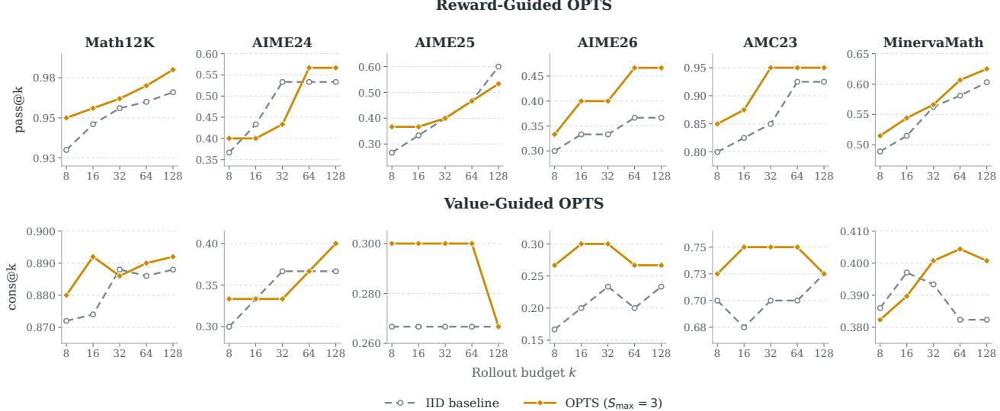  
Figure E.1: Rollout scaling of OPTS across individual reasoning benchmarks. Top: reward-guided OPTS versus i.i.d. pass@k. <sup>B</sup>ottom: va<sup>l</sup>ue-gu<sup>id</sup>e<sup>d OPTS</sup> versus <sup>i</sup>.<sup>i</sup>.<sup>d</sup>. se<sup>lf</sup>-cons<sup>i</sup>stency. <sup>E</sup>ac<sup>h</sup> co<sup>l</sup>umn reports one <sup>b</sup>enc<sup>h</sup>mar<sup>k</sup> un<sup>d</sup>er matc<sup>h</sup>e<sup>d</sup> rollout budgets � ∈ {8, 16, 32, 64, 128} at fixed $S _ { \mathrm { m a x } } = 3$

## F Search-Budget Improvement of OPTS

Th<sub>eorem</sub> 2 <sub>assumes a</sub> fi<sub>xe</sub>d <sub>exac</sub>t <sub>va</sub>l<sub>ue</sub> f<sub>unc</sub>ti<sub>on;</sub> thi<sub>s exper</sub>i<sub>men</sub>t t<sub>es</sub>t<sub>s</sub> th<sub>e</sub> t<sub>ren</sub>d <sub>w</sub>ith <sub>a</sub> l<sub>earne</sub>d <sub>cr</sub>iti<sub>c.</sub> W<sub>e</sub> fi<sub>x</sub> th<sub>e</sub> step-<sup>400</sup> Qwen3-1.7B <sup>OPTS</sup>-<sup>TTPO</sup> po<sup>li</sup>cy an<sup>d</sup> cr<sup>i</sup>t<sup>i</sup>c, set $\lambda = 0 . 9 9 9$ , an<sup>d</sup> var<sub>y</sub> $S _ { \mathrm { m a x } } \in \{ 0 , 1 , 3 , 7 , 1 5 \}$ with 32 trees <sub>p</sub>er <sub>p</sub>rom<sub>p</sub>t on 902 held-out <sub>p</sub>rom<sub>p</sub>ts. Reward- and value-<sub>g</sub>uided search reuse the same root-res<sub>p</sub>onse texts. We report the greedy-path verifier �-return $J _ { \lambda }$ <sub>an</sub>d <sub>se</sub>l<sub>ec</sub>t<sub>e</sub>d<sub>-</sub>t<sub>erm</sub>i<sub>na</sub>l <sub>re</sub>t<sub>urn</sub> $^ { J , }$ <sub>eac</sub>h <sub>re</sub>l<sub>a</sub>ti<sub>ve</sub> t<sub>o</sub> $S _ { \mathrm { m a x } } = 0$ . Fi<sub>g</sub>ure F.1 <sub>g</sub>i<sub>ves</sub> <sub>a</sub>ll f<sub>our</sub> <sub>quan</sub>titi<sub>es</sub> b<sub>y</sub> b<sub>enc</sub>h<sub>mar</sub>k<sub>.</sub> R<sub>ewar</sub>d<sub>-gu</sub>id<sub>e</sub>d <sub>curves</sub> i<sub>ncrease</sub> th<sub>roug</sub>h<sub>ou</sub>t<sub>;</sub> <sub>va</sub>l<sub>ue-gu</sub>id<sub>e</sub>d $J _ { \lambda }$ <sub>p</sub>ea<sup>k</sup>s b<sub>e</sub>f<sub>ore</sub> $S _ { \mathrm { m a x } } = 1 5$ on AIME25 an<sup>d</sup> MinervaMath, so t<sup>h</sup>e exact-va<sup>l</sup>ue guarantee nee<sup>d</sup> not <sup>h</sup>o<sup>ld</sup> w<sup>i</sup>t<sup>h</sup> an approx<sup>i</sup>mate critic. Micro averages nevertheless increase over all five budgets, by (0.0706, 0.1190) for reward guidance and (0.0107, 0.0254) for value guidance in $( J _ { \lambda } , J )$ <sub>.</sub> Th<sub>e rewar</sub>d<sub>-gu</sub>id<sub>e</sub>d <sub>ga</sub>i<sub>n a</sub>l<sub>so</sub> d<sub>epen</sub>d<sub>s on re</sub>b<sub>ranc</sub>hi<sub>ng pos</sub>iti<sub>on</sub> (A<sub>pp</sub>endix G).

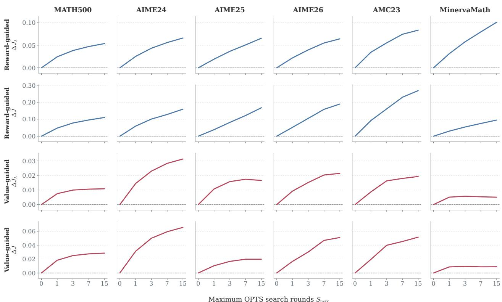  
Figure F.1: Learned-critic search-budget results by benchmark. Rows report reward-guided $\Delta J _ { \lambda }$ <sub>, rewar</sub>d<sub>-gu</sub>id<sub>e</sub>d $\Delta J ,$ <sub>va</sub>l<sub>ue-gu</sub>id<sub>e</sub>d $\Delta J _ { \lambda ; }$ <sub>, an</sub>d <sub>va</sub>l<sub>ue- u</sub>id<sub>e</sub>d $\Delta J ,$ <sub>w</sub>h<sub>ere eac</sub>h dif<sub>erence</sub> i<sub>s re</sub>l<sub>a</sub>ti<sub>ve</sub> t<sub>o</sub> $S _ { \mathrm { m a x } } = 0$ <sub>.</sub> C<sub>o</sub>l<sub>umns s</sub>h<sub>ow</sub> th<sub>e s</sub>i<sub>x reason</sub>i<sub>ng</sub> b<sub>enc</sub>h<sub>mar</sub>k<sub>s.</sub>

## G Rebranching Position: Performance-Diference versus Random and Midpoint Selection

OPTS <sub>a</sub>l<sub>wa s re</sub>b<sub>ranc</sub>h<sub>es</sub> b th<sub>e er</sub>f<sub>ormance-</sub>dif<sub>erence es</sub>ti<sub>ma</sub>t<sub>e, so we</sub> t<sub>es</sub>t <sub>w</sub>h<sub>e</sub>th<sub>er</sub> th<sub>e os</sub>iti<sub>on</sub> it i<sub>c</sub>k<sub>s</sub> matters. <sup>U</sup>s<sup>i</sup>ng t<sup>h</sup>e step-<sup>400</sup> Qwen3-1.7B <sup>OPTS</sup>-<sup>TTPO</sup> po<sup>li</sup>cy an<sup>d</sup> cr<sup>i</sup>t<sup>i</sup>c, 9<sup>02</sup> <sup>h</sup>e<sup>ld</sup>-out prompts, an<sup>d</sup> <sup>32</sup> trees per <sub>promp</sub>t<sub>,</sub> <sub>we</sub> <sub>run</sub> OPTS <sub>un</sub>d<sub>er</sub> th<sub>ree</sub> <sub>re</sub>b<sub>ranc</sub>hi<sub>ng</sub> <sub>ru</sub>l<sub>es:</sub> <sub>per</sub>f<sub>ormance-</sub>dif<sub>erence</sub> <sub>se</sub>l<sub>ec</sub>ti<sub>on,</sub> <sub>a</sub> <sub>un</sub>if<sub>orm</sub>l<sub>y</sub> <sub>ran</sub>d<sub>om</sub> <sub>pos</sub>iti<sub>on</sub> <sub>on</sub> th<sub>e</sub> <sub>same</sub> <sub>gree</sub>d<sub>y</sub> <sub>pa</sub>th<sub>,</sub> <sub>an</sub>d th<sub>e</sub> fi<sub>xe</sub>d <sub>m</sub>id<sub>po</sub>i<sub>n</sub>t <sub>o</sub>f th<sub>a</sub>t <sub>pa</sub>th<sub>.</sub> Th<sub>e</sub> t<sub>wo</sub> <sub>con</sub>t<sub>ro</sub>l <sub>ru</sub>l<sub>es</sub> k<sub>eep</sub> th<sub>e</sub> <sub>per-roun</sub>d t<sub>ree se</sub>l<sub>ec</sub>ti<sub>on o</sub>f OPTS<sub>, so</sub> th<sub>e num</sub>b<sub>er o</sub>f <sub>re</sub>b<sub>ranc</sub>hi<sub>ngs per roun</sub>d i<sub>s ma</sub>t<sub>c</sub>h<sub>e</sub>d<sub>; on</sub>l<sub>y</sub> th<sub>e no</sub>d<sub>e pos</sub>iti<sub>on c</sub>h<sub>anges.</sub> <sup>Fi</sup>gure <sup>G</sup>.<sup>1</sup> reports t<sup>h</sup>e gree<sup>d</sup>y-term<sup>i</sup>na<sup>l</sup> Avg@32 as t<sup>h</sup>e searc<sup>h b</sup>u<sup>d</sup>get grows. <sup>P</sup>er<sup>f</sup>ormance-<sup>dif</sup>erence se<sup>l</sup>ect<sup>i</sup>on <sup>i</sup>s b<sub>es</sub>t <sub>on</sub> fi<sub>ve o</sub>f th<sub>e s</sub>i<sub>x</sub> b<sub>enc</sub>h<sub>mar</sub>k<sub>s a</sub>t <sub>every</sub> b<sub>u</sub>d<sub>ge</sub>t <sub>a</sub>b<sub>ove zero, an</sub>d it<sub>s marg</sub>i<sub>n w</sub>id<sub>ens w</sub>ith $S _ { \mathrm { m a x } } ;$ on AIME25 <sub>ran</sub>d<sub>om se</sub>l<sub>ec</sub>ti<sub>on</sub> i<sub>s marg</sub>i<sub>na</sub>ll<sub>y</sub> hi<sub>g</sub>h<sub>er.</sub>

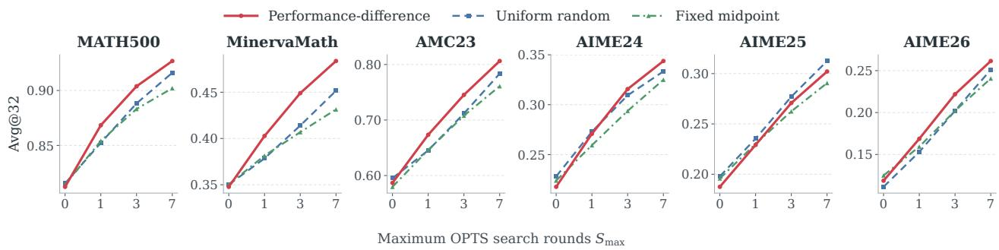  
Figure G.1: Rebranching position matters. Avg@32 versus the maximum number of OPTS search rounds for <sub>per</sub>f<sub>ormance-</sub>dif<sub>erence, un</sub>if<sub>orm</sub>l<sub>y ran</sub>d<sub>om, an</sub>d fi<sub>xe</sub>d<sub>-m</sub>id<sub>po</sub>i<sub>n</sub>t <sub>re</sub>b<sub>ranc</sub>hi<sub>ng on</sub> th<sub>e same</sub> t<sub>rees an</sub>d b<sub>u</sub>d<sub>ge</sub>t<sub>s.</sub>

## H MuJoCo Hyper-Parameter Grid: Length-Penalty Exponent and Search Count

We sweep $\xi \in \{ 0 , 0 . 1 , \ldots , 1 . 0 \}$ <sub>an</sub>d $s \in \{ 1 , \ldots , 8 \}$ <sub>on</sub> H<sub>opper-v</sub>4 <sub>an</sub>d H<sub>umano</sub>id<sub>-v</sub>4<sub>,</sub> th<sub>e</sub> <sub>sma</sub>ll<sub>es</sub>t<sub>-</sub> <sub>an</sub>d l<sub>arges</sub>t<sub>-</sub> action-s<sub>p</sub>ace tasks in the five-task suite. The remainin<sub>g</sub> OPTS-TTPO settin<sub>g</sub>s are unchan<sub>g</sub>ed: 1M ste<sub>p</sub>s<sub>,</sub> 10 seeds <sub>per ce</sub>ll<sub>,</sub> 88 <sub>ce</sub>ll<sub>s per</sub> t<sub>as</sub>k<sub>, an</sub>d <sub>max-</sub>b<sub>ac</sub>k<sub>up</sub> T<sub>ree</sub>GAE<sub>.</sub> Fi<sub>gure</sub> H<sub>.</sub>1 <sub>repor</sub>t<sub>s</sub> f<sub>u</sub>ll<sub>-</sub>t<sub>ra</sub>i<sub>n</sub>i<sub>ng an</sub>d t<sub>a</sub>il <sub>re</sub>t<sub>urns p</sub>l<sub>us a</sub> <sub>cross-</sub>t<sub>as</sub>k <sub>summary</sub> th<sub>a</sub>t <sub>m</sub>i<sub>n–max</sub> <sub>norma</sub>li<sub>zes</sub> <sub>eac</sub>h <sub>gr</sub>id b<sub>e</sub>f<sub>ore</sub> <sub>averag</sub>i<sub>ng.</sub> Th<sub>e</sub> <sub>ma</sub>i<sub>n-</sub>t<sub>ex</sub>t <sub>se</sub>tti<sub>ng</sub> $( \xi , s ) = ( 0 . 6 , 1 )$ (black outline) is best under both metrics and is fixed for the remainin<sub>g</sub> tasks; the heatma<sub>p</sub>s show the com<sub>p</sub>lete <sub>gr</sub>id<sub>.</sub>

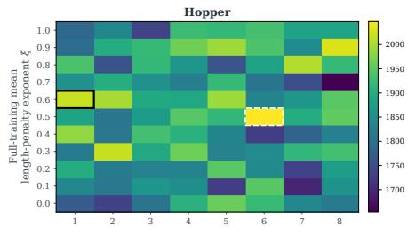

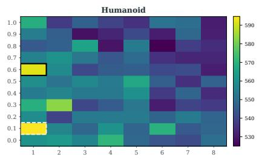

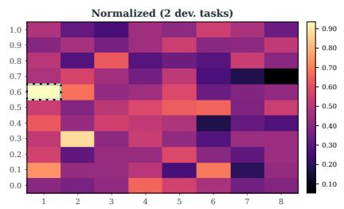

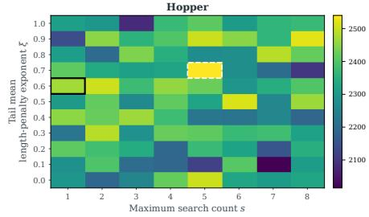

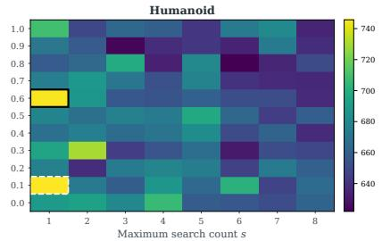

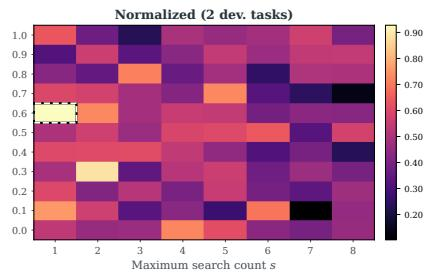  
Figure H.1: $\xi \times s$ grid on the MuJoCo development tasks. Top: full-training mean return; bottom: tail return. Black outline: the selected configuration (0.6, 1); white dashed outline: the best cell of each panel. The right-most column <sub>averages</sub> th<sub>e m</sub>i<sub>n–max-norma</sub>li<sub>ze</sub>d <sub>gr</sub>id<sub>s o</sub>f H<sub>opper-v</sub>4 <sub>an</sub>d H<sub>umano</sub>id<sub>-v</sub>4<sub>.</sub>

## I Full Atari-57 Learning Curves

E<sub>ac</sub>h <sub>pane</sub>l <sub>correspon</sub>d<sub>s</sub> t<sub>o one</sub> At<sub>ar</sub>i <sub>game,</sub> th<sub>e</sub> h<sub>or</sub>i<sub>zon</sub>t<sub>a</sub>l <sub>ax</sub>i<sub>s</sub> i<sub>s</sub> th<sub>e num</sub>b<sub>er o</sub>f <sub>env</sub>i<sub>ronmen</sub>t i<sub>n</sub>t<sub>erac</sub>ti<sub>on s</sub>t<sub>eps,</sub> <sub>an</sub>d th<sub>e ver</sub>ti<sub>ca</sub>l <sub>ax</sub>i<sub>s</sub> i<sub>s</sub> th<sub>e raw mean re</sub>t<sub>urn</sub> f<sub>or</sub> th<sub>a</sub>t <sub>game.</sub> B<sub>o</sub>th <sub>me</sub>th<sub>o</sub>d<sub>s are</sub> t<sub>ra</sub>i<sub>ne</sub>d <sub>un</sub>d<sub>er</sub> th<sub>e s</sub>ti<sub>c</sub>k<sub>y-ac</sub>ti<sub>on</sub> <sub>p</sub>rotocol<sub>,</sub> and OPTS-TTPO uses mean-backu<sub>p</sub> TreeGAE<sub>,</sub> the stochastic-environment settin<sub>g,</sub> with $\xi = 0 . 6$ <sub>an</sub>d $S _ { \mathrm { m a x } } = 1$ <sub>as</sub> i<sub>n</sub> th<sub>e ma</sub>i<sub>n</sub> t<sub>ex</sub>t<sub>.</sub> Dif<sub>eren</sub>t <sub>ran</sub>d<sub>om see</sub>d<sub>s o</sub>f th<sub>e same a</sub>l<sub>gor</sub>ith<sub>m are s</sub>h<sub>own as</sub> thi<sub>n curves w</sub>ith th<sub>e</sub> <sub>same co</sub>l<sub>or, w</sub>ith <sub>smoo</sub>thi<sub>ng use</sub>d <sub>on</sub>l<sub>y</sub> f<sub>or v</sub>i<sub>sua</sub>li<sub>za</sub>ti<sub>on.</sub>

B<sub>ecause rewar</sub>d <sub>sca</sub>l<sub>es</sub> dif<sub>er su</sub>b<sub>s</sub>t<sub>an</sub>ti<sub>a</sub>ll<sub>y across</sub> At<sub>ar</sub>i <sub>games,</sub> Fi<sub>gure</sub> I<sub>.</sub>1 i<sub>s</sub> i<sub>n</sub>t<sub>en</sub>d<sub>e</sub>d f<sub>or w</sub>ithi<sub>n-</sub>t<sub>as</sub>k <sub>compar</sub>i<sub>son</sub> <sub>an</sub>d f<sub>or</sub> i<sub>nspec</sub>ti<sub>ng w</sub>h<sub>ere ga</sub>i<sub>ns or regress</sub>i<sub>ons occur.</sub> Th<sub>e aggrega</sub>t<sub>e cross-</sub>t<sub>as</sub>k <sub>conc</sub>l<sub>us</sub>i<sub>on</sub> i<sub>s</sub> th<sub>ere</sub>f<sub>ore</sub> b<sub>ase</sub>d on the human-normalized IQM and task-level win counts reported in the main text rather than on visually agg<sup>r</sup>ega<sup>tin</sup>g <sup>th</sup>ese <sup>r</sup>a<sup>w-r</sup>e<sup>t</sup>u<sup>rn</sup> cu<sup>rv</sup>es.

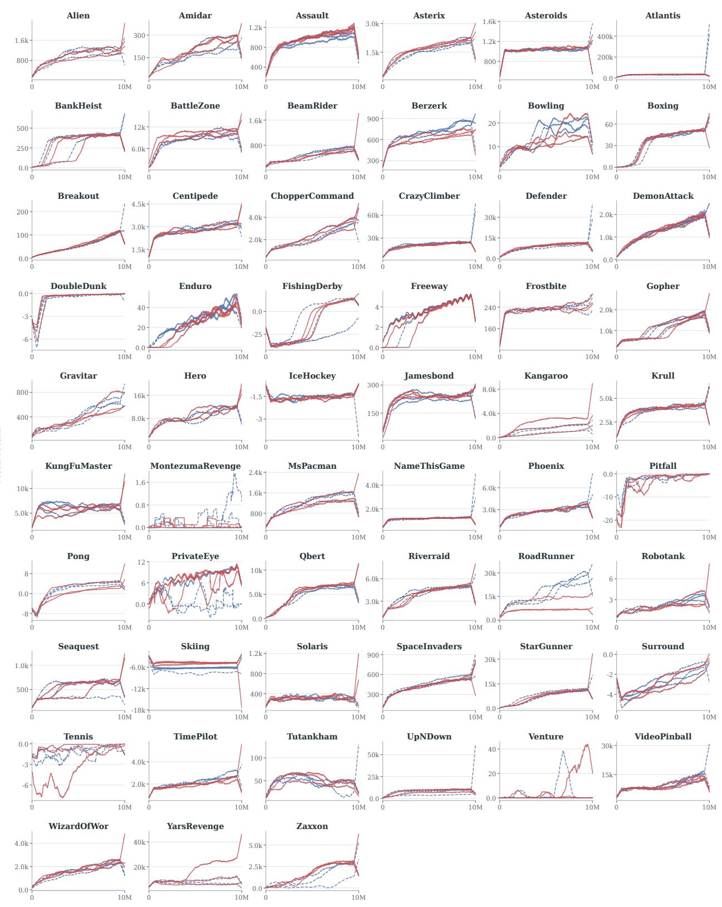  
Figure I.1: Full Atari-57 learnin curves for PPO and OPTS-TTPO. Each anel shows one ame; curves are smoothed raw <sub>mean re</sub>t<sub>urns</sub> f<sub>or</sub> dif<sub>eren</sub>t <sub>ran</sub>d<sub>om see</sub>d<sub>s.</sub>

## J Backup-Rule Comparison on Sticky-Action Atari

We com<sub>p</sub>are mean- and max-backu<sub>p</sub> OPTS-TTPO at the same $( \xi , S _ { \mathrm { m a x } } ) = ( 0 . 6 , 1 )$ <sub>un</sub>d<sub>er</sub> th<sub>e ma</sub>i<sub>n-</sub>t<sub>ex</sub>t <sub>s</sub>ti<sub>c</sub>k<sub>y-</sub> <sub>ac</sub>ti<sub>on</sub> <sub>pro</sub>t<sub>oco</sub>l<sub>:</sub> 57 <sub>games,</sub> th<sub>ree</sub> <sub>see</sub>d<sub>s,</sub> <sub>an</sub>d t<sub>en</sub> <sub>m</sub>illi<sub>on</sub> i<sub>n</sub>t<sub>erac</sub>ti<sub>on</sub> <sub>s</sub>t<sub>eps</sub> <sub>per</sub> <sub>run.</sub> F<sub>or</sub> <sub>eac</sub>h <sub>a</sub>l<sub>gor</sub>ith<sub>m,</sub> <sub>we</sub> fi<sub>rs</sub>t <sub>a</sub>v<sub>e</sub>r<sub>age</sub> th<sub>e</sub> thr<sub>ee</sub> <sub>see</sub>d <sub>cu</sub>rv<sub>es</sub> <sub>po</sub>intwi<sub>se,</sub> th<sub>e</sub>n <sub>a</sub>v<sub>e</sub>r<sub>age</sub> <sub>a</sub>ll l<sub>ogge</sub>d <sub>po</sub>int<sub>s</sub> <sub>o</sub>r th<sub>e</sub> fin<sub>a</sub>l 100 <sub>po</sub>int<sub>s.</sub> Win/l<sub>oss</sub>/ti<sub>e</sub> <sub>coun</sub>t<sub>s compare</sub> th<sub>ese game-</sub>l<sub>eve</sub>l <sub>means us</sub>i<sub>ng an a</sub>b<sub>so</sub>l<sub>u</sub>t<sub>e</sub> ti<sub>e</sub> t<sub>o</sub>l<sub>erance o</sub>f $1 0 ^ { - 1 2 }$ <sub>;</sub> th<sub>e per-game</sub> t<sub>a</sub>bl<sub>es s</sub>h<sub>ow</sub> th<sub>e</sub> <sub>same va</sub>l<sub>ues roun</sub>d<sub>e</sub>d t<sub>o</sub> t<sub>wo</sub> d<sub>ec</sub>i<sub>ma</sub>l<sub>s.</sub>

Table J.1: Backup-rule comparisons at fixed hyperparameters.
<table><tr><td>Metric</td><td>Comparison</td><td>Wins</td><td>Losses</td><td>Ties</td></tr><tr><td>Full training</td><td>Max vs. Mean</td><td>19</td><td>22</td><td>16</td></tr><tr><td>Full training</td><td>Max vs. PPO</td><td>27</td><td>30</td><td>0</td></tr><tr><td>Full training</td><td>Mean vs. PPO</td><td>31</td><td>26</td><td>0</td></tr><tr><td>Tail</td><td>Max vs. Mean</td><td>18</td><td>22</td><td>17</td></tr><tr><td>Tail</td><td>Max vs. PPO</td><td>34</td><td>22</td><td>1</td></tr><tr><td>Tail</td><td>Mean vs. PPO</td><td>34</td><td>22</td><td>1</td></tr></table>

M<sub>ean</sub> b<sub>ac</sub>k<sub>up</sub> h<sub>as a s</sub>li<sub>g</sub>ht <sub>e</sub>d<sub>ge</sub> i<sub>n game-</sub>l<sub>eve</sub>l <sub>w</sub>i<sub>ns aga</sub>i<sub>ns</sub>t <sub>max</sub> b<sub>ac</sub>k<sub>up, w</sub>hil<sub>e</sub> b<sub>o</sub>th b<sub>ea</sub>t PPO <sub>on</sub> 34 <sub>games</sub> <sub>un</sub>d<sub>er</sub> th<sub>e</sub> t<sub>a</sub>il <sub>me</sub>t<sub>r</sub>i<sub>c.</sub> Th<sub>ese resu</sub>lt<sub>s</sub> d<sub>o no</sub>t <sub>es</sub>t<sub>a</sub>bli<sub>s</sub>h <sub>un</sub>i<sub>versa</sub>l <sub>super</sub>i<sub>or</sub>it<sub>y o</sub>f <sub>e</sub>ith<sub>er</sub> b<sub>ac</sub>k<sub>up ru</sub>l<sub>e or</sub> i<sub>so</sub>l<sub>a</sub>t<sub>e</sub> <sub>env</sub>i<sub>ronmen</sub>t<sub>a</sub>l <sub>s</sub>t<sub>oc</sub>h<sub>as</sub>ti<sub>c</sub>it<sub>y as a causa</sub>l f<sub>ac</sub>t<sub>or.</sub>

Table J.2: Per-game seed-mean returns (1), shown to two decimals. Full: all logged points; Tail: final 100 points. Win <sub>coun</sub>t<sub>s use unroun</sub>d<sub>e</sub>d <sub>va</sub>l<sub>ues.</sub>
<table><tr><td></td><td colspan="3">Full</td><td colspan="3">Tail</td></tr><tr><td>Game</td><td>PPO</td><td>Mean</td><td>Max</td><td>PPO</td><td>Mean</td><td>Max</td></tr><tr><td>ALE_Surround-v5</td><td>-2.83</td><td>-2.94</td><td>-2.94</td><td>-1.14</td><td>-0.91</td><td>-0.91</td></tr><tr><td>AlienNoFrameskip-v4</td><td>989.13</td><td>947.58</td><td>945.15</td><td>1186.07</td><td>1236.76</td><td>1372.65</td></tr><tr><td>AmidarNoFrameskip-v4</td><td>173.34</td><td>192.09</td><td>191.86</td><td>246.73</td><td>301.20</td><td>307.77</td></tr><tr><td>AssaultNoFrameskip-v4</td><td>922.34</td><td>967.38</td><td>968.90</td><td>1073.07</td><td>1278.37</td><td>1208.08</td></tr><tr><td>AsterixNoFrameskip-v4</td><td>1553.26</td><td>1671.41</td><td>1690.02</td><td>2051.14</td><td>2223.03</td><td>2194.67</td></tr><tr><td>AsteroidsNoFrameskip-v4</td><td>1031.89</td><td>1045.94</td><td>1042.91</td><td>1077.44</td><td>1081.97</td><td>1105.55</td></tr><tr><td>AtlantisNoFrameskip-v4</td><td>30513.96</td><td>30637.19</td><td>28223.74</td><td>40791.67</td><td>32212.33</td><td>27254.17</td></tr><tr><td>BankHeistNoFrameskip-v4</td><td>310.09</td><td>288.34</td><td>221.75</td><td>430.11</td><td>437.08</td><td>406.26</td></tr><tr><td>BattleZoneNoFrameskip-v4</td><td>8426.72</td><td>9203.13</td><td>9694.18</td><td>10452.50</td><td>10219.44</td><td>11091.39</td></tr><tr><td>BeamRiderNoFrameskip-v4</td><td>487.94</td><td>451.52</td><td>451.52</td><td>704.01</td><td>663.40</td><td>663.40</td></tr><tr><td>BerzerkNoFrameskip-v4</td><td>688.99</td><td>612.03</td><td>618.03</td><td>836.57</td><td>714.46</td><td>735.34</td></tr><tr><td>BowlingNoFrameskip-v4</td><td>14.40</td><td>12.27</td><td>12.39</td><td>18.25</td><td>16.85</td><td>17.46</td></tr><tr><td>BoxingNoFrameskip-v4</td><td>33.90</td><td>35.09</td><td>35.09</td><td>51.22</td><td>54.24</td><td>54.24</td></tr><tr><td>BreakoutNoFrameskip-v4</td><td>55.06</td><td>58.26</td><td>54.77</td><td>120.19</td><td>125.61</td><td>115.80</td></tr><tr><td>CentipedeNoFrameskip-v4</td><td>2818.38</td><td>2761.23</td><td>2806.74</td><td>3237.38</td><td>3071.08</td><td>3212.12</td></tr><tr><td>ChopperCommandNoFrameskip-v4</td><td>2229.34</td><td>2249.77</td><td>2135.29</td><td>3819.40</td><td>3684.47</td><td>3281.21</td></tr><tr><td>CrazyClimberNoFrameskip-v4</td><td>21412.02</td><td>20278.52</td><td>20278.52</td><td>23151.00</td><td>23777.56</td><td>23777.56</td></tr><tr><td>DefenderNoFrameskip-v4</td><td>8376.84</td><td>8961.33</td><td>8783.60</td><td>10542.53</td><td>12488.08</td><td>12195.61</td></tr><tr><td>DemonAttackNoFrameskip-v4</td><td>1276.39</td><td>1302.78</td><td>1314.93</td><td>2044.33</td><td>1925.20</td><td>2188.04</td></tr><tr><td>DoubleDunkNoFrameskip-v4</td><td>-0.81</td><td>-0.70</td><td>-0.70</td><td>-0.05</td><td>-0.06</td><td>-0.06</td></tr><tr><td>EnduroNoFrameskip-v4</td><td>26.72</td><td>22.69</td><td>22.69</td><td>40.72</td><td>33.14</td><td>33.14</td></tr><tr><td>FishingDerbyNoFrameskip-v4</td><td>-16.08</td><td>-12.51</td><td>-12.51</td><td>5.97</td><td>14.45</td><td>14.45</td></tr><tr><td>FreewayNoFrameskip-v4</td><td>3.52</td><td>3.24</td><td>3.24</td><td>5.96</td><td>5.88</td><td>5.88</td></tr><tr><td>FrostbiteNoFrameskip-v4</td><td>231.70</td><td>231.77</td><td>237.73</td><td>250.58</td><td>249.40</td><td>255.50</td></tr><tr><td>GopherNoFrameskip-v4</td><td>1122.37</td><td>1075.35</td><td>904.68</td><td>1912.06</td><td>1894.34</td><td>1332.87</td></tr><tr><td>GravitarNoFrameskip-v4</td><td>397.21</td><td>376.87</td><td>336.78</td><td>642.40</td><td>617.09</td><td>518.12</td></tr><tr><td>HeroNoFrameskip-v4</td><td>8702.10</td><td>8840.72</td><td>9149.41</td><td>11663.23</td><td>12233.24</td><td>12438.86</td></tr><tr><td>IceHockeyNoFrameskip-v4</td><td>-1.54</td><td>-1.60</td><td>-1.58</td><td>-1.38</td><td>-1.28</td><td>-1.19</td></tr><tr><td>JamesbondNoFrameskip-v4</td><td>223.91</td><td>229.30</td><td>234.10</td><td>248.14</td><td>267.07</td><td>263.86</td></tr></table>

Table J.3: Per-game seed-mean returns (2), shown to two decimals. Full: all logged points; Tail: final 100 points. Win <sub>coun</sub>t<sub>s use unroun</sub>d<sub>e</sub>d <sub>va</sub>l<sub>ues.</sub>
<table><tr><td></td><td colspan="3">Full</td><td colspan="3">Tail</td></tr><tr><td>Game</td><td>PPO</td><td>Mean</td><td>Max</td><td>PPO</td><td>Mean</td><td>Max</td></tr><tr><td>KangarooNoFrameskip-v4</td><td>1229.65</td><td>1612.89</td><td>1587.39</td><td>1802.94</td><td>2458.78</td><td>2444.39</td></tr><tr><td>KruliNoFrameskip-v4</td><td>3762.75</td><td>3802.40</td><td>3776.63</td><td>4173.87</td><td>4482.65</td><td>4402.41</td></tr><tr><td>KungFuMasterNoFrameskip-v4</td><td>6102.91</td><td>5726.26</td><td>5726.26</td><td>5609.22</td><td>6604.17</td><td>6604.17</td></tr><tr><td>MontezumaRevengeNoFrameskip-v4</td><td>0.21</td><td>0.06</td><td>0.48</td><td>0.00</td><td>0.17</td><td>0.00</td></tr><tr><td>MsPacmanNoFrameskip-v4</td><td>1185.86</td><td>1131.68</td><td>1184.35</td><td>1471.88</td><td>1464.83</td><td>1551.24</td></tr><tr><td>NameThisGameNoFrameskip-v4</td><td>1160.37</td><td>1182.86</td><td>1182.86</td><td>1337.90</td><td>1352.00</td><td>1352.00</td></tr><tr><td>PhoenixNoFrameskip-v4</td><td>2744.98</td><td>2826.81</td><td>2768.06</td><td>3813.27</td><td>3939.31</td><td>3836.27</td></tr><tr><td>PitfallNoFrameskip-v4</td><td>-3.08</td><td>-3.89</td><td>-4.91</td><td>0.00</td><td>0.00</td><td>-0.48</td></tr><tr><td>PongNoFrameskip-v4</td><td>1.54</td><td>0.58</td><td>0.58</td><td>4.61</td><td>3.50</td><td>3.50</td></tr><tr><td>PrivateEyeNoFrameskip-v4</td><td>2.80</td><td>6.12</td><td>6.11</td><td>4.67</td><td>12.20</td><td>12.20</td></tr><tr><td>QbertNoFrameskip-v4</td><td>4894.80</td><td>5279.52</td><td>4903.30</td><td>6714.89</td><td>7282.50</td><td>7130.39</td></tr><tr><td>RiverraidNoFrameskip-v4</td><td>4081.11</td><td>3991.97</td><td>4060.80</td><td>4840.25</td><td>5520.78</td><td>4899.51</td></tr><tr><td>RoadRunnerNoFrameskip-v4</td><td>17287.81</td><td>8471.32</td><td>20939.21</td><td>28086.25</td><td>9731.23</td><td>33341.33</td></tr><tr><td>RobotankNoFrameskip-v4</td><td>2.23</td><td>2.02</td><td>2.02</td><td>3.56</td><td>2.88</td><td>2.88</td></tr><tr><td>SeaquestNoFrameskip-v4</td><td>498.59</td><td>526.78</td><td>364.72</td><td>582.07</td><td>709.10</td><td>399.03</td></tr><tr><td>SkiingNoFrameskip-v4</td><td>-6673.30</td><td>-4877.35</td><td>-4877.35</td><td>-6523.64</td><td>-4600.00</td><td>-4600.00</td></tr><tr><td>SolarisNoFrameskip-v4</td><td>304.76</td><td>308.64</td><td>308.64</td><td>293.27</td><td>295.07</td><td>295.07</td></tr><tr><td>SpaceInvadersNoFrameskip-v4</td><td>442.97</td><td>430.26</td><td>424.46</td><td>606.18</td><td>568.85</td><td>496.05</td></tr><tr><td>StarGunnerNoFrameskip-v4</td><td>7459.37</td><td>7351.37</td><td>7403.09</td><td>11215.28</td><td>11361.83</td><td>11826.67</td></tr><tr><td>TennisNoFrameskip-v4</td><td>-1.17</td><td>-1.73</td><td>-1.73</td><td>-0.14</td><td>-0.15</td><td>-0.15</td></tr><tr><td>TimePilotNoFrameskip-v4</td><td>2206.19</td><td>1999.81</td><td>2059.30</td><td>2904.39</td><td>2557.28</td><td>2662.74</td></tr><tr><td>TutankhamNoFrameskip-v4</td><td>46.56</td><td>48.76</td><td>44.14</td><td>37.73</td><td>40.55</td><td>48.30</td></tr><tr><td>UpNDownNoFrameskip-v4</td><td>6777.72</td><td>7977.87</td><td>6655.13</td><td>9677.93</td><td>11131.87</td><td>8754.43</td></tr><tr><td>VentureNoFrameskip-v4</td><td>1.71</td><td>3.62</td><td>3.62</td><td>0.00</td><td>16.50</td><td>16.50</td></tr><tr><td>VideoPinballNoFrameskip-v4</td><td>9998.85</td><td>9542.93</td><td>9625.38</td><td>17789.33</td><td>15498.07</td><td>15813.72</td></tr><tr><td>WizardOf WorNoFrameskip-v4</td><td>1602.55</td><td>1657.13</td><td>1644.41</td><td>2541.53</td><td>2613.94</td><td>2636.61</td></tr><tr><td>YarsRevengeNoFrameskip-v4</td><td>7644.99</td><td>10684.72</td><td>8326.65</td><td>8370.44</td><td>15992.55</td><td>11214.26</td></tr><tr><td>ZaxxonNoFrameskip-v4</td><td>1087.67</td><td>1727.66</td><td>1744.45</td><td>2367.19</td><td>3139.61</td><td>3122.94</td></tr></table>

## K Per-Checkpoint LLM Evaluation Curves

<sup>Th</sup>e <sup>f</sup>our Qwen3-1.7B met<sup>h</sup>o<sup>d</sup>s are eva<sup>l</sup>uate<sup>d</sup> every <sup>20</sup> steps <sup>f</sup>rom <sup>20</sup> to <sup>400</sup> us<sup>i</sup>ng t<sup>h</sup>e <sup>fi</sup>na<sup>l</sup>-c<sup>h</sup>ec<sup>k</sup>po<sup>i</sup>nt protoco<sup>l</sup>: 32 res<sub>p</sub>onses <sub>p</sub>er <sub>p</sub>rom<sub>p</sub>t on the 902-<sub>p</sub>rom<sub>p</sub>t set<sub>,</sub> scored b<sub>y</sub> the same verifier. OPTS-TTPO uses the main-text <sub>con</sub>fi<sub>gura</sub>ti<sub>on</sub> <sub>w</sub>ith <sub>max-</sub>b<sub>ac</sub>k<sub>up</sub> T<sub>ree</sub>GAE <sub>an</sub>d $S _ { \mathrm { m a x } } = 3$ . <sup>I</sup>t matc<sup>h</sup>es cr<sup>i</sup>t<sup>i</sup>c-<sup>f</sup>ree <sup>b</sup>ase<sup>li</sup>nes on avg@32 <sup>f</sup>or most o<sup>f</sup> tra<sup>i</sup>n<sup>i</sup>ng an<sup>d</sup> pu<sup>ll</sup>s a<sup>h</sup>ea<sup>d</sup> <sup>i</sup>n t<sup>h</sup>e secon<sup>d</sup> <sup>h</sup>a<sup>lf</sup>, espec<sup>i</sup>a<sup>ll</sup>y on <sup>AIME24</sup>–<sup>26</sup>; <sup>i</sup>ts pass@32 a<sup>d</sup>vantage appears ear<sup>l</sup>y and <sub>p</sub>ersists exce<sub>p</sub>t on AIME24.

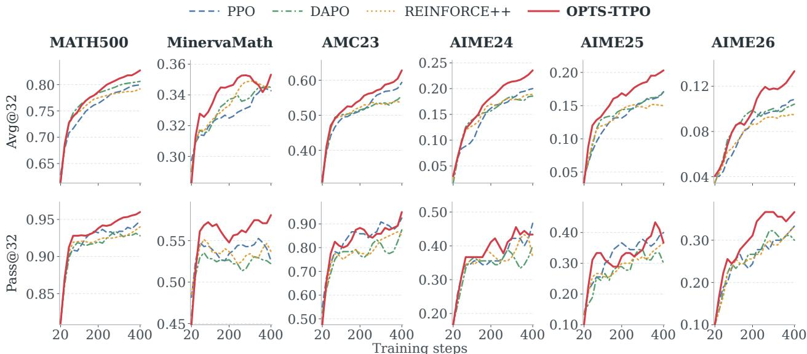  
Figure K.1: Qwen3-1.7B per-checkpoint evaluation across six reasoning benchmarks. Each column shows one <sup>b</sup>enc<sup>h</sup>mar<sup>k</sup>, w<sup>i</sup>t<sup>h</sup> avg@32 a<sup>b</sup>ove pass@32; a<sup>ll 20</sup> c<sup>h</sup>ec<sup>k</sup>po<sup>i</sup>nts o<sup>f</sup> every met<sup>h</sup>o<sup>d</sup> are score<sup>d</sup> w<sup>i</sup>t<sup>h</sup> t<sup>h</sup>e same ver<sup>ifi</sup>er. <sup>C</sup>urves show a three-<sub>p</sub>oint movin<sub>g</sub> avera<sub>g</sub>e that retains the ste<sub>p</sub>-20 and ste<sub>p</sub>-400 end<sub>p</sub>oints.

## L Wall-Clock Composition of OPTS-TTPO

<sup>T</sup>a<sup>bl</sup>e <sup>L</sup>.<sup>1</sup> reports t<sup>h</sup>e <sup>i</sup>nterna<sup>l</sup> runt<sup>i</sup>me compos<sup>i</sup>t<sup>i</sup>on recor<sup>d</sup>e<sup>d i</sup>n t<sup>h</sup>e Qwen3-1.7B <sup>OPTS</sup>-<sup>TTPO</sup> tra<sup>i</sup>n<sup>i</sup>ng <sup>l</sup>ogs <sup>f</sup>or Section 4.4. Rollout generation accounts for 43.7% of each step, critic forwards and updates for 34.0%, and actor updates for 16.5%. The explicitly timed path refresh, branch selection, and TreeGAE backup account for 0.7%; beyond these operations, OPTS also makes the rollout rounds serial and performs critic forwards after <sub>eac</sub>h <sub>roun</sub>d<sub>.</sub> All ti<sub>m</sub>i<sub>ngs are per</sub> t<sub>ra</sub>i<sub>n</sub>i<sub>ng s</sub>t<sub>ep, summ</sub>i<sub>ng repea</sub>t<sub>e</sub>d <sub>opera</sub>ti<sub>ons over a</sub>ll <sub>ro</sub>ll<sub>ou</sub>t <sub>roun</sub>d<sub>s.</sub>

Table L.1: Wall-clock composition of an OPTS-TTPO step (Qwen3-1.7B, $S _ { \mathrm { m a x } } = 3 ,$ ei<sub>g</sub>ht H200 GPUs).
<table><tr><td>Stage of one training step</td><td>Seconds</td><td>Share</td></tr><tr><td>Rollout generation (vLLM, all rounds)</td><td>348.1</td><td>43.7%</td></tr><tr><td>Critic update</td><td>214.4</td><td>26.9%</td></tr><tr><td>Actor update</td><td>131.4</td><td>16.5%</td></tr><tr><td>Critic value forwards (all rounds)</td><td>56.5</td><td>7.1%</td></tr><tr><td>Old log-probabilities</td><td>39.2</td><td>4.9%</td></tr><tr><td>Search module:  path refresh + selection</td><td>3.2</td><td>0.4%</td></tr><tr><td>Search module: TreeGAE backup</td><td>2.7</td><td>0.3%</td></tr><tr><td>Reward, final tree processing, other</td><td>0.5</td><td>0.1%</td></tr><tr><td>Total</td><td>796.0</td><td>100%</td></tr></table>