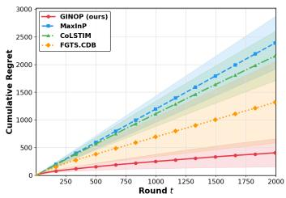
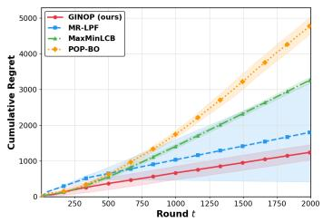
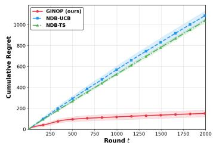
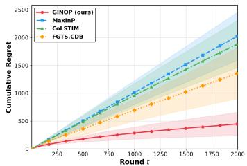
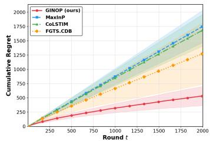
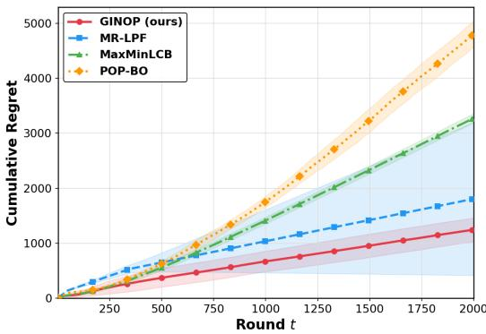
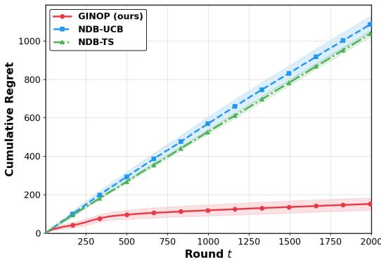

# On the Complexity of Preference-Based Bandits

Ahmed Ben Yahmed∗ Criteo AI Lab, Paris, France CREST, ENSAE, France FairPlay joint team

Marc Abeille Criteo AI Lab, Paris, France FairPlay joint team

Clément Calauzènes Criteo AI Lab, Paris, France FairPlay joint team

## Abstract

We study preference-based bandits with general reward function classes, where a learner sequentially selects pairs of arms and observes binary preference feedback governed by the Bradley–Terry model. This setting naturally arises in applications such as recommender systems, tournament ranking, and learning from human feedback, where relative preferences are easier to elicit than absolute rewards. The observation model inherits the logistic bandit challenge of handling the problemdependent constant κ, which accounts for the non-linearity of the link function and can grow arbitrarily large. Moreover, prior work has predominantly focused on linear or kernelized reward models, precluding the use of richer function classes. To address these limitations, we consider general reward function classes and introduce the locally sensitive eluder dimension, a novel complexity measure tailored to the logistic structure of preference feedback that yields fine-grained regret guarantees without unfavorable dependence on κ. Building on this notion, we propose GINOP (Generic INformative OPtimism), an algorithm that constructs log-loss confidence sets and jointly selects arm pairs to balance optimism and informative exploration. We establish a first-order regret bound that, in contrast with what previous results suggest, demonstrates that learning with preference feedback is as statistically efficient as learning from direct reward observation. Finally, we corroborate our theoretical findings with empirical evaluations against competitive baselines.

## 1 Introduction

In contrast to classical stochastic bandits, where the learner plays arms and receives direct reward feedback (Lattimore and Szepesvári, 2020), dueling bandits – also referred to as preference-based bandits – constitute a sequential decision-making framework in which the learner plays pairs of arms (duels) and observes noisy preference feedback (Bengs et al., 2021). Specifically, at each round, the learner receives a binary signal indicating which arm in the selected pair is preferred. Preference-based bandits naturally arise in real-world applications where eliciting absolute rewards is difficult, while pairwise comparisons are more natural and reliable. Notable examples include online recommendation systems – where users tend to provide more accurate relative preferences than absolute ratings – web search ranking, fine-tuning of large language models, and comparative evaluations such as choosing between two restaurants or movies. More broadly, this framework is well-suited to any setting in which relative judgments are easier to obtain than absolute reward values.

When the decision space – comprising, for instance, items in online platforms, search results, or model parameters in large language models – is large or even infinite, it is common to assume that the reward function is parameterized by an unknown mapping, typically taken to be linear (Saha, 2021; Bengs et al., 2022; Li et al., 2024) or belonging to a reproducing kernel Hilbert space (RKHS) associated with a given kernel (Xu et al., 2024; Pásztor et al., 2024; Kayal et al., 2025). However, such parametrizations may be overly restrictive in practice and can limit the expressiveness of the model. To address this limitation, the present paper considers a more general setting in which the reward function belongs to a rich and generic function class, and must be learned from preference feedback obtained through pairwise comparisons of selected arms.

## 2 Setting

Notation. The set $\{ 1 , \ldots , T \}$ is denoted by [T]. The sigmoid function is defined as $\sigma ( x ) : =$ $( 1 + e ^ { - x } ) ^ { - 1 }$ , and σ˙ and σ¨ denote its first and second derivatives, respectively. The log-loss function is defined as $\ell ( a , b ) : = - a \log { ( b ) } - ( 1 - a ) \log { ( 1 - b ) }$ . The inner product between two vectors $u , \ i$ is denoted $\langle u , v \rangle$ . We define $\| x \| : = { \sqrt { \langle x , x \rangle } }$ and, for any positive definite matrix $V \in \mathbb { R } ^ { d \times d }$ $\| x \| _ { V } : = { \sqrt { \langle x , V x \rangle } }$ , as the Euclidean and weighted Euclidean norms of $x ,$ respectively. We denote by $\mathbb { B } _ { 2 } ^ { d } ( r )$ the d-dimensional Euclidean ball of radius r centered at the origin. Standard asymptotic notation $\mathcal { O } ( \cdot )$ and $\Omega ( \cdot )$ is used throughout, while $\widetilde { \mathcal { O } } ( \cdot )$ suppresses logarithmic factors.

Problem formulation. We consider a stochastic dueling bandit problem defined by a decision set $\mathcal { X }$ and a reward function class ${ \mathcal F } .$ At each round, the learner selects a pair of arms – referred to as a duel – from $\mathcal { X }$ and observes preference feedback over the selected arms. This formulation contrasts with the classical stochastic bandit setting, in which the learner selects a single arm $x \in \mathcal { X }$ at each round t and observes a stochastic absolute reward $r _ { t } ( x )$ . In dueling bandits, at round $t ,$ the learner selects a pair of arms $( x _ { t } , x _ { t } ^ { \prime } ) \in \mathcal { X } ^ { 2 }$ . Rather than observing the individual rewards $r _ { t } ( x _ { t } )$ and $r _ { t } ( x _ { t } ^ { \prime } )$ the learner receives stochastic preference feedback $y _ { t } \in \{ 0 , 1 \}$ , where $y _ { t } = 1$ indicates that arm $x _ { t }$ is preferred over $\boldsymbol { x } _ { t } ^ { \prime }$ , and $y _ { t } = 0$ otherwise. Yet, the objective is to cumulate as much reward as possible. We impose the following realizability and boundedness conditions, common in the stochastic setting.

Assumption 2.1 (Realizability). $\exists f ^ { \star } \in { \mathcal { F } } , \forall t \in [ T ] , \forall x \in { \mathcal { X } } , f ^ { \star } ( x ) = \mathbb { E } [ r _ { t } ( x ) \mid x ]$

Assumption 2.2 (Bounded reward class). $\exists S > 0 , \forall x \in \mathcal { X } , \forall f \in \mathcal { F } , f ( x ) \in [ - S , S ] .$

Observation model. The link between the preference feedback and the underlying rewards is assumed to follow the Bradley–Terry (BT) model (Bradley and Terry, 1952), a standard modeling choice in the dueling bandits literature (Saha, 2021; Bengs et al., 2022; Li et al., 2024). Under this model, the probability that arm $x _ { t }$ is preferred over $\boldsymbol { x } _ { t } ^ { \prime }$ is given by

$$
\mathbb { P } ( x _ { t } \succ x _ { t } ^ { \prime } ) = \mathbb { P } ( y _ { t } = 1 \mid x _ { t } , x _ { t } ^ { \prime } ) = \sigma ( f ^ { \star } ( x _ { t } ) - f ^ { \star } ( x _ { t } ^ { \prime } ) ) ,
$$

where $x _ { t } \succ x _ { t } ^ { \prime }$ denotes that arm $x _ { t }$ is preferred over arm $ { \boldsymbol { x } } _ { t } ^ { \prime }$ . While the BT model provides a tractable link between rewards and preferences, it introduces a problem-dependent constant

$$
\kappa : = \operatorname* { s u p } _ { x , x ^ { \prime } \in \mathcal { X } } \frac { 1 } { \dot { \sigma } ( f ^ { \star } ( x ) - f ^ { \star } ( x ^ { \prime } ) ) } ,
$$

which captures the degree of non-linearity of the sigmoid function. This quantity can be prohibitively large: it scales as $\kappa \approx e ^ { 2 S }$ , so that even $S = 5$ already yields $\kappa > \bar { 2 . 2 } \times \bar { 1 0 ^ { 4 } }$ . Consequently, it requires careful treatment in both the algorithm design and the theoretical analysis in order to avoid a detrimental impact on the resulting regret guarantees.

Performance measure. After selecting a pair of arms $( x _ { t } , x _ { t } ^ { \prime } )$ at round t, the learner incurs an instantaneous regret. Two standard notions of instantaneous regret in the dueling bandits literature (Saha, 2021; Bengs et al., 2022; Li et al., 2024) are the average and weak instantaneous regrets, defined respectively as $\begin{array} { r } { \rho _ { t } ^ { a } : = f ^ { \star } ( x ^ { \star } ) - \frac { f ^ { \star } ( x _ { t } ) + f ^ { \star } ( x _ { t } ^ { \prime } ) } { 2 } } \end{array}$ and $\rho _ { t } ^ { w } : = f ^ { \star } ( x ^ { \star } ) - \operatorname* { m a x } \bigl \{ f ^ { \star } ( x _ { t } ) , f ^ { \star } ( x _ { t } ^ { \prime } ) \bigr \}$ , where $x ^ { \star } : = \arg \operatorname* { m a x } _ { x \in { \mathcal { X } } } f ^ { \star } ( x )$ denotes the optimal arm. After $T$ rounds, the cumulative regret of a policy is defined as $\begin{array} { r } { \mathcal { R } _ { T } ^ { \tau } : = \sum _ { t = 1 } ^ { T } \rho _ { t } ^ { \tau } , \tau \in \{ a , w \} } \end{array}$ . A desirable policy achieves sublinear regret, i.e., li $\begin{array} { r } { \operatorname { n } _ { T \to \infty } \frac { \mathcal { R } _ { T } ^ { \tau } } { T } = 0 } \end{array}$ , which implies that the policy asymptotically identifies the optimal arm and selects it consistently in comparisons. By definition, $\mathcal { R } _ { T } ^ { w } \dot { \leq } \dot { \mathcal { R } } _ { T } ^ { a }$ . Therefore, throughout the remainder of the paper, we restrict attention to the average cumulative regret

$$
\mathcal { R } _ { T } : = \mathcal { R } _ { T } ^ { a } = \sum _ { t = 1 } ^ { T } \left( f ^ { \star } ( x ^ { \star } ) - \frac { f ^ { \star } ( x _ { t } ) + f ^ { \star } ( x _ { t } ^ { \prime } ) } { 2 } \right) .
$$

## 3 Related Work and Contributions

Dueling bandits. Learning with indirect feedback was first studied in supervised preference learning (Aiolli and Sperduti, 2004; Chu and Ghahramani, 2005), and later extended to online and sequential settings motivated by applications such as human-provided feedback (Yue and Joachims, 2009; Yue et al., 2012; Houlsby et al., 2011). We refer the readers to Bengs et al. (2021) for a detailed survey on various works covering different settings of dueling bandits.

An initial line of work considers finite multi-armed domains and learns a preference matrix specifying pairwise relations among arms. Such approaches often rely on efficient sorting or tournament schemes based on win frequencies per action (Jamieson and Nowak, 2011; Zoghi et al., 2014b; Komiyama et al., 2015; Wu and Liu, 2016; Falahatgar et al., 2017). Rather than selecting both arms jointly, these strategies simplify the problem by choosing one arm at random (Zoghi et al., 2014a; Zimmert and Seldin, 2018), greedily (Chen and Frazier, 2017), or from the set of previously selected arms (Ailon et al., 2014). Building on an online square-loss oracle, Saha and Krishnamurthy (2022) propose an efficient and optimal algorithm when the preference matrix is well-specified by a given function class.

To handle large or even infinite decision spaces, an alternative paradigm has emerged, namely utilitybased dueling bandits, to which the present work belongs. $\mathbf { A }$ prominent line of research adopts linear utility models. Saha (2021) and Bengs et al. (2022) both employ UCB-style estimators but with different decision schemes: the former constructs a set of plausible winners and selects the most informative pair among them, while the latter greedily selects the first arm and then chooses a competitive second arm to duel. Both achieve a regret of $\widetilde { \mathcal { O } } ( \kappa d \sqrt { T } )$ , where d is the dimension of the arm space. Similarly, Di et al. (2024) present a variance-aware algorithm that proceeds in phases, maintaining an active set of arms via a UCB-style criterion, and achieves $\begin{array} { r } { \widetilde { \mathcal { O } } \Big ( d \kappa \sqrt { \sum _ { t = 1 } ^ { T } \eta _ { t } ^ { 2 } } + d \kappa ^ { 2 } \Big ) } \end{array}$ where $\{ \eta _ { t } \}$ denotes the noise variance sequence. Alternatively, Li et al. (2024) propose a Thompson sampling method that also achieves $\widetilde { \mathcal { O } } ( \kappa d \sqrt { T } )$ . However, such linear methods have limited practical appeal - as they cannot capture the complex nonlinear utility functions arising in real-world problems - motivating the extension to Reproducing kernel Hilbert spaces (RKHS). Considering a kernelized logistic negative log-likelihood loss to estimate the utility, but with different decision rules, Xu et al. (2024) achieve a regret of $\widetilde { \mathcal { O } } \big ( ( \gamma _ { T } T ) ^ { 3 / 4 } \big )$ – where $\gamma _ { T }$ denotes the maximum information gain – by retaining one arm from the previous round and selecting the second as the maximizer of a UCB on the pairwise preference. Pásztor et al. (2024) adopt a game-theoretic arm-selection strategy and achieve a regret of $\widetilde { \mathcal { O } } ( \gamma _ { T } \kappa ^ { 2 } \sqrt { T } )$ . Building on a more involved phased approach, Kayal et al. (2025) removed the dependence on κ compared to Pásztor et al. (2024). Finally, the recent work of Verma et al. (2025) considers neural dueling bandits in the wide-network regime (NTK), leveraging neural tangent features for preference prediction to achieve a regret of $\mathcal { \widetilde { O } } ( \kappa \widetilde { d } \sqrt { T } )$ , with ˜d the effective dimension.

It is worth noting that preference-based feedback has played a central role in integrating human feedback into learning systems, yielding notable successes across a range of applications (Stiennon et al., 2022; Bai et al., 2022; Saha et al., 2023; Zhu et al., 2023; Ji et al., 2023; Munos et al., 2024).

Bradley-Terry preference model and logistic bandits. The Bradley-Terry (BT) model is a seminal framework to derive binary preferences from absolute scores: for items with scores $v _ { 1 }$ and $v _ { 2 }$ , the preference probability is $\sigma ( v _ { 1 } - v _ { 2 } )$ where σ is the sigmoid function $x \mapsto ( 1 + e ^ { - x } ) ^ { - 1 }$ . Consequently, dueling bandits under the BT assumption inherit the technical challenges of logistic bandits. Early logistic bandit analyses relied on global linearization (Filippi et al., 2010), yielding regret bounds of $\mathcal { O } ( \kappa \sqrt { T } )$ , where $\kappa$ can scale exponentially with the ambient dimension. In the linear utility setting, recent advances Faury et al. (2020); Abeille et al. (2021); Faury et al. (2022) demonstrate that a careful treatment of logistic non-linearity leads to an improved regret bound of $\mathcal { O } ( \sqrt { T / \kappa } )$ . Whether such improvements are intrinsically tied to the linear structure of the utility function, or can be extended to more general classes of reward functions, remains an open question.

Eluder Dimension. The key challenge in going beyond linear and kernelized mappings is the need to design sets of plausible models compatible with observed data – that ${ \mathrm { i s } } ,$ to establish concentration guarantees – and to quantify how their width translates into online prediction error. The seminal work of Russo and Van Roy (2013) addresses both challenges, relating the former to covering numbers and the latter to a newly introduced complexity measure—the eluder dimension—which is further studied and characterized in Li et al. (2022).This notion has been employed by Sekhari et al. (2023) in the context of preference-based bandits. However, it is primarily developed for additive noise models $( \mathrm { e . g . }$ , building on least-squares regression), which precludes extending logistic bandits to generic function classes while preserving the sharp non-linearity treatment introduced by Faury et al. (2020). Recently, Bakhtiari et al. (2025) attempted to reconcile both approaches by introducing a localized eluder dimension defined for arbitrary loss functions (in line with Liu et al. (2022), as opposed to the squared loss). They further show—independently of the loss function—that a global eluder dimension necessarily entails an unfavorable dependence on κ. This observation motivates their localization approach, evaluating the eluder dimension only over a suitable subfamily ${ \mathcal { F } } ^ { \prime } \subset { \mathcal { F } }$ The localized eluder dimension is independent of κ but applies only when the confidence set is small enough, yielding an additional regret term quantifying the regret incurred before localization. Unfortunately, this regret term is uncontrolled in general and when instantiated to generalized linear models turns out to be linear in T, rendering the approach vacuous (see Section A for details).

Main contributions. This work is the first to study the complexity of the preference bandit setting with general utility classes, introducing a novel complexity measure tailored to yield fine-grained regret guarantees. Our contributions may be summarized as follows.

1. Locally sensitive eluder dimension. The lower bound established in (Bakhtiari et al., 2025, Theorem 2) shows that the global eluder dimension of Russo and Van Roy (2013) style necessarily scales with κ in the generalized linear setting, leading to an undesirable dependence that motivates the introduction of a refined complexity measure. We therefore introduce a new notion of eluder dimension (Definition 5.1), tailored to the preference feedback setting. This quantity properly accounts for the non-linearity induced by the logistic loss, and thereby avoids any unfavorable dependence on κ.

2. GINOP algorithm (Section 5). We propose a Generic INformed-OPtimistic strategy for preference bandits with general reward function classes. The algorithm takes the reward class as input and iteratively constructs adequate confidence sets, which are then leveraged to select actions $( x _ { t } , x _ { t } ^ { \prime } )$ in a correlated manner, balancing the dual objectives of optimistically collecting reward and enforcing dissimilarity to gather more informative comparisons.

3. Regret guarantees (Theorem 5.1). Through a careful analysis, we demonstrate that, over a time horizon T, GINOP achieves a first-order regret bound that is, up to logarithmic factors, of order

$$
\sqrt { \underbrace { d _ { \sigma } ( \Delta \mathcal { F } , \Delta _ { f ^ { \star } } , 1 / T ^ { 2 } ) } _ { \mathrm { l o c a l l y ~ s e n s i t i v e ~ e l u d e r ~ d i m e n s i o n } } \underbrace { \log { ( \mathcal { N } _ { T } ) } } _ { \mathrm { l o g - c o v e r i n g ~ n u m b e r } } \frac { T } { \dot { \sigma } ^ { \star } } } + \kappa \Gamma _ { T } ,
$$

where $\dot { \sigma } ^ { \star }$ denotes the local curvature of the sigmoid at the optimal choice and is a wellbehaved constant, and $\Gamma _ { T }$ is a lower-order instance-dependent term. We further instantiate our results to the linear and kernelized reward function classes, and show that our eluder dimension introduces no additional κ dependence, thereby demonstrating that our approach surpasses previous work in both generality and sharpness (Section 6). From learningtheoretic standpoint, Theorem 5.1 shows that learning from preference feedback is as statistically efficient as learning from direct reward observations.

4. Empirical evaluation (Section 7). We corroborate our theoretical findings with empirical evaluations, comparing GINOP against several existing baselines.

## 4 Learning Process

From the history of observations $\mathcal { H } _ { t } = \left\{ x _ { 1 } , x _ { 1 } ^ { \prime } , y _ { 1 } , \dots , x _ { t } , x _ { t } ^ { \prime } , y _ { t } \right\}$ , the learner constructs estimators of the underlying reward function. Since rewards are only revealed through preferences, standard least-squares estimation is not applicable, precluding a direct use of Russo and Van Roy (2013)’s results. We instead leverage a procedure based on the log-loss, which yields refined guarantees.

Under the BT model, the preference feedback depends on the reward difference $f ^ { \star } ( x ) - f ^ { \star } ( x ^ { \prime } )$ associated with a pair $( x , \dot { x ^ { \prime } } )$ , where $f ^ { \star } \in { \mathcal { F } }$ . We introduce the difference operator $\Delta _ { f }$ , the induced function class $\Delta \bar { \mathcal { F } }$ , and the corresponding excess loss class $\Phi ( \Delta \bar { \mathcal { F } } )$

$$
\begin{array} { r l } & { \qquad \Delta _ { f } : ( x , x ^ { \prime } ) \in \mathcal { X } ^ { 2 } \mapsto f ( x ) - f ( x ^ { \prime } ) \in [ - 2 S , 2 S ] , \qquad \Delta \mathcal { F } : = \bigl \{ \Delta _ { f } : f \in \mathcal { F } \bigr \} , } \\ & { \qquad \Phi ( \Delta \mathcal { F } ) : = \Bigl \{ ( y , x , x ^ { \prime } ) \mapsto \ell \bigl ( y , \sigma ( \Delta _ { f } ( x , x ^ { \prime } ) ) \bigr ) - \ell \bigl ( y , \sigma ( \Delta _ { f ^ { \star } } ( x , x ^ { \prime } ) ) \bigr ) : f \in \mathcal { F } \Bigr \} . } \end{array}
$$

Equipped with these definitions, the true reward function $f ^ { \star }$ is estimated from $\mathcal { H } _ { t - 1 }$ via maximum likelihood estimation (MLE). For all $t \in [ T ]$

$$
\hat { f } _ { t } \in \underset { f \in \mathcal { F } } { \arg \operatorname* { m i n } } \mathcal { L } ( f ; \mathcal { H } _ { t - 1 } ) ,\tag{1}
$$

where the negative log-likelihood is defined as $\begin{array} { r } { \mathcal { L } ( f ; \mathcal { H } _ { t - 1 } ) : = \sum _ { s = 1 } ^ { t - 1 } \ell \Big ( y _ { s } , \sigma \big ( \Delta _ { f } ( x _ { s } , x _ { s } ^ { \prime } ) \big ) \Big ) } \end{array}$

We build confidence sets $\mathcal { F } _ { t } \subset \mathcal { F }$ consisting of functions close to $\hat { f } _ { t }$ under the log-loss. For all $t \geq 1$

$$
\begin{array} { r l } & { \mathcal { F } _ { t } = \left\{ f \in \mathcal { F } : \mathcal { L } ( f ; \mathcal { H } _ { t - 1 } ) \leq \mathcal { L } ( \hat { f } _ { t } ; \mathcal { H } _ { t - 1 } ) + \beta _ { t } ( \delta ) \right\} , } \\ { \mathrm { w h e r e } \quad } & { \beta _ { t } ( \delta ) = \frac { 5 } { 2 } + 6 0 ( 2 S + 1 ) \log \left( \frac { \mathcal { N } _ { T } ( \Phi ( \Delta \mathcal { F } ) ) \big ( e + \log ( 1 + t ) \big ) } { \delta } \right) = \mathcal { O } \big ( \log \frac { \mathcal { N } _ { T } ( \Phi ( \Delta \mathcal { F } ) ) } { \delta } \big ) } \end{array}\tag{2}
$$

The sequence $\{ \beta _ { t } ( \delta ) \} _ { t }$ is non-decreasing and defines the confidence radius. It captures the complexity of the problem through $\mathcal { N } _ { T } ( \Phi ( \Delta \mathcal { F } ) )$ , the 1/T-covering number of the class $\Phi ( \Delta \mathcal { F } )$ under the uniform metric. Concentration results of the form (2) hold naturally for finite function classes, with confidence widths of order $\beta _ { t } ( \delta ) = \mathcal { O } ( \log ( | \mathcal { F } | / \delta ) )$ . Using the covering number allows these results to be extended to infinite function classes. Lemma 4.1 - adapted from (Bakhtiari et al., 2025, Proposition 22) - ensures $\{ \mathcal { F } _ { t } \} _ { t \ge 1 }$ is a valid sequence of confidence sets.

Lemma 4.1. Let $\mathcal { F } _ { t }$ be defined as in Equation (2) for all $t \geq 1$ . Under Assumption 2.2, with probability at least $1 - \delta ,$ , it holds that $f ^ { \star } \in \cap _ { t \geq 1 } \mathcal { F } _ { t }$

Finally, while $\mathcal { F } _ { t }$ contains models that are compatible with the observations up to time t (small empirical risk), we are also interested in the prediction error associated with $\mathcal { F } _ { t }$ . We define the worst-case uncertainty in the performance gap between two arms $x , x ^ { \prime }$ by

$$
\begin{array} { r } { \omega _ { t } ( x , x ^ { \prime } ) = \operatorname* { s u p } _ { f , f ^ { \prime } \in \mathcal { F } _ { t } } \left( \Delta _ { f } ( x , x ^ { \prime } ) - \Delta _ { f ^ { \prime } } ( x , x ^ { \prime } ) \right) . } \end{array}\tag{3}
$$

## 5 Algorithm and Main Results

GINOP: Generic INformative OPtimism for Preference Bandits   
1 Inputs: $\begin{array} { r } { \mathcal { X } , \mathcal { F } , \{ \beta _ { t } \} , \delta = \frac { 1 } { T ^ { 2 } } , \mathcal { H } _ { 0 } = \emptyset . } \end{array}$   
2 for $t = 1 , \dots , T$ do   
3 Construct $\hat { f } _ { t } , \omega _ { t }$ from (1), (2) and (3).   
4 Play: $x _ { t } , x _ { t } ^ { \prime } = \mathrm { a r g m a x } \hat { f } _ { t } ( x ) + \hat { f } _ { t } ( x ^ { \prime } ) + \omega _ { t } ( x , x ^ { \prime } ) .$   
x,x′∈X   
5 Observe feedback $y _ { t } .$   
6 Update history: $\mathcal { H } _ { t } = \mathcal { H } _ { t - 1 } \cup \{ x _ { t } , x _ { t } ^ { \prime } , y _ { t } \}$   
7 end

We introduce the GINOP algorithm for preference bandits with a general reward function class. At each round t, the algorithm leverages the available historical data to compute the MLE $\hat { f } _ { t }$ together with an associated uncertainty measure $\omega _ { t }$ (Step 3). It then selects a pair of arms $( x _ { t } , x _ { t } ^ { \prime } )$ that maximizes an informative optimism criterion (Step 4), which augments the estimated cumulative reward of the pair, $\hat { f } _ { t } ( x ) + \hat { f } _ { t } ( x ^ { \prime } )$ , with a positive bonus $\omega _ { t } ( x , x ^ { \prime } )$ that explicitly quantifies the uncertainty in the reward difference between the two arms, thereby promoting targeted exploration. Crucially, since $\omega _ { t } ( x , x ) = 0$ , the algorithm is structurally discouraged from selecting identical arms, particularly in the early rounds. In contrast to standard bandit settings with direct feedback, in which the exploration bonus typically aggregates the uncertainties of individual arms, the bonus employed here is specifically tailored to the dueling structure by prioritizing comparisons between distinct arms. A distinguishing feature of GINOP lies in its decision rule, which jointly selects both dueling arms in a single optimization step. This stands in contrast to prior approaches, which typically proceed in two stages: either (i) following a leader–follower paradigm, in which a leader arm is selected first and the follower is chosen conditionally on the leader (Bengs et al., 2022; Li et al., 2024; Xu et al., 2024; Pásztor et al., 2024; Verma et al., 2025); or (ii) by first constructing, at each round, a set of plausible winners and subsequently selecting the dueling pair from within this set (Saha, 2021; Di et al., 2024; Kayal et al., 2025).

Locally sensitive eluder dimension. As demonstrated by Russo and Van Roy (2013), traditional complexity measures for function classes – such as the VC dimension and covering numbers– do not suffice to analyze bandit settings. To address this limitation, the authors introduce the eluder dimension, which quantifies how the learning error relates to the on-policy prediction error - informally, how $w _ { t } ( x _ { t } , x _ { t } ^ { \prime } )$ reduces as $\mathcal { F } _ { t }$ shrinks. However, their definition is tailored to additive noise models and does not correctly accommodate Bernoulli preference feedback. To overcome this limitation, we introduce the locally sensitive eluder dimension, a novel complexity notion better suited to the preference bandit setting.

Definition 5.1 $( ( \sigma , \varepsilon )$ -eluder dimension). Let Z be a set and $\mathcal { Q } = \{ \boldsymbol { q } : \mathcal { Z }  \mathbb { R } \}$ . Fix $q ^ { \star } \in \mathcal { Q }$ and let $\varepsilon > 0 .$ . Define $\bar { \varphi }$ the excess log-loss as $\bar { \varphi } ( a , b ) = \ell ( a , b ) - \ell ( a , a )$

1. Given a sequence $\bar { z } = ( z _ { 1 } , z _ { 2 } , \ldots , z _ { n } ) \in \mathcal { Z } ^ { n }$ , we say that $z \in { \mathcal { Z } }$ is $( \sigma , \varepsilon )$ -independentfrom z¯ w.r.t. $( \mathcal { Q } , \boldsymbol { q } ^ { \star } )$ ifthere exist $q \in \mathcal { Q } s . i$ t.

$$
\sum _ { j \leq n } \bar { \varphi } \big ( \sigma ( q ^ { \star } ( z _ { j } ) ) , \sigma ( q ( z _ { j } ) ) \big ) \leq \varepsilon ^ { 2 }\tag{4}
$$

and

$$
\dot { \sigma } ( q ^ { \star } ( z ) ) \left( q ^ { \star } ( z ) - q ( z ) \right) ^ { 2 } > \varepsilon ^ { 2 }\tag{5}
$$

2. The $( \sigma , \varepsilon )$ -eluder dimension of Q localised at $q ^ { \star }$ , denoted $d _ { \sigma } ( \mathcal { Q } , \boldsymbol { q } ^ { \star } , \varepsilon )$ , is the length d of the longest sequence $( z _ { 1 } , z _ { 2 } , \ldots , z _ { d } ) \in \mathcal { Z } ^ { d } f o r$ which $\exists \varepsilon ^ { \prime } > \varepsilon \ s . t .$ for any $i \leq d , z _ { i }$ is (σ, ε)-independent from $( z _ { 1 } , z _ { 2 } , \dotsc , z _ { i - 1 } )$ w.r.t. $( \mathcal { Q } , \boldsymbol { q } ^ { \star } )$

The notion of ε-independence used in Definition 5.1 follows the same rational as Russo and Van Roy $( 2 0 1 3 ) \colon z \ ( \mathrm { r e s p . } \ \bar { z } )$ has a large (resp. small) loss and hence are independent. Note that losses are considered between q and $q ^ { \star }$ rather than on pairs $( q , q ^ { \prime } )$ . This is a minor variation that allows to fix a nominal model of interest within Q (see Li et al. (2022) for a more thorough discussion). The main difference lies in the fact that Russo and Van Roy (2013) defines the eluder dimension via the square loss, which limits its applicability to additive noise models, whereas – in line with Bakhtiari et al. (2025) – we use $\bar { \varphi }$ for the learning error (in Equation (4)) to obtain an eluder dimension tailored to the logistic structure of our problem. However, we depart from Bakhtiari et al. (2025) by leveraging a distinct prediction error measure. This translates in Equation (5) using $\dot { \sigma } \left( q ^ { \star } ( z ) \right) \left( q ^ { \star } ( z ) - q ( z ) \right) ^ { 2 }$ instead of $\bar { \varphi } \big ( \sigma ( q ^ { \star } ( z ) ) , \sigma ( q ( z ) ) \big )$ . As a result, local sensitivity is taken into account directly in the eluder definition while preserving the original ideas as

$$
\bar { \varphi } \big ( \sigma ( q ^ { \star } ( z ) ) , \sigma ( q ( z ) ) \big ) \simeq \dot { \sigma } ( q ^ { \star } ( z ) ) \left( q ^ { \star } ( z ) - q ( z ) \right) ^ { 2 } .
$$

It is worth noting that this quantity appears only in the analysis and is not required for the implementation of the algorithm.

Theoretical guarantees. We are now ready to state the main result, which provides regret guarantees for the GINOP algorithm over a general reward function class. A high-level overview of the proof is provided in the subsequent paragraph, while the complete proof is deferred to Section C.2.

Theorem 5.1. Under Assumption 2.1 and Assumption 2.2, letting $\varepsilon = 1 / T ^ { 2 }$ and $\delta = 1 / T ^ { 2 }$ , the GINOP algorithm satisfies

$$
\mathcal { R } _ { T } = \widetilde { \mathcal { O } } \left( \sqrt { \frac { T } { \dot { \sigma } ^ { \star } } \log \left( \Lambda _ { T } ( \Phi ( \Delta \mathcal { F } ) ) / \delta \right) d _ { \sigma } ( \Delta \mathcal { F } , \Delta _ { f ^ { \star } } , \varepsilon ) } + \kappa \Gamma _ { T } \right) ,
$$

$$
w h e r e ~ \Gamma _ { T } = \widetilde { \mathcal { O } } \Big ( \log \big ( \mathcal { N } _ { T } ( \Phi ( \Delta \mathcal { F } ) ) / \delta \big ) d _ { \sigma } ^ { 2 } ( \Delta \mathcal { F } , \Delta _ { f ^ { \star } } , \varepsilon ) \Big ) , \quad \dot { \sigma } ^ { \star } : = \dot { \sigma } \big ( \Delta _ { f ^ { \star } } ( x ^ { \star } , x ^ { \star } ) \big ) = \frac { 1 } { 4 } .
$$

Theorem 5.1 establishes a first-order regret upper bound. The leading $\sqrt { T }$ term depends on three quantities: $( \mathrm { i } ) \ : \dot { \sigma } ^ { \star }$ , the local curvature of the sigmoid at the optimal arms, which is a well-behaved constant in contrast to $\kappa ; ( \mathrm { i i } )$ the log-covering number, which controls statistical overfitting and is a standard feature of complexity notions in statistical learning theory; and (iii) the locally sensitive eluder dimension associated to $\Delta { _ { \mathcal { F } } }$ , which captures how effectively the value of unobserved actions can be inferred from observed samples. The dependence on κ is confined to the lower-order term κ $\Gamma _ { T }$ , where $\Gamma _ { T }$ is a problem-dependent quantity. That the leading-order term depends on the local (small) curvature $\dot { \sigma } ^ { \star }$ rather than on the global one κ assesses that, from a learning-theoretic perspective, learning from preference feedback is statistically as efficient as learning from direct reward observations. While assessing the tightness of the upper bound is difficult in the general case, we instantiate our results to specific reward function classes in Section 6, enabling a more refined evaluation.

Idea of proof. For convenience, we denote by GE the intersection of all high-probability events required to establish our results (see Remark B.1). Complete proofs are deferred to Section B and Section C. The algorithm relies on a tailored notion of optimism in its decision rule (Step 4). In contrast to standard bandit settings with direct feedback, where the exploration bonus typically aggregates uncertainties over individual arms, the bonus here is specifically designed to capture the structure of dueling bandits by prioritizing comparisons between distinct arms. Although this departs from the classical formulation, the proposed informative optimism preserves the underlying principle of optimism by enabling tight round-wise regret control (see Lemma 5.1, proved in Section C.1).

Lemma 5.1 (Round-Wise Regret). Under Assumption 2.1 and Assumption 2.2, on the event $\mathcal { G E } _ { : }$ , the following holds:

$$
\forall t \in [ T ] , \rho ( t ) : = f ^ { \star } ( x ^ { \star } ) - \frac { f ^ { \star } ( x _ { t } ) + f ^ { \star } ( x _ { t } ^ { \prime } ) } { 2 } \ \leq \ \omega _ { t } ( x _ { t } , x _ { t } ^ { \prime } ) .
$$

The regret bound then hinges on efficiently upper bounding the on-policy prediction error $\omega _ { t } ( x _ { t } , x _ { t } ^ { \prime } )$ accumulated along the trajectory, which we establish in Lemma 5.2. This result, proved in Section B.2, constitutes one of our principal theoretical contributions as it provides a locally sensitive characterization of the on-policy prediction error through the introduced eluder dimension.

Lemma 5.2. On the event ${ \mathcal { G E } } ,$ , the following hold:

$$
\begin{array} { l } { \displaystyle \sum _ { t = 1 } ^ { T } \sqrt { \dot { \sigma } ( \Delta _ { f ^ { \star } } ( x _ { t } , x _ { t } ^ { \prime } ) ) } \omega _ { t } ( x _ { t } , x _ { t } ^ { \prime } ) = \widetilde { \mathcal { O } } \biggl ( \sqrt { T \log ( \mathcal { N } _ { T } ( \Phi ( \Delta \mathcal { F } ) ) / \delta ) d _ { \sigma } ( \Delta \mathcal { F } , \Delta _ { f ^ { \star } } , \varepsilon ) } \biggr ) , } \\ { \displaystyle \sum _ { t = 1 } ^ { T } \omega _ { t } ( x _ { t } , x _ { t } ^ { \prime } ) ^ { 2 } = \widetilde { \mathcal { O } } \Bigl ( \kappa \log ( \mathcal { N } _ { T } ( \Phi ( \Delta \mathcal { F } ) ) / \delta ) d _ { \sigma } ^ { 2 } ( \Delta \mathcal { F } , \Delta _ { f ^ { \star } } , \varepsilon ) \Bigr ) . } \end{array}
$$

Finally, we carefully decompose the regret so that it scales with the sensitivity of the sigmoid function around the optimal action $( x ^ { \star } , x ^ { \star } )$ .

$$
\begin{array} { r l } & { \mathcal { R } _ { T } \leq \underbrace { \cfrac { 1 } { \sqrt { \dot { \sigma } ^ { \star } } } \displaystyle \sum _ { t = 1 } ^ { T } \sqrt { \dot { \sigma } ( \Delta _ { f ^ { \star } } ( x _ { t } , x _ { t } ^ { \prime } ) ) } } _ { ( a ) } \omega _ { t } ( x _ { t } , x _ { t } ^ { \prime } ) + \underbrace { \frac { 1 } { \sqrt { 2 \dot { \sigma } ^ { \star } } } \displaystyle \sum _ { t = 1 } ^ { T } \sqrt { \rho ( t ) } \omega _ { t } ( x _ { t } , x _ { t } ^ { \prime } ) } _ { ( b ) } } \\ & { \leq \underbrace { \cfrac { 1 } { \sqrt { \dot { \sigma } ^ { \star } } } \displaystyle \sum _ { t = 1 } ^ { T } \sqrt { \dot { \sigma } ( \Delta _ { f ^ { \star } } ( x _ { t } , x _ { t } ^ { \prime } ) ) } \omega _ { t } ( x _ { t } , x _ { t } ^ { \prime } ) } _ { ( a ) } + \underbrace { \frac { 1 } { \sqrt { 2 \dot { \sigma } ^ { \star } } } \sqrt { \displaystyle \sum _ { t = 1 } ^ { T } \omega _ { t } ( x _ { t } , x _ { t } ^ { \prime } ) ^ { 2 } } } _ { ( b ) } \sqrt { \mathcal { R } _ { T } } , } \end{array}
$$

where the second inequality follows from Taylor expansion and Cauchy–Schwarz inequality. This yields a quadratic inequality in $\mathcal { R } _ { T } .$ , whose solution satisfies $\mathcal { R } _ { T } \leq a + \mathrm { \bar { 2 } } b ^ { 2 }$ . Bounding the terms (a) and (b) using Lemma 5.2 completes the proof and yields the stated regret bound.

## 6 Instantiation to Familiar Utility Classes

In Section 5, the GINOP algorithm and its first-order regret upper bound were established for a general reward function class. To further illuminate the behavior of the algorithm and assess the sharpness of the theoretical guarantees in canonical settings, we now specialize the analysis to two classical utility models: the linear and kernelized reward function classes.

Linear utility. In this setting, $\mathcal { X } \subset \mathbb { B } _ { 2 } ^ { d } ( 1 )$ and, for any $x \in \mathcal { X }$ , the reward function is given by $f ^ { \star } ( x ) = \langle \theta ^ { \star } , x \rangle$ , where $\theta ^ { \star } \in \mathbb { R } ^ { d }$ is an unknown parameter satisfying $\| \theta ^ { \star } \| \leq S$ . Accordingly, the class of linear reward functions $\mathcal { F } _ { l i n }$ can be identified with the parameter set $\Theta \subset \mathbb { B } _ { 2 } ^ { d } ( S )$ $\mathrm { i . e . , } \mathcal { F } _ { l i n } = \{ \langle \theta , \cdot \rangle : \theta \in \Theta \}$ . Under the Bradley–Terry model, the preference feedback satisfies $y _ { t } \sim$ Bernoull $\mathrm { i } ( \sigma ( \langle { \theta ^ { \star } , x _ { t } - x _ { t } ^ { \prime } } \rangle ) )$ . The algorithmic implementation of GINOP in the linear utility setting, including the characterization of the MLE $\hat { f } _ { t }$ and the uncertainty quantifier $\omega _ { t } .$ , is deferred to Section E.1. To specialize the regret bound of Theorem 5.1 to $\mathcal { F } _ { l i n } .$ , it remains to control the key complexity quantities appearing in the theorem, namely log $\left( \mathcal { N } _ { T } ( \Phi ( \Delta \mathcal { F } ) ) \right)$ and $d _ { \sigma } ( \Delta \mathcal { F } , \Delta _ { f ^ { \star } } , \varepsilon )$ , in the case $\mathcal { F } = \mathcal { F } _ { l i n }$

Proposition 6.1. In the linear reward setting, thefollowing bounds hold:

$$
\forall \varepsilon > 0 , \quad d _ { \sigma } ( \Delta \mathcal { F } _ { l i n } , \Delta _ { f ^ { \star } } , \varepsilon ) = \mathcal { O } \big ( d \log ( 1 + 1 / \varepsilon ) \big ) \quad a n d \quad \log \big ( \mathcal { N } _ { T } ( \Phi ( \Delta \mathcal { F } _ { l i n } ) ) \big ) = \mathcal { O } \big ( d \log T \big ) .
$$

Given Proposition 6.1, whose proof is deferred to Appendix E.1, the following corollary is immediate. Corollary 6.2. In the linear reward setting, letting $\varepsilon = 1 / T ^ { 2 }$ and $\delta = 1 / T ^ { 2 }$ , the GINOP algorithm satisfies $\mathcal { R } _ { T } = \widetilde { \mathcal { O } } \Big ( d \sqrt { \frac { T } { \dot { \sigma } ^ { \star } } } + \kappa d ^ { 3 } \Big )$

In the linear utility setting, similarly to the standard logistic bandit framework (i.e., without preference feedback) studied in Abeille et al. (2021), (i) the dependence on κ is confined to lower-order terms, and (ii) the leading term depends on the local curvature of the sigmoid at the optimal action, $\dot { \sigma } ^ { \star }$ . In particular, Abeille et al. (2021) establish a minimax regret bound of the form $\widetilde { \mathcal { O } } ( d \sqrt { \dot { \sigma } ^ { \star } T } + \kappa )$ , which we match up to a factor $1 / \dot { \sigma } ^ { \star }$ . We emphasize that this discrepancy is not a weakness of our analysis, but rather stems from a difference in the reward metric: our objective involves $f ^ { \star } ( x )$ , whereas their formulation considers $\sigma ( f ^ { \star } ( x ) )$ . A straightforward adaptation of their lower bound techniques to our setting confirms the tightness of Corollary 6.2 with respect to $\dot { \sigma } ^ { \star }$

The refined characterization of the scaling with respect to the sigmoid curvature allows one to fully exploit a key feature of preference feedback: actions are selected as pairs, and the observed signal depends on relative rewards. For the optimal pair $( x ^ { \star } , x ^ { \star } )$ ), the local curvature of the sigmoid satisfies $\bar { \dot { \sigma } } ^ { \star } = \dot { \sigma } ( 0 ) = 1 / 4$ . Consequently, the dependence on curvature disappears from the leadingorder term, yielding performance comparable to that obtained under direct reward observations. In particular, the resulting guarantee aligns with that obtained from (Russo and Van Roy, 2013, Proposition 4 + Example 4) in a direct reward model.

Consequently, for dueling bandits with linear utilities, GINOP is minimax optimal: its regret bound matches the lower bound $\Omega ( d \sqrt { T } )$ established by Li et al. (2024). This stands in contrast to prior work (Saha, 2021; Bengs et al., 2022; Li et al., 2024), whose leading term carries an additional dependence on κ.

Kernelized utility. Following (Pásztor et al., 2024; Xu et al., 2024; Kayal et al., 2025), we assume that the utility function $f ^ { \star }$ belongs to a known reproducing kernel Hilbert space (RKHS). Let $k : \mathcal { X } \times \mathcal { X } \to \mathbb { R }$ be a positive definite kernel, and let $\mathcal { H } _ { k }$ denote the associated RKHS, equipped with inner product $\langle \cdot , \cdot \rangle _ { \mathcal { H } _ { k } }$ and norm $\| \cdot \| _ { \mathcal { H } _ { k } }$ We assume $\Vert { f ^ { \star } } \Vert _ { \mathcal { H } _ { k } } \leq S$ and $k ( x , x ) \leq 1$ for all $x \in \mathcal { X }$ . By the reproducing property, for all $f \in \mathcal { H } _ { k }$ and $x \in \mathcal { X } , \langle f , k ( \cdot , x ) \rangle _ { \mathscr { H } _ { k } } = f ( x )$ . By Mercer’s theorem, under mild regularity conditions, the kernel admits the spectral representation $\begin{array} { r } { k ( x , x ^ { \prime } ) = \sum _ { m = 1 } ^ { \infty } \gamma _ { m } \phi _ { m } ( x ) \phi _ { m } ( \overline { { x } } ^ { \prime } ) } \end{array}$ , where $\gamma _ { m } > 0$ and $\{ \psi _ { m } : = \sqrt { \gamma _ { m } } \phi _ { m } \} _ { m \geq 1 }$ forms an orthonormal basis of $\mathcal { H } _ { k }$ . In particular, any $f \in \mathcal { H } _ { k }$ can be expressed as $\begin{array} { r } { f ( \cdot ) = \sum _ { m = 1 } ^ { \infty } \theta _ { m } \psi _ { m } ( \cdot ) = } \end{array}$ $\langle \theta , \Psi ( \cdot ) \rangle$ with $\| f \| _ { \mathcal { H } _ { k } } ^ { 2 } = \| \theta \| _ { 2 } ^ { 2 } \leq S ^ { 2 }$ . We refer to $\{ \gamma _ { m } \}$ and $\{ \phi _ { m } \}$ as the Mercer eigenvalues and eigenfunctions of $k ,$ respectively. Accordingly, the class of kernelized reward functions $\mathcal { F } _ { k }$ can be identified with the parameter set $\Theta _ { k } ~ \in ~ \mathbb { B } _ { 2 } ^ { \mathbb { N } } ( S )$ $\mathrm { i . e . , ~ } \mathcal { F } _ { k } \ = \ \{ \langle \theta , \Psi ( \cdot ) \rangle : \theta \in \Theta _ { k } \}$ with $f ^ { \star } ( \cdot ) \ = \ \langle \theta ^ { \star } , \Psi ( \cdot ) \rangle$ and $\theta ^ { \star } \in \Theta _ { k }$ Under the Bradley–Terry model, the preference feedback satisfies $y _ { t } \sim$ Bernoull $\mathrm { i } ( \sigma ( \langle { \theta ^ { \star } , \Psi ( x _ { t } ) - \Psi ( x _ { t } ^ { \prime } ) } \rangle ) )$ . Define $\dot { z } = ( x , x ^ { \prime } ) \in \mathcal { X } \times \mathcal { X } .$ Following Pásztor et al. (2024); Kayal et al. (2025), we introduce the dueling kernel $\mathbb { k } ( z _ { 1 } , z _ { 2 } ) ~ =$ $k ( x _ { 1 } , \bar { x } _ { 2 } ) + k ( x _ { 1 } ^ { \prime } , x _ { 2 } ^ { \prime } ) - k ( x _ { 1 } , x _ { 2 } ^ { \prime } ) - k ( x _ { 1 } ^ { \prime } , x _ { 2 } )$ , for $z _ { 1 } = ( x _ { 1 } , x _ { 1 } ^ { \prime } )$ and $z _ { 2 } = ( x _ { 2 } , x _ { 2 } ^ { \prime } )$ . This construction satisfies $\| \bar { \Delta } _ { f } \| _ { \mathcal { H } _ { \Bbbk } } = \| \bar { f } \| _ { \mathcal { H } _ { k } }$ , as established in (Pásztor et al., 2024, Proposition 4). The algorithmic implementation of GINOP in the kernelized utility setting, including the characterization of the MLE $\hat { f } _ { t }$ and the uncertainty quantifier $\omega _ { t }$ , is deferred to Section E.2. We assess whether the resulting locally sensitive eluder dimension induces an undesirable dependence on κ. For any $\lambda > 0$ and $\bar { T } \geq 1$ , the maximum information gain after $T$ observations is defined as $\gamma _ { T } ( \lambda ; \mathcal { X } \times \mathcal { X } )$ $= \operatorname* { m a x } _ { ( x _ { 1 } , x _ { 1 } ^ { \prime } ) , \ldots , ( x _ { T } , x _ { T } ^ { \prime } ) \in \mathcal { X } \times \mathcal { X } } \frac { 1 } { 2 } \log \left( \operatorname* { d e t } \biggl ( I + \lambda ^ { - 1 } \mathbb { K } _ { T } \biggr ) \right)$ , with $\mathbb { K } _ { T } = [ \mathbb { k } \big ( ( x _ { i } , x _ { i } ^ { \prime } ) , ( x _ { j } , x _ { j } ^ { \prime } ) \big ) \big ] _ { i , j = 1 } ^ { T }$ . The quantity $\gamma _ { T }$ admits a natural geometric interpretation: it measures the logarithm of the maximum volume of the ellipsoid generated by $T$ points in $\mathcal { X } \times \mathcal { X } .$ , thereby capturing the intrinsic geometric complexity of the domain. Proposition $6 . 3 .$ , whose proof is deferred to Appendix $\mathrm { E } . 2 \AA$ , establishes a precise relationship between our eluder dimension and the maximum information gain.

Proposition 6.3. In the kernelized setting, thefollowing bound holds:

$$
\forall \varepsilon > 0 , \qquad d _ { \sigma } \big ( \Delta _ { \mathcal { F } _ { k } } , \Delta _ { f ^ { \star } } , \varepsilon \big ) = \mathcal { O } \Big ( \gamma _ { T } ( \lambda ; \mathcal { X } \times \mathcal { X } ) \Big ) , \quad w i t h \lambda = \frac { 2 \varepsilon ( 1 + S ) } { ( 2 S ) ^ { 2 } } .
$$

It is further known that the logarithmic covering number of a bounded RKHS satisfies log $\mathcal { N } _ { T } \asymp \gamma _ { T }$ as discussed in (Pásztor et al., 2024; Wainwright, 2019, Example 5.12). Building on this, we show in Section E.2.1, for commonly used kernel functions, that –in line with Kayal et al. (2025)– our results, and in particular their dependence on $\kappa ,$ improve upon the bounds of Xu et al. (2024) and Pásztor et al. (2024).

## 7 Experiments

To corroborate our theoretical results, we conduct numerical experiments evaluating the performance of GINOP against several existing baselines across a range of reward function classes. Additional details on the experimental setup and results are deferred to Section F.

  
(a) Linear utility.

  
(b) Kernelized utility.

  
(c) Against a NN.  
Figure 1: We benchmark GINOP against several baselines across different settings, reporting in each case the cumulative regret over a horizon of $T = 2 0 0 0$ rounds, averaged over 20 independent trials and considering an action set of 30 arms. (a) In the linear setting, we take $d = 1 0$ and benchmark against MaxInP (Saha, 2021), CoLSTIM (Bengs et al., 2022), and FGTS.CDB (Li et al., 2024). (b) In the kernelized setting, we adopt the Ackley function as the reward and employ the Matérn kernel with smoothness parameter $\nu = 2 . 5 ;$ we benchmark against POP-BO (Xu et al., 2024), MaxMinLCB (Pásztor et al., 2024), and MR-LPF (Kayal et al., 2025). (c) In the neural setting, we consider a cosine reward function and benchmark against the neural-network-based approaches NDB-UCB and NDB-TS (Verma et al., 2025).

We observe that GINOP outperforms existing baselines, in agreement with our theoretical bounds, highlighting its favorable dependence on the curvature of the link function. Indeed, all existing approaches (but MR-LPF) suffer from a κ-dependence both in the algorithmic design and in the theoretical performance, which inflates their regret and induces a $\sqrt { T } \mathrm { - l i k e }$ shape that becomes apparent only at considerably larger horizons. This stresses the importance of the fine treatment of non-linearity in preference-based bandits. The exception is MR-LPF in the kernelized setting, which – thanks to its multi-phase approach – is able to eliminate the κ-dependence and consequently exhibits a regret profile comparable to that of GINOP.

## Conclusion and Future Work

By leveraging a novel eluder dimension tailored to the preference feedback setting together with an informed-optimistic exploration scheme, we show that the resulting algorithm (GINOP) enjoys tight regret guarantees. These results hold for general reward function classes, thereby accommodating a wide range of problem instances. In particular, this highlights that the non-linearity of the logistic model – inherited from the Bradley-Terry assumption – does not adversely impact the regret in the preference bandit setting. Consequently, our work demonstrates that learning from preference feedback can be as statistically efficient as learning from direct reward observations.

While the primary focus of this paper is theoretical, on the computational front GINOP matches the computational complexity of existing work in specific settings (linear and kernelized utilities). Computational efficiency for general function classes, however, remains a common problem in the literature (Sekhari et al., 2023); the design of suitable oracle-based implementations lies beyond the scope of this paper and is left for future work. In addition, promising future work (following Bengs et al. (2022)) lies in extending the analysis to observation models beyond the Bradley–Terry model.

## References

Abeille, M., Faury, L., and Calauzenes, C. (2021). Instance-wise minimax-optimal algorithms for logistic bandits. In Banerjee, A. and Fukumizu, K., editors, Proceedings of The 24th International Conference on Artificial Intelligence and Statistics, volume 130 of Proceedings of Machine Learning Research, pages 3691–3699. PMLR. (Cited on 3, 8, 22, 24)

Ailon, N., Karnin, Z., and Joachims, T. (2014). Reducing dueling bandits to cardinal bandits. In Xing, E. P. and Jebara, T., editors, Proceedings ofthe 31st International Conference on Machine Learning, volume 32 of Proceedings of Machine Learning Research, pages 856–864, Bejing, China. PMLR. (Cited on 3)

Aiolli, F. and Sperduti, A. (2004). Learning preferences for multiclass problems. In Saul, L., Weiss, Y., and Bottou, L., editors, Advances in Neural Information Processing Systems, volume 17. MIT Press. (Cited on 2)

Bai, Y., Jones, A., Ndousse, K., Askell, A., Chen, A., DasSarma, N., Drain, D., Fort, S., Ganguli, D., Henighan, T., Joseph, N., Kadavath, S., Kernion, J., Conerly, T., El-Showk, S., Elhage, N., Hatfield-Dodds, Z., Hernandez, D., Hume, T., Johnston, S., Kravec, S., Lovitt, L., Nanda, N., Olsson, C., Amodei, D., Brown, T., Clark, J., McCandlish, S., Olah, C., Mann, B., and Kaplan, J. (2022). Training a helpful and harmless assistant with reinforcement learning from human feedback. (Cited on 3)

Bakhtiari, A., Ayoub, A., Robertson, S. M., Janz, D., and Szepesvari, C. (2025). Eluder dimension: localise it! In The Thirty-ninth Annual Conference on Neural Information Processing Systems. (Cited on 3, 4, 5, 6, 14, 15, 16)

Bengs, V., Busa-Fekete, R., El Mesaoudi-Paul, A., and Hüllermeier, E. (2021). Preference-based online learning with dueling bandits: a survey. J. Mach. Learn. Res., 22(1). (Cited on 1, 3)

Bengs, V., Saha, A., and Hüllermeier, E. (2022). Stochastic contextual dueling bandits under linear stochastic transitivity models. In Chaudhuri, K., Jegelka, S., Song, L., Szepesvari, C., Niu, G., and Sabato, S., editors, Proceedings ofthe 39th International Conference on Machine Learning, volume 162 of Proceedings ofMachine Learning Research, pages 1764–1786. PMLR. (Cited on 1, 2, 3, 5, 8, 9, 10, 22, 26)

Bradley, R. A. and Terry, M. E. (1952). Rank analysis of incomplete block designs: I. the method of paired comparisons. Biometrika, 39(3/4):324–345. (Cited on 2)

Chen, B. and Frazier, P. I. (2017). Dueling bandits with weak regret. In Precup, D. and Teh, Y. W., editors, Proceedings of the 34th International Conference on Machine Learning, volume 70 of Proceedings ofMachine Learning Research, pages 731–739. PMLR. (Cited on 3)

Chu, W. and Ghahramani, Z. (2005). Preference learning with gaussian processes. In Proceedings of the 22nd International Conference on Machine Learning, ICML ’05, page 137–144, New York, NY, USA. Association for Computing Machinery. (Cited on 2)

Croissant, L., Abeille, M., and Bouchard, B. (2024). Near-continuous time Reinforcement Learning for continuous state-action spaces. In Vernade, C. and Hsu, D., editors, Proceedings ofThe 35th International Conference on Algorithmic Learning Theory, volume 237 of Proceedings ofMachine Learning Research, pages 444–498. PMLR. (Cited on 20, 21)

Di, Q., Jin, T., Wu, Y., Zhao, H., Farnoud, F., and Gu, Q. (2024). Variance-aware regret bounds for stochastic contextual dueling bandits. In The Twelfth International Conference on Learning Representations. (Cited on 3, 5, 22)

Falahatgar, M., Orlitsky, A., Pichapati, V., and Suresh, A. T. (2017). Maximum selection and ranking under noisy comparisons. In Precup, D. and Teh, Y. W., editors, Proceedings ofthe 34th International Conference on Machine Learning, volume 70 of Proceedings of Machine Learning Research, pages 1088–1096. PMLR. (Cited on 3)

Faury, L., Abeille, M., Calauzenes, C., and Fercoq, O. (2020). Improved optimistic algorithms for logistic bandits. In III, H. D. and Singh, A., editors, Proceedings of the 37th International Conference on Machine Learning, volume 119 of Proceedings of Machine Learning Research, pages 3052–3060. PMLR. (Cited on 3, 21)

Faury, L., Abeille, M., Jun, K.-S., and Calauzenes, C. (2022). Jointly efficient and optimal algorithms for logistic bandits. In Camps-Valls, G., Ruiz, F. J. R., and Valera, I., editors, Proceedings ofThe 25th International Conference on Artificial Intelligence and Statistics, volume 151 of Proceedings ofMachine Learning Research, pages 546–580. PMLR. (Cited on 3)

Filippi, S., Cappe, O., Garivier, A., and Szepesvári, C. (2010). Parametric bandits: The generalized linear case. In Lafferty, J., Williams, C., Shawe-Taylor, J., Zemel, R., and Culotta, A., editors, Advances in Neural Information Processing Systems, volume 23. Curran Associates, Inc. (Cited on 3)

Houlsby, N., Huszár, F., Ghahramani, Z., and Lengyel, M. (2011). Bayesian active learning for classification and preference learning. (Cited on 3)

Jamieson, K. G. and Nowak, R. D. (2011). Active ranking using pairwise comparisons. In Proceedings of the 25th International Conference on Neural Information Processing Systems, NIPS’11, page 2240–2248, Red Hook, NY, USA. Curran Associates Inc. (Cited on 3)

Ji, X., Wang, H., Chen, M., Zhao, T., and Wang, M. (2023). Provable benefits of policy learning from human preferences in contextual bandit problems. (Cited on 3)

Kayal, A., Vakili, S., Toni, L., shan Shiu, D., and Bernacchia, A. (2025). Bayesian optimization from human feedback: Near-optimal regret bounds. In Forty-second International Conference on Machine Learning. (Cited on 1, 3, 5, 8, 9, 23, 24, 26, 27)

Komiyama, J., Honda, J., and Nakagawa, H. (2015). Optimal regret analysis of thompson sampling in stochastic multi-armed bandit problem with multiple plays. In Bach, F. and Blei, D., editors, Proceedings ofthe 32nd International Conference on Machine Learning, volume 37 of Proceedings ofMachine Learning Research, pages 1152–1161, Lille, France. PMLR. (Cited on 3)

Lattimore, T. and Szepesvári, C. (2020). Bandit Algorithms. Cambridge University Press. (Cited on 1)

Lee, J., Yun, S.-Y., and Jun, K.-S. (2024). A unified confidence sequence for generalized linear models, with applications to bandits. In The Thirty-eighth Annual Conference on Neural Information Processing Systems. (Cited on 21)

Li, G., Kamath, P., Foster, D. J., and Srebro, N. (2022). Understanding the eluder dimension. Advances in Neural Information Processing Systems, 35:23737–23750. (Cited on 3, 6)

Li, X., Zhao, H., and Gu, Q. (2024). Feel-good thompson sampling for contextual dueling bandits. (Cited on 1, 2, 3, 5, 8, 9, 22, 26)

Liu, Q., Chung, A., Szepesvari, C., and Jin, C. (2022). When is partially observable reinforcement learning not scary? In Loh, P.-L. and Raginsky, M., editors, Proceedings ofThirty Fifth Conference on Learning Theory, volume 178 of Proceedings ofMachine Learning Research, pages 5175–5220. PMLR. (Cited on 4, 15)

Munos, R., Valko, M., Calandriello, D., Gheshlaghi Azar, M., Rowland, M., Guo, Z. D., Tang, Y., Geist, M., Mesnard, T., Fiegel, C., Michi, A., Selvi, M., Girgin, S., Momchev, N., Bachem, O., Mankowitz, D. J., Precup, D., and Piot, B. (2024). Nash learning from human feedback. In Salakhutdinov, R., Kolter, Z., Heller, K., Weller, A., Oliver, N., Scarlett, J., and Berkenkamp, F., editors, Proceedings of the 41st International Conference on Machine Learning, volume 235 of Proceedings of Machine Learning Research, pages 36743–36768. PMLR. (Cited on 3)

Pásztor, B., Kassraie, P., and Krause, A. (2024). Bandits with preference feedback: A stackelberg game perspective. In Globerson, A., Mackey, L., Belgrave, D., Fan, A., Paquet, U., Tomczak, J., and Zhang, C., editors, Advances in Neural Information Processing Systems, volume 37, pages 11997–12034. Curran Associates, Inc. (Cited on 1, 3, 5, 8, 9, 23, 24, 26, 27)

Russo, D. and Van Roy, B. (2013). Eluder dimension and the sample complexity of optimistic exploration. In Burges, C., Bottou, L., Welling, M., Ghahramani, Z., and Weinberger, K., editors, Advances in Neural Information Processing Systems, volume 26. Curran Associates, Inc. (Cited on 3, 4, 5, 6, 8, 20, 23)

Saha, A. (2021). Optimal algorithms for stochastic contextual preference bandits. In Ranzato, M., Beygelzimer, A., Dauphin, Y., Liang, P., and Vaughan, J. W., editors, Advances in Neural Information Processing Systems, volume 34, pages 30050–30062. Curran Associates, Inc. (Cited on 1, 2, 3, 5, 8, 9, 22, 26)

Saha, A. and Krishnamurthy, A. (2022). Efficient and optimal algorithms for contextual dueling bandits under realizability. In Dasgupta, S. and Haghtalab, N., editors, Proceedings ofThe 33rd International Conference on Algorithmic Learning Theory, volume 167 of Proceedings ofMachine Learning Research, pages 968–994. PMLR. (Cited on 3)

Saha, A., Pacchiano, A., and Lee, J. (2023). Dueling rl: Reinforcement learning with trajectory preferences. In Ruiz, F., Dy, J., and van de Meent, J.-W., editors, Proceedings of The 26th International Conference on Artificial Intelligence and Statistics, volume 206 of Proceedings of Machine Learning Research, pages 6263–6289. PMLR. (Cited on 3)

Sekhari, A., Sridharan, K., Sun, W., and Wu, R. (2023). Contextual bandits and imitation learning with preference-based active queries. In Thirty-seventh Conference on Neural Information Processing Systems. (Cited on 3, 9)

Stiennon, N., Ouyang, L., Wu, J., Ziegler, D. M., Lowe, R., Voss, C., Radford, A., Amodei, D., and Christiano, P. (2022). Learning to summarize from human feedback. (Cited on 3)

Vakili, S., Khezeli, K., and Picheny, V. (2021). On information gain and regret bounds in gaussian process bandits. In Banerjee, A. and Fukumizu, K., editors, Proceedings of The 24th International Conference on Artificial Intelligence and Statistics, volume 130 of Proceedings of Machine Learning Research, pages 82–90. PMLR. (Cited on 25, 26)

Verma, A., Dai, Z., Lin, X., Jaillet, P., and Low, B. K. H. (2025). Neural dueling bandits: Preferencebased optimization with human feedback. In The Thirteenth International Conference on Learning Representations. (Cited on 3, 5, 9, 27)

Wainwright, M. J. (2019). High-Dimensional Statistics: A Non-Asymptotic Viewpoint. Cambridge Series in Statistical and Probabilistic Mathematics. Cambridge University Press. (Cited on 9)

Wu, H. and Liu, X. (2016). Double thompson sampling for dueling bandits. In Lee, D., Sugiyama, M., Luxburg, U., Guyon, I., and Garnett, R., editors, Advances in Neural Information Processing Systems, volume 29. Curran Associates, Inc. (Cited on 3)

Xu, W., Wang, W., Jiang, Y., Svetozarevic, B., and Jones, C. N. (2024). Principled preferential bayesian optimization. (Cited on 1, 3, 5, 8, 9, 23, 26, 27)

Yue, Y., Broder, J., Kleinberg, R. D., and Joachims, T. (2012). The k-armed dueling bandits problem. J. Comput. Syst. Sci., 78:1538–1556. (Cited on 3)

Yue, Y. and Joachims, T. (2009). Interactively optimizing information retrieval systems as a dueling bandits problem. In Proceedings ofthe 26th Annual International Conference on Machine Learning, ICML ’09, page 1201–1208, New York, NY, USA. Association for Computing Machinery. (Cited on 3)

Zhu, B., Jordan, M., and Jiao, J. (2023). Principled reinforcement learning with human feedback from pairwise or k-wise comparisons. In Krause, A., Brunskill, E., Cho, K., Engelhardt, B., Sabato, S., and Scarlett, J., editors, Proceedings of the 40th International Conference on Machine Learning, volume 202 of Proceedings ofMachine Learning Research, pages 43037–43067. PMLR. (Cited on 3)

Zimmert, J. and Seldin, Y. (2018). Factored bandits. In Bengio, S., Wallach, H., Larochelle, H., Grauman, K., Cesa-Bianchi, N., and Garnett, R., editors, Advances in Neural Information Processing Systems, volume 31. Curran Associates, Inc. (Cited on 3)

Zoghi, M., Whiteson, S., Munos, R., and Rijke, M. (2014a). Relative upper confidence bound for the k-armed dueling bandit problem. In Xing, E. P. and Jebara, T., editors, Proceedings of the 31st International Conference on Machine Learning, volume 32 of Proceedings of Machine Learning Research, pages 10–18, Bejing, China. PMLR. (Cited on 3)

Zoghi, M., Whiteson, S. A., de Rijke, M., and Munos, R. (2014b). Relative confidence sampling for efficient on-line ranker evaluation. In Proceedings ofthe 7th ACM International Conference on Web Search and Data Mining, WSDM ’14, page 73–82, New York, NY, USA. Association for Computing Machinery. (Cited on 3)

## Appendices Appendix Contents

A A Closer Look at the Localization Technique of Bakhtiari et al. (2025) 15   
B Preliminaries 15   
B.1 Concentrations 15   
B.2 Bounding the On-Policy Prediction Error 16   
C GINOP Performance 18   
C.1 Regret Decomposition 18   
C.2 Regret Bound . 18   
D On the Eluder Dimension 19   
E Instantiation to Familiar Utility Classes 21   
E.1 Linear Utility 21   
E.2 Kernelized Utility 23   
E.2.1 Specialization to Commonly Used Kernel Functions 25   
F Details of Experiments 26

# A A Closer Look at the Localization Technique of Bakhtiari et al. (2025)

Bakhtiari et al. (2025) build on the global $\ell _ { 1 }$ -eluder dimension of Liu et al. (2022), defined as follows.

Definition A.1. Let Z be a set, Ψ a class ofreal-valuedfunctions on ${ \mathcal { Z } } ,$ , and $z = ( z _ { 1 } , z _ { 2 } , \ldots , z _ { n } )$ a sequence of length n in Z. We define the following.

1. An element $z _ { t } \in \mathcal { Z }$ is said to be ε-independent of $z _ { 1 : t - 1 }$ with respect to $\Psi$ if there exists $\psi \in \Psi$ such that

$$
\sum _ { i = 1 } ^ { t - 1 } | \psi ( z _ { i } ) | \leq \varepsilon \quad a n d \quad | \psi ( z _ { t } ) | > \varepsilon .
$$

2. The sequence z is called an ε-eluder sequence with respect to $\Psi$ if, for every $t \leq n , z _ { t }$ is ε-independent of $z _ { 1 : t - 1 }$ with respect to $\Psi$

3. The ε-eluder dimension di $\mathrm { n _ { e l u d } } ( \varepsilon ; \Psi )$ of Ψ is the length of the longest $\varepsilon ^ { \prime } .$ -eluder sequence with respect to Ψ, maximized over all $\bar { \varepsilon } ^ { \prime } \geq \varepsilon$

Building on their lower bound (Bakhtiari et al., 2025, Theorem $^ { 2 ) , }$ the authors establish that the global eluder dimension di $\operatorname { n _ { e l u d } } ( 1 / T ; { \mathcal { F } } )$ , taken over the entire class ${ \mathcal F } .$ , necessarily incurs an undesirable dependence on $\kappa .$ This observation motivates a form of localization: rather than considering the eluder dimension of the full class, they propose restricting it to a suitable subset ${ \mathcal { F } } ^ { \prime } \subseteq { \mathcal { F } }$ and deriving a regret upper bound in terms of $\dim _ { \operatorname { e l u d } } ( { \bar { 1 } } / T ; { \mathcal { F } } ^ { \prime } )$ instead of $\dim _ { \operatorname { e l u d } } ( 1 / T ; { \mathcal { F } } )$ . This refinement, at least ostensibly, removes the κ-dependence from the leading-order term. However, this comes at the cost of an opaque second-order term of the form

$$
\operatorname { c a r d } \{ t \in [ T ] : f _ { t } \notin { \mathcal { F } } ^ { \prime } \} ,\tag{6}
$$

which is generally intractable: the subclass ${ \mathcal { F } } ^ { \prime }$ is defined only implicitly and cannot be evaluated for general function classes.

To better illustrate the localization technique, the authors instantiate it in the generalized linear model setting, where they establish that the appropriate local family ${ \mathcal { F } } ^ { \prime }$ permitting the removal of the κ-dependence from the leading term is given by (Bakhtiari et al., 2025, Section 4.2):

$$
\mathcal { F } ^ { \prime } \equiv \Theta ^ { \prime } = \{ \theta \in \Theta : \forall x \in \mathcal { X } , ~ | \langle x , \theta - \theta ^ { \star } \rangle | \leq 1 / M \} ,
$$

where $M = 1 / 4$ is the self-concordance constant. Hence, the challenge lies in bounding the additional term:

$$
\mathrm { { c a r d } } \{ t \in [ T ] : f _ { t } \notin \mathcal { F } ^ { \prime } \} = \mathrm { { c a r d } } \{ t \in [ T ] : \exists x \in \mathcal { X } , | \langle x , \theta _ { t } - \theta ^ { \star } \rangle | > 1 / M \}\tag{7}
$$

Unfortunately, instead of upper bounding the term in (7) which requires sufficient accuracy uniformly over arms, (Bakhtiari et al., 2025, Proposition 5) inaccurately bound the quantity:

$$
\mathrm { c a r d } \{ t \in [ T ] : | \langle x _ { t } , \theta _ { t } - \theta ^ { \star } \rangle | > 1 / M \} ,
$$

which differs substantially from the correct second-order term (7) in that it requires sufficient accuracy only for actions played over the trajectory. While the latter on-policy term is indeed logarithmic, it does not imply a bound on (7) which can be linear in $T$ in all generality.

While we align with Bakhtiari et al. (2025) regarding the shortcomings of the standard global eluder dimension, we depart from their approach: in Definition 5.1, we introduce a novel locally sensitive eluder dimension that explicitly and directly encodes the sensitivity of the link function within the definition itself, rather than relying on an external localization technique.

## B Preliminaries

## B.1 Concentrations

We recall Lemma 4.1 stated in the main:

Lemma 4.1. Let $\mathcal { F } _ { t }$ be defined as in Equation (2) for all $t \geq 1$ . Under Assumption 2.2, with probability at least $1 - \delta ,$ , it holds that $f ^ { \star } \in \textstyle \bigcap _ { t \geq 1 } { \mathcal { F } } _ { t }$

For each $f \in { \mathcal { F } } _ { : }$ , we define the excess loss function $\varphi _ { f } : [ 0 , 1 ] \times \mathcal { X } \times \mathcal { X } \to$ R and its corresponding expected excess loss $\bar { \varphi } _ { f } : \mathcal { X } \times \mathcal { X } \to \mathbb { R }$ as

$$
\begin{array} { r l } & { \varphi _ { \boldsymbol { f } } ( y , \boldsymbol { x } , \boldsymbol { x } ^ { \prime } ) = \ell ( y , \sigma ( \Delta _ { \boldsymbol { f } } ( \boldsymbol { x } , \boldsymbol { x } ^ { \prime } ) ) ) - \ell ( y , \sigma ( \Delta _ { \boldsymbol { f } ^ { \star } } ( \boldsymbol { x } , \boldsymbol { x } ^ { \prime } ) ) ) , } \\ & { \bar { \varphi } _ { \boldsymbol { f } } ( \boldsymbol { x } , \boldsymbol { x } ^ { \prime } ) = \mathbb { E } _ { y } [ \ell ( y , \sigma ( \Delta _ { \boldsymbol { f } } ( \boldsymbol { x } , \boldsymbol { x } ^ { \prime } ) ) ) ] - \mathbb { E } _ { y } [ \ell ( y , \sigma ( \Delta _ { \boldsymbol { f } ^ { \star } } ( \boldsymbol { x } , \boldsymbol { x } ^ { \prime } ) ) ) ] . } \end{array}
$$

With this in hand, we introduce Proposition B.1, which is a direct adaptation of Proposition 22 in Bakhtiari et al. (2025).

Proposition B.1. With probability at least $1 - \delta ,$ , the following holds:

$$
\forall f \in \mathcal { F } , \forall t \in [ T ] , \quad \sum _ { s = 1 } ^ { t } \bar { \varphi } _ { f } ( x _ { s } , x _ { s } ^ { \prime } ) \leq 2 \left( \sum _ { s = 1 } ^ { t } \varphi _ { f } ( y _ { s } , x _ { s } , x _ { s } ^ { \prime } ) + \beta _ { t } ( \delta ) \right) .
$$

Remark B.1. We denote by the event GE the intersection of the good events in Lemma $4 . l ,$ and Proposition B.1, which occurs with probability at least $1 - 2 \delta$ . This event will be used extensively throughout the proofs in the appendices.

## B.2 Bounding the On-Policy Prediction Error

Lemma 5.2. On the event GE, thefollowing hold:

$$
\begin{array} { l } { \displaystyle \sum _ { t = 1 } ^ { T } \sqrt { \dot { \sigma } ( \Delta _ { f ^ { \star } } ( x _ { t } , x _ { t } ^ { \prime } ) ) } \omega _ { t } ( x _ { t } , x _ { t } ^ { \prime } ) = \widetilde { \mathcal { O } } \biggl ( \sqrt { T \log ( \mathcal { N } _ { T } ( \Phi ( \Delta \mathcal { F } ) ) / \delta ) d _ { \sigma } ( \Delta \mathcal { F } , \Delta _ { f ^ { \star } } , \varepsilon ) } \biggr ) , } \\ { \displaystyle \sum _ { t = 1 } ^ { T } \omega _ { t } ( x _ { t } , x _ { t } ^ { \prime } ) ^ { 2 } = \widetilde { \mathcal { O } } \Bigl ( \kappa \log ( \mathcal { N } _ { T } ( \Phi ( \Delta \mathcal { F } ) ) / \delta ) d _ { \sigma } ^ { 2 } ( \Delta \mathcal { F } , \Delta _ { f ^ { \star } } , \varepsilon ) \Bigr ) . } \end{array}
$$

Proof of Lemma 5.2. Throughout the proof we suppose we are on $\mathcal { G E }$

Step 1. First we establish :

$$
\begin{array} { r l } { \forall t \in [ T ] , \ w _ { t } ( x _ { t } , x _ { t } ^ { \prime } ) ^ { 2 } = ( \underset { f , f ^ { \prime } \in \mathcal { F } _ { t } } { \operatorname* { s u p } } \ \Delta _ { f } ( x _ { t } , x _ { t } ^ { \prime } ) - \Delta _ { f ^ { \prime } } ( x _ { t } , x _ { t } ^ { \prime } ) ) ^ { 2 } } \\ & { \leq \underset { f , f ^ { \prime } \in \mathcal { F } _ { t } } { \operatorname* { s u p } } ( \Delta _ { f } ( x _ { t } , x _ { t } ^ { \prime } ) - \Delta _ { f ^ { \prime } } ( x _ { t } , x _ { t } ^ { \prime } ) ) ^ { 2 } } \\ & { \leq \underset { f , f ^ { \prime } \in \mathcal { F } _ { t } } { \operatorname* { s u p } } ( \Delta _ { f } ( x _ { t } , x _ { t } ^ { \prime } ) - \Delta _ { f ^ { \prime } } ( x _ { t } , x _ { t } ^ { \prime } ) + \Delta _ { f ^ { \prime } } ( x _ { t } , x _ { t } ^ { \prime } ) - \Delta _ { f ^ { \prime } } ( x _ { t } , x _ { t } ^ { \prime } ) ) ^ { 2 } } \\ & { \overset { ( b ) } { \leq } \underset { f , f ^ { \prime } \in \mathcal { F } _ { t } } { \operatorname* { s u p } } ( \Delta _ { f } ( x _ { t } , x _ { t } ^ { \prime } ) - \Delta _ { f ^ { \prime } } ( x _ { t } , x _ { t } ^ { \prime } ) ) ^ { 2 } + 2 \Big ( \Delta _ { f ^ { \prime } } ( x _ { t } , x _ { t } ^ { \prime } ) - \Delta _ { f ^ { \prime } } ( x _ { t } , x _ { t } ^ { \prime } ) \Big ) ^ { 2 } } \\ &  \leq 4 \underset { f \in \mathcal { F } _ { t } } { \operatorname* { s u p } } ( \Delta _ { f } ( x _ { t } , x _ { t } ^ { \prime } ) - \Delta _ { f ^ { \prime } } ( x _ { t } , x _ { t } ^  \ \end{array}
$$

where in (i) we use that $( a + b ) ^ { 2 } \leq 2 a ^ { 2 } + 2 b ^ { 2 }$ . For the last equality $f _ { t } \in \mathcal { F } _ { t }$ denotes a function attaining the supremum.

Step 2. We apply Proposition B.1, for $f _ { t } \in { \mathcal { F } } \colon$

$$
\begin{array} { r l } { \underset { s = 1 } { \overset { t - 1 } { \sum } } \bar { \varphi } _ { f _ { t } } ( x _ { s } , x _ { s } ^ { \prime } ) \leq 2 \left( \underset { s = 1 } { \overset { t - 1 } { \sum } } \varphi _ { f _ { t } } ( y _ { s } , x _ { s } , x _ { s } ^ { \prime } ) + \beta _ { t } \right) } \\ & { \leq 2 \left( \underset { s = 1 } { \overset { t - 1 } { \sum } } \ell ( y _ { s } , \sigma ( \Delta _ { f _ { t } } ( x _ { s } , x _ { s } ^ { \prime } ) ) ) - \underset { s = 1 } { \overset { t - 1 } { \sum } } \ell ( y _ { s } , \sigma ( \Delta _ { f ^ { * } } ( x _ { s } , x _ { s } ^ { \prime } ) ) ) + \beta _ { t } ( \delta ) \right) \quad \mathrm { ( B y ~ d e f i n i t i o n ~ o f ~ } \varphi _ { f _ { t } } \mathrm { ) } } \\ & { \leq 2 \left( \underset { s = 1 } { \overset { t - 1 } { \sum } } \ell ( y _ { s } , \sigma ( \Delta _ { f _ { t } } ( x _ { s } , x _ { s } ^ { \prime } ) ) ) - \underset { s = 1 } { \overset { t - 1 } { \sum } } \ell ( y _ { s } , \sigma ( \Delta \hat { f } _ { t } ( x _ { s } , x _ { s } ^ { \prime } ) ) ) + \beta _ { t } ( \delta ) \right) \quad \mathrm { ( B y ~ d e f i n i t i o n ~ o f ~ } \varphi _ { f _ { t } } \mathrm { , ~ a n d } f ^ { \kappa } \in \mathcal { F } _ { t } \mathrm { ) } } \\ & { \leq 4 \beta _ { t } ( \delta ) . } \end{array}
$$

Hence:

$$
\sum _ { s = 1 } ^ { t - 1 } \bar { \varphi } _ { f _ { t } } ( x _ { s } , x _ { s } ^ { \prime } ) \leq 4 \beta _ { t } ( \delta ) .\tag{9}
$$

Step 3. Recalling that our decision space is $\mathcal { X } \times \mathcal { X } ,$ we define

$$
\begin{array} { r l } { \Psi : \mathcal { F } \times \mathcal { X } \times \mathcal { X } \to \mathbb { R } _ { + } , } & { \qquad \phi : \mathcal { F } \times \mathcal { X } \times \mathcal { X } \to \mathbb { R } _ { + } , } \\ { ( f , x , x ^ { \prime } ) \mapsto \bar { \varphi } _ { f } ( x , x ^ { \prime } ) , } & { \qquad ( f , x , x ^ { \prime } ) \mapsto \dot { \sigma } ( \Delta _ { f ^ { \star } } ( x , x ^ { \prime } ) ) \big ( \Delta _ { f } ( x , x ^ { \prime } ) - \Delta _ { f ^ { \star } } ( x , x ^ { \prime } ) \big ) ^ { 2 } . } \end{array}
$$

For this choice of $\psi$ and $\phi ,$ the eluder $d _ { \psi , \phi } ( \mathcal { F } , \varepsilon )$ from Definition D.2 exactly coincide with $d _ { \sigma } ( \Delta \mathcal { F } , \Delta _ { f ^ { \star } } , \varepsilon )$ from Definition 5.1. Using this, we apply Lemma D.3 with this choice of $\psi$ and ϕ.

Let $\{ ( f _ { 1 } , x _ { 1 } , x _ { 1 } ^ { \prime } ) , \ldots , ( f _ { T } , x _ { T } , x _ { T } ^ { \prime } ) \}$ denote the corresponding sequence in Lemma D.3. Setting $\beta = 4 \beta _ { t }$ and $C = S$ yields that:

$$
\begin{array} { r l r } {  { \sum _ { t = 1 } ^ { T } \sqrt { \dot { \sigma } ( \Delta _ { f ^ { * } } ( x , x ^ { \prime } ) ) } \big ( \Delta _ { f } ( x , x ^ { \prime } ) - \Delta _ { f ^ { * } } ( x , x ^ { \prime } ) \big ) \leq 2 \sqrt { 4 T \beta _ { T } ( \delta ) d _ { \sigma } ( \Delta \mathcal { F } , \Delta _ { f ^ { * } } , \varepsilon ) } + \sqrt { S } d _ { \sigma } ( \Delta \mathcal { F } , \Delta _ { f ^ { * } } , \varepsilon ) , } } \\ & { \overset { T } { \underset { t = 1 } { \sum } } \dot { \sigma } ( \Delta _ { f ^ { * } } ( x , x ^ { \prime } ) ) \big ( \Delta _ { f } ( x , x ^ { \prime } ) - \Delta _ { f ^ { * } } ( x , x ^ { \prime } ) \big ) ^ { 2 } \leq 4 \beta _ { T } ( \delta ) d _ { \sigma } ( \Delta \mathcal { F } , \Delta _ { f ^ { * } } , \varepsilon ) \bigg ( 2 + \log \bigg ( \frac { T S } { 1 6 \beta _ { T } ( \delta ) ^ { 2 } d _ { \sigma } ^ { 2 } ( \Delta \mathcal { F } , \Delta _ { f ^ { * } } , \varepsilon ) } \bigg ) \bigg ) } \\ & { } & { + d _ { \sigma } ( \Delta \mathcal { F } , \Delta _ { f ^ { * } } , \varepsilon ) \big ( 2 + 4 \beta _ { T } ( \delta ) d _ { \sigma } ( \Delta \mathcal { F } , \Delta _ { f ^ { * } } , \varepsilon ) \big ) ( 1 + S ) } \\ & { } &  \implies \displaystyle \sum _ { t = 1 } ^ { T } \big ( \Delta _ { f } ( x , x ^ { \prime } ) - \Delta _ { f ^ { * } } ( x , x ^ { \prime } ) \big ) ^ { 2 } \leq 4 \kappa \beta _ { T } ( \delta ) d _ { \sigma } ( \Delta \mathcal { F } , \Delta _ { f ^ { * } } , \varepsilon ) \bigg ( 2 + \log \bigg ( \frac { T S }  1 6 \beta _ { T } ( \delta ) ^ { 2 } d _ { \sigma } ^ { 2 } ( \Delta \mathcal { F } , \Delta _  f ^ { * }  \end{array}
$$

Using (8) implies the desired result:

$$
\begin{array} { r l } & { \displaystyle \sum _ { t = 1 } ^ { T } \sqrt { \dot { \sigma } ( \Delta _ { f ^ { * } } ( x _ { t } , x _ { t } ^ { \prime } ) ) } \omega _ { t } ( x _ { t } , x _ { t } ^ { \prime } ) \leq 8 \sqrt { T \beta _ { T } ( \delta ) d _ { \sigma } ( \Delta \mathcal { F } , \Delta _ { f ^ { * } } , \varepsilon ) } + 2 \sqrt { S } d _ { \sigma } ( \Delta \mathcal { F } , \Delta _ { f ^ { * } } , \varepsilon ) } \\ & { \quad \quad \quad \quad \quad \quad = \tilde { \mathcal { O } } \left( \sqrt { T \beta _ { T } ( \delta ) d _ { \sigma } ( \Delta \mathcal { F } , \Delta _ { f ^ { * } } , \varepsilon ) } \right) , } \\ & { \displaystyle \quad \quad \quad \quad \quad \sum _ { t = 1 } ^ { T } \omega _ { t } ( x _ { t } , x _ { t } ^ { \prime } ) ^ { 2 } \leq 1 6 \kappa \beta _ { T } ( \delta ) d _ { \sigma } ( \Delta \mathcal { F } , \Delta _ { f ^ { * } } , \varepsilon ) \left( 2 + \log \left( \frac { T S } { 1 6 \beta _ { T } ( \delta ) ^ { 2 } d _ { \sigma } ^ { 2 } ( \Delta \mathcal { F } , \Delta _ { f ^ { * } } , \varepsilon ) } \right) \right) } \\ & { \quad \quad \quad \quad \quad \quad \quad + 4 \kappa d _ { \sigma } ( \Delta \mathcal { F } , \Delta _ { f ^ { * } } , \varepsilon ) \big ( 2 + 4 \beta _ { T } ( \delta ) d _ { \sigma } ( \Delta \mathcal { F } , \Delta _ { f ^ { * } } , \varepsilon ) \big ) ( 1 + S ) } \\ & { \quad \quad \quad \quad = \kappa \Gamma _ { T } . } \end{array}
$$

where

$$
\Gamma _ { T } = \widetilde { \mathcal { O } } \Bigl ( \log ( \mathcal { N } _ { T } ( \Phi ( \Delta \mathcal { F } ) ) / \delta ) d _ { \sigma } ( \Delta \mathcal { F } , \Delta _ { f ^ { \star } } , \varepsilon ) ^ { 2 } \Bigr ) .
$$

□

## C GINOP Performance

## C.1 Regret Decomposition

Lemma 5.1 (Round-Wise Regret). Under Assumption 2.1 and Assumption 2.2, on the event $\mathcal { G E } _ { : }$ , the following holds:

$$
\forall t \in [ T ] , \rho ( t ) : = f ^ { \star } ( x ^ { \star } ) - \frac { f ^ { \star } ( x _ { t } ) + f ^ { \star } ( x _ { t } ^ { \prime } ) } { 2 } \ \leq \ \omega _ { t } ( x _ { t } , x _ { t } ^ { \prime } ) .
$$

Proof of Lemma 5.1. Let $x _ { t }$ and $ { \boldsymbol { { x } } } _ { t } ^ { \prime }$ be the arms selected by the algorithm at round t. Then the instantaneous regret can be decomposed as follows:

$$
\begin{array} { r l } & { 2 \rho ( t ) = \Delta _ { f ^ { * } } ( x ^ { \star } , x _ { t } ) + \Delta _ { f ^ { * } } ( x ^ { \star } , x _ { t } ^ { \prime } ) } \\ & { \qquad = \Delta _ { f ^ { * } } ( x ^ { \star } , x _ { t } ) - \Delta _ { \hat { f } _ { t } } ( x ^ { \star } , x _ { t } ) + \Delta _ { \hat { f } _ { t } } ( x ^ { \star } , x _ { t } ) + \Delta _ { f ^ { * } } ( x ^ { \star } , x _ { t } ^ { \prime } ) - \Delta _ { \hat { f } _ { t } } ( x ^ { \star } , x _ { t } ^ { \prime } ) + \Delta _ { \hat { f } _ { t } } ( x ^ { \star } , x _ { t } ^ { \prime } ) } \end{array}
$$

By the Lemma 4.1 and the definition of $\omega _ { t } ,$ then on $\mathcal { G E }$ :

$$
\begin{array} { r l } { \forall t \in [ T ] , \ } & { \Delta _ { f ^ { \star } } ( x ^ { \star } , x _ { t } ) - \Delta _ { \hat { f } _ { t } } ( x ^ { \star } , x _ { t } ) \leq \omega _ { t } ( x ^ { \star } , x _ { t } ) } \\ & { \Delta _ { f ^ { \star } } ( x ^ { \star } , x _ { t } ) - \Delta _ { \hat { f } _ { t } } ( x ^ { \star } , x _ { t } ^ { \prime } ) \leq \omega _ { t } ( x ^ { \star } , x _ { t } ^ { \prime } ) } \end{array}
$$

Hence:

$$
2 \rho ( t ) \le \omega _ { t } ( x ^ { \star } , x _ { t } ) + \Delta _ { \hat { f } _ { t } } ( x ^ { \star } , x _ { t } ) + \omega _ { t } ( x ^ { \star } , x _ { t } ^ { \prime } ) + \Delta _ { \hat { f } _ { t } } ( x ^ { \star } , x _ { t } ^ { \prime } ) .\tag{10}
$$

Given the optimization step (Step 4), we obtain:

$$
\begin{array} { r l } & { \hat { f } _ { t } ( x ^ { \star } ) + \hat { f } _ { t } ( x _ { t } ^ { \prime } ) + \omega _ { t } ( x ^ { \star } , x _ { t } ^ { \prime } ) \leq \hat { f } _ { t } ( x _ { t } ) + \hat { f } _ { t } ( x _ { t } ^ { \prime } ) + \omega _ { t } ( x _ { t } , x _ { t } ^ { \prime } ) } \\ & { \qquad \implies \hat { f } _ { t } ( x ^ { \star } ) - \hat { f } _ { t } ( x _ { t } ) \leq - \omega _ { t } ( x ^ { \star } , x _ { t } ^ { \prime } ) + \omega _ { t } ( x _ { t } , x _ { t } ^ { \prime } ) } \\ & { \qquad \implies \Delta _ { \hat { f } _ { t } } ( x ^ { \star } , x _ { t } ) \leq - \omega _ { t } ( x ^ { \star } , x _ { t } ^ { \prime } ) + \omega _ { t } ( x _ { t } , x _ { t } ^ { \prime } ) } \end{array}\tag{11}
$$

Similarly, we obtain:

$$
\Delta _ { \hat { f } _ { t } } ( x ^ { \star } , x _ { t } ^ { \prime } ) \leq - \omega _ { t } ( x ^ { \star } , x _ { t } ) + \omega _ { t } ( x _ { t } , x _ { t } ^ { \prime } )\tag{12}
$$

Combining (10), (11) and (12) gives $\rho ( t ) \leq \omega ( x _ { t } , x _ { t } ^ { \prime } )$

## C.2 Regret Bound

Theorem 5.1. Under Assumption 2.1 and Assumption 2.2, letting $\varepsilon = 1 / T ^ { 2 }$ and $\delta = 1 / T ^ { 2 }$ , the GINOP algorithm satisfies

$$
\mathcal { R } _ { T } = \widetilde { \mathcal { O } } \left( \sqrt { \frac { T } { \dot { \sigma } ^ { \star } } \log \left( \Lambda _ { T } ( \Phi ( \Delta \mathcal { F } ) ) / \delta \right) d _ { \sigma } ( \Delta \mathcal { F } , \Delta _ { f ^ { \star } } , \varepsilon ) } + \kappa \Gamma _ { T } \right) ,
$$

where

$$
\Gamma _ { T } = \widetilde { \mathcal { O } } \Big ( \log \big ( \mathcal { N } _ { T } ( \Phi ( \Delta \mathcal { F } ) ) / \delta \big ) d _ { \sigma } ^ { 2 } ( \Delta \mathcal { F } , \Delta _ { f ^ { \star } } , \varepsilon ) \Big ) , \quad \dot { \sigma } ^ { \star } : = \dot { \sigma } ( \Delta _ { f ^ { \star } } ( x ^ { \star } , x ^ { \star } ) ) = \frac { 1 } { 4 } .
$$

Proof of Theorem 5.1.

Step.1 We work under the good event GE. We define $\dot { \sigma } ^ { \star } = \dot { \sigma } ( \Delta _ { f ^ { \star } } ( x ^ { \star } , x ^ { \star } ) ) = { } ^ { 1 } / 4$

$$
\mathcal { R } _ { T } = \sum _ { t = 1 } ^ { T } \rho ( t ) \leq \sum _ { t = 1 } ^ { T } \omega _ { t } ( x _ { t } , x _ { t } ^ { \prime } ) = \frac { 1 } { \sqrt { \dot { \sigma } ^ { \star } } } \sum _ { t = 1 } ^ { T } \sqrt { \dot { \sigma } ^ { \star } } \omega _ { t } ( x _ { t } , x _ { t } ^ { \prime } ) .
$$

Using a first order Taylor expansion on σ˙ :

$$
\begin{array} { l l } { \displaystyle \dot { \sigma } ^ { \star } \leq \dot { \sigma } ( \Delta _ { f ^ { \star } } ( x _ { t } , x _ { t } ^ { \prime } ) ) + \frac { 1 } { 4 } | \Delta _ { f ^ { \star } } ( x _ { t } , x _ { t } ^ { \prime } ) - \Delta _ { f ^ { \star } } ( x ^ { \star } , x ^ { \star } ) | \qquad } & { \displaystyle ( | \ddot { \sigma } | \leq | \dot { \sigma } | \leq { } ^ { 1 } / { 4 } ) } \\ { \displaystyle } & { \mathrm { ~ } \leq \dot { \sigma } ( \Delta _ { f ^ { \star } } ( x _ { t } , x _ { t } ^ { \prime } ) ) + \frac { \rho ( t ) } { 2 } . } \end{array}
$$

Hence:

$$
\begin{array} { r l } & { \mathcal { R } _ { T } \leq \displaystyle \frac { 1 } { \sqrt { \bar { \sigma } ^ { \star } } } \displaystyle \sum _ { t = 1 } ^ { T } \sqrt { \bar { \sigma } ^ { \star } } \omega _ { t } ( x _ { t } , x _ { t } ^ { \prime } ) } \\ & { \quad \leq \displaystyle \frac { 1 } { \sqrt { \bar { \sigma } ^ { \star } } } \displaystyle \sum _ { t = 1 } ^ { T } \sqrt { \bar { \sigma } ( \Delta _ { f ^ { \star } } ( x _ { t } , x _ { t } ^ { \prime } ) ) } \omega _ { t } ( x _ { t } , x _ { t } ^ { \prime } ) + \displaystyle \frac { 1 } { \sqrt { 2 \bar { \sigma } ^ { \star } } } \displaystyle \sum _ { t = 1 } ^ { T } \sqrt { \rho ( t ) } \omega _ { t } ( x _ { t } , x _ { t } ^ { \prime } ) } \\ & { \quad \leq \displaystyle \frac { 1 } { \sqrt { \bar { \sigma } ^ { \star } } } \displaystyle \sum _ { t = 1 } ^ { T } \sqrt { \bar { \sigma } ( \Delta _ { f ^ { \star } } ( x _ { t } , x _ { t } ^ { \prime } ) ) } \omega _ { t } ( x _ { t } , x _ { t } ^ { \prime } ) + \displaystyle \frac { 1 } { \sqrt { 2 \bar { \sigma } ^ { \star } } } \sqrt { \displaystyle \sum _ { t = 1 } ^ { T } \omega _ { t } ( x _ { t } , x _ { t } ^ { \prime } ) ^ { 2 } } \sqrt { \mathcal { R } _ { T } } \quad \scriptstyle { \mathrm { ( C a u c h y ~ S c h w a r t z ) } } } \end{array}
$$

Which leads to the following quadratic inequality on $\mathcal { R } _ { T }$ :

$$
\begin{array} { c } { \mathscr { R } _ { T } \leq a + b \sqrt { \mathscr { R } _ { T } } } \\ { \Longrightarrow \sqrt { \mathscr { R } _ { t } } \leq \sqrt { a } + b } \\ { \Longrightarrow \mathscr { R } _ { t } \leq 2 a + 2 b ^ { 2 } . } \end{array}
$$

By Lemma 5.2:

$$
\begin{array} { l } { a = \displaystyle \widetilde { \mathcal { O } } \left( \frac { 1 } { \sqrt { \dot { \sigma } ^ { \star } } } \sqrt { T \beta _ { T } ( \delta ) d _ { \sigma } ( \Delta \mathcal { F } , f ^ { \star } , \varepsilon ) } \right) } \\ { b ^ { 2 } = \displaystyle \frac { \kappa } { 2 \dot { \sigma } ^ { \star } } \Gamma _ { T } . } \end{array}
$$

Hence on GE: $\begin{array} { r } { \mathcal { R } _ { T } \leq \widetilde { \mathcal { O } } \Big ( \frac { \kappa } { 2 \bar { \sigma } ^ { \star } } \Gamma _ { T } + \frac { 1 } { \sqrt { \bar { \sigma } ^ { \star } } } \sqrt { T \beta _ { T } ( \delta ) d _ { \sigma } ( \Delta \mathcal { F } , f ^ { \star } , \varepsilon ) } \Big ) } \end{array}$

Step 2.

$$
\begin{array} { r l r } {  { R _ { T } = \mathbb { E } [ \mathcal { R } _ { T } \mid \mathcal { G } \mathcal { E } ] \mathbb { P } ( \mathcal { G } \mathcal { E } ) + \mathbb { E } [ \mathcal { R } _ { T } \mid \mathcal { G } \mathcal { E } ] \mathbb { P } ( \mathcal { G } \mathcal { E } ) } } \\ & { } & { \leq \mathbb { E } [ \mathcal { R } _ { T } \mid \mathcal { G } \mathcal { E } ] + \mathbb { E } [ \displaystyle \sum _ { t = 1 } ^ { T } \rho ( t ) \mid \overline { { \mathcal { G } \mathcal { E } } } ] 2 \delta } \\ & { } & { \leq \tilde { \mathcal { O } } \Big ( \frac { \kappa } { 2 \dot { \sigma } ^ { \star } } \Gamma _ { T } + \frac { 1 } { \sqrt { \dot { \sigma } ^ { \star } } } \sqrt { T \beta _ { T } ( \delta ) d _ { \sigma } ( \Delta \mathcal { F } , \Delta _ { f ^ { \star } } , \varepsilon ) } \Big ) + 4 S T \delta } \\ & { } & { \leq \tilde { \mathcal { O } } \Big ( \frac { \kappa } { 2 \dot { \sigma } ^ { \star } } \Gamma _ { T } + \frac { 1 } { \sqrt { \dot { \sigma } ^ { \star } } } \sqrt { T \beta _ { T } ( \delta ) d _ { \sigma } ( \Delta \mathcal { F } , \Delta _ { f ^ { \star } } , \varepsilon ) } \Big ) \qquad \mathrm { ( B e c a u s e : ~ } \delta = \frac { 1 } { T ^ { 2 } } ) . } \end{array}
$$

Which concludes the proof of the regret bound.

## D On the Eluder Dimension

We state all the results of this section for a more generic version of Definition 5.1.

Definition D.1 (ε-independence). Let Q be a class offunctions $q : \mathcal { Z }  \mathbb { R }$ . Let ψ and ϕ be two functionsfrom $\mathcal { Q } \times \mathcal { Z } \stackrel { \cdot } { \to } \mathbb { R } _ { + }$ . Given a sequence $( z _ { 1 } , \ldots , z _ { n } ) \in { \bar { \mathcal { Z } } } ^ { n }$ of length $n > 0$ and $\varepsilon > 0 ,$ , we say that $z \in \mathcal { Z } i s \left( \varepsilon , \psi , \phi \right)$ -independentfrom the sequence with respect to Q if there exists $q \in \mathcal { Q }$ such that

$$
\sum _ { j \leq n } \psi ( q , z _ { j } ) \leq \varepsilon ^ { 2 } \quad a n d \quad \phi ( q , z ) > \varepsilon ^ { 2 } .
$$

Definition D.2 $( ( \varepsilon , \psi , \phi )$ -Eluder). Let Q be a class offunctions $q : \mathcal { Z }  \mathbb { R }$ . Let ψ and ϕ be two functions from $\mathcal { Q } \times \mathcal { Z } \stackrel { } { \to } \mathbb { R } _ { + }$ . The $( \varepsilon , \psi , \phi )$ -eluder dimension $d _ { \psi , \phi } ( \mathcal { Q } , \varepsilon )$ of Q is the length d of the longest sequence $( z _ { 1 } , \dots , z _ { d } ) \in \mathcal { Z } ^ { d } f o \prime$ which there exists $\varepsilon ^ { \prime } > \varepsilon$ such that for any $i \leq d , z _ { i }$ is $( \varepsilon ^ { \prime } , \psi , \bar { \phi } )$ -independentfrom $\left( z _ { 1 } , \dots , z _ { i - 1 } \right)$ with respect to Q.

Lemma D.1 (Generalization of Proposition 3 of Russo and Van Roy (2013)). Let $\mathcal { Z }$ be a set and Q be a class offunctions $q : { \mathcal { Z } }  \mathbf { \bar { [ - S , } } S ]$ . Let ψ and ϕ be two functions from $\mathcal { Q } \times \mathcal { Z } \to \mathbb { R } _ { + }$ Additionally, let’s assume that ϕ is uniformly bounded above by some $C > 0 .$ . Suppose sequences $( z _ { 1 } , q _ { 1 } ) , \dotsc , ( z _ { T } , q _ { T } ) \in \mathcal { Z } \times \mathcal { Q }$ and $\beta > 0$ such that,for all $t \leq T$

$$
\sum _ { j \leq t } \psi ( q _ { t } , z _ { j } ) \leq \beta ,\tag{13}
$$

Then, for any $\varepsilon > 0 ,$

$$
\sum _ { j \leq T } \mathbb { 1 } _ { [ \phi ( q _ { j } , z _ { j } ) > \varepsilon ^ { 2 } ] } \leq \left( \frac { \beta } { \varepsilon ^ { 2 } } + 1 \right) d _ { \psi , \phi } ( \mathcal { Q } , \varepsilon ) .\tag{14}
$$

ProofofLemma D.1. The proof is essentially the one of Proposition 3 of Russo and Van Roy (2013) that adapts almost directly. It is re-derived here for the sake of completeness. For readability, we will drop the dependence on $\overset { \cdot } { \psi }$ and ϕ in the notation of (in)dependence.

Claim 1. Let $\varepsilon > 0$ . Then if for some $t \leq T$ , we have $\phi ( q _ { t } , z _ { t } ) > \varepsilon ^ { 2 }$ , then $z _ { t }$ is ε-dependent with respect to $\mathcal { Q }$ on at most $\beta / \varepsilon ^ { 2 }$ disjoint subsequences in $\left( z _ { 1 } , \ldots , z _ { t - 1 } \right)$

ProofofClaim 1. For t such that $\phi ( q _ { t } , z _ { t } ) > \varepsilon ^ { 2 }$ , let $( z _ { 1 } , \dots , z _ { l } )$ be a subsequence of $\left( z _ { 1 } , \ldots , z _ { t - 1 } \right)$ such that $z _ { t }$ is ε-dependent on $( z _ { 1 } , \dots , z _ { l } )$ with respect to Q. Then, necessarily, $\begin{array} { r } { \sum _ { i < l } \dot { \psi } \big ( \boldsymbol { q } _ { t } , \boldsymbol { z } _ { i } \big ) > \varepsilon ^ { 2 } } \end{array}$ $( \mathrm { o t h e r w i s e } , z _ { t }$ would not be ε-dependent). Then, if zt is ε-dependent on L disjoint subsequences of $\left( z _ { 1 } , \ldots , z _ { t - 1 } \right)$ , we have $\begin{array} { r } { \sum _ { i < t } \dot { \psi ( q _ { t } , z _ { i } ) } > \varepsilon ^ { 2 } L } \end{array}$ . Since $\begin{array} { r } { \sum _ { i < t } \dot { \psi } ( q _ { t } , z _ { i } ) \le \beta } \end{array}$ , we have $L < \bar { \beta } / \varepsilon ^ { 2 }$

Claim 2. Let Q be a class of functions $q : \mathcal { Z } \to \mathbb { R }$ . For any $\varepsilon > 0$ and sequence $( z _ { 1 } , \ldots , z _ { \tau } ) \in \mathcal { Z } ^ { \tau }$ there exists $j \le \tau$ such that $z _ { j }$ is ε-dependent with respect to $\mathcal { Q }$ on at least $L \geq \tau / d _ { \psi , \phi } ( \mathcal { Q } , \varepsilon ) - 1$ disjoint subsequences in $\left( z _ { 1 } , \ldots , z _ { \tau - 1 } \right)$ ).

ProofofClaim 2. Let choose an integer L such that $L d _ { \psi , \phi } ( \mathcal { Q } , \varepsilon ) + 1 \leq \tau \leq ( L + 1 ) d _ { \psi , \phi } ( \mathcal { Q } , \varepsilon ) $ . Let $B _ { i } = \left( z _ { i } \right)$ for all $i = 1 , \dots , L . \mathrm { I f } \ z _ { L + 1 }$ is ε-dependent on each subsequence $\dot { B _ { 1 } } , \dots , \dot { B _ { L } }$ , the claim is established. Otherwise, choose a subsequence $B _ { i }$ such that $z _ { L + 1 }$ is ε-independent of $B _ { i }$ and append it $B _ { i } : = B _ { i } \cup ( z _ { L + 1 } )$ . Repeat this process for elements with indices $j > L + 1$ until $z _ { j }$ is ε-dependent on each subsequence or $j = \tau . \operatorname { I f } j < \tau .$ , the proof is finished. Let’s focus on the case $j = \tau$ . Since for any $i \leq L$ , each element of $B _ { i }$ is ε-independent of its predecessors, $| B _ { i } | \leq d _ { \psi , \phi } ( \mathcal { Q } , \bar { \varepsilon } )$ . Moreover, $\begin{array} { r } { \sum _ { i < L } | B _ { i } | = \tau - 1 \geq L d _ { \psi , \phi } ( \mathcal { Q } , \varepsilon ) } \end{array}$ . Thus, for any $i \leq L , | B _ { i } | = d _ { \psi , \phi } ( \mathcal { Q } , \varepsilon )$ . Then $z _ { \tau }$ must be ε-dependent on each subsequence by definition of $d _ { \psi , \phi } ( \mathcal { Q } , \varepsilon )$

Putting everything together, let $\left( z _ { t _ { 1 } } , \ldots , z _ { t _ { \tau } } \right)$ be the sub-sequence of $\big ( z _ { 1 } , \dots , z _ { T } \big )$ consisting in indexes t for which $\phi ( q _ { t } , z _ { t } ) > \varepsilon ^ { 2 }$ . By applying Claim 1 and 2 to this sub-sequence, we obtain that

$$
\left\lfloor \frac { \tau } { d _ { \psi , \phi } ( \mathcal { Q } , \varepsilon ) } \right\rfloor - 1 < \frac { \beta } { \varepsilon ^ { 2 } } \Leftrightarrow \tau < \left( \frac { \beta } { \varepsilon ^ { 2 } } + 1 \right) d _ { \psi , \phi } ( \mathcal { Q } , \varepsilon )
$$

We now restate (a simplified version of) Lemma 21 from Croissant et al. (2024) before applying it.

Lemma D.2 (Lemma 21 in Croissant et al. (2024)). Let $( z _ { t } ) _ { t \in \mathbb { N } } \in [ 0 , Z ] ^ { \mathbb { N } } , ( b _ { t } ) _ { t \in \mathbb { N } } \in ( \mathbb { R } \to \mathbb { R } _ { + } ) ^ { \mathbb { N } }$ a sequence ofnon-increasingfunctions and $a \in ( \mathbb { R } \to \mathbb { R } _ { + } )$ non-increasing such that for any $T > 0$ and $\varepsilon > 0$

$$
\sum _ { t = 1 } ^ { T } \mathbb { 1 } _ { [ z _ { t } > \varepsilon ] } \leq \frac { b _ { T } ( \varepsilon ) } { \varepsilon ^ { 2 } } + a ( \varepsilon ) \quad a n d \quad \varepsilon \leq \frac { b _ { T } ( \varepsilon ) \wedge \sqrt { b _ { T } ( \varepsilon ) } } { \sqrt { T } }\tag{15}
$$

Then, the following two inequalities hold,

$$
\sum _ { t = 1 } ^ { T } z _ { t } \leq 2 \sqrt { T b _ { T } ( \varepsilon ) } + Z a ( \varepsilon )\tag{16}
$$

$$
\sum _ { t = 1 } ^ { T } z _ { t } ^ { 2 } \leq b _ { T } ( \varepsilon ) \left( 2 + \log \left( \frac { T Z ^ { 2 } } { b _ { T } ( \varepsilon ) ^ { 2 } } \right) \right) + a ( \varepsilon ) ( 2 + b _ { T } ( \varepsilon ) ) ( 1 + Z ^ { 2 } )\tag{17}
$$

Lemma D.3. Let Z be a set and $\mathcal { Q }$ be a class offunctions $q : { \mathcal { Z } }  [ - S , S ]$ . Let ψ and ϕ be two functionsfrom $\mathcal { Q } \times \mathcal { Z } \to \mathbb { R } _ { + }$ . Additionally, let’s assume that ϕ is uniformly bounded above by some $C > 0 .$ . Suppose sequences $( z _ { 1 } , q _ { 1 } ) , \dots , ( \bar { z } _ { T } , q _ { T } ) \in \mathcal { Z } \times \mathcal { Q }$ and $\beta > 0$ such that,for all $t \leq T$

$$
\sum _ { j \leq t } \psi ( q _ { t } , z _ { j } ) \leq \beta ,\tag{18}
$$

Then, for any $\begin{array} { r } { 0 < \varepsilon \le \frac { \beta } { \sqrt { T } } } \end{array}$

$$
\sum _ { t = 1 } ^ { T } \sqrt { \phi ( q _ { t } , z _ { t } ) } \leq 2 \sqrt { T \beta d _ { \psi , \phi } ( \mathcal { Q } , \varepsilon ) } + \sqrt { C } d _ { \psi , \phi } ( \mathcal { Q } , \varepsilon )\tag{19}
$$

$$
\sum _ { t = 1 } ^ { T } \phi ( q _ { t } , z _ { t } ) \leq \beta d _ { \psi , \phi } ( \mathcal { Q } , \varepsilon ) \left( 2 + \log \left( \frac { T C } { \beta ^ { 2 } d _ { \psi , \phi } ^ { 2 } ( \mathcal { Q } , \varepsilon ) } \right) \right) + d _ { \psi , \phi } ( \mathcal { Q } , \varepsilon ) ( 2 + \beta d _ { \psi , \phi } ( \mathcal { Q } , \varepsilon ) ) ( 1 + C ) .\tag{20}
$$

Proof of Lemma D.3. Apply Lemma D.2 with $z _ { t } = \sqrt { \phi ( q _ { t } , z _ { t } ) } , b _ { t } ( \varepsilon ) = \beta d _ { \psi , \phi } ( \mathcal { Q } , \varepsilon )$ and $a ( \varepsilon ) =$ $d _ { \psi , \phi } ( \mathcal { Q } , \varepsilon )$ , noticing that

1. $d _ { \psi , \phi } ( \mathcal { Q } , \varepsilon )$ is non-increasing as a function of $\varepsilon ,$

2. as $d _ { \psi , \phi } ( \mathcal { Q } , \cdot ) \geq 1$ , the condition $\begin{array} { r } { \varepsilon \le \frac { \beta } { \sqrt { T } } } \end{array}$ is sufficient to satisfy the r.h.s. of Equation (15).

## E Instantiation to Familiar Utility Classes

## E.1 Linear Utility

In this setting, $\mathcal { X } \subset \mathbb { B } _ { 2 } ^ { d } ( 1 )$ and, for any $x \in \mathcal { X }$ , the reward function is given by $f ^ { \star } ( x ) = \langle \theta ^ { \star } , x \rangle$ where $\theta ^ { \star } \in \mathbb { R } ^ { d }$ is an unknown parameter satisfying $\| \theta ^ { \star } \| \leq S$ . Accordingly, the class of linear functions $\mathcal { F } _ { \Theta }$ can be identified with the parameter set $\Theta \subset \mathbb { B } _ { 2 } ^ { d } ( S )$ . Under the Bradley–Terry model, the preference feedback satisfies $y _ { t } \sim$ Bernoull $\cdot ( \sigma ( \langle { \theta ^ { \star } , x _ { t } - { \bar { x } } _ { t } ^ { \prime } } \rangle ) )$ .

Algorithmic Implementation. Let $\widehat { \theta } _ { t }$ denote the MLE given by Equation (1). The corresponding confidence set becomes: $\Theta _ { t } = \Big \{ \theta \in \Theta : \mathcal { L } ( \theta ; \mathcal { H } _ { t - 1 } ) \leq \mathcal { L } ( \hat { \theta } _ { t } ; \mathcal { H } _ { t - 1 } ) + \beta _ { t } ( \delta ) \Big \}$ . This set can be further enclosed within an ellipsoid of the following form (see Lee et al. (2024) for instance): $\Theta _ { t } \subset \Big \{ \theta \in \Theta : \| \theta - \hat { \theta } _ { t } \| _ { \nabla ^ { 2 } \mathcal { L } ( \hat { \theta } _ { t } ; \mathcal { H } _ { t - 1 } ) } ^ { 2 } \leq 2 ( 1 + 2 S ) \beta _ { t } ( \delta ) \Big \}$ . Moreover, the uncertainty on the performance gap in Equation (3) admits a closed-form characterization:

$$
\forall ( x , x ^ { \prime } ) \in \mathcal { X } ^ { 2 } , \ \omega _ { t } ( x , x ^ { \prime } ) ^ { 2 } \propto \beta _ { t } \left. x - x ^ { \prime } \right. _ { ( \nabla ^ { 2 } \mathcal { L } ( \hat { \theta } _ { t } ; \mathcal { H } _ { t - 1 } ) ) ^ { - 1 } } ^ { 2 } \stackrel { \mathrm { F a u r y ~ e t a l . } ( 2 0 2 0 ) } { \propto } \beta _ { t } \left. x - x ^ { \prime } \right. _ { H _ { t } ^ { - 1 } } ^ { 2 } .
$$

where $\begin{array} { r } { H _ { t } = \sum _ { s = 1 } ^ { t - 1 } \dot { \sigma } ( ( x _ { s } - x _ { s } ^ { \prime } ) ^ { \top } \hat { \theta } _ { t } ) ( x _ { s } - x _ { s } ^ { \prime } ) ( x _ { s } - x _ { s } ^ { \prime } ) ^ { \top } } \end{array}$ . Therefore, our approach differs from prior work in two ways. First, regarding the decision rule, existing methods typically proceed in two stages: either by constructing a set of plausible optimal arms and then selecting a pair that maximizes an exploration bonus (see, e.g., Saha (2021); Di et al. (2024)), or by first selecting a reference arm using an upper-confidence bound and then choosing a second arm that maximizes a relative optimistic criterion (see, e.g., Bengs et al. (2022)). In contrast, our algorithm selects the pair of arms jointly in a single step. Second, the uncertainty bonus is fundamentally different. Prior approaches (Saha, 2021; Bengs et al., 2022; Li et al., 2024) rely on quantities of the form $\| x - x ^ { \prime } \| _ { V _ { t } ^ { - 1 } }$ where $\begin{array} { r } { V _ { t } = \sum _ { i = 1 } ^ { t - 1 } ( x _ { i } - x _ { i } ^ { \prime } ) ( x _ { i } - x _ { i } ^ { \prime } ) ^ { \top } } \end{array}$ . In contrast, GINOP leverages a locally adaptive design matrix $H _ { t }$ that incorporates the curvature of the sigmoid through σ˙ . This refinement more accurately captures the nature of observations and avoids the undesirable dependence on κ in the leading term of the regret, as highlighted in the subsequent analysis.

To correctly assess GINOP regret in the case of linear utility, we need first to evaluate the key complexity quantities appearing in the theorem, namely log $( { \bf \dot { N } } _ { T } ( \Phi ( \Delta \mathcal { F } ) ) )$ and $d _ { \sigma } ( \Delta \mathcal { F } , \Delta _ { f ^ { \star } } , \varepsilon )$ when $\mathcal { F } = \mathcal { F } _ { l i n }$

Proposition 6.1. In the linear reward setting, the following bounds hold:

$$
\forall \varepsilon > 0 , \quad d _ { \sigma } ( \Delta \mathcal { F } _ { l i n } , \Delta _ { f ^ { \star } } , \varepsilon ) = \mathcal { O } \big ( d \log ( 1 + 1 / \varepsilon ) \big ) \quad a n d \quad \log \big ( \mathcal { N } _ { T } ( \Phi ( \Delta \mathcal { F } _ { l i n } ) ) \big ) = \mathcal { O } \big ( d \log T \big ) .
$$

Proof of Proposition 6.1.

We start with $d _ { \sigma } ( \Delta \mathcal { F } _ { l i n } , \Delta _ { f ^ { \star } } , \varepsilon )$ . Let $( ( x _ { 1 } , x _ { 1 } ^ { \prime } ) , \ldots , ( x _ { n } , x _ { n } ^ { \prime } ) ) \in \chi ^ { 2 n }$ and $( \theta _ { 0 } , \ldots , \theta _ { n } ) \subseteq \mathbb { B } _ { 2 } ^ { d } ( S )$ be the longest ε-independent sequence. For simplicity we denote by $z _ { i } = x _ { i } - x _ { i } ^ { \prime } . $ . Then there exists $\varepsilon ^ { \prime } > \varepsilon$ such that for all $t \leq n ,$

$$
\sum _ { i = 1 } ^ { t - 1 } \bar { \varphi } ( \sigma ( z _ { i } ^ { \top } \theta ^ { \star } ) , \sigma ( z _ { i } ^ { \top } \theta _ { t } ) ) \leq \varepsilon ^ { \prime } , \qquad \dot { \sigma } ( z _ { t } ^ { \top } \theta ^ { \star } ) ( z _ { t } ^ { \top } \left( \theta ^ { \star } - \theta _ { t } \right) ) ^ { 2 } \geq \varepsilon ^ { \prime } .
$$

A second-order Taylor expansion yields, for all $i < t \leq n$

$$
\begin{array} { r l } & { \bar { \varphi } ( \sigma ( z _ { i } ^ { \top } \theta ^ { \star } ) , \sigma ( z _ { i } ^ { \top } \theta _ { t } ) ) = \bar { \varphi } ( \sigma ( z _ { i } ^ { \top } \theta ^ { \star } ) , \sigma ( z _ { i } ^ { \top } \theta ^ { \star } ) ) + \left[ \sigma ( z _ { i } ^ { \top } \theta ^ { \star } ) - \sigma ( z _ { i } ^ { \top } \theta ^ { \star } ) \right] z _ { i } ^ { \top } \left( \theta _ { t } - \theta ^ { \star } \right) } \\ & { \qquad + \left[ z _ { i } ^ { \top } ( \theta _ { t } - \theta ^ { \star } ) \right] ^ { 2 } \displaystyle \int _ { 0 } ^ { 1 } ( 1 - \nu ) \bar { \sigma } ( z _ { i } ^ { \top } \theta ^ { \star } + \nu z _ { i } ^ { \top } ( \theta _ { t } - \theta ^ { \star } ) ) d \nu . } \end{array}
$$

(A)

Using Lemma 8 of Abeille et al. (2021)., we obtain

$$
( A ) \geq \frac { \dot { \sigma } ( z _ { i } ^ { \top } \theta ^ { \star } ) } { 2 + \vert z _ { i } ^ { T } ( \theta _ { t } - \theta ^ { \star } ) \vert } \geq \frac { \dot { \sigma } ( z _ { i } ^ { \top } \theta ^ { \star } ) } { 2 ( 1 + S ) } .
$$

Hence, for all $t \leq n$

$$
\sum _ { i = 1 } ^ { t - 1 } \dot { \sigma } ( z _ { i } ^ { \top } \theta ^ { \star } ) ( z _ { i } ^ { \top } ( \theta ^ { \star } - \theta _ { t } ) ) ^ { 2 } \leq 2 ( 1 + S ) \varepsilon ^ { \prime } ,\tag{21}
$$

while

$$
\dot { \sigma } ( z _ { t } ^ { \top } \theta ^ { \star } ) ( z _ { t } ^ { \top } ( \theta ^ { \star } - \theta _ { t } ) ) ^ { 2 } \geq \varepsilon ^ { \prime } .\tag{22}
$$

Define

$$
\bar { H } _ { t } ( \theta ^ { \star } ) = \sum _ { i = 1 } ^ { t - 1 } \dot { \sigma } ( z _ { i } ^ { \top } \theta ^ { \star } ) z _ { i } z _ { i } ^ { \top } , \qquad H _ { t } ( \theta ^ { \star } ) = \bar { H } _ { t } ( \theta ^ { \star } ) + \lambda I ,
$$

with $\lambda = \varepsilon ^ { \prime } 2 ( 1 + S ) / ( 2 S ) ^ { 2 }$ . From equation (21):

$$
\| \theta ^ { \star } - \theta _ { t } \| _ { H _ { t } ( \theta ^ { \star } ) } ^ { 2 } \leq \| \theta ^ { \star } - \theta _ { t } \| _ { \bar { H } _ { t } ( \theta ^ { \star } ) } ^ { 2 } + \lambda ( 2 S ) ^ { 2 } \leq 4 ( 1 + S ) \varepsilon ^ { \prime }
$$

From equation (22):

$$
\begin{array} { r l } & { \varepsilon ^ { \prime } \leq \dot { \sigma } ( z _ { t } ^ { \top } \theta _ { t } ) \| z _ { t } \| _ { H _ { t } ( \theta ^ { \star } ) ^ { - 1 } } ^ { 2 } \| \theta _ { t } - \theta ^ { \star } \| _ { H _ { t } ( \theta ^ { \star } ) } ^ { 2 } \leq 4 ( 1 + S ) \varepsilon ^ { \prime } \dot { \sigma } ( z _ { t } ^ { \top } \theta ^ { \star } ) \| z _ { t } \| _ { H _ { t } ( \theta ^ { \star } ) ^ { - 1 } } ^ { 2 } } \\ & { \qquad \implies \dot { \sigma } ( z _ { t } ^ { \top } \theta ^ { \star } ) \| z _ { t } \| _ { H _ { t } ( \theta ^ { \star } ) ^ { - 1 } } ^ { 2 } \geq \frac { 1 } { 4 ( 1 + S ) } . } \end{array}
$$

Using $| H _ { t } ( \theta ^ { \star } ) | = | H _ { t - 1 } ( \theta ^ { \star } ) | \left( 1 + \dot { \sigma } ( z _ { t } ^ { \top } \theta ^ { \star } ) \| z _ { t } \| _ { H _ { t } ( \theta ^ { \star } ) ^ { - 1 } } ^ { 2 } \right)$ we obtain:

$$
| H _ { n } ( \theta ^ { \star } ) | \geq \Big ( 1 + \frac { 1 } { 4 ( 1 + S ) } \Big ) ^ { n - 1 } \lambda ^ { d }
$$

Further:

$$
| H _ { n } ( \theta ^ { \star } ) | \leq \Big ( \frac { T r ( H _ { n } ( \theta ^ { \star } ) ) } { d } \Big ) ^ { d } \leq \Big ( \lambda + \frac { n - 1 } { 4 d } \Big ) ^ { d }
$$

which implies :

$$
\left( 1 + \frac { n - 1 } { 4 d \lambda } \right) \geq \left( 1 + \frac { 1 } { 4 ( 1 + S ) } \right) ^ { \frac { n - 1 } { d } }
$$

The rest of the proof directly follows Russo and Van Roy (2013)’s proof of Proposition 6 (step 3). We obtain:

$$
n \leq 1 + d \left[ 1 0 ( 1 + S ) \log \left( 1 + { \frac { 2 ( 1 + S ) } { \varepsilon ^ { \prime } } } \right) + \ln 5 ( 1 + S ) \right]
$$

And hence:

$$
n = \mathcal { O } \left( d \log \left( 1 + 1 / \epsilon \right) \right) .
$$

Bounding log $\left( \mathcal { N } _ { T } ( \Phi ( \Delta \mathcal { F } ) ) \right)$ ). Let $\Phi ( \Delta _ { f _ { \theta } } ) \in \Phi ( \Delta \mathcal { F } _ { l i n } )$ . For all $y \in [ 0 , 1 ]$ and $x , x ^ { \prime } \in { \mathcal { X } }$ , we have

$$
\begin{array} { r l } & { \quad \Phi ( \Delta _ { f _ { \theta } } ) ( y , x , x ^ { \prime } ) = \ell \big ( y , \sigma ( \Delta _ { f _ { \theta } } ( x , x ^ { \prime } ) ) \big ) - \ell \big ( y , \sigma ( \Delta _ { f _ { \theta ^ { \star } } } ( x , x ^ { \prime } ) ) \big ) , } \\ & { \nabla _ { \theta } \Phi ( \Delta _ { f _ { \theta } } ) ( y , x , x ^ { \prime } ) = \nabla _ { \theta } \ell \big ( y , \sigma ( \Delta _ { f _ { \theta } } ( x , x ^ { \prime } ) ) \big ) } \\ & { \quad \quad \quad \quad = \big ( \sigma ( \langle \theta , x - x ^ { \prime } \rangle ) - y \big ) ( x - x ^ { \prime } ) . } \end{array}
$$

Since $\sigma ( \cdot ) \in [ 0 , 1 ]$ and $\| x - x ^ { \prime } \| \leq 2$ , it follows that

$$
\| \nabla _ { \theta } \Phi ( \Delta _ { f _ { \theta } } ) ( y , x , x ^ { \prime } ) \| \le 2 .
$$

Hence, the mapping $\theta \mapsto \Phi ( \Delta _ { f _ { \theta } } )$ is Lipschitz continuous. By Example 3 in Russo and Van Roy (2013), we obtain

$$
\log ( \mathcal { N } _ { T } ( \Phi ( \Delta \mathcal { F } ) ) ) = \mathcal { O } ( d \log T ) .
$$

□

## E.2 Kernelized Utility

Similar to (Pásztor et al., 2024; Xu et al., 2024; Kayal et al., 2025), we assume that the utility function $f ^ { \star }$ belongs to a known Reproducing Kernel Hilbert Space (RKHS). Let $k : \mathcal { X } \times \mathcal { X } \to \mathbb { R }$ be a positive definite kernel, and let $\mathcal { H } _ { k }$ denote the associated RKHS. The space $\mathcal { H } _ { k }$ is equipped with inner product $\langle \cdot , \cdot \rangle _ { \mathcal { H } _ { k } }$ and norm $\| \cdot \| _ { \mathcal { H } _ { k } }$ . We assume $\| f ^ { \star } \| _ { \mathcal { H } _ { k } } \leq S$ and $k ( x , x ) \leq 1$ for all ${ \bar { x } } \in { \mathcal { X } } .$ . By the reproducing property, for all $f \in \mathcal { H } _ { k }$ and $x \in \mathcal { X }$ , it holds that $\langle f , k ( \cdot , x ) \rangle _ { \mathcal { H } _ { k } } = f ( x )$ . By Mercer’s theorem, under mild conditions, the kernel admits the representation $\begin{array} { r } { k ( x , x ^ { \prime } ) = \sum _ { m = 1 } ^ { \infty } \gamma _ { m } \phi _ { m } ( x ) \phi _ { m } ( x ^ { \prime } ) } \end{array}$ , where $\gamma _ { m } > 0 .$ , and $\{ \psi _ { m } : = \sqrt { \gamma _ { m } } \phi _ { m } \} _ { m \ge 1 }$ forms an orthonormal basis of $\mathcal { H } _ { k } .$ . In particular, any $f \in \mathcal { H } _ { k }$ can be expressed as $\begin{array} { r } { f ( \cdot ) = \sum _ { m = 1 } ^ { \infty } \theta _ { m } \psi _ { m } ( \cdot ) = \theta ^ { \top } \Psi ( \cdot ) } \end{array}$ with $\begin{array} { r } { \| f \| _ { \mathcal H _ { k } } ^ { 2 } = \sum _ { m = 1 } ^ { \infty } \theta _ { m } ^ { 2 } \leq S } \end{array}$ . We refer to $\left\{ \gamma _ { m } \right\}$ and $\left\{ \phi _ { m } \right\}$ as the (Mercer) eigenvalues and eigenfunctions of $k ,$ respectively.

Define $z = ( x , x ^ { \prime } ) \in \mathcal { X } \times \mathcal { X }$ and $\Delta _ { f } ( z ) = f ( x ) - f ( x ^ { \prime } )$ . Following Pásztor et al. (2024); Kayal et al. (2025), we introduce the dueling kernel

$$
\operatorname { k } ( z _ { 1 } , z _ { 2 } ) = k ( x _ { 1 } , x _ { 2 } ) + k ( x _ { 1 } ^ { \prime } , x _ { 2 } ^ { \prime } ) - k ( x _ { 1 } , x _ { 2 } ^ { \prime } ) - k ( x _ { 1 } ^ { \prime } , x _ { 2 } ) ,
$$

for $z _ { 1 } = ( x _ { 1 } , x _ { 1 } ^ { \prime } )$ and $z _ { 2 } = ( x _ { 2 } , x _ { 2 } ^ { \prime } )$ . This construction satisfies $\| \Delta _ { f } \| _ { \mathcal { H } _ { \mathrm { k } } } = \| f \| _ { \mathcal { H } _ { k } }$ (see (Pásztor et al., 2024, Proposition 4)). Moreover, both $f$ and $\Delta _ { f }$ share the same Mercer coefficient vector $\theta \in \ell _ { 2 } ( \mathbb { N } )$ ; that is, for all $x , x ^ { \prime } \in \mathcal { X } , f ( x ) = \theta ^ { \top } \Psi ( x )$ and $\Delta _ { f } ( x , x ^ { \prime } ) = \theta ^ { \top } \left( \Psi ( x ) - \Psi ( x ^ { \prime } ) \right)$

Algorithmic Implementation. Invoking Mercer’s theorem, and following a similar approach to (Pásztor et al., 2024; Kayal et al., 2025), we consider the regularized negative log-likelihood loss

$$
\mathcal { L } _ { \mathbb { k } } \big ( \theta ; \mathcal { H } _ { t - 1 } \big ) : = \sum _ { s = 1 } ^ { t - 1 } \ell \Big ( y _ { s } , \sigma \big ( \theta ^ { \top } \big ( \Psi ( x _ { s } ) - \Psi ( x _ { s } ^ { \prime } ) ) \big ) \Big ) + \frac { \lambda } { 2 } \| \theta \| ^ { 2 } .
$$

The MLE estimator is defined as $\hat { f } _ { t } = \hat { \theta } _ { t } ^ { \top } \Psi$ , where $\begin{array} { r } { \hat { \theta } _ { t } = \operatorname * { a r g m i n } _ { \theta \in \ell _ { 2 } ( \mathbb { N } ) } \mathcal L _ { \mathbb k } \big ( \theta ; \mathcal H _ { t - 1 } \big ) } \end{array}$ . A tractable counterpart of this infinite-dimensional optimization problem is obtained by leveraging the Representer Theorem. Specifically, $\begin{array} { r } { \alpha _ { t } = \mathrm { a r g m i n } _ { \alpha \in \mathbb { R } ^ { t - 1 } } \sum _ { s = 1 } ^ { t - 1 } \ell \Big ( y _ { s } , \sigma \big ( \alpha ^ { \top } \mathbb { k } _ { t - 1 } ( x _ { s } , x _ { s } ^ { \prime } ) \big ) \Big ) + \frac { \lambda } { 2 } \| \alpha \| ^ { 2 } } \end{array}$ , where $\mathbb { k } _ { t - 1 } ( \boldsymbol { z } ) = \left[ \mathbb { k } ( \boldsymbol { z } , ( x _ { j } , x _ { j } ^ { \prime } ) ) \right] _ { i = 1 } ^ { t - 1 }$ denotes the vector of dueling-kernel evaluations between the pair z and the past observed pairs. This yields the explicit expression

$$
\forall x \in \mathcal { X } , \qquad \hat { f } _ { t } ( x ) = \hat { \theta } _ { t } ^ { \top } \Psi ( x ) = \big \langle \alpha _ { t } , k _ { t - 1 } ( x ) - k _ { t - 1 } ^ { \prime } ( x ) \big \rangle ,
$$

where $k _ { t - 1 } ( x ) = \big [ k ( x , x _ { j } ) \big ] _ { j = 1 } ^ { t - 1 } , ~ k _ { t - 1 } ^ { \prime } ( x ) = \big [ k ( x , x _ { j } ^ { \prime } ) \big ] _ { j = 1 } ^ { t - 1 }$ . As in the linear case, the confidence width over the pair space admits the kernelized form

$$
\begin{array} { r l } & { \omega _ { t } ( x , x ^ { \prime } ) ^ { 2 } \propto \beta _ { t } \big \Vert \Psi ( x ) - \Psi ( x ^ { \prime } ) \big \Vert _ { H _ { t } ^ { - 1 } } ^ { 2 } } \\ & { \qquad \propto \frac { \beta _ { t } } { \lambda } \Big ( \mathbb { k } ( z , z ) - \mathbb { k } _ { t - 1 } ( z ) ^ { \top } W _ { t - 1 } ^ { 1 / 2 } \big ( W _ { t - 1 } ^ { 1 / 2 } \mathbb { K } _ { t - 1 } W _ { t - 1 } ^ { 1 / 2 } + \lambda I \big ) ^ { - 1 } W _ { t - 1 } ^ { 1 / 2 } \mathbb { k } _ { t - 1 } ( z ) \Big ) , } \end{array}
$$

where $\begin{array} { r } { z = ( x , x ^ { \prime } ) , H _ { t } = \lambda I _ { \mathcal { H } _ { \mathrm { k } } } + \sum _ { s = 1 } ^ { t - 1 } \dot { \sigma } \big ( \hat { f } _ { t } ( x _ { s } ) - \hat { f } _ { t } ( x _ { s } ^ { \prime } ) \big ) \big ( \Psi ( x _ { s } ) - \Psi ( x _ { s } ^ { \prime } ) \big ) \big ( \Psi ( x _ { s } ) - \Psi ( x _ { s } ^ { \prime } ) \big ) ^ { \top } , } \end{array}$ $W = \mathrm { d i a g } ( \dot { \sigma } ( \Delta _ { \hat { f } _ { t } } ( z _ { 1 } ) ) , \dots , \dot { \sigma } ( \Delta _ { \hat { f } _ { t } } ( z _ { t - 1 } ) ) )$ and $\mathbb { K } _ { t - 1 } = \left[ \mathbb { k } \big ( ( x _ { i } , x _ { i } ^ { \prime } ) , ( x _ { j } , x _ { j } ^ { \prime } ) \big ) \right] _ { i , j = 1 } ^ { t - 1 }$ is the duelingkernel Gram matrix over the observed pairs.

Proposition 6.3. In the kernelized setting, thefollowing bound holds:

$$
\forall \varepsilon > 0 , \qquad d _ { \sigma } \big ( \Delta _ { \mathcal { F } _ { k } } , \Delta _ { f ^ { \star } } , \varepsilon \big ) = \mathcal { O } \Big ( \gamma _ { T } ( \lambda ; \mathcal { X } \times \mathcal { X } ) \Big ) , \quad w i t h \lambda = \frac { 2 \varepsilon ( 1 + S ) } { ( 2 S ) ^ { 2 } } .
$$

ProofofProposition 6.3. Let $\left( ( x _ { 1 } , x _ { 1 } ^ { \prime } ) , \ldots , ( x _ { n } , x _ { n } ^ { \prime } ) \right) \in \chi ^ { 2 n }$ and $( f _ { 1 } , \ldots , f _ { n } ) \subseteq { \mathcal { F } } _ { k }$ be the longest ε-independent sequence, i.e $d _ { \sigma } ( \Delta _ { \mathcal { F } _ { k } } , \Delta _ { f ^ { \star } } , \varepsilon ) = n$ . For brevity, we denote $z _ { i } = \Psi ( x _ { i } ) - \Psi ( x _ { i } ^ { \prime } )$ and consider $( \theta _ { 1 } , \ldots , \theta _ { n } ) \subseteq \ell _ { 2 } ( \mathbb { N } )$ such that $f _ { i } = \theta _ { i } ^ { \top } \Psi$ for all $i \in [ n ]$ . Then there exists $\varepsilon ^ { \prime } > \varepsilon$ such that for all $t \leq n$

$$
\sum _ { i = 1 } ^ { t - 1 } \bar { \varphi } ( \sigma ( z _ { i } ^ { \top } \theta ^ { \star } ) , \sigma ( z _ { i } ^ { \top } \theta _ { t } ) ) \leq \varepsilon ^ { \prime } , \qquad \dot { \sigma } \big ( z _ { t } ^ { \top } \theta ^ { \star } \big ) \big ( z _ { t } ^ { \top } ( \theta ^ { \star } - \theta _ { t } ) \big ) ^ { 2 } \geq \varepsilon ^ { \prime } .
$$

A second-order Taylor expansion yields, for al $i < t \leq n$

$$
\begin{array} { r l } & { \bar { \varphi } ( \sigma ( z _ { i } ^ { \top } \theta ^ { \star } ) , \sigma ( z _ { i } ^ { \top } \theta _ { t } ) ) = \bar { \varphi } ( \sigma ( z _ { i } ^ { \top } \theta ^ { \star } ) , \sigma ( z _ { i } ^ { \top } \theta ^ { \star } ) ) + \left[ \sigma ( z _ { i } ^ { \top } \theta ^ { \star } ) - \sigma ( z _ { i } ^ { \top } \theta ^ { \star } ) \right] z _ { i } ^ { \top } \left( \theta _ { t } - \theta ^ { \star } \right) } \\ & { \qquad + \left[ z _ { i } ^ { \top } ( \theta _ { t } - \theta ^ { \star } ) \right] ^ { 2 } \displaystyle \sum _ { 0 } ^ { 1 } ( 1 - \nu ) \bar { \sigma } ( z _ { i } ^ { \top } \theta ^ { \star } + \nu z _ { i } ^ { \top } ( \theta _ { t } - \theta ^ { \star } ) ) d \nu . } \end{array}
$$

(A)

Using Lemma 8 of Abeille et al. (2021)., we obtain

$$
( A ) \geq \frac { \dot { \sigma } ( z _ { i } ^ { \top } \theta ^ { \star } ) } { 2 + \vert z _ { i } ^ { T } ( \theta _ { t } - \theta ^ { \star } ) \vert } \geq \frac { \dot { \sigma } ( z _ { i } ^ { \top } \theta ^ { \star } ) } { 2 ( 1 + S ) } .
$$

Hence, for all $t \leq n$

$$
\sum _ { i = 1 } ^ { t - 1 } \dot { \sigma } ( z _ { i } ^ { \top } \theta ^ { \star } ) ( z _ { i } ^ { \top } ( \theta ^ { \star } - \theta _ { t } ) ) ^ { 2 } \leq 2 ( 1 + S ) \varepsilon ^ { \prime } ,\tag{23}
$$

while

$$
\dot { \sigma } ( z _ { t } ^ { \top } \theta ^ { \star } ) ( z _ { t } ^ { \top } ( \theta ^ { \star } - \theta _ { t } ) ) ^ { 2 } \geq \varepsilon ^ { \prime } .\tag{24}
$$

Define

$$
\bar { H } _ { t } ( \theta ^ { \star } ) = \sum _ { i = 1 } ^ { t - 1 } \dot { \sigma } ( z _ { i } ^ { \top } \theta ^ { \star } ) z _ { i } z _ { i } ^ { \top } , \qquad H _ { t } ( \theta ^ { \star } ) = \bar { H } _ { t } ( \theta ^ { \star } ) + \lambda I ,
$$

with $\lambda = 2 \varepsilon ( 1 + S ) / ( 2 S ) ^ { 2 }$ . From equation (23):

$$
\begin{array} { r } { \| \theta ^ { \star } - \theta _ { t } \| _ { H _ { t } ( \theta ^ { \star } ) } ^ { 2 } \leq \| \theta ^ { \star } - \theta _ { t } \| _ { \bar { H } _ { t } ( \theta ^ { \star } ) } ^ { 2 } + ( 2 S ) ^ { 2 } \lambda \leq 2 ( 1 + S ) \varepsilon ^ { \prime } + ( 2 S ) ^ { 2 } \lambda \leq 2 ( 1 + S ) ( \varepsilon ^ { \prime } + \varepsilon ) } \end{array}
$$

From equation (24):

$$
\begin{array} { r l } & { \varepsilon ^ { \prime } \leq \dot { \sigma } ( z _ { t } ^ { \top } \theta _ { t } ) \| z _ { t } \| _ { H _ { t } ( \theta ^ { \star } ) ^ { - 1 } } ^ { 2 } \| \theta _ { t } - \theta ^ { \star } \| _ { H _ { t } ( \theta ^ { \star } ) } ^ { 2 } \leq 2 ( 1 + S ) ( \varepsilon ^ { \prime } + \varepsilon ) \dot { \sigma } ( z _ { t } ^ { \top } \theta ^ { \star } ) \| z _ { t } \| _ { H _ { t } ( \theta ^ { \star } ) ^ { - 1 } } ^ { 2 } } \\ & { \qquad \implies \dot { \sigma } ( z _ { t } ^ { \top } \theta ^ { \star } ) \| z _ { t } \| _ { H _ { t } ( \theta ^ { \star } ) ^ { - 1 } } ^ { 2 } \geq \displaystyle \frac { \varepsilon ^ { \prime } } { 2 ( 1 + S ) ( \varepsilon ^ { \prime } + \varepsilon ) } \geq \frac { 1 } { 4 ( 1 + S ) } . } \end{array}
$$

Using that det $\Big ( \lambda ^ { - 1 } H _ { t } ( \theta ^ { \star } ) \Big ) = \operatorname* { d e t } \Big ( \lambda ^ { - 1 } H _ { t - 1 } ( \theta ^ { \star } ) \Big ) \Big ( 1 + \dot { \sigma } ( z _ { t } ^ { \top } \theta ^ { \star } ) \| z _ { t } \| _ { H _ { t } ( \theta ^ { \star } ) } ^ { - 1 } \Big )$ we obtain:

$$
\operatorname* { d e t } \Bigl ( \lambda ^ { - 1 } H _ { n } ( \theta ^ { \star } ) \Bigr ) \geq \operatorname* { d e t } \Bigl ( I \Bigr ) \Bigl ( 1 + \frac { 1 } { 4 ( 1 + S ) } \Bigr ) ^ { n } \geq \Bigl ( 1 + \frac { 1 } { 4 ( 1 + S ) } \Bigr ) ^ { n }
$$

Given that $\dot { \sigma } ( \cdot ) \leq 1$ and the definition of the maximum information gain, we obtain:

$$
\begin{array} { r l } & { \gamma _ { T } ( \lambda ; \mathcal { X } \times \mathcal { X } ) \ge \log \left( \operatorname* { d e t } \left( \lambda ^ { - 1 } H _ { n } ( \theta ^ { \star } ) \right) \right) , } \\ & { \qquad \implies n \le \bigg ( \log \left( 1 + \frac { 1 } { 4 ( 1 + S ) } \right) \bigg ) ^ { - 1 } \gamma _ { T } ( \lambda ; \mathcal { X } \times \mathcal { X } ) . } \end{array}
$$

## E.2.1 Specialization to Commonly Used Kernel Functions

Combining Theorem 5.1 and Proposition 6.3 with the fact that, for bounded RKHS, log $\mathcal { N } _ { T } \asymp \gamma _ { T }$ the regret upper bound of GINOP in the kernelized setting becomes:

$$
\mathcal { R } _ { T } = \mathcal { O } \left( \gamma _ { T } \sqrt { \frac { T } { \dot { \sigma } ^ { \star } } } + \kappa \gamma _ { T } ^ { 3 } \right) .
$$

In what follows, we specialize this result to several commonly used kernel functions.

Linear kernel. The linear kernel is defined as $k ( x , x ^ { \prime } ) = x ^ { \top } x ^ { \prime }$ where $x , x ^ { \prime } \in \mathbb { R } ^ { d }$ and, according to Vakili et al. (2021), $\gamma _ { T } = \mathcal { O } ( d \log T )$ . Hence, $\gamma _ { T } ^ { 3 } = o ( \sqrt { T } )$ , and consequently

$$
\mathcal { R } _ { T } = \widetilde { \mathcal { O } } \left( \gamma _ { T } \sqrt { \frac { T } { \dot { \sigma } ^ { \star } } } \right) = \widetilde { \mathcal { O } } \left( 2 d \log \left( T \right) \sqrt { T } \right) .\tag{25}
$$

Squared exponential (SE) kernel. The SE kernel is defined as

$$
k ( x , x ^ { \prime } ) = \sigma _ { \mathrm { S E } } ^ { 2 } \exp \left( - \frac { \| x - x ^ { \prime } \| ^ { 2 } } { \ell ^ { 2 } } \right) , \qquad x , x ^ { \prime } \in \mathbb { R } ^ { d } ,
$$

where $\sigma _ { \mathrm { S E } } ^ { 2 }$ denotes the variance parameter and ℓ the length-scale parameter. According to Vakili et al. (2021), $\gamma _ { T } = \mathcal { O } \Big ( \log ^ { d + 1 } ( T ) \Big )$ . Hence, $\gamma _ { T } ^ { 3 } = o ( \sqrt { T } )$ , and consequently

$$
\mathcal { R } _ { T } = \widetilde { \mathcal { O } } \left( \gamma _ { T } \sqrt { \frac { T } { \dot { \sigma } ^ { \star } } } \right) = \widetilde { \mathcal { O } } \left( 2 \log ^ { d + 1 } ( T ) \sqrt { T } \right) .\tag{26}
$$

Matérn kernel. The Matérn kernel is defined as

$$
k ( x , x ^ { \prime } ) = \frac { 2 ^ { 1 - \nu } } { \Gamma ( \nu ) } \left( \frac { \sqrt { 2 \nu } \| x - x ^ { \prime } \| } { \rho } \right) ^ { \nu } K _ { \nu } \left( \frac { \sqrt { 2 \nu } \| x - x ^ { \prime } \| } { \rho } \right) , \qquad x , x ^ { \prime } \in \mathbb { R } ^ { d } ,
$$

where $\rho , \nu > 0$ are kernel parameters, $\Gamma ( \cdot )$ denotes the gamma function, and $K _ { \nu } ( \cdot )$ is the modified Bessel function of the second kind. The parameter ν controls the smoothness of the kernel and, following Xu et al. (2024), is assumed to be large enough such that $\nu > 3 d / 2$ . According to Vakili et al. (2021), $\gamma _ { T } = \mathcal { O } \Big ( T ^ { \frac { d } { 2 \nu + d } } \log { ( T ) } \Big )$ . Hence, $\gamma _ { T } ^ { 3 } = o ( \gamma _ { T } \sqrt { T } )$ , and consequently

$$
\mathcal { R } _ { T } = \widetilde { \mathcal { O } } \left( \gamma _ { T } \sqrt { \frac { T } { \dot { \sigma } ^ { \star } } } \right) = \widetilde { \mathcal { O } } \left( 2 \log \left( T \right) T ^ { \frac { 1 } { 2 } + \frac { d } { 2 \nu + d } } \right) .\tag{27}
$$

As a result, by Equations (25) to (27) and in line with Kayal et al. (2025), GINOP exhibits the correct dependence on κ and improves upon the bounds of Xu et al. (2024) and Pásztor et al. (2024), which are of order $\widetilde { \mathcal { O } } \big ( ( \gamma _ { T } T ) ^ { 3 / \bar { 4 } } \big )$ and $\widetilde { \mathcal { O } } \left( \gamma _ { T } \kappa ^ { 2 } \sqrt { T } \right)$ , respectively.

## F Details of Experiments

To corroborate our theoretical results, we conduct numerical experiments evaluating the performance of GINOP against several existing baselines across a range of reward function classes. For all experiments, we report the cumulative regret over a horizon of $T = 2 0 0 0$ rounds, averaged over 20 independent trials. All experiments were conducted on a machine featuring an Apple M1 chip (8 cores) and 16 GB of RAM.

Linear Setting. We consider the linear utility setting in which $f ^ { \star } ( x ) = \langle x , \theta ^ { \star } \rangle$ for all $x \in { \mathcal { X } } .$ , with $\theta ^ { \star } \in \mathbb { B } _ { 2 } ^ { d } ( S ) , d \in \{ 1 0 , 1 5 , 2 0 \} , S = 2$ , and $| \mathcal { X } | = 3 0$ , with the arms drawn uniformly at random from $\{ \bar { \frac { - 1 } { \sqrt { d } } } , \frac { 1 } { \sqrt { d } } \} ^ { d }$ . We benchmark against MaxInP (Saha, 2021), CoLSTIM (Bengs et al., 2022), and FGTS.CDB (Li et al., 2024), which, despite their differing decision rules, all attain a regret bound of order $\kappa d \sqrt { T }$ . While MaxInP requires no specific hyperparameter tuning, for CoLSTIM we follow the recommendations of the original paper and set $\begin{array} { r } { \bar { c } = \bar { C } _ { \mathrm { t h r e s h } } = \eta = \bar { \sqrt { d \log T } } , \tau = t _ { 0 } = d | \mathcal { X } | } \end{array}$ and $\begin{array} { r } { p _ { t } = \operatorname* { m i n } \Bigl ( 1 , \sqrt { \frac { d } { t - \tau } \log ( d T ) } \Bigr ) } \end{array}$ ; for FGTS.CDB, in accordance with their Theorem 5.2, we set $\eta = 0 . 2 5$ and $\mu = 1 / ( 1 0 e ^ { S } \sqrt { T } )$ . The results, reported in Figure 2, indicate that GINOP consistently outperforms the competing baselines: due to their adverse dependence on $\kappa ,$ the baselines’ regret is inflated, exhibiting a $\sqrt { T }$ -like shape that becomes apparent only at considerably larger horizons.

  
(a) $d = 1 0 .$

  
(b) $d = 1 5 .$

  
(c) $d = 2 0 .$  
Figure 2: Linear Utility.

Kernelized Setting. We adopt the Ackley function as the reward on the interval $[ - 5 , 5 ]$ . The Ackley function has a diverse optimization landscape, featuring multiple local minima, flat plateaus, and valleys, which makes it a popular benchmark in the non-convex optimization literature. It is defined as (here we consider $d = 1 )$

$$
f ( x ) = - 2 0 \exp \left( - 0 . 2 { \sqrt { { \frac { 1 } { d } } \sum _ { i = 1 } ^ { d } x _ { i } ^ { 2 } } } \right) - \exp \left( { \frac { 1 } { d } } \sum _ { i = 1 } ^ { d } \cos ( 2 \pi x _ { i } ) \right) + 2 0 + \exp ( 1 ) .
$$

We consider 30 arms forming a uniform mesh over the input domain, and employ the Matérn kernel with smoothness parameter $\nu = 2 . 5$ and lengthscale $\rho = 0 . 1$ . We benchmark against POP-BO (Xu et al., 2024), MaxMinLCB (Pásztor et al., 2024), and MR-LPF (Kayal et al., 2025). The results are reported in Figure 3. GINOP clearly outperforms POP-BO and MaxMinLCB: the former scales as $( \gamma _ { T } T ) ^ { 3 / 4 }$ , while the latter incurs an additional adverse dependence on κ in the leading term. MR-LPF, in contrast, exhibits a regret profile comparable to that of GINOP, as its multi-phase approach allows it to eliminate the κ-dependence.

  
Figure 3: Kernelized Utility.

Against a Neural-Network Approach. In this setting, the reward is generated by $f ^ { \star } ( x ) \ =$ $\cos ( 3 \langle x , \theta ^ { \star } \rangle )$ , with $\theta ^ { \star } \in \mathbb { R } ^ { d }$ , where we take $d = 1 0 \mathrm { \ a n d \ } | \mathcal { X } | = 3 0$ , with the arms drawn uniformly at random from $\{ - 1 , 1 \} ^ { d }$ . We benchmark against NDB-UCB and NDB-TS (Verma et al., 2025), which employ a neural network in the NTK regime to estimate the reward function and select arms accordingly. Following the original paper, we use a neural network with 2 hidden layers of width 50 and ReLU activation functions, with hyperparameters $\lambda = 1 . 0 , \delta = 0 . 0 5$ , and a fixed $\nu _ { T } = \nu = 1 . 0$ . The results, reported in Figure 4, show that GINOP outperforms both NDB-UCB and NDB-TS, in line with the theory: the regret bounds of NDB-UCB and NDB-TS exhibit an adverse dependence on κ.

  
Figure 4: Against a NN.

## NeurIPS Paper Checklist

## 1. Claims

Question: Do the main claims made in the abstract and introduction accurately reflect the paper’s contributions and scope?

Answer: [Yes]

Justification:

Guidelines:

• The answer [N/A] means that the abstract and introduction do not include the claims made in the paper.

• The abstract and/or introduction should clearly state the claims made, including the contributions made in the paper and important assumptions and limitations. A [No] or [N/A] answer to this question will not be perceived well by the reviewers.

• The claims made should match theoretical and experimental results, and reflect how much the results can be expected to generalize to other settings.

• It is fine to include aspirational goals as motivation as long as it is clear that these goals are not attained by the paper.

## 2. Limitations

Question: Does the paper discuss the limitations of the work performed by the authors?

Answer: [Yes]

Justification:

Guidelines:

• The answer [N/A] means that the paper has no limitation while the answer [No] means that the paper has limitations, but those are not discussed in the paper.

• The authors are encouraged to create a separate “Limitations” section in their paper.

• The paper should point out any strong assumptions and how robust the results are to violations of these assumptions (e.g., independence assumptions, noiseless settings, model well-specification, asymptotic approximations only holding locally). The authors should reflect on how these assumptions might be violated in practice and what the implications would be.

• The authors should reflect on the scope of the claims made, e.g., if the approach was only tested on a few datasets or with a few runs. In general, empirical results often depend on implicit assumptions, which should be articulated.

• The authors should reflect on the factors that influence the performance of the approach. For example, a facial recognition algorithm may perform poorly when image resolution is low or images are taken in low lighting. Or a speech-to-text system might not be used reliably to provide closed captions for online lectures because it fails to handle technical jargon.

• The authors should discuss the computational efficiency of the proposed algorithms and how they scale with dataset size.

• If applicable, the authors should discuss possible limitations of their approach to address problems of privacy and fairness.

• While the authors might fear that complete honesty about limitations might be used by reviewers as grounds for rejection, a worse outcome might be that reviewers discover limitations that aren’t acknowledged in the paper. The authors should use their best judgment and recognize that individual actions in favor of transparency play an important role in developing norms that preserve the integrity of the community. Reviewers will be specifically instructed to not penalize honesty concerning limitations.

## 3. Theory assumptions and proofs

Question: For each theoretical result, does the paper provide the full set of assumptions and a complete (and correct) proof?

Answer: [Yes]

Justification:

Guidelines:

• The answer [N/A] means that the paper does not include theoretical results.

• All the theorems, formulas, and proofs in the paper should be numbered and crossreferenced.

• All assumptions should be clearly stated or referenced in the statement of any theorems.

• The proofs can either appear in the main paper or the supplemental material, but if they appear in the supplemental material, the authors are encouraged to provide a short proof sketch to provide intuition.

• Inversely, any informal proof provided in the core of the paper should be complemented by formal proofs provided in appendix or supplemental material.

• Theorems and Lemmas that the proof relies upon should be properly referenced.

## 4. Experimental result reproducibility

Question: Does the paper fully disclose all the information needed to reproduce the main experimental results of the paper to the extent that it affects the main claims and/or conclusions of the paper (regardless of whether the code and data are provided or not)?

Answer: [Yes]

Justification:

Guidelines:

• The answer [N/A] means that the paper does not include experiments.

• If the paper includes experiments, a [No] answer to this question will not be perceived well by the reviewers: Making the paper reproducible is important, regardless of whether the code and data are provided or not.

• If the contribution is a dataset and/or model, the authors should describe the steps taken to make their results reproducible or verifiable.

• Depending on the contribution, reproducibility can be accomplished in various ways. For example, if the contribution is a novel architecture, describing the architecture fully might suffice, or if the contribution is a specific model and empirical evaluation, it may be necessary to either make it possible for others to replicate the model with the same dataset, or provide access to the model. In general. releasing code and data is often one good way to accomplish this, but reproducibility can also be provided via detailed instructions for how to replicate the results, access to a hosted model (e.g., in the case of a large language model), releasing of a model checkpoint, or other means that are appropriate to the research performed.

• While NeurIPS does not require releasing code, the conference does require all submissions to provide some reasonable avenue for reproducibility, which may depend on the nature of the contribution. For example

(a) If the contribution is primarily a new algorithm, the paper should make it clear how to reproduce that algorithm.

(b) If the contribution is primarily a new model architecture, the paper should describe the architecture clearly and fully.

(c) If the contribution is a new model (e.g., a large language model), then there should either be a way to access this model for reproducing the results or a way to reproduce the model (e.g., with an open-source dataset or instructions for how to construct the dataset).

(d) We recognize that reproducibility may be tricky in some cases, in which case authors are welcome to describe the particular way they provide for reproducibility. In the case of closed-source models, it may be that access to the model is limited in some way (e.g., to registered users), but it should be possible for other researchers to have some path to reproducing or verifying the results.

## 5. Open access to data and code

Question: Does the paper provide open access to the data and code, with sufficient instructions to faithfully reproduce the main experimental results, as described in supplemental material?

Answer: [N/A]

Justification:

Guidelines:

• The answer [N/A] means that paper does not include experiments requiring code.

• Please see the NeurIPS code and data submission guidelines (https://neurips.cc/ public/guides/CodeSubmissionPolicy) for more details.

• While we encourage the release of code and data, we understand that this might not be possible, so [No] is an acceptable answer. Papers cannot be rejected simply for not including code, unless this is central to the contribution (e.g., for a new open-source benchmark).

• The instructions should contain the exact command and environment needed to run to reproduce the results. See the NeurIPS code and data submission guidelines (https: //neurips.cc/public/guides/CodeSubmissionPolicy) for more details.

• The authors should provide instructions on data access and preparation, including how to access the raw data, preprocessed data, intermediate data, and generated data, etc.

• The authors should provide scripts to reproduce all experimental results for the new proposed method and baselines. If only a subset of experiments are reproducible, they should state which ones are omitted from the script and why.

• At submission time, to preserve anonymity, the authors should release anonymized versions (if applicable).

• Providing as much information as possible in supplemental material (appended to the paper) is recommended, but including URLs to data and code is permitted.

## 6. Experimental setting/details

Question: Does the paper specify all the training and test details (e.g., data splits, hyperparameters, how they were chosen, type of optimizer) necessary to understand the results?

Answer: [Yes]

Justification:

Guidelines:

• The answer [N/A] means that the paper does not include experiments.

• The experimental setting should be presented in the core of the paper to a level of detail that is necessary to appreciate the results and make sense of them.

• The full details can be provided either with the code, in appendix, or as supplemental material.

## 7. Experiment statistical significance

Question: Does the paper report error bars suitably and correctly defined or other appropriate information about the statistical significance of the experiments?

## Answer: [Yes]

Justification:

## Guidelines:

• The answer [N/A] means that the paper does not include experiments.

• The authors should answer [Yes] if the results are accompanied by error bars, confidence intervals, or statistical significance tests, at least for the experiments that support the main claims of the paper.

• The factors of variability that the error bars are capturing should be clearly stated (for example, train/test split, initialization, random drawing of some parameter, or overall run with given experimental conditions).

• The method for calculating the error bars should be explained (closed form formula, call to a library function, bootstrap, etc.)

• The assumptions made should be given (e.g., Normally distributed errors).

• It should be clear whether the error bar is the standard deviation or the standard error of the mean.

• It is OK to report 1-sigma error bars, but one should state it. The authors should preferably report a 2-sigma error bar than state that they have a 96% CI, if the hypothesis of Normality of errors is not verified.

• For asymmetric distributions, the authors should be careful not to show in tables or figures symmetric error bars that would yield results that are out of range (e.g., negative error rates).

• If error bars are reported in tables or plots, the authors should explain in the text how they were calculated and reference the corresponding figures or tables in the text.

## 8. Experiments compute resources

Question: For each experiment, does the paper provide sufficient information on the computer resources (type of compute workers, memory, time of execution) needed to reproduce the experiments?

Answer: [Yes]

Justification:

Guidelines:

• The answer [N/A] means that the paper does not include experiments.

• The paper should indicate the type of compute workers CPU or GPU, internal cluster, or cloud provider, including relevant memory and storage.

• The paper should provide the amount of compute required for each of the individual experimental runs as well as estimate the total compute.

• The paper should disclose whether the full research project required more compute than the experiments reported in the paper (e.g., preliminary or failed experiments that didn’t make it into the paper).

## 9. Code of ethics

Question: Does the research conducted in the paper conform, in every respect, with the NeurIPS Code of Ethics https://neurips.cc/public/EthicsGuidelines?

Answer: [Yes]

Justification:

Guidelines:

• The answer [N/A] means that the authors have not reviewed the NeurIPS Code of Ethics.

• If the authors answer [No], they should explain the special circumstances that require a deviation from the Code of Ethics.

• The authors should make sure to preserve anonymity (e.g., if there is a special consideration due to laws or regulations in their jurisdiction).

## 10. Broader impacts

Question: Does the paper discuss both potential positive societal impacts and negative societal impacts of the work performed?

Answer: [N/A]

Justification:

Guidelines:

• The answer [N/A] means that there is no societal impact of the work performed.

• If the authors answer [N/A] or [No], they should explain why their work has no societal impact or why the paper does not address societal impact.

• Examples of negative societal impacts include potential malicious or unintended uses (e.g., disinformation, generating fake profiles, surveillance), fairness considerations (e.g., deployment of technologies that could make decisions that unfairly impact specific groups), privacy considerations, and security considerations.

• The conference expects that many papers will be foundational research and not tied to particular applications, let alone deployments. However, if there is a direct path to any negative applications, the authors should point it out. For example, it is legitimate to point out that an improvement in the quality of generative models could be used to generate Deepfakes for disinformation. On the other hand, it is not needed to point out that a generic algorithm for optimizing neural networks could enable people to train models that generate Deepfakes faster.

• The authors should consider possible harms that could arise when the technology is being used as intended and functioning correctly, harms that could arise when the technology is being used as intended but gives incorrect results, and harms following from (intentional or unintentional) misuse of the technology.

• If there are negative societal impacts, the authors could also discuss possible mitigation strategies (e.g., gated release of models, providing defenses in addition to attacks, mechanisms for monitoring misuse, mechanisms to monitor how a system learns from feedback over time, improving the efficiency and accessibility of ML).

## 11. Safeguards

Question: Does the paper describe safeguards that have been put in place for responsible release of data or models that have a high risk for misuse (e.g., pre-trained language models, image generators, or scraped datasets)?

Answer: [N/A]

Justification:

Guidelines:

• The answer [N/A] means that the paper poses no such risks.

• Released models that have a high risk for misuse or dual-use should be released with necessary safeguards to allow for controlled use of the model, for example by requiring that users adhere to usage guidelines or restrictions to access the model or implementing safety filters.

• Datasets that have been scraped from the Internet could pose safety risks. The authors should describe how they avoided releasing unsafe images.

• We recognize that providing effective safeguards is challenging, and many papers do not require this, but we encourage authors to take this into account and make a best faith effort.

## 12. Licenses for existing assets

Question: Are the creators or original owners of assets (e.g., code, data, models), used in the paper, properly credited and are the license and terms of use explicitly mentioned and properly respected?

Answer: [N/A]

Justification:

Guidelines:

• The answer [N/A] means that the paper does not use existing assets.

• The authors should cite the original paper that produced the code package or dataset.

• The authors should state which version of the asset is used and, if possible, include a URL.

• The name of the license (e.g., CC-BY 4.0) should be included for each asset.

• For scraped data from a particular source (e.g., website), the copyright and terms of service of that source should be provided.

• If assets are released, the license, copyright information, and terms of use in the package should be provided. For popular datasets, paperswithcode.com/datasets has curated licenses for some datasets. Their licensing guide can help determine the license of a dataset.

• For existing datasets that are re-packaged, both the original license and the license of the derived asset (if it has changed) should be provided.

• If this information is not available online, the authors are encouraged to reach out to the asset’s creators.

## 13. New assets

Question: Are new assets introduced in the paper well documented and is the documentation provided alongside the assets?

Answer: [N/A]

Justification:

Guidelines:

• The answer [N/A] means that the paper does not release new assets.

• Researchers should communicate the details of the dataset/code/model as part of their submissions via structured templates. This includes details about training, license, limitations, etc.

• The paper should discuss whether and how consent was obtained from people whose asset is used.

• At submission time, remember to anonymize your assets (if applicable). You can either create an anonymized URL or include an anonymized zip file.

## 14. Crowdsourcing and research with human subjects

Question: For crowdsourcing experiments and research with human subjects, does the paper include the full text of instructions given to participants and screenshots, if applicable, as well as details about compensation (if any)?

Answer: [N/A]

Justification:

## Guidelines:

• The answer [N/A] means that the paper does not involve crowdsourcing nor research with human subjects.

• Including this information in the supplemental material is fine, but if the main contribution of the paper involves human subjects, then as much detail as possible should be included in the main paper.

• According to the NeurIPS Code of Ethics, workers involved in data collection, curation, or other labor should be paid at least the minimum wage in the country of the data collector.

## 15. Institutional review board (IRB) approvals or equivalent for research with human subjects

Question: Does the paper describe potential risks incurred by study participants, whether such risks were disclosed to the subjects, and whether Institutional Review Board (IRB) approvals (or an equivalent approval/review based on the requirements of your country or institution) were obtained?

Answer: [N/A]

Justification:

Guidelines:

• The answer [N/A] means that the paper does not involve crowdsourcing nor research with human subjects.

• Depending on the country in which research is conducted, IRB approval (or equivalent) may be required for any human subjects research. If you obtained IRB approval, you should clearly state this in the paper.

• We recognize that the procedures for this may vary significantly between institutions and locations, and we expect authors to adhere to the NeurIPS Code of Ethics and the guidelines for their institution.

• For initial submissions, do not include any information that would break anonymity (if applicable), such as the institution conducting the review.

## 16. Declaration of LLM usage

Question: Does the paper describe the usage of LLMs if it is an important, original, or non-standard component of the core methods in this research? Note that if the LLM is used only for writing, editing, or formatting purposes and does not impact the core methodology, scientific rigor, or originality of the research, declaration is not required.

Answer: [N/A]

Justification:

Guidelines:

• The answer [N/A] means that the core method development in this research does not involve LLMs as any important, original, or non-standard components.

• Please refer to our LLM policy in the NeurIPS handbook for what should or should not be described.