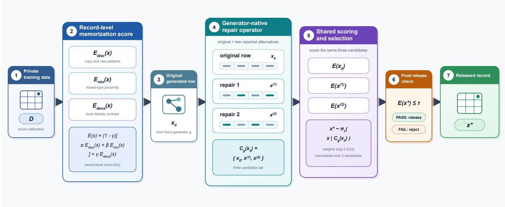
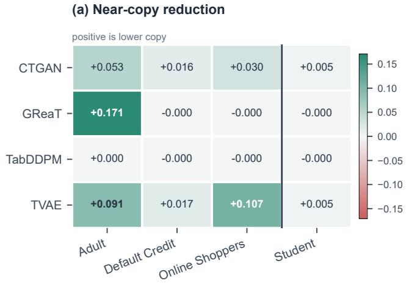
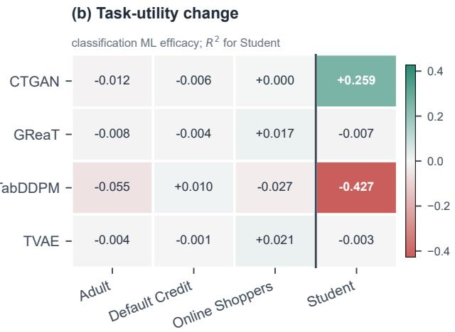
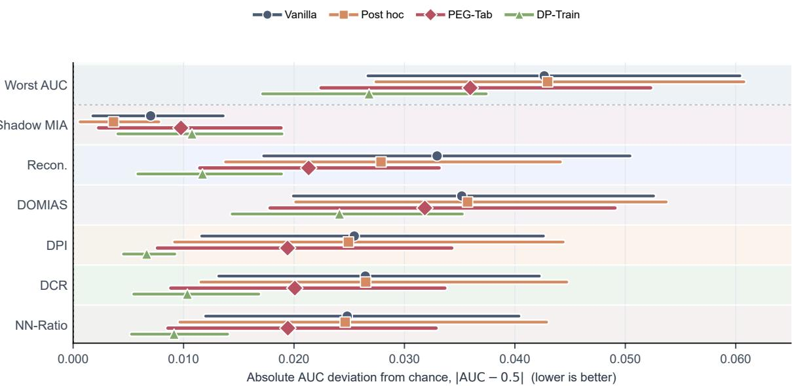

# PEG-Tab: Sampling-Time Record Repair and Release Control for Tabular Synthesis

Pengfei Li1, Qinyi Liu2, Mohammad Khalil1

## Abstract

Pretrained tabular generators can reproduce training records even when aggregate utility remains high. When retraining is unavailable or too costly, sampling and release are the remaining intervention points. We present PEG-Tab (Post-Training Energy Guidance for Tabular Synthesis), a posttraining repair and release-control framework for frozen tabular generators. For each generated row, a generator-native operator creates two alternatives. A shared calibrated score compares the three candidates, favours lower-risk records, and applies a final release check. We instantiate this interface for GReaT, CTGAN, TVAE, and TabDDPM without updating their parameters. Across five datasets and four generator families, PEG-Tab reduces mean Near Copy from 0.078 to 0.027 and lowers aggregate Exact Copy to zero. Relative to a 3× post hoc filter, it retains higher utility in 12 of 16 transfer settings and Pareto-dominates the filter in eight. Gains are concentrated in copy and proximity-related risks.

## Introduction

Synthetic tables support data sharing, model development, and restricted analysis when access to original records is limited (Cormode et al. 2025). Representative generators include Conditional Tabular GAN (CTGAN), Tabular Variational Autoencoder (TVAE), Generation of Realistic Tabular Data (GReaT), and Tabular Denoising Diffusion Probabilistic Model (TabDDPM) (Xu et al. 2019; Borisov et al. 2023; Kotelnikov et al. 2023). Strong population-level fidelity does not preclude record-level memorisation. A generator may reproduce a training row, emit a close neighbour, or place unusual mass around rare records (Carlini et al. 2019; Hyeong et al. 2022; Van Breugel et al. 2023).

These risks motivate interventions before synthetic records are released. Existing options operate at different stages. Post-generation methods can filter or refine completed synthetic data, but they do not modify the sampling trajectory that produced a risky record (Wang et al. 2023). Training a generator with differential privacy (DP) provides a formal guarantee, but requires control of the training pipeline and introduces a nontrivial privacy–utility trade-off (Ponomareva et al. 2023; Chen et al. 2025). We instead consider a setting in which an organisation already has a trained generator and retains access to its inference process, but cannot or does not wish to retrain it. The original infrastructure, optimiser state, or retraining budget may no longer be available. This leads to our central question: can risky rows be repaired before release while the generator remains fixed?

We propose PEG-Tab (Post-training Energy Guidance for Tabular Synthesis), a sampling-time record repair and release-control framework. PEG-Tab decouples generatornative editing from a shared candidate score and release gate, as illustrated in Figure 1. For each generated row, the native mechanism produces two alternatives. PEG-Tab scores the resulting three-record set, favours lowerscore candidates, and verifies the selected row before release. GReaT uses risk-aware decoding. CTGAN and TVAE repair latent representations. TabDDPM uses masked reverse regeneration. The same control logic therefore spans language-model, adversarial, variational, and diffusion generators without weight updates.

The record score combines direct copying, rarity, mixedspace proximity, and local density. It is an operational decision score used to compare candidates under a single fixed calibration regime. It is not a new privacy definition, a membership probability, or a formal guarantee. We therefore separate direct copy outcomes and score-aligned diagnostics from a held-out Shadow membership inference attack (MIA) excluded from score construction and tuning.

Our contributions are threefold. First, we formulate posttraining tabular release as finite-candidate repair, shared record scoring, and final gating, separating model-specific editing from model-independent release control. Second, we instantiate this interface for four heterogeneous generator families without parameter updates. Third, we evaluate a predefined development-to-transfer protocol with paired uncertainty, a held-out attack, pipeline ablations, post hoc filtering, formal DP reference mechanisms, parameter sensitivity, and sampling cost. Under frozen transfer settings, Near Copy never worsens across the 16 cells. Unchanged DOMIAS and Shadow MIA results bound the supported claim to copy-style memorisation and related proximity risks.

## Related Work

Tabular synthesis. CTGAN and TVAE adapt adversarial and variational generation to mixed-type tables (Xu et al. 2019). GReaT serialises rows and fine-tunes an autoregressive language model (Borisov et al. 2023). TabDDPM models continuous and categorical columns through diffusion (Kotelnikov et al. 2023). Their sampling procedures differ enough that one model-internal update is difficult to reuse across all four families.

Memorization audits. Synthetic data can reveal training membership and record similarity even when marginal fidelity is high (Carlini et al. 2019; Hyeong et al. 2022). DO-MIAS detects local overfitting through density differences (Van Breugel et al. 2023). DPI studies copying in tabular generators (Ward et al. 2024). Similarity measures are useful diagnostics, but are not privacy guarantees and can miss other attacks (Ganev and De Cristofaro 2025). We therefore distinguish score-aligned diagnostics from a held-out Shadow MIA.

Private synthesis and release-time control. DP-SGD protects training through clipping and noise (Abadi et al. 2016), while MST and AIM generate tables from differentially private measurements (McKenna et al. 2021, 2022). Recent work also studies private language-model synthesis and private population refinement (Tran and Xiong 2024; Tran et al. 2026). These methods redesign training or population construction. PEG-Tab instead keeps an existing generator fixed and controls individual rows during sampling.

Post hoc filtering is the closest low-cost alternative. It discards high-risk rows from an oversized pool, while PEG-Tab tests whether native repair can recover a releasable row. Its operators build on controlled decoding, gradient guidance, and masked diffusion repair (Dathathri et al. 2020; Dhariwal and Nichol 2021; Lugmayr et al. 2022). The contribution is a common record-level control interface across heterogeneous frozen generators.

## Method

## Setting

Let $\textit { D } = \{ x _ { i } \} _ { i = 1 } ^ { n }$ be a private mixed-type table and let $G _ { \theta }$ be a pretrained generator. The data holder runs PEG-Tab internally and releases only the resulting synthetic table. The method requires the private training table and access to the generator’s inference process. This means token logits for GReaT, latent and decoder access for CTGAN and TVAE, and reverse-process access for TabDDPM. The model weights remain fixed.

The base generator first produces a row $x _ { 0 }$ . PEG-Tab checks that row, repairs the fields that contribute most to its risk, and chooses one record for release from the original and two repaired alternatives. Figure 1 summarises the workflow. PEG-Tab is operated internally by the data holder and requires more than black-box access. Our goal is to reduce direct copying and unusual concentration around training records. We do not claim differential privacy or protection against every attack class.

## Record-Level Risk Score

PEG-Tab uses a score that summarises observable forms of record memorisation:

$$
\begin{array} { r l } & { E ( x ) = ( 1 - \gamma ) \alpha E _ { \mathrm { d i s c } } ( x ) + ( 1 - \gamma ) \beta E _ { \mathrm { m i x } } ( x ) } \\ & { ~ + ~ \gamma E _ { \mathrm { d e n s } } ( x ) . } \end{array}\tag{1}
$$

Each component is calibrated to [0, 1] with reference quantiles. The same calibrated transform is applied to every candidate within a run, and calibration does not use attack outcomes. The combined score is used only within that regime and need not itself lie in [0, 1]. A population-level fidelity measure asks whether a synthetic table resembles the real distribution. In contrast, $E ( x )$ asks whether one candidate row is unusually tied to particular training records. It is not an exposure estimate, a membership probability, or a formal privacy guarantee.

Discrete copying and rarity. For a serialised or categorical record, let $\mathcal { G } ( x )$ denote value substrings and let $\kappa ( x )$ denote selected column combinations. We use

$$
\widetilde { E } _ { \mathrm { d i s c } } ( \boldsymbol { x } ) = { \mathcal { H } } [ \boldsymbol { x } \in { \mathcal { D } } ] + \frac { 1 } { Z _ { x } } \left( \sum _ { g \in { \mathcal { G } } ( { \boldsymbol { x } } ) } r _ { g } + \sum _ { \boldsymbol { k } \in K ( { \boldsymbol { x } } ) } r _ { \boldsymbol { k } } \right) ,\tag{2}
$$

where $r _ { g }$ and $r _ { k }$ increase as the corresponding value or combination becomes rarer in $\mathcal { D } . ~ Z _ { x }$ normalises by the number of active terms. Calibration of $E _ { \mathrm { d i s c } }$ gives $E _ { \mathrm { d i s c } }$

Mixed-space proximity and rarity. Distances use a normalised mixed-type representation. Let $d _ { 1 } ( x , \mathcal { D } )$ be the closest training distance. We combine bounded nearestneighbour proximity with binned and cross-feature rarity:

$$
\begin{array} { c l c r } { { \displaystyle E _ { \mathrm { m i x } } ( x ) = \frac { \omega _ { \mathrm { n n } } } { 1 + d _ { 1 } ( x , \mathcal { D } ) } + \omega _ { \mathrm { b i n } } s _ { \mathrm { b i n } } ( x ) } } \\ { { \displaystyle + \omega _ { \mathrm { c o m b } } s _ { \mathrm { c o m b } } ( x ) . } } \end{array}\tag{3}
$$

The two rarity terms capture unusual continuous bins and mixed-feature combinations. A separate density contrast compares mean local distances to training and reference records:

$$
E _ { \mathrm { d e n s } } ( x ) = \operatorname* { m a x } \left( 0 , 1 - \frac { \bar { d } _ { \mathrm { t r a i n } } ( x ) } { \bar { d } _ { \mathrm { r e f } } ( x ) + \epsilon } \right) .\tag{4}
$$

Reference records are excluded from generator training. When no suitable reference population exists, the density component can be disabled by setting $\gamma = 0$

  
Figure 1: PEG-Tab repairs and checks a generated record before release. Offline statistics define the record-level risk score. Each generator then uses its native sampling mechanism to produce alternatives. The same scoring and release rule is applied to the original row and the repaired candidates. The base generator is not retrained, and the score is not a formal privacy guarantee.

Term Large when Intended signal   
$E _ { \mathrm { d i s c } }$ Values or com- Direct reproduction and   
binations are uniqueness   
copied or rare   
$E _ { \mathrm { m i x } }$ A candidate is Neighbourhood overlap   
close to a mem- and mixed-feature rar  
ber or occupies ity   
a rare mixed  
space region   
$E _ { \mathrm { d e n s } }$ Training neigh- Local concentration   
bours are closer around training data   
than reference   
neighbours  
Table 1: Meaning of the record-level score components. Each term describes one candidate row and does not constitute a population-level privacy guarantee.

## Sampling-Time Repair and Release

For generator family g, the repair function $A _ { g }$ produces two alternatives from the original row:

$$
{ \mathcal { C } } _ { g } ( x _ { 0 } ) = \{ x _ { 0 } \} \cup { \mathcal { A } } _ { g } ( x _ { 0 } ) .\tag{5}
$$

The default candidate set therefore contains three records. PEG-Tab selects from this finite set using

$$
\pi _ { \lambda } ( x \mid { \mathcal C } _ { g } ) = \frac { \exp [ - \lambda E ( x ) ] } { \sum _ { x ^ { \prime } \in { \mathcal C } _ { g } } \exp [ - \lambda E ( x ^ { \prime } ) ] } ,\tag{6}
$$

where λ controls the preference for lower-score records. A final threshold rejects a selected record that still exceeds the release limit. The same score and release rule are used for every generator. Only the repair mechanism changes.

Algorithm 1 PEG-Tab sampling-time repair and release.   
Require: Private table D, fixed generator $G _ { \theta } ,$ family g   
Require: Score $E ,$ selection strength λ, threshold $\tau ,$ rounds   
$R = 3$   
Ensure: A released record or no release   
1: Draw $x _ { 0 } \sim G _ { \theta }$   
2: for $r = 1 , \ldots , R$ do   
3: Identify the fields contributing most to $E ( x _ { r - 1 } )$   
4: Generate two repairs and form $\mathcal { C } _ { g } ( x _ { r - 1 } )$   
5: Evaluate $E ( x )$ for every $x \in \mathcal { C } _ { g } ( x _ { r - 1 } )$   
6: Draw $\hat { x } \sim \pi _ { \lambda } ( \cdot \mid \mathcal { C } _ { g } ( x _ { r - 1 } ) )$   
7: if $E ( { \hat { x } } ) \leq \tau$ then   
8: return xˆ   
9: end if   
10: $x _ { r } \gets \hat { x }$   
11: end for   
12: return no release

PEG-Tab first scores $x _ { 0 }$ and identifies the fields that contribute most to $E ( x _ { 0 } )$ . The generator-specific repair produces two alternatives while preserving the remaining fields as much as possible. PEG-Tab then scores all three records, selects one with Equation $^ { 6 , }$ and verifies it before release. The procedure can repeat for at most three repair rounds. Algorithm 1 summarises this shared procedure.

Example. Consider a generated row with a rare occupation and age combination that also lies close to a training record in its continuous fields. The discrete and mixed-space terms both increase. The repair mechanism edits the implicated fields while anchoring the rest of the row. The release rule then compares the original row with the two repaired alternatives. This illustrates why $E ( x )$ is used to compare candidate records rather than to measure population fidelity.

GReaT repair. GReaT redecodes the row with a Top K logits processor. For value token v at step t, it applies

$$
\ell _ { t } ^ { \prime } ( v ) = \ell _ { t } ( v ) - \lambda \delta _ { t } ( v ) ,\tag{7}
$$

where $\delta _ { t } ( v )$ is computed from value, substring, and combination rarity. Schema tokens are unchanged. Two completed redecodings form the repaired alternatives.

CTGAN and TVAE repair. The method marks risky fields with mask M and optimises a latent code. A compact form is

$$
\begin{array} { r l } { \underset { z } { \operatorname* { m i n } } } & { L _ { \mathrm { c o n d } } ( M \odot G _ { \theta } ( z ) , M \odot x _ { \mathrm { s a f e } } ) + \eta _ { 1 } \| z - z _ { 0 } \| _ { 2 } ^ { 2 } } \\ & { + \eta _ { 2 } L _ { \mathrm { p r e s } } ( ( 1 - M ) \odot G _ { \theta } ( z ) , ( 1 - M ) \odot x _ { 0 } ) . } \end{array}\tag{8}
$$

The condition loss respects feature type. The preservation term limits changes outside the risk mask. Two restart solutions form the repaired alternatives.

TabDDPM repair. TabDDPM uses masked conditional regeneration during reverse diffusion. Safe fields follow a noised anchor, risky fields move toward lower-score targets, and the remaining dimensions follow the denoiser. Two regeneration runs form the repaired alternatives. This is a tabular adaptation of masked diffusion repair (Lugmayr et al. 2022).

The repair procedures are generator-specific. Their common purpose is to offer alternatives to the same record-level score and release rule. The supplement specifies all score, mask, optimisation, diffusion, threshold, and stopping settings.

## Experimental Setup

Data and splits. We use Adult, Default Credit, Online Shoppers, South German Credit, and Student Performance (Kohavi 1996; Yeh and Lien 2009; Sakar et al. 2018; Groemping 2019; Cortez and Silva 2008). For each random seed, every dataset is partitioned into four mutually disjoint subsets: private records for generator training, reference records for score calibration, nonmember records for privacy auditing, and real test records used only for TSTR evaluation. Member audit records are sampled from the private training split. The reference and real test subsets do not overlap. Neither the features nor the labels of the real test records are used to calibrate the score, construct repair candidates, select hyperparameters, or make release decisions. Reference labels are not used by PEG-Tab. The same partitions are used across all compared methods. Risk-audited columns are fixed before evaluation from domain-defined quasi-identifiers and numerical fields with high cardinality. Full split sizes and audited columns appear in the supplement.

<table><tr><td>Generator</td><td>λ</td><td>Selection outcome</td></tr><tr><td>CTGAN</td><td>0.5</td><td>Meets both criteria</td></tr><tr><td>GReaT</td><td>1</td><td>Zero-copy fallback</td></tr><tr><td>TVAE</td><td>2</td><td>Minimum copy under utility constraint</td></tr><tr><td>TabDDPM</td><td>2</td><td>Best utility with zero copy</td></tr></table>

Table 2: Guidance strengths selected on the development dataset and then frozen.

Generators and utility. The backbones are CTGAN, TVAE, TabDDPM, and GReaT with DistilGPT-2. Each method releases the same number of synthetic rows as the private training split. Utility follows the Train on Synthetic, Test on Real protocol and averages XGBoost, a linear model, and a multilayer perceptron. Classification uses AUC, while Student Performance uses $R ^ { 2 }$ . These quantities are not directly comparable across task types. Their mean is therefore only a compact descriptive summary, with every per-dataset and per-estimator result reported in the supplement.

Comparators. Vanilla uses the unchanged sampler. Post hoc Filter generates three times the requested number of rows and rejects records above the same risk threshold. It is an outcome-oriented deployment baseline rather than a compute-matched baseline. The supplement reports wallclock cost, accepted-row throughput, repair rounds, and rejection rates. A six-condition pipeline ablation separates repair, reranking, and final rejection. The original three-seed benchmark retains DP-Train as a training-time privacy reference. The formal reference study uses MST and AIM implemented with dpmm (McKenna et al. 2021, 2022; Mahiou et al. 2025). These mechanisms provide different guarantees and are not equal-guarantee competitors to PEG-Tab.

Predefined tuning and transfer. South German Credit is the only development dataset. Because the repair mechanisms act on different representations, we select one control strength per generator family. We search $\lambda \in$ {0.5, 1, 2, 5, 10} and select the smallest value achieving at least 50% relative Near Copy reduction while retaining at least 98% of Vanilla utility. If no value meets both criteria, a deterministic fallback minimises Near Copy among utility-feasible candidates. When Vanilla Near Copy is already zero, the fallback preserves zero copying and selects the highest-utility candidate. The selected values are then frozen for the four transfer datasets.

The complete development map and all candidate values are reported in the supplementary material.

Audits. Direct targets are Exact Copy and Near Copy. Near Copy uses a normalised mixed-type distance below a threshold calibrated from training-record distances. Score-aligned diagnostics include reconstruction, Distance to Closest Record, nearest-neighbour ratio, DPI, and DO-MIAS (Van Breugel et al. 2023; Ward et al. 2024). We report their maximum AUC as Worst AUC. A fixed black-box Shadow MIA is excluded from scoring, calibration, and parameter selection (Shokri et al. 2017). The common attack pipeline covers CTGAN, TVAE, and TabDDPM, giving 12 held-out transfer cells and using eight shadow models.

Uncertainty and scope. The original core benchmark uses seeds 42, 43, and 44 with matched splits and initialisations. The expanded transfer, ablation, sensitivity, and runtime protocol fixes seed 42 across method cells to isolate control effects under the same trained generator and split. Transfer differences are paired over 16 dataset–generator configurations with 20,000 bootstrap resamples. Shadow MIA uses the 12 applicable non-GReaT configurations. Protocol-specific and per-configuration results appear in the supplement.

## Results

## Main Empirical Results

Table 3 reports the original three-seed benchmark and is separate from the frozen transfer analysis below. PEG-Tab reduces mean Near Copy from 0.078 to 0.027 and aggregate Exact Copy to zero. These are the largest copy reductions among the nonformal sampling controls. Worst AUC changes from 0.543 to 0.536, while TPR@1% changes from 0.011 to 0.009. The main aggregate effect is therefore copy reduction rather than broad membership protection. Post hoc Filter also removes exact copies and has the highest aggregate Utility, but leaves Near Copy at 0.051. The archived DP-Train row is retained only as context for this trainingtime benchmark and is not used in the frozen transfer comparison.

## Frozen Transfer and Targeted Diagnostics

The principal generalisation test selects λ on South German Credit and freezes it on four transfer datasets. Figure 2 shows that Near Copy decreases or ties in every cell, mainly through CTGAN, GReaT, and TVAE. TabDDPM already has negligible baseline copying. Utility is more mixed, so PEG-Tab is best applied after an audit finds measurable copy risk.

Figure 3 is a descriptive all-cell summary under the expanded fixed-seed protocol. Relative to Vanilla, PEG-Tab reduces the chance gap for Reconstruction, DPI, DCR, and NN-Ratio by about 0.012, 0.006, 0.006, and 0.005. Their paired intervals remain above zero, but these score-aligned diagnostics are corroborating rather than independent evidence. DOMIAS decreases by 0.003, and Shadow MIA increases by 0.003, with both intervals crossing zero. Worst

AUC decreases by 0.0067. Post hoc Filter has no reliable score-aligned reduction.

## Pipeline Ablation and Parameter Sensitivity

Table 4 isolates repair, ranking, and final rejection on matched fixed-seed cells. No stage alone matches the full Near Copy reduction. Repair plus ranking has the highest Utility, while final rejection supplies the remaining copy reduction. Aligned and Shadow AUC stay close to Vanilla, so the ablation supports stage complementarity rather than broader attack protection.

## Comparisons with Filtering and Formal DP References

Table 5 compares PEG-Tab with Post hoc Filter. PEG-Tab retains higher Utility in all CTGAN and TVAE transfer cells and Pareto-dominates in five of these eight. Its advantage is smaller when baseline copying is negligible. For TabD-DPM, Near Copy ties in all four cells and the filter has higher Utility in three. This outcome-oriented comparison is not compute-matched, and the supplement reports the added sampling cost.

Table 6 places PEG-Tab beside MST and AIM at two formal privacy budgets. PEG-Tab has no formal ε and is only an empirical operating point. MST gives lower copy and attack values at ε = 1 with lower Utility, and the highest Utility at ε = 8 with higher Worst AUC. These are different guarantee regimes rather than equal-guarantee comparisons.

## Discussion

What the results establish. PEG-Tab provides a posttraining control point for copied records and close training neighbours. The clearest evidence is the frozen transfer analysis, where Near Copy decreases or ties in every cell after selecting guidance on one development dataset. Exact Copy provides supporting evidence, although most transfer configurations already contain no exact copies. Reconstruction, DPI, DCR, and NN-Ratio also move favourably under the chance-adjusted analysis. These diagnostics are closely aligned with the record score, so their improvements are corroborating rather than independent evidence. DOMIAS and the held-out Shadow MIA show no minor change. This boundary is important. The results support targeted control of copy-style memorisation and do not establish a general membership inference defence.

Why the shared release rule matters. Each backbone repairs a row differently. GReaT edits the decoding path, CT-GAN and TVAE edit latent representations, and TabDDPM edits selected fields during reverse sampling. After these model-specific repairs, every candidate is evaluated by the same calibrated score and release rule. The ablation supports this division of labour. Repair creates alternatives, ranking chooses among them, and final rejection removes residual failures. No stage alone explains the full Near Copy reduction. This separation is the main reusable element of PEG-Tab because a new generator only requires a native repair operator while retaining the common release interface.

<table><tr><td>Method</td><td>Utility ↑</td><td>Worst AUC ↓</td><td>TPR@1%↓</td><td>Exact Copy ↓</td><td>Near Copy ↓</td></tr><tr><td>Vanilla</td><td> $0 . 5 6 1 \pm 0 . 5 9 0$ </td><td> $0 . 5 4 3 \pm 0 . 0 4 0$ </td><td> $0 . 0 1 1 \pm 0 . 0 0 9$ </td><td> $0 . 0 0 5 \pm 0 . 0 1 9$ </td><td> $0 . 0 7 8 \pm 0 . 1 4 8$ </td></tr><tr><td>Post hoc Filter</td><td> $\mathbf { 0 . 6 0 8 \pm 0 . 3 5 6 }$ </td><td> $0 . 5 4 3 \pm 0 . 0 3 9$ </td><td> $0 . 0 1 0 \pm 0 . 0 0 9$ </td><td> $\mathbf { 0 . 0 0 0 \pm 0 . 0 0 0 }$ </td><td> $0 . 0 5 1 \pm 0 . 1 4 5$ </td></tr><tr><td>PEG-Tab</td><td> $0 . 5 8 5 \pm 0 . 4 3 3$ </td><td> $0 . 5 3 6 \pm 0 . 0 3 5$ </td><td> $0 . 0 0 9 \pm 0 . 0 0 8$ </td><td> $\mathbf { 0 . 0 0 0 \pm 0 . 0 0 0 }$ </td><td> $\mathbf { 0 . 0 2 7 \pm 0 . 1 1 4 }$ </td></tr><tr><td>DP-Train</td><td> $0 . 0 2 3 \pm 0 . 6 6 8$ </td><td> $\mathbf { 0 . 5 2 7 \pm 0 . 0 2 4 }$ </td><td> $\mathbf { 0 . 0 0 8 \pm 0 . 0 0 8 }$ </td><td> $\mathbf { 0 . 0 0 0 \pm 0 . 0 0 1 }$ </td><td> $\mathbf { 0 . 0 2 7 \pm 0 . 0 6 8 }$ </td></tr></table>

Table 3: Aggregate results over five datasets, four generators, and three random seeds. Each entry reports the mean and standard deviation over 60 dataset, generator, and seed runs. The standard deviation reflects configuration and seed variability and is not a confidence interval. Utility is a descriptive cross-task average of classification AUC and regression $R ^ { 2 }$ . Bold values denote the best. Worst AUC is the maximum AUC across Reconstruction, DCR, NN-Ratio, DPI, and DOMIAS.

  
Figure 2: PEG-Tab transfer effects relative to Vanilla after selecting λ on South German Credit. Panel (a) reports the reduction in Near Copy, where positive values favour PEG-Tab. Panel (b) reports the change in task utility, where positive values favour PEG-Tab. South German Credit is excluded as it serves as the development dataset.

<table><tr><td>Variant</td><td colspan="4">Near ↓ Worst AUC ↓ Shadow ↓ Utility ↑</td></tr><tr><td>Vanilla</td><td>0.0700</td><td>0.5410</td><td>0.5059</td><td>0.6116</td></tr><tr><td>Reject only</td><td>0.0664</td><td>0.5432</td><td>0.5082</td><td>0.5566</td></tr><tr><td>Rerank only</td><td>0.0692</td><td>0.5425</td><td>0.5033</td><td>0.5697</td></tr><tr><td>Repair only</td><td>0.0667</td><td>0.5418</td><td>0.5059</td><td>0.5873</td></tr><tr><td>Repair + rank</td><td>0.0609</td><td>0.5440</td><td>0.5065</td><td>0.6145</td></tr><tr><td>Full PEG-Tab</td><td>0.0392</td><td>0.5428</td><td>0.5070</td><td>0.6012</td></tr></table>

Table 4: Pipeline ablation averaged over 20 dataset– generator cells. Lower values are better except for Utility. Worst is the maximum AUC over the five score-aligned attacks. Bold values denote the best result across all variants.

When sampling-time repair is useful. PEG-Tab complements rather than uniformly replaces inexpensive filtering. Compared with Post hoc Filter, it retains higher utility in 12 of 16 transfer cells and Pareto-dominates the filter in eight, while the filter dominates in four. The benefit is strongest when copying is measurable and rejection discards otherwise useful records. When the base generator has negligible Near Copy, as in several TabDDPM settings, leaving the sampler unchanged or using a simple filter is preferable. The comparison is outcome-oriented rather than computematched because repair requires additional model-specific inference. Runtime, release yield, and the required copy-risk operating point should therefore be audited together.

<table><tr><td>Generator</td><td>Utility wins Near B/T/W Pareto P/F/T</td><td></td></tr><tr><td>CTGAN</td><td>4/4 3/0/1</td><td>3/0/1</td></tr><tr><td>GReaT</td><td>3/4 0/3/1</td><td>2/1/1</td></tr><tr><td>TVAE</td><td>4/4 1/1/2</td><td>2/0/2</td></tr><tr><td>TabDDPM</td><td>1/4 0/4/0</td><td>1/3/0</td></tr><tr><td>All</td><td>12/16 4/8/4</td><td>8/4/4</td></tr></table>

Table 5: Configuration-level comparison with Post hoc Filter using 3× oversampling on the 16 transfer cells. Utility wins count cells where PEG-Tab has higher Utility. Near B/T/W denotes better, tied, or worse Near Copy for PEG-Tab. Pareto P/F/T denotes PEG-Tab dominance, filter dominance, or a trade-off.

  
Figure 3: Absolute attack AUC deviation from chance. Points report the mean $| \mathrm { A U C } _ { \mathrm { m e t h o d } } - 0 . 5 | .$ , so values closer to zero indicate weaker attack discrimination. Bars show 95% configuration-bootstrap intervals. Worst AUC and the five score-based attacks use 20 dataset and generator cells. The held-out Shadow MIA row reports the selected-lambda transfer protocol on 12 cells with fixed shadow-release provenance.

<table><tr><td>Method</td><td>ε</td><td>Utility ↑ Near ↓</td><td></td><td>Worst AUC ↓</td></tr><tr><td>PEG-Tab</td><td>n/a</td><td>0.585</td><td>0.027</td><td>0.536</td></tr><tr><td>MST</td><td>1</td><td>0.307</td><td>0.023</td><td>0.531</td></tr><tr><td>MST</td><td>8</td><td>0.630</td><td>0.026</td><td>0.551</td></tr><tr><td>AIM</td><td>1</td><td>0.213</td><td>0.025</td><td>0.546</td></tr><tr><td>AIM</td><td>8</td><td>0.462</td><td>0.032</td><td>0.551</td></tr></table>

Table 6: Contextual comparison with formal DP reference mechanisms. The PEG-Tab row is taken from the three-seed benchmark in Table 3. MST and AIM are evaluated on the same five datasets using the same utility and attack definitions. PEG-Tab has no formal ε. Bold values denote the best reported result in each column. Per-dataset results and privacy accounting details appear in the supplement.

Interpreting the score. The record score is a release decision aid, not a new privacy definition. It checks whether a candidate copies rare content, lies close to a training row, or is unusually concentrated around training data. Improvements on related diagnostics are expected to reflect this construction. A held-out attack is needed to identify the boundary of the result, and broader evaluations should include attacks that are not used for scoring or tuning. Rarity is also a potentially consequential signal. Deployment should audit whether repair disproportionately changes rare categories, tail records, or small subgroups even when aggregate task utility remains stable.

Limitations. PEG-Tab requires the private training table, a permissible reference population, and generator-specific inference states. The original benchmark uses three seeds, while the expanded transfer, ablation, sensitivity, and runtime protocol uses one matched seed to isolate controlled effects. The Shadow analysis covers 12 non-GReaT configurations and does not test repeated releases or adaptive queries. The study therefore does not establish protection against broader membership, attribute inference, linkage, or auxiliary-information attacks. Sampling cost may also limit interactive use, particularly for latent optimisation and reverse diffusion.

## Conclusion

PEG-Tab adds a sampling-time repair and release-control layer to frozen tabular generators. Generator-native edits propose alternatives, while one calibrated score and gate control release across GReaT, CTGAN, TVAE, and Tab-DDPM. The clearest result is lower Exact Copy and Near Copy, with repair often preserving more utility than filtering when copying is measurable. Unchanged DOMIAS and held-out Shadow MIA limit the contribution to copy-style memorisation rather than formal or general privacy protection.

## References

Martin Abadi, Andy Chu, Ian Goodfellow, H. Brendan McMahan, Ilya Mironov, Kunal Talwar, and Li Zhang. Deep learning with differential privacy. In ACM Conference on Computer and Communications Security, pages 308–318, 2016.

Vadim Borisov, Kathrin Seßler, Tobias Leemann, Martin Pawelczyk, and Gjergji Kasneci. Language models are realistic tabular data generators. In International Conference on Learning Representations, 2023.

Nicholas Carlini, Chang Liu, Ulfar Erlingsson, Jernej Kos, ´ and Dawn Song. The secret sharer: Evaluating and testing unintended memorization in neural networks. In USENIX Security Symposium, pages 267–284, 2019.

Kai Chen, Xiaochen Li, Chen Gong, Ryan McKenna, and Tianhao Wang. Benchmarking differentially private tabular data synthesis:[experiments & analysis]. Proceedings ofthe ACM on Management ofData, 3(6):1–25, 2025.

Graham Cormode, Samuel Maddock, Enayat Ullah, and Shripad Gade. Synthetic tabular data: Methods, attacks and defenses. In ACM SIGKDD Conference on Knowledge Discovery and Data Mining, pages 5989–5998, 2025.

Paulo Cortez and Alice Maria Gonc¸alves Silva. Using data mining to predict secondary school student performance. In Future Business Technology Conference, pages 5–12, 2008.

Sumanth Dathathri, Andrea Madotto, Janice Lan, Jane Hung, Eric Frank, Piero Molino, Jason Yosinski, and Rosanne Liu. Plug and play language models: A simple approach to controlled text generation. In International Conference on Learning Representations, 2020.

Prafulla Dhariwal and Alexander Nichol. Diffusion models beat GANs on image synthesis. In Advances in Neural Information Processing Systems, volume 34, pages 8780–8794, 2021.

Georgi Ganev and Emiliano De Cristofaro. The inadequacy of similarity based privacy metrics: Privacy attacks against “truly anonymous” synthetic datasets. In IEEE Symposium on Security and Privacy, pages 4007–4025, 2025.

Ulrike Groemping. South german credit data: Correcting a widely used data set. Reports in Mathematics, Physics and Chemistry, 4, 2019.

Jihyeon Hyeong, Jayoung Kim, Noseong Park, and Sushil Jajodia. An empirical study on the membership inference attack against tabular data synthesis models. In ACM International Conference on Information and Knowledge Management, pages 4064–4068, 2022.

Ronny Kohavi. Scaling up the accuracy of naive bayes classifiers: A decision tree hybrid. In International Conference on Knowledge Discovery and Data Mining, pages 202–207, 1996.

Akim Kotelnikov, Dmitry Baranchuk, Ivan Rubachev, and Artem Babenko. TabDDPM: Modelling tabular data with diffusion models. In International Conference on Machine Learning, pages 17564–17579, 2023.

Andreas Lugmayr, Martin Danelljan, Andres Romero, Fisher Yu, Radu Timofte, and Luc Van Gool. RePaint: Inpainting using denoising diffusion probabilistic models. In IEEE Conference on Computer Vision and Pattern Recognition, pages 11461–11471, 2022.

Sofiane Mahiou, Amir Dizche, Reza Nazari, Xinmin Wu, Ralph Abbey, Jorge Silva, and Georgi Ganev. dpmm: Differentially private marginal models, a library for synthetic tabular data generation. arXiv preprint arXiv:2506.00322, 2025.

Ryan McKenna, Gerome Miklau, and Daniel Sheldon. Winning the NIST contest: A scalable and general approach to differentially private synthetic data. Journal of Privacy and Confidentiality, 11(3), 2021.

Ryan McKenna, Brett Mullins, Daniel Sheldon, and Gerome Miklau. AIM: An adaptive and iterative mechanism for differentially private synthetic data. Proceedings of the VLDB Endowment, 15(11):2599–2612, 2022.

Natalia Ponomareva, Hussein Hazimeh, Alex Kurakin, Zheng Xu, Carson Denison, H. Brendan McMahan, Sergei Vassilvitskii, Steve Chien, and Abhradeep Guha Thakurta. How to DP-fy ML: A practical guide to machine learning with differential privacy. Journal of Artificial Intelligence Research, 77:1113–1201, 2023.

C. Okan Sakar, Saliha O. Polat, Mete Katircioglu, and Yomi Kastro. Real time prediction of online shoppers purchasing intention using multilayer perceptron and random forest classifiers. Neural Computing and Applications, 31(10):6893–6908, 2018.

Reza Shokri, Marco Stronati, Congzheng Song, and Vitaly Shmatikov. Membership inference attacks against machine learning models. In IEEE Symposium on Security and Privacy, pages 3–18, 2017.

Toan V. Tran and Li Xiong. Differentially private tabular data synthesis using large language models. arXiv preprint arXiv:2406.01457, 2024.

Toan Tran, Arturs Backurs, Zinan Lin, Victor Reis, Li Xiong, and Sergey Yekhanin. Differentially private synthetic data via APIs 4: Tabular data. arXiv preprint arXiv:2606.08259, 2026.

Boris Van Breugel, Hao Sun, Zhaozhi Qian, and Mihaela van der Schaar. Membership inference attacks against synthetic data through overfitting detection. arXiv preprint arXiv:2302.12580, 2023.

Hao Wang, Shivchander Sudalairaj, John Henning, Kristjan Greenewald, and Akash Srivastava. Post-processing private synthetic data for improving utility on selected measures. Advances in Neural Information Processing Systems, 36:64139–64154, 2023.

Joshua Ward, Chi-Hua Wang, and Guang Cheng. Data plagiarism index: Characterizing the privacy risk of data copying in tabular generative models. arXiv preprint arXiv:2406.13012, 2024.

Lei Xu, Maria Skoularidou, Alfredo Cuesta-Infante, and Kalyan Veeramachaneni. Modeling tabular data using conditional GAN. In Advances in Neural Information Processing Systems, volume 32, 2019.

I-Cheng Yeh and Che-hui Lien. The comparisons of data mining techniques for the predictive accuracy of probability of default of credit card clients. Expert Systems with Applications, 36(2):2473–2480, 2009.