# PHANTOMENVIRONMENTS: TRAINING LLM AGENTS IN FICTIONAL WORLDS

Anmol Kabra<sup>1∗</sup>, Swathi Saravana Selvam<sup>1</sup>, Albert Gong<sup>1</sup>, Chao Wan<sup>1</sup>, Christian Belardi<sup>1</sup>, Dongyoung Go<sup>1</sup>, Katie Z. Luo<sup>2</sup>, Kilian Q. Weinberger<sup>1</sup> <sup>1</sup>Cornell University, <sup>2</sup>Stanford University

## ABSTRACT

Training LLM agents with reinforcement learning (RL) is bottlenecked by environments, which must provide verifiable rewards, support long-horizon interaction, and scale cheaply. Existing approaches rely on costly human-curated data or on LLM-generated environments that risk hallucinations and benchmark contamination. We show that LLMs can instead be trained into capable search agents using synthetic environments generated entirely by rules, whose generation requires no LLM and has zero marginal cost. We build PhantomEnvironments, multi-turn RL environments from fictional worlds, where agents must search a corpus of templated articles to answer multi-hop questions. Despite sharing no facts with the real world, these strikingly simple environments yield agents that transfer to real-world multi-hop search benchmarks, often outperforming real-world training data on newer benchmarks. Trained agents generalize to unseen fictional universes, and Qwen models learn to scale their search budget roughly linearly with question difficulty, suggesting emergent search scaling from environment interaction alone. Ablating environment complexity reveals that hop count drives transfer more than constraints or comparisons: even the simplest rule-generated environments are a surprisingly effective, free resource for training generalizable LLM agents.

## 1 INTRODUCTION

Training LLM search agents with reinforcement learning (RL) is bottlenecked by environment curation. RL needs an environment the agent can interact with: one that yields long multi-turn trajectories, a verifiable reward at the end of each one, and multiple interactions. Building such environments at scale for RL is expensive. Wikipedia-grounded environments built from humancurated corpora like NaturalQuestions and HotpotQA require costly annotation and could tie the agent to a fixed Wikipedia snapshot (Kwiatkowski et al., 2019; Yang et al., 2018; Jin et al., 2025b). LLM-synthesized environments use frontier models to create retrievals, questions, or whole task harnesses (Sun et al., 2025; Gao et al., 2025; Wu et al., 2026; Goldie et al., 2025; Chang et al., 2026; Gandhi et al., 2026; Sullivan et al., 2025). They reduce curation effort, but they introduce hallucinated rewards, benchmark contamination risk, API cost, and a capability ceiling set by the generator. The bottleneck in training LLM agents has shifted from optimization to the question of where verifiable, interactive, long-horizon environments should come from.

We show that such an environment for training LLM agents can be designed by codified rules alone, with no humans and no LLMs in the pipeline. We turn fictional worlds and template-generated multi-hop questions of PhantomWiki (Gong et al., 2025) into interactive multi-turn environments for RL fine-tuning LLMs, which we call PhantomEnvironments (PhantomEnvs for short). Such “rule-generated synthetic environments” are verifiable by construction and incur zero generation cost. Universe size, question difficulty, and question budget are knobs the experimenter sets directly, so such environments can scale to arbitrary sizes and complexity.

A priori, there is little reason to expect simple synthetic environments to work. Fictional universes in these rule-generated synthetic environments share no entities, no facts, and no document distribution with any real-world benchmark. Articles are template-generated rather than human-written and the relational structure is a randomly sampled social graph—neither the linguistic richness nor the long-tailed topical structure of real-world corpora like Wikipedia. An agent trained here has no facts to memorize and no exposure to the linguistic variation it will face at evaluation, so the default expectation is that whatever it learns stays coupled to the templates and fails to transfer. Any transfer that does occur due to PhantomEnvironments must come from learning generalizable agentic search skills—decomposing questions, retrieving documents correctly, composing knowledge across turns.

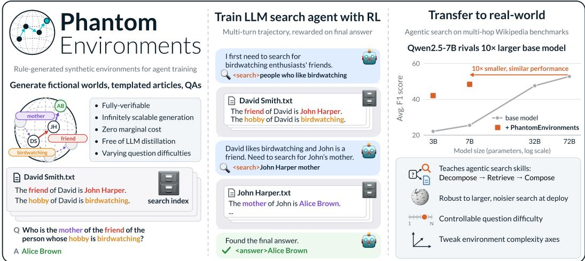  
Figure 1: LLM agents trained with RL in PhantomEnvironments transfer to real-world search.

Yet, we empirically demonstrate significant and consistent transfer to real-world agentic search. We RL full fine-tune four LLMs (Qwen2.5-3B-Instruct, Qwen2.5-7B-Instruct (Team, 2024), Llama-3.2- 3B-Instruct (Grattafiori et al., 2024), Phi-4-mini-instruct (Microsoft et al., 2025)) inside PhantomEnvironments and evaluate on a suite of six real-world multi-hop search benchmarks. Performance improves over the base model by roughly 1.7× on the Wikipedia-2018-based benchmarks (HotpotQA (Yang et al., 2018), 2WikiMultihopQA (Ho et al., 2020), MuSiQue (Trivedi et al., 2022)) and 2.2× on the newer-and-harder ones (SynthWorlds-RM, SynthWorlds-SM (Gu et al., 2025) and FRAMES (Krishna et al., 2025)). We also find that trained Qwen models learn to allocate their search budget roughly linearly with question difficulty—an emergent search scaling behavior. To our knowledge, we are the first to show that off-the-shelf LLMs fine-tuned with RL on such rule-generated synthetic environments can create LLM search agents performant in the real-world.

Transfer alone, however, does not tell us how fictional worlds compare to real training data. Headto-head against Search-R1-style training in a real Wikipedia-2018 environment, the real-world environment (expectedly) wins on the in-domain Wikipedia-2018 benchmarks. On benchmarks built from more recent Wikipedia snapshots, however, its advantage narrows for every model and disappears for Qwen models. The cleanest evidence comes from the SynthWorlds real-vs-synthetic-mirror pair: training with real-world data preserves and even widens the gap between SynthWorlds-RM and SynthWorlds-SM evaluation, while training in PhantomEnvironments closes it. The real environment lets the agent shortcut through memorized Wikipedia facts, whereas the fictional one denies that route and forces models to learn and apply the fundamental search skill.

As generation is rule-based, we can also vary the question distribution to isolate which axes of environment complexity drive transfer. We design three training environments: linear hop questions, hops compared by attribute, and hops constrained by attribute filters. We observe that linear hops carry most of the transfer, while comparison questions specifically improve matching real-world comparison questions. We observe larger gains where the base model is weakest, suggesting a modular path for addressing model capability gaps by composing environment complexities. Constraint questions, counterintuitively, hurt: agents learn to retrieve gold documents with a single verbatim query that exploits rare attributes. This causes the models to skip question decomposition entirely, a necessary skill for real-world agentic search. Environment complexity axes thus do not blindly compose—they help when they match real-world question types and can backfire when they reward shortcuts.

Together, these results position rule-generated synthetic environments as a new source of agent training data, complementary to human-curated and LLM-generated ones. Each brings something the others cannot: human-curated environments contribute linguistic richness and in-domain evaluation coverage, LLM-synthesized environments enable targeted task design at lower curation effort. Rulegenerated environments add what neither can: training signal for RL that is zero-marginal-cost, exactly verifiable, and never goes stale. The promise comes with limitations—they lag on in-domain benchmarks where knowledge memorization helps, and must be designed to avoid reward shortcuts. The core finding stands: environments built from rules alone train capable LLM search agents.

## 2 RELATED WORK

Reinforcement Learning for LLM Search Agents. Following the success of outcome-based RL for reasoning in LLMs (Guo et al., 2025), a line of work has trained LLM search agents to interleave retrieval with chain-of-thought. Search-R1 (Jin et al., 2025b) pairs a Wikipedia index with exactmatch rewards; follow-ups vary the optimization but not the data source, exploring multi-stage training (Song et al., 2025), tighter reasoning–retrieval coupling (Chen et al., 2025b), live web environments (Zheng et al., 2025), step-level reward shaping (Wang et al., 2025), and modular designs (Jiang et al., 2025). In this work, we compare the two extremes of synthetic-real environment spectrum: our rule-generated synthetic environments vs the real-world NQ+HotpotQA (multi-hop questions referencing the Wikipedia 2018 corpus (Kwiatkowski et al., 2019; Yang et al., 2018)). We treat the environment as the design surface and ask which axes of question complexity drive transfer.

Synthetic Environment Design for Agent Training. To reduce the time and cost of hand-curating RL training environments at scale, recent work uses LLMs to synthesize training data: either by simulating retrieval responses (Sun et al., 2025), by generating QA pairs and multi-step trajectories (Gao et al., 2025; Wu et al., 2026; Goldie et al., 2025; Chang et al., 2026; Li et al., 2026; Lu et al., 2025), or by creating full task harnesses for agents (Gandhi et al., 2026). While LLMs can generate synthetic training data at scale, they introduce hallucination risk and potential benchmark contamination, from real-world knowledge memorized during LLM training. Creating every training data point incurs non-trivial API cost. Moreover, LLM-generated data is subject to the LLM’s capability ceiling.

A parallel pre-LLM tradition generates training environments procedurally through rules, entirely free of LLMs. BabyAI (Chevalier-Boisvert et al., 2019) established the rule-generated paradigm in gridworlds; RandomWorld (Sullivan et al., 2025) more recently applies type-guided sampling to synthesize tool-use API call sequences—though it still relies on an LLM to populate environment values and instructions. Both show transfer to real-world benchmarks. On the evaluation front, PhantomWiki (Gong et al., 2025), SynthWorlds (Gu et al., 2025), GSM-∞ (Zhou et al., 2025) use rule-generated fictional worlds to measure LLM reasoning separately from memorized knowledge. Closest to our setting, Kabra et al. (2026) and Stojanovski et al. (2025) train on rule-generated synthetic data and show transfer to real-world reasoning. However, they are limited to the much simpler in-context reasoning setting, where all relevant documents are supplied in the prompt, and LLMs need only compose knowledge (Kabra et al., 2026). The agentic reasoning setting we study is substantially harder: the LLM receives only the question and no documents upfront. It must (1) discover the relevant documents by formulating queries, (2) recover from irrelevant retrievals from the environment, and finally (3) compose knowledge across many environment interactions. We build on PhantomWiki to an interactive multi-turn RL environment, with no humans or LLMs anywhere in the environment generation pipeline, and exact Prolog-grounded verifiability (Table 1) (Sterling & Shapiro, 1994). These PhantomEnvironments are thus zero-marginal-cost for generating data. Moreover, their complexity design is controllable rather than being set by an LLM’s capabilities.

<table><tr><td></td><td>Data source</td><td>LLM synthesizes</td><td>Verifiability</td></tr><tr><td>Search-R1 &amp; followups (Jin et al., 2025b) Human-curated</td><td></td><td></td><td>Human</td></tr><tr><td>ZeroSearch (Sun et al., 2025)</td><td>LLM-generated</td><td>Search engine responses</td><td>LLM-judged</td></tr><tr><td>ASearcher (Gao et al., 2025)</td><td></td><td>LLM-generated QA pairs + trajectories</td><td>LLM-judged</td></tr><tr><td>WebDancer (Wu et al., 2026)</td><td></td><td>LLM-generated Browsing trajectories</td><td>LLM + rejection</td></tr><tr><td>WebSailor-V2 (Li et al., 2026)</td><td></td><td>LLM-generated QA pairs on Wiki seeds</td><td>LLM + rejection</td></tr><tr><td>SWiRL (Goldie et al., 2025)</td><td></td><td>LLM-generated Multi-step trajectories</td><td>LLM-judged</td></tr><tr><td>KARL (Chang et al., 2026)</td><td></td><td>LLM-generated Enterprise QA + corpus</td><td>LLM-judged</td></tr><tr><td>Endless Terminals (Gandhi et al., 2026)</td><td></td><td>LLM-generated Terminal task scaffolds</td><td>Execution</td></tr><tr><td>RandomWorld (Sullivan et al., 2025)</td><td></td><td>LLM-generated Tool-use instructions</td><td>Execution</td></tr><tr><td>PhantomEnvironments</td><td>Rule-generated</td><td></td><td>Prolog-based, exact</td></tr></table>

Table 1: Data and environments for agent training. Prior work uses real or LLM-generated data; ours is the first rule-generated, LLM-free pipeline, with zero-marginal-cost and exact verifiability.

Multi-Hop Reasoning and Retrieval. Multi-hop question answering, requiring evidence chains across multiple documents, has been the dominant testbed for retrieval-augmented reasoning. A series of increasingly controlled benchmarks—HotpotQA (Yang et al., 2018), 2WikiMultihopQA (Ho et al., 2020), and MuSiQue (Trivedi et al., 2022)—has driven progress on this task, each tightening controls against reasoning shortcuts. SynthWorlds (Gu et al., 2025) and FRAMES (Krishna et al., 2025) pose harder variants requiring integration across more sources under complex constraints. On the method side, IRCoT (Trivedi et al., 2023) showed that interleaving retrieval with reasoning beats single-shot retrieval, with later work regulating retrieval through reflection tokens (Asai et al., 2023) or graph-organized corpora (Gutiérrez et al., 2024). ReAct introduced the agentic search setting: agents reason to retrieve information with search queries to a search engine requirement (Yao et al., 2022). These methods collectively underscore that effective multi-hop search requires tight coupling between retrieval and reasoning at each step—precisely the skill our synthetic environments are designed to elicit, without relying on any real-world factual content.

## 3 EXPERIMENTAL SETUP

## 3.1 PHANTOMENVIRONMENTS FOR AGENT TRAINING

Training search agents with RL requires environments that provide verifiable rewards and support long-horizon trajectories. Rather than relying on human- or LLM-curated data, we build on PhantomWiki (Gong et al., 2025), a rule-generated synthetic dataset consisting of multi-hop questionanswer pairs about fictional people—these worlds contain no real-world facts. Fresh synthetic datasets can be generated with varying sizes, hop count, number of questions, and question difficulty.

In these fictional worlds, people are connected through family and friendship relationships; articles about people are generated with programmed templates. Questions are generated with context-free grammars, and every question-answer pair is fully verifiable by construction. Concretely, we sample relational chains of up to 7 linear hops over the underlying graph from the grammar (the sister ofthe friend of the parent of Alice). Each sampled question compiles to a parallel Prolog query that returns ground-truth answers; a question can have multiple answers. See Appendix A.4 for details.

We collect all templated articles of individuals in a fictional world into a search index, turning PhantomWiki into a search environment where documents can be retrieved by querying. The retrieval interface matches the real-world search setting; only the underlying documents are fictional and rule-generated. This enables an agent to learn—in fictional worlds—how to issue targeted queries and compose knowledge across multiple turns.

## 3.2 TRAINING LLMS AS SEARCH AGENTS

We follow the RL fine-tuning recipe of Search-R1 (Jin et al., 2025b) to train models for agentic search, instructing them to use XML tags <search>...</search> for queries and <answer>...</answer> for final answers, with retrieved results appended in <information>...</information>. Trajectories terminate when the model outputs a final answer, reaches the max turn limit, or fails to generate these tags. All details are in Appendix A).

GRPO and reward design. We use the GRPO algorithm where the model generates multiple independent trajectories for a question and is rewarded only on the final answer (Shao et al., 2024). Following standard practice in RL fine-tuning, we mask out environment’s outputs within <information>...</information> when calculating the GRPO objective to update the model’s weights (Jin et al., 2025b). We train on ≈55K questions in our synthetic environments. To compare with real-world training data, we randomly subsample 55K questions (same data budget) from the NaturalQuestions-HotpotQA (NQ+HotpotQA) corpus released with Search-R1 (Jin et al., 2025b). A question in PhantomEnvironments can have multiple ground-truth answers and an LLM can output multiple predictions separated by commas, so we use the F1 score for reward, after SQuAD-style text normalization (Rajpurkar et al., 2016). When questions have 1 final answer, as is the case for NQ+HotpotQA questions, the F1 score reward is the same as Exact Match reward.

Training details. We fix the training setup so that any difference in transfer is attributable to only the training environment. To encode documents of each environment and search queries, we use intfloat $/ { \tt e } 5 \tt - b a s e - v 2$ model (Wang et al., 2022) for dense retriever with a flat FAISS index, and fetch top-3 documents per query (Johnson et al., 2019). We RL full fine-tune four LLMs of different families and sizes: Qwen2.5-3B-Instruct, Qwen2.5-7B-Instruct, Llama-3.2-3B-Instruct, and Phi-4-mini-instruct (Team, 2024; Grattafiori et al., 2024; Microsoft et al., 2025). We train every setting for 1 epoch, with 2 independent training seeds, in our compute budget of 2 B200s over 2 days. Throughout evaluation results in Section 4 we compute mean and standard errors on both training seeds. We use the open-source SkyRL library (Cao et al., 2025).

## 3.3 EVALUATION BENCHMARKS

We evaluate across Wikipedia-based benchmarks capturing different facets of multi-hop search: standard 2–4 multi-hop datasets (HotpotQA, 2WikiMultihopQA, MuSiQue), newer 2–6 hop benchmarks to disentangle memorization and reasoning (SynthWorlds-RM, SynthWorlds-SM), and a harder benchmark requiring longer reasoning chains of 2–15 hops (FRAMES). Wikipedia reference articles of these benchmarks span across LLM knowledge cutoff dates. For HotpotQA, 2WikiMultihopQA, MuSiQue, and SynthWorlds-RM, we use 500 evaluation questions from (Kabra et al., 2026); for SynthWorlds-SM, we use the 500 synthetic-mirror counterparts of SynthWorlds-RM; and for FRAMES, all 824 questions with June 2023 Wikipedia articles using the specified URLs. We additionally use 500 questions of CofCA (Wu et al., 2024) benchmark for our ablation on environment complexities (Section 5). Details in Appendix A.5.

Evaluation setup. Each benchmark contributes its own retrieval corpus—built from the gold reference and distractor paragraphs accompanying each question. For FRAMES, we use section-level chunks of the Wikipedia reference articles. We report token-level F1 score for these real-world benchmarks, computed with the canonical SQuAD-based scorer of each benchmark (HotpotQA-style yes/no/noanswer guard for HotpotQA, 2WikiMultihopQA, and CofCA; MuSiQue-style F1 scoring otherwise). At evaluation time we use a retriever setup of the maximum 32768 context limit, up to 20 turns, and the Qwen3-Embedding-4B (Zhang et al., 2025) dense retriever—this setup is superior to our training setup. Following prior work (Jin et al., 2025a), we find that this superior evaluation configuration yields better reported benchmark performance for all LLMs, trained or otherwise. See Tables 4 and 5 in Appendix A.3 for ablation results on retriever choice.

## 4 RESULTS

4.1 PERFORMANCE TRANSFER FROM PHANTOMENVS TO REAL-WORLD EVALUATION
<table><tr><td>Model</td><td>HotpotQA</td><td>2Wiki</td><td></td><td>MuSiQue Synth-RM Synth-SM</td><td></td><td>FRAMES</td></tr><tr><td>Qwen2.5-3B</td><td> $4 0 . 1 \pm 1 . 9$ </td><td> $3 0 . 3 \pm 1 . 9$ </td><td> $2 1 . 9 \pm 1 . 6$ </td><td> $1 7 . 7 \pm 1 . 5$ </td><td> $9 . 9 \pm 1 . 2$ </td><td> $1 2 . 6 \pm 1 . 0$ </td></tr><tr><td>+ PhantomEnvs</td><td> $6 0 . 9 \pm 1 . 5$ </td><td> $5 6 . 4 \pm 1 . 5$ </td><td> $3 9 . 4 \pm 2 . 1$ </td><td> $3 4 . 6 \pm 1 . 8$ </td><td> $3 4 . 2 \pm 1 . 4$ </td><td> $2 7 . 4 \pm 1 . 0$ </td></tr><tr><td>Qwen2.5-7B</td><td> $4 4 . 2 \pm 2 . 0$ </td><td> $2 9 . 1 \pm 1 . 9$ </td><td> $2 4 . 5 \pm 1 . 8$ </td><td> $2 3 . 6 \pm 1 . 7$ </td><td> $1 5 . 6 \pm 1 . 5$ </td><td> $1 6 . 2 \pm 1 . 1$ </td></tr><tr><td>+ PhantomEnvs</td><td> $6 4 . 1 \pm 2 . 3$ </td><td> $6 6 . 7 \pm 2 . 2$ </td><td> $4 4 . 7 \pm 2 . 8$ </td><td> $3 9 . 1 \pm { 1 . 8 }$ </td><td> $4 0 . 6 \pm 1 . 8$ </td><td> $3 5 . 4 \pm 1 . 1$ </td></tr><tr><td>Llama-3.2-3B</td><td> $1 6 . 8 \pm { 1 . 5 }$ </td><td> $1 1 . 5 \pm 1 . 3$ </td><td> $9 . 4 \pm 1 . 1$ </td><td> $8 . 6 \pm 1 . 1$ </td><td> $3 . 8 \pm 0 . 7$ </td><td> $6 . 8 \pm 0 . 8$ </td></tr><tr><td>+ PhantomEnvs</td><td> $5 5 . 8 \pm 1 . 6$ </td><td> $3 7 . 5 \pm 1 . 5$ </td><td> $3 5 . 9 \pm 1 . 8$ </td><td> $3 0 . 8 \pm 2 . 1$ </td><td> $2 7 . 0 \pm 1 . 3$ </td><td> $2 3 . 4 \pm 1 . 1$ </td></tr><tr><td>Phi-4-mini</td><td> $3 6 . 1 \pm 1 . 9$ </td><td> $2 1 . 8 \pm 1 . 6$ </td><td> $1 7 . 9 \pm 1 . 5$ </td><td> $1 7 . 3 \pm 1 . 5$ </td><td> $1 0 . 3 \pm 1 . 2$ </td><td> $1 4 . 1 \pm 1 . 0$ </td></tr><tr><td>+ PhantomEnvs</td><td> $4 7 . 6 \pm 1 . 8$  </td><td> $4 2 . 3 \pm 1 . 7$ </td><td> $2 7 . 2 \pm 1 . 6$ </td><td> $2 6 . 7 \pm 1 . 5$ </td><td> $1 8 . 3 \pm 1 . 4$ </td><td> $2 1 . 6 \pm 1 . 1$ </td></tr></table>

Table 2: F1 scores on real-world agentic search benchmarks after RL fine-tuning in PhantomEnvironments. Synthetic training significantly improves performance of all LLM families and sizes. Improvements are largest on the newer and harder benchmarks—SynthWorlds-RM, SynthWorlds-SM, and FRAMES—Llama-3.2-3B-Instruct improves by up to 7.1× on SynthWorlds-SM. We report mean ± standard error over the test sets and two training seeds.

Table 2 reports the F1 scores on real-world multi-hop agentic search benchmarks before and after RL fine-tuning in PhantomEnvironments. Training on synthetic environments consistently yields significant gains across all six benchmarks and four LLMs (Qwen2.5-3B-Instruct, Qwen2.5-7B-Instruct, Llama-3.2-3B-Instruct, Phi-4-mini-instruct). Relative to the base model, Llama-3.2-3B-Instruct improves 7.1× (from 3.8 F1 score to 27.0 on SynthWorlds-SM), and at the minimum by 3.2× for other benchmarks. Both Qwen2.5-3B-Instruct and the larger Qwen2.5-7B-Instruct improve on average 1.9× after RL fine-tuning in PhantomEnvironments, so the performance transfer holds when scaling LLM size. Overall, the gains average 1.7× F1 on older benchmarks pre-LLM cutoff dates (HotpotQA, 2WikiMultihopQA, MuSiQue) and 2.2× on more recent and challenging benchmarks (SynthWorlds-RM, SynthWorlds-SM, and FRAMES): these LLM agents can search in fresh and more difficult real-world settings. Over the course of synthetic training, models do not overfit to the templated questions and fictional universes, and continue to improve on benchmarks (Figure 2). Every training question is only seen once, so training steps is a proxy for training samples. Hence, this shows the benefit of data scaling in LLM agent training.

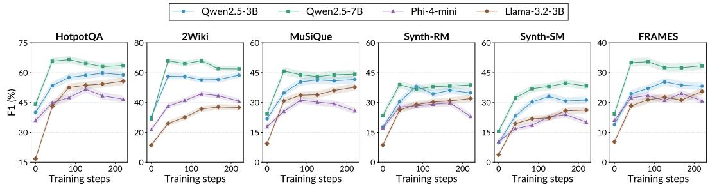  
Figure 2: F1 scores steadily improve as training progresses. We evaluate intermediate checkpoints of PhantomEnvironments training runs, and observe steady performance improvements across the board: a sharp increase initially then a steady growth. While some runs saturate, we generally do not see drastic overfitting or collapse to the rule-generated templates of PhantomEnvironments. We report mean ± standard error as the solid line and shaded region.

Robustness to larger-scale deployment with noisy search. When agents are deployed, they encounter larger search environments where corpus documents can overlap and interfere. In practice, deployment environments can return noisier search results to agent queries than the agents were trained to handle. This demands for training environments that create agents robust to noisy search and ready for larger-scale deployment—do our PhantomEnvironments meet this bar?

We construct this test scenario by gathering the documents of all six benchmarks into one large pooled search index that simulates noisy search. The pooled corpus is, at the minimum, 1.5× the size of FRAMES’ corpus alone, and up to 44× for SynthWorlds pair. Moreover, it contains interfering and near-duplicate documents: (1) Wikipedia passages of HotpotQA and MuSiQue overlap with long FRAMES articles, and (2) SynthWorlds-RM documents compete with SynthWorlds-SM as they are identical except for real vs fictional facts (Gu et al., 2025). In Table 3 we ablate agent performance on the choice of retrieval corpus, either benchmark’s own or pooled corpus. Every agent degrades, but only slightly: the Qwen2.5-7B-Instruct base worsens by 1.6 average F1 score, and the synthetictrained ones by 1.9 points (see Tables 6 and 7 for more results). Indeed, agents trained in simplified fictional worlds are robust to large-scale deployments.

<table><tr><td>Corpus</td><td colspan="2">Qwen2.5-7B + PhantomEnvs</td></tr><tr><td>Benchmark&#x27;s own</td><td> $2 5 . 5 \pm 0 . 7$ </td><td> $4 8 . 4 \pm 0 . 8$ </td></tr><tr><td>All pooled</td><td> $2 3 . 9 \pm 0 . 7$ </td><td> $4 6 . 5 \pm 0 . 8$  1</td></tr></table>

Table 3: Average F1 scores of Qwen2.5-7B-Instruct, ablating choice of search corpus. Each benchmark’s questions are answered either against that benchmark’s own corpus, or against a single pooled corpus. Expectedly, agents perform worse against the pooled corpus but the drop is slight, with or without training.

Training evolution and emergent search scaling behavior. In addition to real-world transfer, PhantomEnvironments allow for fine-grained analysis as they are fully verifiable and deterministically generated. At environment generation time, question difficulties—the number of fictional Wikipedia documents to navigate—is known. Using this feature, we analyze agents’ performance evolution as RL fine-tuning progresses. In Figure 3 (left) we find that F1 scores of Qwen2.5-7B-Instruct and Llama-3.2-3B-Instruct improve on questions of all difficulties as training progresses (Figure 7 visualizes evolution of Qwen2.5-3B-Instruct and Phi-4-mini-instruct). However, a key behavioral difference emerges between LLM families: Qwen2.5 ones learn to automatically issue search calls proportional to question difficulty, exhibiting a clear linear relationship. We call this desirable property “search scaling”, emergent in Qwen2.5 LLMs from environment interaction alone. Llama-3.2-3B-Instruct shows partial search scaling: number of searches grows linearly with question difficulty, then plateaus. On the other hand, Phi-4-mini-instruct in Figure 7 does not display any scaling. This suggests that this property is model-dependent and emergent only for sufficiently capable LLMs. This finding aligns with prior work on how model baseline capabilities influence benefits from further RL fine-tuning (Gandhi et al., 2025; Yue et al., 2025).

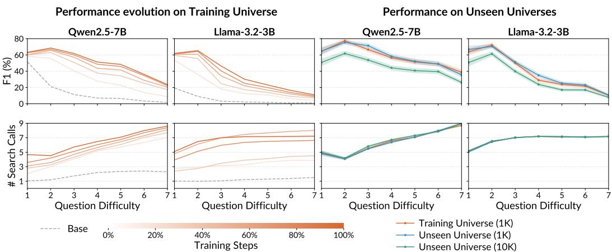  
Figure 3: F1 scores and number of search calls as a function of question difficulty (hops). (Left two) We evaluate intermediate training checkpoints on validation questions from the training universe. As fine-tuning progresses, F1 increases across all difficulty levels for both LLMs (darker lines are higher in scores). In the lower panels, we plot the number of search calls as a function of question difficulty. We observe an emergent “search scaling” property in Qwen2.5 models: number of searches scales linearly with environment’s question difficulty. Llama-3.2-3B-Instruct shows partial search scaling, increasing search calls initially and plateauing. (Right two) We evaluate final checkpoints on an unseen universe of the same size as training (Unseen 1K) and a 10× larger universe (Unseen 10K). F1 scores and search scaling behavior in Unseen universes parallel the Training universe, indicating agents acquired generalizable agentic search skill rather than memorizing facts.

Generalization in unseen environments. One concern with training on a fixed fictional universe is that the LLM could simply memorize the knowledge graph’s facts and retrieve answers by pattern matching. To test fact memorization, in Figure 3 (right) we evaluate on a freshly-generated unseen environment of the same size (Unseen 1K) and a 10× larger universe (Unseen 10K). These evaluation environments share no factual knowledge overlap with any training data, seen either during pretraining or RL fine-tuning. The trained agents match their in-domain F1 score performance at every difficulty level, when the universe size is fixed at 1K. The trend follows at the larger universe of 10K as well, where the performance is slightly worse than Unseen 1K due to the more noisy search environment. Results for Qwen2.5-3B-Instruct and Phi-4-mini-instruct in Figure 7. Robust performance to unseen environments confirms that LLM search agents have learned the generalizable agentic search skill.

## 4.2 COMPARISON WITH REAL-WORLD TRAINING ENVIRONMENTS

So far we have showed that fictional worlds can teach agentic search. A natural next question is how their transfer compares to training on real-world data. We find that real-world training environments—with its linguistic richness and grounded factual knowledge—outperform synthetic when evaluation benchmarks contain in-domain facts to training, e.g. when Wikipedia cutoffs overlap. When evaluation becomes out-of-domain, however, PhantomEnvironments outperform real-world.

Real-world environments are superior when in-domain to evaluation. In Figure 4 we compare PhantomEnvironments training against a real-world training environment: NQ+HotpotQA questions from the 2018 Wikidump released with Search-R1 (Jin et al., 2025b). Three benchmarks (HotpotQA, 2WikiMultihopQA, MuSiQue) share the same Wikipedia 2018 corpus, and overlap in factual knowledge to NQ+HotpotQA training. Expectedly, when training and evaluation are in-domain, real-world training data outperforms synthetic for all LLMs: Qwen2.5-3B-Instruct in Figure 4 (a) gets an average 56.7% F1 score vs 52.2% respectively (see Figures 8 to 10 for other LLM results).

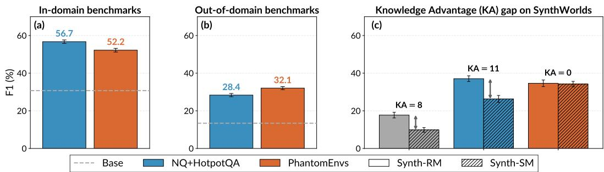  
Figure 4: (a) Training Qwen2.5-3B-Instruct on real-world NQ+HotpotQA data outperforms PhantomEnvironments on benchmarks in-domain to NQ+HotpotQA (HotpotQA, 2WikiMultihopQA, MuSiQue). (b) Whereas PhantomEnvs is better than real-world training on newer and harder out-ofdomain benchmarks (SynthWorlds-RM, SynthWorlds-SM, FRAMES). (c) PhantomEnvs teach agents to be equally performant on SynthWorlds pair: F1 scores are similar for RM and SM versions (KA = 0), but KA > 0 for the base model and NQ+HotpotQA training. See text for details.

On newer out-of-domain benchmarks, PhantomEnvironments transfers better. The story changes on SynthWorlds-RM, SynthWorlds-SM, and FRAMES benchmarks that are sourced from Wikipedia post 2023. NQ+HotpotQA data now has limited factual knowledge overlap, so evaluation is out-of-domain in factual knowledge. Here PhantomEnvironments outperform real-world data: Qwen2.5-3B-Instruct in Figure 4 (b) with PhantomEnvs gets an average 32.1% F1 score vs 28.4%. This suggests that PhantomEnvironments yield LLM agents robust to distribution shift. We further corroborate this hypothesis with the SynthWorlds pair: SynthWorlds-RM (real Wikidata entities) and SynthWorlds-SM (the same graph re-instantiated with synthetic entities) (Gu et al., 2025). This pair calculates a Knowledge Advantage (KA) gap, which is positive when LLMs utilize memorized knowledge from Wikipedia. Figure 4 (c) shows KA gaps for base and trained models. Base models already exhibit positive KA gap—Qwen2.5-3B-Instruct has 8%, and that widens to 11% after realworld NQ+HotpotQA training. Remarkably, our PhantomEnvironmentsfully close the KA gap to 0%. For other LLMs (Figures 8 to 10), synthetic can reduce the KA gap when real-world data amplifies it.

This contrast shows the need for training environments that are robust when evaluation targets fall beyond LLM training cutoffs—and our PhantomEnvironments meet this need. Both human-curated and LLM-generated data are anchored to a timed snapshot of the world, so benchmarks built on later snapshots eventually fall outside their coverage. Rule-generated synthetic environments are decoupled from this temporal drift, timeless in a way, and robust to knowledge memorization. In new evaluation environments where such shortcuts through memorization are absent, PhantomEnvironments generalize better than real-world training.

## 5 WHICH ENVIRONMENT COMPLEXITY AXES DRIVE TRANSFER IN AGENTS?

Real-world questions span a spectrum of complexity, such as requiring multiple hops over entities, comparing and combining parallel hop chains, and filtering candidates by constraints. We ablate our synthetic environments along three orthogonal axes of complexity: linear hops over entities, comparisons of attributes, and constraints that filter candidates. Holding the corpus fixed, we generate these synthetic environments by extending PhantomEnvironments generation code, context-freegrammars, and Prolog queries. We then fine-tune Qwen2.5-3B-Instruct and Llama-3.2-3B-Instruct.

The original Hops environment has questions of up to 7 linear hops from an anchor person (Who is the friend ofparent ofAlice) or a tail attribute (whose hobby is birdwatching). The new Hops+Comparisons environment pairs two such chains and adds a comparison predicate to the front (Who is older,friend ofparent ofAlice, or sister ofBob?). We balance the training mixture to 50–50 between pure-hop and comparison questions. Finally, the new Hops+Constraints environment inserts up to three attribute filters at arbitrary positions along the chain (Who is the friend, whose hobby is reading, ofparent ofAlice?), with the same 50–50 balance between pure-hop (0–1 filters) and multi-constraint (2–3 filters) questions. Full specifications are in Appendix A.4.

Not every complexity axis equally drives transfer. One might expect that adding complexity axes only adds to performance transfer. However, Figure 5 shows otherwise—Hops is at least as good as Hops+Comparisons and Hops+Constraints, so linear hops is the dominant complexity axis for performance transfer.

Where exactly do the complexity axes help or hurt? Aggregate F1 scores obscure behavioral changes in agents introduced by environment variants. In Figures 6 and 11 we decompose performance by question category on CofCA and 2WikiMultihopQA benchmarks, which contain category labels for questions (see Appendix A.6 for details on category labels). Both have comparison questions, which our respective environ-

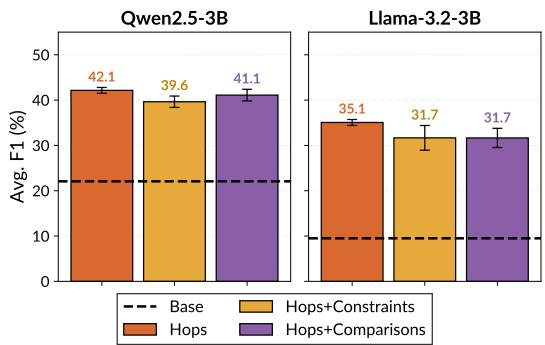  
Figure 5: Ablation results on synthetic environment complexity axes. We find that Hops is the strongest axis that drives real-world transfer.

ments Hops+Comparisons and Hops+Constraints directly target. We note three observations. First, comparison training questions targets the matching real-world category: Hops+Comparisons significantly outperforms the Hops+Constraints and just Hops. The gain from Hops+Comparisons is most pronounced for Llama-3.2-3B-Instruct, which has a low base F1 score for CofCA comparison questions. So environment complexity axes can improve base models on question types on which they are particularly weak. Second, linear hops remain the dominant axis of complexity for transfer on noncomparison categories. Third, we find shortcutting behavior with Hops+Constraints—agents issue verbatim search queries rather than decomposing—and that actively hurts transfer (Appendix B.1).

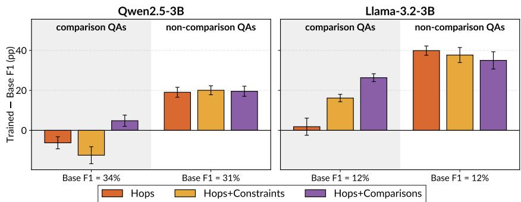  
Figure 6: F1 score deltas per question type of CofCA benchmark after fine-tuning on environment variants. We plot F1 score deltas on comparison and non-comparison questions: we calculate F1 score difference per question, average deltas for each category, and report the mean ± standard error (paired) in percentage points. Hops+Comparisons environment improves performance on evaluation comparison questions, but linear hops remains dominant otherwise.

## 6 CONCLUSION

We show that LLM search agents trained in PhantomEnvironments, with no humans or LLMs in the data pipeline, transfer to real-world multi-hop search. Real training data wins where memorized knowledge helps, but its advantage narrows on benchmarks built from newer Wikipedia snapshots. Ablating environment complexity reveals that linear hops drive most of the transfer, comparison questions target their matching real-world category, and constraint questions backfire by rewarding a verbatim-query shortcut. In this work, we find rule-generated synthetic environments as a zeromarginal-cost and effective source of agent training data.

Limitations. Our complexity analysis invites further work on environment composition: given a known capability gap, can one read off a recipe of synthetic axes that closes it? We use synthetic environments as standalone; blending them with real-world data, e.g., as mid-training data, is a natura next step. Compute budgets limit us from training larger LLMs and evaluating on long-context and open-web benchmarks like BrowseComp-Plus (Chen et al., 2025c)—all open directions.

## AI USE STATEMENT

In this work, we used generative AI tools for code implementation and experimentation. We have not used generative AI tools for generating synthetic datasets (the paper is about LLM-free synthetic data), or interpreting results; the rest of the required disclosure tasks are not applicable to this work. Additionally, we used generative AI tools for brainstorming, editing for readability, and plotting. We have reviewed all AI-assisted work by verifying code and confirming all literature. We take responsibility for the final content of this work, including text, claims or artifacts produced with the aid of generative AI.

## REPRODUCIBILITY STATEMENT

We use open-source LLMs, training code, and evaluation benchmarks, and our training experiments are across multiple seeds. All details are in the appendix. We report standard errors in all tables and plots and note significance. We have open-sourced our code at github.com/kilian-group/phantom-envs.

## ACKNOWLEDGEMENTS

Authors acknowledge help from AI models in various project phases. DG is supported by Empire AI Postdoctoral Fellowship. Authors acknowledge compute resources from the National Artificial Intelligence Research Resource (NAIRR) Pilot, Purdue Anvil AI, and NVIDIA’s DGX Station compute platform through their Early Access Program. This work is supported by the National Science Foundation (NSF) grants RI-2530143, OAC-2118310, IIS-2530143 and through the AI Research Institutes program Award No. DMR-2433348. This work was partially supported by funding from NewYork-Presbyterian for the NYP-Cornell Cardiovascular AI Collaboration, the National Institute of Food and Agriculture (USDA/NIFA), the Air Force Office of Scientific Research (AFOSR), and a Schmidt AI2050 Senior Fellowship, a Schmidt Sciences program. We thank anonymous reviewers for their helpful feedback.

## REFERENCES

Akari Asai, Zeqiu Wu, Yizhong Wang, Avirup Sil, and Hannaneh Hajishirzi. Self-rag: Learning to retrieve, generate, and critique through self-reflection. In The Twelfth International Conference on Learning Representations, 2023. pages 4

Shiyi Cao, Sumanth Hegde, Dacheng Li, Tyler Griggs, Shu Liu, Eric Tang, Jiayi Pan, Xingyao Wang, Akshay Malik, Graham Neubig, Kourosh Hakhamaneshi, Richard Liaw, Philipp Moritz, Matei Zaharia, Joseph E. Gonzalez, and Ion Stoica. SkyRL-v0: Train Real-World Long-Horizon Agents via Reinforcement Learning, 2025. pages 5, 16

Jonathan D Chang, Andrew Drozdov, Shubham Toshniwal, Owen Oertell, Alexander Trott, Jacob Portes, Abhay Gupta, Pallavi Koppol, Ashutosh Baheti, Sean Kulinski, et al. Karl: Knowledge agents via reinforcement learning. arXiv preprint arXiv:2603.05218, 2026. pages 1, 3

Howard Chen, Noam Razin, Karthik Narasimhan, and Danqi Chen. Retaining by doing: The role of on-policy data in mitigating forgetting. arXiv preprint arXiv:2510.18874, 2025a. pages 24

Mingyang Chen, Linzhuang Sun, Tianpeng Li, Haoze Sun, Yijie Zhou, Chenzheng Zhu, Haofen Wang, Jeff Z Pan, Wen Zhang, Huajun Chen, et al. Learning to reason with search for llms via reinforcement learning. 2025b. pages 3

Zijian Chen, Xueguang Ma, Shengyao Zhuang, Ping Nie, Kai Zou, Andrew Liu, Joshua Green, Kshama Patel, Ruoxi Meng, Mingyi Su, Sahel Sharifymoghaddam, Yanxi Li, Haoran Hong, Xinyu Shi, Xuye Liu, Nandan Thakur, Crystina Zhang, Luyu Gao, Wenhu Chen, and Jimmy Lin. BrowseComp-Plus: A More Fair and Transparent Evaluation Benchmark of Deep-Research Agent. arXiv preprint arXiv:2508.06600, 2025c. pages 9, 17

Maxime Chevalier-Boisvert, Dzmitry Bahdanau, Salem Lahlou, Lucas Willems, Chitwan Saharia, Thien Huu Nguyen, and Yoshua Bengio. Babyai: A platform to study the sample efficiency of

grounded language learning. In International Conference on Learning Representations, 2019. pages 3

Kanishk Gandhi, Ayush Chakravarthy, Anikait Singh, Nathan Lile, and Noah D Goodman. Cognitive behaviors that enable self-improving reasoners, or, four habits of highly effective stars. arXiv preprint arXiv:2503.01307, 2025. pages 7

Kanishk Gandhi, Shivam Garg, Noah D Goodman, and Dimitris Papailiopoulos. Endless terminals: Scaling rl environments for terminal agents. arXiv preprint arXiv:2601.16443, 2026. pages 1, 3

Jiaxuan Gao, Wei Fu, Minyang Xie, Shusheng Xu, Chuyi He, Zhiyu Mei, Banghua Zhu, and Yi Wu. Beyond ten turns: Unlocking long-horizon agentic search with large-scale asynchronous rl. 2025. pages 1, 3

Anna Goldie, Azalia Mirhoseini, Hao Zhou, Irene Cai, and Christopher D Manning. Synthetic data generation & multi-step rl for reasoning & tool use. arXiv preprint arXiv:2504.04736, 2025. pages 1, 3

Albert Gong, Kamile Stankevi ˙ ciˇ ut¯ e, Chao Wan, Anmol Kabra, Raphael Thesmar, Johann Lee,˙ Julius Klenke, Carla P Gomes, and Kilian Q Weinberger. Phantomwiki: On-demand datasets for reasoning and retrieval evaluation. arXiv preprint arXiv:2502.20377, 2025. pages 1, 3, 4, 17

Aaron Grattafiori, Abhimanyu Dubey, Abhinav Jauhri, Abhinav Pandey, Abhishek Kadian, Ahmad Al-Dahle, Aiesha Letman, Akhil Mathur, Alan Schelten, Alex Vaughan, Amy Yang, Angela Fan, Anirudh Goyal, Anthony Hartshorn, Aobo Yang, Archi Mitra, Archie Sravankumar, Artem Korenev, Arthur Hinsvark, Arun Rao, Aston Zhang, Aurelien Rodriguez, Austen Gregerson, Ava Spataru, Baptiste Roziere, Bethany Biron, Binh Tang, Bobbie Chern, Charlotte Caucheteux, Chaya Nayak, Chloe Bi, Chris Marra, Chris McConnell, Christian Keller, Christophe Touret, Chunyang Wu, Corinne Wong, Cristian Canton Ferrer, Cyrus Nikolaidis, Damien Allonsius, Daniel Song, Danielle Pintz, Danny Livshits, Danny Wyatt, David Esiobu, Dhruv Choudhary, Dhruv Mahajan, Diego Garcia-Olano, Diego Perino, Dieuwke Hupkes, Egor Lakomkin, Ehab AlBadawy, Elina Lobanova, Emily Dinan, Eric Michael Smith, Filip Radenovic, Francisco Guzmán, Frank Zhang, Gabriel Synnaeve, Gabrielle Lee, Georgia Lewis Anderson, Govind Thattai, Graeme Nail, Gregoire Mialon, Guan Pang, Guillem Cucurell, Hailey Nguyen, Hannah Korevaar, Hu Xu, Hugo Touvron, Iliyan Zarov, Imanol Arrieta Ibarra, Isabel Kloumann, Ishan Misra, Ivan Evtimov, Jack Zhang, Jade Copet, Jaewon Lee, Jan Geffert, Jana Vranes, Jason Park, Jay Mahadeokar, Jeet Shah, Jelmer van der Linde, Jennifer Billock, Jenny Hong, Jenya Lee, Jeremy Fu, Jianfeng Chi, Jianyu Huang, Jiawen Liu, Jie Wang, Jiecao Yu, Joanna Bitton, Joe Spisak, Jongsoo Park, Joseph Rocca, Joshua Johnstun, Joshua Saxe, Junteng Jia, Kalyan Vasuden Alwala, Karthik Prasad, Kartikeya Upasani, Kate Plawiak, Ke Li, Kenneth Heafield, Kevin Stone, Khalid El-Arini, Krithika Iyer, Kshitiz Malik, Kuenley Chiu, Kunal Bhalla, Kushal Lakhotia, Lauren Rantala-Yeary, Laurens van der Maaten, Lawrence Chen, Liang Tan, Liz Jenkins, Louis Martin, Lovish Madaan, Lubo Malo, Lukas Blecher, Lukas Landzaat, Luke de Oliveira, Madeline Muzzi, Mahesh Pasupuleti, Mannat Singh, Manohar Paluri, Marcin Kardas, Maria Tsimpoukelli, Mathew Oldham, Mathieu Rita, Maya Pavlova, Melanie Kambadur, Mike Lewis, Min Si, Mitesh Kumar Singh, Mona Hassan, Naman Goyal, Narjes Torabi, Nikolay Bashlykov, Nikolay Bogoychev, Niladri Chatterji, Ning Zhang, Olivier Duchenne, Onur Çelebi, Patrick Alrassy, Pengchuan Zhang, Pengwei Li, Petar Vasic, Peter Weng, Prajjwal Bhargava, Pratik Dubal, Praveen Krishnan, Punit Singh Koura, Puxin Xu, Qing He, Qingxiao Dong, Ragavan Srinivasan, Raj Ganapathy, Ramon Calderer, Ricardo Silveira Cabral, Robert Stojnic, Roberta Raileanu, Rohan Maheswari, Rohit Girdhar, Rohit Patel, Romain Sauvestre, Ronnie Polidoro, Roshan Sumbaly, Ross Taylor, Ruan Silva, Rui Hou, Rui Wang, Saghar Hosseini, Sahana Chennabasappa, Sanjay Singh, Sean Bell, Seohyun Sonia Kim, Sergey Edunov, Shaoliang Nie, Sharan Narang, Sharath Raparthy, Sheng Shen, Shengye Wan, Shruti Bhosale, Shun Zhang, Simon Vandenhende, Soumya Batra, Spencer Whitman, Sten Sootla, Stephane Collot, Suchin Gururangan, Sydney Borodinsky, Tamar Herman, Tara Fowler, Tarek Sheasha, Thomas Georgiou, Thomas Scialom, Tobias Speckbacher, Todor Mihaylov, Tong Xiao, Ujjwal Karn, Vedanuj Goswami, Vibhor Gupta, Vignesh Ramanathan, Viktor Kerkez, Vincent Gonguet, Virginie Do, Vish Vogeti, Vítor Albiero, Vladan Petrovic, Weiwei Chu, Wenhan Xiong, Wenyin Fu, Whitney Meers, Xavier Martinet, Xiaodong Wang, Xiaofang Wang, Xiaoqing Ellen Tan, Xide Xia, Xinfeng Xie, Xuchao Jia, Xuewei Wang, Yaelle Goldschlag, Yashesh Gaur, Yasmine Babaei, Yi Wen, Yiwen Song, Yuchen Zhang, Yue Li, Yuning Mao, Zacharie Delpierre Coudert, Zheng Yan, Zhengxing Chen, Zoe

Papakipos, Aaditya Singh, Aayushi Srivastava, Abha Jain, Adam Kelsey, Adam Shajnfeld, Adithya Gangidi, Adolfo Victoria, Ahuva Goldstand, Ajay Menon, Ajay Sharma, Alex Boesenberg, Alexei Baevski, Allie Feinstein, Amanda Kallet, Amit Sangani, Amos Teo, Anam Yunus, Andrei Lupu, Andres Alvarado, Andrew Caples, Andrew Gu, Andrew Ho, Andrew Poulton, Andrew Ryan, Ankit Ramchandani, Annie Dong, Annie Franco, Anuj Goyal, Aparajita Saraf, Arkabandhu Chowdhury, Ashley Gabriel, Ashwin Bharambe, Assaf Eisenman, Azadeh Yazdan, Beau James, Ben Maurer, Benjamin Leonhardi, Bernie Huang, Beth Loyd, Beto De Paola, Bhargavi Paranjape, Bing Liu, Bo Wu, Boyu Ni, Braden Hancock, Bram Wasti, Brandon Spence, Brani Stojkovic, Brian Gamido, Britt Montalvo, Carl Parker, Carly Burton, Catalina Mejia, Ce Liu, Changhan Wang, Changkyu Kim, Chao Zhou, Chester Hu, Ching-Hsiang Chu, Chris Cai, Chris Tindal, Christoph Feichtenhofer, Cynthia Gao, Damon Civin, Dana Beaty, Daniel Kreymer, Daniel Li, David Adkins, David Xu, Davide Testuggine, Delia David, Devi Parikh, Diana Liskovich, Didem Foss, Dingkang Wang, Duc Le, Dustin Holland, Edward Dowling, Eissa Jamil, Elaine Montgomery, Eleonora Presani, Emily Hahn, Emily Wood, Eric-Tuan Le, Erik Brinkman, Esteban Arcaute, Evan Dunbar, Evan Smothers, Fei Sun, Felix Kreuk, Feng Tian, Filippos Kokkinos, Firat Ozgenel, Francesco Caggioni, Frank Kanayet, Frank Seide, Gabriela Medina Florez, Gabriella Schwarz, Gada Badeer, Georgia Swee, Gil Halpern, Grant Herman, Grigory Sizov, Guangyi, Zhang, Guna Lakshminarayanan, Hakan Inan, Hamid Shojanazeri, Han Zou, Hannah Wang, Hanwen Zha, Haroun Habeeb, Harrison Rudolph, Helen Suk, Henry Aspegren, Hunter Goldman, Hongyuan Zhan, Ibrahim Damlaj, Igor Molybog, Igor Tufanov, Ilias Leontiadis, Irina-Elena Veliche, Itai Gat, Jake Weissman, James Geboski, James Kohli, Janice Lam, Japhet Asher, Jean-Baptiste Gaya, Jeff Marcus, Jeff Tang, Jennifer Chan, Jenny Zhen, Jeremy Reizenstein, Jeremy Teboul, Jessica Zhong, Jian Jin, Jingyi Yang, Joe Cummings, Jon Carvill, Jon Shepard, Jonathan McPhie, Jonathan Torres, Josh Ginsburg, Junjie Wang, Kai Wu, Kam Hou U, Karan Saxena, Kartikay Khandelwal, Katayoun Zand, Kathy Matosich, Kaushik Veeraraghavan, Kelly Michelena, Keqian Li, Kiran Jagadeesh, Kun Huang, Kunal Chawla, Kyle Huang, Lailin Chen, Lakshya Garg, Lavender A, Leandro Silva, Lee Bell, Lei Zhang, Liangpeng Guo, Licheng Yu, Liron Moshkovich, Luca Wehrstedt, Madian Khabsa, Manav Avalani, Manish Bhatt, Martynas Mankus, Matan Hasson, Matthew Lennie, Matthias Reso, Maxim Groshev, Maxim Naumov, Maya Lathi, Meghan Keneally, Miao Liu, Michael L. Seltzer, Michal Valko, Michelle Restrepo, Mihir Patel, Mik Vyatskov, Mikayel Samvelyan, Mike Clark, Mike Macey, Mike Wang, Miquel Jubert Hermoso, Mo Metanat, Mohammad Rastegari, Munish Bansal, Nandhini Santhanam, Natascha Parks, Natasha White, Navyata Bawa, Nayan Singhal, Nick Egebo, Nicolas Usunier, Nikhil Mehta, Nikolay Pavlovich Laptev, Ning Dong, Norman Cheng, Oleg Chernoguz, Olivia Hart, Omkar Salpekar, Ozlem Kalinli, Parkin Kent, Parth Parekh, Paul Saab, Pavan Balaji, Pedro Rittner, Philip Bontrager, Pierre Roux, Piotr Dollar, Polina Zvyagina, Prashant Ratanchandani, Pritish Yuvraj, Qian Liang, Rachad Alao, Rachel Rodriguez, Rafi Ayub, Raghotham Murthy, Raghu Nayani, Rahul Mitra, Rangaprabhu Parthasarathy, Raymond Li, Rebekkah Hogan, Robin Battey, Rocky Wang, Russ Howes, Ruty Rinott, Sachin Mehta, Sachin Siby, Sai Jayesh Bondu, Samyak Datta, Sara Chugh, Sara Hunt, Sargun Dhillon, Sasha Sidorov, Satadru Pan, Saurabh Mahajan, Saurabh Verma, Seiji Yamamoto, Sharadh Ramaswamy, Shaun Lindsay, Shaun Lindsay, Sheng Feng, Shenghao Lin, Shengxin Cindy Zha, Shishir Patil, Shiva Shankar, Shuqiang Zhang, Shuqiang Zhang, Sinong Wang, Sneha Agarwal, Soji Sajuyigbe, Soumith Chintala, Stephanie Max, Stephen Chen, Steve Kehoe, Steve Satterfield, Sudarshan Govindaprasad, Sumit Gupta, Summer Deng, Sungmin Cho, Sunny Virk, Suraj Subramanian, Sy Choudhury, Sydney Goldman, Tal Remez, Tamar Glaser, Tamara Best, Thilo Koehler, Thomas Robinson, Tianhe Li, Tianjun Zhang, Tim Matthews, Timothy Chou, Tzook Shaked, Varun Vontimitta, Victoria Ajayi, Victoria Montanez, Vijai Mohan, Vinay Satish Kumar, Vishal Mangla, Vlad Ionescu, Vlad Poenaru, Vlad Tiberiu Mihailescu, Vladimir Ivanov, Wei Li, Wenchen Wang, Wenwen Jiang, Wes Bouaziz, Will Constable, Xiaocheng Tang, Xiaojian Wu, Xiaolan Wang, Xilun Wu, Xinbo Gao, Yaniv Kleinman, Yanjun Chen, Ye Hu, Ye Jia, Ye Qi, Yenda Li, Yilin Zhang, Ying Zhang, Yossi Adi, Youngjin Nam, Yu, Wang, Yu Zhao, Yuchen Hao, Yundi Qian, Yunlu Li, Yuzi He, Zach Rait, Zachary DeVito, Zef Rosnbrick, Zhaoduo Wen, Zhenyu Yang, Zhiwei Zhao, and Zhiyu Ma. The llama 3 herd of models, 2024. URL https://arxiv.org/abs/2407.21783. pages 2, 5

Ken Gu, Advait Bhat, Mike A Merrill, Robert West, Xin Liu, Daniel McDuff, and Tim Althoff. SynthWorlds: Controlled Parallel Worlds for Disentangling Reasoning and Knowledge in Language Models. arXiv preprint arXiv:2510.24427, 2025. pages 2, 3, 4, 6, 8, 19

Daya Guo, Dejian Yang, Haowei Zhang, Junxiao Song, Peiyi Wang, Qihao Zhu, Runxin Xu, Ruoyu Zhang, Shirong Ma, Xiao Bi, et al. Deepseek-r1: Incentivizing reasoning capability in llms via

reinforcement learning. arXiv preprint arXiv:2501.12948, 2025. pages 3, 16

Bernal J Gutiérrez, Yiheng Shu, Yu Gu, Michihiro Yasunaga, and Yu Su. Hipporag: Neurobiologically inspired long-term memory for large language models. Advances in neural information processing systems, 37:59532–59569, 2024. pages 4

Dan Hendrycks, Collin Burns, Steven Basart, Andy Zou, Mantas Mazeika, Dawn Song, and Jacob Steinhardt. Measuring massive multitask language understanding. arXiv preprint arXiv:2009.03300, 2020. pages 24

Xanh Ho, Anh-Khoa Duong Nguyen, Saku Sugawara, and Akiko Aizawa. Constructing a multi-hop qa dataset for comprehensive evaluation of reasoning steps. In Proceedings ofthe 28th International Conference on Computational Linguistics, pp. 6609–6625, 2020. pages 2, 4, 19

Pengcheng Jiang, Xueqiang Xu, Jiacheng Lin, Jinfeng Xiao, Zifeng Wang, Jimeng Sun, and Jiawei Han. s3: You don’t need that much data to train a search agent via rl. In Proceedings of the 2025 Conference on Empirical Methods in Natural Language Processing, pp. 21610–21628, 2025. pages 3

Bowen Jin, Jinsung Yoon, Priyanka Kargupta, Sercan O Arik, and Jiawei Han. An empirical study on reinforcement learning for reasoning-search interleaved llm agents. arXiv preprint arXiv:2505.15117, 2025a. pages 5, 17

Bowen Jin, Hansi Zeng, Zhenrui Yue, Jinsung Yoon, Sercan Arik, Dong Wang, Hamed Zamani, and Jiawei Han. Search-R1: Training LLMs to Reason and Leverage Search Engines with Reinforcement Learning. arXiv preprint arXiv:2503.09516, 2025b. pages 1, 3, 4, 7, 16, 24

Jeff Johnson, Matthijs Douze, and Hervé Jégou. Billion-scale similarity search with GPUs. IEEE Transactions on Big Data, 7(3):535–547, 2019. pages 5, 17

Anmol Kabra, Yilun Yin, Albert Gong, Kamile Stankevi ˙ ciˇ ut¯ e, Dongyoung Go, Johann Lee, Katie Z ˙ Luo, Carla P Gomes, and Kilian Q Weinberger. Learning from Synthetic Data Improves Multi-hop Reasoning. arXiv preprint arXiv:2603.02091, 2026. pages 3, 5

Satyapriya Krishna, Kalpesh Krishna, Anhad Mohananey, Steven Schwarcz, Adam Stambler, Shyam Upadhyay, and Manaal Faruqui. Fact, fetch, and reason: A unified evaluation of retrievalaugmented generation. In Proceedings of the 2025 Conference of the Nations of the Americas Chapter ofthe Associationfor Computational Linguistics: Human Language Technologies (Volume 1: Long Papers), pp. 4745–4759, 2025. pages 2, 4, 19

Tom Kwiatkowski, Jennimaria Palomaki, Olivia Redfield, Michael Collins, Ankur Parikh, Chris Alberti, Danielle Epstein, Illia Polosukhin, Jacob Devlin, Kenton Lee, Kristina Toutanova, Llion Jones, Matthew Kelcey, Ming-Wei Chang, Andrew M. Dai, Jakob Uszkoreit, Quoc Le, and Slav Petrov. Natural questions: A benchmark for question answering research. Transactions of the Associationfor Computational Linguistics, 7:452–466, 2019. doi: 10.1162/tacl\_a\_00276. URL https://aclanthology.org/Q19-1026/. pages 1, 3

Kuan Li, Zhongwang Zhang, Huifeng Yin, Rui Ye, Yida Zhao, Liwen Zhang, Litu Ou, Ding-Chu Zhang, Xixi Wu, Xinmiao Yu, et al. WebSailor-V2: Bridging the Chasm to Proprietary Agents via Synthetic Data and Scalable Reinforcement Learning. In International Conference on Learning Representations, volume 2026, pp. 93919–93948, 2026. pages 3

Rui Lu, Zhenyu Hou, Zihan Wang, Hanchen Zhang, Xiao Liu, Yujiang Li, Shi Feng, Jie Tang, and Yuxiao Dong. DeepDive: Advancing Deep Search Agents with Knowledge Graphs and Multi-Turn RL. arXiv preprint arXiv:2509.10446, 2025. pages 3

Alex Mallen, Akari Asai, Victor Zhong, Rajarshi Das, Daniel Khashabi, and Hannaneh Hajishirzi. When not to trust language models: Investigating effectiveness of parametric and non-parametric memories. In Anna Rogers, Jordan Boyd-Graber, and Naoaki Okazaki (eds.), Proceedings ofthe 61st Annual Meeting of the Association for Computational Linguistics (Volume 1: Long Papers), pp. 9802–9822, Toronto, Canada, July 2023. Association for Computational Linguistics. doi: 10.18653/v1/2023.acl-long.546. URL https://aclanthology.org/2023.acl-long.546/. pages 24

Microsoft, :, Abdelrahman Abouelenin, Atabak Ashfaq, Adam Atkinson, Hany Awadalla, Nguyen Bach, Jianmin Bao, Alon Benhaim, Martin Cai, Vishrav Chaudhary, Congcong Chen, Dong Chen, Dongdong Chen, Junkun Chen, Weizhu Chen, Yen-Chun Chen, Yi ling Chen, Qi Dai, Xiyang Dai, Ruchao Fan, Mei Gao, Min Gao, Amit Garg, Abhishek Goswami, Junheng Hao, Amr Hendy, Yuxuan Hu, Xin Jin, Mahmoud Khademi, Dongwoo Kim, Young Jin Kim, Gina Lee, Jinyu Li, Yunsheng Li, Chen Liang, Xihui Lin, Zeqi Lin, Mengchen Liu, Yang Liu, Gilsinia Lopez, Chong Luo, Piyush Madan, Vadim Mazalov, Arindam Mitra, Ali Mousavi, Anh Nguyen, Jing Pan, Daniel Perez-Becker, Jacob Platin, Thomas Portet, Kai Qiu, Bo Ren, Liliang Ren, Sambuddha Roy, Ning Shang, Yelong Shen, Saksham Singhal, Subhojit Som, Xia Song, Tetyana Sych, Praneetha Vaddamanu, Shuohang Wang, Yiming Wang, Zhenghao Wang, Haibin Wu, Haoran Xu, Weijian Xu, Yifan Yang, Ziyi Yang, Donghan Yu, Ishmam Zabir, Jianwen Zhang, Li Lyna Zhang, Yunan Zhang, and Xiren Zhou. Phi-4-mini technical report: Compact yet powerful multimodal language models via mixture-of-loras, 2025. URL https://arxiv.org/abs/2503.01743. pages 2, 5

Pranav Rajpurkar, Jian Zhang, Konstantin Lopyrev, and Percy Liang. SQuAD: 100,000+ Questions for Machine Comprehension of Text. In Proceedings ofthe 2016 conference on empirical method in natural language processing, pp. 2383–2392, 2016. pages 4

Zhihong Shao, Peiyi Wang, Qihao Zhu, Runxin Xu, Junxiao Song, Xiao Bi, Haowei Zhang, Mingchuan Zhang, Y. K. Li, Y. Wu, and Daya Guo. DeepSeekMath: Pushing the Limits of Mathematical Reasoning in Open Language Models, 2024. URL https://arxiv.org/abs/ 2402.03300. pages 4, 16

Huatong Song, Jinhao Jiang, Yingqian Min, Jie Chen, Zhipeng Chen, Wayne Xin Zhao, Lei Fang, and Ji-Rong Wen. R1-searcher: Incentivizing the search capability in llms via reinforcement learning. arXiv preprint arXiv:2503.05592, 2025. pages 3

Leon Sterling and Ehud Y Shapiro. The art of Prolog: advanced programming techniques. MIT press, 1994. pages 4

Zafir Stojanovski, Oliver Stanley, Joe Sharratt, Richard Jones, Abdulhakeem Adefioye, Jean Kaddour, and Andreas Köpf. Reasoning-GYM: Reasoning environments for reinforcement learning with verifiable rewards. arXiv preprint arXiv:2505.24760, 2025. pages 3

Michael Sullivan, Mareike Hartmann, and Alexander Koller. Procedural environment generation for tool-use agents. In Proceedings of the 2025 Conference on Empirical Methods in Natural Language Processing, pp. 18555–18573, 2025. pages 1, 3

Hao Sun, Zile Qiao, Jiayan Guo, Xuanbo Fan, Yingyan Hou, Yong Jiang, Pengjun Xie, Yan Zhang, Fei Huang, and Jingren Zhou. Zerosearch: Incentivize the search capability of llms without searching. arXiv preprint arXiv:2505.04588, 2025. pages 1, 3

Microsoft AI Team. MAI-Thinking-1: Building a hill-climbing machine. Technical report, 2026. URL https://microsoft.ai/pdf/mai-thinking-1.pdf. pages 16

Qwen Team. Qwen2.5: A party of foundation models, September 2024. URL https://qwenlm. github.io/blog/qwen2.5/. pages 2, 5

Harsh Trivedi, Niranjan Balasubramanian, Tushar Khot, and Ashish Sabharwal. Musique: Multihop questions via single-hop question composition. Transactions of the Association for Computational Linguistics, 10:539–554, 2022. pages 2, 4, 19

Harsh Trivedi, Niranjan Balasubramanian, Tushar Khot, and Ashish Sabharwal. Interleaving retrieval with chain-of-thought reasoning for knowledge-intensive multi-step questions. In Proceedings of the 61st annual meeting of the association for computational linguistics (volume 1: long papers), pp. 10014–10037, 2023. pages 4

Liang Wang, Nan Yang, Xiaolong Huang, Binxing Jiao, Linjun Yang, Daxin Jiang, Rangan Majumder, and Furu Wei. Text Embeddings by Weakly-Supervised Contrastive Pre-training. arXiv preprint arXiv:2212.03533, 2022. pages 5, 17

Ziliang Wang, Xuhui Zheng, Kang An, Cijun Ouyang, Jialu Cai, Yuhang Wang, and Yichao Wu. Stepsearch: Igniting llms search ability via step-wise proximal policy optimization. arXiv preprint arXiv:2505.15107, 2025. pages 3

Jialong Wu, Baixuan Li, Runnan Fang, Wenbiao Yin, Liwen Zhang, Zhenglin Wang, Zhengwei Tao, Ding-Chu Zhang, Zekun Xi, Robert Tang, et al. Webdancer: Towards autonomous information seeking agency. Advances in Neural Information Processing Systems, 38:120957–120985, 2026. pages 1, 3

Jian Wu, Linyi Yang, Zhen Wang, Manabu Okumura, and Yue Zhang. CofCA: A step-wise counterfactual multi-hop qa benchmark. arXiv preprint arXiv:2402.11924, 2024. pages 5

Zhilin Yang, Peng Qi, Saizheng Zhang, Yoshua Bengio, William Cohen, Ruslan Salakhutdinov, and Christopher D Manning. Hotpotqa: A dataset for diverse, explainable multi-hop question answering. In Proceedings of the 2018 conference on empirical methods in natural language processing, pp. 2369–2380, 2018. pages 1, 2, 3, 4, 19

Shunyu Yao, Jeffrey Zhao, Dian Yu, Nan Du, Izhak Shafran, Karthik Narasimhan, and Yuan Cao. ReAct: Synergizing reasoning and acting in language models. arXiv preprint arXiv:2210.03629, 2022. pages 4

Yang Yue, Zhiqi Chen, Rui Lu, Andrew Zhao, Zhaokai Wang, Shiji Song, and Gao Huang. Does reinforcement learning really incentivize reasoning capacity in llms beyond the base model? arXiv preprint arXiv:2504.13837, 2025. pages 7

Yanzhao Zhang, Mingxin Li, Dingkun Long, Xin Zhang, Huan Lin, Baosong Yang, Pengjun Xie, An Yang, Dayiheng Liu, Junyang Lin, Fei Huang, and Jingren Zhou. Qwen3 Embedding: Advancing Text Embedding and Reranking Through Foundation Models. arXiv preprint arXiv:2506.05176, 2025. pages 5

Yuxiang Zheng, Dayuan Fu, Xiangkun Hu, Xiaojie Cai, Lyumanshan Ye, Pengrui Lu, and Pengfei Liu. Deepresearcher: Scaling deep research via reinforcement learning in real-world environments. In Proceedings of the 2025 Conference on Empirical Methods in Natural Language Processing, pp. 414–431, 2025. pages 3

Yang Zhou, Hongyi Liu, Zhuoming Chen, Yuandong Tian, and Beidi Chen. GSM-Infinite: How Do Your LLMs Behave over Infinitely Increasing Context Length and Reasoning Complexity? arXiv preprint arXiv:2502.05252, 2025. pages 3

## A IMPLEMENTATION DETAILS

## A.1 INSTRUCTION PROMPT

We use the following chat-style system and user prompts for all training and evaluation.

## system:

You are a helpful and harmless assistant.

## user:

Answer the given question using the search tool to retrieve relevant information. Follow this process:

1. Reason about what you know and what you still need to find out with the search tool. For complex questions, break them into sub-questions and search for each part.

2. If you need more information, call the search engine:

<search> query </search>. Write focused, specific queries. If a query returns unhelpful results, try a different phrasing or a more specific sub-question.

3. Base your final answer only on information from the search results, not on prior knowledge.

4. Once you have enough information, provide your answer inside <answer> and </answer>. For multiple answers, use a comma-separated

list: <answer>Alice, Bob</answer>. Do not include explanations inside the answer tags.

Question: {question}

## A.2 RL FINE-TUNING

We optimize the policy with Group Relative Policy Optimization (GRPO) (Shao et al., 2024; Guo et al., 2025), following Search-R1 (Jin et al., 2025b) and the SkyRL implementation (Cao et al., 2025). For each question we sample G = 8 rollouts from the current policy and assign each trajectory a reward: F1 score reward between 0 and 1 for training in our rule-generated synthetic environments. For NQ+HotpotQA training of Search-R1 that has only 1 ground-truth answer, F1 score becomes Exact Match reward of 0 or 1.

Advantages in GRPO are normalized per group of rollouts:

$$
A _ { i } = { \frac { r _ { i } - \operatorname* { m e a n } ( \{ r _ { 1 } , \dots , r _ { G } \} ) } { \operatorname { s t d } ( \{ r _ { 1 } , \dots , r _ { G } \} ) } } .
$$

The policy is updated by maximizing the token-level clipped surrogate

$$
\begin{array} { r } { \mathcal { L } ( \theta ) = \mathbb { E } _ { i , t } [ \operatorname* { m i n } ( \rho _ { i , t } ( \theta ) A _ { i } , \ \mathrm { c l i p } ( \rho _ { i , t } ( \theta ) , 1 - \epsilon , 1 + \epsilon ) A _ { i } ) ] , \quad \rho _ { i , t } ( \theta ) = \frac { \pi _ { \theta } \left( y _ { i , t } \mid x , y _ { i , s \epsilon } \right) } { \pi _ { \theta _ { \mathrm { o l d } } } \left( y _ { i , t } \mid x , y _ { i , s \epsilon } \right) } , } \end{array}
$$

where the expectation runs only over tokens generated by the model. Tokens inside <information>...</information>, which are returned by the search environment rather than produced by the policy, are masked out of both the importance ratio and the loss.

We clip-high the importance ratios at token-level at 2.0, and remove the KL penalty against the reference policy.

Optimization. We use AdamW with a learning rate of $1 \times 1 0 ^ { - 6 }$ , gradient norms clipped at 1.0, and a linear warmup over the first 10% of training steps. Each batch contains 256 question prompts with 8 rollouts per prompt. The maximum prompt length is 8192 tokens, and each trajectory is capped at 10 environment turns with at most 500 generated tokens per turn. Trajectories get automatically truncated if they exceed, but we don’t observe this during training. The policy is trained in full precision (fp32) using FSDP2 for sharding; rollout generation is handled by vLLM. We use the following sampling temperature and nucleus probability at both training and evaluation time:

1. Qwen models: 1.0 temperature, 1.0 top-p.

2. Llama-3.2-3B-Instruct: 0.6 temperature, 0.9 top-p.

3. Phi-4-mini-instruct: 0.8 temperature, 0.95 top-p.

Hardware and software. Every run uses 2 NVIDIA B200 GPUs and the open-source SkyRL FSDP2 backend at commit 298bebc (Cao et al., 2025). All training experiments take up to 2 days on this configuration.

Real-world training data. For the comparison against in-domain real-world training in Section 4, we draw from the NQ+HotpotQA training corpus released with Search-R1 (Jin et al., 2025b). That corpus contains roughly 160K questions; we shuffle and subsample 55K of them so the data budget matches our synthetic-environment runs exactly.

Training dynamics and instability. For a couple of real-world training data runs, we observed entropy spikes and training degeneration in Phi-4-mini-instruct and Llama-3.2-3B-Instruct models, often ≈ 50% into the run. This occurred on 1 training seed for Llama-3.2-3B-Instruct on synthetic ablation Hops+Constraints as well. In such cases, we report the prior saved policy checkpoint with the best held-out set performance. We rule out PhantomEnvironments as the cause, as we observe model degeneracy in real-world training data and one-off training seeds. Such RL training instability is observed in practice, even at frontier scale: MAI-Thinking-1 frequently observed crashes and restarted with heuristics (Team, 2026). Identifying the cause is an interesting open research direction.

## A.3 RETRIEVAL SERVER

At every search turn, the LLM policy queries a locally served dense retrieval index built with FAISS (Johnson et al., 2019). We use exact (flat) search and return the top-3 passages for each query. Each evaluation benchmark contributes its own retrieval corpus, constructed from the gold and distractor paragraphs accompanying its question set. The one exception is FRAMES, for which we download Wikipedia articles at the June 2023 revision cutoff that matches the benchmark’s authoring snapshot, and chunk them into section-level passages.

During training, both the synthetic and real-world corpora are encoded with intfloat/e5-base-v2 (768 dimensions) (Wang et al., 2022). This is the same encoder used by Search-R1, so the training retriever is fixed across synthetic and real-world environments, ensuring that differences in downstream performance reflects the training data source.

At evaluation time we switch to a stronger encoder, Qwen3-Embedding-4B (2560 dimensions), and apply it uniformly across all evaluation benchmarks. Prior work has noted that retriever quality at evaluation time is a major confound when comparing LLM agents, and recommend using the best available search retriever index (Jin et al., 2025a; Chen et al., 2025c). Therefore, we standardize evaluation on the high-quality Qwen3-Embedding-4B retriever, and isolate the significance of our results to the training setup alone. In Tables 4 and 5, evaluation results are slightly worse—across the board—when we use the training setup during evaluation.

<table><tr><td>Evaluation Setup</td><td>HotpotQA 2Wiki</td><td>MuSiQue Synth-RM Synth-SM FRAMES</td><td></td></tr><tr><td>Qwen2.5-3B</td><td></td><td></td><td></td></tr><tr><td>Paper setup</td><td> $4 0 . 1 \pm 1 . 9$   $3 0 . 3 \pm 1 . 9$ </td><td> $2 1 . 9 \pm 1 . 6$   $1 7 . 7 \pm 1 . 5$   $9 . 9 \pm 1 . 2$ </td><td> $1 2 . 6 \pm 1 . 0$ </td></tr><tr><td>Training setup</td><td> $3 9 . 8 \pm 2 . 0$   $2 9 . 3 \pm 1 . 8$ </td><td> $1 8 . 2 \pm 1 . 5$   $1 7 . 6 \pm 1 . 5$   $1 0 . 7 \pm 1 . 3$ </td><td> $1 1 . 9 \pm 0 . 9$ </td></tr><tr><td>Trained w/ PhantomEnvs</td><td></td><td></td><td></td></tr><tr><td>Paper setup</td><td> $6 1 . 5 \pm 1 . 9$   $5 6 . 0 \pm 2 . 0$ </td><td> $4 1 . 0 \pm 1 . 9$   $3 5 . 9 \pm 1 . 8$ </td><td> $3 4 . 8 \pm 1 . 9$   $2 7 . 6 \pm 1 . 4$ </td></tr><tr><td>Training setup</td><td> $5 6 . 9 \pm 1 . 9$   $5 4 . 3 \pm 2 . 1$ </td><td> $3 8 . 8 \pm 2 . 0$   $3 1 . 5 \pm 1 . 8$  </td><td> $3 1 . 5 \pm 1 . 8$   $2 3 . 4 \pm 1 . 3$ </td></tr><tr><td>Trained w/ NQ+HotpotQA</td><td></td><td></td><td></td></tr><tr><td></td><td></td><td></td><td></td></tr><tr><td>Paper setup</td><td></td><td></td><td> $2 5 . 1 \pm 1 . 9$   $2 1 . 3 \pm 1 . 3$ </td></tr><tr><td>Training setup</td><td> $6 5 . 9 \pm 1 . 9$   $6 2 . 5 \pm 2 . 1$   $6 7 . 3 \pm 1 . 8$   $6 0 . 2 \pm 2 . 1$ </td><td> $4 1 . 4 \pm 2 . 0$   $3 7 . 6 \pm 2 . 0$   $3 7 . 3 \pm 2 . 0$   $3 3 . 9 \pm 2 . 0$  </td><td> $2 5 . 2 \pm 1 . 9$   $2 0 . 1 \pm 1 . 3$ </td></tr></table>

Table 4: Ablation results on retriever configuration. In the main text, we evaluate every model with a deliberately stronger setup than it trains with (Qwen3-Embedding-4B, 20 turns, 32768 context). Here we re-evaluate the same checkpoints under the training setup (e5-base-v2, 10 turns, 8192 context). Other index settings remain fixed. The weaker training setup generally lowers every model’s score, regardless of how it was trained. We report results for one training seed—including the Paper setup rows, which therefore differ slightly from Table 2—with standard errors over the test sets. The other training seed follows the same trend.

## A.4 SYNTHETIC ENVIRONMENT GENERATION

Universes and questions are produced by the PhantomWiki generator (Gong et al., 2025) and our extensions for constraint-bearing and comparison questions. The training universe contains 1,000 individuals organized into 100 family trees of up to 10 people each, with a maximum tree depth of 10, using PhantomWiki’s easy-mode relation set (questions contain only friendship or immediate family relationships, no derived relationships like grandfather). Each individual is rendered as a single templated article in a wiki-style format; these articles form the documents in the retrieval corpus.

Three question-generation configurations are used. In all three, aggregation questions (“how many. . . ”) are filtered out (easy to reward-hack), and gold answers are obtained by executing the Prolog query attached to each template against the universe graph. A single question may therefore admit multiple gold answers.

<table><tr><td>Evaluation Setup</td><td>HotpotQA 2Wiki</td><td>MuSiQue Synth-RM Synth-SM FRAMES</td><td></td><td></td></tr><tr><td colspan="5">Qwen2.5-7B</td></tr><tr><td>Paper setup</td><td> $4 4 . 2 \pm 2 . 0$ </td><td> $2 9 . 1 \pm 1 . 9$   $2 4 . 5 \pm 1 . 8$ </td><td> $2 3 . 6 \pm 1 . 7$   $1 5 . 6 \pm 1 . 5$ </td><td> $1 6 . 2 \pm 1 . 1$ </td></tr><tr><td>Training setup</td><td> $4 2 . 6 \pm 2 . 0$ </td><td> $3 2 . 4 \pm 2 . 0$   $2 2 . 0 \pm 1 . 7$ </td><td> $2 2 . 7 \pm 1 . 7$   $1 5 . 0 \pm 1 . 5$ </td><td> $1 5 . 3 \pm 1 . 1$ </td></tr><tr><td colspan="5">Trained w/ PhantomEnvs</td></tr><tr><td>Paper setup</td><td></td><td></td><td></td><td></td></tr><tr><td>Training setup</td><td> $6 2 . 2 \pm 1 . 9$   $6 5 . 0 \pm 2 . 0$   $6 2 . 7 \pm 1 . 9$  </td><td> $4 7 . 1 \pm 2 . 0$   $4 1 . 8 \pm 2 . 0$  </td><td> $4 0 . 3 \pm 1 . 9$   $4 1 . 8 \pm 1 . 9$   $3 5 . 6 \pm 1 . 9$   $3 3 . 4 \pm 1 . 9$ </td><td> $3 4 . 9 \pm 1 . 4$   $2 6 . 9 \pm 1 . 4$ </td></tr><tr><td colspan="5"> $5 8 . 8 \pm 2 . 1$ </td></tr><tr><td>Trained w/ NQ+HotpotQA</td><td></td><td></td><td></td><td></td></tr><tr><td>Paper setup</td><td> $7 4 . 1 \pm 1 . 7$   $7 1 . 0 \pm 1 . 9$ </td><td> $5 1 . 6 \pm 2 . 1$ </td><td> $4 3 . 2 \pm 2 . 0$   $3 3 . 8 \pm 2 . 1$ </td><td> $3 0 . 7 \pm 1 . 4$ </td></tr><tr><td>Training setup</td><td> $7 1 . 3 \pm 1 . 8$   $6 9 . 4 \pm 2 . 0$ </td><td> $4 9 . 7 \pm 2 . 1$  </td><td> $3 7 . 7 \pm 2 . 0$   $3 0 . 4 \pm 2 . 0$ </td><td> $1 9 . 4 \pm 1 . 3$ </td></tr></table>

Table 5: Ablation results on retriever configuration. In the main text, we evaluate every model with a deliberately stronger setup than it trains with (Qwen3-Embedding-4B, 20 turns, 32768 context). Here we re-evaluate the same checkpoints under the training setup (e5-base-v2, 10 turns, 8192 context). Other index settings remain fixed. The weaker training setup generally lowers every model’s score, regardless of how it was trained. We report results for one training seed—including the Paper setup rows, which therefore differ slightly from Table 2—with standard errors over the test sets. The other training seed follows the same trend.

• Hops. Questions are generated at CFG depth 16, producing chains of up to 7 relational hops. We obtain roughly 55K training questions and 5K validation questions after filtering out aggregation questions.

• Hops+Constraints. The same base generator with up to 7 hops and up to 3 attribute constraints per question, drawn from all base question types.

• Hops+Comparisons. Up to 7 hops and at most 1 constraint. The question type pool is restricted to base questions and age-based comparisons.

Cell-balanced sampling. Training sets are balanced so that no difficulty stratum dominates the mixture. For Hops+Constraints, we partition questions into cells of a two-dimensional grid indexed by (hops, constraints) and downsample every cell to the size of the smallest cell. This produces a uniform distribution across the grid and yields the 50/50 split between pure-hop and multi-constraint questions reported in Section 5. For Hops+Comparisons, we partition by (hops, kind) where kind is one of {base, comparison}, determined from the question surface form. Because the zero-hop comparison cell is small, we apply a soft cap rather than strict equalization: each cell is capped at four times the size of the smallest cell. In both regimes, 10% of each balanced cell is held out as a stratified validation split.

Out-of-domain universes. The generalization experiment in Figure 3 uses two additional universes generated with different random seeds: an identically sized 1000-person universe (Unseen 1K) and a larger 10000-person universe (Unseen 10K). Generator configurations and command lines are released with the code.

## A.4.1 AN IMPROVED BIDIRECTIONAL ANCHOR SAMPLING

PhantomWiki’s default question sampler grounds relation chains from one fixed end: it picks a starting entity and walks forward through relations until the chain is fully instantiated, with the answer always landing at the final position. This introduces a positional bias. Entities that sit at the periphery of the knowledge graph (leaves of family trees, people with few friends) are over-represented as answers, because they are easy to reach as chain endpoints but rarely serve as starting points.

We replace this with a bidirectional anchor sampling procedure that allows the answer to occupy any position in the chain. The idea is straightforward: instead of committing to a direction before walking, we first choose an anchor point inside the chain and then extend outward in both directions.

Setup. Let $G = ( V , E )$ be the universe graph, where each vertex $v \in V$ represents a person and edges carry typed relations from the set R (e.g., parent, sibling, friend). Each person also carries a small set of attributes (date of birth, occupation, hobby). A question template, produced by the CFG, specifies a sequence of k typed relation slots that must be filled to form a valid chain $v _ { 0 } \ { \overset { r _ { 1 } } { \longrightarrow } } \ v _ { 1 } \ { \overset { r _ { 2 } } { \longrightarrow } } \ \cdot \ \cdot \ { \overset { r _ { k } } { \longrightarrow } } \ v _ { k }$ . In the original sampler, $v _ { 0 }$ is always the answer.

## Procedure. Given a template with k relation slots:

1. Choose an anchor. Select an anchor index $a \in \{ 0 , \ldots , k \}$ uniformly at random. Sample a person $v _ { a }$ from $V$

2. Walk backward (from $v _ { a }$ toward slot 0). For each slot $i = a { - } 1 , a { - } 2 , \ldots , 0 .$ , query the universe for entities u satisfying $r _ { i + 1 } ( u , v _ { i + 1 } )$ and sample one uniformly. This builds the identifying description of the anchor: the noun phrase that a reader would follow to locate $v _ { a }$ in the corpus.

3. Walk forward (from $v _ { a }$ toward slot k). For each slot $j = a { + } 1 , a { + } 2 , \ldots , k$ , query for entities w satisfying $r _ { j } ( v _ { j - 1 } , w )$ and sample one uniformly. The entity at the end of this walk, $v _ { k }$ (or $v _ { 0 }$ , depending on which end is designated the answer), becomes the gold answer.

4. Verify uniqueness. Run the full Prolog query instantiated with the sampled entities. If the query returns a unique answer, accept the sample. Otherwise, discard and resample from step 1.

The anchor strategy can be set to uniform (the default described above), balanced (cycling through start, middle, and end positions equally), or fixed at a specific position for ablation purposes. Under uniform anchoring, the answer is equally likely to appear at any position in the chain, eliminating the directional bias of the original sampler.

Interaction with the CFG. The chain topology is fully determined by the CFG template; the bidirectional walker does not introduce new relation sequences. It reads the template as an ordered list of typed slots and fills them outward from the anchor. For multi-constraint questions, where the template attaches attribute predicates (e.g., “whose hobby is painting”) to interior chain variables, the walker checks these predicates during the relevant step and resamples if the drawn entity does not satisfy the constraint.

Rejection rate. In practice, rejection rates remain below 30% for chains of length $\leq 4$ on graphs with $\vert V \vert = 1 0 , 0 0 0$ . Beyond length 5, the acceptance rate drops and we fall back to a beam over chain prefixes ranked by candidate-set size.

## A.5 EVALUATION BENCHMARK DETAILS

1. HotpotQA (Yang et al., 2018): 2-hop questions from Wikipedia 2018 knowledge graph, requiring composition of information across two passages.

2. 2WikiMultihopQA (Ho et al., 2020): 2-hop questions built on HotpotQA, spanning four categories: compositional, inference, comparison, and bridge-comparison.

3. MuSiQue (Trivedi et al., 2022): 2–4 hop questions constructed by bridging single-hop questions. We use the Answerable split with gold Wikipedia paragraphs.

4. SynthWorlds-RM (Gu et al., 2025): A recently introduced, more challenging dataset of 2–6 hop questions derived from January 2025 Wikidata using graph motifs with linear hops and constraints.

5. SynthWorlds-SM (Gu et al., 2025): A synthetic mirror of SynthWorlds-RM with identical graph structure but fictional entities. By pairing the two benchmarks, we can isolate compositional reasoning from memorized knowledge.

6. FRAMES (Krishna et al., 2025): A challenging benchmark with 2–15 hop questions grounded in June 2023 Wikipedia, covering diverse reasoning types including temporal, numerical, and compositional.

## A.6 COMPARISON QUESTIONS OF COFCA AND 2WIKIMULTIHOPQA

In Figures 6 and 11, we use the category labels shipped for each question in the CofCA and 2WikiMultihopQA benchmarks: 208 and 119 questions are labeled “comparison”, respectively (we count the 112 2WikiMultihopQA bridge-comparison questions as non-comparison). CofCA contains 223 unlabeled questions as well, so we use the following Python script in Listing 1 that uses regexes to label them as comparison or otherwise.

```python
import re
2
3 COMPARATIVE_ADJECTIVES = r"( older | younger | earlier | later | taller | bigger | smaller | longer |
shorter )\b"
5
6 def classify ( item : dict ) -> str :
<sup>7</sup> <sub>8</sub> """ Return the reasoning category for one unlabeled CofCA question .
9 Rules are applied in priority order and taken verbatim from the dataset README , so
10 that the counts here stay reproducible against that analysis .
11
12 Args :
13 item : a raw minidev . json record , with ‘‘question ‘‘ and ‘‘ sub_questions ‘‘.
14
15 Returns :
16 One of ‘‘multi - attribute ‘ ‘, ‘‘ intersection ‘‘ , ‘‘comparison ‘‘ , ‘‘bridge ‘ ‘.
17 I I I
18 question = item [" question "]. lower ()
19 sub_questions = [ sq . lower () for sq in item . get (" sub_questions ", []) ]
21 n = len ( sub_questions )
# 1. Multi - attribute : several independent properties of one entity , no comparison .
if re. search (r"( what | who | where | when ).+ and .+( what | who | where | when )", question ):
openings = {" ". join (sq. split () [:2]) for sq in sub_questions }
if len ( openings ) == n and not re . search (r"\ bor\b", question ) and " same " not in
question :
26 return "multi - attribute "
27
28 # 2. Intersection : one entity satisfying two simultaneous conditions .
29 if re. search (r"( who | what ) .+( and also | who is also | that is also | who was also | also the )"
, question ):
30 return " intersection "
31 if n >= 2:
32 parallel = " ". join ( sub_questions [0]. split () [:3]) == " ". join ( sub_questions [1].
split () [:3])
33 if parallel and re. search (r"( same person | same individual | same )", " ". join (
sub_questions )):
34 return " intersection "
35 # 3. Comparison : two entities queried on one attribute , then compared .
37 if re. search (r"\ bor \b", question ):
38 return " comparison "
39 if " between " in question and n <= 3:
40 return " comparison "
41 if " both " in question :
42 return " comparison "
43 if re . search ( COMPARATIVE_ADJECTIVES , question ) :
44 return " comparison "
45 if re. search (r"( who | which ) .+( first | last )\b", question ):
46 return " comparison "
47 if re . search (r"( same | differ )", question ):
48 return " comparison "
49 for sq in sub_questions :
50 if re . search ( r"( which |who |is) .*( more | less | first | last | same | older | younger | earlier |
later | differ )", sq):
51 return " comparison "
52 if re . search ( r"(is| are | were ) .*( same | both | either | neither )", sq ):
53 return " comparison "
54 if n >= 2 and " ". join ( sub_questions [0]. split () [:3]) == " ". join ( sub_questions [1].
split () [:3]) :
55 return " comparison "
56
57 # 4. Everything else chains through an intermediate entity .
58 return " bridge "
59
60
61 def labeled_category ( type_field : list [ str ]) -> str:
62 """ Return the reasoning category carried by an already - labeled ‘‘type ‘‘ list ."""
63 for tag in type_field :
64 if tag in (" comparison ", " bridge "):
65 return tag
66 raise ValueError (f"no reasoning category in { type_field }")
```  
Listing 1: Rule-based labeling of unlabeled CofCA questions.

## B ADDITIONAL RESULTS

<table><tr><td>Corpus</td><td></td><td>Qwen2.5-3B + PhantomEnvs</td></tr><tr><td>Benchmark&#x27;s own</td><td> $2 2 . 1 \pm 0 . 6$ </td><td> $4 2 . 1 \pm 0 . 6$ </td></tr><tr><td>All pooled</td><td> $2 1 . 2 \pm 0 . 6$ </td><td> $4 0 . 7 \pm 0 . 7$ </td></tr></table>

Table 6: Average F1 scores of Qwen2.5-3B-Instruct, ablating choice of search corpus.

<table><tr><td>Corpus</td><td> $\mathrm { L l a m a } { - } 3 . 2 { - } 3 \mathrm { B }$ </td><td>+ PhantomEnvs</td></tr><tr><td>Benchmark&#x27;s own</td><td> $9 . 5 \pm 0 . 4$ </td><td> $3 5 . 1 \pm 0 . 7$ </td></tr><tr><td>All pooled</td><td> $8 . 1 \pm 0 . 4$ </td><td> $2 9 . 9 \pm 0 . 6$ </td></tr></table>

Table 7: Average F1 scores of Llama-3.2-3B-Instruct, ablating choice of search corpus.

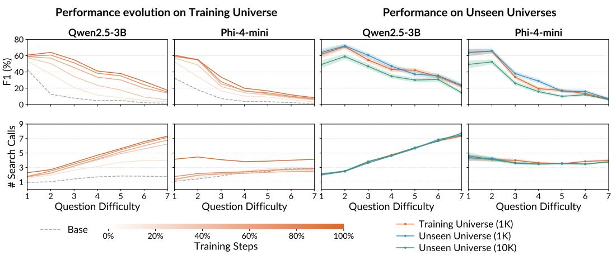  
Figure 7: F1 scores and number of search calls as a function of question difficulty (hops). We include fine-grained analysis for Qwen2.5-3B-Instruct and Phi-4-mini-instruct here, see Figure 3 and main text for full details.

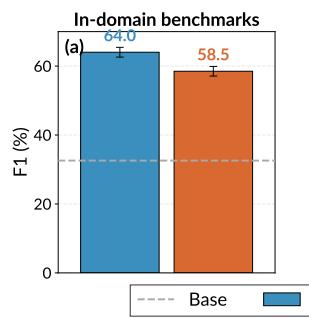

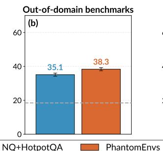

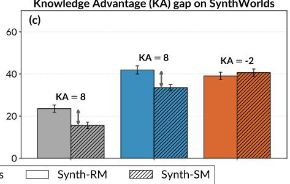  
Figure 8: Qwen2.5-7B-Instruct performance comparison of real and PhantomEnvironments. See Figure 4 and main text for full details.

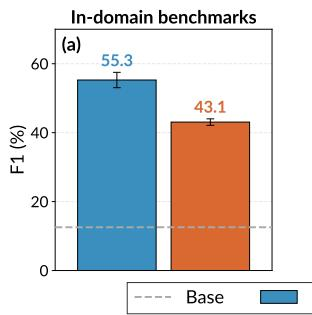

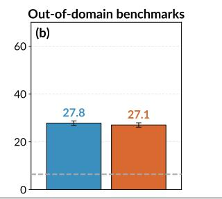

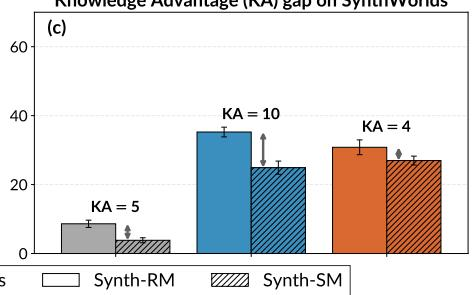  
Figure 9: Llama-3.2-3B-Instruct performance comparison of real and PhantomEnvironments. In out-of-domain benchmarks, PhantomEnvs training reduces but does not fully close the gap to NQ+HotpotQA training for Llama-3.2-3B-Instruct, unlike Qwen2.5 models. See Figure 4 and main text for full details.

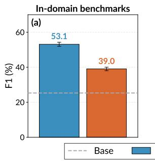

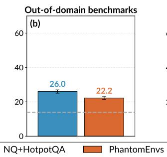

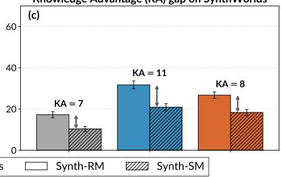  
Figure 10: Phi-4-mini-instruct performance comparison of real and PhantomEnvironments. In out-of-domain benchmarks, PhantomEnvs training reduces but does not fully close the gap to NQ+HotpotQA training for Phi-4-mini-instruct, unlike Qwen2.5 models. See Figure 4 and main text for full details.

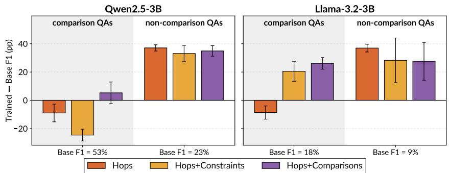  
Figure 11: F1 score deltas per question type of 2WikiMultihopQA benchmark after finetuning on Hops, Hops+Comparisons, and Hops+Constraints environments. We plot F1 score deltas on comparison and non-comparison questions: we calculate F1 score difference per question, average deltas for each category, and report the mean ± standard error (paired) in percentage points. Hops+Comparisons environment improves performance on evaluation comparison questions, but linear hops remains dominant otherwise.

<table><tr><td>Model</td><td> $\mathrm { P o p Q A S u b E M } ( \% , \uparrow )$ </td><td> $\mathrm { M M L U } \mathrm { A c c } ( \mathcal { T } o , \mathfrak { T } )$ </td><td> $\mathrm { W i k i - } 1 8 \mathrm { P P L } \left( \downarrow \right)$ </td></tr><tr><td>Qwen2.5-3B</td><td> $1 4 . 1 5 \pm 0 . 2 9$ </td><td> $6 6 . 3 7 \pm 0 . 3 8$ </td><td> $1 3 . 8 2 \pm 0 . 0 1$ </td></tr><tr><td>+ PhantomEnvs</td><td> $1 4 . 3 9 \pm 0 . 2 1$ </td><td> $6 6 . 5 1 \pm 0 . 2 8$ </td><td> $1 3 . 9 4 \pm 0 . 0 1$ </td></tr><tr><td> $+ \mathrm { N Q } \mathrm { + H o t p o t Q A }$ </td><td> $1 4 . 7 8 \pm 0 . 2 1$ </td><td> $6 6 . 3 8 \pm 0 . 2 7$ </td><td> $1 3 . 8 8 \pm 0 . 0 1$ </td></tr><tr><td>Qwen2.5-7B</td><td> $1 6 . 5 1 \pm 0 . 3 1$ </td><td> $7 4 . 2 7 \pm 0 . 3 5$ </td><td> $1 2 . 6 0 \pm 0 . 0 1$ </td></tr><tr><td> $+ \mathrm { P h a n t o m E n v s }$ </td><td> $1 6 . 6 5 \pm 0 . 2 3$ </td><td> $7 4 . 3 1 \pm 0 . 2 5$ </td><td> $1 2 . 7 9 \pm 0 . 0 2$ </td></tr><tr><td> $+ \mathrm { N Q } \mathrm { + H o t p o t Q A }$ </td><td> $1 6 . 4 4 \pm 0 . 2 4$ </td><td> $7 4 . 1 8 \pm 0 . 2 5$ </td><td> $1 2 . 6 5 \pm 0 . 0 4$ </td></tr><tr><td>Llama-3.2-3B</td><td> $1 4 . 7 5 \pm 0 . 3 0$ </td><td> $6 0 . 5 8 \pm 0 . 4 0$ </td><td> $1 7 . 4 2 \pm 0 . 0 1$ </td></tr><tr><td>+ PhantomEnvs</td><td> $1 4 . 8 7 \pm 0 . 2 2$ </td><td> $6 0 . 4 5 \pm 0 . 2 8$ </td><td> $1 7 . 6 6 \pm 0 . 0 2$ </td></tr><tr><td> $+ \mathrm { N Q } \mathrm { + H o t p o t Q A }$ </td><td> $1 3 . 9 8 \pm 0 . 2 1$ </td><td> $6 0 . 2 8 \pm 0 . 2 8$ </td><td> $1 7 . 7 3 \pm 0 . 0 1$ </td></tr><tr><td>Phi-4-mini</td><td> $1 7 . 5 9 \pm 0 . 3 2$ </td><td> $6 8 . 6 9 \pm 0 . 3 7$ </td><td> $1 6 . 7 4 \pm 0 . 0 1$ </td></tr><tr><td>+ PhantomEnvs</td><td> $1 5 . 5 0 \pm 0 . 3 0$ </td><td> $6 8 . 4 9 \pm 0 . 3 7$ </td><td> $1 7 . 8 7 \pm 0 . 0 1$ </td></tr><tr><td>+ NQ+HotpotQA</td><td> $1 6 . 8 6 \pm 0 . 3 1$ </td><td> $6 8 . 5 6 \pm 0 . 3 7$ </td><td> $1 6 . 8 9 \pm 0 . 0 1$ </td></tr></table>

Table 8: RL fine-tuning leaves pretrained knowledge and fluency intact. We measure parametric factual recall (PopQA SubEM metric (Mallen et al., 2023)), general knowledge and reasoning (MMLU accuracy (Hendrycks et al., 2020)), and language-modeling fluency on Wikipedia-2018 (perplexity, 1M passages randomly sampled from the 21M released by (Jin et al., 2025b)). PopQA does not degrade after fine-tuning (either synthetic or NQ+HotpotQA training), except Phi-4-miniinstruct + PhantomEnvs (−2.1 pp). MMLU accuracy is unchanged throughout after fine-tuning. Wiki-18 perplexity rises slightly after fine-tuning (1-2% relative, and 7% for Phi-4-mini-instruct + PhantomEnvs). Learning agentic search through RL therefore largely teaches procedural skill, one that can be learned in complement to the LLMs’ memorized parametric knowledge. This is in line with Chen et al. (2025a), who show that RL fine-tuning can retain parametric knowledge.

## B.1 SHORTCUT TRAJECTORIES FROM HOPS+CONSTRAINTS-TRAINED AGENTS

In Figures 5, 6 and 11, we observed that Hops+Constraints environment showed worse realworld transfer than the other environment complexity axes. We trace it to a shortcut that the Hops+Constraints environment unintentionally rewards during training. A constraint such as a specific date of birth or occupation is information-rich: a single dense-retrieval query that pastes the entire question often surfaces the gold document directly, because the rare attribute alone narrows the candidate set. The agent then never has to resolve the question chain one at a time, and can side-step question decomposition. Once this works in training, the behavior carries over at test time. We observe that the Hops+Constraints-trained agent issues the question verbatim as its first search on an overwhelming majority of real-world trajectories and almost always paraphrases the same query when retrieval fails. Whereas, the Hops-trained agent decomposes questions and reasons explicitly between turns, recovering the correct answer more often. We show one such trajectory pair verbatim below. Real-world benchmarks rarely include the kind of information-rich attribute filters that make the shortcut work, explaining why Hops+Constraints shows worse real-world transfer.

Here we copy two trajectories on the same question from MuSiQue evaluation—from Qwen2.5-3B Instruct fine-tuned on Hops+Constraints and on Hops. The contrast is in how the trained agents answer: the Hops+Constraints agent issues the question as a single monolithic query and only paraphrases it, while the Hops agent decomposes the question and reasons explicitly between turns. On this instance, only the decomposed trajectory recovers the correct answer.

Agent trained on Hops+Constraints (monolithic shortcut, wrong answer). The agent issues the question verbatim and then five near-duplicate paraphrases of the same monolithic query. The retrieved passages name both “Too Late for Goodbyes” (Julian Lennon’s own song) an “Hey Jude” (the McCartney song written for Julian Lennon as a child). Without decomposing through the bridge entity “Julian Lennon”, the agent cannot tell which one Paul McCartney wrote, and picks the wrong answer.

## MuSiQue, gold answer: “Hey Jude”

Question: What song did Paul McCartney write for the performer of Valotte?

<search> What song did Paul McCartney write for the performer of Valotte? </search>   
<search> What song did Paul McCartney write for Julian Lennon’s performer Valotte? </search> <search> What song did Paul McCartney write for Valotte? </search>   
<search> What song did Paul McCartney write for Julian Lennon’s Valotte performance? </search> <search> What song did Paul McCartney write for Julian Lennon’s Valotte performance? </search> <search> What song did Paul McCartney write for Julian Lennon’s Valotte performance? </search> <answer> Too Late for Goodbyes </answer>

Hops-trained agent (decomposed, correct answer). On the same question, the Hops-trained agent first plans the decomposition, then issues sub-questions that resolve the chain left-to-right: it first identifies the performer of Valotte, then asks which song McCartney wrote for that performer. We show the verbatim reasoning text between retrieval rounds.

## Same question, Hops-trained Qwen2.5-3B-Instruct

To find out what song Paul McCartney wrote for the performer of “Valotte,” let’s break this down into smaller parts.

1. Identify the performer of “Valotte.”

2. Determine which song Paul McCartney wrote for that performer.

Let’s start with finding the performer of “Valotte.”

<search> Who is the performer of the song “Valotte”? </search>

## [retrieved doc names Julian Lennon as the artist behind the album Valotte]

From the search results, it seems there might be a mix-up. The song “Valotte” mentioned in the question is likely referring to Julian Lennon’s song “Too Late for Goodbyes,” not any of the titles provided in the search results. Let’s verify this by checking if Julian Lennon is indeed the performer of “Too Late for Goodbyes.”

<search> Who is the performer of the song “Too Late for Goodbyes”? </search>

## [retrieved doc confirms Julian Lennon]

From the search results, we confirm that the performer of “Too Late for Goodbyes” is Julian Lennon. Next, we need to find out which song Paul McCartney wrote for Julian Lennon. <search> What song did Paul McCartney write for Julian Lennon? </search>

[retrieved doc explains “Hey Jude” was written by McCartney to comfort Julian Lennon during his parents’ divorce]

From the search results, we find that one of the songs Paul McCartney wrote for Julian Lennon is “Hey Jude.”

Therefore, the song Paul McCartney wrote for the performer of “Valotte” (which we determined to be Julian Lennon) is <answer> Hey Jude </answer>.