# PMOSFM: PRECONDITIONED MANIFOLD MATCHINGFOR ONE-STEP PHYSICS-CONSTRAINED GENERATION

Zhangyong Liang Department of Artificial Intelligence Westlake University liangzhangyong@westlake.edu.cn

Haibin Ling   
Department of Artificial Intelligence Westlake University   
linghaibin@westlake.edu.cn

## ABSTRACT

Physics-constrained generative models aim to generate physical fields that match a target distribution and satisfy prescribed constraints. However, enforcing these constraints often increases sampling costs through iterative corrections or training costs through residual optimization and trajectory unrolling. To address this issue, we introduce Preconditioned Manifold one-step Flow Matching (PMosFM), a preconditioned manifold matching framework for one-step physics-constrained generation. By encoding constraints in a manifold decoder, PMosFM learns transport in intrinsic coordinates without separate residual losses or terminal residual unrolling. A geometric preconditioner rescales coordinates using the decoderinduced metric, while a regularized covariance transform approximately whitens the interpolation-state inputs. A finite-interval objective couples velocity supervision with consistency between decoded endpoints in physical space. We show that exact parameterization removes residual-induced Gauss–Newton curvature, that geometric and covariance effects separate in a local conditioning bound, and that physical flow-map error bounds endpoint distributional error. Controlled ablations examine conditioning, and experiments evaluate optimizer-update time and memory footprint. At inference, PMosFM uses one neural transport evaluation followed by physical decoding. Experiments across benchmarks show lower training and sampling time than the multi-step baselines at comparable physical and distributional fidelity. Code and datasets will be released publicly.

## 1 INTRODUCTION

Flow matching (FM) learns probability transport from interpolation pairs and extends to functionvalued physical fields (Lipman et al., 2023; Kerrigan et al., 2024). FNO (Li et al., 2021) and Deep ONet (Lu et al., 2021) approximate deterministic PDE solution operators, while physics-informed training penalizes governing equation residuals (Raissi et al., 2019). In contrast, conservation-aware models and differentiable solvers project solutions onto constrained manifolds (Hansen et al., 2023; Negiar et al., 2023). For uncertain parameters or partial observations, physics-constrained genera-´ tion aims to recover distributions of physical states consistent with the prescribed constraints.

Physical information enters generative models through training losses or sampling operations. Physics-informed diffusion models penalize residuals during training (Bastek et al., 2025), while PCFT adapts pretrained flows through weak-form residuals (Tauberschmidt et al., 2026). CoCo-Gen and DiffusionPDE guide sampling with physical residuals (Jacobsen et al., 2025; Huang et al., 2024); D-Flow optimizes source noise through differentiable generation (Ben-Hamu et al., 2024). Projected diffusion applies constraint projections during sampling (Christopher et al., 2024).

Existing methods face different computational bottlenecks: inference-time projection vs. trainingtime unrolling. ECI (Cheng et al., 2025) and PCFM (Utkarsh et al., 2026) can reuse pretrained models, but constraint handling remains in the online sampling loop. PBFM (Baldan et al., 2026) avoids physics-specific correction at inference by adding residual-gradient computations and terminal unrolling during training. Studies of physics-informed learning also identify gradient imbal ance and ill-conditioning as optimization difficulties (Krishnapriyan et al., 2021; Wang et al., 2021; Cao & Zhang, 2025). Training-time enforcement shifts physics computation offline, while residual optimization and iterative learned transport remain. This raises a natural question: can physical constraint satisfaction and transport be unified to reduce both training and sampling costs?

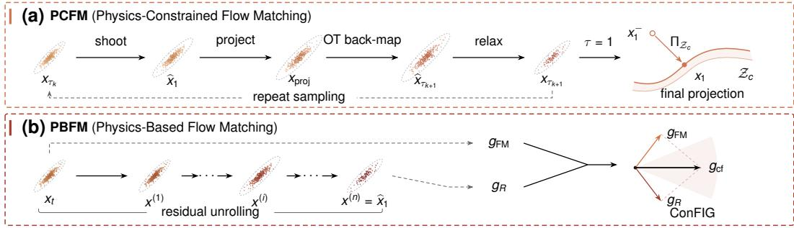

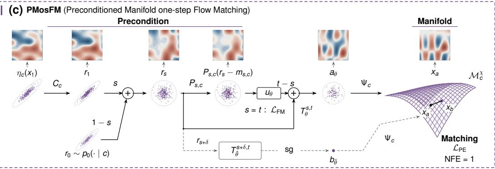  
Figure 1: Overview of PMosFM and representative physics-constrained methods. (a) PCFM projects a pre-correction endpoint $x _ { 1 } ^ { - }$ onto the feasible set $\mathcal { \hat { Z } } _ { c }$ using $\Pi _ { { \mathcal { Z } } _ { c } }$ . (b) PBFM combines flow and residual gradients gFM and $g _ { R }$ into the ConFIG direction $g _ { \mathrm { c f } } .$ . (c) PMosFM applies precondition– manifold–matching, using $\bar { T _ { \theta } ^ { 0 , 1 } }$ for one-step transport and $\Psi _ { c }$ for physical decoding.

Recent work reduces iterative generative transport through path straightening (Liu et al., 2023), consistency (Song et al., 2023), or direct finite-interval learning (Han et al., 2026). Physics-informed distillation further enables one-step physics-constrained generation (Zhang et al., 2026). However, one-step physical generation must address not only transport depth, but also the representation of feasible states and the metric in which finite-interval errors are measured. Meanwhile, manifold generative models extend transport to non-Euclidean state spaces (Mathieu & Nickel, 2020; De Bortol et al., 2022; Zhong et al., 2026), while preconditioned flow matching improves optimization under anisotropic interpolation statistics (Ahamed et al., 2026). Feasible coordinates expose two distinct conditioning factors: decoder-induced metric distortion and interpolation-state covariance.

In this work, we introduce Preconditioned Manifold one-step Flow Matching (PMosFM) to address these challenges via the proposed precondition–manifold–matching strategy. For an exact residual parameterization on the valid domain, PMosFM removes a separate residual penalty and terminal residual unrolling for the encoded constraints. Manifold and interpolation-state preconditioners condition feasible coordinates and network inputs. A finite-interval objective couples velocity supervision with endpoint consistency in physical space. Together, these components define a one-step generator evaluated by one finite-interval neural map followed by physical decoding (Fig. 1).

We summarize the main contributions as follows:

• One-step physics-constrained generation. We formulate finite-interval transport in feasible coordinates with one-step evaluation followed by physical decoding. For an exact parameterization on the valid domain, the representation enforces the encoded residual directly, replacing separate training penalties and repeated unrolling.

• Precondition–manifold–matching strategy. We formulate physical endpoint matching with geometric and input-covariance preconditioning. Velocity supervision at s = t learns the interpolation field, while endpoint consistency at s < t trains finite-interval transport in feasible coordinates.

• Feasibility, conditioning, and transport. We show that exact residual coordinates remove the Gauss–Newton curvature contributed by the encoded constraint, while geometric and statistical preconditioning control the conditioning of the remaining transport. We further bound endpoint distribution error by physical flow-map error and distinguish constraint satisfaction from matching the target law.

Table 1: Comparison between PMOSFM and other physics-constrained generative models.
<table><tr><td>Method</td><td>Physics at training</td><td>Hard constraints</td><td>Gradient-free inference</td><td>Complex constraints</td><td>No manual physics- fidelity balancing</td><td>One step sampling</td><td>Residual-factorized physics training</td><td>Spectral/Jacobian preconditioning</td></tr><tr><td>FFM [20]</td><td>×</td><td>√</td><td>√</td><td>X</td><td>×</td><td>X</td><td>×</td><td>×</td></tr><tr><td>FM-OT [24]</td><td>×</td><td>×</td><td>√</td><td>X</td><td>×</td><td>×</td><td>×</td><td>X</td></tr><tr><td>CoCoGen [19]</td><td>X</td><td>√</td><td>√</td><td>√</td><td>X</td><td>X</td><td>X</td><td>X</td></tr><tr><td>DiffusionPDE[18]</td><td>X</td><td>X</td><td>V</td><td>V</td><td>X</td><td>X</td><td>X</td><td>X</td></tr><tr><td>PIDM [4]</td><td>√</td><td>×</td><td>√</td><td>√</td><td>×</td><td>×</td><td>×</td><td>×</td></tr><tr><td>D-Flow [5]</td><td>×</td><td>×</td><td>√</td><td>√</td><td>×</td><td>×</td><td>X</td><td>×</td></tr><tr><td>ECI [8]</td><td>×</td><td>√</td><td>√</td><td>X</td><td>×</td><td>×</td><td>×</td><td>×</td></tr><tr><td>PCFM [40]</td><td>×</td><td>√</td><td>√</td><td>√</td><td>×</td><td>×</td><td>×</td><td>×</td></tr><tr><td>CCFM [23]</td><td>×</td><td>√</td><td>√</td><td>V</td><td>×</td><td>×</td><td>×</td><td>X</td></tr><tr><td>PCFT [38]</td><td>√</td><td>X</td><td>V</td><td>√</td><td>X</td><td>X</td><td>X</td><td>X</td></tr><tr><td>PBFM [3]</td><td>√</td><td>×</td><td>了</td><td></td><td>×</td><td>X</td><td>X</td><td>X</td></tr><tr><td>PMosFM</td><td>√</td><td>√</td><td></td><td></td><td>√</td><td>V</td><td>V</td><td>√</td></tr></table>

• Efficient training and one-step sampling. PMosFM reduces training time per update compared with training with residual unrolling and achieves faster convergence with the preconditioned residual-manifold formulation. Across five benchmarks, PMosFM outperforms the multi-step baselines in distributional accuracy and sampling speed, using a single network evaluation followed by physical decoding.

## 2 RELATED WORK

Physics-constrained generative modeling. Physics enters training through residual losses or virtual observables (Bastek et al., 2025; Rixner & Koutsourelakis, 2021). PBFM couples residual optimization, conflict-free gradients, and unrolling (Baldan et al., 2026; Liu et al., 2025), whereas PCFT applies weak-form fine-tuning (Tauberschmidt et al., 2026). Related approaches include residualgradient conditioning (Shu et al., 2023), diffusion posterior sampling (Chung et al., 2023), and manifold-constrained diffusion (Chung et al., 2022). During sampling, CoCoGen and Diffusion-PDE impose physical residuals (Jacobsen et al., 2025; Huang et al., 2024), while D-Flow optimizes source noise through differentiable generation (Ben-Hamu et al., 2024). Hard-constraint methods include ECI and PCFM (Cheng et al., 2025; Utkarsh et al., 2026), while projected diffusion (Christopher et al., 2024) and chance-constrained (Liang et al., 2025) flow matching provide alternative constraint-handling strategies.

One-step generative transport. FM learns velocity fields for finite-dimensional and functionvalued data (Lipman et al., 2023; Kerrigan et al., 2024). Stochastic interpolants unify flow and diffusion objectives (Albergo et al., 2025), while minibatch optimal transport modifies source–target coupling (Tong et al., 2024). Rectified flows simplify transport paths (Liu et al., 2023); consistency and shortcut models support one-step generation (Song et al., 2023; Frans et al., 2025). SoFlow combines flow matching with solution consistency for one-step generation (Luo et al., 2026). In staFlow distills a straightened flow (Liu et al., 2024), whereas MeanFlow learns finite-interval average velocities (Geng et al., 2025). W-Flow formulates one-step generation via distributional gradient flows (Han et al., 2026), whereas PIDDM enforces PDE constraints through post-hoc distillation for one-step generation (Zhang et al., 2026).

Manifold and preconditioning. Riemannian continuous flows, score models, and manifold ODEs incorporate prescribed non-Euclidean geometry (Mathieu & Nickel, 2020; De Bortoli et al., 2022; Lou et al., 2020). Manifold-aware FM extends vector-field regression to such spaces (Chen & Lipman, 2024), and Riemannian MeanFlow learns finite-interval transport through tangent-space alignment (Zhong et al., 2026). Preconditioned Flow Matching addresses interpolation-covariance anisotropy through invertible transformations (Ahamed et al., 2026).

Table 1 compares PMosFM with representative baselines, highlighting the preconditioned manifold formulation for one-step physics-constrained generation.

## 3 METHODOLOGY

## 3.1 PRELIMINARIES

Let $\mathcal { X } _ { h } \subseteq \mathbb { R } ^ { d }$ be the discrete state space on mesh h, with state $x \in \mathcal { X } _ { h }$ and d degrees of freedom. And let c collect the conditioning variables, including manifold, forcing, boundary data, observations, and physical time when applicable. We use $t \in [ 0 , 1 ]$ for sampling time, distinct from the physical time when included in c. For the physical residual $\bar { R _ { h } } ( \cdot , c )$ , define the feasible set

$$
\mathcal { Z } _ { c } = \{ x \in \mathcal { X } _ { h } : R _ { h } ( x , c ) = 0 \} .\tag{1}
$$

We model a regular component of $\mathcal { Z } _ { c }$ ; the residual specifies feasible support and a target law specifies probability mass on it. Physical errors are measured by $\| e \| _ { M _ { h } } ^ { 2 } \ = \ e ^ { \top } M _ { h } e$ , where $M _ { h }$ is a symmetric positive-definite quadrature matrix.

## 3.2 PHYSICS-BASED FLOW MATCHING

Let ν be the ambient source law and $p _ { \mathrm { d a t a } } ( \cdot \mid c )$ the conditional data law. For an endpoint pair $x _ { 0 } \sim \nu _ { 0 }$ and $x _ { 1 } \sim p _ { \mathrm { d a t a } } ( \cdot \mid c )$ , consider ambient flow matching along

$$
x _ { \tau } = ( 1 - \tau ) x _ { 0 } + \tau x _ { 1 } , \qquad w _ { x } = x _ { 1 } - x _ { 0 } ,\tag{2}
$$

where $\tau \in [ 0 , 1 ]$ . A neural velocity field $v _ { \phi } ,$ , with trainable parameters $\phi ,$ is fitted to $w _ { x }$ using

$$
\mathcal { L } _ { \mathrm { F M } } ^ { \mathrm { a m b } } = \mathbb { E } \bigg [ \frac { 1 } { 2 d } \left\| v _ { \phi } ( x _ { \tau } , \tau , c ) - w _ { x } \right\| _ { 2 } ^ { 2 } \bigg ] ,\tag{3}
$$

The expectation averages over sampled endpoint pairs and interpolation times, and over conditions when training jointly across c. Ambient interpolation may leave the feasible set, so existing methods impose physical constraints during training (Baldan et al., 2026) or sampling (Utkarsh et al., 2026). Residual penalties can make endpoint regression ill-conditioned (Lemma 3 in Appendix G; meshrefinement analysis in Appendix H.3).

## 3.3 PMOSFM: PRECONDITIONED MANIFOLD ONE-STEP FLOW MATCHING

PMosFM learns one-step transport on a represented feasible manifold, applying coordinate preconditioning and endpoint matching in physical space. Fig. 2 compares the methods in a schematic embedding space: (a) PCFM alternates full-space integration with iterative projection onto constraints; (b) PBFM steers full-space paths with residual gradients unrolling; and (c) PMosFM decodes two endpoint estimates and compares them on the represented residual manifold (inset).

Feasible parameterization. Let $y \in \mathcal { V } _ { c } \subset \mathbb { R } ^ { m }$ collect the m independent coordinates on the represented feasible component. On the represented regular region, assume a differentiable local parameterization $\chi _ { c } : \mathcal { V } _ { c } \to \mathcal { X } _ { h }$ whose Jacobian has m linearly independent columns and satisfies

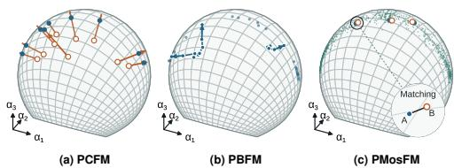  
Figure 2: Manifold coordinates and endpoint matching. Schematic comparison of PCFM, PBFM, and PMosFM.

$$
R _ { h } ( \chi _ { c } ( y ) , c ) = 0 \qquad \mathrm { f o r e v e r y } y \in \mathcal { V } _ { c } .\tag{4}
$$

The represented residual manifold is $\mathcal { M } _ { c } ^ { \chi } = \chi _ { c } ( \mathcal { Y } _ { c } ) \subseteq \mathcal { Z } _ { c }$ . Every decoded state satisfies the encoded constraints within the valid coordinate domain. Lemma 6 in Appendix H gives the differential characterization. The decoder and encoded-residual evaluator use the same discrete operators, boundary conditions, and sign conventions. The constant-rank and coordinate assumptions are stated in Appendix F. The encoder $\eta _ { c } : \mathcal { M } _ { c } ^ { \chi } \to \mathcal { V } _ { c }$ c returns coordinates satisfying $\chi _ { c } ( \eta _ { c } ( x ) ) = x$ for represented data. For data outside the represented set, encoding followed by decoding produces a measurable physical-metric projection (Appendix H.6). We distinguish parameterization error from velocityregression error.

Let $\mu _ { c } \in \mathbb { R } ^ { m }$ be a coordinate center and $C _ { c } \in \mathbb { R } ^ { m \times m }$ a fixed invertible transform that rescales physical error across coordinate directions. The coordinate and physical decoder are

$$
r = C _ { c } ( y - \mu _ { c } ) , \qquad \Psi _ { c } ( r ) = \chi _ { c } \bigl ( \mu _ { c } + C _ { c } ^ { - 1 } r \bigr ) .\tag{5}
$$

The valid r-domain is $C _ { c } ( \mathcal { V } _ { c } - \mu _ { c } )$ , and the results below assume that interpolation states and predicted endpoints remain in this domain. For a data sample $x _ { 1 } ~ \sim ~ p _ { \mathrm { d a t a } } ( \cdot ~ | ~ c )$ , set $r _ { 1 } =$ $\bar { C } _ { c } ( \eta _ { c } ( x _ { 1 } ) - \bar { \mu } _ { c } )$ . PMosFM pairs the encoded target $r _ { 1 }$ with a source sample $r _ { 0 } \sim p _ { 0 } ( \cdot \mid c )$ . The decoded target sample is $\Psi _ { c } ( r _ { 1 } )$ . Appendices H.6 and H.5 cover projection error and the co-area law under hard conditioning, respectively.

Manifold and preconditioning. Geometric preconditioning rescales the decoder-induced pullback metric in feasible coordinates to reduce local metric distortion, as illustrated in Fig. 3.

Let $J _ { \chi } ~ = ~ D _ { y } \chi _ { c }$ denote the decoder Jacobian. The physical error metric in the original coordinates is $G _ { c } ( y ) = { \cal J } _ { \chi } ( y , c ) ^ { \top } { \cal M } _ { h } { \cal J } _ { \chi } ( \bar { y } , c )$ . Under the coordinate transformation in Eq. 5, the metric in the r coordinates becomes

$$
\widetilde { G } _ { c } ( r ) = { C _ { c } ^ { - } } ^ { \top } G _ { c } ( y ) { C _ { c } ^ { - 1 } } .\tag{6}
$$

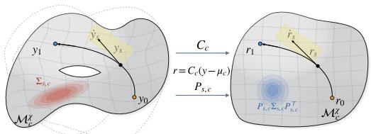

The transformation $C _ { c }$ rescales the pullback metric $\widetilde { G } _ { c }$ , while the endpoint loss in Eq. 12 is evaluated directly in physical space. For an interpolation pair $( r _ { 0 } , r _ { 1 } )$ , define

Figure 3: Preconditioned residual geometry. $y _ { i } = \mu _ { c } + C _ { c } ^ { - 1 } r _ { i } ;$ dots denote s-derivatives, with ${ \dot { r } } _ { s } = w$ and ${ \dot { y } } _ { s } = C _ { c } ^ { - 1 } w$

$$
\left\{ \begin{array} { l l } { r _ { s } = ( 1 - s ) r _ { 0 } + s r _ { 1 } , } \\ { w = r _ { 1 } - r _ { 0 } , \qquad 0 \leq s \leq 1 . } \end{array} \right.\tag{7}
$$

For each condition and generation time, define the input statistics and regularized preconditioner

$$
m _ { s , c } = \mathbb { E } [ r _ { s } \mid c ] , \quad \Sigma _ { s , c } = \operatorname { C o v } ( r _ { s } \mid c ) , \quad P _ { s , c } = ( \Sigma _ { s , c } + \varepsilon _ { P } I ) ^ { - 1 / 2 } ,\tag{8}
$$

where $m _ { s , c }$ and $\Sigma _ { s , c }$ are the conditional mean and covariance of $r _ { s } , \varepsilon _ { P } > 0$ regularizes the covariance, and I is the m × m identity.

The fixed $C _ { c }$ changes the coordinates used by $\Psi _ { c } ,$ whereas $P _ { s , c }$ rescales only the network inputs;   
neither changes the encoded physical target law (Appendix J).

Physical endpoint matching. PMosFM couples velocity supervision with endpoint consistency in physical space. The network uθ, with trainable parameters $\theta ,$ predicts an m-dimensional displacement rate in the r coordinates from preconditioned inputs. For $0 \leq s \leq t \leq 1$ , define the map from generation time s to t by

$$
T _ { \theta } ^ { s , t } ( r , c ) = r + ( t - s ) u _ { \theta } ( P _ { s , c } ( r - m _ { s , c } ) , s , t , c ) .\tag{9}
$$

The losses below are averaged over sampled pairs $( r _ { 0 } , r _ { 1 } )$ , times $( s , t , \delta )$ where used, and conditions c when training jointly. The $s = t$ branch retains ordinary flow matching:

$$
\mathcal { L } _ { \mathrm { F M } } = \mathbb { E } \left[ \frac { 1 } { 2 m } \left\| u _ { \theta } ( P _ { s , c } ( r _ { s } - m _ { s , c } ) , s , s , c ) - w \right\| _ { 2 } ^ { 2 } \right] .\tag{10}
$$

This term supervises the velocity of the interpolation path and retains the flow-matching anchor. For the $s < t$ endpoint-consistency branch, let δ be the separation between the two starting times, with $0 < \delta < t - s .$ . Set $r _ { s + \delta } = r _ { s } + \delta w$ . The two endpoint estimates are

$$
a _ { \theta } = T _ { \theta } ^ { s , t } ( r _ { s } , c ) , \qquad b _ { \bar { \theta } } = T _ { \bar { \theta } } ^ { s + \delta , t } ( r _ { s + \delta } , c ) ,\tag{11}
$$

where $\bar { \theta } \ = \ \operatorname { s g } ( \theta )$ The stopped-gradient branch takes a current-parameter copy; gradients are stopped through this branch. Because both branches predict the endpoint at time $t ,$ PMosFM compares their decoded physical states:

$$
\mathcal { L } _ { \mathrm { P E } } = \mathbb { E } \left[ \frac { \lVert \Psi _ { c } ( a _ { \theta } ) - \mathrm { s g } [ \Psi _ { c } ( b _ { \bar { \theta } } ) ] \rVert _ { M _ { h } } ^ { 2 } } { 2 m \delta ( t - s ) } \right] .\tag{12}
$$

In Algorithm 1, lowercase $\ell _ { \mathrm { F M } }$ and $\ell _ { \mathrm { P E } }$ denote minibatch estimates of the corresponding population losses. Within the valid coordinate domain, the decoded endpoints satisfy the encoded residual and are compared in physical space using $M _ { h }$

The complete loss is

$$
\mathcal { L } _ { \mathrm { P M o s F M } } = \gamma \mathcal { L } _ { \mathrm { F M } } + ( 1 - \gamma ) \mathcal { L } _ { \mathrm { P E } } .\tag{13}
$$

where the weight $\gamma \in [ 0 , 1 ]$ balances velocity supervision and physical-endpoint consistency.

Algorithm 1 summarizes the core PMosFM training and one-step sampling procedure. Algorithms 2 and 3 in Appendix B provide the complete training and sampling procedures.

Feasibility and conditioning. PMosFM evaluates the neural transport map, $\widehat { r } _ { 1 } = T _ { \theta } ^ { 0 , 1 } ( r _ { 0 } , c )$ and applies the explicit decoder $\widehat { x } _ { 1 } = \bar { \Psi } _ { c } ( \widehat { r } _ { 1 } )$

Proposition 1 (Exact feasibility). Forfixed c and $\widehat { r } _ { 1 }$ in the coordinate domain, Eq. 4 gives

$$
\begin{array} { r } { R _ { h } ( \widehat { x } _ { 1 } , c ) = 0 . } \end{array}\tag{14}
$$

The encoded residual vanishes on the valid $d o \mathrm { - }$ main, contributing no Gauss–Newton curvature (see Appendix H.2).

Algorithm 1 PMOSFM: training and sampling.   
Require: Data $p _ { \mathrm { d a t a } } ( x \mid c ) ,$ , source $p _ { 0 } ( r \mid c ) ,$ , model   
u , encoder–decoder $( \eta _ { c } , \chi _ { c } ) ,$ , metric $M _ { h } , \gamma .$   
1: Estimate $( \mu _ { c } , C _ { c } , m _ { s , c } , P _ { s , c } )$ ▷ Precondition   
2: while not converged do   
3: Select $c ;$ draw $( s , t , \delta )$   
4: $x _ { 1 } \sim p _ { \mathrm { d a t a } } ( \cdot \mid \stackrel { . } { c } ) , \ r _ { 0 } \sim p _ { 0 } ( \cdot \mid c )$   
5: $r _ { 1 } \gets C _ { c } ( \eta _ { c } ( x _ { 1 } ) - \mu _ { c } )$ ▷ Feasible manifold   
6: $r _ { s } \gets ( 1 - s ) r _ { 0 } + s r _ { 1 } , \quad w \gets r _ { 1 } - r _ { 0 }$   
7: $r _ { s + \delta } \gets r _ { s } + \delta w$   
8: Evaluate ℓFM in Eq. 10 ▷ Velocity anchor   
9: ${ \bar { \theta } } \gets \operatorname { s g } ( \theta )$   
10: $a _ { \theta }  T _ { \theta } ^ { s , t } ( r _ { s } , c ) , b _ { \bar { \theta } }  T _ { \bar { \theta } } ^ { s + \delta , t } ( r _ { s + \delta } , c )$   
11: Evaluate $\ell _ { \mathrm { P E } }$ in Eq. 12 ▷ Manifold matching   
12: $\theta  \mathrm { U p d a t e } [ \gamma \ell _ { \mathrm { F M } } + ( 1 - \gamma ) \ell _ { \mathrm { P E } } ]$   
13: end while   
14: $r _ { 0 } \sim p _ { 0 } ( \cdot \mid c ) _ { ; }$ $\widehat { r } _ { 1 } \gets T _ { \theta } ^ { 0 , 1 } ( r _ { 0 } , c )$ ▷ One-step   
15: $\widehat { x } _ { 1 } \gets \Psi _ { c } ( \widehat { r } _ { 1 } )$ ▷ Physical decode   
16: return xb

Consider a local velocity model linear in the preconditioned inputs, with coefficient matrix $A \ \in$ $\mathbb { R } ^ { m \times m }$ . Let $H _ { A } ^ { \mathrm { G N } }$ denote the Gauss–Newton matrix of the decoded-endpoint loss with respect to $A ,$ at fixed $s < t , c , \delta$ , and stopped-gradient target. Assume that the input covariance $P _ { s , c } \Sigma _ { s , c } P _ { s , c } ^ { \top }$ is positive definite and that the eigenvalues of $\widetilde { G } _ { c }$ lie in $[ \alpha , \beta ]$ throughout the evaluated endpoint region, with $0 < \alpha \le \beta$ . Proposition 13 in $\mathbf { A } _ { \mathbf { l } }$ ppendix J gives

$$
\kappa ( H _ { A } ^ { \mathrm { G N } } ) \leq \frac { \beta } { \alpha } \kappa \big ( P _ { s , c } \Sigma _ { s , c } P _ { s , c } ^ { \top } \big ) ,\tag{15}
$$

where κ denotes the condition number. The bound separates decoder-geometry and input-covariance effects; the appendices treat approximate decoders, endpoint error, and multiple local charts.

## 4 EXPERIMENTS

## 4.1 EXPERIMENTAL SETUP

Datasets. We evaluate PMosFM on Darcy flow, dynamic stall, and Kolmogorov-flow generation and reconstruction (Baldan et al., 2026), together with Burgers (Utkarsh et al., 2026). Turbulence forecasting and reconstruction use the existing turbulence benchmark (Oommen et al., 2026). We also evaluate a constrained-PDE reference suite with linear and nonlinear constraints. Dataset and evaluator details are provided in Appendices D.2 and C.

Baselines. We compare PMosFM with representative baselines that enforce physics constraints during training or sampling. Training-time methods include PBFM (Baldan et al., 2026); sampling-time methods include ECI (Cheng et al., 2025), PCFM (Utkarsh et al., 2026), D-Flow (Ben-Hamu et al., 2024), CoCoGen (Jacobsen et al., 2025), and DiffusionPDE (Huang

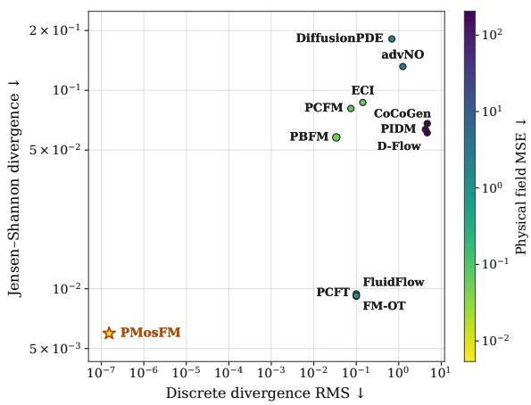  
Figure 4: Physical and sampling quality comparison. Lower divergence and MSE are better.

et al., 2024). Additional comparisons include PIDM (Bastek et al., 2025) and FM-OT (Lipman et al., 2023). Results taken from prior work are distinguished from locally obtained results.

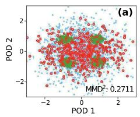

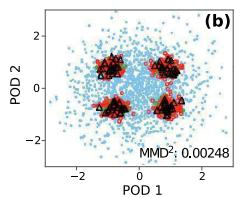

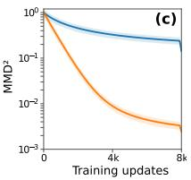  
Source ● Target ∆ Input at s=1  Transported  No preconditioning  With preconditioning

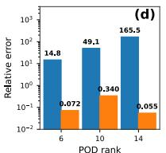

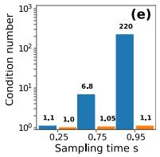

Figure 5: Preconditioning of feasible transport. (a) No preconditioning map. (b) With preconditioning map. (c) MMD2 convergence. (d) Low-variance mode error. (e) Interpolation conditioning.  
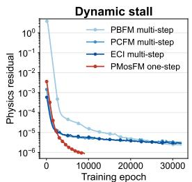

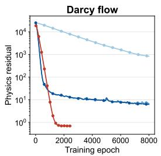

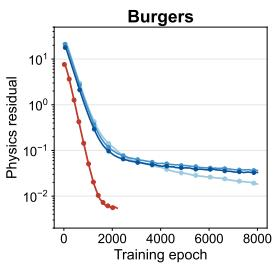  
Figure 6: Training-residual convergence across physics-constrained benchmarks.

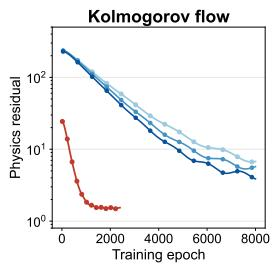

## 4.2 TRAINING AND SAMPLING EFFICIENCY

Training cost accounting. For each task, a common physical– distributional validation criterion defines the target quality. Training cost includes encoding and preconditioner calibration, prerequisite training, and optimizer updates up to the first checkpoint meeting this criterion; validation overhead is reported separately unless full elapsed time is measured. Table 2 shows lower optimizer-update time and peak memory for PMosFM than for every evaluated PBFM unrolling depth across all five tasks. For PBFM, both quantities generally increase with unrolling depth (Baldan et al., 2026). PMosFM re-

Table 2: Optimizer-update time (s) and peak CUDA memory (GB) across unrolling configurations.
<table><tr><td rowspan="2">Benchmark</td><td rowspan="2"></td><td colspan="3">PBFM</td><td rowspan="2">PMosFM† 0 unrolling</td></tr><tr><td>1 step 2 steps 3 steps 4 steps Sum</td><td></td><td></td></tr><tr><td>Darcy</td><td>[s] [GB]</td><td>0.067 0.098 12.6 23.3</td><td>0.128 33.7</td><td>0.159 0.452 44.2 114</td><td>0.019 0.128</td></tr><tr><td>Kolmogorov</td><td>[s] [GB] 4.52</td><td>0.194 0.302 6.91</td><td>0.410 9.56</td><td>0.518 1.42 12.2 33.2</td><td>0.021 0.143</td></tr><tr><td>Dynamic Stall</td><td>[s] [GB]</td><td>0.081 0.118 4.41 7.18</td><td>0.155 9.90</td><td>0.190 0.544 12.6 34.1</td><td>0.056 0.258</td></tr><tr><td>Turbulence reconstruction [ĠB]</td><td>[s]</td><td>1.38 1.51 13.3 19.1</td><td>1.47 24.8</td><td>1.63 5.99 30.6 87.8</td><td>0.930 3.50</td></tr><tr><td>Turbulence forecasting</td><td>[s] 0.038 [GB]1.53</td><td>0.080 2.30</td><td>0.098 3.07</td><td>0.099 0.315 3.83 10.7</td><td>0.021 0.584</td></tr></table>

moves residual unrolling, while the endpoint branches and physical decoder remain part of the training cost. The training trajectories in Fig. 6 show earlier residual reduction for PMosFM, consistent with the convergence benefit sought by preconditioned manifold matching. The optimization effects of preconditioning are evaluated in Section 4.5, with training efficiency detailed in Appendix D.1.

Sampling quality and inference cost. We next compare sampling quality and inference time under each benchmark’s evaluator. Fig. 4 shows physical consistency, distributional accuracy, and field error across the evaluated samplers. Further, Table 3 compares physical and distributional errors, learned-network evaluations, and inference time across five benchmarks. Baselines rely on multistep learned transport, requiring 20–200 network evaluations, whereas PMosFM performs one-step evaluation followed by physical decoding. In particular, PCFM enforces physical constraints during sampling and has higher inference time than PMosFM in Table 3. PMosFM also achieves competitive physical and distributional accuracy across the benchmarks in Table 3. Thus, PMosFM reduces sampling cost while maintaining competitive physical and distributional accuracy. The sampling time includes physical decoding; decoder tolerances and costs are detailed in Appendix O.2.

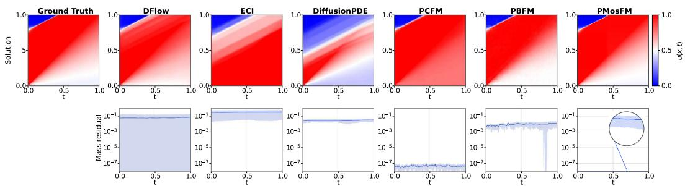  
Figure 7: Generated fields and conservation residuals across methods. The top row compares generated solutions, while the bottom row shows the conservation-residual trajectories.

## 4.3 PHYSICS-CONSTRAINED GENERATION

Constraint satisfaction and field fidelity. Across the physics-constrained benchmarks, PMosFM preserves the principal solution structure while keeping the encoded conservation residual near numerical precision, whereas several baselines retain localized violations around dominant transition regions (see Fig. 7). The quantitative results further show competitive distributional accuracy alongside constraint satisfaction (see Table 9 in Appendix D.3), indicating that improved physical consistency is achieved while retaining competitive distributional accuracy.

Held-out turbulence diagnostics. On held-out turbulence, PMosFM reproduces the characteristic tear-drop topology and non-Gaussian tails of the velocity-gradient statistics, while the baselines underrepresent extreme-strain events (see Fig. 13 in Appendix D.8). These statistics probe smallscale intermittency beyond the encoded constraint residual, showing that PMosFM retains fine-scale turbulence structure in one-step generation.

Table 3: Sampling quality and inference efficiency across benchmarks. RE: physical residual error; WD: Wasserstein distance; JS: Jensen–Shannon divergence; NFE: learned network evaluations; IT: inference time.
<table><tr><td>Benchmark</td><td>Metric</td><td>FM-OT</td><td>CoCoGen</td><td>PIDM</td><td>DiffusionPDE</td><td>D-Flow</td><td>ECI</td><td>PCFM</td><td>PBFM</td><td>PMosFM</td></tr><tr><td rowspan="5">Dynamic Stall</td><td> $\mathrm { R E } \times 1 0 ^ { 6 } \downarrow$   $\mathrm { W D \times 1 0 ^ { 4 } ~ \downarrow }$ </td><td>11.0 2.71</td><td>376 132</td><td> $2 . 9 6 \times 1 0 ^ { 3 }$  179</td><td>12.2 2.51</td><td>11.3 3.48</td><td>40.7 11.1</td><td>0.143 4.01</td><td>0.339 1.81</td><td>0.0421 0.842</td></tr><tr><td></td><td>0.983</td><td></td><td></td><td></td><td></td><td></td><td></td><td></td><td></td></tr><tr><td> $\mathrm { J S \times 1 0 ^ { 2 } \downarrow }$ </td><td></td><td>1.69</td><td>4.14</td><td>1.03</td><td>1.01</td><td>0.0570</td><td>7.46</td><td>0.680</td><td>0.0368</td></tr><tr><td>NFE↓</td><td>20 0.0598</td><td>100 0.184</td><td>100 0.0866</td><td>20 0.172</td><td>20</td><td>200</td><td>20</td><td>20</td><td>1</td></tr><tr><td>IT [s] ↓</td><td></td><td></td><td></td><td></td><td>0.139</td><td>0.432</td><td>3.91</td><td>0.0605</td><td>0.00338</td></tr><tr><td rowspan="5">Darcy Flow</td><td>RE↓  $\mathrm { \overline { { W D } } \times 1 0 ^ { 2 } ~ } ,$ </td><td>4.16</td><td>1.32</td><td>0.0220</td><td>3.39</td><td>2.29</td><td>3.05</td><td> $4 . 1 9 \times 1 0 ^ { 3 }$ </td><td>0.838</td><td>0.120</td></tr><tr><td>1</td><td>0.0590</td><td>0.249</td><td>3.10</td><td>0.0890</td><td>0.147</td><td>2.89</td><td>3.74</td><td>0.138</td><td>0.0490</td></tr><tr><td> $\mathrm { J S \times 1 0 ^ { 1 } \downarrow }$ </td><td>0.131</td><td>0.360</td><td>3.18</td><td>0.139</td><td>0.237</td><td>2.82</td><td>0.199</td><td>0.256</td><td>0.0139</td></tr><tr><td>NFE↓</td><td>20</td><td>100</td><td>100</td><td>20</td><td>20</td><td>20</td><td>20</td><td>20</td><td>1</td></tr><tr><td>IT [s] ↓</td><td>0.100</td><td>7.40</td><td>2.05</td><td>0.590</td><td>3.13</td><td>0.122</td><td>1.33</td><td>0.101</td><td>0.0178</td></tr><tr><td rowspan="5">Burgers</td><td> $\mathrm { R E } \times 1 0 ^ { 1 } \downarrow$ </td><td>4.30</td><td>404</td><td>1.57 × 103</td><td>3.66</td><td>3.62 × 103</td><td>0.818</td><td>0.473</td><td>0.307</td><td>0.0435</td></tr><tr><td> $\mathrm { W D \times 1 0 ^ { 2 } ~ \downarrow }$ </td><td>4.85</td><td>36.0</td><td>248</td><td>0.685</td><td>638</td><td>2.55</td><td>2.73</td><td>4.02</td><td>0.129</td></tr><tr><td> $\mathrm { J S \times 1 0 ^ { 2 } \downarrow }$ </td><td>1.92</td><td>12.3</td><td>31.5</td><td>0.184</td><td>52.4</td><td>0.809</td><td>0.884</td><td>1.43</td><td>0.0320</td></tr><tr><td>NFE↓</td><td>20</td><td>20</td><td>20</td><td>20</td><td>20</td><td>20</td><td>20</td><td>20</td><td>1</td></tr><tr><td>IT [s] ↓</td><td>0.0349</td><td>0.0354</td><td>0.0354</td><td>0.227</td><td>0.0354</td><td>0.0902</td><td>0.134</td><td>0.0913</td><td>0.00237</td></tr><tr><td rowspan="5">Kolmogorov Flow</td><td> $\mathrm { R E } \times 1 0 ^ { 1 } \downarrow$ </td><td>2.31</td><td>13.7</td><td>14.3</td><td>1.93</td><td>6.74</td><td>0.000</td><td>1.53</td><td>1.36</td><td>0.0842</td></tr><tr><td> $\mathrm { W D \times 1 0 ^ { 1 } \downarrow }$ </td><td>2.12</td><td>3.11</td><td>2.86</td><td>3.70</td><td>1.01</td><td>0.685</td><td>0.665</td><td>1.22</td><td>0.382</td></tr><tr><td> $\mathrm { J S \times 1 0 ^ { 2 } \downarrow }$ </td><td>12.5</td><td>29.1</td><td>29.2</td><td>19.4</td><td>16.8</td><td>7.10</td><td>6.87</td><td>7.44</td><td>1.84</td></tr><tr><td> $\mathrm { N F E \downarrow }$ </td><td>20</td><td>100</td><td>100</td><td>20</td><td>20</td><td>200</td><td>200</td><td>20</td><td>1</td></tr><tr><td>IT [] ↓</td><td>0.0988</td><td>0.0449</td><td>0.0506</td><td>0.268</td><td>6.43</td><td>0.385</td><td>0.792</td><td>0.0990</td><td>0.00375</td></tr><tr><td rowspan="5">Turbulence Flow Reconstruction</td><td> $\mathrm { R E } \times 1 0 ^ { 1 } \downarrow$ </td><td>5.28</td><td>1.52</td><td>12.1</td><td>0.767</td><td>9.52</td><td></td><td></td><td>0.192</td><td>0.0258</td></tr><tr><td> $\mathrm { W D \times 1 0 ^ { 2 } \downarrow }$ </td><td>2.47</td><td>1.35</td><td></td><td></td><td></td><td>0.521</td><td>0.521</td><td></td><td></td></tr><tr><td></td><td></td><td></td><td>3.68</td><td>1.01</td><td>2.85</td><td>1.54</td><td>1.49</td><td>1.19</td><td>0.684</td></tr><tr><td> $\mathrm { J S \times 1 0 ^ { 2 } \downarrow }$ </td><td>3.82</td><td>1.90 20</td><td>5.22</td><td>1.25</td><td>4.13</td><td>2.11</td><td>1.97</td><td>1.42</td><td>0.362</td></tr><tr><td>NFE↓  $\mathrm { I T } [ \mathrm { s } ] \downarrow$ </td><td>20 0.239</td><td>0.239</td><td>20 0.239</td><td>20 0.222</td><td>20 0.239</td><td>20 0.0301</td><td>20 0.0377</td><td>20 0.0268</td><td>1 0.00370</td></tr></table>

## 4.4 UNDERDETERMINED SPARSE RECONSTRUCTION

Physical constraints restrict the feasible set but leave sparse reconstruction underdetermined. Fig. 8 compares PMosFM and the baselines under identical observations and masks on a held-out state. As missingness increases, the baselines lose spatial organization; with 99% missing observations, they fail to recover the dominant structure of the reference kinetic-energy field, whereas PMosFM retains an identifiable large-scale pattern. At 99% missingness, PMosFM better preserves low-wavenumber energy and velocity-gradient PDF tails than the baselines. This test evaluates whether generated fields retain spatial and multiscale structure in unobserved regions beyond constraint satisfaction.

Table 4: One-step-core ablation within PMosFM. Energy distance (ED; ↓) is reported; lower is better. KF denotes Kolmogorov flow. Bold denotes the lowest available value in each benchmark row.
<table><tr><td>Benchmark</td><td>PMosFM- MeanFlow</td><td>PMosFM- iMF</td><td>PMosFM- W-Flow</td><td>PMosFM- Drifting</td><td>PMosFM- SoFlow</td><td>PMosFM- Shortcut</td><td>PMosFM- native</td></tr><tr><td>Burgers</td><td>0.0758</td><td>0.0765</td><td>0.0518</td><td>0.0713</td><td>0.0714</td><td>0.0849</td><td>0.0374</td></tr><tr><td>Dynamic Stall</td><td>0.1403</td><td>0.1315</td><td>0.0594</td><td>0.0442</td><td>0.1352</td><td>0.0455</td><td>0.0036</td></tr><tr><td>Darcy Flow</td><td>0.0277</td><td>0.0341</td><td>0.0163</td><td>0.0233</td><td>0.0317</td><td>0.0158</td><td>0.0043</td></tr><tr><td>KF Reconstruction</td><td>0.0144</td><td>0.0145</td><td>0.0574</td><td>0.0476</td><td>0.0249</td><td>0.0104</td><td>0.0037</td></tr><tr><td>KF Generation</td><td>2.0645</td><td>2.1278</td><td>1.6020</td><td>2.1451</td><td>2.0887</td><td>1.9672</td><td>1.5922</td></tr><tr><td>Turbulence Reconstruction</td><td>1.0776</td><td>1.0836</td><td>1.0829</td><td>1.0829</td><td>1.0727</td><td>0.9423</td><td>0.9632</td></tr><tr><td>Turbulence Forecasting</td><td>1.5448</td><td>1.4719</td><td>0.8767</td><td>0.8658</td><td>1.5019</td><td>0.9752</td><td>0.7507</td></tr></table>

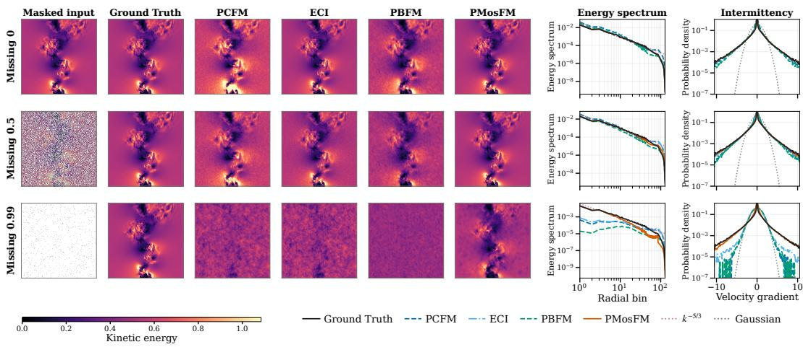  
Figure 8: Structural recovery under sparse observations. PMosFM retains large-scale structure under masking across field, spectral, and velocity-gradient diagnostics.

## 4.5 ABLATION STUDY

Ablation experiments isolate the effects of manifold parameterization, metric preconditioning, and endpoint regression. Fig. 5 shows that preconditioning improves distribution matching, reduces errors in low-variance modes, and stabilizes the interpolation covariance seen by the network. Together, these diagnostics connect the improved training behavior to the statistical conditioning targeted by PMosFM. Table 4 benchmarks different one-step velocity regression formulations within PMosFM using energy distance (ED). PMosFM gives the lowest ED on most benchmarks, whereas Shortcut is stronger on turbulence reconstruction. The variation suggests that the preferred one-step objective depends on the physical task. Additional ablation results are reported in Appendix E.

## 5 CONCLUSION

In this work, we present PMosFM, a precondition–manifold–matching framework for one-step physics-constrained generation that separates encoded feasibility from learned transport. Feasible coordinates remove encoded residual-normal directions, while geometric and interpolation-state preconditioning condition the remaining transport, and finite-interval matching compares decoded endpoints in physical space. Across the evaluated PDE settings, PMosFM achieves competitive physical and distributional fidelity with near-zero encoded residuals; controlled studies show better conditioning and faster distributional convergence with preconditioning. PMosFM also reduces measured optimizer-update time relative to PBFM, and one-step sampling with physical decoding lowers inference time compared with the evaluated multi-step baselines.

## AI USE STATEMENT

Generative AI tools were used to assist with manuscript organization, language editing, revision, and figure preparation. All AI-assisted content was reviewed and revised by the authors; experimental measurements were produced by the reported computational pipelines, and the mathematical derivations, experimental results, references were independently verified. The authors take full responsibility for the final content of this work, including all AI-assisted text and artifacts.

## REFERENCES

Shadab Ahamed, Eshed Gal, Md Shahriar Rahim Siddiqui, Simon Ghyselincks, Moshe Eliasof, and Eldad Haber. Preconditioned flow matching. arXiv preprint arXiv:2603.02337, 2026.

Michael S. Albergo, Nicholas M. Boffi, and Eric Vanden-Eijnden. Stochastic interpolants: A unifying framework for flows and diffusions. Journal of Machine Learning Research, 26(209):1–80, 2025.

Giacomo Baldan, Qiang Liu, Alberto Guardone, and Nils Thuerey. Physics vs distributions: Pareto optimal flow matching with physics constraints. In International Conference on Learning Representations, 2026.

Jan-Hendrik Bastek, WaiChing Sun, and Dennis Kochmann. Physics-informed diffusion models. In International Conference on Learning Representations, 2025.

Heli Ben-Hamu, Omri Puny, Itai Gat, Brian Karrer, Uriel Singer, and Yaron Lipman. D-Flow: Differentiating through flows for controlled generation. In Proceedings of the 41st International Conference on Machine Learning, volume 235 of Proceedings of Machine Learning Research, pp. 3462–3483. PMLR, 2024.

Wenbo Cao and Weiwei Zhang. An analysis and solution of ill-conditioning in physics-informed neural networks. Journal ofComputational Physics, 520:113494, 2025.

Ricky T. Q. Chen and Yaron Lipman. Flow matching on general geometries. In International Conference on Learning Representations, 2024.

Chaoran Cheng, Boran Han, Danielle C. Maddix, Abdul Fatir Ansari, Andrew Stuart, Michael W. Mahoney, and Bernie Wang. Gradient-free generation for hard-constrained systems. In International Conference on Learning Representations, 2025.

Jacob K. Christopher, Stephen Baek, and Ferdinando Fioretto. Constrained synthesis with projected diffusion models. In Advances in Neural Information Processing Systems, volume 37, pp. 89307– 89333, 2024.

Hyungjin Chung, Byeongsu Sim, Dohoon Ryu, and Jong Chul Ye. Improving diffusion models for inverse problems using manifold constraints. In Advances in Neural Information Processing Systems, volume 35, pp. 25683–25696, 2022.

Hyungjin Chung, Jeongsol Kim, Michael T. McCann, Marc L. Klasky, and Jong Chul Ye. Diffusion posterior sampling for general noisy inverse problems. In International Conference on Learning Representations, 2023.

Valentin De Bortoli, Emile Mathieu, Michael Hutchinson, James Thornton, Yee Whye Teh, and Ar-´ naud Doucet. Riemannian score-based generative modelling. In Advances in Neural Information Processing Systems, volume 35, pp. 2406–2422, 2022.

Kevin Frans, Danijar Hafner, Sergey Levine, and Pieter Abbeel. One step diffusion via shortcut models. In International Conference on Learning Representations, 2025.

Zhengyang Geng, Mingyang Deng, Xingjian Bai, J. Zico Kolter, and Kaiming He. Mean flows for one-step generative modeling. In Advances in Neural Information Processing Systems, volume 38, 2025.

Jiaqi Han, Puheng Li, Qiushan Guo, Renyuan Xu, Stefano Ermon, and Emmanuel J. Candes. One-\` step generative modeling via wasserstein gradient flows. arXiv preprint arXiv:2605.11755, 2026.

Derek Hansen, Danielle C. Maddix, Shima Alizadeh, Gaurav Gupta, and Michael W. Mahoney. Learning physical models that can respect conservation laws. In Proceedings of the 40th International Conference on Machine Learning, volume 202 of Proceedings of Machine Learning Research, pp. 12469–12510. PMLR, 2023.

Maximilian Herde, Bogdan Raonic, Tobias Rohner, Roger K´ appeli, Roberto Molinaro, Emmanuel¨ de Bezenac, and Siddhartha Mishra. Poseidon: Efficient foundation models for PDEs. In´ Advances in Neural Information Processing Systems, volume 37, pp. 72525–72624, 2024.

Jiahe Huang, Guandao Yang, Zichen Wang, and Jeong Joon Park. DiffusionPDE: Generative PDEsolving under partial observation. In Advances in Neural Information Processing Systems, volume 37, pp. 130291–130323, 2024.

Christian Jacobsen, Yilin Zhuang, and Karthik Duraisamy. CoCoGen: Physically consistent and conditioned score-based generative models for forward and inverse problems. SIAM Journal on Scientific Computing, 47(2):C399–C425, 2025.

Gavin Kerrigan, Giosue Migliorini, and Padhraic Smyth. Functional flow matching. In Proceedings of the 27th International Conference on Artificial Intelligence and Statistics, volume 238 of Proceedings ofMachine Learning Research, pp. 3934–3942. PMLR, 2024.

Aditi Krishnapriyan, Amir Gholami, Shandian Zhe, Robert Kirby, and Michael W. Mahoney. Characterizing possible failure modes in physics-informed neural networks. In Advances in Neural Information Processing Systems, volume 34, pp. 26548–26560, 2021.

Zongyi Li, Nikola Kovachki, Kamyar Azizzadenesheli, Burigede Liu, Kaushik Bhattacharya, Andrew Stuart, and Anima Anandkumar. Fourier neural operator for parametric partial differential equations. In International Conference on Learning Representations, 2021.

Jinhao Liang, Yixuan Sun, Anirban Samaddar, Sandeep Madireddy, and Ferdinando Fioretto. Chance-constrained flow matching for high-fidelity constraint-aware generation. arXiv preprint arXiv:2509.25157, 2025.

Yaron Lipman, Ricky T. Q. Chen, Heli Ben-Hamu, Maximilian Nickel, and Matthew Le. Flow matching for generative modeling. In International Conference on Learning Representations, 2023.

Qiang Liu, Mengyu Chu, and Nils Thuerey. ConFIG: Towards conflict-free training of physicsinformed neural networks. In International Conference on Learning Representations, 2025.

Xingchao Liu, Chengyue Gong, and Qiang Liu. Flow straight and fast: Learning to generate and transfer data with rectified flow. In International Conference on Learning Representations, 2023.

Xingchao Liu, Xiwen Zhang, Jianzhu Ma, Jian Peng, and Qiang Liu. InstaFlow: One step is enough for high-quality diffusion-based text-to-image generation. In International Conference on Learning Representations, 2024.

Aaron Lou, Derek Lim, Isay Katsman, Leo Huang, Qingxuan Jiang, Ser-Nam Lim, and Christopher M. De Sa. Neural manifold ordinary differential equations. In Advances in Neural Information Processing Systems, volume 33, pp. 17548–17558, 2020.

Lu Lu, Pengzhan Jin, Guofei Pang, Zhongqiang Zhang, and George Em Karniadakis. Learning nonlinear operators via DeepONet based on the universal approximation theorem of operators. Nature Machine Intelligence, 3(3):218–229, 2021.

Tianze Luo, Haotian Yuan, and Zhuang Liu. SoFlow: Solution flow models for one-step generative modeling. In International Conference on Learning Representations, 2026.

Emile Mathieu and Maximilian Nickel. Riemannian continuous normalizing flows. In Advances in Neural Information Processing Systems, volume 33, pp. 2503–2515, 2020.

Geoffrey Negiar, Michael W. Mahoney, and Aditi S. Krishnapriyan. Learning differentiable solvers´ for systems with hard constraints. In International Conference on Learning Representations, 2023.

Vivek Oommen, Siavash Khodakarami, Aniruddha Bora, Zhicheng Wang, and George Em Karniadakis. Learning turbulent flows with generative models for super resolution and sparse flow reconstruction. Nature Communications, 17:3707, 2026.

Maziar Raissi, Paris Perdikaris, and George E. Karniadakis. Physics-informed neural networks: A deep learning framework for solving forward and inverse problems involving nonlinear partial differential equations. Journal ofComputational Physics, 378:686–707, 2019.

Maximilian Rixner and Phaedon-Stelios Koutsourelakis. A probabilistic generative model for semisupervised training of coarse-grained surrogates and enforcing physical constraints through virtual observables. Journal ofComputational Physics, 434:110218, 2021.

Dule Shu, Zijie Li, and Amir Barati Farimani. A physics-informed diffusion model for high-fidelity flow field reconstruction. Journal ofComputational Physics, 478:111972, 2023.

Yang Song, Prafulla Dhariwal, Mark Chen, and Ilya Sutskever. Consistency models. In Proceedings of the 40th International Conference on Machine Learning, volume 202 of Proceedings of Machine Learning Research, pp. 32211–32252. PMLR, 2023.

Jan Tauberschmidt, Sophie Fellenz, Sebastian J. Vollmer, and Andrew B. Duncan. Physicsconstrained fine-tuning of flow-matching models for generation and inverse problems. In In ternational Conference on Learning Representations, 2026.

Alexander Tong, Kilian Fatras, Nikolay Malkin, Guillaume Huguet, Yanlei Zhang, Jarrid Rector-Brooks, Guy Wolf, and Yoshua Bengio. Improving and generalizing flow-based generative model with minibatch optimal transport. Transactions on Machine Learning Research, 2024.

Utkarsh Utkarsh, Pengfei Cai, Alan Edelman, Rafael Gomez-Bombarelli, and Christopher Rackauckas. Physics-constrained flow matching: Sampling generative models with hard constraints. Advances in Neural Information Processing Systems, 38:160217–160252, 2026.

Sifan Wang, Yujun Teng, and Paris Perdikaris. Understanding and mitigating gradient flow pathologies in physics-informed neural networks. SIAM Journal on Scientific Computing, 43(5):A3055– A3081, 2021.

Jian Xu, Yanning Wu, Delu Zeng, John Paisley, and Qibin Zhao. The right measure for physicsconstrained generation: A co-area correction for posterior-consistent pde inverse problems. arXiv preprint arXiv:2606.04804, 2026.

Yi Zhang, Peng Wang, and Difan Zou. Physics-informed distillation of diffusion models for PDEconstrained generation. In Forty-third International Conference on Machine Learning, 2026.

Zichen Zhong, Haoliang Sun, Yukun Zhao, Yongshun Gong, and Yilong Yin. Riemannian Mean-Flow for one-step generation on manifolds. In International Conference on Machine Learning, 2026.

## A NOTATION

This table summarizes the notation adopted throughout the paper and appendix. Symbols are grouped by residual manifold, preconditioning, and finite-interval matching.

Table 5: Summary of the notation adopted throughout the paper and appendix.
<table><tr><td>Symbol</td><td>Name</td><td>Description</td></tr><tr><td> $( x , \mathcal { X } _ { h } , c , h )$ </td><td>state space, condition, mesh</td><td> $x \in \mathcal { X } _ { h } \subseteq \mathbb { R } ^ { d }$  is a discretized physical state; c is the condition; h is the spatial discretization.</td></tr><tr><td> $R _ { h } ( x , c ) \in \mathbb { R } ^ { n _ { R } }$ </td><td>discrete residual</td><td>Residual that evaluates the hard physical constraint;  $n _ { R }$  is the number of residual components.</td></tr><tr><td> $( \mathcal { Z } _ { c } , \mathcal { M } _ { c } ^ { \chi } )$ </td><td>residual-zero set</td><td> $\mathcal { Z } _ { c } = \{ \boldsymbol { x } : R _ { h } ( \boldsymbol { x } , \boldsymbol { c } ) = 0 \} ; \mathcal { M } _ { c } ^ { x } = \chi _ { c } ( \mathcal { V } _ { c } ) \subseteq \mathcal { Z } _ { c }$  is the component represented by the model.</td></tr><tr><td> $( y , \mathcal { Y } _ { c } , m )$ </td><td>intrinsic coordinates</td><td> $y \in \mathcal { V } _ { c } \subset \mathbb { R } ^ { m }$  represents the independent degrees of freedom;  $m = d - q$  under the regular-rank assumption.</td></tr><tr><td> $( \chi _ { c } , \eta _ { c } )$ </td><td>constraint-satisfying parameterization</td><td> $R _ { h } \circ \chi _ { c } \equiv 0 ; \eta _ { c }$  encodes feasible data or provides a measurable selection.</td></tr><tr><td> $( J _ { x } , J _ { R } )$ </td><td>and encoder coordinate and residual Jacobians</td><td> $J _ { \chi } = D _ { y } \chi _ { c } , J _ { R } = D _ { x } R _ { h }$  satisfy  $J _ { R } J _ { \chi } = 0 ;$  regular-rank conditions identify range  $J _ { \chi }$  with the tangent space.</td></tr><tr><td> $( M _ { h } , M _ { x } )$ </td><td>physical metric</td><td>Fixed positive-definite physical or quadrature metric;  $M _ { x }$  abbreviates  $M _ { h }$  when h is implicit.</td></tr><tr><td> $G _ { c } ( y )$ </td><td>pullback metric</td><td>Physical metric in intrinsic coordinates:  $\begin{array} { r } { G _ { c } ( y ) = J _ { \chi } ( y , c ) ^ { \top } M _ { h } J _ { \chi } ( y , c ) . } \end{array}$ </td></tr><tr><td> $\left( C _ { c } , \mu _ { c } , \Psi _ { c } \right)$ </td><td>geometric setting</td><td> $r = C _ { c } ( y - \mu _ { c } ) \mathrm { a n d } \Psi _ { c } ( r ) = \chi _ { c } ( \mu _ { c } + C _ { c } ^ { - 1 } r ) .$ </td></tr><tr><td> $( r _ { 0 } , r _ { 1 } , r _ { s } , w )$ </td><td>interpolation pair</td><td> $r _ { s } = ( 1 - s ) r _ { 0 } + s r _ { 1 }$  and  $w = r _ { 1 } - r _ { 0 }$ </td></tr><tr><td> $( m _ { s , c } , \Sigma _ { s , c } , P _ { s , c } )$ </td><td>input preconditioner</td><td>Mean, covariance, and  $P _ { s , c } = ( \Sigma _ { s , c } + \varepsilon _ { P } I ) ^ { - 1 / 2 } .$ </td></tr><tr><td> $( T _ { \theta } ^ { s , t } , u _ { \theta } )$ </td><td>finite-interval map</td><td> $T _ { \theta } ^ { s , t } ( r , c ) = r + ( t - s ) u _ { \theta } ( P _ { s , c } ( r - m _ { s , c } ) , s , t , c ) .$ </td></tr><tr><td> $( a _ { \theta } , b _ { \bar { \theta } } )$ </td><td>and velocity endpoint estimates</td><td>Endpoint estimates from nearby interpolation times, with</td></tr><tr><td> $\left( \boldsymbol { \mathcal { L } } _ { \mathrm { F M } } , \boldsymbol { \mathcal { L } } _ { \mathrm { P E } } \right)$ </td><td>matching losses</td><td>gradients stopped through the second branch. Diagonal velocity FM loss and off-diagonal</td></tr><tr><td> $( e _ { \theta } , d _ { \theta } )$ </td><td></td><td>decoded-endpoint loss. Coordinate flow-map defect and the corresponding</td></tr><tr><td> $( \gamma , \delta , \varepsilon _ { P } )$ </td><td>map defects matching parameters</td><td>decoded physical defect. Branch weight, finite-difference interval, and covariance</td></tr><tr><td> $( a , J _ { G } )$ </td><td>differentiation variable and</td><td>regularizer. a is an input or parameter;  $J _ { G } = D _ { a } G _ { \phi }$  is the</td></tr><tr><td> $H _ { \mathrm { G N } , a } ^ { R }$ </td><td>endpoint Jacobian residual Gauss-Newton</td><td>corresponding endpoint Jacobian.  $J _ { G } ^ { \top } J _ { R } ^ { \top } W _ { R } J _ { R } J _ { G } ;$  exact residual factorization makes this block vanish for the encoded residual after composition</td></tr><tr><td> $\left( \varepsilon _ { \mathrm { c h a r t } } , \delta _ { \mathrm { c h a r t } } \right)$ </td><td>block approximation error</td><td>with the decoder. Bounds on residual magnitude and pulled-back residual</td></tr><tr><td> $( \sigma _ { \mathrm { m i n } } ^ { + } , \kappa _ { + } )$ </td><td>bounds active spectral</td><td>differential. Smallest nonzero singular value and condition number on</td></tr></table>

## B DETAILED TRAINING AND SAMPLING PROCEDURES

The main-text algorithm exposes the computation that distinguishes PMosFM. This appendix separates calibration and training from one-step physical sampling.

Algorithm 2 Full training procedure of PMosFM Algorithm 3 Full one-step sampling   
Require: Data $p _ { \mathrm { d a t a } } ( x \mid c ) ;$ source $p _ { 0 } ( r \mid c )$ procedure of PMosFM   
Model u ; encoder–decoder $( \eta _ { c } , \chi _ { c } )$ Require: Trained θ; source $p _ { 0 } ( r \mid c ) ;$ con-  
Metric $M _ { h } ; \gamma ; \varepsilon _ { P }$ dition $c ;$ frozen $( \mu _ { c } , \bar { C } _ { c } , \dot { m } \dot { } _ { 0 , c } , \dot { P } _ { 0 , c } ) ;$   
Ensure: Trained θ and frozen $( \mu _ { c } , C _ { c } , m _ { s , c } , P _ { s , c } )$ decoder $\Psi _ { c }$   
1: Estimate $( \mu _ { c } , C _ { c } )$ from the training data Ensure: Physics-consistent sample $\widehat { x } _ { 1 }$   
2: Using $r _ { 1 } = C _ { c } ( \dot { \eta } _ { c } ( x _ { 1 } ) - \mu _ { c } )$ and 1: Sample $\dot { \boldsymbol { r } } _ { 0 } \sim p _ { 0 } ( \cdot \mid c )$   
$r _ { s } = ( 1 - s ) r _ { 0 } + s r _ { 1 } ,$ estimate $m _ { s , c } \gets \mathbb { E } [ r _ { s } \mid c ] ,$ 2: Form the centered source coordinate   
$\Sigma _ { s , c }  \mathrm { C o v } ( r _ { s } \mid c ) , \quad P _ { s , c }  ( \Sigma _ { s , c } + \varepsilon _ { P } I ) ^ { - 1 / 2 }$   
3: Fix $( \mu _ { c } , C _ { c } , m _ { s , c } , P _ { s , c } )$ $r _ { 0 } - m _ { 0 , c }$   
4: while not converged do   
3: Apply the frozen input preconditioner   
5: Select $c ;$ draw $0 \leq s < t \leq 1$ and $0 < \delta < t - s$   
6: $x _ { 1 } \sim p _ { \mathrm { d a t a } } ( \cdot \mid c ) , r _ { 0 } \sim p _ { 0 } ( \cdot \mid c )$ $P _ { 0 , c } ( r _ { 0 } - m _ { 0 , c } )$   
$r _ { 1 } \gets C _ { c } ( \eta _ { c } ( x _ { 1 } ) - \mu _ { c } )$   
7: $r _ { s } \gets ( 1 - s ) r _ { 0 } + s r _ { 1 } , w \gets r _ { 1 } - r _ { 0 }$ 4: Evaluate the full-interval map once   
$r _ { s + \delta } \gets r _ { s } + \delta w$ $\widehat { r } _ { 1 } \gets T _ { \theta } ^ { 0 , 1 } ( r _ { 0 } , c )$   
8: $\ell _ { \mathrm { F M } } \gets \frac { 1 } { 2 m } \left\| u _ { \boldsymbol { \theta } } ( P _ { s , c } ( r _ { s } - m _ { s , c } ) , s , s , c ) - w \right\| _ { 2 } ^ { 2 }$   
5: Expand the one-step map as   
9: ${ \bar { \theta } } \gets \operatorname { s g } ( \theta )$   
10: $a _ { \theta } \gets T _ { \theta } ^ { s , t } ( r _ { s } , c ) = r _ { s } + ( t - s ) u _ { \theta } \big ($ $\widehat { r } _ { 1 } = r _ { 0 } + u _ { \theta } ( P _ { 0 , c } ( r _ { 0 } - m _ { 0 , c } ) , 0 , 1 , c )$   
$P _ { s , c } ( r _ { s } - m _ { s , c } ) , s , t , c )$ 6: Apply the inverse geometric transform   
11: $b _ { \bar { \theta } } \gets T _ { \bar { \theta } } ^ { s + \delta , t } ( r _ { s + \delta } , c ) = r _ { s + \delta } + ( t - s - \delta ) u _ { \bar { \theta } } ($   
$P _ { s + \delta , c } ( r _ { s + \delta } - m _ { s + \delta , c } ) , s + \delta , t , c )$ $\mu _ { c } + C _ { c } ^ { - 1 } \widehat { r } _ { 1 }$   
$\ell _ { \mathrm { P E } } \gets \frac { \lVert \Psi _ { c } ( a _ { \theta } ) - \mathrm { s g } [ \Psi _ { c } ( b _ { \bar { \theta } } ) ] \rVert _ { { M _ { h } } } ^ { 2 } } { \hat { \mathbf { \Omega } } \cdot \mathbf { \Omega } }$ 7: Decode on the feasible manifold   
12:   
13: $\theta \mathop { \longleftarrow } \mathrm { U p d a t e } [ \theta , \gamma \ell _ { \mathrm { F M } } + ( \stackrel { , } { 1 } - \gamma ) \ell _ { \mathrm { P E } } ]$ $\overline { { 2 m \delta ( t - s ) } }$ $\widehat { x } _ { 1 } \gets \chi _ { c } \big ( \mu _ { c } + C _ { c } ^ { - 1 } \widehat { r } _ { 1 } \big ) = \Psi _ { c } ( \widehat { r } _ { 1 } )$   
14: end while 8: return $\widehat { x } _ { 1 }$   
15: return θ and $( \mu _ { c } , C _ { c } , m _ { s , c } , P _ { s , c } )$

The calibration quantities are estimated from the training split and then held fixed. Algorithm 2 expands the two-time objective in Eq. 13, while Algorithm 3 evaluates $T _ { \theta } ^ { 0 , 1 }$ once before physical decoding. Iterations in a solver-based decoder belong to physical decoding rather than learned transport and are accounted for separately in Appendix O.2.

## C DATASET DETAILS

This section records the PDE system, data split, conditioning variables, normalization, and physical diagnostic for each benchmark. The evaluated tasks cover elliptic flow, nonlinear conservation laws, compressible aerodynamics, turbulence, and inverse problems. All normalization statistics are estimated on the training partition and remain fixed for validation and test data. Generated fields are mapped back to physical units before residual evaluation whenever inverse normalization is available. Each benchmark-specific comparison shares one split and one evaluator. When the benchmark provides the state, forcing, manifold, and boundary variables required by the governing equations, we evaluate the full prescribed residual; otherwise, we report the identifiable residual components.

## C.1 DARCY FLOW

Each sample contains a pressure field $p ( { \pmb x } )$ and permeability field $K ( { \pmb x } )$ on a two-dimensional grid. The data follow the steady Darcy system

$$
\pmb { u } = - K \nabla p , \qquad \nabla \cdot \pmb { u } = \ b { f } , \qquad \pmb { u } \cdot \pmb { n } = 0 \mathrm { o n } \partial \Omega , \qquad \int _ { \Omega } p \mathrm { d } \pmb { x } = 0 .
$$

The benchmark pairs log-Gaussian permeability with steady Darcy pressure, following PBFM (Baldan et al., 2026). Both fields are standardized by channel. For common evaluation, predictions are de-normalized before applying the prescribed residual operator.

## C.2 DYNAMIC STALL

The data are obtained from unsteady compressible two-dimensional RANS simulations of a sinusoidally pitching NACA0012 airfoil (Baldan et al., 2026). The operating condition contains the free-stream Mach number, mean angle of attack, pitching amplitude, and reduced frequency. The dataset contains 128 nominal training conditions with 32 realizations per condition and 16 held-out conditions. The six generated channels encode pressure, two tangential-velocity-gradient components, temperature, density, and signed wall shear stress on a $1 2 8 \times 1 2 8$ spatio-temporal surface grid; two additional channels provide the local surface direction. After de-normalization, the two algebraic residuals are

$$
r _ { \mathrm { g a s } } = p - \rho R T , \qquad r _ { \tau } = \tau _ { w } - \mathrm { s i g n } ( \pmb { \mu } \cdot \pmb { s } ) \| \pmb { \mu } \| _ { 2 } ,
$$

where $\mu = \mu ( T ) ( \partial _ { x } u _ { s } , \partial _ { y } u _ { s } ) ,$ , s is the local surface direction, and $\mu ( T )$ is given by Sutherland’s law. The manifold-conditioned implementation follows the same local direction as the external residual, so the parameterization and evaluator share a sign convention.

## C.3 BURGERS

The Burgers benchmark consists of trajectories at viscosity $\nu = 1 0 ^ { - 3 }$ . The first 1,000 trajectories form the training partition, indices 1,000–1,499 form validation, and the remaining trajectories form the test partition. We remove the duplicated terminal slice and standardize the resulting space–time field with training statistics. For a generated trajectory $u ( t , x )$ , the diagnostic is

$$
r _ { \mathrm { B } } = \partial _ { t } u + u \partial _ { x } u - \nu \partial _ { x x } u ,
$$

with centered differences, periodic padding in space, and replicated temporal endpoints. We also apply periodic RK4 pseudospectral evolution; because its discretization differs from the finitedifference evaluator, we report solver results separately from residual RMS.

## C.4 TURBULENCE MASS TRANSFER

Each sample contains horizontal velocity, vertical velocity, pressure, and signed distance to the immersed manifold as four aligned channels. The first 900 samples form the training set, and the remainder forms the validation set with channel-wise training normalization. From these variables, we define a field-level manifold-consistency evaluator comprising discrete incompressibility, normal velocity near the zero level set, signed-distance Eikonal error, and weak pressure smoothness:

$$
R _ { \mathrm { T M T } } = \big [ \boldsymbol { \nabla } { \cdot } \boldsymbol { u } , e ^ { - ( \phi / \delta ) ^ { 2 } } \boldsymbol { u } { \cdot } \boldsymbol { n } _ { \phi } , 0 . 2 ( \| \boldsymbol { \nabla } \phi \| _ { 2 } - 1 ) , 0 . 0 2 \Delta p \big ] .
$$

## C.5 KOLMOGOROV FLOW

The conditional dataset is generated at Reynolds numbers in [100, 500] on a $1 2 8 \times 1 2 8$ periodic grid. The training set covers 32 Reynolds numbers and the held-out set 16 Reynolds numbers, with 1,024 statistically stationary velocity snapshots per condition. The two output channels are the planar velocity components, and the Reynolds number is the conditioning variable. Both the encoded residual and the independent parameterization comparison measure incompressibility,

$$
r _ { \mathrm { K F } } = \partial _ { x } u + \partial _ { y } v ,
$$

after restoring channel scales. The streamfunction parameterization and Fourier evaluator use compatible periodic derivatives. Central differences reveal grid sensitivity in the residual.

## C.6 TURBULENCE FORECASTING

For turbulence forecasting, we adopt the homogeneous-isotropic-turbulence benchmark of Oommen et al. (2026). Each state contains four physical channels on a three-dimensional periodic grid. Each target is conditioned on the preceding four frames, with a one-frame forecast horizon. After the four-frame source offset, frames 0–159 form the training set, frames 160–179 form the validation set, and the remaining complete windows form the test set. Normalization follows the benchmark means and standard deviations when available. The physical consistency diagnostic is the periodic three-dimensional divergence of the first three channels,

$$
r _ { \mathrm { d i v } } = \partial _ { x } u + \partial _ { y } v + \partial _ { z } w ,
$$

A Fourier Helmholtz projection acts on the three velocity channels; the fourth is unchanged.

## C.7 TURBULENCE FLOW RECONSTRUCTION

This task contains four-channel, three-dimensional Gen4Turbulence fields and constructs random point masks on each frame. Frames 0–149, 150–167, and 168 onward define the training, validation, and test partitions, respectively. The condition concatenates the normalized observed field ${ \textbf { 3 } } =$ M ⊙ x and the binary mask M; validation and test masks are fixed functions of the frame index. The common residual stacks measurement consistency with velocity divergence,

$$
\begin{array} { r } { R _ { \mathrm { r e c } } ( { \pmb x } ; { \pmb y } , { \mathbf M } ) = \left[ \frac { 1 } { 4 } ( { \mathbf M } \odot { \pmb x } - { \pmb y } ) , \nabla \cdot { \pmb u } \right] . } \end{array}
$$

The one-pass decoder first performs a Fourier divergence-free projection and then overwrites observed entries. Because the observation overwrite can reintroduce divergence after the Fourier projection, we evaluate measurement consistency and incompressibility separately.

## C.8 KOLMOGOROV-FLOW GENERATION

The KF generation benchmark consists of planar Kolmogorov-flow velocity fields $( u , v )$ , represented as trajectories or individual snapshots. Trajectory and time axes are flattened into a common sample axis, followed by a deterministic 90/10 train–validation partition and channel-wise training normalization. The diagnostic concatenates periodic divergence, a weak Laplacian penalty on vorticity, and a weak Laplacian penalty on kinetic energy:

$$
R _ { \mathrm { K F G } } = \left[ \nabla \cdot \pmb { u } , 0 . 0 2 \Delta \omega , 0 . 0 1 \Delta ( u ^ { 2 } + v ^ { 2 } ) \right] .\tag{16}
$$

Divergence checks incompressibility; the other terms capture high-frequency artifacts.

## C.9 KOLMOGOROV-FLOW RECONSTRUCTION

The target fields, split, and normalization are identical to Kolmogorov-flow Generation; the model is conditioned on a low-resolution observation. During training, a factor is drawn from the set {1, 2, 4}; the velocity is subsampled by that factor and bilinearly returned to the target grid before conditioning the model. The evaluation residual is the same $R _ { \mathrm { K F G } }$ as in Eq. 16, while reconstruction error is computed against the full-resolution held-out target. Separating observation fidelity from flow diagnostics keeps reconstruction accuracy and physical consistency as distinct criteria.

## D ADDITIONAL EXPERIMENTS

This appendix reports supplementary evaluation protocols and results for the PMosFM objective in Eq. 13. Validation data are used for model and checkpoint selection, and all normalization statistics are estimated from the training partition. PMosFM preconditioners are calibrated on the training data and held fixed for validation and test evaluation.

Measures and comparison protocol. Residual checks are applied in physical units whenever inverse normalization is available. The analytic study of the feasible set and target distribution reports residual RMS, KL divergence, and total variation against the specified co-area law. The conditioning study reports active condition numbers and the iterations required by a fixed stablestep rule. The constrained-PDE reference protocol reports MMSE, SMSE, constraint error, and Frechet Poseidon distance; lower values indicate closer agreement with the reference distribution or´ constraint. Physics-constrained generation evaluations report task-specific field errors, prescribed residuals or named proxies, and distributional statistics. Timing records separate learned-network evaluations from preconditioning and physical decoding costs. Each table caption identifies the common evaluator and whether the comparison shares training budgets or matched quality.

Table 6: Summary of constraint types in the experimental suite, categorized by mathematical form and scope.
<table><tr><td>Constraint type</td><td>Representative form</td><td>Linearity</td></tr><tr><td>Affine IC / BC / observations</td><td> $R _ { h } ( x , c ) = A x - b = 0 ,$   $x = x _ { p } + N y , A N = 0$ </td><td>Linear</td></tr><tr><td>Global conservation</td><td> $\ell ^ { \top } x - C = 0 ,$  conservation-preserving or mean-free coordinates</td><td>Linear</td></tr><tr><td>Differential compatibility</td><td> $\begin{array} { r } { D _ { x } u + D _ { y } v = 0 , } \end{array}$   $( u , v ) = ( D _ { y } \psi , - D _ { x } \psi )$ </td><td>Linear</td></tr><tr><td>Algebraic constitutive</td><td> $g ( x , c ) = 0 ,$  eliminate dependent variables</td><td>Nonlinear</td></tr><tr><td>relation Implicit PDE constraint</td><td> $F _ { h } ( z ^ { \star } ( y , c ) , y , c ) = 0 ,$ </td><td>Potentially nonlinear</td></tr><tr><td>General nonlinear coupled</td><td> $z = z ^ { \star } ( y , c )$   $R _ { h } ( x , c ) = 0 ,$  local parameterization or approximate decoder</td><td>Nonlinear</td></tr></table>

## D.1 COMPREHENSIVE TRAINING COST AND MEMORY FOOTPRINT

For a complete method, training and sampling costs are accounted for separately as

$$
\begin{array} { r l } & { T _ { \mathrm { t r a i n } } ( \epsilon ) = T _ { \mathrm { c a l i b r a t i o n } } + N _ { \mathrm { u p d a t e } } ( \epsilon ) \bar { t } _ { \mathrm { u p d a t e } } , } \\ & { T _ { \mathrm { s a m p l e } } = T _ { \mathrm { n e t w o r k } } + T _ { \mathrm { p r e c o n d i t i o n } } + T _ { \mathrm { d e c o d e } } . } \end{array}
$$

where ϵ denotes a common quality criterion, $N _ { \mathrm { u p d a t e } } ( \epsilon )$ is the number of optimizer updates required to first meet this criterion, and $\overline { { t } } _ { \mathrm { u p d a t e } }$ is the mean update time. $T _ { \mathrm { c a l i b r a t i o n } }$ includes estimation of the fixed preconditioner, while $T _ { \mathrm { n e t w o r k } } ,$ Tprecondition, and $T _ { \mathrm { d e c o d e } }$ denote learned-network evaluation, preconditioning, and physical decoding costs, respectively.

For a curriculum of PBFM unrolling depths, the optimizer-update component is computed from the actual number of updates executed at each depth:

$$
T _ { \mathrm { u p d a t e s } } = \sum _ { n } U _ { n } { \bar { t } } _ { n } ,
$$

where $U _ { n }$ counts executed updates and $\bar { t } _ { n }$ is their mean time at depth n. The single-update measurements in Table 2 represent separate unrolling configurations, not additive components; prerequisite training and calibration count once, and validation overhead is included only in full elapsed time.

Implementation details. Training-cost profiling used an NVIDIA RTX PRO 6000 Blackwell Server Edition (96 GB VRAM) with PyTorch 2.7.0+cu128 and batch size 8. We recorded 80 optimizer updates and discarded the first ten as warmup; CUDA timing was synchronized, and peak memory was measured with torch.cuda.max memory allocated.

Table 7 compares optimizer-update time and peak memory across five physical benchmarks. PMosFM has the lowest peak memory on four benchmarks and the second-lowest on turbulence reconstruction; its update time is lowest on Burgers and second-lowest on turbulence reconstruction. This pattern is consistent with separating feasibility from learned transport: feasible coordinates and the removal of terminal residual unrolling reduce memory and update cost relative to PBFM.

## D.2 BENCHMARK SUMMARY

Table 6 summarizes the constraint forms covered by the experimental suite. The constrained-PDE reference suite combines affine initial or boundary constraints with linear or nonlinear conservation laws. The physics-constrained generation studies additionally cover compatible flow fields, algebraic closures, solver-embedded PDE decoders, and coupled constraints. A parameterization specifies feasible support, while each task separately declares the target law and physical evaluator.

Table 7: Training time (s per optimizer update) and peak allocated GPU memory (GB) across the benchmarks and baselines in Table 3. Lower is better; bold marks PMosFM.
<table><tr><td>Benchmark</td><td>Metric</td><td>FM-OT</td><td>CoCoGen</td><td>PIDM</td><td>DiffusionPDE</td><td>D-Flow</td><td>ECI</td><td>PCFM</td><td>PBFM</td><td>PMosFM</td></tr><tr><td rowspan="2">Dynamic Stall</td><td>Train s/iter ↓</td><td>0.0183</td><td>0.0090</td><td>0.0094</td><td>0.0511</td><td>0.0470</td><td>0.0169</td><td>0.0183</td><td>0.5440</td><td>0.0563</td></tr><tr><td>Peak GB↓</td><td>0.4027</td><td>0.9467</td><td>0.9465</td><td>2.1603</td><td>0.9475</td><td>0.4027</td><td>0.4027</td><td>34.1000</td><td>0.2580</td></tr><tr><td rowspan="2">Darcy Flow</td><td>Train s/iter ↓</td><td>0.0289</td><td>0.0073</td><td>0.0065</td><td>0.0517</td><td>0.0170</td><td>0.0276</td><td>0.0289</td><td>0.4520</td><td>0.0185</td></tr><tr><td>Peak GB↓</td><td>0.5621</td><td>0.2412</td><td>0.2412</td><td>2.1569</td><td>0.2418</td><td>0.5621</td><td>0.5621</td><td>114.0000</td><td>0.1280</td></tr><tr><td rowspan="2">Burgers</td><td>Train s/iter ↓</td><td>0.0246</td><td>0.0249</td><td>0.0245</td><td>0.0513</td><td>0.0240</td><td>0.0091</td><td>0.0091</td><td>0.0126</td><td>0.0057</td></tr><tr><td>Peak GB↓</td><td>2.2491</td><td>2.2465</td><td>2.2465</td><td>2.1565</td><td>2.2465</td><td>0.9487</td><td>0.9487</td><td>0.7245</td><td>0.5676</td></tr><tr><td rowspan="2">Kolmogorov Flow</td><td>Train s/iter ↓</td><td>0.0438</td><td>0.0088</td><td>0.0092</td><td>0.0940</td><td>0.0146</td><td>0.0420</td><td>0.0438</td><td>1.4200</td><td>0.0208</td></tr><tr><td>Peak GB↓</td><td>1.5317</td><td>0.9359</td><td>0.9359</td><td>2.1569</td><td>0.9350</td><td>1.5317</td><td>1.5317</td><td>33.2000</td><td>0.1430</td></tr><tr><td rowspan="2">Turbulence Flow Rec.</td><td>Train s/iter ↓</td><td>0.9988</td><td>2.0501</td><td>1.0805</td><td>0.0766</td><td>1.0249</td><td>1.0076</td><td>0.9988</td><td>5.9900</td><td>0.9300</td></tr><tr><td>Peak GB↓</td><td>9.7720</td><td>16.5738</td><td>16.5738</td><td>2.1596</td><td>16.5738</td><td>9.7720</td><td>9.7720</td><td>87.8000</td><td>3.5000</td></tr></table>

PBFM entries use the four-step Sum and PMosFM entries the one-step measurement.

Table 8: Benchmark summary. Physical checks assess conservation; statistical metrics assess coverage.
<table><tr><td>Benchmark</td><td>Task</td><td>Physical check</td><td>Distributional check</td></tr><tr><td>Darcy flow Dynamic stall</td><td>Field generation Conditional field</td><td>PDE/boundary residual Wall-shear residual</td><td>WD/JS; field moments MSE; shock statistics</td></tr><tr><td>Burgers</td><td>Nonlinear field</td><td>Conservation/boundary residual</td><td>WD/JS; shock location</td></tr><tr><td>Kolmogorov flow generation</td><td>Turbulence field</td><td>Incompressibility/flow statistics Observation/flow</td><td>MMD/WD; spectra; diversity</td></tr><tr><td>Kolmogorov flow reconstruction</td><td>Conditional inverse</td><td>consistency</td><td>MSE; CRPS/coverage</td></tr><tr><td>Turbulence forecast</td><td>Forecasting</td><td>Temporal/flow diagnostics</td><td>Forecast MSE; spectra; long-horizon stats</td></tr><tr><td>Turbulence reconstruction</td><td>Sparse inverse</td><td>Observation/flow consistency</td><td>MSE; CRPS/coverage; spectra</td></tr></table>

## D.3 ZERO-SHOT CONSTRAINED-PDE REFERENCE

We compare sampling methods across PDEs with linear and nonlinear constraints under the common pretrained FFM backbone of the constrained-PDE protocol (Utkarsh et al., 2026). Table 8 pairs each task’s physical checks with field or distributional metrics, separating constraint satisfaction from sample quality. Following Kerrigan et al. (2024) for pointwise functional statistics and Cheng et al. (2025) for constraint-aware feature-space evaluation, Table 9 reports pointwise mean MSE (MMSE), standard-deviation MSE (SMSE), Frechet Poseidon distance (FPD), and constraint´ error (CE). MMSE and SMSE compare the generated and reference field moments, whereas FPD compares their feature distributions with a pretrained Poseidon encoder (Herde et al., 2024). For a constraint $\mathrm { t y p e } \ast \in \{ \mathrm { I C } , \mathrm { B C } , \mathrm { C L } \}$ , CE is the residual $\ell _ { 2 }$ norm over the relevant domain, averaged over N generated samples:

$$
\mathrm { C E } ( * ) = \frac { 1 } { N } \sum _ { n = 1 } ^ { N } \left. \mathcal { R } _ { * } \Big ( \hat { u } ^ { ( n ) } \Big ) \right. _ { 2 } .
$$

Lower values indicate closer agreement with the reference distribution or constraint. The shared baselines follow the left-to-right family order in Table 1, ending with PMOSFM. Baselines FFM through PCFM report values from the established benchmark suite (Utkarsh et al., 2026). PBFM (Baldan et al., 2026) was retrained and evaluated under the identical benchmark protocol and data splits; its Navier–Stokes entry is unavailable because the upstream setup does not support the canonical 3D configuration. The final column reports PMOSFM evaluated under the same independent test sets and protocol with one-step $( N F E = 1 )$ deterministic physical decoding.

Exact physical constraint preservation. Across five benchmark configurations and ten constraint evaluations, PMOSFM reports numerical residuals below $1 0 ^ { - 5 }$ for initial, boundary, and conservation constraints. For an exact decoder, the chart $\chi _ { c }$ enforces the encoded discrete constraint within its valid domain. In contrast, physics-loss and penalty-based methods such as PBFM accumulate substantial residual violations along their trajectories; unconstrained flow and diffusion baselines drift above 1.

Table 9: Zero-shot constrained-PDE benchmark. Heat and Navier–Stokes: linear IC/CL; Reaction–Diffusion and Burgers: nonlinear CL with IC/BC. Lower is better; best baseline in bold.
<table><tr><td colspan="9">Diffusion</td></tr><tr><td>Dataset</td><td>Metric</td><td>FFM</td><td>PDE</td><td>PDM D-Flow</td><td></td><td>ECI</td><td>PCFM PBFM</td><td></td><td>PMosFM</td></tr><tr><td rowspan="5">Heat Equation CE</td><td> $\mathrm { M M S E } / 1 0 ^ { - 2 }$ </td><td>4.56</td><td>4.49</td><td>0.45</td><td>1.97</td><td>0.697</td><td>0.241</td><td>0.043</td><td>0.016</td></tr><tr><td> $\mathrm { S M S E } / 1 0 ^ { - 2 }$ </td><td>3.51</td><td>3.93</td><td>0.02</td><td>1.14</td><td>0.973</td><td>0.937</td><td>0.242</td><td>0.003</td></tr><tr><td> $\left( \mathrm { I C } \right) / 1 0 ^ { - 2 }$ </td><td>579</td><td>599</td><td>0</td><td>102</td><td>0</td><td>0</td><td>24.2</td><td>0</td></tr><tr><td>CE  $\mathrm { \dot { ( C L ) } } / 1 0 ^ { - 2 }$ </td><td>2.11</td><td>2.06</td><td>0</td><td>64.8</td><td>0</td><td>0</td><td>57.5</td><td>0</td></tr><tr><td>FPD</td><td>1.77</td><td>1.70</td><td>0.17</td><td>2.70</td><td>1.34</td><td>1.22</td><td>一</td><td>0.0806</td></tr><tr><td rowspan="5">Navier-Stokes CE</td><td> $\mathrm { M M S E } / 1 0 ^ { - 2 }$ </td><td>16.5</td><td>17.4</td><td>12.21</td><td></td><td>5.23</td><td>4.59</td><td>一</td><td>4.41</td></tr><tr><td> $\mathrm { S M S E } / 1 0 ^ { - 2 }$ </td><td>7.90</td><td>9.48</td><td>6.61</td><td></td><td>7.28</td><td>4.17</td><td>一</td><td>3.24</td></tr><tr><td> $\left( \mathrm { I C } \right) / 1 0 ^ { - 2 }$ </td><td>328</td><td>288</td><td>0</td><td></td><td>0</td><td>0</td><td>一</td><td>0</td></tr><tr><td>CE  $\mathrm { ( C L ) / 1 0 ^ { - 2 } }$ </td><td>18.6</td><td>21.4</td><td>0</td><td></td><td>0</td><td>0</td><td>一</td><td>0</td></tr><tr><td>FPD</td><td>2.81</td><td>3.70</td><td>2.01</td><td></td><td>1.04</td><td>1.00</td><td>一</td><td>1.01</td></tr><tr><td rowspan="5">Reaction- Diffusion IC</td><td> $\mathrm { M M S E } / 1 0 ^ { - 2 }$ </td><td>2.92</td><td>3.16</td><td>1.74</td><td>0.318</td><td>0.324</td><td>0.026</td><td>0.018</td><td>0.042</td></tr><tr><td> $\mathrm { S M S E } / 1 0 ^ { - 2 }$ </td><td>2.54</td><td>2.54</td><td>0.43</td><td>6.86</td><td>0.060</td><td>0.583</td><td>0.017</td><td>0.014</td></tr><tr><td>CE  $\left( \mathrm { I C } \right) / 1 0 ^ { - 2 }$ </td><td>445</td><td>451</td><td>0</td><td>215</td><td>0</td><td>0</td><td>33.4</td><td>0</td></tr><tr><td>CE  $\mathrm { ( C L ) / 1 0 ^ { - 2 } }$ </td><td>3.87</td><td>3.82</td><td>0</td><td>29.7</td><td>6.00</td><td>0</td><td>25.3</td><td>0</td></tr><tr><td>FPD</td><td>24.9</td><td>44.1</td><td>109</td><td>28.3</td><td>136</td><td>15.7</td><td>一</td><td>26.3</td></tr><tr><td rowspan="5">Burgers BC</td><td> $\mathrm { M M S E } / 1 0 ^ { - 2 }$ </td><td>4.86</td><td>5.42</td><td>11.8</td><td>0.224</td><td>0.359</td><td>0.335</td><td>1.49</td><td>0.120</td></tr><tr><td> $\mathrm { S M S E } / 1 0 ^ { - 2 }$ </td><td>1.38</td><td>1.30</td><td>2.67</td><td>0.948</td><td>0.089</td><td>0.123</td><td>4.63</td><td>0.0396</td></tr><tr><td>CE  $\mathrm { ( B C ) / 1 0 ^ { - 2 } }$ </td><td>409</td><td>426</td><td>0</td><td>95.7</td><td>20.3</td><td>0</td><td>102.3</td><td>0</td></tr><tr><td>CE  $\mathrm { ( C L ) / 1 0 ^ { - 2 } }$ </td><td>6.91</td><td>6.20</td><td>0</td><td>15.0</td><td>15.7</td><td>0</td><td>35.5</td><td>0</td></tr><tr><td>FPD</td><td>24.7</td><td>25.9</td><td>6.41</td><td>1.44</td><td>0.307</td><td>0.292</td><td>39.7</td><td>0.409</td></tr><tr><td rowspan="5">Burgers IC</td><td> $\mathrm { M M S E } / 1 0 ^ { - 2 }$ </td><td>13.7</td><td>14.3</td><td>153</td><td>9.97</td><td></td><td>0.052</td><td>0.112</td><td>0.030</td></tr><tr><td> $\mathrm { S M S E } / 1 0 ^ { - 2 }$ </td><td>7.90</td><td></td><td></td><td>7.91</td><td>10.0</td><td>0.272</td><td>0.439</td><td>0.019</td></tr><tr><td>CE  $\left( \mathrm { I C } \right) / 1 0 ^ { - 2 }$ </td><td>462</td><td>8.06 471</td><td>2.62 0</td><td>397</td><td>6.65 0</td><td>0</td><td>47.4</td><td>0</td></tr><tr><td>CE  $\mathrm { ( C L ) / 1 0 ^ { - 2 } }$ </td><td>6.91</td><td>6.22</td><td>0</td><td>8.66</td><td>205</td><td>0</td><td>18.6</td><td>0</td></tr><tr><td>FPD</td><td>33.5</td><td>35.8</td><td>99.7</td><td>22.1</td><td>1.31</td><td>0.101</td><td>2.20</td><td>0.283</td></tr></table>

D-Flow and PBFM Navier–Stokes and PBFM Heat/RD FPD are omitted (instabilities / no 1D protocol).

Distributional fidelity beyond feasibility. Across the evaluated equations, PMOSFM maintains strong agreement with the reference field statistics while preserving the encoded physical constraints. The consistent behavior of the moment-based metrics indicates that feasible-coordinate generation improves residual accuracy while allowing the learned transport to recover the dominant variability of the target distribution. Feature-space distances are more task dependent, so exact feasibility and distributional matching provide complementary measures of sample quality.

Task-dependent trade-offs. Reaction–Diffusion reveals complementary behavior across metrics: PMOSFM achieves improved constraint satisfaction and variance statistics alongside competitive mean-field accuracy. Similar variation in feature-space distances across tasks reinforces this metric dependence. Overall, PMOSFM preserves strict feasibility while remaining competitive across complementary measures of distributional fidelity.

## D.3.1 BURGERS WITH FIXED INITIAL CONDITION

The Burgers IC rows of Table 9 are complemented by two visual diagnostics. Fig. 9 compares field moments with mass and boundary residuals, while Fig. 10 shows the evolving mean profiles and spread. Both PCFM and PMosFM have small mass and boundary residuals in Fig. 9, but their field statistics differ. PMosFM more closely follows the reference mean profiles and standard-deviation pattern in Fig. 10.

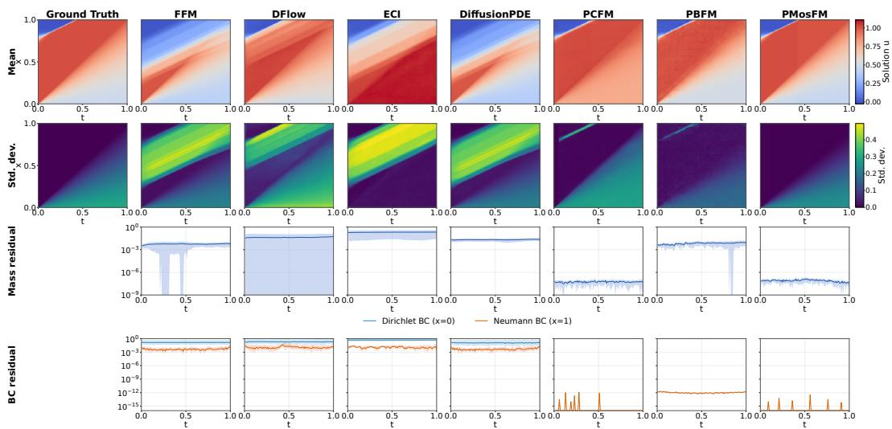

Figure 9: Fixed-IC Burgers conservation diagnostics. Rows compare solution means and standard deviations, followed by mass and boundary residuals for the displayed methods.  
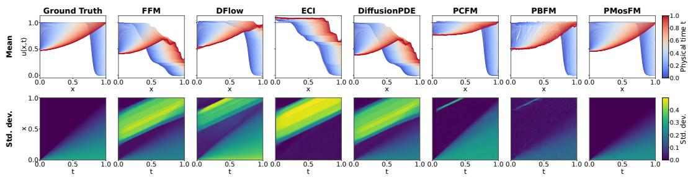  
Figure 10: Fixed-IC Burgers solution statistics. Mean solution profiles across time and pointwise standard deviations for the reference and displayed methods.

## D.4 FEASIBLE-SET AND TARGET-LAW STUDY

We evaluate the closed-form ellipse construction of Section 4.5 over five independent seeds and 24,000 samples per seed. In Table 10, both exact parameterizations give residual RMS near $1 0 ^ { - 1 6 }$ but the co-area law lowers KL from 0.369 to 0.00207 relative to the volume law. Thus, exact feasibility alone does not recover the target law.

Table 10: Residual-manifold support and measure over five independent seeds (24,000 samples each). Exact parameterizations yield near-zero residual; co-area correction recovers the target measure.
<table><tr><td>Method</td><td>Residual RMS ↓</td><td> ${ \mathrm { K L } } ( q \| q ^ { \star } ) \downarrow$ </td><td> $\mathrm { T V } ( q , q ^ { \star } ) \downarrow$ </td></tr><tr><td>Ambient soft residual</td><td> $7 . 1 2 0 \times { 1 0 } ^ { - 2 } \pm 2 . 2 6 4 \times { 1 0 } ^ { - 4 }$ </td><td> $2 . 0 7 7 \times { 1 0 } ^ { - 3 } \pm 1 . 5 4 8 \times { 1 0 } ^ { - 4 }$ </td><td> $2 . 3 5 8 \times { 1 0 } ^ { - 2 } \pm 8 . 2 3 4 \times { 1 0 } ^ { - 4 }$ </td></tr><tr><td>Exact parameterization, volume law</td><td> $1 . 9 1 7 \times { 1 0 } ^ { - 1 6 } \pm 1 . 3 2 6 \times { 1 0 } ^ { - 1 8 }$ </td><td> $3 . 6 8 9 \times { 1 0 } ^ { - 1 } \pm 2 . 0 6 9 \times { 1 0 } ^ { - 3 }$ </td><td> $3 . 7 2 3 \times { 1 0 } ^ { - 1 } \pm { 1 . 2 2 9 } \times { 1 0 } ^ { - 3 }$ </td></tr><tr><td>Exact parameterization, co-area law</td><td> $1 . 1 9 5 \times { 1 0 } ^ { - 1 6 } \pm 1 . 6 4 6 \times { 1 0 } ^ { - 1 8 }$ </td><td> $2 . 0 7 1 \times { 1 0 } ^ { - 3 } \pm 1 . 4 4 8 \times { 1 0 } ^ { - 4 }$ </td><td> $2 . 4 6 8 \times { 1 0 } ^ { - 2 } \pm 1 . 6 3 4 \times { 1 0 } ^ { - 3 }$ </td></tr></table>

Construction and representation scope. Exact support fixes the feasible set, whereas the constrained measure specifies the probability law on that set. The controlled feasible set is the ellipse $\chi ( \theta ) = ( 1 . 6 5 $ cos θ, 0.72 sin θ) with scalar residual

$$
R ( x ) = \exp ( 1 . 2 \cos \theta ( x ) ) \left( \frac { x _ { 1 } ^ { 2 } } { 1 . 6 5 ^ { 2 } } + \frac { x _ { 2 } ^ { 2 } } { 0 . 7 2 ^ { 2 } } - 1 \right) ,
$$

where $\theta ( x )$ is the ellipse angle. The residual scaling preserves the zero set while making $\| J _ { R } \|$ nonuniform. For a tubular ambient density constant on the ellipse, the co-area target is $q ^ { \star } ( { \ddot { \theta } } )$ ∝ $\| \partial _ { \theta } \chi \| / \| J _ { R } \|$ , while a volume-only exact sampler has $q _ { \mathrm { v o l } } ( \theta ) \propto \| \partial _ { \theta } \chi \|$ . For an encoded exact residual, the controlled objective in Eq. 13 retains the physical matching terms after residual factorization removes the corresponding residual-normal correction. The held-out physical studies separately examine encode–decode error, encoded residual, and independently evaluated residual.

## D.5 HELD-OUT DIAGNOSTICS

This held-out pre-training study reports encode–decode field error together with decoder-side and independently evaluated residuals. The evaluation is performed with an evaluator that is independent of the coordinate decoder. The manifold-conditioned Dynamic Stall case closes the specified algebraic constraint

Table 11: Population tangent-regression conditioning with 64 eigenmodes and the same stable step rule. Lower is better.
<table><tr><td>Coordinates</td><td>Active  $\kappa _ { + }$ </td><td>Steps to  $9 0 \% \downarrow$ </td></tr><tr><td>Raw covariance coordinates</td><td> $1 0 ^ { 6 }$ </td><td>2,558,427</td></tr><tr><td>Exact state-whitened coordinates</td><td>1</td><td>1</td></tr></table>

under both evaluators. For Kolmogorov flow, the central-difference implementation has external RMS $1 . 3 5 3 \times 1 0 ^ { - 1 }$ , whereas the spectral implementation has external RMS $2 . 4 2 2 \times 1 0 ^ { - 6 }$ , with both implementations retaining relative $\ell _ { 2 }$ error near 0.92.

## D.6 TANGENT-REGRESSION CONDITIONING

Table 18 and the left panel of Fig. 17 show that grid refinement worsens raw conditioning, while the ideal residual-space metric keeps the active condition number near one. The population study uses 64 eigenmodes with a fixed step rule. Table 11 and the right panel of Fig. 17 show that exact whitening removes covariance anisotropy and accelerates convergence in the stated population-regression setting.

## D.7 DYNAMIC STALL FIELD AND ENSEMBLE RESULTS

Fig. 11 compares the methods for one held-out Dynamic Stall condition. The PMosFM row places the shock-associated transition at the same location across the pressure, velocity-gradient, temperature, density, and wall-shear channels as the reference field.

Fig. 12 compares the conditional ensemble means and standard deviations of the six generated channels with the reference statistics. The PMosFM mean preserves the dominant shock-associated structure, but its standard-deviation maps show weaker fluctuations than the reference under the shared color scales.

## D.8 HELD-OUT ONE-STEP TURBULENCE

The Q–R evaluator uses periodic Fourier differentiation followed by trace removal. Let A denote the resulting velocity-gradient tensor, with $Q = - { \textstyle \frac { 1 } { 2 } } \operatorname { t r } ( A ^ { 2 } )$ and $R = - \operatorname* { d e t } ( A )$ . Fixed histogram bins and the same normalization are used for all methods. Table 12 shows that PMosFM has the lowest field MSE, divergence RMS, and all three Q–R distribution distances among the evaluated methods.

Figs. 13 and 14 compare generated and held-out Q–R laws under the common evaluator. PMosFM follows the reference contours more closely than PCFM, ECI, and PBFM, while FM-OT, FluidFlow, and PCFT also retain much of the contour structure in the full-baseline comparison.

## D.9 QUALITATIVE TURBULENCE DIAGNOSTICS

Fig. 15 shows that reconstruction becomes harder as observations become sparser. At 99% missingness, PMosFM retains a coarse spatial pattern, but its spectra and gradient PDFs still differ from the reference.

The held-out HIT benchmark evaluates one-step generation, while the random-mask test assesses sparse reconstruction. PMosFM attains the lowest field MSE, divergence RMS, and $Q { - } R$ distribution distances in the HIT table; in reconstruction, it has the lowest missing-region RMSE at all three rates and retains an identifiable large-scale pattern at 99% missingness (Tables 12 and 13; Fig. 15).

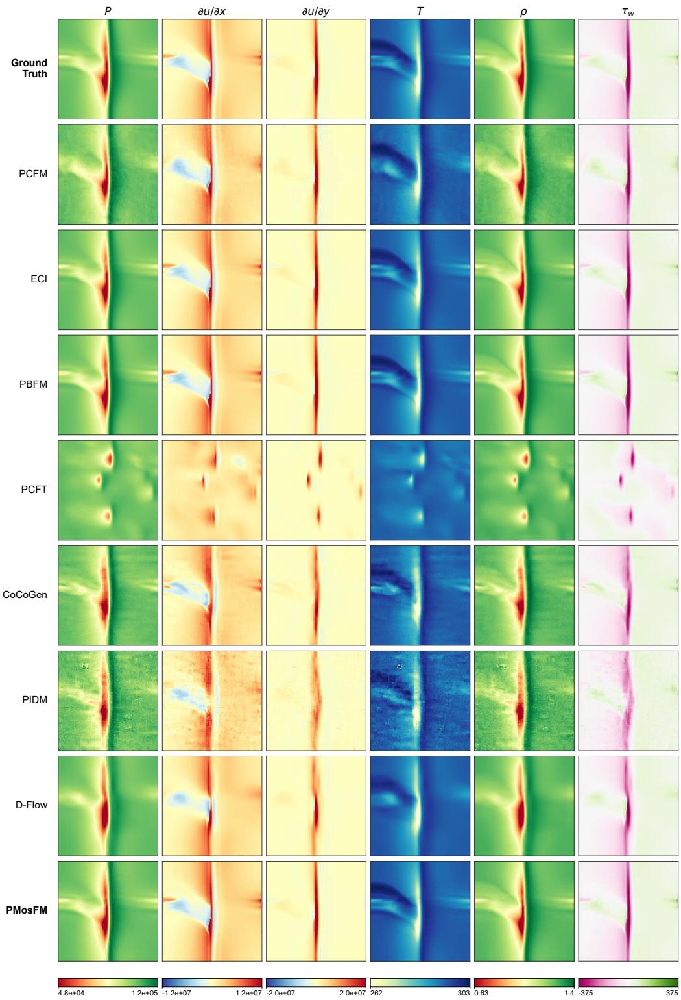  
Figure 11: Qualitative Dynamic Stall comparison. One held-out condition is shown. Columns show pressure, velocity gradients, temperature, density, and wall shear. Rows compare the reference and model predictions; PMosFM retains the shock-transition location and cross-channel structure.

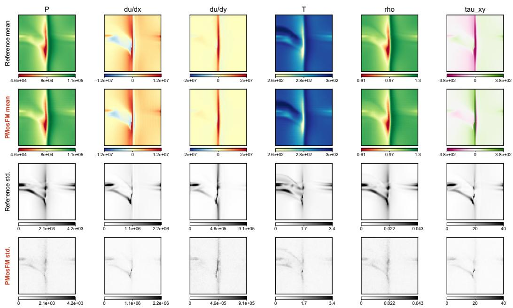  
Figure 12: Dynamic Stall ensemble moments. Conditional means and standard deviations of pres-Q 0.00.0Q 0.0.0.00.0 DiffusionPDE PIDM D-Flow ECIDiffusionPDE PIDM D-Flow ECI sure, tangential velocity gradients, temperature, density, and wall shear for one held-out condition.−0.5−0.5−0.5 1.01.0

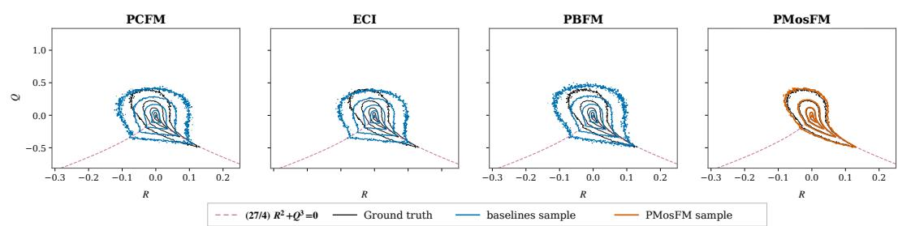  
Figure 13: Focused Q–R comparison for turbulence forecasting. Selected physics-constrained baselines are compared with the held-out ground truth.

## −0.3 −0.2 −0.1 0.0 0.1 0.2 −0.3 −0.2 −0     R  −0.3 −0.2 −0.1 0.0 0.1 0.2 −0.3 −0.2 −0E ADDITIONAL ABLATIONS

Loss balance. Table 14 tests whether velocity supervision and endpoint matching play complementary roles. On both Kolmogorov and Darcy flow, the balanced weight gives the lowest field error and physical sliced $W _ { 2 } .$ , together with a near-zero reported residual. Moving toward either single-term objective worsens all three metrics, suggesting that the two losses are complementary.

Table 14: Velocity–endpoint loss balance on Kolmogorov and Darcy flow.
<table><tr><td>Benchmark</td><td>Configuration</td><td>Loss Formulation</td><td>Field MSE ↓</td><td>Residual / Div. RMS ↓ Physical Sliced</td><td> $W _ { 2 } \downarrow$ </td></tr><tr><td rowspan="5">Kolmogorov Flow (128 × 128)</td><td>PE only  $( \gamma = 0 . 0 )$  PE-heavy (γ = 0.25)</td><td>Direct Endpoint  $\mathcal { L } _ { \mathrm { P E } }$  Two-Time Joint</td><td> $0 . 4 2 4 1 \pm 0 . 0 1 8 2$   $0 . 1 8 5 3 \pm 0 . 0 1 1 8$ </td><td> $1 6 2 9 . 9 \pm 5 2 . 4$   $8 5 0 . 4 \pm 3 8 . 1$ </td><td> $0 . 3 8 5 2 \pm 0 . 0 1 2 4$   $0 . 2 8 2 1 \pm 0 . 0 0 9 2$ </td></tr><tr><td></td><td></td><td></td><td></td><td></td></tr><tr><td>PMosFM Balanced (γ = 0.50)</td><td>Two-Time Joint  $( \mathcal { L } _ { \mathrm { F M } } + \mathcal { L } _ { \mathrm { P E } } )$ </td><td> $\mathbf { 0 . 0 5 3 1 \pm 0 . 0 0 1 9 }$ </td><td> $\mathbf { 3 . 4 5 \times 1 0 ^ { - 9 } }$ </td><td> $\mathbf { 0 . 2 5 2 2 \pm 0 . 0 0 1 4 }$ </td></tr><tr><td>FM-heavy (γ = 0.75)</td><td>Two-Time Joint</td><td> $0 . 2 1 8 4 \pm 0 . 0 1 4 5$ </td><td> $1 4 5 3 . 1 \pm 4 6 . 2$ </td><td> $0 . 2 7 8 9 \pm 0 . 0 1 0 1$ </td></tr><tr><td>FM only (γ = 1.0)</td><td>Velocity Flow Matching  $\mathcal { L } _ { \mathrm { F M } }$ </td><td> $0 . 4 7 1 4 \pm 0 . 0 2 1 0$ </td><td> $7 2 5 8 . 3 \pm 1 1 2 . 5$ </td><td> $0 . 3 6 2 1 \pm 0 . 0 1 5 3$ </td></tr><tr><td rowspan="5">Darcy Flow (64 × 64)</td><td>PE only (γ = 0.0) PE-heavy (γ = 0.25)</td><td>Direct Endpoint  $\mathcal { L } _ { \mathrm { P E } }$  Two-Time Joint</td><td> $0 . 0 3 8 2 \pm 0 . 0 0 2 4$   $0 . 0 1 1 5 \pm 0 . 0 0 0 8$ </td><td>870.8 ± 42.1</td><td>0.0284 ± 0.0018 0.0098 ± 0.0006</td></tr><tr><td></td><td></td><td></td><td>128.4 ± 9.5</td><td></td></tr><tr><td>PMosFM Balanced (γ = 0.50)</td><td>Two-Time Joint  $( \mathcal { L } _ { \mathrm { F M } } + \mathcal { L } _ { \mathrm { P E } } )$ </td><td> $\mathbf { 0 . 0 0 4 4 \pm 0 . 0 0 0 1 }$ </td><td>(1.41 ± 0.03) × 10−12</td><td>0.0044 ± 0.0001</td></tr><tr><td>FM-heavy (γ = 0.75)</td><td>Two-Time Joint</td><td> $0 . 0 0 9 2 \pm 0 . 0 0 0 7$ </td><td>240.1 ± 14.2</td><td>0.0087 ± 0.0005</td></tr><tr><td>FM only (γ = 1.0)</td><td>Velocity Flow Matching  $\mathcal { L } _ { \mathrm { F M } }$ </td><td> $0 . 0 4 1 5 \pm 0 . 0 0 3 1$ </td><td> $1 5 7 7 . 2 \pm 6 8 . 3$ </td><td>0.0312 ± 0.0021</td></tr></table>

Note. Results are mean ± standard deviation over five independent seeds.

Table 12: Held-out turbulence evaluation for physics-constrained generation uses a common evaluator with fixed Q–R bins. All methods follow the main-text objective; lower is better.
<table><tr><td>Method</td><td>Field MSE↓</td><td>Divergence RMS ↓</td><td>Q-RJS ↓</td><td>Q-R TV ↓</td><td>Hellinger ↓</td></tr><tr><td>FM-OT</td><td>1.097</td><td> $1 . 0 0 0 \times 1 0 ^ { - 1 }$ </td><td> $9 . 1 6 5 \times 1 0 ^ { - 3 }$ </td><td> $7 . 4 9 9 \times 1 0 ^ { - 2 }$ </td><td> $1 . 0 4 8 \times 1 0 ^ { - 1 }$ </td></tr><tr><td>advNO</td><td>2.205</td><td> $1 . 2 4 8$ </td><td> $1 . 3 1 7 \times 1 0 ^ { - 1 }$ </td><td> $4 . 1 7 1 \times 1 0 ^ { - 1 }$ </td><td> $3 . 7 9 8 \times 1 0 ^ { - 1 }$ </td></tr><tr><td>FluidFlow</td><td>1.102</td><td> $1 . 0 0 4 \times 1 0 ^ { - 1 }$ </td><td> $9 . 4 2 2 \times 1 0 ^ { - 3 }$ </td><td> $7 . 6 0 9 \times 1 0 ^ { - 2 }$ </td><td> $1 . 0 6 2 \times 1 0 ^ { - 1 }$ </td></tr><tr><td>CoCoGen</td><td> $2 . 0 0 6 \times 1 0 ^ { 2 }$ </td><td> $4 . 6 9 3$ </td><td> $6 . 8 0 3 \times 1 0 ^ { - 2 }$ </td><td> $2 . 8 5 7 \times 1 0 ^ { - 1 }$ </td><td> $2 . 7 2 7 \times 1 0 ^ { - 1 }$ </td></tr><tr><td>DiffusionPDE</td><td>1.785</td><td> $6 . 8 7 4 \times 1 0 ^ { - 1 }$ </td><td> $1 . 8 1 5 \times 1 0 ^ { - 1 }$ </td><td> $4 . 6 5 3 \times 1 0 ^ { - 1 }$ </td><td> $4 . 6 1 7 \times 1 0 ^ { - 1 }$ </td></tr><tr><td>PIDM</td><td> $1 . 6 9 5 \times 1 0 ^ { 2 }$ </td><td> $4 . 2 4 8$ </td><td> $6 . 3 5 1 \times 1 0 ^ { - 2 }$ </td><td> $2 . 7 2 1 \times 1 0 ^ { - 1 }$ </td><td> $2 . 6 3 8 \times 1 0 ^ { - 1 }$ </td></tr><tr><td>D-Flow</td><td> $2 . 0 4 8 \times 1 0 ^ { 2 }$ </td><td> $4 . 6 7 6$ </td><td> $6 . 1 0 7 \times 1 0 ^ { - 2 }$ </td><td> $2 . 6 6 4 \times 1 0 ^ { - 1 }$ </td><td> $2 . 5 8 8 \times 1 0 ^ { - 1 }$ </td></tr><tr><td>ECI</td><td> $6 . 4 7 2 \times 1 0 ^ { - 2 }$ </td><td> $1 . 4 2 6 \times 1 0 ^ { - 1 }$ </td><td> $8 . 6 8 4 \times 1 0 ^ { - 2 }$ </td><td> $3 . 3 6 0 \times 1 0 ^ { - 1 }$ </td><td> $3 . 0 4 1 \times 1 0 ^ { - 1 }$ </td></tr><tr><td>PCFM</td><td> $6 . 3 5 7 \times 1 0 ^ { - 2 }$ </td><td> $7 . 4 6 4 \times 1 0 ^ { - 2 }$ </td><td> $8 . 0 9 9 \times 1 0 ^ { - 2 }$ </td><td> $3 . 2 2 7 \times 1 0 ^ { - 1 }$ </td><td> $2 . 9 3 6 \times 1 0 ^ { - 1 }$ </td></tr><tr><td>PCFT</td><td>1.096</td><td> $1 . 0 0 4 \times 1 0 ^ { - 1 }$ </td><td> $9 . 2 3 0 \times 1 0 ^ { - 3 }$ </td><td> $7 . 3 3 8 \times 1 0 ^ { - 2 }$ </td><td> $1 . 0 5 3 \times 1 0 ^ { - 1 }$ </td></tr><tr><td>PBFM</td><td> $4 . 8 9 2 \times 1 0 ^ { - 2 }$ </td><td> $3 . 3 8 7 \times 1 0 ^ { - 2 }$ </td><td> $5 . 7 9 3 \times 1 0 ^ { - 2 }$ </td><td> $2 . 7 0 8 \times 1 0 ^ { - 1 }$ </td><td> $2 . 4 7 8 \times 1 0 ^ { - 1 }$ </td></tr><tr><td>PMosFM</td><td> $\mathbf { 5 . 3 5 9 \times 1 0 ^ { - 3 } }$ </td><td> $\mathbf { 1 . 5 2 7 \times 1 0 ^ { - 7 } }$ </td><td> $\mathbf { 5 . 9 6 1 \times 1 0 ^ { - 3 } }$ </td><td> $\mathbf { 5 . 2 9 3 \times 1 0 ^ { - 2 } }$ </td><td> $\mathbf { 8 . 5 1 3 \times 1 0 ^ { - 2 } }$ </td></tr></table>

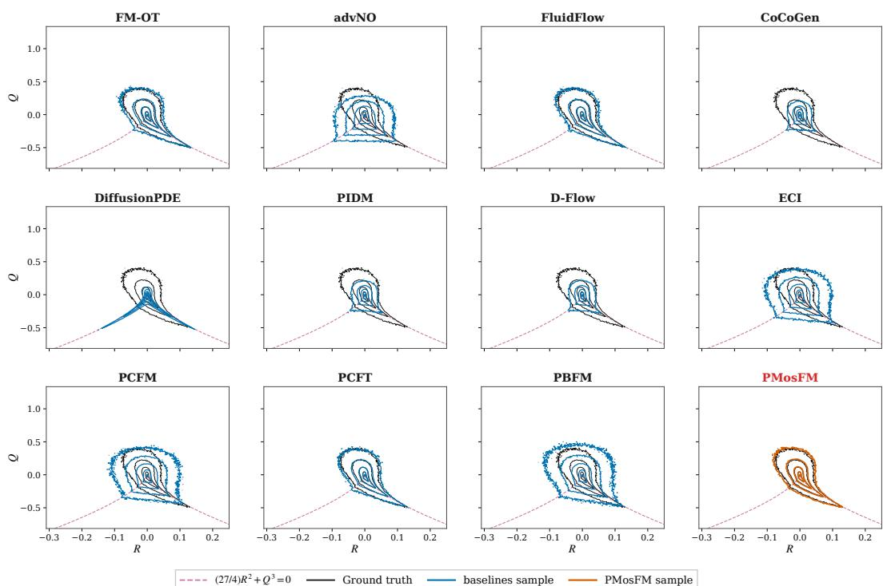  
Figure 14: Full Q–R comparison for turbulence forecasting. All evaluated methods are compared with the held-out ground truth.

Endpoint-gradient term. The held-out turbulence implementation is averaged over five independently trained model states and five independent inference seeds, whereas external methods are single-state estimates. The held-out turbulence implementation has 948,868 parameters and performs one neural evaluation followed by physical decoding. It trains with direct velocity MSE, decoded-endpoint MSE, and a 0.2-weighted endpoint-gradient MSE under the hard projector. Table 15 isolates the endpoint-gradient term in this one-step implementation. Velocity and Endpoint denote direct velocity MSE and decoded-endpoint MSE, respectively; λ is the endpoint-gradient MSE coefficient, and “–” denotes omission. Both variants share a residual-consistent projector and are evaluated over 16 validation windows, five independent training seeds, and five independent inference seeds. Bold marks the lower value in each diagnostic column. Table 15 shows a small reduction in physical MSE $( 5 . 6 3 1 \times 1 0 ^ { - 3 } \mathrm { t o } 5 . 5 2 4 \times 1 0 ^ { - 3 } )$ and lower Q–R distributional distances, while divergence RMS remains near $1 . 5 \times 1 0 ^ { - 7 }$

Table 13: TFR sparse-reconstruction metrics for held-out frames 168–186 (32 samples per condition). Lower is better except interval width; bold marks the minimum at each missing rate.
<table><tr><td colspan="2">Missing Method</td><td>Missing-region Physical RMSE↓</td><td>residual ↓</td><td>CRPS↓</td><td>Coverage error ↓</td><td>Interval width</td></tr><tr><td rowspan="5">50%</td><td>PBFM</td><td>0.063159</td><td></td><td></td><td>1.1021260.0248820.0752320.084228</td><td></td></tr><tr><td>ECI</td><td>0.045158</td><td></td><td></td><td>1.9106830.0196370.0351430.126545</td><td></td></tr><tr><td>PCFM</td><td>0.067615</td><td></td><td>1.5204530.0302690.0998670.112164</td><td></td><td></td></tr><tr><td>PCFT</td><td>0.069091</td><td></td><td>1.0810610.027396 0.095131 0.082924</td><td></td><td></td></tr><tr><td>PMosFM</td><td>0.029653</td><td></td><td>0.620392 0.008742 0.010382 0.036809</td><td></td><td></td></tr><tr><td rowspan="5">90%</td><td>PBFM</td><td>0.151450</td><td></td><td>0.6777890.0753050.3710660.090451</td><td></td><td></td></tr><tr><td>ECI</td><td>0.066441</td><td></td><td>1.8670860.0286250.0046890.158808</td><td></td><td></td></tr><tr><td>PCFM</td><td>0.089082</td><td></td><td>1.2115050.0384950.0709010.148736</td><td></td><td></td></tr><tr><td>PCFT</td><td>0.152720</td><td></td><td>0.6981890.0751180.3512750.088116</td><td></td><td></td></tr><tr><td>PMosFM</td><td>0.045076</td><td></td><td>0.628506 0.014650 0.036005 0.059326</td><td></td><td></td></tr><tr><td rowspan="5">99%</td><td>PBFM</td><td>0.187398</td><td></td><td></td><td>1.5940820.0955940.4307160.092738</td><td></td></tr><tr><td>ECI</td><td>0.165424</td><td></td><td></td><td>1.6957300.0784460.1738640.192676</td><td></td></tr><tr><td>PCFM</td><td>0.177361</td><td></td><td></td><td>1.1036680.085315 0.2196860.171779</td><td></td></tr><tr><td>PCFT</td><td>0.187990</td><td></td><td></td><td>0.6221360.0950100.4165290.090029</td><td></td></tr><tr><td>PMosFM</td><td>0.075462</td><td></td><td></td><td>0.53680 0.026655 0.021873 0.119706</td><td></td></tr></table>

Table 15: One-step objective ablation for one-step turbulence forecasting. Lower is better.
<table><tr><td rowspan="2">Variant</td><td colspan="3">Training terms</td><td colspan="5">Held-out diagnostic</td></tr><tr><td></td><td>Velocity Endpoint</td><td> $\lambda _ { \nabla }$ </td><td>Physical MSE↓</td><td>Divergence RMS↓</td><td> $Q { - } R \operatorname { J S } \downarrow$ </td><td> $Q { - } R \operatorname { T V } \downarrow$ </td><td>Hellinger ↓</td></tr><tr><td>No gradient</td><td>yes</td><td>yes</td><td>一</td><td> $\stackrel { 5 . 6 3 1 \times } { 1 0 ^ { - 3 } }$ </td><td> $1 . 5 0 7 \times$  10-7</td><td> $6 . 2 5 7 \times$   $1 0 ^ { - 3 }$ </td><td> $5 . 6 3 4 \times$   $1 0 ^ { - 2 }$ </td><td> $8 . 6 9 8 \times$   $1 0 ^ { - 2 }$ </td></tr><tr><td>Full objective</td><td>yes</td><td>yes</td><td>0.2</td><td> $5 . 5 2 4 \times$   $1 0 ^ { - 3 }$ </td><td> $1 . 5 0 8 \times$   $1 0 ^ { - 7 }$ </td><td> $6 . 2 0 2 \times$   $1 0 ^ { - 3 }$ </td><td> $5 . 5 6 5 \times$   $1 0 ^ { - 2 }$ </td><td> $8 . 6 6 4 \times$   $1 0 ^ { - 2 }$ </td></tr></table>

Preconditioning. Table 16 compares identity, diagonal standardization, and preconditioning. In the controlled regression, preconditioning gives the lowest condition number and iteration count; it also gives the lowest reported Kolmogorov divergence error.

Table 16: Geometric preconditioning effects on conditioning and Kolmogorov-flow convergence.
<table><tr><td>Transform</td><td></td><td></td><td>Condition κ(H) ↓ 90% Reduction ↓ Kolmogorov Div Err ↓ Iteration ratio</td><td></td></tr><tr><td>Identity (Vanilla)</td><td> $1 . 0 0 \times { { 1 0 } ^ { 6 } }$ </td><td>2,558,427</td><td>625.17</td><td>1.0× (baseline)</td></tr><tr><td>Standardization (Diagonal)</td><td> $4 . 8 2 \times 1 0 ^ { 3 }$ </td><td>1,240</td><td>485.30</td><td> $2 { , } 0 6 3 \times$ </td></tr><tr><td>Preconditioning (PMosFM)</td><td>1.00</td><td>1 step</td><td>234.01</td><td> $\bf { > 1 0 ^ { 6 } \times }$ </td></tr></table>

Decoder iterations. Table 17 examines the Darcy decoder’s accuracy–cost trade-off. Higher K lowers both errors but raises decoding latency, which is separate from one network evaluation.

Table 17: Darcy decoder accuracy and latency across iteration counts.
<table><tr><td></td><td></td><td>Iterations K Relative Pressure Error ↓ Independent Residual RE ↓ Latency / sample (ms) ↓</td><td></td></tr><tr><td>16</td><td> $0 . 0 1 2 4 \pm 0 . 0 0 1 2$ </td><td> $0 . 0 3 8 5 \pm 0 . 0 0 3 5$ </td><td>0.62 ms</td></tr><tr><td>32</td><td> $0 . 0 0 3 1 \pm 0 . 0 0 0 4$ </td><td> $0 . 0 0 8 4 \pm 0 . 0 0 0 9$ </td><td>0.98 ms</td></tr><tr><td>64</td><td> $0 . 0 0 0 8 \pm 0 . 0 0 0 1$ </td><td> $0 . 0 0 1 9 \pm 0 . 0 0 0 2$ </td><td>1.65 ms</td></tr><tr><td>128</td><td> $0 . 0 0 0 2 \pm 0 . 0 0 0 0 3$ </td><td> $0 . 0 0 0 4 8 \pm 0 . 0 0 0 0 5$ </td><td>2.84 ms</td></tr><tr><td>256</td><td> $\mathbf { 0 . 0 0 0 0 4 } \pm \mathbf { 0 . 0 0 0 0 1 }$ </td><td> $\mathbf { 0 . 0 0 0 1 2 \pm 0 . 0 0 0 0 2 }$ </td><td>5.12 ms</td></tr></table>

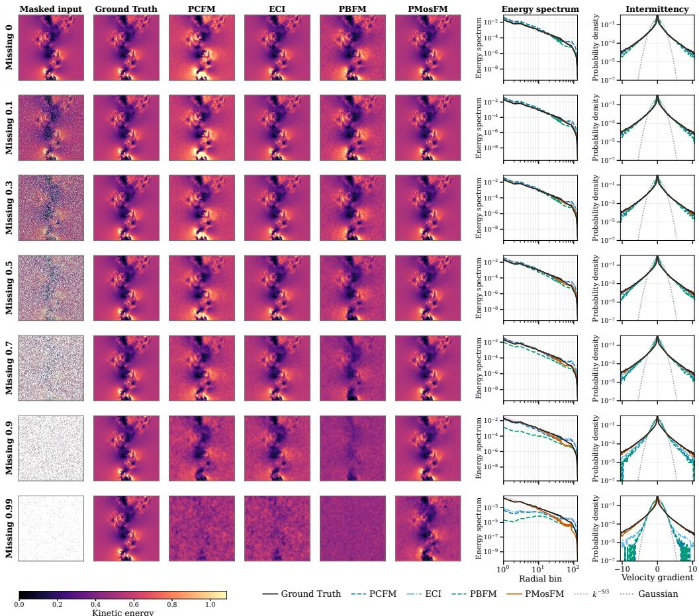  
Figure 15: Random-mask reconstruction. One held-out turbulence frame is tested with shared exactcount velocity masks (0–99% missing). Columns show the input, ground truth, PCFM, ECI, PBFM, and PMosFM; lower panels show energy spectra and standardized $\partial _ { z ^ { \prime } }$ w PDFs.

## F MATHEMATICAL SETTING AND ASSUMPTIONS

This appendix records assumptions, proofs, and constructions for the discretized residual $R _ { h }$ , proceeding from residual factorization through preconditioning to two-time matching.

Fix a condition c and suppress the condition index when no ambiguity arises. Let $a \in \mathbb { R } ^ { s }$ denote either a generator input, a latent variable, or a vector of model parameters. For a positive semidefinite matrix M, write $\| v \| _ { M } ^ { 2 } = v ^ { \top } M v$ . For a matrix $A ,$ let $\sigma _ { \mathrm { m i n } } ^ { + } ( A )$ denote the smallest nonzero singular value of A and define the active-subspace condition number

$$
\kappa _ { + } ( A ) : = \frac { \sigma _ { \operatorname* { m a x } } ( A ) } { \sigma _ { \operatorname* { m i n } } ^ { + } ( A ) } .
$$

This convention separates spectral stiffness from null directions imposed by a physical constraint. Assumption 1 (Regular residual factorization). On the represented target region, $R _ { h } ( \cdot , c )$ is $C ^ { 1 }$ and $D _ { x } R _ { h } ( x , c )$ has constant rank $q .$ The map $\chi _ { c } : \mathcal { V } _ { c } \to \mathcal { X } _ { h }$ is a $C ^ { 1 }$ local embedding of dimension $m = d - q$ on each active coordinate patch; the union of represented feasible sets covers the target region, and

$$
R _ { h } ( \chi _ { c } ( y ) , c ) = 0 \qquad \mathrm { f o r e v e r y } y \in \mathcal { V } _ { c } .\tag{17}
$$

The represented component is $\mathcal { M } _ { c } ^ { \chi } = \chi _ { c } ( \mathcal { V } _ { c } ) \subseteq \mathcal { Z } _ { c }$ from $\operatorname { E q . }$ 1 on each patch. Every intrinsic model path remains inside a valid coordinate domain or is covered by compatible local parameterizations.

Assumption 2 (Differentiability and finite moments). The two-time map $T _ { \theta } ^ { s , t }$ and the decoder $\Psi _ { c }$ are differentiable in the variables under analysis. The interpolation covariance defining $P _ { s , c }$ is fi-

nite, symmetric, and positive semidefinite. Whenever a second-order expansion is used, each map appearing in the expansion is $C ^ { 2 }$ on the corresponding line segment.

## F.1 BASELINE CONSTRAINT MECHANISMS

Relative to the ambient objective in Eq. 3, PBFM defines separate flow-matching and physical losses, denoted $\mathcal { I } _ { \mathrm { F M } }$ and $\mathcal { I } _ { R }$ , and coordinates their gradients before terminal residual evaluation (Baldan et al., 2026):

$$
g _ { \mathrm { F M } } = \nabla _ { \phi } \mathcal { J } _ { \mathrm { F M } } , \qquad g _ { R } = \nabla _ { \phi } \mathcal { J } _ { R } , \qquad g _ { \mathrm { u p d a t e } } = \mathrm { C o n F I G } ( g _ { \mathrm { F M } } , g _ { R } ) .
$$

PCFT instead applies weak-form fine-tuning (Tauberschmidt et al., 2026). DiffusionPDE adds sampling-time physics guidance (Huang et al., 2024); CCFM applies a chance-constrained projection (Liang et al., 2025). ECI extrapolates a clean endpoint and applies a correction $\mathcal { Q } _ { c }$ before mapping back to the current noise level (Cheng et al., 2025):

$$
\widehat { x } _ { 1 | \tau } = x _ { \tau } + ( 1 - \tau ) v _ { \phi } ( x _ { \tau } , \tau , c ) , \qquad x _ { 1 | \tau } ^ { c } = \mathcal { Q } _ { c } ( \widehat { x } _ { 1 | \tau } ) .
$$

PCFM applies nonlinear corrections to estimated terminal states during sampling (Utkarsh et al., 2026). For a full-row-rank residual Jacobian $J _ { R } ,$ , a local Gauss–Newton correction contains

$$
\begin{array} { r } { x _ { 1 } ^ { \mathrm { G N } } = \widetilde { x } _ { 1 } - J _ { R } ^ { \top } ( J _ { R } J _ { R } ^ { \top } ) ^ { - 1 } R _ { h } ( \widetilde { x } _ { 1 } , c ) , } \end{array}
$$

followed by method-specific back-mapping, relaxed updates, or a constrained solve when required.

## G ONE-STEP SENSITIVITY AND CURVATURE

## G.1 THREE NOTIONS OF A STEP

Training-time unrolling (Baldan et al., 2026) evaluates a nonlinear residual after intermediate updates; inference-time integration counts network evaluations used to solve a learned ODE. PMosFM learns a finite-interval map evaluated once at inference. The Euler rollout in Eq. 18 serves as a conditioning diagnostic.

For an n-step Euler rollout from sampling time $t ,$ define

$$
\begin{array} { l } { { \mathcal { U } _ { i } ( x ) = x + \Delta \tau v _ { \theta } ( x , \tau _ { i } , c ) , \Delta \tau = \frac { 1 - t } { n } , \tau _ { i } = t + i \Delta \tau , } } \\ { { \displaystyle T _ { \theta , t  1 } ^ { ( n ) } = \mathcal { U } _ { n - 1 } \circ \cdot \cdot \cdot \circ \mathcal { U } _ { 0 } . } } \end{array}\tag{18}
$$

Let $A _ { i } = D _ { x } v _ { \theta } ( x ^ { ( i ) } , \tau _ { i } , c )$ . The chain rule gives

$$
D _ { x } T _ { \theta , t  1 } ^ { ( n ) } = ( I + \Delta \tau A _ { n - 1 } ) \cdot \cdot \cdot ( I + \Delta \tau A _ { 0 } ) .\tag{19}
$$

Proposition 2 (Finite-interval sensitivity). Let $x ( s )$ solve $\begin{array} { r } { \dot { \boldsymbol { x } } ( s ) = \boldsymbol { v } ( \boldsymbol { x } ( s ) , s , c ) f o r s \in [ t , 1 ] } \end{array}$ , and assume $A ( s ) = D _ { x } v ( x ( s ) , s , c )$ is continuous. The endpoint sensitivity $J _ { t , s } = D _ { x ( t ) } x ( s )$ satisfies

$$
\frac { d J _ { t , s } } { d s } = { \cal A } ( s ) J _ { t , s } , \qquad J _ { t , t } = I .\tag{20}
$$

The sensitivity also obeys

$$
\| J _ { t , 1 } \| _ { 2 } \leq \exp \left( \int _ { t } ^ { 1 } \| A ( s ) \| _ { 2 } d s \right) .\tag{21}
$$

Iftheflow is locally invertible, then

$$
\kappa _ { 2 } ( J _ { t , 1 } ) \leq \exp \left( 2 \int _ { t } ^ { 1 } \| A ( s ) \| _ { 2 } d s \right) .\tag{22}
$$

Proof. Differentiating with respect to the initial state gives Eq. 20; Gronwall’s inequality yield Eq. 21. Eq. 19 discretizes Proposition 2; the controlled study evaluates the conditioning of the one-step endpoint Jacobian. The inverse sensitivity satisfies the corresponding backward variational equation, and the two norm bounds give Eq. 22. □

## G.2 RESIDUAL-NORMAL CURVATURE

Let $G _ { \phi } ( a , c )$ be any differentiable endpoint generator and define

$$
r _ { \phi } ( a , c ) = R _ { h } ( G _ { \phi } ( a , c ) , c ) , \qquad \ell _ { R } ( a ) = \frac 1 2 \left. r _ { \phi } ( a , c ) \right. _ { W _ { R } } ^ { 2 } , \quad W _ { R } \succeq 0 .\tag{23}
$$

The residual $R _ { h }$ has $n _ { R }$ components.

Lemma 3 (Exact Hessian decomposition). Assume $R _ { h }$ and $G _ { \phi }$ are $C ^ { 2 }$ . Let $J _ { G } = D _ { a } G _ { \phi }$ and $J _ { R } = D _ { x } R _ { h } | _ { G _ { \phi } ( a , c ) }$ . Then

$$
\nabla _ { a } \ell _ { R } = ( J _ { R } J _ { G } ) ^ { \top } W _ { R } r _ { \phi } ,
$$

$$
\nabla _ { a } ^ { 2 } \ell _ { R } = ( J _ { R } J _ { G } ) ^ { \top } W _ { R } ( J _ { R } J _ { G } ) + \sum _ { j = 1 } ^ { n _ { R } } ( W _ { R } r _ { \phi } ) _ { j } \nabla _ { a } ^ { 2 } ( r _ { \phi } ) _ { j } .\tag{24}
$$

At a feasible output, $r _ { \phi } = 0$ , the second term vanishes and the exact Hessian equals the Gauss– Newton block

$$
H _ { \mathrm { G N } , a } ^ { R } = J _ { G } ^ { \top } J _ { R } ^ { \top } W _ { R } J _ { R } J _ { G } .\tag{25}
$$

Proof. Apply the chain rule to Eq. 23. Differentiating the gradient gives the two terms in Eq. 24. Feasibility eliminates the latter. □

Corollary 4 (Squared active spectral spread). Let $B = W _ { R } ^ { 1 / 2 } J _ { R } J _ { G }$ . On the active subspace of B,

$$
H _ { \mathrm { G N } , a } ^ { R } = B ^ { \top } B , \qquad \kappa _ { + } ( H _ { \mathrm { G N } , a } ^ { R } ) = \kappa _ { + } ( B ) ^ { 2 } .\tag{26}
$$

In addition,

$$
\lambda _ { \operatorname* { m a x } } ( H _ { \mathrm { G N } , a } ^ { R } ) \leq \left\| W _ { R } \right\| _ { 2 } \left\| J _ { R } \right\| _ { 2 } ^ { 2 } \left\| J _ { G } \right\| _ { 2 } ^ { 2 } .
$$

Proof. Eq. 26 follows by squaring the singular values of $B ;$ submultiplicativity bounds the norm.

Remark 5 (Condition-number product). The common heuristic $\kappa ( H _ { \mathrm { G N } } ) \approx \kappa ( J _ { G } ) ^ { 2 } \kappa ( J _ { R } ^ { \top } J _ { R } )$ depends on alignment between the relevant singular subspaces. Corollary 4 gives the unconditional result: the condition number of the composed residual differential is squared. After generator composition, exact residual factorization also removes the residual block in Eq. 25.

## H MANIFOLD PARAMETERIZATION

## H.1 RESIDUAL-FACTORIZATION DIFFERENTIAL

Lemma 6 (Residual-factorization differential). Under Assumption 1, for every $y \in \mathcal { D } _ { c }$ and $x =$ $\chi _ { c } ( y )$

$$
\begin{array} { r l r } & { J _ { R } ( x , c ) J _ { \chi } ( y , c ) = 0 , } & { \mathrm { r a n g e } J _ { \chi } ( y , c ) \subseteq \ker J _ { R } ( x , c ) , } \\ & { \mathrm { r a n g e } J _ { \chi } ( y , c ) = \ker J _ { R } ( x , c ) = T _ { x } \mathcal { M } _ { c } ^ { \chi } . } \end{array}\tag{27}
$$

Proof. Differentiating $R _ { h } ( \chi _ { c } ( y ) , c ) = 0$ gives $J _ { R } J _ { \chi } = 0$ , which implies range $J _ { \chi } \subseteq$ ker $J _ { R }$ . Both spaces in Eq. 27 have dimension $d - q ,$ so the inclusion is equality. □

## H.2 EXACT ENDPOINT FEASIBILITY

Let $T _ { \phi } ^ { 0 , 1 } ( r _ { 0 } , c )$ lie in the valid coordinate domain and set $G _ { \phi , c } ^ { \mathrm { R F } } = \Psi _ { c } \circ T _ { \phi } ^ { 0 , 1 }$ . Assumption 1 gives

$$
R _ { h } ( G _ { \phi , c } ^ { \mathrm { R F } } ( r _ { 0 } , c ) , c ) = R _ { h } \Big ( \chi _ { c } \Big ( \mu _ { c } + C _ { c } ^ { - 1 } T _ { \phi } ^ { 0 , 1 } ( r _ { 0 } , c ) \Big ) , c \Big ) = 0 .\tag{28}
$$

The left-hand side of Eq. 28 is identically zero as a function of $r _ { 0 }$ and of every model parameter entering $T _ { \phi } ^ { 0 , 1 }$ . Differentiation with respect to any such variable a yields

$$
D _ { a } [ R _ { h } \circ G _ { \phi , c } ^ { \mathrm { R F } } ] = J _ { R } J _ { \chi } C _ { c } ^ { - 1 } D _ { a } T _ { \phi } ^ { 0 , 1 } = 0 .\tag{29}
$$

Eq. 29 shows that the encoded residual contributes no Gauss–Newton block on the valid coordinate domain. This local identity does not control the full endpoint Jacobian or global optimization.

Corollary 7 (Feasibility of a decoded intrinsic path). Let $y : [ 0 , 1 ] \to \mathcal { Y } _ { c }$ be any path and define $x ( s ) = \chi _ { c } ( y ( s ) )$ ). Under Assumption 1,

$$
R _ { h } ( x ( s ) , c ) = 0 \qquad f o r e \nu e r y s \in [ 0 , 1 ] .\tag{30}
$$

If y is differentiable, then $\dot { x } ( s ) = J _ { \chi } ( y ( s ) , c ) \dot { y } ( s ) \in T _ { x ( s ) } \mathcal { M } _ { c } ^ { \chi }$

Proof. Eq. 17 gives the feasibility in Eq. 30; differentiating the path and applying Lemma 6 gives tangency. □

## H.3 INTRINSIC-COORDINATE PENALTY BLOCK

For an ambient linear residual $R _ { h } ( x ) = A _ { h } x - b ,$ the penalized objective and the Hessian are

$$
\mathcal { L } _ { \lambda } ( x ) = \mathcal { L } _ { \mathrm { g e n } } ( x ) + \frac { \lambda } { 2 } \left. A _ { h } x - b \right. _ { W } ^ { 2 } , \qquad \nabla ^ { 2 } \mathcal { L } _ { \lambda } = H _ { \mathrm { g e n } } + \lambda A _ { h } ^ { \top } W A _ { h } .\tag{31}
$$

Theorem 8 (Penalty-block scaling under exact intrinsic coordinates). Write $H _ { \lambda , h } ~ = ~ H _ { \mathrm { g e n } } +$ $\lambda A _ { h } ^ { \top } W A _ { h }$ . Let $x = x _ { p } + N _ { h } y$ with $A _ { h } x _ { p } = b , \ A _ { h } N _ { h } = 0 ,$ , and $N _ { h } ^ { \top } N _ { h } \ = \ I$ . Then the intrinsic Hessian is $N _ { h } ^ { \top } H _ { \mathrm { g e n } } N _ { h }$ and is independent of λ. If A discretizes an order-p operator with $\sigma _ { \mathrm { m a x } } ( A _ { h } ) = \Theta ( h ^ { - p } ) , \sigma _ { \mathrm { m i n } } ^ { + } ( A _ { h } ) = \Theta ( 1 )$ , and $W$ is uniformly spectrally equivalent to the identity on the active residual space, the largest eigenvalue contributed by the residual penalty block is $\Theta ( \lambda h ^ { - 2 p } )$ For an ambient condition-number statement, fix a declared subspace $V _ { h }$ and interpret restriction with an orthonormal basis of $V _ { h }$ . Suppose $H _ { \mathrm { g e n } } \succeq 0$ , the restriction $H _ { \lambda , h } | _ { V _ { h } }$ is positive definite, $\sigma _ { \mathrm { m a x } } ( A _ { h } | _ { V _ { h } } ) ~ = ~ \Theta ( h ^ { - p } )$ , and $V _ { h } \cap$ ker $A _ { h }$ contains a unit vector $z _ { h }$ with $0 < z _ { h } ^ { \top } H _ { \mathrm { g e n } } z _ { h } \leq L _ { \mathrm { t a n } }$ for an h- and λ-independent constant $L _ { \mathrm { t a n } }$ . Then

$$
\kappa ( H _ { \lambda , h } | _ { V _ { h } } ) \geq \frac { c _ { W } \lambda \sigma _ { \operatorname* { m a x } } ( A _ { h } | _ { V _ { h } } ) ^ { 2 } } { L _ { \mathrm { t a n } } } = \Omega ( \lambda h ^ { - 2 p } ) ,\tag{32}
$$

where $c _ { W } I \preceq W$ on the active residual space. Writing $\kappa _ { + } f o r$ the ratio ofthe largest to the smallest positive eigenvalue, if a tangent preconditioner S satisfies

$$
( 1 - \delta ) I \preceq S ^ { \top } N _ { h } ^ { \top } H _ { \mathrm { g e n } } N _ { h } S \preceq ( 1 + \delta ) I , \qquad 0 \leq \delta < 1 ,\tag{33}
$$

then

$$
\kappa _ { + } \bigl ( S ^ { \top } N _ { h } ^ { \top } H _ { \mathrm { g e n } } N _ { h } S \bigr ) \leq \frac { 1 + \delta } { 1 - \delta } ,\tag{34}
$$

independently of λ.

Substituting $x = x _ { p } + N _ { h } y$ into Eq. 31 gives $A _ { h } x - b = A _ { h } N _ { h } y = 0$ . Differentiating the restricted generative objective twice gives the intrinsic Hessian $N _ { h } ^ { \top } H _ { \mathrm { g e n } } N _ { h }$ ; the residual term contributes $\lambda N _ { h } ^ { \top } A _ { h } ^ { \top } W A _ { h } N _ { h } = 0$ for every λ.

Uniform spectral equivalence of W implies $0 < c _ { W } \leq C _ { W } < \infty$ , independent of $h ,$ such that

$$
c _ { W } \| A _ { h } z \| _ { 2 } ^ { 2 } \leq z ^ { \top } A _ { h } ^ { \top } W A _ { h } z \leq C _ { W } \| A _ { h } z \| _ { 2 } ^ { 2 } .
$$

On the active normal subspace, the assumed singular-value scaling gives

$$
\lambda _ { \operatorname* { m a x } } \bigl ( \lambda A _ { h } ^ { \top } W A _ { h } \bigr ) = \Theta ( \lambda h ^ { - 2 p } ) , \qquad \lambda _ { \operatorname* { m i n } } ^ { + } \bigl ( \lambda A _ { h } ^ { \top } W A _ { h } \bigr ) = \Theta ( \lambda ) .
$$

This establishes the claimed normal stiffness scaling. Under the additional hypotheses of Theorem 8, positive semidefiniteness gives

$$
\lambda _ { \operatorname* { m a x } } ( H _ { \lambda , h } | _ { V _ { h } } ) \geq c _ { W } \lambda \sigma _ { \operatorname* { m a x } } ( A _ { h } | _ { V _ { h } } ) ^ { 2 } .
$$

For the unit vector $z _ { h } \in V _ { h } \cap$ ker $A _ { h }$ in the theorem,

$$
\lambda _ { \operatorname* { m i n } } ( H _ { \lambda , h } | _ { V _ { h } } ) \le z _ { h } ^ { \top } H _ { \lambda , h } z _ { h } = z _ { h } ^ { \top } H _ { \mathrm { g e n } } z _ { h } \le L _ { \mathrm { t a n } } .
$$

Dividing proves Eq. 32. The ambient bound applies on the declared subspace and does not remove generator-dependent tangential curvature. Finally, the Loewner bounds in Eq. 33 place every active eigenvalue of the preconditioned intrinsic Hessian in $[ 1 - \delta , 1 + \delta ]$ ; taking their ratio proves Eq. 34. The matrix $S$ is an abstract reference transform satisfying Eq. 33; the implemented transforms $C _ { c }$ and $P _ { s , c }$ are analyzed separately in Proposition 13.

For the ideal residual-space Riesz choice $W _ { h } ~ = ~ ( A _ { h } A _ { h } ^ { \top } + \varepsilon I ) ^ { - 1 }$ , the nonzero eigenvalues of $A _ { h } ^ { \top } W _ { h } A _ { h }$ are $\sigma _ { i } ^ { 2 } / ( \sigma _ { i } ^ { 2 } + \varepsilon )$ . They approach one when ε is small relative to the active spectrum. For small $\varepsilon$ relative to the active spectrum, this balances the residual-normal block, while intrinsic parameterization and tangent conditioning control the remaining feasible directions.

## H.4 APPROXIMATE PARAMETERIZATIONS AND ERROR BOUNDS

For an approximate decoder, define two independent approximation errors

$$
\begin{array} { r l } & { \varepsilon _ { \mathrm { c h a r t } } : = \underset { y \in \mathcal { V } _ { c } } { \operatorname* { s u p } } \| R _ { h } ( \chi _ { c } ( y ) , c ) \| _ { 2 } , } \\ & { \delta _ { \mathrm { c h a r t } } : = \underset { y \in \mathcal { V } _ { c } } { \operatorname* { s u p } } \| D _ { y } [ R _ { h } ( \chi _ { c } ( y ) , c ) ] \| _ { 2 } . } \end{array}\tag{35}
$$

where $\varepsilon _ { \mathrm { c h a r t } }$ controls residual value, whereas $\delta _ { \mathrm { c h a r t } }$ controls the pulled-back residual differential.

Theorem 9 (Approximate feasibility and residual Gauss–Newton-block bound). Suppose the quantities in Eq. 35 arefinite and $T _ { \phi } ^ { 0 , 1 } ( r _ { 0 } , c )$ maps every evaluated source coordinate into the coordinate domain. For $G _ { \phi , c } ^ { \mathrm { R F } } = \Psi _ { c } \circ T _ { \phi } ^ { 0 , 1 }$

$$
\left\| R _ { h } ( G _ { \phi , c } ^ { \mathrm { R F } } ( r _ { 0 } , c ) , c ) \right\| _ { 2 } \leq \varepsilon _ { \mathrm { c h a r t } } .\tag{36}
$$

For any differentiable variable a and $W _ { R } \succeq 0$

$$
\begin{array} { r } { \left\| H _ { \mathrm { G N } , a } ^ { R } \right\| _ { 2 } \leq \left\| W _ { R } \right\| _ { 2 } \delta _ { \mathrm { c h a r t } } ^ { 2 } \left\| C _ { c } ^ { - 1 } D _ { a } T _ { \phi } ^ { 0 , 1 } \right\| _ { 2 } ^ { 2 } . } \end{array}\tag{37}
$$

Proof. Eq. 36 follows from the first supremum in Eq. 35. The chain rule gives

$$
D _ { a } [ R _ { h } \circ \Psi _ { c } \circ T _ { \phi } ^ { 0 , 1 } ] = D _ { y } [ R _ { h } \circ \chi _ { c } ] C _ { c } ^ { - 1 } D _ { a } T _ { \phi } ^ { 0 , 1 } .
$$

The operator norm is at most $\delta _ { \mathrm { c h a r t } } \left\| C _ { c } ^ { - 1 } D _ { a } T _ { \phi } ^ { 0 , 1 } \right\| _ { 2 }$ . Applying $\left\| A ^ { \top } W _ { R } A \right\| _ { 2 } \leq \left\| W _ { R } \right\| _ { 2 } \left\| A \right\| _ { 2 } ^ { 2 }$ proves Eq. 37. □

The two errors are independent: a small residual value need not imply a small pulled-back residual differential. Both quantities are needed to characterize approximate decoders. Under differentiability, exact parameterization corresponds to $\varepsilon _ { \mathrm { c h a r t } } = \delta _ { \mathrm { c h a r t } } = 0$

## H.5 CO-AREA LAW

For a density $\rho ( x \mid c )$ relative to $d V _ { M _ { h } }$ , hard conditioning by a full-row-rank residual is defined by a co-area target (Xu et al., 2026). On an injective chart, with $G _ { c } ( y ) = J _ { \chi } ( y , c ) ^ { \top } M _ { h } J _ { \chi } ( y , c )$ and $J _ { R } = D _ { x } R _ { h } | _ { \chi _ { c } ( y ) }$ , the intrinsic density is

$$
\pi _ { Y } ^ { \mathrm { c o a } } ( y \mid c ) = \frac { \rho ( \chi _ { c } ( y ) \mid c ) } { Z _ { c } } \frac { \sqrt { \operatorname * { d e t } G _ { c } ( y ) } } { \sqrt { \operatorname * { d e t } \bigl ( J _ { R } ( M _ { h } ) ^ { - 1 } J _ { R } ^ { \top } \bigr ) } } .\tag{38}
$$

where $Z _ { c }$ normalizes the density; the numerator is the tangent volume element and the denominator is the residual-normal co-area Jacobian in the same metric.

Proposition 10 (Coordinate invariance of the co-area target). Let $\chi : \mathcal { V } \to \mathcal { M } ^ { \chi }$ satisfy the hypotheses of Eq. 38, let $\varphi : \widetilde { \mathcal { V } }  \mathcal { V }$ be a $C ^ { 1 }$ diffeomorphism, and set $\widetilde { \chi } = \chi \circ \varphi . \ I f \pi _ { Y } ^ { \mathrm { c o a } }$ is the density in Eq. 38, then the density computed from χe obeys

$$
\pi _ { \widetilde { Y } } ^ { \mathrm { c o a } } ( \widetilde { y } ) = \pi _ { Y } ^ { \mathrm { c o a } } ( \varphi ( \widetilde { y } ) ) \left| \operatorname * { d e t } D \varphi ( \widetilde { y } ) \right| ,\tag{39}
$$

The pushforward measures coincide: $\widetilde \chi _ { \# } ( \pi _ { \widetilde { V } } ^ { \mathrm { c o a } } d \widetilde { y } ) = \chi _ { \# } ( \pi _ { Y } ^ { \mathrm { c o a } } d y )$ . Reparameterization changes coordinate density but preserves the induced physical measure on thefeasible component.

Proof. The chain rule gives $J _ { \widetilde { \chi } } = J _ { \chi } D \varphi$ and yields

$$
\begin{array} { r } { \operatorname* { d e t } ( J _ { \widetilde { \chi } } ^ { \top } M _ { x } J _ { \widetilde { \chi } } ) = \operatorname* { d e t } ( D \varphi ) ^ { 2 } \operatorname* { d e t } ( J _ { \chi } ^ { \top } M _ { x } J _ { \chi } ) . } \end{array}
$$

The ambient density and residual-normal determinant are evaluated at the same physical point $\chi ( \varphi ( \widetilde { y } ) )$ . Substitution into Eq. 38 yields Eq. 39; the ordinary change-of-variables theorem then proves equality of the pushforward measures. □

## H.6 ENCODING-INDUCED REPRESENTATION ERROR

For data outside the parameterization range, assume that the minimum below is attained and choose a measurable encoder selection

$$
\eta _ { c } ( x ) \in \arg \operatorname* { m i n } _ { y \in \mathcal { V } _ { c } } \| \chi _ { c } ( y ) - x \| _ { M _ { h } } ^ { 2 } .\tag{40}
$$

For the encoder in Eq. 40, let $X \sim p _ { \mathrm { d a t a } } ( \cdot \mid c )$ and define the feasible projection $\bar { X } = \chi _ { c } ( \eta _ { c } ( X ) )$ The joint law of $( X , { \tilde { X } } )$ is a valid coupling of $p _ { \mathrm { d a t a } }$ and $\bar { p } _ { \mathrm { d a t a } } = ( \chi _ { c } \circ \eta _ { c } ) _ { \# } p _ { \mathrm { d a t a } }$ . By the definition of the Wasserstein distance,

$$
W _ { 2 , M _ { x } } ^ { 2 } ( \bar { p } _ { \mathrm { d a t a } } , p _ { \mathrm { d a t a } } ) \leq \mathbb { E } \left\| \bar { X } - X \right\| _ { M _ { x } } ^ { 2 } .\tag{41}
$$

Eq. 41 bounds the representation error; we track it separately from generative error.

## I SUPPORT, MEASURE, AND TRANSPORT ERRORS

Residual factorization fixes feasible support, and the target-law construction specifies probability mass; matching determines how closely the learned pushforward follows that law. The following bound separates transport, measure, and representation error.

Proposition 11 (Three-way error bookkeeping bound). Let $\widehat { \pi } , \pi _ { \mathrm { e n c } } , \pi _ { \mathrm { l a w } }$ , and $\pi _ { \mathrm { d a t a } }$ be probability measures withfinite second moments under the metric induced by $M _ { x }$ . Then

$$
W _ { 2 , M _ { x } } ( \widehat { \pi } , \pi _ { \mathrm { d a t a } } ) \leq W _ { 2 , M _ { x } } ( \widehat { \pi } , \pi _ { \mathrm { e n c } } ) + W _ { 2 , M _ { x } } ( \pi _ { \mathrm { e n c } } , \pi _ { \mathrm { l a w } } ) + W _ { 2 , M _ { x } } ( \pi _ { \mathrm { l a w } } , \pi _ { \mathrm { d a t a } } ) .\tag{42}
$$

Proof. Apply the triangle inequality for $W _ { 2 , M _ { x } }$ first through $\pi _ { \mathrm { e n c } }$ and then through $\pi _ { \mathrm { l a w } }$

Eq. 42 separates transport, target-law, and representation error. The latter two vanish for exactly feasible sample-defined targets; density-defined targets use the co-area law in Eq. 38.

## J PHYSICAL AND STATISTICAL PRECONDITIONING

After residual factorization, $C _ { c }$ rescales the decoder-induced physical metric in Eq. $^ { 6 , }$ while $P _ { s , c }$ conditions the interpolation statistics seen by the network. We analyze their effects on local regression conditioning separately. Writing $J _ { \Psi _ { c } } = D _ { r } \Psi _ { c }$ and $y = \mu _ { c } \dot { + } C _ { c } ^ { - 1 } r$ , the chain rule gives $J _ { \Psi _ { c } } ( r ) = J _ { \chi } ( y , c ) C _ { c } ^ { - 1 }$ , and the transformed metric is $\widetilde { G } _ { c } ( \boldsymbol { r } ) = J _ { \Psi _ { c } } ( \boldsymbol { r } ) ^ { \top } M _ { h } J _ { \Psi _ { c } } ( \boldsymbol { r } )$

## J.1 REGULARIZED INPUT COVARIANCE

Lemma 12 (Spectrum of regularized whitening). Let $C \succeq 0$ and $P = ( C + \varepsilon I ) ^ { - 1 / 2 }$ with $\varepsilon > 0 .$ . If $C = U \mathrm { d i a g } ( \dot { \lambda _ { i } } ) U ^ { \top }$ , then

$$
\boldsymbol { P } \boldsymbol { C } \boldsymbol { P } ^ { \intercal } = U \mathrm { d i a g } \left( \frac { \lambda _ { i } } { \lambda _ { i } + \varepsilon } \right) \boldsymbol { U } ^ { \intercal } .\tag{43}
$$

On the active subspace ofC,

$$
\kappa _ { + } ( P C P ^ { \top } ) = \frac { \lambda _ { \operatorname* { m a x } } ( C ) / ( \lambda _ { \operatorname* { m a x } } ( C ) + \varepsilon ) } { \lambda _ { \operatorname* { m i n } } ^ { + } ( C ) / ( \lambda _ { \operatorname* { m i n } } ^ { + } ( C ) + \varepsilon ) } .\tag{44}
$$

Exact whitening is recovered when $\varepsilon = 0$ and C is nonsingular.

Proof. Applying $( \lambda + \varepsilon ) ^ { - 1 / 2 }$ to the eigendecomposition of C gives Eq. 43 and the condition number in Eq. 44. □

For the interpolation states in Eq. 7, the transform in Eq. 8 gives

$$
P _ { s , c } \Sigma _ { s , c } P _ { s , c } ^ { \top } = \Sigma _ { s , c } ( \Sigma _ { s , c } + \varepsilon _ { P } I ) ^ { - 1 } .\tag{45}
$$

Eq. 45 shows how $P _ { s , c }$ conditions network inputs while preserving the specified physical target law.

## J.2 LOCAL PHYSICAL-SPACE CONDITIONING

Fix $s < t , c .$ , and a stopped-gradient target branch. Let $\zeta = P _ { s , c } ( r _ { s } - m _ { s , c } )$ and consider a local linear velocity model $\bar { u } _ { A } = A \zeta$ . The endpoint depending on A is $a _ { A } = r _ { s } + ( t - s ) A \zeta$

Proposition 13 (Local decoded-endpoint conditioning). The Gauss–Newton matrix ofthe decodedendpoint loss with respect to A is

$$
H _ { A } ^ { \mathrm { G N } } = \frac { t - s } { m \delta } \mathbb { E } \left[ ( \zeta \zeta ^ { \top } ) \otimes \widetilde { G } _ { c } ( a _ { A } ) \right] .\tag{46}
$$

Assume α $\smash { \left[ \preceq \widetilde { G } _ { c } ( a _ { A } ) \right] \preceq \beta I }$ in the stated region and let $S _ { s , c } = \mathbb { E } [ \zeta \zeta ^ { \top } ]$ be positive definite. Then

$$
\kappa \big ( H _ { A } ^ { \mathrm { G N } } \big ) \leq \frac { \beta } { \alpha } \kappa ( S _ { s , c } ) , \qquad S _ { s , c } = P _ { s , c } \Sigma _ { s , c } P _ { s , c } ^ { \top }\tag{47}
$$

under exact centering.

Proof. Differentiating the squared decoded endpoint error gives the pullback and input factors in Eq. 46. The stated spectral bounds sandwich the expectation between positive multiples of $S _ { s , c } \otimes I .$ The extremal eigenvalues give Eq. 47. □

## K ONE-STEP PULLBACK GEOMETRY

The pullback matrix $G _ { c } ( y ) = J _ { \chi } ( y , c ) ^ { \top } M _ { x } J _ { \chi } ( y , c )$ is exact for infinitesimal perturbations. The action in preconditioned coordinates can be computed without forming a dense Jacobian:

$$
\widetilde { G } _ { c } ( r ) \boldsymbol { v } = J _ { \Psi _ { c } } ( r ) ^ { \top } \left[ M _ { h } \big ( J _ { \Psi _ { c } } ( r ) \boldsymbol { v } \big ) \right] .\tag{48}
$$

Eq. 48 uses a decoder Jacobian-vector product followed by a vector-Jacobian product. The following result quantifies the approximation error for a finite coordinate displacement.

Proposition 14 (Finite-displacement pullback error). Fix y and a displacement d such that the segment $y + s d , s \in [ 0 , 1 ]$ , lies in ${ \mathcal { N } } _ { c } .$ . Freeze the positive-definite physical metric $M _ { x }$ . Suppose

$$
\left\| D _ { y } ^ { 2 } \chi _ { c } ( y + s d ) [ v , v ] \right\| _ { M _ { x } } \leq L _ { \chi } \left\| v \right\| _ { 2 } ^ { 2 }\tag{49}
$$

for every $s \in [ 0 , 1 ]$ and v. Let $K _ { \chi } = \| J _ { \chi } ( y , c ) \| _ { 2 \to M _ { x } }$ . Then

$$
\mid \mid \chi _ { c } ( y + d ) - \chi _ { c } ( y ) \mid \mid _ { M _ { x } } ^ { 2 } - d ^ { \top } G _ { c } ( y ) d \big | \leq L _ { \chi } K _ { \chi } \left\| d \right\| _ { 2 } ^ { 3 } + \frac { L _ { \chi } ^ { 2 } } { 4 } \left\| d \right\| _ { 2 } ^ { 4 } .\tag{50}
$$

Proof. Taylor’s theorem under the bound in Eq. 49 gives

$$
\chi _ { c } ( y + d ) - \chi _ { c } ( y ) = J _ { \chi } ( y , c ) d + r _ { d } , \qquad \| r _ { d } \| _ { M _ { x } } \leq \frac { L _ { \chi } } { 2 } \| d \| _ { 2 } ^ { 2 } .
$$

Expanding the squared norm and applying Cauchy–Schwarz yields

$$
2 \left\| J _ { \chi } d \right\| _ { M _ { x } } \left\| r _ { d } \right\| _ { M _ { x } } + \left\| r _ { d } \right\| _ { M _ { x } } ^ { 2 } ,
$$

which is bounded by the right-hand side of Eq. 50.

The cubic remainder shows that the pullback metric is a local approximation, whereas decoded endpoint error measures finite physical discrepancy directly.

## L FEASIBLE PARAMETERIZATIONS AND PRECONDITIONING

## L.1 LINEAR NULL-SPACE PARAMETERIZATION

Proposition 15 (Exact encoding for affine constraints). Let $R _ { h } ( x ) = A x - b ,$ choose $x _ { p }$ with $A x _ { p } = b ,$ , and let the columns ofN form a basis ofker A. Then

$$
\chi ( y ) = x _ { p } + N y\tag{51}
$$

is an exact global constraint-satisfying parameterization of the affine feasible set. Evaluating the constraint yields

$$
R _ { h } ( \chi ( y ) ) = 0 , \qquad J _ { R } J _ { \chi } = A N = 0 .\tag{52}
$$

This construction covers discrete conservation, boundary, and observation constraints whenever they can be written as a compatible affine system. Numerical quality depends on the representation of the null-space basis; the exact algebraic identity and coordinate conditioning are separate properties.

## L.2 DISCRETE STREAMFUNCTION PARAMETERIZATION

Let $D _ { x }$ and $D _ { y }$ be discrete derivative matrices on the same grid and with the same boundary convention. Define

$$
\chi ( \psi ) = \left[ \begin{array} { c } { { D _ { y } \psi } } \\ { { - D _ { x } \psi } } \end{array} \right] .\tag{53}
$$

Proposition 16 (Compatible discrete incompressibility). If $D _ { x } D _ { y } = D _ { y } D _ { x }$ , then every velocity decoded by $E q .$ 53 satisfies the matching discrete divergence exactly:

$$
D _ { x } u + D _ { y } v = ( D _ { x } D _ { y } - D _ { y } D _ { x } ) \psi = 0 .\tag{54}
$$

For the Euclidean state metric, the pullback matrix is

$$
\begin{array} { r } { G _ { \psi } = D _ { y } ^ { \top } D _ { y } + D _ { x } ^ { \top } D _ { x } . } \end{array}\tag{55}
$$

Proof. Commutation gives the residual identity in Eq. 54. Eq. 55 follows by multiplying the Jacobian of Eq. 53 by the corresponding transpose factors. □

Eq. 55 separates exact incompressibility from intrinsic metric geometry: the parameterization enforces the former, while $G _ { \psi }$ determines the latter. On a periodic grid, the Fourier symbol of the pullback matrix scales like the squared discrete wave number. The pullback metric makes the physical importance of gradients and small scales explicit.

## M PHYSICAL-SPACE ENDPOINT MATCHING

The two-time map in Eq. 9 is supervised at $s = t$ by the velocity loss in Eq. 10. $\mathrm { A t } \ s < t ,$ , the loss in Eq. 12 compares two estimates of the same decoded physical endpoint. The following result links the learned finite-interval map to endpoint distribution error.

Let $Y _ { s }$ follow a target marginal path with $\dot { Y } _ { s } = v _ { s } ( Y _ { s } , c )$ . Let

$$
p _ { \mathrm { e n c } , c } = \mathcal { L } ( \Psi _ { c } ( Y _ { 1 } ) )
$$

denote the encoded target endpoint law. For the learned map, define the coordinate and physical defects

$$
e _ { \theta } ( s , r ) = \partial _ { s } T _ { \theta } ^ { s , 1 } ( r , c ) + D _ { r } T _ { \theta } ^ { s , 1 } ( r , c ) v _ { s } ( r , c ) , \qquad d _ { \theta } ( s , r ) = J _ { \Psi _ { c } } \Big ( T _ { \theta } ^ { s , 1 } ( r , c ) \Big ) e _ { \theta } ( s , r ) .\tag{56}
$$

Proposition 17 (Physical flow-map defect bound). Assume a smooth target path, a valid coordinate domain,finite second moments, and

$$
\mathbb { E } \int _ { 0 } ^ { 1 } \| d _ { \theta } ( s , Y _ { s } ) \| _ { M _ { x } } ^ { 2 } d s < \infty .
$$

For the defects in $E q .$ . 56, the endpoint law $\widehat { p } _ { c }$ of $\Psi _ { c } ( T _ { \theta } ^ { 0 , 1 } ( Y _ { 0 } , c ) )$ satisfies

$$
W _ { 2 , M _ { x } } ^ { 2 } ( \widehat { p } _ { c } , p _ { \mathrm { e n c } , c } ) \leq \int _ { 0 } ^ { 1 } \mathbb { E } \left[ e _ { \theta } ( s , Y _ { s } ) ^ { \top } \widetilde { G } _ { c } \Big ( T _ { \theta } ^ { s , 1 } ( Y _ { s } , c ) \Big ) e _ { \theta } ( s , Y _ { s } ) \right] d s .\tag{57}
$$

Proof. Along the target path,

$$
\Psi _ { c } ( Y _ { 1 } ) - \Psi _ { c } \Big ( T _ { \theta } ^ { 0 , 1 } ( Y _ { 0 } , c ) \Big ) = \int _ { 0 } ^ { 1 } d _ { \theta } ( s , Y _ { s } ) d s .
$$

The common source $Y _ { 0 }$ couples the endpoint laws; Cauchy–Schwarz and $\widetilde { G } _ { c }$ give Eq. 57. □

The consistency loss is a finite-difference surrogate for the flow-map defect controlled by Eq. 57. For the interpolation path, let

$$
v _ { s } ( r , c ) = \mathbb { E } [ w \mid r _ { s } = r , c ] .
$$

For fixed $s , t , c , \delta$ and a stopped-gradient target, conditioning on $r _ { s }$ and averaging over the endpointpair velocity w gives the corresponding conditional semi-gradient with respect to the differentiable velocity output:

$$
- \frac { 1 } { m } \widetilde { G } _ { c } ( a _ { \theta } ) \left( \partial _ { s } T _ { \theta } ^ { s , t } + D _ { r } T _ { \theta } ^ { s , t } v _ { s } \right) + O ( \delta ) .\tag{58}
$$

Eq. 58 fixes the target branch and uses $\delta$ to normalize the finite difference.

## N REGULAR RESIDUAL GEOMETRIES

For regular residual manifolds, PMosFM constructs local feasible coordinates from discrete residual-zero sets rather than assuming a prescribed Riemannian manifold (Chen & Lipman, 2024).

## N.1 LOCAL RESIDUAL-MANIFOLD PARAMETERIZATIONS

Fix the mesh $h$ and condition $c ,$ and let $M _ { x } = M _ { h }$ be positive definite. Assume that $R _ { h } ( \cdot , c )$ is $C ^ { 2 }$ on an open neighborhood and that $D _ { x } R _ { h }$ has constant rank $q$ there. On the regular component

$$
\mathcal { M } _ { c } = \{ \boldsymbol { x } : \boldsymbol { R _ { h } } ( \boldsymbol { x } , \boldsymbol { c } ) = 0 \} , \qquad m = d - \boldsymbol { q } ,
$$

the tangent space is $T _ { x } \mathcal { M } _ { c } =$ ker $D _ { x } R _ { h } ( x , c )$ , with physical metric $g _ { x } ( \xi , \zeta ) = \xi ^ { \top } M _ { x } \zeta$

Proposition 18 (Local feasible parameterizations). Every point ofa regular component has a local injective parameterization $\chi _ { c } : \mathcal { V } _ { c } \to \mathcal { M } _ { c }$ with $R _ { h } \circ \chi _ { c } = 0$ . For a compact regular target region, finitely many such parameterizations cover the region. After an invertible coordinate transform $C _ { j , c } ,$ each decoder

$$
\Psi _ { j , c } ( r ) = \chi _ { j , c } ( \mu _ { j , c } + C _ { j , c } ^ { - 1 } r )
$$

remains exactlyfeasible and has continuous pullback metric $\widetilde { G } _ { j , c } ( \boldsymbol { r } ) = D \Psi _ { j , c } ( \boldsymbol { r } ) ^ { \top } M _ { x } D \Psi _ { j , c } ( \boldsymbol { r } ) .$

A near-identity metric bound for $C _ { j , c }$ requires separate verification; the construction is local.

The constructions above apply patchwise. Let $\Sigma _ { s , j , c }$ denote the covariance of $r _ { s }$ within patch j, and define

$$
\begin{array} { r } { P _ { s , j , c } = ( \Sigma _ { s , j , c } + \varepsilon _ { P } I ) ^ { - 1 / 2 } , \qquad \widetilde { G } _ { j , c } ( r ) = D \Psi _ { j , c } ( r ) ^ { \top } M _ { x } D \Psi _ { j , c } ( r ) . } \end{array}
$$

Under the assumptions of Proposition 13, if $\alpha _ { j , c } I \preceq \widetilde { G } _ { j , c } ( r ) \preceq \beta _ { j , c } I$ on the evaluated region, then

$$
\kappa ( H _ { A } ^ { \mathrm { G N } } ) \leq \frac { \beta _ { j , c } } { \alpha _ { j , c } } \kappa \big ( P _ { s , j , c } \Sigma _ { s , j , c } P _ { s , j , c } ^ { \top } \big ) .\tag{59}
$$

For overlapping patches, let $a _ { j }$ form a partition of unity on the target support and set $\textstyle \omega _ { j } = \int a _ { j } d \nu _ { c } .$ so $\textstyle \sum _ { j } \omega _ { j } { \overset { \textstyle - } { = } } 1$ . For $\omega _ { j } > 0$ , define the normalized patch law

$$
\nu _ { j , c } = \frac { a _ { j } \nu _ { c } } { \omega _ { j } } ,
$$

and let $\widehat { \nu } _ { j , c }$ denote the corresponding generated endpoint law. Set

$$
\widehat { \nu } _ { c } = \sum _ { j } \omega _ { j } \widehat { \nu } _ { j , c } .
$$

Applying Proposition 17 within each patch and mixing the resulting couplings gives

$$
W _ { 2 , M _ { x } } ^ { 2 } ( \widehat { \nu } _ { c } , \nu _ { c } ) \leq \sum _ { j } \omega _ { j } \mathcal { E } _ { j , c } ,\tag{60}
$$

where $\mathcal { E } _ { j , c }$ is the integrated physical flow-map defect from Eq. 57, evaluated on patch $j .$ Eqs. 59 and 60 extend the conditioning and endpoint-error bounds locally without a global flattening of the residual manifold.

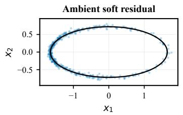

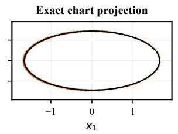

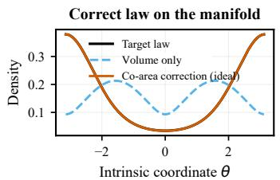  
Figure 16: Support and measure on a residual manifold. Exact parameterization enforces feasibility, and the co-area correction recovers the target law.

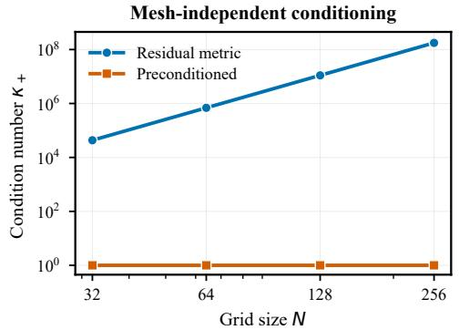

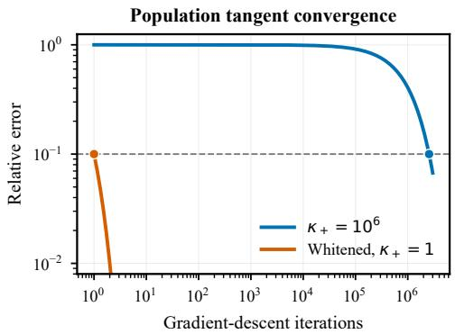  
Figure 17: Normal and tangent conditioning. Left: preconditioning controls residual-normal conditioning under grid refinement. Right: whitening accelerates tangent-regression convergence.

## O ADDITIONAL ANALYSES

Supplementary evaluations follow the dataset partitions, units, and evaluators in Appendix C.

## O.1 FEASIBILITY, DISTRIBUTION, AND TRANSPORT

Appendices D.4, D.5, and D.6 describe support, decoder, and conditioning diagnostics. Fig. 16 shows that exact parameterization places samples on the feasible set, while the volume-only law still differs from the target density; the co-area correction reduces this mismatch.

## O.2 DECODER TOLERANCE AND COST

Table 18: Normal conditioning.
<table><tr><td>N</td><td> $\kappa ( A _ { h } ^ { \top } A _ { h } )$ </td><td> $\kappa ( A _ { h } ^ { \top } W _ { h } A _ { h } )$ </td></tr><tr><td></td><td>32 4.33 × 104</td><td>1.0001</td></tr><tr><td>64</td><td> $6 . 9 0 \times 1 0 ^ { 5 }$ </td><td>1.0001</td></tr><tr><td>128</td><td> $1 . 1 0 \times 1 0 ^ { 7 }$ </td><td>1.0001</td></tr><tr><td>256</td><td> $1 . 7 6 \times 1 0 ^ { 8 }$ </td><td>1.0001</td></tr></table>

Decoder formulation. For a source coordinate $r _ { 0 } ,$ PMosFM first evaluates the learned finite-interval map and then applies the geometric inverse transform:

$$
\widehat { r } _ { 1 } = T _ { \theta } ^ { 0 , 1 } ( r _ { 0 } , c ) , \qquad \widehat { y } _ { 1 } = \mu _ { c } + C _ { c } ^ { - 1 } \widehat { r } _ { 1 } , \qquad \widehat { x } _ { 1 } ^ { ( K ) } = \chi _ { c } ^ { ( K ) } ( \widehat { y } _ { 1 } ) .\tag{61}
$$

In Eq. 61, K indexes the physical decoder, not the learned transport map; for an explicit constraintsatisfying parameterization, decoding applies the algebraic or compatible discrete differential operations defining $\chi _ { c } ,$ covering the affine, algebraic, and compatible potential-based cases considered in the experiments:

$$
\widehat { x } _ { 1 } = \chi _ { c } ( \widehat { y } _ { 1 } ) , \qquad R _ { h } ( \chi _ { c } ( y ) , c ) \equiv 0 ,
$$

For an implicit parameterization, write $x \ = \ ( y , z )$ . Here $z ^ { \star } ( y , c )$ denotes the selected solution branch, whereas $S _ { h }$ denotes one decoder iteration:

$$
F _ { h } ( z ^ { \star } , y , c ) = 0 , \qquad z ^ { ( k + 1 ) } = \mathcal { S } _ { h } ( z ^ { ( k ) } ; y , c ) , \qquad \chi _ { c } ^ { ( K ) } ( y ) = \left[ z ^ { ( K ) } ( y , c ) \right] .\tag{62}
$$

The Darcy implementation uses the decoder in Eq. 62, with $K = 2 5 6$ in this configuration. For an exact implicit case $F _ { h } ( z , y , c ) = 0$ with invertible $D _ { z } F _ { h }$ , the directional derivative satisfies

$$
D _ { y } z [ v ] = - ( D _ { z } F _ { h } ) ^ { - 1 } D _ { y } F _ { h } [ v ] .
$$

Finite-iteration decoders require separate derivative-accuracy checks.

Decoder accuracy and residual bounds. For a K-iteration decoder, define the value and differential diagnostics

$$
\begin{array} { r l } & { \varepsilon _ { \mathrm { d e c } } ^ { ( K ) } : = \underset { y \in \mathcal { V } _ { c } } { \operatorname* { s u p } } \left. R _ { h } ( \chi _ { c } ^ { ( K ) } ( y ) , c ) \right. _ { 2 } , } \\ & { \delta _ { \mathrm { d e c } } ^ { ( K ) } : = \underset { y \in \mathcal { V } _ { c } } { \operatorname* { s u p } } \left. D _ { y } \Big [ R _ { h } \circ \chi _ { c } ^ { ( K ) } \Big ] \left( y , c \right) \right. _ { 2 } . } \end{array}\tag{63}
$$

In Eq. 63, the first diagnostic measures physical residual, and the second measures its differential in the represented coordinates. With

$$
G _ { \theta , c } ^ { ( K ) } = \chi _ { c } ^ { ( K ) } \circ \left( \mu _ { c } + C _ { c } ^ { - 1 } \cdot \right) \circ T _ { \theta } ^ { 0 , 1 } ,
$$

the residual bound gives

$$
\left\| R _ { h } \Big ( G _ { \theta , c } ^ { ( K ) } ( r _ { 0 } , c ) , c \Big ) \right\| _ { 2 } \leq \varepsilon _ { \mathrm { d e c } } ^ { ( K ) } .
$$

For any differentiable source or model variable a,

$$
\begin{array} { r } { \left\| D _ { a } \Big [ R _ { h } \circ G _ { \theta , c } ^ { ( K ) } \Big ] \right\| _ { 2 } \leq \delta _ { \mathrm { d e c } } ^ { ( K ) } \left\| C _ { c } ^ { - 1 } D _ { a } T _ { \theta } ^ { 0 , 1 } \right\| _ { 2 } . } \end{array}
$$

The two diagnostics address different properties: residual magnitude and the residual-normal differ ential after approximate decoding. The corresponding residual Gauss–Newton block satisfies

$$
\begin{array} { r l } & { \qquad H _ { \mathrm { G N } , a } ^ { R , ( K ) } : = \left( D _ { a } [ R _ { h } \circ G _ { \theta , c } ^ { ( K ) } ] \right) ^ { \top } W _ { R } D _ { a } [ R _ { h } \circ G _ { \theta , c } ^ { ( K ) } ] , } \\ & { \qquad { \left\| { H _ { \mathrm { G N } , a } ^ { R , ( K ) } } \right\| } _ { 2 } \leq \left\| { W _ { R } } \right\| _ { 2 } \left( \delta _ { \mathrm { d e c } } ^ { ( K ) } \right) ^ { 2 } \left\| { C } _ { c } ^ { - 1 } D _ { a } T _ { \theta } ^ { 0 , 1 } \right\| _ { 2 } ^ { 2 } . } \end{array}\tag{64}
$$

For an exact decoder, $\varepsilon _ { \mathrm { d e c } } = \delta _ { \mathrm { d e c } } = 0$ and the encoded residual-normal block vanishes; Eq. 64 bounds the block retained by an iterative decoder.

End-to-end cost. We distinguish learned transport from physical decoding:

$$
\begin{array} { r } { T _ { \mathrm { s a m p l e } } ^ { ( K ) } = T _ { \mathrm { m a p } } + T _ { \mathrm { p r e } } + T _ { \mathrm { d e c } } ^ { ( K ) } , \qquad \mathrm { N F E } _ { \mathrm { l e a r n e d } } = 1 , } \end{array}\tag{65}
$$

In Eq. 65, $T _ { \mathrm { m a p } }$ is the cost of $T _ { \theta } ^ { 0 , 1 } , T _ { \mathrm { p r e } }$ contains the fixed coordinate and input transforms, and $T _ { \mathrm { d e c } } ^ { ( K ) }$ is the physical decoding cost. For a direct setting $T _ { \mathrm { d e c } } ^ { \mathrm { d i r } } = T _ { \chi }$ ; for an iterative decoder,

$$
T _ { \mathrm { d e c } } ^ { ( K ) } = T _ { \mathrm { i n i t } } + \sum _ { k = 0 } ^ { K - 1 } T _ { S } ^ { ( k ) } + T _ { \mathrm { p o s t } } \approx T _ { \mathrm { i n i t } } + K \overline { { T } } _ { S } + T _ { \mathrm { p o s t } } .
$$

The timing studies report learned transport and full physical decoding separately, while the residual diagnostics quantify the accuracy of the realized PMosFM endpoint.