# PREFPI: PREFERENCE-GUIDED STEERING INTO OUT-OF-DISTRIBUTION BEHAVIORS

Seungeun Rho∗ Wontaek Kim∗ Danfei Xu Sehoon Ha

School of Interactive Computing Georgia Institute of Technology

{srho31,wkim345,danfei,sehoonha}@gatech.edu

## ABSTRACT

We present PrefPI (Preference-Guided Policy Iteration), an iterative framework for steering pretrained generative robot policies using only relative preferences over self-generated trajectories. Unlike prior preference-learning methods that primarily sharpen modes already represented by the policy, we study steering beyond the initial effective support, where desired behaviors are rarely or never observed under the initial policy. Our key idea is to formulate preference learning as preference-conditioned generative modeling: preferred trajectories define a conditional distribution, whose density ratio with the broader behavior prior provides an implicit preference signal amplified by classifier-free guidance (CFG). Repeating this preference-conditioned modeling and guidance step yields a form of preference-guided policy iteration, turning incremental improvements toward previously inaccessible behaviors. Across diffusion policies and the PI0.5 flowmatching VLA in simulation and the real world, PrefPI produces substantial behavioral shifts with limited feedback. In particular, PrefPI increases object transport height from 10.7 cm to 19.8 cm on real hardware with only 150 preferencelabeled trajectories.

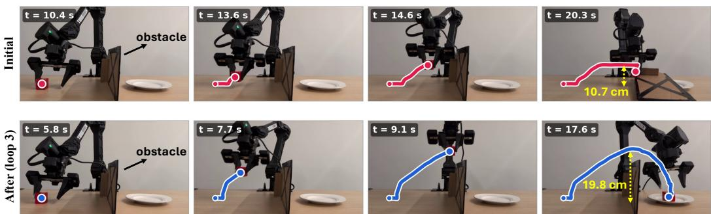  
Figure 1: With only 150 preference-labeled trajectories (50 per loop over 3 loops), PrefPI increased the object’s maximum height from 10.7 cm to 19.8cm on real hardware, enabling obstacle clearance.

## 1 INTRODUCTION

Pretrained generative robot policies are increasingly capable of solving a wide range of manipulation tasks, yet their behavior may not match the preferences of individual users. A robot may already know how to complete a task, while a user prefers that it move faster, follow a different trajectory, or achieve a different final configuration. Adapting such policies after deployment therefore requires a lightweight mechanism for steering an already capable policy toward user-preferred behaviors without collecting new demonstrations or manually specifying reward functions.

Preference feedback provides a natural interface for this purpose. Users can evaluate trajectories generated by the robot itself rather than demonstrate the desired behavior. Prior work has shown that preference-based adaptation can improve task success, suppress undesirable behaviors, and align pretrained policies with user preferences (Biyik & Sadigh, 2018; Hejna & Sadigh, 2023; Metcalf et al., 2023; Chen et al., 2025; Wallace et al., 2024; Wu et al., 2026). However, these evaluations largely optimize behaviors that are already represented, or at least observable, under the policy during data collection. We study a more challenging setting: can preference feedback steer a policy toward desirable behaviors that cannot be produced by the initial policy?

We call this setting steering beyond the initial effective support.1 If a desired behavior lies outside this set, it is exceedingly unlikely under the initial policy, may never appear in the first rollout batch, and therefore cannot directly supervise a single-round preference update. An iterative procedure can instead use incremental improvements as stepping stones, with each update shifting the rollout distribution, exposing new behaviors that can be preferred in subsequent rounds.

To realize this idea, we introduce PrefPI (Preference-Guided Policy Iteration), an iterative framework for steering pretrained generative robot policies using only relative preferences over selfgenerated trajectories. Our key idea is to formulate preference learning as preference-conditioned generative modeling. Rather than learning an explicit reward function or directly optimizing preference pairs, we treat preferred trajectories as samples from a conditional distribution and the broader behavior distribution as an unconditional reference. Their density ratio then provides an implicit preference signal that classifier-free guidance (CFG) (Ho & Salimans, 2022) uses to bias generation toward preferred behaviors.

At each iteration, the current policy generates a batch of rollouts and the user selects the relatively preferred subset. We train a preference-conditioned branch on these selected trajectories and an unconditional branch on an accumulated set of successful trajectories. CFG combines the two branches to produce the next policy, biasing generation toward the current preference while retaining a broad behavioral prior. Repeating this preference-conditioned modeling and guidance step yields a form of preference-guided policy iteration, allowing progressively more preferred behaviors. We derive that top-m selection induces an order-preserving preference signal, which CFG amplifies to improve expected latent utility.

We evaluate PrefPI across simulated and real-world manipulation tasks with both diffusion policies and the PI0.5 flow-matching VLA (Black et al., 2025a). In simulation, PrefPI increases detour height from approximately 15 cm to 37 cm and horizontal displacement from 4 cm to 12 cm, producing trajectories that extend well beyond regions visited by the initial policy. On real robot hardware, object transport height increases from 10.7 cm to 19.8 cm after only three iterations, and further reaches 20.4 cm after six iterations. PrefPI also reduces average task-completion time from 19.8 s to 10.8 s and increases throwing distance by 4.5×, while maintaining above 90% task success.

Our contributions are:

• We introduce a challenging preference-learning setting, steering beyond the initial effective support, where the desired behavior is extremely unlikely to appear under the initial policy distribution and no additional demonstrations are provided.

• We propose PrefPI, an iterative framework that uses preference-conditioned generative modeling and CFG to progressively steer toward such behaviors.

• We show that relative top-m selection induces an order-preserving optimality signal, enabling CFG to serve as a policy-improvement operator.

• Across diffusion and flow-matching policies in simulation and the real world, we demonstrate that PrefPI achieves large behavioral shifts with limited preference feedback.

## 2 RELATED WORK

## 2.1 PREFERENCE-BASED ROBOT POLICY ADAPTATION

Preference-based robot learning reduces the need for demonstrations and hand-designed rewards by allowing users to compare candidate behaviors. Early work learns reward functions from pairwise trajectory comparisons and uses active querying to reduce human feedback (Biyik & Sadigh, 2018). Later methods improve sample and feedback efficiency through active data collection, relabeling, and exploratory pretraining (Lee et al., 2021; Hejna & Sadigh, 2023; Metcalf et al., 2023).

Recent methods adapt pretrained generative robot policies directly from preference feedback. FDPP (Chen et al., 2025) learns a preference reward from policy-generated trajectories and finetunes a diffusion policy with reinforcement learning. Diffusion-DPO (Wallace et al., 2024) directly optimizes diffusion models from preferred and rejected samples, while FlowPRO (Wu et al., 2026) develops a preference objective for flow-matching vision-language-action policies and performs repeated real-world data collection and fine-tuning.

Our work asks a complementary question. Rather than only increasing the probability of preferred behaviors observed during adaptation, we study whether iterative preference feedback can move a policy toward behavioral regimes that are exceedingly unlikely under its initial distribution. PrefPI repeatedly collects fresh relative preferences from the evolving policy, allowing the steering direction to adapt as new behaviors emerge.

## 2.2 GENERATIVE POLICY IMPROVEMENT

Diffusion and flow-matching policies provide expressive multimodal action distributions (Chi et al., 2023; Lipman et al., 2023; Black et al., 2025b), motivating methods that steer generative policies using rewards or preferences. Reward-based approaches include DRaFT (Clark et al., 2024), DPPO (Ren et al., 2025), and ORW-CFM-W2 (Fan et al., 2025), while preference-based approaches include Diffusion-DPO (Wallace et al., 2024) and PC-Flow (Wang et al., 2026).

Most closely related is CFGRL (Frans et al., 2025), which interprets classifier-free guidance as a policy-improvement operator when the conditional-to-unconditional density ratio encodes an optimality factor. We build on this view but derive the signal from relative preferences and reconstruct the preference condition from newly generated trajectories at every iteration. This iterative structure is also related to self-improvement methods that repeatedly generate and retrain on selected samples (He et al., 2026), but PrefPI uses fresh human preferences to continually redirect the policy.

## 3 PRELIMINARIES

We consider a pretrained generative robot policy $\pi _ { \theta } ( a _ { t } \ \mid \ s _ { t } , c )$ , where $c$ is an optional discrete conditioning variable. Our formulation applies to diffusion (Chi et al., 2023) and flow-matching policies (Lipman et al., 2023; Black et al., 2025b). We denote the trajectory distribution induced by a policy as

$$
\tau \sim p _ { \pi } ( \tau | c ) .\tag{1}
$$

In PrefPI, $c = 1$ denotes the preference-conditioned branch and $c = \emptyset$ the unconditional branch.

Classifier-free guidance (CFG) (Ho & Salimans, 2022) combines unconditional and conditional generative distributions. At the trajectory level, we use the idealized abstraction

$$
p _ { w } ( \tau ) \propto p ( \tau ) \left( \frac { p ( \tau \mid c ) } { p ( \tau ) } \right) ^ { w } ,\tag{2}
$$

where w $\geq 0$ is the guidance strength. Increasing w amplifies trajectories with a larger conditionalto-unconditional density ratio. CFGRL (Frans et al., 2025) connects this ratio to policy improvement when it represents an optimality-related factor. We show how relative preference feedback induces such a factor in Section 4.2.

Eq. 2 is an idealized trajectory-level abstraction used for our analysis; in practice, CFG is applied within the action-generative policy.

## 4 PREFERENCE-GUIDED POLICY ITERATION

We formulate preference learning as conditional generative modeling, where relative preference serves as a conditioning variable and CFG amplifies the induced conditional-to-unconditional density ratio.

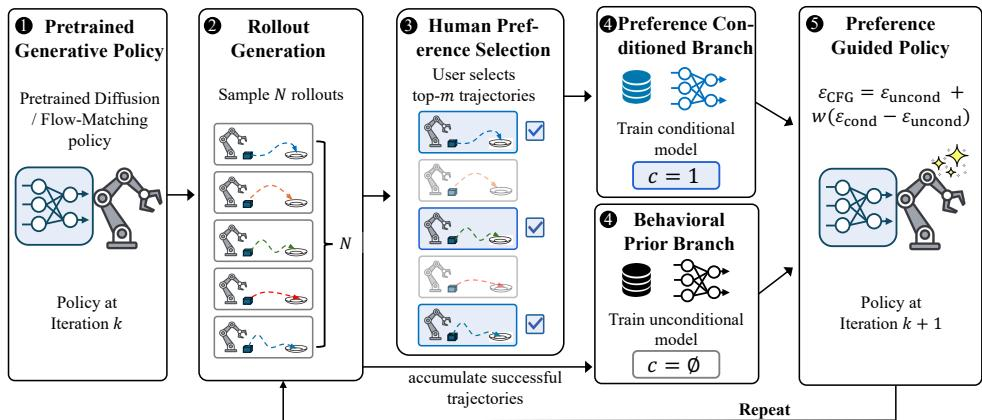  
Figure 2: Overview of PrefPI. Each iteration trains two branches, one conditioned on the top-m rollouts and the other on all successful rollouts, and CFG combines the two branches to produce the next policy.

## 4.1 METHOD OVERVIEW

We illustrate the overall procedure of PrefPI in Figure 2. Starting from a pretrained generative policy, PrefPI repeatedly alternates between relative preference evaluation and CFG-based policy improvement. At iteration k, let $p _ { k }$ denote the trajectory distribution induced by the current policy. We generate a batch of trajectories

$$
\begin{array} { r } { \mathcal { D } _ { k } = \{ \tau _ { 1 } , \dots , \tau _ { N } \} , \qquad \tau _ { i } \sim p _ { k } ( \tau ) , } \end{array}\tag{3}
$$

from which the user selects the top-m according to their preference. We denote the selected subset by $\mathcal { D } _ { k } ^ { + }$ . We train the preference-conditioned branch $c = 1$ on $\mathcal { D } _ { k } ^ { + }$ . For the unconditional branch, we maintain an accumulated dataset $\mathcal { D } _ { k } ^ { \mathrm { a c c } }$ of successful trajectories:

$$
\mathcal { D } _ { k } ^ { \mathrm { a c c } } = \mathcal { D } _ { k - 1 } ^ { \mathrm { a c c } } \cup \mathrm { S u c c e s s } ( \mathcal { D } _ { k } ) .\tag{4}
$$

The conditional branch captures the current preference direction, while the accumulated unconditional dataset preserves successful behavioral diversity for subsequent exploration. CFG combines the two branches to produce the policy for the next iteration, yielding the generate–select–guide– redeploy loop

$$
p _ { k }  \mathcal { D } _ { k }  \mathcal { D } _ { k } ^ { + }  p _ { k + 1 } .
$$

Conceptually, PrefPI can be viewed as a trajectory-level form of generalized policy iteration (Sutton & Barto, 2018): relative top-m selection provides an implicit policy-evaluation signal, while CFG acts as a generative policy-improvement operator that amplifies preferred behavior. Because the generative policy can generalize beyond the finite preferred samples, previously rare behaviors may become exposed in the next rollout batch and serve as stepping stones for subsequent updates. Repeating this process can progressively shift the policy’s effective support toward behaviors that were unlikely under the initial policy. We formalize the evaluation and improvement components in Sections 4.2 and 4.3, respectively.

## 4.2 RELATIVE PREFERENCE AS AN OPTIMALITY SIGNAL

To interpret CFG as a policy-improvement operator, the conditional-to-unconditional density ratio must encode an optimality-related signal, as in CFGRL (Frans et al., 2025). In our setting, however, we do not assume access to numerical rewards or explicit optimality labels; the only supervision is the user’s relative selection among trajectories sampled from the current policy. We therefore show that relative top-m selection induces an order-preserving factor that can play the role of the optimality signal required by the CFG policy-improvement interpretation.

Let $p _ { k } ( \tau )$ be the current trajectory distribution and suppose user preference is induced by an unknown latent utility $U ( \tau )$ , with larger values corresponding to greater preference. The method never observes or estimates the numerical value of U.

We draw N i.i.d. trajectories from $p _ { k }$ and select the top m, with selection ratio $\rho = m / N$ . Define

$$
g _ { k } ( u ) \triangleq \operatorname* { P r } ( c = 1 \mid U ( \tau ) = u )\tag{5}
$$

as the probability that a trajectory of utility u is selected.

Let

$$
F _ { k } ( u ) = \operatorname* { P r } _ { \tau \sim p _ { k } } \left( U ( \tau ) \leq u \right)\tag{6}
$$

denote the utility CDF under the current policy. A trajectory with utility u is selected among the top m if at most $m - 1$ of the other $N - 1$ trajectories have greater utility. Therefore,

$$
g _ { k } ( u ) = \sum _ { j = 0 } ^ { m - 1 } \binom { N - 1 } { j } [ 1 - F _ { k } ( u ) ] ^ { j } F _ { k } ( u ) ^ { N - 1 - j } .\tag{7}
$$

Since $F _ { k } ( u )$ is non-decreasing in $u ,$ so is $g _ { k } ( u )$

$$
u _ { 1 } \leq u _ { 2 } \quad \implies \quad g _ { k } ( u _ { 1 } ) \leq g _ { k } ( u _ { 2 } ) .\tag{8}
$$

Thus, relative top-m selection preserves the ordering induced by the latent utility.

To connect this selection signal to the preference-conditioned branch, let $p _ { k } ^ { + } ( \tau )$ denote the distribution of selected trajectories. By Bayes’ rule,

$$
p _ { k } ^ { + } ( \tau ) = p _ { k } ( \tau \mid c = 1 ) = \frac { p _ { k } ( \tau ) \operatorname* { P r } ( c = 1 \mid \tau ) } { \operatorname* { P r } ( c = 1 ) } .\tag{9}
$$

Since $\operatorname* { P r } ( c = 1 \mid \tau ) = g _ { k } ( U ( \tau ) )$ and $\mathrm { P r } ( c = 1 ) = m / N = \rho ,$ we obtain

$$
p _ { k } ^ { + } ( \tau ) = \frac { 1 } { \rho } p _ { k } ( \tau ) g _ { k } ( U ( \tau ) ) .\tag{10}
$$

Thus, relative preference selection reweights the current trajectory distribution $p _ { k } ( \tau )$ by an orderpreserving function $g _ { k } ( U ( \tau ) )$ of the latent utility.

## 4.3 CFG-BASED POLICY IMPROVEMENT

Having established the preference-induced signal $g _ { k } ( U ( \tau ) )$ , we now connect it to the CFG-based policy-improvement framework of CFGRL. Consider an idealized improvement step in which the unconditional branch represents $p _ { k } ( \tau )$ and the conditional branch represents $p _ { k } ^ { + } ( \tau )$ . From Eq. 10, their density ratio is

$$
\frac { p _ { k } ^ { + } ( \tau ) } { p _ { k } ( \tau ) } = \frac { 1 } { \rho } g _ { k } ( U ( \tau ) ) .\tag{11}
$$

Let $\tilde { p } _ { k , w } ( \tau )$ denote the trajectory distribution obtained by applying CFG with guidance strength w. By Eq. 2,

$$
\tilde { p } _ { k , w } ( \tau ) \propto p _ { k } ( \tau ) \left( \frac { p _ { k } ^ { + } ( \tau ) } { p _ { k } ( \tau ) } \right) ^ { w }\tag{12}
$$

$$
\propto p _ { k } ( \tau ) g _ { k } ( U ( \tau ) ) ^ { w } ,\tag{13}
$$

where the constant factor $\rho ^ { - w }$ is absorbed into the normalization. Thus, CFG amplifies the preference-induced signal according to guidance strength w.

Because $g _ { k } ( U )$ is non-decreasing in $U ,$ increasing the CFG guidance strength cannot decrease the expected latent preference utility:

$$
\frac { \partial } { \partial w } \mathbb { E } _ { \tau \sim \tilde { p } _ { k , w } } \left[ U ( \tau ) \right] \geq 0 .\tag{14}
$$

See Appendix B for the derivation. Since $\tilde { p } _ { k , 0 } = p _ { k }$ , it follows that any $w \geq 0$ yields an expected latent utility no lower than that of the current policy. In this sense, CFG acts as a policy-improvement operator using an optimality signal induced solely by relative trajectory preferences.

Our practical algorithm differs from this analysis in one respect: rather than using the current $p _ { k }$ as the unconditional reference, we train the unconditional branch on the accumulated dataset $\mathcal { D } _ { k } ^ { \mathrm { { \bar { a c c } } } }$ to preserve diversity. The monotonicity result therefore characterizes the idealized improvement direction induced by preference and CFG, while the effectiveness of the accumulated prior is evaluated empirically. Algorithm 1 provides the complete preference-guided policy iteration procedure.

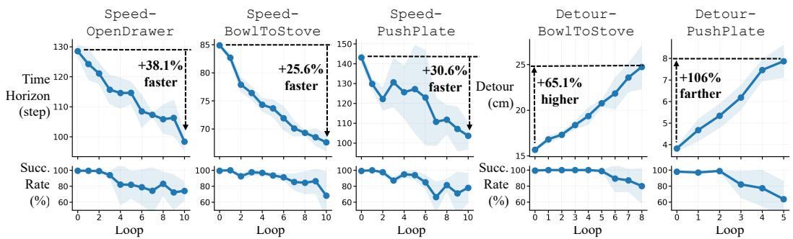

Figure 3: PrefPI progressively steers the policy toward preferred behaviors. Results are averaged over three seeds. Top: preference metric; bottom: success rate.  
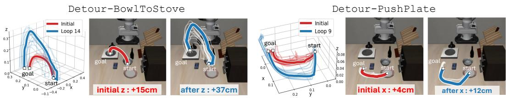  
Figure 4: Trajectories before and after training are highly disjoint, indicating that the blue trajectories lie beyond the initial policy’s effective support.

## 5 EXPERIMENTAL RESULTS

In this section, we aim to answer four questions: (1) Can PrefPI steer pretrained large VLA policies beyond their initial effective support? (2) Can PrefPI scale to real-world robot deployment? (3) Given the same preference-feedback budget, can PrefPI achieve larger behavioral shifts than existing preference-learning and policy-steering baselines? (4) Does PrefPI remain effective for conventional in-distribution preference refinement?

## 5.1 STEERING LARGE VISION-LANGUAGE-ACTION MODELS

We evaluate PrefPI using PI0.5-LIBERO (Black et al., 2025a), a flow-matching VLA policy, on the LIBERO benchmark (Liu et al., 2023). We consider two preference objectives: speed, which favors faster task completion, and detour, which favors trajectories with larger vertical or horizontal displacement. We evaluate speed on three LIBERO-Goal tasks—OpenDrawer, BowlToStove, and PushPlate—and detour on BowlToStove and PushPlate. At each iteration, we collect 40 trajectories and select the top 40% according to the corresponding preference criterion. Additional implementation details are provided in Appendix C.

PrefPI steers large VLA policies beyond their initial effective support. As shown in Figure 3, PrefPI consistently steers the initial PI0.5 policy toward the specified preferences. On the speed tasks, execution speed improves by approximately 25%–38% within 10 iterations, corresponding to only 400 evaluated trajectories. On the detour tasks, the maximum bowl height increases by 65.1% within 320 trajectories, while the plate is pushed 106% farther along the preferred direction within 200 trajectories. Figure 4 further shows that the adapted trajectories extend into regions largely disjoint from those visited by the initial policy. Notably, these behaviors emerge solely through iterative preference feedback, without demonstrations of the desired trajectories. In most experiments, success rates stay above 90% over the early iterations, which already yield roughly half of the total shift. However, more aggressive steering comes with a 20%–30% decrease in task success rate, reflecting a trade-off between exploring behaviors beyond the initial policy distribution and preserving task reliability. We discuss this trade-off further in Section 6.

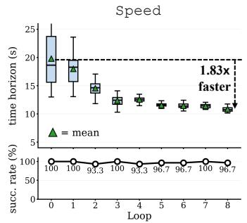

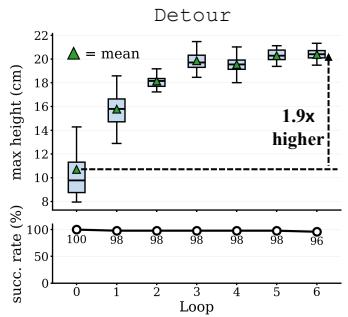

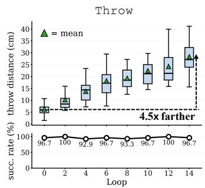  
Figure 5: Real-world steering on three different preferences. PrefPI improves the preference metric by 1.83× (speed), 1.9× (detour), and 4.5× (throw), while success rates remain above 90%.

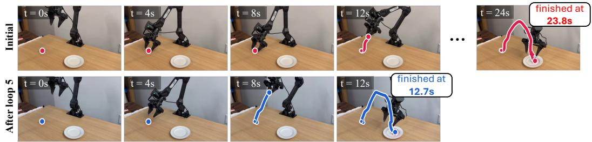  
Figure 6: PrefPI completes the task nearly twice as fast as the initial policy using only 150 preference-labeled trajectories (30 per iteration over 5 iterations).

## 5.2 REAL-WORLD PREFERENCE-GUIDED STEERING

We deploy PrefPI on a real-world CubePickAndPlace task using a WidowX (Trossen Robotics) robot arm, where the robot must grasp a red cube and place it on a plate. Because zero-shot PI0.5 achieves a 0% success rate, we first fine-tune it using 100 task demonstrations to obtain the initial policy. We then evaluate the same speed and detour preferences as in LIBERO, using 30 and 50 trajectories per iteration, respectively. We additionally consider a throw objective that favors longer throwing distances, using 30 trajectories per iteration. All other hyperparameters are kept identical to those used in the LIBERO experiments.

PrefPI enables substantial real-world steering. Interestingly, PrefPI achieves larger behavioral changes with fewer interaction samples than in the simulated PI0.5 experiments while maintaining a high task success rate. The learning curves are shown in Figure 5.

Across all three objectives, PrefPI produces substantial behavioral shifts: task execution becomes 1.83× faster, maximum object height increases by 1.9×, and throwing distance increases by approximately 4.5×. Importantly, the success rate remains above 90% for most iterations across all three objectives, indicating that substantial steering can be achieved while largely preserving task competence. Representative executions for detour, speed, and throw are shown in Figures 1, 6, and 9, respectively.

## 5.3 OOD STEERING UNDER MATCHED FEEDBACK BUDGETS

We compare PrefPI against representative preference-learning and policy-steering baselines on RoboMimic (Mandlekar et al., 2022) under matched preference-feedback budgets. We equalize the number of human preference labels across methods and evaluate all methods iteratively using fresh feedback from the current policy, allowing each method to exploit newly discovered behaviors as the policy distribution evolves. FDPP additionally collects 50 trajectories per iteration for its online RL update, resulting in approximately twice as many environment interactions as PrefPI.

We compare against the following baselines:

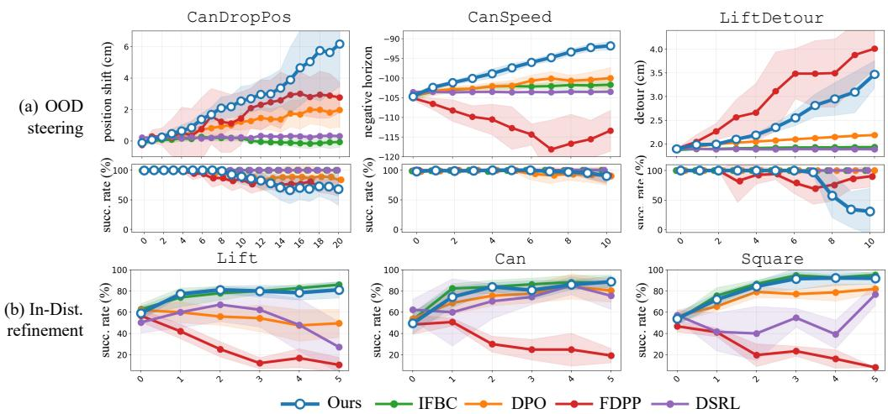  
Figure 7: Comparison with baselines, averaged over five seeds. PrefPI achieves (a) the strongest OOD steering overall, (b) while matching the best baseline on in-distribution refinement.

• Iterative Filtered Behavior Cloning (IFBC) repeatedly fine-tunes the policy on preferred trajectories collected at each iteration, without classifier-free guidance.

• Direct Preference Optimization (DPO) (Rafailov et al., 2023; Zhang et al., 2024) directly optimizes the policy from pairwise preference data.

• FDPP (Chen et al., 2025) follows an RLHF-style pipeline for diffusion policies, first learning a reward model from preference feedback and subsequently optimizing the policy using DPPO (Ren et al., 2025).

• DSRL (Wagenmaker et al., 2025) performs reinforcement learning over the diffusion noisesampling distribution to steer the behavior of a pretrained diffusion policy.

Additional implementation details, including our iterative implementations and DPO stabilization, are provided in Appendix D.

PrefPI achieves strong OOD steering under matched preference budgets. We consider three OOD steering tasks: CanDropPos, which favors larger directional displacement of the final can position; CanSpeed, which favors faster completion; and LiftDetour, which favors larger endeffector displacement during the approach. For each task, all methods start from the same diffusion policy pretrained on the corresponding RoboMimic human demonstration dataset.

As shown in Figure 7(a), PrefPI achieves the strongest steering on CanDropPos and CanSpeed. On LiftDetour, FDPP achieves both a larger detour and a higher success rate than PrefPI. However, FDPP is less consistent across tasks: it underperforms PrefPI on the other two settings and fails to produce meaningful improvement on CanSpeed. At the same time, aggressive LiftDetour steering with PrefPI reduces the success rate to roughly 30%, highlighting that large OOD behavioral shifts can come at a substantial cost in task reliability. We discuss this trade-off further in Section 6.

IFBC and DSRL exhibit little behavioral shift in these OOD steering tasks. IFBC directly trains on preferred trajectories sampled from the current policy and therefore primarily reinforces behaviors already observed in the collected data. In contrast, classifier-free guidance in PrefPI can bias generation beyond the preferred samples themselves. Similarly, DSRL reweights the sampling process of the pretrained diffusion policy, which may limit how far it can move beyond behaviors represented by the initial policy. DPO produces a measurable steering effect, but the resulting shift is consistently smaller than that of PrefPI.

## 5.4 IN-DISTRIBUTION PREFERENCE REFINEMENT

We next consider the conventional preference-learning setting, where the desired behavior is already represented by the initial policy. Using the same baselines and matched preference-feedback protocol described above, we train diffusion policies on Lift, Can, and Square, intentionally stopping pretraining such that the initial policies achieve approximately 50% task success. Preferences are determined solely by task success, with successful trajectories preferred over unsuccessful ones.

OOD steering does not come at the expense of in-distribution refinement. As shown in Figure 7(b), PrefPI improves task success across all three environments within five iterations. PrefPI and IFBC perform best overall, with IFBC slightly outperforming PrefPI on Lift and Can. This is consistent with Section 4.3: when preferred behaviors are already in-distribution, w = 1 recovers the preferred-trajectory distribution, so direct imitation can already be effective. CFG becomes more important for steering beyond the current policy distribution.

FDPP performs substantially worse, possibly because learning an accurate reward model from only 50 preference-labeled trajectories per iteration is difficult. Reward errors may then propagate through the online RL stage, reducing sample efficiency.

## 6 DISCUSSION: THE ROLE OF PRIOR DIVERSITY

Across our experimental results, we observe a consistent trend: greater behavioral diversity in the initial policy leads to stronger steering with PrefPI. For instance, LiftDetour in Section 5.3, where PrefPI showed the largest drop in task success, had very limited behavioral diversity in the initial policy. Across 250 rollouts, the mean detour was 1.90 cm with a standard deviation of only 0.022 cm, corresponding to a relative std. of 1.1%. In contrast, the initial policies for the detour experiments in Sections 5.1 and 5.2 exhibited substantially greater behavioral diversity, with relative std. values of 6.8% and 27.2%, respectively. In both cases, PrefPI achieved strong steering while maintaining high task success.

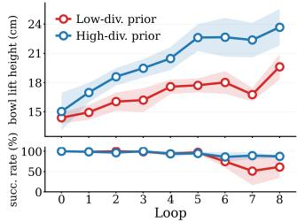  
Figure 8: PrefPI benefits from a high-diversity prior.

These observations suggest that prior diversity may benefit PrefPI. We argue that this benefit arises through two complementary mechanisms. First, diversity may improve generalization during CFGdriven exploration. Because CFG shifts the policy toward increasingly underrepresented behaviors, successful steering requires the policy to retain task competence in these newly explored regions. A broader prior may therefore allow larger shifts through better generalization to newly explored behaviors. Second, diversity may strengthen the directional signal provided by CFG. CFG amplifies relative differences between the preference-conditioned and unconditional distributions; when the prior contains behaviorally distinct solutions, these relative differences may provide a clearer steering direction than when all sampled behaviors are narrowly clustered.

Greater prior diversity enables stronger steering. To confirm this, we evaluate PrefPI using two different PI0.5-based priors on the Detour-BowlToStove task over three seeds. The two priors are trained from 100 synthetically generated demonstrations with different degrees of diversity. Both demonstration sets are centered at a transport height of 15 cm, but are evenly distributed over different ranges, 12.5–17.5 cm and 14–16 cm for the high- and low-diversity priors, respectively, while all other factors are held fixed.

As shown in Figure 8, the high-diversity prior reaches approximately 24 cm while maintaining above 85% success, whereas the low-diversity prior reaches only approximately 20 cm and drops to roughly 50% success. Our controlled experiment confirms that greater initial behavioral diversity enables both larger preference-driven steering and better task reliability.

## 7 CONCLUSION

We introduced PrefPI, a lightweight preference-guided framework for steering generative visuomotor policies beyond their initial effective support. Across simulation and real-world experiments, PrefPI achieves substantial behavioral shifts using only relative preferences. As discussed in Section 6, a key limitation is that steering performance depends on the diversity of the initial policy, motivating future work on improving robustness under narrow behavioral priors.

## REFERENCES

Erdem Biyik and Dorsa Sadigh. Batch active preference-based learning of reward functions. In Proceedings of the 2nd Conference on Robot Learning, volume 87 of Proceedings of Machine Learning Research, pp. 519–528. PMLR, 2018.

Kevin Black, Noah Brown, James Darpinian, Karan Dhabalia, Danny Driess, Adnan Esmail, Michael Robert Equi, Chelsea Finn, Niccolo Fusai, Manuel Y. Galliker, Dibya Ghosh, Lachy Groom, Karol Hausman, brian ichter, Szymon Jakubczak, Tim Jones, Liyiming Ke, Devin LeBlanc, Sergey Levine, Adrian Li-Bell, Mohith Mothukuri, Suraj Nair, Karl Pertsch, Allen Z. Ren, Lucy Xiaoyang Shi, Laura Smith, Jost Tobias Springenberg, Kyle Stachowicz, James Tanner, Quan Vuong, Homer Walke, Anna Walling, Haohuan Wang, Lili Yu, and Ury Zhilinsky. π0.5: a vision-language-action model with open-world generalization. In Joseph Lim, Shuran Song, and Hae-Won Park (eds.), Proceedings of The 9th Conference on Robot Learning, volume 305 of Proceedings ofMachine Learning Research, pp. 17–40. PMLR, 27–30 Sep 2025a. URL https://proceedings.mlr.press/v305/black25a.html.

Kevin Black, Noah Brown, Danny Driess, Adnan Esmail, Michael Robert Equi, Chelsea Finn, Niccolo Fusai, Lachy Groom, Karol Hausman, Brian Ichter, Szymon Jakubczak, Tim Jones, Liyiming Ke, Sergey Levine, Adrian Li-Bell, Mohith Mothukuri, Suraj Nair, Karl Pertsch, Lucy Xiaoyang Shi, Laura Smith, James Tanner, Quan Vuong, Anna Walling, Haohuan Wang, and Ury Zhilinsky. π0: A vision-language-action flow model for general robot control. In Proceedings of Robotics: Science and Systems, 2025b. doi: 10.15607/RSS.2025.XXI.010.

Yuxin Chen, Devesh K. Jha, Masayoshi Tomizuka, and Diego Romeres. FDPP: Fine-tune diffusion policy with human preference. In IEEE International Conference on Robotics and Automation (ICRA), 2025.

Cheng Chi, Siyuan Feng, Yilun Du, Zhenjia Xu, Eric Cousineau, Benjamin C. M. Burchfiel, and Shuran Song. Diffusion policy: Visuomotor policy learning via action diffusion. In Proceedings of Robotics: Science and Systems, Daegu, Republic of Korea, July 2023. doi: 10.15607/RSS. 2023.XIX.026.

Jae Hyeon Cho, JunHyeok Oh, Myunsoo Kim, and Byung-Jun Lee. Rethinking dpo: The role of rejected responses in preference misalignment. In EMNLP (Findings), pp. 8159–8176, 2025.

Kevin Clark, Paul Vicol, Kevin Swersky, and David J. Fleet. Directly fine-tuning diffusion models on differentiable rewards. In International Conference on Learning Representations, 2024.

Jiajun Fan, Shuaike Shen, Chaoran Cheng, Yuxin Chen, Chumeng Liang, and Ge Liu. Online reward-weighted fine-tuning of flow matching with Wasserstein regularization. In International Conference on Learning Representations, 2025.

Kevin Frans, Seohong Park, Pieter Abbeel, and Sergey Levine. Diffusion guidance is a controllable policy improvement operator. arXiv preprint arXiv:2505.23458, 2025.

Xiaoxuan He, Siming Fu, Wanli Li, Zhiyuan Li, Dacheng Yin, Kang Rong, Fengyun Rao, and Bo Zhang. SAIL: Self-amplified iterative learning for diffusion model alignment with minimal human feedback. In International Conference on Learning Representations, 2026.

Donald Joseph Hejna, III and Dorsa Sadigh. Few-shot preference learning for human-in-the-loop RL. In Proceedings of the 6th Conference on Robot Learning, volume 205 of Proceedings of Machine Learning Research, pp. 2014–2025. PMLR, 2023.

Jonathan Ho and Tim Salimans. Classifier-free diffusion guidance. arXiv preprint arXiv:2207.12598, 2022.

Edward J. Hu, Yelong Shen, Phillip Wallis, Zeyuan Allen-Zhu, Yuanzhi Li, Shean Wang, Lu Wang, and Weizhu Chen. LoRA: Low-rank adaptation of large language models. In International Conference on Learning Representations, 2022. URL https://openreview.net/forum? id=nZeVKeeFYf9.

Kimin Lee, Laura M. Smith, and Pieter Abbeel. PEBBLE: Feedback-efficient interactive reinforcement learning via relabeling experience and unsupervised pre-training. In Proceedings of the 38th International Conference on Machine Learning, volume 139 of Proceedings of Machine Learning Research, pp. 6152–6163. PMLR, 2021.

Yaron Lipman, Ricky T. Q. Chen, Heli Ben-Hamu, Maximilian Nickel, and Matthew Le. Flow matching for generative modeling. In International Conference on Learning Representations, 2023.

Bo Liu, Yifeng Zhu, Chongkai Gao, Yihao Feng, Qiang Liu, Yuke Zhu, and Peter Stone. LIBERO: Benchmarking knowledge transfer for lifelong robot learning. Advances in Neural Information Processing Systems, 36:44776–44791, 2023.

Ajay Mandlekar, Danfei Xu, Josiah Wong, Soroush Nasiriany, Chen Wang, Rohun Kulkarni, Li Fei-Fei, Silvio Savarese, Yuke Zhu, and Roberto Martín-Martín. What matters in learning from offline human demonstrations for robot manipulation. In Proceedings of the 5th Conference on Robot Learning, volume 164 of Proceedings of Machine Learning Research, pp. 1678–1690. PMLR, 2022.

Katherine Metcalf, Miguel Sarabia, Natalie Mackraz, and Barry-John Theobald. Sample-efficient preference-based reinforcement learning with dynamics aware rewards. In Proceedings of the 7th Conference on Robot Learning, volume 229 of Proceedings of Machine Learning Research, pp. 1484–1532. PMLR, 2023.

Rafael Rafailov, Archit Sharma, Eric Mitchell, Christopher D. Manning, Stefano Ermon, and Chelsea Finn. Direct preference optimization: Your language model is secretly a reward model. In Advances in Neural Information Processing Systems, volume 36, 2023.

Noam Razin, Sadhika Malladi, Adithya Bhaskar, Danqi Chen, Sanjeev Arora, and Boris Hanin. Unintentional unalignment: Likelihood displacement in direct preference optimization. In International Conference on Learning Representations, volume 2025, pp. 24791–24834, 2025.

Allen Z. Ren, Justin Lidard, Lars L. Ankile, Anthony Simeonov, Pulkit Agrawal, Anirudha Majumdar, Benjamin Burchfiel, Hongkai Dai, and Max Simchowitz. Diffusion policy policy optimization. In International Conference on Learning Representations, 2025.

Richard S. Sutton and Andrew G. Barto. Reinforcement Learning: An Introduction. MIT Press, 2 edition, 2018.

Trossen Robotics. WidowX AI robot arm. https://docs.trossenrobotics.com/ trossen\_arm/main/specifications/wxai.html. Accessed: September 2026.

Andrew Wagenmaker, Yunchu Zhang, Mitsuhiko Nakamoto, Seohong Park, Waleed Yagoub, Anusha Nagabandi, Abhishek Gupta, and Sergey Levine. Steering your diffusion policy with latent space reinforcement learning. In Conference on Robot Learning, 2025.

Bram Wallace, Meihua Dang, Rafael Rafailov, Linqi Zhou, Aaron Lou, Senthil Purushwalkam, Stefano Ermon, Caiming Xiong, Shafiq Joty, and Nikhil Naik. Diffusion model alignment using direct preference optimization. In Proceedings of the IEEE/CVF Conference on Computer Vision and Pattern Recognition (CVPR), pp. 8228–8238, 2024. doi: 10.1109/CVPR52733.2024.00786.

Shaomeng Wang, He Wang, Longquan Dai, and Jinhui Tang. PC-Flow: Preference alignment in flow matching via classifier. In Proceedings of the AAAI Conference on Artificial Intelligence, volume 40, pp. 10047–10055, 2026. doi: 10.1609/aaai.v40i12.37971.

Yihao Wu, He Zhang, Junbo Tan, Xueqian Wang, and Zhengyou Zhang. FlowPRO: Reward-free reinforced fine-tuning of flow-matching VLAs via proximalized preference optimization. arXiv preprint arXiv:2606.05468, 2026.

Zijian Zhang, Kaiyuan Zheng, Zhaorun Chen, Joel Jang, Yi Li, Siwei Han, Chaoqi Wang, Mingyu Ding, Dieter Fox, and Huaxiu Yao. GRAPE: Generalizing robot policy via preference alignment, 2024. URL https://arxiv.org/abs/2411.19309.

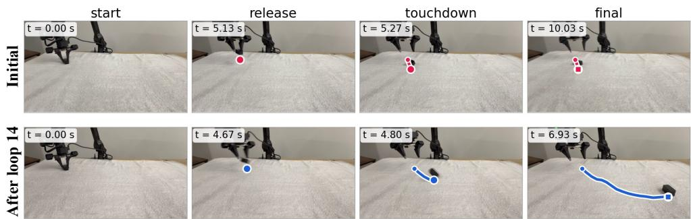  
Figure 9: Example throw rollouts. The initial policy barely throws the object, while by iteration 14, PrefPI achieves a much longer throwing distance. A towel absorbs impact in the landing area.

## A ALGORITHM

Algorithm 1 PrefPI: Preference-Guided Policy Iteration   
Require: Pretrained generative policy $\pi _ { 0 } .$ , number of iterations K, rollout batch size N, number of   
preferred trajectories m, guidance strength w   
1: Initialize accumulated successful dataset $\mathcal { D } _ { - 1 } ^ { \mathrm { a c c } }  \emptyset$   
2: for $k = 0 , 1 , \ldots , K - 1$ do   
3: Let $p _ { k } ( \tau ) \equiv p _ { \pi _ { k } } ( \tau )$ denote the trajectory distribution induced by $\pi _ { k }$   
4: Generate $N$ trajectories:   
$\begin{array} { r } { \mathcal { D } _ { k } = \{ \tau _ { i } \} _ { i = 1 } ^ { N } , \qquad \tau _ { i } \sim p _ { k } ( \tau ) } \end{array}$   
5: Obtain the user’s relative preference over $\mathcal { D } _ { k }$   
6: Select the top-m preferred trajectories:   
$\mathcal { D } _ { k } ^ { + } \gets \mathrm { T o p M } ( \mathcal { D } _ { k } )$   
7: Update the accumulated successful dataset:   
$\mathcal { D } _ { k } ^ { \mathrm { a c c } }  \mathcal { D } _ { k - 1 } ^ { \mathrm { a c c } } \cup \mathrm { S u c c e s s } ( \mathcal { D } _ { k } )$   
8: Train the unconditional and preference-conditioned branches:   
$( \pi _ { k , \infty } , \pi _ { k , 1 } )  \mathrm { T r a i n } ( \pi _ { k } ; \mathcal { D } _ { k } ^ { \mathrm { a c c } } , \mathcal { D } _ { k } ^ { + } )$   
9: Construct the next policy using classifier-free guidance:   
$\pi _ { k + 1 } \gets \mathrm { C F G } \left( \pi _ { k , \infty } , \pi _ { k , 1 } ; w \right)$   
10: end for   
11: return πK

## B MONOTONIC IMPROVEMENT WITH GUIDANCE STRENGTH

Here we provide the derivation of the monotonic improvement result stated in Section 4.3. Recall that CFG induces the trajectory distribution

$$
\tilde { p } _ { k , w } ( \tau ) \propto p _ { k } ( \tau ) g _ { k } ( U ( \tau ) ) ^ { w } .\tag{15}
$$

Writing this distribution explicitly,

$$
\tilde { p } _ { k , w } ( \tau ) = \frac { p _ { k } ( \tau ) g _ { k } ( U ( \tau ) ) ^ { w } } { Z _ { k } ( w ) } ,\tag{16}
$$

where

$$
Z _ { k } ( w ) = \mathbb { E } _ { \tau \sim p _ { k } } \left[ g _ { k } ( U ( \tau ) ) ^ { w } \right] .\tag{17}
$$

Define the expected latent preference utility under the guided distribution as

$$
J _ { k } ( w ) = \mathbb { E } _ { \tau \sim \tilde { p } _ { k , w } } \left[ U ( \tau ) \right] .\tag{18}
$$

Under standard integrability conditions, we show that

$$
\frac { \partial J _ { k } ( w ) } { \partial w } \geq 0 .\tag{19}
$$

Taking the logarithm of the guided distribution gives

$$
\begin{array} { r } { \log \tilde { p } _ { k , w } ( \tau ) = \log p _ { k } ( \tau ) + w \log g _ { k } ( U ( \tau ) ) - \log Z _ { k } ( w ) . } \end{array}\tag{20}
$$

Differentiating with respect to $w ,$

$$
\frac { \partial } { \partial w } \log \tilde { p } _ { k , w } ( \tau ) = \log g _ { k } ( U ( \tau ) ) - \frac { \partial } { \partial w } \log Z _ { k } ( w ) .\tag{21}
$$

The normalization term satisfies

$$
\frac { \partial } { \partial w } \log Z _ { k } ( w ) = \frac { 1 } { Z _ { k } ( w ) } \frac { \partial Z _ { k } ( w ) } { \partial w }\tag{22}
$$

$$
= \frac { \mathbb { E } _ { \tau \sim p _ { k } } \left[ g _ { k } ( U ( \tau ) ) ^ { w } \log g _ { k } ( U ( \tau ) ) \right] } { Z _ { k } ( w ) }\tag{23}
$$

$$
= \mathbb { E } _ { \tau \sim \tilde { p } _ { k , w } } \left[ \log g _ { k } ( U ( \tau ) ) \right] .\tag{24}
$$

Therefore,

$$
\frac { \partial } { \partial w } \log \tilde { p } _ { k , w } ( \tau ) = \log g _ { k } ( U ( \tau ) ) - \mathbb { E } _ { \tau \sim \tilde { p } _ { k , w } } \left[ \log g _ { k } ( U ( \tau ) ) \right] .\tag{25}
$$

Using the score-function identity,

$$
\frac { \partial J _ { k } ( w ) } { \partial w } = \mathbb { E } _ { \tau \sim \tilde { p } _ { k , w } } \left[ U ( \tau ) \frac { \partial } { \partial w } \log \tilde { p } _ { k , w } ( \tau ) \right]\tag{26}
$$

$$
= \operatorname { C o v } _ { \tau \sim \tilde { p } _ { k , w } } \left[ U ( \tau ) , \log g _ { k } ( U ( \tau ) ) \right] .\tag{27}
$$

Since $g _ { k } ( U )$ is non-decreasing in $U ,$ log $g _ { k } ( U )$ is also non-decreasing wherever $g _ { k } ( U ) > 0$ . Two non-decreasing functions of the same random variable have non-negative covariance. Therefore,

$$
\frac { \partial J _ { k } ( w ) } { \partial w } = \mathrm { C o v } _ { \tau \sim \tilde { p } _ { k , w } } \left[ U ( \tau ) , \log g _ { k } ( U ( \tau ) ) \right] \ge 0 .\tag{28}
$$

Hence, under the idealized distributional assumptions of Section 4.3, increasing the CFG guidance strength cannot decrease the expected latent preference utility. Since $\tilde { p } _ { k , 0 } = p _ { k }$ , this also implies

$$
\begin{array} { r } { \mathbb { E } _ { \tau \sim \tilde { p } _ { k , w } } [ U ( \tau ) ] \geq \mathbb { E } _ { \tau \sim p _ { k } } [ U ( \tau ) ] , \qquad w \geq 0 . } \end{array}\tag{29}
$$

## C ADDITIONAL DETAILS FOR VLA STEERING

Model and fine-tuning. We initialize all experiments from the LIBERO-finetuned PI0.5 checkpoint (pi05\_libero). The policy consists of a PaliGemma backbone with a SigLIP So400m/14 vision encoder and Gemma-2B language model, together with a Gemma-300M action expert. We apply LoRA (Hu et al., 2022) to the Gemma-2B backbone and action expert, while fully fine-tuning the SigLIP vision encoder and the action/time projection layers. Thus, our adaptation should be viewed as LoRA on the language and action backbones combined with full fine-tuning of the vi sion and projection modules. Overall, approximately 467M parameters, or 13.7% of the model, are trainable.

Table 1: Model and fine-tuning configuration for PI0.5.
<table><tr><td>Hyperparameter</td><td>Value</td></tr><tr><td>Base policy</td><td>PI0.5-LIBERO (pi05_libero)</td></tr><tr><td>VLM backbone</td><td>SigLIP So400m/14 + Gemma 2B</td></tr><tr><td>Action expert</td><td>Gemma 300M</td></tr><tr><td>Action dim. / horizon</td><td>32 (7 used) / 10</td></tr><tr><td>Max. prompt length</td><td>200 tokens</td></tr><tr><td>Compute dtype</td><td>bfloat16</td></tr><tr><td>LoRA rank / α (Gemma 2B)</td><td>16 / 16</td></tr><tr><td>LoRA rank / α (action expert)</td><td>32 / 32</td></tr><tr><td>Trainable parameters</td><td>467M (13.7%)</td></tr></table>

Table 2: Optimization and online adaptation settings.
<table><tr><td>Hyperparameter</td><td>Value</td></tr><tr><td>Optimizer</td><td>AdamW</td></tr><tr><td>Adam  $\beta _ { 1 } , \beta _ { 2 }$ </td><td>0.9,0.95</td></tr><tr><td>Peak learning rate</td><td> $5 \times 1 0 ^ { - 5 }$ </td></tr><tr><td>LR schedule</td><td>20-step warmup, then constant</td></tr><tr><td>Weight decay Gradient clipping</td><td> $1 0 ^ { - 1 0 ^ { \bullet } }$ </td></tr><tr><td>Batch size</td><td>Global norm 1.0 12</td></tr><tr><td>Training steps / iteration</td><td>3,000</td></tr><tr><td>Rollouts / iteration</td><td>40</td></tr><tr><td>Preferred fraction</td><td>Top 40% of successful rollouts</td></tr><tr><td>Preferred buffer</td><td>FIFO, 40 episodes</td></tr><tr><td>Unconditional : conditional sampling</td><td></td></tr><tr><td></td><td>0.4:1</td></tr><tr><td>Checkpoint initialization</td><td>Previous iteration</td></tr><tr><td>Hardware</td><td>1× NVIDIA L40S</td></tr></table>

CFG conditioning and data construction. We implement the conditioning variable through the natural-language task prompt. For the unconditional branch, $c = \varnothing .$ , we use the original task instruction. For the preference-conditioned branch, c = 1, we prepend a special token, $[ \mathsf { C } \pounds \mathsf { g } ]$ , to the same instruction. This allows both branches to share the same VLA architecture without introducing an additional conditioning input.

At each iteration, we collect 40 rollouts and rank successful trajectories according to the corresponding preference objective. The top 40% are added to the preferred set. Preferred trajectories are maintained in a FIFO buffer of size 40, while successful unconditional trajectories are accumulated across iterations. During training, unconditional and preference-conditioned samples are drawn with a unconditional-to-conditional sampling ratio of 0.4:1. Sampling weights are assigned per episode, with frames sampled uniformly within each episode.

Evaluation and inference. We use 10 flow-matching denoising steps and apply classifier-free guidance at every sampling step with guidance scale $w = 5 . 0$

$$
v _ { \mathrm { C F G } } = v _ { \mathrm { u n c o n d } } + w \left( v _ { \mathrm { c o n d } } - v _ { \mathrm { u n c o n d } } \right) .\tag{30}
$$

Each policy is evaluated for 40 episodes per iteration. The policy observes agent-view and wristcamera images rendered at $2 5 6 \times 2 5 6$ resolution and resized with padding to 224 × 224. We replan every 5 environment steps using a 10-step action chunk, and episodes are limited to 300 control steps following 10 warm-up steps.

Detour scoring. For the vertical-detour experiment, we rank successful rollouts by the maximum bowl height attained while the object is grasped. Thus, the preference signal directly favors trajectories that transport the object along increasingly elevated paths rather than merely improving success on the original task. Analogous geometric scores are used for the horizontal-detour experiments.

## D BASELINE IMPLEMENTATION DETAILS

We make substantial efforts to obtain strong implementations of all baselines. In particular, we adapt IFBC, DPO, DSRL, and FDPP to the same iterative preference-feedback setting used by PrefPI. This is important for the OOD steering experiments in Section 5.3, where the policy distribution can change substantially over the course of adaptation. Unless otherwise noted, all methods receive the same number of preference-labeled trajectories at each iteration.

Iterative adaptation protocol. IFBC naturally admits an iterative implementation: at each iteration, the current policy generates a new batch of trajectories, the preferred subset is selected, and the policy is fine-tuned on these trajectories. For DPO, we similarly collect fresh preferred–unpreferred pairs from the current policy at every iteration and continue optimizing the DPO objective, warmstarting from the policy obtained in the previous iteration.

We also make DSRL and FDPP iterative, including their reward-learning stage. Both methods rely on a learned reward function to guide policy optimization. If this reward model were trained only on trajectories from the initial policy, its predictions could become unreliable as policy optimization discovers behaviors far from its original training distribution. This issue is particularly relevant in our OOD steering setting: a policy may discover a more preferred behavior through exploration, while a reward model trained only on the initial distribution may not reliably evaluate it. We therefore update the reward model at every iteration using newly collected preference feedback, allowing its training distribution to evolve together with the policy. This gives DSRL and FDPP the same opportunity as PrefPI to exploit newly discovered behaviors.

Interaction budgets for DSRL and FDPP. DSRL can perform its policy update using an offline dataset, so we reuse the same preference-labeled trajectories used to train its reward model for the subsequent RL update. Thus, DSRL uses no additional environment interaction beyond the trajectories counted toward the preference-feedback budget.

FDPP, in contrast, performs policy optimization with DPPO (Ren et al., 2025), an online PPO-based algorithm. After fitting the reward model from 50 preference-labeled trajectories at each iteration, we therefore collect an additional 50 trajectories from the current policy for its online RL update. Consequently, FDPP receives the same number of preference labels as all other methods but uses approximately twice as many environment interactions. We allow these additional rollouts so that FDPP is not disadvantaged by restricting the online interaction required by its original optimization procedure.

## D.1 DIFFUSION-DPO BASELINE AND STABILIZATION

We implement DPO as an iterative Diffusion-DPO baseline (Wallace et al., 2024). At each iteration, the current policy generates a new batch of trajectories, from which preferred and unpreferred samples are selected using the same ranking criterion as PrefPI. The policy is then fine-tuned and used to collect the next batch. We use the same base checkpoint and optimization settings as PrefPI wherever applicable.

Diffusion-DPO objective. Let $m _ { \theta } ^ { w }$ and $m _ { \theta } ^ { l }$ denote the denoising MSEs of the preferred and unpreferred samples under the current policy, and $m _ { \mathrm { r e f } } ^ { w }$ and $m _ { \mathrm { r e f } } ^ { l }$ those under a frozen reference policy. Diffusion-DPO minimizes

$$
\begin{array} { r } { \begin{array} { r } { \mathcal { L } _ { \mathrm { D P O } } = - \mathbb { E } \left[ \log \sigma \left( \beta ( \Delta ^ { w } + \Delta ^ { l } ) \right) \right] , \qquad \Delta ^ { w } = m _ { \mathrm { r e f } } ^ { w } - m _ { \theta } ^ { w } , \quad \Delta ^ { l } = m _ { \theta } ^ { l } - m _ { \mathrm { r e f } } ^ { l } . } \end{array} } \end{array}\tag{31}
$$

Directly applying this objective in our iterative setting was unstable. In particular, the objective can be improved by increasing the denoising error on unpreferred samples rather than improving preferred ones, a failure mode related to excessive suppression of rejected samples observed in prior work (Razin et al., 2025; Cho et al., 2025). We therefore use the following stabilization measures.

Capped unpreferred term. We cap the contribution of the unpreferred term and penalize in creases beyond the cap:

$$
\mathcal { L } = - \mathbb { E } \left[ \log \sigma \left( \beta \left[ \Delta ^ { w } + \operatorname* { m i n } ( \Delta ^ { l } , \kappa ) \right] \right) \right] + \lambda \mathbb { E } \left[ \mathrm { S m o o t h L 1 } \left( \operatorname* { m a x } ( \Delta ^ { l } - \kappa , 0 ) \right) \right] ,\tag{32}
$$

where $\kappa = 0 . 0 2$ and $\lambda = 1$ . This prevents optimization from indefinitely increasing the error of unpreferred samples.

Iterative reference and sample buffers. At iteration k, the previous policy $\theta _ { k - 1 }$ is used both to initialize the trainable policy and as the frozen reference policy. We maintain a FIFO preferred buffer of 40 episodes containing the top 40% of successful trajectories and a FIFO negative buffer of 50 episodes populated with the lowest-ranked non-preferred trajectories. Preferred and unpreferred samples are randomly paired during training.

Optimization. We use $\beta = 1$ , gradient-norm clipping at 1.0, and exponential moving average (EMA) weights. These modifications substantially improved the stability of the iterative DPO baseline in our experiments.