# PTNO: TRAINING NEURAL OPERATORS WITH NOISY MONTECARLO ESTIMATES FOR PARTICLE TRANSPORT PROBLEMS

A PREPRINT

Yubo Cao1, Xi Deng\*1, Mengqi Xia2, Vignesh Gopakumar1,3, Ander Gray4, and Anima Anandkumar1 1California Institute of Technology 2Yale University 3UK Atomic Energy Authority 4LIX, CNRS, École polytechnique

October 1, 2026

## ABSTRACT

Particle transport under multiple scattering is central to radiative transfer and plasma physics, yet high-fidelity Monte Carlo (MC) simulations must trace prohibitively many particles. Learning-based surrogates can amortize this cost, but their training typically requires expensive, well-converged MC solutions. We propose the Particle Transport Neural Operator (PTNO), a neural operator framework that learns particle transport surrogates directly from noisy, low-cost MC labels. Such labels pose two challenges: (1) high variance, which destabilizes standard supervised learning, and (2) a high dynamic range (HDR) spanning many orders of magnitude. For the first, we learn the solution operator from noisy labels of many configurations, amortizing MC cost and generalizing to unseen configurations. Because MC labels are unbiased, we show that the squared loss on them shares its minimizer with the loss on converged solutions, and our budget-allocation study over training scenes M, Monte Carlo samples per render N, and independent renders per scene K shows that many noisy scenes beat fewer converged ones. For the second, a nonlinear transform such as the logarithm biases noisy supervision. Instead, PTNO keeps labels in physical space and enforces positivity with a softplus output layer that represents small values effectively. We further train with a pointwise relative $L _ { 2 }$ loss (PRelL ), the stop-gradient relative loss of HDR denoising and neural rendering, which normalizes each residual by the stop-gradient prediction instead of the noisy label. We demonstrate PTNO on neutron transport in fusion reactors and radiative transfer in participating media, yielding accurate surrogates in both domains. On the two neutronics tasks, PTNO is $1 0 ^ { 4 } – 1 0 ^ { 5 } \times$ faster than converged MC on the same CPU and $1 0 ^ { 3 } – 1 0 ^ { 5 } \times$ cheaper than MC at matched accuracy; on the two radiative-transfer tasks, MC at matched accuracy costs 0.8–11× as much as PTNO.

Keywords neural operators · Monte Carlo · particle transport · noisy labels · neutronics · radiative transfer

## 1 Introduction

Particle transport governs the spatial, angular, and energy distribution of particles as they propagate and interact with matter. It underpins a wide range of applications: light transport in participating media [1], neutron transport in shielding and reactor design [2, 3], and neutral particle transport in plasma physics [4, 5]. Though these domains differ in their scattering laws, energy dependence, and material modeling, they share a common foundation in the Boltzmann transport equation.

Monte Carlo (MC) methods remain the standard approach for solving particle transport problems in complex geometries and high-dimensional state spaces, due to their generality and physical fidelity. Rather than solving the Boltzmann equation directly, MC methods simulate particle propagation by sampling from probability distributions over possible transport events—free flight, scattering, absorption, and boundary interactions—and estimate the solution as an expectation over many particle histories, the simulated trajectories of individual particles. We distinguish between lowvariance MC estimates, obtained with many particles and therefore close to the converged solution, and high-variance MC estimates, obtained with few particles and therefore much noisier but significantly cheaper.

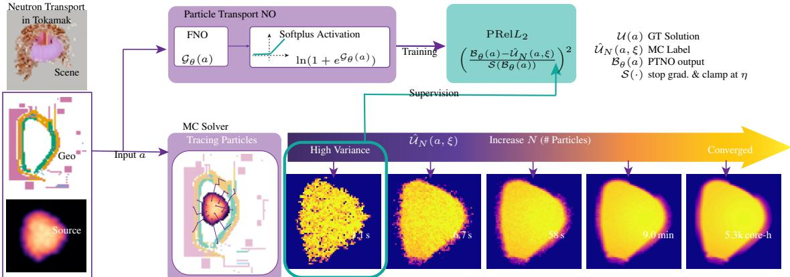  
Figure 1: PTNO learns from extremely high-variance MC labels and, at inference, predicts the well-converged solution. The Particle Transport Neural Operator is trained on MC supervision (left green box, columns 1–2) across varying configurations of the input a. Bottom row shows the EU-DEMO 1/16 wedge neutron-transport task: columns 1–4 are analog OpenMC runs (no variance reduction) of one held-out configuration (the scene of Figure 2) with $\mathrm { \Delta } N { = } 1 0 ^ { 3 } , 1 0 ^ { 4 } , 1 0 ^ { 5 }$ , 106 histories, i.e., simulated neutron trajectories, on one 24-thread Xeon Platinum 8352Y CPU, labeled with their measured transport wall-clock (library initialization, 35–41 s, excluded). Column 5 is the converged reference of the same configuration, computed with weight windows (a variance reduction that splits or randomly terminates particles to keep their statistical weights within a target band in each region) at a cost of 5,280 core-hours. PTNO keeps positivity and a wide dynamic range with a softplus output activation, and our $\mathrm { P R e l } L _ { 2 }$ loss keeps MC labels in physical space.

Obtaining a smooth, low-noise solution requires tracing a large number of particles, prohibitively costly when repeated solves are needed across varying geometries, material configurations, or boundary conditions, as in inverse design, optimization, and multiphysics coupling. Recent learning-based approaches reduce this cost via learned sampling strategies [6, 7], learned caching and variance reduction [8, 9], or denoising of high-variance MC estimates [10–12]. However, these methods either retain MC simulation at inference time or operate as post-processing modules, so prediction still depends on an external solver. This motivates a different goal: a standalone surrogate that directly maps a transport environment to its solution field.

Neural operators [13] provide a natural framework by learning mappings from input functions—geometry, material coefficients, sources, boundary conditions—to output solution fields, enabling fast inference across varying environments without running a solver. However, training typically requires near-converged MC labels, making dataset construction expensive. Recent work has shown this requirement can be relaxed: Walk-on-Spheres Neural Operator (WoSNO) [14] trains neural operators from noisy walk-on-spheres estimates for elliptic PDEs, demonstrating operator learning under weak stochastic supervision. This result is limited to elliptic PDEs and does not address the high-dimensional, multiple-scattering transport problems we consider here.

Following a similar philosophy, our Particle Transport Neural Operator (PTNO) trains neural operators directly from high-variance MC estimates. The key insight is that unbiased stochastic estimates provide sufficient supervision to learn the underlying operator across a distribution of transport scenarios, without requiring a converged solution for each input.

An additional challenge is that particle transport solutions are positive and often span many orders of magnitude (about 10 to 17 in our 3D fluence and neutronics datasets), making direct regression poorly conditioned. A common remedy is to normalize errors by the target magnitude—e.g., through the reciprocal of the supervision label. However, when supervision is a noisy MC estimate, such nonlinear operations introduce bias, since nonlinear functions do not commute with expectation. We show that existing bias-correction strategies [15] do not fully resolve this issue in our training dynamics.

Rather than correcting transformed noisy targets, PTNO avoids transforming the MC labels altogether. It applies a softplus output parameterization to enforce positivity and evaluates errors in the original value space. For the loss, the standard relative $L _ { 2 } .$ —which places the noisy label in the denominator—leads to instability; instead we normalize by the predicted value at each point. This stop-gradient relative $L _ { 2 } .$ , which we call the pointwise relative $L _ { 2 }$ loss $\mathrm { ( P R e l } L _ { 2 } )$ is established for training on noisy HDR targets in image denoising and neural rendering [16, 17, 9, 18, 19]; to our knowledge it has not been used to train neural operators from noisy MC transport labels, where it provides a stable objective for high-variance supervision.

(a) EU-DEMO  
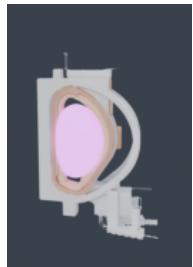

(b) GT slice  
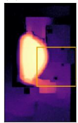  
5,280 core-h

(c) Operator  
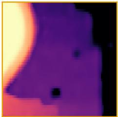  
t = 1.2 s

(d) MC, equal time  
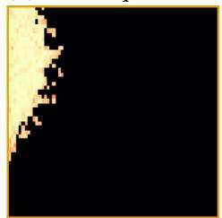  
t = 1.7 s

(e) GT zoom  
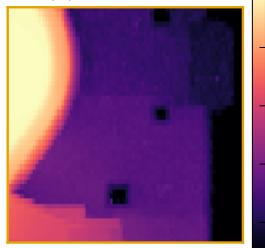  
converged

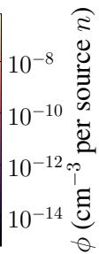  
Figure 2: PTNO predicts the EU-DEMO neutron flux in about a second, closer to the converged reference than Monte Carlo run for the same time. One held-out source configuration of the EU-DEMO 1/16 wedge. (a) Rendering of the DEMO tokamak; the wireframe marks the inspected poloidal cross-section [21]. (b) Converged reference flux on the full slice (OpenMC with weight windows at 700 $\times 3 6 5 \times 7 3 0$ , block-averaged to the 140 $\times 7 3 \times$ 146 training mesh; 5,280 core-hours for this scene, median 6,130 over the 24 held-out scenes); the orange box marks the region zoomed in panels (c)–(e). (c) Neural operator (NO) prediction on the zoomed region (1.2 s on a 24-thread Xeon Platinum 8352Y CPU). (d) Analog Monte Carlo (MC, no variance reduction) matched to that wall-clock time: $N { = } 2 \times 1 0 ^ { 3 }$ histories on the same CPU (1.7 s of transport), still visibly noisy. (e) Converged reference on the zoomed region, for direct comparison with (c)–(d). PTNO uses about $6 \times 1 \mathrm { \dot { 0 } ^ { 5 } } >$ × less CPU time than the converged reference on the training mesh $( 1 . 2 \times 1 0 ^ { 4 } \times$ on the reference grid, section 5.3), and its $\log _ { 1 0 }$ relative $L _ { 2 }$ is 3.2× lower than that of MC at the same wall-clock time (per-seed median over the 24 held-out scenes; $3 . 1 8 \pm 0 . 0 \dot { 2 } $ , mean ± std over five seeds, range 3.16–3.20×), scored only on cells where the reference is measured (Appendix F).

Under a fixed simulation budget, this creates a fundamental allocation tradeoff: spending many particles on few configurations yields low-variance labels, while spending fewer particles per configuration covers many more training environments. In our experiments, a converged MC label costs up to $1 0 ^ { 5 } \times$ more than the noisy labels we use. Cheaper labels, therefore, allow broader coverage of geometries and material configurations, relying on the unbiasedness of MC estimates and operator learning across environments to recover the underlying solution map.

Our framework is domain-agnostic: we formulate radiative transfer and neutron transport as instances of a unified particle transport problem, and show that a single neural-operator formulation can be applied across both domains despite differences in their physical parameters and interaction models. In summary, we make the following contributions:

• PTNO, a neural-operator framework that learns particle-transport surrogates directly from high-variance, unbiased MC labels, applicable to both radiative transfer and neutron transport under multiple scattering.

• A justification and a budget study for noisy supervision: unbiased labels leave the population minimizer of the squared loss unchanged, and a controlled allocation study over the number of training scenes, Monte Carlo samples per render, and independent renders per scene shows that, until scene coverage saturates, many noisy scenes outperform fewer converged ones, in line with walk-on-spheres operator learning and Monte Carlo surrogate models [14, 20]. What the allocation buys depends on the loss: from $\mathrm { 1 0 ^ { 5 } }$ to $1 0 ^ { 6 }$ far-field scenes, PTNO gains 0.14 in $\log _ { 1 0 }$ SSIM while $L _ { 2 }$ and log MSE gain 0.02 and 0.01, respectively.

• An analysis of the Jensen bias introduced by nonlinear transformations of noisy MC labels, and a recipe that avoids it for neural operators on radiative and neutron transport: a softplus output head that enforces positivity in the original physical space, the physical-space $L _ { 2 }$ residual that anchors the minimizer to the label mean, and the stop-gradient relative loss $\mathrm { P R e l } { \bar { L _ { 2 } } }$ of prior denoising and rendering work [16, 17, 9, 18, 19], together with an analysis of why the combination is stable.

• Demonstrations of prediction on held-out geometries and material configurations, achieving $3 . 4 { - } 8 . 2 \% \log _ { 1 0 }$ relative error on the radiative-transfer benchmarks and $4 . 5 { - } 8 . 4 \%$ on the two tokamak neutron-transport benchmarks (with the historical rows qualified in Appendix F), while providing $1 0 ^ { 4 } – 1 0 ^ { 5 } \times$ faster prediction than converged MC on the same hardware for neutron transport.

## 2 Related Work

Learning-based methods for radiative and neutron transport fall into two categories: replacing specific components of the transport pipeline with neural counterparts, or learning end-to-end surrogates that predict the final physical quantity.

Modular neural components. This approach integrates neural networks into traditional Monte Carlo (MC) pipelines to accelerate convergence or reduce variance without discarding the underlying physical framework.

• Computer Graphics: In rendering, neural networks are widely used for denoising, mapping noisy renders with few samples per pixel (SPP) to clean images by leveraging geometric features like normals and albedo as auxiliary inputs [22, 11, 23]. Beyond post-processing, path-guiding reduces variance by learning incident radiance distributions [24–26, 6]. Neural radiance caching replaces expensive recursive path tracing with learned regression models that approximate the radiance field for real-time global illumination [9]. Training such models on noisy HDR targets commonly uses a relative $L _ { 2 }$ whose normalizer is the stop-gradient prediction, in Noise2Noise denoising [16], neural control variates [17], radiance caching [9], and RawNeRF [18]; Tinits and Mann [19] analyze which nonlinear target transforms keep Noise2Noise training nearly unbiased. $\mathrm { P R e l } L _ { 2 }$ is this loss; we apply it to neural operators on transport problems.

• Other Transport Domains: In nuclear engineering, MC neutron-transport simulations can be inefficient because few particle histories reach a detector or a deeply shielded region, so the tallies there, the accumulated particle scores that estimate the flux, converge slowly. Classical variance reduction relies on “importance” maps such as weight windows, which split particles entering important regions and randomly terminate particles in unimportant ones so that statistical weights stay within a target band; CADIS/ADVANTG automate their construction via deterministic adjoint transport [27, 28]. Recent work explores neural alternatives for source biasing, flux prediction, or surrogate transport models [29–31].

End-to-end surrogates and neural operators. An alternative line of work replaces the entire transport solver with a learned proxy. Earlier efforts used point-wise surrogates such as Physics-Informed Neural Networks (PINNs), enforcing the transport equation at discrete coordinates, but they generalize poorly across geometries and source terms [32]. Neural operators such as Fourier Neural Operators (FNO) instead learn mappings between function spaces, enabling generalization across environments [33]. Surrogates have been applied to plasma modeling [34] and Tritium Breeding Ratio estimation in tokamaks and stellarators [35, 36], but not yet for predicting full neutron-flux fields. Existing neural operators for physics typically assume access to high-quality simulation data or rely on PDE residuals that are hard to optimize for the stiff, high-dynamic-range equations of particle transport. We target this gap by training neural operators directly from low-sample MC estimates. WoS-NO trains neural operators for elliptic PDEs from walk-on-spheres estimates [14], and Pratt and Prosper-Feldman [20] show for Monte Carlo surrogates of Markov-chain moments that mean estimates benefit most from parameter-space coverage, while nonlinear targets such as covariances also need replication to control bias; our allocation study adds how this trade-off interacts with the loss.

Bias correction. Bias enters MC pipelines through many channels. Classical debiasing typically targets biased estimators arising from finite approximations (step size, kernel radius, path-length truncation) and removes them by constructing sequences of increasingly accurate estimators. Randomized debiasing and multilevel Monte Carlo can convert convergent biased approximations into unbiased ones, but remain expensive [37–39]. In computer graphics, Misso et al. [15] unify this view via Taylor- and telescoping-series corrections for transmittance, photon mapping, and finite-difference derivatives. Our setting differs: the supervision targets are unbiased in the original physical scale, but a nonlinear log transformation introduces Jensen bias. Series-expansion corrections require sufficiently many samples for the estimator to be near the true value, which is impractical here. We instead keep the noisy target in unbiased linear form while using a positive model output head and prediction-normalized residual for stability under high dynamic range.

## 3 Background

We formulate particle transport as an operator-learning problem with noisy Monte Carlo supervision. For each input configuration $^ { a , }$ including geometry, material properties, and source parameters, there is an unknown transport response $\mathcal { U } ( a )$ that we would like to predict. Monte Carlo solvers provide unbiased but noisy estimates $\hat { \mathcal { U } } _ { N } ( a , \xi )$ of $\mathcal { U } ( a )$ from $N$ particles, and our goal is to train a neural operator directly from the high-variance estimates. Appendix A lists the notation.

Particle transport describes the evolution of particles undergoing scattering and absorption within a medium. The solution is expressed as an integral over particle trajectories. Let ξ ∈ Ω $\xi \in \Omega$ denote a particle path consisting of a sequence of free-flight segments and scattering events, and let $\Omega = \cup _ { k \geq 1 } \Omega _ { k }$ be the space of all paths grouped by the number of scattering events k. The measurable response can be written as

$$
\mathcal { U } ( a ) = \int _ { \Omega } f ( \xi , a ) \mathrm { d } \nu ( \xi ) ,\tag{1}
$$

where $\nu$ is the underlying path-space measure induced by the transport process. The contribution function $f ( \xi , a )$ encodes the accumulated weight of a particle trajectory $\xi ,$ including emission at the source, attenuation along free-flight segments, and scattering events along the path (see Appendix B for details). This formulation is equivalent to the integral form of the Boltzmann equation.

MC methods approximate this integral by sampling $N$ paths $\xi _ { i } \sim p ( \cdot \mid a )$ from a proposal distribution $p$ and collecting them in ${ \boldsymbol \xi } = ( \xi _ { 1 } , \dots , \xi _ { N } )$ . The estimator is given by

$$
\hat { \mathcal { U } } _ { N } ( a , \xi ) = \frac { 1 } { N } \sum _ { i = 1 } ^ { N } \frac { f ( \xi _ { i } , a ) } { p ( \xi _ { i } \mid a ) } .\tag{2}
$$

This estimator is unbiased but often exhibits high variance, particularly in multiple-scattering regimes where the path length k can be large, the contribution function $f$ is only implicitly defined (i.e., not available in closed form), and it is difficult to construct a sampling distribution $p$ proportional to $f .$ As a result, obtaining low-noise estimates of $\mathcal { U } ( a )$ requires a large number of particle paths, making data generation expensive.

## 3.1 Neural Operator

Neural operators learn mappings between function spaces and provide a natural framework for amortizing the solution of parametric PDEs and integral equations. For particle transport, we view the transport environment as an input function or configuration $^ { a , }$ which may include spatially varying material coefficients, boundary conditions, source parameters, and geometry. The corresponding output is the measurable response or solution field $\mathcal { U } ( a )$ defined by the transport equation. The goal is to learn the solution operator

$$
\mathcal { G } _ { \theta } : a \mapsto \mathcal { U } ( a ) ,\tag{3}
$$

from training examples drawn from a distribution of environments. In contrast to standard neural networks that approximate a finite-dimensional input-output map tied to a particular discretization, neural operators are designed to approximate the underlying continuous operator and can be evaluated across different resolutions or discretizations. This property is especially useful for particle transport, where one often needs to solve the same physical model repeatedly across many geometries, material fields, or source conditions. After training, the neural operator can predict $\mathcal { \hat { U } \hat { ( a ) } }$ for a new configuration a at a fraction of the cost of a full MC solve.

## 4 Method

We formulate particle transport surrogate learning as operator learning from unbiased but high-variance stochastic simulation labels. For each input configuration $a \sim \mathcal { P } _ { a }$ , including geometry, material properties, and source parameters, let $\mathcal { U } ( a )$ denote the converged transport response. An MC solver provides a noisy estimate

$$
\hat { \mathcal { U } } _ { N } ( a , \xi ) = \mathcal { U } ( a ) + \zeta _ { N } ( a , \xi ) ,\tag{4}
$$

where $\xi$ denotes the random particle histories used by the estimator. We assume that the MC estimator is unbiased in the original physical space:

$$
\mathbb { E } _ { \xi } [ \hat { \mathcal { U } } _ { N } ( a , \xi ) ~ | ~ a ] = \mathcal { U } ( a ) , \qquad \mathbb { E } _ { \xi } [ \zeta _ { N } ( a , \xi ) ~ | ~ a ] = 0 .\tag{5}
$$

Our goal is to learn a neural operator that maps a to $\mathcal { U } ( a )$ without requiring well-converged MC labels for every training configuration.

## 4.1 Learning from Unbiased Stochastic Labels

The ideal supervised objective assumes access to the converged solution:

$$
\begin{array} { r } { \mathcal { L } _ { C } ( \mathcal { G } _ { \theta } ) = \mathbb { E } _ { a } [ \| \mathcal { G } _ { \theta } ( a ) - \mathcal { U } ( a ) \| _ { 2 } ^ { 2 } ] . } \end{array}\tag{6}
$$

In practice, $\mathcal { U } ( a )$ is unavailable, and we instead observe noisy MC labels $\hat { \mathcal { U } } _ { N } ( a , \xi )$ . Training with these labels yield the surrogate objective

$$
\mathcal { L } _ { N } ( \mathcal { G } _ { \theta } ) = \mathbb { E } _ { a , \xi } [ \| \mathcal { G } _ { \theta } ( a ) - \hat { \mathcal { U } } _ { N } ( a , \xi ) \| ^ { 2 } ] .\tag{7}
$$

Substituting the decomposition of $\hat { \mathcal { U } } _ { N } ( a , \xi )$ from Equation 4 gives

$$
\begin{array} { r l } & { \mathcal { L } _ { N } ( \mathcal { G } _ { \theta } ) = \mathbb { E } _ { a , \xi } [ \| \mathcal { G } _ { \theta } ( a ) - \mathcal { U } ( a ) - \zeta _ { N } ( a , \xi ) \| ^ { 2 } ] } \\ & { \quad \quad \quad \quad = \mathcal { L } _ { C } ( \mathcal { G } _ { \theta } ) + \mathbb { E } _ { a , \xi } [ \| \zeta _ { N } ( a , \xi ) \| ^ { 2 } ] - 2 \mathbb { E } _ { a } [ \langle \mathcal { G } _ { \theta } ( a ) - \mathcal { U } ( a ) , \mathbb { E } _ { \xi } [ \zeta _ { N } ( a , \xi ) \mid a ] \rangle ] . } \end{array}
$$

The cross term vanishes by the unbiasedness of $\hat { \mathcal { U } } _ { N }$ (Equation $5 ) ,$ , and the variance term $\mathbb { E } _ { a , \xi } [ \| \zeta _ { N } ( a , \xi ) \| _ { 2 } ^ { 2 } ]$ is independent of $\mathcal { G } _ { \theta }$ . Hence the two objectives share the same population minimizers:

$$
\arg \operatorname* { m i n } _ { \mathcal { G } _ { \theta } } \mathcal { L } _ { N } ( \mathcal { G } _ { \theta } ) = \arg \operatorname* { m i n } _ { \mathcal { G } _ { \theta } } \mathcal { L } _ { C } ( \mathcal { G } _ { \theta } ) .\tag{8}
$$

Unbiased Monte Carlo labels therefore provide statistically valid supervision in the original linear physical space, even when individual labels have high variance. The variance term inflates the loss value but leaves the optimum unchanged.

## 4.2 Jensen Bias from Nonlinear MC-Label Transforms

Although the squared-loss argument justifies training from noisy labels in the linear physical space, particle-transport solutions often span many orders of magnitude (about 10 to 17 in our 3D fluence and neutronics references, Table 24). Direct regression in value space can therefore be poorly conditioned: High-flux regions dominate the loss, while low-flux regions may be ignored. A natural remedy is the pointwise relative error, which normalizes each residual by the local field value before squaring and averaging. With access to the clean solution, the corresponding objective is

$$
\begin{array} { r } { \mathcal { L } _ { \mathrm { r e l } } ( \mathcal { G } _ { \theta } ) = \mathbb { E } _ { a } [ \| ( \mathcal { G } _ { \theta } ( a ) - \mathcal { U } ( a ) ) / ( \mathcal { U } ( a ) + \eta ) \| ^ { 2 } ] . } \end{array}
$$

If we instead substitute a noisy MC label inside the reciprocal, the objective becomes

$$
\mathcal { L } _ { N , \mathrm { r e l } } ( \mathcal { G } _ { \theta } ) = \mathbb { E } _ { a , \xi } [ \| ( \mathcal { G } _ { \theta } ( a ) - \hat { \mathcal { U } } _ { N } ( a , \xi ) ) / ( \hat { \mathcal { U } } _ { N } ( a , \xi ) + \eta ) \| ^ { 2 } ] .\tag{9}
$$

This objective is biased because the reciprocal does not commute with the expectation over MC noise:

$$
\mathbb { E } _ { \xi } [ \frac { 1 } { \hat { \mathcal { U } } _ { N } ( a , \xi ) + \eta } \mid a ] \neq \frac { 1 } { \mathcal { U } ( a ) + \eta } = \frac { 1 } { \mathbb { E } _ { \xi } [ \hat { \mathcal { U } } _ { N } ( a , \xi ) \mid a ] + \eta } .\tag{10}
$$

Applying a nonlinear transformation to noisy labels, therefore, changes the expected training objective and shifts its minimizer away from U. We refer to this effect as Jensen bias. This motivates a key design choice in our method: keep MC labels in the original physical space and avoid passing them through nonlinear transformations such as logarithms or reciprocal normalizers.

## 4.3 Particle Transport Neural Operator

To handle high dynamic range (HDR) without transforming noisy labels, we modify the surrogate architecture rather than the target. Let $\mathcal { G } _ { \boldsymbol { \theta } } ( a )$ be a neural operator backbone (e.g., an FNO) that produces a latent field. We map this latent field to the physical solution space through a softplus activation:

$$
\mathcal { B } _ { \theta } ( a ) = \mathrm { s o f t p l u s } ( \mathcal { G } _ { \theta } ( a ) ) = \ln ( 1 + e ^ { \mathcal { G } _ { \theta } ( a ) } ) .\tag{11}
$$

From here on, $\mathcal { G } _ { \theta }$ denotes this latent backbone and $B _ { \theta }$ the physical prediction of PTNO. For large negative latent values, the softplus behaves approximately exponentially, allowing negative activations to represent very small positive physical values. For large positive values, it behaves approximately linearly, avoiding the severe gradient growth of a pure exponential parameterization. This makes softplus a useful positive parameterization for high-dynamic-range nonnegative fields. Crucially, the prediction $B _ { \theta } ( a )$ is compared directly against the noisy MC label in the original physical scale.

Pointwise relative $L _ { 2 } .$ . We avoid applying a nonlinear reciprocal to the MC label by using the prediction as the local normalization scale. Specifically, we define $\boldsymbol { S } ( \boldsymbol { x } ) = \operatorname* { m a x } \dot { ( } \mathrm { s g } ( \boldsymbol { x } ) , \eta )$ , where $\operatorname { s g } ( \cdot )$ denotes stop-gradient and $\eta > 0$ prevents division by very small values.

$$
\mathcal { L } _ { N , \mathrm { P R e l } } ( \mathcal { G } _ { \theta } ) = \mathbb { E } _ { a , \xi } [ \| ( \mathcal { B } _ { \theta } ( a ) - \hat { \mathcal { U } } _ { N } ( a , \xi ) ) / \mathcal { S } ( \mathcal { B } _ { \theta } ( a ) ) \| ^ { 2 } ] .\tag{12}
$$

The denominator provides a local scale estimate, but it is treated as constant during backpropagation. Therefore, gradients are taken through the linear residual in the numerator, and the MC label enters the loss only in the original physical space. While the exact minimizer-equivalence argument applies to the unweighted squared loss, this objective preserves the key requirement that noisy MC labels are not passed through a nonlinear transformation. Appendix I shows that, in expectation over MC noise, its gradient has no stationary point other than $B _ { \theta } ( a ) = \mathcal { U } ( a )$ wherever the output Jacobian has full row rank. The formula is not new: the same stop-gradient relative $L _ { 2 }$ trains HDR denoisers on noisy targets [16, 19], neural control variates and radiance caches [17, 9], and NeRF on noisy raw images [18]. What we add is its use for neural-operator learning from noisy MC transport labels, paired with the softplus head, and the stationary-point analysis above for that combination.

Fixed points. For a fixed input a, let $B _ { \theta } = B _ { \theta } ( a )$ denote the physical prediction, $U = \mathbb { E } _ { \xi } [ \hat { \mathcal { U } } _ { N } ( a , \xi ) \mid a ]$ the mean of the noisy label, $D ( B ) = \mathrm { d i a g } ( \operatorname* { m a x } ( B _ { i } , \eta ) ^ { 2 } )$ the diagonal matrix of squared normalizers, and $J = \partial B _ { \theta } / \partial \theta$ the output Jacobian. Because the pointwise denominator is detached, the expected parameter gradient of the per-sample loss ℓ, up to a positive constant, is

$$
\mathbb { E } _ { \xi } [ \nabla _ { \theta } \ell \ | \ a ] = J ^ { \top } D ( B _ { \theta } ) ^ { - 1 } ( B _ { \theta } - U ) .\tag{13}
$$

Thus, a stationary point satisfies $J ^ { \top } D ( B _ { \theta } ) ^ { - 1 } ( B _ { \theta } - U ) = 0 .$ . Since $D ( B _ { \theta } )$ is positive definite, the normalization introduces no zero directions. Under the standard local assumption that J has full row rank $( J J ^ { \top } \succ 0 ) , J ^ { \top }$ is injective and stationarity forces $B _ { \theta } = U$ $\mathrm { P R e l } L _ { 2 }$ therefore introduces no additional biased fixed point in output space. A rank-deficient Jacobian can create parameter-space stationary points, but that limitation is shared by ordinary squared loss.

Optimization dynamics. The stop-gradient update is the gradient of the output-space potential

$$
\Phi ( B _ { \theta } ) = \sum _ { i } \int _ { U _ { i } } ^ { B _ { \theta , i } } \frac { s - U _ { i } } { \operatorname* { m a x } ( s , \eta ) ^ { 2 } } \mathrm { d } s ,\tag{14}
$$

because $\nabla _ { B } \Phi = D ( B _ { \theta } ) ^ { - 1 } ( B _ { \theta } - U )$ . Under continuous-time gradient descent, $\dot { \theta } = - J ^ { \top } \nabla _ { B } \Phi$ , so

$$
\frac { \mathrm { d } \Phi } { \mathrm { d } t } = - \nabla _ { B } \Phi ^ { \top } J J ^ { \top } \nabla _ { B } \Phi \leq 0 .\tag{15}
$$

The expected dynamics therefore decrease Φ monotonically. The prediction-dependent denominator rescales the per-voxel update but cannot reverse its direction or create another output-space minimum. Under $J J ^ { \top } \succ 0$ , the dynamics stop only at $B _ { \theta } = U ;$ when $U _ { i } = 0$ exactly, softplus approaches this solution as a boundary limit rather than attaining it at a finite latent value. This is a population-gradient argument; finite steps, stochastic-gradient variance, and rank-deficient parameterizations remain practical considerations.

Sample allocation. In finite training we draw M training scenes and, for each scene, K independent renders of N Monte Carlo samples each. The empirical objective is

$$
\widehat { \mathcal { L } } _ { M , K , N } ( \theta ) = \frac { 1 } { M K } \sum _ { i = 1 } ^ { M } \sum _ { j = 1 } ^ { K } \| ( \mathcal { B } _ { \theta } ( a _ { i } ) - \hat { \mathcal { U } } _ { N } ( a _ { i } , \xi _ { i , j } ) ) / S ( \mathcal { B } _ { \theta } ( a _ { i } ) ) \| ^ { 2 } ,\tag{16}
$$

where $a _ { i }$ is the i-th scene and $\xi _ { i , j }$ the samples of its j-th render. M controls coverage of the scene distribution, while $N$ and K control the noise of the supervision. Under a fixed particle budget $N _ { \mathrm { t o t } } = \check { M } K N _ { \mathrm { : } }$ , reducing N frees samples for more scenes M or more renders $K ;$ subsection 5.2 studies this trade-off empirically. Two exact facts and one standard bound organize the trade-off (Appendix J.4). First, because the normalizer is detached, for fixed normalizers the K renders of a scene enter the objective and its gradient only through their mean, whose noise variance is $\sigma ^ { 2 } / ( N K )$ for single-sample variance $\sigma ^ { 2 } ;$ a full pass over K renders of N samples is therefore equivalent to one render of NK samples. Second, for the unweighted squared loss with unbiased labels, the standard least-squares bound for a realizable class $\mathcal { F }$ of effective dimension $d _ { \mathrm { e f f } }$ gives

$$
\mathbb { E } \mathcal { R } ( \hat { \theta } ) - \operatorname* { i n f } _ { \theta \in \Theta } \mathcal { R } ( \theta ) \lesssim \mathcal { E } _ { M } ( \mathcal { F } ) + \frac { \sigma ^ { 2 } d _ { \mathrm { e f f } } } { M N K } ,\tag{17}
$$

where $\ell$ is the per-sample loss, $\mathcal { R } ( \theta ) = \mathbb { E } [ \ell ( \theta ) ]$ its population risk, $\hat { \theta }$ the minimizer of $\widehat { \mathcal { L } } _ { M , K , N }$ over the parameter set Θ, and $\bar { \mathcal { E } _ { M } ( \mathcal { F } ) }$ the excess risk the same class would reach from M converged labels. Scene coverage enters through ${ \mathcal { E } } _ { M }$ and the $1 / M$ of the noise term, label noise only through $1 / ( M N K )$ , and there is no term in N or $K$ alone. Third, a nonlinear label transform such as the logarithm moves the population minimizer from $\log _ { 1 0 } \mathcal { U }$ to $\mathbb { E } [ \log _ { 1 0 } \hat { \mathcal { U } } _ { N } ] = \log _ { 1 0 } \mathcal { U } + O ( 1 / N )$ , or $O ( 1 / ( N K ) ) _ { , }$ when the K renders are averaged before the transform; this adds a risk floor of order $\bar { 1 / N ^ { 2 } }$ (respectively $1 / ( \dot { N } \dot { K } ) ^ { 2 } )$ that no number of scenes removes. For $\mathrm { P R e l } L _ { 2 } .$ , Appendix I shows that the expected gradient $\mathbb { E } _ { \xi } [ \nabla _ { \theta } \ell ~ | ~ a ] = J ^ { \top } D ( B _ { \theta } ) ^ { - 1 } ( B _ { \theta } - U )$ has no output-space stationary point other than the label mean, so this Jensen shift does not arise; the bound (17) itself is proved only for the unweighted squared loss.

## 5 Experiments

We evaluate PTNO on four datasets spanning two physical regimes of particle transport—photon transport and neutron transport—comparing against the NO baseline under matched architectures and varying loss formulations. The far-field radiance task models light propagating through a heterogeneous participating medium bounded by a ball (with spatially varying extinction and albedo defined in spherical coordinates) and predicts the far-field radiance; this is a canonical problem in atmospheric and volumetric rendering, where multiple scattering renders analytic solutions intractable. Its references span only about 3 orders of magnitude (Table 24), so it is not a high-dynamic-range case; because converged references are affordable for thousands of its scenes, we use it as a controlled testbed for label noise and particle-budget allocation. The 3D fluence task extends this setting and defines the spatially varying material parameters and emission functions in 3D Cartesian coordinates, predicting the full 3D fluence field, whose references span about 10 orders of magnitude. The spherical-tokamak neutron transport task moves to nuclear fusion: a parametric tokamak geometry with a varying D–T plasma source produces 14.1 MeV fusion neutrons that scatter and attenuate through shield, first-wall, and blanket materials. The resulting neutron flux distribution [40] is the key quantity for estimating material activation (radioactivity induced in structures by neutron capture), nuclear heating, and tritium breeding. Finally, the EU-DEMO task targets a reactor-scale engineering model of the European demonstration fusion reactor [21, 41], where predicting the neutron flux across the full poloidal cross-section under varying plasma-source conditions is essential for shielding design, diagnostic placement, and blanket performance assessment. Full dataset details are in Appendix E.

Our experiments show that (1) PTNO outperforms alternatives and (2) high-variance MC labels are more sampleefficient than converged references. The main text reports $\log _ { 1 0 }$ relative $L _ { 2 }$ and $\log _ { 1 0 }$ SSIM, both computed on the output field itself (the angular map or the 3D volume) after $\log _ { 1 0 } ( \operatorname* { m a x } ( \cdot , \epsilon ) )$ with a per-dataset floor ϵ, so that accuracy counts across the entire dynamic range; appendix tables add linear-space % RMSE, PSNR, and SSIM, and Appendix F defines every metric. All validation and test metrics are computed on unseen input configurations held out from training. Unless noted otherwise, entries are the mean ± sample standard deviation over five training seeds, scored against converged MC references. Far-field radiance and EU-DEMO now use the final checkpoint of a fixed training schedule; the 3D fluence and spherical-tokamak rows remain historical checkpoint-selected results pending replacement (Appendix F). $( M , N , K )$ denotes the number of training scenes, the Monte Carlo samples per render, and the independent renders per scene (section 4); on the radiative-transfer tasks N is counted in samples per pixel or per voxel (SPP), and on the neutron-transport tasks in histories, a render being one OpenMC run.

## 5.1 Jensen Bias and Loss Comparison

Passing noisy MC labels through a nonlinear map moves the minimizer of the training objective away from the physical solution; this is the Jensen bias of section 4, illustrated in Figure 11.

We study this effect extensively in Appendix G. On the far-field radiance dataset, Figure 13 shows that training with the biased objective of Equation 9 collapses the prediction by several orders of magnitude. PTNO avoids this failure mode by normalizing with a stop-gradient prediction rather than the noisy MC label.

In Table 13 (Appendix H), we evaluate the effect of Jensen bias on training with the far-field radiance dataset. We find that bias correction does not fully close the performance gap, whereas PTNO trained with $\mathrm { P R e l } L _ { 2 }$ achieves stable performance by avoiding nonlinear transformations of noisy MC labels, and therefore avoiding Jensen bias. Appendix D isolates the mechanism with a full denominator × activation ablation on the 3D fluence dataset and a matching $2 \times 2$ recipe ablation on EU-DEMO: every variant whose residual scale is the noisy MC label, or the prediction with gradients flowing through it, either collapses or inflates its output scale, while only the stop-gradient pointwise residual paired with the softplus head remains stable.

## 5.2 Particle-Budget Allocation and Noise Stability

Table 1 varies the Monte Carlo samples per render, $N \in \{ 4 , 6 4 , 1 2 8 \}$ , for three losses on the far-field radiance testbed and reports $\log _ { 1 0 }$ SSIM. L2 changes least with N but stays weak in dim regions (Table 11 in Appendix G); log MSE degrades sharply at lower $N$ , consistent with a Jensen bias that grows with label noise; $\mathrm { P T N O } + \mathrm { \tilde { P } R e l } L _ { 2 }$ keeps 0.96× of its $N { = } 1 2 8$ score at $N { = } 4$

Table $\mathbf { l } \colon \mathbf { P T N O } + \mathrm { P R e l } L _ { 2 }$ loses less accuracy than log MSE as labels get noisier. Far-field radiance with $M { = } 1 0 ^ { 6 }$ training scenes and N samples per pixel per label; all other settings shared. Entries are $\log _ { 1 0 }$ SSIM on the 100 held-out scenes against the converged reference, mean ± std over five seeds (higher is better); parenthesized ratios compare each lower-N column against N=128.
<table><tr><td> $\operatorname { A r c h } .$ </td><td>Loss</td><td>N=128↑</td><td> $N { = } 6 4 ( { \mathrm { v s . ~ } } N { = } 1 2 8 ) \uparrow$ </td><td> $N { = } 4 \ ( \mathrm { v s . } \ N { = } 1 2 8 ) \uparrow$ </td></tr><tr><td>NO</td><td> $L _ { 2 }$ </td><td> $0 . 6 6 0 \pm 0 . 0 2 6$ </td><td> $0 . 6 6 2 \pm 0 . 0 2 2 \ : ( 1 . 0 0 \times )$ </td><td> $0 . 6 5 2 \pm 0 . 0 2 0 ( 0 . 9 9 \times )$ </td></tr><tr><td>NO</td><td>log MSE</td><td> $0 . 8 5 3 \pm 0 . 0 0 3$ </td><td> $0 . 8 1 2 \pm 0 . 0 0 2 ( 0 . 9 5 \times )$ </td><td> $0 . 4 7 0 \pm 0 . 0 0 1 ( 0 . 5 5 \times )$ </td></tr><tr><td>PTNO</td><td> $\mathrm { P R e l } L _ { 2 } ( \mathrm { o u r s } )$ </td><td> $\mathbf { 0 . 9 5 2 \pm 0 . 0 0 2 }$ </td><td> $\mathbf { 0 . 9 4 9 \pm 0 . 0 0 2 ( 1 . 0 0 \times ) }$ </td><td> $\mathbf { 0 . 9 1 7 \pm 0 . 0 0 4 ( 0 . 9 6 \times ) }$ </td></tr></table>

At equal particle budget (Figure 3), we fix the objective to $\mathrm { P T N O } + \mathrm { P R e l } L _ { 2 }$ and sweep $N \in \{ 8 , 1 6 , 3 2 , 6 4 \}$ on the same $M { \bar { = } } 1 0 ^ { 6 }$ training set. For the same total number of simulated particles, lower-N runs reach lower error, so the particle budget is better spent on covering more scenes than on reducing the noise of each label; this sweep has one seed per $N ,$ , and the multi-seed allocation study of Appendix J finds the same trend until scene coverage saturates, as reported for other operator and surrogate models trained on Monte Carlo labels [14, 20].

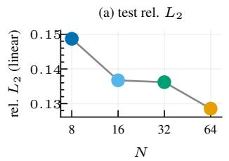

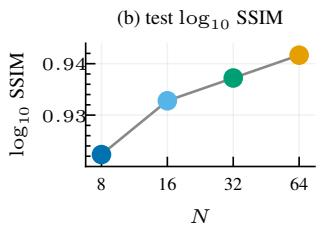

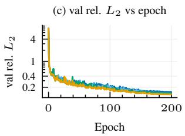

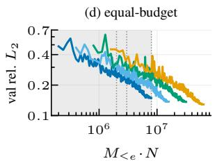  
Figure 3: Under $\mathrm { \bf P T N O } + \mathrm { \bf P R e l } L _ { 2 } ,$ , more scenes outperform more particles per scene. Far-field radiance; all runs use the same loss with $M { = } 1 0 ^ { 6 }$ and a 200-epoch cosine schedule, one seed per N, scored on the 100 held-out scenes against the earlier $1 0 ^ { 5 } – \mathrm { S P P }$ reference (Appendix E.1). (a,b) End-of-training test linear rel. ${ \bar { L } } _ { 2 }$ and $\log _ { 1 0 }$ SSIM vs. training $N$ at fixed $\Breve { M } = 1 0 ^ { 6 }$ , i.e. with a budget that grows with N. (c) Per-epoch validation linear rel. L2 (log scale). (d) Per-epoch validation against cumulative budget $M _ { \leq e } \cdot N$ where $M _ { \leq e }$ is the number of distinct scenes seen by epoch e and reaches $M { = } 1 0 ^ { 6 }$ at the final epoch; the shaded band marks the budgets at which every run has data $( \leq 8 \times 1 0 ^ { 6 }$ particles), and gray vertical lines mark equal-budget slices. At equal budget, lower-N runs win.

## 5.3 Multi-Domain and 3D Validation

We replicate the loss comparison on the 3D fluence dataset, on spherical-tokamak neutron transport, and on the reactorscale EU-DEMO benchmark, confirming the findings transfer across physics domains and unseen inputs. Table 2 reports five-seed results on all four datasets.

3D fluence (historical results). We train on a $6 4 ^ { 3 }$ fluence dataset (Appendix E.2) at $( M , N , K ) { = } ( 3 { \times } 1 0 ^ { 5 } , 4 , 2 ) \colon$ the reference fluence of a scene spans about 10 orders of magnitude. A 3D PTNO (modes $2 0 ^ { 3 }$ , width 64, 6 layers) is trained for 120 epochs $( 1 . 5 \times 1 0 ^ { 5 }$ optimizer updates) and validated on 100 unseen held-out scenes. Linear-output $L _ { 2 }$ fails in dim regions, and naive log-target MSE trails $\mathrm { P T N O } + \mathrm { P R e l } L _ { 2 }$ by 0.054 in $\log _ { 1 0 }$ SSIM, consistent with Jensen bias. $\mathrm { P T N O } { \mathrm { ~ \bar { + } P R e l } { L _ { 2 } } }$ achieves the best performance in both log-space metrics.

Spherical-tokamak neutron transport (historical results). We train on $( M , N , K ) { = } ( 4 { \times } 1 0 ^ { 5 } , 1 0 ^ { 5 } , 1 )$ , drawn without repetition from a pool of 1,024,000 configurations of a parametric D–T spherical-tokamak distribution varying both geometry and plasma source [40]; the reference flux of a scene spans about 10 orders of magnitude per energy group. A 3D NO (modes $2 4 ^ { 3 }$ , width 32, 4 layers) is trained for 40 epochs $( 1 0 ^ { 5 }$ optimizer updates) at batch 4, with validation on 50 unseen configurations against a $\mathrm { \dot { 1 } 0 ^ { 9 } }$ -history reference. Naive log-target MSE reaches only $\log _ { 1 0 }$ SSIM 0.560, while $\mathrm { P T N O } + \mathrm { P R e l } L _ { 2 }$ retains $\log _ { 1 0 }$ SSIM 0.863 and $\log _ { 1 0 }$ rel. $L _ { 2 } \ : 0 . 0 4 5$ on the unseen validation split.

EU-DEMO. Building on the EU-DEMO accuracy reported in Table 2, we now quantify the practical speed–accuracy tradeoff against the converged MC reference. We train on $( M , N , K ) { = } ( 1 0 ^ { 5 } , 5 { \times } \dot { 1 } 0 ^ { 5 } , 1 )$ on a 140×73×146 mesh and validate on 24 unseen configurations against references computed with FW-CADIS and MAGIC weight windows (median 6,130 CPU core-hours per configuration). Weight windows are a variance reduction that splits or randomly terminates particles to keep their statistical weights within a target band in each region; FW-CADIS derives them from an approximate deterministic adjoint solution, and MAGIC refines them over successive MC runs. On one 24-thread CPU, the converged reference costs $1 . 2 \times 1 0 ^ { 4 } \times$ the operator’s forward pass on the reference grid. With an FW-CADIS weight window, MC needs 1 $. 6 \times 1 0 ^ { 3 } \times$ the operator’s cost, window generation included, to match its $\log _ { 1 0 }$ rel. $L _ { 2 }$ , and on none of the 24 configurations does it reach the operator’s $\log _ { 1 0 }$ SSIM within $1 0 ^ { 7 }$ histories. Appendix K reports the same-hardware and matched-accuracy comparison for all four datasets.

## 6 Discussion

PTNO offers several advantages for particle-transport surrogate learning. It learns directly from high-variance MC labels, avoiding the need to generate expensive converged labels for every training configuration. Rather than treating MC noise as a preprocessing problem, it leverages noisy but unbiased estimates as stochastic supervision: high-variance labels provide an unbiased estimate of the converged solution up to an additive noise term independent of the model. To handle high dynamic range, PTNO avoids Jensen bias by applying a softplus activation to the model prediction and using the prediction, rather than the noisy MC estimate, as the denominator in the pointwise relative loss. This keeps MC targets in the original physical scale. Under a fixed simulation budget, this regime is especially valuable for multiple-scattering transport, where low-sample MC labels enable broader coverage of input configurations than fully converged labels.

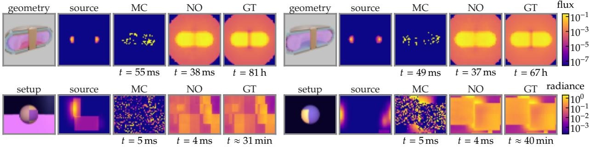  
Figure 4: At matched wall-clock time, MC is still dominated by noise while the NO prediction is close to the converged reference. Each block shows five panels left-to-right: geometry, source distribution, low-budget MC, NO prediction, and converged MC ground truth (GT), for the two held-out configurations closest to the median per-scene $\log _ { 1 0 }$ SSIM of the seed-42 model of Table 2. All timings are measured on one node with an NVIDIA H200 GPU and a 24-thread AMD EPYC 9554 CPU; the MC budget is the smallest whose wall-clock comes closest to one NO forward pass. Top—Spherical tokamak neutronflux: NO inference takes 37–38 ms on the GPU; OpenMC on 24 CPU threads needs 49–55 ms for N=37–43 histories, the smallest budgets it runs near that time. The GT pools $1 0 ^ { 9 }$ histories from 100 independent $1 0 ^ { 7 }$ -history runs (67–81 h of summed wall-clock, each run on 4 CPU cores, that is 270–320 core-hours). Bottom—Spherical-slabfar-field radiance L: NO inference takes 3.6 ms and a Mitsuba render with one sample per pixel 4.8 ms on the same GPU; the GT accumulated 107 SPP in 31–40 min on one H200.

Table 2: PTNO achieves superior performance across all four datasets. Each block compares loss formulations under matched architectures, data, and optimizer-update budgets; bolded values are the best per dataset. EU-DEMO replaces the linear- $L _ { 2 }$ loss with relative $L _ { 2 }$ because the flux peak sits near the Adam ϵ scale. Mean ± standard deviation over five seeds on held-out configurations against converged references (100 far-field scenes, 100 3D fluence scenes, 50 spherical-tokamak configurations, 24 EU-DEMO configurations). Far-field and EU-DEMO use final checkpoints; the 3D fluence and spherical-tokamak blocks are provisional historical results selected on their evaluation configurations. EU-DEMO is scored only on cells where the converged reference is measured (45.4% of the mesh; Appendix F).
<table><tr><td>Dataset</td><td>Method</td><td> $\log _ { 1 0 } { \mathrm { r e l } } . L _ { 2 } \downarrow$ </td><td> $\mathrm { l o g } _ { 1 0 } \mathrm { S S I M } \uparrow$ </td></tr><tr><td rowspan="2">Far-field radiance</td><td> $\mathrm { N O } + L _ { 2 }$ </td><td> $0 . 4 7 8 2 \pm 0 . 0 4 0 8$ </td><td> $0 . 6 5 2 4 \pm 0 . 0 1 9 6$ </td></tr><tr><td> $\mathrm { N O } + \mathrm { l o } \mathrm { \overline { { g } } \ M S E }$   $\mathrm { P T N O } + \mathrm { P R e l } L _ { 2 } \mathrm { ( o u r s ) }$ </td><td> $1 . 3 9 9 4 \pm 0 . 0 0 1 3$   $\mathbf { 0 . 0 8 2 5 \pm 0 . 0 0 2 2 }$ </td><td> $0 . 4 6 9 9 \pm 0 . 0 0 0 7$   $\mathbf { 0 . 9 1 6 5 \pm 0 . 0 0 4 0 }$ </td></tr><tr><td rowspan="2"></td><td></td><td></td><td></td></tr><tr><td> $\mathrm { N O } + L _ { 2 }$   $\mathrm { N O } + \mathrm { l o g } \mathrm { M S E }$ </td><td> $0 . 2 8 2 4 \pm 0 . 0 0 0 6$   $0 . 0 8 4 3 \pm 0 . 0 0 4 5$ </td><td> $0 . 7 2 4 3 \pm 0 . 0 0 0 4$ </td></tr><tr><td rowspan="2">3D fluence</td><td> $\mathrm { P T N O } + \mathrm { P R e l } L _ { 2 } \mathrm { ( o u r s ) }$ </td><td> $\mathbf { 0 . 0 3 3 8 \pm 0 . 0 0 0 5 }$ </td><td> $0 . 8 9 7 7 \pm 0 . 0 0 4 2$   $\mathbf { 0 . 9 5 1 8 \pm 0 . 0 0 1 1 }$ </td></tr><tr><td></td><td></td><td></td></tr><tr><td rowspan="2">Sph. tokamak</td><td> $\mathrm { N O } + L _ { 2 }$   $\mathrm { N O } + \mathrm { l o g } \mathrm { M S E }$ </td><td> $0 . 4 0 6 2 \pm 0 . 0 0 5 8$   $0 . 3 3 6 4 \pm 0 . 0 0 2 7$ </td><td> $0 . 2 0 2 1 \pm 0 . 0 2 2 7$   $0 . 5 6 0 4 \pm 0 . 0 2 8 6$ </td></tr><tr><td> $\mathrm { P T N O } + \mathrm { P R e l } L _ { 2 } \mathrm { ( o u r s ) }$ </td><td> $\mathbf { 0 . 0 4 5 3 \pm 0 . 0 0 1 1 }$ </td><td> $\mathbf { 0 . 8 6 2 7 \pm 0 . 0 0 2 4 }$ </td></tr><tr><td rowspan="2">EU-DEMO</td><td> $\mathrm { N O } + \mathrm { r e l } . \ L _ { 2 }$ </td><td> $0 . 2 3 1 0 \pm 0 . 0 0 5 0$ </td><td> $0 . 1 4 5 5 \pm 0 . 0 0 6 6$ </td></tr><tr><td> $\mathrm { N O } + \mathrm { l o g } \mathrm { M } \mathrm { \bar { S } E }$ </td><td></td><td> $0 . 5 8 4 6 \pm 0 . 0 0 0 1$ </td></tr><tr><td rowspan="2"></td><td> $\mathrm { P T N O } + \mathrm { P R e l } L _ { 2 } \mathrm { ( o u r s ) }$ </td><td> $0 . 2 3 8 8 \pm 0 . 0 0 0 2$ </td><td></td></tr><tr><td></td><td> $\mathbf { 0 . 0 8 3 9 \mathop { \pm } 0 . 0 0 0 6 }$ </td><td> $\mathbf { 0 . 7 9 2 3 \pm 0 . 0 0 1 6 }$ </td></tr></table>

The method has important limitations. PTNO assumes an unbiased MC estimator in linear physical space; bias from path truncation, approximate physics, or a biased Russian roulette (random termination of low-weight particles without the compensating weight increase) weakens the risk-equivalence argument underpinning the training scheme. Effectiveness is also constrained by the capacity of the underlying neural operator: while the approach generalizes well across in-distribution variations, far out-of-distribution configurations can lead to failure modes not covered by the training distribution. Our analysis of $\mathrm { P R e l } L _ { 2 }$ concerns the expected gradient under continuous-time, full-batch dynamics with a full-row-rank output Jacobian, and does not establish convergence for Adam or finite stochastic steps (Appendix I). All evaluations are simulation-based and test interpolation within parameterized families; generalization to measured data or to new geometry families is not established (Appendix L). Safety-critical applications would still require validation against high-fidelity MC references before the surrogate could be trusted as a replacement rather than an accelerator.

Future work includes applying PTNO to full-resolution tokamak models, extending it to neutral transport in plasma-edge simulation, and integrating it into coupled multiphysics, inverse design, and differentiable optimization pipelines.

## Acknowledgments

Anima Anandkumar is supported in part by Bren endowed chair, ONR (MURI grant N00014-23-1-2654), and the AI2050 senior fellow program at Schmidt Sciences. Ander Gray is partially funded by the Academic and Research Chaire “Architecture des Systèmes Complexes” Dassault Aviation, Naval Group, Dassault Systèmes, KNDS France, Agence de l’Innovation de Défense, Institut Polytechnique de Paris. The Fusion Futures Programme partially funds Vignesh Gopakumar. As announced by the UK Government in October 2023, Fusion Futures aims to provide holistic support for the development of the fusion sector. The authors thank Modal for providing part of the compute credits.

## References

[1] Wenzel Jakob, Sébastien Speierer, Nicolas Roussel, Merlin Nimier-David, Delio Vicini, Tizian Zeltner, Baptiste Nicolet, Miguel Crespo, Vincent Leroy, and Ziyi Zhang. Mitsuba 3 renderer. https://mitsuba-renderer.org, 2022. Version 3.0.1.

[2] Paul K. Romano, Nicholas E. Horelik, Bryan R. Herman, Adam G. Nelson, Benoit Forget, and Kord Smith. OpenMC: A state-of-the-art Monte Carlo code for research and development. Annals ofNuclear Energy, 82:90–97, 2015. ISSN 0306-4549. doi: 10.1016/j.anucene.2014.07.048. URL https://www.sciencedirect.com/ science/article/pii/S030645491400379X. Joint International Conference on Supercomputing in Nuclear Applications and Monte Carlo 2013, SNA + MC 2013. Pluri- and Trans-disciplinarity, Towards New Modeling and Numerical Simulation Paradigms.

[3] Michael Evan Rising, Jerawan Chudoung Armstrong, Simon R. Bolding, Jeffrey S. Bull, Alexander Rich Clark, Cole Spencer Frederick, Jesse Frank Giron, Avery Sumner Grieve, Wim Haeck, Fred Burke Jones, Colin James Josey, Joel Aaron Kulesza, Michael Aaron Lively, Sriram Swaminarayan, Jeremy Ed Sweezy, Colin Andrew Weaver, and Anthony J. Zukaitis. MCNP® Code Version 6.3.1 Release Notes. Technical Report LA-UR-25-23548, Rev. 1, Los Alamos National Laboratory, Los Alamos, NM, USA, April 2025. URL https: //www.osti.gov/biblio/2563101.

[4] D. Reiter, M. Baelmans, and P. Börner. The EIRENE and B2-EIRENE codes. Fusion Science and Technology, 47 (2):172–186, 2005. doi: 10.13182/FST47-172.

[5] S. Wiesen, D. Reiter, V. Kotov, M. Baelmans, W. Dekeyser, A.S. Kukushkin, S.W. Lisgo, R.A. Pitts, V. Rozhansky, G. Saibene, I. Veselova, and S. Voskoboynikov. The new SOLPS-ITER code package. Journal of Nuclear Materials, 463:480–484, 2015. ISSN 0022-3115. doi: 10.1016/j.jnucmat.2014.10.012. URL https://www. sciencedirect.com/science/article/pii/S0022311514006965.

[6] Thomas Müller, Brian McWilliams, Fabrice Rousselle, Markus Gross, and Jan Novák. Neural importance sampling. ACM Transactions on Graphics, 38(5):145:1–145:19, 2019. doi: 10.1145/3341156.

[7] Shilin Zhu, Zexiang Xu, Tiancheng Sun, Alexandr Kuznetsov, Mark Meyer, Henrik Wann Jensen, Hao Su, and Ravi Ramamoorthi. Photon-driven neural reconstruction for path guiding. ACM Transactions on Graphics, 41(1): 7:1–7:15, 2022. doi: 10.1145/3476828.

[8] Zilu Li, Guandao Yang, Xi Deng, Christopher De Sa, Bharath Hariharan, and Steve Marschner. Neural caches for Monte Carlo partial differential equation solvers. In SIGGRAPH Asia 2023 Conference Papers, pages 34:1–34:10, New York, NY, USA, 2023. Association for Computing Machinery. doi: 10.1145/3610548.3618141.

[9] Thomas Müller, Fabrice Rousselle, Jan Novák, and Alexander Keller. Real-time neural radiance caching for path tracing. ACM Transactions on Graphics, 40(4):36:1–36:16, 2021. doi: 10.1145/3450626.3459812.

[10] Kin-Ming Wong and Tien-Tsin Wong. Robust deep residual denoising for Monte Carlo rendering. In SIGGRAPH Asia 2018 Technical Briefs, pages 14:1–14:4, New York, NY, USA, 2018. Association for Computing Machinery. doi: 10.1145/3283254.3283261.

[11] Steve Bako, Thijs Vogels, Brian McWilliams, Mark Meyer, Jan Novák, Alex Harvill, Pradeep Sen, Tony DeRose, and Fabrice Rousselle. Kernel-predicting convolutional networks for denoising Monte Carlo renderings. ACM Transactions on Graphics, 36(4):97:1–97:14, 2017. doi: 10.1145/3072959.3073708.

[12] Chakravarty R. Alla Chaitanya, Anton S. Kaplanyan, Christoph Schied, Marco Salvi, Aaron Lefohn, Derek Nowrouzezahrai, and Timo Aila. Interactive reconstruction of Monte Carlo image sequences using a recurrent denoising autoencoder. ACM Transactions on Graphics, 36(4):98:1–98:12, 2017. doi: 10.1145/3072959.3073601.

[13] Zongyi Li, Nikola Kovachki, Kamyar Azizzadenesheli, Burigede Liu, Kaushik Bhattacharya, Andrew Stuart, and Anima Anandkumar. Fourier neural operator for parametric partial differential equations. In International Confer ence on Learning Representations (ICLR), 2021. URL https://openreview.net/forum?id=c8P9NQVtmnO.

[14] Hrishikesh Viswanath, Hong Chul Nam, Xi Deng, Julius Berner, Anima Anandkumar, and Aniket Bera. Operator learning using weak supervision from Walk-on-Spheres. arXiv preprint arXiv:2603.01193, 2026. URL https: //arxiv.org/abs/2603.01193.

[15] Zackary Misso, Benedikt Bitterli, Iliyan Georgiev, and Wojciech Jarosz. Unbiased and consistent rendering using biased estimators. ACM Transactions on Graphics, 41(4):48:1–48:13, 2022. doi: 10.1145/3528223.3530160.

[16] Jaakko Lehtinen, Jacob Munkberg, Jon Hasselgren, Samuli Laine, Tero Karras, Miika Aittala, and Timo Aila. Noise2Noise: Learning image restoration without clean data. In International Conference on Machine Learning (ICML), 2018. URL https://arxiv.org/abs/1803.04189.

[17] Thomas Müller, Fabrice Rousselle, Jan Novák, and Alexander Keller. Neural control variates. ACM Transactions on Graphics (Proc. SIGGRAPH Asia), 2020. URL https://arxiv.org/abs/2006.01524.

[18] Ben Mildenhall, Peter Hedman, Ricardo Martin-Brualla, Pratul Srinivasan, and Jonathan T. Barron. NeRF in the dark: High dynamic range view synthesis from noisy raw images. In IEEE/CVF Conference on Computer Vision and Pattern Recognition (CVPR), 2022. URL https://arxiv.org/abs/2111.13679.

[19] Andrew Tinits and Stephen Mann. Nonlinear Noise2Noise for efficient Monte Carlo denoiser training. In SIGGRAPH Asia 2025 Conference Papers, 2025. doi: 10.1145/3757377.3763931.

[20] Madison Pratt and Olivia Prosper-Feldman. Learning moment maps for continuous-time Markov chains under Monte Carlo noise. arXiv preprint arXiv:2606.18409, 2026. URL https://arxiv.org/abs/2606.18409.

[21] Raul Luís, Yohanes Nietiadi, Antonio Quercia, Alberto Vale, Jorge Belo, António Silva, Bruno Gonçalves, Artur Malaquias, Andrei Gusarov, Federico Caruggi, Enrico Perelli Cippo, Maryna Chernyshova, Barbara Bienkowska, and Wolfgang Biel. Neutronics simulations for DEMO diagnostics. Sensors, 23(11):5104, 2023. ISSN 1424-8220. doi: 10.3390/s23115104. URL https://www.mdpi.com/1424-8220/23/11/5104.

[22] Nima Khademi Kalantari, Steve Bako, and Pradeep Sen. A machine learning approach for filtering Monte Carlo noise. ACM Transactions on Graphics, 34(4):122:1–122:12, 2015. doi: 10.1145/2766977.

[23] Chuhao Chen, Yuze He, and Tzu-Mao Li. Temporally stable Metropolis light transport denoising using recurrent transformer blocks. ACM Transactions on Graphics, 43(4):123:1–123:14, 2024. doi: 10.1145/3658218.

[24] Jiˇrí Vorba, Ondˇrej Karlík, Martin Šik, Tobias Ritschel, and Jaroslav Kˇrivánek. On-line learning of parametric mixture models for light transport simulation. ACM Transactions on Graphics, 33(4):101:1–101:11, 2014. doi: 10.1145/2601097.2601203.

[25] Sebastian Herholz, Oskar Elek, Jiˇrí Vorba, Hendrik Lensch, and Jaroslav Kˇrivánek. Product importance sampling for light transport path guiding. Computer Graphics Forum, 35(4):67–77, 2016. doi: 10.1111/cgf.12950.

[26] Thomas Müller, Markus Gross, and Jan Novák. Practical path guiding for efficient light-transport simulation. Computer Graphics Forum, 36(4):91–100, 2017. doi: 10.1111/cgf.13227.

[27] Christopher N. Culbertson and John S. Hendricks. An assessment of the MCNP4C weight window. Technical Report LA-13668, Los Alamos National Laboratory, Los Alamos, NM (United States), 1999.

[28] Scott W Mosher, Aaron M Bevill, Seth R Johnson, Ahmad M Ibrahim, Charles R Daily, Thomas M Evans, John C Wagner, and Jeffrey O Johnson. ADVANTG—an automated variance reduction parameter generator. Technical Report ORNL/TM-2013/416, Oak Ridge National Laboratory (ORNL), Oak Ridge, TN (United States), 2013.

[29] E. Martínez-Fernández, J. Alguacil, J. Sanz, and R. Juárez. Neural network-based source biasing to speed-up challenging MCNP simulations. Fusion Engineering and Design, 202:114406, 2024. doi: 10.1016/j.fusengdes. 2024.114406.

[30] Lesego E Moloko, Pavel M Bokov, Xu Wu, and Kostadin N Ivanov. Prediction and uncertainty quantification of SAFARI-1 axial neutron flux profiles with neural networks. Annals ofNuclear Energy, 188:109813, 2023. doi: 10.1016/j.anucene.2023.109813.

[31] Kazuma Kobayashi and Syed Bahauddin Alam. Deep neural operator-driven real-time inference to enable digital twin solutions for nuclear energy systems. Scientific Reports, 14(1):2101, 2024. doi: 10.1038 s41598-024-51984-x.

[32] Konstantinos Prantikos, Stylianos Chatzidakis, Lefteri H Tsoukalas, and Alexander Heifetz. Physics-informed neural network with transfer learning (TL-PINN) based on domain similarity measure for prediction of nuclear reactor transients. Scientific Reports, 13(1):16840, 2023. doi: 10.1038/s41598-023-43325-1.

[33] Zongyi Li, Daniel Zhengyu Huang, Burigede Liu, and Anima Anandkumar. Fourier neural operator with learned deformations for PDEs on general geometries. Journal ofMachine Learning Research, 24(388):1–26, 2023.

[34] Vignesh Gopakumar, Stanislas Pamela, Lorenzo Zanisi, Zongyi Li, Ander Gray, Daniel Brennand, Nitesh Bhatia, Gregory Stathopoulos, Matt Kusner, Marc Peter Deisenroth, Anima Anandkumar, JOREK Team, and MAST Team. Plasma surrogate modelling using Fourier neural operators. Nuclear Fusion, 64(5):056025, April 2024. doi: 10.1088/1741-4326/ad313a. URL https://doi.org/10.1088/1741-4326/ad313a.

[35] P Mánek, G Van Goffrier, V Gopakumar, N Nikolaou, J Shimwell, and I Waldmann. Fast regression of the tritium breeding ratio in fusion reactors. Machine Learning: Science and Technology, 4(1):015008, January 2023. doi: 10.1088/2632-2153/acb2b3. URL https://doi.org/10.1088/2632-2153/acb2b3.

[36] Enrique Miralles-Dolz, Michael Churchill, Jacob Schwartz, Javier Hidalgo-Salaverri, Connor Moreno, Tim Bohm, and Paul Wilson. Stellarator design exploration using symbolic-regression neutronics surrogates. IEEE Transactions on Plasma Science, 54(6):2879–2886, 2026. doi: 10.1109/TPS.2026.3680528.

[37] Don McLeish. A general method for debiasing a Monte Carlo estimator. Monte Carlo Methods and Applications, 17(4):301–315, 2011. doi: 10.1515/mcma.2011.013.

[38] Chang-han Rhee and Peter W Glynn. Unbiased estimation with square root convergence for SDE models. Operations Research, 63(5):1026–1043, 2015. doi: 10.1287/opre.2015.1404.

[39] Jose H Blanchet and Peter W Glynn. Unbiased Monte Carlo for optimization and functions of expectations via multi-level randomization. In 2015 Winter Simulation Conference (WSC), pages 3656–3667. IEEE, 2015. doi: 10.1109/WSC.2015.7408524.

[40] J. Shimwell, J. Billingsley, R. Delaporte-Mathurin, D. Morbey, M. Bluteau, P. Shriwise, and A. Davis. The Paramak: automated parametric geometry construction for fusion reactor designs. F1000Research, 10:27, 2021. doi: 10.12688/f1000research.28224.1. URL https://doi.org/10.12688/f1000research.28224.1.

[41] Yudong Lu, Guangming Zhou, Francisco A. Hernández, Pavel Pereslavtsev, Jaakko Leppänen, and Minyou Ye. Benchmark of Serpent-2 with MCNP: Application to European DEMO HCPB breeding blanket. Fusion Engineering and Design, 155:111583, 2020. doi: 10.1016/j.fusengdes.2020.111583.

[42] Rémi Delaporte-Mathurin, Jonathan Shimwell, Liam Pattinson, Ariful Islam Pranto, and Mohammed Faisal. OpenMC Plasma Source. https://github.com/fusion-energy/openmc-plasma-source, January 2023. Version 0.3.0.

[43] D. Flammini. 2017 Generic DEMO MCNP Model at 22.5 Degree v1.3, 2019. EUROfusion IDM UID: 2MCJ69.

[44] Clement Fausser, Antonella Li Puma, Franck Gabriel, and Rosaria Villari. Tokamak D-T neutron source models for different plasma physics confinement modes. Fusion Engineering and Design, 87(5-6):787–792, 2012. doi: 10.1016/j.fusengdes.2012.02.025.

[45] Boris Bonev, Thorsten Kurth, Christian Hundt, Jaideep Pathak, Maximilian Baust, Karthik Kashinath, and Anima Anandkumar. Spherical Fourier neural operators: Learning stable dynamics on the sphere. In Proceedings of the 40th International Conference on Machine Learning, volume 202 of Proceedings ofMachine Learning Research, pages 2806–2823. PMLR, 2023.

[46] Md Ashiqur Rahman, Zachary E. Ross, and Kamyar Azizzadenesheli. U-NO: U-shaped neural operators. Transactions on Machine Learning Research, 2023. ISSN 2835-8856. URL https://openreview.net/ forum?id=j3oQF9coJd.

[47] Bogdan Raonic, Roberto Molinaro, Tim De Ryck, Tobias Rohner, Francesca Bartolucci, Rima Alaifari, Siddhartha´ Mishra, and Emmanuel de Bézenac. Convolutional neural operators for robust and accurate learning of PDEs. In Advances in Neural Information Processing Systems, volume 36, pages 77187–77200, 2023. doi: 10.52202/ 075280-3376.

[48] Olaf Ronneberger, Philipp Fischer, and Thomas Brox. U-Net: Convolutional networks for biomedical image segmentation. In Medical Image Computing and Computer-Assisted Intervention – MICCAI 2015, volume 9351 of Lecture Notes in Computer Science, pages 234–241. Springer, 2015. doi: 10.1007/978-3-319-24574-4\_28.

[49] Lu Lu, Pengzhan Jin, Guofei Pang, Zhongqiang Zhang, and George Em Karniadakis. Learning nonlinear operators via DeepONet based on the universal approximation theorem of operators. Nature Machine Intelligence, 3(3): 218–229, 2021. doi: 10.1038/s42256-021-00302-5.

[50] Haixu Wu, Huakun Luo, Haowen Wang, Jianmin Wang, and Mingsheng Long. Transolver: A fast transformer solver for PDEs on general geometries. In Proceedings ofthe 41st International Conference on Machine Learning, volume 235 of Proceedings of Machine Learning Research, pages 53681–53705. PMLR, 2024.

[51] Zhongkai Hao, Zhengyi Wang, Hang Su, Chengyang Ying, Yinpeng Dong, Songming Liu, Ze Cheng, Jian Song, and Jun Zhu. GNOT: A general neural operator transformer for operator learning. In Proceedings of the 40th International Conference on Machine Learning, volume 202 of Proceedings of Machine Learning Research, pages 12556–12569. PMLR, 2023.

[52] Ethan E. Peterson, Paul K. Romano, Patrick C. Shriwise, and Patrick A. Myers. Research data supporting article on implementation and validation of OpenMC cell-based R2S shutdown dose rate capabilities, 2024. URL https://doi.org/10.5281/zenodo.10660030.

[53] S. Agostinelli, J. Allison, et al. Geant4—a simulation toolkit. Nuclear Instruments and Methods in Physics Research Section A: Accelerators, Spectrometers, Detectors and Associated Equipment, 506(3):250–303, 2003. doi: 10.1016/S0168-9002(03)01368-8.

[54] J. Allison, K. Amako, et al. Recent developments in Geant4. Nuclear Instruments and Methods in Physics Research Section A: Accelerators, Spectrometers, Detectors and Associated Equipment, 835:186–225, 2016. doi: 10.1016/j.nima.2016.06.125.

## A Notation

Table 3 lists the symbols used across the paper, each with one meaning; symbols local to a single table (the sampling boxes of Table 8 and Table 9) are defined there.

Table 3: Each symbol keeps one meaning throughout the paper. Symbols grouped by where they first appear.
<table><tr><td>Symbol</td><td>Meaning</td><td>Defined in</td></tr><tr><td colspan="3">Problem and Monte Carlo labels</td></tr><tr><td> $a , \mathcal { P } _ { a }$ </td><td>input configuration (geometry, materials, source) and its distribution</td><td>Secs. 3,4</td></tr><tr><td> $\mathcal { U } ( a )$ </td><td>converged transport response</td><td>section 3</td></tr><tr><td> $\xi \in \Omega , \nu , k$ </td><td>particle path, path space, path-space measure, number of scattering events</td><td>section 3</td></tr><tr><td> $f , p$ </td><td>path contribution function and proposal distribution</td><td>section 3</td></tr><tr><td> $\hat { \mathcal { U } } _ { N } ( a , \xi ) , \zeta _ { N } ( a , \xi )$ </td><td>N-particle MC estimate from the paths  ${ \boldsymbol \xi } = ( \xi _ { 1 } , \dots , \xi _ { N } )$  and its zero-mean noise</td><td>Secs. 3,4</td></tr><tr><td> $M , N , K$ </td><td>training scenes, Monte Carlo samples per render (histories or SPP), independent renders per</td><td>section 4</td></tr><tr><td> $N _ { \mathrm { t o t } }$ </td><td>scene particle budget M KN</td><td>section 4</td></tr><tr><td colspan="3">Model and losses</td></tr><tr><td> $\theta , \Theta , { \hat { \theta } }$ </td><td>network parameters, parameter set, empirical-risk minimizer</td><td>section 4</td></tr><tr><td> ${ \mathcal { G } } _ { \theta }$ </td><td>neural operator; from section 4 on, the latent backbone</td><td>section 4</td></tr><tr><td> $B _ { \theta } = \mathop { \mathrm { s o f t p l u s } } ( { \mathcal { G } } _ { \theta } ) , B _ { \theta }$ </td><td>physical prediction of PTNO;  $\boldsymbol { B } _ { \theta } = \boldsymbol { B } _ { \theta } ( \boldsymbol { a } )$  at a fixed input</td><td>section 4</td></tr><tr><td> $\mathcal { L } _ { C } , \mathcal { L } _ { N } , \mathcal { L } _ { \mathrm { r e l } } , \mathcal { L } _ { N , \mathrm { r e l } } ,$   $\mathcal { L } _ { N , \mathrm { { P R e l } } }$ </td><td>population objectives: clean, noisy, clean relative, noisy relative, PRel  $\mathbf { { { L } _ { 2 } } }$ </td><td>section 4</td></tr><tr><td> $\widehat { \mathcal { L } } _ { M , K , N } , \ell , \mathcal { R }$ </td><td>empirical objective, per-sample loss, population risk</td><td>section 4</td></tr><tr><td> $\mathbf { s g } , \pmb { \mathcal { S } } ( \pmb { x } ) = \mathbf { m a x } ( \mathbf { s g } ( \pmb { x } ) , \pmb { \eta } )$ </td><td>stop-gradient and the detached  $\mathrm { P R e l } L _ { 2 }$  normalizer</td><td></td></tr><tr><td>η</td><td>denominator floor of  $\mathrm { P R e l } L _ { 2 }$  and of the relative losses</td><td>section 4</td></tr><tr><td> $\dot { U } , J , D ( B ) , \Phi$ </td><td></td><td>section 4 section 4</td></tr><tr><td> $\mathcal { F } , d _ { \mathrm { e f f } } , \mathcal { E } _ { M } ( \mathcal { F } )$ </td><td>label mean, output Jacobian, squared-normalizer matrix, output-space potential hypothesis class, its effective dimension, its excess risk from M converged labels</td><td>section 4</td></tr><tr><td>σ</td><td>single-sample standard deviation of a Monte Carlo label</td><td>section 4</td></tr><tr><td colspan="3">Evaluation</td></tr><tr><td>€</td><td>floor of the  $\log _ { 1 0 }$  metrics, per dataset</td><td>App. F</td></tr><tr><td> $\phi , \hat { \phi }$ </td><td>reference and predicted field (flux or radiance)</td><td>App. F</td></tr><tr><td> $u , { \hat { u } } , { \mathcal { C } } , w _ { i }$ </td><td>scored field (φ or  $\log _ { 1 0 } \operatorname* { m a x } ( \phi , \epsilon ) ) .$  scored cells, cell weights</td><td>App. F</td></tr><tr><td> $R , \mu , \sigma , C _ { 1 } , C _ { 2 }$ </td><td>PSNR/SSIM data range, SSIM local mean and standard deviation, SSIM constants</td><td>App. F</td></tr><tr><td colspan="3">Transport and datasets</td></tr><tr><td> $\psi ( \mathbf { x } , \omega , E )$ </td><td>angular flux at position x, direction ω, energy E</td><td>App. B</td></tr><tr><td> $\sigma _ { t } , \sigma _ { s } , \sigma _ { a } , \mathbf { f } _ { s }$ </td><td>total, scattering, absorption cross sections (extinction); scattering function</td><td>App. B</td></tr><tr><td> $Q , \chi , \tau$ </td><td>source, detector response, transmittance</td><td>App. B</td></tr><tr><td> $c , g$ </td><td>single-scattering albedo, Henyey-Greenstein asymmetry</td><td>App. E</td></tr><tr><td> $( \vartheta , \varphi )$ </td><td>polar and azimuthal angle of the far-field sphere</td><td>App. E.1</td></tr><tr><td> $R _ { 0 } , a _ { \mathrm { p } } , \kappa , \delta$ </td><td>plasma major radius, minor radius, elongation, triangularity</td><td>App. E.3</td></tr><tr><td> $n , c _ { \mathrm { m } } , H , h$ </td><td>refractive index, matte albedo, cube half-width, voxel width</td><td>App. P</td></tr><tr><td colspan="3">Debiasing estimators</td></tr><tr><td> $Y _ { i } , { \bar { Y } } _ { K } , { \hat { \mu } } , r _ { j }$ </td><td>repeated renders of one pixel, their mean, expansion point, relative residual</td><td>App. G</td></tr><tr><td> $A _ { i } , A _ { j } ^ { \prime } , w ( x ) , \widehat { W } , q _ { m }$ </td><td>anchor and correction renders, inverse-square weight and its estimate, continuation probability App. H</td><td></td></tr></table>

## B Particle Transport

Particle transport describes the evolution of particles undergoing scattering and absorption within a medium. The spatial, angular, and energy distribution of particles is governed by the steady-state linear Boltzmann transport equation. Let $\psi ( \mathbf { x } , \omega , E )$ denote the angular particle density at position $\mathbf { x } ,$ direction $\omega \in \mathbb { S } ,$ and energy $E .$ . The transport equation reads

$$
\begin{array} { r l } & { \omega \cdot \nabla _ { \mathbf x } \psi ( \mathbf x , \omega , E ) + \sigma _ { t } ( \mathbf x , E ) \psi ( \mathbf x , \omega , E ) = Q ( \mathbf x , \omega , E ) } \\ & { \qquad + \displaystyle \int _ { 0 } ^ { \infty } \int _ { \mathbb S } \sigma _ { s } \mathbf f _ { s } ( \mathbf x , E ^ { \prime } \to E , \omega ^ { \prime } \to \omega ) \psi ( \mathbf x , \omega ^ { \prime } , E ^ { \prime } ) \mathrm { d } \omega ^ { \prime } \mathrm { d } E ^ { \prime } } \end{array}
$$

Here $Q$ is the source term, $\sigma _ { t }$ is the total cross section (the probability per unit path length that a particle interacts), $\sigma _ { s }$ is the scattering cross section (the same probability for scattering alone), and $\mathbf { f } _ { s }$ is the scattering function; all three are properties of the material the particle is interacting with. Applications usually require a lower-dimensional response, such as detector flux, surface current, or image radiance, rather than the full angular density $\psi .$ . We denote this response by $\mathcal { U } ( a )$ and express it as a linear functional of ψ. We write

$$
\mathcal { U } ( a ) = \int \mathrm { d } E \int \mathrm { d } \omega \int \mathrm { d } \mathbf { x } ~ \chi ( \mathbf { x } , \omega , E ) \psi ( \mathbf { x } , \omega , E )\tag{18}
$$

where $\chi ( \mathbf { x } , \omega , E )$ is a test function encoding the measurement process (e.g., detector response, surface current, or volume flux), and a denotes the input configuration, including geometry, material properties, and source parameters.

The same response can be viewed as an expectation over simulated particle trajectories, each contributing to image radiance or a neutron-flux tally. The path-space integral below expresses this average over trajectories. Let $\xi \in \Omega$ denote a particle path consisting of a sequence of free-flight segments and scattering events, and let $\Omega = \cup _ { k \geq 1 } \Omega _ { k }$ be the space of all paths grouped by the number of scattering events k. The measurable response can be written as

$$
\mathcal { U } ( a ) = \int _ { \Omega } f ( \xi , a ) \mathrm { d } \nu ( \xi ) ,\tag{19}
$$

where $\nu$ is the underlying path-space measure induced by the transport process. The contribution function $f ( \xi , a )$ encodes the accumulated weight of a particle trajectory ξ, including emission at the source, attenuation along free-flight segments, and scattering events along the path. More concretely, for a path $\xi = ( \ v { x } _ { 0 } \to \ v { x } _ { 1 } \to \ v { x } \cdot \ v { x } \to \ v { x } _ { k } )$ with k scattering events, $f$ takes the form of a product of source, transmittance, and scattering terms derived from the transport equation:

$$
f ( \xi , a ) \propto Q ( \mathbf { x } _ { 0 } \to \mathbf { x } _ { 1 } ) [ \prod _ { j = 0 } ^ { k - 1 } \tau ( \mathbf { x } _ { j } \to \mathbf { x } _ { j + 1 } ) ] \prod _ { j = 1 } ^ { k - 1 } \left[ \sigma _ { s } ( \mathbf { x } _ { j + 1 } ) \mathbf { f } _ { s } ( \mathbf { x } _ { j - 1 } \to \mathbf { x } _ { j } \to \mathbf { x } _ { j + 1 } ) \right] \chi ( \mathbf { x } _ { k } ) ,\tag{20}
$$

where $\tau$ denotes the transmittance along each segment, which depends on the total cross section $\sigma _ { t } .$ , and $\chi$ encodes the measurement response. This formulation is equivalent to the integral form of the Boltzmann equation.

Monte Carlo methods approximate this integral by sampling $N$ paths $\xi _ { i } \sim p ( \cdot \mid a )$ from a proposal distribution $p$ and collecting them in ${ \boldsymbol \xi } = ( \xi _ { 1 } , \dots , \xi _ { N } )$ . The estimator is given by

$$
\hat { \mathcal { U } } _ { N } ( a , \xi ) = \frac { 1 } { N } \sum _ { i = 1 } ^ { N } \frac { f ( \xi _ { i } , a ) } { p ( \xi _ { i } \mid a ) } .\tag{21}
$$

With a proposal that covers all contributing paths and the corresponding importance weights $f / p ,$ , this estimator is unbiased. Its variance can be high in multiple-scattering or shielding regimes because only a small fraction of sampled histories contribute appreciably to the response. Sampling paths in proportion to their contribution would reduce this variance, but constructing such a distribution requires knowing which complete trajectories contribute most before tracing them. As a result, obtaining low-noise estimates of $\mathcal { U } ( a )$ requires a large number of samples, making data generation expensive.

## C Loss Definitions and Engineering Stabilizers

Output head. The PTNO output head $B _ { \theta } ( a ) = \mathrm { s o f t p l u s } ( \mathcal { G } _ { \theta } ( a ) )$ is the default everywhere in the main paper; we use ${ \mathrm { s o f t p l u s } } ( s ) = \ln ( 1 + e ^ { s } )$ , which is smooth, monotone, and nonnegative, asymptotically linear for $s \gg 0$ and decays smoothly to zero for $s \ll 0$ . Its derivative $\partial _ { s }$ softplus $( s ) = 1 / ( 1 + \bar { e } ^ { - s } ) \le 1$ already bounds the per-voxel gradient.

Floors. We use small positive floors in two places: a stop-gradient denominator floor $\eta$ in the training residual (section 4), and a log-metric floor ϵ when reporting $\log _ { 1 0 }$ metrics. The paper reports $\log _ { 1 0 } ( \operatorname* { m a x } ( \cdot , \epsilon ) )$ metrics with the task floors in Table 4 (all metric definitions are in Appendix F); for EU-DEMO, the post-hoc checkpoint evaluation floors both prediction and reference at $\epsilon = 1 0 ^ { - 1 7 }$

Where the linear error lives on 3D fluence. The linear rel. $L _ { 2 }$ of the 3D fluence models is dominated by the voxels around the point emitters, not by the emitter voxel alone. Re-scoring the five PTNO seeds of Table 2 on the 100 held-out scenes with the emitter voxels excluded (2.0 voxels per scene on average) removes only 35% of the squared error (mean over scenes; 30% median), whereas excluding the $3 \times 3 \times 3$ core around each emitter (54 voxels, 0.02% of the grid) removes 95.0% and lowers the mean rel. $L _ { 2 }$ from $2 . 1 1 \pm 1$ .41 to $0 . 2 7 0 \pm 0$ .104 (median over scenes $0 . 3 0 1 \pm 0 . 0 3 0$ to $0 . 1 8 2 \pm 0 . 0 1 8 )$ . The emitter voxel itself is a grid convention with no continuum limit (its cell average scales as $h ^ { - 2 }$ with the voxel width h), but its neighbors are converged field values, so the remaining near-source error is a genuine model error; the mean is inflated by a handful of scenes per seed with rel. $L _ { 2 }$ above one, and the log-space metrics, which are unaffected by this concentration, are the ones we rank by.

PRel $L _ { 2 }$ normalizer. For PTNO targets the $\mathrm { P R e l } L _ { 2 }$ normalizes the residual by the prediction itself, with the gradient on the denominator detached:

$$
r _ { i } ( a , \xi ) = \frac { [ \mathcal { B } _ { \theta } ( a ) ] _ { i } - \hat { \mathcal { U } } _ { N , i } ( a , \xi ) } { \mathrm { s g } \big ( \operatorname* { m a x } ( [ \mathcal { B } _ { \theta } ( a ) ] _ { i } , \eta ) \big ) } ,\tag{22}
$$

where $\operatorname { s g } ( \cdot )$ blocks gradient flow through the normalizer. The denominator floor caps the per-voxel gradient magnitude when $\left[ B _ { \theta } \right]$ i underestimates the target by many orders of magnitude.

Per-experiment instantiations. Table 4 lists the reported log-metric floor ϵ used per experiment. All entries use the softplus head and the $\mathrm { P R e l } L _ { 2 }$ residual of Equation (22); no model-side clamp or robust-loss transition is active.

Table 4: Each dataset has its own $\log _ { 1 0 }$ floor, and every experiment uses the softplus head with PRel $L _ { 2 } .$ ϵ is the lower bound used when reporting $\log _ { 1 0 }$ metrics; EU-DEMO numbers are post-hoc checkpoint evaluations with prediction and reference both floored at $1 0 ^ { \overset { \bullet } { - } 1 7 }$ . All experiments use the softplus head $B _ { \theta } ( a ) \hat { = } \mathrm { s o f t p l u s } ( \hat { \mathcal { G } } _ { \theta } ( a ) )$ with no latent clamp.
<table><tr><td>Experiment</td><td>Reported floor €</td><td>Loss</td></tr><tr><td>Far-field radiance  $( \mathrm { S e c . } 5 . 1 )$ </td><td> $1 0 ^ { - 6 }$ </td><td> $\mathrm { P T N O } + \mathrm { P R e l } L _ { 2 }$ </td></tr><tr><td>3D fluence</td><td> $1 0 ^ { - 1 0 }$ </td><td> $\mathrm { P T N O } + \mathrm { P R e l } L _ { 2 }$ </td></tr><tr><td>Spherical-tokamak</td><td> $1 0 ^ { - 1 0 }$ </td><td> $\mathrm { P T N O } + \mathrm { P R e l } L _ { 2 }$ </td></tr><tr><td>EU-DEMO 1/16 wedge</td><td> $1 0 ^ { - 1 7 }$ </td><td> $\mathrm { P T N O } + \mathrm { P R e l } L _ { 2 }$ </td></tr></table>

The floor never binds on far-field radiance, whose references stay above $1 0 ^ { - 6 } ;$ ; on 3D fluence, the spherical tokamak, and EU-DEMO it removes the deepest 1.6, 2.0, and 6.1 orders of magnitude of the mean reference span (Table 24). On EU-DEMO, voxels outside the transport domain and voxels the reference never reaches sit exactly on the $1 0 ^ { - 1 7 }$ floor. Appendix I analyzes the stationary points of the $\mathrm { P R e l } L _ { 2 }$ residual; the EU-DEMO scores in Table 2 exclude these voxels and use only the cells the reference measured.

Reference engines. Far-field radiance references use Mitsuba 3 [1]; 3D fluence references use the same forward MC estimator as its labels, cross-checked against OpenMC; neutron transport uses OpenMC [2]. Each held-out set is independently rendered to convergence; architecture and schedule details are stated in each subsection.

## D Denominator and Output-Head Ablations

The $\mathrm { P R e l } L _ { 2 }$ residual of Equation (22) makes two coupled design choices: the softplus output head and the detachedprediction denominator, i.e., the prediction with its gradient stopped. We isolate both with matched-compute ablations on the 3D fluence and EU-DEMO datasets.

3D fluence: denominator × activation. Table 5 crosses the output head (softplus vs. raw identity) with four residual denominators (detached prediction, live prediction, plain per-sample relative $L _ { 2 } .$ , and the noisy MC target) on the 3D fluence dataset $\scriptstyle ( M = 3 \times { \dot { 1 } } 0 ^ { 5 } , N = 4$ , 60 epochs of 5,000 scenes, i.e. one pass over the training set, FNO modes $1 6 ^ { 3 }$ width 32; evaluation on 100 held-out scenes with a converged 1,048,576-SPP reference). The detached-prediction denominator is essential: with a live prediction denominator, through which gradients flow, the loss is flat wherever the prediction overshoots (gradient $\propto \mathrm { t a r g e t } / \mathrm { p r e d } ^ { 2 } ) .$ , so training either inflates its output (softplus: total flux ${ \sim } 1 5 \times$ too high and linear rel. $L _ { 2 } { \approx } 5 0 0 )$ or collapses to a negative constant field (identity). With the noisy target in the denominator, zero-flux voxels in the $N { = } 4$ labels are divided by the $1 0 ^ { - 1 0 }$ denominator floor, which amplifies their residuals by up to ten orders of magnitude The softplus head, in turn, only helps when paired with the pointwise stop-gradient residual (first two rows); paired with a per-sample norm ratio it reproduces the absorbing softplus $( - \infty ) = 0$ fixed point. The plain-FNO variant (identity head, per-sample norm) wins the linear median (it directly optimizes that metric) but loses the entire shadow region in log space.

EU-DEMO: head × pointwise residual. Prediction normalization is the dominant component on EU-DEMO. Holding the softplus head fixed, replacing $\mathrm { P R e l } L _ { 2 }$ with per-sample relative $L _ { 2 }$ lowers $\log _ { 1 0 }$ SSIM by 0.3788 and raises its seed standard deviation from 0.0016 to 0.1181. Holding $\mathrm { P R e l } L _ { 2 }$ fixed, replacing softplus with an identity head lowers SSIM by 0.0845. The normalization establishes accuracy and seed stability; softplus supplies an additional SSIM gain and enforces positive flux.

Table 5: Only the stop-gradient prediction denominator with the softplus head trains stably on 3D fluence. All runs share data, architecture, and schedule; only the output head and the residual denominator change. One seed per row; 100 held-out scenes against the converged reference; the linear median is over scenes and includes the emitter voxel. sg denotes stop-gradient (detached).
<table><tr><td>Head</td><td>Denominator</td><td> $\log _ { 1 0 }$  rel.  $L _ { 2 } \downarrow$ </td><td> $\log _ { 1 0 }$  SSIM↑</td><td>Median rel.  $L _ { 2 } \downarrow$ </td><td>Outcome</td></tr><tr><td>softplus (PTNO)</td><td>sg prediction</td><td>0.050</td><td>0.928</td><td>1.03</td><td>stable</td></tr><tr><td>identity</td><td>sg prediction</td><td>0.188</td><td>0.755</td><td>0.74</td><td>8.7% negative voxels</td></tr><tr><td>softplus</td><td>per-sample norm</td><td>0.801</td><td>0.614</td><td>1.000</td><td>collapsed:  $\mathrm { s o f t p l u s } ( - \infty ) = 0$ </td></tr><tr><td>identity</td><td>per-sample norm</td><td>0.231</td><td>0.667</td><td>0.066</td><td>shadow region lost</td></tr><tr><td>softplus</td><td>live prediction</td><td>0.166</td><td>0.871</td><td>515.8</td><td>output inflated (flux ~15×)</td></tr><tr><td>identity</td><td>live prediction</td><td>0.801</td><td>0.614</td><td>6194</td><td>collapsed: negative constant</td></tr><tr><td>softplus</td><td>noisy target</td><td>0.801</td><td>0.614</td><td>1.000</td><td>collapsed at epoch 1: all zero</td></tr><tr><td>identity</td><td>noisy target</td><td>0.285</td><td>0.724</td><td>0.999</td><td>collapse: uniform constant</td></tr></table>

Table 6: On EU-DEMO, the pointwise stop-gradient residual matters most, and softplus adds a further gain. Five-seed output-head × residual ablation on the EU-DEMO continuous-energy training setup. Entries are mean ± sample standard deviation over five seeds from independent evaluation of final checkpoints on the 24 held-out configurations at $1 4 0 \times 7 3 \times 1 4 6 ,$ , scored only on cells where the converged reference is measured (45.4% of the mesh). The softplus– $\mathrm { \Phi _ { - } P R e l { \cal L } _ { 2 } }$ and identity–relative- $. L _ { 2 }$ rows share their runs with Table 2.
<table><tr><td>Head</td><td>Residual</td><td> $\log _ { 1 0 } { \mathrm { S S I M } } \uparrow$ </td><td> $\log _ { 1 0 }$  rel.  $L _ { 2 } \downarrow$ </td></tr><tr><td>softplus (PTNO)</td><td>pointwise sg  $\mathrm { ( P R e l } L _ { 2 } \mathrm { ) }$ </td><td> $\mathbf { 0 . 7 9 2 3 \pm 0 . 0 0 1 6 }$ </td><td> $\mathbf { 0 . 0 8 3 9 \pm 0 . 0 0 0 6 }$ </td></tr><tr><td>identity</td><td>pointwise sg  $\mathrm { ( P R e l } L _ { 2 } \mathrm { ) }$ </td><td> $0 . 7 0 7 8 \pm 0 . 0 1 3 9$ </td><td> $0 . 0 8 8 5 \pm 0 . 0 0 4 7$ </td></tr><tr><td>softplus</td><td>per-sample rel.  $L _ { 2 }$ </td><td> $0 . 4 1 3 5 \pm 0 . 1 1 8 1$ </td><td> $0 . 2 2 2 7 \pm 0 . 0 2 3 2$ </td></tr><tr><td>identity</td><td>per-sample rel.  $L _ { 2 }$ </td><td> $0 . 1 4 5 5 \pm 0 . 0 0 6 6$ </td><td> $0 . 2 3 1 0 \pm 0 . 0 0 5 0$ </td></tr></table>

## E Datasets

Table 7 summarizes the four datasets of the main text; Appendix P adds a fifth.

Table 7: The four main-text datasets span two physical regimes and two output types. Each maps varying scene inputs to a transport solution on a fixed output grid; “Varied inputs” lists what changes between scenes, and held-out scenes are fresh draws from the same design.
<table><tr><td>Dataset</td><td>Physics</td><td>Solver</td><td>Geometry</td><td>Output grid</td><td>Varied inputs</td></tr><tr><td>Far-field radiance</td><td>radiative transfer</td><td>MC labels; reference by Mitsuba spherical slab (fixed) 3 [1]</td><td></td><td>40 × 80 far-field radiance</td><td> $\sigma _ { t } , c , Q$  fields, g</td></tr><tr><td>3D fluence</td><td>radiative transfer</td><td>MC labels and reference, validated against OpenMC [2]</td><td> $\mathrm { c u b e } [ - 1 , 1 ] ^ { 3 }$ </td><td> $6 4 ^ { 3 }$  Cartesian fluence</td><td> $\sigma _ { t } , c$  fields, g, source field</td></tr><tr><td>Sph. tokamak</td><td>neutron transport</td><td>OpenMC [2]</td><td>parametric (Paramak)</td><td> $6 4 ^ { 3 }$  Cartesian flux</td><td>20 (geometry and source)</td></tr><tr><td>EU-DEMO</td><td>neutron transport</td><td>OpenMC [2]</td><td>EU-DEMO 1/16 wedge (fixed)</td><td> $1 4 0 \times 7 3 \times 1 4 6 ~ \mathrm { f l u x }$ </td><td>8 (source only)</td></tr></table>

## E.1 Radiative Transfer in a Spherical Slab

The medium is the unit ball $\{ \mathbf { x } : \| \mathbf { x } \| \leq 1 \}$ . Inside it, the extinction $\sigma _ { t }$ and single-scattering albedo c depend only on the line-of-sight direction $\hat { \mathbf { x } } = \mathbf { x } / \| \mathbf { x } \|$ , defined analytically and tabulated on arccos-uniform spherical grids (equal solidangle bins in the polar angle $\vartheta , \vartheta _ { i } = \operatorname { a r c c o s } ( 1 - 2 ( i + \textstyle { \frac { 1 } { 2 } } ) { \bar { / } } n _ { \vartheta } )$ for $n _ { \vartheta }$ polar bins; 40×80 for training inputs). Anisotropic scattering uses a Henyey–Greenstein phase function with one asymmetry parameter $g \in ( - 0 . 9 9 , 0 . 9 9 )$ per scene. The source is an environment map $Q ( \omega )$ at infinity; the boundary is a null interface, so light enters without refraction or reflection. A reference spans only about 3 orders of magnitude (Table 24): this dataset is a controlled testbed for label noise and particle-budget allocation, where converged references are affordable, not a high-dynamic-range case.

Sampling. Each scene draws three resolution-independent analytical fields plus one scalar. The source combines 1–4 spherical Gaussian lobes (angular width in [0.15, 0.5], random centers) with 1–4 boxes in polar and azimuthal angle $( \vartheta , \varphi )$ , each carrying an intensity drawn from [0.1, 10]. Extinction and albedo are piecewise-constant Heaviside fields: with probability $\frac { 1 } { 2 }$ a spherical checkerboard (1–3 polar $\times ~ 1 { - } 6$ azimuthal bins), otherwise 1–6 random $( \vartheta , \varphi )$ boxes, with values drawn from $\sigma _ { t } \in [ 0 . 0 1 , 1 0 ]$ and $c \in [ 0 . \bar { 0 1 } , 0 . 9 9 ]$ . Because the fields are analytical, the discontinuous region boundaries are represented exactly at every rendering resolution. The HG parameter is $g \sim \mathrm { U n i f } ( - 0 . 9 9 , 0 . 9 9 )$

Reference. Evaluation references use Mitsuba 3’s volumetric path tracer with multiple importance sampling [1], and the training labels are forward MC estimates of the same scenes: a sphere boundary (null BSDF) encloses a heterogeneous medium that reads $( \sigma _ { t } , c )$ from the angular tables, an HG phase function with parameter $^ { g , }$ and an environment-map emitter carrying the equirectangular source bitmap (resampled to the Mitsuba Y-up convention). A distant angular sensor records the far-field radiance on the same arccos-uniform $4 0 \times 8 0$ grid. Training: $1 0 ^ { 6 }$ scenes with $K = \bar { 1 }$ renders at 4 SPP (Monte Carlo samples per pixel of the $4 0 \times 8 0$ sensor) each. Evaluation: 100 unseen scenes rendered at native $1 2 0 \times 2 4 0$ with $9 6 0 \times 1 , 9 2 0$ material and environment textures, accumulated adaptively until convergence (per-pixel coefficient of variation $< 0 . 5 \%$ and successive-mean rel. $L _ { 2 } < 1 0 ^ { - 4 } )$ or a $1 0 ^ { 7 }$ SPP cap; the $4 0 \times 8 0$ and 80×160 evaluation grids are conservative equal-solid-angle downsamples of these renders. An earlier fixed-budget $1 0 ^ { 5 }$ SPP reference on the same 100 scenes, used for earlier loss-comparison tables, agrees with the converged reference to a median per-scene rel. $L _ { 2 }$ of 1.9%; re-evaluating the checkpoints that are still available against the converged reference moves the main metrics by 1–2% relative. Figure 5 shows one converged scene next to a training-budget render and the PTNO prediction.

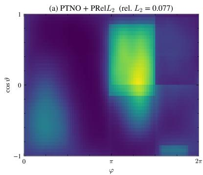

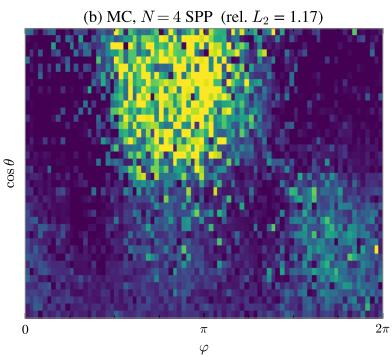

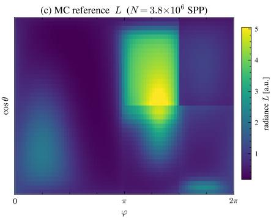  
Figure 5: PTNO recovers the converged far-field radiance from the scene inputs, while one training label is mostly noise. Held-out scene 2 in an equal-solid-angle layout (azimuth $\varphi$ against cos ϑ) on a shared color scale. (a) The seed-42 PTNO + PRelL checkpoint from Table $^ { 2 , }$ using the source, extinction, and albedo tables. (b) A single MC render at the training budget of $N { = } 4$ SPP, i.e. what one training label looks like. (c) The converged MC reference. Panel titles give the rel. $L _ { 2 }$ against (c); the cost comparison is in Appendix K.

## E.2 3D Fluence

The medium occupies $[ - 1 , 1 ] ^ { 3 }$ in scene units, discretized on a $6 4 ^ { 3 }$ Cartesian grid. Each scene is built from resolutionindependent ingredients: $2 \mathrm { - 5 }$ large axis-aligned boxes in a near-vacuum background $( \sigma _ { t } = 0 . 0 1 , c = 0 . 5 )$ , each box carrying its own extinction $\sigma _ { t }$ and albedo $c ,$ and 1–3 point emitters at random positions. About half of the emitters are isotropic; the others carry a random Perlin angular emission profile in a random orientation. Anisotropic scattering uses an HG phase function with one g per scene. The boundary is an open vacuum.

Sampling. Per scene: box centers Unif $( - 0 . 6 , 0 . 6 ) ^ { 3 }$ and half-extents Unif(0.1, 0.7) per axis, with $\sigma _ { t } \sim \mathrm { U n i f } ( 0 . 0 1 , 5 0 )$ and $c \sim \mathrm { U n i f } ( 0 . 0 1 , 0 . 9 9 )$ drawn per box and later boxes overwriting earlier ones where they overlap; emitter positions Unif $\dot { ( - 0 . 8 5 , 0 . 8 5 ) ^ { 3 } }$ and intensity Unif(1, 20), with a Perlin angular profile (values in [0.1, 2]) on each emitter with probability $1 / 2 ; g { \sim } \mathrm { U n i f } ( - 0 . 9 5 , 0 . 9 5 )$ ). The 100 evaluation scenes realize $g \in [ - 0 . 9 2 , \dot { 0 } . 9 3 ]$

Reference. All renders use a forward Monte Carlo collision estimator with double-precision per-voxel accumulators (necessary for HDR), cross-checked against OpenMC [2] on the evaluation scenes. Training: 300,000 scenes with K=2 independent noisy renders at 4 SPP each, i.e., 4 Monte Carlo samples per voxel of the $6 \mathsf { \check { 4 } } ^ { 3 } \mathrm { g r i d } ( \sim 1 0 ^ { 6 }$ particles per render—a deliberately weak supervision regime that exercises the loss family at extreme noise). Evaluation: a held-out batch of 100 unseen scenes whose reference flux is re-rendered $\mathrm { t o } \sim 1 0 ^ { 6 } \dot { \mathrm { S P P } } ( \sim 2 . 7 \times 1 0 ^ { 1 1 }$ particles per scene, ${ \sim } 2 . 6 \times 1 0 ^ { 5 }$ times one training render). The reference fluence of a scene spans about 10 orders of magnitude (Table 24);

over the 100 evaluation scenes, 2.3% of reference voxels are exact zeros that no particle reaches even at the reference budget (cast shadows), against 18% in a four-SPP training render (both means over scenes).

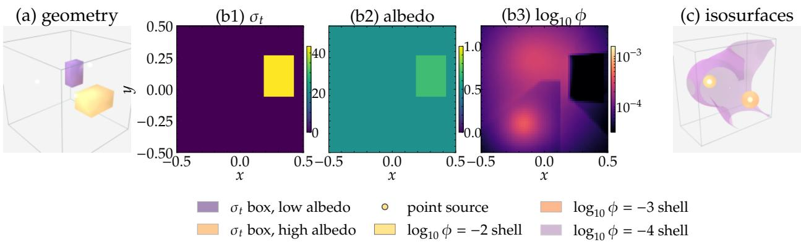  
Figure 6: In the 3D fluence dataset, contrast blocks cast shadows that span orders of magnitude around the point emitters. (a) A representative scene: two $\sigma _ { t }$ blocks rendered as translucent boxes inside the cube (axes in normalized units) (purple / orange tint by $\sigma _ { t }$ magnitude), with the three point sources as bright spheres. (b) Mid-cut slices $( z = 3 2 , { \mathrm { i . e . ~ } } z = 0$ in scene units) of the same scene’s $\sigma _ { t } ,$ albedo, and reference fluence (log scale); only the high-σt/high-albedo block intersects this plane; the dark rectangle in the fluence panel is its cast shadow. (c) Half-cut $( X \leq 0$ visible) view of the same scene’s log-fluence iso-surfaces at $\{ - 2 , - 3 , - 4 \}$ illustrating the multi-order-of-magnitude attenuation around the two emitters in this half.

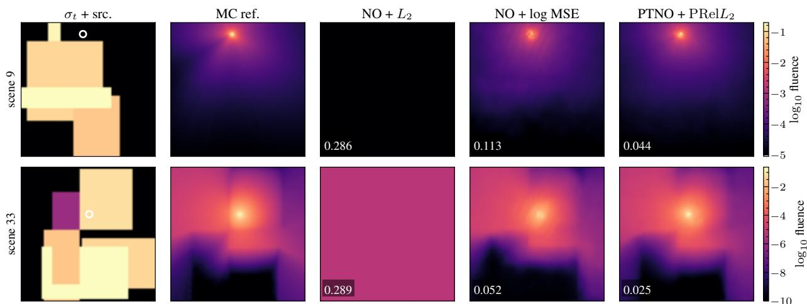  
Figure 7: PTNO + PRe $L _ { 2 }$ more closely reproduces the source halo and shadowed fluence than the baseline losses. Predictions from the seed-42 checkpoints in Table 2 on held-out scenes 9 and 33. Columns: extinction $\sigma _ { t }$ with source locations marked, MC reference (log scale), and predictions from PTNO and the baseline losses on a shared row-wise color scale; inset numbers are per-scene $\log _ { 1 0 }$ rel. $L _ { 2 }$ . The raw-output $L _ { 2 }$ prediction is nearly spatially constant; log MSE retains the main spatial structure but has larger errors near the source and in dim regions.

## E.3 Spherical-Tokamak Neutronics

Each scene is a full toroidal fusion spherical tokamak built parametrically with Paramak using a 6-axis radial build (center-column shield inner/outer radius, blanket thickness, divertor width) plus major and minor radius [40]. The geometry is configured with a plasma source expressed as toroidal rings, radially weighted as a function of fusion reactivity in an H-mode configuration [42]. The CAD assembly is voxelized and tagged with five materials (vacuum, plain-carbon shield, ferritic steel first wall and vessel, Pb–Li breeder blanket). The bounding box, a cube of side 1,800 cm, is voxelized on a $6 4 ^ { 3 }$ Cartesian mesh; the per-voxel material id is queried from the OpenMC geometry, giving a volumetric label that conditions the operator. The prediction target is the raw OpenMC flux-tally mean in each energy group, in neutron-cm per source neutron, integrated over each mesh cell and without conversion to a reactor source rate.

Sampling. The 20 scalar parameters in Table 8 are drawn from Latin-hypercube space-filling designs over the box specified there: 4 paramak radial-build axes, the four D-shape descriptors $( R _ { 0 } , a _ { \mathrm { p } } , \kappa , \delta )$ shared between the paramak surface and the H-mode plasma source [42] (D–T fusion ring), 10 axes for the peaked ion-density and ion-temperature profiles (origin, pedestal/separatrix fractions, peaking factor, pedestal radius fraction, temperature exponent $\beta )$ together with a Shafranov shift of the magnetic axis, and a rigid radial offset of the whole source. The 8 geometry parameters are drawn once per group of 32 consecutive training configurations, which share one CAD model, while the source parameters are drawn per configuration; the source offset has its own one-dimensional design.

Table 8: Spherical-tokamak scenes vary 20 geometry and plasma-source parameters. Sampling box of the 20 scalar parameters, drawn from Latin-hypercube designs. The geometry block parameterizes the paramak radial build; D-shape descriptors $( R _ { 0 } , a _ { \mathrm { p } } , \kappa , \delta )$ are shared between the paramak surface and the plasma source ring; the profile blocks parameterize the H-mode ion-density and ion-temperature radial profiles.
<table><tr><td>Symbol</td><td>Range</td><td>Unit</td><td>Description</td></tr><tr><td colspan="4">Paramak radial build (geometry only)</td></tr><tr><td> $R _ { \mathrm { c s , i n } }$ </td><td>[20, 40]</td><td>cm</td><td>center-column shield inner radius</td></tr><tr><td> $R _ { \mathrm { c s , o u t } }$ </td><td>[55, 95]</td><td>cm</td><td>center-column shield outer radius</td></tr><tr><td> $t _ { \mathrm { b l k } }$ </td><td>[40, 110]</td><td>cm</td><td>blanket thickness</td></tr><tr><td> $w _ { \mathrm { d i v } }$ </td><td>[25, 65]</td><td>cm</td><td>divertor width</td></tr><tr><td colspan="4">D-shape descriptors (shared geometry ↔ source)</td></tr><tr><td> $R _ { 0 }$ </td><td>[250, 500]</td><td>cm</td><td>major radius</td></tr><tr><td> $a _ { \mathrm { p } }$ </td><td>[60, 140]</td><td>cm</td><td>minor radius</td></tr><tr><td>κ</td><td>[1.2, 2.0]</td><td></td><td>elongation</td></tr><tr><td>δ</td><td>[0.2, 0.6]</td><td></td><td>triangularity</td></tr><tr><td colspan="4">Magnetic-axis and source offsets (source only)</td></tr><tr><td> $\Delta _ { \mathrm { S h a f } }$ </td><td>[0, 20]</td><td>cm</td><td>Shafranov shift of the magnetic axis</td></tr><tr><td> $f _ { \mathrm { o f f } }$ </td><td>[−1, i]</td><td></td><td>radial source offset, as a fraction of min(plasma gap, 20 cm)</td></tr><tr><td colspan="4">Ion-density profile (source only)</td></tr><tr><td> $n _ { i , 0 }$ </td><td> $[ 8 \times 1 0 ^ { 1 8 } , 1 . 2 \times 1 0 ^ { 2 0 } ]$ </td><td> $\mathrm { m } ^ { - 3 }$ </td><td>on-axis ion density</td></tr><tr><td> $f _ { n , \mathrm { p e d } }$ </td><td>[0.65, 0.95]</td><td></td><td>pedestal-to-axis density ratio</td></tr><tr><td>fn,sep</td><td>[0.08, 0.22]</td><td></td><td>separatrix-to-axis density ratio</td></tr><tr><td> $\alpha _ { n }$ </td><td>[0.8, 2.0]</td><td></td><td>density peaking factor</td></tr><tr><td> $r _ { \mathrm { p e d } } / a _ { \mathrm { p } }$ </td><td>[0.75, 0.92]</td><td></td><td>pedestal radius fraction</td></tr><tr><td colspan="4">Ion-temperature profile (source only)</td></tr><tr><td> $T _ { i , 0 }$ </td><td>[8, 25]</td><td>keV</td><td>on-axis ion temperature</td></tr><tr><td> $f _ { T , \mathrm { p e d } }$ </td><td>[0.25, 0.60]</td><td></td><td>pedestal-to-axis temperature ratio</td></tr><tr><td> $f _ { T , \mathrm { { s e p } } }$ </td><td>[0.01, 0.06]</td><td></td><td>separatrix-to-axis temperature ratio</td></tr><tr><td> $\alpha _ { T }$ </td><td>[1.5, 5.0]</td><td></td><td>temperature peaking factor</td></tr><tr><td> $\beta _ { T }$ </td><td>[1.5, 4.5]</td><td></td><td>temperature profile exponent</td></tr></table>

Training and reference. The training pool has 1,024,000 configurations, each labeled by one OpenMC fixed-source run of $N { = } 1 0 ^ { 5 }$ histories (10 batches of ${ \bar { 1 0 } } ^ { 4 } ) ;$ training draws $4 \times 1 \mathrm { { 0 ^ { 5 } } }$ of them without repetition $( 1 \bar { 0 } ^ { 5 }$ optimizer updates at batch size 4). The 50 held-out configurations carry a $1 0 ^ { 9 }$ -history reference pooled from 100 independent $1 0 ^ { 7 }$ -history runs; its residual noise is 0.017 in $\log _ { 1 0 }$ relative $L _ { 2 } ,$ against 0.045 for the operator. The operator is a 3D FNO (modes $2 4 ^ { 3 }$ , width 32, 4 layers) trained for $1 0 ^ { 5 }$ optimizer updates.

(a) geometry  
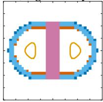

(b) source  
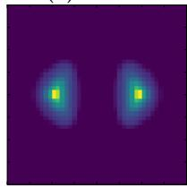

(c) poloidal flux  
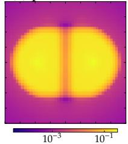

(d) � = 0 source  
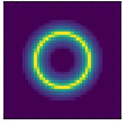

(e) � = 0 flux  
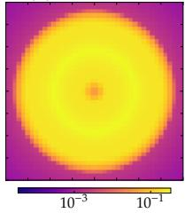

(f) 3D geometry  
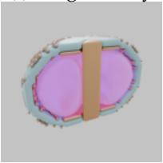  
Figure 8: Each spherical-tokamak scene couples a parametric radial build to a D-shaped plasma source, and the flux falls 1by orders of magnitude from the plasma through the shield and blanket. (a) Paramak radial build for one scene with the D-shaped plasma source outline, major/minor radius, elongation, and triangularity annotated. (b)–(e) Per-scene $6 4 ^ { 3 }$ mesh views: toroidally averaged source $Q$ and group-summed flux (log) on the poloidal plane, then $Z { = } 0$ source and flux slices showing the annular plasma ring and inboard/outboard attenuation. (f) Half-cut 3D view: the toroidal source isosurface inside translucent shield/first-wall/blanket/vessel shells.

## E.4 EU-DEMO 1/16 Sector

The fourth dataset uses an OpenMC model over a 1/16 toroidal slice of the EU-DEMO reactor [43]. Sector neutronics models of this kind are widely used in fusion analysis because they retain the main blanket, vessel, shielding, and source-transport physics of a reactor-scale configuration while exploiting toroidal symmetry to reduce computational cost. They are a standard setting for studies of neutron flux distribution, nuclear heating, shielding performance, activation, and diagnostic response in DEMO-like designs.

The geometry of the reactor is modeled using a CSG geometry of about 5,300 surfaces (planes, quadrics, cylinders, tori, and cones) [21, 41]. The surfaces describing the inboard/outboard blanket modules, divertor, vacuum vessel, and shielding, are closed by two reflective planes at ±11.25◦ and a vacuum plane at $z = - 2 , 7 3 2 \mathrm { c m }$ . Materials use the upstream physics-resolved compositions (water-cooled lithium–lead blanket, Eurofer first wall and vessel, etc.) with TENDL-2019 nuclear cross-section data. Geometry, materials, and reactor configuration are fixed across the dataset; only the plasma source varies.

Sampling. The 8 plasma-source shape parameters in Table 9 are drawn from a Latin-hypercube space-filling design over the upstream ranges of the EU-DEMO parametric plasma source (PPS) configuration.

Table 9: EU-DEMO scenes vary only the plasma source, through 8 shape parameters. Sampling box of these parameters, drawn from a Latin-hypercube space-filling design. Ranges are the upstream EU-DEMO PPS configuration; the geometry and materials are fixed.
<table><tr><td>Symbol</td><td>Range</td><td>Unit</td><td>Description</td></tr><tr><td>T</td><td>[14.00, 17.00]</td><td>keV</td><td>plasma ion temperature (D-T thermal broadening)</td></tr><tr><td>α</td><td>[1.20, 1.80]</td><td></td><td>radial peaking factor of the source profile</td></tr><tr><td> $R _ { 0 }$ </td><td>[715.04, 1,072.56]</td><td>cm</td><td>major radius of the plasma ring</td></tr><tr><td> $a _ { \mathrm { p } }$ </td><td>[230.64, 345.96]</td><td>cm</td><td>minor radius of the plasma ring</td></tr><tr><td>κ</td><td>[1.32, 1.98]</td><td></td><td>plasma elongation</td></tr><tr><td>δ</td><td>[0.2664, 0.3996]</td><td></td><td>plasma triangularity</td></tr><tr><td>∆R</td><td>[−20, 20]</td><td>cm</td><td>radial shift of the magnetic axis</td></tr><tr><td> $\Delta Z$ </td><td>[−20, 20]</td><td>cm</td><td>vertical shift of the magnetic axis</td></tr></table>

Reference. The neutron source is a parametric D–T plasma source parameterized by the 8 plasma-shape variables above together with the wedge angles. The emitted neutron energy is modeled as a thermally broadened 14.1 MeV D–T fusion spectrum, with broadening controlled by the ion temperature. The source is broadly similar in spirit to the more general confinement-mode-dependent source models described by [44], but uses a reduced geometric parameterization and a simplified spectral model. Per scene we (i) voxelize the source onto the flux-tally mesh, so that the operator input and output share a coordinate frame, and (ii) run OpenMC continuous-energy fixed-source transport with neutron-flux mesh tallies on a trimmed $1 4 0 \times 7 3 \times 1 4 6$ Cartesian mesh. The prediction target is the OpenMC flux-tally mean divided by the mesh-cell volume, in neutrons per square centimeter per source neutron, without conversion to a reactor source rate. The 24 held-out configurations use a reference computed at $7 0 0 \times 3 6 5 \times 7 3 0$ with FW-CADIS and MAGIC weight windows, a median of 6,130 core-hours per configuration, and conservatively block-averaged to the 70, 140, and 280 grids used for evaluation. Figure 9 shows the wedge geometry and a representative scene.

Training. $M { = } 1 0 ^ { 5 }$ configurations from the sampling design above, each labeled by one OpenMC run of $N { = } 5 \times 1 0 ^ { 5 }$ histories on the $1 4 0 \times 7 3 \times 1 4 6$ mesh (K=1). The backbone is a 3D FNO (modes $3 2 \times 2 4 \times 3 8$ , width 32, 4 layers, $6 . 3 \times 1 0 ^ { 7 }$ parameters) that reads a four-class material-density geometry channel and the 8 source parameters as ${ \mathrm { N e R F } } .$ embedded scalars (37 input channels). Every EU-DEMO model in Table 2 trains with AdamW (learning rate $1 0 ^ { - 3 }$ , no weight decay, gradient clipping at 1.0) at batch size 1 with 4-step gradient accumulation for two passes over the $1 0 ^ { 5 }$ configurations, that is $5 \times 1 0 ^ { 4 }$ optimizer updates under a cosine schedule that reaches zero at the last update, taking about 2.9 hours per run on one H200. Log-space metrics use a floor of $1 0 ^ { - 1 7 }$ for both predictions and references.

## F Evaluation Protocol

Every metric is computed per scene on the physical prediction $\hat { \phi }$ and reference ϕ, averaged over the scenes of the held-out set, and reported as the mean ± sample standard deviation of that average across training seeds, or as the two per-seed values when there are two seeds; rows that report a median over scenes say so. A scene is scored on a set of cells C with weights $\begin{array} { r } { w _ { i } , \sum _ { i \in \mathcal { C } } w _ { i } = 1 } \end{array}$ , given by the cell volume on Cartesian grids and by the solid angle on the far-field sphere. The structured grids have equal-measure cells (uniform Cartesian voxels and arccos-uniform angular bins), so their weights are uniform. The tetrahedral extension in Appendix O instead uses the volume of each tetrahedron.

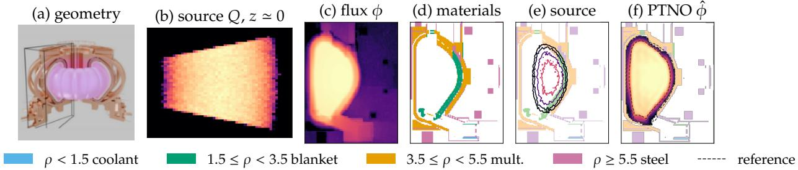  
Figure 9: The EU-DEMO reference flux falls by more than nine orders of magnitude over one poloidal slice, and the PTNO 1prediction follows it through the inboard blanket toward the divertor. One held-out validation configuration (the scene of Figure 2). (a) Rendering of the DEMO tokamak [21]; the wireframe brackets the 1/16 wedge whose poloidal cross-section is plotted in the remaining panels. (b) The $z \simeq 0$ slice of the plasma source $Q$ on the $1 4 0 \times 7 3 :$ × 146 training mesh. (c) The converged reference flux ϕ on the physical $y = 0$ slice, shown over nine orders of magnitude below its peak. (d) Material classes on the same slice, binned by mass density as in the legend. (e) Iso-contours of the source over the materials; the D-shaped plasma sits inside the vacuum vessel. $\ r ( f )$ The PTNO prediction $\hat { \phi }$ over three orders of magnitude, with dashed reference iso-contours at $1 0 ^ { - 1 } , 1 0 ^ { - 2 }$ , and $1 0 ^ { - 3 }$ of the peak; the predicted field follows the reference through the inboard blanket and toward the divertor.

For a field $u ,$ which is either $\phi$ itself (linear metrics) or $\log _ { 1 0 }$ max(ϕ, ϵ) (log metrics, with the same floor ϵ applied to prediction and reference), we report

$$
\begin{array} { r } { \mathrm { r e l } { L _ { 2 } \big ( \hat { u } , u \big ) } = \Big ( \sum _ { i \in \mathcal { C } } w _ { i } ( \hat { u } _ { i } - u _ { i } ) ^ { 2 } \big / \sum _ { i \in \mathcal { C } } w _ { i } u _ { i } ^ { 2 } \Big ) ^ { 1 / 2 } , } \end{array}\tag{23}
$$

$$
\begin{array} { r } { \mathrm { P S N R } ( \hat { u } , u ) = 1 0 \log _ { 1 0 } \Bigl ( R ^ { 2 } \big / \sum _ { i \in \mathcal { C } } w _ { i } ( \hat { u } _ { i } - u _ { i } ) ^ { 2 } \Bigr ) , } \end{array}\tag{24}
$$

$$
\begin{array} { r } { \mathrm { S S I M } ( \hat { u } , u ) = \sum _ { i \in \mathcal { C } } w _ { i } \frac { ( 2 \mu _ { \hat { u } , i } \mu _ { u , i } + C _ { 1 } ) ( 2 \sigma _ { \hat { u } u , i } + C _ { 2 } ) } { ( \mu _ { \hat { u } , i } ^ { 2 } + \mu _ { u , i } ^ { 2 } + C _ { 1 } ) ( \sigma _ { \hat { u } , i } ^ { 2 } + \sigma _ { u , i } ^ { 2 } + C _ { 2 } ) } . } \end{array}\tag{25}
$$

Relative $L _ { 2 }$ is a ratio of sums over the scene, not a mean of per-cell ratios, and the % RMSE of some appendix tables is 100 times the linear relative $L _ { 2 }$ . For structured-grid SSIM, $\mu , \sigma ^ { 2 } .$ , and $\sigma _ { \hat { u } u }$ are local means, variances, and covariance under a separable Gaussian window with standard deviation 1.5 cells truncated to 11 taps per axis (2D on the sphere, 3D on volumes), with reflective padding at the domain boundary, $C _ { 1 } = ( 0 . 0 1 R ) ^ { 2 }$ , and $C _ { 2 } =$ $( 0 . 0 3 R ) ^ { 2 }$ The tetrahedral extension instead uses volume-weighted neighborhoods with a physical scale of 100 cm (Appendix O). The data range R is the span of the scene’s own reference: max u − min u, which for the $\log _ { 1 0 }$ metrics is $\log _ { 1 0 }$ max $\phi - \log _ { 1 0 }$ max(min ϕ, ϵ); predictions are never rescaled independently of the reference. On the multi-group spherical-tokamak flux, every metric is computed per energy group and averaged over the groups whose reference is not identically zero. The reporting rule is the final checkpoint of a fixed training schedule, with no checkpoint selection on a validation or reference set. The far-field reruns (200 epochs, $1 0 ^ { 5 }$ updates), EU-DEMO reruns, tetrahedral extension, and interface models follow this rule. The 3D fluence main-table replacement is still running, and the original spherical-tokamak training corpus is unavailable locally for an exact rerun; their historical rows are explicitly provisional because checkpoints were selected on the same configurations used for evaluation. Earlier single-seed diagnostics and qualitative figures retain their documented historical checkpoints until replaced. Far-field hyperparameters, including HPO candidates and promotions, were chosen using the same 100 evaluation scenes; the new runs remove checkpoint selection but do not provide an independent test of hyperparameter selection.

Table 10 lists the settings that differ between datasets; within a dataset they are identical for every model compared. Some tables report linear metrics with the voxels around point emitters removed, or score EU-DEMO only on the cells its reference measured; each such table says so in its caption.

## G Explicit Debiasers for Log-Space Training

Setup. The single-seed and earlier-model figures below retain their historical checkpoints. Tables 11 and 13 use the new fixed-schedule final checkpoints; the remaining diagnostics await replacement. We confirm the $\log _ { 1 0 } .$ -target Jensen bias under two configurations: Setup A (single scene, M=1, 5 seeds, labels of one 4-SPP render) and Setup B (multi-scene, $M { = } 1 0 ^ { 6 }$ train / M=100 test, 6 seeds, labels averaging 20 four-SPP renders, i.e. 80 SPP), both for $\mathrm { \dot { 1 } 0 ^ { 5 } }$ optimization steps. Figures 10 and 11 show that log MSE converges to a strictly higher validation rel. $L _ { 2 }$ than a model trained in physical space (an earlier version of our method: a physical-space $L _ { 2 }$ loss on a $1 0 ^ { \mathcal { G } _ { \theta } }$ output head, without the softplus head and the pointwise normalization of $\mathrm { P R e l } L _ { 2 } )$ , and that an NO trained agains $\log _ { 1 0 } \hat { \mathcal { U } } _ { N } ( a , \xi )$ systematically under-predicts the solution by the empirical Jensen offset.

Table 10: Evaluation settings for the five structured-grid datasets. ϵ is the floor of the $\log _ { 1 0 }$ metrics; these grids have equalmeasure cells, so the measure weights are uniform; R is the reference’s own span for PSNR and SSIM. The SSIM window is the same Gaussian $( \sigma = 1 . 5 $ cells, 11 taps per axis) on these grids; tetrahedral settings are in Appendix O.
<table><tr><td>Dataset</td><td>€</td><td>Measure and grid</td><td>Data range R</td></tr><tr><td>Far-field radiance</td><td> $1 0 ^ { - 6 }$ </td><td>solid angle, 40×80</td><td>span of the scene&#x27;s reference</td></tr><tr><td>3D fluence</td><td> $1 0 ^ { - 1 0 }$ </td><td>volume,  $6 4 ^ { 3 }$ </td><td>span of the scene&#x27;s reference</td></tr><tr><td>Spherical tokamak</td><td> $1 0 ^ { - 1 0 }$ </td><td>volume,  $6 4 ^ { 3 }$  , per energy group</td><td>span of the scene&#x27;s reference, per group</td></tr><tr><td>EU-DEMO wedge</td><td> $1 0 ^ { - 1 7 }$ </td><td>volume,  $1 4 0 \times 7 3 \times 1 4 6$ </td><td>span of the scene&#x27;s reference</td></tr><tr><td>Interfaces (App. P)</td><td> $3 . 2 8 \times 1 0 ^ { - 7 }$ </td><td>volume,  $6 4 ^ { 3 }$ </td><td>span of the scene&#x27;s reference</td></tr></table>

Stratified loss comparison. Table 11 stratifies % RMSE and $\log _ { 1 0 }$ SSIM by reference brightness across the 100 held-out far-field scenes, for the five-seed far-field models of Table 2. Log MSE underperforms $\mathrm { P T N O } + \mathrm { P R e l } L _ { 2 }$ in every bin; $L _ { 2 }$ on raw NO output loses contrast in dim regions $( \log _ { 1 0 }$ SSIM 0.24 in the dimmest bin and at most 0.78 in any bin); $\mathrm { P T N O } + \mathrm { P R e l } L _ { 2 }$ keeps $\log _ { 1 0 }$ SSIM between $0 . 8 9$ and 0.94 across all four brightness bins. This table does not separate the contributions of the softplus head and the $\mathrm { P R e l } L _ { 2 }$ residual to the dim-bin improvement; Appendix D does.

Table 11: $\mathbf { P T N O } + \mathbf { P R e l } L _ { 2 }$ is the only loss that is accurate in every brightness bin. Far-field radiance, 100 held-out scenes against the converged reference; columns stratify scenes by their mean reference radiance (8, 16, 42, and 32 scenes), and the last column covers all 100 scenes (two lie outside the bin edges) and reproduces Table 2. Mean ± standard deviation over the five seeds of Table 2; bolded values are best per metric and bin.
<table><tr><td>Metric</td><td>Arch.</td><td>Loss</td><td>0.0016-0.013</td><td>0.013-0.10</td><td>0.10-0.85</td><td>0.85-6.9</td><td>All</td></tr><tr><td rowspan="3"> $\% \mathrm { R M S E \downarrow }$ </td><td>NO</td><td> $L _ { 2 }$ </td><td> $6 4 . 0 \pm 6 . 9$ </td><td> $1 8 . 5 \pm 1 . 5$ </td><td> ${ \bf 8 . 2 \pm 0 . 2 }$ </td><td> ${ \bf 5 . 6 \pm 0 . 1 }$ </td><td> ${ \bf 1 5 . 3 \pm 1 . 3 }$ </td></tr><tr><td>NO</td><td> $\log \mathbf { M S E }$ </td><td> $9 9 . 9 \pm 0 . 0$ </td><td> $9 0 . 6 \pm 0 . 2$ </td><td> $5 8 . 2 \pm 0 . 2$ </td><td> $2 9 . 7 \pm 0 . 2$ </td><td> $5 7 . 6 \pm 0 . 2$ </td></tr><tr><td>PTNO</td><td> $\mathrm { P } \mathrm { { \bar { R } e l } } L _ { 2 } \ ( \mathrm { o u r s } )$ </td><td> ${ \bf 2 9 . 1 \pm 2 . 7 }$ </td><td> ${ \bf 1 5 . 7 \pm 1 . 8 }$ </td><td> $1 5 . 4 \pm 0 . 5$ </td><td> $1 4 . 4 \pm 0 . 6$ </td><td> $1 6 . 4 \pm 0 . 6$ </td></tr><tr><td rowspan="3"> $\log _ { 1 0 }$  SSIM ↑</td><td>NO</td><td> $L _ { 2 }$ </td><td> $0 . 2 4 1 \pm 0 . 0 7 9$ </td><td> $0 . 4 9 0 \pm 0 . 0 4 6$ </td><td> $0 . 6 9 9 \pm 0 . 0 0 9$ </td><td> $0 . 7 8 1 \pm 0 . 0 0 9$ </td><td> $0 . 6 5 2 \pm 0 . 0 2 0$ </td></tr><tr><td>NO</td><td> $\log \mathbf { M S E }$ </td><td> $0 . 5 1 4 \pm 0 . 0 0 1$ </td><td> $0 . 5 0 9 \pm 0 . 0 0 1$ </td><td> $0 . 4 4 1 \pm 0 . 0 0 1$ </td><td> $0 . 4 7 1 \pm 0 . 0 0 2$ </td><td> $0 . 4 7 0 \pm 0 . 0 0 1$ </td></tr><tr><td>PTNO</td><td> $\mathrm { P } \mathrm { { \bar { R } e l } } L _ { 2 } \ ( \mathrm { o u r s } )$ </td><td> $\mathbf { 0 . 9 3 5 \pm 0 . 0 0 3 }$ </td><td> $\mathbf { 0 . 9 4 5 \pm 0 . 0 0 6 }$ </td><td> $\mathbf { 0 . 9 2 5 \pm 0 . 0 0 4 }$ </td><td> $\mathbf { 0 . 8 8 8 \pm 0 . 0 0 5 }$ </td><td> $\mathbf { 0 . 9 1 7 \pm 0 . 0 0 4 }$ </td></tr></table>

Explicit log-target debiasers. The log MSE row in Table 1 suffers Jensen bias because $\mathbb { E } \Big [ \log _ { 1 0 } \hat { \mathcal { U } } _ { N } \Big ] \neq \log _ { 1 0 } \mathbb { E } \Big [ \hat { \mathcal { U } } _ { N } \Big ]$ at finite N. A natural fix is to construct an explicitly debiased or lower-bias $\log _ { 1 0 }$ -target estimator from K independent renders and feed that into a standard log-space MSE. We compare three such estimators against $\mathrm { P R e l } L _ { 2 }$ trained with the exponential output head $1 0 ^ { \mathcal { G } _ { \theta } }$ of an earlier model version:

• Log of mean $( K { = } 1 0 )$ : the $\log _ { 1 0 }$ of the average of 10 available 4-SPP renders, equivalent in expectation to one 40-SPP render.

• Second-moment correction $( K { = } 1 0 ) \colon \log _ { 1 0 } \bar { Y } _ { K } + \widehat { \sigma } ^ { 2 } / ( 2 K \bar { Y } _ { K } ^ { 2 }$ ln 10) where the same K renders are used to estimate the mean and variance.

• Taylor fallback (5+5): a Taylor–Russian-roulette log estimator with a second-moment fallback on highcoefficient-of-variation pixels.

Implementation of the log-target debiasers. All log-target debiasers are applied independently at every output pixel to the stored stack of repeated 4-SPP renders for the same scene. Let $Y _ { 1 } , \dots , Y _ { K }$ denote the selected independent renders, let $\bar { Y } _ { K } = K ^ { - 1 } \dot { \sum _ { i } } Y _ { i }$ , and let $\epsilon = 1 0 ^ { - 6 }$ be the same floor used by the far-field evaluation. The log-of-mean target is

$$
\widehat { z } _ { \mathrm { m e a n } } = \log _ { 1 0 } \left( \operatorname* { m a x } ( \bar { Y } _ { 1 0 } , \epsilon ) \right) .
$$

The second-moment row uses the delta-method correction

$$
\widehat { z } _ { \mathrm { 2 n d } } = \frac { 1 } { \ln 1 0 } \left[ \ln \bigl ( \operatorname* { m a x } ( \bar { Y } _ { 1 0 } , \epsilon ) \bigr ) + \frac { \widehat { \sigma } ^ { 2 } } { 2 K \operatorname* { m a x } ( \bar { Y } _ { 1 0 } , \epsilon ) ^ { 2 } } \right] ,
$$

where ${ \widehat { \sigma } } ^ { 2 }$ is the unbiased sample variance of the same K=10 renders. The Taylor fallback row splits the selected renders into 5 anchor renders and 5 correction renders. The anchor group forms $\begin{array} { r } { \hat { \mu } = \operatorname* { m a x } ( \frac { 1 } { 5 } \sum _ { i = 1 } ^ { 5 } Y _ { i } , \epsilon ) } \end{array}$ . For correction render $Y _ { 5 + j } , j = 1 , \dotsc , 5 .$ , define $r _ { j } = ( Y _ { 5 + j } - \hat { \mu } ) / \hat { \mu }$ . The estimator uses product terms from the Taylor series of the log of the pixel mean $\mu = \mathbb { E } [ Y _ { i } ]$

$$
\ln \mu = \ln \hat { \mu } + \sum _ { m \geq 1 } \frac { ( - 1 ) ^ { m + 1 } } { m } \left( \frac { \mu - \hat { \mu } } { \hat { \mu } } \right) ^ { m } ,
$$

with $\Pi _ { j = 1 } ^ { m } r _ { j }$ estimating the mth power term. We average 32 Russian-roulette paths, i.e., randomly truncated series whose surviving terms are reweighted by their survival probability, with continuation probability $q _ { m } = \mathrm { m i n } ( \mathrm { C V } m / ( m +$ 1), 0.95), where CV is the coefficient of variation estimated from the selected renders. Pixels with $\mathrm { C V } \geq 1$ or non-finite roulette output fall back to the second-moment estimator above. These procedures debias the transformed target as much as possible under the $K { = } 1 0$ render budget, but the resulting training objective is still ordinary log-space MSE; the K extra renders are amortized over the training set, not the stochastic gradient.

Table 12 reports metrics averaged over the 100 held-out scenes against the naive baseline at $N { = } 4 ;$ each debiaser cuts the naive-log % RMSE by 50–59%, but none closes the gap to $\mathrm { P } \mathrm { { R e l } } L _ { 2 }$ , shown here with the exponential $1 0 ^ { \mathcal { G } _ { \theta } }$ output head of an earlier model version rather than the softplus head of PTNO.

Table 12: Even with explicit Jensen-bias correction, log-target debiasers leave a substantial residual gap. All methods are trained at N=4 on the far-field radiance dataset; explicit debiasing methods consume up to K=10 renders for target estimation. One run per row, scored on the 100 held-out scenes against the converged reference; % RMSE, PSNR, and SSIM are linear, the other two columns $\log _ { 1 0 } .$
<table><tr><td>Arch.</td><td>Loss / target</td><td>% RMSE↓</td><td> $\log _ { 1 0 } { \mathrm { r e l } } . \ L _ { 2 } \ \downarrow$ </td><td>PSNR ↑</td><td>SSIM ↑</td><td> $\log _ { 1 0 }$  SSIM ↑</td></tr><tr><td>NO</td><td>log MSE</td><td>56.23</td><td>1.357</td><td>19.23</td><td>0.561</td><td>0.474</td></tr><tr><td>NO</td><td> $\mathrm { L o g - m e a n M S E } \left( K { = } 1 0 \right)$ </td><td>25.44</td><td>0.489</td><td>27.29</td><td>0.848</td><td>0.787</td></tr><tr><td>NO</td><td> $2 \mathrm { n d \mathrm { - } m o m e n t \ M S E } \left( K \mathrm { = } \mathrm { 1 0 } \right)$ </td><td>23.21</td><td>0.456</td><td>28.18</td><td>0.861</td><td>0.797</td></tr><tr><td>NO</td><td> $\mathrm { T a y l o r \mathrm { - } f a l l b a c k \mathbf { M S E } \left( 5 + 5 \right) }$ </td><td>28.39</td><td>0.516</td><td>25.10</td><td>0.829</td><td>0.735</td></tr><tr><td>NO,  $1 0 ^ { \mathcal { G } _ { \theta } } \mathrm { ~ h e a d }$ </td><td> $\mathrm { P R e l } L _ { 2 }$ </td><td>17.17</td><td>0.083</td><td>29.53</td><td>0.942</td><td>0.914</td></tr></table>

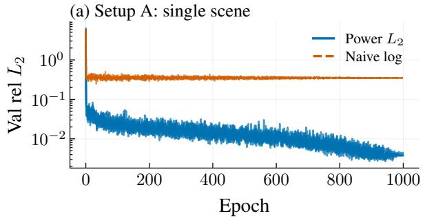

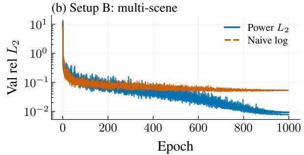  
Figure 10: Log MSE converges to a higher error floor than training in physical space. Validation linear rel. $L _ { 2 }$ against training epoch for (a) Setup A, one scene with 4-SPP labels, and (b) Setup B, ${ \bar { \boldsymbol { M } } } { \bar { \boldsymbol { = } } } { 1 \bar { 0 } ^ { 6 } }$ training scenes with 80-SPP labels; “Naive ${ \mathrm { l o g } } ^ { \prime \prime }$ in the legend is log MSE, and “Power $L _ { 2 } { } ^ { , , }$ is the earlier physical-space L2 loss on a $1 0 ^ { \mathcal { \ Y } _ { \theta } }$ head described in the setup above, not the softplus head with $\mathrm { P R e l } L _ { 2 }$

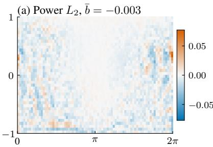

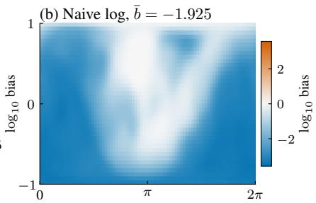

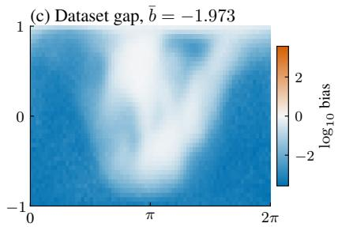  
Figure 11: Log MSE learns the biased target; training in physical space does not. Setup A. Per-pixel mean residual $\hat { b } ( { \bf x } )$ is log prediction minus $\log _ { 1 0 } \mathcal { U } ( a , \mathbf { x } ) ; \bar { b }$ is the spatial mean. (a) Physical-space $L _ { 2 }$ on a $1 0 ^ { \mathcal { G } _ { \theta } }$ head, labeled “Power $L _ { 2 } { } ^ { \ ' }$ (an earlier version of our method; ¯b≈0). (b) log MSE (¯b≈−1.9). (c) Empirical Jensen bias estimated on the train set, matching panel (b).

Each explicit debiaser cuts the naive-log % RMSE by $5 0 \mathrm { - } 5 9 \%$ , but none achieves performance comparable to training the model with our proposed loss, even though they require extra renders. The gap is widest in $\log _ { 1 0 }$ rel. $L _ { 2 } ,$ , where ours reaches 0.083 versus 0.456 for the next best (2nd-moment MSE, K=10).

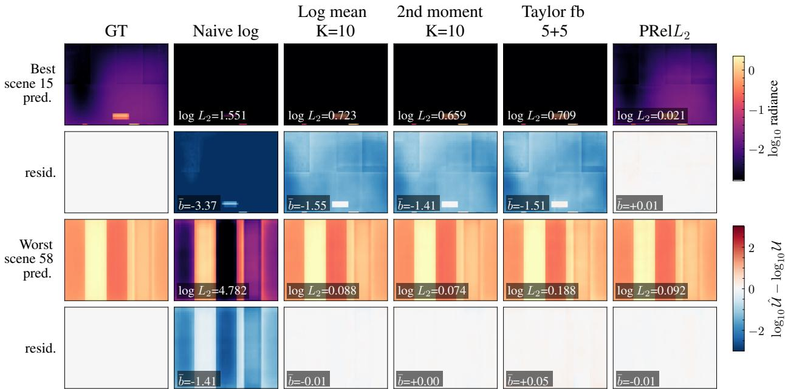  
Figure 12: The explicit debiasers reduce the log-MSE offset but keep structured errors; $\mathrm { P R e l } L _ { 2 }$ keeps the residual centered. Best- and worst-case predictions and residuals per debiasing strategy on the 100 held-out far-field scenes, using the earlier $1 0 ^ { \mathcal { G } _ { \theta } }$ -head model for the $\mathrm { P R e l } \bar { L _ { 2 } }$ column as in Table 12. Rows are selected by $\log _ { 1 0 }$ rel. $L _ { 2 } \colon$ the best block is the lowest-error scene under our loss, and the worst block is the highest-error scene under log MSE. Prediction rows use one shared $\log _ { 1 0 }$ radiance scale; residual rows show the $\log _ { 1 0 }$ prediction minus $\log _ { 1 0 } \mathcal { U } ( a )$ with one symmetric $\pm 3$ orders-of-magnitude scale. Log MSE under-predicts the bright lobes uniformly; the explicit debiasers reduce the offset but retain structured errors; $\mathrm { P R e l } L _ { 2 }$ keeps the residual centered near zero without large-area bias.

## H Bias Correction for Target-Denominator rel $L _ { 2 }$

Figure 13 and Table 13 study how Jensen bias affects relative- $L _ { 2 }$ training on the far-field radiance dataset. The baseline re $\lfloor { L _ { 2 } }$ objective uses noisy MC labels in the denominator, so the nonlinear reciprocal-square map moves the empirical minimizer away from the physical solution. We compare that baseline with two rel $L _ { 2 }$ bias-correction strategies that estimate the inverse-square scale from extra independent renders, and with our pointwise relative loss. The bias-corrected re $\scriptstyle { \mathrm { { L } } } _ { 2 }$ variants reduce the collapse but still land far worse than $\mathrm { P T N O } + \mathrm { P R e l } L _ { 2 }$ . This appendix documents the full definitions of the corresponding losses.

Table 13: Bias correction improves the label-denominator relative $L _ { 2 }$ loss but leaves it at least $5 \times$ worse than PTNO. We compare four loss variants on the far-field radiance dataset at $( M , N , K ) = ( 1 0 ^ { 6 } , 4 , 1 0 )$ and evaluate on the 100 held-out scenes against the converged reference. The variants are: (1) the baseline relative $\left( L _ { 2 } \right)$ loss, which uses MC labels in the denominator; $( 2 - 3 )$ relative $\left( L _ { 2 } \right)$ with bias-correction strategies described in Appendix H; and (4) PTNO with our prediction-normalized pointwise relative loss. Bias correction improves over the biased baseline but remains at least 5× worse than our method in relative $L _ { 2 }$ . Mean ± standard deviation over three seeds.
<table><tr><td>Objective</td><td>Bias Correction</td><td> $\mathrm { r e l . } \ L _ { 2 } \ L$ </td><td> $\log _ { 1 0 } { \mathrm { r e l } } .  L _ { 2 } \downarrow$ </td><td> $\mathrm { l o g } _ { 1 0 } \mathrm { S S I M \uparrow }$ </td></tr><tr><td> $\mathrm { r e l } L _ { 2 }$ </td><td></td><td> $1 . 0 0 0 0 \pm 0 . 0 0 0 0$ </td><td> $5 . 0 2 2 6 \pm 0 . 0 0 0 0$ </td><td> $0 . 1 3 4 7 \pm 0 . 0 0 0 0$ </td></tr><tr><td> $\mathrm { r e l } L _ { 2 }$ </td><td>2nd-order approx. Taylor</td><td> $0 . 7 2 3 0 \pm 0 . 0 0 1 1$ </td><td> $0 . 6 5 7 1 \pm 0 . 0 0 0 9$ </td><td> $0 . 4 3 9 3 \pm 0 . 0 0 5 2$ </td></tr><tr><td> $\mathrm { r e l } L _ { 2 }$ </td><td>Taylor</td><td> $0 . 7 1 8 8 \pm 0 . 0 0 2 8$ </td><td> $0 . 6 4 8 6 \pm 0 . 0 0 2 8$ </td><td> $0 . 4 4 1 3 \pm 0 . 0 0 2 5$ </td></tr><tr><td> $\mathrm { P R e l } L _ { 2 } ( \mathrm { o u r s } )$ </td><td></td><td> $\mathbf { 0 . 1 3 0 4 \pm 0 . 0 0 3 1 }$ </td><td> $\mathbf { 0 . 0 6 2 4 } \pm \mathbf { 0 . 0 0 0 8 }$ </td><td> $\mathbf { 0 . 9 4 5 4 \pm 0 . 0 0 1 9 }$ </td></tr></table>

Why the label denominator cannot be repaired. The weak labels put a point mass at zero, so the inverse-square weight of the label-denominator loss has no finite expectation (Table 14). About 15% of the pixels of a ten-render mean are exactly zero, and their weights reach ${ \sim } 1 0 ^ { 1 2 }$ against ${ \sim } 2 \times 1 0 ^ { 2 }$ for a typical (median) pixel of the same label $( \sim 2 \times 1 0 ^ { 4 }$ for a single render). The loss then reduces to reproducing zeros where the label is zero, the optimizer drives the whole field to the softplus floor, and the vanishing gradient there prevents recovery, which is the first-epoch collapse behind the baseline row of Table 13 and panel (b) of Figure 13. Any repair, such as a label floor or a mask on zero pixels, changes the target rather than removing the bias.

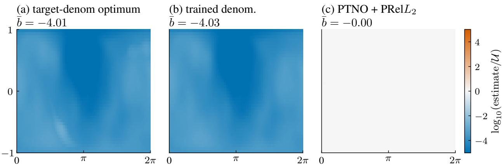  
Figure 13: With the noisy label in the denominator, the relative $L _ { 2 }$ loss collapses the prediction by several orders of magnitude; $\mathbf { P T N O } + \mathbf { P R e l } L _ { 2 }$ does not. One far-field scene with high dynamic range; both models are trained on this scene alone $( M { = } 1 )$ and scored against its converged reference. Each panel shows $\log _ { 1 0 }$ estimate minus $\log _ { 1 0 } \mathcal { U } ( a , \mathbf { x } )$ . (a) The exact stationary point of the baseline re $\lfloor { L _ { 2 } }$ objective, $( ( B - Y ) / ( Y + \eta ) ) ^ { 2 }$ , uses $1 / ( Y + \eta ) ^ { 2 }$ weights and collapses the prediction by several orders of magnitude. (b) A trained baseline relL2 NO converges to the same collapsed field (rel. $L _ { 2 } { \approx } 1 . 0 0 0 )$ . (c) The matched $\mathrm { P T N O } + \mathrm { P R e l } L _ { 2 }$ run is centered at the physical solution (rel. $L _ { 2 } { = } 0 . 0 0 6 7 )$

Table 14: Weak labels have a point mass at zero, so the label-denominator weight $1 / ( Y + \eta ) ^ { 2 }$ has no finite mean. 100 training scenes of the far-field radiance corpus, $\eta = 1 0 ^ { - 6 }$ ; fractions are means over scenes (medians in parentheses), and the maximum pixel weight is each scene’s maximum averaged over scenes.
<table><tr><td>Label</td><td>Pixels exactly zero</td><td>Pixels below η</td><td>Max pixel weight</td></tr><tr><td>One 4-SPP render</td><td>0.326 (0.140)</td><td>0.392</td><td> $9 . 6 \times 1 0 ^ { 1 1 }$ </td></tr><tr><td>Mean of ten renders (40 SPP)</td><td>0.148 (0.009)</td><td>0.201</td><td> $8 . 0 \times 1 0 ^ { 1 1 }$ </td></tr></table>

Implementation of the rel $L _ { 2 }$ bias corrections. $\mathrm { P T N O } + \mathrm { P R e l } L _ { 2 }$ uses a 10-render target mean ${ \bar { Y } } _ { 1 0 } .$ i.e., a 40-SPP effective target, but its denominator is the prediction:

$$
\ell _ { \mathrm { s g } } = \bigg ( \frac { B _ { \theta } - \bar { Y } _ { 1 0 } } { \operatorname* { m a x } ( \mathrm { s g } ( B _ { \theta } ) , \eta ) } \bigg ) ^ { 2 } , \qquad B _ { \theta } = \mathrm { s o f t p l u s } ( \mathcal { G } _ { \theta } ( a ) ) .
$$

Conditioned on the prediction, the denominator is a constant and the stochastic gradient remains centered at the physical solution. The baseline rel $L _ { 2 }$ objective instead puts the same noisy target in the scale,

$$
\ell _ { \mathrm { t g t } } = \left( \frac { B - \bar { Y } _ { 1 0 } } { \mathrm { s g } ( \bar { Y } _ { 1 0 } ) + \eta } \right) ^ { 2 } .
$$

For a scalar prediction $B ,$ , its stationary point is

$$
B ^ { * } = \frac { \mathbb { E } \left[ \bar { Y } _ { 1 0 } / ( \bar { Y } _ { 1 0 } + \eta ) ^ { 2 } \right] } { \mathbb { E } \left[ 1 / ( \bar { Y } _ { 1 0 } + \eta ) ^ { 2 } \right] } ,
$$

which is an inverse-MC-weighted target rather than $\mathbb { E } [ \bar { Y } _ { 1 0 } ]$

The two rel $L _ { 2 }$ bias corrections try to repair this by keeping the residual render independent from the denominator estimate. They train

$$
\ell _ { \mathrm { i w } } = \widehat { W } \left( B _ { \theta } - Y _ { r } \right) ^ { 2 } ,
$$

where $Y _ { r }$ is one selected 4-SPP residual render and $\widehat { W }$ is computed from disjoint renders. If $\widehat { W }$ were a stable lowvariance estimate of $( \mathbb { E } [ Y ] + \eta ) ^ { - 2 }$ , independence would recover the correct fixed point. The second-order bias correction uses $K { = } 1 0$ anchor renders with

$$
\bar { A } _ { K } = \frac { 1 } { K } \sum _ { i = 1 } ^ { K } A _ { i } , \qquad \hat { \mu } = \mathrm { m a x } ( \bar { A } _ { K } , \eta ) , \qquad \widehat { \sigma } _ { A } ^ { 2 } = \frac { 1 } { K - 1 } \sum _ { i = 1 } ^ { K } ( A _ { i } - \bar { A } _ { K } ) ^ { 2 } .
$$

For the weight $w ( x ) = ( x + \eta ) ^ { - 2 }$ , with $\mu = \mathbb { E } [ A _ { i } ]$ and $\sigma ^ { 2 } = \mathrm { V a r } ( A _ { i } )$ , the delta method gives

$$
\mathbb { E } [ w ( \bar { A } _ { K } ) ] \approx w ( \mu ) + \frac { 1 } { 2 } w ^ { \prime \prime } ( \mu ) \frac { \sigma ^ { 2 } } { K } = ( \mu + \eta ) ^ { - 2 } + \frac { 3 \sigma ^ { 2 } } { K ( \mu + \eta ) ^ { 4 } } ,
$$

so the inverse-square analog of the second-moment log correction subtracts this leading plug-in bias:

$$
\widehat W _ { 2 } = \left[ ( \widehat \mu + \eta ) ^ { - 2 } - \frac { 3 \widehat \sigma _ { A } ^ { 2 } } { K ( \widehat \mu + \eta ) ^ { 4 } } \right] _ { + } .
$$

The Taylor bias correction splits its 10 renders into 5 anchor renders $A _ { i }$ and 5 correction renders $A _ { j } ^ { \prime }$ . The anchors give a stable expansion point $\begin{array} { r } { \hat { \mu } = \operatorname* { m a x } ( \frac { 1 } { 5 } \sum _ { i } A _ { i } , \eta ) } \end{array}$ ), and each correction render contributes a mean-zero relative residual $r _ { j } = ( A _ { j } ^ { \prime } - \hat { \mu } ) / ( \hat { \mu } + \eta )$ , which is an unbiased estimator of $( \mu - \hat { \mu } ) / ( \hat { \mu } + \eta )$ . Expanding the inverse-square weight $( \mu + \eta ) ^ { - 2 }$ around $\hat { \mu }$ gives

$$
( \mu + \eta ) ^ { - 2 } = ( { \hat { \mu } } + \eta ) ^ { - 2 } \sum _ { m \geq 0 } ( - 1 ) ^ { m } ( m + 1 ) \left( { \frac { \mu - { \hat { \mu } } } { { \hat { \mu } } + \eta } } \right) ^ { m } .
$$

Because the $r _ { j }$ are independent, the product $\Pi _ { j = 1 } ^ { m } r _ { j }$ is an unbiased estimator of the m-th power, so plugging products of fresh residuals into successive series terms preserves unbiasedness. We truncate at $m { = } 5$ (one product per correction render) to obtain the plug-in weigh

$$
\widehat W _ { \mathrm { T } } = ( \hat { \mu } + \eta ) ^ { - 2 } \left[ 1 + \sum _ { m = 1 } ^ { 5 } ( - 1 ) ^ { m } ( m + 1 ) \prod _ { j = 1 } ^ { m } r _ { j } \right] .
$$

Pixels with ma $\mathrm { x } _ { j } \ \vert r _ { j } \vert > 0 . 9 5$ fall back to the second-order weight; remaining non-finite values are zeroed and the final weights are clamped nonnegative. The raw Taylor–Russian-roulette diagnostic uses the same inverse-power series with 8 roulette paths and continuation $q _ { m } = \operatorname* { m i n } ( \overline { { | r | } } m / ( m + 1 )$ ), 0.95), but it produced non-finite weights on the first batch and is therefore not reported as a successful training run.

As with the log-target debiasers in the previous section, the $K$ extra renders are amortized over the training set, not the stochastic gradient. The bias corrections reduce the most direct denominator-target coupling, but the corrected rel $L _ { 2 }$ objectives still concentrate optimization on unstable inverse-scale weights and do not recover the prediction-normalized PRel $L _ { 2 }$ solution. Per-run numbers are tabulated in Table 13.

## I Stationary Points and Dynamics of $\mathrm { P R e l } L _ { 2 }$

PRel $L _ { 2 }$ has no stationary point other than the population mean of the label wherever the output Jacobian has full row rank, and its expected dynamics decrease a potential monotonically. The minimizer-equivalence argument of section 4 covers only the unweighted squared loss, so we analyze $\mathrm { P R e l } L _ { 2 } .$ , which normalizes each residual by the stop-gradient prediction, directly. Fix an input $a$ and let $B _ { \theta } = B _ { \theta } ( a )$ denote the network prediction, $U = \mathbb { E } _ { \xi } [ \hat { \mathcal { U } } _ { N } ( a , \xi ) \mid a ]$ the population mean of the noisy target, $J = \partial B _ { \theta } / \partial \theta$ the output Jacobian, and $\bar { D } ( B _ { \theta } )$ the positive diagonal matrix of stop-gradient normalization factors, with entries m $\iota \mathrm { a x } ( B _ { \theta , i } , \stackrel { \bullet } { \eta } ) ^ { 2 }$

Fixed points. Because the normalization is detached, the expected parameter gradient is, up to a positive constant,

$$
\mathbb { E } _ { \xi } [ \nabla _ { \theta } \ell \ | \ a ] = J ^ { \top } D ( B _ { \theta } ) ^ { - 1 } ( B _ { \theta } - U ) .\tag{26}
$$

Any stationary point therefore satisfies $J ^ { \top } D ( B _ { \theta } ) ^ { - 1 } ( B _ { \theta } - U ) = 0$ . Since $D ( B _ { \theta } )$ is positive definite, the normalization introduces no additional zero directions; under the standard local assumption that J has full row rank $( J J ^ { \top } \succ 0 )$ stationarity forces $B _ { \theta } = U$ $\mathrm { P R e l } L _ { 2 }$ therefore introduces no new biased output-space fixed point. Rank-deficient Jacobians can create parameter-space stationary points, a limitation shared with the ordinary squared loss.

Dynamics. Define the potential

$$
\Phi ( B _ { \theta } ) = \sum _ { i } \int _ { U _ { i } } ^ { B _ { \theta , i } } \frac { s - U _ { i } } { \operatorname* { m a x } ( s , \eta ) ^ { 2 } } \mathrm { d } s ,
$$

where max $\cdot ( s , \eta ) ^ { 2 } ~ > ~ 0$ is the prediction-dependent normalization factor at voxel i. Its output-space gradient is $\nabla _ { B } \Phi ( B _ { \theta } ) \doteq \dot { D ( B _ { \theta } ) } ^ { - 1 } ( B _ { \theta } - \hat { U } )$ , which matches the expected PRe $\scriptstyle  \lfloor { L _ { 2 } } $ gradient with respect to the prediction. The corresponding dynamics are obtained through the network Jacobian, $ { \dot { \theta } } = - J ^ { \top } \nabla _ { B } \Phi$ , and the potential evolves as

$$
\frac { \mathrm { d } \Phi } { \mathrm { d } t } = - \nabla _ { B } \Phi ^ { \top } J J ^ { \top } \nabla _ { B } \Phi \leq 0 .
$$

The expected dynamics therefore decrease Φ monotonically. The prediction-dependent denominator may change the effective learning rate and the convergence speed of different voxels, but it does not reverse the update direction or create an additional output-space minimum. Under $J J ^ { \top } \succ 0$ , the only point at which the dynamics stop is $B _ { \theta } = U ;$ when $U _ { i } = 0$ exactly, softplus approaches this solution as a boundary limit rather than attaining it at a finite latent value.

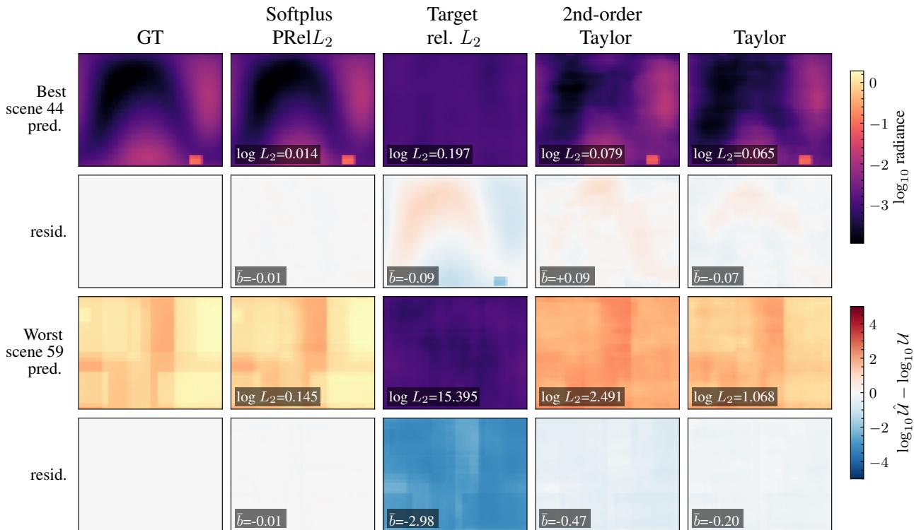  
Figure 14: The label-denominator and bias-corrected rel $L _ { 2 }$ variants stay biased downward on the hard scene, while $\mathrm { P R e l } L _ { 2 }$ keeps the residual centered. Best- and worst-case far-field predictions for the $\mathrm { r e l } L _ { 2 }$ bias-correction study in Table 13. The best block is the lowest $\log _ { 1 0 }$ rel. $L _ { 2 }$ scene under $\mathrm { P T N O } + \mathrm { P R e l } L _ { 2 } ,$ and the worst block is the highest-error scene under baseline rel $L _ { 2 }$ Prediction rows use one shared $\log _ { 1 0 }$ radiance scale; residual rows use one symmetric ±5 orders-of-magnitude scale. The baseline and bias-corrected re $L _ { 2 }$ variants remain biased downward on the hard scene, whereas the prediction-normalized $\mathrm { P R e l } L _ { 2 }$ keeps the residual centered.

Scope. Monotonic decrease of the potential alone does not guarantee convergence to $B _ { \theta } = U$ . When $J$ is rankdeficient, the normalized residual may lie in the null space of ${ \check { J } } ^ { \top }$ , so additional stationary points cannot be excluded. This limitation arises from optimizing an output-space objective through a potentially rank-deficient neural-network parameterization rather than from $\mathrm { P } \mathrm { \bar { R e l } } L _ { 2 }$ specifically: standard squared-error training has the stationary condition ${ \bf \dot { J } } ^ { \top } ( B _ { \theta } - U ) = 0$ . The analysis concerns continuous-time, full-batch population-gradient dynamics and does not directly establish convergence for finite-step stochastic optimization or Adam.

Empirical test across initializations. Five independent initializations of PTNO converge to the same unbiased solution, whereas log MSE converges to a shared biased one (Table 15). We split each seed’s $\log _ { 1 0 }$ error field $d _ { s } = \log _ { 1 0 } B _ { s } - \log _ { 1 0 } ^ { - } U$ into the part shared by all ${ \mathrm { s e d s } } , { \bar { d } } ,$ and the seed-specific remainder, and report the signed mean of $\mathit { d } _ { s }$ as a multiplicative offset. Log MSE is the positive control: 99.9% of its squared error is shared across seeds, and every seed predicts 2.2% of the reference, ≈46× too low. PTNO recovers the reference to within 0.1% on average. Its remaining error is also mostly shared, but it carries no sign and shrinks with scene coverage: across the label-budget allocations of Table 16, the signed offset stays within $\pm 0 . 0 7$ orders of magnitude while the $\mathrm { R M S } \log _ { 1 0 }$ error falls from 0.77 to 0.13. A fixed point would not move with M; approximation error does. The offset also holds across brightness: PTNO stays within a factor of 0.972–1.034 in every bin of Table 11, while log MSE is 617× too low in the dimmest bin.

Table 15: PTNO seeds agree on an unbiased solution; log-MSE seeds agree on a biased one. Far-field radiance, $( M , N , K ) =$ $( 1 0 ^ { 6 } , 4 , 1 )$ , five seeds, 100 held-out scenes against the converged reference. Offset is $1 0 ^ { \mathrm { m e a n } ( d _ { s } ) }$ , mean ± standard deviation across seeds.
<table><tr><td>Loss</td><td>RMS  $\log _ { 1 0 }$  error</td><td>Shared RMS</td><td>Seed-specific RMS</td><td>Prediction / reference</td></tr><tr><td> $\mathrm { N O } + L _ { 2 }$ </td><td>1.1032</td><td>0.7982</td><td>0.7615</td><td> $0 . 5 2 5 \pm 0 . 0 6 0$ </td></tr><tr><td> $\mathrm { N O } + \mathrm { l o g } \mathrm { M S E }$ </td><td>2.1337</td><td>2.1325</td><td>0.0721</td><td> $0 . 0 2 1 5 \pm 0 . 0 0 0 0$ </td></tr><tr><td> $\mathrm { P T N O } + \mathrm { P R e l } L _ { 2 } \mathrm { ( o u r s ) }$ </td><td>0.1518</td><td>0.1394</td><td>0.0602</td><td> $\mathbf { 0 . 9 9 9 } \pm \mathbf { 0 . 0 0 5 }$ </td></tr></table>

## J Controlled Ablations and Label-Budget Allocation

The five-seed loss comparison on all four datasets is Table 2. On far-field radiance, the linear- $L _ { 2 }$ loss wins the bright-region-dominated % RMSE $( 1 5 . 2 7 \pm 1 . 3 2$ against $1 6 . 4 3 \pm 0 . 5 5$ for PTNO) at the cost of a 0.26 lower $\log _ { 1 0 }$ SSIM, which is lost in the dim regions.

## J.1 Allocating a Fixed Label Budget

Scene coverage controls accuracy until the training set reaches roughly $5 \times 1 0 ^ { 5 }$ configurations, consistent with walkon-spheres operator learning and Monte Carlo surrogate models [14, 20]; Table 18 shows that how much coverage helps depends on the loss. Table 16 fixes the raw label budget at $\bar { M } ( N / 4 ) K = 1 0 ^ { 6 }$ four-SPP render equivalents and the training budget at $1 0 ^ { 5 }$ optimizer updates (200 epochs of 5,000 samples), and changes only how the renders are allocated. For $N \geq 8 ,$ , repeated four-SPP renders are averaged into one target; the $K > \bar { 1 }$ rows cycle those same raw renders across visits.

Table 16: At a fixed label budget, spreading the renders over more scenes helps until about $5 \times 1 0 ^ { 5 }$ scenes. Far-field radiance. The first block increases scene coverage while reducing the effective samples per scene. The second block cycles repeated four-SPP renders instead of pre-averaging them. Entries are $\log _ { 1 0 }$ SSIM on the 100 held-out scenes at $4 0 \times 8 0$ against the converged reference, mean ± standard deviation over the listed seeds; entries without an uncertainty are single-seed measurements.
<table><tr><td>Scenes M</td><td>Effective N</td><td>Renders K</td><td>Seeds</td><td> $\log _ { 1 0 } { \mathrm { S S I M } } \uparrow$ </td></tr><tr><td>125</td><td>32,000</td><td>1</td><td>3</td><td> $0 . 2 7 1 6 \pm 0 . 0 0 9 8$ </td></tr><tr><td>1,000</td><td>4,000</td><td>1</td><td>3</td><td> $0 . 4 8 2 9 \pm 0 . 0 0 4 3$ </td></tr><tr><td>8,000</td><td>500</td><td>1</td><td>3</td><td> $0 . 7 5 8 1 \pm 0 . 0 0 1 9$ </td></tr><tr><td>31,250</td><td>128</td><td>1</td><td>3</td><td> $0 . 8 4 5 0 \pm 0 . 0 0 2 6$ </td></tr><tr><td>62,500</td><td>64</td><td>1</td><td>3</td><td> $0 . 8 7 1 6 \pm 0 . 0 0 1 8$ </td></tr><tr><td>125,000</td><td>32</td><td>1</td><td>1</td><td>0.9009</td></tr><tr><td>250,000</td><td>16</td><td>1</td><td>3</td><td> $0 . 9 1 9 1 \pm 0 . 0 0 1 1$ </td></tr><tr><td>500,000</td><td>8</td><td>1</td><td>3</td><td> $\mathbf { 0 . 9 2 3 4 \pm 0 . 0 0 3 0 }$ </td></tr><tr><td>1,000,000</td><td>4</td><td>1</td><td>5</td><td> $0 . 9 1 6 5 \pm 0 . 0 0 4 0$ </td></tr><tr><td>31,250</td><td>4</td><td>32</td><td>3</td><td> $0 . 9 0 9 6 \pm 0 . 0 0 4 9$ </td></tr><tr><td>125,000</td><td>4</td><td>8</td><td>3</td><td> $0 . 9 1 4 3 \pm 0 . 0 0 1 9$ </td></tr><tr><td>500,000</td><td>4</td><td>2</td><td>1</td><td> $0 . 9 1 9 6$ </td></tr></table>

Cycling raises $\log _ { 1 0 }$ SSIM by 0.0646 at $M = 3 1 { , } 2 5 0$ and by 0.0134 at $M = 1 2 5 { , } 0 0 0 { ; }$ the difference is −0.0038 at $M = 5 0 0 { , } 0 0 0$ . Repeated labels help before the coverage plateau and cease to matter once the corpus is broad enough.  
Broad noisy supervision beats the converged-label control with one twenty-fifth of the particle budget. Training PTNO on $1 0 ^ { 6 }$ scenes at four SPP reaches $0 . 9 1 6 5 \pm 0 . 0 0 4 0$ with a total budget of $4 \times 1 0 ^ { 6 }$ samples, while $1 0 ^ { 4 }$ scenes at $1 0 ^ { 4 }$ SPP reach $0 . 8 8 9 3 \pm 0 . 0 0 7 1$ with $1 0 ^ { 8 }$ samples, so spreading the particles over more scenes gains 0.0272 in $\log _ { 1 0 }$ SSIM. The $1 0 ^ { 4 }$ -SPP control labels are close to converged: from the sample variance of 32 independent four-SPP renders per scene, a 104-SPP label has a relative $L _ { 2 }$ error of 1.9% (median 1.2%), against 94% for a single four-SPP label.

PTNO also wins on converged labels, so $\mathrm { P R e l } L _ { 2 }$ is not only a fix for label noise (Table 17). At $M { = } 1 0 ^ { 4 }$ , replacing linear $L _ { 2 }$ with PTNO raises $\log _ { 1 0 }$ SSIM by 0.26 on $1 0 ^ { 4 } – \mathrm { S P P }$ labels and by 0.20 on four-SPP labels. Converged labels help both losses at this small $M ;$ Table 16 shows that the same particles buy more when spread over more scenes.

Table 17: $\mathrm { \bf P T N O } + \mathrm { \bf P R e l } L _ { 2 }$ beats linear $L _ { 2 }$ on both near-converged and noisy labels. Loss × label quality at $M { = } 1 0 ^ { 4 } .$ , far-field radiance. The two label columns share the same $1 0 ^ { 4 }$ scenes. Entries are $\log _ { 1 0 }$ SSIM on the 100 held-out scenes, mean ± standard deviation over three seeds.
<table><tr><td>Loss</td><td> $N { = } 1 0 ^ { 4 } ~ \mathrm { l a b e l s }$ </td><td> $N { = } 4 ~ \mathrm { l a b e l s }$ </td></tr><tr><td> $\mathrm { N O } + L _ { 2 }$ </td><td> $0 . 6 2 5 7 \pm 0 . 0 0 6 0$ </td><td> $0 . 3 4 6 8 \pm 0 . 0 0 6 9$ </td></tr><tr><td> $\mathrm { P T N O } + \mathrm { P R e l } L _ { 2 } \mathrm { ( o u r s ) }$ </td><td> $\mathbf { 0 . 8 8 9 3 \pm 0 . 0 0 7 1 }$ </td><td> $\mathbf { 0 . 5 4 7 8 \pm 0 . 0 0 4 3 }$ </td></tr></table>

## J.2 More Scenes Cannot Remove a Bias

PTNO keeps improving with scene count, while the biased losses flatten (Table 18). Holding $N { = } 4$ and $K { = } 1$ and growing M from $1 0 ^ { 5 }$ to $1 0 ^ { 6 }$ raises PTNO by 0.14 in $\log _ { 1 0 }$ SSIM, against 0.02 for linear $L _ { 2 }$ and 0.01 for log MSE. Extra data reduces variance, but the minimizer of a biased objective does not move toward the solution.

Table 18: With more scenes, PTNO keeps improving while the biased losses flatten. Scene scaling at fixed label quality, far-field radiance, $( M , N , K ) = ( M , 4 , 1 )$ . Entries are $\log _ { 1 0 }$ SSIM on the 100 held-out scenes, mean ± standard deviation over three seeds (five at $M { = } 1 0 ^ { 6 } )$ .
<table><tr><td>M</td><td> $\mathrm { N O } + L _ { 2 }$ </td><td> $\mathrm { N O } + \mathrm { l o g } \mathrm { M S E }$ </td><td> $\mathrm { P T N O } + \mathrm { P R e l } L _ { 2 }$ </td></tr><tr><td> $1 0 ^ { 4 }$ </td><td> $0 . 3 4 6 8 \pm 0 . 0 0 6 9$ </td><td> $0 . 2 3 9 1 \pm 0 . 0 0 3 4$ </td><td> $\mathbf { 0 . 5 4 7 8 \pm 0 . 0 0 4 3 }$ </td></tr><tr><td> $1 0 ^ { 5 }$ </td><td> $0 . 6 3 1 6 \pm 0 . 0 0 5 5$ </td><td> $0 . 4 5 6 2 \pm 0 . 0 0 1 3$ </td><td> $\mathbf { 0 . 7 8 1 5 \pm 0 . 0 0 2 8 }$ </td></tr><tr><td> $1 0 ^ { 6 }$ </td><td> $0 . 6 5 2 4 \pm 0 . 0 1 9 6$ </td><td> $0 . 4 6 9 9 \pm 0 . 0 0 0 7$ </td><td> $\mathbf { 0 . 9 1 6 5 \pm 0 . 0 0 4 0 }$ </td></tr></table>

## J.3 Splitting a Per-Scene Budget between N and K

At a fixed per-scene budget, cycling several cheap labels beats averaging them into one (Table 19). We fix M=31,250 and NK=128 and vary the split: each scene stores K renders of $N$ SPP, and training presents one of them per visit. Moving from one 128-SPP label to eight 16-SPP labels raises $\log _ { 1 0 }$ SSIM from 0.8450 to 0.9111. Accuracy saturates around $K { = } 8 { \ } { - } 1 6 \colon K { = } 1 6$ gives the best score, a further gain of 0.0070, while $K { = } 3 2$ falls back to 0.9096. A pre-averaged label fixes one noise realization that the network can fit, whereas cycling presents a fresh unbiased draw at every visit.

Table 19: At a fixed per-scene budget, cycling several cheap labels beats one averaged label, up to about $K = 8 – 1 6 .$ Per-scene $N { - } K$ split at $\scriptstyle { M = 3 1 , 2 5 0 }$ and $N K { = } 1 2 8$ , far-field radiance. Entries are $\log _ { 1 0 }$ SSIM on the 100 held-out scenes, mean ± standard deviation over three seeds.
<table><tr><td>N</td><td>K</td><td> $\log _ { 1 0 } { \mathrm { S S I M } } \uparrow$ </td></tr><tr><td>128</td><td>1</td><td> $0 . 8 4 5 0 \pm 0 . 0 0 2 6$ </td></tr><tr><td>64</td><td>2</td><td> $0 . 8 6 8 3 \pm 0 . 0 0 2 1$ </td></tr><tr><td>32</td><td>4</td><td> $0 . 8 9 2 2 \pm 0 . 0 0 2 4$ </td></tr><tr><td>16</td><td>8</td><td> $0 . 9 1 1 1 \pm 0 . 0 0 2 2$ </td></tr><tr><td>8</td><td>16</td><td> $\mathbf { 0 . 9 1 8 1 \pm 0 . 0 0 3 3 }$ </td></tr><tr><td>4</td><td>32</td><td> $0 . 9 0 9 6 \pm 0 . 0 0 4 9$ </td></tr></table>

## J.4 Finite-Sample View of the Allocation

This subsection states which terms scale with M, N, and $K$ , and what is proved for each loss. Scene $a _ { i } , i = 1 , \dots , M$ carries K independent renders $Y _ { i , j } = \mathcal { U } ( a _ { i } ) + \zeta _ { i , j }$ , each averaging N Monte Carlo samples, with $\mathbb { E } [ \zeta _ { i , j } \mid a _ { i } ] = 0$ and per-cell variance $\sigma ^ { 2 } / N$ , where $\sigma ^ { 2 }$ is the single-sample variance.

Renders enter through their mean. For any per-cell weight w that does not depend on the labels $( w = 1$ for the squared loss, $w = S ( \breve { B } _ { \theta } ( a _ { i } ) ) ^ { - 2 }$ for $\mathrm { P R e l } L _ { 2 }$ with the normalizer detached),

$$
\frac { 1 } { K } \sum _ { j = 1 } ^ { K } w \left( B - Y _ { i , j } \right) ^ { 2 } = w ( B - \bar { Y _ { i } } ) ^ { 2 } + \frac { w } { K } \sum _ { j = 1 } ^ { K } ( Y _ { i , j } - \bar { Y _ { i } } ) ^ { 2 } , \qquad \bar { Y _ { i } } = \frac { 1 } { K } \sum _ { j = 1 } ^ { K } Y _ { i , j } ,
$$

and the last term does not depend on the prediction B. The empirical objective and its full-batch gradient therefore see the K renders only through $\bar { \bar { Y _ { i } } }$ , whose noise has variance $\sigma ^ { 2 } / ( \overset { \cdot } { N } K )$ : K renders of N samples act as one render of $N K$ samples. Stochastic training that presents one render per visit is not covered by this identity; Table 19 shows that at small M it beats pre-averaging at equal $N K$

Scenes versus Monte Carlo precision. For the unweighted squared loss with these unbiased labels, the risk against the converged solution is the clean objective $\mathcal { L } _ { C }$ of section 4 up to a constant, and for a realizable class $\mathcal { F }$ of effective dimension $d _ { \mathrm { e f f } }$ the standard least-squares decomposition gives

$$
\mathbb { E } \mathcal { R } ( \widehat { \theta } ) - \operatorname* { i n f } _ { \theta \in \Theta } \mathcal { R } ( \theta ) \ \lesssim \ \mathcal { E } _ { M } ( \mathcal { F } ) + \frac { { \sigma } ^ { 2 } d _ { \mathrm { e f f } } } { M N K } ,
$$

where ${ \mathcal { E } } _ { M } ( { \mathcal { F } } )$ is the excess risk the same estimator would reach from M converged labels. ${ \mathcal { E } } _ { M }$ depends on $M$ and $\mathcal { F }$ but not on N or $K ;$ the label noise contributes only through $1 / ( M N K )$ , so scene coverage reduces the risk at any label precision, and there is no term in $1 / N$ or $1 / K$ alone.

Nonlinear label transforms. If the loss compares the prediction with a transformed label $\log _ { 1 0 } Y$ , the population minimizer is $\mathbb { E } [ \log _ { 1 0 } Y ]$ , and the delta method gives $\mathbb { E } [ \mathrm { \tilde { l o g } } _ { 1 0 } Y ] = \mathrm { l o g } _ { 1 0 } \mathcal { U } - \sigma ^ { 2 } / ( 2 n \mathcal { U } ^ { 2 } \ln 1 0 ) ^ { - \alpha } + O ( n ^ { - \hat { 2 } } )$ per cell, with $n = N$ when each render is transformed and cycled and $n = N K$ when the $\dot { K }$ renders are averaged first. The fitted prediction is shifted by ${ \cal O } ( 1 / N )$ (respectively $O ( 1 / ( N K ) ) )$ , which adds a floor of order $1 / N ^ { 2 }$ (respectively $1 / ( N \dot { K } ) ^ { 2 } )$ to the risk against $\log _ { 1 0 } \mathcal { U } ;$ no number of scenes removes it, and cycling more renders does not reduce it. The label-denominator relative loss has the analogous shift, and with a point mass of labels at zero its weight has no finite mean (Appendix H).

What is shown for $\mathrm { P R e l } L _ { 2 }$ . Appendix I shows that, in expectation over the Monte Carlo noise, the $\mathrm { P R e l } L _ { 2 }$ gradient has no output-space stationary point other than the label mean $\mathcal { U } ( a )$ wherever the output Jacobian has full row rank, so the Jensen shift above does not arise. The averaging identity also holds for $\mathrm { P R e l } L _ { 2 }$ at fixed normalizers. The variance bound above is proved only for the unweighted squared loss; because the $\mathrm { P R e l } L _ { 2 }$ weights depend on the prediction, we do not claim it for $\mathrm { P R e l } { \bar { L _ { 2 } } }$

## K Cost Accounting and Speedup

The EU-DEMO accuracy crossings below use the final checkpoints. The other tasks retain their historical accuracy crossings and timings pending the corresponding reruns; their checkpoint limitations are recorded in Appendix F.

The surrogate repays its offline cost after 12–197 queries, and at matched accuracy it is $1 0 ^ { 3 } – 1 0 ^ { 5 }$ × cheaper than MC on neutronics, while on radiative transfer MC costs 0.8–11× the operator. Table 20 summarizes the comparison; the paragraphs below give the offline cost, the same-device comparison against converged MC, and the matched-accuracy measurement.

Table 20: At matched accuracy, MC costs ${ { 1 0 } ^ { 3 } } \mathrm { - } { 1 0 } ^ { 5 } \times$ the operator on neutronics and 0.8–11× on radiative transfer. Both methods run on the same device (one GPU for radiative transfer, one 24-thread CPU for neutronics). Matched-accuracy entries are per-scene medians of the MC cost needed to reach the operator’s error, divided by the operator’s cost; EU-DEMO MC uses FW-CADIS weight windows with their generation cost included. ∗MC does not reach the operator’s $\log _ { 1 0 }$ SSIM within the measured budget on most scenes; the spherical-tokamak entry extrapolates per-scene error curves by at most one order of magnitude, and the EU-DEMO entry is a lower bound.
<table><tr><td></td><td colspan="3">MC cost / operator cost</td><td></td></tr><tr><td>Dataset</td><td>Converged MC</td><td>Match  $\log _ { 1 0 }$  SSIM</td><td>Match  $\log _ { 1 0 }$  rel.  $L _ { 2 }$ </td><td>Break-even queries</td></tr><tr><td>Far-field radiance</td><td> $1 . 8 \times 1 0 ^ { 5 }$ </td><td>11</td><td>5.5</td><td>12</td></tr><tr><td>3D fluence</td><td> $1 . 8 \times 1 0 ^ { 4 }$ </td><td>2.1</td><td>0.8</td><td>87</td></tr><tr><td>Sph. tokamak</td><td> $9 . 9 \times 1 0 ^ { 4 }$ </td><td> $6 . 4 \times 1 0 ^ { 4 } \^$ </td><td> $9 . 4 \times 1 0 ^ { 3 }$ </td><td>197</td></tr><tr><td>EU-DEMO</td><td> $1 . 2 \times 1 0 ^ { 4 }$ </td><td> $> 1 . 6 \times 1 0 ^ { 4 } \AA ^ { * }$ </td><td> $1 . 6 \times 1 0 ^ { 3 }$ </td><td>12</td></tr></table>

Offline cost and break-even. Converged labels for our training sets would cost $5 \times 1 0 ^ { 3 } – 1 0 ^ { 5 } \times$ more than the noisy labels we train on (Table 21, “Converged / noisy”). Break-even divides the offline cost, label generation plus training, by the cost of one converged solve minus one inference. For the neutronics tasks, GPU training time is small next to CPU label generation and is listed separately rather than converted to core-hours. Labeling the EU-DEMO training set at converged quality would take ${ \approx } 6 \stackrel { - } { \times } 1 0 ^ { 8 }$ core-hours.

Table 21: Offline cost is repaid after tens to a few hundred queries. Label costs were measured on H200 GPUs (radiative transfer), in 8-core tasks on Xeon Gold 6130 CPUs (spherical tokamak), and in 8-core tasks on Xeon Ice Lake and Skylake nodes (EU-DEMO); training costs are historical five-run means for the same recipes on one H200 GPU, retained for cost accounting rather than the runtimes of the replacement runs. The spherical-tokamak converged cost is stated in the 8-core configuration of its training labels; the $1 0 ^ { 9 } .$ -history reference itself ran as 4-core tasks at 305.5 core-hours per scene. Costs are measured from the scheduler accounting; the EU-DEMO converged cost is the mean over the 24 reference scenes.
<table><tr><td>Dataset</td><td>Noisy-label set</td><td>Training</td><td>Converged / scene</td><td>Converged / noisy</td><td>Break-even</td></tr><tr><td>Far-field radiance</td><td>3.79 GPU-h  $( 1 0 ^ { 6 } )$ </td><td>0.75 GPU-h</td><td>0.372 GPU-h</td><td> $9 . 8 \times 1 0 ^ { 4 }$ </td><td>12</td></tr><tr><td>3D fluence</td><td> $1 . 9 7 \mathrm { G P U - h } ( 3 \times 1 0 ^ { 5 } )$ </td><td>7.98 GPU-h</td><td>0.115 GPU-h</td><td> $1 . 7 5 \times 1 0 ^ { 4 }$ </td><td>87</td></tr><tr><td>Sph. tokamak</td><td> $7 0 , 3 0 0 \mathrm { c o r e } { \cdot } \mathrm { h } ( 1 0 ^ { 6 } )$ </td><td>1.81 GPU-h</td><td>356.8 core-h</td><td> $5 . 2 \times 1 0 ^ { 3 }$ </td><td>197</td></tr><tr><td>EU-DEMO</td><td> $7 1 , 6 0 7 \mathrm { c o r e } { \cdot } \mathrm { h } ( 1 0 ^ { 5 } )$ </td><td>2.88 GPU-h</td><td>6,069 core-h</td><td> $8 . 5 \times 1 0 ^ { 3 }$ </td><td>12</td></tr></table>

Same device, converged MC. Reproducing a converged reference costs MC $1 . 2 \times 1 0 ^ { 4 } – 1 . 8 \times 1 0 ^ { 5 } \times$ the operator’s inference when both run on the same device. Figure 4 times the operator on a GPU and MC on a 24-thread CPU, because OpenMC has no GPU implementation, and that ratio folds a hardware factor of 10–60× into the comparison; the numbers here remove it. On the same device and the reference’s own output grid, converged MC costs $1 . 8 \times 1 0 ^ { 5 } \times$ (far-field radiance, 607 s for $2 ^ { 2 0 }$ SPP on the 40×80 output grid, which reproduces the reference to $\log _ { 1 0 }$ rel. $L _ { 2 } 0 . 0 0 0 8 .$ against 3.4 ms) and $1 . 8 \times 1 0 ^ { 4 } \times$ (3D fluence, 2,636 s against 144 ms) the operator’s inference, both methods timed on one RTX 5070 Laptop GPU. On one 24-thread CPU (Xeon Gold 6130 for the spherical tokamak, Xeon Platinum 8352Y for EU-DEMO), the per-scene median is $9 . 9 \times 1 0 ^ { 4 } \times$ for the spherical tokamak $( 1 0 ^ { 9 }$ histories against a 0.47 s forward pass) and $1 . 2 \times 1 0 ^ { 4 } \times \overline { { { } } }$ for EU-DEMO (the full weight-window and transport chain, median 6,130 core-hours, against a 79 s forward pass on the $7 0 0 \times 3 6 5 \times 7 3 0$ reference grid).

Matched accuracy. MC reaches the operator’s accuracy cheaply on radiative transfer and only at great cost on neutronics. For every held-out scene we sweep the MC budget on the same device, score each budget against an independent reference with the metric used for the operator, and record the cost at which MC first matches the operator’s error; we report the median over scenes. On far-field radiance (100 scenes), MC matches $\log _ { 1 0 }$ SSIM at 11.3× the operator’s cost (interquartile range 4.5–34) and $\log _ { 1 0 }$ relative $L _ { 2 }$ at $5 . 5 \times ( 3 . 4 - 1 0 . 5 )$ . On 3D fluence (100 scenes) the factors are $2 . 1 \times ( 1 . 0 \dot { - } 9 . 6 )$ and $0 . 8 \times ( 0 . 4 4 { - 2 . 2 } )$ : MC matches the norm error within the operator’s own inference time on half of the scenes. On the spherical tokamak (50 scenes), we split each scene’s 100 independent $1 0 ^ { 7 }$ -history runs into a $5 \times 1 0 ^ { 8 }$ -history reference and a sequence of MC budgets that grows to $5 \times 1 0 ^ { 8 }$ histories. MC matches $\log _ { 1 0 }$ relative $L _ { 2 }$ at a median $9 . 4 \times 1 0 ^ { 3 } \times$ (interquartile range $4 . 9 \times \mathrm { { \bar { 1 0 ^ { 3 } } } - 2 . 3 \mathrm { { \bar { \times } } 1 0 ^ { 4 } ) } } ;$ ; for $\log _ { 1 0 }$ SSIM, 32 of 50 scenes remain unmatched at the largest budget $( { \approx } 4 . 7 \times \mathrm { \bar { 1 0 ^ { 4 } } } \times )$ , and extrapolating each scene’s error curve by at most one order of magnitude gives a median of $6 . 4 \times 1 0 ^ { 4 } \times$

On EU-DEMO, MC matches the operator’s norm error only with a weight window, and even with one it misses the operator’s $\log _ { 1 0 }$ SSIM on every one of the 24 scenes within the measured budgets (Table 22). We run three MC variants on 24 scenes and count the weight-window generation cost where it applies. Without a window, MC does not match the operator within $1 0 ^ { 7 }$ histories on any scene. A cheap FW-CADIS window lets MC match $\log _ { 1 0 }$ relative $L _ { 2 } \mathrm { a t } 1 . 6 \times 1 0 ^ { 3 } \times$ the operator’s cost, but all 24 scenes still miss its $\log _ { 1 0 }$ SSIM. The reference’s own FW-CADIS→MAGIC window also reaches the norm target, but building it takes ≈2,000 core-hours per scene, which lifts the end-to-end factor to $2 . 2 \times 1 0 ^ { 5 } \times$ . On every task, matching the dim-region structure measured by $\log _ { 1 0 }$ SSIM costs MC more than matching the norm.

Table 22: EU-DEMO matched-accuracy factors depend on the weight window given to MC. Per-scene medians over 24 scenes of MC cost divided by operator cost, both on one Xeon Platinum 8352Y. “Transport” counts transport only; “+ window” adds the window generation cost. > marks a lower bound where MC stays short of the operator. All entries are scored only on cells where the reference is measured (45.4% of the mesh). The MAGIC SSIM factors are extrapolated; the measured end-to-end lower bound is $2 . 6 \times 1 0 ^ { 5 }$
<table><tr><td></td><td></td><td colspan="2"> $\mathbf { M a t c h l o g } _ { 1 0 } \mathbf { r e l } . L _ { 2 }$ </td><td colspan="2">Match  $\log _ { 1 0 }$  SSIM</td></tr><tr><td>MC variant</td><td>Window / scene</td><td>Transport</td><td>+ window</td><td>Transport</td><td>+ window</td></tr><tr><td>Analog</td><td></td><td> $> 1 . 6 \times 1 0 ^ { 3 }$ </td><td></td><td>no crossing</td><td></td></tr><tr><td>FW-CADIS</td><td> $1 0 . 2 \mathrm { c o r e } \mathrm { - h }$ </td><td> $5 . 4 \times 1 0 ^ { 2 }$ </td><td> $1 . 5 7 \times 1 0 ^ { 3 }$ </td><td>unmatched</td><td> $> 1 . 6 \times 1 0 ^ { 4 }$ </td></tr><tr><td>FW-CADIS→MAGIC</td><td>2,009 core-h</td><td> $6 . 8 \times 1 0 ^ { 2 }$ </td><td> $2 . 1 7 \times 1 0 ^ { 5 }$ </td><td> $9 . 1 \times 1 0 ^ { 5 }$ </td><td> $1 . 1 \times 1 0 ^ { 6 }$ </td></tr></table>

For the MAGIC SSIM estimate, we extrapolate each scene’s error curve through its last two measured budgets by at most 1.5 orders of magnitude in particle count. Twenty scenes cross within this range; the remaining four are counted as lying above this range when computing the median over all 24 scenes.

## L Scope and In-Distribution Boundary

Which transport problems suit PTNO. PTNO targets transport problems where low-order models fail and converged MC is expensive. In optically thick media with smooth coefficients, near-isotropic scattering, and clear scale separation, diffusion or low-order moment equations are accurate and a learned surrogate offers little. Our settings violate these conditions in different ways. The radiative-transfer datasets sample the Henyey–Greenstein asymmetry over nearly its whole range together with piecewise or shape-wise varying coefficients, so much of the training distribution is strongly anisotropic and has sharp interfaces. The neutronics settings are deep-shielding problems whose reference flux spans about 10 (spherical tokamak) and 17 (EU-DEMO) orders of magnitude (Table 24), hard enough that the EU-DEMO reference itself needs FW-CADIS and MAGIC weight windows. The cost accounting of Appendix K gives the practica criterion: the surrogate pays off most where the dim tail of the solution is expensive for MC to converge.

What the training designs vary. Every held-out configuration is a fresh draw from the same design as the training set (Table 23), so all reported accuracy is interpolation within a parameterized family. The axes behave differently at the boundary. Coefficient ranges $( \sigma _ { t } , c , g )$ and source parameters form a soft boundary: the solution depends smoothly on them, so a query just outside the sampled range is a mild extrapolation, which we do not evaluate. Geometry families form a hard boundary: within a family, geometry is parameterized and covered by the design, but a different machine, a new port, or a component absent from training is out of distribution. For EU-DEMO the family is a single fixed geometry.

Table 23: Each dataset varies coefficients, sources, or geometry within a fixed family; held-out sets are fresh draws from the same design.
<table><tr><td>Dataset</td><td>Varied per scene</td><td>Held fixed</td></tr><tr><td>Far-field radiance</td><td>Environment map at infinity (1–4 Gaussian lobes and 1–4 angular boxes, intensities in  $[ 0 . 1 , 1 0 ] ) ;$  piecewise-constant angular  $\sigma _ { t } \in [ 0 . 0 1$  , 10] and c ∈ [0.01, 0.99]; g ∼ Unif(−0.99, 0.99)</td><td>Unit-ball geometry</td></tr><tr><td>3D fluence</td><td>2–5 axis-aligned boxes with σt ∈ [0.01, 50] and  $c \in [ 0 . 0 1 , 0 . 9 9 ]$  in a near-vacuum background; 1–3 point emitters with intensity in [1, 20], half with a Perlin angular profile;  $g \sim \overset { \cdot } { \mathrm { U n i f } } ( - 0 . 9 5 , 0 . 9 5 )$ </td><td>Cube [−1, 1]3, vacuum boundary</td></tr><tr><td>Sph. tokamak</td><td>All 20 axes of Table 8: radial build, D-shape shared by geometry and plasma source, H-mode density and temperature profiles, Shafranov shift, radial source offset</td><td>Material compositions, tally mesh</td></tr><tr><td>EU-DEMO</td><td>The 8 plasma-source axes of Table 9</td><td>Entire reactor geometry and materials</td></tr></table>

Physical realism of the radiative-transfer designs. The radiative-transfer designs are broader than any single application; the 3D fluence design carries the high-dynamic-range case on the radiative-transfer side, reproducing the dynamic range of the spherical tokamak. Extinction, albedo, and phase-function ranges are the physically admissible ranges used in participating-media simulation and rendering; cloud albedo, for example, lies close to 1, inside our range. The spatially varying fields combine localized structures, multiple scales, and sharp interfaces rather than one empirical distribution. Table 24 shows that a synthetic 3D fluence reference spans about 10 orders of magnitude, as many as a spherical-tokamak reference and fewer than EU-DEMO (about 17), while far-field radiance spans only about 3. Far-field radiance is therefore not a high-dynamic-range stress test; we use it for the label-noise and allocation studies because it is the one setting where converged references for thousands of training scenes are affordable.

Table 24: 3D fluence and spherical-tokamak references span about 10 orders of magnitude, EU-DEMO about 17, and far-field radiance about 3. Per scene, the span is $\log _ { 1 0 }$ of the reference maximum over its smallest positive value; “above $\epsilon ^ { \ast }$ replaces that smallest value by the dataset’s $\log _ { 1 0 }$ floor ϵ when it is lower, which is the span the $\log _ { 1 0 }$ metrics see (their data range, Appendix F). Mean ± standard deviation over the held-out evaluation scenes, on the field as scored: far-field radiance on the 40×80 grid, the spherical tokamak per energy group (over the 350 scene–group pairs), and EU-DEMO only on cells where the reference is measured.
<table><tr><td>Dataset</td><td>Scenes</td><td>Span</td><td>€</td><td>Span above €</td><td>Exact zeros</td></tr><tr><td>Far-field radiance</td><td>100</td><td> $3 . 1 6 \pm 1 . 2 7$ </td><td> $1 0 ^ { - 6 }$ </td><td> $3 . 1 6 \pm 1 . 2 7$ </td><td>0.0%</td></tr><tr><td>3D fluence</td><td>100</td><td> $1 0 . 4 8 \pm 1 . 6 9$ </td><td> $1 0 ^ { - 1 0 }$ </td><td> $8 . 8 5 \pm 0 . 8 5$ </td><td>2.3%</td></tr><tr><td>Sph. tokamak</td><td>50</td><td> $1 0 . 1 6 \pm 0 . 9 9$ </td><td> $1 0 ^ { - 1 0 }$ </td><td> $8 . 2 1 \pm 0 . 8 8$ </td><td>41.6%</td></tr><tr><td>EU-DEMO</td><td>24</td><td> $1 6 . 9 7 \pm 0 . 2 6$ </td><td> $1 0 ^ { - 1 7 }$ </td><td> $1 0 . 9 0 \pm 0 . 0 4$ </td><td>0.0%</td></tr></table>

Measured data. Dense, full-field measurements are not available for either domain. No operating fusion power plant provides energy-resolved neutron fields under reactor conditions, and existing detectors give sparse readings with instrument-specific energy responses. Light-transport datasets provide images or sparse radiometry rather than full transport fields with the geometry, material, and illumination specifications needed for pointwise validation. Our evaluation is therefore simulation-based, as is standard in shielding and reactor design.

## M Backbone Comparison and Hyperparameter Search

FNO ranks first under both matched parameter count and matched search budget on the far-field radiance task with four-SPP labels. All checkpoints are evaluated on the 40×80 training grid against the same 100-scene converged reference.

Matched parameter count. We resize eight backbone families to a 9.4–13.3 million parameter band and train each family with $\mathrm { P T N O } + \mathrm { P R e l } L _ { 2 }$ and log MSE for three seeds. The comparison includes FNO, SFNO [45], U-NO [46], CNO [47], U-Net [48], DeepONet [49], Transolver [50], and GNOT [51].

Table 25: The PTNO objective improves every backbone, and FNO ranks first at matched parameter count. Far-field radiance with four-SPP labels. Accuracy entries are $\log _ { 1 0 }$ SSIM on the 100 held-out scenes at $4 0 \times 8 0 ,$ , mean ± sample standard deviation across three seeds, except GNOT with $\mathrm { P R e l } L _ { 2 }$ (one completed seed; two diverged). Latency is measured with the same single-sample inference benchmark for every family. The gain is the PTNO + PRelL2 SSIM minus the matched log-MSE SSIM.
<table><tr><td>Backbone</td><td>Params (M)</td><td>Latency (ms)</td><td> $\mathrm { P T N O } + \mathrm { P R e l } L _ { 2 }$ </td><td> $\mathrm { L o g } \mathrm { M S E }$ </td><td>Gain</td></tr><tr><td>FNO</td><td>10.390</td><td>3.07</td><td> $\mathbf { 0 . 9 2 2 0 \pm 0 . 0 0 2 6 }$ </td><td> $0 . 4 7 3 3 \pm 0 . 0 0 2 0$ </td><td>+0.4487</td></tr><tr><td>SFNO</td><td>9.445</td><td>4.38</td><td> $0 . 9 0 7 6 \pm 0 . 0 0 0 2$ </td><td> $0 . 4 6 9 1 \pm 0 . 0 0 0 7$ </td><td>+0.4385</td></tr><tr><td>U-NO</td><td>12.633</td><td>3.56</td><td> $0 . 8 4 9 8 \pm 0 . 0 0 1 6$ </td><td> $0 . 4 5 2 5 \pm 0 . 0 0 1 1$ </td><td>+0.3973</td></tr><tr><td>U-Net</td><td>13.258</td><td>1.60</td><td> $0 . 8 3 2 8 \pm 0 . 0 0 3 7$ </td><td> $0 . 4 3 3 8 \pm 0 . 0 0 2 8$ </td><td>+0.3990</td></tr><tr><td>CNO</td><td>12.477</td><td>3.73</td><td> $0 . 7 9 7 6 \pm 0 . 0 0 2 7$ </td><td> $0 . 4 2 1 3 \pm 0 . 0 0 2 2$ </td><td>+0.3763</td></tr><tr><td>Transolver</td><td>11.206</td><td>10.54</td><td> $0 . 4 0 5 5 \pm 0 . 0 0 5 8$ </td><td> $0 . 2 1 9 1 \pm 0 . 0 0 3 2$ </td><td>+0.1865</td></tr><tr><td>GNOT</td><td>10.940</td><td>15.37</td><td>0.3724</td><td> $0 . 2 5 3 8 \pm 0 . 0 0 2 4$ </td><td></td></tr><tr><td>DeepONet</td><td>12.064</td><td>0.49</td><td> $0 . 2 9 5 7 \pm 0 . 0 0 5 8$ </td><td> $0 . 1 9 6 4 \pm 0 . 0 0 3 2$ </td><td>+0.0993</td></tr></table>

The PTNO objective improves mean SSIM in all seven families with three completed seeds in both arms: gains are 0.3763–0.4487 for the five grid-based families and 0.0993–0.1865 for DeepONet and Transolver. GNOT has only one completed $\mathrm { P R e l } L _ { 2 }$ seed, so no matched three-seed gain is reported. The objective therefore transfers across backbones, while attainable accuracy remains backbone-limited.

Transolver and GNOT. Transolver and GNOT trail the grid-based operators under the shared training recipe on this task. Both were built for irregular meshes and general geometries, whereas this task maps fields on a regular $4 0 \times 8 0$ angular grid, where spectral and convolutional operators carry the matching inductive bias; we train both from the authors’ reference implementations. Their deficit is the same under log MSE, 0.2191 and 0.2538 against 0.4213–0.4733 for the five grid-based families, so it is not caused by $\mathrm { P R e l } L _ { 2 }$ . Transolver has a seed standard deviation of 0.0058, compared with at most 0.0037 for the grid-based families. Two of the three GNOT runs with $\mathrm { P R e l } L _ { 2 }$ diverge before the schedule ends; the sole completed seed scores 0.3724 and cannot establish seed stability. Neither family entered the matched search of Table 26, so their configurations are untuned. The comparison therefore ranks backbones for regular-grid transport fields under one training recipe and does not test these two architectures on the irregular meshes they target.

Matched search budget. Each of six families receives six 40-epoch candidates. We promote the top two candidates per family to 200 epochs and retrain the selected configurations and evaluate their final checkpoints for three seeds. Candidate selection and promotion used these same evaluation scenes; an independent selection set was not available. Table 26 reports the stronger promoted configuration from each family.

Table 26: Under a matched search budget, FNO still ranks first. Far-field radiance with four-SPP labels. Every family receives the same candidate and promotion budget; the configuration gives the Fourier modes per axis, the channel width, and the number of layers. Entries are mean ± sample standard deviation across three seeds after 200 epochs, on the 100 held-out scenes at 40×80.
<table><tr><td>Backbone</td><td>Selected configuration</td><td> $\log _ { 1 0 }$  rel.  $L _ { 2 } \downarrow$ </td><td> $\log _ { 1 0 } { \mathrm { S S I M } } \uparrow$ </td></tr><tr><td>FNO</td><td>10 modes, width 128, 6 layers</td><td> $\mathbf { 0 . 0 7 5 0 \pm 0 . 0 0 2 1 }$ </td><td> $\mathbf { 0 . 9 2 7 7 \pm 0 . 0 0 4 2 }$ </td></tr><tr><td>SFNO</td><td>16 modes, width 128, 6 layers</td><td> $0 . 1 1 0 0 \pm 0 . 0 0 0 3$ </td><td> $0 . 9 0 3 7 \pm 0 . 0 0 0 5$ </td></tr><tr><td>U-NO</td><td>16 modes, width 32, 6 layers</td><td> $0 . 1 2 3 3 \pm 0 . 0 0 0 7$ </td><td> $0 . 8 4 8 2 \pm 0 . 0 0 1 7$ </td></tr><tr><td>U-Net</td><td>width 96, 4 layers</td><td> $0 . 1 3 2 6 \pm 0 . 0 0 1 5$ </td><td> $0 . 8 4 3 9 \pm 0 . 0 0 1 8$ </td></tr><tr><td>CNO</td><td>width 64, 5 layers</td><td> $0 . 1 3 9 5 \pm 0 . 0 0 0 7$ </td><td> $0 . 8 2 6 5 \pm 0 . 0 0 0 5$ </td></tr><tr><td>DeepONet</td><td>branch 256, trunk 128, basis 128</td><td> $0 . 5 5 2 6 \pm 0 . 0 1 0 4$ </td><td> $0 . 3 2 2 9 \pm 0 . 0 0 6 2$ </td></tr></table>

The two comparisons produce the same ordering among their six shared families: FNO, SFNO, U-NO, U-Net, CNO, then DeepONet. Capacity explains little of the objective’s advantage: increasing the FNO from 2.77 million to 10.39 million parameters raises SSIM from $0 . 9 1 6 5 \pm 0 . 0 0 4 0$ to $0 . 9 2 2 0 \pm 0 . 0 0 2 6$ , a gain of 0.0055, against the matched FNO loss gain of 0.4487 in Table 25.

## N Cross-Resolution Evaluation and Multi-Resolution Training

Single-resolution training supports native FNO inference on nearby meshes. On EU-DEMO, accuracy holds from 0.5× to 1× the training resolution and degrades moderately at 2×; on far-field radiance, a native forward at $2 \times$ outperforms low-resolution prediction followed by upsampling.

Far-field radiance. We train at 40×80 and evaluate one earlier single-seed checkpoint, trained on 128-SPP labels, on 100 held-out scenes. At 80×160, native inference reaches $\log _ { 1 0 }$ SSIM 0.931, compared with 0.901 for blockreplicating the 40×80 prediction. The native forward also lowers linear rel. $L _ { 2 }$ from 0.165 to 0.139. The five-seed checkpoints of Table 2 reach $\log _ { 1 0 }$ SSIM 0.8969 ± 0.0030 at $1 2 0 \times 2 4 0$ , three times the training resolution per axis, against $0 . 9 1 6 5 \pm 0 . 0 0 4 0$ on the training grid.

EU-DEMO. We train at $1 4 0 \times 7 3 \times 1 4 6$ and evaluate the five main-table seeds at $0 . 5 \times , 1 \times ,$ , and $2 \times$ resolution, scoring only cells where the reference is measured (42.6%, 45.4%, and 46.6% of the mesh). $\log _ { 1 0 }$ SSIM is $0 . 7 8 9 5 \pm 0 . 0 0 4 0$ at $0 . 5 { \times } , 0 . 7 9 2 3 { \pm } 0 . 0 0 1 6$ at the training mesh, and $0 . 7 1 8 1 \pm 0 . 0 0 1 6$ at $2 \times ;$ the supports differ slightly between grids. At $5 \times ( 7 0 0 \times 3 6 5 \times 7 3 0$ , the reference’s native mesh, 49.1% measured) $\log _ { 1 0 }$ rel. $L _ { 2 }$ stays at $0 . 0 8 4 \bar { 4 } \pm \dot { 0 } . 0 0 0 4$ , while $\log _ { 1 0 }$ SSIM falls to 0.5441 ± 0.0006: its 11-cell window spans one fifth of the physical extent per axis that it spans at the training mesh, so the two SSIM values measure structure at different physical scales.

Table 27: Without retraining, accuracy holds on nearby meshes and degrades with larger resolution steps. Cross-resolution evaluation. The far-field block compares a native forward with block upsampling for one earlier single-seed checkpoint trained on 128-SPP labels, not comparable to Table 2. EU-DEMO entries are mean ± sample standard deviation over the five main-table seeds on the 24 held-out configurations, scored only on cells where the reference is measured.

<table><tr><td>Mesh and inference path</td><td>rel.  $L _ { 2 } \downarrow$ </td><td> $\log _ { 1 0 } { \mathrm { r e l . } } L _ { 2 } \downarrow$ </td><td> $\log _ { 1 0 } { \mathrm { S S I M } } \uparrow$ </td></tr><tr><td colspan="4">Far-field radiance</td></tr><tr><td>40×80 (training mesh)</td><td>0.120</td><td>0.056</td><td>0.952</td></tr><tr><td>80×160 (native forward)</td><td>0.139</td><td>0.069</td><td>0.931</td></tr><tr><td>80×160 (40×80 then upsample)</td><td>0.165</td><td>0.094</td><td>0.901</td></tr><tr><td colspan="4">EU-DEMO</td></tr><tr><td>70×37×73 (0.5× native)</td><td> $0 . 1 2 0 3 \pm 0 . 0 0 8 8$ </td><td> $0 . 0 8 5 4 \pm 0 . 0 0 0 7$ </td><td> $0 . 7 8 9 5 \pm 0 . 0 0 4 0$ </td></tr><tr><td>140×73×146 (training mesh)</td><td> $\mathbf { 0 . 1 0 8 5 \pm 0 . 0 0 6 8 }$ </td><td> $0 . 0 8 3 9 \pm 0 . 0 0 0 6$ </td><td> $\mathbf { 0 . 7 9 2 3 \pm 0 . 0 0 1 6 }$ </td></tr><tr><td> $2 8 0 { \times } 1 4 6 { \times } 2 9 2 \ ( 2 { \times }$  native)</td><td> $0 . 1 2 1 6 \pm 0 . 0 0 5 7$ </td><td> $\mathbf { 0 . 0 8 3 6 \pm 0 . 0 0 0 5 }$ </td><td> $0 . 7 1 8 1 \pm 0 . 0 0 1 6$ </td></tr><tr><td> $7 0 0 { \times } 3 6 5 { \times } 7 3 0 ( 5 { \times } \mathrm { n a t i v e } )$ </td><td> $0 . 1 2 5 9 \pm 0 . 0 0 5 8$ </td><td> $0 . 0 8 4 4 \pm 0 . 0 0 0 4$ </td><td> $0 . 5 4 4 1 \pm 0 . 0 0 0 6$ </td></tr></table>

Mixed-resolution training at a tenfold grid step. Adding 100 high-resolution training scenes reduces the activevoxel log MAE (the mean absolute $\log _ { 1 0 }$ error over voxels whose reference flux is above the floor) of a direct forward pass on the $7 0 0 { \times } 5 5 0 { \times } 8 0 0$ native mesh from 5.36 to 2.36. Linear rel. $L _ { 2 }$ remains near one, so the added data reduces the severity of the native-scale collapse without establishing tenfold resolution invariance.

Table 28: Adding a few high-resolution scenes reduces, but does not remove, the collapse of a direct forward pass at a tenfold grid step. Mixed-resolution diagnostic on an earlier EU-DEMO setup, one run per row. The baseline uses 50,000 scenes at $7 0 \times 5 5 \times 8 0 ;$ the mixed run adds 100 scenes at 350×275×400. Native-direct metrics use three paired scenes, and low-resolution prediction followed by upsampling uses ten.
<table><tr><td>Training corpus</td><td>Train-grid rel.  $L _ { 2 }$ </td><td>Native-direct rel.  $L _ { 2 }$ </td><td>Active log MAE</td><td>Lowres-up rel.  $L _ { 2 }$ </td></tr><tr><td>Low mesh only</td><td>0.0173</td><td>1.0000</td><td>5.36</td><td>0.1627</td></tr><tr><td>Low + high meshes</td><td>0.0207</td><td>0.9998</td><td>2.36</td><td>0.1617</td></tr></table>

The mixed run reached epoch 16 of 20 under a six-hour limit. Its low-resolution accuracy matches the single-resolution baseline, and its direct native-scale prediction remains outside the training amplitude range. Nearby-mesh inference is reliable; a tenfold grid step requires an explicitly resolution-consistent representation.

## O Source Superposition, Tetrahedral Transport, and Label Validation

## O.1 Source Superposition and Geometry Generalization

Fixed-geometry transport is linear in the source, so a nonlinear surrogate must be compared with source-superposition baselines. On EU-DEMO, a nonnegative rank-64 Green operator reaches log relative $\bar { L } _ { 2 } 0 . 0 7 0 3$ and log SSIM 0.7958, against 0.0840 and 0.7920 for the main-table PTNO recipe on the same three seeds. Both use final checkpoints, the same code, H200 hardware, labels, loss, and 50,000 updates; their source representations differ (a voxelized field versus eight parameters). The Green operator’s linear relative $L _ { 2 }$ is worse, 0.2529 against 0.1085, and its linear PSNR is 28.27 versus 33.83 dB. Thus fixed-geometry DEMO does not establish that a nonlinear operator outperforms a source-linear model in every metric.

A separate spherical-tokamak experiment trains from scratch on 51,200 configurations (1,600 geometries, 32 sources each, $1 0 ^ { 5 }$ histories per label). It evaluates 50 unseen geometries against $1 0 ^ { 9 }$ -history references and 16 held-out sources on training geometries against $4 \times 1 0 ^ { 8 }$ -history references. With two seeds and final checkpoints, PTNO reaches log relative $L _ { 2 } ^ { - } 0 . 0 4 7 4$ on unseen geometries, compared with 0.3160 for the strongest tested geometry-interpolation baseline, and $0 . 0 5 7 0$ on held-out sources, compared with 0.2974 for same-geometry nonnegative least-squares superposition. These are 6.7× and $5 . 2 \times$ lower errors, respectively, under the stated noisy-label budget. The superposition baseline combines only a few noisy training labels, whereas the learned operator pools information across the corpus. The advantage is consistent with cross-sample denoising under this label budget; it does not establish nonlinear source response within a fixed geometry. On seen geometries, superposition has higher linear PSNR (33.98 versus 29.93 dB).

Table 29: The spherical-tokamak surrogate improves log-space accuracy over noisy-label superposition. Six volume-weighted metrics, averaged over energy groups and scenes; PTNO is the mean of two final-checkpoint seeds. G denotes unseen geometries and S held-out sources on training geometries. This 51,200-scene corpus is separate from the historical main-table experiment.
<table><tr><td>Split</td><td>Method</td><td>Log rel.  $L _ { 2 }$ </td><td>Log SSIM</td><td> $\mathrm { L o g }$  PSNR</td><td>Rel.  $L _ { 2 }$ </td><td>SSIM</td><td>PSNR</td></tr><tr><td>G</td><td>PTNO</td><td>.0474</td><td>.8550</td><td>29.57</td><td>.2202</td><td>.9740</td><td>30.68</td></tr><tr><td>G</td><td>Interpolation</td><td>.3160</td><td>.4312</td><td>12.10</td><td>.3908</td><td>.9275</td><td>26.34</td></tr><tr><td>S</td><td>PTNO</td><td>.0570</td><td>.8429</td><td>28.32</td><td>.2581</td><td>.9680</td><td>29.93</td></tr><tr><td>S</td><td>NNLS superposition</td><td>.2974</td><td>.4752</td><td>13.20</td><td>.3324</td><td>.9616</td><td>33.98</td></tr></table>

Source-superposition augmentation is neutral within the two-seed spread on this corpus and was removed from the spherical-tokamak recipe. A geometry-conditioned rank-64 Green head, which remains linear in the source, improves log relative $L _ { 2 }$ by approximately $2 \%$ on unseen geometries and 5% on held-out sources against its matched L40S control, but increases linear relative $L _ { 2 }$ from 0.21–0.25 to 0.62–0.68. It remains an experimental alternative and does not replace the main recipe.

Table 30: A learned source-linear Green operator improves log-space accuracy at a cost in linear-space error. Final-checkpoint means; three seeds for DEMO on H200, two for each spherical-tokamak split on L40S. Each Green row is compared only with its paired control. DEMO uses measured support and floor $1 0 ^ { - 1 7 }$ ; spherical tokamak uses floor $1 0 ^ { - 1 0 }$
<table><tr><td>Task</td><td>Model</td><td>Log rel.  $L _ { 2 }$ </td><td>Log SSIM</td><td>Log PSNR</td><td>Rel.  $L _ { 2 }$ </td><td>SSIM</td><td>PSNR</td></tr><tr><td>DEMO</td><td>PTNO</td><td>.0840</td><td>.7920</td><td>19.78</td><td>.1085</td><td>.9834</td><td>33.83</td></tr><tr><td>DEMO</td><td>Green</td><td>.0703</td><td>.7958</td><td>21.32</td><td>.2529</td><td>.9900</td><td>28.27</td></tr><tr><td>Sptok G</td><td>PTNO</td><td>.0473</td><td>.8551</td><td>29.60</td><td>.2100</td><td>.9742</td><td>30.89</td></tr><tr><td>Sptok G</td><td>Green</td><td>.0463</td><td>.8600</td><td>29.94</td><td>.6212</td><td>.9642</td><td>25.27</td></tr><tr><td>Sptok S</td><td>PTNO</td><td>.0570</td><td>.8428</td><td>28.35</td><td>.2454</td><td>.9684</td><td>30.15</td></tr><tr><td>Sptok S</td><td>Green</td><td>.0542</td><td>.8491</td><td>29.14</td><td>.6832</td><td>.9563</td><td>24.87</td></tr></table>

## O.2 EU-DEMO on an Unstructured Mesh

A tetrahedral extension predicts cell-average neutron flux on a fixed EU-DEMO mesh with 42,729 cells. OpenMC scores track-length flux directly on an unstructured MOAB mesh; dividing the cell-integrated tally by cell volume gives the training target. The model is a GINO with volume-integral encoders and decoders around a 24×8×32 latent FNO, width 16, four layers, and modes (8, 4, 8). Its 13 inputs are one source-density field transformed by asinh $ { \left( q / 1 0 ^ { - 7 } \right) }$ eight source parameters, and the three cell coordinates plus cell volume in fixed length units. Training uses a softplus head of scale $1 0 ^ { - 8 }$ and $\mathrm { P R e l } L _ { 2 }$ with $\eta = 1 0 ^ { - 1 7 }$ , batch size 2, learning rate $1 0 ^ { - 3 }$ , and a fixed 20-epoch, $1 0 ^ { 5 }$ -update cosine schedule. Every reported tetrahedral model is its final checkpoint; no checkpoint is selected on a validation or reference set.

Two training-label corpora each contain $1 0 ^ { 4 }$ source configurations: analog transport uses $5 \times 1 0 ^ { 4 }$ histories per source, whereas weight-window transport uses $2 \times 1 0 ^ { 5 }$ . The reference contains 128 held-out sources, each pooling 16 independent runs of $3 . 6 \times 1 0 ^ { 7 }$ histories $( 5 . 7 6 \times 1 0 ^ { 8 }$ total). The weight-window-trained model has substantially higher log-space accuracy (Table 31), but the fourfold history difference means that this comparison does not isolate variance reduction at equal simulation budget. All six metrics use cell-volume weights; SSIM uses a physical neighborhood scale of 100 cm and the reference’s own data range.

Table 31: Weight-window labels improve the tetrahedral surrogate under the recorded, unequal history budgets. Per-seed values for seeds 42/43, averaged over 128 held-out sources; final checkpoints. Log-space metrics use floor $1 0 ^ { \frac { \bullet } { - 2 0 } }$
<table><tr><td>Metric</td><td>Weight-window labels</td><td>Analog labels</td></tr><tr><td> $\log _ { 1 0 }$  rel.  $L _ { 2 } \downarrow$ </td><td> $0 . 0 4 0 0 / 0 . 0 3 9 6$ </td><td>0.2976/0.2982</td></tr><tr><td> $\log _ { 1 0 } { \mathrm { S S I M } } \uparrow$ </td><td>0.7750/0.7780</td><td>0.4408/0.4416</td></tr><tr><td> $\log _ { 1 0 }$  PSNR (dB) ↑</td><td>26.93/27.01</td><td>9.24/9.22</td></tr><tr><td>Linear rel.  $L _ { 2 } \downarrow$ </td><td>0.2620/0.2582</td><td>0.3075/0.2872</td></tr><tr><td>Linear SSIM ↑</td><td>0.9890/0.9892</td><td>0.9881/0.9889</td></tr><tr><td>Linear PSNR (dB) ↑</td><td>30.26/30.41</td><td>28.90/29.57</td></tr></table>

At the structured DEMO floor of $1 0 ^ { - 1 7 }$ , the same weight-window checkpoints reach log-space SSIM 0.8683/0.8711 and relative $L _ { 2 } \ 0 . 0 2 3 0 / 0 . 0 2 2 8$ . The floor materially changes the apparent accuracy, so results from different floors must not be compared as if they used one evaluation protocol.

## O.3 FNG Shutdown-Dose Benchmark

An independent experimental check tests the neutron-transport, activation, and delayed-photon stages of our shutdowndose label generator. We reproduce the first FNG shutdown-dose campaign using the openly archived geometry, source, irradiation history, and measurements of Peterson et al. [52]. This is a check of the Monte Carlo label pipeline, not a measurement-based evaluation of a trained neural operator. The calculation uses OpenMC’s cell-based rigorous two-step workflow with 65 activation cells, TENDL-2019 neutron data, an activation chain based on TENDL-2019/ENDF/B-$\mathrm { { V I I I . 0 } }$ , and ENDF/B-VIII.0 photon data. Each neutron calculation and each cooling-time photon calculation uses $2 \times 1 0 ^ { 7 }$ histories.

Table 32: The label pipeline reproduces the measured FNG dose rate within 20% at the five reference cooling times. $C / E$ is calculated over measured dose rate. Uncertainties shown are photon Monte Carlo standard errors conditional on the sampled neutron reaction rates; they exclude neutron-sampling and measurement uncertainty.
<table><tr><td>Cooling time (days)</td><td>Measured dose rate  $( \mu \mathrm { { S v / h } ) }$ </td><td> $C / E$ </td></tr><tr><td>1</td><td>2.46</td><td> $0 . 8 5 0 \pm 0 . 0 2 1$ </td></tr><tr><td>7</td><td>0.699</td><td> $1 . 0 6 1 \pm 0 . 0 2 6$ </td></tr><tr><td>15</td><td>0.495</td><td> $1 . 1 8 5 \pm 0 . 0 2 9$ </td></tr><tr><td>30</td><td>0.416</td><td> $1 . 1 8 0 \pm 0 . 0 2 9$ </td></tr><tr><td>60</td><td>0.316</td><td> $1 . 2 0 0 \pm 0 . 0 3 1$ </td></tr></table>

The six nickel-foil $^ { 5 8 } \mathrm { N i } ( n , p )$ reaction-rate ratios range from 0.97 to 1.12; the $( n , 2 n )$ ratios are lower, 0.76–0.93. A preregistered requirement to reproduce the archived calculation within 5% fails at 7–30 days, with differences of 14–16%. Replaying the archived nuclide inventories through our photon stage reproduces its dose rates within 2.3%; the remaining discrepancy is localized to short-lived activation products introduced by numerical roundoff in the archived inventory, which our reachable-subspace decay solve excludes. We report this deviation rather than counting the original replication threshold as met. The benchmark uses cell-based activation and an earlier nuclear-data registry, whereas the current production corpus uses mesh-based activation and updated steel compositions. It therefore does not establish the accuracy of the production mesh discretization or of a neural operator on the FNG geometry.

## P Radiative Transfer with Refractive and Reflective Interfaces

A fifth dataset adds glass, mirror, and matte objects to the 3D fluence task of Appendix E.2. Light that hits a glass object is bent into the geometric shadow behind it and partly reflected, a mirror folds the light field back on itself, and a matte object casts a soft shadow, so the target field is no longer a smooth function of the medium alone (Figure 15). The PTNO recipe still learns this task from labels traced with 64 Monte Carlo samples per voxel (SPP). We score a model by the SSIM between the $\log _ { 1 0 }$ of its predicted 3D fluence volume and the $\log _ { 1 0 }$ of a high-SPP Monte Carlo reference, computed on the volume itself, not on rendered images. On a held-out test set of 224 scenes, scored only once after every design choice had been fixed, the final model reaches a $\log _ { 1 0 }$ SSIM of 0.961. For scale, two independent Monte Carlo solutions of a different 224-scene set from the same generator score 0.997 against each other; this gives an empirical scale for reference noise, rather than a strict upper bound on model accuracy.

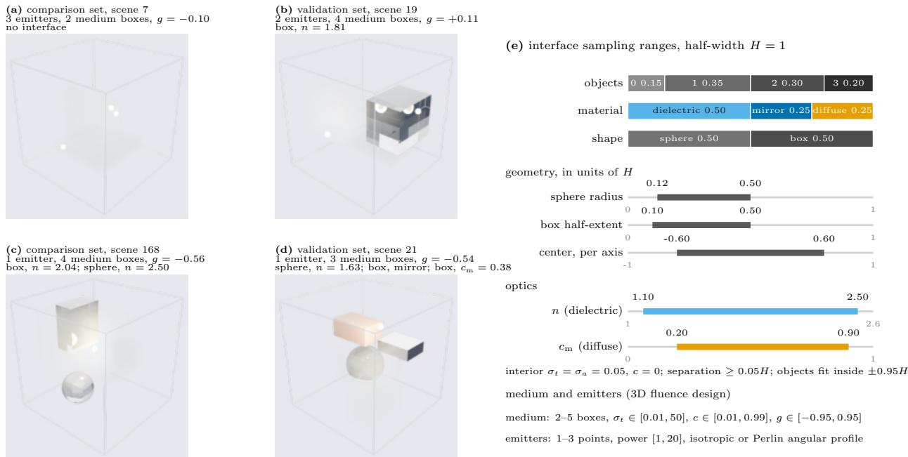  
Figure 15: The interface dataset adds dielectric, mirror, and matte objects to the 3D fluence scenes. (a–d) Four evaluation scenes rendered from their sampled scene parameters: the ±H domain as a wire cage, contrast boxes of the participating medium as haze, point emitters as bright spheres, dielectric objects as glass with the sampled refractive index n, the ideal mirror as polished metal, and the Lambertian object as matte clay whose value carries the albedo $c _ { \mathrm { m } } .$ . Scene (a) has no interface and scores best of the 224-scene stratified comparison set; (c) stacks a dielectric box and a dielectric sphere between the emitter and the far corner and scores worst; (d) carries all three materials at once. A dielectric bends the emitter’s light into the geometric shadow behind it and reflects part of it by Fresnel’s law, the mirror folds the field back onto itself, and the diffuse face casts a soft shadow, so the target field is no longer a smooth function of the medium alone. (e) The interface sampling ranges: the count and material of the objects are categorical, size, position, n, and $c _ { \mathrm { m } }$ are uniform on the bars shown against their natural full scale, object interiors are absorbing vacuum, and the medium and emitters follow the 3D fluence design. Renders: Blender Cycles; the medium haze is compressed for legibility and is not a radiometric picture.

## P.1 Scenes, Labels, and Reference

Each scene is a 3D fluence scene (background $\sigma _ { t }$ and c with 2–5 contrast solids, 1–3 point emitters, one Henyey– Greenstein g) plus zero to three solid objects: spheres or axis-aligned boxes made of a dielectric with refractive index $n \in [ 1 . 1 , 2 . 5 ]$ , an ideal mirror, or a Lambertian (matte) surface with albedo $c _ { \mathrm { m } } \in [ 0 . 2 , 0 . 9 ]$ (Table 33). Objects are opaque to the medium: the participating medium exists only outside them, and their interiors are a weak absorber (absorption coefficient $\sigma _ { a } = 0 . 0 5$ , no scattering), because a lossless glass box traps most interior directions and its interior fluence has no converged value. At an interface a photon is reflected or transmitted with the polarized Fresne probability and refracted by Snell’s law, including total internal reflection; mirrors reflect with unit probability, and matte surfaces absorb a fraction $1 - c _ { \mathrm { m } }$ and re-emit the rest in a cosine-weighted direction.

Labels come from the Monte Carlo collision estimator of Appendix E.2 extended with analytic ray–sphere and ray–box intersections; the target is the per-voxel track-length fluence (the summed path length of photons inside a voxel, an unbiased estimate of fluence) on a $6 4 ^ { 3 }$ grid, divided by voxel volume and by total emitted power. The estimator was checked against Geant4 [53, 54] optical photons on the same analytic scenes: the two codes share neither the estimator nor the interface code, their difference falls as $N ^ { - 0 . 4 5 }$ over $2 . 5 \dot { \times } 1 0 ^ { 5 } - 2 \times 1 0 ^ { 6 }$ Geant4 photons with no plateau, and seven physics components isolated one at a time agree to 0.04–0.21%. Training uses the first $1 0 ^ { 5 }$ scenes of a $1 0 ^ { 6 } \cdot$ -scene training set, each traced once at 64 SPP, that is, 64 photon paths per voxel of the $6 4 ^ { 3 }$ grid. Four held-out sets are used, all drawn from the same scene generator and disjoint from training and from each other: a 50-scene set traced to 786,432 SPP for monitoring during training; a 224-scene stratified comparison set (7 interface compositions $\times 3 2$ scenes: no object, one matte, one mirror, one dielectric with $n < 1 . 5$ , one with $n \geq 2 . 0$ , two dielectrics, three dielectrics) traced to 32,768 SPP, on which we rank the variants; and two further 224-scene sets with the same compositions and SPP but fresh random seeds, a selection set that scores each candidate once and is used only to choose among the final candidates, and a test set that scores each model once, after that choice. The label ceiling is one independent Monte Carlo solution of the stratified comparison set scored against another with the same metrics: log $^ { 1 0 }$ SSIM 0.9968 and $\log _ { 1 0 }$ rel. $L _ { 2 } \ : 0 . 0 1 1 3$ . The final model remains about 0.03 below this empirical ceiling; this gap is larger than the reference-noise scale, although it does not certify every small difference between models.

Table 33: Each interface scene adds up to three dielectric, mirror, or matte spheres or boxes. The medium, emitters, and g follow the 3D fluence design of Table 23; $H = 1$ is the half-width of the cube. Realized values are counted over the $1 0 ^ { 5 }$ training scenes; the shape and center rows give the proposal. n spans water (1.33) to diamond (2.42).
<table><tr><td>Quantity</td><td>Distribution</td><td>Range</td><td>Note</td></tr><tr><td>Number of objects</td><td>categorical</td><td>P(0, 1, 2, 3) = (0.15, 0.35, 0.30, 0.20)</td><td>realized (0.152, 0.351, 0.298, 0.199)</td></tr><tr><td>Shape</td><td>uniform</td><td>sphere 0.5 / box 0.5</td><td>box faces are axis-aligned</td></tr><tr><td>Sphere radius</td><td>uniform</td><td>[0.12, 0.50] H</td><td></td></tr><tr><td>Box half-extent (per axis)</td><td>uniform</td><td>[0.10, 0.50] H</td><td></td></tr><tr><td>Center (per axis)</td><td>uniform</td><td>[−0.6, 0.6] H</td><td>must fit inside ±0.95H</td></tr><tr><td>Material</td><td>categorical</td><td>dielectric 0.50 / mirror 0.25 / matte 0.25</td><td>realized 0.499/0.250/0.251 of 154,412 objects</td></tr><tr><td>Refractive index n</td><td>uniform</td><td>[1.1, 2.5]</td><td>dielectric only; each 0.1-wide bin holds 6.9–7.3% of draws</td></tr><tr><td>Matte albedo  $c _ { \mathrm { m } }$ </td><td>uniform</td><td>[0.2,0.9]</td><td>matte only (mirror reflectivity is 1); each 0.05-wide bin holds 6.9–7.4% of draws</td></tr><tr><td>Interior</td><td>fixed</td><td> $\sigma _ { t } = \sigma _ { a } = 0 . 0 5 , c = 0$ </td><td>no medium inside objects</td></tr><tr><td>Separation</td><td>constraint</td><td>≥ 0.05H object-object and object-emitter</td><td></td></tr></table>

## P.2 Inputs, Model, and Protocol

The operator sees 23 input channels, all computed from the scene parameters at the target resolution. The first 21 channels comprise one emission grid, nine degree-0–2 source spherical-harmonic fields, extinction and albedo, four surface fields (refractive index, mirror mask, matte albedo, and signed distance), four polynomial embeddings of $^ { g , }$ , and one asinh-encoded occluded direct-flux field. The remaining two tell the operator where the interfaces send light before any scattering: $D _ { 0 } .$ , the direct flux with every interface treated as opaque, and $R _ { K 6 } .$ , the extra energy delivered by up to six reflections or refractions; both are computed by a cheap deterministic ray tracer, encoded on a fixed $\log _ { 1 0 }$ scale, and also fed directly to the readout layer. Writing $d = \operatorname { l o g } _ { 1 0 } \operatorname * { m a x } ( D _ { 0 } , 1 0 ^ { - \delta } )$ , the final two channels are $( \bar { d } + 4 ) / 4$ and $[ \log _ { 1 0 } \operatorname* { m a x } ( D _ { 0 } + R _ { K 6 } , 1 0 ^ { - 8 } ) - \bar { d } ] / 4$ , without fitted normalization. These channels are inputs computed from the scene, not labels: they contain no volume scattering or diffuse-surface bounce. The backbone is a 3D FNO (modes $3 2 ^ { 3 }$ 8 layers, width 64 for the final model) with a softplus head and $\mathrm { P R e l } L _ { 2 }$ with $\eta = 2 \times 1 0 ^ { - 6 }$ on the detached prediction. Every variant follows one protocol: the first $1 0 ^ { \dot { 5 } }$ scenes seen once, 25,000 AdamW updates at batch 4 with cosine decay from $3 \times 1 0 ^ { - 3 } \mathrm { t o } 1 0 ^ { \dot { - } 7 }$ , weight decay $1 0 ^ { - 3 }$ , gradient clipping at 1, seeds 42 and 43, and the checkpoint at the end of training with no validation-based selection. The longer runs repeat the same $1 0 ^ { 5 }$ scenes two or four times with the schedule stretched accordingly, so they are compared only with each other. Metrics follow Appendix $\mathrm { F , }$ with floor $\epsilon = 3 . 2 8 \times 1 0 ^ { - 7 }$ in the $\log _ { 1 0 }$ metrics. Linear relative $L _ { 2 }$ is not reported for this dataset: for a point source the cell average in the voxel that contains the emitter scales as $h ^ { - 2 }$ with the voxel width h and has no continuum limit, and that single voxel carries 98–100% of every model’s squared error. We therefore rank in $\log _ { 1 0 }$ space and use the peak ratio, the predicted maximum over the reference maximum in each scene, to check that the source core is reproduced.

## P.3 Results

PTNO learns this task from 64-SPP labels to within 0.035 of the label ceiling in $\log _ { 1 0 }$ SSIM (Table 34). The final model (width 64, 8 layers, $1 0 ^ { 5 }$ updates) scores $\log _ { 1 0 }$ SSIM 0.9647/0.9652 on the stratified comparison set for seeds 42/43. We chose its seed-43 checkpoint on the selection set; on the test set, scored once after that choice, it reaches $\log _ { 1 0 }$ SSIM 0.9611 (median over scenes 0.9762, 5th percentile 0.8760), $\log _ { 1 0 }$ rel. $L _ { 2 } 0 . 0 7 2 0$ , and $\log _ { 1 0 }$ PSNR 38.1 dB. Across the seven interface compositions of the stratified comparison set, $\log _ { 1 0 }$ SSIM ranges from 0.954/0.955 (two dielectrics) to 0.974/0.974 (no object), and the worst single scene in every composition stays above 0.82. The source core is reproduced: the median over scenes of the peak ratio is 1.00/1.04. The remaining error sits in the dim regions behind glass objects, where the model over-predicts by 0.05–0.07 orders of magnitude at the median.

Training in the physical space matters here as on the other four datasets. With everything else fixed (same inputs, corpus, schedule, and seeds, at the 25,000-update budget), replacing PTNO’s softplus head and $\mathrm { P R e l } L _ { 2 }$ with a $\log _ { 1 0 }$ output trained by MSE lowers $\log _ { 1 0 }$ SSIM from 0.9503/0.9490 to 0.9391/0.9364. Table 35 repeats this comparison at the final model’s budget of $1 0 ^ { \breve { 5 } }$ updates, again changing only the output head and the loss. The $\log _ { 1 0 } ($ -output MSE model scores 0.018/0.019 below PTNO in $\log _ { 1 0 }$ SSIM on the stratified comparison set and 0.017/0.018 below on the test set, and an identity head trained with linear $L _ { 2 }$ collapses to a near-zero field. In the linear source core the $\mathrm { l o g _ { 1 0 } \mathrm { - o u t p u t } }$ model is closer to the reference than PTNO: its mean peak ratio is 0.985/1.016 against 1.799/1.627, and its core error is lower. These means keep every scene, and the PTNO seed-42 core error of 1.155 is carried by one three-dielectric scene (median over scenes 0.068); the two seeds do not settle whether PTNO systematically overshoots the peak. Neither component works alone at this budget. With $\mathrm { P R e l } L _ { 2 }$ but an identity head the model collapses to a near-zero field like the linear- $L _ { 2 }$ model, and with a softplus head but a per-sample relative $L _ { 2 }$ loss it outputs, in every scene, a constant at the head’s lower bound.

Table 34: PTNO reaches within 0.035 of the label ceiling on the interface dataset. $\log _ { 1 0 }$ metrics, mean over the 224 scenes of the stratified comparison set, for seeds 42/43 with end-of-training checkpoints. The selection-set column scores each model once on a separate 224-scene held-out set (the 25,000-update rows on an earlier, identically generated selection set). Peak ratio is the median over scenes of the predicted over the reference maximum. The label ceiling scores one independent Monte Carlo solution of the stratified comparison set against another. The last two rows share one input construction, corpus, and schedule at 25,000 updates and differ only in the output head and loss.
<table><tr><td>Model</td><td> $\log _ { 1 0 } { \mathrm { S S I M } } \uparrow$ </td><td> $\log _ { 1 0 } { \mathrm { r e l } } . \ L _ { 2 } \ \downarrow$ </td><td>Selection-set  $\log _ { 1 0 } { \mathrm { S S I M } } \uparrow$ </td><td>Peak ratio</td></tr><tr><td>PTNO, final  $( 1 0 ^ { 5 }$  updates, width 64) Label ceiling (second MC solution)</td><td>0.9647 / 0.9652 0.9968</td><td>0.0699 / 0.0682 0.0113</td><td>0.9613 / 0.9624</td><td>1.00 / 1.04 1.00</td></tr><tr><td>PTNO (softplus  $+ \mathrm { P R e l } L _ { 2 } ) ,$  25,000 updates</td><td>0.9503 / 0.9490</td><td>0.0928 / 0.0942</td><td>0.9479 / 0.9471</td><td>1.47 / 1.36</td></tr><tr><td>NO,  $\log _ { 1 0 }$   $\mathrm { \ o u t p u t + M S E , 2 5 , 0 0 0 }$  updates</td><td>0.9391 / 0.9364</td><td></td><td></td><td></td></tr></table>

Table 35: At equal budget, the softplus head with $\mathrm { P R e l } L _ { 2 }$ outperforms plain losses on the interface dataset. Every row uses the final model’s construction, corpus, schedule, and $1 0 ^ { 5 }$ updates and changes only the output head and loss; seeds 42/43, end-of-training checkpoints, means over 224 scenes. The PTNO row rescores the final model of Table 34 with the evaluator used for the other rows (differences below $1 0 ^ { - 4 } )$ . Core rel. $L _ { 2 }$ is the linear relative $L _ { 2 }$ with each emitter voxel and its 26 neighbors removed; peak ratio is the mean over scenes of the predicted over the reference maximum.
<table><tr><td></td><td colspan="2">Stratified comparison set</td><td colspan="2">Test set</td><td colspan="2">Linear, comparison set</td></tr><tr><td>Output head + loss</td><td> $\log _ { 1 0 } { \bf S S I M } \uparrow$ </td><td> $\log _ { 1 0 } { \mathrm { r e l } } .  L _ { 2 } \downarrow$ </td><td> $\log _ { 1 0 } { \bf S S I M } \uparrow$ </td><td> $\log _ { 1 0 } { \mathrm { r e l } } . \ L _ { 2 } \ \downarrow$ </td><td>Core rel.  $L _ { 2 } \downarrow$ </td><td>Peak ratio</td></tr><tr><td> $\mathrm { P T N O } \ ( \mathrm { s o f t p l u s } + \mathrm { P R e l } L _ { 2 } )$ </td><td>0.9647/0.9652</td><td>0.0699 / 0.0682</td><td>0.9598/0.9611</td><td>0.0735 /0.0720</td><td>1.155/0.086</td><td>1.799 /1.627</td></tr><tr><td>NO,  $\mathrm { l o g _ { 1 0 } \ o u t p u t + M S E }$ </td><td>0.9467 /0.9462</td><td>0.1289/0.1289</td><td>0.9430/0.9430</td><td>0.1286/0.1287</td><td>0.078/0.084</td><td>0.985 / 1.016</td></tr><tr><td>NO, identity head + linear  $L _ { 2 }$ </td><td>0.2251/0.2354</td><td>0.8929 /0.8957</td><td>0.2101/0.2198</td><td>0.9458/0.9502</td><td>0.964/0.962</td><td>0.001/0.001</td></tr><tr><td>Identity head + PRelL2</td><td>0.2919/0.2726</td><td>0.7056 /0.7952</td><td>0.2653/0.2454</td><td>0.7203/0.8271</td><td>0.950/0.950</td><td>0.001/0.001</td></tr><tr><td>Softplus + per-sample rel.  $L _ { 2 }$ </td><td>0.1620/0.1620</td><td>3.6552/3.6552</td><td>0.1658/0.1658</td><td>3.7943 /3.7943</td><td>1.000/1.000</td><td>0.000 /0.000</td></tr></table>

## P.4 Limitations

All numbers in this section are two seeds of one from-scratch recipe with end-of-training checkpoints, not the five seeds of Table 2. The loss comparison of Table 34 was run at the 25,000-update budget; Table 35 repeats it at $1 0 ^ { 5 }$ updates. The training corpus is fixed at $1 0 ^ { 5 }$ scenes because the two interface input channels are precomputed and stored for each training scene, so the dim-region bias reported here is the current state, not a floor. Linear relative $L _ { 2 }$ and cross-resolution evaluation are not reported, because the cell average in the voxel that contains a point emitter scales as $h ^ { - 2 }$ and has no continuum limit. The estimator and Geant4 share the same simplification of total internal reflection, so their agreement does not test that approximation.