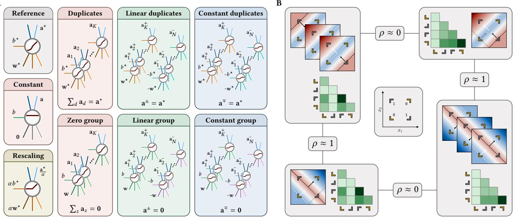
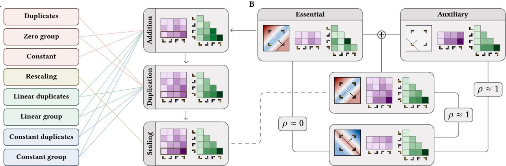
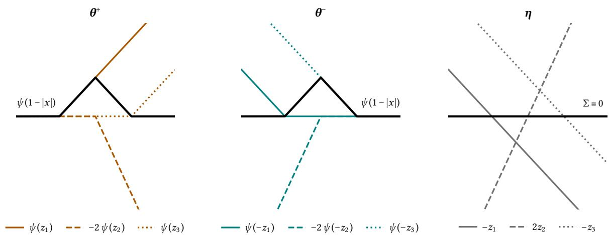
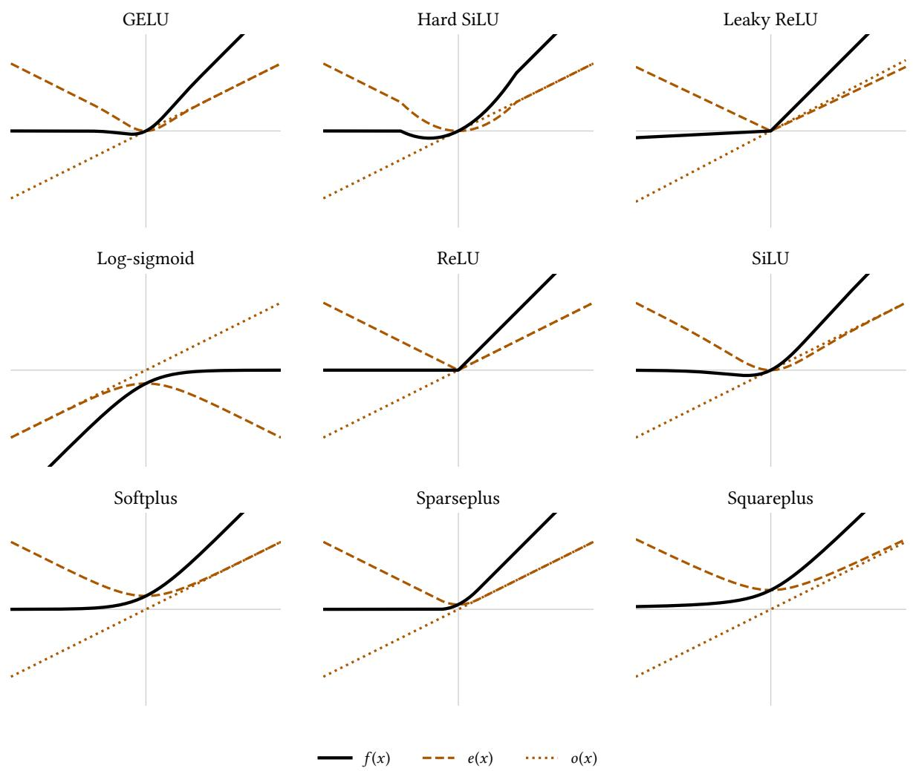
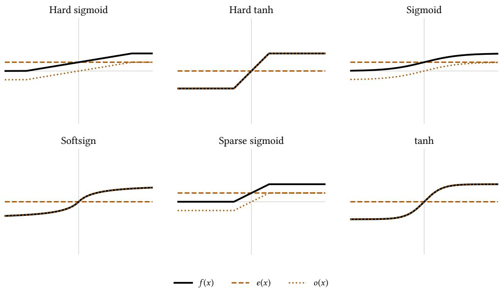
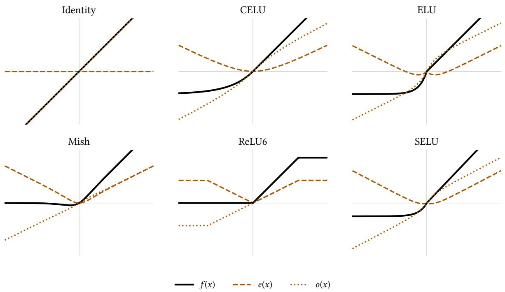
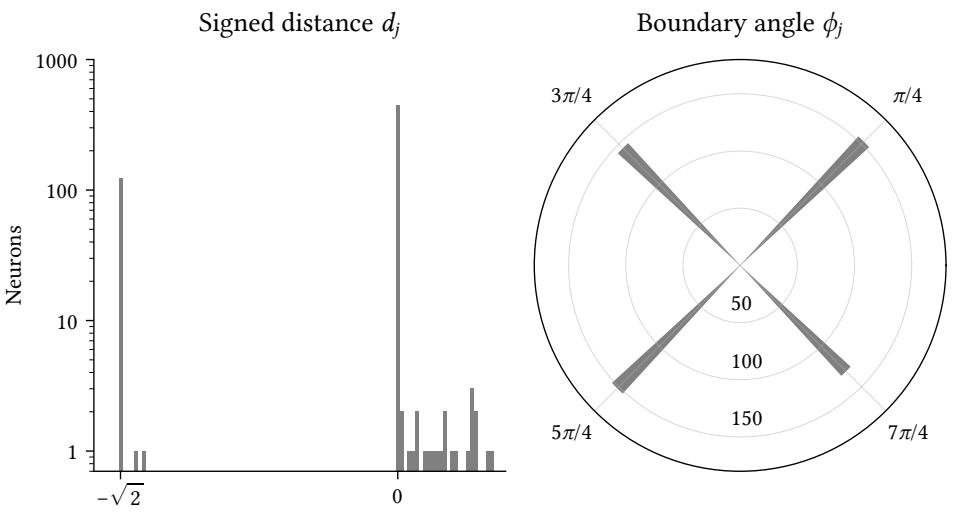
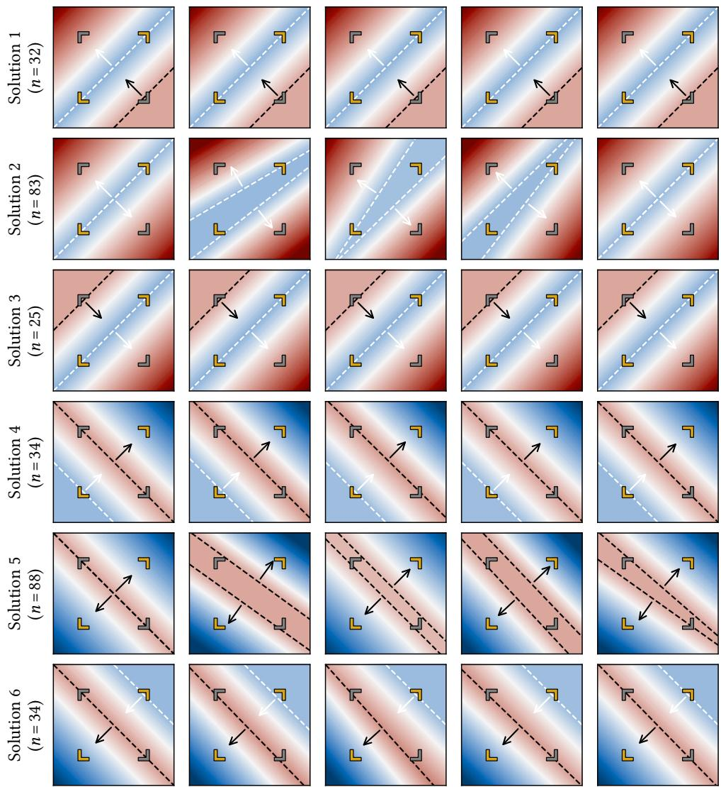
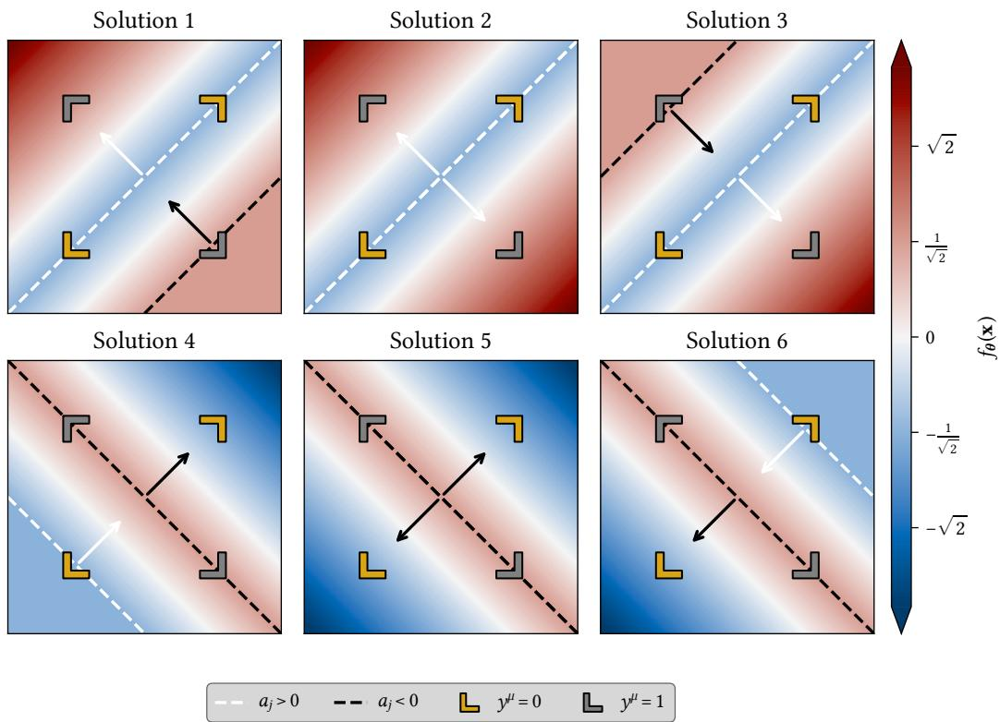

# Parameter symmetries determine representational geometry in overparameterized nonlinear networks

Marvin Theiss1,2,†, Lukas Braun3, Andrew M. Saxe4,5, and Erin Grant6,7

1University of Tübingen 2International Max Planck Research School for Intelligent Systems 3Allen Institute for Neural Dynamics 4Gatsby Computational Neuroscience Unit, University College London 5Sainsbury Wellcome Centre, University College London 6University of Alberta 7Amii

## Abstract

Representations are routinely used across machine learning, psychology, and neuroscience to draw inferences about the computations of biological and artificial systems. Such inferences presume a meaningful link between representational geometry and the computation being performed. For artificial neural networks, however, the extent to which function constrains representation remains unclear. One key obstacle is that these networks admit parameter symmetries: changes in parameterization that preserve function exactly while reshaping representational geometry. Here, we show that a broad class of parameter symmetries acts on representations through just three primitive feature transformations: addition, duplication, and scaling. This feature-level characterization yields a closedform decomposition of representational geometry into essential and auxiliary components, which makes precise how degeneracy in representational geometry can grow with overparameterization even when function is held fixed. Finally, we show that implementation-level selection rules can resolve this degeneracy, yielding identifiable geometries in which features are weighted according to their contributions to the network’s function. Together, our results delineate when representations can support inferences about computation, and when they cannot.

## 1 Introduction

What does the geometry of the internal representations of neural networks reveal about the computations these networks implement? Techniques for interpreting and intervening on the internal activities ofartificial neural networks assume that local structure, like weights or activities within a layer, reveals information about the end-to-end computation these networks perform (Mueller et al., 2026; Olah et al., 2020; Saphra and Wiegrefe, 2024; Zeiler and Fergus, 2014). In neuroscience and cognitive science, representational similarity analysis and related techniques for comparing the internal representations of biological and artificial neural networks share this assumption that the local geometry of neural activity reveals the computations it instantiates, and thus is a powerful tool for interpreting neural function in terms of neural activity (Haxby et al., 2014; Kriegeskorte et al., 2008; Yamins and DiCarlo, 2016).

However, artificial neural networks, like biological neural networks (Albantakis et al., 2024; Fakhar et al., 2024), are degenerate, as many distinct parameter configurations (Entezari et al., 2022; Kunin et al., 2021; Şimşek et al., 2021) and therefore distinct patterns of neural activity (Chou et al., 2025; Farrell et al., 2023; Flesch et al., 2022; Hermann and Lampinen, 2020; Lampinen et al., 2026) can support the same function. Further, Braun et al. (2025) analytically established a double dissociation between function and representation in two-layer linear networks: networks can compute identical functions while exhibiting distinct representational geometries, and conversely can exhibit identical representational geometries while computing distinct functions. If such a double dissociation were general, it would call into question whether representational geometry can serve as a suitable basis for studying computation at all. What remains open is the extent to which function and representation are dissociable in nonlinear neural networks, where a given function is compatible with a wider range of representations, while the space of realizable functions is also more complex.

Here, we examine one source of underdetermination of representation by function in nonlinear networks: parameter symmetries, transformations of network parameters that leave the realized function unchanged (Chen et al., 1993; Hecht-Nielsen, 1990; Neyshabur et al., 2015; Sussmann, 1992; Zhao et al., 2026). By refining existing classifications of these parameter symmetries (Martinelli et al., 2024; Şimşek et al., 2021) and deriving their exact efects on representations, we prove that these symmetries act through compositions of just three primitive feature transformations: addition, duplication, and scaling. This characterization exposes substantial variability in representational geometry, demonstrating that functional equivalence need not imply representational alignment.

Yet, this feature-transform view also reveals a path to identifiability: suitable implementation-level constraints remove symmetry-induced degrees of freedom and restore unique representational geometries, yielding a nonlinear analogue of the corresponding linear result (Braun et al., 2025). These implementationlevel constraints single out parameterizations that calibrate features according to their computational importance, thereby identifying privileged representational geometries even within the degenerate model class of nonlinear neural networks. Our results thus provide a theoretical foundation for relating computation and representation in nonlinear neural networks by establishing suficient conditions under which computation constrains representation.

Concretely, our main contributions are as follows:

• We refine existing taxonomies of parameter symmetries in nonlinear one-hidden-layer networks and derive a necessary and suficient criterion for when two parameterizations are symmetry-equivalent (Section 3).

• We show that parameter symmetries act on hidden representations through compositions of only three primitive feature transformations, addition, duplication, and scaling, and derive a structural form for hidden-activation matrices arising within a symmetry orbit (Section 4).

• We decompose representational geometry into essential and auxiliary components and quantify the resulting dissociation between function and representation, showing precisely how degeneracy in representational geometry grows with overparameterization (Section 5).

• We establish conditions under which minimum-norm selection restores representational identifiability and show that the selected parameterizations weight features according to their contributions to the realized function (Section 6).

## 2 Preliminaries and setting

Nonlinear networks. We consider nonlinear, fully connected one-hidden-layer networks with incoming weights $\mathbf { W } \in \mathbb { R } ^ { N _ { h } \times N _ { i } }$ , biases � $\in \mathbb { R } ^ { N _ { h } }$ , and readout weights $\mathbf { A } \in \mathbb { R } ^ { N _ { o } \times N _ { h } }$ . Let $\mathbf { w } _ { j } ^ { \top } , b _ { j } ,$ and ${ \bf a } _ { j }$ denote the �th row, entry, and column of �, �, and �, respectively, and write $\overline { { \mathbf { w } } } _ { j } ^ { \top } : = ( \mathbf { w } _ { j } ^ { \top } , b _ { j } )$ and $\overline { { \mathbf { x } } } ^ { \top } : = ( \mathbf { x } ^ { \top } , 1 )$ . The network then computes

$$
f _ { \theta } ( \mathbf { x } ) = \sum _ { j = 1 } ^ { N _ { h } } \mathbf { a } _ { j } \sigma ( \mathbf { w } _ { j } ^ { \top } \mathbf { x } + b _ { j } ) = \sum _ { j = 1 } ^ { N _ { h } } \mathbf { a } _ { j } \sigma ( \overline { { \mathbf { w } } } _ { j } ^ { \top } \overline { { \mathbf { x } } } ) , \qquad \mathbf { x } \in \mathbb { R } ^ { N _ { i } } ,\tag{1}
$$

where $\sigma : \mathbb { R }  \mathbb { R }$ is the nonlinearity and $\pmb \theta : = ( \sigma ; { \mathbf W } , { \mathbf b } , { \mathbf A } )$ denotes the parameterization.

Hidden activations. Given inputs $\mathbf { x } ^ { \mu } \in \mathbb { R } ^ { N _ { i } } , \mu = 1 , \dots , P$ , let $\mathbf { h } ^ { \mu } \in \mathbb { R } ^ { N _ { h } }$ denote the corresponding hidden activation. We collect inputs and hidden activations as

$$
\mathbf { X } : = [ \mathbf { x } ^ { 1 } , \ldots , \mathbf { x } ^ { P } ] \in \mathbb { R } ^ { N _ { i } \times P } , \qquad \mathbf { H } : = [ \mathbf { h } ^ { 1 } , \ldots , \mathbf { h } ^ { P } ] \in \mathbb { R } ^ { N _ { h } \times P } .\tag{2}
$$

For later use, define $\overline { { \mathbf { X } } } : = [ \overline { { \mathbf { x } } } ^ { 1 } , \hdots , \overline { { \mathbf { x } } } ^ { P } ]$ . The hidden-activation matrix � admits two complementary interpretations: its �th column, $\mathbf { h } ^ { \mu } { } _ { ; }$ , is the population response to input $\mathbf { x } ^ { \mu }$ , while its �th row, $\mathbf { v } _ { j } ^ { \top } \in \mathbb { R } ^ { 1 \times P }$ , records the activity of neuron � across inputs.

Representational geometry. The hidden-activation matrix � gives rise to the uncentered Gram matrix $\mathbf { H } ^ { \top } \mathbf { \bar { H } } \in \mathbb { R } ^ { P \times P }$ , whose $( \mu , \nu )$ th entry is the inner product between the population responses elicited by inputs $\mathbf { x } ^ { \mu }$ and $\mathbf { x } ^ { \nu }$ (Edelman, 1998; Kriegeskorte and Kievit, 2013). This matrix, known as the representational similarity matrix (RSM), is a widely used descriptor of representational geometry and a natural object for studying variation therein, since many measures of representational similarity depend on � only through �⊤� (Kornblith et al., 2019; Kriegeskorte et al., 2008; Williams, 2024). The two interpretations of � above yield complementary views of the RSM: at the population level, it encodes pairwise similarities between input-evoked responses; at the neuron level, it decomposes into rank-one contributions from individual neurons:1

$$
\mathbf { H } ^ { \top } \mathbf { H } = \sum _ { j = 1 } ^ { N _ { h } } \mathbf { v } _ { j } \mathbf { v } _ { j } ^ { \top } , \qquad \mathbf { v } _ { j } ^ { \top } = \sigma ( \mathbf { \overline { { w } } } _ { j } ^ { \top } \mathbf { \overline { { X } } } ) \in \mathbb { R } ^ { 1 \times P } .\tag{3}
$$

This neuron-wise decomposition is particularly suited to our analysis: by isolating each hidden neuron’s contribution, it allows us to track how these contributions change under function-preserving transformations of the network’s parameterization �. These transformations are precisely the parameter symmetries considered in the next section.

## 3 Functional parameter symmetries in nonlinear networks

A given function � may be realized by many distinct parameterizations, each inducing its own hidden activation matrix � and corresponding RSM. Here, we study the resulting variation in representational geometry by considering parameterizations related by parameter symmetries. Such symmetries admit several definitions, difering in both the quantity required to remain invariant and the set of inputs over which invariance is imposed (Zhao et al., 2026). We focus throughout on the strictest notion, functional parameter symmetries, which leave the network function unchanged over the entire input domain. In this section, we introduce the symmetries we consider, define symmetry orbits and the related notions of irreducibility and overparameterization, and derive orbit invariants that provide a necessary and suficient criterion for determining whether two parameterizations are symmetry-equivalent.

  
Figure 1: Parameter symmetries can doubly dissociate function and representation. (A) Parameter symmetries let networks implement the same function via diferent parameterizations. They act on individual neurons (e.g., positive scaling for ReLU networks), redistribute or cancel computation across groups (duplicates, zero groups), or couple groups of neurons through algebraic structure in the activation � (linear or constant duplicates, linear or constant groups). (B) Gradient descent from random initializations yields six distinct two-neuron ReLU networks solving XOR (center), shown as input-space heatmaps with neuron decision boundaries overlaid. They form two families (top left and bottom right) that solve the same task using diferent functions, with RSMs of solutions from opposite families being nearly uncorrelated. Crucially, such representational variability persists even when the function is held fixed: overparameterized networks implementing exactly the same function can have nearly uncorrelated RSMs (top and bottom). Conversely, networks implementing diferent functions can have highly correlated RSMs (left and right), yielding a double dissociation.

## 3.1 A catalog of parameter symmetries

The parameter symmetries we consider take qualitatively distinct forms. Some act on individual neurons, including the positive scaling symmetry of positively 1-homogeneous activations such as ReLU (Neyshabur et al., 2015), which rescales a neuron’s incoming parameters and outgoing weights by reciprocal factors, and the sign-flip symmetry of odd activations such as tanh (Hecht-Nielsen, 1990). Others exploit redundancy among groups ofneurons, including zero groups, in which neurons cancel one another through their readouts, and duplicate groups, whose copies collectively reproduce the computation of a single neuron (Şimşek et al., 2021). A third class of symmetries couples groups of neurons through algebraic properties of the activation �, such as linear groups that can arise when � decomposes into the sum of an even function and a linear function, as do ReLU and several other commonly used activations (Martinelli et al., 2024). Panel A of Figure 1 illustrates all parameter symmetries we consider, building on and refining the taxonomies of

Martinelli et al. (2024) and Şimşek et al. (2021), with detailed definitions deferred to Appendix B.

Which symmetries can arise in a network depends on the algebraic structure of �: whether it is even-linear, $\sigma ( z ) = e ( z ) + m z$ with � even; constant-odd, $\sigma ( z ) = c + o ( z )$ with � odd; or neither (Martinelli et al., 2024; Şimşek et al., 2021). This classification includes positively 1-homogeneous activations, such as ReLU, which form a subclass of even-linear activations (Corollary C.2). Table C.1 classifies other commonly used activations by the symmetries they admit, with detailed derivations in Appendix C.

## 3.2 Symmetry orbits, irreducibility, and overparameterization

The functional parameter symmetries described in Section 3.1 naturally generate an equivalence relation between network parameterizations, possibly of diferent widths. We call two parameterizations � and $\xi$ symmetry-equivalent, and write $\theta \sim \xi ,$ if they are connected by a finite, function-preserving composition of the parameter symmetries enumerated in Appendices B.1 to B.3.

Definition 3.1 (Symmetry orbit). The symmetry orbit $\mathcal { O } ( \theta )$ of a network parameterization � is the set $\mathcal { O } ( \theta ) : = \{ \xi \mid \xi \sim \theta \}$ consisting of all parameterizations $\xi$ that are symmetry-equivalent to �. Its orbit at width $N _ { h }$ is the subset $\mathcal { O } _ { N _ { h } } ( \theta ) : = \left\{ \xi \in \mathcal { O } ( \theta ) \vert \xi \right.$ has width $N _ { h } \} \subseteq { \mathcal { O } } ( \theta )$ .

Minimum-width parameterizations within a symmetry orbit play a central role in our analysis.

Definition 3.2 (Irreducibility and overparameterization). A parameterization � is called irreducible if no other element of its symmetry orbit $\mathcal { O } ( \theta )$ has smaller width, and overparameterized otherwise.

Irreducible parameterizations within an orbit need not be unique. Permuting the neurons of any irreducible parameterization yields a finite set of irreducible parameterizations, while the positive scaling symmetry, when admitted by the activation �, generates continuous families thereof. More surprisingly, distinct irreducible parameterizations in the same orbit need not be related by generic reparameterization symmetries (permutation, positive scaling, sign-flip) alone; see Example B.13.

## 3.3 Orbit invariants and essential parameter classes

The definition of symmetry-equivalence just introduced is not directly operational. Determining whether two parameterizations are equivalent requires either explicitly constructing a sequence of symmetries that transforms one into the other or proving that no such sequence exists. Here, we establish a necessary and suficient criterion characterizing symmetry-equivalence for positively homogeneous activations of degree 1, with all remaining activation classes treated in Appendix B.4.

By Corollary C.2, every positively 1-homogeneous activation � can be expressed as $\sigma ( z ) = \delta | z | + m z$ with $\delta \neq 0$ and $m \in \mathbb { R }$ . The contribution of each nonconstant neuron splits into nonlinear and afine components

$$
\begin{array} { r } { \| \overline { { \bf w } } _ { j } \| { \bf a } _ { j } \left( \delta \frac { | z _ { j } | } { \| \overline { { \bf w } } _ { j } \| } \right) \qquad \mathrm { ~ a n d ~ } \qquad { \bf a } _ { j } m z _ { j } , } \end{array}\tag{4}
$$

respectively, where $z _ { j } : = \overline { { \mathbf { w } } } _ { j } ^ { \top } \overline { { \mathbf { x } } } .$ The nonlinear part depends on the neuron’s parameterization only through the activation hyperplane defined by $\overline { { \mathbf { w } } } _ { j } ^ { \top } \overline { { \mathbf { x } } } = 0$ and the rescaled readout $\| \overline { { \mathbf { w } } } _ { j } \| \mathbf { a } _ { j }$ . We therefore identify incoming-parameter vectors up to nonzero scaling, defining the parameter class of � as $[ \overline { { \mathbf { w } } } ] : = \{ \alpha \overline { { \mathbf { w } } } | \alpha \in$ $\mathbb { R } _ { \neq 0 } \}$ , and collect the classes represented by � in $\mathcal { Q } ( \pmb { \theta } ) : = \{ [ \overline { { \mathbf { w } } } _ { j } ] | \ \mathbf { w } _ { j } \neq \ \pmb { 0 } \}$ . For $q \in { \mathcal { Q } } ( \theta )$ we write $\mathcal { I } _ { q } : = \{ j \mid \overline { { \mathbf { w } } } _ { j } \in q \}$ for the neurons of class �, and we let $\mathcal { I } _ { 0 } : = \{ j \mid \mathbf { w } _ { j } = \mathbf { 0 } \}$ index all constant neurons. For each parameter class $q = [ \overline { { \mathbf { w } } } ] \in \mathcal { Q } ( \pmb { \theta } )$ , we define

$$
{ \boldsymbol { \beta } } _ { q } ( \theta ) : = \sum _ { j \in \mathcal { I } _ { q } } \| \overline { { \mathbf { w } } } _ { j } \| \mathbf { a } _ { j } , \qquad \phi _ { q } ( \mathbf { x } ) : = \frac { \delta } { \| \overline { { \mathbf { w } } } \| } | \overline { { \mathbf { w } } } ^ { \top } \overline { { \mathbf { x } } } | .\tag{5}
$$

Finally, collecting the afine residual of nonconstant neurons and the contribution of constant neurons into the map $\mathbf { r } _ { \theta } \colon \mathbb { R } ^ { N _ { i } } \to \mathbb { R } ^ { N _ { o } }$ given by

$$
\mathbf { r } _ { \theta } ( \mathbf { x } ) : = m \sum _ { j \notin \mathcal { I } _ { 0 } } \mathbf { a } _ { j } z _ { j } + \sum _ { j \in \mathcal { I } _ { 0 } } \mathbf { a } _ { j } \sigma ( b _ { j } ) ,\tag{6}
$$

the function $f _ { \theta } : \mathbb { R } ^ { N _ { i } }  \mathbb { R } ^ { N _ { o } }$ realized by � can be expressed as

$$
f _ { \boldsymbol { \theta } } ( \mathbf { x } ) = \sum _ { \boldsymbol { q } \in \mathcal { Q } ( \boldsymbol { \theta } ) } \beta _ { \boldsymbol { q } } ( \boldsymbol { \theta } ) \phi _ { \boldsymbol { q } } ( \mathbf { x } ) + \mathbf { r } _ { \boldsymbol { \theta } } ( \mathbf { x } ) .\tag{7}
$$

Proposition 3.3 (Characterization of symmetry-equivalence). Two parameterizations � and �, possibly of diferent widths, with the same nonlinear, positively homogeneous activation of degree 1, are symmetryequivalent if and only if

$$
\boldsymbol { \beta } _ { q } ( \boldsymbol { \theta } ) = \boldsymbol { \beta } _ { q } ( \boldsymbol { \xi } ) \quad f o r e \nu e r y q \in \mathcal { Q } ( \boldsymbol { \theta } ) \cup \mathcal { Q } ( \boldsymbol { \xi } ) , \qquad \mathbf { r } _ { \boldsymbol { \theta } } = \mathbf { r } _ { \boldsymbol { \xi } } ,\tag{8}
$$

with the coeficient ofan absent class understood to be zero.

(Proof in Appendix B.4.2.)

Within a fixed orbit , we suppress the parameterization argument � and call a class � essential if ${ \beta } _ { q } \neq 0$ We write $\mathcal { E } : = \left\{ q \vert \beta _ { q } \neq 0 \right\}$ for the set of essential classes and || for its cardinality.

## 4 Parameter symmetries act through three feature primitives

While two symmetry-equivalent parameterizations realize the same function, they can induce drastically diferent hidden activations. Overparameterization amplifies this variability, as additional hidden neurons create increasingly many ways to compose parameter symmetries and distribute computation across neurons without changing the realized function. This raises the question of whether the corresponding hidden-activation matrices � admit a tractable description. The key observation of this section is that they do: at the level of hidden activations, arbitrary sequences of parameter symmetries reduce to compositions of just three primitive feature transformations and their inverses. Combined with the orbit invariants of Section 3.3, this yields an explicit structural form for hidden-activation matrices throughout a symmetry orbit: every parameterization contains, up to scaling and duplication, at least one feature associated with each essential parameter class, together with additional features from nonessential classes. For several important activation classes, this strengthens to persistence of every feature of an irreducible parameterization throughout the orbit, up to nonzero scaling.

## 4.1 Feature-level action of parameter symmetries

The parameter symmetries introduced in Section 3 take several distinct forms in parameter space: they may introduce canceling neuron groups, duplicate existing neurons, or exploit algebraic structure of the activation through sign-flipped incoming parameters. At the level of hidden activations, however, these distinct parameter-space mechanisms reduce to compositions ofjust three primitive feature transformations and their inverses, which we introduce next.

  
Figure 2: Primitive feature transformations unify parameter symmetries and separate essential from auxiliary geometry. (A) Parameter symmetries decompose into three primitive feature transformations and their inverses: addition, duplication, and scaling. Shown are their efects on hidden activations and RSMs when adding a zero-readout neuron to a solution in Panel B of Figure 1, duplicating it, and rescaling both copies. (B) Decomposing the full RSM of the resulting network (center) into essential and auxiliary contributions reveals the source of the dissociation in Figure 1. Whereas the essential component is nearly uncorrelated with the RSM of an opposite-family solution, the auxiliary component is nearly perfectly correlated with it, driving the full RSM toward the reference geometry without changing the function being computed.

Feature addition appends features computed by additional neurons. Collecting these features in ${ \bf U } \in \mathbb { R } ^ { K \times P }$ we define $\mathcal { A } _ { \mathrm { U } } ( \mathbf { H } ) : = [ \mathbf { H } ^ { \top } \mathbf { \Sigma } \mathbf { U } ^ { \top } ] ^ { \top }$ . Feature duplication repeats existing features. Given a duplication pattern $\nu \in \mathbb { N } _ { > 0 } ^ { N _ { h } }$ , let $\mathbf { D } _ { \nu }$ denote the duplication matrix that repeats row � exactly $\nu _ { j }$ times (see Definition D.2), and define $\mathcal { D } _ { \nu } ( \mathbf { H } ) : = \mathbf { D } _ { \nu } \mathbf { H }$ . Feature scaling multiplies each feature by a nonzero scalar. For ${ \pmb { \alpha } } \in \mathbb { R } _ { \neq 0 } ^ { N _ { h } }$ , we define $S _ { \alpha } ( { \mathbf { H } } ) : = \mathrm { d i a g } ( \alpha ) { \mathbf { H } } .$

The corresponding inverse operations remove appended features, discard all but one copy of duplicated feature rows, and apply reciprocal scaling factors, respectively. Together, these operations provide an exhaustive characterization of how parameter symmetries act on hidden activations.

Proposition 4.1 (Feature-level characterization of parameter symmetries). Up to row permutations, positivescaling and sign-flip symmetries act through feature scaling, while duplicate-neuron groups act through feature duplication. Zero-neuron groups and constant neurons act through feature addition followed, where necessary, by duplication. Linear-neuron and constant-neuron groups add two oppositely oriented features and duplicate them according to the sizes of their aligned and opposite subgroups. Linear-duplicate and constant-duplicate groups act analogously, except that one orientation is already supplied by the reference neuron. Reversing any of these parameter symmetries acts through the corresponding inverse primitives. (Proof in Appendix D.2.)

## 4.2 Structure of hidden-activation matrices within a symmetry orbit

Having characterized individual parameter symmetries at the feature level, we now derive a structural form satisfied by hidden-activation matrices across an entire symmetry orbit. As in Section 3.3, we focus

on positively 1-homogeneous activations in the main text and defer the remaining activation classes to Appendix D.3. Fix a symmetry orbit, and let  denote its essential parameter classes. For each $q \in { \mathcal { E } } _ { : }$ , choose a unit-norm representative $\overline { { \mathbf { w } } } _ { q } \in q$ and let $\mathbf { F } _ { \mathcal { E } } \in \mathbb { R } ^ { 2 | \mathcal { E } | \times P }$ collect the two features $\sigma ( \overline { { \mathbf { w } } } _ { q } ^ { \top } \overline { { \mathbf { X } } } )$ and $\sigma ( - \overline { { \mathbf { w } } } _ { q } ^ { \top } \overline { { \mathbf { X } } } )$

Proposition 4.2 (Hidden activations within a symmetry orbit). Fix a symmetry orbit with a positively 1-homogeneous activation and essential parameter classes $\varepsilon ,$ and let $\mathbf { F } _ { \mathcal { E } }$ be defined as above. Every parameterization � ofwidth $N _ { h }$ in this orbit has a hidden-activation matrix ofthe form

$$
{ \bf H } = \mathrm { d i a g } ( { \boldsymbol \alpha } ) { \bf D } _ { \nu } \left[ \begin{array} { l } { { \bf F } _ { \mathcal { E } , I } } \\ { { \bf U } } \end{array} \right] , \qquad { \boldsymbol \alpha } \in \mathbb { R } _ { > 0 } ^ { N _ { h } } , \quad { \boldsymbol \nu } \in \mathbb { N } _ { > 0 } ^ { | I | + K } ,\tag{9}
$$

for some $K \geq 0$ and ${ \bf U } \in \mathbb { R } ^ { K \times P }$ . Here, $\mathrm { F } _ { \mathcal { E } , I }$ is the submatrix of $\mathbf { \hat { F } } _ { \mathcal { E } }$ indexed by $I \subseteq \{ 1 , \dots , 2 | { \mathcal { E } } | \}$ . The index set  selects the orientations ofessential parameter classes represented in $\theta ,$ with at least one orientation selected for every $q \in { \mathcal { E } }$ , while � collects pairwise distinct features from nonessential classes and constant neurons. (Proof in Appendix D.3.)

Every parameterization in the same symmetry orbit must therefore represent each essential parameter class by at least one hidden neuron. An even stronger result holds for the following three activation classes: activations that are neither even-linear nor constant-odd $( \mathrm { e . g . }$ , those studied by Şimşek et al., 2021), even activations $( \mathrm { e . g . }$ , Gaussian), and odd activations $( \mathrm { e . g . }$ , tanh). For these classes, persistence extends from essential parameter classes to the features themselves: every feature computed by an irreducible parameterization persists throughout the orbit up to nonzero scaling.

Corollary 4.3. Suppose that � is neither even-linear nor constant-odd, or is purely even or purely odd. Let $\theta ^ { \star }$ be any irreducible parameterization of width $N _ { h } ^ { \star }$ with hidden-activation matrix �⋆. Then every parameterization $\smash { \theta \sim \theta ^ { \star } }$ ofwidth $N _ { h }$ has a hidden-activation matrix ofthe form

$$
\mathbf { H } = \mathrm { d i a g } ( \boldsymbol { \alpha } ) \mathbf { D } _ { \nu } \left[ \begin{array} { l } { \mathbf { H } ^ { \star } } \\ { \mathbf { U } } \end{array} \right] , \qquad \boldsymbol { \alpha } \in \mathbb { R } _ { \neq 0 } ^ { N _ { h } } , \quad \boldsymbol { \nu } \in \mathbb { N } _ { > 0 } ^ { N _ { h } ^ { \star } + K } ,\tag{10}
$$

for some $K \geq 0$ and ${ \bf U } \in \mathbb { R } ^ { K \times P }$ with pairwise distinct rows.

(Proof in Appendix D.4.)

## 5 Parameter symmetries dissociate function and representation

The feature-level characterization in Section 4 lets us translate variability in individual features across a symmetry orbit into variability ofthe representational geometry these features collectively induce. Although the realized function remains fixed, feature addition can introduce new features into the representation, while duplication and scaling can alter the relative contributions of existing ones. These degrees of freedom are especially consequential because similarity to external reference geometries is often used to draw inferences about the computations supported by a representation, for example when comparing network representations with neural data. We therefore quantify how much similarity to a fixed reference geometry can vary within a symmetry orbit and how this variability depends on overparameterization.

## 5.1 Essential and auxiliary contributions to representational geometry

Substituting the factorization of � from Section 4.2 into �⊤� yields a decomposition of representational geometry into essential and auxiliary contributions.

Proposition 5.1 (RSM decomposition). For a parameterization � with positively 1-homogeneous activation, let $\mathbf { f } _ { \ell } ^ { \top }$ and $\mathbf { u } _ { k } ^ { \top }$ denote the rows of $\mathrm { \widehat F } _ { \mathcal { E } , I }$ and �, respectively, in the factorization of Proposition 4.2. Then

$$
\mathbf { H } ^ { \top } \mathbf { H } = \underbrace { \sum _ { \ell = 1 } ^ { | T | } \gamma _ { \ell } \mathbf { f } _ { \ell } \mathbf { f } _ { \ell } ^ { \top } } _ { e s s e n t i a l } + \underbrace { \sum _ { k = 1 } ^ { K } \gamma _ { | T | + k } \mathbf { u } _ { k } \mathbf { u } _ { k } ^ { \top } } _ { a u x i l i a r y } , \qquad \gamma = \mathbf { D } _ { \nu } ^ { \top } \alpha ^ { 2 } \in \mathbb { R } _ { > 0 } ^ { | T | + K } ,\tag{11}
$$

where $\alpha ^ { 2 }$ is the Hadamard square of�. For any such realizedfactorization, every strictly positive � is realizable by a symmetry-equivalent parameterization of the same width, with the feature matrices and duplication counts fixed. (Proof in Appendix E.1.)

This decomposition reveals two complementary mechanisms by which parameter symmetries reshape representational geometry. Feature addition can introduce new auxiliary features and hence new rank-one contributions to the geometry, provided that the class aggregates and global residual are preserved (Section 3.3), whereas duplication and scaling reweight existing contributions. Duplication does so through integer feature multiplicities and is available even without positive-scaling symmetry, whereas positive scaling permits arbitrary strictly positive weights on the rank-one contributions while the feature configuration, duplication pattern, and width are held fixed. Additional width can therefore accommodate more auxiliary features and a broader range of multiplicities, potentially expanding the set of compatible repre sentational geometries. In Section 5.2, we make this dependence precise by characterizing the similarity scores attainable within an orbit at each width.

## 5.2 Variability in representational similarity

Fix a symmetry orbit , and let $\mathbf { M } _ { \theta } : = \mathbf { H } ^ { \top }$ � denote the RSM induced by � on the inputs �. To compare this representation with an external reference, let $ { \mathbf { N } } \in  { \mathbb { R } } ^ { P \times P }$ denote a fixed reference RSM computed from responses to the same inputs, such as population responses measured by fMRI, EEG, or neuronal recordings.2 Following common practice (Kriegeskorte et al., 2008), we quantify alignment with this reference geometry by the Pearson correlation $\rho ( \mathbf { M } , \mathbf { N } )$ between the strict upper-triangular entries of the two RSMs.

Let  denote the realizable RSMs within the orbit whose strict upper-triangular entries are nonconstant:

$$
\mathscr { R } : = \{ \mathbf { M } _ { \theta } ~ | ~ \theta \in \mathcal { O } , ~ \mathbf { M } _ { \theta } \mathrm { ~ h a s ~ n o n c o n s t a n t ~ s t r i c t ~ u p p e r - t r i a n g u l a r ~ e n t r i e s } \} .\tag{12}
$$

For each width $N _ { h }$ , let $\mathcal { R } _ { N _ { h } } \subseteq \mathcal { R }$ denote the subset of RSMs realized in $\mathcal { O } _ { N _ { h } }$ . The attainable similarity scores across all widths and at width $N _ { h }$ , respectively, are the sets

$$
S ( { \mathbf N } ) : = \{ \rho ( { \mathbf M } , { \mathbf N } ) | { \mathbf M } \in \mathscr { R } \} , \qquad S _ { N _ { h } } ( { \mathbf N } ) : = \{ \rho ( { \mathbf M } , { \mathbf N } ) | { \mathbf M } \in \mathscr { R } _ { N _ { h } } \} ,\tag{13}
$$

which we assume to be nonempty. The spreads

$$
\Delta _ { N _ { h } } ( { \bf N } ) : = \mathrm { s u p } S _ { N _ { h } } ( { \bf N } ) - \mathrm { i n f } S _ { N _ { h } } ( { \bf N } ) , \qquad \Delta _ { \infty } ( { \bf N } ) : = \mathrm { s u p } S ( { \bf N } ) - \mathrm { i n f } S ( { \bf N } )\tag{14}
$$

quantify the variability in attainable similarity scores at width $N _ { h }$ and across widths, respectively.

Proposition 5.2 (Strict growth until saturation). For a symmetry orbit with positively 1-homogeneous activation, the realizable RSM sets and attainable similarity sets are nested with increasing width:

$$
\mathcal { R } _ { N _ { h } } \subseteq \mathcal { R } _ { N _ { h + 1 } } , \qquad S _ { N _ { h } } ( { \bf N } ) \subseteq S _ { N _ { h + 1 } } ( { \bf N } ) .\tag{15}
$$

Moreover, $\Delta _ { N _ { h + 1 } } ( \mathbf { N } ) > \Delta _ { N _ { h } } ( \mathbf { N } )$ if and only $i f \Delta _ { N _ { h } } ( \mathbf { N } ) < \Delta _ { \infty } ( \mathbf { N } )$

(Proof in Appendix E.2.)

Hence, as overparameterization increases, the spread of representational similarity scores compatible with the same realized function increases strictly until its maximum within the symmetry orbit is reached. More strikingly, this limit is independent of the function computed: the limiting similarity bounds depend only on the activation �, probe inputs �, and reference geometry �.

Proposition 5.3 (Function-independent similarity limits). For fixed positively 1-homogeneous activation �, probe inputs �, and reference geometry �, the bounds inf (�) and sup (�) are the same for every symmetry orbit . Moreover, within each orbit, all suficiently large widths $N _ { h }$ satisfy

$$
\mathrm { i n f } \ S _ { N _ { h } } ( { \bf N } ) = \mathrm { i n f } \ S ( { \bf N } ) , \qquad \mathrm { s u p } \ S _ { N _ { h } } ( { \bf N } ) = \mathrm { s u p } \ S ( { \bf N } ) .\tag{16}
$$

Consequently, every orbit reaches the same limiting spread $\Delta _ { \infty } ( \mathbf { N } )$ at finite width. (Proof in Appendix E.3.)

For sets of inputs satisfying rank $( \mathbf { \overline { { X } } } ) = P _ { : }$ , the attainable similarity range reaches its maximal possible extent: for every reference geometry �, correlations arbitrarily close to both 1 and −1 are attainable within every symmetry orbit (Corollary E.8). This rank condition is generic whenever the number of probe inputs satisfies $P \leq N _ { i } + 1$ , and is therefore typically satisfied for high-dimensional inputs such as images. Moreover, these limiting bounds are reached at every width $\begin{array} { r } { N _ { h } \geq N _ { h } ^ { \star } + \frac { P ( P - 1 ) } { 2 } - 1 } \end{array}$

A particularly relevant special case arises when the reference � is itself the RSM of a network with the same activation evaluated on �. In this case, the common upper similarity limit is 1, even if the reference network computes an entirely diferent function (Corollary E.7). Its features can be added through zero-neuron groups, and their rank-one contributions amplified through duplication and scaling until they dominate the RSM, without changing the original computation. The construction in Figure 2 illustrates this mechanism using a single feature borrowed from an opposite-family solution in Figure 1, whose rank-one contribution is already nearly perfectly correlated with the reference RSM.

## 6 Identifiability through minimum-norm selection

The preceding results show that function alone can leave substantial freedom in representational geometry. Within a single symmetry orbit, the range of attainable representational similarities grows with width and can eventually reach function-independent limits. Under broad conditions, the same realized function is compatible with representations ranging from near-perfect alignment to near-perfect anti-alignment with any reference geometry. Together, these results pose a fundamental obstacle to representational identifiability. Here, we show that representational identifiability can be restored by accounting for how an implementation is selected among parameterizations realizing the same function: function alone need not determine representational geometry, but suitable implementation-level selection rules can. Combining the orbit invariants of Section 3.3 with the RSM decomposition of Section 5.1, we derive conditions under which minimum-norm selection yields a unique representational geometry.

Following the minimum-norm selection rules studied by Braun et al. (2025) for linear networks, we consider two criteria for selecting among symmetry-equivalent parameterizations. Within a fixed-width orbit $\mathcal { O } _ { N _ { h } }$ , we call a parameterization a minimum-weight-norm parameterization (MWNP) or minimum-representation-norm parameterization (MRNP) if it minimizes, respectively,

$$
\Omega _ { W } : = \| \mathbf { W } \| _ { F } ^ { 2 } + \| \mathbf { b } \| ^ { 2 } + \| \mathbf { A } \| _ { F } ^ { 2 } , \qquad \Omega _ { H } : = \| \mathbf { H } \| _ { F } ^ { 2 } + \| \mathbf { A } \| _ { F } ^ { 2 } .\tag{17}
$$

Both criteria balance the cost of generating features against the cost of reading them out, albeit in slightly diferent ways. As in previous sections, we focus on positively 1-homogeneous activations and, here, on MWNPs. The corresponding MRNP analysis is deferred to Appendix F.

Fix a symmetry orbit with nonlinear, positively 1-homogeneous activation $\sigma ( z ) = \delta | z | + m z$ . Let $( \mathbf { f } _ { q } ^ { \pm } ) ^ { \top } : =$ $\sigma ( \pm \mathbf { \overline { { w } } } _ { q } ^ { \top } \mathbf { \overline { { X } } } )$ denote the feature vectors generated by the two orientations of the unit-norm representative $\overline { { \mathbf { w } } } _ { q }$ introduced in Section 4.2. For each essential parameter class �, the orbit invariant $\beta _ { q }$ fixes the total efective readout contributed by that class, while leaving open how this readout is distributed among neurons of its two opposite orientations.

We parameterize this freedom by letting $t _ { q } \beta _ { q }$ and $( 1 - t _ { q } ) \beta _ { q }$ denote the sums of the efective readouts $\| \overline { { \mathbf { w } } } _ { j } \| \mathbf { a } _ { j }$ over all neurons in the positive and negative orientations of class $q ,$ respectively, with $t _ { q } \in [ 0 , 1 ]$ . Let $\mathcal { T } \subseteq [ 0 , 1 ] ^ { | \varepsilon | }$ denote the set of residual-compatible splits:

$$
\mathcal { T } : = \Big \{ \mathbf { t } \in [ 0 , 1 ] ^ { | \mathcal { E } | } \Big | \ \mathbf { r } ( \mathbf { x } ) = m \sum _ { q \in \mathcal { E } } ( 2 t _ { q } - 1 ) \beta _ { q } \overline { { \mathbf { w } } } _ { q } ^ { \top } \overline { { \mathbf { x } } } \quad \mathrm { f o r ~ e v e r y ~ \mathbf { x } \in \mathbb { R } ^ { N _ { i } } ~ } \Big \} .\tag{18}
$$

Realizing a split $0 < t _ { q } < 1$ requires at least two neurons, one of each orientation, whereas $t _ { q } \in \{ 0 , 1 \}$ requires only a single neuron. Thus, the minimum width required to realize a split $\mathbf { t } \in \mathcal { T }$ using only neurons from essential parameter classes is $\kappa ( { \bf t } ) : = | \mathcal { E } | + | \{ \boldsymbol { q } \in \mathcal { E } \mathrm { ~ } | \mathrm { ~ } 0 < t _ { q } < 1 \} |$ |. We write

$$
\mathcal { T } _ { N _ { h } } : = \{ \mathbf { t } \in \mathcal { T } \mid \kappa ( \mathbf { t } ) \le N _ { h } \}\tag{19}
$$

for the residual-compatible splits feasible at width $N _ { h }$ . When $\mathcal { T } _ { N _ { h } } \neq \emptyset$ , the orbit residual � can be realized entirely by essential parameter classes at width $N _ { h }$ . Under precisely this condition, minimum-weight-norm selection removes all auxiliary contributions and reduces the remaining representational freedom to the feasible orientation splits in $\mathcal { T } _ { N _ { h } }$

Proposition 6.1 (Minimum-weight-norm representational geometry). Fix a symmetry orbit  with positively 1-homogeneous activation and essential parameter classes . $I f \mathcal { T } _ { N _ { h } } \neq \emptyset .$ , the minimum of Ω� over $\mathcal { O } _ { N _ { h } }$ is $2 \textstyle \sum _ { q \in { \mathcal { E } } } \| \beta _ { q } \| .$ , and the RSMs ofall MWNPs are precisely

$$
\sum _ { q \in \mathcal { E } } \lVert \pmb { \beta } _ { q } \rVert \big ( t _ { q } \mathbf { f } _ { q } ^ { + } ( \mathbf { f } _ { q } ^ { + } ) ^ { \top } + ( 1 - t _ { q } ) \mathbf { f } _ { q } ^ { - } ( \mathbf { f } _ { q } ^ { - } ) ^ { \top } \big )\tag{20}
$$

as � ranges over $\mathcal { T } _ { N _ { h } }$

(Proof in Appendix F.1.)

Minimum-weight-norm selection therefore removes the two sources of variability in representational geometry identified in Section 5.1: auxiliary contributions disappear, and the total weight of each essential parameter class is fixed by its invariant coeficient $\beta _ { q }$ . The only remaining freedom is the residual-compatible allocation of this weight between the two orientations of each class

The remaining nonuniqueness in the orientation split disappears when the residual constraint uniquely determines �. In particular, this holds when the class-specific residual contributions $\beta _ { q } \overline { { \mathbf { w } } } _ { q } ^ { \top }$ are linearly independent.

Corollary 6.2 (Representational identifiability). In the setting of Proposition 6.1, suppose additionally that � ≠ 0 and that the matrices $\beta _ { q } \overline { { \mathbf { w } } } _ { q } ^ { \top } , q \in \mathcal { E }$ , are linearly independent. Then all MWNPs in $\mathcal { O } _ { N _ { h } }$ have the same unique RSM, and this RSM is unchanged at every larger width. (Proof in Appendix F.1.)

Although the set ofrepresentational geometries within a symmetry orbit can expand considerably with width (Proposition 5.2), minimum-weight-norm selection can single out a unique geometry that is independent of width. In particular, all six analytical ReLU solutions in Figure 1 satisfy the conditions of Corollary 6.2 (Example F.4). Their MWNPs therefore induce the same unique RSM within each orbit for every width $N _ { h } \ge 2 ,$ despite the substantial variability in representational geometry inherent to those orbits. Thus, the same solutions that demonstrate the failure of function alone to identify representation become representationally identifiable once minimum-weight-norm selection is imposed.

## 7 Discussion

It is common knowledge that function underdetermines the parameterization of artificial neural networks (Dinh et al., 2017; Elbrächter et al., 2019; Hecht-Nielsen, 1990; Kůrková and Kainen, 1994; Neyshabur et al., 2015; Phuong and Lampert, 2020; Sussmann, 1992). Building on work that makes this underdetermination precise by enumerating parameter symmetries in nonlinear networks (Martinelli et al., 2024; Şimşek et al., 2021), we examine instead the underdetermination of representational geometry (Section 4). We characterize how parameter symmetries can reshape representational geometry while leaving function unchanged, and how the resulting ambiguity can worsen with overparameterization (Section 5), providing a theoretical account of dissociations observed empirically in prior work (Bo et al., 2025; Cloos et al., 2025; Lampinen et al., 2024; Lampinen et al., 2026). Finally, we demonstrate that the coupling between representation and function can be restored for certain implementations characterized by eficiency constraints (Section 6), mirroring a result from the linear regime (Braun et al., 2025). Though our work is theoretical at present, it holds consequences for the afordances of neural representations; we comment on three.

Completeness. Şimşek et al. (2021) establish a complete characterization of the global minima manifold for a teacher-student learning problem under specific assumptions on the activation function and the input distribution, showing that all zero-population-loss solutions lie in the orbit of the irreducible teacher under the symmetries they consider. Martinelli et al. (2024) extend this framework to additional activation functions that admit further parameter symmetries, but do not establish that the resulting symmetry orbits exhaust the corresponding zero-loss sets. Further, both works study identifiability within a layer, and thus do not address degeneracies across layers, such as collapse of the representational geometry in an intermediate layer of a deep network (Grigsby et al., 2023, mechanism (iv)). Accordingly, our results characterize representational variation generated by these parameter symmetries, without claiming that they exhaust the full fiber of a realized function.

Contravariance and task complexity. Universal representations have been observed across artificial neural networks trained on diferent tasks and modalities, and even across diferent architectures (Chen and Bonner, 2025; Huh et al., 2024; van Rossem and Saxe, 2024). One proposed explanation is that the complexity of a function is contravariant to the “dispersion” (variability) of its implementations: harder problems admit fewer solutions (Cao and Yamins, 2024). This principle could explain why networks trained on increasingly broad or complex tasks converge toward universal representations (Bansal et al., 2021; Li et al., 2016; Wolfram and Schein, 2025). Our results, however, demonstrate that contravariance need not hold for overparameterized implementations without additional implementation-level constraints. In a proportional regime, where model size grows alongside task complexity (as arguably is the case in practice; Bahri et al., 2024), the space of implementations need not narrow as the task becomes more complex. Contravariance, as a principle at the level of function rather than implementation, therefore cannot by itself account for representational universality.

Individual diferences. Idiosyncrasies in representational geometry persist even among models of the same architecture (Conwell et al., 2024; Linsley et al., 2023; Schrimpf et al., 2020; Tuckute et al., 2023). A central goal of cognitive computational neuroscience is nevertheless to isolate diferences in neural activity that meaningfully distinguish individuals (Feather et al., 2025; Thobani et al., 2025), while recognizing that meaningfulness is necessarily context-dependent (Baker et al., 2026). Our characterization of representational ambiguity in Section 5 provides a framework for distinguishing inter-individual diferences that may be inconsequential from those that reflect genuine diferences in computation. In particular, the normative selection rules of Section 6 can distinguish individuals along computationally relevant dimensions such as noise robustness and transfer performance (Braun et al., 2025; Holton et al., 2026).

## Reproducibility

The code used to generate all figures and experimental results reported in this paper is publicly available at github.com/mrvnthss/symmetries-representational-geometry.

## Acknowledgments

We thank Flavio Martinelli for helpful discussions that clarified aspects of the parameter symmetries cataloged in Martinelli et al. (2024). MT thanks Felix A. Wichmann for his continued guidance and support throughout MT’s doctoral studies.

MT was supported by the International Max Planck Research School for Intelligent Systems (IMPRS-IS). LB was supported by the Allen Institute. AMS was supported by a Schmidt Science Polymath Award, a Sainsbury Wellcome Centre Core Grant from Wellcome (219627/Z/19/Z), and the Gatsby Charitable Foundation (GAT3850). EG was supported by the Natural Sciences and Engineering Research Council of Canada (NSERC; RGPIN-2026-07018 and DGECR-2026-00191). AMS is a CIFAR Fellow in Learning in Machines & Brains, and EG is a CIFAR Azrieli Global Scholar in Learning in Machines & Brains and a Canada CIFAR AI Chair.

## References

Albantakis, Larissa, Christophe Bernard, Naama Brenner, Eve Marder, and Rishikesh Narayanan (2024). “The brain’s best kept secret is its degenerate structure”. In: The Journal ofNeuroscience 44.40, e1339242024. (Cit. on p. 2). A

Bahri, Yasaman, Ethan Dyer, Jared Kaplan, Jaehoon Lee, and Utkarsh Sharma (2024). “Explaining neural scaling laws”. In: Proceedings ofthe National Academy ofSciences 121.27, e2311878121. (Cit. on p. 13). A

Baker, Ben, Richard D. Lange, Andrew Richmond, Nikolaus Kriegeskorte, Rosa Cao, Xaq Pitkow, and Odelia Schwartz (2026). “Use and usability: Concepts of representation in philosophy, neuroscience, cognitive science, and computer science”. In: Neurons, Behavior, Data analysis, and Theory. (Cit. on p. 13). A

Bansal, Yamini, Preetum Nakkiran, and Boaz Barak (2021). “Revisiting model stitching to compare neural representations”. In: Advances in Neural Information Processing Systems. Vol. 34. Virtual Event: Curran Associates, Inc., pp. 225–236. (Cit. on p. 12). 2

Bo, Yiqing, Ansh Soni, Sudhanshu Srivastava, and Meenakshi Khosla (2025). “Evaluating representational similarity measures from the lens of functional correspondence”. In: Proceedings of the 8th Annual Conference on Cognitive Computational Neuroscience. Amsterdam, The Netherlands. (Cit. on p. 12). 2

Bradbury, James, Roy Frostig, Peter Hawkins, Matthew J. Johnson, Yash Katariya, Chris Leary, Dougal Maclaurin, George Necula, Adam Paszke, Jake VanderPlas, Skye Wanderman-Milne, and Qiao Zhang (2018). JAX: Composable transformations of Python+NumPy programs. Version 0.10.0. (Cit. on pp. 41, 84). 2

Braun, Lukas, Erin Grant, and Andrew M. Saxe (2025). “Not all solutions are created equal: An analytical dissociation of functional and representational similarity in deep linear neural networks”. In: Proceedings of the 42nd International Conference on Machine Learning. Vol. 267. Proceedings of Machine Learning Research. Vancouver, Canada: PMLR, pp. 5355–5382. (Cit. on pp. 2, 10, 12, 13). 2

Cao, Rosa and Daniel L. K. Yamins (2024). “Explanatory models in neuroscience, part 2: Functional intelligibility and the contravariance principle”. In: Cognitive Systems Research 85, 101200. (Cit. on p. 12). A

Chen, An Mei, Haw-minn Lu, and Robert Hecht-Nielsen (1993). “On the geometry of feedforward neural network error surfaces”. In: Neural Computation 5.6, pp. 910–927. (Cit. on p. 2). A

Chen, Zirui and Michael F. Bonner (2025). “Universal dimensions of visual representation”. In: Science Advances 11.27, eadw7697. (Cit. on p. 12). A

Chou, Chi-Ning, Hang Le, Yichen Wang, and SueYeon Chung (2025). “Feature learning beyond the lazy-rich dichotomy: Insights from representational geometry”. In: Proceedings ofthe 42nd International Conference on Machine Learning. Vol. 267. Proceedings of Machine Learning Research. Vancouver, Canada: PMLR, pp. 10700–10740. (Cit. on p. 2). 2

Cloos, Nathan, Moufan Li, Markus Siegel, Scott Brincat, Earl Miller, Guangyu R. Yang, and Christopher Cueva (2025). “Diferentiable optimization of similarity scores between models and brains”. In: 13th International Conference on Learning Representations. Singapore, pp. 63438–63457. (Cit. on p. 12). 2

Conwell, Colin, Jacob S. Prince, Kendrick N. Kay, George A. Alvarez, and Talia Konkle (2024). “A large-scale examination of inductive biases shaping high-level visual representation in brains and machines”. In: Nature Communications 15.1, 9383. (Cit. on p. 13). A

Dinh, Laurent, Razvan Pascanu, Samy Bengio, and Yoshua Bengio (2017). “Sharp minima can generalize for deep nets”. In: Proceedings ofthe 34th International Conference on Machine Learning. Vol. 70. Proceedings of Machine Learning Research. Sydney, Australia: PMLR, pp. 1019–1028. (Cit. on p. 12). 2

Edelman, Shimon (1998). “Representation is representation of similarities”. In: Behavioral and Brain Sciences 21.4, pp. 449–467. (Cit. on p. 3). A

Elbrächter, Dennis M., Julius Berner, and Philipp Grohs (2019). “How degenerate is the parametrization of neural networks with the ReLU activation function?” In: Advances in Neural Information Processing Systems. Vol. 32. Vancouver, Canada: Curran Associates, Inc., pp. 7790–7801. (Cit. on p. 12). 2

Entezari, Rahim, Hanie Sedghi, Olga Saukh, and Behnam Neyshabur (2022). “The role of permutation invariance in linear mode connectivity of neural networks”. In: 10th International Conference on Learning Representations. Virtual Event. (Cit. on p. 2). 2

Fakhar, Kayson, Shrey Dixit, Fatemeh Hadaeghi, Konrad P. Kording, and Claus C. Hilgetag (2024). “Down stream network transformations dissociate neural activity from causal functional contributions”. In: Scientific Reports 14, 2103. (Cit. on p. 2). A

Farrell, Matthew, Stefano Recanatesi, and Eric Shea-Brown (2023). “From lazy to rich to exclusive task representations in neural networks and neural codes”. In: Current Opinion in Neurobiology 83, 102780. (Cit. on p. 2). A

Feather, Jenelle, Meenakshi Khosla, N. Apurva Ratan Murty, and Aran Nayebi (Feb. 22, 2025). Brain-model evaluations need the NeuroAI Turing test. arXiv preprint (cit. on p. 13). 2

Flesch, Timo, Keno Juechems, Tsvetomira Dumbalska, Andrew M. Saxe, and Christopher Summerfield (2022). “Orthogonal representations for robust context-dependent task performance in brains and neural networks”. In: Neuron 110.7, pp. 1258–1270. (Cit. on p. 2). A

Grigsby, Julia Elisenda, Kathryn Lindsey, and David Rolnick (2023). “Hidden symmetries of ReLU networks”. In: Proceedings ofthe 40th International Conference on Machine Learning. Vol. 202. Proceedings ofMachine Learning Research. Honolulu, HI, USA: PMLR, pp. 11734–11760. (Cit. on p. 12). 2

Haxby, James V., Andrew C. Connolly, and J. Swaroop Guntupalli (2014). “Decoding neural representational spaces using multivariate pattern analysis”. In: Annual Review of Neuroscience 37.1, pp. 435–456. (Cit. on p. 1). A

Hecht-Nielsen, Robert (1990). “On the algebraic structure of feedforward network weight spaces”. In: Advanced Neural Computers. Ed. by Rolf Eckmiller. North-Holland, pp. 129–135. isbn: 978-0-444-88400-8. (Cit. on pp. 2, 4, 12). A

Hermann, Katherine and Andrew K. Lampinen (2020). “What shapes feature representations? Exploring datasets, architectures, and training”. In: Advances in Neural Information Processing Systems. Vol. 33. Vancouver, Canada: Curran Associates, Inc., pp. 9995–10006. (Cit. on p. 2). 2

Holton, Eleanor, Lukas Braun, Jessica A. F. Thompson, Jan Grohn, and Christopher Summerfield (2026). “Humans and neural networks show similar patterns of transfer and interference during continual learning”. In: Nature Human Behaviour 10.1, pp. 111–125. (Cit. on p. 13). A

Huh, Minyoung, Brian Cheung, Tongzhou Wang, and Phillip Isola (2024). “Position: The Platonic representation hypothesis”. In: Proceedings of the 41st International Conference on Machine Learning. Vol. 235. Proceedings of Machine Learning Research. Vienna, Austria: PMLR, pp. 20617–20642. (Cit. on p. 12). 2

Kidger, Patrick and Cristian Garcia (2021). “Equinox: Neural networks in JAX via callable PyTrees and filtered transformations”. In: Diferentiable Programming Workshop at the 35th Conference on Neural Information Processing Systems. Virtual Event. (Cit. on p. 84). 2

Kornblith, Simon, Mohammad Norouzi, Honglak Lee, and Geofrey E. Hinton (2019). “Similarity of neural network representations revisited”. In: Proceedings ofthe 36th International Conference on Machine Learning. Vol. 97. Proceedings of Machine Learning Research. Long Beach, CA, USA: PMLR, pp. 3519– 3529. (Cit. on p. 3). 2

Kriegeskorte, Nikolaus and Rogier A. Kievit (2013). “Representational geometry: Integrating cognition, computation, and the brain”. In: Trends in Cognitive Sciences 17.8, pp. 401–412. (Cit. on p. 3). A

Kriegeskorte, Nikolaus, Marieke Mur, and Peter A. Bandettini (2008). “Representational similarity analysis - connecting the branches of systems neuroscience”. In: Frontiers in Systems Neuroscience 2. (Cit. on pp. 1, 3, 9). A

Kunin, Daniel, Javier Sagastuy-Brena, Surya Ganguli, Daniel L. K. Yamins, and Hidenori Tanaka (2021). “Neural mechanics: Symmetry and broken conservation laws in deep learning dynamics”. In: 9th International Conference on Learning Representations. Virtual Event. (Cit. on p. 2). 2

Kůrková, Věra and Paul C. Kainen (1994). “Functionally equivalent feedforward neural networks”. In: Neural Computation 6.3, pp. 543–558. (Cit. on p. 12). A

Lampinen, Andrew K., Stephanie C. Y. Chan, and Katherine Hermann (2024). “Learned feature representations are biased by complexity, learning order, position, and more”. In: Transactions on Machine Learning Research. (Cit. on p. 12). 2

Lampinen, Andrew Kyle, Stephanie C. Y. Chan, Yuxuan Li, and Katherine Hermann (2026). “Representation biases: Variance is not always a good proxy for importance”. In: eNeuro 13.3, ENEURO.0461-25.2026. (Cit. on pp. 2, 12). A

Li, Yixuan, Jason Yosinski, Jef Clune, Hod Lipson, and John Hopcroft (2016). “Convergent learning: Do diferent neural networks learn the same representations?” In: 4th International Conference on Learning Representations. San Juan, Puerto Rico. (Cit. on p. 12). 2

Linsley, Drew, Iván F. Rodriguez, Thomas Fel, Michael Arcaro, Saloni Sharma, Margaret Livingstone, and Thomas Serre (2023). “Performance-optimized deep neural networks are evolving into worse models of inferotemporal visual cortex”. In: Advances in Neural Information Processing Systems. Vol. 36. New Orleans, LA, USA: Curran Associates, Inc., pp. 28873–28891. (Cit. on p. 13). 2

Martinelli, Flavio, Berfin Şimşek, Wulfram Gerstner, and Johanni Brea (2024). “Expand-and-Cluster: Parameter recovery of neural networks”. In: Proceedings ofthe 41st International Conference on Machine Learning. Vol. 235. Proceedings of Machine Learning Research. Vienna, Austria: PMLR, pp. 34895–34919. (Cit. on pp. 2, 4, 5, 12, 13, 26, 29, 30, 32). 2

Mueller, Aaron, Jannik Brinkmann, Millicent Li, Samuel Marks, Koyena Pal, Nikhil Prakash, Can Rager, Aruna Sankaranarayanan, Arnab Sen Sharma, Jiuding Sun, Eric Todd, David Bau, and Yonatan Belinkov (2026). “The quest for the right mediator: Surveying mechanistic interpretability for NLP through the lens of causal mediation analysis”. In: Computational Linguistics 52.1, pp. 331–378. (Cit. on p. 1). A

Neyshabur, Behnam, Russ R. Salakhutdinov, and Nati Srebro (2015). “Path-SGD: Path-normalized optimiza tion in deep neural networks”. In: Advances in Neural Information Processing Systems. Vol. 28. Montréal, Canada: Curran Associates, Inc., pp. 2422–2430. (Cit. on pp. 2, 4, 12). 2

Olah, Chris, Nick Cammarata, Ludwig Schubert, Gabriel Goh, Michael Petrov, and Shan Carter (2020). “Zoom in: An introduction to circuits”. In: Distill. (Cit. on p. 1). A

Phuong, Mary and Christoph H. Lampert (2020). “Functional vs. parametric equivalence of ReLU networks”. In: 8th International Conference on Learning Representations. Virtual Event. (Cit. on p. 12). 2

Van Rossem, Loek and Andrew M. Saxe (2024). “When representations align: Universality in representation learning dynamics”. In: Proceedings ofthe 41st International Conference on Machine Learning. Vol. 235. Proceedings of Machine Learning Research. Vienna, Austria: PMLR, pp. 49098–49121. (Cit. on p. 12). 2

Saphra, Naomi and Sarah Wiegrefe (2024). “Mechanistic?” In: Proceedings of the 7th BlackboxNLP Workshop: Analyzing and Interpreting Neural Networks for NLP. Miami, FL, USA: Association for Computational Linguistics, pp. 480–498. (Cit. on p. 1). 2

Schrimpf, Martin, Jonas Kubilius, Michael J. Lee, N. Apurva Ratan Murty, Robert Ajemian, and James J. Di-Carlo (2020). “Integrative benchmarking to advance neurally mechanistic models of human intelligence”. In: Neuron 108.3, pp. 413–423. (Cit. on p. 13). A

Şimşek, Berfin, François Ged, Arthur Jacot, Francesco Spadaro, Clément Hongler, Wulfram Gerstner, and Johanni Brea (2021). “Geometry of the loss landscape in overparameterized neural networks: Symmetries and invariances”. In: Proceedings ofthe 38th International Conference on Machine Learning. Vol. 139. Proceedings of Machine Learning Research. Virtual Event: PMLR, pp. 9722–9732. (Cit. on pp. 2, 4, 5, 8, 12, 26). 2

Sussmann, Héctor J. (1992). “Uniqueness of the weights for minimal feedforward nets with a given inputoutput map”. In: Neural Networks 5.4, pp. 589–593. (Cit. on pp. 2, 12). A

Thobani, Imran, Javier Sagastuy-Brena, Aran Nayebi, Jacob S. Prince, Rosa Cao, and Daniel L. K. Yamins (2025). “Model-brain comparison using inter-animal transforms”. In: Proceedings of the 8th Annual Conference on Cognitive Computational Neuroscience. Amsterdam, The Netherlands. (Cit. on p. 13). 2

Tuckute, Greta, Jenelle Feather, Dana Boebinger, and Josh H. McDermott (2023). “Many but not all deep neural network audio models capture brain responses and exhibit correspondence between model stages and brain regions”. In: PLOS Biology 21.12, e3002366. (Cit. on p. 13). A

Williams, Alex H. (2024). “Equivalence between representational similarity analysis, centered kernel alignment, and canonical correlations analysis”. In: Proceedings ofUniReps: the Second Edition ofthe Workshop on Unifying Representations in Neural Models. Vol. 285. Proceedings of Machine Learning Research. Vancouver, Canada: PMLR, pp. 10–23. (Cit. on p. 3). 2

Wolfram, Christopher and Aaron Schein (2025). “Layers at similar depths generate similar activations across LLM architectures”. In: 2nd Conference on Language Modeling. Montréal, Canada. (Cit. on p. 12). 2

Yamins, Daniel L. K. and James J. DiCarlo (2016). “Using goal-driven deep learning models to understand sensory cortex”. In: Nature Neuroscience 19.3, pp. 356–365. (Cit. on p. 1). A

Zeiler, Matthew D. and Rob Fergus (2014). “Visualizing and understanding convolutional networks”. In: 13th European Conference on Computer Vision. Vol. 8689. Lecture Notes in Computer Science. Zurich, Switzerland: Springer, pp. 818–833. (Cit. on p. 1). 2

Zhao, Bo, Robin Walters, and Rose Yu (2026). “Symmetry in neural network parameter spaces”. In: Transactions on Machine Learning Research. (Cit. on pp. 2, 3). 2

## Appendix Contents

A Notation 20   
B Parameter symmetries in overparameterized nonlinear networks 25   
B.1 Generic reparameterization symmetries 25   
B.1.1 Permutation symmetry 25   
B.1.2 Positive scaling symmetry 25   
B.1.3 Sign-flip symmetry 26   
B.2 Activation-independent overparameterization symmetries 26   
B.2.1 Function-preserving realizations 27   
B.2.2 Minimality and distinctness 27   
B.3 Activation-dependent overparameterization symmetries 28   
B.3.1 Even-linear and constant-odd activations 28   
B.3.2 Aligned/opposite groups . 29   
B.3.3 Symmetries arising from even-linear activations 30   
B.3.4 Symmetries arising from constant-odd activations 30   
B.3.5 Choice of sign in aligned/opposite groups 31   
B.3.6 Function-preserving realizations 31   
B.3.7 Minimality and nondegeneracy 32   
B.3.8 Nonuniqueness of irreducible parameterizations 34   
B.4 Parameter classes, orbit invariants, and symmetry-equivalence 36   
B.4.1 Parameter classes . . 36   
B.4.2 Characterization of symmetry-equivalence 38   
Symmetry properties of common activation functions 41   
C.1 Even-linear activations 41   
C.2 Constant-odd activations 45   
C.3 Positively homogeneous activations 47   
C.4 Activations with neither symmetry property 48   
D Feature transformations within symmetry orbits 51   
D.1 Duplication matrices 51   
D.2 Feature-level characterization of parameter symmetries 53   
D.3 Hidden activations within a symmetry orbit 55   
D.4 Persistence of irreducible features 57   
E Representational geometry and similarity within symmetry orbits 61   
E.1 RSM decomposition and positive reweighting 61   
E.2 Strict growth until saturation . 62   
E.3 Function-independent similarity limits 67   
E.4 Alignment with reference geometries 71   
F Identifiability through minimum-norm selection 75   
F.1 Minimum weight norm for positively 1-homogeneous activations 75   
F.2 Minimum representation norm for positively 1-homogeneous activations 79   
G Numerical and analytical characterization of ReLU networks solving the XOR task 83   
G.1 Setup 84   
G.2 Gradient-descent sweep and solution clustering 84   
G.3 Closed-form characterization of the six dominant solution types 87   
G.4 Approaching zero binary cross-entropy (BCE) loss by parameter scaling . 89

## A Notation

This appendix collects the notation used throughout the paper, organized by topic and sorted alphabetically within each block. We adopt the following standard conventions:

• lowercase letters $( \mathrm { e . g . } , b _ { j } , c , m )$ denote scalars,

• bold lowercase letters $( \mathrm { e . g . } , \mathrm { w } _ { j } , \mathbf { a } _ { j } , \mathbf { h } ^ { \mu } )$ denote vectors,

• and bold uppercase letters (e.g., �, �, �) denote matrices.

When corresponding quantities are defined for both an arbitrary parameterization and an irreducible parameterization, the latter are marked by a superscript star; for example, $\mathbf { w } _ { j } ^ { \star } , b _ { j } ^ { \star } , \mathbf { a } _ { j } ^ { \star }$ (irreducible) vs. $\mathbf { w } _ { j }$ $b _ { j } , \mathbf { a } _ { j }$ (arbitrary).

## Indices and dimensions

<table><tr><td>j</td><td>Index enumerating neurons</td></tr><tr><td> $\mu$ </td><td>Index enumerating inputs</td></tr><tr><td> $N _ { h } , N _ { h } ^ { \star }$ </td><td>Width of a parameterization</td></tr><tr><td> $N _ { i }$ </td><td>Input dimension</td></tr><tr><td> $N _ { o }$ </td><td>Output dimension</td></tr><tr><td> $P$ </td><td>Number of inputs</td></tr></table>

## Constants, norms, inner products, and operators

<table><tr><td>0,1</td><td>Zero vector or matrix, all-ones vector</td></tr><tr><td>|1</td><td>Absolute value, or set cardinality</td></tr><tr><td>diag(·)</td><td>Diagonal matrix from a vector, or extraction of the diagonal of a matrix</td></tr><tr><td> $\langle \mathbf { M } , \mathbf { N } \rangle _ { F }$ </td><td>Frobenius inner product t  $\mathrm { { r } ( \mathbf { M } ^ { \mathrm { T } } \mathbf { N } ) }$ </td></tr><tr><td>I1-</td><td>Euclidean norm</td></tr><tr><td>1F</td><td>Frobenius norm</td></tr><tr><td> $\rho ( \mathbf { M } , \mathbf { N } )$ </td><td>Pearson correlation between strict upper-triangular entries of two RSMs</td></tr><tr><td>tr</td><td>Matrix trace</td></tr></table>

## Network parameters

$\mathbf { a } _ { j } , \mathbf { a } _ { j } ^ { \star }$ Readout weights of a single neuron   
$\mathbf { a } ^ { \pm } , \mathbf { a } ^ { \mp }$ Sum of and diference between aggregate readouts of aligned and opposite subgroups   
$\mathbf { a } _ { J } ^ { \pm } , \mathbf { a } _ { J } ^ { \mp }$ Corresponding sum and diference restricted to a subset  of neurons   
$\mathbf { A } , \mathbf { A } ^ { \star }$ Readout-weight matrix   
$\mathbf { b } , \mathbf { b } ^ { \star }$ Bias vector   
$b _ { j } , b _ { j } ^ { \star }$ Bias of a single neuron   
$f _ { \theta }$ Function realized by the network with parameterization �   
$\theta , \theta ^ { \star }$ Parameterization of a network   
$\mathbf { w } _ { j } , \mathbf { w } _ { j } ^ { \star }$ Incoming-weight vector of a single neuron   
$\overline { { \mathbf { w } } } _ { j } , \overline { { \mathbf { w } } } _ { j } ^ { \star }$ Incoming-parameter vector $( \mathbf { w } _ { j } ^ { \top } , b _ { j } ) ^ { \top } \in \mathbb { R } ^ { N _ { i } + 1 }$ of a single neuron   
$\mathbf { W } , \mathbf { W } ^ { \star }$ Incoming-weight matrix

## Inputs and hidden activations

<table><tr><td>f τ</td><td>lth row of  $\mathrm { F } _ { \mathcal { E } , I }$ </td></tr><tr><td> $( \mathbf { f } _ { q } ^ { + } ) ^ { \top } , ( \mathbf { f } _ { q } ^ { - } ) ^ { \top }$ </td><td>Rows of  $\mathbf { F } _ { \mathcal { E } }$  corresponding to the two orientations  $\pm \overline { { \mathbf { w } } } _ { q }$  8 of essential parameter class q</td></tr><tr><td> $\mathrm { F } _ { \mathcal { E } } , \mathrm { F } _ { \mathcal { E } , \tau }$ </td><td>Feature matrices for both orientations of every essential parameter class and for the subset of represented orientations indexed by I</td></tr><tr><td> $\mathbf { h } ^ { \mu }$ </td><td>Hidden representation elicited by input  $\mathbf { x } ^ { \mu }$ </td></tr><tr><td> $\mathbf { H } , \mathbf { H } ^ { \star }$ </td><td>Hidden activation matrix</td></tr><tr><td> $\mathbf { u } _ { k } ^ { \top }$ </td><td>kth row of U</td></tr><tr><td>U</td><td>Matrix collecting the pairwise distinct additional feature rows contributed by</td></tr><tr><td> $\mathbf { v } _ { j } ^ { \top } , \mathbf { v } _ { j } ^ { \star \top }$ </td><td>nonessential parameter classes and constant neurons jth feature row of H or H*, respectively</td></tr><tr><td> $\mathbf { x } ^ { \mu }$ </td><td>μth input vector</td></tr><tr><td>x</td><td>Extended input vector  $( \mathbf { x } ^ { \top } , 1 ) ^ { \top }$ </td></tr><tr><td>X</td><td>Input matrix  $[ \mathbf { x } ^ { 1 } , \dots , \mathbf { x } ^ { P } ]$  collecting all P inputs as columns</td></tr><tr><td>x</td><td>Extended input matrix  $\begin{array} { r } { [ \overline { { \mathbf { x } } } ^ { 1 } , \ldots , \overline { { \mathbf { x } } } ^ { P } ] = [ \mathbf { X } ^ { \top } , \mathbf { 1 } ] ^ { \top } } \end{array}$ </td></tr></table>

## Activation functions

<table><tr><td>C</td><td>Constant value of the even component of a constant-odd activation</td></tr><tr><td> $\delta$ </td><td>Coefficient of the absolute-value component of a positively 1-homogeneous activation</td></tr><tr><td> $e ( z ) , o ( z )$ </td><td>Even and odd components of a function</td></tr><tr><td> $\lambda _ { - } , \lambda _ { + }$ </td><td>Slopes of a positively 1-homogeneous activation on the negative and positive half-lines, respectively</td></tr><tr><td>m</td><td>Slope of the linear component of an even-linear activation</td></tr><tr><td> $\psi ( z )$ </td><td>ReLU activation  $\psi ( z ) = \mathrm { m a x } ( 0 , z )$ </td></tr><tr><td> $\sigma : \mathbb { R }  \mathbb { R }$ </td><td>Nonlinear scalar activation function</td></tr></table>

## Symmetry groups and orbits

<table><tr><td>D</td><td>Index set of a duplicate-neuron group</td></tr><tr><td> $\kappa$ </td><td>Index set of an aligned/opposite group</td></tr><tr><td> $\mathcal { N } ^ { + } , \mathcal { N } ^ { - }$ </td><td>Index sets of aligned and opposite subgroups of an aligned/opposite group</td></tr><tr><td> $\mathcal { O } ( \theta ) , \mathcal { O } _ { N _ { h } } ( \theta )$ </td><td>Symmetry orbit of θ (at width  $N _ { h } )$ </td></tr><tr><td> $\pi \in { \mathfrak { S } } _ { n }$ </td><td>Permutation of the set  $\{ 1 , \ldots , n \}$ </td></tr><tr><td> ${ \mathfrak { S } } _ { n }$ </td><td>Symmetric group on the set  $\left\{ 1 , \ldots , n \right\}$ </td></tr><tr><td> $\theta \sim \xi$ </td><td>Symmetry equivalence of network parameterizations θ and  $\xi$ </td></tr><tr><td> $\mathcal { Z }$ </td><td>Index set of a zero-neuron group</td></tr></table>

## Parameter classes and orbit invariants

<table><tr><td> ${ \beta _ { q } ( \theta ) , \beta _ { q } }$ </td><td>Aggregate coefficient of the nonlinear contribution associated with parameter class  $q$  in  $\theta ,$  and its common value on a fixed symmetry orbit</td></tr><tr><td> $\varepsilon$ </td><td>Orbit-invariant set of essential parameter classes, characterized by  ${ \beta } _ { q } \neq 0$ </td></tr><tr><td> $\mathcal { I } _ { q } , \mathcal { I } _ { 0 }$ </td><td>Index sets of the neurons in parameter class  $q$  and of constant neurons, respec-</td></tr><tr><td> $\mathcal { I } _ { q } ^ { + } , \mathcal { I } _ { q } ^ { - }$ </td><td>tively Neurons of  $\mathcal { I } _ { q }$  whose incoming parameters are positive multiples of  $\overline { { \mathbf { w } } } _ { q }$  and</td></tr><tr><td> $\phi _ { q } ( \mathbf { x } )$ </td><td> $- \overline { { \mathbf { w } } } _ { q } ,$  respectively Nonlinear feature associated with parameter class  $q$ </td></tr><tr><td> $q$ </td><td>Activation-dependent parameter class of a nonconstant neuron</td></tr></table>

(�) Set of parameter classes represented by the nonconstant neurons of �   
$\mathbf { r } _ { \theta } , \mathbf { r }$ Global residual function of $\theta ,$ and its common value on a fixed orbit   
$\overline { { \mathbf { w } } } _ { q }$ Chosen incoming-parameter representative of class $q ,$ normalized to unit norm in the positively 1-homogeneous case, and with a positive first nonzero incoming-weight entry in the constant-odd case

## Feature-transformation primitives

<table><tr><td>α</td><td>Vector of nonzero scaling factors</td></tr><tr><td> $\alpha ^ { 2 }$ </td><td>Hadamard square of α</td></tr><tr><td> $\mathcal { A } _ { \mathrm { U } } , D _ { \nu } , S _ { \alpha }$ </td><td>Feature-transformation primitives for addition, duplication, and scaling, to- gether with their inverses</td></tr><tr><td> $\mathbf { D } _ { \nu }$ </td><td>Binary duplication matrix that repeats the jth pre-duplication feature row</td></tr><tr><td> $\gamma = \mathbf { D } _ { \nu } ^ { \top } \alpha ^ { 2 }$ </td><td>exactly  $\nu _ { j }$  times Effective weights on the pre-duplication feature rows induced by duplication</td></tr><tr><td>ν</td><td>and scaling along a chosen orbit path Duplication pattern, with  $\nu _ { j } \in \mathbb { N } _ { > 0 }$  denoting the number of copies of the jth pre-duplication feature row</td></tr></table>

## Representational geometry and similarity

<table><tr><td>cl</td><td>Closure with respect to the Frobenius norm</td></tr><tr><td>cone(·), cone(·)</td><td>Conic hull operator and its closure, respectively</td></tr><tr><td> $\scriptstyle { C _ { \sigma , \mathbf { X } } }$ </td><td>Closed conic hull of  $\mathcal { G } _ { \sigma , \mathbf { X } }$ </td></tr><tr><td> $\Delta _ { N _ { h } } ( \mathbf { N } ) , \Delta _ { \infty } ( \mathbf { N } )$ </td><td>Spread of attainable similarity scores relative to N at width  $N _ { h }$  and across all widths, respectively</td></tr><tr><td> $\mathcal { G } _ { \sigma , \mathbf { X } }$ </td><td>Set of projected rank-one contributions from all single-neuron features realiz- able with activation σ on X</td></tr><tr><td>H</td><td>Subspace of hollow symmetric matrices with zero off-diagonal mean</td></tr><tr><td> $\mathbf { M } _ { \theta }$ </td><td>RSM induced by parameterization θ</td></tr><tr><td>M°</td><td>Centered, Frobenius-normalized form of a symmetric matrix M</td></tr><tr><td>N</td><td>Fixed reference RSM used for representational comparison</td></tr><tr><td> $\Pi _ { \mathcal { H } }$ </td><td>Orthogonal projection onto H</td></tr><tr><td> $\mathcal { R } _ { N _ { h } } , \mathcal { R }$ </td><td>Sets of realizable RSMs within the symmetry orbit at width  $N _ { h }$  and across all widths, respectively</td></tr></table>

$S _ { N _ { h } } ( { \bf N } ) , S ( { \bf N } )$ Sets of similarity scores to reference � attainable within the symmetry orbit at width $N _ { h }$ and across all widths, respectively

## Readout allocation and norm-minimization

<table><tr><td> $g _ { q }$ </td><td>Minimum of  $g _ { q } ^ { + }$  and  ${ { g } _ { q } ^ { - } }$ </td></tr><tr><td> $g _ { q } ^ { + } , g _ { q } ^ { - }$ </td><td>Norms of the two orientation features of essential parameter class q</td></tr><tr><td> $\kappa ( \mathbf { t } )$ </td><td>Number of active essential-class orientations specified by t</td></tr><tr><td> $\Omega _ { H }$ </td><td>Minimum-representation-norm parameterization objective  $\| \mathbf { H } \| _ { F } ^ { 2 } + \| \mathbf { A } \| _ { F } ^ { 2 }$ </td></tr><tr><td> $\Omega _ { W }$ </td><td>Minimum-weight-norm parameterization objective  $\| \mathbf { W } \| _ { F } ^ { 2 } + \| \mathbf { b } \| ^ { 2 } + \| \mathbf { A } \| _ { F } ^ { 2 }$ </td></tr><tr><td> $t _ { q } \in [ 0 , 1 ]$ </td><td>Fraction of  $\beta _ { q }$  allocated to orientation  $\overline { { \mathbf { w } } } _ { q } ,$  with the remaining fraction  $1 - t _ { q }$  allocated  $\mathrm { t o } - \overline { { \mathbf { w } } } _ { q }$ </td></tr><tr><td> $\mathbf { t } = ( t _ { q } ) _ { q \in \mathcal { E } }$ </td><td>Vector of readout splits across essential parameter classes</td></tr><tr><td> $\tau$ </td><td>Polytope of readout splits preserving the orbit residual r</td></tr><tr><td> $\mathcal { T } _ { N _ { h } }$ </td><td>Width-feasible subset of T, comprising the splits satisfying  $\kappa ( { \bf t } ) \leq N _ { h }$ </td></tr><tr><td> $\tau ^ { H } , \tau _ { N _ { h } } ^ { H }$ </td><td>Splits in  $\tau$  and  $\mathcal { T } _ { N _ { h } }$  , respectively, that use only orientations of minimal feature norm  $g _ { q }$ </td></tr></table>

## B Parameter symmetries in overparameterized nonlinear networks

This appendix provides a formal treatment of the function-preserving parameter symmetries in overparameterized nonlinear networks that are summarized in the main text. We distinguish three classes of symmetries:

• generic reparameterization symmetries (Appendix B.1),

• symmetries induced by overparameterization that are independent of the activation function $( \mathrm { A p \mathrm { - } }$ pendix B.2),

• and symmetries induced by overparameterization that depend on algebraic symmetries of the activation function (Appendix B.3).

After introducing all parameter symmetries considered in this work, we establish a necessary and suficient criterion for symmetry-equivalence (Appendix B.4).

## B.1 Generic reparameterization symmetries

We briefly revisit three well-known function-preserving symmetries of neural networks: the permutation symmetry (Appendix B.1.1), the positive scaling symmetry (Appendix B.1.2), and the sign-flip symmetry (Appendix B.1.3).

## B.1.1 Permutation symmetry

For a hidden layer of width $N _ { h }$ , the ordering of the neurons within that layer is arbitrary. Let ${ \mathfrak { S } } _ { N _ { h } }$ denote the symmetric group of the set of integers $\left\{ 1 , \ldots , N _ { h } \right\}$ , and let $\pi \in \mathfrak { S } _ { N _ { h } }$ be a permutation. Reordering the parameters of the layer according to

$$
( \mathbf { w } _ { j } , b _ { j } , \mathbf { a } _ { j } ) _ { j = 1 } ^ { N _ { h } } \mapsto ( \mathbf { w } _ { \pi ( j ) } , b _ { \pi ( j ) } , \mathbf { a } _ { \pi ( j ) } ) _ { j = 1 } ^ { N _ { h } }\tag{21}
$$

does not change the function computed by the layer, since

$$
\sum _ { j = 1 } ^ { N _ { h } } \mathbf { a } _ { \pi ( j ) } \sigma ( \mathbf { w } _ { \pi ( j ) } ^ { \top } \mathbf { x } + b _ { \pi ( j ) } ) = \sum _ { j = 1 } ^ { N _ { h } } \mathbf { a } _ { j } \sigma ( \mathbf { w } _ { j } ^ { \top } \mathbf { x } + b _ { j } ) , \qquad \mathbf { x } \in \mathbb { R } ^ { N _ { i } } .\tag{22}
$$

This invariance is commonly referred to as the permutation symmetry.

## B.1.2 Positive scaling symmetry

Suppose the activation function $\sigma : \mathbb { R }  \mathbb { R }$ is positively homogeneous of degree 1, i.e.,

$$
\sigma ( \alpha z ) = \alpha \sigma ( z ) , \qquad \alpha > 0 .\tag{23}
$$

Rescaling the parameters of a single neuron via

$$
( \mathbf { w } _ { j } , b _ { j } , \mathbf { a } _ { j } ) \mapsto ( \alpha \mathbf { w } _ { j } , \alpha b _ { j } , \alpha ^ { - 1 } \mathbf { a } _ { j } ) , \qquad \alpha > 0\tag{24}
$$

does not change the function computed by that neuron since, for $\mathbf { x } \in \mathbb { R } ^ { N _ { i } }$

$$
\alpha ^ { - 1 } \mathbf { a } _ { j } { \boldsymbol { \sigma } } ( \alpha \mathbf { w } _ { j } ^ { \top } \mathbf { x } + \alpha b _ { j } ) = ( \alpha ^ { - 1 } \alpha ) \mathbf { a } _ { j } { \boldsymbol { \sigma } } ( \mathbf { w } _ { j } ^ { \top } \mathbf { x } + b _ { j } ) = \mathbf { a } _ { j } { \boldsymbol { \sigma } } ( \mathbf { w } _ { j } ^ { \top } \mathbf { x } + b _ { j } ) .\tag{25}
$$

This invariance is commonly referred to as the positive scaling symmetry.

## B.1.3 Sign-flip symmetry

Suppose the activation function $\sigma : \mathbb { R }  \mathbb { R }$ is odd, i.e., $\sigma ( - z ) = - \sigma ( z )$ . Flipping the sign of both the incoming parameters $( \mathbf { w } _ { j } , b _ { j } )$ and the readout weights $\mathbf { a } _ { j } ,$ , i.e.,

$$
( \mathbf { w } _ { j } , b _ { j } , \mathbf { a } _ { j } ) \mapsto ( - \mathbf { w } _ { j } , - b _ { j } , - \mathbf { a } _ { j } )\tag{26}
$$

does not change the function computed by that neuron since, for $\mathbf { x } \in \mathbb { R } ^ { N _ { i } }$

$$
- \mathbf { a } _ { j } \sigma ( - \mathbf { w } _ { j } ^ { \top } \mathbf { x } - b _ { j } ) = - \mathbf { a } _ { j } \sigma ( - ( \mathbf { w } _ { j } ^ { \top } \mathbf { x } + b _ { j } ) ) = \mathbf { a } _ { j } \sigma ( \mathbf { w } _ { j } ^ { \top } \mathbf { x } + b _ { j } ) .\tag{27}
$$

Similarly, if � is even, i.e., $\sigma ( - z ) = \sigma ( z )$ , flipping the sign of the incoming parameters,

$$
( \mathbf { w } _ { j } , b _ { j } , \mathbf { a } _ { j } ) \mapsto ( - \mathbf { w } _ { j } , - b _ { j } , \mathbf { a } _ { j } ) ,\tag{28}
$$

also leaves the realized function invariant. We refer to this as the sign-flip symmetry.

## B.2 Activation-independent overparameterization symmetries

In contrast to the generic function-preserving reparameterization symmetries discussed in Appendix B.1, the symmetries considered in this and the subsequent subsections are induced by overparameterization: they rely on the presence of “redundant” neurons. We first review overparameterization symmetries that do not depend on the choice of activation function $\sigma : \mathbb { R }  \mathbb { R }$ . In a two-layer, bias-free setting, Şimşek et al. (2021) show that these symmetries generate afine subspaces of equivalent networks (an expansion manifold) in a teacher-student setup.

This subsection first introduces a nondegeneracy condition on readout weights that rules out decomposable symmetry groups, before defining the three activation-independent symmetry classes: zero-neuron groups, duplicate-neuron groups, and constant neurons. We then discuss how these symmetry classes give rise to function-preserving realizations (Appendix B.2.1), and demonstrate that the symmetry classes are minimal and mutually distinct (Appendix B.2.2).

Compared with prior formulations (Martinelli et al., 2024; Şimşek et al., 2021), we impose the following nondegeneracy condition to exclude decomposable cases.

Definition B.1 (Subset-nonzero). Let $T \subseteq \left\{ 1 , \ldots , N _ { h } \right\}$ be a finite index set. We say that the collection of readout weights $\{ \mathbf { a } _ { i } \} _ { i \in \mathcal { I } }$ is subset-nonzero if, for every nonempty proper subset ${ \mathcal { I } } \subsetneq T ,$

$$
\sum _ { j \in \mathcal { J } } \mathbf { a } _ { j } \neq \mathbf { 0 } .\tag{29}
$$

We now formalize the three activation-independent overparameterization symmetry classes considered in this subsection.

Definition B.2 (Zero-neuron group). Fix $( \mathbf { w } , b ) \in \mathbb { R } ^ { N _ { i } } \times$ ℝ with $\mathbf { w } \neq \mathbf { 0 } ,$ , and let $\mathcal { Z } \neq \emptyset$ index a set of hidden neurons satisfying $\mathbf { w } _ { z } = \mathbf { w }$ and $b _ { z } = b$ for all $z \in \mathcal { Z }$ , with readout weights $\mathbf { a } _ { z }$ . We call the neurons indexed by $\mathcal { Z }$ a zero-neuron group if

$$
\sum _ { z \in \mathcal { Z } } \mathbf { a } _ { z } = \mathbf { 0 } \qquad \mathrm { a n d } \qquad \{ \mathbf { a } _ { z } \} _ { z \in \mathcal { Z } } \mathrm { i s \ s u b s e t – n o n z e r o . }\tag{30}
$$

Definition B.3 (Duplicate-neuron group). Fix $( \mathbf { w } ^ { \star } , b ^ { \star } , \mathbf { a } ^ { \star } ) \in \mathbb { R } ^ { N _ { i } } \times \mathbb { R } \times \mathbb { R } ^ { N _ { o } }$ with $\mathbf { w } ^ { \star } \neq \mathbf { 0 }$ and $\mathbf { a } ^ { \star } \neq \mathbf { 0 }$ , and let  index a set of at least two hidden neurons satisfying $\mathbf { w } _ { d } = \mathbf { w } ^ { \star }$ and $b _ { d } = b ^ { \star }$ for all $d \in D _ { : }$ , with readout weights $\mathbf { a } _ { d } .$ . We call the neurons indexed by  a duplicate-neuron group if

$$
\sum _ { d \in { \cal D } } { \bf a } _ { d } = { \bf a } ^ { \star } \qquad \mathrm { a n d } \qquad \{ { \bf a } _ { d } \} _ { d \in { \cal D } } \mathrm { i s ~ s u b s e t \mathrm { - n o n z e r o } . }\tag{31}
$$

Definition B.4 (Constant neuron). A constant neuron is a hidden neuron with vanishing incoming weights $\mathbf { w } = \mathbf { 0 }$

## B.2.1 Function-preserving realizations

Zero-neuron groups. Adding or removing a zero-neuron group to or from a hidden layer leaves the layer function unchanged. Indeed,

$$
\sum _ { z \in \mathcal { Z } } \mathbf { a } _ { z } \sigma ( \mathbf { w } _ { z } ^ { \top } \mathbf { x } + b _ { z } ) = \sigma ( \mathbf { w } ^ { \top } \mathbf { x } + b ) \sum _ { \underline { { z \in \mathcal { Z } } } } \mathbf { a } _ { z } = \mathbf { 0 } .\tag{32}
$$

Duplicate-neuron groups. The same holds when a neuron with parameters $( \mathbf { w } ^ { \star } , b ^ { \star } , \mathbf { a } ^ { \star } )$ is replaced by a duplicate-neuron group, since

$$
\sum _ { d \in { \cal D } } { \bf a } _ { d } \sigma ( { \bf w } _ { d } ^ { \top } { \bf x } + b _ { d } ) = \sigma ( { \bf w } ^ { \star \top } { \bf x } + b ^ { \star } ) \sum _ { d \in { \cal D } } { \bf a } _ { d } = { \bf a } ^ { \star } \sigma ( { \bf w } ^ { \star \top } { \bf x } + b ^ { \star } ) .\tag{33}
$$

Merging copies of a duplicate-neuron group into a single neuron leaves the realized function invariant as well.

Constant neurons. A constant neuron, by contrast, contributes an input-independent ofset:

$$
\mathbf { a } \sigma ( \mathbf { w } ^ { \top } \mathbf { x } + b ) = \mathbf { a } \sigma ( b ) .\tag{34}
$$

Thus, for the layer function to remain unchanged, the constant contributions of all such neurons must cancel. If � is constant-odd (Definition B.6), this ofset may also be compensated by constant-neuron groups (Definition B.11) or constant-duplicate-neuron groups (Definition B.12).

## B.2.2 Minimality and distinctness

Requiring that the shared incoming weight vector be nonzero for zero-neuron and duplicate-neuron groups, and incorporating the subset-nonzero condition from Definition B.1 into their definitions, guarantees that the resulting taxonomy of activation-independent symmetries is minimal in the sense that groups do not decompose into smaller subgroups.

Zero-neuron groups. Let $\mathcal { Z }$ index a zero-neuron group. Then the subset-nonzero condition guarantees that any nonempty proper subset $\mathcal { I } \subsetneq \mathcal { Z }$ satisfies $\textstyle \sum _ { j \in { \mathcal { J } } } { \mathbf { a } } _ { j } \neq { \mathbf { 0 } }$ . Hence, a zero-neuron group can never contain a proper zero-neuron subgroup. In other words, Definition B.2 singles out the smallest groups of neurons that could be removed from a hidden layer without altering its realized function.

Duplicate-neuron groups. Let  index a duplicate-neuron group with shared parameters $( \mathbf { w } ^ { \star } , b ^ { \star } )$ and aggregate readout weights $\begin{array} { r } { \sum _ { d \in { \cal D } } { \bf a } _ { d } = { \bf a } ^ { \star } \neq { \bf 0 } } \end{array}$ . Then there exists no proper duplicate-neuron subgroup with respect to $\mathbf { a } ^ { \star } , { } ^ { 3 } \mathrm { i . e . }$ , there does not exist a subset of neurons $\mathcal { I } \subsetneq D$ such that $\begin{array} { r } { \sum _ { j \in \mathcal { J } } \mathbf { a } _ { j } = \mathbf { a } ^ { \star } } \end{array}$ . To see this, assume the opposite. The identity $\begin{array} { r } { \sum _ { j \in \mathcal { J } } \mathbf { a } _ { j } = \mathbf { a } ^ { \star } } \end{array}$ implies

$$
\sum _ { d \in D \setminus J } \mathbf { a } _ { d } = \sum _ { d \in D } \mathbf { a } _ { d } - \sum _ { j \in J } \mathbf { a } _ { j } = \mathbf { a } ^ { \star } - \mathbf { a } ^ { \star } = \mathbf { 0 } ,\tag{35}
$$

violating the subset-nonzero condition. As for zero-neuron groups, the subset-nonzero condition also guarantees that a duplicate-neuron group can never contain a zero-neuron subgroup.

Constant neurons. Since constant neurons are individual neurons, rather than groups of neurons, they trivially do not admit a decomposition into subgroups.

Definitions B.2 to B.4 not only satisfy this minimality property, but also yield a proper taxonomy of activation-independent overparameterization symmetries: the three classes are mutually distinct. Zeroneuron groups and duplicate-neuron groups require the shared incoming weights to be nonzero, which guarantees that both are distinct from constant neurons, since the latter are defined by having vanishing incoming weights $\textbf { w } = \textbf { 0 }$ . Similarly, a zero-neuron group never qualifies as a duplicate-neuron group because the latter requires the aggregate readout $\mathbf { a } ^ { \star }$ to be nonzero. Hence, Definitions B.2 to B.4 are all mutually exclusive.

## B.3 Activation-dependent overparameterization symmetries

The three activation-independent symmetries in Appendix B.2 arise from overparameterization alone, regardless of the activation function $\sigma : \mathbb { R }  \mathbb { R }$ . Additional symmetry groups, composed of “aligned” and “opposite” subgroups of neurons whose incoming weights and biases agree up to sign flips, emerge when � has algebraic structure relating $\sigma ( z )$ and $\sigma ( - z )$ . Formalizing these symmetries requires two ingredients: we first identify two classes of activation functions that exhibit the relevant algebraic structure (Appendix B.3.1), and then formalize the notion of a group of neurons splitting into aligned and opposite subgroups (Appendix B.3.2). We then review the corresponding symmetry groups for even-linear activations (Appendix B.3.3) and constant-odd activations (Appendix B.3.4), before discussing the choice of sign in aligned/opposite subgroups (Appendix B.3.5), their function-preserving realizations (Appendix B.3.6), and the degenerate cases excluded by the nondegeneracy requirements placed on aligned/opposite subgroups (Appendix B.3.7). Finally, we demonstrate that, when � admits activation-dependent overparameterization symmetries, irreducible parameterizations can difer by more than generic reparameterization symmetries alone (Appendix B.3.8).

## B.3.1 Even-linear and constant-odd activations

Recall that any function $\sigma : \mathbb { R }  \mathbb { R }$ can be uniquely decomposed into even and odd components $\sigma ( z ) =$ $e ( z ) + o ( z )$ , where

$$
e ( z ) = { \frac { \sigma ( z ) + \sigma ( - z ) } { 2 } } , \qquad o ( z ) = { \frac { \sigma ( z ) - \sigma ( - z ) } { 2 } } ,\tag{36}
$$

satisfying $e ( - z ) = e ( z )$ and $o ( - z ) = - o ( z )$ . Following Martinelli et al. (2024), we distinguish two classes of activations by the structure of their even and odd components.

Definition B.5 (Even-linear activations). An activation function is called even-linear if its odd component is linear: $\sigma ( z ) = e ( z ) + m z { \mathrm { ~ f o r ~ } } m \in \mathbb { R }$

Definition B.6 (Constant-odd activations). An activation function is called constant-odd if its even component is constant: $\sigma ( z ) = c + o ( z )$ for $c \in \mathbb { R }$

These two classes are not mutually exclusive: an activation is both even-linear and constant-odd if and only if it is afine, $\sigma ( z ) = m z + c .$ . We exclude afine activations throughout so that the two classes are mutually exclusive in our setting.

## B.3.2 Aligned/opposite groups

Here, we formalize subgroups of hidden neurons that share incoming weights and biases up to a sign flip as aligned/opposite groups. These underlie the activation-dependent symmetry groups of Martinelli et al. (2024), which we revisit and refine by imposing additional nondegeneracy conditions on the aligned and opposite subgroups. Much like the subset-nonzero condition for activation-independent symmetries, these conditions prevent symmetry groups from decomposing into smaller ones. Without them, activationdependent symmetry groups can be broken up into smaller activation-dependent symmetry groups or even collapse into disjoint activation-independent symmetry groups. A detailed discussion of these degenerate cases is provided in Appendix B.3.7.

Definition B.7 (Aligned/opposite group). Fix $( \mathbf { w } , b ) \in \mathbb { R } ^ { N _ { i } } \times \mathbf { \Sigma }$ ℝ with $\mathbf { w } \neq \mathbf { 0 } ,$ and let  index a set of hidden neurons with parameters $( \mathbf { w } _ { k } , b _ { k } , \mathbf { a } _ { k } )$ for $k \in \kappa .$ . Let $\mathcal { N } ^ { + } , \mathcal { N } ^ { - } \subsetneq \mathcal { K }$ be nonempty, disjoint index sets such that $\kappa = \mathcal { N } ^ { + } \cup \mathcal { N } ^ { - }$ . The group of neurons indexed by  is called an aligned/opposite group with respect to $( \mathbf { w } , b )$ if it splits into an aligned subgroup $\mathcal { N } ^ { + }$ and an opposite subgroup $\mathcal { N } ^ { - }$ such that

$$
\begin{array} { r } { ( \mathbf { w } _ { k } , b _ { k } ) = ( \mathbf { w } , b ) , \quad k \in \mathcal { N } ^ { + } , \qquad ( \mathbf { w } _ { k } , b _ { k } ) = ( - \mathbf { w } , - b ) , \quad k \in \mathcal { N } ^ { - } . } \end{array}\tag{37}
$$

Note that the splitting is defined only up to a global sign flip: the same set of neurons splits into an aligned subgroup $\mathcal { N } ^ { - }$ and an opposite subgroup $\mathcal { N } ^ { + }$ with respect to parameters $\left( - \mathbf { w } , - b \right)$ . In Appendix B.3.5 we show that for some of the symmetry groups to be introduced in Appendices B.3.3 and B.3.4 the labels “aligned” and “opposite” are indeed interchangeable, whereas for others they acquire a semantic meaning that removes this sign ambiguity altogether.

Next, we introduce two nondegeneracy conditions that yield minimal activation-dependent symmetry groups, paralleling the role of the subset-nonzero condition in ensuring minimality for activationindependent symmetry groups (Definition B.1).

Definition B.8 (Nondegeneracy of aligned/opposite groups). Let  index an aligned/opposite group with subgroups indexed by $\mathcal { N } ^ { + }$ and $\mathcal { N } ^ { - }$ . For every nonempty subset ${ \mathcal { I } } \subseteq { \mathcal { K } } $ , we define

$$
\mathbf { a } _ { \mathcal { I } } ^ { \pm } : = \sum _ { k \in \mathcal { I } \cap \mathcal { N } ^ { + } } \mathbf { a } _ { k } + \sum _ { k \in \mathcal { I } \cap \mathcal { N } ^ { - } } \mathbf { a } _ { k } , \qquad \mathbf { a } _ { \mathcal { I } } ^ { \mp } : = \sum _ { k \in \mathcal { I } \cap \mathcal { N } ^ { + } } \mathbf { a } _ { k } - \sum _ { k \in \mathcal { I } \cap \mathcal { N } ^ { - } } \mathbf { a } _ { k } .\tag{38}
$$

We write

$$
\mathbf { a } ^ { \pm } : = \mathbf { a } _ { K } ^ { \pm } = \sum _ { k \in \mathcal { N } ^ { + } } \mathbf { a } _ { k } + \sum _ { k \in \mathcal { N } ^ { - } } \mathbf { a } _ { k } , \qquad \mathbf { a } ^ { \mp } : = \mathbf { a } _ { K } ^ { \mp } = \sum _ { k \in \mathcal { N } ^ { + } } \mathbf { a } _ { k } - \sum _ { k \in \mathcal { N } ^ { - } } \mathbf { a } _ { k }\tag{39}
$$

for the aggregate weights of the full group. An aligned/opposite group is called sum-nondegenerate if $\mathbf { a } _ { J } ^ { \pm } \neq \mathbf { 0 }$ for every nonempty proper subset ${ \mathcal { I } } \subsetneq { \mathcal { K } } ,$ , and diference-nondegenerate if $\mathbf { a } _ { J } ^ { \mp } \neq \mathbf { 0 }$ for every such $\boldsymbol { \mathcal { I } }$

Both notions are invariant under the global sign flip described above: exchanging $\mathcal { N } ^ { + }$ and $\mathcal { N } ^ { - }$ leaves ${ \bf a } _ { J } ^ { \pm }$ unchanged and negates $\mathbf { a } _ { J } ^ { \mp }$

## B.3.3 Symmetries arising from even-linear activations

Assume $\sigma ( z ) = e ( z )$ + �� is even-linear in the sense of Definition B.5. For an aligned/opposite group with parameters $( \mathbf { w } , b )$ , letting $z _ { k } : = \mathbf { w } _ { k } ^ { \top } \mathbf { x } + b _ { k }$ and $z : = \mathbf { w } ^ { \top } \mathbf { x } + b$ , we have $z _ { k } = z$ for $k \in \mathcal { N } ^ { + }$ and $z _ { k } = - z$ for $k \in \mathcal { N } ^ { - }$ . Thus, the combined contribution of the aligned/opposite group to the layer output is

$$
\sum _ { k } \mathbf { a } _ { k } \sigma ( z _ { k } ) = \sum _ { k } \mathbf { a } _ { k } e ( z _ { k } ) + \sum _ { k } \mathbf { a } _ { k } m z _ { k } = \mathbf { a } ^ { \pm } e ( z ) + \mathbf { a } ^ { \mp } m z .\tag{40}
$$

Hence, the aggregate readout weights ${ \mathbf { a } } ^ { \pm }$ and $\mathbf { a } ^ { \mp }$ control the even and linear components of the group’s contribution, respectively. In particular, an aligned/opposite group with $\mathbf { a } ^ { \pm } \ = \ \mathbf { 0 }$ generates an afine contribution, while an aligned/opposite group satisfying $\mathbf { a } ^ { \pm } = \mathbf { a } ^ { \star }$ reproduces the contribution of a single reference neuron with parameters $( \boldsymbol { \mathbf { w } } , \boldsymbol { b } , \boldsymbol { \mathbf { a } } ^ { \star } )$ up to a residual afine contribution. This motivates the following two symmetry groups, which correspond to the “even + linear” symmetries of Martinelli et al. (2024).

Definition B.9 (Linear-neuron group). Suppose $\sigma ( z ) = e ( z )$ + �� is even-linear. A linear-neuron group is a sum-nondegenerate aligned/opposite group with parameters $( \mathbf { w } , b )$ such that $\mathbf { a } ^ { \pm } = \mathbf { 0 }$

Definition B.10 (Linear-duplicate-neuron group). Suppose $\sigma ( z ) = e ( z ) + m z$ is even-linear, and fix parameters $( \mathbf { w } ^ { \star } , b ^ { \star } , \mathbf { a } ^ { \star } )$ with $\mathbf { a } ^ { \star } \neq \mathbf { 0 }$ . A linear-duplicate-neuron group is a sum-nondegenerate aligned/opposite group with parameters $( \boldsymbol { \mathbf { w } } ^ { \star } , b ^ { \star } )$ such that $\mathbf { a } ^ { \pm } = \mathbf { a } ^ { \star }$

## B.3.4 Symmetries arising from constant-odd activations

Now let $\sigma ( z ) = c + o ( z )$ be constant-odd in the sense of Definition B.6. Using the same notation as before, the combined contribution of an aligned/opposite group with parameters $( \mathbf { w } , b )$ is

$$
\sum _ { k } \mathbf { a } _ { k } \sigma ( z _ { k } ) = \sum _ { k } \mathbf { a } _ { k } c + \sum _ { k } \mathbf { a } _ { k } o ( z _ { k } ) = \mathbf { a } ^ { \pm } c + \mathbf { a } ^ { \mp } o ( z ) .\tag{41}
$$

Analogously to the even-linear case, ${ \mathbf { a } } ^ { \pm }$ and $\mathbf { a } ^ { \mp }$ now control the constant and odd components, respectively. In particular, choosing $\mathbf { a } ^ { \mp } = \mathbf { 0 }$ generates a purely constant contribution, while an aligned/opposite group satisfying $\mathbf { a } ^ { \mp } = \mathbf { a } ^ { \star }$ reproduces the contribution of a single reference neuron with parameters $( \boldsymbol { \mathbf { w } } , \boldsymbol { b } , \boldsymbol { \mathbf { a } } ^ { \star } )$ up to a residual constant contribution. This motivates the following two symmetry groups, corresponding to the “odd $\mathrm { ( + \ c o n s t a n t ) ^ { \ast } }$ symmetries of Martinelli et al. (2024).

Definition B.11 (Constant-neuron group). Suppose $\sigma ( z ) = c + o ( z )$ is constant-odd. A constant-neuron group is a diference-nondegenerate aligned/opposite group with parameters $( \mathbf { w } , b )$ such that $\mathbf { a } ^ { \mp } = \mathbf { 0 }$

Definition B.12 (Constant-duplicate-neuron group). Suppose $\sigma ( z ) = c + o ( z )$ is constant-odd, and fix parameters $( \mathbf { w } ^ { \star } , b ^ { \star } , \mathbf { a } ^ { \star } )$ with $\mathbf { a } ^ { \star } \neq \mathbf { 0 }$ . A constant-duplicate-neuron group is a diference-nondegenerate aligned/opposite group with parameters $( \mathbf { w } ^ { \star } , b ^ { \star } )$ such that $\mathbf { a } ^ { \mp } = \mathbf { a } ^ { \star }$

Note that constant-neuron groups are distinct from the individual constant neurons introduced in Definition B.4: the former involve aligned/opposite groups with nonzero incoming weights whereas the latter are individual neurons with vanishing incoming weights.

## B.3.5 Choice of sign in aligned/opposite groups

As noted after Definition B.7, the decomposition of an aligned/opposite group into subgroups $\mathcal { N } ^ { + }$ and $\mathcal { N } ^ { - }$ is defined only up to a global sign flip of the reference parameters $( \mathbf { w } , b )$

For nonduplicate symmetry groups, this ambiguity is intrinsic and irrelevant. Linear-neuron groups and constant-neuron groups are defined by the conditions $\mathbf { a } ^ { \pm } = \mathbf { 0 }$ and $\mathbf { a } ^ { \mp } = \mathbf { 0 } ,$ , respectively, which are symmetric under exchanging the aligned and opposite subgroups. In these cases, there is no intrinsic meaning attached to the labels “aligned” and “opposite”: either choice yields the same symmetry group.

Duplicate-neuron groups are conceptually diferent. They are intended to replicate the behavior of a single reference neuron with parameters $( \mathbf { w } ^ { \star } , b ^ { \star } , \mathbf { a } ^ { \star } )$ , which induces a distinguished notion of alignment relative to that neuron. This semantic “orientation” is present for both linear-duplicate and constant-duplicate groups. In the linear-duplicate case, the defining condition $\mathbf { a } ^ { \pm } = \mathbf { a } ^ { \star }$ happens to be compatible with either choice of aligned/opposite decomposition, so that the sign ambiguity remains at the level of the formal definition. In contrast, for constant-duplicate groups the defining condition $\mathbf { a } ^ { \mp } = \mathbf { a } ^ { \star } \neq \mathbf { 0 }$ selects a unique admissible decomposition, since reversing the sign would violate the defining equation.

Thus, while the aligned/opposite decomposition is a priori sign-ambiguous, this ambiguity either plays no role (for nonduplicate groups), matters semantically but not algebraically (for linear-duplicate groups), or is resolved by the defining equations themselves (for constant-duplicate groups).

## B.3.6 Function-preserving realizations

Even-linear activations. For even-linear $\sigma ( z ) ~ = ~ e ( z ) + m z$ , the combined contribution of an aligned/opposite group with parameters $( \mathbf { w } , b )$ equals $\mathbf { a } ^ { \pm } e ( z ) + \mathbf { a } ^ { \mp } m z$ , where $z \mathbf { \theta } : = \mathbf { w } ^ { \top } \mathbf { x } + b$ . Adding a linear-neuron group $( \mathbf { a } ^ { \pm } = \mathbf { 0 }$ , Definition B.9) thus contributes an afine function of the input:

$$
\sum _ { k } { \bf a } _ { k } \sigma ( z _ { k } ) = { \bf a } ^ { \pm } e ( z ) + { \bf a } ^ { \mp } m z = { \bf a } ^ { \mp } m z .\tag{42}
$$

Replacing an individual neuron with parameters $( \mathbf { w } ^ { \star } , b ^ { \star } , \mathbf { a } ^ { \star } )$ by a linear-duplicate-neuron group $\mathbf { ( a ^ { \pm } ) = a ^ { \star } }$ Definition B.10) reproduces the reference neuron’s contribution up to a residual afine term:

$$
\sum _ { k } \mathbf { a } _ { k } \sigma ( z _ { k } ) = \mathbf { a } ^ { \pm } e ( z ^ { \star } ) + \mathbf { a } ^ { \mp } m z ^ { \star } = \mathbf { a } ^ { \star } \sigma ( z ^ { \star } ) + ( \mathbf { a } ^ { \mp } - \mathbf { a } ^ { \star } ) m z ^ { \star } ,\tag{43}
$$

where $z ^ { \star } : = \mathbf { w } ^ { \star \top } \mathbf { x } + b ^ { \star }$ . For the realized function to remain unchanged, these afine contributions must cancel collectively across linear- and linear-duplicate-neuron groups and individual constant neurons.

Even activations. When � is even, corresponding to the even-linear case with $m = 0 _ { ; }$ , both the afine contribution $\mathbf { a } ^ { \mp } m z$ of a linear-neuron group and the afine residual $( \mathbf { a } ^ { \mp } - \mathbf { a } ^ { \star } ) m z ^ { \star }$ of a linear-duplicateneuron group vanish. Consequently, linear-neuron groups and linear-duplicate-neuron groups are always function-preserving.

Constant-odd activations. For constant-odd $\sigma ( z ) ~ = ~ c + \sigma ( z )$ , the combined contribution of an aligned/opposite group with parameters $( \mathbf { w } , b )$ is $\mathbf { a } ^ { \pm } c + \mathbf { a } ^ { \mp } o ( z )$ , with � as above. Adding a constant-neuron group $\left( \mathbf { a } ^ { \mp } = \mathbf { 0 } \right.$ , Definition B.11) thus contributes an input-independent ofset:

$$
\sum _ { k } \mathbf { a } _ { k } \sigma ( z _ { k } ) = \mathbf { a } ^ { \pm } c + \mathbf { a } ^ { \mp } o ( z ) = \mathbf { a } ^ { \pm } c .\tag{44}
$$

Replacing an individual neuron with parameters $( \mathbf { w } ^ { \star } , b ^ { \star } , \mathbf { a } ^ { \star } )$ by a constant-duplicate-neuron group $( \mathbf { a } ^ { \mp } = \mathbf { a } ^ { \star }$ Definition B.12) reproduces the reference neuron’s contribution up to a residual constant term:

$$
\sum _ { k } \mathbf { a } _ { k } \sigma ( z _ { k } ) = \mathbf { a } ^ { \pm } c + \mathbf { a } ^ { \mp } o ( z ^ { \star } ) = \mathbf { a } ^ { \star } \sigma ( z ^ { \star } ) + ( \mathbf { a } ^ { \pm } - \mathbf { a } ^ { \star } ) c ,\tag{45}
$$

with $z ^ { \star }$ as above. For the realized function to remain unchanged, these constant contributions must cancel collectively across constant- and constant-duplicate-neuron groups and individual constant neurons (Definition B.4)

Odd activations. When � is odd, corresponding to the constant-odd case with $c = 0$ , both the constant contribution ${ \mathbf { a } } ^ { \pm } c$ of a constant-neuron group and the constant residual $\left( \mathbf { a } ^ { \pm } - \mathbf { a } ^ { \star } \right)$ � of a constant-duplicateneuron group vanish. Consequently, constant-neuron groups and constant-duplicate-neuron groups are always function-preserving.

Throughout, a finite collection of additions, replacements, removals, or collapses of the applicable activationdependent groups and individual constant neurons is regarded as a single function-preserving transformation whenever its net residual contribution vanishes identically. The constituent operations need not preserve the function in isolation.

## B.3.7 Minimality and nondegeneracy

Under our standing exclusion of afine activations, the structural conditions in Definition B.7, the classspecific nondegeneracy conditions in Definition B.8, and the requirement $\mathbf { a } ^ { \star } \neq \mathbf { 0 }$ in the duplicate variants jointly ensure that the four activation-dependent symmetry classes (Definitions B.9 to B.12) form a minimal taxonomy of mutually distinct classes disjoint from the activation-independent classes of Appendix B.2. Building on the definitions of Martinelli et al. (2024), these conditions prevent activation-dependent groups from decomposing into smaller activation-dependent or activation-independent groups or degenerating into another activation-dependent class. This subsection treats each condition in turn, spelling out the degeneracy it rules out.

Nonzero shared incoming weights $( \mathbf { w } \neq \mathbf { 0 } )$ . If $\mathbf { w } = \mathbf { 0 } ;$ , every neuron in the aligned/opposite group has incoming weights $\pm \mathbf { w } = \mathbf { 0 }$ and therefore qualifies as an individual constant neuron in the sense of Definition B.4. The combined contribution reduces to ${ \mathbf a } ^ { \pm } e ( b ) + { \mathbf a } ^ { \mp } m b$ for an even-linear activation, and to $\mathbf { a } ^ { \pm } c + \mathbf { a } ^ { \mp } o ( b )$ for a constant-odd activation, in either case indistinguishable from the contribution of an unstructured collection of constant neurons. Requiring $\mathbf { w } \neq \mathbf { 0 }$ thus ensures that activation-dependent symmetry groups capture genuinely input-dependent structure.

Two nonempty subgroups $( \mathcal { N } ^ { + } , \mathcal { N } ^ { - } \neq \emptyset )$ . If one of the subgroups were empty, all neurons would share the same incoming parameters. For the nonduplicate classes, $\mathbf { a } ^ { \pm } = \mathbf { 0 }$ (linear-neuron) and $\mathbf { a } ^ { \mp } = \mathbf { 0 }$ (constant-neuron) then both become $\textstyle \sum _ { k } \mathbf { a } _ { k } = \mathbf { 0 }$ , the defining condition of a zero-neuron group, whichever subgroup is empty. For the duplicate classes, by contrast, the resulting activation-independent symmetry depends on which subgroup is empty. If $\mathcal { N } ^ { - } = \emptyset$ , both $\mathbf { a } ^ { \pm } = \mathbf { a } ^ { \star }$ (linear-duplicate) and $\mathbf { a } ^ { \mp } = \mathbf { a } ^ { \star }$ (constantduplicate) become $\textstyle \sum _ { k } \mathbf { a } _ { k } = \mathbf { a } ^ { \star }$ , the defining condition of a duplicate-neuron group of the reference neuron. If $\mathcal { N } ^ { + } = \emptyset$ , they become $\begin{array} { r } { \sum _ { k } \mathbf { a } _ { k } = \mathbf { a } ^ { \star } } \end{array}$ and $\begin{array} { r } { \sum _ { k } \mathbf { a } _ { k } = - \mathbf { a } ^ { \star } } \end{array}$ , respectively. The group then duplicates the flipped neuron $( - \mathbf { w } ^ { \star } , - b ^ { \star } , \mathbf { a } ^ { \star } )$ or $( - \mathbf { w } ^ { \star } , - b ^ { \star } , - \mathbf { a } ^ { \star } )$ , whose contribution difers from that of the reference neuron by $- 2 m { \bf a } ^ { \star } z ^ { \star } \ { \bf o r } - 2 c { \bf a } ^ { \star }$ , respectively. Requiring both subgroups to be nonempty thus prevents activationdependent symmetry groups from reducing to activation-independent ones, possibly applied to a flipped copy of the reference neuron.

Sum- and diference-nondegeneracy. For linear-neuron and linear-duplicate-neuron groups, the relevant aggregate of a subset $\mathcal { I } \subseteq \kappa$ is ${ \bf a } _ { J } ^ { \pm }$ , whereas for constant-neuron and constant-duplicate-neuron groups it is $\mathbf { a } _ { J } ^ { \mp }$ . The applicable nondegeneracy condition requires this aggregate to be nonzero for every nonempty proper subset $\mathcal { I } \subsetneq \kappa$

Suppose that this condition is violated and, among all nonempty proper subsets with vanishing relevant aggregate, choose the smallest such subset  . If  lies entirely within $\mathcal { N } ^ { + }$ or $\mathcal { N } ^ { - }$ , its relevant aggregate $( \mathrm { i } . \mathrm { e } . , \mathrm { } \mathbf { a } _ { \mathcal { I } } ^ { \pm }$ or $\mathbf { a } _ { \mathcal { I } } ^ { \mp } )$ agrees, up to sign, with the sum of its readout weights. By the choice of , no nonempty proper subset of these readout weights sums to zero, so $\boldsymbol { \mathcal { I } }$ is subset-nonzero (Definition B.1). Because their sum vanishes, the neurons indexed by $\boldsymbol { \mathcal { I } }$ form a zero-neuron group. If instead $\boldsymbol { \mathcal { I } }$ intersects both $\mathcal { N } ^ { + }$ and $\mathcal { N } ^ { - }$ , the same choice ensures that it is sum-nondegenerate or diference-nondegenerate, as applicable. The neurons indexed by $\boldsymbol { \mathcal { I } }$ therefore form a smaller linear-neuron or constant-neuron group. In either case, the complementary subset $\kappa \setminus J$ retains the defining aggregate of the original group (i.e., � for a nonduplicate group and $\mathbf { a } ^ { \star }$ for a duplicate group) so that the original group is decomposable and hence not minimal.

Because $\mathcal { N } ^ { + }$ and $\mathcal { N } ^ { - }$ are themselves nonempty proper subsets of $\kappa ,$ either nondegeneracy condition also requires both these subgroups to have nonzero aggregate readout. Indeed,

$$
\mathbf { a } ^ { \pm } = \mathbf { a } ^ { \mp } \longleftrightarrow \sum _ { k \in \mathcal { N } ^ { - } } \mathbf { a } _ { k } = \mathbf { 0 } , \qquad \mathbf { a } ^ { \pm } = - \mathbf { a } ^ { \mp } \longleftrightarrow \sum _ { k \in \mathcal { N } ^ { + } } \mathbf { a } _ { k } = \mathbf { 0 } .\tag{46}
$$

If either equality held, the neurons in one entire subgroup could be decomposed into zero-neuron groups. In the nonduplicate case, the defining equation would force the aggregate readout of the other subgroup to vanish as well, so the full group would decompose into zero-neuron groups. In the duplicate case, the remaining subgroup consists entirely of neurons with identical incoming parameters and can therefore be reduced to a single neuron, possibly together with zero-neuron groups. Thus, in either case, the activationdependent group would decompose into the activation-independent symmetry groups of Appendix B.2, possibly together with a flipped copy of the reference neuron.

Finally, in either duplicate class (i.e., linear or constant), a nonempty proper subset has the same relevant aggregate $\mathbf { a } ^ { \star }$ as the full group if and only if its nonempty complement has vanishing relevant aggregate. The applicable nondegeneracy condition therefore also excludes proper duplicate subgroups with respect to the same reference neuron, directly paralleling the minimality argument for activation-independent duplicate-neuron groups in Appendix B.2.2.

Nonzero reference readout $\left( \mathbf { a } ^ { \star } \neq \mathbf { 0 } , \mathbf { \Lambda } \right.$ , duplicate variants). If $\mathbf { a } ^ { \star } = \mathbf { 0 }$ , the defining conditions of the linear- and constant-duplicate-neuron groups, $\mathbf { a } ^ { \pm } = \mathbf { a } ^ { \star }$ and $\mathbf { a } ^ { \mp } = \mathbf { a } ^ { \star }$ , would reduce to those of the linearand constant-neuron groups, $\mathbf { a } ^ { \pm } = \mathbf { 0 }$ and $\mathbf { a } ^ { \mp } = \mathbf { 0 } _ { \mathrm { i } }$ , making the duplicate variants indistinguishable from their nonduplicate counterparts. Moreover, a reference neuron with $\mathbf { a } ^ { \star } = \mathbf { 0 }$ contributes nothing to the realized function, so “duplicating” it would carry no semantic content. Requiring $\mathbf { a } ^ { \star } \neq \mathbf { 0 }$ keeps the duplicate and nonduplicate variants disjoint and ensures that duplicate variants genuinely replicate a nontrivial reference neuron.

Figure B.1: Oppositely oriented irreducible parameterizations of the tent function. (Left) A parameterization $\pmb { \theta } ^ { + }$ of the tent function $\psi ( 1 - | x | ) = \mathrm { m a x } ( 0 , 1 - | x | )$ composed of three neurons, all with positive incoming weight. (Center) The same function, realized by an implementation $\theta ^ { - }$ consisting of the same three neurons, but with negated incoming parameters $( - w _ { j } , - b _ { j } )$ . (Right) The net contributions $- a _ { j } z _ { j }$ of the three linear-neuron groups comprising the auxiliary parameterization $\pmb { \eta }$ used to transform $\pmb { \theta } ^ { + }$ into $\pmb { \theta } ^ { - }$ . None vanishes individually, but their contributions sum to zero, allowing $\pmb { \eta }$ to be adjoined without changing the realized function.

## B.3.8 Nonuniqueness of irreducible parameterizations

We now demonstrate that distinct irreducible parameterizations within the same symmetry orbit need not be related by generic reparameterization symmetries alone.

Example B.13 (Oppositely oriented irreducible ReLU parameterizations). Consider a one-hidden-layer network with one-dimensional input, one-dimensional output, and the ReLU activation

$$
\psi ( z ) : = \mathrm { m a x } ( 0 , z ) .\tag{47}
$$

Let $\pmb { \theta } ^ { + }$ be the width-3 parameterization consisting of the neurons

$$
( w _ { 1 } , b _ { 1 } , a _ { 1 } ) = ( 1 , 1 , 1 ) , \qquad ( w _ { 2 } , b _ { 2 } , a _ { 2 } ) = ( 1 , 0 , - 2 ) , \qquad ( w _ { 3 } , b _ { 3 } , a _ { 3 } ) = ( 1 , - 1 , 1 ) .\tag{48}
$$

The three neurons have kinks at −1, 0, and 1, respectively, and together realize the tent function

$$
f _ { \theta ^ { + } } ( x ) = \psi ( x + 1 ) - 2 \psi ( x ) + \psi ( x - 1 ) = \psi ( 1 - | x | ) .\tag{49}
$$

The same function is realized by the oppositely oriented parameterization $\pmb { \theta } ^ { - }$ consisting of

$$
\begin{array} { l } { { ( - w _ { 1 } , - b _ { 1 } , a _ { 1 } ) = ( - 1 , - 1 , 1 ) , } } \\ { { ( - w _ { 2 } , - b _ { 2 } , a _ { 2 } ) = ( - 1 , 0 , - 2 ) , } } \\ { { ( - w _ { 3 } , - b _ { 3 } , a _ { 3 } ) = ( - 1 , 1 , 1 ) . } } \end{array}\tag{50}
$$

Indeed, using $\psi ( z ) - \psi ( - z ) = z ,$ , we obtain

$$
\begin{array} { r l } & { \quad f _ { \theta ^ { + } } ( x ) - f _ { \theta ^ { - } } ( x ) } \\ & { = \big [ \psi ( x + 1 ) - \psi ( - x - 1 ) \big ] - 2 \big [ \psi ( x ) - \psi ( - x ) \big ] + \big [ \psi ( x - 1 ) - \psi ( - x + 1 ) \big ] } \\ & { = ( x + 1 ) - 2 x + ( x - 1 ) = 0 . } \end{array}\tag{51}
$$

Figure B.1 shows both decompositions.

Moreover, these two parameterizations are symmetry-equivalent as defined in Section 3.2. To see this explicitly, write

$$
z _ { 1 } : = x + 1 , \qquad z _ { 2 } : = x , \qquad z _ { 3 } : = x - 1 .\tag{52}
$$

Define an auxiliary width-6 parameterization � consisting, for each $j \in \{ 1 , 2 , 3 \}$ , of the two neurons

$$
( w _ { j } , b _ { j } , - a _ { j } ) \qquad \mathrm { a n d } \qquad ( - w _ { j } , - b _ { j } , a _ { j } ) .\tag{53}
$$

Since ReLU is even-linear (see Appendix C.1) and $a _ { j } \neq 0$ , each such pair is sum-nondegenerate. Its aggregate readout vanishes, $a ^ { \pm } = - a _ { j } + a _ { j } = 0$ , so each pair forms a linear-neuron group. The contribution of the �th group to $f _ { \eta }$ is

$$
- a _ { j } \psi ( z _ { j } ) + a _ { j } \psi ( - z _ { j } ) = - a _ { j } z _ { j } .\tag{54}
$$

These contributions cancel collectively:

$$
f _ { \eta } ( x ) = - \sum _ { j = 1 } ^ { 3 } a _ { j } z _ { j } = - ( x + 1 ) + 2 x - ( x - 1 ) = 0 .\tag{55}
$$

Thus, $\pmb { \eta }$ realizes the zero function, so adjoining it to $\theta ^ { + }$ preserves the realized function (Figure B.1, right). For each $j ,$ the original neuron $( w _ { j } , b _ { j } , a _ { j } )$ of $\theta ^ { + }$ and its readout-negated copy $( w _ { j } , b _ { j } , - a _ { j } )$ in $\pmb { \eta }$ form a zero-neuron group. Removing these three groups leaves precisely the oppositely oriented neurons of $\pmb { \eta } ,$ which constitute $\pmb { \theta } ^ { - }$

Both parameterizations are irreducible. The realized tent function has three distinct kinks with nonzero changes in slope, whereas each one-dimensional ReLU neuron can introduce at most one such kink. Any ReLU network realizing the tent function must therefore have width at least $^ { 3 , }$ and both $\pmb { \theta } ^ { + }$ and $\pmb { \theta } ^ { - }$ attain this minimum.

Finally, the two parameterizations cannot be related by neuron permutations and positive scaling. Every neuron in $\pmb { \theta } ^ { + }$ has positive incoming weight, whereas every neuron in $\pmb { \theta } ^ { - }$ has negative incoming weight, and neither permutation nor positive scaling can reverse this orientation.

Example B.13 illustrates three important facts about symmetry-equivalent parameterizations.

• The activation-dependent symmetry groups discussed in this subsection need not be function-preserving individually. In fact, none of the linear-neuron groups in Example B.13 is function-preserving when added on its own; only their joint addition yields a function-preserving transformation.

• Irreducible parameterizations are not unique up to generic reparameterization symmetries $( \mathrm { A p \mathrm { - } }$ pendix B.1) when the activation admits any of the activation-dependent symmetries discussed in this subsection.

• Finally, the auxiliary-parameterization construction connecting the oppositely oriented parameterizations $\pmb { \theta } ^ { + }$ and $\pmb { \theta } ^ { - }$ generalizes to yield a quantitative criterion for symmetry-equivalence (Proof of Proposition B.15).

## B.4 Parameter classes, orbit invariants, and symmetry-equivalence

The definition of symmetry-equivalence established in Section 3.2 of the main text is not directly operational: given two parameterizations � and �, we lack a criterion for deciding whether they are symmetry-equivalent. To establish such a criterion, we first introduce parameter classes and rewrite the realized function $f _ { \theta }$ in terms of them (Appendix B.4.1). We then show that these classes yield a quantitative, easily checkable criterion for symmetry-equivalence (Appendix B.4.2).

Terminology. Positively homogeneous activations of degree 1 form an important subclass of even-linear activations (Corollary C.2). Because their inherent positive scaling symmetry afects the theory developed in this subsection, they must be treated separately from even-linear activations that are not positively 1-homogeneous. Accordingly, throughout this subsection, we reserve the term even-linear exclusively for even-linear activations that are not positively 1-homogeneous.

## B.4.1 Parameter classes

We write

$$
\begin{array} { r } { \overline { { \mathbf { w } } } _ { j } : = ( \mathbf { w } _ { j } ^ { \top } , b _ { j } ) ^ { \top } , \qquad \overline { { \mathbf { x } } } : = ( \mathbf { x } ^ { \top } , 1 ) ^ { \top } , \qquad z _ { j } : = \overline { { \mathbf { w } } } _ { j } ^ { \top } \overline { { \mathbf { x } } } . } \end{array}\tag{56}
$$

Definition B.14 (Parameter classes). Fix a nonlinear activation $\sigma$ and an incoming-parameter vector $\overline { { \mathbf { w } } } = ( \mathbf { w } ^ { \top } , b ) ^ { \top }$ with $\mathbf { w } \neq \mathbf { 0 }$ . Its parameter class is

$$
[ \overline { { \mathbf { w } } } ] : = \left\{ \begin{array} { l l } { \{ \alpha \overline { { \mathbf { w } } } \mid \alpha \in \mathbb { R } _ { \neq 0 } \} , } & { \sigma \mathrm { ~ i s ~ p o s i t i v e l y ~ h o m o g e n e o u s ~ o f ~ d e g r e e ~ } 1 , } \\ { \{ \overline { { \mathbf { w } } } , - \overline { { \mathbf { w } } } \} , } & { \sigma \mathrm { ~ i s ~ e v e n - l i n e a r ~ o r ~ c o n s t a n t - o d d } , } \\ { \{ \overline { { \mathbf { w } } } \} , } & { \mathrm { ~ o t h e r w i s e . } } \end{array} \right.\tag{57}
$$

We denote the parameter classes represented by a parameterization � by

$$
\mathcal { Q } ( \pmb { \theta } ) : = \{ [ \overline { { \mathbf { w } } } _ { j } ] \ | \ \mathbf { w } _ { j } \neq \mathbf { 0 } \} .\tag{58}
$$

For every $q \in \mathcal { Q } ( \theta )$ we fix a representative $\overline { { \mathbf { w } } } _ { q } \in q$ , taken to be unit-norm when � is positively homogeneous of degree 1 and, when � is constant-odd, the unique element of $q$ whose incoming-weight vector has a positive first nonzero entry. We write

$$
\mathcal I _ { q } ^ { \pm } : = \{ j \in \mathcal I _ { q } | \overline { { \bf w } } _ { j } \mathrm { i s ~ a ~ p o s i t i v e ~ m u l t i p l e ~ o f ~ } \pm \overline { { \bf w } } _ { q } \} ,\tag{59}
$$

so that $\mathcal { I } _ { q } = \mathcal { I } _ { q } ^ { + } \cup \mathcal { I } _ { q } ^ { - }$

Positively homogeneous activations of degree �. By Corollary C.2, we can write

$$
\sigma ( z ) = \delta | z | + m z , \qquad \delta : = \frac { \lambda _ { + } - \lambda _ { - } } { 2 } \neq 0 , \qquad m : = \frac { \lambda _ { + } + \lambda _ { - } } { 2 } ,\tag{60}
$$

for $\lambda _ { - } , \lambda _ { + } \in \mathbb { R }$ . For every $q = [ \overline { { \mathbf { w } } } ] \in \mathcal { Q } ( \pmb { \theta } )$ , define

$$
{ \boldsymbol { \beta } } _ { q } ( \theta ) : = \sum _ { j \in \mathcal { I } _ { q } } \| \overline { { \mathbf { w } } } _ { j } \| \mathbf { a } _ { j } , \qquad \phi _ { q } ( \mathbf { x } ) : = \frac { \delta } { \| \overline { { \mathbf { w } } } \| } | \overline { { \mathbf { w } } } ^ { \top } \overline { { \mathbf { x } } } | ,\tag{61}
$$

where $\overline { { \mathbf { W } } }$ is any element of $q ,$ and

$$
\mathbf { r } _ { \theta } ( \mathbf { x } ) : = m \sum _ { j \notin \mathcal { I } _ { 0 } } \mathbf { a } _ { j } z _ { j } + \sum _ { j \in \mathcal { I } _ { 0 } } \mathbf { a } _ { j } \sigma ( b _ { j } ) .\tag{62}
$$

Note that $\phi _ { q } : \mathbb { R } ^ { N _ { i } } \to \mathbb { R }$ depends only on the parameter class $q = \{ \alpha \overline { { \mathbf { w } } } \ | \ \alpha \in \mathbb { R } _ { \neq 0 } \}$ , not on the particular representative, since

$$
\frac { \delta } { \| \alpha \mathbf { \overline { { w } } } \| } | \alpha \mathbf { \overline { { w } } } ^ { \top } \mathbf { \overline { { x } } } | = \frac { | \alpha | } { | \alpha | } \frac { \delta } { \| \mathbf { \overline { { w } } } \| } | \mathbf { \overline { { w } } } ^ { \top } \mathbf { \overline { { x } } } | = \frac { \delta } { \| \mathbf { \overline { { w } } } \| } | \mathbf { \overline { { w } } } ^ { \top } \mathbf { \overline { { x } } } | , \qquad \alpha \in \mathbb { R } _ { \neq 0 } .\tag{63}
$$

Even-linear activations. Let $\sigma ( z ) = e ( z ) + m z$ , with � even. For every parameter class $q = [ \overline { { \mathbf { w } } } ] =$ $\{ \overline { { \mathbf { w } } } , - \overline { { \mathbf { w } } } \} \in \mathcal { Q } ( \theta )$ , define

$$
{ \pmb \beta } _ { q } ( { \pmb \theta } ) : = \sum _ { j \in \mathcal { I } _ { q } } { \bf a } _ { j } , \qquad { \pmb \phi } _ { q } ( { \bf x } ) : = e ( \overline { { \bf w } } ^ { \top } \overline { { \bf x } } ) ,\tag{64}
$$

and

$$
\mathbf { r } _ { \theta } ( \mathbf { x } ) : = m \sum _ { j \notin \mathcal { I } _ { 0 } } \mathbf { a } _ { j } z _ { j } + \sum _ { j \in \mathcal { J } _ { 0 } } \mathbf { a } _ { j } \sigma ( b _ { j } ) .\tag{65}
$$

Again, the definition of $\phi _ { q }$ is independent of the choice of representative since $e ( - \overline { { \mathbf { w } } } ^ { \top } \overline { { \mathbf { x } } } ) = e ( \overline { { \mathbf { w } } } ^ { \top } \overline { { \mathbf { x } } } )$

Constant-odd activations. Let $\sigma ( z ) = c + o ( z )$ , with � odd. For every parameter class $q = [ \overline { { \mathbf { w } } } ] =$ $\left\{ \overline { { \mathbf { w } } } _ { q } , - \overline { { \mathbf { w } } } _ { q } \right\} \in \mathcal { Q } ( \pmb { \theta } )$ , define

$$
\beta _ { q } ( \theta ) : = \sum _ { j \in \mathcal { I } _ { q } ^ { + } } \mathbf { a } _ { j } - \sum _ { j \in \mathcal { I } _ { q } ^ { - } } \mathbf { a } _ { j } , \qquad \phi _ { q } ( \mathbf { x } ) : = o ( \overline { { \mathbf { w } } } _ { q } ^ { \top } \overline { { \mathbf { x } } } ) ,\tag{66}
$$

and

$$
\mathbf { r } _ { \theta } ( \mathbf { x } ) : = c \sum _ { j \notin \mathcal { J } _ { 0 } } \mathbf { a } _ { j } + \sum _ { j \in \mathcal { J } _ { 0 } } \mathbf { a } _ { j } \sigma ( b _ { j } ) .\tag{67}
$$

Unlike in the positively 1-homogeneous and even-linear cases, the definitions of $\beta _ { q } ( \theta )$ and $\phi _ { q }$ for constantodd activations depend on a choice of orientation for $q \colon$ exchanging $\overline { { \mathbf { w } } } _ { q }$ with $- \overline { { \mathbf { w } } } _ { q }$ negates both quantities. Their product $\beta _ { q } ( \theta ) \phi _ { q } ( \mathbf { x } )$ is therefore orientation-independent, but the convention defining $\overline { { \mathbf { w } } } _ { q }$ is needed to specify the two factors individually.

Activations with neither symmetry property. For every singleton parameter class $q = \{ \overline { { \mathbf { w } } } \} \in \mathcal { Q } ( \theta )$ define

$$
{ \pmb \beta } _ { q } ( { \pmb \theta } ) : = \sum _ { j \in J _ { q } } { \bf a } _ { j } , \qquad { \pmb \phi } _ { q } ( { \bf x } ) : = \sigma ( \overline { { \bf w } } ^ { \top } \overline { { \bf x } } ) ,\tag{68}
$$

and

$$
\mathbf { r } _ { \theta } ( \mathbf { x } ) : = \sum _ { j \in \mathcal { J } _ { 0 } } \mathbf { a } _ { j } \sigma ( b _ { j } ) .\tag{69}
$$

Under each of the preceding definitions, the realized function can be expressed as

$$
f _ { \pmb \theta } ( \mathbf x ) = \sum _ { q \in \cal { Q } ( \pmb \theta ) } \beta _ { q } ( \pmb \theta ) \phi _ { q } ( \mathbf x ) + \mathbf r _ { \pmb \theta } ( \mathbf x ) , \qquad \mathbf x \in \mathbb { R } ^ { N _ { i } } .\tag{70}
$$

## B.4.2 Characterization of symmetry-equivalence

Proposition B.15 (Characterization of symmetry-equivalence). Two parameterizations � and �, possibly of diferent widths, with the same nonlinear activation $\sigma ,$ are symmetry-equivalent if and only $i f$

$$
\boldsymbol { \beta } _ { q } ( \boldsymbol { \theta } ) = \boldsymbol { \beta } _ { q } ( \boldsymbol { \xi } ) \quad f o r e \nu e r y q \in \mathcal { Q } ( \boldsymbol { \theta } ) \cup \mathcal { Q } ( \boldsymbol { \xi } ) , \qquad \mathbf { r } _ { \boldsymbol { \theta } } = \mathbf { r } _ { \boldsymbol { \xi } } ,\tag{71}
$$

with $\beta _ { q } ( \cdot )$ understood to be zero whenever � is absent from the corresponding parameterization.

Proof. Suppose first that � and $\xi$ are symmetry-equivalent, $\theta \sim \xi$ . To establish that the aggregates $\beta _ { q } ( \theta )$ and $\pmb { \beta } _ { q } ( \pmb { \xi } )$ coincide for all parameter classes $q ,$ it sufices to demonstrate that these are invariant under each symmetry considered in Appendices B.1 to B.3.

The permutation symmetry (Appendix B.1.1) simply permutes neurons, and has no efect on the aggregate readouts $\beta _ { q } ( \theta )$ . The positive scaling symmetry (Appendix B.1.2) of positively 1-homogeneous activations preserves both the parameter class � and its contribution to the corresponding coeficient $\beta _ { q } ( \theta )$ , since

$$
\begin{array} { r } { \| \alpha \mathbf { \overline { { w } } } _ { j } \| \alpha ^ { - 1 } \mathbf { a } _ { j } = \| \mathbf { \overline { { w } } } _ { j } \| \mathbf { a } _ { j } , \qquad \alpha > 0 . } \end{array}\tag{72}
$$

For odd activations, the sign-flip symmetry (Appendix B.1.3) exchanges the two orientations of a parameter class � while negating the readout and therefore preserves their signed diference $\beta _ { q } ( \theta )$ . For even activations, the same symmetry exchanges the two orientations of a parameter class $q$ while leaving the readout unchanged, and therefore preserves the aggregate $\beta _ { q } ( \theta )$ .

Zero-neuron groups (Definition B.2) have vanishing aggregate readout, so adding them to or removing them from a parameterization leaves every aggregate coeficient $\beta _ { q } ( \theta )$ unchanged. Similarly, introducing or collapsing duplicate-neuron groups (Definition B.3) preserves the parameter class $q$ and its aggregate $\beta _ { q }$ by definition. Individual constant neurons (Definition B.4) only contribute to the residual $\mathbf { r } _ { \theta }$

Finally, an aligned/opposite group (Definition B.7) with incoming-parameter vector $\overline { { \mathbf { W } } }$ afects only the aggregate coeficient associated with the parameter class $q = [ \overline { { \mathbf { w } } } ]$ . For positively homogeneous activations of degree 1, the group’s contribution to this coeficient is

$$
\sum _ { k \in \mathcal { K } } \| \overline { { \mathbf { w } } } _ { k } \| \mathbf { a } _ { k } = \| \overline { { \mathbf { w } } } \| \sum _ { k \in \mathcal { K } } \mathbf { a } _ { k } = \| \overline { { \mathbf { w } } } \| \mathbf { a } ^ { \pm } ,\tag{73}
$$

where  indexes the neurons comprising the aligned/opposite group. For even-linear activations, the corresponding contribution is

$$
\sum _ { k \in \mathcal K } \mathbf a _ { k } = \mathbf a ^ { \pm } .\tag{74}
$$

For constant-odd activations, it is

$$
\varepsilon \sum _ { k \in \mathcal { N } ^ { + } } \mathbf { a } _ { k } - \varepsilon \sum _ { k \in \mathcal { N } ^ { - } } \mathbf { a } _ { k } = \varepsilon \mathbf { a } ^ { \mp } ,\tag{75}
$$

where $\varepsilon \in \{ - 1 , 1 \}$ is such that $\varepsilon \mathbf { \overline { { w } } } = \mathbf { \overline { { w } } } _ { q }$ . Linear-neuron groups (Definition B.9) and constant-neuron groups (Definition B.11) satisfy $\mathbf { a } ^ { \pm } = \mathbf { 0 }$ and $\mathbf { a } ^ { \mp } = \mathbf { 0 } _ { : }$ , respectively, so adding or removing such groups leaves $\beta _ { q } ( \theta )$ unchanged. Likewise, linear-duplicate-neuron groups (Definition B.10) and constant-duplicate-neuron groups (Definition B.12) satisfy $\mathbf { a } ^ { \pm } = \mathbf { a } ^ { \star }$ and $\mathbf { a } ^ { \mp } = \mathbf { a } ^ { \star }$ , respectively, where $\mathbf { a } ^ { \star }$ denotes the reference neuron’s readout. Thus, replacing the reference neuron by such a duplicate group, or collapsing the group back to a single neuron, leaves $\beta _ { q } ( \theta )$ unchanged.

Since every individual parameter symmetry preserves all aggregates $\beta _ { q } ( \theta )$ , so does any finite composition of such symmetries. Hence, whenever $\theta \sim \xi _ { : }$ , we have $\pmb { \beta } _ { q } ( \pmb { \theta } ) = \pmb { \beta } _ { q } ( \pmb { \xi } )$ for every parameter class $q .$

Moreover, symmetry-equivalence requires the realized functions to coincide, $f _ { \theta } = f _ { \xi }$ . Combining this with ${ \pmb \beta } _ { q } ( { \pmb \theta } ) = { \pmb \beta } _ { q } ( { \pmb \xi } )$ for every parameter class $q ,$ the decomposition in Equation (70) gives

$$
\mathbf { r } _ { \theta } ( \mathbf { x } ) - \mathbf { r } _ { \xi } ( \mathbf { x } ) = \underbrace { f _ { \theta } ( \mathbf { x } ) - f _ { \xi } ( \mathbf { x } ) } _ { = 0 } - \sum _ { q } ( \underbrace { \beta _ { q } ( \theta ) - \beta _ { q } ( \xi ) } _ { = 0 } ) \phi _ { q } ( \mathbf { x } ) = \mathbf { 0 } , \qquad \mathbf { x } \in \mathbb { R } ^ { N _ { i } } ,\tag{76}
$$

and hence $\mathbf { r } _ { \theta } = \mathbf { r } _ { \xi }$

Conversely, suppose that � and $\xi$ satisfy $\pmb { \beta } _ { q } ( \pmb { \theta } ) = \pmb { \beta } _ { q } ( \pmb { \xi } )$ for all parameter classes $q \in \mathcal { Q } ( \pmb { \theta } ) \cup \mathcal { Q } ( \pmb { \xi } )$ , and $\mathbf { r } _ { \theta } = \mathbf { r } _ { \xi }$ . To show that such parameterizations are symmetry-equivalent, we generalize the construction used in Example B.13 to connect the two oppositely oriented parameterizations $\theta ^ { + }$ and $\theta ^ { - }$ discussed there. That is, we construct an auxiliary parameterization � whose nonconstant neurons can be partitioned into symmetry groups and whose residual contributions, including those of its individual constant neurons, cancel collectively. Adjoining $\pmb { \eta }$ to $\theta$ then places every neuron of $\theta$ into a removable symmetry group, leaving precisely the neurons of $\xi .$

If � is positively homogeneous of degree 1, we first apply the positive scaling symmetry to every nonconstant neuron in both � and $\xi$ via

$$
( \overline { { \mathbf { w } } } _ { j } , \mathbf { a } _ { j } ) \mapsto ( \| \overline { { \mathbf { w } } } _ { j } \| ^ { - 1 } \overline { { \mathbf { w } } } _ { j } , \| \overline { { \mathbf { w } } } _ { j } \| \mathbf { a } _ { j } ) .\tag{77}
$$

These invertible transformations preserve all parameter classes, aggregate coeficients, and residual functions. It therefore sufices to connect the normalized parameterizations, which we continue to denote by $\pmb \theta$ and $\xi .$ Afterward, all neurons in a given parameter class $q = [ \overline { { \mathbf { w } } } ]$ have one of the two opposite unit incoming-parameter vectors $\pm \lVert \overline { { \mathbf { w } } } \rVert ^ { - 1 } \overline { { \mathbf { w } } }$ . Thus, from this point onward, the positively 1-homogeneous case can be treated identically to the even-linear case.

Next, we construct an auxiliary parameterization � consisting of all neurons in $\xi$ together with, for each neuron $( \overline { { \mathbf { w } } } , \mathbf { a } )$ in $\theta ,$ a neuron $\left( \overline { { \mathbf { w } } } , - \mathbf { a } \right)$ with negated readout. We will show that this auxiliary parameterization decomposes into zero-neuron groups, linear- or constant-neuron groups (depending on the activation), and individual constant neurons whose combined contribution vanishes identically, so that $\pmb { \eta }$ can be added to $\theta$ in a function-preserving manner.

By construction,

$$
\mathcal { Q } ( \pmb { \eta } ) = \mathcal { Q } ( \pmb { \theta } ) \cup \mathcal { Q } ( \pmb { \xi } ) ,\tag{78}
$$

and linearity in the readout weights gives

$$
{ \boldsymbol { \beta } } _ { q } ( { \boldsymbol { \eta } } ) = { \boldsymbol { \beta } } _ { q } ( { \boldsymbol { \xi } } ) - { \boldsymbol { \beta } } _ { q } ( { \boldsymbol { \theta } } ) = 0 \quad { \mathrm { f o r ~ e v e r y ~ } } q \in { \mathcal { Q } } ( { \boldsymbol { \eta } } ) , \qquad { \bf r } _ { \eta } = { \bf r } _ { \boldsymbol { \xi } } - { \bf r } _ { \boldsymbol { \theta } } = { \bf 0 } .\tag{79}
$$

Hence, by Equation (70),

$$
f _ { \eta } ( \mathbf { x } ) = \sum _ { q \in Q ( \eta ) } \beta _ { q } ( \eta ) \phi _ { q } ( \mathbf { x } ) + \mathbf { r } _ { \eta } ( \mathbf { x } ) = \mathbf { 0 } , \qquad \mathbf { x } \in \mathbb { R } ^ { N _ { i } } .\tag{80}
$$

We first extract all zero-neuron groups from $\pmb { \eta } .$ Fix a parameter class $q .$ Suppose there exist an incomingparameter vector $\overline { { \mathbf { w } } } \in q$ and a nonempty index set $\mathcal { Z }$ such that $\overline { { \mathbf { w } } } _ { z } = \overline { { \mathbf { w } } }$ for all $z \in { \mathcal { Z } }$ and $\textstyle \sum _ { z \in { \mathcal { Z } } } \mathbf { a } _ { z } = \mathbf { 0 }$

Among all such sets, choose $\mathcal { Z }$ with minimum cardinality. By minimality, its readout weights are subsetnonzero, and hence the neurons indexed by $\mathcal { Z }$ form a zero-neuron group. Because this group contributes identically zero, removing it from $\pmb { \eta }$ preserves all aggregates ${ \pmb \beta } _ { q } ( { \pmb \eta } )$ and the residual $\mathbf { r } _ { \eta } ,$ while adjoining it to $\pmb \theta$ preserves the realized function. Repeating this procedure across all parameter classes terminates after finitely many steps, leaving no nonempty collection of neurons with identical incoming parameters whose readout weights sum to zero.

If $\sigma$ is neither even-linear nor constant-odd, every represented parameter class contains only a single incoming-parameter vector. Since $\beta _ { q } ( \pmb { \eta } ) = \mathbf { 0 }$ would then imply the existence of a zero-neuron group, contradicting the preceding removal of all such groups, no neurons remain in any parameter class of $\pmb { \eta } .$ Thus, only individual constant neurons, which belong to no parameter class by definition, may remain.

Now suppose that $\sigma$ is even-linear or constant-odd. Every parameter class represented among the remaining neurons of $\pmb { \eta }$ must contain both orientations. Otherwise, all neurons in that class would share the same incoming parameters, and ${ \pmb \beta } _ { q } ( { \pmb \eta } ) = { \bf 0 }$ would again imply the existence of a zero-neuron group.

Fix such a parameter class $q$ and, among its remaining neurons, choose a nonempty subset $\kappa$ of minimum cardinality whose contribution to ${ \pmb \beta } _ { q } ( { \pmb \eta } )$ is zero. Since no zero-neuron groups remain, $\kappa$ must contain both orientations and therefore indexes an aligned/opposite group (Definition B.7).

If $\sigma$ is even-linear, the vanishing contribution of $\kappa$ to ${ \pmb \beta } _ { q } ( { \pmb \eta } )$ is equivalent to $\mathbf { a } _ { K } ^ { \pm } = \mathbf { 0 }$ . By minimality of $\kappa ,$ no nonempty proper subset $\mathcal { I } \subsetneq \kappa$ can satisfy $\mathbf { a } _ { J } ^ { \pm } = \mathbf { 0 }$ . Thus, the group is sum-nondegenerate and forms a linear-neuron group (Definition B.9). Setting this group aside leaves the aggregate contribution of the remaining neurons in $q$ equal to zero. Repeating this construction across all parameter classes therefore partitions all nonconstant neurons of $\pmb { \eta }$ into linear-neuron groups, leaving only individual constant neurons.

For constant-odd activations, the same argument with $\mathbf { a } ^ { \mp }$ in place of ${ \mathbf { a } } ^ { \pm }$ partitions all nonconstant neurons of $\pmb { \eta }$ into constant-neuron groups (Definition B.11), again leaving only individual constant neurons.

At this point, we have decomposed the original auxiliary parameterization $\pmb { \eta }$ into zero-neuron groups, which have already been adjoined to $\theta ,$ activation-dependent symmetry groups where admitted by $\sigma _ { \mathrm { { z } } }$ , and individual constant neurons. Each activation-dependent symmetry group has vanishing parameter-class coeficient, so its contribution to the realized function lies entirely in the residual. Because $\mathbf { r } _ { \eta } = \mathbf { 0 }$ , the residual contributions of these groups cancel collectively with those of the individual constant neurons. Hence, all remaining neurons of $\pmb { \eta }$ can be adjoined jointly to $\theta$ without changing its realized function.

The resulting parameterization contains the original neurons of $\theta$ and $\xi ,$ together with a readout-negated copy of every neuron of �. For each original neuron $( \overline { { \mathbf { w } } } , \mathbf { a } )$ of $\theta ,$ the pair $( \overline { { \mathbf { w } } } , \mathbf { a } )$ and $\left( \overline { { \mathbf { w } } } , - \mathbf { a } \right)$ consists of two canceling constant neurons if $\mathbf { w } = \mathbf { 0 }$ , two singleton zero-neuron groups if $\mathbf { w } \neq \mathbf { 0 }$ and $\mathbf { a } = \mathbf { 0 } _ { \mathrm { i } }$ , or a single zero-neuron group if $\textbf { w } \neq \textbf { 0 }$ and $\mathbf { a } \neq \mathbf { 0 }$ . In all cases, these pairs can be removed, leaving precisely the neurons of $\xi ,$ up to permutation. Hence, $\theta \sim \xi$ □

Proposition B.15 establishes that the aggregates $\beta _ { q } ( \theta )$ and the residual function $\mathbf { r } _ { \theta }$ are invariants of the symmetry orbit containing $\theta .$ We therefore extend the shorthand notation introduced in the main text for positively 1-homogeneous activations to all activation classes considered here, suppressing the dependence on the particular parameterization.

Definition B.16 (Essential parameter classes). Fix a symmetry orbit $\mathcal { O }$ and let $\theta \in { \mathcal { O } }$ be any parameterization. We write

$$
{ \pmb \beta } _ { q } : = { \pmb \beta } _ { q } ( { \pmb \theta } ) , \qquad q \in \mathcal { Q } ( { \pmb \theta } ) ,\tag{81}
$$

and

$$
\mathbf { r } : = \mathbf { r } _ { \theta } , \qquad \mathcal { E } : = \{ q \in \mathcal { Q } ( \theta ) \mid \beta _ { q } \neq 0 \} .\tag{82}
$$

A parameter class � is called essential if $q \in \mathcal E$

## C Symmetry properties of common activation functions

Which of the overparameterization symmetries introduced in Appendix B can arise in a given network depends on algebraic properties of its activation function. Here, we classify every scalar activation available from the jax.nn module (v0.10.0, Bradbury et al., 2018), covering the standard activations commonly used in practice, according to whether it is even-linear (Appendix C.1), constant-odd (Appendix C.2), positively homogeneous of degree 1 (Appendix C.3), or none of the above (Appendix C.4). These classes are not mutually exclusive, and the complete classification is summarized in Table C.1. For completeness, this classification includes the identity activation, although afine activations are excluded from the nonlinearnetwork setting considered in this work.

## C.1 Even-linear activations

We verify that each of the following jax.nn activations is even-linear in the sense of Definition B.5, and we report the slope � of its linear odd component.

GELU. For $\sigma ( z ) = z \Phi ( z ) , ^ { 4 }$ where $\begin{array} { r } { \Phi ( z ) = \frac { 1 } { 2 } ( 1 + \mathrm { e r f } ( z / \sqrt { 2 } ) ) } \end{array}$ is the standard normal CDF, the symmetry $\Phi ( - z ) = 1 - \Phi ( z )$ gives

$$
\sigma ( - z ) = - z \Phi ( - z ) = - z ( 1 - \Phi ( z ) ) .\tag{83}
$$

The even component is not constant,

$$
e ( z ) = { \frac { \sigma ( z ) + \sigma ( - z ) } { 2 } } = { \frac { z \Phi ( z ) - z ( 1 - \Phi ( z ) ) } { 2 } } = z \Phi ( z ) - { \frac { z } { 2 } } ,\tag{84}
$$

so GELU is not constant-odd. On the other hand, the odd component is linear,

$$
o ( z ) = { \frac { \sigma ( z ) - \sigma ( - z ) } { 2 } } = { \frac { z \Phi ( z ) + z ( 1 - \Phi ( z ) ) } { 2 } } = { \frac { z } { 2 } } ,\tag{85}
$$

implying that GELU is even-linear with $\begin{array} { r } { m = { \frac { 1 } { 2 } } } \end{array}$

Hard SiLU. Since the hard sigmoid satisfies hard\_sigmoid $( z ) = { \textstyle { \frac { 1 } { 2 } } } + o ( z )$ for some odd function $^ { o , }$ and hard $\operatorname { s i l u } ( z ) = z$ hard\_sigmoid(�), we have

$$
{ \mathrm { h a r d } } \_ { \mathrm { s i l u } } ( z ) = z o ( z ) + { \frac { z } { 2 } } ,\tag{86}
$$

where the product $z o ( z )$ is even and $\frac { z } { 2 }$ is odd. The product $z o ( z )$ is not constant $\begin{array} { r } { ( \mathrm { e } . \mathrm { g } . , z o ( z ) = \frac { z } { 2 } \mathrm { f o r } z \geq 3 ) } \end{array}$ so the hard SiLU is not constant-odd. The odd component $\frac { z } { 2 }$ is linear, and the hard SiLU activation function is even-linear with $\begin{array} { r } { m = { \frac { 1 } { 2 } } } \end{array}$

Identity. The identity $\sigma ( z ) = z$ is linear, so it is trivially even-linear with slope $m = 1$

Table C.1: Symmetries of all scalar activation functions in jax.nn (v0.10.0). The aliases swish and hard\_swish for silu and hard\_silu, respectively, are omitted. We assume $\alpha \ > \ 0$ (celu, elu, leaky\_relu, selu), $\lambda \geq 1$ (selu), and $b > 0$ (squareplus). For leaky\_relu, we additionally assume $\alpha \neq 1$ , since $\alpha = 1$ gives the identity. Even+Lin and Const+Odd report the linear slope � and constant �, respectively. Odd functions, which are the ones exhibiting the sign-flip symmetry, have $c = 0$ Scaling denotes the positive-scaling symmetry of positively 1-homogeneous activations.
<table><tr><td>Activation</td><td>σ(z)</td><td>Even+Lin</td><td>Const+Odd</td><td>Scaling</td></tr><tr><td>celu</td><td> $\int \alpha ( \mathrm { e } ^ { z / \alpha } - 1 ) , \quad z < 0$  {z, z≥0</td><td></td><td></td><td>X</td></tr><tr><td>elu</td><td> $\left\{ { \begin{array} { l l } { \alpha ( \mathbf { e } ^ { z } - 1 ) , } & { z < 0 } \\ { z , } & { z \geq 0 } \end{array} } \right.$ </td><td>一</td><td>一</td><td>X</td></tr><tr><td>gelu</td><td> $z \Phi ( z )$ </td><td>1/2</td><td>一</td><td>X</td></tr><tr><td>hard_sigmoid</td><td> $\mathrm { r e l u } 6 ( z + 3 ) / 6$ </td><td>一</td><td>1/2</td><td>X</td></tr><tr><td>hard_silu</td><td> $z \operatorname { h a r d } _ { - } \operatorname { s i g m o i d } ( z )$ </td><td>1/2</td><td>一</td><td>X</td></tr><tr><td>hard_tanh</td><td> $\left\{ { \begin{array} { l l } { - 1 , } & { z \leq - 1 } \\ { z , } & { - 1 < z < 1 } \\ { 1 , } & { z \geq 1 } \end{array} } \right.$ </td><td>一</td><td>0</td><td>X</td></tr><tr><td>identity</td><td>N</td><td>1</td><td>0</td><td>J</td></tr><tr><td>leaky_relu</td><td> $\left\{ { \begin{array} { l l } { \alpha z , } & { z < 0 } \\ { z , } & { z \geq 0 } \end{array} } \right.$ </td><td> $\textstyle { \frac { 1 + \alpha } { 2 } }$ </td><td>一</td><td>√</td></tr><tr><td>log_sigmoid</td><td> $\overline { { - } } \log ( 1 + \mathrm { e } ^ { - z } )$ </td><td>1/2</td><td>一</td><td>X</td></tr><tr><td>mish</td><td>z tanh(softplus(z))</td><td>一</td><td>一</td><td>X</td></tr><tr><td>relu</td><td> $\operatorname* { m a x } ( z , 0 )$ </td><td>1/2</td><td>一</td><td>√</td></tr><tr><td>relu6</td><td>min(max(z, 0), 6)</td><td>一</td><td>一</td><td>X</td></tr><tr><td>selu</td><td> $\left\{ \begin{array} { l l } { \alpha ( \mathbf { e } ^ { z } - 1 ) , } & { z < 0 } \\ { z , } & { z \geq 0 } \end{array} \right.$  2</td><td>一</td><td>一</td><td>X</td></tr><tr><td>sigmoid</td><td> $( 1 + \mathbf { e } ^ { - z } ) ^ { - 1 }$ </td><td>一</td><td>1/2</td><td>X</td></tr><tr><td>silu</td><td>z sigmoid(z)</td><td>1/2</td><td>一</td><td>X</td></tr><tr><td>soft_sign</td><td>z/(|z| + 1)</td><td>一</td><td>0</td><td>X</td></tr><tr><td>softplus</td><td>log(1 + e²)</td><td>1/2</td><td>一</td><td>X</td></tr><tr><td>sparse_plus</td><td> $\left\{ \begin{array} { l l } { 0 , } & { z \leq - 1 } \\ { \frac { 1 } { 4 } ( z + 1 ) ^ { 2 } , } & { - 1 < z < 1 } \\ { z , } & { z \geq 1 } \end{array} \right.$ </td><td>1/2</td><td></td><td>X</td></tr><tr><td>sparse_sigmoid</td><td>0, z ≤ -1  $\left\{ { \begin{array} { l l } { { \frac { 1 } { 2 } } ( z + 1 ) , } & { - 1 < z < 1 } \\ { 1 , } & { z \geq 1 } \end{array} } \right.$ </td><td>一</td><td>1/2</td><td>X</td></tr><tr><td>squareplus</td><td> $\scriptstyle { \dot { \overline { { { \frac { 1 } { 2 } } } } } } ( z + { \sqrt { z ^ { 2 } + b } } )$ </td><td>1/2</td><td>一</td><td>X</td></tr><tr><td></td><td></td><td></td><td></td><td></td></tr><tr><td>tanh</td><td>tanh(z)</td><td>一</td><td>0</td><td>X</td></tr></table>

  
Figure C.1: Activations from jax.nn classified as even-linear, shown with their decomposition into even and odd components. Solid dark lines show the activations, dashed lines their even components, and dotted lines their odd components. In each case, the odd component is a line passing through the origin.

Leaky ReLU. From the definition of leaky ReLU, we have

$$
\sigma ( z ) = \left\{ \begin{array} { l l } { \alpha z , } & { z < 0 } \\ { z , } & { z \geq 0 } \end{array} \right. \quad \quad \mathrm { a n d } \quad \quad \sigma ( - z ) = \left\{ \begin{array} { l l } { - z , } & { z < 0 } \\ { - \alpha z , } & { z \geq 0 } \end{array} \right.\tag{87}
$$

For $z \geq 0$ , the even component is not constant,

$$
e ( z ) = { \frac { \sigma ( z ) + \sigma ( - z ) } { 2 } } = { \frac { z - \alpha z } { 2 } } = { \frac { 1 - \alpha } { 2 } } z ,\tag{88}
$$

so leaky ReLU is not constant-odd. The odd component is linear,

$$
o ( z ) = { \frac { \sigma ( z ) - \sigma ( - z ) } { 2 } } = { \frac { z + \alpha z } { 2 } } = { \frac { 1 + \alpha } { 2 } } z ,\tag{89}
$$

so leaky ReLU is even-linear with $\textstyle m = { \frac { 1 + \alpha } { 2 } }$

Log-sigmoid. Using standard logarithm identities, the even component can be written as

$$
\begin{array} { c } { { e ( z ) = \displaystyle \frac { \sigma ( z ) + \sigma ( - z ) } { 2 } = \displaystyle \frac { - \log ( 1 + \mathrm { e } ^ { - z } ) - \log ( 1 + \mathrm { e } ^ { z } ) } { 2 } } } \\ { { = \displaystyle - \frac { \log ( ( 1 + \mathrm { e } ^ { - z } ) ( 1 + \mathrm { e } ^ { z } ) ) } { 2 } = \displaystyle - \frac { \log ( 2 ( 1 + \mathrm { c o s h } ( z ) ) ) } { 2 } , } } \end{array}\tag{90}
$$

which is not constant, so the log-sigmoid activation function is not constant-odd. Similarly, for the odd component:

$$
\begin{array} { l } { { \displaystyle _ { o } ( z ) = \frac { \sigma ( z ) - \sigma ( - z ) } { 2 } = \frac { - \log \left( 1 + \mathrm { e } ^ { - z } \right) + \log \left( 1 + \mathrm { e } ^ { z } \right) } { 2 } } } \\ { { \displaystyle ~ = \frac { 1 } { 2 } \log \left( \frac { 1 + \mathrm { e } ^ { z } } { 1 + \mathrm { e } ^ { - z } } \right) = \frac { 1 } { 2 } \log \left( \frac { \mathrm { e } ^ { z } ( \mathrm { e } ^ { - z } + 1 ) } { 1 + \mathrm { e } ^ { - z } } \right) = \frac { \log \left( \mathrm { e } ^ { z } \right) } { 2 } = \frac { z } { 2 } . } } \end{array}\tag{91}
$$

Thus, the log-sigmoid is even-linear with $\begin{array} { r } { m = \frac { 1 } { 2 } } \end{array}$

ReLU. For $z \geq 0 ,$ , we have max $( z , 0 ) = z$ and $\operatorname* { m a x } ( - z , 0 ) = 0$ . Conversely, $z < 0$ gives max $( z , 0 ) = 0$ and max $( - z , 0 ) = - z$ . Therefore,

$$
e ( z ) = { \frac { \sigma ( z ) + \sigma ( - z ) } { 2 } } = { \frac { 1 } { 2 } } \left\{ z , \quad z \geq 0 = { \frac { | z | } { 2 } } , \right.\tag{92}
$$

which is not constant, so ReLU is not constant-odd. Similarly, the odd component is linear,

$$
o ( z ) = { \frac { \sigma ( z ) - \sigma ( - z ) } { 2 } } = { \frac { z } { 2 } } ,\tag{93}
$$

so that ReLU is even-linear with $\begin{array} { r } { m = \frac { 1 } { 2 } } \end{array}$

SiLU. By definition, $\mathrm { i l u } ( z ) = z \mathrm { s i g m o i d } ( z )$ . Since the sigmoid is constant-odd with $c = { \textstyle { \frac { 1 } { 2 } } } .$ , we have sigmoid $( z ) = { \textstyle { \frac { 1 } { 2 } } } + o ( z )$ for the odd function $o ( z ) = \mathrm { s i g m o i d } ( z ) - \frac { 1 } { 2 }$ , and thus SiLU satisfies

$$
\mathrm { s i l u } ( z ) = z o ( z ) + \frac { z } { 2 } ,\tag{94}
$$

where the product $z o ( z )$ is even and $\frac { z } { 2 }$ is odd. The product $z o ( z )$ is not constant,

$$
z o ( z ) = z { \mathrm { ~ s i g m o i d } } ( z ) - { \frac { z } { 2 } } = { \frac { z } { 1 + \mathrm { e } ^ { - z } } } - { \frac { z } { 2 } } ,\tag{95}
$$

so SiLU is not constant-odd. Since the odd component $\frac { z } { 2 }$ of the sigmoid linear unit is linear, SiLU is even-linear with $\begin{array} { r } { m = \frac { 1 } { 2 } } \end{array}$

Softplus. Using the identity

$$
\sigma ( - z ) = \log ( 1 + \mathrm { e } ^ { - z } ) = \log ( 1 + \mathrm { e } ^ { z } ) - z = \sigma ( z ) - z\tag{96}
$$

of the softplus activation �, we get

$$
e ( z ) = { \frac { \sigma ( z ) + \sigma ( - z ) } { 2 } } = \sigma ( z ) - { \frac { z } { 2 } } ,\tag{97}
$$

which is not constant, so softplus is not constant-odd. Using the same identity, the odd component simplifies to

$$
o ( z ) = { \frac { \sigma ( z ) - \sigma ( - z ) } { 2 } } = { \frac { z } { 2 } } ,\tag{98}
$$

which is linear, so softplus is even-linear with $\begin{array} { r } { m = \frac { 1 } { 2 } } \end{array}$

Sparseplus. From the definition of the sparseplus activation function, we have

$$
\sigma ( z ) = \left\{ \begin{array} { l l } { 0 , } & { z \leq - 1 } \\ { \frac { 1 } { 4 } ( z + 1 ) ^ { 2 } , } & { - 1 < z < 1 } \\ { z , } & { z \geq 1 } \end{array} \right. \quad \quad \mathrm { ~ a n d ~ } \quad \quad \sigma ( - z ) = \left\{ \begin{array} { l l } { - z , } & { z \leq - 1 } \\ { \frac { 1 } { 4 } ( - z + 1 ) ^ { 2 } , } & { - 1 < z < 1 } \\ { 0 , } & { z \geq 1 } \end{array} \right.\tag{99}
$$

For $| z | < 1$ , we have

$$
e ( z ) = { \frac { \sigma ( z ) + \sigma ( - z ) } { 2 } } = { \frac { ( z + 1 ) ^ { 2 } + ( - z + 1 ) ^ { 2 } } { 8 } } = { \frac { z ^ { 2 } + 1 } { 4 } }\tag{100}
$$

and

$$
o ( z ) = { \frac { \sigma ( z ) - \sigma ( - z ) } { 2 } } = { \frac { ( z + 1 ) ^ { 2 } - ( - z + 1 ) ^ { 2 } } { 8 } } = { \frac { z } { 2 } } .\tag{101}
$$

Thus, the even component is not constant, and sparseplus is not constant-odd. The identity $\begin{array} { r } { o ( z ) = ~ \frac { z } { 2 } } \end{array}$ involving the odd component also holds for $| z | \geq 1$ , so sparseplus is even-linear with $\begin{array} { r } { m = \frac { 1 } { 2 } } \end{array}$

Squareplus. The squareplus activation function satisfies

$$
\sigma ( - z ) = { \frac { - z + { \sqrt { z ^ { 2 } + b } } } { 2 } } ,\tag{102}
$$

so the even component equals

$$
e ( z ) = { \frac { \sigma ( z ) + \sigma ( - z ) } { 2 } } = { \frac { ( z + { \sqrt { z ^ { 2 } + b } } ) + ( - z + { \sqrt { z ^ { 2 } + b } } ) } { 4 } } = { \frac { { \sqrt { z ^ { 2 } + b } } } { 2 } } ,\tag{103}
$$

which is not constant. Thus, squareplus is not constant-odd. The odd component is linear,

$$
o ( z ) = { \frac { \sigma ( z ) - \sigma ( - z ) } { 2 } } = { \frac { ( z + { \sqrt { z ^ { 2 } + b } } ) - ( - z + { \sqrt { z ^ { 2 } + b } } ) } { 4 } } = { \frac { z } { 2 } } ,\tag{104}
$$

so squareplus is even-linear with $\begin{array} { r } { m = \frac { 1 } { 2 } . } \end{array}$

## C.2 Constant-odd activations

We verify that each of the following jax.nn activations is constant-odd in the sense of Definition ${ \mathrm { B } } . 6 ,$ and we report the value � of its constant even component.

Hard sigmoid. For $\sigma ( z ) = { \mathrm { r e l u } } 6 ( z + 3 ) / 6 $ , where relu6(�) = min(max(�, 0), 6):

$$
\sigma ( z ) = \left\{ \begin{array} { l l } { 0 , } & { z \leq - 3 } \\ { ( z + 3 ) / 6 , } & { - 3 < z < 3 } \\ { 1 , } & { z \geq 3 } \end{array} \right. \quad \quad \mathrm { a n d } \quad \quad \sigma ( - z ) = \left\{ \begin{array} { l l } { 1 , } & { z \leq - 3 } \\ { ( - z + 3 ) / 6 , } & { - 3 < z < 3 } \\ { 0 , } & { z \geq 3 } \end{array} \right.\tag{105}
$$

From this, it follows that

$$
e ( z ) = { \frac { \sigma ( z ) + \sigma ( - z ) } { 2 } } = { \frac { ( z + 3 ) + ( - z + 3 ) } { 1 2 } } = { \frac { 1 } { 2 } } , \qquad | z | < 3 .\tag{106}
$$

By inspection, the same is true for $| z | \geq 3 .$ . Thus, the hard sigmoid activation function is constant-odd with $\begin{array} { r } { c = { \frac { 1 } { 2 } } } \end{array}$ . The odd component satisfies $\begin{array} { r } { o ( z ) = - { \frac { 1 } { 2 } } \operatorname { f o r } z \leq - 3 } \end{array}$ . Being constant but nonzero on an unbounded interval precludes the odd component from being linear, so the hard sigmoid is not even-linear.

  
Figure C.2: Activations from jax.nn classified as constant-odd, shown with their decomposition into even and odd components. Solid dark lines show the activations, dashed lines their even components, and dotted lines their odd components. In each case, the even component is a horizontal line—at $y = 0$ for purely odd functions, where the odd component coincides with the activation itself.

Hard tanh. Evidently, the hard tanh activation function is odd, making it constant-odd with $c = 0$ . Since the hard tanh is piecewise linear but not linear, it is not even-linear.

Identity. The identity $\sigma ( z ) = z$ is odd, so it is trivially constant-odd with constant $c = 0$

Sigmoid. The sigmoid $\sigma ( z ) = ( 1 + { \mathrm e } ^ { - z } ) ^ { - 1 }$ satisfies the identity

$$
\sigma ( - z ) = { \frac { 1 } { 1 + \mathrm { e } ^ { z } } } = { \frac { \mathrm { e } ^ { - z } } { 1 + \mathrm { e } ^ { - z } } } = 1 - { \frac { 1 } { 1 + \mathrm { e } ^ { - z } } } = 1 - \sigma ( z ) .\tag{107}
$$

Hence, the even component is constant,

$$
e ( z ) = { \frac { \sigma ( z ) + \sigma ( - z ) } { 2 } } = { \frac { \sigma ( z ) + ( 1 - \sigma ( z ) ) } { 2 } } = { \frac { 1 } { 2 } } ,\tag{108}
$$

so the sigmoid activation function is constant-odd with $\begin{array} { r } { c = { \frac { 1 } { 2 } } } \end{array}$ . Applying Equation (107) once more shows that the odd component is not linear,

$$
o ( z ) = { \frac { \sigma ( z ) - \sigma ( - z ) } { 2 } } = { \frac { \sigma ( z ) - ( 1 - \sigma ( z ) ) } { 2 } } = \sigma ( z ) - { \frac { 1 } { 2 } } ,\tag{109}
$$

so the sigmoid is not even-linear.

Softsign. The softsign activation function satisfies

$$
\sigma ( - z ) = { \frac { - z } { | - z | + 1 } } = - { \frac { z } { | z | + 1 } } = - \sigma ( z ) ,\tag{110}
$$

and thus is odd, making it constant-odd with $c = 0$ . Since softsign is not itself linear, it is not evenlinear.

Sparse sigmoid. From the definition of the sparse sigmoid, we have

$$
\sigma ( z ) = \left\{ \begin{array} { l l } { 0 , } & { z \leq - 1 } \\ { \frac { 1 } { 2 } ( z + 1 ) , } & { - 1 < z < 1 } \\ { 1 , } & { z \geq 1 } \end{array} \right. \quad \quad \mathrm { a n d } \quad \quad \sigma ( - z ) = \left\{ \begin{array} { l l } { 1 , } & { z \leq - 1 } \\ { \frac { 1 } { 2 } ( - z + 1 ) , } & { - 1 < z < 1 } \\ { 0 , } & { z \geq 1 } \end{array} \right.\tag{111}
$$

For $| z | < 1$ , this gives

$$
e ( z ) = { \frac { \sigma ( z ) + \sigma ( - z ) } { 2 } } = { \frac { ( z + 1 ) + ( - z + 1 ) } { 4 } } = { \frac { 1 } { 2 } } .\tag{112}
$$

The same is trivially true for $| z | \geq 1$ , so the sparse sigmoid is constant-odd with $\begin{array} { r } { c = { \frac { 1 } { 2 } } } \end{array}$ . The odd component

$$
o ( z ) = { \frac { \sigma ( z ) - \sigma ( - z ) } { 2 } } = { \frac { 1 } { 2 } } , \qquad z \geq 1 ,\tag{113}
$$

is constant and nonzero on the half-line $[ 1 , \infty )$ , and thus cannot be linear, so the sparse sigmoid is not even-linear.

tanh. The even component of the hyperbolic tangent

$$
\operatorname { t a n h } ( z ) = { \frac { \mathrm { e } ^ { z } - \mathrm { e } ^ { - z } } { \mathrm { e } ^ { z } + \mathrm { e } ^ { - z } } }\tag{114}
$$

vanishes:

$$
e ( z ) = { \frac { \sigma ( z ) + \sigma ( - z ) } { 2 } } = { \frac { ( { \bf e } ^ { z } - { \bf e } ^ { - z } ) + ( { \bf e } ^ { - z } - { \bf e } ^ { z } ) } { 2 ( { \bf e } ^ { z } + { \bf e } ^ { - z } ) } } = 0 .\tag{115}
$$

Hence, tanh is odd, making it constant-odd with $c = 0$ . Since the hyperbolic tangent is not itself linear, it is not even-linear.

## C.3 Positively homogeneous activations

We now identify which jax.nn activations are positively homogeneous of degree 1. Recall that a function $\sigma : \mathbb { R } $ ℝ is positively homogeneous of degree 1 if and only if $\sigma ( \alpha z ) = \alpha \sigma ( z )$ for all $\alpha > 0$ and all $z \in \mathbb { R }$ The following characterization is standard:

Lemma C.1 (Characterization of positively homogeneous functions). A function $\sigma : \mathbb { R }  \mathbb { R }$ is positively homogeneous of degree 1 if and only if there exist constants $\lambda _ { + } , \lambda _ { - } \in \mathbb { R }$ such that

$$
\sigma ( z ) = \left\{ \begin{array} { l l } { \lambda _ { - } z , } & { z < 0 } \\ { \lambda _ { + } z , } & { z \geq 0 } \end{array} \right.\tag{116}
$$

Proof. Any function of the form presented in Equation (116) is readily verified to be positively homogeneous of degree 1. Conversely, suppose � is positively homogeneous of degree 1. For $z < 0 .$ , we have $- z > 0$ and hence

$$
\sigma ( z ) = - z \sigma ( - 1 ) = \lambda _ { - } z , \qquad z < 0 ,\tag{117}
$$

with $\lambda _ { - } : = - \sigma ( - 1 )$ . Similarly, for $z > 0 ;$

$$
\sigma ( z ) = z \sigma ( 1 ) = \lambda _ { + } z , \qquad z > 0 ,\tag{118}
$$

with $\lambda _ { + } : = \sigma ( 1 )$ . Finally, positive homogeneity implies $\sigma ( 0 ) = \sigma ( \alpha \cdot 0 ) = \alpha \sigma ( 0 )$ for every $\alpha > 0$ , which requires $\sigma ( 0 ) = 0 = \lambda _ { + } \cdot 0$ □

This characterization immediately implies that positively 1-homogeneous activations form a subclass of even-linear activations.

Corollary C.2. A positively homogeneous function of degree 1 is even-linear with even and odd components

$$
e ( z ) = \frac { \lambda _ { + } - \lambda _ { - } } { 2 } | z | , \qquad o ( z ) = \frac { \lambda _ { + } + \lambda _ { - } } { 2 } z ,\tag{119}
$$

where $\lambda _ { + } , \lambda _ { - } \in \mathbb { R }$ are as in Equation (116).

Proof. For $z < 0 _ { ; }$ , Equation (116) gives

$$
e ( z ) = { \frac { \lambda _ { - } z + \lambda _ { + } ( - z ) } { 2 } } = { \frac { \lambda _ { + } - \lambda _ { - } } { 2 } } | z | \qquad { \mathrm { a n d } } \qquad o ( z ) = { \frac { \lambda _ { - } z - \lambda _ { + } ( - z ) } { 2 } } = { \frac { \lambda _ { + } + \lambda _ { - } } { 2 } } z .\tag{120}
$$

Similarly, for $z \geq 0$ , we have

$$
e ( z ) = \frac { \lambda _ { + } z + \lambda _ { - } ( - z ) } { 2 } = \frac { \lambda _ { + } - \lambda _ { - } } { 2 } | z | \qquad \mathrm { a n d } \qquad o ( z ) = \frac { \lambda _ { + } z - \lambda _ { - } ( - z ) } { 2 } = \frac { \lambda _ { + } + \lambda _ { - } } { 2 } z .\tag{121}
$$

Hence, � is even-linear in the sense of Definition B.5 with $m = { ( \lambda _ { + } { + } \lambda _ { - } ) } / { \smash { \lambda } }$ 2.

Lemma C.1 also yields the following result:

Corollary C.3 (Unboundedness of positively homogeneous functions). On each ofthe half-lines $( - \infty , 0 ]$ and $[ 0 , \infty )$ , considered separately, a positively homogeneous function of degree 1 is either identically zero or unbounded on that half-line.

Corollary C.3 rules out all activation functions except leaky ReLU, ReLU, and the identity from being positively homogeneous of degree 1. These three satisfy the characterization from Lemma C.1, and hence are positively homogeneous of degree 1.

## C.4 Activations with neither symmetry property

The remaining jax.nn activations are neither even-linear nor constant-odd. We verify this explicitly by computing the even-odd decomposition in each case.

CELU. From the definition of CELU, we have

$$
\sigma ( z ) = \left\{ \begin{array} { l l } { \alpha ( \mathrm { e } ^ { z / \alpha } - 1 ) , } & { z < 0 } \\ { z , } & { z \geq 0 } \end{array} \right. \quad \quad \mathrm { a n d } \quad \quad \sigma ( - z ) = \left\{ \begin{array} { l l } { - z , } & { z < 0 } \\ { \alpha ( \mathrm { e } ^ { - z / \alpha } - 1 ) , } & { z \geq 0 } \end{array} \right.\tag{122}
$$

For $z \geq 0$ , this yields

$$
e ( z ) = { \frac { z + \alpha ( \mathrm { e } ^ { - z / \alpha } - 1 ) } { 2 } } \qquad { \mathrm { a n d } } \qquad o ( z ) = { \frac { z - \alpha ( \mathrm { e } ^ { - z / \alpha } - 1 ) } { 2 } } .\tag{123}
$$

The linear term in � implies that � is not constant, and the exponential term in � implies that � is not linear.   
Consequently, CELU is neither constant-odd nor even-linear.

ELU. From the definition of ELU, we have

$$
\sigma ( z ) = \left\{ \begin{array} { l l } { \alpha ( \mathrm { e } ^ { z } - 1 ) , } & { z < 0 } \\ { z , } & { z \geq 0 } \end{array} \right. \quad \quad \mathrm { a n d } \quad \quad \sigma ( - z ) = \left\{ \begin{array} { l l } { - z , } & { z < 0 } \\ { \alpha ( \mathrm { e } ^ { - z } - 1 ) , } & { z \geq 0 } \end{array} \right.\tag{124}
$$

For $z \geq 0$ , this yields

$$
e ( z ) = { \frac { z + \alpha ( { \mathrm { e } } ^ { - z } - 1 ) } { 2 } } \qquad { \mathrm { a n d } } \qquad o ( z ) = { \frac { z - \alpha ( { \mathrm { e } } ^ { - z } - 1 ) } { 2 } } .\tag{125}
$$

As with CELU, the linear term in � implies that � is not constant, and the exponential term in � implies that � is not linear. Again, ELU is neither constant-odd nor even-linear.

Mish. For brevity, write $s ( z ) : = \mathrm { s o f t p l u s } ( z ) = \log ( 1 + \mathrm { e } ^ { z } )$ . For $\sigma ( z ) = z \operatorname { t a n h } ( s ( z ) )$ , the even and odd components are

$$
e ( z ) = { \frac { \sigma ( z ) + \sigma ( - z ) } { 2 } } = { \frac { z } { 2 } } { \big ( } \operatorname { t a n h } ( s ( z ) ) - \operatorname { t a n h } ( s ( - z ) ) { \big ) } ,\tag{126}
$$

$$
o ( z ) = { \frac { \sigma ( z ) - \sigma ( - z ) } { 2 } } = { \frac { z } { 2 } } \bigl ( \operatorname { t a n h } ( s ( z ) ) + \operatorname { t a n h } ( s ( - z ) ) \bigr ) .\tag{127}
$$

As $z  \infty ,$ , we have $s ( z ) \to$ ∞ and $s ( - z ) \to 0$ . Therefore,

$$
\operatorname* { l i m } _ { z \to \infty } \frac { e ( z ) } { z } = \frac { 1 } { 2 } ( 1 - 0 ) = \frac { 1 } { 2 } , \qquad \operatorname* { l i m } _ { z \to \infty } \frac { o ( z ) } { z } = \frac { 1 } { 2 } ( 1 + 0 ) = \frac { 1 } { 2 } .\tag{128}
$$

Thus, the even component grows asymptotically as $z / 2$ and is not constant. On the other hand, as $z  0$ both $s ( z )$ and $s ( - z )$ converge to log 2, yielding

$$
\operatorname* { l i m } _ { z \to 0 } { \frac { o ( z ) } { z } } = \operatorname { t a n h } ( \log 2 ) = { \frac { \mathrm { e } ^ { 2 \log 2 } - 1 } { \mathrm { e } ^ { 2 \log 2 } + 1 } } = { \frac { \mathrm { e } ^ { \log 2 ^ { 2 } } - 1 } { \mathrm { e } ^ { \log 2 ^ { 2 } } + 1 } } = { \frac { 3 } { 5 } } .\tag{129}
$$

Since $o ( z ) / z$ has diferent limits as $z  0$ and $z  \infty ,$ it cannot be constant, and hence the odd component is not linear. Consequently, Mish is neither constant-odd nor even-linear.

  
Figure C.3: Activations from jax.nn that are either both even-linear and constant-odd (the identity) or neither (the asymmetric activations), shown with their decomposition into even and odd components. Solid dark lines show the activations, dashed lines their even components, and dotted lines their odd components.

ReLU6. From the definition of ReLU6, we have

$$
\sigma ( z ) = \left\{ \begin{array} { l l } { 0 , } & { z \leq 0 } \\ { z , } & { 0 < z < 6 } \\ { 6 , } & { z \geq 6 } \end{array} \right. \quad \quad \mathrm { a n d } \quad \quad \sigma ( - z ) = \left\{ \begin{array} { l l } { 6 , } & { z \leq - 6 } \\ { - z , } & { - 6 < z < 0 } \\ { 0 , } & { z \geq 0 } \end{array} \right.\tag{130}
$$

For $0 < z < 6 ,$ , the even component is given by

$$
e ( z ) = { \frac { \sigma ( z ) + \sigma ( - z ) } { 2 } } = { \frac { z } { 2 } } ,\tag{131}
$$

which is not constant, so ReLU6 is not constant-odd. At the same time, the odd component satisfies

$$
o ( z ) = { \frac { \sigma ( z ) - \sigma ( - z ) } { 2 } } = 3 , \qquad z \geq 6 .\tag{132}
$$

Being constant on an unbounded interval implies that the odd component is not linear, so ReLU6 is not even-linear.

SELU. From the definition of SELU, we have

$$
\sigma ( z ) = \lambda \left\{ \begin{array} { l l } { \alpha ( \mathrm { e } ^ { z } - 1 ) , } & { z < 0 } \\ { z , } & { z \geq 0 } \end{array} \right. \quad \quad \mathrm { a n d } \quad \quad \sigma ( - z ) = \lambda \left\{ \begin{array} { l l } { - z , } & { z < 0 } \\ { \alpha ( \mathrm { e } ^ { - z } - 1 ) , } & { z \geq 0 } \end{array} \right.\tag{133}
$$

For $z \geq 0$ , this yields

$$
e ( z ) = \lambda { \frac { z + \alpha ( { \bf e } ^ { - z } - 1 ) } { 2 } } \qquad { \mathrm { a n d } } \qquad o ( z ) = \lambda { \frac { z - \alpha ( { \bf e } ^ { - z } - 1 ) } { 2 } } .\tag{134}
$$

The even component is clearly not constant, so SELU is not constant-odd. At the same time, the odd component is not linear due to the presence ofthe exponential term, so SELU is not even-linear either.

## D Feature transformations within symmetry orbits

This section provides proofs and extensions of the results in Section 4. We first introduce duplication patterns and duplication matrices and establish identities governing their action on vectors and matrices (Appendix D.1). We then show that every parameter symmetry considered in this work induces a finite composition of feature additions, duplications, scalings, and their inverses (Appendix D.2). Next, we extend the characterization of hidden activations within a symmetry orbit to all activation classes considered in this work and prove it using the orbit invariants established previously (Appendix D.3). Finally, under the activation assumptions of Corollary 4.3, we characterize irreducible parameterizations within a symmetry orbit, establish their uniqueness up to generic reparameterization, and prove that their feature rows persist up to nonzero scaling throughout the orbit (Appendix D.4).

## D.1 Duplication matrices

To express feature duplication as matrix multiplication, we first record the number of copies of each feature row in a duplication pattern and then construct the corresponding duplication matrix.

Definition D.1 (Duplication pattern). Let $L \in \mathbb { N }$ denote the number of feature rows before duplication. A duplication pattern is a vector $\pmb { \nu } = ( \nu _ { 1 } , \ldots , \nu _ { L } ) ^ { \top }$ , where $\nu _ { i } \in \mathbb { N } _ { > 0 }$ denotes the number of copies of the �th row after duplication. We refer to the resulting number of rows,

$$
N _ { h } = \sum _ { i = 1 } ^ { L } \nu _ { i } ,\tag{135}
$$

as the duplication pattern’s induced width.

Definition D.2 (Duplication matrix). Given a duplication pattern $ { \boldsymbol \nu } \in  { \mathbb { N } } _ { > 0 } ^ { L }$ with induced width $N _ { h }$ , define the duplication matrix $\mathbf { D } _ { \nu } \in \{ 0 , 1 \} ^ { N _ { h } \times L }$ by

$$
\mathbf { D } _ { \nu } : = \left[ \begin{array} { c c c c } { \mathbf { 1 } _ { \nu _ { 1 } } } & { \mathbf { 0 } } & { \cdots } & { \mathbf { 0 } } \\ { \mathbf { 0 } } & { \mathbf { 1 } _ { \nu _ { 2 } } } & { \cdots } & { \mathbf { 0 } } \\ { \vdots } & { \vdots } & { \ddots } & { \vdots } \\ { \mathbf { 0 } } & { \mathbf { 0 } } & { \cdots } & { \mathbf { 1 } _ { \nu _ { L } } } \end{array} \right] ,\tag{136}
$$

where each $\mathbf { 1 } _ { \nu _ { i } } \in \mathbb { R } ^ { \nu _ { i } }$ is a vector of all ones. Equivalently,

$$
( \mathbf { D } _ { \nu } ) _ { r j } : = \left\{ { \begin{array} { l l } { 1 , } & { { \mathrm { i f ~ } } \sum _ { i = 1 } ^ { j - 1 } \nu _ { i } < r \leq \sum _ { i = 1 } ^ { j } \nu _ { i } } \\ { 0 , } & { { \mathrm { o t h e r w i s e } } } \end{array} } \right.\tag{137}
$$

Table D.1: Efect of multiplying vectors and matrices by the duplication matrix $\mathbf { D } _ { \nu } \in \{ 0 , 1 \} ^ { N _ { h } \times L }$ and its transpose.
<table><tr><td>Input</td><td>Transformation Result</td><td></td></tr><tr><td> $\mathbf { p } \in \mathbb { R } ^ { L }$ </td><td> ${ \bf D } _ { \nu } { \bf p } \in { \mathbb R } ^ { N _ { h } }$ </td><td>repeats the ith entry of p exactly  $\nu _ { i }$  times</td></tr><tr><td> $\mathbf { M } \in \mathbb { R } ^ { L \times Q }$ </td><td> $\mathbf { D } _ { \nu } \mathbf { M } \in \mathbb { R } ^ { N _ { h } \times Q }$ </td><td>repeats each row i of M exactly  $\nu _ { i }$  times</td></tr><tr><td> $\mathbf { N } \in \mathbb { R } ^ { Q \times L }$ </td><td> ${ \bf N D } _ { \nu } ^ { \top } \in \mathbb { R } ^ { Q \times N _ { h } }$ </td><td>repeats each column i of N exactly  $\nu _ { i }$  times</td></tr></table>

Remark D.3 (Index shorthand). For a vector $\boldsymbol \nu \in \mathbb { R } ^ { L }$ , we denote the sum of its first $j - 1$ entries by

$$
\nu _ { < j } : = \sum _ { i = 1 } ^ { j - 1 } \nu _ { i } , \qquad j = 1 , \ldots , L + 1 ,\tag{138}
$$

with $\nu _ { < 1 } : = 0$ . With this shorthand notation, we can rewrite the definition of the duplication matrix $\mathbf { D } _ { \nu }$ given in Equation (137) as

$$
( \mathbf { D } _ { \nu } ) _ { r j } = \left\{ { 1 , \ \mathrm { i f } \ \nu _ { < j } < r \le \nu _ { < ( j + 1 ) } } \right.\tag{139}
$$

Left multiplication by $\mathbf { D } _ { \nu }$ repeats entries of a column vector or rows of a matrix according to the duplication pattern $\nu ;$ right multiplication by $\mathbf { D } _ { \nu } ^ { \top }$ repeats columns analogously. These operations are summarized in Table D.1 and made precise by the following result.

Lemma D.4 (Multiplication by duplication matrices). Let $ { \boldsymbol \nu } \in  { \mathbb { N } } _ { > 0 } ^ { L }$ be a duplication pattern with induced width $N _ { h }$ . Further, let $ { \mathbf { p } } \in \mathbb { R } ^ { L }$ , let $\mathbf { M } \in \mathbb { R } ^ { L \times Q }$ , and let $\mathbf { N } \in \mathbb { R } ^ { Q \times L }$ . Then

(i) $( { \bf D } _ { \nu } { \bf p } ) _ { r } = p _ { j }$

(ii) $( \mathbf { D } _ { \nu } \mathbf { M } ) _ { r , : } = \mathbf { M } _ { j , : }$

(iii) $( \mathbf { N D } _ { \nu } ^ { \top } ) _ { : , r } = \mathbf { N } _ { : , j }$

whenever $\nu _ { < j } < r \le \nu _ { < ( j + 1 ) }$

Proof. For part (i), we have

$$
( \mathbf { D } _ { \nu } \mathbf { p } ) _ { r } = \sum _ { i = 1 } ^ { L } ( \mathbf { D } _ { \nu } ) _ { r i } p _ { i } .\tag{140}
$$

Since the intervals $\left( \nu _ { < i } , \nu _ { < \left( i + 1 \right) } \right]$ partition $( 0 , N _ { h } ]$ , each $r \in \{ 1 , \ldots , N _ { h } \}$ lies in exactly one such interval, say for index $j .$ Then $( \mathbf { D } _ { \nu } ) _ { r j } = 1$ and $( { \bf D } _ { \nu } ) _ { r i } = 0$ for $i \neq j ,$ , giving $( { \bf D } _ { \nu } { \bf p } ) _ { r } = p _ { j }$ . Part (ii) follows by applying (i) to each column of �, and part (iii) follows by transposing (ii). □

The next identity describes how weights assigned to individual copies combine when those copies are grouped by their original row. Each diagonal entry of the resulting weighted Gram matrix is the sum of the weights over one duplication group.

Lemma D.5 (Weighted Gram of duplication matrix). Let $ { \boldsymbol \nu } \in  { \mathbb { N } } _ { > 0 } ^ { L }$ be a duplication pattern with induced width $N _ { h }$ , and let $\boldsymbol { \omega } \in \mathbb { R } ^ { N _ { h } }$ . Then the diag(�)-weighted Gram matrix ofthe duplication matrix $\mathbf { D } _ { \nu }$ is the diagonal matrix given by

$$
\begin{array} { r } { \mathbf { D } _ { \nu } ^ { \top } \operatorname { d i a g } ( \omega ) \mathbf { D } _ { \nu } = \operatorname { d i a g } ( \mathbf { D } _ { \nu } ^ { \top } \omega ) . } \end{array}\tag{141}
$$

Table D.2: Decomposition of parameter symmetries into primitive feature transformations. Checkmarks indicate the primitives appearing in the displayed decompositions, possibly acting trivially when duplication counts equal 1. For width-changing operations, the table describes the addition or replacement direction; reverse operations use the corresponding inverse primitives.
<table><tr><td>Symmetry</td><td>Addition</td><td>Duplication</td><td>Scaling</td></tr><tr><td>Permutation</td><td>X</td><td>X</td><td>X</td></tr><tr><td>Positive scaling</td><td>X</td><td>X</td><td>√</td></tr><tr><td>Sign flip</td><td>X</td><td>X</td><td>√</td></tr><tr><td>Zero-neuron group</td><td>√</td><td>√</td><td>X</td></tr><tr><td>Duplicate-neuron group</td><td>X</td><td>√</td><td>X</td></tr><tr><td>Constant neuron</td><td>√</td><td>X</td><td>X</td></tr><tr><td>Linear-neuron group</td><td>√</td><td>√</td><td>X</td></tr><tr><td>Linear-duplicate-neuron group</td><td>√</td><td>√</td><td>X</td></tr><tr><td>Constant-neuron group</td><td>√</td><td>√</td><td>X</td></tr><tr><td>Constant-duplicate-neuron group</td><td>L</td><td>√</td><td>X</td></tr></table>

Proof. Let ${ \bf d } _ { j }$ denote the �th column of $\mathbf { D } _ { \nu }$ . The entry at position $( r , j )$ of the weighted Gram matrix $\mathbf { D } _ { \nu } ^ { \top } \mathrm { d i a g } ( \omega ) \mathbf { D } _ { \nu }$ equals

$$
( \mathbf { D } _ { \nu } ^ { \top } \mathrm { d i a g } ( \omega ) \mathbf { D } _ { \nu } ) _ { r j } = \mathbf { d } _ { r } ^ { \top } \mathrm { d i a g } ( \omega ) \mathbf { d } _ { j } = \sum _ { i = 1 } ^ { N _ { h } } \omega _ { i } ( \mathbf { d } _ { r } ) _ { i } ( \mathbf { d } _ { j } ) _ { i } .\tag{142}
$$

This sum accumulates the weights $\omega _ { i }$ over all rows � in which columns � and � of $\mathbf { D } _ { \nu }$ are both equal to 1. Since each row of $\mathbf { D } _ { \nu }$ contains exactly one nonzero entry, no two distinct columns can have ones in the same row, i.e., $( { \bf d } _ { r } ) _ { i } ( { \bf d } _ { j } ) _ { i } = 0$ whenever $r \neq j .$ . For the diagonal entries $r = j ,$ , each entry of $\mathbf { \dot { d } } _ { j }$ is either 0 or 1, so $( \mathbf { d } _ { j } ) _ { i } ^ { 2 } = ( \mathbf { d } _ { j } ) _ { i }$ , and hence

$$
( \mathbf { D } _ { \nu } ^ { \top } \mathrm { d i a g } ( \omega ) \mathbf { D } _ { \nu } ) _ { j j } = \sum _ { i = 1 } ^ { N _ { h } } \omega _ { i } ( \mathbf { d } _ { j } ) _ { i } ^ { 2 } = \sum _ { i = 1 } ^ { N _ { h } } \omega _ { i } ( \mathbf { d } _ { j } ) _ { i } = \mathbf { d } _ { j } ^ { \top } \boldsymbol \omega = ( \mathbf { D } _ { \nu } ^ { \top } \boldsymbol \omega ) _ { j } ,\tag{143}
$$

completing the proof.

## D.2 Feature-level characterization of parameter symmetries

We now prove Proposition 4.1 by translating the cataloged parameter symmetries into operations on hidden feature rows. The decompositions established in the proof are summarized in Table D.2.

Proof of Proposition 4.1. We verify the claim for the parameter symmetries cataloged in Appendix B. In each calculation, � denotes the hidden-activation matrix before the transformation, and $N _ { h }$ its number of rows.

Permutation symmetry. Permuting hidden neurons permutes the rows of the hidden-activation matrix. Because such row permutations leave �⊤� unchanged, we disregard the order ofthe rows of�, as established in Section 4.1. This allows us, without loss of generality, to place newly introduced rows after existing ones and duplicate copies of a given row consecutively.

Positive scaling symmetry. For positively homogeneous activations of degree 1, rescaling the �th neuron’s incoming weights $\mathbf { w } _ { j }$ and bias $b _ { j }$ by $\alpha _ { j } > 0$ , and inversely scaling its readout weights ${ \bf a } _ { j }$ by $\alpha _ { j } ^ { - 1 }$ multiplies the �th row of � by $\alpha _ { j }$ . This is an instance of feature scaling:

$$
\mathbf { H } \mapsto \mathrm { d i a g } ( \pmb { \alpha } ) \mathbf { H } , \qquad \alpha _ { i } = \left\{ \begin{array} { l l } { 1 , } & { i \neq j } \\ { \alpha _ { j } , } & { i = j } \end{array} \right.\tag{144}
$$

Sign-flip symmetry. For odd activations, flipping the signs of the �th neuron’s incoming weights $\mathbf { w } _ { j }$ bias $b _ { j }$ , and readout weights ${ \mathbf { a } } _ { j }$ leaves the realized function unchanged. Since $\sigma ( - z ) = - \sigma ( z )$ , the hidden feature computed by the �th neuron changes sign. This is another instance of feature scaling:

$$
\mathbf { H } \mapsto \mathrm { d i a g } ( \alpha ) \mathbf { H } , \qquad \alpha _ { i } = \left\{ 1 , \quad i \neq j \right.\tag{145}
$$

For even activations, by contrast, flipping the incoming weights and bias leaves the hidden feature unchanged because $\sigma ( - z ) = \sigma ( z )$ . Thus, the sign flip is absorbed by the activation, so � is unchanged, corresponding to feature scaling by the identity.

Zero-neuron groups. Since all neurons in a zero-neuron group share incoming parameters � and $^ { b , }$ they induce the same feature vector � $: = \sigma ( \mathbf { w } ^ { \top } \mathbf { X } + b \mathbf { 1 } ^ { \top } ) \in \mathbb { R } ^ { 1 \times p }$ . Introducing a zero-neuron group indexed by $\mathcal { Z }$ therefore amounts to adding this feature once and duplicating it according to the group size:

$$
\mathbf { H } \mapsto \mathbf { D } _ { \nu } \left[ \begin{array} { l l l } { \mathbf { H } } \\ { \mathbf { u } } \\ { \mathbf { u } } \end{array} \right] , \qquad \nu = \left[ \begin{array} { l } { \mathbf { 1 } _ { N _ { h } } } \\ { | \mathcal { Z } | } \end{array} \right] .\tag{146}
$$

Duplicate-neuron groups. Replacing the �th neuron with a duplicate-neuron group indexed by  replicates the �th row of � into $| D |$ copies. This is an instance of feature duplication:

$$
\mathbf { H } \mapsto \mathbf { D } _ { \nu } \mathbf { H } , \qquad \nu _ { i } = \left\{ 1 , \qquad i \neq j \atop | D | ,  \right.\tag{147}
$$

Constant neurons. Since a constant neuron has vanishing incoming weights, its activation $\sigma ( b )$ is independent of the input, producing the constant feature vector � $: = \sigma ( b ) \mathbf { 1 } ^ { \intercal } \in \mathbb { R } ^ { 1 \times P }$ . Adding a constant neuron is therefore a feature addition:

$$
\mathbf { H } \mapsto \left[ \mathbf { \overline { { u } } } \right] .\tag{148}
$$

Linear-neuron groups. For an even-linear activation $\sigma ( z ) = e ( z ) + m z$ , the aligned and opposite subgroups of a linear-neuron group produce the feature rows associated with the incoming parameters $( \mathbf { w } , b )$ and $\left( - \mathbf { w } , - b \right)$ , respectively. Writing

$$
\mathbf { z } : = \mathbf { w } ^ { \top } \mathbf { X } + b \mathbf { 1 } ^ { \top } \in \mathbb { R } ^ { 1 \times P }\tag{149}
$$

for the pre-activation feature vector, aligned neurons produce $\mathbf { u } ^ { + } : = e ( \mathbf { z } ) + \mathbf { \rho }$ ��, whereas opposite neurons produce $\mathbf { u } ^ { - } : = e ( \mathbf { z } ) - m \mathbf { z }$ , with � applied elementwise. These rows need not be distinct. Adding a linearneuron group is therefore a feature addition of these two rows, followed by a feature duplication that

replicates ${ { \bf { u } } ^ { + } }$ for each aligned neuron and $\mathbf { u } ^ { - }$ for each opposite neuron:

$$
\mathbf { H } \mapsto \mathbf { D } _ { \pmb { \nu } } \left[ \mathbf { u } ^ { + } \right] , \qquad \pmb { \nu } = \left[ \begin{array} { l } { \mathbf { 1 } _ { N _ { h } } } \\ { \vert \pmb { \mathcal { N } } ^ { + } \vert } \\ { \vert \pmb { \mathcal { N } } ^ { - } \vert } \end{array} \right] .\tag{150}
$$

Linear-duplicate-neuron groups. Since aligned neurons share the incoming weights and bias of the �th neuron, they replicate the �th row of �. Opposite neurons have sign-flipped incoming weights and bias. Writing

$$
\mathbf { z } _ { j } : = \mathbf { w } _ { j } ^ { \top } \mathbf { X } + b _ { j } \mathbf { 1 } ^ { \top } \in \mathbb { R } ^ { 1 \times P }\tag{151}
$$

for the pre-activation feature vector of the �th neuron, opposite neurons produce $\mathbf { u } ^ { - } \mathbf { \Psi } : = e ( \mathbf { z } _ { j } ) - m \mathbf { z } _ { j }$ Replacing the �th neuron with a linear-duplicate-neuron group is therefore a feature addition of �−, followed by a feature duplication that replicates the �th row of � for each aligned neuron and ${ \bf u } ^ { - }$ for each opposite neuron:

$$
\mathbf { H } \mapsto \mathbf { D } _ { \nu } [ \mathbf { H } ^ { - } ] , \qquad \nu = [ { \boldsymbol { \nu } } ^ { + } _ { | \mathcal { N } ^ { - } | } ] , \qquad \nu _ { i } ^ { + } = \{ 1 , \qquad i \neq j\tag{152}
$$

Constant-neuron groups. For a constant-odd activation $\sigma ( z ) = c + o ( z )$ , aligned and opposite subgroups produce $\mathbf { u } ^ { + } : = c \mathbf { 1 } ^ { \top } + o ( \mathbf { z } )$ and $\mathbf { u } ^ { - } : = c \mathbf { 1 } ^ { \top } - o ( \mathbf { z } )$ , respectively, where � is defined in Equation (149) and � is applied elementwise. The resulting transformation is otherwise identical to Equation (150).

Constant-duplicate-neuron groups. Opposite neurons produce $\mathbf { u } ^ { - } : = c \mathbf { 1 } ^ { \top } - o ( \mathbf { z } _ { j } )$ , where $\mathbf { z } _ { j }$ is defined in Equation (151). The resulting transformation is otherwise identical to Equation (152).

Reverse operations. Each displayed transformation can be reversed, on its image, by applying the corresponding inverse primitives in reverse order. In particular, removing an added group first merges duplicated rows and then removes the newly appended rows. Collapsing a duplicate-neuron group only merges its copies, whereas collapsing a linear- or constant-duplicate-neuron group additionally removes the appended opposite feature. Because both aligned and opposite subgroups are nonempty, all duplication counts are strictly positive: inverse duplication therefore retains at least one copy of every pre-duplication row, while rows are removed only through inverse feature addition. Scaling is reversed by reciprocal scaling.

Function-preserving combinations. As established in Appendices B.2.1 and B.3.6, operations involving individual constant neurons or activation-dependent symmetry groups may need to be performed jointly for their residual contributions to cancel. For any such function-preserving combination, the induced transformation of hidden activations is obtained by composing the feature-level transformations of its constituent operations.

Together, these decompositions establish Proposition 4.1.

## D.3 Hidden activations within a symmetry orbit

The preceding subsection describes how parameter symmetries transform hidden activations. We next use the orbit invariants to prove Proposition 4.2 and extend its characterization to all activation classes considered in this work. We fix a symmetry orbit with essential parameter classes $\varepsilon .$ Accordingly, we collect below the definitions of $\mathbf { F } _ { \mathcal { E } }$ for all activation classes, including the positively 1-homogeneous case already introduced in the main text.

Positively homogeneous activations of degree �. For each $q \in { \mathcal { E } } _ { : }$ , choose a unit-norm representative $\overline { { \mathbf { w } } } _ { q } \in q .$ and let $\mathbf { F } _ { \mathcal { E } } \in \mathbb { R } ^ { 2 | \mathcal { E } | \times P }$ collect the two features $\sigma ( \overline { { \mathbf { w } } } _ { q } ^ { \top } \overline { { \mathbf { X } } } )$ and $\sigma ( - \overline { { \mathbf { w } } } _ { q } ^ { \top } \overline { { \mathbf { X } } } )$

Even-linear and constant-odd activations. If � is even-linear but not positively homogeneous of degree 1, or is constant-odd, each parameter class $q = \left[ \overline { { \mathbf { w } } } _ { q } \right] = \left\{ \overline { { \mathbf { w } } } _ { q } , - \overline { { \mathbf { w } } } _ { q } \right\}$ contains exactly two opposite incoming-parameter vectors. We let $\mathbf { F } _ { \mathcal { E } } \in \mathbb { R } ^ { 2 | \mathcal { E } | \times P }$ collect the features $\sigma ( \mathbf { \overline { { w } } } _ { q } ^ { \top } \mathbf { \overline { { X } } } )$ and $\sigma ( - \overline { { \mathbf { w } } } _ { q } ^ { \top } \overline { { \mathbf { X } } } )$ for $q \in \mathcal E$

Activations with neither symmetry property. If � is neither even-linear nor constant-odd, every parameter class is a singleton. For each $q \in { \mathcal { E } } _ { : }$ , let $\overline { { \mathbf { w } } } _ { q }$ denote its unique element, and let $\mathbf { F } _ { \mathcal { E } } \in \mathbb { R } ^ { | \mathcal { E } | \times P }$ collect the feature $\sigma ( \overline { { \mathbf { w } } } _ { q } ^ { \top } \overline { { \mathbf { X } } } )$ .

Each incoming-parameter vector specified above contributes a separate row to $\mathbf { F } _ { \mathcal { E } }$ , even when distinct vectors produce identical features on the given inputs. We arrange these rows in any fixed order. Although $\mathbf { F } _ { \mathcal { E } }$ contains one row for each orientation, representing an essential class does not require both of its orientations to occur. The following proposition records the represented choices, their multiplicities, and any positive scaling arising from homogeneity of the activation function.

Proposition D.6 (Hidden activations within a symmetry orbit). Fix a symmetry orbit with nonlinear activation � and essential parameter classes $\varepsilon ,$ and let $\mathbf { F } _ { \mathcal { E } }$ be defined as above. Every parameterization � of width $N _ { h }$ in this orbit has a hidden-activation matrix ofthe form

$$
{ \bf H } = \mathrm { d i a g } ( { \boldsymbol \alpha } ) { \bf D } _ { \nu } \left[ \begin{array} { l } { { \bf F } _ { \mathcal { E } , I } } \\ { { \bf U } } \end{array} \right] , \qquad { \boldsymbol \alpha } \in \mathbb { R } _ { > 0 } ^ { N _ { h } } , \quad { \boldsymbol \nu } \in \mathbb { N } _ { > 0 } ^ { | I | + K } ,\tag{153}
$$

for some $K \geq 0$ and ${ \bf U } \in \mathbb { R } ^ { K \times P }$ , with $\textstyle \sum _ { j } \nu _ { j } = N _ { h }$ . Here, $\mathrm { F } _ { \mathcal { E } , I }$ is the submatrix $o f \mathbf { F } _ { \mathcal { E } }$ indexed by I. The set I indexes exactly those incoming-parameter vectors represented by neurons of�, up to positive scaling when $\sigma$ is positively homogeneous ofdegree 1, and contains at least one index for every essential class $q \in \mathcal E$ . The matrix � collects pairwise distinctfeatures from nonessential classes and constant neurons. $I f \sigma$ is not positively homogeneous of degree 1, � may be chosen as the all-ones vector.

Proof. Let � be any parameterization in the fixed orbit. By Proposition B.15,

$$
{ \pmb \beta } _ { q } ( { \pmb \theta } ) = { \pmb \beta } _ { q } \neq { \bf 0 } , \qquad q \in { \pmb \mathcal { E } } .\tag{154}
$$

Since the coeficient of an unrepresented parameter class is zero, every essential class must be represented in �. Hence, ${ \mathcal { E } } \subseteq { \mathcal { Q } } ( \theta )$

Suppose first that � is positively homogeneous of degree 1. For each neuron $j \in \mathcal { I } _ { q }$ with $q \in { \mathcal { E } } _ { : }$ , positive homogeneity gives

$$
\mathbf { H } _ { j , : } = \sigma ( \overline { { \mathbf { w } } } _ { j } ^ { \top } \overline { { \mathbf { X } } } ) = \alpha _ { j } \sigma ( \pm \overline { { \mathbf { w } } } _ { q } ^ { \top } \overline { { \mathbf { X } } } ) , \qquad \alpha _ { j } : = \| \overline { { \mathbf { w } } } _ { j } \| > 0 ,\tag{155}
$$

with the sign determined by whether $j \in \mathcal { I } _ { q } ^ { + }$ or $j \in \mathcal { I } _ { q } ^ { - }$ . Thus, neuron � corresponds to the row of $\mathbf { F } _ { \mathcal { E } }$ associated with $\pm \overline { { \mathbf { w } } } _ { q }$ , with scaling factor $\alpha _ { j }$

If � is even-linear but not positively homogeneous of degree 1, or is constant-odd, each neuron in an essential class � has one of the two incoming-parameter vectors in $q .$ Its feature therefore coincides exactly with the corresponding row of $\mathbf { F } _ { \mathcal { E } }$ . We associate each such neuron with that row and set $\alpha _ { j } : = 1$ . The same argument applies when � is neither even-linear nor constant-odd, except that each essential class contains a single incoming-parameter vector.

Thus, in every activation case, each neuron of� belonging to an essential parameter class has been associated with a row of $\mathbf { F } _ { \mathcal { E } }$ . Let  index exactly those rows that receive at least one such neuron. Since every essential class is represented,  contains at least one index for every $q \in \mathcal E$ . Ordering the rows of $\mathrm { F } _ { \mathcal { E } , I }$ as inherited from $\mathbf { F } _ { \mathcal { E } }$ , let $\nu _ { \ell }$ denote the number of neurons associated with its �th row, for $\ell = 1 , \ldots , | I |$ . By construction, $\nu _ { \ell } > 0$

Every neuron not yet associated with a row of $\mathbf { F } _ { \mathcal { E } }$ either belongs to a nonessential parameter class or is constant. Let ${ \bf U } \in \mathbb { R } ^ { K \times P }$ collect each of the � distinct feature rows generated by these neurons exactly once. Associate each remaining neuron with the unique row of � equal to its feature row, and set its scaling factor to 1. For $k = 1 , \dots , K$ , let $\nu _ { | I | + k }$ denote the number of neurons associated with the �th row of �. Since each row of � represents at least one neuron, these multiplicities are strictly positive.

Ordering the neurons according to these associations, the definition of the duplication matrix yields Equation (153). Since every neuron is counted exactly once,

$$
\sum _ { \ell = 1 } ^ { | T | + K } \nu _ { \ell } = N _ { h } .\tag{156}
$$

All scaling factors are positive and, when � is not positively homogeneous of degree 1, equal to 1. Restricting the result to positively homogeneous activations of degree 1 proves Proposition 4.2 from the main text.

Even if two hidden-activation matrices admit the factorization in Equation (153) with the same $\mathbf { F } _ { \mathcal { E } } ,$ the underlying parameterizations need not be symmetry-equivalent: their aggregate coeficients and residual functions must also coincide (Proposition B.15). In particular, neurons whose features appear in � need not be individually removable, as they may contribute to the conserved residual �.

## D.4 Persistence of irreducible features

We next determine when the features of an irreducible parameterization persist throughout its symmetry orbit. Throughout this subsection, we restrict to activations that are neither even-linear nor constant-odd, or are purely even or purely odd. Under these assumptions, only constant neurons contribute to the global residual, and feature rows associated with the same parameter class difer only by nonzero scaling. We first characterize irreducible parameterizations within an orbit, then describe their remaining parameter freedom and establish feature persistence.

Lemma D.7 (Irreducible parameterizations within a symmetry orbit). Suppose that � is neither even-linear nor constant-odd, or is purely even or purely odd. Fix a symmetry orbit with essential parameter classes  and global residual �. A parameterization in this orbit is irreducible ifand only ifit contains exactly one neuron from each essential parameter class, no neurons from nonessential parameter classes, and exactly one constant neuron when $\mathbf { r } \neq \mathbf { 0 }$ and none when $\mathbf { r } = \mathbf { 0 }$

Proof. We first derive a lower bound on the width of any parameterization in the orbit. From the definitions of the global residual � in Equations (62), (65), (67), and (69), nonconstant neurons contribute nothing to the residual under the assumptions of the lemma: if $\sigma$ is neither even-linear nor constant-odd, this holds by definition; for purely even activations, $m = 0$ in the even-linear decomposition; and for purely odd activations, $c = 0$ in the constant-odd decomposition. Hence, every parameterization � in the fixed orbit satisfies

$$
\mathbf { r } ( \mathbf { x } ) = \sum _ { j \in \mathcal { J } _ { 0 } } \mathbf { a } _ { j } \sigma ( b _ { j } ) .\tag{157}
$$

Moreover, each essential parameter class $q \in \mathcal E$ has nonzero aggregate $\beta _ { q }$ and must therefore be represented by at least one nonconstant neuron. If $\textbf { r } \neq \textbf { 0 }$ , the preceding identity additionally requires at least one constant neuron. Hence, the width $N _ { h }$ of any parameterization in the orbit obeys

$$
N _ { h } \geq \left\{ { \begin{array} { l l } { | { \mathcal { E } } | , } & { { \mathbf { r } } = { \mathbf { 0 } } , } \\ { | { \mathcal { E } } | + 1 , } & { { \mathbf { r } } \neq { \mathbf { 0 } } . } \end{array} } \right.\tag{158}
$$

We next show that this lower bound is attainable. For each essential class $q ,$ construct a single nonconstant neuron with incoming parameters $\overline { { \mathbf { w } } } _ { q }$ , whose activation is therefore $\phi _ { q }$ . Assigning this neuron readout $\beta _ { q }$ reproduces exactly the aggregate associated with $q$ (Equations (61), (64), (66), and (68)). If $\mathbf { r } \neq \mathbf { 0 } ,$ , choose a bias � with $\sigma ( b ) \neq 0$ and add one constant neuron with readout

$$
\mathbf { a } : = \frac { \mathbf { r } ( 0 ) } { \sigma ( b ) } .\tag{159}
$$

The resulting parameterization has aggregate $\beta _ { q }$ for every essential class $q ,$ zero aggregate for every nonessential class, and global residual �. By Proposition B.15, it therefore belongs to the fixed orbit and attains the lower bound.

Irreducible parameterizations in the orbit are precisely those attaining this minimum width. Equality in the bound leaves room for exactly one neuron per essential class and, when $\mathbf { r } \neq \mathbf { 0 }$ , exactly one constant neuron, with no neurons from nonessential classes. This is precisely the structure stated in the lemma. □

The preceding lemma determines the number of neurons in an irreducible parameterization and assigns one neuron to each essential parameter class, with a constant neuron present precisely when the residual is nonzero. We next determine the freedom that remains in each neuron’s incoming parameters and readouts when the orbit invariants are held fixed.

Corollary D.8 (Uniqueness up to generic reparameterization). Suppose that $\sigma$ is neither even-linear nor constant-odd, or is purely even or purely odd. Let $\theta ^ { \star } \sim \xi ^ { \star }$ be irreducible parameterizations in the same symmetry orbit, with global residual �. Up to a permutation ofneurons, corresponding nonconstant neurons difer only by the following transformations:

(i) If � is purely even and positively 1-homogeneous,

$$
( \overline { { \mathbf { w } } } , \mathbf { a } ) \mapsto ( t \overline { { \mathbf { w } } } , | t | ^ { - 1 } \mathbf { a } ) , \qquad t \in \mathbb { R } _ { \neq 0 } .\tag{160}
$$

(ii) $I f \sigma$ is purely even but not positively 1-homogeneous,

$$
( { \overline { { \mathbf { w } } } } , \mathbf { a } ) \mapsto ( \varepsilon { \overline { { \mathbf { w } } } } , \mathbf { a } ) , \qquad \varepsilon \in \{ - 1 , 1 \} .\tag{161}
$$

(iii) $I f \sigma$ is purely odd,

$$
( { \overline { { \mathbf { w } } } } , \mathbf { a } ) \mapsto ( \varepsilon { \overline { { \mathbf { w } } } } , \varepsilon \mathbf { a } ) , \qquad \varepsilon \in \{ - 1 , 1 \} .\tag{162}
$$

(iv) If � is neither even-linear nor constant-odd, corresponding nonconstant neurons have identical incoming parameters and readouts.

$I f \mathbf { r } \neq \mathbf { 0 } .$ , each parameterization also contains exactly one constant neuron. Its bias � may be chosen arbitrarily subject to � $\mathbf { \nabla } \cdot ( b ) \neq 0$ , with readout

$$
\mathbf { a } = { \frac { \mathbf { r } ( 0 ) } { \sigma ( b ) } } .\tag{163}
$$

$I f \mathbf { r } = \mathbf { 0 }$ , neither parameterization contains a constant neuron. Conversely, the transformations above, together with the stated freedom in the constant neuron, preserve both the symmetry orbit and irreducibility.

Proof. By Lemma D.7, both parameterizations contain exactly one neuron from each essential parameter class and, when $\mathbf { r } \neq \mathbf { 0 } ,$ , exactly one constant neuron. We may therefore match their nonconstant neurons by parameter class and, when present, their constant neurons, which determines a permutation of neurons. Fix an essential class �, and let

$$
( \overline { { \mathbf { w } } } _ { \theta } ^ { \star } , \mathsf { a } _ { \theta } ^ { \star } ) \qquad \mathrm { a n d } \qquad ( \overline { { \mathbf { w } } } _ { \xi } ^ { \star } , \mathsf { a } _ { \xi } ^ { \star } )\tag{164}
$$

denote the unique neurons of $\pmb { \theta } ^ { \star }$ and $\xi ^ { \star }$ , respectively, belonging to $q .$ Since both parameterizations lie in the same orbit, these neurons must realize the same aggregate $\beta _ { q }$ . We now determine the resulting freedom in their parameters.

Suppose first that � is purely even and positively homogeneous of degree 1. Because the two incomingparameter vectors belong to the same class, there exists $t \in \mathbb { R } _ { \neq 0 }$ such that

$$
\begin{array} { r } { \overline { { \mathbf { w } } } _ { \xi } ^ { \star } = t \overline { { \mathbf { w } } } _ { \theta } ^ { \star } . } \end{array}\tag{165}
$$

Since a single neuron contributes $\left\| \overline { { \mathbf { w } } } \right\|$ � to the class aggregate, equality of the aggregates gives

$$
\left\| \overline { { \mathbf { w } } } _ { \theta } ^ { \star } \right\| \mathbf { a } _ { \theta } ^ { \star } = \left\| \overline { { \mathbf { w } } } _ { \xi } ^ { \star } \right\| \mathbf { a } _ { \xi } ^ { \star } = | t | \| \overline { { \mathbf { w } } } _ { \theta } ^ { \star } \| \mathbf { a } _ { \xi } ^ { \star } ,\tag{166}
$$

and hence

$$
\begin{array} { r } { \mathbf { a } _ { \xi } ^ { \star } = | t | ^ { - 1 } \mathbf { a } _ { \theta } ^ { \star } . } \end{array}\tag{167}
$$

If � is purely even but not positively homogeneous of degree 1, the two elements of � difer only by sign, so

$$
\begin{array} { r } { \overline { { \mathbf { w } } } _ { \xi } ^ { \star } = \varepsilon \overline { { \mathbf { w } } } _ { \theta } ^ { \star } , \qquad \varepsilon \in \{ - 1 , 1 \} . } \end{array}\tag{168}
$$

The aggregate of a single neuron equals its readout, and therefore $\mathbf { a } _ { \xi } ^ { \star } = \mathbf { a } _ { \theta } ^ { \star }$

If � is purely odd, the incoming parameters again difer by a sign,

$$
\begin{array} { r } { \overline { { \mathbf { w } } } _ { \xi } ^ { \star } = \varepsilon \overline { { \mathbf { w } } } _ { \theta } ^ { \star } , \qquad \varepsilon \in \{ - 1 , 1 \} , } \end{array}\tag{169}
$$

but reversing the incoming parameters reverses the sign with which the readout enters the aggregate. Equality of aggregates therefore requires

$$
\begin{array} { r } { { \bf a } _ { \xi } ^ { \star } = \varepsilon { \bf a } _ { \theta } ^ { \star } . } \end{array}\tag{170}
$$

Finally, if $\sigma$ is neither even-linear nor constant-odd, every parameter class is a singleton. Hence,

$$
\begin{array} { r } { \overline { { \bf w } } _ { \xi } ^ { \star } = \overline { { \bf w } } _ { \theta } ^ { \star } , \qquad { \bf a } _ { \xi } ^ { \star } = { \bf a } _ { \theta } ^ { \star } . } \end{array}\tag{171}
$$

When $\mathbf { r } \neq \mathbf { 0 }$ , the unique constant neuron is solely responsible for the global residual and therefore satisfies

$$
\mathbf { a } \sigma ( b ) = \mathbf { r } ( 0 ) \neq \mathbf { 0 } .\tag{172}
$$

Consequently, $\sigma ( b ) \neq 0$ and

$$
\mathbf { a } = { \frac { \mathbf { r } ( 0 ) } { \sigma ( b ) } } ,\tag{173}
$$

while � may otherwise be chosen arbitrarily.

Conversely, each listed transformation preserves the corresponding class aggregate, and the stated freedom in the constant neuron preserves the global residual. By Proposition B.15, the transformed parameterization therefore remains in the same symmetry orbit. The transformations also preserve the structure characterized in Lemma D.7, and hence preserve irreducibility. □

The preceding corollary compares irreducible parameterizations within the same orbit. To prove Corollary 4.3, we now compare an irreducible parameterization with an arbitrary parameterization in its orbit. The structural characterization in Lemma D.7 allows us to show that every feature row of the irreducible parameterization occurs in the latter up to nonzero scaling.

ProofofCorollary 4.3. By Lemma D.7, $\pmb { \theta } ^ { \star }$ contains exactly one neuron from each essential parameter class and, when the global residual � is nonzero, exactly one constant neuron.

We first associate the neurons of � belonging to essential parameter classes with the corresponding neurons of $\theta ^ { \star }$ . Fix an essential class $q ,$ and let � denote the unique neuron of $\theta ^ { \star }$ belonging to $q .$ For every neuron � of � in the same class, its feature row is a nonzero scalar multiple of $\mathbf { H } _ { j , : } ^ { \star }$ . Specifically, for singleton classes and purely even activations that are not positively 1-homogeneous, we set $\alpha _ { i } = 1$ . For purely odd activations, we set $\alpha _ { i } = 1$ or $\alpha _ { i } = - 1$ according to whether the incoming parameters of neurons � and � agree or are opposite. Finally, for positively 1-homogeneous, purely even activations, we set

$$
\alpha _ { i } : = \frac { \Vert \overline { { \mathbf { w } } } _ { i } \Vert } { \Vert \overline { { \mathbf { w } } } _ { j } ^ { \star } \Vert } > 0 .\tag{174}
$$

In each case,

$$
\mathbf { H } _ { i , : } = \alpha _ { i } \mathbf { H } _ { j , : } ^ { \star } .\tag{175}
$$

Since every essential class is represented in $\theta ,$ each nonconstant row of $\mathbf { H } ^ { \star }$ has at least one associated neuron.

Suppose next that $\theta ^ { \star }$ contains a constant neuron $j .$ Then $\textbf { r } \neq \textbf { 0 }$ and $\sigma ( b _ { i } ^ { \star } ) \neq 0$ . Because, under the assumptions of the corollary, only constant neurons contribute to the global residual, $\pmb \theta$ must contain at least one constant neuron with nonzero activation. For every such neuron $i ,$ associate it with neuron $j$ and set

$$
\alpha _ { i } : = \frac { \sigma ( b _ { i } ) } { \sigma ( b _ { j } ^ { \star } ) } \neq 0 .\tag{176}
$$

Its feature row then satisfies

$$
\mathbf { H } _ { i , : } = \alpha _ { i } \mathbf { H } _ { j , : } ^ { \star } .\tag{177}
$$

Consequently, every row of $\mathbf { H } ^ { \star }$ has at least one associated neuron. Let $\nu _ { j } > 0$ denote the number associated with its �th row, for $j = 1 , \dots , N _ { h } ^ { \star }$

It remains to account for the neurons of � not yet associated with a row of $\mathbf { H } ^ { \star }$ . Let � contain each distinct feature row among these remaining neurons exactly once, and let � denote the number of such rows. Associate every remaining neuron with its matching row of � and set its scaling factor to 1. For $k = 1 , \dots , K$ let $\nu _ { N _ { h } ^ { \star } + k } > 0$ denote the number of neurons associated with the �th row of �.

Every neuron of � has now been associated exactly once, so

$$
\nu \in \mathbb { N } _ { > 0 } ^ { N _ { h } ^ { \star } + K } , \qquad \sum _ { j = 1 } ^ { N _ { h } ^ { \star } + K } \nu _ { j } = N _ { h } .\tag{178}
$$

After ordering the neurons according to these associations, duplicating the rows of $[ \mathbf { H } ^ { \star \top } , \mathbf { U } ^ { \top } ] ^ { \top }$ according to � and applying the corresponding nonzero scaling factors yields Equation (10). By construction, the rows of � are pairwise distinct. □

## E Representational geometry and similarity within symmetry orbits

This section provides proofs and extensions of the results in Section 5. We first derive the decomposition of the RSM into essential and auxiliary contributions and establish their independent reweighting under positive scaling (Appendix E.1). We then prove that representational ambiguity increases strictly with width until it reaches its supremum across widths (Appendix E.2). Next, we show that the limiting lower and upper similarity bounds are independent of the symmetry orbit and are attained at finite width within every orbit (Appendix E.3). Finally, we characterize when similarity to a reference geometry can approach one, establish conditions under which arbitrary reference geometries admit such alignment, and exhibit an obstruction showing that alignment need not be possible in general (Appendix E.4).

## E.1 RSM decomposition and positive reweighting

We first extend the decomposition in Proposition 5.1 for positively 1-homogeneous activations to the remaining activation classes.

Proposition E.1 (RSM decomposition). Consider the factorization of � in Proposition $D . 6 .$ Denote the rows of $\mathrm { \tilde { F } } _ { \mathcal { E } , I }$ and � by $\mathbf { f } _ { \ell } ^ { \top }$ and ${ \mathbf { u } } _ { k } ^ { \top } .$ , respectively. Then

$$
\mathbf { H } ^ { \top } \mathbf { H } = \underbrace { \sum _ { \ell = 1 } ^ { | T | } \gamma _ { \ell } \mathbf { f } _ { \ell } \mathbf { f } _ { \ell } ^ { \top } } _ { e s s e n t i a l } + \underbrace { \sum _ { k = 1 } ^ { K } \gamma _ { | T | + k } \mathbf { u } _ { k } \mathbf { u } _ { k } ^ { \top } } _ { a u x i l i a r y } , \qquad \gamma = \mathbf { D } _ { \nu } ^ { \top } \alpha ^ { 2 } \in \mathbb { R } _ { > 0 } ^ { | T | + K } ,\tag{179}
$$

where $\alpha ^ { 2 }$ denotes the Hadamard square. $I f \sigma$ is not positively 1-homogeneous, the factorization may be chosen with $\pmb { \alpha } = \pmb { 1 }$ , in which case $\gamma = \nu$

Proof. By Lemma D.5,

$$
\mathbf { D } _ { \nu } ^ { \top } \mathrm { d i a g } ( \alpha ^ { 2 } ) \mathbf { D } _ { \nu } = \mathrm { d i a g } ( \mathbf { D } _ { \nu } ^ { \top } \alpha ^ { 2 } ) = \mathrm { d i a g } ( \gamma ) .\tag{180}
$$

Hence,

$$
\mathbf { H } ^ { \top } \mathbf { H } = \left[ \mathbf { F } _ { \mathcal { E } , I } \right] ^ { \top } \mathrm { d i a g } ( \gamma ) \left[ \mathbf { F } _ { \mathcal { E } , I } \right] = \sum _ { \ell = 1 } ^ { | I | } \gamma _ { \ell } \mathbf { f } _ { \ell } \mathbf { f } _ { \ell } ^ { \top } + \sum _ { k = 1 } ^ { K } \gamma _ { | I | + k } \mathbf { u } _ { k } \mathbf { u } _ { k } ^ { \top } .\tag{181}
$$

When $\pmb { \alpha } = \pmb { 1 }$ , the identity $\mathbf { D } _ { \nu } ^ { \top } \mathbf { 1 } = \nu$ gives the final claim.

For the activations covered by Corollary 4.3, the same calculation yields a decomposition in terms of the features of any irreducible parameterization.

Corollary E.2 (RSM decomposition relative to an irreducible parameterization). Suppose that � is neither even-linear nor constant-odd, or is purely even or purely odd. Let $\mathbf { H } ^ { \star } , \mathbf { U } , \alpha ,$ and � be as in Corollary 4.3, and denote the rows of�⋆ and � $b y { \mathbf { v } } _ { j } ^ { \star \top }$ and $\mathbf { u } _ { k } ^ { \top } ,$ respectively. Then

$$
\mathbf { H } ^ { \top } \mathbf { H } = \underbrace { \sum _ { j = 1 } ^ { N _ { h } ^ { \star } } \gamma _ { j } \mathbf { v } _ { j } ^ { \star } \mathbf { v } _ { j } ^ { \star \top } } _ { e s s e n t i a l } + \underbrace { \sum _ { k = 1 } ^ { K } \gamma _ { N _ { h } ^ { \star } + k } \mathbf { u } _ { k } \mathbf { u } _ { k } ^ { \top } } _ { a u x i l i a r y } , \qquad \gamma = \mathbf { D } _ { \nu } ^ { \top } \alpha ^ { 2 } \in \mathbb { R } _ { > 0 } ^ { N _ { h } ^ { \star } + K } .\tag{182}
$$

Proof. The stated decomposition follows directly by applying the Gram calculation from the proof of Proposition E.1 to the factorization in Equation (10). □

It remains to establish the independent reweighting claim for positively 1-homogeneous activations.

Proof of Proposition 5.1. The decomposition is the positively 1-homogeneous specialization of Proposition E.1. Fix a realized factorization with efective weights $\gamma ,$ and let $\omega \in \mathbb { R } _ { > 0 } ^ { | I | + \mathbf { \hat { K } } }$ be any target efective weights. For each feature index $\ell ,$ define

$$
t _ { \ell } : = \sqrt { \frac { \omega _ { \ell } } { \gamma _ { \ell } } } > 0 .\tag{183}
$$

For every neuron � assigned to feature �, i.e., $( { \bf D } _ { \nu } ) _ { j \ell } = 1$ , apply the reciprocal rescaling

$$
( \mathbf { w } _ { j } , b _ { j } , \mathbf { a } _ { j } ) \mapsto ( t _ { \ell } \mathbf { w } _ { j } , t _ { \ell } b _ { j } , t _ { \ell } ^ { - 1 } \mathbf { a } _ { j } ) .\tag{184}
$$

Positive 1-homogeneity preserves each neuron’s contribution to the realized function under this transformation, so the resulting parameterization is symmetry-equivalent to the original one.

Let � denote the resulting feature-scaling vector. For every neuron � assigned to feature $\ell ,$ we have $\eta _ { j } = t _ { \ell } \alpha _ { j }$ and therefore

$$
\left( \mathbf { D } _ { \nu } ^ { \top } \pmb { \eta } ^ { 2 } \right) _ { \ell } = t _ { \ell } ^ { 2 } \left( \mathbf { D } _ { \nu } ^ { \top } \pmb { \alpha } ^ { 2 } \right) _ { \ell } = t _ { \ell } ^ { 2 } \gamma _ { \ell } = \omega _ { \ell } .\tag{185}
$$

The feature matrices $\mathrm { F } _ { \mathcal { E } , I }$ and ${ \bf U } ,$ the duplication pattern �, and the width are unchanged. Hence every strictly positive choice of efective weights is realizable with these quantities fixed. □

## E.2 Strict growth until saturation

We adopt the notation , $\mathcal { R } _ { N _ { h } } , \ S ( { \bf N } ) , \ S _ { N _ { h } } ( { \bf N } ) , \ \Delta _ { N _ { h } } ( { \bf N } )$ , and $\Delta _ { \infty } ( \mathbf { N } )$ from Section 5.2. Throughout this subsection, we assume that � is positively 1-homogeneous.

Pearson correlation as cosine similarity. Let  denote the space of symmetric matrices with zero diagonal and zero mean across of-diagonal entries:

$$
\mathcal { H } : = \{ \mathbf { M } \in \mathbb { R } ^ { P \times P } \mid \mathbf { M } = \mathbf { M } ^ { \top } , \ \mathrm { d i a g } ( \mathbf { M } ) = \mathbf { 0 } , \ \mathbf { 1 } ^ { \top } \mathbf { M } \mathbf { 1 } = 0 \} .\tag{186}
$$

The orthogonal projection $\Pi _ { \mathcal { H } }$ under the Frobenius inner product sets the diagonal to zero and centers the of-diagonal entries by their mean. For any symmetric matrix � with nonconstant strict upper-triangular entries, define its centered, Frobenius-normalized form by

$$
\mathbf { M } ^ { \circ } : = \frac { \Pi _ { \mathcal { H } } ( \mathbf { M } ) } { \lVert \Pi _ { \mathcal { H } } ( \mathbf { M } ) \rVert _ { F } } .\tag{187}
$$

Lemma E.3 (Pearson correlation as cosine similarity). Let �, ${ \bf N } \in \mathbb { R } ^ { P \times P }$ be symmetric matrices with nonconstant strict upper-triangular entries. Then their Pearson correlation is

$$
\rho ( \mathbf { M } , \mathbf { N } ) = \frac { \langle \Pi _ { \mathcal { H } } ( \mathbf { M } ) , \Pi _ { \mathcal { H } } ( \mathbf { N } ) \rangle _ { F } } { \| \Pi _ { \mathcal { H } } ( \mathbf { M } ) \| _ { F } \| \Pi _ { \mathcal { H } } ( \mathbf { N } ) \| _ { F } } = \langle \mathbf { M } ^ { \circ } , \mathbf { N } ^ { \circ } \rangle _ { F } .\tag{188}
$$

Proof of Lemma E.3. Let

$$
\hat { m } : = \frac { 2 } { P ( P - 1 ) } \sum _ { \mu < \nu } M _ { \mu \nu } , \qquad \hat { n } : = \frac { 2 } { P ( P - 1 ) } \sum _ { \mu < \nu } N _ { \mu \nu }\tag{189}
$$

denote the means of the strict upper-triangular entries. By definition of $\Pi _ { \mathcal { H } }$

$$
\left[ \Pi _ { \mathcal { H } } ( { \bf M } ) \right] _ { \mu \nu } = M _ { \mu \nu } - \hat { m } , \qquad \left[ \Pi _ { \mathcal { H } } ( { \bf N } ) \right] _ { \mu \nu } = N _ { \mu \nu } - \hat { n }\tag{190}
$$

for $\mu \neq \nu$ , with zero diagonal.

Hence the Pearson correlation between the strict upper-triangular entries is

$$
\rho ( { \bf M } , { \bf N } ) = { \frac { \sum _ { \mu < \nu } ( M _ { \mu \nu } - \hat { m } ) ( N _ { \mu \nu } - \hat { n } ) } { \left( \sum _ { \mu < \nu } ( M _ { \mu \nu } - \hat { m } ) ^ { 2 } \right) ^ { 1 / 2 } \left( \sum _ { \mu < \nu } ( N _ { \mu \nu } - \hat { n } ) ^ { 2 } \right) ^ { 1 / 2 } } } .\tag{191}
$$

Since the projected matrices are symmetric with zero diagonal,

$$
\langle \Pi _ { \mathcal { H } } ( { \bf M } ) , \Pi _ { \mathcal { H } } ( { \bf N } ) \rangle _ { F } = 2 \sum _ { \mu < \nu } ( { \cal M } _ { \mu \nu } - \hat { m } ) ( N _ { \mu \nu } - \hat { n } ) ,\tag{192}
$$

and likewise

$$
\| \Pi _ { \mathcal { H } } ( { \bf M } ) \| _ { F } ^ { 2 } = 2 \sum _ { \mu < \nu } ( M _ { \mu \nu } - \hat { m } ) ^ { 2 } , \qquad \| \Pi _ { \mathcal { H } } ( { \bf N } ) \| _ { F } ^ { 2 } = 2 \sum _ { \mu < \nu } ( N _ { \mu \nu } - \hat { n } ) ^ { 2 } .\tag{193}
$$

The factors of 2 therefore cancel in the cosine ratio, yielding

$$
\rho ( \mathbf { M } , \mathbf { N } ) = \frac { \langle \Pi _ { \mathcal { H } } ( \mathbf { M } ) , \Pi _ { \mathcal { H } } ( \mathbf { N } ) \rangle _ { F } } { \| \Pi _ { \mathcal { H } } ( \mathbf { M } ) \| _ { F } \| \Pi _ { \mathcal { H } } ( \mathbf { N } ) \| _ { F } } = \langle \mathbf { M } ^ { \circ } , \mathbf { N } ^ { \circ } \rangle _ { F } ,\tag{194}
$$

where the final identity follows from Equation (187).

Scaling and feature addition. The following construction shows that any parameterization can be replaced by another in the same symmetry orbit whose RSM is a rescaled version of the original, augmented by an independently weighted rank-one contribution from an added zero-readout neuron.

Lemma E.4 (RSM scaling and zero-readout feature addition). Let $\theta \in \mathcal { O } _ { N _ { h } }$ , and let $\mathbf { u } ^ { \top } = \sigma ( \overline { { \mathbf { w } } } ^ { \top } \overline { { \mathbf { X } } } )$ be any single-neuron feature row on the inputs �. For every $\lambda > 0$ and $t \geq 0$ , there exists $\xi \in \mathcal { O } _ { N _ { h } + 1 }$ such that

$$
\mathbf { M } _ { \xi } = \lambda \mathbf { M } _ { \theta } + t \mathbf { u } \mathbf { u } ^ { \top } .\tag{195}
$$

Moreover, $\lambda \mathbf { M } _ { \theta }$ is realizable within $\mathcal { O } _ { N _ { h } }$

Proof. First apply the positive-scaling symmetry to every neuron of $\theta \colon$

$$
( \overline { { \mathbf { w } } } _ { j } , \mathbf { a } _ { j } ) \mapsto \big ( \sqrt { \lambda } \overline { { \mathbf { w } } } _ { j } , \lambda ^ { - 1 / 2 } \mathbf { a } _ { j } \big ) .\tag{196}
$$

This preserves the realized function while multiplying every hidden feature by ${ \sqrt { \lambda } } .$ Hence, the hiddenactivation matrix is multiplied by $\sqrt { \lambda }$ and its RSM by �. In particular, $\lambda \mathbf { M } _ { \theta }$ is realizable within $\mathcal { O } _ { N _ { h } }$

Next append a neuron with parameters

$$
( \sqrt { t } \overline { { \mathbf { w } } } , \mathbf { 0 } ) .\tag{197}
$$

If $t > 0$ , positive 1-homogeneity gives the hidden feature $\sqrt { t } \mathbf { u } ^ { \top }$ . If $t = 0$ , the hidden feature is zero because $\sigma ( 0 ) = 0$ . The appended neuron forms a singleton zero-neuron group when its incoming weights are nonzero and is a zero-readout constant neuron otherwise. In either case, its addition preserves the symmetry orbit, while its contribution to the RSM is $t \mathbf { u } \mathbf { u } ^ { \top }$ . Therefore,

$$
\mathbf { M } _ { \xi } = \lambda \mathbf { M } _ { \theta } + t \mathbf { u } \mathbf { u } ^ { \top } ,\tag{198}
$$

as claimed.

We now prove that each similarity bound improves strictly whenever it has not reached its orbit-wide limit.

Proof of Proposition 5.2. We divide the proof into three steps.

Nesting. Let $\mathbf { M } \in \mathcal { R } _ { N _ { h } }$ . Setting $\lambda = 1$ and $t = 0$ in Lemma E.4 yields a parameterization in $\mathcal { O } _ { N _ { h } + 1 }$ with the same RSM �. Hence every RSM realizable at width $N _ { h }$ is also realizable at width $N _ { h } + 1$ , so

$$
\begin{array} { r } { \mathcal { R } _ { N _ { h } } \subseteq \mathcal { R } _ { N _ { h } + 1 } . } \end{array}\tag{199}
$$

Applying $\rho ( \cdot , \mathbf { N } )$ to these sets then gives

$$
S _ { N _ { h } } ( { \bf N } ) \subseteq S _ { N _ { h } + 1 } ( { \bf N } ) .\tag{200}
$$

Strict improvement of the upper bound. Fix a width $N _ { h }$ , and suppose

$$
s : = \mathrm { s u p } S _ { N _ { h } } ( { \bf N } ) < \mathrm { s u p } S ( { \bf N } ) .\tag{201}
$$

Then there exists an RSM � realized by a parameterization in the same symmetry orbit at some finite width � such that

$$
\rho ( \mathbf { B } , \mathbf { N } ) > s .\tag{202}
$$

Necessarily $L > N _ { h } .$ , since nesting would otherwise imply $\rho ( \mathbf { B } , \mathbf { N } ) \in S _ { N _ { h } } ( \mathbf { N } )$ . Let $\mathbf { v } _ { 1 } ^ { \top } , \ldots , \mathbf { v } _ { L } ^ { \top }$ denote the hidden feature rows of the parameterization giving rise to �, that is, $\begin{array} { r } { \mathbf { B } = \sum _ { j } \mathbf { v } _ { j } \mathbf { v } _ { j } ^ { \top } } \end{array}$ . By linearity of the projection $\Pi _ { \mathcal { H } }$ , we have

$$
\mathbf { Y } : = \Pi _ { \mathcal { H } } ( \mathbf { B } ) = \sum _ { j = 1 } ^ { L } \mathbf { G } _ { j } , \qquad \mathbf { G } _ { j } : = \Pi _ { \mathcal { H } } ( \mathbf { v } _ { j } \mathbf { v } _ { j } ^ { \top } ) .\tag{203}
$$

Since $\rho ( { \bf B } , { \bf N } ) = \langle { \bf Y } , { \bf N } ^ { \circ } \rangle _ { F } / \| { \bf Y } \| _ { F }$ by Lemma E.3, the choice of � implies

$$
\langle \mathbf { Y } , \mathbf { N } ^ { \circ } \rangle _ { F } > s \| \mathbf { Y } \| _ { F } .\tag{204}
$$

We will show that a single feature from this wider parameterization can already be added to a suitable width- $\cdot N _ { h }$ parameterization to obtain similarity strictly greater than � at width $N _ { h } + 1$

Case $s \geq 0$ . Choose a sequence $\mathbf { M } _ { i } \in \mathcal { R } _ { N _ { h } }$ such that

$$
\operatorname* { l i m } _ { i \to \infty } \rho ( \mathbf { M } _ { i } , \mathbf { N } ) = s .\tag{205}
$$

By the same-width scaling construction in Lemma $\mathrm { E . 4 , }$ each $\mathbf { M } _ { i }$ may be rescaled within $\mathcal { R } _ { N _ { h } }$ , without changing its similarity to �, so that $\| { \boldsymbol { \Pi } } _ { \mathcal { H } } ( { \bf M } _ { i } ) \| _ { F } = 1$ , and hence $\Pi _ { \mathcal { H } } ( \mathbf { M } _ { i } ) = \mathbf { M } _ { i } ^ { \circ }$ . Consequently, the sequence $\mathbf { M } _ { i } ^ { \circ }$ lies on the unit sphere of the finite-dimensional vector space  defined in Equation (186). By compactness of this sphere, there exists a subsequence $\mathbf { M } _ { i _ { k } } ^ { \circ }$ and a matrix $\mathbf { Q } \in \mathcal { H }$ such that lim $\mathbf { \varepsilon } _ { k  \infty } \mathbf { M } _ { i _ { k } } ^ { \circ } = \mathbf { Q } .$ . By continuity of the Frobenius norm,

$$
\| \mathbf { Q } \| _ { F } = \operatorname* { l i m } _ { k \to \infty } \| \mathbf { M } _ { i _ { k } } ^ { \circ } \| _ { F } = 1 .\tag{206}
$$

Likewise, continuity of the Frobenius inner product gives

$$
\langle \mathbf { Q } , \mathbf { N } ^ { \circ } \rangle _ { F } = \operatorname* { l i m } _ { k \to \infty } \langle \mathbf { M } _ { i _ { k } } ^ { \circ } , \mathbf { N } ^ { \circ } \rangle _ { F } = \operatorname* { l i m } _ { k \to \infty } \rho ( \mathbf { M } _ { i _ { k } } , \mathbf { N } ) = s ,\tag{207}
$$

where the penultimate equality follows from Lemma E.3. Since $s \geq 0$ and $\| \mathbf { Q } \| _ { F } = 1$ , the Cauchy–Schwarz inequality gives

$$
\langle { \bf Y } , { \bf N } ^ { \circ } - s { \bf Q } \rangle _ { F } = \langle { \bf Y } , { \bf N } ^ { \circ } \rangle _ { F } - s \langle { \bf Y } , { \bf Q } \rangle _ { F } \geq \langle { \bf Y } , { \bf N } ^ { \circ } \rangle _ { F } - s \| { \bf Y } \| _ { F } > 0 .\tag{208}
$$

Using $\begin{array} { r } { \mathbf { Y } = \sum _ { j } \mathbf { G } _ { j } } \end{array}$ , we therefore have

$$
\sum _ { j = 1 } ^ { L } \langle \mathbf { G } _ { j } , \mathbf { N } ^ { \circ } - s \mathbf { Q } \rangle _ { F } > 0 .\tag{209}
$$

Hence there exists at least one index � such that

$$
\langle \mathbf { G } _ { j } , \mathbf { N } ^ { \circ } - s \mathbf { Q } \rangle _ { F } > 0 .\tag{210}
$$

For this index $j ,$ define

$$
\phi ( t ) : = \frac { \langle \mathbf { Q } + t \mathbf { G } _ { j } , \mathbf { N } ^ { \circ } \rangle _ { F } } { \Vert \mathbf { Q } + t \mathbf { G } _ { j } \Vert _ { F } } .\tag{211}
$$

Since $\| \mathbf { Q } \| _ { F } = 1$ and $\langle { \bf Q } , { \bf N } ^ { \circ } \rangle _ { \cal F } = s ,$ , we have $\phi ( 0 ) = s .$ . Diferentiating at $t = 0$ gives

$$
\phi ^ { \prime } ( 0 ) = \langle { \bf G } _ { j } , { \bf N } ^ { \circ } - s { \bf Q } \rangle _ { F } > 0 .\tag{212}
$$

Hence, choose $t > 0$ suficiently small that

$$
\frac { \langle \mathbf { Q } + t \mathbf { G } _ { j } , \mathbf { N } ^ { \circ } \rangle _ { F } } { \| \mathbf { Q } + t \mathbf { G } _ { j } \| _ { F } } > s .\tag{213}
$$

$$
\mathbf { M } _ { i _ { k } } ^ { \circ }  \mathbf { Q } .
$$

$$
\frac { \langle \mathbf { M } _ { i _ { k } } ^ { \circ } + t \mathbf { G } _ { j } , \mathbf { N } ^ { \circ } \rangle _ { F } } { \| \mathbf { M } _ { i _ { k } } ^ { \circ } + t \mathbf { G } _ { j } \| _ { F } } > s .\tag{214}
$$

By linearity of $\Pi _ { \mathcal { H } }$ and the definition of ${ \bf G } _ { j }$

$$
\Pi _ { \mathcal { H } } ( \mathbf { M } _ { i _ { k } } + t \mathbf { v } _ { j } \mathbf { v } _ { j } ^ { \top } ) = \mathbf { M } _ { i _ { k } } ^ { \circ } + t \mathbf { G } _ { j } .\tag{215}
$$

Therefore, Lemma E.3 gives, for all suficiently large �,

$$
\rho ( \mathbf { M } _ { i _ { k } } + t \mathbf { v } _ { j } \mathbf { v } _ { j } ^ { \top } , \mathbf { N } ) > s .\tag{216}
$$

By Lemma E.4, each such $\mathbf { M } _ { i _ { k } } + t \mathbf { v } _ { j } \mathbf { v } _ { j } ^ { \top }$ is realizable within $\mathcal { O } _ { N _ { h } + 1 }$ . Hence

$$
\mathrm { s u p } S _ { N _ { h } + 1 } ( { \bf N } ) > s = \mathrm { s u p } S _ { N _ { h } } ( { \bf N } ) .\tag{217}
$$

Case $s < 0$ . We first show that there exists an index � with $\mathbf { G } _ { j } \neq \mathbf { 0 }$ such that

$$
\frac { \langle \mathbf { G } _ { j } , \mathbf { N } ^ { \circ } \rangle _ { F } } { \| \mathbf { G } _ { j } \| _ { F } } > s .\tag{218}
$$

Suppose, to the contrary, that every nonzero $\mathbf { G } _ { j }$ satisfies $\langle \mathbf { G } _ { j } , \mathbf { N } ^ { \circ } \rangle _ { F } \leq s \| \mathbf { G } _ { j } \| _ { F }$ . The same inequality holds trivially when $\mathbf { G } _ { j } = \mathbf { 0 }$ . Summing over � and using $\begin{array} { r } { \mathbf { Y } = \sum _ { j } \mathbf { G } _ { j } } \end{array}$ gives

$$
\langle \mathbf { Y } , \mathbf { N } ^ { \circ } \rangle _ { F } \leq s \sum _ { j = 1 } ^ { L } \lVert \mathbf { G } _ { j } \rVert _ { F } \leq s \lVert \mathbf { Y } \rVert _ { F } ,\tag{219}
$$

where the second inequality follows from the triangle inequality and $s < 0$ . This contradicts Equation (204). Fix any $\mathbf { M } _ { 0 } \in \mathcal { R } _ { N _ { h } }$ , and choose an index � satisfying Equation (218). For all suficiently large $t > 0 _ { : }$ , linearity of $\Pi _ { \mathcal { H } }$ and Lemma E.3 give

$$
\rho ( \mathbf { M } _ { 0 } + t \mathbf { v } _ { j } \mathbf { v } _ { j } ^ { \top } , \mathbf { N } ) = \frac { \big \langle \Pi _ { \mathcal { H } } ( \mathbf { M } _ { 0 } ) + t \mathbf { G } _ { j } , \mathbf { N } ^ { \circ } \big \rangle _ { F } } { \| \Pi _ { \mathcal { H } } ( \mathbf { M } _ { 0 } ) + t \mathbf { G } _ { j } \| _ { F } } = \frac { \big \langle t ^ { - 1 } \Pi _ { \mathcal { H } } ( \mathbf { M } _ { 0 } ) + \mathbf { G } _ { j } , \mathbf { N } ^ { \circ } \big \rangle _ { F } } { \| t ^ { - 1 } \Pi _ { \mathcal { H } } ( \mathbf { M } _ { 0 } ) + \mathbf { G } _ { j } \| _ { F } } .\tag{220}
$$

Clearly, lim $\mathsf { \Gamma } _ { \mathsf { I } \to \infty } t ^ { - 1 } \Pi _ { \mathcal { H } } ( \mathbf { M } _ { 0 } ) = \mathbf { 0 }$ . Since $\mathbf { G } _ { j } \neq \mathbf { 0 }$ , continuity of the Frobenius inner product and norm therefore gives

$$
\operatorname* { l i m } _ { t \to \infty } \rho ( \mathbf { M } _ { 0 } + t \mathbf { v } _ { j } \mathbf { v } _ { j } ^ { \top } , \mathbf { N } ) = \frac { \left. \mathbf { G } _ { j } , \mathbf { N } ^ { \circ } \right. _ { F } } { \| \mathbf { G } _ { j } \| _ { F } } > s ,\tag{221}
$$

where the final inequality follows from Equation (218). Hence, for some suficiently large finite $t > 0 ,$ , we have $\rho ( \mathbf { M } _ { 0 } + t \mathbf { v } _ { j } \mathbf { v } _ { j } ^ { \top } , \mathbf { N } ) > s .$ . By Lemma E.4, this RSM is realizable within $\mathcal { O } _ { N _ { h } + 1 }$ . Therefore,

$$
\mathrm { s u p } S _ { N _ { h } + 1 } ( { \bf N } ) > s = \mathrm { s u p } S _ { N _ { h } } ( { \bf N } ) .\tag{222}
$$

In both cases, we have shown that sup $S _ { N _ { h } } ( { \bf N } ) < s \mathrm { u p } S ( { \bf N } )$ implies sup $S _ { N _ { h } } ( { \bf N } ) < \mathrm { s u p } S _ { N _ { h } + 1 } ( { \bf N } )$ . Conversely, if sup $S _ { N _ { h } } ( \mathbf { N } ) = \operatorname* { s u p } S ( \mathbf { N } )$ , then

$$
S _ { N _ { h } } ( \mathbf { N } ) \subseteq S _ { N _ { h } + 1 } ( \mathbf { N } ) \subseteq S ( \mathbf { N } )\tag{223}
$$

implies

$$
\operatorname* { s u p } S _ { N _ { h } + 1 } ( \mathbf { N } ) = \operatorname* { s u p } S _ { N _ { h } } ( \mathbf { N } ) = \operatorname* { s u p } S ( \mathbf { N } ) .\tag{224}
$$

Therefore,

$$
\operatorname* { s u p } S _ { N _ { h } + 1 } ( { \mathbf { N } } ) > \operatorname* { s u p } S _ { N _ { h } } ( { \mathbf { N } } ) \quad \Longleftrightarrow \quad \operatorname* { s u p } S _ { N _ { h } } ( { \mathbf { N } } ) < \operatorname* { s u p } S ( { \mathbf { N } } ) .\tag{225}
$$

Lower bound and spread. The argument establishing Equation (225) depends on the reference geometry � only through �◦. Replacing �◦ by −�◦ negates every similarity score, since

$$
\langle \mathbf { M } ^ { \circ } , - \mathbf { N } ^ { \circ } \rangle _ { F } = - \rho ( \mathbf { M } , \mathbf { N } ) .\tag{226}
$$

Repeating the argument leading to Equation (225) with −�◦ in place of �◦ therefore gives

$$
\operatorname* { i n f } S _ { N _ { h } + 1 } ( { \mathbf { N } } ) < \operatorname* { i n f } S _ { N _ { h } } ( { \mathbf { N } } ) \quad \Longleftrightarrow \quad \operatorname* { i n f } S _ { N _ { h } } ( { \mathbf { N } } ) > \operatorname* { i n f } S ( { \mathbf { N } } ) .\tag{227}
$$

Finally, by definition,

$$
\Delta _ { \infty } ( { \bf N } ) - \Delta _ { N _ { h } } ( { \bf N } ) = ( \operatorname* { s u p } S ( { \bf N } ) - \operatorname* { s u p } S _ { N _ { h } } ( { \bf N } ) ) + ( \operatorname* { i n f } S _ { N _ { h } } ( { \bf N } ) - \operatorname* { i n f } S ( { \bf N } ) ) .\tag{228}
$$

Both terms are nonnegative because $S _ { N _ { h } } ( \mathbf { N } ) \subseteq S ( \mathbf { N } )$ . Hence,

$$
\Delta _ { N _ { h } } ( \mathbf { N } ) < \Delta _ { \infty } ( \mathbf { N } )\tag{229}
$$

if and only if at least one of the upper or lower similarity bounds has not reached its orbit-wide limit. Likewise,

$$
\begin{array} { r l } {  { \Delta _ { N _ { h } + 1 } ( \mathbf { N } ) - \Delta _ { N _ { h } } ( \mathbf { N } ) = ( \operatorname* { s u p } S _ { N _ { h } + 1 } ( \mathbf { N } ) - \operatorname* { s u p } S _ { N _ { h } } ( \mathbf { N } ) ) } ~ } & { } \\ & { + ( \operatorname* { i n f } S _ { N _ { h } } ( \mathbf { N } ) - \operatorname* { i n f } S _ { N _ { h } + 1 } ( \mathbf { N } ) ) . } \end{array}\tag{230}
$$

Again, by nesting, both terms are nonnegative. By Equations (225) and (227), at least one is strictly positive if and only if at least one of the corresponding orbit-wide bounds has not yet been reached. Therefore,

$$
\Delta _ { N _ { h } + 1 } ( { \mathbf { N } } ) > \Delta _ { N _ { h } } ( { \mathbf { N } } ) \quad \Longleftrightarrow \quad \Delta _ { N _ { h } } ( { \mathbf { N } } ) < \Delta _ { \infty } ( { \mathbf { N } } ) ,\tag{231}
$$

completing the proof.

## E.3 Function-independent similarity limits

We now prove Proposition 5.3 by characterizing the closure of the centered, Frobenius-normalized RSMs realizable within a fixed symmetry orbit. We write cl for closure with respect to the Frobenius norm and cone(A) for the closed conic hull of a set A

The closed projected feature cone. Define the set of projected single-neuron contributions

$$
\mathcal { G } _ { \sigma , \mathbf { X } } : = \{ \Pi _ { \mathcal { H } } ( \mathbf { u } \mathbf { u } ^ { \top } ) | \mathbf { u } ^ { \top } = \sigma ( \overline { { \mathbf { w } } } ^ { \top } \overline { { \mathbf { X } } } ) , \overline { { \mathbf { w } } } \in \mathbb { R } ^ { N _ { i } + 1 } \} .\tag{232}
$$

The closed projected feature cone is then

$$
C _ { \sigma , \mathbf { X } } : = \overline { { \mathrm { c o n e } } } \left( \mathcal { G } _ { \sigma , \mathbf { X } } \right) \subseteq \mathcal { H } .\tag{233}
$$

By definition, both $\mathcal { G } _ { \sigma , \mathbf { X } }$ and $\scriptstyle { \mathcal { C } } _ { \sigma , \mathbf { X } }$ depend only on � and �, and not on any particular symmetry orbit. Let

$$
d : = \dim \operatorname { s p a n } C _ { \sigma , \mathbf { X } } \leq \dim \mathcal { H } = \frac { P ( P - 1 ) } { 2 } - 1 .\tag{234}
$$

Since (�) is nonempty, $C _ { \sigma , \mathbf { X } } \neq \{ \mathbf { 0 } \}$ , so $d \geq 1$

The following lemma characterizes the closure of the centered, Frobenius-normalized RSMs attainable within any symmetry orbit. In particular, every unit-norm element of $\scriptstyle { \mathcal { C } } _ { \sigma , \mathbf { X } }$ can be approached at width $N _ { h } ^ { \star } + d ,$ and hence at every larger width.

Lemma E.5 (Closure of normalized geometries within a symmetry orbit). Fix a symmetry orbit , and let $N _ { h } ^ { \star }$ denote its minimum width. Then, for every $N _ { h } \ge N _ { h } ^ { \star } + d .$

$$
\operatorname { c l } \{ \mathbf { M } ^ { \circ } \mid \mathbf { M } \in \mathcal { R } _ { N _ { h } } \} = \{ \mathbf { Y } \in C _ { \sigma , \mathbf { X } } \mid \| \mathbf { Y } \| _ { F } = 1 \} .\tag{235}
$$

Proof. We prove the two inclusions separately.

Cone membership. Fix $N _ { h }$ and let $\textbf { M } \in \textit { R } _ { N _ { h } }$ Let $\mathbf { v } _ { 1 } ^ { \top } , \ldots , \mathbf { v } _ { N _ { h } } ^ { \top }$ denote the hidden feature rows of a parameterization realizing �. Since $\begin{array} { r } { \mathbf { M } = \sum _ { j } \mathbf { v } _ { j } \mathbf { v } _ { j } ^ { \top } } \end{array}$ , linearity of Π gives

$$
\Pi _ { \mathcal { H } } ( \mathbf { M } ) = \sum _ { j = 1 } ^ { N _ { h } } \Pi _ { \mathcal { H } } ( \mathbf { v } _ { j } \mathbf { v } _ { j } ^ { \top } ) \in \mathrm { c o n e } ( \mathcal { G } _ { \sigma , \mathbf { X } } ) \subseteq C _ { \sigma , \mathbf { X } } .\tag{236}
$$

Because $\mathbf { M } \in \mathcal { R } _ { N _ { h } }$ , its strict upper-triangular entries are nonconstant, so $\| { \boldsymbol \Pi } _ { \mathcal { H } } ( { \bf M } ) \| _ { F } > 0$ . Since $\scriptstyle { C _ { \sigma , \mathbf { X } } }$ is a cone,

$$
\mathbf { M } ^ { \circ } = \frac { \Pi _ { \mathcal { H } } ( \mathbf { M } ) } { \| \Pi _ { \mathcal { H } } ( \mathbf { M } ) \| _ { F } } \in C _ { \sigma , \mathbf { X } } , \qquad \| \mathbf { M } ^ { \circ } \| _ { F } = 1 .\tag{237}
$$

The set

$$
\{ \mathbf { Y } \in C _ { \sigma , \mathbf { X } } \mid \| \mathbf { Y } \| _ { F } = 1 \}\tag{238}
$$

is closed because it is the intersection of $c _ { \sigma , \mathbf { X } }$ and the unit sphere in , both of which are closed. Therefore,

$$
\mathrm { c l } { \{ { \bf M } ^ { \circ } \mid { \bf M } \in \mathcal { R } _ { N _ { h } } \} } \subseteq \{ { \bf Y } \in { \cal C } _ { \sigma , { \bf X } } \mid \| { \bf Y } \| _ { F } = 1 \} .\tag{239}
$$

Approximation by at most � feature contributions. Fix $\mathbf { Y } \in { \mathcal { C } } _ { \sigma , \mathbf { X } }$ with $\| \mathbf { Y } \| _ { F } = 1$ . Since ${ \mathcal { C } } _ { \sigma , \mathbf { X } } =$ ${ \overline { { \mathbf { c o n e } } } } ( { \mathcal { G } } _ { \sigma , \mathbf { X } } )$ , there exists

$$
\{ \Upsilon _ { i } \} _ { i = 1 } ^ { \infty } \subseteq \mathrm { c o n e } ( { \mathcal G } _ { \sigma , \mathrm { X } } ) \qquad \mathrm { s u c h ~ t h a t } \qquad \operatorname* { l i m } _ { i \to \infty } \Upsilon _ { i } = \Upsilon .\tag{240}
$$

Moreover, span $\mathcal { G } _ { \sigma , { \ X } } = \operatorname { s p a n } C _ { \sigma , { \ X } }$ , because the finite-dimensional space span $\mathcal { G } _ { \sigma , \mathbf { X } }$ is closed and therefore contains the closure of cone $( { \mathcal G } _ { \sigma , { \bf X } } )$ . Hence the generators lie in a �-dimensional vector space. $\mathrm { B y }$ the conic version of Carathéodory’s theorem, each $\mathbf { Y } _ { i }$ can therefore be expressed using at most � generators:

$$
\mathbf { Y } _ { i } = \sum _ { j = 1 } ^ { d } t _ { i j } \mathbf { G } _ { i j } , \qquad t _ { i j } \geq 0 ,\tag{241}
$$

where $\mathbf { G } _ { i j } \in \mathcal { G } _ { \sigma , \mathbf { X } }$ . If fewer than � generators are required, we set the remaining coeficients to zero. Since each $\mathbf { G } _ { i j } \in \mathcal { G } _ { \sigma , \mathbf { X } }$ , for every � and � there exists $\overline { { \mathbf { w } } } _ { i j } \in \mathbb { R } ^ { N _ { i } + 1 }$ such that

$$
\mathbf { G } _ { i j } = \Pi _ { \mathcal { H } } ( \mathbf { u } _ { i j } \mathbf { u } _ { i j } ^ { \top } ) , \qquad \mathbf { u } _ { i j } ^ { \top } = \sigma ( \overline { { \mathbf { w } } } _ { i j } ^ { \top } \overline { { \mathbf { X } } } ) .\tag{242}
$$

Realization within the orbit. Choose an irreducible parameterization $\theta ^ { \star } \in { \mathcal { O } } _ { N _ { h } ^ { \star } }$ with RSM $\mathbf { M } _ { \theta ^ { \star } }$ , and let $\{ \lambda _ { i } \} _ { i = 1 } ^ { \infty }$ be any positive sequence with $\lambda _ { i } \to 0$ . Iterating Lemma E.4 yields, for every �, a parameterization in $\mathcal { O } _ { N _ { h } ^ { \star } + d }$ with RSM

$$
\mathbf { M } _ { i } : = \lambda _ { i } \mathbf { M } _ { \theta ^ { \star } } + \sum _ { j = 1 } ^ { d } t _ { i j } \mathbf { u } _ { i j } \mathbf { u } _ { i j } ^ { \top } .\tag{243}
$$

The first application uses scaling factor $\lambda _ { i }$ and adds the contribution $t _ { i 1 } \mathbf { u } _ { i 1 } \mathbf { u } _ { i 1 } ^ { \top } ;$ ; each subsequent application uses scaling factor 1 and adds the next feature contribution. If $t _ { i j } = 0$ , the corresponding application simply appends a zero-feature neuron, so the resulting width is exactly $N _ { h } ^ { \star } + d .$ By linearity of $\Pi _ { \mathcal { H } }$ and the definition of ${ \bf Y } _ { i }$

$$
\Pi _ { \mathcal { H } } ( \mathbf { M } _ { i } ) = \lambda _ { i } \Pi _ { \mathcal { H } } ( \mathbf { M } _ { \theta ^ { \star } } ) + \sum _ { j = 1 } ^ { d } t _ { i j } \Pi _ { \mathcal { H } } ( \mathbf { u } _ { i j } \mathbf { u } _ { i j } ^ { \top } ) = \lambda _ { i } \Pi _ { \mathcal { H } } ( \mathbf { M } _ { \theta ^ { \star } } ) + \mathbf { Y } _ { i } .\tag{244}
$$

Since $\lambda _ { i } \to 0$ and $\mathbf Y _ { i } \to \mathbf Y$ , we have $\Pi _ { \mathcal { H } } ( \mathbf { M } _ { i } )  \mathbf { Y }$ . By continuity of the Frobenius norm,

$$
\operatorname* { l i m } _ { i \to \infty } \lVert \Pi _ { \mathcal { H } } ( \mathbf { M } _ { i } ) \rVert _ { F } = \lVert \mathbf { Y } \rVert _ { F } = 1 .\tag{245}
$$

Hence $\Pi _ { \mathcal { H } } ( \mathbf { M } _ { i } ) \neq \mathbf { 0 }$ for all suficiently large $i ,$ so $\mathbf { M } _ { i } \in \mathcal { R } _ { N _ { h } ^ { \star } + d }$ for all such �. Moreover,

$$
\operatorname* { l i m } _ { i \to \infty } \mathbf { M } _ { i } ^ { \circ } = \operatorname* { l i m } _ { i \to \infty } \frac { \Pi _ { \mathcal { H } } ( \mathbf { M } _ { i } ) } { \left\| \Pi _ { \mathcal { H } } ( \mathbf { M } _ { i } ) \right\| _ { F } } = \mathbf { Y } ,\tag{246}
$$

again by continuity. Therefore,

$$
\mathbf { Y } \in \mathrm { c l } \{ \mathbf { M } ^ { \circ } \mid \mathbf { M } \in \mathcal { R } _ { N _ { h } ^ { \star } + d } \} .\tag{247}
$$

This proves the reverse inclusion at width $N _ { h } ^ { \star } + d .$ . By nesting, $\mathcal { R } _ { N _ { h } ^ { \star } + d } \subseteq \mathcal { R } _ { N _ { h } }$ for every $N _ { h } \ge N _ { h } ^ { \star } + d ,$ , so the same inclusion holds at every such width. Together with the first inclusion, this proves Equation (235).

The characterization in Lemma E.5 now yields both claims of Proposition 5.3.

Proof of Proposition 5.3. Fix a symmetry orbit  with minimum width $N _ { h } ^ { \star }$ . The set

$$
\{ \mathbf { Y } \in C _ { \sigma , \mathbf { X } } \mid \| \mathbf { Y } \| _ { F } = 1 \}\tag{248}
$$

is the intersection of the closed set $c _ { \sigma , \mathbf { X } }$ with the unit sphere in the finite-dimensional space $H ,$ and is therefore compact. By Lemma E.5 and the assumed nonemptiness of the similarity sets, it is also nonempty.

The functional $\mathbf { Y } \mapsto \langle \mathbf { Y } , \mathbf { N } ^ { \circ } \rangle _ { F }$ is continuous and therefore attains its minimum and maximum on this set. Fix $N _ { h } \ge N _ { h } ^ { \star } + d .$ . By Lemma E.5,

$$
\operatorname { c l } \{ \mathbf { M } ^ { \circ } \mid \mathbf { M } \in \mathcal { R } _ { N _ { h } } \} = \{ \mathbf { Y } \in C _ { \sigma , \mathbf { X } } \mid \| \mathbf { Y } \| _ { F } = 1 \} .\tag{249}
$$

By Lemma E.3, $\rho ( { \bf M } , { \bf N } ) = \langle { \bf M } ^ { \circ } , { \bf N } ^ { \circ } \rangle _ { \cal F }$ . Since the Frobenius inner product is continuous, taking the closure of the centered, Frobenius-normalized RSMs does not change the infimum or supremum of this functional. Therefore,

$$
\mathrm { i n f } \ S _ { N _ { h } } ( { \bf N } ) = \mathrm { m i n } \{ \langle { \bf Y } , { \bf N } ^ { \circ } \rangle _ { F } \ | \ { \bf Y } \in C _ { \sigma , { \bf X } } , \ \| { \bf Y } \| _ { F } = 1 \} ,\tag{250}
$$

and

$$
\operatorname* { s u p } S _ { N _ { h } } ( { \bf N } ) = \operatorname* { m a x } \{ \langle { \bf Y } , { \bf N } ^ { \circ } \rangle _ { F } \mid { \bf Y } \in C _ { \sigma , { \bf X } } , \| { \bf Y } \| _ { F } = 1 \} .\tag{251}
$$

From the cone-membership part of the proof of Lemma E.5, every $\mathbf { M } \in \mathcal { R }$ satisfies

$$
\mathbf { M } ^ { \circ } \in \{ \mathbf { Y } \in \mathcal { C } _ { \sigma , \mathbf { X } } \mid \| \mathbf { Y } \| _ { F } = 1 \} .\tag{252}
$$

Hence,

$$
\operatorname* { i n f } S ( \mathbf { N } ) \geq \operatorname* { m i n } \{ \langle \mathbf { Y } , \mathbf { N } ^ { \circ } \rangle _ { F } \mid \mathbf { Y } \in C _ { \sigma , \mathbf { X } } , \| \mathbf { Y } \| _ { F } = 1 \} ,\tag{253}
$$

while $S _ { N _ { h } } ( \mathbf { N } ) \subseteq S ( \mathbf { N } )$ gives

$$
\operatorname* { i n f } S ( \mathbf { N } ) \leq \operatorname* { i n f } S _ { N _ { h } } ( \mathbf { N } ) .\tag{254}
$$

Combining these inequalities with the expression for inf $S _ { N _ { h } } ( { \bf N } )$ above yields

$$
\operatorname* { i n f } S ( { \mathbf { N } } ) = \operatorname* { i n f } S _ { N _ { h } } ( { \mathbf { N } } ) = \operatorname* { m i n } \{ \langle { \mathbf { Y } } , { \mathbf { N } } ^ { \circ } \rangle _ { F } \mid { \mathbf { Y } } \in C _ { \sigma , { \mathbf { X } } } , \| { \mathbf { Y } } \| _ { F } = 1 \} .\tag{255}
$$

The same argument for the supremum gives

$$
\operatorname* { s u p } S ( \mathbf { N } ) = \operatorname* { s u p } S _ { N _ { h } } ( \mathbf { N } ) = \operatorname* { m a x } \{ \langle \mathbf { Y } , \mathbf { N } ^ { \circ } \rangle _ { F } \mid \mathbf { Y } \in C _ { \sigma , \mathbf { X } } , \| \mathbf { Y } \| _ { F } = 1 \} .\tag{256}
$$

The right-hand sides depend only on �, �, and �, and are therefore independent of the symmetry orbit.   
Hence inf (�) and sup (�) are identical across all symmetry orbits.

Moreover, for every $N _ { h } \geq N _ { h } ^ { \star } + d ,$

$$
\mathrm { i n f } S _ { N _ { h } } ( { \bf N } ) = \mathrm { i n f } S ( { \bf N } ) , \qquad \mathrm { s u p } S _ { N _ { h } } ( { \bf N } ) = \mathrm { s u p } S ( { \bf N } ) .\tag{257}
$$

Consequently,

$$
\Delta _ { N _ { h } } ( { \bf N } ) = \Delta _ { \infty } ( { \bf N } ) , \qquad N _ { h } \ge N _ { h } ^ { \star } + d .\tag{258}
$$

Since

$$
d \leq { \frac { P ( P - 1 ) } { 2 } } - 1 ,\tag{259}
$$

every symmetry orbit therefore reaches the common limiting similarity bounds, and hence the common limiting spread, at a finite width. □

## E.4 Alignment with reference geometries

The characterization of limiting normalized geometries now yields a necessary and suficient condition for similarity to a fixed reference geometry to approach one.

Corollary E.6 (Alignment with a reference geometry). Fix a symmetry orbit  with activation $\sigma$ and minimum width $N _ { h } ^ { \star }$ . Then sup $S ( \mathbf { N } ) \mathbf { \Psi } = \mathbf { \Psi } 1$ if and only $i f \mathbf { N } ^ { \circ } \in \mathcal { C } _ { \sigma , \mathbf { X } }$ . Moreover, for every $N _ { h } \ge N _ { h } ^ { \star } + d ,$ sup $S _ { N _ { h } } ( { \bf N } ) = 1$ if and only $i f \mathbf { N } ^ { \circ } \in { \mathcal { C } } _ { \sigma , \mathbf { X } }$

Proof. By the proof of Proposition 5.3, sup (�) and, for every $N _ { h } \ge N _ { h } ^ { \star } + d ,$ sup $S _ { N _ { h } } ( { \bf N } )$ both equal

$$
\operatorname* { m a x } \{ \langle \mathbf { Y } , \mathbf { N } ^ { \circ } \rangle _ { F } \mid \mathbf { Y } \in C _ { \sigma , \mathbf { X } } , \| \mathbf { Y } \| _ { F } = 1 \} .\tag{260}
$$

Since $\| \mathbf { Y } \| _ { F } = \| \mathbf { N } ^ { \circ } \| _ { F } = 1$ , the Cauchy–Schwarz inequality gives $\langle \mathbf { Y } , \mathbf { N } ^ { \circ } \rangle _ { F } \leq 1$ , with equality if and only if $\mathbf { Y } = \mathbf { N } $ ◦. Hence the maximum equals one if and only if $\mathbf { N } ^ { \circ } \in { \mathcal { C } } _ { \sigma , \mathbf { X } } .$ , proving both claims. □

This criterion places no restriction on how the reference geometry � is generated. It depends only on its centered, Frobenius-normalized form and the cone determined by � and �.

References generated with the same activation. When the reference geometry is generated by a network with the same activation �, the cone-membership condition follows directly from its neuron-wise RSM decomposition.

Corollary E.7 (Same-activation reference geometries). Suppose that � is the RSM of a width-� network with activation �, evaluated on �. Then every symmetry orbit with activation � satisfies sup $S ( \mathbf { N } ) = 1$ . For each such orbit, let $N _ { h } ^ { \star }$ denote its minimum width. Moreover, sup $S _ { N _ { h } } ( { \bf N } ) = 1$ for every $N _ { h } \ge N _ { h } ^ { \star } +$ min{�, �}.

Proof. Let $\mathbf { v } _ { 1 } ^ { \top } , \ldots , \mathbf { v } _ { L } ^ { \top }$ denote the hidden feature rows of the reference network, so $\begin{array} { r } { \mathbf { N } = \sum _ { j } \mathbf { v } _ { j } \mathbf { v } _ { j } ^ { \top } } \end{array}$ . By linearity of $\Pi _ { \mathcal { H } }$

$$
\Pi _ { \mathcal { H } } ( \mathbf { N } ) = \sum _ { j = 1 } ^ { L } \Pi _ { \mathcal { H } } ( \mathbf { v } _ { j } \mathbf { v } _ { j } ^ { \top } ) \in \mathrm { c o n e } ( \mathcal { G } _ { \sigma , \mathbf { X } } ) \subseteq C _ { \sigma , \mathbf { X } } .\tag{261}
$$

Since the similarity to � is defined, $\Pi _ { \mathcal { H } } ( \mathbf { N } ) \neq \mathbf { 0 }$ . Because $\scriptstyle { C _ { \sigma , \mathbf { X } } }$ is a cone,

$$
\mathbf { N } ^ { \circ } = \frac { \Pi _ { \mathcal { H } } ( \mathbf { N } ) } { \Vert \Pi _ { \mathcal { H } } ( \mathbf { N } ) \Vert _ { F } } \in \mathcal { C } _ { \sigma , \mathbf { X } } .\tag{262}
$$

Hence, by Corollary E.6, sup $S ( \mathbf { N } ) = 1$ and sup $S _ { N _ { h } } ( { \bf N } ) = 1$ for every $N _ { h } \ge N _ { h } ^ { \star } + d$

We now give a second construction that yields the suficient width $N _ { h } ^ { \star } + L$ . Choose an irreducible parameterization in the fixed orbit with RSM ${ { \bf { M } } _ { 0 } }$ . Iterating Lemma E.4 adds the � reference features with zero readouts and, for every $\lambda > 0$ , realizes

$$
\mathbf { M } _ { \lambda } = \lambda \mathbf { M } _ { 0 } + \sum _ { j = 1 } ^ { L } \mathbf { v } _ { j } \mathbf { v } _ { j } ^ { \top } = \lambda \mathbf { M } _ { 0 } + \mathbf { N }\tag{263}
$$

at width $N _ { h } ^ { \star } + L$ within the same symmetry orbit. By linearity of $\Pi _ { \mathcal { H } }$ ,

$$
\operatorname* { l i m } _ { \lambda \downarrow 0 } \Pi _ { \mathcal { H } } ( \mathbf { M } _ { \lambda } ) = \operatorname* { l i m } _ { \lambda \downarrow 0 } \bigl ( \lambda \Pi _ { \mathcal { H } } ( \mathbf { M } _ { 0 } ) + \Pi _ { \mathcal { H } } ( \mathbf { N } ) \bigr ) = \Pi _ { \mathcal { H } } ( \mathbf { N } ) .\tag{264}
$$

Since $\Pi _ { \mathcal { H } } ( \mathbf { N } ) \neq \mathbf { 0 }$ , the convergence above implies that $\Pi _ { \mathcal { H } } ( \mathbf { M } _ { \lambda } ) \neq \mathbf { 0 }$ for all suficiently small $\lambda > 0$ . Hence $\mathbf { M } _ { \lambda } \in \mathcal { R } _ { N _ { h } ^ { \star } + L }$ for such �. By continuity of normalization,

$$
\operatorname* { l i m } _ { \lambda \downarrow 0 } \mathbf { M } _ { \lambda } ^ { \circ } = \frac { \Pi _ { \mathcal { H } } ( \mathbf { N } ) } { \| \Pi _ { \mathcal { H } } ( \mathbf { N } ) \| _ { F } } = \mathbf { N } ^ { \circ } .\tag{265}
$$

Therefore, by Lemma E.3 and continuity of the Frobenius inner product,

$$
\operatorname* { l i m } _ { \lambda \downarrow 0 } \rho ( \mathbf { M } _ { \lambda } , \mathbf { N } ) = \langle \mathbf { N } ^ { \circ } , \mathbf { N } ^ { \circ } \rangle _ { F } = 1 .\tag{266}
$$

Since Pearson correlation is bounded above by 1, sup $S _ { N _ { h } ^ { \star } + L } ( { \bf N } ) = 1$ . Combining this with the suficient width $N _ { h } ^ { \star } + d$ established above and using nesting gives sup $S _ { N _ { h } } ( { \bf N } ) = 1$ for every $N _ { h } \ge N _ { h } ^ { \star } + \operatorname* { m i n } \{ d , L \} .$ completing the proof. □

Note that the reference network’s realized function plays no role in this construction. Recall that Figure 2 illustrates this mechanism by adding, with zero readout, a feature taken from an opposite-family solution (i.e., from the reference network giving rise to �) in Figure 1. Although this feature leaves the realized function unchanged, its rank-one RSM contribution is nearly perfectly correlated with the reference geometry �; increasing its relative weight through duplication and scaling therefore makes this auxiliary contribution increasingly dominate the full RSM. This is precisely the mechanism formalized by Corollary E.7: reference features can be added without altering the computation and then amplified until their geometry dominates the representation.

A suficient condition for arbitrary-reference alignment. The preceding result guarantees alignment when the reference geometry is itself generated by a network with activation $\sigma .$ For an arbitrary reference geometry, however, membership of $\mathbf { N } ^ { \circ }$ in $\mathcal { C } _ { \sigma , \mathbf { X } }$ is not automatic. We therefore ask when the activation and probe inputs make the closed projected feature cone large enough to contain every possible centered, Frobenius-normalized reference geometry. Afine independence of the probe inputs provides a suficient condition: in this case, $c _ { \sigma , \mathbf { X } }$ coincides with .

Corollary E.8 (Afinely independent probe inputs). Suppose that $\mathrm { r a n k } ( \overline { { \mathbf { X } } } ) = P $ . Then $C _ { \sigma , \mathbf { X } } = \mathcal { H }$ . Consequently, for every symmetry orbit and every reference geometry � with nonconstant strict upper-triangular entries,

$$
\operatorname* { i n f } S ( \mathbf { N } ) = - 1 , \qquad \operatorname* { s u p } S ( \mathbf { N } ) = 1 .\tag{267}
$$

For each such orbit, let $N _ { h } ^ { \star }$ denote its minimum width. Then,

$$
\mathrm { i n f } \ S _ { N _ { h } } ( { \bf N } ) = - 1 , \qquad \mathrm { s u p } \ S _ { N _ { h } } ( { \bf N } ) = 1 ,\tag{268}
$$

for every $N _ { h } \ge N _ { h } ^ { \star } + P ( P - 1 ) \ / 2 - 1$

Proof. We prove the result in two steps. First, the rank condition allows every nonnegative vector in $\mathbb { R } ^ { P }$ to be realized, up to sign, as a single-neuron feature. We then use the corresponding projected rank-one contributions to show that ${ \mathcal { C } } _ { \sigma , \mathbf { X } } = { \mathcal { H } } $ , from which the stated similarity bounds follow.

We start by showing that every nonnegative vector in $\mathbb { R } ^ { P }$ can be realized, up to a common sign, as a singleneuron feature. Choose $z _ { 0 } \in \mathbb { R }$ such that $\sigma ( z _ { 0 } ) \neq 0$ . For any $\mathbf { v } \in \mathbb { R } _ { \geq 0 } ^ { P }$ , the rank assumption rank $( \overline { { \mathbf { X } } } ) = P$ guarantees the existence of incoming parameters � $\in \mathbb { R } ^ { N _ { i } + 1 }$ satisfying

$$
\overline { { \mathbf { w } } } ^ { \top } \overline { { \mathbf { X } } } = ( \overline { { \mathbf { X } } } ^ { \top } \overline { { \mathbf { w } } } ) ^ { \top } = \frac { z _ { 0 } } { | { \boldsymbol { \sigma } } ( z _ { 0 } ) | } { \mathbf { v } } ^ { \top } .\tag{269}
$$

Since � is nonnegative, positive 1-homogeneity gives

$$
\sigma ( \overline { { \mathbf { w } } } ^ { \top } \overline { { \mathbf { X } } } ) = \frac { \sigma ( z _ { 0 } ) } { | \sigma ( z _ { 0 } ) | } \mathbf { v } ^ { \top } = \pm \mathbf { v } ^ { \top } .\tag{270}
$$

Hence

$$
\begin{array} { r } { \Pi _ { \mathcal { H } } ( \mathbf { v } \mathbf { v } ^ { \top } ) \in \mathcal { G } _ { \sigma , \mathrm { X } } \subseteq C _ { \sigma , \mathrm { X } } . } \end{array}\tag{271}
$$

We now turn to the second step and use these projected rank-one contributions to show that ${ \mathcal { C } } _ { \sigma , \mathbf { X } } = { \mathcal { H } } $ . Fix any $\mathrm { Y } \in { \mathcal { H } } ,$ , and let ${ \bf e } _ { \mu } \in \mathbb { R } ^ { P }$ denote the �th standard basis vector. Choose $c \in \mathbb { R }$ such that $Y _ { \mu \nu } + c \ge 0$ for every $\mu < \nu _ { : }$ , and define

$$
\mathbf B : = \sum _ { \mu < \nu } ( Y _ { \mu \nu } + c ) ( \mathbf e _ { \mu } + \mathbf e _ { \nu } ) ( \mathbf e _ { \mu } + \mathbf e _ { \nu } ) ^ { \top } .\tag{272}
$$

Each coeficient $Y _ { \mu \nu } + c$ is nonnegative, and each ${ \mathbf { e } _ { \mu } } + { \mathbf { e } _ { \nu } }$ is a nonnegative vector. Hence, by the first step and closure of $\scriptstyle { C _ { \sigma , \mathbf { X } } }$ under nonnegative linear combinations,

$$
\Pi _ { \mathcal { H } } ( \mathbf { B } ) \in \mathcal { C } _ { \sigma , \mathbf { X } } .\tag{273}
$$

For every $\mu \neq \nu ,$ , the of-diagonal entries of � satisfy

$$
B _ { \mu \nu } = Y _ { \mu \nu } + c .\tag{274}
$$

Since $\mathbf { Y } \in \mathcal { H }$ , its of-diagonal entries have mean zero. Hence the of-diagonal entries of � have mean �, so $\Pi _ { \mathcal { H } }$ subtracts � from each of them and sets the diagonal to zero. Therefore,

$$
\begin{array} { r } { \Pi _ { \mathcal { H } } ( \mathbf { B } ) = \mathbf { Y } . } \end{array}\tag{275}
$$

Since $\Pi _ { \mathcal { H } } ( \mathbf { B } ) \in \mathcal { C } _ { \sigma , \mathrm { X } }$ , it follows that $\mathbf { Y } \in { \mathcal { C } } _ { \sigma , \mathbf { X } }$ . As $\mathbf { Y } \in \mathcal { H }$ was arbitrary, $\mathcal { H } \subseteq { \mathcal { C } } _ { \sigma , \mathbf { X } }$ . The reverse inclusion holds by definition, and hence ${ \mathcal { C } } _ { \sigma , { \bf X } } = { \mathcal { H } } $ . Since ${ \mathcal { C } } _ { \sigma , { \bf X } } = { \mathcal { H } } $ , both �◦ and −�◦ belong to $c _ { \sigma , \mathbf { X } }$ and have unit Frobenius norm. By Lemma E.5, both can therefore be approached by centered, Frobenius-normalized RSMs in every symmetry orbit for every $N _ { h } \ge N _ { h } ^ { \star } + d .$ . Their similarities to � are, respectively,

$$
\langle { \bf N } ^ { \circ } , { \bf N } ^ { \circ } \rangle _ { \cal F } = 1 , \qquad \langle - { \bf N } ^ { \circ } , { \bf N } ^ { \circ } \rangle _ { \cal F } = - 1 .\tag{276}
$$

Since Pearson correlation takes values in [−1, 1], it follows that

$$
\operatorname* { i n f } S ( \mathbf { N } ) = - 1 , \qquad \operatorname* { s u p } S ( \mathbf { N } ) = 1 ,\tag{277}
$$

and the same bounds hold for every $N _ { h } \ge N _ { h } ^ { \star } + d .$ Finally, ${ \mathcal { C } } _ { \sigma , \mathbf { X } } = { \mathcal { H } } $ implies

$$
d = \dim \mathcal { H } = \frac { P ( P - 1 ) } { 2 } - 1 ,\tag{278}
$$

which gives the stated finite-width bound and completes the proof.

An obstruction to arbitrary-reference alignment. The preceding corollary gives a suficient condition under which every reference geometry admits similarities arbitrarily close to both −1 and 1. Without such a condition, however, the activation and probe inputs can restrict the projected feature cone and thereby prevent alignment with particular reference geometries. The following simple example shows that this obstruction can persist regardless of width or realized function.

Example E.9 (A reference geometry with nonpositive similarity for ReLU networks). Consider ReLU networks with one-dimensional inputs

$$
\mathbf { X } = ( - 1 , 0 , 1 ) .\tag{279}
$$

Let the reference geometry be $\mathbf { N } = \mathbf { v } \mathbf { v } ^ { \top }$ , where $\mathbf { v } = ( 1 , 0 , 1 ) ^ { \top }$ . We show that every realizable ReLU RSM � on these inputs satisfies $\rho ( { \bf M } , { \bf N } ) \le 0$ whenever the correlation is defined.

Write $\psi ( z ) = \mathrm { m a x } ( 0 , z )$ . A single-neuron feature on the three inputs has entries

$$
u _ { 1 } = \psi ( b - w ) , \qquad u _ { 2 } = \psi ( b ) , \qquad u _ { 3 } = \psi ( b + w ) .\tag{280}
$$

We first establish the inequality

$$
u _ { 1 } u _ { 2 } + u _ { 2 } u _ { 3 } - 2 u _ { 1 } u _ { 3 } \geq 0 .\tag{281}
$$

If $u _ { 1 } u _ { 3 } = 0$ , the inequality follows immediately from $u _ { 1 } , u _ { 2 } , u _ { 3 } \geq 0$ . Otherwise, $u _ { 1 } > 0$ and $u _ { 3 } > 0$ , so

$$
b - w > 0 , \qquad b + w > 0 .\tag{282}
$$

Adding these inequalities gives $b > 0$ . Hence all three preactivations are positive, and therefore

$$
u _ { 1 } = b - w , \qquad u _ { 2 } = b , \qquad u _ { 3 } = b + w .\tag{283}
$$

Substituting these expressions gives

$$
u _ { 1 } u _ { 2 } + u _ { 2 } u _ { 3 } - 2 u _ { 1 } u _ { 3 } = ( b - w ) b + b ( b + w ) - 2 ( b - w ) ( b + w ) = 2 w ^ { 2 } \geq 0 .\tag{284}
$$

Thus, for every hidden neuron � with feature entries $u _ { j 1 } , u _ { j 2 } , u _ { j 3 }$

$$
u _ { j 1 } u _ { j 2 } + u _ { j 2 } u _ { j 3 } - 2 u _ { j 1 } u _ { j 3 } \geq 0 .\tag{285}
$$

Since $\begin{array} { r } { M _ { \mu \nu } = \sum _ { j } u _ { j \mu } u _ { j \nu } } \end{array}$ , summing over neurons yields

$$
M _ { 1 2 } + M _ { 2 3 } - 2 M _ { 1 3 } \geq 0 .\tag{286}
$$

The strict upper-triangular entries of � are (0, 1, 0), with mean $^ 1 / 3$ . Therefore,

$$
\langle \Pi _ { \mathcal { H } } ( { \mathbf { M } } ) , \Pi _ { \mathcal { H } } ( { \mathbf { N } } ) \rangle _ { F } = \frac { 2 } { 3 } ( 2 M _ { 1 3 } - M _ { 1 2 } - M _ { 2 3 } ) \leq 0 ,\tag{287}
$$

where the inequality follows from $M _ { 1 2 } + M _ { 2 3 } - 2 M _ { 1 3 } \geq 0$ . Whenever $\rho ( \mathbf { M } , \mathbf { N } )$ is defined, the denominator in Lemma E.3 is strictly positive. Hence,

$$
\rho ( { \bf M } , { \bf N } ) \leq 0 .\tag{288}
$$

Thus no ReLU network on these probe inputs can achieve positive similarity to $\mathbf { N } ,$ regardless of width or realized function.

This example shows that the alignment criterion in Corollary E.6 imposes a genuine restriction: increasing width cannot overcome constraints imposed by the activation and probe inputs.

## F Identifiability through minimum-norm selection

This section provides proofs and extensions of the identifiability results in Section 6. We first characterize the representational geometries selected by minimum-weight-norm selection for positively 1-homogeneous activations, prove a suficient condition for representational identifiability, and examine its implications fo the analytical ReLU solutions (Appendix F.1). We then develop the corresponding minimum-representationnorm analysis, making explicit how the finite input set afects both representational identifiability and attainment of the minimum (Appendix F.2).

## F.1 Minimum weight norm for positively 1-homogeneous activations

To establish Proposition 6.1 and Corollary 6.2 we derive a sharp orbit-wide lower bound on the weight-norm objective and characterize when equality is attained. Throughout this subsection, fix a symmetry orbit  with nonlinear, positively 1-homogeneous activation $\sigma ( z ) = \delta \vert z \vert +$ ��, essential parameter classes , and residual �. We adopt the unit-norm representatives $\overline { { \mathbf { w } } } _ { q }$ , feature vectors $\mathbf { f } _ { q } ^ { \pm }$ , and split sets  and $\mathcal { T } _ { N _ { h } }$ from Section 6.

Fix $\theta \in \mathcal { O } _ { N _ { h } }$ and an essential parameter class $q \in \mathcal E$ , and write $\alpha _ { j } : = \| \overline { { \mathbf { w } } } _ { j } \| > 0$ . Relative to the unit-norm representative $\overline { { \mathbf { w } } } _ { q } ,$ , every neuron $j \in \mathcal { I } _ { q }$ then satisfies $\overline { { \mathbf { w } } } _ { j } = \alpha _ { j } \overline { { \mathbf { w } } } _ { q } \mathrm { ~ i f ~ } j \in \mathcal { I } _ { q } ^ { + }$ and $\overline { { \mathbf { w } } } _ { j } = - \alpha _ { j } \overline { { \mathbf { w } } } _ { q } \mathrm { i f } \ j \in \mathcal { I } _ { q } ^ { - }$ . By positive 1-homogeneity, $\alpha _ { j } \mathbf { a } _ { j }$ is the efective readout of neuron � on its unit-norm feature orientation. The class invariant therefore gives

$$
\sum _ { j \in \mathcal { J } _ { q } } \alpha _ { j } \mathbf { a } _ { j } = \pmb { \beta } _ { q } .\tag{289}
$$

Lemma F.1 (Weight-norm lower bound and equality conditions). Every $\theta \in \mathcal { O } _ { N _ { h } }$ satisfies

$$
\Omega _ { W } ( \pmb \theta ) = \| \mathbf { W } \| _ { F } ^ { 2 } + \| \mathbf { b } \| ^ { 2 } + \| \mathbf { A } \| _ { F } ^ { 2 } \geq 2 \sum _ { q \in \mathcal { E } } \| \pmb \beta _ { q } \| .\tag{290}
$$

Equality holds ifand only ifthe following three conditions are satisfied:

(i) Every neuron outside the essential parameter classes has $\overline { { \mathbf { w } } } _ { j } = \mathbf { 0 }$ and $\mathbf { a } _ { j } = \mathbf { 0 }$

(ii) Every neuron $j \in \mathcal { I } _ { q } , q \in \mathcal { E }$ , is norm-balanced:

$$
\alpha _ { j } = \| \mathbf { a } _ { j } \| .\tag{291}
$$

(iii) For every $q \in { \mathcal { E } } _ { : }$ , there exist coeficients $c _ { j } \ge 0 , j \in \mathcal { J } _ { q }$ , such that

$$
\alpha _ { j } \mathbf { a } _ { j } = c _ { j } \pmb { \beta } _ { q } , \qquad \sum _ { j \in \mathcal { J } _ { q } } c _ { j } = 1 .\tag{292}
$$

Proof. For each essential class $q \in \mathcal E$ , applying the arithmetic–geometric mean inequality followed by the triangle inequality gives

$$
\sum _ { j \in \mathcal { I } _ { q } } \left( { \alpha _ { j } ^ { 2 } + \| \mathbf { a } _ { j } \| ^ { 2 } } \right) \ge 2 \sum _ { j \in \mathcal { I } _ { q } } { \alpha _ { j } \| \mathbf { a } _ { j } \| } \ge 2 \| \sum _ { j \in \mathcal { I } _ { q } } { \alpha _ { j } \mathbf { a } _ { j } \| } = 2 \| \pmb { \beta } _ { q } \| .\tag{293}
$$

Summing over $q \in \mathcal E$ and adding the nonnegative contributions of all remaining neurons proves Equation (290).

Equality requires every neuron outside the essential parameter classes to have zero cost, giving the first condition. The first inequality in Equation (293) is an equality precisely when $\alpha _ { j } = \| \mathbf { a } _ { j } \|$ for every $j \in \mathcal { I } _ { q } ,$ since

$$
\alpha _ { j } ^ { 2 } + \lVert { \bf a } _ { j } \rVert ^ { 2 } - 2 \alpha _ { j } \lVert { \bf a } _ { j } \rVert = { \left( \alpha _ { j } - \lVert { \bf a } _ { j } \rVert \right) } ^ { 2 } .\tag{294}
$$

Because ${ \boldsymbol { \beta } } _ { q } \neq \mathbf { 0 }$ , the second inequality in Equation (293) is an equality precisely when all efective readouts $\alpha _ { j } { \bf a } _ { j }$ are nonnegative multiples of $\beta _ { q } .$ . Together with Equation (289), this is equivalent to the third condition. Conversely, the three conditions turn every inequality above into an equality. □

Under the equality conditions of Lemma F.1, multiplying the norm-balance relation $\alpha _ { j } = \| \mathbf { a } _ { j } \|$ by $\alpha _ { j }$ and then using $\alpha _ { j } \mathbf { a } _ { j } = c _ { j } \pmb { \beta } _ { q }$ gives

$$
\alpha _ { j } ^ { 2 } = \alpha _ { j } \lVert { \bf a } _ { j } \rVert = \lVert { \boldsymbol { \alpha } } _ { j } { \bf a } _ { j } \rVert = c _ { j } \lVert { \boldsymbol { \beta } } _ { q } \rVert .\tag{295}
$$

Thus, the squared scale of each essential feature is fixed by its share $c _ { j }$ of the total class weight $\| \beta _ { q } \|$ , so the equality conditions directly determine the weights of the rank-one contributions to $\mathbf { H } ^ { \top } \mathbf { H }$

Proof of Proposition 6.1. We first characterize the parameterizations attaining the lower bound in Lemma F.1. For any such parameterization, define

$$
t _ { q } : = \sum _ { j \in J _ { q } ^ { + } } c _ { j } \in [ 0 , 1 ] .\tag{296}
$$

The positive and negative orientations of class � then carry efective readouts $t _ { q } \beta _ { q }$ and $( 1 - t _ { q } ) \beta _ { q } ,$ , respectively. Since all neurons outside the essential parameter classes have zero parameters, the residual is

$$
\mathbf { r } ( \mathbf { x } ) = m \sum _ { q \in \mathcal { E } } ( 2 t _ { q } - 1 ) \pmb { \beta } _ { q } \overline { { \mathbf { w } } } _ { q } ^ { \top } \overline { { \mathbf { x } } } .\tag{297}
$$

Hence $\mathbf { t } \in \mathcal { T }$ . Each class requires at least one neuron, and every interior split $0 < t _ { q } < 1$ requires a second neuron of the opposite orientation. Thus $\kappa ( \mathbf { t } ) \leq N _ { h }$ , and therefore $\mathbf { t } \in \mathcal { T } _ { N _ { h } }$ . By positive 1-homogeneity, each neuron $j \in \mathcal { I } _ { q } ^ { \pm }$ contributes the feature row $\alpha _ { j } ( \mathbf { f } _ { q } ^ { \pm } ) ^ { \top }$ , and hence the rank-one term $\alpha _ { j } ^ { 2 } \mathbf { f } _ { q } ^ { \pm } ( \mathbf { f } _ { q } ^ { \pm } ) ^ { \top }$ to $\mathbf { H } ^ { \top } \mathbf { H } .$ Summing these contributions within each orientation and using Equation (295) gives

$$
\mathbf { H } ^ { \top } \mathbf { H } = \sum _ { q \in \mathcal { E } } \| \beta _ { q } \| \big ( t _ { q } \mathbf { f } _ { q } ^ { + } ( \mathbf { f } _ { q } ^ { + } ) ^ { \top } + ( 1 - t _ { q } ) \mathbf { f } _ { q } ^ { - } ( \mathbf { f } _ { q } ^ { - } ) ^ { \top } \big ) .\tag{298}
$$

By the first equality condition in Lemma F.1, all remaining neurons have zero incoming parameters and therefore contribute nothing because $\sigma ( 0 ) = 0$

Conversely, fix any $\mathbf { t } \in \mathcal { T } _ { N _ { h } }$ . For each $q \in \mathcal E$ , introduce neurons with parameters

$$
\begin{array} { l l } { { \overline { { \mathbf { w } } } _ { q , + } = \sqrt { t _ { q } \| \pmb { \beta } _ { q } \| } \overline { { \mathbf { w } } } _ { q } , } } & { { \mathbf { a } _ { q , + } = \sqrt { \frac { t _ { q } } { \| \pmb { \beta } _ { q } \| } } \pmb { \beta } _ { q } , } } \\ { { \overline { { \mathbf { w } } } _ { q , - } = - \sqrt { ( 1 - t _ { q } ) \| \pmb { \beta } _ { q } \| } \overline { { \mathbf { w } } } _ { q } , } } & { { \mathbf { a } _ { q , - } = \sqrt { \frac { 1 - t _ { q } } { \| \pmb { \beta } _ { q } \| } } \pmb { \beta } _ { q } , } } \end{array}\tag{299}
$$

omitting the positively oriented neuron when $t _ { q } = 0$ and the negatively oriented neuron when $t _ { q } = 1$ This uses exactly $\kappa ( \mathbf { t } )$ neurons. Adding $N _ { h } - \kappa ( \mathbf { t } )$ neurons with all parameters set to zero yields width $N _ { h }$ . The two orientations have efective readouts $t _ { q } \beta _ { q }$ and $( 1 - t _ { q } ) \beta _ { q } .$ whose sum is $\beta _ { q } .$ . Moreover, $\mathbf { t } \in \mathcal { T }$ ensures that their residual contribution equals � for every input. Since no nonessential parameter class is introduced, Proposition 3.3 therefore places the constructed parameterization in $\mathcal { O } _ { N _ { h } }$ . Every nonzero neuron in Equation (299) is norm-balanced, and its efective readout is a nonnegative multiple of $\beta _ { q }$ . Together with zero padding, the construction therefore satisfies all equality conditions of Lemma F.1, attains the lower bound, and realizes the stated RSM. Since $\tau _ { N _ { h } } \neq \emptyset ,$ the construction above shows that the lower bound is attained and therefore equals the minimum of $\Omega _ { W }$ over $\mathcal { O } _ { N _ { h } }$ . Every minimizer must satisfy the equality conditions of Lemma F.1, and every split in $\mathcal { T } _ { N _ { h } }$ is realized by the construction above. This proves both the minimum value and the exhaustive characterization of the corresponding RSMs. □

The proof also shows that $\mathcal { T } _ { N _ { h } } \neq \emptyset$ is necessary and suficient for the lower bound in Equation (290) to be attained. At equality, duplication can redistribute the coeficients $c _ { j }$ within an orientation without changing their sum or the corresponding RSM contribution. Thus, uniqueness of the RSM need not imply uniqueness of the parameterization.

Under the linear-independence condition of Corollary 6.2, the residual constraint in Equation (18) admits at most one split, eliminating the remaining freedom in Equation (20).

Proof of Corollary 6.2. Let �, $\mathbf { \_ s } \in \mathcal { T }$ be two residual-compatible splits. Subtracting their residual constraints in Equation (18) and using $m \neq 0$ gives

$$
\left[ \sum _ { q \in \mathcal { E } } ( t _ { q } - s _ { q } ) \pmb { \beta } _ { q } \overline { { \mathbf { w } } } _ { q } ^ { \top } \right] \overline { { \mathbf { x } } } = \mathbf { 0 } \qquad \mathrm { f o r ~ e v e r y ~ } \mathbf { x } \in \mathbb { R } ^ { N _ { i } } .\tag{300}
$$

Since this afine map vanishes for every input, its coeficient matrix must vanish:

$$
\sum _ { q \in \mathcal { E } } ( t _ { q } - s _ { q } ) \pmb { \beta } _ { q } \overline { { \mathbf { w } } } _ { q } ^ { \top } = \mathbf { 0 } .\tag{301}
$$

Linear independence of the matrices $\begin{array} { r } { \pmb { \beta } _ { q } \overline { { \mathbf { w } } } _ { q } ^ { \top } , q \in \mathcal { E } . } \end{array}$ therefore implies $\textbf { t } = \textbf { s }$ . Hence, $\tau$ contains at most one split. Since $\mathcal { T } _ { N _ { h } } \neq \emptyset$ , this split exists and is feasible at width $N _ { h }$ , so Proposition 6.1 gives a unique minimum-weight-norm RSM.

For every $L \geq N _ { h }$ , the same split remains feasible because $\kappa ( \mathbf { t } ) \leq N _ { h } \leq L$ . Since it is the unique element of  , it is also the unique element of $\tau _ { L }$ . Applying Proposition 6.1 again yields the same RSM. □

For purely even activations, however, uniqueness does not require the residual constraint to determine the split, since the two orientations generate identical features.

Corollary F.2 (Identifiability for even positively homogeneous activations). Suppose $\sigma ( z ) = \delta \vert z \vert$ with $\delta \neq 0$ , and let  be a symmetry orbit with residual $\mathbf { r } = \mathbf { 0 }$ . At every width $N _ { h } \geq | \mathcal { E } |$ , the minimum of $\mathbf { \dot { \Omega } } \Omega _ { W }$ is attained, and all MWNPs have the same RSM,

$$
\mathbf { H } ^ { \top } \mathbf { H } = \sum _ { q \in \mathcal { E } } \| \pmb { \beta } _ { q } \| \mathbf { f } _ { q } ^ { + } ( \mathbf { f } _ { q } ^ { + } ) ^ { \top } .\tag{302}
$$

Proof. Since $m = 0$ and $\mathbf { r } = \mathbf { 0 }$ , every $\mathbf { t } \in [ 0 , 1 ] ^ { | \mathcal { E } | }$ satisfies the residual constraint in Equation (18). Choosing $t _ { q } \in \{ 0 , 1 \}$ for every $q \in \mathcal E$ gives $\kappa ( \mathbf { t } ) = | \mathcal { E } |$ , so $\mathcal { T } _ { N _ { h } } \neq \emptyset$ at every stated width. Moreover, since � is even, $\mathbf { f } _ { q } ^ { + } = \mathbf { f } _ { q } ^ { - }$ , making Equation (20) independent of �. The result therefore follows from Proposition 6.1.

For activations with $m \neq 0 ,$ , by contrast, distinct residual-compatible splits can yield genuinely diferent minimum-weight-norm geometries.

Example F.3 (Nonunique minimum-weight-norm geometry). Consider the ReLU tent function from Example B.13. Its three essential parameter classes admit unit-norm representatives

$$
\overline { { { \bf w } } } _ { 1 } = \frac { 1 } { \sqrt { 2 } } \left[ \begin{array} { c c c } { { 1 } } \\ { { 1 } } \end{array} \right] , \qquad \overline { { { \bf w } } } _ { 2 } = \left[ \begin{array} { c c c } { { 1 } } \\ { { 0 } } \end{array} \right] , \qquad \overline { { { \bf w } } } _ { 3 } = \frac { 1 } { \sqrt { 2 } } \left[ \begin{array} { c c c } { { 1 } } \\ { { - 1 } } \end{array} \right] ,\tag{303}
$$

with scalar invariant coeficients

$$
( \beta _ { 1 } , \beta _ { 2 } , \beta _ { 3 } ) = ( \sqrt { 2 } , - 2 , \sqrt { 2 } ) .\tag{304}
$$

Since the residual vanishes, the residual constraint in Equation (18) becomes

$$
( 2 t _ { 1 } - 1 ) ( 1 , 1 ) - 2 ( 2 t _ { 2 } - 1 ) ( 1 , 0 ) + ( 2 t _ { 3 } - 1 ) ( 1 , - 1 ) = ( 0 , 0 ) .\tag{305}
$$

This holds if and only if $t _ { 1 } = t _ { 2 } = t _ { 3 } .$ , so

$$
\mathcal { T } = \{ ( t , t , t ) \ : | \ : t \in [ 0 , 1 ] \} .\tag{306}
$$

For the endpoint splits $t \in \{ 0 , 1 \}$ , we have $\kappa ( t , t , t ) = 3$ , whereas every interior split $0 ~ < ~ t ~ < ~ 1$ has $\kappa ( t , t , t ) = 6$ . Hence $\tau _ { 3 }$ contains only $\mathbf { t } = ( 1 , 1 , 1 )$ and $\mathbf { t } = ( 0 , 0 , 0 )$ , while every split in  is feasible once $N _ { h } \ge 6 .$

Applying Equation (299) to the two endpoint splits yields two width-3 MWNPs, each with objective value $4 + 4 { \sqrt { 2 } } .$ . These are norm-balanced versions of the oppositely oriented parameterizations in Example B.13. On any input set containing $x = 2$ , their RSMs difer: every negatively oriented feature vanishes at this input, whereas the positively oriented features are nonzero. Since Equation (20) depends afinely on the common split �, every interior split yields a distinct minimum-weight-norm geometry. Thus, once $N _ { h } \ge 6 .$ the two endpoint geometries expand to a one-parameter family, showing that overparameterization can increase representational ambiguity even after minimum-weight-norm selection.

Finally, we verify the application of Corollary 6.2 in Section 6 to the six analytical ReLU solutions underlying Figure 1.

Example F.4 (Identifiability of the analytical ReLU solutions). Consider the six analytical ReLU solutions illustrated in Figure 1 and detailed in Table G.1. Following the convention described in Appendix G.1, we hold the external output bias � fixed and apply Corollary 6.2 to $f _ { \theta } - b$

For solutions 1, 3, 4, and 6, the two incoming-parameter vectors have the form

$$
{ \begin{array} { r l r l r l } { \left[ \mathbf { v } \right] } & { } & { \mathrm { a n d } } & { } & { } & { \left[ \mathbf { v } ^ { } \right] } \\ { 0 } \end{array} } , \qquad \| \mathbf { v } \| = 1 ,\tag{307}
$$

possibly in reversed order. These vectors are linearly independent and therefore belong to distinct parameter classes, both of which are essential because their corresponding readouts are nonzero. Choosing the unit representative of each class in the orientation of its original neuron gives

$$
{ \beta _ { q } } { { \overline { { \bf { w } } } } _ { q } ^ { \top } } = { a _ { j } } { { \overline { { \bf { w } } } } _ { j } ^ { \top } } , \qquad q = [ { { \overline { { \bf { w } } } } _ { j } } ] .\tag{308}
$$

The two class-specific residual contributions are therefore linearly independent. Moreover, the original neurons realize the endpoint split $\mathbf { t } = ( 1 , 1 )$ without any auxiliary contribution, so $\mathcal { T } _ { 2 } \neq \emptyset$ . For solutions 2 and 5, the two incoming-parameter vectors are opposite unit vectors with zero bias and therefore belong to a single essential parameter class. Their two readout coeficients are (1, 1) and $( - 1 , - 1 )$ , respectively, giving the scalar class invariant $\beta _ { q } = 2$ for solution 2 and $\beta _ { q } = - 2$ for solution 5. In both cases, the residual vanishes, so the residual constraint in Equation (18) uniquely fixes $t _ { q } = { \sqrt [ 1 ] { 2 } }$ . This interior split requires two neurons, and hence $\mathcal { T } _ { 2 } \neq \emptyset$ . Moreover, the sole class-specific residual contribution $\beta _ { q } \overline { { \mathbf { w } } } _ { q } ^ { \top }$ is nonzero and therefore forms a linearly independent singleton family.

Since ReLU has $m = 1 / 2 \neq 0$ , all six solutions satisfy the assumptions of Corollary 6.2. Each corresponding symmetry orbit therefore has a unique minimum-weight-norm RSM, unchanged at every width $N _ { h } \ge 2$

## F.2 Minimum representation norm for positively 1-homogeneous activations

We now turn to minimizing the representation-norm objective $\Omega _ { H }$ . Unlike $\Omega _ { W }$ , this objective depends on the fixed input matrix � and does not directly penalize incoming parameters. We begin by deriving a neuron-wise balance relation that reveals how representation-norm minimization trades of feature magnitude against readout magnitude.

Lemma F.5 (Activity–readout balance). Every MRNP with positively 1-homogeneous activation satisfies

$$
\left\| \mathbf { v } _ { j } \right\| = \left\| \mathbf { a } _ { j } \right\| \qquad f o r e \nu e r y n e u r o n j ,\tag{309}
$$

where $\mathbf { v } _ { j } ^ { \top }$ is the �th row of �. Consequently,

$$
\| \mathbf { v } _ { j } \mathbf { v } _ { j } ^ { \top } \| _ { F } = \| \mathbf { a } _ { j } \mathbf { v } _ { j } ^ { \top } \| _ { F } .\tag{310}
$$

Proof. For any $s > 0 _ { : }$ , positive-scaling symmetry replaces $( \overline { { \mathbf { w } } } _ { j } , \mathbf { a } _ { j } )$ by $( s \mathbf { \overline { { w } } } _ { j } , s ^ { - 1 } \mathbf { a } _ { j } )$ while preserving the symmetry orbit. By positive 1-homogeneity, the corresponding feature row scales by $s ,$ so the neuron’s contribution to $\Omega _ { H }$ becomes

$$
s ^ { 2 } \| \mathbf { v } _ { j } \| ^ { 2 } + s ^ { - 2 } \| \mathbf { a } _ { j } \| ^ { 2 } .\tag{311}
$$

At a minimizer, its derivative with respect to � vanishes at $s = 1$ , yielding $\| \mathbf { v } _ { j } \| ^ { 2 } = \| \mathbf { a } _ { j } \| ^ { 2 }$ and hence $\| \mathbf { v } _ { j } \| = \| \mathbf { a } _ { j } \|$ Thus,

$$
\| \mathbf { v } _ { j } \mathbf { v } _ { j } ^ { \top } \| _ { F } = \| \mathbf { v } _ { j } \| ^ { 2 } = \| \mathbf { a } _ { j } \| \| \mathbf { v } _ { j } \| = \| \mathbf { a } _ { j } \mathbf { v } _ { j } ^ { \top } \| _ { F } ,\tag{312}
$$

completing the proof.

Therefore, at an attained minimum, the magnitude of each neuron’s rank-one contribution to the RSM equals the magnitude of its contribution to the sampled network output. Note that this is a neuron-wise statement: it does not preclude cancellation between neurons or imply uniqueness of the overall geometry.

To characterize all norm-minimizing geometries, recall that $\mathbf { f } _ { q } ^ { + }$ and $\mathbf { f } _ { q } ^ { - }$ are the features generated on � by the two unit-norm orientations $\pm \overline { { \mathbf { w } } } _ { q }$ of essential parameter class $q ,$ and define their norms

$$
\begin{array} { r } { g _ { q } ^ { + } : = \lVert \mathbf { f } _ { q } ^ { + } \rVert , \qquad g _ { q } ^ { - } : = \lVert \mathbf { f } _ { q } ^ { - } \rVert , \qquad g _ { q } : = \operatorname* { m i n } \{ g _ { q } ^ { + } , g _ { q } ^ { - } \} . } \end{array}\tag{313}
$$

Under the activity–readout balance of Lemma F.5, a given efective readout is cheaper to realize through the orientation with smaller feature norm. Accordingly, let $\tau ^ { H } \subseteq \tau$ denote the residual-compatible splits satisfying, for every $q \in \mathcal E$

$$
t _ { q } = \left\{ { \begin{array} { l l } { 1 , } & { { \mathrm { i f ~ } } g _ { q } ^ { + } < g _ { q } ^ { - } } \\ { 0 , } & { { \mathrm { i f ~ } } g _ { q } ^ { - } < g _ { q } ^ { + } } \end{array} } \right.\tag{314}
$$

with no additional restriction when $g _ { q } ^ { + } = g _ { q } ^ { - }$ . We write

$$
\mathcal { T } _ { N _ { h } } ^ { H } : = \{ \mathbf t \in \mathcal { T } ^ { H } \mid \kappa ( \mathbf t ) \leq N _ { h } \} = \mathcal { T } ^ { H } \cap \mathcal { T } _ { N _ { h } }\tag{315}
$$

for the subset of splits feasible at width $N _ { h }$ . If $\begin{array} { r } { \mathcal { T } _ { N _ { h } } ^ { H } \neq \emptyset ; } \end{array}$ , the orbit residual � can be realized at width $N _ { h }$ using only essential parameter classes and, within each class, only the orientation(s) with minimal feature norm $g _ { q }$ . The next result shows that these orientation restrictions completely characterize the minimum-representation-norm geometries.

Proposition F.6 (Minimum-representation-norm representational geometry). Fix a symmetry orbit $\mathcal { O }$ with nonlinear, positively 1-homogeneous activation and essential parameter classes . Suppose $g _ { q } > 0$ for every $q \in \mathcal { E } . I f \mathcal { T } _ { N _ { h } } ^ { H } \ne \emptyset$ , the minimum of $\mathrm { \dot { \Omega } } \Omega _ { H }$ over $\mathcal { O } _ { N _ { h } }$ is attained and equals

$$
2 \sum _ { q \in \mathcal { E } } g _ { q } \| \pmb { \beta } _ { q } \| .\tag{316}
$$

The RSMs of all MRNPs are precisely

$$
\sum _ { q \in \mathcal { E } } \frac { \Vert \pmb { \beta } _ { q } \Vert } { g _ { q } } \big ( t _ { q } \mathbf { f } _ { q } ^ { + } ( \mathbf { f } _ { q } ^ { + } ) ^ { \top } + ( 1 - t _ { q } ) \mathbf { f } _ { q } ^ { - } ( \mathbf { f } _ { q } ^ { - } ) ^ { \top } \big ) ,\tag{317}
$$

as � ranges over $\mathcal { T } _ { N _ { h } } ^ { H }$ . Every neuron outside the essential parameter classes has zero readout and zero activation on �.

Proof. Fix $\theta \in \mathcal { O } _ { N _ { h } }$ . We first derive an orbit-wide lower bound on $\Omega _ { H }$ . For $j \in \mathcal { I } _ { q } ^ { \pm }$ , let $\mathbf { v } _ { j } ^ { \top }$ denote the corresponding feature row of �. Positive 1-homogeneity gives $\| \mathbf { v } _ { j } \| = \alpha _ { j } g _ { q } ^ { \pm }$ , where $\bar { \alpha _ { j } } = \lVert \overline { { \mathbf { w } } } _ { j } \rVert > 0$ . Hence, the contribution of essential parameter class $q$ to $\Omega _ { H }$ satisfies

$$
\begin{array} { l l } { \displaystyle \sum _ { \varepsilon \in \{ + , - \} } \displaystyle \sum _ { j \in \mathcal { J } _ { q } ^ { \varepsilon } } \left( \alpha _ { j } ^ { 2 } ( g _ { q } ^ { \varepsilon } ) ^ { 2 } + \| \mathbf { a } _ { j } \| ^ { 2 } \right) \geq 2 g _ { q } ^ { + } \displaystyle \sum _ { j \in \mathcal { J } _ { q } ^ { + } } \alpha _ { j } \| \mathbf { a } _ { j } \| + 2 g _ { q } ^ { - } \displaystyle \sum _ { j \in \mathcal { J } _ { q } ^ { - } } \alpha _ { j } \| \mathbf { a } _ { j } \| } \\ { \displaystyle \qquad \geq 2 g _ { q } \displaystyle \sum _ { j \in \mathcal { J } _ { q } } \alpha _ { j } \| \mathbf { a } _ { j } \| } \\ { \displaystyle \qquad \geq 2 g _ { q } \| \displaystyle \sum _ { j \in \mathcal { J } _ { q } } \alpha _ { j } \mathbf { a } _ { j } \| = 2 g _ { q } \| \beta _ { q } \| . } \end{array}\tag{318}
$$

Summing over $q \in \mathcal E$ and adding the nonnegative contributions of all remaining neurons gives

$$
\Omega _ { H } ( \pmb \theta ) \geq 2 \sum _ { q \in \mathcal E } g _ { q } \| \pmb \beta _ { q } \| .\tag{319}
$$

We next characterize when the lower bound in Equation (319) is attained. Every neuron not part of an essential parameter class must have zero cost, so both its feature row and its readout vanish. Within an essential parameter class, the first inequality in Equation (318) is an equality precisely when

$$
\alpha _ { j } g _ { q } ^ { \pm } = \lVert { \mathbf a } _ { j } \rVert , \qquad j \in \mathcal { I } _ { q } ^ { \pm } .\tag{320}
$$

Since $g _ { q } ^ { \pm } \ge g _ { q } > 0$ and $\alpha _ { j } > 0$ , these readouts are nonzero. Equality in the second inequality therefore requires every represented orientation to satisfy $g _ { q } ^ { \pm } = g _ { q }$ . Finally, because $g _ { q } > 0$ and ${ \beta } _ { q } \neq 0$ , equality in the third inequality holds precisely when

$$
\alpha _ { j } \mathbf { a } _ { j } = c _ { j } { \pmb \beta } _ { q } , \qquad c _ { j } \geq 0 , \qquad \sum _ { j \in \mathcal { J } _ { q } } c _ { j } = 1 .\tag{321}
$$

Combining these conditions gives

$$
\alpha _ { j } ^ { 2 } { \bf g } _ { q } = \alpha _ { j } \| { \bf a } _ { j } \| = c _ { j } \| { \pmb \beta } _ { q } \| , \qquad \alpha _ { j } ^ { 2 } = \frac { c _ { j } \| { \pmb \beta } _ { q } \| } { g _ { q } } .\tag{322}
$$

For each $q \in \mathcal E$ , define

$$
t _ { q } : = \sum _ { j \in \mathcal { J } _ { q } ^ { + } } c _ { j } .\tag{323}
$$

Since equality requires every represented orientation to have feature norm $g _ { q } ,$ the resulting split satisfies the restrictions in Equation (314). Moreover, all neurons outside the essential parameter classes have zero readout and therefore do not contribute to the realized function. The residual constraint thus gives $\mathbf { t } \in \mathcal { T } .$ while the number of represented orientations gives $\kappa ( \mathbf { t } ) \leq N _ { h }$ . Hence � ∈ $\mathcal { T } _ { N _ { h } } ^ { H }$

By Equation (322), the coeficients $\alpha _ { j } ^ { 2 }$ of the rank-one contributions from the positive and negative orientations of class $q$ sum to

$$
t _ { q } \frac { \| \beta _ { q } \| } { g _ { q } } \qquad \mathrm { a n d } \qquad ( 1 - t _ { q } ) \frac { \| \beta _ { q } \| } { g _ { q } } ,\tag{324}
$$

respectively. Summing the corresponding rank-one contributions therefore yields Equation (317).

Conversely, fix any $\mathbf { t } \in \mathcal { T } _ { N _ { h } } ^ { H }$ . For each $q \in \mathcal E$ , introduce neurons with parameters

$$
\begin{array} { l l } { \overline { { \mathbf { w } } } _ { q , + } = \sqrt { \displaystyle \frac { t _ { q } \| \boldsymbol { \beta } _ { q } \| } { g _ { q } } } \overline { { \mathbf { w } } } _ { q } , } & { \mathbf { a } _ { q , + } = \sqrt { \displaystyle \frac { t _ { q } g _ { q } } { \| \boldsymbol { \beta } _ { q } \| } } \boldsymbol { \beta } _ { q } , } \\ { \overline { { \mathbf { w } } } _ { q , - } = - \sqrt { \displaystyle \frac { ( 1 - t _ { q } ) \| \boldsymbol { \beta } _ { q } \| } { g _ { q } } } \overline { { \mathbf { w } } } _ { q } , } & { \mathbf { a } _ { q , - } = \sqrt { \displaystyle \frac { ( 1 - t _ { q } ) g _ { q } } { \| \boldsymbol { \beta } _ { q } \| } } \boldsymbol { \beta } _ { q } , } \end{array}\tag{325}
$$

omitting the positively oriented neuron when $t _ { q } = 0$ and the negatively oriented neuron when $t _ { q } = 1$ This requires exactly $\kappa ( \mathbf { t } )$ neurons. Adding $N _ { h } - \kappa ( \mathbf { t } )$ neurons with all parameters set to zero yields a parameterization of width $N _ { h }$

The two orientations have efective readouts $t _ { q } \beta _ { q }$ and $( 1 - t _ { q } ) \beta _ { q } ,$ , whose sum is $\beta _ { q } .$ . Moreover, $\mathrm { ~ \bf ~ t ~ } \in \mathrm { ~ \boldsymbol ~ \tau ~ }$ ensures that the residual equals � for every input. Since no nonessential parameter class is introduced, Proposition 3.3 guarantees that the constructed parameterization lies in $\mathcal { O } _ { N _ { h } }$

Because $\mathbf { t } \in \mathcal { T } ^ { H }$ , every represented orientation has unit-representative feature norm $g _ { q }$ . The construction also satisfies $\alpha _ { j } g _ { q } = \| \mathbf { a } _ { j } \|$ and $\alpha _ { j } \mathbf { a } _ { j } = c _ { j } \pmb { \beta } _ { q }$ with $c _ { j } = t _ { q } \operatorname { o r } c _ { j } = 1 - t _ { q }$ . Together with zero padding, it therefore satisfies all equality conditions above, attains Equation (319), and realizes the RSM in Equation (317).

Since $\mathcal { T } _ { N _ { h } } ^ { H } \neq \emptyset$ , the lower bound is attained and therefore equals the minimum of $\Omega _ { H }$ over $\mathcal { O } _ { N _ { h } }$ . Every minimizer must satisfy the equality conditions already characterized, and every split in $\mathcal { T } _ { N _ { h } } ^ { H }$ is realized by the construction above. This proves both the minimum value and the exhaustive characterization of the corresponding RSMs □

Under the positivity assumption $g _ { q } > 0$ , the preceding proof demonstrates that $\mathcal { T } _ { N _ { h } } ^ { H } \neq \emptyset$ is necessary and suficient for the lower bound in Equation (319) to be attained. The resulting RSMs contain no auxiliary contributions, but incoming parameters of neurons from nonessential classes need not vanish: a neuron with zero readout and zero activation on � has zero representation-norm cost even when its incoming parameters are nonzero.

Minimum-representation-norm selection therefore fixes the weights of essential feature contributions jointly through the orbit invariants $\beta _ { q }$ and the sampled feature norms $g _ { q }$ . The only remaining freedom is the residual-compatible allocation between orientations of equal feature norm. This remaining freedom disappears either when each essential parameter class has a uniquely preferred orientation or when the residual constraint uniquely determines the split.

Corollary F.7 (Minimum-representation-norm identifiability). Under the assumptions ofProposition $F . 6 ,$ suppose additionally that at least one of the following conditions holds:

(i) $g _ { q } ^ { + } \neq g _ { q } ^ { - }$ for every $q \in { \mathcal { E } }$

(ii) $m \neq 0$ and the matrices $\beta _ { q } \overline { { \mathbf { w } } } _ { q } ^ { \top } , q \in \mathcal { E } _ { \mathrm { : } }$ , are linearly independent.

Then all MRNPs in $\mathcal { O } _ { N _ { h } }$ have the same RSM, and this RSM is unchanged at every larger width. Equivalently, identifiability holds from the first width at which $\mathcal { T } _ { N _ { h } } ^ { H } \neq \emptyset$ onward.

Proof. Under the first condition, Equation (314) uniquely fixes every coordinate $t _ { q } ,$ , so $\pmb { \tau } ^ { H }$ contains at most one split. Under the second condition, the argument in the proof of Corollary 6.2 shows that $\tau$ , and hence $\boldsymbol { \mathcal { T } } ^ { H } \subseteq \boldsymbol { \mathcal { T } }$ , contains at most one split. In either case, $\begin{array} { r } { \mathcal { T } _ { N _ { h } } ^ { H } \neq \emptyset } \end{array}$ guarantees that this unique split exists and is feasible at width $N _ { h }$ . Proposition F.6 therefore gives a unique minimum-representation-norm RSM.

For every $L \ \geq \ N _ { h }$ , the same split remains feasible and is still the unique element of $\boldsymbol { \mathcal { T } } _ { L } ^ { H }$ . Applying Proposition F.6 at width � yields the same RSM. □

When $g _ { q } ^ { + } = g _ { q } ^ { - } > 0$ for every $q \in \mathcal E$ , the orientation restrictions impose no additional constraint, so $\pmb { \mathcal { T } } ^ { H } = \pmb { \mathcal { T } }$ and $\mathcal { T } _ { N _ { h } } ^ { H } = \mathcal { T } _ { N _ { h } }$ . In this case, the minimum-representation-norm characterization difers from Proposition 6.1 only in replacing the class weight $\| \pmb { \beta } _ { q } \| \operatorname { b y } \| \pmb { \beta } _ { q } \| / g _ { q }$ . Equal orientation norms $g _ { q } ^ { + } = g _ { q } ^ { - }$ arise, for example, when every essential parameter class has zero bias and the input set contains each � together with −� with equal multiplicity.

A particularly simple instance arises for even positively 1-homogeneous activations, where the two orientations generate identical features.

Corollary F.8 (Identifiability for even positively homogeneous activations). Suppose $\sigma ( z ) = \delta \vert z \vert$ with $\delta \neq 0 ,$ , and let $\mathcal { O }$ be a symmetry orbit with residual $\mathbf { r } = \mathbf { 0 } , \ I f g _ { q } > 0$ for every $q \in { \mathcal { E } } ,$ then at every width $N _ { h } \geq | \mathcal { E } |$ , the minimum of $\mathrm { \dot { \Omega } } \Omega _ { H }$ is attained, and all MRNPs have the same RSM,

$$
\mathbf { H } ^ { \top } \mathbf { H } = \sum _ { q \in \mathcal { E } } \frac { \Vert \pmb { \beta } _ { q } \Vert } { g _ { q } } \mathbf { f } _ { q } ^ { + } ( \mathbf { f } _ { q } ^ { + } ) ^ { \top } .\tag{326}
$$

Proof. Since $m = 0$ and $\mathbf { r } = \mathbf { 0 } $ , every $\mathbf { t } \in [ 0 , 1 ] ^ { | \mathcal { E } | }$ satisfies the residual constraint in Equation (18). Since $\sigma$ is even, $\mathbf { f } _ { q } ^ { + } = \mathbf { f } _ { q } ^ { - }$ and hence $g _ { q } ^ { + } = g _ { q } ^ { - } = g _ { q }$ , so the orientation restrictions in Equation (314) impose no additional constraint. Choosing $t _ { q } \in \{ 0 , 1 \}$ for every $q \in { \mathcal { E } } \ { \mathrm { g i v e s ~ } } \kappa ( \mathbf { t } ) = | { \mathcal { E } } |$ , so $\mathcal { T } _ { N _ { h } } ^ { H } \neq \emptyset$ at every stated width. Finally, $\mathbf { f } _ { q } ^ { + } = \mathbf { f } _ { q } ^ { - }$ makes Equation (317) independent of �, and the result follows from Proposition F.6. □

The positivity assumption $g _ { q } > 0$ in Proposition F.6 excludes essential parameter classes for which at least one orientation has zero activation on the finite input set, i.e., $\mathbf { f } _ { q } ^ { + } = \mathbf { 0 }$ or $\mathbf { f } _ { q } ^ { - } = \mathbf { 0 }$ . Without this assumption, the representation-norm objective $\Omega _ { H }$ need not attain its infimum.

Example F.9 (Nonattainment of the representation-norm infimum). Let $\psi ( z ) : = \mathrm { m a x } ( 0 , z )$ and consider the width-1 parameterization

$$
\pmb \theta = ( \psi ; w , b , a ) = ( \psi ; 1 , - 2 , 1 ) ,\tag{327}
$$

which realizes

$$
f _ { \theta } ( x ) = \psi ( x - 2 ) .\tag{328}
$$

Its single neuron represents the unique essential parameter class � of the corresponding symmetry orbit. On the input set $\mathbf { X } = \left( - 1 , 0 , 1 \right)$ , consider the positively scaled parameterizations

$$
\pmb { \theta } _ { \alpha } = ( \psi ; \alpha , - 2 \alpha , \alpha ^ { - 1 } ) , \qquad \alpha > 0 .\tag{329}
$$

Each parameterization $\theta _ { \alpha }$ realizes the same function $f _ { \theta _ { \alpha } } = f _ { \theta }$ and is symmetry-equivalent to �. For every $\alpha > 0$ , the hidden activations on � vanish, so

$$
\Omega _ { H } = \| \mathbf { H } \| _ { F } ^ { 2 } + \| \mathbf { A } \| _ { F } ^ { 2 } = \alpha ^ { - 2 } \longrightarrow 0 \qquad { \mathrm { a s ~ } } \alpha  \infty .\tag{330}
$$

Hence the infimum of $\Omega _ { H }$ over the width-1 orbit is zero. Yet no finite parameterization in this orbit attains the infimum, since $\Omega _ { H } = 0$ would require $\mathbf { A } = \mathbf { 0 }$ and hence force the realized function to vanish identically.

To see why the positivity assumption in Proposition F.6 fails, consider the two feature orientations of � on �. With unit representative $\overline { { \mathbf { w } } } _ { q } = ( 1 , - 2 ) ^ { \top } / \sqrt { 5 }$ , they are

$$
\mathbf { f } _ { q } ^ { + } = \left[ 0 \atop 0 \right] , \qquad \mathbf { f } _ { q } ^ { - } = \frac { 1 } { \sqrt { 5 } } \left[ 2 \atop 1 \right] .\tag{331}
$$

Hence $g _ { q } = 0$ , violating the positivity assumption in Proposition F.6. Moreover, the residual constraint uniquely fixes $t _ { q } = 1$ , which also satisfies the orientation restriction in Equation (314). Thus, feasibility of the residual-compatible split does not by itself guarantee attainment of the representation-norm infimum.

In this example, the essential parameter class is required to realize the function globally, while one of its feature orientations vanishes on the sampled input set �. Because this orientation vanishes on �, increasing its incoming scale leaves its contribution to $\| \mathbf { H } \| _ { F } ^ { 2 }$ equal to zero, while the compensating decrease in its readout scale drives its contribution to $\| \mathbf { A } \| _ { F } ^ { 2 }$ toward zero without changing the realized function. The condition $g _ { q } > 0$ rules out this nonattainment mechanism in Proposition F.6 and is suficient for the stated characterization, but it is not necessary for an MRNP to exist in general.

## G Numerical and analytical characterization of ReLU networks solving the XOR task

This appendix provides mathematical details supporting the ReLU networks illustrated in Figure 1. We first specify the exclusive or (XOR) dataset, the two-hidden-unit ReLU architecture, and the binary crossentropy training objective used throughout the analysis (Appendix G.1). We then describe how the six qualitatively distinct ReLU solutions to the XOR task shown in Panel B of Figure 1 were identified through a gradient-descent sweep (Appendix G.2), derive closed-form expressions for these solutions in a geometric parameterization (Appendix G.3), and prove that each can approach zero binary cross-entropy (BCE) loss in the limit of parameter rescaling (Appendix G.4).

## G.1 Setup

The XOR dataset consists of the $P \ = \ 4$ points $\{ - 1 , + 1 \} ^ { 2 }$ , where same-sign inputs receive label 0 and opposite-sign inputs receive label 1:

$$
\mathbf { X } = \left[ { \begin{array} { c c c c } { - 1 } & { + 1 } & { - 1 } & { + 1 } \\ { - 1 } & { - 1 } & { + 1 } & { + 1 } \end{array} } \right] , \qquad \mathbf { y } = \left[ { \boldsymbol { 0 } } \quad 1 \quad 1 \quad 0 \right] .\tag{332}
$$

We consider two-hidden-unit ReLU networks with scalar output,

$$
\begin{array} { r } { f _ { \theta } ( { \mathbf x } ) : = a _ { 1 } \psi ( { \mathbf w } _ { 1 } ^ { \top } { \mathbf x } + b _ { 1 } ) + a _ { 2 } \psi ( { \mathbf w } _ { 2 } ^ { \top } { \mathbf x } + b _ { 2 } ) + b , \qquad \psi ( z ) = \mathrm { m a x } ( 0 , z ) , } \end{array}\tag{333}
$$

where $\mathbf { w } _ { j } \in \mathbb { R } ^ { 2 } , b _ { j } \in \mathbb { R }$ are the incoming weights and biases, $a _ { j } \in \mathbb { R }$ are the readout weights, $b \in \mathbb { R }$ is the output bias, and $\pmb \theta = ( \psi ; \mathbf { w } _ { 1 } , \mathbf { w } _ { 2 } , b _ { 1 } , b _ { 2 } , a _ { 1 } , a _ { 2 } , b )$ denotes the network’s parameterization. The output bias � lies outside the model class introduced in Section 2. It does not enter the hidden-activation matrix and remains unchanged under the parameter symmetries applied to these networks in Figures 1 and 2. The results of Sections 3 to 5 therefore apply directly to the hidden layer, whose contribution to the network output is $f _ { \theta } - b$ . Training minimizes the mean binary cross-entropy (BCE) loss

$$
\mathcal { L } ( \theta ) : = - \frac { 1 } { 4 } \sum _ { \mu = 1 } ^ { 4 } \bigl [ y ^ { \mu } \log \hat { p } ^ { \mu } + ( 1 - y ^ { \mu } ) \log ( 1 - \hat { p } ^ { \mu } ) \bigr ] , \qquad \hat { p } ^ { \mu } = \varsigma ( f _ { \theta } ( \mathbf { x } ^ { \mu } ) ) ,\tag{334}
$$

where $\varsigma ( z ) : = ( 1 + \mathrm { e } ^ { - z } ) ^ { - 1 }$ denotes the logistic sigmoid.

Geometric parameterization. Each hidden neuron with nonzero incoming weights $\mathbf { w } _ { j } \neq \mathbf { 0 }$ admits a geometric parameterization in terms of the angle $\phi _ { j }$ and signed distance $d _ { j }$ of its activation boundary, together with a gain factor $g _ { j } > 0$ . Concretely, the pre-activation of the �th neuron is

$$
z _ { j } ( \mathbf x ) : = { g _ { j } } { \big ( } \mathbf { n } ( \phi _ { j } ) ^ { \top } \mathbf { x } - { d _ { j } } { \big ) } , \qquad \mathbf { n } ( \phi ) : = ( \cos \phi , \sin \phi ) ^ { \top } ,\tag{335}
$$

so that the zero level set $z _ { j } ( \mathbf { x } ) = 0$ is the line with unit normal $\mathbf { n } ( \phi _ { j } )$ at signed distance $d _ { j }$ from the origin. This corresponds to the usual afine parameterization via $\mathbf { w } _ { j } = g _ { j } \mathbf { n } ( \phi _ { j } )$ and $b _ { j } = - g _ { j } d _ { j }$

## G.2 Gradient-descent sweep and solution clustering

We trained N\_SEEDS = 1000 two-hidden-unit ReLU networks on the XOR dataset from independent random initializations, drawing each weight and bias i.i.d. from $\mathcal { V } ( - 1 / \sqrt { 2 } , + 1 / \sqrt { 2 } )$ , corresponding to the default initialization in Equinox’s nn.Linear module. Networks were optimized with full-batch Adam at learning rate $\eta = 0 . 1$ for N\_ $S _ { Ḋ } \mathrm { T E P S } = \ 1 0 ^ { 7 }$ steps, minimizing the BCE loss detailed in Equation (334). A run was deemed converged if its final loss fell below TARGET $_ - \mathrm { L O S S } = 1 0 ^ { - 1 2 }$ ; 296 of the 1000 runs converged. The sweep was run locally on the JAX CPU backend on a MacBook Air with an Apple M4 chip, 10 CPU cores, and 16 GB unified memory; it required approximately 9 minutes of wall-clock time and used at most 0.5 GB of peak process memory. All experiments were implemented in JAX (v0.10.0, Bradbury et al., 2018) using the Equinox neural-network library (v0.13.8, Kidger and Garcia, 2021).

  
Figure G.1: Boundary geometry of the 592 hidden neurons across 296 converged networks. Ticks indicate the canonical values of the six solution types listed in Table G.1. Histogram counts are shown on a logarithmic scale for the signed distances $d _ { j }$ (left) and a linear scale for the angles $\phi _ { j }$ (right). Of the 592 neurons, 19 have signed distances distinct from both dominant values, while two have angles distinct from all four dominant values.

For each converged network, we converted the afine hidden parameters to the geometric parameterization of Equation (335):

$$
g _ { j } = \| { \bf w } _ { j } \| , \qquad \phi _ { j } = \mathrm { a t a n 2 } ( w _ { j , 2 } , w _ { j , 1 } ) , \qquad d _ { j } = - \frac { b _ { j } } { g _ { j } } .\tag{336}
$$

Before comparing networks, we accounted for two structural symmetries: the positive-scaling symmetry of ReLU and the permutation symmetry of hidden neurons. We removed positive scaling from the neuron representation and quotiented out hidden-unit permutations in the network-level distance. For the former, we absorbed the gain $g _ { j }$ into the readout and defined the efective readout weight $\beta _ { j } : = a _ { j } { \bf g } _ { j }$ . Each hidden neuron is then represented by

$$
\begin{array} { r } { \mathbf { s } _ { j } : = ( \cos \phi _ { j } , \sin \phi _ { j } , d _ { j } , \beta _ { j } ) , } \end{array}\tag{337}
$$

where the unit-circle representation of $\phi _ { j }$ avoids branch-cut artifacts at $\phi = \pm \pi$ . A network is thus represented by its two neuron descriptors $\mathbf { s } _ { 1 } , \mathbf { s } _ { 2 }$ and its output bias $b .$

For two networks $\theta$ and $\xi ,$ , let ${ \bf s } _ { j } ( \pmb { \theta } )$ and ${ \bf s } _ { j } ( \pmb { \xi } )$ denote their neuron descriptors and let $b _ { \theta }$ and $b _ { \xi }$ denote their output biases. We define

$$
d _ { \mathrm { q u o t } } ( \theta , \xi ) : = \operatorname* { m i n } _ { \pi \in \mathfrak { S } _ { 2 } } \Big ( ( b _ { \theta } - b _ { \xi } ) ^ { 2 } + \sum _ { j = 1 } ^ { 2 } \lVert \mathbf { s } _ { j } ( \theta ) - \mathbf { s } _ { \pi ( j ) } ( \xi ) \rVert ^ { 2 } \Big ) ^ { 1 / 2 } .\tag{338}
$$

This distance optimally matches the two hidden neurons before computing their Euclidean distance and therefore removes the hidden-unit permutation symmetry. Because the neuron descriptors are themselves invariant under positive scaling, $d _ { \mathrm { q u o t } }$ is invariant under both symmetries.

Before computing distances, we standardized each feature dimension to zero mean and unit variance to prevent diferences in scale from dominating the comparison. In particular, the unit-circle coordinates are bounded in [−1, 1], whereas signed distances and efective readout weights span wider ranges. For each neuron-level dimension, the standardization statistics were pooled across both hidden-neuron positions, ensuring that the same transformation is applied regardless of neuron ordering and preserving the permutation invariance of $d _ { \mathrm { q u o t } }$ . We then performed average-linkage hierarchical agglomerative clustering using $d _ { \mathrm { q u o t } }$ and cut the resulting dendrogram at the largest gap in its sequence of merge distances. This yielded six clusters, with 88, 83, 34, 34, 32, and 25 networks. Each cluster corresponds to one of the six solution types listed in Table G.1. Solutions 5 and 2, whose two activation boundaries pass through the origin, account for the two largest clusters, with 88 and 83 networks, followed by solutions 4, 6, 1, and 3 with 34, 34, 32, and 25 networks, respectively. Figure G.2 shows a small set of diverse representatives of each cluster, selected using medoid-seeded farthest-first (maxmin) sampling.

  
Figure G.2: Cluster medoids and maximally dissimilar members. The leftmost panel in each row shows the cluster medoid; moving right, each panel shows the member farthest from those already selected. Because training produces substantially larger readout weights than the closed-form representatives in Table G.1, the readouts of each network are rescaled for visualization to match the logit scale of Equation (339).

Table G.1: Closed-form representatives of the six ReLU solution types for XOR identified through the gradient-descent sweep. Each row specifies the angles $( \phi _ { 1 } , \phi _ { 2 } )$ , signed distances $( d _ { 1 } , d _ { 2 } )$ , readout weights $\left( { a _ { 1 } , a _ { 2 } } \right)$ , and output bias �. All solutions listed here use unit gain.
<table><tr><td>#</td><td>Family</td><td> $( \phi _ { 1 } , \phi _ { 2 } )$   $( d _ { 1 } , d _ { 2 } )$   $\left( a _ { 1 } , a _ { 2 } \right)$ </td><td>b</td></tr><tr><td>1</td><td>Diagonal</td><td> $\textstyle { \left( { \frac { 3 \pi } { 4 } } , { \frac { 3 \pi } { 4 } } \right) }$   $( 0 , - { \sqrt { 2 } } )$   $( 2 , - 1 )$ </td><td> $\scriptstyle { \frac { 1 } { \sqrt { 2 } } }$ </td></tr><tr><td>2</td><td>Diagonal</td><td> $\textstyle { \left( { \frac { 3 \pi } { 4 } } , { \frac { 7 \pi } { 4 } } \right) }$  (0,0) (1,1)</td><td>1 √2</td></tr><tr><td>3</td><td>Diagonal</td><td> $\textstyle { \bigl ( } { \frac { 7 \pi } { 4 } } , { \frac { 7 \pi } { 4 } } { \bigr ) }$   $( - \sqrt { 2 } , 0 )$  (-1,2)</td><td>1 √2</td></tr><tr><td>4</td><td>Anti-diagonal</td><td> $\textstyle { \left( { \frac { \pi } { 4 } } , { \frac { \pi } { 4 } } \right) }$  (−√2,0) (1,−2)</td><td>1 √2</td></tr><tr><td>5</td><td>Anti-diagonal</td><td> $\textstyle { \bigl ( } { \frac { \pi } { 4 } } , { \frac { 5 \pi } { 4 } } { \bigr ) }$  (0,0) (-1,-1)</td><td>1 √2</td></tr><tr><td>6</td><td>Anti-diagonal</td><td> $\textstyle { \left( { \frac { 5 \pi } { 4 } } , { \frac { 5 \pi } { 4 } } \right) }$   $( 0 , - { \sqrt { 2 } } )$  (-2,1)</td><td> $- { \frac { 1 } { \sqrt { 2 } } }$ </td></tr></table>

The corresponding six solution types form two families of three, which we call diagonal and anti-diagonal according to the orientation of their activation boundaries. Representatives are shown in Panel B of Figure 1, with all six solution types displayed individually in Figure G.3. These types characterize the dominant solutions obtained in this sweep; we do not claim that they exhaust the two-ReLU XOR solutions attainable under other optimizers, learning rates, initialization distributions, or training protocols.

## G.3 Closed-form characterization of the six dominant solution types

Each of the six solution types identified by gradient descent admits a convenient closed-form representative using the geometric parameterization introduced in Equation (335). We choose representatives with unit gain $( g _ { 1 } = g _ { 2 } = 1 )$ , so that ${ \bf w } _ { j } = { \bf n } ( \phi _ { j } )$ and $b _ { j } = - d _ { j }$ . Table G.1 lists their complete specifications, and Figure G.3 visualizes the networks they define.

Reduction to one dimension. A key structural property shared by all six solutions is that both weight vectors $\mathbf { w } _ { 1 }$ and $\mathbf { w } _ { 2 }$ are collinear. Specifically:

• Solutions 1–3 have angles $\phi _ { j } \in \{ { 3 \pi } / { 4 } , { 7 \pi } / { 4 } \} .$ . Since $\mathbf { n } ( 7 \pi / 4 ) = - \mathbf { n } ( 3 \pi / 4 )$ , both weight vectors lie on the line spanned by $\mathbf { n } ( 3 \pi / 4 )$ . The network output depends on � only through the diagonal projection $u _ { d } = \mathbf { n } ( 3 \pi / 4 ) ^ { \top } \mathbf { x } = ( x _ { 2 } - x _ { 1 } ) / \sqrt { 2 } .$

• Solutions 4–6 use angles $\phi _ { j } \in \{ \pi / 4 , 5 \pi / 4 \}$ , and the output depends only on the anti-diagonal projection $u _ { a } = \mathbf { n } ( \pi / 4 ) ^ { \top } \mathbf { x } = ( x _ { 1 } + x _ { 2 } ) / \sqrt { 2 } .$

In both cases, the four XOR points project to exactly three values $u \in \{ - \sqrt { 2 } , 0 , + \sqrt { 2 } \}$ , with two points collapsing onto $u = 0$ . For the diagonal family, the label-1 points project to $u _ { d } = \pm \sqrt { 2 }$ and the label-0 points to $u _ { d } = 0$ . For the anti-diagonal family, the roles are reversed, with label-0 at $u _ { a } = \pm \sqrt { 2 }$ and label-1 at $u _ { a } = 0$

  
Figure G.3: The six closed-form ReLU solutions of Table G.1 at unit gain. Solutions 1–3 (top row) form the diagonal family, while solutions 4–6 (bottom row) form the anti-diagonal family. Within each family, the activation boundaries share a common orientation, while the solutions difer in their signed distances $d _ { j }$ and readout weights $a _ { j } .$ Each panel shows the logit $f _ { \theta } ( \mathbf { x } )$ of Equation (333) as a heatmap, the activation boundaries $z _ { j } ( \mathbf { x } ) = 0$ as dashed lines with unit normals $\mathbf { n } ( \phi _ { j } )$ , and the four XOR data points. All six networks assign every data point a logit of magnitude $1 / { \sqrt { 2 } }$

Logits on the XOR data. One can verify by direct computation that every solution in Table G.1 produces the same logit values on the four XOR points:

$$
f _ { \theta } ( { \bf x } ^ { \mu } ) = \left\{ \begin{array} { l l } { { + \frac { 1 } { \sqrt { 2 } } , } } & { { y ^ { \mu } = 1 } } \\ { { - \frac { 1 } { \sqrt { 2 } } , } } & { { y ^ { \mu } = 0 } } \end{array} \right. \qquad \mu = 1 , \ldots , 4 .\tag{339}
$$

That is, all six networks classify XOR correctly, with every data point receiving the same logit magnitude $1 / { \sqrt { 2 } } .$ . We illustrate this for one solution per family.

Solution 2 (diagonal family): The network computes

$$
f _ { \theta } ( { \bf x } ) = \psi ( u _ { d } ) + \psi ( - u _ { d } ) - \frac { 1 } { \sqrt { 2 } } = | u _ { d } | - \frac { 1 } { \sqrt { 2 } } ,\tag{340}
$$

where $u _ { d } = ( x _ { 2 } - x _ { 1 } ) / \sqrt { 2 } .$ . On the data: $f = - 1 / \sqrt { 2 }$ at $u _ { d } = 0$ (label 0) and $f = + 1 / \sqrt { 2 }$ at $u _ { d } = \pm \sqrt { 2 }$ (label 1).

Solution 5 (anti-diagonal family): The network computes

$$
f _ { \theta } ( { \bf x } ) = - \psi ( u _ { a } ) - \psi ( - u _ { a } ) + \frac { 1 } { \sqrt { 2 } } = - | u _ { a } | + \frac { 1 } { \sqrt { 2 } } ,\tag{341}
$$

where $u _ { a } = ( x _ { 1 } + x _ { 2 } ) / { \sqrt { 2 } } .$ . On the data: $f = + 1 / \sqrt { 2 }$ at $u _ { a } = 0$ (label 1) and $f = - 1 / \sqrt { 2 }$ at $u _ { a } = \pm \sqrt { 2 }$ (label 0).

## G.4 Approaching zero BCE loss by parameter scaling

Because the logistic sigmoid maps ℝ into $( 0 , 1 )$ without reaching the endpoints, no finite parameter vector � achieves exactly zero BCE loss. However, the parameter vector � of each of the six solutions in Table G.1 sits on a scaling ray along which the loss decreases monotonically to zero.

Proposition G.1. Let � be any of the six solutions from Table G.1, and define the scaled parameterization

$$
\begin{array} { r } { \pmb { \theta } _ { \tau } : = ( \psi ; \tau \mathbf { w } _ { 1 } , \tau \mathbf { w } _ { 2 } , \tau b _ { 1 } , \tau b _ { 2 } , a _ { 1 } , a _ { 2 } , \tau b ) , \qquad \tau > 0 . } \end{array}\tag{342}
$$

Then $f _ { \theta _ { \tau } } ( \mathbf { x } ^ { \mu } ) = \tau f _ { \theta } ( \mathbf { x } ^ { \mu } ) , f o r \mu = 1 , \ldots , 4 .$ , and the BCE loss along this ray satisfies

$$
\mathcal { L } ( \tau ) : = \mathcal { L } ( \theta _ { \tau } ) = \log ( 1 + \exp ( - \tau / \sqrt { 2 } ) ) ,\tag{343}
$$

which is strictly decreasing in �, with lim $\scriptstyle { \mathfrak { i } } _ { \tau \to \infty } { \mathcal { L } } ( \tau ) = 0$

Proof. Under the scaling in Equation (342), the network output satisfies $f _ { \pmb { \theta } _ { \tau } } ( \mathbf { x } ) = \tau f _ { \pmb { \theta } } ( \mathbf { x } )$ , since ReLU is positively homogeneous of degree 1. By Equation (339), the logit at each data point thus has magnitude $\tau / \sqrt { 2 }$ with the appropriate sign. For a label-1 point, the BCE contribution $\mathrm { i } s - \log \varsigma ( \tau / \sqrt { 2 } )$ . For a label-0 point, it is $- \log ( 1 - \varsigma ( - \tau / \sqrt { 2 } ) ) = - \log \varsigma ( \tau / \sqrt { 2 } )$ , where the last step uses the identity $1 - \varsigma ( z ) = \varsigma ( - z )$ of the logistic sigmoid. Since all four terms are identical, the mean BCE is $\mathcal { L } ( \tau ) = \log ( 1 + \exp ( - \tau / \sqrt { 2 } ) )$ . The map $\tau \mapsto - \tau / \sqrt { 2 }$ is strictly decreasing, while exp and log are strictly increasing; hence $\mathcal { L } ( \tau )$ is strictly decreasing. The fact that lim $\iota _ { \tau  \infty } \mathscr { L } ( \tau ) = 0$ is evident. □