# Patient-Centered Treatment Planning for Chronic Multimorbidity: A Hierarchical Reinforcement Learning Framework for Preference Modeling

Nafiseh Payani, Soham Das, G. Anthony Wilson, and Anahita Khojandi∗

## Abstract

Patient preference, defined as a patient’s demonstrated willingness and capacity to adhere to clinical recommendations, is a primary determinant of therapeutic efect yet remains structurally absent from existing computational treatment planning models. We address this gap by presenting patient-centered factored-action hierarchical option-critic (FAHOC), a hierarchical reinforcement learning (HRL) framework that jointly learns high-level options corresponding to therapeutic strategies and factored intra-option policies that decompose the joint action space into disease- and intervention- specific subcomponents, while imposing a cooperation-aware action masking mechanism. This enables structured exploration, improved credit assignment across hierarchy levels, and more interpretable decision pathways, while enforcing patients’ preferences. Formal guarantees establish that cooperative patients achieve higher optimal expected health outcomes than non-cooperative patients, and that the factored Q-function approximation error is provably bounded. The framework is evaluated using longitudinal data collected from approximately 50,000 comorbid hypertension and type 2 diabetes mellitus patients from five hospitals in the Southeast U.S. FAHOC achievesa quality-adjusted life year expectancy equivalent improvement of 0.669 (vs −0.133 observed clinician practice), correctly identifies cooperative patients in 95.9% of cases and never violates a patient’s preference in held-out test, demonstrating that HRL with explicit preference constraints can support preference-consistent, clinically safe decision-making in multimorbidity management.

Keywords: Patient Preference · Lifestyle Intervention · Chronic Multimorbidity · Hierarchical Reinforcement Learning · Factored Action · Option-Critic

## 1 Introduction

A recommendation that a patient will not follow is not a treatment plan; it is a missed opportunity. Yet across chronic disease management, patient preference, defined as a patient’s demonstrated willingness and capacity to adhere to clinical recommendations, remains structurally absent from the computational models designed to support treatment planning. A systematic review and meta-analysis of 178 studies found that the pooled prevalence of medication non-adherence among people living with multimorbidity was 42.6%, with rates ranging from 7.0% to 83.5% across conditions and measurement methods [1]. A recommendation that a patient does not execute consumes clinical resources, may displace more feasible interventions, risks poor long-term biomarker control, and is associated with increased mortality [2]. Formalizing patient preference as a structural constraint within a sequential decision-making framework for treatment planning is the central problem addressed in this study.

Chronic multimorbidity afects 37% of adults globally, exceeding 50% among adults aged 60 and older [3, 4]. Each additional condition expands treatment plans, introduces drug-drug and drug-disease interaction risks, and generates tension between various single guidelines [5]. Hypertension (HTN) and type 2 diabetes mellitus (T2DM) together form one of the most prevalent multimorbidities, with 12% and 48% of U.S. adults living with diabetes and HTN, respectively. Approximately 82% of T2DM patients are hypertensive, of whom 66% are overweight or obese [6]. The coexistence of these conditions doubles all-cause mortality risk. The dyad prevalence in the U.S. adult population has doubled from 6% to 12% between 1999 and 2018 [7]. Managing multimorbidities requires simultaneously addressing multiple coexisting conditions while accommodating substantial heterogeneity in patient characteristics, including age, kidney function, obesity, medication tolerance, and willingness to engage with lifestyle modification strategies.

Standard guidelines are generally written for single conditions, with independent thresholds that ignore therapeutic trade-ofs when multiple targets must be managed simultaneously [8, 9]. Clinicians compensate through informal, hierarchical reasoning over high-dimensional patient states, and adjusting one or more of multimorbid patients’ medications based on patient response to prior regimens, a process that resists standardization and contributes to inconsistent application of guidelines [10–14]. Non-adherence rates of 42.6% in multimorbid populations [1] further demonstrate that population-level prescriptions overlook patient specific feasibility; neither guidelines nor clinical reasoning adequately incorporate patient preferences to address their needs. Artificial intelligence (AI) methods, and reinforcement learning (RL) in particular, have been proposed as a principled basis for clinical decision support in chronic disease management, ofering the capacity to learn individualized, long-horizon treatment policies from observational data. However, existing approaches reproduce, and in some cases amplify, the same structural limitations that afect guideline based care. First, models trained on electronic health records (EHR) data optimize biomarker trajectories under the implicit assumption that every recommended treatment will be executed, producing policies that recommend pharmacological interventions to patients with documented histories of non-engagement. Second, single-condition models address comorbidities (e.g., T2DM and HTN) in isolation [15], ignoring the coupling between treatments that is the defining clinical challenge of the comorbid case. Third, models addressing comorbidity typically employ monolithic policies over a joint action space [16] and fail to reflect the hierarchical structure of clinical reasoning, namely the distinction between selecting a therapeutic strategy and executing pharmacological adjustments within it [10, 11]. Fourth, most approaches rely on standard algorithms susceptible to overestimation bias under the distributional shift inherent in ofline learning [17]. Three main contributions in this study addresses these limitations. First, instead of incorporating patient preference as a soft reward signal, we enforce it as a structural feasibility constraint. As patient preferences are not consistently and completely recorded in EHR and clinical notes, we infer latent patient willingness and capacity to engage in lifestyle modifications using longitudinal BMI trajectories, then apply this inference with cooperation-aware action masking during pre-processing and training. As a result, the policy cannot recommend interventions the patient has demonstrated unwilling or unable to follow. Cooperation value dominance theorem 2 shows attainable value can be higher for cooperative patients. Second, we introduce the Factored-Action Hierarchical Option-Critic (FAHOC) architecture. Its organization reflects how clinicians reason and decide how to modify interventions. High-level options represent documented therapeutic strategies, single- or multi-target management in this study. Factored intra-option policies then split the joint action space into disease- and intervention-specific subcomponents which provides the slow-acting interventions such as lifestyle modifications with independent learning signal and prevent it being faded out by fast-acting adjustments such as pharmaceutical therapies. Error bounds in Section 4 formally provide measurable limits on Q-function approximation that the design choice adds to the estimates. Third, in ofline setting, we train and evaluate FAHOC through triangulation using of-policy evaluation, reward independent guideline-concordance surface, and stratification. We apply these methods to a multi-hospital EHR cohort with approximately 50,000 multi-morbid patients.

Figure 1 provides a high-level overview of our proposed model. First, based on the objective of the model and possible interventions, we develop patient preference and clinician recommended action inference algorithms to complete the EHR where required records may not be captured. Next, we formulate the semi-Markov decision process (SMDP) (specifying state, action, reward, transitions, and options), which is then used to guide the selection of dataset and cohort. We adopt an SMDP rather than a standard MDP because clinical management operates on two time scales: a therapeutic strategy (e.g., a single- vs. multi-target focus), once adopted, typically remains in efect across several successive encounters, whereas concrete medication adjustments are made visit by visit within it. An SMDP captures exactly this structure by allowing temporally extended actions (options) whose durations are random and state-dependent; a standard MDP would instead force the strategy choice to be re-made from scratch at every visit, discarding the temporal commitment that characterizes documented clinical behavior. Subsequently, data extraction with temporal regulation is applied to aggregate encounters of varying purposes into standardized time intervals prior to entry into the leakage-free preprocessing pipeline.

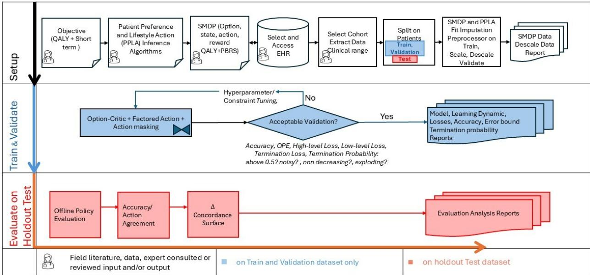  
Figure 1: The proposed patient–preference–centered factored hierarchical ofline RL framework

Training stage, iterates over hyperparameter, monitor accuracy, high-level loss, low-level loss, termination loss, and termination probability for pathological dynamics (noisy, non-decreasing, exploding, or early-plateaued) and validate these metrics on the validation set to guide configuration acceptance. After accepting a model, we evaluate it on the held-out patient set with ofline policy evaluation (OPE), agreement with clinician action, sample patient trajectories, and the ∆-concordance surface. The evaluation report then is reviewed by a field expert or clinician. Nodes marked with field-expert icon can prompt expert review and input, with reference to the field literature and guidelines, along with consideration of specific limitations of accessible EHR.

## 2 Literature Review

Patient preference and adherence. A review by Vermeire et al. [18] identified patient attitudes, beliefs, and prior engagement behavior as the strongest predictors of future adherence. A randomized trial further demonstrated that structured lifestyle intervention produces significantly greater weight loss, BMI reduction, and improvements in glycemic and systolic blood pressure control among adherent patients over four years, which underscores the clinical value of recommending such programs only to patients willing and able to engage [19].

Despite broad recognition that patient preferences and capacity are central to real-world clinical decisionmaking, existing RL-based systems almost universally assume perfect alignment with patient preference and adherence. Macri et al. [20] established that patient autonomy, treatment burden, and matching personal health goals must be considered alongside clinical eficacy when AI systems generate recommendations, while As’ad et al. [21] concluded that integrating patient values into AI-driven tools is essential for ethical implementation. Most recently, Templin et al. [22] introduced an RL framework incorporating divergent stakeholder preferences by learning a mixing weight between community-facing and provider-facing prediction signals, demonstrating improved acceptability and real-world alignment of recommendations. Integrating patient preference thus remains an open and largely unaddressed challenge in clinical RL.

Multimorbidity Treatment Planning. Machine learning approaches to multimorbidity have largely focused on disease clustering, risk stratification, and prediction of new condition onset, rather than sequentia treatment planning [23, 24]. Supervised learning models applied to EHR data have been used to identify multimorbidity patterns [25], and develop multimorbidity frailty indices [26], yet these models treat the problem as a static prediction task rather than a dynamic decision-making problem [27]. Unsupervised clustering methods have identified clinically meaningful multimorbidity subgroups [28, 29] but stop short of generating treatment recommendations [30].

The extension to sequential treatment optimization under multimorbidity remains sparse. Zheng et al. [16] developed a personalized RL agent for diabetes management in the presence of comorbid conditions. Mason et al. [31] formulated an MDP to maximize quality-adjusted life years (QALYs) for cardiovascular risk reduction in T2DM patients. Their methods treat every possible combination as a distinct action over a joint action space. Although powerful, such a flat policy does not scale to the combinatorial complexity of multiple concurrent treatment streams. Basu et al. [32] applied RL to multidisciplinary care coordination for patients with complex comorbidities and demonstrated reductions in acute care events relative to standard practice. However, the approach neither formalized patient preferences nor leveraged a hierarchical decision framework to manage the complexity of treatment planning. A multi-agent RL framework for chronic disease risk prediction and treatment personalization was proposed [33], structuring individual agents per condition, yet this approach does not model the pharmacological coupling between conditions or the behavioral feasibility of recommended interventions. In these studies, a shared limitation is the absence of any mechanism that formalizes patient preference as a constraint on the treatment planning problem.

Among all multimorbid dyads, HTN-T2DM presents a particularly tractable and consequential modeling target: its biomarkers are objectively measurable and routinely recorded in EHRs, the tension between glycemic and blood pressure targets under a shared pharmacological budget is well-documented clinically [8, 9], and the dyad’s prevalence and mortality burden establish clear clinical stakes [7, 34]. No existing computational framework, to our knowledge, addresses this dyad under a hierarchical policy structure with patient preferences formalized as a structural constraint.

Ofline RL and Hierarchical Reinforcement Learning. Since direct experimentation on patients is ethically infeasible, learning must occur on retrospective data [35]. This ofline RL setting introduces a challenge: standard Q-learning may assign inflated Q-values to out-of-distribution actions, not represented in historical data, as the agent cannot discover that such actions lead to poor outcomes [17, 36], a problem especially acute in clinical datasets where rare treatment combinations receive high estimates. Conservative Q-Learning (CQL) addresses this by adding a regularization term that minimizes Q-values across all actions while maximizing them under the observed data distribution [17]. The double deep Q-network (DDQN) architecture further mitigates maximization bias by decoupling action selection from evaluation via separate online and target networks [37], a correction particularly important in sparse-reward clinical environments.

A limitation of RL agents in clinical settings is the conflation of all decision-making into a single monolithic policy over a large combinatorial action space [38, 39]. Experienced clinicians naturally reason hierarchically by selecting a therapeutic strategy at a high level (e.g., prioritizing glycemic control when A1C is elevated) and executing specific pharmacological adjustments within that strategy at a lower level [10, 11]. Hierarchical reinforcement learning (HRL) formalizes this structure by decomposing the policy into a high-level controller that selects temporally extended sub-policies and a low-level controller for primitive actions [40]. Sutton et al. [38] extended the standard RL action space via temporal abstraction, enabling the agent to commit to a strategy for multiple time steps rather than re-evaluating every action independently. Barto and Mahadevan [39] demonstrated that hierarchical decomposition improves both sample eficiency and exploration in large state-action spaces, a property especially valuable in EHR datasets where certain treatment combinations are sparsely represented.

The option-critic architecture addressed a key limitation of earlier HRL: reliance on manually designed sub-goal structures [41]. By simultaneously learning intra-option policies, termination functions, and the high-level policy via policy gradient methods, the option-critic allows clinically meaningful options to be learned directly from data. In our study, the two learned options correspond to a Single-Target mode concentrating on the most out-of-control dimension and a Multi-Target mode jointly optimizing glycemic and blood pressure control, consistent with documented clinical behavior in comorbid patients [42].

Empirical validation of hierarchical policy in healthcare is provided by Zhong et al. [43], whose two-level HRL agent for automated clinical dialogue outperformed DQN baselines on both diagnostic accuracy and symptom query eficiency. Tan et al. [44] hierarchical multi-agent RL architecture with organ-specific agents and inter-agent communication, showeing that decomposed organ-level policies can coordinate to optimize global patient outcomes. However, existing HRL approaches treat the action space within each option as monolithic, foregoing the additional sample eficiency and interpretability gains available when the joint action space can be decomposed into clinically distinct sub-dimensions, a gap that factored action representations can fill.

Tang et al. [45] addressed the combinatorial action space challenge directly by proposing linear Q-function decomposition for factored action spaces in ofline healthcare RL. Rather than treating every treatment combination as a distinct action, factored decomposition assigns independent Q-heads to each treatment subdimension and computes the joint value as a weighted sum, improving sample eficiency in sparsely explored regions without compromising policy optimality, an advantage directly applicable to the three-dimensional action space used in this study.

## 3 Model formulation

We develop a holistic treatment-planning model for patients with HTN alone, T2DM alone, or the cooccurrence of both conditions. Capturing this structure requires a framework that can represent temporally extended, treatment-regimen-specific strategies operating across multiple encounters, rather than modeling clinical management as a single-layer $( { \mathrm { i . e . } }$ , traditional flat) sequence of visit-level decisions. We therefore formulate the sequential treatment planning problem as a semi-Markov decision process (SMDP), defined by the tuple $( S , \mathcal { A } , \mathcal { O } , P , r , \gamma )$ , where S is the state space, A is the factored action space, O is a finite set of options (temporally extended actions), $P : \mathcal { S } \times \mathcal { A }  \Delta ( \mathcal { S } )$ is the transition kernel, where $\Delta ( S )$ denotes the set of probability distributions over $\mathcal { S } , r : \mathcal { S } \times \mathcal { A }  \mathbb { R }$ is the reward function, and $\gamma \in ( 0 , 1 )$ is the discount factor. The sub-tuple $( S , { \mathcal { A } } , P , r , \gamma )$ alone specifies only the primitive, visit-level decision process and is formally identical to a standard MDP; it is the option set O, together with the option-induced multi-visit reward and transition models in 1–2 below, that gives the process its semi-Markov structure.

State Representation (S). Efective treatment decisions depend on an array of biomarkers. A comprehensive approach from a clinician should ideally simultaneously consider the patient’s metabolic trajectory, kidney function, body composition, prior medication burden, and preferences and adherence likelihood. To reflect this, based on expert feedback, we selected an 18-tuple feature vector to represent the patient state $s \in S { \mathrm { : } }$

$s _ { t } \ = \ ( S B P _ { t } , A 1 C _ { t } , B M I _ { t } , e G F R _ { t } , A g e _ { t } , b ( s ) _ { t } , I _ { t - 1 } ^ { \mathrm { T 2 D M } } , I _ { t - 1 } ^ { \mathrm { H T N } } , c , n o - v i s i t , G . , R . , E . )$ . The state features are summarized and described in Table 1.

Table 1: State features in encounter t $( | S | = 1 8 )$
<table><tr><td>Type</td><td>Features</td><td>Description</td></tr><tr><td>Continuous</td><td> $S B P _ { t } ; A 1 C _ { t } ; B M I _ { t } ; e G F R _ { t } ; A g e _ { t }$ </td><td>Systolic blood pressure (mmHg); glycated hemoglobin  $( \% ) ;$  body mass index  $\mathrm { ( k g / m ^ { 2 } ) }$  ; kidney function  $\mathrm { ( m L / m i n / 1 . 7 3 m ^ { 2 } ) }$  age in years (adjusted based on day of the visit)</td></tr><tr><td>Ordinal</td><td> $b ( s ) _ { t } ; I _ { t - 1 } ^ { \mathrm { T 2 D M } } ; I _ { t - 1 } ^ { \mathrm { H T N } }$ </td><td>BMI category (0: Normal; 1: Overweight; 2: Obese); T2DM medication intensity at t-1; HTN medication intensity at t-1</td></tr><tr><td>Binary</td><td>c; no-visit flag at visit t</td><td>BMI cooperation type  $( c = 0$  : non-cooperative;  $c = 1 { : }$  coopera- tive), gap-visit indicator flags missed encounters</td></tr><tr><td>OHE</td><td> ${ \mathrm { G . , R . , E . } }$ </td><td>Gender; Race; Ethnicity with 2, 2, and 3 binary indicators respectively, time independent features</td></tr></table>

The medication intensity features $I _ { t - 1 } ^ { \mathrm { T 2 D M } }$ and $I _ { t - 1 } ^ { \mathrm { H T N } }$ encode the number of active drug classes at the previous visit (0=none, 1=single-class, 2=multi-class) using medications presented in Appendix B, capturing the clinician’s prior prescribing context that the patient is taking at the time of encounter t rather than the current regimen adjustment, consistent with the doctor-at-visit-t decision semantics.

A patient is labeled cooperative $( c = 1 )$ if their BMI trajectory exhibits a negative slope estimated via least-squares linear regression $( \geq 3$ encounters), a net decrease between the first and last recorded value (two encounters), or a mean BMI already within the normal range $\left( < ~ 2 5 \right)$ ) with no increase exceeding $\mathrm { { 1 k g / m ^ { 2 } } ; }$ otherwise $c = 0$ . This label is computed after the train-only imputation step to prevent data leakage. Appendix D provides pseudocode of patient preference (cooperation in BMI reduction). The no-visit flag indicates that the patient completely missed that visit at time t. Factored actions $( { \mathcal { A } } )$ . In a standard MDP, the agent selects a single action from a monolithic action set at each decision step. Here, the clinician simultaneously makes three semi-independent sub-decisions at each visit: (i) a T2DM medication intensity adjustment $a _ { \mathrm { T 2 D M } , t } \in \{ - 1 , 0 , + 1 \}$ , (ii) an HTN medication intensity adjustment aHT $\mathrm { v } , t \in \{ - 1 , 0 , + 1 \}$ , and (iii) a BMI intervention decision $a _ { \mathrm { B M I } , t } \in \{ 0 , 1 \}$ . Since BMI intervention decisions are not explicitly recorded in most EHRs, we develop an inference procedure that recovers the per-transition BMI action from longitudinal BMI trajectories (Algorithms 2, and 3). In the action inference, $a _ { \mathrm { B M I } , t } = 1$ is assigned only to cooperative patients $( c = 1 )$ who present as overweight or obese at visit $t ,$ ensuring consistency between the inferred action and the cooperation label across all training transitions.   
A factored action is the tuple $\mathbf { a } = \left( a _ { \mathrm { T 2 D M } } \right.$ , aHTN, aBMI $\in \mathcal { A } = \{ - 1 , 0 , 1 \} ^ { 2 } \times \{ 0 , 1 \}$ , yielding $| { \mathcal { A } } | = 1 8$ joint actions. Factored actions exploit partially separable structure of the three intervention domains: each component admits a lower-dimensional Q-function, reducing the function-approximation burden and permitting per-component credit assignment. Options and clinical strategies (O). An option $\omega \in \mathcal { O }$ is a temporally extended action defined by a triple $\left( \mathcal { T } _ { \omega } , \pi _ { \omega } , \beta _ { \omega } \right)$ : an initiation set $\mathcal { T } _ { \omega } \subseteq S$ , an intra-option policy $\pi _ { \omega } : { \mathcal { S } }  A$ that selects primitive factored actions while the option is active, and a termination function $\beta _ { \omega } : S  [ 0 , 1 ]$ that stochastically decides when the option ends [38, 41]. In our empirical setting $\pi _ { \omega }$ is not represented explicitly but is obtained greedily from the factored intra-option value function, $\pi _ { \omega } ( s ) = \arg \operatorname* { m a x } _ { a \in \mathcal { A } ^ { c } ( s ) } Q ( s , \omega , a )$ , where $\mathcal { A } ^ { c } ( s )$ is the clinically admissible action set at s. We define $| \mathcal { O } | = 2$ options reflecting two clinically meaningful treatment regimes:

• $\omega _ { 0 }$ (Single-Target): medications for at most one condition are actively adjusted at any visit;

$\omega _ { 1 } \ \mathrm { ( M u l t i - T a r g e t ) }$ : both T2DM and HTN are simultaneously under treatment management.

The high-level policy selects which option to pursue across multiple encounters; the low-level (intra-option) policy then selects factored actions visit-by-visit within the active option. Options thus encode what treatment strategy is in efect, whereas factored actions encode what specific medication adjustment is made at a given visit. Each option commits the agent to a sub-policy for multiple time steps, extending the underlying MDP to an SMDP [38]. Assuming option ω is initiated in state s at encounter t and terminates after duration $k \geq 1$ , where k is jointly determined by the termination function $\beta _ { \omega }$ and the primitive kernel P along the realized trajectory. Following Sutton et al. [38], the option-level reward and (discounted) transition models are

$$
\begin{array} { r } { r ( s , \omega ) : = \mathbb { E } \left[ \sum _ { j = 1 } ^ { k } \gamma ^ { j - 1 } r _ { t + j } \ \Big | \ s _ { t } = s , \ \omega \right] } \end{array}\tag{1}
$$

$$
p ( s ^ { \prime } \mid s , \omega ) : = \sum _ { k = 1 } ^ { \infty } \gamma ^ { k } \operatorname* { P r } \Bigl ( s _ { t + k } = s ^ { \prime } , k \Big | s _ { t } = s , \omega \Bigr )\tag{2}
$$

Therefore the high-level process with $( S , \mathcal { O } , p , r , \gamma )$ is a discrete-time SMDP whose decision epochs are separated by a random number of encounters. Note that $p ( \cdot \mid s , \omega )$ is a γ-discounted kernel, in contrast to the one-step kernel P of the primitive process. The model degrades to standard MDP when $\beta _ { \omega } ( \cdot ) \equiv 1$ with $\mathcal { O } = \mathcal { A }$ , in which every option terminates after one visit. The semi-Markov character of our mode is driven from the random, state-dependent durations $k ,$ which are learned through $\beta _ { \omega }$ (subject to the minimum two-transition commitment) rather than fixed exogenously. The high-level critic $Q _ { \Omega }$ of Section 5 is trained on the one-step, intra-option form of the Bellman equation associated with $( 1 ) - ( 2 ) , Q _ { \Omega } ( s , \omega ) =$ $\begin{array} { r } { r ( s , \omega ) + \sum _ { s ^ { \prime } } p ( s ^ { \prime } \mid s , \omega ) \operatorname* { m a x } _ { \omega ^ { \prime } } Q _ { \Omega } ( s ^ { \prime } , \omega ^ { \prime } ) } \end{array}$ , whose sample-based TD targets are given in Appendix C.

Options are assigned per transition from the observed clinical state (not from demonstrated actions) to avoid data leakage:

$$
\omega = \omega _ { 1 } \mathrm { { i f } } \ \left\{ { I _ { t - 1 } ^ { \mathrm { { T 2 D M } } } > 0 \land I _ { t - 1 } ^ { \mathrm { { H T N } } } > 0 , t > 1 , } \right.\tag{3}
$$

and $\omega = \omega _ { 0 }$ otherwise. An assigned option persists for at least two consecutive transitions before re-evaluation, mirroring clinical inertia in regime switching.

Equation (3) is a deterministic, state-based partition and therefore defines the initiation sets of the two options: $\begin{array} { r } { \mathcal { I } _ { \omega _ { 1 } } = \left\{ s _ { t } \in S \ : \ ( I _ { t - 1 } ^ { \mathrm { T 2 D M } } > 0 \land I _ { t - 1 } ^ { \mathrm { H T N } } > 0 ) \ \vee \ ( t = 1 \land A 1 C _ { t } > 7 . 2 \land S B P _ { t } > 1 3 5 ) \right\} , \qquad \mathcal { I } _ { \omega _ { 1 } } = S \backslash \mathcal { T } _ { \omega _ { 1 } } } \end{array}$ Because the partition is exhaustive and disjoint, exactly one option is initiable in every state. Initiation sets are enforced during option assignment in preprocessing.

Transition Kernel (P). The transition kerne $P : \mathcal { S } \times \mathcal { A }  \Delta ( \mathcal { S } )$ (where $\Delta ( S )$ denotes the set of probability distributions over S) encodes the stochastic dynamics of a patient’s state from one visit to the next as a function of the factored action taken. Concretely, $P ( s ^ { \prime } \mid s , \mathbf { a } )$ , with $s ^ { \prime }$ the next state, captures how biomarkers such as A1C, SBP, and BMI, together with medication intensity and patient characteristics, evolve following a treatment decision ${ \bf a } = ( a _ { \mathrm { T 2 D M } } , a _ { \mathrm { H T N } } , a _ { \mathrm { B M I } } )$ at state s. Because direct interaction with the environment is infeasible in clinical settings, P is never queried analytically; instead, it is implicitly approximated through observed patient trajectories in the EHR dataset, making the problem one of ofline (batch) RL. The transition kernel is defined over primitive factored actions rather than options because it describes single-step, visit-leve dynamics; the option framework operates at a coarser temporal scale, composing sequences of such transitions into clinically coherent treatment regimes.

Reward Function (r). Managing chronic multimorbidity requires balancing immediate clinical risks with long-term health outcomes. To reflect this trade-of, our reward function integrates both objectives into a single optimization signal using state features $S B P _ { t } , \ A 1 C _ { t }$ , and $A g e _ { t }$ The reward function $r _ { t } = \Delta Q _ { t } + \Psi _ { t } + p _ { t } ^ { \prime } - p _ { t }$ , comprising (1) QALY gain $( \Delta Q _ { t } ) ~ [ 4 6 ] , ( 2 )$ potential-based reward shaping (PBRS) $\left( \Psi _ { t } \right)$ , and (3) improvement bonus and worsening penalty $\left( + p _ { t } ^ { \prime } - p _ { t } \right)$ . The total r is then clipped $\mathrm { t o ~ } [ - 1 , 1 ]$ to bound the temporal diference (TD) loss, consistent with $\mathrm { Q A L Y }$ expected gain. Appendix A provide detailed formulation of the reward function.

## 4 Structural Properties

In this section, we establish the structural properties of FAHOC framework. These properties provide theoretical justification for the FAHOC architecture by establishing bounds on the gap between the learned and optimal treatment policies and by characterizing diferences in attainable value between cooperative and non-cooperative patients. Proofs are provided in Appendix I.

## 4.1 Factorization Error Analysis

We first introduce the assumptions underlying the analysis.

Assumption 1 (Bounded rewards). Consider an $S M D P \left( S , \mathcal { A } , \mathcal { O } , P , r , \gamma \right)$ , where $s$ is the state space, A is the factored action space, O is a finite set of options, P is the transition kernel, r is the reward function, and $\gamma \in \mathsf { \Gamma } ( 0 , 1 )$ is the discount factor. We assume that the reward function is uniformly bounded, i.e., $| r ( s , a ) | \leq R _ { \mathrm { m a x } }$ for all $( s , a ) \in S \times \mathcal { A }$

Then we have the following lemma.

Lemma 1 (Bounded optimal Q-Function). Under Assumption 1, the optimal Q-function is uniformly bounded. Specifically, the optimal Q-function satisfies $\| Q ^ { * } \| _ { \infty } \leq V ^ { \mathrm { m a x } }$ , where

$$
V ^ { \mathrm { m a x } } : = \frac { R _ { \mathrm { m a x } } } { 1 - \gamma } .\tag{4}
$$

Lemma 1 follows immediately under Assumption 1, and establishes that, under uniformly bounded rewards and a discounted infinite-horizon objective, all optimal action-values remain uniformly bounded by the geometric sum of the maximum absolute immediate reward.

Assumption 2 (Factored action space). The action space is assumed to factor across K domains: ${ \mathcal { A } } =$ $\mathcal { A } ^ { 1 } \times \cdots \times \mathcal { A } ^ { K } , \ : \ : \dot { a } = ( a ^ { 1 } , \ldots , a ^ { K } )$ . In this work, we consider $K = 3$ with $\mathcal { A } ^ { 1 } = \mathcal { A } _ { T 2 D M } = \{ - 1 , 0 , 1 \}$ $\mathcal { A } ^ { 2 } = \mathcal { A } _ { H T N } = \{ - 1 , 0 , 1 \} , \mathcal { A } ^ { 3 } = \mathcal { A } _ { B M I } = \{ 0 , 1 \}$ . For each option ω, let $\mathcal { A } _ { \omega } \subseteq \mathcal { A }$ denote the corresponding active sub-space and $\bar { a } _ { \omega } : = ( \bar { a } _ { \omega } ^ { 1 } , \dots , \bar { a } _ { \omega } ^ { K } )$ denote the componentwise mean action. We further define the maximal componentwise deviation within $\mathbf { \mathcal { A } } _ { \omega }$ as $\begin{array} { r } { \Delta _ { \omega } : = \operatorname* { s u p } _ { a \in \mathcal { A } _ { \omega } } \operatorname* { m a x } _ { k \in \{ 1 , \ldots , K \} } | a ^ { k } - \bar { a } _ { \omega } ^ { k } | } \end{array}$

We further impose two regularity conditions. Assumption 3 imposes a $C ^ { 2 }$ extension of the reward in the action variable, while Assumption 4 assumes a smooth interpolation of the transition kernel across action domains. These conditions are satisfied when treatment dosages correspond to observed levels of an underlying continuous physiological process, as is the case for T2DM, HTN, and BMI interventions.

Assumption 3 (Bounded reward cross-interaction). The reward $r ( s , a )$ admits a $C ^ { 2 }$ extension in a over a neighborhood $o f A .$ . For each pair of distinct domains $k \neq \ell ,$ define:

$$
\Gamma _ { k \ell } : = \operatorname* { s u p } _ { s \in \mathcal { S } , a \in \mathcal { A } } \left| \frac { \partial ^ { 2 } r ( s , a ) } { \partial a ^ { k } \partial a ^ { \ell } } \right| , \quad \quad \Gamma _ { \mathrm { a l l } } : = \sum _ { k < \ell } \Gamma _ { k \ell } .\tag{5}
$$

Assumption 4 (Smooth transition extension). There exists an open neighbourhood $\mathcal { U } \supseteq \mathcal { A } \mathrm { ~ } i n \mathbb { R } ^ { K }$ and a family of probability kernels $\tilde { P } ( \cdot | s , \cdot ) : \mathcal { U } \to \Delta ( \mathcal { S } )$ such that:

(i) $\tilde { P } ( \cdot | s , a ) = P ( \cdot | s , a )$ for all $a \in { \mathcal { A } }$ (consistency on discrete points);

(ii) for every bounded measurable $f : { \mathcal { S } }  \mathbb { R }$ , the map $a \mapsto \mathbb { E } _ { s ^ { \prime } \sim \tilde { P } ( \cdot \vert s , a ) } [ f ( s ^ { \prime } ) ]$ ] is $C ^ { 2 }$ on U uniformly in s (smooth interpolation).

For each pair of distinct domains $k \neq \ell ,$ , define the cross-action transition interaction coeficient:

$$
\Phi _ { k \ell } : = \operatorname* { s u p } _ { \substack { s \in S , a \in \mathcal { U } } } \left| \frac { \partial ^ { 2 } } { \partial a ^ { k } \partial a ^ { \ell } } \mathbb { E } _ { s ^ { \prime } \sim \widetilde { P } ( \cdot | s , a ) } \big [ f ( s ^ { \prime } ) \big ] \right| , \qquad \Phi _ { \mathrm { a l l } } : = \sum _ { k < \ell } \Phi _ { k \ell } .\tag{6}
$$

In the factored SMDP M under Assumptions $1 - 2$ , we define three Bellman operators on $\ell ^ { \infty } ( S \times \mathcal { A } )$ as follows, where throughout $\mathbb { E } _ { s ^ { \prime } } [ \cdot ]$ abbreviates $\mathbb { E } _ { s ^ { \prime } \sim P ( \cdot | s , a ) } [ \cdot ] .$ ]:

1. True operator (uses full reward and unconstrained Q):

$$
( T Q ) ( s , a ) : = r ( s , a ) + \gamma \mathbb { E } _ { s ^ { \prime } } \Bigl [ \operatorname* { m a x } _ { a ^ { \prime } \in \mathcal { A } } Q ( s ^ { \prime } , a ^ { \prime } ) \Bigr ] .\tag{7}
$$

2. Factored-reward operator (replaces r with $r _ { \mathrm { a d d } }$ , still unconstrained $\mathrm { Q } )$ :

$$
r _ { \mathrm { a d d } } ( s , a ) : = \sum _ { k = 1 } ^ { K } r _ { k } ( s , a ^ { k } ) ,\tag{8}
$$

$$
( T _ { \mathrm { f a c } } Q ) ( s , a ) : = r _ { \mathrm { a d d } } ( s , a ) + \gamma \mathbb { E } _ { s ^ { \prime } } \left[ \operatorname* { m a x } _ { a ^ { \prime } \in \mathcal { A } } Q ( s ^ { \prime } , a ^ { \prime } ) \right] .\tag{9}
$$

3. Architectural operator (uses $r _ { \mathrm { a d d } }$ and restricts Q to the additive function class $\begin{array} { r } { \mathcal { F } : = \{ \sum _ { k } w _ { k } f _ { k } ( s , a ^ { k } ) \} ) } \end{array}$ :

$$
( T _ { \mathcal { F } } Q ) ( s , a ) : = \Pi _ { \mathcal { F } } \Big [ r _ { \mathrm { a d d } } ( s , a ) + \gamma \mathbb { E } _ { s ^ { \prime } } \big [ \operatorname* { m a x } _ { a ^ { \prime } \in \mathcal { A } } Q ( s ^ { \prime } , a ^ { \prime } ) \big ] \Big ] ,\tag{10}
$$

where $\Pi _ { \mathcal { F } }$ is the best-approximation projection onto $\mathcal { F }$ in $\| \cdot \| _ { \infty }$

Note that all three operators are γ-contractions on $( \ell ^ { \infty } ( S \times \mathcal { A } ) , \| \cdot \| _ { \infty } )$ by the Banach fixed-point theorem. Denote their unique fixed points by:

1. $Q ^ { * }$ : True optimal Q-function (fixed point of T),

2. $Q _ { \mathrm { f a c } } ^ { \ast }$ : Factored-reward optimal Q-function (fixed point of $T _ { \mathrm { f a c } } )$

3. $\hat { Q } _ { F } ^ { \omega }$ : Trained factored-architecture Q-network (approximate fixed point of $T _ { \mathcal { F } }$ within option ω).

The interaction residual is $\eta ( s , a ) : = r ( s , a ) - r _ { \mathrm { a d d } } ( s , a )$ , with $\begin{array} { r } { \operatorname* { s u p } _ { ( s , a ) } | \eta ( s , a ) | \le \varepsilon _ { r } \ge 0 } \end{array}$ . The total approximation error decomposes as:

$$
\begin{array} { r } { \left. Q ^ { * } - \hat { Q } _ { F } ^ { \omega } \right. _ { \infty } \leq \left. Q ^ { * } - Q _ { \mathrm { f a c } } ^ { * } \right. _ { \infty } + \left. Q _ { \mathrm { f a c } } ^ { * } - \hat { Q } _ { F } ^ { \omega } \right. _ { \infty } , } \end{array}\tag{11}
$$

which separates the error into two sources: (i) the mismatch between the true optimal Q-value and its factored-reward optimal Q-value approximation, and (ii) the additional error induced by restricting the value function to the architecture ${ \mathcal F } .$

We now bound the two terms in (11). Theorem 1 controls the suboptimality error as a result of reward factorization via the interaction residual, Theorem 2 refines this using reward smoothness (Hessian-based bounds), and Theorem 3 bounds the additional approximation error induced by the additive function class $\mathcal { F }$

Theorem 1 (Global Factorization Error Bound). Under Assumptions 1– 2, if $\begin{array} { r } { \operatorname* { s u p } _ { ( s , a ) } | \eta ( s , a ) | \le \varepsilon _ { r } } \end{array}$ , then:

$$
\left. Q ^ { * } - Q _ { \mathrm { f a c } } ^ { * } \right. _ { \infty } \leq \frac { \varepsilon _ { r } } { 1 - \gamma } .\tag{12}
$$

For each option ω with initiation set $\begin{array} { r l r } { \mathcal { T } _ { \omega } } & { { } \subseteq } & { S } \end{array}$ and action subspace $\begin{array} { r l } { { \mathcal { A } } _ { \omega } } & { { } \subseteq { \mathcal { A } } } \end{array}$ , define $\begin{array} { r l } { \varepsilon _ { r } ^ { \omega } } & { { } : = } \end{array}$ $\begin{array} { r } { \operatorname* { s u p } _ { s \in \mathcal { T } _ { \omega } , a \in A _ { \omega } } | \eta ( s , a ) | \le { \varepsilon _ { r } } } \end{array}$ . Then the option-conditioned Q-functions satisfy:

$$
\operatorname* { s u p } _ { s \in \mathcal { Z } _ { \omega } , a \in A _ { \omega } } \big | Q ^ { * , \omega } ( s , a ) - Q _ { \mathrm { f a c } } ^ { * , \omega } ( s , a ) \big | \ \le \ \frac { \varepsilon _ { r } ^ { \omega } } { 1 - \gamma } .\tag{13}
$$

Theorem 1 establishes that the reward-level factorization error is controlled by the interaction residual $\begin{array} { r } { \varepsilon _ { r } : = \operatorname* { s u p } _ { ( s , a ) } \left| r ( s , a ) - r _ { \mathrm { a d d } } ( s , a ) \right| } \end{array}$ The option-restricted bound (13) is never looser than the global bound, and is strictly tighter whenever cross-domain treatment interactions are smaller within an option’s active subspace than in the full action space.

Corollary 1 (Option-restricted bound). For each option ω $\in \{ \omega _ { 0 } , \omega _ { 1 } \}$ with initiation set $\mathcal { T } _ { \omega } \subseteq S$ and action subspace $\mathcal { A } _ { \omega } \subseteq \mathcal { A }$ , define $\begin{array} { r } { \varepsilon _ { r } ^ { \omega } : = \operatorname* { s u p } _ { s \in \mathcal { T } _ { \omega } , a \in A _ { \omega } } \left| \eta ( s , a ) \right| } \end{array}$ . Since ${ \mathcal { T } } _ { \omega } \times { \mathcal { A } } _ { \omega } \subseteq S \times { \mathcal { A } }$ , we have $\varepsilon _ { r } ^ { \omega } \leq \varepsilon _ { r }$ , and the option-conditioned Q-functions satisfy

$$
\operatorname* { s u p } _ { s \in \mathcal { T } _ { \omega } , a \in A _ { \omega } } | Q ^ { * , \omega } - Q _ { \mathrm { f a c } } ^ { * , \omega } | \leq \frac { \varepsilon _ { r } ^ { \omega } } { 1 - \gamma } \leq \frac { \varepsilon _ { r } } { 1 - \gamma } .\tag{14}
$$

The factor $1 / ( 1 - \gamma )$ in (12) cannot be improved in general, as shown in Appendix I.

While Theorem 1 applies to any bounded residual, Assumption 3 enables a closed-form upper bound on $\varepsilon _ { r }$ through the reward Hessian or Taylor Bound. Specifically, the interaction residual vanishes quadratically in the action dispersion $\Delta _ { \omega }$ within each option.

Theorem 2 provides a tighter, computable bound on the first term via the reward Hessian.

Theorem 2 (Reward Hessian bound or Taylor bound on reward interaction residual). Under Assumptions 1– 3, define $\begin{array} { r } { \Gamma _ { \mathrm { a l l } } : = \sum _ { k < \ell } \Gamma _ { k \ell } } \end{array}$ , where $\Gamma _ { \mathrm { a l l } }$ is the sum of cross-domain second derivatives of r for ordered pair of domains (k, ℓ) with $k < \ell \ ( s e e \ ( 5 ) )$ , and $\Delta _ { \omega } : = \mathrm { s u p } _ { a \in \mathcal { A } _ { \omega } }$ maxk $| a ^ { k } - \bar { a } _ { \omega } ^ { k } |$ is the componentwise action radius of option ω. Then the interaction residual satisfies:

$$
\varepsilon _ { r } ^ { \omega } \leq \Gamma _ { \mathrm { a l l } } \cdot \Delta _ { \omega } ^ { 2 } ,\tag{15}
$$

and consequently:

$$
\big \| Q ^ { * , \omega } - Q _ { \mathrm { f a c } } ^ { * , \omega } \big \| _ { \infty } \leq \frac { \Gamma _ { \mathrm { a l l } } \cdot \Delta _ { \omega } ^ { 2 } } { 1 - \gamma } .\tag{16}
$$

Note that in our reward function (Section 3; Appendix A), the rewards depend on clinical outcomes rather than directly on the action vector. Consequently, $\Gamma _ { k \ell } = 0$ for all $k , \ell , \varepsilon _ { r } = 0$ exactly, and the reward-level factorization is error-free. In a general multimorbidity setting where drug interaction penalties enter the reward directly, $\Gamma _ { \mathrm { a l l } } > 0$ and Theorem 2 quantifies the resulting error.

Finally, Theorem 3 bounds the second source of error, arising from restricting $\mathrm { Q }$ to the additive architecture $\mathcal { F }$ . This architectural residual captures cross-domain interactions in the transition dynamics that the additive structure cannot represent.

Theorem 3 (Architectural factorization error bound). Under Assumptions $\mathbfit { 1 - 2 }$ and $^ { 4 , }$ the error of the factored Q-network $\hat { Q } _ { F } ^ { \omega }$ relative to $Q _ { \mathrm { f a c } } ^ { * , \omega }$ satisfies:

$$
\left\| Q _ { \mathrm { f a c } } ^ { * , \omega } - \hat { Q } _ { F } ^ { \omega } \right\| _ { \infty } \leq \frac { \gamma \cdot V ^ { \operatorname* { m a x } } \cdot \Phi _ { \mathrm { a l l } } \cdot \Delta _ { \omega } ^ { 2 } } { 2 ( 1 - \gamma ) } .\tag{17}
$$

Combining the reward interaction residuals and architectural error bounds, we obtain:

Corollary 2 (Total error decomposition). Combining Theorems ${ \mathcal { Q } } - \ { \mathcal { B } } ,$ the total error satisfies:

$$
\big \| Q ^ { * , \omega } - \hat { Q } _ { F } ^ { \omega } \big \| _ { \infty } \leq \frac { \Gamma _ { \mathrm { a l l } } \cdot \Delta _ { \omega } ^ { 2 } } { 1 - \gamma } + \frac { \gamma \cdot V ^ { \operatorname* { m a x } } \cdot \Phi _ { \mathrm { a l l } } \cdot \Delta _ { \omega } ^ { 2 } } { 2 ( 1 - \gamma ) } .\tag{18}
$$

The two terms in (18) correspond to complementary sources of approximation error. The first term captures the mismatch between the true and factored reward functions; under the clinical reward of this paper this term vanishes. The second term reflects the inability of the additive architecture to represent cross-domain value interactions induced by the transition dynamics, and is small when T2DM and HTN treatments exhibit limited cross-domain coupling, a condition that is clinically plausible and supported empirically (see Appendix J).

## 4.2 Cooperation Value Dominance

As detailed in Section 3, we operationalize patient preferences as a binary cooperation indicator $c \in \{ 0 , 1 \}$ inferred from each patient’s longitudinal BMI trajectory (using imputed clinical values) as a proxy for patient’s preference and behavioral willingness and capability to follow lifestyle or other non-pharmacological recommendations for engagement in BMI reduction. Therefore, we then define the BMI-action feasibility set as

$$
\begin{array} { r } { A _ { \mathrm { B M I } } ( s , c ) : = \left\{ \{ 0 , 1 \} , \ : \ : c = 1 \mathrm { a n d } b ( s ) > 0 , \right. } \\ { \{ 0 \} , \ : \ : \ : \mathrm { o t h e r w i s e } . } \end{array}\tag{19}
$$

Consequently, the full feasible action sets for cooperative and non-cooperative eligible (high-BMI) patients $\left( b ( s ) > 0 \right)$ are given by $\mathcal { A } _ { 1 } ( s ) : = \{ - 1 , 0 , 1 \} ^ { 2 } \times \mathcal { A } ^ { \mathrm { B M I } } ( s , 1 )$ and $\bar { \mathcal { A } } _ { 0 } ( s ) : = \bar { \{ - 1 , 0 , 1 \} ^ { 2 } } \times \bar { \mathcal { A } } ^ { \mathrm { B M I } } ( s , 0 )$ , yielding 18 feasible actions for the cooperative ones $( c = 1 )$ , and 9 actions for non-cooperative ones $( a _ { \mathrm { B M I } } = 0 )$ . This implies $\mathcal { A } _ { 0 } ( s ) \subseteq \mathcal { A } _ { 1 } ( s )$ for all s.

This motivates the question of whether allowing BMI co-treatment, when the patient is eligible, improves the optimal policy value. We formalize this by comparing two cooperation regimes. Let $V ^ { * } ( s ; c )$ denote the optimal expected discounted cumulative reward when the feasible action set at every visited state is $\begin{array} { r } {  { \mathcal { A } } _ { c } ( \cdot ) , \mathrm { i . e . , } V ^ { * } ( s ; c ) : = \operatorname* { s u p } _ { \pi : \pi ( s ^ { \prime } ) \in A ^ { c } ( s ^ { \prime } ) \ \forall s ^ { \prime } } \mathbb { E } _ { \pi } \left[ \sum _ { t = 0 } ^ { \infty } \gamma ^ { t } r _ { t } \ \Big | \ s _ { 0 } = s \right] } \end{array}$ . Theorem 4 establishes that cooperation is value-improving and under identical states difering only in cooperation status, the value function of cooperative patients dominates that of non-cooperative patients.

Theorem 4 (Cooperation value dominance). For all $s \in S$

$$
V ^ { * } ( s ; 1 ) \geq V ^ { * } ( s ; 0 ) .\tag{20}
$$

Theorem 4 shows that enabling BMI co-treatment is weakly beneficial, and strictly improves value whenever ‘BMI-beneficial states’ are visited with positive probability.

Definition 1 (BMI-beneficial state). A state $s ^ { * } \in S$ is BMI-beneficial if $b ( s ^ { * } ) > 0$ (the patient has elevated BMI), and there exist actions $a ^ { + } , a ^ { - } \in \mathcal { A } _ { 1 } ( s ^ { * } )$ that difer only in the BMI component $( a _ { \mathrm { B M I } } ^ { + } = 1 , a _ { \mathrm { B M I } } ^ { - } = 0 )$ such that $\mathbb { E } _ { s ^ { \prime } \sim P ( \cdot | s ^ { * } , a ^ { + } ) } \bigl [ V ^ { * } ( s ^ { \prime } ; 1 ) \bigr ] \ > \ \mathbb { E } _ { s ^ { \prime } \sim P ( \cdot | s ^ { * } , a ^ { - } ) } \bigl [ V ^ { * } ( s ^ { \prime } ; 1 ) \bigr ]$

Proposition 1 (Strict superiority). Suppose there exists a BMI-beneficial state $s ^ { * } \in \mathcal { S } \ ( D e f n i t i o n \ 1 )$ that is reachable from some $s _ { 0 } \in S$ with positive probability under the optimal policy $\pi ^ { 0 , * }$ associated with $c = 0$ Then $V ^ { * } ( s _ { 0 } ; 1 ) \ > \ V ^ { * } ( s _ { 0 } ; 0 )$

In the clinical setting of this study, BMI-beneficial states correspond to encounters satisfying three criteria simultaneously: the patient is cooperative $( c = 1 )$ , overweight or obese $\mathrm { ( B M I \ge 2 5 k g / m ^ { 2 } ) }$ , and clinically uncontrolled $( \mathrm { A 1 C } > 7 . 0 \% \mathrm { o r } \ \mathrm { S B P } > 1 3 0 \mathrm { m m H g } )$ , so that the improvement bonus and QALY gain together ensure condition (1) holds. Auditing all three data splits directly confirms that 190,904 transitions (32.1%) and 18,761 distinct patients (39.7%) satisfy all three criteria, with stable proportions across train, validation, and test splits (32.1%, 32.7%, 31.5%). The mean reward conditional on this subset (0.028–0.033) is strictly positive versus −0.015 overall, providing direct empirical evidence that strict superiority (Proposition 1) holds for a large, structurally stable subpopulation rather than a marginal edge case. See Appendix Kfor full criterion-level counts.

## 5 Solution Algorithm

Non-pharmaceutical interventions such as BMI reduction operate on a longer time horizon than pharmacological adjustments; without explicit structural support, a standard Q-head will suppress their contribution under the stronger immediate signal from medication escalation. Our age-stratified QALY reward encodes long-run quality-of-life impact, while the factored Q-value decomposition ensures the BMI component receives an independent gradient signal weighted at $\lambda _ { \mathrm { B M I } } = 0 . 2$ , separate from the T2DM and HTN components $( \lambda = 0 . 4 ~ \mathrm { e a c h } )$

Clinicians managing multimorbid patients reason hierarchically: they first assess whether current medications across all active conditions require adjustment, or whether emerging comorbidities and patient response to medications warrant new treatment, and then finalize specific treatment decisions subject to patient preferences and safety constraints. To address this multi-level combinatorial action space, we develop the FAHOC framework, which integrates the option-critic architecture of Bacon et al. [41] for high-level clinical strategy selection with the factored action representation of Tang et al. [45], and equips both with action masking to learn patient-preference-compliant treatment policies. Ofline stability is ensured through conservative Q-learning regularization [17] on the intra-option heads and a multi-term termination loss tha augments the option-critic gradient with entropy and anchor regularizers calibrated to the static clinical data setting.

Figure 2 presents an overview of the proposed model. The network comprises four components: a shared encoder ϕ that maps the patient state to a latent representation shared across all heads; a high-level critic that scores two clinical strategies (ω0: Single-Target, ω1: Multi-Target) and selects the greedy option; per-option factored Q-heads that decompose treatment decisions into three disease-specific components; and per-option termination heads that govern whether the current clinical strategy should persist or be re-evaluated at the next visit. All Linear layers are initialized with Kaiming uniform weights and biases; full architectural details and layer dimensions are given in Appendix H. The intra-option policy is defined by the weighted factored composition:

$$
Q ( s , \omega , a ) = 0 . 4 Q _ { \mathrm { T 2 D M } } ^ { \omega } ( s , a _ { \mathrm { T 2 D M } } ) + 0 . 4 Q _ { \mathrm { H T N } } ^ { \omega } ( s , a _ { \mathrm { H T N } } ) + 0 . 2 Q _ { \mathrm { B M I } } ^ { \omega } ( s , a _ { \mathrm { B M I } } ) .\tag{21}
$$

where weights $\lambda _ { i } \in \{ 0 . 4 , 0 . 4 , 0 . 2 \}$ reflect the relative clinical priority of glycaemic and blood-pressure control over BMI management, ensuring the BMI head receives an independent gradient signal rather than being suppressed by stronger immediate medication signals.

At each training step the agent observes a stored patient transition comprising the current state, the assigned clinical option, the clinician’s treatment action, the received reward, the next state, and an episode termination indicator. The low-level intra-option Q-heads are trained using a Double DQN target that incorporates option-utility: the continuation value if the current option persists, blended with the best available option value if the option terminates, weighted by the target-network termination probability at the next state. A conservative Q-learning penalty suppresses overestimation of out-of-distribution actions not seen in the ofline dataset. The high-level option critic is trained on a separate target that weights the intra-option value at the current state against the best option value at the next state, again via the target-network termination probability. The termination heads are updated in a separate backward pass that does not afect the shared encoder, using an extended option-critic gradient augmented with an entropy penalty and a quadratic anchor toward a target termination probability of $\bar { \beta } = 0 . 3 0$ . The encoder is updated exactly once per step through a joint backward pass over the low- and high-level losses only. All TD targets are clipped and all gradient norms are clipped to prevent instability under ofline distributional shift. Full TD target definitions, loss equations, and training pseudocode are provided in Appendix E.

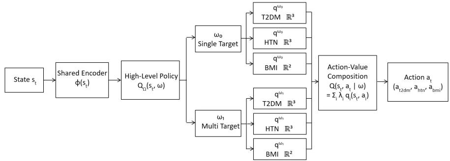  
Figure 2: Overview of the FAHOC model. The shared encoder $\phi ( s _ { t } )$ maps the patient state to a latent representation; the high-level critic $Q _ { \Omega } ( s _ { t } , \omega )$ induces a greedy policy $\omega ^ { * } =$ arg maxω $Q _ { \Omega } ( s _ { t } , \omega )$ over two clinical options (ω0: Single-Target, ω1: Multi-Target); per-option factored Q-heads produce the weighted composition $Q ( s _ { t } , a _ { t } \mid \omega )$ (Eq. (21)) over three treatment dimensions (T2DM $\in \mathbb { R } ^ { 3 }$ , HTN $\in \mathbb { R } ^ { 3 }$ $\mathrm { B M I } \in \mathbb { R } ^ { 2 } )$ and action masking enforces patient-preference and clinical safety constraints. Per-option termination heads $\beta _ { \omega } ( s _ { t } ) \in ( 0 , 1 )$ govern option switching via the option-critic gradient (see Appendix H).

Algorithm 1 FAHOC Training (Overview)   
Require: Ofline bufer $B ,$ network parameters θ, discount γ=0.97, soft-update rate τ=0.001   
1: Initialize online network θ with Kaiming uniform; copy to target network $\theta ^ { - }$ ▷ Appendix H   
2: Fill B using stratified initial priorities to up-weight active treatment transitions ▷ Alg.6   
3: for each training step do   
4: Sample a mini-batch with importance-sampling weights from the prioritized replay bufer   
5: Evaluate factored Q-values for all actions via Eq. (21); set inadmissible entries to −∞ via the action mask ▷ Algs. 4–5   
6: Compute low- and high-level Double DQN TD targets using target-network termination probabilities and option-utility   
blending ▷ Appendix E   
7: Update encoder ϕ, high-level critic, and intra-option heads via a single joint backward pass; clip gradient norm to 1.0 ▷   
Appendix E   
8: Update termination heads via a separate backward pass; clip gradient norm to 0.5 ▷ Appendix E   
9: Update replay priorities from TD errors; soft-update target network $\theta ^ { - }  \tau \theta + ( 1 - \tau ) \theta ^ { - }$   
10: end for

## 6 Computational Results

In this section, we first present our data and summarize the data preprocessing results. Next, we describe the results related to model training convergence. Consequently, we provide the results comparing the degree of agreement between the model-recommended policies and historical clinician recommendations. Next we provide a few representative patient treatment trajectories, examine the patient preference compliance to find the efectivness of action masking, BMI-specific performance, of-policy policy-value estimates, and action-distribution analysis.

## 6.1 Data and Preprocessing

The study cohort was drawn from EHR at five hospitals in the Southeast United States, collected between 2014 and 2025, comprising 48,015 outpatients with comorbid T2DM and HTN. Each patient had at least two encounters within one year, aggregated into 3-month intervals consistent with standard T2DM and HTN follow-up schedules [47]. Patients with cancer diagnoses (n = 717) were excluded due to treatment-related weight loss confounding [48], yielding a final cohort of 47,298 patients with 594,667 encounters. To preven data leakage, 33,108 patients (447,988 encounters), 7,095 patients (97,326 encounters), and 7,095 patients (96,651 encounters) were randomly selected and set aside for training, validation, and testing, respectively. All imputation parameters are fitted on the training split only and applied to all splits at inference time. Continuous features are standardized using parameters fitted on the training split only, preventing data leakage. Missing values are imputed with a constrained iterative imputer whose bounds are derived from clinically valid ranges. Cooperation labels are inferred from imputed BMI values after the imputer is fitted on training data, so no cooperation-related statistics from validation or test patients contaminate the training process. After converting sequential encounters into state-action-reward-next-state transition tuples, the datasets yielded 414,880, 90,231, and 89,556 training, validation, and testing transitions.

The patient preference modeling for cooperation in BMI reduction described in Algorithm 2 identified 58.1 % of training patients as cooperative and 41.9 % as non-cooperative, with comparable proportions in the validation (59.6 % / 40.4 %) and testing (57.5 % / 42.5 %) sets. Table 2 presents the distribution of the data after imputation before entering the RL data arrangement pipeline:

## 6.2 Training Convergence

The HRL agent was trained for 150 epochs on a stratified prioritized replay bufer of 500,000 transitions, with separate learning rates for the encoder, high-level, low-level, and termination heads to stabilize joint optimization across hierarchy levels; full hyperparameter specifications are provided in Table 9 in Appendix G. Training converged across all loss components, with validation action accuracy rising from 66.9% at epoch 1 to a peak of 75.3% at epoch 60 and stabilizing near 74% at convergence. The average termination probability of 0.257 is below the anchor target $\bar { \beta } = 0 . 3 0$ . The fact that $\hat { \beta } = 0 . 2 5 7 < \bar { \beta } = 0 . 3 0$ indicates a consistent advantage-driven preference for persistence, as the anchor would otherwise push $\beta$ toward 0.30. Learning curves are shown in Appendix G.

## 6.3 Clinician Action Agreement

To measure alignment between the learned policy and established clinical practice, we quantify the proportion of transitions in which the agent’s greedy action matches the clinician’s observed decision, defined as clinician action agreement. Note that this is an evaluation metric only; the policy is trained to maximize the QALY-based reward, not to imitate the clinician, and the CQL penalty merely prevents overestimation of unsupported actions.

Table 3 reports results on the held-out test set alongside random-guessing baselines. The overall action accuracy of 69.8 % substantially exceeds the random baseline of $5 . 6 \% ( = 1 / 1 8 )$ . The factored action framework reveals that the agent is highly aligned with clinicians on the disease dimensions separately: T2DM accuracy of 82.3 % and HTN accuracy of 80.7 % exceed their respective random baselines by factors of ${ \approx } 2 . 5 \times$ . The BMI component, restricted to eligible patients, achieves a near-perfect recall of 99.98 %, with an $F _ { 1 }$ score of 95.9 %, and the mean Q-value margin of 6.86 confirms the agent’s high confidence in its BMI decisions. Option selection accuracy of 53.8 % modestly exceeds the 50 % two-option chance level, consistent with the inherent dificulty of inferring latent clinical intent (single- vs. multi-target focus) from observational data.

## 6.4 Of-Policy Evaluation

We employ three complementary of-policy evaluation (OPE) estimators with 95% bootstrap confidence intervals (1,000 resamples):

1. FQE [49]: A separate Q-network trained to satisfy the Bellman operator under the learned policy.

Table 2: Cohort and Transition Dataset Statistics
<table><tr><td>Characteristic Train</td></tr><tr><td>Validation Dataset Partition</td></tr><tr><td>Patients 33,108 7,095 7,095</td></tr><tr><td>Transitions 414,880 90,231 89,556</td></tr><tr><td>Transitions/patient (mean ± std)  $1 2 . 5 \pm 9 . 6$   $1 2 . 7 \pm 9 . 5$  12.6 ± 9.6</td></tr><tr><td>BMI Cooperation Status Cooperative 264,587 (63.8%) 58,567 (64.9%) 56,534 (63.1%)</td></tr><tr><td>Non-cooperative 150,293 (36.2%) 31,664 (35.1%) 33,022 (36.9%)</td></tr><tr><td>BMI Category</td></tr><tr><td>Normal 79,888 (19.3%) 17,245 (19.1%) 17,944 (20.0%)</td></tr><tr><td>Overweight 222,014 (53.5%) 49,136 (54.5%) 47,736 (53.3%)</td></tr><tr><td>Obese 112,978 (27.2%) 23,850 (26.4%) 23,876 (26.7%)</td></tr><tr><td>Demographics</td></tr><tr><td>Female 56.9% 57.0% 57.0%</td></tr><tr><td>Male 43.1% 43.0% 43.0%</td></tr><tr><td>Black or African American 48.7% 48.4% 49.2%</td></tr><tr><td>White 51.3% 51.6% 50.8%</td></tr><tr><td></td></tr><tr><td>Hispanic or Latino 0.4% 0.2% 0.4%</td></tr><tr><td>Not Hispanic or Latino 97.9% 98.0% 98.1%</td></tr><tr><td>Clinical State Variables (mean ± std; unscaled)</td></tr><tr><td>SBP (mmHg)  $1 3 4 . 2 \pm 1 7 . 5$   $1 3 4 . 0 \pm 1 7 . 7$   $1 3 4 . 2 \pm 1 7 . 5$ </td></tr><tr><td>A1C (%)  $7 . 2 3 \pm 1 . 6 4$   $7 . 2 5 \pm 1 . 6 7$   $7 . 2 6 \pm 1 . 6 7$ </td></tr><tr><td>BMI (kg/m²)  $3 1 . 5 \pm 8 . 3$   $3 1 . 5 \pm 8 . 2$   $3 1 . 4 \pm 8 . 3$ </td></tr><tr><td>eGFR (mL/min)  $6 9 . 2 \pm 2 6 . 0$   $6 9 . 4 \pm 2 5 . 6$   $6 9 . 2 \pm 2 5 . 9$ </td></tr><tr><td>Age (years)  $6 3 . 9 \pm 1 2 . 7$   $6 3 . 8 \pm 1 2 . 6$   $6 4 . 3 \pm 1 2 . 7$ </td></tr><tr><td>T2DM intensity  $0 . 6 1 \pm 0 . 7 6$   $0 . 6 2 \pm 0 . 7 7$   $0 . 6 2 \pm 0 . 7 6$ </td></tr><tr><td>HTN intensity  $0 . 8 7 \pm 0 . 9 0$   $0 . 8 8 \pm 0 . 9 0$   $0 . 8 8 \pm 0 . 9 0$ </td></tr><tr><td>Treatment Intensity Distribution</td></tr><tr><td>T2DM: None (0) 233,044 (56.2%) 50,215 (55.7%) 49,828 (55.6%)</td></tr><tr><td>T2DM: Single-class (1) 110,513 (26.6%) 24,061 (26.7%) 24,360 (27.2%)</td></tr><tr><td>T2DM: Multi-class (2) 71,323 (17.2%) 15,955 (17.7%) 15,368 (17.2%)</td></tr><tr><td>HTN: None (0) 197,870 (47.7%) 42,521 (47.1%) 42,105 (47.0%)</td></tr><tr><td>HTN: Single-class (1) 72,544 (17.5%) 16,022 (17.8%) 15,787 (17.6%)</td></tr><tr><td>HTN: Multi-class (2) 144,466 (34.8%) 31,688 (35.1%) 31,664 (35.4%)</td></tr><tr><td>Option (Treatment Strategy)</td></tr><tr><td>Single-Target (ω0) 278,569 (67.1%) 60,355 (66.9%) 59,611 (66.6%)</td></tr><tr><td>Multi-Target (ω1) 136,311 (32.9%) 29,876 (33.1%) 29,945 (33.4%)</td></tr><tr><td></td></tr><tr><td>Reward Statistics</td></tr><tr><td>Mean reward -0.0145 -0.0133 -0.0149</td></tr><tr><td></td></tr><tr><td>Std. deviation 0.3883 0.3858 0.3841 Positive rewards 85,369 (20.6%) 18,615 (20.6%) 18,345 (20.5%)</td></tr></table>

Table 3: Clinician Action Agreement: HRL Policy.
<table><tr><td>Metric</td><td>Test</td><td>Random (%)</td></tr><tr><td>Overall action accuracy</td><td>69.8%</td><td>5.6</td></tr><tr><td>T2DM component accuracy</td><td>82.3 %</td><td>33.3</td></tr><tr><td>HTN component accuracy</td><td>80.7%</td><td>33.3</td></tr><tr><td>BMI F1 (eligible patients)</td><td>95.9%</td><td>50.0</td></tr><tr><td>Option accuracy (Single- vs. Multi-Target)</td><td>53.8 %</td><td>50.0</td></tr><tr><td>Mean termination prob. β</td><td>0.201</td><td></td></tr></table>

Computed only among cooperative, overweight/obese patients. Precision = 92.2 %; The random baseline is given by the inverse of the number of available actions. For example, with 18 possible actions, a uniformly random policy has a probability of 18 of selecting the same action as the clinician. mean Q-value margin between BMI-reduction and no-reduction actions $= 6 . 8 6$

Table 4: Of-Policy Evaluation: Estimated Policy Value $( \gamma = 0 . 9 7 , B = 1 , 0 0 0$ bootstrap resamples)
<table><tr><td rowspan="2">Estimator</td><td colspan="2">Test Set  $( n = 8 9 , 5 5 6 )$ </td></tr><tr><td>Estimate</td><td>95 % CI</td></tr><tr><td>Clinician (baseline)</td><td>-0.133</td><td></td></tr><tr><td>FQE‡</td><td>3.373</td><td>[3.342, 3.404]</td></tr><tr><td>WIS</td><td>-0.485</td><td>[−0.972, -0.102]</td></tr><tr><td>DR</td><td>0.669</td><td>[0.638, 0.697]</td></tr></table>

‡ Exceeds [−1, 1] due to Q-value extrapolation beyond  
the single-step reward scale.

2. WIS [50]: Weights each episode’s return by the likelihood ratio of the learned vs. clinician action sequence, self-normalized to reduce variance.

3. DR [51]: Combines a direct Q-function estimate with importance-ratio-weighted TD corrections, converging to the true policy value if either component is correctly specified, a useful guarantee given EHR sparsity and clinician heterogeneity.

All three estimators place the learned policy above the clinician baseline (Mean observed discounted return over all test transitions). The negative clinician baseline (−0.133) reflects suboptimal long-term biomarke trajectories inherent in observational chronic-disease data. The DR estimator, the most robust to model misspecification, yields a policy value of 0.669 (95 % CI: [0.638, 0.697]), substantially above the baseline, with a narrow, non-overlapping interval confirming statistical reliability. The FQE estimate of 3.373 reflects accumulated discounted future value rather than a single-step reward; its tight CI (±0.031) confirms stable Q-function learning. The wider WIS interval ([−0.972, −0.102]) reflects importance-sampling variance when a deterministic agent policy diverges from the stochastic clinician distribution; the mean clipped IS weight of 1.127 indicates partial overlap but makes WIS less reliable as a standalone estimator here. The consistent agreement between FQE and DR confirms that the learned policy achieves higher expected clinical value than observed clinician behavior.

## 6.5 Illustrative Analysis of Optimal Policy Behavior

Here we examine the behavior of the optimal policy using example patients from four clinically distinct subgroups as depicted in Figure 3:

1. Cooperative / Single-Target (Patient I). A BMI reduction cooperative patient with three encounters assigned to single-class option. Both the agent and clinician chose maintain intensity throughout; the agent recommends BMI reduction one encounter earlier than the clinician, acting immediately on cooperative eligibility. Near zero to negative rewards reflect unchanged A1C and SBP over the window mainly due to short encounter sequence for clinician and agent to asses patient’s response to current medication intensity.

2. Cooperative / Multi-Target (Patient II). With 20+ encounters, and both uncontrolled biomarkers this patient falls under option ω1 (Multi-Target). The clinician oscillates between Intensify and De-intensify as biomarkers response were not in target range, producing mainly negative to near zero rewards. The agent instead holds a stable maintain strategy across consecutive encounters and recommends BMI reduction from encounter 2 onward, consistent with the patient’s cooperative status. The DR estimator for cohort confirms that avoiding titration oscillations yields better long-run QALY outcomes.

3. Non-Cooperative / Single-Target (Patient III). For this non-cooperative patients with biomarkers near target, the clinician again alternates reactively between Intensify and De-intensify. Every intensify follows with deintensify in clinician recommendation confirming patient’s better response to maintain current intensity. The agent favors stability, aligning on the clinician’s medication intensify adjustment and issuing no BMI reduction recommendations, confirming structural enforcement of the cooperation mask.

4. Non-Cooperative / Single-Target (Patient IV). Like Patient III, the agent issues no BMI-reduction recommendations. Unlike Patient III, this patient’s initial encounters begins with negative to near zero rewards: the clinician remains maintain intensity until encounter 8, then abruptly selects intensify and deintensify T2DM in the next visit. The agent maintains steadily and issues a single De-intensify once improvement is estimated aligned with clinician; rewards shift from negative to strongly positive in later encounters, consistent with the higher DR value for the sicker (uncontrolled) patients stratum (0.889 [0.853, 0.925]) vs. controlled (0.511 [0.473, 0.548]).

Per Encounter: T2DM / HTN med. intensity adjustments: {De-intensify = -1 | Maintain = 0 | Intensify = +1} BMI reduction: {BMI reduction = -1 | No reduction = 0} · Clinician  
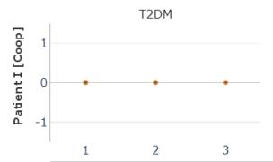

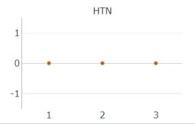

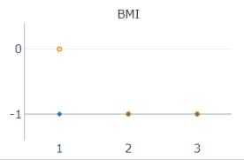

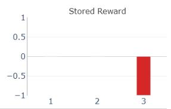

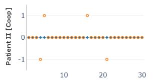

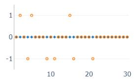

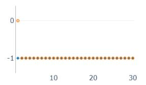

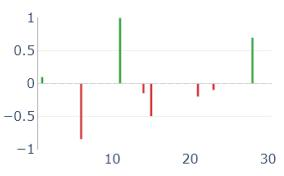

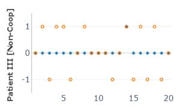

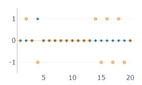

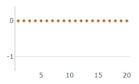

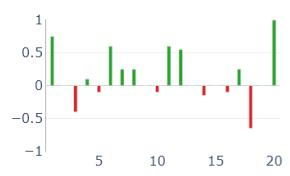

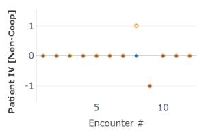

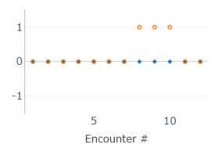

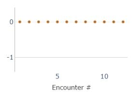

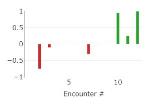  
Figure 3: Per-patient treatment trajectories (4 patients, test set). Columns: T2DM, HTN, and BMI recommendations and per-encounter obsered reward (green > 0, red < 0). Rows: Cooperative Patient I (Single-Target), Cooperative Patient II (Multi-Target), Non-Cooperative Patients III and IV (Single-Target).

The HRL policy has learned two complementary behaviors: a QALY-guided treat-to-target strategy for T2DM and HTN that avoids titration oscillations (DR = 0.669 vs. clinician mean reward −0.0133), and a cooperation-gated BMI recommendation pattern $( F _ { 1 } = 9 5 . 9 \%$ , zero safety violations) despite BMI carrying no direct term in $r _ { t } .$ , demonstrating that the hierarchical architecture and action masking successfully transfer the cooperation structure and BMI expected improvement for patient QALY improvement.

## 6.6 Patient Preference Masking Compliance

Recall that to respect patient preferences, a BMI cooperation mask prevents the agent from recommending BMI-reduction actions to non-cooperative patients. This hard constraint is enforced by assigning masked actions a Q-value of −∞ during training, ensuring that the argmax operator never selects a prohibited action. The trained policy achieves 100% safety compliance during testing, with zero mask violations in 89,556 testing set transitions. This result confirms that the action-masking mechanism operates as intended and the agent never assigns a BMI-reduction recommendation to an ineligible patient under any observed state. Among eligible patients, BMI precision was 92.2%, recall was 99.98%, and patient-level consistency, the proportion of patients for whom BMI decisions were internally consistent, was 99.9%.

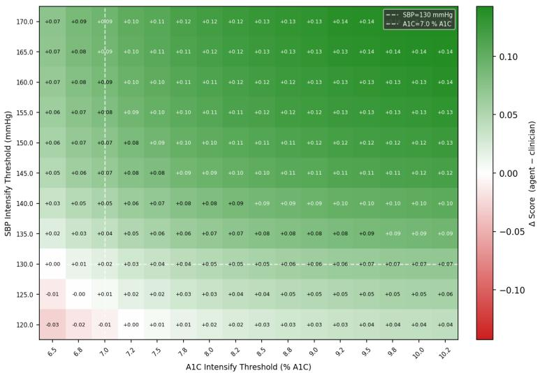

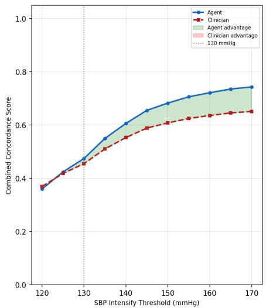  
Figure 4: Left: Concordance advantage surface $( \Delta = \mathrm { a g e n t - c l i n i c i a n } )$ over SBP $\left( \mathrm { y - a x i s } \right)$ and A1C (x-axis) intensification thresholds. Green $( \Delta > 0 )$ and red $( \Delta < 0 )$ denote agent and clinician advantage, respectively. Dashed white lines mark the ACC/AHA 2017 SBP threshold (130) and ADA 2025 A1C target (7.0); above both, the agent is uniformly more concordant $( \Delta \in [ + 0 . 0 3 , + 0 . 1 4 ] )$ , with the clinician advantage confined to the sub-guideline region. Right: Concordance vs. SBP threshold at fixed A1C=7.0; the agent (blue) surpasses the clinician (red) at SBP≥130 with a widening advantage through 170.

## 6.7 Guideline Concordance Analysis

To evaluate treatment alignment with clinical guidelines, we employ the ∆-guideline concordance surface, sweeping over a grid of SBP and A1C intensification thresholds [46]; see Appendix F for the formal definition.

Figure 4 shows the resulting surfaces on the held-out test set. The agent achieves positive ∆ in most of the threshold grid $( \Delta \in [ - 0 . 0 3 , + 0 . 1 4 ] )$ , with the clinician holding a slight advantage only in the sub-guideline region $( \mathrm { S B P { < } 1 3 0 , \ A 1 C { < } 7 . 0 ) }$ , where conservative maintenance aligns naturally with guidelines. Above both reference thresholds the agent is more concordant, reaching $\Delta = + 0 . 1 4$ . The right panel confirms this advantage persists across all SBP thresholds above 130 at the standard A1C target of 7.0. Near-identical surfaces on the validation set (maximum deviation < 0.01) confirm that the higher guideline concordance generalizes robustly to unseen patient cohorts.

## 6.8 Stratified Analysis: Uncontrolled vs. Controlled Trajectories

To assess whether the HRL policy adds greater value for patients who stand to benefit most from treatment optimization, we stratified the test set into uncontrolled and controlled trajectories. A patient episode was classified as uncontrolled if the patient’s first-visit scaled SBP or scaled A1C exceeded the training-set mean (i.e., scaled value > 0), indicating above-average disease burden at trajectory onset; all remaining episodes were classified as controlled. This stratification yielded 4,692 uncontrolled patients (57,710 transitions; 64.4 % of the test set) and 2,403 controlled patients (31,846 transitions; 35.6 %). Table 5 reports behavioral accuracy, clinician reward statistics, and DR-estimated policy value separately for each stratum. The HRL agent outperforms the clinician baseline on both strata (DR value > clinician mean reward, with non-overlapping CIs), with the advantage substantially larger in uncontrolled trajectories $( \mathrm { D R } = 0 . 8 8 9$ vs. clinician ≈ 0.000) than in controlled trajectories $( \mathrm { D R } = 0 . 5 1 1$ vs. clinician −0.042). This pattern is clinically meaningful: uncontrolled patients have more room for improvement through proactive treatment adjustment, and the agent appears to exploit this by recommending higher-value actions in states where the clinician’s conservative maintain strategy yields near-zero reward. The proportion of positive-reward transitions is higher in the uncontrolled stratum (23.5 % vs. 15.1 %), further corroborating that these episodes carry greater optimization potential. Accuracy is slightly lower in the uncontrolled stratum (68.1 % vs. 72.8 %), suggesting the agent diverges more from observed clinician decisions in the high-stakes cases where the learned policy may be capturing treatment patterns not reflected in average clinician behavior. The 100% safety compliance in both strata confirms the robustness of the action-masking mechanism in the subpopulations of patients.

Table 5: Stratified Evaluation on the Test Set: Uncontrolled vs. Controlled Trajectories
<table><tr><td>Metric</td><td>Uncontrolled</td><td>Controlled</td></tr><tr><td>Patients (n)</td><td>4,692</td><td>2,403</td></tr><tr><td>Transitions (n)</td><td>57,710</td><td>31,846</td></tr><tr><td>Accuracy</td><td></td><td></td></tr><tr><td>Overall action</td><td>68.1 %</td><td>72.8 %</td></tr><tr><td>T2DM component</td><td>80.7%</td><td>85.2%</td></tr><tr><td>HTN component</td><td>80.0%</td><td>81.9%</td></tr><tr><td>BMI Non-Cooperative</td><td>69.9%</td><td>75.1%</td></tr><tr><td>BMI Cooperative</td><td>67.0%</td><td>71.5%</td></tr><tr><td>Clinician Outcomes</td><td></td><td></td></tr><tr><td>Mean reward</td><td>≈ 0.000</td><td>-0.042</td></tr><tr><td>% positive-reward</td><td>23.5%</td><td>15.1%</td></tr><tr><td>Off-Policy Evaluation (DR)</td><td></td><td></td></tr><tr><td>DR policy value</td><td>0.889</td><td>0.511</td></tr><tr><td>95%CI</td><td>[0.853, 0.925]</td><td>[0.473, 0.548]</td></tr><tr><td>Safety compliance</td><td>100%</td><td>100%</td></tr></table>

Stratification is based on each patient’s first-visit scaled SBP and A1C relative to the training-set mean. A patient is classified as uncontrolled if either value exceeds zero (above training mean). DR = Doubly Robust of-policy estimator; 95 % bootstrap CI from 1,000 resamples.

## 6.9 Comparison with Baseline DDQN and Clinician Action Agreement

We compare the proposed HRL policy against a non-hierarchical DDQN baseline that shares the same state representation, action space, reward function, and training data, but lacks any hierarchical structure. The DDQN maps states directly to Q-values over the full 18-dimensional joint action space $( 3 \times 3 \times 2 \colon$ T2DM $\times \ \mathrm { H T N } \times \mathrm { B M I } )$ , with no option layer and no termination function at the architecture level. This baseline isolates the contribution of the hierarchical option-critic structure to policy quality. Table 6 reports action agreement with clinician decisions for both models on their respective evaluation sets. The HRL policy outperforms the baseline DDQN. The largest gains are in HTN accuracy (+1.6%) and BMI discriminative performance (+1.9%), suggest that the hierarchical option structure helps the agent make more targeted per-disease decisions by explicitly separating single-target from multi-target treatment episodes.

Table 6: Clinician Action Agreement: HRL Policy vs. DDQN Baseline.
<table><tr><td>Metric</td><td>HRL (Test)</td><td>baseline DDQN (Val)</td><td>∆ (HRL – DDQN)</td></tr><tr><td>Overall action accuracy</td><td>69.8%</td><td>69.2%</td><td>+0.6%</td></tr><tr><td>T2DM component accuracy</td><td>82.3%</td><td>81.4%</td><td>+0.9%</td></tr><tr><td>HTN component accuracy</td><td>80.7%</td><td>79.1 %</td><td>+1.6%</td></tr><tr><td>BMI accuracy (all)</td><td>96.6%</td><td>96.3%</td><td>+0.3%</td></tr><tr><td>BMI discriminative†</td><td>95.9%</td><td>94.0 %</td><td>+1.9%</td></tr><tr><td>Option accuracy</td><td>53.8%</td><td>N/A</td><td></td></tr><tr><td>Avg. Q-value</td><td>2.247</td><td>2.057</td><td>+0.190</td></tr></table>

† Evaluated on cooperative, overweight/obese patients only (n = 12,885); HRL reports F1, Baseline DDQN reports accuracy on the same eligible subset. HRL and flat DDQN are evaluated on test and validation sets respectively; ∆ is indicative.

The modest overall gain (+0.6%) reflects the harder task the HRL policy solves where it must jointly optimize T2DM, HTN, and BMI actions, select the correct option, and decide when to terminate it all from the shared reward signal alone. Beyond accuracy, the HRL policy ofers three structural advantages unavailable to the flat DDQN 1) Interpretable clinical intent. With options, single-target, multi-target in this study, correspond to recognizable clinical strategies. Option accuracy of 53.8 % above the 50 % chance level demonstrates that the agent learns a meaningful latent decomposition of clinician behavior. 2) The termination function (mean $\bar { \beta } = 0 . 2 0 1 )$ allows the agent to commit to a treatment strategy across multiple encounters rather than reacting greedily at each step, better reflecting chronic-disease management in practice. This advantage is further beneficial when strategies cover future morbidities risk as treatment target such as cardiovascular and kidney diseases. 3) While both models share the same 18-action space, the flat DDQN maps states to a single monolithic Q-value over all joint actions, conflating disease-specific signals into one undiferentiated output. The HRL policy instead maintains separate Q-heads for T2DM, HTN, and BMI, composing the joint Q-value additively as $0 . 4 Q _ { \mathrm { T 2 D M } } + 0 . 4 Q _ { \mathrm { H T N } } + 0 . 2 Q _ { \mathrm { B M I } }$ . This decomposition allows independent per-disease credit assignment and produces consistent component-level agreement gains over the flat DDQN (T2DM +0.9 pp, HTN +1.6 pp, BMI +1.9 pp).

## 7 Discussion

This study was motivated from a fundamental observation that a recommendation that a patient will not follow is not a treatment plan and is unlikely to improve patient outcomes. Converting that observation into an operational decision-support policy prompted three distinct questions, leading to our methodological contributions. First, is it possible to fully embrace patient preferences, while preserving quality of care for any patient? Second, can policy design align with, and consequently augment, clinical decision making, where treatment strategy is followed with detailed regimen adjustments in patients with multimorbidity? And finally, can retrospective data show that the resulting policy exceeds observed practice? Addressing these questions together is challenging as in the absence of careful modeling, pharmacological interventions generally outperform slower-acting interventions such as lifestyle modifications preferred by patients, leading to ‘superior’ solutions that are ultimately not adhered to. Hence, this study is timely and produces meaningfu contributions that can afect patient outcomes.

Preference as a constraint that binds. In this study, we place patient preferences at the core of our approach, supported by structural and theoretical contributions as well as empirical validation using retrospective clinical data. Theorem 4 demonstrates that cooperation strictly increases value whenever BMI-beneficial actions are reachable. Analysis of available EHR revealed that approximately one third of observed transitions meet BMI-beneficial conditions (Appendix K), which means the guarantee is not set of assumptions irrelative to real patients conditions. The specific architecture equipped with action masking in pre-processing and training as feasibility constraints makes violation of patient preferences impossible. Across all 89,556 held out transitions, no BMI modification was recommended to non-cooperative patients (Section 6.6). An interesting result is that the constraint did not create monolithic BMI intervention regiment and even though the reward includes no BMI term, the policy learned when reduction should be recommended to eligible patients $( F _ { 1 } = 9 5 . 9 \%$ , Table 3). The same architecture recommends reduction at the second encounter for a cooperative patient, yet issued no reduction recommendation in twenty encounters for a non-cooperative patient. When preference is represented as feasibility, it is enforced with zero measured cost to those it protects.

Structure without sacrifice. Our goal is for the resulting policy to align with, and consequently augment, clinical decision making, where treatment strategy is followed with detailed regimen adjustments in patients with multimorbidity. Hence, we introduce HRL and factorization and demonstrate that they ultimately do not reduce the policy quality. Section 4.1 shows that the reward-level factorization error vanishes exactly, with $\varepsilon _ { r } { = } 0$ . Furthermore, the architectural term (17) in Theorem 3 is proved to be small when treatment efects between diseases are mutually weekly coupled, a feature numerically confirmed in Appendix J.

The empirical comparison demonstrate the same measure of quality. Comparing our proposed framework with a standard DDQN with the same state, action space, reward, and training data, demonstrate no loss of QALY. Indeed, we observe accuracy advantage where the structural design predicts, specifically per-disease, with HTN +1.66% and BMI for cooperative patients +1.9% in Table 6.

The hierarchy also operates as designed. Options pre-assigned using documented clinical thresholds [52] avoid the option-collapse pathology that accompanies unsupervised discovery on sparse ofline data. Option selection identifies latent clinical intent above chance at 53.8%. The termination probability learned with $\bar { \beta } \approx 0 . 2$ produces multi-encounter strategy persistence expected in chronic-disease management rather than visit-byvisit reactivity.

The architecture additionally needed to address a diference in timescales. Medication modifications afect A1C and SBP in one or two encounters, causing them to dominate reward, while BMI reduction impact develops over numerous encounters and has no direct contribution on $r _ { t }$ at all. A monolithic Q-head therefore has every reason to disregard it. Three design elements preserve the slow impact intervention. First, the factored decomposition in Equation (21) assigns BMI its own head and fixes its wight at $\lambda _ { \mathrm { B M I } } = 0 . 2$ . It consequently receives an independent gradient that the T2DM and HTN heads cannot eliminate. Second, the age-stratified QALY reward together with $\gamma = 0 . 9 7$ evaluates the longer-term trajectory instead of changes at the next visit. Third, the option layer maintains a strategy in more than one encounter, which is the horizon over which lifestyle modification becomes visible. In Figure 3, the policy recommends reduction one encounter sooner than the clinician for Patient I, and it recommends reduction beginning with the second encounter for Patient II. The standard DDQN does not enforce staying on same strategy in more than one encounter which is exactly where BMI recommendation reached lower accuracy, by 1.9% in Table 6 than HRL. Thus structure incurred no cost while producing policies with more interpretable strategies.

Converging ofline evidence of improvement. Finally, we leverage retrospective data to show that our resulting policy could exceed observed practice. No single retrospective estimator can consolidate superiority of learned policy versus observed practice. Accordingly, we require agreement among three tools that have distinct failure modes. The DR estimate value of the policy at 0.669 relative to a clinician baseline of -0.133 in Section 6.4. Because the DR estimator penalizes departure from the behavior distribution, this value represents a conservative lower bound rather than an extrapolation result. The guideline concordance surface, Section 6.7 and Figure 4, provides an external assessment unrelated to our reward. At and above the ACC/AHA 2017 and ADA 2025 reference thresholds, the agent consistently exceeds clinician guideline concordance score. Therefore, when the policy difers from observed practice from whom it learned, it moves toward established standards rather than away from them. The stratified analysis from Table 5 then localized largest gain where clinical care anticipates it. The advantage nearly doubles among with uncontrolled disease, with DR of 0.889 compared to 0.511 for patients with controlled disease. Agreement between an out of distribution-penalized estimator, a reward independent external benchmark, and a clinically predicted heterogeneity patten evaluates the result to be consistently credible. Nevertheless, as we acknowledge in Section 9, it supports prospective validation rather than serving as a substitute.

## 8 Managerial Insights

Health system managers, practitioners, and payers can draw four practical implications and managerial insights from this work in addition to its methodological findings.

Preference-aware treatment planning utilizes wasted capacity for usable care when planning directly considers adherence. Because non-adherence reaches 42.6% across multimorbid patients [1], clinicians and care infrastructure expend considerable efort generating recommendations and interventions that patients ultimately ignore in practice. Rather than viewing this friction as a challenge of persuasion, framing patient preference as a feasibility constraint turns it into an issue of resource allocation. By using standard EHR data without administering surveys, questionnaires, or extra data capture, our framework detects individuals open and capable of lifestyle modification $( F 1 = 9 5 . 9 \% )$ . This capability allows managers to direct limited lifestyleintervention resources, such as dietitian hours and weight-management seats, toward patients demonstrably able to benefit, while planning pharmacological alternatives upfront for the remainder instead of realizing non-engagement after spending resources.

Concentrated policy return on uncontrolled patients stratum informs sequence of deployment. Compared to controlled patients (DR = 0.511), those facing an above-average disease condition demonstrate an estimated policy advantage that is nearly double (DR = 0.889). Because population-health initiatives is bounded by budget limits, this distribution reveals where phased deployment provide peak returns. Organizations should therefore activate CDS tools and direct care-management outreach toward the less controlled disease groups first.

Mandatory constraints require architectural enforcement instead of incentive schemes. Across all 89,556 held-out transitions, the preference mask produces zero violations because unfeasible actions cannot be represented structurally. By contrast, designs relying on reward penalties merely render non-compliance statistically less likely. This distinction provides concrete guidance for leaders overseeing AI governance, regulatory review, and liability exposure. They should implement preference and safety requirements as auditable, rigid architectural constraints while reserving reward signals for objectives where trade-ofs remain acceptable.

Ofline evaluation serves as a economical stage gate. This study assesses its proposed framework fully on retrospective data with its evaluation pipeline incorporating of-policy value estimation, agreement with clinician practice records, and guideline concordance surface. It quantifies expected clinical value at 0.669 against a clinician baseline of −0.133 before exposing any patient to the system. This framework helps with lowering CDS investment and decisions risks by conditioning pilot commitments and procurement on ofline benchmark thresholds, saving prospective validation for candidate frameworks that pass.

## 9 Conclusion

This study introduces FAHOC, a hierarchical RL architecture for multimorbidity management with heterogeneous interventions, with patient preference incorporated as a structural feasibility constraint rather than a soft reward signal. While evaluated on this specific comorbidity pair, the architecture generalizes naturally to broader multimorbidity settings.

The patient preference-aware constrained framework, automatically infers patient willingness to cooperate in lifestyle modification from longitudinal BMI trajectories and enforces this preference at both the data pre-processing and training levels. The design guarantees zero patient preference violations and is supported by a formal dominance theorem showing that cooperative patients achieve weakly higher optimal expected health outcomes than non-cooperative patients. The clinically-informed option structure, embeds established therapeutic decision thresholds directly into the high-level policy, producing temporally coherent treatment regimes that correspond to recognizable clinical strategies without requiring unsupervised option discovery on a sparse ofline dataset. The unified theoretical framework comprising the cooperation value dominance and the global factorization error bound, which formally connect each architectural design choice to guarantees on preference-consistency and Q-function approximation quality.

Three limitations warrant acknowledgment. The BMI-based cooperation label is sensitive to trajectory length, imputation quality, and involuntary weight change not fully captured by the malignancy exclusion criterion; replacing the binary label with a learned trajectory model would improve robustness. The two-option hierarchy constrains high-level policy expressivity, and expanding the option set through clinician-elicited strategy initialization coupled with further advancing ofline option learning mechanism while preventing action leakage in the model is expected to broaden the range of learnable therapeutic strategies. Finally, all evaluation in this manuscript is ofline and cannot substitute for prospective validation in a live clinical setting, which remains the most important direction for future work.

The framework is best positioned as a recommendation layer within a clinical decision support system, with preference-consistent treatment options for clinician review rather than an autonomous prescriber. With a richer option and intervention set defined collaboratively with clinicians, FAHOC ofers a modular and interpretable foundation for EHR-integrated in the policy.

Data and Code Availability Statement: The dataset analyzed is this study consists of de-identified EHR data and is not publicly available. Access to the data can be provided subject to institutional review board approval. The full codebase, will be released upon acceptance.

## References

[1] L. Foley, J. Larkin, R. Lombard-Vance, A. W. Murphy, L. Hynes, E. Galvin, and G. J. Molloy, “Prevalence and predictors of medication non-adherence among people living with multimorbidity: a systematic review and meta-analysis,” BMJ open, vol. 11, no. 9, p. e044987, 2021.

[2] K. B. H. Zolnierek and M. R. DiMatteo, “Physician communication and patient adherence to treatment: a meta-analysis,” Medical care, vol. 47, no. 8, pp. 826–834, 2009.

[3] S. R. Chowdhury, D. C. Das, T. C. Sunna, J. Beyene, and A. Hossain, “Global and regional prevalence of multimorbidity in the adult population in community settings: a systematic review and meta-analysis,” eClinicalMedicine, vol. 57, p. 101860, 2023.

[4] K. Nicholson, A. L. Terry, M. Fortin, T. Williamson, M. Bauer, and A. Thind, “Prevalence, characteristics, and patterns of patients with multimorbidity in primary care: a retrospective cohort analysis in canada,” British Journal of General Practice, vol. 69, no. 686, pp. e647–e656, 2019.

[5] C. Pop, A. O. Petriş, L. Pop, and L. E. David, “Pillars of blood pressure management in patients with type 2 diabetes mellitus: Insights from recent trials and emerging perspectives,” Journal of Clinical Medicine, vol. 14, no. 10, p. 3269, 2025.

[6] K. Iglay, H. Hannachi, P. J. Howie, J. Xu, X. Li, S. Engel, L. Moore, and S. Rajpathak, “Prevalence and co-prevalence of comorbidities among patients with type 2 diabetes mellitus,” Current Medical Research and Opinion, vol. 32, no. 7, pp. 1243–1252, 2016.

[7] Y. Yuan, C. R. Isasi, T. Al-Rousan, A. K. Ghosh, P. H. Mullachery, P. Palta, and N. Makarem, “Associations of concurrent hypertension and type 2 diabetes with mortality outcomes: a prospective study of us adults,” Diabetes Care, vol. 48, no. 7, pp. 1241–1250, 2025.

[8] D. Care, “11. chronic kidney disease and risk management: standards of care in diabetes—2025,” Diabetes Care, vol. 48, p. S239, 2025.

[9] P. K. Whelton, R. M. Carey, W. S. Aronow, D. E. Casey, K. J. Collins, C. Dennison Himmelfarb, S. M. DePalma, S. Gidding, K. A. Jamerson, D. W. Jones et al., “2017 acc/aha/aapa/abc/acpm/ags/apha/ash/aspc/nma/pcna guideline for the prevention, detection, evaluation, and management of high blood pressure in adults: A report of the american college of cardiology/american heart association task force on clinical practice guidelines,” Journal of the American College of Cardiology, vol. 71, no. 19, pp. e127–e248, 2018.

[10] G. Norman, S. Monteiro, J. Sherbino, J. Ilgen, H. Schmidt, and S. Mamede, “The causes of errors in clinical reasoning: cognitive biases, knowledge deficits, and dual-process thinking,” Academic Medicine, vol. 92, no. 1, pp. 23–30, 2017.

[11] V. L. Patel, J. F. Arocha, and J. Zhang, “The acquisition of medical expertise in complex dynamic environments,” Instructional Science, vol. 28, no. 4, pp. 301–321, 2000.

[12] T. Wang, J.-Y. B. Tan, X.-L. Liu, and I. Zhao, “Barriers and enablers to implementing clinical practice guidelines in primary care: an overview of systematic reviews,” BMJ open, vol. 13, no. 1, p. e062158, 2023.

[13] A. D. Association, “Summary of revisions: Standards of care in diabetes—2025,” Diabetes Care, vol. 49, no. Supplement 1, pp. S6–S8, 2025.

[14] American Diabetes Association Professional Practice Committee, “10. cardiovascular disease and risk management: Standards of care in diabetes—2025,” Diabetes Care, vol. 48, no. Supplement\_1, pp. S207–S238, 2025.

[15] S. H. Oh, S. J. Lee, and J. Park, “Precision medicine for hypertension patients with type 2 diabetes via reinforcement learning,” Journal of Personalized Medicine, vol. 12, no. 1, p. 87, 2022.

[16] H. Zheng, I. O. Ryzhov, W. Xie, and J. Zhong, “Personalized multimorbidity management for patients with type 2 diabetes using reinforcement learning of electronic health records,” Drugs, vol. 81, no. 4, pp. 471–482, 2021.

[17] A. Kumar, A. Zhou, G. Tucker, and S. Levine, “Conservative q-learning for ofline reinforcement learning,” Advances in neural information processing systems, vol. 33, pp. 1179–1191, 2020.

[18] E. Vermeire, H. Hearnshaw, P. Van Royen, and J. Denekens, “Patient adherence to treatment: Three decades of research. A comprehensive review,” Journal of Clinical Pharmacy and Therapeutics, vol. 26, no. 5, pp. 331–342, 2001.

[19] L. A. R. Group et al., “Long-term efects of a lifestyle intervention on weight and cardiovascular risk factors in individuals with type 2 diabetes mellitus: four-year results of the look ahead trial,” Archives of internal medicine, vol. 170, no. 17, pp. 1566–1575, 2010.

[20] E. M. Macri, E. Roberts, M. de Wit, P. Tugwell, and G. A. Hawker, “The use of artificial intelligence in clinica care: A values-based guide for shared decision making,” Current Oncology, vol. 30, no. 2, pp. 2178–2189, 2023.

[21] R. As’ad, M. Eklund, M. Hultin, L. Rydén, R. Hofmann, and G. Hultén, “AI-supported shared decision-making (AI-SDM): A scoping review of clinical applications and patient perspectives,” npj Digital Medicine, vol. 8, p. 380, 2025.

[22] T. Templin, S. Song, S. Fort, and N. Sinnott-Armstrong, “Participatory-informed preference optimization (pipro): A reinforcement learning simulation study,” PLOS Digital Health, vol. 5, no. 3, p. e0001294, 2026.

[23] D. J. Anthonimuthu, A.-M. Knudsen, O. K. Hejlesen, A.-D. Zwisler, and F. W. Udsen, “Application of machine learning in multimorbidity research: A scoping review,” Journal of Public Health, pp. 1–11, 2025.

[24] A. Hassaine, G. Salimi-Khorshidi, D. Canoy, and K. Rahimi, “Untangling the complexity of multimorbidity with machine learning,” Mechanisms of ageing and development, vol. 190, p. 111325, 2020.

[25] S. Uddin, S. Wang, A. Khan, and H. Lu, “Comorbidity progression patterns of major chronic diseases: the impact of age, gender and time-window,” Chronic Illness, vol. 19, no. 2, pp. 304–313, 2023.

[26] L. Peng, K. Hauer, B. Holleczek, S. Calderazzo, H. Brenner, and B. Schöttker, “Comparison of 4 frailty measurements in relation to ageing, physical performance, and all-cause mortality,” Journal of the American Medical Directors Association, vol. 27, no. 5, p. 106161, 2026.

[27] L. Yao, Q. Li, Z. Zhou, J. Yin, T. Wang, Y. Liu, Q. Li, L. Xiao, and D. Yang, “Machine learning models for predicting multimorbidity trajectories in middle-aged and elderly adults,” Scientific Reports, vol. 15, no. 1, p. 24711, 2025.

[28] A. Prados-Torres, A. Calderón-Larrañaga, J. Hancco-Saavedra, B. Poblador-Plou, and M. van den Akker, “Multimorbidity patterns: a systematic review,” Journal of clinical epidemiology, vol. 67, no. 3, pp. 254–266, 2014.

[29] A. Marengoni, F. Triolo, and A. Zucchelli, “Multimorbidity clusters: translating research evidence into actionable interventions,” European Geriatric Medicine, vol. 16, no. 4, pp. 1115–1120, 2025.

[30] T. Beaney, J. Clarke, D. Salman, T. Woodcock, A. Majeed, P. Aylin, and M. Barahona, “Identifying multiresolution clusters of diseases in ten million patients with multimorbidity in primary care in england,” Communi cations Medicine, vol. 4, no. 1, p. 102, 2024.

[31] J. E. Mason, B. T. Denton, N. D. Shah, and S. A. Smith, “Optimizing the simultaneous management of blood pressure and cholesterol for type 2 diabetes patients,” European Journal of Operational Research, vol. 233, no. 3, pp. 727–738, 2014.

[32] S. Basu, B. Muralidharan, C. Lewis, C. Brown, H. Rodriguez, and T. T. Brown, “Reinforcement learning to prevent acute care events among Medicaid populations: Mixed methods study,” JMIR AI, vol. 4, p. e74264, 2025.

[33] F. Ahmad and R. AlGhamdi, “Personalized multi-agent reinforcement learning framework for adaptive chronic disease therapy management,” Scientific Reports, 2026.

[34] A. N. Long and S. Dagogo-Jack, “Comorbidities of diabetes and hypertension: mechanisms and approach to target organ protection,” The journal of clinical hypertension, vol. 13, no. 4, pp. 244–251, 2011.

[35] S. Levine, A. Kumar, G. Tucker, and J. Fu, “Ofline reinforcement learning: Tutorial, review, and perspectives on open problems,” Journal of Machine Learning Research, vol. 21, no. 1, pp. 1–85, 2020, arXiv:2005.01643.

[36] S. Fujimoto, D. Meger, and D. Precup, “Of-policy deep reinforcement learning without exploration,” in International conference on machine learning. PMLR, 2019, pp. 2052–2062.

[37] H. van Hasselt, A. Guez, and D. Silver, “Deep reinforcement learning with double Q-learning,” in Proceedings of the Thirtieth AAAI Conference on Artificial Intelligence (AAAI-16). AAAI Press, 2016, pp. 2094–2100.

[38] R. S. Sutton, D. Precup, and S. Singh, “Between mdps and semi-mdps: A framework for temporal abstraction in reinforcement learning,” Artificial intelligence, vol. 112, no. 1-2, pp. 181–211, 1999.

[39] A. G. Barto and S. Mahadevan, “Recent advances in hierarchical reinforcement learning,” Discrete Event Dynamic Systems, vol. 13, no. 1-2, pp. 41–77, 2003.

[40] M. Hutsebaut-Buysse, K. Mets, and S. Latré, “Hierarchical reinforcement learning: A survey and open research challenges,” Machine Learning and Knowledge Extraction, vol. 4, no. 1, pp. 172–221, 2022.

[41] P.-L. Bacon, J. Harb, and D. Precup, “The option-critic architecture,” in Proceedings of the AAAI Conference on Artificial Intelligence, vol. 31, no. 1, 2017.

[42] J. R. Petrie, T. J. Guzik, and R. M. Touyz, “Diabetes, hypertension, and cardiovascular disease: Clinical insights and therapeutic strategies,” Clinical Science, vol. 132, no. 17, pp. 1883–1902, 2018.

[43] C. Zhong, K. Liao, W. Liu, Y. Zhang, and Z. Wei, “Hierarchical reinforcement learning for automatic disease diagnosis,” Bioinformatics, vol. 38, no. 16, pp. 3995–4001, 2022.

[44] D. J. Tan, Q. Xu, K. C. See, D. Perera, and M. Feng, “Advancing multi-organ disease care: A hierarchical multi-agent reinforcement learning framework,” arXiv preprint arXiv:2409.04224, 2024.

[45] S. Tang, M. Makar, M. Sjoding, F. Doshi-Velez, and J. Wiens, “Leveraging factored action spaces for eficient ofline reinforcement learning in healthcare,” Advances in neural information processing systems, vol. 35, pp. 34 272–34 286, 2022.

[46] N. Payani, B. Yao, A. Wilson, D. Gottlieb, and A. Khojandi, “Guideline-concordant reinforcement learning for personalized diabetes and hypertension multimorbidity management,” June 2026, preprint, manuscript unde review. [Online]. Available: https://doi.org/10.13140/RG.2.2.35721.81766

[47] W. Xu, I. L. Mak, R. Zhang, E. Y. T. Yu, A. P. P. Ng, D. T. W. Lui, D. V. K. Chao, S. Y. S. Wong, C. L. K. Lam, and E. Y. F. Wan, “Optimizing the frequency of physician encounters in follow-up care for patients with type 2 diabetes mellitus: a systematic review,” BMC Primary Care, vol. 25, no. 1, p. 41, 2024.

[48] V. E. Baracos, V. C. Mazurak, and A. S. Bhullar, “Cancer cachexia is defined by an ongoing loss of skeletal muscle mass,” Annals of Palliative Medicine, vol. 8, no. 1, 2018.

[49] H. Le, C. Voloshin, and Y. Yue, “Batch policy learning under constraints,” in International Conference on Machine Learning. PMLR, 2019, pp. 3703–3712.

[50] D. Precup, R. S. Sutton, and S. Singh, “Eligibility traces for of-policy policy evaluation,” in Proceedings of the 17th International Conference on Machine Learning. San Francisco, CA: Morgan Kaufmann, 2000, pp. 759–766.

[51] N. Jiang and L. Li, “Doubly robust of-policy value evaluation for reinforcement learning,” in International conference on machine learning. PMLR, 2016, pp. 652–661.

[52] American Diabetes Association, “Standards of medical care in diabetes,” 2024.

[53] D. Aron, M. Rajan, and L. M. Pogach, “Summary measures of quality of diabetes care: comparison of continuous weighted performance measurement and dichotomous thresholds,” International Journal for Quality in Health Care, vol. 19, no. 1, pp. 29–36, 2007.

[54] T. Schaul, J. Quan, I. Antonoglou, and D. Silver, “Prioritized experience replay,” arXiv preprint arXiv:1511.05952, 2015.

[55] T. M. Apostol, Mathematical Analysis, 2nd ed. Reading, MA: Addison-Wesley, 1974.

[56] R. J. LeVeque, Finite Diference Methods for Ordinary and Partial Diferential Equations: Steady-State and Time-Dependent Problems. Philadelphia: Society for Industrial and Applied Mathematics, 2007.

## Supplemental Material

## Appendix A Reward Function

The components of the reward function are as follows

(1) QALY gain $\left( \Delta Q _ { t } \right)$ : This first component measures the change in health utility, a standard measure of quality-adjusted life expectancy, between consecutive encounters, capturing whether the patient’s biomarkers moved closer to or further from clinically healthy ranges, weighted by age-group-specific quality-of-life impact. Let $Q ^ { \mathrm { A 1 C } } ( \cdot , g )$ and $Q ^ { \mathrm { S B P } } ( \cdot , g )$ denote QALY utilities corresponding to A1C and SBP, respectively, for age group g (Table 7). QALY in HTN and T2DM comorbidity can be defined as a piecewise linear function mapping A1C to $Q ^ { \mathrm { A 1 C } } ( x , g ) = 0 { \mathrm { ~ i f ~ } } x > 7 . 9 , { \bar { Q } } ^ { \mathrm { A 1 C } } ( g ) { \mathrm { ~ i f ~ } } x \leq 7 . 0$ and $\begin{array} { r } { \bar { Q } ^ { \mathrm { A 1 C } } ( g ) \bar { ( 1 - \frac { x - 7 . 0 } { 0 . 9 } ) } } \end{array}$ otherwise; SBP follows an analogous linear interpolation between thresholds 142 and 154 [46, 53]. Therefore, we have

$$
\Delta Q _ { t } : = \left[ Q ^ { \mathrm { A 1 C } } ( A 1 C _ { t + 1 } , g ) + Q ^ { \mathrm { S B P } } ( S B P _ { t + 1 } , g ) \right] - \left[ Q ^ { \mathrm { A 1 C } } ( A 1 C _ { t } , g ) + Q ^ { \mathrm { S B P } } ( S B P _ { t } , g ) \right] .\tag{22}
$$

Table 7: Maximum QALY utilities by age group.
<table><tr><td>Age</td><td>25-34</td><td>35-44</td><td>45-54</td><td>55-64</td><td>65-74</td><td>≥75</td></tr><tr><td>A1C</td><td>0.65</td><td>0.46</td><td>0.25</td><td>0.13</td><td>0.05</td><td>0.01</td></tr><tr><td>SBP</td><td>0.69</td><td>0.62</td><td>0.53</td><td>0.44</td><td>0.36</td><td>0.23</td></tr></table>

(2) PBRS $\left( \Psi _ { t } \right)$ : We add PBRS to increase short term signals to the reward beyond QALY that can be sparse and delayed. For $\mathrm { A 1 C } ,$ define $\varphi _ { t } ^ { \mathrm { A 1 C } } = 1 \ \mathrm { i f } \ 6 . 0 \ \leq \ A 1 C _ { t } \ \leq \ 7 . 0$ , else 0; and for SBP, define $\varphi _ { t } ^ { \mathrm { S B P } } = 1$ if $1 0 0 \leq S B P _ { t } \leq 1 4 2$ , else 0. The shaping term is $\Psi _ { t } : = \kappa _ { A 1 C } \big ( \gamma \varphi _ { t + 1 } ^ { \mathrm { A 1 C } } - \varphi _ { t } ^ { \mathrm { A 1 C } } \big ) +$ $\kappa _ { S B P } \left( \gamma \varphi _ { t + 1 } ^ { \mathrm { S B P } } - \varphi _ { t } ^ { \mathrm { S B P } } \right)$ , with $\kappa _ { A 1 C } = 0 . 5 0$ and $\kappa _ { S B P } = 0 . 5 5$

(3) Improvement bonus and worsening penalty $\left( p _ { t } ^ { \prime } - p _ { t } \right)$ further strengthen short term safety signal for the agent: The bonus rewards proportional improvement in A1C or SBP only when the biomarker is above its clinical target at the current visit (t) and decreases in the next visit $( \mathrm { t } + 1 ) \colon p _ { t } ^ { \prime } : =$ $0 . 2 0 \left( A 1 C _ { t } - A 1 C _ { t + 1 } \right)$ if $A 1 C _ { t } > 7 . 0$ and $A 1 C _ { t + 1 } < A 1 C _ { t }$ , else $0 ;$ plus $0 . 0 1 \left( S B P _ { t } - S B P _ { t + 1 } \right)$ if $S B P _ { t } > 1 3 0$ and $S B P _ { t + 1 } < S B P _ { t } .$ , else 0. The penalty discourages sharp worsening between consecutive encounters: $p _ { t } : = 0 . 3 0 \mathrm { ~ i f ~ } A 1 C _ { t + 1 } - A 1 C _ { t } > 0 . 5 $ , else $0 ;$ plus 0.30 if $S B P _ { t + 1 } - S B P _ { t } > 1 0$ else 0.

# Appendix B Data processing medications encoded for HTN and T2DM intensity

Table 8: Medications for HTN and T2DM by class encoded in the model.
<table><tr><td>HTN Medications</td><td>T2DM Medications</td></tr><tr><td>ACE inhibitors: benazepril, lisinopril, enalapril, cap- topril, fosinopril, perindopril, quinapril, ramipril, tran- dolapril, moexipril</td><td>Biguanides: metformin</td></tr><tr><td>ARB combinations: sacubitril ARBs: valsartan, losartan, candesartan, azilsartan, eprosartan, irbesartan, olmesartan, telmisartan</td><td>Sulfonylureas: chlorpropamide, diabinese, glipizide, glucotrol, glyburide, diabeta, glimepiride, glibenclamide DPP-4 inhibitors: sitagliptin, vildagliptin, linagliptin,</td></tr><tr><td>Calcium channel blockers: amlodipine, felodipine, SGLT-2 inhibitors: ertugliflozin, canagliflozin, em- diltiazem, isradipine, nicardipine, nifedipine, nisoldipine, pagliflozin, dapagliflozin, bexagliflozin</td><td>saxagliptin, alogliptin</td></tr><tr><td>verapamil Centrally acting: clonidine, methyldopa, guanfacine, Thiazolidinediones: pioglitazone, rosiglitazone</td><td></td></tr><tr><td>reserpine Alpha blockers: doxazosin, prazosin</td><td>GLP-1 receptor agonists: liraglutide, albiglutide,</td></tr><tr><td>Vasodilators: hydralazine, minoxidil</td><td>semaglutide, exenatide, dulaglutide, lixisenatide Meglitinides: repaglinide, prandin, starlix, nateglinide</td></tr><tr><td>nolol, metoprolol, bisoprolol, nebivolol, labetalol, nadolol, miglitol, glyset, voglibose timolol, pindolol, betaxolol, penbutolol</td><td>Beta blockers: acebutolol, atenolol, carvedilol, propra- Alpha-glucosidase inhibitors: acarbose, precose,</td></tr><tr><td>drochlorothiazide, thiazide, spironolactone, torsemide, tine indapamide, eplerenone, amiloride, triamterene, chloroth- iazide, polythiazide, metolazone</td><td>Diuretics: bumetanide, chlorthalidone, furosemide, hy- Other: pramlintide; tirzepatide; colesevelam; bromocrip-</td></tr><tr><td>BPH drugs: alfuzosin, tamsulosin, terazosin Other cardiac: ranolazine; Cardiac vasodilators:</td><td>Insulin: glargine, detemir, lispro, aspart, regular, degludec, nph, glusine, inhaled insulin, lispro-aabc, u-500, degludec/liraglutide, glargine/lixisenatide</td></tr></table>

## Appendix C Training Loss and Targets

Low-level TD target. The low-level target uses Double DQN action selection with the online network and target-network evaluation, incorporating option-utility:

$$
\hat { U } ( \omega , s ^ { \prime } ) : = ( 1 - \beta _ { \omega } ^ { - } ( s ^ { \prime } ) ) Q ^ { - } ( s ^ { \prime } , \omega , \hat { a } ^ { * } ) + \beta _ { \omega } ^ { - } ( s ^ { \prime } ) V ^ { - } ( s ^ { \prime } ) ,\tag{23}
$$

$$
\begin{array} { r } { y ^ { \mathrm { l o } } : = \mathrm { c l i p } _ { [ - 1 0 , 1 0 ] } \big ( r + \gamma ( 1 - d ) \hat { U } ( \omega , s ^ { \prime } ) \big ) , } \end{array}\tag{24}
$$

where $d$ is the episode-termination (done) indicator, $\hat { a } ^ { * } = \arg \operatorname* { m a x } _ { a ^ { \prime } \in \mathcal { A } ^ { c } ( s ^ { \prime } ) } Q _ { \mathrm { o n l i n e } } ( s ^ { \prime } , \omega , a ^ { \prime } )$ is the masked greedy action, $Q ^ { - }$ and $\beta ^ { - }$ are target-network quantities, and $V ^ { - } ( s ^ { \prime } ) = \operatorname* { m a x } _ { \omega } Q _ { \Omega } ^ { - } ( s ^ { \prime } , \omega )$ . TD targets are clipped to $[ - 1 0 , 1 0 ]$ ; since rewards are bounded in $[ - 1 , 1 ]$ , the theoretical return bound is $1 / ( 1 - \gamma ) \approx 3 3 $ for $\gamma { = } 0 . 9 7$ , so the clip is conservative, guards against early-training instability.

Low-level loss.

$$
\mathcal { L } _ { \mathrm { l o w } } : = \frac { 1 } { B } \sum _ { i = 1 } ^ { B } w _ { i } \ : ( \delta _ { i } ^ { \mathrm { l o } } ) ^ { 2 } + \lambda _ { \mathrm { C Q L } } \Big ( \log \sum _ { a ^ { \prime } } \exp Q ( s _ { i } , \omega _ { i } , a ^ { \prime } ) - Q ( { s _ { i } , \omega _ { i } , a _ { i } } ) \Big ) ,\tag{25}
$$

where $\delta _ { i } ^ { \mathrm { l o } } : = y _ { i } ^ { \mathrm { l o } } - Q ( s _ { i } , \omega _ { i } , a _ { i } ; \theta ) , w _ { i }$ are the PER importance-sampling weights that correct for the non-uniform sampling distribution [54], and $\lambda _ { \mathrm { C Q L } } { = } 0 . 0 5$

High-level TD target. Unlike the low-level target, which bootstraps from next state $s ^ { \prime } ,$ the high-level target weights the intra-option value at the current state s against the option-value at $s ^ { \prime }$ via the termination probability $\beta _ { \omega } ^ { - } \left( s \right)$

$$
y ^ { \mathrm { h i } } : = ( 1 - \beta _ { \omega } ^ { - } ( s ) ) Q ^ { - } ( s , \omega , a ) + \beta _ { \omega } ^ { - } ( s ) V ^ { - } ( s ^ { \prime } ) .\tag{26}
$$

High-level loss.

$$
\mathcal { L } _ { \mathrm { h i g h } } : = \frac { 1 } { B } \sum _ { i = 1 } ^ { B } w _ { i } ( \delta _ { i } ^ { \mathrm { h i } } ) ^ { 2 } ,\tag{27}
$$

where $\delta _ { i } ^ { \mathrm { h i } } : = y _ { i } ^ { \mathrm { h i } } - Q _ { \Omega } ( s _ { i } , \omega _ { i } ; \theta )$

Combined loss and optimizers. The encoder is updated exactly once per step via a combined backward pass over the low- and high-level critics only:

$$
\mathcal { L } _ { \mathrm { c o m b } } : = \mathcal { L } _ { \mathrm { l o w } } + \mathcal { L } _ { \mathrm { h i g h } } .\tag{28}
$$

The termination loss $\mathcal { L } _ { \mathrm { t e r m } }$ is optimized in a separate backward pass that updates only the β-heads, leaving the encoder frozen; this prevents termination gradients from corrupting the shared state representation. Separate Adam optimizers are used for the encoder $\left( \phi , \ln _ { \phi } \right)$ , high-level head $\left( Q _ { \Omega } , \ln _ { \Omega } \right)$ , low-level heads $\left( \left\{ Q _ { i } ^ { \omega } \right\} \right.$ $\mathrm { l r } _ { \mathrm { l o w } } )$ , and termination heads $( \{ \beta _ { \omega } \} , 0 . 1 \times \mathrm { l r } _ { \mathrm { l o w } } )$

Termination loss. Following the termination gradient theorem of Bacon et al. [41], the core objective encourages an option to terminate when it underperforms the option-value baseline. Three ofline-motivated regularizers are added: a linear termination bias to counteract option persistence in static data, an entropy penalty to promote decisive termination, and a quadratic anchor to prevent $\beta _ { \omega }$ from collapsing under distributional shift:

$$
\begin{array} { r } { \mathcal { L } _ { \mathrm { t e r m } } : = \underbrace { - \mathbb { E } [ \hat { \beta } _ { i } A _ { i } ] } _ { \mathrm { o p t i o n - c r i t i c } } + \underbrace { 0 . 2 5 \mathbb { E } [ \hat { \beta } _ { i } ] } _ { \mathrm { t e r m . ~ b i a s } } } \\ { \qquad - \underbrace { 0 . 0 1 \mathbb { E } [ \mathcal { H } _ { i } ] } _ { \mathrm { e n t r o p y } } + \underbrace { 0 . 5 0 \mathbb { E } [ ( \hat { \beta } _ { i } - \bar { \beta } ) ^ { 2 } ] } _ { \mathrm { a n c h o r } } , } \end{array}\tag{29}
$$

where $\hat { \beta } _ { i } = \beta _ { \omega _ { i } } ( s _ { i } ; \theta )$ is the online network termination probability, $A _ { i } = \mathrm { c l i p } ( \tilde { V } _ { \Omega , i } ^ { - } - Q _ { \mathrm { i n } , i } ^ { - } , - 1 , 1 )$ is the clipped advantage at current state $\begin{array} { r } { s _ { i } , \tilde { V } _ { \Omega , i } ^ { - } = \operatorname* { m a x } _ { \omega ^ { \prime } } Q _ { \Omega } ^ { - } ( s _ { i } , \omega ^ { \prime } ) , Q _ { \mathrm { i n } , i } ^ { - } = Q ^ { - } ( s _ { i } , \omega _ { i } , a _ { i } ) , \mathcal { H } _ { i } = - \hat { \beta } _ { i } \log \hat { \beta } _ { i } - } \end{array}$ $( 1 - \hat { \beta } _ { i } ) \log ( 1 - \hat { \beta } _ { i } )$ is the binary entropy, and $\bar { \beta } { = } 0 . 3 0$ is the anchor target.

# Appendix D Cooperation (state feature) and BMI recommendation (action) inference algorithm

Algorithm 2 BMI Cooperation Inference (c)   
Require: Patient BMI trajectory $\mathbf { b } ^ { ( p ) } = ( b _ { 1 } , \dots , b _ { T _ { p } } )$ from IterativeImputer (fitted on train only), thresholds $\bar { b } _ { \mathrm { n o r m } } = 2 5 . 0 .$   
$\bar { b } _ { \mathrm { o w } } = 3 0 . 0 .$ , drift tolerance δ = 1.0   
Ensure: Per-patient cooperation label $c ^ { ( p ) } \in \{ 0 , 1 \}$ ▷ 1 = cooperative, 0 = non-cooperative   
1: for each patient p do   
2: $\mu  \mathrm { m e a n } ( \mathbf { b } ^ { ( p ) } ) ; b _ { \mathrm { f i r s t } }  b _ { 1 } ; b _ { \mathrm { l a s t } }  b _ { T _ { p } }$   
3: if µ ≤ ¯bnorm then ▷ Patient is in normal BMI range on average   
4: $c ^ { ( p ) }  \mathbf { 1 } [ b _ { \mathrm { l a s t } } - b _ { \mathrm { f i r s t } } \leq \delta ]$ ▷ Cooperative if BMI did not rise by more than δ   
5: else ▷ Patient is overweight or obese on average   
6: if $T _ { p } \geq 3$ then   
7: Fit linear trend: $\hat { \beta } \gets \mathrm { p o l y f i t } ( 1 { : } T _ { p } , \mathbf { b } ^ { ( p ) } , \deg = 1 ) [ 0 ]$   
8: $c ^ { ( p ) }  \mathbf { 1 } [ \hat { \beta } < 0 ]$ ▷ Cooperative if BMI trend is downward   
9: else if $T _ { p } = 2$ then   
10: $c ^ { ( p ) } \stackrel { . } {  } { \bf 1 } [ b _ { \mathrm { l a s t } } < b _ { \mathrm { f i r s t } } ]$   
11: else   
12: $c ^ { ( p ) } \gets 0$ ▷ Single visit: assume non-cooperative   
13: end if   
14: end if   
15: end for   
16: return $\{ c ^ { ( p ) } \}$

Algorithm 3 BMI Action Assignment (aBMI)   
Require: Transition $\left( { { s } _ { t } } , { { s } _ { t + 1 } } \right)$ , visit index j, patient cooperation labe $c ^ { ( p ) } \in \{ 0 , 1 \}$ , BMI category at visit $t \colon b ( s _ { t } ) \ \in$   
{0 (normal), 1 (overweight), 2 (obese)}   
Ensure: aBMI ∈ {0, 1}   
1: if j = 0 then ▷ First visit: no prior BMI to compar   
2: aBMI ← 0   
3: else   
4: if $c ^ { ( p ) } = 0$ and $b ( s _ { t } ) > 0$ then ▷ Cooperative patient with overweight or obese BMI: clinician attempted BMI reduction   
5: aBMI ← 1   
6: else ▷ Non-cooperative or BMI-normal: no BMI intervention indicated   
7: aBMI ← 0   
8: end if   
9: end if   
10: return aBMI

## Appendix E Solution Algorithms

Algorithms 4–7 provide the detailed pseudo codes of our proposed solution procedure: Algorithm 4 defines the factored Q-value composition; Algorithm 5 describes the clinical action masking; Algorithm 6 details stratified bufer initialization; and Algorithm 7 gives the main training loop.

Algorithm 4 Factored Action Encoding and Q-Value Composition   
Require: Sub-action indices $\overline { { { a ^ { \mathrm { T 2 D M } } , a ^ { \mathrm { H T N } } \in \{ 0 , 1 , 2 \} , a ^ { \mathrm { B M I } } \in \{ 0 , 1 \} } } }$ ▷ mapped from $\{ - 1 , 0 , + 1 \}$ : decrease, maintain,   
intensify   
shared encoder $\phi ( \cdot ; \theta )$ , per-option heads $Q _ { \mathrm { T 2 D M } } ^ { \omega } , Q _ { \mathrm { H T N } } ^ { \omega } , Q _ { \mathrm { B M } } ^ { \omega }$   
$/ /$ Encoding: sub-actions → flat index   
1: function Encode $( a ^ { \mathrm { T 2 D M } } , a ^ { \mathrm { H T N } } , a ^ { \mathrm { B M I } } )$   
2: return $6 a ^ { \mathrm { T 2 D M } } + 2 a ^ { \mathrm { H T N } } + \dot { a } ^ { \mathrm { B M I } }$   
3: end function   
$/ /$ Decoding: flat index → sub-actions   
4: function Decode(a)   
5: $a ^ { \mathrm { T 2 D M } }  \lfloor a / 6 \rfloor$   
6: $a _ {   } ^ { \mathrm { H T N } } \gets \lfloor \bar { ( } a \bmod 6 ) / 2 \rfloor$   
7: $a ^ { \mathrm { B M I } }  \bar { a }$ mod 2   
8: return $( a ^ { \mathrm { T 2 D M } } , a ^ { \mathrm { H T N } } , a ^ { \mathrm { B M I } } )$   
9: end function   
$/ /$ Scalar Q-value for a single action (used in TD targets)   
10: function Factored $\mathrm { Q } ( s , \omega , a ; \theta )$   
11: $h  \phi ( s ; \theta )$   
12: $( a ^ { \mathrm { T 2 D M } } , a ^ { \mathrm { H T N } } , a ^ { \mathrm { B M I } } ) \gets$ Decode(a)   
13: return $0 . 4 \cdot \dot { Q } _ { \mathrm { T 2 D M } } ^ { \omega } \dot { ( h , ~ a ^ { \mathrm { T 2 D M } } ) } \dot { + 0 . 4 } \cdot Q _ { \mathrm { H T N } } ^ { \omega } ( h , ~ a ^ { \mathrm { H T N } } ) + 0 . 2 \cdot Q _ { \mathrm { B M I } } ^ { \omega } ( h , ~ a ^ { \mathrm { B M I } } )$   
14: end function   
$/ /$ Full Q-vector over all $| { \mathcal { A } } | { = } 1 8$ actions (used in arg max and CQL)   
15: function $\operatorname { A L L Q } ( s , \omega ; \theta )$   
16: $h  \phi ( s ; \theta )$   
17: for $a = 0$ to $| { \mathcal { A } } | - 1$ do   
18: qa ← FactoredQ(s, ω, a; θ)   
19: end for   
20: return $\mathbf { q } \in \mathbb { R } ^ { | \mathcal { A } | }$   
21: end function

Algorithm 5 Clinical Action Mask Construction   
Require: Scaled cooperation type $c _ { i } \in \{ - 1 , 0 \}$ $\triangleright - 1 :$ non-cooperative (post-scaling), 0: cooperative   
Require: Scaled BMI feature $\tilde { b } _ { i } \in \mathbb { R }$ $\triangleright \tilde { b } _ { i } < 0$ indicates normal BMI post-scaling   
Require: Q-vector $\mathbf { q } _ { i } \in \mathbb { R } ^ { | \mathcal { A } | }$ from $\mathrm { A L L Q }$ (Algorithm 4)   
Require: $\mathcal { A } _ { \mathrm { B M I } } ^ { \mathrm { r e d } } = \{ a \in \mathcal { A } : a ^ { \mathrm { B M I } } = 1 \}$ ▷ precomputed via Decode, Algorithm 4   
Ensure: Masked Q-vector q˜i   
1: $\mathcal { M }  \mathbf { 1 } ^ { B \times \vert \mathcal { A } \vert }$ ▷ all actions allowed by default   
2: for each sample i in batch do   
3: if $c _ { i } = - 1$ or $\tilde { b } _ { i } < 0$ then ▷ non-cooperative or normal BMI   
4: $\mathcal { M } _ { i , a }  0 \quad \forall a \in \mathcal { A } _ { \mathrm { B M I } } ^ { \mathrm { r e d } }$   
5: end if   
6: end for   
7: $\tilde { q } _ { i , a } \gets \left\{ \begin{array} { l l } { q _ { i , a } } & { \mathrm { i f ~ } \mathcal { M } _ { i , a } = 1 } \\ { - \infty } & { \mathrm { i f ~ } \mathcal { M } _ { i , a } = 0 } \end{array} \right.$   
8: return q˜

Algorithm 6 Stratified Bufer Initialization   
Require: Ofline dataset D, PER exponent α   
Ensure: Prioritized replay bufer B   
1: Initialize B (SumTree, capacity |D|)   
2: for each transition t ∈ D do   
3: (aT2DM, aHTN, aBMI) ← Decode(t.a) ▷ Algorithm 4   
4: if aT2DM = maintain and aHTN = maintain then   
5: B.add(t, p0 = 0.3) ▷ down-weight majority “maintain” class   
6: else   
7: B.add(t, p0 = 1.5) ▷ up-weight active treatment changes   
8: end if   
9: end for   
10: return B

Algorithm 7 Hierarchical DDQN with Option-Critic Training   
Require: Bufer B from Algorithm $6 ;$ discount $\gamma ,$ soft-update rate τ, CQL coeficient $\lambda _ { \mathrm { C Q L } } { = } 0 . 0 5$ , termination target   
$\beta _ { \mathrm { t a r g e t } } { = } 0 . 3 ,$ IS schedule $\beta _ { \mathrm { I S } } : 0 . 4  1 . 0$   
1: Initialize online network θ (encoder ϕ, $Q _ { \Omega } , \{ Q _ { \mathrm { T 2 D M } } ^ { \omega } , Q _ { \mathrm { H T N } } ^ { \omega } , Q _ { \mathrm { B M I } } ^ { \omega } \} _ { \omega } , \{ \beta _ { \omega } \} ) ; \quad \theta ^ { - }  \theta$   
2: Initialize optimizers $\mathcal { O } _ { \phi } , \mathcal { O } _ { \Omega } , \mathcal { O } _ { \mathrm { l o w } } , \mathcal { O } _ { \mathrm { t e r m } } \ ( \mathrm { l r } _ { \mathrm { t e r m } } = 0 . 1 \times \ \mathrm { l r } _ { \mathrm { l o w } } ) \colon$   
3: for each training step do   
4: Sample $\{ ( s _ { i } , \bar { \omega } _ { i } , \bar { a _ { i } } , r _ { i } , s _ { i } ^ { \prime } , d _ { i } ) , w _ { i } \} _ { i = 1 } ^ { B }$ from B with IS weight $\beta _ { \mathrm { I S } }$   
$/ /$ Masked Q-vectors via Algorithms. 4–5   
5: $\tilde { \mathbf { q } } i \gets \mathrm { M A S K E D A L L Q } ( s _ { i } , \omega _ { i } , c _ { i } , \tilde { \boldsymbol { b } } _ { i } ; \theta )$   
6: $\tilde { \mathbf { q } } _ { i } ^ { \prime } \gets \mathrm { M A S K E D A L L Q } ( s _ { i } ^ { \prime } , \omega _ { i } , c _ { i } , \tilde { b } _ { i } ; \theta )$   
$/ /$ Low-level DDQN target   
7: $\beta _ { i } ^ { - } \gets \theta ^ { - } . \beta _ { \omega _ { i } } ( s _ { i } ^ { \prime } )$ ▷ termination from target net   
8: $a _ { i } ^ { * } \gets \arg \operatorname* { m a x } _ { a } ~ \tilde { q } _ { i , a } ^ { \prime }$ ▷ online net selects; −∞ entries excluded   
9: $Q _ { \mathrm { l o } , i } ^ { - }  \mathrm { F A C T O R E D Q } ( s _ { i } ^ { \prime } , \omega _ { i } , a _ { i } ^ { * } ; \theta ^ { - } )$ ▷ target net evaluates   
10: $V _ { \Omega , i } ^ { - } \gets \operatorname* { m a x } _ { \omega } Q _ { \Omega } ( s _ { i } ^ { \prime } ; \theta ^ { - } )$ ▷ option value at current state, for termination   
11: $U _ { i } \gets ( 1 - \beta _ { i } ^ { - } ) Q _ { \mathrm { l o } , i } ^ { - } + \beta _ { i } ^ { - } V _ { \Omega , i } ^ { - }$   
12: $y _ { i } ^ { \mathrm { l o } }  \mathrm { c l i p } ( r _ { i } + \gamma ( 1 { - } d _ { i } ) U _ { i } , \ - 1 0 , \ 1 0 )$ ▷ Eq. (24)   
13: $\delta _ { i } ^ { \mathrm { l o } } \gets y _ { i } ^ { \mathrm { l o } } - \mathrm { F a C T O R E D Q } ( s _ { i } , \omega _ { i } , a _ { i } ; \theta )$   
// Low-level loss $+ \mathbf { \nabla C Q L }$ penalty   
14: $\mathcal { L } _ { \mathrm { l o } } \gets \frac { 1 } { B } \sum w _ { i } ( \delta _ { i } ^ { \mathrm { l o } } ) ^ { 2 } + \lambda _ { \mathrm { C Q L } } ( \mathrm { l s e } _ { a } \tilde { q } _ { i , a } - \mathrm { F A C T O R E D Q } ( s _ { i } , \omega _ { i } , a _ { i } ; \theta ) )$ ▷ Eq. (25)   
i   
// High-level $Q _ { \Omega }$ target   
15: $\beta _ { \mathrm { c u r } , i } ^ { - }  \theta ^ { - } . \beta _ { \omega _ { i } } ( s _ { i } )$   
16: $Q _ { \mathrm { i n } , i } ^ { - }  \mathrm { F a c r o R E D Q } ( s _ { i } , \omega _ { i } , a _ { i } ; \theta ^ { - } )$   
17: $y _ { i } ^ { \mathrm { h i } }  ( 1 - \beta _ { \mathrm { c u r } , i } ^ { - } ) Q _ { \mathrm { i n } , i } ^ { - } + \beta _ { \mathrm { c u r } , i } ^ { - } V _ { \Omega , i } ^ { - }$ ▷ Eq. (26)   
18: $\delta _ { i } ^ { \mathrm { { h i } } } \gets y _ { i } ^ { \mathrm { { h i } } } - Q _ { \Omega } ( s _ { i } , \omega _ { i } ; \theta )$   
19: $\mathcal { L } _ { \mathrm { { h i } } }  \frac { 1 } { B } \sum w _ { i } ( \delta _ { i } ^ { \mathrm { { h i } } } ) ^ { 2 }$   
i   
$/ /$ Joint backward — encoder updated once   
20: $\mathcal { L } _ { \mathrm { c o m b } }  \mathcal { L } _ { \mathrm { l o } } + \mathcal { L } _ { \mathrm { h i } }$ ▷ Eq. (28)   
21: Zero-grad $\mathcal { O } _ { \phi } , \mathcal { O } _ { \Omega } , \mathcal { O } _ { \mathrm { l o w } } ;$ backprop ${ \mathcal { L } } _ { \mathrm { c o m b } } ;$ clip $\lVert \nabla \rVert _ { 2 } \leq 1 . 0 ;$ step $\mathcal { O } _ { \phi } , \mathcal { O } _ { \Omega } , \mathcal { O } _ { \mathrm { l o w } }$   
// Termination heads — separate backward   
22: $\hat { \beta } _ { i } \gets \theta . \beta _ { \omega _ { i } } ( s _ { i } )$   
23: $A _ { i } \gets \mathrm { c l i p } ( \tilde { V } _ { \Omega , i } ^ { - } - Q _ { \mathrm { i n } , i } ^ { - } , - 1 , 1 )$ ▷ termination advantage is computed at $s _ { i }$   
24: $\mathcal { H } _ { i } \gets - \hat { \beta } _ { i } \log \hat { \beta } _ { i } - ( 1 - \hat { \beta } _ { i } ) \log ( 1 - \hat { \beta } _ { i } )$   
25: $\mathcal { L } _ { \mathrm { t e r m } } \gets - \frac { 1 } { B } \sum \hat { \beta } _ { i } A _ { i } + 0 . 2 5 \bar { \hat { \beta } } - 0 . 0 1 \bar { \mathcal { H } } + 0 . 5 \overline { { ( \hat { \beta } _ { i } - \beta _ { \mathrm { t a r g e t } } ) ^ { 2 } } }$ ▷ Eq. (29)   
26: Zero-grad $\mathcal { O } _ { \mathrm { t e r m } } \backslash$ backprop $\mathcal { L } _ { \mathrm { t e r m } } ;$ clip $\begin{array} { r } { \| \nabla \| _ { 2 } \leq 0 . 5 ; } \end{array}$ step $\mathscr { O } _ { \mathrm { t e r m } }$   
$/ /$ Priority and target updates   
27: $\dot { p _ { i } } \dot {  } | \delta _ { i } ^ { \mathrm { l o } } | + 0 . 5 | \delta _ { i } ^ { \mathrm { h i } } | + \varepsilon$   
28: $\theta ^ { - }  \tau \theta + ( 1 - \tau ) \theta ^ { - }$   
29: end for

## Appendix F Delta Guideline Concordance Function

Following [46], for each threshold pair $( \tau _ { \mathrm { S B P } } , \tau _ { \mathrm { A 1 C } } )$ , the intensity-aware guideline action for condition c ∈ {HTN, T2DM} is defined as:

$$
a _ { c } ^ { * } = \left\{ \begin{array} { l l } { \mathrm { I n t e n s i f y } } & { \mathrm { i f } ~ x _ { c } \geq \tau _ { c } ~ \mathrm { a n d } ~ \ell _ { c } < \ell _ { \mathrm { m a x } } , } \\ { \mathrm { D e - i n t e n s i f y } } & { \mathrm { i f } ~ x _ { c } < \tau _ { c } ^ { \mathrm { f l o o r } } ~ \mathrm { a n d } ~ \ell _ { c } > 0 , } \\ { \mathrm { M a i n t a i n } } & { \mathrm { o t h e r w i s e } . } \end{array} \right.
$$

where $x _ { c }$ is the patient’s current biomarker value, $\ell _ { c } \in \{ 0 , 1 , 2 \}$ is the current medication intensity (none $/$ single-class / multi-class), $\ell _ { \mathrm { m a x } } = 2$ is the ceiling, and $\tau _ { c } ^ { \mathrm { f i o o r } }$ is a safety de-escalation threshold (90 for HTN;

Table 9: Hyperparameters.
<table><tr><td>Parameter</td><td>Value</td><td>Parameter</td><td>Value</td></tr><tr><td>Discount γ</td><td>0.97</td><td>Hidden dimension</td><td>256</td></tr><tr><td>Soft-update τ</td><td>0.001</td><td>PER α</td><td>0.6</td></tr><tr><td>Buffer capacity</td><td>500,000</td><td>PER  $\beta _ { \mathrm { I S } }$ </td><td>0.4 → 1.0</td></tr><tr><td>Batch size</td><td>256</td><td>Target β</td><td>0.30</td></tr><tr><td>Encoder lr</td><td> $5 \times 1 0 ^ { - 5 }$ </td><td>TD clamp</td><td>[−10,10]</td></tr><tr><td>High-level lr</td><td> $2 \times 1 0 ^ { - 5 }$ </td><td>Grad clip (low/high)</td><td>1.0</td></tr><tr><td>Low-level lr</td><td> $5 \times 1 0 ^ { - 5 }$ </td><td>Grad clip (term)</td><td>0.5</td></tr><tr><td>Termination lr</td><td> $5 \times 1 0 ^ { - 6 }$ </td><td>Training epochs</td><td>150</td></tr></table>

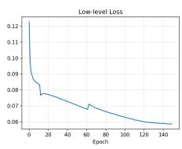

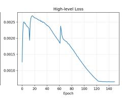

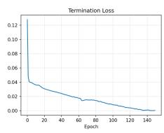

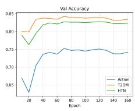

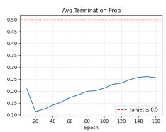  
Figure 5: Training dynamics over 150 epochs. From left to right: low-level intra-option Q-loss; high-level option-value loss; termination loss; validation accuracy by disease component (Action, T2DM, HTN); and average termination probability $\bar { \beta }$ (dashed red line $= \mathrm { t a r g e t } \le 0 . 5 )$ .

6.0 for T2DM). The combined concordance advantage is:

$$
\begin{array} { r l } & { \Delta ( \tau _ { \mathrm { S B P } } , \tau _ { \mathrm { A 1 C } } ) = \frac { 1 } { 2 } \Delta _ { \mathrm { H T N } } + \frac { 1 } { 2 } \Delta _ { \mathrm { T 2 D M } } , } \\ & { \qquad \Delta _ { c } = \hat { f } _ { c } ^ { \pi } - \hat { f } _ { c } ^ { \mu } . } \end{array}
$$

where $\hat { f } _ { c } ^ { \pi }$ and $\hat { f } _ { c } ^ { \mu }$ denote the fraction of transitions in which the agent policy π and the clinician behavior policy $\mu ,$ respectively, select $a _ { c } ^ { * }$

## Appendix G Training Curves

The HRL agent was trained for 150 epochs with a batch size of 256, using a discount factor of $\gamma = 0 . 9 7$ Separate learning rates were used for each component: $5 \times 1 0 ^ { - 5 }$ for the encoder and low-level heads, $2 \times 1 0 ^ { - 5 }$ for the high-level head, and $5 \times 1 0 ^ { - 6 }$ for the termination heads. The network contains 237,588 trainable parameters. A stratified prioritized replay bufer assigned initial priorities of 0.3 to “maintain” transitions and 1.5 to “active-change” transitions to counteract the natural class imbalance in clinical data (∼75 % of clinician decisions are maintain actions). Gradient norms are clipped to 1.0 for the encoder and Q-heads and to 0.5 for the termination heads to prevent early-exit collapse. The target network is updated by soft Polyak averaging after every step, and PER importance-sampling weights are annealed to 1.0 over 200,000 steps. Table 9 lists the values.

Figure 5 presents the learning dynamics. All three loss components decreased overall: the low-level intraoption Q-loss fell from 0.1226 to 0.0587; the high-level option-value loss from ≈ 0.0013 to 0.0006; and the termination loss from 0.1279 to 0.0004. Validation action accuracy improved from 66.9 % at epoch 1 to a peak of 75.3 % at epoch 70, stabilizing near 74 % at convergence. T2DM and HTN component accuracies converged to approximately 83 % and 82 %, respectively. The average termination probability $\bar { \beta }$ remained below 0.3.

## Appendix H Factored Action Hierarchical Option-Critic (FAHOC) with Action Masking Network Architecture

The main four components of the network architecture are as follows. All Linear layers are initialized with $\mathrm { P y }$ Torch default Kaiming uniform (weights and biases):

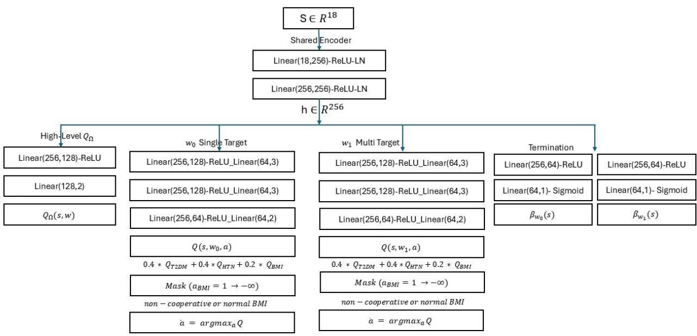  
Figure 6: Factored action hierarchical option-critic (FAHOC) framework network architecture. The shared encoder maps state $s \in \mathbb { R } ^ { 1 8 }$ to a 256-dimensional embedding h. Four parameter groups branch from h: the high-level head outputs $Q _ { \Omega } ( s , \omega )$ over the two options (ω0: Single-Target, ω1: Multi-Target); per-option factored heads decompose the intra-option Q-value as $Q ( s , \omega , a ) = 0 . 4 Q _ { \mathrm { t 2 d m } } + 0 . 4 Q _ { \mathrm { h t n } } + 0 . 2 Q _ { \mathrm { b m i } } \ ( \mathrm { E q . \ 2 1 } )$ an action mask sets $Q ( s , \omega , a ) = - \infty$ for $a _ { \mathrm { b m i } } { = } 1$ when the patient is non-cooperative or has normal BMI, preventing infeasible treatment selections; and per-option termination heads output $\beta _ { \omega } ( s ) \in ( 0 , 1 )$ via sigmoid. $\mathrm { L N } { = } \mathrm { L a y e r }$ Normalization; $\sigma = { \mathrm { S i g m o i d } }$

1. Shared encoder, $f _ { \boldsymbol { \theta } } \colon$ two blocks of Linear(ds, 256)–ReLU–LayerNorm, producing ${ \mathbf h } = f _ { \theta } ( s ) \in \mathbb { R } ^ { 2 5 6 }$ . The shared representation ensures that the high-level option selection and low-level treatment decisions are grounded in a common patient state embedding, reduce parameter count and enforce representational consistency in all heads. Layers use default scale $\gamma { = } 1$ and shift δ=0

2. High-level Q-head, critic $Q _ { \Omega } \mathrm { { : } }$ : Linear(256, 128)–ReLU–Linear(128, 2), output $Q _ { \Omega } ( s , \omega )$ for $\omega \in \{ 0 , 1 \}$ Formally, $Q _ { \Omega } ( s , \omega )$ is the expected discounted return of committing to option ω at state s and following $\phi _ { \omega }$ until $\beta _ { \omega }$ triggers termination.

$$
\begin{array} { r } { Q _ { \Omega } ( s , \omega ) : = \mathbb E [ \sum _ { t = 0 } ^ { \infty } \gamma ^ { t } r _ { t } \mid s _ { 0 } = s , \omega _ { 0 } = \omega , \pi _ { \omega } , \beta _ { \omega } ] . } \end{array}
$$

The greedy option is $\omega ^ { * } = \arg \operatorname* { m a x } \omega Q _ { \Omega } ( s , \omega )$

3. Factored intra-option, Q-heads $\{ Q _ { \mathrm { T 2 D M } } ^ { \omega } , Q _ { \mathrm { H T N } } ^ { \omega } , Q _ { \mathrm { B M I } } ^ { \omega } \} _ { \omega = 0 } ^ { 1 } \mathrm { . }$ three independent heads Linear(256, 64)–ReLU– Linear(64, k) with $k \in \{ 3 , 3 , 2 \}$ per option, giving

$$
\begin{array} { r l r } {  { Q ( s , \omega , a ) : = \sum _ { i } \lambda _ { i } Q _ { i } ^ { \omega } ( s , a _ { i } ) } } \\ & { } & { = 0 . 4 Q _ { \mathrm { T 2 D M } } ^ { \omega } ( s , a _ { \mathrm { T 2 D M } } ) + 0 . 4 Q _ { \mathrm { H T N } } ^ { \omega } ( s , a _ { \mathrm { H T N } } ) + 0 . 2 Q _ { \mathrm { B M I } } ^ { \omega } ( s , a _ { \mathrm { B M I } } ) . } \end{array}\tag{30}
$$

The weights $\lambda _ { i } \in \{ 0 . 4 , 0 . 4 , 0 . 2 \}$ reflect the relative clinical priority of glycaemic and blood-pressure control over BMI management, and ensure the BMI head receives an independent gradient signal rather than being dominated by stronger immediate reward from medication escalation. Algorithm 4 Appendix E provides pseudocode of factored action encoding and Q-Value composition. Appendix I establishes that the approximation error induced by our structural design is bounded.

4. Termination heads, $\{ \beta _ { \omega } \} _ { \omega = 0 } ^ { 1 } :$ Linear(256, 64)–ReLU–Linear(64, 1)–Sigmoid, $\beta _ { \omega } ( s ) \in ( 0 , 1 )$ , initialized near 0.5. At each state, $\beta _ { \omega } ( s )$ governs whether the current clinical strategy should persist or be re-evaluated. A high termination probability triggers option switching via the high-level critic which resembles the clinician’s judgment that a treatment strategy has run its course or is under-performing relative to the option-value baseline $V _ { \Omega } ^ { - } \left( s \right)$

## Appendix I Proofs

## Appendix I.1 Structural Properties: FAHOC Error Bound

In this appendix, we present proof of Theorems 1–4, lemmas, corollaries, and propositions based on assumptions presented in the manuscript 4. Throughout, $\mathbb { E } _ { s ^ { \prime } } [ \cdot ]$ abbreviates $\mathbb { E } _ { s ^ { \prime } \sim P ( \cdot \vert s , a ) } [ \cdot ]$ , and $V ^ { * } ( s ^ { \prime } ) : = \operatorname* { m a x } _ { a ^ { \prime } } Q ^ { * } ( s ^ { \prime } , a ^ { \prime } )$ $V _ { \mathrm { f a c } } ^ { * } ( s ^ { \prime } ) : = \operatorname* { m a x } _ { a ^ { \prime } } Q _ { \mathrm { f a c } } ^ { * } ( s ^ { \prime } , a ^ { \prime } )$

Bounded optimal Q-Function. The proof of Lemma 1 is follows:

Proof. The bound $\| Q ^ { * } \| _ { \infty } \leq R _ { \operatorname* { m a x } } / ( 1 - \gamma )$ follows directly from the definition of the Q-function as a discounted sum of future rewards. For any policy π and any $( s , a )$ ):

$$
\begin{array} { r l } & { \left| Q ^ { \pi } ( s , a ) \right| } \\ & { = \left| \mathbb { E } _ { \pi } \left[ \sum _ { t = 0 } ^ { \infty } \gamma ^ { t } r ( s _ { t } , a _ { t } ) \Big | s _ { 0 } = s , a _ { 0 } = a \right] \right| } \\ & { \leq \displaystyle \sum _ { t = 0 } ^ { \infty } \gamma ^ { t } \underbrace { \left\lfloor r ( s _ { t } , a _ { t } ) \right\rfloor } _ { \leq { R _ { \operatorname* { m a x } } } } } \\ & { \leq R _ { \operatorname* { m a x } } \displaystyle \sum _ { t = 0 } ^ { \infty } \gamma ^ { t } = \frac { R _ { \operatorname* { m a x } } } { 1 - \gamma } , } \end{array}\tag{31}
$$

where the last equality uses the geometric series identity: for $\gamma \in [ 0 , 1 )$

$$
\sum _ { t = 0 } ^ { \infty } \gamma ^ { t } = \operatorname* { l i m } _ { T \to \infty } \frac { 1 - \gamma ^ { T + 1 } } { 1 - \gamma } = \frac { 1 } { 1 - \gamma } ,\tag{32}
$$

since $\gamma ^ { T + 1 }  0$ as $T \to \infty$ . Taking the supremum over all policies π and all $( s , a )$ in (31) yields $\| Q ^ { * } \| _ { \infty } \leq$ Vmax.

## Global Factorization Error Bound

The Proof of Theorem 1 is as follows:

Proof. Since $Q ^ { * } = T Q ^ { * }$ and $Q _ { \mathrm { f a c } } ^ { * } = T _ { \mathrm { f a c } } Q _ { \mathrm { f a c } } ^ { * }$ , for any $( s , a )$

$$
\begin{array} { r l } & { Q ^ { * } ( s , a ) - Q _ { \mathrm { f a c } } ^ { * } ( s , a ) } \\ & { = \underbrace { ( T Q ^ { * } ) ( s , a ) - ( T _ { \mathrm { f a c } } Q ^ { * } ) ( s , a ) } _ { \mathrm { T e r m ~ I : ~ r e w a r d ~ m i s m a t c h } } } \\ & { \quad + \underbrace { ( T _ { \mathrm { f a c } } Q ^ { * } ) ( s , a ) - ( T _ { \mathrm { f a c } } Q _ { \mathrm { f a c } } ^ { * } ) ( s , a ) } _ { \mathrm { T e r m ~ I I : ~ B e l l m a n ~ c o n t r a c t i o n } } . } \end{array}\tag{33}
$$

Term I. By (7)–(9), the γ-weighted future values are identical and cancel:

$$
\begin{array} { c l } { { ( T Q ^ { * } ) ( s , a ) - ( T _ { \mathrm { f a c } } Q ^ { * } ) ( s , a ) ~ = ~ r ( s , a ) - r _ { \mathrm { a d d } } ( s , a ) ~ = ~ \eta ( s , a ) , } } & { { } } \\ { { { \vert \mathrm { T e r m ~ I } \vert \le \varepsilon _ { r } . } } } & { { } } \end{array}\tag{34}
$$

Term $I I . ~ T _ { \mathrm { f a c } }$ uses the same $r _ { \mathrm { a d d } }$ for both arguments, so reward terms cancel:

$$
\lvert \mathrm { T e r m ~ I I } \rvert \leq \gamma \mathbb { E } _ { s ^ { \prime } } \big [ \left. V ^ { * } ( s ^ { \prime } ) - V _ { \mathrm { f a c } } ^ { * } ( s ^ { \prime } ) \right. \big ] \leq \gamma \left. \left. Q ^ { * } - Q _ { \mathrm { f a c } } ^ { * } \right. \right. _ { \infty } .\tag{35}
$$

using $| \operatorname* { m a x } _ { x } f ( x ) - \operatorname* { m a x } _ { x } g ( x ) | \leq \| f - g \| _ { \infty }$ . Combining I & II. Taking absolute values in (33) and applying both bounds:

$$
\left| Q ^ { * } ( s , a ) - Q _ { \mathrm { f a c } } ^ { * } ( s , a ) \right| \ \leq \ \varepsilon _ { r } + \gamma \ \left\| Q ^ { * } - Q _ { \mathrm { f a c } } ^ { * } \right\| _ { \infty } .\tag{36}
$$

Taking the supremum over all $( s , a ) \in S \times A$ and rearranging (using $1 - \gamma > 0 )$ :

$$
\begin{array} { r l } & { \| Q ^ { * } - Q _ { \mathrm { f a c } } ^ { * } \| _ { \infty } \leq \varepsilon _ { r } + \gamma \left\| Q ^ { * } - Q _ { \mathrm { f a c } } ^ { * } \right\| _ { \infty } } \\ & { \implies \left\| Q ^ { * } - Q _ { \mathrm { f a c } } ^ { * } \right\| _ { \infty } \leq \frac { \varepsilon _ { r } } { 1 - \gamma } . \quad \sqcap } \end{array}\tag{37}
$$

## Corollary 1 for option-restricted bound proof is follows:

Proof. Restrict the proof of Theorem 1 to the subdomain $\mathcal { T } _ { \omega } \times \mathcal { A } _ { \omega }$ and replace $\varepsilon _ { r }$ with the tighter quantity $\varepsilon _ { r } ^ { \omega }$ . All algebraic steps carry through verbatim within this subdomain. □

## Theorem 2 proof under Assumptions 1–3, is provided as follows:

Proof. Fix $( s , a ) \in \mathcal { T } _ { \omega } \times \mathcal { A } _ { \omega }$ and let $\delta ^ { k } : = a ^ { k } - \bar { a } _ { \omega } ^ { k }$ . Apply the multivariate integral Taylor remainder ([55]) to $r ( s , \cdot )$ around $\bar { a } _ { \omega }$ :

$$
\begin{array} { l } { { r ( s , a ) = r ( s , \bar { a } _ { \omega } ) + \displaystyle \sum _ { k }  \frac { \partial r } { \partial a ^ { k } } | _ { \bar { a } } \delta ^ { k } } } \\ { { \displaystyle ~ + \frac { 1 } { 2 } \sum _ { k }  \frac { \partial ^ { 2 } r } { \partial ( a ^ { k } ) ^ { 2 } } | _ { \bar { a } } ( \delta ^ { k } ) ^ { 2 } } } \\ { { \displaystyle ~ + 2 \int _ { 0 } ^ { 1 } ( 1 - t ) \sum _ { k \ < \ell } \frac { \partial ^ { 2 } r } { \partial a ^ { k } \partial a ^ { \ell } } | _ { \bar { a } + t \delta } \delta ^ { k } \delta ^ { \ell } d t . } } \end{array}\tag{38}
$$

The additive reward $\begin{array} { r } { r _ { \mathrm { a d d } } ( s , a ) = \sum _ { k } r _ { k } ( s , a ^ { k } ) } \end{array}$ reproduces the constant, all linear, and all per-domain quadratic terms in (38); these cancel in $\eta = r - r _ { \mathrm { a d d } }$ . Only the cross-domain integral remains:

$$
\eta ( s , a ) ~ = ~ 2 \int _ { 0 } ^ { 1 } ( 1 - t ) \sum _ { k < \ell } \frac { \partial ^ { 2 } { r } } { \partial { a ^ { k } } \partial { a ^ { \ell } } } \Big | _ { \bar { a } + t \delta } \delta ^ { k } \delta ^ { \ell } \mathrm { d } t .\tag{39}
$$

Taking absolute values, applying Assumption 3 to bound the Hessian, using $| \delta ^ { k } | | \delta ^ { \ell } | \leq \Delta _ { \omega } ^ { 2 }$ , and evaluating $\begin{array} { r l r } { 2 \int _ { 0 } ^ { 1 } ( 1 - t ) \mathrm { d } t = 1 \colon | \eta ( s , a ) | } & { { } \le } & { \sum _ { k < \ell } \Gamma _ { k \ell } \cdot \Delta _ { \omega } ^ { 2 } = \Gamma _ { \mathrm { a l l } } \cdot \Delta _ { \omega } ^ { 2 } } \end{array}$ . Taking the sup over $\mathcal { T } _ { \omega } \times \mathcal { A } _ { \omega }$ gives (15); substituting into Theorem 1 gives (16). □

## Proof of Theorem 3 is provided as follows:

Proof. Both $Q _ { \mathrm { f a c } } ^ { * , \omega }$ and ${ \hat { Q } } _ { F } ^ { \omega }$ are fixed points of operators using $r _ { \mathrm { a d d } }$ (equations (9) and (10) respectively), so the reward terms cancel exactly in their Bellman diference. For any $( s , a ) \in \mathcal { T } _ { \omega } \times \mathcal { A } _ { \omega }$ , applying the fixed-point identities $Q _ { \mathrm { f a c } } ^ { * , \omega } = T _ { \mathrm { f a c } } Q _ { \mathrm { f a c } } ^ { * , \omega }$ and $\hat { Q } _ { F } ^ { \omega } \approx T _ { \mathcal { F } } \hat { Q } _ { F } ^ { \omega }$ and adding and subtracting $\gamma \mathbb { E } _ { s ^ { \prime } \sim P ( \cdot | s , a ) } [ \hat { V } _ { F } ^ { \omega } ( s ^ { \prime } ) ]$ :

$$
\begin{array} { r l } & { Q _ { \mathrm { f a c } } ^ { * , \omega } ( s , a ) - \hat { Q } _ { F } ^ { \omega } ( s , a ) } \\ & { = \underbrace { \gamma \mathbb { E } _ { s ^ { \prime } } \Big [ V _ { \mathrm { f a c } } ^ { * , \omega } ( s ^ { \prime } ) - \hat { V } _ { F } ^ { \omega } ( s ^ { \prime } ) \Big ] } _ { \mathrm { T e r m ~ I : ~ p r o p a g a t i o n ~ o f ~ v a l u e ~ e r r o r } } } \\ & { + \underbrace { \xi ( s , a ) } _ { \mathrm { T e r m ~ I I : ~ a r c h i l e c t u r e ~ r e s i d u a l } } , } \end{array}\tag{40}
$$

where $\begin{array} { r } { V _ { \mathrm { f a c } } ^ { * , \omega } ( s ^ { \prime } ) : = \operatorname* { m a x } _ { a ^ { \prime } } Q _ { \mathrm { f a c } } ^ { * , \omega } ( s ^ { \prime } , a ^ { \prime } ) , \hat { V } _ { F } ^ { \omega } ( s ^ { \prime } ) : = \operatorname* { m a x } _ { a ^ { \prime } } \hat { Q } _ { F } ^ { \omega } ( s ^ { \prime } , a ^ { \prime } ) } \end{array}$ , and the architecture residual

$$
\xi ( s , a ) : = \gamma \mathbb { E } _ { s ^ { \prime } \sim P ( \cdot | s , a ) } \big [ \hat { V } _ { F } ^ { \omega } ( s ^ { \prime } ) \big ] - \hat { Q } _ { F } ^ { \omega } ( s , a )\tag{41}
$$

measures how far $\hat { Q } _ { F } ^ { \omega }$ deviates from being a fixed point of the unconstrained operator $T _ { \mathrm { f a c } }$ , arising solely because the additive architecture $\begin{array} { r } { \mathcal { F } = \{ \tilde { \sum _ { k } } w _ { k } f _ { k } ( s , a ^ { k } ) \} } \end{array}$ cannot represent cross-action interactions in the value function induced by the transition dynamics $P ( \cdot | s , a )$ . Step 1: Taylor expansion of $\xi ( s , a )$

Let $\delta ^ { k } : = a ^ { k } - \bar { a } _ { \omega } ^ { k }$ and $g ( s ^ { \prime } ) : = \hat { V } _ { F } ^ { \omega } ( s ^ { \prime } )$ . By Assumption 4(ii), applying the multivariate integral Taylor remainder [55] to $a \mapsto \mathbb { E } _ { s ^ { \prime } \sim \tilde { P } ( \cdot \vert s , a ) } [ g ( s ^ { \prime } ) ]$ around $\bar { a } _ { \omega }$ and noting that the additive architecture ${ \hat { Q } } _ { F } ^ { \omega } ( s , a ) =$ $\begin{array} { r } { \sum _ { k } w _ { k } f _ { k } ( s , a ^ { k } ) } \end{array}$ exactly reproduces all constant, per-domain linear, and per-domain quadratic terms in the expansion (each head $f _ { k }$ depends only on $a ^ { k }$ , so no $\delta ^ { k } \delta ^ { \ell }$ cross-term with $k \neq \ell$ appears), these terms cancel in $\xi ( s , a )$ , leaving only the cross-domain remainder. Writing $\begin{array} { r } { H _ { k \ell } ( a ) : = \frac { \partial ^ { 2 } } { \partial a ^ { k } \partial a ^ { \ell } } \mathbb { E } _ { s ^ { \prime } \sim \tilde { P } ( \cdot | s , a ) } [ g ( s ^ { \prime } ) ] } \end{array}$ for the cross-derivative,:

$$
\begin{array} { l } { \displaystyle \xi ( s , a ) = 2 \gamma \int _ { 0 } ^ { 1 } ( 1 - t ) S _ { \delta } ( t ) \mathrm { d } t , } \\ { \displaystyle S _ { \delta } ( t ) : = \sum _ { k < \ell } H _ { k \ell } ( \bar { a } + t \delta ) \delta ^ { k } \delta ^ { \ell } . } \end{array}\tag{42}
$$

Step 2: Bound $| \xi ( s , a ) |$

Normalize g by its sup-norm: define $\tilde { g } : = g / \| g \| _ { \infty } , \operatorname { s o } \tilde { g } : S \to [ - 1 , 1 ]$ . Since $\begin{array} { r } { g ( s ^ { \prime } ) = \hat { V } _ { F } ^ { \omega } ( s ^ { \prime } ) = \operatorname* { m a x } _ { a ^ { \prime } } \hat { Q } _ { F } ^ { \omega } ( s ^ { \prime } , a ^ { \prime } ) } \end{array}$ and $\| \hat { Q } _ { F } ^ { \omega } \| _ { \infty } \leq V ^ { \operatorname* { m a x } }$ (Assumption 1), we have $\| g \| _ { \infty } \leq V ^ { \mathrm { m a x } }$ . Rewriting (42) in terms of g˜ and applying the definition of $\Phi _ { k \ell }$ (equation (6)) from Assumption 4:

Rewriting (42) in terms of g˜ (denote the corresponding sum by $\tilde { S } _ { \delta } ( t ) )$ and applying the definition of $\Phi _ { k \ell }$ (equation (6)) from Assumption 4 together with $| \delta ^ { k } | | \delta ^ { \ell } | \leq \Delta _ { \omega } ^ { 2 }$ , we have $\begin{array} { r } { | \tilde { S } _ { \delta } ( t ) | \le \sum _ { k < \ell } \Phi _ { k \ell } \Delta _ { \omega } ^ { 2 } = \Phi _ { \mathrm { a l l } } \Delta _ { \omega } ^ { 2 } } \end{array}$ hence

$$
\begin{array} { r l } & { \displaystyle \left. \xi ( s , a ) \right. \leq 2 \gamma \left. g \right. \infty \int _ { 0 } ^ { 1 } ( 1 - t ) \left. \tilde { S } _ { \delta } ( t ) \right. \mathrm d t } \\ & { \quad \leq 2 \gamma V ^ { \operatorname* { m a x } } \Phi _ { \mathrm { a l l } } \Delta _ { \omega } ^ { 2 } \underbrace { \int _ { 0 } ^ { 1 } ( 1 - t ) \mathrm d t } _ { = 1 / 2 } } \\ & { \quad = \gamma V ^ { \operatorname* { m a x } } \Phi _ { \mathrm { a l l } } \Delta _ { \omega } ^ { 2 } . } \end{array}\tag{43}
$$

Step 3: Banach fixed-point contraction.

Return to (40) and bound Term I. Applying the standard max-inequality $\begin{array} { r } { | \operatorname* { m a x } _ { a ^ { \prime } } f ( s ^ { \prime } , a ^ { \prime } ) - \operatorname* { m a x } _ { a ^ { \prime } } g ( s ^ { \prime } , a ^ { \prime } ) | \leq } \end{array}$ $\| f - g \| _ { \infty }$ pointwise in $s ^ { \prime } { : }$

$$
\begin{array} { r l } & { \left| \mathrm { T e r m ~ I } \right| \leq \gamma \mathbb { E } _ { s ^ { \prime } \sim P ( \cdot \vert s , a ) } \Bigl [ \left\| Q _ { \mathrm { f a c } } ^ { * , \omega } - \hat { Q } _ { F } ^ { \omega } \right\| _ { \infty } \Bigr ] } \\ & { = \gamma \left\| Q _ { \mathrm { f a c } } ^ { * , \omega } - \hat { Q } _ { F } ^ { \omega } \right\| _ { \infty } . } \end{array}\tag{44}
$$

Combining (40), (44), and (43), then taking the supremum over all $( s , a ) \in \mathcal { T } _ { \omega } \times \mathcal { A } _ { \omega }$

$$
\begin{array} { r l } & { \left. Q _ { \mathrm { f a c } } ^ { * , \omega } - \hat { Q } _ { F } ^ { \omega } \right. _ { \infty } \leq \gamma \left. Q _ { \mathrm { f a c } } ^ { * , \omega } - \hat { Q } _ { F } ^ { \omega } \right. _ { \infty } } \\ & { \quad + \gamma \cdot V ^ { \operatorname* { m a x } } \cdot \Phi _ { \mathrm { a l l } } \cdot \Delta _ { \omega } ^ { 2 } . } \end{array}\tag{45}
$$

Since $\gamma \in [ 0 , 1 )$ , rearranging (45) with $1 - \gamma > 0 ;$

$$
\begin{array} { r l } { ( 1 - \gamma ) \left. Q _ { \mathrm { f a c } } ^ { * , \omega } - \hat { Q } _ { F } ^ { \omega } \right. _ { \infty } \leq \gamma \cdot V ^ { \operatorname* { m a x } } \cdot \Phi _ { \mathrm { a l l } } \cdot \Delta _ { \omega } ^ { 2 } } & { \Longrightarrow } \\ { \left. Q _ { \mathrm { f a c } } ^ { * , \omega } - \hat { Q } _ { F } ^ { \omega } \right. _ { \infty } \leq } & { \frac { \gamma \cdot V ^ { \operatorname* { m a x } } \cdot \Phi _ { \mathrm { a l l } } \cdot \Delta _ { \omega } ^ { 2 } } { 2 ( 1 - \gamma ) } , } \end{array}\tag{46}
$$

where the factor $\frac { 1 } { 2 }$ on the right-hand side of (46) originates from the integral $\begin{array} { r } { \int _ { 0 } ^ { 1 } ( 1 - t ) \mathrm { d } t = \frac { 1 } { 2 } } \end{array}$ evaluated in Step 2 (43), which reduces the cross-domain coeficient by half. This establishes (17).

Total error bound. Proof of Corollary 2 is follows:

Proof. Combine bound (18). By the triangle inequality applied to (11):

$$
\begin{array} { r l } & { \ \left\| Q ^ { * , \omega } - \hat { Q } _ { F } ^ { \omega } \right\| _ { \infty } } \\ & { ~ \leq \underbrace { { \left\| Q ^ { * , \omega } - Q _ { \mathrm { f a c } } ^ { * , \omega } \right\| _ { \infty } } } _ { \mathrm { b y ~ ( 1 6 ) } } + \underbrace { { \left\| Q _ { \mathrm { f a c } } ^ { * , \omega } - \hat { Q } _ { F } ^ { \omega } \right\| _ { \infty } } } _ { \mathrm { b y ~ ( 1 7 ) } } } \\ & { ~ \leq \frac { \Gamma _ { \mathrm { a l l } } \cdot \Delta _ { \omega } ^ { 2 } } { 1 - \gamma } + \frac { \gamma \cdot V ^ { \operatorname* { m a x } } \cdot \Phi _ { \mathrm { a l l } } \cdot \Delta _ { \omega } ^ { 2 } } { 2 ( 1 - \gamma ) } , } \end{array}\tag{47}
$$

which is (18).

## Appendix I.2 Cooperation Value Dominance

In this section we present proof of Theorems 4 and Proposition1 based on assumptions presented in the manuscript. The proof of Theorem 4 is provided as follows:

Proof. Let $\Pi ^ { c } : = \{ \pi : \pi ( s ^ { \prime } ) \in \mathcal A _ { c } ( s ^ { \prime } ) \forall s ^ { \prime } \in \mathcal S \}$ be the set of policies feasible under cooperation status c. We have: $\mathcal { A } _ { 0 } ( s ^ { \prime } ) \subseteq \mathcal { A } _ { 1 } ( s ^ { \prime } )$ for every $s ^ { \prime } ,$ , so any policy in $\Pi ^ { 0 }$ is also in $\Pi ^ { 1 }$ , i.e. $\Pi ^ { 0 } \subseteq \Pi ^ { 1 }$ . Therefore, taking the supremum in (4.2) over a larger set:

$$
\begin{array} { r l } & { V ^ { * } ( s ; 1 ) = \displaystyle \operatorname* { s u p } _ { \pi \in \Pi ^ { 1 } } V ^ { \pi } ( s ) } \\ & { \qquad \quad \ge \displaystyle \operatorname* { s u p } _ { \pi \in \Pi ^ { 0 } } V ^ { \pi } ( s ) = V ^ { * } ( s ; 0 ) . \quad \bigsqcup } \end{array}\tag{48}
$$

## Appendix I.2.1 Conditions for Strict Superiority

## Proposition 1 proof:

Proof. Let $\pi ^ { 0 , * } \in \Pi ^ { 0 }$ be optimal under $c = 0$ and let $p ^ { * } > 0$ be the probability of reaching $s ^ { * }$ at step $t \geq 0$ under $\pi ^ { 0 , * }$ . Define a modified policy $\tilde { \pi } \in \Pi ^ { 1 }$ that agrees with $\pi ^ { 0 , * }$ everywhere except at $s ^ { * }$ , where it selects $a ^ { + }$ from Definition 1. Then, applying the performance-diference identity:

$$
\begin{array} { r l } & { V ^ { \tilde { \pi } } ( s _ { 0 } ) = V ^ { \pi ^ { 0 , * } } ( s _ { 0 } ) + p ^ { * } \gamma ^ { t } \Xi ( s ^ { * } ) } \\ & { \phantom { x x x x x x x x x x x x x x x x x x x x x x x x x x x x x x x x x x x x x x x } } \\ & { \phantom { x x x x x x x x x x x x x x x x x x x x x x x x } \textstyle \left. + O ( \gamma ^ { t + 1 } ) , \right. } \\ & { \Xi ( s ^ { * } ) : = \mathbb { E } _ { s ^ { \prime } \sim P ( \cdot \vert s ^ { * } , a ^ { + } ) } \bigl [ V ^ { * } ( s ^ { \prime } ; 1 ) \bigr ] } \\ & { \phantom { x x x x x x x x x x x x x x x x x } \left. - \mathbb { E } _ { s ^ { \prime } \sim P ( \cdot \vert s ^ { * } , a ^ { - } ) } \bigl [ V ^ { * } ( s ^ { \prime } ; 1 ) \bigr ] \right. . } \end{array}\tag{49}
$$

Since $p ^ { * } > 0 , \gamma ^ { t } > 0$ , and condition (1) $\mathrm { y i e l d s } \Xi ( s ^ { * } ) > 0 _ { : }$ , we have $V ^ { \tilde { \pi } } ( s _ { 0 } ) > V ^ { * } ( s _ { 0 } ; 0 )$

$$
\mathrm { A s } ~ \tilde { \pi } \in \Pi ^ { 1 } \colon V ^ { * } ( s _ { 0 } ; 1 ) ~ \geq ~ V ^ { \tilde { \pi } } ( s _ { 0 } ) ~ > ~ V ^ { * } ( s _ { 0 } ; 0 ) .
$$

## Appendix J Numerical Verification of the Global Factorization Bound

## Appendix J.1 Estimating the Transition Cross-Interaction Coeficient

The factored Bellman operator decomposes actions into three domains: $a ^ { \mathrm { T 2 D M } } \in \{ - 1 , 0 , 1 \} , a ^ { \mathrm { H T N } } \in \{ - 1 , 0 , 1 \}$ and $a ^ { \mathrm { B M I } } \in \{ 0 , 1 \}$ . We quantify $\Phi _ { \mathrm { a l l } }$ via the second-order mixed finite diference applied to the empirical transition operator [45, 56]. For each domain pair $( k , \ell )$ with $k < \ell$ and base action $a \in { \mathcal { A } }$ , the estimator is:

$$
\hat { \Phi } _ { k \ell } ( a , d ) \ = \ \frac { | \left( \hat { E } _ { k \ell } - \hat { E } _ { k 0 } - \hat { E } _ { 0 \ell } + \hat { E } _ { 0 0 } \right) _ { d } | } { h _ { k } h _ { \ell } } ,\tag{50}
$$

where $\hat { E } _ { 0 0 } , \hat { E } _ { k 0 } , \hat { E } _ { 0 \ell } , \hat { E } _ { k \ell }$ are empirical mean next states under actions $a , a { + } e _ { k } , a { + } e _ { \ell } , a { + } e _ { k } { + } e _ { \ell }$ respectively, d ranges over clinical dimensions $\mathcal { D } _ { s } = \{ \mathrm { S B P , A 1 C , B M I , e G F R } \}$ , and step sizes are $h _ { \mathrm { T 2 D M } } = h _ { \mathrm { H T N } } = 1$ $h _ { \mathrm { B M I } } = 0 . 5$ (increments clamped to valid ranges). Setting $\begin{array} { r } { \hat { \Phi } _ { k \ell } = \operatorname* { s u p } _ { a , d } | \hat { \Phi } _ { k \ell } ( a , d ) | } \end{array}$ and summing over pairs gives $\begin{array} { r } { \hat { \Phi } _ { \mathrm { a l l } } = \sum _ { k < \ell } \hat { \Phi } _ { k \ell } } \end{array}$ . Since A is a finite discrete grid, all four action vertices in (50) are observed; the estimator is an exact finite diference with error $O _ { p } ( n ^ { - 1 / 2 } )$ , and no discretization bias arises beyond empirical mean estimation (Proposition 2). The global estimator marginalises over all 414,880 training transitions; a state-binned variant repeats the procedure within $K = 3 0$ k-means clusters (cells with fewer than 20 transitions skipped) and reports the bin-level supremum. Uncertainty is quantified by $B = 5 0 0$ bootstrap resamples drawing 80% of transitions with replacement, yielding percentile 95% CIs for each pair.

Proposition 2 (Finite-diference consistency). Under Assumption $^ { 4 , }$ for fixed s, a and bounded measurable $f : { \mathcal { S } } \to [ - 1 , 1 ] , { \mathrm { ~ } } l e t ~ h ( a ) : = \mathbb { E } _ { s ^ { \prime } \sim \hat { P } ( \cdot \vert s , a ) } [ f ( s ^ { \prime } ) ] . T h e n ~ \hat { \Phi } _ { k \ell } ( s , a ) = \partial ^ { 2 } h / \partial a ^ { k } \partial a ^ { \ell } | _ { a } + O ( h _ { k } + h _ { \ell } ) + O _ { p } ( n ^ { - 1 / 2 } ) .$

Proof. Since h is $C ^ { 2 }$ on U (Assumption 4(ii)), applying the univariate Taylor theorem twice—first in direction $e _ { k }$ at a and at $a + h _ { \ell } e _ { \ell }$ , then subtracting and expanding the resulting diference of first derivatives in direction eℓ—gives $h ( a + h _ { k } e _ { k } + h _ { \ell } e _ { \ell } ) - h ( a + h _ { k } e _ { k } ) - h ( a + h _ { \ell } e _ { \ell } ) + h ( a ) = h _ { k } h _ { \ell } \bar { \partial } ^ { 2 } h / \partial a ^ { k } \partial a ^ { \ell } | _ { a } + O ( h _ { k } ^ { 2 } h _ { \ell } + h _ { k } h _ { \ell } ^ { 2 } )$ . Dividing by $h _ { k } h _ { \ell }$ and replacing true expectations with empirical means adds the $O _ { p } ( n ^ { - 1 / 2 } )$ CLT term. □

Results. Table 10 summarises the estimates. The worst-case dimension is BMI for all three pairs, and the worst-case base actions are (aT2DM, aHTN, aBMI) $\in \{ ( 1 , 1 , 1 ) , ( 0 , 2 , 0 ) , ( 2 , 1 , 0 ) \}$ }. Bootstrap CIs are stable (coeficient of variation below 12%); the large global-to-binned gap reflects finite-sample variance within bins rather than genuine state-dependence.

Table 10: Empirical $\hat { \Phi } _ { k \ell }$ from 414,880 training transitions (B = 500 bootstrap resamples, 80% subsample).
<table><tr><td>Domain Pair</td><td>Global</td><td>Binned</td><td>Bootstrap mean</td><td>95% CI</td></tr><tr><td>T2DM × HTN</td><td>0.2629</td><td>0.6948</td><td>0.2758</td><td>[0.246, 0.311]</td></tr><tr><td> $\mathrm { T 2 D M } \times \mathrm { B M I }$ </td><td>0.3351</td><td>1.2150</td><td>0.3739</td><td>[0.304, 0.477]</td></tr><tr><td> $\mathrm { H T N } \times \mathrm { B M I }$ </td><td>0.4275</td><td>1.0531</td><td>0.4380</td><td>[0.361, 0.510]</td></tr><tr><td> $\hat { \Phi } _ { \mathrm { a l l } }$ </td><td>1.0255</td><td>2.9630</td><td>1.0877</td><td>[0.911, 1.298]</td></tr></table>

## Appendix J.2 Computing the Bound

With $\hat { \Phi } _ { \mathrm { a l l } } = 1 . 0 2 5 5 , \gamma = 0 . 9 7$ , and $V _ { \mathrm { m a x } } = R _ { \mathrm { m a x } } / ( 1 - \gamma ) = 3 3 . 3 3$ , Theorem 3 gives:

$$
\left. Q ^ { * , \omega } - \hat { Q } _ { F } ^ { \omega } \right. _ { \infty } \le \frac { 0 . 9 7 \times 3 3 . 3 3 \times 1 . 0 2 5 } { 2 \times 0 . 0 3 } \approx 5 5 2 . 6 ,\tag{51}
$$

with bootstrap 95% CI [490.3, 700.5]. This is a worst-case bound operating at the supremum over all state–action pairs; the reward-level bound $\varepsilon _ { r } / ( 1 - \gamma )$ from Theorem 1 is complementary and tighter whenever $\varepsilon _ { r }$ is small, since in our setting $\Gamma _ { \mathrm { a l l } } = 0$ and the dominant error is architectural rather than reward-level.

## Appendix K Strict superiority criteria level count

BMI-beneficial states satisfy three criteria simultaneously: cooperative $( c = 1 )$ , overweight/obese $\left( b ( s ^ { * } ) > 0 \right)$ BMI≥ $2 5 \mathrm { k g } / \mathrm { m } ^ { 2 } )$ , and uncontrolled (A1C> 7.0% or SBP> 130 mmHg), so that p′t (Appendix A) and $\Delta Q _ { t }$ (22) jointly satisfy condition (1).

Table 11 reports counts verified on all three splits from unscaled clinical values recovered via the fitted preprocessor. The full BMI-beneficial set C1∩C2∩C3 covers 190,904 transitions (32.1%) across 18,761 patients (39.7%), stable at 32.1%, 32.7%, and 31.5% across splits, confirming a structurally stable subpopulation. The mean reward within C1∩C2∩C3 (0.028–0.033) is strictly positive and well above the unconditional mean (−0.015), with positive-reward transitions rising from 20.5%–20.6% overall to 28.3%–28.6% in the beneficial subset, confirming condition (1) empirically and establishing that Proposition 1 holds across nearly 40% of patients and one-third of all encounters.

Table 11: BMI-beneficial state counts. C1: cooperative (c = 1); C2: overweight/obese (BMI≥ 25 kg/m2); C3: uncontrolled (A1C>7.0% or SBP>130 mmHg).
<table><tr><td></td><td>Train</td><td>Val</td><td>Test</td><td>All</td></tr><tr><td>Transitions / Patients</td><td>414,880 33,108</td><td>90,231 /7,095</td><td>89,556 /7,095</td><td>594,667 47,298</td></tr><tr><td>C1 cooperative</td><td>264,587 (63.8%)</td><td>58,567 (64.9%)</td><td>56,534 (63.1%)</td><td>379,688 (63.9%)</td></tr><tr><td>C2 overweight/obese</td><td>334,992 (80.7%)</td><td>72,986 (80.9%)</td><td>71,612 (80.0%)</td><td>479,590 (80.7%)</td></tr><tr><td>C3 uncontrolled</td><td>298,369 (71.9%)</td><td>64,674 (71.7%)</td><td>64,726 (72.3%)</td><td>427,769 (71.9%)</td></tr><tr><td>C1∩C2</td><td>184,765 (44.5%)</td><td>41,368 (45.8%)</td><td>38,628 (43.1%)</td><td>264,761 (44.5%)</td></tr><tr><td>C1∩C2∩C3</td><td>133,139 (32.1%)</td><td>29,520 (32.7%)</td><td>28,245 (31.5%)</td><td>190,904 (32.1%)</td></tr><tr><td>Patients C1∩C2</td><td>14,212 (42.9%)</td><td>3,140 (44.3%)</td><td>3,012 (42.5%)</td><td>20,364 (43.1%)</td></tr><tr><td>Patients C1∩C2∩C3</td><td>13,076 (39.5%)</td><td>2,898 (40.8%)</td><td>2,787 (39.3%)</td><td>18,761 (39.7%)</td></tr><tr><td>Mean reward | C1∩C2∩C3</td><td>0.0302</td><td>0.0327</td><td>0.0287</td><td></td></tr><tr><td>% positive reward | C1∩C2∩C3</td><td>28.4%</td><td>28.6%</td><td>28.3%</td><td></td></tr></table>