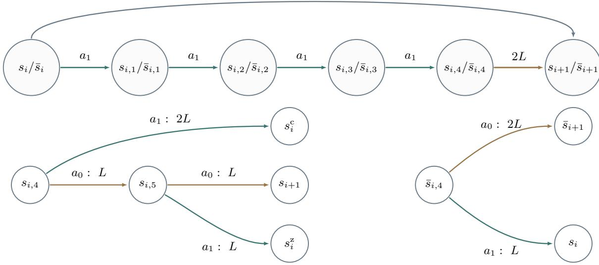
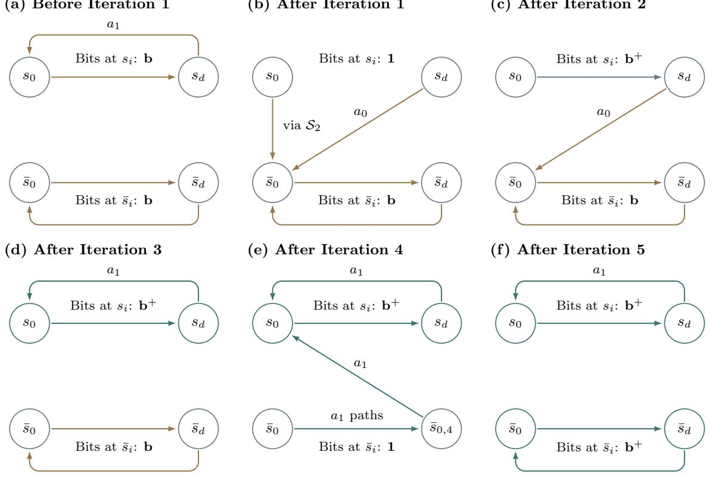

# Policy Iteration Is Not Strongly Polynomial for Deterministic Markov Decision Processes: The Price of Algorithmic Anarchy

Han Zhong∗ Yinyu Ye†

## Abstract

We establish an exponential iteration lower bound in the number of states for Howard’s policy iteration on deterministic discounted Markov decision processes, with at most two actions per state. This rules out strong polynomiality of Howard’s policy iteration when the discount factor is part of the input and yields an exponential separation from the simplex method with Dantzig’s pivoting rule, which is proved to be strongly polynomial on this class. Even when each reward is restricted to logarithmic bit length, we obtain a stretched-exponential iteration lower bound. The gap between Howard’s decentralized and simultaneous selfish improvements and Dantzig’s coordinated selection of a single action with the largest gain across all states reveals a “price” of algorithmic anarchy.

Keywords. deterministic Markov decision processes; policy iteration; strongly polynomial algorithms.

## 1 Introduction

Markov decision processes (MDPs) provide a standard framework for sequential decision-making and reinforcement learning (Puterman, 1994; Sutton and Barto, 2018). A deterministic discounted MDP has a finite state space $s$ and a nonempty finite action set $A _ { s }$ at each state s. Taking action $a \in \mathcal A _ { s }$ yields a reward $r ( s , a ) \in \mathbb { Q }$ and moves to the successor state $f ( s , a ) \in S$ . Future rewards are discounted by a common factor $0 < \gamma < 1$ . Write $N = | S |$ . A policy π selects an action $\pi ( s ) \in { \mathcal { A } } _ { s }$ at each state. Its value $V ^ { \pi } ( s )$ is the total discounted reward obtained from s by following π. The objective is to find a policy maximizing these values for all initial states. The action value $Q ^ { \pi } ( s , a )$ is the discounted return from using a once and then following π. We have

$$
V ^ { \pi } ( s ) = r ( s , \pi ( s ) ) + \gamma V ^ { \pi } ( f ( s , \pi ( s ) ) ) , \qquad Q ^ { \pi } ( s , a ) = r ( s , a ) + \gamma V ^ { \pi } ( f ( s , a ) ) .\tag{1.1}
$$

Policy iteration, also known as Howard’s policy iteration (Howard, 1960), is a foundational algorithm for solving MDPs. Let $\pi _ { 0 }$ be the initial policy and $\pi _ { t }$ the policy after t iterations. Given $\pi _ { t } .$ , the algorithm computes $V ^ { \pi _ { t } }$ and uses the corresponding action values $Q ^ { \pi _ { t } }$ from (1.1) to select $\pi _ { t + 1 } \colon$

$$
\pi _ { t + 1 } ( s ) \in \mathop { \arg \operatorname* { m a x } } _ { a \in \mathcal { A } _ { s } } Q ^ { \pi _ { t } } ( s , a ) , \qquad \forall s \in \mathcal { S } .\tag{1.2}
$$

If $\pi _ { t } ( s )$ attains the maximum in (1.2), we set $\pi _ { t + 1 } ( s ) = \pi _ { t } ( s )$ . Otherwise, we choose the first maximizer in a fixed ordering of $\mathcal { A } _ { s }$ . The algorithm stops when $\pi _ { t + 1 } = \pi _ { t }$ , which holds if and only if $\pi _ { t }$ is optimal.

For a fixed discount factor, policy iteration is strongly polynomial (Ye, 2011; Scherrer, 2016), a guarantee previously established for an interior-point algorithm (Ye, 2005). These bounds for policy iteration depend on the discount and therefore do not establish strong polynomiality when the discount is part of the input. Whereas Howard’s policy iteration makes simultaneous local improvements, the simplex method with Dantzig’s pivoting rule updates only one state per iteration, selecting an action with the largest positive gain $Q ^ { \pi } ( s , a ) - V ^ { \pi } ( s )$ across all states (Ye, 2011). For deterministic MDPs, Post and Ye (2015) prove that this method is strongly polynomial independently of the discount. Whether Howard’s policy iteration is strongly polynomial on deterministic MDPs has remained open (Goenka et al., 2026).

Exponential lower bounds for policy iteration are known for general MDPs (Fearnley, 2010; Hollanders et al., 2012). These constructions use stochastic transitions and a number of actions per state that grows with the instance size. Hansen and Zwick (2010) and Hansen (2012) establish quadratic iteration lower bounds for deterministic MDPs. For MDPs with a constant number of actions per state, no superpolynomial lower bound for Howard’s policy iteration was previously known, even with stochastic transitions (Mukherjee and Kalyanakrishnan, 2025).

We establish an exponential iteration lower bound for deterministic discounted MDPs, even when each state has at most two actions.

Theorem 1.1. There is a family of deterministic discounted MDPs with N states and at most two actions per state, on which Howard’s policy iteration performs at least $\exp ( \Omega ( N ) )$ ) iterations from a specified initial policy. Each instance has encoding length $O ( N ^ { 2 } )$ .

In the construction for Theorem 1.1, each reward uses $O ( N )$ bits. We next consider integer rewards encoded with ${ \cal O } ( \log N )$ bits. Under this restriction, Asadi et al. (2025) give a quadratic lower bound for deterministic average-reward MDPs. For deterministic discounted MDPs with at most two actions per state and nonnegative integer rewards encoded with O(log N) bits, Mukherjee and Kalyanakrishnan (2025) give an iteration upper bound of $\exp ( O ( { \sqrt { N } } ( \log N ) ^ { 3 / 2 } ) ) = \exp ( o ( N ) )$ , independently of the discount. This rules out the exponential behavior in Theorem 1.1 but leaves open whether a polynomial iteration bound holds. The next theorem gives a stretched-exponential lower bound even with nonnegative integer rewards smaller than 4N, and hence with ${ \cal O } ( \log N )$ bits per reward.

Theorem 1.2. There is a family of deterministic discounted MDPs with N states, at most two actions per state, and nonnegative integer rewards smaller than 4N, on which Howard’s policy iteration performs at least $\exp ( \Omega ( N ^ { 1 / 4 } ) )$ ) iterations from a specified initial policy. Each instance has encoding length O(N log N).

In summary, Theorem 1.1 rules out strong polynomiality of Howard’s policy iteration on deterministic MDPs even with at most two actions per state, and Theorem 1.2 shows that superpolynomial iteration complexity persists with ${ \cal O } ( \log N )$ bits per reward. The exponential separation from Dantzig’s rule reveals a “price” of algorithmic anarchy: Howard’s rule makes simultaneous local greedy updates using the same policy values, whereas Dantzig’s rule coordinates updates across states and re-evaluates after each switch (Remark 3.2).

## 2 Construction of the MDPs

Section 2.1 gives the formal construction of the MDPs, and Section 2.2 describes a family of policies that encode binary numbers and compares their values. We first introduce the parameters and polynomials used in the construction.

Fix an integer $d \geq 3 ,$ , and let $F _ { i } , G _ { i } \in \mathbb { Z } [ x ] , 0 \leq i < d .$ . Assume that $F _ { 0 } ( x ) > 0$ for x suficiently close to 1 from below. Define

$$
\mathsf { f } _ { i } ( \gamma ) : = \frac { F _ { i } ( \gamma ) } { F _ { 0 } ( \gamma ) } , \quad \mathsf { f } _ { i } : = \operatorname* { l i m } _ { \gamma \to 1 ^ { - } } \mathsf { f } _ { i } ( \gamma ) , \qquad \mathsf { g } _ { i } ( \gamma ) : = \frac { G _ { i } ( \gamma ) } { F _ { 0 } ( \gamma ) } , \quad \mathsf { g } _ { i } : = \operatorname* { l i m } _ { \gamma \to 1 ^ { - } } \mathsf { g } _ { i } ( \gamma ) ,\tag{2.1}
$$

where the limits are assumed to exist and satisfy

$$
\mathsf { f } _ { 0 } = 1 , \quad \mathsf { f } _ { i } \geq 2 \mathsf { f } _ { i - 1 } , \qquad \mathsf { g } _ { 0 } \geq 4 \mathsf { f } _ { d - 1 } , \quad \mathsf { g } _ { i } \geq 2 \mathsf { g } _ { i - 1 } \qquad \forall 1 \leq i < d .\tag{2.2}
$$

Set $L = 2 + \operatorname* { m a x } _ { 0 \leq i < d } \{ \deg F _ { i } , \deg G _ { i } \} \geq 2$ , where deg denotes polynomial degree. Write

$$
F _ { i } ( x ) = \sum _ { j = 1 } ^ { L - 1 } F _ { i , j } x ^ { j - 1 } , \qquad G _ { i } ( x ) = \sum _ { j = 1 } ^ { L - 1 } G _ { i , j } x ^ { j - 1 } ,
$$

and set $F _ { i , j } = G _ { i , j } = 0$ for $j \not \in \{ 1 , \ldots , L - 1 \}$ . Throughout this section, $0 \leq i < d$ unless otherwise specified.

## 2.1 Formal construction

Given the parameters and polynomials above, we define the MDP as follows.

States and actions. The state space $s$ is partitioned into four sets:

1. S1 = {si, si,1, . . . , si,5, s¯i, s¯i,1, . . . , s¯i,4}d−1i=0 ∪ {sd, s¯d}, with |S1| = 11d + 2.

2. $S _ { 2 } = \{ s _ { i } ^ { \mathrm { c } } , s _ { i } ^ { \mathrm { z } } \} _ { i = 0 } ^ { d - 1 } \cup \{ s _ { - 1 } ^ { \mathrm { c } } , s _ { - 1 } ^ { \mathrm { z } } \}$ , with $| S _ { 2 } | = 2 d + 2$

3. $S _ { 3 } = \{ s _ { i , 0 } ^ { \mathrm { r } } , s _ { i , 1 } ^ { \mathrm { r } } , s _ { i , 2 } ^ { \mathrm { r } } \} _ { i = 0 } ^ { d - 1 }$ , with $\vert S _ { 3 } \vert = 3 d$

$S _ { 4 }$ consists of the $( 6 7 d + 5 ) L - 3 2 d - 5$ intermediate states introduced in the transition construction below. The action sets are

$$
\begin{array} { r } { \mathcal { A } _ { s } = \left\{ \begin{array} { l l } { \{ a _ { 0 } \} , } & { s \in S _ { 4 } \cup \{ \bar { s } _ { d } , s _ { - 1 } ^ { \mathrm { c } } , s _ { - 1 } ^ { \mathrm { z } } \} , } \\ { \{ a _ { 0 } , a _ { 1 } \} , } & { \mathrm { o t h e r w i s e } . } \end{array} \right. } \end{array}
$$

For the total number of states, we obtain

$$
N = \sum _ { j = 1 } ^ { 4 } | S _ { j } | = ( 6 7 d + 5 ) L - 1 6 d - 1 = \Theta ( d L ) .\tag{2.3}
$$

Transitions. For each $s \in S _ { 1 } \cup S _ { 2 } \cup S _ { 3 }$ and $a \in \mathcal { A } _ { s }$ , Table 1 specifies an endpoint $s ^ { \prime } \in \mathcal { S } _ { 1 } \cup \mathcal { S } _ { 2 } \cup \mathcal { S } _ { 3 }$ and a path length $m ,$ a positive multiple of L. Introduce $m - 1$ intermediate states $\{ s _ { a , j } ^ { \circ } \} _ { j = 1 } ^ { m - 1 }$ and set

$$
f ( s , a ) = s _ { a , 1 } ^ { \circ } , \qquad f ( s _ { a , j } ^ { \circ } , a _ { 0 } ) = s _ { a , j + 1 } ^ { \circ } \quad \forall 1 \leq j < m - 1 , \qquad f ( s _ { a , m - 1 } ^ { \circ } , a _ { 0 } ) = s ^ { \prime } .
$$

Thus, starting from s, we reach $s _ { a , j } ^ { \circ }$ after j transitions. The intermediate states are distinct for diferent pairs (s, a) and together constitute $S _ { 4 }$

1. Paths starting in $S _ { 1 }$ . Figure 1 shows the 6L-transition paths from $s _ { i }$ to $s _ { i + 1 }$ and from $\bar { s } _ { i }$ to $\bar { s } _ { i + 1 }$ , together with the branches at $s _ { i , 4 } , s _ { i , 5 } , \bar { s } _ { i , 4 }$ . The paths from $s _ { d }$ have length L and end at $\bar { s } _ { 0 }$ under $a _ { 0 }$ and at $s _ { 0 }$ under $a _ { 1 }$ . The sole action at $\bar { s } _ { d }$ gives an L-transition path to $\bar { s } _ { 0 }$

2. Paths starting in $S _ { 2 }$ . For $0 \leq i < d$ , the $a _ { 0 }$ paths from $s _ { i } ^ { \mathrm { c } }$ and $s _ { i } ^ { \mathrm { z } }$ both end at $s _ { i , 0 } ^ { \mathrm { r } }$ . The $a _ { 1 }$ paths end at $s _ { i , 1 } ^ { \mathrm { r } }$ and $s _ { i , 2 } ^ { \mathrm { r } }$ , respectively. The sole actions at $s _ { - 1 } ^ { \mathrm { c } } , s _ { - } ^ { \mathrm { z } } .$ give paths to $\bar { s } _ { 0 }$ . Every path from $S _ { 2 }$ has length L.

3. Paths starting in $S _ { 3 }$ . Under $a _ { 0 }$ , the path from $s _ { i , 1 } ^ { \mathrm { r } }$ ends at $s _ { i - 1 } ^ { \mathrm { c } } .$ , and those from $s _ { i , 0 } ^ { \mathrm { r } }$ and $s _ { i , 2 } ^ { \mathrm { r } }$ end at $s _ { i - 1 } ^ { \mathrm { z } } .$ Under $a _ { 1 }$ , the path from $s _ { i , 0 } ^ { \mathrm { r } }$ ends at $s _ { i + 1 }$ , and those from $s _ { i , 1 } ^ { \mathrm { r } }$ and $s _ { i , 2 } ^ { \mathrm { r } }$ end at $s _ { i , 1 }$ . All paths have length L except the $a _ { 1 }$ path from $s _ { i , 0 } ^ { \mathrm { r } } { } _ { ; }$ , which has length 6L.

The $3 2 d + 5$ paths in Table 1 have total length $( 6 7 d + 5 ) L$ . Each path of length m adds $m - 1$ states, so $| S _ { 4 } | = ( 6 7 d + 5 ) L - 3 2 d - 5$

Rewards. We first define integer rewards, allowing negative values. Before the uniform shift below, nonzero rewards occur only at the intermediate states in $S _ { 4 }$ . For $s \in { \mathcal { S } } _ { 1 } \cup { \mathcal { S } } _ { 2 } \cup { \mathcal { S } } _ { 3 }$ , each action $a \in \mathcal A _ { s }$ has immediate reward $r ( s , a ) = 0$ and selects a path through $S _ { 4 }$ . The following rules specify the intermediate rewards according to the set containing the starting state of each path. For a path of length m in Table 1, the formulas apply to $1 \leq j < m$ . All unspecified rewards are zero.

1. Paths starting in $S _ { 1 }$ . For $s \in S _ { 1 }$ , set

$$
\begin{array} { r } { \int \big ( 9 6 d + 1 6 \big ) G _ { i , j } , \qquad s = s _ { i , 4 } , \ a = a _ { 0 } , } \end{array}\tag{2.4a}
$$

$$
\begin{array} { r } { { \left| \begin{array} { l l l l l l l } { 4 \boldsymbol { F } _ { i , j } - 1 6 \boldsymbol { F } _ { d - 1 , j } - 2 \boldsymbol { F } _ { 0 , j } , } & { } & { } & { } & { s = s _ { i , 4 } , \ a = a _ { 1 } , } \end{array} \right. } } \end{array}\tag{2.4b}
$$

$$
| { \bf \theta } - ( 9 6 d + 1 6 ) G _ { i , j } , \qquad s = s _ { i , 5 } , { \bf \theta } a = a _ { 0 } ,\tag{2.4c}
$$

$$
r ( { \bf e } ^ { 0 } , a _ { 0 } ) = \int - ( 9 6 d + 1 6 ) G _ { i , j } - 4 F _ { i , j } - F _ { 0 , j } , s = s _ { i , 5 } , a = a _ { 1 } ,
$$

$$
r ( s _ { a , j } ^ { \circ } , a _ { 0 } ) = \left\{ \begin{array} { l l } { ( 9 6 d + 1 6 ) ( G _ { i , j } - G _ { i , j - L } ) , } & { \qquad s = \bar { s } _ { i , 4 } , \ a = a _ { 0 } , } \end{array} \right.\tag{2.4d}
$$

(2.4e)

(2.4f)

$$
1 6 F _ { d - 1 , j } , \qquad s = s _ { d } , \ a = a _ { 0 } ,\tag{2.4g}
$$

$$
{ \bf \Phi } \bigcup _ { { \bf \Phi } } \mathrm { ~ \ o t h e r w i s e . }
$$

  
Figure 1: Top: 6L-transition paths from $s _ { i }$ to $s _ { i + 1 }$ and from $\bar { s } _ { i }$ to $\bar { s } _ { i + 1 }$ , with labels before and after each slash, respectively. Arrows without a length label represent paths of length $L .$ The upper 2L arrow represents either the path through $s _ { i , 5 }$ with $a _ { 0 }$ at both $s _ { i , 4 }$ and $s _ { i , 5 } ,$ , or the $a _ { 0 }$ path from $\bar { s } _ { i , 4 }$ to $\bar { s } _ { i + 1 }$ . Bottom: action choices and path lengths at $s _ { i , 4 } , s _ { i , 5 } , \bar { s } _ { i , 4 }$

2. Paths starting in $S _ { 2 }$ . For $s \in S _ { 2 }$ , set

$$
r ( s _ { a , j } ^ { \circ } , a _ { 0 } ) = \left\{ \begin{array} { l l } { 1 6 F _ { d - 1 , j } , } & { s = s _ { - 1 } ^ { \mathrm { c } } , \ a = a _ { 0 } , } \\ { 0 , } & { \mathrm { o t h e r w i s e } . } \end{array} \right.\tag{2.5}
$$

3. Paths starting in $S _ { 3 }$ . Set

$$
r ( s _ { a , j } ^ { \circ } , a _ { 0 } ) = \left\{ \begin{array} { l l } { 4 F _ { i , j } , } & { s = s _ { i , 0 } ^ { \mathrm { r } } , a = a _ { 0 } , } \\ { - 3 2 F _ { d - 1 , j } - 4 F _ { i , j } + 4 F _ { 0 , j } - 4 F _ { 0 , j - L } , } & { s = s _ { i , 0 } ^ { \mathrm { r } } , a = a _ { 1 } , } \\ { - 3 2 F _ { d - 1 , j } - 4 F _ { i , j } , } & { s \in \{ s _ { i , 1 } ^ { \mathrm { r } } , s _ { i , 2 } ^ { \mathrm { r } } \} , a = a _ { 1 } , } \\ { 0 , } & { \mathrm { o t h e r w i s e } . } \end{array} \right.\tag{2.6a}
$$

(2.6b)

(2.6c)

Let $r _ { \mathrm { m a x } } = \operatorname* { m a x } _ { s \in \mathcal { S } , a \in \mathcal { A } _ { s } } | r ( s , a ) |$ be the maximum absolute unshifted immediate reward. Add $r _ { \mathrm { m a x } }$ to every reward, so the final rewards lie in $[ 0 , 2 r _ { \mathrm { m a x } } ]$ . This adds $r _ { \operatorname* { m a x } } / ( 1 - \gamma )$ to every $V ^ { \pi } ( s )$ and $Q ^ { \pi } ( s , a )$ , leaving all comparisons and optimality gaps unchanged. The proof uses the unshifted rewards.

Discount and initial policy. We choose the discount factor $\gamma$ and the initial policy $\pi _ { 0 }$ as follows:

$$
\gamma = 1 - \frac { 1 } { 4 ^ { N } r _ { \mathrm { m a x } } } , \qquad \pi _ { 0 } ( s ) = \left\{ \begin{array} { l l } { { a _ { 1 } , } } & { { s \in \{ s _ { d } \} \cup \{ s _ { i , j } : 0 \leq i < d , 1 \leq j \leq 3 \} , } } \\ { { a _ { 0 } , } } & { { \mathrm { o t h e r w i s e } . } } \end{array} \right.\tag{2.7}
$$

## 2.2 Binary encoding and policy values

A policy π encodes the same vector $ { \mathbf { b } } \in \{ 0 , 1 \} ^ { d }$ in the first group $\{ s _ { i } \} _ { i = 0 } ^ { d - 1 }$ and the second group $\{ \bar { s } _ { i } \} _ { i = 0 } ^ { d - 1 }$ if

$$
\pi ( s _ { i } ) = \pi ( \bar { s } _ { i } ) = a _ { [ { \bf b } ] _ { i } } , \qquad \forall 0 \leq i < d .
$$

The states $s _ { i }$ and $\bar { s } _ { i }$ represent the i-th bit, with $i = 0$ denoting the least significant bit. Write $\mathbf { 0 } = ( 0 , \ldots , 0 )$ and $\mathbf { 1 } = ( 1 , \ldots , 1 )$ . For b $\neq \mathbf { 1 }$ , let $\mathbf { b } ^ { + }$ denote the result of adding one in binary. For example, when $d = 5$

<table><tr><td colspan="7">Action  $a _ { 0 }$ </td></tr><tr><td>Set</td><td>Starting state</td><td>Endpoint</td><td>Length</td><td>Endpoint</td><td>Length</td></tr><tr><td rowspan="8"> $S _ { 1 }$ </td><td> $s _ { i } / { \bar { s } } _ { i }$ </td><td> $s _ { i + 1 } / \bar { s } _ { i + 1 }$ </td><td> $6 L$ </td><td> $s _ { i , 1 } / \bar { s } _ { i , 1 }$ </td><td>L</td></tr><tr><td> $s _ { i , j } / \bar { s } _ { i , j }$ </td><td> $s _ { i + 1 } / \bar { s } _ { i + 1 }$ </td><td> $( 6 - j ) L$ </td><td> $s _ { i , j + 1 } / \bar { s } _ { i , j + 1 }$ </td><td>L</td></tr><tr><td> $s _ { i , 4 }$ </td><td> $s _ { i , 5 }$ </td><td>L</td><td> $s _ { i } ^ { \mathrm { c } }$ </td><td>2L</td></tr><tr><td> $s _ { i , 5 }$ </td><td> $s _ { i + 1 }$ </td><td>L</td><td> $s _ { i } ^ { \mathrm { z } }$ </td><td>L</td></tr><tr><td> $\bar { s } _ { i , 4 }$ </td><td> $\bar { s } _ { i + 1 }$ </td><td>2L</td><td> $s _ { i }$ </td><td>L</td></tr><tr><td> $s _ { d }$ </td><td> $\bar { s } _ { 0 }$ </td><td>L</td><td> $s _ { 0 }$ </td><td>L</td></tr><tr><td> $\bar { s } _ { d }$ </td><td> $\bar { s } _ { 0 }$ </td><td>L</td><td></td><td>一</td></tr><tr><td rowspan="3"> $s _ { i } ^ { \mathrm { c } }$ </td><td></td><td> $s _ { i , 0 } ^ { \mathrm { r } }$ </td><td>L</td><td> $s _ { i , 1 } ^ { \mathrm { r } }$ </td><td>L</td></tr><tr><td> $s _ { i } ^ { \mathrm { z } }$ </td><td> $s _ { i , 0 } ^ { \mathrm { r } }$ </td><td>L</td><td> $s _ { i , 2 } ^ { \mathrm { r } }$ </td><td>L</td></tr><tr><td> $s _ { - 1 } ^ { \mathrm { c } } , s _ { - 1 } ^ { \mathrm { z } }$ </td><td> $\bar { s } _ { 0 }$ </td><td>L</td><td></td><td>—</td></tr><tr><td rowspan="4"> $S _ { 3 }$  </td><td> $s _ { i , 0 } ^ { \mathrm { r } }$ </td><td> $s _ { i - 1 } ^ { \mathrm { z } }$ </td><td>L</td><td> $s _ { i + 1 }$ </td><td>6L</td></tr><tr><td> $s _ { i , 1 } ^ { \mathrm { r } }$ </td><td> $s _ { i - 1 } ^ { \mathrm { c } }$ </td><td>L</td><td> $s _ { i , 1 }$ </td><td>L</td></tr><tr><td> $s _ { i , 2 } ^ { \mathrm { r } }$ </td><td> $s _ { i - 1 } ^ { \mathrm { z } }$ </td><td>L</td><td> $s _ { i , 1 }$ </td><td>L</td></tr><tr><td></td><td></td><td></td><td></td><td></td></tr></table>

Table 1: Paths from $s _ { 1 } , s _ { 2 } .$ and $S _ { 3 }$ . Here $0 \leq i < d$ except in the row explicitly indexed by −1, and $1 \le j \le 3$ in the second row of the $S _ { 1 }$ block. Slashes separate corresponding states, as in $s _ { i } / { \bar { s } } _ { i }$ . A dash indicates an unavailable action.

b = 01011 represents 11, and ${ \bf b } ^ { + } = 0 1 1 0 0$ represents 12. For each $ { \mathbf { b } } \in \{ 0 , 1 \} ^ { d }$ , define the policy π[b] by

$$
\pi [ \mathbf { b } ] ( s ) = \left\{ \begin{array} { l l } { a _ { [ \mathbf { b } ] _ { i } } , } & { s \in \{ s _ { i } , \bar { s } _ { i } , s _ { i } ^ { \mathrm { c } } , s _ { i } ^ { \mathrm { z } } , \bar { s } _ { i , 1 } , \bar { s } _ { i , 2 } , \bar { s } _ { i , 3 } \} , \quad 0 \leq i < d , } \\ { \pi _ { 0 } ( s ) , } & { \mathrm { o t h e r w i s e } , } \end{array} \right.\tag{2.8}
$$

where $\pi _ { 0 }$ is defined in (2.7). In particular, $\pi [ \mathbf { 0 } ] = \pi _ { 0 }$ . For $0 \leq i < d , \pi [ \mathbf { b } ]$ selects the following paths from $s _ { i }$ to $s _ { i + 1 }$ and from $\bar { s } _ { i }$ to $\bar { s } _ { i + 1 } :$

• If $[ \mathbf { b } ] _ { i } = 0$ , the policy selects $a _ { 0 }$ at $s _ { i }$ and $\bar { s } _ { i }$ . Each path reaches its endpoint in 6L transitions.

• If $[ \mathbf { b } ] _ { i } = 1$ , the policy follows the horizontal paths in the top panel of Figure 1. From $s _ { i } ,$ it passes through $s _ { i , 1 } , \ldots , s _ { i , 5 }$ to $s _ { i + 1 } \colon$ four $a _ { 1 }$ paths followed by two $a _ { 0 }$ paths, all of length L. From $\bar { s } _ { i } ,$ it passes through $\bar { s } _ { i , 1 } , \ldots , \bar { s } _ { i , 4 }$ to $\bar { s } _ { i + 1 } :$ four $a _ { 1 }$ paths of length $L ,$ , followed by one $a _ { 0 }$ path of length 2L. Both paths therefore have length 6L.

The policy selects $a _ { 1 }$ at $s _ { d }$ . The selected paths form a cycle from $s _ { 0 }$ through $s _ { 1 } , \ldots , s _ { d }$ and back to $s _ { 0 } .$ , and another from $\bar { s } _ { 0 }$ through $\bar { s } _ { 1 } , \ldots , \bar { s } _ { d }$ and back to $\bar { s } _ { 0 }$ . Each cycle consists of d paths of length $6 L$ followed by an L-transition path back to its starting state, giving total length $( 6 d + 1 ) L$

Lemma 2.1 (Value ordering). There exists $\gamma _ { 0 } \in ( 0 , 1 )$ such that, for all $\gamma \in ( \gamma _ { 0 } , 1 )$ and $\mathbf { b } \in \{ 0 , 1 \} ^ { d } \setminus \{ \mathbf { 1 } \}$ ，

$$
V ^ { \pi [ { \bf b } ^ { + } ] } ( s _ { 0 } ) > V ^ { \pi [ { \bf b } ] } ( s _ { 0 } ) , \qquad V ^ { \pi [ { \bf b } ^ { + } ] } ( \bar { s } _ { 0 } ) > V ^ { \pi [ { \bf b } ] } ( \bar { s } _ { 0 } ) .
$$

Proof. We use the unshifted rewards, which give the same value diferences. Fix any b $\in \ \{ 0 , 1 \} ^ { d }$ . For $0 \leq i < d ,$ consider the paths from $s _ { i }$ to $s _ { i + 1 }$ and from $\bar { s } _ { i }$ to $\bar { s } _ { i + 1 }$ selected by π[b]. If $[ \mathbf { b } ] _ { i } = 0$ , the policy selects $a _ { 0 }$ at $s _ { i }$ and $\bar { s } _ { i } ,$ and every reward along both paths is zero by the last case of (2.4). If $[ \mathbf { b } ] _ { i } = 1$ both paths have zero rewards for the first 4L transitions. By (2.4a), (2.4c), and (2.4e), the remaining 2L transitions on each path carry the following two L-term reward sequences, in order:

$$
\bigl ( 0 , \ ( 9 6 d + 1 6 ) G _ { i , 1 } , \ \ldots , \ ( 9 6 d + 1 6 ) G _ { i , L - 1 } \bigr ) , \qquad \bigl ( 0 , \ - ( 9 6 d + 1 6 ) G _ { i , 1 } , \ \ldots , \ - ( 9 6 d + 1 6 ) G _ { i , L - 1 } \bigr ) .
$$

On each 6L-transition path, the second sequence starts $L$ transitions after the first and contributes $- \gamma ^ { L }$ times

the discounted reward of the first. For the total discounted reward along each path, we therefore obtain

$$
( 9 6 d + 1 6 ) \gamma ^ { 4 L } ( 1 - \gamma ^ { L } ) \sum _ { j = 1 } ^ { L - 1 } \gamma ^ { j } G _ { i , j } = ( 9 6 d + 1 6 ) \gamma ^ { 4 L + 1 } ( 1 - \gamma ^ { L } ) G _ { i } ( \gamma ) .\tag{2.9}
$$

Each bit i with $[ \mathbf { b } ] _ { i } = 1$ contributes $\gamma ^ { 6 i L }$ times (2.9) to the discounted reward over one cycle starting from $s _ { 0 }$ or $\bar { s } _ { 0 }$ . The paths selected at $s _ { d }$ and $\bar { s } _ { d }$ have zero rewards. Summing over i with $[ \mathbf { b } ] _ { i } = 1$ and repeating the cycle every $( 6 d + 1 ) L$ transitions, we obtain

$$
V ^ { \pi         { [ { \bf b } ] } } ( s _ { 0 } ) = V ^ { \pi { [ { \bf b } ] } } ( \bar { s } _ { 0 } ) = \frac { ( 9 6 d + 1 6 ) \gamma ^ { 4 L + 1 } ( 1 - \gamma ^ { L } ) } { 1 - \gamma ^ { ( 6 d + 1 ) L } } { \sum _ { i = 0 } ^ { d - 1 } \gamma ^ { 6 i L } G _ { i } ( \gamma ) [ { \bf b } ] } _ { i } .\tag{2.10}
$$

For b $\neq \mathbf { 1 }$ , we compare the cycle values in (2.10) for b and $\mathbf { b } ^ { + }$ . Let $k =$ min $\{ i : [ \mathbf { b } ] _ { i } = 0 \}$ be the index of the least significant zero bit of b. Adding one changes bit k from zero to one and every lower bit from one to zero, leaving higher bits unchanged. For $s \in \{ s _ { 0 } , \bar { s } _ { 0 } \}$ , we combine the polynomial limits in (2.1) with $( 1 - \gamma ^ { L } ) / ( 1 - \gamma ^ { ( 6 d \bar { + } 1 ) \bar { L _ { ) } } } ) \to 1 / ( 6 d + 1 )$ and the condition $\mathtt { g } _ { i } \geq 2 \mathtt { g } _ { i - 1 }$ in (2.2) to obtain

$$
\begin{array} { l } { \displaystyle \operatorname* { l i m } _ { \gamma  1 ^ { - } } \frac { V ^ { \pi [ \mathbf { b } ^ { + } ] } ( s ) - V ^ { \pi [ \mathbf { b } ] } ( s ) } { 4 \gamma F _ { 0 } ( \gamma ) } = 4 \displaystyle \sum _ { i = 0 } ^ { d - 1 } \mathbf { g } _ { i } \big ( [ \mathbf { b } ^ { + } ] _ { i } - [ \mathbf { b } ] _ { i } \big ) } \\ { \displaystyle \qquad = 4 \Big ( \mathbf { g } _ { k } - \sum _ { i = 0 } ^ { k - 1 } \mathbf { g } _ { i } \Big ) \geq 4 \Big ( \mathbf { g } _ { k } - \sum _ { i = 0 } ^ { k - 1 } ( \mathbf { g } _ { i + 1 } - \mathbf { g } _ { i } ) \Big ) = 4 \mathbf { g } _ { 0 } > 0 . } \end{array}\tag{2.11}
$$

We conclude that the two value inequalities in Lemma 2.1 hold for $\gamma < 1$ suficiently close to one. Since there are finitely many encodings, a common threshold $\gamma _ { 0 } \in ( 0 , 1 )$ sufices for all b $\neq \mathbf { 1 }$ □

By Lemma 2.1, for $\gamma < 1$ suficiently close to one, the $2 ^ { d }$ policies $\pi [ \mathbf { b } ]$ , listed in binary order, have strictly increasing values at $s _ { 0 }$ and $\bar { s } _ { 0 }$ . In Section 3, we show that policy iteration, starting from $\pi [ \mathbf { 0 } ]$ , performs the first $\bar { 2 } ^ { d } - 2$ increments in this order, using five iterations per increment. This yields $\Omega ( 2 ^ { d } )$ iterations. Section 4 derives the corresponding lower bounds in the number of states.

## 3 Binary counting under policy iteration

Lemma 3.1 (Binary counting). For the construction in Section ${ \mathit { 2 } } ,$ with $\gamma , \pi _ { 0 }$ $\left( 2 . 7 \right)$ , Howard’s policy iteration in (1.2) produces π[b] after $5 \textstyle \sum _ { i = 0 } ^ { d - 1 } 2 ^ { i } [ \mathbf { b } ] .$ i iterations for every $\mathbf { b } \in \{ 0 , 1 \} ^ { d } \setminus \{ \mathbf { 1 } \}$

Proof overview. Starting from π $[ \mathbf { b } ] .$ , where b represents an integer in $0 , \ldots , 2 ^ { d } - 3$ , five iterations produce $\pi [ \mathbf { b } ^ { + } ]$ ]. Figure 2 tracks the selected paths and bit choices: the first group encodes $\mathbf { b } ^ { + }$ after Iteration 2 but forms its own cycle after Iteration 3. Each update is simultaneous and uses action values under the preceding policy.

Iteration 1. Every $s _ { i }$ selects $a _ { 1 }$ , while the second group retains b and its cycle. The comparisons under $\pi [ \mathbf { b } ]$ at $s _ { i , 4 } , s _ { i , 5 }$ select branches through $S _ { 2 }$ at exactly the zero positions of ${ \mathbf b } ^ { \dot { + } }$ . These branches determine which $s _ { i }$ will select $a _ { 0 }$ in Iteration 2. As Figure $2 ( \mathrm { b } )$ shows, the path from $s _ { 0 }$ now enters the old cycle through $S _ { 2 }$ , and $s _ { d }$ selects $a _ { 0 }$ toward $\bar { s } _ { 0 }$ . The first group therefore has no cycle of its own.

Iteration 2. The states $s _ { i }$ select $a _ { 0 }$ at the positions chosen in Iteration 1, bypassing the branches through ${ \cal S } _ { 2 } ,$ and retain $a _ { 1 }$ elsewhere. The first group therefore encodes $\mathbf { b } ^ { + }$ . The selected path from $s _ { 0 }$ reaches $s _ { d }$ and then enters the old cycle through $\bar { s } _ { 0 } .$ , traversing the new encoding only once (Figure $2 ( \mathrm { c } ) )$ .

Iteration 3. The state $s _ { d }$ selects $a _ { 1 }$ , returning to $s _ { 0 }$ . The first-group path now repeats, forming a cycle for $\mathbf { b } ^ { + }$ , while the second group retains its cycle for b (Figure $2 ( \mathrm { { d } ) } )$ . The new cycle’s value advantage over the old cycle outweighs the reward losses along the connecting paths, making them preferable in Iteration 4.

Iteration 4. The states $\bar { s } _ { i , 4 }$ and those in $S _ { 3 }$ select $a _ { 1 }$ , establishing the connections into the first group. All $\bar { s } _ { i }$ also select $a _ { 1 }$ , but their paths enter the first-group cycle through $\bar { s } _ { i , 4 }$ , as in Figure $2 ( \mathrm { e } )$

Iteration 5. Through these connections, the action comparisons at $\bar { s } _ { i } , s _ { i } ^ { \mathrm { c } } , s _ { i } ^ { \mathrm { z } }$ reduce to the comparison at $s _ { i } ,$ with a small bias toward $a _ { 0 }$ . When $[ \mathbf { b } ^ { + } ] _ { i } = 0 .$ , the actions at $s _ { i } { \mathrm { ~ t i e , ~ } }$ so these states select $a _ { 0 }$ . When $[ \mathbf { b } ^ { + } ] _ { i } = 1$ the extra reward from $a _ { 1 }$ outweighs the bias, so they select $a _ { 1 }$ . The states $\bar { s } _ { i , 4 }$ and those in $S _ { 3 }$ return to $a _ { 0 } .$ Together with the updates at $\{ s _ { i , j } \} _ { j = 1 } ^ { 3 }$ and $\{ \bar { s } _ { i , j } \} _ { j = 1 } ^ { 3 }$ , these changes give the full policy $\pi [ \mathbf { b } ^ { + } ]$ . Both groups again have their own cycles, now encoding $\mathbf { b } ^ { + } \mathbf { \Gamma } ( \mathrm { F i g u r e \ 2 ( f ) } )$

The states $\{ s _ { i , j } \} _ { j = 1 } ^ { 3 }$ and $\{ \bar { s } _ { i , j } \} _ { j = 1 } ^ { 3 }$ delay changes at $s _ { i }$ and $\bar { s } _ { i } ,$ , respectively. Within each set of three states, switches from $a _ { 0 }$ to $a _ { 1 }$ proceed in the order $j = 3 , 2 , 1$ , one per iteration, while ties under the preceding policy keep the corresponding bit at zero. This preserves the old second-group zeros through Iteration 3 and the new first-group zeros through Iteration 5. Table 2 records all action choices, which are verified in the proof below.

(b) After Iteration 1

(c) After Iteration 2

  
Figure 2: Selected paths and bit choices during the five iterations from $\pi [ \mathbf { b } ]$ to $\pi [ \mathbf { b } ^ { + } ]$ . Circles denote states, and arrows represent paths selected by the current policy. Within each panel, the upper and lower rows show the first and second groups, respectively.

Proof of Lemma 3.1. Suppose $\pi _ { t } = \pi [ \mathbf { b } ]$ , where b encodes an integer in $0 , \ldots , 2 ^ { d } - 3$ . Let

$$
k = \operatorname* { m i n } \{ i : [ { \bf b } ] _ { i } = 0 \} .\tag{3.1}
$$

We show that the next five iterations produce $\pi _ { t + 5 } = \pi [ \mathbf { b } ^ { + } ]$ . In Sections 3.1–3.5, we determine the actions selected at each iteration by comparing action values as $\gamma  1 ^ { - }$ . Section 3.6 verifies these comparisons for the discount in (2.7). Table 2 records the choices at all states with two actions throughout the increment.

We divide the unshifted rewards by $4 \gamma F _ { 0 } ( \gamma )$ , which is positive for $\gamma < 1$ suficiently close to one. For a path starting with action a at s and then following π, suppose its first visit to $s ^ { \prime }$ at a positive time occurs after m transitions. When $s ^ { \prime } = s$ , this is the first return. Let $r _ { 0 } , \ldots , r _ { m - 1 }$ be the unshifted rewards before this visit and define

$$
\widetilde { R } ^ { \pi } ( ( s , a ) \to s ^ { \prime } ) : = \frac { \sum _ { \ell = 0 } ^ { m - 1 } \gamma ^ { \ell } r _ { \ell } } { 4 \gamma F _ { 0 } ( \gamma ) } , \qquad \widetilde { R } ^ { \pi } ( s \to s ^ { \prime } ) = \widetilde { R } ^ { \pi } ( ( s , \pi ( s ) ) \to s ^ { \prime } ) .\tag{3.2}
$$

For $0 \leq i < d ,$ the selected 6L-transition paths under π[b] have scaled rewards given by (2.4) and (2.9):

$$
\widetilde { R } ^ { \pi [ { \bf b } ] } ( s _ { i } \to s _ { i + 1 } ) = \widetilde { R } ^ { \pi [ { \bf b } ] } ( \bar { s } _ { i } \to \bar { s } _ { i + 1 } ) = [ { \bf b } ] _ { i } \gamma ^ { 4 L } { \mathbb { R } } _ { i } ( \gamma ) , \qquad { \mathrm { R } } _ { i } ( \gamma ) : = ( 2 4 d + 4 ) \mathbf { g } _ { i } ( \gamma ) ( 1 - \gamma ^ { L } ) .\tag{3.3}
$$

<table><tr><td>State</td><td> $\pi _ { t }$ </td><td> $\pi _ { t + 1 }$ </td><td> $\pi _ { t + 2 }$ </td><td> $\pi _ { t + 3 }$ </td><td> $\pi _ { t + 4 }$ </td><td> $\pi _ { t + 5 }$ </td></tr><tr><td> $s _ { i }$ </td><td> $[ \mathbf { b } ] _ { i }$ </td><td>1</td><td> $[ \mathbf { b } ^ { + } ] _ { i }$ </td><td> $[ \mathbf { b } ^ { + } ] _ { i }$ </td><td> $[ \mathbf { b } ^ { + } ] _ { i }$ </td><td> $[ \mathbf { b } ^ { + } ] _ { i }$ </td></tr><tr><td> $s _ { i , 1 }$ </td><td>1</td><td>1</td><td> $[ \mathbf { b } ^ { + } ] _ { i }$ </td><td> $[ \mathbf { b } ^ { + } ] _ { i }$ </td><td> $[ \mathbf { b } ^ { + } ] _ { i }$ </td><td>1</td></tr><tr><td> $s _ { i , 2 }$ </td><td>1</td><td>1</td><td> $[ \mathbf { b } ^ { + } ] _ { i }$ </td><td> $[ \mathbf { b } ^ { + } ] _ { i }$ </td><td>1</td><td>1</td></tr><tr><td> $s _ { i , 3 }$ </td><td>1</td><td>1</td><td> $[ \mathbf { b } ^ { + } ] _ { i }$ </td><td>1</td><td>1</td><td>1</td></tr><tr><td> $s _ { i , 4 }$ </td><td>0</td><td> $\mathbb { 1 } \{ i < k \}$ </td><td>0</td><td>0</td><td>0</td><td>0</td></tr><tr><td> $s _ { i , 5 }$ </td><td>0</td><td> $\mathbb { 1 } \{ i > k , [ \mathbf { b } ] _ { i } = 0 \}$ </td><td>0</td><td>0</td><td>0</td><td>0</td></tr><tr><td> $s _ { d }$ </td><td>1</td><td>0</td><td>0</td><td>1</td><td>1</td><td>1</td></tr><tr><td> $\bar { s } _ { i }$ </td><td> $[ \mathbf { b } ] _ { i }$ </td><td> $[ \mathbf { b } ] _ { i }$ </td><td> $[ \mathbf { b } ] _ { i }$ </td><td> $[ \mathbf { b } ] _ { i }$ </td><td>1</td><td> $[ \mathbf { b } ^ { + } ] _ { i }$ </td></tr><tr><td> $\bar { s } _ { i , 1 }$ </td><td> $[ \mathbf { b } ] _ { i }$ </td><td> $[ \mathbf { b } ] _ { i }$ </td><td>[b]i</td><td>1</td><td>1</td><td> $[ \mathbf { b } ^ { + } ] _ { i }$ </td></tr><tr><td> $\bar { s } _ { i , 2 }$ </td><td> $[ \mathbf { b } ] _ { i }$ </td><td> $[ \mathbf { b } ] _ { i }$ </td><td>1</td><td>1</td><td>1</td><td> $[ \mathbf { b } ^ { + } ] _ { i }$ </td></tr><tr><td> $\bar { s } _ { i , 3 }$ </td><td> $[ \mathbf { b } ] _ { i }$ </td><td>1</td><td>1</td><td>1</td><td>1</td><td> $[ \mathbf { b } ^ { + } ] _ { i }$ </td></tr><tr><td> $\bar { s } _ { i , 4 }$ </td><td>0</td><td>0</td><td>0</td><td>0</td><td>1</td><td>0</td></tr><tr><td> $s _ { i } ^ { \mathrm { c } }$ </td><td> $[ \mathbf { b } ] _ { i }$ </td><td> $\mathbb { 1 } \{ i \leq k \}$ </td><td> $\mathbb { 1 } \{ i \leq k + 1 \}$ </td><td> $\mathbb { 1 } \{ i \leq k + 2 \}$ </td><td> ${ 1 1 } \{ i \leq k + 3 \}$ </td><td> $[ \mathbf { b } ^ { + } ] _ { i }$ </td></tr><tr><td> $s _ { i } ^ { \mathrm { z } }$ </td><td> $[ \mathbf { b } ] _ { i }$ </td><td>0</td><td>0</td><td>0</td><td>0</td><td> $[ \mathbf { b } ^ { + } ] _ { i }$ </td></tr><tr><td> $s _ { i , j } ^ { \mathrm { r } }$ </td><td>0</td><td>0</td><td>0</td><td>0</td><td>1</td><td>0</td></tr></table>

Table 2: Policy choices at all states with two actions during one binary increment. Entries 0, 1 denote $a _ { 0 } , a _ { 1 }$ Here $0 \leq i < d , 0 \leq j \leq 2 , k = \operatorname* { m i n } \{ i : [ \mathbf { b } ] _ { i } = 0 \}$ , and $\mathbb { 1 } \{ \cdot \}$ denotes the indicator. All remaining states have only action $a _ { 0 }$

Here $\mathsf { R } _ { i } ( \gamma )$ is the scaled reward along the 2L-transition $a _ { 0 }$ path from $\bar { s } _ { i , 4 }$ to $\bar { s } _ { i + 1 }$ 1. For any policy $\pi ,$ define the scaled values

$$
\widetilde { V } ^ { \pi } ( s ) : = \frac { V ^ { \pi } ( s ) } { 4 \gamma F _ { 0 } ( \gamma ) } , \qquad \widetilde { Q } ^ { \pi } ( s , a ) : = \frac { Q ^ { \pi } ( s , a ) } { 4 \gamma F _ { 0 } ( \gamma ) } , \qquad \widetilde { Q } ^ { \pi } ( s , a ) = \widetilde { R } ^ { \pi } ( ( s , a ) \dots s ^ { \prime } ) + \gamma ^ { m } \widetilde { V } ^ { \pi } ( s ^ { \prime } ) ,\tag{3.4}
$$

where the decomposition in (3.4) follows by applying (1.1) along the path in (3.2). Using (3.3) and (3.4), we obtain

$$
\widetilde { V } ^ { \pi [ { \bf b } ] } ( s _ { i } ) = \gamma ^ { 6 L } \widetilde { V } ^ { \pi [ { \bf b } ] } ( s _ { i + 1 } ) + [ { \bf b } ] _ { i } \gamma ^ { 4 L } { \mathbb R } _ { i } ( \gamma ) , \quad \forall 0 \leq i < d , \qquad \widetilde { V } ^ { \pi [ { \bf b } ] } ( s _ { d } ) = \gamma ^ { L } \widetilde { V } ^ { \pi [ { \bf b } ] } ( s _ { 0 } ) .\tag{3.5}
$$

We also obtain (3.5) with each $s _ { i }$ replaced by $\bar { s } _ { i } .$ since the corresponding selected paths have the same lengths and reward sequences (see Section 2.2). We obtain the common limit at $s _ { 0 }$ and $\bar { s } _ { 0 }$ by dividing (2.10) by $4 \gamma F _ { 0 } ( \gamma )$ and taking $\gamma  1 ^ { - }$ as in the derivation of (2.11). Since $\gamma ^ { L }  1$ and ${ \sf R } _ { i } ( \gamma )  0 , ( 3 . 5 )$ gives this limit first at $s _ { d } , \bar { s } _ { d }$ and then at $s _ { i } , \bar { s } _ { i }$ for $i = d - 1 , \ldots , 1$ . Hence, we have

$$
\operatorname* { l i m } _ { \gamma \to 1 ^ { - } } \widetilde { V } ^ { \pi [ \mathbf { b } ] } ( s _ { i } ) = 4 \sum _ { j = 0 } ^ { d - 1 } \mathbf { g } _ { j } [ \mathbf { b } ] _ { j } = \operatorname* { l i m } _ { \gamma \to 1 ^ { - } } \widetilde { V } ^ { \pi [ \mathbf { b } ] } ( \bar { s } _ { i } ) , \qquad \forall 0 \le i \le d .\tag{3.6}
$$

We express the policy iteration rule at states with two actions in terms of

$$
\Delta ^ { \pi } ( s ) : = \widetilde { Q } ^ { \pi } ( s , a _ { 1 } ) - \widetilde { Q } ^ { \pi } ( s , a _ { 0 } ) .\tag{3.7}
$$

By (1.2), the next policy selects $a _ { 1 }$ if $\Delta ^ { \pi } ( s ) > 0$ , selects $a _ { 0 }$ if $\Delta ^ { \pi } ( s ) < 0$ , and keeps $\pi ( s )$ otherwise.

## 3.1 Iteration 1: identify the zero positions of $\mathbf { b } ^ { + }$

Before this iteration, $\pi _ { t } = \pi [ \mathbf { b } ]$ . We show that this iteration sets all bits at $s _ { i }$ to one, leaves the bits at $\bar { s } _ { i }$ unchanged, and selects paths through $S _ { 2 }$ at the zero positions of $\mathbf { b } ^ { + }$

Step 1.1. Determine the actions at $s _ { i } , s _ { d }$ and $\{ s _ { i , j } \} _ { j = 1 } ^ { 3 }$ . For $0 \leq i < d , ( 2 . 7 )$ and (2.8) give

$$
\pi _ { t } ( s _ { i , j } ) = \pi _ { 0 } ( s _ { i , j } ) = a _ { 1 } , \quad \forall 1 \leq j \leq 3 , \qquad \pi _ { t } ( s _ { i , j } ) = \pi _ { 0 } ( s _ { i , j } ) = a _ { 0 } , \quad \forall j \in \{ 4 , 5 \} .
$$

Both actions at $s _ { i } ,$ , followed by $\pi _ { t } .$ , reach $s _ { i + 1 }$ after 6L transitions. At $s _ { d } ,$ the two L-transition paths end at $s _ { 0 }$ and $\bar { s } _ { 0 }$ , whose values are equal by (2.10). By (2.4g), (2.9), and (3.7), we obtain

$$
\Delta ^ { \pi _ { t } } ( s _ { i } ) = \big [ \gamma ^ { 4 L } \mathsf { R } _ { i } ( \gamma ) + \gamma ^ { 6 L } \widetilde { V } ^ { \pi _ { t } } ( s _ { i + 1 } ) \big ] - \gamma ^ { 6 L } \widetilde { V } ^ { \pi _ { t } } ( s _ { i + 1 } ) = \gamma ^ { 4 L } \mathsf { R } _ { i } ( \gamma ) > 0 , \qquad \Delta ^ { \pi _ { t } } ( s _ { d } ) = - 4 \mathsf { f } _ { d - 1 } ( \gamma ) < 0 .
$$

$\mathrm { A t } \ s _ { i , j } ,$ both actions followed by π reach $s _ { i + 1 }$ $( 6 - j ) L$ transitions, so the same comparison gives $\Delta ^ { \pi _ { t } } ( s _ { i , j } ) =$ $\gamma ^ { ( 4 - j ) L } \mathsf { R } _ { i } ( \gamma ) > 0$ for $1 \le j \le 3$ . We conclude that $s _ { i }$ and $\{ s _ { i , j } \} _ { j = 1 } ^ { 3 }$ select $a _ { 1 }$ for $0 \leq i < d ,$ while $s _ { d }$ switches to $a _ { 0 }$

Step 1.2. Determine the actions at $\bar { s } _ { i } , \{ \bar { s } _ { i , j } \} _ { j = 1 } ^ { 4 }$ and in $\pmb { S _ { 3 } }$ . For $s \in \{ \bar { s } _ { i , 4 } : 0 \leq i < d \} \cup S _ { 3 }$ , (2.7) and (2.8) give $\pi _ { t } ( s ) = a _ { 0 }$ . We compare the two action values after subtracting $\widetilde { V } ^ { \pi _ { t } } ( \bar { s } _ { 0 } )$

• Initial action $a _ { 0 }$ . By (2.4e), we have $\widetilde { Q } ^ { \pi _ { t } } ( \bar { s } _ { i , 4 } , a _ { 0 } ) = { \mathsf R } _ { i } ( \gamma ) + \gamma ^ { 2 L } \widetilde { V } ^ { \pi _ { t } } ( \bar { s } _ { i + 1 } )$ . By (3.6) and $\mathsf { R } _ { i } ( \gamma ) \to 0$ , we have $\widetilde { Q } ^ { \pi _ { t } } ( \bar { s } _ { i , 4 } , a _ { 0 } ) - \widetilde { V } ^ { \pi _ { t } } ( \bar { s } _ { 0 } )  0$ . By Table 1, the selected path from $s _ { i , j } ^ { \mathrm { r } } \in S _ { 3 }$ reaches $\bar { s } _ { 0 }$ in $( 2 i + 2 ) L$ transitions through either $s _ { - 1 } ^ { \mathrm { c } } \ \mathrm { o r } \ s _ { - 1 } ^ { \mathrm { z } }$ . In the first case, the path has zero rewards until $s _ { - 1 } ^ { \mathrm { c } }$ , whose path to $\bar { s } _ { 0 }$ contributes $4 \mathsf { f } _ { d - 1 }$ in the limit by (2.5). In the second case, each visited $s _ { h , 0 } ^ { \mathrm { r } }$ contributes $\mathsf { f } _ { h }$ in the limit by (2.6a), giving a nonnegative sum bounded by $\textstyle \sum _ { h = 0 } ^ { i } \mathbf { f } _ { h } < 2 \mathbf { f } _ { d - 1 }$ by (2.2). Combining these two cases with the preceding comparison at $\bar { s } _ { i , 4 }$ , we obtain from (3.4) and (3.6)

$$
0 \leq \operatorname* { l i m } _ { \gamma  1 ^ { - } } \bigl ( \widetilde Q ^ { \pi _ { t } } ( s , a _ { 0 } ) - \widetilde V ^ { \pi _ { t } } ( \bar { s } _ { 0 } ) \bigr ) \leq 4 \mathbf { f } _ { d - 1 } , \qquad \forall s \in \{ \bar { s } _ { i , 4 } : 0 \leq i < d \} \cup \mathcal S _ { 3 } .\tag{3.8}
$$

• Initial action $a _ { 1 }$ . $\mathrm { B y }$ Table 1, the path from $\bar { s } _ { i , 4 }$ ends at $s _ { i } .$ . For the states in $S _ { 3 } .$ , the path from $s _ { i , 0 } ^ { \mathrm { r } }$ ends at $s _ { i + 1 }$ , while the paths from $s _ { i , 1 } ^ { \mathrm { r } }$ and $s _ { i , 2 } ^ { \mathrm { r } }$ both end at $s _ { i , 1 }$ . By (3.6), the values at $s _ { i } , s _ { i + 1 }$ have the same limit as $\widetilde { V } ^ { \pi _ { t } } ( \bar { s } _ { 0 } )$ . The identity $\widetilde { V } ^ { \pi _ { t } } ( s _ { i , 1 } ) = \gamma ^ { 3 L } \mathsf { R } _ { i } ( \gamma ) + \gamma ^ { 5 L } \widetilde { V } ^ { \pi _ { t } } ( s _ { i + 1 } )$ and $\mathsf { R } _ { i } ( \gamma ) \to 0$ give the same limit at $s _ { i , 1 }$ . Using the rewards in (2.4f) and (2.6b)–(2.6c), we obtain for $0 \leq i < d$

$$
\operatorname* { l i m } _ { \gamma  1 ^ { - } } ( \widetilde { Q } ^ { \pi _ { t } } ( s , a _ { 1 } ) - \widetilde { V } ^ { \pi _ { t } } ( \bar { s } _ { 0 } ) ) = \{ \begin{array} { l l } { - 8 \mathsf { f } _ { d - 1 } , } & { s = \bar { s } _ { i , 4 } , } \\ { - 8 \mathsf { f } _ { d - 1 } - \mathsf { f } _ { i } , } & { s = s _ { i , j } ^ { \mathrm { r } } , \quad j \in \{ 0 , 1 , 2 \} , } \end{array}  \leq - 8 \mathsf { f } _ { d - 1 } .\tag{3.9}
$$

Using (3.7), (3.8), and (3.9), we obtain

$$
\operatorname* { l i m } _ { \gamma  1 ^ { - } } \Delta ^ { \pi _ { t } } ( s ) \leq - 8 \mathsf { f } _ { d - 1 } < 0 , \qquad \forall s \in \{ \bar { s } _ { i , 4 } : 0 \leq i < d \} \cup \mathcal { S } _ { 3 } .
$$

We conclude that $\pi _ { t + 1 } ( s ) = a _ { 0 }$ for $s \in \{ \bar { s } _ { i , 4 } : 0 \leq i < d \} \cup S _ { 3 }$ . We next show that each $\bar { s } _ { i }$ keeps $a _ { [ \mathbf { b } ] _ { \mathrm { i } } }$ and determine the actions selected at $\{ \bar { s } _ { i , j } \} _ { j = 1 } ^ { 3 } . \mathrm { ~ B y ~ } ( 2 . 8 ) , \pi _ { t }$ chooses $a _ { [ \mathbf { b } ] _ { \mathrm { i } } }$ at $\bar { s } _ { i }$ and $\{ \bar { s } _ { i , j } \} _ { j = 1 } ^ { 3 }$

• If $[ \mathbf { b } ] _ { i } = 0$ , action $a _ { 0 }$ at $\bar { s } _ { i }$ reaches $\bar { s } _ { i + 1 }$ in 6L transitions. Action $a _ { 1 }$ reaches $\bar { s } _ { i , 1 }$ in L transitions, after which its current action $a _ { 0 }$ reaches $\bar { s } _ { i + 1 }$ in $5 L$ transitions. Both paths have zero rewards by (2.4), and thus

$$
\widetilde { Q } ^ { \pi _ { t } } ( \bar { s } _ { i } , a _ { 1 } ) = \gamma ^ { L } \widetilde { V } ^ { \pi _ { t } } ( \bar { s } _ { i , 1 } ) = \gamma ^ { 6 L } \widetilde { V } ^ { \pi _ { t } } ( \bar { s } _ { i + 1 } ) = \widetilde { Q } ^ { \pi _ { t } } ( \bar { s } _ { i } , a _ { 0 } ) , \qquad \Delta ^ { \pi _ { t } } ( \bar { s } _ { i } ) = 0 .
$$

At $\bar { s } _ { i , 3 }$ , both actions followed by $\pi _ { t }$ reach $\bar { s } _ { i + 1 }$ in 3L transitions. The $a _ { 0 }$ path has zero rewards, while the $a _ { 1 }$ path passes through $\bar { s } _ { i , 4 }$ . For $j \in \{ 1 , 2 \}$ , both actions at $\bar { s } _ { i , j }$ followed by $\pi _ { t }$ reach $\bar { s } _ { i + 1 }$ in $( 6 - j ) L$ transitions with zero rewards. Using (2.4e) and (3.3), we obtain

$$
\Delta ^ { \pi _ { t } } ( \bar { s } _ { i , 3 } ) = \gamma ^ { L } \mathsf { R } _ { i } ( \gamma ) > 0 , \qquad \Delta ^ { \pi _ { t } } ( \bar { s } _ { i , j } ) = 0 , \quad \forall j \in \{ 1 , 2 \} .
$$

We therefore find that $\bar { s } _ { i , 3 }$ switches to $a _ { 1 }$ , while $\bar { s } _ { i } , \bar { s } _ { i , 1 } , \bar { s } _ { i , 2 }$ keep $a _ { 0 }$

• If $[ \mathbf { b } ] _ { i } = 1$ , the $a _ { 1 }$ path from $\bar { s } _ { i }$ passes through $\bar { s } _ { i , 1 } , \ldots , \bar { s } _ { i , 4 }$ and reaches $\bar { s } _ { i + 1 }$ in 6L transitions. The $a _ { 0 }$ path has the same length and endpoint but zero rewards. By (2.9) and (3.3), we obtain the action diferences at $\bar { s } _ { i }$ and $\{ \bar { s } _ { i , j } \} _ { j = 1 } ^ { 3 } \colon$

$$
\Delta ^ { \pi _ { t } } ( \bar { s } _ { i } ) = \gamma ^ { 4 L } \mathsf { R } _ { i } ( \gamma ) > 0 , \qquad \Delta ^ { \pi _ { t } } ( \bar { s } _ { i , j } ) = \gamma ^ { ( 4 - j ) L } \mathsf { R } _ { i } ( \gamma ) > 0 , \quad \forall 1 \leq j \leq 3 .
$$

We conclude that $\bar { s } _ { i }$ and $\{ \bar { s } _ { i , j } \} _ { j = 1 } ^ { 3 }$ continue to choose $a _ { 1 }$ $\mathrm { I f } ~ [ \mathbf { b } ] _ { i } = 0$ , switching the action at $\bar { s } _ { i , 3 }$ to $a _ { 1 }$ leaves the selected $a _ { 0 }$ path from $\bar { s } _ { i }$ to $\bar { s } _ { i + 1 }$ unchanged, because this path bypasses $\bar { s } _ { i , 3 }$ . Since the selected paths for $[ \mathbf { b } ] _ { i } = 1$ also remain unchanged, we conclude that $\pi _ { t }$ and $\pi _ { t + 1 }$ generate the same trajectory and rewards from $\bar { s } _ { 0 }$

Step 1.3. Determine the actions at $s _ { i , 4 }$ and $s _ { i , 5 }$ . By Table 1 and Figure 1, the actions at $s _ { i , 4 }$ and $s _ { i , 5 }$ determine which of $s _ { i + 1 } , s _ { i } ^ { \mathrm { z } } , s _ { i } ^ { \mathrm { c } }$ is reached from $s _ { i , 4 }$ after 2L transitions. By (2.7) and (2.8), we have $\pi _ { t } ( s _ { j } ^ { \mathrm { c } } ) = \pi _ { t } ( s _ { j } ^ { \mathrm { z } } ) = a _ { [ \mathbf { b } ] _ { j } }$ for $0 \leq j < d$ and $\pi _ { t } ( s ) = a _ { 0 }$ for $s \in S _ { 3 }$ . Under these choices, the paths from $s _ { i } ^ { \mathrm { z } }$ and $s _ { i } ^ { \mathrm { c } }$ reach $\bar { s } _ { 0 }$ in $( 2 i + 3 ) L$ transitions.

Determine $\pi _ { t + 1 } ( s _ { i , 5 } )$ . By Table 1, actions $a _ { 0 }$ and $a _ { 1 }$ at $s _ { i , 5 }$ reach $s _ { i + 1 }$ and $s _ { i } ^ { \mathrm { z } }$ , respectively, in L transitions under any policy. By (2.5) and (2.6a), we have $\widetilde { R } ^ { \pi _ { t } } ( s _ { j } ^ { \mathbf { z } } \sim s _ { j - 1 } ^ { \mathbf { z } } ) = \gamma ^ { L } \mathsf { f } _ { j } ( \gamma ) ( 1 - [ \mathbf { b } ] _ { j } )$ for $0 \le j \le i$ . The final path from $s _ { - 1 } ^ { \mathrm { z } }$ to $\bar { s } _ { 0 }$ has zero rewards. Using (2.4c) and (2.4d), we obtain

$$
\operatorname* { l i m } _ { \gamma  1 ^ { - } } \Delta ^ { \pi _ { t } } ( s _ { i , 5 } ) = \operatorname* { l i m } _ { \gamma  1 ^ { - } } \Bigl [ \gamma ^ { L } \bigl ( \widetilde { V } ^ { \pi _ { t } } ( s _ { i } ^ { \mathrm { z } } ) - \widetilde { V } ^ { \pi _ { t } } ( s _ { i + 1 } ) \bigr ) - \mathsf { f } _ { i } ( \gamma ) - \frac { 1 } { 4 } \Bigr ]\tag{3.10a}
$$

$$
= \operatorname* { l i m } _ { \gamma  1 ^ { - } } \Bigl [ \gamma ^ { L } \bigl ( \widetilde { R } ^ { \pi _ { t } } ( s _ { i } ^ { z }  \bar { s } _ { 0 } ) + \gamma ^ { ( 2 i + 3 ) L } \widetilde { V } ^ { \pi _ { t } } ( \bar { s } _ { 0 } ) - \widetilde { V } ^ { \pi _ { t } } ( s _ { i + 1 } ) \bigr ) - \mathsf { f } _ { i } ( \gamma ) - \frac { 1 } { 4 } \Bigr ]\tag{3.10b}
$$

$$
\ O = \sum _ { j = 0 } ^ { i } \mathsf { f } _ { j } ( 1 - [ \mathbf { b } ] _ { j } ) - \mathsf { f } _ { i } - \frac { 1 } { 4 } .\tag{3.10c}
$$

Here (3.10b) follows from (3.4), and (3.10c) uses the limits in (2.1) and (3.6). With k as defined in (3.1), the limit in (3.10c) equals $- 1 / 4$ when $i = k$ . If i > k and $[ \mathbf { b } ] _ { i } = 0$ , it is at least $\mathsf { f } _ { k } - 1 / 4 > 0$ . If $[ \mathbf { b } ] _ { i } = 1$ , it is at most $- 5 / 4$ because $\begin{array} { r } { \sum _ { j = 0 } ^ { i - 1 } \mathsf { f } _ { j } \le \mathsf { f } _ { i } - 1 } \end{array}$ by (2.2). We conclude that $\pi _ { t + 1 } ( s _ { i , 5 } ) = a _ { 1 }$ exactly when $i > k$ and $[ \mathbf { b } ] _ { i } = 0$

Determine $\pi _ { t + 1 } ( s _ { i , 4 } )$ . By (2.7) and (2.8), the current policy satisfies $\pi _ { t } ( s _ { i , 5 } ) = a _ { 0 }$ . For any policy π with $\pi ( s _ { i , 5 } ) = a _ { 0 }$ , action a at $s _ { i , 4 }$ followed by π reaches $s _ { i + 1 }$ in 2L transitions with $\widetilde { R } ^ { \pi } ( ( s _ { i , 4 } , a _ { 0 } )  s _ { i + 1 } ) = { \mathsf { R } } _ { i } ( \gamma )$ Action $a _ { 1 }$ reaches $s _ { i } ^ { \mathrm { c } }$ in the same number of transitions. For $i < k$ , the path from $s _ { i } ^ { \mathrm { c } }$ under $\pi _ { t }$ reaches $s _ { - 1 } ^ { \mathrm { c } }$ with zero rewards because $[ \mathbf { b } ] _ { j } = 1$ for $0 \le j \le i$ . By (2.5), we obtain lim $\smash { \cdot \gamma \to 1 ^ { - } \widetilde { R } ^ { \pi _ { t } } ( s _ { i } ^ { \mathrm { c } }  \bar { s } _ { 0 } ) = 4 \mathsf { f } _ { d - 1 } }$ . For $i \geq k$ , let $j$ be the largest index at most i with $[ \mathbf { b } ] _ { j } = 0$ . The paths from $s _ { i } ^ { \mathrm { c } }$ and $s _ { i } ^ { \mathrm { z } }$ reach $s _ { j , 0 } ^ { \mathrm { r } }$ after the same number of zero-reward transitions and then follow the same path to $\bar { s } _ { 0 }$ . Their discounted path rewards are therefore equal. Using (2.4a)–(2.4c), we obtain

$$
\operatorname* { l i m } _ { \gamma  1 ^ { - } } \Delta ^ { \pi _ { t } } ( s _ { i , 4 } ) = \operatorname* { l i m } _ { \gamma  1 ^ { - } } [ \gamma ^ { 2 L } ( \widetilde { V } ^ { \pi _ { t } } ( s _ { i } ^ { c } ) - \widetilde { V } ^ { \pi _ { t } } ( s _ { i + 1 } ) ) + \mathsf { f } _ { i } ( \gamma ) - 4 \mathsf { f } _ { d - 1 } ( \gamma ) - \frac { 1 } { 2 } - \mathsf { R } _ { i } ( \gamma ) ]\tag{3.11a}
$$

$$
= \operatorname* { l i m } _ { \gamma  1 ^ { - } } \widetilde { R } ^ { \pi _ { t } } ( s _ { i } ^ { \mathrm { c } }  \bar { s } _ { 0 } ) + \mathbf { f } _ { i } - 4 \mathbf { f } _ { d - 1 } - \frac 1 2\tag{3.11b}
$$

$$
= \left\{ \begin{array} { l l } { \mathsf { f } _ { i } - \frac { 1 } { 2 } , } & { i < k , } \\ { \sum _ { j = 0 } ^ { i } \mathsf { f } _ { j } ( 1 - [ \mathsf { b } ] _ { j } ) + \mathsf { f } _ { i } - 4 \mathsf { f } _ { d - 1 } - \frac { 1 } { 2 } , } & { i \geq k . } \end{array} \right.\tag{3.11c}
$$

Using (2.1), (3.4), and (3.6) with $\mathsf { R } _ { i } ( \gamma ) \to 0$ , we obtain (3.11b). The limit in (3.11c) is positive for $i < k$ For $i \geq k$ , it is less than $\mathsf { f } _ { i } - 2 \mathsf { f } _ { d - 1 } - 1 / 2 < 0$ , since $\textstyle \sum _ { j = 0 } ^ { i } \mathbf { f } _ { j } ( 1 - [ \mathbf { b } ] _ { j } ) < 2 \mathbf { f } _ { d - 1 }$ by (2.2). We conclude that $\pi _ { t + 1 } ( s _ { i , 4 } ) = a _ { 1 }$ for $i <$ k and a otherwise.

Under πt+1, the selected paths from $s _ { i , 4 }$ reach $s _ { i } ^ { \mathrm { c } }$ for $i < k , s _ { i } ^ { \mathrm { z } }$ for $i > k$ with $[ \mathbf { b } ] _ { i } = 0$ , and $s _ { i + 1 }$ otherwise. They enter $S _ { 2 }$ exactly where $[ \mathbf { b } ^ { + } ] _ { i } = 0$

Step 1.4. Determine the actions at $\boldsymbol { s } _ { i } ^ { \mathbf { c } }$ and $\boldsymbol { s } _ { i } ^ { \mathbf { z } } ,$ . We have $\pi _ { t } ( s ) = a _ { 0 }$ for all $s \in S _ { 3 }$ . We derive the comparison for any policy $\pi$ with this property so that it can also be used in later iterations. At $s _ { i } ^ { \mathrm { z } }$ both actions followed by $\pi$ reach $s _ { i - 1 } ^ { \mathrm { z } }$ in 2L transitions. By (2.5), $\left( \mathrm { 2 . 6 a } \right)$ , and (3.4), we obtain $\Delta ^ { \pi } ( s _ { i } ^ { \mathrm { z } } )$ = $0 - \gamma ^ { L } \mathsf { f } _ { i } ( \gamma ) < 0$ . By Table 1, either action at $s _ { i } ^ { \mathrm { c } }$ followed by π reaches $\bar { s } _ { 0 }$ in $( 2 i + 3 ) L$ transitions through $s _ { - 1 } ^ { \mathrm { c } }$ 1 or $s _ { - 1 } ^ { \mathrm { z } } ,$ so (3.4) gives

$$
\Delta ^ { \pi } ( s _ { i } ^ { \mathrm { c } } ) = \widetilde { R } ^ { \pi } ( ( s _ { i } ^ { \mathrm { c } } , a _ { 1 } )  \bar { s } _ { 0 } ) - \widetilde { R } ^ { \pi } ( ( s _ { i } ^ { \mathrm { c } } , a _ { 0 } )  \bar { s } _ { 0 } ) .\tag{3.12}
$$

• Initial action $a _ { 0 }$ at $s _ { i } ^ { \mathrm { c } }$ . By (2.5) and (2.6a), the first 2L-transition path reaches $s _ { i - 1 } ^ { \mathrm { z } }$ with $\widetilde { R } ^ { \pi } ( ( s _ { i } ^ { \mathrm { c } } , a _ { 0 } ) $ $s _ { i - 1 } ^ { z } ) = \gamma ^ { L } \mathsf { f } _ { i } ( \gamma )$ . The path then passes through $s _ { i - 1 } ^ { \mathrm { z } } , \ldots , s _ { - 1 } ^ { \mathrm { z } }$ to ${ \bar { s } } _ { 0 } ,$ collecting $\gamma ^ { L } \mathsf { f } _ { j } ( \gamma )$ on the path from $s _ { j } ^ { \mathrm { z } }$ to $s _ { j - 1 } ^ { \mathrm { z } }$ whenever $\pi ( s _ { j } ^ { \mathrm { z } } ) = a _ { 0 }$ , and zero otherwise. Summing these discounted rewards and using (2.1), we

obtain

$$
\operatorname* { l i m } _ { \gamma  1 ^ { - } } \widetilde { R } ^ { \pi } ( ( s _ { i } ^ { \mathrm { c } } , a _ { 0 } )  \bar { s } _ { 0 } ) = \mathsf { f } _ { i } + \sum _ { 0 \leq j < i : \pi ( s _ { j } ^ { \mathrm { z } } ) = a _ { 0 } } \mathsf { f } _ { j } \in [ \mathsf { f } _ { i } , 2 \mathsf { f } _ { i } - 1 ] ,\tag{3.13}
$$

where the upper bound follows from $\begin{array} { r } { \sum _ { j = 0 } ^ { i - 1 } \mathsf { f } _ { j } \le \mathsf { f } _ { i } - 1 } \end{array}$ in (2.2).

• Initial action $a _ { 1 }$ at $s _ { i } ^ { \mathrm { c } } . \mathrm { I f } \pi ( s _ { j } ^ { \mathrm { c } } ) = a _ { 1 }$ for all $0 \leq j < i .$ , the path reaches $s _ { - 1 } ^ { \mathrm { c } }$ in $2 ( i + 1 ) L$ zero-reward transitions, followed by the L-transition path to $\bar { s } _ { 0 }$ . By $( 2 . 5 ) \mathrm { - } ( 2 . 6 )$ , we have $\widetilde { R } ^ { \pi } ( ( s _ { i } ^ { \mathrm { c } } , a _ { 1 } )  \bar { s } _ { 0 } ) \to 4 \mathsf { f } _ { d - 1 }$ Otherwise, let $j$ be the first index encountered in $i - 1 , \ldots , 0$ with $\tau ( s _ { j } ^ { \mathrm { c } } ) = a _ { 0 }$ . The path has zero rewards until $s _ { j } ^ { \mathrm { c } }$ and then continues through $s _ { j - 1 } ^ { \mathrm { z } } , \ldots , s _ { - 1 } ^ { \mathrm { z } } \ \mathrm { t o } \ \bar { s } _ { 0 }$ . Using (2.2) and applying (3.13) at index $j ,$ , we obtain

$$
\operatorname* { l i m } _ { \gamma  1 ^ { - } } \widetilde { R } ^ { \pi } ( ( s _ { i } ^ { \mathrm { c } } , a _ { 1 } )  \bar { s } _ { 0 } ) \le \sum _ { h = 0 } ^ { j } \mathsf { f } _ { h } \le \sum _ { h = 0 } ^ { i - 1 } \mathsf { f } _ { h } \le \mathsf { f } _ { i } - 1 .\tag{3.14}
$$

Combining the two cases for initial action $a _ { 1 }$ with (3.12)–(3.14), we obtain

$$
\begin{array}{c} \begin{array} { r l } & { \displaystyle \left\{ \underset { \gamma \to 1 ^ { - } } { \operatorname* { l i m } } ~ \Delta ^ { \pi } ( s _ { i } ^ { \mathrm { c } } ) \geq 4 \mathsf { f } _ { d - 1 } - ( 2 \mathsf { f } _ { i } - 1 ) > 0 , \quad \mathrm { i f } \pi ( s _ { j } ^ { \mathrm { c } } ) = a _ { 1 } \mathrm { f o r ~ a l l } \ 0 \leq j < i , \right. } \\ & { \displaystyle \left\{ \underset { \gamma \to 1 ^ { - } } { \operatorname* { l i m } } ~ \Delta ^ { \pi } ( s _ { i } ^ { \mathrm { c } } ) \leq ( \mathsf { f } _ { i } - 1 ) - \mathsf { f } _ { i } = - 1 < 0 , \quad \mathrm { o t h e r w i s e } . \right.} \end{array}   \end{array}\tag{3.15}
$$

By (2.8) and the definition of $k ,$ all $s _ { j } ^ { \mathrm { c } }$ with $0 \le j < i$ choose $a _ { 1 }$ under $\pi _ { t }$ exactly when $i \leq k$ . Using (3.15) and $\Delta ^ { \pi _ { t } } ( s _ { i } ^ { \mathrm { z } } ) = - \gamma ^ { L } \mathsf { f } _ { i } ( \gamma ) < 0$ , we obtain

$$
\pi _ { t + 1 } ( s _ { i } ^ { \mathrm { c } } ) = \left\{ \begin{array} { l l } { a _ { 1 } , } & { i \leq k , } \\ { a _ { 0 } , } & { i > k , } \end{array} \right. \qquad \pi _ { t + 1 } ( s _ { i } ^ { \mathrm { z } } ) = a _ { 0 } , \quad \forall 0 \leq i < d .
$$

## 3.2 Iteration 2: encode ${ \mathbf { b } } ^ { + }$ in the first group

Under $\pi _ { t + 1 } .$ , every $s _ { i }$ chooses $a _ { 1 }$ , and the selected paths from $s _ { i , 4 }$ enter $S _ { 2 }$ exactly where $[ { \bf b } ^ { + } ] _ { i } = 0$ . By Step 1.2 in Section 3.1, the paths from $\bar { s } _ { i }$ remain those of $\pi [ \mathbf { b } ]$ , so $\widetilde { V } ^ { \pi _ { t + 1 } } ( \bar { s } _ { i } ) = \widetilde { V } ^ { \pi [ \mathbf { b } ] } ( \bar { s } _ { i } )$ for $0 \leq i \leq d$

Step 2.1. Determine the actions at $\mathbf { \boldsymbol { s } } _ { i }$ and $\{ s _ { i , j } \} _ { j = 1 } ^ { 3 }$ . For any policy π satisfying $\pi ( s _ { i , j } ) = a _ { 1 }$ for $1 \le j \le 3$ , action $a _ { 0 }$ at $s _ { i }$ reaches $s _ { i + 1 }$ in $6 L$ transitions, while action $a _ { 1 }$ followed by π reaches $s _ { i , 4 }$ in 4L transitions. Both paths have zero rewards by (2.4), so we obtain

$$
\Delta ^ { \pi } ( s _ { i } ) = \gamma ^ { 4 L } \big ( \widetilde { V } ^ { \pi } ( s _ { i , 4 } ) - \gamma ^ { 2 L } \widetilde { V } ^ { \pi } ( s _ { i + 1 } ) \big ) , \qquad \Delta ^ { \pi } ( s _ { i , j } ) = \gamma ^ { - j L } \Delta ^ { \pi } ( s _ { i } ) , \quad \forall 1 \le j \le 3 .\tag{3.16}
$$

The same identities hold for $\bar { s } _ { i } , \bar { s } _ { i , j }$ when $\pi ( \bar { s } _ { i , j } ) = a _ { 1 }$ for $1 \leq j \leq 3$ . By Step 1.1 in Section 3.1, we have $\pi _ { t + 1 } ( s _ { i , j } ) = a _ { 1 }$ for $1 \leq j \leq 3 ,$ so (3.16) applies. For $[ \mathbf { b } ^ { + } ] _ { i } = 0$ , we first compute $\widetilde { V } ^ { \pi _ { t + 1 } } \left( s _ { i , 4 } \right)$ from the selected paths. (I) If $i < k ,$ then $\pi _ { t + 1 } ( s _ { j } ^ { \mathrm { c } } ) = a _ { 1 }$ for $0 \leq j \leq i ,$ so the path continues through $s _ { i } ^ { \mathrm { c } } , \ldots , s _ { - 1 } ^ { \mathrm { c } }$ to $\bar { s } _ { 0 } .$ By (2.4b) and (2.5), we have $\widetilde { R } ^ { \pi _ { t + 1 } } ( s _ { i , 4 } \sim \bar { s } _ { 0 } )  { \mathsf { f } } _ { i } - 4 { \mathsf { f } } _ { d - 1 } - 1 / 2 + 4 { \mathsf { f } } _ { d - 1 } = { \mathsf { f } } _ { i } - 1 / 2$ . (II) If $i > k$ , then $[ \mathbf { b } ] _ { i } = 0$ , and the path enters $s _ { i } ^ { \mathrm { z } } .$ Since every $s _ { j } ^ { \mathrm { z } }$ chooses $a _ { 0 }$ , we obtain from (2.4a), (2.4d), and $\left( \mathrm { 2 . 6 a } \right)$ with $\mathsf { R } _ { i } ( \gamma ) \to 0$ that $\widetilde { R } ^ { \pi _ { t + 1 } } ( s _ { i , 4 }  \bar { s } _ { 0 } ) \to - { \mathfrak { f } } _ { i } - 1 / 4 + \sum _ { j = 0 } ^ { i } { \mathfrak { f } } _ { j } = \sum _ { j = 0 } ^ { i - 1 } { \mathfrak { f } } _ { j } - 1 / 4$ . The zero-reward path from $s _ { i }$ to $s _ { i , 4 }$ gives $\widetilde { V } ^ { \pi _ { t + 1 } } ( s _ { i } ) = \gamma ^ { 4 L } \widetilde { V } ^ { \pi _ { t + 1 } } ( s _ { i , 4 } )$ . By (3.4) and (3.6), we therefore obtain

$$
\operatorname* { l i m } _ { \gamma  1 ^ { - } } ( \widetilde { V } ^ { \pi t + 1 } ( s _ { i , 4 } ) - \widetilde { V } ^ { \pi t + 1 } ( \bar { s } _ { 0 } ) ) = \operatorname* { l i m } _ { \gamma  1 ^ { - } } ( \widetilde { V } ^ { \pi t + 1 } ( s _ { i } ) - \widetilde { V } ^ { \pi t + 1 } ( \bar { s } _ { 0 } ) ) = \{ \begin{array} { l l } { \mathfrak { f } _ { i } - \frac { 1 } { 2 } , } & { i < k , } \\ { \sum _ { j = 0 } ^ { i - 1 } \mathfrak { f } _ { j } - \frac { 1 } { 4 } , } & { i > k , \ [ \mathbf { b } ] _ { i } = 0 . } \end{array}\tag{3.17}
$$

To determine the sign of $\Delta ^ { \pi _ { t + 1 } } \left( s _ { i } \right)$ in (3.16), we next bound the limit of $\widetilde V ^ { \pi _ { t + 1 } } \left( s _ { i + 1 } \right) - \widetilde V ^ { \pi _ { t + 1 } } \left( \bar { s } _ { 0 } \right)$ . Let $j$ be the smallest index with $i < j <$ d and $[ \mathbf { b } ^ { + } ] _ { j } = 0$ , taking $j = d$ if no such index exists. By (3.3), the selected path from $s _ { i + 1 }$ to $s _ { j }$ under $\pi _ { t + 1 }$ has $6 ( j - i - 1 ) I$ transitions and scaled reward $\begin{array} { r } { \sum _ { h = i + 1 } ^ { j - 1 } \gamma ^ { ( 6 ( h - i - 1 ) + 4 ) L } \mathsf { R } _ { h } ( \gamma ) \to 0 } \end{array}$ ${ \mathrm { I f ~ } } j < d ,$ , the limit of $\widetilde { V } ^ { \pi _ { t + 1 } } ( s _ { j } ) - \widetilde { V } ^ { \pi _ { t + 1 } } ( \bar { s } _ { 0 } )$ is at least $\textstyle \sum _ { h = 0 } ^ { j - 1 } \mathbf { f } _ { h } - 1 / 4 \geq \mathbf { f } _ { i } - 1 / 4$ and at most $4 \mathsf { f } _ { d - 1 }$ by (2.2) and $( 3 . 1 7 ) . \ \mathrm { I f } \ j = d .$ , the diference tends to $4 \mathsf { f } _ { d - 1 }$ by $( 2 . 4 \mathrm { g } )$ . Thus, we obtain

$$
\mathsf { f } _ { i } - \frac { 1 } { 4 } \le \operatorname* { l i m } _ { \gamma \to 1 ^ { - } } \bigl ( \widetilde { V } ^ { \pi _ { t + 1 } } \bigl ( s _ { i + 1 } \bigr ) - \widetilde { V } ^ { \pi _ { t + 1 } } \bigl ( \bar { s } _ { 0 } \bigr ) \bigr ) \le 4 \mathsf { f } _ { d - 1 } , \qquad \forall 0 \le i < d .\tag{3.18}
$$

For $[ \mathbf { b } ^ { + } ] _ { i } = 0$ , both cases in (3.17) are at most $\mathsf { f } _ { i } - 1 / 2$ by (2.2). Combining (3.16) with (3.18), we obtain

$$
\operatorname* { l i m } _ { \gamma \to 1 ^ { - } } \Delta ^ { \pi _ { t + 1 } } ( s _ { i } ) \leq \left( \mathsf { f } _ { i } - \textstyle \frac 1 2 \right) - \left( \mathsf { f } _ { i } - \textstyle \frac 1 4 \right) = - \textstyle \frac 1 4 < 0 , \qquad \pi _ { t + 2 } ( s _ { i } ) = a _ { 0 } .
$$

For $[ \mathbf { b } ^ { + } ] _ { i } = 1$ , the selected path from $s _ { i , 4 }$ reaches $s _ { i + 1 }$ , so we obtain

$$
\Delta ^ { \pi _ { t + 1 } } ( s _ { i } ) = \gamma ^ { 4 L } \mathsf { R } _ { i } ( \gamma ) > 0 , \qquad \pi _ { t + 2 } ( s _ { i } ) = a _ { 1 } .
$$

By (3.16), we also obtain $\pi _ { t + 2 } ( s _ { i , j } ) = a _ { [ \mathbf { b } ^ { + } ] _ { i } }$ for $1 \le j \le 3$

Step 2.2. Restore $\mathbf { a _ { 0 } }$ at $s _ { i , 4 } , s _ { i , 5 }$ . By Steps 1.2 and 1.4 in Section $3 . 1 , \ \pi _ { t + 1 }$ selects $a _ { 0 }$ at every $s _ { j } ^ { \mathrm { z } }$ and every state in $S _ { 3 }$ . By Table 1 and (3.13), we have $\begin{array} { r } { \widetilde { R } ^ { \pi _ { t + 1 } } ( s _ { i } ^ { \mathrm { z } }  \bar { s } _ { 0 } ) \to \sum _ { j = 0 } ^ { i } \mathsf { f } _ { j } } \end{array}$ , and the path estimates in the proof of (3.15) give lim $_ { \gamma  1 ^ { - } } \widetilde { R } ^ { \pi _ { t + 1 } } ( s _ { i } ^ { \mathrm { c } }  \bar { s } _ { 0 } ) \le 4 \mathsf { f } _ { d - 1 }$ . Both paths reach $\bar { s } _ { 0 }$ in $( 2 i + 3 ) L$ transitions, so we obtain from (2.2), (3.4), and (3.6)

$$
\operatorname* { l i m } _ { \gamma  1 ^ { - } } ( \widetilde { V } ^ { \pi _ { t + 1 } } ( s _ { i } ^ { c } ) - \widetilde { V } ^ { \pi _ { t + 1 } } ( \bar { s } _ { 0 } ) ) \leq 4 \mathsf { f } _ { d - 1 } , \qquad \operatorname* { l i m } _ { \gamma  1 ^ { - } } ( \widetilde { V } ^ { \pi _ { t + 1 } } ( s _ { i } ^ { 2 } ) - \widetilde { V } ^ { \pi _ { t + 1 } } ( \bar { s } _ { 0 } ) ) = \sum _ { j = 0 } ^ { i } \mathsf { f } _ { j } \leq 2 \mathsf { f } _ { i } - 1 .\tag{3.19}
$$

Both actions at $s _ { i , 5 }$ follow fixed L-transition paths, so the comparison in (3.10a) also applies under $\pi _ { t + 1 }$ By (3.18) and (3.19), we obtain

$$
\begin{array} { r l } & { \displaystyle \operatorname* { l i m } _ { \gamma  1 ^ { - } } \Delta ^ { \pi _ { t + 1 } } ( s _ { i , 5 } ) = \operatorname* { l i m } _ { \gamma  1 ^ { - } } ( \widetilde V ^ { \pi _ { t + 1 } } ( s _ { i } ^ { z } ) - \widetilde V ^ { \pi _ { t + 1 } } ( \bar { s } _ { 0 } ) ) - \operatorname* { l i m } _ { \gamma  1 ^ { - } } ( \widetilde V ^ { \pi _ { t + 1 } } ( s _ { i + 1 } ) - \widetilde V ^ { \pi _ { t + 1 } } ( \bar { s } _ { 0 } ) ) - \mathsf { f } _ { i } - \frac 1 4 } \\ & { \qquad \leq ( 2 \mathsf { f } _ { i } - 1 ) - ( \mathsf { f } _ { i } - \frac 1 4 ) - \mathsf { f } _ { i } - \frac 1 4 = - 1 < 0 . } \end{array}
$$

If $\pi _ { t + 1 } ( s _ { i , 5 } ) = a _ { 0 }$ , the path comparison in (3.11a) applies under $\pi _ { t + 1 }$ . Using (3.18) and (3.19) with $\mathsf { R } _ { i } ( \gamma ) \to 0$ we obtain

$$
\begin{array} { r l } & { \displaystyle \operatorname* { l i m } _ { \gamma  1 ^ { - } } \Delta ^ { \pi _ { t + 1 } } \big ( s _ { i , 4 } \big ) = \operatorname* { l i m } _ { \gamma  1 ^ { - } } \Big ( \widetilde { V } ^ { \pi _ { t + 1 } } \big ( s _ { i } ^ { \mathfrak c } \big ) - \widetilde { V } ^ { \pi _ { t + 1 } } \big ( \bar { s } _ { 0 } \big ) \Big ) - \operatorname* { l i m } _ { \gamma  1 ^ { - } } \Big ( \widetilde { V } ^ { \pi _ { t + 1 } } \big ( s _ { i + 1 } \big ) - \widetilde { V } ^ { \pi _ { t + 1 } } \big ( \bar { s } _ { 0 } \big ) \Big ) + \mathsf { f } _ { i } - 4 \mathsf { f } _ { d - 1 } - \frac 1 2 } \\ & { \quad \quad \quad \quad \leq 4 \mathsf { f } _ { d - 1 } - \big ( \mathsf { f } _ { i } - \frac 1 4 \big ) + \mathsf { f } _ { i } - 4 \mathsf { f } _ { d - 1 } - \frac 1 2 = - \frac 1 4 \leqslant 0 . } \end{array}
$$

If $\pi _ { t + 1 } ( s _ { i , 5 } ) = a _ { 1 }$ , Step 1.3 in Section 3.1 gives $i > k$ , and Step 1.4 gives $\pi _ { t + 1 } ( s _ { i } ^ { \mathrm { c } } ) = \pi _ { t + 1 } ( s _ { i } ^ { \mathrm { z } } ) = a _ { 0 }$ . By Table 1 and (2.5), the selected paths from $s _ { i } ^ { \mathrm { c } }$ and $s _ { i } ^ { \mathrm { z } }$ reach $s _ { i , 0 } ^ { \mathrm { r } }$ in L transitions with zero rewards, giving $\widetilde { V } ^ { \pi _ { t + 1 } } ( s _ { i } ^ { \mathrm { c } } ) = \gamma ^ { L } \widetilde { V } ^ { \pi _ { t + 1 } } ( s _ { i , 0 } ^ { \mathrm { r } } ) = \widetilde { V } ^ { \pi _ { t + 1 } } ( s _ { i } ^ { \mathrm { z } } )$ . From $s _ { i , 4 } ,$ , action $a _ { 1 }$ reaches $s _ { i } ^ { \mathrm { c } }$ in 2L transitions, whereas action $a _ { 0 }$ followed by $\pi _ { t + 1 }$ reaches $s _ { i } ^ { \mathrm { z } }$ through $s _ { i , 5 }$ in 2L transitions. By (2.4a), (2.4b), and (2.4d), we obtain

$$
\operatorname* { l i m } _ { \gamma \to 1 ^ { - } } \Delta ^ { \pi _ { + + 1 } } ( s _ { i , 4 } ) = \operatorname* { l i m } _ { \gamma \to 1 ^ { - } } \left\{ \big [ \mathbf { f } _ { i } ( \gamma ) - 4 \mathbf { f } _ { d - 1 } ( \gamma ) - \frac { 1 } { 2 } \big ] - \big [ \mathbf { R } _ { i } ( \gamma ) - \gamma ^ { L } ( \mathbf { f } _ { i } ( \gamma ) + \frac { 1 } { 4 } ) \big ] \right\} = - 4 \mathbf { f } _ { d - 1 } + 2 \mathbf { f } _ { i } - \frac { 1 } { 4 } < 0 .
$$

We conclude that $\pi _ { t + 2 } ( s _ { i , 4 } ) = \pi _ { t + 2 } ( s _ { i , 5 } ) = a _ { 0 }$ for $0 \leq i < d .$

Step 2.3. Determine the actions at $s _ { d } , \bar { s } _ { i , 4 }$ and in $\pmb { S _ { 3 } }$ . We first show that $\pi _ { t + 2 } ( s ) = a _ { 0 }$ for $s \in$ $\{ \bar { s } _ { i , 4 } : 0 \leq i < d \} \cup S _ { 3 }$ . By Table 1, the $a _ { 1 }$ paths from $\bar { s } _ { i , 4 }$ and the states in $S _ { 3 }$ end at $s _ { i } , s _ { i , 1 } , s _ { i + 1 }$ . By Step 1.1 in Section $3 . 1$ , we have $\widetilde { V } ^ { \pi _ { t + 1 } } ( s _ { i } ) = \gamma ^ { L } \widetilde { V } ^ { \pi _ { t + 1 } } ( s _ { i , 1 } ) = \gamma ^ { 4 L } \widetilde { V } ^ { \pi _ { t + 1 } } ( s _ { i , 4 } )$ . For $[ \mathbf { b } ^ { + } ] _ { i } = 0$ , (2.2) and (3.17) bound the limit of $\widetilde { V } ^ { \pi _ { t + 1 } } ( s _ { i , 4 } ) - \widetilde { V } ^ { \pi _ { t + 1 } } ( \bar { s } _ { 0 } )$ by $\mathsf { f } _ { i } - 1 / 2 < 4 \mathsf { f } _ { d - 1 }$ . For $[ \mathbf { b } ^ { + } ] _ { i } = 1$ , the selected path gives $\widetilde { V } ^ { \pi _ { t + 1 } } ( s _ { i , 4 } ) = \mathsf { R } _ { i } ( \gamma ) + \gamma ^ { 2 L } \widetilde { V } ^ { \pi _ { t + 1 } } ( s _ { i + 1 } )$ . Using (3.18) and $\mathsf { R } _ { i } ( \gamma ) \to 0$ , we obtain

$$
\operatorname* { l i m } _ { \gamma  1 ^ { - } } \bigl ( \widetilde { V } ^ { \pi _ { t + 1 } } ( s ) - \widetilde { V } ^ { \pi _ { t + 1 } } ( \bar { s } _ { 0 } ) \bigr ) \leq 4 \mathbf { f } _ { d - 1 } , \qquad \forall s \in \{ s _ { i } , s _ { i , 1 } , s _ { i + 1 } \} , \quad \forall 0 \leq i < d .\tag{3.20}
$$

By Step 1.2 in Section 3.1, we have $\pi _ { t + 1 } ( s ) = a _ { 0 }$ for $s \in \{ \bar { s } _ { i , 4 } : 0 \leq i < d \} \cup S _ { 3 }$ , and the trajectory from $\bar { s } _ { 0 }$ is unchanged. The path reward estimates in the proofs of $\left( 3 . 8 \right)$ and (3.9) therefore give lim $\mathfrak { l } _ { \gamma  1 ^ { - } } \widetilde { R } ^ { \pi _ { t + 1 } } ( s $ $\bar { s } _ { 0 } ) \geq 0$ and lim $\gamma {  } 1 ^ { - } \widetilde { R } ^ { \pi _ { t + 1 } } ( ( s , a _ { 1 } )  s ^ { \prime } ) \le - 8 \mathsf { f } _ { d - 1 }$ , where $s ^ { \prime } \in \{ s _ { i } , s _ { i , 1 } , s _ { i + 1 } \}$ for some $0 \leq i < d .$ Using (3.4) and (3.20), we obtain

$$
\operatorname* { l i m } _ { \gamma \to 1 ^ { - } } \Delta ^ { \pi _ { i + 1 } } ( s ) \leq ( - 8 \mathsf { f } _ { d - 1 } + 4 \mathsf { f } _ { d - 1 } ) - 0 = - 4 \mathsf { f } _ { d - 1 } < 0 , \qquad \forall s \in \{ \bar { s } _ { i , 4 } : 0 \leq i < d \} \cup \mathcal { S } _ { 3 } .\tag{3.21}
$$

To determine $\pi _ { t + 2 } ( s _ { d } )$ , let $j = \operatorname* { m i n } \{ 0 \leq i < d : [ { \bf b } ^ { + } ] _ { i } = 0 \}$ . Under $\pi _ { t + 1 }$ , the selected path from $s _ { 0 }$ to $s _ { j }$ takes $6 j L$ transitions. By (3.3) and (3.4), we have

$$
\widetilde V ^ { \pi _ { t + 1 } } ( s _ { 0 } ) - \widetilde V ^ { \pi _ { t + 1 } } ( s _ { j } ) = \sum _ { i = 0 } ^ { j - 1 } \gamma ^ { ( 6 i + 4 ) L } \mathsf { R } _ { i } ( \gamma ) + ( \gamma ^ { 6 j L } - 1 ) \widetilde V ^ { \pi _ { t + 1 } } ( s _ { j } ) \longrightarrow 0 ,
$$

where $\mathsf { R } _ { i } ( \gamma ) \to 0$ by (3.3), and $\widetilde { V } ^ { \pi _ { t + 1 } } ( s _ { j } )$ has a finite limit by (3.6) and (3.17). Combining this limit with (2.2), (2.4g), and (3.17), we obtain

$$
\begin{array} { r l } & { \underset { \gamma  1 ^ { - } } { \operatorname* { l i m } } \Delta ^ { \pi _ { t + 1 } } \big ( s _ { d } \big ) = \underset { \gamma  1 ^ { - } } { \operatorname* { l i m } } \big ( \widetilde { V } ^ { \pi _ { t + 1 } } \big ( s _ { j } \big ) - \widetilde { V } ^ { \pi _ { t + 1 } } \big ( \bar { s } _ { 0 } \big ) \big ) - 4 \mathsf { f } _ { d - 1 } } \\ & { \qquad \leq \mathsf { f } _ { j } - \frac { 1 } { 2 } - 4 \mathsf { f } _ { d - 1 } < 0 . } \end{array}
$$

We conclude that $\pi _ { t + 2 } ( s ) = a _ { 0 }$ for $s \in \{ s _ { d } \} \cup \{ \bar { s } _ { i , 4 } : 0 \leq i < d \} \cup \mathcal { S } _ { 3 }$

Step 2.4. Determine the actions at $\bar { s } _ { i } , \{ \bar { s } _ { i , j } \} _ { i = 1 } ^ { 3 } , s _ { i } ^ { \mathrm { c } } , s _ { i } ^ { \mathrm { z } }$ . For $[ \mathbf { b } ] _ { i } = 0$ , Step 1.2 in Section 3.1 gives $\pi _ { t + 1 } ( \bar { s } _ { i } ) = \pi _ { t + 1 } ( \bar { s } _ { i , 1 } ) = \pi _ { t + 1 } ( \bar { s } _ { i , 2 } ) = a _ { 0 }$ and $\pi _ { t + 1 } ( \bar { s } _ { i , 3 } ) = a _ { 1 }$ . Both actions at $\bar { s } _ { i } .$ followed by $\pi _ { t + 1 }$ , reach $\bar { s } _ { i + 1 }$ in 6L zero-reward transitions, and both actions at $\bar { s } _ { i , 1 }$ do so in 5L transitions. At $\bar { s } _ { i , 2 }$ , the $a _ { 1 }$ path now passes through $\bar { s } _ { i , 3 } , \bar { s } _ { i , 4 }$ , so (2.4e) gives

$$
\Delta ^ { \pi _ { t + 1 } } ( \bar { s } _ { i } ) = \Delta ^ { \pi _ { t + 1 } } ( \bar { s } _ { i , 1 } ) = 0 , \qquad \Delta ^ { \pi _ { t + 1 } } ( \bar { s } _ { i , 2 } ) = \gamma ^ { 2 L } \mathsf { R } _ { i } ( \gamma ) > 0 .
$$

The same path comparison gives $\Delta ^ { \pi _ { t + 1 } } ( \bar { s } _ { i , 3 } ) = \gamma ^ { L } { \sf R } _ { i } ( \gamma ) > 0$ for every i. When $[ \mathbf { b } ] _ { i } = 1$ , the positive action diferences at $\bar { s } _ { i } , \bar { s } _ { i , 1 } , \bar { s } _ { i , 2 }$ from Step 1.2 are unchanged. We therefore obtain

$$
\pi _ { t + 2 } ( \bar { s } _ { i } ) = \pi _ { t + 2 } ( \bar { s } _ { i , 1 } ) = a _ { [ \mathbf { b } ] _ { i } } , \qquad \pi _ { t + 2 } ( \bar { s } _ { i , 2 } ) = \pi _ { t + 2 } ( \bar { s } _ { i , 3 } ) = a _ { 1 } , \quad \forall 0 \leq i < d .
$$

$\mathrm { I f } ~ [ \mathbf { b } ] _ { i } = 0$ , the unchanged $a _ { 0 }$ path from $\bar { s } _ { i }$ bypasses $\bar { s } _ { i , 2 }$ . By Step $2 . 3 , \ \bar { s } _ { i , 4 }$ also keeps $a _ { 0 }$ , so $\pi _ { t + 1 }$ and $\pi _ { t + 2 }$ generate the same trajectory and rewards from $\bar { s } _ { 0 }$

By Steps 1.2 and 1.4 in Section $3 . 1 , \pi _ { t + 1 }$ selects $a _ { 0 }$ at every state in $S _ { 3 }$ , and all $s _ { j } ^ { \mathrm { c } }$ with $0 \le j < i$ select $a _ { 1 }$ exactly when $i \leq k + 1$ . Using (3.15) and $\Delta ^ { \pi _ { t + 1 } } ( s _ { i } ^ { z } ) = - \gamma ^ { L } \mathsf { f } _ { i } ( \gamma ) < 0$ , we obtain $\pi _ { t + 2 } ( s _ { i } ^ { \mathrm { c } } ) = a _ { 1 }$ exactly when $i \leq k + 1$ , and $\pi _ { t + 2 } ( s _ { i } ^ { \mathrm { z } } ) = a _ { 0 }$ for $0 \leq i < d$

## 3.3 Iteration 3: form the new cycle

Under $\pi _ { t + 2 }$ , the selected paths from $s _ { i }$ to $s _ { i + 1 }$ encode $\mathbf { b } ^ { + }$ and lead from $s _ { 0 }$ to $s _ { d } .$ , where $a _ { 0 }$ still leads to $\bar { s } _ { 0 }$ By Step 2.4 in Section 3.2, the paths from $\bar { s } _ { i }$ remain those of $\pi [ \mathbf { b } ]$ , so $\widetilde { V } ^ { \pi _ { t + 2 } } ( \bar { s } _ { 0 } ) = \widetilde { V } ^ { \pi [ \mathbf { b } ] } ( \bar { s } _ { 0 } )$

Step 3.1. Select $\mathbf { a _ { 1 } }$ at $s _ { d } .$ . Starting from $s _ { d } ,$ action $a _ { 1 }$ followed by $\pi _ { t + 2 }$ returns to $s _ { d }$ after $( 6 d + 1 ) L$ transitions. This path has the same length and reward sequence as one cycle starting from $s _ { d }$ under π $[ \mathbf { b } ^ { + } ]$ so $\widetilde { R } ^ { \pi _ { t + 2 } } ( ( s _ { d } , a _ { 1 } ) \nsim s _ { d } ) = ( 1 - \gamma ^ { ( 6 d + 1 ) L } ) \widetilde { V } ^ { \pi [ { \bf b } ^ { + } ] } ( s _ { d } )$ . Since $\pi _ { t + 2 } ( s _ { d } ) = a _ { 0 }$ , we apply (3.4) to obtain

$$
\begin{array} { r l } & { \Delta ^ { \pi _ { t + 2 } } \big ( s _ { d } \big ) = \big [ ( 1 - \gamma ^ { ( 6 d + 1 ) L } ) \widetilde { V } ^ { \pi [ { \mathbf b } ^ { + } ] } ( s _ { d } ) + \gamma ^ { ( 6 d + 1 ) L } \widetilde { V } ^ { \pi _ { t + 2 } } \big ( s _ { d } \big ) \big ] - \widetilde { V } ^ { \pi _ { t + 2 } } \big ( s _ { d } \big ) } \\ & { \hphantom { { \sum } } = \big ( 1 - \gamma ^ { ( 6 d + 1 ) L } \big ) \big ( \widetilde { V } ^ { \pi [ { \mathbf b } ^ { + } ] } \big ( s _ { d } \big ) - \widetilde { V } ^ { \pi _ { t + 2 } } \big ( s _ { d } \big ) \big ) . } \end{array}\tag{3.22}
$$

By $( 2 . 4 \mathrm { g } ) , \widetilde { V } ^ { \pi _ { t + 2 } } ( s _ { d } ) = 4 \mathbf { f } _ { d - 1 } ( \gamma ) + \gamma ^ { L } \widetilde { V } ^ { \pi [ \mathbf { b } ] } ( \bar { s } _ { 0 } )$ . We combine this identity with (2.11) and (3.6) to obtain

$$
\operatorname* { l i m } _ { \gamma  1 ^ { - } } \big ( \widetilde { V } ^ { \pi [ \mathbf { b } ^ { + } ] } ( s _ { d } ) - \widetilde { V } ^ { \pi _ { t + 2 } } ( s _ { d } ) \big ) = 4 \Big ( \mathbf { g } _ { k } - \sum _ { j = 0 } ^ { k - 1 } \mathbf { g } _ { j } \Big ) - 4 \mathbf { f } _ { d - 1 } \geq 1 2 \mathbf { f } _ { d - 1 } > 0 ,\tag{3.23}
$$

where we use $\begin{array} { r } { \sum _ { j = 0 } ^ { k - 1 } \pmb { \mathrm { g } } _ { j } \ \le \ \pmb { \mathrm { g } } _ { k } - \ \pmb { \mathrm { g } } _ { 0 } } \end{array}$ and $\mathrm { ~ \bf ~ g ~ } _ { 0 } ~ \ge ~ 4 \mathsf { f } _ { d - 1 }$ in (2.2). Combining (3.22) and (3.23), we obtain $\pi _ { t + 3 } ( s _ { d } ) = a _ { 1 }$

Step 3.2. Keep $\mathbf { a _ { 0 } }$ at $s _ { i , 4 } , s _ { i , 5 } , \bar { s } _ { i , 4 }$ and in $\pmb { S _ { 3 } }$ . By (3.3), the selected path from $s _ { i }$ to $s _ { d }$ satisfies

$$
\widetilde { R } ^ { \pi _ { t + 2 } } ( s _ { i } \to s _ { d } ) = \sum _ { h = i } ^ { d - 1 } [ { \bf b } ^ { + } ] _ { h } \gamma ^ { ( 6 ( h - i ) + 4 ) L } { \mathsf R } _ { h } ( \gamma ) \longrightarrow 0 , \qquad \forall 0 \le i < d .
$$

We also have $\widetilde { V } ^ { \pi _ { t + 2 } } ( s _ { i } ) = \gamma ^ { L } \widetilde { V } ^ { \pi _ { t + 2 } } ( s _ { i , 1 } )$ . When $[ \mathbf { b } ^ { + } ] _ { i } = 0$ , this follows from the zero-reward paths of lengths $6 L$ and $5 L$ from $s _ { i }$ and $s _ { i , 1 }$ to $s _ { i + 1 }$ . Using (3.4) and (3.6) with the value at $s _ { d }$ computed above, we obtain

$$
\operatorname* { l i m } _ { \gamma  1 ^ { - } } \big ( \widetilde { V } ^ { \pi _ { t + 2 } } ( s ) - \widetilde { V } ^ { \pi _ { t + 2 } } ( \bar { s } _ { 0 } ) \big ) = 4 \mathbf { f } _ { d - 1 } , \qquad \forall s \in \{ s _ { i } , s _ { i , 1 } , s _ { i + 1 } \} , \quad \forall 0 \leq i < d .\tag{3.24}
$$

By Steps 2.3 and 2.4 in Section 3.2, $\pi _ { t + 2 }$ selects $a _ { 0 }$ at $\bar { s } _ { i , 4 } , s _ { i } ^ { \mathrm { z } }$ and every state in $S _ { 3 }$ . The path reward bounds used in (3.19) and (3.21) therefore remain valid. Applying the proof of (3.21) with (3.24), we obtain

$$
\operatorname* { l i m } _ { \gamma  1 ^ { - } } \Delta ^ { \pi _ { t + 2 } } ( s ) \leq - 4 \mathbf { f } _ { d - 1 } < 0 , \qquad \forall s \in \{ \bar { s } _ { i , 4 } : 0 \leq i < d \} \cup \mathcal { S } _ { 3 } .
$$

We also use the bounds in (3.19) under $\pi _ { t + 2 }$ to compare the actions at $s _ { i , 5 }$ and $s _ { i , 4 }$ . Since $\pi _ { t + 2 } ( s _ { i , 5 } ) = a _ { 0 }$ by Step 2.2 in Section 3.2, the comparisons in (3.10a) and (3.11a) apply under $\pi _ { t + 2 }$ . Using (3.24), we obtain

$$
\begin{array} { r l } & { \underset { \gamma  1 ^ { - } } { \operatorname* { l i m } } \Delta ^ { \pi _ { t + 2 } } \big ( s _ { i , 5 } \big ) \leq \big ( 2 \mathsf { f } _ { i } - 1 \big ) - 4 \mathsf { f } _ { d - 1 } - \mathsf { f } _ { i } - \frac { 1 } { 4 } = \mathsf { f } _ { i } - 4 \mathsf { f } _ { d - 1 } - \frac { 5 } { 4 } < 0 , } \\ & { \underset { \gamma  1 ^ { - } } { \operatorname* { l i m } } \Delta ^ { \pi _ { t + 2 } } \big ( s _ { i , 4 } \big ) \leq 4 \mathsf { f } _ { d - 1 } - 4 \mathsf { f } _ { d - 1 } + \mathsf { f } _ { i } - 4 \mathsf { f } _ { d - 1 } - \frac { 1 } { 2 } = \mathsf { f } _ { i } - 4 \mathsf { f } _ { d - 1 } - \frac { 1 } { 2 } < 0 . } \end{array}
$$

We conclude that $\pi _ { t + 3 } ( s _ { i , 4 } ) = \pi _ { t + 3 } ( s _ { i , 5 } ) = \pi _ { t + 3 } ( \bar { s } _ { i , 4 } ) = a _ { 0 }$ for $0 \leq i < d ,$ , and $\pi _ { t + 3 } ( s ) = a _ { 0 }$ for $s \in S _ { 3 }$

Step 3.3. Determine the actions at $s _ { i } , \bar { s } _ { i } , \{ s _ { i , j } , \bar { s } _ { i , j } \} _ { j = 1 } ^ { 3 } , s _ { i } ^ { \mathrm { c } } , s _ { i } ^ { \mathrm { z } }$ . The current policy satisfies $\pi _ { t + 2 } ( s _ { i , 4 } ) =$ $\pi _ { t + 2 } ( s _ { i , 5 } ) = \pi _ { t + 2 } ( \bar { s } _ { i , 4 } ) = a _ { 0 }$ . Thus the selected 2L-transition paths from $s _ { i , 4 }$ to $s _ { i + 1 }$ and from $\bar { s } _ { i , 4 }$ to $\bar { s } _ { i + 1 }$ have the same reward sequence, and the equal-length path comparison in Step 1.2 in Section 3.1 applies to both groups. For $[ \mathbf { b } ^ { + } ] _ { i } = 0$ , we obtain

$$
\Delta ^ { \pi _ { t + 2 } } \big ( s _ { i } \big ) = \Delta ^ { \pi _ { t + 2 } } \big ( s _ { i , 1 } \big ) = \Delta ^ { \pi _ { t + 2 } } \big ( s _ { i , 2 } \big ) = 0 , \qquad \Delta ^ { \pi _ { t + 2 } } \big ( s _ { i , 3 } \big ) = \gamma ^ { L } \mathsf { R } _ { i } ( \gamma ) > 0 .
$$

We therefore obtain $\pi _ { t + 3 } ( s _ { i , 3 } ) = a _ { 1 }$ , while $s _ { i } , s _ { i , 1 } , s _ { i , 2 }$ keep $a _ { 0 }$ . For $[ \mathbf { b } ^ { + } ] _ { i } = 1$ , the positive action diferences keep $a _ { 1 }$ at $s _ { i }$ and $\{ s _ { i , j } \} _ { j = 1 } ^ { 3 }$ . Using the choices from Step 2.4 in Section 3.2, we obtain for $[ \mathbf { b } ] _ { i } = 0$

$$
\Delta ^ { \pi _ { t + 2 } } ( \bar { s } _ { i } ) = 0 , \qquad \Delta ^ { \pi _ { t + 2 } } ( \bar { s } _ { i , 1 } ) = \gamma ^ { 3 L } \mathsf { R } _ { i } ( \gamma ) > 0 .
$$

We obtain $\pi _ { t + 3 } ( \bar { s } _ { i } ) = a _ { 0 }$ and $\pi _ { t + 3 } ( \bar { s } _ { i , 1 } ) = a _ { 1 }$ . The positive action diferences keep $a _ { 1 }$ at $\bar { s } _ { i , 2 } , \bar { s } _ { i , 3 }$ for every $i ,$ and at $\bar { s } _ { i } , \bar { s } _ { i , 1 }$ when $[ \mathbf { b } ] _ { i } = 1$ . The selected $a _ { 0 }$ path from $s _ { i }$ when $[ \mathbf { b } ^ { + } ] _ { i } = 0$ bypasses $s _ { i , 3 }$ , and that from $\bar { s } _ { i }$ when $[ \mathbf { b } ] _ { i } = 0$ bypasses $\bar { s } _ { i , 1 }$ , so these intermediate changes do not alter either encoded path.

By Step 2.4 in Section 3.2, all $s _ { j } ^ { \mathrm { c } }$ with $0 \leq j <$ < i select $a _ { 1 }$ under $\pi _ { t + 2 }$ exactly when $i \le k { + 2 }$ . Applying (3.15) to $\pi _ { t + 2 }$ and using $\Delta ^ { \pi _ { t + 2 } } ( s _ { i } ^ { z } ) = - \gamma ^ { L } \mathsf { f } _ { i } ( \gamma ) < 0$ , we obtain $\pi _ { t + 3 } ( s _ { i } ^ { \mathrm { c } } ) ~ = ~ a _ { 1 }$ exactly when $i \ \leq \ k + 2$ , and $\pi _ { t + 3 } ( s _ { i } ^ { \mathrm { z } } ) = a _ { 0 }$ for $0 \leq i < d .$

## 3.4 Iteration 4: connect to the new cycle

Under $\pi _ { t + 3 }$ , the cycles through $s _ { 0 }$ and $\bar { s } _ { 0 }$ encode $\mathbf { b } ^ { + }$ and $\mathbf { b } ,$ respectively. The selected paths therefore give

$$
\widetilde V ^ { \pi _ { t + 3 } } ( s _ { i } ) = \widetilde V ^ { \pi [ { \mathbf b } ^ { + } ] } ( s _ { i } ) , \qquad \widetilde V ^ { \pi _ { t + 3 } } ( \bar { s } _ { i } ) = \widetilde V ^ { \pi [ { \mathbf b } ] } ( \bar { s } _ { i } ) , \qquad \forall 0 \leq i \leq d .
$$

By (2.2), (2.11), and (3.6), we obtain

$$
\operatorname* { l i m } _ { \gamma \to 1 ^ { - } } \bigl ( \widetilde { V } ^ { \pi _ { t + 3 } } ( s _ { i } ) - \widetilde { V } ^ { \pi _ { t + 3 } } ( \bar { s } _ { 0 } ) \bigr ) = 4 \Bigl ( \mathbf { g } _ { k } - \sum _ { j = 0 } ^ { k - 1 } \mathbf { g } _ { j } \Bigr ) \geq 1 6 \mathbf { f } _ { d - 1 } , \qquad \forall 0 \leq i \leq d .\tag{3.25}
$$

Step 4.1. Select $\mathbf { a _ { 1 } }$ at $\bar { s } _ { i } , \{ \bar { s } _ { i , j } \} _ { j = 1 } ^ { 4 }$ and in $\pmb { S _ { 3 } }$ . For $0 \leq i < d$ and $s \in \{ \bar { s } _ { i , 4 } , s _ { i , 0 } ^ { \mathrm { r } } , s _ { i , 1 } ^ { \mathrm { r } } , s _ { i , 2 } ^ { \mathrm { r } } \}$ , we have $\pi _ { t + 3 } ( s ) = a _ { 0 }$ by Step 3.2 in Section 3.3. By Table 1, action $a _ { 0 }$ followed by $\pi _ { t + 3 }$ reaches $\begin{array} { r } { \bar { s } _ { 0 } . } \end{array}$ whereas the $a _ { 1 }$ path ends at $s _ { i } , s _ { i , 1 } , \mathrm { o r } s _ { i + 1 }$ . The selected path from $s _ { i , 1 }$ gives $\widetilde { V } ^ { \pi _ { t + 3 } } ( s _ { i , 1 } ) = [ \mathbf { b } ^ { + } ] _ { i } \gamma ^ { 3 L } \mathsf { R } _ { i } ( \gamma ) + \gamma ^ { 5 L } \widetilde { V } ^ { \pi _ { t + 3 } } ( s _ { i + 1 } )$ Using $\mathsf { R } _ { i } ( \gamma ) \to 0$ and the path reward bounds from the proofs of (3.8) and (3.9), we obtain from (3.4) and (3.25)

$$
\begin{array}{c} \begin{array} { r l } & { \{ \underset { \gamma  1 ^ { - } } { \operatorname* { l i m } } \big ( \widetilde { Q } ^ { \pi _ { t + 3 } } \big ( s , a _ { 1 } \big ) - \widetilde { V } ^ { \pi _ { t + 3 } } \big ( \overline { { s } } _ { 0 } \big ) \big ) \geq 1 6 \mathbf { f } _ { d - 1 } - 8 \mathbf { f } _ { d - 1 } - \mathbf { f } _ { i } ,  } \\ & {  \underset { \gamma  1 ^ { - } } { \operatorname* { l i m } } \big ( \widetilde { Q } ^ { \pi _ { t + 3 } } \big ( s , a _ { 0 } \big ) - \widetilde { V } ^ { \pi _ { t + 3 } } \big ( \overline { { s } } _ { 0 } \big ) \big ) \leq 4 \mathbf { f } _ { d - 1 } . } \end{array}   \end{array}\tag{3.26}
$$

Using (3.7) and (3.26), we obtain

$$
\operatorname* { l i m } _ { \gamma  1 ^ { - } } \Delta ^ { \pi _ { t + 3 } } ( s ) \geq 1 6 \mathsf { f } _ { d - 1 } - ( 8 \mathsf { f } _ { d - 1 } + \mathsf { f } _ { i } ) - 4 \mathsf { f } _ { d - 1 } = 4 \mathsf { f } _ { d - 1 } - \mathsf { f } _ { i } > 0 .
$$

By Steps 3.2 and 3.3 in Section 3.3, we have $\pi _ { t + 3 } ( \bar { s } _ { i , 4 } ) = a _ { 0 }$ and $\pi _ { t + 3 } ( \bar { s } _ { i , j } ) = a _ { 1 }$ for $1 \le j \le 3$ . The path rewards in (3.3) and the comparisons in (3.16) give

$$
\Delta ^ { \pi _ { t + 3 } } \big ( \bar { s } _ { i } ) = \gamma ^ { 4 L } \mathsf { R } _ { i } ( \gamma ) > 0 , \qquad \Delta ^ { \pi _ { t + 3 } } \big ( \bar { s } _ { i , j } \big ) = \gamma ^ { ( 4 - j ) L } \mathsf { R } _ { i } ( \gamma ) > 0 , \quad \forall 1 \leq j \leq 3 .
$$

We conclude that $\pi _ { t + 4 }$ selects $a _ { 1 }$ at $\bar { s } _ { i } , \{ \bar { s } _ { i , j } \} _ { j = 1 } ^ { 4 }$ , and every state in $S _ { 3 }$

Step 4.2. Determine the actions at $s _ { d } , s _ { i } , \{ s _ { i , j } \} _ { j = 1 } ^ { 5 } , s _ { i } ^ { \mathrm { c } } , s _ { i } ^ { \mathrm { z } }$ . By Steps 3.2 and 3.3 in Section 3.3, $\pi _ { t + 3 }$ selects $a _ { 0 }$ at $s _ { i , 4 } , s _ { i , 5 } , s _ { i } ^ { \mathrm { z } }$ and every state in $S _ { 3 }$ . The bounds in (3.19) therefore remain valid, and the comparisons in (3.10a) and (3.11a) apply under $\pi _ { t + 3 }$ . Using (3.25), we obtain for $0 \leq i < d$

$$
\operatorname* { l i m } _ { \gamma  1 ^ { - } } \Delta ^ { \pi _ { t + 3 } } ( s ) \leq \mathsf { f } _ { i } - \frac { 1 } { 2 } - 1 6 \mathsf { f } _ { d - 1 } < 0 , \qquad \pi _ { t + 4 } ( s ) = a _ { 0 } , \quad \forall s \in \{ s _ { i , 4 } , s _ { i , 5 } \} .
$$

At $s _ { d } .$ we obtain from $( 2 . 4 \mathrm { g } )$ and (3.25)

$$
\operatorname* { l i m } _ { \gamma  1 ^ { - } } \Delta ^ { \pi _ { t + 3 } } \big ( s _ { d } \big ) = \operatorname* { l i m } _ { \gamma  1 ^ { - } } \big ( \widetilde { V } ^ { \pi _ { t + 3 } } \big ( s _ { 0 } \big ) - \widetilde { V } ^ { \pi _ { t + 3 } } \big ( \bar { s } _ { 0 } \big ) \big ) - 4 \mathbf { f } _ { d - 1 } \geq 1 2 \mathbf { f } _ { d - 1 } > 0 , \qquad \pi _ { t + 4 } \big ( s _ { d } \big ) = a _ { 1 } .
$$

For $[ \mathbf { b } ^ { + } ] _ { i } = 0$ , Step 3.3 in Section 3.3 gives $\pi _ { t + 3 } ( s _ { i } ) = \pi _ { t + 3 } ( s _ { i , 1 } ) = \pi _ { t + 3 } ( s _ { i , 2 } ) = a _ { 0 }$ and $\pi _ { t + 3 } ( s _ { i , 3 } ) = a _ { 1 }$ . The path comparison at $\bar { s } _ { i } , \{ \bar { s } _ { i , j } \} _ { j = 1 } ^ { 3 }$ in Step 2.4 in Section 3.2 therefore gives

$$
\Delta ^ { \pi _ { t + 3 } } ( s _ { i } ) = \Delta ^ { \pi _ { t + 3 } } ( s _ { i , 1 } ) = 0 , \qquad \Delta ^ { \pi _ { t + 3 } } ( s _ { i , 2 } ) = \gamma ^ { 2 L } { \sf R } _ { i } ( \gamma ) > 0 .
$$

We conclude that $s _ { i , 2 }$ switches to $a _ { 1 }$ , while $s _ { i } , s _ { i , 1 }$ keep $a _ { 0 }$ . The same comparison gives $\Delta ^ { \pi _ { t + 3 } } ( s _ { i , 3 } ) =$ $\gamma ^ { L } \mathsf { R } _ { i } ( \gamma ) > 0$ for every i, and keeps $a _ { 1 }$ at $s _ { i }$ and $\{ s _ { i , j } \} _ { j = 1 } ^ { 3 }$ when $[ \mathbf { b } ^ { + } ] _ { i } = 1$ . When $[ \mathbf { b } ^ { + } ] _ { i } = 0$ , the selected $a _ { 0 }$ path from $s _ { i }$ bypasses $s _ { i , 2 } .$ , so the switch at $s _ { i , 2 }$ does not alter the cycle through $s _ { 0 }$

By Step 3.3 in Section $3 . 3 .$ , all $s _ { j } ^ { \mathrm { c } }$ with $0 \le j < \ i$ select $a _ { 1 }$ under $\pi _ { t + 3 }$ exactly when $i \le k { + 3 }$ . Applying (3.15) and using $\Delta ^ { \pi _ { t + 3 } } ( s _ { i } ^ { z } ) = - \gamma ^ { L } \mathsf { f } _ { i } ( \gamma ) < 0$ , we obtain $\pi _ { t + 4 } ( s _ { i } ^ { \mathrm { c } } ) = a _ { 1 }$ exactly when $i \leq k + 3 ,$ , and $\pi _ { t + 4 } ( s _ { i } ^ { \mathrm { z } } ) = a _ { 0 }$ for $0 \leq i < d$

## 3.5 Iteration 5: encode b+ in the second group

By Steps 4.1 and 4.2 in Section 3.4, the cycle through $s _ { 0 }$ under $\pi _ { t + 4 }$ still encodes $\mathbf { b } ^ { + }$ , and every $\bar { s } _ { i , 4 }$ and every state in $S _ { 3 }$ chooses $a _ { 1 }$

Step 5.1. Copy $\mathbf { b } ^ { + }$ to ${ \bar { s } } _ { i } , \{ { \bar { s } } _ { i , j } \} _ { j = 1 } ^ { 3 } , s _ { i } ^ { \mathrm { c } } , s _ { i } ^ { \mathrm { z } }$ . We express the action diferences at $\bar { s } _ { i } , s _ { i } ^ { \mathrm { c } } , s _ { i } ^ { \mathrm { z } }$ in terms of $\Delta ^ { \pi _ { t + 4 } } \left( s _ { i } \right)$ . The unchanged cycle gives $\widetilde { V } ^ { \pi _ { t + 4 } } ( s _ { i } ) = \widetilde { V } ^ { \pi [ { \bf b } ^ { + } ] } ( s _ { i } )$ for $0 \leq i \leq d .$ For $[ { \bf b } ^ { + } ] _ { i } = 0$ , Step 4.2 in Section 3.4 gives $\pi _ { t + 4 } ( s _ { i , 1 } ) = a _ { 0 }$ , so both actions at $s _ { i }$ followed by $\pi _ { t + 4 }$ reach $s _ { i + 1 }$ in 6L transitions with zero rewards. For $[ \mathbf { b } ^ { + } ] _ { i } = 1$ , action $a _ { 1 }$ follows the full horizontal path. Since $\widetilde Q ^ { \pi _ { t + 4 } } ( s _ { i } , a _ { 1 } ) = \widetilde V ^ { \pi _ { t + 4 } } ( s _ { i } )$ in both cases, we obtain from (3.3)

$$
\widetilde V ^ { \pi _ { t + 4 } } ( s _ { i } ) - \gamma ^ { 6 L } \widetilde V ^ { \pi _ { t + 4 } } ( s _ { i + 1 } ) = \Delta ^ { \pi _ { t + 4 } } ( s _ { i } ) = [ { \bf b } ^ { + } ] _ { i } \gamma ^ { 4 L } { \sf R } _ { i } ( \gamma ) , \qquad \forall 0 \leq i < d .\tag{3.27}
$$

By Step 4.1 in Section 3.4, $\pi _ { t + 4 }$ selects $a _ { 1 }$ at $\bar { s } _ { i }$ and $\{ \bar { s } _ { i , j } \} _ { j = 1 } ^ { 4 }$ . The path from $\bar { s } _ { i }$ to $s _ { i }$ therefore has 4L zero-reward transitions followed by the L-transition path in (2.4f), giving

$$
\begin{array} { r } { \widetilde { V } ^ { \pi _ { t + 4 } } ( \bar { s } _ { i } ) = \gamma ^ { 4 L } \big ( \gamma ^ { L } \widetilde { V } ^ { \pi _ { t + 4 } } ( s _ { i } ) - 8 \mathsf { f } _ { d - 1 } ( \gamma ) \big ) , \quad \forall 0 \leq i < d , \qquad \widetilde { V } ^ { \pi _ { t + 4 } } ( \bar { s } _ { d } ) = \gamma ^ { L } \widetilde { V } ^ { \pi _ { t + 4 } } ( \bar { s } _ { 0 } ) . } \end{array}\tag{3.28}
$$

Using (3.27) and (3.28), we subtract the $a _ { 0 }$ value $\gamma ^ { 6 L } \widetilde { V } ^ { \pi _ { t + 4 } } ( \bar { s } _ { i + 1 } )$ from $\widetilde { V } ^ { \pi _ { t + 4 } } \left( \bar { s } _ { i } \right)$ to obtain

$$
\gamma ^ { - 4 L } \Delta ^ { \pi _ { t + 4 } } ( \bar { s } _ { i } ) = \gamma ^ { L } \Delta ^ { \pi _ { t + 4 } } ( s _ { i } ) - \left\{ \begin{array} { l l } { { 8 \mathsf { f } _ { d - 1 } ( \gamma ) ( 1 - \gamma ^ { 6 L } ) , } } & { { 0 \leq i < d - 1 , } } \\ { { 8 \mathsf { f } _ { d - 1 } ( \gamma ) ( 1 - \gamma ^ { 7 L } ) , } } & { { i = d - 1 . } } \end{array} \right.\tag{3.29}
$$

For $i = d - 1$ , the additional L transitions from $\bar { s } _ { d }$ to $\bar { s } _ { 0 }$ account for the exponent 7L. By (3.16), we also have $\Delta ^ { \pi _ { t + 4 } } ( \bar { s } _ { i , j } ) = \gamma ^ { - j L } \Delta ^ { \pi _ { t + 4 } } ( \bar { s } _ { i } )$ for $1 \le j \le 3$

For $s \in \{ s _ { i } ^ { \mathrm { c } } , s _ { i } ^ { \mathrm { z } } \}$ , the $a _ { 0 }$ path followed by $\pi _ { t + 4 }$ reaches $s _ { i + 1 }$ in 7L transitions, and the $a _ { 1 }$ path reaches $s _ { i , 1 }$ in 2L transitions. The identities $\widetilde Q ^ { \pi _ { t + 4 } } ( s _ { i } , a _ { 0 } ) = \gamma ^ { 6 L } \widetilde V ^ { \pi _ { t + 4 } } ( s _ { i + 1 } )$ and $\widetilde Q ^ { \pi _ { t + 4 } } ( s _ { i } , a _ { 1 } ) = \gamma ^ { L } \widetilde V ^ { \pi _ { t + 4 } } ( s _ { i , 1 } )$ let us express these action values in terms of those at $s _ { i }$ . By (2.6b) and (2.6c), we obtain

$$
\widetilde { Q } ^ { \pi _ { t + 4 } } ( s , a _ { 0 } ) = \gamma ^ { L } \bigl [ \widetilde { Q } ^ { \pi _ { t + 4 } } ( s _ { i } , a _ { 0 } ) - 8 { \mathsf { f } _ { d - 1 } } ( \gamma ) - \mathsf { f } _ { i } ( \gamma ) + 1 - \gamma ^ { L } \bigr ] ,
$$

$$
\widetilde { Q } ^ { \pi _ { t + 4 } } ( s , a _ { 1 } ) = \gamma ^ { L } \bigl [ \widetilde { Q } ^ { \pi _ { t + 4 } } ( s _ { i } , a _ { 1 } ) - 8 { \mathsf { f } _ { d - 1 } } ( \gamma ) - { \mathsf { f } _ { i } } ( \gamma ) \bigr ] .\tag{3.30}
$$

Subtracting the action values in (3.30), we obtain

$$
\Delta ^ { \pi _ { t + 4 } } ( s ) = \gamma ^ { L } \big ( \Delta ^ { \pi _ { t + 4 } } ( s _ { i } ) - ( 1 - \gamma ^ { L } ) \big ) , \qquad \forall s \in \{ s _ { i } ^ { \mathrm { c } } , s _ { i } ^ { \mathrm { z } } \} .\tag{3.31}
$$

For $[ \mathbf { b } ^ { + } ] _ { i } = 0 , ( 3 . 2 7 )$ gives $\Delta ^ { \pi _ { t + 4 } } ( s _ { i } ) = 0$ . Substituting this into (3.29) and (3.31), and using $\mathsf { f } _ { d - 1 } ( \gamma ) > 0$ for $\gamma < 1$ suficiently close to one, we obtain $\Delta ^ { \pi _ { t + 4 } } ( \bar { s } _ { i } ) , \Delta ^ { \pi _ { t + 4 } } ( s _ { i } ^ { \mathrm { c } } ) , \Delta ^ { \pi _ { t + 4 } } ( s _ { i } ^ { \mathrm { z } } ) \ < \ 0$ . For $[ \mathbf { b } ^ { + } ] _ { i } = 1$ , these action diferences tend to zero. To determine their signs, we divide (3.29) and (3.31) by $1 - \gamma ^ { L } > 0$ . Since $( 1 - \gamma ^ { 7 L } ) / ( 1 - \gamma ^ { L } ) \to 7$ , the subtracted terms have limits at most $5 6 \mathsf { f } _ { d - 1 }$ and 1, respectively. Using (2.2) and (3.3), we obtain

$$
\operatorname* { l i m } _ { \gamma  1 ^ { - } } \frac { \Delta ^ { \pi _ { t + 4 } } ( s ) } { 1 - \gamma ^ { L } } \geq ( 2 4 d + 4 ) \mathbf { g } _ { i } - 5 6 \mathsf { f } _ { d - 1 } > 0 , \qquad \forall s \in \{ \bar { s } _ { i } , s _ { i } ^ { \mathrm { c } } , s _ { i } ^ { \mathrm { z } } \} .
$$

We conclude that $\pi _ { t + 5 } ( s ) = a _ { [ \mathbf { b } ^ { + } ] _ { : } }$ for $s \in \{ \bar { s } _ { i } , s _ { i } ^ { \mathrm { c } } , s _ { i } ^ { \mathrm { z } } \} \cup \{ \bar { s } _ { i , j } \} _ { j = 1 } ^ { 3 } , 0 \leq i < d .$

Step 5.2. Determine the actions at $s _ { i } , s _ { d } , \{ s _ { i , j } \} _ { j = 1 } ^ { 5 } , \bar { s } _ { i , 4 }$ and in $\pmb { S _ { 3 } }$ . At $\bar { s } _ { i , 4 }$ , action $a _ { 0 }$ has value $\mathsf { R } _ { i } ( \gamma ) + \gamma ^ { 2 L } \widetilde { V } ^ { \pi _ { t + 4 } } \big ( \bar { s } _ { i + 1 } \big )$ by (2.4e). Combining (3.27) and (3.29), we obtain

$$
\Delta ^ { \pi _ { t + 4 } } ( \bar { s } _ { i , 4 } ) = \gamma ^ { - 4 L } \Delta ^ { \pi _ { t + 4 } } ( \bar { s } _ { i } ) - \mathsf { R } _ { i } ( \gamma ) \leq ( \gamma ^ { 5 L } - 1 ) \mathsf { R } _ { i } ( \gamma ) < 0 , \qquad \pi _ { t + 5 } ( \bar { s } _ { i , 4 } ) = a _ { 0 } .
$$

We next determine the actions in $S _ { 3 }$ . By (3.27), we have $\widetilde Q ^ { \pi _ { t + 4 } } ( s _ { i } , a _ { 1 } ) = \widetilde V ^ { \pi _ { t + 4 } } ( s _ { i } )$ and $\Delta ^ { \pi _ { t + 4 } } ( s _ { i } )  0 \quad$ Using $( 2 . 6 \mathrm { b } ) \mathrm { - } ( 2 . 6 \mathrm { c } )$ along the selected $a _ { 1 }$ paths in $S _ { 3 }$ , together with (3.6) and the action values at $s _ { i } ^ { \mathrm { c } } , s _ { i } ^ { \mathrm { z } }$ in (3.30), we obtain

$$
\operatorname* { l i m } _ { \gamma \to 1 ^ { - } } \big ( \widetilde { V } ^ { \pi _ { t + 4 } } ( s ) - \widetilde { V } ^ { \pi _ { t + 4 } } ( s _ { i } ) \big ) = - 8 \mathsf { f } _ { d - 1 } - \mathsf { f } _ { i } , \qquad \forall s \in \{ s _ { i } ^ { c } , s _ { i } ^ { z } , s _ { i , 0 } ^ { \mathbf { r } } , s _ { i , 1 } ^ { \mathbf { r } } , s _ { i , 2 } ^ { \mathbf { r } } \} .\tag{3.32}
$$

For $0 \leq i < d$ , Table 1 gives the endpoints $s _ { i - 1 } ^ { \mathrm { z } }$ for the $a _ { 0 }$ paths from $s _ { i , 0 } ^ { \mathrm { r } } , s _ { i , 2 } ^ { \mathrm { r } } ,$ and $s _ { i - 1 } ^ { \mathrm { c } }$ for the $a _ { 0 }$ path from $s _ { i , 1 } ^ { \mathrm { r } } . \mathrm { B y } \ ( 2 . 6 \mathrm { a } )$ , we have $\widetilde { R } ^ { \pi _ { t + 4 } } \big ( \big ( s _ { i . 0 } ^ { \mathrm { r } } , a _ { 0 } \big )  s _ { i - 1 } ^ { \mathrm { z } } \big ) = { \mathfrak { f } } _ { i } ( \gamma )$ . The $a _ { 0 }$ paths from $s _ { i , 1 } ^ { \mathrm { r } } , s _ { i , 2 } ^ { \mathrm { r } }$ have zero rewards. For $0 < i < d .$ , we subtract the $a _ { 0 }$ value from the current $a _ { 1 }$ value and use (3.6) and (3.32) to obtain

$$
\operatorname* { l i m } _ { \gamma  1 ^ { - } } \Delta ^ { \pi _ { t + 4 } } ( s _ { i , j } ^ { \mathrm { r } } ) \leq ( - 8 \mathsf { f } _ { d - 1 } - \mathsf { f } _ { i } ) - ( - 8 \mathsf { f } _ { d - 1 } - \mathsf { f } _ { i - 1 } ) = \mathsf { f } _ { i - 1 } - \mathsf { f } _ { i } \leq - 1 , \qquad \forall 0 \leq j \leq 2 .
$$

For $i ~ = ~ 0$ , we obtain from (2.5) and (3.28) that $\widetilde { V } ^ { \pi _ { t + 4 } } \big ( s _ { - 1 } ^ { \mathrm { c } } \big ) - \widetilde { V } ^ { \pi _ { t + 4 } } \big ( s _ { 0 } \big ) \  \ - 4 \mathsf { f } _ { d - 1 }$ and $\widetilde { V } ^ { \pi _ { t + 4 } } ( s _ { - 1 } ^ { \mathrm { z } } ) ~ -$ $\widetilde { V } ^ { \pi _ { t + 4 } } ( s _ { 0 } )  - 8 \mathsf { f } _ { d - 1 }$ . Using (3.32), we therefore obtain

$$
\operatorname* { l i m } _ { \gamma \to 1 ^ { - } } \Delta ^ { \pi _ { t + 4 } } \big ( s _ { 0 , j } ^ { \mathrm { r } } \big ) \le \big ( - 8 \mathsf { f } _ { d - 1 } - \mathsf { f } _ { 0 } \big ) - \big ( - 8 \mathsf { f } _ { d - 1 } \big ) = - \mathsf { f } _ { 0 } = - 1 , \qquad \forall 0 \le j \le 2 .
$$

We conclude that $\pi _ { t + 5 } ( s _ { i , j } ^ { \mathrm { r } } ) = a _ { 0 }$ for $0 \leq i <$ d and $0 \leq j \leq 2$ . By Step 4.2 in Section 3.4, we have $\pi _ { t + 4 } ( s _ { i , 4 } ) = \pi _ { t + 4 } ( s _ { i , 5 } ) = a _ { 0 }$ . We use (3.10a), (3.11a), and (3.32) under $\pi _ { t + 4 }$ to obtain

$$
\operatorname* { l i m } _ { \gamma \to 1 ^ { - } } \Delta ^ { \pi _ { t + 4 } } ( s _ { i , 4 } ) = - 1 2 \mathsf { f } _ { d - 1 } - \frac { 1 } { 2 } < 0 , \qquad \operatorname* { l i m } _ { \gamma \to 1 ^ { - } } \Delta ^ { \pi _ { t + 4 } } ( s _ { i , 5 } ) = - 8 \mathsf { f } _ { d - 1 } - 2 \mathsf { f } _ { i } - \frac { 1 } { 4 } < 0 .
$$

We conclude that $s _ { i , 4 } , s _ { i , 5 }$ keep $a _ { 0 } . \mathrm { ~ A t ~ } s _ { d } .$ we use (2.4g) and (3.28) to obtain

$$
\operatorname* { l i m } _ { \gamma  1 ^ { - } } \Delta ^ { \pi _ { t + 4 } } ( s _ { d } ) = 8 \mathsf { f } _ { d - 1 } - 4 \mathsf { f } _ { d - 1 } = 4 \mathsf { f } _ { d - 1 } > 0 , \qquad \pi _ { t + 5 } ( s _ { d } ) = a _ { 1 } .
$$

For $[ \mathbf { b } ^ { + } ] _ { i } = 0$ , Step 4.2 in Section 3.4 gives $\pi _ { t + 4 } ( s _ { i , 1 } ) = a _ { 0 }$ and $\pi _ { t + 4 } ( s _ { i , 2 } ) = \pi _ { t + 4 } ( s _ { i , 3 } ) = a _ { 1 }$ . Using (3.27) and the path comparison at $\bar { s } _ { i , 1 }$ in Step 3.3 in Section 3.3, we obtain

$$
\Delta ^ { \pi _ { t + 4 } } ( s _ { i } ) = 0 , \qquad \Delta ^ { \pi _ { t + 4 } } ( s _ { i , 1 } ) = \gamma ^ { 3 L } \mathsf { R } _ { i } ( \gamma ) > 0 .
$$

We conclude that $s _ { i }$ keeps $a _ { 0 }$ and $s _ { i , 1 }$ switches to $a _ { 1 }$ . The same comparison keeps $a _ { 1 }$ at $s _ { i , 2 } , s _ { i , 3 }$ . For $[ \mathbf { b } ^ { + } ] _ { i } = 1 , s _ { i }$ and $\{ s _ { i , j } \} _ { j = 1 } ^ { 3 }$ keep $a _ { 1 }$ . All choices now agree with (2.8), so $\pi _ { t + 5 } = \pi [ \mathbf { b } ^ { + } ]$

## 3.6 Completing the proof

We verify that the action comparisons in Sections 3.1–3.5 hold at the discount in (2.7). Fix one of the five policies $\pi \in \{ \pi _ { t } , . . . , \pi _ { t + 4 } \}$ specified in Table 2, and use the unscaled action values $Q ^ { \pi }$ for the unshifted rewards. By Tables 1 and 2, every trajectory under π eventually reaches a cycle of length $( 6 d + 1 ) L$ . Thus, for any state s with two actions, we have

$$
Q ^ { \pi } ( s , a _ { 1 } ) - Q ^ { \pi } ( s , a _ { 0 } ) = { \frac { J ( \gamma ) } { 1 - \gamma ^ { ( 6 d + 1 ) L } } } , \qquad J \in \mathbb { Z } [ x ] .\tag{3.33}
$$

The transient path from either successor state and its eventual cycle contain at most N distinct states, so deg $J \leq N$ . Canceling the periodic terms in each action value leaves coeficients that are rewards or diferences of two rewards, so every coeficient of J has magnitude at most $4 r _ { \mathrm { m a x } } .$ . For $J \neq 0$ , we can write

$$
J ( \gamma ) = ( 1 - \gamma ) ^ { \ell _ { 0 } } \Big ( c _ { 0 } + \sum _ { \ell \ge 1 } c _ { \ell } ( 1 - \gamma ) ^ { \ell } \Big ) , \qquad \sum _ { \ell \ge 0 } \vert c _ { \ell } \vert \le 4 r _ { \mathrm { m a x } } \sum _ { j = 0 } ^ { N } 2 ^ { j } < 2 ^ { N + 3 } r _ { \mathrm { m a x } } ,
$$

where $\ell _ { 0 }$ is a nonnegative integer and $c _ { \ell } \in \mathbb { Z }$ with $c _ { 0 } \neq 0 .$ . The coeficient bound follows by expanding each $\gamma ^ { j } = ( 1 - ( 1 - \gamma ) ) ^ { j }$ , whose coeficients have absolute values summing to $2 ^ { j }$ . The nonzero integer $c _ { 0 }$ satisfies $\left. c _ { 0 } \right. \geq 1$ . At the discount in (2.7), we have

$$
\left| \sum _ { \ell \ge 1 } c _ { \ell } ( 1 - \gamma ) ^ { \ell } \right| < ( 1 - \gamma ) 2 ^ { N + 3 } r _ { \mathrm { m a x } } = 2 ^ { 3 - N } < 1 \le \vert c _ { 0 } \vert .\tag{3.34}
$$

Thus $J ( \gamma )$ has the sign of $c _ { 0 }$ both near one and at the chosen discount. Since the denominator in (3.33) is positive, all strict action comparisons are preserved, while J = 0 gives a tie for every discount. The bounds depend only on $N$ and $r _ { \mathrm { m a x } }$ , so the same discount applies to every binary increment.

Thus $\pi _ { t } = \pi [ \mathbf { b } ]$ implies $\pi _ { t + 5 } = \pi [ \mathbf { b } ^ { + } ]$ for the specified discount. Induction from $\pi _ { 0 } = \pi [ \mathbf { 0 } ]$ proves the lemma and gives at least $5 ( 2 ^ { d } - 2 ) \geq 2 ^ { d }$ iterations. □

For b $\neq \mathbf { 1 }$ and $s \in \{ s _ { 0 } , \bar { s } _ { 0 } \}$ , (2.10) expresses $V ^ { \pi [ { \bf b } ^ { + } ] } ( s ) - V ^ { \pi [ { \bf b } ] } ( s )$ with denominator $1 - \gamma ^ { ( 6 d + 1 ) L }$ and an integer numerator of degree below $N _ { ; }$ , with coeficients of magnitude at most $2 r _ { \mathrm { m a x } }$ . Applying (3.34) to this numerator shows that the inequalities in Lemma 2.1 also hold at the discount in (2.7). The discount requires $O ( N + \log r _ { \operatorname* { m a x } } )$ bits.

Remark 3.2 (Comparison with Dantzig’s rule). Howard’s rule performs all improving switches using the same policy values, while the simplex method with Dantzig’s pivoting rule re-evaluates after each switch. Re-evaluation can change which switches are selected, so the two rules can produce diferent sequences of bit changes. For example, one can verify that, on the $d = 4$ instance in Section 4.1, Dantzig’s rule starting from $\pi [ \mathbf { 0 } ]$ can change the bits in each group in the order $0 0 0 0 \to 1 0 0 0 \to 1 1 0 0 \to 1 1 1 0 \to 1 1 1 1$ , with updates at other states omitted. Each bit changes only once along this trajectory, whereas Howard’s rule repeatedly changes bits to implement successive binary increments.

## 4 Proofs of the lower bounds

We choose the reward polynomials to prove Theorems 1.1 and 1.2. Lemma 3.1 supplies the bound of $2 ^ { d }$ iterations. The choices below determine the number of states, reward magnitudes, and input length.

## 4.1 Proof of Theorem 1.1

Take $F _ { i } ( x ) = 2 ^ { i }$ and $G _ { i } ( x ) = 2 ^ { d + i + 1 }$ . Conditions (2.1) and (2.2) hold with $\mathsf { f } _ { i } = 2 ^ { i }$ and $\mathsf { g } _ { i } = 2 ^ { d + i + 1 }$ . Here $L = 2 .$ , so (2.3) gives $N = \Theta ( d )$ . Lemma 3.1 gives at least $2 ^ { d }$ iterations, which proves the $\exp ( \Omega ( N ) )$ lower bound. Since $r _ { \operatorname* { m a x } } = O ( d 4 ^ { d } )$ , each reward and the common discount use $O ( d )$ bits, by (2.7). Each instance has encoding $\operatorname { l e n g t h } O ( N ^ { 2 } )$ and can be constructed in time polynomial in $N .$ □

## 4.2 Proof of Theorem 1.2

A high-order zero at one allows us to obtain large limiting ratios by substituting powers of $x ,$ without increasing coeficient magnitudes. We first find a nonzero integer polynomial $F _ { 0 }$ such that

$$
\deg F _ { 0 } \leq 3 d ^ { 2 } , \qquad \operatorname* { m a x } _ { j \geq 0 } \left| [ x ^ { j } ] F _ { 0 } \right| \leq 3 d ^ { 2 } , \qquad F _ { 0 } ^ { ( r ) } ( 1 ) = 0 \quad ( 0 \leq r < 2 d ) .\tag{4.1}
$$

Here $[ x ^ { j } ] F _ { 0 }$ denotes the coeficient of $x ^ { j }$ , and $F _ { 0 } ^ { ( r ) }$ denotes its r-th derivative, with $F _ { 0 } ^ { ( 0 ) } = F _ { 0 }$ . Let

$$
\mathcal { F } = \Big \{ \sum _ { j = 0 } ^ { 3 d ^ { 2 } } a _ { j } x ^ { j } : a _ { j } \in \{ 0 , \dotsc , 3 d ^ { 2 } \} \Big \} \quad \mathrm { w i t h } \quad | \mathcal { F } | = ( 3 d ^ { 2 } + 1 ) ^ { 3 d ^ { 2 } + 1 } .
$$

For ${ \widetilde { F } } \in { \mathcal { F } } .$ , we define $\mathcal { T } ( \widetilde { F } ) = ( \widetilde { F } ( 1 ) , \widetilde { F } ^ { \prime } ( 1 ) , \dots , \widetilde { F } ^ { ( 2 d - 1 ) } ( 1 ) )$ . The entries of $\mathcal { T } ( \widetilde { F } )$ are integers satisfying

$$
0 \leq \widetilde { F } ^ { ( r ) } ( 1 ) = \sum _ { j = r } ^ { 3 d ^ { 2 } } a _ { j } j ( j - 1 ) \cdots ( j - r + 1 ) \leq ( 3 d ^ { 2 } + 1 ) ( 3 d ^ { 2 } ) ^ { r + 1 } , \qquad 0 \leq r < 2 d .
$$

Since each coordinate takes at most $( 3 d ^ { 2 } + 1 ) ( 3 d ^ { 2 } ) ^ { r + 1 } + 1 < ( 3 d ^ { 2 } + 1 ) ^ { r + 2 }$ values and $d \geq 3$ , we obtain

$$
| { \cal T } ( { \mathcal F } ) | < \prod _ { r = 0 } ^ { 2 d - 1 } ( 3 d ^ { 2 } + 1 ) ^ { r + 2 } = ( 3 d ^ { 2 } + 1 ) ^ { 2 d ^ { 2 } + 3 d } < ( 3 d ^ { 2 } + 1 ) ^ { 3 d ^ { 2 } + 1 } = | { \mathcal F } | .
$$

Hence, two distinct polynomials $\widetilde { F } _ { 1 } , \widetilde { F } _ { 2 } \in \mathcal { F }$ satisfy $\mathcal { T } ( \widetilde { F } _ { 1 } ) = \mathcal { T } ( \widetilde { F } _ { 2 } )$ . Both $\widetilde { F } _ { 1 } - \widetilde { F } _ { 2 }$ and $\widetilde { F } _ { 2 } - \widetilde { F } _ { 1 }$ are nonzero and satisfy (4.1). Taylor expansion at $x = 1$ shows that one of them is positive on $( 1 - \varepsilon , 1 )$ for some $\varepsilon > 0$ Choose this diference as $F _ { 0 }$ . Set

$$
F _ { i } ( x ) = F _ { 0 } ( x ^ { i + 1 } ) , \qquad G _ { i } ( x ) = F _ { 0 } ( x ^ { d + i + 1 } ) \qquad \forall 0 \leq i < d .\tag{4.2}
$$

Let $r ^ { \star } = \operatorname* { m i n } \{ r \geq 0 : F _ { 0 } ^ { ( r ) } ( 1 ) \neq 0 \} \geq 2 d .$ Taylor expansion at $x = 1$ gives lim $1 _ { x  1 ^ { - } } F _ { 0 } ( x ^ { q } ) / F _ { 0 } ( x ) = q ^ { r ^ { \star } }$ for every positive integer $q .$ . The limiting weights in (2.1) are therefore

$$
\mathbf { f } _ { i } = ( i + 1 ) ^ { r ^ { \star } } , \qquad \mathbf { g } _ { i } = ( d + i + 1 ) ^ { r ^ { \star } } \quad ( 0 \leq i < d ) , \qquad \mathbf { f } _ { 0 } = 1 .\tag{4.3}
$$

For $1 \leq j \leq 2 d - 1$ , the binomial theorem and $r ^ { \star } \geq 2 d$ give $( 1 + 1 / j ) ^ { r ^ { \star } } \geq ( 1 + 1 / j ) ^ { j } \geq 2$ . It follows that

$$
\mathbf { f } _ { i } \geq 2 \mathbf { f } _ { i - 1 } , \qquad \mathbf { g } _ { i } \geq 2 \mathbf { g } _ { i - 1 } \quad ( 1 \leq i < d ) , \qquad { \frac { \mathbf { g } _ { 0 } } { \mathbf { f } _ { d - 1 } } } = \left( 1 + { \frac { 1 } { d } } \right) ^ { r ^ { \star } } \geq \left[ \left( 1 + { \frac { 1 } { d } } \right) ^ { d } \right] ^ { 2 } \geq 4 .\tag{4.4}
$$

Combining (4.3) and (4.4) yields (2.2). Lemma 3.1 then gives at least $2 ^ { d }$ iterations.

We next bound the immediate rewards. Since $2 d \leq r ^ { \star } \leq \deg F _ { 0 } \leq 3 d ^ { 2 }$ , the definition of L and (4.2) give

$$
4 d ^ { 2 } + 2 \leq L = 2 d \deg F _ { 0 } + 2 \leq 6 d ^ { 3 } + 2 .\tag{4.5}
$$

By (4.1), (4.2), and (4.5), every coeficient of $F _ { i } , G _ { i }$ has magnitude at most $3 d ^ { 2 } < L$ . The reward formulas (2.4)–(2.6) therefore give $r _ { \operatorname* { m a x } } \leq ( 9 6 d + 2 1 ) L$ , with the largest bound coming from (2.4d). Combining this bound with $N = ( 6 7 d + 5 ) L - 1 6 d - 1$ from (2.3), we obtain

$$
0 \leq r ( s , a ) \leq 2 r _ { \operatorname* { m a x } } < 4 N \qquad \forall s \in \mathcal { S } , \ a \in \mathcal { A } _ { s } .\tag{4.6}
$$

Each reward and successor index uses ${ \cal O } ( \log N )$ bits, while the common discount in (2.7) uses $O ( N )$ bits. With at most two actions per state, the total encoding length is $O ( N \log N )$ . Finally, combining (4.5) with (2.3) gives $N = O ( d ^ { 4 } )$ . The lower bound of $2 ^ { d }$ iterations therefore implies the claimed $\exp ( \Omega ( N ^ { \bar { 1 } / 4 } ) )$ bound.

## 5 Further results and concluding remarks

We have established an exponential iteration lower bound for Howard’s policy iteration on deterministic MDPs with at most two actions per state. A stretched-exponential lower bound holds even when each reward uses ${ \cal O } ( \log N )$ bits.

The instances in Theorem 1.1 can be generated in time polynomial in N. The proof of Theorem 1.2 uses a pigeonhole argument to establish the existence of the reward polynomial. The following proposition gives an explicit construction under the same reward restriction, with a weaker iteration lower bound.

Proposition 5.1 (An explicit family). There is a family of deterministic discounted MDPs with N states, at most two actions per state, and nonnegative integer rewards smaller than 4N, on which Howard’s policy iteration performs at least $N ^ { \Omega ( \log N ) }$ iterations from a specified initial policy. Each instance has encoding length $O ( N \log N )$ and can be constructed in time polynomial in N.

Proof. Take an integer $m \geq 2$ and set $d = m ^ { 2 }$ . For $i = m j + r , 0 \leq j , r < m _ { \cdot }$ , set

$$
F _ { i } ( x ) = 2 ^ { r } ( 1 - x ^ { 2 ^ { j } } ) ^ { m } , \qquad G _ { i } ( x ) = 2 F _ { i } ( x ^ { 2 ^ { m } } ) .\tag{5.1}
$$

Here $F _ { 0 } ( x ) = ( 1 - x ) ^ { m } > 0$ for $x < 1$ . Since $( 1 - x ^ { q } ) / ( 1 - x ) = 1 + x + \cdot \cdot \cdot + x ^ { q - 1 } \to q { \mathrm { ~ a s ~ } } x \to 1 ^ { - }$ for every positive integer q, we obtain

$$
\mathsf { f } _ { i } = 2 ^ { r } ( 2 ^ { j } ) ^ { m } = 2 ^ { i } , \qquad \mathsf { g } _ { i } = 2 ^ { r + 1 } ( 2 ^ { j + m } ) ^ { m } = 2 ^ { d + i + 1 } .
$$

These weights satisfy (2.2). The coeficients in (5.1) have magnitude at most $2 ^ { r + 1 } 2 ^ { m } \leq 4 ^ { m } < L = m 2 ^ { 2 m - 1 } + 2$ Thus (4.6) and the O(N log N) encoding bound in Section 4.2 apply. The polynomial coeficients, transition paths, and discount in (2.7) can all be generated in time polynomial in N. By (2.3), we have

$$
N = \Theta ( m ^ { 3 } 4 ^ { m } ) , \qquad \log N = \Theta ( m ) , \qquad 2 ^ { m ^ { 2 } } = N ^ { \Theta ( \log N ) } .
$$

Lemma 3.1 gives at least $2 ^ { d } = 2 ^ { m ^ { 2 } }$ iterations, proving the claim.

The same iteration lower bounds apply to halving the initial optimality gap at $s _ { 0 }$

Corollary 5.2. Let $V ^ { \star }$ denote the optimal value function. For the families in Theorems 1.1 and $1 . 2$ and Proposition 5.1, attaining

$$
V ^ { \star } ( s _ { 0 } ) - V ^ { \pi _ { t } } ( s _ { 0 } ) \leq \frac { 1 } { 2 } \big ( V ^ { \star } ( s _ { 0 } ) - V ^ { \pi _ { 0 } } ( s _ { 0 } ) \big )\tag{5.2}
$$

from the specified initial policies requires at least $\exp ( \Omega ( N ) ) , \exp ( \Omega ( N ^ { 1 / 4 } ) )$ , and $N ^ { \Omega ( \log N ) }$ iterations, respectively.

Proof. Omit the common reward shift, which preserves optimality gaps. Then $V ^ { \pi _ { 0 } } ( s _ { 0 } ) = V ^ { \pi [ { \bf 0 } ] } ( s _ { 0 } ) = 0$ . Let $\mathbf { b } \in \{ 0 , 1 \} ^ { d }$ have $[ { \bf b } ] _ { d - 2 } = 1$ and all other entries zero. Lemma 3.1 gives policy $\pi [ \mathbf { b } ]$ after $5 \cdot 2 ^ { d - 2 }$ iterations. We show that $V ^ { \tilde { \pi [ \mathbf { 1 } ] } } ( s _ { 0 } ) > 2 V ^ { \pi [ \mathbf { b } ] } ( s _ { 0 } )$ . Using (2.1), (2.2), and (2.10), we obtain

$$
\operatorname* { l i m } _ { \gamma \to 1 ^ { - } } \frac { V ^ { \pi [ { \bf 1 } ] } ( s _ { 0 } ) - 2 V ^ { \pi [ { \bf b } ] } \big ( s _ { 0 } \big ) } { 4 \gamma F _ { 0 } ( \gamma ) } = 4 \bigg ( \sum _ { i = 0 } ^ { d - 1 } \bf g _ { \it i } - 2 g _ { { d - } 2 } \bigg ) \geq 4 \sum _ { i = 0 } ^ { d - 2 } \bf g _ { \it i } > 0 .\tag{5.3}
$$

By (2.10), $V ^ { \pi [ { \bf 1 } ] } ( s _ { 0 } ) - 2 V ^ { \pi [ { \bf b } ] } ( s _ { 0 } )$ has denominator $1 - \gamma ^ { ( 6 d + 1 ) L }$ and an integer polynomial numerator of degree below N, with coeficients of magnitude at most $4 r _ { \mathrm { m a x } }$ . Applying (3.34) to this numerator and using (5.3), we obtain $V ^ { \pi [ { \bf 1 } ] } ( s _ { 0 } ) > 2 V ^ { \pi [ { \bf b } ] } ( s _ { 0 } )$ for $\gamma$ in (2.7). By monotonicity of policy iteration,

$$
V ^ { \pi _ { t } } ( s _ { 0 } ) \leq V ^ { \pi [ \mathbf { b } ] } ( s _ { 0 } ) < \frac { 1 } { 2 } V ^ { \pi [ \mathbf { 1 } ] } ( s _ { 0 } ) \leq \frac { 1 } { 2 } V ^ { \star } ( s _ { 0 } ) , \qquad 0 \leq t \leq 5 \cdot 2 ^ { d - 2 } .
$$

Since $V ^ { \pi _ { 0 } } ( s _ { 0 } ) = 0$ , the target in (5.2) has not been reached at any of these iterations.

The price of algorithmic anarchy also afects progress toward optimality. By Corollary 5.2, Howard’s rule can require exponentially many iterations even to halve the initial optimality gap at $s _ { 0 }$ , while Dantzig’s rule reaches an optimal policy in polynomially many iterations.

## AI use statement

We used generative AI to assist with some derivations, literature searches, proof checking, language editing, and LAT X formatting. The authors carefully reviewed all AI-assisted material and independently verified the mathematical arguments. The authors take full responsibility for this paper.

## References

Asadi, A., Chatterjee, K. and de Raaij, J. (2025). Lower bound on Howard policy iteration for deterministic Markov decision processes. In Proceedings of the Forty-first Conference on Uncertainty in Artificial Intelligence, vol. 286 of Proceedings of Machine Learning Research. PMLR.

Fearnley, J. (2010). Exponential lower bounds for policy iteration. In Automata, Languages and Programming, vol. 6199 of Lecture Notes in Computer Science. Springer.

Goenka, R., Gupta, E., Khyalia, S. and Kalyanakrishnan, S. (2026). Upper bounds for all and max-gain policy iteration algorithms on deterministic MDPs. Mathematics of Operations Research, 51 806–828.

Hansen, T. D. (2012). Worst-case Analysis of Strategy Iteration and the Simplex Method. Ph.D. thesis, Aarhus University.

Hansen, T. D. and Zwick, U. (2010). Lower bounds for Howard’s algorithm for finding minimum mean-cost cycles. In Algorithms and Computation, vol. 6506 of Lecture Notes in Computer Science. Springer.

Hollanders, R., Delvenne, J.-C. and Jungers, R. M. (2012). The complexity of policy iteration is exponential for discounted Markov decision processes. In Proceedings of the 51st IEEE Conference on Decision and Control. IEEE.

Howard, R. A. (1960). Dynamic Programming and Markov Processes. Technology Press of Massachusetts Institute of Technology, Cambridge, MA.

Mukherjee, D. and Kalyanakrishnan, S. (2025). Howard’s policy iteration is subexponential for deterministic Markov decision problems with rewards of fixed bit-size and arbitrary discount factor. In Proceedings of the International Conference on Automated Planning and Scheduling, vol. 35. AAAI Press.

Post, I. and Ye, Y. (2015). The simplex method is strongly polynomial for deterministic Markov decision processes. Mathematics of Operations Research, 40 859–868.

Puterman, M. L. (1994). Markov Decision Processes: Discrete Stochastic Dynamic Programming. Wiley, New York.

Scherrer, B. (2016). Improved and generalized upper bounds on the complexity of policy iteration. Mathematics of Operations Research, 41 758–774.

Sutton, R. S. and Barto, A. G. (2018). Reinforcement Learning: An Introduction. 2nd ed. MIT Press, Cambridge, MA.

Ye, Y. (2005). A new complexity result on solving the Markov decision problem. Mathematics of Operations Research, 30 733–749.

Ye, Y. (2011). The simplex and policy-iteration methods are strongly polynomial for the Markov decision problem with a fixed discount rate. Mathematics of Operations Research, 36 593–603.