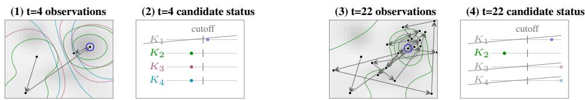
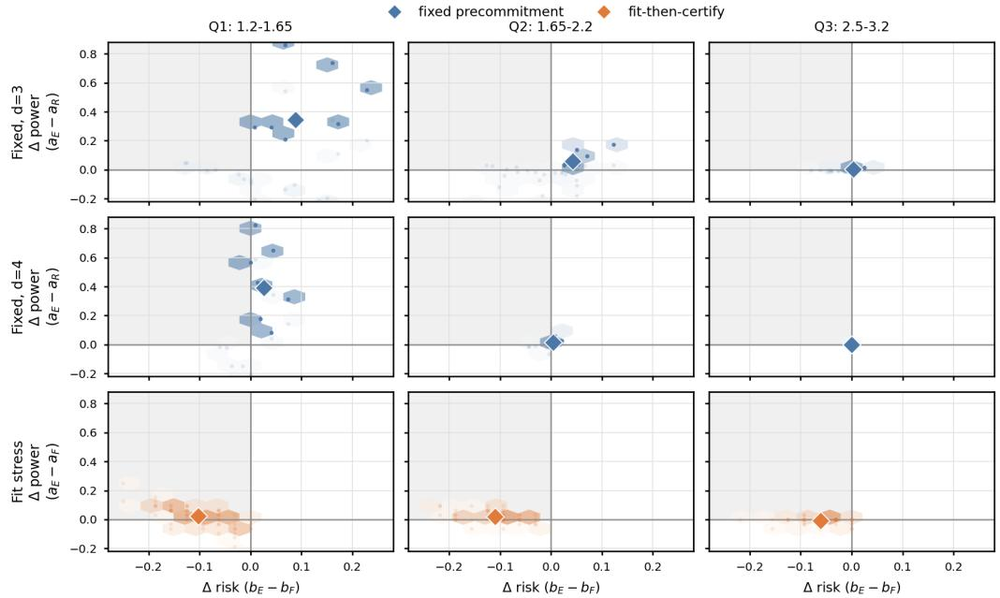

# Prequential E-Values for Selected-GP Near-Optimality Certificates

Ami Tavory Meta Platforms

Noa Cohen Meta Platforms

## Abstract

When optimizing an expensive black-box function sequentially, as in hyperparameter optimization, we may want to stop once the best evaluated value is certified within ε of the global optimum. Such a certificate needs two ingredients: a lower confidence bound for the selected value and an upper confidence envelope over the domain, typically supplied by a Gaussian process (GP). GP-UCB-style stopping rules are valid when the kernel and constants defining this envelope are fixed before the run, but the practical temptation is to tune the envelope from the same adaptive evaluations and then certify as if it had been fixed. We use prequential e-values to make this selection auditable: starting from a predeclared set of fully specified GP/RKHS envelopes, each candidate is tested by its own one-step-ahead e-process, contradicted candidates are deleted, and certification uses the largest upper bound among the survivors. With a valid selected-point lower bound and one declared candidate having valid latent coverage and noise calibration, the rule is anytimevalid. On a 512-seed noisy RBF stress sweep, it roughly halves false-certification risk at comparable power versus fit-then-certify. Relative to random fixed GP precommitment on smooth $d = 3 , 4$ objectives, each additional false certificate is accompanied by 3.0 and 13.5 additional correct certificates, respectively.

## 1 Optimization and GP Certificates

Many ML workflows, including hyperparameter optimization and AutoML, use a sequential optimizer [1, 2, 8] to query a noisy function at configurations $\lambda _ { 1 } , \lambda _ { 2 } , \ldots \in \Lambda$ . At time t, the optimizer returns the current best queried configuration $\hat { \lambda } _ { t } .$ , whose observed score attains $\operatorname* { m a x } _ { t ^ { \prime } \leq t } Y _ { t ^ { \prime } }$ , where $Y _ { t ^ { \prime } }$ is a noisy measurement of $f ( \lambda _ { t ^ { \prime } } )$ . We are often interested in whether the best configuration found so far is within ε of the global optimum:

$$
f ( \hat { \lambda } _ { t } ) \geq f ^ { \star } - \varepsilon , \qquad f ^ { \star } = \operatorname* { s u p } _ { \lambda \in \Lambda } f ( \lambda ) .\tag{1}
$$

To that end, we can certify

$$
L _ { t } ( { \hat { \lambda } } _ { t } ) \geq U _ { t } - \varepsilon ,\tag{2}
$$

where $L _ { t } ( \hat { \lambda } _ { t } )$ is a lower bound on the selected configuration’s value, and $U _ { t }$ is an upper bound on the unobserved global optimum.

Under an observation-model assumption, the lower bound is a standard winner’s-curse/post-selection problem caused by choosing the best observed value [4, 15, 16] (see Appendix A). The upper bound requires a further structure assumption: without one, an arbitrary optimum can occur in any unqueried configuration. At a fixed prefix t, GP-UCB and related Bayesian-optimization stopping rules use a fixed kernel/RKHS model to build $\begin{array} { r } { U _ { t } = \operatorname* { s u p } _ { \lambda \in \Lambda } \bigl [ \mu _ { t } ( \lambda ) ^ { \setminus } + \beta _ { t } \sigma _ { t } ( \bar { \lambda } ) \bigr ] } \end{array}$ , an upper bound from the posterior mean and standard deviation [3, 5, 7, 9, 12, 13]. These give valid near-optimality rules through (2) under a fixed GP assumption. Fixing the GP can make the certificate brittle, but selecting or tuning its kernel, radius, or inflation from the same data and then applying the fixed-GP guarantee can increase false-certification risk.

  
Figure 1: Grey surface: hidden objective. Colored contours: surviving candidate GP fits. Black path: optimizer observations. Candidate-status panels: prequential evidence dots, deletion cutoff, and grey deletion slashes.

We address the upper bound by treating GP-envelope selection as a post-selection certification problem rather than ordinary model fitting, building on the post-selection advantages of e-values [4, 14]. Before seeing the run, we declare m fully specified GP/RKHS envelope candidates. As the optimizer reveals ordered observations, each candidate band is challenged by one-step-ahead residuals: it must bound the next queried configuration before its value is observed. The residuals are accumulated into one e-process per candidate [6, 11]; when a candidate’s e-process crosses $1 / \delta _ { U }$ where $\delta _ { U }$ is the predeclared upper-side audit error budget, that candidate is deleted.

The certificate combines the largest upper bound among the surviving bands with a selected-point lower confidence bound for $\hat { \lambda } _ { t }$ (bounded-score KL in our finite-validation experiments). Using the largest survivor preserves validity without selecting a favorably tight band. For any fixed declared candidate whose envelope has all-time upper coverage error at most $\alpha _ { U }$ and whose one-step audit null is correct, Ville’s inequality [10] bounds the probability of ever deleting that candidate by $\delta _ { U }$ . Since the certificate takes the largest survivor, one such surviving anchor is enough. If the selected-configuration lower bound fails with probability at most $\alpha _ { L } .$ , then any certificate issued at any stopping time τ satisfies

$$
f ( \hat { \lambda } _ { \tau } ) \geq f ^ { \star } - \varepsilon
$$

with probability at least $1 - \left( \alpha _ { L } + \alpha _ { U } + \delta _ { U } \right)$ .

Contributions. We contribute: (1) a post-selection certificate for global near-optimality under a predeclared set of GP/RKHS envelope assumptions; (2) a prequential e-value screening rule that makes data-dependent envelope selection auditable while preserving anytime validity; and (3) known optimum experiments showing that this can beat a random fixed precommitment from the same declared set in smooth, certifiable regimes, while tightest-survivor and plug-in variants leak risk.

## 2 GP Upper Bounds and Prequential E-Value Audits

We construct the upper bound of (2). Before the optimization, we declare a set of m fully specified GP/RKHS envelope candidates $K _ { 1 } , \ldots , K _ { m }$ . Candidate $K _ { j }$ fixes its kernel, kernel parameters, noise or RKHS-radius constants, and confidence inflation at upper-side level $\alpha _ { U }$ . After the first t evaluations, candidate $K _ { j }$ is updated only with the prefix observed so far and gives

$$
u _ { j , t } ^ { f } ( \lambda ) = \mu _ { j , t } ( \lambda ) + \beta _ { j , t } \sigma _ { j , t } ( \lambda ) , \qquad U _ { j , t } = \operatorname* { s u p } _ { \lambda \in \Lambda } u _ { j , t } ^ { f } ( \lambda ) .
$$

If $K _ { j }$ is a valid envelope assumption for the objective, then $U _ { j , t }$ is the fixed-GP upper bound that can certify the unqueried domain.

Figure 1 illustrates the procedure. The true structure (shown in grey) is unknown. At step t a number $\leq m$ of GPs survive, and each updates its posterior envelope from the observed prefix, with its audit based on one-step-ahead prediction (colored contours in panels (1) and (3)). Each live candidate compares the next observation against its envelope, and is eliminated if that observation exceeds its cutoff (panels (2) and (4)). Deletion acts as a validity screen, after which the certificate uses the largest upper bound among the surviving candidates (panel (4)).

Single-candidate e-value. Let $\mathcal { F } _ { t }$ denote the information available after the first t evaluations. Fix one candidate $K _ { j }$ . At step t, before $Y _ { t }$ is observed, candidate $j$ forms its latent band using only $\mathcal { F } _ { t - 1 }$ and uses its observation-noise model to add a one-step buffer $r _ { j } ( q _ { j } )$ satisfying

$$
\operatorname* { P r } \left( Y _ { t } > f ( \lambda _ { t } ) + r _ { j } ( q _ { j } ) \mid { \mathcal F } _ { t - 1 } \right) \le q _ { j } .
$$

After $Y _ { t }$ is revealed, the violation indicator

$$
V _ { j , t } = \mathbf { 1 } \bigl ( Y _ { t } > u _ { j , t - 1 } ^ { f } ( \lambda _ { t } ) + r _ { j } ( q _ { j } ) \bigr )
$$

challenges that candidate. Under the on-path null for this candidate, $\operatorname* { P r } ( V _ { j , t } = 1 \mid \mathcal { F } _ { t - 1 } ) \leq q _ { j }$ . A fixed bet $\eta _ { j } \in [ 0 , 1 / q _ { j } )$ then makes

$$
M _ { j , t } = 1 + \eta _ { j } ( V _ { j , t } - q _ { j } )
$$

a nonnegative one-step e-value increment, since

$$
\begin{array} { r } { \mathbb { E } ( M _ { j , t } \mid \mathcal { F } _ { t - 1 } ) = 1 + \eta _ { j } \left( \mathbb { E } ( V _ { j , t } \mid \mathcal { F } _ { t - 1 } ) - q _ { j } \right) \le 1 . } \end{array}
$$

Multiplying these increments gives the candidate’s e-process

$$
E _ { j , t } = E _ { j , t - 1 } { \left( 1 + \eta _ { j } ( V _ { j , t } - q _ { j } ) \right) } , \qquad E _ { j , 0 } = 1 .
$$

Large values are evidence against the candidate’s one-step calibration. Deletion at $E _ { j , t } \geq 1 / \delta _ { U }$ is therefore an e-value test, and Ville’s inequality gives deletion probability at most $\delta _ { U }$ for any candidate satisfying the on-path null, uniformly over stopping times.

Combination. We run the one-candidate audit separately for each declared $K _ { j }$ and let $A _ { t }$ be the candidates not deleted by their e-processes. The certificate uses the largest surviving upper bound,

$$
U _ { t } ^ { \mathrm { s u r v } } = \operatorname* { m a x } _ { j \in A _ { t } } U _ { j , t } , \qquad \operatorname* { m a x } _ { } \otimes : = + \infty .\tag{3}
$$

Thus the procedure abstains if every candidate is deleted. This conservative choice avoids selecting a lucky under-covering survivor; choosing the tightest fitted GP after seeing the same data would condition on success and then reuse the fixed-GP guarantee. Fix any predeclared anchor $j ^ { \star }$ whose latent band covers $f$ uniformly over the domain and time with failure probability at most $\alpha _ { U }$ . On this event, $U _ { j ^ { \star } , t } \geq f ^ { \star }$ and

$$
V _ { j ^ { \star } , t } \leq \mathbf { 1 } \bigl ( Y _ { t } > f ( \lambda _ { t } ) + r _ { j ^ { \star } } ( q _ { j ^ { \star } } ) \bigr ) .
$$

Replacing $u _ { j ^ { \star } , t - 1 } ^ { f } ( \lambda _ { t } )$ by $f ( \lambda _ { t } )$ in every violation factor defines an unconditional comparison eprocess that, on the coverage event, pathwise dominates $E _ { j ^ { \star } , t }$ . Ville therefore bounds deletion of the anchor before any coverage failure by $\delta _ { U }$ . With probability at least $1 - \alpha _ { U } - \delta _ { U }$ , the anchor both covers the optimum and is never deleted, so $U _ { t } ^ { \mathrm { s u r v } } \geq U _ { j ^ { \star } , t } \mathbf { \bar { \Sigma } } \geq f ^ { \star }$ at every step. We stop only when (2) holds with $U _ { t } = U _ { t } ^ { \mathrm { s u r v } }$ . Combining this upper side with the lower-side error $\alpha _ { L }$ gives

$$
\operatorname* { P r } ( \exists t ^ { \prime } : \mathrm { ~ f a l s e ~ } \varepsilon \mathrm { - c e r t i f i c a t e ~ a t ~ } t ^ { \prime } ) \le \alpha _ { L } + \alpha _ { U } + \delta _ { U } .\tag{4}
$$

The number of candidates m affects computation and survivor looseness, not the risk budget.

## 3 Experiments

We use known-optimum analytic objectives so each stop can be scored by the power/risk pair $a / b .$ , where a = Pr(certify and correct) and $b = \operatorname* { P r }$ (certify and wrong). All methods use the same optimizer runs and selected-configuration lower bound; only the upper certificate changes. The experiment includes finite-validation noise and GP-kernel objectives in low dimension. The experiment protocol is in Appendix E, and a reference implementation is available on GitHub1. For interpretation, Figure 2 bins rows by $\rho = 6 4 ^ { - 1 / d } / \ell _ { \mathrm { r m s } }$ , an analysis-only proxy for how coarse the early optimizer run is relative to the function scale.

Random fixed precommitment. The fixed baseline samples one fully specified envelope from the same predeclared set before the run and never adapts it. We compare the change in correctcertification probability to the change in false-certification probability. Aggregated over the $d = 3$ and $d = 4$ fixed-precommitment experiments, the audited certificate gives 3.0 and 13.5 additional correct certificates per additional false certificate in $d = 3$ and $d = 4 .$ , respectively. The ρ breakdown shows where the gain comes from. In the low and middle tertiles, the audit turns many fixed abstentions into certificates; in the hardest tertile, both methods mostly abstain.

  
Figure 2. Paired advantage of the e-value audited certificate (E) across row-wise ρ tertiles. Upper block: comparison with random fixed precommitment (R), for $d = 3 ,$ 4. Lower block: comparison with fit-then-certify (F) on the 512-seed RBF stress sweep. Blue marks fixed comparisons and orange marks fit-then-certify; top-left favors E.

Fit-then-certify. The fit-then-certify diagnostic fits or selects the GP envelope from the same history and then certifies as if it had been fixed in advance. Here the natural comparison is false-certification risk at matched certification power. On the 512-seed RBF length-scale stress sweep, the audited and fit-then-certify power/risk pairs are 0.280/0.091 and 0.267/0.183. Their risk-per-correct ratios are 0.325 and 0.685, respectively, giving a ratio of 0.47. Across ρ tertiles, the risk reduction persists in every bin; the power tradeoff appears mainly in the hardest tertile. Appendix C explains why this risk is upper-side undercoverage.

## 4 Discussion and limitations

Prequential e-values let near-optimality certificates use a data-selected subset of a predeclared GPenvelope family while preserving validity. The search policy is unchanged; the contribution is post-selection accounting for the certificate, under the condition that the declared envelope family contains a valid member. We handle a finite family; continuous hyperparameter families would require additional uniform or mixture accounting.

The main limitation is geometric; Appendix D, including Theorem 2, formalizes this barrier. Both the experiments and GP/RKHS theory reflect the $n ^ { - 1 / d }$ fill-distance barrier: with tens or hundreds of evaluations, global upper envelopes become weak beyond a few active hyperparameters. In that regime the valid outcome is often abstention unless one declares lower-dimensional structure or accepts model-trusting extrapolation.

## References

[1] Takuya Akiba, Shotaro Sano, Toshihiko Yanase, Takeru Ohta, and Masanori Koyama. Optuna: A next-generation hyperparameter optimization framework. In KDD, 2019.

[2] Maximilian Balandat, Brian Karrer, Daniel R. Jiang, Samuel Daulton, Benjamin Letham, Andrew Gordon Wilson, and Eytan Bakshy. Botorch: A framework for efficient monte-carlo bayesian optimization. In NeurIPS, 2020.

[3] Felix Berkenkamp. No-regret bayesian optimization with unknown hyperparameters. In NeurIPS, 2019. arXiv:1901.03357.

[4] Gavin C. Cawley and Nicola L. C. Talbot. On over-fitting in model selection and subsequent selection bias in performance evaluation. Journal ofMachine Learning Research, 11, 2010.

[5] Sayak Ray Chowdhury and Aditya Gopalan. On kernelized multi-armed bandits. In ICML, 2017. arXiv:1704.00445.

[6] Aaditya Ramdas, Peter Grunwald, Vladimir Vovk, and Glenn Shafer. Game-theoretic statistics¨ and safe anytime-valid inference. Statistical Science, 2023. arXiv:2210.01948.

[7] Carl E. Rasmussen and Christopher K. I. Williams. Gaussian Processes for Machine Learning. MIT Press, 2006.

[8] Jasper Snoek, Hugo Larochelle, and Ryan P. Adams. Practical bayesian optimization of machine learning algorithms. In NeurIPS, 2012.

[9] Niranjan Srinivas, Andreas Krause, Sham M. Kakade, and Matthias Seeger. Gaussian process optimization in the bandit setting: No regret and experimental design. In ICML, 2010. arXiv:0912.3995.

[10] Jean Ville. etude critique de la notion de collectif.´ Gauthier-Villars, Paris, 1939.

[11] Vladimir Vovk and Ruodu Wang. E-values: Calibration, combination and applications. Annals of Statistics, 2021. arXiv:1912.06116.

[12] Yining Wang, Ziyu Wang, and Chen-Yu Wei. Near-optimal stopping for bayesian optimization, 2026. arXiv:2605.22561.

[13] James Wilson. Probabilistic regret bounds for bayesian optimization, 2024. arXiv:2402.16811.

[14] Ziyu Xu, Ruodu Wang, and Aaditya Ramdas. Post-selection inference for e-value based confidence intervals. Electronic Journal ofStatistics, 18(1), 2024. arXiv:2203.12572.

[15] Tianyu Zhang, Hao Lee, and Jing Lei. Winners with confidence: Discrete argmin inference with an application to model selection, 2024. arXiv:2408.02060.

[16] Tijana Zrnic and William Fithian. A flexible defense against the winner’s curse. Annals of Statistics, 2025. arXiv:2411.18569.

## A Selected-Configuration Lower Bounds

Choosing the returned configuration from noisy observed scores is a classic winner’s curse problem for noisy comparison [4, 15, 16]. The certificate only needs a one-sided lower bound for each queried configuration: for any fixed $\lambda _ { t ^ { \prime } }$ and level $\alpha ,$ a statistic $L _ { t ^ { \prime } } ( \alpha )$ with

$$
\operatorname* { P r } ( L _ { t ^ { \prime } } ( \alpha ) > f ( \lambda _ { t ^ { \prime } } ) ) \leq \alpha .
$$

Selection then costs only a union bound over configurations that could be returned.

Bounded-score lower bound. Suppose each queried configuration has one observed mean score

$$
Y _ { t ^ { \prime } } = { \frac { 1 } { n _ { \mathrm { v a l } } } } \sum _ { s = 1 } ^ { n _ { \mathrm { v a l } } } Z _ { t ^ { \prime } , s } , \qquad Z _ { t ^ { \prime } , s } \in [ 0 , 1 ] , \quad \mathbb { E } Z _ { t ^ { \prime } , s } = f ( \lambda _ { t ^ { \prime } } ) ,
$$

with conditionally independent validation draws. Bernoulli accuracy scores are the special case used in our finite-validation experiments. For $y , q \in [ 0 , 1 ]$ , write

$$
\operatorname { k l } ( y , q ) = y \log { \frac { y } { q } } + ( 1 - y ) \log { \frac { 1 - y } { 1 - q } } .
$$

Proposition 1 (Bounded-score KL lower bound). For a fixed configuration with mean $p ,$ define

$$
L _ { \mathrm { K L } } ( Y , n _ { \mathrm { v a l } } , \alpha ) = \operatorname* { i n f } \{ q \leq Y : n _ { \mathrm { v a l } } \mathrm { k l } ( Y , q ) \leq \log ( 1 / \alpha ) \} .
$$

Then $\operatorname* { P r } ( L _ { \mathrm { K L } } ( Y , n _ { \mathrm { v a l } } , \alpha ) > p ) \leq \alpha .$

Proof. The failure event can occur only on the upper tail of the bounded mean:

$$
\{ L _ { \mathrm { K L } } ( Y , n _ { \mathrm { v a l } } , \alpha ) > p \} \subseteq \{ Y > p , \ n _ { \mathrm { v a l } } \mathrm { k l } ( Y , p ) > \log ( 1 / \alpha ) \} .
$$

For any $y \geq p ,$ , Hoeffding’s bounded-variable Chernoff bound gives

$$
\operatorname* { P r } ( Y \geq y ) \leq \exp ( - n _ { \mathrm { v a l } } \mathrm { k l } ( y , p ) ) .
$$

Let

$$
y _ { \alpha } = \operatorname* { i n f } \{ y \geq p : n _ { \mathrm { v a l } } \mathrm { k l } ( y , p ) \geq \log ( 1 / \alpha ) \} .
$$

Since $y \mapsto \operatorname { k l } ( y , p )$ is increasing on $[ p , 1 ]$ , the failure event is contained in $\{ Y \geq y _ { \alpha } \}$ , and therefore

$$
\operatorname* { P r } ( L _ { \mathrm { K L } } ( Y , n _ { \mathrm { v a l } } , \alpha ) > p ) \leq \operatorname* { P r } ( Y \geq y _ { \alpha } ) \leq \alpha .
$$

Proposition 2 (Anytime selection accounting). Fix weights $w _ { t ^ { \prime } } \geq 0$ with $\textstyle \sum _ { t ^ { \prime } > 1 } w _ { t ^ { \prime } } \leq 1$ . For each queried configuration, let $L _ { t ^ { \prime } } \big ( \alpha _ { L } w _ { t ^ { \prime } } \big )$ be any lower bound satisfying $\mathrm { P r } ( L _ { t ^ { \prime } } ( \bar { \alpha } _ { L } w _ { t ^ { \prime } } ) > f ( \lambda _ { t ^ { \prime } } ) ) \leq$ $\alpha _ { L } w _ { t ^ { \prime } } ,$ in the bounded-score example, take $\dot { L } _ { t ^ { \prime } } ( \alpha _ { L } w _ { t ^ { \prime } } ) = L _ { \mathrm { K L } } ( \dot { Y } _ { t ^ { \prime } } , \dot { n } _ { \mathrm { v a l } } , \dot { \alpha } _ { L } \dot { w } _ { t ^ { \prime } } )$ . Then

$$
\operatorname* { P r } ( \exists t ^ { \prime } \geq 1 : L _ { t ^ { \prime } } ( \alpha _ { L } w _ { t ^ { \prime } } ) > f ( \lambda _ { t ^ { \prime } } ) ) \leq \alpha _ { L } .
$$

Consequently, at any finite stopping time t, any data-dependent returned configuration $\hat { \lambda } _ { t } \in$ $\{ \lambda _ { 1 } , \ldots , \lambda _ { t } \}$ is covered on the simultaneous event. A finite predeclared horizon is recovered by assigning zero weight after that horizon.

The fixed-configuration guarantee requires an observation assumption for a nontrivial finite-sample lower confidence bound. The bounded-score KL bound is the instantiation used in our experiments; other metrics require their corresponding one-sided lower bounds.

## B GP Upper Bounds and Prequential Audits

Let $\Lambda \subset \mathbb { R } ^ { d }$ be compact, let $f : \Lambda \to \mathbb { R }$ be the latent objective, and let $f ^ { \star } = \operatorname* { s u p } _ { \lambda \in \Lambda } f ( \lambda )$ . A sequential policy chooses configurations $\lambda _ { t }$ and observes noisy scores $Y _ { t } .$ . Let $\mathcal { F } _ { t }$ be the information available after the first t evaluations.

Definition 1 (Envelope candidate). A candidate $K _ { j }$ is fixed before the run. It specifies a kernel and its parameters, an RKHS-radius or prior constant, an observation-noise tail bound, and an inflation schedule. After the first t observations it gives a predictable latent envelope

$$
u _ { j , t } ^ { f } ( \lambda ) = \mu _ { j , t } ( \lambda ) + \beta _ { j , t } \sigma _ { j , t } ( \lambda ) , \qquad U _ { j , t } = \operatorname* { s u p } _ { \lambda \in \Lambda } u _ { j , t } ^ { f } ( \lambda ) .
$$

For its one-step audit at step t, it also gives the noisy-score threshold

$$
c _ { j , t } ^ { Y } = u _ { j , t - 1 } ^ { f } ( \lambda _ { t } ) + r _ { j } ( q _ { j } ) ,
$$

where $r _ { j } ( q _ { j } )$ is the declared noise quantile. The usual GP-UCB/RKHS choices of $\beta _ { j , t }$ give all-time latent coverage under their fixed assumptions [5, 9].

Single-candidate e-value. For one fixed candidate, the audit only uses one-step claims made before the next response is observed. The following two lemmas are the e-value part of the construction.

Lemma 1 (Pathwise audit domination). Suppose candidate j has latent upper coverage

$$
\mathcal { C } _ { j } : = \{ \forall t , \forall \lambda \in \Lambda : u _ { j , t } ^ { f } ( \lambda ) \geq f ( \lambda ) \} , \qquad \operatorname* { P r } ( \mathcal { C } _ { j } ^ { c } ) \leq \alpha _ { U } ,
$$

and its noise quantile satisfies

$$
\operatorname* { P r } \left( Y _ { t } > f ( \lambda _ { t } ) + r _ { j } ( q _ { j } ) \mid { \mathcal F } _ { t - 1 } \right) \le q _ { j } .
$$

Define the observable violation and an unobservable comparison violation by

$$
V _ { j , t } = \mathbf { 1 } \big ( Y _ { t } > c _ { j , t } ^ { Y } \big ) , \qquad \widetilde { V } _ { j , t } = \mathbf { 1 } \big ( Y _ { t } > f ( \lambda _ { t } ) + r _ { j } ( q _ { j } ) \big ) .
$$

Then $\operatorname* { P r } ( \widetilde { V } _ { j , t } = 1 \mid \mathcal { F } _ { t - 1 } ) \le q _ { j }$ , and on $\mathcal { C } _ { j } , V _ { j , t } \le \widetilde { V } _ { j , t }$ for every t.

Proof.

$$
\begin{array} { r } { \operatorname* { P r } ( \widetilde { V } _ { j , t } = 1 \mid \mathcal { F } _ { t - 1 } ) \le q _ { j } , \qquad \mathcal { C } _ { j } \Longrightarrow c _ { j , t } ^ { Y } \ge f ( \lambda _ { t } ) + r _ { j } ( q _ { j } ) \Longrightarrow V _ { j , t } \le \widetilde { V } _ { j , t } . } \end{array}
$$

Lemma 2 (Prequential envelope e-process). For candidate j, fix a bet $\eta _ { j } \in [ 0 , 1 / q _ { j } )$ ) and define

$$
E _ { j , t } = E _ { j , t - 1 } { \left( 1 + \eta _ { j } ( V _ { j , t } - q _ { j } ) \right) } , \qquad E _ { j , 0 } = 1 .
$$

Let $\widetilde { E } _ { j , t }$ be the same product with $\widetilde { V } _ { j , t }$ in place of $V _ { j , t }$ . Then $\widetilde { E } _ { j , t }$ is a nonnegative e-process, $E _ { j , t } \leq \widetilde { E } _ { j , t }$ on ${ \mathcal { C } } _ { j } ,$ , and

$$
\operatorname* { P r } \left( \mathcal { C } _ { j } \cap \left\{ \operatorname* { s u p } _ { t \geq 0 } E _ { j , t } \geq 1 / \delta _ { U } \right\} \right) \leq \delta _ { U } .
$$

Proof.

$$
1 + \eta _ { j } ( \widetilde { V } _ { j , t } - q _ { j } ) \geq 1 - \eta _ { j } q _ { j } > 0 , \qquad \mathbb { E } \bigl ( 1 + \eta _ { j } ( \widetilde { V } _ { j , t } - q _ { j } ) \mid \mathcal { F } _ { t - 1 } \bigr ) = 1 + \eta _ { j } \bigl ( \mathbb { E } ( \widetilde { V } _ { j , t } \mid \mathcal { F } _ { t - 1 } ) - q _ { j } \bigr ) \leq 1 .
$$

Hence $\widetilde { E } _ { j , t }$ is a nonnegative supermartingale, and on $\mathcal { C } _ { j }$

$$
E _ { j , t } = \prod _ { s = 1 } ^ { t } \bigl ( 1 + \eta _ { j } ( V _ { j , s } - q _ { j } ) \bigr ) \leq \prod _ { s = 1 } ^ { t } \bigl ( 1 + \eta _ { j } ( \widetilde { V } _ { j , s } - q _ { j } ) \bigr ) = \widetilde { E } _ { j , t } .
$$

Therefore, by Ville’s inequality [10],

$$
\operatorname* { P r } \biggl ( \mathcal { C } _ { j } \cap \left\{ \operatorname* { s u p } _ { t \ge 0 } E _ { j , t } \ge 1 / \delta _ { U } \right\} \biggr ) \le \operatorname* { P r } \biggl ( \operatorname* { s u p } _ { t \ge 0 } \widetilde { E } _ { j , t } \ge 1 / \delta _ { U } \biggr ) \le \delta _ { U } .
$$

Combination. Run the one-candidate audit separately for every declared candidate. The certificate then combines survivors by the flat maximum.

Theorem 1 (Flat survivor certificate). Let $A _ { t }$ be the candidates not deleted by the prequential audit and define

$$
U _ { t } ^ { \mathrm { s u r v } } = \operatorname* { m a x } _ { j \in A _ { t } } U _ { j , t } .
$$

$I f A _ { t } = \emptyset ,$ , define $U _ { t } ^ { \mathrm { s u r v } } = + \infty$ , so the rule abstains. Assume some fixed predeclared anchor $j ^ { \star }$ satisfies the coverage and noise-buffer conditions in Lemma 1. Ifthe selected-configuration lower side has error at most $\alpha _ { L } ,$ α , then the rule

$$
L _ { t } ( \hat { \lambda } _ { t } ) \geq U _ { t } ^ { \mathrm { s u r v } } - \varepsilon
$$

satisfies

$$
\operatorname* { P r } ( \exists t ^ { \prime } : f a l s e \ \varepsilon - c e r t i f t c a t e a t t ^ { \prime } ) \leq \alpha _ { L } + \alpha _ { U } + \delta _ { U } .
$$

Proof. Let

$$
\begin{array} { c } { { \mathcal { E } _ { L } = \{ \exists t ^ { \prime } : L _ { t ^ { \prime } } ( \hat { \lambda } _ { t ^ { \prime } } ) > f ( \hat { \lambda } _ { t ^ { \prime } } ) \} , } } \\  { { \mathcal { E } _ { U } = \{ \exists t ^ { \prime } , \exists \lambda \in \Lambda : u _ { j ^ { \star } , t ^ { \prime } } ^ { f } ( \lambda ) < f ( \lambda ) \} , ~ { \mathcal { E } _ { D } = \mathcal { E } _ { U } ^ { c } } \cap \{ \exists t ^ { \prime } : j ^ { \star } \notin A _ { t ^ { \prime } } \} . } } \end{array}
$$

The first two events have probabilities at most $\alpha _ { L }$ and $\alpha _ { U }$ . By Lemmas 1 and 2, $\Pr ( \mathcal { E } _ { D } ) \leq \delta _ { U }$ . On the complement of these events, for every step t, the anchor survives and covers the optimum, so $U _ { t } ^ { \mathrm { s u r v } } \geq \bar { U } _ { j ^ { \star } , t } \geq f ^ { \star }$ . If the rule fires, then

$$
\begin{array} { r } { f ( \hat { \lambda } _ { t } ) \geq L _ { t } ( \hat { \lambda } _ { t } ) \geq U _ { t } ^ { \mathrm { s u r v } } - \varepsilon \geq f ^ { \star } - \varepsilon . } \end{array}
$$

Therefore the false-certificate event is contained in $\mathcal { E } _ { L } \cup \mathcal { E } _ { U } \cup \mathcal { E } _ { D }$ , and

$$
\operatorname* { P r } ( \exists t ^ { \prime } : { \mathrm { ~ f a l s e ~ } } \varepsilon { \mathrm { - c e r t i f i c a t e ~ a t ~ } } t ^ { \prime } ) \leq \operatorname* { P r } ( { \mathcal { E } } _ { L } ) + \operatorname* { P r } ( { \mathcal { E } } _ { U } ) + \operatorname* { P r } ( { \mathcal { E } } _ { D } ) \leq \alpha _ { L } + \alpha _ { U } + \delta _ { U } .
$$

We use one fixed predeclared anchor, so the deletion threshold is $1 / \delta _ { U }$ for every candidate. The number of candidates affects computation and survivor looseness through the maximum over $A _ { t }$ not the risk budget. The guarantee uses the maximum over survivors; selecting the tightest survivor requires separate post-selection accounting.

## C Post-Selection GP Undercoverage

We show here the undercoverage of fitting then certifying.

Proposition 3 (False-Stop Reduction). $L e t \tau$ be any stopping time at which the rule fires only if $L _ { \tau } ( \hat { \lambda } _ { \tau } ) \geq U _ { \tau } - \varepsilon .$ Ifthe lower side satisfies

$$
\mathrm { P r } ( \exists t ^ { \prime } : L _ { t ^ { \prime } } ( \hat { \lambda } _ { t ^ { \prime } } ) > f ( \hat { \lambda } _ { t ^ { \prime } } ) ) \leq \alpha _ { L } ,
$$

then

$$
\operatorname* { P r } ( \tau < \infty , f ( \hat { \lambda } _ { \tau } ) < f ^ { \star } - \varepsilon ) \le \alpha _ { L } + \operatorname* { P r } ( \tau < \infty , U _ { \tau } < f ^ { \star } ) .
$$

Proof. Let

$$
\mathcal { E } _ { L } = \{ \exists t ^ { \prime } : L _ { t ^ { \prime } } ( \hat { \lambda } _ { t ^ { \prime } } ) > f ( \hat { \lambda } _ { t ^ { \prime } } ) \}
$$

and

$$
\mathcal { F } = \{ \tau < \infty , f ( \hat { \lambda } _ { \tau } ) < f ^ { \star } - \varepsilon \} .
$$

On $\mathcal { F } \cap \mathcal { E } _ { L } ^ { c }$

$$
U _ { \tau } - \varepsilon \le L _ { \tau } ( \hat { \lambda } _ { \tau } ) \le f ( \hat { \lambda } _ { \tau } ) < f ^ { \star } - \varepsilon ,
$$

so $U _ { \tau } < f ^ { \star }$ . Hence

$$
{ \mathcal { F } } \subseteq { \mathcal { E } } _ { L } \cup \{ \tau < \infty , U _ { \tau } < f ^ { \star } \} .
$$

Therefore

$$
\operatorname* { P r } ( { \mathcal { F } } ) \leq \operatorname* { P r } ( { \mathcal { E } } _ { L } ) + \operatorname* { P r } ( \tau < \infty , U _ { \tau } < f ^ { \star } ) \leq \alpha _ { L } + \operatorname* { P r } ( \tau < \infty , U _ { \tau } < f ^ { \star } ) .
$$

Thus the lower side contributes only its declared budget. The remaining term is controlled by the probability that the claimed global upper bound misses the true global optimum.

## D Dimension and Resolution

Global certification is limited by fill distance. The upper certificate must rule out an ε-better point in the unqueried region, so it becomes informative only when the queried set resolves the function class.

Under a Lipschitz modulus $\omega ( r ) \leq L r$ , excluding a hidden ε-improvement requires fill distance $h _ { t } \lesssim \varepsilon / L$ . In a d-dimensional box, achieving this requires on the order of $( L \bar { \mathrm { d i a m } } ( \Lambda ) / \varepsilon ) ^ { d }$ wellplaced evaluations. GP/RKHS envelopes replace this Lipschitz modulus by a kernel uncertainty term, but they do not remove the ambient-dimension dependence unless the declared structure is lower-dimensional, additive, or otherwise stronger.

Theorem 2 (Finite-History Global Nonidentifiability). Fix a finite set of queried configurations $\Lambda _ { t } = \{ \lambda _ { t ^ { \prime } } : t ^ { \prime } \leq t \}$ . Consider any rule that returns $\hat { \lambda } _ { t } \in \Lambda _ { t } . \ I f \Lambda$ contains a ball disjointfrom $\Lambda _ { t } ,$ then without a structural smoothness bound no non-vacuous finite-history rule can certify global ε-optimality uniformly. More precisely,for anyfunction $f _ { 0 }$ on which the rule certifies with positive probability, there exists a function $f _ { 1 }$ agreeing with $f _ { 0 }$ at every queried configuration but satisfying $f _ { 1 } ^ { \star } > f _ { 1 } ( \hat { \lambda } _ { t } ) + \varepsilon$

Proof. Let $B \subset \Lambda$ be a ball with $B \cap \Lambda _ { t } = \varnothing .$ , and choose $z \in B .$ Let $b : \Lambda \to [ 0 , \infty )$ be continuous, supported in $B .$ , and large enough that

$$
b ( z ) > f _ { 0 } ( \hat { \lambda } _ { t } ) - f _ { 0 } ( z ) + \varepsilon .
$$

Define $f _ { 1 } = f _ { 0 } + b$ . Then

$$
f _ { 1 } ( \lambda _ { t ^ { \prime } } ) = f _ { 0 } ( \lambda _ { t ^ { \prime } } ) \qquad { \mathrm { f o r ~ a l l ~ } } t ^ { \prime } \leq t ,
$$

so the two functions induce the same observed history and the same certification event. But

$$
f _ { 1 } ^ { \star } \geq f _ { 1 } ( z ) = f _ { 0 } ( z ) + b ( z ) > f _ { 1 } ( \hat { \lambda } _ { t } ) + \varepsilon ,
$$

since $b ( \hat { \lambda } _ { t } ) = 0$ . Thus any certificate that fires on this history is false for $f _ { 1 }$

## E Experiment Protocol

All empirical claims use analytic objectives with known global optima. For each objective and seed, a sequential optimizer produces an ordered sequence of observations indexed by $\mathbf { \bar { \rho } } _ { t ^ { \prime } }$ . Within each comparison, every method is evaluated on the same sequence and may either abstain or certify the current incumbent at each prefix. We record the first certification time and score it as correct when $f ( \hat { \lambda } _ { t } ) \geq f ^ { \star } - \varepsilon .$

We report

$$
a = { \mathrm { P r } } ( { \mathrm { c e r t i f y ~ a n d ~ c o r r e c t } } ) , \qquad b = { \mathrm { P r } } ( { \mathrm { c e r t i f y ~ a n d ~ w r o n g } } ) ,
$$

written as power/risk $a / b$ . The compared rows are fixed before aggregation: the prequential e-value survivor certificate, a random fixed precommitment drawn from the same candidate set before the run, and the fit-then-certify diagnostic that tunes a GP envelope on the same history and then treats it as fixed. Certificate rows use the same selected-configuration lower bound. The fixed-precommitment comparison uses the $d = 3 ,$ , 4 rows, whereas the fit-then-certify comparison uses a separate 512-seed $d = 3 \mathrm { R B F }$ length-scale stress sweep.

The benchmark grid uses $d ~ \in ~ \{ 2 , 3 , 4 \}$ , RBF, Matern, and rational-quadratic kernel-bump´ objectives, isotropic and anisotropic length scales, finite-validation observations $Y ( \lambda ) \sim$ Binomial $( n _ { \mathrm { v a l } } , f ( \lambda ) ) / n _ { \mathrm { v a l } }$ , and $n _ { \mathrm { v a l } } = 1 0 0 0 , \varepsilon = 0 . 1 0$ unless stated otherwise. For plots, the resolution coordinate is $\rho = 6 4 ^ { - 1 / d } / \ell _ { \mathrm { r m s } } ;$ it is used only for binning objectives.