# Proximal Balancing for Causal Efect Estimation under Unmeasured Confounding

Yonghan Jung<sup>∗</sup>

School of Information Sciences

University of Illinois Urbana-Champaign

Estimating causal efects from observational data is central to science and policy, but the efects are not identified when confounders are unmeasured. Proximal causal inference addresses this problem with proxies of the unmeasured confounders. However, existing proxy-based approaches either designate proxy roles and solve an inverse problem, which is ill-posed and hard to estimate with high-dimensional proxies, or use a latent-variable model, which assumes that the learned latent variable matches the hidden confounder and leaves bias when it does not. To address these challenges, we introduce proximal balancing. It carries the classical idea of covariate balancing to confounders that are observed only through proxies: it learns a low-dimensional summary of the covariates and proxies that makes the treatment groups comparable, and then adjusts for this summary. It needs no designated proxy roles, inverse problem, or latent model. We give identification theory, finite-sample guarantees, and a practical algorithm, PROBE. We demonstrate the method on low-dimensional, high-dimensional, and image proxies and on real-world data.

## Contents

1. Introduction 3   
1.1. Related Work . 4   
2. Problem Setting and Notation 5   
3. Identification by Proximal Balancing 6   
3.1. Exact Balance . . . 6   
3.2. Unknown Valid Block 7   
3.3. Approximate Balance 7   
5. Experiments 11   
6. Conclusion 13   
A. Problem Setting 18   
B. Identification 18   
B.1. Identification for a Prespecified Held-Out Block 18   
B.1.1. Assumptions 18   
B.1.2. Exact Identification for a Fixed Block 20   
B.1.3. Comparison with the Canonical Two-Proxy Proximal Model . 20   
B.2. Identification When the Valid Held-Out Block Is Unknown 21   
B.3. Approximate Balance and Bias Bound 22   
C. Representation Learning and AIPW Estimation 23   
C.1. Representation Learning 24   
C.2. AIPW Estimation 26   
C.3. Searching Across Proxy Splits . 28   
D. Experiment Details and Evidence Boundaries 31   
D.1. Shared structural family 31   
D.2. Image rendering 31   
D.3. Search family, screen, and aggregation 32   
D.4. Honest learning and evaluation 32   
D.5. Modeling choices and implementation 33   
D.6. Additional results for the synthetic analysis . 35   
D.7. Semi-synthetic benchmarks 39   
D.8. Protocol discipline 40   
D.9. Evidence boundaries 40   
D.10.Additional figures 40   
E. Proofs 42   
E.1. Proofs for Section 3 42   
E.2. Proofs for Section 4 46   
E.3. Finite-Strata MMD Specialization 49

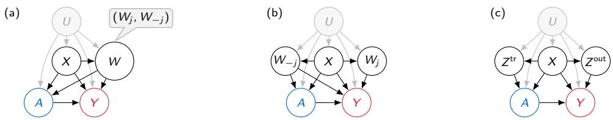  
Figure 1: (a) The proxy W, split into $( W _ { j } , W _ { - j } )$ . (b) A higher-resolution view of (a), showing an allowed structure: the held-out block $W _ { j }$ afects Y but not A. (c) Proximal causal inference with designated proxies $Z ^ { \mathrm { t r } }$ and $Z ^ { \mathrm { { o u t } } }$

## 1. Introduction

Estimating treatment efects from observational data, a central task in medicine and public policy, usually assumes that every confounder (every common cause of the treatment and the outcome) is measured. This assumption, known as no unmeasured confounding, often fails. In a hypothetical study of an aggressive therapy A and a recovery outcome Y , clinicians treat patients with severe disease more often, and severe disease lowers recovery, so the unrecorded severity U confounds the comparison even after adjustment for recorded covariates X such as age. The efect is then not identified, that is, not determined by the distribution of the observed data (Pearl, 2009).

Although U is unrecorded, modern data often capture it indirectly. For instance, a pretreatment medical image reflects severity through the size, texture, and spread of afected tissue. Variables that carry such indirect information about a hidden confounder are called proxies, ranging from discrete codes to multimodal data such as images with thousands of pixels. Proxy-based causal inference has drawn growing attention because it identifies causal efects under hidden confounding by adding structural assumptions that are often plausible in practice (Kuroki and Pearl, 2014; Miao et al., 2018; Tchetgen Tchetgen et al., 2024).

Existing proxy-based methods either designate proxy roles in advance, for example, that each proxy afects only one of the treatment and the outcome, and obtain the identification functional as the solution of an inverse problem, such as an integral equation for a bridge function (Miao et al., 2018), or model latent variables from the observations and treat them as the hidden confounder under strong assumptions (Louizos et al., 2017) (see Section 1.1 for details). For high-dimensional proxies such as images, these approaches are dificult to apply. When multiple medical images, such as radiographs, CT scans, and MRI scans taken before treatment, serve as proxies of hidden severity, clinical knowledge seldom tells which images may influence the treatment decision, so roles cannot be designated with confidence. The inverse problem is ill-posed, so small errors in the observed regressions can produce large errors in its solution, and this solution is harder to estimate when it takes an image as input (Kallus et al., 2021). A learned latent variable, in turn, need not match the hidden confounder (Rissanen and Marttinen, 2021).

To address these concerns, we introduce proximal balancing, which uses a multi-dimensional proxy without designating roles in advance, solving an inverse problem, or modeling the confounder. It builds on balancing in causal inference (Rosenbaum and Rubin, 1983): when high-dimensional covariates X sufice for adjustment, a low-dimensional function ϕ(X) satisfying X ⊥⊥ $A \ | \ \phi ( X )$ sufices as well. Proximal balancing carries this idea to hidden confounding. As Fig. 1(a) shows, it splits the proxy into a held-out block $W _ { j }$ and the remaining blocks $W _ { - j }$ and learns $\phi ( X , W _ { - j } )$ satisfying $( X , W _ { j } ) \perp \perp A \mid \phi ( X , W _ { - j } )$ . We first develop this idea for a known held-out block and then extend it to the case where only the whole proxy $W = ( W _ { 1 } , \dots , W _ { J } )$ is given and the valid block is unknown.

We make three contributions.

1. Proximal balancing framework. We develop proximal balancing, which identifies the average treatment efect from a high-dimensional proxy (Section 3.1).

2. Extensions. We bound the bias under approximate balance, identify the efect by a plurality vote when the valid block is unknown, and give finite-sample guarantees for our algorithm, PROxy Blockwise Exclusion (PROBE) (Sections 3.2–4).

3. Empirical evidence. Simulations with scalar, vector, and image-rendered proxies show that proximal balancing recovers the known efect (Section 5).

## 1.1. Related Work

Causal inference under unmeasured confounding. When the causal graph is known, a graphical criterion such as the front-door criterion can identify an efect despite unmeasured confounding (Pearl, 2009; Fulcher et al., 2020; Jung, 2026), and a complete algorithm decides whether an efect is identifiable (Tian and Pearl, 2002; Shpitser and Pearl, 2006). Weighting, doubly robust, and debiased machine learning estimators have been developed for identifiable efects (Jung et al., 2020a,b, 2021b,a; Bhattacharya et al., 2022; Jung et al., 2023; Guo et al., 2023; Jung et al., 2024a,b). These methods, however, assume that the causal graph, or at least its equivalence class, is known; without such a graph, the observed data only bound the efect (Jung and Kang, 2026).

Proxy-based identification. For discrete variables, matrix adjustment (Kuroki and Pearl, 2014; Lee and Bareinboim, 2021) identifies the efect by inverting the matrix of proxy probabilities given the confounder. Proximal causal inference, which grew out of negative-control methods (Lipsitch et al., 2010) and matrix adjustment, uses a treatment-side and an outcome-side proxy, which may afect only the treatment and only the outcome, respectively, as in Fig. 1(c) (Miao et al., 2018; Tchetgen Tchetgen et al., 2024; Cui et al., 2024). It computes the efect by solving an inverse problem, an integral equation

Table 1: Requirements of proxy-based methods; a check means not needed. Roles: designated proxy roles. Inverse: an inverse problem. Latent: a latent model of U.
<table><tr><td colspan="2">Method</td><td>Roles Inverse Latent</td><td></td></tr><tr><td>Proximal inference</td><td>×</td><td>X</td><td>√</td></tr><tr><td>Single-proxy control</td><td>×</td><td>×</td><td>√</td></tr><tr><td>CEVAE</td><td>√</td><td>√</td><td>X</td></tr><tr><td>Saha et al.</td><td>√</td><td>√</td><td>×</td></tr><tr><td>Proximal balancing</td><td>√</td><td>√</td><td>√</td></tr></table>

among observed distributions, and completeness conditions make this solution identify the efect. Kernel and deep-learning estimators solve this inverse problem with statistical guarantees (Mastouri et al., 2021; Kallus et al., 2021), including for image proxies and for proxies extracted from two separate pretreatment texts (Xu et al., 2021; Chen et al., 2024). Single-proxy control (Tchetgen Tchetgen, 2014; Park et al., 2024) uses one proxy of $Y ( 0 )$ , the outcome that a unit would have without treatment, and identifies the efect on the treated; a kernel version handles deterministic outcomes (Xu and Gretton, 2025). All of these methods fix proxy roles before the analysis and solve an inverse problem (Table 1). Fig. 1 contrasts proximal balancing, panels (a) and (b), with the standard proximal structure, panel (c). Proximal balancing restricts only the valid held-out block $W _ { j }$ , which must not afect the treatment; the remaining blocks $W _ { - j }$ may afect both, and the valid block need not be known in advance. It replaces the inverse problem with an observable balance condition followed by ordinary adjustment.

Latent-variable modeling approaches. CEVAE (Louizos et al., 2017) fits a variational autoencoder (Kingma and Welling, 2014) to the proxies, treatment, and outcome, and adjusts for the inferred latent vector. Its justification rests on the premise that the encoding and decoding steps recover a latent variable that matches U, a premise that need not hold, as Rissanen and Marttinen (2021) demonstrate empirically. Proximal balancing models neither the proxy nor the confounder.

Unknown valid candidates. Majority and plurality rules, implemented by median and mode estimators, identify an efect when most, or the largest group, of the candidate instruments are valid (Kang et al., 2016; Bowden et al., 2016; Hartwig et al., 2017; Guo et al., 2018). In proximal inference, Rakshit et al. (2025) take a median over candidate proxies when more than half are valid, Yu et al. (2025) assume that at least a known number of treatment-side proxies are valid, and data-driven searches select valid negative controls in linear models (Kummerfeld et al., 2024; Xie et al., 2024). Saha et al. (2026) identify the efect without designating proxy roles when three proxies are mutually independent given a categorical confounder. Proximal balancing applies the plurality rule to held-out blocks that pass a balance audit, in a nonparametric model with a learned representation. Its conditions also allow the blocks to depend on each other beyond the confounder.

Balancing and representation learning. Balancing scores and weights align measured covariates across treatment groups (Rosenbaum and Rubin, 1983; Hainmueller, 2012; Imai and Ratkovic, 2014), and representation learning balances after compressing high-dimensional covariates (Shalit et al., 2017). Both assume that the measured covariates sufice for adjustment, and a compressed representation can lose confounding information. Proximal balancing audits its representation with a held-out proxy block, and its estimation step uses separate samples for representation learning, nuisance fitting, and evaluation.

## 2. Problem Setting and Notation

We observe n i.i.d. copies $O _ { 1 } , \ldots , O _ { n }$ of $O \triangleq ( X , W , A , Y )$ , where $A \in \{ 0 , 1 \}$ is treatment, Y is the observed outcome, and X contains observed pretreatment covariates. For each $a \in \{ 0 , 1 \}$ , the potential outcome $Y ( a )$ is the outcome that would be observed if treatment were set to a. The target is the average treatment efect $\tau \triangleq \mathbb { E } \{ Y ( 1 ) - Y ( 0 ) \}$

We impose the following global outcome conditions.

```perl
Assumption 1 (Consistency and integrability). For each $a ~ \in ~ \{ 0 , 1 \} , ~ Y ~ = ~ Y ( A )$ and
$\mathbb { E } | Y ( a ) | < \infty .$
```

The high-dimensional pretreatment proxy $W = ( W _ { 1 } , \dots , W _ { J } )$ is divided into prespecified blocks. An unobserved pretreatment variable U may afect both treatment and outcome. The proxy W carries information about U. Panels (a) and (b) of Fig. 1 visualize this problem setting; they do not themselves guarantee identification. We analyze one block at a time: one block is held out, and the other blocks remain available.

Definition 1 (Held-out and remaining proxy blocks). Let $[ J ] \triangleq \{ 1 , \dots , J \}$ . For $j \in [ J ]$ , call $W _ { j }$ the held-out block and write $W _ { - j } \triangleq ( W _ { k } : k \in [ J ] \setminus \{ j \} )$ ) for the collection of remaining blocks. Define $V _ { j } \triangleq ( X , W _ { - j } )$ as the retained variables and $T _ { j } \triangleq ( X , W _ { j } )$ as the variables used later to formulate the held-out balance condition.

## 3. Identification by Proximal Balancing

We introduce proximal balancing, an identification method that brings covariate-balancing ideas (Hainmueller, 2012; Imai and Ratkovic, 2014) to high-dimensional pretreatment proxies. It learns a representation from the retained proxy blocks and uses the held-out block with observed covariates to audit residual treatment information.

## 3.1. Exact Balance

We first consider a fixed held-out block within the high-dimensional proxy $W = ( W _ { 1 } , \dots , W _ { J } )$ . For $j \in [ J ]$ , Definition 1 calls $W _ { j }$ the held-out block and $W _ { - j }$ the remaining blocks.

Assumption 2 (Latent exchangeability and held-out treatment independence). For each $a \in \{ 0 , 1 \} , Y ( a ) \bot A \mid ( U , V _ { j } )$ and $W _ { j }$ ⊥⊥ $A \mid ( U , V _ { j } )$

Latent exchangeability says that, after $( U , V _ { j } )$ is fixed, treatment carries no further information about $Y ( a )$ . Held-out treatment independence states that $W _ { j }$ carries no additional treatment information given the latent and retained variables.

Let $\phi _ { j }$ be a measurable encoder and set $Z _ { j } \triangleq \phi _ { j } ( V _ { j } ) = \phi _ { j } ( X , W _ { - j } )$ . Proximal balancing seeks a representation that makes the treatment arms comparable for the potential-outcome means, while $T _ { j } = ( X , W _ { j } )$ supplies an observable check of residual treatment information. For a distribution Q of $( V _ { j } , U )$ , let ${ \boldsymbol { \kappa } } _ { j } \boldsymbol { Q }$ be the distribution of $T _ { j }$ obtained by drawing $( V _ { j } , U ) \sim Q$ and then $W _ { j } \sim$ $P ( W _ { j } \mid V _ { j } , U )$ . Let $\mu _ { a , j , z } ( v , u ) \triangleq \mathbb { E } \{ Y ( a ) \mid V _ { j } = v , U = u , Z _ { j } = z \}$ be the mean of $Y ( a )$ at a latent state.

Diferent distributions $Q , Q ^ { \prime }$ of $( V _ { j } , U )$ can induce the same distribution of $T _ { j }$ . The next assumption states when this loss of latent information is harmless for the potential-outcome means needed for identification.

Assumption 3 (Outcome-relevant completeness). For almost every z, every pair of distributions $Q , Q ^ { \prime }$ of $( V _ { j } , U )$ that are absolutely continuous with respect to $P ( V _ { j } , U \mid Z _ { j } = z )$ and under which $\mu _ { 0 , j , z }$ and $\mu _ { 1 , j , z }$ are integrable, and each $a \in \{ 0 , 1 \} , \kappa _ { j } Q = \kappa _ { j } Q ^ { \prime }$ implies $\mathbb { E } _ { Q } \mu _ { a , j , z } = \mathbb { E } _ { Q ^ { \prime } } \mu _ { a , j , z } .$

In words, if two distributions of the latent state $Q , Q ^ { \prime }$ give diferent means of $Y ( a )$ , they also give diferent distributions of $T _ { j } = ( X , W _ { j } )$

Theorem 1 (Identification from a held-out audit). Fix $j \in [ J ]$ and a measurable encoder $\phi _ { j }$ , and set $Z _ { j } \triangleq \phi _ { j } ( V _ { j } )$ . Suppose Assumptions 1–3 hold. If

$$
0 < P ( A = 1 \mid Z _ { j } ) < 1 \mathrm { ~ a . s . , } \qquad ( X , W _ { j } ) \mid \mid A \mid Z _ { j }\tag{1}
$$

then

$$
\tau = \mathbb { E } [ \mathbb { E } ( Y \mid A = 1 , Z _ { j } ) - \mathbb { E } ( Y \mid A = 0 , Z _ { j } ) ] .\tag{2}
$$

## 3.2. Unknown Valid Block

Section 3.1 treats the ideal case in which a valid held-out block is known and exact balance holds. We next allow the valid block to be unknown and then quantify the bias caused by imperfect balance.

Let ${ \mathfrak { S } } \triangleq \{ S \subset [ J ] : 1 \leq | S | \leq J - 1 \}$ be the collection of nonempty proper subsets of proxy-block indices. For $S \in \mathfrak { S }$ , write $W _ { S } = ( W _ { k } ) _ { k \in S }$ for the held-out blocks and $W _ { - S } = ( W _ { k } ) _ { k \notin S }$ for the remaining blocks, set $V _ { S } \triangleq ( X , W _ { - S } )$ , and let $Z _ { S } \triangleq \phi _ { S } ( V _ { S } )$ . The singleton $S = \{ j \}$ recovers the split of Section 3.1. Each split yields the population candidate adjustment value

$$
\theta _ { S } \triangleq \mathbb { E } [ \mathbb { E } ( Y \mid A = 1 , Z _ { S } ) - \mathbb { E } ( Y \mid A = 0 , Z _ { S } ) ] .\tag{3}
$$

The next definition records the observable screen and the target plurality condition.

Definition 2 (Proximal plurality). Let B be the collection of splits $S \in { \mathfrak { S } }$ for which overlap $0 < P ( A = 1 \mid Z _ { S } ) < 1$ holds almost surely and exact balance $( X , W _ { S } ) \bot \bot A \mid Z _ { S }$ holds. The target has a unique proximal plurality when

$$
| \{ S \in \mathcal { B } : \theta _ { S } = \tau \} | > \operatorname* { m a x } _ { c \neq \tau : \{ S \in \mathcal { B } : \theta _ { S } = c \} \neq \mathcal { O } } | \{ S \in \mathcal { B } : \theta _ { S } = c \} | ,\tag{4}
$$

where the maximum over an empty set is zero.

In words, proximal plurality means that τ is the most frequent candidate value among the screened splits, even if it is not attained by a majority. For example, let $J \ = \ 3 .$ , so $\mathfrak { S } \ : = \ :$ $\{ \{ 1 \} , \{ 2 \} , \{ 3 \} , \{ 1 , 2 \} , \{ 1 , 3 \} , \{ 2 , 3 \} \}$ . If $\begin{array} { r } { B = \{ \{ 1 \} , \{ 2 \} , \{ 1 , 2 \} , \{ 1 , 3 \} \} , \tau = 1 , \theta _ { \{ 1 \} } = \theta _ { \{ 1 , 2 \} } = 1 } \end{array}$ $\theta _ { \{ 2 \} } = 0 . 5$ , and $\theta _ { \{ 1 , 3 \} } = 0 . 3$ , then τ appears twice while each competing value appears once, so the target has a unique proximal plurality.

Theorem 2 (Identification with an unknown valid block). If $B \neq \varnothing$ and the target has a unique proximal plurality, then $\left\{ \tau \right\} = \arg \operatorname* { m a x } _ { c \in \mathbb { R } } \left| \left\{ S \in \mathcal { B } : \theta _ { S } = c \right\} \right|$

## 3.3. Approximate Balance

Exact balance in Eq. (1) may be infeasible in practice. We derive the bound for a fixed held-out block $W _ { j }$ . The same argument extends to a grouped held-out block $W _ { S }$ after replacing the single-

block objects by their grouped counterparts. Define $Z _ { j } ^ { \phi } \triangleq \phi ( V _ { j } ) , e _ { j , \phi } ( z ) \triangleq P ( A = 1 \mid Z _ { j } ^ { \phi } = z )$ and $q _ { j , \phi } ( t , z ) \triangleq P ( A = 1 \mid T _ { j } = t , Z _ { j } ^ { \phi } = z )$

Definition 3 (Residual treatment discrepancy). The residual treatment discrepancy of $\phi$ is

$$
D _ { \mathrm { r e s } , j } ( \phi ) \triangleq \left[ \mathbb { E } \big [ \{ q _ { j , \phi } ( T _ { j } , Z _ { j } ^ { \phi } ) - e _ { j , \phi } ( Z _ { j } ^ { \phi } ) \} ^ { 2 } \big ] \right] ^ { 1 / 2 } .\tag{5}
$$

The discrepancy $D _ { \mathrm { r e s } , j } ( \phi )$ is the $L _ { 2 }$ magnitude of the additional treatment information in $T _ { j } =$ $( X , W _ { j } )$ beyond $Z _ { j } ^ { \phi }$ . It characterizes exact conditional balance as follows.

Proposition 1 (Zero discrepancy). $D _ { \mathrm { r e s } , j } ( \phi ) = 0$ if and only if $A \perp \perp ( X , W _ { j } ) \mid Z _ { j } ^ { \phi }$

To translate residual treatment discrepancy into bias of an adjusted efect, we impose the following stability condition.

Assumption 4 $( L _ { 2 }$ outcome-relevant stability). For each encoder $\phi ,$ let $\mu _ { a , j , z } ^ { \phi }$ be $\mu _ { a , j , z }$ with $Z _ { j } ^ { \phi } = z$ , let $P _ { \phi , z } \triangleq P ( T _ { j } \mid Z _ { j } ^ { \phi } = z )$ , and for a signed measure ν with a density with respect to $P _ { \phi , z }$ <sub>z</sub> write $\| \nu \| _ { \phi , z } \triangleq \| d \nu / d P _ { \phi , z } \| _ { L _ { 2 } ( P _ { \phi , z } ) }$ . There is a finite $\Gamma _ { j } ( \phi )$ such that, for almost every $z ,$ each $a \in \{ 0 , 1 \}$ , and all $Q , Q ^ { \prime }$ as in Assumption 3 with $Z _ { j } ^ { \phi }$ in place of $Z _ { j }$

$$
| \mathbb { E } _ { Q } \mu _ { a , j , z } ^ { \phi } - \mathbb { E } _ { Q ^ { \prime } } \mu _ { a , j , z } ^ { \phi } | \leq \Gamma _ { j } ( \phi ) \| \mathcal { K } _ { j } Q - \mathcal { K } _ { j } Q ^ { \prime } \| _ { \phi , z } .
$$

If ${ \cal K } _ { j } Q = \kappa _ { j } Q ^ { \prime }$ , the right side of Assumption 4 is zero, so Assumption 4 implies Assumption 3 for $Z _ { i } ^ { \phi }$ . It gives additional rate information: when the two distributions of $T _ { j }$ are close, the two means of $Y ( a )$ are close, within the unobserved factor $\Gamma _ { j } ( \phi )$

Under Assumption 4, imperfect balance yields a quantitative bound on causal bias.

Theorem 3 (Approximate-balance bias). For any representation $Z ,$ define its ordinary adjustment value as $\tau _ { Z } \triangleq \operatorname { \mathbb { E } } [ \operatorname { \mathbb { E } } ( Y \mid A = 1 , Z ) - \operatorname { \mathbb { E } } ( Y \mid A = 0 , Z ) ]$ . Under Assumptions 1, 2, and 4, and overlap $\eta \leq P ( A = 1 \mid Z _ { j } ^ { \phi } ) \leq 1 - \eta$ almost surely for some $\eta \in ( 0 , 1 / 2 ]$ ,

$$
| \tau _ { Z _ { j } ^ { \phi } } - \tau | \leq \frac { \Gamma _ { j } ( \phi ) } { \eta ( 1 - \eta ) } D _ { \mathrm { r e s } , j } ( \phi ) .\tag{6}
$$

## 4. Learning, Estimation, and Search

This section gives the finite-sample proximal-balancing method and algorithm, called $\mathrm { P R O x y }$ Blockwise Exclusion (PROBE). Throughout this section, we use three independent samples: a discrepancy sample $\scriptstyle { \mathcal { I } } _ { \mathrm { D } }$ of size $n _ { \mathrm { D } }$ for representation learning, a nuisance sample $\mathcal { T } _ { \mathrm { N } }$ for outcome and propensity models, and an evaluation sample $\scriptstyle { \mathcal { Z } } _ { \mathrm { E } }$ of size $n _ { \mathrm { E } }$

We restrict the candidate encoder class to representations satisfying a common overlap condition.

Assumption 5 (Common representation overlap). There is one $\eta \in ( 0 , 1 / 2 ]$ such that, for every candidate encoder ϕ, $\eta \leq P ( A = 1 \mid Z _ { i } ^ { \phi } ) \leq 1 - \eta$ almost surely.

We estimate residual treatment discrepancy by comparing how well treatment A can be predicted from $Z _ { j } ^ { \phi }$ alone and from $( T _ { j } , Z _ { j } ^ { \phi } )$ . Let $\mathcal { F } _ { j , n _ { \mathrm { D } } }$ be a prespecified encoder class with $Z _ { j } ^ { \phi } = \phi ( V _ { j } )$ Let $\mathcal { H } _ { 0 , n _ { \mathrm { D } } }$ and $\mathcal { H } _ { 1 , n _ { \mathrm { D } } }$ be prespecified classes of [0, 1]-valued treatment predictors based on $Z _ { j } ^ { \phi }$ and $( T _ { j } , Z _ { j } ^ { \phi } )$ , respectively. We assume that $\mathcal { H } _ { 1 , n _ { \mathrm { D } } }$ includes $\mathcal { H } _ { 0 , n _ { \mathrm { D } } }$ as the subclass.

Definition 4 (Empirical Brier discrepancy). For $Z _ { j , i } ^ { \phi } = \phi ( V _ { j , i } )$ , define

$$
\widehat { R } _ { 0 , \phi } ( h ) \triangleq \frac { 1 } { n _ { \mathrm { D } } } \sum _ { i \in \mathcal { I } _ { \mathrm { D } } } \{ A _ { i } - h ( Z _ { j , i } ^ { \phi } ) \} ^ { 2 } , \qquad \widehat { R } _ { 1 , \phi } ( h ) \triangleq \frac { 1 } { n _ { \mathrm { D } } } \sum _ { i \in \mathcal { I } _ { \mathrm { D } } } \{ A _ { i } - h ( T _ { j , i } , Z _ { j , i } ^ { \phi } ) \} ^ { 2 } ,
$$

$$
\tilde { D } _ { j , n _ { \mathrm { D } } } ^ { 2 } ( \phi ) \triangleq \left[ \widehat { R } _ { 0 , \phi } ( \widehat { h } _ { 0 , \phi } ) - \widehat { R } _ { 1 , \phi } ( \widehat { h } _ { 1 , \phi } ) \right] _ { + } , \quad \widehat { h } _ { b , \phi } \in \arg \operatorname* { m i n } _ { h \in \mathcal { H } _ { b , n _ { \mathrm { D } } } } \widehat { R } _ { b , \phi } ( h ) , \mathrm { ~ f o r ~ } b \in \{ 0 , 1 \} .\tag{7}
$$

The Brier risks are minimized by $e _ { j , \phi }$ and $q _ { j , \phi }$ of Section 3.3, so $\tilde { D } _ { j , n _ { \mathrm { D } } } ^ { 2 } ( \phi )$ estimates $D _ { \mathrm { r e s } , j } ^ { 2 } ( \phi )$

Theorem 4 (Learned-representation error). Fix $\delta _ { \mathrm { D } } \in ( 0 , 1 )$ , and select a measurable empirical minimizer $\hat { \phi } _ { j } \in$ arg min $\backslash _ { \phi \in \mathcal { F } _ { j , n _ { \mathrm { D } } } } \widetilde { D } _ { j , n _ { \mathrm { D } } } ^ { 2 } ( \phi )$ . Set ${ \widehat { Z } } _ { j } \triangleq { \widehat { \phi } } _ { j } ( V _ { j } )$ and $\tau _ { \widehat { Z } _ { j } } \triangleq \mathbb { E } [ \mathbb { E } ( Y \mid A =$ $1 , \widehat { Z } _ { j } ) - \mathbb { E } ( Y \mid A = 0 , \widehat { Z } _ { j } ) ]$ . Let $\xi _ { j , n _ { \mathrm { D } } } ( \delta _ { \mathrm { D } } )$ be a nonnegative deterministic radius satisfying

$$
P \left\{ \underset { \phi \in \mathcal { F } _ { j , n _ { \mathrm { D } } } } { \operatorname* { s u p } } \left| \tilde { D } _ { j , n _ { \mathrm { D } } } ^ { 2 } ( \phi ) - D _ { \mathrm { r e s } , j } ^ { 2 } ( \phi ) \right| \leq \xi _ { j , n _ { \mathrm { D } } } ( \delta _ { \mathrm { D } } ) \right\} \geq 1 - \delta _ { \mathrm { D } } .\tag{8}
$$

Suppose Assumptions 1 and 2 hold, Assumption 4 holds for every $\phi \in \mathcal { F } _ { j , n _ { \mathrm { D } } }$ , and Assumption 5 holds. Then, with probability at least $1 - \delta _ { \mathrm { D } }$

$$
| \tau _ { \widehat { Z } _ { j } } - \tau | \leq \frac { \Gamma _ { j } ( \widehat { \phi } _ { j } ) } { \eta ( 1 - \eta ) } \left[ \underset { \phi \in \mathcal { F } _ { j , n _ { \mathrm { D } } } } { \operatorname* { i n f } } D _ { \mathrm { r e s } , j } ^ { 2 } ( \phi ) + 2 \xi _ { j , n _ { \mathrm { D } } } ( \delta _ { \mathrm { D } } ) \right] ^ { 1 / 2 } .\tag{9}
$$

Thm. 4 extends Thm. 3 to a learned representation: the infimum is the best balance the encoder class can reach, and $2 \xi _ { j , n _ { \mathrm { D } } } ( \delta _ { \mathrm { D } } )$ is the price of learning it from finite data.

The preceding theorem controls representation-learning bias. To estimate $\tau _ { \widehat { Z } _ { i } }$ while limiting bias from nuisance estimation, we use an augmented inverse-probability-weighted (AIPW) score, whose remainder is a product of propensity and outcome-regression errors (Robins et al., 1994; Tsiatis, 2006; Chernozhukov et al., 2017; Kennedy, 2022). Let $m _ { a , j } ( z ) = \mathbb { E } [ Y \mid A = a , \widehat { Z } _ { j } = z ]$ and $e _ { j } ( z ) = P ( A = 1 \mid \widehat { Z } _ { j } = z )$ . Let $\widehat { m } _ { a , j } ( z ) , \widehat { e } _ { j } ( z )$ denote its estimator fitted using samples $\mathcal { T } _ { \mathrm { N } }$ , clip $\widehat { e } _ { j }$ to $[ \eta , 1 - \eta ]$ , and evaluate them on $\scriptstyle { \mathcal { Z } } _ { \mathrm { E } }$ $\mathrm { A t } ~ z = \widehat { Z } _ { j , i }$ , the uncentered influence-function score (Robins et al., 1994; Tsiatis, 2006) is

$$
\mathtt { U I F } _ { j } ( O _ { i } ) \triangleq \widehat { m } _ { 1 , j } ( z ) - \widehat { m } _ { 0 , j } ( z ) + \frac { A _ { i } \{ Y _ { i } - \widehat { m } _ { 1 , j } ( z ) \} } { \widehat { e } _ { j } ( z ) } - \frac { ( 1 - A _ { i } ) \{ Y _ { i } - \widehat { m } _ { 0 , j } ( z ) \} } { 1 - \widehat { e } _ { j } ( z ) } .\tag{10}
$$

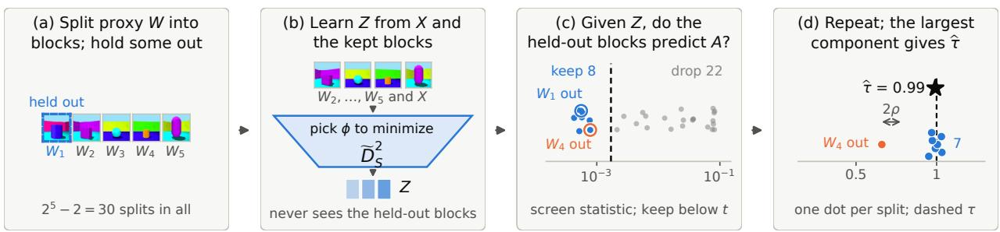  
Figure 2: PROBE learns, audits, and aggregates across held-out splits.

Then, we define the AIPW estimator as

$$
\widehat { \tau } _ { j } ^ { \mathrm { A I P W } } \triangleq \frac { 1 } { n _ { \mathrm { E } } } \sum _ { i \in \mathbb { Z } _ { \mathrm { E } } } \mathbb { U } \mathbb { I } \mathbb { F } _ { j } ( O _ { i } ) .\tag{11}
$$

Theorem 5 (Honest AIPW error). Fix $\delta _ { \mathrm { E } } \in ( 0 , 1 )$ . Suppose Assumptions 1 and 2 hold, Assumption 4 holds for $\widehat { \phi } _ { j }$ , Assumption 5 holds, $\widehat { e } _ { j }$ is clipped to $[ \eta , 1 - \eta ]$ , and the variance defined below is finite. Conditional on $\scriptstyle { \mathcal { T } } _ { \mathrm { D } }$ and $\mathcal { T } _ { \mathrm { N } }$ , let O be a fresh observation and define $\Vert g \Vert _ { 2 , j } \triangleq [ \mathbb { E } \{ g ( \widehat { Z } _ { j } ) ^ { 2 } \mid \mathcal { I } _ { \mathrm { D } } , \mathcal { I } _ { \mathrm { N } } \} ] ^ { 1 / 2 }$ and $\sigma _ { j } ^ { 2 } \triangleq \operatorname { V a r } \{ \operatorname { U I F } _ { j } ( O ) \mid { \mathcal { I } } _ { \mathrm { D } } , { \mathcal { I } } _ { \mathrm { N } } \}$ . Define

$$
\mathbf { e r r } _ { j } \triangleq \frac { 1 } { \eta } \| \widehat { e } _ { j } - e _ { j } \| _ { 2 , j } \sum _ { a = 0 } ^ { 1 } \| \widehat { m } _ { a , j } - m _ { a , j } \| _ { 2 , j } , \qquad \mathtt { b i a s } _ { j } \triangleq \frac { \Gamma _ { j } ( \widehat { \phi } _ { j } ) } { \eta ( 1 - \eta ) } D _ { \mathrm { r e s } , j } ( \widehat { \phi } _ { j } ) .\tag{12}
$$

Then, with probability at least $1 - \delta _ { \mathrm { E } }$ over $\scriptstyle { \mathcal { Z } } _ { \mathrm { E } }$

$$
\bigl | \widehat { \tau } _ { j } ^ { \mathrm { A I P W } } - \tau _ { \widehat { Z } _ { j } } \bigr | \leq \frac { \sigma _ { j } } { \sqrt { n _ { \mathrm { E } } \delta _ { \mathrm { E } } } } + \mathsf { e r r } _ { j } , \qquad \bigl | \widehat { \tau } _ { j } ^ { \mathrm { A I P W } } - \tau \bigr | \leq \frac { \sigma _ { j } } { \sqrt { n _ { \mathrm { E } } \delta _ { \mathrm { E } } } } + \mathsf { e r r } _ { j } + \mathsf { b i a s } _ { j } .\tag{13}
$$

Thm. 5 adds sampling and nuisance errors to Thm. 4; the nuisance term err<sub>j</sub> is doubly robust, vanishing if the propensity model or both outcome models are correct, but bias<sub>j</sub> remains.

So far, we have treated j as a fixed held-out block. When the valid block is unknown, PROxy Blockwise Exclusion (PROBE) in Algo. 1 turns the proximal plurality principle of Section 3.2 into a finite-sample search. PROBE searches the $T = | \mathfrak { S } | = 2 ^ { J } - 2$ splits and samples $m \in \{ 1 , \ldots , T \}$ splits independently of data and learned objects, as in Algorithm 1. Fig. 2 summarizes the search.

For $S \in { \widehat { B } } ,$ the estimate ${ \widehat { \theta } } _ { S }$ targets $\theta _ { S } \triangleq \tau _ { \widehat { \phi } _ { S } ( V _ { S } ) } .$ . PROBE can fail in three ways: ${ \widehat { \theta } } _ { S }$ misses $\theta _ { S }$ by sampling and nuisance error, $\theta _ { S }$ misses τ because balance is only approximate, or splits whose held-out blocks violate Assumption 2 or 4 agree on a wrong value and outnumber the rest. The next theorem bounds all three.

Theorem 6 (Finite-sample PROBE cluster recovery). Suppose Assumption 5 holds and, for every $S \in { \widehat { B } } , { \widehat { e } } _ { S }$ is clipped to [η, 1 − η] and $\sigma _ { S } < \infty ,$ , where $\sigma _ { S } .$ , err<sub>S</sub>, and bias<sub>S</sub> are the quantities of Thm. 5 with S in place of j. Let $C _ { 0 } \subseteq { \hat { B } }$ be the splits whose held-out blocks satisfy Assumptions 1, 2, and 4 with encoder $\widehat { \phi } _ { S }$ , let $N \triangleq | { \widehat { B } } |$ , and for $\delta \in ( 0 , 1 )$ let

Algorithm 1: PROBE split search   
Input: split budget m, screen threshold $t ,$ overlap $\eta ,$ linking radius $\rho$   
1 Sample: draw m splits $S$ uniformly without replacement from $\mathfrak { S } .$ .;   
2 Learn and screen: for each sampled split $S ,$ learn $\widehat { \phi } _ { S }$ on $\scriptstyle { \mathcal { T } } _ { \mathrm { D } }$ by minimizing the discrepancy   
in Definition $4 ;$ fit an unclipped propensity $\widehat { e } _ { S } ^ { \mathrm { r a w } }$ on $\begin{array} { r } { \mathcal { T } _ { \mathrm { N } } ; } \end{array}$ retain the sampled S if $\widetilde { D } _ { S , n _ { \mathrm { D } } } ^ { 2 } ( \hat { \phi } _ { S } ) \leq t$   
and $\hat { e } _ { S } ^ { \mathrm { r a w } }$ passes a prespecified empirical overlap check at level $\eta .$ Define $\widehat { B }$ as the screen set of   
all splits $S$ satisfying these fixed checks.;   
3 Estimate: fit outcome regressions on $\mathcal { T } _ { \mathrm { N } }$ , set $\widehat { e } _ { S } = \mathrm { c l i p } ( \widehat { e } _ { S } ^ { \mathrm { r a w } } , \eta , 1 - \eta )$ , and compute   
$\begin{array} { r } { \widehat { \theta } _ { S } = n _ { \mathrm { E } } ^ { - 1 } \sum _ { i \in \mathbb { Z } _ { \mathrm { E } } } \mathtt { U I F } _ { S } ( O _ { i } ) } \end{array}$ using Eq. (10).;   
4 Aggregate: link $S , S ^ { \prime }$ when $| \widehat { \theta } _ { S } - \widehat { \theta } _ { S ^ { \prime } } | \leq 2 \rho ;$ return the median $\widehat { \tau }$ of the unique largest   
component, and declare failure if its size is tied.;

$$
\varepsilon \triangleq \operatorname* { m a x } _ { S \in \widehat { \mathcal { B } } } \Bigl \{ \sigma _ { S } \sqrt { \frac { N } { n _ { \mathrm { E } } \delta } } + \mathsf { e r r } _ { S } \Bigr \} , \qquad b \triangleq \operatorname* { m a x } _ { S \in C _ { 0 } } \mathsf { b i a s } _ { S } .
$$

$$
\rho \geq b + \varepsilon ;
$$

$$
{ \widehat { B } } \setminus C _ { 0 }
$$

$$
S , S ^ { \prime }
$$

$$
C _ { 1 } , \dots , C _ { L }
$$

$$
| \theta _ { S ^ { \prime } } - \theta _ { S } | \leq 2 ( \rho - \varepsilon )
$$

$$
\theta _ { S }
$$

$$
C _ { 0 }
$$

$$
C _ { 0 } , \ldots , C _ { L }
$$

$$
C _ { 0 } = \widehat { B } )
$$

$$
2 ( \rho + \varepsilon )
$$

$$
\begin{array} { r } { \Delta \triangleq ( \vert C _ { 0 } \vert - \operatorname* { m a x } _ { 1 \leq \ell \leq L } \vert C _ { \ell } \vert ) / N > 0 \mathrm { ~ ( o r ~ } \Delta = 1 \mathrm { ~ i f ~ } L = 0 , } \end{array}
$$

$$
\cdot ( T , N , m )
$$

$$
1 ~ - ~ \delta ~ - ~ P ( R ~ = ~ 0 ) ~ - ~ L \mathbb { E } \{ e ^ { - R \Delta ^ { 2 } / 2 } \} ,
$$

$$
R \sim
$$

$$
{ \widehat { B } } ,
$$

$$
\widehat { \tau }
$$

$$
\lvert \hat { \tau } - \tau \rvert \leq \operatorname* { m a x } _ { S \in \widehat { \mathcal { B } } } \Bigl \{ \frac { \sigma _ { S } \sqrt { N } } { \sqrt { n _ { \mathrm { E } } \delta } } + \mathfrak { e r r } _ { S } \Bigr \} + \operatorname* { m a x } _ { S \in C _ { 0 } } \mathfrak { b i a s } _ { S } .\tag{14}
$$

Eq. (14) is $\operatorname { E q . }$ (13) applied to every retained split at $\delta _ { \mathrm { E } } = \delta / N$ : its first maximum collects the sampling and doubly robust nuisance terms over all retained splits, its second collects the bias term over $C _ { 0 }$ , and the search adds the failure probability $P ( R = 0 ) + L \mathbb { E } \{ e ^ { - R \Delta ^ { 2 } / 2 } \}$ . Thm. 6 quantifies the cost of examining only m uniformly sampled splits rather than all of S through two terms: $P ( R = 0 )$ , the chance that no sampled split is retained, and $L \mathbb { E } \{ e ^ { - R \Delta ^ { 2 } / 2 } \}$ , which bounds the chance that the sampled splits of $C _ { 0 }$ fail to outnumber those of every other cluster.

## 5. Experiments

This section provides empirical demonstration of the proposed theories. Appendix D gives the simulation details. We estimate the average treatment efect τ through PROBE (Algo. 1) and report the mean absolute error (MAE) over independently generated datasets. We compare PROBE with two groups of methods. The first group needs no proxy roles: adjustment for X, adjustment for (X, W), CEVAE (Louizos et al., 2017), and, for image proxies, adjustment for a representation that a convolutional network learns from all pixels, without holding out a block or checking balance. The second group needs the designated roles for each proxy: proximal two-stage least squares (2SLS) (Tchetgen Tchetgen et al., 2024), which requires designating each proxy as treatment-side or outcome-side (Fig. 1(c)); single-proxy control (Park et al., 2024), which requires designating one proxy of the untreated outcome Y (0); and its kernel version KSPC (Xu and Gretton, 2025), which requires the same designation. We run each of these methods once with the correct roles and once with wrong roles. An oracle that adjusts for (X, U), including the hidden confounder, serves as a reference.

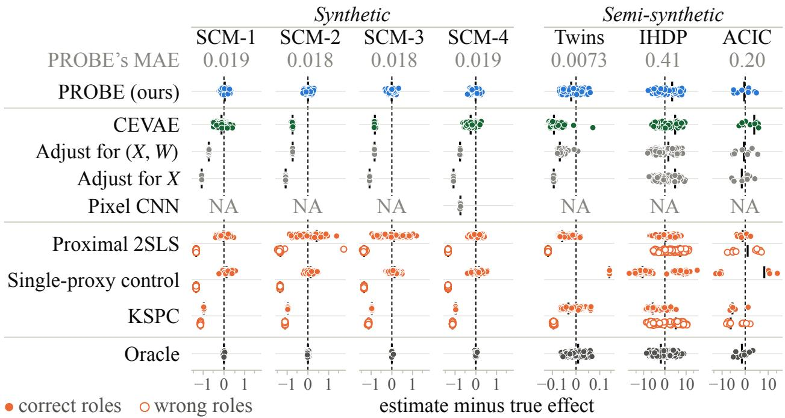  
Figure 3: Estimate minus the true efect on a symmetric log scale; each dot is one data set. Filled and hollow dots show methods that need proxy roles with correct and wrong roles; on the semi-synthetic data, single-proxy control is used as an ATE estimator.

Synthetic Data Analysis. In our example scenario, a hidden severity U afects both the treatment and the outcome, and the true efect is τ = 1. The proxy has five blocks. Blocks $W _ { 1 } , W _ { 2 }$ , and $W _ { 3 }$ are noisy measurements of U and are valid held-out blocks: each satisfies Assumptions 2 and 3. Blocks $W _ { 4 }$ and $W _ { 5 }$ are not valid: $W _ { 5 }$ violates held-out treatment independence (Assumption 2), so no representation can balance it, and $W _ { 4 }$ can be balanced but violates outcome-relevant completeness (Assumption 3), so it points to a wrong efect. PROBE is not told which blocks are valid, whereas the role-requiring methods are given the correct roles in their correct-role runs. We render this structure with (X, W) of dimension 8, 88, and 1,312 (SCM-1 to SCM-3) and with six Shapes3D images in place of the six proxy coordinates of SCM-1 (SCM-4), and generate 100 data sets of size $n = 2 4 { , } 0 0 0$ for each.

Fig. 3 (left) shows that PROBE, without being told the roles, stays near zero error in all four settings, while adjustment for X or (X, W) stays biased and CEVAE degrades as the dimension grows. Methods that need the roles are accurate only with the correct roles and fail badly with wrong ones. The invalid block $W _ { 4 }$ passes the balance screen in 396 of 400 data sets, yet plurality aggregation over held-out blocks removes it in every one of them, as Thm. 2 predicts.

Real-World Data Analysis. We use four real-world data sets. Twins (Louizos et al., 2017), IHDP (Hill, 2011), and ACIC 2016 (Dorie et al., 2019) are semi-synthetic benchmarks built on real covariates, with 11,984, 747, and 4,802 units and 42, 24, and 78 covariates. In each, we hide one covariate as U and generate the proxies and the treatment from it with one fixed recipe, so the efect is known exactly. The right heart catheterization (RHC) study (Connors et al., 1996) is observational, with 5,735 critically ill patients, days survived within 30 as the outcome, and ten physiological measurements grouped into five proxy blocks, as analyzed by Cui et al. (2024). No true efect is known for the RHC study.

Fig. 3 (right) shows that PROBE, without being told the roles, is the most accurate method on Twins and among the three most accurate on IHDP and ACIC. As in the synthetic data, methods that need the roles are accurate only with the correct roles and degrade sharply with wrong ones. On RHC, where no true efect is known, PROBE’s interval contains the proximal estimate that Cui et al. (2024) obtain by assigning the roles, while KSPC’s estimate changes with the block it is given (Fig. 9).

## 6. Conclusion

We introduced proximal balancing, which estimates the average treatment efect from a multidimensional proxy without designating proxy roles, solving an inverse problem, or modeling the hidden confounder. When a held-out block does not afect the treatment and preserves the outcomerelevant part of the confounder, adjusting for a representation that balances it identifies the efect (Thm. 1). When the valid block is unknown, a plurality vote over held-out blocks identifies the efect (Thm. 2); under approximate balance, the bias is bounded by a stability-weighted residual treatment discrepancy (Thm. 3); and our algorithm, PROBE (Algo. 1), has finite-sample guarantees for representation learning, honest AIPW estimation, and search (Thms. 4–6). In synthetic data with vector and image proxies, PROBE had the smallest error of all competing methods other than the oracle, and on real-world data it remained competitive without role information, while methods given wrong roles degraded sharply.

## References

Bhattacharya, R., Nabi, R., and Shpitser, I. (2022). Semiparametric inference for causal efects in graphical models with hidden variables. Journal of Machine Learning Research, 23(295):1–76.

Bowden, J., Davey Smith, G., Haycock, P. C., and Burgess, S. (2016). Consistent estimation in Mendelian randomization with some invalid instruments using a weighted median estimator. Genetic Epidemiology, 40(4):304–314.

Brier, G. W. (1950). Verification of forecasts expressed in terms of probability. Monthly Weather Review, 78(1):1–3.

Chen, J. M., Bhattacharya, R., and Keith, K. A. (2024). Proximal causal inference with text data. In Advances in Neural Information Processing Systems, volume 37, pages 135983–136017.

Chernozhukov, V., Chetverikov, D., Demirer, M., Duflo, E., Hansen, C., Newey, W., and Robins, J. (2017). Double/debiased machine learning for treatment and causal parameters. arXiv preprint arXiv:1608.00060.

Connors, A. F., Sperof, T., Dawson, N. V., et al. (1996). The efectiveness of right heart catheterization in the initial care of critically ill patients. JAMA, 276(11):889–897.

Cui, Y., Pu, H., Shi, X., Miao, W., and Tchetgen Tchetgen, E. (2024). Semiparametric proximal causal inference. Journal of the American Statistical Association, 119(546):1348–1359.

Dorie, V., Hill, J., Shalit, U., Scott, M., and Cervone, D. (2019). Automated versus do-it-yourself methods for causal inference: Lessons learned from a data analysis competition. Statistical Science, 34(1):43–68.

Fulcher, I. R., Shpitser, I., Marealle, S., and Tchetgen Tchetgen, E. J. (2020). Robust inference on population indirect causal efects: The generalized front door criterion. Journal of the Royal Statistical Society Series B: Statistical Methodology, 82(1):199–214.

Guo, A., Benkeser, D., and Nabi, R. (2023). Targeted machine learning for average causal efect estimation using the front-door functional. arXiv preprint arXiv:2312.10234.

Guo, Z., Kang, H., Cai, T. T., and Small, D. S. (2018). Confidence intervals for causal efects with invalid instruments by using two-stage hard thresholding with voting. Journal of the Royal Statistical Society: Series B, 80(4):793–815.

Hainmueller, J. (2012). Entropy balancing for causal efects: A multivariate reweighting method to produce balanced samples in observational studies. Political Analysis, 20(1):25–46.

Hartwig, F. P., Davey Smith, G., and Bowden, J. (2017). Robust inference in summary data Mendelian randomization via the zero modal pleiotropy assumption. International Journal of Epidemiology, 46(6):1985–1998.

Hill, J. L. (2011). Bayesian nonparametric modeling for causal inference. Journal of Computational and Graphical Statistics, 20(1):217–240.

Hoefding, W. (1963). Probability inequalities for sums of bounded random variables. Journal of the American Statistical Association, 58(301):13–30.

Imai, K. and Ratkovic, M. (2014). Covariate balancing propensity score. Journal of the Royal

Statistical Society: Series B, 76(1):243–263.

Jung, Y. (2026). Debiased front-door learners for heterogeneous efects. In International Conference on Learning Representations.

Jung, Y., Díaz, I., Tian, J., and Bareinboim, E. (2023). Estimating causal efects identifiable from a combination of observations and experiments. Advances in Neural Information Processing Systems, 36:46446–46490.

Jung, Y. and Kang, B. (2026). Information-theoretic causal bounds under unmeasured confounding. In Conference on Causal Learning and Reasoning.

Jung, Y., Park, M. W., and Lee, S. (2024a). Complete graphical criterion for sequential covariate adjustment in causal inference. Advances in Neural Information Processing Systems, 37:19813– 19838.

Jung, Y., Tian, J., and Bareinboim, E. (2020a). Estimating causal efects using weighting-based estimators. In Proceedings of the 34th AAAI Conference on Artificial Intelligence.

Jung, Y., Tian, J., and Bareinboim, E. (2020b). Learning causal efects via weighted empirical risk minimization. Advances in Neural Information Processing Systems, 33.

Jung, Y., Tian, J., and Bareinboim, E. (2021a). Estimating identifiable causal efects on Markov equivalence class through double machine learning. In Proceedings of the 38th International Conference on Machine Learning, pages 5168–5179.

Jung, Y., Tian, J., and Bareinboim, E. (2021b). Estimating identifiable causal efects through double machine learning. In Proceedings of the 35th AAAI Conference on Artificial Intelligence.

Jung, Y., Tian, J., and Bareinboim, E. (2024b). Unified covariate adjustment for causal inference. Advances in Neural Information Processing Systems, 37.

Kallus, N., Mao, X., and Uehara, M. (2021). Causal inference under unmeasured confounding with negative controls: A minimax learning approach. arXiv preprint arXiv:2103.14029.

Kang, H., Zhang, A., Cai, T. T., and Small, D. S. (2016). Instrumental variables estimation with some invalid instruments and its application to Mendelian randomization. Journal of the American Statistical Association, 111(513):132–144.

Kennedy, E. H. (2022). Semiparametric doubly robust targeted double machine learning: A review. arXiv preprint arXiv:2203.06469.

Kingma, D. P. and Welling, M. (2014). Auto-encoding variational Bayes. In International Conference on Learning Representations.

Kummerfeld, E., Lim, J., and Shi, X. (2024). Data-driven automated negative control estimation (DANCE): Search for, validation of, and causal inference with negative controls. Journal of Machine Learning Research, 25(229):1–35.

Kuroki, M. and Pearl, J. (2014). Measurement bias and efect restoration in causal inference. Biometrika, 101(2):423–437.

Lee, S. and Bareinboim, E. (2021). Causal identification with matrix equations. In Advances in Neural Information Processing Systems, volume 34.

Lipsitch, M., Tchetgen Tchetgen, E., and Cohen, T. (2010). Negative controls: A tool for detecting confounding and bias in observational studies. Epidemiology, 21(3):383–388.

Louizos, C., Shalit, U., Mooij, J. M., Sontag, D., Zemel, R., and Welling, M. (2017). Causal efect inference with deep latent-variable models. In Advances in Neural Information Processing Systems, volume 30, pages 6446–6456.

Mastouri, A., Zhu, Y., Gultchin, L., Korba, A., Silva, R., Kusner, M. J., Gretton, A., and Muandet, K. (2021). Proximal causal learning with kernels: Two-stage estimation and moment restriction. In Proceedings of the 38th International Conference on Machine Learning, volume 139 of Proceedings of Machine Learning Research, pages 7512–7523.

Miao, W., Geng, Z., and Tchetgen Tchetgen, E. J. (2018). Identifying causal efects with proxy variables of an unmeasured confounder. Biometrika, 105(4):987–993.

Park, C., Richardson, D. B., and Tchetgen Tchetgen, E. J. (2024). Single proxy control. Biometrics, 80(2):ujae027.

Pearl, J. (2009). Causality: Models, Reasoning, and Inference. Cambridge University Press, 2 edition.

Rakshit, P., Shi, X., and Tchetgen Tchetgen, E. (2025). Adaptive proximal causal inference with some invalid proxies. arXiv preprint arXiv:2507.19623.

Rissanen, S. and Marttinen, P. (2021). A critical look at the consistency of causal estimation with deep latent variable models. In Advances in Neural Information Processing Systems, volume 34, pages 4207–4217.

Robins, J. M., Rotnitzky, A., and Zhao, L. P. (1994). Estimation of regression coeficients when some regressors are not always observed. Journal of the American Statistical Association, 89(427):846– 866.

Rosenbaum, P. R. and Rubin, D. B. (1983). The central role of the propensity score in observational studies for causal efects. Biometrika, 70(1):41–55.

Saha, A., Bates, S., and Shah, D. (2026). Causal inference with categorical unobserved confounder via mixture learning. arXiv preprint arXiv:2605.19006.

Shalit, U., Johansson, F. D., and Sontag, D. (2017). Estimating individual treatment efect: Generalization bounds and algorithms. In Proceedings of the 34th International Conference on Machine Learning, volume 70 of Proceedings of Machine Learning Research, pages 3076–3085.

Shpitser, I. and Pearl, J. (2006). Identification of joint interventional distributions in recursive semi-Markovian causal models. In Proceedings of the 21st National Conference on Artificial Intelligence, pages 1219–1226.

Tchetgen Tchetgen, E. J. (2014). The control outcome calibration approach for causal inference with unobserved confounding. American Journal of Epidemiology, 179(5):633–640.

Tchetgen Tchetgen, E. J., Ying, A., Cui, Y., Shi, X., and Miao, W. (2024). An introduction to proximal causal inference. Statistical Science, 39(3):375–390.

Teicher, H. (1961). Identifiability of mixtures. The Annals of Mathematical Statistics, 32(1):244– 248.

Tian, J. and Pearl, J. (2002). A general identification condition for causal efects. In Proceedings of the 18th National Conference on Artificial Intelligence, pages 567–573.

Tsiatis, A. A. (2006). Semiparametric Theory and Missing Data. Springer Series in Statistics. Springer, New York.

Xie, F., Chen, Z., Luo, S., Miao, W., Cai, R., and Geng, Z. (2024). Automating the selection of proxy variables of unmeasured confounders. In Proceedings of the 41st International Conference on Machine Learning, volume 235 of Proceedings of Machine Learning Research, pages 54430– 54459.

Xu, L. and Gretton, A. (2025). Kernel single proxy control for deterministic confounding. In Proceedings of the 28th International Conference on Artificial Intelligence and Statistics, volume 258 of Proceedings of Machine Learning Research, pages 3736–3744.

Xu, L., Kanagawa, H., and Gretton, A. (2021). Deep proxy causal learning and its application to confounded bandit policy evaluation. In Advances in Neural Information Processing Systems, volume 34, pages 26264–26275.

Yu, M., Shi, X., and Tchetgen Tchetgen, E. J. (2025). Fortified proximal causal inference with many invalid proxies. arXiv preprint arXiv:2506.13152.

## A. Problem Setting

We observe independent copies $O _ { i } = ( X _ { i } , W _ { i } , A _ { i } , Y _ { i } ) , \qquad i = 1 , \ldots , n$ , where $X \in { \mathcal { X } }$ is a possibly high-dimensional vector of observed pretreatment covariates, X is its value space, $A \in \{ 0 , 1 \}$ is treatment, and Y is the observed outcome.

For each $a \in \{ 0 , 1 \}$ , the potential outcome $Y ( a )$ is the outcome that would be observed if treatment were set to a. Our target is the population average treatment efect $\tau \triangleq \mathbb { E } \{ Y ( 1 ) - Y ( 0 ) \}$ .

Let U denote an unobserved pretreatment variable that may afect both treatment A and outcome $Y$ . When U afects both A and Y, the observed-data distribution alone does not identify τ without additional structure. We therefore observe a proxy measurement W that contains information about $U .$ . The proxy is divided into prespecified blocks, $W = ( W _ { 1 } , \dots , W _ { J } )$ . Each block may be scalar or vector-valued. A block can represent one repeated measurement, sensor channel, laboratory panel, or prespecified region of a larger measurement.

For each block index $j \in \{ 1 , \dots , J \}$ , we call $W _ { j }$ the held-out proxy block and let $\mathcal { W } _ { j }$ denote its value space. We call the combination of all other blocks the remaining blocks (Definition 1) and write $W _ { - j } \triangleq ( W _ { 1 } , \hdots , W _ { j - 1 } , W _ { j + 1 } , \hdots , W _ { J } )$ for the resulting vector of remaining proxy blocks. Let $\nu _ { j }$ denote the value space of the pair $( X , W _ { - j } )$ . Finally, define $V _ { j } \triangleq ( X , W _ { - j } ) \in \mathcal { V } _ { j }$ . The variable $V _ { j }$ is the combined vector of the observed covariates $X$ and the remaining proxy blocks $W _ { - j }$ . We also write $T _ { j } \triangleq ( X , W _ { j } )$ for the observed covariates together with the held-out block.

## B. Identification

Let $d _ { V _ { j } }$ denote the coordinate dimension of $V _ { j }$ . Fix a user-specified output dimension $d _ { Z _ { j } } \leq d _ { V _ { j } }$ For a measurable representation function, define $\phi : \mathcal { V } _ { j } \longrightarrow \mathbb { R } ^ { d \boldsymbol { z } _ { j } } , \qquad Z _ { j } ^ { \phi } \triangleq \phi ( V _ { j } )$ . Let $\Phi _ { j }$ denote a prespecified class of such representation functions. When a representation function $\phi _ { j } \in \Phi _ { j }$ is fixed, we abbreviate $Z _ { j } ^ { \phi _ { j } } = \phi _ { j } ( V _ { j } )$ as $Z _ { j }$

## B.1. Identification for a Prespecified Held-Out Block

## B.1.1. Assumptions

Assumption 6 (Consistency and integrability; restatement of Assumption 1). For each $a \in \{ 0 , 1 \} , Y = Y ( A ) , \qquad \mathbb { E } | Y ( a ) | < \infty$

Assumption 7 (Latent exchangeability and held-out treatment independence; restatement of Assumption 2). For each $a \in \{ 0 , 1 \} , Y ( a )$ ⊥⊥ $A \mid ( U , V _ { j } )$ and $W _ { j }$ ⊥⊥ $A \mid ( U , V _ { j } )$

The first clause says that $( U , V _ { j } )$ is suficient to remove hidden confounding between treatment and each potential outcome. The second clause says that, after $( U , V _ { j } )$ is fixed, treatment status provides no additional information about the distribution of $W _ { j }$

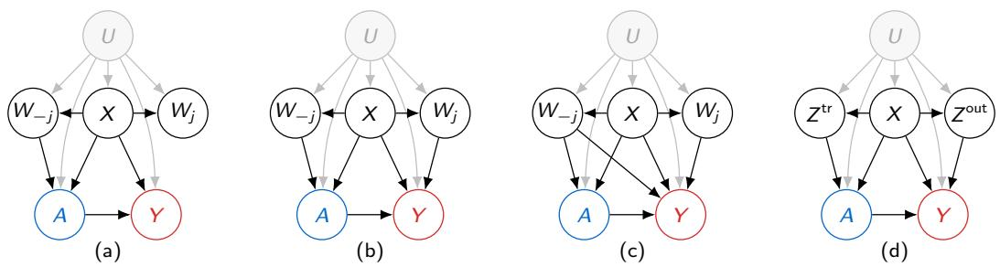  
Figure 4: Causal structures compatible with proximal balancing in panels (a)–(c) and a standard two-proxy proximal structure in panel (d).

Fig. 4 shows three examples compatible with proximal balancing and one representative standard proximal structure.

We then introduce the latent and proxy objects within each representation stratum.

Definition 5 (Latent and proxy objects within a representation stratum). Let $P _ { Z _ { j } }$ denote the distribution of $Z _ { j }$ . For $P _ { Z _ { j } }$ -almost every z, fix versions of the following conditional distributions. Define $Q _ { a , j , z } \triangleq P ( V _ { j } , U \mid A = a , Z _ { j } = z ) , \qquad a \in \{ 0 , 1 \}$ , and, by held-out treatment independence, define the treatment-invariant conditional distribution of the heldout block by $K _ { j } ( \cdot \mid v , u ) \triangleq P ( W _ { j } \mid V _ { j } = v , U = u )$ . For any probability distribution Q on $( V _ { j } , U )$ , let ${ \boldsymbol { \kappa } } _ { j } \boldsymbol { Q }$ denote the induced distribution of $( X , W _ { j } )$ obtained by first drawing $( V _ { j } , U ) = ( X , W _ { - j } , U ) \sim Q$ , then drawing $W _ { j } \sim K _ { j } ( \cdot \mid V _ { j } , U )$ , and finally retaining $( X , W _ { j } )$ For each $a \ \in \ \{ 0 , 1 \}$ , define $\mu _ { a , j , z } ( v , u ) \ \triangleq \ \mathbb { E } \{ Y ( a ) | V _ { j } \ = \ v , U \ = \ u , Z _ { j } \ = \ z \}$ . For $P _ { Z _ { j } ^ { - } }$ almost every z, let $\mathcal { Q } _ { j , z }$ be the collection of probability distributions Q on $( V _ { j } , U )$ such that $Q \ll P ( V _ { j } , U \mid Z _ { j } = z )$ and $\mathbb { E } _ { Q } | \mu _ { a , j , z } ( V _ { j } , U ) | < \infty$ for both $a \in \{ 0 , 1 \}$

Assumption 8 (Outcome-relevant completeness; restatement of Assumption 3). For $P _ { Z _ { j } } -$ almost every z, every $Q , Q ^ { \prime } \in \mathcal { Q } _ { j , z }$ , and each $a \in \{ 0 , 1 \}$ , $\begin{array} { r } { { \cal K } _ { j } { \cal Q } = { \cal K } _ { j } { \cal Q } ^ { \prime } } \end{array}$ =⇒ $\mathbb { E } _ { Q } \{ \mu _ { a , j , z } ( V _ { j } , U ) \} = \mathbb { E } _ { Q ^ { \prime } } \{ \mu _ { a , j , z } ( V _ { j } , U ) \}$

Assumption 3 is stated for all pairs $Q , Q ^ { \prime } \in \mathcal { Q } _ { j , i }$ <sub>z</sub> (Definition 5) within a representation stratum. The next proposition gives concrete suficient conditions. It treats the held-out block as a measurement of $( X , U )$ that is conditionally independent of the remaining blocks, and it asks the measurement channel to be complete.

Proposition 2 (Suficient conditions for outcome-relevant completeness). Fix a block j and a representation ϕ<sub>j</sub>. Suppose that

(i) $W _ { j } ~ \perp \perp ~ W _ { - j } ~ \mid ~ ( X , U )$ and, for each $a \ \in \ \{ 0 , 1 \} , \ Y ( a ) \ \bot \ W _ { - j } \ | \ ( X , U , Z _ { j } )$ , so that $K _ { j } ( \cdot \mid v , u )$ and $\mu _ { a , j , z } ( \boldsymbol { v } , \boldsymbol { u } )$ depend on $v = ( x , w _ { - j } )$ only through x;

(ii) for every x, the map $\textstyle \pi \mapsto \int K _ { j } ( \cdot \mid x , u ) \pi ( d u )$ from probability distributions of U to distributions of $W _ { j }$ is injective.

Then Assumption 3 holds. Condition (ii) holds in the following two specializations, which

are not exhaustive.

(a) Injective decoder with additive noise. $W _ { j } = g ( X , U ) + \epsilon _ { j }$ , where $\epsilon _ { j }$ is independent of $( X , W _ { - j } , U )$ and has a characteristic function without zeros, as Gaussian noise does, and $u \mapsto g ( x , u )$ is injective for every x.

(b) Count channel with an injective rate. $W _ { j }$ is a vector of counts whose coordinates are conditionally independent given $( X , U )$ , with $W _ { j , \ell } \mid ( X = x , U = u ) \sim \mathrm { P o i s s o n } \{ \lambda _ { \ell } ( x , u ) \}$ for each coordinate ℓ, and $u \mapsto \lambda ( x , u ) \triangleq ( \lambda _ { 1 } ( x , u ) , \dots , \lambda _ { d } ( x , u ) )$ is injective for every x.

Condition (i) lets the remaining blocks influence the outcome only through $( X , U )$ and through components retained in $Z _ { j } { \mathrm { : } }$ ; Thm. 1, restated below, uses the more general Assumption 3. The first specialization covers latent-variable generative models in which the held-out block is a decoded image or embedding of (X, U) plus independent noise, and the second covers count-valued proxies such as event, word, or sequencing-read counts. When the latent state takes finitely many values and both proxy blocks are pure measurements satisfying the rank conditions of Kuroki and Pearl (2014), their matrix restoration identifies τ directly.

## B.1.2. Exact Identification for a Fixed Block

The next theorem gives the central identification result. It states when adjustment for $Z _ { j }$ identifies the population average treatment efect.

Theorem 7 (Identification from a held-out audit; restatement of Thm. 1). Fix a prespecified block $j \in \{ 1 , \dotsc , J \}$ . Suppose Assumptions 1–3 hold for this block and its representation. If $Z _ { j } = \phi _ { j } ( V _ { j } )$ is constructed such that $0 < P ( A = 1 \mid Z _ { i } ) < 1$ almost surely, and $( X , W _ { j } ) \perp \perp$ $A \mid Z _ { j }$ , then $\tau = \mathbb { E } [ \mathbb { E } ( Y \mid A = 1 , Z _ { j } ) - \mathbb { E } ( Y \mid A = 0 , Z _ { j } ) ]$

The theorem is a conditional mean identification result. It establishes that the conditional mean of $Y ( a )$ given $( A , Z _ { j } )$ does not depend on A, and consistency converts this equality into the displayed adjustment formula. It does not assert the full conditional independence $Y ( a ) \perp \perp A \mid Z _ { j }$

## B.1.3. Comparison with the Canonical Two-Proxy Proximal Model

Graphically and structurally, proximal balancing difers from the standard proximal causal inference framework (Miao et al., 2018; Tchetgen Tchetgen et al., 2024). The standard framework prespecifies a treatment-inducing proxy $Z ^ { \mathrm { t r } }$ and an outcome-inducing proxy $Z ^ { \mathrm { o u t } }$ . By contrast, proximal balancing requires only the held-out block $W _ { j }$ to satisfy $W _ { j } \perp \perp A \mid ( U , V _ { j } )$ . The remaining block is not subject to this restriction and may afect A, Y, both, or neither, as illustrated by panels $\mathrm { ( a ) - ( c ) }$

The underlying assumptions and identification strategies are also diferent. A representative canonical completeness condition is, for every $( a , x ) , \mathbb { E } \{ g ( U ) \mid Z ^ { \mathrm { t r } } , A = a , X = x \} = 0$ almost surely =⇒ $g ( U ) ~ = ~ 0$ almost surely for functions g in the specified class. Identification then proceeds by seeking an outcome bridge h satisfying an observed conditional-moment equation such as E $\operatorname { \chi } \left( \boldsymbol { Y } \mid Z ^ { \mathrm { t r } } , A , \boldsymbol { X } \right) = \mathbb { E } \{ h ( Z ^ { \mathrm { o u t } } , A , \boldsymbol { X } ) \mid Z ^ { \mathrm { t r } } , A , \boldsymbol { X } \}$

Proximal balancing instead combines observable balance in Thm. 1 with outcome-relevant completeness in Assumption 3. For comparison, the canonical proximal conditions refer to proxy validity, existence of an integrable outcome bridge, and treatment-proxy completeness for a designated proxy pair. The proximal-balancing conditions refer to Assumptions $_ { 1 - 3 }$ , representation overlap, and exact balance for a designated proxy split. A natural question is whether either framework’s suficient conditions contain those of the other.

Proposition 3 (Non-nesting of canonical proximal and proximal-balancing suficient conditions). There exists a causal data-generating process for which the canonical proximal conditions hold for a designated proxy pair $( Z ^ { \mathrm { t r } } , Z ^ { \mathrm { o u t } } )$ but the proximal-balancing conditions fail for the split with $W _ { - j } = Z ^ { \mathrm { t r } }$ and $W _ { j } = Z ^ { \mathrm { o u t } }$ under every representation $\phi _ { j }$ . Conversely, there exists a causal data-generating process for which the proximal-balancing conditions hold for a designated proxy split but the canonical proximal conditions fail for the pair $( Z ^ { \mathrm { t r } } , Z ^ { \mathrm { o u t } } ) \ = \ ( W _ { - j } , W _ { j } )$ . Moreover, neither canonical treatment-proxy completeness nor Assumption 3 implies the other.

## B.2. Identification When the Valid Held-Out Block Is Unknown

Section B.1 fixes the held-out block in advance. We now allow its composition to be unknown. Consider every nonempty proper subset

$$
{ \mathfrak { S } } \triangleq \{ S \subset \{ 1 , . . . , J \} : 1 \leq | S | \leq J - 1 \} .\tag{15}
$$

A subset $S$ and its complement $S ^ { c }$ are distinct because they exchange the held-out and remaining roles. For each $S \in \mathfrak { S }$ , let $W _ { S } = ( W _ { j } ) _ { j \in S }$ be the held-out vector, let $W _ { - S } = ( W _ { j } ) _ { j \notin S }$ be the remaining vector, and define $V _ { S } \triangleq ( X , W _ { - S } ) , \qquad Z _ { S } \triangleq \phi _ { S } ( V _ { S } )$ , using the same construction as for a single held-out block.

For each $S \in { \mathfrak { S } }$ , define, whenever it is well-defined, $\theta _ { S } \triangleq \mathbb { E } [ \mathbb { E } ( Y \mid A = 1 , Z _ { S } ) - \mathbb { E } ( Y \mid A = 0 , Z _ { S } ) ]$

Thm. 1 applies to each proxy split S after replacing $( V _ { j } , W _ { j } , Z _ { j } )$ by $( V _ { S } , W _ { S } , Z _ { S } )$ throughout. Thus, if Assumption 1 and the grouped versions of Assumptions 2 and 3 hold, representation overlap holds, and $( X , W _ { S } ) \bot \bot A \mid Z _ { S }$ , then $\theta _ { S } = \tau$

The balance condition is observable at the population level. Define the population balance-screen set

$$
{ \mathcal { B } } \triangleq \{ S \in { \mathfrak { S } } : 0 < P ( A = 1 \mid Z _ { S } ) < 1 { \mathrm { ~ a . s . } } , ( X , W _ { S } ) \bot \mid A \mid Z _ { S } \} .\tag{16}
$$

Each $S \in B$ defines one retained proxy split and one candidate efect $\theta _ { S }$ through Eq. (3). We assume that each such $\theta _ { S }$ is well defined in R. The next result considers the case in which the true efect τ occurs more often than any other candidate value.

Theorem 8 (Identification with an unknown valid block; restatement of Thm. 2). Sup  
pose $B \neq \varnothing$ and the target has a unique proximal plurality (Definition 2). Then $\{ \tau \} =$   
arg max $\{ S \in B : \theta _ { S } = c \} $ c∈R

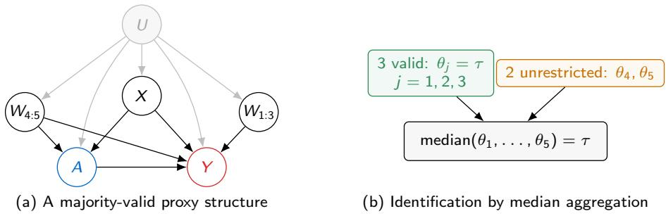  
Figure 5: Median aggregation over five singleton proxy splits.

The theorem states that τ can be identified even when we do not know the exact held-out proxy $W _ { j }$ , if it is the unique most frequent candidate value. The following corollary is the strict-majority special case of Thm. 2. It gives both the unique most frequent candidate value and the corresponding median aggregation result.

Corollary 1 (Target-valued majority and median aggregation). Suppose $B \neq \varnothing$ and   
|B|   
<sup></sup><sub></sub>{S ∈ B : θ<sub>S</sub> = τ}<sup></sup><sub></sub> > (17)   
2   
That is, more than half of the retained proxy splits yield the true causal efect. Then   
$\{ \tau \} = \underset { c \in \mathbb { R } } { \arg \operatorname* { m a x } } \big | \{ S \in \mathcal { B } : \theta _ { S } = c \} \big |$ , and median $( ( \theta _ { S } ) _ { S \in B } ) = \tau$

Fig. 5 illustrates the result. The labels $W _ { 1 : 3 }$ and $W _ { 4 : 5 }$ denote grouped proxy blocks, not single variables. Under Assumption 1, if all five singleton proxy splits pass the balance screen and proxy splits 1, 2, 3 satisfy the grouped versions of Assumptions 2 and 3, then three of the five singleton candidate values equal $\tau ,$ so their median equals τ .

## B.3. Approximate Balance and Bias Bound

Exact balance is an ideal endpoint. We now consider representations that achieve only approximate, rather than exact, balance. Fix a measurable encoder $\phi$ and write $T _ { j } \triangleq ( X , W _ { j } )$ ; the notation $Z _ { j } ^ { \phi }$ was defined at the beginning of this section. Define $e _ { j , \phi } ( z ) \triangleq P ( A = 1 \mid Z _ { j } ^ { \phi } = z ) , q _ { j , \phi } ( t , z ) \triangleq$ $P ( A = 1 \mid T _ { j } = t , Z _ { j } ^ { \phi } = z )$ . Their diference is the treatment information that remains in the held-out variables after conditioning on the representation.

Definition 6 (Residual treatment discrepancy; restatement of Definition 3). Define   
$D _ { \mathrm { r e s } , j } ^ { 2 } ( \phi ) \triangleq \mathbb { E } \left[ \{ q _ { j , \phi } ( T _ { j } , Z _ { j } ^ { \phi } ) - e _ { j , \phi } ( Z _ { j } ^ { \phi } ) \} ^ { 2 } \right] \mathrm { ~ a n d ~ } D _ { \mathrm { r e s } , j } ( \phi ) \triangleq \{ D _ { \mathrm { r e s } , j } ^ { 2 } ( \phi ) \} ^ { 1 / 2 }$

The discrepancy measures the treatment information in $T _ { j }$ that remains after conditioning on $Z _ { j } ^ { \phi }$

```perl
Proposition 4 (Zero discrepancy; restatement of Prop. 1). $\begin{array} { r } { D _ { \mathrm { r e s } , j } ( \phi ) = 0 \quad \Longleftrightarrow \quad A \perp T _ { j } \mid } \end{array}$
$Z _ { j } ^ { \phi }$
```

To relate the discrepancy with the causal bias bound, we define $P _ { \phi , z } \triangleq P ( T _ { j } \mid Z _ { j } ^ { \phi } = z )$ . For a signed measure ν with a density with respect to $P _ { \phi , z }$ , write $\| \nu \| _ { \phi , z } \triangleq \| d \nu / d P _ { \phi , z } \| _ { L _ { 2 } ( P _ { \phi , z } ) }$ . For $P _ { Z _ { j } ^ { \phi } } . \mathrm { a l m o s t }$ every z and $a \in \{ 0 , 1 \}$ , write $Q _ { a , j , z } ^ { \phi } \triangleq P ( V _ { j } , U \mid A = a , Z _ { j } ^ { \phi } = z )$ and $\mu _ { a , j , z } ^ { \phi } ( v , u ) \triangleq \mathbb { E } \{ Y ( a ) \mid V _ { j } =$ $v , U = u , Z _ { j } ^ { \phi } = z \}$ . Let $\mathcal { Q } _ { j , z } ^ { \phi }$ be the collection of probability distributions $Q$ on $( V _ { j } , U )$ such that $Q \ll P ( V _ { j } , U \mid Z _ { j } ^ { \phi } = z )$ and $\mathbb { E } _ { Q } | \mu _ { a , j , z } ^ { \phi } ( V _ { j } , U ) | < \infty$ for both $a \in \{ 0 , 1 \}$ . We assume the following:

Assumption 9 $( L _ { 2 }$ outcome-relevant stability; restatement of Assumption 4). For every   
representation $\phi$ under consideration, there is a finite scalar $\Gamma _ { j } ( \phi ) ~ > ~ 0$ such that, for   
$P _ { Z _ { i } ^ { \phi } }$ -almost every z, every $a \in \{ 0 , 1 \}$ , and all $\begin{array} { r l } { Q , Q ^ { \prime } \in \mathcal { Q } _ { j , z } ^ { \phi } , \left| \mathbb { E } _ { Q } \{ \mu _ { a , j , z } ^ { \phi } \} - \mathbb { E } _ { Q ^ { \prime } } \{ \mu _ { a , j , z } ^ { \phi } \} \right| \le } & { { } } \end{array}$   
$\Gamma _ { j } \dot { ( \phi ) } \parallel \mathcal { K } _ { j } Q - \mathcal { K } _ { j } Q ^ { \prime } \parallel _ { \phi , z } .$

If ${ \kappa } _ { j } Q = { \kappa } _ { j } Q ^ { \prime }$ , the right-hand side is zero. Assumption 4 therefore implies Assumption 3 for $Z _ { j } ^ { \phi }$

```latex
Theorem 9 (Approximate-balance bias; restatement of Thm. 3). Suppose Assumptions 1,
$^ { 2 , }$ and 4 hold for $Z _ { j } ^ { \phi }$ . Suppose there is a constant $\eta \in ( 0 , 1 / 2 ]$ such that $\eta \le e _ { j , \phi } ( z ) \le 1 - \eta$ for
$P _ { Z _ { j } ^ { \phi } } . \mathrm { a l m o s t }$ every z. Then $\begin{array} { r } { \left| \mathbb { E } \big [ \mathbb { E } ( Y \mid A = 1 , Z _ { j } ^ { \phi } ) - \mathbb { E } ( Y \mid A = 0 , Z _ { j } ^ { \phi } ) \big ] - \tau \right| \leq \frac { \Gamma _ { j } ( \phi ) } { \eta ( 1 - \eta ) } D _ { \mathrm { r e s } , j } ( \phi ) } \end{array}$
```

The theorem implies the following sensitivity result.

Proposition 5 (Population sensitivity region). Suppose Assumptions 1, 2, and 4 hold for $Z _ { j } ^ { \phi }$ , and suppose there is a constant $\eta ~ \in ~ ( 0 , 1 / 2 ]$ such that $\eta ~ \le ~ e _ { j , \phi } ( z ) ~ \le ~ 1 - \eta$ for $P _ { Z _ { j } ^ { \phi } } . \mathrm { a l m o s t }$ every z. Define $\tau _ { Z _ { j } ^ { \phi } } ~ \triangleq ~ \mathbb { E } \Big [ \mathbb { E } ( Y \mid A = 1 , Z _ { j } ^ { \phi } ) - \mathbb { E } ( Y \mid A = 0 , Z _ { j } ^ { \phi } ) \Big ]$ . Then $\begin{array} { r } { \tau \in \left[ \tau _ { Z _ { j } ^ { \phi } } - \frac { \Gamma _ { j } ( \phi ) } { \eta ( 1 - \eta ) } D _ { \mathrm { r e s } , j } ( \phi ) , \tau _ { Z _ { j } ^ { \phi } } + \frac { \Gamma _ { j } ( \phi ) } { \eta ( 1 - \eta ) } D _ { \mathrm { r e s } , j } ( \phi ) \right] } \end{array}$

This is a population sensitivity region, not a finite-sample confidence interval. When $D _ { \mathrm { r e s } , j } ( \phi ) = 0$ it collapses to the point-identified value in Thm. 1. The residual discrepancy is a functional of the observed distribution. The constant $\Gamma _ { j } ( \phi )$ is structural and must be justified by scientific knowledge, additional theory, or sensitivity analysis.

## C. Representation Learning and AIPW Estimation

The identification results concern one fixed representation. We now select a representation from data and estimate the adjustment functional that it induces. The representation-learning and AIPW analysis below uses one prespecified held-out block j throughout.

## C.1. Representation Learning

Recall that one observed record is ${ { O } _ { i } } \ = \ ( { { X } _ { i } } , { { W } _ { i } } , { { A } _ { i } } , { { Y } _ { i } } )$ . Partition the observed sample into three mutually disjoint subsets, $\mathcal { I } _ { \mathrm { D } } , \qquad \mathcal { I } _ { \mathrm { N } } , \qquad \mathcal { I } _ { \mathrm { E } }$ , with respective sizes $n _ { \mathrm { D } } , ~ n _ { \mathrm { N } } .$ , and $n _ { \mathrm { E } } .$ The discrepancy-learning sample $\mathcal { T } _ { \mathrm { D } }$ selects a representation. The nuisance-learning sample $\mathcal { T } _ { \mathrm { N } }$ estimates the outcome regressions and propensity used by AIPW. The evaluation sample $\scriptstyle { \mathcal { Z } } _ { \mathrm { E } }$ calculates the final estimate. Conditional on the preceding samples, the objects evaluated on the next sample are fixed.

Let $\mathcal { F } _ { j , n _ { \mathrm { D } } } \subseteq \Phi _ { j }$ be a prespecified, possibly infinite class of deterministic encoders. For $\phi \in \mathcal { F } _ { j , n _ { \mathrm { D } } }$ write $Z _ { j } ^ { \phi } = \phi ( V _ { j } )$ and retain $T _ { j } = ( X , W _ { j } )$ from Section B.3.

Assumption 5 is imposed on $\mathcal { F } _ { j , n _ { \mathrm { D } } }$ . For any prespecified nonempty proper subset $S \subset \{ 1 , \ldots , J \}$ the results below also apply with $( V _ { j } , W _ { j } , Z _ { j } ^ { \phi } )$ replaced by $( V _ { S } , W _ { S } , \phi ( V _ { S } ) )$ and with the same assumptions imposed on this grouped split.

The Brier-risk definition below estimates residual discrepancy by comparing squared-loss prediction of A from $Z _ { j } ^ { \phi }$ alone with prediction from $( T _ { j } , Z _ { j } ^ { \phi } )$ (Brier, 1950).

Definition 7 (Empirical Brier discrepancy; general form of Definition 4). Let $\mathcal { H } _ { 0 , n _ { \mathrm { D } } }$ and $\mathcal { H } _ { \mathrm { 1 } , n _ { \mathrm { D } } }$ be prespecified classes of measurable [0, 1]-valued predictors with inputs $Z _ { j } ^ { \phi }$ and $( T _ { j } , Z _ { j } ^ { \phi } )$ respectively, fixed independently of $\scriptstyle { \mathcal { T } } _ { \mathrm { D } }$ Assume $\mathcal { H } _ { 1 , n _ { \mathrm { D } } }$ contains each member of $\mathcal { H } _ { 0 , n _ { \mathrm { D } } }$ lifted to ignore $T _ { j }$ . Define $R _ { 0 , \phi } ( h ) \ \triangleq \ \mathbb { E } [ \{ A - h ( Z _ { i } ^ { \phi } ) \} ^ { 2 } ]$ and $\hat { R } _ { 0 , \phi } ( h ) \ \triangleq$ $n _ { \mathrm { D } } ^ { - 1 } \textstyle \sum _ { i \in \mathbb { Z } _ { \mathrm { D } } } \{ A _ { i } - h ( Z _ { j , i } ^ { \phi } ) \} ^ { 2 }$ . Likewise, define $R _ { 1 , \phi } ( h ) \triangleq \mathbb { E } [ \{ A - h ( T _ { j } , Z _ { j } ^ { \phi } ) \} ^ { 2 } ]$ and $\widehat { R } _ { 1 , \phi } ( h ) \ \triangleq$ $\begin{array} { r } { n _ { \mathrm { D } } ^ { - 1 } \sum _ { i \in \mathbb { Z } _ { \mathrm { D } } } \{ A _ { i } - h ( T _ { j , i } , Z _ { j , i } ^ { \phi } ) \} ^ { 2 } } \end{array}$ , where $Z _ { j , i } ^ { \phi } = \phi ( V _ { j , i } )$ For each $\phi ,$ let $\widehat { h } _ { b , \phi } \in \mathcal { H } _ { b , n _ { \mathrm { D } } }$ be an approximate empirical minimizer satisfying, for some $\varepsilon _ { b , \phi } \geq 0$ 2

$$
\widehat { R } _ { b , \phi } ( \widehat { h } _ { b , \phi } ) \leq \operatorname* { i n f } _ { h \in \mathcal { H } _ { b , n _ { \mathrm { D } } } } \widehat { R } _ { b , \phi } ( h ) + \varepsilon _ { b , \phi } , \qquad b \in \{ 0 , 1 \} .\tag{18}
$$

$$
\begin{array} { r } { \mathrm { D e f i n e ~ } \varepsilon _ { \mathrm { c r i t } , j } \triangleq \operatorname* { s u p } _ { \phi \in \mathcal { F } _ { j } , n _ { \mathrm { D } } } ( \varepsilon _ { 0 , \phi } + \varepsilon _ { 1 , \phi } ) \mathrm { ~ a n d ~ } \widetilde { D } _ { j , n _ { \mathrm { D } } } ^ { 2 } ( \phi ) \triangleq \operatorname* { m a x } \Big \{ ( \widehat { R } _ { 0 , \phi } ( \widehat { h } _ { 0 , \phi } ) - \widehat { R } _ { 1 , \phi } ( \widehat { h } _ { 1 , \phi } ) ) , 0 \Big \} . } \end{array}
$$

Each encoder ϕ and critic h give a squared-loss function of one observation: $\{ A - h ( \phi ( V _ { j } ) ) \} ^ { 2 }$ or $\{ A - h ( T _ { j } , \phi ( V _ { j } ) ) \} ^ { 2 }$ . Varying both $\phi$ and h over their prespecified classes gives the loss classes $\mathcal { L } _ { 0 , j , n _ { \mathrm { D } } }$ and $\mathcal { L } _ { 1 , j , n _ { \mathrm { D } } } ,$ respectively. Let $\Re _ { n _ { \mathrm { D } } } ( \mathcal { L } )$ denote the expected Rademacher complexity of a loss class $\mathcal { L }$ . For $ { \delta _ { \mathrm { D } } } \in ( 0 , 1 )$ , define

$$
\begin{array} { r } { r _ { j , n _ { \mathrm { D } } } ( \delta _ { \mathrm { D } } ) \triangleq 2 \{ \Re _ { n _ { \mathrm { D } } } ( \mathcal { L } _ { 0 , j , n _ { \mathrm { D } } } ) + \Re _ { n _ { \mathrm { D } } } ( \mathcal { L } _ { 1 , j , n _ { \mathrm { D } } } ) \} + 2 \sqrt { \frac { \log ( 4 / \delta _ { \mathrm { D } } ) } { 2 n _ { \mathrm { D } } } } . } \end{array}
$$

This radius controls sampling fluctuation uniformly over the encoder–critic choices. The complexity terms account for the flexibility of the two loss classes, and the last term sets the failure-probability level $ { \delta _ { \mathrm { D } } }$

Throughout, the loss classes are taken pointwise measurable and separable, so that the suprema below are measurable, and the selected encoders and critics are measurable functions of the training observations and the algorithmic seed; every statement otherwise holds with outer probability.

Proposition 6 (Uniform residual-discrepancy deviation). For each $\phi \in \mathcal { F } _ { j , n _ { \mathrm { D } } }$ , define

$$
a _ { 0 , n _ { \mathrm { D } } } ( \phi ) \triangleq \operatorname* { i n f } _ { h \in \mathcal { H } _ { 0 , n _ { \mathrm { D } } } } R _ { 0 , \phi } ( h ) - \mathbb { E } [ \{ A - e _ { j , \phi } ( Z _ { j } ^ { \phi } ) \} ^ { 2 } ] ,
$$

$$
a _ { 1 , n _ { \mathrm { D } } } ( \phi ) \triangleq \operatorname* { i n f } _ { h \in \mathcal { H } _ { 1 , n _ { \mathrm { D } } } } R _ { 1 , \phi } ( h ) - \mathbb { E } [ \{ A - q _ { j , \phi } ( T _ { j } , Z _ { j } ^ { \phi } ) \} ^ { 2 } ] ,\tag{19}
$$

$$
a _ { j , n _ { \mathrm { D } } } \triangleq \operatorname* { s u p } _ { \phi \in \mathcal { F } _ { j , n _ { \mathrm { D } } } } \{ a _ { 0 , n _ { \mathrm { D } } } ( \phi ) + a _ { 1 , n _ { \mathrm { D } } } ( \phi ) \} .
$$

With probability at least $1 - \delta _ { \mathrm { D } }$ 2

$$
\operatorname* { s u p } _ { \phi \in \mathcal { F } _ { j , n _ { \mathrm { D } } } } | \widetilde { D } _ { j , n _ { \mathrm { D } } } ^ { 2 } ( \phi ) - D _ { \mathrm { r e s } , j } ^ { 2 } ( \phi ) | \leq r _ { j , n _ { \mathrm { D } } } ( \delta _ { \mathrm { D } } ) + a _ { j , n _ { \mathrm { D } } } + \varepsilon _ { \mathrm { c r i t } , j } .\tag{20}
$$

At any fixed confidence level $1 - \delta _ { \mathrm { D } }$ , this error bound is $O ( n _ { \mathrm { D } } ^ { - 1 / 2 } )$ if both Rademacher complexities, ${ a } _ { j , { n _ { \mathrm { D } } } } ,$ and $\varepsilon _ { \mathrm { c r i t } , j }$ are each $O ( n _ { \mathrm { D } } ^ { - 1 / 2 } )$

Definition 8 (Approximate empirical minimizer). For a prescribed tolerance $\varepsilon _ { \mathrm { e n c } , j } \geq 0$ , an approximate empirical minimizer is an encoder $\hat { \phi } _ { j } \in \mathcal { F } _ { j , n _ { \mathrm { D } } }$ selected measurably from the training observations and algorithmic seed such that

$$
\tilde { D } _ { j , n _ { \mathrm { D } } } ^ { 2 } ( \widehat { \phi } _ { j } ) \leq \operatorname* { i n f } _ { \phi \in \mathcal { F } _ { j , n _ { \mathrm { D } } } } \tilde { D } _ { j , n _ { \mathrm { D } } } ^ { 2 } ( \phi ) + \varepsilon _ { \mathrm { e n c } , j } .\tag{21}
$$

An exact empirical minimizer has $\varepsilon _ { \mathrm { e n c } , j } = 0$

Proposition 7 (Residual-discrepancy oracle inequality). Let $\delta _ { \mathrm { D } } \in ( 0 , 1 )$ . Suppose the prespecified encoder and [0, 1]-valued critic classes, approximate critic fits in Eq. (18) of Definition 7 hold, and $\widehat { \phi } _ { j }$ satisfies Eq. (21). Then, with probability at least $1 - \delta _ { \mathrm { D } }$

$$
D _ { \mathrm { r e s } , j } ^ { 2 } ( \widehat \phi _ { j } ) \leq \operatorname* { i n f } _ { \phi \in \mathcal F _ { j , n _ { \mathrm { D } } } } D _ { \mathrm { r e s } , j } ^ { 2 } ( \phi ) + 2 \{ r _ { j , n _ { \mathrm { D } } } ( \delta _ { \mathrm { D } } ) + a _ { j , n _ { \mathrm { D } } } + \varepsilon _ { \mathrm { c r i t } , j } \} + \varepsilon _ { \mathrm { e n c } , j } .\tag{22}
$$

Condition on the training observations $\{ O _ { i } : i \in \mathbb { Z } _ { \mathrm { D } } \}$ and any algorithmic seed used in training, which fixes $\widehat { \phi } _ { j }$ . Here and below, population expectations involving this learned encoder use a fresh observation $O = ( X , W , A , Y )$ independent of the training observations and seed, with this conditioning understood. The learned representation and its population adjustment functional are

$$
\begin{array} { r l } & { Z _ { j } ^ { \widehat { \phi } _ { j } } \triangleq \widehat { \phi } _ { j } ( V _ { j } ) , \qquad \widehat { Z } _ { j } \triangleq Z _ { j } ^ { \widehat { \phi } _ { j } } , } \\ & { \tau _ { \widehat { Z } _ { j } } \triangleq \mathbb { E } \Big [ \mathbb { E } ( Y \mid A = 1 , \widehat { Z } _ { j } ) - \mathbb { E } ( Y \mid A = 0 , \widehat { Z } _ { j } ) \Big ] . } \end{array}\tag{23}
$$

Thus $\tau _ { \widehat { Z } _ { j } } = \tau _ { Z _ { i } ^ { \phi } } | _ { \phi = \widehat { \phi } _ { j } }$ , where $\tau _ { Z _ { i } ^ { \phi } }$ is the population adjustment functional defined in Thm. 3. The adjustment functional is used whenever its two conditional means are absolutely integrable under the distribution of ${ \widehat { Z } } _ { j }$

Theorem 10 (Learned-representation error with an explicit radius). Let $\delta _ { \mathrm { ~ D ~ } } \in \mathsf { \Gamma } ( 0 , 1 )$ Suppose the prespecified encoder and $[ 0 , 1 ] .$ -valued critic classes, approximate critic fits in Eq. (18) of Definition 7 hold, and $\widehat { \phi } _ { j }$ satisfies Eq. (21). Suppose Assumptions 1, 2, and 4 hold for every $Z _ { j } ^ { \phi }$ with $\phi ~ \in ~ \mathcal { F } _ { j , n _ { \mathrm { D } } }$ , and there is a constant $\eta ~ \in ~ ( 0 , 1 / 2 ]$ such that $\eta \leq e _ { j , \phi } ( Z _ { j } ^ { \phi } ) \leq 1 - \eta$ almost surely for every such $\phi .$ Then, with probability at least $\begin{array} { r } { 1 - \delta _ { \mathrm { D } } , | \tau _ { \widehat { Z } _ { j } } - \tau | \leq \frac { \Gamma _ { j } ( \widehat \phi _ { j } ) } { \eta ( 1 - \eta ) } \left[ \operatorname* { i n f } _ { \phi \in \mathcal { F } _ { j , n _ { \mathrm { D } } } } D _ { \mathrm { r e s } , j } ^ { 2 } ( \phi ) + 2 \{ r _ { j , n _ { \mathrm { D } } } ( \delta _ { \mathrm { D } } ) + a _ { j , n _ { \mathrm { D } } } + \varepsilon _ { \mathrm { c r i t } , j } \} + \varepsilon _ { \mathrm { e n c } , j } \right] ^ { 1 / 2 } } \end{array}$

At fixed confidence and fixed overlap constant $\eta ,$ the right-hand side is $O _ { p } ( n _ { \mathrm { D } } ^ { - 1 / 4 } )$ if $\begin{array} { r } { \operatorname* { i n f } _ { \phi \in \mathcal { F } _ { j , n _ { \mathrm { D } } } } D _ { \mathrm { r e s } , j } ^ { 2 } ( \phi ) = 0 } \end{array}$ , each of $r _ { j , n _ { \mathrm { D } } } ( \delta _ { \mathrm { D } } ) , a _ { j , n _ { \mathrm { D } } } , \varepsilon _ { \mathrm { c r i t } , j }$ , and $\varepsilon _ { \mathrm { e n c } , j } \ \mathrm { i s } \ O ( n _ { \mathrm { D } } ^ { - 1 / 2 } )$ , and $\Gamma _ { j } ( \widehat { \phi } _ { j } ) = O _ { p } ( 1 )$ This is a conditional upper-bound rate; it is not a universal or minimax rate.

## C.2. AIPW Estimation

This section estimates the adjustment functional $\tau _ { \widehat { Z } _ { j } }$ of the learned representation with an augmented inverse probability weighted (AIPW) estimator (Robins et al., 1994; Tsiatis, 2006) computed on the evaluation sample. Define the conditional outcome means and representation propensity

$$
\begin{array} { r l } & { m _ { a , j } ( z ) \triangleq \operatorname { \mathbb { E } } ( Y \mid A = a , \widehat { Z } _ { j } = z ) , } \\ & { ~ e _ { j } ( z ) \triangleq P ( A = 1 \mid \widehat { Z } _ { j } = z ) . } \end{array}\tag{24}
$$

For the observed adjustment functional $\tau _ { \widehat { Z } _ { i } }$ , the following is the AIPW score: $\operatorname { I F } _ { j } ( O ) \triangleq m _ { 1 , j } ( { \widehat { Z } } _ { j } ) -$ $\begin{array} { r } { m _ { 0 , j } ( \widehat { Z } _ { j } ) + \frac { A \{ Y - m _ { 1 , j } ( \widehat { Z } _ { j } ) \} } { e _ { j } ( \widehat { Z } _ { j } ) } - \frac { ( 1 - A ) \{ Y - m _ { 0 , j } ( \widehat { Z } _ { j } ) \} } { 1 - e _ { j } ( \widehat { Z } _ { j } ) } - \tau _ { \widehat { Z } _ { j } } } \end{array}$ . When this score is square-integrable, it is the eficient influence function in the nonparametric model for $( \widehat { Z } _ { j } , A , Y )$ . Bounded outcomes together with uniform representation overlap provide one suficient condition for square integrability. Use the nuisance-learning sample, with $\overline { { Z } } _ { j , i } = \widehat { \phi } _ { j } ( V _ { j , i } )$ , to estimate the nuisance functions. Denote the estimates by $\widehat { m } _ { 0 , j } , \widehat { m } _ { 1 , j } .$ , and ${ \widehat { e } } _ { j }$

Definition 9 (Honest AIPW estimator). For $i \in \mathcal { Z } _ { \mathrm { E } }$ , define $\widehat { Z } _ { j , i } = \widehat { \phi } _ { j } ( V _ { j , i } )$ and ${ \mathrm { U I F } } _ { j } ( O _ { i } ) \triangleq$ $\begin{array} { r } { \widehat { m } _ { 1 , j } ( \widehat { Z } _ { j , i } ) - \widehat { m } _ { 0 , j } ( \widehat { Z } _ { j , i } ) + \frac { A _ { i } } { \widehat { e } _ { i } ( \widehat { Z } _ { j , i } ) } \{ Y _ { i } - \widehat { m } _ { 1 , j } ( \widehat { Z } _ { j , i } ) \} - \frac { 1 - A _ { i } } { 1 - \widehat { e } _ { i } ( \widehat { Z } _ { i , i } ) } \{ Y _ { i } - \widehat { m } _ { 0 , j } ( \widehat { Z } _ { j , i } ) \} } \end{array}$ . The score UIF<sub>j</sub> is the uncentered plug-in version of $\operatorname { I F } _ { j } { \mathrm { : } }$ : it replaces the nuisance functions by their estimates and omits the centering term $\tau _ { \widehat { Z } _ { j } }$ . The honest AIPW estimator is $\begin{array} { r } { \widehat { \tau } _ { j } ^ { \mathrm { A I P W } } \triangleq \frac { 1 } { n _ { \mathrm { E } } } \sum _ { i \in \mathcal { I } _ { \mathrm { E } } } \mathtt { U I F } _ { j } ( O _ { i } ) } \end{array}$

The plug-in score has the doubly robust remainder structure of augmented inverse probability weighting (Chernozhukov et al., 2017; Kennedy, 2022): its conditional bias is a product of the propensity error and the outcome-regression errors, as the next proposition states exactly. For $a \in \{ 0 , 1 \}$ }, write $\begin{array} { r } { r _ { a , j } ( z ) \triangleq \frac { \widehat { m } _ { a , j } ( z ) - m _ { a , j } ( z ) } { a \widehat { e } _ { j } ( z ) + ( 1 - a ) \{ 1 - \widehat { e } _ { j } ( z ) \} } } \end{array}$

Proposition 8 (Exact signed nuisance remainder). Conditional on $\scriptstyle { \mathcal { I } } _ { \mathrm { D } }$ and $\mathcal { T } _ { \mathrm { N } }$

$$
\mathbb { E } \{ \operatorname { U I F } _ { j } ( O ) \} - \tau _ { \widehat { Z } _ { j } } = \mathbb { E } \Big [ \{ \widehat { e } _ { j } ( \widehat { Z } _ { j } ) - e _ { j } ( \widehat { Z } _ { j } ) \} \{ r _ { 1 , j } ( \widehat { Z } _ { j } ) + r _ { 0 , j } ( \widehat { Z } _ { j } ) \} \Big ] .\tag{25}
$$

The remainder is zero if the propensity estimator is correct. It is also zero if both conditional outcome estimators are correct.

Clip the propensity estimate so that $\eta \le \widehat { e } _ { j } ( z ) \le 1 - \eta$ . Conditional on the two learning samples, that is, on their observations and the seeds used to fit the encoder and the nuisance functions, define for a function g of $\widehat { Z } _ { j }$ the norm $\Vert g \Vert _ { 2 , \widehat { Z } _ { i } } \triangleq [ \mathbb { E } \{ g ( \widehat { Z } _ { j } ) ^ { 2 } \mid \mathcal { T } _ { \mathrm { D } } , \mathcal { T } _ { \mathrm { N } } \} ] ^ { 1 / 2 }$ and the realized nuisance errors $q _ { e , j } \triangleq \left\| \widehat { e } _ { j } - e _ { j } \right\| _ { 2 , \widehat { Z } _ { j } } , \qquad q _ { a , j } \triangleq \left\| \widehat { m } _ { a , j } - m _ { a , j } \right\| _ { 2 , \widehat { Z } _ { j } }$ a ∈ {0, 1}. Let $\sigma _ { j } ^ { 2 } \triangleq \operatorname { V a r } \{ \mathrm { U I F } _ { j } ( O ) \mid \mathcal { I } _ { \mathrm { D } } , \mathcal { I } _ { \mathrm { N } } \}$ denote the conditional variance of the plug-in score; it is finite whenever $\mathbb { E } ( Y ^ { 2 } ) < \infty$ and the outcome estimates are square-integrable. For $\delta _ { \mathrm { E } } \in ( 0 , 1 )$ , define

$$
\varepsilon _ { \mathrm { A I P W } , j } \triangleq \frac { \sigma _ { j } } { \sqrt { n _ { \mathrm { E } } \delta _ { \mathrm { E } } } } + \frac { q _ { e , j } ( q _ { 0 , j } + q _ { 1 , j } ) } { \eta } .\tag{26}
$$

In the notation of Thm. $5 , \parallel \cdot \parallel _ { 2 , \widehat { Z } _ { i } } = \parallel \cdot \parallel _ { 2 , j }$ and $q _ { e , j } ( q _ { 0 , j } + q _ { 1 , j } ) / \eta = \mathsf { e r r } _ { j } , \mathrm { s o } \varepsilon _ { \mathrm { A I P W } , j } = \sigma _ { j } / \sqrt { n _ { \mathrm { E } } \delta _ { \mathrm { E } } } +$ err<sub>j</sub>. The last term of the second bound of Thm. 11 below is bias<sub>j</sub>. The next theorem is the final guarantee of this section: the causal error of the honest AIPW estimator is at most the estimation radius $\varepsilon _ { \mathrm { A I P W } , j }$ plus the stability-weighted residual discrepancy of the learned representation.

Theorem 11 (Honest AIPW error; general form of Thm. 5). Suppose $\sigma _ { j } < \infty$ . Conditional on the two learning samples, with probability at least $1 - \delta _ { \mathrm { E } }$ over $\scriptstyle { \mathcal { Z } } _ { \mathrm { E } }$

$$
| \widehat { \tau } _ { j } ^ { \mathrm { A I P W } } - \tau _ { \widehat { Z } _ { j } } | \leq \varepsilon _ { \mathrm { A I P W } , j } .\tag{27}
$$

If, in addition, Assumptions 1, 2, and 4 hold for $Z _ { j } ^ { \widehat { \phi } _ { j } }$ and $\eta \leq e _ { j } ( \widehat { Z } _ { j } ) \leq 1 - \eta$ almost surely, then on the same event $\begin{array} { r } { | \widehat { \tau } _ { j } ^ { \mathrm { A I P W } } - \tau | \leq \varepsilon _ { \mathrm { A I P W } , j } + \frac { \Gamma _ { j } ( \widehat \phi _ { j } ) } { \eta ( 1 - \eta ) } D _ { \mathrm { r e s } , j } ( \widehat \phi _ { j } ) } \end{array}$

Corollary 2 (Consistency). Consider a sequence of encoder and critic classes, sample splits, nuisance estimators, optimization tolerances, and selected encoders $\widehat { \phi } _ { j , n }$ indexed by the total sample size n, with a common overlap constant $\eta \in ( 0 , 1 / 2 ]$ , such that Thm. 5 applies at every n. Suppose the following three conditions hold.

(C1) Vanishing evaluation error. $\delta _ { \mathrm { E } , n }  0$ and $\sigma _ { j , n } ^ { 2 } / ( n _ { \mathrm { E } } \delta _ { \mathrm { E } , n } )  0$ . The evaluation sample grows faster than the confidence level shrinks.

(C2) Vanishing nuisance product. $q _ { e , j , n } ( q _ { 0 , j , n } + q _ { 1 , j , n } ) \stackrel { p } {  } 0$ . The propensity and outcomeregression errors need not vanish individually; their product vanishes, for example, when each is $o _ { p } ( n ^ { - 1 / 4 } )$

(C3) Vanishing learned imbalance. $\Gamma _ { j } ( \widehat { \phi } _ { j , n } ) D _ { \mathrm { r e s } , j } ( \widehat { \phi } _ { j , n } ) \stackrel { p } {  } 0$ . By Prop. 7, this holds when $\begin{array} { r } { \operatorname* { i n f } _ { \phi \in \mathcal { F } _ { j , n _ { \mathrm { D } } } } D _ { \mathrm { r e s } , j } ^ { 2 } ( \phi ) } \end{array}$ , the two Rademacher complexities, $a _ { j , n _ { \mathrm { D } } } , \varepsilon _ { \mathrm { c r i t } , j , n } , \varepsilon _ { \mathrm { e n c } , j , n } , \delta _ { \mathrm { D } , n }$ , and $\log ( 1 / \delta _ { \mathrm { D } , n } ) / n _ { \mathrm { D } }$ all converge to zero and $\Gamma _ { j } ( \widehat { \phi } _ { j , n } ) = { \cal O } _ { p } ( 1 )$

Then $\widehat { \tau } _ { j , n } ^ { \mathrm { A I P W } } \overset { p } {  } \tau .$

Eq. (13) separates the final error into an AIPW estimation term and a hidden-confounding sensitivity term. The selected stability constant $\Gamma _ { j } ( \hat { \phi } _ { j } )$ , critic approximation error ${ a } _ { j , { n _ { \mathrm { D } } } }$ , optimization tolerances, and nuisance errors are not generally observed. The result becomes an operational numerical certificate after these quantities are bounded by theory, computation, external information, or a declared sensitivity analysis.

Algorithm 2: PROBE split search, detailed form   
Input: a block partition $\overline { { W = ( W _ { 1 } , \ldots , W _ { J } ) } }$ ; observations split into $\mathcal { T } _ { \mathrm { D } } , \mathcal { Z } _ { \mathrm { N } } , \mathcal { Z } _ { \mathrm { E } } ;$ a budget m; a   
threshold $t \geq 0 ;$ an overlap constant $\eta ;$ a linking radius $\rho > 0 .$   
Output: an estimate $\widehat { \tau }$ of $\tau ,$ or failure.   
1 Draw m proxy splits uniformly without replacement from ${ \mathfrak { S } } ;$   
2 foreach sampled split $S$ do   
3 learn $\phi _ { S }$ on $\scriptstyle { \mathcal { Z } } _ { \mathrm { D } }$ by minimizing $\tilde { D } _ { S , n _ { \mathrm { D } } } ^ { 2 } ;$   
4 fit an unclipped propensity $\widehat { e } _ { S } ^ { \mathrm { r a w } }$ on $\begin{array} { r } { \mathcal { T } _ { \mathrm { N } } ; } \end{array}$ retain S if $\widetilde { D } _ { S , n _ { \mathrm { D } } } ^ { 2 } ( \hat { \phi } _ { S } ) \leq t$ and $\widehat { e } _ { S } ^ { \mathrm { r a w } }$ passes a   
prespecified empirical overlap check at level $\eta .$ ;   
5 Let $\mathcal { R } _ { m }$ be the set of retained splits;   
6 foreach $S \in \mathcal { R } _ { m }$ do   
7 fit outcome regressions on $\mathcal { T } _ { \mathrm { N } } .$ , set $\widehat { e } _ { S } = \mathrm { c l i p } ( \widehat { e } _ { S } ^ { \mathrm { r a w } } , \eta , 1 - \eta )$ , and compute the honest AIPW   
estimate ${ \widehat { \theta } } _ { S }$ from Eq. (10) on $\mathcal { T } _ { \mathrm { E } } . ;$   
8 Link S and $S ^ { \prime }$ whenever $| \widehat { \theta } _ { S } - \widehat { \theta } _ { S ^ { \prime } } | \leq 2 \rho ,$ and form the connected components;   
9 return the median of $\{ \widehat { \theta } _ { S } \}$ over the unique largest component; declare failure if several   
components share the largest size;

## C.3. Searching Across Proxy Splits

Exhaustive evaluation of all proxy splits in ${ \mathfrak { S } } ,$ , defined in Eq. (15), may be computationally expensive. The number of splits, $| \mathfrak { S } | = 2 ^ { J } - 2$ , grows exponentially in the number of blocks J, and each split requires its own representation and nuisance fits.

Algorithm 2 therefore samples m proxy splits instead of evaluating all of them, and then works in four stages. The sampling stage draws the splits S (line 1). The screening stage keeps the splits that pass the empirical balance screen (lines 2–5). The estimation stage computes one honest AIPW estimate per retained split (lines 6–7). The aggregation stage links estimates within distance $2 \rho$ and returns the median of the largest component (lines 8–9). The theorem below gives conditions under which those empirical components recover a fixed oracle partition of the population candidates.

Three questions decide whether the output is accurate: whether enough screened splits are sampled, whether the designated target cell remains the unique plurality, and whether the estimated graph recovers the fixed oracle cells.

For the analysis only, preassign a learning seed $\omega _ { S }$ to every $S \in \mathfrak { S }$ before the split draw, let $\mathcal { G } \triangleq \sigma ( \mathbb { Z } _ { \mathrm { D } } , \mathbb { Z } _ { \mathrm { N } } , \{ \omega _ { S } : S \in \mathfrak { S } \} )$ , and condition on $\mathcal { G }$ throughout this subsection. Counterfactually applying the fixed learning-and-screening rule to every $S \in \mathfrak { S }$ defines ${ \widehat { B } } ,$ although Algorithm 1 evaluates only sampled splits. Thus, for every $S \in \mathfrak { S }$ , the learned encoder $\phi _ { S } .$ , the nuisance estimates, the screen outcome, and the set $\widehat { B }$ are fixed. For $S \in { \widehat { B } } .$ , let ${ \widehat { Z } } _ { S } \ { \triangleq } \ { \widehat { \phi } } _ { S } ( V _ { S } )$ and let $\theta _ { S } \triangleq \tau _ { \widehat { Z } _ { S } }$ be its population adjustment value.

Let $\Pi = \{ C _ { 0 } , \ldots , C _ { L } \}$ be a partition of $\widehat { B }$ that is fixed given $\mathcal { G }$ and hence chosen before the random split draw and $\scriptstyle { \mathcal { Z } } _ { \mathrm { E } }$ . Because the population values $\theta _ { S }$ are generally unknown, Π is an oracle device for analysis rather than an object computed by Algorithm 1.

Let $T \triangleq | { \mathfrak { S } } | = 2 ^ { J } - 2$ and $N \triangleq | { \widehat { B } } | \geq 1$ . Fix $m \in \{ 1 , \ldots , T \}$ . Line 1 of Algorithm 2 draws m proxy splits uniformly without replacement from ${ \mathfrak { S } } .$ , independently of ${ \mathcal { G } } .$ . Let $\mathcal { R } _ { m }$ be the sampled splits in ${ \widehat { B } } ,$ let $R \triangleq | \mathscr { R } _ { m } |$ , and let $R _ { \ell } \triangleq | \mathcal { R } _ { m } \cap C _ { \ell } |$ . Then

$$
R \sim \mathrm { H y p e r g e o m e t r i c } ( T , N , m ) ,\tag{28}
$$

since exactly N of the T candidates belong to $\widehat { B }$ and the m draws are made without replacement. For the oracle cells, define

$$
n _ { \ell } \triangleq | C _ { \ell } | , \qquad \ell = 0 , \dots , L .\tag{29}
$$

Adopt the convention that a maximum over an empty collection equals zero and define

$$
\Delta _ { \Pi } \triangleq \frac { n _ { 0 } } { N } - \operatorname* { m a x } _ { 1 \leq \ell \leq L } \frac { n _ { \ell } } { N } .\tag{30}
$$

Thus $\Delta _ { \Pi } > 0$ means that the target cell $C _ { 0 }$ is larger than every competing oracle cell. If $L = 0$ the maximum in Eq. (30) and the retained-cell maximum in Lemma 1 are both defined as zero.

Two quantities of the distribution in Eq. (28) enter the guarantee:

$$
\begin{array} { r l } & { P ( R = 0 ) = \underset { m } { \binom { T - N } { m } } \Big / \binom { T } { m } , } \\ & { \mathbb { E } \{ e ^ { - R \Delta _ { \Pi } ^ { 2 } / 2 } \} = \underset { r = 0 } { \overset { \operatorname* { m i n } } { \sum } } \binom { N } { r } \binom { T - N } { m - r } e ^ { - r \Delta _ { \Pi } ^ { 2 } / 2 } \Big / \binom { T } { m } . } \end{array}\tag{31}
$$

Eq. (31) gives the empty-draw probability and the plurality-reversal term; both decrease as the budget m grows.

Lemma 1 (Cluster plurality under random subsampling). Conditional on $\mathcal { G } , \textit { R } \sim$ Hypergeometric $( T , N , m )$ . If $\Delta _ { \Pi } ~ > ~ 0$ , then with probability at least $1 - P ( R \ = \ 0 ) \ -$ $L \bar { \mathbb { E } } \{ e ^ { - } R \Delta _ { \Pi } ^ { 2 } / 2 \} , \ : R \geq 1$ and $R _ { 0 } > \operatorname* { m a x } _ { 1 \leq \ell \leq L } R _ { \ell } .$ , with an empty maximum equal to zero.

Fix $\delta \in ( 0 , 1 )$ . We call Π $( b , \varepsilon , \rho , \delta )$ -recoverable if $b , \varepsilon \geq 0 , b + \varepsilon \leq \rho , | \theta _ { S } - \tau | \leq b$ for every $S \in C _ { 0 }$ within-cell distances are at most $2 ( \rho - \varepsilon )$ , between-cell distances exceed $2 ( \rho + \varepsilon )$ , and, conditional on ${ \mathcal G } , | \widehat { \theta } _ { S } - \theta _ { S } | \leq \varepsilon$ for every $S \in { \widehat { B } }$ with probability at least $1 - \delta$ over $\scriptstyle { \mathcal { Z } } _ { \mathrm { E } }$

The following theorem bounds the error of the output of Algorithm 1. Its probability is over the evaluation sample and the random draw of splits, conditional on the learning samples.

Theorem 12 (Finite-sample PROBE cluster recovery; general form of Thm. 6). Conditional on ${ \mathcal { G } } ,$ suppose $\Delta _ { \Pi } > 0$ and Π is $( b , \varepsilon , \rho , \delta )$ -recoverable. Then, over the independent split draw and ${ \mathcal { T } } _ { \mathrm { E } } ,$ the output $\widehat { \tau }$ of Algorithm 1 run with linking radius $\rho$ satisfies $P ( | { \widehat { \tau } } - \tau | \leq b + \varepsilon ) \ \geq$ $1 - \delta - P ( R = 0 ) - L \mathbb { E } \{ e ^ { - R \Delta _ { \Pi } ^ { 2 } / 2 } \}$ , where $R \sim \mathrm { H y p e r g e o m e t r i c } ( T , N , m )$ as in Eq. (28), the two sampling terms are given in Eq. (31), and a declared failure counts as $| { \widehat { \tau } } - \tau | > b + \varepsilon .$

The subsampling lemma controls whether $C _ { 0 }$ remains the unique largest retained cell. The withincell and between-cell conditions then make the graph components in line 8 of Algorithm 2 equal the retained restrictions of the oracle cells. The target-band and evaluation-error conditions place every estimate in the selected target component within $b { \mathrm { + } } \varepsilon { \mathrm { ~ o f ~ } } \tau$ . Eq. (27) at $\delta _ { \mathrm { E } } = \delta / N$ and a union bound over $\widehat { B }$ supply $\varepsilon = \operatorname* { m a x } _ { S \in { \widehat { B } } } \varepsilon _ { \mathrm { A I P W } , S }$ , and Eq. (6) supplies $b = \operatorname* { m a x } _ { S \in C _ { 0 } } \Gamma _ { S } ( \widehat { \phi } _ { S } ) D _ { \mathrm { r e s } , S } ( \widehat { \phi } _ { S } ) / \{ \eta ( 1 - \eta ) \}$ when every $S \in C _ { 0 }$ satisfies Assumptions 1, 2, and $4 ;$ this gives Thm. 6 of the main text, with $\Pi = \{ C _ { 0 } , \ldots , C _ { L } \}$ and $\Delta = \Delta _ { \Pi }$ . The partition and its gap remain oracle quantities and are not certified by the empirical graph. When $b = 0$ and $C _ { 0 } = \{ S : \theta _ { S } = \tau \}$ , the target-band premise uses the exact population equality notion of Section $3 . 2 ;$ the finite-sample theorem additionally involves empirical screening, random subsampling, and estimation error.

The evaluation failure $\delta$ is paid with the uniform radius $\varepsilon ,$ while the two sampling terms are paid with the budget m. The fraction $p \triangleq N / T$ , the oracle margin $\Delta _ { \Pi }$ , and the number L of competing cells are fixed after conditioning. The next corollary converts a sampling-failure tolerance α into a budget.

Corollary 3 (Budget for a target failure level). Condition on $\mathcal { T } _ { \mathrm { D } } , \mathcal { T } _ { \mathrm { N } } .$ , and the learning seeds. Let $T \triangleq | { \mathfrak { S } } |$ , let $\widehat { B }$ be a fixed screened set of size $N \geq 1$ , and define $\theta _ { S } \triangleq \tau _ { \widehat { \phi } _ { S } ( V _ { S } ) }$ . Before the split draw and ${ \mathcal { T } } _ { \mathrm { E } } ,$ , fix a partition $\Pi = \{ C _ { 0 } , \ldots , C _ { L } \}$ of $\widehat { B }$ that is fixed given ${ \mathcal { G } } .$ . Set $n _ { \ell } \triangleq | C _ { \ell } | ,$ $\Delta _ { \Pi } \triangleq n _ { 0 } / N -$ max $\scriptstyle 1 \leq \ell \leq L \ n _ { \ell } / N > 0$ , and $p \triangleq N / T$ , with an empty maximum equal to zero. Draw $m \in \{ 1 , \ldots , T \}$ splits uniformly without replacement, let $R$ be the number drawn from ${ \widehat { B } } ,$ and fix $\alpha \in ( 0 , 1 )$ . Then

$$
P ( R = 0 ) + L \mathbb { E } \{ e ^ { - R \Delta _ { \Pi } ^ { 2 } / 2 } \} \ \le \ ( L + 1 ) \exp \{ - m p ( 1 - e ^ { - \Delta _ { \Pi } ^ { 2 } / 2 } ) \} .\tag{32}
$$

Suppose additionally that $b , \varepsilon \geq 0 , b + \varepsilon \leq \rho , | \theta _ { S } - \tau | \leq b$ on $C _ { 0 }$ , within-cell distances are at most $2 ( \rho - \varepsilon )$ , between-cell distances exceed $2 ( \rho + \varepsilon )$ , and $| \widehat { \theta } _ { S } - \theta _ { S } | \leq \varepsilon$ simultaneously with probability at least $1 - \delta$ over $\scriptstyle { \mathcal { Z } } _ { \mathrm { E } }$ . With every largest-component tie counted as failure, Algorithm 1 then satisfies $P ( | \widehat { \tau } - \tau | \leq b + \varepsilon ) \geq 1 - \delta - \alpha$ whenever $\begin{array} { r c l } { { m } } & { { \ge } } & { { { \frac { \log \{ ( L + 1 ) / \alpha \} } { p ( 1 - e ^ { - \Delta _ { \Pi } ^ { 2 } / 2 } ) } } , } } \end{array}$ and the simpler budget $m \ge 3 \log \{ ( L + 1 ) / \alpha \} / ( p \Delta _ { \Pi } ^ { 2 } )$ is suficient. If $L = 0$ , the budget $m \geq \log ( 1 / \alpha ) / p$ sufices.

The budget scales as log $\{ ( L + 1 ) / \alpha \} / ( p \Delta _ { \Pi } ^ { 2 } )$ . The ratio $R / m$ is unbiased for $p ,$ but $\Delta _ { \Pi }$ is defined by the oracle partition and is not identified by the realized graph without additional assumptions.

Corollary 4 (Median under majority). Condition on the learning samples and seeds. Let $\widehat { B }$ be fixed, define $\theta _ { S } \triangleq \tau _ { \widehat { \phi } _ { S } ( V _ { S } ) }$ , and before the split draw and $\scriptstyle { \mathcal { Z } } _ { \mathrm { E } }$ fix a partition of $\widehat { B }$ that is fixed given G and contains a target cell $C _ { 0 }$ . Let $\mathcal { R } _ { m } \subseteq \widehat { B }$ be the retained splits with $R \triangleq | \mathscr { R } _ { m } |$ . Fix $b , \varepsilon \geq 0$ . Suppose $| \theta _ { S } - \tau | \leq b$ for every $S \in C _ { 0 }$ , and let $E$ be an event on which $| \widehat { \theta } _ { S } - \theta _ { S } | \leq \varepsilon$ for every $S \in \mathcal { R } _ { m } . \mathrm { ~ H ~ } | \mathcal { R } _ { m } \cap C _ { 0 } | > R / 2$ , then on $E$ the median of $\{ \widehat { \theta } _ { S } : S \in \mathcal { R } _ { m } \}$ lies within $b + \varepsilon$ of τ. The linking step and cell-separation conditions are not needed.

When the target cell forms a strict retained majority, Cor. 4 dispenses with the linking step. With $b = 0$ and $C _ { 0 } = \{ S : \theta _ { S } = \tau \}$ , its target-band premise reduces to the exact population target class used in Cor. 1.

## D. Experiment Details and Evidence Boundaries

This appendix records the technical details behind Section 5. The tables in this appendix report the original runs of each experiment. Fig. 3 and its detailed versions, Figs. 8 and 9, also include data sets added later with seeds fixed in advance, for 100 data sets per synthetic setting, 100 Twins replicates, and 88 IHDP replicates in total, so their MAE values difer from the tables.

## D.1. Shared structural family

All four confirmations share one structure. Let U be the hidden confounder, I a treatment-only cause, $C$ an observed confounder, and let $\eta , \epsilon _ { 0 } , \ldots , \epsilon _ { 4 }$ and $\varepsilon _ { Y }$ be independent standard norma noises. The informative coordinates, which no learner sees by name, are $X _ { 1 } = U + 2 \eta , \qquad M _ { j } =$ $U + 0 . 8 5 \epsilon _ { j } ( j = 0 , \ldots , 3 ) , \qquad M _ { 4 } = U - 3 . 0 I + 0 . 8 5 \epsilon _ { 4 }$ . Treatment and outcome follow $P ( A = 1 )$ $U , I , C , X _ { 1 } ) = 0 . 1 + 0 . 8 \Phi ( 1 . 5 U + 2 . 0 I + 0 . 2 X _ { 1 } + 0 . 3 C ) , \qquad Y ( a ) = a - 2 . 5 U + 0 . 2 X _ { 1 } - 0 . 5 C + 0 . 3 \varepsilon _ { Y + 0 . 3 C }$ so the average treatment efect is $\tau = 1$ . The observed covariate $X$ carries $X _ { 1 }$ and $C .$ . Blocks $W _ { 1 } , W _ { 2 } , W _ { 3 }$ carry $M _ { 1 } , M _ { 2 } , M _ { 3 }$ , block $W _ { 4 }$ carries the contaminated $M _ { 4 }$ , and block $W _ { 5 }$ carries $M _ { 0 }$ together with I. Each observed vector is a fixed random rotation of its informative coordinates stacked on pure noise coordinates with standard deviation 0.5, so no observed coordinate is a named quantity. Placing C inside X, which always enters the representation, prevents a representation from dropping an outcome-relevant coordinate in order to balance.

The three numeric settings difer only in how many noise coordinates hide the informative ones. SCM-1 gives X two coordinates and the five blocks (1, 1, 1, 1, 2) coordinates, for 8 in total. SCM-2 gives X eight and each block sixteen, for 88. SCM-3 gives X thirty-two and each block 256, for 1,312. Because the coeficients are shared, the population values and the census of balanceable splits are the same objects across the three.

In the population of this family, seven of the thirty candidate splits admit exact balance and target τ, namely those built from the clean blocks $W _ { 1 } , W _ { 2 } , W _ { 3 } ;$ the split that holds out $W _ { 4 }$ also admits balance and targets a diferent value; the seven splits that mix $W _ { 4 }$ with a clean block admit no balance; every split containing $W _ { 5 }$ admits no balance at all. This is the census the screen is measured against when we report true and false positive rates.

## D.2. Image rendering

SCM-4 keeps the structure above and changes only what the learner receives in place of the six observed proxy coordinates. Each coordinate is recorded to 15 equally spaced levels on $[ - 3 \sigma , 3 \sigma ]$ where σ is its exact population standard deviation, and is then shown as one original 64 × 64 RGB Shapes3D image whose orientation factor equals that level. Every other generative factor of the image is drawn uniformly and independently, so the image carries the recorded level and nothing else about the unit. Blocks $W _ { 1 }$ to $W _ { 4 }$ contribute one image each and $W _ { 5 }$ contributes two, giving six images per unit.

A frozen reader maps one image back to one number. It is a convolutional network trained with orientation labels on an image bank disjoint from every image used in the causal data, and it is never refitted during the experiment. Across the 14,400,000 reads of all 100 data sets it produced no level error, so SCM-4 measures the pipeline under an image proxy and not the discovery of a representation from raw pixels. The pixel CNN comparator in Section 5 is a convolutional network fitted on all six images without holding out a block and without the balance screen.

Two of the twenty SCM-4 data sets reached the wall-clock cap for that comparator while three tasks shared one GPU, and the sealed summary therefore recorded FAIL on the completeness gate and on the comparison that depends on it. The two comparator runs were repeated alone under the sealed configuration and the sealed seeds, and nothing else was rerun or changed. The sealed summary and the amended summary are both retained; the amended one passes all 13 gates.

## D.3. Search family, screen, and aggregation

The search ranges over the thirty nonempty proper subsets of the five blocks. For a split S the representation is $\boldsymbol { Z _ { S } } = ( X , B v _ { - S } )$ , where $v _ { - S }$ stacks the preprocessed kept blocks and B has rank $k = 2$ . Preprocessing standardises X and reduces any block with more than two coordinates to its principal directions above the Marchenko–Pastur edge, at most four, fitted on the representation fold alone. The family is therefore linear in the observed coordinates and role-blind: it receives no label identifying a block, but it is not an unrestricted neural encoder.

Each data set is split into four folds of nearly equal size, 6,000 rows each here, rotated so that every fold serves once as representation, screen, nuisance, and evaluation sample. The critics are bounded probit models with link $0 . 1 + 0 . 8 \Phi$ and ridge $1 0 ^ { - 4 }$ ; the augmented critic nests the base one, and the lifted base is a candidate whenever the augmented fit cannot improve on it. The screen statistic is the held-out Brier risk diference on the screen fold, refitted there rather than reused from the search and cross-fitted by row parity. A split is retained when $\mathrm { m a x } ( \mathrm { g a p } , 0 ) + z \mathrm { S E }$ falls below the threshold and every base-critic prediction on that fold lies in [0.05, 0.95], with $z = \Phi ^ { - 1 } ( 1 - 0 . 0 5 / 3 0 ) \approx 2 . 9 3 5$ for the thirty simultaneous decisions. The thresholds are 1.5, 1.8, 1.6 and 1.7 times $1 0 ^ { - 3 }$ for SCM-1 to SCM-4, each fixed on development data before the confirmation seeds were generated. Retained splits are grouped by single linkage at twice a common radius, and the reported estimate is the median of the largest agreeing group, with no estimate returned when two groups tie for largest. Relative to Algorithm 1, this implementation searches all 30 splits $( m = T )$ , adds a separate screen fold to the three samples, retains a split only if it passes the screen in all four rotations, averages its estimate over the rotations, and sets the linking radius $\rho$ from the data by a Gaussian multiplier bootstrap. Appendix D.5 states every one of these choices in full.

## D.4. Honest learning and evaluation

The four folds of a data set carry four separate jobs, and every rotation assigns each fold to each job once. The representation and its search critics use the representation fold. The screen refits fresh critics on the screen fold, so no statistic that decides retention was fitted on the rows that produced the representation. Propensity and outcome nuisance functions use the nuisance fold, and the AIPW score uses the evaluation fold. Preprocessing parameters are estimated only from the fold that is training at that step, and the four rotations are averaged.

For a fixed representation, the base critic predicts A from $Z ,$ and the augmented critic predicts A from $( X , W _ { S } , Z )$ . The empirical screen uses the clipped diference between their paired Brier risks. The runs additionally record critic reliability diagnostics, while the overlap check is part of the retention rule. These diagnostics are empirical guards. They are not upper confidence bounds

on the population discrepancy.

The reported paired comparison uses one value per independently generated data set. For method M and baseline B, define $d _ { k } = | \widehat { \tau } _ { M , k } - 1 | - | \widehat { \tau } _ { B , k } - 1 |$ . The prespecified one-sided upper bound is $\overline { { d } } + t _ { 0 . 9 5 , K - 1 } \frac { \mathrm { s d } ( d _ { 1 } , . . . , d _ { K } ) } { \sqrt { K } }$ . The data set, not a proxy split, row, or training restart, is the replication unit. A no-return data set is included in the return-rate denominator and is not filled with zero error.

## D.5. Modeling choices and implementation

Why this representation family. Two requirements shaped the choice. The screen must certify balance from a finite sample, which asks for an encoder class whose uniform deviation term in Eq. (22) is small, and the search must stay role-blind, so the class may not use any label that identifies a block. A rank-two linear map on preprocessed kept blocks meets both, and every fit it produces is deterministic given its seed, which the sealing protocol requires. The price is that this family cannot represent a nonlinear measurement channel. SCM-4 pays that price explicitly: a frozen network reads each image into a number before PROBE sees it, so the linear family acts on recovered numbers rather than on pixels.

Preprocessing. All preprocessing is fitted on the representation fold alone. The covariates X are standardised. A block with at most two coordinates passes through unchanged. A block with more coordinates is reduced by a singular value decomposition: with eigenvalues $s ^ { 2 } / n$ of the centred block, the noise level is the median eigenvalue $\sigma ^ { 2 }$ , the Marchenko–Pastur edge is $\sigma ^ { 2 } ( 1 + \sqrt { d / n } ) ^ { 2 }$ for d coordinates, and the retained directions are those whose eigenvalue exceeds 1.1 times that edge, at least one and at most four. The retained scores are standardised again.

Representation. For a split S, let $v _ { - S }$ stack the preprocessed kept blocks, of width $q ,$ and let $\boldsymbol { B } \in \mathbb { R } ^ { k \times q }$ with $k = \operatorname* { m i n } ( 2 , q )$ , so that $\boldsymbol { Z _ { S } } = ( X , v _ { - S } B ^ { \top } )$ ). The rows of B are normalised inside the objective, which makes the parameterisation scale invariant rather than constrained. The objective is the ridge-penalised Brier gap $G ( B ) = \widehat { R } _ { 0 } - \widehat { R } _ { 1 }$ of the two nested critics on the representation fold, and its gradient follows from the envelope theorem, projected onto the unit-row tangent space. The optimiser is L-BFGS-B with at most 60 outer iterations, tolerances $1 0 ^ { - 1 4 }$ and $1 0 ^ { - 1 2 }$ , and two starts: the top-k right singular vectors of the centred kept features, and one Gaussian random matrix. The start with the lower G is kept, and the critic fits are warm-started across outer iterations. No penalty is placed on B.

Critics. Both critics are bounded probit models, $q = 0 . 1 + 0 . 8 \Phi ( \eta )$ , fitted by L-BFGS-B with at most 500 iterations on the ridge-penalised Brier risk with penalty $1 0 ^ { - 4 }$ on every coeficient except the intercept. The bounded link is what makes Assumption 5 hold by construction for the fitted propensity and keeps the critic class [0, 1]-valued, as Definition 4 requires. The base critic reads $( 1 , X , Z _ { S } )$ and the augmented critic reads those inputs together with $T _ { S }$ . The base critic lifted into the augmented space, by padding its coeficients with zeros, is always a candidate for the augmented fit, so the empirical gap is nonnegative by construction.

Screen. On the screen fold the critics are refitted from scratch and cross-fitted by row parity: even rows fit and odd rows score, then the roles are reversed. The statistic is the pooled out-of-fold paired Brier diference, with gap its mean and SE its standard deviation divided by $\sqrt { n _ { \mathrm { S } } }$ . A split is retained when max(gap, 0) + z SE falls below the threshold and every base-critic prediction on that fold lies in [0.05, 0.95], and it is retained overall only if it passes in all four rotations. The overlap condition is part of the rule, not a diagnostic.

Aggregation. The common radius $\rho$ comes from a Gaussian multiplier bootstrap rather than from resampling. The evaluation-fold scores of the thirty splits are stacked into one matrix, Σ is their centred cross-product divided by $n ^ { 2 }$ , and $\rho$ is the 95th percentile of max<sub>j</sub> $| \xi _ { j } |$ over 5,000 draws $\xi \sim N ( 0 , \Sigma )$ . Two splits are linked when their estimates difer by at most $2 \rho ,$ groups are the connected components under single linkage, and the reported estimate is the median of the largest group. When two groups tie for largest, the run returns no estimate, and that data set enters the return-rate denominator.

Nuisance functions and the AIPW score. The propensity is the same bounded probit at ridge $1 0 ^ { - 4 }$ , fitted on the nuisance fold and clipped to [0.05, 0.95]. Each arm’s outcome regression is a ridge least squares fit on the nuisance fold with an unpenalised intercept and penalty $1 0 ^ { - 4 } n$ . The score is evaluated on the evaluation fold, and a split’s estimate is the plain mean of its four rotations.

Folds by setting. Every setting splits its rows into four folds of nearly equal size and rotates them, so the 6,000-row folds are specific to the synthetic settings.
<table><tr><td>Setting</td><td>n</td><td>Data sets</td><td>Fold sizes</td><td>Screen rule</td></tr><tr><td>SCM-1 to SCM-4</td><td>24,000</td><td>20 sealed, 100 total</td><td>6,000 each</td><td>fixed threshold</td></tr><tr><td>Twins</td><td>11,984</td><td>10 sealed, 100 total</td><td>2,996 each</td><td>noise floor</td></tr><tr><td>IHDP</td><td>747</td><td>10 sealed, 88 total</td><td>187, 187, 187, 186</td><td>noise floor</td></tr><tr><td>ACIC</td><td>4,802</td><td>9, exploratory</td><td>1,201 or 1,200</td><td>noise floor</td></tr><tr><td>RHC</td><td>5,735</td><td>1, effect unknown</td><td>1,434 or 1,433</td><td>noise floor</td></tr><tr><td>Kernel benchmark</td><td>3,000</td><td>20 sealed, 100 total</td><td>750 each</td><td>pooled gap</td></tr></table>

The synthetic settings require a pass in all four rotations at the fixed threshold. The kernel benchmark disables the fixed threshold and retains a split when its pooled gap is at most z SE with $z = \Phi ^ { - 1 } ( 1 - 0 . 0 5 / 2 ) = 1 . 9 6$ , since only two splits are available there. The noise floor pools the four rotations, taking gap = max(mean, 0) and $\mathrm { S E } = \sqrt { \Sigma \mathrm { S E } ^ { 2 } } / 4$ , and retains a split when $\mathrm { g a p } + z \mathrm { S E }$ is at most the median of $z \operatorname { S E }$ over the thirty splits of the same data set. The realised floors are 0.002661 for Twins, 0.021346 for IHDP, 0.004694 for ACIC, and 0.006335 for RHC. Overlap is not part of this rule.

The image reader and the pixel comparator. The image bank is split once, under a fixed seed, into 200,000 reader-training images, 40,000 selection images, and 240,000 images reserved for the causal data, and the three parts are disjoint. The reader is four convolutions, $3  3 2  6 4  1 2 8  1 2 8$ channels, each $3 \times 3$ with stride 2 and padding 1 and a ReLU, followed by a flattening and two linear layers of widths 256 and 1. It is trained as a regression on the scaled level $( \ell - 7 ) / 7$ under squared loss for six epochs with batch size 256 and Adam at learning rate $1 0 ^ { - 3 }$ , the epoch with the lowest validation error is kept, and the weights are then frozen, hashed, and reloaded in evaluation mode for every run. The pixel comparator starts from the reader: it loads the reader’s convolutional tower and its 256-dimensional feature layer, adds a linear map to sixteen outputs whose first row is copied from the reader’s output layer, and shares that tower across the six images. The sixteen outputs per image and the standardised covariates enter two hidden layers of widths 128 and 64 with ReLU activations and three heads for the propensity and the two outcome regressions. Training minimises the Brier loss for treatment plus the squared loss for the standardised outcome, with Adam at $1 0 ^ { - 4 }$ for the tower and $1 0 ^ { - 3 }$ elsewhere, five epochs, batch size 128, a validation share of 0.2, and patience two. The comparator uses PROBE’s folds and rotations and the same clipping, and it carries a wall-clock cap of 2,400 seconds for its four rotations.

Which comparators share the folds. Adjustment for X, adjustment for (X, W), the unchecked summary, the oracle, and the pixel comparator all use PROBE’s folds and rotations, with the bounded probit propensity and arm-wise ridge outcome models whose ridge levels are chosen by three-fold cross-validation on the nuisance fold. The oracle adjusts for the latent coordinates rather than for the rotated observed covariates, so it is stronger than an estimator that sees X and U in observed form. CEVAE, proximal 2SLS, single-proxy control, and KSPC are fitted on the whole data set without PROBE’s folds and without cross-fitting, as in their source implementations.

Seeds and sealing. A sealed run writes a protocol file once, recording the sample size, the full design, and a hash of every source file it will execute; a later run aborts if any hash or any design field difers. Shards are written atomically and never over an existing file, and summaries are also write-once. Fold seeds, representation start seeds, bootstrap seeds, and comparator seeds are fixed ofsets of the task seed, so a rerun of a task reproduces its fits exactly on the same hardware.

## D.6. Additional results for the synthetic analysis

This subsection details the original sealed confirmation runs, summarized in Table 2. Fig. 6 shows every method on its own row, and Fig. 7 shows the kernel single-proxy benchmark.

Methods that need proxy roles receive the roles of the data-generating process in their correct-role runs. Proximal 2SLS uses $W _ { 4 } .$ , which the treatment-only cause I afects, as the treatment-side proxy, a role $W _ { 4 }$ can fill although it is not a valid held-out block, and $W _ { 2 }$ as the outcome-side proxy, and single-proxy control and KSPC use the clean block $W _ { 1 }$ . The wrong-role runs swap the two 2SLS proxies and give single-proxy control and KSPC the contaminated block $W _ { 4 }$ . KSPC is our implementation of the estimator of Xu and Gretton (2025) with observed covariates, using its SKPV estimator only, on a random subsample of 3,000 rows when a data set is larger.

Comparators. Adjustment for X, adjustment for (X, W), and the oracle, which also adjusts for U, are AIPW estimators on the same folds and rotations as PROBE. Proximal 2SLS is linear. It regresses the outcome-side proxy on $A ,$ , the treatment-side proxy, and X, and then regresses Y on A, the fitted proxy, and $X ;$ a block with more than four coordinates enters through its first four principal components. Single-proxy control fits the linear outcome bridge of Park et al. (2024) in X and the first principal component of its block on the untreated units, which gives the efect

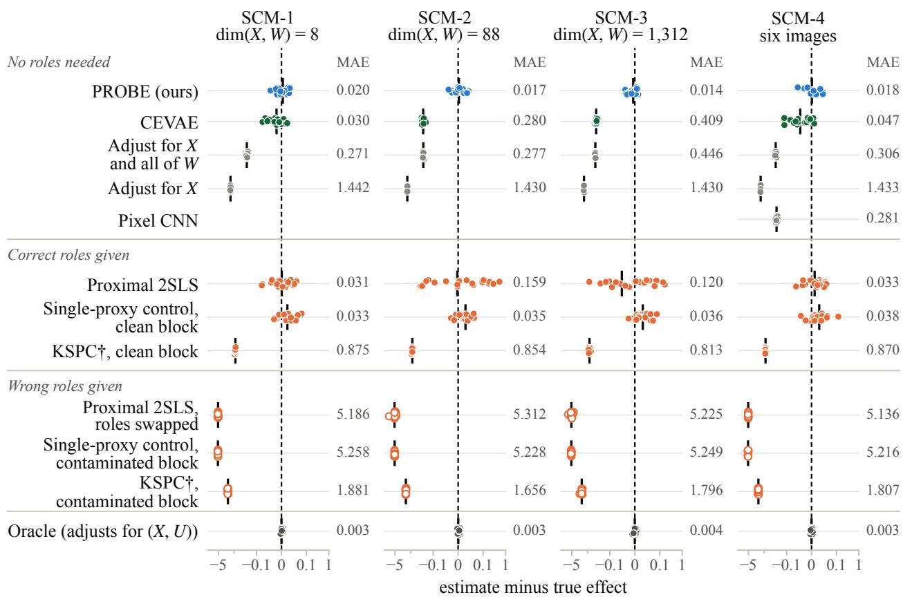  
† run after the protocol was frozen

Figure 6: Detailed version of the left of Fig. 3 for the original 20 data sets per setting, with every method on its own row. KSPC (†) was run after the protocol was frozen.

on the treated. This efect equals τ in SCM-1 to SCM-4 because the efect is constant. As an ATE estimator, single-proxy control also fits the bridge on the treated units, which gives the efect on the untreated, and averages the two efects with weights equal to the shares of treated and untreated units. CEVAE is reimplemented in PyTorch with the architecture and default settings of the Pyro reference implementation: a 20-dimensional latent, three hidden layers of 200 units, 30 epochs, batch size 100, and learning rate $1 0 ^ { - 3 }$ , fitted on the standardised $( X , W )$ . In SCM-4 the comparators that use the proxy receive the six numbers of the image reader, except the pixel CNN, which starts from the reader’s weights and fine-tunes them on the images.

The kernel single-proxy benchmark uses the generator of Xu and Gretton (2025) with a hidden $U \sim \mathrm { U n i f } ( - 1 , 1 )$ , a binary treatment, $P ( A = 1 \mid U ) = 0 . 1 + 0 . 8 \{ 1 + \operatorname { e r f } ( U ) \} / 2$ , and the deterministic outcome $Y = \sin ( \pi U / 2 ) + A - 0 . 3 , \mathrm { ~ s o ~ } \tau = 1$ . PROBE receives the two proxies of that generator as two blocks, $W _ { 1 } = e ^ { U } + \epsilon$ with $\epsilon \sim N ( 0 , 0 . 1 ^ { 2 } )$ and $W _ { 2 }$ , an MNIST image of the digit $\lfloor 5 U + 5 \rfloor$ ; KSPC receives one of them at a time. Here KSPC is the authors’ code without covariates, and Fig. 7 shows both of its estimators, SKPV and SPMMR. With two splits, PROBE retains a split when its mean gap over the four rotations is at most z times its standard error, with $z = \Phi ^ { - 1 } ( 1 - 0 . 0 5 / 2 )$ The benchmark has 20 replicates of size $n = 3 , 0 0 0$

Fig. 6 gives the detailed comparison. PROBE answers every one of the 80 original data sets, with mean absolute error between 0.014 and 0.020 and 90th percentile error between 0.033 and 0.046.

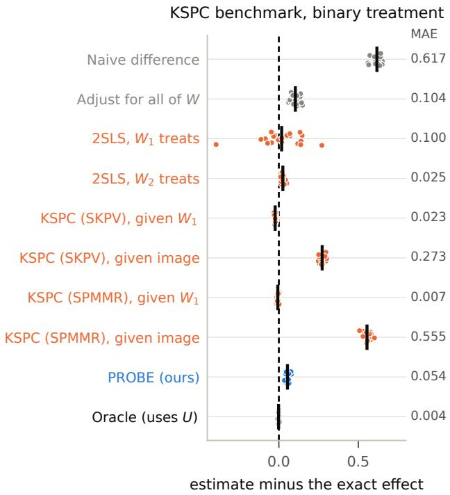  
Figure 7: Kernel single-proxy benchmark of Xu and Gretton (2025) with a binary treatment; the efect is exactly 1. Estimates minus the efect over 20 replicates, with the MAE on the right.

Its prespecified one-sided paired bound on the excess over the oracle ranges from 0.015 to 0.023. The two ways of using the proxy without an audit both fail: adjustment for X and the entire raw proxy has mean estimate between 0.55 and 0.73 because it absorbs the treatment-only coordinate, and in SCM-4 a convolutional network that reads every pixel and never tests balance has mean estimate 0.72. The paired bound against that pixel network is −0.25.

The prespecified-block contrast isolates identification from search, as Thm. 1 requires. Holding out the clean block $W _ { 1 }$ and balancing it gives 0.998, 0.987, 0.980 and 1.000 in the four settings. Holding out the contaminated block $W _ { 4 }$ gives 0.660, 0.656, 0.616 and 0.667, and the balance screen retains that split in 79 of the 80 original data sets and 396 of all 400, because $W _ { 4 }$ really can be balanced. Holding out $W _ { 5 }$ gives about 0.29 and is rejected in all 80 original data sets and all 400, since no representation balances a block that carries the treatment-only cause. Balance is observable, and on its own it is not enough.

Aggregation repairs the one failure that balance leaves. Thm. 2 and Cor. 1 predict that the valid splits outvote $W _ { 4 }$ when they form a majority, and they do: averaging over the retained splits is dragged to 0.963, 0.956, 0.945 and 0.959, the plain median of the retained splits already recovers most of that at 1.002, 0.998, 0.991 and 0.997, and the median of the largest agreeing component that PROBE returns reaches 1.005, 1.003, 0.993 and 1.001. The screen has true positive rate between 0.986 and 1.000 and false positive rate between 0.041 and 0.046, every returned component is pure, and every data set returns a unique largest component.

The two bounds of Thm. 4 and Thm. 5 are visible separately. For a single split in SCM-1 to SCM-3, the population efect of the learned representation sits a median of 0.042 to 0.046 from τ , with

Table 2: Sealed confirmations. Each row is 20 independently generated data sets at n = 24,000.
<table><tr><td>Setting</td><td>What the learner sees</td><td>Mean error</td><td>p90</td><td>Oracle gap</td><td>Status</td></tr><tr><td>SCM-1</td><td>8 coordinates</td><td>0.020</td><td>0.033</td><td>0.022</td><td>12/12 gates</td></tr><tr><td>SCM-2</td><td>88 coordinates</td><td>0.017</td><td>0.037</td><td>0.019</td><td>12/12 gates</td></tr><tr><td>SCM-3</td><td>1,312 coordinates</td><td>0.014</td><td>0.035</td><td>0.015</td><td>12/12 gates</td></tr><tr><td>SCM-4</td><td>six 64 × 64 images</td><td>0.018</td><td>0.046</td><td>0.023</td><td>13/13 gates, amended</td></tr></table>

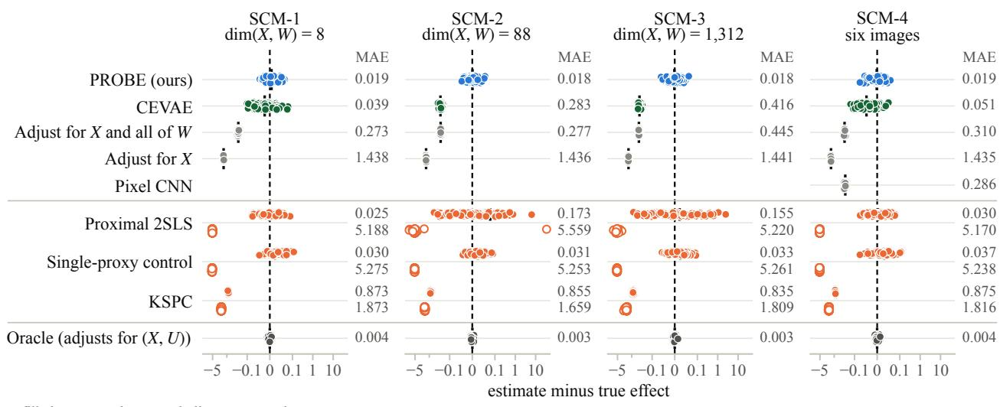  
Figure 8: Detailed version of the left of Fig. 3 over all 100 data sets per setting, with the MAE of each method on the right; for methods that need proxy roles, the upper number is for the correct roles.

90th percentile 0.103 to 0.110, and the realised error of that one split has median 0.051 to 0.059. Aggregating the retained splits cuts this to the 0.014 to 0.020 reported above, so the combination step, not a single well-behaved representation, carries the accuracy. The same separation shows up in the intervals. A nominal 95% interval around one split, built from the estimate’s own standard error, covers $\tau _ { \widehat { Z } }$ at 0.950, 0.957 and 0.936 in SCM-1 to SCM-3, which is the nominal rate, and covers τ at 0.836, 0.857, 0.879 and 0.807. The shortfall is the representation gap, which no interval built from sampling variation can contain; Fig. 11 shows it per data set.

Two boundaries limit what these results show. The image setting hands PROBE numbers produced by a reader that was trained with orientation labels on an auxiliary image bank, disjoint from the causal data; that reader made no level error in 14,400,000 reads of all 100 data sets, so SCM-4 tests the pipeline under an image proxy rather than the discovery of a representation from raw pixels. The second boundary is the one the $W _ { 4 }$ contrast exposes: the screen certifies balance and cannot certify the outcome-relevant condition that Assumption 3 adds.

The SCM-4 row carries a correction that we report rather than hide. Two of its 20 data sets reached the wall-clock cap while three tasks shared one GPU, so the pixel-network comparator recorded no value there and the sealed summary returned FAIL on the completeness gate and on the comparison that depends on it. Those two comparator runs were repeated alone under the sealed configuration and the sealed seeds, every other number was left untouched, and the amended summary passes all 13 gates.

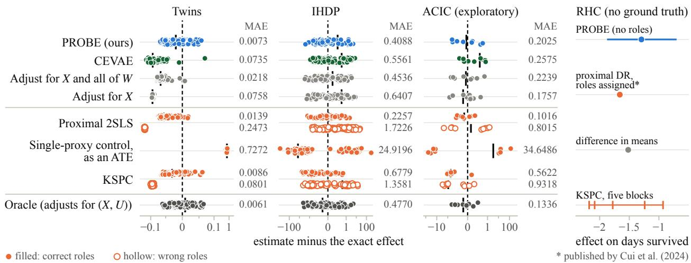  
Figure 9: Detailed version of the right of Fig. 3 over 100 Twins, 88 IHDP, and 9 ACIC data sets, with the MAE of each method, and the RHC estimates, where no true efect is known; PROBE’s estimate carries its resampled 95% interval, and \* marks estimates published by Cui et al. (2024).

## D.7. Semi-synthetic benchmarks

Twins (Louizos et al., 2017), IHDP (Hill, 2011), and ACIC 2016 (Dorie et al., 2019) keep their covariates and both potential outcomes, so the efect is known exactly. In each, one covariate is hidden as U (gestational age in Twins, the sixth of the 25 IHDP covariates, and $x _ { 4 4 }$ in ACIC), and the five proxy blocks and the treatment are generated from it by one fixed recipe. The blocks follow the proxy mechanism of SCM-1 with a generated standard normal treatment-only cause I, and the treatment follows $P ( A = 1 \mid U , I , X ) = 0 . 1 + 0 . 8 \ : \Phi ( 1 . 5 U + 2 . 0 I + w ^ { \top } \tilde { X } )$ , where U is standardised, X<sup>˜</sup> is the standardised X, and $w \sim N ( 0 , 0 . 1 ^ { 2 } I )$ is drawn once. Twins has n = 11,984 and 42 covariates, IHDP $n = 7 4 7$ and 24, and ACIC n = 4,802 and 78. The original runs use Twins replicates 11 to 20, IHDP replicates 12 to 21, and ACIC realizations 2 to 10. The comparators take the proxy roles of Appendix D.6; single-proxy control is run once, as an ATE estimator with the clean block $W _ { 1 }$

The sealed thresholds of SCM-1 to SCM-4 do not transfer to these data sets, because the noise level of the screen statistic changes with the numbers of rows and covariates. The screen therefore uses a noise-scaled threshold: instead of requiring a pass in all four rotations, it pools them, taking their mean gap and its standard error, and it retains a split when $\mathrm { m a x } ( \mathrm { g a p } , 0 ) + z \mathrm { S E }$ is at most the median of z SE over the thirty splits of the same data set. This rule was adopted after the preregistered RHC analysis and the RHC-planted, ACIC, and earlier IHDP analyses with the sealed threshold returned no estimate. It was frozen before Twins replicates 11 to 20 and IHDP replicates 12 to 21 were generated, so these two studies are prospective tests; it was chosen after seeing ACIC realizations 2 to 10, so the ACIC results are exploratory.

The RHC study (Connors et al., 1996) has 5,735 patients, days survived within 30 as the outcome, and ten physiological measurements grouped into five proxy blocks, as analyzed by Cui et al. (2024); no true efect is known. The blocks are, in order, the $\mathrm { P a O _ { 2 } / F i O _ { 2 } }$ ratio and $\mathrm { P a C O _ { 2 } , }$ pH and hematocrit, white cell count and albumin, bilirubin and creatinine, and sodium and potassium, and the comparators are the diference in means, the proximal estimate that Cui et al. (2024) obtain by assigning roles to $W _ { 1 }$ and $W _ { 2 } ,$ and KSPC given each block in turn. The interval around PROBE’s

Table 3: Mean absolute error on the original replicates in three semi-synthetic studies with known efects; ACIC is exploratory. Proximal 2SLS, single-proxy control, and KSPC require proxy roles; KSPC (†) was run after the protocol was frozen. Bold marks the smallest error among the methods other than the oracle.
<table><tr><td>Method</td><td>Twins</td><td>IHDP</td><td>ACIC</td></tr><tr><td>PROBE (ours)</td><td>0.0077</td><td>0.3054</td><td>0.2025</td></tr><tr><td>CEVAE</td><td>0.0894</td><td>0.1828</td><td>0.2575</td></tr><tr><td>Adjust for X and all of W</td><td>0.0207</td><td>0.3927</td><td>0.2239</td></tr><tr><td>Adjust for X</td><td>0.0749</td><td>0.7221</td><td>0.1757</td></tr><tr><td>Proximal 2SLS, roles given</td><td>0.0156</td><td>0.2328</td><td>0.1016</td></tr><tr><td>Proximal 2SLS, roles swapped</td><td>0.2453</td><td>1.5856</td><td>0.8015</td></tr><tr><td>Single-proxy control, as an ATE</td><td>0.7318</td><td>5.9838</td><td>34.6486</td></tr><tr><td>KSPC†, clean block</td><td>0.0099</td><td>0.6214</td><td>0.5622</td></tr><tr><td>KSPC†, contaminated block</td><td>0.0815</td><td>1.2499</td><td>0.9318</td></tr><tr><td>Oracle (adjusts for (X, U))</td><td>0.0074</td><td>0.4868</td><td>0.1336</td></tr></table>

RHC estimate in Fig. 9 gives the sampling spread of the median of the largest agreeing group over 20,000 draws, holding the retained splits and the linking radius at their observed values, so it omits the uncertainty of the screen.

Table 3 gives the MAE on the original replicates. On IHDP, ten replicates do not resolve the gap between PROBE and CEVAE: the error ratio is 1.67, with a 90% paired-bootstrap interval from 0.78 to 2.78.

## D.8. Protocol discipline

One generated data set is one replicate; splits, rows, rotations, and restarts are not. Seeds overlap across the synthetic settings: SCM-1 replicates 10 to 19 share seeds with SCM-2 replicates 0 to 9, and SCM-2 replicates 10 to 19 with SCM-3 replicates 0 to 9, so comparisons across those settings are not independent. Paired methods share data, sample roles, and nuisance budgets. For SCM-1 to SCM-4 the screen threshold is fixed before the confirmation data are generated, and Appendix D.7 gives the rule and its history for the other data sets. The threshold remains a screen rather than proof of causal validity. No-return outcomes stay in the return-rate denominator, failed sealed runs stay in the record, and this appendix documents exclusions, replacements, and the representation family the search ranges over.

## D.9. Evidence boundaries

The empirical gates are performance criteria, not proofs of completeness, stability, or the population plurality condition.

## D.10. Additional figures

Fig. 10 shows the three aggregation rules on the sealed confirmations, Fig. 11 shows the interval coverage of one split, and Fig. 12 separates the representation and estimation parts of the error.

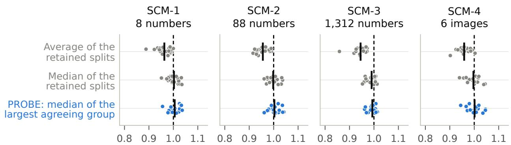  
Combined estimate over the retained splits (dashed line: τ = 1)

Figure 10: Three ways to combine the retained splits. Averaging is pulled away from τ by the balanced but invalid split; the median of the largest agreeing group is not.

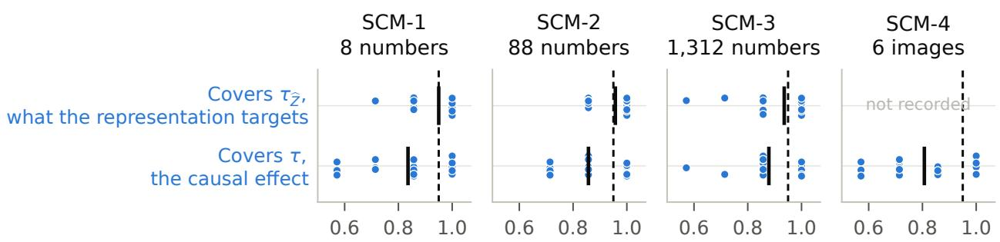  
Share of the seven target splits covered (dashed line: nominal 0.95)

Figure 11: Coverage of a nominal 95% interval around one split, one dot per data set. The interval covers the population efect of the learned representation at the nominal rate and covers τ less often, by the representation gap.

The interval in Fig. 11 is the AIPW estimate of one split plus or minus 1.96 times its own standard error, and that standard error is computed from the score cross-product the sealed run already stored, so the figure refits nothing. It covers what the learned representation targets at the nominal rate and covers τ less often, by the amount of the representation gap. An interval built from sampling variation cannot contain that gap, which is why Thm. 4 bounds it separately from Thm. 5.

Absolute error, log scale (bar: median over data sets)  
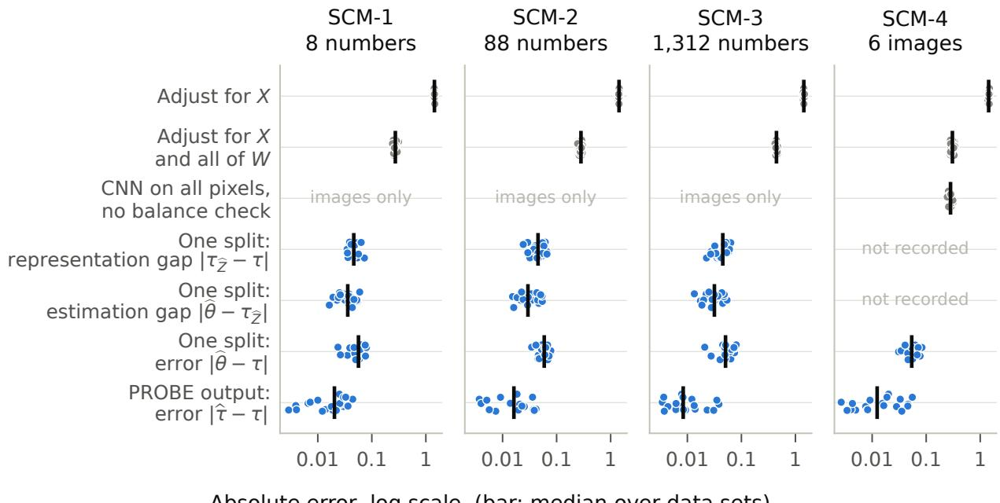  
Figure 12: Absolute errors on a log scale. For one split the representation gap $| \tau _ { \widehat { Z } } - \tau |$ is the population efect of the learned representation, which is exact for the linear representations of SCM-1 to SCM-3 and is not recorded for SCM-4. Aggregation reduces the error of a single split by roughly a factor of three.

## E. Proofs

## E.1. Proofs for Section 3

## Suficient conditions for outcome-relevant completeness.

Proof of Proposition 2. Fix z and $Q , Q ^ { \prime } \in \mathcal { Q } _ { j , i } $ <sub>z</sub> with $\kappa _ { j } Q = \kappa _ { j } Q ^ { \prime }$ . Write $\pi _ { Q }$ for the distribution of (X, U) under $Q , \ \pi _ { Q , X }$ for its X-marginal, and $\pi _ { Q } ( \cdot \mid x )$ for its conditional distribution of U given $X = x$ . By condition (i), $K _ { j } ( \cdot \mid v , u ) = K _ { j } ( \cdot \mid x , u )$ , so the distribution ${ \boldsymbol { \kappa } } _ { j } Q$ of $( X , W _ { j } )$ has X-marginal $\pi _ { Q , X }$ and conditional distribution $\textstyle { \int K _ { j } ( \cdot \mid x , u ) \pi _ { Q } ( d u \mid x ) }$ given $X = x$ . The equality $\kappa _ { j } Q = \kappa _ { j } Q ^ { \prime }$ therefore gives $\pi _ { Q , X } = \pi _ { Q ^ { \prime } , X }$ and, for $\pi _ { Q , X }$ -almost every $\begin{array} { r } { x , \int K _ { j } ( \cdot  { | } x , u ) \pi _ { Q } ( d u  { | } } \end{array}$ $\begin{array} { r } { \boldsymbol { x } ) = \int K _ { j } ( \cdot \ : \mid \ : \boldsymbol { x } , \boldsymbol { u } ) \pi _ { Q ^ { \prime } } ( d \boldsymbol { u } \mid \ : \boldsymbol { x } ) } \end{array}$ . Condition (ii) yields $\pi _ { Q } ( \cdot \mid x ) = \pi _ { Q ^ { \prime } } ( \cdot \mid x )$ for almost every $x ,$ hence $\pi _ { Q } = \pi _ { Q ^ { \prime } }$ . By condition (i), $\mu _ { a , j , z } ( v , u ) = \bar { \mu } _ { a , z } ( x , u )$ for a measurable function $\bar { \mu } _ { a , z } ,$ , so $\begin{array} { r } { \mathbb { E } _ { Q } \{ \mu _ { a , j , z } ( V _ { j } , U ) \} = \int \bar { \mu } _ { a , z } d \pi _ { Q } = \int \bar { \mu } _ { a , z } d \pi _ { Q ^ { \prime } } = \mathbb { E } _ { Q ^ { \prime } } \{ \mu _ { a , j , z } ( V _ { j } , U ) \} } \end{array}$ , which is Assumption 3.

For case (a), the distribution of $W _ { j }$ given $X = x$ is the convolution of the pushforward of π under $g ( x , \cdot )$ with the distribution of $\epsilon _ { j }$ . Its characteristic function is the product of the characteristic function of the pushforward and that of $\epsilon _ { j }$ , and the latter vanishes nowhere by assumption. Two distributions π and $\pi ^ { \prime }$ with equal convolutions therefore have pushforwards with equal characteristic functions, hence equal pushforwards by the uniqueness theorem for characteristic functions, and injectivity of $g ( x , \cdot ) \ { \mathrm { g i v e s } } \ \pi = \pi ^ { \prime }$ . Thus (ii) holds.

For case (b), the probability generating function of $W _ { j }$ given $X = x$ under a distribution π of U is $\begin{array} { r } { { \mathbb E } ( \prod _ { \ell } s _ { \ell } ^ { W _ { j , \ell } } ) = \int \exp \{ - \sum _ { \ell } \lambda _ { \ell } ( x , u ) ( 1 - s _ { \ell } ) \} \pi ( d u ) } \end{array}$ for $s \in [ 0 , 1 ] ^ { d }$ , which is the Laplace transform of the pushforward of π under $\lambda ( x , \cdot )$ evaluated on $[ 0 , 1 ] ^ { d } .$ . A finite measure on $[ 0 , \infty ) ^ { d }$ is determined by its Laplace transform on a set with nonempty interior, so two distributions with equal mixtures have equal pushforwards, and injectivity of $\lambda ( x , \cdot )$ gives $\pi = \pi ^ { \prime }$ . In the scalar case this is the identifiability of Poisson mixtures of Teicher (1961). Thus (ii) holds.

## Identification from a held-out audit.

Proof of Theorem 1. Because $Z _ { j } ~ = ~ \phi _ { j } ( V _ { j } )$ is a measurable function of $V _ { j }$ , conditioning on $( U , V _ { j } , Z _ { j } )$ is equivalent to conditioning on $( U , V _ { j } )$ . The two clauses of Assumption 2 therefore remain valid after additionally conditioning on $Z _ { j }$ . Thus, for each $a \in \{ 0 , 1 \}$ ,

$$
\begin{array} { r l } & { \mathbb { E } \{ Y ( a ) \mid A , V _ { j } , U , Z _ { j } \} = \mathbb { E } \{ Y ( a ) \mid V _ { j } , U , Z _ { j } \} , } \\ & { \quad P ( W _ { j } \mid A , V _ { j } , U , Z _ { j } ) = K _ { j } ( \cdot \mid V _ { j } , U ) . } \end{array}\tag{33}
$$

Integrating the second identity over $Q _ { b , j , z }$ and using the definition of $\kappa _ { j }$ gives $P ( X , W _ { j } \mid A =$ $b , Z _ { j } = z ) = K _ { j } Q _ { b , j , z }$ . Exact balance in Eq. (1) therefore implies $\mathcal { K } _ { j } Q _ { 1 , j , z } = \mathcal { K } _ { j } Q _ { 0 , j , z }$ for $P _ { Z _ { j } }$ -almost every z. Representation overlap gives $Q _ { b , j , z } \ll P ( V _ { j } , U \mid Z _ { j } = z )$ for $b \in \{ 0 , 1 \}$ . Assumption 1, Eq. (33), and Jensen’s inequality give the required integrability, so $Q _ { b , j , z } \in \mathcal { Q } _ { j , i } $ <sub>z</sub> almost everywhere. Assumption 3 therefore gives, for each $a \in \{ 0 , 1 \}$ ,

$$
\begin{array} { r } { \mathbb { E } _ { Q _ { 1 , j , z } } \{ \mu _ { a , j , z } ( V _ { j } , U ) \} = \mathbb { E } _ { Q _ { 0 , j , z } } \{ \mu _ { a , j , z } ( V _ { j } , U ) \} . } \end{array}\tag{34}
$$

By Eq. (33) and iterated expectation, for each $b ~ \in ~ \{ 0 , 1 \} , ~ \mathbb { E } \{ Y ( a ) ~ | ~ A ~ = ~ b , Z _ { j } ~ = ~ z \} ~ =$ $\mathbb { E } _ { Q _ { b , j , z } } \{ \mu _ { a , j , z } ( V _ { j } , U ) \}$ . Eq. (34) shows that the conditional mean of $Y ( a )$ given $( A , Z _ { j } )$ does not depend on A. Consistency then gives $\mathbb { E } ( Y \mid A = a , Z _ { j } = z ) = \mathbb { E } \{ Y ( a ) \mid A = a , Z _ { j } = z \} = \mathbb { E } \{ Y ( a )$ $Z _ { j } = z \}$ . Integrating over $P _ { Z _ { j } }$ yields Eq. (2). □

## Non-nesting of canonical proximal and proximal-balancing suficient conditions.

Proof of Proposition 3. We give one finite-state distribution for each direction. In both constructions, X is constant, $Y = Y ( A )$ , and every treatment draw is generated by an exogenous randomizer independent of all proxy noises and outcome noises.

First, we construct a distribution satisfying the canonical proximal conditions but not the proximalbalancing conditions for the designated proxy split. Let $U \sim \mathrm { B e r n o u l l i } ( 1 / 2 ) , P ( A = 1 \mid U = u ) =$ $\textstyle { \frac { 1 } { 4 } } + { \frac { 1 } { 2 } } u$ , and let $Z ^ { \mathrm { t r } } = U \oplus E _ { Z } , \qquad Z ^ { \mathrm { o u t } } = W _ { j } = U \oplus E _ { W }$ , where $E _ { Z }$ and $E _ { W }$ are mutually independent Bernoull $\mathrm { i } ( 1 / 4 )$ variables, independent of the treatment randomizer. Set $Y ( a ) = a + U$ and $V _ { j } ~ = ~ Z ^ { \mathrm { t r } }$ Consistency, integrability, and strict latent overlap hold. Independence of the exogenous noises gives the three canonical proxy-validity conditions.

The function $\begin{array} { r } { h ( z ^ { \mathrm { o u t } } , a ) = a + 2 z ^ { \mathrm { o u t } } - \frac { 1 } { 2 } } \end{array}$ is an outcome bridge because $\mathbb { E } ( Z ^ { \mathrm { o u t } } \mid U = u ) = 1 / 4 + u / 2$ so ${ \mathbb E } \{ h ( Z ^ { \mathrm { o u t } } , a ) ~ | ~ U = u \} = a + u$ . Iterated expectation gives the required observed bridge equation. The binary channel from U to $Z ^ { \mathrm { t r } }$ has matrix $\left( ^ { 3 / 4 } _ { 1 / 4 } \ ^ { 1 / 4 } _ { 3 / 4 } \right)$ and determinant $1 / 2$ . Conditional on either treatment arm, both latent states have positive probability, and the corresponding unnormalized conditional-expectation matrix has determinant $3 / 3 2$ . It therefore has full column rank, which proves the canonical treatment-proxy completeness condition.

Now consider any measurable representation $Z _ { j } = \phi _ { j } ( V _ { j } )$ . The Markov relation $U \to V _ { j } \to Z _ { j }$ holds. Conditional on $( U , Z _ { j } )$ , treatment and $W _ { j }$ are independent, and $\mathbb { E } ( A \mid U , Z _ { j } ) = \mathbb { E } ( W _ { j }$ $\begin{array} { r } { U , Z _ { j } ) = \frac { 1 } { 4 } + \frac { 1 } { 2 } U } \end{array}$ . The conditional covariance decomposition gives Cov $\begin{array} { r } { \cdot ( A , W _ { j } \mid Z _ { j } ) = \frac { 1 } { 4 } \operatorname { V a r } ( U \mid Z _ { j } ) } \end{array}$ Because $\bar { P } ( \bar { U ^ { - } } = 1 \ | \ V _ { j } = 0 ) = 1 / 4$ and $P ( U = 1 \mid V _ { j } = 1 ) = 3 / 4 , P ( U = 1 \mid \dot { Z } _ { j } ) = \mathrm { \bf \dot { E } } \{ P ( U = 1 \mid V _ { j } = 1 )$ $V _ { j } ) \mid Z _ { j } \} \in [ 1 / 4 , 3 / 4 ]$ almost surely. Hence $\mathrm { V a r } ( U \mid Z _ { j } ) \ge 3 / 1 6$ and $\begin{array} { r } { \operatorname { C o v } ( A , W _ { j } \mid Z _ { j } ) \ge \frac { 3 } { 6 4 } > 0 } \end{array}$ Exact balance therefore fails for every such representation. This proves the first direction.

Second, we construct a distribution satisfying the proximal-balancing conditions for the designated proxy split but not the canonical proximal conditions. Let $U = ( U _ { 1 } , U _ { 2 } )$ , where $U _ { 1 }$ and $U _ { 2 }$ are independent Bernoulli(1/2) variables. Let $Z ^ { \mathrm { t r } }$ and $Z ^ { \mathrm { o u t } }$ be separate observed coordinates that agree almost surely with $U _ { 1 }$ , and set $V _ { j } = Z ^ { \mathrm { { t r } } } = U _ { 1 } , \qquad W _ { j } = Z ^ { \mathrm { { o u t } } } = U _ { 1 } , \qquad Z _ { j } = U _ { 1 }$ . Define $P ( A = 1 \mid U _ { 1 } , U _ { 2 } ) = \textstyle { \frac { 3 } { 2 0 } } + \textstyle { \frac { 1 } { 5 } } U _ { 1 } + \textstyle { \frac { 2 } { 5 } } U _ { 2 }$ , and let $\xi$ be an independent mean-zero Rademacher variable, also independent of the treatment randomizer. Set $Y ( a ) = a + U _ { 1 } + ( 1 + U _ { 2 } ) \xi$ . The four latent treatment probabilities are $3 / 2 0 , 1 1 / 2 0 , 7 / 2 0$ , and $1 5 / 2 0$ , so strict latent overlap holds. Latent exchangeability follows from the independent outcome noise, and held-out treatment independence holds because $W _ { j }$ is deterministic given U. Moreover, $\begin{array} { r } { P ( A = 1 \mid Z _ { j } = 0 ) = \frac { 7 } { 2 0 } , \qquad P ( A = 1 \mid Z _ { j } = } \end{array}$ $\textstyle 1 ) = { \frac { 1 1 } { 2 0 } }$ , so representation overlap holds. Because $W _ { j } = Z _ { j }$ and $X$ is constant, exact balance also holds.

It remains to verify the all-Q outcome-relevant completeness condition. Within a stratum $Z _ { j } = z$ every admissible distribution $Q \in \mathcal { Q } _ { j , z }$ is supported on $V _ { j } = U _ { 1 } = z$ , while $U _ { 2 }$ may vary. On this support, $\mu _ { a , j , z } ( v , u ) = a + z$ . Thus, for any admissible $Q , Q ^ { \prime }$ and either potential treatment level, $\mathcal { K } _ { j } Q = \mathcal { K } _ { j } Q ^ { \prime } \quad \Longrightarrow \quad \mathbb { E } _ { Q } \{ \mu _ { a , j , z } ( V _ { j } , U ) \} = a + z = \mathbb { E } _ { Q ^ { \prime } } \{ \mu _ { a , j , z } ( V _ { j } , U ) \}$ . This proves all proximal balancing conditions for the designated proxy split.

The outcome bridge $h ( z ^ { \mathrm { { o u t } } } , a ) = a + z ^ { \mathrm { { o u t } } }$ exists because ${ \mathbb E } ( Y ~ \vert ~ Z ^ { \mathrm { t r } } = z , A = a ) = a + z =$ ${ \mathbb E } \{ h ( Z ^ { \mathrm { o u t } } , a ) \mid Z ^ { \mathrm { t r } } = z , A = a \}$ . Canonical treatment-proxy completeness nevertheless fails. In the treated arm, $\begin{array} { r } { P ( U _ { 2 } = 1 \mid U _ { 1 } = 0 , A = 1 ) = \frac { 1 1 } { 1 4 } , \qquad P ( U _ { 2 } = 1 \mid U _ { 1 } = 1 , A = 1 ) = \frac { 1 5 } { 2 2 } } \end{array}$ . Define the square-integrable, nonzero function $\begin{array} { r } { g _ { 1 } ( U ) = U _ { 2 } - \left\{ 1 1 / 1 4 , ~ U _ { 1 } = 0 , \right. } \\ { \left. 1 5 / 2 2 , ~ U _ { 1 } = 1 . \right. } \end{array}$ Then $\mathbb { E } \{ g _ { 1 } ( U ) \mid Z ^ { \mathrm { t r } } , A = 1 \} =$ $\mathbb { E } \{ g _ { 1 } ( U ) ~ | ~ U _ { 1 } , A = 1 \} = 0$ almost surely, although $g _ { 1 } ( U )$ is not almost surely zero. Hence the canonical completeness condition fails, proving the second direction.

For the final claim, the second construction satisfies Assumption 3 but not canonical treatmentproxy completeness. In the first construction, replace $E _ { W }$ by an independent Bernoulli(1/2) variable. Canonical treatment-proxy completeness is unchanged because it involves only $( U , Z ^ { \mathrm { t r } } , A )$ Now $W _ { j }$ is independent of $U$ , so ${ \boldsymbol { \kappa } } _ { j } Q$ is the same distribution for every $Q$ . For every representation $\phi _ { j }$ and almost every z, the bound $P ( U = 1 \mid Z _ { j } ) \in [ 1 / 4 , 3 / 4 ]$ shown above gives both values of U positive probability given $Z _ { j } = z , \operatorname { s o } \mathbb { E } _ { Q } \mu _ { a , j , z } = a + Q ( U = 1 )$ takes more than one value over $\mathcal { Q } _ { j , z }$ and Assumption 3 fails. □

## Identification with an unknown valid block.

Proof of Theorem 2. Under condition (4), the number of proxy splits in B whose candidate value equals τ is strictly larger than the count for every non-target value. Therefore, τ is the unique value maximizing the population count: $\{ \tau \} = \underset { c \in \mathbb { R } } { \arg \operatorname* { m a x } } \big \vert \{ S \in \mathcal { B } : \theta _ { S } = c \} \big \vert$ . If no non-target value occurs, the convention in Definition 2 compares the nonempty target cluster with zero and gives the same conclusion. □

## Target-valued majority.

Proof of Corollary 1. Define $N _ { \tau } \triangleq | \{ S \in { \mathcal { B } } : \theta _ { S } = \tau \} |$ and $N _ { c } \triangleq | \{ S \in \mathcal { B } : \theta _ { S } = c \} | , \qquad c \neq \tau$ Condition (17) gives $N _ { \tau } > | B | / 2$ . For every $c \neq \tau , N _ { c } \leq | B | - N _ { \tau } < N _ { \tau }$ . Therefore, τ is the unique candidate value of greatest multiplicity.

It remains to establish the median statement. Let $n = | \boldsymbol { B } |$ . If $n = 2 k + 1$ is odd, then $N _ { \tau } \geq k + 1$ At most k candidate values are strictly below τ, and at most k are strictly above τ, so the $( k + 1 ) \mathrm { s t }$ order statistic equals τ. If $n = 2 k$ is even, then $N _ { \tau } \geq k + 1$ and $n - N _ { \tau } \le k - 1$ . Hence both the kth and the $( k + 1 )$ st order statistics equal τ. Under the conventional definition of the evensample median as the average of these two middle order statistics, the median equals τ. Thus, median $( ( \theta _ { S } ) _ { S \in B } ) = \tau$ . The stronger condition that more than half of the proxy splits in B satisfy the grouped assumptions is suficient because each such proxy split has candidate value τ, but it is not necessary. □

## Zero discrepancy.

Proof of Proposition 1. By Definition 3, $\begin{array} { r l r } { D _ { \mathrm { r e s } , j } ( \phi ) } & { { } = } & { 0 \quad \mathrm { i f } } \end{array}$ and only if $\begin{array} { r l } { q _ { j , \phi } ( T _ { j } , Z _ { j } ^ { \phi } ) } & { { } = } \end{array}$ $e _ { j , \phi } ( Z _ { j } ^ { \phi } )$ almost surely. Because A is binary, this equality is equivalent to $T _ { j } \perp \perp A \mid Z _ { j } ^ { \phi }$ □

Supporting bias decomposition. Fix a representation $\phi$ and abbreviate $e ( z ) = e _ { j , \phi } ( z )$ . For each $a \in \{ 0 , 1 \}$ and $P _ { Z _ { j } ^ { \phi } } . \mathrm { a l m o s t }$ every z, define $\delta _ { a , j } ^ { \phi } ( z ) \triangleq \mathbb { E } _ { Q _ { 1 , i , z } ^ { \phi } } \{ \mu _ { a , j , z } ^ { \phi } ( V _ { j } , U ) \} - \mathbb { E } _ { Q _ { 0 , i , z } ^ { \phi } } \{ \mu _ { a , j , z } ^ { \phi } ( V _ { j } , U ) \}$ Under Assumptions 1 and 2, and under $0 < e ( Z _ { j } ^ { \phi } ) < 1$ almost surely, the conditioning argument used in Eq. (33) gives $\mathbb { E } ( Y \mid A = a , Z _ { j } ^ { \phi } = z ) = \mathbb { E } _ { Q _ { a , i , z } ^ { \phi } } \{ \mu _ { a , j , z } ^ { \phi } ( V _ { j } , U ) \}$ . Conditional expectation over A gives $\mathbb { E } \{ Y ( a ) \mid Z _ { j } ^ { \phi } = z \} = e ( z ) \mathbb { E } _ { Q _ { 1 , j , z } ^ { \phi } } \{ \mu _ { a , j , z } ^ { \phi } \} + \{ 1 - e ( z ) \} \mathbb { E } _ { Q _ { 0 , j , z } ^ { \phi } } \{ \mu _ { a , j , z } ^ { \phi } \}$ . Subtracting the two conditional expressions and collecting terms gives

$$
\begin{array} { r l } & { \mathbb { E } ( Y \mid A = 1 , Z _ { j } ^ { \phi } = z ) - \mathbb { E } ( Y \mid A = 0 , Z _ { j } ^ { \phi } = z ) } \\ & { \quad - \left[ \mathbb { E } \{ Y ( 1 ) \mid Z _ { j } ^ { \phi } = z \} - \mathbb { E } \{ Y ( 0 ) \mid Z _ { j } ^ { \phi } = z \} \right] } \\ & { \quad = \{ 1 - e ( z ) \} \delta _ { 1 , j } ^ { \phi } ( z ) + e ( z ) \delta _ { 0 , j } ^ { \phi } ( z ) . } \end{array}\tag{35}
$$

## Approximate-balance bias.

Proof of Theorem 3. Fix z in the almost-sure set on which overlap and the structural conditions hold. Bayes’ rule gives $\begin{array} { r } { \frac { d P ( T _ { j } | A = 1 , Z _ { j } ^ { \phi } = z ) } { d P _ { \phi , z } } ( t ) = \frac { q _ { j , \phi } ( t , z ) } { e ( z ) } } \end{array}$ and $\begin{array} { r } { \frac { d P ( T _ { j } | A = 0 , Z _ { j } ^ { \phi } = z ) } { d P _ { \phi , z } } ( t ) = \frac { 1 - q _ { j , \phi } ( t , z ) } { 1 - e ( z ) } } \end{array}$ . Subtracting gives the density identity $\begin{array} { r } { \frac { d \{ P ( T _ { j } | A = 1 , Z _ { j } ^ { \phi } = z ) - P ( T _ { j } | A = 0 , Z _ { j } ^ { \phi } = z ) \} } { d P _ { \phi , z } } ( t ) = \frac { q _ { j , \phi } ( t , z ) - e ( z ) } { e ( z ) \{ 1 - e ( z ) \} } } \end{array}$ . Held-out treat-

ment independence makes the conditional distribution of $W _ { j }$ given $( U , V _ { j } )$ treatment-invariant, so $\begin{array} { l } { { \kappa _ { j } Q _ { b , j , z } ^ { \phi } = P ( T _ { j } \mid A = b , Z _ { j } ^ { \phi } = z ) } } \end{array}$ for $b \in \{ 0 , 1 \}$ . As in the proof of Thm. 1, overlap and Assumption 1 give $Q _ { b , j , z } ^ { \phi } \in \mathcal { Q } _ { j , z } ^ { \phi }$ for $b \in \{ 0 , 1 \}$ . Assumption 4 therefore implies

$$
| \delta _ { a , j } ^ { \phi } ( z ) | \leq \frac { \Gamma _ { j } ( \phi ) } { e ( z ) \{ 1 - e ( z ) \} } \left[ \mathbb { E } \Big ( \{ q _ { j , \phi } ( T _ { j } , z ) - e ( z ) \} ^ { 2 } \Big | Z _ { j } ^ { \phi } = z \Big ) \right] ^ { 1 / 2 } .\tag{36}
$$

Apply the triangle inequality to Eq. (35), use Eq. (36) for both potential outcomes, and integrate over $Z _ { j } ^ { \phi }$ . This gives $\begin{array} { r l } { \left| \mathbb { E } \left[ \mathbb { E } ( Y \mid A = 1 , Z _ { j } ^ { \phi } ) - \mathbb { E } ( Y \mid A = 0 , Z _ { j } ^ { \phi } ) \right] - \tau \right| } & { \leq } \end{array}$ $\begin{array} { r l r } { \mathbb { E } \left[ \frac { \Gamma _ { j } ( \phi ) } { e _ { j , \phi } ( Z _ { j } ^ { \phi } ) \{ 1 - e _ { j , \phi } ( Z _ { j } ^ { \phi } ) \} } \left\{ \mathbb { E } \left[ \{ q _ { j , \phi } ( T _ { j } , Z _ { j } ^ { \phi } ) - e _ { j , \phi } ( Z _ { j } ^ { \phi } ) \} ^ { 2 } \Big | Z _ { j } ^ { \phi } \right] \right\} ^ { 1 / 2 } \right] } & { \leq } & { \frac { \Gamma _ { j } ( \phi ) } { \eta ( 1 - \eta ) } D _ { \mathrm { r e s } , j } ( \phi ) } \end{array}$ . Because $\Gamma _ { j } ( \phi )$ does not depend on z, the overlap bound $\eta \le e _ { j , \phi } ( z ) \le 1 - \eta$ gives the last inequality, together with $\mathbb { E } \{ s ( Z _ { i } ^ { \phi } ) \} \le [ \mathbb { E } \{ s ( Z _ { i } ^ { \phi } ) ^ { 2 } \} ] ^ { 1 / 2 } = D _ { \mathrm { r e s } , j } ( \phi )$ by Cauchy–Schwarz, where $s ( z )$ denotes the conditional root-mean-square factor in the display, and proves Eq. (6). □

## Population sensitivity region.

Proof of Proposition 5. Thm. 3 gives $| \tau _ { Z _ { \cdot } ^ { \phi } } - \tau | \leq \Gamma _ { j } ( \phi ) D _ { \mathrm { r e s } , j } ( \phi ) / \{ \eta ( 1 - \eta ) \}$ , and the displayed interval is the set of values of τ compatible with this inequality. □

## E.2. Proofs for Section 4

## Uniform discrepancy deviation.

Proof of Proposition 6. For clarity, the joint encoder–critic loss classes used in the proposition are $\begin{array} { r l r } { \mathcal { L } _ { 0 , j , n _ { \mathrm { D } } } } & { { } \triangleq } & { \{ o \mapsto \{ a - h ( \phi ( v _ { j } ) ) \} ^ { 2 } : \phi \in \mathcal { F } _ { j , n _ { \mathrm { D } } } , \ h \in \mathcal { H } _ { 0 , n _ { \mathrm { D } } } \} ; \quad \mathcal { L } _ { 1 , j , n _ { \mathrm { D } } } \quad \triangleq } \end{array}$ $\{ o \mapsto \{ a - h ( t _ { j } , \phi ( v _ { j } ) ) \} ^ { 2 } : \phi \in \mathcal { F } _ { j , n _ { \mathrm { D } } } , \ h \in \mathcal { H } _ { 1 , n _ { \mathrm { D } } } \}$ , where $\mathbf { \xi } _ { o } ~ = ~ ( v _ { j } , t _ { j } , a , y )$ . For a loss class ${ \mathcal { L } } ,$ its expected Rademacher complexity is $\begin{array} { r } { \Re _ { n _ { \mathrm { D } } } ( \mathcal { L } ) \triangleq \mathbb { E } \Big | \operatorname* { s u p } _ { \ell \in \mathcal { L } } \frac { 1 } { n _ { \mathrm { D } } } \sum _ { i = 1 } ^ { n _ { \mathrm { D } } } \sigma _ { i } \ell ( O _ { i } ) \Big | } \end{array}$ , where the $\sigma _ { i }$ are independent Rademacher signs independent of the observations. The loss classes are pointwise measurable and separable, so these suprema are measurable. The same argument may instead be stated with outer probability and outer expectation.

Every loss in either class lies in [0, 1]. Standard symmetrization and bounded-diference concentration therefore imply, simultaneously for $b \in \{ 0 , 1 \}$ , that

$$
\operatorname* { s u p } _ { \phi \in \mathcal { F } _ { j , n _ { \mathrm { D } } } , h \in \mathcal { H } _ { b , n _ { \mathrm { D } } } } | \widehat { R } _ { b , \phi } ( h ) - R _ { b , \phi } ( h ) | \leq 2 \Re _ { n _ { \mathrm { D } } } ( \mathcal { L } _ { b , j , n _ { \mathrm { D } } } ) + \sqrt { \frac { \log ( 4 / \delta _ { \mathrm { D } } ) } { 2 n _ { \mathrm { D } } } }\tag{37}
$$

with probability at least $1 - \delta _ { \mathrm { D } }$ . Let $\begin{array} { r } { R _ { b , \phi } ^ { \star } = \operatorname* { i n f } _ { h \in \mathcal { H } _ { b , n _ { \Pi } } } R _ { b , \phi } ( h ) } \end{array}$ and define $\widehat { R } _ { b , \phi } ^ { \star }$ analogously. Eq. (37) controls $| \widehat { R } _ { b , \phi } ^ { \star } - R _ { b , \phi } ^ { \star } |$ by the same right-hand side. Eq. (18) also gives $0 \leq \widehat { R } _ { b , \phi } ( \widehat { h } _ { b , \phi } ) - \widehat { R } _ { b , \phi } ^ { \star } \leq \varepsilon _ { b , \phi }$ The conditional-mean property of squared loss yields the Brier identity $\mathbb { E } [ \{ A - e _ { j , \phi } ( Z _ { j } ^ { \phi } ) \} ^ { 2 } ] - \mathbb { E } [ \{ A -$ $q _ { j , \phi } ( T _ { j } , Z _ { j } ^ { \phi } ) \} ^ { 2 } ] = \mathbb { E } [ \{ q _ { j , \phi } ( T _ { j } , Z _ { j } ^ { \phi } ) - e _ { j , \phi } ( Z _ { j } ^ { \phi } ) \} ^ { 2 } ] = D _ { \mathrm { r e s } , j } ^ { 2 } ( \phi )$ . It follows from Eq. (19) that

$$
\begin{array} { r } { \left| R _ { 0 , \phi } ^ { \star } - R _ { 1 , \phi } ^ { \star } - D _ { \mathrm { r e s } , j } ^ { 2 } ( \phi ) \right| \leq a _ { 0 , n _ { \mathrm { D } } } ( \phi ) + a _ { 1 , n _ { \mathrm { D } } } ( \phi ) \leq a _ { j , n _ { \mathrm { D } } } . } \end{array}\tag{38}
$$

Combine Eqs. (37)–(38). The positive-part map is one-Lipschitz and $D _ { \mathrm { r e s } , j } ^ { 2 } ( \phi ) \geq 0$ , so taking the supremum over ϕ gives Eq. (20). □

## Representation-learning oracle inequality.

Proof of Proposition 7. On the event in Eq. (20), set $\bar { \xi } _ { j , n _ { \mathrm { D } } } \triangleq r _ { j , n _ { \mathrm { D } } } ( \delta _ { \mathrm { D } } ) + a _ { j , n _ { \mathrm { D } } } + \varepsilon _ { \mathrm { c r i t } , j }$ . The deviation inequality at $\hat { \phi } _ { j } , \ \mathrm { E q . \ ( 2 1 ) }$ , and the deviation inequality at a near-minimizer of $D _ { \mathrm { r e s } , j } ^ { 2 }$ over $\mathcal { F } _ { j , n _ { \mathrm { D } } }$ give $\begin{array} { r } { D _ { \mathrm { r e s } , j } ^ { 2 } ( \widehat { \phi } _ { j } ) \leq \widetilde { D } _ { j , n _ { \mathrm { D } } } ^ { 2 } ( \widehat { \phi } _ { j } ) + \bar { \xi } _ { j , n _ { \mathrm { D } } } \leq \operatorname* { i n f } _ { \phi \in \mathcal { F } _ { j , n _ { \mathrm { D } } } } \widetilde { D } _ { j , n _ { \mathrm { D } } } ^ { 2 } ( \phi ) + \varepsilon _ { \mathrm { e n c } , j } + \overline { { \xi } } _ { j , n _ { \mathrm { D } } } \leq \operatorname* { i n f } _ { \phi \in \mathcal { F } _ { j , n _ { \mathrm { D } } } } D _ { \mathrm { r e s } , j } ^ { 2 } ( \phi ) + \varepsilon _ { \mathrm { e n c } , j } + \overline { { \xi } } _ { j , n _ { \mathrm { D } } } , } \end{array}$ $2 \xi _ { j , n _ { \mathrm { D } } } + \varepsilon _ { \mathrm { e n c } , j }$ , which proves Eq. (22). □

## Learned-representation error.

Proof of Theorem $\it 4 .$ Conditional on the training observations $\{ O _ { i } : i \in \mathbb { Z } _ { \mathrm { D } } \}$ and any algorithmic seed used in training, the selected encoder is fixed; the population expectations below use a fresh observation independent of these training inputs. Eq. (6) gives $\begin{array} { r } { | \tau _ { \widehat { Z } _ { j } } - \tau | \leq \frac { \Gamma _ { j } ( \widehat \phi _ { j } ) } { \eta ( 1 - \eta ) } D _ { \mathrm { r e s } , j } ( \widehat \phi _ { j } ) } \end{array}$ . On the event in Eq. (8), which has probability at least $1 - \delta _ { \mathrm { D } }$ , every $\phi \in \mathcal { F } _ { j , n _ { \mathrm { D } } }$ satisfies $D _ { \mathrm { r e s } , j } ^ { 2 } ( \hat { \phi } _ { j } ) \leq$ $\tilde { D } _ { j , n _ { \mathrm { D } } } ^ { 2 } ( \hat { \phi } _ { j } ) + \xi _ { j , n _ { \mathrm { D } } } ( \delta _ { \mathrm { D } } ) \leq \tilde { D } _ { j , n _ { \mathrm { D } } } ^ { 2 } ( \phi ) + \xi _ { j , n _ { \mathrm { D } } } ( \delta _ { \mathrm { D } } ) \leq D _ { \mathrm { r e s } , j } ^ { 2 } ( \phi ) + 2 \xi _ { j , n _ { \mathrm { D } } } ( \delta _ { \mathrm { D } } )$ . The first and last inequalities hold on this event, and the middle one holds because $\widehat { \phi } _ { j }$ minimizes $\tilde { D } _ { j , n _ { \mathrm { D } } } ^ { 2 }$ over $\mathcal { F } _ { j , n _ { \mathrm { D } } }$ . Taking the infimum over $\phi$ and then the square root gives $\begin{array} { r } { D _ { \mathrm { r e s } , j } ( \widehat \phi _ { j } ) \leq [ \operatorname* { i n f } _ { \phi \in \mathcal { F } _ { j , n _ { \mathrm { D } } } } D _ { \mathrm { r e s } , j } ^ { 2 } ( \phi ) + 2 \xi _ { j , n _ { \mathrm { D } } } ( \delta _ { \mathrm { D } } ) ] ^ { 1 / 2 } } \end{array}$ Substituting this bound into the first display proves Eq. (9). Substituting the square root of Eq. (22) instead proves Thm. 10. □

## Exact signed nuisance remainder.

Proof of Proposition 8. Fix $\begin{array} { r l r } { \hat { Z } _ { j } } & { { } = } & { z . } \end{array}$ Taking the conditional expectation of the score and using Eq. (24) gives $\begin{array} { r } { \mathbb { E } \{ \mathrm { U I F } _ { j } ( { \cal O } ) \vert \hat { Z } _ { j } ~ = ~ z \} = \widehat { m } _ { 1 , j } ( z ) - \widehat { m } _ { 0 , j } ( z ) + \frac { e _ { j } ( z ) \{ m _ { 1 , j } ( z ) - \widehat { m } _ { 1 , j } ( z ) \} } { \widehat { e } _ { j } ( z ) } - \widehat { m } _ { 1 , j } ( z ) , } \end{array}$ $\frac { \{ 1 - e _ { j } ( z ) \} \{ m _ { 0 , j } ( z ) - \widehat { m } _ { 0 , j } ( z ) \} } { 1 - \widehat { e } _ { j } ( z ) }$ . Subtract $m _ { 1 , j } ( z ) - m _ { 0 , j } ( z )$ and collect the two nuisance errors. Averaging the resulting identity over $\widehat { Z } _ { j }$ proves Eq. (25). □

## Honest AIPW error.

Proof of Theorem 5. Conditional on the two learning samples, the evaluation observations are independent and the score $\mathtt { U I F } _ { j } ( O )$ has variance $\sigma _ { j } ^ { 2 } .$ , so Chebyshev’s inequality bounds the diference between the evaluation average and its conditional expectation by $\sigma _ { j } / \sqrt { n _ { \mathrm { E } } \delta _ { \mathrm { E } } }$ , the first term in Eq. (26), with probability at least $1 - \delta _ { \mathrm { E } }$ . Prop. 8, Cauchy–Schwarz, and the propensity clipping bound control the absolute conditional remainder by $\underline { { q _ { e , j } ( q _ { 0 , j } + q _ { 1 , j } ) } }$ . The triangle inequality proves Eq. (27). For Eq. (13), the triangle inequality gives $| \widehat { \tau } _ { j } ^ { \mathrm { A I P W } } - \tau | \leq | \widehat { \tau } _ { j } ^ { \mathrm { A I P W } } - \tau _ { \widehat { Z } _ { i } } | + | \tau _ { \widehat { Z } _ { i } } - \tau |$ Eq. (27) bounds the first term on the same event, and Eq. (6) bounds the second term by $\Gamma _ { j } ( \widehat { \phi } _ { j } ) D _ { \mathrm { r e s } , j } ( \widehat { \phi } _ { j } ) / \{ \eta ( 1 - \eta ) \}$ □

## Consistency.

Proof of Corollary 2. Condition (C1) makes the evaluation term $\sigma _ { j , n } / \sqrt { n _ { \mathrm { E } } \delta _ { \mathrm { E } , n } }$ of $\varepsilon _ { \mathrm { A I P W } , j }$ vanish, condition (C2) makes its nuisance-product term vanish, and condition (C3) makes the stabilityweighted residual-discrepancy term in Eq. (13) vanish. The failure probability $\delta _ { \mathrm { E } , n }$ of Thm. 5 also converges to zero, which proves convergence in probability. □

## Cluster plurality under random subsampling.

Proof of Lemma 1. Conditional on $\mathcal { G }$ and $R = r \geq 1$ , the retained proxy splits form a uniformly sampled r-element subset of $\widehat { B }$ because the m draws are uniform without replacement and $\widehat { B }$ is fixed. For each competing cell $C _ { \ell } ,$ define $H _ { \ell } ( S ) \triangleq 1 \{ S \in C _ { 0 } \} - 1 \{ S \in C _ { \ell } \}$ for $S \in { \widehat { B } } .$ . This variable lies in $[ - 1 , 1 ]$ and has population mean $( n _ { 0 } - n _ { \ell } ) / N \ge \Delta _ { \Pi }$ . Let $\overline { { H } } _ { \ell , r }$ be its retained-sample average. The event $R _ { \ell } \geq R _ { 0 }$ implies $\overline { { H } } _ { \ell , r } \leq 0$ . Hoefding’s inequality for sampling without replacement (Hoefding, 1963) gives $P ( \overline { { H } } _ { \ell , r } \leq 0 \mid \mathcal { G } , R = r ) \leq e ^ { - r \Delta _ { \mathrm { H } } ^ { 2 } / 2 }$ . A union bound over the L competing cells yields $\begin{array} { r } { P ( \operatorname* { m a x } _ { 1 \leq \ell < L } R _ { \ell } \geq R _ { 0 } \ | \ \mathcal G , R = r ) \leq L e ^ { - r \Delta _ { \Pi } ^ { 2 } / 2 } } \end{array}$ . Averaging over $R$ and counting $R = 0$ as failure gives P(failure $| \mathcal { G } ) \leq P ( R = 0 \ | \ \mathcal { G } ) + L \mathbb { E } \{ e ^ { - R \Delta _ { \Pi } ^ { 2 } / 2 } \ | \ \mathcal { G } \}$ . If $L = 0$ , every retained split belongs to $C _ { 0 }$ , so the conclusion holds whenever $R \geq 1$ □

## Finite-sample PROBE cluster recovery.

Proof of Theorem 6. Work conditionally on $\mathcal { G }$ . Let $E _ { 1 }$ be the uniform-evaluation-error event and let $E _ { 2 }$ be the event that $R \geq 1$ and $R _ { 0 } > \operatorname* { m a x } _ { 1 \le \ell \le L } R _ { \ell }$ Eq. (27) applied to each $S \in { \widehat { B } }$ at $\delta _ { \mathrm { E } } = \delta / N$ gives $P ( | \widehat { \theta } _ { S } - \theta _ { S } | > \varepsilon \ | \ \mathcal { G } ) \leq \delta / N$ , because ε is at least the radius of Eq. (26) for S at that level, and a union bound over the N splits in $\widehat { B }$ gives $P ( E _ { 1 } ^ { \mathrm { c } } \mid { \mathcal { G } } ) \leq \delta$ , while Lemma 1 gives $P ( E _ { 2 } ^ { \mathrm { c } } \mid \mathcal { G } ) \leq P ( R = 0 \mid \mathcal { G } ) + L \mathbb { E } \{ e ^ { - R \Delta _ { \mathrm { I I } } ^ { 2 } / 2 } \mid \mathcal { G } \}$ . For $S , S ^ { \prime } \in C _ { 0 }$ , Eq. (6) for S with encoder bϕ<sub>S</sub> and Assumption 5 give $| \theta _ { S } - \tau | \leq { \tt b i a s } _ { S } \leq b .$ , and likewise $| \theta _ { S ^ { \prime } } - \tau | \leq b$ . Hence $| \theta _ { S } - \theta _ { S ^ { \prime } } | \le 2 b \le 2 ( \rho - \varepsilon )$ by condition (i), so the within-cluster bound of condition (ii) also holds on $C _ { 0 }$ . On $E _ { 1 }$ , two retained splits in the same cell satisfy $| \widehat { \theta } _ { S } - \widehat { \theta } _ { S ^ { \prime } } | \leq 2 ( \rho - \varepsilon ) + 2 \varepsilon = 2 \rho .$ so they are linked. Two retained splits in diferent cells satisfy $| \widehat { \theta } _ { S } - \widehat { \theta } _ { S ^ { \prime } } | > 2 ( \rho + \varepsilon ) - 2 \varepsilon = 2 \rho .$ , so they are not linked. Hence the connected components are exactly the nonempty sets $\mathcal { R } _ { m } \cap C _ { \ell }$ . On $E _ { 2 } , \mathcal { R } _ { m } \cap C _ { 0 }$ is the unique largest component, and Algorithm 1 returns the median of its estimates. For every $S ~ \in ~ C _ { 0 }$ $| \widehat { \theta } _ { S } - \tau | \leq | \widehat { \hat { \theta } } _ { S } - \theta _ { S } | + | \theta _ { S } - \bar { \tau } | \leq \varepsilon + b ,$ where $| \theta _ { S } - \tau | \leq b$ by Eq. (6), because every $S \in C _ { 0 }$ satisfies Assumptions $1 , 2 ,$ , and 4. The median therefore lies in $[ \tau - ( b + \varepsilon ) , \tau + ( b + \varepsilon ) ]$ . A union bound over $E _ { 1 } ^ { \mathrm { c } }$ and $E _ { 2 } ^ { \mathrm { c } }$ proves Eq. (14). □

Proof of Corollary 3. Write $c \triangleq \Delta _ { \mathrm { I I } } ^ { 2 } / 2$ . First, $\begin{array} { r } { P ( R = 0 ) = \prod _ { i = 0 } ^ { m - 1 } ( T - N - i ) / ( T - i ) \leq ( 1 - p ) ^ { m } \leq } \end{array}$ $e ^ { - m p }$ . Second, R is the sum of the indicators $1 \{ S \in { \widehat { B } } \}$ over the m splits drawn without replacement. Because $x \mapsto e ^ { - c x }$ is continuous and convex, Thm. 4 of Hoefding (1963) bounds $\mathbb { E } \{ e ^ { - c R } \}$ by the corresponding expectation under sampling with replacement. Thus $\mathbb { E } \{ e ^ { - c R } \} \le \{ 1 - p ( 1 - e ^ { - c } ) \} ^ { m } \le$ exp $\{ - m p ( 1 - e ^ { - c } ) \}$ . Since $1 - e ^ { - c } \leq 1$ , adding the bound for $P ( R = 0 )$ gives Eq. (32). Its right side is at most α when $m \geq$ log{(L+1)/α}/{p(1−e<sup>−c</sup>)}, and Thm. 12 gives $P ( | \hat { \tau } - \tau | \leq b + \varepsilon ) \geq 1 - \delta - \alpha$ Finally, $1 - e ^ { - c } \ge c / ( 1 + c ) \ge \Delta _ { \Pi } ^ { 2 } / 3$ because $0 < \Delta _ { \Pi } \leq 1 . \mathrm { ~ I f ~ } L = 0$ , only the empty-draw bound is needed, and $m \geq \log ( 1 / \alpha ) / p$ sufices. □

## Median under majority.

Proof of Corollary 4. On the target-band and uniform-evaluation-error event, every retained split in $C _ { 0 }$ satisfies $| \widehat { \theta } _ { S } - \tau | \leq b + \varepsilon . \ \mathrm { I f } \ | \mathcal { R } _ { m } \cap C _ { 0 } | > R / 2$ , more than half of all retained estimates lie in $[ \tau - ( b + \varepsilon ) , \tau + ( b + \varepsilon ) ]$ . Both middle order statistics, and hence their midpoint when needed, lie in this interval. Therefore the median lies within $b + \varepsilon \ \mathrm { o f } \ \tau .$ □

## E.3. Finite-Strata MMD Specialization

This subsection records the earlier finite-strata analysis as an independent specialization. It is not used by the continuous-representation results in the main text.

Fix a finite library ${ \mathcal { F } } _ { j } ^ { \mathrm { f s } } \subseteq \Phi _ { j }$ with $N _ { j } ^ { \mathrm { f s } } \ \triangleq \ | \mathcal { F } _ { j } ^ { \mathrm { f s } } |$ . Every $\phi \in \mathcal { F } _ { j } ^ { \mathrm { f s } }$ is deterministic and takes values in a common finite set $S _ { j }$ of size $M _ { j }$ . Write $Z _ { j } ^ { \phi } = \phi ( V _ { j } )$ , let $\mathcal { R } _ { j } ( \phi )$ be its positive-mass strata, and set $p _ { j , z } ( \phi ) = P ( Z _ { j } ^ { \phi } = z )$ . Assume, uniformly over the library and $z \in \mathcal { R } _ { j } ( \phi ) , P ( Z _ { j } ^ { \phi } = z ) \ge$ $p _ { \operatorname* { m i n } } > 0 , \eta \le P ( A = 1 \mid Z _ { i } ^ { \phi } = z ) \le 1 - \eta$ for some $\eta \in ( 0 , 1 / 2 ]$ . Let $\kappa _ { j }$ be a characteristic kernel on $( X , W _ { j } )$ with reproducing kernel Hilbert space $\mathcal { H } _ { j }$ and su $\mathrm { p } _ { v } \sqrt { \kappa _ { j } ( v , v ) } \le \rho _ { j } < \infty$ . For $z \in \mathcal { R } _ { j } ( \phi )$ , define $\Delta _ { j , z } ^ { \mathrm { M M D } } ( \phi ) \ \triangleq \ \mathrm { M M D } _ { \kappa _ { j } } \left\{ P ( X , W _ { j } \mid A = 1 , Z _ { j } ^ { \phi } = z ) , P ( X , W _ { j } \mid A = 0 , Z _ { j } ^ { \phi } = z ) \right\}$ ; $\begin{array} { r } { D _ { j } ^ { \mathrm { M M D } } ( \phi ) \stackrel { \Delta } { = } \sum _ { z \in \mathcal { R } _ { j } ( \phi ) } p _ { j , z } ( \phi ) \Delta _ { j , z } ^ { \mathrm { M M D } } ( \phi ) } \end{array}$

For $i \in \mathcal { T } _ { \mathrm { D } }$ , let $Z _ { j , i } ^ { \phi } ~ = ~ \phi ( V _ { j , i } )$ and define $\begin{array} { r } { N _ { a , z } ^ { \phi } \triangleq \sum _ { i \in \mathcal { I } _ { \mathrm { D } } } 1 \{ A _ { i } = a , Z _ { j , i } ^ { \phi } = z \} ; N _ { z } ^ { \phi } \triangleq N _ { 0 , z } ^ { \phi } + } \end{array}$ $\begin{array} { r } { N _ { 1 , z } ^ { \phi } \colon \widehat { p } _ { j , z } ( \phi ) \triangleq \frac { N _ { z } ^ { \phi } } { n _ { \mathrm { D } } } ; \widehat { m } _ { a , j , z } ( \phi ) \triangleq \frac { 1 } { N _ { a , z } ^ { \phi } } \sum _ { i \in { \cal T } _ { \mathrm { D } } } 1 \{ A _ { i } = a , Z _ { j , i } ^ { \phi } = z \} ; \qquad \times \kappa _ { j } \{ ( X _ { i } , W _ { j , i } ) , \cdot \} } \end{array}$ . When both treatment-arm cells are nonempty, set $\widehat { \Delta } _ { j , z } ^ { \mathrm { M M D } } ( \phi ) \triangleq \lVert \widehat { m } _ { 1 , j , z } ( \phi ) - \widehat { m } _ { 0 , j , z } ( \phi ) \rVert _ { \mathcal { H } _ { j } } ; \widehat { D } _ { j } ^ { \mathrm { M M D } } ( \phi ) \triangleq$ $\begin{array} { r } { \sum _ { z : N _ { z } ^ { \phi } > 0 } \widehat { p } _ { j , z } ( \phi ) \widehat { \Delta } _ { j , z } ^ { \mathrm { M M D } } ( \phi ) } \end{array}$ . If an occupied stratum contains only one treatment arm, set $\widehat { D } _ { j } ^ { \mathrm { M M D } } ( \phi ) =$ $+ \infty$

The MMD specialization uses its own structural stability condition. For every $\phi \in \mathcal { F } _ { j } ^ { \mathrm { f s } }$ , every positive-mass stratum $z ,$ every $a \in \{ 0 , 1 \}$ , and all $Q , Q ^ { \prime } \in \mathcal { Q } _ { j , z }$ , define $\Delta _ { a , j , z } ^ { \mu } ( Q , Q ^ { \prime } ) \triangleq \mathbb { E } _ { Q } \{ \mu _ { a , j , z } \} -$ $\mathbb { E } _ { Q ^ { \prime } } \{ \mu _ { a , j , z } \}$ . Assume

$$
\begin{array} { r } { \left| \Delta _ { a , j , z } ^ { \mu } ( Q , Q ^ { \prime } ) \right| \leq \Gamma _ { j } ^ { \mathrm { M M D } } ( \phi ) \ \mathrm { M M D } _ { \kappa _ { j } } ( K _ { j } Q , K _ { j } Q ^ { \prime } ) , \qquad \underset { \phi \in \mathcal { F } _ { \ast } ^ { \mathrm { f s } } } { \operatorname* { s u p } } \Gamma _ { j } ^ { \mathrm { M M D } } ( \phi ) \leq \overline { { \Gamma } } _ { j } ^ { \mathrm { M M D } } < \infty . } \end{array}\tag{39}
$$

Proposition 9 (Finite-strata MMD learning bound). Let $ { \delta _ { \mathrm { D } } } \in ( 0 , 1 )$ and suppose

$$
n _ { \mathrm { D } } \geq \frac { 8 } { p _ { \mathrm { m i n } } \eta } \log \left( \frac { 8 M _ { j } N _ { j } ^ { \mathrm { f s } } } { \delta _ { \mathrm { D } } } \right) .\tag{40}
$$

$$
\begin{array} { r l r } { \mathrm { D e f i n e } \quad e _ { j , n _ { \mathrm { D } } } ^ { \mathrm { M M D } } ( \delta _ { \mathrm { D } } ) } & { \triangleq } & { \rho _ { j } \left[ 2 + \sqrt { 2 \log \left( \frac { 4 M j } { \delta _ { \mathrm { D } } } N _ { j } ^ { \mathrm { f s } } \right) } \right] \sqrt { \frac { 2 } { n _ { \mathrm { D } } p _ { \mathrm { m i n } } } } ; \quad r _ { j , n _ { \mathrm { D } } } ^ { \mathrm { M M D } } ( \delta _ { \mathrm { D } } ) \quad \triangleq \quad 2 e _ { j , n _ { \mathrm { D } } } ^ { \mathrm { M M D } } ( \delta _ { \mathrm { D } } ) \ + } \end{array}
$$

$2 \rho _ { j } \sqrt { \frac { 2 \big [ M _ { j } \log 2 + \log \{ 4 N _ { j } ^ { \mathrm { f s } } / \delta _ { \mathrm { D } } \} \big ] } { n _ { \mathrm { D } } } }$ . Then, with probability at least $1 - \delta _ { \mathrm { D } }$

$$
\operatorname* { s u p } _ { \phi \in \mathscr { F } _ { j } ^ { \mathrm { f s } } } \left| \widehat { D } _ { j } ^ { \mathrm { M M D } } ( \phi ) - D _ { j } ^ { \mathrm { M M D } } ( \phi ) \right| \leq r _ { j , n _ { \mathrm { D } } } ^ { \mathrm { M M D } } ( \delta _ { \mathrm { D } } ) .\tag{41}
$$

If $\widehat { \phi } _ { j } ^ { \mathrm { f s } }$ obeys $\begin{array} { r } { \widehat { D } _ { j } ^ { \mathrm { M M D } } ( \widehat \phi _ { j } ^ { \mathrm { f s } } ) \leq \operatorname* { i n f } _ { \phi \in \mathcal { F } _ { i } ^ { \mathrm { f s } } } \widehat { D } _ { j } ^ { \mathrm { M M D } } ( \phi ) + \varepsilon _ { \mathrm { o p t } , j } ^ { \mathrm { f s } } } \end{array}$ , then, on the same event,

$$
D _ { j } ^ { \mathrm { M M D } } ( \widehat \phi _ { j } ^ { \mathrm { f s } } ) \leq \operatorname* { i n f } _ { \phi \in \mathcal { F } _ { j } ^ { \mathrm { f s } } } D _ { j } ^ { \mathrm { M M D } } ( \phi ) + 2 r _ { j , n _ { \mathrm { D } } } ^ { \mathrm { M M D } } ( \delta _ { \mathrm { D } } ) + \varepsilon _ { \mathrm { o p t } , j } ^ { \mathrm { f s } } ,\tag{42}
$$

$$
| \tau _ { \widehat { Z } _ { j } ^ { \mathrm { f s } } } - \tau | \leq \overline { { \Gamma } } _ { j } ^ { \mathrm { M M D } } \left[ \operatorname* { i n f } _ { \phi \in \mathcal { F } _ { j } ^ { \mathrm { f s } } } D _ { j } ^ { \mathrm { M M D } } ( \phi ) + 2 r _ { j , n _ { \mathrm { D } } } ^ { \mathrm { M M D } } ( \delta _ { \mathrm { D } } ) + \varepsilon _ { \mathrm { o p t } , j } ^ { \mathrm { f s } } \right] ,\tag{43}
$$

where $\widehat { Z } _ { j } ^ { \mathrm { f s } } = \widehat { \phi } _ { j } ^ { \mathrm { f s } } ( V _ { j } )$ , provided the primitive structural conditions and overlap used in the exact bias decomposition hold for every candidate.

Proof. Eq. (40) and a multiplicative Chernof bound imply that every candidate treatment-bystratum cell contains at least $n _ { \mathrm { D } } p _ { \mathrm { m i n } } \eta / 2$ observations except on an event of probability at most $\delta _ { \mathrm { D } } / 4$ Conditional on the cell assignments, bounded Hilbert-space mean concentration and a union bound over at most $2 M _ { j } N _ { j } ^ { \mathrm { f s } }$ cells give $\begin{array} { r } { \left| \widehat { \Delta } _ { j , z } ^ { \mathrm { M M D } } ( \phi ) - { \Delta } _ { j , z } ^ { \mathrm { M M D } } ( \phi ) \right| \leq 2 e _ { j , n _ { \mathrm { D } } } ^ { \mathrm { M M D } } ( \delta _ { \mathrm { D } } ) } \end{array}$ simultaneously, with failure probability at most $\delta _ { \mathrm { D } } / 2$ . A multinomial $L _ { 1 }$ concentration bound gives $\begin{array} { r } { \sum _ { z } | \widehat { p } _ { j , z } ( \phi ) - p _ { j , z } ( \phi ) | \ \leq } \end{array}$ $\sqrt { \frac { 2 \big [ M _ { j } \log 2 + \log \{ 4 N _ { j } ^ { \mathrm { f s } } / \delta _ { \mathrm { D } } \} \big ] } { n _ { \mathrm { D } } } }$ simultaneously over candidates, with failure probability at most $\delta _ { \mathrm { D } } / 4$ . On the intersection of these events, $0 \leq \Delta _ { j , z } ^ { \mathrm { M M D } } ( \phi ) \leq 2 \rho _ { j }$ and the triangle inequality give Eq. (41).

The empirical-risk comparison yields $\begin{array} { r } { D _ { j } ^ { \mathrm { M M D } } ( \widehat { \phi } _ { j } ^ { \mathrm { f s } } ) \leq \widehat { D } _ { j } ^ { \mathrm { M M D } } ( \widehat { \phi } _ { j } ^ { \mathrm { f s } } ) + r _ { j , n _ { \mathrm { D } } } ^ { \mathrm { M M D } } ( \delta _ { \mathrm { D } } ) \leq \operatorname* { i n f } _ { \phi \in \mathcal { F } _ { i } ^ { \mathrm { f s } } } D _ { j } ^ { \mathrm { M M D } } ( \phi ) + } \end{array}$ $2 r _ { j , n _ { \mathrm { D } } } ^ { \mathrm { M M D } } ( \delta _ { \mathrm { D } } ) + \varepsilon _ { \mathrm { o p t } , j } ^ { \mathrm { f s } }$ , which proves Eq. (42). The exact bias decomposition and the MMD stability condition in Eq. (39) give $| \tau _ { Z _ { i } ^ { \phi } } - \tau | \leq \Gamma _ { j } ^ { \mathrm { M M D } } ( \phi ) D _ { j } ^ { \mathrm { M M D } } ( \phi )$ . Apply this inequality to $\widehat { \phi } _ { j } ^ { \mathrm { f s } }$ and substitute Eq. (42) to obtain Eq. (43). □