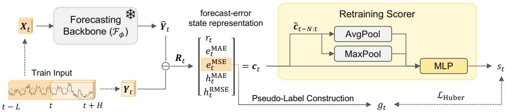
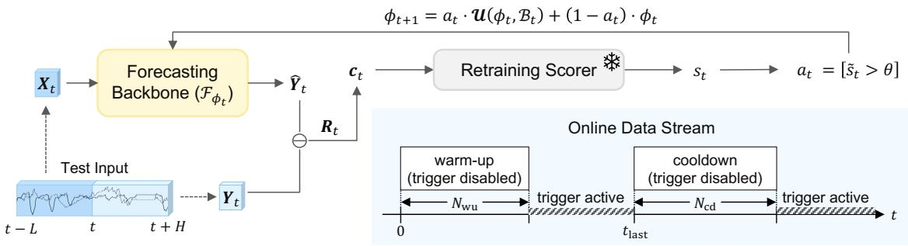
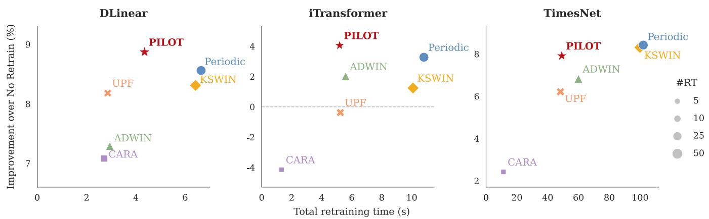
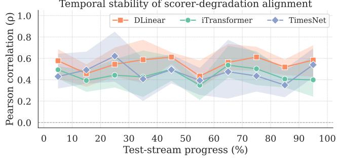
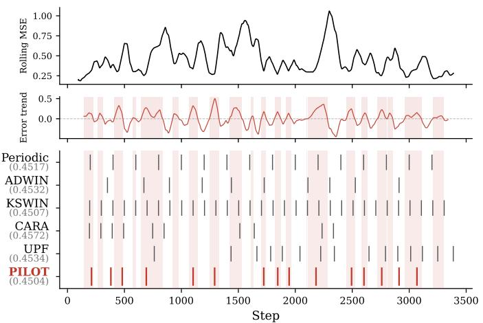
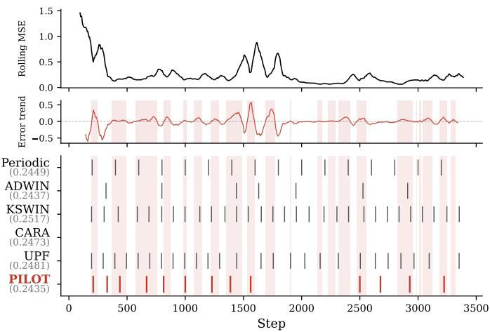

# Pseudo-Label-Triggered Retraining from Forecast Errors for Online Time Series Forecasting

Yeryeong Kwak∗† yeroong9698@snu.ac.kr Seoul National University Seoul, Republic of Korea

Yoo-Min Jung∗ pamela7384@gmail.com Seoul National University Seoul, Republic of Korea

Jonghun Park   
jonghun@snu.ac.kr   
Seoul National University   
Seoul, Republic of Korea

## Abstract

Real-world time series forecasting systems operate under nonstationary data streams, where forecasting performance may degrade over time. Although retraining can recover the performance, it incurs non-trivial computational and operational costs. Under limited deployment resources, the key challenge is therefore not only how to retrain but also when to retrain. While existing retraining policies often rely on indirect indicators such as drift alarms or model staleness, we instead use realized forecast errors as direct deployment feedback. In this paper, we propose PILOT (Pseudo-label-Informed Learned Online Trigger), an online retraining framework that learns when to retrain from forecast-error dynamics. Since ground-truth retraining labels are unavailable, PILOT constructs a pseudo-label from future increases in forecast error and trains a lightweight scorer to predict it from observed error states. At deployment, PILOT uses only completed forecast errors and serves as a plug-in module for arbitrary forecasting backbones without architectural modification. We evaluate PILOT under standard multivariate forecasting settings across eight benchmarks with three representative backbones—DLinear, iTransformer, and TimesNet. Across all three backbones, PILOT achieves state-of-the-art averagerank performance among retraining policies while maintaining a favorable performance–eficiency trade-of.

## CCS Concepts

• Computing methodologies → Online learning settings; • Applied computing → Forecasting; • Mathematics of computing → Time series analysis.

## Keywords

pseudo-labeling, model retraining, time series forecasting, online learning, concept drift

## ACM Reference Format:

Yeryeong Kwak, Yoo-Min Jung, and Jonghun Park. 2026. Pseudo-Label-Triggered Retraining from Forecast Errors for Online Time Series Forecasting. In preprint. ACM, New York, NY, USA, 10 pages. https://doi.org/10.1145/ nnnnnnn.nnnnnnn

## 1 Introduction

Real-world time series forecasting models operate in online settings [11] and face distribution shifts [16, 17] that can progressively degrade forecasting performance [31]. Retraining on recent observations can restore performance [16, 18, 29]. However, retraining incurs non-trivial computational overhead [10, 18, 29], may disrupt deployment pipelines [3], and does not necessarily improve forecasting performance [22, 29]. Under resource constraints, retraining should therefore be invoked selectively rather than routinely [10, 18, 22, 33].

The key question is therefore not only how to retrain, but also when to retrain. Existing policies trigger updates based on predicted future performance [22], model staleness or expected return [18, 33], or statistical changes in the data stream [1, 21]. However, these criteria do not directly use realized forecasting performance as deployment feedback.

In contrast, forecasting systems naturally produce direct deployment feedback once target observations become available: forecast errors. Prior work has primarily used them for monitoring [7, 23]. We instead use recent error dynamics to anticipate performance degradation and selectively allocate retraining computation.

In this paper, we propose PILOT (Pseudo-label-Informed Learned Online Trigger), a lightweight framework that learns retraining decisions from forecast-error dynamics. During ofline training, PI-LOT constructs a pseudo-label from future forecast-error increase relative to a recent baseline and trains a compact scorer to predict this signal from recent error states. This supervision requires no counterfactual retraining simulation. At deployment, the scorer triggers retraining using only realized forecast errors. Since it relies only on forecast errors, PILOT can be attached to diferent forecasting backbones without architectural modification.

Our contributions are as follows:

• We formulate retraining timing in online forecasting as a decision problem driven by realized forecast-error dynamics.

• To the best of our knowledge, PILOT is the first approach in online time series forecasting to use pseudo-labeling for retraining decisions, enabling the decision module to be trained without ground-truth retraining labels.

• Unlike representative retraining studies using synthetic or custom-designed streams [18, 22], we evaluate PILOT on eight widely adopted multivariate forecasting benchmarks.

• Across three representative backbones spanning linear, Transformer, and convolutional architectures [15, 27, 30], PILOT achieves state-of-the-art performance among retraining policies with a favorable performance–eficiency trade-of.

(∗ : z-score normalization of ∗  
  
(a) Training Phase

  
(b) Inference Phase  
Figure 1: Overall framework of PILOT (Pseudo-label-Informed Learned Online Trigger). Gray snowflake modules are frozen while light-yellow modules are updatable in the corresponding phase.

## 2 Related Work

Selective retraining policies. Despite its practical importance, relatively few studies have directly addressed when models should be retrained. Zliobaite et al. [33] formulated adaptation as a tradeof between update cost and expected performance gain. CARA [18] triggers retraining when model staleness cost exceeds retraining cost, whereas UPF [22] predicts future model performance and retrains when predicted quality deteriorates. These methods infer retraining need from cost, staleness, or predicted performance; PILOT instead learns from realized forecast-error dynamics.

Drift and forecast-error monitoring. Drift detectors can also serve as update triggers: ADWIN [1] monitors changes with adap tive windows, while KSWIN [21] applies a Kolmogorov–Smirnov test to recent stream windows. However, detected distribution change need not imply that retraining is beneficial [22]. Separately, forecast errors have long served as monitoring signals [23], with recent work detecting model inadequacy directly from forecast-error changes [7] and studying large forecast errors under structural change [2]. PILOT connects these lines by using future performance degradation as pseudo-label supervision to learn retraining decisions from recent error dynamics.

## 3 Proposed Method

Figure 1 summarizes the ofline training and online inference phases of PILOT. During ofline scorer training, the pretrained forecasting backbone is frozen, and its completed forecast errors are used to

construct error states and a pseudo-label for training a lightweight scorer. At deployment, the scorer is frozen and uses only completed forecast errors to decide when the backbone should be retrained.

## 3.1 Problem Formulation

We study online multivariate time series forecasting under nonstationary data streams. Let $\mathcal { F } _ { \phi _ { t } }$ denote the forecasting backbone at decision step �, with parameters $\phi _ { t }$ . Given a lookback window $\boldsymbol { X } _ { t } \in \mathbb { R } ^ { L \times D }$ , it produces an �-step forecast

$$
\hat { Y } _ { t } = \mathcal { F } _ { \phi _ { t } } ( X _ { t } ) \in \mathbb { R } ^ { H \times D } ,\tag{1}
$$

where �, �, and � denote the lookback length, prediction horizon, and number of variates, respectively, and $\bar { Y } _ { t } \in \bar { \mathbb { R } } ^ { H \times D }$ denotes the corresponding future segment.

Once $Y _ { t }$ is fully observed, the system chooses a binary retraining action $a _ { t } \in \{ 0 , 1 \}$ using only forecast errors whose full horizons are available. Let $\mathcal { B } _ { t }$ denote a bufer of recent observations and U the retraining operator. The backbone parameters evolve as

$$
\begin{array} { r } { \phi _ { t + 1 } = a _ { t } \mathcal { U } ( \phi _ { t } , \mathcal { B } _ { t } ) + ( 1 - a _ { t } ) \phi _ { t } , } \end{array}\tag{2}
$$

where $a _ { t } ~ = ~ 1$ triggers retraining and $a _ { t } ~ = ~ 0$ keeps the current backbone unchanged.

Let $\mathcal { E } _ { t }$ denote the history of completed forecast errors observed up to time �. We base the retraining decision on $\boldsymbol { \mathcal { E } } _ { t }$ and seek to learn a decision function � that maps this error history to a retraining action,

$$
a _ { t } = \pi ( \mathcal { E } _ { t } ) .\tag{3}
$$

PILOT realizes � by encoding $\mathcal { E } _ { t }$ into a compact forecast-error state representation and learning its relation to future degradation.

## 3.2 Forecast-Error State Representation

For each completed forecast, we compute the residual matrix

$$
R _ { t } = Y _ { t } - \hat { Y } _ { t } \in \mathbb { R } ^ { H \times D } ,\tag{4}
$$

and summarize it over the prediction horizon and variates as

$$
r _ { t } = \mathrm { A v g } ( R _ { t } ) , \quad e _ { t } ^ { \mathrm { M A E } } = \mathrm { A v g } ( | R _ { t } | ) , \quad e _ { t } ^ { \mathrm { M S E } } = \mathrm { A v g } ( R _ { t } ^ { 2 } ) ,\tag{5}
$$

where $\operatorname { A v g } ( \cdot )$ denotes the mean over all entries in $\mathbb { R } ^ { H \times D }$ . Here, $r _ { t }$ captures the average signed residual, while $e _ { t } ^ { \mathrm { M A E } }$ and $e _ { t } ^ { \mathrm { M S E } }$ measure the mean absolute error (MAE) and mean squared error (MSE), respectively.

To provide a recent baseline, we additionally compute

$$
h _ { t } ^ { \mathrm { M A E } } = \frac { 1 } { K } \sum _ { i = t - K + 1 } ^ { t } e _ { i } ^ { \mathrm { M A E } } , \qquad h _ { t } ^ { \mathrm { R M S E } } = \sqrt { \frac { 1 } { K } \sum _ { i = t - K + 1 } ^ { t } e _ { i } ^ { \mathrm { M S E } } } ,\tag{6}
$$

and form the per-step state

$$
\boldsymbol { c } _ { t } = \left[ \boldsymbol { r } _ { t } , e _ { t } ^ { \mathrm { M A E } } , e _ { t } ^ { \mathrm { M S E } } , h _ { t } ^ { \mathrm { M A E } } , h _ { t } ^ { \mathrm { R M S E } } \right] ^ { \top } \in \mathbb { R } ^ { 5 } .\tag{7}
$$

The historical terms $h _ { t } ^ { \mathrm { M A E } }$ and $h _ { t } ^ { \mathrm { R M S E } }$ let the scorer interpret current errors relative to a recent baseline rather than in isolation.

Since these feature channels can have diferent scales across datasets and forecasting backbones, we standardize each channel using statistics computed from the scorer-training split. Let $\mu _ { c } \in \mathbb { R } ^ { 5 }$ and ${ \sigma } _ { c } \in \mathbb { R } ^ { 5 }$ denote the feature-wise mean and standard deviation, respectively. The standardized per-step feature vector is defined as

$$
\tilde { \pmb { c } } _ { t } = \frac { \pmb { c } _ { t } - \pmb { \mu } _ { c } } { \pmb { \sigma } _ { c } + \epsilon } ,\tag{8}
$$

where � is a small constant for numerical stability.

Finally, we stack the most recent � standardized states:

$$
C _ { t } = \big [ \tilde { \pmb { c } } _ { t - N + 1 } ; \tilde { \pmb { c } } _ { t - N + 2 } ; \pmb { \mathscr { \tau } } _ { \bot } . . . \ ; \tilde { \pmb { c } } _ { t } \big ] \in \mathbb { R } ^ { N \times 5 } .\tag{9}
$$

This tensor serves as the input to the retraining scorer described in Section 3.4. By incorporating the most recent � states, it provides richer temporal context than a single-step snapshot.

## 3.3 Pseudo-Label Construction

Since ground-truth labels indicating retraining necessity are unavailable in practice, we construct an ofline pseudo-label $g _ { t }$ on the scorer-training split $\mathcal { D } _ { \mathrm { s c o r e r } }$ . We use the change in future mean MSE relative to a recent baseline as the supervision signal, which can be constructed directly from the frozen backbone’s error trajectory without counterfactual retraining simulation.

Specifically, mean degradation measures the change in future average MSE relative to a recent baseline, with positive values corresponding to degradation. This perspective is related to model staleness, which measures the performance cost of keeping an outdated model [18].

Let $\bar { e } _ { [ a , b ) } ^ { \mathrm { M S E } }$ denote the average MSE over the time interval [�, �):

$$
\bar { e } _ { [ a , b ) } ^ { \mathrm { M S E } } = \frac { 1 } { b - a } \sum _ { i = a } ^ { b - 1 } e _ { i } ^ { \mathrm { M S E } } .\tag{10}
$$

For a current window of length $W _ { c }$ and a future window of length $W _ { f }$ , we define

$$
g _ { t } = \bar { e } _ { [ t , t + W _ { f } ) } ^ { \mathrm { M S E } } - \bar { e } _ { [ t - W _ { c } , t ) } ^ { \mathrm { M S E } } .\tag{11}
$$

Thus, $g _ { t } > 0$ indicates that the frozen backbone’s future average error exceeds its recent baseline, providing supervision for learning impending degradation. Following the principle of winsorization [8], we clip �� to $\left[ - 0 . 5 , 2 . 0 \right]$ before scorer training, afecting fewer than 1% of targets. We further examine the extensibility of PILOT to alternative pseudo-labels in Section 4.5 and Appendix B.

## 3.4 Lightweight Retraining Scorer

Given $C _ { t }$ and $g _ { t }$ , we train a compact scorer that outputs a retraining score $s _ { t } \in \mathbb { R }$ at each time step. We first aggregate the recent error history by feature-wise average pooling, max pooling, and the latest state:

$$
\pmb { p } _ { t } = \left[ \operatorname { A v g P o o l } ( C _ { t } ) , \operatorname { M a x P o o l } ( C _ { t } ) , \tilde { \pmb { c } } _ { t } \right] \in \mathbb { R } ^ { 1 5 } .\tag{12}
$$

Each component captures a diferent aspect of the recent error history: average pooling captures the typical recent behavior, max pooling the peak severity, and $\tilde { \mathbf { c } } _ { t }$ the current state.

We then map $\pmb { p } _ { t }$ to the scalar score $s _ { t }$ using a single-hidden-layer multilayer perceptron (MLP) with ReLU activation and dropout:

$$
\begin{array} { r } { s _ { t } = \mathrm { M L P } ( \pmb { p } _ { t } ) . } \end{array}\tag{13}
$$

We train the scorer with the Huber loss [12],

$$
\mathcal { L } _ { \mathrm { H u b e r } } = \frac { 1 } { | \mathcal { D } _ { \mathrm { s c o r e r } } | } \sum _ { t \in \mathcal { D } _ { \mathrm { s c o r e r } } } \ell _ { \delta } ^ { \mathrm { H u b e r } } ( s _ { t } , g _ { t } ) ,\tag{14}
$$

which is robust to occasional large pseudo-label deviations. To mitigate the underrepresentation of positive pseudo-labels, we oversample scorer-training samples with $g _ { t } > 0 [ 9 ]$ . The trained scorer therefore predicts future degradation from error states available at decision time.

## 3.5 Online Triggering

At test time, the frozen scorer outputs a raw score $s _ { t }$ from each state tensor $C _ { t }$ . We maintain its running mean $\mu _ { s , t }$ and standard deviation $\sigma _ { s , t }$ using Welford’s online update rule [25]. Triggering is disabled until $N _ { \mathrm { w u } }$ score observations have been accumulated; afterward, we calibrate

$$
\tilde { s } _ { t } = \frac { s _ { t } - \mu _ { s , t } } { \sigma _ { s , t } + \epsilon } .\tag{15}
$$

This standardization follows common practice in online monitoring of data streams [6].

We trigger retraining when the calibrated score exceeds �, subject to a cooldown of $N _ { \mathrm { c d } }$ steps after the previous retraining time $t _ { \mathrm { l a s t } }$ . The final retraining action is therefore defined as

$$
a _ { t } = [ n _ { t } \ge N _ { \mathrm { w u } } ] \cdot [ \tilde { s } _ { t } > \theta ] \cdot [ t - t _ { \mathrm { l a s t } } \ge N _ { \mathrm { c d } } ] ,\tag{16}
$$

where [·] denotes the indicator function and $n _ { t }$ is the number of accumulated scores. When $a _ { t } ~ = ~ 1$ , the backbone is warm-start retrained on $\mathcal { B } _ { t }$ according to Section 3.1. Running score statistics continue to update across retraining events; pseudo-labels are never used at deployment.

preprint, ,

## 4 Experiments

## 4.1 Experimental Setup

Datasets. In contrast to prior retraining studies that evaluated synthetic or custom-designed streams [18, 22], we used eight widely used multivariate forecasting benchmarks, providing a realistic testbed for retraining decisions on naturally evolving real-world time series: ETTh1 and ETTh2 (hourly, 7 variates), ETTm1 and ETTm2 (15-minute, 7 variates), Electricity (hourly, 321 variates), Exchange (daily, 8 variates), Trafic (hourly, 862 variates), and Weather (10-minute, 21 variates) [14, 24, 28, 32].

Following the standard split convention adopted in prior longterm forecasting work [15, 27, 28, 32], the ETT datasets were split chronologically into training, validation, and test sets at a 60:20:20 ratio, while the other datasets were split at a 70:10:20 ratio. Since our method requires an additional split for training the retraining scorer, we further partitioned the standard validation set into two equal halves: one was used as the scorer-training split for constructing error states and training the retraining scorer, and the other was retained as a validation split. This yielded four chronologically ordered splits—backbone training, scorer training, validation, and test—with ratios of 60:10:10:20 for ETT datasets and 70:5:5:20 for the others. The backbone was pretrained only on the first split and shared throughout all methods, so diferences in performance were attributable solely to each method’s retraining policy.

Backbones. We evaluated PILOT with three forecasting backbones that span diferent architectural families: DLinear [30] from the linear family; iTransformer [15] from the Transformer family; and TimesNet [27] from the convolutional family.

Baselines. We compared against six baselines spanning no retraining, scheduled retraining, drift-based triggers, and cost- or prediction-based policies. Method-specific hyperparameters were selected on the standard validation split from the candidate sets described below, and the selected configuration was evaluated on the test split.

• No Retrain never updates the backbone after initial training.

• Periodic triggers retraining at a fixed interval, with the interval tuned from {50, 100, 200} steps.

• ADWIN [1] is an adaptive windowing drift detector that automatically adjusts its window size based on observed changes, applied to the per-step MSE summary $e _ { t } ^ { \mathrm { M S E } }$ defined in Section 3.2. We tuned the significance level � ∈ {0.002, 0.01, 0.05}.

• KSWIN [21] performs a Kolmogorov–Smirnov test over a sliding window ofrecent $e _ { t } ^ { \mathrm { M S E } }$ values to detect distributional change. We tuned the significance level � ∈ {0.001, 0.01, 0.05}.

• CARA [18] is a cost-aware retraining policy that triggers an update when estimated model staleness exceeds the retraining cost. We tuned both staleness variants (T and C), with the threshold fixed at $\tau = 0 . 0 5$

• UPF [22] formulates retraining as a future-performance prediction problem using an ElasticNet-based forecaster. We adapted UPF to forecasting by replacing the original predicted quality signal with future MSE under the Gaussian-likelihood setting described in the original paper’s Appendix. We tuned the re training cost penalty � ∈ {0.05, 0.5, 1.0}.

Evaluation metrics. We report test MSE, the number of retraining events (#RT), average rank, and PILOT’s wins/losses against each baseline. Lower MSE and rank are better, while lower #RT indicates fewer model updates; MSE ties in win/loss counts are broken by fewer retraining events. For each backbone, we also report one-sided Wilcoxon signed-rank tests [26] over the eight datasets and three shared random seeds to assess whether PILOT yields lower MSE than each baseline.

Implementation details. Across all methods, we used a lookback length of $L \ = \ 9 6$ and a prediction horizon of $H = 9 6$ . The cooldown period was set to $N _ { \mathrm { c d } } = 1 0 0$ hours and the retraining bufer length was 1000 steps; the same warm-start retraining protocol was used across all methods. Hour-based hyperparameters were converted to dataset-specific step counts using each sampling interval, preserving a consistent temporal scope across datasets. Unless otherwise specified, all results were aggregated over three random seeds.

For PILOT, all hyperparameters except the trigger threshold � were fixed across datasets and backbones. Although � remained available for validation, it was fixed to 1.0 for all results reported in this paper to avoid dataset- or backbone-specific tuning. The errorstate vector used a rolling history window of $K = 2 0$ steps, and the state tensor stacked the most recent $N = 2 4$ standardized vectors. The degradation labels used current and future windows of $W _ { c } = $ $W _ { f } = 4 8$ hours. Triggering was disabled during an initial warm-up period of $N _ { \mathrm { w u } } = 5 0$ steps, during which online score statistics were accumulated. The scorer was a single-hidden-layer MLP with a hidden dimension of 64 and a dropout rate of 0.1. The source code is available at https://anonymous.4open.science/r/PILOT-D44F.

## 4.2 Forecasting Performance

Table 1 reports MSE, #RT, and average rank across eight datasets and three backbones. PILOT achieved the lowest average rank on all three backbones, with more wins than losses against every baseline. The Wilcoxon tests further supported this pattern: PILOT was significantly better $( p < 0 . 0 5 )$ in 14 of 18 backbone–baseline comparisons, including every baseline on DLinear and iTransformer, while the remaining four still favored PILOT in win/loss counts.

At the individual-dataset level, PILOT obtained the best MSE on five of eight datasets with both DLinear and iTransformer, and on three with TimesNet. The #RT values further showed that these gains did not arise simply from more frequent retraining, as update frequency varied across datasets and baselines.

While Periodic and ADWIN remained competitive on certain backbones, neither ranked best across all three. The more specialized CARA and UPF did not consistently surpass these simpler policies, while KSWIN even ranked below No Retrain on iTransformer. Overall, these results indicate that PILOT’s forecast-error-based supervision provides a reliable basis for retraining decisions across diverse forecasting architectures.

## 4.3 Performance–Eficiency Trade-of

The performance gains of PILOT in Table 1 were not achieved through indiscriminate retraining. Figure 2 further examines the performance–eficiency trade-of on ETTm2, one of the longest online test streams among the eight benchmarks and a setting with diverse retraining frequencies across policies. The figure compares relative improvement over No Retrain against total retraining runtime, with marker size proportional to #RT; detailed measurements are provided in Appendix A.

Table 1: Forecasting performance across eight datasets and three forecasting backbones. Each cell reports MSE with its standard deviation, followed by the average number of retraining events (#RT) in parentheses; No Retrain reports MSE only since its #RT is always zero. Bold: best, underline: second-best.
<table><tr><td>Backbone</td><td>Dataset</td><td>No Retrain</td><td>Periodic</td><td>ADWIN (2007)</td><td>KSWIN (2020)</td><td>CARA (2024)</td><td>UPF (2025)</td><td>PILOT (ours)</td></tr><tr><td rowspan="12">DLinear</td><td>ETTh1</td><td>0.4572±0.0005</td><td>0.4514±0.0003 (16.0)</td><td>0.4533±0.0002(10.7)</td><td>0.4506±0.0001 (32.0)</td><td>0.4562±0.0013 (10.3)</td><td>0.4536±0.0007(15.3)</td><td>0.4501±0.0003(17.3)</td></tr><tr><td>ETTh2</td><td>0.2343±0.0085</td><td>0.2184±0.0007 (16.0)</td><td>0.2185±0.0013 (6.7)</td><td>0.2188±0.0009(31.0)</td><td>0.2343±0.0085 (0.0)</td><td>0.2193±0.0008 (24.7)</td><td>0.2185±0.0009(14.0)</td></tr><tr><td>ETTm1</td><td>0.3651±0.0027</td><td>0.3606±0.0002 (35.0)</td><td>0.3586±0.0003 (23.3)</td><td>0.3618±0.0009 (34.0)</td><td>0.3594±0.0006 (23.7)</td><td>0.3624±0.0003 (24.0)</td><td>0.3606±0.0007 (20.7)</td></tr><tr><td>ETTm2</td><td>0.1756±0.0106</td><td>0.1603±0.0011 (35.0)</td><td>0.1625±0.0006(17.3)</td><td>0.1607±0.0009 (34.0)</td><td>0.1629±0.0011(15.3)</td><td>0.1610±0.0039(13.3)</td><td>0.1598±0.0031(22.3)</td></tr><tr><td>ECL</td><td>0.1963±0.0000</td><td>0.1957±0.0000 (25.0)</td><td>0.1963±0.0000 (6.0)</td><td>0.1963±0.0000 (50.0)</td><td>0.1962±0.0001 (9.0)</td><td>0.1959±0.0000 (3.0)</td><td>0.1962±0.0002 (31.7)</td></tr><tr><td>Exchange</td><td>0.0888±0.0000</td><td>0.0785±0.0003 (7.0)</td><td>0.0844±0.0000 (1.0)</td><td>0.0785±0.0004 (13.0)</td><td>0.0782±0.0001 (4.0)</td><td>0.0888±0.0000 (0.0)</td><td>0.0776±0.0006 (23.0)</td></tr><tr><td>Weather</td><td>0.1911±0.0000</td><td>0.1827±0.0001 (18.0)</td><td>0.1849±0.0001(12.0)</td><td>0.1828±0.0002 (17.7)</td><td>0.2012±0.0009(2.0)</td><td>0.1831±0.0001 (17.0)</td><td>0.1819±0.0005(14.0)</td></tr><tr><td>Traffic</td><td>0.6546±0.0009</td><td>0.6416±0.0002 (17.0)</td><td>0.6424±0.0009(7.7)</td><td>0.6420±0.0002 (32.0)</td><td>0.6425±0.0002 (20.7)</td><td>0.6413±0.0003 (19.0)</td><td>0.6410±0.0005(15.7)</td></tr><tr><td>avg. rank</td><td>6.33</td><td>2.73</td><td>4.13</td><td>3.81</td><td>4.85</td><td>4.15</td><td>2.00</td></tr><tr><td># of wins/losses</td><td>8/0</td><td>6/2</td><td>6/2</td><td>8/0</td><td>6/2</td><td>7/1</td><td></td></tr><tr><td>Wilcoxon test (p)</td><td>&lt; 0.001</td><td>0.008</td><td>0.002</td><td>&lt; 0.001</td><td>&lt; 0.001</td><td>&lt; 0.001</td><td></td></tr><tr><td rowspan="14"></td><td>ETTh1</td><td>0.4672±0.0000</td><td>0.4616±0.0121 (16.0)</td><td>0.4565±0.0058 (9.3)</td><td>0.4803±0.0222 (30.3)</td><td>0.4733±0.0159(12.0)</td><td>0.4656±0.0091 (15.3)</td><td>0.4459±0.0008(19.7)</td></tr><tr><td>ETTh2</td><td>0.2468±0.0014</td><td>0.2449±0.0015(16.0)</td><td>0.2441±0.0026(8.7)</td><td>0.2511±0.0010 (30.7)</td><td>0.2468±0.0014(0.0)</td><td>0.2484±0.0015 (26.0)</td><td>0.2415±0.0017(11.3)</td></tr><tr><td>ETTm1</td><td>0.4852±0.0260</td><td>0.4007±0.0057 (35.0)</td><td>0.4023±0.0029(25.7)</td><td>0.4086±0.0089 (33.3)</td><td>0.4033±0.0024 (27.0)</td><td>0.4086±0.0036 (25.0)</td><td>0.3786±0.0034(17.0)</td></tr><tr><td>ETTm2</td><td>0.1750±0.0027</td><td>0.1693±0.0022 (35.0)</td><td>0.1715±0.0015(18.0)</td><td>0.1729±0.0035 (33.3)</td><td>0.1823±0.0062 (5.0)</td><td>0.1757±0.0038 (16.0)</td><td>0.1680±0.0064(15.3)</td></tr><tr><td>ECL</td><td>0.1661±0.0027</td><td>0.1646±0.0003 (25.0)</td><td>0.1669±0.0012(6.3)</td><td>0.1656±0.0003 (49.7)</td><td>0.1664±0.0008 (3.7)</td><td>0.1658±0.0004 (5.3)</td><td>0.1630±0.0006(32.3)</td></tr><tr><td>iTransformer Exchange</td><td>0.0939±0.0000</td><td>0.1000±0.0011 (7.0)</td><td>0.0923±0.0005 (2.0)</td><td>0.1085±0.0017 (13.0)</td><td>0.1039±0.0014 (8.3)</td><td>0.0939±0.0000 (1.0)</td><td>0.1125±0.0123 (20.7)</td></tr><tr><td>Weather Traffic</td><td>0.1811±0.0000</td><td>0.1803±0.0001 (18.0)</td><td>0.1800±0.0006(14.0)</td><td>0.1816±0.0006 (17.3)</td><td>0.1770±0.0004 (2.0)</td><td>0.1792±0.0005 (17.0)</td><td>0.1788±0.0012(13.3)</td></tr><tr><td></td><td>0.4754±0.0000</td><td>0.4766±0.0002 (17.0)</td><td>0.4762±0.0001 (9.0)</td><td>0.4753±0.0004(32.0)</td><td>0.4773±0.0001 (12.0)</td><td>0.4816±0.0003 (7.0)</td><td>0.4783±0.0036(13.7)</td></tr><tr><td>avg. rank # of wins/losses</td><td>4.35</td><td>3.29</td><td>3.21</td><td>5.13</td><td>4.73</td><td>4.92</td><td>2.38</td></tr><tr><td></td><td>6/2 0.008</td><td>6/2 0.017</td><td>6/2</td><td>6/2</td><td>5/3</td><td>7/1</td><td>一</td></tr><tr><td rowspan="12"></td><td>Wilcoxon test (p)</td><td></td><td></td><td>0.047</td><td>0.001</td><td>0.003</td><td>0.004</td><td></td></tr><tr><td>ETTh1 ETTh2</td><td>0.6762±0.0041</td><td>0.6287±0.0098 (16.0)</td><td>0.6269±0.0035(12.3)</td><td>0.6619±0.0164(32.0)</td><td>0.6396±0.0046 (10.7)</td><td>0.6194±0.0043 (15.0)</td><td>0.6406±0.0091 (18.0)</td></tr><tr><td></td><td>0.3128±0.0135</td><td>0.3327±0.0093 (16.0)</td><td>0.3170±0.0204 (8.7)</td><td>0.3452±0.0082(32.0)</td><td>0.3128±0.0135 (0.0)</td><td>0.3432±0.0104 (30.3)</td><td>0.3270±0.0174(15.7)</td></tr><tr><td>ETTm1</td><td>0.5381±0.0000</td><td>0.3980±0.0004 (35.0)</td><td>0.4010±0.0046(25.7)</td><td>0.3991±0.0010 (34.0)</td><td>0.4194±0.0058 (25.3)</td><td>0.3977±0.0013 (30.0)</td><td>0.3945±0.0023 (20.0)</td></tr><tr><td>ETTm2</td><td>0.1977±0.0118</td><td>0.1808±0.0025(35.0)</td><td>0.1840±0.0042(20.0)</td><td>0.1810±0.0038 (34.0)</td><td>0.1927±0.0074 (5.0)</td><td>0.1850±0.0013(16.7)</td><td>0.1817±0.0015(17.7)</td></tr><tr><td>ECL</td><td>0.1731±0.0000</td><td>0.1619±0.0002 (25.0)</td><td>0.1642±0.0009(5.3)</td><td>0.1626±0.0004(49.7)</td><td>0.1688±0.0001 (4.0)</td><td>0.1652±0.0010(4.7)</td><td>0.1618±0.0003 (24.0)</td></tr><tr><td>Exchange</td><td>0.1828±0.0001</td><td>0.1680±0.0002 (7.0)</td><td>0.1702±0.0023 (4.3)</td><td>0.1656±0.0002 (13.0)</td><td>0.1659±0.0001 (5.0)</td><td>0.1828±0.0001 (0.0)</td><td>0.1659±0.0043 (9.0)</td></tr><tr><td>Weather</td><td>0.2011±0.0057</td><td>0.1851±0.0010(18.0)</td><td>0.1831±0.0013(12.0)</td><td>0.1856±0.0030 (17.3)</td><td>0.2009±0.0043 (2.0)</td><td>0.1839±0.0003 (17.0)</td><td>0.1827±0.0051(13.7)</td></tr><tr><td>Traffic</td><td>0.5996±0.0009</td><td>0.4630±0.0008 (17.0)</td><td>0.4808±0.0054(11.3)</td><td>0.4577±0.0013(32.7)</td><td>0.4894±0.0061 (8.0)</td><td>0.4607±0.0010(12.7)</td><td>0.4714±0.0126(17.0)</td></tr><tr><td>avg. rank</td><td>6.17</td><td>3.00</td><td>3.71</td><td>3.58</td><td>4.90</td><td>3.73</td><td>2.92</td></tr><tr><td># of wins/losses</td><td>7/1</td><td>5/3</td><td>6/2</td><td>5/3</td><td>5/3</td><td>6/2</td><td></td></tr><tr><td>Wilcoxon test (p)</td><td>&lt; 0.001</td><td>0.366</td><td>0.345</td><td>0.060</td><td>0.006</td><td>0.094</td><td></td></tr></table>

Figure 2: Retraining performance–eficiency trade-of on ETTm2 across the three backbones. The x-axis shows total retraining runtime including decision overhead, the y-axis shows relative MSE improvement over No Retrain (%), and marker size is proportional to #RT. Methods closer to the upper-left corner achieve greater forecasting improvement at lower retraining cost.

Table 2: Efect of retraining timing on DLinear. Uniform performs the same number of retraining events as PILOT on each dataset, spacing them uniformly over the test stream. Bold: best.
<table><tr><td>Method</td><td>ETTh1</td><td>ETTh2</td><td>ETTm1</td><td>ETTm2</td><td>ECL</td><td>Exch.</td><td>Weat.</td><td>Traff.</td></tr><tr><td>No RT</td><td>0.4572</td><td>0.2343</td><td>0.3651</td><td>0.1756</td><td>0.1963</td><td>0.0888</td><td>0.1911</td><td>0.6546</td></tr><tr><td>Uniform</td><td>0.5619</td><td>0.2395</td><td>0.3576</td><td>0.1782</td><td>0.2041</td><td>0.0879</td><td>0.1853</td><td>0.6416</td></tr><tr><td>PILOT</td><td>0.4501</td><td>0.2185</td><td>0.3606</td><td>0.1598</td><td>0.1962</td><td>0.0776</td><td>0.1819</td><td>0.6410</td></tr></table>

PILOT lies on the performance–retraining-time Pareto frontier across all three backbones. Moreover, total retraining time closely tracked #RT, while the time per retraining event was broadly simi lar across methods (Appendix A). Thus, diferences in cumulative retraining cost were driven primarily by how often each policy retrained. By combining competitive forecasting improvement with moderate retraining cost, PILOT consequently achieved a favorable performance–compute trade-of.

The baselines display two recurring trade-of patterns. Periodic and KSWIN sit toward the right of each plot, paying high retraining cost for their performance gains. In contrast, CARA clusters in the lower-left region, keeping retraining cost low but yielding limited improvement; on iTransformer, CARA even underperformed No Re train. The remaining policies occupy intermediate positions but do not reach the upper-left region across all three backbones. Figure 2 therefore confirms PILOT’s favorable operational eficiency.

## 4.4 Retraining Timing and Robustness

Beyond aggregate performance and cost, we next isolate the role of retraining timing, examine scorer stability under successive updates, and analyze the resulting trigger behavior.

Matched-budget timing analysis. Sections 4.2 and 4.3 show that forecasting accuracy and retraining frequency alone do not reveal whether gains arise from well-timed updates. To isolate retraining timing from frequency, we compared PILOT with Uniform, which performs the same number of updates as PILOT but distributes them uniformly over the test stream. We conducted this analysis with DLinear, where Periodic achieved its best average rank among the three backbones in Table 1.

As shown in Table 2, PILOT outperformed Uniform on seven of the eight datasets, except on ETTm1. Uniform also underperformed No Retrain on four datasets, showing that using the same update budget does not guarantee improvement. Together, these results provide empirical support for the retraining timing learned from mean-degradation supervision.

Closed-loop robustness. The scorer is trained ofline with a frozen backbone, whereas online retraining progressively changes the deployed backbone and its error dynamics. To examine whether the learned signal remains informative under this feedback, we divided each test stream into ten chronological segments and, within each segment, measured the Pearson correlation [20] between $s _ { t }$ and future degradation $g _ { t } ^ { \mathrm { o n l i n e } }$ , defined as $g _ { t }$ computed with the active checkpoint $\phi _ { t }$ held fixed over the future window.

Temporal stability of scorer-degradation alignment  
  
Figure 3: Pearson correlation between $s _ { t }$ and future degradation $g _ { t } ^ { \mathrm { o n l i n e } }$ across the test stream. Lines show means across datasets and seeds; shading denotes the interquartile range.

Table 3: Trigger quality averaged across the eight datasets and three backbones. Bold: best, underline: second-best.
<table><tr><td>Method</td><td>Trigger Precision (↑)</td><td>Trigger Need (↑)</td><td>Episode Hit Rate (↑)</td><td>Detection Lag Rank (↓)</td></tr><tr><td>Periodic</td><td>0.482</td><td>0.091</td><td>0.417</td><td>3.53</td></tr><tr><td>ADWIN</td><td>0.518</td><td>0.113</td><td>0.243</td><td>3.73</td></tr><tr><td>KSWIN</td><td>0.514</td><td>0.088</td><td>0.574</td><td>2.66</td></tr><tr><td>CARA</td><td>0.588</td><td>0.255</td><td>0.233</td><td>4.61</td></tr><tr><td>UPF</td><td>0.437</td><td>0.052</td><td>0.353</td><td>4.04</td></tr><tr><td>PILOT</td><td>0.707</td><td>0.356</td><td>0.468</td><td>2.43</td></tr></table>

Figure 3 shows that the correlation remained consistently positive across all three backbones without systematic decline over the test stream. This indicates stable scorer–degradation alignment despite successive backbone updates.

Trigger quality analysis. The matched-budget results showed that update frequency alone cannot explain forecasting performance. We therefore evaluated whether each policy’s triggers aligned with realized forecast degradation. Using the No Retrain error stream as a common reference, we defined degradation as an increase in future average error relative to the recent window.

The four metrics capture two complementary perspectives: trigger selectivity and degradation-episode coverage. Trigger precision measures the fraction of triggers occurring during degradation, while trigger need measures the average normalized degradation magnitude at triggered steps. Episode hit rate measures the fraction of contiguous degradation episodes containing at least one trigger, whereas detection lag rank measures how quickly a method triggers after the start of a hit episode. Detection lags are converted to per-dataset ranks before aggregation to account for diferent sampling rates.1

Table 3 reveals a clear trade-of among the baselines. CARA is highly selective but misses many degradation episodes and reacts late, whereas KSWIN provides broader and faster coverage with lower selectivity. UPF shows the weakest selectivity and only moderate episode coverage, while Periodic and ADWIN occupy intermediate positions. This balanced behavior of Periodic and ADWIN is consistent with their relatively strong forecasting performance in Table 1.

(a) DLinear on ETTh1  
  
(b) iTransformer on ETTh2  
Figure 4: Trigger visualization of each retraining method for (a) DLinear on ETTh1 and (b) iTransformer on ETTh2.

PILOT is the only method to rank within the top two on all four metrics: it achieves the best trigger precision, trigger need, and detection lag rank, together with the second-best episode hit rate. Thus, PILOT combines selective triggering with broad and timely coverage of degradation episodes.

Trigger timing analysis. Figure 4 complements Table 3 with temporal examples for DLinear–ETTh1 and iTransformer–ETTh2. Within each panel, the top row shows the rolling MSE of the No Retrain baseline; the middle row shows the corresponding degradation trend; and the bottom row shows each method’s trigger events for one random seed, with the corresponding test MSE in parentheses. Shaded regions in the middle and bottom rows mark intervals with positive forecast degradation. These intervals provide a reference for assessing how each method’s triggers align with forecast degradation.

Table 4: Component ablation for PILOT on TimesNet. Parentheses report relative MSE change from PILOT.
<table><tr><td>Dataset</td><td>PILOT</td><td> $\mathbf { w } / \mathbf { o } \mathbf { \ s c o r e r } ^ { \dagger }$ </td><td> $\mathbf { w } / \mathbf { o } \mathbf { \mathrm { ~ H i s t o r y } }$ </td><td>w/o Stacking</td></tr><tr><td>ETTh1</td><td>0.6406</td><td> $0 . 6 8 9 3 \left( + 7 . 6 1 \% \right)$ </td><td> $0 . 6 9 2 8 \left( + 8 . 1 4 \% \right)$ </td><td> $0 . 7 0 0 4 \left( + 9 . 3 4 \% \right)$ </td></tr><tr><td>ETTh2</td><td>0.3270</td><td> $0 . 3 2 9 4 \left( + 0 . 7 4 \% \right)$ </td><td> $0 . 3 3 2 0 \left( + 1 . 5 4 \% \right)$ </td><td> $0 . 3 3 3 7 \left( + 2 . 0 4 \% \right)$ </td></tr><tr><td>ETTm1</td><td>0.3945</td><td> $0 . 3 9 7 3 \left( + 0 . 7 1 \% \right)$ </td><td> $0 . 4 0 3 4 \left( + 2 . 2 6 \% \right)$ </td><td> $0 . 4 0 2 4 \left( + 2 . 0 0 \% \right)$ </td></tr><tr><td>ETTm2</td><td>0.1817</td><td> $0 . 1 8 9 1 \left( + 4 . 0 6 \% \right)$ </td><td> $0 . 1 8 1 0 \left( - 0 . 3 8 \% \right)$ </td><td>0.1859(+2.29%)</td></tr><tr><td>ECL</td><td>0.1618</td><td> $0 . 1 7 0 8 \left( + 5 . 5 5 \% \right)$ </td><td> $0 . 1 6 9 1 \left( + 4 . 5 3 \% \right)$ </td><td>0.1697(+4.90%)</td></tr><tr><td>Exchange</td><td>0.1659</td><td> $0 . 1 6 2 4 \left( - 2 . 1 4 \% \right)$ </td><td> $0 . 1 6 7 8 \left( + 1 . 1 3 \% \right)$ </td><td>0.1729 (+4.21%)</td></tr><tr><td>Weather</td><td>0.1827</td><td> $0 . 1 8 6 6 \left( + 2 . 1 3 \% \right)$ </td><td> $0 . 1 8 6 1 \left( + 1 . 8 6 \% \right)$ </td><td> $0 . 1 8 5 8 \left( + 1 . 7 0 \% \right)$ </td></tr><tr><td>Traffic</td><td>0.4714</td><td> $0 . 4 7 9 6 \left( + 1 . 7 3 \% \right)$ </td><td> $0 . 4 8 0 0 \left( + 1 . 8 3 \% \right)$ </td><td> $0 . 4 7 4 8 \left( + 0 . 7 1 \% \right)$ </td></tr><tr><td>avg. ∆%</td><td>一</td><td>+2.55%</td><td>+2.61%</td><td>+3.40%</td></tr><tr><td># of wins</td><td>一</td><td>7</td><td>7</td><td>8</td></tr></table>

†This future-informed comparison directly thresholds the future-derived retraining label, which is unavailable at deployment and introduces information leakage.

As shown in Figure 4a, the ETTh1 rolling MSE exhibits several distinct surges, including repeated bursts around steps 1300–1800 and a sharp spike near 2300. Periodic and KSWIN trigger across both degradation and non-degradation intervals, whereas CARA triggers comparatively sparsely. PILOT concentrates its updates around major degradation intervals and achieves the lowest MSE on this seed.

In Figure 4b, the rolling MSE peaks early (around 1.4 within the first 200 steps) and gradually decreases, with persistent surges around steps 1400–1800. KSWIN and UPF trigger densely over the entire test stream, while CARA never triggers. PILOT remains comparatively sparse after the main degradation interval and again achieves the lowest MSE. Together, these cases visually reinforce the selective yet responsive behavior summarized in Table 3.

## 4.5 Ablation and Alternative Pseudo-Labels

Component ablation. To identify which components are responsible for the gains of PILOT, we conducted an ablation study using the mean-degradation formulation with TimesNet across all eight datasets. Table 4 reports MSE and the relative MSE increase from PILOT. We compared PILOT against three ablated variants: w/o Scorer, which removes the learned scorer and directly thresholds the pseudo-label; w/o History, which removes the rolling historical summaries $( h _ { t } ^ { \mathrm { M A E } } , h _ { t } ^ { \mathrm { R M S E } } )$ from the state; and w/o Stacking, which uses only the current-step state without temporal stacking.

PILOT outperformed its ablated counterparts in 22 of the 24 dataset–variant comparisons. Removing the learned scorer increased MSE by 2.55% on average, with the largest increase on ETTh1 (+7.61%). Notably, w/o Scorer is a future-informed method that directly thresholds a pseudo-label unavailable at deployment; PILOT nonetheless outperformed it on seven of eight datasets. This result is consistent with a denoising or regularization efect of scorer learning and suggests that the learned scorer can yield more reliable retraining decisions than direct thresholding.

Table 5: Descriptive average MSE of alternative pseudo-label designs. Formatting indicates their average-rank positions relative to the baselines. Bold: outperforms the best baseline; underline: outperforms the second-best.
<table><tr><td>Variant</td><td></td><td>DLinear iTransformer TimesNet</td><td></td><td>Counterfactual RT†</td></tr><tr><td>Mean (main)</td><td>0.2857</td><td>0.2708</td><td>0.3157</td><td>No</td></tr><tr><td>Cumulative</td><td>0.2856</td><td>0.2730</td><td>0.3164</td><td>No</td></tr><tr><td>Relative</td><td>0.2857</td><td>0.2714</td><td>0.3189</td><td>No</td></tr><tr><td>Binary util.</td><td>0.2872</td><td>0.2733</td><td>0.3150</td><td>Yes</td></tr><tr><td>Ordinal util.</td><td>0.2878</td><td>0.2755</td><td>0.3137</td><td>Yes</td></tr><tr><td>Voting</td><td>0.2873</td><td>0.2932</td><td>0.3191</td><td>Yes</td></tr></table>

†Additional ofline retraining simulations are required only to construct utility-based labels; they are not used during online inference.

Removing historical features increased MSE by 2.61% on average and degraded seven of eight datasets, showing the value of interpreting current errors against a recent baseline. Removing temporal stacking caused the largest average increase (+3.40%) and degraded all eight datasets, confirming that recent error dynamics are more informative than a single-step state. Therefore, the three mechanisms are complementary: the scorer converts noisy pseudo-labels into reliable decisions, historical features provide a local reference for error severity, and stacking captures recent error dynamics.

Alternative pseudo-labels. We additionally evaluated cumula tive and relative degradation, binary and ordinal retraining utility, and a voting ensemble of the five scorers. Table 5 summarizes their average MSE and computational requirements; their definitions and detailed analysis are provided in Appendix B.

The extension study shows that PILOT is not tied to a single supervision signal. The degradation-based variants yield similar average MSE on DLinear and iTransformer, while Ordinal Utility performs best on TimesNet. Overall, these results show that the framework accommodates alternative notions of retraining necessity, while Mean Degradation provides a simple and consistently efective default without counterfactual retraining simulation.

## 5 Conclusion

We proposed PILOT, a pseudo-label-based online retraining method that constructs supervision from realized forecast errors. PILOT uses future mean forecast-error degradation as a pseudo-label and trains a lightweight scorer on recent error states to produce retraining decisions. It remains backbone-agnostic, requiring no modification to the forecasting model.

Across the eight benchmarks and three backbones, PILOT achieved the lowest average rank among retraining policies while maintaining a favorable performance–retraining-time trade-of. Matchedbudget and trigger analyses further showed that its gains arise from selective and timely retraining rather than merely from more frequent updates. Closed-loop analysis showed that scorer–degradation alignment remained stable despite successive backbone updates, while an ablation study confirmed that scorer learning, historical context, and temporal stacking each play distinct roles in producing selective retraining decisions.

Table 6: Detailed retraining eficiency on ETTm2.
<table><tr><td rowspan="2">Backbone</td><td rowspan="2">Method #RT</td><td rowspan="2"></td><td rowspan="2">Time (s)</td><td rowspan="2">Total RT Time / #RT GPU Mem.</td><td rowspan="2">(MB)</td></tr><tr><td>(s)</td></tr><tr><td rowspan="6">DLinear</td><td>Periodic</td><td>35.0</td><td>6.644</td><td>0.190</td><td>233.4</td></tr><tr><td>ADWIN</td><td>17.3</td><td>2.944</td><td>0.170</td><td>233.5</td></tr><tr><td>KSWIN</td><td>34.0</td><td>6.418</td><td>0.189</td><td>233.7</td></tr><tr><td>CARA</td><td>15.3</td><td>2.716</td><td>0.177</td><td>233.0</td></tr><tr><td>UPF</td><td>13.3</td><td>2.857</td><td>0.214</td><td>233.8</td></tr><tr><td>PILOT</td><td>22.3</td><td>4.349</td><td>0.195</td><td>232.6</td></tr><tr><td rowspan="6">iTransformer</td><td>Periodic</td><td>35.0</td><td>10.810</td><td>0.309</td><td>1336.0</td></tr><tr><td>ADWIN</td><td>18.0</td><td>5.595</td><td>0.311</td><td>1342.8</td></tr><tr><td>KSWIN</td><td>33.3</td><td>10.085</td><td>0.303</td><td>1334.1</td></tr><tr><td>CARA</td><td>5.0</td><td>1.326</td><td>0.265</td><td>1336.1</td></tr><tr><td>UPF</td><td>16.0</td><td>5.243</td><td>0.328</td><td>1330.6</td></tr><tr><td>PILOT</td><td>15.3</td><td>5.195</td><td>0.339</td><td>1330.6</td></tr><tr><td rowspan="6">TimesNet</td><td>Periodic</td><td>35.0</td><td>102.016</td><td>2.915</td><td>39.6</td></tr><tr><td>ADWIN</td><td>20.0</td><td>59.941</td><td>2.997</td><td>39.2</td></tr><tr><td>KSWIN</td><td>34.0</td><td>99.807</td><td>2.935</td><td>39.9</td></tr><tr><td>CARA</td><td>5.0</td><td>11.272</td><td>2.254</td><td>39.7</td></tr><tr><td>UPF</td><td>16.7</td><td>48.280</td><td>2.897</td><td>39.2</td></tr><tr><td>PILOT</td><td>17.7</td><td>49.115</td><td>2.780</td><td>39.2</td></tr></table>

More broadly, these results suggest that forecast errors can serve not only as monitoring signals but also as efective sources of supervision for learning retraining decisions. Experiments with alternative pseudo-labels further showed that PILOT is not tied to a single supervision design, while mean degradation provides a simple and consistently efective default without requiring counterfactual retraining simulation.

While PILOT showed promising results, several directions remain open. Its pseudo-label relies on fixed-length current and future windows, which may limit responsiveness to abrupt performance degradation. PILOT also supports only binary decisions, whereas richer actions such as recalibration, partial fine-tuning, or cost-aware update selection may further improve adaptation under evolving data streams.

## A Retraining Eficiency

Table 6 reports #RT, total retraining time including decision overhead, time per RT, and maximum GPU memory averaged over three seeds, supporting the ETTm2 performance–eficiency comparison in Figure 2. Within each backbone, peak GPU memory and time per retraining event are broadly comparable across methods. Accordingly, total retraining cost is driven primarily by how often retraining is invoked, reinforcing the importance of deciding when to retrain—the central focus of this work.

## B Alternative Pseudo-Labels

PILOT constructs retraining supervision from future mean degradation, as described in Section 3.3. To examine its extensibility, Section 4.5 evaluates the same scorer with alternative pseudo-labels designed with degradation- and utility-based signals; their definitions and detailed results are provided below.

## B.1 Alternative Pseudo-Label Definitions

The alternative single-label variants capture two notions of retrain ing necessity: (i) future degradation under the unchanged backbone [18, 19], and (ii) utility from immediate retraining [22, 33].

B.1.1 Cumulative degradation. Cumulative degradation focuses on the accumulated future deterioration by summing future MSE deviations from the recent baseline:

$$
g _ { t } ^ { \mathrm { c u m } } = \sum _ { i = t } ^ { t + W _ { f } - 1 } \left( e _ { i } ^ { \mathrm { M S E } } - \bar { e } _ { [ t - W _ { c } , t ) } ^ { \mathrm { M S E } } \right) .\tag{17}
$$

This aligns with cumulative-sum monitoring statistics [19].

B.1.2 Relative degradation. Relative degradation addresses scale diferences by normalizing mean degradation by the recent error baseline:

$$
g _ { t } ^ { \mathrm { r e l } } = \frac { \bar { e } _ { [ t , t + W _ { f } ) } ^ { \mathrm { M S E } } - \bar { e } _ { [ t - W _ { c } , t ) } ^ { \mathrm { M S E } } } { \bar { e } _ { [ t - W _ { c } , t ) } ^ { \mathrm { M S E } } + \epsilon } .\tag{18}
$$

This normalized formulation is closely related to the relative staleness cost used in cost-aware retraining [18]. These continuous degradation-based extensions use the same clipping rule as the mean-degradation formulation.

B.1.3 Utility-based labels. Utility-based labels instead compare future losses under stale and retrained backbones to assess the benefit of immediate retraining, following cost-sensitive retraining formulations [22, 33].

At each candidate time step �, we compare keeping the current backbone unchanged with retraining it on the recent bufer. We then define retraining utility as

$$
u _ { t } = \bar { e } _ { \mathrm { s t a l e } , t } ^ { \mathrm { M S E } } - \bar { e } _ { \mathrm { r e t r a i n e d } , t } ^ { \mathrm { M S E } } ,\tag{19}
$$

where $\bar { e } _ { \mathrm { s t a l e } , t } ^ { \mathrm { M S E } }$ and $\bar { e } _ { \mathrm { r e t r a i n e d } , t } ^ { \mathrm { M S E } }$ are the average future errors resulting from the stale case and the retraining case, respectively. A positive value indicates that immediate retraining improves future forecasting performance. These labels require counterfactual retraining only ofline and do not afect online inference.

B.1.4 Binary retraining utility. The binary retraining utility label indicates whether immediate retraining yields a positive utility:

$$
g _ { t } ^ { \mathrm { b i n } } = \left[ u _ { t } > 0 \right] .\tag{20}
$$

We use a zero-margin rule and treat any positive utility as indicating a beneficial retraining decision.

B.1.5 Ordinal retraining utility. An ordinal version separates the retraining benefit into low-, medium-, and high-benefit cases. We discretize the scalar utility into three ordinal levels:

$$
g _ { t } ^ { \mathrm { o r d } } = \left\{ \begin{array} { l l } { 0 , } & { u _ { t } \leq Q _ { 5 0 } , } \\ { 1 , } & { Q _ { 5 0 } < u _ { t } \leq Q _ { 8 0 } , } \\ { 2 , } & { u _ { t } > Q _ { 8 0 } , } \end{array} \right.\tag{21}
$$

where $Q _ { 5 0 }$ and $Q _ { 8 0 }$ are empirical utility quantiles estimated from the scorer-training split, following a simple quantile-based discretization strategy [5]. Unlike continuous degradation labels, these discrete utility labels are used as-is without clipping.

Table 7: Dataset-level MSE of the alternative pseudo-label variants, averaged over three seeds.
<table><tr><td>Backbone</td><td>Dataset</td><td>Cum. deg.</td><td>Rel. deg.</td><td>Binary util.</td><td>Ordinal util.</td><td>Voting</td></tr><tr><td rowspan="8">DLinear</td><td>ETTh1</td><td>0.4503</td><td>0.4503</td><td>0.4532</td><td>0.4537</td><td>0.4510</td></tr><tr><td>ETTh2</td><td>0.2170</td><td>0.2182</td><td>0.2189</td><td>0.2240</td><td>0.2178</td></tr><tr><td>ETTm1</td><td>0.3574</td><td>0.3574</td><td>0.3601</td><td>0.3578</td><td>0.3601</td></tr><tr><td>ETTm2</td><td>0.1605</td><td>0.1605</td><td>0.1629</td><td>0.1620</td><td>0.1618</td></tr><tr><td>ECL</td><td>0.1962</td><td>0.1962</td><td>0.1956</td><td>0.1958</td><td>0.1960</td></tr><tr><td>Exchange</td><td>0.0771</td><td>0.0777</td><td>0.0790</td><td>0.0805</td><td>0.0853</td></tr><tr><td>Weather</td><td>0.1850</td><td>0.1836</td><td>0.1862</td><td>0.1860</td><td>0.1855</td></tr><tr><td>Traffic</td><td>0.6412</td><td>0.6414</td><td>0.6419</td><td>0.6427</td><td>0.6412</td></tr><tr><td rowspan="8">iTransformer</td><td>ETTh1</td><td>0.4475</td><td>0.4464</td><td>0.4513</td><td>0.4508</td><td>0.4860</td></tr><tr><td>ETTh2</td><td>0.2450</td><td>0.2445</td><td>0.2465</td><td>0.2459</td><td>0.2659</td></tr><tr><td>ETTm1</td><td>0.3881</td><td>0.3791</td><td>0.3827</td><td>0.4009</td><td>0.5007</td></tr><tr><td>ETTm2</td><td>0.1662</td><td>0.1656</td><td>0.1657</td><td>0.1658</td><td>0.1724</td></tr><tr><td>ECL</td><td>0.1635</td><td>0.1634</td><td>0.1635</td><td>0.1636</td><td>0.1701</td></tr><tr><td>Exchange</td><td>0.1193</td><td>0.1193</td><td>0.1193</td><td>0.1205</td><td>0.0914</td></tr><tr><td>Weather</td><td>0.1793</td><td>0.1768</td><td>0.1801</td><td>0.1785</td><td>0.1816</td></tr><tr><td>Traffic</td><td>0.4753</td><td>0.4763</td><td>0.4774</td><td>0.4778</td><td>0.4772</td></tr><tr><td rowspan="8">TimesNet</td><td>ETTh1</td><td></td><td></td><td></td><td></td><td></td></tr><tr><td>ETTh2</td><td>0.6349</td><td>0.6366</td><td>0.5977</td><td>0.6221</td><td>0.6311</td></tr><tr><td>ETTm1</td><td>0.3299</td><td>0.3309</td><td>0.3245</td><td>0.3139</td><td>0.3354</td></tr><tr><td></td><td>0.4051</td><td>0.3987</td><td>0.4020</td><td>0.4121</td><td>0.4043</td></tr><tr><td>ETTm2</td><td>0.1807</td><td>0.1815</td><td>0.1819</td><td>0.1797</td><td>0.1829</td></tr><tr><td>ECL</td><td>0.1613</td><td>0.1619</td><td>0.1651</td><td>0.1631</td><td>0.1612</td></tr><tr><td>Exchange</td><td>0.1661</td><td>0.1682</td><td>0.1721</td><td>0.1627</td><td>0.1776</td></tr><tr><td>Weather</td><td>0.1839</td><td>0.1834</td><td>0.1848</td><td>0.1829</td><td>0.1863</td></tr><tr><td>Traffic</td><td>0.4687</td><td>0.4899</td><td>0.4917</td><td>0.4733</td><td></td><td>0.4740</td></tr></table>

B.1.6 Voting ensemble. We additionally combine the five pseudolabel scorers by majority voting on a shared backbone trajectory, following hard-voting strategies in ensemble learning [4, 13]. At each step �, the five frozen scorers run in parallel on the same state tensor $C _ { t }$ . Each scorer � is independently calibrated as in Equation 15 and thresholded to produce a binary vote $a _ { t } ^ { ( m ) }$ . Retraining is triggered when at least three of the five scorers agree:

$$
a _ { t } = \left[ \sum _ { m = 1 } ^ { 5 } a _ { t } ^ { ( m ) } \geq 3 \right] ,\tag{22}
$$

subject to the same cooldown constraint as in Equation 16.

## B.2 Alternative Pseudo-Label Performance

The full comparison evaluates Mean Degradation together with four single-label extensions and the voting ensemble. Table 7 reports the dataset-level MSE of the five extensions, complementing the across-dataset averages in Table 5.

Table 7 shows substantial dataset-level variation across the extensions. Cumulative and Relative Degradation attain the lowest MSE on most DLinear datasets, while Relative Degradation is lowest on six of eight iTransformer datasets. TimesNet exhibits a more heterogeneous pattern: Ordinal Utility is lowest on four datasets, with the remaining datasets favoring diferent variants. Voting can be particularly efective in specific settings. For example, on iTransformer–Exchange, it is the only PILOT variant to achieve a lower MSE than No Retrain (0.0914 vs. 0.0939).

preprint, ,

## Ethical Considerations

All experiments use publicly available time series benchmarks containing no personally identifiable or sensitive individual-level information, and involve no human or animal subjects, protected attributes, or personal data collection. PILOT is a general-purpose retraining framework not designed for sensitive or safety-critical applications, and we identify no foreseeable risks involving privacy, unfair treatment, surveillance, or malicious use. We provide source code and document the experimental settings to support transparency and reproducibility.

## GenAI Usage Disclosure

The authors used Anthropic’s Claude and OpenAI’s ChatGPT in preparing this manuscript. Claude was used throughout the implementation process, including source code writing, debugging, and figure/table generation, as well as for refining portions of the manuscript at the paragraph and wording level. ChatGPT was used to support manuscript writing, primarily for English language refinement.

The authors determined the research direction, methodological choices, selection of forecasting backbones and baseline methods, and experimental procedures, and independently interpreted all experimental results. All scientific claims and the final manuscript content were reviewed and verified by the authors, who take full responsibility for the paper.

## References

[1] Albert Bifet and Ricard Gavaldà. 2007. Learning from Time-Changing Data with Adaptive Windowing. In Proceedings ofthe 2007 SIAM International Conference on Data Mining. Society for Industrial and Applied Mathematics, Philadelphia, PA, 443–448. doi:10.1137/1.9781611972771.42

[2] Jennifer L. Castle, Jurgen A. Doornik, and David F. Hendry. 2026. A Novel Approach to Forecasting After Large Forecast Errors. Journal ofForecasting 45, 2 (2026), 837–849. doi:10.1002/for.70062

[3] Behrouz Derakhshan, Alireza Rezaei Mahdiraji, Tilmann Rabl, and Volker Markl. 2019. Continuous Deployment of Machine Learning Pipelines. In Proceedings of the 22nd International Conference on Extending Database Technology. OpenProceedings.org, Konstanz, Germany, 397–408. doi:10.5441/002/edbt.2019.35

[4] Thomas G. Dietterich. 2000. Ensemble Methods in Machine Learning. In Multiple Classifier Systems (Lecture Notes in Computer Science, Vol. 1857). Springer, 1–15. doi:10.1007/3-540-45014-9\_1

[5] James Dougherty, Ron Kohavi, and Mehran Sahami. 1995. Supervised and Unsupervised Discretization of Continuous Features. In Proceedings ofthe Twelfth International Conference on Machine Learning (ICML). Morgan Kaufmann, 194– 202. doi:10.1016/B978-1-55860-377-6.50032-3

[6] Joao Gama, Indre Zliobaite, Albert Bifet, Mykola Pechenizkiy, and Abdelhamid Bouchachia. 2014. A Survey on Concept Drift Adaptation. Comput. Surveys 46, 4 (2014), 44:1–44:37. doi:10.1145/2523813

[7] Thomas Grundy, Rebecca Killick, and Ivan Svetunkov. 2026. Online Detection of Forecast Model Inadequacies Using Forecast Errors. Journal ofTime Series Analysis 47, 3 (2026), 715–726. doi:10.1111/jtsa.12843

[8] Cecil Hastings Jr, Frederick Mosteller, John W Tukey, and Charles P Winsor. 1947. Low moments for small samples: a comparative study of order statistics. The Annals ofMathematical Statistics 18, 3 (1947), 413–426.

[9] Haibo He and Edwardo A Garcia. 2009. Learning from imbalanced data. IEEE Transactions on Knowledge and Data Engineering 21, 9 (2009), 1263–1284.

[10] Kentaro Hofman, Stephen Salerno, Jef Leek, and Tyler McCormick. 2024. Some Models Are Useful, but for How Long?: A Decision Theoretic Approach to Choos ing When to Refit Large-Scale Prediction Models. arXiv:2405.13926 [stat.ME]

doi:10.48550/arXiv.2405.13926

[11] Steven C. H. Hoi, Doyen Sahoo, Jing Lu, and Peilin Zhao. 2021. Online Learning: A Comprehensive Survey. Neurocomputing 459 (2021), 249–289. doi:10.1016/j. neucom.2021.04.112

[12] Peter J. Huber. 1964. Robust Estimation of a Location Parameter. The Annals of Mathematical Statistics 35, 1 (1964), 73–101. doi:10.1214/aoms/1177703732

[13] Ludmila I. Kuncheva. 2004. Combining Pattern Classifiers: Methods and Algorithms. John Wiley & Sons.

[14] Guokun Lai, Wei-Cheng Chang, Yiming Yang, and Hanxiao Liu. 2018. Modeling Long- and Short-Term Temporal Patterns with Deep Neural Networks. In The 41st International ACM SIGIR Conference on Research & Development in Information Retrieval. 95–104. doi:10.1145/3209978.3210006

[15] Yong Liu, Tengge Hu, Haoran Zhang, Haixu Wu, Shiyu Wang, Lintao Ma, and Mingsheng Long. 2024. iTransformer: Inverted Transformers Are Efective for Time Series Forecasting. In The Twelfth International Conference on Learning Representations.

[16] Ziyi Liu, Rakshitha Godahewa, Kasun Bandara, and Christoph Bergmeir. 2023. Handling Concept Drift in Global Time Series Forecasting. In Forecasting with Artificial Intelligence: Theory and Applications. Palgrave Macmillan, Cham, 163– 189. doi:10.1007/978-3-031-35879-1\_7

[17] Jie Lu, Anjin Liu, Fan Dong, Feng Gu, João Gama, and Guangquan Zhang. 2019. Learning under Concept Drift: A Review. IEEE Transactions on Knowledge and Data Engineering 31, 12 (2019), 2346–2363. doi:10.1109/TKDE.2018.2876857

[18] Ananth Mahadevan and Michael Mathioudakis. 2024. Cost-Aware Retraining for Machine Learning. Knowledge-Based Systems 293 (2024), 111610. doi:10.1016/j. knosys.2024.111610

[19] E. S. Page. 1954. Continuous Inspection Schemes. Biometrika 41, 1–2 (1954), 100–115. doi:10.1093/biomet/41.1-2.100

[20] Karl Pearson. 1895. Note on Regression and Inheritance in the Case of Two Parents. Proceedings ofthe Royal Society ofLondon 58 (1895), 240–242.

[21] Christoph Raab, Moritz Heusinger, and Frank-Michael Schleif. 2020. Reactive Soft Prototype Computing for Concept Drift Streams. Neurocomputing 416 (2020), 340–351. doi:10.1016/j.neucom.2019.11.111

[22] Florence Regol, Leo Schwinn, Kyle Sprague, Mark Coates, and Thomas Markovich. 2025. When to Retrain a Machine Learning Model. In Proceedings ofthe 42nd International Conference on Machine Learning (Proceedings ofMachine Learning Research, Vol. 267). PMLR, 51369–51404.

[23] D. W. Trigg. 1964. Monitoring a Forecasting System. Operational Research Quarterly 15, 3 (1964), 271–274. doi:10.1057/jors.1964.48

[24] Artur Trindade. 2015. ElectricityLoadDiagrams20112014. UCI Machine Learning Repository. DOI: https://doi.org/10.24432/C58C86.

[25] B. P. Welford. 1962. Note on a Method for Calculating Corrected Sums of Squares and Products. Technometrics 4, 3 (1962), 419–420. doi:10.1080/00401706.1962. 10490022

[26] Frank Wilcoxon. 1945. Individual comparisons by ranking methods. Biometrics bulletin 1, 6 (1945), 80–83.

[27] Haixu Wu, Tengge Hu, Yong Liu, Hang Zhou, Jianmin Wang, and Mingsheng Long. 2023. TimesNet: Temporal 2D-Variation Modeling for General Time Series Analysis. In International Conference on Learning Representations.

[28] Haixu Wu, Jiehui Xu, Jianmin Wang, and Mingsheng Long. 2021. Autoformer: Decomposition Transformers with Auto-Correlation for Long-Term Series Forecasting. In Advances in Neural Information Processing Systems, Vol. 34. Curran Associates, Inc., Red Hook, NY, USA, 22419–22430.

[29] Marco Zanotti. 2025. On the Retraining Frequency of Global Models in Retail Demand Forecasting. Machine Learning with Applications 22 (2025), 100769. doi:10.1016/j.mlwa.2025.100769

[30] Ailing Zeng, Muxi Chen, Lei Zhang, and Qiang Xu. 2023. Are Transformers Efective for Time Series Forecasting?. In Proceedings ofthe AAAI Conference on Artificial Intelligence, Vol. 37. AAAI Press, Washington, DC, USA, 11121–11128.

[31] YiFan Zhang, Weiqi Chen, Zhaoyang Zhu, Dalin Qin, Liang Sun, Xue Wang, Qingsong Wen, Zhang Zhang, Liang Wang, and Rong Jin. 2024. Addressing Concept Shift in Online Time Series Forecasting: Detect-then-Adapt. arXiv:2403.14949 [cs.LG] doi:10.48550/arXiv.2403.14949

[32] Haoyi Zhou, Shanghang Zhang, Jieqi Peng, Shuai Zhang, Jianxin Li, Hui Xiong, and Wancai Zhang. 2021. Informer: Beyond Eficient Transformer for Long Sequence Time-Series Forecasting. In Proceedings of the AAAI Conference on Artificial Intelligence, Vol. 35. AAAI Press, Washington, DC, USA, 11106–11115.

[33] Indre Zliobaite, Marcin Budka, and Frederic Stahl. 2015. Towards Cost-Sensitive Adaptation: When Is It Worth Updating Your Predictive Model? Neurocomputing 150 (2015), 240–249. doi:10.1016/j.neucom.2014.05.084