# QuanVI: Score-based Variational Inference via Quantum Maximally Mixed States

Yuchen Cong Juntendo University

Zerui Tao RIKEN-AIP

Chao Li∗ RIKEN-AIP

Zhe Sun Juntendo University

Qibin Zhao RIKEN-AIP

## Abstract

Score-based variational inference (VI) provides an alternative to Kullback–Leibler (KL)-based VI by minimizing the Fisher divergence between the variational distribution and the target. A prior score-VI approach formulates this optimization as an eigenvalue problem, with the variational distribution constructed from lowenergy eigenstates. However, this eigenvalue-based formulation faces two highdimensional obstacles: an intractably large parameter count due to exponential scaling and non-uniqueness of individual eigenvectors in degenerate or nearly degenerate low-energy subspaces. We propose QuanVI, a scalable quantum-inspired algorithm that combines a mixed-state density-operator formulation with a quantum tensor network (QTN) parameterization using the matrix product operator (MPO) structure. In degenerate low-energy subspaces, the density-operator formulation represents the subspace by its maximally mixed state rather than relying on a nonunique individual eigenvector, while the QTN parameterization compresses the density operator to avoid exponential parameter growth. Experiments and ablations show that QuanVI agrees with exact solutions in low dimensions and scales to high-dimensional synthetic and Bayesian posterior-approximation benchmarks, including challenging non-Gaussian targets.

## 1 Introduction

Variational inference (VI, [1, 2]) approximates a complex target distribution by the closest member of a tractable variational family. Most classical VI methods optimize the variational approximation by minimizing the Kullback–Leibler (KL) divergence [3], or equivalently by maximizing the evidence lower bound (ELBO). Score-based VI has emerged as an alternative approach that minimizes the Fisher divergence between the target distribution and the variational approximation. Instead of comparing density values directly, Fisher divergence matches the score functions of the two distributions. This makes score-based VI attractive in settings where score evaluations are available but normalized density values are difficult to compute.

Along this direction, prior works have studied score-based VI with Gaussian variational families [4, 5]. To learn more complex distributions, EigenVI [6] constructs variational families from orthogonal function expansions and shows that minimizing the Fisher divergence reduces to solving a minimumeigenvalue problem inspired by the Schrödinger equation in quantum mechanics. However, this eigenvalue-based formulation becomes infeasible as the data dimension grows, because the number of coefficients in the orthogonal expansion grows exponentially. Moreover, when the low-energy eigenspace of the score-based operator is (nearly) degenerate, selecting a single eigenvector can be sensitive to numerical or sampling perturbations, leading to less robust approximations.

To address these issues, we propose QuanVI, a quantum-inspired variational inference algorithm that combines a mixed-state density-operator formulation with a quantum tensor network (QTN) parameterization. We extend the eigenvector formulation to a density-operator formulation, allowing QuanVI to represent degenerate low-energy eigenspaces using mixed density operators, including maximally mixed states, rather than committing to a single eigenvector. Moreover, under the local Markov dependency structure introduced in Section 4.2.1, the matrix product operator (MPO) perspective [7] motivates a compact tensor-network representation of the density operator. Based on this observation, QuanVI avoids storing the full $\smash { K ^ { D } \times K ^ { D } }$ density operator by using a compact QTN parameterization.

Empirically, we evaluate QuanVI along three axes: scalability on high-dimensional synthetic targets, expressiveness on structured non-Gaussian targets and posterior approximation on Bayesian benchmarks from POSTERIORDB [8]. In addition, we conduct ablation studies on its sensitivity to architectural and optimization choices. Across these settings, QuanVI maintains strong approximation quality while avoiding the global eigendecomposition bottleneck of EigenVI.

Our contribution is summarized as follows:

• We propose QuanVI, a quantum-inspired extension of score-based variational inference that generalizes the pure-state eigenvector formulation to a mixed-state density-operator formulation, allowing degenerate low-energy eigenspaces to be represented by maximally mixed states while making the resulting density operator scalable through a compact QTN parameterization.

## 2 Related work

Variational inference (VI) approximates Bayesian posteriors through optimization. A central challenge is to design expressive variational families that remain computationally tractable. Classical VI is often formulated as KL-divergence minimization or ELBO maximization [9, 2, 1], and stochastic gradient methods further improve scalability for complex Bayesian models [10, 11, 12, 13, 14]. Recently, Fisher-divergence minimization and score matching have been explored as alternative principles for VI [15, 16, 4, 5, 17]. Our method is most closely related to EigenVI [6], which represents the variational density by basis expansion and reformulates Fisher-divergence minimization as an eigendecomposition problem. However, its pure-state squared-amplitude formulation faces scalability and stability challenges in high dimensions, motivating our extension to mixed-state tensor-network representations.

Tensor networks (TNs) provide compact representations of high-dimensional arrays through contractions of local tensor cores [18, 19]. Popular formats such as tensor train (TT, a.k.a. MPS/MPO, [20, 21]), tensor ring (TR, [22]), and hierarchical Tucker [23] have been widely used in machine learning [24, 25, 26, 27]. In probabilistic modeling, TNs are often used through Born-type representations, where a tensorized amplitude is squared to obtain a probability density [28, 29, 30, 31]. In contrast to previous pure-state Born representations, QuanVI adopts a mixed-state density-operator representation [32], which is better suited to degenerate eigenspaces in eigenvalue-based score-VI.

## 3 Preliminaries

## 3.1 Score-based VI with orthogonal function expansions

We start from the score-based VI formulation studied by EigenVI [6], in which a target density $p$ is approximated by minimizing the Fisher divergence between p and a variational density qθ:

$$
\operatorname* { m i n } _ { \theta } \frac { 1 } { 2 } \int q _ { \theta } ( x ) \left\| \nabla _ { x } \log p ( x ) - \nabla _ { x } \log q _ { \theta } ( x ) \right\| _ { F } ^ { 2 } d x ,\tag{1}
$$

where $x = ( x _ { 1 } , \ldots , x _ { D } ) \in \mathbb { R } ^ { D }$ denotes a D-dimensional random vector, and $\| \cdot \| _ { F }$ denotes the Frobenius norm. The gradients $\nabla _ { x } \log p ( x )$ and $\nabla _ { x } \log q _ { \theta } ( x )$ are the score functions of the target density p and the variational density $q _ { \theta } ,$ , respectively.

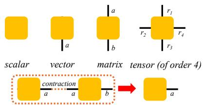  
(a) Graphical notation of tensors and tensor contraction. Each node represents a tensor, and each edge represents an index (mode) of the tensor. The label on an edge indicates the dimension of the corresponding mode. For example, a vector has one index with dimension a, a matrix has two indices with dimensions $a \times b ,$ and an order-4 tensor has four indices with dimensions $r _ { 1 } \times r _ { 2 } \times r _ { 3 } \times r _ { 4 }$ When two tensors are connected by an edge, they share the same index. The operation of contracting this edge, called tensor contraction, corresponds to summing over the shared index.

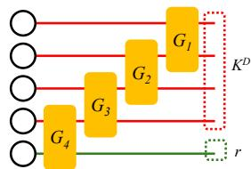  
(b) A simple QTN example. TNs represent highdimensional tensors through contractions of loworder core tensors connected by a sparse graph structure. A QTN is a circuit-like TN architecture with additional unitary constraints on local core tensors. In this figure, circles denote open indices with local dimension K, while rectangles denote order-4 core tensors with dimensions $\bar { K } \times K \times K \times K$ . The red lines represent system wires, and the green lines represent auxiliary wires for mixed-state representations, which will be introduced in Section 4.2.2.  
Figure 1: Graphical illustration of tensor-network notation and representations. (a) Basic tensor objects and tensor contraction. (b) A simple QTN example.

Here, EigenVI constructs $q _ { \theta }$ from an orthogonal function expansion as follows:

$$
q _ { \theta } ( x ) = | \langle \theta , \Phi ( x ) \rangle | ^ { 2 } , \qquad \Phi ( x ) = \bigotimes _ { d = 1 } ^ { D } \phi ( x _ { d } ) ,\tag{2}
$$

where $\theta \in ( \mathbb { R } ^ { K } ) ^ { \otimes D }$ is a learnable coefficient tensor, $\bigotimes _ { d = 1 } ^ { D }$ denotes the tensor product over variables, and $\phi : \mathbb { R } \to \mathbb { R } ^ { K }$ is a vector-valued feature map whose K components are orthonormal basis functions writing ${ \boldsymbol { \phi } } ( t ) = ( \phi _ { 1 } ( t ) , \dots , \phi _ { K } ( t ) ) ^ { \intercal }$ , it satisfies $\begin{array} { r } { \int \phi ( t ) \phi ( \dot { t } ) ^ { \top } d t = I _ { K } } \end{array}$ where $I _ { K }$ denotes the $K \times K$ identity matrix. With the normalization constraint $\| \theta \| _ { F } = 1$ , this defines a valid variational density. For this orthogonal-expansion variational family, the optimization problem in Eq. (1) reduces to a minimum-eigenvalue problem:

$$
\operatorname* { m i n } _ { \theta } \theta ^ { \top } M \theta , \qquad \mathrm { s . t . ~ } \| \theta \| _ { F } ^ { 2 } = 1 ,\tag{3}
$$

where $\boldsymbol { M } \in \mathbb { R } ^ { K ^ { D } \times K ^ { D } }$ is a positive semi-definite (PSD) matrix induced by the Fisher-divergence objective. The explicit construction of M is provided in Appendix A.1.

This eigenvalue formulation can be equivalently viewed through a rank-one density operator. If we define $\rho ~ = ~ \theta \theta ^ { \top }$ , the constraint $\| \dot { \theta } \| _ { F } ^ { 2 } = 1 \dot  $ becomes $\operatorname { t r } ( \rho ) = 1$ , and the objective satisfies $\theta ^ { \top } M \theta = \mathrm { t r } ( \rho M )$ . Thus, EigenVI corresponds to optimizing over rank-one density operators.

The minimum-eigenvalue formulation in Eq. (3) has two limitations in high dimensions. First, the rank-one density-operator formulation represents the solution by a single eigenvector. When the minimum eigenspace of M is (nearly) degenerate, this representation is not unique and can depend sensitively on the particular eigenvector selected. Second, both the coefficient tensor and the score-based matrix scale exponentially with D: the tensor θ has $K ^ { D }$ entries, while $\boldsymbol { M } \in \mathbb { R } ^ { K ^ { D } \times K ^ { D } }$ has $K ^ { 2 D }$ entries. Thus, explicitly storing M, or storing and optimizing $\theta ,$ becomes infeasible in high dimensions. These two limitations motivate the mixed-state formulation and tensor-network decomposition introduced below.

## 3.2 Tensor-network diagram notation

We use a graphical tensor-network notation to represent contractions of high-dimensional tensors. In this notation, each node represents a tensor, and each edge represents a mode. An edge connecting two tensors denotes a shared mode that is summed over during contraction, while an open edge denotes a free mode of the resulting tensor. Figure 1a illustrates this graphical notation.

In this work, we use quantum tensor networks (QTNs) as a circuit-style tensor-network parameterization. In such diagrams, wires are used to connect the modes of all the tensors across the network. The internal nodes correspond to core tensors, which can be interpreted as gates in a circuit-like representation. This notation is particularly convenient for our setting because orthogonality constraints can be imposed naturally on the core tensors. Figure 1b shows a simple example of the QTN structure.

## 4 Method

We now introduce QuanVI. The method follows a simple principle: extend the rank-one densityoperator restriction to mixed-state density operators, and represent the resulting operator using a QTN parameterization. The mixed-state extension mitigates the instability caused by eigenspace degeneracy, while the tensorized QTN parameterization makes the optimization tractable.

## 4.1 From rank-one to mixed-state density operators

As discussed in Section 3.1, EigenVI can be viewed as optimizing over rank-one density operators, corresponding to a pure-state formulation. We extend this view in two ways: first, we move from rank-one to mixed-state density operators; second, we extend the learnable factor from the real field to the complex field. The resulting objective is

$$
\operatorname* { m i n } _ { \rho } \operatorname { t r } ( \rho \boldsymbol { M } ) , \qquad \rho = \frac { 1 } { r } \boldsymbol { U } \boldsymbol { U } ^ { \dag } , \qquad \boldsymbol { U } ^ { \dag } \boldsymbol { U } = I _ { r } , \qquad \boldsymbol { U } \in \mathbb { C } ^ { K ^ { D } \times r } .\tag{4}
$$

Here, † denotes the conjugate transpose, and r denotes the rank of the mixed-state representation. This extension defines the maximally mixed state on the subspace spanned by the columns of $U$ Unlike the rank-one formulation, it represents the whole subspace uniformly rather than selecting a single eigenvector. In addition to the mixed-state representation, we allow the learnable tensors to be complex-valued, which is natural in QTN representations and provides additional expressive capacity for the QTN ansatz.

Once the optimal density operator $\rho ^ { * }$ is obtained, it induces the variational density $q _ { \rho ^ { * } } ( x ) \ =$ $\Phi ( x ) ^ { \dag } \rho ^ { \ast } \Phi ( x )$ . This function is a valid probability density function: since $\rho ^ { * } \succeq 0 , q _ { \rho ^ { * } } ( x ) \geq 0$ for all x; and the orthonormality of the basis functions and t $\mathrm { r } ( \bar { \rho } ^ { * } ) = 1$ ensure that $q _ { \rho ^ { * } }$ is normalized.

## 4.2 From full operators to local tensorized representations

The mixed-state formulation resolves the eigenvector-selection issue, but the scalability question remains: how should the mixed state be represented in high dimensions? We next use local Markov dependence as a representative source of locality, and then introduce the QTN parameterization used by QuanVI to represent the corresponding mixed-state density operator.

## 4.2.1 Locality from Markov dependency

A canonical source of local structure is Markov dependence along an ordering of the variables. For example, consider a target density with a path-graph Markov factorization, $p ( x _ { 1 } , \dots , x _ { D } ) =$ $\begin{array} { r } { \frac { 1 } { Z } \prod _ { d = 1 } ^ { D - 1 } \psi _ { d } ( x _ { d } , x _ { d + 1 } ) } \end{array}$ , where each factor $\psi _ { d }$ involves only the adjacent variables $x _ { d }$ and $x _ { d + 1 }$ , and Z is the normalizing constant. Then log $p ( x ) = \mathrm { c o n s t } + \sum _ { d = 1 } ^ { D - 1 } \log \psi _ { d } ( x _ { d } , x _ { d + 1 } )$ , the score component for an interior variable satisfies $\begin{array} { r } { s _ { d } ( x ) = \frac { \partial \log p ( x ) } { \partial x _ { d } } = \frac { \partial } { \partial x _ { d } } \left[ \log \psi _ { d - 1 } ( x _ { d - 1 } , x _ { d } ) + \log \psi _ { d } ( x _ { d } , x _ { d + 1 } ) \right] } \end{array}$ $d = 2 , \dotsc , D - 1$ . Thus $s _ { d } ( x )$ depends only $\mathrm { o n } \left( x _ { d - 1 } , x _ { d } , x _ { d + 1 } \right)$ ; the boundary cases depend only on $( x _ { 1 } , x _ { 2 } )$ ) and $( x _ { D - 1 } , x _ { D } )$ . Accordingly, the operator M in Eq. (4) can be decomposed into local operator $M ^ { ( d ) } , d = 1 , \dots , D$ . Here we define the corresponding full-space operator for interior $d ,$ $\widetilde { M } ^ { ( d ) } = I _ { 1 : d - 2 } \otimes M ^ { ( d ) } \otimes I _ { d + 2 : D }$ , which matches the dimension of $\rho .$ Eq. (4) can then be written as $\textstyle \sum _ { d = 1 } ^ { D } \operatorname { t r } ( \rho { \widetilde { M } } ^ { ( d ) } )$

The Markov dependency has two useful consequences. First, its locality allows QuanVI to avoid the EigenVI-style construction of the global operator in Eq. (3); instead, the objective can be evaluated through local operators. Second, the resulting path-graph locality is naturally aligned with the chain structure of matrix product operator (MPO) [7]. This motivates a tensor-network parameterization of the mixed-state density operator $\rho ,$ as described next.

## 4.2.2 QTN parameterization of density operators

As introduced in Section 3.2, QTNs provide a convenient way to build tensor-network parameterizations with orthogonality constraints on local tensors. Combined with the locality induced above, this motivates an MPO-style tensor-network parameterization of the mixed-state density operator ρ. In QuanVI, we therefore use a QTN with a chain-like MPO structure to parameterize the learnable low-dimensional representation of $\rho ,$ rather than explicitly forming the full operator.

We use the following terminology to describe the QTN structure. Each line in the TN is called a wire. The wires are divided into system wires and ancilla wires. The system wires correspond to the D data dimensions, or equivalently to the $K ^ { D }$ -dimensional tensor-product feature space. The ancilla wires provide additional degrees of freedom for representing mixed states through purification. Figure 1b illustrates the MPO-style QTN used in QuanVI. The red wires denote system wires, while the green wires denote ancilla wires. The local tensors are connected along the variable ordering, so the network follows the same path-graph chain structure as an MPO.

## 5 QuanVI Algorithm

The preceding sections introduce the three ingredients of QuanVI: a mixed-state density-operator formulation, a local score-based objective induced by Markov dependence, and a complex-valued QTN parameterization. We now combine these ingredients into the QuanVI framework. QuanVI represents a variational density through a QTN-parameterized density operator and provides two main procedures: training and inference. The training procedure updates the QTN parameters under the local score-based objective. The inference procedure queries a given QTN density operator by local tensor contractions to evaluate densities, marginals, conditional densities, and samples.

## 5.1 Training

We now describe the tensor-network contraction used to evaluate the training objective. QuanVI minimizes the local score-based loss $\begin{array} { r } { \mathcal { L } ( \boldsymbol { \Theta } ) = \sum _ { d = 1 } ^ { D } \mathrm { t r } \big ( \rho _ { \boldsymbol { \Theta } } \boldsymbol { M } ^ { ( d ) } \big ) } \end{array}$ . With the factorized mixed-state representation $\rho _ { \Theta } = r ^ { - 1 } U _ { \Theta } U _ { \Theta } ^ { \dagger }$ , each local term can be written as $\begin{array} { r } { \operatorname { t r } \left( \rho _ { \Theta } M ^ { ( d ) } \right) = \frac { 1 } { r } \operatorname { t r } \left( U _ { \Theta } ^ { \dagger } M ^ { ( d ) } U _ { \Theta } \right) } \end{array}$ Figure 2 shows the graphical representation of this local contraction. The yellow tensors $G _ { 1 } , \ldots , { \tilde { G } } _ { 5 }$ on the left form the QTN representation of $U _ { \Theta } ^ { \dagger }$ , while the right side forms the corresponding $U _ { \Theta }$ . The blue tensor denotes one local score-based operator ${ \mathbf { } } M ^ { ( d ) }$ ; the ellipsis indicates the other local terms in the sum over d.

The red wires are system wires and correspond to the D variables of the target distribution. The green wires are ancilla wires used to represent the mixed-state structure. Let E denote the number of ancilla wires. If each wire has local dimension $K .$ , then the effective mixed-state rank is $r = K ^ { E }$ The parameter L denotes the local window size, namely the number of wires acted on by each QTN core. In Figure 2, $L = 2$ . Since each wire has local dimension $K ,$ , each two-wire core has four indices and can be viewed as a tensor of size $K \times K \times K \times K$ . The open circles at the left and right ends denote fixed, non-trainable boundary vectors, independent of the data. They close the finite QTN contraction, ensuring a scalar output.

In terms of parameter complexity, the number of learnable parameters in the QTN representation scales as $O \dot { \big ( } ( D + E ) K ^ { 2 L } \big )$ . In terms of computational complexity, evaluating all D local terms in one training iteration therefore costs $O ( D B K ^ { 2 L } )$ , where each local term $M ^ { ( d ) }$ is estimated using a mini-batch of B samples. Thus, both the parameter count and the computational cost scale polynomially, rather than exponentially, with the data dimension $D .$

## 5.2 Inference

In this subsection, we show how QuanVI performs key inference tasks, including marginalization, conditional density evaluation, and sampling, using local tensor contractions.

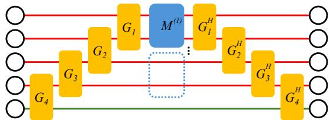  
Figure 2: Graphical representation of a local training contraction. The yellow tensors form the QTN representation of $U _ { \Theta }$ and $U _ { \Theta } ^ { \dagger }$ , while the blue tensor denotes a local score-based loss operator ${ \cal M } ^ { ( d ) }$ Red wires denote system wires and green wires denote ancilla wires. Open circles denote fixed boundary vectors used to close the finite QTN contraction.

Marginalization. After training or loading a set of pre-trained core tensors, QuanVI performs inference through the QTN structure. In contrast to training, where the network is contracted with local score-based loss operators $M ^ { ( d ) }$ , inference contracts the learned density operator with local measurement matrices on the system wires. For each variable $x _ { d } ,$ , we define $\bar { m } ( \bar { x _ { d } } ) = \phi ( x _ { d } ) \phi ( x _ { d } ) ^ { \top } \in$ $\mathbb { R } ^ { K \times K }$

For a subset of variables $S \subseteq [ D ]$ , the marginal density is $\begin{array} { r } { q _ { \Theta ^ { * } } ( x _ { S } ) = \int q _ { \Theta ^ { * } } ( x _ { S } , x _ { \bar { S } } ) d x _ { \bar { S } } } \end{array}$ . In the QTN representation, integrating out a variable corresponds to replacing its local measurement matrix by the identity. By orthonormality, $\textstyle { \int } m ( x _ { d } ) d x _ { d } = \textstyle { \dot { \int } } \phi ( x _ { d } ) \phi ( x _ { d } ) ^ { \top } \bar { d } x _ { d } = I _ { K }$ . For example, consider a QTN with $D \stackrel { \cdot } { = } 4 , E = 1$ , and $L = 2$ . The marginal density of $x _ { 2 }$ and $x _ { 4 }$ is $q _ { \Theta ^ { * } } ( x _ { 2 } , x _ { 4 } ) =$ $\textstyle \int q _ { \Theta ^ { * } } ( x _ { 1 } , x _ { 2 } , x _ { 3 } , x _ { 4 } )$ dx dx . Graphically, this is represented by replacing the measurement matrices on sites 1 and 3 with identity operators $I \colon$

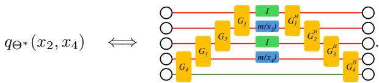

Conditional density. Conditional densities are computed as ratios of tensor-network contractions. For example, under the same $D = 4 , E = 1$ , and $L = 2$ setting, the conditional density of $x _ { 1 }$ and $x _ { 3 }$ given $x _ { 2 } = z _ { 2 }$ and $\begin{array} { r } { x _ { 4 } = z _ { 4 } \mathrm { ~ i s ~ } q _ { \Theta ^ { \ast } } ( x _ { 1 } , x _ { 3 } \mid x _ { 2 } = z _ { 2 } , x _ { 4 } = z _ { 4 } ) = \frac { q _ { \Theta ^ { \ast } } ( x _ { 1 } , z _ { 2 } , x _ { 3 } , z _ { 4 } ) } { q _ { \Theta ^ { \ast } } ( z _ { 2 } , z _ { 4 } ) } } \end{array}$ . The numerator is obtained by fixing the measurement matrices on all four sites at $( x _ { 1 } , z _ { 2 } , x _ { 3 } , z _ { 4 } )$ . The denominator is the marginal density over the observed variables $x _ { 2 }$ and $x _ { 4 }$ , obtained by fixing the measurement matrices on sites 2 and 4 at $\left( z _ { 2 } , z _ { 4 } \right)$ and replacing the measurement matrices on sites 1 and 3 with identity operators.

Graphically, this conditional density is represented as

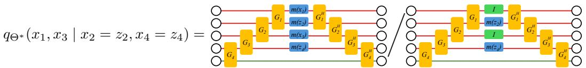

Sampling. Sampling follows the chain rule: $\begin{array} { r c l } { { q _ { \Theta ^ { * } } ( x _ { 1 } , . . . , x _ { D } ) } } & { { = } } & { { q _ { \Theta ^ { * } } ( x _ { 1 } ) \prod _ { d = 2 } ^ { D } q _ { \Theta ^ { * } } ( x _ { d } ~ | } } \end{array}$ $x _ { 1 } , \ldots , x _ { d - 1 } )$ . QuanVI samples variables sequentially according to this factorization. At step $d ,$ it fixes the previously sampled variables $x _ { < d } = ( x _ { 1 } , \dots , x _ { d - 1 } )$ , replaces the future variables $x _ { > d } = ( x _ { d + 1 } , . . . , x _ { D } )$ by identity operators, and contracts the QTN as a function of $x _ { d }$ . This gives the one-dimensional conditional density $\begin{array} { r } { q _ { \Theta ^ { * } } ( x _ { d } \mid x _ { < d } ) = \frac { q _ { \Theta ^ { * } } ( x _ { \le d } ) } { q _ { \Theta ^ { * } } ( x _ { < d } ) } } \end{array}$ . The next coordinate is then sampled from this one-dimensional density by numerical inverse-CDF sampling, following the sequential sampling strategy of EigenVI [6]. Repeating this procedure from $d = 1$ to D gives one full sample from qΘ∗ .

Since inference uses the same local contraction structure for density evaluation, marginalization, conditional queries, and sequential sampling, here we admit the complexity and the detailed analysis is given in Appendix B.1.1.

Table 1: Forward KL divergence over five runs, reported as mean and standard deviation. Lower values indicate better approximation quality. Best mean values are highlighted in bold font. OOM denotes out-of-memory, and “–” denotes unstable runs.
<table><tr><td>D</td><td>Target</td><td>GSM</td><td>BAM</td><td>ADVI</td><td>EigenVI</td><td>MoG</td><td>QuanVI E0</td><td>QuanVI E2</td></tr><tr><td rowspan="5">5</td><td>Gaussian</td><td> $0 . 9 5 2 0 \pm 1 . 3 2 8 2$ </td><td> $\leq \bf { 1 } \times \bf { 1 0 ^ { - 2 } }$ </td><td> $\leq \bf { 1 } \times \bf { 1 0 ^ { - 2 } }$ </td><td> $\leq \bf { 1 } \times \bf { 1 0 ^ { - 2 } }$ </td><td>0.0152 ±0.0009</td><td> $\leq \bf { 1 } \times \bf { 1 0 ^ { - 2 } }$ </td><td> $\leq \bf { 1 } \times \bf { 1 0 ^ { - 2 } }$ </td></tr><tr><td>X-shape</td><td> $2 . 2 4 9 4 { \scriptstyle \pm 0 . 4 9 6 1 }$ </td><td>3.0904 ±0.2373</td><td> $1 . 6 8 1 6 \pm 0 . 0 7 1 6$ </td><td>0.4007 ±0.0743</td><td>1.3039 ±0.0269</td><td>0.2613 ±0.0035</td><td>0.2661 ±0.0054</td></tr><tr><td>GMM3</td><td>1.6469 ±0.5895</td><td>2.4417 ±0.2273</td><td>1.1967 ±0.0313</td><td>0.4454 ±0.0613</td><td>0.4436 ±0.0617</td><td>0.1608 ±0.0112</td><td> $\mathbf { 0 . 1 5 9 8 \pm 0 . 0 0 4 2 }$ </td></tr><tr><td>Funnel</td><td>3.3535 ±0.5241</td><td> $4 . 8 8 1 4 \pm 0 . 2 0 8 2$ </td><td> $2 . 8 0 1 2 { \scriptstyle \pm 0 . 0 6 5 3 }$ </td><td>1.3435 ±0.1065</td><td>0.8183±0.0742</td><td> $4 . 3 9 4 4 \pm 1 . 8 2 9 9$ </td><td> $2 . 6 4 1 2 { \scriptstyle \pm 0 . 4 5 7 9 }$ </td></tr><tr><td>Ring</td><td>30.7895 ±8.8223</td><td>39.8048 ±2.5664</td><td>2.1094 ±0.0221</td><td>1.7526 ±0.1454</td><td>2.0528 ±0.2233</td><td>0.8861 ±0.0048</td><td>0.8913 ±0.0144</td></tr><tr><td rowspan="5">10</td><td>Gaussian</td><td> $\leq \bf { 1 } \times \bf { 1 0 ^ { - 2 } }$ </td><td> $\leq \bf { 1 } \times \bf { 1 0 ^ { - 2 } }$ </td><td> $\leq \bf { 1 } \times \bf { 1 0 ^ { - 2 } }$ </td><td>00M</td><td>0.0814 ±0.0024</td><td> $\leq \bf { 1 } \times \bf { 1 0 ^ { - 2 } }$ </td><td> $\leq \bf { 1 } \times \bf { 1 0 ^ { - 2 } }$ </td></tr><tr><td>X-shape</td><td> $1 6 . 0 6 3 2 \pm 5 . 3 7 5 0$ </td><td> $2 4 . 9 3 3 7 \pm 1 . 6 7 1 9$ </td><td> $5 . 8 3 5 6 \pm 0 . 0 9 9 0$ </td><td>00M</td><td>6.5115 ±0.1666</td><td> $3 . 2 5 5 4 \pm 0 . 0 6 7 0$ </td><td>3.1928 ±0.0655</td></tr><tr><td>GMM3</td><td> $7 . 0 7 6 5 \pm 1 . 1 8 4 0$ </td><td> $2 4 . 0 3 4 2 \pm 1 . 3 6 8 4$ </td><td> $5 . 4 4 1 4 \pm 0 . 0 7 5 8$ </td><td>00M</td><td>5.1997 ±0.3525</td><td> $\mathbf { 3 . 1 2 2 5 \pm 0 . 0 5 0 4 }$ </td><td>3.1551 ±0.0551</td></tr><tr><td>Funnel</td><td></td><td> $2 9 . 5 5 2 8 \pm 4 . 4 5 3 1$ </td><td> $7 . 0 2 4 6 \pm 0 . 0 6 2 3$ </td><td>00M</td><td>5.0368 ±0.3313</td><td>9.0460 ±0.8675</td><td>8.8288 ±1.0972</td></tr><tr><td>Ring</td><td>9.1494 ±1.9204</td><td> $6 4 . 7 0 9 6 \pm 1 . 8 8 1 3$ </td><td> $6 . 3 2 5 6 \pm 0 . 1 1 4 6$ </td><td>00M</td><td>7.7603 ±0.4014</td><td>3.8400 ±0.0213</td><td> $\mathbf { 3 . 8 3 0 2 \pm 0 . 0 2 7 1 }$ </td></tr><tr><td rowspan="5">20</td><td>Gaussian</td><td> $\leq \bf { 1 } \times \bf { 1 0 ^ { - 2 } }$ </td><td> $\leq \bf { 1 } \times \bf { 1 0 ^ { - 2 } }$ </td><td>0.0124 ±0.0035</td><td>00M</td><td>0.2884 ±0.0088</td><td> $\leq \bf { 1 } \times \bf { 1 0 ^ { - 2 } }$ </td><td> $\leq \bf { 1 } \times \bf { 1 0 ^ { - 2 } }$ </td></tr><tr><td>X-shape</td><td>14.3388 ±2.1860</td><td>38.0141 ±2.2533</td><td>8.4358 ±0.1412</td><td>00M</td><td>9.9434 ±0.2302</td><td>8.1714±0.8125</td><td>8.9266 ±0.5087</td></tr><tr><td>GMM3</td><td>11.4537 ±0.9701</td><td>38.2367 ±0.5113</td><td>8.1050 ±0.1880</td><td>OOM</td><td>8.4863 ±0.4095</td><td>7.4542 ±1.4717</td><td>7.7778 ±1.1659</td></tr><tr><td>Funnel</td><td></td><td>41.6810 ±3.9465</td><td>9.8232 ±0.1614</td><td>00M</td><td>7.6320 ±0.2791</td><td>13.1389 ±0.9869</td><td>13.4216 ±0.9977</td></tr><tr><td>Ring</td><td>13.5824 ±0.2441</td><td>77.6129 ±5.2570</td><td>8.9786 ±0.1421</td><td>00M</td><td>10.6938 ±0.3243</td><td>9.1621 ±1.5400</td><td>9.0459 ±1.0407</td></tr><tr><td rowspan="5">100</td><td>Gaussian</td><td> $\leq \bf { 1 } \times \bf { 1 0 ^ { - 2 } }$ </td><td> $\leq \bf { 1 } \times \bf { 1 0 ^ { - 2 } }$ </td><td>0.1308 ±0.0020</td><td>00M</td><td>2.2290 ±0.0119</td><td> $\leq \bf { 1 } \times \bf { 1 0 ^ { - 2 } }$ </td><td> $\leq \bf { 1 } \times \bf { 1 0 ^ { - 2 } }$ </td></tr><tr><td>X-shape</td><td>75.3810 ±2.1274186.0990 ±4.2477</td><td></td><td>47.2649 ±0.2927</td><td>00M</td><td>72.7630 ±6.0097</td><td>42.2971 ±1.2528</td><td>40.5473±4.0462</td></tr><tr><td>GMM3</td><td>73.5309 ±3.1276 187.8098 ±4.1833</td><td></td><td>47.1609 ±0.2688</td><td>00M</td><td>68.3951 ±7.4535</td><td>43.0097 ±2.3348</td><td>43.0798 ±2.9883</td></tr><tr><td>Funnel</td><td></td><td>85.7464 ±3.1931 188.2434 ±3.0382</td><td>48.8944 ±0.2271</td><td>00M</td><td>57.0316 ±0.4351</td><td>46.4010±3.1020</td><td>47.0005 ±3.8384</td></tr><tr><td>Ring</td><td></td><td>73.7223 ±2.1166 224.9920 ±4.1197</td><td>48.1236 ±0.2075</td><td>OOM</td><td>76.9241 ±2.1116</td><td>43.7935 ±1.0249</td><td>43.1974±1.5993</td></tr></table>

## 6 Experiments

We evaluate QuanVI in three sets of experiments. First, we probe its scalability and expressiveness on synthetic target distributions with qualitatively different targets and a wide range of dimensions. Second, we apply QuanVI to Bayesian posterior-approximation tasks from POSTERIORDB [8]. Finally, we conduct ablation studies that isolate the contribution of the ancilla wires E, the local window size L , the basis size K, and the dtype.

## 6.1 Synthetic target distributions

Target distributions and evaluation metric. We consider five synthetic target distributions: Gaussian, GMM3, X-shape, Ring, and Funnel, shown in Fig. 4. The non-Gaussian targets are extended from two-dimensional base distributions to D dimensions using a nonlinear Markov-chain augmentation, while the Gaussian target is constructed directly as a locally correlated D-dimensional distribution. Detailed constructions are provided in Appendix C.2.1. Following EigenVI, we evaluate approximation quality using the forward KL divergence KL(p∥qθ). Since the synthetic targets are known and can be sampled from, we estimate it using 104 Monte Carlo samples $x ^ { ( s ) } \sim p .$

Baselines. We compare QuanVI with ADVI [14], BAM [5], GSM [4], MoG [33], and EigenVI [6]. For QuanVI, we report both E = 0 and $E = 2 .$ , corresponding to the pure-state ansatz and the mixed-state ansatz with auxiliary environment wires, respectively. EigenVI is included only when $D \leq 5$ , since its global $K ^ { D } \times \check { K } ^ { D }$ eigendecomposition becomes infeasible in higher dimensions. Detailed hyperparameter settings are provided in Appendix C.2.2. We also evaluate normalizing flows, but report them separately in Appendix C.2.3 due to their instability across targets.

Discussion. Table 1 shows that QuanVI matches the low-dimensional accuracy of EigenVI while scaling to regimes where EigenVI becomes infeasible. At D = 5, QuanVI is comparable to or better than EigenVI on most targets, whereas EigenVI cannot be applied in higher dimensions due to the global $\check { K } ^ { D } \times K ^ { D }$ eigendecomposition.

On Gaussian targets, QuanVI consistently attains near-zero KL divergence across all tested dimensions, indicating that the tensorized density-operator parameterization does not sacrifice accuracy on simple locally correlated distributions. On non-Gaussian targets, QuanVI performs strongly on X-shape, GMM3, and Ring, achieving the best or near-best results in most high-dimensional settings. The main exception is the Funnel target, where QuanVI is less competitive under the default local window size. As discussed in Section 6.3, increasing the local window size L substantially improves the Funnel results, suggesting that this target requires stronger local modeling capacity.

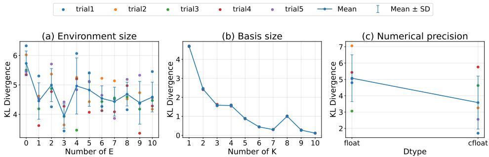

Table 2: Forward Fisher divergence over four runs, reported as mean and standard deviation. Lower values indicate better approximation quality. Best mean values are highlighted in bold font, and “–” denotes unstable runs.
<table><tr><td>Model</td><td>GSM</td><td>BAM</td><td>ADVI</td><td>EigenVI</td></tr><tr><td>gpregr (dim=3)</td><td> $1 . 2 1 0 7 \pm 0 . 0 3 4 5$ </td><td> $1 . 1 9 6 2 { \scriptstyle \pm 0 . 0 2 9 3 }$ </td><td> $1 . 1 5 0 9 \pm 0 . 0 1 7 7$ </td><td> $\mathbf { 0 . 0 8 2 8 \pm 0 . 0 6 8 1 }$ </td></tr><tr><td>hmm (dim=4)</td><td>148.1225 ±2.5882</td><td> $1 3 9 . 7 3 4 9 \pm 3 . 9 9 8 0$ </td><td> $1 6 8 . 9 7 9 5 \pm 3 2 . 6 9 7 6$ </td><td> $\mathbf { 4 . 0 2 9 5 \pm 1 . 5 0 6 9 }$ </td></tr><tr><td>hmm_bball_0 (dim=6)</td><td>749.1771 ±2.5298</td><td> $1 9 . 9 6 9 1 \pm 0 . 6 8 4 9$ </td><td> $7 4 6 . 7 1 5 1 \pm 2 . 0 9 7 8$ </td><td> $1 8 . 5 0 5 7 \pm 3 . 0 3 2 2$ </td></tr><tr><td>Model</td><td>MoG</td><td>NF</td><td>QuanVI EO</td><td>QuanVI E2</td></tr><tr><td>gpregr (dim=3)</td><td>7.6146 ±3.9904</td><td> $3 . 3 7 3 9 \pm 0 . 4 9 7 3$ </td><td> $0 . 2 1 8 0 \pm 0 . 0 4 6 3$ </td><td></td></tr><tr><td></td><td></td><td></td><td></td><td>0.2330 ±0.0369</td></tr><tr><td>hmm (dim=4)</td><td>一</td><td></td><td> $5 . 0 7 8 3 { \scriptstyle \pm 0 . 6 2 1 4 }$ </td><td>4.8047 ±0.4491</td></tr><tr><td>hmm_bball_0 (dim=6)</td><td>一</td><td>一</td><td> $1 3 . 7 1 2 6 \pm 0 . 5 1 9 8$ </td><td> $\mathbf { 1 3 . 4 4 6 0 \substack { \pm 0 . 3 5 9 7 } }$ </td></tr></table>

Figure 3: Ablation studies of QuanVI.

Figure 5 visually compares samples from different methods on the X-shape target. GSM fails to recover the characteristic X-shaped geometry, while the mixture-based baseline smooths out part of the structure. QuanVI more closely reproduces the target pattern in the first two dimensions.

## 6.2 Bayesian posterior approximation

We evaluate QuanVI on Bayesian posterior-approximation tasks from POSTERIORDB [8]. Since the normalized target probabilities are not available, we evaluate the forward Fisher divergence using reference samples provided by the dataset following EigenVI.

The quantitative results are presented in Table 2. Across the three posterior benchmarks, QuanVI achieves performance comparable to EigenVI while substantially outperforming the remaining baselines. Figure 6 further provides a visual comparison of the learned posterior distributions for hmm\_bball\_0. QuanVI captures distinctly non-Gaussian features of the posterior, particularly in the first panel of Figure 6b. Compared with the corresponding EigenVI result in Figure 6a, the visualization suggests that QuanVI better captures the posterior geometry on this task.

## 6.3 Ablation study

We further conduct ablation studies on the key components of QuanVI illustrating how model capacity, mixed-state expressiveness, basis richness, and optimization stability affect the final approximation quality, while also revealing the trade-off between expressiveness and computational cost.

Local window size L. L denotes the local window size and reflects the locality of the target distribution. In the tensor-network representation, it controls the effective bond dimension, which scales as $K ^ { L - 1 }$ . Therefore, the exponential dependence is determined by L rather than the full data dimension D, which allows QuanVI to scale to higher dimensions. We evaluate local window sizes $L \in \{ 1 , 2 , 3 , 4 , 5 \}$ for $D \in \{ 5 , 1 0 , 2 0 \}$ , subject to computational feasibility, with the results reported in Table 5.

Except for Funnel, increasing the local window beyond the default setting yields relatively modest improvements on most tested settings. This suggests that small local windows are sufficient for these benchmarks, whereas Funnel benefits more substantially from increased local modeling capacity.

Environment size E. We next study the effect of the environment size E, which introduces auxiliary environment degrees of freedom for mixed-state representations. We evaluate QuanVI on the X-shape target with D = 10 under a sampling-limited stochastic training setting, using five independent random seeds for each value of E. The final KL divergence for each run, together with the mean and standard deviation, is shown in Figure 3(a).

The results show that adding environment wires generally improves performance over the pure-state baseline E = 0. Moderate values of E, especially E = 1 and E = 3, reduce the average KL divergence, with E = 3 achieving the best mean performance in this sweep. However, larger E can introduce diminishing returns due to increased model capacity and optimization difficulty. Overall, this suggests that auxiliary environment wires enrich the mixed-state representation, but E should be chosen to balance representational capacity and optimization stability.

Number of basis functions K. We ablate the number of Hermite basis functions K, which controls the local feature dimension of the orthogonal expansion. We evaluate QuanVI on the Ring target with five independent random initializations and report the final KL divergence in Figure 3(b).

The results show that increasing K generally improves approximation quality: larger basis sizes provide richer local features and substantially reduce the average KL divergence. However, thi improvement comes with increased runtime, since larger K increases the size of each local tensor contraction. Thus, K controls another expressiveness–efficiency trade-off in QuanVI, and we use a moderate value in the main experiments.

Numerical precision (dtype). We ablate the numerical dtype used to train QuanVI by comparing real-valued and complex-valued parameterizations on the Funnel target. As shown in Figure 3, the complex-valued dtype achieves lower average KL divergence, reducing the mean KL from about 5.08 to about 3.58. This suggests that complex tensors provide a more expressive and stable parameterization for this challenging target. The runtime overhead of the complex dtype is moderate in this experiment. Therefore, we use the complex dtype as the default choice for QuanVI when memory permits. Detailed settings and runtime comparisons are provided in Appendix C.4.3.

## 7 Conclusion

We introduced QuanVI, a quantum-inspired score-VI method based on density operators and MPOmotivated QTNs. The density-operator formulation replaces the single-eigenvector solution with a mixed-state representation of low-energy eigenspaces, while the QTN parameterization avoids explicit global operator construction.

Experiments on synthetic targets and Bayesian posterior benchmarks show that QuanVI retains lowdimensional accuracy and scales to high-dimensional structured non-Gaussian settings. Ablations identify the main expressiveness–cost trade-offs, including environment size, local window size, basis size, and numerical parameterization.

QuanVI relies on local structure. Larger local windows capture stronger dependencies but increase contraction cost. Future work will extend the framework to richer dependency graphs and adaptive tensor-network architectures.

## Acknowledgments

YC, CL, ZS and QZ were supported by JSPS KAKENHI Grant Number JP24K03005. ZT was supported by JSPS KAKENHI Grant Number JP26K21321 and the RIKEN Incentive Research Project. QZ was also supported by JSPS KAKENHI Grant Number JP23K28109 and the RIKEN TRIP initiative (RIKEN Quantum).

## References

[1] David M Blei, Alp Kucukelbir, and Jon D McAuliffe. Variational inference: A review for statisticians. Journal ofthe American statistical Association, 112(518):859–877, 2017.

[2] Martin J Wainwright and Michael I Jordan. Graphical models, exponential families, and variational inference. Foundations and Trends® in Machine Learning, 1(1-2):1–305, 2008.

[3] Solomon Kullback and Richard A Leibler. On information and sufficiency. The annals ofmathematical statistics, 22(1):79–86, 1951.

[4] Chirag Modi, Robert Gower, Charles Margossian, Yuling Yao, David Blei, and Lawrence Saul. Variational inference with gaussian score matching. Advances in Neural Information Processing Systems, 36:29935– 29950, 2023.

[5] Diana Cai, Chirag Modi, Loucas Pillaud-Vivien, Charles Margossian, Robert M Gower, David Blei, and Lawrence K Saul. Batch and match: black-box variational inference with a score-based divergence. In Forty-first International Conference on Machine Learning.

[6] Diana Cai, Chirag Modi, Charles C Margossian, Robert M Gower, David M Blei, and Lawrence K Saul. Eigenvi: score-based variational inference with orthogonal function expansions. Advances in Neural Information Processing Systems, 37:132691–132721, 2024.

[7] Frank Verstraete, Juan J Garcia-Ripoll, and Juan Ignacio Cirac. Matrix product density operators: Simula tion of finite-temperature and dissipative systems. Physical review letters, 93(20):207204, 2004.

[8] Måns Magnusson, Jakob Torgander, Paul-Christian Bürkner, Lu Zhang, Bob Carpenter, and Aki Vehtari. posteriordb: Testing, benchmarking and developing bayesian inference algorithms. arXiv preprint arXiv:2407.04967, 2024.

[9] Thomas Peter Minka. A family of algorithms for approximate Bayesian inference. PhD thesis, Massachusetts Institute of Technology, 2001.

[10] Matthew D Hoffman, David M Blei, Chong Wang, and John Paisley. Stochastic variational inference. Journal ofmachine learning research, 2013.

[11] Diederik P Kingma and Max Welling. Auto-encoding variational bayes. arXiv preprint arXiv:1312.6114, 2013.

[12] Danilo Jimenez Rezende, Shakir Mohamed, and Daan Wierstra. Stochastic backpropagation and variational inference in deep latent gaussian models. In International conference on machine learning, volume 2, page 2, 2014.

[13] Rajesh Ranganath, Sean Gerrish, and David Blei. Black box variational inference. In Artificial intelligence and statistics, pages 814–822. PMLR, 2014.

[14] Alp Kucukelbir, Dustin Tran, Rajesh Ranganath, Andrew Gelman, and David M Blei. Automatic differentiation variational inference. Journal ofmachine learning research, 18(14):1–45, 2017.

[15] Aapo Hyvärinen and Peter Dayan. Estimation of non-normalized statistical models by score matching. Journal ofMachine Learning Research, 6(4), 2005.

[16] Longlin Yu and Cheng Zhang. Semi-implicit variational inference via score matching. In The Eleventh International Conference on Learning Representations, 2023. URL https://openreview.net/forum? id=sd90a2ytrt.

[17] Diana Cai, Robert M. Gower, David Blei, and Lawrence K. Saul. Fisher meets feynman: score-based variational inference with a product of experts. In The Thirty-ninth Annual Conference on Neural Information Processing Systems, 2026. URL https://openreview.net/forum?id=yG8vmj3EAU.

[18] Tamara G Kolda and Brett W Bader. Tensor decompositions and applications. SIAM review, 51(3):455–500, 2009.

[19] Andrzej Cichocki, Anh-Huy Phan, Qibin Zhao, Namgil Lee, Ivan Oseledets, Masashi Sugiyama, Danilo P Mandic, et al. Tensor networks for dimensionality reduction and large-scale optimization: Part 2 applications and future perspectives. Foundations and Trends® in Machine Learning, 9(6):431–673, 2017.

[20] Ivan V Oseledets. Tensor-train decomposition. SIAM Journal on Scientific Computing, 33(5):2295–2317, 2011.

[21] Rom’an Orús. A practical introduction to tensor networks: Matrix product states and projected entangled pair states. Annals ofphysics, 349:117–158, 2014.

[22] Qibin Zhao, Guoxu Zhou, Shengli Xie, Liqing Zhang, and Andrzej Cichocki. Tensor ring decomposition. arXiv preprint arXiv:1606.05535, 2016.

[23] Lars Grasedyck. Hierarchical singular value decomposition of tensors. SIAMjournal on matrix analysis and applications, 31(4):2029–2054, 2010.

[24] Alexander Novikov, Dmitrii Podoprikhin, Anton Osokin, and Dmitry P Vetrov. Tensorizing neural networks. In Advances in Neural Information Processing Systems, pages 442–450, 2015.

[25] Edwin Stoudenmire and David Schwab. Supervised learning with tensor networks. Advances in neural information processing systems, 29, 2016.

[26] Jean Kossaifi, Zachary C Lipton, Arinbjörn Kolbeinsson, Aran Khanna, Tommaso Furlanello, and Anima Anandkumar. Tensor regression networks. Journal ofMachine Learning Research, 21:1–21, 2020.

[27] Zhuo Chen, Rumen Dangovski, Charlotte Loh, Owen Dugan, Di Luo, and Marin Soljaciˇ c. QuanTA:´ Efficient High-Rank Fine-Tuning of LLMs with Quantum-Informed Tensor Adaptation. Advances in Neural Information Processing Systems, 37:92210–92245, 2024.

[28] Zhao-Yu Han, Jun Wang, Heng Fan, Lei Wang, and Pan Zhang. Unsupervised generative modeling using matrix product states. Physical Review X, 8(3):031012, 2018.

[29] Ivan Glasser, Ryan Sweke, Nicola Pancotti, Jens Eisert, and Ignacio Cirac. Expressive power of tensornetwork factorizations for probabilistic modeling. Advances in neural information processing systems, 32, 2019.

[30] Georgii S Novikov, Maxim E Panov, and Ivan V Oseledets. Tensor-train density estimation. In Uncertainty in Artificial Intelligence, pages 1321–1331. PMLR, 2021.

[31] Alex Meiburg, Jing Chen, Jacob Miller, Raphaëlle Tihon, Guillaume Rabusseau, and Alejandro Perdomo-Ortiz. Generative learning of continuous data by tensor networks. SciPost Physics, 18(3):096, 2025.

[32] Michael A Nielsen and Isaac L Chuang. Quantum computation and quantum information. Cambridge university press, 2010.

[33] Marguerite Petit-Talamon, Marc Lambert, and Anna Korba. Variational inference with mixtures of isotropic gaussians. arXiv preprint arXiv:2506.13613, 2025.

## A Preliminary

## A.1 Details of the EigenVI formulation

We provide the details of the orthogonal-expansion formulation used in Section 3.1. Let

$$
\Phi ( x ) : = \bigotimes _ { d = 1 } ^ { D } \phi ( x _ { d } ) ,
$$

where $\phi : \mathbb { R } \to \mathbb { R } ^ { K }$ is a vector of one-dimensional orthonormal basis functions. The orthonormality condition is

$$
\int \phi ( \boldsymbol { x } _ { d } ) \phi ( \boldsymbol { x } _ { d } ) ^ { \top } d \boldsymbol { x } _ { d } = I _ { K } ,\tag{5}
$$

for each coordinate $d \in [ D ]$ . EigenVI parameterizes the variational density as

$$
q _ { \theta } ( x ) = | \langle \theta , \Phi ( x ) \rangle | ^ { 2 } , \qquad \theta \in ( \mathbb { R } ^ { K } ) ^ { \otimes D } .\tag{6}
$$

I $\mathbf { \partial } \cdot \lVert \boldsymbol { \theta } \rVert _ { F } = 1$ , then qθ is normalized. Indeed, using the orthonormality of the tensor-product basis,

$$
\begin{array} { l } { \displaystyle \int q _ { \theta } ( x ) d x = \int | \langle \theta , \Phi ( x ) \rangle | ^ { 2 } d x } \\ { \displaystyle \qquad = \theta ^ { \top } \left( \int \Phi ( x ) \Phi ( x ) ^ { \top } d x \right) \theta = \theta ^ { \top } \theta = \| \theta \| _ { F } ^ { 2 } = 1 . } \end{array}
$$

We next derive the quadratic form associated with the Fisher-divergence objective. Let

$$
a _ { \theta } ( x ) : = \langle \theta , \Phi ( x ) \rangle .
$$

Then $q _ { \theta } ( x ) = a _ { \theta } ( x ) ^ { 2 }$ , and

$$
\nabla _ { x } \log { q _ { \theta } ( x ) } = 2 \frac { \nabla _ { x } a _ { \theta } ( x ) } { a _ { \theta } ( x ) } .
$$

Define the derivative matrix $\dot { \Phi } ( { \boldsymbol { x } } ) \in \mathbb { R } ^ { D \times K ^ { D } }$ by

$$
\begin{array} { r } { \dot { \Phi } ( \boldsymbol { x } ) = \left( \begin{array} { c } { \dot { \phi } ( \boldsymbol { x } _ { 1 } ) \otimes \left[ \bigotimes _ { d = 2 } ^ { D } \phi ( \boldsymbol { x } _ { d } ) ^ { \top } \right] } \\ { \vdots } \\ { \left[ \bigotimes _ { d = 1 } ^ { \ell - 1 } \phi ( \boldsymbol { x } _ { d } ) ^ { \top } \right] \otimes \dot { \phi } ( \boldsymbol { x } _ { \ell } ) \otimes \left[ \bigotimes _ { d = \ell + 1 } ^ { D } \phi ( \boldsymbol { x } _ { d } ) ^ { \top } \right] } \\ { \vdots } \\ { \left[ \bigotimes _ { d = 1 } ^ { D - 1 } \phi ( \boldsymbol { x } _ { d } ) ^ { \top } \right] \otimes \dot { \phi } ( \boldsymbol { x } _ { D } ) } \end{array} \right) , } \end{array}\tag{7}
$$

where

$$
{ \dot { \phi } } ( x _ { d } ) : = \left[ { \frac { d \phi _ { 1 } ( x _ { d } ) } { d x _ { d } } } , { \frac { d \phi _ { 2 } ( x _ { d } ) } { d x _ { d } } } , \ldots , { \frac { d \phi _ { K } ( x _ { d } ) } { d x _ { d } } } \right] \in \mathbb { R } ^ { 1 \times K } .
$$

Thus,

$$
\nabla _ { x } a _ { \theta } ( x ) = \dot { \Phi } ( x ) \theta .
$$

Let $s ( x ) : = \nabla _ { x }$ log $p ( x )$ be the score function of the target density. Substituting $q _ { \theta } ( x ) = a _ { \theta } ( x ) ^ { 2 }$ into the Fisher-divergence objective gives

$$
\begin{array} { r l r } & { } & { q _ { \theta } ( x ) \left\| \nabla _ { x } \log p ( x ) - \nabla _ { x } \log q _ { \theta } ( x ) \right\| _ { F } ^ { 2 } = a _ { \theta } ( x ) ^ { 2 } \left\| s ( x ) - 2 \frac { \dot { \Phi } ( x ) \theta } { a _ { \theta } ( x ) } \right\| _ { F } ^ { 2 } } \\ & { } & { = \left\| a _ { \theta } ( x ) s ( x ) - 2 \dot { \Phi } ( x ) \theta \right\| _ { F } ^ { 2 } } \\ & { } & { = \left\| \left( s ( x ) \Phi ( x ) ^ { \top } - 2 \dot { \Phi } ( x ) \right) \theta \right\| _ { F } ^ { 2 } . } \end{array}
$$

Therefore, up to the constant factor $1 / 2 .$ , the Fisher-divergence objective can be written as the quadratic form

$$
\theta ^ { \top } M \theta ,
$$

where

$$
M = \int _ { \Omega } \left( 2 \dot { \Phi } ( x ) - s ( x ) \Phi ( x ) ^ { \top } \right) ^ { \top } \left( 2 \dot { \Phi } ( x ) - s ( x ) \Phi ( x ) ^ { \top } \right) d x .\tag{8}
$$

Since M is an integral of squared terms, it is positive semidefinite.

The EigenVI optimization problem is therefore

$$
\operatorname* { m i n } _ { \theta } \theta ^ { \top } M \theta , \qquad \mathrm { s . t . } \ \| \theta \| _ { F } ^ { 2 } = 1 .\tag{9}
$$

This is a Rayleigh-quotient minimization problem. Hence, the optimal coefficient tensor θ is given by an eigenvector of M associated with its smallest eigenvalue. This observation is the basis of EigenVI, but it also reveals the two high-dimensional limitations discussed in the main text: the global operator $\boldsymbol { M } \in \mathbb { R } ^ { K ^ { D } \times K ^ { D } }$ is exponentially large, and degenerate or nearly degenerate minimum eigenspaces make single-eigenvector selection unstable.

## B Algorithm

## B.1 Complexity Analysis

## B.1.1 Detailed Complexity Analysis

We provide a more detailed complexity discussion for QuanVI, complementing the summary in Section 5. Let D denote the data dimension, E the environment size, K the number of onedimensional basis functions, L the local window size, B the mini-batch size, T the number of training iterations, and N the number of generated samples. Under the sliding-window circuit construction, the number of local gates is

$$
G = D + E - L + 1 = O ( D + E ) .
$$

Throughout this section, $K ^ { O ( L ) }$ hides constants that depend on the local tensor layout, the number of physical and environment indices in each gate, and the contraction ordering, but not on the full dimension D.

Memory. QuanVI stores a tensorized circuit with $G = O ( D + E )$ local tensors. Each local tensor acts only on a window of size L, so its number of entries scales as $K ^ { O ( L ) }$ . Therefore, the parameter memory scales as

$$
{ \cal O } \Bigl ( ( D + E ) K ^ { { \cal O } ( L ) } \Bigr ) \ .
$$

This is polynomial in D and E when L is kept small. In contrast, an explicit density operator on the full basis space has size $K ^ { D } \times K ^ { D }$ , and would require

$$
\Omega ( K ^ { 2 D } )
$$

memory. This exponential memory cost is the main bottleneck avoided by the tensorized mixed-state representation.

Training. At each training iteration, the score-based objective is written as a sum of D local terms,

$$
\mathcal { L } ( \theta ) = \sum _ { d = 1 } ^ { D } \mathrm { T r } \Big ( \rho _ { \theta } M ^ { ( d ) } \Big ) ,
$$

where each ${ \mathbf { } } M ^ { ( d ) }$ is supported only on a local window of size L. The local structure ensures that evaluating each term is exponential only in $L ,$ , rather than in the full dimension D. However, the objective still requires summing over the D local terms, which introduces an additional factor of D in the per-iteration cost.

For a mini-batch of size $B ,$ constructing the empirical local operator and contracting it with the corresponding local window costs ${ \cal O } ( B K ^ { \bar { O } ( L ) } )$ per local term. Summing over all D local terms gives

$$
{ \cal O } \Big ( B D K ^ { { \cal O } ( L ) } \Big ) .
$$

In addition, each local term is evaluated by contracting it with the tensorized circuit. A direct implementation contracts through the circuit for each of the D local terms, leading to an additional cost

$$
O \Big ( D ( D + E ) K ^ { O ( L ) } \Big )
$$

per iteration, where $D + E$ is the number of system and environment wires involved in the circuit. The Stiefel projection and retraction steps are local operations and contribute

$$
O \Big ( ( D + E ) K ^ { O ( L ) } \Big )
$$

per iteration.

Therefore, the total training cost over T iterations can be summarized as

$$
{ \cal O } \Big ( T \Big [ B D K ^ { { \cal O } ( L ) } + D ( D + E ) K ^ { { \cal O } ( L ) } + ( D + E ) K ^ { { \cal O } ( L ) } \Big ] \Big ) .
$$

Equivalently, ignoring lower-order terms, the dominant scaling is

$$
{ \cal O } \Bigl ( T D ( B + D + E ) K ^ { { \cal O } ( L ) } \Bigr ) .
$$

Thus, QuanVI remains polynomial in D and E, while the exponential dependence is confined to the local window size L. The extra factor of D comes from the summation over the D local score-based loss terms.

Inference. After training, density evaluation, marginalization, conditional density queries, and sampling are all performed by local tensor contractions. Evaluating the density at a single query point requires contracting the trained circuit with the corresponding local measurement factors, which costs

$$
{ \cal O } \Bigl ( ( D + E ) K ^ { { \cal O } ( L ) } \Bigr ) ,
$$

up to the same contraction-order-dependent constants.

For sequential sampling, QuanVI draws variables one at a time using the chain rule. Each step requires evaluating a one-dimensional conditional density by contracting the tensor network with the previously sampled variables fixed. Therefore, drawing one full D-dimensional sample costs

$$
{ \cal O } \left( D ( D + E ) K ^ { { \cal O } ( L ) } \right) ,
$$

and drawing N independent samples costs

$$
{ \cal O } \Bigl ( N D ( D + E ) K ^ { O ( L ) } \Bigr ) .
$$

When $E = O ( D )$ ), this becomes ${ \cal O } ( N D ^ { 2 } K ^ { { \cal O } ( L ) } )$ .

Discussion. The key advantage of QuanVI is that it avoids constructing the global $K ^ { D } \times K ^ { D }$ density operator or the global score-based operator. Instead, both training and inference rely on local tensor contractions. Consequently, the dependence on D and E is polynomial, while the exponential dependence is localized to the window size L. The hyperparameter L therefore controls the main expressiveness–efficiency trade-off: larger windows improve the ability to capture local dependencies, but increase both memory and runtime through the factor $K ^ { O ( L ) }$

## C Experiments

## C.1 Computational resources

The synthetic benchmark experiments were run on CPU nodes with AMD EPYC 9654 processors and 1.5 TiB memory. The posterior benchmark experiments were run on CPU nodes with Intel Xeon Silver 4316 processors. The ablation studies were run on 112-core CPU nodes with 128 GB memory. No GPUs were used.

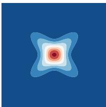  
(a) X-Shape

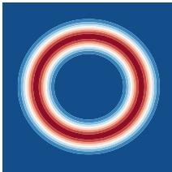  
(b) Ring

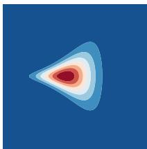  
(c) Funnel

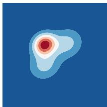  
(d) GMM3

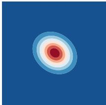  
(e) Gaussian

Figure 4: Synthetic target distributions used in our experiments.  
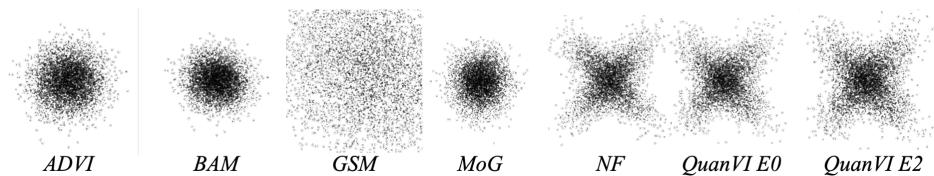  
Figure 5: Sample visualization on the first two dimensions of the X-shape target with $D = 2 0$ comparing all baselines with our method.

## C.2 Synthetic experiments

## C.2.1 Construction of High-dimensional Synthetic Targets

We describe the construction of the high-dimensional synthetic targets used in the experiments. For the non-Gaussian targets, namely GMM3, X-shape, Ring, and Funnel, we start from a twodimensional base target and augment it with a nonlinear Markov chain. The Gaussian target is constructed directly in D dimensions as a locally correlated Gaussian distribution, as described at the end of this section.

Let $p _ { 0 } ( x _ { 1 } , x _ { 2 } )$ denote one of the base two-dimensional non-Gaussian target densities in Fig. 4. For ambient dimension $D \geq 2$ , define $N = D - 2$ auxiliary variables $z _ { 1 } , \dots , z _ { N }$ , with $z _ { 0 } = x _ { 2 }$ . The augmented target is

$$
p ( x _ { 1 } , x _ { 2 } , z _ { 1 } , . . . , z _ { N } ) = p _ { 0 } ( x _ { 1 } , x _ { 2 } ) \prod _ { i = 1 } ^ { N } \mathcal { N } \big ( z _ { i } ; h _ { i } ( z _ { i - 1 } ) , \sigma _ { \mathrm { a u g } } ^ { 2 } \big ) .\tag{10}
$$

Hence the dependency structure is a single chain $x _ { 2 } \to z _ { 1 } \to z _ { 2 } \to \cdot \cdot \cdot \to z _ { N }$ , i.e., in coordinate indices $2  3  \cdots  D$

Each $h _ { i } : \mathbb { R }  \mathbb { R }$ is selected deterministically from a fixed smooth function bank:

$$
\begin{array} { c l l } { { h ( x ) \in \Big \{ \pm 1 . 5 \sin ( x ) , \pm 1 . 5 \cos ( x ) , \pm 1 . 5 \sin ( 2 x ) , \pm 1 . 5 \cos ( 2 x ) , } } \\ { { \qquad \pm 1 . 5 \big ( \sigma ( 4 x ) - 1 / 2 \big ) , \pm 1 . 5 \operatorname { t a n h } ( 2 x ) , \pm 1 . 5 \operatorname { t a n h } ( 4 x ) , } } \\ { { \qquad \pm 1 . 5 \sin ( x ) \operatorname { t a n h } ( x ) , \pm 1 . 5 \cos ( x ) \operatorname { t a n h } ( x ) , \pm 1 . 5 \frac { x } { 1 + x ^ { 2 } } \Big \} , } } \end{array}\tag{11}
$$

where $\sigma ( \cdot )$ is the logistic sigmoid. In implementation, this bank is expanded deterministically by repetition, and we use the first $N = D - \mathrm { \dot { 2 } }$ transforms as $h _ { 1 } , \ldots , h _ { N }$ . Therefore, when D increases, the transform pattern continues in the same fixed order.

Sampling is sequential:

$$
\begin{array} { r } { ( x _ { 1 } , x _ { 2 } ) \sim p _ { 0 } , \qquad z _ { i } = h _ { i } ( z _ { i - 1 } ) + \sigma _ { \mathrm { a u g } } \epsilon _ { i } , \quad \epsilon _ { i } \sim \mathcal { N } ( 0 , 1 ) , \quad i = 1 , \dots , N . } \end{array}
$$

Thus the original two-dimensional geometry is preserved in the marginal $( x _ { 1 } , x _ { 2 } )$ , while higher coordinates introduce nonlinear local dependencies along the chain.

The log-density is available in closed form:

$$
\log p ( x _ { 1 } , x _ { 2 } , z _ { 1 } , \dots , z _ { N } ) = \log p _ { 0 } ( x _ { 1 } , x _ { 2 } ) - { \frac { N } { 2 } } \log ( 2 \pi \sigma _ { \mathrm { a u g } } ^ { 2 } ) - { \frac { 1 } { 2 \sigma _ { \mathrm { a u g } } ^ { 2 } } } \sum _ { i = 1 } ^ { N } ( z _ { i } - h _ { i } ( z _ { i - 1 } ) ) ^ { 2 } .\tag{12}
$$

This expression is used for exact density evaluation. The score is also analytic from the Markov factorization. Let $s _ { 0 } ( x _ { 1 } , x _ { 2 } ) = \nabla _ { ( x _ { 1 } , x _ { 2 } ) } \mathrm { \bar { l o g } } p _ { 0 } ( x _ { 1 } , x _ { 2 } )$ . Then

$$
\nabla _ { x _ { 1 } } \log p = [ s _ { 0 } ( x _ { 1 } , x _ { 2 } ) ] _ { 1 } ,\tag{13}
$$

$$
\nabla _ { x _ { 2 } } \log { p } = [ s _ { 0 } ( x _ { 1 } , x _ { 2 } ) ] _ { 2 } + \frac { h _ { 1 } ^ { \prime } ( x _ { 2 } ) } { \sigma _ { \mathrm { a u g } } ^ { 2 } } \left( z _ { 1 } - h _ { 1 } ( x _ { 2 } ) \right) ,\tag{14}
$$

and for $i = 1 , \ldots , N ,$

$$
\nabla _ { z _ { i } } \log { p } = \frac { h _ { i } ( z _ { i - 1 } ) - z _ { i } } { \sigma _ { \mathrm { a u g } } ^ { 2 } } + \mathbf { 1 } _ { \left\{ i < N \right\} } \frac { h _ { i + 1 } ^ { \prime } ( z _ { i } ) } { \sigma _ { \mathrm { a u g } } ^ { 2 } } \left( z _ { i + 1 } - h _ { i + 1 } ( z _ { i } ) \right) .\tag{15}
$$

The first term is the parent contribution log $; p ( z _ { i } \mid z _ { i - 1 } )$ , and the second term, when $i < N$ , is the child contribution from log $p ( z _ { i + 1 } \mid z _ { i } )$ .

Overall, this construction yields high-dimensional targets that retain the non-Gaussian twodimensional structure in $( x _ { 1 } , x _ { 2 } )$ , while adding controllable nonlinear local dependencies through a single path-structured chain. Exact sampling, exact log-density, and exact score are all available, and both sampling and score evaluation scale linearly with D.

Gaussian target. The Gaussian target is constructed directly in D dimensions rather than by augmenting a two-dimensional base distribution. Specifically, we use

$$
p ( x ) = { \mathcal { N } } ( x ; 0 , \Sigma ) , \qquad \Sigma = \Lambda ^ { - 1 } ,
$$

where $\boldsymbol { \Lambda } \in \mathbb { R } ^ { D \times D }$ is a tridiagonal precision matrix with diagonal entries 1 and neighboring offdiagonal entries 0.2:

$$
\Lambda _ { i i } = 1 , \quad \quad \Lambda _ { i , i + 1 } = \Lambda _ { i + 1 , i } = 0 . 2 .
$$

All other entries are zero. This construction gives a locally correlated Gaussian distribution whose dependency structure follows a path graph, matching the Markov dependency assumption used in the main text. The log-density and score are available in closed form:

$$
\log p ( x ) = - \frac { 1 } { 2 } x ^ { \top } \Lambda x + C , \qquad \nabla _ { x } \log p ( x ) = - \Lambda x ,
$$

where C is the normalizing constant.

## C.2.2 Hyperparameter settings for synthetic experiments

We summarize the hyperparameter settings used for the synthetic experiments. The target distributions are xshape, ring, funnel, gmm3, and gaussian. Unless otherwise stated, the ambient dimensions are

$$
D \in \{ 5 , 1 0 , 2 0 , 1 0 0 \} .
$$

Each configuration is repeated with five independent random seeds. For all methods, the approximation quality is evaluated by the forward KL divergence using $1 0 ^ { 4 }$ Monte Carlo samples from the target distribution.

GSM. We run Gaussian score matching (GSM) with the Gaussian variational family. For each target and dimension, we use 2000 iterations. No learning rate or mini-batch size is required for this baseline.

BaM. We run Batch-and-Match VI (BaM) with the Gaussian variational family. The optimization budget is 2000 iterations. The batch size is set to

$$
B _ { \mathrm { B a M } } = \operatorname* { m a x } ( 1 , D - 1 ) ,
$$

which is the largest value satisfying the implementation constraint $B _ { \mathrm { B a M } } < D$

ADVI. We run ADVI with the same iteration budget as BaM, namely 2000 iterations. The batch size is also set to

$$
B _ { \mathrm { A D V I } } = \operatorname* { m a x } ( 1 , D - 1 ) .
$$

Other optimizer parameters are kept at their default implementation values.

NF. We run the normalizing-flow baseline using the same synthetic targets and dimensions. The optimization budget is 2000 iterations. The number of Monte Carlo samples used by the NF baseline is set as

$$
N _ { \mathrm { N F } } = \mathrm { c l i p } ( 2 5 6 D , 5 1 2 , 8 1 9 2 ) .
$$

Thus, for $D \in \{ 5 , 1 0 , 2 0 , 1 0 0 \}$ , this gives

$$
N _ { \mathrm { N F } } \in \{ 1 2 8 0 , 2 5 6 0 , 5 1 2 0 , 8 1 9 2 \} .
$$

Other architecture and optimizer parameters are kept at the default values of the NF implementation.

EigenVI. We run EigenVI with Hermite basis functions. Since the size of the global eigenvalue problem grows as $K _ { \mathrm { b a s i s } } ^ { D ^ { \scriptstyle - } } ,$ , we use a dimension-dependent basis size:

$$
K _ { \mathrm { b a s i s } } = \left\{ \begin{array} { l l } { 4 , } & { D \leq 5 , } \\ { 2 , } & { D > 5 . } \end{array} \right.
$$

The importance proposal is the product uniform distribution

$$
\mathrm { U n i f } ( [ - 5 , 5 ] ) ^ { \otimes D } .
$$

The number of importance samples is

$$
N _ { \mathrm { E i g e n V I } } = \mathrm { c l i p } ( 2 0 0 0 D , 1 0 ^ { 4 } , 2 \times 1 0 ^ { 5 } ) .
$$

We skip EigenVI when $D > 5$ , in which case the corresponding entry is reported as infeasible.

MoG. We run mixture-of-Gaussians VI with isotropic covariance components. The default learning rate is $1 0 ^ { - 2 }$ , the default number of iterations is 2000, the default number of mixture components is $5 ,$ and the default gradient batch size is 10. For more challenging targets, we use the following target-specific settings:

$$
K _ { \mathrm { m i x } } = { \left\{ \begin{array} { l l } { 1 0 , } & { { \mathrm { g m m } } 3 { \mathrm { ~ a n d ~ r i n g } } , } \\ { 2 0 , } & { { \mathrm { f u n n e l } } , } \\ { 5 , } & { { \mathrm { o t h e r w i s e } } , } \end{array} \right. }
$$

and

$$
B _ { \mathrm { g r a d } } = { \left\{ \begin{array} { l l } { 1 5 , } & { { \mathrm { g m m } } 3 { \mathrm { a n d } } { \mathrm { r i n g } } , } \\ { 2 0 , } & { { \mathrm { f u n n e l } } , } \\ { 1 0 , } & { { \mathrm { o t h e r w i s e } } . } \end{array} \right. }
$$

For the funnel target, we also reduce the learning rate to $1 0 ^ { - 3 }$ and increase the number of iterations to 3500. The KL estimation batch size is $B _ { \mathrm { K L } } = 1 0 0 0$ . We set vgmm\_scal $\mathsf { e } _ { - } \mathsf { c o v } = 5$ and vgmm\_sample\_boul $\mathtt { \Omega } \mathtt { e } = 5$

QuanVI. For QuanVI, we use the same synthetic targets and dimensions as above. We run both the pure-state and mixed-state variants by setting

$$
E \in \{ 0 , 2 \} ,
$$

where $E = 0$ corresponds to a pure-state ansatz and $E = 2$ introduces auxiliary environment degrees of freedom for mixed-state representations. The number of training samples scales linearly with dimension:

$$
B _ { \mathrm { Q u a n V I } } = 5 0 0 D .
$$

For example, $B _ { \mathrm { Q u a n V I } } = 1 0 ^ { 4 }$ when $D = 2 0 .$ , and $B _ { \mathrm { Q u a n V I } } = 5 \times 1 0 ^ { 4 }$ when $D = 1 0 0$ . We use $K = 5$ Hermite basis functions and train for 2000 optimization steps. All other optimizer parameters are kept at the default values of the implementation unless explicitly stated otherwise.

Remark on hyperparameter selection. We use comparable optimization budgets across methods whenever applicable. QuanVI uses a fixed basis size $\bar { K } = 5$ and a sample size proportional to the dimension, without target-specific tuning. NF is trained with the same iteration budget as BaM and ADVI, with the number of Monte Carlo samples scaled with dimension and capped for highdimensional settings. MoG uses target-specific mixture sizes and learning rates on the more difficult non-Gaussian targets, following standard practice for mixture-based variational approximations. EigenVI is limited by the exponentially growing global basis size $K _ { \mathrm { b a s i s } } ^ { D } ,$ so infeasible configurations are explicitly marked rather than forced to run.

Table 3: Normalizing flow results on synthetic targets over five runs. Values report the median forward KL divergence, with the number of divergent runs in parentheses.
<table><tr><td>D</td><td>Gaussian</td><td>X-shape</td><td>GMM3</td><td>Funnel</td><td>Ring</td></tr><tr><td>5</td><td>0.0109 (0/5)</td><td> $0 . 0 3 1 9 \left( 0 / 5 \right)$ </td><td> $0 . 0 2 9 7 \left( 0 / 5 \right)$ </td><td> $0 . 0 7 7 8 \left( 2 / 5 \right)$ </td><td> $0 . 2 6 8 2 \ : ( 0 / 5 )$ </td></tr><tr><td>10</td><td>0.0247 (0/5)</td><td> $4 . 3 6 \times 1 0 ^ { 1 7 } \ : ( 5 / 5 )$ </td><td> $0 . 6 0 8 5 \left( 1 / 5 \right)$ </td><td> $1 . 0 5 \times 1 0 ^ { 1 5 } \ : ( 4 / 5 )$ </td><td> $6 . 2 5 \times 1 0 ^ { 2 8 } \ : ( 3 / 5 )$ </td></tr><tr><td>20</td><td>0.0224 (0/5)</td><td> $1 8 4 . 8 5 7 1 \ : ( 1 / 5 )$ </td><td> $5 . 0 6 \times 1 0 ^ { 1 3 } \ : ( 3 / 5 )$ </td><td> $1 . 7 6 1 3 \ : ( 0 / 5 )$ </td><td> $3 . 7 1 1 4 \left( 1 / 5 \right)$ </td></tr><tr><td>100</td><td>0.0774 (1/5)</td><td> $3 7 . 5 9 3 0 \left( 1 / 5 \right)$ </td><td> $4 0 4 . 6 0 5 9 \ : ( 2 / 5 )$ </td><td> $3 . 3 8 \times 1 0 ^ { 2 3 } \ : ( 4 / 5 )$ </td><td> $4 4 . 0 9 5 2 \ : ( 0 / 5 )$ </td></tr></table>

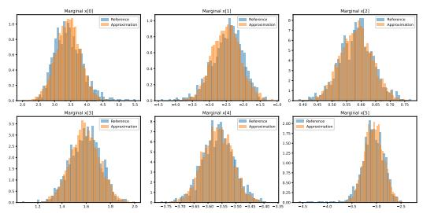  
(a) EigenVI

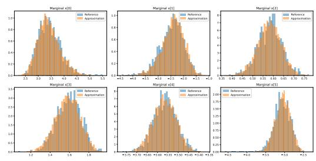  
(b) QuanVI  
Figure 6: Representative posterior visualization on hmm\_bball\_0.

## C.2.3 Result of NF

We report the normalizing-flow baseline results in Table 3 for completeness. Although NF achieves low KL divergence on some low-dimensional targets, its results are highly unstable across different targets and dimensions. In several high-dimensional or strongly non-Gaussian settings, the KL divergence becomes extremely large, indicating numerical or optimization instability. This sensitivity makes NF difficult to use as a reliable main-table baseline in our experimental setting. Therefore, we omit NF from the main comparison table and include the detailed results here in the appendix.

## C.3 Posterior experiments

## C.3.1 Standardization

For the POSTERIORDB experiments, we apply a two-stage reparameterization before variational training. First, the constrained Stan parameters θ are mapped to unconstrained coordinates $\mathbf { x } \in \mathbb { R } ^ { D }$ using Stan’s bijective transformation. The target log-density and score in this space are evaluated through BRIDGESTAN with the Jacobian adjustment enabled.

We then standardize x using a full-covariance Gaussian preconditioner $\mathcal { N } ( \widehat { \mathbf { m } } , \widehat { \mathbf { \Sigma } } )$ . Let $\widehat { \pmb { \Sigma } } = \mathbf { L } \mathbf { L } ^ { \top }$ We define

$$
\mathbf { y } = \mathbf { L } ^ { - 1 } ( \mathbf { x } - \hat { \mathbf { m } } ) , \qquad \mathbf { x } = \hat { \mathbf { m } } + \mathbf { L } \mathbf { y } .\tag{16}
$$

The corresponding target score in standardized coordinates is

$$
\nabla _ { \mathbf { y } } \log \tilde { p } ( \mathbf { y } ) = \mathbf { L } ^ { \top } \nabla _ { \mathbf { x } } \log p ( \mathbf { x } ) , \qquad \mathbf { x } = \hat { \mathbf { m } } + \mathbf { L } \mathbf { y } .\tag{17}
$$

The preconditioner $( \widehat { \mathbf { m } } , \widehat { \pmb { \Sigma } } )$ is obtained before QuanVI training using GSM for $1 0 ^ { 4 }$ iterations with batch size 16; BaM is used for one target where GSM is numerically unstable. Reference posterior draws are not used to construct the preconditioner. The same preconditioner is shared by all methods that use standardization.

QuanVI is trained directly in the standardized coordinates y: Hermite basis functions are evaluated in this space and collocation points are sampled from $[ - 5 , 5 ] ^ { D }$ . For evaluation, the learned score is transformed back to the unconstrained coordinates as $\nabla _ { \mathbf { x } } \log q ( \mathbf { x } ) = \mathbf { L } ^ { - \top } \nabla _ { \mathbf { y } } \log \tilde { q } ( \mathbf { y } )$ . All reported Fisher divergences are computed in this common unconstrained x-space. Synthetic targets are already constructed on a comparable scale and therefore use the identity transformation.

## C.3.2 Hyperparameter settings for posterior benchmark experiments

We summarize the hyperparameter settings used for the posterior benchmark experiments. We evaluate three PosteriorDB targets, denoted by the short names hmm, hmm\_bball\_0, and gpregr.

These short names are mapped to the corresponding PosteriorDB models as follows:

<table><tr><td>Short name</td><td>PosteriorDB model</td></tr><tr><td>hmm</td><td>hmm_example-hmm_example</td></tr><tr><td>hmm_bball_0</td><td>bball_drive_event_0-hmm_drive_0</td></tr><tr><td>gpregr</td><td>gp-pois_regr-gp_regr</td></tr></table>

Each configuration is repeated with independent random seeds, and we report the mean and standard deviation across runs. Unless otherwise stated, the same hyperparameters are used for all three targets. Different from the synthetic experiments, several posterior baselines use Gaussian initialization or standardization obtained from GSM or BaM fits.

GSM. We run Gaussian score matching with the Gaussian variational family. GSM is used both as a baseline and as an initialization method for other posterior baselines. We use 10000 iterations and batch size 16.

BaM. We run Batch-and-Match VI with the Gaussian variational family. We use 1000 iterations and batch size 16. BaM is initialized from the GSM-fitted mean and covariance with init\_cov\_scale= 1.0 and init\_cov\_jitter= 10−6.

ADVI. We run ADVI for 1000 iterations with batch size 16 and learning rate $1 0 ^ { - 4 }$ . ADVI is initialized from the GSM-fitted mean and covariance with init\_cov\_scale= 1.0 and $\mathrm { i n i t \_ c o v \_ j i t t e r = 1 0 ^ { - 6 } }$

NF. We run the normalizing-flow baseline without using Gaussian initialization files. The flow uses hidden dimension 32, 8 layers, 1000 optimization iterations, 16 Monte Carlo samples, learning rate $1 0 ^ { - 3 }$ , and $\beta = 1 . 0$

EigenVI. We run EigenVI with Hermite basis functions, basis size $K = 5 ,$ , and 60000 importance samples. The target is standardized before fitting EigenVI. For hmm and gpregr, the standardization mean and covariance are taken from the GSM fit. For hmm\_bball\_0, they are taken from the BaM fit, which provides a better Gaussian initialization for this target.

MoG. We run mixture-of-Gaussians VI with isotropic covariance components and natural gradient covariance updates. We use

$$
\mathtt { m o d e } = \mathtt { i s o } , \qquad \mathtt { v a r i a n c e \_ u p d a t e } = \mathtt { n g d } , \qquad \eta = 1 0 ^ { - 4 } .
$$

The number of iterations is 10000, the number of mixture components is $5 0 ,$ the KL batch size is $B _ { \mathrm { K L } } = 1 0 0 0$ , and the gradient batch size is $B _ { \mathrm { g r a d } } = 2 0$ . We set vgmm\_sample\_boule= 1 and vgmm\_scale\_cov= 1. MoG is initialized from GSM-fitted Gaussian statistics whenever available, with init\_cov\_scale= 1.0, init\_mean\_scale= 0.25, init\_component\_cov\_scale= 0.5, and $\mathrm { i n i t \_ c o v \_ j i t t e r = 1 0 ^ { - 6 } }$ . If these files are unavailable, MoG falls back to random initialization.

QuanVI. For QuanVI, we use the same standardization logic as EigenVI. The standardization mean and covariance are taken from GSM for hmm and gpregr, and from BaM for hmm\_bball\_0. We use

$$
E \in \{ 0 , 2 \} , \qquad K = 5 , \qquad N _ { k } = 2 , \qquad B = 5 0 0 0 .
$$

The model is trained for 1000 steps with learning rate $1 0 ^ { - 1 }$ , momentum 0.9, complex double precision.   
We use the unconstrained Fisher space, plot\_n\_samples= 3000, and sample\_n\_grid= 500.

Remark on hyperparameter selection. We use comparable optimization budgets across methods whenever applicable. GSM is first used to provide Gaussian initialization files for several posterior baselines. QuanVI and EigenVI use the same standardization source for each target, while QuanVI keeps a fixed basis size $\bar { K } = 5$ and fixed tensor setting without target-specific tuning. MoG uses the same mixture configuration across the three posterior targets, and NF is trained with the same architecture and optimization budget for all targets.

Table 4: Summary of hyperparameter settings for posterior benchmark experiments. All targets share the same hyperparameters unless otherwise specified.
<table><tr><td>Method</td><td>Main hyperparameters</td><td>Initialization / standardization</td><td>Special case</td></tr><tr><td>GSM</td><td>10000 iter, batch size 16</td><td>None</td><td>None</td></tr><tr><td>BaM</td><td>1000 iter, batch size 16</td><td>GSM mean/cov</td><td>None</td></tr><tr><td>ADVI</td><td>1000 iter, batch size  $1 6 , \mathrm { l r } 1 0 ^ { - }$  4</td><td>GSM mean/cov</td><td>None</td></tr><tr><td>NF</td><td>8 layers, hidden dim 32, 1000 iter, lr  $1 0 ^ { - 3 }$ </td><td>None</td><td>None</td></tr><tr><td>EigenVI</td><td>Hermite basis,  $K = 5 ,$  60000 samples</td><td>GSM mean/cov</td><td>hmm_bbal1_0 uses BaM mean/cov</td></tr><tr><td>MoG</td><td>50 mixtures, 10000 iter, lr  $1 0 ^ { - 4 }$ </td><td>GSM mean/cov, fallback to random</td><td>None</td></tr><tr><td>QuanVI</td><td> $E \in \{ 0 , 2 \} , K = 5 , N _ { k } = 2 , B = 5 0 0 0 , 1 0 0 0 \mathrm { s t e p s }$ </td><td>GSM mean/cov</td><td>hmm_bbal1_0 uses BaM mean/cov</td></tr></table>

Table 5: Forward KL divergence for different local window sizes $L \in \{ 1 , 2 , 3 , 4 , 5 \}$ , reported as the mean and standard deviation over five runs. A dash indicates that no final KL divergence was available.
<table><tr><td>D</td><td> $\mathrm { T a r g e t }$ </td><td> $L = 1$ </td><td> $L = 2$ </td><td> $L = 3$ </td><td> $L = 4$ </td><td> $L = 5$ </td></tr><tr><td rowspan="4">5</td><td>X-shape</td><td> $6 . 7 7 2 5 \pm 0 . 0 3 9 9$ </td><td> $0 . 2 6 4 5 \pm 0 . 0 0 6 5$ </td><td> $0 . 2 4 7 8 \pm 0 . 0 0 5 0$ </td><td> $0 . 2 5 5 2 \pm 0 . 0 0 8 3$ </td><td> $0 . 2 4 6 0 \pm 0 . 0 1 2 0$ </td></tr><tr><td>Ring</td><td> $1 1 . 0 4 9 5 \pm 3 . 0 8 1 8$ </td><td> $0 . 8 7 8 7 \pm 0 . 0 1 7 6$ </td><td> $0 . 8 9 0 5 \pm 0 . 0 2 5 0$ </td><td> $0 . 9 1 8 6 \pm 0 . 0 2 7 2$ </td><td> $0 . 8 9 3 2 \pm 0 . 0 2 4 4$ </td></tr><tr><td>Funnel</td><td> $9 . 2 9 8 8 \pm 2 . 1 4 8 1$ </td><td> $2 . 8 3 8 4 \pm 1 . 2 6 1 5$ </td><td> $1 . 6 0 6 3 \pm 0 . 2 1 2 0$ </td><td> $1 . 3 8 7 9 \pm 0 . 0 9 2 6$ </td><td> $1 . 4 8 0 9 \pm 0 . 2 6 5 1$ </td></tr><tr><td>GMM3</td><td> $9 . 2 6 5 6 \pm 4 . 6 1 2 8$ </td><td> $0 . 1 6 0 2 \pm 0 . 0 0 3 8$ </td><td> $0 . 1 5 6 0 \pm 0 . 0 0 5 2$ </td><td> $0 . 1 5 5 1 \pm 0 . 0 0 6 9$ </td><td> $0 . 1 5 5 0 \pm 0 . 0 0 4 7$ </td></tr><tr><td rowspan="4">10</td><td>X-shape</td><td> $1 6 . 2 0 2 8 \pm 1 . 6 1 4 6$ </td><td> $3 . 2 1 2 0 \pm 0 . 0 6 8 6$ </td><td> $2 . 9 5 5 8 \pm 0 . 0 5 2 6$ </td><td> $2 . 8 5 9 4 \pm 0 . 0 5 3 0$ </td><td> $2 . 8 6 8 5 \pm 0 . 0 5 9 7$ </td></tr><tr><td>Ring</td><td> $2 0 . 6 6 9 1 \pm 3 . 0 8 9 4$ </td><td> $3 . 8 2 2 3 \pm 0 . 0 4 6 6$ </td><td> $3 . 5 8 0 3 \pm 0 . 0 7 4 2$ </td><td> $3 . 4 5 0 1 \pm 0 . 0 6 0 2$ </td><td> $3 . 3 4 3 3 \pm 0 . 0 6 4 2$ </td></tr><tr><td>Funnel</td><td> $1 8 . 9 8 3 3 \pm 3 . 1 1 5 2$ </td><td> $7 . 9 2 9 3 \pm 1 . 1 9 4 8$ </td><td> $6 . 3 6 7 1 \pm 0 . 4 3 5 2$ </td><td> $4 . 3 8 3 3 \pm 0 . 5 2 6 9$ </td><td> $2 . 8 1 1 9 \pm 0 . 0 5 0 3$ </td></tr><tr><td>GMM3</td><td> $1 9 . 8 6 4 8 \pm 5 . 1 0 0 0$ </td><td> $3 . 1 4 6 3 \pm 0 . 0 6 4 9$ </td><td> $2 . 9 0 5 4 \pm 0 . 0 4 8 6$ </td><td> $2 . 7 3 3 9 \pm 0 . 0 6 7 8$ </td><td> $2 . 7 2 7 5 \pm 0 . 0 9 6 6$ </td></tr><tr><td rowspan="4">20</td><td>X-shape</td><td> $3 6 . 8 6 2 8 \pm 2 . 2 1 1 4$ </td><td> $7 . 9 1 4 1 \pm 1 . 5 9 9 0$ </td><td> $7 . 7 0 8 9 \pm 0 . 3 4 9 7$ </td><td> $7 . 6 3 6 4 \pm 0 . 2 9 0 4$ </td><td></td></tr><tr><td>Ring</td><td> $4 2 . 6 5 0 6 \pm 4 . 8 0 2 7$ </td><td> $9 . 1 5 9 2 \pm 0 . 6 4 6 1$ </td><td> $8 . 3 6 8 9 \pm 0 . 3 6 3 7$ </td><td> $7 . 9 4 2 4 \pm 0 . 1 3 9 7$ </td><td></td></tr><tr><td>Funnel</td><td>38  $. 5 5 1 0 \pm 5 . 3 0 0 4$ </td><td> $1 3 . 7 6 6 1 \pm 0 . 5 8 3 2$ </td><td> $1 1 . 7 7 2 5 \pm 0 . 1 8 4 6$ </td><td> $7 . 0 0 6 6 \pm 0 . 2 3 4 2$ </td><td></td></tr><tr><td>GMM3</td><td> $3 5 . 9 3 6 3 \pm 2 . 5 7 6 8$ </td><td> $8 . 3 3 0 6 \pm 0 . 4 1 5 4$ </td><td> $7 . 7 4 0 1 \pm 0 . 1 4 0 6$ </td><td> $7 . 5 4 2 8 \pm 0 . 1 3 7 1$ </td><td></td></tr></table>

## C.4 Ablation study

## C.4.1 Local window size ablation

We provide detailed results for the local window size ablation discussed in Section 6.3. We focus on the Funnel target, fix $E = 0$ and $K = 5$ , and compare $L = 2$ with $L = 3$

A larger local window improves expressiveness because each local tensor can capture dependencies among more neighboring variables. However, it also increases the number of parameters rapidly. With $E = 0$ and $K = 5$ , the parameter count scales as

$$
( D - L + 1 ) K ^ { 2 L } .
$$

Thus, increasing L from 2 to 3 changes the scaling from

$$
( D - 1 ) K ^ { 4 }
$$

to

$$
( D - 2 ) K ^ { 6 } ,
$$

which leads to a much larger model.

Table 5 shows the trade-off between expressiveness and efficiency. Increasing L from 2 to 3 reduces the KL divergence substantially, especially for $D = 5 .$ , but the parameter count and runtime grow quickly. In particular, for $D = 1 0$ , training with $L = 3$ takes more than 12 hours, compared with about 15 minutes for $L = 2 .$ . This motivates our use of the smaller local window $L = 2$ in the main experiments.

## C.4.2 Environment size ablation

We provide additional details for the environment-size ablation in Section 6.3. We evaluate QuanVI on the X-shape target with $D = 1 0 .$ , using five independent random seeds for each value of $E .$ To make the ablation more challenging, we use a sampling-limited stochastic setting: QuanVI is trained for 500 iterations with mini-batch size $B = 1 0 0$ , and a fresh mini-batch is resampled at every training iteration. Therefore, each update is based on a noisy Monte Carlo estimate of the score-based objective rather than on a large or fixed empirical estimate.

Table 6: Training time for different local window sizes L on the Funnel target. Larger local windows substantially increase the computational cost.
<table><tr><td>Dimension D</td><td>L</td><td>Training time</td></tr><tr><td>5</td><td>2</td><td>≈ 5 min</td></tr><tr><td>5</td><td>3</td><td>≈ 20 min</td></tr><tr><td>10</td><td>2</td><td>≈ 15 min</td></tr><tr><td>10</td><td>3</td><td>&gt; 12 hours</td></tr><tr><td>20</td><td>2</td><td>≈ 30 min</td></tr><tr><td>100</td><td>2</td><td>≈ 5 hours</td></tr></table>

Increasing E also increases the number of local gates as

$$
D + E - L + 1 .
$$

Thus, larger E provides additional auxiliary degrees of freedom for mixed-state representations, but also increases the size of the tensorized optimization problem. This explains why moderate values of E can improve the fit, while very large values may lead to diminishing returns or more difficult optimization.

Number of basis functions K. We ablate the number of Hermite basis functions K, which controls the local feature dimension of the orthogonal expansion. We evaluate QuanVI on the Ring target with five independent random initializations and report the final KL divergence in Figure 3.

The results show that increasing K generally improves approximation quality: larger basis sizes provide richer local features and substantially reduce the average KL divergence. However, this improvement comes with increased runtime, since larger K increases the size of each local tensor contraction. Thus, K controls another expressiveness–efficiency trade-off in QuanVI, and we use a moderate value in the main experiments.

## C.4.3 Numerical precision ablation

We provide additional details for the numerical precision ablation discussed in Section 6.3. We compare float and cfloat on the Funnel synthetic target with D = 5, E = 0, batch size B = 5000, and 2000 optimization steps. For each dtype, we run five independent random seeds and report the mean and standard deviation of the final KL divergence in Figure 3.

The results show that the complex-valued dtype achieves better approximation quality in this setting. The mean KL of cfloat is about 3.58, lower than the mean KL of float, which is about 5.08. Although both dtypes show noticeable variation across random seeds, the averaged result favors the complex-valued parameterization on this challenging Funnel target.

The runtime overhead of cfloat is moderate in this experiment. Training takes about 1m10s with float and about 1m30s with cfloat. Thus, cfloat improves the average KL with only a small increase in wall-clock time, motivating our use of complex dtype as the default choice when memory permits.