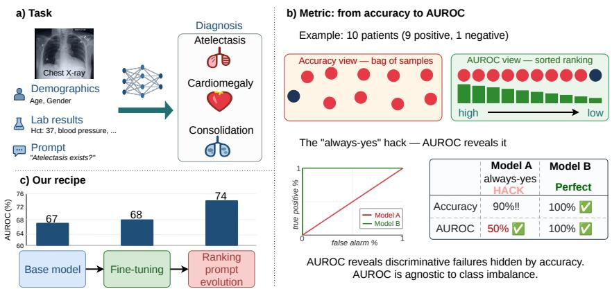
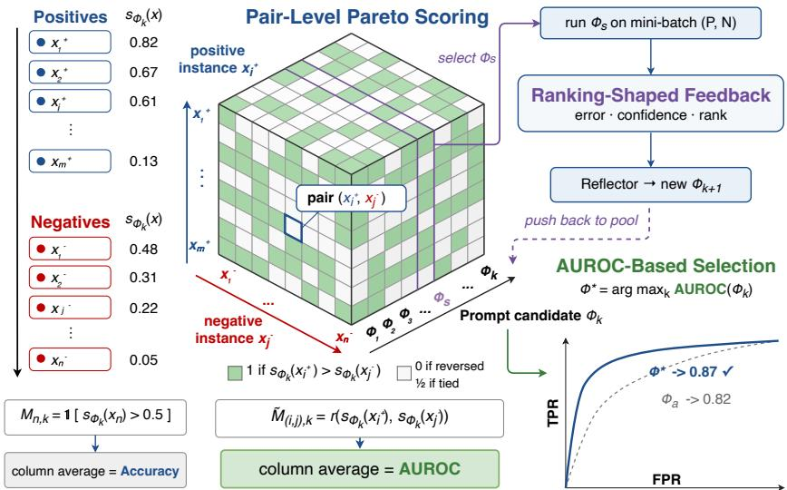
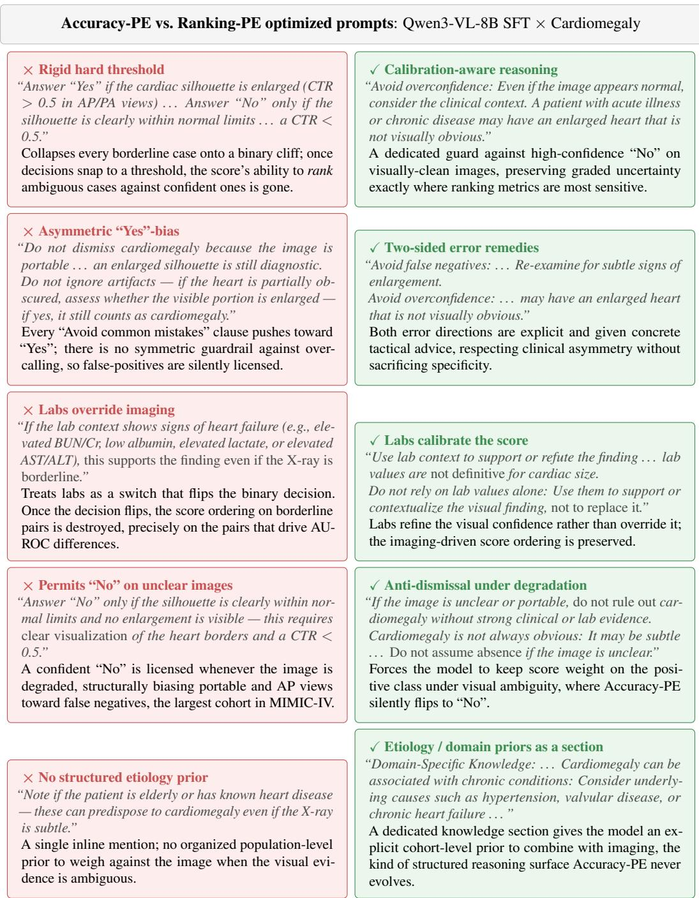
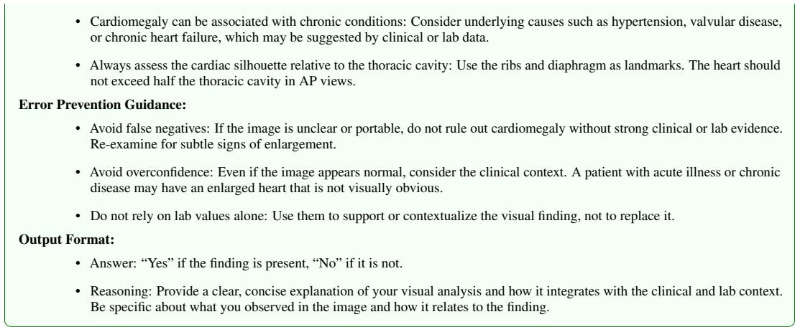

# RANKING-AWARE PROMPT OPTIMIZATION FOR MULTIMODAL CLINICAL DIAGNOSIS

Tian Xia1 Minghao Liu2 Yiqing Liang3 Laixi Shi4 Jiayun Wang5

1Harvard University 2University of California, Santa Cruz 3Brown University

4Johns Hopkins University 5Georgia Institute of Technology

tianxia@g.harvard.edu pjwang@gatech.edu

## ABSTRACT

Multimodal large language models (MLLMs) are rapidly advancing clinical diagnosis, yet their adaptation pipelines remain anchored to accuracy-based objectives. Clinical data are heavily class-imbalanced: a constant-majority predictor can score above 90% accuracy while being clinically useless. We therefore evaluate and optimize for AUROC, a threshold-free score that ranks positives above negatives and is invariant to class balance. We focus on prompt optimization in MLLMs. Reflective methods such as GEPA use a binary scores matrix with one row per evaluation instance and one column per candidate prompt; cells record per-instance correctness, so the column average is accuracy and drives candidate selection.

We introduce pair-level Pareto prompt evolution (Ranking-PE), which replaces each correctness row with a pairwise-ordering row over (positive, negative) instance pairs: the cell is 1 if the candidate scores the positive higher than the paired negative. The column average then equals empirical AUROC (by the Wilcoxon–Mann– Whitney identity). We apply this swap at all three layers the prompt evolution search reads from—the scores matrix that decides Pareto dominance, the perexample feedback to the reflection LM, and final candidate selection—at no extra model calls and with no surrogate loss. Across three diseases on MIMIC, accuracybased prompt evolution can degrade ranking; Ranking-PE reverses this, beating the accuracy-based recipe by +5.8 AUROC pp on fine-tuned Qwen3-VL-8B and +16.2 pp on MedGemma-4B. Ablations examine each design component and show that a medical-grade visual backbone—via vision-encoder-tuned SFT or medical pretraining—is a prerequisite that prompt search cannot replace—our recipe extends reflective prompt evolution from text-only data to multimodal clinical decision-making.

## 1 INTRODUCTION

Multimodal large language models (MLLMs) are increasingly deployed for multimodal clinical diagnosis, jointly reading a medical image (e.g., chest X-ray) and the accompanying structured EHR context (demographics, imaging view, laboratory test results) to produce a diagnostic answer (Tu et al., 2024; Li et al., 2023; Sellergren et al., 2025). The promise is that a single generalist model can approach specialist-level decisions without specific architectures per disease, as shown by the success of recent medically-pretrained backbones (LLaVA-Med (Li et al., 2023), Med-PaLM (Tu et al., 2024), MedGemma (Sellergren et al., 2025)).

Accuracy alone is not enough for clinical diagnosis model training and evaluation. Screening, triage, and follow-up operate at a chosen operating point on the ROC curve, which plots the true positive rate against the false positive rate at various thresholds, so the metrics that matter are ranking metrics (AUROC) rather than thresholded top-1 agreement with the label. Under severe class imbalance, a constant-majority predictor can achieve over 90% accuracy without distinguishing positive from negative cases, missing every positive case when negatives dominate or flooding clinicians with false alarms when positives dominate (Figure 1b). Errors are also asymmetric: a missed consolidation is clinically far more costly than a false alarm, a distinction accuracy is structurally incapable of representing. Under these conditions, optimizing and reporting accuracy actively misdirects MLLM development in medicine; we therefore evaluate and optimize against AUROC, which is thresholdfree and agnostic to class imbalance, so training and evaluation share the same correctly-aligned metric. AUROC itself weighs both error types symmetrically; we surface the asymmetric cost separately, through the reflector’s feedback (§4.2.2).

  
Figure 1: Why clinical diagnosis needs ranking metrics. a): multimodal diagnosis combines medical images (e.g. chest X-rays), clinical profile, lab tests, and prompts to produce calibrated disease scores. b): under heavy class imbalance common in real-world clinical datasets, threshold accuracy can look strong even when the score ranking is clinically useless, while AUROC distinguishes models across all operating points. c): our recipe improves ranking by combining a base MLLM, SFT with vision-encoder tuning, and ranking-aware prompt evolution, moving from threshold-centric prediction to AUROC-driven optimization for reliable multimodal clinical diagnosis.

This paper focuses on prompt optimization (Agrawal et al., 2025; Khattab et al., 2023; Pryzant et al., 2023) (cheap, gradient-free, and composable with finetuning techniques) layered on top of a finetuned medical backbone. Existing prompt-evolution systems (GEPA (Agrawal et al., 2025), DSPy (Khattab et al., 2023), APO (Pryzant et al., 2023)) are built around an accuracy-based scores matrix, inheriting exactly the metric misalignment described above. Under heavy class imbalance, accuracy-based prompt evolution can degrade the underlying ranking signal, a failure mode our recipe reverses. Pareto prompt evolution does not intrinsically optimize accuracy; it optimizes whatever binary event is chosen as a row of its scores matrix. Existing systems silently choose per-instance correctness events 1[correct] (cell in the score matrix is 1 when correct), making the column average accuracy. For clinical ranking, we instead score positive-negative pairs according to their relative order. We obtain the per-instance scores s(·) from the model’s Yes/No token log-probabilities at no additional cost. By the Wilcoxon–Mann–Whitney identity, the average of these pair scores is empirical AUROC. Swapping the scores-matrix rows from instances to $( x ^ { + } , x ^ { - } )$ pairs therefore lifts the objective of every matrix-driven decision—Pareto filtering, parent selection, and final selection—from accuracy to AUROC. We call this pair-level Pareto prompt evolution (Ranking-PE).

We consider MLLM-based clinical diagnosis as a ranking task and validate the recipe systematically across two open-source MLLM families end-to-end—Qwen3-VL-8B and MedGemma-4B—over three disease tasks on MIMIC, reporting AUROC and Balanced Accuracy in the main paper and AUPRC in the appendix; a same-scale non-medical checkpoint (Gemma3-4B) and frontier closedsource GPT reflectors appear as probes that contextualize the recipe. Combining vision-encoder-tuned SFT with Ranking-PE for Qwen3-VL-8B, our recipe outperforms accuracy-based prompt evolution by +5.8 AUROC pp on Qwen3-VL-8B + SFT(VE-tuned) and +16.2 AUROC pp on MedGemma-4B, while exceeding Balanced Accuracy of both Accuracy-PE and the corresponding base model. On Qwen3-VL-8B + SFT, the pattern is most pronounced on Atelectasis, where Accuracy-PE stays close to the base level; Ranking-PE recovers +7.1 AUROC pp and +25.5 Balanced Accuracy pp over Accuracy-PE under the same pipeline.

Our contribution: 1) Pair-level Pareto prompt evolution. We identify the row schema of the Pareto scores matrix as the hidden optimization unit of reflective prompt search, and specialize all three layers the search reads from (the scores matrix, reflector feedback, and final selection) onto positive-negative ordering events $( x ^ { + } , x ^ { - } )$ , lifting the column average to empirical AUROC (§4). 2) A systematic clinical recipe and benchmark. We provide an end-to-end study of MLLM-based clinical diagnosis on MIMIC-IV (three diseases, two open-source MLLM families, four optimization paradigms; closed-source models enter only as probes, namely zero-shot baselines and reflectors), show that visual domain adaptation provides an important foundation for prompt evolution (consistent with prior visual-alignment findings (Li et al., 2023; He et al., 2024)), and extend reflective prompt evolution from text-only NLP benchmarks to multimodal clinical decision-making (§5).

## 2 RELATED WORK

Multimodal LLMs for medicine and adaptation. Multimodal LLMs specialized to the medical domain—LLaVA-Med (Li et al., 2023), Med-PaLM M (Tu et al., 2024), BiomedGPT (Zhang et al., 2024), and MedGemma (Sellergren et al., 2025)—are typically built from general-purpose backbones (e.g., Qwen-VL (Bai et al., 2025)) by continued pretraining and instruction tuning for medical VQA and report generation. Their adaptation pipelines, often using parameter-efficient methods such as LoRA (Hu et al., 2022) and QLoRA (Dettmers et al., 2023), rely on downstream accuracy, an objective ill-suited to the heavy class imbalance pervasive in clinical data: it leaves rank quality between positives and negatives unassessed. We instead optimize and evaluate against AUROC; under this ranking-first view, base SFT alone is limited on image-dependent diseases, and ranking-aware prompt evolution layered on top is what unlocks the SFT base.

Ranking-aware learning and AUROC optimization. Direct optimization of ranking metrics has a long history in learning to rank: RankNet (Burges et al., 2005), LambdaRank (Burges et al., 2006), and AUC-maximization on medical imaging (Yuan et al., 2021) train new parameters against differentiable surrogates of pairwise objectives. These methods must smooth the indicator $1 [ s ( x ^ { + } ) > s ( x ^ { - } ) ]$ into a logistic, hinge, or sigmoid surrogate because gradient descent cannot consume it—a concession to the optimizer class, not a property of the metric. In the clinical setting, threshold-free reporting standards (TRIPOD (Collins et al., 2015), CheXpert sensitivity at fixed specificity (Irvin et al., 2019)) motivate ranking-first evaluation regardless of training. Whether the indicator must be smoothed therefore depends on the optimizer class.

Prompt optimization for LLMs. A growing line of work optimizes text prompts without updating weights: APO (Pryzant et al., 2023) performs gradient-free edits via textual “gradients”; DSPy (Khattab et al., 2023) compiles declarative pipelines with prompt-level teleprompters; Prompt-Breeder (Fernando et al., 2023) uses self-referential evolutionary search; GEPA (Agrawal et al., 2025) maintains a Pareto frontier of candidates refined by reflective LLM feedback; in medicine, Medprompt (Nori et al., 2023) composes prompting strategies for accuracy on medical QA. These methods read binary per-instance signals into a scores-matrix bookkeeping that consumes indicators directly and thus requires no smoothed surrogate. By aligning the row event with pairwise ordering rather than instance correctness (§4), the optimized quantity becomes the unrelaxed pairwise ranking objective itself, without a continuous-relaxation surrogate, an auxiliary loss, or extra rollouts.

## 3 TASK: CLINICAL DIAGNOSIS AS RANKING

We study binary clinical diagnosis from paired inputs $x = ( { \mathrm { i m a g e , e h r } } )$ , where ehr is a structured electronic-health-record context in text format (e.g. patient demographics, imaging view, and laboratory values), together with a target disease d. Let θ denote the (optional) fine-tuned adapter weights of a multimodal language model and Φ a prompt that casts the task as a templated question (“Does this patient have disease d?”). The model’s output is a distribution over the two label tokens: $p _ { \theta , \Phi } ( \hat { y } \mid x , d ) , \quad \hat { y } \in \{ \Upsilon \mathbf { e s } , \mathtt { N o } \}$ . For brevity we suppress θ when held fixed and write $p _ { \Phi }$ for the output distribution and yˆ for the emitted token.

Continuous score from a Yes/No head. Any ranking metric requires a continuous score, yet the model emits a discrete label. We recover a score from the logprobs a standard decoding pass already produces at no additional rollout cost: at the answer-token position we read the top-k logprobs and define the log-odds score (Holtzman et al., 2021; Kadavath et al., 2022)

$$
s _ { \Phi } ( x , d ) = \log p _ { \Phi } ( \Upsilon { \tt e s } \mid x , d ) - \log p _ { \Phi } ( \Upsilon { \tt o } \mid x , d ) .\tag{1}
$$

For brevity we write $s _ { \Phi } ( x )$ when d is held fixed. $s _ { \Phi } ( x )$ is the single quantity every downstream component in our recipe consumes: scores matrix, per-example feedback, and final selection. Tokenization, top-k, label-fallback handling, and serving details are deferred to Appendix A.

Performance metric: AUROC. Screening, triage, and confirmation impose different prevalences and cost ratios (Pepe, 2003; Wynants et al., 2020), so the clinical operating point is chosen at deployment.

The right evaluation summary therefore does not commit to a single threshold up front. Let $P$ and $N$ denote the positive and negative examples for target disease d, and let $X ^ { + } \in \bar { P } , X ^ { - } \in N$ denote a randomly drawn positive and negative example. AUROC is the probability that $s _ { \Phi }$ ranks $X ^ { + }$ above $X ^ { - }$

$$
\mathrm { A U R O C ( \Phi ) } = \mathrm { P r } \bigl ( s _ { \Phi } ( X ^ { + } , d ) > s _ { \Phi } ( X ^ { - } , d ) \bigr ) + { \textstyle { \frac { 1 } { 2 } } } \mathrm { P r } \bigl ( s _ { \Phi } ( X ^ { + } , d ) = s _ { \Phi } ( X ^ { - } , d ) \bigr ) ,\tag{2}
$$

a threshold-free measure of whether the model ranks diseased patients above non-diseased ones. AUROC is the metric that ROC-based clinical reporting standards (TRIPOD (Collins et al., 2015), CheXpert (Irvin et al., 2019)) recommend; we use it for both evaluation and as the optimization target during prompt evolution (the bookkeeping construction is in §4). AUPRC provides complementary information about precision and recall (Saito & Rehmsmeier, 2015; Davis & Goadrich, 2006), and we report it in Appendix Table 10. Once a deployment commits to a threshold, ranking quality must survive at that fixed operating point, so we additionally report Balanced Accuracy at the default decoder threshold as a deploy-time sanity check.

## 4 METHOD: RANKING-AWARE PROMPT EVOLUTION

Our method has two stages. First, a domain-adaptation supervised fine-tuning (SFT) gives the model a medical-image-aware visual backbone that produces a discriminative score $s _ { \Phi } ( x )$ (§4.1). Second, a training-free ranking-aware prompt evolution step refines the instruction prompt directly against AUROC by aligning the optimizer’s bookkeeping at all three layers it consumes (§4.2).

## 4.1 SFT WITH VISION-ENCODER TUNING

A visual backbone adapted to the medical domain provides an important foundation for discriminative scores $s _ { \Phi } ( x )$ . Prompt optimization alone may not fully compensate for limited domain adaptation, so Stage 1 uses SFT to strengthen this foundation. Given $\mathbf { \dot { \mathcal { D } } } _ { \mathrm { S F T } } = \{ ( x _ { n } , d _ { n } , y _ { n } ) \} _ { n = 1 } ^ { L }$ with $x _ { n } = ( { \mathrm { i m a g e , e h r } } )$ , target disease $d _ { n }$ , and ground-truth label token $y _ { n } \in \{ \mathtt { Y e s } , \mathtt { N o } \}$ , we minimize the supervised next-token log-likelihood $\begin{array} { r } { \textstyle { \mathcal { L } } _ { \mathrm { S F T } } ( \theta ) = - \frac { 1 } { L } \sum _ { n = 1 } ^ { L } \log p _ { \theta } \bigl ( y _ { n } \mid x _ { n } , d _ { n } \bigr ) } \end{array}$ , with θ comprising LoRA adapters on the language backbone and the full vision-encoder weights. In our Qwen experiments, vision-encoder-tuned SFT leads to higher AUROC after prompt evolution than frozen-encoder SFT on all three diseases (§5). Stage 1 supplies the model used to compute sΦ in Stage 2. Stage 1 is skipped when the checkpoint is already medically pretrained (e.g., MedGemma); the recipe then runs Stage 2 directly. Full hyperparameters are in Appendix A.

## 4.2 RANKING-AWARE PROMPT EVOLUTION

Our objective is to ship the AUROC-best prompt:

$$
\Phi ^ { * } = \arg \operatorname* { m a x } _ { k } { \mathrm { ~ A U R O C } ( \Phi _ { k } ) } .\tag{3}
$$

This argmax is the layer where the ranking objective lands as the selected artifact, but the candidate pool reaching it is itself shaped by the upstream Pareto bookkeeping and reflector feedback, which under accuracy-PE remain accuracy-steered. We therefore co-align both upstream layers with the ranking objective: after sketching the relevant parts of reflective Pareto-based prompt evolution (§4.2), we introduce the pair-level scores matrix that lifts the bookkeeping to AUROC (§4.2.1) and the augmented per-example feedback the reflector consumes (§4.2.2); §4.2.3 composes all three layers into a single iteration.

Background: Reflective Pareto-Based Prompt Evolution Reflective Pareto-based prompt evolution (Agrawal et al., 2025) is a training-free optimizer that searches for prompts improving task performance without updating model weights. Each round evaluates every $\Phi _ { k }$ on a shared held-out set V of instances, producing a prediction $\hat { y } _ { n , k }$ and textual diagnostic $\mu _ { f } ( x _ { n } , \hat { y } _ { n , k } , y _ { n } )$ . Correctness enters a binary scores matrix $M \in \{ 0 , 1 \} ^ { | \mathcal { V } | \times K }$ with $M _ { n , k } = \mathbf { 1 } [ \Phi _ { k }$ correct on n], whose column average is the accuracy of $\Phi _ { k }$ . The search filters out Pareto-dominated candidates (those whose correct-instance set is a strict subset of another’s), and a frozen reflector reads $\{ \mu _ { f } \}$ on a sampled minibatch to propose the next candidate. After a budgeted number of rounds, the optimizer returns the validation arg max over column averages of M.

The scores matrix records a binary event per row; its rows define Pareto dominance, and its column average is the quantity final selection maximizes. Under instance-correctness rows that quantity is accuracy. We identify this row schema as the search’s hidden optimization unit and specialize it to a pairwise-ordering event $( x ^ { + } , x ^ { - } )$ at all three layers the search reads from (the scores matrix, reflector feedback, and final selection), redirecting the column average to empirical AUROC. The matrix specialization redefines the search objective, while final selection and reflector feedback align the remaining search components with AUROC. The pair-level matrix improves average AUROC over Accuracy-PE, and ranking-shaped feedback provides further gains (Table 3).

  
Figure 2: Ranking-aware prompt evolution. (left) Pair-level Pareto scores matrix: rows are $( x ^ { + } , x ^ { - } )$ pairs, cells are 1 for correct order, 0.5 for ties, and 0 for reversed order. The column average over a candidate prompt $\Phi _ { k }$ is its validation AUROC. (right top) Reflective pipeline: at each step we select a $\Phi _ { k }$ from the pool, run it on a mini-batch of $( P , { \bar { N } } )$ , collect ranking-shaped feedback (clinical error type, confidence magnitude, cross-example rank context), and let the reflector propose $\Phi _ { k + 1 } ,$ which is pushed back into the pool. (right bottom) Final selection: $\Phi ^ { * } = \mathrm { a r g } \operatorname* { m a x } _ { k } \mathbf { \bar { A } } \mathbf { U } \mathbf { \bar { R } } 0 \mathrm { C } ( \Phi _ { k } )$ which reduces to a column-mean argmax once the matrix records pairwise ordering events.

## 4.2.1 PAIR-LEVEL PARETO SCORING

So that the column average measures AUROC and Pareto dominance filters on ranking events, we change the row schema of the scores matrix from instance correctness to the natural pairwise event for binary ranking: a positive scored above a negative.

The pair-indexed matrix. Let P and N be the positive and negative instances in the held-out split, with $x _ { i } ^ { + }$ the i-th positive and $\boldsymbol { x } _ { j } ^ { - }$ the j-th negative. Define the pair score as $r ( a , b ) = \mathbf { 1 } [ a >$ $\begin{array} { r } { b ] + \frac { 1 } { 2 } \mathbf { 1 } [ a = b ] } \end{array}$ . The Wilcoxon–Mann–Whitney identity (Hanley & McNeil, 1982) expresses empirical AUROC (Eq. 2) as the average of these scores:

$$
\mathrm { A U R O C ( \Phi ) } \ = \ { \frac { 1 } { | P | \left| N \right| } } \sum _ { ( i , j ) \in P \times N } r \bigl ( s _ { \Phi } ( x _ { i } ^ { + } ) , s _ { \Phi } ( x _ { j } ^ { - } ) \bigr ) .\tag{4}
$$

We define the pair-indexed matrix $\tilde { M } \in \{ 0 , \frac { 1 } { 2 } , 1 \} ^ { ( | P | \cdot | N | ) \times K }$ by $\tilde { M } _ { ( i , j ) , k } = r ( s _ { \Phi _ { k } } ( x _ { i } ^ { + } ) , s _ { \Phi _ { k } } ( x _ { i } ^ { - } ) )$ Over all positive-negative pairs, its column mean equals validation AUROC by Eq. 4, so final selection in Eq. 3 maximizes validation AUROC. A candidate Pareto-dominates another if its score is at least as high on every pair and strictly higher on at least one pair. This replaces dominance based on instance correctness with dominance based on pairwise ranking scores. With $| P | \cdot | N |$ rows, few candidates are strictly dominated, so the frontier can grow large; pruning power then comes from the selector, which samples frontier candidates in proportion to the number of rows on which they are best (Agrawal et al., 2025), and from the column-mean final selection. Reflector feedback flows through a separate textual channel and needs its own alignment (§4.2.2).

An unrelaxed pairwise ranking objective. Each cell records the exact pair score: 1 for correct order, $\begin{array} { l } { { \frac { 1 } { 2 } } } \end{array}$ for equal scores, and 0 for reversed order. This tie convention matches Eq. 2. The optimizer uses these values directly without gradients, so no smoothing is needed. The optimized quantity is the empirical pairwise ranking objective itself, rather than a differentiable surrogate of the type used in classical learning-to-rank methods (RankNet (Burges et al., 2005), LambdaRank (Burges et al., 2006), AUC-maximization (Yuan et al., 2021)); see §2.

Cost. Constructing $\tilde { M }$ adds zero rollouts over standard accuracy-based reflective search: pair scores are computed by table lookup from the $O ( | P | + | N | )$ per-instance scores $\{ s _ { \Phi _ { k } } ( x ) \}$ the standard validation pass produces. The matrix holds $| P | \cdot | N |$ score entries, assembled in $\dot { O } ( | \dot { P } | \cdot | N | )$ CPU lookups. For larger splits we uniformly subsample rows to a cap max\_pairs; the resulting estimator is an unbiased Monte Carlo estimator of empirical AUROC, so the optimized quantity is unchanged and only the variance of the estimate moves. Robustness to the cap is reported in Appendix A.

## 4.2.2 RANKING-SHAPED PER-EXAMPLE FEEDBACK

With the matrix shaped to ranking events, the Pareto frontier filters and selects higher-ranking prompts; but the reflector’s textual diagnostic $\mu _ { f }$ still surfaces correctness-shaped signal, so the inner-loop reflector proposes prompts that move accuracy rather than ranking. We therefore align the same principle at the reflector layer. Vanilla $\mu _ { f } ( x _ { n } , \hat { y } _ { n , k } , y _ { n } )$ reduces to $\bar { \bf 1 } [ \hat { y } _ { n , k } = y _ { n } ]$ , discarding everything $s _ { \Phi _ { k } } ( x _ { n } )$ already tells us about confidence and its position relative to a reference validation score distribution. We extend $\mu _ { f }$ with three signals, each a short sentence newline-concatenated onto the string the reflector reads verbatim. (i) A clinical error type $e \in \{ \mathrm { T P } , \mathrm { T N } , \mathrm { F N } , \mathrm { F P } \}$ , with FN annotated as “clinically dangerous” to surface the asymmetric error costs of clinical screening. (ii) A confidence magnitude: the signed $s _ { \Phi _ { k } } ( x _ { n } )$ together with a plain-language bucket (low/moderate/high/extremely high). (iii) A cross-example rank context. This signal is computed from cached per-instance validation scores and can be used independently of the pair-level Pareto matrix. Let $s _ { \mathrm { r e f } }$ denote validation scores from the most recently fully evaluated candidate. For $x _ { n } \in P$ , we compare its current score with this reference:

$$
\begin{array} { r } { \rho ^ { + } ( x _ { n } ) \ = \ \frac { | \{ x \in P \colon s _ { \mathrm { r e f } } ( x ) < s \Phi _ { k } ( x _ { n } ) \} | } { | P | } , \qquad \tau ^ { - } ( x _ { n } ) \ = \ \frac { | \{ x \in N \colon s _ { \mathrm { r e f } } ( x ) \geq s \Phi _ { k } ( x _ { n } ) \} | } { | N | } , } \end{array}\tag{5}
$$

For $x _ { n } \in N$ , we use $\rho ^ { - } ( x _ { n } ) = | \{ x \in N : s _ { \mathrm { r e f } } ( x ) < s _ { \Phi _ { k } } ( x _ { n } ) \} | / | N |$ and $\tau ^ { + } ( x _ { n } ) = | \{ x \in P$ $s _ { \mathrm { r e f } } ( x ) \leq s _ { \Phi _ { k } } ( x _ { n } ) \} | / | P |$ . The former measures its position among reference negative scores (a near-1 value flags a likely false-positive driver); the latter gives the fraction of reference positive scores at or below its current score. This turns the bare correctness bit into a ranking-shaped critique aligned with AUROC. Templates, a worked $\mu _ { f }$ example, and the per-signal ablation are in Appendix C.

## 4.2.3 RANKING-PE PIPELINE

Ranking-PE composes three add-on alignments onto the accuracy-PE base: AUROC-Based Selection, Pair-Level Pareto Scoring, and Ranking-Shaped Feedback (Figure 2). These are layered cumulatively in our ablation (Table 3). (i) AUROC-Based Selection (Eq. 3): the column-mean argmax that selects $\Phi ^ { * }$ runs over validation AUROC rather than accuracy. (ii) Pair-Level Pareto Scoring (§4.2.1): the row schema is replaced by the pair score $r ( s ( x ^ { + } ) , s ( x ^ { - } ) )$ , including half credit for ties, aligning the column average with empirical AUROC and Pareto dominance with pairwise ranking scores. (iii) Ranking-Shaped Feedback $\mu _ { f } ~ ( \ S 4 . 2 . 2 )$ : the reflector receives clinical-error-type, confidence-magnitude, and cross-example rank-context signals on top of the bare correctness flag. The cumulative ablation shows that pair-level Pareto improves average AUROC over Accuracy-PE, while the full method with ranking-shaped feedback achieves the highest average AUROC among these configurations.

## 5 EXPERIMENTS

## 5.1 SETUP

Datasets. We use chest X-rays from MIMIC-CXR (Johnson et al., 2019b) linked to MIMIC-IV (Johnson et al., 2023) with structured EHR context (demographics, imaging view, laboratory values), following the input format $x = ( \mathrm { i m a g e , e h r } )$ from §3. We evaluate three CheXpert competition pathologies (Irvin et al., 2019) (Atelectasis, Cardiomegaly, and Consolidation), spanning classimbalance regimes (overall cohort positive prevalence 96.2% / 78.7% / 68.9%, respectively) and dominant visual cues (subtle lung-field finding / global cardiac silhouette / diffuse opacity). Each disease is treated as an independent binary task; full dataset rationale and class-prevalence details are in Appendix A.4.

Models. Our task-model backbones are open-source: Qwen3-VL-8B (Bai et al., 2025) (8B generalpurpose MLLM), MedGemma-4B (Sellergren et al., 2025) (medically pretrained), and Gemma3- 4B (Gemma Team, 2025) (non-medical matched-scale control to MedGemma). For zero-shot context, we additionally probe four closed-source models (GPT-4o-mini, GPT-5-mini, Gemini-2.5-flash, Claude-Sonnet-4.6) in Table 1. Stage 2 prompt evolution uses an LLM reflector; by default each task model serves as its own reflector, and we additionally evaluate two closed-source alternatives, GPT-5-nano and GPT-5-mini, on the Qwen3-VL-8B + SFT pipeline. The reflector consumes the same multimodal inputs as the task model but does not need logprob access; the open-source restriction on the task-model role is detailed in Appendix A.1.

Metrics. AUROC (Eq. 4) is our primary ranking metric. Balanced Accuracy $( \textstyle { \frac { 1 } { 2 } } ( \mathrm { T P R } + \mathrm { T N R } )$ the mean of sensitivity and specificity) at the default decoder threshold checks that ranking gains preserve classification performance under imbalance. AUPRC is reported in Appendix Table 10.

Multimodal interface. Reflective prompt-search frameworks (Khattab et al., 2023; Agrawal et al., 2025) are predominantly text-only; we extend them so that both the task model and the reflection LM operate on the same multimodal inputs (chest X-ray image, clinical profile, and lab context), grounding the reflector in visual evidence rather than a textual surrogate. Open-source backbones are served with logprob-enabled decoding so $s _ { \Phi } ( x )$ in Eq. 1 is read at no additional rollout cost; full serving and field-level details are in Appendix A.1.

Stage 1 and Stage 2 configurations. Stage 1 SFT runs with LLaMA-Factory (Zheng et al., 2024b) and LoRA (Hu et al., 2022) adapters; vision-encoder-tuned (VE-tuned) and vision-encoder-frozen (VE-frozen) variants differ only on whether the vision-tower parameters are trainable, and the final checkpoint is selected by held-out AUROC. Stage 2 maintains a population $\{ \Phi _ { k } \} _ { k = 1 } ^ { K }$ and a Paretofiltered candidate pool, evolved by reflective updates (Agrawal et al., 2025). Accuracy-PE and Ranking-PE share the SFT base, population size, rollout budget, and reflector, differing only on the three axes of §4.2. We subsample uniformly to max\_pairs = 10,000 when the pair count exceeds it (Table 4); full hyperparameters in Appendix A.

We also compare against balanced-accuracy selection, class-reweighted instance scores, and scalar-AUROC search. Their definitions are given in Appendix A.3.

## 5.2 RESULTS

Main results (Table 1). Table 1 reports means for each PE method; per-disease SDs are provided in Appendix Table 5. Ranking-PE yields substantial gains over Accuracy-PE on both main backbones. On Qwen3-VL-8B + SFT (VE-tuned), it reaches 73.8% average AUROC and 68.6% average balanced accuracy, improving over Accuracy-PE by 5.8 and 13.5 percentage points, respectively. On MedGemma-4B without SFT, it reaches 69.7% average AUROC and 60.6% average balanced accuracy, compared with 53.5% and 49.8% for Accuracy-PE. Accuracy-PE thus falls 5.8 AUROC pp below the MedGemma base (59.3%), while Ranking-PE improves on it by 10.4 pp. Thus, accuracytargeted prompt evolution can erode the ranking signal of the base model. Ranking-PE exceeds the corresponding base model on both metrics for each disease. On Atelectasis, Accuracy-PE remains close to the base on both backbones; at such extreme imbalance, validation accuracy provides little signal to distinguish candidate prompts.

Ranking-PE has higher AUROC than all three alternative-objective baselines on every disease for both backbones. The strongest of these baselines by average AUROC is scalar-AUROC search on Qwen (69.6%) and balanced-accuracy selection on MedGemma (59.0%), leaving margins of 4.2 and 10.7 percentage points. Ranking-PE also has the highest average balanced accuracy among the PE methods. Thus, changing the selection metric, reweighting classes, or using a scalar AUROC objective alone does not match the ranking gains of the full method in these experiments.

SFT staging (Table 2; Appendix Table 7). With Ranking-PE, average AUROC increases from 68.4% without SFT to 70.3% with VE-frozen SFT and 73.8% with VE-tuned SFT. Vision-encoder tuning contributes +3.5 AUROC pp over frozen-encoder SFT, the largest single SFT-stage increment, with the largest per-disease gain on Atelectasis (+4.8 pp). Without SFT, Ranking-PE improves average AUROC by 1.5 percentage points over the base model (66.9% to 68.4%). Prompt search benefits from visual adaptation, and tuning the vision encoder adds gains beyond language-side LoRA alone (Li et al., 2023; He et al., 2024).

Table 1: Test AUROC and balanced accuracy (%) on three MIMIC disease tasks. Ranking-PE outperforms Accuracy-PE on AUROC across both backbones and all diseases. Open-source PE rows report means; per-disease SDs are in Appendix Table 5. Avg is the unweighted disease average. Closed-source rows are zero-shot. Endpoints without top-k logprobs use a three-level verbal score, which limits comparison with logprob-based scores (Appendix A.1).
<table><tr><td rowspan="2">Method</td><td colspan="2">Atelectasis</td><td colspan="2">Cardiomegaly</td><td colspan="2">Consolidation</td><td colspan="2">Avg</td></tr><tr><td>AUROC</td><td>Bal. Acc.</td><td>AUROC</td><td>Bal. Acc.</td><td>AUROC</td><td>Bal. Acc.</td><td>AUROC</td><td>Bal. Acc.</td></tr><tr><td>Qwen3-VL-8B</td><td>65.4</td><td>64.0</td><td>61.3</td><td>51.2</td><td>74.0</td><td>64.4</td><td>66.9</td><td>59.9</td></tr><tr><td>Gemma3-4B</td><td>38.2</td><td>48.9</td><td>55.1</td><td>49.7</td><td>48.6</td><td>54.3</td><td>47.3</td><td>51.0</td></tr><tr><td>GPT-4o-mini</td><td>60.1</td><td>60.2</td><td>54.7</td><td>50.5</td><td>70.5</td><td>53.0</td><td>61.8</td><td>54.6</td></tr><tr><td>GPT-5-mini</td><td>50.6</td><td>58.2</td><td>71.5</td><td>66.8</td><td>75.9</td><td>64.6</td><td>66.0</td><td>63.2</td></tr><tr><td>Gemini-2.5-flash</td><td>46.5</td><td>54.3</td><td>69.0</td><td>58.3</td><td>75.1</td><td>66.4</td><td>63.5</td><td>59.7</td></tr><tr><td>Claude-Sonnet-4.6</td><td>51.4</td><td>59.3</td><td>64.2</td><td>61.4</td><td>74.0</td><td>67.4</td><td>63.2</td><td>62.7</td></tr><tr><td>Qwen3-VL-8B + SFT (VE-tuned)</td><td>63.3</td><td>45.7</td><td>68.0</td><td>59.5</td><td>72.6</td><td>62.5</td><td>68.0</td><td>55.9</td></tr><tr><td>+ Accuracy-PE</td><td>63.6</td><td>45.4</td><td>68.1</td><td>58.0</td><td>72.4</td><td>61.8</td><td>68.0</td><td>55.1</td></tr><tr><td>+ BAcc-Select</td><td>63.9</td><td>43.7</td><td>67.6</td><td>60.6</td><td>71.4</td><td>63.3</td><td>67.6</td><td>55.9</td></tr><tr><td>+ Class-Weighted PE</td><td>64.3</td><td>44.2</td><td>68.2</td><td>61.3</td><td>71.5</td><td>61.8</td><td>68.0</td><td>55.8</td></tr><tr><td>+ Scalar-AUROC PE</td><td>66.5</td><td>65.5</td><td>69.3</td><td>63.1</td><td>72.9</td><td>61.2</td><td>69.6</td><td>63.3</td></tr><tr><td>+ Ranking-PE (ours)</td><td>70.7</td><td>70.9</td><td>71.3</td><td>66.5</td><td>79.3</td><td>68.5</td><td>73.8</td><td>68.6</td></tr><tr><td>MedGemma-4B</td><td>46.7</td><td>47.5</td><td>61.1</td><td>56.2</td><td>70.1</td><td>62.0</td><td>59.3</td><td>55.2</td></tr><tr><td>+ Accuracy-PE</td><td>46.4</td><td>47.9</td><td>53.4</td><td>49.8</td><td>60.7</td><td>51.7</td><td>53.5</td><td>49.8</td></tr><tr><td>+ BAcc-Select</td><td>49.5</td><td>54.4</td><td>57.4</td><td>57.5</td><td>70.2</td><td>64.0</td><td>59.0</td><td>58.6</td></tr><tr><td>+ Class-Weighted PE</td><td>47.8</td><td>51.2</td><td>50.3</td><td>49.8</td><td>69.1</td><td>63.4</td><td>55.7</td><td>54.8</td></tr><tr><td>+ Scalar-AUROC PE</td><td>44.1</td><td>51.1</td><td>57.4</td><td>53.1</td><td>71.3</td><td>60.3</td><td>57.6</td><td>54.8</td></tr><tr><td>+ Ranking-PE (ours)</td><td>69.1</td><td>60.5</td><td>63.0</td><td>57.6</td><td>77.1</td><td>63.8</td><td>69.7</td><td>60.6</td></tr></table>

Medical pretraining (Table 2). At matched parameter scale and architecture family, MedGemma-4B + Ranking-PE achieves 69.7% average AUROC, compared with 51.6% for Gemma3-4B + Ranking-PE, a gap of 18.1 percentage points. Before prompt evolution, the corresponding averages are 59.3% and 47.3%; Gemma3 is below chance on Atelectasis (38.2% AUROC). These results support medical adaptation as a foundation for prompt evolution. Medical pretraining provides another route to this foundation alongside vision-encoder-tuned SFT.

Reflector substitution (Table 8). Replacing the adapted Qwen self-reflector with GPT-5-nano or GPT-5-mini on the same SFT(VE-tuned) + Ranking-PE pipeline lowers average AUROC from 73.8% to 66.7% or 67.9%, respectively. Neither GPT reflector matches task-adapted self-reflection on any of the three diseases, in either AUROC or balanced accuracy. In this setting, a general-purpose reflector does not substitute for task-adapted self-reflection.

Matrix-metric ablation (Table 3). Changing only final selection from accuracy to AUROC reduces average test AUROC from 68.0% to 61.3%. Adding the pair-level Pareto matrix raises it to 70.7%, exceeding Accuracy-PE by 2.7 percentage points. Ranking-shaped feedback provides a further 3.1 percentage points, reaching 73.8%. Average balanced accuracy increases from 62.7% at the pair-matrix stage to 68.6% with the full method. Replacing pair-level Pareto in the full method with an instance-level matrix, while retaining ranking feedback, yields 65.8% average AUROC. Thus, the pair-level matrix provides gains before ranking feedback is added, while their combination gives the strongest results among these configurations. Changing final selection alone leaves candidate generation and parent selection guided by accuracy. Selecting by AUROC from this pool does not redirect the search toward ranking. Pair-level Pareto changes which candidates guide subsequent exploration, while ranking-shaped feedback helps the reflector propose ranking-oriented revisions. Per-disease SDs are reported in Appendix Table 6.

Table 2: Test AUROC (%) across model adaptation settings. Qwen3-VL-8B uses a 2 × 2 comparison of SFT and Ranking-PE; SFT uses a tuned vision encoder. Gemma3-4B and medically pretrained MedGemma-4B are evaluated before and after Ranking-PE. PE entries are means; their SDs are reported in Appendix Table 7. Avg is the unweighted average of the three disease values.
<table><tr><td>Model</td><td>Configuration</td><td>Atelectasis</td><td>Cardiomegaly</td><td>Consolidation</td><td>Avg</td></tr><tr><td rowspan="4">Qwen3-VL-8B</td><td>Base</td><td>65.4</td><td>61.3</td><td>74.0</td><td>66.9</td></tr><tr><td>+ Ranking-PE</td><td>63.5</td><td>65.8</td><td>76.0</td><td>68.4</td></tr><tr><td>+ SFT</td><td>63.3</td><td>68.0</td><td>72.6</td><td>68.0</td></tr><tr><td>+ SFT + Ranking-PE</td><td>70.7</td><td>71.3</td><td>79.3</td><td>73.8</td></tr><tr><td>Gemma3-4B</td><td>Base</td><td>38.2</td><td>55.1</td><td>48.6</td><td>47.3</td></tr><tr><td rowspan="3">MedGemma-4B</td><td>+ Ranking-PE</td><td>50.5</td><td>55.1</td><td>49.3</td><td>51.6</td></tr><tr><td>Base (medically pretrained)</td><td>46.7</td><td>61.1</td><td>70.1</td><td>59.3</td></tr><tr><td>+ Ranking-PE</td><td>69.1</td><td>63.0</td><td>77.1</td><td>69.7</td></tr></table>

Table 3: Component ablation on Qwen3-VL-8B + SFT (VE-tuned). Entries are mean test AUROC and balanced accuracy (%). The first four rows form a cumulative ablation; the last row replaces pair-level Pareto with an instance-level matrix while retaining ranking feedback. Avg averages the three disease means. SDs appear in Appendix Table 6.
<table><tr><td></td><td colspan="2">Atelectasis</td><td colspan="2">Cardiomegaly</td><td colspan="2">Consolidation</td><td colspan="2">Avg</td></tr><tr><td>Method</td><td>AUROC</td><td>Bal. Acc.</td><td>AUROC</td><td>Bal. Acc.</td><td>AUROC</td><td>Bal. Acc.</td><td>AUROC</td><td>Bal. Acc.</td></tr><tr><td>Accuracy-PE</td><td>63.6</td><td>45.4</td><td>68.1</td><td>58.0</td><td>72.4</td><td>61.8</td><td>68.0</td><td>55.1</td></tr><tr><td>+ AUROC final selection</td><td>43.7</td><td>51.5</td><td>68.3</td><td>56.5</td><td>72.0</td><td>63.9</td><td>61.3</td><td>57.3</td></tr><tr><td>+ pair-level Pareto</td><td>63.8</td><td>58.6</td><td>70.6</td><td>64.9</td><td>77.6</td><td>64.6</td><td>70.7</td><td>62.7</td></tr><tr><td>+ ranking feedback (full)</td><td>70.7</td><td>70.9</td><td>71.3</td><td>66.5</td><td>79.3</td><td>68.5</td><td>73.8</td><td>68.6</td></tr><tr><td>Ranking-PE (full) — pair-level Pareto</td><td>56.0</td><td>51.1</td><td>68.2</td><td>61.4</td><td>73.3</td><td>60.0</td><td>65.8</td><td>57.5</td></tr></table>

Feedback-signal ablation (Appendix Table 12). On Consolidation, full ranking feedback achieves 79.3% AUROC and 68.5% balanced accuracy, compared with 77.6% and 64.6% for correctness-only feedback, gains of 1.7 and 3.9 percentage points. The clinical-error and confidence configurations yield AUROC values of 78.2% and 79.8%, respectively. The reflector benefits from feedback beyond a bare correctness bit.

Robustness (Appendix Table 4). On Cardiomegaly, the reported AUROC values range from 70.6% to 71.3% across pair caps of 300, 1,000, 3,000, and 10,000, a spread of 0.7 percentage points. The trajectory is non-monotone in the cap: larger pair budgets do not consistently improve AUROC. Balanced accuracy ranges from 61.4% to 67.3%. All reported configurations exceed Accuracy-PE on both metrics (68.1% AUROC and 58.0% balanced accuracy).

Qualitative analysis (Appendix D). Holding seed, budget, and reflector fixed, the two recipes evolve qualitatively different prompts from a common seed and identical reflector. Accuracy-PE acquires decision-rule language: hard CT-ratio thresholds, asymmetric “Yes”-pushing clauses, labs as overrides that flip the decision, and a license to answer “No” on unclear images. Ranking-PE acquires calibration language: overconfidence guards, two-sided error remedies, anti-dismissal clauses under image degradation, labs as calibration rather than override, and a structured domain-knowledge etiology section. The reflector populates the prompts differently under the two recipes, and the macroscopic textual differences align with known failure modes of accuracy-driven evaluation under class imbalance. Side-by-side excerpts and full prompt text are in Appendix D (Figures 4, 5).

## 6 CONCLUSION

We argue that MLLM-based clinical diagnosis should be aligned with ranking metrics rather than accuracy at every layer of the adaptation stack. We introduce pair-level Pareto prompt evolution (Ranking-PE), which redefines the optimizer’s search event from instance correctness to positivenegative ordering, lifting the Pareto scores matrix’s column average to empirical AUROC and aligning Pareto bookkeeping, reflector feedback, and final selection with that objective. Combined with a medical-grade visual backbone obtained through vision-encoder-tuned SFT or medical pretraining, Ranking-PE outperforms Accuracy-PE on AUROC across two open-source MLLM families and three disease tasks on MIMIC, while also exceeding both Accuracy-PE and the corresponding base in average balanced accuracy; a component ablation shows gains from the pair-level matrix and further improvements from ranking-shaped feedback.

An event-space lens unifies these results: instance-level Pareto yields accuracy; pair-level Pareto yields an unrelaxed empirical ranking objective (AUROC) for black-box prompt search. Existing pipelines can be made ranking-aware by changing the row event of the scores matrix and aligning the reflector’s feedback to it, without retraining, a surrogate, or additional rollouts. Limitations. Our evaluation focuses on MIMIC-IV multimodal clinical data across three diseases and two open-source MLLM families; other imaging modalities, languages, and label spaces are natural extensions. The pair-level Pareto formulation is presented for binary AUROC; multi-label and ordinal extensions are natural (one row schema per task or threshold) but untested. Evaluation uses small patient-disjoint test sets with limited representation of the negative minority. Closed-source baselines without top-k logprobs fall back to a 3-level verbal score (Table 1); comparisons emphasize the open-source rows our recipe targets.

## AI USE STATEMENT

Generative AI as a component of the method. Large language models are not an incidental tool in this work but its object of study and its machinery. Multimodal LLMs serve as the task models whose ranking behaviour we measure and optimize, and an LLM reflector drives the prompt-evolution search itself (§4, §4.2). The task-model role is filled by Qwen3-VL-8B (Bai et al., 2025), MedGemma-4B (Sellergren et al., 2025) and Gemma3-4B (Gemma Team, 2025); the reflector role is filled by the task model itself by default, and by GPT-5-nano or GPT-5-mini in the reflector-substitution probe. Four closed-source models are additionally probed zero-shot for context in Table 1. Roles, serving configuration and hyperparameters are documented in §5.1 and Appendix A.1–A.3; every reported number is produced by the pipeline described in the paper.

Generative AI in the preparation of this paper. We used generative AI tools to polish writing: author-written prose was edited for grammar, clarity and concision, and manuscript formatting was assisted in the same way.

We have reviewed all AI-assisted work. We take responsibility for the final content of this work, including text, claims or artifacts produced with the aid of generative AI.

## ETHICS STATEMENT

Data. All experiments use MIMIC-IV (Johnson et al., 2023), a retrospectively collected, de-identified dataset accessed under PhysioNet credentialing and its data use agreement. No new data were collected and no new human-subjects research was conducted, so institutional review board approval is not applicable. Because MIMIC-IV is restricted-access we do not redistribute it; Appendix A.4 instead documents cohort construction and the split protocol and per-disease positive prevalence.

Assets. We release no new datasets and no new model checkpoints. All backbones are existing publicly released checkpoints used under their original licenses, and all datasets, checkpoints and code dependencies are cited at first use.

Intended use and risks. This paper contributes evaluation and optimization methodology, not a deployed clinical system; nothing reported here is validated for clinical use. The intended benefit is decision support optimized for the ranking behaviour clinical workflows actually depend on, rather than for threshold accuracy, which §1 shows can be clinically vacuous under the class imbalance typical of real clinical data. The corresponding risk is over-reliance on AI-generated rankings without clinician oversight and without independent prospective validation; we regard both as prerequisites for any deployment. Evaluation covers three CheXpert pathologies on a single cohort, so we make no claim about behaviour on other populations, imaging modalities, or care settings (§6).

## REPRODUCIBILITY STATEMENT

§5.1 states the datasets, backbones, reflector configuration and metrics used throughout. Appendix A supplies what is needed to rerun both stages: the multimodal serving interface and field-level input format (Appendix A.1), the Stage 1 SFT hyperparameters and the VE-tuned / VE-frozen distinction (Appendix A.2), and the Stage 2 search budget, population size, reflection minibatch size and finalselection rule (Appendix A.3). Cohort construction, the disease-selection rationale and per-disease positive prevalence are in Appendix A.4. The pair-subsampling cap max\_pairs and its robustness ablation are reported in Table 4. Because the reflector’s text feedback is the component least likely to survive paraphrase, the exact strings it receives are reproduced verbatim in Appendix C (Table 11) with a fully assembled example in Figure 3, and the seed prompt together with both evolved prompts is reproduced word-for-word in Appendix D. MIMIC-IV itself cannot be redistributed under PhysioNet credentialing; code will be released upon publication, subject to internal review.

## REFERENCES

Lakshya A Agrawal, Shangyin Tan, Dilara Soylu, Noah Ziems, Rishi Khare, Krista Opsahl-Ong, Arnav Singhvi, Herumb Shandilya, Michael J Ryan, Meng Jiang, et al. GEPA: Reflective prompt evolution can outperform reinforcement learning. arXiv preprint arXiv:2507.19457, 2025.

Shuai Bai, Yuxuan Cai, Ruizhe Chen, Keqin Chen, Xionghui Chen, Zesen Cheng, Lianghao Deng, Wei Ding, Chang Gao, Chunjiang Ge, et al. Qwen3-VL technical report. arXiv preprint arXiv:2511.21631, 2025.

Chris Burges, Tal Shaked, Erin Renshaw, Ari Lazier, Matt Deeds, Nicole Hamilton, and Greg Hullender. Learning to rank using gradient descent. In Proceedings ofthe 22nd international conference on Machine learning, pp. 89–96, 2005.

Christopher Burges, Robert Ragno, and Quoc Le. Learning to rank with nonsmooth cost functions. In Advances in Neural Information Processing Systems, volume 19, 2006.

Pierre Chambon, Jean-Benoit Delbrouck, Thomas Sounack, Shih-Cheng Huang, Zhihong Chen, Maya Varma, Steven Q H Truong, Chu The Chuong, and Curtis P Langlotz. CheXpert Plus: Augmenting a large chest x-ray dataset with text radiology reports, patient demographics and additional image formats. arXiv preprint arXiv:2405.19538, 2024.

Gary S Collins, Johannes B Reitsma, Douglas G Altman, and Karel GM Moons. Transparent reporting of a multivariable prediction model for individual prognosis or diagnosis (TRIPOD): the TRIPOD statement. Journal ofBritish Surgery, 102(3):148–158, 2015.

Jesse Davis and Mark Goadrich. The relationship between Precision-Recall and ROC curves. In Proceedings of the 23rd international conference on Machine learning, pp. 233–240, 2006.

Tim Dettmers, Artidoro Pagnoni, Ari Holtzman, and Luke Zettlemoyer. QLoRA: Efficient finetuning of quantized LLMs. In Advances in Neural Information Processing Systems, volume 36, pp. 10088–10115, 2023.

Chrisantha Fernando, Dylan Banarse, Henryk Michalewski, Simon Osindero, and Tim Rocktäschel. Promptbreeder: Self-referential self-improvement via prompt evolution. arXiv preprint arXiv:2309.16797, 2023.

Gemma Team. Gemma 3 technical report. arXiv preprint arXiv:2503.19786, 2025.

James A Hanley and Barbara J McNeil. The meaning and use of the area under a receiver operating characteristic (ROC) curve. Radiology, 143(1):29–36, 1982.

Jinlong He, Pengfei Li, Gang Liu, Genrong He, Zhaolin Chen, and Shenjun Zhong. PeFoMed: Parameter efficient fine-tuning of multimodal large language models for medical imaging. arXiv preprint arXiv:2401.02797, 2024.

Ari Holtzman, Peter West, Vered Shwartz, Yejin Choi, and Luke Zettlemoyer. Surface form competition: Why the highest probability answer isn’t always right. In Proceedings of the 2021 Conference on Empirical Methods in Natural Language Processing, pp. 7038–7051, 2021.

Edward J Hu, Yelong Shen, Phillip Wallis, Zeyuan Allen-Zhu, Yuanzhi Li, Shean Wang, Liang Wang, Weizhu Chen, et al. LoRA: Low-rank adaptation of large language models. In International Conference on Learning Representations, 2022.

Jeremy Irvin, Pranav Rajpurkar, Michael Ko, Yifan Yu, Silviana Ciurea-Ilcus, Chris Chute, Henrik Marklund, Behzad Haghgoo, Robyn Ball, Katie Shpanskaya, et al. CheXpert: A large chest radiograph dataset with uncertainty labels and expert comparison. In Proceedings of the AAAI conference on artificial intelligence, volume 33, pp. 590–597, 2019.

Alistair Johnson, Matt Lungren, Yifan Peng, Zhiyong Lu, Roger Mark, Seth Berkowitz, and Steven Horng. MIMIC-CXR-JPG: chest radiographs with structured labels. PhysioNet, 2019a. doi: 10.13026/8360-t248. Version 2.0.0.

Alistair E W Johnson, Tom J Pollard, Seth J Berkowitz, Nathaniel R Greenbaum, Matthew P Lungren, Chih-ying Deng, Roger G Mark, and Steven Horng. MIMIC-CXR, a de-identified publicly available database of chest radiographs with free-text reports. Scientific Data, 6(1):317, 2019b.

Alistair E W Johnson, Lucas Bulgarelli, Lu Shen, Alvin Gayles, Ayad Shammout, Steven Horng, Tom J Pollard, Sicheng Hao, Benjamin Moody, Brian Gow, Li-wei H Lehman, Leo A Celi, and Roger G Mark. MIMIC-IV, a freely accessible electronic health record dataset. Scientific Data, 10(1):1, 2023.

Saurav Kadavath, Tom Conerly, Amanda Askell, Tom Henighan, Dawn Drain, Ethan Perez, Nicholas Schiefer, Zac Hatfield-Dodds, Nova DasSarma, Eli Tran-Johnson, et al. Language models (mostly) know what they know. arXiv preprint arXiv:2207.05221, 2022.

Omar Khattab, Arnav Singhvi, Paridhi Maheshwari, Zhiyuan Zhang, Keshav Santhanam, Sri Vardhamanan, Saiful Haq, Ashutosh Sharma, Thomas T Joshi, Hanna Moazam, et al. DSPy: Compiling declarative language model calls into self-improving pipelines. arXiv preprint arXiv:2310.03714, 2023.

Chunyuan Li, Cliff Wong, Sheng Zhang, Naoto Usuyama, Haotian Liu, Jianwei Yang, Tristan Naumann, Hoifung Poon, and Jianfeng Gao. LLaVA-Med: Training a large language-and-vision assistant for biomedicine in one day. In Advances in Neural Information Processing Systems, volume 36, pp. 28541–28564, 2023.

Harsha Nori, Yin Tat Lee, Sheng Zhang, Dean Carignan, Richard Edgar, Nicolo Fusi, Nicholas King, Jonathan Larson, Yuanzhi Li, Weishung Liu, et al. Can generalist foundation models outcompete special-purpose tuning? Case study in medicine. arXiv preprint arXiv:2311.16452, 2023.

Ankit Pal, Jung-Oh Lee, Xiaoman Zhang, Malaikannan Sankarasubbu, Seunghyeon Roh, Won Jung Kim, Meesun Lee, and Pranav Rajpurkar. ReXVQA: A large-scale visual question answering benchmark for generalist chest x-ray understanding. arXiv preprint arXiv:2506.04353, 2025.

Margaret Sullivan Pepe. The statistical evaluation of medical tests for classification and prediction. Oxford university press, 2003.

Reid Pryzant, Dan Iter, Jerry Li, Yin Lee, Chenguang Zhu, and Michael Zeng. Automatic prompt optimization with “gradient descent” and beam search. In Proceedings ofthe 2023 conference on empirical methods in natural language processing, pp. 7957–7968, 2023.

Takaya Saito and Marc Rehmsmeier. The precision-recall plot is more informative than the roc plot when evaluating binary classifiers on imbalanced datasets. PLOS One, 10(3):e0118432, 2015.

Adriel Saporta, Aahlad Manas Puli, Mark Goldstein, and Rajesh Ranganath. Symile-MIMIC: a multimodal clinical dataset of chest x-rays, electrocardiograms, and blood labs from MIMIC-IV. PhysioNet, 2025. doi: 10.13026/3vvj-s428. Version 1.0.0.

Andrew Sellergren, Sahar Kazemzadeh, Tiam Jaroensri, Atilla Kiraly, Madeleine Traverse, Timo Kohlberger, Shawn Xu, Fayaz Jamil, Cían Hughes, Charles Lau, et al. MedGemma technical report. arXiv preprint arXiv:2507.05201, 2025.

Tao Tu, Shekoofeh Azizi, Danny Driess, Mike Schaekermann, Mohamed Amin, Pi-Chuan Chang, Andrew Carroll, Charles Lau, Ryutaro Tanno, Ira Ktena, et al. Towards generalist biomedical AI. NEJM AI, 1(3): AIoa2300138, 2024.

Laure Wynants, Ben Van Calster, Gary S Collins, Richard D Riley, Georg Heinze, Ewoud Schuit, Elena Albu, Banafsheh Arshi, Vanesa Bellou, Marc MJ Bonten, et al. Prediction models for diagnosis and prognosis of COVID-19: systematic review and critical appraisal. BMJ, 369, 2020.

Zhuoning Yuan, Yan Yan, Milan Sonka, and Tianbao Yang. Large-scale robust deep AUC maximization: A new surrogate loss and empirical studies on medical image classification. In Proceedings ofthe IEEE/CVF international conference on computer vision, pp. 3040–3049, 2021.

Kai Zhang, Rong Zhou, Eashan Adhikarla, Zhiling Yan, Yixin Liu, Jun Yu, Zhengliang Liu, Xun Chen, Brian D Davison, Hui Ren, et al. A generalist vision–language foundation model for diverse biomedical tasks. Nature medicine, 30(11):3129–3141, 2024.

Lianmin Zheng, Liangsheng Yin, Zhiqiang Xie, Chuyue Sun, Jeff Huang, Cody Hao Yu, Shiyi Cao, Christos Kozyrakis, Ion Stoica, Joseph E Gonzalez, Clark Barrett, and Ying Sheng. SGLang: Efficient execution of structured language model programs. In Advances in Neural Information Processing Systems, 2024a.

Yaowei Zheng, Richong Zhang, Junhao Zhang, Yanhan Ye, Zheyan Luo, Zhangchi Feng, and Yongqiang Ma. LlamaFactory: Unified efficient fine-tuning of 100+ language models. In Proceedings ofthe 62nd Annual Meeting ofthe Associationfor Computational Linguistics (Volume 3: System Demonstrations), 2024b.

## APPENDIX

This appendix supplements the main paper as follows. Appendix A collects implementation specifics deferred from §5.1 (multimodal pipeline, SFT and prompt-evolution hyperparameters, and cohort/split construction). Appendix B reports additional results and ablations: SFT staging detail, the reflectorsubstitution probe, a cross-model prompt-transfer probe, and an AUPRC breakdown complementing Table 1. Appendix C gives the per-example feedback rendering, a worked $\mu _ { f }$ example, and the persignal ablation. Appendix D reproduces the seed, Accuracy-PE, and Ranking-PE prompts referenced in Figure 4 verbatim.

## A IMPLEMENTATION DETAILS

This appendix collects the implementation specifics deferred from §5.1. We organize them into four parts: the multimodal interface that bridges the task model and the reflection LM (§A.1), Stage 1 SFT hyperparameters (§A.2), Stage 2 prompt-evolution hyperparameters (§A.3), and the cohort and split construction (§A.4).

## A.1 MULTIMODALITY DESIGN AND IMPLEMENTATION

The task module is implemented as a multimodal predictor whose signature exposes four input fields (image, clinical\_profile, lab\_context, finding) and two output fields (answe $\mathtt { r } \in \{ \mathtt { Y } \in \mathtt { s } , \mathtt { N } \circ \}$ , reasoning). Image inputs are passed by reference (file path) and resolved at call time inside the model server, with a per-image pixel budget of 262,144 pixels enforced upstream by the SFT preprocessor and inherited at inference time. The text trace is rendered with a 2048-token cutoff.

The reflection step routes through a multimodal-aware instruction proposer that detects the presence of an image input on the reflective minibatch and renders each example with the image embedded as an inline image\_url block alongside the text trace (input fields, the candidate’s prediction, and the per-example feedback string $\mu _ { f } )$ . Without this routing, the reflection LM would receive only the textual surrogate and would lose access to the visual evidence that the task model saw.

We restrict the task-model role to open-source MLLMs for three reasons: (i) clinical inputs are sensitive and many deployments cannot route them to a closed endpoint; (ii) the SFT–prompt co-design recipe of §4 requires fine-tunable weights, which closed endpoints do not expose; (iii) the log-odds score $s _ { \Phi } ( x ) = \log p ( \mathtt { Y e s } ) - \log p ( \mathtt { N o } )$ in Eq. 1 is read from top-k logprobs at the answer-token position, which closed endpoints rarely expose.

Open-source backbones (Qwen3-VL-8B, MedGemma-4B, Gemma3-4B) are served with SGLang (Zheng et al., 2024a) on four GPUs with tensor parallel size 4. Task models use greedy decoding (temperature 0) and generate the answer before the reasoning. We extract logprobs at the answer-token position, so the score is not conditioned on the subsequently generated reasoning. Decoding requests use logprob-enabled chat completions (top\_logprobs = 5); the answer-token position is determined by the structured output field, and the log-odds score $s _ { \Phi } ( x ) = \log p ( \mathtt { Y e s } ) - \bar { \log p } ( \mathtt { N o } )$ from Eq. 1 is read from a single decoding step. $\cdots { \bar { \mathrm { Y e s } } } ^ { , , }$ and $\mathbf { \bar { \Psi } } ^ { 6 6 } \mathbf { N } \mathbf { o } ^ { \mathbf { \Psi } \mathbf { \Psi } }$ are single-token labels in the tokenizers we use, so the score is determined in one decoding step; the emitted label is in the top-k by construction, and the counterfactual label is in it whenever the model is not extremely confident. When the counterfactual label falls outside the top-k (or the decoding stack does not expose top-k logprobs at all, as with some closed-source endpoints), $s _ { \Phi } ( x )$ falls back to a coarse verbal signal: 1 if the parsed answer is “Yes”, 0 if “No”, 0.5 if unparsable. Score extraction is read-only: the predicted label is the token the decoder emitted, independent of $s _ { \Phi }$

## A.2 STAGE 1: SFT HYPERPARAMETERS

Supervised fine-tuning is performed with LLaMA-Factory (Zheng et al., 2024b). We attach LoRA (Hu et al., 2022) adapters of rank 8 to all linear projections of the language backbone $( \mathtt { l o r a \_ t a r g e t = a l 1 } )$ and use a single shared training recipe for all backbones and diseases, varying only the vision-tower flag between the VE-frozen and VE-tuned variants. Training uses AdamW with learning rate $2 . 0 \times 1 0 ^ { - 6 }$ , a cosine schedule with warmup ratio 0.03, gradient clip 1.0, and bf16 mixed precision. Per-device batch size is 2 with gradient accumulation 1; the run uses 5,000 optimizer steps. Validation is run every 100 steps with eval\_auroc as the model-selection metric, and the final checkpoint is the best-AUROC step retained under save\_total\_limit=5. The VE-tuned variant additionally unfreezes the vision tower (freeze\_vision\_tower=false); the VE-frozen variant retains the default frozen vision tower. All other arguments default to the LLaMA-Factory shared configuration.

## A.3 STAGE 2: PROMPT-EVOLUTION HYPERPARAMETERS

Stage 2 follows the Pareto-based reflective search of Agrawal et al. (2025). We use the framework’s auto=heavy preset for all main-paper runs, which targets a candidate-prompt population of size 18 (i.e., $K \leq 1 \bar { 8 }$ in the notation of §4.2.1); the framework then derives the total metric-call budget from the population size, the validation-set size, the reflection minibatch size, and the number of optimizable predictors. The reflection minibatch size is 3 and we run 8 concurrent inference threads. The reflection LM is by default the task model itself: Qwen3-VL-8B for the Qwen pipeline and MedGemma-4B for the MedGemma pipeline; the closed-source reflector probes (GPT-5-nano, GPT-5-mini) are evaluated only against the Qwen3-VL-8B + SFT pipeline. Final-candidate selection uses the validation column-mean argmax of the scores matrix: accuracy for Accuracy-PE and AUROC for Ranking-PE.

For the computational-cost analysis, we summarize results across the six model–disease settings. Estimated task-model evaluations average approximately 3,911 per run for Accuracy-PE and 3,482 for Ranking-PE. These estimates are derived from validation and minibatch evaluation counts and exclude reflection calls and test evaluation. Mean runtime for each method in each setting ranges from 39 to 61 minutes under a shared inference service, indicating comparable runtime scales. Pair scores reuse the predictions from each validation pass and require no additional task-model evaluations.

Alternative prompt-search objectives. BAcc-Select retains unweighted instance-level correctness scores and binary correctness feedback, but selects the final prompt by validation balanced accuracy. Class-Weighted PE additionally weights each correctness score inversely to its class frequency on the validation set, so the mean score equals balanced accuracy. Scalar-AUROC PE assigns the same validation AUROC to every row in a candidate column, reducing Pareto comparisons to a scalar objective, and selects the final prompt by validation AUROC. All three baselines retain binary correctness feedback. Scalar-AUROC search differs from the final-selection-only ablation in Table 3, which retains instance-level correctness scores during search.

Pair-level Pareto. The matrix $\tilde { M }$ contains pair scores $r ( s _ { \Phi _ { k } } ( x _ { i } ^ { + } ) , s _ { \Phi _ { k } } ( x _ { j } ^ { - } ) )$ , with half credit for ties (§4.2.1). These scores are computed from the per-instance scores $\{ s _ { \Phi _ { k } } ( x ) \}$ that the validation pass already produces. We use all positive–negative pairs when $| P | \cdot | N | \dot { \leq } \operatorname* { m a x } _ { - \mathrm { p a i r } s }$ , with a default cap of 10,000. Otherwise, we sample max\_pairs pairs uniformly without replacement for each run. The selected pair set is shared by all candidates and reused across iterations within the run. Table 4 reports results on Cardiomegaly for max\_pairs ∈ {300, 1,000, 3,000, 10,000}.

Table 4: Sensitivity to the pair cap on Cardiomegaly with Qwen3-VL-8B + SFT (VE-tuned) and Ranking-PE. Values are test AUROC and balanced accuracy (%).
<table><tr><td>max_pairs</td><td>AUROC</td><td>Bal. Acc.</td></tr><tr><td>300</td><td>71.2</td><td>67.3</td></tr><tr><td>1,000</td><td>70.6</td><td>61.4</td></tr><tr><td>3,000</td><td>70.6</td><td>65.4</td></tr><tr><td>10,000 (default)</td><td>71.3</td><td>66.5</td></tr></table>

Ranking-shaped feedback. The per-example feedback string $\mu _ { f } ~ ( \ S 4 . 2 . 2 )$ concatenates the three signals in a fixed order: clinical error type, confidence magnitude, and cross-example rank context $( \rho ^ { \mp } , \tau ^ { - } )$ . Concrete templates, a worked example, and the per-signal ablation are in Appendix C.

## A.4 DATA CONSTRUCTION

We use the admission-level cohort from Symile-MIMIC (Saporta et al., 2025), which links MIMIC-CXR images to MIMIC-IV records. Each admission contributes the earliest anteroposterior (AP) or posteroanterior (PA) chest X-ray acquired between 24 and 72 hours after admission. Disease labels are taken from the official MIMIC-CXR-JPG CheXpert labels (Johnson et al., 2019a), automatically extracted from radiology reports and matched to the selected image by study\_id. For each disease, we map labels 1 and 0 to Yes and No, respectively, and exclude uncertain (−1) and missing labels. This filtering is applied independently for each disease, so exclusion from one task does not exclude an admission from the others. Each retained example is a tuple $( x _ { n } , d _ { n } , y _ { n } )$ with $x _ { n } = ( { \mathrm { i m a g e , e h r } } )$ and $y _ { n } \in \{ \mathtt { Y e s } , \mathtt { N o } \}$ for a target disease $d _ { n }$

The clinical-profile field is composed of patient demographics, admission type, and imaging view; the lab-context field concatenates a fixed panel of MIMIC-IV laboratory values rendered as Item:value tokens, with missing entries written as NA. The three diseases reported in the headline tables (Atelectasis, Cardiomegaly, and Consolidation) are selected on three grounds. (i) Benchmark precedent: all three appear among the competition pathologies adjudicated on the original CheXpert benchmark (Irvin et al., 2019) and recur across recent CXR multimodal LLM evaluations (Chambon et al., 2024; Pal et al., 2025), providing external comparability with the broader medical-imaging literature. (ii) Imbalance-regime spread: positive prevalence over the retained cohort (train, validation, and test combined) is 96.2% for Atelectasis, 78.7% for Cardiomegaly, and 68.9% for Consolidation, with disease presence $\textstyle { \binom { 6 6 } { 5 } } \deg ( 6 8 )$ as the positive class, so the same recipe is exercised across distinct imbalance regimes that our method is designed to address. (iii) Radiological-evidence diversity: the three diseases differ in their dominant visual cue: a subtle local lung-field finding (Atelectasis), a global cardiac-silhouette / cardiothoracic-ratio measurement (Cardiomegaly), and a diffuse opacity finding (Consolidation). Thus, improvements that hold across all three are unlikely to reflect a single image cue.

The corresponding test-set positive prevalences are 96.6%, 74.2%, and 56.9%, respectively. Splits are drawn patient-disjoint and stratified by label. At Stage 2, the training pool is sub-sampled to 500 examples via $\mathtt { m a x \_ t r a i n ; }$ validation and test sets are used in full.

## B ADDITIONAL RESULTS AND ABLATIONS

The main paper carries the foundation argument with Table 2 (§5.2). Table 7 reproduces the underlying SFT-stage detail for completeness. Table 8 expands the reflector substitution probe cited in the main paper’s foundation analysis. Table 9 reports a cross-model prompt-transfer probe.

## B.1 VARIATION ACROSS RUNS

Table 5: Variability of the PE results in Table 1. Per-disease test AUROC and balanced accuracy (%) are mean ± SD. Avg is the unweighted average of the reported disease means; no aggregate SD is reported.
<table><tr><td></td><td colspan="2">Atelectasis</td><td colspan="2">Cardiomegaly</td><td colspan="2">Consolidation</td><td colspan="2">Avg</td></tr><tr><td>Method</td><td>AUROC</td><td>Bal. Acc.</td><td>AUROC</td><td>Bal. Acc.</td><td>AUROC</td><td> ${ \mathrm { B a l . ~ A c c . } }$ </td><td>AUROC</td><td>Bal. Acc.</td></tr><tr><td colspan="9">Qwen3-VL-8B + SFT  $( { \mathrm { V E - t u n e d } } )$ </td></tr><tr><td>Accuracy-PE</td><td> $6 3 . 6 \pm 0 . 5$ </td><td> $4 5 . 4 \pm 0 . 6$ </td><td> $6 8 . 1 \pm 1 . 2$ </td><td> $5 8 . 0 \pm 1 . 4$ </td><td> $7 2 . 4 \pm 0 . 2$ </td><td> $6 1 . 8 \pm 1 . 0$ </td><td>68.0</td><td>55.1</td></tr><tr><td>BAcc-Select</td><td> $6 3 . 9 \pm 0 . 4$ </td><td> $4 3 . 7 \pm 0 . 4$ </td><td> $6 7 . 6 \pm 1 . 0$ </td><td> $6 0 . 6 \pm 0 . 7$ </td><td> $7 1 . 4 \pm 1 . 3$ </td><td> $6 3 . 3 \pm 0 . 6$ </td><td>67.6</td><td>55.9</td></tr><tr><td>Class-Weighted PE</td><td> $6 4 . 3 \pm 0 . 2$ </td><td> $4 4 . 2 \pm 0 . 4$ </td><td> $6 8 . 2 \pm 1 . 7$ </td><td> $6 1 . 3 \pm 1 . 4$ </td><td> $7 1 . 5 \pm 0 . 7$ </td><td> $6 1 . 8 \pm 3 . 2$ </td><td>68.0</td><td>55.8</td></tr><tr><td>Scalar-AUROC PE</td><td> $6 6 . 5 \pm 3 . 6$ </td><td> $6 5 . 5 \pm 0 . 8$ </td><td> $6 9 . 3 \pm { 1 . 6 }$ </td><td> $6 3 . 1 \pm 1 . 1$ </td><td> $7 2 . 9 \pm 1 . 6$ </td><td> $6 1 . 2 \pm 3 . 9$ </td><td>69.6</td><td>63.3</td></tr><tr><td>Ranking-PE</td><td> $7 0 . 7 \pm 0 . 9$ </td><td> $7 0 . 9 \pm 4 . 3$ </td><td> $7 1 . 3 \pm 1 . 0$ </td><td> $6 6 . 5 \pm 2 . 1$ </td><td> $7 9 . 3 \pm 1 . 2$ </td><td> $6 8 . 5 \pm 1 . 2$ </td><td>73.8</td><td>68.6</td></tr><tr><td colspan="9">MedGemma-4B</td></tr><tr><td>Accuracy-PE</td><td> $4 6 . 4 \pm 0 . 4$ </td><td> $4 7 . 9 \pm 0 . 6$ </td><td> $5 3 . 4 \pm 0 . 9$ </td><td> $4 9 . 8 \pm 0 . 2$ </td><td> $6 0 . 7 \pm 2 . 6$ </td><td> $5 1 . 7 \pm 1 . 5$ </td><td>53.5</td><td>49.8</td></tr><tr><td>BAcc-Select</td><td> $4 9 . 5 \pm 2 . 3$ </td><td> $5 4 . 4 \pm 2 . 9$ </td><td> $5 7 . 4 \pm 2 . 2$ </td><td> $5 7 . 5 \pm 1 . 8$ </td><td> $7 0 . 2 \pm 1 . 6$ </td><td> $6 4 . 0 \pm 2 . 4$ </td><td>59.0</td><td>58.6</td></tr><tr><td>Class-Weighted PE</td><td> $4 7 . 8 \pm 1 . 6$ </td><td> $5 1 . 2 \pm 3 . 3$ </td><td> $5 0 . 3 \pm 4 . 8$ </td><td> $4 9 . 8 \pm 2 . 1$ </td><td> $6 9 . 1 \pm 1 . 5$ </td><td> $6 3 . 4 \pm 1 . 0$ </td><td>55.7</td><td>54.8</td></tr><tr><td>Scalar-AUROC PE</td><td> $4 4 . 1 \pm 2 . 5$ </td><td> $5 1 . 1 \pm 4 . 2$ </td><td> $5 7 . 4 \pm 1 . 9$ </td><td> $5 3 . 1 \pm 3 . 1$ </td><td> $7 1 . 3 \pm 1 . 1$ </td><td> $6 0 . 3 \pm 2 . 9$ </td><td>57.6</td><td>54.8</td></tr><tr><td>Ranking-PE</td><td> $6 9 . 1 \pm 3 . 1 $ </td><td> $6 0 . 5 \pm 3 . 1$ </td><td> $6 3 . 0 \pm 4 . 5$ </td><td> $5 7 . 6 \pm 1 . 9$ </td><td> $7 7 . 1 \pm 3 . 8$ </td><td> $6 3 . 8 \pm 2 . 3$ </td><td>69.7</td><td>60.6</td></tr></table>

Table 6: Variability of the component ablation in Table 3. Per-disease AUROC and balanced accuracy (%) are mean $\pm \thinspace \mathrm { S D }$ . Avg averages the disease means.
<table><tr><td></td><td colspan="2">Atelectasis</td><td colspan="2">Cardiomegaly</td><td colspan="2">Consolidation</td><td colspan="2"> $\mathbf { A v } \mathbf { g }$ </td></tr><tr><td>Method</td><td>AUROC</td><td>Bal. Acc.</td><td>AUROC</td><td>Bal. Acc.</td><td>AUROC</td><td> $\operatorname { B a l . A c c . }$ </td><td>AUROC</td><td>Bal. Acc.</td></tr><tr><td>Accuracy-PE</td><td> $6 3 . 6 \pm 0 . 5$ </td><td> $4 5 . 4 \pm 0 . 6$ </td><td> $6 8 . 1 \pm 1 . 2$ </td><td> $5 8 . 0 \pm 1 . 4$ </td><td> $7 2 . 4 \pm 0 . 2$ </td><td> $6 1 . 8 \pm 1 . 0$ </td><td>68.0</td><td>55.1</td></tr><tr><td>+ AUROC final selection</td><td> $4 3 . 7 \pm 2 . 8$ </td><td> $5 1 . 5 \pm 0 . 7$ </td><td> $6 8 . 3 \pm 1 . 9$ </td><td> $5 6 . 5 \pm 1 . 7$ </td><td> $7 2 . 0 \pm 0 . 0$ </td><td> $6 3 . 9 \pm 2 . 6$ </td><td>61.3</td><td>57.3</td></tr><tr><td>+ pair-level Pareto</td><td>63.8 ± 3.4</td><td> $5 8 . 6 \pm 2 . 1$ </td><td> $7 0 . 6 \pm 0 . 9$ </td><td> $6 4 . 9 \pm 0 . 4$ </td><td> $7 7 . 6 \pm 2 . 7$ </td><td> $6 4 . 6 \pm 2 . 1$ </td><td>70.7</td><td>62.7</td></tr><tr><td>+ ranking feedback (full)</td><td> $7 0 . 7 \pm 0 . 9$ </td><td>70.9 ± 4.3</td><td> $7 1 . 3 \pm 1 . 0$ </td><td> $6 6 . 5 \pm 2 . 1$ </td><td> $7 9 . 3 \pm 1 . 2$ </td><td> $6 8 . 5 \pm 1 . 2$ </td><td>73.8</td><td>68.6</td></tr><tr><td>Ranking-PE (full) – pair-level Pareto</td><td> $5 6 . 0 \pm 4 . 4$ </td><td>51.1 ± 1.8</td><td> $6 8 . 2 \pm 0 . 1 $ </td><td>61.4 ± 0.4</td><td>73.3 ± 0.5</td><td>60.0 ± 4.3</td><td>65.8</td><td>57.5</td></tr></table>

## B.2 SFT STAGING DETAIL

Table 7: Test AUROC (%) across SFT settings and model backbones. All configurations use Ranking-PE. On Qwen, average AUROC increases with each SFT stage, with vision-encoder tuning providing the largest increment. Disease entries report $\mathrm { m e a n } \pm \mathrm { S D } ;$ Avg is the unweighted average of the reported disease means.
<table><tr><td>Model</td><td>SFT setting</td><td>Atelectasis</td><td>Cardiomegaly</td><td>Consolidation</td><td>Avg</td></tr><tr><td>Qwen3-VL-8B</td><td>None</td><td> $6 3 . 5 \pm 3 . 6$ </td><td> $6 5 . 8 \pm 0 . 4$ </td><td> $7 6 . 0 \pm 3 . 8$ </td><td>68.4</td></tr><tr><td></td><td>VE-frozen</td><td> $6 5 . 9 \pm 0 . 8$ </td><td> $6 7 . 3 \pm 1 . 2$ </td><td> $7 7 . 6 \pm 0 . 8$ </td><td>70.3</td></tr><tr><td></td><td>VE-tuned</td><td> $7 0 . 7 \pm 0 . 9$ </td><td> $7 1 . 3 \pm 1 . 0$ </td><td> $7 9 . 3 \pm 1 . 2$ </td><td>73.8</td></tr><tr><td>Gemma3-4B</td><td>None</td><td> $5 0 . 5 \pm 4 . 3$ </td><td> $5 5 . 1 \pm 0 . 0$ </td><td> $4 9 . 3 \pm 1 . 3$ </td><td>51.6</td></tr><tr><td>MedGemma-4B</td><td>None</td><td> $6 9 . 1 \pm 3 . 1 $ </td><td> $6 3 . 0 \pm 4 . 5$ </td><td> $7 7 . 1 \pm 3 . 8$ </td><td>69.7</td></tr></table>

## B.3 REFLECTOR SUBSTITUTION

Table 8: Reflector substitution on Qwen3-VL-8B + SFT (VE-tuned). Self-reflection outperforms both GPT reflectors on all three diseases in AUROC and balanced accuracy. Values are test AUROC and balanced accuracy (%). Avg is the unweighted average across diseases.
<table><tr><td></td><td colspan="2">Atelectasis</td><td colspan="2">Cardiomegaly</td><td colspan="2">Consolidation</td><td colspan="2">Avg</td></tr><tr><td>Method</td><td>AUROC</td><td>Bal. Acc.</td><td>AUROC</td><td>Bal. Acc.</td><td>AUROC</td><td>Bal. Acc.</td><td>AUROC</td><td>Bal. Acc.</td></tr><tr><td>Self-reflector</td><td>70.7</td><td>70.9</td><td>71.3</td><td>66.5</td><td>79.3</td><td>68.5</td><td>73.8</td><td>68.6</td></tr><tr><td>GPT-5-nano reflector</td><td>59.9</td><td>55.7</td><td>68.0</td><td>61.8</td><td>72.1</td><td>57.5</td><td>66.7</td><td>58.3</td></tr><tr><td>GPT-5-mini reflector</td><td>58.3</td><td>50.0</td><td>68.0</td><td>61.8</td><td>77.3</td><td>58.6</td><td>67.9</td><td>56.8</td></tr></table>

## B.4 CROSS-MODEL PROMPT TRANSFER

Table 9: Cross-model prompt transfer from MedGemma-4B to Qwen3-VL-8B + SFT without further prompt optimization. On average, the transferred prompt outperforms Accuracy-PE run on the target model, suggesting that the discovered instructions are not entirely model-specific. Values are test AUROC and balanced accuracy (%); Avg is the unweighted average across diseases.
<table><tr><td></td><td colspan="2">Atelectasis</td><td colspan="2">Cardiomegaly</td><td colspan="2">Consolidation</td><td colspan="2"> $\mathbf { A v } \mathbf { g }$ </td></tr><tr><td>Method</td><td>AUROC</td><td>Bal. Acc.</td><td>AUROC</td><td>Bal. Acc.</td><td>AUROC</td><td>Bal. Acc.</td><td>AUROC</td><td>Bal. Acc.</td></tr><tr><td>Qwen3-VL-8B + SFT (VE-tuned)</td><td>63.3</td><td>45.7</td><td>68.0</td><td>59.5</td><td>72.6</td><td>62.5</td><td>68.0</td><td>55.9</td></tr><tr><td>+ Accuracy-PE</td><td>63.6</td><td>45.4</td><td>68.1</td><td>58.0</td><td>72.4</td><td>61.8</td><td>68.0</td><td>55.1</td></tr><tr><td>+ Ranking-PE (ours)</td><td>70.7</td><td>70.9</td><td>71.3</td><td>66.5</td><td>79.3</td><td>68.5</td><td>73.8</td><td>68.6</td></tr><tr><td colspan="9">Cross-model transfer: prompt optimized on MedGemma-4B, evaluated on Qwen3-VL-8B + SFT</td></tr><tr><td>+ Transferred Ranking-PÈ prompt</td><td>64.4</td><td>58.2</td><td>68.1</td><td>63.5</td><td>78.1</td><td>66.1</td><td>70.2</td><td>62.6</td></tr></table>

## B.5 AUPRC BREAKDOWN

AUPRC summarizes precision across recall levels and complements AUROC (Saito & Rehmsmeier, 2015; Davis & Goadrich, 2006). For context, the test-set positive prevalences are 96.6% for Atelecta sis, 74.2% for Cardiomegaly, and 56.9% for Consolidation.

Table 10: Test AUPRC (%). For each disease, PE methods report mean $\pm \operatorname { S D } ;$ models without PE report means only. Avg is the unweighted average of the reported disease means.
<table><tr><td>Method</td><td>Atelectasis</td><td>Cardiomegaly</td><td>Consolidation</td><td>Avg</td></tr><tr><td>Qwen3-VL-8B</td><td>97.9</td><td>82.9</td><td>79.0</td><td>86.6</td></tr><tr><td>Qwen3  $\mathbf { - V L - } 8 \mathbf { B } + \mathbf { S F T }$  (VE-tuned)</td><td>98.2</td><td>85.4</td><td>81.4</td><td>88.3</td></tr><tr><td>+ Accuracy-PE</td><td> $9 8 . 2 \pm 0 . 1 $ </td><td> $8 4 . 0 \pm 1 . 3$ </td><td> $8 1 . 3 \pm 0 . 2$ </td><td>87.8</td></tr><tr><td>+  $\mathbf { B A c c - S e l e c t }$ </td><td> $9 8 . 2 \pm 0 . 1 $ </td><td> $8 4 . 0 \pm 2 . 8$ </td><td> $7 6 . 7 \pm 4 . 3$ </td><td>86.3</td></tr><tr><td>+ Class-Weighted PE</td><td> $9 8 . 3 \pm 0 . 0$ </td><td> $8 4 . 8 \pm 1 . 5$ </td><td> $7 9 . 5 \pm 1 . 6$ </td><td>87.5</td></tr><tr><td>+ Scalar-AUROC PE</td><td> $9 8 . 1 \pm 0 . 2 $ </td><td> $8 4 . 0 \pm 1 . 3$ </td><td> $7 9 . 2 \pm 1 . 1$ </td><td>87.1</td></tr><tr><td>+ Ranking-PE</td><td> $9 8 . 4 \pm 0 . 2 $ </td><td> $8 6 . 1 \pm 1 . 6$ </td><td> $8 4 . 2 \pm 0 . 9$ </td><td>89.6</td></tr><tr><td>MedGemma-4B</td><td>94.8</td><td>81.5</td><td>78.4</td><td>84.9</td></tr><tr><td>+ Accuracy-PE</td><td> $9 5 . 4 \pm 1 . 0$ </td><td> $7 7 . 0 \pm 0 . 2$ </td><td> $6 8 . 2 \pm 1 . 3$ </td><td>80.2</td></tr><tr><td>+ BAcc-Select</td><td> $9 6 . 7 \pm 0 . 2$ </td><td> $7 8 . 8 \pm 1 . 0$ </td><td> $7 9 . 9 \pm 1 . 3$ </td><td>85.1</td></tr><tr><td>+ Class-Weighted PE</td><td> $9 6 . 9 \pm 0 . 7$ </td><td> $7 4 . 7 \pm 3 . 5$ </td><td> $7 7 . 1 \pm 0 . 8$ </td><td>82.9</td></tr><tr><td>+ Scalar-AUROC PE</td><td> $9 6 . 8 \pm 0 . 2$ </td><td> $7 8 . 3 \pm 1 . 6$ </td><td> $8 1 . 0 \pm 2 . 3$ </td><td>85.4</td></tr><tr><td>+ Ranking-PE</td><td> $9 8 . 6 \pm 0 . 3$ </td><td> $8 1 . 2 \pm 3 . 1$ </td><td> $8 3 . 5 \pm 3 . 7$ </td><td>87.8</td></tr></table>

## C RANKING-SHAPED FEEDBACK DETAILS

The per-example feedback $\mu _ { f }$ described in §4.2.2 is assembled by newline-concatenating three signals into a single string the reflector reads verbatim. We give the concrete rendering of each signal, a worked $\mu _ { f }$ example, and the per-signal ablation here.

Clinical error type. The error-type signal replaces the bare correctness bit with one of $e \in$ $\{ \mathrm { T P } , \mathrm { T N } , \mathrm { F N } , \mathrm { F \bar { P } } \}$ (confusion-matrix labels with Yes as positive), rendered as a full-sentence string per Table 11. $\mathrm { O n l y } \ e = \mathrm { F N }$ carries the “(clinically dangerous)” annotation, reflecting the asymmetric error costs in screening, where a missed positive is materially worse than a false alarm. Both error cases (FN, FP) carry a short tactical nudge that correct cases (TP, TN) do not.

Table 11: Exact feedback string appended to $\mu _ { f }$ for each value of $e ( \hat { y } _ { n , k } , y _ { n } )$ . Here d is the target disease for the instance (§3). Only $e = \mathrm { F N }$ carries the “(clinically dangerous)” annotation.  
e String appended to $\mu _ { f }$   
TP TRUE POSITIVE -- correctly identified d as present.   
TN TRUE NEGATIVE -- correctly ruled out d.   
FN FALSE NEGATIVE (clinically dangerous) -- missed d.   
Re-examine the image for subtle evidence.   
FP FALSE POSITIVE -- over-called d. Require converging   
evidence before committing.

Confidence magnitude. The signed log-odds $s _ { \Phi _ { k } } ( x _ { n } )$ is rendered alongside a plain-language bucket

$b ( | s | ) = \log { ( | s | < 1 ) }$ , moderate $( 1 \leq | s | < 3 )$ , high $( 3 \leq | s | < 6 )$ , extremely high $( | s | \geq 6 )$

(6)

with thresholds fixed to the magnitude scale of $s _ { \Phi }$ observed in our experiments. An overconfidence flag fires when $| s | \geq 3$ and the prediction is incorrect.

Cross-example rank context. The $( \rho ^ { + } , \tau ^ { - } )$ pair defined in Eq. 5 is computed from cached perinstance validation scores $s _ { \mathrm { r e f } }$ over $P \cup N$ from the most recently fully evaluated candidate. It can be used independently of the pair-level Pareto matrix. $\mu _ { f }$ is still called per-example: inputs are the single-instance triple $( x _ { n } , \hat { y } _ { n , k } , y _ { n } )$ , and the injected rank context is a pair of scalar summaries computed against the reference validation distribution, not an enumeration over other examples. Cohort-level pattern discovery (e.g., the prompt is systematically overconfident on portable AP views) is delegated to the reflector, which reads the full minibatch of $\mu _ { f }$ outputs together. The optimizer’s interface is therefore unchanged.

Worked example. Figure 3 shows a complete $\mu _ { f }$ output assembled from all three signals on a false-negative positive example.

Complete $\mu _ { f }$ output for a false-negative positive example $( e = \mathrm { F N } , x _ { n } \in P ) .$   
FALSE NEGATIVE (clinically dangerous) -- missed d. Re-examine the   
image for subtle evidence.   
Model confidence: s(x) = -1.50 (moderate).   
Val ranking: this +example s=-1.50 ranks 3/40 within val positives   
(5% below it); 75% of val negatives scored at or above it.

Figure 3: Full $\mu _ { f }$ string appended for one example (illustrative values), assembled by newlineconcatenating the three signals. Line 1 is the clinical error type (rendered per Table 11 for $e = \mathrm { F N } ) ;$ line 2 is the confidence magnitude (Eq. 6); line 3 is the cross-example rank context (Eq. 5). Colorcoded dynamic regions: rendered error-type outcome; signed score $s _ { \Phi _ { k } } ( x _ { n } ) ;$ magnitude bucket $b ( | s | ) ;$ within-class rank position and $\rho ^ { + } ( x _ { n } ) ;$ ; cross-class threat fraction $\tau ^ { - } ( x _ { n } )$ . The low $\rho ^ { + } ( x _ { n } ) = 5 \%$ together with a high $\tau ^ { - } ( x _ { n } ) = 7 5 \%$ flag strong miscalibration on a positive the model missed, providing a ranking-shaped critique directly aligned with AUROC. For a negative example $x _ { n } \in N$ the rank-context line swaps $P  N$ and reports $( \rho ^ { - } , \tau ^ { + } )$ as defined in §4.2.2 (the fraction of reference negative scores below its current score and the fraction of reference positive scores at or below it) and replaces “+example” with “-example”.

Per-signal ablation. Table 12 compares cumulative feedback configurations on Consolidation. Basic corresponds to the pair-level Pareto row in Table 3, which retains correctness-only feedback; full corresponds to the ranking-feedback row. Full feedback improves AUROC by 1.7 percentage points and balanced accuracy by 3.9 percentage points over Basic.

Table 12: Feedback-signal ablation on Consolidation with Qwen3-VL-8B + SFT (VE-tuned). Signals are added cumulatively with pair-level Pareto and AUROC final selection. Values are test AUROC and balanced accuracy (%).
<table><tr><td>Feedback level</td><td>AUROC</td><td>Bal. Acc.</td></tr><tr><td>Basic (correctness only)</td><td>77.6</td><td>64.6</td></tr><tr><td>+ clinical error type</td><td>78.2</td><td>65.5</td></tr><tr><td>+ confidence |s(x)|</td><td>79.8</td><td>63.8</td></tr><tr><td>+ cross-example rank context (full)</td><td>79.3</td><td>68.5</td></tr></table>

## D PROMPT EVOLUTION EXAMPLE

  
Figure 4: Ranking-PE produces qualitatively different prompts. Both prompts are evolved from the same seed prompt under identical infrastructure, rollout budget, and reflector; they differ in the three Ranking-PE components (§4.2.3): AUROC-based selection, the pair-indexed scores matrix driving Pareto dominance, and ranking-shaped feedback. Under Accuracy-PE the reflector converges to a hard-threshold flowchart that pushes asymmetrically toward “Yes”, licenses “No” on degraded images, and lets labs override imaging. Under Ranking-PE, the same reflector converges to a deliberative reasoning surface: a calibration guard, two-sided error remedies, anti-dismissal under visual ambiguity, labs as calibration rather than override, and a structured etiology section. Excerpts are from Qwen3-VL-8B SFT on Cardiomegaly and are illustrative.

Seed prompt (shared baseline for Accuracy-PE and Ranking-PE): Qwen3-VL-8B SFT, Cardiomegaly Judge if the target finding exists.

## Accuracy-PE optimized prompt (Accuracy-PE, baseline): val AUROC 0.6835

When evaluating whether the target finding (e.g., “Cardiomegaly”) exists in a chest X-ray, follow this structured process: 1. Analyze the image visually:

• Identify the view (AP, PA, or Portable) — this affects how you interpret cardiac size.

• Look for an enlarged cardiac silhouette — specifically, assess the cardiothoracic ratio (CTR). In AP views, a CTR > 0.5 suggests cardiomegaly. In PA views, a CTR > 0.5 is also diagnostic, but in portable views (often AP), the heart may appear larger due to positioning — use this as a clue, not a definitive rule.

• Note any artifacts or equipment (e.g., ECG leads, tubes) that might obscure the cardiac borders — if the heart is partially obscured, it may be harder to assess, but if the silhouette is clearly enlarged, it still counts.

• Pay attention to the mediastinum — widening may suggest cardiomegaly or other pathology, but in AP views, mediastinal widening can also be due to lung collapse or positioning.

## 2. Integrate with clinical context:

• Consider the patient’s age, gender, and clinical profile (e.g., urgent admission, chronic conditions, lab values like BUN/Cr, electrolytes, glucose, lactate, or liver enzymes).

• Note if the patient is elderly or has known heart disease — these can predispose to cardiomegaly even if the X-ray is subtle.

• If the lab context shows signs of heart failure (e.g., elevated BUN/Cr, low albumin, elevated lactate, or elevated AST/ALT), this supports the finding even if the X-ray is borderline.

## 3. Avoid common mistakes:

• Do not assume normal cardiac size based on a PA view — in AP views, the heart appears larger, so cardiomegaly is more likely if the silhouette is large.

• Do not dismiss cardiomegaly because the image is portable — portable AP views are common in emergencies and may not be ideal for precise measurement, but an enlarged silhouette is still diagnostic.

• Do not ignore artifacts — if the heart is partially obscured, assess whether the visible portion is enlarged — if yes, it still counts as cardiomegaly.

## 4. Final output:

• Answer “Yes” if the cardiac silhouette is enlarged (CTR > 0.5 in AP/PA views) or if the silhouette is disproportionately large despite view or artifacts.

• Answer “No” only if the silhouette is clearly within normal limits and no enlargement is visible — this requires clear visualization of the heart borders and a CTR < 0.5.

Always support your answer with a brief explanation of the visual evidence and how it aligns (or doesn’t align) with the clinical context.

## Ranking-PE optimized prompt (Ranking-PE, ours): val AUROC 0.7054

You are given a chest X-ray image, a clinical profile (age, gender, race, admission type, view), and lab context (hematology, chemistry, coagulation, etc.), along with a specific finding to evaluate (e.g., “Cardiomegaly”). Your task is to determine whether the target finding is present in the image, based on visual analysis of the chest X-ray, and to integrate this with the clinical and lab context to support your judgment.

## Visual Analysis Guidance:

• Carefully examine the cardiac silhouette: Look for enlargement of the heart relative to the thoracic cavity. Cardiomegaly is typically defined as the heart occupying more than half of the thoracic cavity in AP views, or an increased transverse diameter relative to the thoracic cage.

• Pay attention to the borders of the heart: Assess the right and left heart borders for widening, especially in the AP view where the heart appears more horizontally oriented.

• Consider the mediastinum and lung fields: While not directly diagnostic, widened mediastinum or pleural effusions can be associated with cardiomegaly, but their absence does not rule it out.

• Note any technical factors: Portable views may have limited detail, so subtle findings may be missed. Be cautious of over-reliance on technical limitations.

## Integration Guidance:

• Use the clinical profile to contextualize the finding: Age, gender, admission type, and view (AP vs. PA) can influence interpretation. For example, elderly patients or those with surgical admissions may have more baseline cardiac enlargement.

• Use lab context to support or refute the finding: Look for markers of chronic illness, renal dysfunction, electrolyte imbalances, or acute cardiac stress that may correlate with cardiomegaly. However, remember that lab values are not definitive for cardiac size.

• Do not rely solely on the image or lab values: Combine both to form a comprehensive judgment. If the image is ambiguous or of low quality, use clinical context to guide interpretation.

## Domain-Specific Knowledge:

• Cardiomegaly is not always obvious: It may be subtle, especially in portable views or in patients with normal lung fields. Do not assume absence if the image is unclear.

  
Figure 5: Full-text accompaniment to Figure 4. Word-for-word reproduction of the seed prompt (top), the Accuracy-PE-optimized prompt (middle), and the Ranking-PE-optimized prompt (bottom) for Qwen3-VL-8B SFT × Cardiomegaly, both evolved from the same seed under identical GEPA infrastructure, rollout budget, and reflector. The runs differ in the three Ranking-PE components (§4.2.3): final selection, the scores matrix that drives Pareto dominance (instance-level 1[correct] for Accuracy-PE versus pair-indexed $r ( s ( x ^ { + } ) , s ( x ^ { - } ) )$ with half credit for ties for Ranking-PE), and the reflector feedback. The selected excerpts in Figure 4 can be located verbatim in this figure.