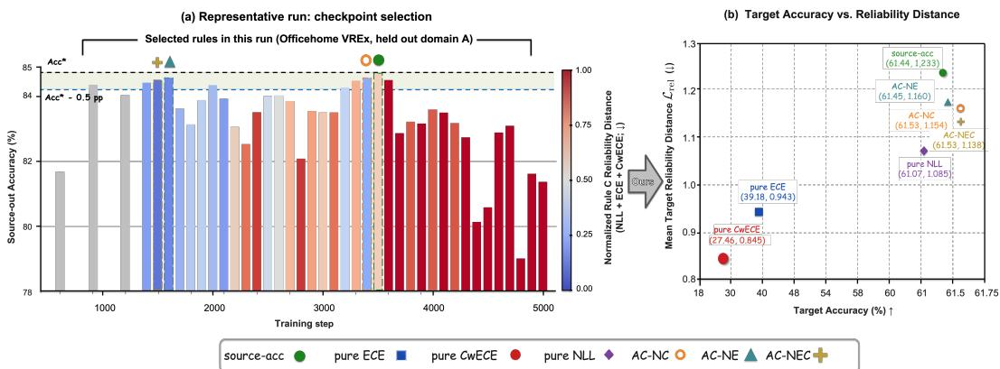
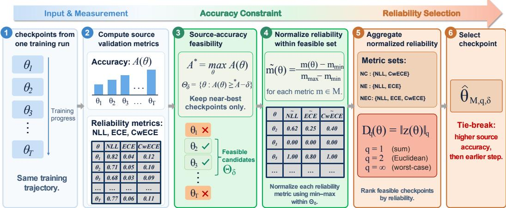
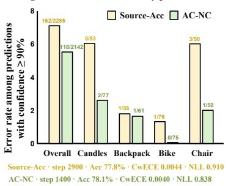
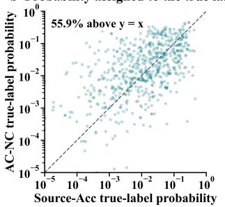
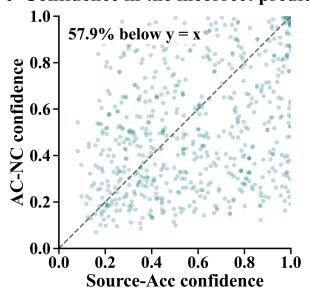
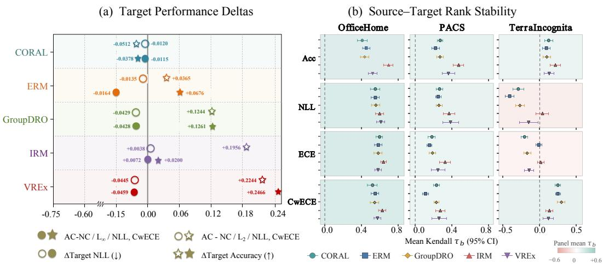
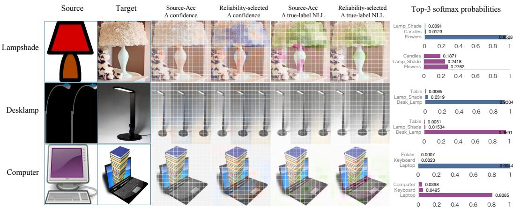

# RELIABILITY-AWARE CHECKPOINT SELECTION FOR DOMAIN GENERALIZATION

Jinshi Liu1,∗ Jiahao Li2,∗ Pan Liu3,† Yanfeng Li4 Rui Qian5 Zhao Tong6 Yue Sun4 Tao Tan4

1Shenzhen University 2Xiamen University

3The Hong Kong University of Science and Technology (Guangzhou)

4Macao Polytechnic University 5Fudan University

6Institute of Information Engineering, Chinese Academy of Sciences

∗Equal contribution. †Corresponding author.

Project: https://github.com/Jjjjjjh666/Reliability-Aware-DG

## ABSTRACT

Checkpoint selection in domain generalization often relies on source-validation accuracy, yet the selected checkpoint need not provide reliable probabilities on unseen target domains. Source–target distribution shifts can alter accuracy rankings, while accuracy alone does not measure predictive probability quality. We identify an empirical selection opportunity within fixed training trajectories: reselecting among checkpoints with near-optimal source accuracy can improve mean target probability quality with small observed changes in mean target accuracy. We study accuracy-constrained reliability selection (AC), which retains checkpoints within a tolerance of the best source-validation accuracy and ranks them by source reliability. Our reference rule aggregates within-set normalized negative log-likelihood (NLL) and class-wise calibration error (CwECE) using $D _ { \infty }$ . AC uses no target data and requires neither additional training nor weight averaging. We evaluate five domain generalization training algorithms on three benchmarks, using PACS to develop the objectives and a 0.5-percentage-point tolerance. In exploratory aggregation comparisons on 360 OfficeHome and TerraIncognita runs, the reference rule reduces mean target soft-bin squared-gap ECE and CwECE by 0.240% and 0.182%, respectively, and NLL by 0.030 relative to Source-Acc. Mean target accuracy changes by +0.213 percentage points. These results identify opportunities for reliability-aware reselection, while the additional benefit of joint over single-objective ranking remains unresolved.

## 1 INTRODUCTION

Domain generalization (DG) trains on multiple source domains for deployment on an unseen target domain. Even within a fixed training run, deployment requires choosing a checkpoint without targetdomain validation data. Under the DomainBed training-domain validation protocol, Source-Acc selects the checkpoint with the highest mean source-validation accuracy (Gulrajani & Lopez-Paz, 2021). We ask whether the same held-out source data can also distinguish checkpoints by predictive reliability.

Accuracy alone ignores probability quality: checkpoints can make identical class predictions while assigning different probabilities. We measure reliability using NLL and calibration errors (ECE and CwECE), motivated by known calibration and uncertainty degradation under distribution shift (Guo et al., 2017; Ovadia et al., 2019). Reliability-only selection is unsafe: minimizing source ECE or CwECE can select low-accuracy early checkpoints, while unconstrained NLL provides no explicit accuracy budget. Yet near-best-accuracy checkpoints can still differ substantially in reliability (Figure 1). Following accuracy-filtered calibration selection(Wald et al., 2021), we study reliability based ranking among near-best-accuracy checkpoints within a fixed training trajectory.

  
Figure 1: Checkpoint selection and the accuracy–reliability trade-off. (a) A representative Office-Home/VREx trajectory, with the source-accuracy tolerance marked and checkpoints colored by source reliability. (b) Mean target accuracy versus a diagnostic target reliability distance across the pooled 540 trajectories, including PACS development, with the high-accuracy region magnified. Objective-set abbreviations are defined in Section 3.2. The plotted target distance is not AC’s source-side selection score. Panel (b) is descriptive; target metrics are used only for evaluation.

We instantiate this principle as accuracy-constrained reliability selection (AC). AC retains checkpoints within δ percentage points of the best source-validation accuracy; AC-NC is our reference rule using normalized NLL and CwECE with $D _ { \infty }$ . It returns a saved checkpoint without target data, additional training, or weight averaging. The tolerance controls empirical source accuracy, not target accuracy.

We developed the NC objective set and δ = 0.5 on PACS source validation data without inspecting target outcomes, then evaluated them on 360 OfficeHome and TerraIncognita runs spanning five DG algorithms. On these post-development runs, AC-NC reduces mean target ECE, CwECE, and NLL relative to Source-Acc; the mean target-accuracy change is +0.21 percentage points. The $D _ { \infty }$ aggregation was not fixed before these evaluations, so aggregation comparisons remain exploratory.

Our contributions are threefold:

• We characterize reliability variation among checkpoints with near-optimal sourcevalidation accuracy within fixed training trajectories. Differences in their target-domain probability quality reveal a reliability-selection opportunity not explicitly exploited by Source-Acc.

• We propose accuracy-constrained reliability selection (AC), separating source-accuracy eligibility from reliability ranking. AC retains checkpoints within a prescribed tolerance of the best source-validation accuracy and ranks them by aggregating source reliability metrics normalized within the feasible set. It returns an existing checkpoint without target data, additional training, or weight averaging.

• We conduct paired evaluations across three DG benchmarks and five training algorithms, with selection-rule, objective-set, aggregation, and accuracy-tolerance ablations. Post-development OfficeHome and TerraIncognita results show lower mean target ECE, CwECE, and NLL than Source-Acc, with small observed changes in mean target accuracy. Prediction-level case studies illustrate lower error rates above a fixed confidence threshold and, on subsets of shared errors, lower incorrect-prediction confidence and higher true-label probabilities.

## 2 RELATED WORK

Model selection in domain generalization. DomainBed treats model selection as part of a complete DG algorithm and distinguishes training-domain from leave-one-domain-out validation (Gulrajani & Lopez-Paz, 2021). Lyu et al. (2023) filter candidates by validation loss and combine classification risk with feature-space domain discrepancy. Mixup-guided DG selection constructs a shifted validation set (Lu et al., 2023), while PAIR-s uses preference-aware ERM/OOD objec tive scoring and validation-accuracy filtering across runs (Chen et al., 2023). Wald et al. (2021, Section 5.1) propose a directly related rule: select the model with lowest mean source-domain ECE subject to an in-domain validation-accuracy threshold. Their experimental procedure additionally recalibrates candidates before selection (Section C.2 of their supplement). AC applies the accuracy-filtered selection principle directly to saved checkpoints within a fixed trajectory, without fitting a post-hoc calibrator. It expresses the threshold relative to the trajectory’s best source accuracy; the reference rule ranks eligible checkpoints by an aggregate of NLL and CwECE, each min–max normalized within the feasible set. The selector uses source-validation predictive metrics, not algorithm-specific training-objective values or feature-space discrepancy estimates. Our contribution is the fixed-trajectory analysis and evaluation of reliability-aware selection, rather than the accuracy-filtered selection principle itself.

Using training trajectories. SWAD averages weights densely over an overfit-aware interval of a training trajectory (Cha et al., 2021). Ensemble of Averages (EoA) ensembles moving-average models from independent runs (Arpit et al., 2022). AC instead selects one saved checkpoint, without weight averaging or prediction ensembling. Weight averaging also yields a single model for inference; AC’s distinction is returning an existing checkpoint rather than constructing new weights. Our checkpoint-SWAD baseline is a sparse-checkpoint approximation of SWAD, with its implementation and BatchNorm handling described in Appendix D.1.

Calibration under distribution shift. Wald et al. (2021) relate multi-domain calibration to invariant prediction under explicit assumptions. For a fixed classifier, scalar temperature scaling adjusts probabilities without changing class predictions (Guo et al., 2017), but calibration can deteriorate under distribution shift (Ovadia et al., 2019). Gong et al. (2021) develop temperature-scaling methods using multiple source calibration domains, without access to target-domain data at calibration time. AC instead chooses which saved classifier to deploy, without fitting a calibrator. This choice may change both probabilities and class predictions; its target-domain effects are evaluated empirically.

## 3 METHOD

We study source-only checkpoint selection within a fixed training trajectory. Source accuracy determines which checkpoints are eligible, and source reliability ranks the eligible checkpoints. We first define the setting and a fundamental limitation of source-only selection, then introduce accuracyconstrained reliability selection (AC), and finally give a finite-sample source-accuracy guarantee. Figure 2 summarizes the selection pipeline.

## 3.1 PROBLEM SETUP AND SOURCE-ONLY LIMITATION

Let

$$
\Theta = \{ \theta _ { t } : t \in \mathcal { T } \}\tag{1}
$$

be the finite, nonempty set of checkpoints saved during one DG training run, with $T = | \mathcal { T } |$ . Source domain $e \in \{ 1 , \ldots , E \}$ has distribution $P _ { e }$ and held-out validation set $S _ { e }$ of size $n _ { e } \geq 1$ . Let $f _ { \theta }$ denote a checkpoint’s deterministic class prediction. We use equal-domain source accuracy on the [0, 100] scale:

$$
\begin{array} { r l } & { { \cal A } _ { \mathrm { s r c } } ( \theta ) = \displaystyle \frac { 1 0 0 } { E } \sum _ { e = 1 } ^ { E } \operatorname* { P r } _ { e } ( f _ { \theta } ( X ) = Y ) , } \\ & { \widehat { \cal A } _ { \mathrm { s r c } } ( \theta ) = \displaystyle \frac { 1 0 0 } { E } \sum _ { e = 1 } ^ { E } \frac { 1 } { n _ { e } } \sum _ { ( x , y ) \in S _ { e } } { \bf 1 } \{ f _ { \theta } ( x ) = y \} . } \end{array}\tag{2}
$$

Source-Acc selects the earliest checkpoint maximizing $\widehat { A } _ { \mathrm { s r c } } ;$ denote it by $\theta _ { \mathrm { S A } }$ . A source-only selector may use the saved trajectory and source-validation statistics, but not target-domain observations.

  
Figure 2: Overview of the checkpoint selection process. The figure illustrates how checkpoints are evaluated based on source accuracy and reliability, and how the accuracy-constrained selection criterion is applied.

Proposition 1 (accuracy impossibility with unrestricted targets). Fix the source observations and a finite trajectory containing $\theta _ { a } , \theta _ { b }$ such that $f _ { \theta _ { a } } ( x ) \neq f _ { \theta _ { b } } ( x )$ for some input x. If target distributions are unrestricted, no source-only selector selects a target-accuracy maximizer with probability one for every target domain. For a randomized selector, the probability is over its internal randomization.

The proof constructs two target point masses with disjoint sets of accuracy-maximizing checkpoints; see Appendix F.1. The result applies to Source-Acc and AC alike. It rules out a universal targetaccuracy guarantee without additional assumptions, but does not preclude useful source-side selection under structured domain shifts.

## 3.2 ACCURACY-CONSTRAINED RELIABILITY SELECTION

AC separates source-accuracy eligibility from reliability ranking. A configuration specifies an accuracy tolerance $\delta \ \geq \ 0 ,$ , a nonempty reliability objective set $\mathcal { M } ,$ and an aggregation parameter $q \in \{ 1 , 2 , \infty \}$

Accuracy eligibility. Define the empirical feasible set

$$
\Theta _ { \delta } = \left\{ \theta \in \Theta : { \widehat { A } } _ { \mathrm { s r c } } ( \theta ) \geq { \widehat { A } } _ { \mathrm { s r c } } ( \theta _ { \mathrm { S A } } ) - \delta \right\} .\tag{3}
$$

Because $\theta _ { \mathrm { S A } } \in \Theta _ { \delta }$ , every AC selection $\widehat { \theta } _ { \mathrm { A C } } \in \Theta _ { \delta }$ satisfies

$$
\begin{array} { r } { 0 \leq \widehat { A } _ { \mathrm { s r c } } ( \theta _ { \mathrm { S A } } ) - \widehat { A } _ { \mathrm { s r c } } ( \widehat { \theta } _ { \mathrm { A C } } ) \leq \delta . } \end{array}\tag{4}
$$

Thus δ directly bounds the empirical source-accuracy deficit.

Reliability objectives. For reliability error m, let $m _ { S _ { e } } ( \theta )$ denote its value on source validation domain e, and average domains equally:

$$
\widehat { m } _ { \mathrm { s r c } } ( \theta ) = \frac { 1 } { E } \sum _ { e = 1 } ^ { E } m _ { S _ { e } } ( \theta ) .\tag{5}
$$

Our reference objective set is

$$
\begin{array} { r } { \mathcal { M } _ { \mathrm { N C } } = \{ \mathrm { N L L } , \mathrm { C w E C E } \} . } \end{array}\tag{6}
$$

AC-ECE, AC-NLL, and AC-CwECE use singleton objective sets within the same accuracy-feasible set. AC-NC uses $\mathcal { M } _ { \mathrm { N C } } ~ { = } ~ \{ \mathrm { N L L , C w E C E } \}$ as a joint reference configuration. NLL measures probability fit as a proper scoring rule (Gneiting & Raftery, 2007), while CwECE measures classwise calibration. The main experiments use Gaussian soft-bin squared-gap variants of top-label ECE and class-wise ECE (Guo et al., 2017; Kull et al., 2019); their exact estimators and numerical conventions are given in Appendix B.1. We additionally consider $\mathcal { M } _ { \mathrm { N E } } = \{ \mathrm { N L L } , \mathrm { E C E } \}$ and $\mathcal { M } _ { \mathrm { N E C } } = \{ \mathrm { N L L } , \mathrm { E \bar { C } E } , \mathrm { C w E \bar { C } \dot { E } } \}$ as objective-set ablations.

Algorithm 1 AC checkpoint selection   
Require: Saved trajectory Θ; per-domain source-validation accuracy and reliability metrics; toler  
ance $\delta \geq 0 \left( \mathrm { p p } \right)$ ; objective set $\mathcal { M } ; q \in \{ 1 , 2 , \infty \}$ ; offset $\eta = 1 0 ^ { - 1 2 }$   
1: Average validation metrics equally across source domains to obtain $\widehat { A } _ { \mathrm { s r c } }$ and $\widehat { m } _ { \mathrm { s r c } } , m \in { \mathcal { M } }$   
2: Compute $A _ { \mathrm { m a x } } = \operatorname* { m a x } _ { \theta \in \Theta } \widehat { A } _ { \mathrm { s r c } } ( \theta )$ and $\Theta _ { \delta } = \{ \theta : { \widehat { A } } _ { \mathrm { s r c } } ( \theta ) \geq A _ { \mathrm { m a x } } - \delta \}$   
3: for each m $\in \mathcal { M }$ do   
4: Compute $a _ { m } , b _ { m }$ over $\Theta _ { \delta }$ and normalize $\widehat { m } _ { \mathrm { s r c } }$ to $\widetilde { m } ;$ use zero for a constant objective.   
5: end for   
6: Compute $D _ { q } ( \theta )$ from Eq. (10) for $\theta \in \Theta _ { \delta } .$   
7: Minimize $( D _ { q } ( \theta _ { t } ) , - \widehat { A } _ { \mathrm { s r c } } ( \theta _ { t } ) , t )$ lexicographically over $\Theta _ { \delta } .$   
8: return $\widehat { \theta } _ { \mathrm { A C } } .$

Within-set normalization. Reliability metrics have different scales, so AC normalizes each objective within the same feasible set. For m $\in { \mathcal { M } } ,$ define

$$
a _ { m } = \operatorname* { m i n } _ { \theta \in \Theta _ { \delta } } \widehat { m } _ { \mathrm { s r c } } ( \theta ) , \qquad b _ { m } = \operatorname* { m a x } _ { \theta \in \Theta _ { \delta } } \widehat { m } _ { \mathrm { s r c } } ( \theta ) ,\tag{7}
$$

and, with $\eta = 1 0 ^ { - 1 2 }$

$$
\widetilde { m } ( \theta ) = \left\{ \begin{array} { l l } { 0 , } & { b _ { m } = a _ { m } , } \\ { \displaystyle \widehat { \frac { m } { b _ { \mathrm { s r c } } } } ( \theta ) - a _ { m } } & { b _ { m } > a _ { m } . } \end{array} \right.\tag{8}
$$

Thus each nonconstant objective is mapped approximately to $[ 0 , 1 ]$ over $\Theta _ { \delta }$ . Numerical edge cases associated with this normalization are discussed in Appendix B.4.

Aggregation and selection. Let

$$
\widetilde { \mathbf { L } } ^ { \mathcal { M } } ( \theta ) = [ \widetilde { m } ( \theta ) ] _ { m \in \mathcal { M } } .\tag{9}
$$

We aggregate normalized reliability errors by

$$
D _ { q } ( \theta ) = \left\| \widetilde { \mathbf { L } } ^ { M } ( \theta ) \right\| _ { q } = \left\{ \begin{array} { l l } { \left( \sum _ { m \in \mathcal { M } } \widetilde { m } ( \theta ) ^ { q } \right) ^ { 1 / q } , } & { 1 \le q < \infty , } \\ { \displaystyle \operatorname* { m a x } _ { m \in \mathcal { M } } \widetilde { m } ( \theta ) , } & { q = \infty . } \end{array} \right.\tag{10}
$$

$D _ { \infty }$ minimizes the largest normalized reliability error; $D _ { 1 }$ and $D _ { 2 }$ give alternative aggregation rules. $\mathbf { A C }$ minimizes $D _ { q }$ within $\Theta _ { \delta }$ , breaking ties by higher source accuracy and then the earlier training step:

$$
\widehat { \theta } _ { \mathrm { A C } } = \underset { \theta _ { t } \in \Theta _ { \delta } } { \arg \operatorname* { m i n } } \left( D _ { q } ( \theta _ { t } ) , - \widehat { A } _ { \mathrm { s r c } } ( \theta _ { t } ) , t \right) .\tag{11}
$$

No target-domain quantity enters this selection rule. Since $\theta _ { \mathrm { S A } } ~ \in ~ \Theta _ { \delta }$ , AC cannot have a larger feasible-set aggregate score than Source-Acc, but this does not imply improvement in every constituent reliability metric or on the target domain.

## 3.3 FINITE-SAMPLE SOURCE-ACCURACY CONTROL

The tolerance in Eq. (3) directly controls empirical source accuracy. Under standard sampling and validation-independence conditions, Hoeffding’s inequality (Hoeffding, 1963) also yields a population source-accuracy bound.

Proposition 2 (finite-sample source-accuracy bound). Condition on a trajectory Θ generated independently of the source validation sets. Suppose $S _ { e }$ contains $n _ { e }$ i.i.d. samples from $P _ { e }$ , independently across domains. For $\alpha \in ( 0 , 1 )$ , define

$$
r _ { \alpha } = 1 0 0 \sqrt { \frac { \log ( 2 T / \alpha ) } { 2 E ^ { 2 } } \sum _ { e = 1 } ^ { E } \frac { 1 } { n _ { e } } } .\tag{12}
$$

With probability at least $1 - \alpha$ , every $\theta \in \Theta _ { \delta }$ satisfies

$$
A _ { \operatorname { s r c } } ( \theta ) \geq \operatorname* { m a x } _ { \theta ^ { \prime } \in \Theta } A _ { \operatorname { s r c } } ( \theta ^ { \prime } ) - \delta - 2 r _ { \alpha } .\tag{13}
$$

The event is uniform over the fixed candidate set, so the same validation samples may subsequently be reused for reliability-based ranking. The guarantee requires candidate generation to be independent of these validation sets; validation feedback that changes the candidate trajectory is not covered. It controls population source accuracy only, not reliability or target-domain performance. The proof is given in Appendix F.3.

More generally, source reliability ordering need not transfer to an unseen target domain. Appendix F.2 gives a conditional population-level ordering result under a monotone source–target relation with bounded checkpoint-dependent residual variation; the required target-dependent quantities are unobserved and are not inputs to AC.

## 4 EXPERIMENTS

## 4.1 EXPERIMENTAL SETUP

We evaluate CORAL (Sun & Saenko, 2016), ERM, GroupDRO (Sagawa et al., 2020), IRM (Arjovsky et al., 2019), and VREx (Krueger et al., 2021) on PACS, OfficeHome, and TerraIncognita using DomainBed source validation (Gulrajani & Lopez-Paz, 2021; Li et al., 2017; Venkateswara et al., 2017; Beery et al., 2018). Four held-out domains, three hyperparameter seeds, and three trial seeds give $3 \times 5 \times 4 \times 3 \times 3 = 5 4 0$ runs, each with 51 checkpoints at steps $0 , 1 0 0 , \ldots , 5 0 0 0$ Selectors share each fixed trajectory; outcomes are averaged equally across runs. Target evaluation uses the held-out domain’s in split (training details: Appendix G.4).

PACS source validation was used to develop NC and δ = 0.5, which were then fixed for the 360 Of ficeHome/TerraIncognita runs. The aggregation rule was not fixed before these evaluations: distance comparisons remain exploratory, and pooled results including PACS development are descriptive.

We report Gaussian soft-bin squared-gap ECE and CwECE (Appendix B.1). Accuracy and calibration are scaled by 100; NLL is unscaled. Paired changes are AC minus Source-Acc, so positive accuracy and negative error changes favor AC. The 95% percentile intervals use 10,000 paired run-level bootstrap resamples (Efron, 1979), conditional on the observed trajectories; shared-seed dependence is not modeled hierarchically (Appendix G.1). An accuracy interval containing zero does not establish equivalence.

## 4.2 MAIN RESULTS AND HETEROGENEITY

On the 360 post-development runs, $\mathbf { A C - N C } / D _ { \infty }$ lowers mean target ECE, CwECE, and NLL; all three paired intervals are below zero (Table 1). The mean accuracy change is +0.2133 pp, but its interval spans losses and gains. Thus these results support improved mean probability quality, not target-accuracy preservation.

Gains are heterogeneous: mean CwECE and NLL both decrease for all five algorithms on Office-Home, three on TerraIncognita, and two on PACS (Appendix Table C.1). Across the pooled 540 runs, 118 selections lose target accuracy, including 76 (14.1%) that lose at least one pp; the fifth percentile is −3.0 pp (Appendix C.1). Pooled objective-set contrasts are in Appendix Table E.3. Figure 4 shows mostly lower target NLL across algorithm–selector combinations, with variable accuracy changes and source–target rank agreement.

## 4.3 PREDICTION-LEVEL DIAGNOSTICS

Figure 3(a) shows a post-hoc case in which the error rate above 90% confidence falls from 7.09% to 5.51%, but coverage also falls; this is not an equal-coverage comparison. In panels (b,c), among 642 shared errors, AC-NC increases true-label probability in 55.9% and reduces incorrect prediction confidence in 57.9%. These cases illustrate probability shifts rather than establish general prediction-level improvement (additional images: Appendix A).

Table 1: Target results for AC-NC $( D _ { \infty } , \delta = 0 . 5 )$ . Top: dataset means, 180 runs each; Gap is the source-accuracy deficit (pp). Bottom: AC-NC minus Source-Acc on the 360 post-development runs, with 95% paired intervals. Accuracy differences are in pp, calibration is scaled by 100, and NLL is unscaled. PACS is development; distance choice is exploratory.
<table><tr><td>Dataset</td><td>Selector</td><td>Gap</td><td>Acc. ↑</td><td>ECE↓</td><td>CwECE↓</td><td>NLL↓</td></tr><tr><td rowspan="2">OfficeHome</td><td>Source-Acc</td><td>0.0000</td><td>60.87</td><td>2.77</td><td>3.32</td><td>4.2724</td></tr><tr><td>AC-NC</td><td>0.1612</td><td>61.06</td><td>2.48</td><td>3.05</td><td>4.2362</td></tr><tr><td rowspan="2">TerraInc.</td><td>Source-Acc</td><td>0.0000</td><td>42.74</td><td>9.10</td><td>11.35</td><td>2.3438</td></tr><tr><td>AC-NC</td><td>0.1091</td><td>42.97</td><td>8.90</td><td>11.25</td><td>2.3210</td></tr><tr><td rowspan="2">PACS (dev.)</td><td>Source-Acc</td><td>0.0000</td><td>80.73</td><td>1.63</td><td>2.75</td><td>0.7794</td></tr><tr><td>AC-NC</td><td>0.1647</td><td>80.55</td><td>1.59</td><td>2.75</td><td>0.7728</td></tr><tr><td>360 runs</td><td>∆ Acc.</td><td></td><td>ΔECE</td><td>Δ CwECE</td><td></td><td>∆NLL</td></tr><tr><td>Mean</td><td>+0.2133</td><td></td><td>-0.2395</td><td>-0.1821</td><td></td><td>-0.0295</td></tr><tr><td rowspan="2">95% CI</td><td> $[ - 0 . 0 5 9 2 , + 0 . 5 0 1 7 ]$ </td><td> $\left[ - 0 . 4 0 3 8 , - 0 . 0 9 0 3 \right]$ </td><td></td><td></td><td></td><td></td></tr><tr><td></td><td></td><td></td><td> $[ - 0 . 2 8 4 1 , - 0 . 0 8 0 3 ]$ </td><td></td><td>[-0.0483, -0.0119]</td></tr></table>

a High-confidence error rate by predicted class  

b Probability assigned to the true label  

c Confidence in the incorrect prediction  
  
Figure 3: Post-hoc target diagnostics. (a) Errors among predictions with confidence $\geq 9 0 \%$ ; labels show errors/high-confidence predictions. (b,c) OfficeHome Art/ERM: true-label probability and incorrect-prediction confidence on 642 shared errors; dashed lines indicate equality. Samples use the aligned target in split; CwECE in (a) is unscaled.

## 4.4 WHAT DRIVES CHECKPOINT RESELECTION?

Accuracy filtering. On OfficeHome, unconstrained ECE/CwECE selection chooses step 0 in 94.4%/95.6% of runs, with target accuracy of 2.55%/1.91%. Pure NLL avoids this collapse but has no explicit accuracy budget (Appendix Table E.11). $\mathrm { A t ~ } \delta = 0 . 5 ,$ , 391/540 runs have multiple eligible checkpoints, and AC-NC differs from Source-Acc in 264 of these (67.5%). Reliability still varies within the feasible sets (Appendix Table E.12).

Joint versus single-objective ranking. AC-ECE, AC-NLL, and AC-CwECE change only the ranking objective. Table 2 reports pooled paired comparisons with AC-NLL and AC-CwECE: all target-metric intervals include zero, establishing neither superiority nor equivalence of the joint rule. Table 3 retains the PACS-only comparison, including AC-ECE and three feasible-set controls. AC-early uses the earliest eligible checkpoint; AC-random uses one uniform draw per run (seed 20260926); AC-mean reports the expected metric under uniform checkpoint sampling, not weight averaging or $D _ { 1 }$ score aggregation. Although AC-NC has the best means among the four reliability-ranking rules on PACS, these are development results, not evidence of post-development superiority.

Table 2: Joint versus single-objective ranking on 540 paired runs, including PACS development (descriptive). Entries are AC-NC minus the comparator, with 95% paired intervals. All selectors use the same $\Theta _ { 0 . 5 } .$ Accuracy differences are in pp; calibration is scaled by 100. Full precision and secondary outcomes: Appendix Table E.7.
<table><tr><td>Comparator</td><td>∆ Acc.</td><td>Δ ECE</td><td>Δ CwECE</td><td>∆NLL</td></tr><tr><td>AC-NLL</td><td>+0.0223</td><td>-0.0240</td><td>-0.0424</td><td>-0.0003</td></tr><tr><td>AC-CwECE</td><td>[-0.1061, +0.1458]</td><td>[-0.0900, +0.0460]</td><td>[-0.0948, +0.0097]</td><td>[-0.0084, +0.0083]</td></tr><tr><td></td><td>-0.0423</td><td>+0.0092</td><td>+0.0084</td><td>+0.0013</td></tr><tr><td></td><td>[-0.1853, +0.1029]</td><td>[-0.0942, +0.1303]</td><td> $[ - 0 . 0 5 9 0 , + 0 . 0 7 5 3 ]$ </td><td> $\left[ - 0 . 0 1 1 8 , + 0 . 0 1 6 4 \right]$ </td></tr><tr><td></td><td></td><td></td><td></td><td></td></tr></table>

Table 3: Ranking objectives and feasible-set controls on PACS development only (180 runs, $\delta =$ 0.5). Gap is the source-accuracy deficit (pp); accuracy and calibration are scaled by 100. These descriptive means do not establish superiority of joint ranking.
<table><tr><td>Selector</td><td>Gap</td><td>Acc. ↑</td><td>ECE↓</td><td>CwECE↓</td><td>NLL↓</td></tr><tr><td>Source-Acc</td><td>0.0000</td><td>80.7253</td><td>1.6265</td><td>2.7526</td><td>0.7794</td></tr><tr><td>AC-ECE</td><td>0.2167</td><td>80.2406</td><td>1.5928</td><td>2.8638</td><td>0.7835</td></tr><tr><td>AC-NLL</td><td>0.1689</td><td>80.3712</td><td>1.6402</td><td>2.8355</td><td>0.7787</td></tr><tr><td>AC-CwECE</td><td>0.1660</td><td>80.5422</td><td>1.6172</td><td>2.8025</td><td>0.7801</td></tr><tr><td>AC-NC</td><td>0.1647</td><td>80.5523</td><td>1.5924</td><td>2.7501</td><td>0.7728</td></tr><tr><td>AC-mean</td><td>0.1933</td><td>80.3927</td><td>1.6477</td><td>2.8624</td><td>0.8020</td></tr><tr><td>AC-early</td><td>0.2220</td><td>79.9796</td><td>1.5933</td><td>2.8752</td><td>0.8025</td></tr><tr><td>AC-random</td><td>0.1781</td><td>80.3966</td><td>1.6895</td><td>2.8563</td><td>0.8078</td></tr></table>

  
Figure 4: Cross-algorithm and cross-dataset evaluation of accuracy-constrained reliability selection. (a) Mean paired changes in target accuracy (stars, percentage points) and NLL (circles, original scale) relative to Source-Acc for five DG training algorithms, pooled over OfficeHome, PACS, and TerraIncognita. Open markers denote $\mathbf { A C - N C / \bar { D } _ { 2 } }$ and filled markers denote $\begin{array} { r } { \mathsf { A C - N E C } / D _ { \infty } . } \end{array}$ (b) Mean source–target Kendall $\tau _ { b }$ of checkpoint rankings for accuracy, NLL, ECE, and CwECE across the same algorithms and datasets; bars show 95% confidence intervals and shading shows the panel mean. Target NLL decreases for most algorithm–selector combinations, although the effects and rank agreement vary across datasets.

Aggregation and objective sets. With NC fixed, $D _ { 1 } , D _ { 2 } ,$ and $D _ { \infty }$ give similar aggregate outcomes; $D _ { 1 }$ and $D _ { \infty }$ disagree in only 19/540 selections. At fixed $D _ { \infty }$ , NEC’s larger pooled NLL reduction is sensitive to one OfficeHome/IRM run. These comparisons establish neither a preferred distance nor a benefit from adding ECE to NC (Appendices E.1 and E.2).

## 4.5 TOLERANCE AND ADDITIONAL COMPARISONS

Tolerance sensitivity. Increasing δ expands the candidate set and changes its normalization. At δ = 1.0, pooled reliability errors are lower than at δ = 0.5 (Table 4); however, paired accuracy intervals for both alternative tolerances include zero, as does the NLL interval for δ = 1.0. Datasetlevel patterns identify no uniformly preferable value (Appendix E.4).

Table 4: Tolerance sensitivity on 540 pooled runs (including PACS development). Candidates is the mean feasible-set size; Gap is the mean source-accuracy deficit (pp). Accuracy and calibration are scaled by 100.
<table><tr><td>Selector</td><td>Candidates</td><td>Gap</td><td>Acc. ↑</td><td>ECE↓</td><td>CwECE↓</td><td>NLL↓</td></tr><tr><td>Source-Acc</td><td></td><td>0.0000</td><td>61.44</td><td>4.50</td><td>5.81</td><td>2.4652</td></tr><tr><td>AC-NC (δ = 0.1)</td><td>1.30</td><td>0.0063</td><td>61.46</td><td>4.46</td><td>5.78</td><td>2.4610</td></tr><tr><td>AC-NC (δ = 0.5)</td><td>3.92</td><td>0.1450</td><td>61.53</td><td>4.33</td><td>5.69</td><td>2.4433</td></tr><tr><td>AC-NC (δ = 1.0)</td><td>9.71</td><td>0.3516</td><td>61.51</td><td>4.19</td><td>5.62</td><td>2.1109</td></tr></table>

Averaging and validation protocol. In an independent 180-run OfficeHome rerun, checkpoint SWAD (a sparse approximation) with BatchNorm recalibration exceeds AC-NC in mean accuracy (62.62% versus 60.97%) and lowers all three reliability errors (Appendix D.1). In the separate ERM/VREx LODO study, LODO-Acc has lower NLL and ECE than ordinary AC. Within LODO, reliability ranking reduces fixed-hyperparameter ECE by 0.562 (95% CI for AC-LODO minus LODO-Acc: [−1.160, −0.099]), without a resolved accuracy difference. LODO uses distinct hard-bin calibration metrics and additional training; these cohorts are not pooled with Table 1 (Appendix D.2).

Temperature scaling (TS). A separate study fits one scalar temperature by minimizing NLL on pooled source out samples after checkpoint selection; targets are used only for evaluation. TS leaves accuracy unchanged. After TS, the selectors have similar ECE, while AC-NC has slightly higher CwECE and NLL; ECE improves in only 5/10 dataset–algorithm cells for either selector. Thus the operations can be combined, but gains are not consistently additive (Table 5).

Table 5: Separate source-fitted TS study on OfficeHome/TerraIncognita. Entries equally average 10 dataset–algorithm cells (36 matched runs each); arrows show raw → TS values. Calibration is scaled by 100.
<table><tr><td>Selector</td><td>Acc. (%) ↑</td><td>ECE↓</td><td>CwECE↓</td><td>NLL↓</td></tr><tr><td>Source-Acc</td><td>51.94</td><td>5.578 → 5.003</td><td>7.247 → 6.468</td><td>2.183 → 1.950</td></tr><tr><td>AC-NC</td><td>51.99</td><td> $5 . 4 8 1  4 . 9 9 3$ </td><td>7.155 → 6.497</td><td>2.190 → 1.969</td></tr></table>

## 5 CONCLUSION

In the evaluated DG trajectories, checkpoints with similar source-validation accuracy can differ in probability quality. Reliability-aware reselection improves mean target probability quality relative to Source-Acc on the original post-development cohort. AC provides a concrete selection protocol, but the current evidence does not establish superiority of its joint NLL–CwECE reference over accuracy-constrained single-objective ranking.

## AI USE STATEMENT

AI tools were used solely to assist with writing and language polishing, including improving clarity and readability, and to support literature retrieval and the discovery of relevant prior work. The authors take full responsibility for the content of this paper, including the accuracy of its claims, results, and references.

## REFERENCES

Martin Arjovsky, Leon Bottou, Ishaan Gulrajani, and David Lopez-Paz. Invariant risk minimization.´ arXiv preprint arXiv:1907.02893, 2019. URL https://arxiv.org/abs/1907.02893.

Devansh Arpit, Huan Wang, Yingbo Zhou, and Caiming Xiong. Ensemble of averages: Improving model selection and boosting performance in domain generalization. In Advances in Neural Information Processing Systems, volume 35, 2022. URL https://proceedings.neurips.cc/paper\_files/paper/2022/hash/ 372cb7805eaccb2b7eed641271a30eec-Abstract-Conference.html.

Sara Beery, Grant Van Horn, and Pietro Perona. Recognition in terra incognita. In Proceedings of the European Conference on Computer Vision, pp. 456–473, 2018. URL https://openaccess.thecvf.com/content\_ECCV\_2018/html/Beery\_ Recognition\_in\_Terra\_ECCV\_2018\_paper.html.

Junbum Cha, Sanghyuk Chun, Kyungjae Lee, Han-Cheol Cho, Seunghyun Park, Yunsung Lee, and Sungrae Park. SWAD: Domain generalization by seeking flat minima. In Advances in Neural Information Processing Systems, volume 34, 2021. URL https://proceedings.neurips. cc/paper/2021/hash/bcb41ccdc4363c6848a1d760f26c28a0-Abstract. html.

Yongqiang Chen, Kaiwen Zhou, Yatao Bian, Binghui Xie, Bingzhe Wu, Yonggang Zhang, Han Yang, Kaili Ma, Peilin Zhao, Bo Han, and James Cheng. Pareto invariant risk minimization: Towards mitigating the optimization dilemma in out-of-distribution generalization. In International Conference on Learning Representations, 2023. URL https://openreview.net/ forum?id=esFxSb\_0pSL.

Bradley Efron. Bootstrap methods: Another look at the jackknife. The Annals of Statistics, 7(1): 1–26, 1979. doi: 10.1214/aos/1176344552.

Tilmann Gneiting and Adrian E. Raftery. Strictly proper scoring rules, prediction, and estimation. Journal of the American Statistical Association, 102(477):359–378, 2007. doi: 10.1198/ 016214506000001437.

Yunye Gong, Xiao Lin, Yi Yao, Thomas G. Dietterich, Ajay Divakaran, and Melinda Gervasio. Confidence calibration for domain generalization under covariate shift. In Proceedings of the IEEE/CVF International Conference on Computer Vision, pp. 8958–8967, 2021. URL https://openaccess.thecvf.com/content/ICCV2021/html/ Gong\_Confidence\_Calibration\_for\_Domain\_Generalization\_Under\_ Covariate\_Shift\_ICCV\_2021\_paper.html.

Ishaan Gulrajani and David Lopez-Paz. In search of lost domain generalization. In International Conference on Learning Representations, 2021. URL https://openreview.net/forum? id=lQdXeXDoWtI.

Chuan Guo, Geoff Pleiss, Yu Sun, and Kilian Q. Weinberger. On calibration of modern neural networks. In Proceedings of the 34th International Conference on Machine Learning, volume 70 of Proceedings of Machine Learning Research, pp. 1321–1330, 2017. URL https: //proceedings.mlr.press/v70/guo17a.html.

Wassily Hoeffding. Probability inequalities for sums of bounded random variables. Journal of the American Statistical Association, 58(301):13–30, 1963. doi: 10.1080/01621459.1963.10500830.

David Krueger, Ethan Caballero, Joern-Henrik Jacobsen, Amy Zhang, Jonathan Binas, Dinghuai Zhang, Remi Le Priol, and Aaron Courville. Out-of-distribution generalization via risk extrapolation (REx). In Proceedings of the 38th International Conference on Machine Learning, volume 139 of Proceedings of Machine Learning Research, pp. 5815–5826. PMLR, 2021. URL https://proceedings.mlr.press/v139/krueger21a.html.

Meelis Kull, Miquel Perello Nieto, Markus Kangsepp, Telmo Silva Filho, Hao Song, and Peter ¨ Flach. Beyond temperature scaling: Obtaining well-calibrated multi-class probabilities with Dirichlet calibration. In Advances in Neural Information Processing Systems, volume 32,

pp. 12316–12326, 2019. URL https://proceedings.neurips.cc/paper/2019/ hash/8ca01ea920679a0fe3728441494041b9-Abstract.html.

Da Li, Yongxin Yang, Yi-Zhe Song, and Timothy M. Hospedales. Deeper, broader and artier domain generalization. In Proceedings of the IEEE International Conference on Computer Vision, 2017. URL https://openaccess.thecvf.com/content\_ICCV\_2017/html/Li\_ Deeper\_Broader\_and\_ICCV\_2017\_paper.html.

Wang Lu, Jindong Wang, Yidong Wang, and Xing Xie. Towards optimization and model selection for domain generalization: A mixup-guided solution. In Proceedings of The KDD’23 Workshop on Causal Discovery, Prediction and Decision, volume 218 of Proceedings of Machine Learning Research, pp. 75–97. PMLR, 2023. URL https://proceedings.mlr.press/v218/ lu23a.html.

Boyang Lyu, Thuan Nguyen, Matthias Scheutz, Prakash Ishwar, and Shuchin Aeron. A principled approach to model validation in domain generalization. In ICASSP 2023 – 2023 IEEE International Conference on Acoustics, Speech and Signal Processing, pp. 1–5, 2023. doi: 10.1109/ICASSP49357.2023.10094659. URL https://ieeexplore.ieee.org/ document/10094659.

Yaniv Ovadia, Emily Fertig, Jie Ren, Zachary Nado, D. Sculley, Sebastian Nowozin, Joshua V. Dillon, Balaji Lakshminarayanan, and Jasper Snoek. Can you trust your model’s uncertainty? evaluating predictive uncertainty under dataset shift. In Advances in Neural Information Processing Systems, volume 32, 2019. URL https://proceedings.neurips.cc/paper/ 2019/hash/8558cb408c1d76621371888657d2eb1d-Abstract.html.

Shiori Sagawa, Pang Wei Koh, Tatsunori B. Hashimoto, and Percy Liang. Distributionally robust neural networks. In International Conference on Learning Representations, 2020. URL https: //openreview.net/forum?id=ryxGuJrFvS.

Baochen Sun and Kate Saenko. Deep CORAL: Correlation alignment for deep domain adaptation. In Computer Vision – ECCV 2016 Workshops, volume 9915 of Lecture Notes in Computer Science, pp. 443–450. Springer, 2016. doi: 10.1007/978-3-319-49409-8 35.

Hemanth Venkateswara, Jose Eusebio, Shayok Chakraborty, and Sethuraman Panchanathan. Deep hashing network for unsupervised domain adaptation. In Proceedings of the IEEE Conference on Computer Vision and Pattern Recognition, pp. 5018–5027, 2017. URL https://openaccess.thecvf.com/content\_cvpr\_2017/html/ Venkateswara\_Deep\_Hashing\_Network\_CVPR\_2017\_paper.html.

Yoav Wald, Amir Feder, Daniel Greenfeld, and Uri Shalit. On calibration and outof-domain generalization. Advances in Neural Information Processing Systems, 34: 2215–2227, 2021. URL https://proceedings.neurips.cc/paper/2021/hash/ 118bd558033a1016fcc82560c65cca5f-Abstract.html.

## A QUALITATIVE CHECKPOINT CASE STUDIES

  
Figure A.1: Target-domain examples comparing Source-Acc and reliability-selected checkpoints. The left columns show a source-domain class exemplar and a target image. Each heat map masks one 16 × 16 patch: ∆ confidence is the decrease in top-1 probability (purple: support for the prediction; blue: counter-evidence), whereas ∆ true-label NLL is the increase in true-label loss (green: support for the true class; magenta: conflicting evidence). Colors are comparable within a metric, not between metrics. Right-hand bars show the three largest softmax probabilities.

Lampshade. Both checkpoints misclassify the target image as Flowers. Reliability selection reduces the Flowers probability from 0.9528 to 0.2762 while increasing the true-class Lamp Shade probability from 0.0091 to 0.2418. The top-1 error remains, but its confidence is substantially lower and more probability mass is assigned to the correct class.

Desklamp. Both checkpoints predict Desk Lamp correctly; its probability rises from 0.9304 to 0.9591. For the confidence bin containing this example, the empirical confidence–accuracy gap decreases from 0.226 to 0.001, while example-level NLL decreases from 0.07 to 0.04. The diffuse occlusion responses indicate that no single 16 × 16 patch dominates the prediction.

Computer. Both checkpoints incorrectly predict Laptop, but its probability falls from 0.9944 to 0.8085 after reliability selection. The true-class Computer probability rises from approximately 0.0002 to 0.0398, reducing example-level NLL from 8.53 to 3.22. Green regions near the screen and keyboard indicate local support for the true class, although that evidence does not change the top-1 decision.

These examples illustrate lower confidence in shared errors and greater retention of true-class probability without implying that every misclassification is corrected. Aggregate calibration and NLL outcomes are evaluated separately in the main paper.

## B RELIABILITY METRICS AND SELECTION DETAILS

This section fixes the metric and normalization conventions used throughout the supplement. We first define the Gaussian soft-bin reliability metrics for the main checkpoint-selection and checkpoint-SWAD cohorts, then distinguish the hard-bin metrics used only in the LODO study, and finally specify the within-feasible-set normalization used by AC.

## B.1 MAIN-COHORT RELIABILITY METRICS

This section gives the exact reliability estimators used by the main checkpoint-selection experiments.

Let

$$
\mathcal { V } = \{ ( x _ { i } , y _ { i } ) \} _ { i = 1 } ^ { n }
$$

be a validation set with C classes. Let $z _ { i }$ denote the logits,

$$
p _ { i c } = \mathrm { s o f t m a x } ( z _ { i } ) _ { c } , \qquad u _ { i } = \mathrm { m a x } p _ { i c } ,
$$

and

$$
a _ { i } = \mathbf { 1 } \{ \arg \operatorname* { m a x } _ { c } p _ { i c } = y _ { i } \} .
$$

Negative log-likelihood. We compute

$$
\mathrm { { N L L } } _ { \mathcal { V } } = - \frac { 1 } { n } \sum _ { i = 1 } ^ { n } \log p _ { i , y _ { i } } ,
$$

implemented using stable logit-based cross-entropy.

Gaussian soft-bin calibration scores. The main experiments use Gaussian soft-bin, squared-gap calibration errors. Let $\mu _ { b } \in [ 0 , 1 ] , b = 1 , \ldots , B$ , be equally spaced bin centers and let $h > 0$ be the run-fixed bandwidth. For top-label calibration, define

$$
w _ { i b } = \frac { \exp [ - ( u _ { i } - \mu _ { b } ) ^ { 2 } / ( 2 h ^ { 2 } ) ] } { \sum _ { r = 1 } ^ { B } \exp [ - ( u _ { i } - \mu _ { r } ) ^ { 2 } / ( 2 h ^ { 2 } ) ] } .\tag{B.1}
$$

For class-wise calibration, define

$$
v _ { i c b } = p _ { i c } \exp [ - ( p _ { i c } - \mu _ { b } ) ^ { 2 } / ( 2 h ^ { 2 } ) ] .\tag{B.2}
$$

Unlike $w _ { i b } , v _ { i c b }$ is not normalized across bins for each example and contains an additional factor $p _ { i c } .$

Let

$$
W _ { b } = \sum _ { i } w _ { i b } , \qquad V _ { c b } = \sum _ { i } v _ { i c b } .
$$

For positive denominators, define

$$
\begin{array} { l l } { { \bar { a } _ { b } = \displaystyle \frac { \sum _ { i } w _ { i b } a _ { i } } { W _ { b } } , } } & { { \bar { u } _ { b } = \displaystyle \frac { \sum _ { i } w _ { i b } u _ { i } } { W _ { b } } , } } \\ { { \bar { y } _ { c b } = \displaystyle \frac { \sum _ { i } v _ { i c b } \mathbf { 1 } \{ y _ { i } = c \} } { V _ { c b } } , } } & { { \bar { p } _ { c b } = \displaystyle \frac { \sum _ { i } v _ { i c b } p _ { i c } } { V _ { c b } } . } } \end{array}
$$

The resulting squared-gap calibration scores are

$$
\mathrm { E C E } _ { \nu } = \sum _ { b = 1 } ^ { B } \frac { W _ { b } } { n } ( \bar { a } _ { b } - \bar { u } _ { b } ) ^ { 2 }\tag{B.3}
$$

and

$$
\mathrm { C w E C E } _ { \mathcal { V } } = \frac { 1 } { C } \sum _ { c = 1 } ^ { C } \sum _ { b = 1 } ^ { B } \frac { V _ { c b } } { \sum _ { r } V _ { c r } } ( \bar { y } _ { c b } - \bar { p } _ { c b } ) ^ { 2 } .\tag{B.4}
$$

Class-wise terms use all n validation examples, and the outer average weights the C classes equally.   
Empty-weight terms contribute zero.

All source reliability metrics are computed separately within each source validation domain and then averaged equally:

$$
\widehat { m } _ { \mathrm { s r c } } ( \theta ) = \frac { 1 } { E } \sum _ { e = 1 } ^ { E } m _ { S _ { e } } ( \theta ) , \qquad m \in \mathcal { M } .\tag{B.5}
$$

## B.2 IMPLEMENTATION CONVENTIONS

The Gaussian soft-bin metrics use equally spaced centers $\mu _ { b } = ( b - 1 ) / ( B - 1 )$ and a run-fixed bandwidth h. Each run uses the same $( B , h )$ for all checkpoints, and the selector consumes the logged scores without rebinning. The local exporter clamps denominators below $1 0 ^ { - 8 }$ and defaults to $B = 1 5$ and $h = 0 .$ 1 unless run-specific hyperparameters override them; the checkpoint-SWAD rerun uses 15 centers.

## B.3 LODO HARD-BIN CALIBRATION METRICS

The LODO analyses in Tables D.2 and D.3 use a separate hard-bin, absolute-gap definition. Partition [0, 1] into $B$ equal-width intervals $I _ { b } = ( ( b - \bar { 1 } ) / B , b / B ]$ , including zero in the first interval. Following Guo et al. (2017), define the top-label bins $B _ { b } = \{ i : u _ { i } \in I _ { b } \}$ , with

$$
\operatorname { a c c } ( B _ { b } ) = { \frac { 1 } { | B _ { b } | } } \sum _ { i \in B _ { b } } a _ { i } , \qquad \operatorname { c o n f } ( B _ { b } ) = { \frac { 1 } { | B _ { b } | } } \sum _ { i \in B _ { b } } u _ { i } .
$$

The expected calibration error is

$$
\mathrm { E C E } = \sum _ { b = 1 } ^ { B } \frac { | B _ { b } | } { n } \left| \operatorname { a c c } ( B _ { b } ) - \operatorname { c o n f } ( B _ { b } ) \right| .\tag{B.6}
$$

For class c, form the one-vs-rest bins $B _ { c , b } = \{ i : p _ { i c } \in I _ { b } \}$ over all n examples and define

$$
\mathrm { f r e q } _ { c } ( B _ { c , b } ) = \frac { 1 } { | B _ { c , b } | } \sum _ { i \in B _ { c , b } } \mathbf { 1 } \{ y _ { i } = c \} , \qquad \mathrm { c o n f } _ { c } ( B _ { c , b } ) = \frac { 1 } { | B _ { c , b } | } \sum _ { i \in B _ { c , b } } p _ { i c } .
$$

Let $\begin{array} { r } { n _ { c } = \sum _ { i = 1 } ^ { n } { \bf 1 } \{ y _ { i } = c \} } \end{array}$ be the number of examples with true label c. We define class-weighted ECE as

$$
\mathrm { C w E C E } = \sum _ { c = 1 } ^ { C } \frac { n _ { c } } { n } \sum _ { b = 1 } ^ { B } \frac { | { \cal B } _ { c , b } | } { n } \left| \mathrm { f r e q } _ { c } ( { \cal B } _ { c , b } ) - \mathrm { c o n f } _ { c } ( { \cal B } _ { c , b } ) \right| .\tag{B.7}
$$

Here, $| B _ { c , b } | / n$ weights bins within each one-vs-rest error, and $n _ { c } / n$ weights classes by their sample proportions. Empty bins and classes with $n _ { c } = 0$ contribute zero. These absolute-gap, frequencyweighted hard-bin metrics are distinct from the squared-gap, uniformly averaged soft-bin metrics above; results are compared only within their respective panels.

## B.4 FEASIBLE-SET NORMALIZATION

AC normalizes every reliability objective using extrema computed only over the current accuracyfeasible set $\Theta _ { \delta } .$ . Consequently, changing $\delta$ affects both the candidate set and the scale on which candidates are ranked.

For objective m, recall

$$
a _ { m } = \operatorname* { m i n } _ { \theta \in \Theta _ { \delta } } \widehat { m } _ { \mathrm { s r c } } ( \theta ) , \qquad b _ { m } = \operatorname* { m a x } _ { \theta \in \Theta _ { \delta } } \widehat { m } _ { \mathrm { s r c } } ( \theta ) ,
$$

and

$$
\widetilde { m } ( \theta ) = \left\{ \begin{array} { l l } { 0 , } & { b _ { m } = a _ { m } , } \\ { \displaystyle \widehat { m } _ { \mathrm { s r c } } ( \theta ) - a _ { m } } & { \hphantom { - } \eta = 1 0 ^ { - 1 2 } . } \\ { \displaystyle b _ { m } - a _ { m } + \eta } & { b _ { m } > a _ { m } , } \end{array} \right. \qquad \eta = 1 0 ^ { - 1 2 } .
$$

Constant objectives therefore contribute zero.

Min–max normalization can amplify small raw differences when the range $b _ { m } - a _ { m }$ is small. A simple edge case also shows why the numerical offset is formally part of the specified rule. Suppose exactly two checkpoints are eligible and their NLL and CwECE rankings are opposed. With exact min–max normalization and no offset, their two-objective vectors are

$$
( 0 , 1 ) \qquad \mathrm { a n d } \qquad ( 1 , 0 ) .
$$

They therefore tie under $D _ { 1 } , D _ { 2 } ,$ , and $D _ { \infty }$ . The nonzero offset can break this otherwise exact symmetry through the raw objective ranges. We therefore treat η as part of the implementation specification rather than as a mathematically inert numerical convention.

## C PER-DATASET AND PER-ALGORITHM RESULTS

Aggregate means can conceal dataset- and algorithm-specific failures. We therefore report this breakdown immediately after the metric definitions. PACS remains the development benchmark, whereas OfficeHome and TerraIncognita constitute the post-development evaluation cohort. Table C.1 resolves the aggregate AC-NC result by dataset and training algorithm.

Table C.1: Default AC-NC minus Source-Acc for each dataset–algorithm group (36 matched runs per row). Gap is the Source-Acc minus AC-NC source-accuracy difference. Accuracy and worst held-out-domain (WHD) deltas are in percentage points; calibration deltas are multiplied by 100, and NLL retains its original scale.
<table><tr><td>Dataset</td><td>Algorithm</td><td>Gap (pp)</td><td>∆ target acc.</td><td>Δ ECE</td><td>∆ CwECE</td><td>∆NLL</td><td>∆ WHD</td></tr><tr><td>OfficeHome</td><td>CORAL</td><td>0.2159</td><td>+0.13</td><td>-0.39</td><td>-0.33</td><td>-0.0468</td><td>-0.09</td></tr><tr><td></td><td>ERM</td><td>0.1798</td><td>+0.35</td><td>-0.29</td><td>-0.32</td><td>-0.0438</td><td>-0.05</td></tr><tr><td></td><td>GroupDRO</td><td>0.2264</td><td>+0.20</td><td>-0.45</td><td>-0.39</td><td>-0.0527</td><td>+0.00</td></tr><tr><td></td><td>IRM</td><td>0.0449</td><td>+0.09</td><td>-0.07</td><td>-0.09</td><td>-0.0074</td><td>+0.00</td></tr><tr><td></td><td>VREx</td><td>0.1391</td><td>+0.19</td><td>-0.23</td><td>-0.22</td><td>-0.0302</td><td>-0.12</td></tr><tr><td>PACS</td><td>CORAL</td><td>0.1677</td><td>-0.31</td><td>-0.06</td><td>+0.09</td><td>+0.0000</td><td>+0.97</td></tr><tr><td></td><td>ERM</td><td>0.2240</td><td>-0.69</td><td>+0.08</td><td>+0.20</td><td>+0.0192</td><td>-1.58</td></tr><tr><td></td><td>GroupDRO</td><td>0.1814</td><td>-0.09</td><td>-0.08</td><td>-0.08</td><td>-0.0152</td><td>-0.04</td></tr><tr><td></td><td>IRM</td><td>0.0995</td><td>-0.30</td><td>+0.02</td><td>+0.01</td><td>+0.0059</td><td>-0.97</td></tr><tr><td></td><td>VREx</td><td>0.1509</td><td>+0.53</td><td>-0.14</td><td>-0.18</td><td>-0.0432</td><td>+1.26</td></tr><tr><td>TerraInc.</td><td>CORAL</td><td>0.0881</td><td>+0.08</td><td>+0.14</td><td>+0.09</td><td>+0.0122</td><td>-0.38</td></tr><tr><td></td><td>ERM</td><td>0.2155</td><td>+0.53</td><td>-0.28</td><td>-0.40</td><td>-0.0246</td><td>+0.64</td></tr><tr><td></td><td>GroupDRO</td><td>0.0846</td><td>+0.26</td><td>-0.56</td><td>-0.14</td><td>-0.0604</td><td>+0.28</td></tr><tr><td></td><td>IRM</td><td>0.0776</td><td>+0.28</td><td>+0.22</td><td>+0.24</td><td>+0.0230</td><td>+2.16</td></tr><tr><td></td><td>VREx</td><td>0.0798</td><td>+0.03</td><td>-0.47</td><td>-0.25</td><td>-0.0644</td><td>+0.84</td></tr></table>

## C.1 DISTRIBUTION OF TARGET-ACCURACY CHANGES

The pooled 540-run analysis includes PACS development and is descriptive. Although the mean $\mathrm { N C } / D _ { \infty }$ target-accuracy change is small and positive, run-level effects are heterogeneous. Relative to Source-Acc, AC-NC loses target accuracy in 118/540 runs. In 76/540 runs (14.1%), the loss is at least one percentage point, and the empirical fifth percentile of the target-accuracy change is −3.0 percentage points.

These statistics emphasize that a source-side tolerance does not bound the target-accuracy change and that an improvement in the pooled mean does not imply per-run preservation.

## D ADDITIONAL BASELINES AND VALIDATION PROTOCOLS

This section compares AC with alternatives that change either the deployed model or the validation signal. Checkpoint-SWAD constructs new weights, LODO uses additional leave-domain-out training runs, and the PAIR-s-style diagnostic is restricted to VREx. Because these protocols use

different cohorts or model-construction procedures, each comparison states its own scope and should not be treated as one pooled ranking.

## D.1 CHECKPOINT-SWAD ON OFFICEHOME

Checkpoint-SWAD protocol. We evaluate checkpoint-SWAD in an independent, design-matched OfficeHome rerun. The cohort contains five algorithms, four held-out domains, three hyperparameter seeds, and three trial seeds, giving 180 runs. Because the retained trajectories contain one endpoint every 100 training steps, this experiment is a sparse-checkpoint approximation to SWAD rather than an exact reproduction of dense online averaging. We evaluate all 51 endpoints on the source-validation domains, average source NLL across domains, and replay the LossValley queue with $n _ { \mathrm { c o n v e r g e } } = 3 , n _ { \mathrm { t o l e r a n c e } } = 6 ,$ and tolerance ratio 0.3. The parameters of the selected endpoints are averaged with the multiplicities induced by the queue. No target-domain observation enters valley construction, parameter averaging, or BatchNorm processing.

The training trajectories use unfrozen BatchNorm. For the primary checkpoint-SWAD variant, we therefore reset the running statistics of the averaged model and update them using 500 minibatches from the source training domains. A paired ablation instead restores all non-parameter buffers from the first selected endpoint and performs no BatchNorm update. Both variants use the same selected endpoints, averaged parameters, and target examples.

Table D.1: Design-matched checkpoint-SWAD results on OfficeHome (180 runs). Accuracy is in percent; Gaussian soft-bin squared-gap ECE and CwECE are multiplied by 100; NLL is unscaled. The two checkpoint-SWAD variants use identical averaged parameters and differ only in BatchNorm handling.
<table><tr><td>Selector</td><td>Acc. ↑</td><td>ECE↓</td><td>CwECE↓</td><td>NLL↓</td></tr><tr><td>Source-Acc</td><td>60.85</td><td>2.61</td><td>3.26</td><td>2.1211</td></tr><tr><td>AC-NC</td><td>60.97</td><td>2.36</td><td>3.05</td><td>2.1156</td></tr><tr><td>checkpoint-SWAD + BN recal.</td><td>62.62</td><td>1.95</td><td>2.91</td><td>2.0026</td></tr><tr><td>checkpoint-SWAD, no BN recal.</td><td>48.36</td><td>11.99</td><td>3.35</td><td>9567.3991</td></tr></table>

Comparison with checkpoint selection. On OfficeHome, checkpoint-SWAD with BatchNorm recalibration has higher mean target accuracy and lower mean ECE, CwECE, and NLL than both Source-Acc and AC-NC (Table D.1). These comparisons concern the complete averaging-and-BatchNorm pipeline; they do not isolate a benefit from weight averaging alone.

BatchNorm dependence. On OfficeHome, the no-recalibration variant has lower mean target accuracy than the recalibrated variant (48.36 versus 62.62) and a much higher mean NLL (9567.3991 versus 2.0026). Its NLL exceeds 100 in 16 of 180 runs, while its median NLL is 1.9903. These severe cases arise from mismatches between the averaged parameters and the buffers of the first selected checkpoint. Thus the no-recalibration result should be interpreted as a buffer mismatch diagnostic, not as an exact reproduction of SWAD with BatchNorm frozen throughout training.

## D.2 LODO VALIDATION DETAILS

Protocol. The LODO study covers ERM and VREx on OfficeHome and TerraIncognita. For each dataset, algorithm, hyperparameter seed, and trial seed, an inner run excludes an unordered pair of domains and trains on the remaining two. It evaluates both excluded domains at steps $0 , 1 0 0 , \ldots , 5 0 0 0$ . For an outer target domain T, only the score of the other excluded domain is used as a pseudo-target validation signal; the true target T is never used for checkpoint or hyperparameter selection. Reusing each unordered pair for both orderings gives 108 inner runs per algorithm and 216 in total.

Source-Acc and AC use deterministic re-evaluation of the full-source trajectory. LODO-Acc instead maximizes mean pseudo-target accuracy across the three inner folds associated with the outer target. AC-LODO first retains checkpoints within 0.5 percentage points of the best LODO accuracy and then ranks them using LODO NLL and CwECE with the same normalized $D _ { \infty }$ rule as AC.

All four selectors use 15-bin hard ECE, absolute calibration gaps, and class-frequency-weighted CwECE; NLL is computed directly from logits. These calibration values are therefore not numerically comparable with the Gaussian soft-bin squared-gap metrics of the main cohort.

We report two scopes. The fixed-hyperparameter scope evaluates all nine hyperparameter-seed and trial-seed blocks, with four held-out domains per block, giving 36 target runs per dataset, algorithm, and selector. Its intervals use 10,000 paired bootstrap resamples of the nine blocks. The hyperparameter-selection scope selects among the three hyperparameter seeds within each trial, leaving only three trial blocks and 12 target runs per dataset, algorithm, and selector; its intervals are descriptive.

Table D.2: Fixed-hyperparameter LODO results (36 runs per row). Accuracy is in percent; hard-bin ECE and class-frequency-weighted CwECE are multiplied by 100; NLL is unscaled.
<table><tr><td>Algorithm</td><td>Dataset</td><td>Selector</td><td>Acc. ↑</td><td>NLL↓</td><td>ECE↓</td><td>CwECE↓</td></tr><tr><td>ERM</td><td>OfficeHome</td><td>Source-Acc AC LODO-Acc</td><td>65.786 65.636 65.754</td><td>1.501 1.507 1.447</td><td>11.661 11.603 9.349</td><td>0.716 0.719 0.699</td></tr><tr><td></td><td>TerraIncognita</td><td>AC-LODO Source-Acc</td><td>65.720 46.199</td><td>1.443 2.487</td><td>8.621</td><td>0.703 13.131</td></tr><tr><td></td><td></td><td>AC</td><td></td><td></td><td>32.301</td><td></td></tr><tr><td></td><td></td><td></td><td>45.809</td><td>2.446</td><td>32.070</td><td>13.002</td></tr><tr><td></td><td></td><td>LODO-Acc</td><td>46.150</td><td></td><td></td><td>12.552</td></tr><tr><td></td><td></td><td></td><td></td><td>2.200</td><td>28.551</td><td></td></tr><tr><td>VREx</td><td></td><td>AC-LODO</td><td>45.893</td><td>2.190</td><td>28.630</td><td>12.505</td></tr><tr><td></td><td>OfficeHome</td><td>Source-Acc</td><td>57.557</td><td>1.935</td><td>13.719</td><td>0.739</td></tr><tr><td></td><td></td><td>AC</td><td>57.585</td><td>1.933</td><td>13.810</td><td>0.739</td></tr><tr><td></td><td></td><td>LODO-Acc</td><td>57.235</td><td>1.924</td><td>12.426</td><td>0.742</td></tr><tr><td></td><td></td><td>AC-LODO</td><td>57.073</td><td>1.918</td><td>12.097</td><td>0.745</td></tr><tr><td></td><td></td><td></td><td></td><td></td><td></td><td></td></tr><tr><td></td><td>TerraIncognita</td><td>Source-Acc</td><td>40.464</td><td>2.249</td><td>26.176</td><td>13.224</td></tr><tr><td></td><td></td><td>AC</td><td>40.763</td><td>2.252</td><td>26.234</td><td>13.227</td></tr><tr><td></td><td></td><td>LODO-Acc</td><td>39.870</td><td>2.079</td><td>22.378</td><td>12.904</td></tr><tr><td></td><td></td><td>AC-LODO</td><td>40.071</td><td>2.022</td><td>21.106</td><td>12.874</td></tr></table>

Table D.3: Paired LODO contrasts, averaged equally over the two algorithms and two datasets. Each entry is the mean difference followed by a 95% bootstrap interval. Positive accuracy and negative error differences favor the first selector. Hyperparameter-selection intervals are descriptive because only three trial blocks are available.
<table><tr><td>Scope</td><td>Metric</td><td></td><td>AC – LODO-Acc</td><td>AC-LODO – LODO-Acc</td><td></td></tr><tr><td>Fixed</td><td>Accuracy</td><td>+0.196</td><td>[−0.755, +1.291]</td><td>-0.062</td><td>[-0.441, +0.367]</td></tr><tr><td></td><td>NLL</td><td>+0.122</td><td>[+0.061, +0.183]</td><td>-0.020</td><td>[-0.055, +0.005]</td></tr><tr><td></td><td>ECE</td><td>+2.753</td><td>[+1.837, +3.681]</td><td>-0.562</td><td>-1.160, -0.099]</td></tr><tr><td></td><td>CwECE</td><td>+0.198</td><td>[-0.064, +0.468]</td><td>-0.017</td><td>-0.130, +0.077]</td></tr><tr><td>Selected</td><td>Accuracy</td><td>-0.485</td><td>[-1.206, +0.473]</td><td>+0.175</td><td>[-0.074, +0.486]</td></tr><tr><td></td><td>NLL</td><td>+0.286</td><td>[+0.188, +0.388]</td><td>-0.032</td><td>[-0.064, -0.004]</td></tr><tr><td></td><td>ECE</td><td>+6.041</td><td>[+4.332, +7.635]</td><td>-0.789</td><td>-1.189, -0.395]</td></tr><tr><td></td><td>CwECE</td><td>+0.823</td><td>[+0.284, +1.355]</td><td>-0.138</td><td>[−0.321, +0.002]</td></tr></table>

Effect of LODO validation. In the fixed-hyperparameter scope, AC and LODO-Acc have no resolved accuracy difference after equal weighting over algorithms and datasets (+0.196 percentage points; 95% CI: [−0.755, +1.291]). However, AC has higher NLL by 0.122 $( [ + 0 . 0 6 1 , + \bar { 0 } . 1 8 3 ] )$ and higher ECE by 2.753 on the ×100 scale $( [ + 1 . 8 3 7 , + 3 . 6 \bar { 8 } 1 ] )$ . This pattern is directionally consistent for ERM and VREx and indicates that the pseudo-target LODO signal selects checkpoints with better target reliability in this experiment. The comparison changes the validation protocol as well as the selected checkpoint, so it does not isolate reliability ranking under a common feasible set.

Reliability ranking within LODO. Relative to LODO-Acc, AC-LODO changes fixedhyperparameter accuracy by −0.062 percentage points ([−0.441, +0.367]) and ECE by −0.562 ([−1.160, −0.099]). The NLL and CwECE intervals include zero. The ECE effect is stronger for VREx (−0.800, [−1.892, −0.017]) than for ERM (−0.324, [−0.835, +0.132]). Thus the fixedhyperparameter results support an ECE reduction from reliability ranking inside the LODO feasible set, but not an accuracy improvement or uniform improvement across all reliability metrics.

The hyperparameter-selection scope has the same qualitative pattern. AC-LODO minus LODO-Acc changes accuracy by +0.175 percentage points $( [ - \bar { 0 . 0 7 4 } , + 0 . 4 8 6 ] )$ , NLL by −0.032 ([−0.064, −0.004]), and ECE by −0.789 ([−1.189, −0.395]). Because this scope has only three trial blocks per algorithm and dataset, these intervals describe the evaluated trials and are not used as stable population-level uncertainty statements. Across both scopes, the 0.5-point constraint ap plies to source or LODO validation accuracy, not to target accuracy. The evidence is limited to ERM and VREx on OfficeHome and TerraIncognita.

## D.3 VREX-ONLY PAIR-S-STYLE COMPARISON

Table D.4 compares the two PAIR-s-style selectors with source-out accuracy and the default AC selector. This diagnostic is restricted to VREx because the required penalty is unavailable for the other training methods. It is not a reproduction of PAIR under its original training setup.

Table D.4: VREx-only comparison over 36 runs per dataset. Acc., WHD, and WC are percentages; ECE and CwECE are multiplied by 100, while NLL retains its original scale. WHD and WC denote worst held-out-domain and worst-class accuracy, respectively.
<table><tr><td>Dataset</td><td>Selector</td><td>Acc. (%) ↑</td><td>ECE (×100) ↓</td><td>CwECE(×100)↓</td><td>NLL↓</td><td>WHD (%) ↑</td><td>WC (%) ↑</td></tr><tr><td>OfficeHome</td><td>Source-Acc</td><td>57.44</td><td>2.77</td><td>2.92</td><td>1.9327</td><td>45.61</td><td>12.08</td></tr><tr><td></td><td>PAIR iid-last10</td><td>50.03</td><td>2.11</td><td>3.38</td><td>2.2105</td><td>38.58</td><td>10.92</td></tr><tr><td></td><td>PAIR val-filter</td><td>57.44</td><td>2.94</td><td>3.12</td><td>1.9435</td><td>45.95</td><td>11.93</td></tr><tr><td></td><td>AC-NC</td><td>57.63</td><td>2.54</td><td>2.70</td><td>1.9025</td><td>45.49</td><td>12.00</td></tr><tr><td>PACS</td><td>Source-Acc</td><td>79.79</td><td>2.05</td><td>3.17</td><td>0.7219</td><td>70.53</td><td>56.69</td></tr><tr><td></td><td>PAIR iid-last10</td><td>70.12</td><td>1.88</td><td>2.26</td><td>0.9669</td><td>62.25</td><td>49.57</td></tr><tr><td></td><td>PAIR val-filter</td><td>80.00</td><td>1.95</td><td>3.14</td><td>0.7098</td><td>71.10</td><td>56.89</td></tr><tr><td></td><td>AC-NC</td><td>80.32</td><td>1.91</td><td>2.99</td><td>0.6787</td><td>71.79</td><td>58.73</td></tr><tr><td>TerraInc.</td><td>Source-Acc</td><td>41.74</td><td>8.49</td><td>10.36</td><td>2.2432</td><td>32.90</td><td>0.20</td></tr><tr><td></td><td>PAIR iid-last10</td><td>39.95</td><td>8.07</td><td>9.53</td><td>2.3009</td><td>31.65</td><td>0.34</td></tr><tr><td></td><td>PAIR val-filter</td><td>41.39</td><td>8.73</td><td>10.26</td><td>2.2444</td><td>32.29</td><td>0.50</td></tr><tr><td></td><td>AC-NC</td><td>41.77</td><td>8.02</td><td>10.11</td><td>2.1788</td><td>33.74</td><td>0.30</td></tr></table>

## E ABLATIONS AND SELECTION DIAGNOSTICS

The following analyses isolate the choices internal to AC and characterize when they matter. We proceed from the post-development distance comparison to objective-set and component ablations, tolerance sensitivity, feasible-set geometry, calibration-only failure cases, and local source–target ranking diagnostics. Target-domain quantities in this section are evaluation diagnostics and never enter checkpoint selection

## E.1 POST-DEVELOPMENT EVALUATION AND DIRECT DISTANCE COMPARISONS

Table E.1 restricts evaluation to OfficeHome and TerraIncognita, on which the NC objectives and $\delta = 0 . 5$ were fixed after development on PACS. All three distances reduce the mean target calibration errors and NLL; their accuracy intervals include zero. The distance choice was not fixed before these evaluations, so distance-specific comparisons are exploratory. Table E.2 directly compares $D _ { \infty }$ with $D _ { 1 }$ at the same objectives and tolerance.

Table E.1: Paired changes from Source-Acc on OfficeHome and TerraIncognita (360 runs). Accuracy differences are in percentage points; calibration differences are multiplied by 100. The second line gives 95% percentile bootstrap intervals.
<table><tr><td>NC distance</td><td> $\Delta { \mathrm { ~ A c c . } }$ </td><td>Δ ECE</td><td>∆ CwECE</td><td>∆NLL</td></tr><tr><td rowspan="2"> $D _ { 1 }$ </td><td>+0.2209</td><td>-0.2337</td><td>-0.1611</td><td>-0.0289</td></tr><tr><td>[-0.0464,+0.5072]</td><td>[-0.3975, -0.0853]</td><td>[-0.2640, -0.0579]</td><td>[-0.0473, -0.0115]</td></tr><tr><td rowspan="2"> $D _ { 2 }$ </td><td>+0.2234</td><td>-0.2428</td><td>-0.1754</td><td>-0.0296</td></tr><tr><td>[-0.0448, +0.5093]</td><td>[-0.4062,-0.0930]</td><td>[-0.2783, -0.0728]</td><td>[-0.0480, -0.0120]</td></tr><tr><td rowspan="2"> $D _ { \infty }$ </td><td>+0.2133</td><td>-0.2395</td><td>-0.1821</td><td>-0.0295</td></tr><tr><td>[-0.0592,+0.5017][-0.4038,-0.0903]</td><td></td><td>][-0.2841,-0.0803]</td><td>[-0.0483,-0.0119]</td></tr></table>

Table E.2: NC $D _ { \infty }$ minus NC $D _ { 1 }$ on all 540 runs at δ = 0.5. Accuracy differences are in percentage points; calibration differences are multiplied by 100.
<table><tr><td>Target metric</td><td>Mean difference</td><td>95% paired bootstrap CI</td></tr><tr><td>Accuracy</td><td>-0.0095</td><td>[-0.0561, +0.0270]</td></tr><tr><td>ECE</td><td>-0.0065</td><td>[-0.0270, +0.0122]</td></tr><tr><td>CwECE</td><td>-0.0200</td><td>-0.0462, +0.0024]</td></tr><tr><td>NLL</td><td>-0.0006</td><td>[-0.0035, +0.0019]</td></tr></table>

## E.2 RELIABILITY-OBJECTIVE AND DISTANCE ABLATIONS

Table E.3 reports the aggregate comparison described in Section 4 of the main paper. The objective sets have similar source-accuracy gaps, while their target reliability changes differ, particularly for NLL. The NC results are close across $D _ { 1 } , D _ { 2 }$ , and $D _ { \infty }$ . The archived NC/NE/NEC selector applied Pareto filtering after normalization. Removing it changed no selected checkpoint in the reported objective-set, distance, or tolerance ablations; the main paper therefore states the equivalent direc distance rule for these results.

Table E.3: All nine objective-set and aggregation combinations at $\delta = 0 . 5 $ , as paired mean changes from Source-Acc over 540 runs. Accuracy and WHD differences are in percentage points; calibration differences are multiplied by 100.
<table><tr><td>Objectives</td><td>Distance</td><td>∆ src. acc.</td><td>∆ tgt. acc.</td><td>ΔECE</td><td>∆ CwECE</td><td>∆NLL</td><td>∆ WHD</td></tr><tr><td>NC</td><td> $D _ { 1 }$ </td><td>-0.1455</td><td>+0.0940</td><td>-0.1645</td><td>-0.0995</td><td>-0.0213</td><td>+0.1788</td></tr><tr><td>NC</td><td> $D _ { 2 }$ </td><td>-0.1442</td><td>+0.0848</td><td>-0.1723</td><td>-0.1109</td><td>-0.0218</td><td>+0.1745</td></tr><tr><td>NC</td><td> $D _ { \infty }$ </td><td>-0.1450</td><td>+0.0845</td><td>-0.1710</td><td>-0.1195</td><td>-0.0219</td><td>+0.1965</td></tr><tr><td>NE</td><td> $D _ { 1 }$ </td><td>-0.1472</td><td>+0.0159</td><td>-0.1489</td><td>-0.0844</td><td>-0.1583</td><td>+0.1483</td></tr><tr><td>NE</td><td> $D _ { 2 }$ </td><td>-0.1469</td><td>+0.0007</td><td>-0.1438</td><td>-0.0792</td><td>-0.1574</td><td>+0.1583</td></tr><tr><td>NE</td><td> $D _ { \infty }$ </td><td>-0.1457</td><td>-0.0001</td><td>-0.1345</td><td>-0.0762</td><td>-0.1568</td><td>+0.1677</td></tr><tr><td>NEC</td><td> $D _ { 1 }$ </td><td>-0.1517</td><td>+0.1232</td><td>-0.2119</td><td>-0.1530</td><td>-0.1656</td><td>+0.1870</td></tr><tr><td>NEC</td><td> $D _ { 2 }$ </td><td>-0.1529</td><td>+0.0877</td><td>-0.1944</td><td>-0.1602</td><td>-0.1637</td><td>+0.1974</td></tr><tr><td>NEC</td><td> $D _ { \infty }$ </td><td>-0.1506</td><td>+0.0889</td><td>-0.1920</td><td>-0.1382</td><td>-0.1617</td><td>+0.2778</td></tr></table>

At fixed $D _ { \infty }$ , Table E.4 compares NEC directly with NC on matched runs. The 95% percentile intervals use 10,000 paired run-level bootstrap resamples (seed 20260924). All four intervals include zero. The NLL mean is sensitive to one OfficeHome/IRM run, whose NEC-minus-NC NLL difference is −73.1787; removing this run changes the pooled mean to −0.0043. The two selectors choose the same checkpoint in 491/540 runs.

Table E.4: NEC minus NC at fixed $D _ { \infty }$ and δ = 0.5 on 540 paired runs. Accuracy is in percentage points, calibration differences are multiplied by 100, and NLL is unscaled.
<table><tr><td>Target metric</td><td>Mean difference</td><td>95% paired bootstrap CI</td></tr><tr><td>Accuracy</td><td>+0.0044</td><td>[-0.0827,+0.0974]</td></tr><tr><td>ECE</td><td>-0.0210</td><td>[-0.0653, +0.0186]</td></tr><tr><td>CwECE</td><td>-0.0187</td><td>[-0.0560, +0.0165]</td></tr><tr><td>NLL</td><td>-0.1398</td><td>[-0.4150, +0.0002]</td></tr></table>

## E.3 SINGLE-OBJECTIVE COMPONENT ABLATION

AC-NLL and AC-CwECE apply the main-paper AC rule with singleton objective sets {NLL} and {CwECE}. Both share the source-accuracy feasible set, domain averaging, and tie-breaking rule of AC-NC. Table E.5 gives source objectives and secondary target outcomes. AC-NLL attains the lowest source NLL, and AC-CwECE attains the lowest source CwECE. In the pooled source metrics, AC-NC lies between AC-NLL and AC-CwECE. This source-side trade-off does not establish a target-domain advantage.

Table E.5: Source selection behavior and secondary target outcomes for the component ablation. Each rule uses the same feasible sets, with 3.920370 candidates on average. Gap is in percentage points; accuracy, CwECE, WHD, and worst-class accuracy (WC) are multiplied by 100. WHD averages 135 configuration-level minima.
<table><tr><td>Selector</td><td>Gap</td><td>Src. acc. ↑</td><td>Src. NLL ↓</td><td>Src. CwECE ↓</td><td>WHD↑</td><td>WC↑</td></tr><tr><td>AC-NLL</td><td>0.138017</td><td>84.4905</td><td>1.269184</td><td>2.2609</td><td>51.5809</td><td>24.5767</td></tr><tr><td>AC-CwECE</td><td>0.155944</td><td>84.4725</td><td>1.292866</td><td>2.1405</td><td>51.5854</td><td>24.5787</td></tr><tr><td>AC-NC</td><td>0.145010</td><td>84.4835</td><td>1.271047</td><td>2.1888</td><td>51.6157</td><td>24.6432</td></tr></table>

Table E.6 separates the dataset outcomes. On PACS, AC-NC has higher mean target accuracy and lower ECE, CwECE, and NLL than either single-objective rule. OfficeHome results are close to AC-CwECE. On TerraIncognita, both single-objective rules have higher mean target accuracy and lower NLL than AC-NC, and AC-CwECE also has lower calibration errors.

Table E.6: Component ablation by dataset (180 runs each, δ = 0.5). Gap is in percentage points; target accuracy, ECE, CwECE, WHD, and WC are multiplied by 100. NLL retains its original scale.
<table><tr><td>Dataset</td><td>Selector</td><td>Gap</td><td>Acc. ↑</td><td>ECE↓</td><td>CwECE↓</td><td>NLL↓</td><td>WHD↑</td><td>WC↑</td></tr><tr><td rowspan="3">OfficeHome</td><td>AC-NLL</td><td>0.1432</td><td>61.0523</td><td>2.5276</td><td>3.0798</td><td>4.240746</td><td>48.2747</td><td>12.8679</td></tr><tr><td>AC-CwECE</td><td>0.1686</td><td>61.0611</td><td>2.4858</td><td>3.0615</td><td>4.236254</td><td>48.2056</td><td>13.0297</td></tr><tr><td>AC-NC</td><td>0.1612</td><td>61.0613</td><td>2.4828</td><td>3.0488</td><td>4.236244</td><td>48.2139</td><td>12.9993</td></tr><tr><td rowspan="3">PACS (dev.)</td><td>AC-NLL</td><td>0.1689</td><td>80.3712</td><td>1.6402</td><td>2.8355</td><td>0.778687</td><td>71.8626</td><td>60.1070</td></tr><tr><td>AC-CwECE</td><td>0.1660</td><td>80.5422</td><td>1.6172</td><td>2.8025</td><td>0.780122</td><td>72.1708</td><td>59.8490</td></tr><tr><td>AC-NC</td><td>0.1647</td><td>80.5523</td><td>1.5924</td><td>2.7501</td><td>0.772756</td><td>72.1615</td><td>60.0456</td></tr><tr><td rowspan="3">TerraInc.</td><td>AC-NLL</td><td>0.1019</td><td>43.0980</td><td>8.8828</td><td>11.2735</td><td>2.311322</td><td>34.6055</td><td>0.7551</td></tr><tr><td>AC-CwECE</td><td>0.1332</td><td>43.1120</td><td>8.8480</td><td>11.1724</td><td>2.309663</td><td>34.3797</td><td>0.8574</td></tr><tr><td>AC-NC</td><td>0.1091</td><td>42.9749</td><td>8.9034</td><td>11.2546</td><td>2.320975</td><td>34.4716</td><td>0.8846</td></tr></table>

Table E.7 reports 10,000 paired bootstrap resamples. Source and target accuracy, calibration, NLL, and worst-class accuracy use 540 matched run pairs. WHD accuracy uses 135 dataset–algorithm– hyperparameter–trial blocks, each containing the minimum target accuracy across four held-out domains. These intervals describe checkpoint reselection on the fixed trajectories. All paired 95% target-metric intervals include zero; these comparisons establish neither superiority nor equivalence of the joint rule.

Table E.7: Paired component differences (AC-NC minus each comparator), with 95% percentile bootstrap intervals. Accuracy differences are in percentage points; calibration differences are multiplied by 100; NLL retains its original scale.
<table><tr><td rowspan="2">Metric</td><td colspan="2">AC-NC minus AC-NLL</td><td colspan="2">AC-NC minus AC-CwECE</td></tr><tr><td>Mean ∆</td><td>95% CI</td><td>Mean ∆</td><td>95% CI</td></tr><tr><td>Source accuracy</td><td>-0.006993</td><td>[-0.018585, +0.004787]</td><td>+0.010934</td><td>[+0.000081,+0.022039]</td></tr><tr><td>Target accuracy</td><td>+0.022297</td><td>[-0.106108, +0.145756]</td><td>-0.042315</td><td>[-0.185333, +0.102861</td></tr><tr><td>ECE</td><td>-0.0240</td><td>[-0.0900, +0.0460]</td><td>+0.0092</td><td>[-0.0942, +0.1303]</td></tr><tr><td>CwECE</td><td>-0.0424</td><td>[-0.0948, +0.0097</td><td>+0.0084</td><td>[-0.0590, +0.0753]</td></tr><tr><td>NLL</td><td>-0.000260</td><td>[-0.008409, +0.008276]</td><td>+0.001312</td><td>[-0.011792, +0.016416]</td></tr><tr><td>Worst-class accuracy</td><td>+0.066479</td><td>-0.226859, +0.376962]</td><td>+0.064450</td><td>[-0.194531, +0.312541]</td></tr><tr><td>WHD accuracy</td><td>+0.034720</td><td>[-0.188658, +0.231663]</td><td>+0.030314</td><td>[-0.281091,+0.324917]</td></tr></table>

## E.3.1 SELECTOR-DISAGREEMENT COUNTS

AC-ECE, AC-NLL, AC-CwECE, and AC-NC use the same $\Theta _ { 0 . 5 }$ and identical tie-breaking, so differences between these selectors arise only from the reliability-ranking objective.

Among the 391 runs with multiple eligible checkpoints, AC-NC selects a different checkpoint from AC-NLL in 110 runs, from AC-CwECE in 121 runs, and from AC-ECE in 207 runs. These disagreement counts show that the objectives can induce different rankings, but they are not measures of target-domain improvement.

Because every selector in this comparison shares the same feasible set, this ablation also does not isolate the value of accuracy filtering itself. The paired target-metric differences in Table 2 of the main paper therefore address a different question: whether the joint NLL+CwECE ranking is empirically distinguished from accuracy-constrained single-objective rankings. The current results do not establish such an advantage.

## E.4 ACCURACY-TOLERANCE ABLATION

We vary only δ for NC with $D _ { \infty }$ on the same 540 trajectories. Table E.8 shows that increasing the tolerance from 0.1 to 1.0 expands the mean candidate set from 1.30 to 9.71 checkpoints. Relative to $\delta = 0 . 5 , \delta = 0 . 1$ increases target ECE by 0.1314 on the ×100 scale and NLL by 0.017667, whereas δ = 1.0 reduces them by 0.1385 on the ×100 scale and 0.332431. The target-accuracy differences are −0.0649 and −0.0190 percentage points, respectively, and both confidence intervals include zero. Yet 74 and 55 runs, respectively, lose at least one target-accuracy point; the δ = 1.0 NLL interval also includes zero. Varying δ changes both the feasible set and the within-set normalization.

Table E.8: NC $D _ { \infty }$ tolerance ablation on 540 runs. Gap is the mean source-accuracy deficit in percentage points. Accuracy and calibration values are multiplied by 100.
<table><tr><td>δ(pp)</td><td>Candidates</td><td>Gap (pp)</td><td>Acc. ↑</td><td>ECE↓</td><td>CwECE↓</td><td>NLL↓</td></tr><tr><td>0.1</td><td>1.30</td><td>0.0063</td><td>61.46</td><td>4.46</td><td>5.78</td><td>2.4610</td></tr><tr><td>0.5</td><td>3.92</td><td>0.1450</td><td>61.53</td><td>4.33</td><td>5.69</td><td>2.4433</td></tr><tr><td>1.0</td><td>9.71</td><td>0.3516</td><td>61.51</td><td>4.19</td><td>5.62</td><td>2.1109</td></tr></table>

Table E.9 resolves Table E.8 by dataset. PACS accuracy is highest at $\delta = 0 . 1$ , while TerraIncognita accuracy is highest at δ = 1.0 among the tested values.

Table E.9: NC $D _ { \infty }$ tolerance ablation by dataset (180 runs per dataset). Gap is in percentage points; accuracy and calibration values are multiplied by 100.
<table><tr><td>Dataset</td><td> $\delta$ </td><td>Candidates</td><td>Gap</td><td>Acc.</td><td>ECE</td><td>CwECE</td><td>NLL</td></tr><tr><td>OfficeHome</td><td>0.1</td><td>1.28</td><td>0.0075</td><td>60.90</td><td>2.69</td><td>3.26</td><td>4.2633</td></tr><tr><td rowspan="4">PACS (dev.)</td><td>0.5</td><td>3.80</td><td>0.1612</td><td>61.06</td><td>2.48</td><td>3.05</td><td>4.2362</td></tr><tr><td>1</td><td>9.44</td><td>0.4164</td><td>60.99</td><td>2.46</td><td>2.98</td><td>3.2860</td></tr><tr><td>0.1</td><td>1.40</td><td>0.0072</td><td>80.77</td><td>1.59</td><td>2.75</td><td>0.7741</td></tr><tr><td>0.5</td><td>5.20</td><td>0.1647</td><td>80.55</td><td>1.59</td><td>2.75</td><td>0.7728</td></tr><tr><td rowspan="4">TerraInc.</td><td>1</td><td>14.23</td><td>0.3686</td><td>80.30</td><td>1.59</td><td>2.82</td><td>0.7766</td></tr><tr><td>0.1</td><td>1.21</td><td>0.0043</td><td>42.72</td><td>9.09</td><td>11.32</td><td>2.3455</td></tr><tr><td>0.5</td><td>2.76</td><td>0.1091</td><td>42.97</td><td>8.90</td><td>11.25</td><td>2.3210</td></tr><tr><td>1</td><td>5.46</td><td>0.2699</td><td>43.24</td><td>8.51</td><td>11.06</td><td>2.2701</td></tr></table>

Table E.10: NC $D _ { \infty }$ differences relative to $\delta = 0 . 5$ on 540 run pairs. Accuracy differences are in percentage points; calibration differences are multiplied by 100. Intervals are 95% paired percentile bootstrap intervals from 10,000 resamples (seed 20260924).
<table><tr><td>Tolerance</td><td>Metric</td><td>Mean difference</td><td>95% CI</td></tr><tr><td rowspan="5">0.1</td><td>Source accuracy</td><td>+0.1387</td><td>[+0.1245, +0.1530]</td></tr><tr><td>Target accuracy</td><td>-0.0649</td><td>[-0.2724, +0.1364]</td></tr><tr><td>ECE</td><td>+0.1314</td><td>[+0.0317, +0.2375]</td></tr><tr><td>CwECE</td><td>+0.0879</td><td>[+0.0175, +0.1588]</td></tr><tr><td>NLL</td><td>+0.017667</td><td>[+0.0047, +0.0311]</td></tr><tr><td rowspan="5">1.0</td><td>Source accuracy</td><td>-0.2066</td><td>[-0.2328, -0.1798]</td></tr><tr><td>Target accuracy</td><td>-0.0190</td><td>[-0.2011, +0.1554]</td></tr><tr><td>ECE</td><td>-0.1385</td><td>-0.2683, -0.0288]</td></tr><tr><td>CwECE</td><td>-0.0664</td><td>[-0.1358, +0.0006]</td></tr><tr><td>NLL</td><td>-0.332431</td><td>[-1.0089, +0.0275]</td></tr></table>

Reliability effects are not uniformly monotone across datasets. In particular, PACS CwECE and NLL increase at $\delta = 1 . 0$ . The tested values therefore do not identify a uniformly preferable tolerance. Changing δ affects both candidate eligibility and the extrema used for feasible-set normalization.

## E.5 FEASIBLE-SET COMPOSITION

At δ = 0.5, the accuracy-feasible set is a singleton in 149 of the 540 original-cohort runs. The remaining 391 runs contain multiple eligible checkpoints, and AC-NC differs from Source-Acc in 264 of them (67.5%). For NC, 347/540 runs have only one nondominated candidate, leaving 193 runs with multiple candidates that exhibit a reliability trade-off. Among the 85 two-checkpoint feasible sets, 32 have opposing NLL and CwECE rankings; exact within-set min–max scaling maps these pairs to (0, 1) and (1, 0), so all three distances tie and select the same checkpoint under the common tie-breaking rule.

## E.6 PURE CALIBRATION-ONLY SELECTION

Table E.11: Pure calibration-only selection can select degenerate low-accuracy checkpoints. Source and target accuracy are percentages; ECE and CwECE are multiplied by 100, while NLL retains its original scale. Step is the mean selected training step; parenthetical values report the percentage of runs selecting step 0.
<table><tr><td>Dataset</td><td>Selector</td><td>Src. acc.</td><td>Tgt. acc.</td><td>ECE</td><td>CwECE</td><td>NLL↓</td><td>Step</td></tr><tr><td rowspan="4">OfficeHome</td><td>Source-Acc</td><td>76.14</td><td>60.87</td><td>2.77</td><td>3.32</td><td>4.2724</td><td>2553</td></tr><tr><td>pure ECE</td><td>2.96</td><td>2.55</td><td>0.04</td><td>0.04</td><td>4.1890</td><td>164 (94.4%)</td></tr><tr><td>pure CwECE</td><td>2.07</td><td>1.91</td><td>0.03</td><td>0.01</td><td>4.2168</td><td>173 (95.6%)</td></tr><tr><td>pure NLL</td><td>74.54</td><td>60.40</td><td>1.92</td><td>2.82</td><td>1.7333</td><td>1723</td></tr><tr><td rowspan="4">PACS</td><td>Source-Acc</td><td>93.68</td><td>80.73</td><td>1.63</td><td>2.75</td><td>0.7794</td><td>2656</td></tr><tr><td>pure ECE</td><td>85.10</td><td>73.58</td><td>0.94</td><td>2.54</td><td>0.7927</td><td>1264 (7.8%)</td></tr><tr><td>pure CwECE</td><td>60.96</td><td>52.22</td><td>1.00</td><td>1.77</td><td>1.2627</td><td>1450 (41.1%)</td></tr><tr><td>pure NLL</td><td>92.73</td><td>80.02</td><td>1.49</td><td>2.77</td><td>0.6910</td><td>2176</td></tr><tr><td rowspan="4">TerraInc.</td><td>Source-Acc</td><td>84.07</td><td>42.74</td><td>9.10</td><td>11.35</td><td>2.3438</td><td>3984</td></tr><tr><td>pure ECE</td><td>75.60</td><td>41.41</td><td>6.86</td><td>8.98</td><td>2.0836</td><td>2201 (6.1%)</td></tr><tr><td>pure CwECE</td><td>53.27</td><td>28.24</td><td>3.74</td><td>4.08</td><td>2.0329</td><td>380 (29.4%)</td></tr><tr><td>pure NLL</td><td>83.27</td><td>42.78</td><td>8.90</td><td>11.28</td><td>2.2574</td><td>3909</td></tr></table>

## E.7 ACCURACY-PLATEAU VARIATION

For each run, Table E.12 first measures the number of eligible checkpoints and the range of each metric inside $\Theta _ { 0 . 5 } ,$ , then averages these quantities within each dataset–algorithm group.

Table E.12: Reliability variation within $\Theta _ { 0 . 5 }$ (36 runs per row). Source-accuracy ranges are in percentage points; CwECE ranges use the [0, 1] scale; NLL ranges remain on their original scale.
<table><tr><td>Dataset</td><td>Algorithm</td><td>Ckpts</td><td>Src. acc. range</td><td>Src. NLL range</td><td>Src. CwECE range</td><td>Tgt. NLL range</td><td>Tgt. CwECE range</td></tr><tr><td>OfficeHome</td><td>CORAL</td><td>4.33</td><td>0.3639</td><td>0.0689</td><td>0.0063</td><td>0.1498</td><td>0.0091</td></tr><tr><td></td><td>ERM</td><td>4.03</td><td>0.3283</td><td>0.0441</td><td>0.0051</td><td>0.1196</td><td>0.0086</td></tr><tr><td></td><td>GroupDRO</td><td>5.08</td><td>0.3753</td><td>0.0642</td><td>0.0064</td><td>0.1691</td><td>0.0101</td></tr><tr><td></td><td>IRM</td><td>2.11</td><td>0.0979</td><td>2.1954</td><td>0.0012</td><td>11.3938</td><td>0.0024</td></tr><tr><td></td><td>VREx</td><td>3.44</td><td>0.2772</td><td>0.0388</td><td>0.0039</td><td>0.0852</td><td>0.0062</td></tr><tr><td>PACS</td><td>CORAL</td><td>5.06</td><td>0.3727</td><td>0.0336</td><td>0.0032</td><td>0.2091</td><td>0.0138</td></tr><tr><td></td><td>ERM</td><td>7.42</td><td>0.4347</td><td>0.0414</td><td>0.0027</td><td>0.2728</td><td>0.0177</td></tr><tr><td></td><td>GroupDRO</td><td>4.92</td><td>0.3611</td><td>0.0325</td><td>0.0031</td><td>0.2037</td><td>0.0152</td></tr><tr><td></td><td>IRM</td><td>3.00</td><td>0.2203</td><td>0.2993</td><td>0.0023</td><td>0.2502</td><td>0.0073</td></tr><tr><td></td><td>VREx</td><td>5.61</td><td>0.3416</td><td>0.0324</td><td>0.0033</td><td>0.1654</td><td>0.0112</td></tr><tr><td>TerraInc.</td><td>CORAL</td><td>2.47</td><td>0.2270</td><td>0.0154</td><td>0.0045</td><td>0.2309</td><td>0.0155</td></tr><tr><td></td><td>ERM</td><td>4.78</td><td>0.3271</td><td>0.0224</td><td>0.0121</td><td>0.4823</td><td>0.0330</td></tr><tr><td></td><td>GroupDRO</td><td>1.83</td><td>0.2021</td><td>0.0123</td><td>0.0029</td><td>0.1572</td><td>0.0128</td></tr><tr><td></td><td>IRM</td><td>1.89</td><td>0.1332</td><td>1.4568</td><td>0.0045</td><td>0.1938</td><td>0.0073</td></tr><tr><td></td><td>VREx</td><td>2.83</td><td>0.2338</td><td>0.0166</td><td>0.0059</td><td>0.3176</td><td>0.0185</td></tr></table>

## E.8 SOURCE–TARGET RANK CORRELATION

Table E.13 compares rank correlation within $\Theta _ { 0 . 5 }$ . Each NC utility is the negative $D _ { \infty }$ of NLL and CwECE normalized over that same feasible set, using source or target measurements, respectively. Only runs with at least three feasible checkpoints and nonconstant utilities are evaluable; Spearman correlation uses average ranks for ties. The source accuracy proxy is instead compared with target accuracy. These correlations describe local ranking, not target-optimal selection.

Table E.13: Mean $\mathrm { w i t h i n – \Theta _ { 0 . 5 } }$ rank correlation. Source accuracy is paired with target accuracy; source NC utility is paired with target NC utility. Valid runs have at least three feasible checkpoints and nonconstant utilities; ties receive average ranks for Spearman $\rho .$
<table><tr><td>Dataset</td><td>Source proxy</td><td>Spearman  $\rho \uparrow$ </td><td>Kendall  $\tau \uparrow$ </td><td>Checkpoints</td><td>Valid/total</td></tr><tr><td rowspan="2">OfficeHome</td><td>source-out accuracy</td><td>-0.045</td><td>-0.059</td><td>684</td><td>104/180</td></tr><tr><td>AC utility</td><td>+0.513</td><td>+0.438</td><td>684</td><td>104/180</td></tr><tr><td rowspan="2">PACS</td><td>source-out accuracy</td><td>+0.138</td><td>+0.122</td><td>936</td><td>128/180</td></tr><tr><td>AC utility</td><td>+0.092</td><td>+0.074</td><td>936</td><td>128/180</td></tr><tr><td rowspan="2">TerraInc.</td><td>source-out accuracy</td><td>+0.065</td><td>+0.068</td><td>497</td><td>74/180</td></tr><tr><td>AC utility</td><td>+0.114</td><td>+0.113</td><td>497</td><td>74/180</td></tr></table>

## F THEORETICAL GUARANTEES AND PROOFS

The theoretical results separate three claims that should not be conflated: source-only statistics cannot guarantee target-optimal selection for unrestricted targets; source–target ordering can transfer under an explicit conditional structure; and the AC tolerance controls population source accuracy for a fixed, validation-independent checkpoint set. The final subsection extends the source-accuracy bound to arbitrary fixed domain weights.

## F.1 PROOF OF PROPOSITION 1

Recall that the source observations and saved trajectory are fixed. Suppose the trajectory contains checkpoints $\theta _ { a }$ and $\theta _ { b }$ such that

$$
f _ { \theta _ { a } } ( x ) \neq f _ { \theta _ { b } } ( x )
$$

for some input x.

Consider two possible target distributions. The first is a point mass on

$$
( x , f _ { \theta _ { a } } ( x ) ) ,
$$

and the second is a point mass on

$$
\left( x , f _ { \theta _ { b } } ( x ) \right) .
$$

Under the first target distribution, any checkpoint predicting $f _ { \theta _ { a } } ( x )$ is target-accuracy optimal, whereas under the second, any checkpoint predicting $f _ { \theta _ { b } } ( x )$ is optimal. Since the two labels are different, these two sets of target-accuracy maximizers are disjoint.

The source observations and saved trajectory are identical under the two possible target distributions. Consequently, any source-only selector has the same output distribution in both cases. That output distribution cannot assign probability one to two disjoint sets of checkpoints. Hence no source-only selector can select a target-accuracy maximizer with probability one for every unrestricted target distribution.

This argument applies to deterministic and randomized selectors, including Source-Acc and AC. It is specifically an impossibility statement for target accuracy under unrestricted targets; it does not imply that source statistics are uninformative under additional assumptions, nor does it establish an analogous impossibility result for every reliability metric.

## F.2 CONDITIONAL SOURCE–TARGET ORDERING TRANSFER

The impossibility result above does not exclude source–target ranking transfer under additional structure. We record a conditional population-level comparison here. This result is descriptive rather than operational: the target-dependent quantities introduced below are unobserved and are not used by AC.

For metric m and $d \in \{ \mathrm { s r c } , \mathrm { t g t } \}$ , let $U _ { d , m } ( \theta )$ denote population utility, with larger values preferred. Accuracy is used directly, whereas NLL, ECE, and CwECE may equivalently be represented by their negatives.

Monotone transfer decomposition. Fix a strictly increasing function $\psi _ { m }$ on the source-utility values attained by checkpoints in Θ, and write

$$
U _ { \mathrm { t g t } , m } ( \theta ) = \psi _ { m } ( U _ { \mathrm { s r c } , m } ( \theta ) ) + \varepsilon _ { m } ( \theta ) , \qquad \theta \in \Theta .\tag{F.1}
$$

No distributional assumption or magnitude bound is imposed on $\varepsilon _ { m }$ . In particular, $\psi _ { m } ( u ) = u$ is admissible, so Eq. (F.1) alone places no restriction on target rankings.

For the fixed map $\psi _ { m } .$ , define

$$
\omega _ { m } ( \Theta ) = \operatorname* { m a x } _ { \theta _ { a } , \theta _ { b } \in \Theta } \left| \varepsilon _ { m } ( \theta _ { a } ) - \varepsilon _ { m } ( \theta _ { b } ) \right| .
$$

Proposition (conditional ordering transfer). For $\theta _ { i } , \theta _ { j } \in \Theta$ , let

$$
u _ { i } = U _ { \mathrm { s r c } , m } ( \theta _ { i } ) , \qquad u _ { j } = U _ { \mathrm { s r c } , m } ( \theta _ { j } ) .
$$

If $u _ { i } > u _ { j }$ , then

$$
\begin{array} { r l } & { U _ { \mathrm { t g t } , m } ( \theta _ { i } ) - U _ { \mathrm { t g t } , m } ( \theta _ { j } ) = \psi _ { m } ( u _ { i } ) - \psi _ { m } ( u _ { j } ) + \varepsilon _ { m } ( \theta _ { i } ) - \varepsilon _ { m } ( \theta _ { j } ) } \\ & { \qquad \geq \psi _ { m } ( u _ { i } ) - \psi _ { m } ( u _ { j } ) - \omega _ { m } ( \Theta ) . } \end{array}\tag{F.2}
$$

Consequently, the source ordering transfers strictly whenever

$$
\psi _ { m } ( u _ { i } ) - \psi _ { m } ( u _ { j } ) > \omega _ { m } ( \Theta ) .\tag{F.3}
$$

Proof. Equation (F.1) gives

$$
U _ { \mathrm { t g t } , m } ( \theta _ { i } ) - U _ { \mathrm { t g t } , m } ( \theta _ { j } ) = \psi _ { m } ( u _ { i } ) - \psi _ { m } ( u _ { j } ) + \varepsilon _ { m } ( \theta _ { i } ) - \varepsilon _ { m } ( \theta _ { j } ) .
$$

By definition of $\omega _ { m } ( \Theta )$ ,

$$
\varepsilon _ { m } ( \theta _ { i } ) - \varepsilon _ { m } ( \theta _ { j } ) \geq - \omega _ { m } ( \Theta ) ,
$$

which yields Eq. (F.2). If Eq. (F.3) holds, the right-hand side is positive, and therefore

$$
U _ { \mathrm { t g t } , m } ( \theta _ { i } ) > U _ { \mathrm { t g t } , m } ( \theta _ { j } ) .
$$

The condition is sufficient but not necessary. If $u _ { i } = u _ { j }$ , the target-side difference is entirely determined by the residuals. Moreover, this comparison uses population source utilities and unobserved target-dependent quantities: it does not certify target ordering from an empirical source margin. Permetric ordering transfer also does not imply preservation of a normalized multi-objective ranking such as the one used by AC.

## F.3 PROOF OF THE FINITE-SAMPLE SOURCE-ACCURACY BOUND

We prove Proposition 2. Condition on the fixed candidate set $\Theta ,$ , with $T = | \Theta |$ , generated independently of the source validation sets.

For a fixed checkpoint θ, write

$$
Z _ { e , i } ( \theta ) = \mathbf { 1 } \{ f _ { \theta } ( X _ { e , i } ) = Y _ { e , i } \} ,
$$

where $( X _ { e , i } , Y _ { e , i } ) , i = 1 , \ldots , n _ { e }$ , are the validation samples from source domain e. Then

$$
\widehat { A } _ { \mathrm { s r c } } ( \theta ) = \frac { 1 0 0 } { E } \sum _ { e = 1 } ^ { E } \frac { 1 } { n _ { e } } \sum _ { i = 1 } ^ { n _ { e } } Z _ { e , i } ( \theta ) ,
$$

and

$$
A _ { \mathrm { s r c } } ( \theta ) = \mathbb { E } [ \widehat { A } _ { \mathrm { s r c } } ( \theta ) ] .
$$

For a fixed θ, the weighted summands are independent and each has range length

$$
\frac { 1 0 0 } { E n _ { e } }
$$

for a sample from domain e. Hoeffding’s inequality therefore gives, for $r > 0$

$$
\operatorname* { P r } \Bigl ( \Bigl | \widehat { A } _ { \mathrm { s r c } } ( \theta ) - A _ { \mathrm { s r c } } ( \theta ) \Bigr | > r \Bigr ) \leq 2 \exp \left( - \frac { 2 r ^ { 2 } } { \frac { 1 0 0 ^ { 2 } } { E ^ { 2 } } \sum _ { e = 1 } ^ { E } \frac { 1 } { n _ { e } } } \right) .
$$

Applying a union bound over the T fixed checkpoints gives

$$
\operatorname* { P r } \left( \operatorname* { s u p } _ { \theta \in \Theta } \Big | \widehat { A } _ { \mathrm { s r c } } ( \theta ) - A _ { \mathrm { s r c } } ( \theta ) \Big | > r \right) \leq 2 T \exp \left( - \frac { 2 r ^ { 2 } } { \frac { 1 0 0 ^ { 2 } } { E ^ { 2 } } \sum _ { e = 1 } ^ { E } \frac { 1 } { n _ { e } } } \right) .
$$

Setting the right-hand side equal to α yields

$$
r _ { \alpha } = 1 0 0 \sqrt { \frac { \log ( 2 T / \alpha ) } { 2 E ^ { 2 } } \sum _ { e = 1 } ^ { E } \frac { 1 } { n _ { e } } } .
$$

Thus, with probability at least $1 - \alpha ,$

$$
\operatorname* { s u p } _ { \theta \in \Theta } \left| \widehat { A } _ { \mathrm { s r c } } ( \theta ) - A _ { \mathrm { s r c } } ( \theta ) \right| \leq r _ { \alpha } .\tag{F.4}
$$

Let

$$
\theta ^ { * } \in \operatorname * { a r g m a x } _ { \theta \in \Theta } A _ { \operatorname { s r c } } ( \theta )
$$

be a population source-accuracy maximizer, and let $\theta \in \Theta _ { \delta }$ . On the event in Eq. (F.4),

$$
\begin{array} { r l } & { A _ { \mathrm { s r c } } ( \theta ) \geq \widehat { A } _ { \mathrm { s r c } } ( \theta ) - r _ { \alpha } } \\ & { \qquad \geq \widehat { A } _ { \mathrm { s r c } } ( \theta _ { \mathrm { S A } } ) - \delta - r _ { \alpha } } \\ & { \qquad \geq \widehat { A } _ { \mathrm { s r c } } ( \theta ^ { * } ) - \delta - r _ { \alpha } } \\ & { \qquad \geq A _ { \mathrm { s r c } } ( \theta ^ { * } ) - \delta - 2 r _ { \alpha } . } \end{array}
$$

Since $A _ { \mathrm { s r c } } ( \theta ^ { * } ) = \operatorname* { m a x } _ { \theta ^ { \prime } \in \Theta } A _ { \mathrm { s r c } } ( \theta ^ { \prime } )$ , this proves

$$
A _ { \operatorname { s r c } } ( \theta ) \geq \operatorname* { m a x } _ { \theta ^ { \prime } \in \Theta } A _ { \operatorname { s r c } } ( \theta ^ { \prime } ) - \delta - 2 r _ { \alpha } .
$$

□

The event in Eq. (F.4) holds simultaneously over the full fixed candidate set. Hence reliability-based ranking may reuse the same source-validation samples after the feasible set is formed. Independence between different checkpoints is not required. The essential condition is that generation of the candidate trajectory be independent of the validation sets to which the concentration argument is applied. Validation feedback that changes candidate generation is not covered by this guarantee.

## F.4 WEIGHTED-DOMAIN EXTENSION OF THE SOURCE-ACCURACY BOUND

Proposition (weighted finite-sample source-accuracy bound). Condition on $T$ checkpoints generated independently of the validation data. For each of E source domains, let $S _ { e }$ contain $n _ { e }$ i.i.d. observations from $P _ { e }$ , with samples independent across domains. For fixed $w _ { e } ~ \geq ~ 0$ satisfying $\textstyle \sum _ { e } w _ { e } = 1$ , define

$$
A _ { w } ( \theta ) = 1 0 0 \sum _ { e = 1 } ^ { E } w _ { e } \operatorname* { P r } _ { P _ { e } } ( f _ { \theta } ( X ) = Y ) ,
$$

$$
\widehat { A } _ { w } ( \theta ) = 1 0 0 \sum _ { e = 1 } ^ { E } \frac { w _ { e } } { n _ { e } } \sum _ { ( x , y ) \in S _ { e } } \mathbf { 1 } \{ f _ { \theta } ( x ) = y \} .
$$

Let $\widehat { \Theta } _ { \delta }$ contain checkpoints whose $\widehat { A } _ { w }$ is within $\delta \geq 0$ percentage points of its maximum. For $\alpha \in ( 0 , 1 )$ , with probability at least $1 - \alpha ,$ , every $\theta \in { \widehat { \Theta } } _ { \delta }$ satisfies

$$
A _ { w } ( \theta ) \geq \operatorname* { m a x } _ { \theta ^ { \prime } \in \Theta } A _ { w } ( \theta ^ { \prime } ) - \delta - 2 0 0 \sqrt { \frac { \log ( 2 T / \alpha ) } { 2 } \sum _ { e = 1 } ^ { E } \frac { w _ { e } ^ { 2 } } { n _ { e } } } .\tag{F.5}
$$

Proof. Weighted Hoeffding concentration and a union bound give $| \widehat { A } _ { w } ( \theta ) - A _ { w } ( \theta ) | \leq r$ simultaneously for all checkpoints, where $r = 1 0 0 \sqrt { \textstyle { \frac { 1 } { 2 } } \log ( 2 T / \alpha ) \sum _ { e } w _ { e } ^ { 2 } / n _ { e } }$ . For each feasible checkpoint,

$$
A _ { w } ( \theta ) \geq \widehat { A } _ { w } ( \theta ) - r \geq \operatorname* { m a x } _ { \theta ^ { \prime } } \widehat { A } _ { w } ( \theta ^ { \prime } ) - \delta - r \geq \operatorname* { m a x } _ { \theta ^ { \prime } } A _ { w } ( \theta ^ { \prime } ) - \delta - 2 r .
$$

The main-paper bound uses $w _ { e } = 1 / E$ . Weighting by sample count, $w _ { e } = n _ { e } / \sum _ { j } n _ { j }$ , recovers the bound with total sample size $\textstyle \sum _ { e } n _ { e } .$ . The result requires the checkpoint set to be generated independently of the validation samples, but allows arbitrary dependence among checkpoints. Its simultaneous guarantee also covers selection within $\widehat { \Theta } _ { \delta }$ using reliability measured on the same samples. It concerns population source accuracy, not target risk.

## G REPRODUCIBILITY AND FIGURE DETAILS

This final section records the inferential units, figure-generation definitions, and retained trainingcode settings needed to interpret or reproduce the reported analyses.

## G.1 UNCERTAINTY AND RESAMPLING CONVENTIONS

For the original checkpoint-selection cohort, uncertainty intervals are computed from paired runlevel differences. Main 95% percentile intervals use 10,000 bootstrap resamples of the 360 postdevelopment run pairs or the pooled 540 run pairs, depending on the analysis.

These intervals condition on the observed training trajectories. Runs that share hyperparameter or trial seeds are not treated through an explicit hierarchical dependence model in the main bootstrap. Accordingly, an interval for the target-accuracy difference that contains zero should not be interpreted as evidence that the two selectors are accuracy-equivalent.

The independent OfficeHome checkpoint-SWAD comparison is performed only within its designmatched 180-run cohort; its rows are not paired with the original-cohort rows in Table 1.

Worst-held-out-domain summaries and the remaining uncertainty analyses use the aggregation and resampling conventions given in Section G.2.

## G.2 AGGREGATION AND RESAMPLING DETAILS

Worst held-out-domain accuracy. For each dataset, algorithm, and hyperparameter–trial configuration, the four leave-one-domain-out runs supply four target accuracies. We take their minimum, then average over the nine configurations and the dataset–algorithm groups. This gives 135 configuration-level minima for the full collection and 90 for OfficeHome and TerraIncognita. The original paired analysis resampled 15 dataset–algorithm averages, whereas the NC tolerance analysis resampled 135 configuration minima. These are distinct resampling units for the same point estimate.

Paired resampling. Each resampled unit contains all compared selectors. The distance and twobenchmark analyses use 10,000 resamples and random seed 20260908. The reference NC, NE, and NEC intervals retain their original 10,000-resample estimates; the tolerance intervals use 10,000 resamples and seed 20260924. All comparisons use the same saved trajectories.

## G.3 FIGURE DEFINITIONS

Figure 1(a) of the main paper shows OfficeHome with domain A held out, VREx, hyperparameter seed 0, and trial seed 0. Source-Acc selects step 3500; the NC, NE, and NEC configurations select steps 3400, 1600, and 1500, respectively. Their $D _ { 2 }$ and $D _ { \infty }$ choices coincide in this run. Panel (b) compares all selectors using the same three target reliability metrics. For each run r and m ∈ {NLL, ECE, CwECE}, min–max normalization is performed over all 51 saved checkpoints $\Theta _ { r }$

$$
z _ { r , m } ^ { \mathrm { t g t } } ( \theta ) = \frac { m _ { \mathrm { t g t } } ( \theta ) - \operatorname* { m i n } _ { \theta ^ { \prime } \in \Theta _ { r } } m _ { \mathrm { t g t } } ( \theta ^ { \prime } ) } { \operatorname* { m a x } _ { \theta ^ { \prime } \in \Theta _ { r } } m _ { \mathrm { t g t } } ( \theta ^ { \prime } ) - \operatorname* { m i n } _ { \theta ^ { \prime } \in \Theta _ { r } } m _ { \mathrm { t g t } } ( \theta ^ { \prime } ) + 1 0 ^ { - 1 2 } } .
$$

The ordinate is the mean Euclidean distance of the selected checkpoints,

$$
\overline { { D } } _ { 2 , \mathrm { t g t } } ( s ) = \frac { 1 } { 5 4 0 } \sum _ { r = 1 } ^ { 5 4 0 } \left( \sum _ { m } [ z _ { r , m } ^ { \mathrm { t g t } } ( \widehat { \theta } _ { r , s } ) ] ^ { 2 } \right) ^ { 1 / 2 } ,
$$

where s indexes the source-only selector. The abscissa is mean target accuracy in percent. NC, NE, and NEC use source-side $D _ { \infty }$ and $\delta = 0 . 5 ;$ pure selectors minimize their source metric over the full trajectory, with ties resolved by the earliest step. These target distances are computed only after selection.

Figure 4 of the main paper summarizes algorithm-level results and checkpoint-rank agreement. Panel (a) reports mean paired changes in target accuracy and NLL relative to Source-Acc over the pooled 540 trajectories. Open markers denote AC-NC/D , and filled markers denote $\mathbf { A C - N E C } / D _ { \infty }$ Accuracy changes are reported in percentage points and NLL changes on the original scale. Panel (b) reports source–target Kendall $\tau _ { b }$ for checkpoint rankings of accuracy, NLL, ECE, and CwECE by dataset and algorithm. The within-feasible-set NC-utility correlations in Table E.13 use a different ranking scope and utility definition.

## G.4 TRAINING-CODE SETTINGS

Table G.1: Training-code defaults and logged trajectory steps for the main sweep.
<table><tr><td>Item</td><td>Setting</td></tr><tr><td>Backbone</td><td>Code default: ImageNet-1K-pretrained ResNet-50  $( \mathtt { r e s n e t 5 0 . r a m . i n 1 k } ) .$ </td></tr><tr><td>Source split</td><td>Code default: 20% validation per source domain; target domain excluded</td></tr><tr><td>Trajectory</td><td>from selection. 5001 updates; logged steps  $0 , 1 0 0 , \ldots , 5 0 0 0 \left( 5 1 \right.$  per run).</td></tr><tr><td>Seeds</td><td>Hyperparameter seed 0: defaults; 1–2: registry draws. Trial seeds 0–2: splits and, jointly with hyperparameter seeds, draws. Training seed hashes all run</td></tr><tr><td>Shared search</td><td>keys. Learning rate  $1 0 ^ { - 5 } – 1 0 ^ { - 3 . 5 }$  ; weight decay  $1 0 ^ { - 6 } – 1 0 ^ { - 2 }$  ; batch size 8–45; dropout  $\mathrm { \bar { \{ 0 , 0 . 1 , 0 . 5 \} } }$ </td></tr><tr><td>Algorithm search</td><td>CORAL penalty weight  $\gamma \in [ 1 0 ^ { - 1 }$  , 101]; GroupDRO  $\eta \in [ 1 0 ^ { - 3 } , 1 0 ^ { - 1 } ] ;$  IRM/VREx penalty weight  $1 \dot { 0 } ^ { - 1 } - 1 \dot { 0 } ^ { 5 }$  and annealing step 1–9999.</td></tr><tr><td>Aggregation</td><td>Select within each run; average 540 runs equally; no cross-configuration selection.</td></tr></table>