# RIBOUNMIX: LEARNING SHARED TRANSLATIONAL DYNAMICS FROM BIASED AND NOISY RIBO-SEQ MEA-SUREMENTS

Gabriele Martino ∗†   
Doctoral School Computer Science   
University of Vienna

Ivo L. Hofacker ds:UniVie University of Vienna

Denis Skibinski∗   
Doctoral School Computer Science   
University of Vienna

Sebastian Tschiatschek ds:UniVie University of Vienna

## ABSTRACT

Ribosome profiling (Ribo-seq) is used to study translation dynamics by measuring how ribosomes are distributed along mRNA sequences, but the resulting occupancy profiles also reflect experiment-specific distortions and stochastic measurement variability. Models trained to predict these profiles from mRNA sequences can also learn these distortions, so accurate profile prediction alone does not establish recovery of the underlying biological behavior. We ask whether combining Ribo-seq datasets affected by different experimental conditions can enable us to reveal shared sequence-dependent patterns in the underlying ribosome distribution. We introduce RiboUnmix, a probabilistic multi-dataset framework that jointly learns from multiple Ribo-seq datasets collected in different experiments. RiboUnmix represents each expected measured profile as a shared sequence dependent signal modulated by a dataset-specific multiplicative factor, while a negative-binomial observation model captures variability across individual Ribo-seq replicates. To evaluate recovery of the shared profile and dataset-specific effects, we construct a controlled synthetic Ribo-seq benchmark combining programmed translation kinetics, ribosome traffic, stochastic count sampling, and multiple sequence-dependent experimental distortions. The programmed kinetics and injected distortions provide known targets for evaluating the inferred shared profile and dataset-specific effects separately. Both inferred components show high correlation with their synthetic targets, showing RiboUnmix’s ability to separate shared kinetic patterns from dataset-specific effects under controlled conditions. Across four organism-specific real-data benchmarks, RiboUnmix outperforms the evaluated sequence-to-profile baselines in predicting measured Ribo-seq profiles. The model independently trained on separate subsets of 114 HEK-derived datasets recovers concordant shared profiles for holdout transcripts, remarking reproducibility of the shared signal. Complementary experiments varying the number and composition of training datasets further show that the inferred shared representation remains substantially stable as the experimental evidence base changes. RiboUnmix turns variation across experiments into evidence for reproducible sequence-dependent patterns of ribosome occupancy, providing a foundation for biological hypothesis generation from diverse Ribo-seq datasets.

## 1 INTRODUCTION

Protein production depends on ribosome recruitment to mRNAs and progression along their coding sequences. These dynamics depend strongly on the coding sequence and can influence the abundance and folding of the resulting proteins (Stein & Frydman, 2019; Tahmasebi et al., 2018). Ribosome profiling (Ribo-seq) measures ribosome occupancy along coding sequences at approximately codonlevel resolution (Ingolia, 2014), providing a rich target for learning how coding sequence shapes translation dynamics. However, measured profiles combine translation together with experimentspecific distortions and stochastic sampling variability (Lecanda et al., 2016; Mok et al., 2023). Sequence-to-profile models have shown that substantial structure in Ribo-seq measurements can be predicted from the corresponding coding sequence (Tunney et al., 2018; Hu et al., 2021; Tian et al., 2021; Zeng et al., 2025; Kaynar & Kingsford, 2026). Architectures for such models have progressed from local-context predictors to full-sequence and long-range models, but most are optimized to reproduce measured profiles. This creates an ambiguity for interpretation: learning reproducible sequence-dependent experimental effects can improve reconstruction without improving recovery of the real underlined biological translational profile (Tunney et al., 2018). Sampling variability limits agreement with observed profiles, whereas reproducible sequence-dependent experimental distortions can be learned by the model. Replicate averaging reduces sampling variability but does not separate biological and experimental effects. We therefore ask whether variation across datasets can be used to learn a shared sequence-derived profile that generalizes to unseen coding sequences while separating dataset-specific effects.

We introduce RiboUnmix, a probabilistic multi-dataset model that treats Ribo-seq datasets as different observations of a shared sequence-dependent structure. A dataset-independent encoder predicts a positive, mean-one positional profile $\mathbf { L } _ { t }$ from coding sequence, while a separate datasetconditioned encoder predicts multiplicative positional corrections and per-position count dispersion. Experimental replicates are modeled individually with a negative-binomial likelihood that accounts for overdispersed counts (Love et al., 2014; Mok et al., 2023). A fixed-reference panel of datasets makes the allocation of positional structure between the shared and dataset-specific components well defined across the training panel. By requiring the same $\mathbf { L } _ { t }$ to explain multiple datasets while allowing their corrections to vary, RiboUnmix uses experimental heterogeneity to constrain a sequence-derived representation that can be applied to previously unseen coding sequences. We evaluate this decomposition in three complementary ways. First, we construct a controlled synthetic benchmark with known programmed sequence-dependent kinetics, simulated ribosome profiles, and injected distortions. This allows us to evaluate recovery of the shared and dataset-specific components separately from reconstruction of the final noisy observations. RiboUnmix recovers both components with strong agreement to their known synthetic targets. Second, across four organism-specific prediction benchmarks, RiboUnmix achieves the highest median transcript-level Pearson correlation between predicted and measured Ribo-seq profiles among the evaluated pipelines. Finally, models trained on source-disjoint panels drawn from 114 HEK-derived Ribo-seq datasets recover concordant shared profiles for held-out transcripts. Additional experiments assess how the shared representation changes with the number and composition of the used training datasets showing high stability.

Our main contributions are:

• A formal analysis of predictability from noisy and biased measurements. We formulate sequence-to-profile learning as prediction of an experimental measurement process and provide formal guarantees characterizing two distinct effects on reconstruction: replicate variability limits attainable predictability, whereas reproducible dataset-specific bias becomes part of the optimal prediction target and can therefore improve reconstruction performance.

• RiboUnmix: separating shared and dataset-specific structure. We introduce a probabilistic multi-dataset model that learns a sequence-derived shared positional profile together with dataset-specific multiplicative corrections from heterogeneous Ribo-seq experiments.

• A controlled benchmark for disentanglement. We construct synthetic Ribo-seq observations with known programmed kinetics and known sequence-dependent distortions, enabling separate evaluation of both inferred components against ground-truth targets.

• Real-data evidence for a stable shared representation. Across 114 real Ribo-seq datasets, RiboUnmix learns concordant shared profiles from source-disjoint experimental panels, showing that the model can extract a reproducible sequence-dependent representation despite substantial variation in the training data. RiboUnmix also achieves the highest median transcript-level Pearson correlation between predicted and measured profiles among the evaluated models across four organisms. These results support the use of the learned shared profiles as a basis for future biological analysis and hypothesis generation.

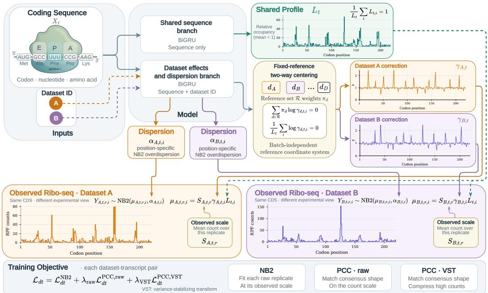  
Figure 1: Overview of RiboUnmix. A dataset-independent sequence encoder produces the positive, mean-one shared profile $\mathbf { L } _ { t } .$ A separate dataset-conditioned encoder predicts positional corrections $\gamma _ { t , d }$ and NB2 dispersion parameters. Together with the observed replicate-specific scale $S _ { t , d } ^ { ( r ) }$ , these components define the expected count profile $\pmb { \mu } _ { t , d } ^ { ( r ) } = S _ { t , d } ^ { ( r ) } ( \mathbf { L } _ { t } \odot \gamma _ { t , d } )$ . Raw replicates supervise the count likelihood, while their arithmetic consensus is used by auxiliary profile-agreement objectives.

An implementation and scripts for reproducing the experiments are available at https://github. com/GabMartino/RiboUnmix

## 2 RELATED WORK

Probabilistic and deep generative models have been widely used to account for technical variation in RNA-seq data. For example, scVI models batch effects and measurement uncertainty in single-cell RNA-seq through a deep latent variable model (Lopez et al., 2018). Such approaches provide a useful methodological precedent for separating biological and technical sources of variation, but they operate on gene-level expression measurements rather than sequence-conditioned, codon-resolution Ribo-seq profiles and are therefore not directly comparable to our setting.

Within Ribo-seq, Choros separates biological and technical sequence-associated effects using a structured negative-binomial regression (Mok et al., 2023). Its technical component is defined through predefined bias-associated features, whose fitted coefficients are used to derive corrected ribosome profiles. This requires the relevant bias patterns to be specified in advance: technical effects not represented by the chosen features are not explicitly recovered by the model.Riboformer instead uses deep learning to predict context-dependent Ribo-seq profiles and can correct experimental distortions, but relies on a measured reference profile as an additional input (Shao et al., 2024). Riboclette conditions sequence-based prediction on biological perturbations to model condition-specific changes (Nallapareddy et al., 2025), rather than separating technical measurement effects.These approaches address complementary aspects of Ribo-seq heterogeneity but differ substantially in objective and supervision. RiboUnmix does not require the form of the dataset-specific distortion to be specified a priori and does not require a measured reference profile at inference. Instead, it learns jointly across multiple datasets, using their variation to separate a sequence-derived shared positional representation from dataset-specific effects.

## 3 LIMITS OF RIBO-SEQ PROFILE RECONSTRUCTION

Let $\mathbf { X } _ { t }$ denote the coding sequence of transcript t and $\mathbf { Y } _ { t , d } ^ { ( r ) }$ its measured Ribo-seq profile in replicate r of dataset d. We consider each replicate as a realization of a dataset-specific measurement process,

$$
\mathbf { Y } _ { t , d } ^ { ( r ) } \sim p ( \mathbf { Y } \mid \mathbf { X } _ { t } , d ) , \qquad \mathbf { m } _ { d } ( \mathbf { X } _ { t } ) : = \mathbb { E } [ \mathbf { Y } _ { t , d } ^ { ( r ) } \mid \mathbf { X } _ { t } , d ] .\tag{1}
$$

Here $\mathbf { m } _ { d } ( \mathbf { X } _ { t } )$ is the expected measured profile associated with dataset $d ,$ while $\mathbf { Y } _ { t , d } ^ { ( r ) }$ denotes an observed realization of this measurement process. Conventional sequence-to-profile models are trained against experimentally measured Ribo-seq profiles (Hu et al., 2021; Tian et al., 2021; Zeng et al., 2025; Kaynar & Kingsford, 2026). We denote this supervision target by $\mathbf { Y } _ { t . d } ^ { \mathrm { t a r g e t } }$ , which may correspond to a single replicate $\mathbf { Y } _ { t , d } ^ { ( r ) }$ or to the replicate average $\begin{array} { r } { \overline { { \mathbf { Y } } } _ { t , d } = \frac { 1 } { R _ { t , d } } \sum _ { r = 1 } ^ { R _ { t , d } } \mathbf { Y } _ { t , d } ^ { ( r ) } } \end{array}$ . with $R _ { t , d }$ the number of replicas present for the experiment d. Such predictions approximate the outcome of experimental measurements but usually do not distinguish the effects of shared sequence-dependent structure and systematic differences between experimental settings. Conflating these effects, however, limits the insights that can be gained about the underlying translational processes. To formalize this distinction, we decompose the expected measurement profile into a dataset-independent component ${ \bf A } _ { t } = { \bf A } ( { \bf X } _ { t } )$ and a systematic dataset-specific deviation $\mathbf { B } _ { t , d } = \mathbf { B } ( \mathbf { X } _ { t } , d )$

$$
\begin{array} { r } { \mathbf { m } _ { d } ( \mathbf { X } _ { t } ) = \mathbf { A } _ { t } + \mathbf { B } _ { t , d } , \quad \varepsilon _ { t , d } ^ { ( r ) } : = \mathbf { Y } _ { t , d } ^ { ( r ) } - \mathbf { m } _ { d } ( \mathbf { X } _ { t } ) , \quad \mathbb { E } [ \varepsilon _ { t , d } ^ { ( r ) } \mid \mathbf { X } _ { t } , d ] = \mathbf { 0 } . } \end{array}\tag{2}
$$

Here $\mathbf { B } _ { t , d }$ may include predictable experimental artifacts as well as condition-specific biology, whereas $\boldsymbol { \varepsilon } _ { t , d } ^ { ( r ) }$ represents realization-specific variation around the expected measured profile. Importantly, $\mathbf { A } _ { t }$ is not identifiable from this decomposition alone. Conditional centering of $\boldsymbol { \varepsilon } _ { t , d } ^ { ( r ) }$ follows from the definition of the expectation and requires no Gaussian assumption. However, this decomposition reveals two distinct ways in which reconstruction performance can be misleading. First, if the objective is to predict the expected profile $\mathbf { m } _ { d } ( \mathbf { X } _ { t } )$ , reconstruction performance against observed replicates is constrained by their conditional variance: even exact prediction of $\mathbf { m } _ { d } ( \mathbf { X } _ { t } )$ leaves the realization-specific variability unexplained. Second, the systematic dataset-specific term $\mathbf { B } _ { t , d }$ is part of the optimal prediction target. A model can therefore improve its predictive performance of the measured profile by learning a reproducible experimental artifact, without improving recovery of the intended shared component $\mathbf { A } _ { t }$ . High reconstruction accuracy consequently does not by itself demonstrate recovery of the intended shared signal, and low accuracy may partly reflect measurement variance rather than a signal of poor model capability. Such models may remain useful predictors, but without separating dataset-specific effects their outputs have limited support as transferable biological hypotheses. Appendix A formalizes both effects. RiboUnmix (Section 4) instead uses multiple heterogeneous datasets to learn a positive sequence-derived profile $\mathbf { L } _ { t }$ together with dataset-specific effects $\gamma _ { t , d }$ in a multiplicative count model. It additionally incorporates a probabilistic observation model to represent the count uncertainty inherent to Ribo-seq measurements (Love et al., 2014; Mok et al., 2023).

## 4 MODEL

RiboUnmix models each Ribo-seq observation as a dataset-specific view of a shared sequencederived positional profile. For transcript $t ,$ let $\mathbf { X } _ { t } = ( x _ { t , 1 } , \dots , x _ { t , n _ { t } } )$ denote its coding sequence where $\boldsymbol { x } _ { t , i } \in \mathbb { R } ^ { k }$ represents the codon, nucleotide, and amino-acid sequence features in one-hot encoding, following Tian et al. (2021), and $\mathbf { Y } _ { t , d } ^ { ( r ) } = ( Y _ { t , d , 1 } ^ { ( r ) } , \ldots , Y _ { t , d , n _ { t } } ^ { ( r ) } ) \in \mathbb { N } _ { 0 } ^ { n _ { t } }$ the observed count profile in replicate $r$ of dataset d. For any profile $\mathbf { Y } _ { t , d } .$ , we write $\begin{array} { r } { \langle \mathbf { Y } _ { t , d } \rangle : = n _ { t } ^ { - 1 } \sum _ { i = 1 } ^ { n _ { t } } Y _ { t , d , i } } \end{array}$ for the mean along the transcript.

The main output of RiboUnmix is a positive, mean-one profile

$$
\mathbf { L } _ { t } \in \mathbb { R } _ { > 0 } ^ { n _ { t } } , \qquad \left. \mathbf { L } _ { t } \right. = 1 ,
$$

predicted from the coding sequence alone. Every dataset and replicate containing transcript t therefore uses the same $\mathbf { L } _ { t }$ . For dataset $d ,$ the model predicts a positive positional distortion $\gamma _ { t , d } .$ . Together, $\mathbf { L } _ { t }$ and $\gamma _ { t , d }$ define the model-implied expected profile $\mathbf { L } _ { t } \odot \gamma _ { t , d }$ for transcript t in dataset $d ,$ where $\odot$ denotes position-wise multiplication.

RiboUnmix exploits the observed replicate-specific average count $S _ { t , d } ^ { ( r ) }$ as scaling anchor, while $\mathbf { L } _ { t }$ and $\gamma _ { t , d }$ shape the profile, i.e.,

$$
\begin{array} { r } { \pmb { \mu } _ { t , d } ^ { ( r ) } = S _ { t , d } ^ { ( r ) } \left( \mathbf { L } _ { t } \odot \gamma _ { t , d } \right) . } \end{array}
$$

Ribo-seq count levels depend on transcript abundance and sequencing depth, which are not determined by coding sequence alone (Zhong et al., 2017). We therefore use the observed mean count of each replicate as its scale, allowing the model to focus on relative positional patterns. Under the centering convention defined in Section 4.3, L represents the shared relative profile, while $\gamma _ { t , d }$ represents dataset-specific departures. Multiplicative corrections are motivated by sequence-dependent footprint recovery during library preparation (Mok et al., 2023).

## 4.1 PROBABILISTIC OBSERVATION MODEL

Following negative-binomial models for overdispersed sequencing counts in RNA-seq and codonresolution Ribo-seq (Love et al., 2014; Mok et al., 2023), we use an NB2 working likelihood:

$$
\begin{array} { r l } & { Y _ { t , d , i } ^ { ( r ) } \mid \mathbf { X } _ { t } , d , S _ { t , d } ^ { ( r ) } \sim \mathrm { N B 2 } \Big ( \mu _ { t , d , i } ^ { ( r ) } , \alpha _ { t , d , i } \Big ) , \quad \mathrm { V a r } \Big ( Y _ { t , d , i } ^ { ( r ) } \mid \mu _ { t , d , i } ^ { ( r ) } , \alpha _ { t , d , i } \Big ) = \mu _ { t , d , i } ^ { ( r ) } + \alpha _ { t , d , i } \Big ( \mu _ { t , d , i } ^ { ( r ) } \Big ) ^ { 2 } } \\ & { \qquad \mu _ { t , d , i } ^ { ( r ) } = \underbrace { S _ { t , d } ^ { ( r ) } } _ { \mathrm { r e p l e a t ~ e n e ~ s h a r e d e r l a t i v e ~ d a s e r s e c i p e c i f i e } } } \\ & { \qquad \mathrm { s c a t e a n c h o r e } \quad \mathrm { e n e r g e n t e } ^ { ( r ) } \quad \mathrm { c o n c e c t i o n } } \end{array}\tag{3}
$$

Because the model targets the relative positional shape rather than the overall transcript count, as already shown we take the scale directly from the obeserved replicate $S _ { t , d } ^ { ( r ) } : = \langle \mathbf { Y } _ { t , d } ^ { ( r ) } \rangle _ { t }$ . Hence, replicates of the same transcript–dataset pair share $\mathbf { L } _ { t } \odot \gamma _ { t , d }$ and the positional dispersion $\alpha _ { t , d }$ also predicted by the model. Appendix B.3 discusses the interpretation and limitations of this working likelihood.

## 4.2 SEQUENCE ENCODERS FOR SHARED AND DATASET-SPECIFIC STRUCTURE

RiboUnmix is composed by two independent branches made up of bidirectional two-layered GRUs models (Cho et al., 2014). One branch predicts $\mathbf { L } _ { t }$ from the coding sequence alone with a positionwise output head producing a positive profile:

$$
\widetilde { \mathbf { L } } _ { t } = f _ { \theta } ( \mathbf { X } _ { t } ) , \qquad L _ { t , i } = \frac { \widetilde { L } _ { t , i } } { \langle \widetilde { \mathbf { L } } _ { t } \rangle }\tag{4}
$$

Here, the normalization ensures that $\left. \mathbf { L } _ { t } \right. = 1$ . It is important to highlight that neither dataset identity nor measured counts are supplied to this branch, so $\mathbf { L } _ { t }$ is identical for every Ribo-Seq observation of transcript t.

The second branch predicts the positional correction $\gamma _ { t , d }$ and dispersion $\alpha _ { t , d } .$ . Its inputs combine $\mathbf { X } _ { t }$ with the dataset identity to produce a dataset-conditioned sequence representation $\mathbf { z } _ { t , d }$ . Two separate output heads then predict the raw log-correction $\mathbf { a } _ { \mathbf { t } , \mathbf { d } } ^ { \mathrm { r a w } }$ and log-dispersion $\ell _ { \mathbf { t } , \mathbf { d } } \colon$

$$
\begin{array} { r } { \mathbf { z } _ { t , d } = \psi _ { \phi } ( \mathbf { X } _ { t } , d ) , \qquad \mathbf { a } _ { t , d } ^ { \mathrm { r a w } } = h _ { \gamma } ( \mathbf { z } _ { t , d } ) , \qquad \ell _ { t , d } = h _ { \alpha } ( \mathbf { z } _ { t , d } ) , \qquad \alpha _ { t , d , i } = \exp ( \ell _ { t , d , i } ) } \end{array}\tag{5}
$$

The dispersion is obtained directly as $\alpha _ { t , d , i } = \exp ( \ell _ { t , d , i } )$ . The raw correction scores, instead, require an additional identification step before defining $\gamma _ { t , d } \mathrm { : }$ because only the product $\mathbf { L } _ { t } \odot \gamma _ { t , d }$ enters the expected profile, positional structure could otherwise be redistributed between the shared and dataset-specific components. Figure 1 summarizes the complete RiboUnmix architecture and the main operations linking the shared and dataset-specific branches to the observation model.

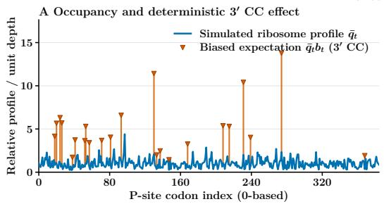

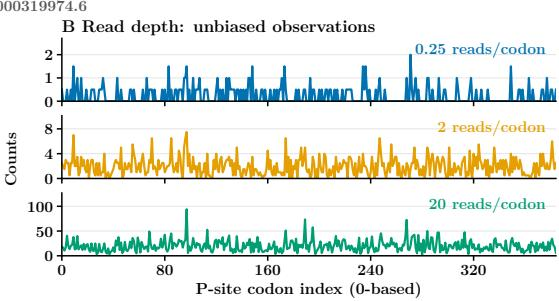  
Figure 2: Observation bias and sequencing depth. Both panels show transcript ENST00000319974.6. (A) Mean of two simulated ribosome profiles, $\overline { { \mathbf { q } } } _ { t }$ (blue). At positions affected by the 3′-CC bias, stems and triangles show the expected profile $\bar { q } _ { t , i } b _ { t , f , i }$ per unit depth. (B) Mean of two unbiased NB2 count replicates at nominal depths $C \in$ {0.25, 2, 20} reads per codon.

## 4.3 FIXED-REFERENCE IDENTIFICATION

We resolve this ambiguity by centering the correction scores across a fixed collection of datasets. This makes positional shapes shared across the datasets contribute to $\mathbf { L } _ { t } .$ while the centered corrections represent dataset-specific departures from that reference, solving the identifiability issue.

To implement this, we define a reference panel R as the set of datasets used for this centering, with positive weights $\pi _ { d }$ satisfying $| \mathcal { R } | \geq 2$ and $\textstyle \sum _ { d \in { \mathcal { R } } } \pi _ { d } = 1$ . The panel and its weights are fixed before training.

For each transcript, the correction branch computes the raw score $a _ { t , e , i } ^ { \mathrm { r a w } }$ for every reference dataset $e \in \mathcal { R }$ . At each position, we subtract the reference-weighted mean across datasets and then remove the positional mean of each resulting correction:

$$
c _ { t , i } = \sum _ { e \in { \mathcal R } } \pi _ { e } a _ { t , e , i } ^ { \mathrm { r a w } } , \qquad \widetilde { g } _ { t , d , i } = a _ { t , d , i } ^ { \mathrm { r a w } } - c _ { t , i } , \qquad g _ { t , d , i } = \widetilde { g } _ { t , d , i } - \langle \widetilde { \mathbf { g } } _ { t , d } \rangle .\tag{6}
$$

The final positive correction is $\gamma _ { t , d , i } = \exp ( g _ { t , d , i } )$

This construction enforces $\begin{array} { r } { \sum _ { d \in \mathcal { R } } \pi _ { d } g _ { t , d , i } = 0 } \end{array}$ at every position to solve the identifiability issue, and $\langle \mathbf { g } _ { t , d } \rangle = 0$ for every dataset removes a uniform log-amplitude shift from each correction, leaving the replicate-specific scale $S _ { t , d } ^ { ( r ) }$ to represent transcript-level count magnitude as mentioned before. Together, the two centering constraints yield a unique reference-defined decomposition for profiles admitted by the model. The formal identification results are given in Appendix B. The weights $\pi _ { d }$ determine the reference used for this allocation. Increasing $\pi _ { d }$ gives dataset d greater influence on which positional structure is treated as shared rather than dataset-specific. In our experiments (Appendix H.6), we tested uniform, quality-informed, and reversed weighting to test how this choice would affect the final shared signal.

## 4.4 COMPOSITE TRAINING OBJECTIVE

RiboUnmix is trained with a composite objective that combines replicate-level count reconstruction with two measures of positional agreement:

$$
\mathcal { L } _ { t , d } = \mathcal { L } _ { t , d } ^ { \mathrm { N B 2 } } + \lambda _ { \mathrm { r a w } } \mathcal { L } _ { t , d } ^ { \mathrm { P C C , r a w } } + \lambda _ { \mathrm { V S T } } \mathcal { L } _ { t , d } ^ { \mathrm { P C C , V S T } } .\tag{7}
$$

The NB2 term $\mathcal { L } _ { t , d } ^ { \mathrm { N B 2 } }$ evaluates the raw replicate counts under the probabilistic observation model. The raw-PCC term $\mathcal { L } _ { t , d } ^ { \mathrm { P C C , r a w } }$ compares $\mu _ { t , d }$ with $\overline { { \mathbf { Y } } } _ { t , d }$ on the original count scale using the Pearson Correlation Coefficient (PCC), while the VST-PCC $\mathcal { L } _ { t , d } ^ { \mathrm { P C C , V S T } }$ term applies an NB2-motivated variance-stabilizing transformation before computing the same positional agreement (Appendix C). Together, the three terms encourage count-level fit and recovery of profile shape across both highand lower-count positions.

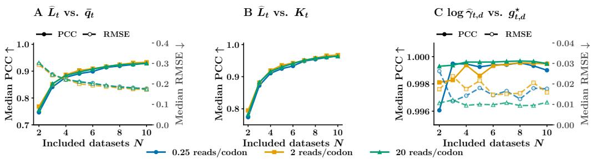  
Figure 3: Recovery of the simulated ribosome profile $\overline { { \mathbf { q } } } _ { t }$ and centered observation effects $\mathbf { g } _ { t , d } ^ { \star } .$ (A) Median transcript PCC (left axis) and RMSE (right axis) between $\widehat { \mathbf { L } } _ { t }$ and $\overline { { \mathbf { q } } } _ { t } .$ . Here RMSE is calculated after log transforming and position-centering each positive profile. (B) Median transcript $\mathrm { P C C } ( \widehat { \mathbf { L } } _ { t } , \mathbf { K } _ { t } )$ . (C) Mean dataset PCC (left axis) and joint dataset–position RMSE (right axis) between the fitted and exact centered log-corrections. Colors denote separate sequencing depths.

Within each transcript, the available transcript–dataset losses are combined using positive reliability weights $w _ { t , d }$ derived from read support and positional coverage. Their normalized weighted mean is then averaged across transcripts, so each transcript contributes one outer loss term irrespective of the number of available datasets. Appendix H.1 defines the reliability weights, and Appendix C gives the complete loss definitions and transcript-balanced reduction. Experiment-specific settings are reported in Sections F.1 and H.2.

## 5 CONTROLLED VALIDATION ON SYNTHETIC RIBO-SEQ OBSERVATIONS

Experimental Ribo-seq measurements alone do not provide ground truth for the underlying ribosome profile or sequence-dependent measurement bias (Gerashchenko & Gladyshev, 2017; Mok et al., 2023). We therefore construct a controlled benchmark in which both quantities are known. For each of 19,290 human coding sequences (Morales et al., 2022), we derive position-specific dwell time profiles K from codon identity and local sequence context. These dwell times describe how long a ribosome is expected to remain at each position before accounting for interactions between ribosomes. We then simulate ribosomes moving along each transcript without overlapping, using an extended TASEP model (MacDonald et al., 1968; Shaw et al., 2003). We normalize each simulated occupancy profile to mean one, obtaining $\mathbf { q } _ { t } ^ { ( r ) }$ , which describes the relative time ribosomes spend at each position. We run two independent simulations for each transcript, producing $\mathbf { q } _ { t } ^ { ( 1 ) }$ and $\mathbf { q } _ { t } ^ { ( 2 ) }$ . Their average $\overline { { \mathbf { q } } } _ { t } = ( \mathbf { q } _ { t } ^ { ( 1 ) } + \mathbf { q } _ { t } ^ { ( 2 ) } ) / 2$ is the simulated ribosome profile used to evaluate shared-profile recovery. The two individual profiles are retained to preserve variation between independent simulations. For each synthetic bias condition and depth, they are used to generate two corresponding count replicates. We introduce ten known sequence-dependent observation biases, which differ in the fragment-end sequences or nucleotide-composition features they target and in their multiplier values. For each bias condition $f ,$ the multiplier $b _ { t , f , i }$ changes the expected count at every position i in transcript t whose corresponding footprint matches that condition, and equals one elsewhere. For bias condition f, simulation r, and nominal sequencing depth $C ,$ , counts are sampled as

$$
Y _ { t , f , i } ^ { ( r ) } \sim \mathrm { N B 2 } \left( C q _ { t , i } ^ { ( r ) } b _ { t , f , i } , \alpha _ { \mathrm { s i m } } = 0 . 1 \right) , \qquad C \in \{ 0 . 2 5 , 2 , 2 0 \} .\tag{8}
$$

We generate each bias condition at all three fixed nominal sequencing depths, $C \in { 0 . 2 5 , 2 , 2 0 }$ reads per codon. Because each simulated profile $q _ { t } ^ { ( r ) }$ is normalized to mean one, multiplying it by C sets the mean expected count across positions to C reads per codon before bias is applied. Because the biased profiles are not renormalized, the multiplier can change both their positional shape and their total expected count. The complete generation process is therefore ${ \bf K } _ { t }  { \bf q } _ { t } ^ { ( r ) }  { \bf q } _ { t } ^ { ( r ) } \odot { \bf b } _ { t , f }  { \bf Y } _ { t , f } ^ { ( r ) } .$ The first step converts sequence-derived dwell times into a simulated ribosome profile, the second applies one of the ten observation biases, and the third samples noisy counts. This construction provides separate targets for evaluating recovery of the shared ribosome profile and the datasetspecific biases. Figure 2 illustrates how an observation bias changes the profile and how sequencing depth changes the sampled counts. Generation details are provided in Appendix D and training and evaluation details in Appendix F.

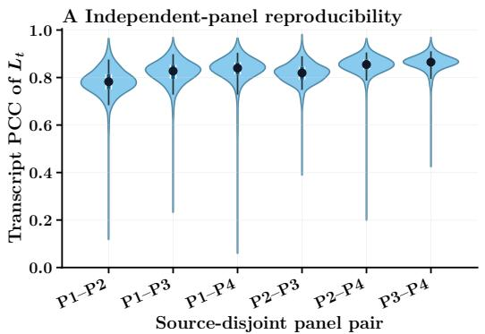

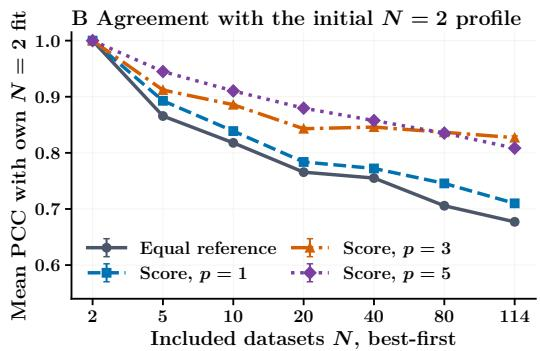  
Figure 4: Shared-profile reproducibility across heterogeneous real-data collections. (A) Transcript-level shared-profile PCC for all six balanced, source-disjoint panel pairs. Dots mark medians; bars show IQR and 5th–95th percentiles. (B) Mean PCC with each reference policy’s own $N = 2$ shared profile along the nested best-first path. Bars are 95% transcript-bootstrap intervals.

## 5.1 RECOVERY OF THE SHARED PROFILE AND OBSERVATION EFFECTS

We compare the learned shared profile $\widehat { \mathbf { L } } _ { t }$ against the mean simulated ribosome profile $\overline { { \mathbf { q } } } _ { t } .$ We also compare the learned dataset-specific corrections with the injected observation biases, after applying the model’s centering. We train multiple subsets of datasets separately at each sequencing depth, adding one dataset at a time to obtain $\bar { N } = 2 , \ldots , 1 0$ datasets. Each dataset contains two raw count replicates generated from the same underlying pair of simulated trajectories. All fits use uniform reference weights $\pi _ { d } = 1 / N$ . This tests how recovery changes as differently biased datasets are added. We calculate the Pearson correlation between $\widehat { \mathbf { L } } _ { t }$ and $\overline { { \mathbf { q } } } _ { t }$ for each transcript and report the median across transcripts. To obtain the comparison target $\mathbf { g } _ { t , d } ^ { \star }$ we apply the centering operation in Equation 6 to the known log-multipliers log $\mathbf { b } _ { t , d } .$ . This makes the injected and learned log-corrections directly comparable. We calculate their positional Pearson correlation for each dataset, average these correlations within each transcript, and report the median across transcripts. The centering formula and its interpretation are given in Section F.6. Agreement between the learned shared profile and the simulated ribosome profile increases along the cumulative series (Figure 3A). Its alignment with $\mathbf { K } _ { t }$ also rises (panel B). The learned log-corrections also closely match the centered injected biases, with high correlations and small errors (Figure 3 C). Together, these results support recovery of the simulated ribosome profile and centered observation effects under the tested conditions. The shared profile can still contain bias common across datasets. Along the tested order of dataset additions, this remaining bias becomes more uniform across positions as N increases, improving agreement with the simulated ribosome profile (Sections F.3 and F.4). The improvement depends on which observation biases are added: additional datasets need not improve recovery if they retain the same systematic distortions. Increasing sequencing depth reduces relative count-sampling noise but does not remove these distortions. The same broad improvement is observed when all three depths are trained jointly for each bias condition (Figure 15). Recovery is evaluated on the same validation transcripts used for checkpoint selection; further evaluation limits, including dependence in count sampling across conditions, are reported in Appendices E.3 and F.1.

## 6 MULTI-DATASET EXPERIMENTS ON REAL RIBO-SEQ OBSERVATIONS

Real data provide no true shared profile or dataset correction. We therefore test reproducibility across independent collections and stability along a quality-ordered path. Across 114 HEK-derived controls, raw replicates enter the NB2 likelihood separately and reliability references use training transcripts only (Sections G and H.1).

<table><tr><td>Model</td><td>C. elegans</td><td>E. coli</td><td>Human (HEK293T)</td><td>S. cerevisiae</td></tr><tr><td>iXnos</td><td> $\overline { { 0 . 2 7 1 \pm 0 . 0 1 6 } }$ </td><td> $\overline { { 0 . 3 5 0 \pm 0 . 0 2 8 } }$ </td><td> $\overline { { 0 . 4 7 2 \pm 0 . 0 1 4 } }$ </td><td> $\overline { { 0 . 4 4 4 \pm 0 . 0 1 9 } }$ </td></tr><tr><td>RiboExp</td><td> $0 . 2 5 3 \pm 0 . 0 1 8$ </td><td> $0 . 3 7 4 \pm 0 . 0 2 4$ </td><td> $0 . 4 1 8 \pm 0 . 0 1 3$ </td><td> $0 . 4 5 6 \pm 0 . 0 2 0$ </td></tr><tr><td>Riboformer</td><td> $0 . 2 5 7 \pm 0 . 0 2 1$ </td><td> $0 . 4 6 6 \pm 0 . 0 3 2$ </td><td> $0 . 4 6 5 \pm 0 . 0 1 7$ </td><td> $0 . 4 3 5 \pm 0 . 0 1 6$ </td></tr><tr><td>Seq2Ribo</td><td> $0 . 2 0 1 \pm 0 . 0 1 7$ </td><td> $0 . 2 3 6 \pm 0 . 0 2 8$ </td><td> $0 . 2 2 2 \pm 0 . 0 1 2$ </td><td> $0 . 3 4 7 \pm 0 . 0 1 4$ </td></tr><tr><td>RiboMIMO</td><td> $0 . 3 2 5 \pm 0 . 0 2 4$ </td><td> $0 . 5 1 6 \pm 0 . 0 2 8$ </td><td> $0 . 4 6 1 \pm 0 . 0 1 6$ </td><td> $0 . 5 0 2 \pm 0 . 0 1 9$ </td></tr><tr><td>RiboUnmix</td><td> $\mathbf { 0 . 3 3 5 \pm 0 . 0 2 6 }$ </td><td> $\mathbf { 0 . 5 5 6 \pm 0 . 0 2 7 }$ </td><td> $\mathbf { 0 . 5 3 9 \pm 0 . 0 1 9 }$ </td><td> $\mathbf { 0 . 5 1 7 \pm 0 . 0 2 4 }$ </td></tr></table>

Table 1: Pearson correlation benchmark across four organism. Entries report the median transcriptlevel Pearson correlation ± half the width of their 95% percentile bootstrap intervals. Metrics use positive-count positions. All baseline rows use the full RiboUnmix training cohort and the same transcript reliability weights. Table 10 reports native and matched training settings, together with Spearman correlation and normalized RMSE. The largest estimate per organism is shown in bold.

Independent panels. Four balanced panels of 29, 29, 28, and 28 datasets keep source families intact. Uniform-reference models share 1,593 held-out transcripts, with no dataset or source family shared between any panel pair.

Cumulative quality ordering. The prespecified quality ordering defines nested best-first collections at $N \in \{ 2 , 5 , \bar { 1 0 } , 2 0 , 4 0 , 8 0 , \bar { 1 1 4 } \}$ on one fixed transcript test split. We fit uniform and three scoreweighted gamma references. Each policy’s own $N = 2$ fit is its fixed anchor, so the comparison asks how much the initial shared profile changes as datasets are added. Opposite quality paths and reference geometry are deferred to the appendix. Source-disjoint panels concentrate at high agreement (Figure 4A), supporting a reproducible signal. Along the nested path, agreement with the initial profile decreases as the collection expands (panel B) adding worse quality datasets as expected, with more retention the more quality scores are accentuated. Opposite quality paths, exact estimates, and audits are in Section H.3.

## 7 BENCHMARK PERFORMANCE

We evaluate RiboUnmix’s single-dataset prediction performance on four organism-specific benchmarks, training separate models for C. elegans, E. coli, human HEK293T, and S. cerevisiae (Stein et al., 2022; Burkhardt et al., 2017; Iwasaki et al., 2016). We compare with iXnos, RiboExp, sequenceonly Riboformer, RiboMIMO, and Seq2Ribo on common held-out transcripts, excluding the first and last five codons of each coding sequence. (Tunney et al., 2018; Hu et al., 2021; Shao et al., 2024; Tian et al., 2021; Kaynar & Kingsford, 2026). Table 1 reports baselines trained on the full RiboUnmix training split, target construction, and transcript-reliability weights; matched unweighted controls and native settings are reported in the Appendix I.3. We report the median transcript-level Pearson correlation between predicted and observed profiles at positions with positive observed counts $Y > 0$ Additional metrics and evaluation details are provided in Appendix I. RiboUnmix achieves the highest median transcript-level Pearson correlation estimate in all four benchmarks (Table 1). These results support competitive prediction of measured profiles, complementing the multi-dataset analyses in Section 5 and 6. Matching training cohorts and reliability weights reduces differences between pipelines, although losses and checkpoint-selection criteria remain model-specific (Appendix I.4).

## 8 CONCLUSION

RiboUnmix uses variation across Ribo-seq experiments to learn shared sequence-dependent ribosome profiles. Its fixed-reference decomposition jointly models shared profiles, dataset-specific effects, and count variability without requiring ground-truth shared profiles for training.

In controlled synthetic experiments, RiboUnmix recovers the simulated ribosome profile and the centered injected observation biases, with shared-profile recovery improving along the tested order of dataset additions. Models trained on separate groups of the 114 HEK-derived datasets, with no studies shared between groups, produce similar shared profiles for held-out transcripts. Across four organism-specific benchmarks, RiboUnmix also achieves the highest median transcript-level Pearson correlation estimates between predicted and measured profiles at positive-count positions among the evaluated pipelines.

The shared profile depends on the chosen reference and can retain biases common across datasets. Independent biological validation is needed to establish how faithfully it reflects ribosome occupancy in living cells. RiboUnmix turns variation across experiments into information for learning reproducible sequence-dependent structure, providing a basis for testable hypotheses about translational regulation.

## USE OF GENERATIVE AI

Large language models were used to assist with debugging and with the implementation of analysis and visualization scripts. They were also used to review mathematical exposition for clarity and consistency and to assist with grammar correction during manuscript preparation.

All AI-assisted code and analyses were inspected and tested by the authors, and all reported results were computed from the saved experimental outputs. The authors reviewed the final text, mathematical statements, figures, and scientific claims and take responsibility for the complete content of this work.

## REFERENCES

Andrew Behrens, Geraldine Rodschinka, and Danny D. Nedialkova. High-resolution quantitative profiling of tRNA abundance and modification status in eukaryotes by mim-tRNAseq. Molecular Cell, 81(8):1802–1815.e7, April 2021. ISSN 1097-2765. doi: 10.1016/j.molcel.2021.01.028. URL http://dx.doi.org/10.1016/j.molcel.2021.01.028.

David H Burkhardt, Silvi Rouskin, Yan Zhang, Gene-Wei Li, Jonathan S Weissman, and Carol A Gross. Operon mRNAs are organized into ORF-centric structures that predict translation efficiency. eLife, 6, January 2017. ISSN 2050-084X. doi: 10.7554/elife.22037. URL http://dx.doi. org/10.7554/eLife.22037.

Catherine A. Charneski and Laurence D. Hurst. Positively charged residues are the major determinants of ribosomal velocity. PLoS Biology, 11(3):e1001508, March 2013. ISSN 1545-7885. doi: 10.1371/journal.pbio.1001508. URL http://dx.doi.org/10.1371/journal.pbio. 1001508.

Kyunghyun Cho, Bart Van Merrienboer,¨ C¸ aglar Gul˘ c¸ehre, Dzmitry Bahdanau, Fethi Bougares, Holger Schwenk, and Yoshua Bengio. Learning phrase representations using RNN encoder–decoder for statistical machine translation. In Proceedings of the 2014 conference on empirical methods in natural language processing (EMNLP), pp. 1724–1734, 2014.

Wesley C. Clark, Molly E. Evans, Dan Dominissini, Guanqun Zheng, and Tao Pan. tRNA base methylation identification and quantification via high-throughput sequencing. RNA, 22 (11):1771–1784, September 2016. ISSN 1469-9001. doi: 10.1261/rna.056531.116. URL http://dx.doi.org/10.1261/rna.056531.116.

Paolo Di Tommaso, Maria Chatzou, Evan W Floden, Pablo Prieto Barja, Emilio Palumbo, and Cedric Notredame. Nextflow enables reproducible computational workflows. Nature Biotechnology, 35 (4):316–319, April 2017. ISSN 1546-1696. doi: 10.1038/nbt.3820. URL http://dx.doi. org/10.1038/nbt.3820.

Alexander Dobin, Carrie A. Davis, Felix Schlesinger, Jorg Drenkow, Chris Zaleski, Sonali Jha, Philippe Batut, Mark Chaisson, and Thomas R. Gingeras. STAR: ultrafast universal RNA-seq aligner. Bioinformatics, 29(1):15–21, 01 2013. ISSN 1367-4803. doi: 10.1093/bioinformatics/ bts635. URL https://doi.org/10.1093/bioinformatics/bts635.

Adam Frankish, Mark Diekhans, Irwin Jungreis, Julien Lagarde, Jane E Loveland, Jonathan M Mudge, Cristina Sisu, James C Wright, Joel Armstrong, If Barnes, Andrew Berry, Alexandra Bignell, Carles Boix, Silvia Carbonell Sala, Fiona Cunningham, Tomas Di Domenico, Sarah´ Donaldson, Ian T Fiddes, Carlos Garc´ıa Giron, Jose Manuel Gonzalez, Tiago Grego, Matthew´ Hardy, Thibaut Hourlier, Kevin L Howe, Toby Hunt, Osagie G Izuogu, Rory Johnson, Fergal J

Martin, Laura Mart´ınez, Shamika Mohanan, Paul Muir, Fabio C P Navarro, Anne Parker, Baikang Pei, Fernando Pozo, Ferriol Calvet Riera, Magali Ruffier, Bianca M Schmitt, Eloise Stapleton, Marie-Marthe Suner, Irina Sycheva, Barbara Uszczynska-Ratajczak, Maxim Y Wolf, Jinuri Xu, Yucheng T Yang, Andrew Yates, Daniel Zerbino, Yan Zhang, Jyoti S Choudhary, Mark Gerstein, Roderic Guigo, Tim J P Hubbard, Manolis Kellis, Benedict Paten, Michael L Tress, and Paul Flicek.´ Gencode 2021. Nucleic Acids Research, 49(D1):D916–D923, December 2020. ISSN 1362-4962. doi: 10.1093/nar/gkaa1087. URL http://dx.doi.org/10.1093/nar/gkaa1087.

Caitlin E. Gamble, Christina E. Brule, Kimberly M. Dean, Stanley Fields, and Elizabeth J. Grayhack. Adjacent codons act in concert to modulate translation efficiency in yeast. Cell, 166(3):679–690, July 2016. ISSN 0092-8674. doi: 10.1016/j.cell.2016.05.070. URL http://dx.doi.org/ 10.1016/j.cell.2016.05.070.

Maxim V. Gerashchenko and Vadim N. Gladyshev. Ribonuclease selection for ribosome profiling. Nucleic Acids Research, 45(2):e6, 01 2017. ISSN 0305-1048. doi: 10.1093/nar/gkw822. URL https://doi.org/10.1093/nar/gkw822.

Daniel T. Gillespie. Exact stochastic simulation of coupled chemical reactions. The Journal of Physical Chemistry, 81(25):2340–2361, 05 1977. ISSN 0022-3654. doi: 10.1021/j100540a008. URL https://doi.org/10.1021/j100540a008.

Tasos Gogakos, Miguel Brown, Aitor Garzia, Cindy Meyer, Markus Hafner, and Thomas Tuschl. Characterizing Expression and Processing of Precursor and Mature Human tRNAs by HydrotRNAseq and PAR-CLIP. Cell Reports, 20(6):1463–1475, August 2017. ISSN 2211-1247. doi: 10.1016/j.celrep.2017.07.029. URL http://dx.doi.org/10.1016/j.celrep.2017. 07.029.

Alexey A. Gritsenko, Marc Hulsman, Marcel J. T. Reinders, and Dick de Ridder. Unbiased quantitative models of protein translation derived from ribosome profiling data. PLOS Computational Biology, 11(8):e1004336, August 2015. ISSN 1553-7358. doi: 10.1371/journal.pcbi.1004336. URL http://dx.doi.org/10.1371/journal.pcbi.1004336.

Erik Gutierrez, Byung-Sik Shin, Christopher J. Woolstenhulme, Joo-Ran Kim, Preeti Saini, Allen R. Buskirk, and Thomas E. Dever. eif5a promotes translation of polyproline motifs. Molecular Cell, 51(1):35–45, July 2013. ISSN 1097-2765. doi: 10.1016/j.molcel.2013.04.021. URL http://dx.doi.org/10.1016/j.molcel.2013.04.021.

Hailin Hu, Xianggen Liu, An Xiao, YangYang Li, Chengdong Zhang, Tao Jiang, Dan Zhao, Sen Song, and Jianyang Zeng. Riboexp: an interpretable reinforcement learning framework for ribosome density modeling. Briefings in Bioinformatics, 22(5):bbaa412, 2021.

Nicholas T Ingolia. Ribosome profiling: new views of translation, from single codons to genome scale. Nature reviews genetics, 15(3):205–213, 2014.

Ira A. Iosub, Oscar G. Wilkins, and Jernej Ule. Riboseq-flow: A streamlined, reliable pipeline for ribosome profiling data analysis and quality control. Wellcome Open Research, 9:179, April 2024. ISSN 2398-502X. doi: 10.12688/wellcomeopenres.21000.1. URL http://dx.doi.org/10. 12688/wellcomeopenres.21000.1.

Shintaro Iwasaki, Stephen N. Floor, and Nicholas T. Ingolia. Rocaglates convert dead-box protein eif4a into a sequence-selective translational repressor. Nature, 534(7608):558–561, June 2016. ISSN 1476-4687. doi: 10.1038/nature17978. URL http://dx.doi.org/10.1038/ nature17978.

Gun Kaynar and Carl Kingsford. seq2ribo: structure-aware integration of machine learning and ¨ simulation to predict ribosome location profiles from RNA sequences. Bioinformatics, 42 (Supplement 1):btag296, 2026.

Ben Langmead and Steven L Salzberg. Fast gapped-read alignment with Bowtie 2. Nature Methods, 9(4):357–359, March 2012. ISSN 1548-7105. doi: 10.1038/nmeth.1923. URL http://dx. doi.org/10.1038/nmeth.1923.

Fabio Lauria, Toma Tebaldi, Paola Bernabo, Ewout J. N. Groen, Thomas H. Gillingwater, and\` Gabriella Viero. ribowaltz: Optimization of ribosome p-site positioning in ribosome profiling data. PLOS Computational Biology, 14(8):e1006169, August 2018. ISSN 1553-7358. doi: 10.1371/journal.pcbi.1006169. URL http://dx.doi.org/10.1371/journal.pcbi. 1006169.

Aaron Lecanda, Benedikt S. Nilges, Puneet Sharma, Danny D. Nedialkova, Juliane Schwarz, Juan M. Vaquerizas, and Sebastian A. Leidel. Dual randomization of oligonucleotides to reduce the bias in ribosome-profiling libraries. Methods, 107:89–97, September 2016. doi: 10.1016/j.ymeth.2016.07. 011.

Heng Li, Bob Handsaker, Alec Wysoker, Tim Fennell, Jue Ruan, Nils Homer, Gabor Marth, Goncalo Abecasis, Richard Durbin, and 1000 Genome Project Data Processing Subgroup. The sequence alignment/map format and samtools. Bioinformatics, 25(16):2078–2079, 08 2009. ISSN 1367-4803. doi: 10.1093/bioinformatics/btp352. URL https://doi.org/10.1093/ bioinformatics/btp352.

Yang Liao, Gordon K. Smyth, and Wei Shi. featurecounts: an efficient general purpose program for assigning sequence reads to genomic features. Bioinformatics, 30(7):923–930, 04 2014. ISSN 1367-4803. doi: 10.1093/bioinformatics/btt656. URL https://doi.org/10.1093/ bioinformatics/btt656.

Romain Lopez, Jeffrey Regier, Michael B Cole, Michael I Jordan, and Nir Yosef. Deep generative modeling for single-cell transcriptomics. Nature methods, 15(12):1053–1058, 2018.

Michael I Love, Wolfgang Huber, and Simon Anders. Moderated estimation of fold change and dispersion for RNA-seq data with DESeq2. Genome biology, 15(12):550, 2014.

Carolyn T. MacDonald, Julian H. Gibbs, and Allen C. Pipkin. Kinetics of biopolymerization on nucleic acid templates. Biopolymers, 6(1):1–25, January 1968. ISSN 1097-0282. doi: 10.1002/bip. 1968.360060102. URL http://dx.doi.org/10.1002/bip.1968.360060102.

Marcel Martin. Cutadapt removes adapter sequences from high-throughput sequencing reads. EMBnet.journal, 17(1):10, May 2011. ISSN 2226-6089. doi: 10.14806/ej.17.1.200. URL http://dx.doi.org/10.14806/ej.17.1.200.

Amanda Mok, Robert Tunney, Gonzalo Benegas, Edward WJ Wallace, and Liana F Lareau. choros: Correction of sequence-based biases for accurate quantification of ribosome profiling data. BioRxiv, 2023.

Joannella Morales, Shashikant Pujar, Jane E. Loveland, Alex Astashyn, Ruth Bennett, Andrew Berry, Eric Cox, Claire Davidson, Olga Ermolaeva, Catherine M. Farrell, Reham Fatima, Laurent Gil, Tamara Goldfarb, Jose M. Gonzalez, Diana Haddad, Matthew Hardy, Toby Hunt, John Jackson, Vinita S. Joardar, Michael Kay, Vamsi K. Kodali, Kelly M. McGarvey, Aoife McMahon, Jonathan M. Mudge, Daniel N. Murphy, Michael R. Murphy, Bhanu Rajput, Sanjida H. Rangwala, Lillian D. Riddick, Franc¸oise Thibaud-Nissen, Glen Threadgold, Anjana R. Vatsan, Craig Wallin, David Webb, Paul Flicek, Ewan Birney, Kim D. Pruitt, Adam Frankish, Fiona Cunningham, and Terence D. Murphy. A joint ncbi and embl-ebi transcript set for clinical genomics and research. Nature, 604(7905):310–315, April 2022. ISSN 1476-4687. doi: 10.1038/s41586-022-04558-8. URL http://dx.doi.org/10.1038/s41586-022-04558-8.

Mohan Vamsi Nallapareddy, Francesco Craighero, Lina Worpenberg, Felix Naef, Cedric Gobet, and´ Pierre Vandergheynst. Conditional deep learning model reveals translation elongation determinants during amino acid deprivation. Communications Biology, 8(1):1691, 2025.

Otis Pinkard, Sean McFarland, Thomas Sweet, and Jeff Coller. Quantitative tRNA-sequencing uncovers metazoan tissue-specific tRNA regulation. Nature Communications, 11(1), August 2020. ISSN 2041-1723. doi: 10.1038/s41467-020-17879-x. URL http://dx.doi.org/10. 1038/s41467-020-17879-x.

Mario dos Reis, Renos Savva, and Lorenz Wernisch. Solving the riddle of codon usage preferences: a test for translational selection. Nucleic Acids Research, 32(17):5036–5044, 09 2004. ISSN 0305-1048. doi: 10.1093/nar/gkh834. URL https://doi.org/10.1093/nar/gkh834.

David W. Rogers, Marvin A. Bottcher, Arne Traulsen, and Duncan Greig. Ribosome reinitiation¨ can explain length-dependent translation of messenger RNA. PLOS Computational Biology, 13 (6):e1005592, June 2017. ISSN 1553-7358. doi: 10.1371/journal.pcbi.1005592. URL http: //dx.doi.org/10.1371/journal.pcbi.1005592.

Bin Shao, Jiawei Yan, Jing Zhang, Lili Liu, Ye Chen, and Allen R Buskirk. Riboformer: a deep learning framework for predicting context-dependent translation dynamics. Nature communications, 15(1):2011, 2024.

Leah B. Shaw, R. K. P. Zia, and Kelvin H. Lee. Totally asymmetric exclusion process with extended objects: A model for protein synthesis. Physical Review E, 68(2), August 2003. ISSN 1095-3787. doi: 10.1103/physreve.68.021910. URL http://dx.doi.org/10.1103/PhysRevE.68. 021910.

Tom Smith, Andreas Heger, and Ian Sudbery. Umi-tools: modeling sequencing errors in unique molecular identifiers to improve quantification accuracy. Genome Research, 27(3):491–499, January 2017. ISSN 1549-5469. doi: 10.1101/gr.209601.116. URL http://dx.doi.org/ 10.1101/gr.209601.116.

Kevin C Stein and Judith Frydman. The stop-and-go traffic regulating protein biogenesis: How translation kinetics controls proteostasis. Journal of Biological Chemistry, 294(6):2076–2084, 2019.

Kevin C. Stein, Fabian Morales-Polanco, Joris van der Lienden, T. Kelly Rainbolt, and Judith´ Frydman. Ageing exacerbates ribosome pausing to disrupt cotranslational proteostasis. Nature, 601(7894):637–642, January 2022. ISSN 1476-4687. doi: 10.1038/s41586-021-04295-4. URL http://dx.doi.org/10.1038/s41586-021-04295-4.

Soroush Tahmasebi, Arkady Khoutorsky, Michael B Mathews, and Nahum Sonenberg. Translation deregulation in human disease. Nature reviews Molecular cell biology, 19(12):791–807, 2018.

Tingzhong Tian, Shuya Li, Peng Lang, Dan Zhao, and Jianyang Zeng. Full-length ribosome density prediction by a multi-input and multi-output model. PLOS Computational Biology, 17(3):e1008842, 2021.

Kotaro Tomuro, Mari Mito, Hirotaka Toh, Naohiro Kawamoto, Takahito Miyake, Siu Yu A. Chow, Masao Doi, Yoshiho Ikeuchi, Yuichi Shichino, and Shintaro Iwasaki. Calibrated ribosome profiling assesses the dynamics of ribosomal flux on transcripts. Nature Communications, 15(1), August 2024. ISSN 2041-1723. doi: 10.1038/s41467-024-51258-0. URL http://dx.doi.org/10. 1038/s41467-024-51258-0.

Tamir Tuller, Isana Veksler-Lublinsky, Nir Gazit, Martin Kupiec, Eytan Ruppin, and Michal Ziv-Ukelson. Composite effects of gene determinants on the translation speed and density of ribosomes. Genome Biology, 12(11), November 2011. ISSN 1474-760X. doi: 10.1186/gb-2011-12-11-r110. URL http://dx.doi.org/10.1186/gb-2011-12-11-r110.

Robert Tunney, Nicholas J McGlincy, Monica E Graham, Nicki Naddaf, Lior Pachter, and Liana F Lareau. Accurate design of translational output by a neural network model of ribosome distribution. Nature structural & molecular biology, 25(7):577–582, 2018.

Xi Zeng, Fei Ni, Shaoqing Jiao, Dazhi Lu, Jianye Hao, and Jiajie Peng. Swamamba: A sliding window attention mamba framework for predicting translation elongation rates. In Proceedings of the AAAI Conference on Artificial Intelligence, volume 39, pp. 1013–1021, 2025.

Yi Zhong, Theofanis Karaletsos, Philipp Drewe, Vipin T Sreedharan, David Kuo, Kamini Singh, Hans-Guido Wendel, and Gunnar Ratsch. RiboDiff: detecting changes of mRNA translation efficiency¨ from ribosome footprints. Bioinformatics, 33(1):139–141, 01 2017. ISSN 1367-4803. doi: 10.1093/bioinformatics/btw585. URL https://doi.org/10.1093/bioinformatics/ btw585.

## APPENDIX TABLE OF CONTENTS

A Reconstruction limits under experimental variability 16   
A.1 Stochastic variability limits attainable reconstruction 16   
A.2 Predictable experimental effects are rewarded by reconstruction 17   
B Identification and scale constraints 17   
B.1 Unique fixed-reference decomposition 17   
B.2 Two-way centering and fixed-reference evaluation 18   
B.3 Representable profiles and predicted total counts 18   
B.4 Biological interpretation of the shared profile 18   
C Training objective and data handling 19   
C.1 Replicate handling 19   
C.2 NB2 count reconstruction . 19   
C.3 Profile agreement 19   
C.4 Transcript weighting and batching 20   
D Synthetic data generation 20   
D.1 Programmed kinetics 20   
D.2 Stochastic simulated ribosome profiles 21   
D.3 Deterministic observation effects and count sampling 22   
D.4 Reading the generation layers and the depth intervention 23   
E Synthetic-data diagnostics 23   
E.1 Replicate agreement across sequencing depths . 26   
E.2 Agreement with the expected and unbiased profiles 26   
E.3 Agreement between bias conditions 26   
E.4 Agreement with the programmed kinetic profile 27   
F Synthetic training and component recovery 27   
F.1 Experimental design and training settings 30   
F.2 Reconstructing the observed profiles 30   
F.3 Defining the shared-profile comparison . 31   
F.4 Recovery of the shared target and simulated ribosome profile 32   
F.5 Joint training across sequencing depths . 33   
F.6 Recovery of the dataset-specific correction 33   
F.7 Aggregate profile mass 35   
F.7.1 Mass introduced by the observation multiplier . 35   
F.7.2 Mass implied by the fitted factorization 35   
G HEK293 Ribosome Profile Datasets 37   
G.1 Cohort and processing 37   
G.2 Quality control and ranking 40   
H Real-Data Evaluation across Independent Experimental Panels 42   
H.1 Profile eligibility and reliability weights 42   
H.2 HEK multi-dataset training settings . 42   
H.3 Evaluation of shared-profile reproducibility 42   
H.4 Panels with independent experimental sources 42   
H.5 Effect of reference weighting on fixed panels 44   
H.6 Stability as datasets are added 46   
H.7 Interpretation and scope . 47   
Cross-organism benchmark panel 47   
I.1 Shared processing of sequencing reads . 48   
I.2 Common test population 48   
I.3 Model-specific preprocessing and training settings . 48   
I.4 Evaluation and results . 50

## A RECONSTRUCTION LIMITS UNDER EXPERIMENTAL VARIABILITY

We use the scalar counterpart of the observation framework in Sec. 3. Let X denote a coding sequence together with an evaluated codon position, and let $Y ^ { ( r ) }$ denote the measured count at that position in replicate r. Thus, $Y ^ { ( r ) }$ corresponds to $Y _ { t , d , i } ^ { ( r ) }$ in the model notation.

Fix a dataset $d ,$ a replicate index r, and a distribution of transcript–position examples. Assume ${ \mathbb E } [ ( Y ^ { ( r ) } ) ^ { 2 } \mid d ] <$ ∞ and $\operatorname { V a r } ( Y ^ { ( r ) } \mid d ) > 0$ , and consider predictors $f ( X )$ satisfying $\mathbb { E } [ f ( X ) ^ { 2 } \mid$ $d ] < \infty$ . Define $m _ { d } ( X ) : = \mathbb { E } [ Y ^ { ( r ) } \mid X , d ]$ and $\varepsilon _ { d } ^ { ( r ) } : = Y ^ { ( r ) } - m _ { d } ( X )$ . Conditioning on $X$ , d holds the sequence and position fixed; conditioning only on d also averages over the selected distribution of transcript–position examples.

## A.1 STOCHASTIC VARIABILITY LIMITS ATTAINABLE RECONSTRUCTION

For the squared-error population risk $\mathscr { R } _ { d } ( f ) : = \mathbb { E } [ ( Y ^ { ( r ) } - f ( X ) ) ^ { 2 } ~ \vert ~ d ]$ , substituting $\begin{array} { r l } { Y ^ { ( r ) } = } \end{array}$ $m _ { d } ( X ) + \varepsilon _ { d } ^ { ( r ) }$ gives

$$
\mathscr { R } _ { d } ( f ) = \underbrace { \mathbb { E } [ \mathrm { V a r } ( Y ^ { ( r ) } \mid X , d ) \mid d ] } _ { \mathrm { i r r e d u c i b l e ~ c o n d i t i o n a l ~ v a r i a b i l i t y } } + \underbrace { \mathbb { E } [ ( m _ { d } ( X ) - f ( X ) ) ^ { 2 } \mid d ] } _ { \mathrm { c o n d i t i o n a l - m e a n ~ p r e d i c t i o n ~ e r r o r } } .\tag{9}
$$

The cross term vanishes because $\mathbb { E } [ \varepsilon _ { d } ^ { ( r ) } \mid X , d ] = 0 :$ ; no Gaussian assumption is needed. Consequently, $f _ { d } ^ { * } ( X ) = m _ { d } ( X )$ minimizes the risk uniquely up to sets of probability zero under the chosen input distribution. The remaining error is irreducible for predictors using only X. It may include unobserved biological variation as well as sampling and experimental noise. Increasing model capacity cannot eliminate this term without additional predictive information.

Define population $R ^ { 2 }$ relative to the best constant predictor as $R _ { d } ^ { 2 } ( f ) : = 1 - \mathcal { R } _ { d } ( f ) / \operatorname { V a r } ( Y ^ { ( r ) } \mid d )$ Combining the minimum risk with the law of total variance gives

$$
R _ { \operatorname* { m a x } , d } ^ { 2 } = { \frac { \operatorname { V a r } ( m _ { d } ( X ) \mid d ) } { \operatorname { V a r } ( m _ { d } ( X ) \mid d ) + \mathbb { E } [ \operatorname { V a r } ( Y ^ { ( r ) } \mid X , d ) \mid d ] } } .\tag{10}
$$

This maximum ranges over all square-integrable predictors using X; a restricted model class need not attain it. For a fixed input distribution and conditional mean, greater expected conditional variance lowers the ceiling whenever $\mathrm { V a r } ( m _ { d } ( X ) \mid d ) > 0$

The same variance ratio bounds population Pearson correlation. Conditional centering gives Cov $\cdot ( f ( X ) , Y ^ { ( r ) } \mid d ) = \operatorname { C o v } ( f ( X ) , m _ { d } ( X ) \mid d ) .$ . Applying the Cauchy–Schwarz inequality therefore yields, for every predictor with Var $\dot { ( f ( X ) \mid d ) } > 0$

$$
\operatorname { C o r r } ( f ( X ) , Y ^ { ( r ) } \mid d ) ^ { 2 } \leq { \frac { \operatorname { V a r } ( m _ { d } ( X ) \mid d ) } { \operatorname { V a r } ( Y ^ { ( r ) } \mid d ) } } = R _ { \operatorname* { m a x } , d } ^ { 2 } .\tag{11}
$$

When $\operatorname { V a r } ( m _ { d } ( X ) \mid d ) > 0$ , the predictor $f = m _ { d }$ attains the maximum positive correlation, $\sqrt { R _ { \operatorname* { m a x } , d } ^ { 2 } } .$ For a general predictor, however, $R _ { d } ^ { 2 } ( f )$ need not equal its squared Pearson correlation with the observations.

To illustrate the effect of replication, now consider R replicates of the same transcript–position example. Assume that, conditional on $X , d ,$ , they are independent and identically distributed, with conditional mean $m _ { d } ( X )$ . Their average $\begin{array} { r } { \overline { { Y } } _ { R } : = R ^ { - 1 } \dot { \sum _ { r = 1 } ^ { R } } Y ^ { ( r ) } } \end{array}$ then satisfies $\mathbb { E } [ \overline { { Y } } _ { R } ~ \vert ~ X , d ] =$ $m _ { d } ( X )$ and $\operatorname { V a r } ( { \overline { { Y } } } _ { R } \mid X , d ) = \operatorname { V a r } ( Y ^ { ( r ) } \mid X , d ) / R$ . The attainable population $R ^ { 2 }$ becomes

$$
R _ { \operatorname* { m a x } , d } ^ { 2 } ( \overline { { Y } } _ { R } ) = \frac { \operatorname { V a r } ( m _ { d } ( X ) \mid d ) } { \operatorname { V a r } ( m _ { d } ( X ) \mid d ) + R ^ { - 1 } \mathbb { E } [ \operatorname { V a r } ( Y ^ { ( r ) } \mid X , d ) \mid d ] } .\tag{12}
$$

Averaging can therefore improve attainable reconstruction while preserving all systematic effects contained in $m _ { d } ( X )$ . The $1 { \bar { / } } R$ variance reduction requires the stated assumptions. Unequal replicate scales can change the conditional means and variances, while conditional dependence introduces covariance terms. This calculation illustrates the effect of replication; it does not assume that the raw replicates used by RiboUnmix have identical conditional count distributions.

## A.2 PREDICTABLE EXPERIMENTAL EFFECTS ARE REWARDED BY RECONSTRUCTION

Let $A ( X )$ be a dataset-independent reference satisfying ${ \mathbb E } [ A ( X ) ^ { 2 } \mid d ] < \infty$ , expressed on the same count scale as $m _ { d } ( X )$ , and define $B _ { d } ( X ) : = m _ { d } ( \dot { X } ) \stackrel { - } { - } \dot { A ( X ) }$ . These are the scalar counterparts of ${ \bf A } _ { t }$ and $\mathbf { B } _ { t , d }$ in Equation 2. The reference $A ( X )$ is introduced for this analytical comparison and is distinct from the model’s mean-one output $\mathbf { L } _ { t }$

For the predictor $f _ { A } ( X ) : = A ( X )$ , Equation 9 gives

$$
\mathscr { R } _ { d } ( f _ { A } ) - \mathscr { R } _ { d } ( f _ { d } ^ { * } ) = \mathbb { E } [ B _ { d } ( X ) ^ { 2 } \ | \ d ] .\tag{13}
$$

If $B _ { d } ( X )$ is nonzero with positive probability under the fixed dataset distribution, predicting the full conditional mean achieves strictly lower expected squared error than predicting $A ( { \bar { X } } )$ alone. The ob jective therefore rewards sequence-predictable deviations from the reference, including experimental artifacts and condition-specific biology. This identity describes an optimization incentive; it does not identify A or $B _ { d }$ from the observations.

The argument also covers multiplicative observation effects. For $A ( X ) > 0$ and a positive multiplier $b _ { d } ( X )$ satisfying $m _ { d } ( X ) = A ( X ) b _ { d } ( X )$ , the deviation is $B _ { d } ( X ) \dot { = } \dot { A } ( X ) ( b _ { d } ( X ) \dot { - } 1 )$ ). The excess risk is consequently ${ \bar { \mathbb { E } } } [ { \dot { A } } ( X ) ^ { 2 } { \dot { ( b _ { d } ( X ) - 1 ) ^ { 2 } } } \mid d ]$ . Thus, the additive decomposition does not require an additive physical mechanism. Equation 13 compares predictions of the same experimental target; it does not imply that stronger artifacts necessarily increase Pearson correlation or population $R ^ { 2 }$ when comparing different datasets.

Together, these results explain why reconstruction performance alone cannot establish recovery of a biological profile. Conditional variability limits agreement with measured counts, whereas sequence-predictable experimental effects contribute to the optimal reconstruction target. Replicate averaging reduces variability under the stated assumptions but preserves those systematic effects.

The results concern population quantities under the specified input distribution. They do not directly give numerical ceilings for finite-sample correlations or summaries of transcript-level correlations. They also do not directly apply to count predictors that additionally use the observed scale anchors $S _ { t , d } ^ { ( r ) }$ . The excess-risk identity is specific to squared error, rather than the NB2 likelihood or composite objective used by RiboUnmix. Its relevance is that fitting measured profiles rewards predictable structure in those measurements, whose biological interpretation requires separate evidence.

## B IDENTIFICATION AND SCALE CONSTRAINTS

Fix a transcript t and use the same $n _ { t }$ positions across datasets. Write $\langle \cdot \rangle _ { t }$ for the positional mean. Let $h _ { t , d , i } > 0$ denote a supplied relative expected profile to be represented as $h _ { t , d , i } = L _ { t , i } \gamma _ { t , d , i }$ For the model, this profile is $\mu _ { t , d , i } ^ { ( r ) } / S _ { t , d } ^ { ( r ) }$ and is shared across replicates. The reference panel R has positive weights $\pi _ { d }$ satisfying $\textstyle \sum _ { d \in { \mathcal { R } } } \pi _ { d } = 1$

## B.1 UNIQUE FIXED-REFERENCE DECOMPOSITION

Under the cross-dataset constraint alone, $\begin{array} { r } { \sum _ { d \in \mathcal { R } } \pi _ { d } \log \gamma _ { t , d , i } = 0 } \end{array}$ , each supplied collection of positive profiles has the unique factorization

$$
L _ { t , i } = \prod _ { d \in \mathcal { R } } h _ { t , d , i } ^ { \pi _ { d } } , \qquad \gamma _ { t , d , i } = \frac { h _ { t , d , i } } { L _ { t , i } } .\tag{14}
$$

Indeed, taking the weighted logarithmic mean across datasets at the same transcript and position gives

$$
\sum _ { d \in { \mathcal R } } \pi _ { d } \log h _ { t , d , i } = \log L _ { t , i } + \sum _ { d \in { \mathcal R } } \pi _ { d } \log \gamma _ { t , d , i } = \log L _ { t , i } .\tag{15}
$$

This determines $L _ { t , i }$ and then $\gamma _ { t , d , i }$ uniquely; substitution verifies the factorization and constraint.

The result identifies the factors for specified relative profiles. It does not establish unique estimation from incomplete or noisy observations, or identify the shared factor as biological. The model’s additional normalization constraints restrict which profiles can be represented, as discussed below.

## B.2 TWO-WAY CENTERING AND FIXED-REFERENCE EVALUATION

Equation 6 first centers the raw log-corrections across datasets at each position of transcript t, giving $\begin{array} { r } { \sum _ { d \in \mathcal { R } } \pi _ { d } \widetilde { g } _ { t , d , i } = 0 } \end{array}$ . Subtracting the positional mean within each transcript–dataset pair then gives $\langle \mathbf { g } _ { t , d } \rangle _ { t } = 0$ while preserving the first constraint:

$$
\sum _ { d \in \mathcal { R } } \pi _ { d } g _ { t , d , i } = \sum _ { d \in \mathcal { R } } \pi _ { d } \widetilde { g } _ { t , d , i } - \Bigg \langle \sum _ { d \in \mathcal { R } } \pi _ { d } \widetilde { \mathbf { g } } _ { t , d } \Bigg \rangle _ { t } = 0 .\tag{16}
$$

Repeating the centering leaves the result unchanged. A positional term shared across datasets or a position-independent offset for one dataset is removed by these operations, so the raw scores themselves remain non-unique.

For each transcript, the correction branch evaluates all reference dataset identities needed to calculate the center, including those without an observed profile for that transcript. These evaluations remain connected to differentiation during training but introduce no additional observation losses. At deterministic evaluation, the correction therefore uses the same reference regardless of which datasets are requested together.

The algebra requires the requested corrections and reference center to use the same realized raw scores. Independent dropout draws for those evaluations can break exact cross-dataset centering during a stochastic forward pass, although positional centering still holds.

## B.3 REPRESENTABLE PROFILES AND PREDICTED TOTAL COUNTS

The factors in Equation 14 satisfy the model’s additional constraints $\langle \mathbf { L } _ { t } \rangle _ { t } = 1$ and $\langle \log \gamma _ { t , d } \rangle _ { t } = 0$ if and only if

$$
\langle \mathbf { L } _ { t } \rangle _ { t } = 1 , \qquad \langle \log \mathbf { h } _ { t , d } \rangle _ { t } = \langle \log \mathbf { L } _ { t } \rangle _ { t } \quad { \mathrm { f o r } } \operatorname { e v e r y } d \in { \mathcal { R } } .\tag{17}
$$

The second condition follows directly from log $\gamma _ { t , d } = \log \mathbf { h } _ { t , d } - \log \mathbf { L } _ { t }$ . These conditions concern the factorization itself; a finite neural network may impose further restrictions.

Centering log-corrections does not ensure that $\mathbf { L } _ { t } \odot \gamma _ { t , d }$ has arithmetic mean one. When $S _ { t , d } ^ { ( r ) }$ equals the positive observed mean and no numerical floor is active, the predicted-to-observed total-count ratio is

$$
m _ { t , d } : = \langle \mathbf { L } _ { t } \odot \gamma _ { t , d } \rangle _ { t } = \frac { \sum _ { i } \mu _ { t , d , i } ^ { ( r ) } } { \sum _ { i } Y _ { t , d , i } ^ { ( r ) } } .\tag{18}
$$

This ratio is shared across replicates of the same transcript–dataset pair.

The weighted arithmetic–geometric mean inequality gives $\begin{array} { r } { \sum _ { d \in \mathcal { R } } \pi _ { d } \gamma _ { t , d , i } \ge \prod _ { d \in \mathcal { R } } \gamma _ { t , d , i } ^ { \pi _ { d } } = 1 } \end{array}$ Multiplying by $L _ { t , i }$ and averaging over positions yields

$$
\sum _ { d \in \mathcal { R } } \pi _ { d } m _ { t , d } \geq \langle \mathbf { L } _ { t } \rangle _ { t } = 1 .\tag{19}
$$

Because all $L _ { t , i }$ and reference weights are positive, equality requires $\gamma _ { t , d , i } = 1$ for every reference dataset and position. Nontrivial corrections therefore produce a reference-weighted average count ratio above one, although individual ratios may be below one. Consequently, the decoder cannot exactly represent distinct positive relative profiles that all have mean one.

The ratio $m _ { t , d }$ measures total-count calibration. It is not an independent estimate of transcript abundance or translational activity, because the observed total already enters the prediction through $S _ { t , d } ^ { ( r ) }$

## B.4 BIOLOGICAL INTERPRETATION OF THE SHARED PROFILE

Suppose the expected observations for transcript t are proportional to an underlying positive profile qt multiplied by dataset-specific measurement effects $\mathbf { b } _ { t , d } > 0$ . For this transcript, define the weighted geometric mean effect across reference datasets as

$$
\mathbf { G } _ { t } : = \prod _ { d \in \mathcal { R } } \mathbf { b } _ { t , d } ^ { \pi _ { d } } , \qquad \mathbf { L } _ { t } ^ { \mathrm { r e f } } : = \frac { \mathbf { q } _ { t } \odot \mathbf { G } _ { t } } { \left. \mathbf { q } _ { t } \odot \mathbf { G } _ { t } \right. _ { t } } .\tag{20}
$$

Products and powers are element-wise. The profile $\mathbf { L } _ { t } ^ { \mathrm { r e f } }$ is the normalized geometric mean of the expected dataset shapes for the same transcript. It provides a comparison under the chosen reference convention; the compatibility restrictions above prevent identifying it unconditionally with the fitted $\mathbf { L } _ { t }$

The reference-defined shape equals the normalized underlying profile precisely when the combined measurement effect is constant across positions:

$$
{ \bf L } _ { t } ^ { \mathrm { r e f } } = \frac { { \bf q } _ { t } } { \langle { \bf q } _ { t } \rangle _ { t } } \quad \Longleftrightarrow \quad G _ { t , i } = C _ { t } \quad \mathrm { f o r e v e r y } i , \quad \quad C _ { t } > 0 .\tag{21}
$$

If $G _ { t , i } = C _ { t }$ , the constant cancels under normalization. Conversely, equality of the normalized profiles and positivity of $q _ { t , i }$ i imply $G _ { t , i } = \langle \mathbf { q } _ { t } \odot \mathbf { G } _ { t } \rangle _ { t } / \langle \mathbf { q } _ { t } \rangle _ { \mathrm { ~ } }$ t, which is independent of position.

A positional measurement effect shared across datasets can therefore remain in the shared profile. More generally, replacing $\mathbf { q } _ { t }$ by $\mathbf { q } _ { t } \odot \mathbf { c } _ { t }$ and every $\mathbf { b } _ { t , d }$ by $\mathbf { b } _ { t , d } \oslash \mathbf { c } _ { t } .$ , for any positive $\mathbf { c } _ { t }$ , leaves their products unchanged. The reference convention fixes a decomposition, but independent biological evidence is needed to determine how faithfully the learned shared profile represents ribosome occupancy.

## C TRAINING OBJECTIVE AND DATA HANDLING

The synthetic and HEK multi-dataset experiments use the objective defined in the main text. This section specifies how its terms are calculated and combined. Experiment-specific settings are given in Sections F.1 and H.2.

## C.1 REPLICATE HANDLING

For transcript t in dataset $d ,$ the NB2 term evaluates each of the $R _ { t , d }$ raw count replicates separately, using its own observed scale $S _ { t , d } ^ { ( r ) }$ . The two correlation terms instead compare the predicted profile with the arithmetic mean $\begin{array} { r } { \overline { { \mathbf { Y } } } _ { t , d } ~ = ~ R _ { t , d } ^ { - 1 } \sum _ { r = 1 } ^ { R _ { t , d } } \mathbf { Y } _ { t , d } ^ { ( r ) } } \end{array}$ . For these terms, the prediction is $\mu _ { t , d } =$ $\langle \overline { { \mathbf { Y } } } _ { t , d } \rangle _ { t } \big ( \mathbf { L } _ { t } \odot \gamma _ { t , d } \big )$ . The replicate mean enters each correlation term once. Synthetic datasets contain two replicates, and all positional calculations use valid codons only.

## C.2 NB2 COUNT RECONSTRUCTION

For each replicate, we average the NB2 negative log-likelihood over valid positions. We then multiply this average by $\mathrm { c l i p } [ ( n _ { t } / 1 0 \bar { 0 } 0 ) ^ { 0 . 2 5 } , 0 . 5 , 2 ]$ and average across replicates to obtain $\mathcal { L } _ { t , d } ^ { \mathrm { N B 2 } }$ . Because the positional loss is already averaged, this bounded factor gives longer transcripts moderately greater weight in the NB2 term without weighting them in direct proportion to their length.

## C.3 PROFILE AGREEMENT

The raw correlation term measures positional agreement on the count scale. The second correlation term applies an NB2-motivated transformation that compresses high counts:

$$
T _ { \alpha } ( x ) = \frac { 2 \mathrm { a s i n h } \big ( \sqrt { \alpha x + \varepsilon } \big ) } { \sqrt { \alpha + \varepsilon } } ,\tag{22}
$$

where $\varepsilon > 0$ is a small numerical constant. The transformation acts separately at each position using the predicted dispersion $\alpha _ { t , d , i }$ . The two losses are

$$
\begin{array} { r l } & { \mathcal { L } _ { t , d } ^ { \mathrm { P C C , r a w } } = 1 - \mathrm { P C C } \big ( \mu _ { t , d } , \overline { { \mathbf { Y } } } _ { t , d } \big ) , } \\ & { \mathcal { L } _ { t , d } ^ { \mathrm { P C C , V S T } } = 1 - \mathrm { P C C } \big ( T _ { \alpha _ { t , d } } ( \mu _ { t , d } ) , T _ { \alpha _ { t , d } } ( \overline { { \mathbf { Y } } } _ { t , d } ) \big ) . } \end{array}\tag{23}
$$

Both experiment series use

$$
\mathcal { L } _ { t , d } = \mathcal { L } _ { t , d } ^ { \mathrm { N B 2 } } + 0 . 5 \mathcal { L } _ { t , d } ^ { \mathrm { P C C , r a w } } + 0 . 5 \mathcal { L } _ { t , d } ^ { \mathrm { P C C , V S T } } .\tag{24}
$$

Gradients through the dispersion values are stopped inside T, so the correlation terms do not train the dispersion head. The input representation supplied to that head is also detached, preventing gradients from its dispersion-prediction path from updating the context encoder. The NB2 term trains the dispersion head and the predicted mean.

## C.4 TRANSCRIPT WEIGHTING AND BATCHING

Within each transcript, we combine the available dataset losses $\mathcal { L } _ { t , d }$ using the normalized reliability weights $w _ { t , d } / \sum _ { d } w _ { t , d }$ , where the sum includes its retained datasets. We then average these combined losses equally across transcripts in the batch. Each transcript therefore contributes one loss, irrespective of how many datasets contain it. The reliability weights $w _ { t , d }$ determine each observation’s contribution to training; the reference weights $\pi _ { d }$ determine the centering of dataset-specific corrections. Eligibility and reliability are specified in Section H.1, with synthetic input processing in Section F.1.

The multi-dataset sampler retains transcripts with usable observations in at least two selected datasets and keeps all retained observations of each transcript together. When a logical batch is divided into execution microbatches, transcript groups remain intact. Each microbatch contributes in proportion to its number of transcripts, preserving the equal average across the complete logical batch. Gradient clipping and the optimizer update occur after gradient accumulation. The single-dataset reconstruction control also permits transcripts observed in only one dataset.

## D SYNTHETIC DATA GENERATION

Synthetic ground truth refers throughout to quantities defined by the simulator, rather than to experimentally established biological truth. The generation process links four quantities:

$$
\mathbf { K } _ { t } \longrightarrow \mathbf { q } _ { t } ^ { ( r ) } \longrightarrow \mu _ { t , f } ^ { ( r ) } \longrightarrow \mathbf { Y } _ { t , f } ^ { ( r ) } .\tag{25}
$$

We describe synthetic data generation here, examine the generated profiles in Appendix E and evaluate component recovery in Appendix F. Here, $\mathbf { K } _ { t }$ is the programmed kinetic profile and $\mathbf { q } _ { t } ^ { ( r ) }$ is the mean-one simulated ribosome profile from simulation $r . \mu _ { t , f } ^ { ( r ) }$ and $\mathbf { Y } _ { t , f } ^ { ( r ) }$ are the expected and sampled count profiles under bias condition $f .$ Here “occupancy” means the fraction of recording time for which a ribosome P-site is at a codon. Normalizing this occupancy profile to mean one gives the simulated ribosome profile $\mathbf { q } _ { t } ^ { ( r ) }$ . For R trajectories the arithmetic mean is $\begin{array} { r } { \overline { { \mathbf { q } } } _ { t } = R ^ { - 1 } \sum _ { r = 1 } ^ { R } \mathbf { q } _ { t } ^ { ( r ) } } \end{array}$ . We use two simulations and two corresponding count replicates per dataset to retain variation between simulations and from count sampling. The same saved trajectories are reused across depths and conditions, so those datasets do not supply additional independent trajectories.

## D.1 PROGRAMMED KINETICS

We generated synthetic Ribo-seq data for 19,290 human coding sequences from MANE Select (Morales et al., 2022) using the workflow summarized in Figure 5.

For each of four HEK-derived tRNA-abundance datasets (GSE152621 (Behrens et al., 2021), GSE66550 (Clark et al., 2016), GSE141436 (Pinkard et al., 2020), and GSE95683 (Gogakos et al., 2017)), we converted the measured abundances into codon-specific tRNA adaptation index (tAI) weights following Reis et al. (2004). For each sense codon, we averaged the four weights and rescaled the resulting consensus weights so that their maximum was one.

Following previous uses of tRNA adaptation to parameterize translation rates (Tuller et al., 2011; Gritsenko et al., 2015), the consensus weight $w _ { c }$ defines the baseline dwell time

$$
\tau _ { c } ^ { \mathrm { b a s e } } = \operatorname* { m a x } \left( \frac { \lambda } { w _ { c } } , 0 . 0 5 \mathrm { s } \right) .\tag{26}
$$

We chose λ so that the mean dwell time across the 61 sense codons is 0.25 s, setting a baseline elongation scale of 4 codons/s. This baseline is close to the mean elongation rate of 4.08 codons/s measured in HEK293 T-REx cells by Tomuro et al. (2024).

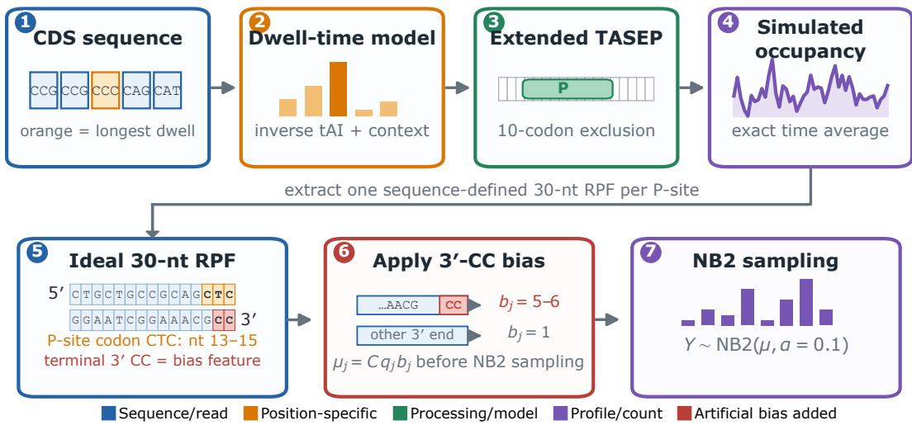  
Figure 5: Synthetic-data generation. Sequence-dependent dwell times define the programmed kinetic profile $\mathbf { K } _ { t }$ and parameterize an open extended TASEP with 10-codon ribosome footprints. Two independent simulations produce the simulated ribosome profiles $\mathbf { q } _ { t } ^ { ( 1 ) }$ and $\mathbf { q } _ { t } ^ { ( 2 ) }$ . Sequence features of idealized 30-nt ribosome-protected fragments determine the positions affected by each observation bias, illustrated here by a $\mathrm { 3 ^ { \prime } - C C }$ bias. These multipliers modify the expected counts before NB2 sampling.

The baseline dwell times are further modified by local sequence-context rules, including slow-codon combinations (Gamble et al., 2016), proline motifs (Gutierrez et al., 2013), charged and bulky peptide contexts (Charneski & Hurst, 2013), and A/U-rich sequence contexts. After mapping the programmed dwell times to P-site positions, we denote the final dwell time at position i of transcript t by $\tau _ { t , i }$

The programmed kinetic profile is

$$
K _ { t , i } = \frac { \tau _ { t , i } } { \ell _ { t } ^ { - 1 } \sum _ { j = 1 } ^ { \ell _ { t } } \tau _ { t , j } } ,\tag{27}
$$

where $\ell _ { t }$ is the number of modeled sense-codon positions. Thus, Kt has positional mean one, and larger $K _ { t , i }$ denotes a longer programmed dwell at position i. We define $\mathbf { K } _ { t }$ before simulating ribosome traffic or applying observation biases and count sampling.

## D.2 STOCHASTIC SIMULATED RIBOSOME PROFILES

The programmed dwell times define the unblocked elongation rates $\tau _ { t , i } ^ { - 1 }$ of an open extended TASEP (Rogers et al., 2017),which we simulated using the direct Gillespie algorithm (Gillespie, 1977). Ribosomes occupy 10 codons (Ingolia, 2014) and advance stochastically by one codon at the programmed rate whenever exclusion permits. At the final sense-codon P-site, ribosomes leave the transcript at rate $\left( 0 . 3 0 \mathrm { s } \right) ^ { - 1 }$

We obtained transcript-specific initiation intervals $I _ { t }$ from Tomuro et al. (2024) for 3,998 exact transcript-version matches. The remaining 15,292 transcripts received the matched-set median of 20.61 s/event. For each simulation, we discarded an initial period equal to five transcript-specific collision-free translation times and then recorded for $T _ { t } = \mathrm { { \bar { m a x } } } ( 6 0 \bar { 0 } \mathrm { { s } } , 4 0 I _ { t } )$ ). The collision-free translation time is the sum of the programmed elongation dwell times and the terminal departure time, excluding initiation waiting and ribosome blocking.

For each transcript, we ran two independent simulations $r \in \{ 1 , 2 \}$ . They share the same programmed rates, initiation interval, termination rate, footprint length, and recording duration, but differ in their realized sequence of stochastic initiation, elongation, and termination events. Variation between $\mathbf { q } _ { t } ^ { ( 1 ) }$ and $\mathbf { q } _ { t } ^ { ( 2 ) }$ therefore arises within the traffic simulation, before observation effects or count-sampling noise are introduced.

Let $Z _ { t , i } ^ { ( r ) } ( s )$ indicate whether a ribosome P-site occupies position i at time s in trajectory r. The recorded time-averaged occupancy is

$$
O _ { t , i } ^ { ( r ) } = \frac { 1 } { T _ { t } } \int _ { 0 } ^ { T _ { t } } Z _ { t , i } ^ { ( r ) } ( s ) \mathrm { d } s .\tag{28}
$$

We normalize each simulated occupancy profile to mean one:

$$
q _ { t , i } ^ { ( r ) } = \frac { O _ { t , i } ^ { ( r ) } } { \ell _ { t } ^ { - 1 } \sum _ { j = 1 } ^ { \ell _ { t } } O _ { t , j } ^ { ( r ) } } .\tag{29}
$$

Thus, $\mathbf { q } _ { t } ^ { ( r ) }$ describes the relative time spent by ribosome P-sites at different positions during one finite stochastic trajectory. Two trajectories generated from the same programmed kinetics generally produce different profiles because they experience different event times, temporary queues, and numbers of ribosome visits to each position.

The programmed kinetic and simulated ribosome profiles coincide in an ideal collision-free steady state. If a common ribosome flux $J _ { t }$ passes every position without blocking, then

$$
O _ { t , i } ^ { \mathrm { c f } } = J _ { t } \tau _ { t , i } .\tag{30}
$$

After normalization, the common flux cancels:

$$
q _ { t , i } ^ { \mathrm { c f } } = \frac { J _ { t } \tau _ { t , i } } { \ell _ { t } ^ { - 1 } \sum _ { j = 1 } ^ { \ell _ { t } } J _ { t } \tau _ { t , j } } = K _ { t , i } .\tag{31}
$$

The finite TASEP simulations can differ from this ideal limit. Ribosome blocking can create queues, while initiation and termination rates can alter the occupancy profile through their effects on ribosome traffic. Finite recording introduces additional trajectory-specific variation. Consequently, $\mathbf { q } _ { t } ^ { ( r ) }$ can differ systematically from $\mathbf { K } _ { t }$ , in addition to varying between simulations.

The mean simulated ribosome profile is

$$
\overline { { \mathbf { q } } } _ { t } = \frac { \mathbf { q } _ { t } ^ { ( 1 ) } + \mathbf { q } _ { t } ^ { ( 2 ) } } { 2 } .\tag{32}
$$

Averaging reduces trajectory-specific variation but does not remove systematic reshaping caused by ribosome traffic. Accordingly, $\overline { { \mathbf { q } } } _ { t }$ is the mean simulated ribosome profile over two finite trajectories, not an exact stationary profile. Comparison with $\overline { { \mathbf { q } } } _ { t }$ assesses recovery of the simulated ribosome profile, whereas comparison with $\mathbf { K } _ { t }$ assesses agreement with the programmed kinetics.

## D.3 DETERMINISTIC OBSERVATION EFFECTS AND COUNT SAMPLING

Sequence-dependent biases in footprint recovery can arise during nuclease digestion and library preparation, including preferences associated with fragment ends and ligation (Gerashchenko & Gladyshev, 2017; Mok et al., 2023; Lecanda et al., 2016). We construct idealized 30-nt ribosomeprotected fragments in which the P-site codon occupies nucleotides 13–15 in one-based fragment coordinates. For fragments extending beyond the coding sequence, we use annotated UTR sequence. Observation biases are applied only where a complete fragment can be constructed.

The ten bias conditions target $5 ^ { \prime } \mathrm { - }$ - or 3′-terminal AA, CC, GG, and UU dinucleotides, or on AU-rich and GC-rich fragment composition. For bias condition $f ,$ we apply the multiplier $b _ { t , f , i }$ specified in Table 2 at matching positions with complete fragments and set $b _ { t , f , i } = 1$ elsewhere.

The same multipliers are used for both simulations and all sequencing depths.

Expected profiles and count sampling. For nominal sequencing depth $C \in \{ 0 . 2 5 , 2 , 2 0 \}$ , defined as the expected number of reads per codon before bias is applied, the expected count at position i is

$$
\mu _ { t , f , i } ^ { ( r ) } = C q _ { t , i } ^ { ( r ) } b _ { t , f , i } .\tag{33}
$$

The expected count profile therefore combines one simulated ribosome profile with a deterministic sequence-dependent observation bias. Counts are then sampled as

$$
Y _ { t , f , i } ^ { ( r ) } \mid \mathbf { q } _ { t } ^ { ( r ) } , \mathbf { b } _ { t , f } , C \sim \mathrm { N B 2 } \Big ( \mu _ { t , f , i } ^ { ( r ) } , \alpha _ { \mathrm { s i m } } = 0 . 1 \Big ) ,\tag{34}
$$

Table 2: Artificial sequence-dependent bias conditions. Multiplier strengths are synthetic stress-test choices, not estimates of experimentally measured Ribo-seq bias. AU-rich fragments contain more than 70% A and U nucleotides. GC-rich fragments contain more than 70% G and C nucleotides.
<table><tr><td>Bias feature</td><td>Multiplier</td><td>P-sites</td><td>Transcripts</td></tr><tr><td>3&#x27; CC</td><td>5.0-6.0×</td><td>943,724</td><td>19,266</td></tr><tr><td>3′GG</td><td>4.0-4.4×</td><td>577,402</td><td>19,240</td></tr><tr><td>3&#x27;AA</td><td>2.8-3.2×</td><td>785,775</td><td>19,160</td></tr><tr><td>3&#x27; UU</td><td>5.8–6.2×</td><td>646,563</td><td>19,068</td></tr><tr><td>5′ CC</td><td>5.2-5.6×</td><td>706,527</td><td>19,242</td></tr><tr><td>5′ GG</td><td>4.2-4.6×</td><td>738,405</td><td>19,252</td></tr><tr><td>5′AA</td><td>3.0-3.4×</td><td>1,048,194</td><td>19,256</td></tr><tr><td>5′ UU</td><td>5.6-6.0×</td><td>641,947</td><td>19,188</td></tr><tr><td>AU-rich</td><td>7.0-7.4×</td><td>263,552</td><td>10,119</td></tr><tr><td>GC-rich</td><td>5.0-5.4×</td><td>801,495</td><td>14,095</td></tr></table>

where

$$
\operatorname { V a r } \Big ( Y _ { t , f , i } ^ { ( r ) } \mid \mu _ { t , f , i } ^ { ( r ) } \Big ) = \mu _ { t , f , i } ^ { ( r ) } + 0 . 1 \big ( \mu _ { t , f , i } ^ { ( r ) } \big ) ^ { 2 } .\tag{35}
$$

Setting $b _ { t , f , i } = 1$ gives the unbiased condition. Observation biases are applied before count sampling, without renormalizing the biased expected profiles. Since $\mathbf { q } _ { t } ^ { ( r ) }$ has positional mean one, the unbiased expected total is $\ell _ { t } C .$ , whereas under condition $f ,$

$$
\sum _ { i = 1 } ^ { \ell _ { t } } \mu _ { t , f , i } ^ { \left( r \right) } = \ell _ { t } C \left. \mathbf { q } _ { t } ^ { \left( r \right) } \odot \mathbf { b } _ { t , f } \right. _ { t } .\tag{36}
$$

Equal nominal depth therefore does not imply equal expected total counts across observation conditions.

## D.4 READING THE GENERATION LAYERS AND THE DEPTH INTERVENTION

These examples distinguish changes in the expected profile from variation introduced by simulation and count sampling. Figure 6 illustrates the complete generation process for one transcript. The example shows variation between simulated ribosome profiles, changes caused by observation bias, and additional variation from NB2 count sampling.

Each sampled profile therefore contains two distinct stochastic components: variation between finite TASEP trajectories and conditional NB2 count-sampling noise. All bias conditions and sequencing depths use the same two simulated ribosome profiles.

Figure 7 shows all ten observation biases at each sequencing depth. Dividing counts by nominal sequencing depth C puts the three depths on the same expected scale while retaining changes in total expected count caused by the observation bias. As sequencing depth increases, depth-normalized counts fluctuate less around the biased expectation, while low-depth profiles show greater sampling variability and more zeros. With fixed NB2 overdispersion, residual sampling variability remains even at high depth.

## E SYNTHETIC-DATA DIAGNOSTICS

Before evaluating RiboUnmix, we examine how sequencing depth, replicate averaging, and observation bias affect the synthetic profiles themselves. Of the 19,290 transcripts in the synthetic cohort, seven were excluded because they lacked a canonical stop codon, leaving 19,283 transcripts for analysis. We analyze the ten bias conditions for these transcripts at nominal sequencing depths $C \in \{ 0 . 2 5 , 2 , 2 0 \}$ reads per codon. All comparisons use aligned sense-codon positions, and Pearson correlation is calculated separately within each transcript over every position.

Each bias condition applies a different sequence-dependent multiplier $\mathbf { b } _ { t , f }$ to the same simulated ribosome profiles. In the figure labels, 5′ and $3 ^ { \prime }$ indicate the ends of the idealized ribosome-protected fragment, and AA, CC, GG, and UU denote terminal dinucleotides. AU-rich and GC-rich denote fragments containing more than 70% A and U, or G and C, respectively.

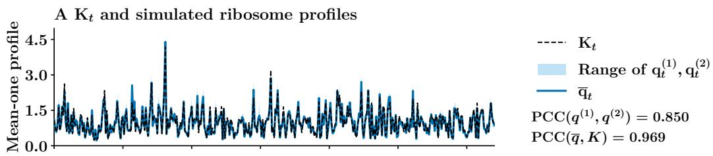

B 30-CC observation multiplier  
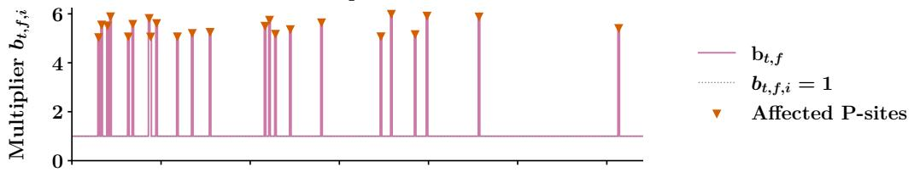

C C Profiles before NB2 sampling  
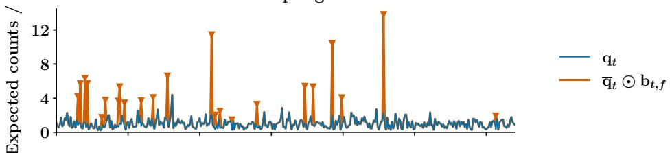  
C D NB2 counts at C = 20 reads/codon

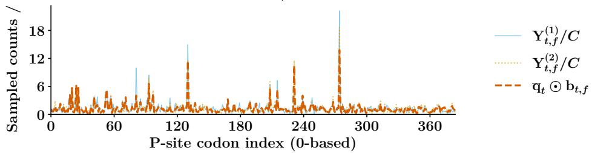  
Figure 6: Synthetic-generation layers for transcript ENST00000319974.6. (A) The deterministic programmed kinetic profile $\dot { \mathbf { K } _ { t } }$ (black dashed), the mean simulated ribosome profile $\overline { { \mathbf { q } } } _ { t }$ (blue), and a translucent band spanning the two separately simulated ribosome profiles $\mathbf { q } _ { t } ^ { ( 1 ) }$ and $\mathbf { q } _ { t } ^ { ( 2 ) }$ at every position. (B) The exact 3′-CC bias multiplier $\mathbf { b } _ { t , f } ;$ red triangles mark affected P-site coordinates and the horizontal reference denotes $b _ { t , f , i } = 1$ . (C) Panel C shows the mean simulated ribosome profile $\overline { { \mathbf { q } } } _ { t }$ and the biased expected profile per unit depth $\overline { { \mathbf { q } } } _ { t } \odot \mathbf { b } _ { t , f }$ before count sampling. (D) The biased expectation and the two saved NB2 count replicates divided only by the nominal depth $C = 2 0$ for display. The biased expectations and depth-adjusted counts are not renormalized by their positional means. Zeros and peaks are retained without smoothing, clipping, interpolation, or pseudocounts. The same two simulations are reused across bias conditions and depths. $\overline { { \mathbf { q } } } _ { t }$ is their mean is their mean simulated ribosome profile.

Ten observation efects across depth: ENST00000306954.5  
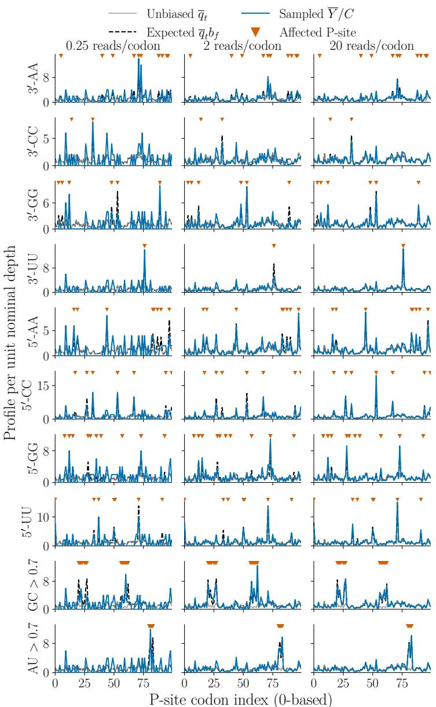  
Figure 7: Ten deterministic observation effects across sequencing depths. Transcript ENST00000306954.5 is the shortest transcript in the prespecified 100–149-sense-codon range with at least one saved affected P-site for every condition. Rows correspond to the ten bias conditions, and columns to nominal sequencing depths $\bar { C } \in \{ 0 . 2 5 , 2 , 2 0 \}$ expected reads per codon. Each cell shows the mean simulated ribosome profile $\overline { { \mathbf { q } } } _ { t }$ (light gray), the exact biased expectation per unit depth $\overline { { \mathbf { q } } } _ { t } \odot \mathbf { b } _ { t , f }$ (black dashed), and the arithmetic mean of the two sampled NB2 count replicates divided only by C (blue). Red triangles identify the exact affected coordinates. The three panels within a row share one y-axis range; different rows may differ. The biased expectation and sampled profiles are not normalized by their positional means. All zeros and peaks are retained without smoothing, clipping, interpolation, or pseudocounts. All conditions and depths reuse the same two finite simulations, whose mean simulated ribosome profile is $\overline { { \mathbf { q } } } _ { t }$

## E.1 REPLICATE AGREEMENT ACROSS SEQUENCING DEPTHS

We first compare the two count replicates within each bias condition and sequencing depth (Figure 8). Median transcript-level Pearson correlation increases with sequencing depth, consistent with reduced relative count-sampling noise. Differences remain because each count replicate is generated from a different simulated ribosome profile and a separate NB2 count sample. Replicate disagreement therefore reflects both sources of variation.

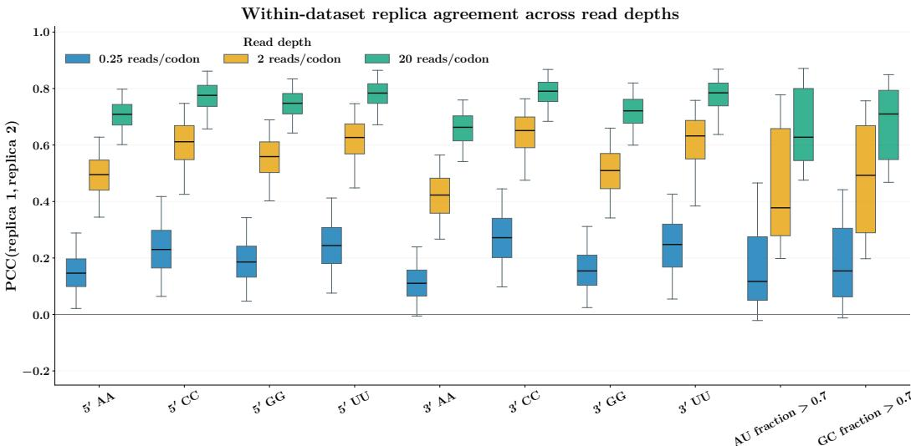  
Figure 8: Replicate agreement across sequencing depths. Each box summarizes the withintranscript Pearson correlation between $\mathbf { Y } _ { t , f } ^ { ( 1 ) }$ and $\mathbf { Y } _ { t , f } ^ { ( 2 ) }$ for one bias condition and depth. Boxes show medians and interquartile ranges; whiskers show the 5th and 95th percentiles across 19,283 transcripts.

## E.2 AGREEMENT WITH THE EXPECTED AND UNBIASED PROFILES

The simulator provides the expected profile before count sampling. For count replicate r under bias condition f, the expected profile is $C \mathbf { q } _ { t } ^ { ( r ) } \odot \mathbf { b } _ { t , f }$ . Averaging the two expected profiles gives $C \overline { { \mathbf { q } } } _ { t } \odot \mathbf { b } _ { t , f }$ . We use these known expectations to distinguish count-sampling variation from the systematic change introduced by the bias.

Figure 9 compares each count replicate with its expected count profile (panel A), the mean of the two count replicates with its expectation (panel B), and that mean with the mean simulated ribosome profile $\overline { { \mathbf { q } } } _ { t }$ (panel C). Agreement with the expected biased profile increases with depth and improves further when the two replicates are averaged. Agreement with the mean simulated ribosome profile $\overline { { \mathbf { q } } } _ { t }$ remains lower than agreement with the biased expectation because the observation bias changes the positional profile. Thus, deeper sequencing and replicate averaging improve measurement of the biased profile without removing the bias.

## E.3 AGREEMENT BETWEEN BIAS CONDITIONS

We next compare different bias conditions for the same transcript. Figure 10 shows pairwise Pearson correlations between bias conditions, calculated from the mean count profiles and from their expected profiles before count sampling. Across the tested sequencing depths, correlations between the sampled count profiles move closer to those between the expected profiles. The expected profiles differ across bias conditions because their multipliers affect different positions with different strengths.

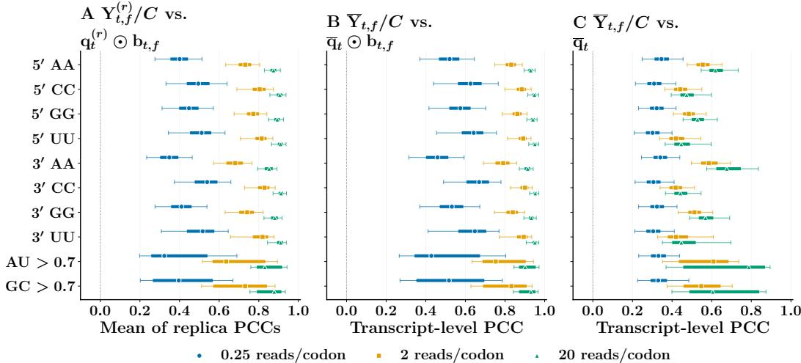  
Figure 9: Agreement with expected and unbiased profiles. (A) Pearson correlation of each count replicate $\mathbf { Y } _ { t , f } ^ { ( r ) }$ with its expected profile per unit nominal depth $\mathbf { q } _ { t } ^ { ( r ) } \odot \mathbf { b } _ { t , f } ,$ , averaged over the two replicates within each transcript. (B) Pearson correlation of the mean count profile $\overline { { \mathbf { Y } } } _ { t , f }$ with the expected profile per unit nominal depth, $\overline { { \mathbf { q } } } _ { t } \odot \mathbf { b } _ { t , f } .$ (C) Pearson correlation of $\overline { { \mathbf { Y } } } _ { t , f }$ with the mean simulated ribosome profile $\overline { { \mathbf { q } } } _ { t }$ , before observation bias is applied. Multiplication or division by nominal depth does not change Pearson correlation. Colors denote sequencing depth. Points show medians, thick intervals show interquartile ranges, and thin intervals show the 5th–95th percentiles across 19,283 transcripts.

All conditions reuse the same two simulated ribosome profiles. Checks of the generated counts suggest dependence in count sampling across bias conditions: positions unaffected by either bias have matching counts more often than expected under independent sampling. This dependence can increase agreement between sampled conditions. Comparisons between the known expected profiles contain no NB2 count-sampling noise and are unaffected by this count-sampling dependence.

## E.4 AGREEMENT WITH THE PROGRAMMED KINETIC PROFILE

Finally, we compare each count replicate and their mean with the programmed kinetic profile $\mathbf { K } _ { t }$ used to parameterize ribosome movement (Figure 11). This comparison reflects ribosome traffic, variation between finite simulations, changes introduced by observation biases, and additional count-sampling noise.

Averaging the two count replicates generally increases median transcript-level PCC with $\mathbf { K } _ { t }$ . However, high agreement between replicates does not necessarily imply high agreement with $\mathbf { K } _ { t } .$ , because both replicates contain the same systematic observation bias.

These diagnostics show why reconstruction and recovery require separate evaluation. Higher sequencing depth and replicate averaging improve agreement with the expected count profile, which still contains the injected observation bias. Appendix F therefore evaluates prediction of sampled counts, recovery of the simulated ribosome profile, and agreement between the learned dataset-specific corrections and the injected observation biases after applying the model’s centering.

## F SYNTHETIC TRAINING AND COMPONENT RECOVERY

The observation diagnostics establish that sequencing depth changes count noise while the observation multipliers persist. We now test whether joint training recovers the simulated ribosome profile and the injected observation biases under the model’s centering convention. We evaluate observation reconstruction, shared-profile recovery, dataset-specific correction recovery, and total-count calibration.

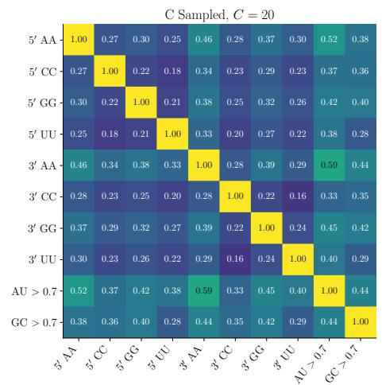

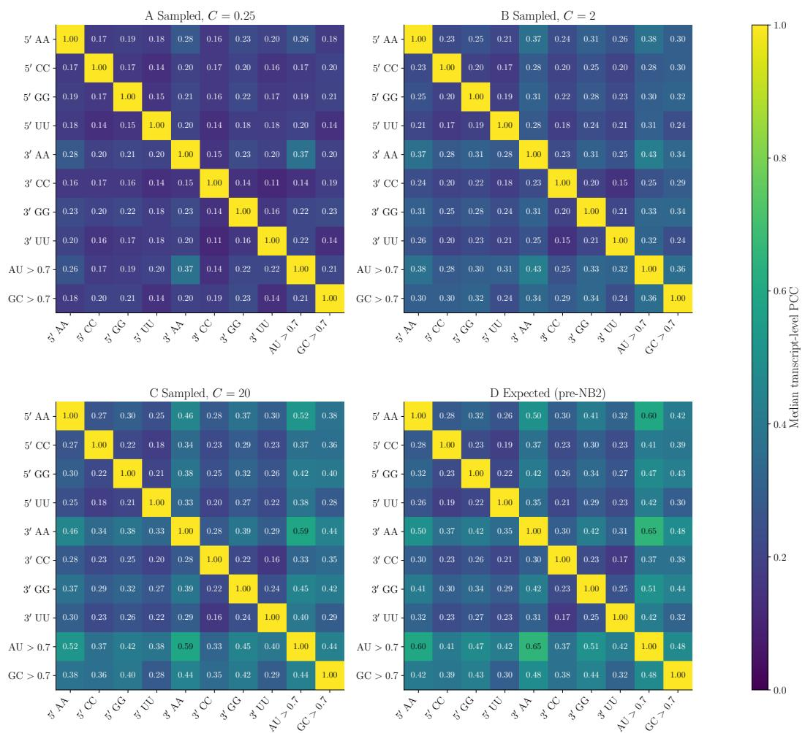  
Figure 10: Agreement between bias conditions before and after count sampling. (A–C) Median within-transcript Pearson correlation between $\overline { { \mathbf { Y } } } _ { t , f }$ and $\overline { { \mathbf { Y } } } _ { t , g }$ for each pair of conditions at $C =$ 0.25, 2, 20 reads per codon. (D) The corresponding correlations between the expected profiles per nominal depth $\overline { { \mathbf { q } } } _ { t } \odot \mathbf { b } _ { t , f }$ and $\overline { { \mathbf { q } } } _ { t } \odot \mathbf { b } _ { t , g }$ . All matrices use the same condition order and color scale.

Each replica and their arithmetic mean versus the common kinetic target $\pmb { K } _ { t }$ 0.25 reads/codon  
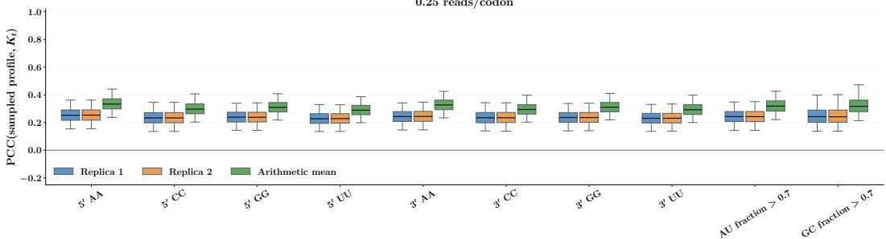

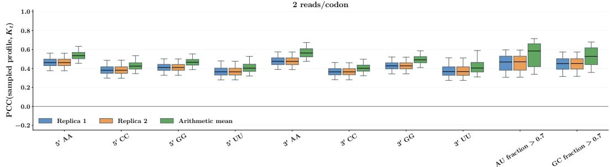

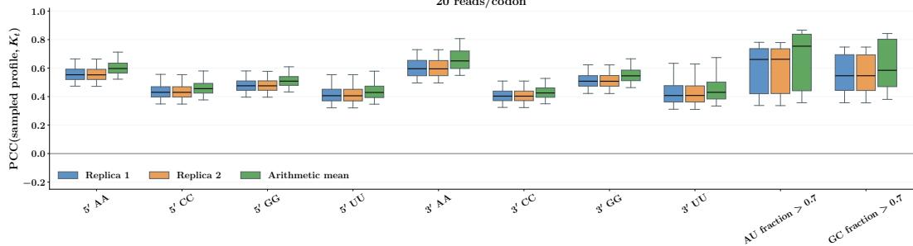  
Figure 11: Agreement with the programmed kinetic profile. Blue and orange show withintranscript Pearson correlations of the two count replicates with $\mathbf { K } _ { t } .$ Green shows the correlation of their arithmetic mean with $\mathbf { K } _ { t }$ . Boxes show medians and interquartile ranges; whiskers show the 5th–95th percentiles.

## F.1 EXPERIMENTAL DESIGN AND TRAINING SETTINGS

Collections and transcript splits. The processed count tables contain 19,283 exactly aligned transcripts. The sequence and length criteria leave 19,204 transcripts: 17,284 for training and 1,920 for validation. The maximum modeled CDS length is 4,000 codons, longer are excluded. Each dataset retains two raw count replicas; their mean enters the correlation terms as defined in Section C.1. Input reliability weights are normalized within each dataset to median one. We fit three complementary sets of models:

1. Single-dataset controls: fit each observation condition separately at each depth to measure reconstruction of its count profiles.

2. Separate-depth series: cumulatively add bias families at one fixed depth, giving $N =$ $2 , \ldots ,$ 10 datasets per model.

3. Joint-depth series: include all three depths for every added bias family, giving $N = 3 B$ datasets for $B = 1 , \ldots , 1 0$ families.

The cumulative bias order, saved TASEP trajectories, and training seed 42 are fixed. Equal reference weights $\pi _ { d } = 1 / N$ define the primary series. The joint-depth comparison also evaluates a depthranked reference. Each panel is trained separately from initialization. Here d indexes one condition– depth dataset $( f , C )$ ; its multiplier $\mathbf { b } _ { t , d } = \mathbf { b } _ { t , f }$ is shared across depths.

Architecture and optimization. The shared encoder is a two-layer bidirectional GRU with 256 hidden units per direction and zero recurrent dropout. The dataset-conditioned branch uses dataset, codon, nucleotide, and amino-acid embeddings of dimensions 32, 16, 4 per nucleotide, and 8, together with relative/start/stop position features. Its two-layer bidirectional context GRU has hidden size 128; the correction and log-dispersion heads each have a 128-unit hidden layer and dropout 0.1. Log dispersion is learned and clamped to [−5, 1]. The decoder applies the centering in Equation (6) without normalizing $L _ { t } \odot \gamma _ { t , d }$ by its positional mean. Training uses the composite objective and transcript-balanced reduction in Section C.

AdamW uses learning rates $5 \times 1 0 ^ { - 4 }$ for the shared encoder, $1 0 ^ { - 3 }$ for the remaining mean-model parameters, and $1 0 ^ { - 4 }$ for the dispersion head, with weight decay $1 0 ^ { - 2 } . \mathbf { A }$ validation-loss ReduceL-ROnPlateau schedule uses factor 0.99, patience 5, and minimum learning rate $1 0 ^ { - 6 }$ , scaled by 0.1 for the dispersion group. Training stops after 10 epochs without validation-loss improvement or at 150 epochs. Every recovery analysis uses the minimum-validation-loss checkpoint; simulator targets do not select checkpoints.

Execution and evaluation. Each fit uses one GPU with BF16 mixed precision. The logical perdataset quota and the target number of unique transcripts per optimizer update are both 32. Execution limits are 1,024 pair rows, 600,000 padded codon tokens, and 16 complete transcript groups per forward. Global-norm clipping at 1 follows accumulation of the complete logical objective. These limits partition execution and do not redefine the loss.

For shared-profile evaluation, we remove the appended terminal entry and ten sense codons from each end, retaining 1,919 validation transcripts at $C = 0 . 2 5$ and $C = 2$ , and 1,920 at $C = 2 0$ . IDs are matched across panel sizes within a depth; the depth-specific splits differ, so depth curves are not paired transcript-level interventions. The joint-depth audit uses one common 1,920-transcript validation cohort. Correction recovery and comparison with $K _ { t }$ exclude five sense codons from each end. Intervals resample whole transcripts and are conditional on these fitted models.

Validation transcripts receive no gradient updates, but they also select checkpoints. These are therefore validation analyses, with no independent synthetic test cohort. One seed and one cumulative bias ordering support comparisons along the recorded training path; they do not establish robustness to arbitrary panel composition. The evidence of count-sampling dependence reported in Appendix E.3 motivates confirmation with independently resampled counts.

## F.2 RECONSTRUCTING THE OBSERVED PROFILES

If low depth mainly obscures the sampled positional pattern, reconstruction should improve as depth increases. We first train each dataset separately and compare the fitted mean $\mu _ { t , d }$ with the replicateaverage count profile $\overline { { \mathbf { Y } } } _ { t , d }$ . Figure 12 shows improved reconstruction at greater depth, consistent with the simulator-only comparison in Section E.2. The two count replicas provide a repeatability reference.

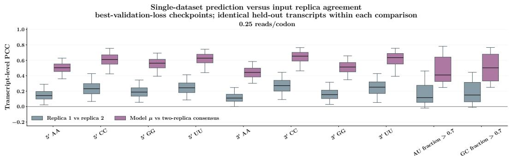

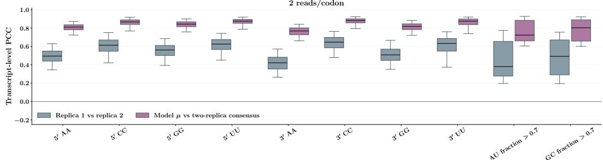

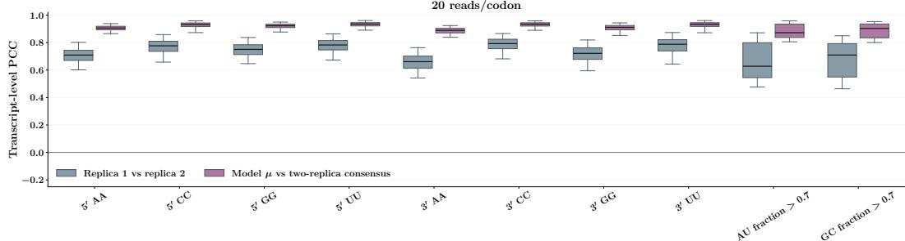  
Figure 12: Single-dataset reconstruction and count-replicate agreement. For each observation condition and depth, gray boxes show $\mathrm { P C C } ( \mathbf { Y } _ { t , d } ^ { ( 1 ) } , \mathbf { Y } _ { t , d } ^ { ( 2 ) } )$ and purple boxes show $\mathrm { P C C } ( \mu _ { t , d } , \overline { { \mathbf { Y } } } _ { t , d } )$ from the minimum-validation-loss model. Boxes show medians and interquartile ranges; whiskers show the 5th–95th percentiles. The fitted mean is evaluated on the observed-count scale.

Prediction–mean agreement can exceed replica–replica agreement because averaging removes some replica-specific variation and the sequence model shares information across training transcripts. Replica agreement is therefore not a formal performance ceiling. The paired reconstruction audit also finds little change when the ten conditions are trained jointly instead of separately. Joint factorization preserves observation fit in this comparison, but the following component-level tests are needed to determine what the shared profile represents.

## F.3 DEFINING THE SHARED-PROFILE COMPARISON

The programmed kinetic profile $\mathbf { K } _ { t }$ , the mean simulated ribosome profile $\overline { { \mathbf { q } } } _ { t }$ , and the expected observed profiles represent different levels of the simulator. The step $\mathbf { K } _ { t }  \overline { { \mathbf { q } } } _ { t }$ captures ribosome traffic and finite simulation variation, whereas $\overline { { \mathbf { q } } } _ { t }  \overline { { \mathbf { q } } } _ { t } \odot \mathbf { b } _ { t , d }$ applies the observation bias. We therefore use $\overline { { q } } _ { t }$ to assess recovery of simulated ribosome occupancy and retain $K _ { t }$ as a secondary comparison with programmed kinetics.

Let $\mathcal { D } _ { N }$ denote the collection of N datasets used for joint training, with reference weights $\pi _ { d } .$ . The model removes the multiplicative ambiguity between its shared profile and dataset-specific corrections

by imposing

$$
\prod _ { d \in \mathcal { D } _ { N } } \gamma _ { t , d , i } ^ { \pi _ { d } } = 1 , \qquad \sum _ { d \in \mathcal { D } _ { N } } \pi _ { d } = 1 .\tag{37}
$$

The model additionally enforces positional log-centering, $\langle \log \gamma _ { t , d } \rangle _ { i } = 0$ , for each dataset and normalizes the shared profile so that $\langle L _ { t } \rangle _ { i } = \bar { 1 }$ . For each dataset, define the noiseless expected relative profile $\mathbf { h } _ { t , d } ^ { \star }$ by dividing $\mathbf { \overline { { { q } } } } _ { t } \odot \mathbf { b } _ { t , d } \mathbf { b } \mathbf { y }$ its positional mean. We define the reference-selected shape as the normalized reference-weighted geometric mean of these profiles:

$$
\mathbf { H } _ { t } ^ { ( N ) } = \frac { \displaystyle \prod _ { d \in \mathcal { D } _ { N } } \left( \mathbf { h } _ { t , d } ^ { \star } \right) ^ { \pi _ { d } } } { \left. \displaystyle \prod _ { d \in \mathcal { D } _ { N } } \left( \mathbf { h } _ { t , d } ^ { \star } \right) ^ { \pi _ { d } } \right. _ { i } } = \frac { \overline { { \mathbf { q } } } _ { t } \odot \displaystyle \prod _ { d \in \mathcal { D } _ { N } } \mathbf { b } _ { t , d } ^ { \pi _ { d } } } { \left. \overline { { \mathbf { q } } } _ { t } \odot \displaystyle \prod _ { d \in \mathcal { D } _ { N } } \mathbf { b } _ { t , d } ^ { \pi _ { d } } \right. _ { i } } .\tag{38}
$$

All products and powers are element-wise. With the uniform weights used in the separate-depth experiments, $\pi _ { d } = 1 / N$

The two expressions in Equation 38 are algebraically equivalent because the dataset-specific normalization constants cancel. The first emphasizes that $\mathbf { \dot { H } } _ { t } ^ { ( \dot { N } ) }$ is determined from the noiseless expected relative profiles. Thus, $H _ { t } ^ { ( N ) }$ is the mean simulated ribosome profile multiplied by the panel’s geometric-mean observation bias and renormalized to mean one.

If the noiseless expected relative profiles satisfy Equation 17 and the fitted model reconstructs them exactly, then $\widehat { \mathbf { L } } _ { t } = \mathbf { H } _ { t } ^ { ( N ) }$ . In general, however, the unnormalized decoder cannot exactly represent an arbitrary collection of positive mean-one profiles under both gauges (Section B.3). We therefore use $\mathbf { H } _ { t } ^ { ( N ) }$ as a reference-selected comparison, not as an established population optimum. The fitted $\widehat { L } _ { t }$ depends on the composite training objective, the model constraints and optimization. Positional distortion retained in the panel’s geometric mean remains inseparable from the simulated ribosome profile under this reference convention.

## F.4 RECOVERY OF THE SHARED TARGET AND SIMULATED RIBOSOME PROFILE

We separate three comparisons: the learned shared profile $\widehat { \mathbf { L } } _ { t }$ versus its reference-selected shape ${ \bf { H } } _ { t } ^ { ( N ) }$ , the reference-selected shape $\mathbf { H } _ { t } ^ { ( N ) }$ versus the mean simulated ribosome profile $\overline { { \mathbf { q } } } _ { t } ,$ , and the end-to-end comparison of $\widehat { \mathbf { L } } _ { t }$ with $\overline { { \mathbf { q } } } _ { t }$

Across the separate-depth series, the fitted profile follows its reference-selected target closely, including with few bias families. The large change with panel size instead lies in the target itself: as complementary multipliers are added, their geometric mean becomes flatter and $\mathbf { H } _ { t } ^ { ( N ) }$ moves toward $\overline { { \mathbf { q } } } _ { t }$ . The fitted $\widehat { \mathbf { L } } _ { t }$ consequently becomes more similar to the mean simulated ribosome profile.

For a fixed transcript and collection of bias families, this target change does not depend on nominal depth: the noiseless multipliers and trajectories are the same. Depth changes the counts from which the network must learn. The validation cohorts have similar sizes but different transcript identities, so comparisons across depths are unpaired. This distinction prevents attributing all improvement with panel size to easier optimization, or interpreting more reads as removal of systematic bias.

Secondary alignment with programmed kinetics. The same best-validation-loss profiles also become more similar to the upstream kinetic target $\mathbf { K } _ { t }$ . This secondary audit uses the saved model mask after removing the appended terminal entry and five sense codons from each end; all 1,920 validation transcripts remain eligible. This is mechanistically useful, but it combines the programmedkinetics-to-traffic transformation with the observation-factorization problem. We therefore use $\widehat { \mathbf { L } } _ { t }$ versus $\overline { { \mathbf { q } } } _ { t } \mathrm { - n o t } \widehat { \mathbf { L } } _ { t }$ versus ${ \bf K } _ { t } - { \bf a s }$ the primary end-to-end shared-profile comparison.

These correlations compare different stages of recovery and should not be subtracted as if they formed an additive error decomposition.

To check this explanation directly, define the panel’s geometric-mean multiplier as $G _ { t . i } ^ { \mathrm { r e f } , N } ~ =$ $\prod _ { d \in { \mathcal { D } } _ { N } } b _ { t , d , i } ^ { \pi _ { d } }$ . Figure 14 relates its positional log variation to the discrepancy between ${ \bf H } _ { t } ^ { ( N ) }$ and $\overline { { \mathbf { q } } } _ { t }$ . More variable multipliers accompany larger discrepancies, as the explicit expression for $\mathbf { H } _ { t } ^ { ( N ) }$ predicts.

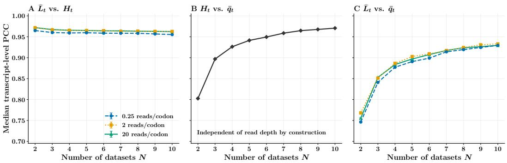  
Figure 13: Agreement with the reference-selected shape and mean simulated ribosome profile. For every panel size, connected points show median transcript-level Pearson correlations and vertical intervals show 95% transcript-bootstrap intervals for (A) $\widehat { \mathbf { L } } _ { t }$ versus ${ \bf { H } } _ { t } ^ { ( N ) }$ , (B) $\mathbf { H } _ { t } ^ { ( N ) }$ versus $\overline { { \mathbf { q } } } _ { t }$ and $( \mathbf { C } ) \widehat { \mathbf { L } } _ { t }$ versus $\overline { { \mathbf { q } } } _ { t }$ . Panels A and C use 1,919, 1,919, and 1,920 eligible validation transcripts matched across all panel sizes at increasing depth. Panel B is depth-independent by construction and uses the deduplicated union of 5,188 validation identities. Intervals are conditional on one training seed and one cumulative bias ordering; they quantify transcript heterogeneity, not variation across independently sampled panels.

Together, these comparisons support cancellation of the particular observation effects along this cumulative path. Dataset count and composition change together, so the result does not imply that adding arbitrary datasets must improve recovery.

## F.5 JOINT TRAINING ACROSS SEQUENCING DEPTHS

The joint-depth experiments train on all three depths for every included bias family. With $B =$ $1 , \ldots , 1 0$ cumulative bias families, the panel therefore contains $N = 3 B$ datasets. This design asks whether one shared profile can be recovered when low-, medium-, and high-depth observations are supplied simultaneously. It also compares equal reference weights with depth-ranked weights in the ratio 1:2:3 within each family.

These experiments are a reference-weight sensitivity check, not an independent panel-order experiment. Under both weighting schemes, every bias family receives total reference mass $1 / B ,$ , and its programmed multiplier is identical across depths. Consequently, the geometric reference effect and the resulting ${ \bf H } _ { t } ^ { ( N ) }$ are exactly the same under the two conventions. Any separation between the curves in Figure 15 is therefore a finite-training difference in $\widehat { \mathbf { L } } _ { t } ,$ , not a change in the reference-selected shape and not evidence that depth ranking is superior.

Both reference policies show the same broad improvement as bias families are added. Their small differences change direction along the cumulative series, supporting joint-depth recovery but not a systematic advantage of depth-ranked centering.

## F.6 RECOVERY OF THE DATASET-SPECIFIC CORRECTION

This comparison tests the other side of the factorization: whether dataset-specific variation is assigned to the correction branch. The raw programmed multiplier is not itself the gauge-fixed oracle comparison for $\widehat { \gamma } _ { t , d } .$ . Let $\begin{array} { r } { a _ { t , d , i } = \log b _ { t , d , i } , c _ { t , i } = \sum _ { d } \pi _ { d } a _ { t , d , i } , m _ { t , d } = \langle a _ { t , d } \rangle _ { i } } \end{array}$ , and $\begin{array} { r } { \overline { { m } } _ { t } = \sum _ { d } \pi _ { d } m _ { t , d } . } \end{array}$ . The exact correction satisfying the model’s cross-dataset reference constraint and positional scale gauge is

$$
g _ { t , d , i } ^ { \star } = a _ { t , d , i } - c _ { t , i } - m _ { t , d } + \overline { { m } } _ { t } .\tag{39}
$$

We compare log $\widehat { \gamma } _ { t , d , i }$ with $g _ { t , d , i } ^ { \star }$ on the common 1,920-transcript validation cohort after excluding five codons at each boundary. The comparison uses every retained transcript–dataset profile and the best-validation-loss checkpoint.

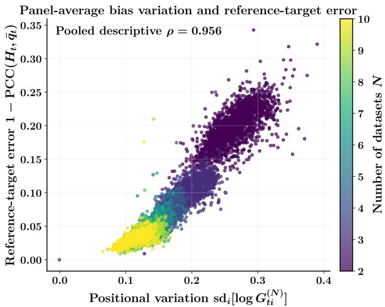  
Figure 14: Panel-average bias variation and reference-target error. Each point represents a transcript–panel pair. The horizontal axis is the positional standard deviation of the log-geometricmean multiplier, and the vertical axis is the Pearson correlation error between the reference-selected shape and the mean simulated ribosome profile. Color denotes the number of datasets in the panel. The association is descriptive because transcripts recur across panel sizes.

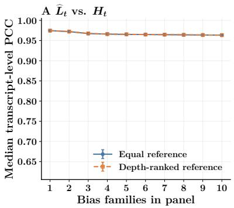

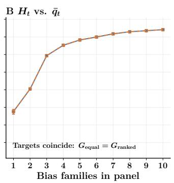

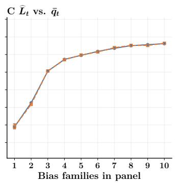  
Figure 15: Shared-profile recovery when all read depths are trained jointly. Each added bias family contributes one dataset at each of the three nominal depths, so the horizontal axis corresponds to $N = 3 B$ datasets. Points show median transcript-level PCC and error bars show 95% transcriptbootstrap intervals over the common 1,920-transcript validation cohort. Equal and depth-ranked reference weights are shown separately. The two schemes assign equal total weight to every bias family and therefore define identical reference-selected shapes $\mathbf { \bar { H } } _ { t } ^ { ( N ) }$ in this experiment; their comparison isolates only finite-training sensitivity to the reference weighting.

Both reference conventions therefore agree closely with the exact gauge-fixed correction shapes in the largest joint-depth panel. $\mathbf { A } \mathbf { t } \ N = 3$ , all datasets share one programmed bias family and the gauge-fixed target has zero positional variance, so its PCC is undefined rather than zero. Equal and depth-ranked weighting assign the same total reference mass to each bias family, and the multiplier for a family is identical across depths. They therefore give the same $c _ { t , i }$ and $\overline { { m } } _ { t }$ in Equation 39, and hence the same exact correction target for every corresponding dataset. Apparent differences between learned corrections are finite-training differences: only one seed and bias-family ordering are available, and the validation cohort also selected the checkpoints.

Table 3: Dataset-specific correction recovery for the 30-dataset joint-depth panel. Metrics compare learned and exact gauge-fixed log-corrections. The calibration slope is from the pooled retained positions.
<table><tr><td>Reference</td><td>Mean pair PCC</td><td>Pooled PCC</td><td>Log- RMSE</td><td>Calibration slope</td><td>Affected sites within 10%</td></tr><tr><td>Equal</td><td>0.9992</td><td>0.9991</td><td>0.0169</td><td>0.9765</td><td>94.79%</td></tr><tr><td>Depth-ranked</td><td>0.9994</td><td>0.9993</td><td>0.0136</td><td>0.9965</td><td>97.83%</td></tr></table>

## F.7 AGGREGATE PROFILE MASS

The recovery comparisons above concern positional shape. Pearson correlation is unchanged by a positive scalar multiplier, so those comparisons cannot establish that total predicted counts are calibrated. We therefore examine two different mass effects: the change deliberately introduced by the simulator and the change permitted by the fitted decoder.

## F.7.1 MASS INTRODUCED BY THE OBSERVATION MULTIPLIER

Before fitting any model, the expected total count under condition f is changed by

$$
M _ { t , f } ^ { \mathrm { b i a s } } =  \overline { { \mathbf { q } } } _ { t } \odot \mathbf { b } _ { t , f }  _ { i } , \qquad \mathbb { E } [ \sum _ { i } \overline { { Y } } _ { t , f , i } | \mathbf { q } _ { t } ^ { ( 1 ) } , \mathbf { q } _ { t } ^ { ( 2 ) } ] = C \ell _ { t } M _ { t , f } ^ { \mathrm { b i a s } } .\tag{40}
$$

Because $\langle \overline { { \mathbf { q } } } _ { t } \rangle _ { i } = 1$ , this is the expected total-count multiplier relative to the unbiased condition. Figure 16 places this quantity beside the corresponding shape agreement. A multiplier can alter a small set of influential positions without producing the largest total-count change. Shape distortion and mass distortion therefore require separate measurements.

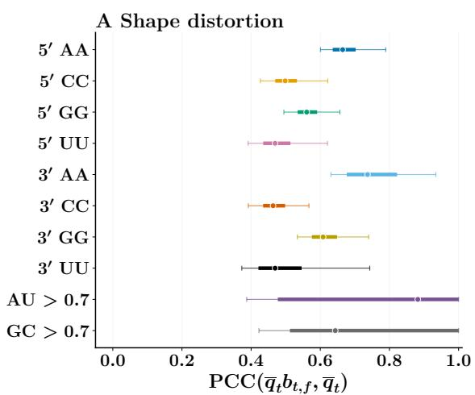

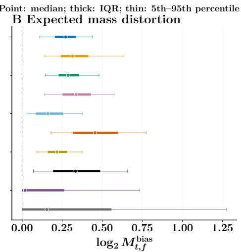  
Figure 16: Deterministic observation effects before count sampling. (A) Transcript-level $\mathrm { P C C } ( \overline { { \mathbf { q } } } _ { t } \odot \mathbf { b } _ { t , f } , \overline { { \mathbf { q } } } _ { t } )$ . (B) $\log _ { 2 } M _ { t , f } ^ { \mathrm { b i a s } }$ , where zero denotes unchanged total expected counts. Points show medians, thick intervals interquartile ranges, and thin capped intervals the 5th–95th percentiles. Both panels use the 19,283-transcript simulator cohort before fitting. Applying the multiplier is not followed by positional-mean normalization.

## F.7.2 MASS IMPLIED BY THE FITTED FACTORIZATION

The decoder fixes $S _ { t , d }$ to an observed arithmetic mean, while fixed-reference gamma centering constrains geometric means. It does not require $\langle \widehat { \mathbf { L } } _ { t } \odot \widehat { \gamma } _ { t , d } \rangle _ { i } = 1$ . Let $\gamma _ { t , d } ^ { \mathrm { r e f } , N }$ denote the oracle

correction paired with $\mathbf { H } _ { t } ^ { ( N ) }$ under the same reference convention. The oracle and learned masses are

$$
m _ { t , d } ^ { \mathrm { r e f } } = \left. \mathbf { H } _ { t } ^ { ( N ) } \odot \gamma _ { t , d } ^ { \mathrm { r e f } , N } \right. _ { i } , \qquad \widehat { m } _ { t , d } = \left. \widehat { \mathbf { L } } _ { t } \odot \widehat { \gamma } _ { t , d } \right. _ { i } .\tag{41}
$$

These quantities concern decoder calibration relative to $S _ { t , d } .$ . They are distinct from $M _ { t , f } ^ { \mathrm { b i a s } }$ , which compares simulated expected totals before and after the observation effect.

Since $\mathbf { H } _ { t } ^ { ( N ) }$ has positional mean one,

$$
m _ { t , d } ^ { \mathrm { r e f } } - 1 = \left( \left. \gamma _ { t , d } ^ { \mathrm { r e f } , N } \right. _ { i } - 1 \right) + \mathrm { C o v } _ { i } \left( \mathbf { H } _ { t } ^ { ( N ) } , \gamma _ { t , d } ^ { \mathrm { r e f } , N } \right) .\tag{42}
$$

The first term is the arithmetic-mean excess of a geometrically centered correction; the second describes its positional association with the shared profile. The saved audit attributes most of the aggregate excess to the first term.

Figure 17 shows that learned masses track the oracle masses in both separate-depth and joint-depth fits. This supports reproduction of the aggregate effect of the reference parameterization. It does not establish equality between predicted and observed totals: both decompositions can have mass above one, and the fitted mean is $S _ { t , d } \widehat { m } _ { t , d }$ . The discrepancy is a calibration limitation that a shape correlation cannot detect.

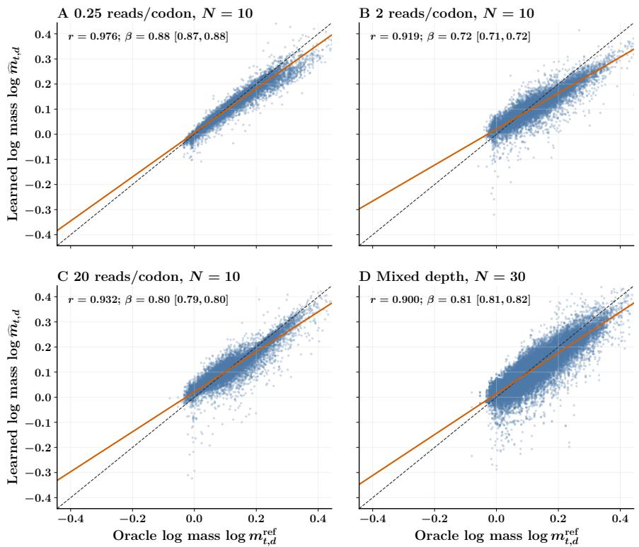  
Figure 17: Learned versus oracle aggregate mass. Points compare learned and oracle log-mass values at representative separate-depth endpoints and in the joint-depth experiment. Dashed lines mark equality; orange lines are fitted calibration associations. Dense point layers are rasterized inside the vector PDF; axes, labels, and fitted lines remain vector graphics. Agreement with the oracle mass does not imply mass one.

What the synthetic experiments establish. For the recorded bias ordering, joint training preserves observation reconstruction, follows the reference-selected shape ${ \bf { H } } _ { t } ^ { ( N ) }$ , and recovers the centered dataset corrections. Recovery of $\overline { { \mathbf { q } } } _ { t }$ improves as the included multipliers cancel in their geometric mean. Greater depth reduces count noise, whereas adding complementary conditions changes that reference shape. These are distinct mechanisms. The validation-based evaluation, single seed, shared sampling randomness, and aggregate-mass limitation delimit the claim; they leave independent-test and broader panel-composition confirmation outstanding.

## G HEK293 RIBOSOME PROFILE DATASETS

## G.1 COHORT AND PROCESSING

The cohort comprises 114 HEK-derived control datasets from 86 GEO studies, containing 230 samplelevel Ribo-seq profiles. 31 datasets contain one profile and 83 contain two to five profiles. Of these datasets, 81 derive from HEK293T, 27 from HEK293, and six from other HEK-derived cell lines. “Control” follows each source experiment’s annotation (e.g., untreated, wild-type, vehicle, or mock), rather than implying identical experimental conditions. Dataset-specific differences may therefore include both technical effects and biological variation. Table 4 lists the GEO study accessions, BioSample accessions, and number of sample profiles for each dataset..

Table 4: GEO study and BioSample accessions, with sample-profile counts, for the 114 HEK-derived datasets.
<table><tr><td>Dataset name</td><td>GSE</td><td>Sample accession(s)</td><td>Replicates</td></tr><tr><td>akichika_2019</td><td>GSE122071</td><td>SAMN10359332</td><td>1</td></tr><tr><td>andreev_2015_rep1</td><td>GSE55195</td><td>SAMN02646670</td><td>1</td></tr><tr><td>andreev_2015_rep2</td><td>GSE55195</td><td>SAMN02646671</td><td>1</td></tr><tr><td>apostolopoulos_2024_Cas13</td><td>GSE232383</td><td>SAMN35056827, SAMN35056828</td><td>2</td></tr><tr><td>apostolopoulos_2024_dCas13</td><td>GSE232383</td><td>SAMN35056823, SAMN35056824</td><td>2</td></tr><tr><td>barrington_2023</td><td>GSE202900</td><td>SAMN28209264, SAMN28209265,</td><td>3</td></tr><tr><td>calviello_2016</td><td></td><td>SAMN28209266</td><td></td></tr><tr><td>chang-2019</td><td>GSE73136</td><td>SAMN04093818</td><td>1</td></tr><tr><td>cipullo_2023</td><td>GSE132725</td><td>SAMN12056127, SAMN12056128</td><td>2</td></tr><tr><td>cui_2024</td><td>GSE242965</td><td>SAMN37386601</td><td>1</td></tr><tr><td></td><td>GSE223418</td><td>SAMN32851229, SAMN32851230, SAMN32851231</td><td>3</td></tr><tr><td>dong_2025</td><td></td><td>GSE301911 SAMN49830981, SAMN49830982</td><td>2</td></tr><tr><td>eichhorn_2014</td><td>GSE52809</td><td>SAMN02423228</td><td>1</td></tr><tr><td>eliseeva_2024</td><td>GSE249895</td><td>SAMN38765408, SAMN38765409</td><td>2</td></tr><tr><td>gillen_2021</td><td></td><td>GSE158141 SAMN16198221, SAMN16198222,</td><td>3</td></tr><tr><td>han_2020</td><td></td><td>SAMN16198223</td><td></td></tr><tr><td>han_2021</td><td></td><td>GSE133393 SAMN12145530, SAMN12145531</td><td>2</td></tr><tr><td>havkin-solomon_2023</td><td>GSE166874</td><td>SAMN17926858</td><td>1</td></tr><tr><td></td><td></td><td>GSE301928 SAMN49826093, SAMN49826094, SAMN49826095</td><td>3</td></tr><tr><td>hia_2019</td><td></td><td>GSE126298 SAMN10889012, SAMN10889013</td><td>2</td></tr><tr><td>huang_2026</td><td>GSE179871</td><td>SAMN20166012, SAMN20166013</td><td>2</td></tr><tr><td>ichihara_2021</td><td>GSE174329</td><td>SAMN19116476, SAMN19116477</td><td>2</td></tr><tr><td>ichihara_2021_chx</td><td>GSE174329</td><td>SAMN19116480, SAMN19116481</td><td>2</td></tr><tr><td>ichihara_2021_si</td><td>GSE174329</td><td>SAMN19116432, SAMN19116433</td><td>2</td></tr><tr><td>ichihara_2025</td><td>GSE288755</td><td>SAMN46547843, SAMN46547844</td><td>2</td></tr><tr><td>ichihara_2025_si</td><td>GSE288755</td><td>SAMN46547831, SAMN46547832</td><td>2</td></tr><tr><td>ingolia_2012</td><td>GSE37744</td><td>SAMN00990790, SAMN00990791,</td><td>3</td></tr><tr><td>iwasaki_2014</td><td>GSE70211</td><td>SAMN00990792 SAMN03788107, SAMN03788108,</td><td>4</td></tr><tr><td>iwasaki_2018</td><td></td><td>SAMN03788118, SAMN03788119</td><td></td></tr><tr><td>jia_2025</td><td>GSE102720 GSE277746</td><td>SAMN07513440, SAMN07513444 SAMN43867648</td><td>2</td></tr><tr><td>kashiwagi_2021</td><td>GSE174764</td><td></td><td>1</td></tr><tr><td>kito_2023</td><td></td><td>SAMN19287229, SAMN19287234</td><td>2</td></tr><tr><td>klauer_2025</td><td>GSE269144</td><td>GSE186502 SAMN22556762, SAMN22556763</td><td>2 3</td></tr><tr><td></td><td></td><td>SAMN41693166, SAMN41693167, SAMN41693168</td><td></td></tr><tr><td rowspan="4">koubek_2025 landthaler_2020</td><td>GSE294467</td><td>SAMN49963852, SAMN49963853</td><td>2</td></tr><tr><td>GSE93052</td><td>SAMN06196954, SAMN06196955,</td><td>5</td></tr><tr><td></td><td>SAMN06196956, SAMN06196957,</td><td></td></tr><tr><td></td><td>SAMN06196959</td><td></td></tr><tr><td>lee_2025</td><td></td><td>GSE282838 SAMN45068961, SAMN45068962</td><td>2</td></tr><tr><td>li_2022_1kcells</td><td></td><td>GSE151986SAMN15164538, SAMN15164539</td><td>2</td></tr><tr><td></td><td></td><td></td><td></td></tr><tr><td>li_2022_50kcells</td><td></td><td>GSE151986 SAMN15164540, SAMN15164541</td><td>2</td></tr><tr><td>li_2022_high</td><td>GSE151986</td><td>SAMN15164542, SAMN15164543</td><td>2</td></tr><tr><td>li_2022_std</td><td>GSE151986</td><td>SAMN15164536, SAMN15164537</td><td>2</td></tr><tr><td>liu_2019</td><td>GSE107588</td><td>SAMN08118010</td><td>1</td></tr><tr><td>liu_2025</td><td>GSE269734</td><td>SAMN41812977, SAMN41812981, SAMN41812985</td><td>3</td></tr><tr><td>lyabin_2020</td><td>GSE130781</td><td>SAMN11583004, SAMN11583008,</td><td>3</td></tr><tr><td>m6atrans_2025</td><td>GSE309588</td><td>SAMN11583009 SAMN52066643, SAMN52066644</td><td>3</td></tr><tr><td>mao_2019</td><td></td><td>SAMN52066645 SAMN11316860, SAMN11316864</td><td></td></tr><tr><td>mao_2019_aaa</td><td>GSE129194 GSE129194</td><td>SAMN11316862</td><td>2 1</td></tr><tr><td>mao_2023</td><td>GSE184825</td><td>SAMN21855060, SAMN21855061,</td><td>4</td></tr><tr><td>mao_2023_chx</td><td></td><td>SAMN21855062, SAMN21855063</td><td></td></tr><tr><td>martinez_2019</td><td>GSE184825 GSE125218</td><td>SAMN21855045 SAMN10760879, SAMN10760880</td><td>1</td></tr><tr><td>matsuura_suzuki_2022</td><td></td><td>GSE179854 SAMN20164010, SAMN20164011</td><td>2 2</td></tr><tr><td>mazor_2018</td><td></td><td>GSE112643 SAMN08851427</td><td>1</td></tr><tr><td>mazor_2018_chx</td><td>GSE112643</td><td>SAMN08851428</td><td>1</td></tr><tr><td>muller_2023</td><td></td><td>GSE214396SAMN31076922, SAMN31076923</td><td>2</td></tr><tr><td>oconnell_2025_centri</td><td>GSE274847</td><td>SAMN43193202, SAMN43193203</td><td>3</td></tr><tr><td>oconnell_2025_nocentri</td><td>GSE274847</td><td>SAMN43193204 SAMN43193197, SAMN43193199,</td><td>3</td></tr><tr><td>oconnell_2025_triton_01</td><td>GSE274847</td><td>SAMN43193201 SAMN43193252, SAMN43193255.</td><td>3</td></tr><tr><td>oconnell_2025_triton_05</td><td>GSE274847</td><td>SAMN43193258 SAMN43193243, SAMN43193246,</td><td>3</td></tr><tr><td>oconnell_2025_triton_1</td><td>GSE274847</td><td>SAMN43193249 SAMN43193234, SAMN43193237,</td><td>3</td></tr><tr><td>oh_2016</td><td></td><td>SAMN43193240</td><td></td></tr><tr><td>patel_2020</td><td>GSE70802</td><td>SAMN03855826, SAMN03855832</td><td>2</td></tr><tr><td>philippe_2020</td><td>GSE140366 GSE132703</td><td>SAMN13281630, SAMN13281631 SAMN12050111, SAMN12050112</td><td>2 2</td></tr><tr><td>pkm_2022</td><td>GSE202881</td><td>SAMN28207083, SAMN28207084,</td><td>3</td></tr><tr><td>rao_2020</td><td></td><td>SAMN28207085</td><td></td></tr><tr><td></td><td></td><td>GSE158374SAMN16238708, SAMN16238709, SAMN16238710</td><td>3</td></tr><tr><td>rao_2025 remes_2022</td><td>GSE297442</td><td>SAMN48541656</td><td>1</td></tr><tr><td>riepe_2018</td><td>GSE156937</td><td>SAMN15915088, SAMN15915089</td><td>2</td></tr><tr><td>rozman_2025</td><td>GSE123539 GSE309271</td><td>SAMN10564027, SAMN10564032</td><td>2</td></tr><tr><td>rozman_2025_spike</td><td>GSE309271</td><td>SAMN51886188, SAMN51886189</td><td>2</td></tr><tr><td>saito_2024_15</td><td>GSE243312</td><td>SAMN51886174.SAMN51886175</td><td>2</td></tr><tr><td>sako_2020</td><td>GSE160917</td><td>SAMN37408066, SAMN37408067</td><td>2</td></tr><tr><td>santos_2026</td><td>GSE290865</td><td>SAMN16676319, SAMN16676320</td><td>2</td></tr><tr><td>sauer_2019</td><td></td><td>SAMN47176317</td><td>1</td></tr><tr><td>schneider_poetsch_2024</td><td>GSE105172</td><td>SAMN07814395, SAMN07814396</td><td>2 2</td></tr><tr><td>sehrawat_2022</td><td>GSE233886 GSE166742</td><td>SAMN35556658. SAMN35556659 SAMN17916585</td><td>1</td></tr><tr><td>sharma_2020_dmso</td><td>GSE144140</td><td>SAMN13909719, SAMN13909720.</td><td>3</td></tr><tr><td>sharma_2021</td><td></td><td>SAMN13909721</td><td>3</td></tr><tr><td>sharma_2021_100ug_2minchx</td><td>GSE136940</td><td>SAMN12700070, SAMN12700071 SAMN12700072</td><td></td></tr><tr><td>sharma_2021_100ug_5minchx</td><td>GSE136940 GSE136940</td><td>SAMN12700069 SAMN12700057</td><td></td></tr><tr><td>sharma_2021_200_1minugchx</td><td>GSE136940</td><td>SAMN12700056</td><td>1</td></tr><tr><td>sharma_2021_200_2minugchx</td><td>GSE136940</td><td>SAMN12700055</td><td>1</td></tr><tr><td>sharma_2021_300U</td><td>GSE136940SAMN12700054</td><td></td><td></td></tr><tr><td></td><td></td><td></td><td>1</td></tr><tr><td>sharma_2021_500U</td><td>GSE136940SAMN12700052</td><td></td><td>1</td></tr><tr><td>sharma_2021_700U</td><td>GSE136940 SAMN12700051</td><td></td><td>1</td></tr><tr><td>sharma_2021_900U</td><td>GSE136940 SAMN12700044</td><td></td><td>1</td></tr><tr><td>shichino_2024</td><td>GSE184247</td><td>SAMN21450306, SAMN21450307</td><td>2</td></tr><tr><td>sidrauski_2015</td><td>GSE65778</td><td>SAMN03334842, SAMN03334848</td><td>2</td></tr><tr><td>song-2019</td><td>GSE124558</td><td>SAMN12391238, SAMN12391240</td><td>2</td></tr><tr><td>song-2019_MNase</td><td></td><td>GSE124558 SAMN12391242, SAMN12391244</td><td>2</td></tr><tr><td>soto_2021</td><td></td><td>GSE173283 SAMN18870217, SAMN18870218</td><td>2</td></tr><tr><td>spijker_2022_rnase</td><td>GSE178242SAMN24923268</td><td></td><td>1</td></tr><tr><td>spijker_2022_rnase_at</td><td>GSE178242 SAMN24923287</td><td></td><td>1</td></tr><tr><td>suzuki_2020</td><td></td><td>GSE150439 SAMN14907346, SAMN14907348</td><td>2</td></tr><tr><td>tang-2017</td><td>GSE102786 SAMN07515392</td><td></td><td>1</td></tr><tr><td>tebaldi_2018</td><td></td><td>GSE112353 SAMN08797688, SAMN08797689</td><td>2</td></tr><tr><td>thalalla_2025</td><td></td><td>GSE272399SAMN42537790, SAMN42537791,</td><td>4</td></tr><tr><td></td><td></td><td>SAMN42537792, SAMN42537793 GSE233555 SAMN35438994, SAMN35438995</td><td></td></tr><tr><td>tomuro_2024 tomuro_2024_dmso</td><td></td><td></td><td>2</td></tr><tr><td></td><td></td><td>GSE233555 SAMN35438970, SAMN35438971</td><td>2</td></tr><tr><td>tomuro_2024_hs</td><td></td><td>GSE233555 SAMN35438958, SAMN35438959</td><td>2</td></tr><tr><td>vaninsberghe_2021</td><td>GSE162060 SAMN16881237</td><td></td><td>1</td></tr><tr><td>volegova_2018</td><td>GSE118239 SAMN09779021</td><td></td><td>1</td></tr><tr><td>wan_2016</td><td></td><td>GSE80156 SAMN04632613, SAMN04632617</td><td>2</td></tr><tr><td>weber_2020</td><td></td><td>GSE144841 SAMN14049755, SAMN14049756</td><td>2</td></tr><tr><td>weber_2020_ctr</td><td></td><td>GSE149279SAMN14689053, SAMN14689056</td><td>2</td></tr><tr><td>weber_2022</td><td></td><td>GSE155854 SAMN15756319, SAMN15756320</td><td>2</td></tr><tr><td>weber_2024</td><td></td><td>GSE231964 SAMN35004565, SAMN35004566</td><td>2</td></tr><tr><td>wei_2022</td><td>GSE153142 SAMN15357005</td><td></td><td>1</td></tr><tr><td>wilczynska_2019</td><td></td><td>GSE134517 SAMN12365723, SAMN12365724, SAMN12365725</td><td>3</td></tr><tr><td>woo_2018</td><td></td><td>GSE103719 SAMN07629904, SAMN07629905, SAMN07629906, SAMN07629907</td><td>4</td></tr><tr><td>wu_2020_hek</td><td></td><td>GSE124737 SAMN10700556, SAMN10700557</td><td>2</td></tr><tr><td>wu_2021</td><td></td><td>GSE173852 SAMN19014971, SAMN19014972</td><td>2</td></tr><tr><td>yoon_2025</td><td></td><td>GSE305005 SAMN50534830, SAMN50534831.</td><td>5</td></tr><tr><td></td><td></td><td>SAMN50534832, SAMN50534833, SAMN50534834</td><td></td></tr><tr><td>zhang_2018_hek</td><td>GSE94460</td><td>SAMN06293621, SAMN06293633</td><td>2</td></tr><tr><td>zhou_2024</td><td></td><td>GSE248572 SAMN38412698, SAMN38412699</td><td>2</td></tr><tr><td>zhu_2024</td><td></td><td>GSE268324 SAMN41527436, SAMN41527437</td><td>2</td></tr><tr><td>zhu_2025_chx</td><td></td><td>GSE255657 SAMN39932460, SAMN39932462</td><td>2</td></tr><tr><td>zou_2022</td><td>GSE197265 SAMN26199030</td><td></td><td>1</td></tr><tr><td></td><td></td><td></td><td></td></tr></table>

All datasets were processed with riboseq-flow (Iosub et al., 2024), the workflow can be seen in Figure 18, using GRCh38-based references and MANE Select transcripts from GENCODE v46 for transcript and CDS coordinates. (Frankish et al., 2020; Morales et al., 2022). Cutadapt (Martin, 2011) removed adapters and applied dataset-specific clipping and read-length filtering. Bowtie2 (Langmead & Salzberg, 2012) removed reads aligning to the specified human contaminant sequences and STAR (Dobin et al., 2013) generated genomic and transcriptome alignments. STAR used end-toend alignment, allowed up to 20 mapping loci and capped the mismatch-to-read-length fraction at 0.08. FeatureCounts (Liao et al., 2014)quantified reads overlapping annotated CDS regions, assigning fractional counts to multimapping reads. EFor 11 datasets, unique molecular identifiers (UMIs) were extracted before adapter trimming, and aligned reads were deduplicated with UMI-tools (Smith et al., 2017). We applied no additional duplicate removal to the remaining 103 datasets.

RiboWaltz (Lauria et al., 2018) inferred P-site offsets for each sample and read length from transcrip tome alignments, after read-length and periodicity filtering. A 50% dominant-frame threshold was used for 110 datasets; for four datasets with weaker periodicity, the threshold was relaxed to 30% for one dataset and 10% for three to retain read-length-specific P-site inference. Read lengths excluded by this filtering received no fallback P-site offset and contributed no reads to the resulting profiles. The workflow used riboseq-flow v1.1.1, Nextflow 25.10.4 (Di Tommaso et al., 2017), and riboWaltz 1.2.0. Model-input filtering and reliability weighting are described in Section H.1.

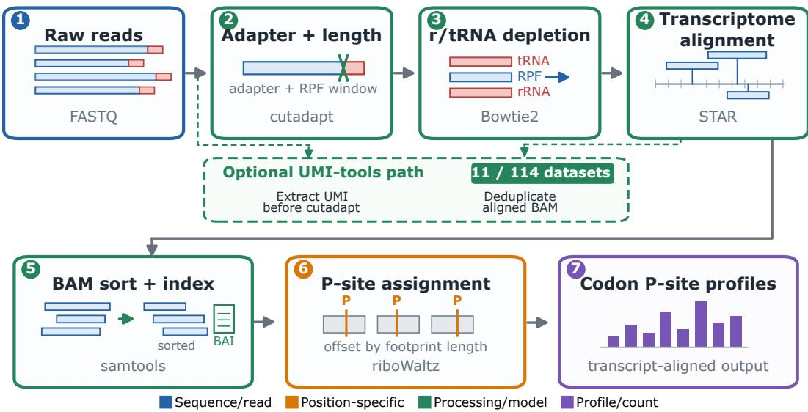  
Figure 18: Harmonized processing of HEK-derived Ribo-seq datasets. Adapter trimming, readlength filtering, contaminant depletion, alignment, and P-site assignment produce codon-resolution profiles. Dataset-specific library settings are retained; 11 datasets follow the optional UMI extraction and deduplication path.

## G.2 QUALITY CONTROL AND RANKING

Table 5 defines the ten QC components used to summarize periodicity, coding-region enrichment, sequencing support, footprint-length characteristics, mapping, contamination, and replicate agreement (Iosub et al., 2024; Lauria et al., 2018). Figure 19 shows their contributions to the dataset ranking. For transcript support, we count transcripts with CDS-level Ribo-seq TPM greater than 1 in at least half of the sample profiles within a dataset.

Table 5: Ten equally weighted components of the composite QC score. Direction indicates whether higher or lower raw values yield a better component rank. Values are cohort medians, with first and third quartiles in brackets.
<table><tr><td>Component</td><td>Implemented raw quantity</td><td>Direction</td><td>Median [Q1-Q3]</td></tr><tr><td>Periodicity</td><td>Fraction of CDS P-sites in frame 0</td><td>Higher</td><td>0.62 [0.56–0.72]</td></tr><tr><td>CDS enrichment</td><td>Fraction of assigned P-sites falling in the CDS</td><td>Higher</td><td>0.94 [0.93–0.95]</td></tr><tr><td>Depth</td><td>Base-10 logarithm of the CDS P-site count plus one</td><td>Higher</td><td>6.81 [6.25–7.23]</td></tr><tr><td>Transcript support</td><td>Number of transcripts with CDS TPM &gt; 1</td><td>Higher</td><td>11,896 [11,487–12,213]</td></tr><tr><td>RPF-length center</td><td>Absolute deviation from 30 nt of the median sample-level mean RPF length (nt)</td><td>Lower</td><td>1.78 [0.89–2.87]</td></tr><tr><td>RPF-length spread</td><td>Median sample-level RPF-length interquartile range (nt)</td><td>Lower</td><td>1.5 [1.0–3.0]</td></tr><tr><td>STAR unique</td><td>Uniquely mapped STAR reads as a percentage of total STAR input reads (%)</td><td>Higher</td><td>45.51 [27.30–56.68]</td></tr><tr><td>STAR total</td><td>Uniquely mapped plus multimapped STAR reads as a percentage of total STAR input reads (%)</td><td>Higher</td><td>84.09 [68.44–90.61]</td></tr><tr><td></td><td>r/tRNA contamination Recorded percentage of reads assigned to the local rRNA/tRNA contaminant category (%)</td><td>Lower</td><td>59.42 [42.61–72.18]</td></tr><tr><td>Replicate agreement</td><td>Median transcript-level Pearson correlation of codon profiles across dataset replicate pairs</td><td>Higher</td><td>0.19 [0.09–0.40]</td></tr></table>

For each QC metric m, datasets are ranked from most to least favourable, giving ranks $r _ { d m }$ . The composite QC score of a dataset is $\begin{array} { r } { s _ { d } = \sum _ { m = 1 } ^ { 1 0 } r _ { d m } } \end{array}$ . Lower scores indicate more favourable measured data quality. The ten ranks have equal weight, and tied raw values receive average ranks.

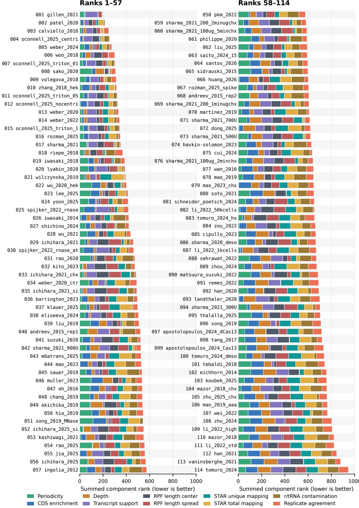  
Figure 19: QC ranking of all 114 HEK-derived datasets. Each stacked bar shows the ten equally weighted component ranks that form the composite QC score. Shorter bars indicate lower composite QC scores.

Missing replicate agreement is assigned the median rank among datasets with observed agreement. For each other metric m, missing values receive rank $n _ { m } + 1$ , where $n _ { m }$ is the number of datasets with an observed value for that metric. This ranking is a relative QC prioritization within the cohort, not validation of biological accuracy.

## H REAL-DATA EVALUATION ACROSS INDEPENDENT EXPERIMENTAL PANELS

## H.1 PROFILE ELIGIBILITY AND RELIABILITY WEIGHTS

We retain finite, nonnegative profiles with positive total count. Zero-count positions within retained profiles are kept. Raw replicates enter the NB2 likelihood separately; their arithmetic mean supplies the correlation targets and the reliability weights described below.

For transcript t in dataset d, let $D _ { t , d }$ be its mean count per codon and $C _ { t , d }$ the fraction of positions with positive counts, both calculated from the replicate mean. Let $\tau _ { d }$ be the median $D _ { t , d }$ over eligible training transcripts in dataset d. We calculate

$$
w _ { t , d } ^ { \mathrm { r a w } } = 0 . 7 0 \frac { \sqrt { D _ { t , d } } } { \sqrt { D _ { t , d } } + \sqrt { \tau _ { d } } } + 0 . 3 0 C _ { t , d } , \qquad w _ { t , d } = \frac { w _ { t , d } ^ { \mathrm { r a w } } } { \mathrm { m e d i a n } _ { u \in \mathcal { T } _ { d } ^ { \mathrm { t r a i n } } } w _ { u , d } ^ { \mathrm { r a w } } } ,\tag{43}
$$

where $\mathcal { T } _ { d } ^ { \mathrm { t r a i n } }$ contains the eligible training transcripts. The first term increases with read support, with diminishing returns, while the second rewards coverage across positions. These are heuristic reliability weights. Both $\tau _ { d }$ and the median normalization factor are calculated from training transcripts and held fixed when calculating validation and test weights.

Median normalization sets the median training weight within each dataset to one while preserving relative differences between transcripts (Figure 20). The reliability weights $w _ { t , d }$ determine the relative contributions of observed transcript–dataset pairs to the training objective (Section C.4), whereas the reference weights $\pi _ { d }$ determine the centering of dataset-specific corrections

## H.2 HEK MULTI-DATASET TRAINING SETTINGS

Both sequence branches use two-layer bidirectional GRUs with 256 hidden units per direction. The dataset-conditioned branch combines dataset identity, codon, nucleotide, amino-acid, and positional features. The correction and log-dispersion heads each have a 128-unit hidden layer with dropout 0.1; predicted log-dispersion is restricted to [−5, 1]. All fits use the centering in Equation (6), retain the product $L _ { t } \odot \gamma _ { t , d }$ without final normalization in the decoder, and optimize the objective in Appendix C.

Training uses AdamW with weight decay $1 0 ^ { - 2 }$ and learning rates $5 \times 1 0 ^ { - 4 }$ for the shared encoder, $1 0 ^ { - 3 }$ for the remaining mean-model parameters, and $1 0 ^ { - 4 }$ for the dispersion head. Learning rates are reduced when validation loss stops improving. All fits use random seed 42 and train for at most 200 epochs, with early stopping after 10 consecutive epochs without improvement in validation loss. Evaluation uses the checkpoint with the lowest validation loss.

## H.3 EVALUATION OF SHARED-PROFILE REPRODUCIBILITY

Real data provide no independent ground truth for the shared profile. We therefore evaluate whether models trained on different dataset collections produce similar shared profiles for the same held-out transcripts, and how this agreement changes with dataset selection and reference weighting. For models A and B, we compare their mean-one predictions at matching positions within each transcript:

$$
\operatorname { P C C } _ { t } ( A , B ) = \operatorname { C o r r } _ { i } \left( \widehat { L } _ { t , i } ^ { A } , \widehat { L } _ { t , i } ^ { B } \right) .\tag{44}
$$

Transcript identities, coding-sequence coordinates, and valid positions are matched before comparison.   
This measures reproducibility between models; biological accuracy requires independent validation.

## H.4 PANELS WITH INDEPENDENT EXPERIMENTAL SOURCES

We divide the 114 datasets into four panels, assigning all datasets from the same study group to the same panel. Shared source identifiers define these study groups; when unavailable, datasets are grouped by author and year. Panel assignment aims to balances median read density, positive-codon coverage, number of eligible transcripts, and replicate Pearson correlation. The resulting panels share neither datasets nor study groups (Table 6).

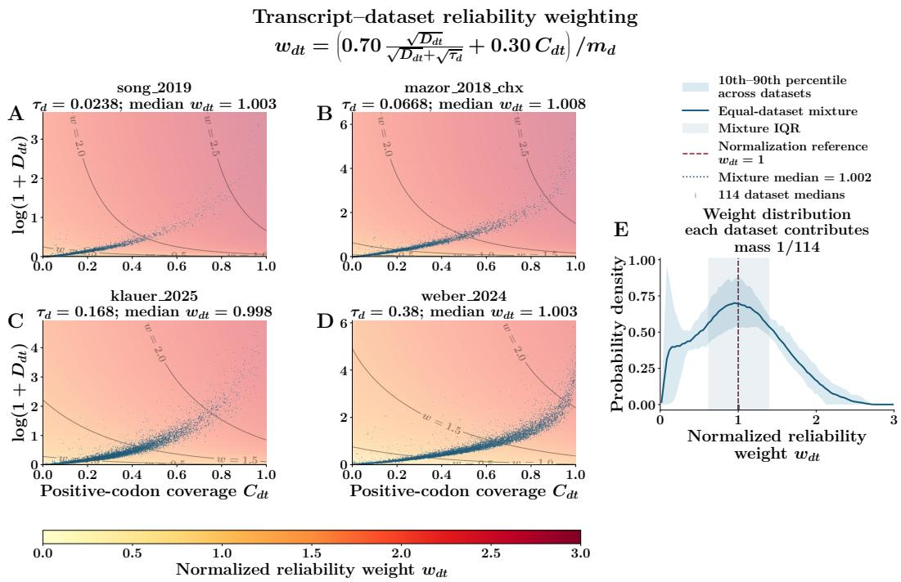  
Figure 20: Reliability weights across transcripts and datasets. (A–D) Weights as a function of positive-codon coverage and log-transformed mean count for four example datasets, using normalization statistics calculated from training transcripts. (E) Distribution of weights across 114 datasets, with each dataset contributing equally. The envelope shows the pointwise 10th–90th percentile range of dataset-specific densities; the pale band marks the interquartile range of the combined distribution. The vertical line marks a weight of one.

The evaluation pool contains 15,929 transcripts with usable observations in at least two datasets from every panel. We select 1,593 validation and 1,593 test transcripts and exclude both sets from every training fold. The training populations may differ because observation availability varies across panels. Each model uses uniform reference weights $\pi _ { d } = 1 / N$

Table 6: Four panels with independent experimental sources. All models share the same 1,593 validation and 1,593 test transcripts.
<table><tr><td>Panel</td><td>Datasets</td><td>Study groups</td><td>Training transcripts</td></tr><tr><td>1</td><td>29</td><td>20</td><td>13,261</td></tr><tr><td>2</td><td>29</td><td>21</td><td>13,613</td></tr><tr><td>3</td><td>28</td><td>22</td><td>13,595</td></tr><tr><td>4</td><td>28</td><td>22</td><td>13,340</td></tr></table>

The shared profiles show strong agreement across all six panel pairs (Figure 4), supporting reproducibility across experimental sources. These six comparisons reuse four fitted models and are therefore not six independent replications.

## H.5 EFFECT OF REFERENCE WEIGHTING ON FIXED PANELS

We next train a separate model for each panel and reference-weighting policy while keeping dataset membership fixed. We use the composite QC score defined in Appendix G.2, which combines ten measures of sequencing quality, read support, and replicate agreement For each measure, datasets are ranked from most to least favourable. The score is

$$
s _ { d } = \sum _ { m = 1 } ^ { 1 0 } r _ { d , m } ,\tag{45}
$$

where $r _ { d , m }$ is dataset d’s rank for measure m. A smaller score indicates more favourable measured data quality. This score is not used to construct the four panels above.

The weighting experiment uses their same memberships with one common split of 5,714 training, 714 validation, and 714 test transcripts. For each panel P, we compare seven reference-weighting policies: uniform weights and weights favouring either better- or worse-scoring datasets at $p \in \{ 1 , 3 , 5 \}$

$$
\pi _ { d , P } ^ { ( p , \mathrm { b e s t } ) } = \frac { s _ { d } ^ { - p } } { \sum _ { e \in P } s _ { e } ^ { - p } } , \qquad \pi _ { d , P } ^ { ( p , \mathrm { w o r s t } ) } = \frac { s _ { d } ^ { p } } { \sum _ { e \in P } s _ { e } ^ { p } } , \qquad p \in \{ 1 , 3 , 5 \} .\tag{46}
$$

Larger p concentrates the reference on fewer datasets. Across weighting policies within each panel, only the centering weights $\pi _ { d }$ change. Reliability weights $w _ { t , d } .$ , training settings, and transcript splits remain fixed.

For each test transcript, we calculate Pearson correlation and root mean squared error (RMSE) between each of the six panel pairs, then average across pairs. We report the mean over the 714 transcripts, with 95% intervals from 5,000 paired bootstrap resamples of whole transcripts.

Uniform weighting gives the highest mean Pearson correlation and lowest mean RMSE across panels among the tested policies (Table 7). Increasing p reduces mean Pearson correlation and increases mean RMSE for both weighting directions. $\mathrm { A t } p = 5 $ , favouring better-scoring datasets gives greater agreement than favouring worse-scoring datasets, but neither improves on uniform weighting. At $p = 1$ and $p = 3 .$ , favouring better-scoring datasets gives slightly higher mean Pearson correlation but also higher mean RMSE. Moreover, equal exponents need not produce equal concentration, so these comparisons do not isolate weighting direction from concentration.

The worse-scoring $p = 5$ models achieve a lower mean composite validation loss than the corresponding uniform-reference models, despite lower agreement across panels. Lower composite validation loss therefore does not necessarily imply greater reproducibility of the learned shared profile. The reference weights determine how positional structure is allocated between the shared profile and dataset-specific corrections; changing these weights therefore changes the reference used to define the shared profile.

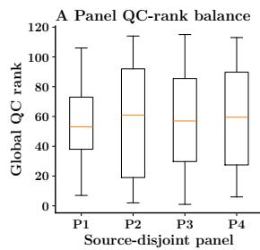

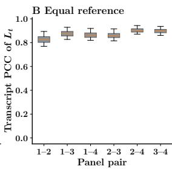

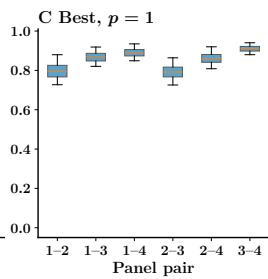

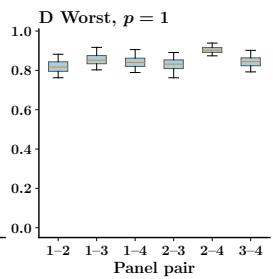

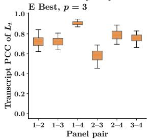

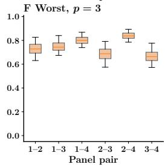

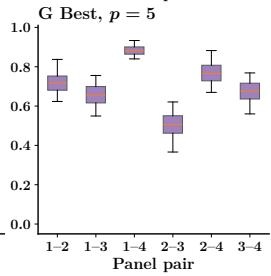

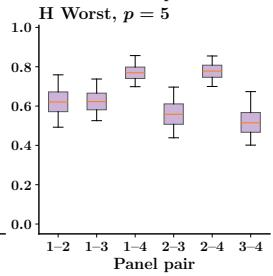  
Figure 21: Reference weighting and agreement across panels. (A) Distribution of global QC ranks within each panel; lower ranks indicate more favourable measured quality. (B–H) Within-transcript Pearson correlations for the six panel pairs under uniform weights and weights favouring betteror worse-scoring datasets at p = 1, 3, 5. The 28 fits comprise four panels evaluated under seven reference-weighting policies, all using the same 714 test transcripts. Boxes show medians and interquartile ranges; whiskers show the 5th–95th percentiles.

Table 7: Agreement between shared profiles across panels under different reference-weighting policies. Metrics are averaged over the six panel pairs within each transcript, then across transcripts. Brackets give 95% percentile intervals from 5,000 paired transcript-bootstrap resamples.
<table><tr><td>Reference weights</td><td>Mean PCC ↑</td><td></td><td>Mean RMSE↓</td></tr><tr><td>Uniform</td><td></td><td>0.8713 [0.8695, 0.8731]</td><td>0.2649 [0.2638, 0.2660]</td></tr><tr><td>Better-scoring, p = 1</td><td>0.8533 [0.8513, 0.8553]</td><td></td><td>0.3111 [0.3093, 0.3131]</td></tr><tr><td>Worse-scoring, p = 1</td><td>0.8492</td><td>[0.8472, 0.8512]</td><td>0.2987 [0.2973, 0.3001]</td></tr><tr><td>Better-scoring, p = 3</td><td>0.7463</td><td>[0.7435,0.7490]</td><td>0.5622 [0.5564, 0.5682]</td></tr><tr><td>Worse-scoring, p = 3</td><td></td><td>0.7453 [0.7424, 0.7483]</td><td>0.5295 [0.5261, 0.5328]</td></tr><tr><td>Better-scoring, p = 5</td><td>0.7007 [0.6977, 0.7036]</td><td></td><td>0.6765 [0.6701, 0.6831]</td></tr><tr><td>Worse-scoring, p = 5</td><td>0.6461 [0.6424, 0.6501]</td><td></td><td>0.7097 [0.7051, 0.7146]</td></tr></table>

## H.6 STABILITY AS DATASETS ARE ADDED

Using the QC score in Equation 45, we construct nested dataset collections of sizes $N \in$ {2, 5, 10, 20, 40, 80, 114}. The best-first sequence adds datasets from lowest to highest score; the worst-first sequence uses the reverse order. Each distinct dataset–weighting configuration is trained from scratch. We use the same 7,142-transcript cohort and 5,714/714/714 training, validation, and test split as in Appendix H.5. This keeps the training, validation, and test transcript sets fixed across collection sizes, while restricting the analysis to transcripts observed in all 114 datasets. Both the training observations and the centering reference change as datasets are added, so this experiment measures stability under their joint expansion.

Reference weights. For each collection $\mathcal { D } _ { N }$ , we compare uniform reference weights with scorebased weights defined by

$$
\pi _ { d } ^ { ( p , \mathrm { b e s t } ) } = \frac { s _ { d } ^ { - p } } { \sum _ { e \in \mathcal { D } _ { N } } s _ { e } ^ { - p } } , \qquad \pi _ { d } ^ { ( p , \mathrm { w o r s t } ) } = \frac { s _ { d } ^ { p } } { \sum _ { e \in \mathcal { D } _ { N } } s _ { e } ^ { p } } , \qquad p \in \{ 1 , 3 , 5 \} .\tag{47}
$$

Best-first collections favour better-scoring datasets, and worst-first collections favour worse-scoring datasets. To describe concentration, we report the effective number of reference datasets,

$$
N _ { \mathrm { e f f } } = \frac { 1 } { \sum _ { d } \pi _ { d } ^ { 2 } } .\tag{48}
$$

Uniform weights give $N _ { \mathrm { e f f } } = N ;$ concentrating weight on fewer datasets lowers this value. The same p can give different concentrations in the two selection directions because their score distributions differ (Figure 22).

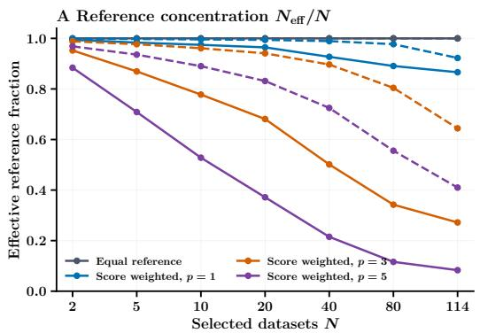

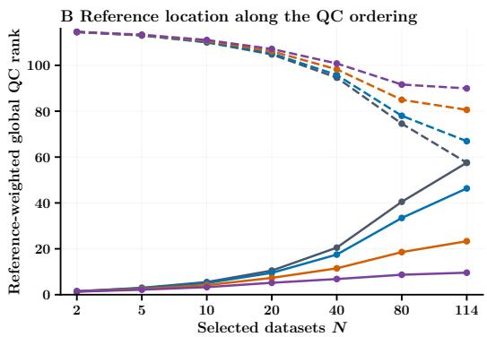  
Figure 22: Distribution of reference weights as datasets are added. (A) Effective number of reference datasets divided by panel size, $N _ { \mathrm { e f f } } / N$ . (B) Reference-weighted mean global QC rank, with lower ranks indicating more favourable measured quality. Solid lines show best-first collections; dashed lines show worst-first collections. These quantities describe the selected datasets and weights, rather than prediction performance.

Stability relative to the initial fit. For each selection direction and weighting policy, we compare the shared profile at every collection size with the profile from that same policy’s $N = \bar { 2 }$ fit (Figure 23). Compared with uniform references, concentrated references yield higher correlation with their respective initial fits along both paths, including the path starting from worse-scoring datasets. Agreement with the initial fit therefore measures stability of the representation, not biological accuracy.

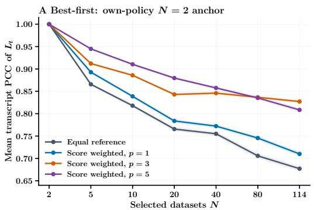

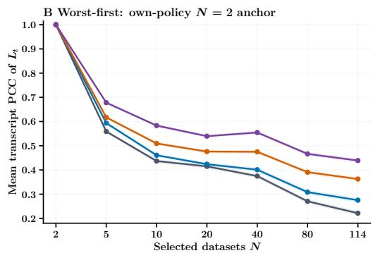  
Figure 23: Shared-profile stability as datasets are added. (A) Best-first collections. (B) Worst-first collections. Each curve reports mean transcripts-level Pearson correlation with the corresponding $N \ = \ 2$ model, using the same selection direction and reference weighting. Bands show 95% transcript-bootstrap intervals over the same 714 test transcripts. Every curve starts at one because its first point compares a model with itself.

Agreement between opposite selection directions. Direct agreement between best-first and worstfirst models also increases with collection size. These comparisons involve collections with no shared datasets through $N = 4 0 ,$ , and no shared study groups through N = 20. At N = 40, two study groups occur in both collections despite having no dataset IDs in common. At $N = 8 0$ , the collections share 46 datasets; at $N = 1 1 4$ , their membership is identical. The full-collection uniform comparison therefore uses the same model, while differences between score-weighted fits reflect their differen reference weights.

## H.7 INTERPRETATION AND SCOPE

The independent panels support reproducibility across experimental sources. In the fixed-panel comparison, uniform reference weights yield the highest mean agreement between shared profiles among the tested policies, showing that reproducibility depends on the reference definition. All experiments use one training seed and fixed panel assignments; bootstrap intervals describe variation across evaluated transcripts, not across alternative training runs or panel assignments. Agreement across panels can still reflect measurement effects common to those panels or assumptions shared by the fitted models. Independent biological measurements remain necessary to establish how faithfully the shared profile reflects ribosome occupancy.

## I CROSS-ORGANISM BENCHMARK PANEL

We evaluate RiboUnmix using models trained separately on four organism-specific Ribo-seq benchmarks: C. elegans N2 and S. cerevisiae BY4741 from Stein et al. (2022), E. coli K-12 MG1655 from Burkhardt et al. (2017), and human HEK293T from Iwasaki et al. (2016). All datasets represent control or wild-type conditions. Dataset details are summarized in Table 8. The accessions are GSE152850 (SRR12055094, SRR12055095 for C. elegans; SRR12055102, SRR12055105 for yeast), GSE77617 (SRR3147100 for E. coli), and GSE70211 (SRR2075925, SRR2075926, SRR2075936, SRR2075937 for human).

Table 8: Ribo-seq benchmark datasets across four organisms. Each dataset was reprocessed through the same core workflow using an organism-specific genome and CDS annotation.
<table><tr><td>Dataset</td><td>Organism / system</td><td>Assembly / Annotation / CDS model</td><td>RPF lengths (nt)</td><td>Profiles</td></tr><tr><td>stein_2021</td><td>C. elegans N2</td><td>WBcel235; Ensembl 115, longest CDS/gene</td><td>20-35</td><td>2</td></tr><tr><td>zhang-2016</td><td>E. coli K-12 MG1655</td><td>ASM584v2; one CDS/locus tag</td><td>20-40</td><td>1</td></tr><tr><td>stein_2021_yeast</td><td>S. cerevisiae BY4741</td><td>R64-1-1; longest-CDS model</td><td>20-35</td><td>2</td></tr><tr><td>iwasaki_2014</td><td>Human HEK293T</td><td>GRCh38; GENCODE v46 MANE Select</td><td>26-34</td><td>4</td></tr></table>

## I.1 SHARED PROCESSING OF SEQUENCING READS

All datasets were processed using the riboseq-flow v1.1.1 (Iosub et al., 2024) workflow shown in Figure 18, with organism-specific references and read-length ranges. Reads are adapter-trimmed and length-filtered with cutadapt (Martin, 2011), depleted of rRNA and tRNA reads with Bowtie2 (Langmead & Salzberg, 2012) and aligned to organism-specific transcript references with STAR (Dobin et al., 2013). Alignments are sorted and indexed with samtools (Li et al., 2009), and codingsequence reads are quantified with featureCounts (Liao et al., 2014). STAR permits reads to map to at most 20 locations and featureCounts assigns fractional counts to multimapping reads. RiboWaltz estimates P-site offsets separately for each sample and read length, which are used to construct codon-resolution P-site profiles. (Lauria et al., 2018).

The references are WBcel235 with the Ensembl 115 longest coding sequence per gene for C. elegans; RefSeq GCF 000005845.2 with one coding sequence per locus and 50-nucleotide synthetic flanks for E. coli; the SGD-derived R64-1-1 longest-coding-sequence model for yeast; and GRCh38 with GENCODE v46 (Frankish et al., 2020) MANE Select (Morales et al., 2022) transcripts for human. No terminal codons are removed during this shared processing stage. Model-specific filtering, normalization, and training masks are applied afterward, as described below.

## I.2 COMMON TEST POPULATION

We compare RiboUnmix with iXnos (Tunney et al., 2018), RiboExp (Hu et al., 2021), sequence-only Riboformer (Shao et al., 2024), RiboMIMO (Tian et al., 2021), and Seq2Ribo (Kaynar & Kingsford, 2026). For each organism, eligible transcripts are partitioned into training, validation, and test sets using 8 : 1 : 1 ratio with seed 42. In native settings, model-specific eligibility filters determine which assigned training and validation transcripts are used. These filters do not restrict the assigned test population.

The assigned test populations contain 1,301 C. elegans, 414 E. coli, 1,499 human, and 506 yeast transcripts. All settings are evaluated after removing five codons from each end of the coding sequence. Thus, native filtering rules such as RiboExp’s selection of high-density transcripts or RiboMIMO’s coverage threshold do not restrict the test set.

## I.3 MODEL-SPECIFIC PREPROCESSING AND TRAINING SETTINGS

Different models use different rules for selecting transcripts, normalizing counts, and including zero-count or terminal positions in their training losses. We therefore report three settings for each baseline:

• Native: the model’s reported implementation of its published-style preprocessing and training procedure.

• Matched–U: all eligible transcripts in the common training split, the matched baseline target preparation described below, and uniform transcript weights.

• Matched–W: the same preparation as Matched–U, with transcript reliability weights from Equation 43.

Matched–U and Matched–W compare training with and without reliability weighting under a shared preprocessing scheme. Model-specific objectives and checkpoint criteria still differ.

## Native preprocessing and checkpoint selection.

• iXnos. Native iXnos requires at least 200 counts and 100 positive-count positions in the CDS window remaining after 20 codons are removed from each end. Zero targets remain in the squared-error objective. The selected checkpoint has the lowest validation mean squared error (MSE) over 30 epochs.

• RiboExp. The 500 transcripts with the highest mean footprint density are selected before intersection with the fixed split. Targets at or below 10−6 are completely omitted from the dataset (and thus excluded from the regression loss). Checkpoint selection maximizes validation Pearson correlation, with an early-stopping patience of 50 epochs.

• Riboformer. The native run uses an unweighted objective and its natively filtered training set, which restricts transcripts to coding sequences >200 nt and a mean footprint density in the top quartile of those length-eligible candidates. Checkpoint selection maximizes pooled, unweighted validation Pearson correlation.

• RiboMIMO. Training transcripts are retained when greater than 60% of positions exceed 0.5 counts. Profiles are normalized by the mean count over those positions, and five codons at each end are masked during training. The coverage filter is not applied to the validation cohort. The objective is unweighted, and checkpoint selection maximizes validation Pearson correlation.

• Seq2Ribo. The native run uses the supplied publication-based training and validation filters, restricting the dataset to transcripts with a valid start codon, no internal stop codons and positive total reads. It then selects the checkpoint with the lowest validation loss.

Matched preprocessing. Matched baseline runs use all eligible transcripts in the parent training split and divide each observed profile by its mean over positive-count positions. No terminal mask is applied during fitting. For each baseline, Matched–U and Matched–W use identical validation and test transcript lists.

RiboMIMO, RiboExp and Riboformer runs select checkpoints by validation Pearson correlation. Seq2Ribo selects based on validation loss and iXnos based on validation MSE. Table 9 reports cohort sizes and selected epochs.

For human Riboformer Matched–U, validation Pearson correlation was undefined at every epoch, and the implemented fallback selected epoch 1. Its constant test predictions also give undefined Pearson and Spearman correlations. Undefined correlations are marked with dashes.

Models architecture and optimization. RiboMIMO uses 97 one-hot features per codon and a two-layer bidirectional GRU with 256 hidden units and no dropout. iXnos uses 760 one-hot features per codon and a feedforward MLP with a single hidden layer of 200 units and no dropout. Riboexp uses 90 one-hot features per codon (codon, nucleotide, and position) and an actor-critic policy network paired with a single-layer bidirectional GRU with 512 hidden units and 0.4 dropout. Riboformer uses 8-dimensional embeddings for 65 codon tokens and positions, processed by a five-layer CNN tower and a single Transformer block (10 heads) with 0.4 dropout in its dense head. Seq2ribo uses embeddings for 65 codon tokens, a scalar simulation feature, and three geometric features, processed by four Mamba layers with 192 hidden units and 0.1 dropout.

<table><tr><td>Architecture / setting</td><td>C. elegans</td><td>E. coli</td><td>Human</td><td>S. cerevisiae</td><td>Checkpoint criterion</td></tr><tr><td>iXnos native</td><td>3,710 (28)</td><td>1,010 (24)</td><td>2,296 (22)</td><td>2,538 (27)</td><td>minimum validation MSE</td></tr><tr><td>→ matched-U</td><td>10,412 (30)</td><td>3,307 (30)</td><td>11,989 (14)</td><td>4,043 (29)</td><td>minimum validation MSE</td></tr><tr><td>→ matched-W</td><td>10,412 (30)</td><td>3,307 (16)</td><td>11,989 (14)</td><td>4,043 (29)</td><td>minimum validation MSE</td></tr><tr><td>RiboExp native</td><td>407 (170)</td><td>409 (43)</td><td>413 (68)</td><td>418 (76)</td><td>maximum validation Pearson</td></tr><tr><td>↔→ matched-U</td><td>10,412 (7)</td><td>3,307 (24)</td><td>11,989 (25)</td><td>4,043 (47)</td><td>maximum validation Pearson</td></tr><tr><td>→ matched-W</td><td>10,412 (18)</td><td>3,307 (21)</td><td>11,989 (29)</td><td>4,043 (48)</td><td>maximum validation Pearson</td></tr><tr><td>Riboformer native</td><td>2,575 (6)</td><td>785 (6)</td><td>2,982 (11)</td><td>995 (6)</td><td>maximum validation Pearson</td></tr><tr><td>→ matched-U</td><td>10,412 (2)</td><td>3,307 (4)</td><td>11,989 (1*)</td><td>4,043 (3)</td><td>maximum validation Pearson</td></tr><tr><td>↔→ matched-W</td><td>10,412 (3)</td><td>3,307 (5)</td><td>11,989 (11)</td><td>4,043 (6)</td><td>maximum validation Pearson</td></tr><tr><td>Seq2Ribo native</td><td>10,408 (3)</td><td>3,305 (1)</td><td>11,964 (1)</td><td>4,040 (5)</td><td>minimum validation loss</td></tr><tr><td>↔→ matched-U</td><td>10,412 (1)</td><td>3,307 (1)</td><td>11,989 (1)</td><td>4,043 (1)</td><td>minimum validation loss</td></tr><tr><td>→ matched-W</td><td>10,412 (1)</td><td>3,307 (1)</td><td>11,989 (1)</td><td>4,043 (1)</td><td>minimum validation loss</td></tr><tr><td>RiboMIMO native</td><td>2,644 (13)</td><td>800 (17)</td><td>875 (30)</td><td>1,796 (21)</td><td>maximum validation Pearson</td></tr><tr><td>→ matched-U</td><td>10,412 (6)</td><td>3,307 (8)</td><td>11,989 (26)</td><td>4,043 (10)</td><td>maximum validation Pearson</td></tr><tr><td>→ matched-W</td><td>10,412 (6)</td><td>3,307 (13)</td><td>11,989 (21)</td><td>4,043 (10)</td><td>maximum validation Pearson</td></tr><tr><td>RiboUnmix weighted</td><td>10,412 (9)</td><td>3,307 (10)</td><td>11,989 (7)</td><td>4,043 (12)</td><td>minimum validation loss</td></tr></table>

Table 9: Training cohorts and validation-selected checkpoints by architecture and setting. Each organism cell gives the number of training transcripts followed by the selected epoch in parentheses. Native uses the model-specific preprocessing; matched–U and matched–W use the full RiboUnmix cohort and and matched baseline target preparation without or with the reliability weights from Equation (43). \*Human Riboformer matched–U had undefined validation Pearson at every epoch, so it fell back to epoch 1.

## I.4 EVALUATION AND RESULTS

Pearson and Spearman correlations are calculated within each transcript using positive-count positions after excluding the first and last five codons, between the expected measured profile $\mu _ { t , d }$ and the replicate-mean observation $\bar { Y } _ { t , d }$ . Normalized root mean squared error (RMSE) uses the same positions. Before calculating nRMSE, each model’s target normalization is reversed using the corresponding transcript-specific scale factor. For each transcript, predicted and observed counts are divided by the mean observed count across the entire trimmed window, including zero-count positions. Because predictions are not normalized by their own mean, RMSE retains amplitude errors relative to the supplied observed transcript scale.

Each result is the median transcript-level metric. Undefined correlations, such as those involving constant predictions or targets, are omitted rather than replaced by zero. For matched RiboMIMO and RiboUnmix, correlations are defined for 1,114 of 1,301 C. elegans, 337 of 414 E. coli, 1,329 of 1,499 human, and 488 of 506 yeast transcripts. Available-prediction and valid-correlation counts are reported for every setting; human Riboformer Matched–U has no defined correlations. Consequently, a common intended test population does not guarantee identical metric-valid subsets for every model.

For each organism and setting, we estimate uncertainty using 10,000 bootstrap resamples of transcripts, recomputing the median for each resample. Tables report each median plus or minus half the width of its 95% percentile interval. This compact notation does not preserve any asymmetry of the original interval. The intervals describe transcript sampling variation for a fixed trained model; they do not include variation between training seeds or provide paired tests of model differences.

RiboUnmix has the highest median Pearson point estimate in all four organisms and the highest median Spearman point estimate in three. In C. elegans, native RiboMIMO has a slightly higher median Spearman estimate than RiboUnmix, 0.279 versus 0.277. The lowest normalized RMSE depends on the organism and setting (Table 10).

Compared with Matched–U, Matched–W yields higher median Pearson point estimates for RiboMIMO and RiboExp in all four organisms. For Riboformer, Matched–W yields higher median Pearson estimates in the three organisms with defined correlations in both matched settings. In human, correlations are defined for Matched–W but undefined for Matched–U. Its effect on iXnos and Seq2Ribo depends on the organism. Native-versus-matched comparisons jointly change transcript selection, normalization, masking, and, for some models, checkpoint selection, so differences cannot be attributed to a single preprocessing choice.

The benchmark compares complete prediction pipelines under both native and matched preprocessing. Matching training cohorts reduces one source of variation, while model-specific losses, checkpointselection criteria, and the use of a single training seed limit attribution of the remaining differences to architecture alone.

<table><tr><td rowspan="2">Architecture / setting</td><td colspan="3">C. elegans</td><td colspan="3"> $E , c o l i$ </td></tr><tr><td>Pearson</td><td>Spearman</td><td>RMSE</td><td>Pearson</td><td>Spearman</td><td>RMSE</td></tr><tr><td>iXnos native</td><td> $0 . 2 8 6 \pm 0 . 0 2 0$ </td><td> $0 . 2 4 2 \pm 0 . 0 2 0$ </td><td> $\mathbf { 1 . 9 4 4 \pm 0 . 2 7 1 }$ </td><td> $0 . 3 7 2 \pm 0 . 0 3 0$ </td><td> $0 . 3 6 7 \pm 0 . 0 2 7$ </td><td> $3 . 8 4 4 \pm 0 . 6 9 8$ </td></tr><tr><td> $\hookrightarrow \ m a t c h e d - U$ </td><td> $0 . 2 4 1 \pm 0 . 0 1 9$ </td><td> $0 . 2 1 1 \pm 0 . 0 1 5$ </td><td> $2 . 4 0 3 \pm 0 . 3 6 7$ </td><td> $0 . 3 4 4 \pm 0 . 0 2 4$ </td><td> $0 . 3 5 0 \pm 0 . 0 1 7$ </td><td> $4 . 0 6 2 \pm 0 . 6 4 0$ </td></tr><tr><td>→ matched-W</td><td> $0 . 2 7 1 \pm 0 . 0 1 6$ </td><td> $0 . 2 3 7 \pm 0 . 0 1 4$ </td><td> $2 . 0 4 8 \pm 0 . 3 0 1$ </td><td> $0 . 3 5 0 \pm 0 . 0 2 8$ </td><td> $0 . 3 5 3 \pm 0 . 0 2 2$ </td><td> $3 . 8 8 2 \pm 0 . 6 1 7$ </td></tr><tr><td>RiboExp native</td><td> $0 . 2 6 9 \pm 0 . 0 2 2$ </td><td> $0 . 2 3 9 \pm 0 . 0 1 7$ </td><td> $2 . 2 1 9 \pm 0 . 3 7 1$ </td><td> $0 . 3 6 4 \pm 0 . 0 2 6$ </td><td> $0 . 3 5 9 \pm 0 . 0 2 1$ </td><td> $5 . 1 7 6 \pm 1 . 4 0 1$ </td></tr><tr><td>→ matched-U</td><td> $0 . 2 0 4 \pm 0 . 0 1 3$ </td><td> $0 . 1 6 5 \pm 0 . 0 1 2$ </td><td> $2 . 3 6 4 \pm 0 . 3 4 7$ </td><td> $0 . 3 4 0 \pm 0 . 0 2 4$ </td><td> $0 . 3 2 3 \pm 0 . 0 2 2$ </td><td> $3 . 9 2 7 \pm 0 . 5 8 8$ </td></tr><tr><td>→ matched-W</td><td> $0 . 2 5 3 \pm 0 . 0 1 8$ </td><td> $0 . 2 1 6 \pm 0 . 0 1 6$ </td><td> $\mathbf { 1 . 9 6 4 \pm 0 . 2 8 1 }$ </td><td> $0 . 3 7 4 \pm 0 . 0 2 4$ </td><td> $0 . 3 5 8 \pm 0 . 0 2 7$ </td><td> $\mathbf { 3 . 7 3 0 \pm 0 . 5 9 0 }$ </td></tr><tr><td>Riboformer native</td><td> $0 . 2 9 7 \pm 0 . 0 2 3$ </td><td> $0 . 2 5 3 \pm 0 . 0 1 6$ </td><td> $2 . 0 0 0 \pm 0 . 3 4 5$ </td><td> $0 . 4 7 9 \pm 0 . 0 2 6$ </td><td> $0 . 4 5 9 \pm 0 . 0 3 0$ </td><td> $4 . 9 8 7 \pm 1 . 2 2 2$ </td></tr><tr><td>→ matched-U</td><td> $0 . 2 1 5 \pm 0 . 0 1 5$ </td><td> $0 . 1 9 2 \pm 0 . 0 1 1$ </td><td> $2 . 4 2 1 \pm 0 . 3 8 4$ </td><td> $0 . 4 6 1 \pm 0 . 0 3 5$ </td><td> $0 . 4 5 0 \pm 0 . 0 2 7$ </td><td> $4 . 0 9 0 \pm 0 . 7 3 7$ </td></tr><tr><td>→ matched-W</td><td> $0 . 2 5 7 \pm 0 . 0 2 1$ </td><td> $0 . 2 2 6 \pm 0 . 0 1 6$ </td><td> $2 . 1 5 4 \pm 0 . 3 1 6$ </td><td> $0 . 4 6 6 \pm 0 . 0 3 2$ </td><td> $0 . 4 4 9 \pm 0 . 0 3 7$ </td><td> $3 . 8 4 6 \pm 0 . 7 5 3$ </td></tr><tr><td>Seq2Ribo native</td><td> $0 . 1 5 5 \pm 0 . 0 1 6$ </td><td> $0 . 1 6 7 \pm 0 . 0 1 3$ </td><td> $3 . 1 3 5 \pm 0 . 5 9 9$ </td><td> $0 . 2 0 1 \pm 0 . 0 2 4$ </td><td> $0 . 2 6 3 \pm 0 . 0 1 8$ </td><td> $5 . 7 3 7 \pm 1 . 3 3 4$ </td></tr><tr><td>→ matched-U</td><td> $0 . 1 7 3 \pm 0 . 0 1 9$ </td><td> $0 . 1 7 1 \pm 0 . 0 1 4$ </td><td> $2 . 6 7 2 \pm 0 . 4 4 3$ </td><td> $0 . 2 2 4 \pm 0 . 0 2 5$ </td><td> $0 . 2 7 5 \pm 0 . 0 2 3$ </td><td> $4 . 7 5 6 \pm 0 . 7 4 4$ </td></tr><tr><td>→ matched-W</td><td> $0 . 2 0 1 \pm 0 . 0 1 7$ </td><td> $0 . 1 9 0 \pm 0 . 0 1 6$ </td><td> $2 . 5 4 5 \pm 0 . 3 5 7$ </td><td> $0 . 2 3 6 \pm 0 . 0 2 8$ </td><td> $0 . 2 8 7 \pm 0 . 0 2 0$ </td><td> $4 . 5 7 3 \pm 0 . 7 5 4$ </td></tr><tr><td>RiboMIMO native</td><td> ${ \bf 0 . 3 2 8 \pm 0 . 0 2 2 }$ </td><td> $\underline { { \mathbf { 0 . 2 7 9 \pm 0 . 0 1 7 } } }$ </td><td> $\mathbf { 1 . 9 5 8 \pm 0 . 2 8 7 }$ </td><td> $0 . 5 1 9 \pm 0 . 0 3 4$ </td><td> $0 . 4 8 2 \pm 0 . 0 3 5$ </td><td> $5 . 6 3 1 \pm 1 . 4 4 8$ </td></tr><tr><td>→ matched-U</td><td> $0 . 2 9 6 \pm 0 . 0 1 9$ </td><td> $0 . 2 5 7 \pm 0 . 0 1 6$ </td><td> $\underline { { \mathbf { 1 . 7 6 1 } \pm \mathbf { 0 . 2 1 8 } } }$ </td><td> $0 . 4 9 0 \pm 0 . 0 3 4$ </td><td> $0 . 4 6 5 \pm 0 . 0 2 7$ </td><td> $\underline { { 3 . 3 2 5 \pm 0 . 4 7 3 } }$ </td></tr><tr><td>→ matched-W</td><td> $\mathbf { 0 . 3 2 5 \pm 0 . 0 2 4 }$ </td><td> ${ \bf 0 . 2 6 9 \pm 0 . 0 1 9 }$ </td><td> $\mathbf { 1 . 7 6 4 \pm 0 . 2 4 0 }$ </td><td> $0 . 5 1 6 \pm 0 . 0 2 8$ </td><td> $0 . 4 8 7 \pm 0 . 0 3 7$ </td><td> $\overline { { { 3 . 6 6 8 \pm 0 . 6 7 7 } } }$ </td></tr><tr><td>RiboUnmix weighted</td><td> $\underline { { \mathbf { 0 . 3 3 5 \pm 0 . 0 2 6 } } }$ </td><td> $\mathbf { 0 . 2 7 7 \pm 0 . 0 1 9 }$ </td><td> $2 . 3 9 4 \pm 0 . 5 0 2$ </td><td> $\underline { { \mathbf { 0 . 5 5 6 \pm 0 . 0 2 7 } } }$ </td><td> $\underline { { \mathbf { 0 . 5 2 1 } \pm \mathbf { 0 . 0 3 0 } } }$ </td><td> $3 . 9 0 8 \pm 0 . 7 4 5$ </td></tr></table>

<table><tr><td rowspan="2">Architecture / setting</td><td colspan="3">Human (HEK293T)</td><td colspan="3">S. cerevisiae</td></tr><tr><td>Pearson</td><td> ${ \mathrm { S p e a r m a n } }$ </td><td>RMSE</td><td>Pearson</td><td>Spearman</td><td>RMSE</td></tr><tr><td>iXnos native</td><td> $0 . 4 6 8 \pm 0 . 0 1 9$ </td><td> $0 . 3 7 2 \pm 0 . 0 1 5$ </td><td> $3 . 8 7 2 \pm 0 . 2 9 4$ </td><td> $0 . 4 4 2 \pm 0 . 0 1 8$ </td><td> $0 . 3 6 7 \pm 0 . 0 1 5$ </td><td> $\overline { { { \bf 1 . 1 0 2 \pm 0 . 0 6 2 } } }$ </td></tr><tr><td>→ matched-U</td><td> $0 . 4 7 7 \pm 0 . 0 1 8$ </td><td> $0 . 3 7 8 \pm 0 . 0 1 1$ </td><td> $4 . 1 6 1 \pm 0 . 2 7 0$ </td><td> $0 . 4 3 1 \pm 0 . 0 1 9$ </td><td> $0 . 3 6 1 \pm 0 . 0 1 7$ </td><td> $1 . 1 6 4 \pm 0 . 0 6 1$ </td></tr><tr><td>→ matched-W</td><td> $0 . 4 7 2 \pm 0 . 0 1 4$ </td><td> $0 . 3 7 5 \pm 0 . 0 1 2$ </td><td> $3 . 8 2 4 \pm 0 . 2 5 7$ </td><td> $0 . 4 4 4 \pm 0 . 0 1 9$ </td><td> $0 . 3 6 5 \pm 0 . 0 1 9$ </td><td> $\mathbf { 1 . 1 0 7 \pm 0 . 0 5 7 }$ </td></tr><tr><td>RiboExp native</td><td> $0 . 4 0 7 \pm 0 . 0 1 8$ </td><td> $0 . 3 5 2 \pm 0 . 0 1 2$ </td><td> $5 . 2 1 4 \pm 0 . 5 4 9$ </td><td> $0 . 4 0 5 \pm 0 . 0 2 2$ </td><td> $0 . 3 4 1 \pm 0 . 0 1 9$ </td><td> $\mathbf { 1 . 1 0 9 \pm 0 . 0 5 9 }$ </td></tr><tr><td>→ matched-U</td><td> $0 . 3 3 9 \pm 0 . 0 1 4$ </td><td> $0 . 3 1 6 \pm 0 . 0 0 9$ </td><td> $4 . 4 0 0 \pm 0 . 2 5 7$ </td><td> $0 . 4 3 5 \pm 0 . 0 1 4$ </td><td> $0 . 3 3 9 \pm 0 . 0 1 5$ </td><td> $1 . 1 4 3 \pm 0 . 0 5 5$ </td></tr><tr><td>→ matched-W</td><td> $0 . 4 1 8 \pm 0 . 0 1 3$ </td><td> $0 . 3 2 3 \pm 0 . 0 0 9$ </td><td> $3 . 6 5 1 \pm 0 . 1 8 8$ </td><td> $0 . 4 5 6 \pm 0 . 0 2 0$ </td><td> $0 . 3 6 8 \pm 0 . 0 2 5$ </td><td> $\mathbf { 1 . 0 5 3 \pm 0 . 0 6 1 }$ </td></tr><tr><td>Riboformer native</td><td> $0 . 4 5 8 \pm 0 . 0 1 8$ </td><td> $0 . 3 7 1 \pm 0 . 0 1 3$ </td><td> $4 . 1 9 3 \pm 0 . 3 7 1$ </td><td> $0 . 4 1 7 \pm 0 . 0 1 9$ </td><td> $0 . 3 5 4 \pm 0 . 0 2 3$ </td><td> $1 . 1 3 4 \pm 0 . 0 7 5$ </td></tr><tr><td>→ matched-U</td><td></td><td></td><td> $5 . 2 1 8 \pm 0 . 3 6 3$ </td><td> $0 . 4 1 5 \pm 0 . 0 1 7$ </td><td> $0 . 3 5 0 \pm 0 . 0 2 3$ </td><td> $1 . 1 9 2 \pm 0 . 0 6 9$ </td></tr><tr><td>→ matched-W</td><td> $0 . 4 6 5 \pm 0 . 0 1 7$ </td><td> $0 . 3 7 0 \pm 0 . 0 1 2$ </td><td> $3 . 7 6 8 \pm 0 . 2 1 2$ </td><td> $0 . 4 3 5 \pm 0 . 0 1 6$ </td><td> $0 . 3 6 2 \pm 0 . 0 2 2$ </td><td> $1 . 1 2 5 \pm 0 . 0 6 7$ </td></tr><tr><td>Seq2Ribo native</td><td> $0 . 1 9 4 \pm 0 . 0 1 0$ </td><td> $0 . 2 2 2 \pm 0 . 0 0 9$ </td><td> $4 . 4 6 5 \pm 0 . 3 1 7$ </td><td> $0 . 2 4 5 \pm 0 . 0 1 4$ </td><td> $0 . 2 4 2 \pm 0 . 0 1 4$ </td><td> $1 . 6 9 7 \pm 0 . 1 5 2$ </td></tr><tr><td>→ matched-U</td><td> $0 . 2 2 3 \pm 0 . 0 1 2$ </td><td> $0 . 2 4 5 \pm 0 . 0 0 9$ </td><td> $4 . 2 6 8 \pm 0 . 2 8 7$ </td><td> $0 . 3 5 0 \pm 0 . 0 1 8$ </td><td> $0 . 3 1 4 \pm 0 . 0 1 2$ </td><td> $1 . 2 0 3 \pm 0 . 0 7 4$ </td></tr><tr><td>→ matched-W</td><td> $0 . 2 2 2 \pm 0 . 0 1 2$ </td><td> $0 . 2 4 3 \pm 0 . 0 0 9$ </td><td> $4 . 2 8 0 \pm 0 . 3 3 8$ </td><td> $0 . 3 4 7 \pm 0 . 0 1 4$ </td><td> $0 . 3 1 1 \pm 0 . 0 1 7$ </td><td> $1 . 1 8 8 \pm 0 . 0 8 3$ </td></tr><tr><td>RiboMIMO native</td><td> $0 . 4 4 0 \pm 0 . 0 1 7$ </td><td> $0 . 3 7 2 \pm 0 . 0 1 3$ </td><td> $4 . 6 9 2 \pm 0 . 4 1 1$ </td><td> $0 . 4 9 2 \pm 0 . 0 1 6$ </td><td> $\mathbf { 0 . 4 0 3 \pm 0 . 0 1 8 }$ </td><td> $\mathbf { 1 . 0 6 1 \pm 0 . 0 7 3 }$ </td></tr><tr><td>→ matched-U</td><td> $0 . 4 4 0 \pm 0 . 0 1 7$ </td><td> $0 . 3 4 5 \pm 0 . 0 1 2$ </td><td> $\mathbf { 3 . 3 2 2 \pm 0 . 2 2 0 }$ </td><td> $0 . 4 8 9 \pm 0 . 0 2 2$ </td><td> $\mathbf { 0 . 4 0 1 \pm 0 . 0 1 9 }$ </td><td> $\underline { { \mathbf { 1 . 0 4 7 \pm 0 . 0 6 9 } } }$ </td></tr><tr><td>→ matched-W</td><td> $0 . 4 6 1 \pm 0 . 0 1 6$ </td><td> $0 . 3 6 8 \pm 0 . 0 1 1$ </td><td> $\underline { { 3 . 3 1 6 \pm 0 . 2 3 5 } }$ </td><td> $\mathbf { 0 . 5 0 2 \pm 0 . 0 1 9 }$ </td><td> $\mathbf { 0 . 4 0 5 \pm 0 . 0 1 8 }$ </td><td> $\mathbf { 1 . 0 5 3 \pm 0 . 0 6 8 }$ </td></tr><tr><td>RiboUnmix weighted</td><td> $\mathbf { 0 . 5 3 9 \pm 0 . 0 1 9 }$ </td><td> $\mathbf { 0 . 4 1 2 \pm 0 . 0 1 2 }$ </td><td> $3 . 8 3 0 \pm 0 . 2 8 2$ </td><td> $\mathbf { 0 . 5 1 7 \pm 0 . 0 2 4 }$ </td><td> $\mathbf { 0 . 4 1 5 \pm 0 . 0 1 9 }$ </td><td> $\mathbf { 1 . 0 7 2 \pm 0 . 0 7 8 }$ </td></tr></table>

Table 10: Benchmark performance across four organisms and training settings. Entries report median transcript-level metrics ± half the width of their 95% percentile bootstrap with 10,000 transcript resamples. All metrics compare predicted and observed profiles at positions with positive observed counts after excluding the first and last five codons of each CDS. For normalized RMSE, target and prediction are first divided by the target mean over the complete trimmed window, including zero-count positions For the baselines, native denotes model-specific preprocessing and training, whereas matched–U and matched–W use a common training cohort and target preparation with uniform and reliability-based transcript weights, respectively. Dashes indicate undefined correlations caused by constant test predictions for human Riboformer matched–U. The best point estimate in each organism–metric column is bold and underlined (maximum for correlations; minimum for RMSE). Bold without underlining marks another point estimate that falls inside the best entry’s reported $\widehat { m } _ { \mathrm { b e s t } } \pm \Delta _ { 9 5 , \mathrm { b e s t } }$ span. This visual rule is descriptive and is not a paired significance test. See Section I.4 for details.