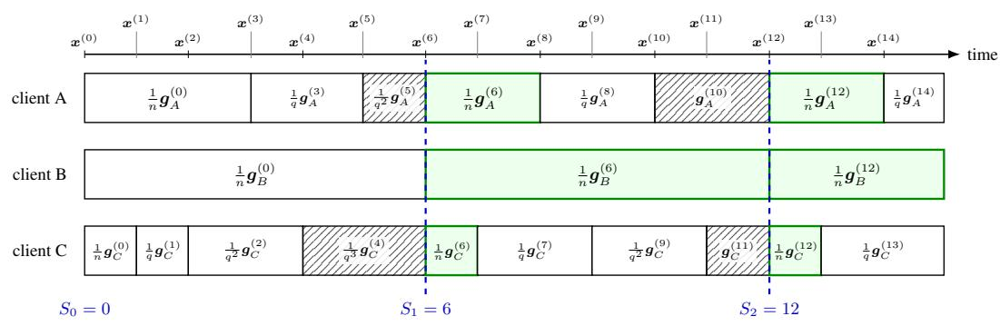
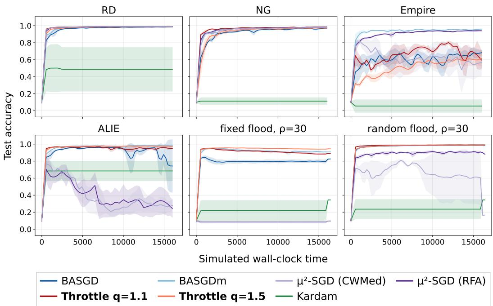
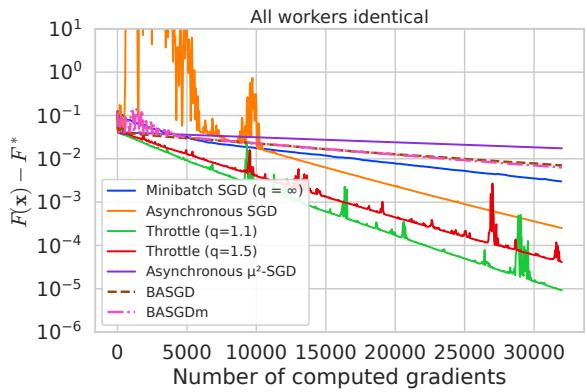
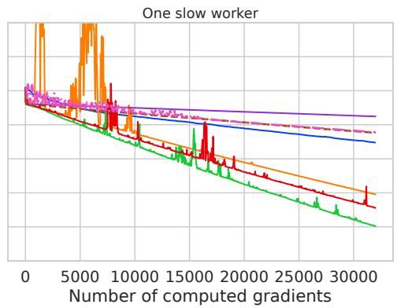
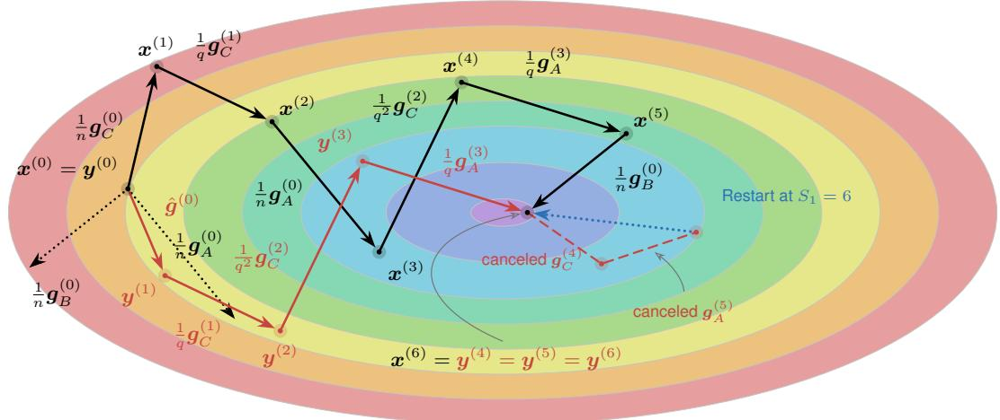
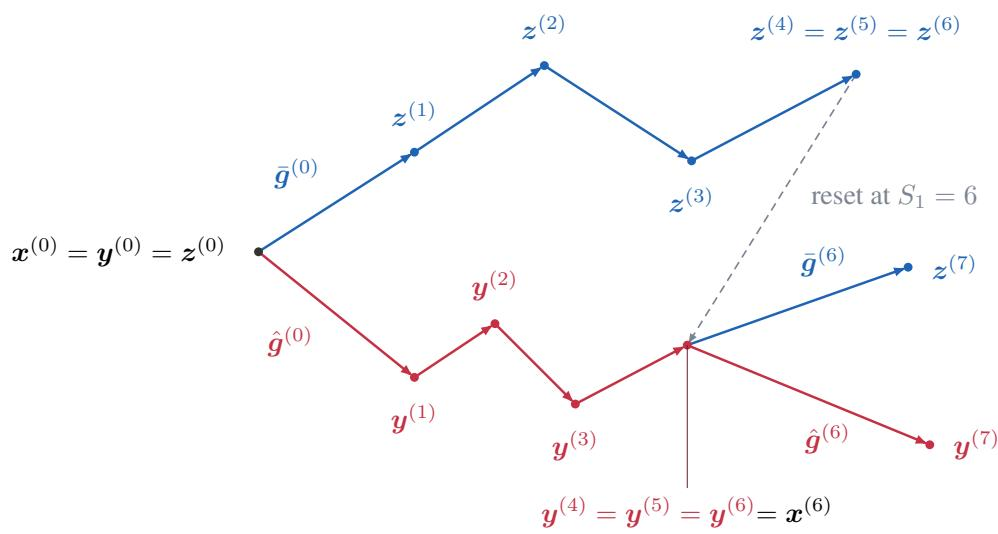
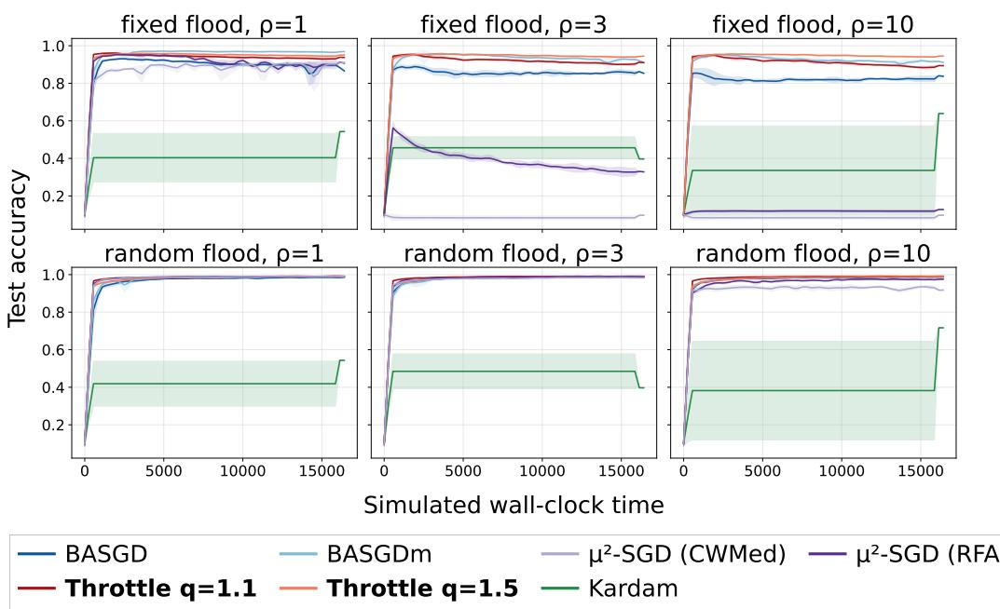
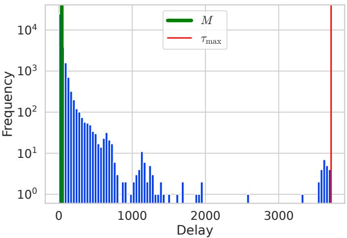

# ROBUSTIFYING ASYNCHRONOUS SGD VIA SOFT THROTTLING

Kaoru Otsuka<sup>∗</sup> Okinawa Institute of Science and Technology kaoru.otsuka@oist.jp

Yuki Takezawa   
Toyota Motor Corporation   
yuki takezawa@mail.toyota.co.jp

Maxime Meyer<sup>∗†</sup> National University of Singapore maxime.meyer@u.nus.edu

Anastasia Koloskova   
University of Zurich   
anastasiia.koloskova@uzh.ch

Makoto Yamada Okinawa Institute of Science and Technology makoto.yamada@oist.jp

## ABSTRACT

Asynchronous SGD is a popular algorithm for distributed learning where each client’s gradient update is applied on arrival. This leads to a speed-up, but also an increased vulnerability to attacks, as fast clients can dominate the total update. We introduce THROTTLE, a Byzantine-robust generalization of asynchronous SGD where the key idea is to exponentially down-weight updates from faster clients by a factor q. Both asynchronous SGD (q = 1) and synchronous Byzantine-robust SGD (q → ∞) correspond to specific settings of THROTTLE. We provide a theoretical analysis of the convergence rate and validate the robustness to attacks both theoretically and empirically. Remarkably, our experiments show that this downweighting mechanism can also improve performance over standard asynchronous SGD even in the non-Byzantine setting.

## 1 INTRODUCTION

Distributed learning trains a shared model faster by spreading the training workload across many clients. It has become essential for large-scale machine learning, and it has been widely studied in recent years as a result (Yang et al., 2019; Verbraeken et al., 2020). Typically, distributed learning consists of a succession of steps. At every step, i) the clients send their local gradients, ii) the central server performs its update once all of them are received, and iii) the updated model is sent to the clients so that the next computation step can start. One clear bottleneck is that this process can only be as fast as the slowest machine. It leads to considerable slowdowns in practice as clients typically compute at very different speeds. This can arise from heterogeneous computational power (Horvath et al., 2021), network latency, faulty devices (Ryabinin et al., 2021), or slow straggler clients in GPU clusters (Chen et al., 2016). A natural remedy is to leverage asynchronous SGD methods (Recht et al., 2011; Mania et al., 2017; Nguyen et al., 2022), where the central server updates the model at each feedback, and the corresponding client starts computing the next gradient immediately. These are the methods we study in this paper.

Another limitation of distributed learning is that, while integrating more clients increases the amount of data and compute, it also increases the risk of having malicious or faulty clients (Xie et al., 2020a; Baruch et al., 2019; Kairouz et al., 2021). We refer to those as Byzantine clients (Lamport et al., 2019). This is especially problematic for asynchronous methods, where one malicious client can send an overwhelming number of updates to the server, which we call a flooding attack. Notable works in this area typically rely either on strong assumptions that restrict flooding attacks (Dahan &

Levy, 2024) or on nearly synchronous algorithms that mitigate the effects of Byzantine clients (Yang & Li, 2021; 2023). In practice, the former may offer limited robustness against Byzantine attacks that violate these assumptions, while the latter may yield smaller speedups than asynchronous SGD because it more closely resembles synchronous algorithms.

We aim to bridge this gap through a new algorithm, THROTTLE. The key idea is to exponentially decrease the stepsize when gradients are repeatedly received from the same client. This limits the influence of any individual client on the global model, thereby preventing a malicious client from dominating the overall update. We present THROTTLE in Section 3 and analyze its convergence in Section 4. In Theorem 1, we establish its Byzantine robustness and show that it recovers the convergence rate of standard asynchronous SGD up to an additive constant. Our experiments in Section 6 demonstrate robustness to a range of Byzantine attacks and show that THROTTLE is more robust and faster than the existing methods evaluated. Interestingly, THROTTLE also outperforms standard asynchronous SGD even in the non-Byzantine setting.

## 2 PRELIMINARIES

We consider the following optimization problem:

$$
f ( \pmb { x } ) : = \mathbb { E } _ { \pmb { \xi } \sim \mathcal { D } } [ F ( \pmb { x } ; \pmb { \xi } ) ] ,
$$

where $F : \mathbb { R } ^ { d } \times \Omega  \mathbb { R }$ is the loss with respect to a sample $\xi \in \Omega$ , and $\mathcal { D }$ is the given data distribution over the sample space Ω.

Let $n \in$ N denote the total number of clients, and write $[ n ] : = \{ 1 , \dots , n \}$ the set of all clients. All clients have access to the loss $F$ and sample from the same dataset D. We assume that it admits an (unknown) partition $[ n ] = \mathcal { G } \sqcup B$ between good and Byzantine clients. Any good client $i \in \mathcal G$ follows the protocol given by the algorithm when sending feedback, while a Byzantine client $i \in \boldsymbol { B }$ is allowed to send arbitrary updates to the server. We let the latter be omniscient, i.e., they have access to all computations made by the rest of the good clients and can send the worst updates possible. We denote the Byzantine ratio by $\delta = | \boldsymbol { B } | \overline { { / n } } ,$ , so that $| \mathcal { G } | = ( 1 - \delta ) n$ . In this paper we develop an algorithm with asynchronous updates that is robust in the Byzantine setting described above.

## 2.1 ASYNCHRONOUS SGD

Synchronous SGD can suffer from substantial delays because each iteration is limited by the slowest client, which motivates the use of asynchronous SGD. In asynchronous SGD, the server applies each stochastic gradient the moment it arrives. The updated model is then sent to the corresponding client so that the client can start computing the next gradient.

Let $j _ { t }$ be the client whose gradient is applied at time t. For each client $i ,$ let $\mathrm { p r e v } ( t , i )$ denote the most recent update before t at which client i returned a gradient, and let $\mathrm { n e x t } ( t , i )$ denote the first update at or after t at which client i returns a gradient. After returning this gradient, client i receives the updated model $\pmb { x } ^ { ( \mathrm { p r e v } ( t , i ) ) }$ from the server and starts computing its next gradient from this model. Therefore, when client $j _ { t }$ returns its next gradient at update $t ,$ that gradient is evaluated at the stale model $\pmb { x } ^ { ( \mathrm { p r e v } ( t , j _ { t } ) ) }$ rather than the current model. We call $\tau _ { t } : = t - \mathrm { p r e v } ( t , j _ { t } )$ the delay of this gradient. The update rule of Asynchronous SGD is then written as follows:

$$
\begin{array} { r } { \pmb { x } ^ { ( t ) } = \pmb { x } ^ { ( t - 1 ) } - \eta \nabla F ( \pmb { x } ^ { ( t - \tau _ { t } ) } ; \xi _ { j _ { t } } ^ { ( t - \tau _ { t } ) } ) . } \end{array}\tag{1}
$$

Thanks to this update rule, the server does not need to wait for a fresh gradient evaluated at the latest model and can instead immediately update the model using a possibly stale gradient evaluated at $\mathbf { \boldsymbol { x } } ^ { ( t - \tau _ { t } ) }$ . Consequently, the optimization process is not bottlenecked by the slowest client, as the server can continue updating the model whenever gradients from other clients arrive.

## 2.2 BYZANTINE-ROBUST SYNCHRONOUS ALGORITHM

Because distributed learning involves many participating clients, some of them may be malicious or faulty. This makes robustness against such Byzantine clients an important requirement for reliable

distributed learning. In this section, we briefly describe a representative Byzantine-robust method in the synchronous setting. At every round $t ,$ each client i computes a stochastic gradient $\mathbf { \boldsymbol { g } } _ { i } ^ { ( t ) }$ at the same point $\mathbf { \boldsymbol { x } } ^ { ( t ) }$ , and the server updates the parameter as follows:

$$
\pmb { x } ^ { ( t + 1 ) } = \pmb { x } ^ { ( t ) } - \frac { \eta } { n } \sum _ { i = 1 } ^ { n } \pmb { g } _ { i } ^ { ( t ) } .
$$

Since the server simply averages the gradients received from the clients, a Byzantine client can arbitrarily manipulate the parameters of the server. Byzantine-robust methods replace this average with a robust aggregator (e.g., the median) (Blanchard et al., 2017; Karimireddy et al., 2021), as is standard in classical robust statistics (Huber, 2005).

Definition 1 $( ( \delta , c )$ -robust aggregator). Suppose that $g _ { 1 } , \ldots , g _ { n }$ are random vectors of which a subset ${ \mathcal { G } } \subset [ n ]$ if size at least $\vert \mathcal { G } \vert > ( 1 - \delta ) \ i$ n and $\delta < 0 . 5$ and satisfies E $\left\| \pmb { g } _ { i } - \pmb { g } _ { j } \right\| ^ { 2 } \leq \rho ^ { 2 } , \forall i , j \in \mathcal { G }$ Then, the output $\hat { \pmb { g } }$ of a Byzantine robust aggregator satisfies:

$$
\mathbb { E } \Vert \hat { \pmb { g } } - \overline { { \pmb { g } } } \Vert ^ { 2 } \leq c \delta \rho ^ { 2 } \quad \mathrm { w h e r e } \quad \hat { \pmb { g } } : = \mathrm { A g g } \left( \pmb { g } _ { 1 } , \dots , \pmb { g } _ { n } \right) \mathrm { a n d } \overline { { \pmb { g } } } : = \frac { 1 } { | \pmb { \mathcal { G } } | } \sum _ { j \in \pmb { \mathcal { G } } } \pmb { g } _ { j } .
$$

This definition is quite common in the existing literature (Karimireddy et al., 2021; 2022; Gorbunov et al., 2023; Yang et al., 2024). Intuitively, the role of a robust aggregator Agg is to estimate the average of the non-Byzantine clients $\overline { { \pmb { g } } }$ with an error of order $\bar { \mathcal { O } } \bar { ( \delta ) }$ . Karimireddy et al. (2021) first showed that centered clipping satisfies this definition. Karimireddy et al. (2022) later extended this result to classical robust aggregators, namely coordinate-wise median (Chen et al., 2017), Krum (Blanchard et al., 2017), and robust federated averaging (RFA) (Pillutla et al., 2022), when combined with their proposed pre-aggregation technique,

## 2.3 BYZANTINE-ROBUST ASYNCHRONOUS ALGORITHM

Combining asynchrony with Byzantine robustness is desirable for distributed learning, as it allows the system to benefit from heterogeneous client speeds while remaining reliable in the presence of malicious or faulty clients. Several Byzantine-robust asynchronous methods have therefore been proposed (Yang & Li, 2023; Dahan & Levy, 2024). However, existing theoretical work on Byzantine-robust asynchronous SGD (Yang & Li, 2023; Dahan & Levy, 2024) tackles this issue by assuming that $\tau _ { t }$ is bounded by a known $\tau _ { \mathrm { m a x } }$ for most clients, or by directly bounding the proportion of Byzantine feedback. These assumptions circumvent the main challenge of the framework, which is precisely that a Byzantine client can make $\tau _ { t }$ arbitrarily large through a flooding attack. We propose a Byzantine-robust asynchronous algorithm THROTTLE that removes these assumptions.

## 3 THROTTLE: ASYNCHRONOUS SGD WITH SOFT THROTTLING

We introduce THROTTLE, an algorithm consisting of two key components, soft throttling and hard restart, which we describe below.

## 3.1 SOFT THROTTLING

The key idea of our approach is to exponentially down-weight repeated updates of the same client by a factor $q .$ . More precisely, the first update has a factor $\textstyle { \frac { 1 } { n } }$ , the second $\textstyle { \left| { \begin{array} { l } { \frac { 1 } { q } } , } \end{array} \right|} $ the next $\textstyle { \frac { 1 } { q ^ { 2 } } }$ , then $\textstyle { \frac { 1 } { q ^ { 3 } } }$ etc. Once every client has sent feedback, we say that the round ends. We then reinitialize all factors to $\frac { 1 } { n }$ and start the next round. This way, within any given round, the impact of one client is upper bounded by $\begin{array} { r } { \frac { 1 } { n } + \sum _ { i = 1 } ^ { + \infty } \frac { 1 } { q ^ { i } } = \frac { 1 } { n } + \frac { 1 } { q - 1 } } \end{array}$ , which prevents flooding.

A smaller $q \to 1$ lets fast clients contribute more, while a larger $q \to \infty$ caps their influence more tightly and reduces it to synchronous SGD. We formally quantify this trade-off in Section 4.

Remark 1 (On the initial $\frac { 1 } { n }$ factor). Adding an initial $1 / n$ factor makes the total update with regards to the model at the start of the round $\pmb { x } ^ { ( S _ { r } ) }$ have weight 1. All subsequent updates within the round have weight at most ${ \frac { 1 } { q } } .$ . This matches the scale of a robust aggregator’s output, which simplifies the comparison in our analysis. We also observed that it leads to more stable training curves in practice.

  
Figure 1: Illustration of THROTTLE with three clients. A block $\mathbf { \pmb { g } } _ { i } ^ { ( t ) }$ is a gradient computation started at $\mathbf { \boldsymbol { x } } ^ { ( t ) }$ (its left end), and its coefficient is the weight it receives on arrival, $1 / n$ for a first arrival and $1 / q ^ { c }$ for a repeated one. Dashed lines mark the synchronous clock $S _ { r }$ , at which in-flight computations are discarded (hatched blocks) and all clients restart from $\pmb { x } ^ { ( S _ { r } ) }$ (green blocks).

## 3.2 HARD RESTART

At the end of a round, the server broadcasts the current model to all clients, and discard any gradient computation in progress. This ensures that every round starts with all clients on the same model, which allows to robustly aggregate their updates. At the beginning of a round, all clients start their computation at the same point $\pmb { x } ^ { ( S _ { r } ) }$ , and the added factor $\textstyle { \frac { 1 } { n } }$ averages over the updates. As is standard in Byzantine-robust algorithms, we want to replace this average by a robust aggregator. The one difference from the synchronous setting is that the first arrivals from each clients do not arrive together. We therefore need an aggregator that acts on a single input and whose sum coincide with a robust aggregate over time.

Definition 2 (Local $( c , \delta )$ -robust aggregator). Let Agg be a $. \left( c , \delta \right)$ -robust aggregator that additionally takes a side information $\mathbf { S } \in \mathbb { S }$ as input. We call Agg local if there exists a map $A : \mathbb { R } ^ { d } \times \mathbb { S }  \mathbb { R } ^ { \mathbf { \bar { d } } }$ such that, for every $\mathbf { S } \in \mathbb { S }$ and every $\pmb { x } _ { 1 } , \ldots , \pmb { x } _ { n } \in \mathbb { R } ^ { d }$

$$
\operatorname { A g g } ( \pmb { x } _ { 1 } , . . . , \pmb { x } _ { n } ; \mathbf { S } ) = \frac { 1 } { n } \sum _ { i = 1 } ^ { n } \operatorname { A } ( \pmb { x } _ { i } ; \mathbf { S } ) .
$$

Example 1 (Centered clipping). Centered clipping (Karimireddy et al., 2021) clips each input’s offset from an anchor $\pmb { a } \in \mathbb { R } ^ { d }$ to length at most $\tau > 0$ and then averages:

$$
\operatorname { A g g } ( x _ { 1 } , \ldots , x _ { n } ; a , \tau ) = a + { \frac { 1 } { n } } \sum _ { i = 1 } ^ { n } \operatorname { c l i p } _ { \tau } ( x _ { i } - a ) , \qquad \operatorname { c l i p } _ { \tau } ( v ) : = \operatorname * { m i n } \Bigl \{ 1 , { \frac { \tau } { \| v \| } } \Bigr \} v .
$$

Thus, each input shifts the output by at most $\tau / n$ . It is local with side information $\mathbf { S } = ( \pmb { a } , \tau )$ and $\mathbb { A } ( { \pmb v } ; { \bf S } ) : = { \pmb a } + \mathrm { c l i p } _ { \tau } ( { \pmb v } - { \pmb a } )$ . Following Karimireddy et al. (2021), our experiments use the previous round’s first arrivals to set the anchor: $\begin{array} { r } { \pmb { a } _ { r } : = \Pi _ { G } \Big ( \frac { 1 } { n } \sum _ { i = 1 } ^ { n } \pmb { g } _ { i } ^ { ( S _ { r - 1 } ) } \Big ) , \pmb { a } _ { 0 } : = \mathbf { 0 } } \end{array}$ , where $\Pi _ { G }$ is the Euclidean projection onto the ball of radius G centered at the origin.

Side information is the key to making the decomposition possible. Without side information, no $( c , \delta )$ -robust aggregator of the form $\begin{array} { r } { \frac { 1 } { n } \sum _ { i } f ( { \pmb x } _ { i } ) } \end{array}$ exists (Proposition 2). Appendix D gives further examples and a general construction $\overset { \triangledown } { \mathbb { A } } ( \pmb { v } ; \mathbf { S } ) = \pmb { a } + \psi ( \pmb { v } - \pmb { a } )$ with bounded $\psi .$

## 3.3 THROTTLE

Combining these two ideas, soft throttling and hard restart, we propose THROTTLE, as described in Algorithm 1. At time step $t ,$ let $v _ { j _ { t } } ^ { ( t - \tau _ { t } ) }$ denote the gradient received from client $j _ { t } ,$ , and let $\eta _ { t }$ denote corresponding stepsize. We define

$$
\begin{array} { r } { v _ { j _ { t } } ^ { ( t - \tau _ { t } ) } : = \left\{ \begin{array} { l l } { \nabla F ( { \boldsymbol x } ^ { ( t - \tau _ { t } ) } ; { \boldsymbol \xi } _ { j _ { t } } ^ { ( t - \tau _ { t } ) } ) } & { \mathrm { i f ~ } j _ { t } \in \mathcal { G } , } \\ { * } & { \mathrm { i f ~ } j _ { t } \in \mathcal { B } , } \end{array} \right. \quad \eta _ { t } : = \left\{ \begin{array} { l l } { \frac { \eta } { n } } & { \mathrm { i f ~ } c _ { j _ { t } } ( t ) = 0 , } \\ { \frac { \eta } { q ^ { c _ { j _ { t } } ( t ) } } } & { \mathrm { o t h e r w i s e } , } \end{array} \right. } \end{array}\tag{2}
$$

```latex
Algorithm 1 THROTTLE: Asynchronous SGD with Soft Throttling
Server:
1: Send $\mathbf { x } ^ { ( 0 ) }$ to every client $i \in [ n ]$ and initialize $S _ { 0 } : = 0$ and side information $\mathbf { S } _ { 0 } , c _ { i } = 0 , \forall i \in [ n ]$
2: for $t = 0 , \ldots , T - 1$ do
3: Receive update $v _ { j _ { t } } ^ { ( t - \tau _ { t } ) }$ from some worker $j _ { t }$
4: if $c _ { j _ { t } } = 0$ then ▷ If $j _ { t }$ returns its update for the first time this round
5: $\begin{array} { r } { \pmb { g } _ { j _ { t } } ^ { ( t - \tau _ { t } ) } = \mathbb { A } \left( \pmb { v } _ { j _ { t } } ^ { ( t - \tau _ { t } ) } ; \mathbf { S } _ { r ( t ) } \right) } \end{array}$ ▷ Apply local $( c , \delta )$ -robust aggregator
6: else ▷ If server has already seen $j _ { t }$ in this round
7: $\begin{array} { r } { \pmb { g } _ { j _ { t } } ^ { ( t - \tau _ { t } ) } = \mathrm { c l i p } _ { \lambda _ { t } } \left( \pmb { v } _ { j _ { t } } ^ { ( t - \tau _ { t } ) } \right) } \end{array}$ ▷ Compute clipped gradient with radius $\lambda _ { t }$
η if $c _ { j _ { t } } ( t ) = 0 ,$
8: $\eta _ { t } : = \left\{ \begin{array} { l l } { n } \\ { \frac { \eta } { q ^ { c _ { j _ { t } } ( t ) } } } \end{array} \right.$ ▷ Set the soft throttling stepsize (2)
otherwise,
9: $\pmb { x } ^ { ( t ) } = \mathbf { \dot { x } } ^ { ( t - 1 ) } - \eta _ { t } \pmb { g } _ { j _ { t } } ^ { ( t - \tau _ { t } ) }$ ▷ Perform the update
10: $c _ { j _ { t } } \gets c _ { j _ { t } } + 1$ ▷ Increment the counter
11: Send $\mathbf { \boldsymbol { x } } ^ { ( t ) }$ to worker $j _ { t }$
12: ${ \mathbf i } { \mathbf f } | \{ i \in [ n ] \mid  c _ { i } \geq 1 \} | = n$ then ▷ If all clients has shown up in the round
13: $S _ { r + 1 } = t$ and set $c _ { i } \gets 0$ for all $i \in [ n ]$ ▷ The next round starts
14: Update the side information $\mathbf { S } _ { r + 1 }$ ▷ Depends on the aggregator (cf Ex. 1)
15: Send $\mathbf { \boldsymbol { x } } ^ { ( t ) }$ and restart signals to all clients, $c _ { i } \gets 0$ ▷ Hard restart
16: Notify all workers to stop
Good client $\underline { { i \in \mathcal { G } \colon } }$
repeat
repeat
Wait until receiving the parameter $\pmb { x } ^ { ( k ) }$ for some $k \in [ T ]$
Randomly sample $\xi _ { i } ^ { ( k ) } \sim \mathcal { D }$ and then compute the stochastic gradient $\nabla F ( \pmb { x } ^ { ( k ) } ; \xi _ { i } ^ { ( k ) } )$
Send the stochastic gradient $\nabla F ( \pmb { x } ^ { ( k ) } ; \pmb { \xi } _ { i } ^ { ( k ) } )$ to the server
until receive server’s notification to restart with $\boldsymbol { x } ^ { ( r ( t ) ) }$
Use restart parameter x $( r ( t ) )$ to compute $\overline { { \nabla } } F ( \mathbf { \boldsymbol { x } } ^ { ( r ( t ) ) } ; \xi _ { i } ^ { r ( t ) } )$ with the sample $\xi _ { i } ^ { r ( t ) } \sim \mathcal { D }$
until receive server’s notification to stop
```

and $\begin{array} { r } { c _ { i } ( t ) : = \sum _ { s = r ( t ) } ^ { t - 1 } { \mathbf 1 } _ { \{ j _ { s } = i \} } } \end{array}$ is the number of gradients that client i has already delivered in the current round. Once the server receives the gradient from client, the server transforms it to $g _ { j _ { t } } ^ { ( t - \tau _ { t } ) }$ using either local $( c , \delta )$ -robust aggregator or gradient clipping, and updates the parameters, as shown in line 8 of Algorithm 1. Then, after the server receives the gradient from all clients, the next round starts and all counters are reinitialized to 0. We illustrate the algorithm in Figure 1 and provide a notation list in Appendix A.

## 4 THEORETICAL ANALYSIS

Here we list assumptions we use in our theoretical results.

Assumption 1 (Unbiased and uniformly bounded stochastic gradients). For each $\textbf { \em x } \in \mathbb { R } ^ { d }$ , the stochastic gradients from good clients $\dot { \nabla } F ( \pmb { x } ; \xi _ { i } ) , i \in \mathcal { G }$ , are conditionally i.i.d., unbiased, and have uniformly bounded variance:

$$
\begin{array} { r } { \mathbb { E } [ \nabla F ( \pmb { x } ; \xi _ { i } ) \ | \ \pmb { x } ] = \nabla f ( \pmb { x } ) , \qquad \mathbb { E } \| \nabla F ( \pmb { x } ; \xi _ { i } ) - \nabla f ( \pmb { x } ) \| ^ { 2 } \leq \sigma ^ { 2 } . } \end{array}
$$

Assumption 2 (L-smoothness, lower boundedness). The objective $f : \mathbb { R } ^ { d } $ R is differentiable, lower bounded by $f _ { \star }$ , and L-smooth, i.e., for all x, $\boldsymbol { y } \in \mathbb { R } ^ { d }$

$$
f ( { \pmb y } ) \leq f ( { \pmb x } ) + \langle \nabla f ( { \pmb x } ) , { \pmb y } - { \pmb x } \rangle + \frac { L } { 2 } \| { \pmb y } - { \pmb x } \| ^ { 2 } .
$$

Assumption 3 (Bounded gradient). There exists $G \geq 0$ such that for each $\pmb { x } \in \mathbb { R } ^ { d }$ and $\xi \in \Omega$ , the stochastic gradient satisfies

$$
\| \nabla F ( \pmb { x } ; \pmb { \xi } ) \| \leq G
$$

The assumptions on smoothness and stochastic gradients are standard in the optimization literature (Bubeck, 2015; Nesterov, 2018). The bounded gradient assumption is likewise common in the analysis of asynchronous SGD (Mishchenko et al., 2022; Shi et al., 2024), as well as in the analysis of clipped gradient descent (Zhang et al., 2020a;b), which we employ in non-restart rounds.

Before we state the main theorem, we need to make an additional weak technical assumption on the local robust aggregator A.

Assumption 4 (Bounded local contributions). There exists $G ^ { \prime } \ge 0$ such that, for every side information S used by the algorithm and every ${ \pmb v } \in \mathbb { R } ^ { d } , \| { \mathbb A } ( { \pmb v } ; S ) \| \le G ^ { \prime }$

Remark 2 (Centered-clipping example). Suppose that the side information is $S = ( a _ { r } , 2 G )$ , where the projected anchor in Example 1 satisfies $\left. \bar { \mathbf { a } } _ { r } \right. \leq G$ . For the centered-clipping map $\mathbb { A } ( \pmb { v } ; \mathbf { S } ) =$ $\begin{array} { r } { \pmb { a } _ { r } + \mathrm { c l i p } _ { 2 G } ( \pmb { v } - \pmb { a } _ { r } ) } \end{array}$ , we have $\| \mathbb { A } ( { \pmb v } ; S ) \| \le G + 2 G = 3 G$ for every input, including a Byzantine input, verifying Assumption 4. Moreover, Assumption 3 implies that an honest input satisfies $\| \pmb { v } \| \leq$ $G ,$ , and hence $\| \pmb { v } - \pmb { a } _ { r } \| \leq 2 G$ , so centered clipping therefore leaves every honest input unchanged. Similar assumptions are used in (Malinovsky et al., 2024, Assumption 2.3).

Now, we present the main theorem of this paper. We analyze the convergence in terms of effective steps, which quantify the number of steps normalized by the decreasing stepsizes. In the synchronous setting, that is if every client submits the feedback at the same time, the number of effective steps $T _ { \mathrm { e f f } }$ is exactly the number of feedbacks (T in the synchronous setting). Moreover, it closely corresponds to the number R of rounds as $\begin{array} { r } { R \leq T _ { \mathrm { e f f } } = R + \sum _ { r = 1 } ^ { R } \sum _ { i = 1 } ^ { n } { \frac { 1 - q ^ { - ( c _ { i , r } - 1 ) } } { q - 1 } } } \end{array}$

Theorem 1 (Non-convex convergence rate). Let $T \geq 2$ and $q > 1$ . Suppose that Assumptions 1, 2, and 3, as well as Assumption 4 with $G ^ { \prime } \leq 3 G$ hold, together with the local $( c , \delta )$ -robust aggregator $\mathbb { A } ,$ and $u s e ^ { 1 } \lambda _ { t } = G$ . Then, there exists a small enough stepsize $\eta > 0$ (detailed in Appendix C.2) such that,

$$
\begin{array} { r l } & { \mathbb { E } \| \nabla f ( { \boldsymbol x } ^ { \mathrm { o u t } } ) \| ^ { 2 } = \mathcal { O } \Bigg ( \left( c \delta { \boldsymbol \sigma } ^ { 2 } + \frac { G ^ { 2 } | \mathcal { B } | ^ { 2 } } { ( q - 1 ) ^ { 2 } } \right) \theta _ { T } + \sqrt { \frac { L { \boldsymbol \sigma } ^ { 2 } \Delta } { T _ { \mathrm { e f f } } } \left( 1 - \theta _ { T } + \frac { \theta _ { T } } { | \mathcal { G } | } \right) } } \\ & { \qquad + \left( \frac { L \Delta } { T _ { \mathrm { e f f } } } \right) ^ { 2 / 3 } \left[ ( 1 - \theta _ { T } ) \left( ( n - 1 ) ^ { 2 } G ^ { 2 } + c \delta { \boldsymbol \sigma } ^ { 2 } + \frac { G ^ { 2 } | \mathcal { B } | ^ { 2 } } { ( q - 1 ) ^ { 2 } } \right) \right] ^ { 1 / 3 } + \frac { L \Delta } { T _ { \mathrm { e f f } } } \Bigg ) , } \end{array}
$$

where $\Delta : = f ( { \pmb x } ^ { ( 0 ) } ) - f _ { * }$ is the initial distance, $\begin{array} { r } { T _ { \mathrm { e f f } } : = 1 + \sum _ { t = 1 } ^ { T - 1 } \hat { \eta } _ { t } / \eta } \end{array}$ is the number of effective time steps, $\begin{array} { r } { N _ { T } : = 1 + \sum _ { t = 1 } ^ { T - 1 } \mathbf { 1 } _ { \{ t = r ( t ) \} } } \end{array}$ is the number ofrounds, $\begin{array} { r } { \theta _ { T } : = \frac { N _ { T } } { T _ { \mathrm { e f f } } } } \end{array}$ is the restart ratio, and $\pmb { x } ^ { \mathrm { ( o u t ) } }$ is the weighted average of $\mathbf { \hat { x } } ^ { ( 0 ) } , \ldots , \mathbf { x } ^ { ( T - 1 ) }$ defined in (4).

Remark 3 (Synchronous limit $q  \infty )$ . As $q  \infty ,$ , an effective step corresponds to a round. Thus, $T _ { \mathrm { e f f } }  \dot { R }$ and $\theta _ { T }  1$ , where R is the total number of rounds including the initial round. The convergence rate simplifies to

$$
\mathbb { E } \| \nabla f ( { \pmb x } ^ { \mathrm { o u t } } ) \| ^ { 2 } = \mathcal { O } \left( \sqrt { \frac { L \sigma ^ { 2 } \Delta } { | \mathcal { G } | R } } + \frac { L \Delta } { R } + c \delta \sigma ^ { 2 } \right) ,
$$

which recovers the standard rate of synchronous Byzantine-robust SGD. The non-vanishing term $\mathcal { O } ( c \delta \sigma ^ { 2 } )$ is known to be unavoidable for any $( c , \delta )$ -robust aggregator applied only to the current stochastic gradients, and it can be removed by momentum or variance reduction (Karimireddy et al., 2021; Gorbunov et al., 2023). For finite $q ,$ however, the dominant error is the asynchrony-induced term $G ^ { 2 } | B | ^ { 2 } / ( q - 1 ) ^ { 2 }$ , which persists even with full gradients $( \sigma = 0 )$ . Note also that ${ \bf \bar { \sigma } } _ { \sigma } ^ { 2 } \le G ^ { 2 }$ in the non-clipping regime. Hence, momentum or variance reduction alone cannot remove the main source of error in the asynchronous setting, and combining momentum with stale gradients is itself nontrivial (Shi et al., 2024). We leave reducing both terms to future work.

Remark 4 (Non-Byzantine asynchronous limit $| B | = 0 , q \to 1 )$ . If there are no Byzantine client and $q \to 1$ , then we have $T _ { \mathrm { e f f } } \overset { \cdot } {  } T$ and the convergence rate simplifies to

$$
\mathbb { E } \| \nabla f ( { \pmb x } ^ { \mathrm { o u t } } ) \| ^ { 2 } = \mathcal { O } \left( \sqrt { \frac { L \sigma ^ { 2 } \Delta } { T } } + \left( \frac { L \Delta } { T } \right) ^ { 2 / 3 } \big [ ( n - 1 ) ^ { 2 } G ^ { 2 } \big ] ^ { 1 / 3 } + \frac { L \Delta } { T } \right) ,
$$

which is a similar convergence rate (up to the $T ^ { - 1 }$ term due to normalizing rounds gradients by $1 / n )$ to asynchronous SGD without Byzantine clients (Mishchenko et al., 2022, Theorem 2).

## 5 RELATED WORK

Asynchronous SGD. Asynchronous optimization has a long history dating back to the 1970s, when Baudet (1978) studied asynchronous fixed-point iterations. Subsequently, Tsitsiklis et al. (1986) established the convergence of asynchronous stochastic gradient methods in distributed settings. In the 2010s, attention turned to asynchronous variants of SGD. A notable example is Hogwild! (Recht et al., 2011), a lock-free scheme that has since been widely adopted. Classical analyses of asynchronous SGD (Agarwal & Duchi, 2012; Lian et al., 2015; Mania et al., 2017; Stich & Karimireddy, 2020) rely on a bounded delay assumption, so their convergence rates depend on the maximum delay and are often overly pessimistic. Koloskova et al. (2022) and Mishchenko et al. (2022) concurrently showed that asynchronous SGD attains convergence rates that do not depend on the maximum delay, significantly improving upon prior analyses. Since then, a growing body of work has built upon these results. For instance, Shi et al. (2024) designed a momentum scheme suited to asynchronous SGD. Islamov et al. (2024) developed a unified framework that covers many asynchronous SGD variants, including FedBuff (Nguyen et al., 2022). More broadly, asynchronous methods have been studied under data, computation, and communication heterogeneity (Tyurin & Richtarik, 2023; Tyurin et al., 2024b; Maranjyan et al., 2025), and extended to finite-sum set-´ tings (Tyurin et al., 2024a).

Byzantine-robust Learning. Classical Byzantine-robust methods in the synchronous setting replace mean aggregation with a robust aggregator, such as coordinate-wise median and trimmed mean (Yin et al., 2018), Krum (Blanchard et al., 2017), geometric median (RFA) (Pillutla et al., 2022), MDA (El-Mhamdi et al., 2020), and Bulyan (Mhamdi et al., 2018). However, due to the noise inherent in stochastic gradients, attackers can craft malicious updates that are statistically indistinguishable from honest ones and yet prevent convergence, as in the ALIE (Baruch et al., 2019) and IPM (Xie et al., 2019) attacks. Another line of work complements robust aggregation with momentum (Karimireddy et al., 2021; Mhamdi et al., 2021; Farhadkhani et al., 2022) or variance reduction (Gorbunov et al., 2023), and the optimality of such approaches has been studied in (Yin et al., 2018; Zhu et al., 2023; Shi et al., 2025). These results, however, assume synchronous updates. Incorporating momentum under asynchrony is nontrivial even in the absence of Byzantine workers, since it accumulates stale gradients (Shi et al., 2024). Byzantine robustness has further been studied under more practical conditions, including data heterogeneity (Karimireddy et al., 2022; Allouah et al., 2023a;b), heterogeneous client participation (Allouah et al., 2024; Malinovsky et al., 2024; Otsuka et al., 2026), and communication compression (Gorbunov et al., 2023; Rammal et al., 2024).

Asynchronous Byzantine-robust Learning. Combining asynchrony with Byzantine robustness is challenging because asynchronous SGD applies each stochastic gradient immediately upon arrival, leaving no natural averaging step to replace with a robust aggregator. One line of work addresses this by partially synchronizing the updates: BASGD and BASGDm (Yang & Li, 2021; 2023) aggregate over server-side buffers, and Dahan & Levy (2024) aggregate each incoming gradient with the latest gradients of the other clients using a weighting scheme that mitigates staleness. Another line of work filters incoming gradients using additional information. Zeno++ (Xie et al., 2020b) and AFLGuard (Fang et al., 2022) rely on a trusted dataset held by the server, an assumption that may undermine the computational efficiency of distributed learning. While Kardam (Damaskinos et al., 2018) filters updates based on an empirical estimate of the smoothness constant, but may reject honest gradients along with malicious ones (Xie et al., 2020b).

## 6 EXPERIMENTS

Our experiments show the benefits of THROTTLE both with and without Byzantine clients. In the Byzantine setting, it remained competitive under most standard attacks and maintains high accuracy under flooding attacks that severely degrade several existing methods. In the non-Byzantine setting, it achieved lower optimization error than minibatch SGD, asynchronous SGD, and the other evaluated baselines under the same gradient computation budget.

  
Figure 2: Test accuracy on MNIST with $n = 2 5$ clients, $| B | = 5$ Byzantine clients. Standard attacks (RD,NG,Empire,ALIE) under the scheduler based on the codebase<sup>3</sup>, in which Byzantine updates are at most $1 / 3$ of all gradients at any time. Flooding attacks under using a fixed vector/random vectors. The higher $\rho ,$ the more frequently the Byzantine clients send their updates. THROTTLE keeps a higher accuracy overall. Figure 6 also shows the results with other choices of $\rho = 1 , 3 , 1 0$

## 6.1 THROTTLE IS BYZANTINE-ROBUST

We trained convolutional neural networks using our optimizer and other existing asynchronous SGD algorithms on MNIST with $n = 2 5$ clients and $| B | = 5$ Byzantine clients. We compared THROTTLE against four standard attacks RD (Random Disturbance attack), NG (Negative Gradient attack (Yang & Li, 2023), Empire (Xie et al., 2020a), ALIE (Baruch et al., 2019) and eight flooding attacks (Figure 2 and Figure ${ \bf \widehat { 6 } } ) . ^ { 2 }$ We compared our proposed method with Kardam (Damaskinos et al., 2018), BASGD and BASGDm (Yang & Li, 2021; 2023), and Asynchronous Robust $\mu ^ { 2 } { \displaystyle - S } \mathrm { G D }$ (Dahan & Levy, 2024) based on their codebase. <sup>3</sup> Following Dahan & Levy (2024), we simulate asynchronous training as a sequence of updates. For the standard attacks in Figure 2 every third arrival is a Byzantine update and the arriving client is drawn with probability proportional to its index for other up dates, as in Dahan & Levy (2024). In the flooding experiments, client i is an independent Poisson process with rate $r _ { i } \propto i$ and the Byzantine rates are multiplied by $\rho ,$ giving a Byzantine fraction of updates $\rho / ( 2 + \rho ) \ ( 1 / 3$ to 0.94 for $\rho = 1 \mathrm { t o } 3 0 )$ . Appendix E gives additional details including all hyperparameter grids, attack details, and asynchrony.

THROTTLE is robust and outperforms existing algorithms in almost all type of attacks. THROTTLE outperformed BASGDm under fixed flooding even with increased $\rho ,$ and outperformed $\mu ^ { 2 } { \displaystyle - } \mathrm { S G D }$ with RFA under both ALIE and flooding attacks. The exception was Empire, where THROTTLE achieved 59.6% and 61.5%, compared with 96.0% for BASGDm and 94.0% for $\mu ^ { 2 } { \mathrm { - } } { \mathrm { S G D } }$ with RFA. Since both baselines used momentum, we expect that adding momentum to THROTTLE, together with tuning the clipping radius, would narrow this gap. We leave this to future work.



  
Figure 3: We ran experiments without Byzantine clients on a simple least-squares problem with random data and tuned all stepsizes for each methods under pure asynchrony using $\mathrm { R a y ^ { 4 } }$ framework. We averaged over three seeds. $L e f t { \mathrm { : } }$ all clients compute gradients at similar speeds. $R i g h t \cdot$ one worker sleeps for 100× its compute time after every gradient computation. THROTTLE (green) achieves faster convergence because the soft throttling mechanism allows us to take slightly larger stepsize η than asynchronous SGD.

## 6.2 THROTTLE OUTPERFORMS STANDARD ASYNCHRONOUS SGD

Following Mishchenko et al. (2022), we study least-squares optimization with 40 asynchronous $\mathrm { R a y ~ ^ { 4 } }$ workers and no Byzantine clients (Figure 3). We compare THROTTLE with $q \in \{ 1 . 1 , 1 . 5 \}$ against minibatch SGD $( q = \infty )$ , asynchronous SGD, $\mu ^ { 2 } { \cdot } S \mathrm { G D }$ , BASGD, and BASGDm<sup>5</sup>. We tuned the stepsizes separately for each method. All methods use a budget of 32,000 computed gradients, including those discarded at hard restarts by THROTTLE. We plot the optimality gap against this count. The right panel introduces one straggler that sleeps for 100× its gradient computation time after each computation. Appendix E.2 provides further details.

Effectiveness of soft throttling. With a tuned stepsize THROTTLE performs significantly better than its two limits. Among the tested values, $q = 1 . 1$ achieves the lowest final optimality gap in both worker configurations. Although $q = 1 . 5$ 5 converges more slowly per computed gradient, it still outperforms asynchronous SGD and minibatch SGD. Asynchronous $\mu ^ { 2 } { \mathrm { - } } S { \bar { \mathrm { G D } } }$ , BASGD, and BASGDm did not utilize asynchrony into faster convergence. All three existing methods had slower convergence than minibatch SGD even in the absence of Byzantine clients.

Soft throttling remains effective with a straggler. Introducing a worker that sleeps for $1 0 0 \times$ its computation time has little effect on the convergence of THROTTLE per computed gradient (Figure 3, right). Even at $q = 1 . 5$ , convergence per computed gradient is largely preserved relative to the setting without a straggler, although convergence becomes less stable.

## 7 CONCLUSION

We introduce soft throttling, an exponential down-weighting of updates by the speed of each client. We show that the resulting algorithm, THROTTLE, is a generalization of both synchronous Byzantine-robust SGD $( q \to \infty )$ , and (almost) asynchronous SGD $( q \to 1 )$ without Byzantine clients. The convergence rate of THROTTLE matches the known rate at each limit and holds against flooding attacks without any bound on the Byzantine update ratio. Our experiments demonstrate robustness to attacks and show that soft throttling accelerates convergence even in the absence of Byzantine clients.

## ACKNOWLEDGEMENTS

Kaoru Otsuka was supported by MEXT Supporting Pioneering Research through AI for 1,000 Discovery challenges Program (SPReAD) Japan Grant Number JPMXP1726264354. Maxime Meyer was supported by the National Research Foundation, Singapore under its AI Singapore Programme (AISG Award No: AISG3-PhD-2026-01-068T). Makoto Yamada was partly supported by JSPS KAKENHI Grant Number 24K03004 and by JST ASPIRE JPMJAP2302.

## AI USE STATEMENT

We used generative AI tools (large language models and LLM-based coding agents) in this work as follows.

Theory. All definitions, main theorem statements, proof strategies, and the proposed algorithm were developed by the authors. LLMs were used to check proofs for errors, correct minor mistakes, verify numerical constants, refine notation, and convert the authors’ arguments into polished formal LaTeX.

Experiments. LLM-based coding agents were used to implement methods, design and refine experimental pipelines, and adapt publicly available code from prior works. LLMs also provided limited assistance with interpreting results and qualitative analysis, including cross-checking generated plots against the intended algorithm.

Writing and figures. We used generative AI tools for drafting and editing parts of the manuscript based on the authors’ initial drafts, and for producing the figures as TikZ code from the authors hand-drawn illustrations.

Exclusions. We did not use generative AI to generate synthetic datasets or to clean or reformat datasets, propose or refine hypotheses, develop the theoretical model or conceptual framework, or propose research ideas.

All LLM-assisted work has been reviewed and tested by the authors. Proofs were independently checked after LLM-assisted revision, and all LLM-assisted text was verified. We take full responsibility for the final content of this work.

## REFERENCES

Alekh Agarwal and John C. Duchi. Distributed delayed stochastic optimization. In IEEE Conference on Decision and Control, 2012.

Youssef Allouah, Sadegh Farhadkhani, Rachid Guerraoui, Nirupam Gupta, Rafael Pinot, and John Stephan. Fixing by mixing: A recipe for optimal byzantine ML under heterogeneity. In International Conference on Artificial Intelligence and Statistics, 2023a.

Youssef Allouah, Rachid Guerraoui, Nirupam Gupta, Rafael Pinot, and Geovani Rizk. Robust distributed learning: Tight error bounds and breakdown point under data heterogeneity. In Advances in Neural Information Processing Systems, 2023b.

Youssef Allouah, Sadegh Farhadkhani, Rachid Guerraoui, Nirupam Gupta, Rafael Pinot, Geovani Rizk, and Sasha Voitovych. Byzantine-robust federated learning: Impact of client subsampling and local updates. In International Conference on Machine Learning, 2024.

Gilad Baruch, Moran Baruch, and Yoav Goldberg. A little is enough: Circumventing defenses for distributed learning. In Advances in Neural Information Processing Systems, 2019.

Gerard M Baudet. Asynchronous iterative methods for multiprocessors. In Journal of the ACM, 1978.

Peva Blanchard, El Mahdi El Mhamdi, Rachid Guerraoui, and Julien Stainer. Machine learning with adversaries: Byzantine tolerant gradient descent. In Advances in Neural Information Processing Systems, 2017.

Sebastien Bubeck. Convex optimization: Algorithms and complexity.´ Foundations and trends in Machine Learning, 8(3-4):231–357, 2015.

Jianmin Chen, Rajat Monga, Samy Bengio, and Rafal Jozefowicz. Revisiting distributed synchronous sgd. In International Conference on Learning Representations Workshop Track, 2016.

Yudong Chen, Lili Su, and Jiaming Xu. Distributed statistical machine learning in adversarial settings: Byzantine gradient descent. Proceedings of the ACM on Measurement and Analysis of Computing Systems, 2017.

Tehila Dahan and Kfir Y. Levy. Weight for robustness: A comprehensive approach towards optimal fault-tolerant asynchronous ML. In Advances in Neural Information Processing Systems, 2024.

Georgios Damaskinos, Rachid Guerraoui, Rhicheek Patra, Mahsa Taziki, et al. Asynchronous byzantine machine learning (the case of SGD). In International Conference on Machine Learning, 2018.

El-Mahdi El-Mhamdi, Rachid Guerraoui, Arsany Guirguis, Le Nguy ˆ en Hoang, and S ˆ ebastien´ Rouault. Genuinely distributed byzantine machine learning. In Symposium on Principles of Distributed Computing, 2020.

Minghong Fang, Jia Liu, Neil Zhenqiang Gong, and Elizabeth S. Bentley. Aflguard: Byzantinerobust asynchronous federated learning. In Annual Computer Security Applications Conference, 2022.

Sadegh Farhadkhani, Rachid Guerraoui, Nirupam Gupta, Rafael Pinot, and John Stephan. Byzantine machine learning made easy by resilient averaging of momentums. In International Conference on Machine Learning, 2022.

Eduard Gorbunov, Samuel Horvath, Peter Richt´ arik, and Gauthier Gidel. Variance reduction is an´ antidote to byzantines: Better rates, weaker assumptions and communication compression as a cherry on the top. In International Conference on Learning Representations, 2023.

Samuel Horvath, Stefanos Laskaridis, Mario Almeida, Ilias Leontiadis, Stylianos Venieris, and Nicholas Lane. Fjord: Fair and accurate federated learning under heterogeneous targets with ordered dropout. In Advances in Neural Information Processing Systems, 2021.

Peter J. Huber. Robust statistics. In Wiley Series in Probability and Statistics, 2005.

Rustem Islamov, Mher Safaryan, and Dan Alistarh. AsGrad: A sharp unified analysis of asynchronous-SGD algorithms. In International Conference on Artificial Intelligence and Statistics, 2024.

Peter Kairouz, H. Brendan McMahan, Brendan Avent, Aurelien Bellet, Mehdi Bennis, Arjun Nitin´ Bhagoji, Kallista A. Bonawitz, Zachary Charles, Graham Cormode, Rachel Cummings, Rafael G. L. D’Oliveira, Hubert Eichner, Salim El Rouayheb, David Evans, Josh Gardner, Zachary Garrett, Adria Gasc \` on, Badih Ghazi, Phillip B. Gibbons, Marco Gruteser, Za ´ ¨ıd Harchaoui, Chaoyang He, Lie He, Zhouyuan Huo, Ben Hutchinson, Justin Hsu, Martin Jaggi, Tara Javidi, Gauri Joshi, Mikhail Khodak, Jakub Konecnˇ y, Aleksandra Korolova, Farinaz Koushanfar, Sanmi Koyejo,´ Tancrede Lepoint, Yang Liu, Prateek Mittal, Mehryar Mohri, Richard Nock, Ayfer\` Ozg<sup>¨</sup> ur, Rasmus¨ Pagh, Hang Qi, Daniel Ramage, Ramesh Raskar, Mariana Raykova, Dawn Song, Weikang Song, Sebastian U. Stich, Ziteng Sun, Ananda Theertha Suresh, Florian Tramer, Praneeth Vepakomma,\` Jianyu Wang, Li Xiong, Zheng Xu, Qiang Yang, Felix X. Yu, Han Yu, and Sen Zhao. Advances and open problems in federated learning. In Foundations and Trends in Machine Learning, 2021.

Sai Praneeth Karimireddy, Lie He, and Martin Jaggi. Learning from history for byzantine robust optimization. In International Conference on Machine Learning, 2021.

Sai Praneeth Karimireddy, Lie He, and Martin Jaggi. Byzantine-robust learning on heterogeneous datasets via bucketing. In International Conference on Learning Representations, 2022.

Anastasia Koloskova, Nicolas Loizou, Sadra Boreiri, Martin Jaggi, and Sebastian U. Stich. A unified theory of decentralized SGD with changing topology and local updates. In International Conference on Machine Learning, 2020.

Anastasia Koloskova, Sebastian U. Stich, and Martin Jaggi. Sharper convergence guarantees for asynchronous SGD for distributed and federated learning. In Advances in Neural Information Processing Systems, 2022.

Anastasia Koloskova, Nikita Doikov, Sebastian U Stich, and Martin Jaggi. On convergence of incremental gradient for non-convex smooth functions. In International Conference on Machine Learning, 2024.

Anastasiia Koloskova, Ryan McKenna, Zachary Charles, John Rush, and H Brendan McMahan. Gradient descent with linearly correlated noise: Theory and applications to differential privacy. In Advances in Neural Information Processing Systems, 2023.

Leslie Lamport, Robert Shostak, and Marshall Pease. The Byzantine generals problem. Association for Computing Machinery (ACM) / ACM Books, 10 2019. ISBN 9781450372701. doi: 10.1145/ 3335772.3335936.

Xiangru Lian, Yijun Huang, Yuncheng Li, and Ji Liu. Asynchronous parallel stochastic gradient for nonconvex optimization. In Advances in Neural Information Processing Systems, 2015.

Grigory Malinovsky, Peter Richtarik, Samuel Horv ´ ath, and Eduard Gorbunov. Byzantine robustness´ and partial participation can be achieved at once: Just clip gradient differences. In Advances in Neural Information Processing Systems, 2024.

Horia Mania, Xinghao Pan, Dimitris Papailiopoulos, Benjamin Recht, Kannan Ramchandran, and Michael I Jordan. Perturbed iterate analysis for asynchronous stochastic optimization. In SIAM Journal on Optimization, 2017.

Arto Maranjyan, Alexander Tyurin, and Peter Richtarik. Ringmaster ASGD: The first asynchronous´ SGD with optimal time complexity. In Forty-second International Conference on Machine Learning, 2025.

El Mahdi El Mhamdi, Rachid Guerraoui, and Sebastien Rouault. The hidden vulnerability of dis-´ tributed learning in byzantium. In International Conference on Machine Learning, 2018.

El Mahdi El Mhamdi, Rachid Guerraoui, and Sebastien Rouault. Distributed momentum for´ byzantine-resilient stochastic gradient descent. In International Conference on Learning Representations, 2021.

Konstantin Mishchenko, Francis R. Bach, Mathieu Even, and Blake E. Woodworth. Asynchronous SGD beats minibatch SGD under arbitrary delays. In Advances in Neural Information Processing Systems, 2022.

Yurii Nesterov. Lectures on convex optimization. Springer, 2018.

John Nguyen, Kshitiz Malik, Hongyuan Zhan, Ashkan Yousefpour, Mike Rabbat, Mani Malek, and Dzmitry Huba. Federated learning with buffered asynchronous aggregation. In International conference on artificial intelligence and statistics, 2022.

Kaoru Otsuka, Yuki Takezawa, and Makoto Yamada. Delayed momentum aggregation: Communication-efficient byzantine-robust federated learning with partial participation. In International Conference on Machine Learning, 2026.

Krishna Pillutla, Sham M. Kakade, and Za¨ıd Harchaoui. Robust aggregation for federated learning. In IEEE Transactions on Signal Processing, 2022.

Ahmad Rammal, Kaja Gruntkowska, Nikita Fedin, Eduard Gorbunov, and Peter Richtarik. Commu-´ nication compression for byzantine robust learning: New efficient algorithms and improved rates. In International Conference on Artificial Intelligence and Statistics, 2024.

Benjamin Recht, Christopher Re, Stephen Wright, and Feng Niu. Hogwild!: A lock-free approach to parallelizing stochastic gradient descent. In Advances in neural information processing systems, 2011.

Max Ryabinin, Eduard Gorbunov, Vsevolod Plokhotnyuk, and Gennady Pekhimenko. Moshpit SGD: Communication-efficient decentralized training on heterogeneous unreliable devices. In Advances in Neural Information Processing Systems, 2021.

Chang-Wei Shi, Yi-Rui Yang, and Wu-Jun Li. Ordered momentum for asynchronous SGD. In Advances in Neural Information Processing Systems, 2024.

Qiankun Shi, Jie Peng, Kun Yuan, Xiao Wang, and Qing Ling. Optimal complexity in byzantinerobust distributed stochastic optimization with data heterogeneity. In Journal of Machine Learning Research, 2025.

Sebastian U Stich and Sai Praneeth Karimireddy. The error-feedback framework: Sgd with delayed gradients. In Journal ofMachine Learning Research, 2020.

J. Tsitsiklis, D. Bertsekas, and M. Athans. Distributed asynchronous deterministic and stochastic gradient optimization algorithms. In IEEE Transactions on Automatic Control, 1986.

Alexander Tyurin and Peter Richtarik. Optimal time complexities of parallel stochastic optimization ´ methods under a fixed computation model. In Thirty-seventh Conference on Neural Information Processing Systems, 2023.

Alexander Tyurin, Kaja Gruntkowska, and Peter Richtarik. Freya PAGE: First optimal time com-´ plexity for large-scale nonconvex finite-sum optimization with heterogeneous asynchronous computations. In The Thirty-eighth Annual Conference on Neural Information Processing Systems, 2024a.

Alexander Tyurin, Marta Pozzi, Ivan Ilin, and Peter Richtarik. Shadowheart SGD: Distributed asyn-´ chronous SGD with optimal time complexity under arbitrary computation and communication heterogeneity. In The Thirty-eighth Annual Conference on Neural Information Processing Systems, 2024b.

Joost Verbraeken, Matthijs Wolting, Jonathan Katzy, Jeroen Kloppenburg, Tim Verbelen, and Jan S Rellermeyer. A survey on distributed machine learning. Acm computing surveys (csur), 53(2): 1–33, 2020.

Cong Xie, Sanmi Koyejo, and Indranil Gupta. Zeno: Distributed stochastic gradient descent with suspicion-based fault-tolerance. In International Conference on Machine Learning, 2019.

Cong Xie, Oluwasanmi Koyejo, and Indranil Gupta. Fall of empires: Breaking byzantine-tolerant SGD by inner product manipulation. In Uncertainty in Artificial Intelligence, 2020a.

Cong Xie, Sanmi Koyejo, and Indranil Gupta. Zeno++: Robust fully asynchronous SGD. In International Conference on Machine Learning, 2020b.

Tao Yang, Xinlei Yi, Junfeng Wu, Ye Yuan, Di Wu, Ziyang Meng, Yiguang Hong, Hong Wang, Zongli Lin, and Karl H Johansson. A survey of distributed optimization. Annual Reviews in Control, 47:278–305, 2019.

Yi-Rui Yang and Wu-Jun Li. Basgd: Buffered asynchronous sgd for byzantine learning. In International conference on machine learning, 2021.

Yi-Rui Yang and Wu-Jun Li. Buffered asynchronous SGD for byzantine learning. In Journal of Machine Learning Research, 2023.

Yi-Rui Yang, Chang-Wei Shi, and Wu-Jun Li. On the effect of batch size in byzantine-robust distributed learning. In International Conference on Learning Representations, 2024.

Dong Yin, Yudong Chen, Ramchandran Kannan, and Peter Bartlett. Byzantine-robust distributed learning: Towards optimal statistical rates. In International conference on machine learning, 2018.

Bohang Zhang, Jikai Jin, Cong Fang, and Liwei Wang. Improved analysis of clipping algorithms for non-convex optimization. Advances in Neural Information Processing Systems, 2020a.

Jingzhao Zhang, Tianxing He, Suvrit Sra, and Ali Jadbabaie. Why gradient clipping accelerates training: A theoretical justification for adaptivity. In International Conference on Learning Representations, 2020b.

Banghua Zhu, Lun Wang, Qi Pang, Shuai Wang, Jiantao Jiao, Dawn Song, and Michael I. Jordan. Byzantine-robust federated learning with optimal statistical rates. In International Conference on Artificial Intelligence and Statistics, 2023.

## A NOTATIONS

In Algorithm 1, we write

$\pmb { x } ^ { ( 0 ) } \in \mathbb { R } ^ { d }$ the initial parameter,

• n the total number of clients,

$q \in [ 1 , \infty ]$ the scaling factor,

• $T$ the number of iterations.

• $S _ { r }$ the start of the $r ^ { \mathrm { t h } }$ round,

$r ( t ) : = \operatorname* { m a x } \{ S _ { r } : S _ { r } \leq t \}$ the current round number,

$j ( t )$ the current client,

$\begin{array} { r } { c _ { i } ( t ) : = \sum _ { s = r ( t ) } ^ { t - 1 } { \mathbf 1 } _ { \{ j _ { s } = i \} } } \end{array}$ the number of gradients that the client i has already delivered in the current round,

$\begin{array} { r } { \bullet \bullet v _ { j _ { t } } ^ { ( t - \tau _ { t } ) } = \left\{ \begin{array} { l l } { \nabla F ( { \pmb x } ^ { ( t - \tau _ { t } ) } ; \xi _ { j _ { t } } ^ { ( t - \tau _ { t } ) } ) } & { \mathrm { i f ~ } j _ { t } \in \mathcal { G } } \\ { * } & { \mathrm { i f ~ } j _ { t } \in \mathcal { B } } \end{array} \right. } \end{array}$ the feedback received,

$\eta _ { t } : = \left\{ \begin{array} { l l } { \frac { \eta } { n } } & { \mathrm { i f } ~ c _ { j _ { t } } ( t ) = 0 , } \\ { \frac { \eta } { q ^ { c _ { j _ { t } } ( t ) } } } & { \mathrm { e l s e } . } \end{array} \right.$ the stepsize,

$\mathbf { S } _ { r ( t ) }$ the current side information.

## B ANALYZING ASYNCHRONOUS SGD THROUGH THE VIRTUAL ITERATE

Koloskova et al. (2022); Mishchenko et al. (2022) study a virtual iterate $\tilde { \mathbf { \ b { x } } } ^ { ( t ) }$ , where every update is performed on the current model instead of the outdated version,

$$
\tilde { \pmb { x } } ^ { ( t ) } : = \tilde { \pmb { x } } ^ { ( t - 1 ) } - \eta \nabla F ( \pmb { x } ^ { ( t - 1 ) } ) .\tag{3}
$$

The sum of the updates of the virtual iterate over T steps is simply $\begin{array} { r } { \tilde { S } = \tilde { \mathbf { x } } ^ { ( 0 ) } + \sum _ { t = 1 } ^ { T } \eta \nabla F ( \mathbf { x } ^ { ( t - 1 ) } ) } \end{array}$ The key insight is that the sum of the updates of the actual iterate $\begin{array} { r } { S = \pmb { x } ^ { ( 0 ) } + \sum _ { t = 1 } ^ { T } \eta \nabla F ( \pmb { x } ^ { ( t - \tau _ { t } ) } ) } \end{array}$ corresponds almost exactly to ${ \tilde { S } } .$ It only differs by the first factor $\mathbf { x } ^ { ( 0 ) }$ and the fact that the update $\nabla F ( { \pmb x } ^ { ( 0 ) } )$ appears n times in S but only once in $\bar { \tilde { S } } ,$ which comprises later updates instead (S can be seen as being “delayed” compared to $\tilde { S } )$ . Therefore, both iterates differ by at most $n - 1$ stochastic gradients, regardless of $T$ (Mishchenko et al., 2022, Lemma 1). Standard Synchronous SGD techniques can be used to analyse the convergence of the virtual iterate, and hence that of the real iterate $\pmb { x } ^ { ( \bar { t } ) }$

Adapting to the Byzantine Setting. However, this virtual iterate loses its usefulness in the Byzantine setting. Indeed, it can consist of an arbitrarily large proportion of Byzantine updates, and hence be arbitrarily bad. This contrasts with standard Byzantine distributed learning settings and explains the added assumptions of previous work (Dahan & Levy, 2024). We remove this assumption by considering a modified version of the virtual iterate, which we introduce in Appendix C.

## C CONVERGENCE PROOFS

Our proofs build on perturbed iterate analysis (Mania et al., 2017; Stich & Karimireddy, 2020). Existing analyses of asynchronous SGD (Mishchenko et al., 2022; Koloskova et al., 2022) also rely on this technique, approximating the asynchronous iterate by a synchronized virtual iterate. A related construction is the virtual sequence with restart (Koloskova et al., 2023), later adapted to incremental gradient methods (Koloskova et al., 2024). Islamov et al. (2024) combined the two ideas through a two-stage virtual sequence to analyze asynchronous SGD with shuffling.

Inspired by Islamov et al. (2024), our analysis of THROTTLE also uses a two-stage virtual sequence. The first stage is the standard approximation of the asynchronous iterate by a synchronized one (Fig. 4). The second approximates this synchronized iterate, which still contains Byzantine updates, by a synchronized iterate free of them (Fig. 5):

$$
{ \begin{array} { r l } & { x ^ { ( t ) } \xrightarrow { \mathrm { s y a c h r o n i z a t i o n } } \ y ^ { ( t ) } \xrightarrow { \mathrm { d e - B y z a n t i n i z a t i o n } } \ z ^ { ( t ) } } \\ & { \mathrm { r e a l ~ i t e r a t e } \ } \end{array} } 
$$

Both the de-Byzantinization step and its combination with asynchronous virtual sequences with restart are new to our analysis.

In Section C.1, we show that perturbed iterate analysis also applies to standard Byzantine-robust SGD analysis (with momentum, for generality). Section C.2 then presents the full analysis of THROTTLE using the two-stage virtual sequence above.

## C.1 VIRTUAL ITERATE ANALYSIS FOR SYNCHRONOUS BYZANTINE-ROBUST SGD

In this section, we present a new analysis technique for Byzantine-robust SGD. It recovers the known convergence rate and, more importantly, provides the proof strategy for our main theorem. Consider the actual iterates of Byzantine-robust SGD with momentum. We include momentum just for generality (α = 1 reduces to SGD).

$$
\pmb { x } ^ { ( t ) } : = \pmb { x } ^ { ( t - 1 ) } - \eta \operatorname { A g g } \bigl ( \{ \pmb { m } _ { i } ^ { ( t ) } \} _ { i = 1 } ^ { n } \bigr ) , \qquad \pmb { m } _ { i } ^ { ( t ) } : = ( 1 - \alpha ) \pmb { m } _ { i } ^ { ( t - 1 ) } + \alpha \nabla F ( \pmb { x } ^ { ( t - 1 ) } ; \pmb { \xi } _ { i } ^ { ( t ) } ) .
$$

We construct the virtual sequence $\{ \pmb { y } ^ { ( t ) } \} _ { t = 0 } ^ { T - 1 }$ by

$$
\pmb { y } ^ { ( t ) } : = \pmb { x } ^ { ( t - 1 ) } - \eta \bar { \pmb { m } } ^ { ( t ) } , \qquad \pmb { y } ^ { ( 0 ) } : = \pmb { x } ^ { ( 0 ) } ,
$$

that is, the point reached from $\boldsymbol { x } ^ { ( t - 1 ) }$ when the aggregate is replaced by the average momentum of honest clients.

Lemma 1 (Descent Lemma for Virtual Iterate Analysis for Synchronous Byzantine-robust SGDm). Suppose the stepsizes satisfy $0 < \eta _ { t } \le 1 / ( 8 L )$ . and denote $\mathbb { E } _ { t } [ \cdot ] : = \bar { \mathbb { E } } [ \cdot \ | \ \mathcal { F } _ { t - 1 } ]$ , where $\mathcal { F } _ { t - 1 }$ contains thefull history through round $t - 1$ . Then,for every $t \geq 2 ,$

$$
\mathbb { E } _ { t } \big [ f ( { \pmb y } ^ { ( t ) } ) \big ] \le f ( { \pmb y } ^ { ( t - 1 ) } ) - \frac { 3 \eta _ { t } } { 8 } \big \| \nabla f ( { \pmb x } ^ { ( t - 1 ) } ) \big \| ^ { 2 } + \frac { 5 \eta _ { t } } { 4 } \mathbb { E } _ { t } \big \| \bar { m } ^ { ( t ) } - \nabla f ( { \pmb x } ^ { ( t - 1 ) } ) \big \| ^ { 2 } + \underbrace { \frac { 3 } { 2 \eta _ { t } } \big \| { \pmb x } ^ { ( t - 1 ) } - { \pmb y } ^ { ( t - 1 ) } \big \| ^ { 2 } } _ { = \frac { 3 \eta _ { t } ^ { 2 } - 1 } { 2 \eta _ { t } } \big \| { \pmb m } ^ { ( t - 1 ) } - \bar { { \pmb m } } ^ { ( t - 1 ) } \big \| ^ { 2 } } .
$$

Proof. By the definition of the virtual iterate,

$$
\pmb { y } ^ { ( t ) } = \pmb { y } ^ { ( t - 1 ) } - \eta _ { t } \bar { \pmb { m } } ^ { ( t ) } + \big ( \pmb { x } ^ { ( t - 1 ) } - \pmb { y } ^ { ( t - 1 ) } \big ) .
$$

Therefore, L-smoothness gives

$$
\begin{array} { r l } { f ( { \pmb y } ^ { ( t ) } ) \leq f ( { \pmb y } ^ { ( t - 1 ) } ) - \eta _ { t } \left. \nabla f ( { \pmb y } ^ { ( t - 1 ) } ) , \bar { { \pmb m } } ^ { ( t ) } \right. } & { } \\ { + \left. \nabla f ( { \pmb y } ^ { ( t - 1 ) } ) , { \pmb x } ^ { ( t - 1 ) } - { \pmb y } ^ { ( t - 1 ) } \right. } & { } \\ { + \displaystyle \frac { L \eta _ { t } ^ { 2 } } { 2 } \left\| \bar { \pmb m } ^ { ( t ) } - \frac { { \pmb x } ^ { ( t - 1 ) } - { \pmb y } ^ { ( t - 1 ) } } { \eta _ { t } } \right\| ^ { 2 } . } & { } \end{array}
$$

Adding and subtracting $\nabla f ( { \pmb x } ^ { ( t - 1 ) } )$ inside the inner product, while retaining the virtual iterate gap, yields

$$
\begin{array} { r l } & { f ( { \pmb y } ^ { ( t ) } ) \leq f ( { \pmb y } ^ { ( t - 1 ) } ) - \eta _ { t } \left. \nabla f ( { \pmb y } ^ { ( t - 1 ) } ) , \nabla f ( { \pmb x } ^ { ( t - 1 ) } ) \right. } \\ & { \qquad - \eta _ { t } \left. \nabla f ( { \pmb y } ^ { ( t - 1 ) } ) , \bar { { \pmb m } } ^ { ( t ) } - \nabla f ( { \pmb x } ^ { ( t - 1 ) } ) - \frac { { \pmb x } ^ { ( t - 1 ) } - { \pmb y } ^ { ( t - 1 ) } } { \eta _ { t } } \right. + \frac { L \eta _ { t } ^ { 2 } } { 2 } \left\| \bar { { \pmb m } } ^ { ( t ) } - \frac { { \pmb x } ^ { ( t - 1 ) } - { \pmb y } ^ { ( t - 1 ) } } { \eta _ { t } } \right\| ^ { 2 } . } \end{array}
$$

For the first inner product, polarization identity and L-smoothness imply

$$
\begin{array} { r l } & { - \eta _ { t } \left. \nabla f ( y ^ { ( t - 1 ) } ) , \nabla f ( x ^ { ( t - 1 ) } ) \right. = - \frac { \eta _ { t } } { 2 } \left\| \nabla f ( x ^ { ( t - 1 ) } ) \right\| ^ { 2 } - \frac { \eta _ { t } } { 2 } \left\| \nabla f ( y ^ { ( t - 1 ) } ) \right\| ^ { 2 } + \frac { \eta _ { t } } { 2 } \left\| \nabla f ( x ^ { ( t - 1 ) } ) - \nabla f ( y ^ { ( t - 1 ) } ) \right\| ^ { 2 } } \\ & { \qquad \le - \frac { \eta _ { t } } { 2 } \left\| \nabla f ( x ^ { ( t - 1 ) } ) \right\| ^ { 2 } - \frac { \eta _ { t } } { 2 } \left\| \nabla f ( y ^ { ( t - 1 ) } ) \right\| ^ { 2 } + \frac { \eta _ { t } L ^ { 2 } } { 2 } \left\| x ^ { ( t - 1 ) } - y ^ { ( t - 1 ) } \right\| ^ { 2 } . } \end{array}
$$

For the second inner product, Young’s inequality gives

$$
\begin{array} { r l } & { - \eta _ { t } \bigg \langle \nabla f ( { y } ^ { ( t - 1 ) } ) , \bar { m } ^ { ( t ) } - \nabla f ( { x } ^ { ( t - 1 ) } ) - \frac { { x } ^ { ( t - 1 ) } - { y } ^ { ( t - 1 ) } } { \eta _ { t } } \bigg \rangle } \\ & { \quad \le \frac { \eta _ { t } } { 2 } \big \| \nabla f ( { y } ^ { ( t - 1 ) } ) \big \| ^ { 2 } + \frac { \eta _ { t } } { 2 } \bigg \| \bar { m } ^ { ( t ) } - \nabla f ( { x } ^ { ( t - 1 ) } ) - \frac { { x } ^ { ( t - 1 ) } - { y } ^ { ( t - 1 ) } } { \eta _ { t } } \bigg \| ^ { 2 } . } \end{array}
$$

Combining these inequalities cancels the squared gradient norm at $\pmb { y } ^ { ( t - 1 ) }$ , leaving

$$
\begin{array} { l } { \displaystyle f ( \boldsymbol { y } ^ { ( t ) } ) \le f ( \boldsymbol { y } ^ { ( t - 1 ) } ) - \frac { \eta _ { t } } { 2 } \big \| \nabla f ( \boldsymbol { x } ^ { ( t - 1 ) } ) \big \| ^ { 2 } + \frac { \eta _ { t } L ^ { 2 } } { 2 } \big \| \boldsymbol { x } ^ { ( t - 1 ) } - \boldsymbol { y } ^ { ( t - 1 ) } \big \| ^ { 2 } } \\ { \displaystyle \qquad + \frac { \eta _ { t } } { 2 } \bigg \| \bar { m } ^ { ( t ) } - \nabla f ( \boldsymbol { x } ^ { ( t - 1 ) } ) - \frac { \boldsymbol { x } ^ { ( t - 1 ) } - \boldsymbol { y } ^ { ( t - 1 ) } } { \eta _ { t } } \bigg \| ^ { 2 } + \frac { L \eta _ { t } ^ { 2 } } { 2 } \bigg \| \bar { m } ^ { ( t ) } - \frac { \boldsymbol { x } ^ { ( t - 1 ) } - \boldsymbol { y } ^ { ( t - 1 ) } } { \eta _ { t } } \bigg \| ^ { 2 } . } \end{array}
$$

Next, inserting $\nabla f ( { \pmb x } ^ { ( t - 1 ) } )$ into the last squared norm gives

$$
\left\| \bar { m } ^ { ( t ) } - \frac { x ^ { ( t - 1 ) } - y ^ { ( t - 1 ) } } { \eta _ { t } } \right\| ^ { 2 } \leq 2 \big \| \nabla f ( x ^ { ( t - 1 ) } ) \big \| ^ { 2 } + 2 \left\| \bar { m } ^ { ( t ) } - \nabla f ( x ^ { ( t - 1 ) } ) - \frac { x ^ { ( t - 1 ) } - y ^ { ( t - 1 ) } } { \eta _ { t } } \right\| ^ { 2 } .
$$

Moreover,

$$
\left\| \bar { m } ^ { ( t ) } - \nabla f ( { x } ^ { ( t - 1 ) } ) - \frac { { x } ^ { ( t - 1 ) } - { y } ^ { ( t - 1 ) } } { \eta _ { t } } \right\| ^ { 2 } \leq 2 \left\| \bar { m } ^ { ( t ) } - \nabla f ( { x } ^ { ( t - 1 ) } ) \right\| ^ { 2 } + \frac { 2 } { \eta _ { t } ^ { 2 } } \left\| { x } ^ { ( t - 1 ) } - { y } ^ { ( t - 1 ) } \right\| ^ { 2 } .
$$

Substituting both bounds and collecting terms, we obtain

$$
\begin{array} { r l } & { f ( \pmb { y } ^ { ( t ) } ) \leq f ( \pmb { y } ^ { ( t - 1 ) } ) - \eta _ { t } \left( \frac { 1 } { 2 } - L \eta _ { t } \right) \left. \nabla f ( \pmb { x } ^ { ( t - 1 ) } ) \right. ^ { 2 } } \\ & { \qquad + \left. \eta _ { t } ( 1 + 2 L \eta _ { t } ) \right. \bar { m } ^ { ( t ) } - \nabla f ( \pmb { x } ^ { ( t - 1 ) } ) \right. ^ { 2 } } \\ & { \qquad + \left. \left( \frac { 1 } { \eta _ { t } } + 2 L + \frac { \eta _ { t } L ^ { 2 } } { 2 } \right) \left. \pmb { x } ^ { ( t - 1 ) } - \pmb { y } ^ { ( t - 1 ) } \right. ^ { 2 } . } \end{array}
$$

Since $L \eta _ { t } \leq 1 / 8$

$$
\frac { 1 } { 2 } - L \eta _ { t } \geq \frac { 3 } { 8 } , \qquad 1 + 2 L \eta _ { t } \leq \frac { 5 } { 4 } , \qquad 1 + 2 L \eta _ { t } + \frac { L ^ { 2 } \eta _ { t } ^ { 2 } } { 2 } \leq \frac { 1 6 1 } { 1 2 8 } \leq \frac { 3 } { 2 } .
$$

Consequently,

$$
f ( \pmb { y } ^ { ( t ) } ) \leq f ( \pmb { y } ^ { ( t - 1 ) } ) - \frac { 3 \eta _ { t } } { 8 } \left\| \nabla f ( \pmb { x } ^ { ( t - 1 ) } ) \right\| ^ { 2 } + \frac { 5 \eta _ { t } } { 4 } \big \| \bar { m } ^ { ( t ) } - \nabla f ( \pmb { x } ^ { ( t - 1 ) } ) \big \| ^ { 2 } + \frac { 3 } { 2 \eta _ { t } } \left\| \pmb { x } ^ { ( t - 1 ) } - \pmb { y } ^ { ( t - 1 ) } \right\| ^ { 2 } .
$$

Taking conditional expectations and for $t \geq 2$ , the real and virtual updates imply

$$
\begin{array} { c } { { { \pmb x } ^ { ( t - 1 ) } - { \pmb y } ^ { ( t - 1 ) } = \left( { \pmb x } ^ { ( t - 2 ) } - \eta _ { t - 1 } { \pmb m } ^ { ( t - 1 ) } \right) - \left( { \pmb x } ^ { ( t - 2 ) } - \eta _ { t - 1 } { \bar { \pmb m } } ^ { ( t - 1 ) } \right) } } \\ { { = - \eta _ { t - 1 } \big ( { \pmb m } ^ { ( t - 1 ) } - { \bar { \pmb m } } ^ { ( t - 1 ) } \big ) . } } \end{array}
$$

Substitution proves the Lemma.

Combining this lemma with Karimireddy et al. (2021, Lemmas 9 and 11) yields the same convergence rate up to a constant factor. This construction also provides key intuition for THROTTLE and its analysis. It corresponds to the special case of THROTTLE in which every round is a synchronization round $( q \to \infty )$

## C.2 PROOF OF THE MAIN THEOREM

Let us restate the main theorem in its precise form.

  
Figure 4: Actual and virtual iterates with a hard restart.

Theorem 1 (Non-convex Convergence rate). Let $T \geq 2$ and $q > 1$ . Suppose that Assumptions 2, 1, and 3, as well as Assumption 4 with $G ^ { \prime } \leq 3 G$ hold, together with the local $( c , \delta )$ -robust aggregator $\mathbb { A } ,$ , and use $\lambda _ { t } = G$ . Define initial distance $\Delta$ , effective time steps $T _ { \mathrm { e f f } }$ , number of restart rounds $N _ { T }$ , and restart ratio $\theta _ { T }$ as

$$
\Delta : = f ( { \pmb x } ^ { ( 0 ) } ) - f _ { * } , \quad T _ { \mathrm { e f f } } = : 1 + \sum _ { t = 1 } ^ { T - 1 } \hat { \eta } _ { t } / \eta , \quad N _ { T } : = 1 + \sum _ { t = 1 } ^ { T - 1 } { \bf 1 } _ { \{ t = r ( t ) \} } , \quad \theta _ { T } : = \frac { N _ { T } } { T _ { \mathrm { e f f } } } .
$$

Suppose that $\Delta > 0$ , and choose the output iterate according to

$$
\mathbb { P } ( { \pmb x } ^ { \mathrm { o u t } } = { \pmb x } ^ { ( 0 ) } ) = \frac { 1 } { T _ { \mathrm { e f f } } } , \quad \mathbb { P } ( { \pmb x } ^ { \mathrm { o u t } } = { \pmb x } ^ { ( t ) } ) = \frac { \hat { \eta } _ { t } } { \eta T _ { \mathrm { e f f } } } , \qquad t \in \{ 1 , . . . , T - 1 \} .\tag{4}
$$

Choose the stepsize $\eta > 0$ as

$$
\eta = \operatorname* { m i n } \left\{ \sqrt { \frac { \Delta } { L \sigma ^ { 2 } ( 1 - \theta _ { T } + \theta _ { T } / | \mathcal { G } | ) T _ { \mathrm { e f f } } } } , \quad \left( \frac { \Delta } { L ^ { 2 } T _ { \mathrm { e f f } } ( 1 - \theta _ { T } ) \left[ 9 ( n - 1 ) ^ { 2 } G ^ { 2 } + 4 c \delta \sigma ^ { 2 } + \frac { 8 G ^ { 2 } | \mathcal { B } | ^ { 2 } } { ( q - 1 ) ^ { 2 } } \right] } \right) ^ { 1 / 3 } , \frac { 1 } { 4 L } \right\} .
$$

We have

$$
\begin{array} { r l } & { \mathbb { E } \| \nabla f ( { \boldsymbol x } ^ { \mathrm { o u t } } ) \| ^ { 2 } = \mathcal { O } \Bigg ( \sqrt { \frac { L \sigma ^ { 2 } \Delta } { T _ { \mathrm { e f f } } } } \left( 1 - \theta _ { T } + \frac { \theta _ { T } } { | \mathcal { G } | } \right) } \\ & { \qquad + \left( \frac { L \Delta } { T _ { \mathrm { e f f } } } \right) ^ { 2 / 3 } \left[ ( 1 - \theta _ { T } ) \left( 9 ( n - 1 ) ^ { 2 } G ^ { 2 } + 4 c \delta \sigma ^ { 2 } + \frac { 8 G ^ { 2 } | \mathcal { B } | ^ { 2 } } { ( q - 1 ) ^ { 2 } } \right) \right] ^ { 1 / 3 } } \\ & { \qquad + \frac { L \Delta } { T _ { \mathrm { e f f } } } + \left( 4 c \delta \sigma ^ { 2 } + \frac { 8 G ^ { 2 } | \mathcal { B } | ^ { 2 } } { ( q - 1 ) ^ { 2 } } \right) \theta _ { T } \Bigg ) . } \end{array}
$$

Let the real iterate be

$$
\pmb { x } ^ { ( t ) } = \pmb { x } ^ { ( t - 1 ) } - \eta _ { t } \pmb { g } _ { j _ { t } } ^ { ( t - \tau _ { t } ) } , \quad \mathrm { w h e r e ~ } t - \tau _ { t } \geq r ( t ) ,
$$

with the stepsize $\eta _ { t }$ in equation 2. First arrivals use the local aggregator with side information from the last synchronized round, and repeated arrivals use clipping at radius $G$

Define the first virtual iterate (de-asynchronized version) as

$$
\pmb { y } ^ { ( t + 1 ) } = \left\{ \begin{array} { l l } { \pmb { y } ^ { ( t ) } - \hat { \eta } _ { t } \pmb { g } _ { j _ { t } } ^ { ( t ) } , } & { \mathrm { i f } t > r ( t ) , } \\ { \pmb { x } ^ { ( t ) } - \frac { \eta } { n } \displaystyle \sum _ { i = 1 } ^ { n } \pmb { g } _ { i } ^ { ( t ) } , } & { \mathrm { i f } t = r ( t ) , } \end{array} \right. , \quad \mathrm { a n d } \quad \pmb { y } ^ { ( 1 ) } = \pmb { x } ^ { ( 0 ) } - \frac { \eta } { n } \displaystyle \sum _ { i = 1 } ^ { n } \pmb { g } _ { i } ^ { ( 0 ) } .
$$

  
Figure 5: Virtual iterates with clipping and a hard restart.

where

$\hat { \eta } _ { t } : = \left\{ \begin{array} { l l } { \eta , } & { \mathrm { i f ~ } t = r ( t ) } \\ { \eta _ { \mathrm { n e x t } ( t + 1 , j _ { t } ) } , } & { \mathrm { i f ~ } t > r ( t ) } \\ { 0 } & { t > r ( t ) \mathrm { ~ a r ~ } } \end{array} \right.$ and the gradient computation is not canceled by the server, nd the gradient computation is canceled by the server.

Furthermore, we define another virtual iterate to remove the effect of clipping and Byzantine updates:

$$
\begin{array} { r } { z ^ { ( t + 1 ) } = \left\{ \begin{array} { l l } { z ^ { ( t ) } - \hat { \eta } _ { t } \nabla F ( { \pmb x } ^ { ( t ) } ; \xi _ { j _ { t } } ^ { ( t ) } ) , } & { \mathrm { i f } t > r ( t ) , } \\ { { \pmb y } ^ { ( t ) } - \eta \cdot \frac { 1 } { | \mathscr { G } | } \sum _ { i \in \mathcal { G } } \nabla F ( { \pmb x } ^ { ( t ) } ; \xi _ { i } ^ { ( t ) } ) , } & { \mathrm { i f } t = r ( t ) , } \end{array} \right. } \end{array}
$$

and

$$
\boldsymbol { z } ^ { ( 1 ) } = \boldsymbol { x } ^ { ( 0 ) } - \eta \cdot \frac { 1 } { | \mathcal { G } | } \sum _ { i \in \mathcal { G } } \nabla F ( \boldsymbol { x } ^ { ( 0 ) } ; \boldsymbol { \xi } _ { i } ^ { ( 0 ) } ) .
$$

If the job is canceled $( \mathrm { i . e . , } \ \hat { \eta } _ { t } = 0 )$ , define $\pmb { y } ^ { ( t + 1 ) } = \pmb { y } ^ { ( t ) }$ and $z ^ { ( t + 1 ) } = z ^ { ( t ) }$ . By construction, we have at every synchronization time $S _ { r } , \pmb { y } ^ { ( S _ { r } ) } = \pmb { x } ^ { ( S _ { r } ) }$

The definition of $z ^ { ( 1 ) }$ gives one additional stochastic descent step before the virtual-iterate recursion starts.

Lemma 2 (Initial stochastic descent step). $H \eta \leq 1 / L ,$ , then

$$
\mathbb { E } [ f ( \pmb { z } ^ { ( 1 ) } ) | \pmb { x } ^ { ( 0 ) } ] \leq f ( \pmb { x } ^ { ( 0 ) } ) - \frac { \eta } { 2 } \| \nabla f ( \pmb { x } ^ { ( 0 ) } ) \| ^ { 2 } + \frac { L \eta ^ { 2 } \sigma ^ { 2 } } { 2 | \mathcal { G } | } .
$$

Proof. Counting the initial round as restart-like, let

$$
\overline { { \pmb { g } } } ^ { ( 0 ) } : = \frac { 1 } { | \mathscr { G } | } \sum _ { i \in \mathscr { G } } \nabla F ( \pmb { x } ^ { ( 0 ) } ; \pmb { \xi } _ { i } ^ { ( 0 ) } ) .
$$

Conditional independence, unbiasedness, and the variance bound give

$$
\mathbb { E } [ \overline { { \pmb { g } } } ^ { ( 0 ) } \mid \pmb { x } ^ { ( 0 ) } ] = \nabla f ( \pmb { x } ^ { ( 0 ) } ) ,
$$

$$
\mathbb { E } [ \| \overline { { \pmb { g } } } ^ { ( 0 ) } - \nabla f ( \pmb { x } ^ { ( 0 ) } ) \| ^ { 2 } \mid \pmb { x } ^ { ( 0 ) } ] \le \frac { \sigma ^ { 2 } } { | \mathcal { G } | } .
$$

Therefore, L-smoothness and $z ^ { ( 1 ) } = \pmb { x } ^ { ( 0 ) } - \eta \overline { { \pmb { g } } } ^ { ( 0 ) }$ imply

$$
\begin{array} { r l } { \displaystyle \mathbb { E } [ f ( \pmb { z } ^ { ( 1 ) } ) \ | \ \pmb { x } ^ { ( 0 ) } ] \leq f ( \pmb { x } ^ { ( 0 ) } ) - \eta \| \nabla f ( \pmb { x } ^ { ( 0 ) } ) \| ^ { 2 } } & { } \\ { \displaystyle + \frac { L \eta ^ { 2 } } { 2 } \left( \| \nabla f ( \pmb { x } ^ { ( 0 ) } ) \| ^ { 2 } + \frac { \sigma ^ { 2 } } { | \mathcal { G } | } \right) } & { } \\ { \leq { f ( \pmb { x } ^ { ( 0 ) } ) } - \displaystyle \frac { \eta } { 2 } \| \nabla f ( \pmb { x } ^ { ( 0 ) } ) \| ^ { 2 } + \frac { L \eta ^ { 2 } \sigma ^ { 2 } } { 2 | \mathcal { G } | } , } \end{array}
$$

where the last inequality uses $L \eta \leq 1$

At a synchronization time $t = r ( t )$ , the aggregate used by the first virtual iterate satisfies

$$
\frac { 1 } { n } \sum _ { i = 1 } ^ { n } \mathbb { A } ( { \pmb v } _ { i } ^ { ( t ) } ; S ) = \frac { 1 } { n } \sum _ { i = 1 } ^ { n } { \pmb g } _ { i } ^ { ( t ) } .
$$

We use a local $( c , \delta )$ -robust aggregator in the sense of the main text.

Lemma 3 (Synchronization aggregation error). Under Assumption 1, at every synchronization time t,

$$
\mathbb { E } \left[ \left. \frac { 1 } { | \mathcal { G } | } \sum _ { i \in \mathcal { G } } \nabla F ( \pmb { x } ^ { ( t ) } ; \xi _ { i } ^ { ( t ) } ) - \frac { 1 } { n } \sum _ { i = 1 } ^ { n } \mathbb { A } ( \pmb { v } _ { i } ^ { ( t ) } ; \mathbf { S } _ { r ( t ) } ) \right. ^ { 2 } | \mathcal { F } _ { t } \right] \leq 2 c \delta \sigma ^ { 2 } .
$$

Proof. For any $i , j \in { \mathcal { G } }$ , conditional independence and unbiasedness give

$$
\begin{array} { r l } & { \mathbb { E } [ \| \nabla F ( { \pmb x } ^ { ( t ) } ; \xi _ { i } ^ { ( t ) } ) - \nabla F ( { \pmb x } ^ { ( t ) } ; \xi _ { j } ^ { ( t ) } ) \| ^ { 2 } \mid \mathcal { F } _ { t } ] = \mathbb { E } [ \| \nabla F ( { \pmb x } ^ { ( t ) } ; \xi _ { i } ^ { ( t ) } ) - \nabla f ( { \pmb x } ^ { ( t ) } ) \| ^ { 2 } \mid \mathcal { F } _ { t } ] } \\ & { \qquad + \mathbb { E } [ \| \nabla F ( { \pmb x } ^ { ( t ) } ; \xi _ { j } ^ { ( t ) } ) - \nabla f ( { \pmb x } ^ { ( t ) } ) \| ^ { 2 } \mid \mathcal { F } _ { t } ] } \\ & { \qquad \le 2 \sigma ^ { 2 } . } \end{array}
$$

Thus the pairwise radius $\rho ^ { 2 }$ in Definition 1 is at most $2 \sigma ^ { 2 }$ . Applying the local $( c , \delta )$ -robust aggregator definition 1 conditionally on $\mathcal { F } _ { t }$ proves the claim. □

Lemma 4 (Stochastic virtual-iterate relationship). For every t after the first restart,

$$
\begin{array} { l } { { \displaystyle { \pmb y } ^ { ( t + 1 ) } - { \pmb z } ^ { ( t + 1 ) } = \eta \left[ \frac { 1 } { | \mathcal { G } | } \sum _ { i \in \mathcal { G } } \nabla F ( { \pmb x } ^ { ( r ( t ) ) } ; { \pmb \xi } _ { i } ^ { ( r ( t ) ) } ) - \frac { 1 } { n } \sum _ { i = 1 } ^ { n } \mathbb { A } ( { \pmb v } _ { i } ^ { ( r ( t ) ) } ; { \pmb \mathrm S } _ { r ( t ) } ) \right] } } \\ { { \displaystyle ~ + \sum _ { k = r ( t ) + 1 } ^ { t } \hat { \eta } _ { k } \left[ \nabla F ( { \pmb x } ^ { ( k ) } ; { \pmb \xi } _ { j _ { k } } ^ { ( k ) } ) - { \pmb g } _ { j _ { k } } ^ { ( k ) } \right] . } } \end{array}
$$

The second sum is zero when $t = r ( t )$ . Moreover,

$$
\mathbb { E } \| \pmb { y } ^ { ( t + 1 ) } - \pmb { z } ^ { ( t + 1 ) } \| ^ { 2 } \leq \eta ^ { 2 } \left( 4 c \delta \sigma ^ { 2 } + \frac { 8 G ^ { 2 } | \mathcal { B } | ^ { 2 } } { ( q - 1 ) ^ { 2 } } \right) .
$$

Proof. Let $r = r ( t )$ . At the synchronization round,

$$
\pmb { y } ^ { ( r + 1 ) } - \pmb { z } ^ { ( r + 1 ) } = \eta \left[ \frac { 1 } { | \mathcal { G } | } \sum _ { i \in \mathcal { G } } \nabla F ( \pmb { x } ^ { ( r ) } ; \pmb { \xi } _ { i } ^ { ( r ) } ) - \frac { 1 } { n } \sum _ { i = 1 } ^ { n } \mathbb { A } ( \pmb { v } _ { i } ^ { ( r ) } ; \mathbf { S } _ { r ( t ) } ) \right] .
$$

Every subsequent round $k > r$ satisfies

$$
\pmb { y } ^ { ( k + 1 ) } - \pmb { z } ^ { ( k + 1 ) } = \pmb { y } ^ { ( k ) } - \pmb { z } ^ { ( k ) } + \hat { \eta } _ { k } \left[ \nabla F ( \pmb { x } ^ { ( k ) } ; \xi _ { j _ { k } } ^ { ( k ) } ) - \pmb { g } _ { j _ { k } } ^ { ( k ) } \right] .
$$

Unrolling this recursion proves the first display.

For every good client, clipping is inactive by Assumption 3, and hence $\nabla F ( \pmb { x } ^ { ( k ) } ; \xi _ { j _ { k } } ^ { ( k ) } ) - \pmb { g } _ { j _ { k } } ^ { ( k ) } = 0$ The sum below contains only repeated-arrival contributions, whose norms are at most G by nonrestart clipping at radius G. Together with Assumption 3, this gives

$$
\begin{array} { r l } { \left\| \displaystyle \sum _ { k = r ( t ) + 1 } ^ { t } \frac { \hat { \eta } _ { k } } { \eta } \left[ \nabla F ( \pmb { x } ^ { ( k ) } ; \xi _ { j _ { k } } ^ { ( k ) } ) - \pmb { g } _ { j _ { k } } ^ { ( k ) } \right] \right\| \leq 2 G \displaystyle \sum _ { k = r ( t ) + 1 } ^ { t } \frac { \hat { \eta } _ { k } } { \eta } \mathbf { 1 } _ { \{ j _ { k } \in \mathcal { B } \} } } & { } \\ { \leq \displaystyle \frac { 2 G | \mathcal { B } | } { q - 1 } . } \end{array}
$$

The last inequality follows by summing, for each Byzantine client, the geometric sequence $q ^ { - 1 } +$ $q ^ { - 2 } + \cdots$ within the round. Therefore, Lemma 3 gives

$$
\mathbb { E } \| \pmb { y } ^ { ( t + 1 ) } - \pmb { z } ^ { ( t + 1 ) } \| ^ { 2 } \leq \eta ^ { 2 } \left( 4 c \delta \sigma ^ { 2 } + \frac { 8 G ^ { 2 } | \mathcal { B } | ^ { 2 } } { ( q - 1 ) ^ { 2 } } \right) .
$$

This proves the result.

Lemma 5 (Real–virtual iterate difference after synchronization). Suppose Assumption 4 holds, and let r be a synchronization round. At non-restart times $t > r ( t )$ , under the same hard-restart indexing as in the deterministic proof,

$$
\pmb { x } ^ { ( t ) } - \pmb { y } ^ { ( t ) } = \sum _ { m \in [ n ] \backslash \{ j _ { t } \} } \eta _ { \mathrm { n e x t } ( t , m ) } \pmb { g } _ { m } ^ { ( \mathrm { p r e v } ( t , m ) ) } .
$$

Consequently,

$$
\begin{array} { r } { \| { \boldsymbol x } ^ { ( t ) } - { \boldsymbol y } ^ { ( t ) } \| ^ { 2 } \leq 9 ( n - 1 ) ^ { 2 } \eta ^ { 2 } G ^ { 2 } \quad a l m o s t s u r e l y . } \end{array}
$$

At restart times, $\pmb { x } ^ { ( S _ { r } ) } = \pmb { y } ^ { ( S _ { r } ) }$ , so the gap is zero.

Proof. For $t > r ( t )$ , denote $\pmb { a } _ { t } = \pmb { x } ^ { ( t ) } - \pmb { y } ^ { ( t ) }$ . Exactly as in the deterministic proof, unrolling the two recursions after r(t) gives

$$
\begin{array} { l } { { \displaystyle { \pmb a } _ { t } = \frac { \eta } { n } \sum _ { i = 1 } ^ { n } { \pmb g } _ { i } ^ { ( r ( t ) ) } - \sum _ { k = r ( t ) + 1 } ^ { t } \eta _ { k } { \pmb g } _ { j _ { k } } ^ { ( k - \tau _ { k } ) } + \sum _ { k = r ( t ) + 1 } ^ { t - 1 } \hat { \eta } _ { k } { \pmb g } _ { j _ { k } } ^ { ( k ) } } } \\ { { \displaystyle = \sum _ { m \in [ n ] \setminus \{ j _ { t } \} } \eta _ { \mathrm { n e x t } ( t , m ) } { \pmb g } _ { m } ^ { ( \mathrm { p r e v } ( t , m ) ) } } . } \end{array}
$$

Because $k - \tau _ { k } \geq r ( k )$ , all but at most one pending vector per client cancel. Canceled computations have weight zero, so at most $n - 1$ terms remain. First-arrival contributions have norm at most 3G by Assumption 4, and repeated-arrival contributions have norm at most $G \leq 3 G$ by clipping at radius G. Using $\eta _ { \mathrm { n e x t } ( t , m ) } \leq \eta$ therefore gives

$$
\begin{array} { r l } & { \| { \pmb x } ^ { ( t ) } - { \pmb y } ^ { ( t ) } \| ^ { 2 } \leq ( n - 1 ) \displaystyle \sum _ { m \in [ n ] \backslash \{ j _ { t } \} } \eta _ { \mathrm { n e x t } ( t , m ) } ^ { 2 } \| { \pmb g } _ { m } ^ { ( \mathrm { p r e v } ( t , m ) ) } \| ^ { 2 } } \\ & { \qquad \leq 9 ( n - 1 ) ^ { 2 } \eta ^ { 2 } G ^ { 2 } . } \end{array}
$$

At restart times the gap is zero by construction. This bound is pathwise and therefore also holds after taking expectation. □

Lemma 6 (Descent Lemma for Non-Restart Rounds). $I f t > r ( t )$ and $\hat { \eta } _ { t } \leq 1 / ( 2 L )$ , then

$$
\begin{array} { r l } & { \mathbb { E } [ f ( \boldsymbol { z } ^ { ( t + 1 ) } ) \mid \mathcal { F } _ { t } ] \le f ( \boldsymbol { z } ^ { ( t ) } ) - \frac { \hat { \eta } _ { t } } { 4 } \| \nabla f ( \boldsymbol { x } ^ { ( t ) } ) \| ^ { 2 } - \frac { \hat { \eta } _ { t } } { 2 } \| \nabla f ( \boldsymbol { z } ^ { ( t ) } ) \| ^ { 2 } } \\ & { \qquad + L ^ { 2 } \hat { \eta } _ { t } \| \boldsymbol { x } ^ { ( t ) } - \boldsymbol { y } ^ { ( t ) } \| ^ { 2 } + L ^ { 2 } \hat { \eta } _ { t } \| \boldsymbol { y } ^ { ( t ) } - \boldsymbol { z } ^ { ( t ) } \| ^ { 2 } } \\ & { \qquad + \frac { L \sigma ^ { 2 } \hat { \eta } _ { t } ^ { 2 } } { 2 } . } \end{array}
$$

Proof. By L-smoothness and conditional unbiasedness,

$$
\begin{array} { r l } & { \mathbb { E } [ f ( \boldsymbol { z } ^ { ( t + 1 ) } ) \mid \mathcal { F } _ { t } ] \le f ( \boldsymbol { z } ^ { ( t ) } ) - \hat { \eta } _ { t } \langle \nabla f ( \boldsymbol { z } ^ { ( t ) } ) , \nabla f ( \boldsymbol { x } ^ { ( t ) } ) \rangle } \\ & { \qquad + \displaystyle \frac { L \hat { \eta } _ { t } ^ { 2 } } { 2 } \left( \| \nabla f ( \boldsymbol { x } ^ { ( t ) } ) \| ^ { 2 } + \sigma ^ { 2 } \right) . } \end{array}
$$

Using

$$
- \langle { \pmb a } , { \pmb b } \rangle = - \frac { 1 } { 2 } \| { \pmb a } \| ^ { 2 } - \frac { 1 } { 2 } \| { \pmb b } \| ^ { 2 } + \frac { 1 } { 2 } \| { \pmb a } - { \pmb b } \| ^ { 2 } ,
$$

we obtain

$$
\begin{array} { r l } & { \mathbb { E } [ f ( \boldsymbol { z } ^ { ( t + 1 ) } ) \mid \mathcal { F } _ { t } ] \leq f ( \boldsymbol { z } ^ { ( t ) } ) - \left( \frac { \hat { \eta } _ { t } } { 2 } - \frac { L \hat { \eta } _ { t } ^ { 2 } } { 2 } \right) \| \nabla f ( \boldsymbol { x } ^ { ( t ) } ) \| ^ { 2 } } \\ & { \qquad - \displaystyle \frac { \hat { \eta } _ { t } } { 2 } \| \nabla f ( \boldsymbol { z } ^ { ( t ) } ) \| ^ { 2 } + \frac { \hat { \eta } _ { t } } { 2 } \| \nabla f ( \boldsymbol { z } ^ { ( t ) } ) - \nabla f ( \boldsymbol { x } ^ { ( t ) } ) \| ^ { 2 } } \\ & { \qquad + \displaystyle \frac { L \sigma ^ { 2 } \hat { \eta } _ { t } ^ { 2 } } { 2 } . } \end{array}
$$

Finally,

$$
\begin{array} { r l } & { \displaystyle \frac { \hat { \eta } _ { t } } { 2 } \| \nabla f ( \boldsymbol { z } ^ { ( t ) } ) - \nabla f ( \boldsymbol { x } ^ { ( t ) } ) \| ^ { 2 } \leq L ^ { 2 } \hat { \eta } _ { t } \| \boldsymbol { x } ^ { ( t ) } - \boldsymbol { y } ^ { ( t ) } \| ^ { 2 } } \\ & { \quad \quad \quad \quad + L ^ { 2 } \hat { \eta } _ { t } \| \boldsymbol { y } ^ { ( t ) } - \boldsymbol { z } ^ { ( t ) } \| ^ { 2 } , } \end{array}
$$

and $\hat { \eta } _ { t } \leq 1 / ( 2 L )$ implies $\hat { \eta } _ { t } / 2 - L \hat { \eta } _ { t } ^ { 2 } / 2 \geq \hat { \eta } _ { t } / 4$

Lemma 7 (Descent Lemma for Restart Rounds). $I f t = r ( t )$ and $4 L \eta \leq 1 ,$ , then $\hat { \eta } _ { t } = \eta$ and

$$
\begin{array} { r l } & { \mathbb { E } [ f ( \boldsymbol { z } ^ { ( t + 1 ) } ) \mid \mathcal { F } _ { t } ] \le f ( \boldsymbol { z } ^ { ( t ) } ) - \frac { \eta } { 4 } \| \nabla f ( \boldsymbol { x } ^ { ( t ) } ) \| ^ { 2 } } \\ & { \qquad + L ^ { 2 } \eta \| \boldsymbol { x } ^ { ( t ) } - \boldsymbol { y } ^ { ( t ) } \| ^ { 2 } + L ^ { 2 } \eta \| \boldsymbol { y } ^ { ( t ) } - \boldsymbol { z } ^ { ( t ) } \| ^ { 2 } } \\ & { \qquad + \displaystyle \frac { 1 } { \eta } \| \boldsymbol { y } ^ { ( t ) } - \boldsymbol { z } ^ { ( t ) } \| ^ { 2 } + \frac { L \eta ^ { 2 } \sigma ^ { 2 } } { 2 | \mathcal { G } | } . } \end{array}
$$

Proof. Conditional independence gives

$$
\mathbb { E } \left[ \frac { 1 } { | \mathcal { G } | } \sum _ { i \in \mathcal { G } } \nabla F ( \pmb { x } ^ { ( t ) } ; \pmb { \xi } _ { i } ^ { ( t ) } ) \ \Big | \ \mathcal { F } _ { t } \right] = \nabla f ( \pmb { x } ^ { ( t ) } ) ,
$$

$$
\mathbb { E } \left[ \left. \frac { 1 } { | \mathcal { G } | } \sum _ { i \in \mathcal { G } } \nabla F ( \pmb { x } ^ { ( t ) } ; \xi _ { i } ^ { ( t ) } ) - \nabla f ( \pmb { x } ^ { ( t ) } ) \right. ^ { 2 } | \mathcal { F } _ { t } \right] \leq \frac { \sigma ^ { 2 } } { | \mathcal { G } | } .
$$

The restart update is

$$
\boldsymbol { z } ^ { ( t + 1 ) } = \boldsymbol { z } ^ { ( t ) } + \boldsymbol { y } ^ { ( t ) } - \boldsymbol { z } ^ { ( t ) } - \frac { \eta } { | \mathcal { G } | } \sum _ { i \in \mathcal { G } } \nabla F ( \boldsymbol { x } ^ { ( t ) } ; \boldsymbol { \xi } _ { i } ^ { ( t ) } ) .
$$

By L-smoothness and conditional unbiasedness,

$$
\begin{array} { r l } & { \mathbb { E } [ f ( \boldsymbol { z } ^ { ( t + 1 ) } ) \mid \mathcal { F } _ { t } ] \le f ( \boldsymbol { z } ^ { ( t ) } ) - \eta \langle \nabla f ( \boldsymbol { z } ^ { ( t ) } ) , \nabla f ( \boldsymbol { x } ^ { ( t ) } ) \rangle } \\ & { \qquad + \left. \nabla f ( \boldsymbol { z } ^ { ( t ) } ) , \boldsymbol { y } ^ { ( t ) } - \boldsymbol { z } ^ { ( t ) } \right. + L \eta ^ { 2 } \| \nabla f ( \boldsymbol { x } ^ { ( t ) } ) \| ^ { 2 } } \\ & { \qquad + L \| \boldsymbol { y } ^ { ( t ) } - \boldsymbol { z } ^ { ( t ) } \| ^ { 2 } + \displaystyle \frac { L \eta ^ { 2 } \sigma ^ { 2 } } { 2 | \mathcal { G } | } . } \end{array}
$$

The same inner-product identity as above and Young’s inequality give

$$
\Big \langle \nabla f ( \boldsymbol { z } ^ { ( t ) } ) , \boldsymbol { y } ^ { ( t ) } - \boldsymbol { z } ^ { ( t ) } \Big \rangle \leq \frac { \eta } { 2 } \| \nabla f ( \boldsymbol { z } ^ { ( t ) } ) \| ^ { 2 } + \frac { 1 } { 2 \eta } \| \boldsymbol { y } ^ { ( t ) } - \boldsymbol { z } ^ { ( t ) } \| ^ { 2 } .
$$

Moreover,

$$
\begin{array} { r l } & { \displaystyle \frac { \eta } { 2 } \| \nabla f ( z ^ { ( t ) } ) - \nabla f ( { \pmb x } ^ { ( t ) } ) \| ^ { 2 } \leq L ^ { 2 } \eta \| { \pmb x } ^ { ( t ) } - { \pmb y } ^ { ( t ) } \| ^ { 2 } } \\ & { \qquad + L ^ { 2 } \eta \| { \pmb y } ^ { ( t ) } - { \pmb z } ^ { ( t ) } \| ^ { 2 } . } \end{array}
$$

Combining these estimates gives the coefficient

$$
- \eta \left( \frac { 1 } { 2 } - L \eta \right)
$$

in front of $\| \nabla f ( \pmb { x } ^ { ( t ) } ) \| ^ { 2 }$ . The total coefficient in front of $\| \pmb { y } ^ { ( t ) } - \pmb { z } ^ { ( t ) } \| ^ { 2 }$ is

$$
L ^ { 2 } \eta + L + \frac { 1 } { 2 \eta } .
$$

Since $4 L \eta \leq 1$

$$
\frac 1 2 - L \eta \ge \frac 1 4 , \qquad L + \frac 1 { 2 \eta } \le \frac 3 { 4 \eta } \le \frac 1 \eta ,
$$

which proves the result.

Theorem 2 (Combined Stochastic Descent Lemma). $H \eta \leq 1 / ( 4 L )$ , then for all t,

$$
\begin{array} { r l } & { \mathbb { E } [ f ( { \boldsymbol z } ^ { ( t + 1 ) } ) \mid \mathcal { F } _ { t } ] \le f ( { \boldsymbol z } ^ { ( t ) } ) - \frac { \hat { \eta } _ { t } } { 4 } \| \nabla f ( { \boldsymbol x } ^ { ( t ) } ) \| ^ { 2 } } \\ & { \qquad + L ^ { 2 } \hat { \eta } _ { t } \| { \boldsymbol x } ^ { ( t ) } - { \boldsymbol y } ^ { ( t ) } \| ^ { 2 } + L ^ { 2 } \hat { \eta } _ { t } \| { \boldsymbol y } ^ { ( t ) } - { \boldsymbol z } ^ { ( t ) } \| ^ { 2 } } \\ & { \qquad + \frac { L \hat { \eta } _ { t } ^ { 2 } \sigma ^ { 2 } } { 2 } \left( \mathbf { 1 } _ { \left\{ t > r ( t ) \right\} } + \frac { \mathbf { 1 } _ { \left\{ t = r ( t ) \right\} } } { | { \boldsymbol \mathcal { G } } | } \right) + \frac { 1 } { \eta } \| { \boldsymbol y } ^ { ( t ) } - { \boldsymbol z } ^ { ( t ) } \| ^ { 2 } \mathbf { 1 } _ { \left\{ t = r ( t ) \right\} } . } \end{array}
$$

Proof. $\operatorname { I f } t > r ( t )$ , apply Lemma 6 and drop the nonpositive term

$$
- \frac { \hat { \eta } _ { t } } { 2 } \| \nabla f ( z ^ { ( t ) } ) \| ^ { 2 } .
$$

If $t = r ( t )$ , apply Lemma 7. These two cases prove the stated inequality.

Lemma 8 (Summed restart perturbation bound). Let

$$
N _ { T } : = 1 + \sum _ { t = 1 } ^ { T - 1 } \mathbf { 1 } _ { \left\{ t = r ( t ) \right\} } .
$$

Then

$$
\begin{array} { r l r } {  { \frac { 1 } { \eta } \sum _ { t = 1 } ^ { T - 1 } \mathbb { E } \| { \pmb y } ^ { ( t ) } - { \pmb z } ^ { ( t ) } \| ^ { 2 } { \bf 1 } _ { \{ t = r ( t ) \} } \le \eta ( 4 c \delta \sigma ^ { 2 } + \frac { 8 G ^ { 2 } | \mathcal { B } | ^ { 2 } } { ( q - 1 ) ^ { 2 } } ) ( N _ { T } - 1 ) } } \\ & { } & { \le \eta ( 4 c \delta \sigma ^ { 2 } + \frac { 8 G ^ { 2 } | \mathcal { B } | ^ { 2 } } { ( q - 1 ) ^ { 2 } } ) N _ { T } . } \end{array}
$$

Proof. Fix a restart time t. Applying Lemma 4 with index $t - 1$ gives

$$
\mathbb { E } \Vert \pmb { y } ^ { ( t ) } - \pmb { z } ^ { ( t ) } \Vert ^ { 2 } \leq \eta ^ { 2 } \left( 4 c \delta \sigma ^ { 2 } + \frac { 8 G ^ { 2 } | \mathcal { B } | ^ { 2 } } { ( q - 1 ) ^ { 2 } } \right) .
$$

Dividing by η and summing over the restart times proves the claim.

Proof of Theorem 1. Apply Lemma 2, weaken its descent coefficient from $1 / 2$ to $1 / 4 .$ , and then sum Theorem 2 over $t = 1 , \dots , T - 1$ . Taking total expectation, telescoping from $f ( { \pmb x } ^ { ( 0 ) } )$ ), and using

$f ( z ^ { ( T ) } ) \geq f _ { * }$ <sub>∗</sub> gives

$$
\begin{array} { r l } { \displaystyle \frac { 1 } { 4 } \left( \eta | | \nabla f ( x ^ { ( 0 ) } ) | | ^ { 2 } + \displaystyle \sum _ { i = 1 } ^ { T - 1 } \eta _ { i } \mathbb { E } | | \nabla f ( x ^ { ( 0 ) } ) | | ^ { 2 } \right) \leq \Delta + L ^ { \frac { T - 1 } { 2 } } \displaystyle \sum _ { i = 1 } ^ { T - 1 } \hat { \eta } _ { i } \mathbb { E } | | x ^ { ( i ) } - y ^ { ( i ) } | | ^ { 2 } } & { } \\ & { \quad \quad \quad \quad + L ^ { \frac { T - 1 } { 2 } - 1 } \displaystyle \hat { \eta } _ { i } \mathbb { E } | | y ^ { ( i ) } - z ^ { ( i ) } | | ^ { 2 } } \\ & { \quad \quad \quad \quad + \frac { L I ^ { 2 } } { 2 } \displaystyle \sum _ { i = 1 } ^ { T - 2 } \frac { I ^ { 2 } } { 2 } \displaystyle \sum _ { i = 1 } ^ { T - 1 } \hat { \eta } _ { i } ^ { i } } \\ & { \quad \quad \quad \quad + \frac { L I ^ { 2 } } { 2 } \displaystyle \sum _ { i = 1 } ^ { T - 1 } \hat { \eta } _ { i } ^ { i } + 4 \delta \delta ^ { 2 } \eta _ { i } ( | \hat { N } _ { T } - 1 ) } \\ & { \quad \quad \quad \quad + \frac { L I ^ { 2 } } { 2 } | \nabla _ { i } | \displaystyle \sum _ { i = 1 } ^ { T - 1 } \hat { \eta } _ { i } ^ { i } + 4 \delta \delta ^ { 2 } \eta _ { i } ( | \hat { N } _ { T } - 1 ) } \\ & { \quad \quad \quad \quad \quad + \frac { 8 C ^ { 2 } } { ( \hat { \eta } _ { i } - 1 ) ^ { 2 } } \displaystyle \sum _ { j = 1 } ^ { T - 1 } ( N _ { T } - 1 ) . } \end{array}
$$

Lemma 5, Lemma 4, and the definition of $T _ { \mathrm { e f f } }$ imply

$$
\sum _ { \stackrel { t = 1 } { t > r ( t ) } } ^ { T - 1 } \hat { \eta } _ { t } = \eta ( T _ { \mathrm { e f f } } - N _ { T } ) ,
$$

and, since the real–virtual gap is zero at restart times,

$$
\begin{array} { r l } & { \quad L ^ { 2 } \displaystyle \sum _ { t = 1 } ^ { T - 1 } \hat { \eta } _ { t } \mathbb { E } \| { \boldsymbol x } ^ { ( t ) } - { \boldsymbol y } ^ { ( t ) } \| ^ { 2 } = L ^ { 2 } \displaystyle \sum _ { t > r ( t ) } ^ { T - 1 } \hat { \eta } _ { t } \mathbb { E } \| { \boldsymbol x } ^ { ( t ) } - { \boldsymbol y } ^ { ( t ) } \| ^ { 2 } } \\ & { \qquad \quad \mathrm \quad \quad \quad \quad \quad \quad \quad \quad \quad \quad \quad \quad \quad \quad \quad \quad \quad \quad \quad \quad \quad } \\ & { \quad \quad \quad \quad \quad \quad \quad \quad \leq 9 L ^ { 2 } ( n - 1 ) ^ { 2 } G ^ { 2 } \eta ^ { 3 } ( T _ { \mathrm { e f f } } - N _ { T } ) } \\ & { \quad \quad \quad \quad \quad \quad \quad \quad \quad \quad \quad \quad \quad \quad = 9 L ^ { 2 } ( n - 1 ) ^ { 2 } G ^ { 2 } \eta ^ { 3 } T _ { \mathrm { e f f } } ( 1 - \theta _ { T } ) , } \\ & { \quad \quad \quad \quad L ^ { 2 } \displaystyle \sum _ { t = 1 } ^ { T - 1 } \hat { \eta } _ { t } \mathbb { E } \| { \boldsymbol y } ^ { ( t ) } - { \boldsymbol z } ^ { ( t ) } \| ^ { 2 } \leq L ^ { 2 } \eta ^ { 3 } ( T _ { \mathrm { e f f } } - N _ { T } ) \left( 4 \delta { \boldsymbol \sigma } ^ { 2 } + \frac { 8 G ^ { 2 } | { \boldsymbol { B } } | ^ { 2 } } { ( q - 1 ) ^ { 2 } } \right) . } \end{array}
$$

At restart times, the remaining part of the same sum satisfies

$$
\begin{array} { r l r } {  { L ^ { 2 } \sum _ { t = 1 } ^ { T - 1 } \hat { \eta } _ { t } \mathbb { E } \| y ^ { ( t ) } - z ^ { ( t ) } \| ^ { 2 } \mathbf { 1 } _ { \{ t = r ( t ) \} } } } \\ & { } & { \leq L ^ { 2 } \eta ^ { 3 } ( 4 c \delta \sigma ^ { 2 } + \frac { 8 G ^ { 2 } | \mathcal { B } | ^ { 2 } } { ( q - 1 ) ^ { 2 } } ) ( N _ { T } - 1 ) . } \end{array}
$$

Since $L ^ { 2 } \eta ^ { 2 } \leq 1 / 1 6 .$ , combining this restart contribution with Lemma 8 gives at most

$$
\frac { 1 7 } { 1 6 } \eta \left( 4 c \delta \sigma ^ { 2 } + \frac { 8 G ^ { 2 } | \mathcal { B } | ^ { 2 } } { ( q - 1 ) ^ { 2 } } \right) ( N _ { T } - 1 ) \le \frac { 1 7 } { 1 6 } \eta \left( 4 c \delta \sigma ^ { 2 } + \frac { 8 G ^ { 2 } | \mathcal { B } | ^ { 2 } } { ( q - 1 ) ^ { 2 } } \right) N _ { T } .
$$

Also, $\hat { \eta } _ { t } = \eta$ at restart times, while $\hat { \eta } _ { t } ^ { 2 } \le \eta \hat { \eta } _ { t }$ otherwise. Including the initial step, the variance weights satisfy

$$
\begin{array} { r l } & { \frac { \eta ^ { 2 } } { | \mathcal { G } | } + \displaystyle \sum _ { t = 1 } ^ { T - 1 } \hat { \eta } _ { t } ^ { 2 } + \frac { 1 } { | \mathcal { G } | } \displaystyle \sum _ { t = r ( t ) } ^ { T - 1 } \hat { \eta } _ { t } ^ { 2 } } \\ & { \quad = \frac { \eta ^ { 2 } N _ { T } } { | \mathcal { G } | } + \displaystyle \sum _ { t = r ( t ) } ^ { T - 1 } \hat { \eta } _ { t } ^ { 2 } } \\ & { \quad \le \eta ^ { 2 } \left( \frac { N _ { T } } { | \mathcal { G } | } + T _ { \mathrm { e f f } } - N _ { T } \right) } \\ & { \quad = \eta ^ { 2 } T _ { \mathrm { e f f } } \left( 1 - \theta _ { T } + \frac { \theta _ { T } } { | \mathcal { G } | } \right) . } \end{array}
$$

Collecting these estimates yields

$$
\begin{array} { r l } { \displaystyle \frac { 1 } { 4 } \left( \eta \| \nabla f ( { \boldsymbol x } ^ { ( 0 ) } ) \| ^ { 2 } + \sum _ { t = 1 } ^ { T - 1 } \hat { \eta } _ { t } \mathbb { E } \| \nabla f ( { \boldsymbol x } ^ { ( t ) } ) \| ^ { 2 } \right) \leq \Delta + \frac { L \sigma ^ { 2 } \eta ^ { 2 } T _ { \mathrm { e f f } } } { 2 } \left( 1 - \theta _ { T } + \frac { \theta _ { T } } { | \mathcal { G } | } \right) } & { } \\ & { \quad + 9 I ^ { 2 } \eta ^ { 3 } T _ { \mathrm { e f f } } ( 1 - \theta _ { T } ) ( n - 1 ) ^ { 2 } G ^ { 2 } } \\ & { \quad + 4 L ^ { 2 } \eta ^ { 3 } T _ { \mathrm { e f f } } ( 1 - \theta _ { T } ) c \delta \sigma ^ { 2 } } \\ & { \quad + 8 L ^ { 2 } \eta ^ { 3 } T _ { \mathrm { e f f } } ( 1 - \theta _ { T } ) \frac { G ^ { 2 } | \mathcal { B } | ^ { 2 } } { ( q - 1 ) ^ { 2 } } } \\ & { \quad + \frac { 1 7 } { 4 } c \delta \sigma ^ { 2 } \eta N _ { T } } \\ & { \quad + \frac { 1 7 } { 2 } \eta \frac { G ^ { 2 } | \mathcal { B } | ^ { 2 } } { ( q - 1 ) ^ { 2 } } N _ { T } . } \end{array}
$$

Dividing by $\eta T _ { \mathrm { e f f } } / 4$ and using the output distribution gives

$$
\begin{array} { l } { \displaystyle \mathbb { E } \| \nabla f ( { \pmb x } ^ { \mathrm { o u t } } ) \| ^ { 2 } \leq \frac { 4 \Delta } { \eta T _ { \mathrm { e f f } } } + 2 L \sigma ^ { 2 } \eta \left( 1 - \theta _ { T } + \frac { \theta _ { T } } { | { \mathcal G } | } \right) } \\ { \displaystyle \qquad + 4 L ^ { 2 } \eta ^ { 2 } ( 1 - \theta _ { T } ) \left[ 9 ( n - 1 ) ^ { 2 } G ^ { 2 } + 4 c \delta \sigma ^ { 2 } + \frac { 8 G ^ { 2 } | \mathcal B | ^ { 2 } } { ( q - 1 ) ^ { 2 } } \right] } \\ { \displaystyle \qquad + \frac { 1 7 } { 4 } \left( 4 c \delta \sigma ^ { 2 } + \frac { 8 G ^ { 2 } | \mathcal B | ^ { 2 } } { ( q - 1 ) ^ { 2 } } \right) \theta _ { T } . } \end{array}
$$

Using the stepsize tuning lemma (Lemma 17 (Koloskova et al., 2020)), we obtain the stated convergence rate. □

## D LOCAL ROBUST AGGREGATORS

This appendix collects the material on local $( c , \delta )$ -robust aggregators (Definition 2) that is used in Sections 4: a general construction with examples (Appendix D.1) and the impossibility of decomposition without side information (Appendix D.2). Assumption 4 for centered clipping is verified in Remark 2.

## D.1 A GENERAL CONSTRUCTION

Every local aggregator we use is of the following form.

Lemma 9 (Centered aggregators are decomposable). Let $\psi : \mathbb { R } ^ { d }  \mathbb { R } ^ { d }$ be any map and take the side information to be an anchor, $S = \pmb { a } \in \bar { \mathbb { R } ^ { d } }$ . Then

$$
{ \mathbb A } ( v ; a ) : = a + \psi ( v - a ) , \qquad { \mathrm { A g g } } ( x _ { 1 } , \ldots , x _ { n } ; a ) : = a + { \frac { 1 } { n } } \sum _ { i = 1 } ^ { n } \psi ( x _ { i } - a ) ,
$$

satisfy $\begin{array} { r } { \operatorname { A g g } ( \pmb { x } _ { 1 } , \dots , \pmb { x } _ { n } ; \pmb { a } ) = \frac { 1 } { n } \sum _ { i = 1 } ^ { n } \mathbb { A } ( \pmb { x } _ { i } ; \pmb { a } ) . } \end{array}$

Proof. The identity is immediate from $\begin{array} { r } { \frac { 1 } { n } \sum _ { i } ( { \pmb a } + { \psi } ( { \pmb x } _ { i } - { \pmb a } ) ) = { \pmb a } + \frac { 1 } { n } \sum _ { i } \psi ( { \pmb x } _ { i } - { \pmb a } ) . } \end{array}$

The role of ψ is to leave honest inputs (essentially) unchanged, $\psi ( { \pmb u } )$ ≈ u when $\lVert \boldsymbol { \mathbf { u } } \rVert$ is of the order of the honest inputs’ magnitude, while bounding the effect of arbitrary inputs. Two natural choices are

Centered Clipping (Karimireddy et al., 2021):

$$
\psi _ { \mathrm { c c } } ( \boldsymbol { u } ) : = \boldsymbol { u } \operatorname* { m i n } \bigg \{ 1 , \frac { \tau } { \| \boldsymbol { u } \| } \bigg \} ,
$$

Centered Truncated Mean (CTM, new) $\psi _ { \mathrm { c t m } } ( \boldsymbol { \mathbf { \em u } } ) : = \boldsymbol { \mathbf { \em u } } \mathbb { 1 } _ { \{ | \boldsymbol { \mathbf { \em u } } | | \leq R \} }$

Centered clipping with $S = ( \pmb { a } , \tau )$ is Example 1. Centered clipping is $( c , \delta )$ -robust when the anchor is close to the honest mean and the radius is chosen accordingly (Karimireddy et al., 2021, Theorem IV). Here, we show that CTM is also a local $( c , \delta )$ -robust aggregator.

Proposition 1 (Centered Truncated Mean is a $( c , \delta )$ -robust aggregator). Let $\mathrm { C T M } _ { a , R }$ be the aggregator in the preceding theorem with $\psi _ { \mathrm { c t m } }$ . Let $n \geq 2$ and $\textstyle { \frac { 1 } { n } } \leq \delta < { \frac { 1 } { 2 } }$ . Let ${ \mathcal { G } } \subseteq [ n ]$ denote the set of honest inputs and $B = [ n ] \backslash { \mathcal { G } }$ the set of Byzantine inputs, with $\begin{array} { r } { \beta : = \frac { | \boldsymbol { B } | } { n } \le \delta . } \end{array}$ . Fix the side information $( \pmb { a } , R )$ before observing the current inputs. Suppose that, conditional on this side information, the honest inputs are independent and satisfy

$$
\begin{array} { r } { \mathbb { E } \| \pmb { x } _ { i } - \pmb { a } \| ^ { 2 } \leq V ^ { 2 } , \quad \forall i \in \mathcal { G } , } \end{array}
$$

for some $V \geq 0$ . Choosing $\begin{array} { r } { R ^ { 2 } = \frac { V ^ { 2 } } { \delta } } \end{array}$ yields that

$$
\begin{array} { r } { \mathbb { E } \| \mathrm { C T M } _ { a , R } ( { \pmb x } _ { 1 } , { \pmb x } _ { 2 } , \ldots , { \pmb x } _ { n } ) - \bar { { \pmb x } } \| ^ { 2 } \leq 1 0 \delta V ^ { 2 } . } \end{array}
$$

Consequently, ifthe admissible side information pair satisfies $V ^ { 2 } \le K \rho ^ { 2 }$ for some constant $K ,$ , then Centered Truncated Mean satisfies the definition of $( c , \delta )$ -robust aggregator with $c = 1 0 K$

Proof. Write

$$
\psi _ { R } ( \pmb { u } ) = \pmb { u } \mathbb { 1 } _ { \{ \| \pmb { u } \| \leq R \} } , \quad Z _ { i } = ( \pmb { x } _ { i } - \pmb { a } ) \mathbb { 1 } _ { \{ \| \pmb { x } _ { i } - \pmb { a } \| > R \} } , \quad i \in \mathcal { G } .
$$

By assumption, $\mathbb { E } \| Z _ { i } \| ^ { 2 } \leq V ^ { 2 }$ . Also, by Markov’s inequality,

$$
\begin{array} { r l r } {  { \| \mathbb { E } Z _ { i } \| \le \mathbb { E } [ \| \pmb { x } _ { i } - \pmb { a } \| \mathbb { 1 } _ { \{ \| \pmb { x } _ { i } - \pmb { a } \| > R \} } ] } } \\ & { } & { \le \frac { \mathbb { E } \| \ b { x } _ { i } - \pmb { a } \| ^ { 2 } } { R } \le \frac { V ^ { 2 } } { R } . ~ } \end{array}
$$

Next, the aggregation error admits the decomposition

$$
\mathrm { C T M } _ { a , R } ( { \pmb x } _ { 1 } , \ldots , { \pmb x } _ { n } ) - \bar { \ d x } = - \frac { 1 } { n } \sum _ { i \in \mathcal { G } } Z _ { i } + \frac { 1 } { n } \sum _ { i \in \mathcal { B } } \psi _ { R } ( { \pmb x } _ { i } - { \pmb a } ) - \beta ( \bar { \ d x } - { \pmb a } ) .
$$

Because $\| \psi _ { R } ( u ) \| \leq R ,$

$$
\left\| \frac { 1 } { n } \sum _ { i \in \mathcal { B } } \psi _ { R } ( \pmb { x } _ { i } - \pmb { a } ) \right\| ^ { 2 } \leq \beta R .
$$

Furthermore, Jensen’s inequality gives

$$
\mathbb { E } \| \bar { \boldsymbol { x } } - \boldsymbol { a } \| ^ { 2 } \leq \frac { 1 } { | \mathcal { G } | } \sum _ { i \in \mathcal { G } } \mathbb { E } \| \boldsymbol { x } _ { i } - \boldsymbol { a } \| ^ { 2 } \leq V ^ { 2 } .
$$

Therefore,

$$
\mathbb { E } \left\| \frac { 1 } { n } \sum _ { i \in \mathcal { B } } \psi _ { R } ( { \pmb x } _ { i } - { \pmb a } ) - \beta ( \bar { \pmb x } - { \pmb a } ) \right\| ^ { 2 } \leq 2 \beta ^ { 2 } ( R ^ { 2 } + V ^ { 2 } ) .
$$

Combining above result yields

$$
\begin{array} { r l } & { \mathbb { E } \| \mathrm { C T M } _ { a , R } ( { \pmb x } _ { 1 } , \dots , { \pmb x } _ { n } ) - \bar { \pmb x } \| ^ { 2 } \leq \displaystyle \frac { 2 V ^ { 2 } } { n } + \displaystyle \frac { 2 V ^ { 4 } } { R ^ { 2 } } + 4 \delta ^ { 2 } ( R ^ { 2 } + V ^ { 2 } ) } \\ & { \qquad \leq \left( \displaystyle \frac { 2 } { n } + 6 \delta + 4 \delta ^ { 2 } \right) V ^ { 2 } } \\ & { \qquad \leq 1 0 \delta V ^ { 2 } } \end{array}
$$

by $R ^ { 2 } = V ^ { 2 } / \delta$ and $\textstyle { \frac { 1 } { n } } \leq \delta < 1 / 2$ . The case $V = 0$ is immediate with $R = 0$

## D.2 IMPOSSIBILITY WITHOUT SIDE INFORMATION

Definition 2 allows the local map A to depend on a side information S. The following proposition shows that this is not a technical convenience: no per-input map of the input alone can be robust.

Proposition 2 (Failure without side information). Let $n \geq 3 , d \geq 1$ , and $1 / n \le \delta < 1 / 2$ . For any finite $c \geq 0 ,$ , there is no map $f : \mathbb { R } ^ { d }  \mathbb { R } ^ { d }$ such that the aggregator

$$
\operatorname { A g g } ( \pmb { x } _ { 1 } , \ldots , \pmb { x } _ { n } ) : = \frac { 1 } { n } \sum _ { i = 1 } ^ { n } f ( \pmb { x } _ { i } )
$$

is $( c , \delta )$ -robust in the sense of Definition 1.

Proof. Suppose such a map f exists. Let $\mathcal { G } = [ n - 1 ]$ and $\boldsymbol { B } = \{ \boldsymbol { n } \}$ . This split is admissible because $| \mathcal { G } | \overset { \cdot } { = } n - \overset { \cdot } { 1 } \geq ( 1 - \delta ) n$

Fix arbitrary $\ b { a } , \ b { y } \in \mathbb { R } ^ { d }$ , and take the deterministic inputs

$$
\pmb { x } _ { 1 } = \cdot \cdot \cdot = \pmb { x } _ { n - 1 } = \pmb { a } , \qquad \pmb { x } _ { n } = \pmb { y } .
$$

The honest inputs are independent, their mean is a, and their pairwise dispersion is zero. Definition 1, applied with $\rho = 0$ , therefore gives

$$
{ \frac { n - 1 } { n } } f ( \pmb { a } ) + { \frac { 1 } { n } } f ( \pmb { y } ) = \pmb { a } \qquad { \mathrm { f o r ~ a l l ~ } } \pmb { a } , \pmb { y } \in \mathbb { R } ^ { d } .
$$

Taking $\mathbf { \psi } _ { \mathbf { \psi } } \mathbf { \psi } _ { \mathbf { \psi } } \mathbf { \psi } _ { \mathbf { \psi } } \mathbf { \psi } _ { \mathbf { \psi } } \mathbf { \psi } _ { \mathbf { \psi } } \mathbf { \psi } _ { \mathbf { \psi } } \mathbf { \psi } _ { \mathbf { \psi } } \mathbf { \psi } _ { \mathbf { \psi } } \mathbf { \psi } _ { \mathbf { \psi } } \mathbf { \psi } _ { \mathbf { \psi } } \mathbf { \psi } _ { \mathbf { \psi } } \mathbf { \psi } _ { \mathbf { \psi } } \mathbf { \psi } _ { \mathbf { \psi } } \mathbf { \psi } _ { \mathbf { \psi } } \mathbf { \psi } _ { \mathbf { \psi } } \mathbf { \psi } _ { \mathbf { \psi } } \mathbf { \psi } _ { \mathbf { \psi } } \mathbf { \psi } _ { \mathbf { \psi } } \mathbf { \psi } _ { \mathbf { \psi } } \mathbf { \psi } _ { \mathbf { \psi } } \mathbf { \psi } _ { \mathbf { \psi } } \mathbf { \psi } _ { \mathbf { \psi } } \mathbf { \psi } _ { \mathbf { \psi } } \mathbf { \psi } _ { \mathbf \psi } \mathbf { \psi } _ { \mathbf { \psi \psi } } \mathbf _ { \mathbf { \psi \psi } } \mathbf _ { \psi \psi } \mathbf _ { \psi \psi } \psi _ { \mathbf \psi \psi } \psi _ \psi \psi \psi _ { \psi \psi \psi } \psi _ \psi \psi \psi \psi \psi _ \psi \psi \psi \psi \psi \psi \psi \psi _ \psi \psi \psi \psi \psi \psi \psi \psi \psi \psi \psi \psi \psi \psi \psi \psi \psi \psi \psi \psi \psi \psi \psi \psi \psi \psi \psi \psi \psi \psi \psi \psi \psi \psi \psi \psi \psi \psi \psi \psi \psi \psi \psi \psi \psi \psi \psi \psi \psi \psi \psi \psi \psi \psi \psi \psi \psi \psi \psi \psi \psi \psi \psi \psi \psi \psi \psi \psi \psi \psi \psi \psi \psi \psi \psi \psi \psi \psi \psi \psi \psi \psi \psi \psi \psi \psi \psi \psi \psi \psi \psi \psi \psi \psi \psi \psi \psi \psi \psi \psi \psi \psi \psi \psi \psi \psi \psi \psi \psi \psi \psi \psi \psi \psi \psi \psi \psi \psi $ shows that $f ( { \pmb a } ) = { \pmb a }$ for every $\textbf { \em a } \in \mathbb { R } ^ { d }$ . Substituting this identity back into the display yields

$$
{ \frac { n - 1 } { n } } \pmb { a } + { \frac { 1 } { n } } \pmb { y } = \pmb { a } \qquad \operatorname { f o r } \mathrm { a l l } \ \pmb { a } , \pmb { y } \in \mathbb { R } ^ { d } ,
$$

which is impossible when $\mathbf { \boldsymbol { y } } \neq \mathbf { \boldsymbol { a } }$

## E ADDITIONAL EXPERIMENTAL DETAILS

## E.1 COMMON SETTINGS AND IMPLEMENTATION

Two codebases were used. The least-squares experiment of Figure 3 runs real asynchronous workers. Every client is a Ray actor, the parameter server applies gradients in the order in which they arrive, and delays are produced by CPU contention rather than by a model. The MNIST experiment of Figure 2 uses a single-process, event-driven simulator with simulated (virtual) time based on the (Dahan & Levy, 2024) codebase. The arrival sequence of every client is generated once per (schedule, seed) and is identical for all methods, communication latency is zero, and a client’s next computation starts when its previous message arrives. Kardam and $\mu ^ { 2 } { \mathrm { - } } { \mathrm { S G D } }$ were ported from the authors’ public github repositories (gdamaskinos/kardam and dahan198/asynchronous-fault-tolerant-ml). BASGD, BASGDm were implemented from the papers, since no public code exists. Each seed spawns independent random streams for the data order, the arrival schedule, the initialization and the attack. Tables 1 and 3 list the complete configurations.

## E.2 LEAST-SQUARES EXPERIMENT (FIGURE 3)

Problem. We minimize $\begin{array} { r } { F ( x ) = \frac { 1 } { 2 n } \| A x - b \| ^ { 2 } } \end{array}$ with $n = 1 0 \small { , } 0 0 0$ samples and $d = 4 0 0$ . The entries of A are i.i.d. uniform on [0, 1) scaled by $1 / \sqrt { d }$ . A stochastic gradient is the gradient of $F$ on a minibatch of 256 samples drawn without replacement; all workers hold the same data (i.i.d., no partitioning). Reported losses are $F ( x ) - F ^ { * }$ evaluated on all n samples every 40 accepted gradients.



Figure 6: Additional MNIST flooding-attack results complementing Figure 2, with $n = 2 5$ clients, including $| B | = 5$ Byzantine clients. The top and bottom rows show fixed-vector and randomvector flooding, respectively. Columns correspond to $\rho \in \{ 1 , 3 , 1 0 \}$ , extending the $\rho = 3 0$ results in Figure 2. Here, ρ multiplies the Byzantine clients’ update rates, yielding an expected Byzantine update fraction of $\rho / ( 2 + \rho )$ . All other experimental settings are the same as in Figure 2. THROTTLE maintains high test accuracy across the three flooding rates.

  
Figure 7: Empirical distribution of gradient delays in the least-squares experiment with $M = 4 0$ asynchronous workers on 20 CPU cores based on (Mishchenko et al., 2022). Delay is the number of server updates between a worker’s dispatch and the arrival of its gradient. frequencies are shown on a logarithmic scale. The green and red vertical lines average delay M and the maximum observed delay $\tau _ { \mathrm { m a x } }$ , respectively, illustrating that delays can greatly exceed the number of workers.

Asynchronous execution. $M = 4 0$ workers run as Ray actors on a 20-core CPU machine (two workers per core), so arrival times are genuine wall-clock timings. The server applies each gradient on arrival and immediately re-dispatches the same worker with the updated model, i.e. there are always 40 computing gradients. Deley distribution (the number of server updates between a worker’s dispatch and its arrival) is naturally heavy-tailed. See Fig. 7 for our experiment environments’ case, similarly computed as in Mishchenko et al. (2022).

Table 1: Least-squares configuration used in Figure 3.  
```latex
Objective $\begin{array} { r } { F ( { \boldsymbol x } ) = \frac { 1 } { 2 n } \| { \boldsymbol A } { \boldsymbol x } - { \boldsymbol b } \| ^ { 2 } , n = 1 0 , 0 0 0 , d = 4 0 0 , } \end{array}$ condition number ≈ $1 . 9 \times 1 0 ^ { 3 }$
Stochastic gradient minibatch of 256 samples without replacement. all clients have shared i.i.d. data
Clients $M = 4 0$ Ray actors on 20 CPU cores.
Straggler (right panel) worker 39 sleeps 100× its compute time after each gradient (1.7% of arrivals instead of 2.5%)
Budget 32,000 computed gradients for every method.
Methods Minibatch SGD and asynchronous SGD are based on (Mishchenko et al., 2022),
THROTTLE $q \in \{ 1 . 1 , 1 . 5 \} , \mu ^ { 2 } \mathrm { - } \mathrm { S G D } ( \beta = 0 . 2 5 , \gamma = 0 . 1 ) ,$
BASGD / BASGDm $( B = 1 0 ,$ mean, $\mu = 0 . 9 )$
THROTTLE no clipping $( \lambda = \tau = \infty ,$ no Byzantine clients)
hard restart when all M clients have arrived; discarded gradients included in the budget
Step-size tuning grid search over $\eta = 2 ^ { k / 3 }$ $k \in [ - 3 0 , 1 8 ] \cap \mathbb { Z }$ (Table 2)
Seeds {42, 43, 44}
```

Table 2: Learning rates used in Fig. 3. Grid $\eta ~ = ~ 2 ^ { k / 3 }$ (displayed learning rates are rounded); criterion: mean of $\boldsymbol { F } ( \boldsymbol { x } ) - \boldsymbol { F } ^ { * }$ over the checkpoints in the last 10% of the 32,000-computed gradient budget, averaged over seeds {42, 43, 44}; a grid point is valid only if all three repeats converge. ‘tail mean’ is that criterion at the selected η.
<table><tr><td>Method</td><td>η used</td><td>tail  $\mathrm { m e a n } \pm \mathrm { s t d }$ </td></tr><tr><td>Minibatch  $\mathrm { S G D } \left( q = \infty \right)$ </td><td> $0 . 1 9 8 4 , k = - 7$ </td><td> $3 . 4 6 \times 1 0 ^ { - 3 } \pm 3 . 4 \times 1 0 ^ { - 5 }$ </td></tr><tr><td> $\mathrm { A s y n c h r o n o u s } \mathrm { S G D } \left( q = 1 \right)$ </td><td> $0 . 5 , k = - 3$ </td><td> $1 . 3 7 \times { 1 0 ^ { - 4 } } \pm 2 . 0 \times { 1 0 ^ { - 5 } }$ </td></tr><tr><td>Throttle  $( q = 1 . 1 )$ </td><td> $1 . 5 8 7 , k = 2$ </td><td> $7 . 1 4 \times 1 0 ^ { - 6 } \pm 7 . 4 \times 1 0 ^ { - 6 }$ </td></tr><tr><td>Throttle  $( q = 1 . 5 )$ </td><td> $3 . 1 7 5 , k = 5$ </td><td> $2 . 5 5 \times 1 0 ^ { - 6 } \pm 1 . 1 \times 1 0 ^ { - 6 }$ </td></tr><tr><td>Asynchronous  $\mu ^ { 2 } { \mathrm { - } } { \mathrm { S G D } }$ </td><td> $0 . 1 2 5 , k = - 9$ </td><td> $1 . 8 2 \times { 1 0 ^ { - 2 } } \pm 1 . 4 \times { 1 0 ^ { - 5 } }$ </td></tr><tr><td> ${ \mathrm { B A S G D } } \left( B = 1 0 \right)$ </td><td> $5 . 0 4 , k = 7$ </td><td> $8 . 8 9 \times 1 0 ^ { - 3 } \pm 2 . 4 \times 1 0 ^ { - 3 }$ </td></tr><tr><td>BASGDm  $( B = 1 0 , \mu = 0 . 9 )$ </td><td> $5 . 0 4 , k = 7$ </td><td> $6 . 9 9 \times 1 0 ^ { - 3 } \pm 3 . 0 \times 1 0 ^ { - 4 }$ </td></tr></table>

In the right panel of Figure 3 one worker sleeps for 100 times its own compute time after every gradient. Figure 3 shows the seed 42 run of every method.

## E.3 MNIST EXPERIMENT (FIGURE 2)

<table><tr><td colspan="2">Table 3: MiNiS1 conliguration used in Figure 2.</td></tr><tr><td>Dataset</td><td>MNIST (60,000 train / 10,000 test), i.i.d. clients each drawing minibatches from its own reshuffling of the full training set</td></tr><tr><td>Model</td><td> $\mathrm { C o n v  – C o n v  – F C – B a t c h N o r m – F C } ( 6 6 , 2 3 0$  parameters), cross-entropy loss</td></tr><tr><td>Clients</td><td> $n = 2 0 ( 1 5$  honest, 5 Byzantine.  $\delta = 0 . { \dot { 2 } } 5 )$ </td></tr><tr><td></td><td>Arrivals (standard attacks) periodic sequence as in the Dahan &amp; Levy (2024)&#x27;s code</td></tr><tr><td rowspan="3">Arrivals (flooding)</td><td>every third arrival is Byzantine (1/3 of updates).</td></tr><tr><td>The arriving client is drawn within its group with probability ∝ its index Independent Poisson processes: honest client ¿ has rate  $r _ { i } \propto i$  (honest rates sum to 1);</td></tr><tr><td>the Byzantine group has total rate  $\rho / 2 ,$  split ∝ index,  $\rho \in \{ 1 , 3 , 1 0 , 3 0 \} ,$ </td></tr><tr><td>Batch size</td><td>i.e. an expected Byzantine share of updates  $\rho / ( 2 + \rho ) = \dot { 0 . 3 3 } , 0 . 6 0 , \dot { 0 . } 8 3 , 0 . 9 4$  16 per client</td></tr><tr><td>Training horizon</td><td>16,000 honest updates (800 sync. iterations, 4.3 epochs); test every 500</td></tr><tr><td>Attacks</td><td>RD  $( \sigma = 0 . 2 ) , \hat { \mathrm { N G } } ( - 1 0 \times ) , \dot { \mathrm { E m p i r e } } ( \epsilon = 6 ) , \mathrm { A L I \hat { \mathrm { E } } ( \it z _ { \mathrm { m a x } } = 0 . 2 5 \dot { 3 } ) , }$ </td></tr><tr><td>Methods</td><td>fixed-vector flood, random-vector flood (norm 10) Kardam  $( f = 5 ) ; \mathrm { B A S G D } / \mathrm { B A S G D m } ( B = 1 1 ,$  , trimmed mean,  $\Delta = 2 0 , \mu = 0 . 9 ) ;$ </td></tr><tr><td></td><td> $\mu ^ { 2 } \mathrm { - } \mathrm { S G D ~ ( w e i g h t e d ~ C W M e d ~ / ~ R F A ; ~ } \beta = 0 . 2 5 , \gamma = 0 . 1 ) ;$  THROTTLE  $( q \in \{ 1 . 1 , 1 . 5 \} , \tau = 1 0 0 , \lambda = 1 )$ </td></tr><tr><td>η tuning Seeds</td><td>grid  $\{ 1 , 0 . 1 , 0 . 0 1 \}$  without attack (Table 4), clipping radius  $\lambda = 1$ </td></tr><tr><td></td><td>{1, 2, 3}</td></tr></table>

Table 4: Learning-rate selection on MNIST without attack: final test accuracy (%, mean $\pm \mathrm { \ s t d }$ over seeds {1, 2, 3}) for $\eta \in \{ 0 . 0 1 , 0 . 1 , 1 \}$ . Throttle results are shown for $\lambda = 1 { \dot { . } }$ . Bold entries indicate the selected values for the baseline methods; ties are broken towards the smaller $\underline { { \eta . } }$
<table><tr><td>Method</td><td> $\eta = 0 . 0 1$ </td><td> $\eta = 0 . 1$ </td><td> $\eta = 1$ </td></tr><tr><td>Kardam</td><td> $4 1 . 5 \pm 1 4 . 7$ </td><td> ${ \bf 7 0 . 3 \pm 1 0 . 5 }$ </td><td> $6 8 . 5 \pm 2 6 . 4$ </td></tr><tr><td>BASGD</td><td> $9 4 . 4 \pm 0 . 4$ </td><td> $9 8 . 3 \pm 0 . 2 $ </td><td> ${ \bf 9 8 . 7 \pm 0 . 1 }$ </td></tr><tr><td>BASGDm</td><td> $9 4 . 7 \pm 0 . 5$ </td><td> $9 8 . 6 \pm 0 . 1$ </td><td> ${ \bf 9 9 . 1 \pm 0 . 1 }$ </td></tr><tr><td> $\mu ^ { 2 } { \mathrm { - } } { \mathrm { S G D ~ ( C W M e d ) } }$ </td><td> $9 9 . 1 \pm 0 . 1$ </td><td> ${ \bf 9 9 . 2 \pm 0 . 2 }$ </td><td> $1 0 . 6 \pm 0 . 9$ </td></tr><tr><td> $\mu ^ { 2 } { \mathrm { - } } { \mathrm { S G D ~ ( R F A ) } }$ </td><td> $9 9 . 1 \pm 0 . 1$ </td><td> ${ \bf 9 9 . 2 \pm 0 . 1 }$ </td><td> $1 1 . 0 \pm 0 . 6$ </td></tr><tr><td>Throttle  $q = 1 . 1 , \lambda = 1$ </td><td> $9 8 . 8 \pm 0 . 1$ </td><td> $9 9 . 2 \pm 0 . 1 $ </td><td> $9 9 . 2 \pm 0 . 1 $ </td></tr><tr><td>Throttle  $q = 1 . 5 , \lambda = 1$ </td><td> $9 7 . 9 \pm 0 . 1$ </td><td> $9 9 . 1 \pm 0 . 1$ </td><td> $9 9 . 0 \pm 0 . 1$ </td></tr></table>

## E.4 COMPUTING ENVIRONMENT

Both experiments ran on one workstation (Table 5). The least-squares runs use NumPy on the CPU only (40 Ray actors on 20 cores). The MNIST study (585 runs) took 5.3 hours of wall-clock time, about 74 process-hours. The least-squares step-size sweeps took about 10 hours and the final 42 runs about 40 minutes, executed strictly one Ray instance at a time.

Table 5: Runtime hardware and software.
<table><tr><td>CPU</td><td>20 logical cores (aarch64)</td></tr><tr><td>GPU</td><td>NVIDIA GB10, CUDA 13.0 (MNIST,  $\mu ^ { 2 } { \mathrm { - } } { \mathrm { S G D } }$  only)</td></tr><tr><td>Python / NumPy</td><td>3.12.3 / 2.4.4</td></tr><tr><td>PyTorch</td><td>2.12.0+cu130 (MNIST)</td></tr><tr><td>Ray</td><td>2.58.0 (least squares)</td></tr></table>

Data and model. We use the standard MNIST dataset (60,000 training and 10,000 test images). The model is the convolutional network of the Dahan & Levy (2024)’s codebase: Conv(1→20, 5×5)–ReLU–MaxPool(2)–Conv(20→50, 5×5)–ReLU–MaxPool(2)– $\mathrm { F C } ( \mathrm { 8 0 0 \mathrm { \to 5 0 } } ) \mathrm { \mathrm { - B a t c h N o r m - R e L U - F C } ( 5 0 \mathrm { \to 1 0 ) } }$ with 66,230 parameters and the cross-entropy loss. Every client draws minibatches of 16 from its own independent reshuffling of the full training set (i.i.d. clients). Byzantine clients that run the honest protocol (RD, NG) use separate data, so they never consume the honest data budget. Test accuracy on the full test set is evaluated every 500 honest arrivals.

Simulator and arrival schedules. There are $n = 2 0$ clients, of which the last 5 are Byzantine $( \delta = 0 . 2 5 )$ . A run ends after 16,000 honest updates, i.e. 800 synchronous iterations of 20 clients or 4.3 epochs. Two arrival schedules are used. Periodic (standard-attack panels in Figure 2) reproduces the Dahan & Levy (2024)’s code: arrivals are numbered $1 , 2 , \ldots$ every third arrival is Byzantine (the code rounds its parameter $\lambda _ { \mathrm { b y z } } = 0 . 4$ to the period $\lceil 1 / 0 . 4 \rceil = 3 .$ , so the Byzantine share of arrivals is $1 / 3 ,$ , not 0.4).

Within each group (honest and Byzantine), the sending client is drawn with probability proportional to its index plus one. Therefore, honest client rates differ by a factor of 15 from Byzantine rates. For flooding attacks, every client is an independent Poisson process; honest rates are the same proportional weights normalized to sum to one. The Byzantine group’s total rate is $\rho \cdot \frac { p _ { 0 } } { 1 - p _ { 0 } } = \rho \mathrm { \bar { / } 2 }$ with $p _ { 0 } = 1 / 3$ . The expected Byzantine share of all arrivals is $\rho { p _ { 0 } } / ( 1 - p _ { 0 } + \rho { p _ { 0 } } ) = 0 . 3 3 , \dot { 0 } . 6 0 , 0 . 8 3 .$ , 0.94 for ρ = 1, 3, 10, 30 (measured: 0.337, 0.604, 0.835, 0.938) The total number of arrivals grows from 24,000 to 260,000 while the honest budget stays fixed.

Attacks. Let g be the update an honest client would send and L the set of honest clients whose latest update has been delivered.

• RD (random disturbance, Yang & Li, 2023) sends $g + \xi , \xi \sim \mathcal { N } ( 0 , \lVert 0 . 2 g \rVert ^ { 2 } I )$

• NG (negative gradient, Yang & Li, 2023) sends −10 g.

• Empire (Xie et al., 2020a) sends $- 6 \bar { g }$ , where $\bar { g }$ is the mean of the honest updates’ most recently delivered to the server.

• ALIE (Baruch et al., 2019): following Yang & Li (2023), a Byzantine client sends $\tilde { g }$ with $\tilde { g } _ { j } = \mathrm { m e a n } _ { j } - z ^ { \mathrm { m a x } } \mathrm { s t d } _ { j }$ , where mean and $\operatorname { s t d } _ { j }$ are the mean and standard deviation of the j-th coordinate over the honest updates’ most recently delivered to the server, and $\begin{array} { r } { z ^ { \mathrm { m a x } } = \Phi ^ { - 1 } \bigl ( \frac { m - \lfloor m / 2 + 1 \rfloor } { m - r } \bigr ) } \end{array}$ with m clients, r of them Byzantine, and $\Phi ^ { - 1 }$ the standard normal quantile function.

Empire and ALIE used omniscient property of Byzantine clients in the sense that they read the honest updates that have actually been delivered to the server. All Byzantine updates are generated at send time from the latest available information. The two flooding attacks require no gradient computation: the fixed-vector flood sends the same random direction of norm 10 in every message, the random-vector flood a fresh standard normal direction rescaled to norm 10, both at $\rho$ times the honest group’s rate as described above.