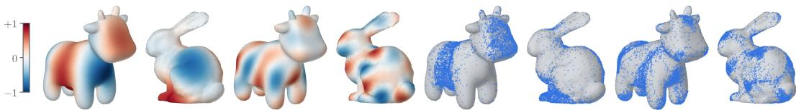
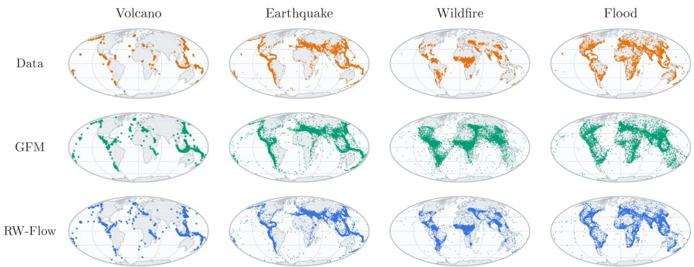

# RW-FLOW: ONE-STEP GENERATION ON COMPACT MANIFOLDS VIA WASSERSTEIN GRADIENT FLOWS

Ualibyek Nurgulan Seungwoo Yoo∗ Prin Phunyaphibarn∗ Minhyuk Sung KAIST {ualibek, dreamy1534, prin10517, mhsung}@kaist.ac.kr

Figure 1: One-step samples on general manifolds. Left: target eigenfunctions on the Bunny and Spot meshes for different eigenfunction indices k. Right: samples generated by our method in a single function evaluation (NFE = 1). Samples concentrate according to the geometry-induced target distributions on the underlying meshes.

## ABSTRACT

Manifold-valued data, and consequently the distributions they induce, are prevalent across many domains, ranging from the locations of geospatial events, such as earthquakes, to biomolecular torsion angles that encode information about threedimensional structure. While diffusion and flow-based generative models have been successfully extended to compact manifolds, sampling typically requires tens or hundreds of sequential network evaluations. We introduce RW-FLOW, a theoretically grounded framework for learning one-step generative models on compact manifolds via Wasserstein gradient flows. The main challenge is identifiability: driving the velocity field to zero should guarantee that the model distribution matches the target distribution. We establish a necessary and sufficient condition for identifiability on compact, connected Riemannian manifolds. We specifically show that, for a symmetric, Lipschitz-continuous cost function, the velocity field induced by the Sinkhorn divergence is identifiable if and only if the associated Gibbs kernel is nondegenerate. This characterization provides a general principle for designing identifiable costs on compact manifolds. It also reveals that the squared geodesic distance, the natural manifold analogue of the squared Euclidean distance, does not always guarantee identifiability. Across benchmarks involving geospatial events, protein side chain torsion angles, RNA backbone torsion angles, and general manifolds discretized as triangular meshes, RW-FLOW outperforms existing one-step methods in nearly all settings under fair comparison conditions.

## 1 INTRODUCTION

Diffusion and flow-based generative models have been successfully extended from Euclidean data to distributions supported on Riemannian manifolds (Huang et al., 2022; De Bortoli et al., 2022; Chen & Lipman, 2024), enabling applications to manifold-valued data such as geospatial events on spheres and molecular torsion angles on tori. However, sampling remains costly, typically requiring many network evaluations. Recent work has therefore begun adapting few-step acceleration techniques, including flow-map distillation, to Riemannian settings (Davis et al., 2026; Woo et al., 2026; Cheng et al., 2025). These methods reduce sampling cost but are more difficult to optimize due to redundancy in their parameterizations: they learn maps across multiple pairs of timesteps rather than directly optimizing the one-step map used at inference.

In contrast, Han et al. (2026) recently proposed W-Flow, a framework for learning one-step generative models based on Wasserstein gradient flows (WGFs). W-Flow directly learns a one-step pushforward map by regressing model outputs toward moving targets induced by the Wasserstein gradient of an energy functional that measures the discrepancy between the model and target distributions. A key requirement is identifiability: the velocity field should vanish only when the model distribution matches the target distribution. Han et al. (2026) considered various divergences as the energy functional and showed that the Sinkhorn divergence (Feydy et al., 2019) with the squared Euclidean distance cost performs best and satisfies the identifiability property in Euclidean spaces.

Given the strong empirical performance of W-Flow (Han et al., 2026) in Euclidean domains, a natural question is whether its one-step formulation can be extended to compact manifolds. A key challenge is that characterizing cost functions that induce identifiable velocity fields is not straightforward, in contrast to the Euclidean setting examined by Han et al. (2026), where the squared Euclidean distance guarantees identifiability. This leads to our central question: which cost functions induce identifiable velocity fields on compact manifolds?

For compact, connected Riemannian manifolds, we show that there exist many cost functions which induce an identifiable velocity field, opening a new axis for designing one-step models by modifying the cost function. We characterize these cost functions by showing that for a symmetric, Lipschitz cost function, the induced velocity field is identifiable if and only if the associated Gibbs kernel is nondegenerate. Based on this, we explore broad classes of costs that induce identifiable velocity fields, including spectral costs on general compact manifolds and distance-based costs under suitable geometric conditions. We also analyze the squared geodesic cost, the natural manifold analogue of the squared Euclidean cost, and show that it does not always guarantee identifiability.

On standard benchmarks, including Earth and climate datasets (National Geophysical Data Center / World Data Service (NGDC/WDS), 2020a;b; Brakenridge, 2017; NASA Earth Observing System Data and Information System (EOSDIS), 2020) on spherical domains and protein and RNA torsionangle datasets (Lovell et al., 2003; Murray et al., 2003) on tori, we demonstrate that our approach is not only theoretically sound but also empirically effective, surpassing existing methods in nearly al settings under matched model capacity and training time. We further show that spectral costs that are applicable to any compact manifold by construction, enable accelerated sampling on manifolds represented as triangular meshes (Fig. 1). In these settings, our method achieves performance comparable to that of a multi-step baseline while sampling two to three orders of magnitude faster.

## 2 BACKGROUND: W-FLOW

W-Flow (Han et al., 2026) is a powerful framework for learning one-step generative models by evolving the model distribution toward the target along a Wasserstein gradient flow (WGF) of an energy functional that measures the discrepancy between the two. Given an energy functional $\mathcal { F } : \mathcal { P } ( \mathbb { R } ^ { n } ) $ R on the space of probability distributions, its WGF is defined by

$$
\partial _ { t } q _ { t } = \nabla \cdot \left( q _ { t } \nabla \frac { \delta \mathcal { F } } { \delta q } ( q _ { t } ) \right) ,\tag{1}
$$

where $\textstyle { \frac { \delta { \mathcal { F } } } { \delta q } } ( q _ { t } )$ denotes the first variation of $\mathcal { F }$ at $q _ { t }$ . This induces a time-dependent probability path $q _ { t }$ in the Wasserstein space following the steepest descent direction of $\mathcal { F }$ . Equivalently, Eqn. 1 can be viewed as a continuity equation with velocity field $\begin{array} { r } { V _ { q _ { t } , p } = - \nabla \frac { \delta \mathcal { F } } { \delta q } ( q _ { t } ) } \end{array}$

Choosing $\mathcal { F } ( q ) = \mathcal { D } ( q , p )$ for a divergence D and target distribution p yields the velocity field $\begin{array} { r } { V _ { q , p } = - \nabla \frac { \delta \mathcal { D } ( \cdot , p ) } { \delta q } ( q ) } \end{array}$ , which transports $q _ { t }$ toward $p .$ Han et al. (2026) translate this flow into a model-training objective: they transport generated samples along $V _ { q _ { \theta } , p }$ and regress the generator outputs toward the transported samples.

$$
\begin{array} { r } { \mathcal { L } = \mathbb { E } _ { z \sim q _ { 0 } } \left[ \| f _ { \theta } ( z ) - \mathrm { s t o p g r a d } ( f _ { \theta } ( z ) + \eta V _ { q _ { \theta } , p } ( f _ { \theta } ( z ) ) ) \| ^ { 2 } \right] , } \end{array}\tag{2}
$$

where $f _ { \theta }$ is a one-step transport map, $q _ { \theta } = ( f _ { \theta } ) _ { \# } q _ { 0 }$ is the model distribution, and $\eta > 0$ is the step size. Note that Eqn. 2 is equivalent to $\eta ^ { 2 } \mathbb { E } _ { x \sim q _ { \theta } } \| V _ { q _ { \theta } , p } ( x ) \| ^ { 2 } \colon$ it vanishes exactly when the velocity field does. Driving the velocity field to zero, however, does not necessarily guarantee that the model converges to the target distribution $( i . e . , V _ { q _ { \theta } , p } \equiv 0$ implies $q _ { \theta } = p ) ;$ ; such a guarantee requires the field to be identifiable.

For identifiability, Han et al. (2026) instantiate D with the Sinkhorn divergence (Feydy et al., 2019; Ramdas et al., 2017; Genevay et al., 2018; Salimans et al., 2018),

$$
\begin{array} { r } { S _ { \varepsilon , c } ( q , p ) = \mathrm { O T } _ { \varepsilon , c } ( q , p ) - \frac { 1 } { 2 } \mathrm { O T } _ { \varepsilon , c } ( q , q ) - \frac { 1 } { 2 } \mathrm { O T } _ { \varepsilon , c } ( p , p ) , } \end{array}\tag{3}
$$

where $\mathrm { O T } _ { \varepsilon , c }$ is an entropy-regularized optimal transport cost:

$$
\operatorname { O T } _ { \varepsilon , c } ( q , p ) = \operatorname* { m i n } _ { \pi \in \Pi ( q , p ) } \int c ( x , y ) \mathrm { d } \pi ( x , y ) + \varepsilon D _ { \operatorname { K L } } ( \pi \parallel q \otimes p ) .\tag{4}
$$

Here, $\Pi ( q , p )$ is the set of couplings with marginals q and p and $c ( x , y )$ specifies the cost of transporting mass from x to y. The minimizer $\pi ^ { q p }$ is unique and is typically computed in practice by Sinkhorn iterations (Cuturi, 2013). With $c ( x , y ) = \textstyle { \frac { 1 } { 2 } } \| { \dot { x } } - y \| ^ { 2 }$ , Han et al. (2026) show that the Sinkhorn divergence is identifiable.

Although W-Flow has achieved state-of-the-art one-step performance on Euclidean domains, including image generation, its extension to compact manifolds remains unexplored. Moreover, while identifiability holds for many cost functions in Euclidean domains, it remains unclear whether any such cost function exists on compact manifolds, motivating the following question: Which cost functions guarantee identifiability on compact manifolds, and how can we characterize them?

## 3 RW-FLOW

We introduce RIEMANNIAN W-FLOW (RW-FLOW), which extends W-Flow (Han et al., 2026) to compact, connected Riemannian manifolds. In the following, we first derive the WGF of the Sinkhorn divergence defined with a general cost function on a Riemannian manifold (Sec. 3.1). We then provide our main theorem, which characterizes cost functions by connecting identifiability to the nondegeneracy of the associated Gibbs kernels, and present two approaches for verifying this nondegeneracy (Sec. 3.2). Finally, we explore a variety of cost functions by applying these criteria, including the squared geodesic cost and both spectral and distance-based costs (Sec. 3.3).

## 3.1 VELOCITY FIELDS ON COMPACT MANIFOLDS

Let M denote a compact, connected, smooth manifold equipped with a Riemannian metric $^ { g , }$ so that M is complete and the exponential map $\exp _ { x } : T _ { x } \mathcal { M }  \mathcal { M }$ is defined on the whole tangent space $T _ { x } { \mathcal { M } }$ . We write $\langle \cdot , \cdot \rangle _ { g }$ and $\| \cdot \| _ { g }$ for the metric and its norm on $T _ { x } { \mathcal { M } } , d _ { g }$ for the geodesic distance, log for the inverse of $\exp _ { x }$ on the domain where it is defined, and $\nabla _ { g } ^ { - } , \mathrm { d i v } _ { g }$ for the Riemannian gradient and divergence. Given a base distribution $q _ { 0 } \in \mathcal { P } ( \mathcal { M } )$ and a target distribution $p \in \mathcal { P } ( \mathcal { M } )$ , our goal is to learn a transport map $f _ { \theta } : { \mathcal { M } } \to { \mathcal { M } }$ such that $( f _ { \theta } ) _ { \# } q _ { 0 } = p .$

Building on this machinery, we first extend the W-Flow training objective (Han et al., 2026) in Eqn. 2 to Riemannian manifolds. In particular, Eqn. 2 comprises three components specific to $\mathbb { R } ^ { n } \colon ( 1 )$ the additive update $f _ { \theta } ( z ) + \eta \bar { V _ { q _ { \theta } , p } ( f _ { \theta } ( z ) ) }$ , (2) the squared Euclidean distance between the generator output and the target, and (3) the field V itself. On a Riemannian manifold $( \mathcal { M } , g )$ , the first two components admit natural intrinsic counterparts: a point x is moved along a tangent vector $V ( x ) \in \mathbf { \dot { T } } _ { x } \mathbf { \mathcal { M } }$ by the exponential map $\exp _ { x } ( \eta \bar { V } ( x ) )$ with $\eta > 0$ denoting a step size, while the discrepancy between two points x and y is measured by the squared geodesic distance $d _ { g } ^ { 2 } ( x , y )$ Accordingly, for Riemannian manifolds, Eqn. 2 can be rewritten as

$$
\begin{array} { r } { \mathcal { L } = \mathbb { E } _ { z \sim q _ { 0 } } \left[ d _ { g } ^ { 2 } \left( f _ { \theta } ( z ) , \mathrm { ~ s t o p g r a d } \left( \exp _ { f _ { \theta } ( z ) } ( \eta V _ { q _ { \theta } , p } ( f _ { \theta } ( z ) ) ) \right) \right) \right] . } \end{array}\tag{5}
$$

For the exponential map in Eqn. 5 to be well defined, the field evaluated at $x = f _ { \theta } ( z )$ must lie in the tangent space at $f _ { \theta } ( z )$ . This condition is readily satisfied when V is derived from a Wasserstein gradient flow on $\mathcal { M } .$ . Specifically, the continuity equation in Eqn. 1 naturally extends to $\mathcal { M }$ by replacing the Euclidean operators with their Riemannian counterparts (Villani, 2008)

$$
\partial _ { t } q _ { t } = \mathrm { d i v } _ { g } \left( q _ { t } \nabla _ { g } \frac { \delta \mathcal { F } } { \delta q } ( q _ { t } ) \right) .\tag{6}
$$

Analogous to W-Flow (Han et al., 2026), we choose the debiased Sinkhorn divergence as our energy functional: $\mathcal { F } ( q ) = S _ { \varepsilon , c } ( q , p )$ . Here, $\mathrm { O T } _ { \varepsilon , c }$ and $S _ { \varepsilon , c }$ are defined as in Eqn. 4 and Eqn. 3, respectively. Then, the resulting velocity field, obtained as the Wasserstein gradient of $\boldsymbol { S } _ { \varepsilon , c }$ , is given below.

Theorem 3.1. Let ${ \mathcal F } ( q ) = S _ { \varepsilon , c } ( q , p )$ on a compact $( \mathcal { M } , g )$ and c be a differentiable in its first argument. Then the Wasserstein gradient flow velocity $\begin{array} { r } { V = - \nabla _ { g } \frac { \delta \mathcal { F } } { \delta { q } } } \end{array}$ is

$$
V _ { q , p } ^ { \varepsilon , c } ( x ) = - \int _ { \mathcal M } \nabla _ { g } ^ { ( 1 ) } c ( x , y ) \pi ^ { q p } ( \mathrm { d } y | x ) + \int _ { \mathcal M } \nabla _ { g } ^ { ( 1 ) } c ( x , z ) \pi ^ { q q } ( \mathrm { d } z | x ) \in T _ { x } \mathcal M ,\tag{7}
$$

where $\pi ^ { q p } ( \ \mathrm { d } \boldsymbol { y } \mid \boldsymbol { x } )$ denotes the disintegration with respect to x of the optimal coupling $\pi ^ { q p }$ of the entropy-regularized $\mathrm { O T } _ { \varepsilon , c } ( q , p )$ in Eqn. 4, and $\nabla _ { g } ^ { ( 1 ) }$ is the Riemannian gradient in thefirst argument.

The derivation can be found in App. B.1. Intuitively, the first term shifts x toward the data points to which it is coupled, whereas the second term induces repulsion among the generated samples and cancels the entropic bias, ensuring that the field vanishes when $q = p$

An immediate consequence of Thm. 3.1 is that the cost function determines the form of the velocity field and, consequently, its identifiability. In the next subsection, we present a theoretical criterion for determining whether a given cost function induces an identifiable velocity field.

## 3.2 IDENTIFIABILITY VIA NONDEGENERACY

Recall from Sec. 2 that a velocity field $V _ { q _ { \theta } , p }$ is identifiable if $V _ { q _ { \theta } , p } \equiv 0$ implies $q _ { \theta } = p .$ . Since the training objective in Eqn. 5 drives the norm of $V _ { q _ { \theta } , p }$ to zero, identifiability ensures that the generator does not reach a spurious fixed point even when q $\neq p .$ . While the squared Euclidean cost is sufficient to ensure identifiability in Euclidean spaces (Han et al., 2026), we extend this result by characterizing a broader class of cost functions that preserve identifiability.

Our main result, presented below, shows that for a symmetric, Lipschitz continuous cost function c, identifiability of the velocity field induced by the Sinkhorn divergence is determined by the nondegeneracy of the corresponding Gibbs kernel $k = e ^ { - c / \varepsilon }$ , defined below.

Definition 3.1. Let $\textstyle ( k * \sigma ) ( x ) : = \int k ( x , y ) \operatorname { d } \sigma ( y )$ be an integral operatorfor $\sigma \in \mathfrak { M } _ { b } ( \mathcal { M } )$ . We call k nondegenerate $i f \sigma \mapsto k * \sigma$ is injective on finite signed measures $\mathfrak { M } _ { b } ( \mathcal { M } )$ ). Otherwise, it is degenerate.

With this notion in place, we state our main theorem, which provides a criterion for determining which cost functions induce identifiable velocity fields and which do not.

Theorem 3.2. Let $( \mathcal { M } , g )$ be a compact, connected Riemannian manifold with a symmetric, Lipschitz cost function $c : \mathcal { M } \times \mathcal { M } \to \mathbb { R }$ . Denote its Gibbs kernel $k : = e ^ { - c / \varepsilon }$ . Then $V _ { q , p } ^ { \varepsilon , c }$ is identifiable ifand only if k is nondegenerate.

Thm. 3.2 implies a broader class of admissible cost functions. Specifically, if a cost function is symmetric and Lipschitz continuous and its associated Gibbs kernel is nondegenerate, then the corresponding velocity field is identifiable, making Eqn. 5 suitable for learning the generator. Motivated by this result, we next explore a broad range of cost functions in Sec. 3.3. Here, as a preliminary step, we introduce two approaches to verify the nondegeneracy of their associated Gibbs kernels: spectral analysis and universality.

Verifying Nondegeneracy via Spectral Analysis. For kernels that are diagonalizable in the Laplace-Beltrami eigenbasis, their nondegeneracy can be determined based on their spectra.

Lemma 3.3. Let M be compact and k a continuous symmetric kernel on M. Let $\{ \phi _ { n } \} _ { n \ge 0 }$ be Laplace-Beltrami eigenfunctions such that theyform a basisfor $L ^ { 2 } ( \mathcal { M } )$ and

$$
\int k ( x , y ) \phi _ { n } ( y ) ~ \mathrm { d v o l } _ { g } ( y ) = \hat { k } _ { n } \phi _ { n } ( x ) \qquad f o r ~ a l l ~ n \geq 0 .\tag{8}
$$

Then k is nondegenerate if and only $i f \hat { k } _ { n } \neq 0 f o r a l l n \geq 0 .$

The proof is deferred to App. B. Notably, the condition in Lem. 3.3 applies to every spectral kernel on any compact manifold (Sec. 3.3.1), as well as to every kernel that depends only on the geodesic distance on $\mathring \mathbb { S } ^ { d }$ or $\mathbb { T } ^ { d }$ . Importantly, Lem. 3.3 does not require k to be positive definite: the coefficients $\hat { k } _ { n }$ may be negative, provided that none of them vanishes.

Verifying Nondegeneracy via Universality. When the spectrum is not available in closed form but the kernel is positive definite, nondegeneracy can instead be verified through universality (refer to App. C for definition), following Micchelli et al. (2006); Sriperumbudur et al. (2011).

Proposition 3.3.1 (Micchelli et al. (2006)). Let M be compact and k a continuous positive definite kernel on M. Then k is nondegenerate ifand only ifit is universal.

Hence, when the Gibbs kernel associated with a cost function is positive definite, it suffices to verify its universality to establish nondegeneracy. Together with Thm. 3.2, the spectral and universality approaches provide complementary criteria for determining whether a given cost function induces an identifiable velocity field. With these results, we explore various cost functions in the following.

## 3.3 COST FUNCTIONS ON COMPACT MANIFOLDS

In the Euclidean case, the squared Euclidean cost guarantees identifiability (Han et al., 2026). It is therefore natural to ask whether its manifold analogue, the squared geodesic cost $\begin{array} { r } { c ( x , y ) = \frac { 1 } { 2 } d _ { q } ^ { 2 } ( x , y ) } \end{array}$ also induces an identifiable velocity field. This cost satisfies the assumptions of Thm. $3 . 2 ;$ consequently, it suffices to determine whether the associated Gibbs kernel $\exp \Bigl ( - \frac { 1 } { 2 \varepsilon } d _ { g } ^ { 2 } \Bigr )$ is nondegenerate.

Proposition 3.3.2. For the geodesic Gaussian kernel $\begin{array} { r } { k _ { \varepsilon } = \exp \big ( - \frac { 1 } { 2 \varepsilon } d _ { g } ^ { 2 } \big ) } \end{array}$ on $\mathbb { S } ^ { d }$ or $\mathbb { T } ^ { d } ,$ , the set

$$
\Gamma = \{ \varepsilon > 0 \mid k _ { \varepsilon } \ i s \ d e g e n e r a t e \}\tag{9}
$$

is at most countable. Particularly, $f o r \mathbb { T } ^ { d }$ , Γ is countably infinite.

The proof is deferred to App. B. Since Gaussian kernels built on the geodesic distance are not positive definite for any $\varepsilon > 0$ on many manifolds (Feragen et al., 2015; Da Costa et al., 2023; 2025; Li, 2024), Prop. 3.3.1 does not apply directly; we instead rely on Lem. 3.3. On both $\mathbb { S } ^ { d }$ and $\mathbb { T } ^ { d }$ , any kernel that depends only on the geodesic distance is diagonalizable as in Lem. 3.3, and the spectral coefficient associated with each mode vanishes for at most countably many values of $\dot { \varepsilon } .$ . Therefore, on $\mathbb { S } ^ { d }$ and $\mathbb { T } ^ { d }$ , the squared geodesic cost induces an identifiable velocity field for almost every $\varepsilon > 0$ As we show in Sec. 3.3.2, dropping the square resolves this on $\mathbb { S } ^ { d }$

However, our argument does not extend to general compact manifolds, motivating us to seek cost functions whose Gibbs kernels are provably nondegenerate for every $\varepsilon > 0$ . Through the lens of Thm. 3.2, we explore two such classes. The first, which we call spectral costs, is defined using the Laplace-Beltrami eigenfunctions (Sec. 3.3.1). The second, which we call distance-based costs, includes the chordal and geodesic costs whose guarantees hold under conditions on the manifold (Sec. 3.3.2). In the following, we introduce these cost functions and prove the identifiability of their induced velocity fields using Thm. 3.2, together with the spectral and universality criteria developed previously. We organize the cost families along with their guarantees and formulas in Tab. 1.

## 3.3.1 SPECTRAL COSTS

A spectral cost is a cost function induced by a spectral kernel $k _ { \rho } : \mathcal { M } \times \mathcal { M } \to \mathbb { R }$ , defined on any compact Riemannian manifold M. We begin by defining spectral kernels below.

Definition 3.2 (Spectral Kernels). Let $\{ ( \lambda _ { n } , \phi _ { n } ) \} _ { n = 0 } ^ { \infty }$ denote the eigenpairs ofthe Laplace-Beltrami operator on a compact Riemannian manifold $( \mathcal { M } , g )$ , with $\{ \phi _ { n } \}$ orthonormal in $L ^ { 2 } ( \mathcal { M } )$ . Spectral kernels are defined by

$$
k _ { \rho } ( x , y ) = \sum _ { n = 0 } ^ { \infty } \rho ( \lambda _ { n } ) \phi _ { n } ( x ) \phi _ { n } ( y ) ,\tag{10}
$$

where the spectral density $\rho \colon [ 0 , \infty )  [ 0 , \infty )$ decays fast enough that the series converges uniformly.

A key property of spectral kernels is that their nondegeneracy is characterized by their spectral density $\rho ,$ as stated in the following proposition.

Proposition 3.3.3 (Nondegeneracy of Spectral Kernels). A spectral kernel $k _ { \rho }$ is nondegenerate $i f$ and only $i f \rho ( \lambda _ { n } ) \neq 0$ for all $\lambda _ { n } .$

Proof. Let $\{ \lambda _ { n } , \phi _ { n } \} _ { n \geq 0 }$ be the eigenpairs of the Laplace-Beltrami operator on M. Consider

$$
k * ( \phi _ { n } \mathrm { v o l } _ { g } ) = \int k _ { \rho } ( x , y ) \phi _ { n } ( y ) \mathrm { d } \mathrm { v o l } _ { g } ( y ) = \rho ( \lambda _ { n } ) \phi _ { n } ( x )\tag{11}
$$

Now by Lem. $3 . 3 , k _ { \rho }$ is nondegenerate if and only if $\rho ( \lambda _ { n } ) \neq 0$ for all $\lambda _ { n }$

Using this property, we can show that nondegenerate spectral kernels induce cost functions that, when used to define the Sinkhorn divergence in Eqn. 4, yield identifiable velocity fields, as stated in the following result.

Table 1: Overview of cost functions considered. $P _ { x }$ denotes the orthogonal projection onto $T _ { x } { \mathcal { M } }$ for $\mathcal { M } \subset \mathbb { R } ^ { D }$ . The last column states for which ε and on which manifolds the Gibbs kernel is nondegenerate, so that the velocity field is identifiable by Thm. $3 . 2 ; { \ " a . e . } { \ " }$ means all but countably many. On manifolds not listed, no guarantee is established.
<table><tr><td>Cost</td><td> $ { \vert } c ( x , y )$ </td><td> $e ^ { - c / \varepsilon }$  Gibbs kernel</td><td> $\nabla _ { g } ^ { ( 1 ) } c ( x , y )$ </td><td>Identifiable for</td></tr><tr><td>Squared Geodesic</td><td> $\textstyle { \frac { 1 } { 2 } } d _ { g } ( x , y ) ^ { 2 }$ </td><td> $e ^ { - d _ { g } ( x , y ) ^ { 2 } / 2 \varepsilon }$ </td><td> $- \log _ { x } ( y )$ </td><td> $\mathsf { a . e . } \varepsilon \mathrm { o n } \mathbb { S } ^ { d } , \mathbb { T } ^ { d }$ </td></tr><tr><td>Spectral</td><td></td><td> $\begin{array} { r l } { - \varepsilon \log k _ { \rho } ( x , y ) } & { { } \sum _ { n } \rho ( \lambda _ { n } ) \phi _ { n } ( x ) \phi _ { n } ( y ) } & { - \varepsilon \nabla _ { g } ^ { ( 1 ) } \mathrm { l o g } k _ { \rho } ( x , y ) } \end{array}$ </td><td></td><td>all  $\varepsilon , \mathrm { a n y } \ : \mathcal { M }$ </td></tr><tr><td>Chordal</td><td> $\| x - y \| ^ { 2 }$ </td><td> $e ^ { - \| x - y \| ^ { 2 } / \varepsilon }$ </td><td> $2 P _ { x } ( x - y )$ </td><td>all  $\varepsilon , \operatorname { a n y } \mathcal { M } \subset \mathbb { R } ^ { D }$ </td></tr><tr><td>Geodesic</td><td> $d _ { g } ( x , y )$ </td><td> $e ^ { - d _ { g } ( x , y ) / \varepsilon }$ </td><td> $- \log _ { x } ( y ) / d _ { g } ( x , y )$ </td><td>all  $\varepsilon \mathrm { o n } \mathbb { S } ^ { d }$ </td></tr></table>

Corollary 3.3.1. Let $k _ { \rho }$ be a spectral kernel defined on a compact, connected manifold M with a nonvanishing spectral density ρ with $k _ { \rho } > 0$ and log $k _ { \rho }$ is Lipschitz. Then, the velocity V in Eqn. 7 with the cost $c _ { k _ { \rho } } = - \varepsilon \log k _ { \rho }$ is identifiable.

We identify several kernels that satisfy the condition in Cor. 3.3.1 and summarize them in Tab. 2. Accordingly, the Riemannian gradient $\nabla _ { g } ^ { ( 1 ) } c _ { k _ { \rho } }$ is obtained by differentiating the truncated sum. Furthermore, the eigenfunctions are spherical harmonics on the sphere and Fourier modes on flat tori, both of which yield closed-form expressions.

## 3.3.2 DISTANCE-BASED COSTS

Distance-based costs also fit within our framework: under suitable conditions on the manifold, they too guarantee identifiability. We discuss two such examples: the chordal cost and the geodesic cost.

Chordal Cost. When M is embedded in $\mathbb { R } ^ { D } .$ the chordal kernels $\exp { ( - \lambda \| x - y \| ^ { 2 } ) }$ (Steinwart, 2001) are known to be positive definite and universal for any compact subset of $\mathbb { R } ^ { D }$ . In particular, they are nondegenerate by Prop. 3.3.1. Using

Table 2: Spectral densities of nondegenerate spectral kernels. When used as costs in the Sinkhorn divergence Eqn. 4, these kernels yield identifiable velocity fields. See App. D for details.
<table><tr><td>Kernel</td><td> $\rho ( \lambda _ { n } )$ </td><td>Parameters</td></tr><tr><td>Matérn</td><td> $\begin{array} { r } { \sigma ^ { 2 } \big ( \frac { 2 \nu } { \kappa ^ { 2 } } + \lambda _ { n } \big ) ^ { - \nu - d / 2 } } \end{array}$ </td><td> $\nu > \frac { 1 } { 2 } , \kappa , \sigma ^ { 2 } > 0$ </td></tr><tr><td>Heat</td><td> $e ^ { - t \lambda _ { n } }$ </td><td> $t > 0$ </td></tr><tr><td>Sub. Heat</td><td> $e ^ { - t \lambda _ { n } ^ { \alpha } }$ </td><td> $t > 0 , \alpha \in ( 0 , 1 ]$ </td></tr></table>

the relation between the cost and its Gibbs kernel in Thm. 3.2, we identify the induced cost as the squared chordal distance $\| x - y \| ^ { 2 }$ restricted to M, which is Lipschitz on a compact manifold and symmetric, making it identifiable.

Geodesic Cost. The Laplacian kernel $\exp ( - \lambda d _ { g } ( x , y ) )$ is universal on the sphere $( \mathbb { S } ^ { d } )$ for every $\lambda > 0$ (Zhang et al., 2024). By Prop. 3.3.1, it is nondegenerate. With $\lambda = 1 / \varepsilon$ , it is the Gibbs kernel of the geodesic distance itself,

$$
c ( x , y ) = d _ { g } ( x , y ) ,\tag{12}
$$

which is a symmetric, Lipschitz cost on $\mathbb { S } ^ { d }$ . Therefore, identifiability follows from Thm. 3.2, in contrast to the squared geodesic cost.

## 4 RELATED WORK

Generative Modeling on Manifolds. Early work extended normalizing flows to non-Euclidean domains, including hyperbolic spaces, spheres, and tori (Bose et al., 2020; Rezende et al., 2020; Mathieu & Nickel, 2020). More recent work adapted diffusion and flow-based models to Riemannian manifolds (Huang et al., 2022; De Bortoli et al., 2022; Chen & Lipman, 2024). However, as with their Euclidean counterparts, sampling from these models remains computationally expensive because it requires multiple sequential steps to integrate an SDE or ODE.

Few-Step Generative Models. To reduce the sampling cost of diffusion and flow models, several methods distill pretrained multi-step models into few-step generators (Salimans & Ho, 2022; Yin et al., 2024; Zhou et al., 2024). However, these approaches require an additional distillation stage on top of teacher pretraining. Other methods instead train few-step generators from scratch by incorporating the underlying SDE or ODE dynamics directly into the training objective (Song & Dhariwal, 2024;

Boffi et al., 2025; Geng et al., 2025). Drifting models (Deng et al., 2026) follow this paradigm to learn one-step generators from scratch. During training, they evolve the model distribution along a velocity field that characterizes its discrepancy from the target distribution. W-Flow (Han et al., 2026) further introduces an identifiable velocity field, improving empirical performance while providing stronger guarantees that the learned distribution converges to the target.

Few-step Generative Modeling on Manifolds. Several recent works accelerate generation on manifolds by adapting few-step techniques originally developed for Euclidean settings. Woo et al. (2026) and Davis et al. (2026) learn shortcut mappings that avoid repeatedly integrating an ODE or SDE, while Cheng et al. (2025) extend consistency models (Song et al., 2023) to manifolds. Concurrently, Esteban-Casadevall et al. (2026) generalize drifting models (Deng et al., 2026) by representing the drifting field as a weighted average of kernel gradients, extending them to arbitrary manifolds. They show that this field corresponds to the WGF of the KL divergence between smoothed probability densities. In contrast, our work adopts the Sinkhorn divergence as the primary energy functional and additionally investigates the squared Maximum Mean Discrepancy (MMD) in App. C.

## 5 EXPERIMENTS

## 5.1 EXPERIMENT SETUP

Benchmarks. To demonstrate the effectiveness of our method, we conduct extensive experiments on standard benchmarks spanning several manifolds. Specifically, we evaluate RW-FLOW on the task of modeling distributions over a sphere $( \mathbb { S } ^ { 2 } )$ , using geospatial event data over the Earth (Mathieu & Nickel, 2020). We also consider distributions over torus geometry, with representative examples being protein side chain (T2) (Lovell et al., 2003), and RNA backbone torsion angles (T7) (Murray et al., 2003). Furthermore, we consider modeling distributions on general manifolds using mesh-based examples and distributions from Chen & Lipman (2024).

Evaluation Metrics. Across all benchmarks, we assess sample quality using the following metrics: KMMD (Maximum Mean Discrepancy), MMD (Minimum Matching Distance), 1-NNA (1- Nearest-Neighbor Accuracy), and COV (Coverage). Each metric is computed between the test data and the generated samples.

Baselines. We compare our method against state-of-the-art one- and few-step generative models designed for distributions on manifolds. Specifically, we consider Riemannian Flow Matching (RFM) (Chen & Lipman, 2024), Generalised Flow Map (GFM) (Davis et al., 2026), Riemannian MeanFlow (RMF) (Woo et al., 2026), and Riemannian Consistency Model (RCM) (Cheng et al., 2025). We additionally include the concurrent work Kernel-Gradient Drifting Models (KGD) (Esteban-Casadevall et al., 2026) as a baseline. To ensure a fair comparison, we match the number of model parameters, training wall-clock time, and optimizer configurations across all methods. We use the official implementations of each baseline, making only minor modifications to integrate them with our standalone evaluation script. Full experimental details are provided in App. E.

## 5.2 SPHERE – S2

We evaluate RW-FLOW on the task of modeling distributions on spheres. Following prior work (De Bortoli et al., 2022; Chen & Lipman, 2024; Davis et al., 2026), we use the geospatial datasets introduced by Mathieu & Nickel (2020), collected from a variety of sources, including National Geophysical Data Center / World Data Service (NGDC/WDS) (2020a;b), Brakenridge (2017), and NASA Earth Observing System Data and Information System (EOSDIS) (2020). The main quantitative results are reported in Tab. 3. As shown, our method outperforms current state-of-the-art methods across nearly all benchmarks in the one-step setting, with the geodesic and subordinated heat cost variants achieving the strongest overall performance. Notably, both costs induce identifiable velocity fields on the sphere.

Alongside the quantitative evaluation, Fig. 2 presents a qualitative comparison between RW-FLOW and GFM (Davis et al., 2026), the strongest baseline. The visual results reflect the gap observed in the quantitative metrics: on benchmarks such as ‘Wildfire’ and ‘Flood’, GFM produces overly diffuse samples, whereas RW-FLOW closely captures the reference distributions.

## 5.3 FLAT TORUS – Td

We also consider distributions on flat tori, the natural state spaces of torsion angles in protein and RNA that encode their structures. Specifically, we use protein side-chain torsion angles represented as points on $\mathbb { T } ^ { 2 }$ (Lovell et al., 2003), and RNA backbone torsion angles on $\mathbb { T } ^ { 7 }$ (Murray et al., 2003). The quantitative results are summarized in Tab. 4. Across nearly all settings, variants of RW-FLOW outperform both the Lagrangian and other self-distillation variants of GFM. Interestingly, RW-FLOW-SG performs comparably to RW-FLOW-H, even though our framework does not guarantee identifiability of the squared geodesic cost for every $\varepsilon > 0 ,$ . This is consistent with Prop. 3.3.2: on $\mathbb { T } ^ { d }$ the squared geodesic cost is identifiable for all but countably many ε, so a generic choice of ε behaves like an identifiable cost in practice.

  
Figure 2: Generated samples on geospatial event data benchmarks at 1 NFE. Each column visualizes the dataset (top) and samples generated by GFM (Davis et al., 2026) (middle) and RW-FLOW-S (bottom). RW-FLOW-S more accurately captures the underlying data distributions, whereas GFM produces diffuse samples that deviate substantially from the ground-truth distributions.

Table 3: Results on geospatial event data benchmarks. KMMD, COV, and 1-NNA (closest to 0.5 is best) on the volcano, earthquake, flood, and fire datasets (NFE = 1; bold = best, underline = second best; the held-out row is the val-vs-test reference and is excluded from ranking.) Suffixes denote variants: CT (Consistency Training) sCT (simplified Consistency Training) L (Lagrangian), E (Eulerian), S (semigroup), MF (mean flow); GG (geodesic Gaussian), GL (geodesic Laplacian), M (Matern);´ v denotes v-prediction; RW-FLOW costs: SG (squared geodesic), C (chordal), G (geodesic), H (heat), M (Matern), S (subordinated). The metrics are averaged over 3 runs. Full results with´ standard deviations are in Tab. 9.
<table><tr><td rowspan="2"></td><td colspan="3">Volcano</td><td colspan="3">Earthquake</td><td colspan="3">Flood</td><td colspan="3">Fire</td></tr><tr><td>MMMD</td><td>↓ΛO</td><td>IN-A</td><td>MMD</td><td>CΛVV</td><td>1-NA</td><td>MMD</td><td>CΛV</td><td>1NNA</td><td>MMD</td><td>COV</td><td>INN-A</td></tr><tr><td>Held-out</td><td>0.153</td><td>0.451</td><td>0.555</td><td>0.026</td><td>0.570</td><td>0.471</td><td>0.025</td><td>0.548</td><td>0.509</td><td>0.024</td><td>0.543</td><td>0.504</td></tr><tr><td>RFM</td><td>0.292</td><td>0.431</td><td>0.835</td><td>0.291</td><td>0.278</td><td>0.845</td><td>0.307</td><td>0.345</td><td>0.790</td><td>0.357</td><td>0.176</td><td>0.913</td></tr><tr><td>GFM-L</td><td>0.099</td><td>0.516</td><td>0.553</td><td>0.040</td><td>0.570</td><td>0.562</td><td>0.062</td><td>0.569</td><td>0.547</td><td>0.029</td><td>0.520</td><td>0.643</td></tr><tr><td>GFM-E</td><td>0.199</td><td>0.431</td><td>0.823</td><td>0.174</td><td>0.339</td><td>0.806</td><td>0.191</td><td>0.350</td><td>0.795</td><td>0.190</td><td>0.201</td><td>0.900</td></tr><tr><td>GFM-S</td><td>0.094</td><td>0.512</td><td>0.677</td><td>0.042</td><td>0.478</td><td>0.693</td><td>0.060</td><td>0.498</td><td>0.651</td><td>0.031</td><td>0.392</td><td>0.768</td></tr><tr><td>GFM-MF</td><td>0.119</td><td>0.512</td><td>0.711</td><td>0.043</td><td>0.510</td><td>0.658</td><td>0.059</td><td>0.515</td><td>0.642</td><td>0.033</td><td>0.408</td><td>0.751</td></tr><tr><td>RMF-Lv</td><td>0.119</td><td>0.504</td><td>0.663</td><td>0.041</td><td>0.535</td><td>0.640</td><td>0.047</td><td>0.545</td><td>0.613</td><td>0.034</td><td>0.453</td><td>0.715</td></tr><tr><td>RMF-Ev</td><td>0.142</td><td>0.496</td><td>0.689</td><td>0.038</td><td>0.502</td><td>0.653</td><td>0.045</td><td>0.494</td><td>0.661</td><td>0.032</td><td>0.428</td><td>0.740</td></tr><tr><td>RMF-Sv</td><td>0.122</td><td>0.512</td><td>0.687</td><td>0.040</td><td>0.464</td><td>0.703</td><td>0.045</td><td>0.498</td><td>0.661</td><td>0.033</td><td>0.380</td><td>0.770</td></tr><tr><td>KGD-GG</td><td>0.237</td><td>0.447</td><td>0.799</td><td>0.353</td><td>0.252</td><td>0.866</td><td>0.163</td><td>0.453</td><td>0.700</td><td>0.398</td><td>0.154</td><td>0.926</td></tr><tr><td>KGD-GL</td><td>0.254</td><td>0.435</td><td>0.732</td><td>0.252</td><td>0.353</td><td>0.772</td><td>0.158</td><td>0.460</td><td>0.657</td><td>0.272</td><td>0.291</td><td>0.816</td></tr><tr><td>KGD-M</td><td>0.131</td><td>0.488</td><td>0.699</td><td>0.051</td><td>0.485</td><td>0.689</td><td>0.059</td><td>0.521</td><td>0.631</td><td>0.138</td><td>0.332</td><td>0.801</td></tr><tr><td>RCM-CT</td><td>0.147</td><td>0.496</td><td>0.691</td><td>0.055</td><td>0.520</td><td>0.655</td><td>0.052</td><td>0.511</td><td>0.659</td><td>0.045</td><td>0.405</td><td>0.744</td></tr><tr><td>RCM-scT</td><td>0.142</td><td>0.496</td><td>0.811</td><td>0.092</td><td>0.376</td><td>0.796</td><td>0.115</td><td>0.417</td><td>0.751</td><td>0.109</td><td>0.236</td><td>0.871</td></tr><tr><td>RW-FLOW-SG</td><td>0.110</td><td>0.533</td><td>0.563</td><td>0.031</td><td>0.552</td><td>0.565</td><td>0.061</td><td>0.558</td><td>0.533</td><td>0.024</td><td>0.530</td><td>0.643</td></tr><tr><td>RW-FLOW-C</td><td>0.112</td><td>0.545</td><td>0.612</td><td>0.036</td><td>0.538</td><td>0.594</td><td>0.053</td><td>0.553</td><td>0.580</td><td>0.031</td><td>0.475</td><td>0.688</td></tr><tr><td>RW-FLOW-G</td><td>0.103</td><td>0.484</td><td>0.510</td><td>0.047</td><td>0.556</td><td>0.520</td><td>0.044</td><td>0.551</td><td>0.530</td><td>0.027</td><td>0.554</td><td>0.583</td></tr><tr><td>RW-FLOW-H</td><td>0.114</td><td>0.516</td><td>0.587</td><td>0.040</td><td>0.527</td><td>0.618</td><td>0.052</td><td>0.587</td><td>0.591</td><td>0.025</td><td>0.426</td><td>0.730</td></tr><tr><td>RW-FLOW-M</td><td>0.122</td><td>0.524</td><td>0.638</td><td>0.033</td><td>0.529</td><td>0.624</td><td>0.054</td><td>0.522</td><td>0.639</td><td>0.024</td><td>0.439</td><td>0.738</td></tr><tr><td>RW-FLOW-S</td><td>0.094</td><td>0.512</td><td>0.496</td><td>0.040</td><td>0.568</td><td>0.537</td><td>0.043</td><td>0.563</td><td>0.535</td><td>0.028</td><td>0.553</td><td>0.592</td></tr></table>

Table 4: Results on protein and RNA torsion-angle datasets. KMMD, COV, and 1-NNA (closest to 0.5 is best) on four protein and RNA torsion-angle datasets (NFE = 1; bold = best, underline = second best; the held-out row is the val-vs-test reference and is excluded from ranking.) Variant suffixes as in Tab. 3. The metrics are averaged over 3 runs. Full results with standard deviations are in Tab. 10.
<table><tr><td></td><td colspan="3">General</td><td colspan="3">Glycine</td><td colspan="3">Proline</td><td colspan="3">Prepro</td><td colspan="3">RNA</td></tr><tr><td></td><td>MMD</td><td>COVV</td><td>1NNNA</td><td>RMMD</td><td>CΛO</td><td>INNA</td><td>RMMMD</td><td>COV</td><td>I-NA</td><td>MMMD</td><td>CΛO</td><td>INN-A</td><td>MD</td><td>COVV</td><td>1-N-A</td></tr><tr><td>Held-out</td><td>0.007</td><td>0.585</td><td>0.499</td><td>0.023</td><td>0.590</td><td>0.491</td><td>0.020</td><td>0.602</td><td>0.489</td><td>0.027</td><td>0.572</td><td>0.514</td><td>0.036</td><td>0.588</td><td>0.504</td></tr><tr><td>RFM</td><td>0.469</td><td>0.191</td><td>0.831</td><td>0.281</td><td>0.314</td><td>0.741</td><td>0.478</td><td>0.160</td><td>0.880</td><td>0.486</td><td>0.225</td><td>0.820</td><td>0.559</td><td>0.205</td><td>0.942</td></tr><tr><td>GFM-L</td><td>0.018</td><td>0.515</td><td>0.561</td><td>0.030</td><td>0.562</td><td>0.523</td><td>0.026</td><td>0.547</td><td>0.545</td><td>0.043</td><td>0.551</td><td>0.531</td><td>0.102</td><td>0.571</td><td>0.572</td></tr><tr><td>GFM-E</td><td>0.327</td><td>0.257</td><td>0.777</td><td>0.134</td><td>0.389</td><td>0.681</td><td>0.388</td><td>0.162</td><td>0.878</td><td>0.324</td><td>0.288</td><td>0.794</td><td>0.540</td><td>0.313</td><td>0.888</td></tr><tr><td>GFM-S</td><td>0.067</td><td>0.362</td><td>0.690</td><td>0.056</td><td>0.450</td><td>0.633</td><td>0.059</td><td>0.378</td><td>0.699</td><td>0.080</td><td>0.423</td><td>0.672</td><td>0.183</td><td>0.473</td><td>0.756</td></tr><tr><td>GFM-MF</td><td>0.094</td><td>0.405</td><td>0.654</td><td>0.044</td><td>0.500</td><td>0.581</td><td>0.094</td><td>0.421</td><td>0.659</td><td>0.122</td><td>0.469</td><td>0.624</td><td>0.558</td><td>0.248</td><td>0.926</td></tr><tr><td>RMF-Lv</td><td>0.059</td><td>0.453</td><td>0.610</td><td>0.049</td><td>0.494</td><td>0.592</td><td>0.063</td><td>0.498</td><td>0.586</td><td>0.080</td><td>0.507</td><td>0.594</td><td>0.195</td><td>0.545</td><td>0.669</td></tr><tr><td>RMF-Ev</td><td>0.105</td><td>0.386</td><td>0.672</td><td>0.047</td><td>0.489</td><td>0.604</td><td>0.091</td><td>0.401</td><td>0.676</td><td>0.106</td><td>0.453</td><td>0.643</td><td>0.336</td><td>0.449</td><td>0.790</td></tr><tr><td>RMF-Sv</td><td>0.037</td><td>0.415</td><td>0.643</td><td>0.047</td><td>0.474</td><td>0.611</td><td>0.031</td><td>0.369</td><td>0.701</td><td>0.049</td><td>0.511</td><td>0.584</td><td>0.094</td><td>0.498</td><td>0.644</td></tr><tr><td>KGD-GG</td><td>0.181</td><td>0.398</td><td>0.656</td><td>0.119</td><td>0.459</td><td>0.619</td><td>0.029</td><td>0.540</td><td>0.554</td><td>0.071</td><td>0.552</td><td>0.540</td><td>0.560</td><td>0.204</td><td>0.948</td></tr><tr><td>KGD-GL</td><td>0.337</td><td>0.283</td><td>0.754</td><td>0.213</td><td>0.371</td><td>0.693</td><td>0.026</td><td>0.576</td><td>0.526</td><td>0.380</td><td>0.294</td><td>0.768</td><td>0.559</td><td>0.213</td><td>0.940</td></tr><tr><td>RCM-CT</td><td>0.155</td><td>0.342</td><td>0.707</td><td>0.267</td><td>0.284</td><td>0.768</td><td>0.138</td><td>0.377</td><td>0.715</td><td>0.332</td><td>0.287</td><td>0.791</td><td>0.416</td><td>0.407</td><td>0.809</td></tr><tr><td>RCM-sCT</td><td>0.402</td><td>0.210</td><td>0.819</td><td>0.331</td><td>0.243</td><td>0.807</td><td>0.464</td><td>0.139</td><td>0.904</td><td>0.351</td><td>0.283</td><td>0.776</td><td>0.544</td><td>0.311</td><td>0.889</td></tr><tr><td>RW-FLOW-SG</td><td>0.021</td><td>0.547</td><td>0.532</td><td>0.032</td><td>0.570</td><td>0.523</td><td>0.023</td><td>0.571</td><td>0.508</td><td>0.027</td><td>0.580</td><td>0.510</td><td>0.105</td><td>0.551</td><td>0.519</td></tr><tr><td>RW-FLOW-C</td><td>0.086</td><td>0.483</td><td>0.582</td><td>0.038</td><td>0.567</td><td>0.535</td><td>0.018</td><td>0.563</td><td>0.524</td><td>0.042</td><td>0.568</td><td>0.516</td><td>0.046</td><td>0.565</td><td>0.532</td></tr><tr><td>RW-FLOW-G</td><td>0.022</td><td>0.562</td><td>0.519</td><td>0.117</td><td>0.472</td><td>0.598</td><td>0.029</td><td>0.574</td><td>0.536</td><td>0.110</td><td>0.526</td><td>0.562</td><td>0.062</td><td>0.580</td><td>0.508</td></tr><tr><td>RW-FLOW-H</td><td>0.020</td><td>0.542</td><td>0.533</td><td>0.028</td><td>0.574</td><td>0.517</td><td>0.023</td><td>0.567</td><td>0.532</td><td>0.062</td><td>0.562</td><td>0.518</td><td>0.104</td><td>0.552</td><td>0.520</td></tr></table>

## 5.4 GENERAL MANIFOLDS

The spectral costs discussed in Sec. 3.3.1 offer a key advantage over alternative choices: they are applicable to arbitrary compact manifolds. This allows RW-FLOW to extend naturally beyond specific manifold geometries. To demonstrate this capability, we consider the task of learning distributions on triangular meshes, following the setup of Chen & Lipman (2024). As shown in Tab. 5, RW-FLOW matches the target distributions comparably to RFM (Chen & Lipman, 2024) using only a single step. In contrast, RFM requires 1,000 Euler integration steps $\left( \mathbf { R F M _ { 1 0 0 0 } } \right)$ , resulting in a sampling time that is two orders of magnitude longer. Qualitative results from RW-FLOW are provided in Fig. 1.

Table 5: Results on mesh datasets. KMMD, COV, 1-NNA (closest to 0.5 is best), and sampling time on the Bunny and Spot datasets (bold = best, underline = second best; the held-out row is the val-vs-test reference and is excluded from ranking). RFM is sampled with 1,000 steps of its projected Euler integrator $\left( \mathbf { R F M _ { 1 0 0 0 } } \right)$ ; RW-FLOW-H uses the heat cost and is sampled with NFE = 1.
<table><tr><td></td><td colspan="4">Bunny (k = 10)</td><td colspan="4">Bunny (k = 50)</td><td colspan="4">Spot (k = 10)</td></tr><tr><td></td><td>MMMD</td><td>↓ΛO</td><td>1NNA</td><td>↑im ()</td><td>MMMD</td><td>CΛO</td><td>I-NNA</td><td>↑im (()</td><td>MMMD CΛV</td><td>INA</td><td>MMD CΛO</td><td>↑im ( I-NNA</td></tr><tr><td>Held-out</td><td>0.020</td><td>0.583</td><td>0.493</td><td></td><td></td><td>0.025 0.583</td><td>0.498</td><td></td><td>0.012 0.587</td><td>0.500</td><td></td><td>0.014 0.584 0.515</td></tr><tr><td>RFM1000</td><td>0.048</td><td>0.569 0.514</td><td></td><td>49.5</td><td></td><td>0.028 0.565 0.516</td><td></td><td>48.7</td><td>0.016 0.561 0.522</td><td></td><td>54.8 0.023</td><td>0.540 0.549 54.7</td></tr><tr><td>RW-FLOW-H</td><td>0.030 0.558</td><td></td><td>0.537</td><td>0.16</td><td>0.034</td><td>0.544</td><td>0.550</td><td>0.13</td><td>0.018 0.493</td><td>0.601</td><td>0.015 0.549 0.559</td><td>0.24</td></tr></table>

## 6 CONCLUSION

We propose RW-FLOW, a one-step generative model guided by the Wasserstein gradient flow of Sinkhorn divergence for learning distributions on compact Riemannian manifolds. RW-FLOW builds on a rigorous theoretical foundation for characterizing cost functions that guarantee identifiability of the induced velocity fields. Our main theoretical result establishes a broad class of such cost functions, providing principled choices for the training objective. Experiments further show that RW-FLOW surpasses recent few-step baselines under matched model capacity and training cost, demonstrating strong empirical performance alongside its theoretical guarantees.

## AI USE STATEMENT

In this work, AI tools were used to help the authors in proving mathematical claims, implementing methods, supporting qualitative and thematic analysis, and providing feedback on the research methodology or experiments. We have not used generative AI tools to assist in translation and interpretation of the results. The generation of synthetic datasets and the cleaning or reformatting of datasets were not applicable to this work. We have reviewed all AI-assisted work. The authors have manually verified and refined the code, mathematical claims, as well as parts of the manuscript that are written or edited using AI tools. We take responsibility for the final content of this work, including text, claims or artifacts produced with the aid of generative AI.

## ETHICS STATEMENT

All authors have read and adhere to the ICLR Code of Ethics. This work develops generative modeling methodology and its theory. It involves no human subjects, crowdsourcing, or personally identifiable information. All experiments use publicly available datasets.

## REPRODUCIBILITY STATEMENT

To support reproducibility, we will release our code publicly upon acceptance, together with instructions for running it locally and the exact configuration files used for every experiment.

## REFERENCES

G.E. Andrews, R. Askey, and R. Roy. Special Functions. Encyclopedia of Mathematics and its Applications. Cambridge University Press, 1999. URL https://books.google.co.kr/ books?id=kGshpCa3eYwC.

Nachman Aronszajn. Theory of reproducing kernels. Transactions ofthe American mathematical society, 1950.

Iskander Azangulov, Andrei Smolensky, Alexander Terenin, and Viacheslav Borovitskiy. Stationary kernels and Gaussian processes on lie groups and their homogeneous spaces I: the compact case. Journal ofMachine Learning Research, 25(280):1–52, 2024.

M. Berger, P. Gauduchon, and E. Mazet. Le spectre d’une variet´ e riemannienne´ . Lecture notes in mathematics. Springer-Verlag, 1971. ISBN 9783540054375.

Salomon Bochner. Harmonic analysis and the theory ofprobability. Courier Corporation, 2005.

Nicholas Boffi, Michael Albergo, and Eric Vanden-Eijnden. How to build a consistency model: Learning flow maps via self-distillation. In NeurIPS, 2025.

Viacheslav Borovitskiy, Alexander Terenin, Peter Mostowsky, et al. Matern Gaussian processes on´ Riemannian manifolds. In NeurIPS, 2020.

Joey Bose, Ariella Smofsky, Renjie Liao, Prakash Panangaden, and Will Hamilton. Latent variable modelling with hyperbolic normalizing flows. In ICML, 2020.

G. R. Brakenridge. Global active archive of large flood events. Dartmouth Flood Observatory, University of Colorado, 2017. Accessed via http://floodobservatory.colorado. edu/Archives/index.html.

Ricky TQ Chen and Yaron Lipman. Flow matching on general geometries. In ICLR, 2024.

Chaoran Cheng, Yusong Wang, Yuxin Chen, Xiangxin Zhou, Nanning Zheng, and Ge Liu. Riemannian consistency model. In NeurIPS, 2025.

Marco Cuturi. Sinkhorn distances: Lightspeed computation of optimal transport. In NeurIPS, 2013.

Nathael Da Costa, Cyrus Mostajeran, and Juan-Pablo Ortega. The Gaussian kernel on the circle and¨ spaces that admit isometric embeddings of the circle. In International Conference on Geometric Science ofInformation. Springer, 2023.

Nathael Da Costa, Cyrus Mostajeran, Juan-Pablo Ortega, and Salem Said. Invariant kernels on Riemannian symmetric spaces: a harmonic-analytic approach. SIAM Journal on Mathematics of Data Science, 2025.

Oscar Davis, Michael Albergo, Nicholas Boffi, Michael Bronstein, and Joey Bose. Generalised flow maps for few-step generative modelling on Riemannian manifolds. In ICLR, 2026.

Valentin De Bortoli, Emile Mathieu, Michael Hutchinson, James Thornton, Yee Whye Teh, and Arnaud Doucet. Riemannian score-based generative modelling. In NeurIPS, 2022.

Mingyang Deng, He Li, Tianhong Li, Yilun Du, and Kaiming He. Generative modeling via drifting. arXiv preprint arXiv:2602.04770, 2026.

Maria Esteban-Casadevall, Jorge Carrasco-Pollo, Max Welling, Jan-Willem van de Meent, Erik J Bekkers, and Floor Eijkelboom. Kernel-gradient drifting models. arXiv preprint arXiv:2605.10727, 2026.

Aasa Feragen, Francois Lauze, and Soren Hauberg. Geodesic exponential kernels: When curvature and linearity conflict. In CVPR, 2015.

Jean Feydy, Thibault Sejourn´ e, Fran´ c¸ois-Xavier Vialard, Shun-ichi Amari, Alain Trouve, and Gabriel´ Peyre. Interpolating between optimal transport and mmd using Sinkhorn divergences. In´ AISTATS, 2019.

Aude Genevay, Gabriel Peyre, and Marco Cuturi. Learning generative models with Sinkhorn´ divergences. In AISTATS, 2018.

Zhengyang Geng, Mingyang Deng, Xingjian Bai, Zico Kolter, and Kaiming He. Mean flows for one-step generative modeling. In NeurIPS, 2025.

A. Grigoryan. Heat Kernel and Analysis on Manifolds. AMS/IP studies in advanced mathematics. American Mathematical Society, 2009. ISBN 9780821893937.

Jiaqi Han, Puheng Li, Qiushan Guo, Renyuan Xu, Stefano Ermon, and Emmanuel J Candes. One-step\` generative modeling via Wasserstein gradient flows. arXiv preprint arXiv:2605.11755, 2026.

Elton P. Hsu. Estimates of derivatives of the heat kernel on a compact riemannian manifold. Proceedings ofthe American Mathematical Society, 127(12), 1999.

Chin-Wei Huang, Milad Aghajohari, Joey Bose, Prakash Panangaden, and Aaron Courville. Riemannian diffusion models. In NeurIPS, 2022.

John M Lee. Introduction to Riemannian manifolds, volume 2. Springer Cham, 2018.

Siran Li. Gaussian kernels on nonsimply connected closed riemannian manifolds are never positive definite. Bulletin ofthe London Mathematical Society, 2024.

Simon C Lovell, Ian W Davis, W Bryan Arendall III, Paul IW De Bakker, J Michael Word, Michael G Prisant, Jane S Richardson, and David C Richardson. Structure validation by cα geometry: ϕ, ψ and cβ deviation. Proteins: Structure, Function, and Bioinformatics, 2003.

Emile Mathieu and Maximilian Nickel. Riemannian continuous normalizing flows. NeurIPS, 2020.

Charles A. Micchelli, Yuesheng Xu, and Haizhang Zhang. Universal kernels. Journal ofMachine Learning Research, 2006.

Laura JW Murray, W Bryan Arendall III, David C Richardson, and Jane S Richardson. RNA backbone is rotameric. Proceedings ofthe National Academy ofSciences, 2003.

NASA Earth Observing System Data and Information System (EOSDIS). Active fire data. Land, Atmosphere Near real-time Capability for EOS (LANCE) system operated by NASA’s Earth Science Data and Information System (ESDIS), 2020. Accessed via https://earthdata.nasa.gov/earth-observation-data/ near-real-time/firms/active-fire-data.

National Geophysical Data Center / World Data Service (NGDC/WDS). NCEI/WDS global significant earthquake database. NOAA National Centers for Environmental Information, 2020a. Accessed via https://data.nodc.noaa.gov/cgi-bin/iso?id=gov.noaa.ngdc. mgg.hazards:G012153.

National Geophysical Data Center / World Data Service (NGDC/WDS). NCEI/WDS global significant volcanic eruptions database. NOAA National Centers for Environmental Information, 2020b. Accessed via https://data.nodc.noaa.gov/cgi-bin/iso?id=gov.noaa.ngdc. mgg.hazards:G10147.

Giuseppe Patane. wfem heat kernel: Discretization and applications to shape analysis and retrieval.´ Computer Aided Geometric Design, 30(3):276–295, 2013. ISSN 0167-8396.

Gabriel Peyre and Marco Cuturi. Computational optimal transport with applications to data sciences.´ Foundations and Trends in Machine Learning, 2019.

Aaditya Ramdas, Nicolas Garc ´ ´ıa Trillos, and Marco Cuturi. On Wasserstein two-sample testing and related families of nonparametric tests. Entropy, 19, 2017.

Danilo Jimenez Rezende, George Papamakarios, Sebastien Racaniere, Michael Albergo, Gurtej ´ Kanwar, Phiala Shanahan, and Kyle Cranmer. Normalizing flows on tori and spheres. In ICML, 2020.

Tim Salimans and Jonathan Ho. Progressive distillation for fast sampling of diffusion models. In ICLR, 2022.

Tim Salimans, Han Zhang, Alec Radford, and Dimitris Metaxas. Improving GANs using optimal transport. In ICLR, 2018.

Rene L. Schilling, Renming Song, and Zoran Vondracek.´ Bernstein Functions. De Gruyter, Berlin, New York, 2010. ISBN 9783110215311. doi: doi:10.1515/9783110215311.

Alex Smola, Arthur Gretton, Le Song, and Bernhard Scholkopf. A Hilbert space embedding for¨ distributions. In International conference on algorithmic learning theory. Springer, 2007.

Yang Song and Prafulla Dhariwal. Improved techniques for training consistency models. In ICLR, 2024.

Yang Song, Prafulla Dhariwal, Mark Chen, and Ilya Sutskever. Consistency models. ICML, 2023.

Bharath K. Sriperumbudur, Kenji Fukumizu, and Gert R.G. Lanckriet. Universality, characteristic kernels and RKHS embedding of measures. Journal of Machine Learning Research, 2011. URL http://jmlr.org/papers/v12/sriperumbudur11a.html.

Ingo Steinwart. On the influence of the kernel on the consistency of support vector machines. Journal of machine learning research, 2001.

C. Villani. Optimal Transport: Old and New. Grundlehren der mathematischen Wissenschaften. Springer Berlin Heidelberg, 2008. ISBN 9783540710509. URL https://books.google. co.kr/books?id=hV8o5R7\_5tkC.

Dongyeop Woo, Marta Skreta, Seonghyun Park, Kirill Neklyudov, and Sungsoo Ahn. Riemannian MeanFlow. In ICML, 2026.

Tianwei Yin, Michael Gharbi, Richard Zhang, Eli Shechtman, Fredo Durand, William T Freeman,¨ and Taesung Park. One-step diffusion with distribution matching distillation. In CVPR, 2024.

Qi Zhang, Lingzhou Xue, and Bing Li. Dimension reduction for Frechet regression.´ Journal ofthe American Statistical Association, 2024.

Mingyuan Zhou, Huangjie Zheng, Zhendong Wang, Mingzhang Yin, and Hai Huang. Score identity distillation: Exponentially fast distillation of pretrained diffusion models for one-step generation. In ICML, 2024.

## APPENDIX

This appendix is organized as follows. App. A summarizes the notation used throughout the paper, and App. B contains the proofs deferred from the main text. App. C discusses alternative energy functionals, such as the squared Maximum Mean Discrepancy (MMD) and the KL divergence over smoothed densities as in Esteban-Casadevall et al. (2026). App. D examines the spectral kernels used in this work (Heat, Matern, and Subordinated Heat) in greater depth. Finally, App. E details ´ our experiments, including the experimental setup, training and inference algorithms, and full results with standard deviations.

## A NOTATION

Tab. 6 collects the notation used throughout the paper. For an in-depth introduction to Riemannian Geometry, refer to Lee (2018) or the appendix of Woo et al. (2026). For optimal transport and Wasserstein gradient flows on Riemannian manifolds we refer to Villani (2008), and for the entropyregularized transport and the Sinkhorn divergence to Feydy et al. (2019).

Table 6: Notations used in the paper.
<table><tr><td>Symbol</td><td>Meaning</td></tr><tr><td colspan="2">Manifold and geometry</td></tr><tr><td> $( \mathcal { M } , g )$ </td><td>compact, connected, smooth Riemannian manifold with metric  $\boldsymbol { g } ; \mathbb { S } ^ { d }$  and  $\mathbb { T } ^ { d }$  sphere and the flat torus of dimension d</td></tr><tr><td> $\mathbb { R } ^ { D }$ </td><td>ambient Euclidean space in which  $\mathcal { M }$  is embedded for the network parametrization</td></tr><tr><td> $T _ { x } { \mathcal { M } }$ </td><td>tangent space of  $\mathcal { M }$  at x;  $\langle \cdot , \cdot \rangle _ { g }$  and  $\| \cdot \| _ { g }$  are the metric and its norm on  $T _ { x } { \mathcal { M } }$   $T _ { x } { \mathcal { M } }  { \mathcal { M } }$ </td></tr><tr><td> $\exp _ { x } , \log _ { x }$   $d _ { g } ( x , y )$ </td><td>exponential map at x and its inverse on the domain where it is defined geodesic distance on  $( \mathcal { M } , g )$ </td></tr><tr><td> $\nabla _ { g } , \mathrm { d i v } _ { g }$ </td><td> $\nabla _ { g } ^ { ( 1 ) }$  Riemannian gradient and divergence; is the gradient with respect to the first argument of a function on  $\mathcal { M } \times \mathcal { M }$ </td></tr><tr><td> $\operatorname { v o l } _ { g }$   $P _ { x }$ </td><td>Riemannian volume measure orthogonal projection  $\mathbb { R } ^ { D } \to T _ { x } \mathcal { M }$ </td></tr><tr><td> $( \lambda _ { n } , \phi _ { n } )$   $\ddot { k } _ { j }$ </td><td>eigenpairs of the Laplace-Beltrami operator, with  $\left\{ \phi _ { n } \right\}$  orthonormal in  $L ^ { 2 } ( \mathcal { M } )$  (Lem. 3.3)</td></tr><tr><td></td><td>spectral coefficient of a kernel k diagonalized by  $\{ \phi _ { j } \}$ </td></tr><tr><td colspan="2">Measures and transport</td></tr><tr><td> $\mathcal { P } ( \mathcal { M } )$ </td><td>probability measures on  $\mathcal { M }$ </td></tr><tr><td> ${ \mathfrak { M } } _ { b } ( { \mathcal { M } } )$ </td><td>finite signed measures on  $\mathcal { M } ; | \sigma |$  is the total-variation measure of σ</td></tr><tr><td> $p , q _ { 0 } , q _ { \theta }$ </td><td>target distribution, base distribution, and model distribution  $q _ { \theta } = ( f _ { \theta } ) _ { \# } q _ { 0 }$ </td></tr><tr><td> $c ( x , y )$ </td><td>the pushforward cost function on  ${ \mathcal { M } } \times { \mathcal { M } } .$  assumed symmetric and Lipschitz</td></tr><tr><td> $\varepsilon$ </td><td>entropic regularization strength</td></tr><tr><td> $k = e ^ { - c / \varepsilon }$   $k * \sigma$ </td><td>Gibbs kernel of the cost c kernel convolution operator,  $\textstyle ( k * \sigma ) ( x ) = \int k ( x , y ) \operatorname { d } \sigma ( y )$ </td></tr><tr><td> $\Pi ( q , p )$ </td><td>couplings with marginals q and p</td></tr><tr><td> $\mathrm { O T } _ { \varepsilon , c } , S _ { \varepsilon , c }$ </td><td>entropy-regularized optimal transport cost Eqn. 4 and Sinkhorn divergence Eqn. 3 optimal coupling of  ${ \bar { \operatorname { O T } } } _ { \varepsilon , c } ( q , p ) ; { \overline { { \pi } } } ^ { q p } { \bigl ( } \mathrm { d } y ~ | ~ x { \bigr ) }$  is its disintegration with respect to x</td></tr><tr><td> $\pi ^ { q p }$   $u , v , w$ </td><td>dual potentials of  $\mathrm { O T } _ { \varepsilon , c } ( q , p )$  in the first and second argument, and the symmetric dual potential of  $\mathrm { O T } _ { \varepsilon , c } ( q , q )$ </td></tr><tr><td> $D _ { \mathrm { K L } }$ </td><td>Kullback-Leibler divergence and its first variation</td></tr><tr><td> $\mathcal { F } , \frac { \delta \mathcal { F } } { \delta \boldsymbol { q } }$   $V _ { q , p } , \dot { V } _ { q , p } ^ { \varepsilon , c }$ </td><td>energy functional on  ${ \mathcal { P } } ( { \mathcal { M } } )$  velocity field of the Wasserstein gradient flow of  $\mathcal { F }$ </td></tr><tr><td> $k _ { \rho } , \rho$ </td><td>spectral kernel Eqn. 10 and its spectral density;  $c _ { k \rho } = - \varepsilon \log k _ { \rho }$ </td></tr><tr><td> $\Gamma$ </td><td>is the induced spectral cost set of ε for which the geodesic Gaussian kernel is degenerate (Prop. 3.3.2)</td></tr><tr><td>Training</td><td></td></tr><tr><td> $f _ { \theta } , v _ { \theta }$ </td><td>one-step generator  $\mathcal { M }  \mathcal { M }$  and the velocity network  $\mathcal { M }  \mathbb { R } ^ { D }$  , with parameters</td></tr><tr><td></td><td>latent sample,</td></tr><tr><td> $z$ </td><td> $z \sim q _ { 0 }$ </td></tr><tr><td>η</td><td>step size of the update  $\exp _ { x } ( \eta V ( x ) )$ </td></tr><tr><td>stopgrad, sg  $x _ { i } , x _ { l } ^ { \prime } , y _ { j }$  e, , p</td><td>stop-gradient operator generated samples, a second independent batch of generated samples, and data samples empirical measures of the three batches, with weights  $a _ { i } , a _ { l } ^ { \prime } , b _ { j }$ </td></tr><tr><td> $\mathbf { A p p . C }$ </td><td></td></tr><tr><td> $\mathcal { H } _ { k }$ </td><td>reproducing kernel Hilbert space of a positive definite kernel k</td></tr><tr><td> $m _ { \mu }$ </td><td>kernel mean embedding of a measure  $\mu$ </td></tr><tr><td> $\tilde { p } _ { k }$ </td><td>kernel-smoothed density of  $p$ </td></tr></table>

## B PROOFS

Unless otherwise stated, we assume M to be a compact, connected Riemannian manifold, c to be symmetric and Lipschitz continuous, and set k $: = e ^ { - c / \varepsilon }$

## B.1 PROOF OF THEOREM 3.1

Here we derive the main formula following well-established results. The general cost function and the manifold setting barely change the computation from the Euclidean case.

Theorem 3.1. Let ${ \mathcal F } ( q ) = S _ { \varepsilon , c } ( q , p )$ on a compact $( \mathcal { M } , g )$ and c be a differentiable in its first argument. Then the Wasserstein gradient flow velocity $\begin{array} { r } { V = - \nabla _ { g } \frac { \delta \mathcal { F } } { \delta { q } } } \end{array}$ is

$$
V _ { q , p } ^ { \varepsilon , c } ( x ) = - \int _ { \mathcal M } \nabla _ { g } ^ { ( 1 ) } c ( x , y ) \pi ^ { q p } ( \mathrm { d } y | x ) + \int _ { \mathcal M } \nabla _ { g } ^ { ( 1 ) } c ( x , z ) \pi ^ { q q } ( \mathrm { d } z | x ) \in T _ { x } \mathcal M ,\tag{7}
$$

where $\pi ^ { q p } ( \ \mathrm { d } \boldsymbol { y } \mid \boldsymbol { x } )$ denotes the disintegration with respect to x of the optimal coupling $\pi ^ { q p }$ of the entropy-regularized $\mathrm { O T } _ { \varepsilon , c } ( q , p )$ in Eqn. 4, and $\nabla _ { g } ^ { ( 1 ) }$ is the Riemannian gradient in thefirst argument.

Proof. Start by considering the dual problem of the entropy-regularized OT (Peyre & Cuturi, 2019),´

$$
\mathrm { O T } _ { \varepsilon , c } ( q , p ) \ = \ \operatorname* { m a x } _ { u , v \in C ( M ) } \underbrace { \int u \mathrm { d } q + \int v \mathrm { d } p - \varepsilon \iint \left( e ^ { ( u \oplus v - c ) / \varepsilon } - 1 \right) \mathrm { d } q \mathrm { d } p } _ { = : D ( u , v ; q , p ) } .\tag{13}
$$

where $( u \oplus v ) ( x , y ) = u ( x ) + v ( y )$ , and the dual potentials u and v satisfy

$$
u ( x ) = - \varepsilon \log \int _ { \mathcal { M } } e ^ { ( v ( y ) - c ( x , y ) ) / \varepsilon } \mathrm { d } p ( y ) , \qquad v ( y ) = - \varepsilon \log \int _ { \mathcal { M } } e ^ { ( u ( x ) - c ( x , y ) ) / \varepsilon } \mathrm { d } q ( x ) .\tag{14}
$$

Furthermore, the optimal transport plan solving Eqn. 4 is given by $\begin{array} { r } { \pi = \exp { \left( \frac { 1 } { \varepsilon } ( u \oplus v - c ) \right) } \cdot ( q \otimes p ) } \end{array}$ and that $\begin{array} { r } { \int _ { \mathcal { M } } \exp \left( \frac { 1 } { \varepsilon } ( u \oplus v - c ) \right) \mathrm { d } p ( y ) = 1 } \end{array}$ for p-a.e. x. Then the envelope theorem lets us differentiate at the optimum holding $( u , v )$ fixed:

$$
\int \frac { \delta \mathrm { O T } _ { \varepsilon , c } ( \cdot , p ) } { \delta q } \mathrm { d } \chi = \frac { \mathrm { d } } { \mathrm { d } s } \Big | _ { 0 } D ( u , v ; q + s \chi , p )\tag{15}
$$

$$
= \int u \mathrm { d } \chi - \varepsilon \int \left[ \int e ^ { ( u \oplus v - c ) / \varepsilon } \mathrm { d } p ( y ) - 1 \right] \mathrm { d } \chi ( x )\tag{16}
$$

$$
= \int u \mathrm { d } \chi\tag{17}
$$

for a signed measure $\chi$ with $\chi ( \mathcal { M } ) = 0$ . Thus, the first variation of the Sinkhorn divergence is

$$
\frac { \delta S _ { \varepsilon , c } ( \cdot , p ) } { \delta q } = u - w ,\tag{18}
$$

where w is the symmetric dual potential of $\mathrm { O T } _ { \varepsilon , c } .$ . Now taking the Riemannian gradient, we have

$$
\begin{array} { c l } { \displaystyle \nabla _ { g } u ( x ) = - \varepsilon \cdot \frac { \displaystyle \int e ^ { ( v ( y ) - c ( x , y ) ) / \varepsilon } \Big ( - \frac { 1 } { \varepsilon } \nabla _ { g } ^ { ( 1 ) } c ( x , y ) \Big ) \mathrm { d } p ( y ) } { \displaystyle \int e ^ { ( v ( y ) - c ( x , y ) ) / \varepsilon } \mathrm { d } p ( y ) } } \\ { \displaystyle = \frac { \displaystyle \int e ^ { ( v ( y ) - c ( x , y ) ) / \varepsilon } \nabla _ { g } ^ { ( 1 ) } c ( x , y ) \mathrm { d } p ( y ) } { \displaystyle \int e ^ { ( v ( y ) - c ( x , y ) ) / \varepsilon } \mathrm { d } p ( y ) } = \int \nabla _ { g } ^ { ( 1 ) } c ( x , y ) \pi ( \mathrm { d } y \mid x ) } \end{array}\tag{19}
$$

(20)

where the third equality comes from multiplying the numerator and denominator by $e ^ { u ( x ) / \varepsilon }$ as the denominator becomes 1, whereas the numerator becomes an integral against $e ^ { ( u ( x ) + v ( y ) - c ( x , y ) ) / \varepsilon } \mathrm { d } p ( y ) = \pi ( \mathrm { d } y \mid \mathrm { d } x )$ . Hence the final result,

$$
\nabla _ { g } \frac { \delta S _ { \varepsilon , c } ( \cdot , p ) } { \delta q } = \nabla _ { g } u - \nabla _ { g } w = \int \nabla _ { g } ^ { ( 1 ) } c ( x , y ) \pi ^ { q p } ( \mathrm { d } y \mid x ) - \int \nabla _ { g } ^ { ( 1 ) } c ( x , z ) \pi ^ { q q } ( \mathrm { d } z \mid x ) .\tag{21}
$$

## B.2 PROOF OF THEOREM 3.2

We prove the characterization of identifiable velocity fields under mild conditions.

Theorem 3.2. Let $( \mathcal { M } , g )$ be a compact, connected Riemannian manifold with a symmetric, Lipschitz costfunction $c : \mathcal { M } \times \mathcal { M } \to \mathbb { R }$ . Denote its Gibbs kernel $k : = e ^ { - c / \varepsilon }$ . Then $V _ { q , p } ^ { \varepsilon , c }$ is identifiable ifand only if k is nondegenerate.

We first prove the following useful lemma.

Lemma B.1 (Zero velocity is a kernel equation). For $p , q \in { \mathcal { P } } ( { \mathcal { M } } )$

$$
V _ { q , p } ^ { \varepsilon , c } = 0 \ o n { \mathcal { M } } \iff k * \left( e ^ { w / \varepsilon } ( p - q ) \right) = 0 \ o n { \mathcal { M } } .
$$

Proof. By the proof of Thm. 3.1, $\begin{array} { r } { \frac { \delta { \cal S } ( \cdot , p ) } { \delta q } = u - w . } \end{array}$ , where u and w are the first-argument dual potentials of $\mathrm { O T } _ { \varepsilon , c } ( q , p )$ and $\mathrm { O T } _ { \varepsilon , c } ( q , q )$ , respectively, and

$$
V _ { q , p } ^ { \varepsilon , c } = - \nabla _ { g } \frac { \delta S ( \cdot , p ) } { \delta q } = \nabla _ { g } ( w - u ) = 0\tag{22}
$$

if and only if $w - u = K$ for some constant $K \in \mathbb { R }$ since $\mathcal { M }$ is connected.

(⇒) As the dual potentials are unique up to constants (Feydy et al., 2019) we can consider the shifted potentials $( u + K , v - K )$ and assume $w - u = 0$ . The dual potentials satisfy (Eqn. 14)

$$
e ^ { - u ( x ) / \varepsilon } = \int e ^ { ( v ( y ) - c ( x , y ) ) / \varepsilon } \mathrm { d } p ( y )\tag{23}
$$

$$
= \int e ^ { - c ( x , y ) / \varepsilon } e ^ { v ( y ) / \varepsilon } \mathrm { d } p ( y ) = ( k * ( e ^ { v / \varepsilon } p ) ) ( x ) .\tag{24}
$$

Analogously, since $c ( x , y )$ , and hence $k ( x , y )$ , is symmetric,

$$
e ^ { - v ( y ) / \varepsilon } = \int e ^ { ( u ( x ) - c ( x , y ) ) / \varepsilon } \mathrm { d } q ( x ) = \int k ( x , y ) e ^ { u ( x ) / \varepsilon } \mathrm { d } q ( x )\tag{25}
$$

$$
= \int k ( y , x ) e ^ { u ( x ) / \varepsilon } \mathrm { d } q ( x ) = ( k * ( e ^ { u / \varepsilon } q ) ) ( y )\tag{26}
$$

$$
e ^ { - w ( x ) / \varepsilon } = ( k * ( e ^ { w / \varepsilon } q ) ) ( x )\tag{27}
$$

Furthermore, $u = w$ implies

$$
e ^ { - u / \varepsilon } - e ^ { - w / \varepsilon } = k \ast ( e ^ { v / \varepsilon } p ) - k \ast ( e ^ { w / \varepsilon } q ) = k \ast ( e ^ { v / \varepsilon } p - e ^ { w / \varepsilon } q ) = 0 ,\tag{28}
$$

as ∗ is a linear operation. Moreover, we have

$$
e ^ { - v ( y ) / \varepsilon } = ( k * ( e ^ { u / \varepsilon } q ) ) ( y ) = ( k * ( e ^ { w / \varepsilon } q ) ) ( y )\tag{29}
$$

$$
= \int k ( y , x ) e ^ { w ( x ) / \varepsilon } \mathrm { d } q ( x ) = e ^ { - w ( y ) / \varepsilon }\tag{30}
$$

Hence, we have $v = w$ as well. This makes Eqn. 28

$$
k * ( e ^ { w / \varepsilon } ( p - q ) ) = 0 .\tag{31}
$$

(⇐) Suppose $k * \left( e ^ { w / \varepsilon } ( p - q ) \right) = 0$ . The dual w satisfies

$$
e ^ { - w / \varepsilon } = k * ( e ^ { w / \varepsilon } q ) = k * ( e ^ { w / \varepsilon } p ) .\tag{32}
$$

By Prop. 11 of Feydy et al. $( 2 0 1 9 ) , ( w , w )$ solves the $\mathrm { O T } _ { \varepsilon , c } ( q , p )$ and $w = u + K$ for some constant $K \in \mathbb { R }$ □

Proof of Theorem 3.2. (⇐) Suppose k is nondegenerate. By Lem. B.1 and the fact that k is nondegenerate,

$$
k * \left( e ^ { w / \varepsilon } ( p - q ) \right) = 0 \Rightarrow e ^ { w / \varepsilon } ( p - q ) = 0 \Rightarrow p = q\tag{33}
$$

as $e ^ { w / \varepsilon } > 0 .$

$( \Rightarrow )$ To prove the contrapositive, suppose k is degenerate. There exists a finite signed measure $\sigma \neq 0$ such that $k * \sigma = 0$ . Let $q = ( | \sigma | + \mathrm { v o l } ) / Z \in \bar { \mathcal { P } } ( \mathcal { M } )$ where $Z = \mathrm { v o l } ( { \mathcal { M } } ) + | { \bar { \boldsymbol { \sigma } } } | ( { \mathcal { M } } )$ . Then define $p : = q + t e ^ { - w / \varepsilon } \sigma$ and notice

$$
\int e ^ { - w / \varepsilon } d \sigma = \int k \ast ( e ^ { w / \varepsilon } q ) \mathrm { d } \sigma = \iint k ( x , y ) e ^ { w ( y ) / \varepsilon } \mathrm { d } q ( y ) \mathrm { d } \sigma ( x )\tag{34}
$$

$$
= \iint k ( x , y ) \mathrm { d } \sigma ( x ) e ^ { w ( y ) / \varepsilon } \mathrm { d } q ( y ) = \int ( k * \sigma ) e ^ { w / \varepsilon } \mathrm { d } q ( y ) = 0 .\tag{35}
$$

Since $e ^ { - w / \varepsilon }$ is continuous on a compact ${ \mathcal { M } } .$ , it is bounded, so we can choose small $t > 0$ such that t sup $e ^ { - w / \varepsilon } < \frac { 1 } { Z }$ and $\begin{array} { r } { p = q + t e ^ { - w / \varepsilon } \sigma = \frac { 1 } { Z } | \sigma | + \frac { 1 } { Z } \mathrm { v o l } + t e ^ { - w / \varepsilon } \sigma > \frac { 1 } { Z } } \end{array}$ vol. Hence, we have constructed $p , q \in \mathcal { P } ( \mathcal { M } )$ such that $k * \left( e ^ { w / \varepsilon } ( p - q ) \right) = 0$ . By Lem. B.1, $V _ { q , p } ^ { \varepsilon , c } = 0$ but $q \neq p ,$ so $V _ { q , p } ^ { \varepsilon , c }$ is not identifiable. □

## B.3 PROOF OF LEMMA 3.3

Lemma B.2. Let M be compact and k a continuous symmetric kernel on M. Let $\{ \phi _ { n } \} _ { n \ge 0 }$ be Laplace-Beltrami eigenfunctions such that theyform a basisfor $L ^ { 2 } ( \mathcal { M } )$ and

$$
\int k ( x , y ) \phi _ { n } ( y ) ~ \mathrm { d v o l } _ { g } ( y ) = \hat { k } _ { n } \phi _ { n } ( x ) \qquad f o r ~ a l l ~ n \geq 0 .\tag{8}
$$

Then k is nondegenerate ifand only $i f \hat { k } _ { n } \neq 0 f o r a l l n \geq 0 $

Proof. (⇒) Suppose $\hat { k } _ { j } = 0$ for some $j .$ Then,

$$
k * ( \phi _ { j } \mathrm { v o l } _ { g } ) = \int k ( x , y ) \phi _ { j } ( y ) \mathrm { d v o l } _ { g } ( y ) = \hat { k } _ { j } \phi _ { j } = 0 .\tag{36}
$$

k is degenerate.

(⇐) Suppose $\hat { k } _ { j } \neq 0$ for all $j .$ Let $\sigma \in \mathfrak { M } _ { b } ( \mathcal { M } )$ be a finite signed measure such that $k * \sigma = 0$ . By Fubini and the symmetry of $k _ { ; }$

$$
0 = \int ( k * \sigma ) \phi _ { j } \mathrm { d } \mathrm { v o l } _ { g } = \iint k ( x , y ) \mathrm { d } \sigma ( x ) \phi _ { j } ( y ) \mathrm { d } \mathrm { v o l } _ { g } ( y )\tag{37}
$$

$$
= \iint k ( y , x ) \phi _ { j } ( y ) \mathrm { d v o l } _ { g } ( y ) \mathrm { d } \sigma ( x ) = \int \hat { k } _ { j } \phi _ { j } \mathrm { d } \sigma = \hat { k } _ { j } \int \phi _ { j } \mathrm { d } \sigma\tag{38}
$$

Thus $\textstyle \int \phi _ { j } \mathrm { d } \sigma = 0$ for every eigenfunction $\phi _ { j }$ . The span of eigenfunctions is dense in $C ^ { \infty } ( { \mathcal { M } } )$ (Berger et al., 1971), which is dense in $C ( \dot { \mathcal { M } } )$ . Now Hahn-Banach density theorem and Riesz Representation theorem implies $\sigma = 0$ , so k must be nondegenerate. □

## B.4 PROOF OF PROPOSITION 3.3.2

Proposition 3.3.2. For the geodesic Gaussian kernel $\begin{array} { r } { k _ { \varepsilon } = \exp \big ( - \frac { 1 } { 2 \varepsilon } d _ { g } ^ { 2 } \big ) } \end{array}$ on $\mathbb { S } ^ { d } o r \mathbb { T } ^ { d } ,$ , the set

$$
\Gamma = \{ \varepsilon > 0 \mid k _ { \varepsilon } \ i s \ d e g e n e r a t e \}\tag{9}
$$

is at most countable. Particularly,for $\mathbb { T } ^ { d } \mathrm { } _ { : }$ , Γ is countably infinite.

We prove the above for $\mathbb { S } ^ { d } \left( d \geq 2 \right)$ and $\mathbb { T } ^ { d } ( d \geq 1 ) ;$ the case $\mathbb { S } ^ { 1 }$ will be covered by the second proposition.

Proposition B.2.1 (Sphere). Let $d \geq 2$ and $k _ { \varepsilon } = e ^ { - d _ { g } ^ { 2 } / 2 \varepsilon } o n \mathbb { S } ^ { d } .$ . The set Γ $o f \varepsilon > 0 ,$ for which $k _ { \varepsilon }$ is degenerate is at most countable.

Proof. Set $\beta : = 1 / ( 2 \varepsilon )$ and $k _ { \beta } : = e ^ { - \beta d _ { g } ^ { 2 } }$

Since $d _ { g } ( x , y ) = \operatorname { a r c c o s } \langle x , y \rangle$ , the Funk-Hecke formula (Andrews et al., 1999) gives, for every spherical harmonic $Y _ { \ell }$ of degree ℓ and with $t = \cos \theta$

$$
k _ { \beta } * ( Y _ { \ell } \mathrm { v o l } _ { g } ) = \gamma _ { \ell } ( \beta ) Y _ { \ell } , \qquad \gamma _ { \ell } ( \beta ) = | \mathrm { \mathbb { S } } ^ { d - 1 } | \int _ { 0 } ^ { \pi } e ^ { - \beta \theta ^ { 2 } } g _ { \ell } ( \theta ) \mathrm { \ d } \theta ,\tag{39}
$$

$$
g _ { \ell } ( \theta ) : = P _ { \ell , d + 1 } ( \cos \theta ) \sin ^ { d - 1 } \theta ,\tag{40}
$$

where $P _ { \ell , d + 1 }$ is the Legendre polynomial of degree ℓ in dimension $d + 1$ . Spherical harmonics are continuous, so by Lem. $3 . 3 , k _ { \beta }$ is nondegenerate if and only $\mathrm { i f } \gamma _ { \ell } ( \beta ) \neq 0$ for all $\ell \geq 0$

Since the integrand is entire in $\beta$ and jointly continuous on $\mathbb { C } \times [ 0 , \pi ] , \gamma _ { \ell }$ is entire.

Notice that $\gamma _ { \ell }$ is the Laplace-transform of the function $\begin{array} { r } { G _ { \ell } ( s ) : = \frac { g _ { \ell } ( \sqrt { s } ) } { 2 \sqrt { s } } 1 _ { [ 0 , \pi ^ { 2 } ] } ( s ) } \end{array}$ with $s = \theta ^ { 2 }$ . By Lerch’s theorem, $\gamma _ { \ell } \not \equiv 0$ since $G _ { \ell } ( s )$ is not an identically zero function.

Since $\gamma _ { \ell } \not \equiv 0 .$ , by the identity theorem, $Z _ { \ell } : = \{ \beta > 0 : \gamma _ { \ell } ( \beta ) = 0 \}$ is at most countable. By Eqn. 39 and Lem. $3 . 3 , k _ { \beta }$ is degenerate exactly for $\beta \in \cup _ { \ell > 0 } Z _ { \ell }$ , which is countable. □

Proposition B.2.2 (Torus). Let $d \geq 1$ and $k _ { \varepsilon } = e ^ { - d _ { g } ^ { 2 } / 2 \varepsilon } o n \mathbb { T } ^ { d } = ( \mathbb { R } / 2 \pi \mathbb { Z } ) ^ { d }$ . The set Γ $o f \varepsilon > 0 f o r$ which $k _ { \varepsilon }$ is degenerate is countably infinite.

Proof. Set $\beta : = 1 / ( 2 \varepsilon )$ and $k _ { \beta } : = e ^ { - \beta d _ { g } ^ { 2 } }$ as before.

Here $\begin{array} { r } { d _ { g } ^ { 2 } ( x , y ) = \sum _ { i = 1 } ^ { d } | x _ { i } - y _ { i } | _ { \mathrm { w } } ^ { 2 } } \end{array}$ , with $| \cdot | _ { \mathrm { ~ w ~ } }$ the difference wrapped to $[ - \pi , \pi ]$ , so $k _ { \beta } ( x , y ) =$ $\begin{array} { r } { \prod _ { i } e ^ { - \bar { \beta } | x _ { i } - y _ { i } | _ { \mathrm { w } } ^ { 2 } } } \end{array}$ . For $n \in \mathbb { Z } ^ { d }$ , Fubini’s theorem and the substitution $y _ { i } = x _ { i } - \theta _ { i }$ (after centering $x - \pi \leq y \leq x + \pi )$ give

$$
\int _ { \mathbb T ^ { d } } k _ { \beta } ( x , y ) e ^ { i n \cdot y } { \mathrm { ~ d } } y = e ^ { i n \cdot x } \prod _ { i = 1 } ^ { d } \int _ { - \pi } ^ { \pi } e ^ { - \beta \theta ^ { 2 } } e ^ { - i n _ { i } \theta } { \mathrm { ~ d } } \theta = e ^ { i n \cdot x } \prod _ { i = 1 } ^ { d } h _ { n _ { i } } ( \beta ) ,\tag{41}
$$

$$
h _ { m } ( \beta ) : = \int _ { - \pi } ^ { \pi } e ^ { - \beta \theta ^ { 2 } } e ^ { i m \theta } ~ \mathrm { d } \theta .\tag{42}
$$

Taking real and imaginary parts, $\cos ( n \cdot x )$ and $\sin ( n \cdot x )$ are eigenfunctions of $k _ { \beta } *$ with eigenvalue $\prod _ { i } { h _ { n _ { i } } ^ { - } ( \beta ) }$ . These functions are continuous. Since $h _ { 0 } > 0$ and $h _ { - m } = h _ { m }$ , Lemma 3.3 shows that $k _ { \beta }$ is nondegenerate if and only if $h _ { m } ( \beta ) \neq 0$ for all $m \geq 1$

Substitute $\begin{array} { r } { s = \theta \sqrt { \beta } + \frac { m i } { 2 \sqrt { \beta } } } \end{array}$ , and complete the square of the integrand exponent,

$$
h _ { m } ( \beta ) = { \frac { e ^ { - { \frac { m ^ { 2 } } { 4 \beta } } } } { \sqrt { \beta } } } \int _ { - \bar { z } } ^ { z } e ^ { - s ^ { 2 } } \mathrm { d } s = { \frac { 1 } { 2 } } { \sqrt { \frac { \pi } { \beta } } } e ^ { - { \frac { m ^ { 2 } } { 4 \beta } } } { \bigl ( } \mathrm { e r f } ( z ) - \mathrm { e r f } ( - \bar { z } ) { \bigr ) } = { \sqrt { \frac { \pi } { \beta } } } e ^ { - { \frac { m ^ { 2 } } { 4 \beta } } } \mathrm { R e } \mathrm { e r f } ( z ) ,\tag{43}
$$

where $\begin{array} { r } { z = \pi \sqrt { \beta } + \frac { m i } { 2 \sqrt { \beta } } } \end{array}$ . Let $H _ { m } ( \beta ) : = \operatorname { R e } \operatorname { e r f } ( z ( \beta ) )$ , and since $\begin{array} { r } { z ^ { 2 } = \pi ^ { 2 } \beta - \frac { m ^ { 2 } } { 4 \beta } + i \pi m } \end{array}$

$$
H _ { m } ^ { \prime } ( \beta ) = \sqrt { \frac { \pi } { \beta } } ( - 1 ) ^ { m } e ^ { \frac { m ^ { 2 } } { 4 \beta } - \pi ^ { 2 } \beta } .\tag{44}
$$

Therefore, $H _ { m } ( \beta )$ is a monotone function and $H _ { m } ( \beta ) \to 1 \mathrm { a s } \beta \to \infty$

$$
H _ { m } ( \beta ) = 1 - ( - 1 ) ^ { m } \int _ { \beta } ^ { \infty } \sqrt { \frac { \pi } { s } } e ^ { m ^ { 2 } / 4 s - \pi ^ { 2 } s } \mathrm { d } s = : 1 - ( - 1 ) ^ { m } J _ { m } ( \beta )\tag{45}
$$

When m is odd, $H _ { m } ( \beta ) > 1$ . When m is even, $H _ { m }$ increases strictly from −∞ to 1 due to $J _ { m } ( \beta ) \to \infty { \mathrm { ~ a s ~ } } \beta \to 0 ^ { + }$ . Hence, $H _ { m } ( \beta )$ has exactly one zero for even $m ,$ , which in turn leaves $h _ { m } ( \beta )$ with exactly one zero.

This implies $| Z _ { m } | : = | \{ \beta > 0 : h _ { m } ( \beta ) = 0 \} | = 0$ or 1 depending on the parity of m. Moreover, for different $m > m ^ { \prime } , J _ { m } ( \beta ) > J _ { m ^ { \prime } } ( \beta )$ , so each $h _ { m }$ has unique $\beta _ { m }$ as their root.

$k _ { \beta }$ is degenerate exactly for $\beta \in \textstyle \bigcup _ { m \geq 1 } Z _ { m }$ , which is countably infinite set.

## C OTHER ENERGY FUNCTIONALS

Although our analysis has focused on the Sinkhorn divergence, other energy functionals can also serve as the guiding discrepancy field. In this section, we describe how the framework changes under alternative choices of energy functional and compare their resulting forms and identifiability conditions. Tab. 7 summarizes the energy functionals, their velocity fields, and their identifiability conditions.

We begin by fixing the relevant definitions.

Definition C.1 (Reproducing Kernel Hilbert Space (RKHS)). Let M be a compact Riemannian manifold. Let $k : \mathcal { M } \times \mathcal { M } $ R be a symmetric positive definite kernel. By the Moore-Aronszajn theorem (Aronszajn, 1950), there exists a unique Hilbert space $\mathcal { H } _ { k }$ offunctions on M, namely the completion of span $\{ k ( x , \cdot ) : x \in \mathcal { M } \}$ , such that $\boldsymbol { k } ( \boldsymbol { x } , \cdot ) \in \mathcal { H } _ { k }$ for all $x \in \mathcal { M }$ and the reproducing property holds:

$$
\langle f , k ( x , \cdot ) \rangle _ { \mathcal { H } _ { k } } = f ( x ) \qquad \forall f \in \mathcal { H } _ { k } , \ x \in \mathcal { M } .\tag{46}
$$

Definition C.2 (Universal kernel). Let M be a compact Riemannian manifold. A continuous positive definite kernel k is universal $i f \mathcal { H } _ { k }$ is dense in $\mathcal { C } ( \mathcal { M } )$ with respect to $\| \cdot \| _ { \infty } ^ { \cdot }$ (Steinwart, 2001).

Definition C.3 (Characteristic kernel). A measurable positive definite kernel k is characteristic if the kernel mean embedding

$$
\mu \mapsto m _ { \mu } : = \int _ { \mathcal { M } } k ( \cdot , y ) \ \mathrm { d } \mu ( y )\tag{47}
$$

is injective on $\mathcal { P } ( \mathcal { M } )$ , where $\begin{array} { r } { \int \sqrt { k ( y , y ) } ~ \mathrm { d } \mu ( y ) < \infty } \end{array}$ is assumed so that $m _ { \mu } \in \mathcal { H } _ { k }$ (Smola et al., 2007).

Remark C.1. The definition of characteristic kernel is similar to the definition of nondegeneracy, but contrary to characteristic kernels, nondegenerate kernels need not be positive definite. Moreover, characteristic kernels operate on $\mathcal { P } ( \mathcal { M } )$ , whereas nondegeneracy is defined on $\mathfrak { M } _ { b } ( \mathcal { M } )$ .

## C.1 SQUARED MAXIMUM MEAN DISCREPANCY (MMD)

Definition C.4. The squared Maximum Mean Discrepancy (MMD) between two distributions p and q is given $\begin{array} { r } { b y \frac { 1 } { 2 } \mathrm { M } \mathrm { \dot { M } D } ^ { 2 } ( q , p ) = \frac { 1 } { 2 } \| m _ { p } - m _ { q } \| _ { \mathcal H } ^ { 2 } = \dot { \frac { \cdot } { 2 } } \iint \dot { k } ( x , y ) \mathrm { d } r ( x ) \mathrm { d } r ( y ) f o r r = p - q } \end{array}$ and $p , q \in \mathcal { P } ( \mathcal { M } )$

Proposition C.1.1. The velocity field $V _ { q , p }$ induced $\scriptstyle b y \frac { 1 } { 2 } \mathrm { M M D } ^ { 2 }$ is identifiable if and only if k is characteristic.

Proof. Let $\begin{array} { r } { \mathcal { F } _ { \mathrm { M M D } } ( q ) = \frac { 1 } { 2 } \mathrm { M M D } ^ { 2 } ( q , p ) } \end{array}$ . It can be shown (Han et al., 2026) that

$$
\frac { \delta \mathcal { F } _ { \mathrm { M M D } } } { \delta q } ( q ) = m _ { q } - m _ { p }\tag{48}
$$

Hence, $V _ { q , p }$ has the form

$$
V _ { q , p } = - \nabla _ { g } ( m _ { q } - m _ { p } ) = \int \nabla _ { g } k ( x , y ) \mathrm { d } p ( y ) - \int \nabla _ { g } k ( x , y ) \mathrm { d } q ( y ) .\tag{49}
$$

(⇐) Suppose k is characteristic. We have $V _ { q p } \equiv 0 \Rightarrow m _ { q } - m _ { p } \equiv \mathrm { c o n s t }$ . Letting $r = q - p$

$$
\| m _ { q } - m _ { p } \| _ { \mathcal H } ^ { 2 } = \| m _ { r } \| _ { \mathcal H } ^ { 2 } = \iint k ( x , y ) \mathrm { d } r ( x ) \mathrm { d } r ( y ) = \int m _ { r } \mathrm { d } r ( y ) = m _ { r } \int \mathrm { d } r ( y ) = 0\tag{50}
$$

since r has a zero mass on the space being the difference of the two probability measures. This gives $m _ { p } = m _ { q }$ and as the mean embedding is injective, we must have $p = q$

(⇒) Suppose identifiability and $m _ { q } = m _ { p }$ for some $q , p \in \mathcal { P } ( \mathcal { M } )$ . We further have

$$
V _ { q , p } = - \nabla _ { g } ( m _ { q } - m _ { p } ) \equiv 0 \Rightarrow q = p .\tag{51}
$$

This establishes k is characteristic.

## C.2 SMOOTHED KL DIVERGENCE

This case is treated by Esteban-Casadevall et al. (2026), but for the sake of completeness, we include the details here.

Definition C.5 (Smoothing). Let k be a positive normalized kernel such that $\begin{array} { r } { \int k ( x , y ) \mathrm { d v o l } _ { g } ( x ) = 1 } \end{array}$ Denote the kernel-smoothed density by

$$
\tilde { p } ( x ) = \int k ( x , y ) \mathrm { d } p ( y ) .\tag{52}
$$

Remark C.2. As a function, $\tilde { p }$ is the same as the mean embedding of $p$ to RKHS of k. However, here we treat $\tilde { p } ( x )$ as a density of a probability measure with respect to the base measure $\operatorname { d v o l } _ { g } ,$ which is true since the kernel is normalized.

In contrast with our framework, Esteban-Casadevall et al. (2026) considers a Wasserstein Gradient Flow from q˜. In particular, the Wasserstein Gradient Flow corresponding to their setting is

$$
\partial _ { t } r _ { t } = \mathrm { d i v } _ { g } \left( r _ { t } \nabla _ { g } \frac { \delta \mathcal { F } ^ { K L } } { \delta r } ( r _ { t } ) \right) , \quad r _ { 0 } : = \tilde { q }\tag{53}
$$

where $\mathcal { F } ^ { K L } ( \boldsymbol { q } ) : = D _ { \mathrm { K L } } ( \boldsymbol { q } \parallel \tilde { p } )$ , i.e., their guiding functional is the regular KL divergence between the smoothed densities q˜ and ${ \tilde { p } } .$

Proposition C.2.1. Let k be a normalized kernel such that $k > 0 .$ . The velocity field $V _ { \tilde { q } , \tilde { p } }$ induced by $\mathcal { F } ^ { K \bar { L } }$ is identifiable if and only if k is characteristic.

Proof. Define $\mathcal { F } ^ { \mathrm { K L } }$ as in the above. It can be shown that (Han et al., 2026)

$$
\frac { \delta \mathcal { F } ^ { \mathrm { K L } } } { \delta q } ( \tilde { q } ) = - \log \tilde { p } + \log \tilde { q } .\tag{54}
$$

Thus, we get

$$
V _ { \tilde { q } , \tilde { p } } ( x ) = - \nabla _ { g } \frac { \delta \mathcal { F } ^ { \mathrm { K L } } } { \delta q } ( \tilde { q } ) ( x ) = \nabla _ { g } \log \frac { \tilde { p } ( x ) } { \tilde { q } ( x ) } .\tag{55}
$$

(⇐) Suppose k is characteristic. This means when $V _ { q , p } \equiv 0$

$$
\nabla _ { g } \log \tilde { p } ( x ) = \nabla _ { g } \log \tilde { q } ( x ) .\tag{56}
$$

Since k is a normalized kernel,

$$
\tilde { p } ( x ) = \tilde { q } ( x ) .\tag{57}
$$

As k is characteristic, we have $q = p$

(⇒) Assume identifiability. Let $p , q$ be probability measures such that $\tilde { p } = \tilde { q } .$ . Then,

$$
V _ { \tilde { q } , \tilde { p } } = \nabla _ { g } \log \frac { \tilde { p } ( x ) } { \tilde { q } ( x ) } = 0 .\tag{58}
$$

By identifiability, $q = p ,$ , establishing k is characteristic.

Table 7: Summary of velocity terms and identifiability conditions for different energy functionals. The velocity field of an energy functional is $V _ { q , p } = T _ { q , p } - T _ { q , q } .$
<table><tr><td>Energy Functional</td><td> $\mathbf { } T _ { q , p } ( x )$ </td><td>Identifiability Condition</td></tr><tr><td>Sinkhorn</td><td> $- \int \nabla _ { g } ^ { ( 1 ) } c ( x , y ) \pi ^ { q p } \bigl ( \mathrm { d } y \mid x \bigr )$ </td><td>k nondegenerate, c symmetric Lipschitz</td></tr><tr><td>MMD</td><td> $\int \nabla _ { g } ^ { ( 1 ) } k ( x , y ) ~ \mathrm { d } p ( y )$ </td><td>k characteristic</td></tr><tr><td>Smoothed KL (KGD)</td><td> $\overset { \^ } { \frac { \int \nabla _ { g } ^ { ( 1 ) } k ( x , y ) \ \mathrm { d } p ( y ) } { \int k ( x , y ) \ \mathrm { d } p ( y ) } }$ </td><td>k characteristic, normalized</td></tr></table>

We summarize the relationships between proposed energy functionals in Tab. 7. Overall, both $\scriptstyle { \frac { 1 } { 2 } } \mathrm { M M D } ^ { 2 }$ and smoothed KL divergence can achieve identifiability whenever k is characteristic, whereas the Sinkhorn divergence requires the Gibbs kernel to be nondegenerate (Thm. 3.2), which for positive definite kernels is universality (Prop. 3.3.1). Smola et al. (2007) proves that if k is a universal kernel, it must be characteristic.

## D DISCUSSION ON SPECTRAL KERNELS

Recall that given a compact manifold M and its eigenpairs $\{ \lambda _ { n } , \phi _ { n } \} _ { n \geq 0 }$ of the Laplace-Beltrami operator such that they form an orthogonal basis for $\mathsf { \bar { L } } ^ { 2 } ( \mathcal { M } )$ , the spectral kernels are defined as

$$
k _ { \rho } ( x , y ) = \sum _ { n = 0 } ^ { \infty } \rho ( \lambda _ { n } ) \phi _ { n } ( x ) \phi _ { n } ( y ) ,\tag{59}
$$

where $\rho ( \lambda _ { n } )$ is the corresponding spectral density.

Heat Kernel. If we set $\rho _ { H } ( \lambda ) = e ^ { - \lambda t }$ , the resulting expression is the heat kernel, the fundamental solution of the heat equation,

$$
\frac { \partial } { \partial t } K ( x , y , t ) = \Delta _ { g } ^ { ( 1 ) } K ( x , y , 0 ) , \quad K ( x , y , 0 ) = \delta ( x - y )\tag{60}
$$

where ${ \Delta } _ { g } ^ { ( 1 ) }$ is the Laplace-Beltrami operator acting on the second argument, and the initial condition $\delta ( x - y )$ is the Dirac delta function.

Heat kernels are always positive due to the strong maximum/minimum principle. Moreover, the score of heat kernel is bounded (Hsu, 1999),

$$
\| \nabla _ { g } ^ { ( 1 ) } \log K ( x , y , t ) \| _ { g } \leq C _ { 1 } \bigg ( \frac { d _ { g } ( x , y ) } { t } + \frac { 1 } { \sqrt { t } } \bigg ) < \infty\tag{61}
$$

and hence log $K ( x , y , t )$ is a Lipschitz function with respect to x and y. This is why heat kernel is a valid kernel in the lens of Thm. 3.2.

Matern Kernel.´ When $\begin{array} { r } { \rho _ { M } ( \lambda ) = \sigma ^ { 2 } ( \frac { 2 \nu } { \kappa ^ { 2 } } + \lambda ) ^ { - \nu - d / 2 } } \end{array}$ , we obtain the Matern kernel (Borovitskiy´ et al., 2020) with the three parameters $\sigma ^ { 2 }$ , ν and κ. Here d is the dimension of the underlying space. We may relate Matern kernels to heat kernels by´

$$
\begin{array} { r } { \mathrm { M a t } \acute { \mathrm { e r n } } ( \sigma ^ { 2 } , \nu , \kappa ^ { 2 } )  \mathrm { H e a t } ( \kappa ^ { 2 } / 2 ) \quad \mathrm { a s } \quad \nu  \infty , } \end{array}\tag{62}
$$

that is, the heat kernel can be viewed as the limit of the Matern kernel.´

The Matern kernels are strictly positive because they have a strict positive gamma mixture representa-´ tion (Azangulov et al., 2024):

$$
Q ( x , y , t ) : = k _ { \rho _ { M } } ( x , y ) = \sigma ^ { 2 } \int _ { 0 } ^ { \infty } t ^ { \nu - 1 + d / 2 } e ^ { - \frac { 2 \nu } { \kappa ^ { 2 } } t } K ( x , y , t ) \mathrm { d } t > 0 .\tag{63}
$$

Recalling the following upper bound for heat kernel (Grigoryan, 2009),

$$
K ( x , y , t ) \leq C _ { 2 } t ^ { - d / 2 } e ^ { - d _ { g } ^ { 2 } / 5 t } ,\tag{64}
$$

we may compute the following bound for the gradient of the heat kernel

$$
\begin{array} { r } { | \nabla _ { g } ^ { ( 1 ) } K ( x , y , t ) | = K ( x , y , t ) | \nabla _ { g } ^ { ( 1 ) } \log K ( x , y , t ) | \leq C _ { 1 } C _ { 2 } t ^ { - ( d + 1 ) / 2 } \left( r + 1 \right) e ^ { - r ^ { 2 } / 5 } \leq C _ { 3 } t ^ { - ( d + 1 ) / 2 } , } \end{array}\tag{65}
$$

where $\begin{array} { r } { r = \frac { d _ { g } } { \sqrt { t } } } \end{array}$ . Furthermore, letting $Q _ { t } : = Q ( t , \cdot , \cdot )$ 2

$$
\nabla _ { g } ^ { ( 1 ) } Q _ { t } ( x , y ) = \frac { \sigma ^ { 2 } } { C _ { \nu , \kappa } } \int _ { 0 } ^ { \infty } t ^ { \nu - 1 + d / 2 } e ^ { - \frac { 2 \nu } { \kappa ^ { 2 } } t } \nabla _ { g } ^ { ( 1 ) } K ( x , y , t ) \mathrm { d } t\tag{66}
$$

$$
\leq C _ { 4 } \int _ { 0 } ^ { \infty } t ^ { \nu - 3 / 2 } e ^ { - \frac { 2 \nu } { \kappa ^ { 2 } } t } \mathrm { d } t\tag{67}
$$

The RHS converges exactly when $\nu - 3 / 2 > - 1 \Leftrightarrow \nu > 1 / 2$ by the Gamma function’s integral representation. $\operatorname { A s } Q _ { t }$ is a positive continuous function, it attains a nonzero minimum value $m _ { 1 }$ on the compact set $\mathcal { M } \times \mathcal { M }$ . We finally have

$$
| \nabla _ { g } ^ { ( 1 ) } \log Q _ { t } | \leq \frac { \operatorname* { s u p } | \nabla _ { g } ^ { ( 1 ) } Q _ { t } | } { m _ { 1 } } < \infty .\tag{68}
$$

Therefore, $Q _ { t }$ is indeed Lipschitz continuous for $\nu > 1 / 2$ . This confirms Matern kernel is a valid´ kernel for Thm. 3.2.

Subordinated Heat Kernel. When $\rho _ { S } ( \lambda ) = e ^ { - t \lambda ^ { \alpha } }$ with $t > 0$ and $\alpha \in ( 0 , 1 ]$ , the resulting kernel is the subordinated heat kernel (Bochner, 2005). Let $( S _ { t } ) _ { t \geq 0 }$ be the increasing Levy process with ´ $\mathbb { E } [ e ^ { - \lambda S _ { t } } ] = e ^ { - t \lambda ^ { \alpha } }$ , and subordination of the heat semigroup (Schilling et al., 2010) gives the mixture representation

$$
P ( x , y , t ) = \int _ { 0 } ^ { \infty } K ( x , y , s ) \ \mathrm { d } \zeta _ { t } ( s ) = \sum _ { n > 0 } \left( \int _ { 0 } ^ { \infty } e ^ { - s \lambda _ { n } } \mathrm { d } \zeta _ { t } ( s ) \right) \phi _ { n } ( x ) \phi _ { n } ( y )\tag{69}
$$

$$
= \sum _ { n \geq 0 } \mathbb { E } [ e ^ { - \lambda _ { n } S _ { t } } ] \phi _ { n } ( x ) \phi _ { n } ( y ) = \sum _ { n \geq 0 } e ^ { - t \lambda _ { n } ^ { \alpha } } \phi _ { n } ( x ) \phi _ { n } ( y ) ,\tag{70}
$$

where $\zeta _ { t }$ is the law of $S _ { t }$ . Thus $P _ { t } : = P ( t , \cdot , \cdot )$ is a positive mixture of heat kernels. Strict positivity of heat kernel $K _ { s }$ for every $s > 0$ gives $P _ { t } > 0$ , and by Eqn. 65 together with

$$
\int _ { 0 } ^ { 1 } s ^ { - p } \mathrm { ~ d } \zeta _ { t } ( s ) \leq \mathbb { E } [ S _ { t } ^ { - p } ] = \frac { 1 } { \Gamma ( p ) } \int _ { 0 } ^ { \infty } \lambda ^ { p - 1 } e ^ { - t \lambda ^ { \alpha } } \mathrm { ~ d } \lambda < \infty \qquad \mathrm { f o r ~ e v e r y ~ } p > 0 ,
$$

so $| \nabla _ { g } P _ { t } | _ { \infty } < \infty$ . Finally $m _ { 2 } \ : = \ \operatorname* { m i n } _ { M \times M } P _ { t } \ > \ 0$ by compactness, hence $| \nabla _ { g } \log P _ { t } | \le$ $\mathrm { s u p } _ { M \times M } | \nabla _ { g } P _ { t } | / m _ { 2 } = : L _ { t } ,$ , which is a Lipschitz constant of log $P _ { t }$ . This confirms again that Thm. 3.2 is applicable.

Computation. When evaluating these kernels, we truncate the series in Eqn. 10 to the eigenpairs with $n \leq n _ { \mathrm { m a x } }$ . Strictly, truncating the series makes the cost unidentifiable since the kernel then will have a finite rank. However, since the error is directly controlled by $n _ { \mathrm { m a x } }$ , we adaptively choose $n _ { \mathrm { m a x } }$ based on the decay rate of the heat kernel being considered (larger t means quick convergence for heat kernels). This is a standard practice in spectral geometry processing and manifold kernel methods (Patane, 2013; Borovitskiy et al., 2020).´

## E MORE EXPERIMENTAL DETAILS

## E.1 TRAINING & INFERENCE ALGORITHMS

We train the one-step generator $f _ { \theta } : \mathcal { M }  \mathcal { M }$ using the loss in Eqn. 5, with the velocity field $V _ { q _ { \theta } , p }$ in Thm. 3.1 being the target. Any of the costs in Sec. 3.3 can be used; the procedure is identical for all of them, since the cost enters only through the Sinkhorn iterations and the gradient $\nabla _ { g } ^ { ( 1 ) }$ c in Eqn. 7.

Algorithm 1 Training loop for $f _ { \theta }$ on $\mathcal { M }$   
Require: data distribution $p$ on M, base distribution $q _ { 0 }$ on $\mathcal { M } ,$ regularization ε, source batch size   
$N _ { \ast }$ , data batch size $M ,$ number of steps $K .$ , number of Sinkhorn iterations $L ,$ ground cost $c ,$ flow   
step $\eta ,$ learning rate γ   
1: for $k = 1 , \ldots , K$ do   
2: Sample $\{ z _ { i } \} _ { i = 1 } ^ { N } \sim q _ { 0 } , \{ z _ { l } ^ { \prime } \} _ { l = 1 } ^ { N } \sim q _ { 0 } , \{ y _ { j } \} _ { j = 1 } ^ { M } \sim p$   
3: $x _ { i }  f _ { \theta } ( z _ { i } ) , \quad \quad x _ { l } ^ { \prime }  \mathrm { s g } \big ( f _ { \theta } ( z _ { l } ^ { \prime } ) \big )$   
4: $V _ { i } ^ { q p } \gets \mathrm { R I E M S I N K H O R N } \big ( \{ \mathrm { s g } ( x _ { i } ) \} , \{ y _ { j } \} , \varepsilon , L , c \big )$   
5: $V _ { i } ^ { q q }  \mathrm { R I E M S I N K H O R N } \big ( \{ \mathrm { s g } ( x _ { i } ) \} , \{ x _ { l } ^ { \prime } \} , \varepsilon , L , c \big )$   
6: $\dot { v _ { i } }  V _ { i } ^ { q p } - V _ { i } ^ { q q }$   
7: $\tilde { x } _ { i } \gets \mathrm { s g } \big ( \exp _ { x _ { i } } ( \eta v _ { i } ) \big )$   
8: $\begin{array} { r } { \mathcal { L } ( \boldsymbol { \theta } )  \frac { 1 } { N } \sum _ { i = 1 } ^ { \tilde { N } } d _ { g } \big ( f _ { \boldsymbol { \theta } } ( z _ { i } ) , \tilde { x } _ { i } \big ) ^ { 2 } } \end{array}$   
9: $\theta \gets \theta - \gamma \nabla _ { \theta } \mathcal { L } ( \theta )$   
10: end for

Algorithm 2 RIEMSINKHORN: coupling-weighted cost gradient under a ground cost   
Require: sources $\{ x _ { i } \} _ { i = 1 } ^ { N } ,$ targets $\{ y _ { j } \} _ { j = 1 } ^ { M }$ on $\mathcal { M } , \varepsilon , L ,$ ground cost c   
1: $C _ { i j }  c ( x _ { i } , y _ { j } ) , \quad a _ { i }  1 / N , \quad \bar { b _ { j } }  1 / M$   
2: $u \bar {  } 0 , \quad v  \bar { 0 }$ ▷ dual potentials   
3: for $\ell = 1 , \ldots , L$ do ▷ log-domain sinkhorn loop   
4: $\begin{array} { r } { v _ { j } \gets - \varepsilon \log \sum _ { i } a _ { i } \exp \left( ( u _ { i } - C _ { i j } ) / \varepsilon \right) } \end{array}$   
5: $\begin{array} { r } { u _ { i }  - \varepsilon \log \sum _ { j } b _ { j } \exp ( ( v _ { j } - C _ { i j } ) / \varepsilon ) } \end{array}$   
6: end for   
7: $\pi ( j \mid i )  b _ { j } \exp ( ( u _ { i } + v _ { j } - C _ { i j } ) / \varepsilon )$   
8: $\begin{array} { r } { V _ { i } \gets - \sum _ { j } \pi ( j \mid i ) \nabla _ { g } ^ { ( 1 ) } c ( x _ { i } , y _ { j } ) } \end{array}$   
9: return $\{ V _ { i } \} _ { i = 1 } ^ { N }$

In practice, instead of parameterizing the velocity in the tangent space of $\mathcal { M } ,$ we predict the velocity in the ambient space $\mathring { \mathbb { R } } ^ { D }$ and project it onto the tangent space, following (Chen & Lipman, 2024; Davis et al., 2026; Woo et al., 2026). Specifically, let $v _ { \theta } \colon \dot { \mathcal { M } } \stackrel { \cdot } {  } \mathbb { R } ^ { D }$ denote the velocity prediction network. For the network parametrization, we regard $\mathcal { M }$ as embedded in $\mathbb { R } ^ { D }$ . We then define

$$
f _ { \theta } ( z ) = \exp _ { z } \big ( P _ { z } v _ { \theta } ( z ) \big ) ,\tag{71}
$$

where $P _ { z } \colon \mathbb { R } ^ { D } \to T _ { z } \mathcal { M }$ denotes the orthogonal projection onto the tangent space at $z .$

The training objective requires estimating the velocity, defined in Eqn. 7, at every training iteration. However, the velocity cannot be evaluated exactly, as this would require integration over all points from $q _ { \theta }$ and $p ,$ which is computationally expensive. We therefore estimate the velocity field by solving entropy-regularized minibatch OT problems using the Sinkhorn algorithm. In particular, we independently sample $\{ x _ { i } \} _ { i = 1 } ^ { N } \sim q _ { \theta } , \{ x _ { l } ^ { \prime } \} _ { l = 1 } ^ { \bar { N } } \sim q _ { \theta }$ , and sample the target points $\{ y _ { j } \} _ { j = 1 } ^ { M } \sim p .$ . The velocity is then estimated as

$$
V _ { \hat { q } \theta } , \hat { p } ( x _ { i } ) = - \frac { 1 } { a _ { i } } \sum _ { j = 1 } ^ { M } \nabla _ { g } ^ { ( 1 ) } c ( x _ { i } , y _ { j } ) \pi _ { i j } ^ { \hat { q } \theta \hat { p } } + \frac { 1 } { a _ { i } } \sum _ { l = 1 } ^ { N } \nabla _ { g } ^ { ( 1 ) } c ( x _ { i } , x _ { l } ^ { \prime } ) \pi _ { i l } ^ { \hat { q } \theta \hat { q } _ { \theta } ^ { \prime } } ,\tag{72}
$$

where $\begin{array} { r } { \hat { q } _ { \theta } = \sum _ { i = 1 } ^ { N } a _ { i } \delta _ { x _ { i } } , \hat { q } _ { \theta } ^ { \prime } = \sum _ { l = 1 } ^ { N } a _ { l } ^ { \prime } \delta _ { x _ { l } ^ { \prime } } , \mathrm { a n d } \hat { p } = \sum _ { j = 1 } ^ { M } b _ { j } \delta _ { y _ { j } } } \end{array}$

The network is updated via gradient descent on Eqn. 5. The complete training algorithm is presented in $\mathrm { A l g . 1 }$ , which summarizes the full training loop of RW-FLOW. We further detail the Sinkhorn routine, invoked within $\mathrm { A l g . }$ . 1, for estimating the velocity field over a minibatch in $\mathrm { A l g } . 2$

## E.2 EXPERIMENTAL SETUP

Every method (each baseline and each cost variant of RW-FLOW) is trained and evaluated under the protocol summarised in Tab. 8: the same network, the same optimisation settings, the same wall-clock budget, the same mechanical model-selection rule and the same standalone scorer.

Table 8: Experimental setup, shared by every method.
<table><tr><td colspan="2">Data</td></tr><tr><td>Datasets</td><td> $\mathbb { S } ^ { 2 } \colon$  volcano, earthquake, fire, flood (Mathieu &amp; Nickel, 2020);  $\mathbb { T } ^ { 2 } \colon$  Top500 backbone torsion angles  $( \phi , \bar { \psi } )$  (Lovell et al., 2003) by amino-acid type (General, Glycine, Proline, Pre-Pro);  $\mathbf { \Sigma } _ { \mathbb { T } ^ { 7 } } ^ { \subset }$  : RNA torsion angles (Murray et al., 2003); all following the conventions of Chen &amp; Lipman (2024).</td></tr><tr><td>Coordinates Split</td><td>ambient unit vector on  $\mathbb { S } ^ { 2 } ;$  angles in [0, 2π) on  $\mathbb { T } ^ { d }$  80/10/10 train/validation/test, computed once with a split seed independent of the training seed and read by every implementation; validation for model selection, test once for the reported number</td></tr><tr><td colspan="2">Network</td></tr><tr><td>Architecture</td><td>MLP,  $\operatorname { L i n e a r } ( d _ { \mathrm { i n } } , H ) \to \operatorname { S i L U } \to \left[ \operatorname { L i n e a r } ( H , H ) \to \operatorname { S i L U } \right] ^ { \times 3 } \to \operatorname { L i n e a r } ( H , d )$  no normalisation, residual connections or time embedding; PyTorch default initialisation</td></tr><tr><td>Width H</td><td>1024 on  $\mathbb { S } ^ { 2 } ; 5 1 2$  on  $\mathbb { T } ^ { 2 }$  and  $\mathbb { T } ^ { 7 }$  raw coordinate concatenated with the raw scalar time(s) the objective needs</td></tr><tr><td>Input</td><td> $( d _ { \mathrm { i n } } = d + n _ { \mathrm { t i m e s } } ) \colon$  none for RW-FLOW and KGD, one for RFM and RCM, two for GFM and RMF</td></tr><tr><td colspan="2">Parameters</td></tr><tr><td>Optimisation</td><td> $3 . 1 6 \mathbf { M } ( \mathbb { S } ^ { 2 } ) , 0 . 7 9 \mathbf { M } ( \mathbb { T } ^ { 2 } ) , 0 . 8 0 \mathbf { M } ( \mathbb { T } ^ { 7 } ) ;$ </td></tr><tr><td>Optimizer</td><td> $\mathrm { A d a m W } , \beta = ( 0 . 9 , 0 . 9 9 9 ) , \epsilon = 1 0 ^ { - 8 }$  , weight decay 0.01</td></tr><tr><td>Learning rate</td><td> $3 \times 1 0 ^ { - 4 }$  , cosine-annealed to  $3 \times 1 0 ^ { - 6 }$  over the run, no warm-up</td></tr><tr><td>Batch size Gradient clipping</td><td>1024 global norm 1.0</td></tr><tr><td>EMA</td><td>decay 0.999; EMA weights are used for selection and scoring</td></tr><tr><td>Precision</td><td>float32, TF32 matmuls</td></tr><tr><td>Budget</td><td>equal wall-clock time per (method, dataset)</td></tr><tr><td>Seeds</td><td>0, 1, 2 per (method, dataset)</td></tr><tr><td colspan="2">Model selection</td></tr><tr><td>Rule</td><td>No selection; no early stopping</td></tr><tr><td>Cadence</td><td>40 validations per run at equal wall-clock intervals</td></tr><tr><td>Statistic</td><td>against a fixed subsample of at most 2048 validation points, averaged over three sample</td></tr><tr><td>Checkpoints</td><td>draws at a fixed seed; multi-step methods validated at 100 network evaluations The last checkpoints are scored</td></tr><tr><td colspan="2">Evaluation</td></tr><tr><td>Scorer</td><td>one standalone script shared by all methods, importing nothing from any method</td></tr><tr><td>Samples</td><td>repository; non-finite or off-manifold samples are rejected, not projected  $n = n _ { \mathrm { t e s t } }$  per setting, sampling seed shared by every method; all metrics use the geodesic</td></tr><tr><td>KMMD</td><td>distance  $d _ { g }$  Maximum Mean Discrepancy; square root of the biased V-statistic of the maximum mean</td></tr><tr><td>1-NNA</td><td>discrepancy with kernel  $\mathrm { ~ \bar { \exp ( - \it d _ { g } ^ { 2 } ) } : }$  the primary metric 1 Nearest Neighbor Accuracy; leave-one-out nearest-neighbour two-sample accuracy between samples and test points; 0.5 means indistinguishable; the only metric whose null</td></tr><tr><td>COV</td><td>value is calibrated and independent of n Coverage; fraction of test points that are the nearest neighbour of some sample; detects</td></tr><tr><td>MMD</td><td>mode collapse; below 1 even for a perfect model Minimum Matching Distance; mean geodesic distance from each test point to its nearest</td></tr><tr><td>Floors</td><td>sample; blind to collapse, read together with COV validation split scored against the test split at the same n</td></tr><tr><td>Compute</td><td></td></tr><tr><td colspan="2">Hardware</td></tr></table>

## E.3 FULL RESULTS WITH STANDARD DEVIATIONS

The MMD flows are competitive on several datasets, but their performance depends strongly on the kernel and dataset: MMDF-L fails on General, and MMDF-G and MMDF-H show unstable performance on RNA for some seeds. Indeed, Han et al. observed that gradients may vanish when the model and target distributions are far apart, resulting in unstable optimization. On the other hand, Sinkhorn divergence does not suffer from this instability, performing well for all datasets.

Here we show more extensive table of the sphere, torus, and mesh runs in Tab. 9, Tab. 10, and Tab. 11.

Table 9: Results on earth datasets (full). Mean±s.d. over 3 seeds of KMMD, MMD, COV, and 1-NNA (closest to 0.5 is best) on the volcano, earthquake, flood, and fire datasets (NFE = 1; bold = best, underline = second best; the held-out row is the val-vs-test reference and is excluded from ranking.) Suffixes denote variants: CT (Consistency Training) sCT (simplified Consistency Training) L (Lagrangian), E (Eulerian), S (semigroup), MF (mean flow); x/v denote x- and v-prediction; GG (geodesic Gaussian), GL (geodesic Laplacian), M (Matern); MMDF = Wasserstein gradient flow of´ 1 MMD2 with G (Gaussian), L (Laplacian), H (heat), M (Matern) kernels; ´ RW-FLOW costs: SG (squared geodesic), C (chordal), G (geodesic), H (heat), M (Matern), S (subordinated). Means only´ are summarised in Table 3.  
(a) Volcano and Earthquake
<table><tr><td></td><td colspan="4">Volcano</td><td colspan="4">Earthquake</td></tr><tr><td>Method</td><td>KMMD↓</td><td>MMD↓</td><td>COV↑</td><td>1-NNA</td><td>KMMD↓</td><td>MMD↓</td><td>COV↑</td><td>1-NNA</td></tr><tr><td>Held-out</td><td>0.153</td><td>0.046</td><td>0.451</td><td>0.555</td><td>0.026</td><td>0.023</td><td>0.570</td><td>0.471</td></tr><tr><td>RFM</td><td>0.292 ± 0.012</td><td>0.203 ± 0.026</td><td>0.431 ± 0.028</td><td>0.835 ± 0.027</td><td>0.291 1 ± 0.007</td><td>0.070 ± 0.008</td><td>0.278 ± 0.013</td><td>0.845 ± 0.016</td></tr><tr><td>GFM-L</td><td>0.099 ± 0.034</td><td>0.066 ± 0.013</td><td>0.516 ± 0.019</td><td>0.553 ± 0.044</td><td>0.040 ± 0.009</td><td>0.028 ± 0.001</td><td>0.570 ± 0.013</td><td>0.562 ± 0.010</td></tr><tr><td>GFM-E</td><td>0.199 ± 0.035</td><td>0.144 ± 0.009</td><td>0.431 ± 0.019</td><td>0.823 ± 0.011</td><td>0.174 ± 0.012</td><td>0.068 ± 0.006</td><td>0.339 ± 0.020</td><td>0.806 ± 0.012</td></tr><tr><td>GFM-S</td><td>0.094 ± 0.025</td><td>0.086 ± 0.007</td><td>0.512 ± 0.021</td><td>0.677 ± 0.037</td><td>0.042 ± 0.009</td><td>0.039 ± 0.002</td><td>0.478 ± 0.011</td><td>0.693 ± 0.024</td></tr><tr><td>GFM-MF</td><td>0.119 ± 0.043</td><td>0.091 ± 0.024</td><td>0.512 ± 0.012</td><td>0.711 ± 0.036</td><td>0.043 3 ± 0.009</td><td>0.037 ± 0.001</td><td>0.510 ± 0.015</td><td>0.658 ± 0.020</td></tr><tr><td>RMF-Lx</td><td>0.600 ± 0.097</td><td>0.567 ± 0.237</td><td>0.175 ± 0.093</td><td>0.945 ± 0.042</td><td>0.442 ± 0.040</td><td>0.217 ± 0.077</td><td>0.178 ± 0.017</td><td>0.898 ± 0.006</td></tr><tr><td>RMF-Lv</td><td>0.119 ± 0.054</td><td>0.084 ± 0.006</td><td>0.504 ± 0.028</td><td>0.663 ± 0.021</td><td>0.041 ± 0.008</td><td>0.035 ± 0.000</td><td>0.535 ± 0.011</td><td>0.640 ± 0.015</td></tr><tr><td>RMF-Ex</td><td>0.807 ± 0.133</td><td>1.004 ± 0.303</td><td>0.069 9 ± 0.031</td><td>0.990 ± 0.007</td><td>0.644 ± 0.176</td><td>0.725 ± 0.284</td><td>0.026 ± 0.007</td><td>0.990 ± 0.006</td></tr><tr><td>RMF-Ev</td><td>0.142 ± 0.060</td><td>0.088 ± 0.009</td><td>0.496 ± 0.025</td><td>0.689 ± 0.048</td><td>0.038 3 ± 0.005</td><td>0.037 ± 0.000</td><td>0.502 ± 0.011</td><td>0.653 ± 0.009</td></tr><tr><td>RMF-Sx</td><td>0.973 ± 0.078</td><td>1.671 ± 0.257</td><td>0.012 ± 0.000</td><td>1.000 ± 0.000</td><td>0.810 ± 0.070</td><td>1.230 ± 0.152</td><td>0.002 ± 0.001</td><td>0.999 ± 0.001</td></tr><tr><td>RMF-Sv</td><td>0.122 ± 0.063</td><td>0.085 ± 0.010</td><td>0.512 ± 0.012</td><td>0.687 ± 0.035</td><td>0.040 ± 0.005</td><td>0.043 ± 0.001</td><td>0.464 ± 0.007</td><td>0.703 ± 0.012</td></tr><tr><td>KGD-GG</td><td>0.237 ± 0.107</td><td>0.155 ± 0.057</td><td>0.447 7 ± 0.051</td><td>0.799 ± 0.066</td><td>0.353 ± 0.016</td><td>0.076 ± 0.005</td><td>0.252 ± 0.004</td><td>0.866 ± 0.004</td></tr><tr><td>KGD-GL</td><td>0.254 ± 0.128</td><td>0.151 ± 0.081</td><td>0.435 ± 0.077</td><td>0.732 ± 0.164</td><td>0.252 ± 0.182</td><td>0.065 ± 0.028</td><td>0.353 ± 0.174</td><td>0.772 ± 0.162</td></tr><tr><td>KGD-M</td><td>0.131 ± 0.025</td><td>0.092 ± 0.001</td><td>0.488 ± 0.024</td><td>0.699 ± 0.013</td><td>0.051 ± 0.003</td><td>0.041 ± 0.003</td><td>0.485 ± 0.027</td><td>0.689 ± 0.020</td></tr><tr><td>RCT</td><td>0.147 ± 0.060</td><td>0.112 ± 0.023</td><td>0.496 ± 0.074</td><td>0.691 ± 0.019</td><td>0.055 ± 0.010</td><td>0.036 ± 0.002</td><td>0.520 ± 0.004</td><td>0.655 ± 0.024</td></tr><tr><td>sRCT</td><td>0.142 ± 0.023</td><td>0.155 ± 0.008</td><td>0.496 ± 0.014</td><td>0.811 ± 0.022</td><td>0.092 ± 0.013</td><td>0.061 ± 0.004</td><td>0.376 ± 0.014</td><td>0.796 ± 0.009</td></tr><tr><td>MMDF-G</td><td>0.110 ± 0.004</td><td>0.073 ± 0.002</td><td>0.508 ± 0.007</td><td>0.677 ± 0.046</td><td>0.041 ± 0.002</td><td>0.038 ± 0.002</td><td>0.496 ± 0.011</td><td>0.657 ± 0.015</td></tr><tr><td>MMDF-L</td><td>0.091 ± 0.022</td><td>0.057 ± 0.016</td><td>0.508 ± 0.014</td><td>0.510 ± 0.025</td><td>0.036 ± 0.004</td><td>0.030 ± 0.001</td><td>0.545 ± 0.019</td><td>0.571 ± 0.004</td></tr><tr><td>MMDF-H</td><td>0.102 ± 0.018</td><td>0.074 ± 0.006</td><td>0.508 ± 0.025</td><td>0.679 ± 0.023</td><td>0.043 ± 0.005</td><td>0.038 ± 0.000</td><td>0.506 ± 0.004</td><td>0.669 ± 0.010</td></tr><tr><td>MMDF-M</td><td>0.107 ± 0.007</td><td>0.071 ± 0.004</td><td>0.541 ± 0.031</td><td>0.630 ± 0.029</td><td>0.032 ± 0.003</td><td>0.038 ± 0.001</td><td>0.517 ± 0.005</td><td>0.653 ± 0.015</td></tr><tr><td>RW-FLOW-SG</td><td>0.110 ± 0.018</td><td>0.053 ± 0.003</td><td>0.533 ± 0.028</td><td>0.563 ± 0.023</td><td>0.031 ± 0.007</td><td>0.029 2 ± 0.002</td><td>0.552 ± 0.010</td><td>0.565 ± 0.016</td></tr><tr><td>RW-FLOW-C</td><td>0.112 ± 0.033</td><td>0.063 ± 0.003</td><td>0.545 ± 0.031</td><td>0.612 ± 0.041</td><td>0.036 ± 0.004</td><td>0.030 ± 0.001</td><td>0.538 ± 0.009</td><td>0.594 ± 0.003</td></tr><tr><td>RW-FLOW-G</td><td>0.103 ± 0.013</td><td>0.066 ± 0.022</td><td>0.484 ± 0.055</td><td>0.510 ± 0.030</td><td>0.047 ± 0.004</td><td>0.028 ± 0.002</td><td>0.556 ± 0.015</td><td>0.520 ± 0.017</td></tr><tr><td>RW-FLOW-H</td><td>0.114 ± 0.006</td><td>0.056 ± 0.001</td><td>0.516 ± 0.019</td><td>0.587 ± 0.037</td><td>0.040 ± 0.006</td><td>0.032 ± 0.000</td><td>0.527 ± 0.013</td><td>0.618 ± 0.017</td></tr><tr><td>RW-FLOW-M</td><td>0.122 ± 0.015</td><td>0.077 ± 0.017</td><td>0.524 ± 0.044</td><td>0.638 ± 0.042</td><td>0.033 ± 0.012</td><td>0.034 ± 0.000</td><td>0.529 ± 0.003</td><td>0.624 ± 0.005</td></tr><tr><td>RW-FLOW-S</td><td>0.094 ± 0.016</td><td>0.049 ± 0.006</td><td>0.512 ± 0.021</td><td>0.496 ± 0.031</td><td>0.040 ± 0.002</td><td>0.028±0.002</td><td>0.568 ± 0.006</td><td>0.537 ± 0.009</td></tr></table>

(b) Flood and Fire

<table><tr><td></td><td colspan="4">Flood</td><td colspan="4">Fire</td></tr><tr><td>Method</td><td>KMMD↓</td><td>MMD↓</td><td>COV↑</td><td>1-NNA</td><td>KMMD↓</td><td>MMD↓</td><td>COV↑</td><td>1-NNA</td></tr><tr><td>Held-out</td><td>0.025</td><td>0.033</td><td>0.548</td><td>0.509</td><td>0.024</td><td>0.009</td><td>0.543</td><td>0.504</td></tr><tr><td>RFM</td><td>0.307 ± 0.008</td><td>0.073 ± 0.004</td><td>0.345 ± 0.013</td><td>0.790 ± 0.010</td><td>0.357 7 ± 0.015</td><td>0.044 ± 0.004</td><td>0.176 ± 0.010</td><td>0.913 ± 0.010</td></tr><tr><td>GFM-L</td><td>0.062 ± 0.020</td><td>0.035 ± 0.001</td><td>0.569 2 ± 0.016</td><td>0.547 ± 0.007</td><td>0.029 ± 0.003</td><td>0.014 ± 0.000</td><td>0.520 ± 0.004</td><td>0.643 ± 0.009</td></tr><tr><td>GFM-E</td><td>0.191 ± 0.017</td><td>0.085 ± 0.003</td><td>0.350 ± 0.008</td><td>0.795 ± 0.022</td><td>0.190 ± 0.009</td><td>0.050 ± 0.005</td><td>0.201 ± 0.013</td><td>0.900 ± 0.013</td></tr><tr><td>GFM-S</td><td>0.060 ± 0.022</td><td>0.048 ± 0.001</td><td>0.498 3 ± 0.018</td><td>0.651 ± 0.014</td><td>0.031 ± 0.007</td><td>0.022 ± 0.001</td><td>0.392 ± 0.004</td><td>0.768 ± 0.004</td></tr><tr><td>GFM-MF</td><td>0.059 ± 0.023</td><td>0.045 ± 0.001</td><td>0.515 ± 0.010</td><td>0.642 ± 0.020</td><td>0.033 ± 0.006</td><td>0.020 ± 0.001</td><td>0.408 ± 0.018</td><td>0.751 ± 0.012</td></tr><tr><td>RMF-Lx</td><td>0.539 ± 0.235</td><td>0.244 ± 0.038</td><td>0.166 ± 0.024</td><td>0.911 ± 0.022</td><td>0.613 ± 0.146</td><td>0.272 ± 0.245</td><td>0.076 ± 0.022</td><td>0.966 ± 0.010</td></tr><tr><td>RMF-Lv</td><td>0.047 ± 0.011</td><td>0.045 ± 0.002</td><td>0.545 ± 0.022</td><td>0.613 ± 0.019</td><td>0.034 ± 0.011</td><td>0.020 ± 0.002</td><td>0.453 ± 0.011</td><td>0.715 ± 0.009</td></tr><tr><td>RMF-Ex</td><td>0.831 ± 0.065</td><td>1.122 ± 0.333</td><td>0.031 ± 0.009</td><td>0.991 ± 0.010</td><td>0.868 ± 0.097</td><td>1.149 ± 0.096</td><td>0.009 ± 0.004</td><td>0.997 ± 0.002</td></tr><tr><td>RMF-Ev</td><td>0.045 ± 0.010</td><td>0.046 ± 0.001</td><td>0.494 ± 0.003</td><td>0.661 ± 0.012</td><td>0.032 ± 0.010</td><td>0.020 ± 0.000</td><td>0.428 ± 0.009</td><td>0.740 ± 0.010</td></tr><tr><td>RMF-Sx</td><td>0.934 ± 0.255</td><td>1.585 ± 0.434</td><td>0.002 ± 0.000</td><td>0.999 ± 0.001</td><td>0.841 ± 0.075</td><td>1.279 ± 0.026</td><td>0.002 ± 0.001</td><td>1.000 ± 0.000</td></tr><tr><td>RMF-Sv</td><td>0.045 ± 0.012</td><td>0.049 ± 0.001</td><td>0.498 3 ± 0.007</td><td>0.661 ± 0.003</td><td>0.033 ± 0.010</td><td>0.023 ± 0.001</td><td>0.380 ± 0.004</td><td>0.770 ± 0.005</td></tr><tr><td>KGD-GG</td><td>0.163 ± 0.181</td><td>0.063 ± 0.025</td><td>0.453 ± 0.113</td><td>0.700 ± 0.110</td><td>0.398 ± 0.008</td><td>0.051 ± 0.002</td><td>0.154 ± 0.002</td><td>0.926 ± 0.006</td></tr><tr><td>KGD-GL</td><td>0.158 ± 0.184</td><td>0.057 ± 0.034</td><td>0.460 ± 0.152</td><td>0.657 ± 0.153</td><td>0.272 ± 0.206</td><td>0.038 ± 0.021</td><td>0.291 ± 0.223</td><td>0.816 ± 0.169</td></tr><tr><td>KGD-M</td><td>0.059 ± 0.023</td><td>0.047 ± 0.001</td><td>0.521 ± 0.012</td><td>0.631 ± 0.020</td><td>0.138 ± 0.189</td><td>0.031 ± 0.015</td><td>0.332 ± 0.133</td><td>0.801 ± 0.091</td></tr><tr><td>RCM-CT</td><td>0.052 ± 0.017</td><td>0.050 ± 0.002</td><td>0.511 ± 0.015</td><td>0.659 ± 0.030</td><td>0.045 ± 0.010</td><td>0.023 ± 0.001</td><td>0.405 ± 0.012</td><td>0.744 ± 0.006</td></tr><tr><td>RCM-sCT</td><td>0.115 ± 0.021</td><td>0.072 ± 0.006</td><td>0.417 ± 0.035</td><td>0.751 ± 0.021</td><td>0.109 9 ± 0.023</td><td>0.036 ± 0.004</td><td>0.236 ± 0.011</td><td>0.871 ± 0.007</td></tr><tr><td>MMDF-G</td><td>0.041 ± 0.011</td><td>0.048 ± 0.001</td><td>0.516 ± 0.017</td><td>0.656 ± 0.004</td><td>0.022 ± 0.002</td><td>0.022 ± 0.002</td><td>0.397 ± 0.007</td><td>0.755 ± 0.009</td></tr><tr><td>MMDF-L</td><td>0.040 ± 0.006</td><td>0.036 ± 0.002</td><td>0.556 ± 0.022</td><td>0.547 7 ± 0.020</td><td>0.024 ± 0.006</td><td>0.013 ± 0.000</td><td>0.547 ± 0.012</td><td>0.609 ± 0.009</td></tr><tr><td>MMDF-H</td><td>0.042 ± 0.009</td><td>0.049 ± 0.003</td><td>0.507 7 ± 0.008</td><td>0.648 ± 0.009</td><td>0.021 ± 0.005</td><td>0.021 ± 0.001</td><td>0.405 ± 0.006</td><td>0.756 ± 0.009</td></tr><tr><td>MMDF-M</td><td>0.052 ± 0.004</td><td>0.043 ± 0.001</td><td>0.534 ± 0.014</td><td>0.618 ± 0.015</td><td>0.017 ± 0.003</td><td>0.020 ± 0.001</td><td>0.426 ± 0.007</td><td>0.736 ± 0.002</td></tr><tr><td>RW-FLOW-SG</td><td>0.061 ± 0.012</td><td>0.035 ± 0.001</td><td>0.558 3 ± 0.017</td><td>0.533 ± 0.014</td><td>0.024 ± 0.002</td><td>0.013 ± 0.000</td><td>0.530 ± 0.003</td><td>0.643 ± 0.012</td></tr><tr><td>RW-FLOW-C</td><td>0.053 ± 0.015</td><td>0.039 ± 0.003</td><td>0.553 ± 0.009</td><td>0.580 ± 0.020</td><td>0.031 ± 0.002</td><td>0.015 ± 0.001</td><td>0.475 ± 0.007</td><td>0.688 ± 0.018</td></tr><tr><td>RW-FLOW-G</td><td>0.044 ± 0.001</td><td>0.035± 0.002</td><td>0.551 ± 0.015</td><td>0.530± 0.020</td><td>0.027 ± 0.002</td><td>0.011 ± 0.000</td><td>0.554 ± 0.008</td><td>0.583 ± 0.008</td></tr><tr><td>RW-FLOW-H</td><td>0.052 ± 0.017</td><td>0.040 ± 0.001</td><td>0.587 ± 0.004</td><td>0.591 ± 0.011</td><td>0.025 ± 0.007</td><td>0.017 ± 0.001</td><td>0.426 ± 0.007</td><td>0.730 ± 0.018</td></tr><tr><td>RW-FLOW-M</td><td>0.054 ± 0.009</td><td>0.047 ± 0.003</td><td>0.522 ± 0.009</td><td>0.639 ± 0.026</td><td>0.024 ± 0.004</td><td>0.020 ± 0.000</td><td>0.439 ± 0.004</td><td>0.738 ± 0.012</td></tr><tr><td>RW-FLOW-S</td><td>0.043 ± 0.012</td><td>0.035 ± 0.001</td><td>0.563 ± 0.011</td><td>0.535 ± 0.018</td><td>0.028 ± 0.004</td><td>0.012 ± 0.000</td><td>0.553 ± 0.010</td><td>0.592 ± 0.012</td></tr></table>

Table 10: Results on torus datasets (full). Mean±s.d. over 3 seeds of KMMD, MMD, COV, and 1-NNA (closest to 0.5 is best) on the four T2 Ramachandran datasets and the T7 RNA dataset (NFE = 1; bold = best, underline = second best; the held-out row is the val-vs-test reference and is excluded from ranking.) Variant suffixes as in Table 3. Means only are summarised in Table 4.  
(a) General and Glycine
<table><tr><td></td><td colspan="4">General</td><td colspan="4">Glycine</td></tr><tr><td>Method</td><td>KMMD↓</td><td>MMD↓</td><td>COV↑</td><td>1-NNA</td><td>KMMD↓</td><td>MMD↓</td><td>COV↑</td><td>1-NNA</td></tr><tr><td>Held-out</td><td>0.007</td><td>0.011</td><td>0.585</td><td>0.499</td><td>0.023</td><td>0.046</td><td>0.590</td><td>0.491</td></tr><tr><td>RFM</td><td>0.469 ± 0.014</td><td>0.022 X 0.000</td><td>0.191 ± 0.009</td><td>0.831 ± 0.007</td><td>0.281 ± 0.005</td><td>0.070 ± 0.005</td><td>0.314 ± 0.011</td><td>0.741 ± 0.007</td></tr><tr><td>GFM-L</td><td>0.018 ± 0.003</td><td>0.012 ± 0.000</td><td>0.515 ± 0.011</td><td>0.561 ± 0.008</td><td>0.030 ± 0.008</td><td>0.049 ± 0.000</td><td>0.562 ± 0.007</td><td>0.523 ± 0.002</td></tr><tr><td>GFM-E</td><td>0.327 ± 0.004</td><td>0.020 ± 0.000</td><td>0.257 ± 0.003</td><td>0.777 ± 0.002</td><td>0.134 ± 0.009</td><td>0.069 ± 0.005</td><td>0.389 ± 0.003</td><td>0.681 ± 0.008</td></tr><tr><td>GFM-S</td><td>0.067 ± 0.007</td><td>0.018 ± 0.002</td><td>0.362 2 ± 0.018</td><td> $0 . 6 9 0 \pm 0 . 0 1 4$ </td><td>0.056 ± 0.005</td><td>0.062 ± 0.003</td><td>0.450 ± 0.021</td><td>0.633 ± 0.017</td></tr><tr><td>GFM-MF</td><td>0.094 ± 0.016</td><td>0.019 ± 0.003</td><td>0.405 ± 0.030</td><td> $0 . 6 5 4 \pm 0 . 0 2 5$ </td><td>0.044 ± 0.002</td><td>0.058 ± 0.004</td><td>0.500 0 ± 0.011</td><td>0.581 ± 0.020</td></tr><tr><td>RMF-Lx</td><td>0.451 ± 0.076</td><td>0.025 ± 0.003</td><td>0.184 ± 0.061</td><td> $0 . 8 3 6 \pm 0 . 0 5 2$ </td><td>0.264 ± 0.008</td><td>0.077 ± 0.005</td><td>0.283 ± 0.015</td><td>0.771 ± 0.012</td></tr><tr><td>RMF-Lv</td><td>0.059 ± 0.004</td><td>0.014 ± 0.001</td><td>0.453 ± 0.011</td><td>0.610 ± 0.011</td><td>0.049 ± 0.004</td><td>0.053 ± 0.002</td><td>0.494 ± 0.011</td><td>0.592 ± 0.017</td></tr><tr><td>RMF-Ex</td><td>0.494 ± 0.001</td><td>0.026 ± 0.001</td><td>0.149 ± 0.002</td><td>0.868 ± 0.003</td><td>0.299 ± 0.001</td><td>0.089 ± 0.002</td><td>0.252 ± 0.007</td><td>0.792 ± 0.002</td></tr><tr><td>RMF-Ev</td><td>0.105 ± 0.014</td><td>0.021 ± 0.003</td><td>0.386 ± 0.017</td><td> $0 . 6 7 2 \pm 0 . 0 1 3$ </td><td>0.047 ± 0.007</td><td>0.059 ± 0.001</td><td>0.489 ± 0.010</td><td>0.604 ± 0.014</td></tr><tr><td>RMF-Sx</td><td>0.568 ± 0.077</td><td>0.809 ± 0.695</td><td>0.112 ± 0.029</td><td>0.900 ± 0.028</td><td>0.363 ± 0.113</td><td>0.552 ± 0.810</td><td>0.214 ± 0.091</td><td>0.822 ± 0.076</td></tr><tr><td>RMF-Sv</td><td>0.037 ± 0.003</td><td>0.016 ± 0.000</td><td>0.415 ± 0.007</td><td>0.643 ± 0.009</td><td>0.047 ± 0.004</td><td>0.057 ± 0.001</td><td>0.474 ± 0.018</td><td>0.611 ± 0.015</td></tr><tr><td>KGD-GG</td><td>0.181 ± 0.270</td><td>0.036 ± 0.030</td><td>0.398 3 ± 0.217</td><td>0.656 ± 0.180</td><td>0.119 ± 0.157</td><td>0.061 ± 0.021</td><td>0.459 ± 0.170</td><td>0.619 ± 0.150</td></tr><tr><td>KGD-GL</td><td>0.337 ± 0.274</td><td>0.022 ± 0.008</td><td>0.283 ± 0.235</td><td>0.754 ± 0.198</td><td>0.213 ± 0.143</td><td>0.071 ± 0.020</td><td>0.371 ± 0.178</td><td>0.693 ± 0.163</td></tr><tr><td>RCT</td><td>0.155 ± 0.011</td><td>0.031 ± 0.003</td><td>0.342 2 ± 0.013</td><td>0.707 ± 0.013</td><td>0.267 ± 0.016</td><td>0.084 ± 0.011</td><td>0.284 ± 0.014</td><td>0.768 ± 0.011</td></tr><tr><td>sRCT</td><td>0.402 ± 0.014</td><td>0.033 ± 0.009</td><td>0.210 0 ± 0.016</td><td>0.819 ± 0.014</td><td>0.331 ± 0.028</td><td>0.265 士 0.032</td><td>0.243 ± 0.025</td><td>0.807 ± 0.018</td></tr><tr><td>MMDF-G</td><td>0.016 ± 0.004</td><td> $0 . 0 1 5 \pm 0 . 0 0 1$ </td><td>0.509 9 ± 0.006</td><td>0.566 ± 0.005</td><td>0.036 ± 0.002</td><td>0.051 ± 0.002</td><td>0.552 ± 0.005</td><td>0.536 ± 0.004</td></tr><tr><td>MMDF-L</td><td>0.494 ± 0.002</td><td> $0 . 0 2 6 \pm 0 . 0 0 1$ </td><td>0.150 0 ± 0.003</td><td>0.865 ± 0.001</td><td>0.041 ± 0.002</td><td>0.049 ± 0.001</td><td>0.572 ± 0.002</td><td>0.516 ± 0.006</td></tr><tr><td>MMDF-H</td><td>0.016 ± 0.005</td><td> $0 . 0 1 5 \pm 0 . 0 0 0$ </td><td>0.514 ± 0.008</td><td>0.561 ± 0.008</td><td>0.039 ± 0.002</td><td>0.051 ± 0.002</td><td>0.555 ± 0.002</td><td>0.532 ± 0.013</td></tr><tr><td>RW-FLOW-SG</td><td>0.021 ± 0.006</td><td> $0 . 0 1 5 \pm 0 . 0 0 2$ </td><td>0.547 ± 0.005</td><td>0.532 ± 0.007</td><td>0.032 ± 0.007</td><td>0.050 ± 0.001</td><td>0.570 ± 0.003</td><td>0.523 ± 0.014</td></tr><tr><td>RW-FLOW-C</td><td>0.086 ± 0.134</td><td>0.014 ± 0.002</td><td>0.483 ± 0.100</td><td>0.582 ± 0.083 </td><td>0.038 ± 0.003</td><td>0.051 ± 0.002</td><td>0.567 ± 0.007</td><td>0.535 ± 0.018</td></tr><tr><td>RW-FLOW-G</td><td>0.022 ± 0.008</td><td> $0 . 0 1 4 \pm 0 . 0 0 1$ </td><td>0.562 ± 0.008</td><td>0.519 ± 0.006</td><td>0.117 ± 0.146</td><td>0.058 ± 0.015</td><td>0.472 ± 0.151</td><td>0.598 ± 0.138</td></tr><tr><td>RW-FLOW-H</td><td>0.020 ± 0.006</td><td>0.013 ± 0.000</td><td>0.542 ± 0.021</td><td>0.533 ± 0.021</td><td>0.028 ± 0.006</td><td>0.050 ± 0.000</td><td>0.574± 0.008</td><td>0.517 ± 0.008</td></tr></table>

(b) Proline and Prepro

<table><tr><td></td><td colspan="4">Proline</td><td colspan="4">Prepro</td></tr><tr><td>Method</td><td>KMMD↓</td><td>MMD↓</td><td>COV↑</td><td>1-NNA</td><td>KMMD↓</td><td>MMD↓</td><td>COV↑</td><td>1-NNA</td></tr><tr><td>Held-out</td><td>0.020</td><td>0.027</td><td>0.602</td><td>0.489</td><td>0.027</td><td>0.042</td><td>0.572</td><td>0.514</td></tr><tr><td>RFM</td><td>0.478 ± 0.038</td><td>0.062 ± 0.008</td><td>0.160 ± 0.023</td><td>0.880 ± 0.020</td><td>0.486 ± 0.016</td><td>0.082 ± 0.004</td><td>0.225 ± 0.005</td><td>0.820 ± 0.004</td></tr><tr><td>GFM-L</td><td>0.026 ± 0.004</td><td>0.028 ± 0.000</td><td>0.547 7 ± 0.006</td><td>0.545 ± 0.018</td><td>0.043 3 ± 0.014</td><td>0.042 ± 0.001</td><td>0.551 ± 0.019</td><td>0.531 ± 0.009</td></tr><tr><td>GFM-E</td><td>0.388 ± 0.015</td><td>0.065 ± 0.010</td><td>0.162 ± 0.013</td><td>0.878 ± 0.022</td><td>0.324 ± 0.017</td><td>0.085 ± 0.001</td><td>0.288 ± 0.010</td><td>0.794 ± 0.005</td></tr><tr><td>GFM-S</td><td>0.059 ± 0.011</td><td>0.044 ± 0.004</td><td>0.378 3 ± 0.015</td><td>0.699 ± 0.010</td><td>0.080 ± 0.017</td><td>0.060 ± 0.001</td><td>0.423 ± 0.023</td><td>0.672 ± 0.019</td></tr><tr><td>GFM-MF</td><td>0.094 ± 0.025</td><td>0.037 ± 0.003</td><td>0.421 ± 0.024</td><td>0.659 ± 0.025</td><td>0.122 ± 0.020</td><td>0.057 ± 0.004</td><td>0.469 ± 0.009</td><td>0.624 ± 0.008</td></tr><tr><td>RMF-Lx</td><td>0.560 ± 0.061</td><td>0.209 ± 0.144</td><td>0.090 ± 0.045</td><td>0.945 ± 0.038</td><td>0.346 ± 0.032</td><td>0.068 ± 0.002</td><td>0.311 ± 0.024</td><td>0.757 ± 0.024</td></tr><tr><td>RMF-Lv</td><td>0.063 ± 0.009</td><td>0.029 ± 0.002</td><td>0.498 ± 0.019</td><td>0.586 ± 0.017</td><td>0.080 ± 0.012</td><td>0.051 ± 0.002</td><td>0.507 ± 0.020</td><td>0.594 ± 0.007</td></tr><tr><td>RMF-Ex</td><td>0.580 ± 0.001</td><td>0.116 ± 0.009</td><td>0.094 ± 0.004</td><td>0.942 ± 0.005</td><td>0.561 ± 0.006</td><td>0.122 ± 0.008</td><td>0.146 ± 0.015</td><td>0.901 ± 0.014</td></tr><tr><td>RMF-Ev</td><td>0.091 ± 0.028</td><td>0.040 ± 0.003</td><td>0.401 ± 0.013</td><td>0.676 ± 0.019</td><td>0.106 ± 0.026</td><td>0.056 ± 0.003</td><td>0.453 ± 0.032</td><td>0.643 ± 0.017</td></tr><tr><td>RMF-Sx</td><td>0.612 ± 0.044</td><td>0.202 ± 0.125</td><td>0.091 ± 0.009</td><td>0.944 ± 0.016</td><td>0.637 ± 0.128</td><td>0.841 ± 1.257</td><td>0.113 ± 0.062</td><td>0.923 ± 0.040</td></tr><tr><td>RMF-Sv</td><td>0.031 ± 0.002</td><td>0.042 ± 0.002</td><td>0.369 ± 0.019</td><td>0.701 ± 0.012</td><td>0.049 ± 0.012</td><td>0.050 ± 0.003</td><td>0.511 ± 0.008</td><td>0.584 ± 0.022</td></tr><tr><td>KGD-GG</td><td>0.029 ± 0.011</td><td>0.028 ± 0.001</td><td>0.540 ± 0.019</td><td>0.554 ± 0.014</td><td>0.071 ± 0.048</td><td>0.123 ± 0.138</td><td>0.552 ± 0.012</td><td>0.540 ± 0.007</td></tr><tr><td>KGD-GL</td><td>0.026 ± 0.007</td><td>0.027 ± 0.001</td><td>0.576 ± 0.016</td><td>0.526 ± 0.010</td><td>0.380 ± 0.301</td><td>0.100 ± 0.049</td><td>0.294 ± 0.248</td><td>0.768 ± 0.220</td></tr><tr><td>RCM-CT</td><td>0.138 ± 0.021</td><td>0.044 ± 0.007</td><td>0.377 ± 0.024</td><td>0.715 ± 0.013</td><td>0.332 ± 0.140</td><td>0.083 ± 0.009</td><td>0.287 ± 0.069</td><td>0.791 ± 0.063</td></tr><tr><td>RCM-sCT</td><td>0.464 ± 0.032</td><td>0.077 7 ± 0.011</td><td>0.139 ± 0.021</td><td>0.904 ± 0.011</td><td>0.351 ± 0.041</td><td>0.094 ± 0.017</td><td>0.283 ± 0.052</td><td>0.776 ± 0.037</td></tr><tr><td>MMDF-G</td><td>0.020 ± 0.001</td><td>0.029 ± 0.000</td><td>0.527 7 ± 0.018</td><td>0.560 ± 0.002</td><td>0.037 7 ± 0.005</td><td>0.048 ± 0.005</td><td>0.541 ± 0.009</td><td>0.553 ± 0.006</td></tr><tr><td>MMDF-L</td><td>0.021 ± 0.002</td><td>0.027 ± 0.001</td><td>0.564 ± 0.005</td><td>0.524 ± 0.002</td><td>0.025 ± 0.001</td><td>0.040 ± 0.001</td><td>0.588 ± 0.015</td><td>0.505± 0.022</td></tr><tr><td>MMDF-H</td><td>0.020 ± 0.001</td><td>0.030 ± 0.000</td><td>0.506 ± 0.016</td><td>0.580 ± 0.010</td><td>0.033 ± 0.004</td><td>0.046 ± 0.001</td><td>0.541 ± 0.000</td><td>0.545 ± 0.016</td></tr><tr><td>RW-FLOW-SG</td><td>0.023 ± 0.001</td><td>0.026 ± 0.001</td><td>0.571 ± 0.018</td><td>0.508 ± 0.021</td><td>0.027 ± 0.008</td><td>0.042 ± 0.001</td><td>0.580 ± 0.011</td><td>0.510 ± 0.006</td></tr><tr><td>RW-FLOW-C</td><td>0.018 ± 0.004</td><td>0.027 ± 0.001</td><td>0.563 ± 0.014</td><td>0.524 ± 0.010</td><td>0.042 ± 0.005</td><td>0.042 ± 0.001</td><td>0.568 ± 0.008</td><td>0.516 ± 0.021</td></tr><tr><td>RW-FLOW-G</td><td>0.029 ± 0.003</td><td>0.028 ± 0.001</td><td>0.574 ± 0.014</td><td>0.536 ± 0.019</td><td>0.110 ± 0.056</td><td>0.053 ± 0.008</td><td>0.526 ± 0.071</td><td>0.562 ± 0.069</td></tr><tr><td>RW-FLOW-H</td><td>0.023 ± 0.003</td><td>0.026 ± 0.001</td><td>0.567 ± 0.002</td><td>0.532 ± 0.009</td><td>0.062 2 ± 0.052</td><td>0.060 ± 0.032</td><td>0.562 ± 0.013</td><td>0.518 ± 0.013</td></tr></table>

(c) RNA
<table><tr><td></td><td colspan="4">RNA</td></tr><tr><td>Method</td><td>KMMD↓</td><td>MMD↓</td><td>COV↑</td><td>1-NNA</td></tr><tr><td>Held-out</td><td>0.036</td><td>0.384</td><td>0.588</td><td>0.504</td></tr><tr><td>RFM</td><td> $0 . 5 5 9 \pm 0 . 0 0 0$ </td><td> $1 . 6 6 5 \pm 0 . 1 5 7$ </td><td> $0 . 2 0 5 \pm 0 . 0 0 2$ </td><td> $0 . 9 4 2 \pm 0 . 0 0 4$ </td></tr><tr><td>GFM-L</td><td> $0 . 1 0 2 \pm 0 . 0 1 3$ </td><td> $0 . 4 3 3 \pm 0 . 0 0 4$ </td><td> $\underline { { 0 . 5 7 1 } } \pm 0 . 0 1 0$ </td><td> $0 . 5 7 2 \pm 0 . 0 1 7$ </td></tr><tr><td>GFM-E</td><td> $0 . 5 4 0 \pm 0 . 0 0 2$ </td><td> $0 . 8 2 2 \pm 0 . 0 7 4$ </td><td> $0 . 3 1 3 \pm 0 . 0 0 8$ </td><td> $0 . 8 8 8 \pm 0 . 0 0 6$ </td></tr><tr><td>GFM-S</td><td> $0 . 1 8 3 \pm 0 . 0 0 8$ </td><td> $0 . 4 9 3 \pm 0 . 0 0 2$ </td><td> $0 . 4 7 3 \pm 0 . 0 1 2$ </td><td> $0 . 7 5 6 \pm 0 . 0 0 6$ </td></tr><tr><td>GFM-MF</td><td> $0 . 5 5 8 \pm 0 . 0 0 1$ </td><td> $1 . 1 9 5 \pm 0 . 2 3 3$ </td><td> $0 . 2 4 8 \pm 0 . 0 2 1$ </td><td> $0 . 9 2 6 \pm 0 . 0 0 7$ </td></tr><tr><td>RMF-Lx</td><td> $0 . 5 6 4 \pm 0 . 0 0 7$ </td><td> $2 . 2 1 9 \pm 0 . 7 2 3$ </td><td> $0 . 1 5 0 \pm 0 . 0 8 8$ </td><td> $0 . 9 7 1 \pm 0 . 0 2 4$ </td></tr><tr><td>RMF-Lv</td><td> $0 . 1 9 5 \pm 0 . 0 0 8$ </td><td> $0 . 4 7 3 \pm 0 . 0 0 3$ </td><td> $0 . 5 4 5 \pm 0 . 0 0 1$ </td><td> $0 . 6 6 9 \pm 0 . 0 2 1$ </td></tr><tr><td>RMF-Ex</td><td> $0 . 4 9 0 \pm 0 . 0 0 7$ </td><td> $0 . 6 6 0 \pm 0 . 0 3 3$ </td><td> $0 . 3 4 3 \pm 0 . 0 0 7$ </td><td> $0 . 8 7 2 \pm 0 . 0 0 6$ </td></tr><tr><td>RMF-Ev</td><td> $0 . 3 3 6 \pm 0 . 0 0 8$ </td><td> $0 . 5 2 6 \pm 0 . 0 0 7$ </td><td> $0 . 4 4 9 \pm 0 . 0 1 1$ </td><td> $0 . 7 9 0 \pm 0 . 0 0 8$ </td></tr><tr><td>RMF-Sx</td><td> $0 . 5 6 0 \pm 0 . 0 0 0$ </td><td> $1 . 7 6 0 \pm 0 . 1 6 0$ </td><td> $0 . 2 0 9 \pm 0 . 0 1 1$ </td><td> $0 . 9 3 9 \pm 0 . 0 0 2$ </td></tr><tr><td>RMF-Sv</td><td> $0 . 0 9 4 \pm 0 . 0 0 6$ </td><td> $0 . 4 4 1 \pm 0 . 0 0 2$ </td><td> $0 . 4 9 8 \pm 0 . 0 0 1$ </td><td> $0 . 6 4 4 \pm 0 . 0 1 7$ </td></tr><tr><td>KGD-GG</td><td> $0 . 5 6 0 \pm 0 . 0 0 0$ </td><td> $1 . 7 5 9 \pm 0 . 0 5 2$ </td><td> $0 . 2 0 4 \pm 0 . 0 0 7$ </td><td> $0 . 9 4 8 \pm 0 . 0 0 4$ </td></tr><tr><td>KGD-GL</td><td> $0 . 5 5 9 \pm 0 . 0 0 0$ </td><td> $1 . 5 8 0 \pm 0 . 2 7 8$ </td><td> $0 . 2 1 3 \pm 0 . 0 0 3$ </td><td> $0 . 9 4 0 \pm 0 . 0 0 7$ </td></tr><tr><td>RCM-CT</td><td> $0 . 4 1 6 \pm 0 . 0 0 4$ </td><td> $0 . 5 2 2 \pm 0 . 0 0 6$ </td><td> $0 . 4 0 7 \pm 0 . 0 0 4$ </td><td> $0 . 8 0 9 \pm 0 . 0 1 6$ </td></tr><tr><td>RCM-sCT</td><td> $0 . 5 4 4 \pm 0 . 0 0 1$ </td><td> $0 . 8 5 0 \pm 0 . 0 1 1$ </td><td> $0 . 3 1 1 \pm 0 . 0 0 9$ </td><td> $0 . 8 8 9 \pm 0 . 0 0 1$ </td></tr><tr><td>MMDF-G</td><td> $0 . 4 0 0 \pm 0 . 2 7 6$ </td><td> $1 . 3 6 0 \pm 0 . 5 3 4$ </td><td> $0 . 2 9 0 \pm 0 . 1 2 3$ </td><td> $0 . 8 6 1 \pm 0 . 1 3 6$ </td></tr><tr><td>MMDF-L</td><td> $\mathbf { 0 . 0 4 3 \pm 0 . 0 0 3 }$ </td><td> $0 . 4 4 9 \pm 0 . 0 0 7$ </td><td> $0 . 5 6 5 \pm 0 . 0 0 6$ </td><td> $0 . 5 3 5 \pm 0 . 0 1 3$ </td></tr><tr><td>MMDF-H</td><td> $0 . 3 9 6 \pm 0 . 2 8 3$ </td><td> $1 . 4 0 0 \pm 0 . 6 3 2$ </td><td> $0 . 3 0 8 \pm 0 . 1 6 7$ </td><td> $0 . 8 5 6 \pm 0 . 1 4 6$ </td></tr><tr><td></td><td></td><td></td><td></td><td></td></tr><tr><td>RW-FLOW-SG  $\mathrm { R W - F L O W - C }$ </td><td> $0 . 1 0 5 \pm 0 . 0 0 1$   $\underline { { 0 . 0 4 6 } } \pm 0 . 0 0 5$ </td><td> $0 . 4 3 7 \pm 0 . 0 0 9$ </td><td> $0 . 5 5 1 \pm 0 . 0 0 6$ </td><td> $\underline { { 0 . 5 1 9 } } \pm 0 . 0 1 0$   $0 . 5 3 2 \pm 0 . 0 1 2$ </td></tr><tr><td> $\mathrm { R W - F L O W - G }$ </td><td></td><td> $\mathbf { 0 . 4 1 8 \pm 0 . 0 0 3 }$ </td><td> $0 . 5 6 5 \pm 0 . 0 1 2$ </td><td></td></tr><tr><td></td><td> $0 . 0 6 2 \pm 0 . 0 0 4$ </td><td> $0 . 4 2 8 \pm 0 . 0 0 8$ </td><td> $\mathbf { 0 . 5 8 0 \pm 0 . 0 0 6 }$ </td><td> $\mathbf { 0 . 5 0 8 \pm 0 . 0 1 1 }$ </td></tr><tr><td> $\mathrm { R W  – F L O W – H }$ </td><td> $0 . 1 0 4 \pm 0 . 0 0 3$ </td><td> $0 . 4 3 8 \pm 0 . 0 0 8$ </td><td> $0 . 5 5 2 \pm 0 . 0 1 0$ </td><td> $0 . 5 2 0 \pm 0 . 0 0 8$ </td></tr></table>

Table 11: Mesh results under RFM’s own training budget (full). We report KMMD, MMD, COV, 1-NNA (closest to 0.5 is best), and sampling time on the Bunny and Spot datasets (bold = best, underline = second best; the held-out row is the val-vs-test reference and is excluded from ranking). RFM is trained for its shipped default of 100k iterations and sampled with 1,000 steps of its projected Euler integrator $( \mathrm { R F M _ { 1 0 0 0 } } )$ ; RW-FLOW-H uses the heat cost, and is sampled with NFE = 1. Time is the wall time to draw 2000 samples on one RTX 3090.
<table><tr><td></td><td colspan="5">Bunny (k = 10)</td><td colspan="5">Bunny (k = 50)</td></tr><tr><td>Method</td><td>KMMD↓</td><td>MMD↓</td><td>COV↑</td><td>1-NNA</td><td>Time (s)↓</td><td>KMMD↓</td><td>MMD↓</td><td>COV↑</td><td>1-NNA</td><td>Time (s)↓</td></tr><tr><td>Held-out</td><td>0.020</td><td>0.014</td><td>0.583</td><td>0.493</td><td>一</td><td>0.025</td><td>0.014</td><td>0.583</td><td>0.498</td><td>一</td></tr><tr><td> $\mathbf { R F M _ { 1 0 0 0 } }$ </td><td>0.048</td><td>0.015</td><td>0.569</td><td>0.514</td><td>49.5</td><td>0.028</td><td>0.016</td><td>0.565</td><td>0.516</td><td>48.7</td></tr><tr><td>RW-FLOW-H</td><td>0.030</td><td>0.015</td><td>0.558</td><td>0.537</td><td>0.16</td><td>0.034</td><td>0.017</td><td>0.544</td><td>0.550</td><td>0.13</td></tr></table>

(a) Bunny (k = 10) and Bunny (k = 50)

<table><tr><td></td><td colspan="5">Spot (k = 10)</td><td colspan="5">Spot (k = 50)</td></tr><tr><td>Method</td><td>KMMD↓</td><td>MMD↓</td><td>COV↑</td><td>1-NNA</td><td> ${ \mathrm { T i m e } } ( { \mathrm { s } } ) \downarrow$ </td><td>KMMD↓</td><td>MMD↓</td><td>COV↑</td><td>1-NNA</td><td>Time (s)↓</td></tr><tr><td>Held-out</td><td>0.012</td><td>0.016</td><td>0.587</td><td>0.500</td><td>一</td><td>0.014</td><td>0.016</td><td>0.584</td><td>0.515</td><td></td></tr><tr><td> $\mathbf { R F M _ { 1 0 0 0 } }$ </td><td>0.016</td><td>0.017</td><td>0.561</td><td>0.522</td><td>54.8</td><td>0.023</td><td>0.017</td><td>0.540</td><td>0.549</td><td>54.7</td></tr><tr><td>RW-FLOW-H</td><td>0.018</td><td>0.021</td><td>0.493</td><td>0.601</td><td>0.24</td><td>0.015</td><td>0.019</td><td>0.549</td><td>0.559</td><td>0.24</td></tr></table>

(b) Spot (k = 10) and Spot (k = 50)