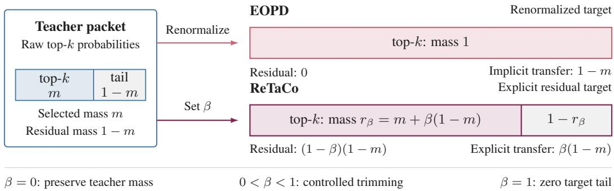
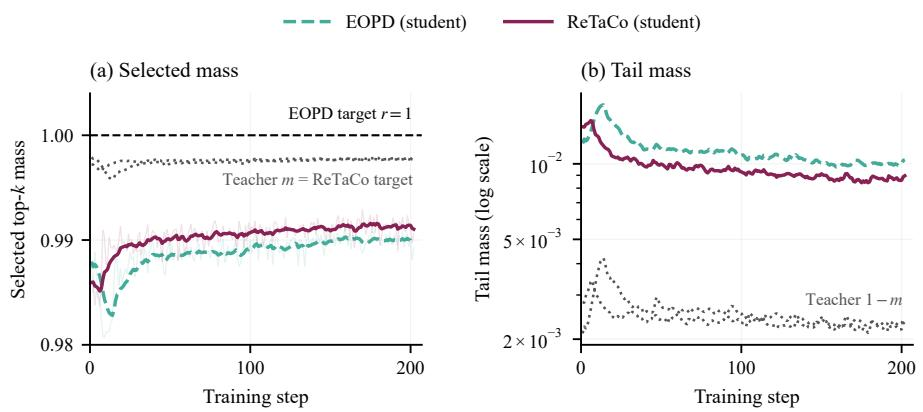
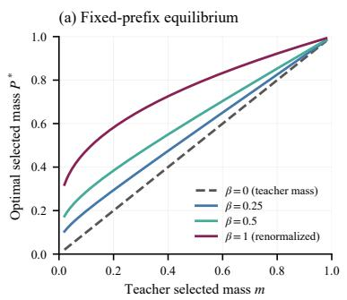
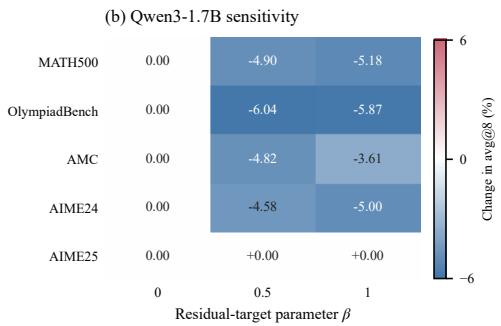
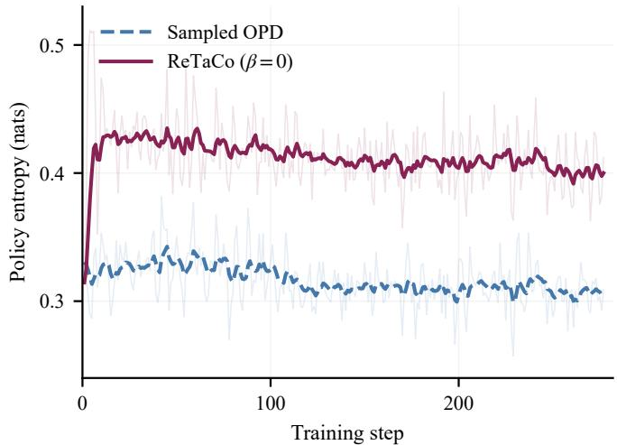
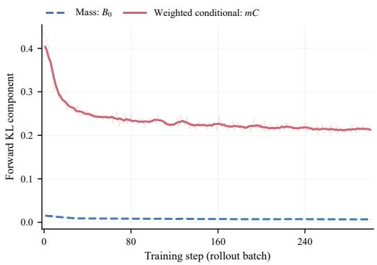
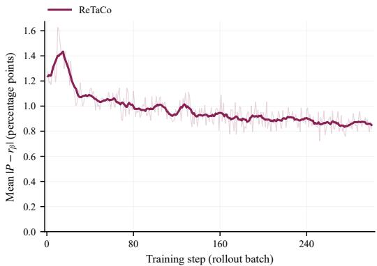

# ReTaCo: Residual-Target Control for On-Policy Distillation

Zixiang Ni1,∗, Zhuo Hu2,∗, Renjie Cao3,4,∗, Weijie Ren2, Binqin Shi1, Weijia Zhang5, Shuheng Cao6, Zhicheng Shi2, Zhenhao Zhang7, Haomin Wen8,†, Zhiyuan Hu9,† 1Xi’an Jiaotong University 2Zhejiang University 3Georgia Institute of Technology

4Boston College 5Yale University 6University of California, San Diego 7Tsinghua University 8Shanghai Innovation Institute 9Massachusetts Institute of Technology

## Abstract

On-policy distillation trains a student on its own generated prefixes with tokenlevel teacher feedback, but transmitting or storing the teacher’s full-vocabulary distribution at every generated token is costly. Entropy-aware on-policy distillation (EOPD) supplements the reverse Kullback–Leibler (KL) divergence with forward supervision that helps the student recover plausible tokens it underestimates; to limit cost, this supervision uses only the teacher’s top-k tokens. Because EOPD renormalizes the retained probabilities, its target assigns all mass to the selected tokens and none to the omitted vocabulary. We prove that the resulting loss keeps pushing the student’s selected mass toward one even after the student matches the teacher’s relative probabilities within the selected set. Consequently, the teacher distribution itself is not a stationary point whenever the omitted vocabulary has positive teacher probability. Motivated by this finding, we propose ReTaCo (Residual-Target Control for On-Policy Distillation). Its forward target keeps the top-k tokens individually and groups all remaining tokens into a single residual symbol; ReTaCo pairs this target with a single-sample estimator whose expectation equals the full-vocabulary reverse KL. Given the teacher’s selected mass m and a parameter $\beta \in [ 0 , 1 ]$ , the residual target is $( 1 - \beta ) ( 1 - m )$ , and the relative probabilities of the selected tokens are unchanged: $\beta = 0$ preserves the teacher’s mass, and larger $\beta$ moves more target mass onto the selected tokens. At a fixed prefix, we prove that the population objective has a unique optimum whose selected mass lies between m and $m + \beta ( 1 - m )$ and increases monotonically with β. $\mathbf { A } \mathbf { t } \ \beta = 0$ , the forward term still provides non-vanishing recovery gradients for underestimated selected tokens. Numerical optimization confirms the predicted optimal mass and conditional distributions, and across three teacher–student pairs, ReTaCo outperforms EOPD on most mathematics and code benchmarks.

## 1 Introduction

Transferring the capabilities of large language models to smaller models is an important step toward making these capabilities accessible under limited computational resources. On-policy distillation (OPD) addresses this goal by training a student on its own generated prefixes, with token-level supervision from a stronger teacher [Agarwal et al., 2024, Lu and Thinking Machines Lab, 2025]. Building on earlier approaches to knowledge distillation [Hinton et al., 2015, Kim and Rush, 2016], OPD obtains teacher feedback on the contexts that the student actually encounters and thereby reduces the mismatch between training and inference. However, transmitting the teacher’s full-vocabulary probabilities at every generated token incurs substantial communication costs. Sending only the teacher’s top-k tokens and their probabilities reduces this cost, but leaves open how the training objective should treat the omitted probability mass.

  
Figure 1: Residual probability as an explicit forward target. The teacher’s top-k probabilities carry selected mass m, leaving residual mass $1 - m$ . EOPD renormalizes the selected probabilities to sum to one, assigning zero target mass to the residual. ReTaCo instead sets the residual target to $( 1 - \beta ) ( 1 - m )$ and transfers $\beta ( 1 - m )$ to the selected tokens. Both targets preserve the teacher’s relative probabilities within the selected set. Bar widths are schematic.

OPD typically minimizes a per-token reverse KL divergence, which can be estimated from the sampled token alone. However, reverse KL provides only a weak signal for recovering teachersupported tokens that the student rarely samples. Entropy-aware on-policy distillation (EOPD) [Jin et al., 2026] addresses this problem by adding forward KL at positions with high teacher entropy, using renormalized top-k teacher probabilities. This renormalization preserves the relative probabilities of the selected tokens, but it inflates their total probability to one. When evaluated against the student’s full-vocabulary probabilities, the resulting loss encourages the student to recover the selected tokens and also to move probability away from the remaining vocabulary.

To make this effect precise, let q and p denote the teacher and student next-token distributions. For the teacher’s top-k set $s ,$ let $m = q ( { \mathcal { S } } )$ and $P = p ( S )$ denote the total probabilities that the teacher and student assign to this set. We show that the practical forward term decomposes exactly as

$$
\mathcal { L } _ { \mathrm { r e n } } = D _ { \mathrm { K L } } ( q ^ { S } | | p ^ { S } ) - \log P ,\tag{1}
$$

where $q ^ { s }$ and $p ^ { s }$ are the teacher and student distributions conditioned on the selected set, which we call their conditional shapes. Even after these conditional distributions match, − log $P$ continues to push the student’s selected mass upward. Consequently, the teacher distribution itself is not a stationary point of this loss when $m < 1$ . Reverse KL moderates this pressure but does not remove it.

This decomposition suggests making residual probability an explicit part of the supervision target. We introduce ReTaCo, short for Residual-Target Control, which specifies how much probability the forward target keeps outside the selected set. We group the remaining tokens into one residual symbol and assign it probability $( 1 - \beta ) ( 1 - m )$ . This gives the selected-mass target

$$
r _ { \beta } = m + \beta ( 1 - m ) , \qquad \beta \in [ 0 , 1 ] .\tag{2}
$$

Here, $\beta = 0$ preserves the teacher’s mass allocation, whereas $\beta > 0$ transfers a fraction $\beta$ of the tail mass to the selected set. The conditional shape within the selected set remains unchanged. Figure 1 illustrates this allocation.

Our contributions are threefold.

• We show that renormalized top-k forward KL implicitly sets the selected-mass target to one. We prove that the teacher is not a stationary point of this loss and characterize the equilibrium when this loss is combined with reverse KL.

• We introduce ReTaCo with an explicit residual target and $O ( k )$ teacher communication. At a fixed prefix, we characterize the unique population optimum, bound its selected mass, and prove that this mass increases monotonically with β. We also show that underestimated selected tokens still receive non-vanishing recovery gradients at $\beta = 0$

• We numerically verify the predicted mass and conditional distributions, evaluate downstream performance across three model pairs, and characterize the effects of residual targets and objective components through ablations on Qwen3-1.7B trained for one epoch.

## 2 Preliminaries

## 2.1 On-Policy Distillation and Selected Support

On-policy token distributions. OPD queries a teacher at prefixes generated by the student [Agarwal et al., 2024, Gu et al., 2024, Lu and Thinking Machines Lab, 2025]. At such a prefix x, let $q = ( q _ { i } ) _ { i \in \mathcal { V } }$ and $p = ( p _ { i } ) _ { i \in \mathcal { V } }$ be the teacher and student next-token distributions over the vocabulary V. We study the ideal per-prefix reverse-KL objective $D _ { \mathrm { K L } } ( p \Vert q )$ with x and $q$ fixed. This isolates tokenlevel supervision from rollout sampling, stale policies, and clipping in the practical training loop (Section 5).

Selected mass and conditional shape. Let $s$ contain the teacher’s top-k tokens, and let $\tau$ denote its complement in V. The selected teacher and student masses are

$$
m = q ( \boldsymbol { S } ) = \sum _ { i \in \mathcal { S } } q _ { i } , \qquad \boldsymbol { P } = p ( \boldsymbol { S } ) = \sum _ { i \in \mathcal { S } } p _ { i } .\tag{3}
$$

For $i \in S$ and $j \not \in { \mathcal { S } }$ , write

$$
q _ { i } ^ { S } = \frac { q _ { i } } { m } , \quad p _ { i } ^ { S } = \frac { p _ { i } } { P } , \qquad q _ { j } ^ { T } = \frac { q _ { j } } { 1 - m } , \quad p _ { j } ^ { T } = \frac { p _ { j } } { 1 - P } .\tag{4}
$$

We consider teacher and student distributions with full support, as produced by finite-logit softmax models, and assume $0 < m , P < 1$ in the derivations. Endpoint identities are interpreted by continuity wherever the corresponding limits are well defined. Let $\dot { d _ { \mathrm { B e r } } } ( u \| v ) = u \log ( u / v ) \dot { + } ( 1 - \dot { u } ) \log [ ( 1 -$ $\boldsymbol { u } ) / ( 1 - \boldsymbol { v } ) ]$ denote the Bernoulli KL divergence. Conditioning on the selected and residual sets gives

$$
D _ { \mathrm { K L } } ( q \| p ) = d _ { \mathrm { B e r } } ( m \| P ) + m D _ { \mathrm { K L } } ( q ^ { S } \| p ^ { S } ) + ( 1 - m ) D _ { \mathrm { K L } } ( q ^ { T } \| p ^ { T } ) ,\tag{5}
$$

$$
D _ { \mathrm { K L } } ( p \| q ) = d _ { \mathrm { B e r } } ( P \| m ) + P D _ { \mathrm { K L } } ( p ^ { S } \| q ^ { S } ) + ( 1 - P ) D _ { \mathrm { K L } } ( p ^ { T } \| q ^ { T } ) .\tag{6}
$$

The Bernoulli term measures disagreement in mass allocation, whereas the remaining terms measure disagreement within each set. This separation lets us distinguish recovering selected tokens from changing their total probability.

## 2.2 Entropy-Aware On-Policy Distillation

EOPD supplements reverse KL with forward KL to recover teacher-supported tokens that the student underestimates [Jin et al., 2026]. The motivation follows from the ideal reverse-KL logit gradient. For student logits z with $p = \operatorname { s o f t m a x } ( z )$ ,

$$
\frac { \partial D _ { \mathrm { K L } } ( p | | q ) } { \partial z _ { j } } = p _ { j } \left( \log \frac { p _ { j } } { q _ { j } } - D _ { \mathrm { K L } } ( p | | q ) \right) .
$$

For a fixed full-support teacher, this gradient vanishes as $p _ { j } \to 0$ , whereas the full forward-KL gradient $p _ { j } - q _ { j }$ approaches $- q _ { j }$ . Forward supervision can therefore supply a recovery signal even when the student rarely samples a teacher-supported token.

EOPD applies its forward term at positions with high teacher entropy and uses only the teacher’s top-k probabilities to limit communication. Let $\begin{array} { r } { H ( q ) = - \sum _ { i \in \mathcal { V } } } \end{array}$ qi log $q _ { i }$ be the teacher entropy and $g _ { \mathrm { e n t } } ( x ) = \mathbb { I } [ H ( q ) > \tau ]$ the gate at prefix x, where τ is an entropy threshold and I is the indicator function. With a forward weight $\lambda > 0$ , the gated token-level contribution is $\lambda g _ { \mathrm { e n t } } ( x ) \mathcal { L } _ { \mathrm { r e n } }$ . When the student’s probabilities are normalized over the full vocabulary, EOPD’s forward loss is

$$
\mathcal { L } _ { \mathrm { r e n } } ( q , p ; \mathcal { S } ) = \sum _ { i \in \mathcal { S } } q _ { i } ^ { \mathcal { S } } \log \frac { q _ { i } ^ { \mathcal { S } } } { p _ { i } } .\tag{7}
$$

The teacher probabilities are normalized within $s ,$ whereas the denominator $p _ { i }$ is normalized over the full vocabulary. EOPD combines this gated forward contribution with a proximal policy optimization (PPO)-style reverse update. If the student is also normalized within ${ \bar { \boldsymbol { s } } } ,$ the loss instead becomes $\mathrm { \dot { \it D } _ { K L } } ( q ^ { S } | | p ^ { S } )$ ; the mass effect below specifically concerns Equation (7).

## 3 Method

ReTaCo preserves EOPD’s recovery signal for the selected tokens but makes the residual target explicit. We first show that EOPD’s renormalized forward term implicitly targets unit selected mass (Section 3.1). We then construct the residual target (Section 3.2) and the combined objective (Section 3.3), characterize its population optimum and recovery gradients (Section 3.4), and describe the implementation (Section 3.5).

## 3.1 The Renormalization Effect in EOPD

EOPD’s forward term supervises the selected tokens, but its asymmetric normalization also changes the target mass. Factoring the student probabilities into selected mass and conditional shape exposes this second effect.

Proposition 3.1 (Hidden selected-mass target). For any teacher-selected set $s$ with student mass $P > 0 ,$

$$
\begin{array} { r } { \mathcal { L } _ { \mathrm { r e n } } ( q , p ; \mathcal { S } ) = D _ { \mathrm { K L } } ( q ^ { \mathcal { S } } | | p ^ { \mathcal { S } } ) - \log P . } \end{array}\tag{8}
$$

Hence the conditional term is minimized at $p ^ { S } = q ^ { S }$ , whereas the mass term is minimized at $P = 1$

Substituting $p _ { i } = P p _ { i } ^ { S }$ proves the identity. Equation (7) can also be read as forward KL from the full-vocabulary target $( q ^ { S } , 0 \tau )$ to the student, where $0 \tau$ assigns zero probability to every tail token. Intuitively, the target places no mass on the tail, but the student is normalized over the full vocabulary, so any tail mass the student keeps is penalized through − log P. Even when the conditional shapes match, − log $P$ continues to favor larger selected mass. The same effect is visible in the logit gradient.

Corollary 3.2 (Teacher matching is not stationary). Let $p = \operatorname { s o f t m a x } ( z )$ . The logit gradient of Equation (7) is

$$
\frac { \partial \mathcal { L } _ { \mathrm { r e n } } } { \partial z _ { j } } = \left\{ { p _ { j } - q _ { j } ^ { S } , \quad j \in \mathcal { S } , } \right.\tag{9}
$$

$A t p = q$ and $m < 1 ,$ , every residual logit has a positive gradient and decreases under direct gradient descent on the logits.

The entropy gate does not remove this normalization effect at active prefixes: it determines where supervision applies, whereas m determines the reassigned mass $1 - m$ . In general, entropy does not determine top-k mass, so equal-entropy prefixes need not receive equal mass shifts.

Equilibrium with reverse KL. To isolate whether the reverse term removes this mass shift, replace the practical reverse update by ideal reverse KL and hold an active prefix fixed. In this per-prefix comparison, $\alpha = \lambda > 0$ because $g _ { \mathrm { e n t } } ( x ) = 1$ . The idealized joint objective is

$$
\begin{array} { r } { \mathcal { I } _ { \mathrm { r e n } } ( p ) = D _ { \mathrm { K L } } ( p \| q ) + \alpha \mathcal { L } _ { \mathrm { r e n } } ( q , p ; \mathcal { S } ) , \qquad \alpha > 0 . } \end{array}\tag{10}
$$

For fixed $P ,$ , all conditional KL terms are minimized at the teacher conditionals. The remaining objective is $d _ { \mathrm { B e r } } ( P \| m ) - \alpha$ log $P ,$ , so its optimum directly quantifies the competition between mass matching and the unit-mass forward target.

Proposition 3.3 (Mass inflation under the renormalized target). The selected-mass optimum of Equation (10) is the unique $P ^ { * } \in ( 0 , 1 )$ satisfying

$$
\log { \frac { P ^ { * } ( 1 - m ) } { m ( 1 - P ^ { * } ) } } = { \frac { \alpha } { P ^ { * } } } .\tag{11}
$$

For every $m \in ( 0 , 1 ) , P ^ { * } > m . A s m  1$ , the residual student mass obeys $1 - P ^ { * } = e ^ { - \alpha } ( 1 - m ) +$ $o ( 1 - m )$

Even ideal reverse KL therefore leaves selected-mass inflation. We next construct a forward target that still provides a recovery signal for the selected tokens and explicitly controls the residual mass.

## 3.2 Residual Representation and Target Construction

Representing residual probability. To specify residual mass without transmitting individual tail probabilities, we group all tokens outside $\bar { \boldsymbol { s } }$ into one residual symbol. The residual symbol exists

only in the loss; the student still predicts over the full vocabulary V. Denote the aggregation by $C _ { S }$ which gives

$$
C _ { S } p = \bigl ( \{ p _ { i } \} _ { i \in { \cal S } } , 1 - { \cal P } \bigr ) , \qquad C _ { S } q = \bigl ( \{ q _ { i } \} _ { i \in { \cal S } } , 1 - m \bigr ) .\tag{12}
$$

This representation contains the individual selected-token probabilities and the aggregate tail mass. By the reverse-KL chain rule,

$$
D _ { \mathrm { K L } } ( p \| q ) = D _ { \mathrm { K L } } ( C _ { S } p \| C _ { S } q ) + ( 1 - P ) D _ { \mathrm { K L } } ( p ^ { \mathcal { T } } \| q ^ { \mathcal { T } } ) ,\tag{13}
$$

$$
D _ { \mathrm { K L } } ( C _ { S } p \| C _ { S } q ) = d _ { \mathrm { B e r } } ( P \| m ) + P D _ { \mathrm { K L } } ( p ^ { S } \| q ^ { S } ) .\tag{14}
$$

Aggregation preserves the mass of the tail but omits its conditional divergence. We therefore use the coarse representation for the forward term and rely on sampled reverse KL (Section 3.3) for sensitivity to individual tail tokens.

Controlling the residual target. Choose $\beta \in [ 0 , 1 ]$ and keep a fraction $1 - \beta$ of the teacher’s residual mass, so that $1 - r _ { \beta } = ( 1 - \beta ) ( 1 - m )$ . Because the target sums to one, its selected mass is $r _ { \beta } ; $ preserving the teacher’s conditional shape then gives

$$
r _ { \beta } = m + \beta ( 1 - m ) , \qquad t _ { \beta } = \left( \left\{ r _ { \beta } \frac { q _ { i } } { m } \right\} _ { i \in S } , 1 - r _ { \beta } \right) , \quad \beta \in [ 0 , 1 ] .\tag{15}
$$

This target preserves the teacher’s conditional shape and assigns an explicit probability to the residual. Its forward KL decomposes as

$$
D _ { \mathrm { K L } } ( t _ { \beta } \| C _ { S } p ) = d _ { \mathrm { B e r } } ( r _ { \beta } \| P ) + r _ { \beta } D _ { \mathrm { K L } } ( q ^ { S } \| p ^ { S } ) .\tag{16}
$$

The Bernoulli term supervises the selected mass, and the conditional term supervises the conditional shape of the selected tokens. $\mathrm { A t } \beta = 0 , t _ { \beta } = C _ { S } q$ preserves the teacher’s mass; positive $\beta$ transfers $\beta ( 1 - m )$ to the selected tokens, with zero residual target at $\beta = 1$ . Changing $\beta$ also changes the conditional coefficient $r _ { \beta }$ , coupling mass supervision with conditional weighting.

## 3.3 Reverse-KL Estimation and the Combined Objective

The residual target supervises the aggregate tail mass but leaves the conditional shape of the tail unspecified. We complement it with a single-sample estimator whose expectation equals the fullvocabulary reverse KL. The estimator uses the teacher probability of a student-sampled token that may lie outside S.

Sampled reverse KL. Let $y \sim p$ be the rollout token and $a _ { y } = \log p _ { y } - \log q _ { y }$ . With $\operatorname { s g } ( \cdot )$ denoting stop-gradient, we use the following straight-through estimator, whose forward value is the standard low-variance estimate:

$$
\widehat { D } _ { \mathrm { R K L } } ^ { \mathrm { k 3 + } } ( p \| q ; y ) = \mathrm { s g } \big ( e ^ { - a _ { y } } + a _ { y } - 1 \big ) + \frac { a _ { y } ^ { 2 } } { 2 } - \mathrm { s g } \Bigg ( \frac { a _ { y } ^ { 2 } } { 2 } \Bigg ) .\tag{17}
$$

The estimator evaluates to $e ^ { - a _ { y } } + a _ { u } - 1$ in the forward pass and uses the derivative of $a _ { u } ^ { 2 } / 2$ in the backward pass. Let θ denote the student parameters. At a fixed prefix with a fixed teacher, sampling from the current student without numerical clipping gives

$$
\begin{array} { r l } { \mathbb { E } _ { y \sim p } \Big [ \widehat { D } _ { \mathrm { R K L } } ^ { \mathtt { k } 3 + } ( p \| q ; y ) \Big ] = D _ { \mathrm { K L } } ( p \| q ) , \quad } & { \mathbb { E } _ { y \sim p } \Big [ \nabla _ { \theta } \widehat { D } _ { \mathrm { R K L } } ^ { \mathtt { k } 3 + } ( p \| q ; y ) \Big ] = \nabla _ { \theta } D _ { \mathrm { K L } } ( p \| q ) . } \end{array}\tag{18}
$$

The sampled token is detached during differentiation, and the estimator requires only its teacher log-probability. Neither expectation differentiates through prefix sampling.

Objective. At each on-policy token, ReTaCo uses

$$
{ \mathcal { L } } _ { \mathrm { s a m p l e d - R e T a C o } } ( y ) = { \widehat { D } } _ { \mathrm { R K L } } ^ { \mathrm { k 3 + } } ( p \| q ; y ) + \alpha D _ { \mathrm { K L } } ( t _ { \beta } \| C _ { S } p )\tag{19}
$$

with a forward weight $\alpha \geq 0$ . The default training loss averages this objective over all unmasked response tokens without an entropy gate. Taking the expectation over a token sampled from the current student gives the ideal population objective at a fixed prefix, without clipping:

$$
\mathcal { I } _ { \mathrm { R e T a C o } } ( p ) = D _ { \mathrm { K L } } ( p \Vert q ) + \alpha D _ { \mathrm { K L } } ( t _ { \beta } \Vert C _ { S } p ) .\tag{20}
$$

$\operatorname { A t } \beta = 0$ , the forward target preserves the teacher’s mass and conditional shape, and the reverse estimator equals the full-vocabulary reverse KL in expectation. Setting $\beta > 0$ deliberately trims the tail. $\mathbf { A } \mathbf { t } \beta = 1$ , the forward term equals Equation (7); this setting reproduces EOPD’s forward target at active prefixes, but not its entropy gate or PPO updates. When $k = | \nu |$ , the residual vanishes and Equation (20) reduces to full-vocabulary reverse KL plus α times forward KL.

## 3.4 Population Optimum and Token Recovery

We now determine how the forward target changes the optimum of the combined objective. For fixed selected mass $P ,$ , the shape-dependent terms in Equation (20) are

$$
\begin{array} { r } { P D _ { \mathrm { K L } } ( p ^ { S } \| q ^ { S } ) + ( 1 - P ) D _ { \mathrm { K L } } ( p ^ { T } \| q ^ { T } ) + \alpha r _ { \beta } D _ { \mathrm { K L } } ( q ^ { S } \| p ^ { S } ) . } \end{array}\tag{21}
$$

All three terms vanish simultaneously only at $p ^ { S } = q ^ { S }$ and $p ^ { \mathcal { T } } = q ^ { \mathcal { T } }$ . The remaining scalar objective is $g ( P ) = d _ { \mathrm { B e r } } ( P \Vert m ) + \alpha d _ { \mathrm { B e r } } ( r _ { \beta } \Vert P )$ . Because $g$ balances two terms, the target mass $r _ { \beta }$ and the optimum mass ${ \dot { P } } ^ { * }$ need not coincide.

Theorem 3.4 (Unique and controllable selected-mass optimum). Let $m \in ( 0 , 1 ) , \alpha > 0 ,$ , and $\beta \in [ 0 , 1 ] .$ . The population objective in Equation (20) has a unique full-support minimizer. Its conditional shapes are $\boldsymbol { p } ^ { S } = \boldsymbol { q } ^ { \dot { S } }$ and $p ^ { \mathcal { T } } = q ^ { \mathcal { T } }$ , and its selected mass $P ^ { * }$ is the unique root of

$$
F ( P ) = \log \frac { P ( 1 - m ) } { m ( 1 - P ) } + \alpha \frac { P - r _ { \beta } } { P ( 1 - P ) } = 0 .\tag{22}
$$

Moreover,

$$
m \leq P ^ { * } \leq r _ { \beta } , \qquad { \frac { \mathrm { d } P ^ { * } } { \mathrm { d } \beta } } > 0 f o r \beta \in ( 0 , 1 ) ,\tag{23}
$$

with positive one-sided derivatives at the endpoints. For $\beta = 0 , P ^ { * } = m$ exactly, whereasfor $\beta > 0$ both inequalities are strict.

Reverse KL favors teacher mass m, while forward KL favors $r _ { \beta } ; $ their balance places the optimum between these two values. The stationarity function is strictly increasing because

$$
F ^ { \prime } ( P ) = \frac { 1 } { P ( 1 - P ) } + \alpha \frac { ( P - r _ { \beta } ) ^ { 2 } + r _ { \beta } ( 1 - r _ { \beta } ) } { P ^ { 2 } ( 1 - P ) ^ { 2 } } > 0 .\tag{24}
$$

Together with the signs of $F$ at the endpoints, this establishes a unique root; Section B gives the complete proofs.

Token recovery at $\beta = 0 .$ . Theorem 3.5 gives the logit gradient of the forward term for general $\beta$ and specializes it to $\beta = 0$

Proposition 3.5 (Forward logit gradient). For student logits z with $p = \operatorname { s o f t m a x } ( z )$ ,

$$
\frac { \partial D _ { \mathrm { K L } } ( t _ { \beta } \| C _ { \mathcal { S } } p ) } { \partial z _ { j } } = \left\{ \begin{array} { l l } { p _ { j } - r _ { \beta } q _ { j } ^ { S } , } & { j \in \mathcal { S } , } \\ { p _ { j } \displaystyle \frac { r _ { \beta } - P } { 1 - P } , } & { j \notin \mathcal { S } . } \end{array} \right.\tag{25}
$$

At $\beta = 0$ and $p _ { j } \to 0$ for a selected token, the gradient approaches $- q _ { j }$ , and the target selected mass remains m.

Hence, recovering the selected tokens does not require a unit selected-mass target. For $\beta > 0 .$ , we measure the deliberate departure from the aggregated teacher by the total variation distance TV:

$$
\mathrm { T V } ( t _ { \beta } , C _ { S } q ) = \beta ( 1 - m ) .\tag{26}
$$

The transferred mass $\delta _ { \beta } = \beta ( 1 - m )$ measures target displacement. A fixed $\beta$ has a small absolute effect when the teacher’s top-k mass is near one and a larger effect when it is smaller.

## 3.5 Implementation

At each unmasked response position, the student rollout supplies $y ,$ and the teacher transmits log $q _ { y }$ with the top-k token IDs and their raw log-probabilities. Because they are normalized over the full vocabulary, these probabilities sum to m rather than one. Together with the student’s log-probabilities at the same IDs, they define $t _ { \beta }$ and $C _ { S } p$ for the forward loss, and log $p _ { y }$ and log $q _ { y }$ give the sampled reverse term in Equation (17).

The teacher transmits $O ( k )$ values per token. Given full-vocabulary student log-probabilities, the additional loss computation is also ${ \bar { O } } ( k )$ . This reduces teacher–student communication, although the teacher still computes full-vocabulary softmax normalization and top-k selection. Section C gives the per-token computation and numerical details.

Table 1: Per-benchmark performance (%). We report avg@8 for mathematics, pass@1 for code, and accuracy for OOD benchmarks. OOD scores use the mathematics-distilled checkpoints. Within each teacher–student pair, bold marks the best score and underline the second best; shaded rows are ReTaCo.
<table><tr><td></td><td colspan="4">Mathematics</td><td></td><td colspan="2">Code</td><td colspan="3">OOD</td></tr><tr><td>Method</td><td>MATH 500</td><td>Olympiad Bench</td><td>AMC</td><td>AIME 24</td><td>AIME 25</td><td>Human Eval+</td><td>MBPP+</td><td>ARC-C</td><td>MMLU- Pro</td><td>GPQA Diamond</td></tr><tr><td>Student: Qwen3-1.7B</td><td colspan="8">Teacher: Qwen3-30B-A3B-Instruct-2507</td><td></td><td></td></tr><tr><td>Sampled OPD</td><td>82.40</td><td>48.67</td><td>52.11</td><td>25.42</td><td>22.08</td><td>64.02</td><td>52.38</td><td>82.51</td><td>45.79</td><td>18.94</td></tr><tr><td>EOPD</td><td>79.80</td><td>45.54</td><td>48.04</td><td>21.67</td><td>17.92</td><td>66.46</td><td>51.59</td><td>79.84</td><td>42.91</td><td>12.44</td></tr><tr><td>ReTaCo (ours)</td><td>83.78</td><td>49.65</td><td>52.56 28.75</td><td></td><td>21.67</td><td>68.29</td><td>53.17</td><td>82.37</td><td>46.67</td><td>17.49</td></tr><tr><td>Student: Qwen3.5-2B</td><td colspan="8">Teacher: Qwen3.5-27B</td><td></td><td></td></tr><tr><td>Sampled OPD</td><td>71.73</td><td>40.07</td><td>45.63</td><td>21.25</td><td>17.50</td><td>48.17</td><td>47.88</td><td>88.84</td><td>52.61</td><td>26.89</td></tr><tr><td>EOPD</td><td>70.93</td><td>41.52</td><td>46.08</td><td>20.00</td><td>17.50</td><td>50.61</td><td>44.18</td><td>89.00</td><td>53.73</td><td>29.17</td></tr><tr><td>ReTaCo (ours)</td><td>79.85</td><td>46.93</td><td></td><td>52.71 22.92 21.25</td><td></td><td>54.88</td><td>48.68</td><td>89.40</td><td>54.20</td><td>30.43</td></tr><tr><td>Student: Gemma4-E2B</td><td></td><td>Teacher: Gemma4-26B-A4B</td><td></td><td></td><td></td><td></td><td></td><td></td><td></td><td></td></tr><tr><td>Sampled OPD</td><td>48.18</td><td>26.83</td><td>31.93</td><td>10.00</td><td>14.17</td><td>75.61</td><td>66.38</td><td>62.18</td><td>28.99</td><td>13.26</td></tr><tr><td>EOPD</td><td>62.50</td><td>33.96</td><td>34.19</td><td>14.17</td><td>16.67</td><td>74.39</td><td>67.20</td><td>86.89</td><td>43.45</td><td>13.64</td></tr><tr><td>ReTaCo (ours)</td><td>79.47</td><td>47.93</td><td>56.17</td><td>22.50</td><td>19.58</td><td>76.83</td><td>67.79</td><td>84.84</td><td>41.60</td><td>31.00</td></tr></table>

## 4 Experiments

We compare ReTaCo with two baselines on three teacher–student pairs and then use ablations on Qwen3-1.7B to examine the residual target and the components of the objective (Section 4.2).

## 4.1 Experimental Setup

Benchmarks and metrics. We evaluate mathematical reasoning on MATH500 [Hendrycks et al., 2021, Lightman et al., 2023], the English text-only subset of OlympiadBench [He et al., 2024], AMC [Li et al., 2024], AIME24, and AIME25. HumanEval+ and MBPP+ assess code generation through the extended EvalPlus tests [Liu et al., 2023, EvalPlus Team, 2023]. ARC-C, MMLU-Pro, and GPQA-Diamond assess out-of-domain (OOD) performance after mathematics distillation [Clark et al., 2018, Wang et al., 2024, Rein et al., 2023]; we do not claim that these benchmarks are absent from the models’ pretraining data. We report avg@8 for mathematics, pass@1 for code, and accuracy on the OOD benchmarks using the protocols in Section F.1.

Models and comparisons. Table 1 lists three teacher–student pairs. Sampled OPD and ReTaCo use the same direct k3+ reverse estimator. EOPD uses a renormalized forward term with an entropy gate and PPO-style reverse updates, so the comparison with EOPD measures the complete training procedures rather than the residual target alone.

Training and evaluation. Mathematics and code distillation use DAPO-Math-17k and the code subset of Eurus-2-RL-Data, respectively. Default ReTaCo uses k = 16, α = 1, and β = 0, and averages the loss over all response tokens without an entropy gate. Mathematics and OOD evaluations use the same epoch-1 checkpoints from mathematics distillation; code evaluations use separately code-distilled checkpoints. For mathematics, avg@8 is the mean correctness over eight completions per problem. Section F lists the optimization and decoding settings.

Downstream performance. ReTaCo achieves higher point estimates than both baselines on all five mathematics tasks for Qwen3.5-2B and Gemma4-E2B, and on four for Qwen3-1.7B (Table 1). For example, on Qwen3.5-2B, ReTaCo raises MATH500 accuracy from 71.73% (Sampled OPD) to 79.85%. Sampled OPD remains slightly higher on Qwen3-1.7B AIME25. Across all three pairs, ReTaCo also leads both baselines on HumanEval+ and MBPP+.

Out-of-domain performance. OOD results are less uniform. For Qwen3.5-2B, ReTaCo leads on all three tasks. For Qwen3-1.7B, ReTaCo leads on MMLU-Pro but trails Sampled OPD on ARC-C and GPQA-Diamond. For Gemma4-E2B, ReTaCo leads on GPQA-Diamond, whereas EOPD leads on ARC-C and MMLU-Pro.

Table 2: Qwen3-1.7B target and component comparisons (avg@8, %). Let R denote sampled reverse KL, $B _ { \beta } = d _ { \mathrm { B e r } } ( r _ { \beta } \bar { \| } P )$ , and $C \doteq D _ { \mathrm { K L } } ( q ^ { S } \| p ^ { \dot { S } } )$ . The shaded row is the default, $R { + } B _ { 0 } { + } m C$ and bold marks the best score in each column. All variants train for one epoch from the same initial student.
<table><tr><td>Setting</td><td>Objective</td><td>MATH 500</td><td>Olympiad Bench</td><td>AMC</td><td>AIME 24</td><td>AIME 25</td></tr><tr><td colspan="7">Forward supervision and residual-target choice</td></tr><tr><td>Full ReTaCo</td><td> $R + B _ { 0 } + m C$ </td><td>83.78</td><td>49.65</td><td>52.56</td><td>28.75</td><td>21.67</td></tr><tr><td>No forward term</td><td>R</td><td>82.40</td><td>48.67</td><td>52.11</td><td>25.42</td><td>22.08</td></tr><tr><td>Partial trimming  $( \beta = 0 . 5 )$ </td><td> $R + B _ { 0 . 5 } + r _ { 0 . 5 } C$ </td><td>78.88</td><td>43.61</td><td>47.74</td><td>24.17</td><td>21.67</td></tr><tr><td>Complete trimming  $( \beta = 1 )$ </td><td> $R + B _ { 1 } + C$ </td><td>78.60</td><td>43.78</td><td>48.95</td><td>23.75</td><td>21.67</td></tr><tr><td colspan="7">Component variants under one-epoch training</td></tr><tr><td>Mass-only forward term</td><td> $R + B _ { 0 }$ </td><td>81.65</td><td>47.15</td><td>50.75</td><td>21.67</td><td>22.08</td></tr><tr><td>Conditional-only forward term</td><td> $R + m C$ </td><td>83.55</td><td>49.13</td><td>54.37</td><td>27.92</td><td>21.25</td></tr><tr><td>No reverse term</td><td> $B _ { 0 } + m C$ </td><td>82.10</td><td>47.61</td><td>51.05</td><td>25.42</td><td>21.67</td></tr></table>

## 4.2 Residual Targets and Component Contributions

Effect of the residual target. On Qwen3-1.7B, with all variants trained for one epoch, adding the default forward term to reverse-only training improves four of the five mathematics scores (Table 2), including MATH500 from 82.40% to 83.78%; only AIME25 decreases, from 22.08% to 21.67%. Preserving the teacher’s mass $( \beta = 0 )$ also outperforms partial or complete trimming on MATH500, OlympiadBench, and AMC. On AIME24, trimming reduces accuracy by 4.58 and 5.00 percentage points for $\beta = 0 . 5$ and $\beta = 1$ , respectively, and AIME25 is unchanged (Figure 3b). The benefit of residual trimming is therefore task-dependent. Because $\beta$ changes both the mass target and the conditional weight $r _ { \beta } .$ , this comparison evaluates the target as a whole. The $\beta = 1$ variant uses EOPD’s forward target together with the same ungated direct reverse objective as the other ablations.

Mass and conditional supervision. Among the three component variants in Table 2, conditionalonly forward supervision achieves the highest scores on MATH500, OlympiadBench, AMC, and AIME24, whereas mass-only supervision leads on AIME25. Relative to the full objective, removing the mass term lowers MATH500 from 83.78% to 83.55% and AIME24 from 28.75% to 27.92%, but raises AMC from 52.56% to 54.37%. Thus, the mass constraint does not uniformly improve downstream accuracy, and conditional recovery of the selected tokens explains most of the accuracy gains on these tasks.

Selected and residual probability mass. ReTaCo brings the student’s selected mass closer to the teacher’s than EOPD does (Figure 2). The comparison uses the Qwen3-1.7B student, the Qwen3-30B-A3B-Instruct-2507 teacher, and $k = 1 6$ , over the two runs’ common interval of steps 1–202. Over the last 20 steps, the student’s mean selected mass is $P = 0 . 9 9 1 2 5 2$ for ReTaCo and P = 0.989900 for EOPD, and the teacher’s is $m \approx 0 . 9 9 7 7$ . The tail view shows the same improvement: ReTaCo assigns less excess probability outside the teacher’s top-k set than EOPD. Appendix F.2 complements this comparison with policy-entropy trajectories for Sampled OPD and ReTaCo.

Numerical validation of the population objective. To test the fixed-prefix predictions directly, we next examine the population objective. The equilibria in Figure 3(a) lie between m and $r _ { \beta } .$ , with $P ^ { * } = m$ at $\beta = 0$ (Theorem $3 . 4 )$ . For a uniform 80-token teacher with $k = 1 6$ and $\alpha = 1$ , the renormalized target instead gives $P ^ { * } = 0 . 5 8 2 1$ , far above $m = 0 . 2$ . Separately, joint optimization of a categorical student reaches the predicted mass and teacher conditionals, with a maximum $\ell _ { 1 }$ error of $4 . 1 \mathsf { \bar { 3 } } \times 1 0 ^ { - 8 }$ in the conditional distribution over S (Section D).

Figure 2: Selected and residual mass during training. Qwen3-1.7B student, Qwen3-30B-A3B-Instruct-2507 teacher, and k = 16; EOPD and ReTaCo share the displayed interval of steps 1–202. (a) Student mass $P$ on the teacher’s top-k set for EOPD (teal, dashed) and ReTaCo (wine, solid). Gray dotted curves show teacher mass m on each method’s own rollouts; m is also the ReTaCo forward target at $\beta = 0$ . The black dashed line marks EOPD’s forward target $r = 1 \AA$ . (b) The same data expressed as tail mass $1 - P$ and $1 - m$ , with a logarithmic vertical axis. Curves use exponential smoothing with span 11; faint traces in (a) show raw values.  

  
Figure 3: Residual-target control in analysis and experiments. (a) Selected-mass equilibria from Equation (22) at $\alpha = 1 ;$ the dashed line denotes teacher mass. (b) Changes in Qwen3-1.7B avg@8 relative to $\beta = 0$ , computed from the residual-target rows in Table 2. Positive values indicate higher scores with trimming. All variants train for one epoch.

## 5 Discussion and Limitations

At $\beta = 0$ , the forward objective preserves the teacher’s aggregate mass and supervises each selected token individually, but it cannot resolve the conditional shape of the tail. Increasing k refines this supervision at a higher communication cost. Sampled reverse KL remains sensitive to tail tokens in expectation. The equilibrium theorem holds at a fixed prefix under the population objective; it does not guarantee convergence with evolving prefixes, stale policies, or clipped updates.

The mathematics ablations show task-dependent effects of residual trimming and stronger forward supervision. The response-length experiment in Section E uses an entropy-gated forward term and a PPO-style reverse objective, so its results describe that variant rather than the default ReTaCo objective.

## 6 Conclusion

ReTaCo treats residual probability as an explicit supervision target. Its forward target over the top-k tokens and a residual symbol preserves the teacher’s conditional shape, and $\beta$ controls how much residual mass the target keeps. The single-sample reverse estimator equals the full-vocabulary reverse KL in expectation. The fixed-prefix population objective has a unique optimum whose selected mass increases monotonically with $\beta ,$ and at $\beta = 0$ the objective still provides recovery gradients for the selected tokens. Numerical optimization matches these predictions. Experiments across three teacher–student pairs show higher point estimates on most mathematics and code benchmarks, with improvements across all three OOD benchmarks for Qwen3.5-2B. One-epoch component ablations indicate that conditional recovery explains most of the accuracy gains, whereas the mass term does not improve accuracy uniformly.

## AI use statement

Generative AI tools assisted with language polishing and editing of the manuscript and with figure preparation. The authors are responsible for the technical content, experimental results, references, and the final manuscript.

## References

Rishabh Agarwal, Nino Vieillard, Yongchao Zhou, Piotr Stanczyk, Sabela Ramos Garea, Matthieu Geist, and Olivier Bachem. On-policy distillation of language models: Learning from selfgenerated mistakes. In International Conference on Learning Representations, 2024.

Ibtihel Amara, Nazanin Sepahvand, Brett H. Meyer, Warren J. Gross, and James J. Clark. BD-KD: Balancing the divergences for online knowledge distillation. arXiv preprint arXiv:2212.12965, 2022.

Daixuan Cheng, Shaohan Huang, Xuekai Zhu, Bo Dai, Wayne Xin Zhao, Zhenliang Zhang, and Furu Wei. Reasoning with exploration: An entropy perspective. arXiv preprint arXiv:2506.14758, 2025.

Peter Clark, Isaac Cowhey, Oren Etzioni, Tushar Khot, Ashish Sabharwal, Carissa Schoenick, and Oyvind Tafjord. Think you have solved question answering? try arc, the ai2 reasoning challenge. arXiv preprint arXiv:1803.05457, 2018. URL https://arxiv.org/abs/1803.05457.

Ganqu Cui, Lifan Yuan, Zefan Wang, Hanbin Wang, Yuchen Zhang, Jiacheng Chen, Wendi Li, Bingxiang He, Yuchen Fan, Tianyu Yu, et al. Process reinforcement through implicit rewards. arXiv preprint arXiv:2502.01456, 2025.

Sayantan Dasgupta, Trevor Cohn, and Timothy Baldwin. Don’t ignore the tail: Decoupling top-k probabilities for efficient language model distillation. arXiv preprint arXiv:2602.20816, 2026.

EvalPlus Team. EvalPlus v0.2.0. Official software release, 2023. URL https://github.com evalplus/evalplus/releases/tag/v0.2.0. Release introducing MBPP+.

Yuxian Gu, Li Dong, Furu Wei, and Minlie Huang. MiniLLM: Knowledge distillation of large language models. In International Conference on Learning Representations, 2024.

Chaoqun He, Renjie Luo, Yuzhuo Bai, Shengding Hu, Zhen Thai, Junhao Shen, Jinyi Hu, Xu Han, Yujie Huang, Yuxiang Zhang, et al. OlympiadBench: A challenging benchmark for promoting AGI with olympiad-level bilingual multimodal scientific problems. In Annual Meeting of the Associationfor Computational Linguistics, 2024.

Dan Hendrycks, Collin Burns, Saurav Kadavath, Akul Arora, Steven Basart, Eric Tang, Dawn Song, and Jacob Steinhardt. Measuring mathematical problem solving with the MATH dataset. arXiv preprint arXiv:2103.03874, 2021.

Geoffrey Hinton, Oriol Vinyals, and Jeff Dean. Distilling the knowledge in a neural network. arXiv preprint arXiv:1503.02531, 2015.

Woogyeol Jin, Taywon Min, Yongjin Yang, Dennis Wei, Yi Zhou, Swanand Ravindra Kadhe, Nathalie Baracaldo, and Kimin Lee. Entropy-aware on-policy distillation of language models. arXiv preprint arXiv:2603.07079, 2026.

Seongryong Jung, Suwan Yoon, DongGeon Kim, and Hwanhee Lee. ToDi: Token-wise distillation via fine-grained divergence control. In Conference on Empirical Methods in Natural Language Processing, 2025.

Yoon Kim and Alexander M. Rush. Sequence-level knowledge distillation. In Conference on Empirical Methods in Natural Language Processing, 2016.

Jia Li, Edward Beeching, Lewis Tunstall, Ben Lipkin, Roman Soletskyi, Shengyi Costa Huang, Kashif Rasul, Longhui Yu, Albert Jiang, Ziju Shen, Zihan Qin, Bin Dong, Li Zhou, Yann Fleureau, Guillaume Lample, and Stanislas Polu. NuminaMath. GitHub repository, 2024. URL https: //github.com/project-numina/aimo-progress-prize.

Hunter Lightman, Vineet Kosaraju, Yura Burda, Harri Edwards, Bowen Baker, Teddy Lee, Jan Leike, John Schulman, Ilya Sutskever, and Karl Cobbe. Let’s verify step by step. arXiv preprint arXiv:2305.20050, 2023. URL https://arxiv.org/abs/2305.20050.

Jiawei Liu, Chunqiu Steven Xia, Yuyao Wang, and Lingming Zhang. Is your code generated by chatgpt really correct? rigorous evaluation of large language models for code generation. arXiv preprint arXiv:2305.01210, 2023. URL https://arxiv.org/abs/2305.01210.

Kevin Lu and Thinking Machines Lab. On-policy distillation. Thinking Machines Lab: Connectionism, 2025. URL https://thinkingmachines.ai/blog/on-policy-distillation/.

Hao Peng, Xin Lv, Yushi Bai, Zijun Yao, Jiajie Zhang, Lei Hou, and Juanzi Li. Pre-training distillation for large language models: A design space exploration. In Annual Meeting of the Association for Computational Linguistics, 2025.

David Rein, Betty Li Hou, Asa Cooper Stickland, Jackson Petty, Richard Yuanzhe Pang, Julien Dirani, Julian Michael, and Samuel R. Bowman. Gpqa: A graduate-level google-proof q&a benchmark. arXiv preprint arXiv:2311.12022, 2023. URL https://arxiv.org/abs/2311.12022.

Guangming Sheng, Chi Zhang, Zilingfeng Ye, Xibin Wu, Wang Zhang, Ru Zhang, Yanghua Peng, Haibin Lin, and Chuan Wu. HybridFlow: A flexible and efficient RLHF framework. arXiv preprint arXiv:2409.19256, 2024.

KaShun Shum, Minrui Xu, Jianshu Zhang, Zixin Chen, Shizhe Diao, Hanze Dong, Jipeng Zhang, and Muhammad Omer Raza. FIRST: Teach a reliable large language model through efficient trustworthy distillation. arXiv preprint arXiv:2408.12168, 2024.

Shenzhi Wang, Le Yu, Chang Gao, Chujie Zheng, Shixuan Liu, Rui Lu, Kai Dang, Xionghui Chen, Jianxin Yang, Zhenru Zhang, et al. Beyond the 80/20 rule: High-entropy minority tokens drive effective reinforcement learning for LLM reasoning. arXiv preprint arXiv:2506.01939, 2025.

Yubo Wang, Xueguang Ma, Ge Zhang, Yuansheng Ni, Abhranil Chandra, Shiguang Guo, Weiming Ren, Aaran Arulraj, Xuan He, Ziyan Jiang, Tianle Li, Max Ku, Kai Wang, Alex Zhuang, Rongqi Fan, Xiang Yue, and Wenhu Chen. Mmlu-pro: A more robust and challenging multi-task language understanding benchmark. arXiv preprint arXiv:2406.01574, 2024. URL https://arxiv.org/ abs/2406.01574.

Taiqiang Wu, Chaofan Tao, Jiahao Wang, Runming Yang, Zhe Zhao, and Ngai Wong. Rethinking kullback–leibler divergence in knowledge distillation for large language models. In International Conference on Computational Linguistics, 2025.

Qiying Yu, Zheng Zhang, Ruofei Zhu, Yufeng Yuan, Xiaochen Zuo, Yu Yue, Weinan Dai, Tiantian Fan, Gaohong Liu, Lingjun Liu, et al. DAPO: An open-source LLM reinforcement learning system at scale. arXiv preprint arXiv:2503.14476, 2025.

## A Complete Derivations

## A.1 KL chain rules

Under the assumptions in Section 2, substituting $q _ { i } = m q _ { i } ^ { S }$ and $p _ { i } = P p _ { i } ^ { S }$ on the selected set yields

$$
\begin{array} { r } { \displaystyle \sum _ { i \in S } q _ { i } \log \frac { q _ { i } } { p _ { i } } = \displaystyle \sum _ { i \in S } m q _ { i } ^ { S } \left( \log \frac { m } { P } + \log \frac { q _ { i } ^ { S } } { p _ { i } ^ { S } } \right) } \\ { = m \log \frac { m } { P } + m D _ { \mathrm { K L } } ( q ^ { S } \| p ^ { S } ) . } \end{array}\tag{27}
$$

Applying the same expansion to the residual set gives

$$
( 1 - m ) \log \frac { 1 - m } { 1 - P } + ( 1 - m ) D _ { \mathrm { K L } } ( q ^ { T } \Vert p ^ { T } ) .\tag{28}
$$

Adding both contributions establishes Equation (5), and exchanging p and q gives Equation (6). Residual aggregation removes the conditional tail term but preserves its mass, as expressed in Equations (13) and (14).

## A.2 The sampled reverse-KL estimator

Hold the prefix and teacher distribution fixed, and sample the token from the current student. For $y \sim p$ and $a _ { y } = \log p _ { y } - \log q _ { y }$ , the forward value of Equation (17) satisfies

$$
\mathbb { E } _ { y \sim p } \big [ e ^ { - a _ { y } } + a _ { y } - 1 \big ] = \sum _ { i \in \mathcal { V } } p _ { i } \left( \frac { q _ { i } } { p _ { i } } + \log \frac { p _ { i } } { q _ { i } } - 1 \right)\tag{29}
$$

$$
= D _ { \mathrm { K L } } ( p \Vert q ) .\tag{30}
$$

With the sampled token detached, the expected straight-through gradient is

$$
{ \mathbb E } _ { y \sim p } \left[ \nabla _ { \theta } \frac { a _ { y } ^ { 2 } } { 2 } \right] = \sum _ { i \in \mathcal { V } } p _ { i } \log \frac { p _ { i } } { q _ { i } } \nabla _ { \theta } \log p _ { i }\tag{31}
$$

$$
= \nabla _ { \boldsymbol { \theta } } D _ { \mathrm { K L } } ( p \Vert q ) ,\tag{32}
$$

where the last equality uses $\begin{array} { r } { \sum _ { i } p _ { i } \nabla _ { \theta } \log p _ { i } = \nabla _ { \theta } \sum _ { i } p _ { i } = 0 } \end{array}$ . This proves Equation (18) for the ideal unclipped per-prefix estimator, without differentiation through prefix sampling.

## A.3 The implicit target of renormalized forward KL

Proof of Theorem 3.1. Within S, the factorization $p _ { i } = P p _ { i } ^ { S }$ gives

$$
\begin{array} { l } { \displaystyle \mathcal { L } _ { \mathrm { r e n } } = \sum _ { i \in \mathcal { S } } q _ { i } ^ { S } \log \frac { q _ { i } ^ { S } } { P p _ { i } ^ { S } } } \\ { \displaystyle = \sum _ { i \in \mathcal { S } } q _ { i } ^ { S } \log \frac { q _ { i } ^ { S } } { p _ { i } ^ { S } } - \log P = D _ { \mathrm { K L } } ( q ^ { S } \| p ^ { S } ) - \log P . } \end{array}\tag{33}
$$

The conditional KL vanishes at teacher matching, whereas − log P decreases strictly on (0, 1] and is minimized at unit selected mass. □

Proof of Theorem 3.2. Ignoring teacher-only constants,

$$
\mathcal { L } _ { \mathrm { r e n } } = - \sum _ { i \in \mathcal { S } } q _ { i } ^ { S } \log p _ { i } + \mathrm { c o n s t . }\tag{34}
$$

For $p = \operatorname { s o f t m a x } ( z )$ , ∂ log $p _ { i } / \partial z _ { j } = \mathbb { I } [ i = j ] - p _ { j }$ , where I is the indicator function. Hence

$$
\begin{array} { l } { \displaystyle \frac { \partial \mathcal { L } _ { \mathrm { r e n } } } { \partial z _ { j } } = - \sum _ { i \in \mathcal { S } } q _ { i } ^ { \mathcal { S } } \big ( \mathbb { I } [ i = j ] - p _ { j } \big ) } \\ { \displaystyle = \left\{ p _ { j } - q _ { j } ^ { S } , \quad j \in \mathcal { S } , \right. } \end{array}\tag{35}
$$

At $p = q$ , every $j \not \in { \mathcal { S } }$ has logit gradient $q _ { j } > 0$ under the full-support assumption. Teacher matching therefore fails to be stationary whenever residual mass is positive. □

## A.4 Equilibrium under the implicit unit-mass target

Proof of Theorem 3.3. By Equations (6) and (8), the conditional terms in Equation (10) are

$$
P D _ { \mathrm { K L } } ( p ^ { \mathcal { S } } \| q ^ { \mathcal { S } } ) + \alpha D _ { \mathrm { K L } } ( q ^ { \mathcal { S } } \| p ^ { \mathcal { S } } ) + ( 1 - P ) D _ { \mathrm { K L } } ( p ^ { \mathcal { T } } \| q ^ { \mathcal { T } } ) .\tag{36}
$$

For any fixed $P \in ( 0 , 1 )$ , they have the unique minimizer $p ^ { S } = q ^ { S }$ and $p ^ { \mathcal { T } } = q ^ { \mathcal { T } }$ . The remaining scalar objective is

$$
g _ { \mathrm { r e n } } ( P ) = d _ { \mathrm { B e r } } ( P \Vert m ) - \alpha \log P .\tag{37}
$$

Its first two derivatives are

$$
g _ { \mathrm { r e n } } ^ { \prime } ( P ) = \log \frac { P ( 1 - m ) } { m ( 1 - P ) } - \frac { \alpha } { P } ,\tag{38}
$$

$$
g _ { \mathrm { r e n } } ^ { \prime \prime } ( P ) = \frac { 1 } { P ( 1 - P ) } + \frac { \alpha } { P ^ { 2 } } > 0 .\tag{39}
$$

Because the derivative is strictly increasing and tends $\mathrm { t o } - \infty$ as $P \downarrow 0$ and $\mathrm { t o } + \infty$ as $P \uparrow 1$ , it has exactly one root. Since $g _ { \mathrm { r e n } } ^ { \prime } ( m ) = - { \alpha } / m < 0$ , this root satisfies $P ^ { * } > m$

For the asymptotic statement, let $\delta = 1 - m$ and $\epsilon = 1 - P ^ { * }$ . Equation (11) becomes

$$
\log \frac { ( 1 - \epsilon ) \delta } { ( 1 - \delta ) \epsilon } = \frac { \alpha } { 1 - \epsilon } .\tag{40}
$$

Since the student residual is smaller than the teacher residual, both $\delta$ and ϵ approach zero as $m \to 1$ Expansion gives log $( \delta / \epsilon ) = \alpha + o ( 1 )$ , and therefore $\epsilon = e ^ { - \alpha } \delta + o ( \delta )$ □

## B Proofs for ReTaCo

## B.1 Unique population optimum and monotonic control

Proof of Theorem 3.4. Expanding the ideal population objective in Equation (20) gives

$$
\begin{array} { r l } & { \mathcal { T } _ { \mathrm { R e T a C o } } = d _ { \mathrm { B e r } } ( P \| m ) + \alpha d _ { \mathrm { B e r } } ( r _ { \beta } \| P ) } \\ & { ~ + P D _ { \mathrm { K L } } ( p ^ { S } \| q ^ { S } ) + ( 1 - P ) D _ { \mathrm { K L } } ( p ^ { T } \| q ^ { T } ) + \alpha r _ { \beta } D _ { \mathrm { K L } } ( q ^ { S } \| p ^ { S } ) . } \end{array}\tag{41}
$$

For fixed interior mass $P .$ , the conditional KL terms are non-negative and vanish simultaneously only at $\boldsymbol { p } ^ { S } = \boldsymbol { q } ^ { S }$ and $\boldsymbol { p } ^ { \mathcal { T } } = \boldsymbol { q } ^ { \mathcal { T } }$ . Optimizing the conditional shapes therefore reduces the population problem to

$$
g ( P ) = d _ { \mathrm { B e r } } ( P \Vert m ) + \alpha d _ { \mathrm { B e r } } ( r _ { \beta } \Vert P ) .\tag{42}
$$

Direct differentiation yields

$$
g ^ { \prime } ( P ) = \log \frac { P ( 1 - m ) } { m ( 1 - P ) } + \alpha \frac { P - r _ { \beta } } { P ( 1 - P ) } = F ( P ) ,\tag{43}
$$

and

$$
\begin{array} { l } { { F ^ { \prime } ( P ) = \displaystyle \frac { 1 } { P ( 1 - P ) } + \alpha \displaystyle \frac { P ^ { 2 } - 2 P r _ { \beta } + r _ { \beta } } { P ^ { 2 } ( 1 - P ) ^ { 2 } } \qquad } } \\ { { \qquad = \displaystyle \frac { 1 } { P ( 1 - P ) } + \alpha \displaystyle \frac { ( P - r _ { \beta } ) ^ { 2 } + r _ { \beta } ( 1 - r _ { \beta } ) } { P ^ { 2 } ( 1 - P ) ^ { 2 } } > 0 . } } \end{array}\tag{44}
$$

Hence, $g$ is strictly convex. The limits $F ( P ) \to - \infty$ as $P \downarrow 0$ and $F ( P ) \to + \infty$ as $P \uparrow 1$ establish a unique interior root, including when $r _ { \beta } = 1$ . The unique teacher conditionals then determine the full-support minimizer.

I $\boldsymbol { \mathrm { ~ f ~ } } \boldsymbol { \beta } = 0$ , then $r _ { \beta } = m$ and $F ( m ) = 0$ , so $P ^ { * } = m$ . If $\begin{array} { r } { \ B > 0 } \end{array}$ , then $r _ { \beta } > m$ and

$$
F ( m ) = \alpha \frac { m - r _ { \beta } } { m ( 1 - m ) } < 0 .\tag{45}
$$

For $r _ { \beta } < 1$

$$
F ( r _ { \beta } ) = \log \frac { r _ { \beta } ( 1 - m ) } { m ( 1 - r _ { \beta } ) } > 0 ;\tag{46}
$$

Table 3: Support and mass control across objectives. The final column gives the mass preferred by the forward term alone. In the combined ReTaCo objective, reverse KL also influences the equilibrium.
<table><tr><td>Objective</td><td>Reverse information</td><td>Forward support Forward mass</td><td></td></tr><tr><td>Sampled reverse KL</td><td>Full KL in expectation</td><td></td><td></td></tr><tr><td>Renormalized forward KL</td><td></td><td>k in full softmax</td><td> $P \to 1$ </td></tr><tr><td>Residual-target forward KL</td><td></td><td> $k + 1$ </td><td> $P \to r _ { \beta }$ </td></tr><tr><td>ReTaCo</td><td>Full KL in expectation</td><td> $k + 1$ </td><td> $P \to r _ { \beta }$ </td></tr></table>

when $r _ { \beta } = 1$ , the limit as $P \uparrow 1$ provides the corresponding positive upper sign. Since F is strictly increasing, the root lies in $( m , r _ { \beta } )$ .

Finally,

$$
\frac { \partial F } { \partial \beta } = - \alpha \frac { 1 - m } { P ( 1 - P ) } .\tag{47}
$$

The implicit function theorem and $F ^ { \prime } ( P ^ { * } ) > 0$ give

$$
\frac { \mathrm { d } P ^ { * } } { \mathrm { d } \beta } = \frac { \alpha ( 1 - m ) } { P ^ { * } ( 1 - P ^ { * } ) F ^ { \prime } ( P ^ { * } ) } > 0 .\tag{48}
$$

At both parameter endpoints, the root remains interior and the denominator finite and positive, so the one-sided derivatives are also positive. □

## B.2 Forward gradient and intervention size

Proof of Theorem 3.5. Up to a teacher-only constant,

$$
D _ { \mathrm { K L } } ( t _ { \beta } \| C _ { S } p ) = - \sum _ { i \in S } r _ { \beta } q _ { i } ^ { S } \log p _ { i } - ( 1 - r _ { \beta } ) \log ( 1 - P ) + \mathrm { c o n s t . }\tag{49}
$$

For $j \in \mathcal S$ , we have $\partial P / \partial z _ { j } = p _ { j } ( 1 - P )$ , whereas for $j \notin S , \partial P / \partial z _ { j } = - P p _ { j }$ . Differentiating the two cross-entropy terms then gives

$$
\frac { \partial D _ { \mathrm { K L } } ( t _ { \beta } \| C _ { S } p ) } { \partial z _ { j } } = \left\{ \begin{array} { l l } { p _ { j } - r _ { \beta } q _ { j } ^ { S } , } & { j \in \mathcal { S } , } \\ { p _ { j } ( r _ { \beta } - P ) / ( 1 - P ) , } & { j \notin \mathcal { S } . } \end{array} \right.\tag{50}
$$

At $\beta = 0$ , we have $r _ { \beta } = m$ , so the first branch approaches $- m q _ { j } ^ { S } = - q _ { j }$ as $p _ { j } \to 0$ for $j \in \mathcal S$ . In this case, both branches are zero when $p = q$ □

Target displacement. Let $\delta = r _ { \beta } - m = \beta ( 1 - m )$ . Each selected target probability changes by $\delta q _ { i } ^ { S }$ relative to $C _ { S } q$ , and the residual probability changes by −δ. Therefore

$$
\mathrm { T V } ( t _ { \beta } , C _ { S } q ) = \frac { 1 } { 2 } \left( \sum _ { i \in S } \delta q _ { i } ^ { S } + \delta \right) = \delta .\tag{51}
$$

The $\ell _ { 1 }$ change in the forward logit gradient relative to $\beta = 0$ is similarly 2δ. The absolute changes in the selected branches sum to $\delta ,$ and those in the residual branches sum to $\begin{array} { r } { \sum _ { j \not \in S } p _ { j } \delta / ( 1 - \check { P } ) = \delta } \end{array}$ Thus, $\beta ( 1 - m )$ directly characterizes the scale of the gradient intervention.

## C Reference Implementation

## C.1 Per-token computation

At each unmasked response position, we evaluate Equation (19) as follows.

1. For the rollout token $y ,$ combine the student and teacher log-probabilities according to the straight-through estimator in Equation (17).

2. Apply log-softmax to the student logits and gather the k entries indexed by the teacher-selected IDs. Recover log $m = \mathrm { l o g s u m e x p } _ { i \in \mathcal { S } }$ log q and log $P = \mathrm { l o g s u m e x p } _ { i \in \mathcal { S } } \log p _ { i }$ , then compute both residual log-probabilities with a stable $\log ( 1 - \exp ( \cdot ) )$ routine.

3. Form log $r _ { \beta }$ and the selected target log-probabilities log $t _ { i } = \log r _ { \beta } + \log q _ { i } - \log m$

4. Sum the selected and residual contributions for $D _ { \mathrm { K L } } ( t _ { \beta } \| C _ { S } p )$ , add the sampled reverse term, and average over unmasked response tokens.

The rollout token, teacher-selected IDs, raw top-k log-probabilities, and set construction are detached. The student distribution remains a full-vocabulary softmax, so gradients from the aggregate tail probability also reach individual residual logits.

## C.2 Numerical stability

If rounding makes selected mass indistinguishable from one, we rescale selected probabilities to sum to $1 - \varepsilon$ and assign ε to the residual. This preserves the conditional shape and normalization but perturbs the aggregate mass. We use $\varepsilon = 1 0 ^ { \bar { - 7 } }$ in mixed-precision training and $\varepsilon = 0$ in float64 checks.

## D Numerical Validation

## D.1 Mass and Conditional-Shape Recovery

The synthetic validation jointly optimizes the selected mass and conditional distributions of a bimodal categorical student for $\beta \in \{ 0 , 0 . 5 , 1 \}$ . Table 4 compares the predicted and optimized student masses for teacher selected mass $m ^ { \cdot } = 0 . 6 8 0 2 8 4 7 1 9 4$

Table 4: Predicted and optimized selected mass. The teacher selected mass is m = 0.6802847194.
<table><tr><td>Quantity</td><td> $\beta = 0$ </td><td> $\beta = 0 . 5$ </td><td> $\beta = 1$ </td></tr><tr><td>Predicted  $P ^ { * }$ </td><td>0.6802847194</td><td>0.7642681841</td><td>0.8703486945</td></tr><tr><td>Optimized P</td><td>0.6802847109</td><td>0.7642681719</td><td>0.8703486945</td></tr></table>

The largest $\ell _ { 1 }$ error in the conditional distribution over $s$ is $4 . 1 3 \times 1 0 ^ { - 8 }$ . Joint optimization includes the conditional tail term in Equation (13), so this test evaluates both components of the population solution.

## D.2 Gradient Verification

We compare automatic differentiation with the closed-form gradients in float64 arithmetic. The calculations cover full-support distributions and distributions with a vanishing residual mass, and reproduce the equilibrium curves in Figure 3.

## E Response-Length Diagnostics

## E.1 Configuration

The long-run diagnostic uses a mass-preserving variant with an entropy gate, a forward loss averaged over the selected tokens, and a clipped PPO-style reverse objective. Table 5 gives its training configuration.

## E.2 Effect of Residual-Mass Trimming

Increasing $\beta$ reduces the forward target’s residual mass from 1 − m to $( 1 - \beta ) ( 1 - m )$ . When the end-of-sequence token belongs to the residual set, its probability is part of this aggregate target, so residual trimming may also affect when the model stops.

Table 5: Training configuration for the $\beta = 0$ response-length experiment.
<table><tr><td>Setting</td><td>Value</td><td>Setting</td><td>Value</td></tr><tr><td>Student</td><td>0.6B</td><td>Teacher</td><td>8B</td></tr><tr><td>Training examples</td><td>144,490</td><td>Optimizer steps</td><td>2,257</td></tr><tr><td>Learning rate</td><td> $3 \times 1 0 ^ { - 6 }$ </td><td>Rollout batch</td><td>64</td></tr><tr><td>Samples / prompt</td><td>8</td><td>Response cap</td><td>4,096</td></tr><tr><td>α</td><td>1</td><td> $\beta$ </td><td>0</td></tr></table>

Table 6: Response-length behavior at $\beta = 0 .$ Values are training diagnostics; response truncation denotes the fraction of responses reaching the generation limit.
<table><tr><td>Metric</td><td>Full-run mean</td><td>Last 100</td><td>Final</td></tr><tr><td>Response length</td><td>477.878</td><td>470.832</td><td>482.027</td></tr><tr><td>Response truncation (%)</td><td>0.461</td><td>0.441</td><td>1.172</td></tr><tr><td>Reverse loss</td><td>1.032</td><td>0.948</td><td>0.971</td></tr><tr><td>Mass-preserving forward loss</td><td>1.046</td><td>0.937</td><td>1.048</td></tr><tr><td>Teacher top-k mass</td><td>0.999742</td><td>0.999713</td><td>0.999664</td></tr><tr><td>Student top-k mass</td><td>0.993973</td><td>0.9993896</td><td>0.993832</td></tr></table>

Short-run diagnostics use a 0.6B student, an 8B teacher, and a 4,096-token response budget. With the remaining settings matched, $\beta = 0$ keeps response length near 470 for 50 steps, whereas $\beta = 0 . \mathrm { { \ ; } }$ 5 exhibits response-length degeneration. Because $\beta$ also changes the conditional weight $r _ { \beta }$ , this comparison does not isolate the effect of residual-mass trimming on stopping behavior.

## E.3 Long-Run Behavior

The $\beta = 0$ run maintains a mean response length of approximately 478 tokens and a response truncation rate below 0.5% (Table 6).

## F Experimental Details

## F.1 Benchmarks and Evaluation

Table 7 lists the evaluation datasets and splits. AMC uses the 83-problem AIMO validation set adapted from AMC12 2022–2023 [Li et al., 2024].

Mathematical reasoning. We generate eight responses per problem at temperature 0.7 and top-$p = 0 . 9 5$ , with no top-k truncation and a maximum of 8,192 generated tokens. Each response is scored independently using final-answer extraction and the benchmark’s answer checker. For benchmark b with $N _ { b }$ problems, let $c _ { i }$ be the number of correct responses among eight samples for problem i. We report their mean correctness as avg@8

$$
\mathrm { a v g @ 8 } ( b ) = \frac { 1 0 0 } { N _ { b } } \sum _ { i = 1 } ^ { N _ { b } } \frac { c _ { i } } { 8 } .\tag{52}
$$

Code generation. HumanEval+ and MBPP+ use zero-shot greedy decoding with one completion per task, $\mathrm { t o p } { - } p = 1$ , and an 8,192-token response limit. We score completions with the extended EvalPlus test suites.

Out-of-domain evaluation. ARC-C, MMLU-Pro, and GPQA-Diamond are evaluated on the same epoch-1 mathematics-distilled checkpoints used for the mathematics benchmarks. We evaluate MMLU-Pro using the official five-shot chain-of-thought protocol on the full test set. Demonstrations are drawn from the validation split of the same subject. The official evaluation configuration uses greedy decoding, a 2,048-token output limit, and the stop string Question:; answer extraction and accuracy follow the official evaluator [Wang et al., 2024]. ARC-C and GPQA-Diamond use zero-shot generated option labels, with the same prompts and option order across methods. Invalid or missing labels count as incorrect on these two benchmarks. These evaluations measure generated-answer accuracy rather than option log-likelihood ranking.

Table 7: Evaluation benchmarks. HumanEval+ and MBPP+ use the full extended test suites.
<table><tr><td>Benchmark</td><td>Items</td><td>Task / split</td></tr><tr><td>MATH500</td><td>500</td><td>Mathematics test subset</td></tr><tr><td>OlympiadBench</td><td>675</td><td>English, text-only math</td></tr><tr><td>AMC</td><td>83</td><td>AMC12 2022–2023, integer answers</td></tr><tr><td>AIME24</td><td>30</td><td>2024 AIME I and II</td></tr><tr><td>AIME25</td><td>30</td><td>2025 AIME I and II</td></tr><tr><td>HumanEval+</td><td>164</td><td>EvalPlus Python tasks</td></tr><tr><td>MBPP+</td><td>378</td><td>EvalPlus sanitized tasks</td></tr><tr><td>ARC-C</td><td>1,172</td><td>Challenge test split</td></tr><tr><td>MMLU-Pro</td><td>12,032</td><td>Official test split</td></tr><tr><td>GPQA-Diamond</td><td>198</td><td>Diamond subset</td></tr></table>

  
Figure 4: Policy entropy during training. Qwen3-1.7B student, Qwen3-30B-A3B-Instruct-2507 teacher, and $k = 1 6$ . The curves show actor/entropy in nats for Sampled OPD (blue, dashed) and ReTaCo with $\beta = 0$ (wine, solid), over the common interval of steps 1–277. Solid and dashed curves use exponential smoothing with span 11; faint traces show raw values. The last 20 steps average 0.305 and 0.399 nats, respectively.

## F.2 Training-Dynamics Diagnostic

Policy entropy. In this run, ReTaCo with $\beta = 0$ maintains higher policy entropy than Sampled OPD (Figure 4). Both runs use the Qwen3-1.7B student, the Qwen3-30B-A3B-Instruct-2507 teacher, and $k = 1 6 ,$ and we compare them over their common interval of steps 1–277. Over the last 20 steps, the recorded actor/entropy averages 0.399 nats for ReTaCo and 0.305 nats for Sampled OPD, and the two trajectories remain separated after the initial transient.

Additional loss decomposition. Both the conditional component of the forward loss and the absolute mass error decline during a Qwen3-1.7B mathematics training run with the Qwen3-30B-A3B-Instruct-2507 teacher (Figure 5). This seed-11 run comprises 300 consecutive rollout batches with a 7,168-token response limit, $k = 1 6 , \alpha = 1$ , and $\beta = 0$ . It is a separate diagnostic from the one-epoch benchmark and ablation comparisons. The curves summarize response-token statistics using micro-batch aggregation, which differs from the reduction used in the training loss.

  
(a) Forward-loss decomposition.

  
(b) Absolute mass error.  
Figure 5: Mass and conditional matching during training. A single Qwen3-1.7B mathematics training run with $k = 1 6 , \alpha = 1$ , and $\beta = 0$ . (a) Mean $B _ { 0 } = d _ { \mathrm { B e r } } ( m \rVert P )$ and $m C = m D _ { \mathrm { K L } } ( q ^ { S } \lVert p ^ { S } )$ from Equation (16). (b) Mean $| P - m |$ in percentage points. Faint lines show raw values; dark lines show centered 11-step moving averages, not confidence intervals. Steps denote rollout batches. This diagnostic uses a 7,168-token response cap and a 300-step budget, distinct from the main benchmark protocol.

The weighted conditional component is computed as the mean forward KL minus the mean Bernoulli KL, preserving the identity in Equation (16); it is not the product of separately averaged mass and conditional KL. Absolute mass error is the mean of per-token absolute deviations, not the absolute value of a signed mean. Initial and final values are averaged over the first and last 20 steps, respectively. For display only, an 11-step centered moving average uses the available neighborhood at each endpoint. No run averaging or uncertainty intervals are shown.

Numerical tail projection is active at an average of 31.65% of response-token positions over the last 20 steps. These curves therefore describe the numerically stabilized implementation on evolving student-generated prefixes, rather than directly measuring the population optimum at a fixed prefix without clipping. The declines in conditional loss and mass error are descriptive only; the component ablations in Section 4.2 assess how each term affects downstream accuracy.

## F.3 Models and Optimization

Teacher and student models in each pair (Table 1) share compatible token vocabularies. The teacher is frozen and scores student-generated prefixes.

Training data. Mathematics training uses DAPO-Math-17k [Yu et al., 2025]. Code-domain distillation uses the code subset of Eurus-2-RL-Data [Cui et al., 2025], with separate mathematics and code training runs initialized from the original student. Only problem prompts enter the distillation procedure; reference solutions and correctness rewards are not used. Each code experiment uses 8× NVIDIA H200 GPUs.

Optimization and objectives. Table 8 lists the training settings. The Qwen3 setup uses full student fine-tuning with gradient checkpointing. Sampled OPD and ReTaCo use the direct k3+ estimator in verl [Sheng et al., 2024], with losses averaged over unmasked response tokens. No task reward, reference-policy penalty, or entropy bonus is added.

Model-specific settings. The Qwen3.5 setup uses 16 H200 GPUs, with eight each for student and teacher in Sampled OPD and ReTaCo; EOPD colocates its models across all 16 GPUs.

EOPD baseline. EOPD uses OpenRLHF with the forward target and entropy gate in Table 8, normalized over all unmasked response tokens. Its reverse objective is a PPO-style surrogate with importance-ratio clipping to [0.8, 1.2]; its advantages are the detached differences between teacher and behavior log-probabilities. Behavior probabilities are fixed within each rollout batch.

Table 8: Mathematics training settings shared by Qwen3-1.7B, Qwen3.5-2B, and Gemma4-E2B. H(q) is full-vocabulary teacher entropy.
<table><tr><td>Setting</td><td>Value</td></tr><tr><td>Optimizer / learning rate AdamW betas / epsilon Weight decay Schedule / warmup Precision / gradient clipping Prompt batch / mini-batch Micro-batch per GPU</td><td> $\mathrm { A d a m W } / 3 \times 1 0 ^ { - 6 }$   $\left( 0 . 9 , 0 . 9 9 9 \right) / 1 0 ^ { - 8 }$  0 Cosine / 3% BF16 / 1.0 128 / 32 1 1</td></tr></table>

Table 9: Response truncation in the component ablations. Each variant trains for one epoch. Truncation denotes the fraction of responses reaching the 8,192-token generation limit.
<table><tr><td>Variant</td><td>Objective</td><td>Truncated (%)</td></tr><tr><td>Mass-only forward term</td><td> $R + B _ { 0 }$ </td><td>47.51</td></tr><tr><td>Conditional-only forward term</td><td> $R + m C$ </td><td>48.33</td></tr><tr><td>No reverse term</td><td> $B _ { 0 } + m C$ </td><td>49.98</td></tr></table>

## G Additional Ablations

## G.1 Component Contributions

All ablations use the Qwen3 teacher–student pair and epoch-1 checkpoints, with evaluation as in Section F.1.

All three component variants reach the response limit on nearly half of their completions (Table 9).

## G.2 Hyperparameter Sensitivity

With $k = 1 6$ and $\beta = 0 ;$ , the default $\alpha = 1$ outperforms $\alpha = 0 . 5$ on all five tasks (Table 10). Increasing α to 2 reduces MATH500 from 83.78% to 70.45% and AIME24 from 28.75% to 25.00% but raises AIME25 from 21.67% to 22.50%, so a larger forward weight does not improve all benchmarks uniformly.

Increasing k from 8 to 32 raises AIME24 from 23.33% to 27.50% but lowers AIME25 from 22.50% to 18.33%, so the effect of k also varies across tasks.

## H Related Work

Knowledge distillation and divergence choice. Knowledge distillation transfers teacher behavior through soft targets or generated sequences [Hinton et al., 2015, Kim and Rush, 2016]. Forward KL emphasizes tokens the teacher supports, whereas reverse KL emphasizes tokens the student already favors. MiniLLM adopts reverse KL [Gu et al., 2024], generalized knowledge distillation (GKD) studies divergence choice and trajectory mixtures [Agarwal et al., 2024], and other methods balance the two directions globally or token by token [Amara et al., 2022, Wu et al., 2025, Jung et al., 2025]. Our analysis examines how compressing and renormalizing the teacher changes target mass even when the divergence direction is fixed.

Table 10: Qwen3-1.7B hyperparameter sensitivity (avg@8, %). Every setting trains for one epoch. Defaults are k = 16, α = 1, and β = 0; each group varies the indicated parameter.
<table><tr><td>Setting</td><td>MATH500</td><td>OlympiadBench</td><td>AMC</td><td>AIME24</td><td>AIME25</td></tr><tr><td>Forward weight</td><td></td><td></td><td></td><td></td><td></td></tr><tr><td>α = 0.5</td><td>78.45</td><td>43.78</td><td>46.84</td><td>21.25</td><td>19.17</td></tr><tr><td>α = 1 (default)</td><td>83.78</td><td>49.65</td><td>52.56</td><td>28.75</td><td>21.67</td></tr><tr><td>α = 2</td><td>70.45</td><td>44.15</td><td>47.59</td><td>25.00</td><td>22.50</td></tr><tr><td>Selected support</td><td></td><td></td><td></td><td></td><td></td></tr><tr><td>k = 8</td><td>79.25</td><td>45.76</td><td>49.85</td><td>23.33</td><td>22.50</td></tr><tr><td>k = 32</td><td>79.35</td><td>46.17</td><td>49.10</td><td>27.50</td><td>18.33</td></tr></table>

On-policy language-model distillation. On-policy distillation queries teachers at student-generated prefixes to reduce state mismatch [Agarwal et al., 2024, Lu and Thinking Machines Lab, 2025]. EOPD adds forward KL at positions with high teacher entropy to recover teacher-supported tokens that sampled reverse KL may underweight [Jin et al., 2026]. ReTaCo shares EOPD’s token-recovery motivation but separates the conditional shape of the selected tokens from their aggregate mass. EOPD uses entropy gating to select supervised positions; the default ReTaCo objective applies its explicit residual target without an entropy gate.

Compressed teacher distributions. Sparse teacher targets reduce the communication and storage costs of dense teacher distributions [Shum et al., 2024, Peng et al., 2025], and tail-aware distillation separates top-k predictions from their lower-probability tail [Dasgupta et al., 2026]. Our work differs in three ways: we diagnose EOPD’s renormalized forward term exactly, we pair residual aggregation with a single-sample estimator whose expectation equals the full-vocabulary reverse KL, and we parameterize the residual target. The analysis characterizes how this target controls the joint optimum across mass preservation and deliberate trimming.

Uncertainty and reasoning diversity. Entropy-aware optimization promotes exploration at uncertain reasoning positions [Cheng et al., 2025, Wang et al., 2025]. Entropy bonuses control distributional spread, whereas forward distillation supplies teacher-specific alternatives. The recovery gradient for the selected tokens in ReTaCo follows from teacher-specific forward supervision and remains non-vanishing at β = 0, without requiring a global entropy intervention.