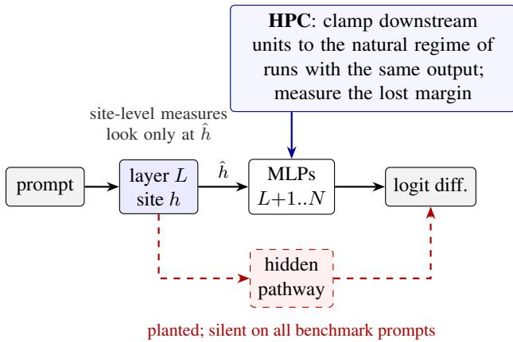
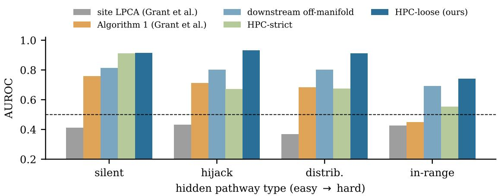

# Right Answer, Wrong Mechanism: Detecting Pernicious Divergence in Causal Interventions

Beiming Liu\* China Financial Certification Authority (CFCA), China lbm21@tsinghua.org.cn

Minjie Chen\* PetroChina Southwest Oil and Gasfield Company, China auturnncrow@gmail.com

## Abstract

Causal interventions such as activation patching and distributed alignment search (DAS) are the main tool for making mechanistic claims about neural networks. Recent work showed that these interventions routinely push representations off the model’s natural distribution, and that such divergence is sometimes harmless and sometimes pernicious: it can recruit pathways the model never uses on natural inputs, so that an intervention produces the expected answer through the wrong mechanism. No method currently tells the two cases apart. We make this question testable by planting hidden pathways inside pretrained language models. The pathways are silent on every benchmark prompt by construction, so model behaviour is unchanged, and which interventions depend on them is known exactly. Across 72 configurations and 100,800 interventions on GPT-2 small, we find three things. (i) Nearest-neighbour and local-PCA distances at the intervention site, as used in prior work, score below chance (AUROC 0.35–0.47) at picking out interventions that give the right answer through a planted pathway. (ii) Hidden-Pathway Contribution (HPC) is a label-free downstream test. It clamps downstream units to the regime seen in natural runs with the same output and measures how much of the decision disappears. It flags pathway-dominated interventions with AUROC ≥ 0.99 when the pathway shows up as unit-level out-of-regime activity. It fails when every unit of the pathway stays within its natural range; we identify this in-range case as the open problem. (iii) Optimised interventions actively seek hidden pathways. On a gender task, for three of four pathway families, DAS routes 90–95% of its successes through planted pathways. With the genuine causal subspace excluded, it still reports success on 12–26% of examples, all through planted pathways. A downstream on-manifold penalty in the DAS objective cuts the pathway-dominated share of DAS successes from nearly all to under 5%, at a cost of 6–11 points of success rate. It only partly suppresses the false successes of restricted DAS. In unmodified GPT-2, successful interventions show almost no unit-level out-of-regime reliance, a reassuring result whose sensitivity we bound with a positive control.

## 1 Introduction

Much of mechanistic interpretability rests on one experimental primitive: change an internal representation and observe the output. Activation patching [20, 27, 28], interchange interventions and distributed alignment search (DAS) [6, 7, 29], and mean-difference patching [4] all follow this template. Their results are read as evidence about the model’s natural mechanism, which assumes the intervened state is one the model could plausibly be in.

Grant et al. [8] showed that this assumption routinely fails. Common interventions move representations off the natural distribution. That divergence can be harmless, lying in directions the downstream computation ignores, or pernicious, activating “hidden pathways” that produce the intended behaviour through a mechanism the model never uses. Earlier, Makelov et al. [18] constructed a concrete instance of the pernicious case, and Wu et al. [30] argued about how often such constructions arise in practice. Grant et al. [8] leave open “a principled method for classifying harmful divergence”. Without one, a researcher cannot tell whether a successful intervention supports a claim about the natural mechanism.

Two obstacles make the question hard. First, there is no ground truth: in a real network we do not know which interventions succeed for the right reason. Second, the obvious candidate signal is how far the intervened representation lies from the data manifold at the intervention site. By construction, that signal responds to harmless and pernicious divergence alike. This paper addresses both obstacles.

## Contributions.

• A planted-pathway benchmark in pretrained language models (§4). We add hidden pathways to GPT-2 small. They are silent on all benchmark prompts, so behaviour is unchanged, but they fire when an intervention pushes the downstream state out of its natural regime. Four families range from new silent units to drive spread over 128 existing neurons, each clipped to its natural range. Switching the pathways off gives an exact label for every intervention.

• Site-level distances do not identify wrong-mechanism successes (§6.2). Among interventions that produce the counterfactual answer, nearest-neighbour and local-PCA distances score below chance: interventions that succeed through a planted pathway are, if anything, closer to the natural site manifold. Mahalanobis distance and the Algorithm 1 of Grant et al. [8] are inconsistent across tasks and pathway families.

• Hidden-Pathway Contribution (§5). This label-free detector asks a causal question downstream: how much of the decision survives when downstream units are clamped to the regime of natural runs with the same output? It works when pathways are visible as unit-level out-of-regime activity and fails on in-range pathways. We present this as the open hard case, not a solved one.

• Optimised interventions find hidden pathways (§6.3). On the gender task, for three of four families, DAS trained on a model with planted pathways routes most of its successes through them. Restricted to exclude the genuine causal subspace, it still reports success, and for three of four families every such success goes through a planted pathway. A downstream on-manifold penalty redirects unrestricted DAS to the natural mechanism, but does not remove the false successes of restricted DAS.

• A bounded prevalence check (§6.4). In unmodified GPT-2, successful interventions almost never show unit-level out-of-regime reliance. A positive control shows what this check can and cannot detect.

## 2 Related work

Causal interventions and their pitfalls. Zhang and Nanda [31] and Heimersheim and Nanda [11] review activation patching and discuss metric and corruption choices. Circuit-discovery methods build on it [3]. Causal scrubbing [2] resamples activations to keep tests on-distribution, and optimal ablations [14] choose ablation values that minimise distortion. Makelov et al. [18] showed that subspace patching can succeed through a dormant parallel pathway; Wu et al. [30] disputed how common this is in practice. Grant et al. [8] showed that divergence is common across patching, DAS and SAE reconstructions and analysed when it is harmless. They proposed a counterfactual-latent loss, which shrinks divergence overall but does not target its pernicious part. Sutter et al. [25] showed that sufficiently expressive alignment maps can align any network to any algorithm. Vaidyanathan et al. [26] showed that patching estimates contain interaction effects that grow with the distance between clean and patched activations. Downstream self-repair [19] is a related complication for any method that reasons about downstream effects. Our work supplies the missing evaluation: ground truth for which interventions are pernicious, and detectors scored against it.

  
Figure 1: Setting. An intervention replaces the site representation h by $\hat { h } .$ It may reach the right answer through the natural computation or through a pathway that natural inputs never activate. Site-level divergence looks only at hˆ. HPC tests downstream whether the decision depends on activity outside the natural regime. In our benchmark the hidden pathway is planted, so the answer is known.

Keeping interventions on-manifold. Luo et al. [17] train a diffusion model over activations and project steered activations back onto the learned manifold. Like Mahalanobis or nearest-neighbour scores [13, 24], this assesses the representation at the site. A related out-of-distribution problem affects perturbation-based attribution [10, 12].

Ground truth for interpretability. Compiled transformers [15], semi-synthetic models with known circuits [9] and standardised benchmarks [21] evaluate circuit and alignment methods. Instead of building a model with a known circuit, we make a minimal edit to a pretrained model. The added pathways have no effect on the benchmark prompts, so the natural computation remains that of the real model.

## 3 Problem setup

Decisions and interventions. Consider a binary decision measured by the logit difference $\operatorname { L D } ( x ) =$ $\ell _ { a _ { 1 } } ( x ) - \ell _ { a _ { 0 } } ( x )$ between two answer tokens. A causal variable takes two values, corresponding to classes $c \in \{ 0 , 1 \}$ , and target and source prompts $( x _ { t } , x _ { s } )$ differ only in that variable. An intervention at layer L and position p replaces the residual stream $h = h _ { L } ^ { p } ( x _ { t } )$ by hˆ. It is successful if sign $\mathrm { L D } ( x _ { t } ; \hat { h } )$ matches the class of $x _ { s }$

Pernicious divergence. We call an intervention perniciousfor natural-mechanism claims if its decision depends on downstream computation that does not occur in natural runs producing the same output. This follows Grant et al. [8], for whom harm is relative to the claim. Ours is the most common claim: that the intervened representation is used by the model’s own mechanism. In real models this property cannot be observed, which motivates the benchmark below.

## 4 A planted-pathway benchmark

Tasks and models. We use two tasks with paired prompts that differ in one variable and share fixed answer tokens:

• SVA, subject–verb agreement [5, 16]: “The keys near the cabinet” → are/is. 47 noun pairs, 8 prepositions, singular and plural attractors.

• Gender pronouns [27]: “The king from Paris said that” → he/she. 20 noun pairs, 20 locations, 12 verbs. A third task, indirect object identification (IOI) [28], has prompt-dependent answers, so we use it only in the unmodified-model analysis. All reported results use GPT-2 small [23], run with TransformerLens [22]; the code also runs unchanged on Pythia [1] and Qwen2.5 models, which we used only for smoke tests. We keep prompt pairs the model answers correctly with $| \mathrm { L D } | > 1$ , up to 6,000 per task.

Planted pathways. Fix a layer $T > L$ . Let $\tilde { x } _ { T } ( x )$ be the normalised input of the MLP at layer $T$ at the final position, and let u be a unit direction. A pathway unit computes

$$
\begin{array} { r } { a ( x ) = \mathrm { R e L U } \big ( \boldsymbol { u } ^ { \top } \bar { \boldsymbol { x } } _ { T } ( x ) - b \big ) , \qquad b = \operatorname* { m a x } _ { x \in \mathcal { D } } \boldsymbol { u } ^ { \top } \bar { \boldsymbol { x } } _ { T } ( x ) + \delta , \quad \delta = \eta \ \mathrm { s t d } _ { x \in \mathcal { D } } \big ( \boldsymbol { u } ^ { \top } \bar { \boldsymbol { x } } _ { T } ( x ) \big ) , \ \eta \sim U ( 0 . 0 5 , 0 . 8 ) , } \end{array}\tag{1}
$$

where $\mathcal { D }$ is the set of benchmark prompts. So $a \equiv 0$ on every benchmark prompt, and we assert that the model’s decisions on them are unchanged.

Each configuration plants 24 units:

• Half of the directions u lie in the top-64 principal subspace of $\tilde { x } _ { T }$ , reachable by overshooting natural directions. The other half lie in its bottom-200 subspace, reachable only off-manifold, in the style of Makelov et al. [18].

• Half of the units are confirmatory. For a top-subspace unit this means pushing the answer that its input direction correlates with. For a bottom-subspace unit, whose direction carries no class information, the sign is random. The remaining units push in a random direction.

Each unit’s output is calibrated so that an overshoot of one natural standard deviation moves LD by about 3 (by about 30 before clipping for in-range; see below). The four families differ in where the output goes:

• silent: new units that write along the unembedding difference of the answers (confirmatory) or along a random token’s unembedding;

• hijack: extra drive into one existing MLP neuron at layer $T$ with a large direct effect on LD;

• distributed: the same drive spread over 64 such neurons;

• in-range: drive spread over 128 neurons, each clipped so that it never leaves its natural range, taken as the 0.1–99.9% quantiles over all benchmark prompts. Only the combination of neuron values is unnatural. The gain is ten times larger to offset the clipping.

The first three families make the pathway visible as unit-level out-of-regime activity, which is exactly what HPC tests for. They are therefore a sanity check and an upper bound. The in-range family breaks this assumption and is the informative test.

Ground truth. For every intervention we compare LD with the pathways on (LD) and off $\mathrm { ( L D _ { o f f } ) }$ . We use two labels:

• Pathway-dominated: the pathways supply more than half of the decision margin, i.e. sign(LD) (LD − $\mathrm { L D _ { o f f } ) > | L D | / 2 }$ . We use this label over all interventions, where many are unsuccessful.

• Wrong-mechanism success: the intervention is successful and its decision flips when the pathways are off. This is the label that matters for interpretation, used among successful interventions.

Interventions. Sites are the subject token at layers 2 and 4 and the final token at layer 8, with pathways at $T = L + 2$ and $L + 4 \left( T < 1 2 \right)$ . Each configuration evaluates 1,500 interventions on held-out pairs, drawn from six families:

• A: full activation patch, $\hat { h } = h _ { s }$

• C: mean-difference patching $\hat { h } = h _ { t } + \alpha ( \mu _ { s } - \mu _ { t } )$ , with $\alpha \sim U ( 0 . 1 , 5 )$ , plus an equally sized group with $\alpha \sim U ( 0 . 1 , 3 )$ (labelled “steering” in the code);

• D: 1-D DAS [7] trained on the unmodified model, with the interchange scaled by $U ( 0 . 2 , 4 )$ ;

• E: DAS mixed with a random natural direction at up to $8 5 ^ { \circ }$ ;

• G: DAS trained on the model with pathways;

• H: restricted DAS, also trained with pathways, constrained to the orthogonal complement of the top-32 principal components of the site and of the direction from D.

H is an illusion probe: if the genuine signal lies in the excluded subspace, any success must come from elsewhere.

## 5 Detectors

Site-level baselines. These score $\hat { h }$ against the natural site representations:

• kNN: distance to the nearest natural neighbour [24].

• Mahalanobis [13]: computed in a 200-dimensional PCA basis, plus the out-of-subspace residual scaled by the smallest retained variance.

• LPCA: the local-PCA residual of Grant et al. [8], i.e. the distance from the tangent space of the 30 nearest neighbours, keeping 95% of variance.

• Algorithm 1 of Grant et al. [8], reimplemented. It extracts the off-manifold component v of $\hat { h }$ relative to the local PCA of the predicted class, adds v to 32 natural evaluation prompts, and reports the largest change in LD.

Downstream off-manifold (Down-OM). A non-causal downstream baseline. For each MLP layer $l > L ,$ compute the relative residual of the final-position activation from the class-conditional natural PCA subspace (99% of variance, at most 256 components) of the predicted class, and average over layers.

Hidden-Pathway Contribution. For each downstream MLP neuron j (final position, layers $> L )$ and class c, record over natural prompts of class c the regime $[ q _ { 0 . 0 0 1 } ^ { c } ( j ) , q _ { 0 . 9 9 9 } ^ { c } ( j ) ]$ and the frequency with which $| a _ { j } | > 0 . 0 5$ . Given an intervention with predicted class $c ^ { * }$ , rerun the forward pass with every downstream neuron clamped to the regime of $c ^ { * }$ . The clamps are applied layer by layer, so later layers see clamped inputs. Let Π denote this clamping and $\mathrm { L D } _ { \Pi }$ the resulting logit difference. Then

$$
\mathrm { H P C } ( \hat { h } ) = \frac { \operatorname* { m a x } \bigl ( 0 , \mathrm { \ s i g n ( L D ) \left( L D - L D _ { I I } \right) } \bigr ) } { \operatorname* { m e d i a n } _ { x \in \mathscr { D } } \left| \mathrm { L D } ( x ) \right| } ,\tag{2}
$$

the fraction of a typical natural margin lost once downstream activity is restricted to what natural runs with the same output exhibit. HPC needs only natural prompts and the model, no labels. We use three variants:

• HPC-S (strict) clamps only neurons active in fewer than 1% of natural class-c∗ runs.

• HPC-L (loose) clamps every neuron to its regime.

• HPC-Loc first projects each layer’s activation onto the local PCA of its 30 nearest natural class- $\cdot c ^ { * }$ activations, then clamps.

Harmless null-space divergence leaves downstream activity unchanged, so HPC is zero for it by construction. Planted units of the silent family are treated like any other downstream unit. Their natural regime is {0}, so

Table 1: Synthetic setting (5 seeds, 3,000 interventions each). AUROC for detecting trap-dependent interventions, over all and over successful interventions, and false-positive rate (%) on harmless null-space divergence at the threshold that catches 90% of pernicious cases. †Grant et al. [8].
<table><tr><td>Detector</td><td>AUROC (all)</td><td>AUROC (successful)</td><td>FPR null-space</td></tr><tr><td>site kNN</td><td> $0 . 6 5 1 { \scriptstyle \pm 0 . 0 3 4 }$ </td><td> $0 . 5 8 6 { \scriptstyle \pm 0 . 0 3 4 }$ </td><td>94.8</td></tr><tr><td>site Mahalanobis</td><td> $0 . 8 0 3 { \pm } 0 . 0 3 8$ </td><td> $0 . 7 5 1 { \scriptstyle \pm 0 . 0 4 1 }$ </td><td>99.6</td></tr><tr><td>site local.  $\mathbf { \cdot P C A ^ { \dagger } }$ </td><td> $0 . 6 8 1 { \scriptstyle \pm 0 . 0 3 0 }$ </td><td> $0 . 6 1 8 { \pm } 0 . 0 3 1$ </td><td>93.2</td></tr><tr><td>Algorithm  $1 ^ { \dagger }$ </td><td> $0 . 8 3 7 { \pm } 0 . 0 1 6$ </td><td> $0 . 8 6 8 { \pm } 0 . 0 1 2$ </td><td>4.0</td></tr><tr><td>HPC (ours)</td><td> $0 . 9 3 1 { \scriptstyle \pm 0 . 0 0 7 }$ </td><td> $0 . 9 3 7 { \scriptstyle \pm 0 . 0 0 5 }$ </td><td>0.0</td></tr></table>

Table 2: Detecting pathway-dominated interventions (planted pathway supplies >50% of the decision margin), all interventions. Mean AUROC over configurations (sites and pathway layers; seed 0) with ${ \ge } 5$ positives; best per row in bold. †Measures used by Grant et al. [8].
<table><tr><td colspan="5"></td><td colspan="3">site-level</td><td rowspan="2"></td><td colspan="3">downstream downstream + causal (ours)</td></tr><tr><td>Model Task</td><td>Pathway #cfg #pos</td><td></td><td></td><td>kNN</td><td></td><td>Maha. LPCA†</td><td>Alg. 1†</td><td>Down-OM</td><td>HPC-S HPC-L</td><td>HPC-Loc</td></tr><tr><td>GPT-2</td><td>Gender silent</td><td></td><td>5 3203</td><td>0.74</td><td>0.80</td><td>0.75</td><td>0.86</td><td>0.92</td><td>1.00</td><td>1.00</td><td>0.99</td></tr><tr><td>GPT-2</td><td>Gender hijack</td><td></td><td>5 3620</td><td>0.75</td><td>0.78</td><td>0.75</td><td>0.83</td><td>0.92</td><td>0.68</td><td>1.00</td><td>0.99</td></tr><tr><td>GPT-2</td><td>Gender distrib.</td><td></td><td>5 3144</td><td>0.75</td><td>0.80</td><td>0.75</td><td>0.86</td><td>0.91</td><td>0.69</td><td>1.00</td><td>0.99</td></tr><tr><td>GPT-2</td><td>Gender in-range</td><td>5</td><td>223</td><td>0.66</td><td>0.78</td><td>0.67</td><td>0.66</td><td>0.74</td><td>0.57</td><td>0.59</td><td>0.74</td></tr><tr><td>GPT-2 SVA</td><td>silent</td><td>5</td><td>410</td><td>0.84</td><td>0.91</td><td>0.84</td><td>0.94</td><td>0.99</td><td>1.00</td><td>1.00</td><td>0.99</td></tr><tr><td>GPT-2 SVA</td><td>hijack</td><td>5</td><td>241</td><td>0.80</td><td>0.90</td><td>0.81</td><td>0.94</td><td>0.97</td><td>0.61</td><td>1.00</td><td>0.97</td></tr><tr><td>GPT-2 SVA</td><td>distrib.</td><td>5</td><td>444</td><td>0.80</td><td>0.91</td><td>0.80</td><td>0.95</td><td>0.98</td><td>0.75</td><td>1.00</td><td>0.99</td></tr><tr><td>GPT-2 SVA</td><td>in-range</td><td>4</td><td>183</td><td>0.56</td><td>0.73</td><td>0.57</td><td>0.68</td><td>0.92</td><td>0.63</td><td>0.62</td><td>0.73</td></tr></table>

HPC-S and HPC-L switch them off, which is close to the operation that defines the label. This is why the silent family serves only as a sanity check.

## 6 Results

## 6.1 A synthetic sanity check

We first extend the synthetic setting of Grant et al. [8]. A two-layer MLP classifies 10 classes defined by two correlated latent variables, and we plant silent units and a Makelov-style dormant pathway. Table 1 shows the pattern that recurs below. Site distances flag harmless null-space divergence as readily as pernicious divergence, with 93–100% false positives at 90% recall. Algorithm 1 is much better, and HPC is best.

## 6.2 Site-level distance does not identify wrong-mechanism successes

Table 2 scores detectors on flagging pathway-dominated interventions among all interventions. Table 3 scores them on the question that matters for interpretation: among interventions that succeeded, which did so through a planted pathway? Appendix Table 6 gives pooled AUROCs with bootstrap confidence intervals. Pooled AUROCs are generally lower than the per-configuration means. HPC-L stays above the site-level measures on gender, and the ordering is unchanged on SVA; the weaker detectors are ordered differently for gender distributed and in-range.

Table 3: Right answer, wrong mechanism. AUROC restricted to successful interventions (the counterfactual answer was produced); positives are those whose decision flips when the planted pathways are removed. Nearest-neighbour and local-PCA site distances fall below chance.
<table><tr><td colspan="5"></td><td colspan="4">site-level</td><td colspan="4">downstream downstream + causal (ours)</td></tr><tr><td>Model Task</td><td>Pathway #cfg #pos</td><td></td><td></td><td></td><td></td><td>kNN Maha. LPCA†</td><td>Alg. 1†</td><td>Down-OM</td><td></td><td>HPC-S HPC-L</td><td>HPC-Loc</td></tr><tr><td>GPT-2</td><td>Gender silent</td><td></td><td>5 1099</td><td>0.38</td><td>0.69</td><td>0.38</td><td>0.65</td><td>0.69</td><td>0.83</td><td>0.83</td><td>0.82</td></tr><tr><td>GPT-2</td><td>Gender hijack</td><td></td><td>5 1393</td><td>0.40</td><td>0.65</td><td>0.40</td><td>0.57</td><td>0.67</td><td>0.57</td><td>0.87</td><td>0.85</td></tr><tr><td>GPT-2</td><td>Gender distrib.</td><td>5</td><td>832</td><td>0.35</td><td>0.73</td><td>0.35</td><td>0.69</td><td>0.68</td><td>0.62</td><td>0.87</td><td>0.86</td></tr><tr><td>GPT-2</td><td>Gender in-range</td><td>3</td><td></td><td>71 0.46</td><td>0.60</td><td>0.46</td><td>0.31</td><td>0.48</td><td>0.55</td><td>0.54</td><td>0.57</td></tr><tr><td>GPT-2 SVA</td><td>silent</td><td>2</td><td></td><td>24 0.45</td><td>0.82</td><td>0.45</td><td>0.87</td><td>0.94</td><td>1.00</td><td>1.00</td><td>0.99</td></tr><tr><td>GPT-2 SVA</td><td>hijack</td><td>2</td><td></td><td>140.47</td><td>0.81</td><td>0.47</td><td>0.86</td><td>0.93</td><td>0.77</td><td>0.99</td><td>0.95</td></tr><tr><td>GPT-2 SVA</td><td>distrib.</td><td>4</td><td>27</td><td>0.39</td><td>0.77</td><td>0.39</td><td>0.68</td><td>0.92</td><td>0.73</td><td>0.96</td><td>0.89</td></tr><tr><td>GPT-2 SVA</td><td>in-range</td><td>2</td><td></td><td>1340.37</td><td>0.68</td><td>0.39</td><td>0.59</td><td>0.91</td><td>0.56</td><td>0.94</td><td>0.90</td></tr></table>

Site-level distance is uninformative, even misleading, where it matters. Among successful interventions, kNN and LPCA fall below 0.5 in every setting (Table 3, Figure 2): wrong-mechanism successes sit closer to the natural site manifold than genuine ones. A plausible reason is that confirmatory pathways let small, typicallooking perturbations tip the decision, while genuine successes often require larger moves. Mahalanobis distance (0.60–0.82) and Algorithm 1 (0.31–0.87) are better but inconsistent across tasks and families.

Looking downstream helps, and the causal test helps most. Over all interventions, Down-OM is strong (Table 2). Among successful interventions it drops to 0.67–0.69 on the gender task, while HPC-L stays at 0.83–0.87 for the silent, hijack and distributed families. The step of clamping and measuring the lost margin separates “unusual” from “used for the decision”.

What HPC clamps matters, and in-range pathways defeat it. HPC-S, which only silences units that are never active, fails when a pathway hijacks neurons that are active naturally. Range clamping (HPC-L) handles these cases. Neither handles in-range pathways over all interventions (HPC-L 0.59–0.62). Among successful interventions, HPC-L remains high on SVA (0.94) but is at chance on gender (0.54), where Mahalanobis distance is the best, still weak, signal. Detecting combination-level anomalies that no single unit reveals is the open problem our benchmark exposes.

## 6.3 Optimised interventions seek hidden pathways

Table 4 reports what DAS does when hidden pathways exist.

On the gender task, DAS trained on a model with silent, hijack or distributed pathways (G) succeeds on 87– 91% of examples, and 90–95% of its successes are pathway-dominated. Gradient descent prefers the planted shortcut to the model’s own mechanism. On SVA, where the natural signal is strong, DAS largely ignores the pathways (0.2–7%). The restricted probe (H) is sharper. With the genuine causal subspace excluded, DAS still reports success on 12–26% of gender examples for those three families, and every such success is pathway-dominated. On SVA, restricted DAS rarely succeeds (2–11%), and 45–80% of its successes are pathway-dominated. In-range pathways are rarely exploited. This reproduces the interpretability illusion of Makelov et al. [18] as a controlled measurement: an optimiser searching for an intervention direction finds hidden pathways when they are easier to use than the natural mechanism, and a high interchange-intervention accuracy is then no evidence about that mechanism.

  
Figure 2: AUROC for wrong-mechanism successes on GPT-2, averaged over the two tasks, by pathway family. Site-level LPCA is below chance throughout. HPC-L is the best plotted detector in every family; for in-range its average hides chance-level performance on the gender task (Table 3).

Mitigation. We add to the DAS objective a penalty equal to λ times the mean relative distance of downstream MLP activations from the natural class-conditional PCA subspace of the counterfactual class (Down-OM as a differentiable loss, $\lambda = 5 )$ . The mitigation columns of Table 4 show two effects. First, for unrestricted DAS on the gender task, the matched comparison within the mitigation runs shows that the penalty lowers the success rate from 94–98% (G′) to 87–89% (J). It cuts the share of successes that are pathway-dominated from 98.5–100% to 4.5–4.7%: the penalised direction reaches the counterfactual answer through the model’s own computation. Second, for restricted DAS, the penalty lowers the success rate on gender (from H′ to I: 52.5% to 41.0% for silent, 66.0% to 17.0% for hijack, 34.5% to 30.0% for distributed). The successes that remain are still 92–100% pathway-dominated (Table 4, I). When the genuine subspace is unavailable, the penalty thus reduces but does not remove false successes, and restricted-subspace results should not be trusted even with the penalty. On SVA, penalised restricted DAS almost never succeeds (0–1%).

## 6.4 Unmodified models

Do real interventions in unmodified models rely on out-of-regime downstream activity? Table 5 reports the fraction of successful interventions with HPC-L > 1, i.e. where out-of-regime activity supplies more than a typical natural margin.

In unmodified GPT-2 the fraction is essentially zero for every intervention family, including DAS and mean-difference patching with large overshoot. The same holds for $\mathrm { I O I } ( \leq 0 . 3 \% )$ . Site divergence is only weakly correlated with HPC-L (ρ between −0.15 and 0.21). With the top-32 components excluded, restricted DAS almost never succeeds $( \leq 1 . 3 \% )$ . With only the top 4 excluded, it succeeds on 12.3% of IOI examples on average (up to 31.3%; 8 configurations), yet 0 of these 210 successes show $\mathrm { H P C - L > 1 }$ . This is consistent with the genuine signal extending beyond a few principal directions [30], rather than with a hidden pathway.

The positive control bounds what this tells us. In models with planted pathways, the same statistic catches 67–96% of wrong-mechanism successes for the silent, hijack and distributed families, but 0–1.5% for in-range pathways. The honest conclusion is therefore limited. In small models on these tasks, successful interventions do not rely on unit-level out-of-regime activity. Reliance on in-range combinations would go undetected, and whether larger models, with far more capacity dormant on any given input, behave the same is open.

Table 4: Optimised interventions find hidden pathways; a downstream on-manifold penalty redirects unrestricted DAS. For each DAS variant: success rate (succ., %) and, among its successes, the share that is pathway-dominated (path., %). G: DAS trained on the model with planted pathways. H: the same, restricted to the complement of the top-32 principal components of the site and of the clean-model DAS direction (illusion probe). Main runs: all sites, seed 0. Mitigation runs (GPT-2, L=2, T=4, 900 interventions; gender: seeds 0–1, SVA: seed 0) retrain the same variants without (G′, H′) and with (J, I) the downstream on-manifold penalty (λ=5).
<table><tr><td></td><td></td><td colspan="4">main runs</td><td colspan="8">mitigation runs</td></tr><tr><td></td><td></td><td>G: DAS</td><td></td><td colspan="2">H: restricted</td><td colspan="2">G&#x27;: DAS</td><td colspan="2">J: DAS+pen.</td><td colspan="2">H&#x27;: restr.</td><td colspan="2">I: restr.+pen.</td></tr><tr><td>Task</td><td>Pathway</td><td>succ.</td><td>path.</td><td>succ.</td><td>path.</td><td>succ.</td><td>path.</td><td>succ.</td><td>path.</td><td>succ.</td><td>path.</td><td>succ.</td><td>path.</td></tr><tr><td>Gender</td><td>silent</td><td>91.2</td><td>90.2</td><td>13.5</td><td>100.0</td><td>98.0</td><td>98.5</td><td>87.0</td><td>4.5</td><td>52.5</td><td>100.0</td><td>41.0</td><td>100.0</td></tr><tr><td>Gender</td><td>hijack</td><td>90.7</td><td>90.0</td><td>26.1</td><td>100.0</td><td>94.0</td><td>100.0</td><td>88.0</td><td>4.7</td><td>66.0</td><td>100.0</td><td>17.0</td><td>100.0</td></tr><tr><td>Gender</td><td>distrib.</td><td>87.3</td><td>95.1</td><td>12.4</td><td>100.0</td><td>96.0</td><td>100.0</td><td>89.0</td><td>4.5</td><td>34.5</td><td>100.0</td><td>30.0</td><td>92.3</td></tr><tr><td>Gender</td><td>in-range</td><td>68.1</td><td>16.5</td><td>0.9</td><td>75.0</td><td>90.0</td><td>0.0</td><td>88.5</td><td>0.0</td><td>3.0</td><td>40.0</td><td>6.5</td><td>0.0</td></tr><tr><td>SVA</td><td>silent</td><td>67.2</td><td>1.0</td><td>3.1</td><td>45.8</td><td>68.0</td><td>0.0</td><td>78.0</td><td>0.0</td><td>3.0</td><td>100.0</td><td>0.0</td><td></td></tr><tr><td>SVA</td><td>hijack</td><td>69.2</td><td>0.2</td><td>1.9</td><td>45.0</td><td>78.0</td><td>0.0</td><td>78.0</td><td>0.0</td><td>3.0</td><td>100.0</td><td>0.0</td><td></td></tr><tr><td>SVA</td><td>distrib.</td><td>62.3</td><td>7.1</td><td>2.8</td><td>80.0</td><td>86.0</td><td>2.3</td><td>83.0</td><td>0.0</td><td>15.0</td><td>100.0</td><td>1.0</td><td>100.0</td></tr><tr><td>SVA</td><td>in-range</td><td>65.6</td><td>6.7</td><td>11.0</td><td>66.7</td><td>85.0</td><td>0.0</td><td>84.0</td><td>0.0</td><td>0.0</td><td></td><td>0.0</td><td></td></tr></table>

## 7 Discussion and limitations

Planted pathways are constructions. They show what a detector can and cannot see when a hidden pathway exists, not how often such pathways arise naturally. Three of our four families are, by design, visible to unit-level range tests. They are sanity checks, and near-perfect scores on them should not be read as evidence of real-world reliability. The in-range family is the informative one, and HPC fails on it over all interventions and, among successful interventions, on the gender task.

Downstream self-repair. Clamping downstream units can trigger compensation by later components [19].   
This makes $\mathrm { L D } _ { \Pi }$ an imperfect estimate of the margin that would be lost.

Statistics and constants. Main-benchmark configurations use a single seed (seed 0); Appendix Table 6 gives bootstrap intervals. Several constants are fixed rather than tuned: the pathway gain, the ten-times in-range gain, the quantiles defining a regime, and the HPC-L > 1 threshold. Natural regimes are estimated on the same templated prompts that are intervened on; a held-out natural distribution would be a stricter reference.

Scope. All reported results are on GPT-2 small (124M parameters), run on a single consumer GPU and a laptop. The code supports bf16 and downstream-layer subsampling for 7–8B models, and scaling up is the natural next step. HPC needs a class-conditional decision to define “natural runs with the same output”. It clamps MLP neurons at the final position only, so pathways mediated by attention or located at other positions are not covered.

Claim dependence. Following Grant et al. [8], harm is relative to a claim. HPC targets claims about the natural mechanism. For other claims, e.g. that a subspace is sufficient to control behaviour, out-of-regime computation may be acceptable.

Table 5: Unmodified models. Percentage of successful interventions whose decision relies on out-of-regime downstream activity (HPC-L > 1, i.e. more than one natural median margin); mean Spearman $\rho$ between site divergence (LPCA) and HPC-L; success rate (%) of restricted DAS (H). Positive control (bottom): the same HPC-L> 1 rate among wrong-mechanism successes in models with planted pathways, all intervention types pooled.
<table><tr><td>Model Task</td><td></td><td></td><td>#succ. full patch mean-diff. DAS</td><td></td><td>DAS+rand.</td><td> $\rho$ </td><td>H succ.</td></tr><tr><td>GPT-2 Gender</td><td></td><td>2720</td><td>0.0</td><td>0.0 0.8</td><td>0.0</td><td>-0.15</td><td>1.3</td></tr><tr><td>GPT-2 IOI</td><td></td><td>2174</td><td>0.0</td><td>0.0 0.3</td><td>0.0</td><td>0.21</td><td>0.0</td></tr><tr><td>GPT-2 SVA</td><td>2809</td><td>0.0</td><td>0.0</td><td>0.0</td><td>0.0</td><td>-0.13</td><td>0.5</td></tr><tr><td colspan="8">Positive control: wrong-mechanism successes with planted pathways</td></tr><tr><td>GPT-2  $\mathrm { G e n d e r } + \mathrm { s i l e n t }$ </td><td>1099</td><td></td><td>85.0</td><td></td><td></td><td></td><td></td></tr><tr><td>GPT-2</td><td> ${ \mathrm { G e n d e r } } + { \mathrm { h i j a c k } }$ </td><td>1393</td><td></td><td>96.1</td><td></td><td></td><td></td></tr><tr><td>GPT-2</td><td> $\mathrm { G e n d e r + d i s t r i b . }$ </td><td>832</td><td></td><td>86.7</td><td></td><td></td><td></td></tr><tr><td>GPT-2 Gender + in-range</td><td></td><td>71</td><td></td><td>0.0</td><td></td><td></td><td></td></tr><tr><td>GPT-2</td><td> $\mathrm { S V A } + \mathrm { s i l e n t }$ </td><td>24</td><td></td><td>91.7</td><td></td><td></td><td></td></tr><tr><td>GPT-2</td><td> $\mathbf { S } \mathbf { V } \mathbf { A } + \mathbf { h i j a c k }$ </td><td>14</td><td></td><td>85.7</td><td></td><td></td><td></td></tr><tr><td>GPT-2</td><td> $\mathrm { S V A } + \mathrm { d i s t r i b } .$ </td><td>27</td><td></td><td>66.7</td><td></td><td></td><td></td></tr><tr><td>GPT-2</td><td> $\mathbf { S } \mathbf { V } \mathbf { A } + \mathbf { i n - r a n g e }$ </td><td>134</td><td></td><td>1.5</td><td></td><td></td><td></td></tr></table>

## 8 Conclusion

Whether an intervention gives the right answer for the right reason cannot be read off the intervened representation. It has to be tested downstream, against what the model does on natural inputs. Planting hidden pathways in pretrained models turns this into a measurable question. On that benchmark, site-level distances fail, and a simple downstream causal test succeeds whenever the pathway is visible at the level of individual units. Optimised interventions exploit hidden pathways when these are easier to use than the natural mechanism. Pathways hidden in in-range combinations of units are not reliably detected by any method we tested (on gender, HPC-L is at chance, 0.54, among successful interventions), and we offer the benchmark as a target for detectors that can find them.

## References

[1] Stella Biderman, Hailey Schoelkopf, Quentin Anthony, Herbie Bradley, Kyle O’Brien, Eric Hallahan, Mohammad Aflah Khan, Shivanshu Purohit, USVSN Sai Prashanth, Edward Raff, Aviya Skowron, Lintang Sutawika, and Oskar van der Wal. Pythia: A suite for analyzing large language models across training and scaling. In International Conference on Machine Learning (ICML), 2023.

[2] Lawrence Chan, Adrià Garriga-Alonso, Nicholas Goldowsky-Dill, Ryan Greenblatt, Jenny Nitishinskaya, Ansh Radhakrishnan, Buck Shlegeris, and Nate Thomas. Causal scrubbing: a method for rigorously testing interpretability hypotheses. AI Alignment Forum, 2022.

[3] Arthur Conmy, Augustine N. Mavor-Parker, Aengus Lynch, Stefan Heimersheim, and Adrià Garriga-Alonso. Towards automated circuit discovery for mechanistic interpretability. In Advances in Neural Information Processing Systems (NeurIPS), 2023.

[4] Jiahai Feng and Jacob Steinhardt. How do language models bind entities in context? In International Conference on Learning Representations (ICLR), 2024.

[5] Matthew Finlayson, Aaron Mueller, Sebastian Gehrmann, Stuart Shieber, Tal Linzen, and Yonatan Belinkov. Causal analysis of syntactic agreement mechanisms in neural language models. In Proceedings of the Annual Meeting of the Association for Computational Linguistics (ACL), 2021.

[6] Atticus Geiger, Hanson Lu, Thomas Icard, and Christopher Potts. Causal abstractions of neural networks. In Advances in Neural Information Processing Systems (NeurIPS), 2021.

[7] Atticus Geiger, Zhengxuan Wu, Christopher Potts, Thomas Icard, and Noah Goodman. Finding alignments between interpretable causal variables and distributed neural representations. In Causal Learning and Reasoning (CLeaR), 2024.

[8] Satchel Grant, Simon Jerome Han, Alexa R. Tartaglini, and Christopher Potts. Addressing divergent representations from causal interventions on neural networks. In International Conference on Learning Representations (ICLR), 2026. arXiv:2511.04638.

[9] Rohan Gupta, Iván Arcuschin, Thomas Kwa, and Adrià Garriga-Alonso. InterpBench: Semi-synthetic transformers for evaluating mechanistic interpretability techniques. In Advances in Neural Information Processing Systems (NeurIPS), Datasets and Benchmarks Track, 2024.

[10] Peter Hase, Harry Xie, and Mohit Bansal. The out-of-distribution problem in explainability and search methods for feature importance explanations. In Advances in Neural Information Processing Systems (NeurIPS), 2021.

[11] Stefan Heimersheim and Neel Nanda. How to use and interpret activation patching. arXiv preprint arXiv:2404.15255, 2024.

[12] Sara Hooker, Dumitru Erhan, Pieter-Jan Kindermans, and Been Kim. A benchmark for interpretability methods in deep neural networks. In Advances in Neural Information Processing Systems (NeurIPS), 2019.

[13] Kimin Lee, Kibok Lee, Honglak Lee, and Jinwoo Shin. A simple unified framework for detecting out-of-distribution samples and adversarial attacks. In Advances in Neural Information Processing Systems (NeurIPS), 2018.

[14] Maximilian Li and Lucas Janson. Optimal ablations for interpretability. In Advances in Neural Information Processing Systems (NeurIPS), 2024.

[15] David Lindner, János Kramár, Sebastian Farquhar, Matthew Rahtz, Thomas McGrath, and Vladimir Mikulik. Tracr: Compiled transformers as a laboratory for interpretability. In Advances in Neural Information Processing Systems (NeurIPS), 2023.

[16] Tal Linzen, Emmanuel Dupoux, and Yoav Goldberg. Assessing the ability of LSTMs to learn syntaxsensitive dependencies. Transactions of the Association for Computational Linguistics, 4:521–535, 2016.

[17] Grace Luo, Jiahai Feng, Trevor Darrell, Alec Radford, and Jacob Steinhardt. Learning a generative meta-model of LLM activations. In International Conference on Machine Learning (ICML), 2026. arXiv:2602.06964.

[18] Aleksandar Makelov, Georg Lange, and Neel Nanda. Is this the subspace you are looking for? An interpretability illusion for subspace activation patching. In International Conference on Learning Representations (ICLR), 2024. arXiv:2311.17030.

[19] Thomas McGrath, Matthew Rahtz, János Kramár, Vladimir Mikulik, and Shane Legg. The hydra effect: Emergent self-repair in language model computations. arXiv preprint arXiv:2307.15771, 2023.

[20] Kevin Meng, David Bau, Alex Andonian, and Yonatan Belinkov. Locating and editing factual associations in GPT. In Advances in Neural Information Processing Systems (NeurIPS), 2022.

[21] Aaron Mueller et al. MIB: A mechanistic interpretability benchmark. In International Conference on Machine Learning (ICML), 2025.

[22] Neel Nanda and Joseph Bloom. TransformerLens. https://github.com/ TransformerLensOrg/TransformerLens, 2022.

[23] Alec Radford, Jeffrey Wu, Rewon Child, David Luan, Dario Amodei, and Ilya Sutskever. Language models are unsupervised multitask learners. OpenAI technical report, 2019.

[24] Yiyou Sun, Yifei Ming, Xiaojin Zhu, and Yixuan Li. Out-of-distribution detection with deep nearest neighbors. In International Conference on Machine Learning (ICML), 2022.

[25] Denis Sutter, Julian Minder, Thomas Hofmann, and Tiago Pimentel. The non-linear representation dilemma: Is causal abstraction enough for mechanistic interpretability? In Advances in Neural Information Processing Systems (NeurIPS), 2025.

[26] Sankaran Vaidyanathan, David Arbour, Aaron Mueller, Scott Niekum, and David Jensen. The curse of multiple mediators: Hidden interaction effects in activation patching. arXiv preprint arXiv:2606.27510, 2026.

[27] Jesse Vig, Sebastian Gehrmann, Yonatan Belinkov, Sharon Qian, Daniel Nevo, Yaron Singer, and Stuart Shieber. Investigating gender bias in language models using causal mediation analysis. In Advances in Neural Information Processing Systems (NeurIPS), 2020.

[28] Kevin Wang, Alexandre Variengien, Arthur Conmy, Buck Shlegeris, and Jacob Steinhardt. Interpretabil ity in the wild: a circuit for indirect object identification in GPT-2 small. In International Conference on Learning Representations (ICLR), 2023.

[29] Zhengxuan Wu, Atticus Geiger, Thomas Icard, Christopher Potts, and Noah Goodman. Interpretability at scale: Identifying causal mechanisms in Alpaca. In Advances in Neural Information Processing Systems (NeurIPS), 2023.

[30] Zhengxuan Wu, Atticus Geiger, Jing Huang, Aryaman Arora, Thomas Icard, Christopher Potts, and Noah D. Goodman. A reply to Makelov et al. (2023)’s “interpretability illusion” arguments. arXiv preprint arXiv:2401.12631, 2024.

[31] Fred Zhang and Neel Nanda. Towards best practices of activation patching in language models: Metrics and methods. In International Conference on Learning Representations (ICLR), 2024.

## A Implementation details

Configurations. Main runs: GPT-2 small, seed 0; sites at the subject token (layers 2 and 4) and the final token (layer 8); pathways at $T \in \{ L { + } 2 , L { + } 4 \}$ with $T < 1 2 ; 2 4$ planted units per configuration; five pathway settings (none, silent, hijack, distributed, in-range) for each of the two tasks. IOI (unmodified model): the S2 token (layers 4, 6 and 8) and the final token (layers 8 and 10), seeds 0 and 1, restricted DAS with the top 32 components excluded (seed 0) or the top 4 excluded (seeds 0 and 1). Mitigation runs: layer 2, T = 4, 900 interventions each, λ = 5, all four pathway families; seeds 0 and 1 for gender and seed 0 for SVA.

Table 6: Wrong-mechanism successes: pooled AUROC (scores rank-normalised within each configuration) with 95% bootstrap confidence intervals over interventions (1,000 resamples).
<table><tr><td>Model</td><td>Task</td><td>Pathway</td><td>#pos</td><td>site LPCA</td><td>site Maha.</td><td>Alg. 1</td><td>Down-OM</td><td>HPC-L</td></tr><tr><td>GPT-2</td><td>Gender</td><td>silent</td><td>1099</td><td>0.44 [0.42, 0.46]</td><td>0.64 [0.63, 0.66]</td><td>0.61 [0.59, 0.63]</td><td>0.65 5[0.63, 0.66]</td><td>0.70 [0.69, 0.72]</td></tr><tr><td>GPT-2</td><td>Gender hijack</td><td></td><td>1393</td><td>0.41 [0.39, 0.42]</td><td>0.60 [0.58, 0.62]</td><td>0.55 [0.54, 0.57]</td><td>0.60 [0.59, 0.62]</td><td>0.77 [0.75, 0.78]]</td></tr><tr><td>GPT-2</td><td></td><td>Gender distrib.</td><td>832 0.43 [0.41, 0.45]</td><td></td><td>0.63 [0.61, 0.65]</td><td>0.57 [0.55, 0.59]</td><td>0.59 [0.57, 0.61]</td><td>0.68 [0.66, 0.70]</td></tr><tr><td>GPT-2</td><td>Gender</td><td>in-range</td><td></td><td>710.28 [0.21, 0.35]</td><td>0.37 [0.29, 0.44]</td><td>0.23 [0.18, 0.27]</td><td>0.38 [0.31, 0.45]</td><td>0.48 [0.40, 0.56]</td></tr><tr><td>GPT-2</td><td>SVA</td><td>silent</td><td></td><td>240.41 [0.33, 0.49]</td><td>0.78 [0.73, 0.83]</td><td>0.86 [0.78, 0.93]</td><td>0.92 [0.88, 0.95]</td><td>0.99 [0.99, 1.00]</td></tr><tr><td>GPT-2</td><td>SVA</td><td>hijack</td><td></td><td>140.46 [0.37, 0.56]</td><td>0.81 [0.77, 0.84]</td><td>0.85 [0.79, 0.92]</td><td>0.94 [0.92, 0.96]</td><td>0.99 [0.99, 1.00]</td></tr><tr><td>GPT-2 SVA</td><td></td><td>distrib.</td><td></td><td></td><td></td><td></td><td></td><td>27 0.39 [0.33, 0.46] 0.77 [0.73, 0.81] 0.69 [0.64, 0.75] 0.93 [0.89, 0.95] 0.96 [0.94, 0.99]</td></tr><tr><td>GPT-2 SVA</td><td></td><td>in-range</td><td></td><td></td><td></td><td></td><td></td><td>134 0.33 [0.30, 0.37] 0.59 [0.55, 0.64] 0.51 [0.48, 0.54] 0.90 [0.89, 0.92] 0.92 [0.89, 0.95]</td></tr></table>

Training. DAS directions are trained for 150 steps (restricted: 300) with Adam at learning rate $1 0 ^ { - 2 }$ and batch size 128, on one third of the pairs (at most 1,500). Interventions are evaluated on disjoint pairs. The mitigation penalty reads downstream MLP activations after the planted drive has been added, so it sees exactly the activity the model computes with.

Natural regimes. Quantiles are computed per class over all filtered benchmark prompts, up to 12,000.

Compute. Experiments ran on one NVIDIA RTX 5060 Ti (16 GB) and one Apple M3 Pro laptop. A GPT-2 configuration takes 2–8 minutes.