# RoPE at the End of Its Rope? Theory, Diagnosis,and Mitigation of Long-Context Failures

Yuyang Wu1, Yufeng Du2, Hao Peng2

1Independent Researcher

2University of Illinois at Urbana-Champaign, USA

## Abstract.

Long-context failures of RoPE-based language models can arise from RoPE’s intrinsic tradeof between main- taining stable token preferences and distinguishing nearby positions. Determining which weakness to address, and how, requires a more precise characterization of RoPE’s behavior in trained models across context lengths. We address a key limitation of prior theory by allowing unequal query–key scales across RoPE frequencies, which aligns well with practical empirical observations. Our theory makes both vulnerabilities measurable for individual heads and inputs, and quantifies how high-frequency components support positional sensitivity while potentially disrupting semantic stability. We also derive a theoretical context-length bound beyond which, under specified conditions, a fixed attention-score comparison cannot jointly avoid semantic reversal and positional insensitivity. Guided by our fresh theoretical insights, we introduce RoPE Profiler, a lightweight, plug-and-play diagnostic toolkit that augments existing evaluations with zero additional forward passes by reusin cached uer and ke activations. Reusin activations collected durin evaluation, the toolkit incurs little overhead. It supplements standard benchmark scores with two diagnostic scores that reveal semantic and positional weaknesses and help users prioritize which aspect to address. Crucially, our evaluations across 49 long-context task settings reveal a distinct pattern where reasoning tasks predominantly sufer from se- mantic reversal, whereas retrieval tasks are primarily vulnerable to positional insensitivity. Guided by our theory and diagnostic profiles, targeted high-frequency rescaling achieves immediate gains without additional training, improving task accuracy by up to 20 percentage points on Qwen3-8B and 25 percentage points on Llama-3.1-8B-Instruct.

Code: https://github.com/acetocarmine11/rope-profiler

Correspondence: wuyuyang@alumni.pku.edu.cn, haopeng@illinois.edu

## 1. Introduction

Long-context large language models (LLMs) open new possibilities for tackling complex, long-horizon problems, such as agentic software development and scientific discovery (Young, 2025; Zhao et al., 2026). Rotary position embedding (RoPE; Su et al., 2024) and its variants are widely used in these models (Dubey et al., 2024; Yang et al., 2025a; Gemma Team, 2025; Yang et al., 2024; Liu et al., 2026) and have consequently become a prominent target for improving long-context performance (Chen et al., 2023b; Peng et al., 2024; Ding et al., 2024; Barbero et al., 2025; Chen et al., 2025; Zhang et al., 2024; Wang et al., 2026; bloc97, 2023; An et al., 2025; Yang et al., 2025b; Xiong et al., 2025; Lu et al., 2025). Recent theoretical and empirical studies highlight a tension between preserving content preferences and distinguishing token positions as context length grows (Barbero et al., 2025; Du et al., 2026; Urrutia et al., 2026; Liu, 2026; Xu et al., 2024; Jerad et al., 2026). Practical progress based on these findings requires a more precise characterization of RoPE’s tradeof under assumptions that better reflect learned representations, together with diagnostics that provide actionable insights for targeted intervention. We advance both the theoretical and empirical fronts.

Our theory quantifies two fundamental failure modes of RoPE-based single-head attention in a single layer and establishes their quantitative tradeof across expanding context scales (Figure 1a). As illustrated in Figure 1b, RoPE rotates coordinate pairs of query and key activations at geometrically spaced angular frequencies across relative token distances. These frequency channels, which the attention mechanism aggregates, have diferent functions: rapidly rotating components produce fluctuations whose mean is close to zero and whose variance we can bound analytically with a Gaussian approximation (Du et al., 2026; Salem & Zygmund, 1947; Aistleitner et al., 2024), whereas slowly rotating components are insensitive to adjacent positions and contribute little change to the attention score (Liu et al., 2024b; Hong et al., 2024). Consequently, these diferent functionalities triggers two fundamental failures: semantic reversal and positional insensitivity (§2). In semantic reversal, changing position alone reverses a query’s preference between keys, potentially redirecting attention toward distractors (Bansal et al., 2026; Barbero et al., 2025). In positional insensitivity, a one-token shift changes the attention score too little to distinguish adjacent positions, which can hurt tasks that require retrieving elements immediately before or after a target, as shown in frequency-scaling based length-extension techniques (Peng et al., 2024; bloc97, 2023; Wu et al., 2026). As context length grows, Figure 1a illustrates how preserving adjacent positional sensitivity imposes a higher minimum high-frequency norm share, raising the calibrated lower bound on reversal risk and shrinking the candidate region. Under the stated calibration and parameter conditions, this tradeof yields a context-length bound $M _ { \mathrm { m a x } }$ beyond which a given attention-score margin can no longer avoid both failures within the calibrated windows (§3). Crucially, our finite-window bounds accommodate arbitrary fixed query and key vectors extracted from trained models, including unequal coeficient magnitudes across channels. By avoiding restrictive assumptions on token distributions or coordinate regularity across channels (such as in Xu et al. (2024); Barbero et al. (2025); Du et al. (2026); see also §I.1), our analysis establishes a realistic theoretical foundation for this spectral ceiling.

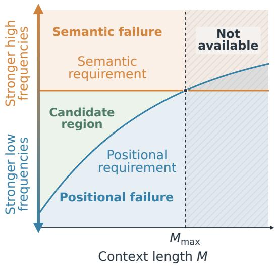  
(a) Semantic-positional tradeof

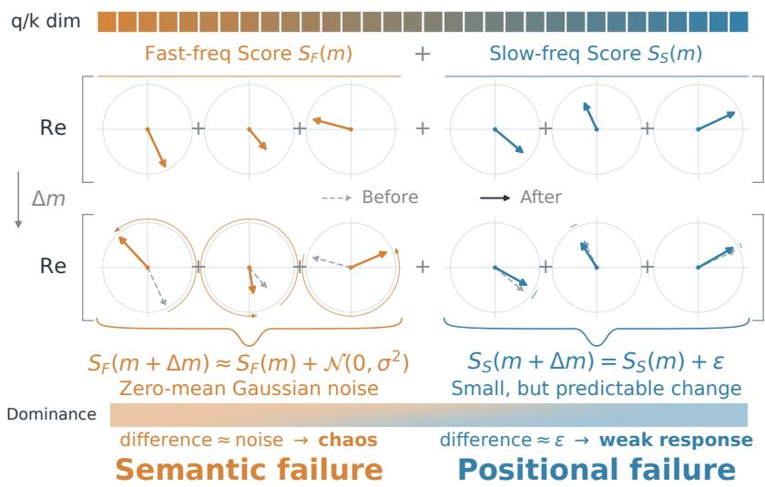  
(b) Rotary frequency dynamics  
Figure 1: The fundamental semantic-positional tradeof and rotary frequency dynamics. (a) The candidate region for semantic stability and adjacent positional sensitivity shrinks with context length. The orange and blue curves represent the semantic upper limit and positional lower limit on the high-frequency norm share. The green region contains candidate values satisfying both requirements; beyond $M _ { \mathrm { m a x } } ,$ , no such value remains within the calibrated family. (b) RoPE rotates coordinate pairs of query and key vectors by frequency-dependent angles across relative token distances. Rapidly rotating components, when aggregated across channels, form unpredictable Gaussian noise that destabilizes token preferences. Slowly rotating components remain predictable but produce marginal score changes that fail to resolve adjacent positions. Consequently, the dominance of diferent frequency bands triggers distinct failure modes. Precise formulations are given in §3.2 and Appendix A.5.

Our theory reveals constraints on mitigating both failures simultaneously. However, we also find that these constraints imply a principled basis for identifying which weakness to prioritize and how to address it for a given task. Building on our theoretical insights, we introduce RoPE Profiler, a lightweight diagnostic tool that seamlessly integrates into existing benchmarks (§4.1). RoPE Profiler reuses query and key activations cached during evaluation and incurs little additional computational overhead. RoPE Profiler turns the two theoretical failure criteria into practical diagnostics, supplementing standard benchmark scores with two metrics: the Semantic Score measures the stabilit of ke references across ositions while the Positional Score measures sensitivity across adjacent positions. Our theory provides a quantitative basis for two training free interventions: rescaling high-frequency components to adjust their relative strength and freezing their rotations to suppress position-induced fluctuations (Qiao et al., 2025; Barbero et al., 2025; Chen et al., 2025). Across 49 task configurations from nine benchmark sources (described in Appendix E), the evaluated models show broadly similar rankings of their relative semantic and positional weaknesses (§4.2). Guided by these diagnostic profiles, our training-free interventions yield best observed accuracy gains of up to 20 percentage points on Qwen3-8B and 25 percentage points on Llama-3.1-8B-Instruct, demonstrating that s ectral dia nosis rovides efective tar eted uidance for lon -context o timization (§4.2).

Although our theory aligns with Du et al. (2026)’s pessimistic assessment of RoPE’s intrinsic long-context limitations, our precise spectral characterization reveals concrete opportunities for targeted improvements in practice. Our findings demonstrate that substantial optimization space remains simply by adjusting frequency allocations across individual attention heads. We believe further progress lies in incorporating RoPE Profiler’s diagnostics into training and long-context adaptation. Beyond uniform frequency scaling, designing attention mechanisms that assign complementary roles to diferent heads can better balance content retrieval and positional reasoning (Shi et al., 2026; Wang et al., 2026; Xiong et al., 2025; Xiao et al., 2025; Tang et al., 2025; Wu et al., 2025a). In the longer term, fully overcoming these intrinsic constraints will require rethinking attention architectures and how positions are encoded in foundation models (Kimi Team, 2026; Press et al., 2022a; Kazemnejad et al., 2023; Yang et al., 2025b; Hua et al., 2025).

## 2. Two Failure Modes of RoPE: Semantic Reversal and Positional Insensitivity

A good positional embedding (PE) in transformers should achieve two objectives: 1) retain the attention’s ability to distinguish diferent tokens: for a given query, the attention mechanism distinguishes two keys by havin diferent scores, and PEs should not et in the wa of this feature; 2) distinguish diferent positions: varying the score for the same key across locations informs the model of token positions (Su et al., 2024; Vaswani et al., 2017; Shaw et al., 2018; Press et al., 2022b). Unmasked attention with position-independent inputs is permutation-equivariant (Lee et al., 2019), although causal language models can learn positional information without explicit positional encodings (Haviv et al., 2022). RoPE encodes relative distance by rotating query and key coordinate pairs, making their attention score position-dependent.

## 2.1. Background

RoPE as a Sum of Rotated Complex Numbers. Let � and � denote the query and key vectors from an attention head. Their scaled dot product forms the pre-softmax attention score, which converts into weights for combining value vectors. RoPE (Su et al., 2024) injects position information by rotating coordinate pairs of queries and keys. Let $p _ { q }$ and $p _ { k }$ represent the token positions, and let $m = p _ { q } - p _ { k }$ denote their relative distance. For a head with ℎ rotary coordinate pairs and base $B ,$ coordinate pair � rotates by angle $p \omega _ { n }$ at position $p ,$ where $\omega _ { n } = B ^ { - n / h }$ for $n = 0 , \ldots , h - 1$ . While the base frequency $\omega _ { n }$ decays smoothly with coordinate index $n ,$ individual components exhibit starkly disparate behaviors across long contexts.1

Following the complex-valued formulation of RoPE in Zhu et al. (2024), let $Q _ { n } = q _ { n , 1 } + i q _ { n , 2 }$ and $K _ { n } = k _ { n , 1 } + i k _ { n , 2 }$ denote the complex representations of each rotary pair, with $i ^ { 2 } = - 1$ . With attention scale $c _ { \mathrm { a t t } } ,$ the rotary attention score simplifies to

$$
S _ { q , k } ( m ) = \mathrm { R e } \sum _ { n = 0 } ^ { h - 1 } z _ { n } e ^ { i m \omega _ { n } } , \qquad z _ { n } = c _ { \mathrm { a t t } } Q _ { n } \overline { { K _ { n } } } ,\tag{1}
$$

where Re takes the real part and the overline denotes complex conjugation. Here, token content determines the static amplitude coeficients ${ \mathfrak { z } } _ { n } ,$ while relative distance � modulates the dynamic rotation phases $m \omega _ { n }$ We write $S ( m )$ when the query and key are clear from the context.

The Janus Face of RoPE: Sustaining Content and Localizing Tokens. By applying frequency-dependent rotations across relative distances, RoPE enables attention to produce distinct scores according to both token content vectors and spatial positions. Extensive prior studies seek to demonstrate how RoPE successfully realizes these two core functions. These eforts span early decoupled representation designs, approximate additive decompositions and frequency-wise functional division in learned RoPE representations, examina- tions of localit and s mmetr under role shuflin , and s mbolic-versus- ositional ermutations that robe expressive capacity (Kitaev & Klein, 2018; Ke et al., 2021; Chen et al., 2023a; Han & Ji, 2025; Barbero et al., 2025; Urrutia et al., 2026; Oka et al., 2026a,b; Chen & Yan, 2024; Gu et al., 2026; Hong et al., 2024; Jin et al., 2025). In essence, these investigations explain how RoPE succeeds. However, analyzing its functional capability provides only an incomplete picture. The more critical question is how this dual responsibility becomes unbalanced as the context scale continues to expand.

## 2.2. Formal Definitions of Semantic Reversal and Positional Insensitivity

RoPE gives attention a way to distinguish positions, but what is the cost? Examining this question through the lens of failure modes, Du et al. (2026) formalize four distinct vulnerabilities in RoPE-based attention. In this work, we focus on two core failure modes: semantic reversal and positional insensitivity. These two dimensions prove theoretically suficient to uncover the fundamental context limits of RoPE in §3, while remaining practically informative for our diagnostic tool design in $\ S 4$ . Furthermore, our theoretical framework naturally extends to the other failure modes analyzed in prior literature, which we detail in Appendix B. Real-world tasks do not necessarily sufer from both vulnerabilities equally, and in $\ S 4 . 2$ we illustrate how specific task families are governed by distinct failure modes. Below, we formalize the mathematical definitions of these two primary failure modes.

Semantic reversal (Diferent Tokens, Same Position). Motivated by Du et al. (2026), we examine the stability of attention preferences between distinct tokens across varying relative distances. Figure 2a illustrates an instance of semantic reversal. For a query and two keys, let $D ( m ) = S _ { + } ( m ) - S _ { - } ( m )$ denote their ordered score margin. Without loss of generality, we assume $D ( 0 ) > 0$ . A semantic reversal occurs at any relative distance where $D ( m ) < 0$ . To capture overall behavior without being biased by individual positions,

Which word is a country, France or chair? Query: country Key: France Key: chair  
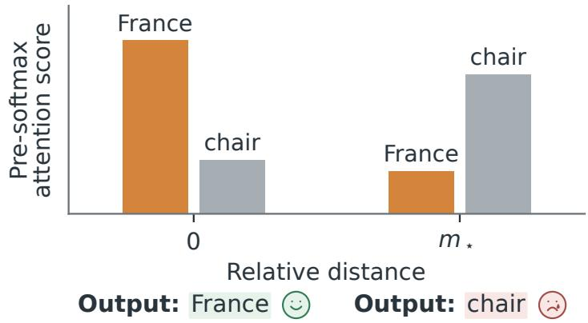  
(a) Semantic reversal  
(b) Positional insensitivity  
Figure 2: Illustrative task consequences of two RoPE failure modes. (a) For query country, the scores of keys France and chair reverse order between virtual relative distances 0 and $m _ { \star }$ . As attention directs information routing toward higher scores, this reversal favors the distractor chair over the semantically relevant France at relative distance $m _ { \star }$ and can contribute to an incorrect prediction. (b) For query A and key B, the vertical bracket marks a marginal normalized score gap between adjacent virtual relative distances, $g _ { z } ( m ) < \zeta$ . This leaves the model unable to distinguish between the two adjacent positions.

A … B, how far is A from B? Query: A Key: B Distance: m  
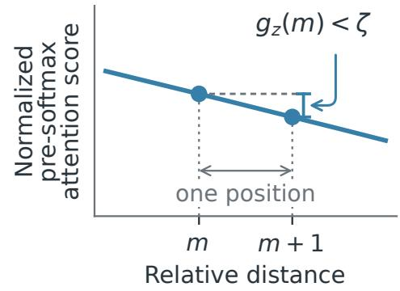

$$
m + 1
$$

we evaluate how frequently semantic reversals occur across the entire context window of length � as the semantic reversal probability:

$$
p _ { \mathrm { r e v } } ( D ; M ) : = \frac 1 M \sum _ { m = 0 } ^ { M - 1 } \mathbf { 1 } _ { \{ D ( m ) < 0 \} } = \mathbb { P } \lbrack D ( \mathbf { m } ) < 0 \rbrack , \qquad \mathbf { m } \sim \mathrm { U n i f } \{ 0 , \dots , M - 1 \} .\tag{2}
$$

The probability evaluates the stability of the model’s preference across the full sequence.

Positional insensitivity (Same Token, Diferent Positions). Motivated by Liu (2026); Sun et al. (2026), we evaluate how sensitively an attention score responds to one-token changes in relative distance while holding token representations fixed. For distant or semantically unrelated token pairs, resolving exact single-token ofsets carries little operational value; however, in retrieval tasks that demand precise relative order, as illustrated in Figure 2b, distinguishing adjacent positions becomes essential to resolve local sequence structure (Wu et al., 2025b; Wang et al., 2024a).

An intuitive metric is to measure the raw score change $\left| S ( m + 1 ) - S ( m ) \right|$ across adjacent locations. However, this raw diference scales with representation magnitude, leaving the raw gap vulnerable to arbitrary norm variations across heads (Qi et al., 2026; Jin et al., 2025). To isolate intrinsic positional sensitivity from overall vector magnitude, we normalize the local score diference by the pair’s coeficient norm $\begin{array} { r } { U ( z ) = \| z \| _ { 2 } = ( \sum _ { n } | z _ { n } | ^ { 2 } ) ^ { \bar { 1 / 2 } } } \end{array}$ . The resulting normalized adjacent response is

$$
g _ { z } ( m ) : = \frac { | S ( m + 1 ) - S ( m ) | } { U ( z ) } , \qquad U ( z ) > 0 , \quad 0 \leq m \leq M - 2 .\tag{3}
$$

For a chosen response threshold $\zeta > 0 ,$ , positional insensitivity occurs when $g _ { z } ( m ) < \zeta$ , quantifying the failure to preserve local positional resolution.

## 3. A Theory of Long-Context Failures: The Tradeof Between Semantic Stability and Positional Sensitivity

RoPE relies on a shared set of coordinate rotations to preserve content preferences and distinguish positions. In this section, we reveal a tradeof between semantic stability and positional sensitivity in RoPE, both governed by the norm share of high-frequency components. Over long context windows, an insuficient high-frequency contribution leaves attention blind to adjacent positions, whereas amplifying these fast oscillations triggers semantic reversal. Below, we formalize high-frequency score variation under a finite-window framework, and then derive a context-length limit where avoiding both failure modes becomes mathematically impossible.

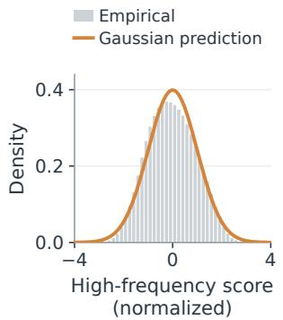  
(a) Qwen3-8B distribution

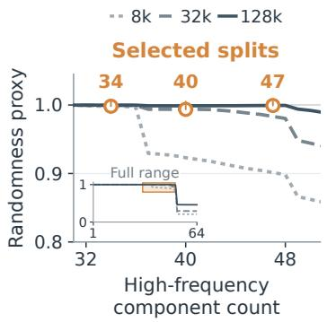  
(b) Qwen3-8B split selection

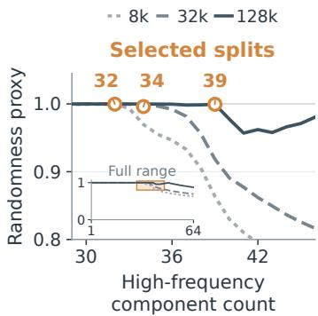  
(c) Llama-3.1-8B split selection

Figure 3: (a) Under our high-frequency split, the predicted score distribution closely matches the empirical distribution. (b,c) Defining the high-frequency band. The curves show how randomness changes as more components are included. Our theory-guided split selects the largest band satisfying the split criterion while retaining high randomness. The trends vary with context length, and larger � allows more high-frequency components, consistent with our theory. (See Appendix D.2.)

## 3.1. High-Frequency Norm Share and Score Variation

To analyze high-frequency fluctuations rigorously, we first specify an analytical moment tolerance $\varepsilon \in ( 0 , 1 / 2 )$ that governs the precision of finite-window moment control. Under the standard geometric grid $\omega _ { n } = \rho ^ { n }$ with $\rho = B ^ { - 1 / h }$ , demanding a tighter analytical tolerance requires a higher frequency cutof, yielding the certified high-frequency band

$$
H = \left\{ n \in \{ 0 , \ldots , h - 1 \} : M \omega _ { n } \geq { \frac { 2 C _ { \mathrm { F } } } { ( 1 - \rho ) \varepsilon } } \right\} ,\tag{4}
$$

where $C _ { \mathrm { F } } > 0$ denotes the universal Fourier-frame bound established in Appendix C.2. This �-dependent criterion guarantees that all coordinates in � complete suficient oscillations over window � to suppress cross-frequency interference.

Proposition 1 (Analytical moment guarantees under finite windows). For any tolerance $\varepsilon \in ( 0 , 1 / 2 )$ and certified window � where � is nonempty, the high-frequency attention score $\begin{array} { r } { S _ { H } ( m ) : = \Re \sum _ { n \in H } z _ { n } e ^ { i m \omega _ { n } } } \end{array}$ and its coeficient norm $\begin{array} { r } { U _ { H } ( z ) : = ( \sum _ { n \in H } | z _ { n } | ^ { 2 } ) ^ { 1 / 2 } } \end{array}$ over uniformly distributed relative distances $m \sim \operatorname { U n i f } \{ 0 , \dots , M - 1 \}$ satisfy

$$
\left| \mathbb { E } _ { m } \left[ S _ { H } ( m ) \right] \right| \leq \varepsilon U _ { H } ( z ) \qquad a n d \qquad \left| \mathrm { V a r } _ { m } ( S _ { H } ( m ) ) - \frac { 1 } { 2 } U _ { H } ( z ) ^ { 2 } \right| \leq \varepsilon U _ { H } ( z ) ^ { 2 } .\tag{5}
$$

Full proofs are deferred to $\ S \operatorname { A } . 3 .$ . Following the statistical behavior observed by Du et al. (2026), which is an application of the lacunary Central Limit Theorem (Salem & Zygmund, 1947; Aistleitner et al., 2024), sums of rapidly oscillating components across relative distances behave as zero-mean Gaussian fluctuations, yielding the operational score approximation $S _ { H } ( m ) \approx N ( 0 , U _ { H } ( z ) ^ { 2 } / 2 )$

Error-Bounded Spectral Partitioning. Proposition 1 links the frequency cutof � directly to the analytical error tolerance �, establishing precise control over finite-window moments. Demanding tighter precision forces slower components out of �, raising the frequency cutof accordingly. While prior analyses assume specific query and key distributions or amplitude regularity to derive bounds (Xu et al., 2024; Barbero et al., 2025; Du et al., 2026), our finite-window moment bounds hold for arbitrary fixed activations extracted from trained models, accommodating general phases and non-uniform coeficient magnitudes. Figure 3 illustrates the empirical behavior of our theoretically predicted partitioning across 8k, 32k, and 128k relative-distance windows.

The Governing Norm Share $r _ { H }$ For context length �, we quantify the proportion of energy concentrated in fast oscillations through the high-frequency norm share

$$
r _ { H } ( z ; M ) : = \frac { U _ { H } ( z ) } { U ( z ) } \in [ 0 , 1 ] , \qquad \mathrm { w h e r e } U ( z ) : = \| z \| _ { 2 } = \left( \sum _ { n = 0 } ^ { h - 1 } | z _ { n } | ^ { 2 } \right) ^ { 1 / 2 } .\tag{6}
$$

The parameter $r _ { H } ( z ; M )$ serves as the central mathematical pivot connecting spectral allocations to downstream failure modes. Specifically, the two failure modes defined in §2.2 constrain this energy share in opposing directions. For an ordered score margin, the calibrated lower bound on semantic reversal probability is non-decreasing in $r _ { H }$ (Appendix A.5), while retaining adjacent positional sensitivity for the same margin imposes a context-dependent lower bound on $r _ { H }$ (Appendix A.4.1). This dual constraint establishes the foundation for the fundamental tradeof derived in §3.2.

## 3.2. The Semantic and Positional Tradeof Limits Context Length

Distinguishing adjacent positions requires attention scores to vary, while preserving token preferences demands that their relative ordering remains stable. High-frequency components govern both requirements. Suppressing these oscillations stabilizes token orderings at the expense of adjacent positional sensitivity. As the context window expands, slower frequencies enter the high-frequency band, leaving fewer static components to sustain local diferences. Maintaining a target positional gap imposes a context-dependent lower bound on the high-frequency norm share, yielding a non-decreasing lower bound on reversal probability under the calibration conditions below.

Theorem 1 (Context-length limit on joint reliability (informal)). For afixed ordered score margin and reversal and adjacent-response tolerances � and � satisfying the conditions in Appendix A.5, there exists a context-length bound $M _ { \mathrm { m a x } }$ such that, for every calibrated window,

$$
M > M _ { \mathrm { m a x } } \implies p _ { \mathrm { r e v } } ( M ) > \delta \quad o r \quad \operatorname* { m a x } _ { 0 \leq m \leq M - 2 } g ( m ) < \zeta ,\tag{7}
$$

where $p _ { \mathrm { r e v } } ( M )$ and $g ( m )$ denote the reversal probability and normalized adjacent response of the same margin over relative distance �. Beyond $M _ { \mathrm { m a x } } ,$ this margin cannot satisfy both requirements within the calibrated family.

Appendix A.5 gives the precise calibrated-window conditions, the construction of $M _ { \mathrm { m a x . } }$ , and the formal version of Theorem 1. The construction balances the high-frequency share required for local sensitivity against the reversal probability it induces.

A RoPE-of-War between Content and Position (Diagnose What the Task Needs First). While existing literature identifies conceptual tensions in rotary attention regarding content selectivity and positional track ing (Barbero et al., 2025; Du et al., 2026; Urrutia et al., 2026), we formalize a quantitative tradeof showing that semantic stability and positional sensitivity are mutually constrained under rotary representations. Theorem 1 gives a conditional bound on joint score-level reliability, determined by the frequency grid, the two reliability tolerances, and the calibration error. Within this setting, shifting spectral weight changes the balance between two requirements. The analysis suggests weakening high-frequency contributions to stabilize key preferences and strengthening them to distinguish adjacent positions, depending on the task. §4 operationalizes this principle by introducing RoPE Profiler to evaluate these competing vulnerabilities and guide targeted interventions.

## 4. Diagnosis and Targeted Mitigation of Long-Context Failures with RoPE Profiler

Building on our theoretical criteria, we introduce RoPE Profiler to turn spectral failure analysis into actionable diagnostics and targeted model adjustments. Moving beyond prior diagnostic frameworks that primarily identify internal vulnerabilities (Appendix I.4), our tool establishes a bridge between spectral state profiling and targeted training-free mitigation. Figure 4 outlines the five-stage pipeline. In §4.1, we formalize how cached activations yield the Semantic Score and Positional Score, evaluate relative failure susceptibility across benchmark settings, and derive theory-motivated interventions. In §4.2, we evaluate these diagnostic profiles and targeted modulations across diverse tasks and models, demonstrating substantial accuracy gains across a comprehensive long-context suite.

## 4.1. From Spectral Theory to Practical Profiling and Interventions

During the standard inference pass of benchmark evaluation, RoPE Profiler samples query and key tokens to cache their internal activations $q , k$ across target attention heads (selection details and heatmaps in Appendix F) (Figure 4, Steps 1 and 2). Holding these content vectors fixed, we evaluate virtual attention scores by sweeping RoPE relative distances across the context window, incurring zero additional model inference passes.

Theoretical Scores from Cached States (Figure 4, Step 3). Our theoretical criteria translate directly into two continuous metrics. For local positional sensitivity, we evaluate query–key pairs $( q , k )$ by averaging the normalized adjacent response $g _ { q , k } ( m ) = | S ( m + 1 ) - S ( m ) | / U ( z )$ across relative distances $m ,$ defining the Positional Score as ${ \bar { g } } .$ . For semantic stability, we construct triplets $( q , k _ { 1 } , k _ { 2 } )$ with distinct keys and compute the finite-window probability $P _ { \mathrm { r e v } }$ that position shifts invert their reference ranking at distance zero, using our moment bounds and Gaussian approximation. The Semantic Score is defined as $1 - \bar { P } _ { \mathrm { r e v } }$ to ensure that hi her values are better for both metrics.

Relative Failure Susceptibility via Normalized Ranks (Figure 4, Step 4). Directly comparing raw scores across diferent tasks or failure modes is inefective because absolute score magnitudes lack a shared scale, and meanwhile semantic and positional metrics operate on distinct numerical ranges. Therefore, we rank all evaluated tasks separately by each metric, yielding semantic rank �� and positional rank ��. We use the relative semantic failure susceptibility $w _ { S } \in [ 0 , 1 ]$ to show the normalized rank gap: a larger �� indicates greater susceptibility to semantic reversal relative to positional insensitivity within the reference set.

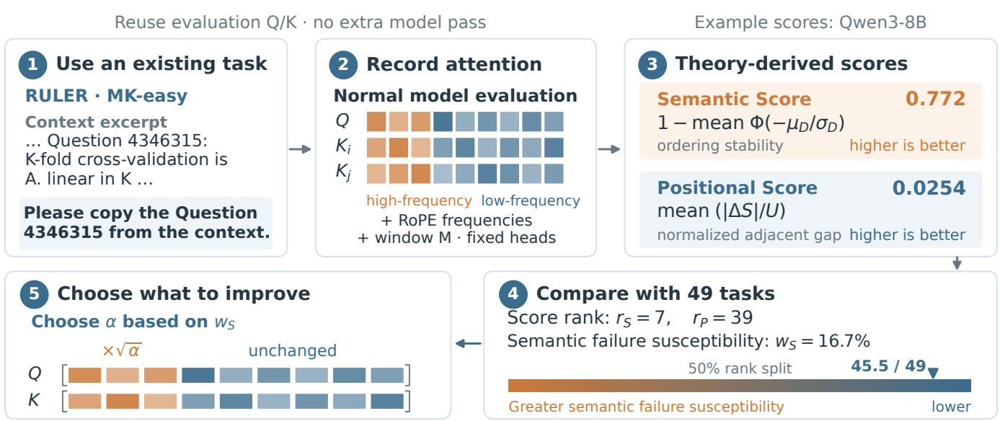  
Figure 4: Augmenting accuracy-based evaluation with failure diagnostics. For a given model and the 49 reference task configurations (described in §E), we use query and key activations from standard evaluation to compute relative semantic failure susceptibility $\boldsymbol { w _ { S } }$ . A higher $\boldsymbol { w _ { S } }$ suggests greater susceptibility to semantic reversal relative to positional insensitivity within the reference set.

Theory-Motivated Interventions (Figure 4, Step 5). The spectral tradeof driven by the high-frequency norm share motivates a training-free intervention approach with two opposing directions on task-sensitive heads. Guided by task diagnostic profiles, we assign the upper half of �� rankings to the semantic direction, attenuating high frequencies or freezing their rotations to suppress position-induced fluctuations (Barbero et al., 2025; Chen et al., 2025). The remaining settings follow the positional direction, using � > 1 to amplify adjacent score resolution (Qiao et al., 2025; Chiang & Yogatama, 2025; Mikaeili et al., 2026). While � determines the intervention direction, the specific scaling scalar � is selected from candidate values. This strategy departs from conventional frequency manipulations (Hua et al., 2025; Xiong et al., 2025; Li et al., 2026; An et al., 2025) by dynamically assigning the intervention direction per task from its diagnostic profile and restricting modifications strictly to task-sensitive heads. We report the best observed outcome for each setting, while Appendix H documents complete sweeps across all candidate configurations.

## 4.2. Empirical Validation Across Diverse Long-Context Tasks

Targeted Intervention Gains Reveal Untapped Potential. Guided by diagnostic susceptibility profiles, our targeted training-free interventions achieve performance gains across a majority of evaluated tasks (63.3% of Qwen configurations and 65.3% of Llama configurations). As illustrated in Figure 5, accuracy gains can reach 20% on Qwen3-8B and 25% on Llama-3.1-8B-Instruct, showing the practical value of adjusting the spectral contributions identified by our theory.

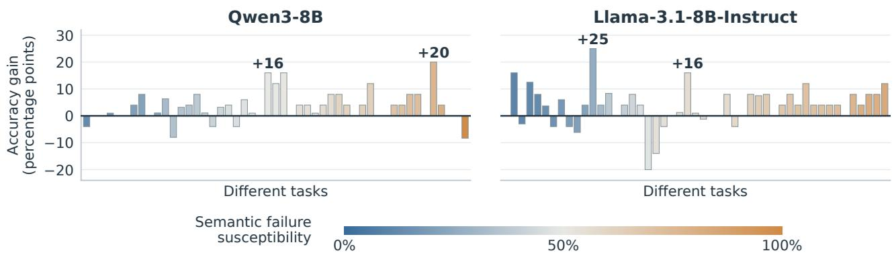  
Figure 5: Accuracy gains from our exploratory intervention search. Bars show the best observed intervention in each setting’s assigned semantic or positional direction minus the original baseline on identical examples within each setting. The baseline is excluded from the candidate maximum. Each model’s 49 task/configuration settings (described in Appendix E) are ordered from left to right by increasing semantic failure susceptibility, from blue to orange.

RoPE Profiler Reveals Intrinsic Task Properties. Be-yond intervention gains, Figure 6 compares semantic fail- ure susceptibility across the 49 shared settings to inspect how failure patterns relate to underlying task structures. Across the the majority of tasks, the two models exhibit consistent susceptibility rankings with a Spearman cor- relation of $\rho = 0 . 6 5 8$ , demonstrating that the diagnostic captures intrinsic task properties.

Specifically, reasoning tasks cluster in the upper half where semantic reversal dominates, while multi-key retrieval tasks occupy the lower half governed by positional insensitivity. In contrast, adjacent-element retrieval tasks deviates sharply between models, ranking in the top three for Qwen but between ranks 34 and 38 for Llama, underscoring that hybrid tasks coupling semantic matching with local order also reflect model-specific representation choices. These patterns align with previous observations on diferent task settings (Goldman et al., 2024; Vodrahalli et al., 2024; Kuratov et al., 2024; Modarressi et al., 2025; Hsieh et al., 2024a).

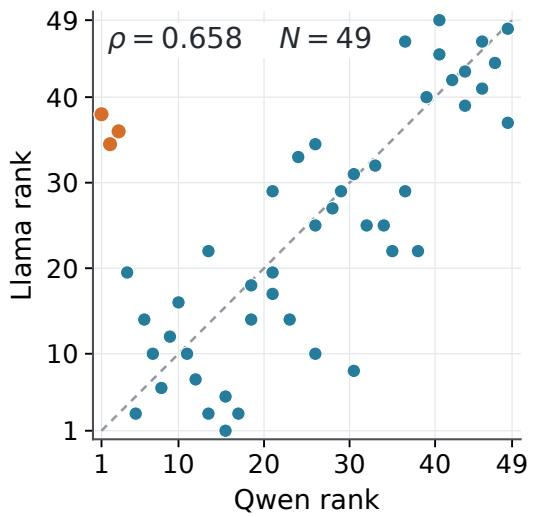  
Figure 6: Semantic failure susceptibility across tasks. Points compare ranks of semantic failure susceptibility $\boldsymbol { w _ { S } }$ in Qwen3-8B and Llama-3.1-8B-Instruct for the 49 task/configuration settings described in Appendix E. Most tasks show similar patterns across models, while three adjacent-element retrieval tasks difer.

## 5. Related Work

RoPE and context extension RoPE (Su et al., 2024) is widely used in open LLMs (Dubey et al., 2024; Yang et al., 2025a; Liu et al., 2026). Existing extension methods involve frequency rescaling, including NTK-aware scaling (bloc97, 2023), PI (Chen et al., 2023b), ABF (Xiong et al., 2024), YaRN (Peng et al., 2024), LongRoPE (Ding et al., 2024), and Resonance RoPE (Wang et al., 2024b). Others manipulate frequency components (Barbero et al., 2025; Hua et al., 2025; Chen et al., 2025; Li et al., 2026; Xiong et al., 2025), adjust scaling per head (Wang et al., 2026), or reindex positions (An et al., 2025; Zhang et al., 2024). These methods are task-agnostic, while we diagnose task-specific failures before deciding the intervention direction.

Theory of RoPE frequencies Existing RoPE theories derive base-dependent context bounds (Xu et al., 2024; Liu et al., 2024b; Liu, 2026) and roles of low-frequency dimensions (Hong et al., 2024; Jin et al., 2025). Prior works observe a tension between semantic and positional resolution (Barbero et al., 2025; Du et al., 2026; Urrutia et al., 2026). These analyses assume specific distribution properties of vector space or amplitude regularity, whereas our bounds hold for real-world activations without additional assumptions.

Internal diagnostics and specialized heads Retrieval heads (Wu et al., 2025a), attention sinks (Xiao et al., 2024), position-wise features (Dong et al., 2024), positional attention bias (Hsieh et al., 2024b), and other internal signals (Tan et al., 2026) explain long-context behavior inside the model. Our RoPE Profiler also utilizes the cached activations but both identify theoretic vulnerabilities and diagnose with task-specific failure susceptibility. For further discussion, see Appendix I.

## 6. Conclusion

In this paper, we have studied long-context failures of RoPE through the tradeof between semantic stability and positional sensitivity. High-frequency components support fine positional distinctions while introducing fluctuations that can destabilize token preferences. Our finite-window analysis accommodates unequal coeficient magnitudes across frequencies and, under the stated calibration conditions, yields a context length bound on jointly avoiding semantic reversal and positional insensitivity. Building on these insights, we introduced RoPE Profiler to measure both vulnerabilities from cached activations and uide tar eted frequency interventions. Across the evaluated Qwen and Llama settings, we observed broadly consistent patterns of failure susceptibility, and our exploratory intervention search identified accuracy gains on a majority of settings without retraining. Together, these findings highlight the value of adapting frequency contributions to the needs of each task. We hope this work informs the design of long-context models that preserve relevant token preferences while resolving the positional distinctions a task requires.

## Acknowledgments

We thank members of the Alta group at the University of Illinois Urbana-Champaign for their helpful feedback. This work was supported in part by an Amazon AICE award, NSF Grant No. CHE2505932, and a Capital One ASKS award.

## AI Use Statement

We used AI tools to aid or polish writing, adjust manuscript length and layout, create figures, organize the appendices, and search for related literature. We reviewed all generated sentences and figures, and checked against original sources for the validity of related literature. We take responsibility for the final content of this work.

## References

Christoph Aistleitner, István Berkes, and Robert Tichy. Lacunary sequences in analysis, probability and number theory. In Dijana Kreso, Joël Rivat, and Robert F. Tichy (eds.), Diophantine Problems: Determinism, Randomness and Applications, volume 62 of Panoramas et Synthèses, pp. 1–60. Société Mathématique de France, Paris, France, 2024. URL https://smf.emath.fr/publications/problemes-diophanti ens-determinisme-alea-et-applications.

Chenxin An, Shansan Gong, Ming Zhong, Xingjian Zhao, Mukai Li, Jun Zhang, Lingpeng Kong, and Xipeng Qiu. L-Eval: Instituting standardized evaluation for long context language models. In Lun-Wei Ku, Andre Martins, and Vivek Srikumar (eds.), Proceedings of the 62nd Annual Meeting of the Association for Computational Linguistics (Volume 1: Long Papers), pp. 14388–14411, Bangkok, Thailand, August 2024. Association for Computational Linguistics. doi: 10.18653/v1/2024.acl-long.776. URL https: //aclanthology.org/2024.acl-long.776/.

Chenxin An, Jun Zhang, Ming Zhong, Lei Li, Shansan Gong, Yao Luo, Jingjing Xu, and Lingpeng Kong. Why does the efective context length of LLMs fall short? In Y. Yue, A. Garg, N. Peng, F. Sha, and R. Yu (eds.), International Conference on Learning Representations, volume 2025, pp. 54791–54810, 2025. URL https://proceedings.iclr.cc/paper\_files/paper/2025/file/884baf65392170763b27c9 14087bde01-Paper-Conference.pdf.

Yushi Bai, Xin Lv, Jiajie Zhang, Hongchang Lyu, Jiankai Tang, Zhidian Huang, Zhengxiao Du, Xiao Liu, Aohan Zeng, Lei Hou, Yuxiao Dong, Jie Tang, and Juanzi Li. LongBench: A bilingual, multitask benchmark for long context understanding. In Lun-Wei Ku, Andre Martins, and Vivek Srikumar (eds.), Proceedings of the 62nd Annual Meeting of the Association for Computational Linguistics (Volume 1: Long Papers), pp. 3119–3137, Bangkok, Thailand, August 2024. Association for Computational Linguistics. doi: 10.18653/v 1/2024.acl-long.172. URL https://aclanthology.org/2024.acl-long.172/.

Rachit Bansal, Aston Zhang, Rishabh Tiwari, Lovish Madaan, Venkata Sai Surya Subramanyam Duvvuri, Devvrit Khatri, David Brandfonbrener, David Alvarez-Melis, Prajjwal Bhargava, Mihir Kale, and Samy Jelassi. Let’s (not) just put things in context: Test-time training for long-context LLMs. In C. Vondrick, B. Hariharan, C. Rafel, L. Pinto, D. Yang, and A. Faust (eds.), International Conference on Learning Representations, volume 2026, pp. 112130–112153, 2026. URL https://proceedings.iclr.cc/paper\_files/pa per/2026/file/b619cd6dcc986856b8a8da2b08d89396-Paper-Conference.pdf.

Federico Barbero, Alex Vitvitskyi, Christos Perivolaropoulos, Razvan Pascanu, and Petar Veličković. Round and round we go! What makes rotary positional encodings useful? In Y. Yue, A. Garg, N. Peng, F. Sha, and R. Yu (eds.), International Conference on Learning Representations, volume 2025, pp. 92408–92438, 2025. URL https://proceedings.iclr.cc/paper\_files/paper/2025/file/e6d58fc68c0f3c36ae 6e0e64478a69c0-Paper-Conference.pdf.

bloc97. NTK-aware scaled RoPE allows LLaMA models to have extended (8k+) context size without any fine-tuning and minimal perplexity degradation. Reddit post, r/LocalLLaMA, 2023. URL https: //www.reddit.com/r/LocalLLaMA/comments/14lz7j5/ntkaware\_scaled\_rope\_allows\_lla ma\_models\_to\_have/.

Lihu Chen, Gaël Varoquaux, and Fabian M. Suchanek. The locality and symmetry of positional encodings. In Houda Bouamor, Juan Pino, and Kalika Bali (eds.), Findings of the Associationfor Computational Linguistics: EMNLP 2023, pp. 14313–14331, Singapore, December 2023a. Association for Computational Linguistics.

doi: 10.18653/v1/2023.findings-emnlp.955. URL https://aclanthology.org/2023.findings-e mnlp.955/.

Shi Chen, Zhengjiang Lin, Yury Polyanskiy, and Philippe Rigollet. Critical attention scaling in long-context transformers. In C. Vondrick, B. Hariharan, C. Rafel, L. Pinto, D. Yang, and A. Faust (eds.), International Conference on Learning Representations, volume 2026, pp. 86454–86478, 2026. URL https://proceedi ngs.iclr.cc/paper\_files/paper/2026/file/8b08bbf8b420faa6eeb4020720582ec7-Paper -Conference.pdf.

Shouyuan Chen, Sherman Wong, Liangjian Chen, and Yuandong Tian. Extending context window of large language models via positional interpolation. arXiv preprint arXiv:2306.15595, 2023b. URL https://arxiv.org/abs/2306.15595.

Yiting Chen and Junchi Yan. What rotary position embedding can tell us: Identifying query and key weights corresponding to basic syntactic or high-level semantic information. In Advances in Neural Information Processing Systems, volume 37, pp. 54507–54528. Curran Associates, Inc., 2024. doi: 10.52202/079017-1 727. URL https://proceedings.neurips.cc/paper\_files/paper/2024/file/61f425da6e0 a201b8fe1454601abfba5-Paper-Conference.pdf.

Yuhan Chen, Ang Lv, Jian Luan, Bin Wang, and Wei Liu. HoPE: A novel positional encoding without long-term decay for enhanced context awareness and extrapolation. In Wanxiang Che, Joyce Nabende, Ekaterina Shutova, and Mohammad Taher Pilehvar (eds.), Proceedings of the 63rd Annual Meeting of the Association for Computational Linguistics (Volume 1: Long Papers), pp. 23044–23056, Vienna, Austria, July 2025. Association for Computational Linguistics. ISBN 979-8-89176-251-0. doi: 10.18653/v1/2025.acl-long.11 23. URL https://aclanthology.org/2025.acl-long.1123/.

Ting-Rui Chiang and Dani Yogatama. The rotary position embedding may cause dimension ineficiency in attention heads for long-distance retrieval. In Wanxiang Che, Joyce Nabende, Ekaterina Shutova, and Mohammad Taher Pilehvar (eds.), Findings of the Association for Computational Linguistics: ACL 2025, pp. 13552–13562, Vienna, Austria, July 2025. Association for Computational Linguistics. doi: 10.18653/v1/ 2025.findings-acl.697. URL https://aclanthology.org/2025.findings-acl.697/.

Yiran Ding, Li Lyna Zhang, Chengruidong Zhang, Yuanyuan Xu, Ning Shang, Jiahang Xu, Fan Yang, and Mao Yang. LongRoPE: Extending LLM context window beyond 2 million tokens. In Proceedings of the 41st International Conference on Machine Learning, volume 235 of Proceedings of Machine Learning Research, pp. 11091–11104. PMLR, 2024. URL https://proceedings.mlr.press/v235/ding24i.html.

Zican Dong, Junyi Li, Xin Men, Wayne Xin Zhao, Bingning Wang, Zhen Tian, Weipeng Chen, and Ji-Rong Wen. Exploring context window of large language models via decomposed positional vectors. In A. Globerson, L. Mackey, D. Belgrave, A. Fan, U. Paquet, J. Tomczak, and C. Zhang (eds.), Advances in Neural Information Processing Systems, volume 37, pp. 10320–10347. Curran Associates, Inc., 2024. doi: 10.52202/079017-0330. URL https://proceedings.neurips.cc/paper\_files/paper/2024/ file/1403ab1a427050538ec59c7f570aec8b-Paper-Conference.pdf.

Yufeng Du, Minyang Tian, Srikanth Ronanki, Subendhu Rongali, Sravan Bodapati, Aram Galstyan, Azton Wells, Roy Schwartz, Eliu A Huerta, and Hao Peng. Context length alone hurts llm performance despite perfect retrieval, 2025. URL https://arxiv.org/abs/2510.05381.

Yufeng Du, Phillip Harris, Minyang Tian, Eliu A Huerta, Srikanth Ronanki, Subendhu Rongali, Aram Galstyan, and Hao Peng. RoPE distinguishes neither positions nor tokens in long contexts, provably. arXiv preprint arXiv:2605.15514, 2026. URL https://arxiv.org/abs/2605.15514.

Abhimanyu Dubey, Abhinav Jauhri, Abhinav Pandey, Abhishek Kadian, Ahmad Al-Dahle, Aiesha Letman, Akhil Mathur, Alan Schelten, Amy Yang, Angela Fan, et al. The Llama 3 herd of models. arXiv preprint arXiv:2407.21783, 2024. URL https://arxiv.org/abs/2407.21783v1.

Gemma Team. Gemma 3 technical report. arXiv preprint arXiv:2503.19786, 2025. URL https://arxiv. org/abs/2503.19786.

Omer Goldman, Alon Jacovi, Aviv Slobodkin, Aviya Maimon, Ido Dagan, and Reut Tsarfaty. Is it really long context if all you need is retrieval? towards genuinely dificult long context NLP. In Proceedings of the 2024 Conference on Empirical Methods in Natural Language Processing, pp. 16576–16586, Miami, Florida, USA, 2024. Association for Computational Linguistics.

Zihan Gu, Ruoyu Chen, Han Zhang, Hua Zhang, and Yue Hu. Deconstructing positional information: From attention logits to training biases. In International Conference on Learning Representations, 2026. URL https://openreview.net/forum?id=D0u0glT060.

Chi Han and Heng Ji. Computation mechanism behind LLM position generalization. In Wanxiang Che, Joyce Nabende, Ekaterina Shutova, and Mohammad Taher Pilehvar (eds.), Proceedings of the 63rd Annual Meeting of the Association for Computational Linguistics (Volume 1: Long Papers), pp. 19408–19424, Vienna, Austria, July 2025. Association for Computational Linguistics. ISBN 979-8-89176-251-0. doi: 10.18653/v1/2025.acl-long.953. URL https://aclanthology.org/2025.acl-long.953/.

Adi Haviv, Ori Ram, Ofir Press, Peter Izsak, and Omer Levy. Transformer language models without positional encodings still learn positional information. In Yoav Goldberg, Zornitsa Kozareva, and Yue Zhang (eds.), Findings of the Association for Computational Linguistics: EMNLP 2022, pp. 1382–1390, Abu Dhabi, United Arab Emirates, December 2022. Association for Computational Linguistics. doi: 10.18653/v1/2022.findi ngs-emnlp.99. URL https://aclanthology.org/2022.findings-emnlp.99/.

Xiangyu Hong, Che Jiang, Biqing Qi, Fandong Meng, Mo Yu, Bowen Zhou, and Jie Zhou. On the token distance modeling ability of higher RoPE attention dimension. In Findings of the Association for Computational Linguistics: EMNLP 2024, pp. 5877–5888, Miami, Florida, USA, 2024. Association for Computational Linguistics. doi: 10.18653/v1/2024.findings-emnlp.338. URL https://aclanthology.org/2024. findings-emnlp.338/.

Cheng-Ping Hsieh, Simeng Sun, Samuel Kriman, Shantanu Acharya, Dima Rekesh, Fei Jia, Yang Zhang, and Boris Ginsburg. RULER: What’s the real context size of your long-context language models? In Conference on Language Modeling, 2024a. URL https://openreview.net/forum?id=kIoBbc76Sy.

Cheng-Yu Hsieh, Yung-Sung Chuang, Chun-Liang Li, Zifeng Wang, Long T. Le, Abhishek Kumar, James Glass, Alexander Ratner, Chen-Yu Lee, Ranjay Krishna, and Tomas Pfister. Found in the middle: Calibrating positional attention bias improves long context utilization. In Lun-Wei Ku, Andre Martins, and Vivek Srikumar (eds.), Findings of the Associationfor Computational Linguistics: ACL 2024, pp. 14982–14995, Bangkok, Thailand, August 2024b. Association for Computational Linguistics. doi: 10.18653/v1/2024.fin dings-acl.890. URL https://aclanthology.org/2024.findings-acl.890/.

Ermo Hua, Che Jiang, Xingtai Lv, Kaiyan Zhang, Youbang Sun, Yuchen Fan, Xuekai Zhu, Biqing Qi, Ning Ding, and Bowen Zhou. Fourier position embedding: Enhancing attention’s periodic extension for length generalization. In Proceedings of the 42nd International Conference on Machine Learning, volume 267 of Proceedings of Machine Learning Research, pp. 24932–24949. PMLR, 2025.

Selim Jerad, Anej Svete, Jiaoda Li, and Ryan Cotterell. Disentangling the expressivity of RoPE. In Conference on Language Modeling, 2026. URL https://arxiv.org/abs/2608.11909.

Mingyu Jin, Kai Mei, Wujiang Xu, Mingjie Sun, Ruixiang Tang, Mengnan Du, Zirui Liu, and Yongfeng Zhang. Massive values in self-attention modules are the key to contextual knowledge understanding. In Proceedings of the 42nd International Conference on Machine Learning, volume 267 of Proceedings of Machine Learning Research, pp. 28063–28096. PMLR, 2025.

Amirhossein Kazemnejad, Inkit Padhi, Karthike an Natesan Ramamurth , Pa el Das, and Siva Redd . The impact of positional encoding on length generalization in transformers. In Advances in Neural Information Processing Systems, 2023.

Guolin Ke, Di He, and Tie-Yan Liu. Rethinking positional encoding in language pre-training. In International Conference on Learning Representations, 2021. URL https://openreview.net/forum?id=09-528y2 Fgf.

Kimi Team. Kimi K3: Open frontier intelligence. arXiv preprint arXiv:2607.24653, 2026. URL https: //arxiv.org/abs/2607.24653.

Nikita Kitaev and Dan Klein. Constituency parsing with a self-attentive encoder. In Iryna Gurevych and Yusuke Miyao (eds.), Proceedings of the 56th Annual Meeting of the Associationfor Computational Linguistics (Volume 1: Long Papers), pp. 2676–2686, Melbourne, Australia, July 2018. Association for Computational Linguistics. doi: 10.18653/v1/P18-1249. URL https://aclanthology.org/P18-1249/.

Yuri Kuratov, Aydar Bulatov, Petr Anokhin, Ivan Rodkin, Dmitry Sorokin, Artyom Sorokin, and Mikhail Burtsev. BABILong: Testing the limits of LLMs with long context reasoning-in-a-haystack. In A. Globerson, L. Mackey, D. Belgrave, A. Fan, U. Paquet, J. Tomczak, and C. Zhang (eds.), Advances in Neural Information Processing Systems, volume 37, pp. 106519–106554. Curran Associates, Inc., 2024. doi: 10.52202/079017-3381. URL https://proceedings.neurips.cc/paper\_files/paper/2024/file/c0d62e70dbc659c c9bd44cbcf1cb652f-Paper-Datasets\_and\_Benchmarks\_Track.pdf.

Juho Lee, Yoonho Lee, Jungtaek Kim, Adam R. Kosiorek, Seungjin Choi, and Yee Whye Teh. Set Transformer: A framework for attention-based permutation-invariant neural networks. In Proceedings of the 36th International Conference on Machine Learning, volume 97 of Proceedings of Machine Learning Research, pp. 3744–3753. PMLR, 2019. URL https://proceedings.mlr.press/v97/lee19d.html.

Mosh Levy, Alon Jacoby, and Yoav Goldberg. Same task, more tokens: the impact of input length on the reasoning performance of large language models. In Lun-Wei Ku, Andre Martins, and Vivek Srikumar (eds.), Proceedings of the 62nd Annual Meeting of the Association for Computational Linguistics (Volume 1: Long Papers), pp. 15339–15353, Bangkok, Thailand, August 2024. Association for Computational Linguistics. doi: 10.18653/v1/2024.acl-long.818. URL https://aclanthology.org/2024.acl-long.818/.

Haoran Li, Sucheng Ren, Alan Yuille, and Feng Wang. CoPE: Clipped RoPE as a scalable free lunch for long context LLMs. arXiv preprint arXiv:2602.05258, 2026. URL https://arxiv.org/abs/2602.05258.

Zhan Ling, Kang Liu, Kai Yan, Yifan Yang, Weijian Lin, Ting-Han Fan, Lingfeng Shen, Zhengyin Du, and Jiecao Chen. LongReason: A synthetic long-context reasoning benchmark via context expansion. arXiv preprint arXiv:2501.15089, 2025. URL https://arxiv.org/abs/2501.15089.

Alexander H. Liu, Kartik Khandelwal, Sandeep Subramanian, Victor Jouault, Abhinav Rastogi, Adrien Sadé, Alan Jefares, Albert Jiang, Alexandre Cahill, Alexandre Gavaudan, Alexandre Sablayrolles, Amélie Héliou,

Amos You, Andy Ehrenberg, Andy Lo, Anton Eliseev, Antonia Calvi, Avinash Sooriyarachchi, Baptiste Bout, Baptiste Rozière, Baudouin De Monicault, Clémence Lanfranchi, Corentin Barreau, Cyprien Courtot, Daniele Grattarola, Darius Dabert, Diego de las Casas, Elliot Chane-Sane, Faruk Ahmed, Gabrielle Berrada, Gaëtan Ecrepont, Gauthier Guinet, Georgii Novikov, Guillaume Kunsch, Guillaume Lample, Guillaume Martin Gunshi Gu ta Jan Ludziejewski Jason Rute Joachim Studnia Jonas Amar José hine Delas Josselin Somerville Roberts, Karmesh Yadav, Khyathi Chandu, Kush Jain, Laurence Aitchison, Laurent Fainsin, Léonard Blier, Lingxiao Zhao, Louis Martin, Lucile Saulnier, Luyu Gao, Maarten Buyl, Margaret Jennings, Marie Pellat, Mark Prins, Mathieu Poirée, Mathilde Guillaumin, Matthieu Dinot, Matthieu Futeral, Maxime Darrin, Maximilian Augustin, Mia Chiquier, Michel Schimpf, Nathan Grinsztajn, Neha Gupta, Nikhil Raghuraman, Olivier Bousquet, Olivier Duchenne, Patricia Wang, Patrick von Platen, Paul Jacob, Paul Wambergue, Paula Kurylowicz, Pavankumar Reddy Muddireddy, Philomène Chagniot, Pierre Stock, Pravesh Agrawal, Quentin Torroba, Romain Sauvestre, Roman Soletskyi, Rupert Menneer, Sagar Vaze, Samuel Barry, Sanchit Gandhi, Siddhant Waghjale, Siddharth Gandhi, Soham Ghosh, Srijan Mishra, Sumukh Aithal, Szymon Antoniak, Teven Le Scao, Théo Cachet, Theo Simon Sorg, Thibaut Lavril, Thiziri Nait Saada, Thomas Chabal, Thomas Foubert, Thomas Robert, Thomas Wang, Tim Lawson, Tom Bewley, Tom Edwards, Umar Jamil, Umberto Tomasini, Valeriia Nemychnikova, Van Phung, Vincent Maladière, Virgile Richard, Wassim Bouaziz, Wen-Ding Li, William Marshall, Xinghui Li, Xinyu Yang, Yassine El Ouahidi, Yihan Wang, Yunhao Tang, and Zaccharie Ramzi. Ministral 3. arXiv preprint arXiv:2601.08584, 2026. URL https://arxiv.org/abs/2601.08584.

Feilong Liu. Rotary positional embeddings as phase modulation: Theoretical bounds on the RoPE base for long-context transformers. arXiv preprint arXiv:2602.10959, 2026. URL https://arxiv.org/abs/26 02.10959.

Nelson F. Liu, Kevin Lin, John Hewitt, Ashwin Paranjape, Michele Bevilacqua, Fabio Petroni, and Percy Liang. Lost in the middle: How language models use long contexts. Transactions of the Association for Computational Linguistics, 12:157–173, 2024a. doi: 10.1162/tacl\_a\_00638. URL https://aclantholo gy.org/2024.tacl-1.9/.

Xiaoran Liu, Hang Yan, Chenxin An, Xipeng Qiu, and Dahua Lin. Scaling laws of RoPE-based extrapolation. In B. Kim, Y. Yue, S. Chaudhuri, K. Fragkiadaki, M. Khan, and Y. Sun (eds.), International Conference on Learning Representations, volume 2024, pp. 48160–48185, 2024b. URL https://proceedings.iclr .cc/paper\_files/paper/2024/file/d33b741600f100b31256c70a46f66ec9-Paper-Confere nce.pdf.

Yi Lu, Wanxu Zhao, Xin Zhou, Chenxin An, Chenglong Wang, Shuo Li, Yuming Yang, Jun Zhao, Tao Ji, Tao Gui, Qi Zhang, and Xuanjing Huang. Efective length extrapolation via dimension-wise positional embeddings manipulation. In Conference on Language Modeling, 2025. URL https://openreview.net /forum?id=Tahpc3iAnO.

Aryan Mikaeili, Or Patashnik, Andrea Tagliasacchi, Daniel Cohen-Or, and Ali Mahdavi-Amiri. Untwisting RoPE: Frequency control for shared attention in DiTs. arXiv preprint arXiv:2602.05013, 2026. URL https://arxiv.org/abs/2602.05013.

Ali Modarressi, Hanieh Deilamsalehy, Franck Dernoncourt, Trung Bui, Ryan A. Rossi, Seunghyun Yoon, and Hinrich Schütze. NoLiMa: Long-context evaluation beyond literal matching. In Aarti Singh, Maryam Fazel, Daniel Hsu, Simon Lacoste-Julien, Felix Berkenkamp, Tegan Maharaj, Kiri Wagstaf, and Jerry Zhu (eds.), Proceedings of the 42nd International Conference on Machine Learning, volume 267 of Proceedings of

Machine Learning Research, pp. 44554–44570. PMLR, 13–19 Jul 2025. URL https://proceedings.ml r.press/v267/modarressi25a.html.

H. L. Montgomery and R. C. Vaughan. Hilbert’s inequality. Journal of the London Mathematical Society, s2-8 (1):73–82, May 1974. ISSN 0024-6107. doi: 10.1112/jlms/s2-8.1.73. URL https://doi.org/10.111 2/jlms/s2-8.1.73.

Yui Oka, Kentaro Hanafusa, Taku Hasegawa, Kyosuke Nishida, and Kuniko Saito. Probing rotary position embeddings through frequency entropy. In C. Vondrick, B. Hariharan, C. Rafel, L. Pinto, D. Yang, and A. Faust (eds.), International Conference on Learning Representations, volume 2026, pp. 6139–6167, 2026a. URL https://proceedings.iclr.cc/paper\_files/paper/2026/file/0aee38a6fe9fffc8b6 58cfb1d872c1d5-Paper-Conference.pdf.

Yui Oka, Itsumi Saito, Kyosuke Nishida, and Kuniko Saito. Frequency bands in RoPE: Base frequency and context length shape the interpolation–extrapolation trade-of. In C. Vondrick, B. Hariharan, C. Rafel, L. Pinto, D. Yang, and A. Faust (eds.), International Conference on Learning Representations, volume 2026, pp. 94947–94975, 2026b. URL https://proceedings.iclr.cc/paper\_files/paper/2026/fil e/993dbaec0418a6449090f1debbcb8844-Paper-Conference.pdf.

Bowen Peng, Jefrey Quesnelle, Honglu Fan, and Enrico Shippole. YaRN: Eficient context window extension of large language models. In B. Kim, Y. Yue, S. Chaudhuri, K. Fragkiadaki, M. Khan, and Y. Sun (eds.), International Conference on Learning Representations, volume 2024, pp. 31932–31951, 2024. URL https: //proceedings.iclr.cc/paper\_files/paper/2024/file/874a4d89f2d04b4bcf9a2c19545c f040-Paper-Conference.pdf.

Ofir Press, Noah Smith, and Mike Lewis. Train short, test long: Attention with linear biases enables input length extrapolation. In International Conference on Learning Representations, 2022a. URL https: //openreview.net/forum?id=R8sQPpGCv0.

Ofir Press, Noah A. Smith, and Mike Lewis. Train short, test long: Attention with linear biases enables input length extrapolation. In International Conference on Learning Representations, 2022b.

Jianing Qi, Jiawei Liu, Hao Tang, and Zhigang Zhu. Beyond semantics: Rediscovering spatial awareness in vision-language models. In Conference on Language Modeling, 2026. URL https://arxiv.org/abs/25 03.17349.

Ye Qiao, Haocheng Xu, Xiaofan Zhang, and Sitao Huang. Rethinking RoPE scaling in quantized LLM: Theory, outlier, and channel-band analysis with weight rescaling. arXiv preprint arXiv:2510.00028, 2025. URL https://arxiv.org/abs/2510.00028.

R. Salem and A. Zygmund. On lacunary trigonometric series. Proceedings of the National Academy of Sciences of the United States of America, 33(11):333–338, 1947. doi: 10.1073/pnas.33.11.333. URL https://doi.org/10.1073/pnas.33.11.333.

Peter Shaw, Jakob Uszkoreit, and Ashish Vaswani. Self-attention with relative position representations. In Proceedings of the 2018 Conference of the North American Chapter of the Association for Computational Linguistics: Human Language Technologies, Volume 2 (Short Papers), pp. 464–468, New Orleans, Louisiana, 2018. Association for Computational Linguistics.

Runlin Shi, Bojian Yin, and Guoqi Li. Modern transformers are implicit hybrids: From functional diferentiation to principled hybrid architecture design. arXiv preprint arXiv:2609.02986, 2026. URL https://arxiv. org/abs/2609.02986.

Jianlin Su, Murtadha Ahmed, Yu Lu, Shen fen Pan, Wen Bo, and Yunfen Liu. RoFormer: Enhanced transformer with rotary position embedding. Neurocomputing, 568:127063, February 2024. ISSN 0925- 2312. doi: 10.1016/j.neucom.2023.127063. URL https://doi.org/10.1016/j.neucom.2023.12 7063.

Bowen Sun, Yujun Cai, Ming-Hsuan Yang, Hang Wu, and Yiwei Wang. PAS: A training-free stabilizer for temporal encoding in video LLMs. In Proceedings of the IEEE/CVF Conference on Computer Vision and Pattern Recognition, pp. 14471–14480, 2026. URL https://openaccess.thecvf.com/content/CV PR2026/html/Sun\_PAS\_A\_Training-Free\_Stabilizer\_for\_Temporal\_Encoding\_in\_Video\_ LLMs\_CVPR\_2026\_paper.html.

Rongyuan Tan, Jue Zhang, Zhuozhao Li, Qingwei Lin, Saravan Rajmohan, and Dongmei Zhang. Contrastive attribution in the wild: An interpretability analysis of LLM failures on realistic benchmarks. In Proceedings of the 2026 Conference on Empirical Methods in Natural Language Processing. Association for Computational Linguistics, 2026. URL https://arxiv.org/abs/2604.17761. To appear.

Hanlin Tang, Yang Lin, Jing Lin, Qingsen Han, Danning Ke, Shikuan Hong, Yiwu Yao, and Gongyi Wang. RazorAttention: Eficient KV cache compression through retrieval heads. In International Conference on Learning Representations, 2025.

Felipe Urrutia, Jorge Salas, Alexander Kozachinskiy, Cristian Buc Calderon, Hector Pasten, and Cristobal Rojas. Decoupling positional and symbolic attention behavior in transformers. In C. Vondrick, B. Hariharan, C. Rafel, L. Pinto, D. Yang, and A. Faust (eds.), International Conference on Learning Representations, volume 2026, pp. 64123–64153, 2026. URL https://proceedings.iclr.cc/paper\_files/pape r/2026/file/68f1a6933797528dd1ec8d15c6f58f62-Paper-Conference.pdf.

Ashish Vaswani, Noam Shazeer, Niki Parmar, Jakob Uszkoreit, Llion Jones, Aidan N. Gomez, Łukasz Kaiser, and Illia Polosukhin. Attention is all you need. In Advances in Neural Information Processing Systems, pp. 5998–6008, 2017.

Kiran Vodrahalli, Santiago Ontanon, Nilesh Tripuraneni, Kelvin Xu, Sanil Jain, Rakesh Shivanna, Jefrey Hui, Nishanth Dikkala, Mehran Kazemi, Bahare Fatemi, Rohan Anil, Ethan Dyer, Siamak Shakeri, Roopali Vij, Harsh Mehta, Vinay Ramasesh, Quoc Le, Ed Chi, Yifeng Lu, Orhan Firat, Angeliki Lazaridou, Jean-Baptiste Lespiau, Nithya Attaluri, and Kate Olszewska. Michelangelo: Long context evaluations beyond haystacks via latent structure queries, 2024.

Chonghua Wang, Haodong Duan, Songyang Zhang, Dahua Lin, and Kai Chen. Ada-LEval: Evaluating long-context LLMs with length-adaptable benchmarks. In Kevin Duh, Helena Gomez, and Steven Bethard (eds.), Proceedings of the 2024 Conference of the North American Chapter of the Association for Computational Linguistics: Human Language Technologies (Volume 1: Long Papers), pp. 3712–3724, Mexico City, Mexico, June 2024a. Association for Computational Linguistics. doi: 10.18653/v1/2024.naacl-long.205. URL https://aclanthology.org/2024.naacl-long.205/.

Shaowen Wan , Yuke Zhen , Tanshen Zhu, Shuan Chen, Shaofan Liu, Suncon Zhen , and Jian Li. AdaRoPE: Not all attention heads should rotate and scale equally. In Proceedings of the 43rd International Conference on Machine Learning, 2026. URL https://openreview.net/forum?id=xNuMtLaxo5.

Suyuchen Wang, Ivan Kobyzev, Peng Lu, Mehdi Rezagholizadeh, and Bang Liu. Resonance RoPE: Improving context length generalization of large language models. In Lun-Wei Ku, Andre Martins, and Vivek Srikumar (eds.), Findings of the Associationfor Computational Linguistics: ACL 2024, pp. 586–598, Bangkok, Thailand,

August 2024b. Association for Computational Linguistics. doi: 10.18653/v1/2024.findings-acl.32. URL https://aclanthology.org/2024.findings-acl.32/.

Davis Wertheimer, Aozhong Zhang, Derrick Liu, Penghang Yin, and Naigang Wang. Frayed RoPE and long inputs: A geometric perspective. In C. Vondrick, B. Hariharan, C. Rafel, L. Pinto, D. Yang, and A. Faust (eds.), International Conference on Learning Representations, volume 2026, pp. 156004–156035, 2026. URL https://proceedings.iclr.cc/paper\_files/paper/2026/file/fc684a13a24ac4735b 1726659ce01049-Paper-Conference.pdf.

Wenhao Wu, Yizhong Wang, Guangxuan Xiao, Hao Peng, and Yao Fu. Retrieval head mechanistically explains long-context factuality. In Y. Yue, A. Garg, N. Peng, F. Sha, and R. Yu (eds.), International Conference on Learning Representations, volume 2025, pp. 62143–62156, 2025a. URL https://proceedings.iclr .cc/paper\_files/paper/2025/file/9b77f07301b1ef1fe810aae96c12cb7b-Paper-Confere nce.pdf.

Xiaodong Wu, Minhao Wang, Yichen Liu, Xiaoming Shi, He Yan, Xiangju Lu, Junmin Zhu, and Wei Zhang. LIFBench: Evaluating the instruction following performance and stability of large language models in long-context scenarios. In Wanxiang Che, Joyce Nabende, Ekaterina Shutova, and Mohammad Taher Pilehvar (eds.), Proceedings of the 63rd Annual Meeting of the Association for Computational Linguistics (Volume 1: Long Papers), pp. 16445–16468, Vienna, Austria, July 2025b. Association for Computational Linguistics. ISBN 979-8-89176-251-0. doi: 10.18653/v1/2025.acl-long.803. URL https://aclantho logy.org/2025.acl-long.803/.

Xinyi Wu, Siyuan Liu, and Ali Jadbabaie. How data shapes RoPE frequency usage: From positional scale matching to length generalization. In ICML 2026 Workshop on Foundations of Deep Generative Models: Understanding Memorization, Generalization, and Reasoning, 2026. URL https://arxiv.org/abs/26 07.07678. Non-archival workshop paper.

Guangxuan Xiao, Yuandong Tian, Beidi Chen, Song Han, and Mike Lewis. Eficient streaming language models with attention sinks. In B. Kim, Y. Yue, S. Chaudhuri, K. Fragkiadaki, M. Khan, and Y. Sun (eds.), International Conference on Learning Representations, volume 2024, pp. 21875–21895, 2024. URL https://proceedings.iclr.cc/paper\_files/paper/2024/file/5e5fd18f863cbe6d8ae392 a93fd271c9-Paper-Conference.pdf.

Guangxuan Xiao, Jiaming Tang, Jingwei Zuo, Junxian Guo, Shang Yang, Haotian Tang, Yao Fu, and Song Han. DuoAttention: Eficient long-context LLM inference with retrieval and streaming heads. In International Conference on Learning Representations, 2025.

Jing Xiong, Liyang Fan, Hui Shen, Zunhai Su, Min Yang, Lingpeng Kong, and Ngai Wong. DoPE: Denoising rotary position embedding. arXiv preprint arXiv:2511.09146, 2025. URL https://arxiv.org/abs/25 11.09146.

Wenhan Xiong, Jingyu Liu, Igor Molybog, Hejia Zhang, Prajjwal Bhargava, Rui Hou, Louis Martin, Rashi Rungta, Karthik Abinav Sankararaman, Barlas Oguz, Madian Khabsa, Han Fang, Yashar Mehdad, Sharan Narang, Kshitiz Malik, Angela Fan, Shruti Bhosale, Sergey Edunov, Mike Lewis, Sinong Wang, and Hao Ma. Efective long-context scaling of foundation models. In Proceedings of the 2024 Conference of the North American Chapter of the Association for Computational Linguistics: Human Language Technologies (Volume 1: Long Papers), pp. 4643–4663, Mexico City, Mexico, 2024. Association for Computational Linguistics.

Mingyu Xu, Xin Men, Bingning Wang, Qingyu Zhang, Hongyu Lin, Yaojie Lu, Xianpei Han, and Weipeng Chen. Base of RoPE bounds context length. In A. Globerson, L. Mackey, D. Belgrave, A. Fan, U. Paquet, J. Tomczak, and C. Zhang (eds.), Advances in Neural Information Processing Systems, volume 37, pp. 87386–87410. Curran Associates, Inc., 2024. doi: 10.52202/079017-2773. URL https://proceedings.neurips. cc/paper\_files/paper/2024/file/9f12dd32d552f3ad9eaa0e9dfec291be-Paper-Confere nce.pdf.

An Yang, Baosong Yang, Beichen Zhang, Binyuan Hui, Bo Zheng, Bowen Yu, Chengyuan Li, Dayiheng Liu, Fei Huang, Haoran Wei, Huan Lin, Jian Yang, Jianhong Tu, Jianwei Zhang, Jianxin Yang, Jiaxi Yang, Jingren Zhou, Junyang Lin, Kai Dang, Keming Lu, Keqin Bao, Kexin Yang, Le Yu, Mei Li, Mingfeng Xue, Pei Zhang, Qin Zhu, Rui Men, Runji Lin, Tianhao Li, Tingyu Xia, Xingzhang Ren, Xuancheng Ren, Yang Fan, Yang Su, Yichang Zhang, Yu Wan, Yuqiong Liu, Zeyu Cui, Zhenru Zhang, and Zihan Qiu. Qwen2.5 technical report. arXiv preprint arXiv:2412.15115, 2024. URL https://arxiv.org/abs/2412.15115v1.

An Yang, Anfeng Li, Baosong Yang, Beichen Zhang, Binyuan Hui, Bo Zheng, Bowen Yu, Chang Gao, Chengen Huang, Chenxu Lv, Chujie Zheng, Dayiheng Liu, Fan Zhou, Fei Huang, Feng Hu, Hao Ge, Haoran Wei, Huan Lin, Jialong Tang, Jian Yang, Jianhong Tu, Jianwei Zhang, Jianxin Yang, Jiaxi Yang, Jing Zhou, Jingren Zhou, Junyang Lin, Kai Dang, Keqin Bao, Kexin Yang, Le Yu, Lianghao Deng, Mei Li, Mingfeng Xue, Mingze Li, Pei Zhang, Peng Wang, Qin Zhu, Rui Men, Ruize Gao, Shixuan Liu, Shuang Luo, Tianhao Li, Tianyi Tang, Wenbiao Yin, Xingzhang Ren, Xinyu Wang, Xinyu Zhang, Xuancheng Ren, Yang Fan, Yang Su, Yichang Zhang, Yinger Zhang, Yu Wan, Yuqiong Liu, Zekun Wang, Zeyu Cui, Zhenru Zhang, Zhipeng Zhou, and Zihan Qiu. Qwen3 technical report. arXiv preprint arXiv:2505.09388, 2025a. URL https://arxiv.org/abs/2505.09388.

Bowen Yang, Bharat Venkitesh, Dwaraknath Gnaneshwar Talupuru, Hangyu Lin, David Cairuz, Phil Blunsom, and Acyr Locatelli. Rope to Nope and back again: A new hybrid attention strategy. In D. Belgrave, C. Zhang, H. Lin, R. Pascanu, P. Koniusz, M. Ghassemi, and N. Chen (eds.), Advances in Neural Information Processing Systems, volume 38, pp. 64133–64157. Curran Associates, Inc., 2025b. doi: 10.52202/085713-2150. URL https://proceedings.neurips.cc/paper\_files/paper/2025/file/5c9ab393551b7a39b4c 02d88fe5e7e69-Paper-Conference.pdf.

Howard Yen, Tianyu Gao, Minmin Hou, Ke Ding, Daniel Fleischer, Peter Izsak, Moshe Wasserblat, and Danqi Chen. HELMET: How to evaluate long-context language models efectively and thoroughly. In Y. Yue, A. Garg, N. Peng, F. Sha, and R. Yu (eds.), International Conference on Learning Representations, volume 2025, pp. 98914–98965, 2025. URL https://proceedings.iclr.cc/paper\_files/paper/2025 /file/f5332c8273d02729730a9c24dec2135e-Paper-Conference.pdf.

Justin Young. Efective harnesses for long-running agents. Anthropic Engineering, November 2025. URL https://www.anthropic.com/engineering/effective-harnesses-for-long-running-a gents.

Zhenyu Zhang, Runjin Chen, Shiwei Liu, Zhewei Yao, Olatunji Ruwase, Beidi Chen, Xiaoxia Wu, and Zhangyang Wang. Found in the middle: How language models use long contexts better via plug-and-play positional encoding. In A. Globerson, L. Mackey, D. Belgrave, A. Fan, U. Paquet, J. Tomczak, and C. Zhang (eds.), Advances in Neural Information Processing Systems, volume 37, pp. 60755–60775. Curran Associates, Inc., 2024. doi: 10.52202/079017-1943. URL https://proceedings.neurips.cc/paper\_files /paper/2024/file/6ffdbbe354893979367f93e2121e37dd-Paper-Conference.pdf.

Zhisong Zhang, Yan Wang, Xinting Huang, Tianqing Fang, Hongming Zhang, Chenlong Deng, Shuaiyi Li, and Dong Yu. Attention entropy is a key factor: An analysis of parallel context encoding with full-

attention-based pre-trained language models. In Wanxiang Che, Joyce Nabende, Ekaterina Shutova, and Mohammad Taher Pilehvar (eds.), Proceedings of the 63rd Annual Meeting of the Association for Computational Linguistics (Volume 1: Long Papers), pp. 9840–9855, Vienna, Austria, July 2025. Association for Computational Linguistics. ISBN 979-8-89176-251-0. doi: 10.18653/v1/2025.acl-long.485. URL https://aclanthology.org/2025.acl-long.485/.

Mingming Zhao, Jiqian Dong, Kangping Xu, Zadid Hasan, Chengrui Fan, Shan Jiang, Shuai Mao, Yating Ling, Linyi Zou, Tailin Zhou, Yun Hin Chan, Wenkai Zhang, Zhanhong Zhou, Guowei Huang, Hongliang Li, Wenjing Cun, Zhitang Chen, Mingxuan Yuan, and Yanhui Geng. ScienceFlow: A long-horizon agent for ML research, scientific discovery and beyond. arXiv preprint arXiv:2608.14354, 2026. URL https: //arxiv.org/abs/2608.14354.

Xinyu Zhao, Fangcong Yin, and Greg Durrett. Understanding synthetic context extension via retrieval heads. In Aarti Singh, Maryam Fazel, Daniel Hsu, Simon Lacoste-Julien, Felix Berkenkamp, Tegan Maharaj, Kiri Wagstaf, and Jerry Zhu (eds.), Proceedings of the 42nd International Conference on Machine Learning, volume 267 of Proceedings of Machine Learning Research, pp. 77885–77910. PMLR, 13–19 Jul 2025. URL https://proceedings.mlr.press/v267/zhao25ad.html.

Shiyi Zhu, Jing Ye, Wei Jiang, Siqiao Xue, Qi Zhang, Yifan Wu, and Jianguo Li. CoCA: Fusing position embedding with collinear constrained attention in transformers for long context window extending. In Lun-Wei Ku, Andre Martins, and Vivek Srikumar (eds.), Proceedings of the 62nd Annual Meeting of the Association for Computational Linguistics (Volume 1: Long Papers), pp. 4247–4262, Bangkok, Thailand, August 2024. Association for Computational Linguistics. doi: 10.18653/v1/2024.acl-long.233. URL https://aclanthology.org/2024.acl-long.233/.

## Appendix

## Contents

A Formal Theory for the Main Results 24   
A.1 Notation for the Deferred Analysis . 24   
A.2 RoPE Score Reduction . 25   
A.3 Finite-Window High-Frequency Calibration. 25   
A.4 Positional Requirements . 26   
A.5 Precise Context-Length Theorem and Its Explicit Bound. . 27   
B Extensions to Other Failure Modes 30   
B.1 Near–Far Ordering . 30   
B.2 Score-Barrier Stability. 31   
B.3 Fully-High Pairwise Reversal 33   
B.4 Interpretation for p-RoPE 34   
C Proofs of the Theoretical Results 35   
C.1 Proof of Proposition 2 . 35   
C.2 Finite-Window Fourier-Frame Bound . 36   
C.3 Proof of Proposition 1 and Lemma A.1 37   
C.4 Strengthened Bandwise Calibration . 39   
C.5 Direct Finite-Sum Intuition 40   
C.6 Positional Response Bounds and Refinements . 40   
C.7 Proof of Theorem 2. 45   
C.8 Proof of Lemma B.1 46   
C.9 Proof of Corollary B.1 . 47   
C.10 Proof of Theorem 1. 48   
C.11 Proof of Theorem 3. . 50   
D Empirical Validation of the Theory 51   
D.1 Local Positional-Response Envelope and Local-Response Floor . 51   
D.2 Experimental Details for Figure 3. . 52   
D.3 Additional Evidence on High-Frequency Scores . 54   
E The 49 Reference Task Settings 56   
F Token and Head Selection 58   
F.1 Token Sampling from the Evaluated Inputs. 58   
F.2 Selecting a Fixed Set of Attention Heads. 58   
G Experimental Details 60   
G.1 Experiment 1: Task and Cross-Model Diagnostic Profiles 60   
G.2 Experiment 2: Directed High-Frequency Intervention 62   
H Results in the Assigned Optimization Direction 65   
H.1 Qwen3-8B: Semantic Direction 65   
H.2 Qwen3-8B: Positional Direction 66   
H.3 Llama-3.1-8B-Instruct: Semantic Direction 68   
H.4 Llama-3.1-8B-Instruct: Positional Direction 69   
I Additional Related Work 71   
I.1 Representation Assumptions in RoPE Theory. . 71   
I.2 RoPE Failure Mechanisms . 71   
I.3 Context Extension. 71   
I.4 Internal Representations and Failure Diagnosis . 72   
I.5 Behavioral Evaluation and Attention Competition . 72   
I.6 Long-Context Failure Modes 72

## A. Formal Theory for the Main Results

This appendix states the score representation, the finite-window moment guarantee, the local-response requirement, and the precise calibrated context-length theorem. Their proofs are collected in Appendix $\mathrm { C j }$ complementary failure modes appear in Appendix B.

## A.1. Notation for the Deferred Analysis

We record the general notation used by the proofs and relate it to the high-frequency score $S _ { H }$ in $\ S 3 . 1$ Consider a fully rotary head with $h \geq 1$ rotary coordinate pairs and base $B > 1$ . Define

$$
\rho : = B ^ { - 1 / h } , \qquad \omega _ { n } : = \rho ^ { n } , \qquad n = 0 , \ldots , h - 1 , \qquad \mathcal { F } : = \{ 0 , \ldots , h - 1 \} .\tag{8}
$$

For fixed coeficients $z \in \mathbb { C } ^ { h }$ and a frequency band $J \subseteq { \mathcal { F } }$ , write

$$
X _ { J } ^ { z } ( m ) : = \operatorname { R e } \sum _ { n \in J } z _ { n } e ^ { i m \omega _ { n } } , \qquad J \subseteq { \mathcal { F } } .\tag{9}
$$

Thus the fully rotary score $S ( m )$ in the main text is $X _ { \mathcal { F } } ^ { z } ( m )$ , and its high-frequency contribution is $S _ { H } ( m ) =$ $X _ { H } ^ { z } ( m )$ . The general band norm is

$$
U _ { J } ( z ) : = \left( \sum _ { n \in J } | z _ { n } | ^ { 2 } \right) ^ { 1 / 2 } , \qquad U ( z ) : = U _ { \mathcal { F } } ( z ) = \| z \| _ { 2 } .\tag{10}
$$

For an integer window length $M \geq 2$ , let

$$
\langle f \rangle _ { M } : = \frac { 1 } { M } \sum _ { m = 0 } ^ { M - 1 } f ( m ) .\tag{11}
$$

The notation ${ \mathrm { V a r } } _ { M } ( f )$ denotes $\left. ( f - \left. f \right. _ { M } ) ^ { 2 } \right. _ { M }$ for real-valued $f .$ Equivalently, these are the mean and variance under m ∼ Unif $\{ 0 , \ldots , M - 1 \}$

Let $C _ { \mathrm { F } } > 0$ be the absolute Fourier-frame constant in Lemma C.1. For a fixed tolerance $0 < \varepsilon < 1 / 2 ,$ , define

$$
\Gamma _ { \varepsilon } ( \rho ) : = \frac { 2 C _ { \mathrm { F } } } { ( 1 - \rho ) \varepsilon } , \qquad \mathcal { H } _ { \varepsilon } ( M ) : = \{ n \in \mathscr { F } : M \omega _ { n } \geq \Gamma _ { \varepsilon } ( \rho ) \} , \qquad N _ { \varepsilon } ( M ) : = \mathscr { F } \setminus \mathcal { H } _ { \varepsilon } ( M ) .\tag{12}
$$

A certified window satisfies $M \geq \Gamma _ { \varepsilon } ( \rho )$ , so the high-frequency prefix $H = \mathcal { H } _ { \varepsilon } ( M )$ is nonempty. Its complement is $N = N _ { \varepsilon } ( M )$ . The random variable used in the calibration proof is

$$
Y _ { H } ^ { z } : = X _ { H } ^ { z } ( { \mathbf { m } } ) = S _ { H } ( { \mathbf { m } } ) , \qquad { \mathbf { m } } \sim { \mathrm { U n i f } } \{ 0 , \dots , M - 1 \} .\tag{13}
$$

For $z \neq 0$ , the two norm shares are

$$
r _ { H } ( z ; M ) : = \frac { U _ { H } ( z ) } { U ( z ) } , \qquad r _ { N } ( z ; M ) : = \frac { U _ { N } ( z ) } { U ( z ) } , \qquad r _ { H } ( z ; M ) ^ { 2 } + r _ { N } ( z ; M ) ^ { 2 } = 1 .\tag{14}
$$

These coincide with the main-text high-frequency norm share and its complement. Their squares are the corresponding energy fractions.

Apply the normalized adjacent response from Eq. (3) to $X _ { \mathcal { F } } ^ { z }$ . Failure to attain response level $\zeta > 0$ anywhere in the window means

$$
\operatorname* { m a x } _ { 0 \leq m \leq M - 2 } g _ { z } ( m ) = \operatorname* { m a x } _ { 0 \leq m \leq M - 2 } \frac { | X _ { \mathcal { F } } ^ { z } ( m + 1 ) - X _ { \mathcal { F } } ^ { z } ( m ) | } { U ( z ) } < \zeta .\tag{15}
$$

For the ordered margin $D ( m ) = X _ { \mathcal { F } } ^ { d } ( m )$ with reference ordering $D ( 0 ) > 0$ , the coeficient-based and function- based reversal notation refer to the same probability:

$$
p _ { \mathtt { r e v } } ( d ; M ) = p _ { \mathtt { r e v } } ( D ; M ) : = \mathbb { P } [ D ( \mathbf { m } ) < 0 ] = \mathbb { P } [ X _ { \mathcal { F } } ^ { d } ( \mathbf { m } ) < 0 ] .\tag{16}
$$

In particular, the main theorem’s �� is the normalized adjacent response of this same margin, with denominator $U ( d )$

## A.2. RoPE Score Reduction

The reduction uses RoPE’s relative-rotation identity (Su et al., 2024).

Proposition 2 (RoPE score reduction). For afully rotary RoPE head, as the real query and key blocks range over $\mathbb { R } ^ { 2 h }$ , the class offixed query–key scores and their finite real linear combinations as functions of relative distance is exactly $\{ X _ { \mathcal { F } } ^ { z } : z \in \mathbb { C } ^ { h } \} ;$ hence all subsequentfull- and bandwise analyses reduce to studying $X _ { J } ^ { z }$

Complex-coordinate derivation. Write the two real coordinates of each rotary pair as $Q _ { n } = q _ { n , 1 } + i q _ { n , 2 }$ and $K _ { n } = k _ { n , 1 } + i k _ { n , 2 }$ , and let $R ( \theta )$ denote their planar rotation. For relative distance $m = p _ { q } - p _ { k }$ and a position-independent score scale $c _ { \mathrm { a t t } } > 0$

$$
\begin{array} { r l } & { c _ { \mathrm { a t t } } \displaystyle \sum _ { n } \left. R ( p _ { q } \omega _ { n } ) q _ { n } , R ( p _ { k } \omega _ { n } ) k _ { n } \right. = c _ { \mathrm { a t t } } \displaystyle \sum _ { n } q _ { n } ^ { \top } R ( - m \omega _ { n } ) k _ { n } } \\ & { \qquad = \mathrm { R e } \displaystyle \sum _ { n } \underbrace { c _ { \mathrm { a t t } } Q _ { n } \overline { { K _ { n } } } } _ { z _ { n } } e ^ { i m \omega _ { n } } = X _ { \mathcal { F } } ^ { z } ( m ) . } \end{array}
$$

The same calculation applies to score margins by subtracting their coeficient vectors. Appendix C.1 gives the full derivation and the converse construction.

Operationally, the reduction isolates all dependence on relative distance in a finite trigonometric polynomial. It preserves the spectral competition between the diagnostics while leaving content-state changes and downstream attention computations outside the certificate.

Under the same fixed-content assumption, the argument does not depend on whether an implementation stores each rotary pair contiguously or in a split-half layout; only the pairing of real coordinates matters. A non-rotary tail then contributes a position-independent constant. It is omitted from the formal fully rotary results, while Appendix B.4 discusses its distinct efects on cross-key score margins and same-key positional comparisons.

## A.3. Finite-Window High-Frequency Calibration

The moment conclusion below is Proposition 1 in the notation of this appendix. The additional conditional statement records the Gaussian approximation error used by the extensions.

Lemma A.1 (Finite-window moments and conditional Gaussian calibration). Fix $0 < \varepsilon < 1 / 2 ,$ a certified window $M \geq \Gamma _ { \varepsilon } ( \rho )$ , and fixed coeficients � with $U _ { H } ( z ) > 0$ . Use $H = \mathcal { H } _ { \varepsilon } ( M ) f r o m$ Eq. (12) and the uniformly sampled relative distance in Eq. (13). For its random score $Y _ { H } ^ { z } ,$ write

$$
\mu _ { H } : = \big \langle X _ { H } ^ { z } \big \rangle _ { M } , \qquad \sigma _ { H } ^ { 2 } : = \mathsf { V a r } _ { M } ( X _ { H } ^ { z } ) .\tag{17}
$$

Then the following moment bounds hold:

$$
\begin{array} { r } { | \mu _ { H } | \le \varepsilon U _ { H } ( z ) , \qquad \left| \sigma _ { H } ^ { 2 } - \frac 1 2 U _ { H } ( z ) ^ { 2 } \right| \le \varepsilon U _ { H } ( z ) ^ { 2 } . } \end{array}\tag{18}
$$

Because $0 < \varepsilon < 1 / 2 ,$ , Eq. (18) implies $\sigma _ { H } ^ { 2 } \geq ( 1 / 2 - \varepsilon ) U _ { H } ( z ) ^ { 2 } > 0$ whenever $U _ { H } ( z ) > 0$ . The standardization below is therefore well defined. The remaining, non-deterministic source of approximation error is the Gaussian-shape discrepancy of the standardized window law,

$$
\Delta _ { \mathrm { H } , \mathrm { G } } ( z ; M ) : = \operatorname* { s u p } _ { x \in \mathbb { R } } \left. \mathbb { P } \left[ \frac { Y _ { H } ^ { z } - \mu _ { H } } { \sigma _ { H } } \leq x \right] - \Phi _ { \mathrm { s t d } } ( x ) \right. \leq \tau _ { \mathrm { H } , \mathrm { G } } .\tag{19}
$$

Under this condition, the exact form of the Gaussian conclusion is

$$
\operatorname* { s u p } _ { x \in \mathbb { R } } \left. \mathbb { P } [ Y _ { H } ^ { z } \leq x ] - \Phi _ { \mathrm { s t d } } \left( \frac { \sqrt { 2 } x } { U _ { H } ( z ) } \right) \right. \leq \tau _ { \mathrm { H , G } } + c _ { \mathrm { G } } ( \varepsilon ) ,\tag{20}
$$

where the universal moment-replacement term is

$$
c _ { \mathsf { G } } ( \varepsilon ) : = { \frac { \varepsilon } { \sqrt { \pi } } } + { \frac { \log ( ( 1 - 2 \varepsilon ) ^ { - 1 } ) } { 2 { \sqrt { 2 \pi e } } } } = O ( \varepsilon ) \qquad ( \varepsilon \to 0 ) .\tag{21}
$$

We use the convention ${ \cal N } ( \mu , \sigma ^ { 2 } )$ : the target variance is $U _ { H } ( z ) ^ { 2 } / 2 ,$ equivalently the target standard deviation is $U _ { H } ( z ) / { \sqrt { 2 } } .$

## A.4. Positional Requirements

## A.4.1. Local Positional Response

For a head whose function requires neighboring relative positions to remain distinguishable, moving a key by one token should induce a non-negligible normalized score change. In the terminology of §3.2, avoiding the window-level failure in Eq. (15) at response level � requires at least one adjacent score change of normalized magnitude �. We now quantify how maintaining this response constrains the certified-high norm share as the context scale grows.

Lemma A.2 (Direct scale-to-share response envelope). For every certified integer $M \geq 2$ and every $a \neq 0 ,$

$$
\begin{array} { r l }  \displaystyle \operatorname* { m a x } _ { 0 \le m \le M - 2 } \frac { \left| X _ { \mathcal { F } } ^ { a } ( m + 1 ) - X _ { \mathcal { F } } ^ { a } ( m ) \right| } { U ( a ) } \le \underbrace { \frac { \Gamma _ { \varepsilon } ( \rho ) \sqrt { h } } { M } } _  \underbrace { n o n \mathrm { - } h i g h \ : b a n d \mathrm { : } } _  s m a l l \mathrm { - } t \mathrm { - } t \mathrm { - } t \mathrm { - } t \mathrm { - } t \mathrm { - } t \mathrm { - } t \mathrm { - } t \mathrm { - } t \mathrm { - } t \mathrm { - } t \mathrm { - } t \mathrm { - } t \mathrm { - } t \mathrm { - } t \mathrm { - } t \mathrm { - } t \mathrm { - } t \mathrm { - } t \mathrm { - } t \mathrm { - } t \mathrm { - } t \mathrm { - } t \mathrm { - } t \mathrm { - } t \mathrm { - } t \mathrm { - } t \mathrm { - } t \mathrm { - } t \mathrm { - } t \mathrm { - } t \mathrm { - } t \mathrm { - } t \mathrm { - } t \mathrm { - } t \mathrm { - } t \mathrm { - } t \mathrm { - } t \mathrm { - } t \mathrm { - } t \mathrm { - } t \mathrm { - } t \mathrm { - } t \mathrm { - } t \mathrm { - } t \mathrm { - } t \mathrm { - } t \mathrm { - } t \mathrm { - } t \mathrm { - } t \mathrm { - } t \mathrm { - } t \mathrm { - } t \mathrm { - } t \mathrm { - } t \mathrm { - } t \mathrm { - } t \mathrm { - } t \mathrm { - } t \mathrm { - } t \mathrm { - } t \mathrm { - } t \mathrm { - } t \mathrm { - } t \mathrm { - } t \mathrm { - } t \mathrm { - } t \mathrm { - } t \mathrm { - } t \mathrm { - } t \mathrm { - } t \mathrm { - } t \mathrm { - } t \mathrm { - } t \mathrm { - } t \mathrm { - } t \mathrm { - } t \mathrm { - } t \mathrm { - } t \mathrm { - } t \mathrm { - } t \mathrm { - } t \mathrm { - } t \mathrm { - } t \mathrm { - } t \mathrm { - } t \mathrm { - } t \mathrm { - } t \mathrm { - } t \mathrm { - } t \mathrm { - } t \mathrm  -  \end{array}\tag{22}
$$

where $\begin{array} { r } { R _ { \mathcal { F } } : = \left( \sum _ { n \in \mathcal { F } } \left| e ^ { i \omega _ { n } } - 1 \right| ^ { 2 } \right) ^ { 1 / 2 } > 0 } \end{array}$ is the fixed full-grid adjacent-gain factor and is independent of �.

The non-high contribution is bounded by a $1 / M$ envelope because every non-high frequency rotates by less than $\Gamma _ { \varepsilon } ( \rho ) / M$ per token. The second term has no explicit inverse-scale decay: its full-grid gain factor is independent of $M ,$ but the certified-high norm share can still vary with the window.

Corollary A.1 (Stable local-response floor on the certified-high norm share). For every certified integer $M \geq 2 ,$ every $a \neq 0 ,$ and every $\zeta > 0 ,$ if the score $X _ { \mathcal { F } } ^ { a }$ avoids the window-level failure in Eq. (15) at response level $\zeta ,$ then

$$
r _ { H } ( a ; M ) \geq \underline { { r } } _ { \mathrm { p o s } } ( M ; \zeta ) : = \frac { \left[ \zeta - \Gamma _ { \varepsilon } ( \rho ) \sqrt { h } / M \right] _ { + } } { R _ { \mathcal { F } } } .\tag{23}
$$

where $R _ { \mathcal { F } }$ is thefixedfactor in Lemma A.2. If the right-hand side exceeds one, the requested response is impossible.

Together, Lemma A.2 and Corollary A.1 directly link the context scale � to the certified-high norm share: maintaining the same adjacent response level $\zeta$ forces $r _ { H } ( a ; M )$ above $\underline { { r } } _ { \mathrm { p o s } } ( M ; \zeta )$ . This floor is the restriction to certified integer windows of a continuous, non-decreasing function of real $M > 0$ , and it is strictly increasing once positive. Thus it provides a stable non-decreasing lower bound even though $H ( M )$ changes only at discrete breakpoints. Enlarging $H ( M )$ alone would not give this conclusion, since a newly certified coeficient ma be zero and the actual share need not jum . The continuit and monotonicit claim concerns the necessary floor, not the actual stepwise quantity $r _ { H } ( a ; M )$ or its increment between two windows. No prior assumption $U _ { H } ( a ) > 0$ is needed: a positive floor itself forces that conclusion. Sharper coeficient-specific refinements are given in Appendix C.6.4.

The response floor applies to the same ordered margin used in the context-length result below.

## A.5. Precise Context-Length Theorem and Its Explicit Bound

Fix a fully rotary head, $0 < \varepsilon < 1 / 2$ , and the same nonzero ordered margin coeficients � with $D ( 0 ) > 0$ across a finite ordered set of certified windows ${ \mathfrak { M } } _ { \mathrm { c a l } }$ . Fix tolerances $0 \leq \delta < 1 / 2$ and $0 < \zeta < R _ { \mathcal { F } }$ , together with a uniform Gaussian threshold-error bound $0 \leq \overline { { \tau } } _ { \mathrm { G } } < 1 / 2$ . For the ordered margin � in §3.2, set

$$
\mu _ { D } ( M ) : = \big \langle X _ { \mathcal { F } } ^ { d } \big \rangle _ { M } , \qquad \sigma _ { D } ^ { 2 } ( M ) : = \mathrm { V a r } _ { M } ( X _ { \mathcal { F } } ^ { d } ) ,\tag{24}
$$

and assume $\sigma _ { D } ( M ) > 0$ at every window in ${ \mathfrak { M } } _ { \mathrm { c a l } }$ . The exact-moment Gaussian threshold error is

$$
\Delta _ { \mathrm { r e v } } ( d ; M ) : = \left| p _ { \mathrm { r e v } } ( d ; M ) - \Phi _ { \mathrm { s t d } } \left( - \frac { \mu _ { D } ( M ) } { \sigma _ { D } ( M ) } \right) \right| .\tag{25}
$$

The calibrated family in Theorem 1 satisfies $\Delta _ { \mathrm { r e v } } ( d ; M ) \le \overline { { \tau } } _ { \mathtt { G } }$ uniformly.

Let

$$
k _ { N } ( M ) : = | N _ { \varepsilon } ( M ) | , \qquad c _ { \varepsilon } : = \sqrt { { \frac { 1 } { 2 } } - \varepsilon } ,\tag{26}
$$

and, for $0 \leq r \leq 1$ , define

$$
\begin{array} { l } { { u _ { M } ( r ) : = \varepsilon r + \sqrt { k _ { N } ( M ) } \sqrt { 1 - r ^ { 2 } } , \ } } \\ { { \nu _ { M } ( r ) : = \left[ c _ { \varepsilon } r - \sqrt { k _ { N } ( M ) } \sqrt { 1 - r ^ { 2 } } \right] _ { + } . } } \end{array}\tag{27}
$$

Recall the full-grid adjacent-gain bound $\begin{array} { r } { R _ { \mathcal { F } } = \big ( \sum _ { n \in \mathcal { F } } \big | e ^ { i \omega _ { n } } - 1 \big | ^ { 2 } \big ) ^ { 1 / 2 } > 0 } \end{array}$ . The main theorem assumes $0 < \zeta < R _ { \mathcal { F } }$ By Corollary $\mathrm { A . 1 }$ , retaining response level $\zeta$ for the same margin � requires

$$
r _ { H } ( d ; M ) \ge \ell ( M ; \zeta ) : = \frac { [ \zeta - \Gamma _ { \varepsilon } ( \rho ) \sqrt { h } / M ] _ { + } } { R _ { \mathcal { F } } } .\tag{28}
$$

Here $[ x ] _ { + } = \operatorname* { m a x } \{ x , 0 \}$ . The stated range of $\zeta$ ensures $0 \leq \ell ( M ; \zeta ) < 1$ , within the domain of the reversal envelope.

The Gaussian reversal envelope and the floor used in the main text are

$$
\psi _ { M } ( r ; \overline { { \tau } } _ { \mathrm { G } } ) : = \left\{ \begin{array} { l l } { \left[ \Phi _ { \mathrm { s t d } } ( - u _ { M } ( r ) / \upsilon _ { M } ( r ) ) - \overline { { \tau } } _ { \mathrm { G } } \right] _ { + } , } & { \upsilon _ { M } ( r ) > 0 , } \\ { 0 , } & { \upsilon _ { M } ( r ) = 0 , } \end{array} \right.\tag{29}
$$

$$
\underline { { p } } _ { \mathrm { r e v } } ( M ; \zeta , \overline { { \tau } } _ { \mathrm { G } } ) : = \psi _ { M } ( \ell ( M ; \zeta ) ; \overline { { \tau } } _ { \mathrm { G } } ) .\tag{30}
$$

For fixed $\zeta$ and $\overline { { \tau } } _ { \mathrm { G } }$ , we abbreviate this bound as $\underline { { p } } _ { \mathrm { r e v } } ( M )$

For every calibrated window at which the margin retains response level $\zeta ,$ the lower-bound chain underlying Theorem 1 is

$$
p _ { \mathrm { r e v } } ( d ; M ) \ge \psi _ { M } ( r _ { H } ( d ; M ) ; \overline { { \tau } } _ { \mathrm { G } } ) \ge \psi _ { M } ( \ell ( M ; \zeta ) ; \overline { { \tau } } _ { \mathrm { G } } ) = \underline { { p } } _ { \mathrm { r e v } } ( M ; \zeta , \overline { { \tau } } _ { \mathrm { G } } ) .\tag{31}
$$

Appendix C.10 proves this chain and its monotonicity in �.

When the crossing set is nonempty, the first excluded scale is

$$
M _ { \dagger } : = \operatorname* { m i n } \left\{ M \in { \mathfrak { M } } _ { \mathrm { c a l } } : \underline { { p } } _ { \mathrm { r e v } } ( M ; \zeta , \overline { { \tau } } _ { \mathrm { G } } ) > \delta \right\} .\tag{32}
$$

For every $M \in \mathfrak { M } _ { \mathrm { c a l } }$ with $M \geq M _ { \dagger }$ †

$$
p _ { \mathrm { r e v } } ( D ; M ) > \delta \qquad \mathrm { o r } \qquad \operatorname* { m a x } _ { 0 \leq m \leq M - 2 } g _ { d } ( m ) < \zeta .\tag{33}
$$

If the crossing set is empty, the bound supplies no exclusion threshold within the chosen calibrated family. If the sub-threshold set is nonempty, define

$$
M _ { \mathrm { m a x } } ^ { \mathrm { c e r t } } : = \operatorname* { m a x } \left\{ M \in \mathfrak { M } _ { \mathrm { c a l } } : \underline { { p } } _ { \mathrm { r e v } } \left( M ; \zeta , \overline { { \tau } } _ { \mathrm { G } } \right) \leq \delta \right\} .\tag{34}
$$

This is the largest calibrated scale not ruled out by the lower bound. When the crossing set in Eq. (32) is also nonempty, it is the grid point immediately preceding $M _ { \dagger }$ . The main text writes $M _ { \mathrm { m a x } } = M _ { \mathrm { m a x } } ^ { \mathrm { c e r t } }$ and uses the regime in which both the crossing and sub-threshold sets are nonempty. For calibrated windows, $M > M _ { \mathrm { m a x } }$ is then equivalent to $M \geq M _ { \dagger }$ . All such windows fail at least one requirement, which gives the simultaneous-infeasibility statement in Eq. (7). A scale below the crossing remains a candidate: the lower bound alone does not establish joint reliability there. This count-based envelope is deliberately conservative. It uses no coeficient information beyond the certified-high share; the practical predictor in Appendix G.1.2 computes the exact full-window mean and variance, including cross-band covariance.

Theorem 1 (Precise context-length limit on joint reliability). Fix a fully rotary head with the geometric frequency grid in Eq. (8), a tolerance $0 < \varepsilon < 1 / 2$ , and a nonzero ordered margin $D ( m ) = X _ { \mathcal { F } } ^ { d } ( m )$ with $D ( 0 ) > 0$ Let ${ \mathfrak { M } } _ { \mathrm { c a l } }$ be a finite nonempty set of certified integer windows $M \geq 2 ,$ , with the same coeficients � at every window. Fix $0 \le \delta < 1 / 2 , 0 < \zeta < R _ { \mathcal { F } }$ , and $0 \leq \overline { { \tau } } _ { \mathrm { G } } < 1 / 2$ . Assume, for every $M \in \mathfrak { M } _ { \mathrm { c a l } }$ , that $\sigma _ { D } ( M ) > 0$ and

$$
\Delta _ { \mathrm { r e v } } ( d ; M ) = \left| p _ { \mathrm { r e v } } ( d ; M ) - \Phi _ { \mathrm { s t d } } \bigg ( - \frac { \mu _ { D } ( M ) } { \sigma _ { D } ( M ) } \bigg ) \right| \leq \overline { { \tau } } _ { \mathrm { G } } .
$$

Let $\underline { { p } } _ { \mathrm { r e v } } ( M ; \zeta , \overline { { \tau } } _ { \mathtt { G } } )$ be the explicit bound in Eq. (30). This bound is non-decreasing across ${ \mathfrak { M } } _ { \mathrm { c a l } }$ , and each calibrated window retaining the adjacent response $\begin{array} { r } { \operatorname* { m a x } _ { 0 \leq m \leq M - 2 } g _ { d } ( m ) \geq \zeta } \end{array}$ satisfies

$$
p _ { \mathrm { r e v } } ( d ; M ) \geq \underline { { p } } _ { \mathrm { r e v } } ( M ; \zeta , \overline { { \tau } } _ { \mathrm { G } } ) .
$$

Write $M _ { - } : = \operatorname* { m i n } \mathfrak { M } _ { \mathrm { c a l } }$ and $M _ { + } : = \operatorname* { m a x } { \mathfrak { M } } _ { \mathrm { c a l } }$ . If the reversal tolerance satisfies

$$
\underline { { { p } } } _ { \mathrm { r e v } } ( M _ { - } ) \leq \delta < \underline { { { p } } } _ { \mathrm { r e v } } ( M _ { + } ) ,\tag{35}
$$

define $M _ { \mathrm { m a x } } : = M _ { \mathrm { m a x } } ^ { \mathrm { c e r t } }$ by Eq. (34). Then, for every $M \in \mathfrak { M } _ { \mathrm { c a l } }$ with $M > M _ { \mathrm { m a x } }$

$$
p _ { \mathrm { r e v } } ( d ; M ) > \delta \qquad o r \qquad \operatorname* { m a x } _ { 0 \leq m \leq M - 2 } g _ { d } ( m ) < \zeta .
$$

Thus $M _ { \mathrm { m a x } }$ is an upper bound on joint score-level reliability within the calibrated family. A window at or below $M _ { \mathrm { m a x } }$ remains a candidate; the bound alone does not establish joint reliability there.

An explicit suficient condition for the strict upper inequality in Eq. (35) is $M _ { \mathrm { + } } \geq M _ { \mathrm { s u f f } }$ and $0 \leq \delta < \delta _ { \sf * }$ ★, where

$$
\delta _ { \star } : = \left[ \Phi _ { \sf s t d } \left( - \frac { \varepsilon } { \sqrt { 1 / 2 - \varepsilon } } \right) - \overline { { \tau } } _ { \tt G } \right] _ { + } ,\tag{36}
$$

$$
\omega _ { \mathrm { m i n } } : = \rho ^ { h - 1 } ,
$$

$$
M _ { \mathrm { s u f f } } : = \operatorname* { m a x } \left\{ 2 , \left\lceil \frac { \Gamma _ { \varepsilon } ( \rho ) } { \omega _ { \mathrm { m i n } } } \right\rceil , \left\lfloor \frac { \Gamma _ { \varepsilon } ( \rho ) \sqrt { h } } { \zeta } \right\rfloor + 1 \right\} .\tag{37}
$$

Indeed, $\underline { { p } } _ { \mathrm { r e v } } ( M ) \leq \delta _ { \star } < 1 / 2$ at every calibrated window, with equality for each such window $M \geq M _ { \mathrm { { s u f f } } }$ . The lower inequality $\underline { { { p } } } _ { \mathrm { r e v } } ( M _ { - } ) \leq \delta$ remains required.

Interpreting the reversal tolerance. The tolerance � specifies the allowed fraction of relative distances at which the reference ordering reverses under uniform sampling. For example, $\delta = 0 . 3 8$ permits reversals at up to 38% of the positions in the window. Preserving reference orderings reliably calls for a much smaller tolerated fraction, so an upper restriction on � is consistent with the intended semantic-stability requirement. The range in Eq. (35) identifies tolerances for which this bound certifies an exclusion threshold. Its use still requires the stated calibration conditions and the specified window family.

## B. Extensions to Other Failure Modes

The score representation in Appendix A also supports near–far comparisons of one key, exceedance of a fixed score barrier, fully-high pairwise reversal, and a partial-RoPE interpretation. Each result below retains its own event and calibration conditions. Proofs are collected in Appendix C.

## B.1. Near–Far Ordering

## B.1.1. Extended Positional Diagnostic: Near–Far Ordering

Adjacent response measures local resolution, but it does not show whether a head preserves a directional notion of distance at larger scales. For a head or task that requires monotone near preference, we orient the score so that a farther occurrence should receive a lower score. For an integer $M \geq 1$ , independently sample $m _ { \mathrm { n e a r } }$ from $\{ M + 1 , \ldots , 2 M \}$ and $m _ { \mathrm { f a r } }$ from the equally long, more distant interval $\{ 2 M + 1 , \ldots , 3 M \}$ . For a fixed key �, define the ordering-error probability

$$
p _ { \mathrm { o r d } } ( K ; M ) : = \mathbb { P } [ S _ { K } ( m _ { \mathrm { f a r } } ) > S _ { K } ( m _ { \mathrm { n e a r } } ) ] .\tag{38}
$$

A reliable near–far order requires this probability to be small. When it is close to one half, the intended inequality is violated in half of the random comparisons under this audit protocol. We call this near–far order ambiguity; it is a score-level diagnostic of chance-like directional ordering in the two-interval comparison, not a claim that all positional information has disappeared.

This is a one-sided diagnostic: a small $p _ { \mathrm { { o r d } } }$ is necessary but not suficient for reliable near preference, because a position-independent score also makes the strict event impossible. Fixed-ofset, periodic, diagonal, and other non-monotone patterns may likewise remain detectable.

## B.1.2. Near–Far Order Ambiguity

We apply the two-interval experiment from Appendix B.1.1 to one fixed key. The theorem below concerns the asymptotic fully-high calibration regime: when all rotating frequencies enter the certified-high band and the interval calibration errors vanish, the near–far ordering error approaches chance. Appendix B.1.3 gives the precise calibration conditions.

Theorem 2 (Near–far ordering approaches chance under full calibration). Fix afully rotary head together with fixed query and key content states that induce a nonzero coeficient vector �. Independently draw �near uniformlyfrom $\{ M + 1 , \ldots , 2 M \}$ and $m _ { \mathrm { f a r } }$ uniformlyfrom $\{ 2 M + 1 , \ldots , 3 M \}$ . Suppose the two interval score laws lie in the asymptotic fully-high calibration regime of Appendix B.1.3. Then

$$
p _ { \mathrm { o r d } } ( a ; M ) : = \mathbb { P } [ X _ { \mathcal { F } } ^ { a } ( m _ { \mathrm { f a r } } ) > X _ { \mathcal { F } } ^ { a } ( m _ { \mathrm { n e a r } } ) ] \longrightarrow \frac 1 2 \qquad ( M \to \infty ) .\tag{39}
$$

The slowly rotating part can initially support a signed mean advantage for the nearer interval. As those frequencies enter the certified-high band, Proposition 1 drives both interval means toward zero and both variances toward the same half-energy value. Under the stated shape calibration, the two scores therefore approach the same distribution, so the farther score exceeds the nearer one with probability one half. The vanishing shape error remains substantive: equalized moments alone do not make a fixed finite trigonometric sum Gaussian.

## B.1.3. Two-Interval Calibration Error

For an integer shift $s ,$ define

$$
a _ { n } ^ { [ s ] } : = a _ { n } e ^ { i s \omega _ { n } } , \qquad X _ { \mathcal { F } } ^ { a } ( s + t ) = X _ { \mathcal { F } } ^ { a ^ { [ s ] } } ( t ) , \qquad U ( a ^ { [ s ] } ) = U ( a ) .\tag{40}
$$

The near and far intervals are length-� windows generated by $a ^ { [ M + 1 ] }$ and $a ^ { [ 2 M + 1 ] }$ , respectively. Define

$$
\tau _ { \mathrm { n e a r } } ( a ; M ) : = \Delta _ { \mathrm { H , G } } ( a ^ { [ M + 1 ] } ; M ) , \qquad \tau _ { \mathrm { f a r } } ( a ; M ) : = \Delta _ { \mathrm { H , G } } ( a ^ { [ 2 M + 1 ] } ; M ) ,\tag{41}
$$

and

$$
\tau _ { \mathrm { o r d } } ( a ; M , \varepsilon ) : = \tau _ { \mathrm { n e a r } } ( a ; M ) + \tau _ { \mathrm { f a r } } ( a ; M ) + 2 c _ { \mathrm { G } } ( \varepsilon ) .\tag{42}
$$

For fixed finite $h ,$ set

$$
\varepsilon _ { M } : = { \frac { 2 C _ { \mathrm { F } } } { ( 1 - \rho ) M \omega _ { h - 1 } } }\tag{43}
$$

for all suficiently large �. The asymptotic fully-high calibration regime in Theorem 2 imposes two require- ments. Both standardized translated laws must satisfy Eq. (19) with $\varepsilon = \varepsilon _ { M }$ , and $\tau _ { \mathrm { o r d } } ( a ; M , \varepsilon _ { M } ) \to 0$ . When available valid held-out u er bounds on the two sha e errors in E . (41) ma be used in E . (42). This tolerance choice makes the partition fully high because $\Gamma _ { \varepsilon _ { M } } ( \rho ) = M \omega _ { h - 1 } , s _ { 0 } \mathcal { H } _ { \varepsilon _ { M } } ( M ) = \mathcal { F }$

## B.2. Score-Barrier Stability

## B.2.1. Single-Key Exceedance Against a Score Barrier

We use rare exceedance of a fixed barrier as a single-key score-level certificate. It acquires a semantic ranking interpretation only under the winner-barrier construction below and its additional tail conditions.

Fix the query, layer, head, content states, and one key � with nonzero RoPE coeficient vector �. For a certified window, draw $\mathbf { m } \sim \mathrm { U n i f } \{ 0 , \dots , M - 1 \}$ and for a fixed score barrier $S \in \mathbb { R } .$ , define

$$
Y _ { b } : = X _ { \mathcal { F } } ^ { b } ( \mathbf { m } ) , \qquad p _ { \mathrm { e x c } } ( b ; S , M ) : = \mathbb { P } [ Y _ { b } > S ] .\tag{44}
$$

Write $Y _ { N } : = X _ { N } ^ { b } ( { \mathbf { m } } )$ and $Y _ { H } : = X _ { H } ^ { b } ( { \mathbf { m } } )$ . Guided by Proposition 1, retain the non-high moments and the cross-band covariance, but replace the certified-high mean and variance by 0 and $U _ { H } ( b ) ^ { 2 } / 2$ . This gives the Gaussian exceedance predictor

$$
\begin{array} { c } { \widehat { \sigma } _ { b } ^ { 2 } : = \operatorname { V a r } _ { M } ( Y _ { N } ) + \displaystyle \frac { 1 } { 2 } U _ { H } ( b ) ^ { 2 } + 2 \operatorname { C o v } _ { M } ( Y _ { N } , Y _ { H } ) , } \\ { \widehat { p } _ { \mathrm { e x c } } ( b ; S , M ) : = \displaystyle \Phi _ { \mathrm { s t d } } \left( \frac { \big \langle X _ { N } ^ { b } \big \rangle _ { M } - S } { \widehat { \sigma } _ { b } } \right) , } \end{array}\tag{45}
$$

where $\mathrm { C o v } _ { M }$ is covariance under the same uniform window and $\widehat { \sigma } _ { b }$ is the positive square root. Let $\tau _ { \mathrm { e x c } } ( b ; S , M )$ denote the total calibration error defined in Appendix B.2.2. It combines the Gaussian-shape discrepancy of the full score with the high-band moment replacement error; the result below is informative when this measurable quantity is small.

Lemma B.1 (Calibrated single-key score exceedance). For every certified �, nonzero $b ,$ and $S \in \mathbb { R }$ in the non-degenerate calibration regime ofAppendix B.2.2,

$$
| p _ { \mathrm { e x c } } ( b ; S , M ) - \widehat { p } _ { \mathrm { e x c } } ( b ; S , M ) | \le \tau _ { \mathrm { e x c } } ( b ; S , M ) .\tag{46}
$$

Let $u _ { \mathrm { { e x c } } } ( b ; S , M , \delta )$ denote the explicit, coeficient-specific ceiling given in Appendix B.2.3. Its formula is deferred because only the resulting bound, rather than the quadratic inversion used to obtain it, is needed here.

Corollary B.1 (Small score-barrier exceedance imposes a certified-high norm-share ceiling). Under the hypotheses of Lemma B.1, assume $U _ { N } ( b ) U _ { H } ( b ) > 0$ and $0 < \delta + \tau _ { \mathrm { e x c } } ( b ; S , M ) < 1 / 2 .$ . Then

$$
p _ { \mathrm { e x c } } ( b ; S , M ) \leq \delta \quad \Longrightarrow \quad r _ { H } ( b ; M ) \leq u _ { \mathrm { e x c } } ( b ; S , M , \delta ) < 1 .\tag{47}
$$

This is exactly the same $r _ { H } ( b ; M ) = U _ { H } ( b ) / U ( b )$ constrained from below by the local-response floor when it is applied to �. Hence, within the calibration and interior hypotheses above, a local-response floor above $u _ { \mathrm { e x c } }$ forces $p _ { \mathrm { e x c } } ( b ; S , M ) > \delta$ . The endpoint cases are diferent: ${ \cal U } _ { H } ( b ) = 0$ gives $r _ { H } = 0$ directly, whereas at $U _ { N } ( b ) = 0$ rare exceedance of a suficiently high barrier need not imply any ceiling below one.

Winner-barrier interpretation. Let K be a finite key bank at the reference placement $m = 0$ , choose any reference winner, and define

$$
K _ { + } \in \arg \operatorname* { m a x } _ { K _ { j } \in \mathcal { K } } X _ { \mathcal { F } } ^ { b _ { j } } ( 0 ) , \qquad S _ { \operatorname* { m a x } } : = X _ { \mathcal { F } } ^ { b _ { + } } ( 0 ) , \qquad \alpha _ { + } ( S _ { \operatorname* { m a x } } ; M ) : = \mathbb { P } [ X _ { \mathcal { F } } ^ { b _ { + } } ( \mathbf { m } ) > S _ { \operatorname* { m a x } } ] .\tag{48}
$$

For every competitor $K _ { j } \neq K _ { + }$ , event inclusion gives

$$
p _ { \mathrm { r e v } } ( b _ { + } , b _ { j } ; M ) : = \mathbb { P } [ X _ { \mathcal { F } } ^ { b _ { j } } ( \mathbf { m } ) > X _ { \mathcal { F } } ^ { b _ { + } } ( \mathbf { m } ) ] \geq \left[ p _ { \mathrm { e x c } } ( b _ { j } ; S _ { \operatorname* { m a x } } , M ) - \alpha _ { + } ( S _ { \operatorname* { m a x } } ; M ) \right] _ { + } .\tag{49}
$$

Consequently, fix $q > 0$ and suppose $\alpha _ { + } ( S _ { \mathrm { m a x } } ; M ) \le \delta - q$ . If every competitor lies in the calibrated interior regime above and its local-response floor exceeds $u _ { \mathrm { e x c } } ( b _ { j } ; S _ { \mathrm { m a x } } , M , \delta )$ , then each competitor has the marginal guarantee $p _ { \mathrm { r e v } } ( b _ { + } , b _ { j } ; M ) > q$ . Thus choosing � as the largest reference score exposes a competitor-wise marginal reversal risk across the bank once all candidate-specific intervals are incompatible. It does not assert that all competitors reverse at the same relative distance, nor does the maximum-barrier choice alone imply the result: the calibration, interval crossing, and winner-tail condition must all hold.

The score-barrier ceiling above applies in the calibrated interior regime. The fully-high endpoint is covered by the ordered-pair result in Appendix B.3.

## B.2.2. Calibration Quantities

For the fixed score in §B.2.1, write $Y _ { N } : = X _ { N } ^ { b } ( { \mathbf m } ) , Y _ { H } : = X _ { H } ^ { b } ( { \mathbf m } )$ , and set

$$
\begin{array} { r l } & { \mu _ { b } : = \big \langle X _ { \mathcal { F } } ^ { b } \big \rangle _ { M } , } \\ & { \mu _ { N } : = \big \langle X _ { N } ^ { b } \big \rangle _ { M } , } \\ & { \kappa _ { N H } : = \big \langle ( X _ { N } ^ { b } - \mu _ { N } ) ( X _ { H } ^ { b } - \big \langle X _ { H } ^ { b } \big \rangle _ { M } ) \big \rangle _ { M } , } \\ & { \widehat { \sigma } _ { b } ^ { 2 } : = \sigma _ { N } ^ { 2 } + \displaystyle \frac { 1 } { 2 } U _ { H } ( b ) ^ { 2 } + 2 \kappa _ { N H } . } \end{array}
$$

$$
\begin{array} { r } { \sigma _ { b } ^ { 2 } : = \mathrm { V a r } _ { M } ( X _ { \mathcal { F } } ^ { b } ) , } \\ { \sigma _ { N } ^ { 2 } : = \mathrm { V a r } _ { M } ( X _ { N } ^ { b } ) , } \end{array}\tag{50}
$$

Thus $\widehat { \sigma } _ { b } ^ { 2 }$ is exactly the moment-calibrated variance proxy in Eq. (45). The non-degenerate calibration regime used in Lemma B.1 is

$$
\sigma _ { b } ^ { 2 } > 0 , \qquad \widehat { \sigma } _ { b } ^ { 2 } > \varepsilon U _ { H } ( b ) ^ { 2 } .\tag{51}
$$

In this regime, define the full-score Gaussian-shape discrepancy

$$
\Delta _ { \mathrm { e x c } } ( b ; M ) : = \operatorname* { s u p } _ { x \in \mathbb { R } } \left. \mathbb { P } \left[ \frac { Y _ { b } - \mu _ { b } } { \sigma _ { b } } \leq x \right] - \Phi _ { \mathrm { s t d } } ( x ) \right.\tag{52}
$$

and the variance floor and total calibration error

$$
\begin{array} { r l r } {  { s _ { - } ( b ; M ) : = \sqrt { \widehat { \sigma } _ { b } ^ { 2 } - \varepsilon U _ { H } ( b ) ^ { 2 } } , } } \\ & { } & { \tau _ { \mathrm { e x c } } ( b ; S , M ) : = \Delta _ { \mathrm { e x c } } ( b ; M ) + \frac { 1 } { \sqrt { 2 \pi } } [ \frac { \varepsilon U _ { H } ( b ) } { s _ { - } ( b ; M ) } + \frac { | S - \mu _ { N } | \varepsilon U _ { H } ( b ) ^ { 2 } } { s _ { - } ( b ; M ) \widehat { \sigma } _ { b } ( s _ { - } ( b ; M ) + \widehat { \sigma } _ { b } ) } ] . } \end{array}\tag{53}
$$

The first term measures the deviation of the full score law from Gaussianity; the remaining terms account for replacing the high-band moments using Proposition 1.

## B.2.3. Explicit Ceiling Candidate

For the interior case $U _ { N } ( b ) U _ { H } ( b ) > 0$ and $0 < \delta + \tau _ { \mathrm { e x c } } ( b ; S , M ) < 1 / 2$ , define

$$
\begin{array} { r l } & { \lambda _ { S } : = \frac { S - \mu _ { N } } { U _ { N } ( b ) } , \qquad \qquad \quad \beta _ { N } : = \frac { \sigma _ { N } ^ { 2 } } { U _ { N } ( b ) ^ { 2 } } , } \\ & { \gamma _ { N H } : = \frac { \kappa _ { N H } } { U _ { N } ( b ) U _ { H } ( b ) } , \qquad \quad \qquad \quad \xi _ { \mathrm { e x c } } : = \Phi _ { \mathrm { s t d } } ^ { - 1 } ( 1 - \delta - \tau _ { \mathrm { e x c } } ( b ; S , M ) ) . } \end{array}\tag{54}
$$

The corresponding explicit ceiling candidate is

$$
\begin{array} { c } { { \overline { { { t } } } _ { \mathrm { e x c } } : = - 2 \gamma _ { N H } + \sqrt { 4 \gamma _ { N H } ^ { 2 } + 2 \left( \displaystyle \frac { \lambda _ { S } ^ { 2 } } { \xi _ { \mathrm { e x c } } ^ { 2 } } - \beta _ { N } \right) } , } } \\ { { u _ { \mathrm { e x c } } ( b ; S , M , \delta ) : = \displaystyle \frac { \overline { { { t } } } _ { \mathrm { e x c } } } { \sqrt { 1 + \overline { { { t } } } _ { \mathrm { e x c } } ^ { 2 } } } . } } \end{array}\tag{55}
$$

Its radicand need not be nonnegative for arbitrary inputs. Under the antecedent of Corollary B.1, the induced high-to-non-high norm ratio is feasible for the resulting quadratic; this guarantees that the candidate is real and positive.

## B.3. Fully-High Pairwise Reversal

For an ordered key pair, we call the event that the first score falls below the second a directional reversal; it is semantic when the first key is the preferred candidate.

Theorem 3 (Fully-high pairwise reversal approaches chance). For a fully rotary head, fix a query and an ordered pair of keys with coeficient vectors $a , b \in \mathbb { C } ^ { h }$ such that � $: = a - b \neq 0 .$ . For any $0 < \varepsilon < 1 / 2$ and any certified window satisfying $\mathcal { H } _ { \varepsilon } ( M ) = \mathcal { F } _ { * }$ , draw $\mathbf { m } \sim \mathrm { U n i f } \{ 0 , \dots , M - 1 \}$ . If the Gaussian-shape condition in Eq. (19) holds for $z = d = a - b$ with tolerance $\tau _ { \mathrm { H , G } } ( d ; M )$ , then

$$
p _ { \mathrm { r e v } } ( a , b ; M ) : = \mathbb { P } \big [ X _ { \mathcal { F } } ^ { a } ( \mathbf { m } ) < X _ { \mathcal { F } } ^ { b } ( \mathbf { m } ) \big ] = \mathbb { P } \big [ X _ { \mathcal { F } } ^ { a - b } ( \mathbf { m } ) < 0 \big ] ,
$$

$$
\left| p _ { \mathrm { r e v } } ( a , b ; M ) - \frac { 1 } { 2 } \right| \leq \tau _ { \mathrm { H , G } } ( a - b ; M ) + c _ { \mathrm { G } } ( \varepsilon ) .\tag{56}
$$

Here $c _ { \mathsf { G } } ( \varepsilon )$ is the universal moment-replacement term defined in Eq. (21). For fixed finite ℎ, define $\varepsilon _ { M } : =$ $2 C _ { \mathrm { F } } / ( ( 1 - \rho ) M \omega _ { h - 1 } )$ for all suficiently large �. If the same shape calibration holds for the resulting fully-high partitions and $\tau _ { \mathrm { H , G } } ( a - b ; M ) \to 0 _ { \mathrm { \therefore } }$ , then

$$
\operatorname * { l i m } _ { M  \infty } p _ { \mathrm { r e v } } ( a , b ; M ) = \frac { 1 } { 2 } .\tag{57}
$$

Fully-high membership controls moments but does not by itself make a fixed finite trigonometric sum Gaussian or guarantee chance-level reversal at a finite window. The theorem provides a calibrated error bound and an asymptotic conclusion only under the stated shape condition. The main theorem instead combines the local-response floor with a conservative finite-window reversal floor for the same ordered score margin.

Scope ofthe asymptotic premise. For fixed finite ℎ and fixed nonzero $d ,$ the score satisfies $\begin{array} { r } { | X _ { \mathcal { F } } ^ { d } ( m ) | \leq \sum _ { n } | d _ { n } | } \end{array}$ at ever relative distance. Its limitin variance under the full -hi h moment bounds is $U ( d ) ^ { 2 } / 2 > 0$ . Thus its standardized support remains bounded, while a Gaussian has positive tails beyond that bound. The all- threshold Gaussian-shape discrepancy therefore cannot vanish solely by increasing � in this fixed-dimensional setting. The vanishing-error implication above is retained as a conditional statement from the earlier analysis; the present paper uses the finite-window error bound and the finite-window context-scale theorem. The accepted small finite-window Gaussian approximation is consistent with this distinction.

## B.4. Interpretation for p-RoPE

The main reversal-cutof theorem and the reversal results above concern fully rotary RoPE. In a partial-RoPE variant (Barbero et al., 2025), the score of a fixed key with fixed content states can be written as

$$
S _ { K } ^ { \mathrm { p } } ( m ) = c _ { K } + X _ { \mathcal { R } } ^ { b _ { \mathcal { R } } } ( m ) ,
$$

where R indexes the retained rotating dimensions and the NoPE component $c _ { K }$ is independent of relative distance. This constant does not cancel against a fixed score barrier:

$$
p _ { \mathrm { e x c } } ^ { \mathrm { p } } ( K ; S , M ) = \mathbb { P } [ X _ { \mathcal { R } } ^ { b _ { \mathcal { R } } } ( \mathbf { m } ) > S - c _ { K } ] .
$$

Depending on its sign, a suficiently strong NoPE anchor can therefore relax or tighten the score-barrier requirement after the ceiling is recalibrated with the efective barrier $S - c _ { K }$ . Likewise, a favorable NoPE margin adds a nonzero DC term to the cross-key score diference, so the fully rotary one-half conclusion of Theorem 3 need not apply. Thus p-RoPE may avoid a particular score-barrier or fully rotary reversal cutof; the magnitude of its NoPE share alone, without the sign of the induced score margin, is not suficient.

The same constant cancels exactly from the positional interval comparison:

$$
S _ { K } ^ { \mathrm { p } } ( m _ { \mathrm { n e a r } } ) - S _ { K } ^ { \mathrm { p } } ( m _ { \mathrm { f a r } } ) = X _ { \mathcal { R } } ^ { b _ { \mathcal { R } } } ( m _ { \mathrm { n e a r } } ) - X _ { \mathcal { R } } ^ { b _ { \mathcal { R } } } ( m _ { \mathrm { f a r } } ) .
$$

NoPE dimensions may be viewed as zero-frequency dimensions and hence never become certified high, but for the same reason they supply no changing signal with which to order the two intervals. If the retained rotating component is nonzero and satisfies all hypotheses of Theorem 2, including full certification and two-interval calibration, the same bound applies to that component. If no rotating component remains, the two sampled scores are identical and $p _ { \mathrm { o r d } } = 0 ;$ this is positional indiference, not a reliable preference for the near interval. Hence an unrotated anchor can support score-barrier stability, but it cannot by itself provide long-distance positional discrimination.

## C. Proofs of the Theoretical Results

## C.1. Proof of Proposition 2

Proposition 2 (RoPE score reduction). For afully rotary RoPE head, as the real query and key blocks range over $\mathbb { R } ^ { 2 h }$ , the class offixed query–key scores and their finite real linear combinations as functions of relative distance is exactly $\{ X _ { \mathcal { F } } ^ { z } : z \in \mathbb { C } ^ { h } \} _ { }$ ; hence all subsequentfull- and bandwise analyses reduce to studying $X _ { J } ^ { z } .$

Proof. The proof has two directions. We first rewrite each rotary plane in complex form and use real linearity; we then construct real rotary blocks for an arbitrary coeficient vector.

Let $q , k _ { + } , k _ { - } \in \mathbb { R } ^ { 2 h }$ denote one pre-RoPE query and two pre-RoPE keys. For each frequency �, group the corresponding real rotary coordinates into the blocks $q _ { n } : = ( q _ { n , 1 } , q _ { n , 2 } ) ^ { \top }$ and $( k _ { \pm } ) _ { n } : = ( ( k _ { \pm } ) _ { n , 1 } , ( k _ { \pm } ) _ { n , 2 } ) ^ { \top }$ , and represent these blocks by

$$
Q _ { n } : = q _ { n , 1 } + i q _ { n , 2 } , \qquad ( K _ { \pm } ) _ { n } : = ( k _ { \pm } ) _ { n , 1 } + i ( k _ { \pm } ) _ { n , 2 } .\tag{58}
$$

Let $p _ { q }$ and $p _ { k }$ be the query and key positions, set $m : = p _ { q } - p _ { k }$ , and write

$$
R ( \theta ) : = \left( \begin{array} { c c } { { \cos \theta } } & { { - \sin \theta } } \\ { { \sin \theta } } & { { \cos \theta } } \end{array} \right) .\tag{59}
$$

For a position-independent attention-score scale $c _ { \mathrm { a t t } } > 0$ , define

$$
S _ { \pm } ( m ) : = c _ { \mathrm { a t t } } \sum _ { n \in \mathcal { F } } \left. R ( p _ { q } \omega _ { n } ) q _ { n } , R ( p _ { k } \omega _ { n } ) ( k _ { \pm } ) _ { n } \right. .\tag{60}
$$

The rotation matrices satisfy

$$
R ( \alpha ) ^ { \top } R ( \beta ) = R ( \beta - \alpha ) .\tag{61}
$$

Consequently, the contribution of the �th rotary plane is

$$
\begin{array} { r l } & { \left. R ( p _ { q } \omega _ { n } ) q _ { n } , R ( p _ { k } \omega _ { n } ) ( k _ { \pm } ) _ { n } \right. = q _ { n } ^ { \top } R \big ( ( p _ { k } - p _ { q } ) \omega _ { n } \big ) ( k _ { \pm } ) _ { n } } \\ & { ~ = q _ { n } ^ { \top } R ( - m \omega _ { n } ) ( k _ { \pm } ) _ { n } . } \end{array}\tag{62}
$$

The same plane contribution admits the following complex representation:

$$
\overline { { Q _ { n } ( K _ { \pm } ) _ { n } } } = q _ { n , 1 } ( k _ { \pm } ) _ { n , 1 } + q _ { n , 2 } ( k _ { \pm } ) _ { n , 2 } + i \big ( q _ { n , 2 } ( k _ { \pm } ) _ { n , 1 } - q _ { n , 1 } ( k _ { \pm } ) _ { n , 2 } \big ) .\tag{63}
$$

Taking the real part after multiplication by $e ^ { i m \omega _ { n } }$ gives

$$
\begin{array} { r l } & { \mathrm { R e } \Big ( Q _ { n } \overline { { ( K _ { \pm } ) _ { n } } } e ^ { i m \omega _ { n } } \Big ) = \big ( q _ { n , 1 } ( k _ { \pm } ) _ { n , 1 } + q _ { n , 2 } ( k _ { \pm } ) _ { n , 2 } \big ) \cos ( m \omega _ { n } ) } \\ & { \phantom { \frac { 1 } { 1 } } + \big ( q _ { n , 1 } ( k _ { \pm } ) _ { n , 2 } - q _ { n , 2 } ( k _ { \pm } ) _ { n , 1 } \big ) \sin ( m \omega _ { n } ) } \\ & { \phantom { \frac { 1 } { 1 } } = q _ { n } ^ { \top } R ( - m \omega _ { n } ) ( k _ { \pm } ) _ { n } . } \end{array}\tag{64}
$$

Combining Eq. (60) and Eq. (64) yields

$$
S _ { \pm } ( m ) = \mathrm { R e } \sum _ { n \in \mathcal { F } } \left( c _ { \mathrm { a t t } } Q _ { n } \overline { { { \left( K _ { \pm } \right) } _ { n } } } \right) e ^ { i m \omega _ { n } } = X _ { \mathcal { F } } ^ { a _ { \pm } } ( m ) ,\tag{65}
$$

$$
( a _ { + } ) _ { n } : = c _ { \mathrm { a t t } } Q _ { n } \overline { { { ( K _ { + } ) _ { n } } } } , ( a _ { - } ) _ { n } : = c _ { \mathrm { a t t } } Q _ { n } \overline { { { ( K _ { - } ) _ { n } } } } .\tag{66}
$$

Thus every fixed score has the required form. Real linearity in the coeficient vector shows that every finite real linear combination has the same form. In particular, setting

$$
a _ { n } : = ( a _ { + } ) _ { n } , \qquad b _ { n } : = ( a _ { - } ) _ { n } , \qquad d _ { n } : = a _ { n } - b _ { n }\tag{67}
$$

gives

$$
D ( m ) : = S _ { + } ( m ) - S _ { - } ( m ) = X _ { \mathcal { F } } ^ { d } ( m ) .\tag{68}
$$

Conversely, fix any $z \in \mathbb { C } ^ { h }$ . Choosing $Q _ { n } = 1$ and $( K _ { + } ) _ { n } = \overline { { z _ { n } / c _ { \mathrm { a t t } } } }$ for every � gives $c _ { \mathrm { a t t } } Q _ { n } ( K _ { + } ) _ { n } = z _ { n }$ . Each chosen complex coordinate corresponds to a real two-dimensional rotary block, so this constructs real $q , k _ { + } \in \mathbb { R } ^ { 2 h }$ that realize $X _ { \mathcal { F } } ^ { z }$ □

## C.2. Finite-Window Fourier-Frame Bound

For $\alpha \in \mathbb { R } .$ , define the normalized finite-sum kernel

$$
K _ { M } ( \alpha ) : = \frac { 1 } { M } \sum _ { m = 0 } ^ { M - 1 } e ^ { i m \alpha } .\tag{69}
$$

For a finite frequency set $J \subseteq { \mathcal { F } }$ , define

$$
\Lambda _ { J } ^ { 0 } : = \{ 0 \} \cup \{ + \omega _ { n } : n \in J \} \cup \{ - \omega _ { n } : n \in J \} , \qquad \delta _ { J } : = \operatorname* { m i n } _ { \lambda \neq \lambda ^ { \prime } \in \Lambda _ { J } ^ { 0 } } \mathrm { d i s t } ( \lambda - \lambda ^ { \prime } , 2 \pi \mathbb { Z } ) ,\tag{70}
$$

and the finite-window Gram matrix and signed-frame defect

$$
\begin{array} { r } { \mathcal { G } _ { J } ( M ) : = \left[ K _ { M } ( \lambda ^ { \prime } - \lambda ) \right] _ { \lambda , \lambda ^ { \prime } \in \Lambda _ { I } ^ { 0 } } , \qquad \mathfrak { d } _ { J } ( M ) : = \| \mathcal { G } _ { J } ( M ) - I \| _ { \mathrm { o p } } . } \end{array}\tag{71}
$$

Lemma C.1 (Finite-window Fourier-frame bound). $I f \delta _ { J } > 0 ,$ , then

$$
{ \mathfrak { d } } _ { J } ( M ) \leq { \frac { C _ { \mathrm { F } } } { M \delta _ { J } } } .\tag{72}
$$

In particular, $M \delta _ { J } \geq 2 C _ { \mathrm { F } } / \varepsilon$ implies $\mathfrak { d } _ { J } ( M ) \le \varepsilon / 2$

Proof. We decompose the of-diagonal kernel into two cosecant forms, apply the separated-point Hilbert inequality to each form, and then normalize by the window length.

The finite geometric-sum kernel satisfies

$$
\sum _ { m = 0 } ^ { M - 1 } e ^ { i m ( \lambda - \lambda ^ { \prime } ) } = \frac { e ^ { i ( M - 1 / 2 ) ( \lambda - \lambda ^ { \prime } ) } - e ^ { - i ( \lambda - \lambda ^ { \prime } ) / 2 } } { 2 i \sin ( ( \lambda - \lambda ^ { \prime } ) / 2 ) } .\tag{73}
$$

In the of-diagonal quadratic form, the two numerator terms decompose into cosecant forms whose coeficient vectors difer only by diagonal unitary modulation. Apply the circular Hilbert inequality of Montgomery $\&$ Vaughan (1974, Theorem 1, Eq. (1.2)) with $x _ { r } = \lambda _ { r } / ( 2 \pi )$ and modulo-one spacing $\delta _ { J } / ( 2 \pi )$ . It bounds each term, including its factor $1 / 2 ,$ , by $\pi / \delta _ { J }$ in operator norm. Dividing by � and applying the triangle inequality gives

$$
{ \mathfrak { d } } _ { J } ( M ) \leq { \frac { 2 \pi } { M \delta _ { J } } } .\tag{74}
$$

Thus the lemma holds with the universal choice $C _ { \mathrm { F } } : = 2 \pi$ . The stated suficient condition for the defect bound follows by substitution. □

## C.3. Proof of Proposition 1 and Lemma A.1

Proposition 1 (Analytical moment guarantees under finite windows). For any tolerance $\varepsilon \in ( 0 , 1 / 2 )$ and certified window � where � is nonempty, the high-frequency attention score $\begin{array} { r } { S _ { H } ( m ) : = \Re \sum _ { n \in H } z _ { n } e ^ { i m \omega _ { n } } } \end{array}$ and its coeficient norm $\begin{array} { r } { U _ { H } ( z ) : = ( \sum _ { n \in H } | z _ { n } | ^ { 2 } ) ^ { 1 / 2 } } \end{array}$ over uniformly distributed relative distances $m \sim \operatorname { U n i f } \{ 0 , \dots , M - 1 \}$ satisfy

$$
| \mathbb { E } _ { m } \left[ S _ { H } ( m ) \right] | \le \varepsilon U _ { H } ( z ) \qquad a n d \qquad \left| \mathrm { V a r } _ { m } ( S _ { H } ( m ) ) - \frac { 1 } { 2 } U _ { H } ( z ) ^ { 2 } \right| \le \varepsilon U _ { H } ( z ) ^ { 2 } .\tag{5}
$$

Lemma A.1 (Finite-window moments and conditional Gaussian calibration). Fix $0 < \varepsilon < 1 / 2 ,$ a certified window $M \geq \Gamma _ { \varepsilon } ( \rho )$ , and fixed coeficients � with $U _ { H } ( z ) > 0$ . Use $H = \mathcal { H } _ { \varepsilon } ( M ) f r o m$ Eq. (12) and the uniformly sampled relative distance in Eq. (13). For its random score $Y _ { H } ^ { z } ,$ write

$$
\mu _ { H } : = \big \langle X _ { H } ^ { z } \big \rangle _ { M } , \qquad \sigma _ { H } ^ { 2 } : = \mathsf { V a r } _ { M } ( X _ { H } ^ { z } ) .\tag{17}
$$

Then the following moment bounds hold:

$$
\begin{array} { r } { | \mu _ { H } | \le \varepsilon U _ { H } ( z ) , \qquad \left| \sigma _ { H } ^ { 2 } - \frac 1 2 U _ { H } ( z ) ^ { 2 } \right| \le \varepsilon U _ { H } ( z ) ^ { 2 } . } \end{array}\tag{18}
$$

Because $0 < \varepsilon < 1 / 2 ,$ , Eq. (18) implies $\sigma _ { H } ^ { 2 } \geq ( 1 / 2 - \varepsilon ) U _ { H } ( z ) ^ { 2 } > 0$ whenever $U _ { H } ( z ) > 0 .$ . The standardization below is therefore well defined. The remaining, non-deterministic source of approximation error is the Gaussian-shape discrepancy of the standardized window law,

$$
\Delta _ { \mathrm { H } , \mathrm { G } } ( z ; M ) : = \operatorname* { s u p } _ { x \in \mathbb { R } } \left. \mathbb { P } \left[ \frac { Y _ { H } ^ { z } - \mu _ { H } } { \sigma _ { H } } \leq x \right] - \Phi _ { \mathrm { s t d } } ( x ) \right. \leq \tau _ { \mathrm { H } , \mathrm { G } } .\tag{19}
$$

Under this condition, the exact form of the Gaussian conclusion is

$$
\operatorname* { s u p } _ { x \in \mathbb { R } } \left. \mathbb { P } [ Y _ { H } ^ { z } \leq x ] - \Phi _ { \mathrm { s t d } } \left( \frac { \sqrt { 2 } x } { U _ { H } ( z ) } \right) \right. \leq \tau _ { \mathrm { H , G } } + c _ { \mathrm { G } } ( \varepsilon ) ,\tag{20}
$$

where the universal moment-replacement term is

$$
c _ { \mathsf { G } } ( \varepsilon ) : = { \frac { \varepsilon } { \sqrt { \pi } } } + { \frac { \log ( ( 1 - 2 \varepsilon ) ^ { - 1 } ) } { 2 { \sqrt { 2 \pi e } } } } = O ( \varepsilon ) \qquad ( \varepsilon \to 0 ) .\tag{21}
$$

We use the convention ${ \cal N } ( \mu , \sigma ^ { 2 } )$ : the target variance is $U _ { H } ( z ) ^ { 2 } / 2 ,$ , equivalently the target standard deviation is $U _ { H } ( z ) / \sqrt { 2 }$

Proof. By the exact formulation in Appendix A.3, it is enough to establish the two moment inequalities in Eq. (18) and then transfer a $\tau _ { \mathrm { H } , \mathsf { G } }$ Gaussian-shape bound to Eq. (20). The proof proceeds in four stages. We first certify separation of the signed frequencies and convert that separation into blockwise Gram-matrix control. We then extract the mean and variance bounds and finally transfer the conditional Gaussian approximation from the exact moments to their calibrated targets.

Use the finite-sum kernel, signed-frequency spacing, and Gram-matrix defect defined in Appendix C.2.

We first verify the required signed-frequency separation. Because $M \geq \Gamma _ { \varepsilon } ( \rho )$ , the certified-high set is nonempty. Write $H = \{ 0 , \ldots , \nu \}$ . To lower-bound the signed wrapped spacing, consider the four possible pair types. Distances from the signed frequencies to zero are at least $\rho ^ { \nu } ;$ ; same-sign distances are at least $( 1 - \rho ) \rho ^ { \upsilon } .$

opposite-sign distances are at least $2 \rho ^ { \nu } { } _ { ; }$ ; and the wrap-around distance is larger than $2 \pi - 2$ . These cases cover every pair of distinct signed frequencies. Hence

$$
\delta _ { H } \geq ( 1 - \rho ) \rho ^ { \nu } .\tag{75}
$$

Since $\nu \in H ,$

$$
M \delta _ { H } \geq M ( 1 - \rho ) \rho ^ { \nu } \geq ( 1 - \rho ) \Gamma _ { \varepsilon } ( \rho ) = \frac { 2 C _ { \mathrm { F } } } { \varepsilon } .\tag{76}
$$

Lemma C.1 therefore gives $\mathfrak { d } _ { H } ( M ) \le \varepsilon / 2$

To read of the individual blocks, define the vector $g _ { H }$ and the matrices $G _ { H } ^ { - }$ and $G _ { H } ^ { + }$ by

$$
( g _ { H } ) _ { n } : = K _ { M } ( \omega _ { n } ) ,\tag{77}
$$

$$
( G _ { H } ^ { - } ) _ { n , n ^ { \prime } } : = K _ { M } ( \omega _ { n ^ { \prime } } - \omega _ { n } ) , \qquad ( G _ { H } ^ { + } ) _ { n , n ^ { \prime } } : = K _ { M } ( \omega _ { n } + \omega _ { n ^ { \prime } } ) .\tag{78}
$$

Order $\Lambda _ { H } ^ { 0 }$ as $( 0 , + H , - H )$ . Since $K _ { M } ( - \alpha ) = K _ { M } ( \alpha )$ , the complete centered Gram matrix is

$$
\wp ( M ) - I = \left[ { \frac { 0 } { g _ { H } } } \quad G _ { H } ^ { - } - I \quad { \frac { g _ { H } ^ { * } } { G _ { H } ^ { + } } } \right] .\tag{79}
$$

Every displayed block is a compression of the full centered matrix. Therefore

$$
\left\| g _ { H } \right\| _ { 2 } \leq \mathfrak { d } _ { H } ( M ) , \qquad \left\| G _ { H } ^ { - } - I \right\| _ { \mathrm { o p } } \leq \mathfrak { d } _ { H } ( M ) , \qquad \left\| G _ { H } ^ { + } \right\| _ { \mathrm { o p } } \leq \mathfrak { d } _ { H } ( M ) .\tag{80}
$$

We now convert these block bounds into moment estimates. Let $\begin{array} { r } { Z _ { H } ^ { z } ( m ) : = \sum _ { n \in H } z _ { n } e ^ { i m \omega _ { n } } } \end{array}$ , so $X _ { H } ^ { z } = \operatorname { R e } Z _ { H } ^ { z }$ . The first row of Eq. (79) gives

$$
\begin{array} { r } { \big \langle X _ { H } ^ { z } \big \rangle _ { M } = \mathrm { R e } ( g _ { H } ^ { \top } z _ { H } ) , \qquad \big | \big \langle X _ { H } ^ { z } \big \rangle _ { M } \big | \le \mathfrak { d } _ { H } ( M ) U _ { H } ( z ) . } \end{array}\tag{81}
$$

Using $\begin{array} { r } { ( \mathrm { R e } Z ) ^ { 2 } = \frac { 1 } { 2 } \left| Z \right| ^ { 2 } + \frac { 1 } { 2 } \mathrm { R e } ( Z ^ { 2 } ) } \end{array}$

$$
\big \langle ( X _ { H } ^ { z } ) ^ { 2 } \big \rangle _ { M } = \frac { 1 } { 2 } z _ { H } ^ { * } G _ { H } ^ { - } z _ { H } + \frac { 1 } { 2 } \operatorname { R e } \big ( z _ { H } ^ { \top } G _ { H } ^ { + } z _ { H } \big ) .\tag{82}
$$

The block bounds imply

$$
\left| \big < ( X _ { H } ^ { z } ) ^ { 2 } \big > _ { M } - \frac { 1 } { 2 } U _ { H } ( z ) ^ { 2 } \right| \leq \mathfrak { d } _ { H } ( M ) U _ { H } ( z ) ^ { 2 } .\tag{83}
$$

After subtracting the squared mean,

$$
\left| \operatorname { V a r } _ { M } ( X _ { H } ^ { z } ) - { \frac { 1 } { 2 } } U _ { H } ( z ) ^ { 2 } \right| \leq { \bigl ( } \mathfrak { d } _ { H } { \bigl ( } M { \bigr ) } + \mathfrak { d } _ { H } { \bigl ( } M { \bigr ) } ^ { 2 } { \bigr ) } U _ { H } ( z ) ^ { 2 } .\tag{84}
$$

Finally,

$$
\mathfrak { d } _ { H } ( M ) + \mathfrak { d } _ { H } ( M ) ^ { 2 } \leq \frac \varepsilon 2 + \frac { \varepsilon ^ { 2 } } { 4 } \leq \varepsilon .\tag{85}
$$

Substitution into Eq. (81) and Eq. (84) proves Eq. (18).

It remains to prove the conditional Gaussian conclusion. Assume $U _ { H } ( z ) > 0$ and set $s _ { 0 } : = U _ { H } ( z ) / \sqrt { 2 }$ . The variance bound in Eq. (18) gives

$$
\sigma _ { H } ^ { 2 } \geq \left( \frac { 1 } { 2 } - \varepsilon \right) U _ { H } ( z ) ^ { 2 } > 0 , \qquad \sqrt { 1 - 2 \varepsilon } \leq \frac { \sigma _ { H } } { s _ { 0 } } \leq \sqrt { 1 + 2 \varepsilon } .\tag{86}
$$

Thus the standardized variable in Eq. (19) is well defined, and that condition implies

$$
\operatorname* { s u p } _ { x \in \mathbb { R } } \left. \mathbb { P } [ Y _ { H } ^ { z } \leq x ] - \Phi _ { \mathrm { s t d } } \left( \frac { x - \mu _ { H } } { \sigma _ { H } } \right) \right. \leq \tau _ { \mathrm { H , G } } .\tag{87}
$$

We next replace the exact moments by their calibrated targets. Diferentiating $\Phi _ { \mathrm { s t d } } ( ( x - \mu ) / s )$ with respect to log � shows that its absolute derivative is at most $1 / \sqrt { 2 \pi e }$ , uniformly in � and �. Hence Eq. (86) yields

$$
\operatorname* { s u p } _ { x \in \mathbb { R } } \left| \Phi _ { \mathrm { s t d } } \left( \frac { x - \mu _ { H } } { \sigma _ { H } } \right) - \Phi _ { \mathrm { s t d } } \left( \frac { x - \mu _ { H } } { s _ { 0 } } \right) \right| \leq \frac { \log ( ( 1 - 2 \varepsilon ) ^ { - 1 } ) } { 2 \sqrt { 2 \pi e } } .\tag{88}
$$

Since the standard Gaussian CDF is $1 / { \sqrt { 2 \pi } } -$ Lipschitz, the mean bound in Eq. (18) also gives

$$
\operatorname* { s u p } _ { x \in \mathbb { R } } \left| \Phi _ { \mathrm { s t d } } \left( \frac { x - \mu _ { H } } { s _ { 0 } } \right) - \Phi _ { \mathrm { s t d } } \left( \frac { x } { s _ { 0 } } \right) \right| \leq \frac { | \mu _ { H } | } { s _ { 0 } \sqrt { 2 \pi } } \leq \frac { \varepsilon } { \sqrt { \pi } } .\tag{89}
$$

Combining Eq. (87), Eq. (88), and Eq. (89) by the triangle inequality proves Eq. (20). This completes the conditional Gaussian step. □

## C.4. Strengthened Bandwise Calibration

The main text uses only the stated calibration. For completeness, the same frame argument also controls derivative variance and the score–derivative covariance on any band satisfying the stated separation condition.

Proposition 3 (Strengthened calibration for a separated band). Let $J \subseteq { \mathcal { F } }$ satisfy $M \delta _ { J } \geq 2 C _ { \mathrm { F } } / \varepsilon$ . Define

$$
E _ { 0 } ( J ; z ) : = \sum _ { n \in J } | z _ { n } | ^ { 2 } , \qquad E _ { 1 } ( J ; z ) : = \sum _ { n \in J } \omega _ { n } ^ { 2 } | z _ { n } | ^ { 2 } ,\tag{90}
$$

and

$$
( X _ { J } ^ { z } ) ^ { \prime } ( m ) : = \mathrm { R e } \sum _ { n \in J } i \omega _ { n } z _ { n } e ^ { i m \omega _ { n } } .\tag{91}
$$

Then

$$
\begin{array} { r } { \left| \left. X _ { J } ^ { z } \right. _ { M } \right| \leq \varepsilon \sqrt { E _ { 0 } ( J ; z ) } , } \end{array}\tag{92}
$$

$$
\begin{array} { r } { \left| \mathrm { V a r } _ { M } ( X _ { J } ^ { z } ) - \frac { 1 } { 2 } E _ { 0 } ( J ; z ) \right| \le \varepsilon E _ { 0 } ( J ; z ) , } \end{array}\tag{93}
$$

$$
\begin{array} { r l } & { \left| { \sf V a r } _ { M } ( ( X _ { J } ^ { z } ) ^ { \prime } ) - \frac { 1 } { 2 } E _ { 1 } ( J ; z ) \right| \leq \varepsilon E _ { 1 } ( J ; z ) , } \end{array}\tag{94}
$$

$$
\begin{array} { r l } & { \left. \mathrm { C o v } _ { M } ( X _ { J } ^ { z } , ( X _ { J } ^ { z } ) ^ { \prime } ) \right. \leq \varepsilon \sqrt { E _ { 0 } ( J ; z ) E _ { 1 } ( J ; z ) } . } \end{array}\tag{95}
$$

Proof. Lemma C.1 gives $\mathfrak { d } _ { J } ( M ) \le \varepsilon / 2$ . Repeating the block calculation in Appendix C.3 with � replaced by � proves the first two inequalities. For the derivative, set $w _ { n } = i \omega _ { n } z _ { n }$ . Then $X _ { J } ^ { w } = ( X _ { J } ^ { z } ) ^ { \prime }$ and $\| w _ { J } \| _ { 2 } ^ { 2 } = E _ { 1 } ( J ; z )$ , so the same variance calculation applies.

For the covariance, the bilinear version of Eq. (82) is

$$
\left. X _ { J } ^ { z } X _ { J } ^ { w } \right. _ { M } = { \frac { 1 } { 2 } } \operatorname { R e } \left( z _ { J } ^ { * } G _ { J } ^ { - } w _ { J } + z _ { J } ^ { \top } G _ { J } ^ { + } w _ { J } \right) .\tag{96}
$$

The identity contribution vanishes because Re $( z _ { J } ^ { * } w _ { J } ) = 0$ . Eq. (80) and Eq. (81), with � replaced by �, therefore give

$$
\left| \mathsf { C o v } _ { M } ( X _ { J } ^ { z } , X _ { J } ^ { w } ) \right| \le \left( \mathfrak { d } _ { J } ( M ) + \mathfrak { d } _ { J } ( M ) ^ { 2 } \right) \| z _ { J } \| _ { 2 } \| w _ { J } \| _ { 2 } .\tag{97}
$$

Finally, $\mathfrak { d } _ { J } + \mathfrak { d } _ { J } ^ { 2 } \le \varepsilon / 2 + \varepsilon ^ { 2 } / 4 \le \varepsilon$

## C.5. Direct Finite-Sum Intuition

The next calculation is independent of the Fourier-frame inequality above. It is not needed for the main-text calibration result, but it makes the high-frequency centering mechanism explicit.

Proposition 4 (Direct centering on the geometric grid). For a contiguous band $J = \left[ u , \nu \right]$ of size $s = \nu - u + 1$ 9

$$
\left| \left. X _ { J } ^ { z } \right. _ { M } \right| \leq \frac { \pi } { M \rho ^ { \nu } } \sqrt { \frac { 1 - \rho ^ { 2 s } } { 1 - \rho ^ { 2 } } } U _ { J } ( z ) .\tag{98}
$$

Proof. For $0 < \alpha \leq 1$

$$
K _ { M } ( \alpha ) = e ^ { i ( M - 1 ) \alpha / 2 } \frac { \sin ( M \alpha / 2 ) } { M \sin ( \alpha / 2 ) } , \qquad | K _ { M } ( \alpha ) | \le \frac { \pi } { M \alpha } .\tag{99}
$$

Therefore Cauchy–Schwarz gives

$$
\left| \left. X _ { J } ^ { z } \right. _ { M } \right| \leq { \frac { \pi } { M } } \left( \sum _ { n = u } ^ { \nu } \rho ^ { - 2 n } \right) ^ { 1 / 2 } U _ { J } ( z )\tag{100}
$$

$$
= \frac { \pi } { M \rho ^ { \nu } } \sqrt { \frac { 1 - \rho ^ { 2 s } } { 1 - \rho ^ { 2 } } U _ { J } ( z ) } .\tag{101}
$$

## C.6. Positional Response Bounds and Refinements

The proofs and coeficient-specific refinements in this section use the following appendix-only shorthand:

$$
A _ { J } ( z ) : = \sum _ { n \in J } \left| z _ { n } \right. ,\tag{102}
$$

$$
\Delta _ { 1 } X _ { J } ^ { z } ( t ) : = X _ { J } ^ { z } ( t + 1 ) - X _ { J } ^ { z } ( t ) ,\tag{103}
$$

$$
g _ { n } : = \left| e ^ { i \omega _ { n } } - 1 \right| .\tag{104}
$$

## C.6.1. Auxiliary Non-High-Only Response Bound

Lemma C.2 (Non-high-only positional response has linear share cost). For every certified � and every nonzero ${ \mathfrak { z } } ,$

$$
\operatorname* { s u p } _ { t } \left| \Delta _ { 1 } X _ { N } ^ { z } ( t ) \right| \leq \frac { \Gamma _ { \varepsilon } ( \rho ) } { M } A _ { N } ( z ; M ) .\tag{105}
$$

Consequently, for every $\zeta > 0 ,$ , if $\begin{array} { r } { \operatorname* { s u p } _ { t } \left| \Delta _ { 1 } X _ { N } ^ { z } ( t ) \right| / U ( z ) \ge \zeta ; } \end{array}$ , then

$$
r _ { N } ( z ; M ) \geq { \frac { \zeta M } { \Gamma _ { \varepsilon } ( \rho ) { \sqrt { h } } } } .\tag{106}
$$

Proof. For every $n \in N$ , the partition gives $\omega _ { n } < \Gamma _ { \varepsilon } ( \rho ) / M$ . Hence

$$
\left| \Delta _ { 1 } X _ { N } ^ { z } ( t ) \right| \le \sum _ { n \in N } g _ { n } \left| z _ { n } \right|\tag{107}
$$

$$
\leq \sum _ { n \in N } \omega _ { n } \left| z _ { n } \right|\tag{108}
$$

$$
\leq \frac { \Gamma _ { \varepsilon } ( \rho ) } { M } A _ { N } ( z ; M ) ,\tag{109}
$$

which proves Eq. (105). Cauchy–Schwarz and $| N | \leq h$ give

$$
A _ { N } ( z ; M ) \leq \sqrt { h } U _ { N } ( z ) = \sqrt { h } U ( z ) r _ { N } ( z ; M ) .\tag{110}
$$

Therefore a normalized non-high response of size at least $\zeta$ implies

$$
\zeta \leq \frac { \Gamma _ { \varepsilon } ( \rho ) \sqrt { h } } { M } r _ { N } ( z ; M ) ,\tag{111}
$$

which proves Eq. (106).

The gain multiplier in this auxiliary envelope improves on the universal pointwise bound throughout the certified regime. Indeed, $M \geq \Gamma _ { \varepsilon } ( \rho )$ implies

$$
0 < \frac { \Gamma _ { \varepsilon } ( \rho ) } { M } \leq 1 < 2 ,\tag{112}
$$

where 2 is the universal bound on $| e ^ { i \omega } - 1 |$ . For the Qwen grid used in our experiments, $B = 1 0 ^ { 6 }$ and $2 h = 1 2 8$ so $\rho = ( 1 0 ^ { 6 } ) ^ { - 1 / 6 4 } \approx 0 . 8 0 5 8 4 2$ . With the fixed experimental choice $\varepsilon = 1 0 ^ { - \bar { 2 } }$ , this gives

$$
\Gamma _ { 1 0 ^ { - 2 } } ( \rho ) \approx 6 4 7 2 . 2 5 , \qquad \frac { \Gamma _ { 1 0 ^ { - 2 } } ( \rho ) } { 3 2 7 6 8 } \approx 0 . 1 9 7 5 .\tag{113}
$$

Thus the experimental window is certified, and its non-high gain coeficient is well below the trivial response coeficient.

## C.6.2. Proof of Lemma A.2

Lemma A.2 (Direct scale-to-share response envelope). For every certified integer $M \geq 2$ and every $a \neq 0 ,$

$$
\begin{array} { r l } { \displaystyle \operatorname* { m a x } _ { 0 \le m \le M - 2 } \frac { \left| X _ { \mathcal { F } } ^ { a } ( m + 1 ) - X _ { \mathcal { F } } ^ { a } ( m ) \right| } { U ( a ) } \le \underbrace { \frac { \Gamma _ { \varepsilon } ( \rho ) \sqrt { h } } { M } } _ { \begin{array} { c } { n o n - h i g h ~ b a n d : } \\ { s m a l l ~ r o t a t i o n s } \end{array} } _ { \begin{array} { c } { s m a l l ~ r o t a t i o n s } \\ { s m a l l ~ r o t a t i o n } \end{array} } + \underbrace { R _ { \mathcal { F } } r _ { H } ( a ; M ) } _ { \begin{array} { c } { c o r t i f i e d - h i g h ~ b a n d : } \\ { c o e f f i c i e n t ~ n o r m } \end{array} } } & { } \\ { \le \frac { \Gamma _ { \varepsilon } ( \rho ) \sqrt { h } } { M } + R _ { \mathcal { F } } r _ { H } ( a ; M ) . } \end{array}\tag{22}
$$

where $\begin{array} { r } { R _ { \mathcal { F } } : = \left( \sum _ { n \in \mathcal { F } } \left| e ^ { i \omega _ { n } } - 1 \right| ^ { 2 } \right) ^ { 1 / 2 } > 0 } \end{array}$ is the fixed full-grid adjacent-gain factor and is independent of �.

Proof. For every relative distance �, split the score diference over the non-high and certified-high bands. The triangle inequality gives

$$
\left| \Delta _ { 1 } X _ { \mathcal { F } } ^ { a } ( t ) \right| \leq \left| \Delta _ { 1 } X _ { N } ^ { a } ( t ) \right| + \left| \Delta _ { 1 } X _ { H } ^ { a } ( t ) \right| .\tag{114}
$$

Lemma C.2 and Cauchy–Schwarz imply

$$
\left| \Delta _ { 1 } X _ { N } ^ { a } ( t ) \right| \leq \frac { \Gamma _ { \varepsilon } ( \rho ) } { M } A _ { N } ( a ; M ) \leq \frac { \Gamma _ { \varepsilon } ( \rho ) \sqrt { h } } { M } U _ { N } ( a ) .\tag{115}
$$

For the certified-high band, another application of Cauchy–Schwarz gives

$$
\left| \Delta _ { 1 } X _ { H } ^ { a } ( t ) \right| \leq \sum _ { n \in H } g _ { n } \left| a _ { n } \right| \leq \left( \sum _ { n \in H } g _ { n } ^ { 2 } \right) ^ { 1 / 2 } U _ { H } ( a ) \leq R _ { \mathcal { F } } U _ { H } ( a ) .\tag{116}
$$

Substitute these two bounds into Eq. (114), divide by $U ( a ) > 0 _ { : }$ , and take the maximum over the integer window. This proves the first line of Eq. (22); the second follows from $r _ { N } ( a ; M ) \leq 1$ □

## C.6.3. Proof of Corollary A.1

Corollary A.1 (Stable local-response floor on the certified-high norm share). For every certified integer $M \geq 2 ,$ every $a \neq 0 ,$ , and every $\zeta > 0 ,$ , if the score $X _ { \mathcal { F } } ^ { a }$ avoids the window-level failure in Eq. (15) at response level $\zeta ,$ then

$$
r _ { H } ( a ; M ) \geq \underline { { r } } _ { \mathrm { p o s } } ( M ; \zeta ) : = \frac { \left[ \zeta - \Gamma _ { \varepsilon } ( \rho ) \sqrt { h } / M \right] _ { + } } { R _ { \mathcal { F } } } .\tag{23}
$$

where $R _ { \mathcal { F } }$ is thefixedfactor in Lemma A.2. If the right-hand side exceeds one, the requested response is impossible.

Proof. Combining the response requirement with Lemma A.2 yields

$$
R _ { \mathcal { F } } r _ { H } ( a ; M ) \ge \zeta - \frac { \Gamma _ { \varepsilon } ( \rho ) \sqrt { h } } { M } .\tag{117}
$$

Because $r _ { H } ( a ; M ) \ge 0$ and $R _ { \mathcal { F } } > 0 .$ , take the positive part and divide by $R _ { \mathcal { F } }$ to prove Eq. (23). A lower bound above one contradicts $r _ { H } \leq 1$ □

## C.6.4. Exact-Gain Response Envelope

For this appendix only, abbreviate the $\ S 2$ window diagnostic as

$$
{ \widehat { \overline { G } } } _ { M } ( a ) : = \operatorname* { m a x } _ { 0 \leq m \leq M - 2 } { \frac { \left| X _ { { \mathcal { F } } } ^ { a } ( m + 1 ) - X _ { { \mathcal { F } } } ^ { a } ( m ) \right| } { U ( a ) } } .\tag{118}
$$

We also define the continuous normalized envelope

$$
\overline { { \mathscr { G } } } ( a ) : = \operatorname* { s u p } _ { t \in \mathbb { R } } \frac { \left| \Delta _ { 1 } X _ { \mathcal { F } } ^ { a } ( t ) \right| } { U ( a ) } .\tag{119}
$$

To state two sharper relaxations, one coeficient-specific and one depending only on band norms, set

$$
R _ { H } ( M ) : = \left( \sum _ { n \in H } g _ { n } ^ { 2 } \right) ^ { 1 / 2 } ,
$$

$$
R _ { N } ( M ) : = \left( \sum _ { n \in N } g _ { n } ^ { 2 } \right) ^ { 1 / 2 } ,
$$

$$
R _ { \mathcal { F } } ^ { 2 } = R _ { H } ( M ) ^ { 2 } + R _ { N } ( M ) ^ { 2 } .\tag{120}
$$

The full-grid factor $R _ { \mathcal { F } }$ is defined in Lemma A.2 and is independent of the partition. For $a \neq 0$ with $U _ { H } ( a ) > 0$ also define

$$
w _ { N } ( a ; M ) : = \frac { \sum _ { n \in N } g _ { n } | a _ { n } | } { U ( a ) } ,\tag{121}
$$

$$
\kappa _ { H } ( a ; M ) : = \frac { \sum _ { n \in H } g _ { n } \left| a _ { n } \right| } { U _ { H } ( a ) } ,\tag{122}
$$

$$
T ( a ) : = w _ { N } ( a ; M ) + \kappa _ { H } ( a ; M ) r _ { H } ( a ; M ) = \frac { \sum _ { n \in \mathcal { F } } g _ { n } \left| a _ { n } \right| } { U ( a ) } .\tag{123}
$$

Proposition 5 (Band-norm relaxations of the exact-gain envelope). For every certified integer $M \geq 2$ and every positional vector $a \neq 0$ with $U _ { H } ( a ) > 0 _ { : }$ , let $r = r _ { H } ( a ; M )$ and define

$$
F _ { M } ( r ) : = R _ { N } ( M ) \sqrt { 1 - r ^ { 2 } } + R _ { H } ( M ) r .\tag{124}
$$

Then

$$
\widehat { \overline { { G } } } _ { M } ( a ) \leq \overline { { \mathcal { G } } } ( a ) \leq T ( a ) = w _ { N } ( a ; M ) + \kappa _ { H } ( a ; M ) r \leq w _ { N } ( a ; M ) + R _ { H } ( M ) r \leq F _ { M } ( r ) .\tag{125}
$$

Proof. The integer-window maximum ranges over a subset of the continuous relative distances, so $\widehat { \overline { { G } } } _ { M } ( a ) \leq$ $\overline { { \mathcal { G } } } ( a )$ . For every �, the triangle inequality gives

$$
\frac { \left| \Delta _ { 1 } X _ { \mathcal { F } } ^ { a } ( t ) \right| } { U ( a ) } \leq \frac { \sum _ { n \in \mathcal { F } } g _ { n } \left| a _ { n } \right| } { U ( a ) } = T ( a ) ,\tag{126}
$$

and hence ${ \overline { { G } } } ( a ) \leq T ( a )$ . The identity $T ( a ) = w _ { N } ( a ; M ) + \kappa _ { H } ( a ; M ) r$ is given by Eq. (123). Cauchy–Schwarz on the high band gives

$$
\kappa _ { H } ( a ; M ) \leq \left( \sum _ { n \in H } g _ { n } ^ { 2 } \right) ^ { 1 / 2 } = R _ { H } ( M ) ,\tag{127}
$$

and hence

$$
T ( a ) \leq w _ { N } ( a ; M ) + R _ { H } ( M ) \frac { U _ { H } ( a ) } { U ( a ) } = w _ { N } ( a ; M ) + R _ { H } ( M ) r .\tag{128}
$$

Applying Cauchy–Schwarz to the non-high part gives

$$
w _ { N } ( a ; M ) \leq R _ { N } ( M ) \frac { U _ { N } ( a ) } { U ( a ) } = R _ { N } ( M ) \sqrt { 1 - r ^ { 2 } } .\tag{129}
$$

Substitution proves Eq. (125).

The middle quantity $T ( a )$ is a coeficient-specific, phase-agnostic upper certificate obtained from the triangle inequality. The final function $F _ { M }$ is an upper envelope that retains only the two band norms. Neither is a prediction of $\mathbb { E } [ \widehat { \overline { { G } } } _ { M } \mid r _ { H } ]$ . In particular,

$$
F _ { M } ( 0 ) = R _ { N } ( M ) , \qquad r _ { * } ( M ) : = \frac { R _ { H } ( M ) } { R _ { \mathcal { F } } } ,\tag{130}
$$

so the envelope need not vanish at zero certified-high norm share and is increasing only for $0 \leq r < r _ { * } ( M )$

Corollary C.1 (Sharper coeficient-shape floor). For every certified integer $M \geq 2 ,$ every $a \neq 0$ with $U _ { H } ( a ) > 0 _ { : }$ and every $\zeta > 0 .$ , define

$$
f _ { \mathrm { p o s } } ( a ; M , \zeta ) : = \frac { [ \zeta - w _ { N } ( a ; M ) ] _ { + } } { \kappa _ { H } ( a ; M ) } .\tag{131}
$$

$I f \widehat { \overline { { G } } } _ { M } ( a ) \geq \zeta .$ , then

$$
r _ { H } ( a ; M ) \ge f _ { \mathrm { p o s } } ( a ; M , \zeta ) .\tag{132}
$$

If the right-hand side exceeds one, the requested response is impossible.

Proof. Let $r = r _ { H } ( a ; M )$ . The response condition and Eq. (125) give

$$
\zeta \leq w _ { N } ( a ; M ) + \kappa _ { H } ( a ; M ) r .\tag{133}
$$

Since $U _ { H } ( a ) > 0$ and every $g _ { n }$ is positive, $\kappa _ { \cal H } ( a ; M ) > 0$ . Rearranging proves Eq. (132).

Corollary C.2 (Monotone coeficient-specific relaxation). Under the assumptions of Corollary C.1, define

$$
f _ { \mathrm { p o s } } ^ { \mathrm { c } } ( a ; M , \zeta ) : = \frac { [ \zeta - w _ { N } ( a ; M ) ] _ { + } } { R \mathcal { F } } .\tag{134}
$$

$I f \widehat { \overline { { G } } } _ { M } ( a ) \geq \zeta ,$ then

$$
r _ { H } ( a ; M ) \ge f _ { \mathrm { p o s } } ( a ; M , \zeta ) \ge f _ { \mathrm { p o s } } ^ { \mathrm { c } } ( a ; M , \zeta ) \ge \underline { { r } } _ { \mathrm { p o s } } ( M ; \zeta ) .\tag{135}
$$

Forfixed � and $\zeta ,$ this relaxation is non-decreasing in �.

Proof. Cauchy–Schwarz gives $\kappa _ { H } ( a ; M ) \leq R _ { H } ( M ) \leq R _ { \mathcal { F } }$ , and hence $f _ { \mathrm { p o s } } ( a ; M , \zeta ) \geq f _ { \mathrm { p o s } } ^ { \mathrm { c } } ( a ; M , \zeta )$ . The leading lower bound in the stated hierarchy follows from Corollary C.1. Moreover, $g _ { n } \leq \omega _ { n } < \Gamma _ { \varepsilon } ( \rho ) / M$ for every $n \in N$ , so Cauchy–Schwarz gives

$$
w _ { N } ( a ; M ) \leq \frac { \Gamma _ { \varepsilon } ( \rho ) \sqrt { h } } { M } ,\tag{136}
$$

so $f _ { \mathrm { p o s } } ^ { \mathrm { c } } ( a ; M , \zeta ) \ge \underline { { r } } _ { \mathrm { p o s } } ( M ; \zeta )$ . As � increases, $N ( M )$ shrinks. Therefore $w _ { N } ( a ; M )$ is non-increasing, while $R _ { \mathcal { F } }$ is independent of the partition. Hence $f _ { \mathrm { p o s } } ^ { \mathrm { c } } ( a ; M , \zeta )$ is non-decreasing. □

## C.6.5. General Separations

For a separation $\ell > 0 .$ , define

$$
\Delta _ { \ell } X _ { J } ^ { z } ( t ) : = X _ { J } ^ { z } ( t + \ell ) - X _ { J } ^ { z } ( t ) ,\tag{137}
$$

$$
\beta _ { N } ( M , \ell ) : = \mathop { \operatorname* { m a x } } _ { n \in N } \left| e ^ { i \ell \omega _ { n } } - 1 \right| , \qquad R _ { H } ( M , \ell ) : = \left( \sum _ { n \in H } \left| e ^ { i \ell \omega _ { n } } - 1 \right| ^ { 2 } \right) ^ { 1 / 2 } .\tag{138}
$$

Proposition 6 (Response bound at a general separation). For every �,

$$
\left| \Delta _ { \ell } X _ { \mathcal { F } } ^ { z } ( t ) \right| \leq \beta _ { N } ( M , \ell ) A _ { N } ( z ; M ) + R _ { H } ( M , \ell ) U _ { H } ( z ) \leq \frac { \ell \Gamma _ { \varepsilon } ( \rho ) } { M } A _ { N } ( z ; M ) + R _ { H } ( M , \ell ) U _ { H } ( z ) .\tag{139}
$$

Proof. The first inequality follows from the triangle inequality on � and Cauchy–Schwarz on �. For the second inequality, use $\left| e ^ { i \ell \omega _ { n } } - 1 \right| \leq \ell \omega _ { n } < \ell \Gamma _ { \varepsilon } ( \rho ) / M$ on �. □

## C.6.6. Coarse Constant Floor

The following coarser form is sometimes convenient when only uniform norm budgets are available.

Corollary C.3 (Constant positional-share floor). Assume $A _ { N } ( a ; M ) \leq A ;$ ∗ and $U ( a ) \leq U _ { * }$ . If

$$
M \geq \operatorname* { m a x } \left\{ \Gamma _ { \varepsilon } ( \rho ) , \frac { 2 \Gamma _ { \varepsilon } ( \rho ) A _ { * } } { \eta } \right\}\tag{140}
$$

and $\left| \Delta _ { 1 } X _ { \mathcal { F } } ^ { a } ( t ) \right| \geq \eta ,$ , then

$$
r _ { H } ( a ; M ) \geq \frac { \eta } { 4 \sqrt { h } U _ { * } } .\tag{141}
$$

Proof. Taking $\ell = 1$ in Eq. (139), the assumed lower bound on the window length makes the non-high term at most $\eta / 2$ . Thus $R _ { H } ( M ) U _ { H } ( a ) \geq \eta / 2$ . Divide by $U ( a ) \leq U _ { * }$ ∗ and use $R _ { H } ( M ) \leq 2 \sqrt { h }$ □

## C.7. Proof of Theorem 2

Theorem 2 (Near–far ordering approaches chance under full calibration). Fix afully rotary head together with fixed query and key content states that induce a nonzero coeficient vector �. Independently draw �near uniformlyfrom $\{ M + 1 , \ldots , 2 M \}$ and $m _ { \mathrm { f a r } }$ uniformlyfrom $\{ 2 M + 1 , \ldots , 3 M \}$ . Suppose the two interval score laws lie in the asymptotic fully-high calibration regime of Appendix B.1.3. Then

$$
p _ { \mathrm { o r d } } ( a ; M ) : = \mathbb { P } [ X _ { \mathcal { F } } ^ { a } ( m _ { \mathrm { f a r } } ) > X _ { \mathcal { F } } ^ { a } ( m _ { \mathrm { n e a r } } ) ] \longrightarrow \frac 1 2 \qquad ( M \to \infty ) .\tag{39}
$$

Proof. We compare both translated-window laws with a common Gaussian reference law. We first replace the near-window CDF in the ordering probability, then replace the far-window CDF, and finally pass to the asymptotic regime.

Let $Y _ { \mathrm { n e a r } }$ and $Y _ { \mathrm { f a r } }$ be the independent interval scores in Eq. (39), with CDFs $F _ { \mathrm { n e a r } }$ and $F _ { \mathrm { f a r } }$ . Since both translated windows have length �, are fully high, and satisfy the stated Gaussian-shape calibration, Proposition 1 compares them with the same continuous Gaussian reference CDF

$$
G _ { a } ( x ) : = \Phi _ { \mathrm { s t d } } \left( \frac { \sqrt { 2 } x } { U ( a ) } \right) .\tag{142}
$$

Specifically,

$$
\operatorname* { s u p } _ { x } | F _ { \mathrm { n e a r } } ( x ) - G _ { a } ( x ) | \leq \eta _ { \mathrm { n e a r } } : = \tau _ { \mathrm { n e a r } } ( a ; M ) + c _ { \mathrm { G } } ( \varepsilon ) ,
$$

$$
\operatorname* { s u p } _ { x } | F _ { \mathrm { f a r } } ( x ) - G _ { a } ( x ) | \leq \eta _ { \mathrm { f a r } } : = \tau _ { \mathrm { f a r } } ( a ; M ) + c _ { \mathrm { G } } ( \varepsilon ) .\tag{143}
$$

Using the left limit of the near-interval CDF, the strict ordering event is

$$
p _ { \mathrm { o r d } } ( a ; M ) = \int _ { \mathbb { R } } F _ { \mathrm { n e a r } } ( y ^ { - } ) d F _ { \mathrm { f a r } } ( y ) .\tag{144}
$$

Continuity of $G _ { a }$ and Eq. (143) give

$$
\left| p _ { \mathrm { o r d } } ( a ; M ) - \int _ { \mathbb { R } } G _ { a } ( y ) d F _ { \mathrm { f a r } } ( y ) \right| \le \eta _ { \mathrm { n e a r } } .\tag{145}
$$

If � has CDF $G _ { a }$ and is independent of $Y _ { \mathrm { f a r . } }$ , then

$$
\begin{array} { r l } { \displaystyle \int _ { \mathbb { R } } G _ { a } ( y ) d F _ { \mathrm { f a r } } ( y ) = \mathbb { P } [ Z < Y _ { \mathrm { f a r } } ] } \\ { \displaystyle } & { = \int _ { \mathbb { R } } \left( 1 - F _ { \mathrm { f a r } } ( z ) \right) d G _ { a } ( z ) . } \end{array}\tag{146}
$$

The second inequality in Eq. (143) and $\int ( 1 - G _ { a } ) d G _ { a } = 1 / 2$ therefore imply

$$
\left| \int _ { \mathbb { R } } G _ { a } ( y ) d F _ { \mathrm { f a r } } ( y ) - \frac { 1 } { 2 } \right| \leq \eta _ { \mathrm { f a r } } .\tag{147}
$$

Combining the last two bounds gives

$$
\left| p _ { \mathrm { o r d } } ( a ; M ) - \frac { 1 } { 2 } \right| \leq \tau _ { \mathrm { o r d } } ( a ; M , \varepsilon ) .\tag{148}
$$

The left-CDF identity handles the strict event without a no-ties assumption.

Finally, $\varepsilon _ { M } \to 0$ . Taking $\varepsilon = \varepsilon _ { M }$ in Eq. (148) and using $\tau _ { \mathrm { o r d } } ( a ; M , \varepsilon _ { M } ) \to 0$ proves Eq. (39).

## C.8. Proof of Lemma B.1

Lemma B.1 (Calibrated single-key score exceedance). For every certified �, nonzero $b ,$ and $S \in \mathbb { R }$ in the non-degenerate calibration regime of Appendix B.2.2,

$$
\begin{array} { r } { | p _ { \mathrm { e x c } } ( b ; S , M ) - \widehat { p } _ { \mathrm { e x c } } ( b ; S , M ) | \leq \tau _ { \mathrm { e x c } } ( b ; S , M ) . } \end{array}\tag{46}
$$

Proof. We first compare the exact and calibrated moments, then compare the true tail with the exact-moment Gaussian approximation using the shape discrepancy, and finally propagate the moment replacements through the Gaussian CDF.

Let $\mu _ { H } : = \left. X _ { H } ^ { b } \right. _ { M }$ and $\sigma _ { H } ^ { 2 } : = \mathrm { V a r } _ { M } ( X _ { H } ^ { b } )$ . The exact sum $Y _ { b } = Y _ { N } + Y _ { H }$ gives

$$
\mu _ { b } = \mu _ { N } + \mu _ { H } , \qquad \sigma _ { b } ^ { 2 } = \sigma _ { N } ^ { 2 } + \sigma _ { H } ^ { 2 } + 2 \kappa _ { N H } .\tag{149}
$$

Proposition 1, applied with $z = b$ , therefore yields

$$
\begin{array} { r } { | \mu _ { b } - \mu _ { N } | \leq \varepsilon U _ { H } ( b ) , \qquad \big | \sigma _ { b } ^ { 2 } - \widehat { \sigma } _ { b } ^ { 2 } \big | \leq \varepsilon U _ { H } ( b ) ^ { 2 } . } \end{array}\tag{150}
$$

The assumed variance floor implies $\sigma _ { b } \ge s _ { - } ( b ; M ) > 0$

By the definition in Eq. (52) and the identity $1 - \Phi _ { \mathrm { s t d } } ( x ) = \Phi _ { \mathrm { s t d } } ( - x )$ ,

$$
\left| p _ { \mathrm { e x c } } ( b ; S , M ) - \Phi _ { \mathrm { s t d } } \left( \frac { \mu _ { b } - S } { \sigma _ { b } } \right) \right| \leq \Delta _ { \mathrm { e x c } } ( b ; M ) .\tag{151}
$$

A no-ties assumption is unnecessary because $p _ { \mathrm { e x c } } = 1 - \mathbb { P } [ Y _ { b } \leq S ]$ uses exactly the closed-threshold CDF appearing in Eq. (52).

The moment bounds also imply

$$
\begin{array} { r l r } {  {  \frac { \mu _ { b } - S } { \sigma _ { b } } - \frac { \mu _ { N } - S } { \widehat { \sigma } _ { b } }  \leq \frac {  \mu _ { b } - \mu _ { N }  } { \sigma _ { b } } +  S - \mu _ { N }   \frac { 1 } { \sigma _ { b } } - \frac { 1 } { \widehat { \sigma } _ { b } }  } } \\ & { } & { \leq \frac { \varepsilon U _ { H } ( b ) } { s _ { - } ( b ; M ) } + \frac {  S - \mu _ { N }  \varepsilon U _ { H } ( b ) ^ { 2 } } { s _ { - } ( b ; M ) \widehat { \sigma } _ { b } ( s _ { - } ( b ; M ) + \widehat { \sigma } _ { b } ) } . } \end{array}\tag{152}
$$

Here we used $\left| \sigma _ { b } - \widehat { \sigma } _ { b } \right| = \left| \sigma _ { b } ^ { 2 } - \widehat { \sigma } _ { b } ^ { 2 } \right| / ( \sigma _ { b } + \widehat { \sigma } _ { b } )$ . Since $\Phi _ { \mathrm { { s t d } } }$ is $1 / { \sqrt { 2 \pi } }$ -Lipschitz, combining Eq. (151) and Eq. (152) proves Eq. (46). □

## C.9. Proof of Corollary B.1

Corollary B.1 (Small score-barrier exceedance imposes a certified-high norm-share ceiling). Under the hypotheses of Lemma B.1, assume $U _ { N } ( b ) U _ { H } ( b ) > 0$ and $0 < \delta + \tau _ { \mathrm { e x c } } ( b ; S , M ) < 1 / 2$ . Then

$$
p _ { \mathrm { e x c } } ( b ; S , M ) \leq \delta \quad \Longrightarrow \quad r _ { H } ( b ; M ) \leq u _ { \mathrm { e x c } } ( b ; S , M , \delta ) < 1 .\tag{47}
$$

Proof. The proof converts the probability constraint into a variance bound, rewrites that bound in the share coordinate, and then solves the resulting quadratic inequality.

If $p _ { \mathrm { e x c } } ( b ; S , M ) \leq \delta$ , then Lemma B.1 gives

$$
\widehat { p } _ { \mathrm { e x c } } ( b ; S , M ) \leq \delta + \tau _ { \mathrm { e x c } } ( b ; S , M ) < \frac 1 2 .\tag{153}
$$

By monotonicity and symmetry of the standard Gaussian CDF,

$$
S - \mu _ { N } \geq \xi _ { \mathrm { e x c } } \widehat \sigma _ { b } > 0 , \qquad \frac { \widehat \sigma _ { b } ^ { 2 } } { U _ { N } ( b ) ^ { 2 } } \leq \frac { \lambda _ { S } ^ { 2 } } { \xi _ { \mathrm { e x c } } ^ { 2 } } .\tag{154}
$$

In particular, $\lambda _ { S } > 0$ . Define

$$
t : = \frac { U _ { H } ( b ) } { U _ { N } ( b ) } = \frac { r _ { H } ( b ; M ) } { \sqrt { 1 - r _ { H } ( b ; M ) ^ { 2 } } } > 0 .\tag{155}
$$

Substituting the normalized descriptors into Eq. (154) gives the quadratic condition

$$
\frac { 1 } { 2 } t ^ { 2 } + 2 \gamma _ { N H } t + \beta _ { N } \leq \frac { \lambda _ { S } ^ { 2 } } { \xi _ { \mathrm { e x c } } ^ { 2 } } .\tag{156}
$$

The actual $t > 0$ is feasible, so the discriminant in Eq. (55) is nonnegative and its upper root $\overline { { t } } _ { \mathrm { e x c } }$ satisfies $t \leq \bar { t } _ { \mathrm { e x c } } ;$ in particular, $\bar { t } _ { \mathrm { e x c } } > 0$ . The map $t \mapsto t / \sqrt { 1 + t ^ { 2 } }$ is strictly increasing on $[ 0 , \infty )$ , which proves Eq. (47) and also gives $u _ { \mathrm { e x c } } < 1$ □

## C.10. Proof of Theorem 1

Theorem 1 (Precise context-length limit on joint reliability). Fix a fully rotary head with the geometric frequency grid in Eq. (8), a tolerance $0 < \varepsilon < 1 / 2 ,$ , and a nonzero ordered margin $D ( m ) = X _ { \mathcal { F } } ^ { d } ( m )$ with $D ( 0 ) > 0$ Let $\mathfrak { M } _ { \mathrm { c a l } }$ be a finite nonempty set of certified integer windows $M \geq 2 ,$ with the same coeficients � at every window. Fix $0 \le \delta < 1 / 2 , 0 < \zeta < R _ { \mathcal { F } }$ , and $0 \leq \overline { { \tau } } _ { \mathrm { G } } < 1 / 2$ . Assume, for every $M \in \mathfrak { M } _ { \mathrm { c a l } }$ , that $\sigma _ { D } ( M ) > 0$ and

$$
\Delta _ { \mathrm { r e v } } ( d ; M ) = \left| p _ { \mathrm { r e v } } ( d ; M ) - \Phi _ { \mathrm { s t d } } \bigg ( - \frac { \mu _ { D } ( M ) } { \sigma _ { D } ( M ) } \bigg ) \right| \leq \overline { { \tau } } _ { \mathrm { G } } .
$$

Let $\underline { { p } } _ { \mathrm { r e v } } ( M ; \zeta , \overline { { \tau } } _ { \mathrm { G } } )$ be the explicit bound in Eq. (30). This bound is non-decreasing across ${ \mathfrak { M } } _ { \mathrm { c a l } }$ , and each calibrated window retaining the adjacent response ma $\begin{array} { r } { \mathtt { X } _ { 0 \le m \le M - 2 } g _ { d } ( m ) \ge \zeta } \end{array}$ satisfies

$$
p _ { \mathrm { r e v } } ( d ; M ) \geq \underline { { p } } _ { \mathrm { r e v } } ( M ; \zeta , \overline { { \tau } } _ { \mathrm { G } } ) .
$$

Write $M _ { - } : = \operatorname* { m i n } \mathfrak { M } _ { \mathrm { c a l } }$ and $M _ { + } : = \operatorname* { m a x } { \mathfrak { M } } _ { \mathrm { c a l } }$ . If the reversal tolerance satisfies

$$
\underline { { { p } } } _ { \mathrm { r e v } } ( M _ { - } ) \leq \delta < \underline { { { p } } } _ { \mathrm { r e v } } ( M _ { + } ) ,\tag{35}
$$

define $M _ { \mathrm { m a x } } : = M _ { \mathrm { m a x } } ^ { \mathrm { c e r t } }$ by Eq. (34). Then, for every $M \in \mathfrak { M } _ { \mathrm { c a l } }$ with $M > M _ { \mathrm { m a x } }$

$$
p _ { \mathrm { r e v } } ( d ; M ) > \delta \qquad o r \qquad \operatorname* { m a x } _ { 0 \leq m \leq M - 2 } g _ { d } ( m ) < \zeta .
$$

Thus $M _ { \mathrm { m a x } }$ is an upper bound on joint score-level reliability within the calibrated family. A window at or below $M _ { \mathrm { m a x } }$ remains a candidate; the bound alone does not establish joint reliability there.

An explicit suficient condition for the strict upper inequality in Eq. (35) is $M _ { \mathrm { + } } \geq M _ { \mathrm { s u f f } }$ and $0 \leq \delta < \delta _ { \star }$ , where

$$
\delta _ { \star } : = \left[ \Phi _ { \mathrm { s t d } } \left( - \frac { \varepsilon } { \sqrt { 1 / 2 - \varepsilon } } \right) - \overline { { \tau } } _ { \mathrm { G } } \right] _ { + } ,\tag{36}
$$

$$
\omega _ { \mathrm { m i n } } : = \rho ^ { h - 1 } ,
$$

$$
M _ { \mathrm { s u f f } } : = \operatorname* { m a x } \left\{ 2 , \left\lceil \frac { \Gamma _ { \varepsilon } ( \rho ) } { \omega _ { \mathrm { m i n } } } \right\rceil , \left\lfloor \frac { \Gamma _ { \varepsilon } ( \rho ) \sqrt { h } } { \zeta } \right\rfloor + 1 \right\} .\tag{37}
$$

Indeed, $\underline { { p } } _ { \mathrm { r e v } } ( M ) \leq \delta _ { \star } < 1 / 2$ at every calibrated window, with equality for each such window $M \geq M _ { \mathrm { s u f f } }$ . The lower inequality $\underline { { { p } } } _ { \mathrm { r e v } } ( M _ { - } ) \leq \delta$ remains required.

Proof. Fix a calibrated window at which the same margin � retains normalized adjacent response �. Corollary A.1 applied to � gives

$$
r : = r _ { H } ( d ; M ) \geq \ell ( M ; \zeta ) .\tag{157}
$$

Write $N = N _ { \varepsilon } ( M )$ and $H = \mathcal { H } _ { \varepsilon } ( M )$ . The high-band moment bounds in Eq. (18) imply

$$
\left| \left. X _ { H } ^ { d } \right. _ { M } \right| \leq \varepsilon U _ { H } ( d ) , \qquad { \sqrt { \operatorname { V a r } _ { M } ( X _ { H } ^ { d } ) } } \geq c _ { \varepsilon } U _ { H } ( d ) .\tag{158}
$$

For the non-high band, Cauchy–Schwarz gives

$$
\left| \left. X _ { N } ^ { d } \right. _ { M } \right| \leq \sum _ { n \in N } \left| d _ { n } \right| \leq \sqrt { k _ { N } ( M ) } U _ { N } ( d ) , \qquad \sqrt { \mathrm { V a r } _ { M } ( X _ { N } ^ { d } ) } \leq \sqrt { k _ { N } ( M ) } U _ { N } ( d ) .\tag{159}
$$

The second inequality follows because centering cannot increase the root mean square and $\begin{array} { r } { \left| X _ { N } ^ { d } ( m ) \right| \le \sum _ { n \in N } | d _ { n } | } \end{array}$ pointwise.

Since $U _ { H } ( d ) = U ( d ) r$ and $U _ { N } ( d ) = U ( d ) \sqrt { 1 - r ^ { 2 } }$ , the triangle and reverse triangle inequalities in finite-window $L _ { 2 }$ yield

$$
| \mu _ { D } ( M ) | \leq U ( d ) u _ { M } ( r ) , \qquad \sigma _ { D } ( M ) \geq U ( d ) \nu _ { M } ( r ) .\tag{160}
$$

Let $g _ { M } ( s ) : = c _ { \varepsilon } s - \sqrt { k _ { N } ( M ) } \sqrt { 1 - s ^ { 2 } } ;$ this function is non-decreasing on [0, 1] and $\nu _ { M } ( s ) = [ g _ { M } ( s ) ] _ { + } . \mathrm { I f } \nu _ { M } ( r ) = 0 \ :$ then $r \geq \ell ( M ; \zeta )$ implies $\nu _ { M } ( \ell ( M ; \zeta ) ) = 0$ , so both envelope values in Eq. (31) vanish and the desired bound follows from $p _ { \mathrm { r e v } } ( d ; M ) \ge 0$ . Otherwise, Eq. (25) and Eq. (160) give

$$
\begin{array} { r } { p _ { \mathrm { r e v } } ( d ; M ) \geq \Phi _ { \mathrm { s t d } } \left( - \frac { \mu _ { D } \left( M \right) } { \sigma _ { D } \left( M \right) } \right) - \overline { { \tau } } _ { \mathtt { G } } } \\ { \geq \Phi _ { \mathrm { s t d } } \left( - \frac { u _ { M } ( r ) } { \nu _ { M } ( r ) } \right) - \overline { { \tau } } _ { \mathtt { G } } . } \end{array}\tag{161}
$$

For the second line, explicitly, $- \mu _ { D } / \sigma _ { D } \geq - \left| \mu _ { D } \right| / \sigma _ { D } \geq - u _ { M } ( r ) / \nu _ { M } ( r )$ . Since a probability is nonnegative, taking the positive part of the last lower bound proves $p _ { \mathrm { r e v } } ( d ; M ) \geq \psi _ { M } ( r ; \overline { { \tau } } _ { \mathrm { G } } )$

It remains to verify monotonicity. On the region $\nu _ { M } ( r ) > 0$ , set $x ( r ) : = \sqrt { 1 - r ^ { 2 } } / r$ . Then

$$
\frac { u _ { M } ( r ) } { \nu _ { M } ( r ) } = \frac { \varepsilon + \sqrt { k _ { N } ( M ) } x ( r ) } { c _ { \varepsilon } - \sqrt { k _ { N } ( M ) } x ( r ) } .\tag{162}
$$

The right-hand side is non-decreasing in $x ,$ whereas $x ( r )$ decreases with $r .$ . Thus $\psi _ { M } ( \boldsymbol { r } ; \overline { { \boldsymbol { \tau } } } _ { \mathrm { G } } )$ is non-decreasing in $r \ \mathrm { { o n } }$ the positive- $\boldsymbol { \cdot } \boldsymbol { \nu } _ { M }$ region. On the preceding region $\upsilon _ { M } = 0$ , it is identically zero. If $k _ { N } ( M ) > 0$ , the ratio diverges at the boundary and its Gaussian lower tail tends to zero. If $k _ { N } ( M ) = 0$ , the ratio equals $\varepsilon / c _ { \varepsilon }$ for every $r > 0$ , and the prescribed value $\psi _ { M } ( 0 ; \overline { { \tau } } _ { \mathtt { G } } ) = 0$ also preserves monotonicity. Positive-part clipping therefore preserves global monotonicity. Combining this fact with Eq. (157) proves Eq. (31).

Finally, $\ell ( M ; \zeta )$ is non-decreasing in �, while $k _ { N } ( M )$ is non-increasing because the certified-high prefix expands with �. The same ratio in Eq. (162) depends on these quantities through $\sqrt { k _ { N } ( M ) } \sqrt { 1 - \ell ( M ; \zeta ) ^ { 2 } } / \ell ( M ; \zeta )$ , which is non-increasing whenever $\ell ( M ; \zeta ) ~ > ~ 0$ . When $\ell ( M ; \zeta ) ~ = ~ 0$ or $\nu _ { M } ( \ell ( M ; \zeta ) ) = 0$ , the floor is zero. Therefore $\underline { { p } } _ { \mathrm { r e v } } ( M ; \zeta , \overline { { \tau } } _ { \mathrm { G } } )$ is non-decreasing across ${ \mathfrak { M } } _ { \mathrm { c a l } }$ . Its minimum and maximum over this finite family are attained at �− and $M _ { + }$ , respectively. Thus Eq. (35) is equivalent to the sub-threshold and crossing sets both being nonempty. At and beyond the first scale $M _ { \dagger }$ in Eq. (32), the lower bound exceeds $\delta ,$ so any margin retaining response $\zeta$ has $p _ { \mathrm { r e v } } ( d ; M ) > \delta$ . Finiteness and monotonicity make the largest sub-threshold window the grid point immediately preceding $M _ { \dagger }$ and rule out every larger calibrated scale. This proves $M _ { \mathrm { m a x } } = M _ { \mathrm { m a x } } ^ { \mathrm { c e r t } }$ in Eq. (34).

To prove the explicit suficient condition, observe that whenever $\nu _ { M } ( r ) > 0$ , Eq. (162) and $x ( r ) \geq 0$ give $u _ { M } ( r ) / \nu _ { M } ( r ) \geq \varepsilon / c _ { \varepsilon }$ . Monotonicity of the Gaussian CDF and positive-part clipping imply $\psi _ { M } ( r ; \overline { { \tau } } _ { \mathtt { G } } ) \leq \delta _ { \star }$ . The same bound holds when $\begin{array} { r } { \nu _ { M } ( r ) = 0 . } \end{array}$ , since $\psi _ { M }$ then vanishes. Consequently $\underline { { p } } _ { \mathrm { r e v } } ( M ) \leq \delta _ { \star } < 1 / 2$ . For $M \geq M _ { \mathrm { { s u f f } } } .$ the definition in Eq. (37) gives $M \omega _ { \mathrm { m i n } } \geq \Gamma _ { \varepsilon } ( \rho )$ and $M > \Gamma _ { \varepsilon } ( \rho ) \sqrt { h } / \zeta$ . Hence $k _ { N } ( M ) = 0$ and $\ell ( M ; \zeta ) > 0$ , so

$$
\frac { u _ { M } ( \ell ( M ; \zeta ) ) } { \nu _ { M } ( \ell ( M ; \zeta ) ) } = \frac { \varepsilon } { c _ { \varepsilon } } , \qquad \underline { { { p } } } _ { \mathrm { r e v } } ( M ) = \delta _ { \star } .
$$

If $M _ { \mathrm { + } } \geq M _ { \mathrm { s u f f } }$ and $0 \leq \delta < \delta _ { \star }$ , this equality proves the strict upper inequality in Eq. (35). Its lower inequality ensures that the sub-threshold set is also nonempty, completing the proof. □

## C.11. Proof of Theorem 3

Theorem 3 (Fully-high pairwise reversal approaches chance). For a fully rotary head, fix a query and an ordered pair of keys with coeficient vectors $a , b \in \mathbb { C } ^ { h }$ such that � $: = a - b \neq 0$ . For any $0 < \varepsilon < 1 / 2$ and any certified window satisfying $\mathcal { H } _ { \varepsilon } ( M ) = \mathcal { F } _ { . }$ , draw m ∼ Unif $\{ 0 , \ldots , M - 1 \}$ . If the Gaussian-shape condition in Eq. (19) holds for $z = d = a - b$ with tolerance $\tau _ { \mathrm { H , G } } ( d ; M )$ , then

$$
\begin{array} { c } { { p _ { \mathrm { r e v } } ( a , b ; M ) : = \mathbb { P } \left[ X _ { \mathcal { F } } ^ { a } ( \mathbf { m } ) < X _ { \mathcal { F } } ^ { b } ( \mathbf { m } ) \right] = \mathbb { P } \left[ X _ { \mathcal { F } } ^ { a - b } ( \mathbf { m } ) < 0 \right] , } } \\ { { \displaystyle \left| p _ { \mathrm { r e v } } ( a , b ; M ) - \frac { 1 } { 2 } \right| \leq \tau _ { \mathrm { H , G } } ( a - b ; M ) + c _ { \mathrm { G } } ( \varepsilon ) . } } \end{array}\tag{56}
$$

Here $c _ { \mathsf { G } } ( \varepsilon )$ is the universal moment-replacement term defined in Eq. (21). For fixed finite ℎ, define $\varepsilon _ { M } : =$ $2 C _ { \mathrm { F } } / ( ( 1 - \rho ) M \omega _ { h - 1 } )$ for all suficiently large �. If the same shape calibration holds for the resulting fully-high partitions and $\tau _ { \mathrm { H , G } } ( a - b ; M ) \to 0 _ { \mathrm { \therefore } }$ , then

$$
\operatorname * { l i m } _ { M  \infty } p _ { \mathrm { r e v } } ( a , b ; M ) = \frac { 1 } { 2 } .\tag{57}
$$

Proof. We first derive the finite-window reversal bound and then obtain the asymptotic limit by letting the calibration error vanish.

Fix $0 < \varepsilon < 1 / 2$ and a window for which $\mathcal { H } _ { \varepsilon } ( M ) = \mathcal { F }$ . Because $d = a - b \neq 0$

$$
U _ { H } ( d ) = U ( d ) > 0 , \qquad Y _ { H } ^ { d } = X _ { \mathcal { F } } ^ { d } ( { \bf m } ) .\tag{163}
$$

Under the Gaussian-shape calibration assumed in the theorem, Proposition 1, applied with $z = d$ , gives

$$
\operatorname* { s u p } _ { x \in \mathbb { R } } \left| \mathbb { P } [ X _ { \mathcal { F } } ^ { d } ( \mathbf { m } ) \leq x ] - \Phi _ { \mathrm { s t d } } \left( \frac { \sqrt { 2 } x } { U ( d ) } \right) \right| \leq \tau _ { \mathrm { H , G } } ( d ; M ) + c _ { \mathsf { G } } ( \varepsilon ) .\tag{164}
$$

Let $x _ { k } = - 1 / k$ . Then $x _ { k } \uparrow 0$ and $\{ X _ { \mathcal { F } } ^ { d } ( \mathbf { m } ) < 0 \} = \bigcup _ { k \geq 1 } \{ X _ { \mathcal { F } } ^ { d } ( \mathbf { m } ) \leq x _ { k } \}$ . Continuity from below of probability and continuity of $\Phi _ { \mathrm { { s t d } } }$ allow $k $ ∞ in Eq. (164), which proves Eq. (56). This left-limit argument controls the strict reversal event without imposing a no-ties assumption.

For the asymptotic claim, the definition in the theorem gives

$$
\Gamma _ { \varepsilon _ { M } } ( \rho ) = M \omega _ { h - 1 } , \qquad \mathcal { H } _ { \varepsilon _ { M } } ( M ) = \mathcal { F } , \qquad \varepsilon _ { M } \longrightarrow 0 .\tag{165}
$$

Applying the finite-window reversal bound with $\varepsilon = \varepsilon _ { M }$ and using $\tau _ { \mathrm { H , G } } ( d ; M ) \to 0$ together with $c _ { \mathtt { G } } ( \varepsilon _ { M } ) \to 0$ proves Eq. (57). □

## D. Empirical Validation of the Theory

We examine the numerical consistency and tightness of the local-response bounds on fixed model coeficient vectors, then document the frequency partition and score-distribution evidence used in the main text. The local-response experiment measures the maximum normalized adjacent gap that appears in the theoretical certificate. The task-level Positional Score in Appendix G.1.1 averages these gaps over relative distances. All experiments below hold cached coeficient vectors fixed while varying relative distance over the stated windows.

## D.1. Local Positional-Response Envelope and Local-Response Floor

We audit the sharper coeficient-specific refinement of the stable local-response envelope, recorded in Appendix C.6.4. This experiment uses the theorem-side choice $C _ { \mathrm { F } } = 2 \pi$ and $\varepsilon = 1 0 ^ { - 2 }$ at $M = 3 2 7 6 8$ . We evaluate Qwen3-8B and Llama-3.1-8B using ten global queries, 200 sampled key tokens, and all 32 first-layer attention heads. Thus each model contributes 64,000 query–head–key coeficient vectors. Qwen3 has the geometric RoPE grid in Eq. (8); the certified partition has $| H | = 8$ and $| N | = 5 6 ,$ , so this model lies directly within the assumptions of the main theory. For Llama-3.1, we select the largest prefix satisfying the realized signed-frequency separation condition in the Fourier-frame argument, which gives $| H | = 9$ and $| N | = 5 5$ Since Llama-3.1 uses scaled, non-geometric RoPE frequencies, we report its row as a stress test outside the geometric-grid assumptions. This subsection audits the local result in Appendix A.4.1; it does not test the two-interval calibration in the near–far theorem of Appendix B.1.2.

For each coeficient vector $a _ { i } ,$ , we use the observable gap $\zeta _ { i }$ and its pointwise certificate $T ( a _ { i } )$ from Proposition 5. The proposition and Corollary C.1 require, respectively,

$$
\zeta _ { i } \leq T ( a _ { i } ) , \qquad f _ { \mathrm { p o s } } ( a _ { i } ; M , \zeta _ { i } ) \leq r _ { H } ( a _ { i } ; M ) .\tag{166}
$$

Figure 7 reports all 128,000 vectors. Every point satisfies both inequalities in Eq. (166). In the left column, the median tightness ratios $\zeta _ { i } / T ( a _ { i } )$ are 0.829 for Qwen3 and 0.788 for Llama-3.1. The middle column shows a strong monotone association between the certified-high norm share and both responses: the Spearman correlations of $r _ { H }$ with $\left( \zeta _ { i } , T ( a _ { i } ) \right)$ are (0.975, 0.969) for Qwen3 and (0.988, 0.989) for Llama-3.1. This panel describes the sampled coeficient vectors, because $T ( a _ { i } )$ retains the point-specific quantities $w _ { N } ( a _ { i } ; M )$ and $\kappa _ { H } ( a _ { i } ; M )$

In the right column, the median ratios $f _ { \mathrm { p o s } } ( a _ { i } ; M , \zeta _ { i } ) / r _ { H } ( a _ { i } ; M )$ are 0.782 for Qwen3 and 0.743 for Llama-3.1. Here $\zeta _ { i }$ is the observed maximum gap of the same coeficient vector used to compute $f _ { \mathrm { p o s } } .$ . This is a same- sample consistency and tightness check. The proximity of the lower bound to the equality line quantifies its empirical tightness.

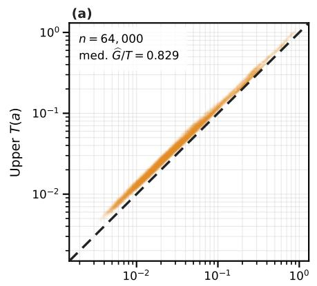

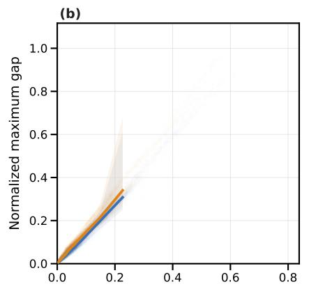

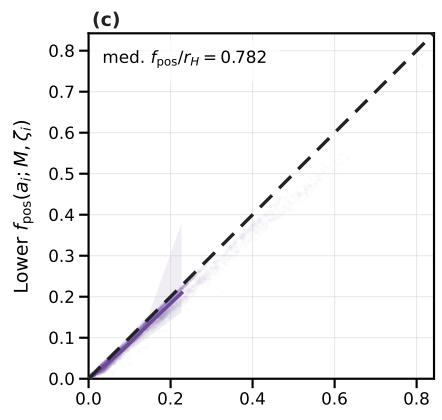

(d)  
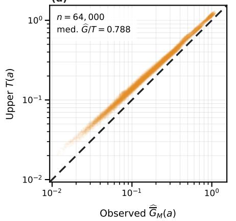

(e)  
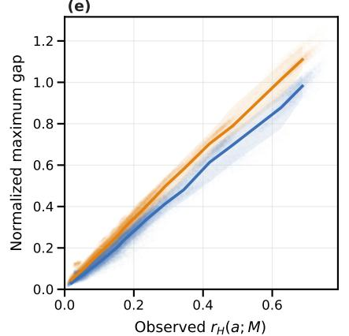

(f)  
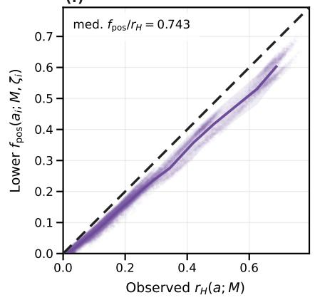  
Figure 7: Pointwise consistency and tightness audit of the sharper coeficient-specific local positional-response envelope and local-response floor from the appendix. Panels (a)–(c) form the Qwen3-8B row and panels (d)–(f) form the Llama-3.1-8B row; every point is one first-layer query–head–key coeficient vector. Left: the observed integer-window maximum gap $\zeta _ { i }$ against the coeficient-specific upper certificate $T ( a _ { i } )$ on logarithmic axes. Middle: the observed gap (blue) and upper certificate (orange) against $r _ { H } ( a _ { i } ; M ) _ { : }$ ; solid curves and shaded regions are medians and 10–90% ranges over 32 equal-count $r _ { H }$ bins, not an ��-only predictor. Right: the pointwise lower bound $f _ { \mathrm { p o s } } ( a _ { i } ; M , \zeta _ { i } )$ against the observed certified-high norm share. Dashed diagonals indicate equality in the left and right columns. The Qwen3 row is an in-assumption geometric-grid audit, whereas the non-geometric Llama row is an out-of-assumption stress test. The right column uses the same point to set $\zeta _ { i }$ and therefore measures consistency and tightness rather than out-of- sample predictive accuracy.

## D.2. Experimental Details for Figure 3

This subsection gives the experimental protocols for §3.1 and Figure 3.

## D.2.1. Empirical Choice of the Frequency Split

For practical frequency selection, we use an empirical value $C _ { \mathrm { F } } ^ { \mathrm { e m p } }$ for the constant in the theoretical split criterion:

$$
H _ { \mathrm { o p } } ( M ) = \left\{ n : M \omega _ { n } \geq \frac { 2 C _ { \mathrm { F } } ^ { \mathrm { e m p } } } { ( 1 - \rho ) \varepsilon _ { \mathrm { r e f } } } \right\} , \qquad C _ { \mathrm { F } } ^ { \mathrm { e m p } } = 0 . 0 6 , \quad \varepsilon _ { \mathrm { r e f } } = 0 . 1 .\tag{167}
$$

Here $\omega _ { n }$ are the actual model frequencies, including Llama-3.1’s native frequency scaling, and $\rho = B ^ { - 1 / h }$ is computed from the base grid. We choose $C _ { \mathrm { F } } ^ { \mathrm { e m p } } = 0 . { \overset { \mathrm { e m } } { 0 } } 6$ based on empirical observations from the evaluated models and windows, and use this single value across both models and all three context lengths. The selected bands achieve randomness scores between 0.9936 and 0.9997 under the metric defined below, showing close agreement between measured and predicted noise amplitudes across all six settings.

The proof of Lemma C.1 uses $C _ { \mathrm { F } } = 2 \pi$ as a conservative suficient constant for a uniform bound over arbitrary fixed coeficient vectors. This choice establishes the theoretical guarantee in Appendix ${ \mathrm { A . } } 3 ; C _ { \mathrm { F } } ^ { \mathrm { e m p } }$ adapts the split criterion to the observed model coeficients. The reference value $\varepsilon _ { \mathrm { r e f } }$ controls the empirical threshold, and we assess the resulting split through measured noise-amplitude agreement. The empirical rule also applies to Llama-3.1’s scaled frequency grid, whose evaluation lies outside the geometric-grid assumptions of the theoretical guarantee. The intervention experiments retain their original parameter $c _ { \mathrm { i n t } } = 0 . 0 5$ , as documented in Appendix G.2.

For Figures 3b and 3c, we evaluate Qwen3-8B (Yang et al., 2025a) and Llama-3.1-8B (Dubey et al., 2024) at $M \in \{ 8 1 9 2 , 3 2 7 6 8 , 1 3 1 0 7 2 \}$ . For each model, the same 40,960 first-layer query–pair–head coeficient vectors are used at all three window len ths. We hold these cached vectors fixed and evaluate their RoPE score margins over � $\in \{ 0 , \ldots , M - 1 \}$ , using the paper’s convention � = query position − key position and margin coeficients $d _ { n } = Q _ { n } \overline { { ( K _ { a , n } - K _ { b , n } ) } } / \sqrt { d _ { \mathrm { h e a d } } }$ for keys � and �. Thus the 128k curves extend the relative-distance window of fixed representations; they require no 128k model forward pass. For every prefix $H _ { k } = \{ 0 , \ldots , k - 1 \}$ , we compute the aggregate variance ratio

$$
\mathcal { R } _ { \mathrm { v a r } } ( H _ { k } ; M ) : = \frac { \sum _ { i } \mathsf { V a r } _ { M } ( X _ { H _ { k } } ^ { d _ { i } } ) } { \sum _ { i } U _ { H _ { k } } ( d _ { i } ) ^ { 2 } / 2 } ,\tag{168}
$$

where � indexes the sampled query–pair–head points and $\mathrm { V a r } _ { M }$ uses the uniform distribution over the � integer distances. We then compare noise amplitudes through

$$
a ( H _ { k } ; M ) = \sqrt { \mathcal { R } _ { \mathrm { v a r } } ( H _ { k } ; M ) } , \qquad R ( H _ { k } ; M ) = \operatorname* { m a x } \{ 0 , 1 - | a ( H _ { k } ; M ) - 1 | \} .\tag{169}
$$

The amplitude ratio � is formed after aggregating the measured and predicted variances. The plotted randomness proxy $R \in [ 0 , 1 ]$ equals one at exact amplitude agreement and decreases with the absolute relative amplitude error. For example, ratios $a = 0 . 9$ and $a = 1 . 1$ both give $R = 0 . 9$ . Positive cross-frequency covariance can give $\mathcal { R } _ { \mathrm { v a r } } > 1 ;$ the transformation preserves this discrepancy as a decrease in �. We retain all resulting dips and recoveries. This metric measures noise-scale agreement and supplies no test of Gaussian shape or temporal independence.

In Figures 3b and 3c, the gray curves plot $R ( H _ { k } ; M )$ as the number � of retained components increases. Orange circles mark the largest prefixes satisfying Eq. (167) for 8k, 32k, and 128k windows, from left to right. The main axes magnify the selected cutofs and nearby changes; insets show all 64 prefixes, with orange boxes indicating the enlarged regions.

## D.2.2. Score-Distribution Illustration

Figure 3a reuses the Qwen3-8B layer-0 projection bank. For each of its 10 query tokens and 32 query heads, we uniformly sample four distinct key tokens from the existing 200-token key bank (seed 20260923), giving 1,280 query–key–head combinations. These are individual attention scores; Figures 3b and 3c use score margins. For each fixed combination �, we evaluate $S _ { H _ { 4 0 } } ^ { ( i ) } ( m )$ at every $m \in \{ 0 , \ldots , 3 2 7 6 7 \}$ and divide by $\sigma _ { i } = U _ { H _ { 4 0 } } ( z ^ { ( i ) } ) / \sqrt { 2 }$ , where $H _ { k } = \{ 0 , \ldots , k - 1 \}$ . The gray bars average the resulting densities with equal weight. No empirical centering or variance fitting is used. The orange curve is $N ( 0 , 1 )$ under this normalization. This illustration uses the 32k cutof from Eq. (167) and the same cached projections, with no new model forward pass.

## D.3. Additional Evidence on High-Frequency Scores

## D.3.1. The Concentrated Qwen Frequency Behind the Noise-Amplitude Drop

The sharp drop in the inset of Figure 3b occurs when the retained prefix grows from 51 to 52 frequencies. The newly included frequency has zero-based index $n = 5 1$ , so it is the 52nd complex coordinate pair, corresponding to real channels 51 and 115 in the split-half layout. On the same 40,960 margin-coeficient vectors $d _ { i }$ used in that panel, its aggregate coeficient-energy share is

$$
\frac { \sum _ { i } | d _ { i , 5 1 } | ^ { 2 } } { \sum _ { i } \sum _ { n } | d _ { i , n } | ^ { 2 } } = 9 2 . 3 5 0 7 \% .\tag{170}
$$

This is the fraction of the summed squared coeficient norms, with each sample entering the sum once. It is distinct from a fraction of the measured score variance or a norm share before squaring.

At $M = 3 2 7 6 8 _ { \div }$ , this frequency rotates by only $M \omega _ { 5 1 } = 0 . 5 4 2 2 5$ radians over the window. Its own finite-window variance is 4.4599% of the half-energy prediction. Including it multiplies the total predicted variance by 16.1731, while the aggregate variance ratio ${ \mathcal { R } } _ { \operatorname { v a r } }$ falls from 0.883744 to 0.086922 and the plotted randomness proxy � falls from 0.940077 to 0.294826. The slowly varying component therefore adds substantial coeficient energy without the variance expected from a fast oscillation. This accounts for the abrupt drop and illustrates the need to distinguish coeficient magnitude from frequency-dependent variation. The component lies outside all three operational high-frequency prefixes.

## D.3.2. Representation Assumptions and Gaussian Score Shape

The moment guarantees in Proposition 1 allow arbitrary fixed coeficient magnitudes and phases. Relevant prior analyses use several diferent assumptions. Xu et al. (2024) derive their expected preference bound from independent identically distributed query and key coordinates with a common variance and a similar-key noise model. Their theorem does not require Gaussian coordinate distributions. Du et al. (2026) also fix the query and key vectors and sample relative distance. Their high-frequency analysis gives the near-zero mean and half-energy variance approximation; its normal approximation uses regular amplitudes without a dominant component and approximate independence across frequencies. Our finite-window moment bounds control cross-frequency terms explicitly and allow concentrated coeficient energy.

Deterministic analyses also appear in Su et al. (2024), Barbero et al. (2025), and Urrutia et al. (2026). In particular, the Gaussian query/key model in Proposition 3.2 of Barbero et al. (2025) is a counterexample to universal distance decay; their other constructions and semantic-attention results use fixed vectors. These results establish that fixed-vector analysis is already part of the literature. The present contribution is the finite-window moment control and the resulting frequency criterion. Gaussian score shape remains a separate approximation: the displayed pooled density supports it empirically, and the figure does not establish that every individual query–key combination has a Gaussian window distribution.

## E. The 49 Reference Task Settings

The diagnostic reference set contains 49 task/configuration settings from nine benchmark sources. A setting combines a task with a dificulty or input-length configuration. Table 1 lists every setting by grouping configurations of the same task. The set covers key and document retrieval, multi-hop question answering, text and list ordering, state tracking, and long-context reasoning. For example, the LIFBench adjacent element retrieval task contributes three length settings (3k, 6k, and 13k), while RULER2 multi-key retrieval contributes four dificulty settings (basic, easy, medium, and hard). These 49 settings form the ranking reference set in Figure 4; each point in Figure 6 and each bar in Figure 5 corresponds to one setting.

Qwen3-8B and Llama-3.1-8B-Instruct use the same example IDs within each setting: 2,211 examples per model and 4,422 example–model records in total. We record query and key activations during standard evaluation of these examples. The resulting diagnostics supplement each task’s behavioral accuracy with information about relative failure susceptibility.

Sources and configurations. The 12 MK, MV, and QA settings use the oficial NeMo Skills RULER2 suite.2 We use its nominal 8k configuration. Each family has basic, easy, medium, and hard variants, with 100 examples per configuration. The two LongBench tasks use unmodified examples whose native chat inputs fit within 16,384 tokens for both models. L-Eval TopicRet contributes 150 question records from 50 conversations, with three topic-retrieval questions per conversation. FLenQA uses the books-padding, random-evidence configuration at context sizes 500 and 3,000. NoLiMa uses book 1 with the needle at 52% depth. The three LIFBench settings contain 12 examples each; the remaining 33 settings contain 25 examples each.

Length labels in the table retain the source benchmark’s configuration names. For the diagnostic calculation, � is the complete input length under the evaluated model’s tokenizer, including its prompt and chat template. The same length label can therefore yield diferent � across models. The counts below describe the diagnostic reference set; matched coverage for the intervention experiments is reported separately in Appendix H.

Table 1: The complete 49-setting diagnostic reference set. Each configuration in a row is a separate setting. � is the number of settings and � is the number of examples per setting and per model. Lengths are nominal benchmark configurations; the diagnostic uses each model’s actual input length.
<table><tr><td>Task</td><td>What the model must do</td><td>Configurations</td><td>K N</td></tr><tr><td colspan="4">RULER2 (NeMo Skills)</td></tr><tr><td>Multi-key (MK)</td><td>Retrieve by key; harder variants answer Basic, easy, medium, retrieved MMLU questions.</td><td>hard</td><td>4 100</td></tr><tr><td></td><td>Multi-value (MV) Retrieve multiple values or select an ordered question for a key.</td><td>Basic, easy, medium, hard</td><td>4 100</td></tr><tr><td>Question answering</td><td>Retrieve supporting documents and answer HotpotQA questions.</td><td>Basic, easy, medium, 4 100 hard</td><td></td></tr><tr><td colspan="4">LongBench-v1 (Bai et al., 2024)</td></tr><tr><td>Qasper</td><td>Answer questions about an academic paper.</td><td>Native chat ≤ 16k</td><td>1 25</td></tr><tr><td>MuSiQue</td><td>Combine evidence across documents Native chat ≤ 16k for multi-hop answers.</td><td></td><td>1 25</td></tr><tr><td>L-Eval (An et al., 2024)</td><td></td><td></td><td></td></tr><tr><td>TopicRet</td><td>Retrieve the first, second, or third conversation topic.</td><td>Native conversation</td><td>1 150</td></tr><tr><td>Ada-LEval (Wang et al., 2024a) TSort</td><td>Restore the original order of shuffled</td><td>1k</td><td>1 25</td></tr><tr><td></td><td>text fragments.</td><td></td><td></td></tr><tr><td>FLenQA (Levy et al., 2024) PIR</td><td>Infer a room property through a</td><td>500; 3,000</td><td>2 25</td></tr><tr><td>MonoRel</td><td>person-room relation. Infer a transitive conclusion from</td><td>500; 3,000</td><td>25</td></tr><tr><td>Simplified</td><td>ordered relations. Deduce a true/false conclusion from</td><td></td><td>25</td></tr><tr><td>RuleTaker</td><td>rules and facts.</td><td>500; 3,000</td><td>2</td></tr><tr><td>LongReason (Ling et al., 2025) Mixed reasoning</td><td>Solve reading, logical, and</td><td>8k; 16k</td><td>2 25</td></tr><tr><td></td><td>mathematical reasoning questions.</td><td></td><td></td></tr><tr><td>BABILong (Kuratov et al., 2024) qa1: person</td><td>Track a person's current location.</td><td>8k; 16k</td><td>2 25</td></tr><tr><td>location qa2: object</td><td>Track an object's current location.</td><td></td><td>2</td></tr><tr><td>location qa3: previous</td><td>Recover an object's location before a</td><td>8k; 16k</td><td>25</td></tr><tr><td>location qa4: directional</td><td>specified event. Infer a directional relation between</td><td>8k; 16k</td><td>2 25</td></tr><tr><td>relations</td><td>two entities.</td><td>8k; 16k</td><td>2 25</td></tr><tr><td></td><td>qa5: giving events Identify the giver, recipient, or object in 8k; 16k a giving event. Count the objects a person currently</td><td></td><td>2 25</td></tr><tr><td>qa7: counting</td><td>holds.</td><td>8k; 16k</td><td>2 25</td></tr><tr><td>qa8: lists and sets</td><td>List the objects a person currently holds.</td><td>8k; 16k</td><td>2 25</td></tr><tr><td>qa9: negation</td><td>Answer location questions with explicit 8k; 16k negation.</td><td></td><td>2 25</td></tr><tr><td>qa10: indefinite knowledge</td><td>Distinguish known, false, and uncertain locations.</td><td>8k; 16k</td><td>2 25</td></tr><tr><td>LIFBench (Wu et al., 2025b) List offset query</td><td>Return the item immediately before or Official base 3k; 6k;</td><td></td><td>3 12</td></tr><tr><td></td><td>after a target.</td><td>13k</td><td></td></tr><tr><td>NoLiMa (Modarressi et al., 2025) One-hop retrieval Retrieve a fact through one implicit</td><td></td><td>8k; 16k</td><td>2 25</td></tr><tr><td></td><td>semantic association. Two-hop retrieval Retrieve a fact through two implicit</td><td>8k; 16k</td><td>2 25</td></tr><tr><td></td><td>semantic associations.</td><td></td><td></td></tr></table>

## F. Token and Head Selection

## F.1. Token Sampling from the Evaluated Inputs

The current diagnostic reuses the recorded query and key activations for the 49 reference settings in Appendix E. Each example is tokenized with the evaluated model’s native chat template. Character spans supplied by the task preparation identify the question and its context. Eligible token occurrences overlap the corresponding span, contain at least one letter or digit within that overlap, and have nonempty character ofsets; special tokens are excluded. We select up to four query positions from the question and up to 16 key positions from the context. Every selected key precedes every selected query in the original input.

Selection uses a deterministic SHA-256 ordering without replacement. For the original 12 RULER2 settings, the ordering is keyed by the protocol identifier, example ID, sampling role, and token position. The remaining 37 settings also include the fixed seed 20260910. Separate sampling roles select queries, keys, and the ordering used to pair keys. The saved token positions remain fixed throughout the diagnostic calculations.

For the Common-pair branch, each query is combined with every selected key, giving up to 64 query–key pairs per example. For the Common-triplet branch, the selected keys are reordered with the key-pairing role and grouped into eight disjoint pairs; each query is combined with these pairs, giving up to 32 triplets with distinct keys. All 2,211 examples per model have 16 selected keys. Of these, 2,161 have four selected queries and yield 64 pairs and 32 triplets. The other 50 examples, from the two BABILong person-location settings, have three eligible queries and yield 48 pairs and 24 triplets. The Common branches use these sampled occurrences without task-target labels. The semantic calculation subsequently orients each triplet by its score ordering at zero relative distance, as defined in Appendix G.1.1.

## F.2. Selecting a Fixed Set of Attention Heads

We select heads whose high-frequency norm share varies across the reference settings. For each layer–head unit ℎ, we first average the Common-pair value $r _ { H }$ over valid pairs within each example, then average over examples within each setting. Let $\bar { r } _ { t , h }$ be this mean for setting �. With all 49 settings weighted equally, the selection statistic is the sample variance

$$
\nu _ { h } = { \frac { 1 } { 4 8 } } \sum _ { t = 1 } ^ { 4 9 } \left( \bar { r } _ { t , h } - { \frac { 1 } { 4 9 } } \sum _ { s = 1 } ^ { 4 9 } \bar { r } _ { s , h } \right) ^ { 2 } .\tag{171}
$$

Each model is ranked separately by decreasing $\nu _ { h }$ . Ties are resolved by increasing layer-major head index; neither model has a tie at the reported selection boundaries. A fraction � retains ⌈��⌉ of the model’s � heads.

Qwen3-8B has 36 layers and 32 query heads per layer, for 1,152 heads in total; its top 5% and top 10% sets contain 58 and 116 heads. Llama-3.1-8B-Instruct has 32 layers and 32 query heads per layer, for 1,024 heads; its corresponding sets contain 52 and 103 heads. Figure 8 shows the selection across layers and heads. The top-5% set is fixed across tasks and supplies both the Semantic and Positional Scores in the main diagnostic. The second intervention stage expands this same ranking to the top 10%, as detailed in Appendix H. This ranking describes variation within the chosen reference set, including its diferent input-length settings.

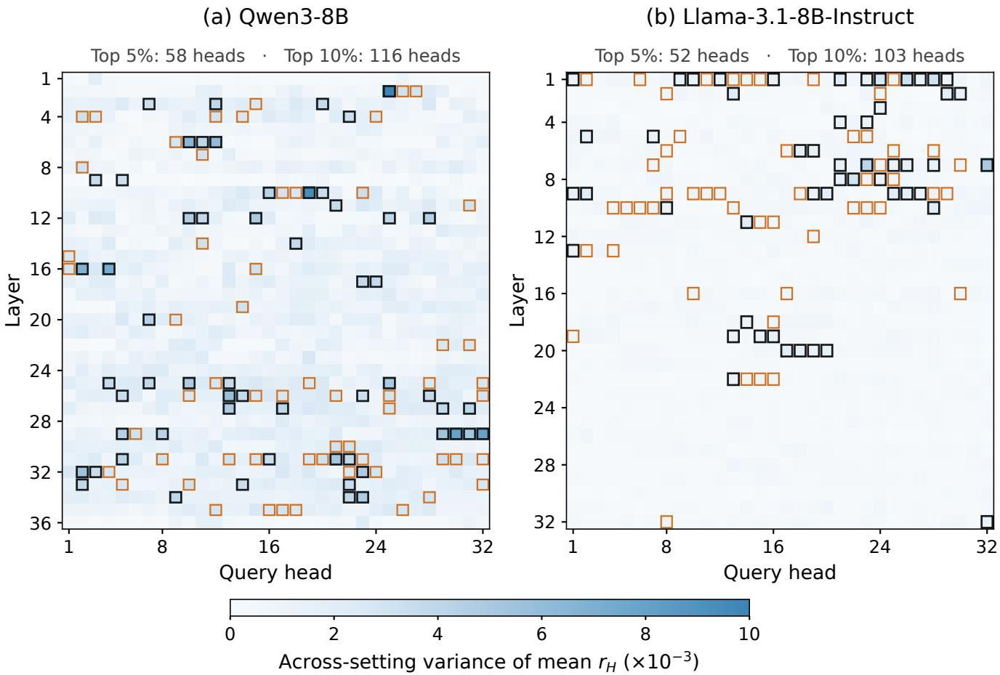  
Figure 8: Head selection from the 49 reference settings. Each cell shows the sample variance of a head’s setting-level mean Common-pair $r _ { H } ,$ , using a shared color scale across models. Black outlines identify the top-5% heads used by the main diagnostic and first intervention stage. Orange outlines identify the additional heads included in the top-10% set for the second stage. Layer and query-head indices start at one. All settings within a model use the same selected heads.

## G. Experimental Details

We conduct two experiments on Qwen3-8B and Llama-3.1-8B-Instruct: we compare diagnostic profiles across the 49 shared task settings, and we evaluate high-frequency interventions in each setting’s assigned semantic or positional direction. Appendix E specifies the task data, and Appendix F describes the fixed token and head selections.

## G.1. Experiment 1: Task and Cross-Model Diagnostic Profiles

Each model uses 2,211 examples across the same 49 settings. The primary diagnostic uses the fixed top-5% head collection selected from cross-task variation in the high-frequency norm share. All scores are computed from cached query and key states at each example’s native input length and frequency configuration.

## G.1.1. State Extraction and Score Definitions

For each task example, we use sampled query–key pairs and query–key–key triplets, together with a fixed collection of layer–head units. In each rotary plane, let $Q _ { n }$ and $K _ { n }$ denote the complex forms of the pre-RoPE query and key components. Their score coeficient is

$$
z _ { n } = c _ { \mathrm { a t t } } Q _ { n } \overline { { { K _ { n } } } } , \qquad S ( m ) = c _ { 0 } + \mathrm { R e } \sum _ { n } z _ { n } e ^ { i m \omega _ { n } } ,\tag{172}
$$

where $c _ { \mathrm { a t t } }$ is the model’s attention-score scale and $c _ { 0 }$ is any non-rotary score contribution (zero for fully rotary heads). The extraction preserves native query/key normalization, rotary-coordinate pairing, and the mapping between query heads and key/value heads. For partially rotary heads, the non-rotary contribution is retained as a constant in semantic margins; the norm used for positional response refers to the rotary coeficients.

We keep these content vectors fixed and vary only the current layer’s RoPE phase over $m = 0 , \ldots , M - 1$ . The current task protocol sets � to the example’s input length. The score at zero relative distance supplies the reference comparison. These are virtual score evaluations and require no new forward pass once the states have been recorded.

Semantic Score. For each triplet, orient the margin (including any non-rotary constant) so that $D ( 0 ) > 0 .$ with $d = z _ { + } - z _ { - }$ in this ordering, and compute the full finite-window mean $\mu _ { D }$ and variance $\sigma _ { D } ^ { 2 }$ analytically. Finite geometric sums give these moments, including the covariance between frequency components; Appendix G.1.2 provides the expressions. With Φ denoting the standard normal cumulative distribution function, the Gaussian estimate is

$$
{ \widehat { p } } _ { \mathrm { r e v } } ( d ; M ) = \Phi \left( - { \frac { \mu _ { D } } { \sigma _ { D } } } \right) , \qquad \sigma _ { D } > 0 .\tag{173}
$$

We average these probabilities over valid triplets, then over the fixed head collection, and finally over task examples with equal example weights. The Semantic Score is one minus this task-level reversal rate. Higher values indicate more stable reference orderings. Reference ties are excluded and their counts are retained. For zero variance, we evaluate the deterministic strict-negative event directly.

The probability calculation uses the accepted Gaussian approximation and analytic moments. It avoids enumerating reversal events at every position. The high-frequency share provides the theoretical interpretation in $\ S 3 ;$ the practical estimate uses the full finite-window moments and coeficient vector. Its value may vary non-monotonically with the window even though the conservative theoretical lower bound is monotone. This distinction allows the tool to report the behavior of sampled coeficients while the theory explains a necessary constraint on their joint semantic and positional reliability.

Positional Score. For each query–key pair with $U ( z ) > 0$ , define

$$
P ( z ; M ) : = \frac { 1 } { M - 1 } \sum _ { m = 0 } ^ { M - 2 } \frac { | S ( m + 1 ) - S ( m ) | } { U ( z ) } .\tag{174}
$$

We first normalize each pair by its own coeficient norm, then average over pairs, the same fixed head collection, and task examples. The resulting Positional Score measures average normalized adjacent response. Higher values indicate stronger local response. The score is computed directly from adjacent diferences; a zero coeficient norm is recorded as undefined. This convention preserves the per-pair scale before aggregation.

The response condition in Theorem 1 applies to the pairwise margin $d = a - b $ . Requiring the average adjacent response of that same margin to reach $\zeta$ also implies the maximum-response condition used in the proof. The Positional Score summarizes individual query–key curves and supplies a complementary diagnostic of local response. The theorem identifies a spectral constraint when both requirements are imposed on the same margin. The task-level profile itself carries no context-length certificate.

## G.1.2. Analytic Finite-Window Moments

For a real angular frequency $\theta ,$ define

$$
K _ { M } ( \theta ) : = \frac { 1 } { M } \sum _ { m = 0 } ^ { M - 1 } e ^ { i m \theta } = \left\{ \frac { 1 - e ^ { i M \theta } } { M ( 1 - e ^ { i \theta } ) } , \quad e ^ { i \theta } \neq 1 , \right.\tag{175}
$$

For $\begin{array} { r } { D ( m ) = c _ { D } + \mathrm { R e } \sum _ { n } d _ { n } e ^ { i m \omega _ { n } } } \end{array}$ , let

$$
\mu _ { D } = c _ { D } + \mathrm { R e } \sum _ { n } d _ { n } K _ { M } ( \omega _ { n } ) ,\tag{176}
$$

$$
\begin{array} { r } { C _ { n \ell } ^ { - } = K _ { M } ( \omega _ { n } - \omega _ { \ell } ) - K _ { M } ( \omega _ { n } ) \overline { { K _ { M } ( \omega _ { \ell } ) } } , } \end{array}\tag{177}
$$

$$
C _ { n \ell } ^ { + } = K _ { M } ( \omega _ { n } + \omega _ { \ell } ) - K _ { M } ( \omega _ { n } ) K _ { M } ( \omega _ { \ell } ) .\tag{178}
$$

Expanding the square of the real part gives the exact variance

$$
\sigma _ { D } ^ { 2 } = \frac { 1 } { 2 } \mathrm { R e } \sum _ { n , \ell } \left( d _ { n } \overline { { { d _ { \ell } } } } C _ { n \ell } ^ { - } + d _ { n } d _ { \ell } C _ { n \ell } ^ { + } \right) .\tag{179}
$$

Here $c _ { D }$ is the diference of any non-rotary score constants and is zero for fully rotary heads. It contributes to the reference margin $D ( 0 )$ and to $\mu _ { D ; }$ , and leaves the variance unchanged. These expressions require no probability distribution on $d .$ . The subsequent Gaussian threshold probability is an approximation to the relative distance law, with the previously established calibration retained.

## G.1.3. Relative Ranks and Failure Susceptibility

For a chosen model and head collection, rank a fixed reference set of $N > 1$ task/length settings by decreasing Semantic Score and decreasing Positional Score. Let $r _ { S }$ and $r _ { P }$ be the respective ranks, with rank one best and equal values receiving equal competition ranks. We define the relative semantic and positional failure susceptibilities as

$$
w _ { S } = \frac { 1 } { 2 } + \frac { r _ { S } - r _ { P } } { 2 ( N - 1 ) } , \qquad w _ { P } = 1 - w _ { S } .\tag{180}
$$

A larger $\boldsymbol { w _ { S } }$ indicates a relatively weaker semantic rank, and a larger $w _ { P }$ indicates a relatively weaker positional rank. Equal ranks give $\begin{array} { r } { \psi _ { S } = w _ { P } = 1 / 2 } \end{array}$ . These indices describe relative failure susceptibility within the chosen comparison set; their interpretation depends on that set. Raw scores and behavioral success rates remain visible alongside these indices.

## G.1.4. Aggregation and Cross-Model Comparison

Semantic reversal probabilities are averaged over valid triplets within each example and head, then over the selected heads, then equally over examples. The Semantic Score is one minus this average probability. For the Positional Score, each pair’s adjacent diferences are divided by its own coeficient norm before averaging over pairs, heads, and examples. Reference ties satisfy $\begin{array} { r } { \left. D ( 0 ) \right. \leq 6 4 \epsilon _ { \mathrm { m a c h } } \sum _ { n } \left. d _ { n } \right. . } \end{array}$ ; their counts and the counts of undefined scores are retained.

For Figure 6, each model ranks all 49 settings by decreasing $w _ { S } ,$ assigning average ranks to ties. We compute Spearman correlation as the Pearson correlation between these two vectors of average ranks, with each setting weighted equally. The resulting correlation is 0.657983, reported as 0.658 in the main text. It includes all 49 settings, including the three adjacent-element retrieval settings highlighted in orange. The plot preserves tied coordinates without jitter. These rankings describe failure susceptibility within the shared reference set.

## G.2. Experiment 2: Directed High-Frequency Intervention

## G.2.1. Assigning the Optimization Direction

The intervention direction ranks the 49 settings by decreasing $w _ { S } ,$ , assigning the average rank to ties. Let $\rho _ { S }$ denote this rank. Settings with $\rho _ { S } / 4 9 \le 1 / 2$ test reduced high-frequency contributions; the remaining settings test amplification. This places 24 Qwen settings and 23 Llama settings in the reduction group, keeping ties together. For this reference set, reduction corresponds to $\boldsymbol { w _ { S } }$ strictly above the model-specific median: 50.00% for Qwen and 56.25% for Llama. The value $\boldsymbol { w } _ { S } = 1 / 2$ separately indicates equal semantic and positional ranks.

The reduction group optimizes semantic stability by attenuating high-frequency score contributions or freezing their rotations. The amplification group optimizes positional sensitivity by increasing the high-frequency contribution. The assigned direction remains fixed through both stages of the search.

## G.2.2. Intervention Operators and Frequency Mask

For a scalar $\alpha ,$ selected high-frequency query and key components are each multiplied by $\sqrt { \alpha } ,$ , which multiplies their score coeficient by �. Low-frequency components and unselected heads retain their original operations. We preserve native query/key normalization and the mapping between query heads and key/value heads. The transformation changes both the coeficient norm and its high-frequency share. A separate no-rotation condition freezes the selected high-frequency RoPE rotations and belongs to the semantic direction.

The high-frequency mask is fixed from prompt length � throughout generation:

$$
H = \{ n : M \omega _ { n } \geq \gamma \} , \gamma = \frac { 2 c _ { \mathrm { i n t } } } { ( 1 - \rho ) \epsilon } , \rho = \theta ^ { - 2 / d _ { \mathrm { r o t } } } , c _ { \mathrm { i n t } } = 0 . 0 5 , \epsilon = 0 . 1 0 .\tag{181}
$$

Here � is the RoPE base, $d _ { \mathrm { { r o t } } }$ is the rotary dimension, and $\omega _ { n }$ are the actual runtime frequencies, including native frequency scaling. These intervention runs retain their original empirical parameter $c _ { \mathrm { i n t } } = 0 . 0 5$ throughout both search stages. The separate frequency-split audit in Appendix D.2.1 uses $c _ { \mathrm { o p } } = 0 . 0 6 ;$ its later calibration leaves the intervention masks and reported outcomes unchanged.

## G.2.3. Two Search Stages

The first stage uses the diagnostic’s top-5% head collection: 58 heads for Qwen and 52 for Llama. Semantic direction settings evaluate no rotation and $\alpha \in \{ 0 , 0 . 5 \}$ ; positional-direction settings evaluate $\alpha \in \{ 1 . 5 , 2 , 2 . 5 \}$ The unchanged $\alpha = 1$ condition provides the baseline. Candidate and baseline outputs share the original input IDs, greedy decoding, stopping rules, and first-stage output limits. The $\alpha = 1$ implementation was checked against native-model outputs.

The second stage expands the same fixed head ranking to its top 10%: 116 Qwen heads and 103 Llama heads. It selects the 25 Qwen and 23 Llama settings without an observed first-stage improvement in their assigned direction. Semantic-direction settings evaluate no rotation and $\alpha \in \{ 0 . 2 5 , 0 . 5 , 0 . 7 5 \}$ ; positional-direction settings evaluate $\alpha \in \{ 1 . 2 5 , 1 . 5 , 1 . 7 5 , 2 \}$ . The diagnostic $\boldsymbol { w _ { S } }$ and task rankings remain fixed at their top-5% values.

## G.2.4. Matched Examples, Scoring, and Output Budgets

We preserve the frozen first-stage comparison sets: 2,171 matched examples for Qwen and 2,074 for Llama. Each model has 42 fully covered settings and seven partially covered settings. The second stage completed 8,440 intervention records. Matching its candidates to saved baseline outputs gives 945 Qwen and 1,071 Llama examples; 16 and 78 examples without baseline outputs are excluded. A missing or untested result remains unreported.

Within each stage and setting, every displayed candidate is compared with the original $\alpha = 1$ baseline on the same examples. Accuracy is the fraction of examples receiving an oficial task score of one. Appendix H reports the full selected-direction candidate results and matched counts. The stages retain their own comparison sets: Qwen MV (easy) has 94 examples in the first stage and 95 in the second; the other second-stage settings use the same examples as their first-stage comparisons.

Fi ure 5 intersects the com arison sets across both sta es, recom utes their candidates and baseline on this common set, and displays the largest observed gain in the assigned direction. Thus Qwen MV (easy) uses 94 examples for both stages in the figure. The baseline is excluded from the candidate maximum, so settings for which every candidate reduces accuracy retain a negative bar.

The second stage reuses original input IDs and baseline outputs, with shorter generation limits for some tasks. Its reported comparisons retain the original baseline budget. An ofline control truncates saved baseline tokens to the shorter limits before rescoring; this changes three Qwen and 28 Llama baseline correctness labels. The original baseline is used in all tables and the main figure.

The search reports the best observed candidate on the examples used to compare intervention strengths.

Second-stage settings are selected from first-stage results. These gains describe the available interventions in this exploratory search; choosing an intervention for deployment requires evaluation on held-out examples.

## H. Results in the Assigned Optimization Direction

We report every measured candidate in each setting’s assigned semantic or positional direction, following the protocol in Appendix G.2. The tables include all 49 settings per model, grouped by direction, with separate results for the top-5% and top-10% head collections.

Observed gains. The first stage improves 24 of 49 Qwen settings and 26 of 49 Llama settings. The second stage adds seven Qwen settings and six Llama settings, giving 31/49 (63.3%) and 32/49 (65.3%) improved settings, respectively. The largest gains are 20 percentage points for Qwen and 25 for Llama. These are the best observed outcomes from a search over intervention strengths and two head subsets. The selected candidates have not been validated on held-out examples.

Reading the tables. Each table retains its stage’s matched examples and original baseline. The count �/� gives matched and planned examples. Candidate headers give �, and NR denotes no rotation. Each entry gives accuracy (%) followed by its change from the paired baseline (percentage points). Dashes indicate settings without a second-stage evaluation, and † marks a second-stage generation limit that difers from the saved baseline. All measured gains, including zero and negative values, are retained. Figure 5 uses the common samples across stages: Qwen MV (easy) uses 94 examples in the figure and 95 in its second-stage table. All other settings use the same paired cohort in the figure and tables. The adjacent-element retrieval settings retain their original 12 examples at each length.

The output-limit control described in Appendix G.2 yields 8/25 and 7/23 improving second-stage settings when the saved baseline outputs are truncated to the second-stage limits before rescoring. The tables retain the original-output comparisons of 7/25 and 6/23.

## H.1. Qwen3-8B: Semantic Direction

Table 2: Qwen3-8B: semantic direction on the top-5% heads. Entries give accuracy in percent and the change from the paired baseline in parentheses (percentage points).
<table><tr><td>Setting</td><td>ws (%)</td><td>n/N</td><td>Base</td><td>NR</td><td>0</td><td>0.5</td></tr><tr><td>QA (basic)</td><td></td><td>54.2 100/100 78.00</td><td></td><td>70.00 (-8.00)</td><td>76.00 (-2.00)</td><td>75.00 (-3.00)</td></tr><tr><td>QA (easy)</td><td></td><td>54.2 100/100 76.00</td><td></td><td>66.00 (-10.00)</td><td>70.00 (-6.00)</td><td>77.00 (+1.00)</td></tr><tr><td>Multi-hop QA (up to 16k)</td><td>53.1</td><td>25/25</td><td>28.00</td><td>24.00 (-4.00)</td><td>24.00 (-4.00)</td><td>24.00 (-4.00)</td></tr><tr><td>Rule deduction (context size 3,000)</td><td>51.0</td><td></td><td></td><td>25/25 72.00 88.00 (+16.00)</td><td>88.00(+16.00)</td><td>76.00 (+4.00)</td></tr><tr><td>Person location (16k)</td><td>61.5</td><td></td><td>25/25 76.00</td><td>80.00 (+4.00)</td><td>80.00 (+4.00)</td><td>68.00 (-8.00)</td></tr><tr><td>Previous location (8k)</td><td>56.2</td><td>25/25 28.00</td><td></td><td>32.00 (+4.00)</td><td>28.00 (+0.00)</td><td>32.00 (+4.00)</td></tr><tr><td>Previous location (16k)</td><td>60.4</td><td>25/25 32.00</td><td></td><td>32.00 (+0.00)</td><td>40.00 (+8.00)</td><td>36.00(+4.00)</td></tr><tr><td>Directional relations (8k)</td><td>70.8</td><td></td><td>25/25 48.00</td><td>44.00 (-4.00)</td><td>40.00 (-8.00)</td><td>40.00 (-8.00)</td></tr><tr><td>Directional relations (16k)</td><td>72.9</td><td></td><td>25/2548.00</td><td>56.00 (+8.00)</td><td>56.00 (+8.00)</td><td>56.00 (+8.00)</td></tr><tr><td>Giving events (8k)</td><td>62.5</td><td></td><td>25/25 72.00</td><td>80.00 (+8.00)</td><td>84.00(+12.00)</td><td>80.00 (+8.00)</td></tr><tr><td>Giving events (16k)</td><td>80.2</td><td></td><td>25/25 60.00</td><td>64.00 (+4.00)</td><td>64.00 (+4.00)</td><td>60.00 (+0.00)</td></tr><tr><td>Adjacent-element retrieval (3k)</td><td>99.0</td><td></td><td>12/12 50.00</td><td>25.00 (-25.00)</td><td>25.00 (-25.00)</td><td>33.33 (-16.67)</td></tr><tr><td>Adjacent-element retrieval (6k)</td><td>95.8</td><td></td><td>12/12 25.00</td><td>8.33 (-16.67)</td><td>0.00 (-25.00)</td><td>0.00 (-25.00)</td></tr><tr><td>Adjacent-element retrieval (13k)</td><td>97.9</td><td></td><td>12/12 16.67</td><td>8.33 (-8.33)</td><td>8.33 (-8.33)</td><td>8.33 (-8.33)</td></tr><tr><td>Object location (16k)</td><td>74.0</td><td></td><td>25/2540.00</td><td>40.00 (+0.00)</td><td>32.00 (-8.00)</td><td>24.00 (-16.00)</td></tr><tr><td>Object counting (8k)</td><td>68.8</td><td></td><td>25/25 20.00</td><td>24.00 (+4.00)</td><td>24.00 (+4.00)</td><td>24.00 (+4.00)</td></tr><tr><td>Object counting (16k)</td><td>77.1</td><td>25/25</td><td></td><td>4.00 20.00 (+16.00)</td><td>24.00(+20.00)</td><td>16.00 (+12.00)</td></tr></table>

Continued on the next page.

Continued from the preceding page.
<table><tr><td>Setting</td><td>ws (%)</td><td> $n / N$ </td><td>Base</td><td>NR</td><td>0</td><td>0.5</td></tr><tr><td>Object sets (16k)</td><td>56.2</td><td>25/25 36.00</td><td></td><td> $3 6 . 0 0 \left( + 0 . 0 0 \right)$ </td><td> $3 6 . 0 0 \left( + 0 . 0 0 \right)$ </td><td> $3 6 . 0 0 \left( + 0 . 0 0 \right)$ </td></tr><tr><td>Negation (8k)</td><td>54.2</td><td>25/2588.00</td><td></td><td> $8 8 . 0 0 \left( + 0 . 0 0 \right)$ </td><td> $9 2 . 0 0 \left( + 4 . 0 0 \right)$ </td><td> $9 2 . 0 0 \left( + 4 . 0 0 \right)$ </td></tr><tr><td>Negation (16k)</td><td>71.9</td><td>25/2568.00</td><td></td><td> $7 2 . 0 0 \ : ( + 4 . 0 0 )$ </td><td> $7 6 . 0 0 \left( + 8 . 0 0 \right)$ </td><td> $7 6 . 0 0 ( + 8 . 0 0 )$ </td></tr><tr><td>Uncertain knowledge (16k)</td><td>62.5</td><td>25/2544.00</td><td></td><td> $4 8 . 0 0 \left( + 4 . 0 0 \right)$ </td><td> $4 8 . 0 0 \left( + 4 . 0 0 \right)$ </td><td> $4 8 . 0 0 \left( + 4 . 0 0 \right)$ </td></tr><tr><td>One-hop implicit retrieval (16k)</td><td>61.5</td><td>25/25 12.00</td><td></td><td> $4 . 0 0 \left( - 8 . 0 0 \right)$ </td><td> $8 . 0 0 \left( - 4 . 0 0 \right)$ </td><td> $1 2 . 0 0 \left( + 0 . 0 0 \right)$ </td></tr><tr><td>Two-hop implicit retrieval (8k)</td><td>65.6</td><td>25/25</td><td>0.00</td><td> $0 . 0 0 \left( + 0 . 0 0 \right)$ </td><td> $0 . 0 0 \left( + 0 . 0 0 \right)$ </td><td> $0 . 0 0 \left( + 0 . 0 0 \right)$ </td></tr><tr><td>Two-hop implicit retrieval (16k)</td><td>67.7</td><td>25/25</td><td>0.00</td><td> $0 . 0 0 \left( + 0 . 0 0 \right)$ </td><td> $0 . 0 0 \left( + 0 . 0 0 \right)$ </td><td> $0 . 0 0 \left( + 0 . 0 0 \right)$ </td></tr></table>

Table 3: Qwen3-8B: semantic direction on the top-10% heads. Entries give accuracy in percent and the change from the paired baseline in parentheses (percentage points). Dashes mark settings without a second-stage evaluation; † marks a generation limit that difers from the saved baseline.
<table><tr><td>Setting</td><td> $n / N$  Base</td><td>NR</td><td>0.25</td><td>0.5</td><td>0.75</td></tr><tr><td>QA (basic)†</td><td>100/100 78.00</td><td>63.00 (-15.00)</td><td>82.00(+4.00)</td><td>80.00(+2.00)</td><td>78.00 (+0.00)</td></tr><tr><td>QA (easy) Multi-hop QA (up to 16k)</td><td>25/25 28.00</td><td>24.00 (-4.00)</td><td>24.00 (-4.00)</td><td></td><td>24.00 (-4.00) 28.00 (+0.00)</td></tr><tr><td>Rule deduction (context size</td><td></td><td></td><td></td><td></td><td></td></tr><tr><td>3,000) Person location (16k)</td><td></td><td></td><td></td><td></td><td></td></tr><tr><td>Previous location (8k)</td><td></td><td></td><td></td><td></td><td></td></tr><tr><td>Previous location (16k)</td><td></td><td></td><td></td><td></td><td></td></tr><tr><td>Directional relations (8k)</td><td>25/2548.00</td><td></td><td>44.00 (-4.00)36.00 (-12.00)</td><td></td><td>40.00 (-8.00)52.00 (+4.00)</td></tr><tr><td>Directional relations (16k)</td><td></td><td></td><td></td><td></td><td></td></tr><tr><td>Giving events (8k)</td><td></td><td></td><td></td><td></td><td></td></tr><tr><td>Giving events (16k)</td><td></td><td></td><td></td><td></td><td></td></tr><tr><td>Adjacent-element retrieval (3k)</td><td>12/12 50.00</td><td></td><td>41.67 (-8.33)25.00 (-25.00)</td><td>25.00 (-25.00)</td><td>33.33 (-16.67)</td></tr><tr><td>Adjacent-element retrieval (6k)</td><td></td><td>12/12 25.0025.00 (+0.00)</td><td>16.67 (-8.33)</td><td>16.67 (-8.33)</td><td>16.67 (-8.33)</td></tr><tr><td>Adjacent-element retrieval (13k)</td><td>12/1216.67</td><td>8.33 (-8.33)</td><td>8.33 (-8.33)</td><td>8.33 (-8.33)</td><td>16.67(+0.00)</td></tr><tr><td>Object location (16k)</td><td></td><td></td><td>25/2540.0028.00 (-12.00)28.00 (-12.00)28.00 (-12.00)</td><td></td><td>32.00 (-8.00)</td></tr><tr><td>Object counting (8k)</td><td></td><td></td><td></td><td></td><td></td></tr><tr><td>Object counting (16k)</td><td></td><td></td><td></td><td></td><td></td></tr><tr><td>Object sets (16k)</td><td>25/2536.00</td><td></td><td></td><td></td><td>32.00 (-4.00)44.00 (+8.00)44.00 (+8.00)44.00 (+8.00)</td></tr><tr><td>Negation (8k)</td><td></td><td></td><td></td><td></td><td></td></tr><tr><td>Negation (16k)</td><td></td><td></td><td></td><td></td><td></td></tr><tr><td>Uncertain knowledge (16k)</td><td></td><td></td><td></td><td></td><td></td></tr><tr><td>One-hop implicit retrieval (16k)</td><td>25/25 12.00</td><td>0.00 (-12.00)</td><td>12.00 (+0.00)</td><td>12.00(+0.00)</td><td>12.00(+0.00)</td></tr><tr><td>Two-hop implicit retrieval (8k)</td><td>25/25 0.00</td><td>0.00 (+0.00)</td><td>0.00 (+0.00)</td><td>0.00 (+0.00)</td><td>0.00 (+0.00)</td></tr><tr><td>Two-hop implicit retrieval (16k)</td><td>25/25 0.00</td><td>0.00 (+0.00)</td><td>0.00 (+0.00)</td><td>0.00 (+0.00)</td><td>0.00 (+0.00)</td></tr><tr><td></td><td></td><td></td><td></td><td></td><td></td></tr></table>

## H.2. Qwen3-8B: Positional Direction

Table 4: Qwen3-8B: positional direction on the top-5% heads. Entries give accuracy in percent and the change from the paired baseline in parentheses (percentage points).
<table><tr><td>Setting</td><td>ws (%)</td><td> $n / N$ </td><td>Base</td><td>1.5</td><td></td><td></td></tr><tr><td>MK (basic)</td><td></td><td>49.0 100/100</td><td>99.00</td><td>100.00(+1.00)</td><td>100.00(+1.00)</td><td>100.00(+1.00)</td></tr><tr><td>MK (easy)</td><td></td><td>16.7 100/100</td><td>96.00</td><td>97.00 (+1.00)</td><td>97.00 (+1.00)</td><td>97.00(+1.00)</td></tr><tr><td>MK (medium)</td><td>22.9</td><td>95/100</td><td>72.63</td><td>72.63(+0.00)</td><td>70.53 (-2.11)</td><td>70.53 (-2.11)</td></tr><tr><td>MK (hard)</td><td>32.3</td><td>95/100</td><td>64.21</td><td>67.37(+3.16)</td><td>68.42(+4.21)</td><td>70.53(+6.32)</td></tr></table>

Continued on the next page.

Continued from the preceding page.
<table><tr><td>Setting</td><td>ws (%)</td><td>n/N</td><td>Base</td><td>1.5</td><td>2</td><td>2.5</td></tr><tr><td>MV (basic)</td><td></td><td>46.9 100/100</td><td>22.00</td><td>15.00 (-7.00)</td><td>19.00 (-3.00)</td><td>20.00 (-2.00)</td></tr><tr><td>MV (easy)</td><td>15.6</td><td>94/100</td><td>43.62</td><td>43.62(+0.00)</td><td>42.55 (-1.06)</td><td>37.23 (-6.38)</td></tr><tr><td>MV (medium)</td><td>35.4</td><td>94/100</td><td>35.11</td><td>38.30 (+3.19)</td><td>37.23 (+2.13)</td><td>36.17(+1.06)</td></tr><tr><td>MV (hard)</td><td>22.9</td><td>94/100</td><td>52.13</td><td>53.19(+1.06)</td><td>50.00 (-2.13)</td><td>48.94 (-3.19)</td></tr><tr><td>QA (medium)</td><td>42.7</td><td>94/100</td><td>69.15</td><td>72.34(+3.19)</td><td>71.28 (+2.13)</td><td>71.28(+2.13)</td></tr><tr><td>QA (hard)</td><td>40.6</td><td>94/100</td><td>78.72</td><td>78.72(+0.00)</td><td>73.40 (-5.32)</td><td>76.60 (-2.13)</td></tr><tr><td>Paper QA (up to 16k)</td><td>12.5</td><td>25/25</td><td>28.00</td><td>20.00 (-8.00)</td><td>20.00 (-8.00)</td><td>20.00 (-8.00)</td></tr><tr><td>Conversation topic retrieval</td><td>21.9</td><td>150/150</td><td>58.00</td><td>64.67(+6.67)</td><td>66.00 (+8.00)</td><td>64.67(+6.67)</td></tr><tr><td>Text sorting (1k)</td><td>12.5</td><td>25/25</td><td>8.00</td><td>8.00 (+0.00)</td><td>8.00 (+0.00)</td><td>8.00(+0.00)</td></tr><tr><td>Room-property reasoning (context size 500)</td><td>16.7</td><td>25/25</td><td>100.00</td><td>100.00 (+0.00)</td><td>100.00 (+0.00)</td><td>100.00 (+0.00)</td></tr><tr><td>Room-property reasoning (context size 3,000)</td><td>50.0</td><td></td><td></td><td>25/25 100.00 100.00 (+0.00)</td><td>100.00(+0.00)100.00(+0.00)</td><td></td></tr><tr><td>Relation chaining (context size 500)</td><td>20.8</td><td>25/25</td><td>96.00</td><td>92.00 (-4.00)</td><td>96.00 (+0.00)</td><td>96.00 (+0.00)</td></tr><tr><td>Relation chaining (context size 3,000)</td><td>41.7</td><td>25/25</td><td>76.00</td><td>72.00 (-4.00)</td><td>68.00 (-8.00)</td><td>64.00 (-12.00)</td></tr><tr><td>Rule deduction (context size 500)</td><td>20.8</td><td>25/25</td><td>84.00</td><td>84.00 (+0.00)</td><td>72.00 (-12.00)</td><td>72.00 (-12.00)</td></tr><tr><td>Mixed long reasoning (8k)</td><td>45.8</td><td>25/25</td><td>84.00</td><td>80.00 (-4.00)</td><td>88.00 (+4.00)</td><td>88.00 (+4.00)</td></tr><tr><td>Mixed long reasoning (16k)</td><td>50.0</td><td>25/25</td><td>72.00</td><td>84.00(+12.00)</td><td>88.00 (+16.00)</td><td>84.00 (+12.00)</td></tr><tr><td>Person location (8k)</td><td>35.4</td><td>25/25</td><td>92.00</td><td>88.00 (-4.00)</td><td>96.00 (+4.00)</td><td>96.00 (+4.00)</td></tr><tr><td>Object location (8k)</td><td>37.5</td><td>25/25</td><td>52.00</td><td>48.00 (-4.00)</td><td>48.00 (-4.00)</td><td>48.00 (-4.00)</td></tr><tr><td>Object sets (8k)</td><td>34.4</td><td>25/25</td><td>52.00</td><td>36.00 (-16.00)</td><td>36.00 (-16.00)</td><td>36.00 (-16.00)</td></tr><tr><td>Uncertain knowledge (8k)</td><td>45.8</td><td>25/25</td><td>64.00</td><td>60.00 (-4.00)</td><td>56.00 (-8.00)</td><td>56.00 (-8.00)</td></tr><tr><td>One-hop implicit retrieval (8k)</td><td>50.0</td><td>25/25</td><td>4.00</td><td>12.00 (+8.00)</td><td>12.00(+8.00)</td><td>16.00 (+12.00)</td></tr></table>

Table 5: Qwen3-8B: positional direction on the top-10% heads. Entries give accuracy in percent and the change from the paired baseline in parentheses (percentage points). Dashes mark settings without a second-stage evaluation; † marks a generation limit that difers from the saved baseline.
<table><tr><td>Setting</td><td>n/N</td><td>Base</td><td>1.25</td><td>1.5</td><td>1.75</td><td>2</td></tr><tr><td>MK (basic)</td><td></td><td>一</td><td>—</td><td></td><td>一</td><td></td></tr><tr><td>MK (easy)</td><td></td><td></td><td></td><td></td><td></td><td></td></tr><tr><td>MK (medium)†</td><td>95/100</td><td>72.63</td><td>70.53 (-2.11)</td><td>69.47 (-3.16)</td><td>67.37 (-5.26)</td><td>67.37 (-5.26)</td></tr><tr><td>MK (hard) MV (basic)†</td><td>100/100</td><td>22.00</td><td>22.00 (+0.00)</td><td>24.00 (+2.00)</td><td>27.00(+5.00)</td><td>28.00(+6.00)</td></tr><tr><td>MV (easy)</td><td>95/100</td><td>44.21</td><td>40.00 (-4.21)</td><td>37.89 (-6.32)</td><td>33.68 (-10.53)</td><td>28.42 (-15.79)</td></tr><tr><td>MV (medium)</td><td></td><td></td><td></td><td></td><td></td><td></td></tr><tr><td>MV (hard)</td><td></td><td></td><td></td><td></td><td></td><td></td></tr><tr><td>QA (medium)</td><td></td><td></td><td></td><td></td><td></td><td></td></tr><tr><td>QA (hard)†</td><td>94/100</td><td>78.72</td><td>79.79(+1.06)</td><td>77.66 (-1.06)</td><td>74.47(-4.26)</td><td>72.34 (-6.38)</td></tr><tr><td>Paper QA (up to 16k)</td><td>25/25</td><td>28.00</td><td>24.00 (-4.00)</td><td>24.00 (-4.00)</td><td>24.00 (-4.00)</td><td>20.00 (-8.00)</td></tr><tr><td>Conversation topic retrieval</td><td></td><td></td><td></td><td></td><td></td><td></td></tr><tr><td>Text sorting (1k)</td><td>25/25</td><td>8.00</td><td>8.00 (+0.00)</td><td>8.00 (+0.00)</td><td>8.00 (+0.00)</td><td>8.00(+0.00)</td></tr><tr><td>Room-property reasoning</td><td>25/25</td><td>100.00</td><td>100.00 (+0.00)</td><td>100.00(+0.00)</td><td>100.00 (+0.00)</td><td>100.00(+0.00)</td></tr><tr><td>(context size 500) Room-property reasoning</td><td></td><td></td><td>25/25100.00100.00 (+0.00)</td><td>100.00 (+0.00)</td><td>100.00(+0.00)</td><td>100.00(+0.00)</td></tr><tr><td>(context size 3,000)</td><td></td><td></td><td></td><td></td><td></td><td></td></tr><tr><td>Relation chaining (context size 500)</td><td>25/25</td><td>96.00</td><td>92.00 (-4.00)</td><td>92.00 (-4.00)</td><td>92.00 (-4.00)</td><td>92.00 (-4.00)</td></tr><tr><td>Relation chaining (context size 3,000)</td><td>25/25</td><td>76.00</td><td>72.00 (-4.00)</td><td>72.00 (-4.00)</td><td>68.00 (-8.00)</td><td>60.00 (-16.00)</td></tr></table>

Continued from the preceding page.
<table><tr><td>Setting</td><td>n/N</td><td>Base</td><td>1.25</td><td>1.5</td><td>1.75</td><td>2</td></tr><tr><td>Rule deduction (context size 500)</td><td>25/25</td><td>84.00</td><td>84.00 (+0.00)</td><td>88.00 (+4.00)</td><td>88.00 (+4.00)</td><td>84.00(+0.00)</td></tr><tr><td>Mixed long reasoning (8k)</td><td></td><td></td><td></td><td></td><td></td><td>一</td></tr><tr><td>Mixed long reasoning (16k)</td><td></td><td></td><td></td><td></td><td></td><td></td></tr><tr><td>Person location (8k)</td><td></td><td></td><td></td><td></td><td></td><td></td></tr><tr><td>Object location (8k)</td><td>25/25</td><td>52.00</td><td>56.00 (+4.00)</td><td>60.00 (+8.00)</td><td>56.00(+4.00)</td><td>56.00 (+4.00)</td></tr><tr><td>Object sets (8k)</td><td>25/25</td><td>52.00</td><td>44.00 (-8.00)</td><td>40.00 (-12.00)</td><td>40.00 (-12.00)</td><td>40.00 (-12.00)</td></tr><tr><td>Uncertain knowledge (8k)</td><td>25/25</td><td>64.00</td><td>52.00 (-12.00)</td><td>44.00 (-20.00)</td><td>44.00 (-20.00)</td><td>44.00 (-20.00)</td></tr><tr><td>One-hop implicit retrieval (8k)</td><td></td><td></td><td></td><td></td><td></td><td></td></tr></table>

## H.3. Llama-3.1-8B-Instruct: Semantic Direction

Table 6: Llama-3.1-8B-Instruct: semantic direction on the top-5% heads. Entries give accuracy in percent and the change from the paired baseline in parentheses (percentage points).
<table><tr><td>Setting</td><td>ws (%)</td><td>n/N</td><td>Base</td><td>NR</td><td>0</td><td>0.5</td></tr><tr><td>QA (easy)</td><td>64.6</td><td>80/100</td><td>80.00</td><td>86.25(+6.25)</td><td>87.50(+7.50)</td><td>86.25(+6.25)</td></tr><tr><td>Multi-hop QA (up to 16k)</td><td>67.7</td><td></td><td>25/25 24.00</td><td>20.00 (-4.00)</td><td>16.00 (-8.00)</td><td>16.00 (-8.00)</td></tr><tr><td>Person location (16k)</td><td>77.1</td><td></td><td>25/25 76.00</td><td>76.00 (+0.00)</td><td>84.00 (+8.00)</td><td>84.00 (+8.00)</td></tr><tr><td>Previous location (8k)</td><td>62.5</td><td></td><td>25/25 28.00</td><td>36.00 (+8.00)</td><td>28.00(+0.00)</td><td>32.00(+4.00)</td></tr><tr><td>Previous location (16k)</td><td>80.2</td><td></td><td>25/25 20.00</td><td>28.00 (+8.00)</td><td></td><td>24.00 (+4.00)24.00 (+4.00)</td></tr><tr><td>Directional relations (8k)</td><td>69.8</td><td></td><td>25/25 36.00</td><td>40.00 (+4.00)</td><td>36.00 (+0.00)40.00 (+4.00)</td><td></td></tr><tr><td>Directional relations (16k)</td><td>70.8</td><td>25/25</td><td></td><td>44.0056.00 (+12.00)</td><td></td><td>48.00 (+4.00)48.00 (+4.00)</td></tr><tr><td>Giving events (8k)</td><td>57.3</td><td></td><td>25/25 72.00</td><td>72.00 (+0.00)</td><td>68.00 (-4.00)</td><td>72.00(+0.00)</td></tr><tr><td>Giving events (16k)</td><td>58.3</td><td></td><td>25/25 76.00</td><td>64.00 (-12.00)</td><td>64.00 (-12.00)</td><td>72.00 (-4.00)</td></tr><tr><td>Object location (8k)</td><td>57.3</td><td></td><td>25/25 52.00</td><td>52.00 (+0.00)</td><td>40.00 (-12.00)</td><td>44.00 (-8.00)</td></tr><tr><td>Object location (16k)</td><td>67.7</td><td>25/25</td><td>36.00</td><td>40.00 (+4.00)</td><td>32.00 (-4.00)</td><td>32.00 (-4.00)</td></tr><tr><td>Object counting (8k)</td><td>65.6</td><td>25/25</td><td>4.00</td><td>12.00 (+8.00)</td><td>8.00 (+4.00)</td><td>12.00 (+8.00)</td></tr><tr><td>Object counting (16k)</td><td>80.2</td><td>25/25</td><td>8.00</td><td>12.00 (+4.00)</td><td>16.00 (+8.00)</td><td>12.00(+4.00)</td></tr><tr><td>Object sets (8k)</td><td>57.3</td><td>25/25</td><td>44.00</td><td>44.00 (+0.00)</td><td>52.00 (+8.00)</td><td>)44.00 (+0.00)</td></tr><tr><td>Object sets (16k)</td><td>67.7</td><td></td><td>25/25 40.00</td><td>48.00 (+8.00)</td><td>48.00(+8.00)</td><td>48.00(+8.00)</td></tr><tr><td>Negation (8k)</td><td>58.3</td><td>25/25</td><td>88.00</td><td>88.00 (+0.00)</td><td>84.00 (-4.00)</td><td>84.00 (-4.00)</td></tr><tr><td>Negation (16k)</td><td>76.0</td><td></td><td>25/25 72.00</td><td>64.00 (-8.00)</td><td>72.00 (+0.00)</td><td>72.00 (+0.00)</td></tr><tr><td>Uncertain knowledge (8k)</td><td>71.9</td><td></td><td>25/25 76.00</td><td>80.00 (+4.00)</td><td>72.00 (-4.00)</td><td>72.00 (-4.00)</td></tr><tr><td>Uncertain knowledge (16k)</td><td>80.2</td><td>25/25</td><td>64.00</td><td>68.00 (+4.00)</td><td>56.00 (-8.00)</td><td>68.00 (+4.00)</td></tr><tr><td>One-hop implicit retrieval (8k)</td><td>70.8</td><td></td><td>25/25 36.00</td><td>40.00 (+4.00)</td><td>24.00 (-12.00)</td><td>40.00 (+4.00)</td></tr><tr><td>One-hop implicit retrieval (16k)</td><td>83.3</td><td>25/25</td><td>24.00</td><td>28.00 (+4.00)</td><td>36.00(+12.00)</td><td>28.00(+4.00)</td></tr><tr><td>Two-hop implicit retrieval (8k)</td><td>72.9</td><td>25/25</td><td>4.00</td><td>0.00 (-4.00)</td><td>8.00 (+4.00)</td><td>8.00 (+4.00)</td></tr><tr><td>Two-hop implicit retrieval (16k)</td><td>70.8</td><td>25/25</td><td>0.00</td><td>4.00(+4.00)</td><td>0.00 (+0.00)</td><td>4.00 (+4.00)</td></tr></table>

Table 7: Llama-3.1-8B-Instruct: semantic direction on the top-10% heads. Entries give accuracy in percent and the change from the paired baseline in parentheses (percentage points). Dashes mark settings without a second-stage evaluation; † marks a generation limit that difers from the saved baseline.
<table><tr><td>Setting</td><td> $n / N$ </td><td>Base</td><td>NR</td><td>0.25</td><td>0.5</td><td>0.75</td></tr><tr><td>QA (easy)</td><td></td><td></td><td></td><td></td><td></td><td></td></tr><tr><td>Multi-hop QA (up to 16k)</td><td></td><td></td><td>25/25 24.0024.00 (+0.00)</td><td>8.00 (-16.00)</td><td>8.00 (-16.00)</td><td>16.00 (-8.00)</td></tr><tr><td>Person location (16k)</td><td></td><td></td><td></td><td></td><td></td><td></td></tr><tr><td>Previous location (8k)</td><td></td><td></td><td></td><td></td><td></td><td></td></tr></table>

Continued on the next page.

Continued from the preceding page.
<table><tr><td>Setting</td><td>n/N</td><td>Base</td><td>NR</td><td>0.25</td><td>0.5</td><td>0.75</td></tr><tr><td>Previous location (16k)</td><td></td><td></td><td></td><td></td><td></td><td></td></tr><tr><td>Directional relations (8k)</td><td></td><td></td><td></td><td></td><td></td><td></td></tr><tr><td>Directional relations (16k)</td><td></td><td></td><td></td><td></td><td></td><td></td></tr><tr><td>Giving events (8k)</td><td></td><td></td><td>25/25 72.0072.00 (+0.00)</td><td></td><td>68.00 (-4.00) 72.00 (+0.00)</td><td>72.00(+0.00)</td></tr><tr><td>Giving events (16k)</td><td></td><td>25/2576.00</td><td>68.00 (-8.00)64.00 (-12.00)</td><td></td><td>68.00 (-8.00)</td><td>72.00 (-4.00)</td></tr><tr><td>Object location (8k)</td><td></td><td></td><td>25/2552.00 20.00 (-32.00)</td><td>48.00 (-4.00)40.00 (-12.00)</td><td></td><td>44.00 (-8.00)</td></tr><tr><td>Object location (16k)</td><td></td><td></td><td></td><td></td><td></td><td></td></tr><tr><td>Object counting (8k)</td><td></td><td></td><td></td><td></td><td></td><td></td></tr><tr><td>Object counting (16k)</td><td></td><td></td><td></td><td></td><td></td><td></td></tr><tr><td>Object sets (8k)</td><td></td><td></td><td></td><td></td><td></td><td></td></tr><tr><td>Object sets (16k)</td><td></td><td></td><td></td><td></td><td></td><td></td></tr><tr><td>Negation (8k)</td><td></td><td>25/25 88.00</td><td>80.00 (-8.00) 76.00 (-12.00)</td><td></td><td>84.00 (-4.00)</td><td>84.00 (-4.00)</td></tr><tr><td>Negation (16k)</td><td></td><td></td><td>25/2572.0052.00 (-20.00)60.00 (-12.00)</td><td></td><td>64.00 (-8.00)</td><td>68.00 (-4.00)</td></tr><tr><td>Uncertain knowledge (8k)</td><td></td><td></td><td></td><td></td><td></td><td></td></tr><tr><td>Uncertain knowledge (16k)</td><td></td><td></td><td></td><td></td><td></td><td></td></tr><tr><td>One-hop implicit retrieval (8k)</td><td></td><td></td><td></td><td></td><td></td><td></td></tr><tr><td>One-hop implicit retrieval (16k)</td><td></td><td></td><td></td><td></td><td></td><td></td></tr><tr><td>Two-hop implicit retrieval (8k)</td><td></td><td></td><td></td><td></td><td></td><td></td></tr><tr><td>Two-hop implicit retrieval (16k)</td><td></td><td></td><td></td><td></td><td></td><td></td></tr></table>

## H.4. Llama-3.1-8B-Instruct: Positional Direction

Table 8: Llama-3.1-8B-Instruct: positional direction on the top-5% heads. Entries give accuracy in percent and the change from the paired baseline in parentheses (percentage points).
<table><tr><td>Setting</td><td>Ws (%)</td><td>n/N</td><td>Base</td><td>1.5</td><td>2</td><td>2.5</td></tr><tr><td>MK (basic)</td><td>55.2</td><td>81/100</td><td>98.77</td><td>100.00 (+1.23)</td><td>97.53 (-1.23)</td><td>27.16 (-71.60)</td></tr><tr><td>MK (easy)</td><td>11.5</td><td>100/100</td><td>83.00</td><td>80.00 (-3.00)</td><td>5.00 (-78.00)</td><td>0.00 (-83.00)</td></tr><tr><td>MK (medium)</td><td>8.3</td><td>100/100</td><td>61.00</td><td>61.00 (+0.00)</td><td>24.00 (-37.00)</td><td>1.00 (-60.00)</td></tr><tr><td>MK (hard)</td><td>20.8</td><td></td><td>81/10054.32</td><td>48.15 (-6.17)</td><td>1.23 (-53.09)</td><td>0.00 (-54.32)</td></tr><tr><td>MV (basic)</td><td>54.2</td><td></td><td>100/100 34.00</td><td>20.00 (-14.00)</td><td>7.00 (-27.00)</td><td>0.00 (-34.00)</td></tr><tr><td>MV (easy)</td><td>14.6</td><td></td><td>81/100 27.16</td><td>19.75 (-7.41)</td><td>0.00 (-27.16)</td><td>0.00 (-27.16)</td></tr><tr><td>MV (medium)</td><td>11.5</td><td></td><td>80/100 32.50</td><td>45.00(+12.50)</td><td>3.75 (-28.75)</td><td>0.00 (-32.50)</td></tr><tr><td>MV (hard)</td><td>12.5</td><td></td><td>100/100 24.00</td><td>23.00 (-1.00)</td><td>3.00 (-21.00)</td><td>0.00 (-24.00)</td></tr><tr><td>QA (basic)</td><td>54.2</td><td>80/100</td><td>97.50</td><td>97.50 (+0.00)</td><td>45.00 (-52.50)</td><td>0.00 (-97.50)</td></tr><tr><td>QA (medium)</td><td>56.2</td><td></td><td>80/100 67.50</td><td>66.25 (-1.25)</td><td>36.25 (-31.25)</td><td>2.50 (-65.00)</td></tr><tr><td>QA (hard)</td><td>56.2</td><td></td><td>100/10071.00</td><td>72.00 (+1.00)</td><td>35.00 (-36.00)</td><td>12.00 (-59.00)</td></tr><tr><td>Paper QA (up to 16k)</td><td>31.2</td><td>25/25</td><td>20.00</td><td>20.00 (+0.00)</td><td>20.00 (+0.00)</td><td>0.00 (-20.00)</td></tr><tr><td>Conversation topic retrieval</td><td>17.7</td><td>150/150</td><td>74.00</td><td>80.00 (+6.00)</td><td>35.33 (-38.67)</td><td>0.00 (-74.00)</td></tr><tr><td>Text sorting (1k)</td><td>10.4</td><td>25/25</td><td>0.00</td><td>0.00 (+0.00)</td><td>0.00(+0.00)</td><td>0.00 (+0.00)</td></tr><tr><td>Room-property reasoning (context size 500)</td><td>19.8</td><td>25/25</td><td>64.00</td><td>60.00 (-4.00)</td><td>44.00 (-20.00)</td><td>56.00 (-8.00)</td></tr><tr><td>Room-property reasoning (context size 3,000)</td><td>56.2</td><td>25/25</td><td>44.00</td><td>44.00(+0.00)</td><td>60.00(+16.00)</td><td>48.00(+4.00)</td></tr><tr><td>Relation chaining (context size 500)</td><td>21.9</td><td></td><td>25/25 52.00</td><td>52.00 (+0.00)</td><td>56.00(+4.00)</td><td>56.00(+4.00)</td></tr><tr><td>Relation chaining (context size 3,000)</td><td>45.8</td><td></td><td>25/25 56.00</td><td>52.00 (-4.00)</td><td>48.00 (-8.00)</td><td>48.00 (-8.00)</td></tr><tr><td>Rule deduction (context size 500)</td><td>15.6</td><td>25/25</td><td>60.00</td><td>52.00 (-8.00)</td><td>48.00 (-12.00)</td><td>48.00 (-12.00)</td></tr><tr><td>Rule deduction (context size 3,000)</td><td>42.7</td><td></td><td>25/2548.00</td><td>48.00 (+0.00)</td><td>56.00 (+8.00)</td><td>40.00 (-8.00)</td></tr><tr><td>Mixed long reasoning (8k)</td><td>47.9</td><td></td><td>25/25 76.00</td><td>56.00 (-20.00)</td><td>56.00 (-20.00)</td><td>8.00 (-68.00)</td></tr></table>

Continued on the next page.

Continued from the preceding page.
<table><tr><td>Setting</td><td>ws (%)</td><td> $n / N$  Base</td><td>1.5</td><td></td><td>2 2.5</td></tr><tr><td>Mixed long reasoning (16k)</td><td>39.6</td><td>25/2564.00</td><td>68.00 (+4.00)</td><td>48.00 (-16.00)</td><td>4.00 (-60.00)</td></tr><tr><td>Person location (8k)</td><td>54.2</td><td>25/25 96.00</td><td>92.00 (-4.00)</td><td>44.00 (-52.00)</td><td>0.00 (-96.00)</td></tr><tr><td>Adjacent-element retrieval (3k)</td><td>26.0</td><td>12/12 0.00</td><td>0.00 (+0.00)</td><td>0.00 (+0.00)</td><td>0.00 (+0.00)</td></tr><tr><td>Adjacent-element retrieval (6k)</td><td>37.5</td><td>12/12 0.00</td><td>0.00 (+0.00)</td><td>8.33 (+8.33)</td><td>0.00 (+0.00)</td></tr><tr><td>Adjacent-element retrieval (13k)</td><td>39.6</td><td>12/12 16.67</td><td>8.33 (-8.33)</td><td>8.33 (-8.33)</td><td>0.00 (-16.67)</td></tr></table>

Table 9: Llama-3.1-8B-Instruct: positional direction on the top-10% heads. Entries give accuracy in percent and the change from the paired baseline in parentheses (percentage points). Dashes mark settings without a second-stage evaluation; † marks a generation limit that difers from the saved baseline.
<table><tr><td>Setting</td><td>n/N Base</td><td>1.25</td><td>1.5</td><td>1.75</td><td>2</td></tr><tr><td>MK (basic)</td><td></td><td></td><td></td><td></td><td></td></tr><tr><td>MK (easy)†</td><td>100/100 83.00</td><td></td><td>79.00 (-4.00) 71.00 (-12.00)</td><td>68.00 (-15.00)</td><td>61.00 (-22.00)</td></tr><tr><td>MK (medium)†</td><td>100/10061.00</td><td>60.00 (-1.00)</td><td>57.00 (-4.00)</td><td>47.00 (-14.00)</td><td>31.00 (-30.00)</td></tr><tr><td>MK (hard)†</td><td>81/100 54.32</td><td>44.44 (-9.88)</td><td>40.74(-13.58)</td><td>23.46 (-30.86)</td><td>11.11 (-43.21)</td></tr><tr><td>MV (basic)†</td><td></td><td>100/10034.0019.00 (-15.00)</td><td>5.00 (-29.00)</td><td>1.00 (-33.00)</td><td>6.00 (-28.00)</td></tr><tr><td>MV (easy)</td><td></td><td>81/10027.1629.63(+2.47)30.86(+3.70)</td><td></td><td>12.35 (-14.81)</td><td>0.00 (-27.16)</td></tr><tr><td>MV (medium)</td><td></td><td></td><td></td><td></td><td></td></tr><tr><td>MV (hard)†</td><td>100/100 24.00</td><td></td><td>19.00 (-5.00) 32.00 (+8.00)</td><td>30.00 (+6.00)</td><td>18.00 (-6.00)</td></tr><tr><td>QA (basic)†</td><td>80/10097.50</td><td></td><td>90.00 (-7.50)86.25 (-11.25)</td><td>66.25 (-31.25)</td><td>13.75 (-83.75)</td></tr><tr><td>QA (medium)†</td><td></td><td>80/10067.5041.25 (-26.25)28.75 (-38.75)</td><td></td><td>38.75 (-28.75)</td><td>23.75 (-43.75)</td></tr><tr><td>QA (hard)</td><td></td><td></td><td></td><td></td><td></td></tr><tr><td>Paper QA (up to 16k)</td><td>25/25 </td><td>20.00 20.00 (+0.00) 20.00 (+0.00)</td><td></td><td>20.00 (+0.00)</td><td>24.00 (+4.00)</td></tr><tr><td>Conversation topic retrieval</td><td></td><td></td><td></td><td></td><td></td></tr><tr><td>Text sorting (1k)</td><td>25/25 0.00</td><td>0.00(+0.00)</td><td>8.00 (+8.00)</td><td>8.00 (+8.00)</td><td>16.00 (+16.00)</td></tr><tr><td>Room-property reasoning (context size 500)</td><td>25/25</td><td>64.0052.00 (-12.00)48.00 (-16.00)</td><td></td><td>52.00 (-12.00)</td><td>48.00 (-16.00)</td></tr><tr><td>Room-property reasoning (context size 3,000)</td><td></td><td></td><td></td><td></td><td></td></tr><tr><td>Relation chaining (context size 500)</td><td></td><td></td><td></td><td></td><td></td></tr><tr><td>Relation chaining (context size 3,000)</td><td>25/2556.00</td><td>52.00 (-4.00)</td><td>52.00 (-4.00)</td><td>52.00 (-4.00)</td><td>60.00 (+4.00)</td></tr><tr><td>Rule deduction (context size</td><td>25/2560.00</td><td>52.00 (-8.00)</td><td>52.00 (-8.00)</td><td>56.00 (-4.00)</td><td>52.00 (-8.00)</td></tr><tr><td>500) Rule deduction (context size</td><td></td><td></td><td></td><td></td><td></td></tr><tr><td>3,000) Mixed long reasoning (8k)</td><td></td><td></td><td></td><td></td><td></td></tr><tr><td>Mixed long reasoning (16k)</td><td></td><td></td><td>25/25 76.0056.00 (-20.00)48.00 (-28.00)</td><td>40.00 (-36.00)</td><td>36.00 (-40.00)</td></tr><tr><td>Person location (8k)</td><td></td><td></td><td>92.00 (-4.00) 76.00 (-20.00)</td><td>84.00 (-12.00)</td><td></td></tr><tr><td>Adjacent-element retrieval (3k)</td><td>25/25 96.00</td><td>0.00 (+0.00)</td><td>8.33 (+8.33)</td><td>25.00(+25.00)</td><td>32.00 (-64.00)</td></tr><tr><td>Adjacent-element retrieval (6k)</td><td>12/12 0.00</td><td></td><td></td><td></td><td>8.33 (+8.33)</td></tr><tr><td></td><td></td><td></td><td>12/12 16.67 16.67(+0.00)16.67(+0.00)</td><td></td><td></td></tr><tr><td>Adjacent-element retrieval (13k)</td><td></td><td></td><td></td><td>0.00 (-16.67)</td><td>0.00 (-16.67)</td></tr></table>

## I. Additional Related Work

## I.1. Representation Assumptions in RoPE Theory

Existing RoPE theories study both random representations and fixed content vectors. Barbero et al. (2025) use independently sampled Gaussian queries and keys to show that expected scores need not decay with distance; their paper also provides deterministic constructions and a single-frequency semantic-instability result. Xu et al. (2024) derive base-dependent context bounds using i.i.d. query and key coordinates with a common variance and a similar-ke model $k ^ { * } = q + \epsilon$ with zero-mean noise. Du et al. (2026) hold query and key vectors fixed and sample relative positions. Their normal approximation assumes that no frequency am litude dominates and their context-de endent failure estimates use additional am litude re ularit . For their theoretical token-inversion estimate, they compare a key with a hypothetical phase-aligned reference sharing its frequency amplitudes. Our analysis uses the coeficients of realized query and key activations, without prescribing a distribution over these activations. The finite-window moment and adjacent-response bounds allow nonuniform frequency amplitudes. Our diagnostic estimates reversal for sampled key pairs using their full score-margin coeficients. The reversal guarantees retain an explicit Gaussian approximation condition on the score distribution over positions. This formulation supports diagnostics computed directly from recorded model activations.

## I.2. RoPE Failure Mechanisms

Existing analyses identify failures in both the positional and semantic functions of rotary attention. Barbero et al. (2025) show how rotating semantic channels can lose their selectivity over long contexts, with a formal result for a single frequency, and motivate p-RoPE. Du et al. (2026) organize score-level failures into four types. Position inversion occurs when the same query–key pair scores higher at a distant position than at a nearby one, reversing the locality preference. Position aliasing occurs when that pair receives numerically equal scores at two diferent relative distances. For two distinct keys evaluated at the same relative distance, token inversion reverses the ordering established at zero relative distance, while token aliasing makes their scores numerically equal. The aliasing events explicitly account for finite-precision computation. These definitions separate loss of positional discrimination from loss of token discrimination, and distinguish a reversed preference from a tie.

In vision–language models, Qi et al. (2026) probe positional sensitivity by adding a one-step RoPE rotation to visual keys while holding their extracted content vectors and the query fixed. They report changes in attention weights and in group-averaged score sensitivity. This study highlights local positional resolution as a practical concern. In §2, our semantic reversal follows the token-inversion event of Du et al. (2026). We define positional insensitivity through the absolute score gap between adjacent positions, normalized by each query–key pair’s own coeficient norm. This criterion measures local response strength independently of its direction; a preference for nearer positions and equal scores at separated positions are distinct properties.

## I.3. Context Extension

Other work explains the mechanisms behind context-extension failures. HoPE connects extrapolation failures to learned frequency components whose attention-score patterns change beyond the training window (Chen et al., 2025). Resonance RoPE identifies a feature gap at unseen integer positions, including in frequency components whose value ranges are covered during training (Wang et al., 2024b). Frayed RoPE relates long-context degradation to dispersion and overlap of query–key clusters, which weaken the ability of attention-sink tokens to absorb attention (Wertheimer et al., 2026). These accounts connect frequency behavior and representation geometry to specific failures, complementing the event-based classification in Appendix I.2.

Position Interpolation and YaRN adjust RoPE frequencies to extend context (Chen et al., 2023b; Peng et al., 2024). For position interpolation, Wu et al. (2026) show that its practical efect depends on the task: frequency scaling can help dependencies that stretch with input length while impairing retrieval at fixed relative distances and precise local alignment. YaRN also identifies the dificulty of distinguishing nearby positions after uniform frequency scaling (Peng et al., 2024).

## I.4. Internal Representations and Failure Diagnosis

Dong et al. (2024) decompose hidden states using position-wise means across sequences, connect positional vector extrapolation to failures, and develop interventions for NoPE models. Other work diagnoses positional attention bias (Hsieh et al., 2024b), retrieval-head behavior (Wu et al., 2025a), and context-extension mechanisms through head ablations and activation patching (Zhao et al., 2025). StreamingLLM links rolling-cache degradation to attention sinks (Xiao et al., 2024), and contrastive attribution traces output errors through internal states (Tan et al., 2026). Our local score measurements complement these analyses; relating a measured vulnerability to an output error requires evidence about its downstream efect.

## I.5. Behavioral Evaluation and Attention Competition

LongBench, RULER, and HELMET measure performance across long-context tasks (Bai et al., 2024; Hsieh et al., 2024a; Yen et al., 2025). Lost in the Middle and NoLiMa expose sensitivity to information placement and retrieval beyond literal matching (Liu et al., 2024a; Modarressi et al., 2025). Longer inputs motivate analyses of distractor dilution (Bansal et al., 2026) and critical attention scaling under simplified token geometries (Chen et al., 2026). Parallel context encoding has also been linked to elevated attention entropy (Zhang et al., 2025). Our pre-softmax diagnostics add two internal measurements alongside task performance; softmax competition and subsequent layers determine how these properties influence the final prediction.

## I.6. Long-Context Failure Modes

Existing benchmarks and studies (Hsieh et al., 2024a; Bai et al., 2024; Yen et al., 2025; Kuratov et al., 2024; Modarressi et al., 2025; Goldman et al., 2024; Vodrahalli et al., 2024; Levy et al., 2024) identify long-context failures related to retrieval and reasoning, and that these failure modes can be coupled (Du et al., 2025). Our diagnostics feature two internal measurements and position the model on a preference spectrum with preset tasks anchored as combinations of both modes.