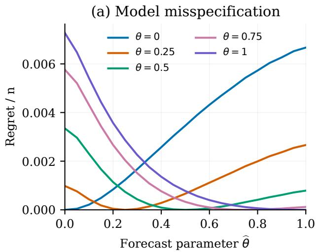
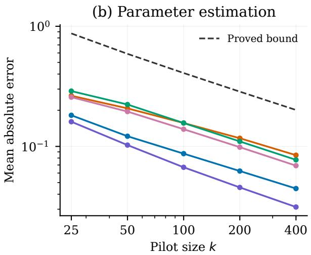

# Robust and Learned Online Matching in Growing Trees

Marek Gałązka1 and Hanna Wdowicka2

1Faculty of Mathematics and Computer Science, Adam Mickiewicz University, Poznań, Poland 2Department of Statistics, Poznań University of Economics and Business, Poznań, Poland

September 2026

## Abstract

We study irrevocable maximum-cardinality matching in trees revealed by successive leaf attachments, with a known horizon and an exogenous growth law that is misspecified or unknown. For deterministic afine attachment forecasts with nonnegative degree reinforcement, the optimal threshold policy loses at most twice the cumulative expected conditional totalvariation error relative to an online oracle knowing the actual growth law. This follows from a unit-span property of the Bellman continuation score and has no additional horizon factor. A four-vertex example attains the coeficient two for the specified deterministic policy, and a two-model argument gives a lower bound linear in the model-error budget for arbitrary policies under general misspecification. For uniform–preferential attachment, the local error has an exact expression through the leaf count. When its constant mixture parameter is unknown, we estimate it from the same growing tree and update the threshold policy at geometric times. A parameter-sensitivity bound for individual Bellman prices and uniform degree-moment estimates yield expected regret $O ( { \sqrt { n } } \log ^ { 2 } n )$ , using $O ( n ^ { 2 } \log { n } )$ arithmetic operations and $O ( n )$ stored entries. The exact minimax rate remains open.

Keywords: online matching, growing trees, model misspecification, distributional advice, regret, preferential attachment

## 1 Introduction

An online matching algorithm on a growing tree must decide whether to accept each new edge before observing subsequent attachments. Accepting an edge occupies both endpoints permanently. Rejecting it preserves their availability but forfeits that edge. The growth mechanism therefore afects the value of waiting: vertices that attract many future children can be worth preserving.

A distribution-specific optimal policy is useful only if its behaviour is stable when the assumed model is inaccurate. In a growing graph this question difers from changing a distribution of independent requests. An attachment changes the state that determines later attachment probabilities, so a local modelling error can also change subsequent graph evolution. A direct finite-horizon perturbation argument can charge an error by the full remaining reward. We ask whether the matching problem admits a sharper structural estimate.

We answer this question for afine attachment forecasts. The true law need not be afine, stationary, or correctly specified. Let $P _ { t } ( \cdot \mid \mathcal { H } _ { t } )$ be its next-parent distribution, where $\mathcal { H } _ { t }$ is the observed graph history, and let $Q _ { t } ( \cdot \mid T _ { t } )$ be the forecast evaluated on that same history. Write

$$
\mathcal { E } _ { n } ( P , Q ) = \sum _ { t = 2 } ^ { n - 1 } \mathbb { E } _ { P } \left[ \mathrm { T V } \big ( P _ { t } ( \cdot \mid \mathcal { H } _ { t } ) , Q _ { t } ( \cdot \mid T _ { t } ) \big ) \right] .\tag{1}
$$

The graph-generation law is exogenous: accepting or rejecting edges does not change it. This makes the error in (1) independent of the matching policy.

## 1.1 Main results

Our main results are the following.

1. Stability under misspecification. If $\pi _ { Q }$ is the optimal threshold policy for an afine forecast, then

$$
\mathrm { O P T } _ { \mathrm { o n } } ( P ) - \mathbb { E } _ { P } | M _ { n } ^ { \pi _ { Q } } | \leq 2 \mathcal { E } _ { n } ( P , Q ) .
$$

The proof identifies a conditional continuation score with span at most one and telescopes its Bellman potential. In particular, local error at most ε costs at most $2 ( n - 2 ) \varepsilon$ , rather than an additional factor proportional to the horizon.

2. Sharpness and parameter calibration. A four-vertex example attains the coeficient two for πQ with our tie convention. For arbitrary policies, a two-model construction gives a lower bound $\mathcal { E } _ { 4 } .$ . In the uniform–preferential family we express the local error exactly through the number of leaves and obtain a bound of order $n | \theta - { \widehat { \theta } } |$ . The lower constructions concern general misspecification; they do not establish the optimal parameter dependence inside this family.

3. Learning the model from one growing tree. For uniform–preferential attachment with an unknown constant parameter, an inverse-mean leaf-count estimator has root-meansquare error $O ( k ^ { - 1 / 2 } )$ after k vertices. Updating this estimate at geometric times gives regret $O ( { \sqrt { n } } \log ^ { 2 } n )$ , with $O ( n ^ { 2 } \log { n } )$ arithmetic work and $O ( n )$ stored entries. The proof combines sensitivity of the Bellman prices with degree-moment estimates and a fixed true-model potential. We also give the simpler pilot-and-commit bound $O ( n ^ { 2 / 3 } )$ . The exact optimal rate remains open.

## 1.2 Structure of the argument

Section 2 gives a self-contained derivation of the Bellman representation and threshold policy for known afine ordinary-degree growth kernels. This provides the starting point for the analysis of misspecification and learning an unknown growth parameter. We also explain how the stability argument applies under the rooted plane-oriented convention.

## 1.3 Related work

Acan et al. (2022) analyse greedy matching in uniform and preferential attachment graph processes. Their asymptotic greedy benchmarks concern a fixed policy, rather than the cost of acting under an incorrect growth model. Root and self-loop conventions must be distinguished when comparing finite-size values.

A closely related prediction-based result is due to Aamand et al. (2022). They prove stochastic optimality of a predicted-degree priority rule in a bipartite Chung–Lu–Vu model. Their Appendix D already bounds the loss caused by erroneous priority orders. Our advice instead specifies conditional parent distributions in a graph whose vertex set grows; our error is evaluated along the resulting dependent history. Canonne et al. (2025) use distributional advice for minimum-cost metric matching, with Wasserstein error. Their objective, fixed server set, and ofline benchmark difer from ours. Choo et al. (2024) and Burathep et al. (2026) study imperfect advice for bipartite matching under random arrival orders. Their competitive guarantees do not directly address the present stochastic-control benchmark.

Robustness to changing arrival distributions also appears in budgeted online allocation. Zhou et al. (2019) use distributionally robust optimisation and periodically update dual prices for drifting user arrivals. Their fixed bidder set, budget constraints, and ofline allocation benchmark difer from the irrevocable growing-tree problem considered here.

For adversarial edge arrivals, Buchbinder et al. (2019) obtain a 5/9-competitive algorithm on forests. Jiang and Zhang (2026) study growing trees with free disposal, which permits deletion of accepted edges. We retain irrevocability throughout. Model-error bounds based on value functions are standard; Lobel and Parr (2024) sharpen general simulation-lemma estimates. Our contribution in this direction is the unit-span property specific to these matching continuation values, rather than a new general perturbation method.

Estimating preferential attachment is also established. Gao and van der Vaart (2022) study parametric inference, including estimators from a final snapshot. Zhang et al. (2024) use counts of degree-one vertices for estimation in a time-varying attachment model. We use the same broad statistical idea and supply an elementary finite-sample bound for our mixture, suficient to obtain an online matching guarantee.

Learning with exogenous dynamics is studied more generally by Maran et al. (2026) in finitestate episodic Markov decision processes. Their state-space framework and our single-trajectory growing-tree model have diferent complexity parameters. The geometric-update analysis here uses the sensitivity of individual matching prices and moments of the evolving degree sequence.

## 2 Model and Bellman structure

Fix an integer horizon $n \geq 2$ . The process starts from vertices 1, 2 and the edge {1, 2}. At time 2 this edge is ofered once. For $t = 2 , \ldots , n - 1$ , vertex $t + 1$ arrives with a single edge to a parent $v \in [ t ]$ . Let $T _ { t }$ be the labelled tree before this arrival and $d _ { t } ( \boldsymbol { v } )$ its ordinary degree. Thus $\begin{array} { r } { \sum _ { v < t } d _ { t } ( v ) = 2 ( t - 1 ) } \end{array}$ . The algorithm observes the new edge and immediately accepts or rejects it. The observed graph history includes every revealed edge, whether accepted or rejected. Acceptance is feasible precisely when the parent is unmatched. We call the policy that accepts every feasible edge Greedy. Decisions are irrevocable and do not afect any parent distribution.

A policy is nonanticipating and may use internal randomness independent of the graphgeneration randomness. The horizon n is known. Under a true law P, define

$$
\mathrm { O P T } _ { \mathrm { o n } } ( P ) = \operatorname* { s u p } _ { \pi \ \mathrm { n o n a n t i c i p a t i n g } } \mathbb { E } _ { P } | M _ { n } ^ { \pi } | .
$$

The policy in this supremum knows P but not its future realisation. All regrets in the paper use this benchmark. They are not competitive ratios against an ofline optimum.

Definition 2.1 (Afine forecast). A forecast Q is specified before the process begins by deterministic coeficients $a _ { t } , \beta _ { t } , 2 \leq t < n ,$ such that

$$
\begin{array} { c } { q _ { t } ( d ) = a _ { t } + \beta _ { t } d , \qquad \beta _ { t } \geq 0 , \qquad t a _ { t } + 2 ( t - 1 ) \beta _ { t } = 1 , } \\ { 0 \leq q _ { t } ( d ) \leq 1 \qquad ( 1 \leq d < t ) . } \end{array}
$$

It assigns $Q _ { t } ( v \mid T _ { t } ) = q _ { t } ( d _ { t } ( v ) )$

Examples include uniform attachment, attachment proportional to $d + \delta _ { t }$ with deterministic $\delta _ { t } > - 1$ , and

$$
q _ { t } ^ { \widehat { \theta _ { t } } } ( d ) = \frac { 1 - \widehat { \theta } _ { t } } { t } + \frac { \widehat { \theta } _ { t } d } { 2 ( t - 1 ) } , \qquad \widehat { \theta } _ { t } \in [ 0 , 1 ] .\tag{2}
$$

The schedule in (2) may vary with time but is fixed in advance. The true law P may be any distribution on these graph-growth histories, with arbitrary history-dependent conditional parent probabilities. There is no assumption that $P$ belongs to the forecast family.

Let U be the unmatched vertices after the decision at time t, and let $V _ { t } ^ { Q } ( T , U )$ denote the maximum expected number of additional accepted edges under Q. The following proposition establishes the Bellman representation for Definition 2.1; its proof is included in full.

Proposition 2.2 (Separable value and threshold policy). For every legal state,

$$
V _ { t } ^ { Q } ( T , U ) = c _ { t } + \sum _ { v \in U } b _ { t } ( d _ { t } ( v ) ) ,\tag{3}
$$

where $c _ { n } = 0 , b _ { n } ( d ) = 0$ , and, backwards for $2 \leq t < n$

$$
\begin{array} { r l r } & { } & { c _ { t } = c _ { t + 1 } + b _ { t + 1 } ( 1 ) , } \\ & { } & { b _ { t } ( d ) = ( 1 - q _ { t } ( d ) ) b _ { t + 1 } ( d ) + q _ { t } ( d ) \operatorname* { m a x } \{ b _ { t + 1 } ( d + 1 ) , 1 - b _ { t + 1 } ( 1 ) \} . } \end{array}\tag{4}
$$

(5)

Moreover, $0 \leq b _ { t } ( d ) \leq 1$ and $b _ { t } ( d )$ is nondecreasing in d. An optimal policy accepts a feasible arrival at time $t + 1$ exactly when

$$
b _ { t + 1 } ( d + 1 ) + b _ { t + 1 } ( 1 ) \leq 1 ,\tag{6}
$$

where d is the parent’s degree before insertion. It accepts the seed edge if $2 b _ { 2 } ( 1 ) \leq 1$ . We use these weak inequalities as the tie convention defining πQ.

Proof. Assume (3) at time t + 1 and put

$$
C = c _ { t + 1 } + b _ { t + 1 } ( 1 ) + \sum _ { u \in U } b _ { t + 1 } ( d _ { t } ( u ) ) .
$$

If the parent is matched, the continuation value is $C .$ . If it is a free vertex of degree $d ,$ rejection gives $C + b _ { t + 1 } ( d + 1 ) - b _ { t + 1 } ( d )$ , whereas acceptance gives $C + 1 - b _ { t + 1 } ( 1 ) - b _ { t + 1 } ( d )$ . Maximisation and averaging over the parent give $( 4 )  { - } ( 5 )$ ; their comparison gives (6). The terminal condition starts the induction.

The range [0, 1] is preserved because (5) is a convex combination of numbers in this range. For monotonicity, set $A ( d ) = b _ { t + 1 } ( d )$ and $B ( d ) = \operatorname* { m a x } \{ b _ { t + 1 } ( d + 1 ) , 1 - b _ { t + 1 } ( 1 ) \}$ . Both are nondecreasing and $B ( d ) \geq A ( d )$ . Since $q _ { t } ( d )$ is nondecreasing, $( 1 - q _ { t } ( d ) ) A ( d ) + q _ { t } ( d ) B ( d )$ is nondecreasing as well. Finally, accepting the seed gives $1 + c _ { 2 }$ , and rejecting it gives $c _ { 2 } + 2 b _ { 2 } ( 1 )$ . □

Consequently,

$$
V _ { \mathrm { i n i t } } ^ { Q } = c _ { 2 } + \operatorname* { m a x } \{ 1 , 2 b _ { 2 } ( 1 ) \} .\tag{7}
$$

The acceptance set in (6) is a prefix of the degrees. Its threshold can be stored for every t. Computing the coeficients requires $O ( n ^ { 2 } )$ arithmetic operations; two coeficient rows and the stored thresholds require $O ( n )$ entries. Maintaining degrees and matched flags then takes $O ( 1 )$ work per arrival. These are arithmetic-operation bounds, not bounds on exact rational bit complexity. The formula holds for every legal state, including a state reached under a diferent growth law.

## 3 Stability under a misspecified growth law

We use $\begin{array} { r } { \mathrm { T V } ( p , q ) = \frac { 1 } { 2 } \sum _ { v } | p ( v ) - q ( v ) | } \end{array}$ and the error in (1). In particular, Q is evaluated on the actual history drawn under P.

Lemma 3.1 (Unit-span continuation). Fix a state $( T _ { t } , U )$ and let $G _ { t } ( v )$ be the maximum of immediate reward plus $V _ { t + 1 } ^ { Q }$ after parent v is revealed. Then

$$
\begin{array} { r l } & { G _ { t } ( v ) = C + \mathbf { 1 } _ { \{ v \in U \} } h _ { t } ( d _ { t } ( v ) ) , } \\ & { h _ { t } ( d ) = \operatorname* { m a x } \{ b _ { t + 1 } ( d + 1 ) , 1 - b _ { t + 1 } ( 1 ) \} - b _ { t + 1 } ( d ) . } \end{array}\tag{8}
$$

with C independent of v and $0 \leq h _ { t } ( d ) \leq 1$ . In particular, ma $\mathrm { x } _ { v } G _ { t } ( v ) - \operatorname* { m i n } _ { v } G _ { t } ( v ) \leq 1$

Proof. The expression is the action comparison in Proposition 2.2. Monotonicity makes the first diference nonnegative, and the maximum and the subtracted coeficient both belong to [0, 1].

Theorem 3.2 (Model-error bound). For every $a f \mathcal { f } i$ ne forecast $Q$ and every exogenous true law $P ,$

$$
0 \leq \mathrm { R e g } _ { n } ( P , Q ) : = \mathrm { O P T } _ { \mathrm { o n } } ( P ) - \mathbb { E } _ { P } | M _ { n } ^ { \pi _ { Q } } | \leq 2 \mathcal { E } _ { n } ( P , Q ) .\tag{9}
$$

More precisely,

$$
\mathrm { O P T } _ { \mathrm { o n } } ( P ) \leq V _ { \mathrm { i n i t } } ^ { Q } + \mathcal { E } _ { n } ( P , Q ) , \qquad \mathbb { E } _ { P } | M _ { n } ^ { \pi _ { Q } } | \geq V _ { \mathrm { i n i t } } ^ { Q } - \mathcal { E } _ { n } ( P , Q ) .\tag{10}
$$

Proof. For a function of span at most one, the diference between its expectations under $p$ and $q$ is at most $\mathrm { T V } ( p , q )$ in absolute value. Apply this to Lemma 3.1, conditionally on the current graph and matching state. Under $Q ,$ the Bellman equation says $\mathbb { E } _ { Q _ { t } } G _ { t } = V _ { t } ^ { Q }$

Let $R _ { t }$ count edges accepted up to time t. Any policy chooses an action with reward plus next potential at most $G _ { t } ( v )$ . Thus, under $P .$

$$
\mathbb { E } _ { P } [ R _ { t + 1 } + V _ { t + 1 } ^ { Q } - R _ { t } - V _ { t } ^ { Q } \ | \ \mathcal { H } _ { t } , U _ { t } ] \le e _ { t } ( \mathcal { H } _ { t } ) ,\tag{11}
$$

where $e _ { t } ( { \mathcal { H } } _ { t } ) = { \mathrm { T V } } ( P _ { t } ( \cdot \ | \ { \mathcal { H } } _ { t } ) , Q _ { t } ( \cdot \ | \ T _ { t } ) )$ . Internal policy randomness gives no additional information about future graph growth. For $\pi _ { Q }$ the selected action attains $G _ { t } ( v )$ , so the same conditional expectation is also at least $- e _ { t } ( \mathcal { H } _ { t } )$

For every initial seed decision, $R _ { 2 } + V _ { 2 } ^ { Q } \leq V _ { \mathrm { i n i t } } ^ { Q }$ , with equality for $\pi _ { Q }$ . Sum (11), use $V _ { n } ^ { Q } = 0$ and take expectations. The distribution of graph histories is the same under every policy, so the error sum is always (1). This proves (10); subtracting gives (9). The lower bound zero follows from the definition of $\mathrm { O P T _ { o n } }$ □

Corollary 3.3 (Conditional sufix bound). Fix a history at time k and an unmatched set $U .$ Starting from this state, the loss of πQ relative to the optimal continuation under P is at most

$$
2 \mathbb { E } _ { P } \left[ \sum _ { t = k } ^ { n - 1 } e _ { t } ( \mathcal { H } _ { t } ) \bigg | \mathcal { H } _ { k } \right] .
$$

The forecast may be selected using $\mathcal { H } _ { k }$ , provided its future schedule is then fixed.

Proof. Condition on $\mathcal { H } _ { k }$ and telescope from the common potential $V _ { k } ^ { Q } ( T _ { k } , U )$ instead of (7).

This conditional formulation is essential for learning. It does not justify replacing the forecast arbitrarily after each new observation: such replacements would change the potential being telescoped. The estimate also relies on exogenous graph growth. If matching decisions influence future parent probabilities, a policy-independent error sum need not exist.

The rooted plane-oriented convention. The stability argument also applies to the rooted plane-oriented convention: start from a single root and use attachment weight $w _ { t } ( v ) = 1 + d _ { t } ^ { + } ( v )$ where $d _ { t } ^ { + }$ is the number of children. Here $\begin{array} { r } { \sum _ { v } w _ { t } ( v ) = 2 t - 1 } \end{array}$ . For deterministic afine weight forecasts $q _ { t } ( w ) = a _ { t } + \beta _ { t } w$ , impose $t a _ { t } + ( 2 t - 1 ) \beta _ { t } = 1$ with $\beta _ { t } \geq 0$ and $0 \leq q _ { t } ( w ) \leq 1$ for every integer $1 \leq w \leq t$ . Replace degree by weight in (5), run the recurrence down to $t = 1$ , and use initial value $c _ { 1 } + b _ { 1 } ( 1 )$ . A parent increases its weight by one and a newborn has weight one, so (8) and its unit-span proof are unchanged. Thus (9) holds with the error sum starting at $t = 1$ The explicit leaf formulas and learning constants below refer to the seed-edge convention.

## 4 Sharpness for general misspecification

Proposition 4.1 (A tight plug-in example). For every $0 < \varepsilon \le 1 / 3$ , there is a true law $P _ { + }$ on four-vertex trees and a uniform forecast $Q$ such that

$$
\pounds _ { 4 } ( P _ { + } , Q ) = \varepsilon , \qquad \mathrm { R e g } _ { 4 } ( P _ { + } , Q ) = 2 \varepsilon .
$$

Proof. Vertex 3 chooses its parent $i \in \{ 1 , 2 \}$ uniformly. Write $j$ for the other seed endpoint. At the last arrival set

$$
\begin{array} { r } { P _ { + } ( i \mid \mathcal { H } _ { 3 } ) = \frac { 1 } { 3 } , \quad P _ { + } ( j \mid \mathcal { H } _ { 3 } ) = \frac { 1 } { 3 } + \varepsilon , \quad P _ { + } ( 3 \mid \mathcal { H } _ { 3 } ) = \frac { 1 } { 3 } - \varepsilon . } \end{array}\tag{12}
$$

The only forecast error occurs at this last step and equals $\varepsilon .$ . Under the uniform forecast, $b _ { 3 } ( 1 ) = b _ { 3 } ( 2 ) = 1 / 3$ and $b _ { 2 } ( 1 ) = 1 / 2$ . Our tie convention therefore accepts the seed. Its only later opportunity is the edge from 4 to 3, giving value $4 / 3 - \varepsilon$

Rejecting the seed, accepting {i, 3}, and accepting $\{ j , 4 \}$ if ofered gives $4 / 3 + \varepsilon$ . This is optimal: conditional on rejecting the seed, rejecting the next edge can give at most one edge in total. Conditional on accepting the seed, the value is the one already computed. The diference is $2 \varepsilon$ □

Proposition 4.2 (Linear dependence cannot be removed). For every $0 < \varepsilon \le 1 / 3$ , let $Q$ be the uniform forecast and let $P _ { + } , P _ { - }$ be the pair defined below. For every online policy given $Q$ but not the identity of the true law, some $P \in \{ P _ { + } , P _ { - } \}$ satisfies

$$
\begin{array} { r } { \mathcal { E } _ { 4 } ( P , Q ) = \varepsilon , \qquad \mathrm { O P T } _ { \mathrm { o n } } ( P ) - \mathbb { E } _ { P } | M _ { 4 } | \ge \varepsilon . } \end{array}
$$

This holds for randomised policies.

Proof. Obtain P− by reversing the signs of the two perturbations in (12). Both laws have the same history distribution before the initial decision. If the algorithm accepts the seed with probability $r ,$ its regret under $P _ { + }$ is at least 2rε, and under P− at least $2 ( 1 - r ) \varepsilon$ , even allowing the best continuation after that decision. Their maximum is at least ε. □

These statements distinguish two notions of sharpness. Proposition 4.1 establishes the coeficient for the specified deterministic plug-in policy; Proposition 4.2 leaves a factor-two gap for the best robust policy. Both true laws distinguish two degree-one vertices through their histories. Neither is a constant-parameter instance of (2).

## 5 Calibration in the uniform–preferential family

Let $P _ { \theta }$ denote (2) with a fixed $\theta \in [ 0 , 1 ] ,$ and let $L _ { t }$ be the number of degree-one vertices in $T _ { t }$ For a forecast with constant parameter $\mathrm { \dot { \theta } }$ , write $\operatorname { R e g } _ { n } ( \theta , { \widehat { \theta } } ) = \operatorname { R e g } _ { n } ( P _ { \theta } , P _ { \widehat { \theta } } )$

Proposition 5.1 (Leaf-count error identity). For every tree $T _ { t }$

$$
\mathrm { T V } ( P _ { \theta } ( \cdot \mid T _ { t } ) , P _ { \widehat { \theta } } ( \cdot \mid T _ { t } ) ) = | \theta - \widehat { \theta } | \frac { L _ { t } ( t - 2 ) } { 2 t ( t - 1 ) } .\tag{13}
$$

Consequently, with $\ell _ { t } ( \theta ) = \mathbb { E } _ { \theta } L _ { t }$ and $\begin{array} { r } { H _ { m } = \sum _ { j = 1 } ^ { m } j ^ { - 1 } } \end{array}$ ，

$$
\mathrm { R e g } _ { n } ( \theta , { \widehat { \theta } } ) \leq | \theta - { \widehat { \theta } } | \sum _ { t = 2 } ^ { n - 1 } \ell _ { t } ( \theta ) { \frac { t - 2 } { t ( t - 1 ) } }\tag{14}
$$

$$
\leq ( n - 2 H _ { n - 1 } ) | \theta - { \widehat { \theta } } | \leq ( n - 2 ) | \theta - { \widehat { \theta } } | .\tag{15}
$$

Proof. The diference of the kernels is $( \theta - \widehat { \theta } ) ( d / ( 2 ( t - 1 ) ) - 1 / t )$ . For $t > 2$ , the bracket is negative exactly at degree one and positive at degrees at least two. Summing the negative part gives (13); at $t = 2$ both sides vanish. Theorem 3.2 yields (14). Since $L _ { t } \leq t - 1$ for $t \geq 3$ , the remaining sum is at most $\textstyle \sum _ { t = 2 } ^ { n - 1 } ( t - 2 ) / t = n - 2 H _ { n - 1 }$ □

The exact expected-error bound is computable in linear time because

$$
\ell _ { 2 } ( \theta ) = 2 , \qquad \ell _ { t + 1 } ( \theta ) = \left( 1 - \alpha _ { t } ( \theta ) \right) \ell _ { t } ( \theta ) + 1 , \quad \alpha _ { t } ( \theta ) = \frac { 1 - \theta } { t } + \frac { \theta } { 2 ( t - 1 ) } .\tag{16}
$$

Indeed, the new vertex adds a leaf, and a leaf parent ceases to be a leaf. The same argument allows distinct deterministic true and forecast parameter schedules; the summand in (14) then contains $| \theta _ { t } - \widehat { \theta } _ { t } |$

We will use the uniform conditional consequence of Corollary 3.3: for any history and unmatched set at time $k ,$ the continuation loss under parameter $\widehat { \theta }$ is at most

$$
( n - k ) | \theta - { \widehat { \theta } } | .\tag{17}
$$

This follows pathwise from twice the right-hand side of (13) being at most $| \theta - { \widehat { \theta } } |$ at every step.

## 6 Learning without external advice

Assume the true law is $P _ { \theta }$ for an unknown fixed $\theta \in [ 0 , 1 ]$ . Graph observations are available regardless of the matching decisions. We first obtain a uniform finite-sample estimator from a single leaf count and then apply (17).

Lemma 6.1 (Leaf-count concentration and sensitivity). For $k \geq 4$ , every $\theta \in [ 0 , 1 ]$ , and every $u \geq 0$

$$
\begin{array} { r } { \mathrm { V a r } _ { \theta } ( L _ { k } ) \leq ( k - 2 ) / 4 , } \end{array}\tag{18}
$$

$$
\operatorname* { P r } _ { \theta } \bigl ( | L _ { k } - \ell _ { k } ( \theta ) | \ge u \bigr ) \le 2 \exp \bigl ( - 2 u ^ { 2 } / ( k - 2 ) \bigr ) ,\tag{19}
$$

$$
\ell _ { k } ^ { \prime } ( \theta ) \geq \frac { k - 2 } { 8 } - \frac { H _ { k - 2 } } { 4 ( k - 1 ) } \geq \frac { k - 3 } { 8 } .\tag{20}
$$

In particular, $\ell _ { k }$ is strictly increasing on [0, 1].

Proof. Let $Y _ { t + 1 }$ indicate that the next parent is a leaf. Its conditional mean is $\alpha _ { t } ( \theta ) L _ { t }$ , and $L _ { t + 1 } = L _ { t } + 1 - Y _ { t + 1 }$ . Subtracting (16), we obtain

$$
X _ { t + 1 } = ( 1 - \alpha _ { t } ( \theta ) ) X _ { t } + \xi _ { t + 1 } , \qquad X _ { t } = L _ { t } - \ell _ { t } ( \theta ) , \quad \xi _ { t + 1 } = \alpha _ { t } ( \theta ) L _ { t } - Y _ { t + 1 } .
$$

The $\xi _ { t + 1 }$ are martingale diferences of conditional variance at most $1 / 4$ and conditional range length one. Unrolling the recursion expresses $X _ { k }$ as a sum of $k - 2$ such diferences with deterministic weights

$$
w _ { s , k } = \prod _ { j = s + 1 } ^ { k - 1 } \left( 1 - \alpha _ { j } ( \theta ) \right) \in [ 0 , 1 ] , \qquad 2 \leq s < k .
$$

Orthogonality gives (18). The conditional exponential-moment bound for a centred variable of range length $w _ { s , k }$ is exp $\langle { \lambda ^ { 2 } w _ { s . k } ^ { 2 } / 8 } \rangle$ . Iteration and Chernof’s bound give (19), since $\begin{array} { r } { \sum _ { s } w _ { s , k } ^ { 2 } \le k - 2 } \end{array}$

For sensitivi $\mathrm { y } , \alpha _ { t } ( \theta ) \leq 1 / t$ implies $\ell _ { t } ( \theta ) \geq t / 2$ by induction from $\ell _ { 2 } = 2$ . Diferentiation of (16), with $J _ { t } = \ell _ { t } ^ { \prime } ( \theta )$ , gives

$$
J _ { t + 1 } = ( 1 - \alpha _ { t } ( \theta ) ) J _ { t } + \frac { t - 2 } { 2 t ( t - 1 ) } \ell _ { t } ( \theta ) , \qquad J _ { 2 } = 0 .
$$

Thus $J _ { t } \geq 0$ and

$$
t J _ { t + 1 } \geq ( t - 1 ) J _ { t } + \frac { t ( t - 2 ) } { 4 ( t - 1 ) } = ( t - 1 ) J _ { t } + \frac { 1 } { 4 } \left( t - 1 - \frac { 1 } { t - 1 } \right) .
$$

Summing for $t = 2 , \ldots , k - 1$ proves the first inequality in (20). The second follows from $2 H _ { k - 2 } \leq k - 1$ for $k \geq 4$ □

Define the ideal clipped inverse estimator

$$
\begin{array} { r } { \widetilde { \theta } _ { k } = \left\{ \begin{array} { l l } { 0 , } & { L _ { k } \leq \ell _ { k } ( 0 ) , } \\ { \ell _ { k } ^ { - 1 } ( L _ { k } ) , } & { \ell _ { k } ( 0 ) < L _ { k } < \ell _ { k } ( 1 ) , } \\ { 1 , } & { L _ { k } \geq \ell _ { k } ( 1 ) . } \end{array} \right. } \end{array}\tag{21}
$$

For computation, use bisection to obtain $\widehat { \theta } _ { k } \in [ 0 , 1 ]$ with $| \widehat { \theta } _ { k } - \widetilde { \theta } _ { k } | \leq \eta$ . Each evaluation of (16) takes $O ( k )$ operations, so bisection takes $O ( k \log ( 1 / \eta ) )$ operations for $0 < \eta < 1$

Corollary 6.2 (Root-mean-square estimation error). Uniformly over $\theta \in [ 0 , 1 ]$ 2

$$
\left( \mathbb { E } _ { \theta } | \widehat { \theta } _ { k } - \theta | ^ { 2 } \right) ^ { 1 / 2 } \leq \operatorname* { m i n } \left\{ 1 , \frac { 4 \sqrt { k - 2 } } { k - 3 } + \eta \right\} .\tag{22}
$$

Proof. Projection of $L _ { k }$ onto $[ \ell _ { k } ( 0 ) , \ell _ { k } ( 1 ) ]$ ] cannot increase its distance from $\ell _ { k } ( \theta )$ . The inverse has Lipschitz constant at most $8 / ( k - 3 )$ by (20). Therefore

$$
| \widetilde { \theta } _ { k } - \theta | \leq \frac { 8 } { k - 3 } | L _ { k } - \ell _ { k } ( \theta ) | .
$$

Take $L ^ { 2 }$ norms and use (18). The triangle inequality in $L ^ { 2 }$ adds at most η for bisection, and $| \widehat { \theta } _ { k } - \theta | \leq 1$ gives the truncation. The same expression bounds the expected absolute error by Cauchy–Schwarz. □

The pilot-and-commit policy. Fix $4 \leq k \leq n$ . Reject every edge through time $k ,$ including the seed edge. Compute (21) to precision η from $L _ { k }$ . Compute the threshold policy for $P _ { \widehat { \theta } _ { k } }$ with terminal horizon $n ,$ , and use it on subsequent arrivals. All existing vertices are free at the switch. The estimation phase is passive: its observations do not depend on the rejected decisions.

Theorem 6.3 (An unknown-parameter guarantee). For $n \geq k \geq 4$ and $0 < \eta < 1$ , the policy $A _ { k , \eta }$ satisfies, uniformly over $\theta \in [ 0 , 1 ]$ 2

$$
\mathrm { O P T } _ { \mathrm { o n } } ( P _ { \theta } ) - \mathbb { E } _ { \theta } | M _ { n } ^ { A _ { k , \eta } } | \leq \left\lfloor \frac { k } { 2 } \right\rfloor + ( n - k ) \operatorname* { m i n } \left\{ 1 , \frac { 4 \sqrt { k - 2 } } { k - 3 } + \eta \right\} .\tag{23}
$$

Choosing $k =$ min $\{ n , \operatorname* { m a x } \{ 4 , \lceil n ^ { 2 / 3 } \rceil \} \}$ and $\eta = 1 / n$ yields $O ( n ^ { 2 / 3 } )$ expected regret. The policy uses $O ( n ^ { 2 } )$ arithmetic operations in total and $O ( n )$ stored entries.

Proof. Let $V _ { k } ^ { \theta } ( T , U )$ be the true-model optimal continuation. An oracle policy has accepted at most $\lfloor k / 2 \rfloor$ edges by time $k .$ Additional free vertices cannot reduce its continuation value; this also follows directly from the nonnegative coeficients in Proposition 2.2. Hence

$$
\mathrm { O P T } _ { \mathrm { o n } } ( P _ { \theta } ) \leq \lfloor k / 2 \rfloor + \mathbb { E } _ { \theta } V _ { k } ^ { \theta } ( T _ { k } , \lfloor k \rfloor ) .\tag{24}
$$

Condition on the observed pilot history. The estimate is now fixed, all vertices are free, and (17) bounds the continuation loss by $( n - k ) | \theta - { \widehat { \theta } } _ { k } |$ . Average over pilot histories, use (24), and apply Corollary 6.2. The stated choice balances k and $n / { \sqrt { k } }$ . The estimator requires O(k log n) work and the threshold preprocessing $O ( n ^ { 2 } )$ ; after that preprocessing each arrival takes $O ( 1 )$ work. 口

The theorem is an existence guarantee with an explicit polynomial-time policy. Discarding all pilot edges is convenient for comparison with the oracle, but is not claimed to be statistically or algorithmically optimal. Nor does the theorem establish a lower bound of order $n ^ { 2 / 3 }$

## 7 Learning with geometric updates

The $n ^ { 2 / 3 }$ rate in Theorem 6.3 comes from a particular pilot comparison. Observing the tree does not require rejecting its edges. We now allow the estimate to change at geometric times and obtain a uniformly smaller asymptotic regret bound. The proof controls the sensitivity of individual Bellman prices and telescopes the fixed true-model value function. It therefore does not require telescoping diferent forecast value functions.

## 7.1 Sensitivity of the Bellman prices

Write $b _ { s } ^ { \theta }$ for the Bellman coeficients of Proposition 2.2 under the kernel $P _ { \theta }$ . For $2 \leq s \leq n$ , define

$$
K _ { s , n } = \prod _ { r = s } ^ { n - 1 } \left( 1 + { \frac { 1 } { 2 ( r - 1 ) } } \right) - 1 , \qquad K _ { n , n } = 0 .\tag{25}
$$

An empty product equals one. For $s \geq 3$ ，

$$
K _ { s , n } \leq { \sqrt { \frac { n - 2 } { s - 2 } } } - 1 .\tag{26}
$$

Indeed, bound the logarithm of the product by $\begin{array} { r } { \frac { 1 } { 2 } \sum _ { r = s } ^ { n - 1 } ( r - 1 ) ^ { - 1 } \leq \frac { 1 } { 2 } \log ( ( n - 2 ) / ( s - 2 ) ) } \end{array}$

Lemma 7.1 (Parameter sensitivity). For every $\theta , \lambda \in [ 0 , 1 ] , 2 \leq s \leq n$ , and legal degree d,

$$
| b _ { s } ^ { \theta } ( d ) - b _ { s } ^ { \lambda } ( d ) | \leq | \theta - \lambda | ( d + 1 ) K _ { s , n } .\tag{27}
$$

Consequently, if an available edge with parent degree d is ofered after time t, the loss in immediate reward plus the true optimal continuation caused by the λ-threshold decision is at most

$$
\vert \theta - \lambda \vert ( d + 4 ) K _ { t + 1 , n } .\tag{28}
$$

Proof. Write $\delta = | \theta - \lambda |$ . The mixture probabilities satisfy

$$
q _ { s } ^ { \theta } ( d ) \leq \frac { d + 1 } { 2 ( s - 1 ) } , \qquad | q _ { s } ^ { \theta } ( d ) - q _ { s } ^ { \lambda } ( d ) | \leq \frac { \delta d } { 2 ( s - 1 ) } .
$$

For the second inequality, the derivative of the kernel is $d / ( 2 ( s - 1 ) ) - 1 / s ;$ its absolute value obeys the stated bound also when $d = 1$

Set $F ^ { \gamma } ( d ) = \operatorname* { m a x } \{ b _ { s + 1 } ^ { \gamma } ( d + 1 ) , 1 - b _ { s + 1 } ^ { \gamma } ( 1 ) \}$ for $\gamma \in \{ \theta , \lambda \}$ , and write $e _ { s } ( d ) = | b _ { s } ^ { \theta } ( d ) - b _ { s } ^ { \lambda } ( d ) |$ Subtracting the two Bellman recurrences, using $0 \leq F ^ { \lambda } ( d ) - b _ { s + 1 } ^ { \lambda } ( d ) \leq 1$ from Lemma 3.1, and taking absolute values gives

$$
\begin{array} { l } { { \displaystyle e _ { s } ( d ) \leq ( 1 - q _ { s } ^ { \theta } ( d ) ) e _ { s + 1 } ( d ) + \frac { \delta d } { 2 ( s - 1 ) } } } \\ { { \displaystyle ~ + q _ { s } ^ { \theta } ( d ) \operatorname* { m a x } \{ e _ { s + 1 } ( d + 1 ) , e _ { s + 1 } ( 1 ) \} . } } \end{array}
$$

Assume (27) at $s + 1$ and put $K = K _ { s + 1 , n }$ . The right-hand side is at most

$$
\begin{array} { l } { \displaystyle \delta \left( ( d + 1 ) K + q _ { s } ^ { \theta } ( d ) K + \frac { d } { 2 ( s - 1 ) } \right) } \\ { \displaystyle \leq \delta ( d + 1 ) \left[ \left( 1 + \frac { 1 } { 2 ( s - 1 ) } \right) K + \frac { 1 } { 2 ( s - 1 ) } \right] . } \end{array}
$$

The bracket equals $K _ { s , n }$ . The zero terminal prices start the backward induction.

The true advantage of accepting over rejecting an available edge is

$$
\Delta _ { t } ( d ; \theta ) = 1 - b _ { t + 1 } ^ { \theta } ( d + 1 ) - b _ { t + 1 } ^ { \theta } ( 1 ) .
$$

If the λ-decision is suboptimal under $\theta ,$ the loss is $| \Delta _ { t } ( d ; \theta ) |$ and is at most $| \Delta _ { t } ( d ; \theta ) - \Delta _ { t } ( d ; \lambda ) |$ The same bound is zero or nonnegative when the decisions agree. Applying (27) at degrees d + 1 and 1 proves (28), including the prescribed tie convention. □

## 7.2 Degree moments and dependent estimation error

Let $\begin{array} { r } { S _ { t } = \sum _ { v < t } d _ { t } ( v ) ^ { 2 } } \end{array}$ , and let $D _ { t }$ be the degree of the parent selected by vertex $t + 1$ , before its degree increases. Write $\mu _ { t } = \mathbb { E } _ { \theta } [ D _ { t } \mid \mathcal { H } _ { t } ]$

Lemma 7.2 (Uniform degree-moment bounds). For every $t \geq 2$ and $\theta \in [ 0 , 1 ]$

$$
\mathbb { E } _ { \theta } S _ { t } \le 2 ( t - 1 ) H _ { t - 1 } ,\tag{29}
$$

$$
\mathbb { E } _ { \theta } S _ { t } ^ { 2 } \le t ( t - 1 ) ( 6 H _ { t - 1 } ^ { 2 } - 4 ) ,\tag{30}
$$

$$
\left( \mathbb { E } _ { \theta } \mu _ { t } ^ { 2 } \right) ^ { 1 / 2 } \leq \sqrt { 3 } H _ { t - 1 } .\tag{31}
$$

Proof. For a fixed tree, size biasing the degrees increases their first and second moments. More explicitly, the nonnegative covariance of d and $d ^ { j }$ under the uniform vertex distribution gives

$$
\frac { 1 } { t } \sum _ { v } d _ { v } ^ { j } \leq \frac { \sum _ { v } d _ { v } ^ { j + 1 } } { 2 ( t - 1 ) } , \qquad j = 1 , 2 .
$$

Both conditional moments in the mixture are therefore bounded by those at $\theta = 1$ . Since $d _ { v } \leq t - 1$ ，

$$
\mu _ { t } \leq \frac { S _ { t } } { 2 ( t - 1 ) } , \qquad \mathbb { E } _ { \theta } [ D _ { t } ^ { 2 } \mid \mathcal { H } _ { t } ] \leq \frac { \sum _ { v } d _ { v } ^ { 3 } } { 2 ( t - 1 ) } \leq \frac { S _ { t } } { 2 } .
$$

The update is $S _ { t + 1 } = S _ { t } + 2 D _ { t } + 2$ . With $m _ { t } = \mathbb { E } _ { \theta } S _ { t }$ and $u _ { t } = \mathbb { E } _ { \theta } S _ { t } ^ { 2 }$ , it follows that

$$
m _ { t + 1 } \leq \left( 1 + { \frac { 1 } { t - 1 } } \right) m _ { t } + 2 ,
$$

$$
u _ { t + 1 } \leq \left( 1 + \frac { 2 } { t - 1 } \right) u _ { t } + \left( 6 + \frac { 4 } { t - 1 } \right) m _ { t } + 4 .
$$

Dividing the first recurrence by t and using $m _ { 2 } = 2$ gives (29). In the second recurrence,

$$
\left( 6 + \frac { 4 } { t - 1 } \right) m _ { t } + 4 \leq ( 1 2 t - 4 ) H _ { t - 1 } + 4 \leq 1 2 t H _ { t - 1 } .
$$

Consequently,

$$
\frac { u _ { t + 1 } } { t ( t + 1 ) } \le \frac { u _ { t } } { t ( t - 1 ) } + \frac { 1 2 H _ { t - 1 } } { t + 1 } \le \frac { u _ { t } } { t ( t - 1 ) } + 6 ( H _ { t } ^ { 2 } - H _ { t - 1 } ^ { 2 } ) .
$$

Telescope from $u _ { 2 } = 4$ to obtain (30). Finally,

$$
\mathbb { E } _ { \theta } \mu _ { t } ^ { 2 } \le \frac { t } { 4 ( t - 1 ) } ( 6 H _ { t - 1 } ^ { 2 } - 4 ) \le 3 H _ { t - 1 } ^ { 2 } ,
$$

which proves (31).

The squared-error estimate in Corollary 6.2 and Lemma 7.2 allow us to use Cauchy–Schwarz when the parameter estimate and the current degrees are dependent. No independence between these two quantities is assumed.

## 7.3 The policy and its regret

For $n \geq 4$ , the geometric-update policy $A ^ { \mathrm { g e o } }$ accepts the seed and uses Greedy through time 4. Immediately after processing the edge that creates vertex $k ,$ for $k \in \{ 4 , 8 , 1 6 , \dots \}$ with $k < n$ it computes $\widehat { \theta } _ { k }$ from $L _ { k }$ with bisection error at most $1 / n$ . It then recomputes the threshold schedule for this estimate with the original terminal horizon n. The schedule is used from vertex $k + 1$ until the next update. Accepted edges are retained throughout. There is no phase in which all edges are discarded.

For $t \geq 4$ , let $\kappa ( t ) = 2 ^ { \lfloor \log _ { 2 } t \rfloor }$ and define

$$
\epsilon _ { k , n } = \operatorname* { m i n } \left\{ 1 , { \frac { 4 { \sqrt { k - 2 } } } { k - 3 } } + { \frac { 1 } { n } } \right\} , \qquad k \geq 4 .\tag{32}
$$

Thus $\kappa ( t )$ is the most recent update time.

Theorem 7.3 (Learning with geometric updates). For every $n \geq 4$ , uniformly over the unknown constant parameter $\theta \in [ 0 , 1 ]$ ，

$$
\begin{array} { r l r } {  { \operatorname { O P T } _ { \mathrm { o n } } ( P _ { \theta } ) - \mathbb { E } _ { \theta } | { \cal M } _ { n } ^ { \cal A } ^ { \mathrm { g e o } } | \le 3 + \sum _ { t = 4 } ^ { n - 1 } \epsilon _ { \kappa ( t ) , n } K _ { t + 1 , n } ( 4 + \sqrt { 3 } { \cal H } _ { t - 1 } ) } } \\ & { } & { \quad = { \cal O } ( \sqrt { n } \log ^ { 2 } n ) . } \end{array}\tag{33}
$$

(34)

The algorithm uses $O ( n ^ { 2 } \log { n } )$ arithmetic operations in total and $O ( n )$ stored entries.

Proof. Use the true-model optimal value function $V _ { t } ^ { \theta }$ as a fixed potential throughout the execution. Conditional on the selected parent, let $g _ { t }$ be the diference between the maximum of immediate reward plus true continuation and the value of the selected action. It is zero when the parent is matched. Otherwise

$$
g _ { t } = \operatorname* { m a x } \{ 0 , \Delta _ { t } ( D _ { t } ; \theta ) \} - \mathbf { 1 } _ { \{ \mathrm { a c c e p t } \} } \Delta _ { t } ( D _ { t } ; \theta ) .
$$

The true Bellman equation and telescoping give the exact identity

$$
\mathrm { O P T } _ { \mathrm { o n } } ( P _ { \theta } ) - \mathbb { E } _ { \theta } | M _ { n } ^ { A ^ { \mathrm { g e o } } } | = g _ { \mathrm { s e e d } } + \sum _ { t = 2 } ^ { n - 1 } \mathbb { E } _ { \theta } g _ { t } .
$$

Here $g _ { \mathrm { s e e d } } = \operatorname* { m a x } \{ 1 , 2 b _ { 2 } ^ { \theta } ( 1 ) \} - 1$ . All these gaps are nonnegative and at most one. The seed and the arrivals at times 3 and 4 contribute at most three.

For $t \geq 4$ , put $k = \kappa ( t )$ and $\delta _ { k } = | \widehat { \theta } _ { k } - \theta |$ . The estimate is measurable before the next parent is drawn. Lemma 7.1, conditional expectation, and Cauchy–Schwarz yield

$$
\begin{array} { r l } & { \mathbb { E } _ { \theta } g _ { t } \leq K _ { t + 1 , n } \mathbb { E } _ { \theta } [ \delta _ { k } ( \mu _ { t } + 4 ) ] } \\ & { \qquad \leq K _ { t + 1 , n } \big ( \mathbb { E } _ { \theta } \delta _ { k } ^ { 2 } \big ) ^ { 1 / 2 } \left( ( \mathbb { E } _ { \theta } \mu _ { t } ^ { 2 } ) ^ { 1 / 2 } + 4 \right) } \\ & { \qquad \leq K _ { t + 1 , n } \epsilon _ { k , n } ( 4 + \sqrt { 3 } H _ { t - 1 } ) . } \end{array}
$$

The last line uses Corollary 6.2 and Lemma 7.2. Exogenous growth ensures that the estimator has the stated distribution under this policy. Summing proves (33).

Since $t / 2 < \kappa ( t ) \leq t$ and $\kappa ( t ) \geq 4$

$$
\epsilon _ { \kappa ( t ) , n } \leq \frac { 1 6 } { \sqrt { t } } + \frac { 1 } { n } , \qquad K _ { t + 1 , n } \leq 2 \sqrt { \frac { n } { t } } .
$$

Using $H _ { t - 1 } \leq 1 + \log t .$ , the sum in (33) is

$$
O \left( { \sqrt { n } } \sum _ { t = 4 } ^ { n - 1 } { \frac { 1 + \log t } { t } } + { \frac { 1 } { \sqrt { n } } } \sum _ { t = 4 } ^ { n - 1 } { \frac { 1 + \log t } { { \sqrt { t } } } } \right) = O ( { \sqrt { n } } \log ^ { 2 } n ) .
$$

There are $O ( \log n )$ updates. Each threshold computation costs $O ( n ^ { 2 } )$ arithmetic operations and uses two coeficient rows and one threshold schedule. Estimation costs $O ( k \log n )$ at time $k ,$ and the sum of update times is $O ( n )$ . Degrees, matched flags, the current coeficient rows, and thresholds require $O ( n )$ stored entries. Between updates each arrival takes $O ( 1 )$ work. □

Define the minimax oracle regret over policies that know n but do not know θ by

$$
\Re _ { n } = \operatorname* { i n f } _ { A } \ \operatorname* { s u p } _ { \theta \in [ 0 , 1 ] } \left\{ \operatorname { O P T } _ { \mathrm { o n } } ( P _ { \theta } ) - \mathbb { E } _ { \theta } | M _ { n } ^ { A } | \right\} .
$$

Theorem 7.3 implies

$$
\Re _ { n } = O ( { \sqrt { n } } \log ^ { 2 } n ) = o ( n ^ { 2 / 3 } ) .
$$

Thus $n ^ { 2 / 3 }$ is not the minimax optimal learning rate in this constant-parameter model. The exact minimax rate, and whether the logarithmic factors can be removed, remain open. This conclusion does not assert that the pilot-and-commit policy itself incurs $\Theta ( n ^ { 2 / 3 } )$ regret, or that the geometric-update policy outperforms it at every finite horizon.

## 8 Reproducible computations

All reported values are obtained by deterministic recursions. No Monte Carlo estimates are used.   
Exact small-instance checks use rational arithmetic; larger computations use double precision.

An independent Bellman recursion branches on parent degree and acceptance or rejection, without assuming separability. For $n \in \{ 4 , 6 , 8 , 1 0 \}$ and $\theta \in \{ 0 , 1 / 2 , 1 \}$ , it agrees with Proposition 2.2 in all 1515 checked nonterminal states after symmetry reduction. Three additional mismatched-parameter cases at $n = 1 0$ agree with direct policy evaluation. A labelled-history recursion verifies Theorem 3.2 on six non-afine laws at $n = 7$ and both four-vertex lower examples. For $\varepsilon = 1 / 1 2$ in Proposition 4.1, the values are $1 7 / 1 2$ and $5 / 4$ , with error $1 / 1 2$ and regret $1 / 6$

For the estimator, an independent recursion over degree multisets reproduces the scalar leafcount distribution exactly in twelve cases with $k \in \{ 4 , 6 , 8 , 1 0 \}$ and the same three parameters. We also check the derivative inequalities at 45 rational parameter-size pairs. Figure 1 uses a $2 1 \times 2 1$ true/forecast parameter grid at $n = 1 0 0 0$ , together with 25 deterministically computed leaf-count distributions. These finite computations test the implementation and illustrate the estimates; the theorems are established by the preceding proofs.

For the geometric-update policy, 5940 exact price comparisons satisfy Lemma 7.1. An independent degree-multiset recursion checks both degree-moment bounds in 75 parameter-size cases, and exact leaf laws check the squared-error estimator bound in 20 cases. Full policy-state evaluation verifies the performance-diference identity for $n \in \{ 4 , 6 , 8 , 1 0 , 1 2 \}$ and $\theta \in \{ 0 , 1 / 2 , 1 \}$ using 2529 cached states across the 15 instances. The streaming implementation is also checked against rational decisions on all 5040 labelled histories at $n = 8$ (30240 arrival decisions), and on six longer deterministic histories exercising updates at 8 and 16. These are finite correctness checks; they do not establish the asymptotic rate or finite-horizon dominance over other policies.

Table 1: Expected numbers of matched edges for $n = 1 0 0 0$ , rounded to three decimals. The last column uses the same forecast $\widehat { \theta } = 1$ for every true parameter. These are finite-horizon values under the seed-edge convention.
<table><tr><td>True θ</td><td>Oracle optimum</td><td>Greedy</td><td>Forecast  $\widehat \theta = 1$ </td></tr><tr><td>0</td><td>333.333</td><td>333.333</td><td>326.664</td></tr><tr><td>0.25</td><td>319.190</td><td>318.208</td><td>316.527</td></tr><tr><td>0.50</td><td>303.415</td><td>300.067</td><td>302.627</td></tr><tr><td>0.75</td><td>283.675</td><td>277.911</td><td>283.557</td></tr><tr><td>1</td><td>257.523</td><td>250.250</td><td>257.523</td></tr></table>

Table 1 shows why correct-model thresholds and misspecification must be assessed separately. The general parameter bound can substantially exceed the observed loss inside this particular family. No asymptotic rate in $| \theta - { \widehat { \theta } } |$ is inferred from these numerical values.

  
Figure 1: Left: plug-in regret per vertex at $n = 1 0 0 0$ as the forecast parameter varies. Right: mean absolute error of the clipped inverse leaf-count estimator, evaluated with bisection tolerance $1 0 ^ { - 8 } ;$ the dashed curve is Corollary 6.2. Each colour denotes a fixed true parameter. The estimator curves evaluate the full scalar leaf-count law, rather than sampled trees.

## 9 Discussion

The main structural estimate is a unit-span conditional continuation score for afine attachment forecasts. It gives regret at most twice cumulative conditional model error under arbitrary exogenous misspecification. Within the uniform–preferential family, sensitivity of the individual Bellman prices also supports repeated estimation from a single growing tree.

Geometric updating yields $O ( { \sqrt { n } } \log ^ { 2 } n )$ regret with $O ( n ^ { 2 } \log { n } )$ arithmetic work and $O ( n )$ storage. The exact optimal rate remains unresolved: no matching lower bound of order $\sqrt { n }$ is proved here, and the logarithmic factors may be artefacts of the uniform sensitivity and degreemoment bounds. The asymptotic comparison also does not imply finite-horizon dominance of one policy over the other.

A finer analysis could exploit how often the process visits states where the decision margin $\Delta _ { t } ( d ; \theta )$ is close to zero. This may improve both parameter calibration and learning guarantees. The four-vertex lower constructions address general history-dependent misspecification and do not supply a lower bound in the constant-parameter family. Finally, comparison with ofline maximum matchings requires additional competitive analysis beyond oracle regret.

## Code and data availability

The Python implementations, exact verification scripts, deterministic result files, and figuregeneration code are available at https://github.com/mgalazka84/robust-online-matching. The version accompanying this manuscript is commit fbabda8f9998. The repository includes a documented command for rerunning the checks and regenerating the figure. All reported computations are deterministic; no Monte Carlo samples are used.

## Declaration of generative AI use

Generative AI tools assisted with mathematical exploration, code development, and drafting.

## References

A. Aamand, J. Y. Chen, and P. Indyk. (Optimal) online bipartite matching with degree information. In Advances in Neural Information Processing Systems, volume 35, pages 5724– 5737, 2022. doi: 10.52202/068431-0414. URL https://proceedings.neurips.cc/paper\_files/pap er/2022/hash/25c5133ad2ab138f448b71b3c7345ec3-Abstract-Conference.html.

H. Acan, A. Frieze, and B. Pittel. Giant descendant trees, matchings, and independent sets in age-biased attachment graphs. Journal of Applied Probability, 59(2):299–324, 2022. doi: 10.1017/jpr.2021.59.

N. Buchbinder, D. Segev, and Y. Tkach. Online algorithms for maximum cardinality matching with edge arrivals. Algorithmica, 81(5):1781–1799, 2019. doi: 10.1007/s00453-018-0505-7.

K. Burathep, T. Erlebach, and W. K. Moses, Jr. Learning-augmented online bipartite matching in the random arrival order model. In SOFSEM 2026: Theory and Practice of Computer Science, volume 16448 of Lecture Notes in Computer Science, pages 361–375. Springer, 2026. doi: 10.1007/978-3-032-17801-5\_27.

C. L. Canonne, K. Chen, and J. Mestre. With a little help from my friends: Exploiting probability distribution advice in algorithm design, 2025. URL https://arxiv.org/abs/2505.04949v2. arXiv:2505.04949, version 2.

D. Choo, T. Gouleakis, C. K. Ling, and A. Bhattacharyya. Online bipartite matching with imperfect advice. In Proceedings of the 41st International Conference on Machine Learning, volume 235 of Proceedings of Machine Learning Research, pages 8762–8781, 2024. URL https://proceedings.mlr.press/v235/choo24a.html.

F. Gao and A. van der Vaart. Statistical inference in parametric preferential attachment trees, 2022. URL https://arxiv.org/abs/2111.00832v3. arXiv:2111.00832, version 3.

T. Jiang and Y. Zhang. Edge arrival online matching: The power of free disposal on acyclic graphs. In Web and Internet Economics (WINE 2024), volume 15534 of Lecture Notes in Computer Science, pages 591–608. Springer, 2026. doi: 10.1007/978-3-032-08560-3\_33.

S. Lobel and R. Parr. An optimal tightness bound for the simulation lemma. Reinforcement Learning Journal, 2:785–797, 2024. URL https://rlj.cs.umass.edu/2024/papers/Paper106.html.

D. Maran, D. Salaorni, and M. Restelli. Learning in Markov decision processes with exogenous dynamics, 2026. URL https://arxiv.org/abs/2603.02862v2. arXiv:2603.02862, version 2.

B. Zhang, H. Tian, C. Yao, and G. Pan. A new model for preferential attachment scheme with time-varying parameters. Journal of Statistical Physics, 191:90, 2024. doi: 10.1007/s10955-024 -03304-w.

Y.-H. Zhou, C. Liang, N. Li, C. Yang, S. Zhu, and R. Jin. Robust online matching with user arrival distribution drift. In Proceedings of the AAAI Conference on Artificial Intelligence, volume 33, pages 459–466, 2019. doi: 10.1609/aaai.v33i01.3301459. URL https://ojs.aaai.org /index.php/AAAI/article/view/3818.