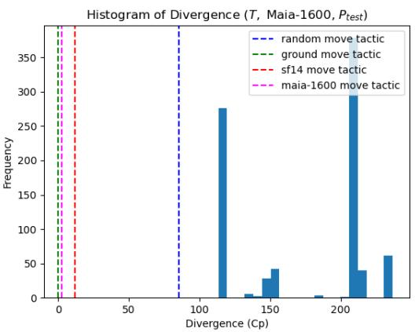
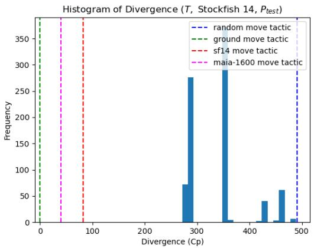
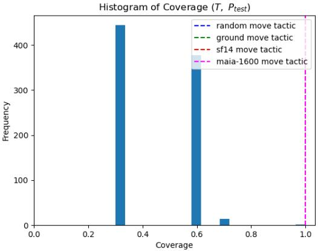
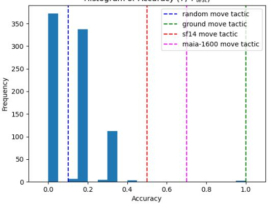
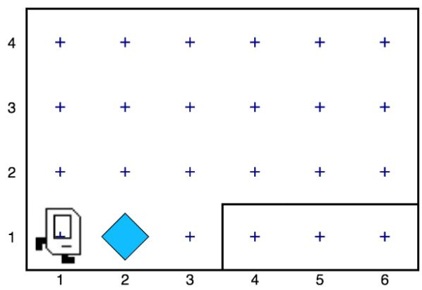

# Learning Explainable Representations of Complex Game-playing Strategies

Abhijeet Krishnan AKRISH13@NCSU.EDU Colin M. Potts CMPOTTS@NCSU.EDU Arnav Jhala AHJHALA@NCSU.EDU Venture IV 420. North Carolina State University, Raleigh. NC 27606 US A

Venture IV 420, North Carolina State University, Raleigh, NC 27606 USA

Harshad Khadilkar HARSHADK@IITB.AC.IN

Department of Aerospace Engineering, Indian Institute of Technology Bombay, Powai, Mumbai 400076, Maharashtra, India

Shirish Karande SHIRISH.KARANDE@TCS.COM

Tata Research Development and Design Centre, Pune 411013, Maharashtra, India

Chris Martens C.MARTENS@NORTHEASTERN.EDU

Meserve 138 (Boston campus), Khoury College of Computer Sciences, College of Arts, Media and Design, Northeastern University, Boston, MA 02115 USA

## Abstract

As part of learning to play complex games, human players develop develop abstractions for concepts and strategies of gameplay consistent with game rules to improve their performance. These concepts are applied to explain other players’ actions, and to inform their own actions in-game. Understanding other players’ strategies is a crucial part of such improvement, but requires time and effort. In this paper, we propose a strategy similar to human cognition for training RL agents to synthesize learned strategies and policies as executable procedures based on sequences of gameplay actions. We present methods to automatically learn such programs to play chess and to solve tasks in a grid-based environment. We show that the learned strategies produce effective actions, and can be learned from gameplay data.

## 1. Introduction

Researchers in varied fields agree that people create mental models as shorthand for understanding the human experience (Boyan & Sherry, 2011). Mental models are described as “mechanisms whereby humans are able to generate descriptions of system purpose and form, as explanations of system functioning and observed system states, and as predictions (or expectations) of future system states” (Rouse et al., 1992). In the context of games, players refine their mental models through solitary practice or formal instruction, discussion of strategies among peers, or investigation of underlying game mechanics (Boyan et al., 2018). Evidence suggests that when provided with optimal game strategies, players are able to transfer them to their game play (Paredes-Olay et al., 2002). However, acquiring good strategies involves many hours of deliberate practice, or access to expert knowledge, which may not be easily available. Automatically learning good game-playing strategies that players can use to refine their mental model would help overcome this challenge.

The problem of strategy synthesis can be defined as the automatic learning of paremeterized gameplay action sequences that can be applied as procedures in games, in some suitably interpretable representation, that can be understood by a player to change their mental model and measurably improve their performance in-game. Existing work focuses mostly on the computational learning algorithms and representations of strategies. For example, Butler et al. (2017) are able to learn strategies using constraint satisfaction as condition-action rules to solve the puzzle game of Nonograms. Canaan et al. (2018) use a genetic algorithm to learn strategies represented using domain-specific rules for the card game Hanabi. A recent line of work models a strategy as an executable program in a domain-specific programming language (DSL), which can then be learned by applying techniques from program synthesis (de Freitas et al., 2018; Mariño et al., 2021; Mariño & Toledo, 2022; Medeiros et al., 2022). Considerably less attention has been devoted to investigating how well the learned strategies can be understood by players, and which factors contribute to their interpretability.

Our contributions in this work are two-fold. First, we present a cognitively-inspired strategy model for chess that is based on existing models of chess strategy found in the game’s literature. We present a learning algorithm and metrics to evaluate the effectiveness of a strategy. We show that the learned strategies can approximate a human beginner better than a random baseline. Second, we present a learning algorithm for programmatic representations of strategies based on the transformer model (Vaswani et al., 2017). We show that it is competitive with prior state-of-the-art while being much more sample efficient.

## 2. Strategy Synthesis

We define strategy synthesis through the lens of reinforcement learning (RL). RL seeks to find an optimal policy $\pi _ { * } ( \cdot , \theta )$ parametrized by a model θ that maximizes the expected return in a Markov Decision Process (MDP) $\langle S , \mathcal { A } ( s ) , \mathcal { P } , \mathcal { R } , \gamma \rangle$ . Our definitions of these terms are based on the treatment by Sutton & Barto (2018).

Strategy synthesis attempts to solve the same problem as RL, with the strategy model being the parametrization θ of a policy, and the synthesis algorithm being the optimization procedure. Unlike RL, strategy synthesis has the additional constraint that the learned strategy model must be aligned with the mental model of the player. Model matching theory posits that the “alignment of game models and external situations can facilitate the player’s transfer of mental models between games and external situations” (Boyan et al., 2018). Alignment is framed as a matter of creating accurate facsimiles of the game, and providing the necessary tools and scaffolds to help players “make sense of” the strategy (Martinez-Garza & Clark, 2017). However, it is unclear how alignment may be meaningfully evaluated.

As a substitute for alignment between a learned strategy and a player’s mental model, we propose using computational metrics for model interpretability derived from the field of explainable AI. Interpretability is defined as “the ability to not only extract or generate explanations for the decisions of the model, but also to present this information in a way that is understandable by human (nonexpert) users to, ultimately, enable them to predict a model’s behaviour” (Puiutta & Veith, 2020). Some metrics that have been found to correlate with interpretability are the number of cognitive chunks used and the model size (Lage et al., 2019).

## 3. Learning Chess Strategies

In this section, we describe our strategy model for chess inspired by the concept of chess tactics. We present a learning algorithm based on inductive logic programming that learns chess strategies from gameplay data. We evaluate the learned strategies and show that our algorithm can learn strategies that approximate a human beginner better than a random baseline.

## 3.1 Chess Strategy Model

We model a chess strategy as a first-order logic rule expressed in Prolog (Wielemaker, 2003) using a domain-specific predicate vocabulary P. As seen in Figure 1, the rule head of the strategy consists of the variables Position, From and To. The input state is described by Position, which is also expressed in first-order logic using P. From and To describe the output action, namely, the move which begins from the square From and ends on the square To.

$$
\begin{array} { r l } & { \mathsf { t a c t i c } ( \mathsf { P o s i t i o n } , \mathsf { F r o m } , \mathsf { T o } ) \gets } \\ & { \qquad \mathsf { f e a t u r e \_ l } \left( \cdot \cdot \cdot \right) , } \\ & { \qquad \mathsf { f e a t u r e \_ 2 } \left( \cdot \cdot \cdot \right) , } \\ & { \qquad \vdots } \\ & { \qquad \mathsf { f e a t u r e \_ n } \left( \cdot \cdot \cdot \right) } \end{array}
$$

Figure 1: Our chess strategy model expressed in Prolog pseudocode. Every feature\_i clause is a rule defined in the predicate vocabulary.

Our usage of first-order logic to model chess tactics is motivated by the following reasons —

1. Chess tactics are an important concept that human players use to think about chess (Szabo, 1984) and are useful in chess education (Gobet & Jansen, 2006).

2. First-order logic has been extensively used to model chess patterns (Berliner, 1975; Pitrat, 1977; Wilkins, 1979; Huberman, 1968; Bramer, 1977; Bratko, 1982).

3. Logic rules are commonly acknowledged to be interpretable and have a long history of research (Zhang et al., 2021).

To evaluate the learned strategies, we define the metrics of coverage and divergence for a strategy σ on a set of positions P as follows —

$$
\mathrm { C o v e r a g e } ( \sigma , P ) \doteq \frac { | P _ { \mathrm { { A } } } | } { | P | }\tag{1}
$$

$$
\mathrm { D i v e r g e n c e } _ { E } ( \sigma ( \cdot ) , P ) \doteq \frac { 1 } { | P _ { \mathrm { A } } | } \sum _ { ( s , a _ { 1 } ) \in P _ { \mathrm { A } } } \sum _ { a _ { 2 } \in A ( s ) } \sigma ( a _ { 2 } | s ) d _ { E } ( s , a _ { 1 } , a _ { 2 } )\tag{2}
$$

where $P _ { A }$ is the set of positions in $P$ where the strategy σ is applicable, and $d _ { E }$ is a distance measure between actions $a _ { 1 }$ and $a _ { 2 }$ in state s.

## 3.2 Learning Chess Strategies using ILP

Inductive logic programming (ILP) is a form of symbolic machine learning that aims to induce a hypothesis (a set of logical rules) that generalizes given training examples. (Cropper & Dumanciˇ c,´ 2022). An ILP problem is specified by three sets of Horn clauses —

• B, the background knowledge,

• $E ^ { + }$ , the set of positive examples of the concept, and

• $E ^ { - }$ , the set of negative examples of the concept.

The ILP problem is to induce a hypothesis $H \in { \mathcal { H } }$ (an appropriately chosen hypothesis space) that, in combination with the background knowledge, entails all the positive examples and none of the negative examples. Formally, this can be written as —

$$
\begin{array} { l } { { \forall e \in E ^ { + } , H \cup B \models e ( \mathrm { i . e . , } H \mathrm { i s } c o m p l e t e ) } } \\ { { \forall e \in E ^ { - } , H \cup B \models e ( \mathrm { i . e . , } H \mathrm { i s } c o n s i s t e n t ) } } \end{array}
$$

We formalize the problem of learning a chess strategy as an ILP problem $\langle E ^ { + } , E ^ { - } , B \rangle . \ E ^ { + }$ is a set of ⟨position, move⟩ tuples where the move made in the position is drawn from a target policy. $E ^ { - }$ is a set of ⟨position, move⟩ tuples where the move made in the position is not drawn from the target policy. B is the predicate vocabulary used to express positions, moves and chess strategies. We learn a hypothesis H that maximizes the number of examples entailed in $E ^ { + }$ and minimizes the number of examples entailed in $E ^ { - }$ . The hypothesis H is our chess strategy σ.

To solve this ILP problem, we use a Prolog-based ILP system called Popper (Cropper & Morel, 2021). We modify Popper to constrain it to produce legal moves and to prune strategies that are never applicable or whose recall on the training set is less than an empirically-determined threshold.

## 3.3 Evaluation

To evaluate our system for chess strategy synthesis, we trained it using a dataset of 1297 (position, move) pairs sampled from online games played by beginner players, and evaluated it on a held-out set of 100 pairs using the metrics of accuracy, coverage and divergence. To serve as the oracles for calculating the distance metric, we used the chess engines Stockfish 14 (Romstad et al., 2021) and Maia-1600 (McIlroy-Young et al., 2020). As baseline strategies, we used the aforementioned chess engines, and the random strategy. We report the results for each of accuracy, coverage and divergence as a histogram with 20 buckets. We see that when using Stockfish 14 as a distance metric, the learned strategies are better at imitating the training set than a random baseline.

fork(Position,From,To) ←

make\_move(From, To, Position, NewPosition),

attacks(To, Square1, NewPosition),

attacks(To, Square2, NewPosition),

different\_pos(Square1, Square2),

Figure 2: An interpretation of the fork tactic from the chess literature using our predicate vocabulary. The first attacks clause states that the piece at To attacks the opposing piece at Square1 in the current position.  
  
(a) Divergence histogram for T evaluated using Maia-1600

  
(b) Divergence histogram for T evaluated using Stockfish 14  
Figure 3: Divergence histograms for T

  
(a) Coverage histogram for $T$

Histogram of Accuracy (T, Ptest)  
  
(b) Accuracy histogram for T

## 4. Learning Programmatic Strategies with Transformers

In this section, we present a novel method for learning programmatic strategies using transformers that is competitive with state-of-the-art methods while being more sample efficient. We first describe how problem of synthesizing programmatic strategies can be modeled as a reinforcement learning problem. We then present our method, which applies the decision transformer model to discrete environments. We evaluate our method using tasks in a grid-based programming environment and show that the strategies learned by our method are competitive with a state-of-the-art programmatic policy synthesis algorithm, while being much more sample efficient.

## 4.1 Programmatic Policy Synthesis as a Reinforcement Learning Problem

Programmatic policy synthesis is the problem of approximating a target policy using a program, as specified by some DSL. We cast this as a RL problem by modeling the program synthesis environment as an MDP. Formally, given a DSL $G = ( V , \Sigma , R , S )$ (Sipser, 1996) which defines the space of possible programmatic policies, and an MDP $M _ { \mathrm { e x e c } }$ in which a programmatic policy σ can execute and obtain reward, we define the programmatic policy synthesis task as that of finding an optimal policy in the MDP $\mathcal { M } _ { \mathrm { s y n } }$ , where:

$\begin{array} { r } { S _ { \mathrm { s y n } } \doteq \{ w \in ( V \cup \Sigma ) ^ { * } \mid S \stackrel { * } { \Rightarrow } w \} } \end{array}$ and is the current sequence of terminals and non-terminals in the partially expanded program $( w _ { 0 } , w _ { 1 } , \cdot \cdot \cdot , w _ { i } , \cdot \cdot \cdot )$

${ \mathcal { A } } _ { \mathrm { s y n } } \doteq R \times V \times \mathbb { N }$ and is the space of all actions consisting of applying a rule r to a non-terminal symbol v located at index i in the current state.

$\mathcal { P } _ { \mathrm { s y n } }$ is the transition function which represents the deterministic transition to a state where the production rule has been applied to the selected non-terminal symbol if such an action was valid. If not, the state remains unchanged.

$d _ { 0 , \mathrm { s y n } } ( S ) = 1$

$r _ { \mathrm { s y n } } \doteq { \left\{ \begin{array} { l l } { r _ { \mathrm { e x e c } } , } \\ { 0 , } \end{array} \right. }$ if current state $s \in \mathcal { S } _ { \mathrm { s y n } }$ is terminal otherwise

$\gamma _ { \mathrm { s y n } } = 1$

Given this formulation, we can learn strategy models in the form of a program (in some DSL) using an RL algorithm.

## 4.2 Applying Decision Transformers to Programmatic Policy Synthesis

Decision transformers were proposed by Chen et al. (2021) as an architecture to apply the sequencemodeling capabilities of transformers (Vaswani et al., 2017) to sequential decision problems. Trajectories τ are represented as:

$$
\tau = \left( \widehat { R } _ { 1 } , s _ { 1 } , a _ { 1 } , \widehat { R } _ { 2 } , s _ { 2 } , a _ { 2 } , \cdot \cdot \cdot , \widehat { R } _ { T } , s _ { T } , a _ { T } \right)\tag{3}
$$

where rewards $r _ { t }$ are modeled as the returns-to-go $\widehat { R } _ { t } = \textstyle \sum _ { t ^ { \prime } = t } ^ { T } r _ { t ^ { \prime } }$ . States, actions and returns are embedded using separate, fully-connected layers. Additionally, an embedding is learned for each timestep and added to each token. This is different from the standard positional embedding used by transformers, as one timestep corresponds to three tokens. The tokens are then processed by a GPT (Radford et al., 2018) model, which predicts future actions via autoregressive modeling.

The original decision transformer architecture cannot handle environments with discrete actions like $\mathcal { M } _ { \mathrm { s y n } }$ , and hence we make the following modifications to the architecture:

• Action Masking: To ensure that the model does not sample invalid actions, we mask out invalid actions by following the approach described in Huang & Ontañón (2022). Informally, given the unnormalized logits representing action predictions, we mask out invalid actions by setting their logits to −∞ and apply a softmax to obtain a probability distribution.

• Cross-entropy loss: The original architecture used a simple L2 loss since actions were continuous. For discrete actions, we use a cross-entropy loss as is usual with classification tasks (Bishop, 2006).

• Sampling from action distribution: The original architecture uses a regression layer to predict the continuous-valued action. Since we are dealing with discrete actions, we sample from the predicted action distribution to obtain the action.

Additionally, to better represent the sequential nature of states in the MDP, we embed the state using a sequential model, specifically a GRU (Cho et al., 2014). This follows from existing approaches to sentence embedding for information retrieval (Palangi et al., 2016; Kiros et al., 2015; Le & Mikolov, 2014). We empirically find that this improves the model’s performance when compared to embedding the state directly 1.

## 4.3 Karel Domain

Karel is a simple programming language designed for teaching programming to beginners (Pattis, 1994). Programs written in Karel are used to control an agent that can move around a grid world and interact with markers in the world. The agent has actions for moving and interacting with markers, and perceptions for detecting obstacles and markers. Trivedi et al. (2021) introduce six different tasks for the Karel domain with different goals and reward structures. The initial configuration for these tasks are randomly sampled for each episode reset. They also introduce a DSL to represent programmatic strategies for solving these tasks (see Figure 6).

## 4.4 Evaluation

To investigate if the decision transformer can perform well on the programmatic policy synthesis task, we evaluate it using the Karel environment and tasks. We train the decision transformer using a dataset of 50,000 programs contributed by Trivedi et al. (2021). We use the same hyperparameters and training procedure as in Chen et al. (2021). A learned strategy’s reward is measured as its average

  
Figure 5: A sample Karel world of size $4 \times 6 .$ . The blue diamond represents a marker. The agent cannot travel through walls.

⟨program⟩ ::= ‘DEF’ ‘run’ ‘m(’ ⟨stmt⟩ ‘m)   
⟨stmt⟩ ::= ‘REPEAT’ ⟨cste⟩ ‘r(’ ⟨stmt⟩ ‘r)’   
| ⟨stmt⟩ ⟨stmt⟩   
| ⟨action⟩   
| ‘IF’ ‘c(’ ⟨cond⟩ ‘c)’ ‘i(’⟨stmt⟩ ‘i)’   
| ‘IFELSE’ ‘c(’ ⟨cond⟩ ‘c)’ ‘i(’ ⟨stmt⟩ ‘i)’ ‘e(’ ⟨stmt⟩ ‘e)’   
| ‘WHILE’ ‘c(’ ⟨cond⟩ ‘c)’ ‘w(’ ⟨stmt⟩ ‘w)’   
⟨cond⟩ ::= ‘not’ ‘c(’ ⟨cond\_without\_not⟩ ‘c)’   
| ⟨cond\_without\_not⟩   
⟨cond\_without\_not⟩ ::= ‘frontIsClear   
| ‘leftIsClear’   
| ‘rightIsClear   
| ‘markersPresent   
| ‘noMarkersPresent’   
⟨action⟩ ::= ‘move’   
| ‘turnLeft’   
| ‘turnRight’   
| ‘putMarker’   
| ‘pickMarker   
⟨cste⟩ ::= ‘R=’⟨int⟩  
Figure 6: The domain-specific language (DSL) for constructing programs in the Karel environment.

return over 10 random initial states. We compare the performance of strategies learned using the decision transformer with those learned by using LEAPS Trivedi et al. (2021). We also compare the number of candidate programs searched by each method. From the results in Table table 1, we see that the decision transformer is competitive with LEAPS in terms of performance, while being more sample efficient.  
Table 1: Mean return ([0, 1.1]) of the best program found and number of unique programs explored by LEAPS and the Decision Transformer model on each Karel task. The standard deviation is reported in parentheses.
<table><tr><td rowspan="2">Task</td><td colspan="2">Mean Return</td><td colspan="2">Unique Programs</td></tr><tr><td>LEAPS</td><td>DT</td><td>LEAPS</td><td>DT</td></tr><tr><td>cleanHouse</td><td>0.16 (0.13)</td><td>0.23</td><td>3627</td><td>59</td></tr><tr><td>fourCorners</td><td>0.35 (0.00)</td><td>0.35</td><td>9872</td><td>55</td></tr><tr><td>harvester</td><td>0.61 (0.21)</td><td>0.66</td><td>11708</td><td>28</td></tr><tr><td>randomMaze</td><td>0.97 (0.04)</td><td>1.0</td><td>295</td><td>63</td></tr><tr><td>stairClimber</td><td>0.74 (0.49)</td><td>1.1</td><td>298</td><td>49</td></tr><tr><td>topOff</td><td>0.80 (0.11)</td><td>0.66</td><td>30278</td><td>63</td></tr></table>

## 5. Related Work

Neural program synthesis Program synthesis is the task of automatically finding a program in the underlying programming language that satisfies the user intent expressed in some form of specification (Gulwani et al., 2017). Examples of specifications include formal rules (Manna & Waldinger, 1980), input/output pairs (Neelakantan et al., 2016; Devlin et al., 2017; Gaunt et al., 2017; Shin et al., 2018; Bunel et al., 2018; Lázaro-Gredilla et al., 2019; Chen et al., 2019; Yang et al., 2021), demonstrations (Sun et al., 2018; Xu et al., 2018; Burke et al., 2019), natural language instructions/prompts (Liang et al., 2023) and MDP rewards (Li et al., 2020; Trivedi et al., 2021; Qiu & Zhu, 2022). Neural program synthesis focuses specifically on applying statistical learning methods based on neural networks to the problem of program synthesis. We attempt to synthesize programs from MDP rewards using a transformer-based approach to the task. This is motivated by the empirical success of the transformer model on sequence learning tasks.

Learning programmatic policies A reinforcement learning policy’s interpretability refers to the ability of a human to understand, generate explanations for and predict the policy’s behavior (Puiutta & Veith, 2020). A result-based approach towards learning interpretable policies is by learning a surrogate model that approximates the original model with a simpler, ante-hoc explainable one (Speith, 2022). A line of work focuses on learning surrogate models in the form of programs (in some programming language) (Orfanos & Lelis, 2023; Qiu & Zhu, 2022; Trivedi et al., 2021; Inala et al., 2020; Verma et al., 2018, 2019). A related line of work focuses on learning programmatic policies for game-based MDPs (Mariño et al., 2021; Mariño & Toledo, 2022; Medeiros et al., 2022). This work investigates the use of a transformer-based architecture to the same task.

## 6. Conclusion and Future Work

We presented the problem of strategy synthesis and explored its connections to mental model matching, model interpretability and program synthesis. We introduced two novel approaches towards strategy synthesis – a) a rule-based strategy model for chess based on chess tactics, and an associated learning method, which we showed could learn strategies that better approximated a beginner than a random baseline, and b) a transformer-based learning method for programmatic strategies that was competitive with a state-of-the-art programmatic policy learning method while being more sample-efficient.

In future work, we plan to benchmark the decision transformer, and other programmatic policy learning methods, on a wider range of game-based environments. We also plan to investigate the interpretability of the learned strategies, and to measure the extent to which they are able to measurably improve a player’s performance.

## References

Berliner, H. J. (1975). A representation and some mechanisms for a problem solving chess program. Technical report, Carnegie-Mellon Univ Pittsburgh PA Dept of Computer Science.

Bishop, C. M. (2006). Pattern recognition and machine learning (information science and statistics). Berlin, Heidelberg: Springer-Verlag.

Boyan, A., McGloin, R., & Wasserman, J. A. (2018). Model matching theory: a framework for examining the alignment between game mechanics and mental models. Media and Communication, 6, 126–136.

Boyan, A., & Sherry, J. L. (2011). The challenge in creating games for education: Aligning mental models with game models. Child Development Perspectives, 5, 82–87.

Bramer, M. A. (1977). Representation of knowledge for chess endgames towards a self-improving system. Doctoral dissertation, Open University (United Kingdom).

Bratko, I. (1982). Knowledge-based problem-solving in al3. Machine intelligence, 10, 73–100.

Bunel, R., Hausknecht, M., Devlin, J., Singh, R., & Kohli, P. (2018). Leveraging grammar and reinforcement learning for neural program synthesis. International Conference on Learning Representations. From https://openreview.net/forum?id=H1Xw62kRZ.

Burke, M., Penkov, S. V., & Ramamoorthy, S. (2019). From explanation to synthesis: Compositional program induction for learning from demonstration. Robotics: Science and Systems XV. Robotics: Science and Systems Foundation. From https://doi.org/10.15607%2Frss.2019.xv. 015.

Butler, E., Torlak, E., & Popovic, Z. (2017). Synthesizing interpretable strategies for solving puzzle´ games. Proceedings of the 12th International Conference on the Foundations of Digital Games.

New York, NY, USA: Association for Computing Machinery. From https://doi.org/10. 1145/3102071.3102084.

Canaan, R., Shen, H., Torrado, R., Togelius, J., Nealen, A., & Menzel, S. (2018). Evolving agents for the hanabi 2018 cig competition. 2018 IEEE Conference on Computational Intelligence and Games (CIG) (pp. 1–8).

Chen, L., Lu, K., Rajeswaran, A., Lee, K., Grover, A., Laskin, M., Abbeel, P., Srinivas, A., & Mordatch, I. (2021). Decision Transformer: Reinforcement Learning via Sequence Modeling. Advances in Neural Information Processing Systems (pp. 15084–15097). Curran Associates, Inc. From https://proceedings.neurips.cc/paper/2021/hash/ 7f489f642a0ddb10272b5c31057f0663-Abstract.html.

Chen, X., Liu, C., & Song, D. (2019). Execution-guided neural program synthesis. International Conference on Learning Representations. From https://openreview.net/forum?id= H1gfOiAqYm.

Cho, K., van Merriënboer, B., Gulcehre, C., Bahdanau, D., Bougares, F., Schwenk, H., & Bengio, Y. (2014). Learning phrase representations using RNN encoder–decoder for statistical machine translation. Proceedings of the 2014 Conference on Empirical Methods in Natural Language Processing (EMNLP) (pp. 1724–1734). Doha, Qatar: Association for Computational Linguistics. From https://aclanthology.org/D14-1179.

Cropper, A., & Dumanciˇ c, S. (2022). Inductive logic programming at 30: A new introduction. ´ Journal of Artificial Intelligence Research, 74, 765–850.

Cropper, A., & Morel, R. (2021). Learning programs by learning from failures. Machine Learning, 110, 801–856.

Devlin, J., Uesato, J., Bhupatiraju, S., Singh, R., rahman Mohamed, A., & Kohli, P. (2017). RobustFill: Neural program learning under noisy I/O. Proceedings of the 34th International Conference on Machine Learning (pp. 990–998). PMLR. From https://proceedings.mlr.press/ v70/devlin17a.html.

de Freitas, J. M., de Souza, F. R., & Bernardino, H. S. (2018). Evolving controllers for mario ai using grammar-based genetic programming. 2018 IEEE Congress on Evolutionary Computation (CEC) (pp. 1–8).

Gaunt, A. L., Brockschmidt, M., Kushman, N., & Tarlow, D. (2017). Differentiable programs with neural libraries. Proceedings ofthe 34th International Conference on Machine Learning (pp. 1213– 1222). PMLR. From https://proceedings.mlr.press/v70/gaunt17a.html.

Gobet, F., & Jansen, P. J. (2006). Training in chess: A scientific approach. Education and chess.

Gulwani, S., Polozov, O., & Singh, R. (2017). Program synthesis. Foundations and Trends® in Programming Languages, 4, 1–119.

Huang, S., & Ontañón, S. (2022). A Closer Look at Invalid Action Masking in Policy Gradient Algorithms. The International FLAIRS Conference Proceedings, 35. From http://arxiv. org/abs/2006.14171. ArXiv:2006.14171 [cs, stat].

Huberman, B. J. (1968). A program to play chess end games. Doctoral dissertation, Department of Computer Science, Stanford University.

Inala, J. P., Bastani, O., Tavares, Z., & Solar-Lezama, A. (2020). Synthesizing programmatic policies that inductively generalize. International Conference on Learning Representations. From https://openreview.net/forum?id=S1l8oANFDH.

Kiros, R., Zhu, Y., Salakhutdinov, R. R., Zemel, R., Urtasun, R., Torralba, A., & Fidler, S. (2015). Skip-thought vectors. Advances in Neural Information Processing Systems. Curran Associates, Inc. From https://proceedings.neurips.cc/paper\_files/paper/ 2015/hash/f442d33fa06832082290ad8544a8da27-Abstract.html.

Lage, I., Chen, E., He, J., Narayanan, M., Kim, B., Gershman, S. J., & Doshi-Velez, F. (2019). Human evaluation of models built for interpretability. Proceedings of the AAAI Conference on Human Computation and Crowdsourcing, 7, 59–67. From https://ojs.aaai.org/index.php/ HCOMP/article/view/5280.

Le, Q., & Mikolov, T. (2014). Distributed representations of sentences and documents. Proceedings of the 31st International Conference on Machine Learning (p. 1188–1196). PMLR. From https: //proceedings.mlr.press/v32/le14.html.

Li, Y., Gimeno, F., Kohli, P., & Vinyals, O. (2020). Strong generalization and efficiency in neural programs.

Liang, J., Huang, W., Xia, F., Xu, P., Hausman, K., Ichter, B., Florence, P., & Zeng, A. (2023). Code as policies: Language model programs for embodied control. 2023 IEEE International Conference on Robotics and Automation (ICRA) (p. 9493–9500).

Lázaro-Gredilla, M., Lin, D., Guntupalli, J. S., & George, D. (2019). Beyond imitation: Zero-shot task transfer on robots by learning concepts as cognitive programs. Science Robotics, 4, eaav3150.

Manna, Z., & Waldinger, R. (1980). A deductive approach to program synthesis. ACM Trans. Program. Lang. Syst., 2, 90–121.

Mariño, J. R., & Toledo, C. F. (2022). Evolving interpretable strategies for zero-sum games. Applied Soft Computing, 122, 108860.

Mariño, J. R. H., Moraes, R. O., Oliveira, T. C., Toledo, C., & Lelis, L. H. S. (2021). Programmatic strategies for real-time strategy games. Proceedings of the AAAI Conference on Artificial Intelligence, 35, 381–389. From https://ojs.aaai.org/index.php/AAAI/article/ view/16114.

Martinez-Garza, M. M., & Clark, D. B. (2017). Two systems, two stances: A novel theoretical frameworkfor model-based learning in digital games, (p. 37–58). Cham: Springer International Publishing. From https://doi.org/10.1007/978-3-319-39298-1\_3.

McIlroy-Young, R., Sen, S., Kleinberg, J., & Anderson, A. (2020). Aligning superhuman ai with human behavior: Chess as a model system. Proceedings ofthe 26th ACM SIGKDD International Conference on Knowledge Discovery & Data Mining (pp. 1677–1687). New York, NY, USA: Association for Computing Machinery. From https://doi.org/10.1145/3394486.3403219.

Medeiros, L. C., Aleixo, D. S., & Lelis, L. H. S. (2022). What can we learn even from the weakest? learning sketches for programmatic strategies. From http://arxiv.org/abs/ 2203.11912. ArXiv:2203.11912 [cs].

Neelakantan, A., Le, Q. V., & Sutskever, I. (2016). Neural programmer: Inducing latent programs with gradient descent. 4th International Conference on Learning Representations, ICLR 2016, San Juan, Puerto Rico, May 2-4, 2016, Conference Track Proceedings. From http://arxiv. org/abs/1511.04834.

Orfanos, S., & Lelis, L. H. S. (2023). Synthesizing programmatic policies with actor-critic algorithms and relu networks.

Palangi, H., Deng, L., Shen, Y., Gao, J., He, X., Chen, J., Song, X., & Ward, R. (2016). Deep sentence embedding using long short-term memory networks: Analysis and application to information retrieval. IEEE/ACM Transactions on Audio, Speech, and Language Processing, 24, 694–707.

Paredes-Olay, C., Abad, M. J. F., Gámez, M., & Rosas, J. M. (2002). Transfer of control between causal predictive judgments and instrumental responding. Animal Learning & Behavior, 30, 239–248.

Pattis, R. E. (1994). Karel the robot: a gentle introduction to the art of programming. John Wiley & Sons.

Pitrat, J. (1977). A chess combination program which uses plans. Artificial Intelligence, 8, 275–321.

Puiutta, E., & Veith, E. M. (2020). Explainable reinforcement learning: A survey. International Cross-Domain Conferencefor Machine Learning and Knowledge Extraction (pp. 77–95). Springer.

Qiu, W., & Zhu, H. (2022). Programmatic reinforcement learning without oracles. International Conference on Learning Representations. From https://openreview.net/forum?id= 6Tk2noBdvxt.

Radford, A., Narasimhan, K., Salimans, T., & Sutskever, I. (2018). Improving language understanding by generative pre-training. From https://cdn.openai.com/research-covers/ language-unsupervised/language\_understanding\_paper.pdf.

Romstad, T., Costalba, M., & Kiiski, J. (2021). Stockfish 14. From https://stockfishchess. org/.

Rouse, W., Cannon-Bowers, J., & Salas, E. (1992). The role of mental models in team performance in complex systems. IEEE Transactions on Systems, Man, and Cybernetics, 22, 1296–1308.

Shin, E. C., Polosukhin, I., & Song, D. (2018). Improving neural program synthesis with inferred execution traces. Advances in Neural Information Processing Systems. Curran Associates, Inc. From https://proceedings.neurips.cc/paper\_files/paper/ 2018/file/7776e88b0c189539098176589250bcba-Paper.pdf.

Sipser, M. (1996). Introduction to the theory of computation. International Thomson Publishing, 1st edition.

Speith, T. (2022). A review of taxonomies of explainable artificial intelligence (xai) methods. Proceedings of the 2022 ACM Conference on Fairness, Accountability, and Transparency (p. 2239–2250). New York, NY, USA: Association for Computing Machinery. From https://dl.

acm.org/doi/10.1145/3531146.3534639.

Sun, S.-H., Noh, H., Somasundaram, S., & Lim, J. (2018). Neural program synthesis from diverse demonstration videos. Proceedings of the 35th International Conference on Machine Learning (pp. 4790–4799). PMLR. From https://proceedings.mlr.press/v80/sun18a.html.

Sutton, R. S., & Barto, A. G. (2018). Reinforcement learning: An introduction. MIT press.

Szabo, A. (1984). Computer chess tactics and strategy. Doctoral dissertation, University of British Columbia. From https://open.library.ubc.ca/collections/ ubctheses/831/items/1.0051870.

Trivedi, D., Zhang, J., Sun, S.-H., & Lim, J. J. (2021). Learning to Synthesize Programs as Interpretable and Generalizable Policies. Advances in Neural Information Processing Systems (pp. 25146–25163). Curran Associates, Inc. From https://proceedings.neurips.cc/ paper/2021/hash/d37124c4c79f357cb02c655671a432fa-Abstract.html.

Vaswani, A., Shazeer, N., Parmar, N., Uszkoreit, J., Jones, L., Gomez, A. N., Kaiser, Ł., & Polosukhin, I. (2017). Attention is all you need. Advances in Neural Information Processing Systems. Curran Associates, Inc. From https://proceedings.neurips.cc/paper\_files/paper/ 2017/file/3f5ee243547dee91fbd053c1c4a845aa-Paper.pdf.

Verma, A., Le, H., Yue, Y., & Chaudhuri, S. (2019). Imitation-Projected Programmatic Reinforcement Learning. Advances in Neural Information Processing Systems. Curran Associates, Inc. From https://proceedings.neurips.cc/paper\_files/paper/ 2019/file/5a44a53b7d26bb1e54c05222f186dcfb-Paper.pdf.

Verma, A., Murali, V., Singh, R., Kohli, P., & Chaudhuri, S. (2018). Programmatically interpretable reinforcement learning. Proceedings of the 35th International Conference on Machine Learning (pp. 5045–5054). PMLR. From https://proceedings.mlr.press/v80/verma18a. html.

Wielemaker, J. (2003). An overview of the swi-prolog programming environment.

Wilkins, D. E. (1979). Using patterns and plans to solve problems and control search. Stanford University.

Xu, D., Nair, S., Zhu, Y., Gao, J., Garg, A., Fei-Fei, L., & Savarese, S. (2018). Neural task programming: Learning to generalize across hierarchical tasks. 2018 IEEE International Conference on Robotics and Automation (ICRA) (pp. 3795–3802).

Yang, Y. D., Inala, J. P., Bastani, O., Pu, Y., Solar-Lezama, A., & Rinard, M. (2021). Program Synthesis Guided Reinforcement Learning for Partially Observed Environments. From http: //arxiv.org/abs/2102.11137. ArXiv:2102.11137 [cs].

Zhang, Y., Tino, P., Leonardis, A., & Tang, K. (2021). A survey on neural network interpretability.ˇ IEEE Transactions on Emerging Topics in Computational Intelligence, 5, 726–742.