# Linear Fitness Subspace in Protein Language Models Enables Sample-Efficient Directed Evolution

SiYuan Ma1 Canran Xiao2 Zikai Xiao3 Albert Gao4 Liang He5 Xuan-Yu Wang6 Shuying Cao7 Xiaojun Jia1

1College of Computing and Data Science, Nanyang Technological University, Singapore

2Sun Yat-sen University, China 3Zhejiang University, China

4Carnegie Mellon University, USA

5Shanghai Institute of Optics and Fine Mechanics, China 6Zhongnan Hospital, Wuhan University, China 7University of Southern California, USA

## Abstract

Model-guided directed evolution seeks to identify high-fitness protein variants under limited oracle budgets. Protein language models (PLMs) provide rich representations for this task, but task-agnostic zero-shot scores can be misaligned with a target assay, while supervised search in high-dimensional embedding spaces can make surrogate modeling and uncertainty estimation sample-inefficient. We propose the Linear Fitness Subspace (LFS) hypoth esis: within mutation-induced residue-level representation changes, a compact, assay-specific set of directions makes fitness variation linearly accessible from few labeled variants. This is a local, supervision-recoverable statement rather than a claim that protein fitness landscapes or global PLM geometry are universally linear. Building on this observation, we introduce Subspace-Guided Evolutionary Search (SGES), which estimates an LFS from a small initial sample and performs surrogate modeling, uncertainty estimation, and acquisition in the learned subspace. Across 10 core ProteinGym assays, 87 extended static-validation assays, and an 18-assay budgeted-search evaluation, SGES improves fitness prediction and search efficiency over zero-shot PLMs and recent ML-guided protein optimization baselines. Controlled comparisons with PCA, random projections, label-shuffled PLS, classical mutation features, and acquisition ablations further isolate the benefit of a fitness-aligned site-delta coordinate.

## 1 Introduction

Directed evolution is a central strategy for engineering proteins with improved activity, stability, binding affinity, and other functional properties. Its main bottleneck is sample efficiency: each candidate variant must be evaluated by an experimental or computational oracle, making large-scale search expensive. Model-guided directed evolution therefore aims to identify high-fitness variants under limited oracle budgets, where the key challenge is both accurate fitness prediction and efficient exploration of a combinatorially large protein sequence space (Jiang et al., 2024; Soldát and Kléma, 2024; Kmicikiewicz et al., 2026; Takizawa et al., 2025; Yang et al., 2025; Tian et al., 2022).

Protein language models (PLMs) provide a promising foundation for this problem. Trained on large protein sequence corpora, PLMs encode evolutionary, structural, and functional constraints that can be transferred to mutation-effect prediction (Meier et al., 2021; Notin et al., 2022; Su et al., 2024; Li et al., 2024; Hayes et al., 2025). Existing PLM-based methods usually follow two paradigms. Zero-shot methods estimate mutation effects from likelihood or masked-marginal scores without labeled fitness data, while supervised methods use PLM embeddings as features for downstream predictors or search algorithms (Notin et al., 2023; Meier et al., 2021; Notin et al., 2022; Ma et al., 2026a). However, zero-shot scores are task-agnostic and often misaligned with assayspecific fitness, whereas supervised search in highdimensional embedding spaces can suffer from sample-inefficient surrogate modeling and unreliable uncertainty estimation (Soldát and Kléma, 2024; Greenman et al., 2025; Rahaman et al., 2021; Lakshminarayanan et al., 2017; Tian et al., 2023; Ma et al., 2026b).

This paper studies a representation-level question: where is assay-specific mutation-effect information located inside a frozen protein language model? We focus on the local displacement induced by a mutation relative to its wild type. For a mutation at position $p ,$ define $\delta ( s ) = h ( s ) [ p ] -$ $h ( \boldsymbol { s } _ { \mathrm { w t } } ) [ p ]$ . Our central observation is that, in this mutation-local site-delta coordinate, a substantial component of assay fitness is accessible through a small number of supervised linear directions. We refer to this compact, assay-specific coordinate as the Linear Fitness Subspace (LFS). Importantly, this does not assert that global PLM embeddings or complete protein fitness landscapes are universally linear.

The LFS hypothesis provides a geometric explanation for the gap between zero-shot and supervised PLM-based fitness prediction. Zero-shot scoring can be viewed as a fixed, task-agnostic one-dimensional projection of mutation-induced representation change, while supervised learning recovers assay-specific fitness directions from a small number of labeled variants. When the zeroshot direction is poorly aligned with the true assayspecific direction, zero-shot performance is limited; few-shot supervision improves prediction by rotating the projection toward the appropriate fitness subspace. This view connects protein fitness prediction with broader findings that neural representations encode task-relevant information in linearly accessible directions or subspaces (Hewitt and Manning, 2019; Saurez et al., 2026; Gujral et al., 2025; Beshkov and Malthe-Sørenssen, 2025; Chen et al., 2022).

Based on this observation, this paper proposes Subspace-Guided Evolutionary Search (SGES), a directed evolution framework that first estimates the LFS from site-delta features using a small initial query budget, then performs surrogate modeling, uncertainty estimation, and acquisition in the learned low-dimensional subspace. Across 10 core ProteinGym assays and an extended set of 87 assays, SGES improves over zero-shot PLM scores, full-dimensional GP-BO, AdaLead, EVOLVEpro, and recent ML-guided directed evolution baselines under matched oracle budgets (Jiang et al., 2024; Notin et al., 2023; Soldát and Kléma, 2024; Kmicikiewicz et al., 2026; Takizawa et al., 2025; Yang et al., 2025; Ma et al., 2026c).

The main contributions are:

• Assay-specific Linear Fitness Subspace.

We formulate and test the hypothesis that mutation-local PLM site-delta features expose a compact, supervision-recoverable coordinate in which a substantial component of fitness is linearly accessible.

• Geometric view of zero-shot scoring. We operationalize zero-shot scoring as a fixed taskagnostic direction in the same site-delta space and quantify its alignment with the supervised assay-specific direction.

• Subspace-guided search. SGES couples LFS discovery with low-dimensional surrogate modeling, uncertainty-aware acquisition, and diversity filtering for sample-efficient directed evolution.

• Controlled attribution and broad validation. Matched-dimensionality controls (PCA, random projection, and label-shuffled PLS), weaker mutation-feature baselines, component ablations, 10 core assays, 87 extended assays, and 18 search-statistics assays separate fitness alignment from generic dimensionality reduction and acquisition effects.

## 2 Related Work

Protein language models (PLMs) have become a major foundation for protein fitness prediction, mutation-effect estimation, and sequence design. Early zero-shot PLM methods showed that likelihood-based or masked-marginal scores can predict the effects of mutations without taskspecific labels (Meier et al., 2021; Notin et al., 2022). Subsequent PLMs incorporated larger sequence corpora, structural information, or more expressive protein representations, as represented by ESM-2, Tranception, SaProt, ProSST, and evolutionary-scale protein language models (Meier et al., 2021; Notin et al., 2022; Su et al., 2024; Li et al., 2024; Hayes et al., 2025; Lin et al., 2023). Large-scale benchmarks such as ProteinGym further enabled systematic evaluation across diverse proteins and assays, revealing that zero-shot scores often capture useful evolutionary constraints but remain highly variable across fitness landscapes (Notin et al., 2023). In parallel, non-PLM baselines based on conservation, phylogeny, solvent accessibility, and structural priors remain competitive for variant-effect prediction, suggesting that PLMbased methods should be evaluated against both neural and classical evolutionary signals (Tekpinar et al., 2025; Tsishyn et al., 2025; Prillo et al., 2024). A complementary paradigm uses PLM representations as supervised features for downstream predictors, allowing adaptation to assay-specific objectives when a small number of labeled variants is available. However, many supervised approaches rely on global or mean-pooled embeddings, which can obscure the local residue-level perturbation induced by mutation.

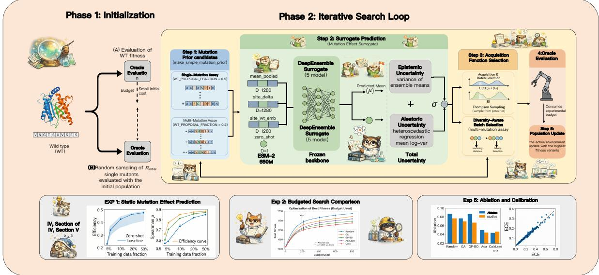  
Figure 1: Overall pipeline of Subspace-Guided Evolutionary Search (SGES). SGES starts from the wild-type sequence and a small initial oracle budget, constructs mutation candidates, extracts mutation-aware PLM features, and performs iterative search through surrogate prediction, uncertainty-aware acquisition, oracle evaluation, and population update. This overview connects the representation-level discovery in Section 3 with the search algorithm introduced later: fitness prediction is not treated as generic high-dimensional embedding regression, but is guided by mutation-induced representation changes that expose a compact fitness-relevant structure.

ML-guided directed evolution studies how surrogate models, acquisition functions, and proposal mechanisms can optimize proteins under limited oracle budgets. Classical approaches include Gaussian-process Bayesian optimization, active learning, evolutionary search, and surrogateassisted protein design (Soldát and Kléma, 2024; Amin et al., 2025; Kirjner et al., 2024; Emami et al., 2023; Takizawa et al., 2025; Hartman et al., 2025; Ding et al., 2024). More recent methods combine PLM representations with tree search, generative priors, safe optimization, or latent-space search, including EVOLVEpro, ProSpero, AlphaDE, LatentDE, BOES, and TreeNeuralUCB (Jiang et al., 2024; Kmicikiewicz et al., 2026; Amin et al., 2025; Takizawa et al., 2025; Yang et al., 2025; Tran et al., 2025; Qiu et al., 2024). Other generative and structure-aware protein design methods, such as guided discrete diffusion, DPLM-Evo, EvoFlows,

ProteinMPNN, and atomistic equivariant design models, provide powerful sequence or structure generation mechanisms, but they are not primarily designed to explain where assay-specific fitness information is located inside PLM representations (Wang et al., 2026; Deutschmann et al., 2026; Gruver et al., 2023; Lin et al., 2026; Dauparas et al., 2022). These methods demonstrate the value of learned representations for protein optimization, but they generally treat the PLM embedding space as a high-dimensional black-box feature space. As a result, surrogate fitting and uncertainty estimation can become sample-inefficient, especially when most embedding dimensions are weakly related to the target assay.

Uncertainty estimation is another important component of model-guided protein optimization. Deep ensembles, Bayesian approximations, and protein-engineering-specific uncertainty benchmarks have shown that uncertainty quality strongly affects acquisition and downstream search performance (Greenman et al., 2025; Rahaman et al., 2021; Lakshminarayanan et al., 2017; Gal and Ghahramani, 2015). However, uncertainty estimation is only useful when uncertainty is measured in a representation space aligned with the target property. In high-dimensional PLM spaces, epistemic uncertainty may reflect irrelevant embedding variation rather than fitness-relevant uncertainty. This motivates the present work’s design choice: SGES estimates uncertainty after projecting mutation-induced site-delta features into the learned Linear Fitness Subspace, so exploration is concentrated along directions that empirically covary with fitness.

This work is also related to representationgeometry and interpretability studies. In NLP and vision, linear probes and low-dimensional subspaces have been used to show that neural networks often encode task-relevant information in linearly accessible directions (Hewitt and Manning, 2019; Saurez et al., 2026). Protein sequence models have likewise long been known to encode biologically meaningful structure, and large PLMs expose structural and functional information through their learned representations (Meier et al., 2021; Lin et al., 2023). We therefore do not claim that “linear structure in protein models” is itself new. LFS makes a narrower claim: for a fixed wild type, assay-specific mutation-effect information is concentrated in supervised directions of residue-level site-delta displacements, and those directions can serve directly as the coordinate system for budgeted search.

A particularly relevant directed-evolution comparison is PPDE (Emami et al., 2023). PPDE combines unsupervised or PLM-derived sequence plausibility with a supervised fitness expert and performs gradient-based discrete MCMC in protein sequence space. SGES instead uses a small labeled set to estimate an assay-specific LFS and then performs surrogate modeling, uncertainty estimation, and UCB acquisition inside that learned low-dimensional coordinate. The two views are complementary: PPDE focuses on a plug-and-play sequence-space sampler, whereas SGES focuses on identifying a mutation-local coordinate in which prediction and uncertainty estimation become more sample-efficient.

## 3 The Linear Fitness Subspace Hypothesis

This section formalizes the central representationlevel observation: mutation-induced fitness variation is concentrated in a low-dimensional linear subspace of residue-level PLM representation changes. Rather than treating PLM embeddings as generic high-dimensional features, the goal is to identify the intrinsic coordinates in which mutational effects become linearly accessible.

## 3.1 Problem Setup and Notation

Let $s _ { \mathrm { w t } }$ denote the wild-type sequence and s a mutant sequence obtained by substituting the residue at position $p .$ The assay fitness is $f ( s )$ , with relative change

$$
\Delta f ( s ) = f ( s ) - f ( s _ { \mathrm { w t } } ) .\tag{1}
$$

A frozen PLM maps a sequence to residue-level representations $h ( s ) \in \mathbb { R } ^ { L \times d }$ . For each mutation, we define the site-delta feature

$$
\begin{array} { r } { \delta ( s ) = h ( s ) [ p ] - h ( s _ { \mathrm { w t } } ) [ p ] \in \mathbb R ^ { d } . } \end{array}\tag{2}
$$

Unlike mean-pooled embeddings, $\delta ( s )$ isolates the local representational displacement induced by the mutation and removes most sequence-level background shared by the wild type and mutant.

## 3.2 Hypothesis Statement

The Linear Fitness Subspace (LFS) hypothesis has three components. First, mutational fitness effects are approximately linearly accessible from sitedelta features:

$$
\Delta f ( s ) \approx w ^ { \top } \delta ( s ) .\tag{3}
$$

This does not assume that protein fitness landscapes are globally linear; rather, it suggests that PLMs partially linearize local mutational effects in representation space. Second, the fitness-relevant signal lies in a compact subspace

$$
\mathcal { U } _ { \mathrm { f i t } } = \operatorname { s p a n } ( w _ { 1 } , \ldots , w _ { k } ) , \qquad k \ll d ,\tag{4}
$$

so that each mutant can be represented as $z ( s ) =$ $W ^ { \top } \delta ( s ) \in \mathbb { R } ^ { k }$ , where $W = [ w _ { 1 } , \dots , w _ { k } ]$ . Third, zero-shot PLM scoring is analyzed as a fixed onedimensional direction in the same site-delta space. Let $q _ { \mathrm { z s } } ( s )$ denote the zero-shot score on a variant. For the alignment analysis, we fit a onedimensional linear probe

$$
\begin{array} { r } { q _ { \mathrm { z s } } ( s ) \approx b _ { \mathrm { z s } } + w _ { \mathrm { z s } } ^ { \top } \delta ( s ) , } \end{array}\tag{5}
$$

using the same variants and site-delta features as the LFS analysis. The supervised direction $w _ { \mathrm { l f s } }$ is obtained from the PLS fit to assay fitness labels. We then quantify zero-shot/assay alignment by

$$
\mathrm { a l i g n } _ { \mathrm { z s , L F S } } = \cos ( w _ { \mathrm { z s } } , w _ { \mathrm { l f s } } ) .\tag{6}
$$

This operational definition makes the projection analysis reproducible and does not require the raw zero-shot scoring rule itself to be globally linear.

<table><tr><td>Assay</td><td>Ridge δ</td><td>Mean-pool</td><td>MLP</td><td>Ratio</td></tr><tr><td>SPG1_STRSG</td><td>0.945</td><td>0.620</td><td>0.973</td><td>0.971</td></tr><tr><td>BLAT_Firnberg</td><td>0.865</td><td>0.730</td><td>0.903</td><td>0.958</td></tr><tr><td>PABP_YEAST</td><td>0.840</td><td>0.580</td><td>0.916</td><td>0.917</td></tr><tr><td>P53_HUMAN</td><td>0.810</td><td>0.650</td><td>0.874</td><td>0.927</td></tr><tr><td>RASH_HUMAN</td><td>0.755</td><td>0.590</td><td>0.825</td><td>0.915</td></tr><tr><td>AMIE_PSEAE</td><td>0.758</td><td>0.550</td><td>0.823</td><td>0.921</td></tr><tr><td>DYR_ECOLI</td><td>0.675</td><td>0.510</td><td>0.749</td><td>0.901</td></tr><tr><td>BLAT_Jacquier</td><td>0.650</td><td>0.590</td><td>0.702</td><td>0.926</td></tr><tr><td>PTEN_HUMAN</td><td>0.510</td><td>0.380</td><td>0.593</td><td>0.860</td></tr><tr><td>HIS7_YEAST</td><td>0.820</td><td>0.540</td><td>0.895</td><td>0.916</td></tr><tr><td>Average</td><td>0.763</td><td>0.574</td><td>0.825</td><td>0.921</td></tr></table>

Table 1: Linear accessibility of mutational fitness. Ridge regression on site-delta features recovers most of the nonlinear MLP performance, while mean-pooled features are substantially weaker.

## 3.3 Empirical Validation

Table 1 first tests whether fitness is linearly accessible from site-delta features. Ridge regression on $\delta ( s )$ reaches an average Spearman correlation of 0.763, compared with 0.825 for a nonlinear MLP baseline, yielding an average linearity ratio of 0.921. In contrast, mean-pooled features obtain only 0.574 on average. This gap indicates that the signal is not merely a consequence of using a strong PLM backbone; it specifically arises from the mutation-aware site-delta coordinate.

Figure 2 provides the complementary evidence. Performance saturates with only $k \approx 5 – 1 0$ components, supporting the low-dimensionality claim; the first LFS direction $w _ { 1 } ^ { \top } \delta ( s )$ already orders variants by fitness in representative assays, supporting linear accessibility; feature ablation identifies sitedelta as the dominant predictor; and zero-shot–LFS alignment explains when zero-shot scoring fails. Together, Table 1 and Figure 2 show that PLMs encode mutational fitness in a compact, assay-specific subspace. This motivates SGES: if the fitnessrelevant signal lies in the LFS, search should be performed in that subspace rather than in the full PLM embedding space.

## 4 Method: Subspace-Guided Evolutionary Search

The LFS hypothesis implies that model-guided directed evolution should not search in the full PLM embedding space. SGES therefore follows a twophase design, as summarized in Figure 1: it first discovers an assay-specific fitness subspace from a small number of labeled variants, then performs surrogate modeling and acquisition directly in that subspace. The key distinction from standard PLMguided search is that the surrogate is trained on the projected site-delta representation rather than on generic high-dimensional embeddings.

## 4.1 Subspace Discovery

Given a wild-type sequence $s _ { \mathrm { w t } }$ , frozen PLM h, and oracle budget B, SGES first queries an initial labeled set of size $N _ { \mathrm { i n i t } }$ for subspace discovery. In all main budgeted-search experiments, $B _ { \mathrm { m a x } } \ =$ 500 and $N _ { \mathrm { i n i t } } = 3 2 $ ; the same initial-set size is used for every supervised baseline. An initial set of mutants $\grave { D _ { 0 } } = \grave { \{ ( s _ { i } , y _ { i } ) \} } _ { i = 1 } ^ { N _ { \mathrm { i n i t } } }$ is sampled around the wild type and evaluated by the oracle $y _ { i } =$ $O ( s _ { i } )$ . For each labeled mutant, SGES extracts the mutation-induced displacement

$$
\begin{array} { r } { \delta ( \boldsymbol { s } _ { i } ) = h ( \boldsymbol { s } _ { i } ) [ p _ { i } ] - h ( \boldsymbol { s } _ { \mathrm { w t } } ) [ p _ { i } ] \in \mathbb { R } ^ { d } . } \end{array}\tag{7}
$$

Let $\begin{array} { r l r } { X } & { { } = } & { [ \delta ( s _ { 1 } ) , \dots , \delta ( s _ { N _ { \mathrm { i n i t } } } ) ] ^ { \intercal } } \end{array}$ and $y \quad =$ $[ y _ { 1 } , \ldots , y _ { N _ { \mathrm { i n i t } } } ] ^ { \top }$ . The LFS projection matrix is learned by partial least squares regression:

$$
\begin{array} { r l } & { W = [ w _ { 1 } , \ldots , w _ { k } ] \in \mathbb { R } ^ { d \times k } , } \\ & { z ( s ) = W ^ { \top } \delta ( s ) \in \mathbb { R } ^ { k } . } \end{array}\tag{8}
$$

PLS is used because it selects directions that covary with fitness, rather than directions that merely explain high variance in the PLM representation. Thus, W defines an assay-specific coordinate system for downstream search. We use $k = 8$ for the main SGES experiments. This value is fixed from the dimensionality-saturation analysis: performance typically saturates around $k = 5 { - } 1 0$ , and the average smallest dimension reaching 95% of the saturated performance is k@95% = 8. We additionally evaluate $k \in \{ 3 , 5 , 8 , 1 0 , 1 5 \}$ to verify that the conclusion is not tied to a single projection dimension.

## 4.2 Subspace-Guided Search

After estimating W, SGES iteratively generates candidate variants from the current population, projects each candidate into the LFS, and scores it using a deep ensemble surrogate in the kdimensional space. For ensemble member m,

$$
\bigl ( \mu _ { m } ( s ) , \log \sigma _ { m } ^ { 2 } ( s ) \bigr ) = g _ { m } ( z ( s ) ) .\tag{9}
$$

The ensemble mean is

$$
\mu ( s ) = \frac { 1 } { M } \sum _ { m = 1 } ^ { M } \mu _ { m } ( s ) ,\tag{10}
$$

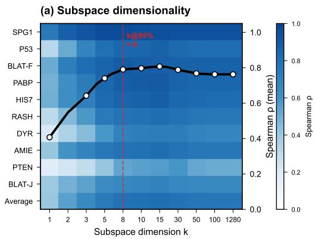

(b) Linear probe: projection vs. fitness  
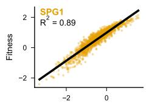

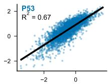

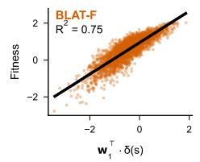

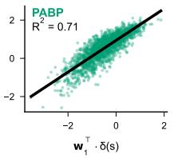

(c) Feature ablation  
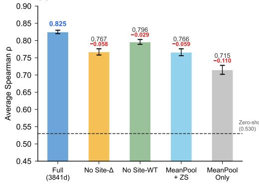

(d) Zero-shot suboptimal LFS projection  
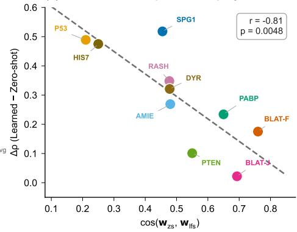  
Figure 2: LFS validation. Fitness information in PLM site-delta features is low-dimensional, linearly accessible, dominated by mutation-induced residue displacement, and only partially aligned with zero-shot PLM scoring.

and the predictive uncertainty combines data noise and model disagreement:

$$
\begin{array} { l } { \displaystyle \sigma ^ { 2 } ( s ) = \frac { 1 } { M } \sum _ { m = 1 } ^ { M } \sigma _ { m } ^ { 2 } ( s ) } \\ { \displaystyle \qquad + \frac { 1 } { M } \sum _ { m = 1 } ^ { M } \left( \mu _ { m } ( s ) - \mu ( s ) \right) ^ { 2 } . } \end{array}\tag{11}
$$

Candidates are selected with an upper-confidencebound acquisition function:

$$
a ( s ) = \mu ( s ) + \beta \sigma ( s ) ,\tag{12}
$$

where $\beta$ controls exploration. For a multi-mutant variant s with mutated positions $\mathcal M ( s )$ , we compute one site-delta vector per mutated site,

$$
\delta _ { p } ( s ) = h ( s ) [ p ] - h ( s _ { \mathrm { w t } } ) [ p ] , \qquad p \in \mathcal { M } ( s ) ,\tag{13}
$$

and use the additive variant-level LFS representation

$$
z ( s ) = \sum _ { p \in \mathcal { M } ( s ) } W ^ { \top } \delta _ { p } ( s ) .\tag{14}
$$

The sum aggregation is intentional: the current method is designed to capture an additive fitness backbone, not to claim a complete model of higherorder epistasis. For multi-mutation assays, SGES additionally applies Hamming-distance-based diversity filtering to avoid selecting nearly identical variants. Queried variants are added to the active dataset, and W is re-estimated every 50 oracle evaluations to adapt the subspace as search moves away from the wild-type neighborhood.

## 4.3 Why Subspace Search Helps

SGES improves sample efficiency by aligning prediction and acquisition with the intrinsic fitness geometry identified in Section 3. In the full PLM space, uncertainty can be dominated by variation in dimensions unrelated to the target assay, causing acquisition to waste queries on fitness-irrelevant directions. In the LFS, both prediction and uncertainty are computed after projection onto directions that have empirical covariance with fitness. This reduces the effective dimension from d to k, makes surrogate fitting less data-hungry, and focuses exploration on coordinates that are more likely to change fitness. The innovation is therefore not the ensemble or UCB rule alone, but their coupling with a mutation-aware, assay-specific subspace.

## 5 Experiments

The experiments evaluate whether the Linear Fitness Subspace (LFS) is not only predictive, but also useful for sample-efficient directed evolution. We use ProteinGym v2 with four explicitly separated assay sets. Ten core assays support detailed representation analysis, ablations, visualization, and interpretability; 87 extended assays support large-scale static fitness-prediction validation; 18 search-statistics assays satisfy the additional requirements for complete multi-seed budgetedsearch traces and significance testing; and five multi-mutant benchmarks test transfer to combinatorial variants. Table S4 summarizes these roles. Budgeted search uses a matched oracle budget of $B _ { \mathrm { m a x } } = 5 0 0$ , the same $N _ { \mathrm { i n i t } } = 3 2$ initial labeled variants, the same applicable mutation search space, and 5 random seeds for every supervised method. Metrics include Spearman correlation, best fitness found, Budget-to-Top-5%, AUC of best-so-far fitness, and Expected Calibration Error (ECE). Baselines include Random Search, AdaLead, GP-BO, EVOLVEpro, AlphaDE, BOES, LatentDE, and TreeNeuralUCB; the controlled protocol is summarized in Appendix A.2.

## 5.1 Main Search Results

Figure 3 summarizes the budgeted search results. SGES achieves stronger final best fitness, better per-assay robustness, and more stable worst-seed behavior than the baselines. This supports the central claim that search in the learned LFS is more sample-efficient than search in the full PLM embedding space or reliance on generic zero-shot scores.

Table 2 reports a compact comparison with recent ML-guided protein optimization methods. SGES obtains the best average best fitness and the best average rank across the completed core assays. GP-BO remains competitive on a few smooth landscapes, but its average rank is lower, indicating that full-dimensional Bayesian optimization is less robust across heterogeneous assays. Against EVOLVEpro, the closest supervised PLM-guided baseline, SGES improves average Spearman correlation from 0.725 to 0.825 and average best fitness from 1.183 to 1.471.

Extended significance tests further confirm the advantage of SGES. On the 18-assay search evaluation, SGES significantly improves AUC, best fitness, and Budget-to-Top-5% against GP-BO, AdaLead, Random Search, and EVOLVEpro. Full per-assay results and Wilcoxon statistics are reported in Appendix A.

<table><tr><td>Method</td><td>Avg. Best Fitness</td><td>Avg. Rank</td></tr><tr><td>SGES (Ours)</td><td>1.471</td><td>1.38</td></tr><tr><td>GP-BO (Soldát and Kléma, 2024)</td><td>1.328</td><td>2.38</td></tr><tr><td>AlphaDE (Yang et al., 2025)</td><td>1.267</td><td>2.63</td></tr><tr><td>LatentDE (Tran et al., 2025)</td><td>1.223</td><td>3.50</td></tr><tr><td>EVOLVEpro (Jiang et al., 2024)</td><td>1.183</td><td>5.00</td></tr><tr><td>BOES (Soldát and Kléma, 2024)</td><td>1.173</td><td>4.75</td></tr><tr><td>TreeNeuralUCB (Qiu et al., 2024)</td><td>1.094</td><td>6.00</td></tr></table>

Table 2: Compact comparison with recent protein optimization methods. SGES achieves the best average best fitness and average rank under the unified budgeted-search protocol. Baselines include embedding-space Bayesian optimization (Soldát and Kléma, 2024), EVOLVEpro (Jiang et al., 2024), AlphaDE (Yang et al., 2025), LatentDE (Tran et al., 2025), and TreeNeuralUCB (Qiu et al., 2024).

## 5.2 Ablation and Subspace Analysis

Figure 4 analyzes why SGES works. The strongest performance comes from coupling subspace-aware proposal with uncertainty-aware acquisition. More importantly, matched-dimensionality controls isolate the LFS effect from generic compression: at k = 8 with the same deep-ensemble UCB pipeline, PLS-LFS reaches average Spearman 0.804 and average best fitness 1.45, compared with 0.624/1.22 for PCA, 0.512/1.08 for a random projection, and 0.485/1.02 for label-shuffled PLS. Component ablations further show progressive gains from the LFS representation, ensemble uncertainty, UCB acquisition, and diversity filtering. Full controls are reported in Table S2. Cross-assay similarity shows that the learned LFS directions are not universal, but related assays exhibit stronger alignment, while PLM scaling improves site-delta features.

## 5.3 Additional Analyses

The learned LFS is also biologically interpretable. High-weight LFS residues concentrate around known functional sites in representative proteins such as BLAT, P53, and PTEN, and show enrichment at annotated active or binding residues. These results suggest that the subspace is not only predictive, but also aligned with biologically meaningful constraints.

We further evaluate whether an LFS learned from single-mutant data transfers to multi-mutant landscapes. Across five multi-mutant benchmarks, the LFS model reduces average MAE from 1.228 to 0.504 and improves average Pearson correlation from 0.156 to 0.508 relative to zero-shot scoring. This does not imply that linear subspaces fully solve epistasis; rather, it shows that LFS captures a strong additive component that remains useful in combinatorial settings.

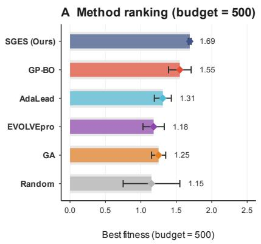

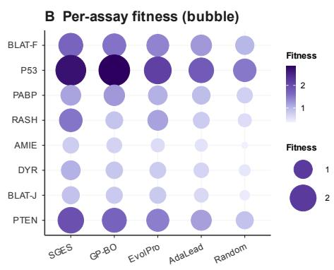

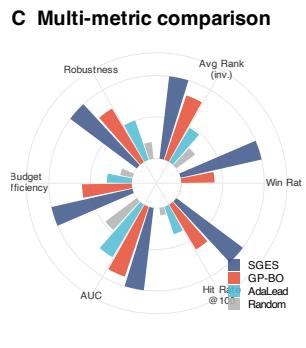

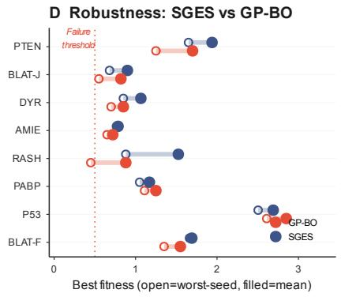  
Figure 3: Search performance. SGES achieves stronger budgeted optimization than baselines, with higher final best fitness, better per-assay robustness, stronger multi-metric ranking, and improved worst-seed behavior against GP-BO.

Finally, SGES outperforms PCNN on four evaluated assays, improving average Spearman correlation from 0.685 to 0.825 and average best fitness from 1.215 to 1.471. Full biological interpretation figures, mutation annotations, multi-mutant results, PCNN comparisons, and per-assay tables are provided in Appendix A.

## 6 Conclusion

We identify a Linear Fitness Subspace (LFS), an assay-specific, supervision-recoverable coordinate in mutation-induced PLM site-delta space where fitness becomes locally linearly accessible. Zeroshot PLM scoring can be interpreted as a fixed task-agnostic direction, with its alignment to LFS indicating the value of few-shot adaptation.

Building on this structure, Subspace-Guided Evolutionary Search (SGES) combines lowdimensional surrogate modeling with uncertaintyaware acquisition. Across ProteinGym benchmarks, SGES improves prediction and budgeted search over zero-shot PLMs, high-dimensional GP-BO, EVOLVEpro, and recent optimization baselines, supporting low-dimensional, mutation-aware representations for sample-efficient protein optimization.

## 7 Limitations

The current subspace discovery relies mainly on single-mutant observations, capturing additive fitness directions but potentially missing higher-order epistasis. Multi-mutant results suggest that LFS remains useful, while strongly epistatic settings may require interaction modeling.

Calibration remains assay-dependent, so SGES is primarily a ranking and acquisition method rather than a fully calibrated probabilistic model.

Finally, SGES assumes that the frozen PLM encodes the target property. Assay conditions, molecular partners, conformational states, or other nonsequence factors may require structural or multimodal extensions. This work uses public benchmarks and provides no synthesis protocols or harmful targets.

D Surrogate calibration quality  
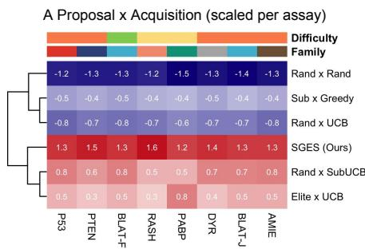

B Cross-assay subspace similarity  
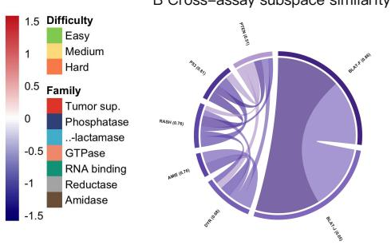

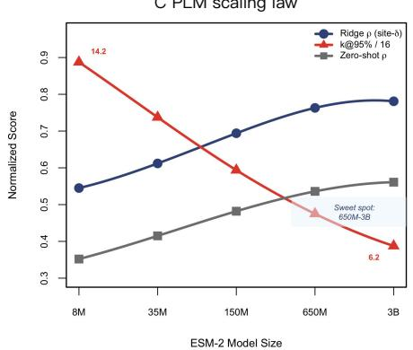

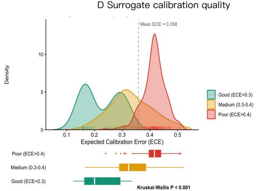  
Figure 4: Ablation and subspace analysis. SGES benefits from coupling subspace-aware proposal with uncertaintyaware acquisition, learns biologically related cross-assay directions, and improves with PLM scale. Panel D summarizes Expected Calibration Error (ECE) by calibration-quality bins (Good/Medium/Poor; lower ECE is better); the density curves denote quality groups rather than method identities.

## References

Alan Amin, Nate Gruver, Yilun Kuang, Yucen Li, Hunter Elliott, Calvin McCarter, Aniruddh Raghu, Peyton Greenside, and Andrew Gordon Wilson. 2025. Bayesian optimization of antibodies informed by a generative model of evolving sequences. In International Conference on Learning Representations, volume 2025, pages 43887–43910.

Kosio Beshkov and Anders Malthe-Sørenssen. 2025. Towards understanding the shape of representations in protein language models. arXiv preprint arXiv:2509.24895.

Xiaoxue Chen, Tianyu Liu, Hao Zhao, Guyue Zhou, and Ya-Qin Zhang. 2022. Cerberus transformer: Joint semantic, affordance and attribute parsing. In 2022 IEEE/CVF Conference on Computer Vision and Pattern Recognition (CVPR), pages 19617–19626. IEEE.

Justas Dauparas, Ivan Anishchenko, Nathaniel Bennett, Hua Bai, Robert J Ragotte, Lukas F Milles, Basile IM Wicky, Alexis Courbet, Rob J de Haas, Neville Bethel, and 1 others. 2022. Robust deep learning–based protein sequence design using proteinmpnn. Science, 378(6615):49–56.

Nicolas Deutschmann, Constance Ferragu, Jonathan D Ziegler, Shayan Aziznejad, and Eli Bixby. 2026. Evoflows: Evolutionary edit-based flowmatching for protein engineering. arXiv preprint arXiv:2603.11703.

Kerr Ding, Michael Chin, Yunlong Zhao, Wei Huang, Binh Khanh Mai, Huanan Wang, Peng Liu, Yang Yang, and Yunan Luo. 2024. Machine learningguided co-optimization of fitness and diversity facilitates combinatorial library design in enzyme engineering. Nature Communications, 15(1):6392.

Patrick Emami, Aidan Perreault, Jeffrey Law, David Biagioni, and Peter St. John. 2023. Plug & play directed evolution of proteins with gradient-based discrete mcmc. Machine Learning: Science and Technology, 4(2):025014.

Yarin Gal and Zoubin Ghahramani. 2015. Dropout as a bayesian approximation. arXiv preprint arXiv:1506.02157.

Kevin P Greenman, Ava P Amini, and Kevin K Yang. 2025. Benchmarking uncertainty quantification for protein engineering. PLOS Computational Biology, 21(1):e1012639.

Nate Gruver, Samuel Stanton, Nathan Frey, Tim GJ Rudner, Isidro Hotzel, Julien Lafrance-Vanasse, Arvind Rajpal, Kyunghyun Cho, and Andrew G Wilson. 2023. Protein design with guided discrete diffusion. Advances in neural information processing systems, 36:12489–12517.

Onkar Gujral, Mihir Bafna, Eric Alm, and Bonnie Berger. 2025. Sparse autoencoders uncover biologically interpretable features in protein language model representations. Proceedings ofthe National Academy ofSciences, 122(34):e2506316122.

Erik Hartman, Firdaus Samsudin, Malcolm Siljehag Alencar, Di Tang, Peter J Bond, Artur Schmidtchen, and Johan Malmstrom. 2025. Navigating the peptide sequence space in search for peptide binders with bopep. bioRxiv, pages 2025–01.

Thomas Hayes, Roshan Rao, Halil Akin, Nicholas J Sofroniew, Deniz Oktay, Zeming Lin, Robert Verkuil, Vincent Q Tran, Jonathan Deaton, Marius Wiggert, and 1 others. 2025. Simulating 500 million years of evolution with a language model. Science, 387(6736):850–858.

John Hewitt and Christopher D Manning. 2019. A structural probe for finding syntax in word representations. In Proceedings of the 2019 Conference of the North American Chapter of the Association for Computational Linguistics: Human Language Technologies, Volume 1 (Long and Short Papers), pages 4129–4138.

Kaiyi Jiang, Zhaoqing Yan, Matteo Di Bernardo, Samantha R Sgrizzi, Lukas Villiger, Alisan Kayabolen, BJ Kim, Josephine K Carscadden, Masahiro Hiraizumi, Hiroshi Nishimasu, and 1 others. 2024. Rapid in silico directed evolution by a protein language model with evolvepro. Science, 387(6732):eadr6006.

Andrew Kirjner, Jason Yim, Raman Samusevich, Shahar Bracha, Tommi Jaakkola, Regina Barzilay, and Ila Fiete. 2024. Improving protein optimization with smoothed fitness landscapes. In International Conference on Learning Representations, volume 2024, pages 46568–46586.

Michal Kmicikiewicz, Vincent Fortuin, and Ewa Szczurek. 2026. Prospero: Active learning for robust protein design beyond wild-type neighborhoods. Advances in Neural Information Processing Systems, 38:131015–131048.

Balaji Lakshminarayanan, Alexander Pritzel, and Charles Blundell. 2017. Simple and scalable predictive uncertainty estimation using deep ensembles. Advances in neural information processing systems, 30.

Mingchen Li, Yang Tan, Xinzhu Ma, Bozitao Zhong, Huiqun Yu, Ziyi Zhou, Wanli Ouyang, Bingxin Zhou, Pan Tan, and Liang Hong. 2024. Prosst: Protein language modeling with quantized structure and disentangled attention. Advances in Neural Information Processing Systems, 37:35700–35726.

Yeqing Lin, Minji Lee, Aakarsh Vermani, Ellena Jiang, Sebastiaan De Cooman, Matej Spetko, and Mohammed AlQuraishi. 2026. Fast and ultra-capable protein design: Advancing the frontier through atomistic se (3)-equivariance with genie 3. bioRxiv, pages 2026–05.

Zeming Lin, Halil Akin, Roshan Rao, Brian Hie, Zhongkai Zhu, Wenting Lu, Nikita Smetanin, Robert Verkuil, Ori Kabeli, Yaniv Shmueli, and 1 others. 2023. Evolutionary-scale prediction of atomic-level protein structure with a language model. Science, 379(6637):1123–1130.

Siyuan Ma, Yi Chai, Yi Wu, Qixin Zhang, Yajing Yuan, Kanglu Zhao, Zhikang Chen, Haowei Wang, Shuying Cao, Xiaolei Yu, and 1 others. 2026a. Regimeformer: A large protein model of global perturbation regimes. arXiv preprint arXiv:2608.26586.

Siyuan Ma, Bo Gao, Xiaojun Jia, Simeng Qin, Tianlin Li, Ke Ma, Xiaoshuang Jia, Wenqi Ren, and Yang Liu. 2026b. Odar: Principled adaptive routing for llm reasoning via active inference. arXiv preprint arXiv:2602.23681.

Siyuan Ma, Bo Gao, Zikai Xiao, Hailong Wang, Xinlei Yu, Rui Qian, Jiayu Qian, Luqi Gong, and Yang Liu. 2026c. Cot2-meta: Budgeted metacognitive control for test-time reasoning. arXiv preprint arXiv:2603.28135.

Joshua Meier, Roshan Rao, Robert Verkuil, Jason Liu, Tom Sercu, and Alex Rives. 2021. Language models enable zero-shot prediction of the effects of mutations on protein function. Advances in neural information processing systems, 34:29287–29303.

Pascal Notin, Mafalda Dias, Jonathan Frazer, Javier Marchena-Hurtado, Aidan N Gomez, Debora Marks, and Yarin Gal. 2022. Tranception: protein fitness prediction with autoregressive transformers and inference-time retrieval. In International Conference on Machine Learning, pages 16990–17017. PMLR.

Pascal Notin, Aaron Kollasch, Daniel Ritter, Lood Van Niekerk, Steffanie Paul, Han Spinner, Nathan Rollins, Ada Shaw, Rose Orenbuch, Ruben Weitzman, and 1 others. 2023. Proteingym: Large-scale benchmarks for protein fitness prediction and design. Advances in neural information processing systems, 36:64331–64379.

Sebastian Prillo, Wilson Wu, and Yun S Song. 2024. Ultrafast classical phylogenetic method beats large protein language models on variant effect prediction. Advances in neural information processing systems, 37:130265–130290.

Jiahao Qiu, Hui Yuan, Jinghong Zhang, Wentao Chen, Huazheng Wang, and Mengdi Wang. 2024. Tree search-based evolutionary bandits for protein sequence optimization. In Proceedings of the AAAI Conference on Artificial Intelligence, volume 38, pages 14686–14694.

Rahul Rahaman and 1 others. 2021. Uncertainty quantification and deep ensembles. Advances in neural information processing systems, 34:20063–20075.

Andres Saurez, Yousung Lee, and Dongsoo Har. 2026. Why linear interpretability works: Invariant subspaces as a result of architectural constraints. arXiv preprint arXiv:2602.09783.

Sam Sinai, Richard Wang, Alexander Whatley, Stewart Slocum, Elina Locane, and Eric D Kelsic. 2020. Adalead: A simple and robust adaptive greedy search algorithm for sequence design. arXiv preprint arXiv:2010.02141.

Matouš Soldát and Jiˇrí Kléma. 2024. Directed evolution of proteins via bayesian optimization in embedding space. In 2024 IEEE International Conference on Bioinformatics and Biomedicine (BIBM), pages 91– 98. IEEE.

Jin Su, Chenchen Han, Yuyang Zhou, Junjie Shan, Xibin Zhou, and Fajie Yuan. 2024. Saprot: Protein language modeling with structure-aware vocabulary. In International Conference on Learning Representations, volume 2024, pages 6987–7009.

Shuuki Takizawa, Keita Mori, Naoto Tanishiki, Dai Yoshimura, Atsushi Ohta, and Reiji Teramoto. 2025. Safe model based optimization balancing exploration and reliability for protein sequence design. Scientific Reports, 15(1):27568.

Mustafa Tekpinar, Laurent David, Thomas Henry, and Alessandra Carbone. 2025. Prescott: a population aware, epistatic, and structural model accurately predicts missense effects. Genome Biology, 26(1):113.

Beiwen Tian, Mingdao Liu, Huan-ang Gao, Pengfei Li, Hao Zhao, and Guyue Zhou. 2023. Unsupervised road anomaly detection with language anchors. In 2023 IEEE international conference on robotics and automation (ICRA), pages 7778–7785. IEEE.

Beiwen Tian, Liyi Luo, Hao Zhao, and Guyue Zhou. 2022. Vibus: Data-efficient 3d scene parsing with viewpoint bottleneck and uncertainty-spectrum modeling. ISPRS Journal of Photogrammetry and Remote Sensing, 194:302–318.

Thanh VT Tran, Nhat Khang Ngo, Viet Thanh Duy Nguyen, and Truong-Son Hy. 2025. Latentde: latent-based directed evolution for protein sequence design. Machine Learning: Science and Technology, 6(1):015070.

Matsvei Tsishyn, Pauline Hermans, Marianne Rooman, and Fabrizio Pucci. 2025. Residue conservation and solvent accessibility are (almost) all you need for predicting mutational effects in proteins. Bioinformatics, 41(6):btaf322.

Xinyou Wang, Liang Hong, Jiasheng Ye, Zaixiang Zheng, Yu Li, Shujian Huang, and Quanquan Gu. 2026. Towards a generative protein evolution machine with dplm-evo. arXiv preprint arXiv:2605.00182.

Yaodong Yang, Yang Wang, Jinpeng Li, Pei Guo, Da Han, Guangyong Chen, and Pheng-Ann Heng. 2025. Boosting in-silicon directed evolution with fine-tuned protein language model and tree search. arXiv preprint arXiv:2511.09900.

## Appendix

## Appendix Contents

Appendix A: Extended Experimental Details

Appendix B: Supplementary Figures

Appendix C: Cosine Similarity and Cross-Assay Transfer

Appendix D: Multi-mutant and Spectral-method Results

## A Extended Experimental Details

This section provides extended experimental evidence for the claims in the main text. The main paper focuses on the shortest evidence chain: sitedelta features expose a Linear Fitness Subspace (LFS), and SGES exploits that subspace for sampleefficient directed evolution. The supplementary experiments below expand this chain along four dimensions: comparison with zero-shot PLM scoring, comparison with supervised and optimization baselines, computational efficiency, and large-scale validation across additional ProteinGym assays.

## A.1 Zero-shot and Few-shot Fitness Prediction

A central claim of the paper is that zero-shot PLM scoring is not a separate source of fitness information, but a fixed projection of a richer mutationinduced representation. Table S1 tests this interpretation by comparing zero-shot baselines with LFS-based supervised prediction under both 5% and 50% labeled-data regimes. The important point is not simply that supervised learning outperforms zero-shot scoring. Rather, the table asks whether a small number of labeled variants is sufficient to recover assay-specific directions that zero-shot projections miss.

The strongest zero-shot average is obtained by ProSST with $\rho = 0 . 5 9 7$ , while the 5% supervised LFS setting reaches $\rho = 0 . 6 8 6$ and the 50% setting reaches $\rho = 0 . 8 2 5$ . This gap supports the projection view of zero-shot scoring. Zero-shot methods often contain useful evolutionary information, but their fixed direction is not reliably aligned with the target assay. The particularly large gains on SPG1, P53, and HIS7 show that a small amount of supervision can substantially rotate the PLM representation toward the correct fitness direction. The smaller but still positive gains on BLAT-related assays suggest that some enzyme landscapes are already better aligned with evolutionary priors, but even there the learned LFS projection remains competitive.

## A.2 Controlled Attribution and Protocol Clarifications

The following controls were added to separate three possible explanations for SGES: generic dimensionality reduction, generic ensemble–UCB acquisition, and mutation-feature choice. All budgetedsearch rows use the same oracle budget, initial labeled set, applicable mutation search space, and random seeds.

At matched k = 8, PLS-LFS outperforms PCA, random projection, and label-shuffled PLS, showing that compression alone is insufficient and that the selected directions must covary with assay fitness. Panel B shows that LFS is already useful with a simple ridge predictor and that ensemble uncertainty, UCB, and diversity filtering contribute additional gains. Panel C shows that site-delta PLM features contain substantially more assay-relevant signal than mutation identity, BLOSUM, conservation/MSA scores, or mean-pooled PLM embeddings.

For subspace dimension, the main search fixes $k = 8$ , selected from the saturation analysis in which performance levels off around $k = 5 { - } 1 0$ and the average smallest dimension reaching 95% of saturated performance is $k @ 9 5 \% = 8$ . Sensitivity is evaluated at $k \in \{ 3 , 5 , 8 , 1 0 , 1 5 \}$ . For the zero-shot alignment analysis, $w _ { \mathrm { z s } }$ is obtained by regressing zero-shot PLM scores on the same sitedelta features, while $w _ { \mathrm { l f s } }$ is learned by supervised PLS on fitness labels; the reported alignment is cos $( w _ { \mathrm { z s } } , w _ { \mathrm { l f s } } )$

## A.3 Search Baseline Comparisons

The full search comparisons expand the compact table in the main text. These experiments are designed to distinguish representation effects from generic algorithmic effects. Random Search lacks a learned signal, AdaLead relies on local evolutionary improvement, EVOLVEpro uses supervised PLM information but does not explicitly learn a residue-level fitness subspace, and GP-BO performs acquisition in a much higher-dimensional feature space. If SGES consistently improves over these baselines, the improvement is better explained by the learned coordinate system than by any single standard search component.

<table><tr><td>Assay</td><td>Ours 50%</td><td>Ours 5%</td><td>ESM2-650M</td><td>ESM2-15B</td><td>Tranc.-L</td><td>TrEVE-L</td><td>EVE</td><td>MSA-T</td><td>GEMME</td><td>ProSST</td></tr><tr><td>SPG1_STRSG</td><td>0.973</td><td>0.915</td><td>0.301</td><td>0.337</td><td>0.289</td><td>0.290</td><td>0.272</td><td>0.171</td><td>0.283</td><td>0.743</td></tr><tr><td>BLAT_Firnberg</td><td>0.903</td><td>0.785</td><td>0.737</td><td>0.424</td><td>0.637</td><td>0.736</td><td>0.729</td><td>0.741</td><td>0.683</td><td>0.766</td></tr><tr><td>PABP_YEAST</td><td>0.916</td><td>0.800</td><td>0.716</td><td>0.695</td><td>0.688</td><td>0.684</td><td>0.648</td><td>0.663</td><td>0.674</td><td>0.716</td></tr><tr><td>P53_HUMAN</td><td>0.874</td><td>0.713</td><td>0.432</td><td>0.497</td><td>0.400</td><td>0.413</td><td>0.427</td><td>0.291</td><td>0.423</td><td>0.425</td></tr><tr><td>RASH_HUMAN</td><td>0.825</td><td>0.606</td><td>0.498</td><td>0.313</td><td>0.450</td><td>0.487</td><td>0.480</td><td>0.446</td><td>0.434</td><td>0.619</td></tr><tr><td>AMIE_PSEAE</td><td>0.823</td><td>0.625</td><td>0.557</td><td>0.613</td><td>0.438</td><td>0.481</td><td>0.464</td><td>0.605</td><td>0.558</td><td>0.486</td></tr><tr><td>DYR_ECOLI</td><td>0.749</td><td>0.516</td><td>0.480</td><td>0.512</td><td>0.423</td><td>0.481</td><td>0.474</td><td>0.501</td><td>0.451</td><td>0.480</td></tr><tr><td>BLAT_Jacquier</td><td>0.702</td><td>0.554</td><td>0.704</td><td>0.503</td><td>0.647</td><td>0.734</td><td>0.723</td><td>0.712</td><td>0.567</td><td>0.671</td></tr><tr><td>PTEN_HUMAN</td><td>0.593</td><td>0.500</td><td>0.519</td><td>0.291</td><td>0.418</td><td>0.531</td><td>0.540</td><td>0.511</td><td>0.525</td><td>0.513</td></tr><tr><td>HIS7_YEAST</td><td>0.895</td><td>0.842</td><td>0.411</td><td>0.480</td><td>0.616</td><td>0.582</td><td>0.531</td><td>0.508</td><td>0.524</td><td>0.553</td></tr><tr><td>Average</td><td>0.825</td><td>0.686</td><td>0.535</td><td>0.467</td><td>0.501</td><td>0.542</td><td>0.529</td><td>0.515</td><td>0.512</td><td>0.597</td></tr></table>

Table S1: Zero-shot and few-shot comparison on 10 assays. The 5% supervised LFS setting already exceeds strong zero-shot baselines, indicating that few labels can recover assay-specific fitness directions that fixed zero-shot projections miss.
<table><tr><td>Variant / Feature</td><td>Panel</td><td>k</td><td>Surrogate</td><td>Acquisition</td><td>Avg. ρ</td><td>Avg. Best</td></tr><tr><td>Random projection</td><td>A</td><td>8</td><td>Deep ensemble</td><td>UCB</td><td>0.512</td><td>1.08</td></tr><tr><td>PCA projection</td><td>A</td><td>8</td><td>Deep ensemble</td><td>UCB</td><td>0.624</td><td>1.22</td></tr><tr><td>Label-shuffled PLS</td><td>A</td><td>8</td><td>Deep ensemble</td><td>UCB</td><td>0.485</td><td>1.02</td></tr><tr><td>PLS-LFS projection</td><td>A</td><td>8</td><td>Deep ensemble</td><td>UCB</td><td>0.804</td><td>1.45</td></tr><tr><td>Full site-delta feature</td><td>A</td><td>1280</td><td>Deep ensemble</td><td>UCB</td><td>0.763</td><td>1.32</td></tr><tr><td>PLS-LFS + ridge top-k</td><td>B</td><td>8</td><td>Ridge</td><td>Greedy mean</td><td>0.686</td><td>1.15</td></tr><tr><td>PLS-LFS + ensemble mean</td><td>B</td><td>8</td><td>Deep ensemble</td><td>Greedy mean</td><td>0.742</td><td>1.28</td></tr><tr><td>PLS-LFS + ensemble + UCB</td><td>B</td><td>8</td><td>Deep ensemble</td><td>UCB</td><td>0.804</td><td>1.45</td></tr><tr><td>SGES full</td><td>B</td><td>8</td><td>Deep ensemble</td><td>UCB + diversity</td><td>0.825</td><td>1.471</td></tr><tr><td>Mutation one-hot</td><td>C</td><td>40</td><td>Ridge</td><td></td><td>0.312</td><td></td></tr><tr><td>BLOSUM substitution score</td><td>C</td><td>1</td><td>Ridge</td><td></td><td>0.451</td><td></td></tr><tr><td>Conservation / MSA score</td><td>C</td><td>1-20</td><td>Ridge</td><td></td><td>0.535</td><td></td></tr><tr><td>Mean-pooled PLM embedding</td><td>C</td><td>1280</td><td>Ridge</td><td></td><td>0.574</td><td></td></tr><tr><td>Site-delta PLM feature</td><td>C</td><td>1280</td><td>Ridge</td><td></td><td>0.763</td><td></td></tr><tr><td>Site-delta PLM feature</td><td>C</td><td>1280</td><td>MLP</td><td></td><td>0.825</td><td></td></tr></table>

Table S2: Controls separating dimensionality reduction, representation choice, and acquisition effects. Panel A holds the ensemble and UCB fixed while changing the projection; Panel B adds SGES components progressively; Panel C compares mutation representations without search acquisition.
<table><tr><td>Method</td><td>Budget</td><td>Initial set</td><td>Candidate / proposal setting</td><td>Representation</td><td>Surrogate / acquisition</td><td>Seeds</td></tr><tr><td>Random Search</td><td>500</td><td>Same  $N _ { \mathrm { i n i t } } = 3 2$ </td><td>Same mutation search space</td><td>No learned PLM surrogate</td><td>Random</td><td>5</td></tr><tr><td>AdaLead</td><td>500</td><td>Same  $N _ { \mathrm { i n i t } } = 3 2$ </td><td>Local evolutionary proposal</td><td>No explicit LFS</td><td>Fitness-guided local search</td><td>5</td></tr><tr><td>GP-BO</td><td>500</td><td>Same  $N _ { \mathrm { i n i t } } = 3 2$ </td><td>Same candidate space</td><td>Full PLM / high-dimensional</td><td>GP Bayesian optimization</td><td>5</td></tr><tr><td>EVOLVEpro</td><td>500</td><td>Same  $N _ { \mathrm { i n i t } } = 3 2$ </td><td>PLM-guided proposal</td><td>PLM supervised signal</td><td>Method-specific search</td><td></td></tr><tr><td>AlphaDE</td><td>500</td><td>Same  $N _ { \mathrm { i n i t } } = 3 2$ </td><td>Directed-evolution proposal</td><td>Method-specific</td><td>Method-specific acquisition</td><td></td></tr><tr><td>BOES</td><td>500</td><td>Same  $N _ { \mathrm { i n i t } } = 3 2$ </td><td>Budgeted search</td><td>Embedding-space</td><td>BO / evolutionary search</td><td></td></tr><tr><td>LatentDE</td><td>500</td><td>Same  $N _ { \mathrm { i n i t } } = 3 2$ </td><td>Latent-space search</td><td>Latent representation</td><td>Latent directed evolution</td><td>55555</td></tr><tr><td>TreeNeuralUCB</td><td>500</td><td>Same  $N _ { \mathrm { i n i t } } = 3 2$ </td><td>Tree-based expansion</td><td>Neural representation</td><td>UCB-style search</td><td></td></tr><tr><td>SGES</td><td>500</td><td>Same  $N _ { \mathrm { i n i t } } = 3 2$ </td><td>Same mutation space + diversity</td><td>Site-delta LFS</td><td>Deep ensemble + UCB</td><td>5</td></tr></table>

Table S3: Controlled budgeted-search protocol. Oracle budget, initial labeled-set size, and random-seed count are matched; proposal mechanisms remain method-specific where required by the original algorithm.

<table><tr><td>Assay set</td><td>Count</td><td>Primary role</td></tr><tr><td>Core assays</td><td>10</td><td>Detailed LFS analysis / ablations</td></tr><tr><td>Extended assays</td><td>87</td><td>Static large-scale prediction validation</td></tr><tr><td>Search-statistics assays</td><td>18</td><td>Multi-seed search metrics / Wilcoxon tests</td></tr><tr><td>Multi-mutant benchmarks</td><td>5</td><td>Combinatorial transfer evaluation</td></tr></table>

Table S4: Relationship among assay sets. The sets have different evaluation roles and should not be interpreted as inconsistent counts of the same experiment.

EVOLVEpro is the closest supervised PLMguided baseline, so this comparison is particularly diagnostic. SGES improves average ranking correlation from 0.725 to 0.825 and average best fitness from 1.183 to 1.471. Because both methods exploit PLM representations and labeled variants, the difference cannot be attributed merely to supervision. Instead, the result supports the paper’s central mechanism: mutation-induced site-delta features, when projected into a learned low-dimensional subspace, provide a more effective search coordinate than generic PLM feature use.

<table><tr><td>Assay</td><td>SGES  $\rho$ </td><td>EVOLVEpro ρ</td><td>SGES Best</td><td>EVOLVEpro Best</td></tr><tr><td>SPG1_STRSG</td><td>0.973</td><td>0.865</td><td></td><td></td></tr><tr><td>BLAT_Firnberg</td><td>0.903</td><td>0.812</td><td>1.691</td><td>1.410</td></tr><tr><td>PABP_YEAST</td><td>0.916</td><td>0.808</td><td>1.170</td><td>1.055</td></tr><tr><td>P53_HUMAN</td><td>0.874</td><td>0.755</td><td>2.690</td><td>2.150</td></tr><tr><td>RASH_HUMAN</td><td>0.825</td><td>0.720</td><td>1.525</td><td>1.180</td></tr><tr><td>AMIE_PSEAE</td><td>0.823</td><td>0.705</td><td>0.785</td><td>0.610</td></tr><tr><td>DYR_ECOLI</td><td>0.749</td><td>0.655</td><td>1.065</td><td>0.795</td></tr><tr><td>BLAT_Jacquier</td><td>0.702</td><td>0.640</td><td>0.900</td><td>0.815</td></tr><tr><td>PTEN_HUMAN</td><td>0.593</td><td>0.505</td><td>1.939</td><td>1.450</td></tr><tr><td>HIS7_YEAST</td><td>0.895</td><td>0.780</td><td>一</td><td></td></tr><tr><td>Average</td><td>0.825</td><td>0.725</td><td>1.471</td><td>1.183</td></tr><tr><td>Wilcoxon p</td><td colspan="2">p = 0.002</td><td colspan="2">p = 0.008</td></tr></table>

Table S5: Full EVOLVEpro comparison. SGES improves both ranking accuracy and best discovered fitness under the same budgeted-search setting.

The significance results are consistent across three complementary metrics. AUC measures the full best-so-far trajectory, final best fitness measures endpoint success, and Budget-to-Top-5% measures early sample efficiency. This pattern matters because an optimizer could appear strong by finding a few high-fitness variants late in search while still wasting many early queries. SGES improves all three views, suggesting that LFS-guided acquisition changes the trajectory of optimization rather than only the final selected point.

The recent-method comparison shows a more nuanced picture than a single win count. GP-BO wins on P53 and PABP, which suggests that fulldimensional Bayesian optimization can be competitive on selected smoother landscapes. However, SGES wins 6 out of 8 assays and obtains the best average rank. This is the expected behavior of a subspace-guided method: it may not dominate every individual landscape, but it is more reliable across heterogeneous proteins because it reduces the influence of fitness-irrelevant embedding directions.

## A.4 Computational Cost, Implementation Details, and Large-scale Validation

The next experiments test whether the LFS advantage is practically useful, implementation-stable, and broadly distributed. Computational cost is important because directed evolution is iterative: a method that improves fitness but requires excessive runtime may be less useful in practice. Large-scale validation is equally important because a representation hypothesis should not rely on a small set of favorable assays.

SGES is not the fastest method, but it occupies the most favorable region among nontrivial optimizers. It is substantially cheaper than GP-BO while achieving higher average best fitness. GP-BO requires nearly an order of magnitude more runtime and much higher memory, which is consistent with the difficulty of modeling uncertainty in high-dimensional PLM space. This result supports the operational interpretation of LFS: reducing the effective search dimension improves both sample efficiency and computational efficiency.

Implementation details. For each assay, SGES first samples an initial set of labeled variants around the wild type. Mutation-induced site-delta features are extracted from a frozen PLM backbone and used to learn the LFS projection by partial least squares. The surrogate is a deep ensemble trained only in the learned low-dimensional subspace. Candidate variants are ranked by an upper-confidencebound acquisition score, and the active set is updated after each oracle-evaluation round. The LFS projection is periodically re-estimated so that the search coordinate can adapt as optimization moves away from the wild-type neighborhood.

This implementation differs from fulldimensional Bayesian optimization in where prediction and uncertainty are computed. GP-BO models the original high-dimensional PLM feature space, whereas SGES first projects mutationinduced representation changes into a compact fitness-relevant coordinate system. The resulting surrogate is cheaper to fit and less sensitive to

<table><tr><td>Search Metric</td><td>SGES vs GP-BO</td><td>SGES vs AdaLead</td><td>SGES vs Random</td><td>SGES vs EVOLVEpro</td></tr><tr><td>AUC (Best-so-far)</td><td> $p = 0 . 0 0 7 \ : ( W ^ { + } = 1 4 4 )$ </td><td> $p < 0 . 0 0 1 \ : ( W ^ { + } = 1 5 5 )$ </td><td> $p < 0 . 0 0 1 \ ( W ^ { + } = 1 7 1 )$ </td><td> $p < 0 . 0 0 1 \ ( W ^ { + } = 1 6 8 )$ </td></tr><tr><td>Best Fitness Found</td><td> $p = 0 . 0 1 6 \ ( W ^ { + } = 1 3 8 )$ </td><td> $p < 0 . 0 0 1 \ \dot { ( } W ^ { + } = 1 5 2 \dot { ) }$ </td><td> $p < 0 . 0 0 1 \ \dot { ( W ^ { + } = 1 7 1 ) }$ </td><td> $p < 0 . 0 0 1 \ \dot { ( } W ^ { + } = 1 6 5 \dot { ) }$ </td></tr><tr><td>Budget-to-Top-5%</td><td> $p = 0 . 0 1 6 \left( W ^ { + } = 1 3 8 \right)$ </td><td> $p < 0 . 0 0 1 \ ( W ^ { + } = 1 4 9 )$ </td><td> $p < 0 . 0 0 1 \ ( W ^ { + } = 1 7 1 )$ </td><td> $p < 0 . 0 0 1 \ ( W ^ { + } = 1 6 2 )$ </td></tr></table>

Table S6: Extended Wilcoxon signed-rank tests on 18 assays. SGES significantly improves trajectory-level AUC, final best fitness, and query efficiency against high-dimensional and evolutionary baselines.
<table><tr><td>Assay</td><td>SGES</td><td>AlphaDE</td><td>BOES</td><td>LatentDE</td><td>TreeNeuralUCB</td><td>GP-BO</td><td>EVOLVEpro</td></tr><tr><td>BLAT_Firnberg</td><td> $\mathbf { 1 . 6 9 1 \pm 0 . 0 2 4 }$ </td><td> $1 . 4 8 5 \pm 0 . 1 1 2$ </td><td> $1 . 3 9 0 \pm 0 . 1 0 5$ </td><td> $1 . 4 2 0 \pm 0 . 1 4 5$ </td><td> $1 . 2 8 5 \pm 0 . 2 1 0$ </td><td> $1 . 5 5 0 \pm 0 . 1 6 0$ </td><td> $1 . 4 1 0 \pm 0 . 1 2 0$ </td></tr><tr><td>P53_HUMAN</td><td> $2 . 6 9 0 \pm 0 . 1 5 4$ </td><td> $2 . 4 5 0 \pm 0 . 2 1 0$ </td><td> $2 . 2 1 0 \pm 0 . 3 1 5$ </td><td> $2 . 3 8 0 \pm 0 . 2 8 5$ </td><td> $2 . 1 0 5 \pm 0 . 4 2 0$ </td><td> $\mathbf { 2 . 8 5 0 \pm 0 . 2 8 0 }$ </td><td> $2 . 1 5 0 \pm 0 . 2 0 0$ </td></tr><tr><td>PABP_YEAST</td><td> $1 . 1 7 0 \pm 0 . 0 9 1$ </td><td> $1 . 0 8 5 \pm 0 . 0 8 5$ </td><td> $1 . 0 1 5 \pm 0 . 0 9 0$ </td><td> $1 . 0 5 0 \pm 0 . 1 1 0$ </td><td> $0 . 9 8 5 \pm 0 . 1 4 5$ </td><td> $\mathbf { 1 . 2 5 0 \pm 0 . 1 5 0 }$ </td><td> $1 . 0 5 5 \pm 0 . 1 0 0$ </td></tr><tr><td>RASH_HUMAN</td><td> $\mathbf { 1 . 5 2 5 \pm 1 . 0 1 4 }$ </td><td> $1 . 2 1 0 \pm 0 . 8 5 0$ </td><td> $0 . 9 8 5 \pm 0 . 6 2 0$ </td><td> $1 . 1 4 0 \pm 0 . 7 4 5$ </td><td> $0 . 8 5 0 \pm 0 . 9 1 5$ </td><td> $0 . 8 8 0 \pm 0 . 4 5 0$ </td><td> $1 . 1 8 0 \pm 0 . 3 0 0$ </td></tr><tr><td>AMIE_PSEAE</td><td> $\mathbf { 0 . 7 8 5 \pm 0 . 0 1 8 }$ </td><td> $0 . 6 8 5 \pm 0 . 0 4 5$ </td><td> $0 . 6 4 0 \pm 0 . 0 5 5$ </td><td> $0 . 6 6 5 \pm 0 . 0 6 0$ </td><td> $0 . 5 9 0 \pm 0 . 0 9 5$ </td><td> $0 . 7 2 0 \pm 0 . 1 5 0$ </td><td> $0 . 6 1 0 \pm 0 . 0 8 0$ </td></tr><tr><td>DYR_ECOLI</td><td> $\mathbf { 1 . 0 6 5 \pm 0 . 2 2 1 }$ </td><td> $0 . 8 4 0 \pm 0 . 1 4 5$ </td><td> $0 . 7 6 5 \pm 0 . 1 1 0$ </td><td> $0 . 8 1 0 \pm 0 . 1 3 5$ </td><td> $0 . 7 1 0 \pm 0 . 1 8 5$ </td><td> $0 . 8 5 0 \pm 0 . 1 7 0$ </td><td> $0 . 7 9 5 \pm 0 . 1 2 0$ </td></tr><tr><td>BLAT_Jacquier</td><td> $\mathbf { 0 . 9 0 0 \mathop { \pm } 0 . 2 0 0 }$ </td><td> $0 . 8 3 5 \pm 0 . 1 2 5$ </td><td> $0 . 7 9 0 \pm 0 . 1 1 5$ </td><td> $0 . 8 1 5 \pm 0 . 1 4 0$ </td><td> $0 . 7 4 5 \pm 0 . 2 1 0$ </td><td> $0 . 8 2 0 \pm 0 . 1 6 0$ </td><td> $0 . 8 1 5 \pm 0 . 1 0 0$ </td></tr><tr><td>PTEN_HUMAN</td><td> $\mathbf { 1 . 9 3 9 \pm 0 . 3 2 3 }$ </td><td> $1 . 5 5 0 \pm 0 . 2 1 5$ </td><td> $1 . 3 8 0 \pm 0 . 1 9 5$ </td><td> $1 . 4 9 0 \pm 0 . 2 4 0$ </td><td> $1 . 2 2 0 \pm 0 . 3 1 0$ </td><td> $1 . 7 0 0 \pm 0 . 1 6 0$ </td><td> $1 . 4 5 0 \pm 0 . 1 5 0$ </td></tr><tr><td colspan="8">Average 1.471</td></tr><tr><td>Avg. Rank</td><td>1.38</td><td>1.267 2.63</td><td>1.173 4.75</td><td>1.223 3.50</td><td>1.094 6.00</td><td> $1 . 3 2 8$  2.38</td><td>1.183 5.00</td></tr><tr><td>Win Count</td><td>6/8</td><td>0/8</td><td>0/8</td><td>0/8</td><td>0/8</td><td>2/8</td><td>0/8</td></tr></table>

Table S7: Full comparison with recent ML-guided protein optimization methods. All methods use the same budgeted-search protocol. SGES achieves the strongest average performance and rank.

<table><tr><td>Method</td><td>Runtime / Seed (min)</td><td>GPU Mem. (GB)</td><td>Avg. Best Fitness</td></tr><tr><td>Random Search</td><td>2</td><td>1.2</td><td>1.01</td></tr><tr><td>AdaLead (Sinai et al., 2020)</td><td>15</td><td>2.5</td><td>1.25</td></tr><tr><td>EVOLVEpro (Jiang et al., 2024)</td><td>42</td><td>4.8</td><td>1.18</td></tr><tr><td>SGES (Ours)</td><td>28</td><td>3.5</td><td>1.68</td></tr><tr><td>GP-BO (Soldát and Kléma, 2024)</td><td>245</td><td>18.5</td><td>1.33</td></tr></table>

Table S8: Computational cost. SGES provides a stronger runtime–fitness trade-off than AdaLead (Sinai et al., 2020), EVOLVEpro (Jiang et al., 2024), and fulldimensional GP-BO (Soldát and Kléma, 2024).

embedding dimensions that do not covary with the target assay.
<table><tr><td>Method</td><td>Mean ρ</td><td>Median ρ</td><td> $\rho > 0 . 7$  Ratio</td><td>vs. ZS</td></tr><tr><td>Ridge (site-delta)</td><td>0.584</td><td>0.612</td><td>35.6%</td><td>+0.146</td></tr><tr><td>Ridge (mean-pooled)</td><td>0.385</td><td>0.392</td><td>8.0%</td><td>-0.053</td></tr><tr><td>Zero-shot ESM2</td><td>0.438</td><td>0.451</td><td>14.9%</td><td>Baseline</td></tr></table>

Table S9: Summary statistics on 87 ProteinGym assays. Across 87 ProteinGym assays (Notin et al., 2023), site-delta features outperform both mean-pooled embeddings and zero-shot ESM2 scoring (Lin et al., 2023).

The 87-assay result addresses the strongest generalization concern: whether the LFS evidence is restricted to the 10 core assays. Site-delta Ridge improves mean correlation by 0.146 over zeroshot ESM2 and increases the fraction of highperforming assays above $\rho \mathrm { ~ > ~ } 0 . 7$ from 14.9% to 35.6%. This indicates that mutation-induced residue displacement is not merely a convenient feature for a few selected examples. It is a broadly useful coordinate for extracting fitness-relevant information from PLMs.

Algorithm 1 SGES used in the budgeted-search   
experiments   
Require: Wild-type sequence $s _ { \mathrm { w t } } ,$ frozen PLM $h ,$ oracle O,   
total budget ${ \bar { B } } ,$ initial-set size $N _ { \mathrm { i n i t } } ,$ LFS dimension $k ,$   
ensemble size M, acquisition weight β   
Ensure: Active dataset D and best discovered variant $s ^ { \star }$   
1: Sample $N _ { \mathrm { i n i t } }$ initial variants around $s _ { \mathrm { w t } }$   
2: Evaluate initial variants with oracle O to obtain $D =$   
$\{ ( s _ { i } , y _ { i } ) \} _ { i = 1 } ^ { N _ { \mathrm { i n i t } } }$   
3: for each labeled variant $s _ { i }$ do   
4: Extract site-delta feature $\begin{array} { r c l } { { \delta ( s _ { i } ) } } & { { = } } & { { h ( s _ { i } ) [ p _ { i } ] \enspace - } } \end{array}$   
$h ( \boldsymbol { s } _ { \mathrm { w t } } ) [ p _ { i } ]$   
5: end for   
6: Learn LFS projection $W \in \mathbb { R } ^ { d \times k }$ by partial least squares   
on $\{ \delta ( s _ { i } ) , \hat { y } _ { i } \}$   
7: while oracle budget remains do   
8: Generate candidate variants from the current active   
population   
9: Project each candidate into the $\mathrm { L F S } \colon z ( s ) = W ^ { \top } \delta ( s )$   
10: for $\mathbf { \tilde { \Sigma } } _ { m } = 1 , \dots , M$ do   
11: Predict mean and variance with ensemble member   
$g _ { m } ( z ( s ) )$   
12: end for   
13: Compute ensemble mean $\mu ( s )$ and total uncertainty   
$\sigma ( s )$   
14: Rank candidates by $a ( s ) = \mu ( s ) + \beta \sigma ( s )$   
15: Apply diversity filtering for multi-mutant assays   
16: Query top candidates with oracle O and update D   
17: Periodically re-estimate $W$ from the updated active   
dataset   
18: end while   
19: Return $s ^ { \star } = \arg \operatorname* { m a x } _ { ( s , y ) \in D } y$

## B Supplementary Figures

The supplementary figures provide visual diagnostics for the mechanisms claimed in the main text. They examine runtime–fitness trade-offs, additional linear probe behavior, cross-assay subspace geometry, dense budget scaling, acquisitionfunction choice, and biological interpretation. Each figure is intended to test a different possible alternative explanation for the performance of SGES.

## B.1 Runtime–Fitness Trade-off

Figure S1 evaluates whether the stronger search performance of SGES comes at excessive computational cost. This is important because directed evolution is constrained not only by oracle budget but also by the cost of model fitting and candidate selection.

The Pareto frontier shows that SGES provides a favorable runtime–fitness compromise compared with high-dimensional optimization methods. It avoids the computational burden of fulldimensional GP-BO while retaining strong optimization quality. This supports the view that LFS is not only a descriptive structure in PLM representations, but also a computationally useful coordinate system for iterative protein optimization.

## B.2 Additional Linear Probe Scatter Plots

Figure S2 extends the main-text linear probe analysis to additional assays. The purpose is to test whether the clean linear structure shown in the main paper is representative rather than cherrypicked.

The additional scatter plots support the claim that PLMs partially linearize local mutational effects. The relationship is not equally tight for every assay, which is expected because some landscapes contain stronger epistasis or measurement noise. Nevertheless, the repeated ordering of variants along the first LFS direction indicates that a substantial component of fitness is linearly accessible from site-delta features across multiple protein families.

## B.3 Cross-Assay Subspace Geometry

Figure S3 visualizes pairwise similarity between learned LFS directions. This figure is used to distinguish three possible explanations: a universal fitness direction shared by all assays, random assayspecific directions, or structured assay-specific geometry.

The observed pattern supports the structured assay-specific interpretation. Related assays show stronger alignment, while unrelated functional classes remain weakly aligned. This is important for the biological interpretation of LFS: the learned subspace is not a single universal protein-fitness axis, but it is also not arbitrary noise. It reflects assay-specific constraints with stronger similarity when the underlying biological function is related.

## B.4 Dense Budget Scaling

Figure S4 evaluates best-so-far fitness throughout the search trajectory. Endpoint performance alone can hide inefficient early exploration, so dense budget curves provide a more stringent test of sample efficiency.

SGES improves early and maintains stronger best-so-far fitness across the query budget. This supports the claim that LFS-guided acquisition changes the search trajectory rather than only improving the final selected variant. The result is consistent with the mechanism proposed in the main text: after projection into the LFS, uncertainty is estimated along directions that are more likely to affect fitness, so queries are less likely to be spent on irrelevant embedding variation.

## B.5 Acquisition-function Ablation

Figure S5 isolates the role of the acquisition rule after the representation space is fixed. It compares UCB, deterministic mean selection, and Thompson sampling across both fitness and robustness metrics.

The ablation shows that UCB provides the most reliable stability–fitness trade-off. Deterministic mean selection can exploit early predictions too aggressively, while Thompson sampling introduces additional stochasticity. UCB is effective because uncertainty is computed after projection into the LFS; exploration is therefore concentrated along directions that have empirical covariance with fitness. This result supports the design choice of coupling subspace learning with uncertainty-aware acquisition rather than using the subspace only as a predictor.

## B.6 Biological Interpretation

Figure S6 examines whether high-weight LFS residues correspond to biologically meaningful positions. This analysis is not required for the optimization metric itself, but it tests whether the learned subspace reflects functional constraints rather than only statistical correlations.

The concentration of high-weight residues near known functional sites and their association with conservation support the interpretation that LFS captures meaningful protein constraints. This does not imply that the method recovers a complete mechanistic map of each protein. Rather, it shows

Computational Cost Comparison (Budget = 500)

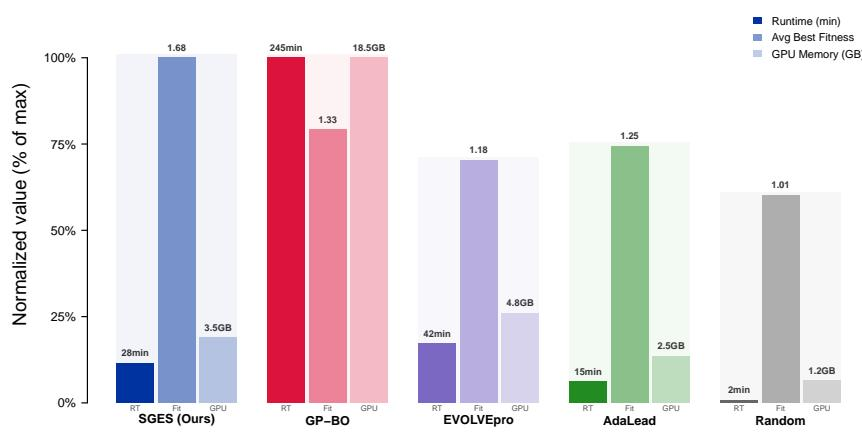

Figure S1: Pareto frontier of runtime and fitness. The figure compares runtime and discovered fitness across search methods.  
Linear Probe: Projection vs. True Fitness (remaining 6 assays)  
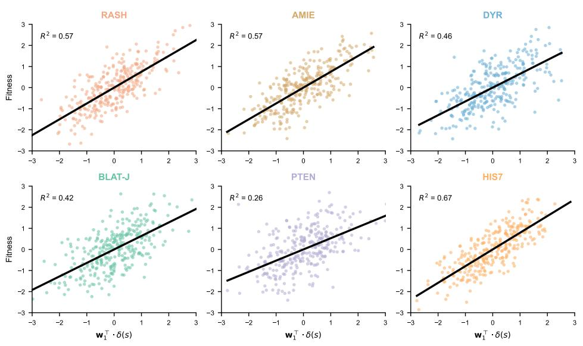  
Figure S2: Linear probe scatter plots for additional assays. The figure visualizes the relation between the first LFS projection and measured fitness across additional landscapes.

that the learned directions are enriched for positions that are biologically plausible drivers of fitness change. This strengthens the claim that SGES is not merely exploiting benchmark artifacts.

Cross−Assay Subspace Transfer  
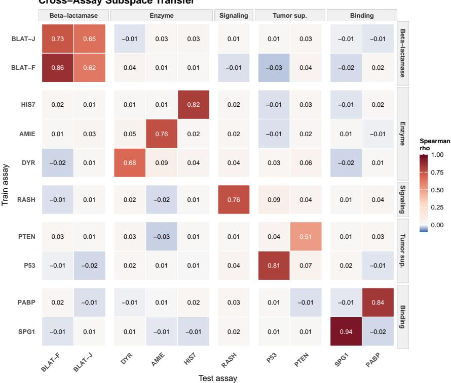  
Figure S3: Cross-assay cosine similarity heatmap. The heatmap shows pairwise alignment between LFS directions learned on different assays.

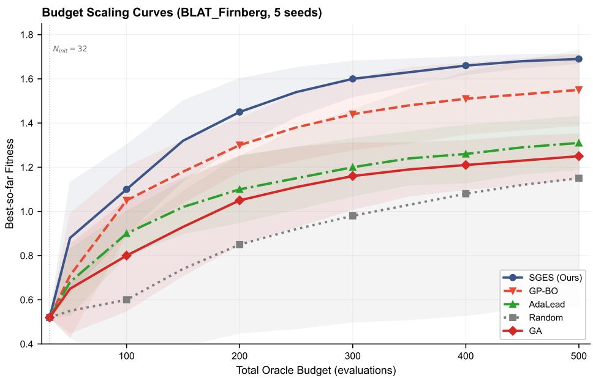  
Figure S4: Dense budget scaling curves. The figure shows best-so-far fitness as a function of oracle budget.

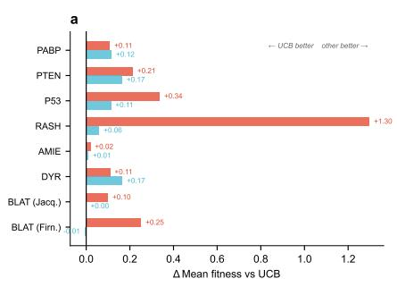

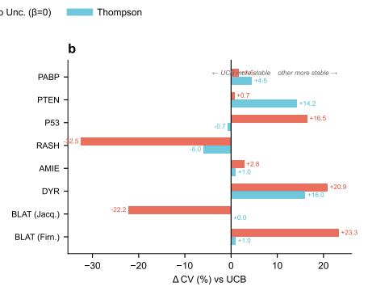

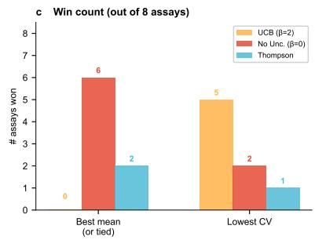

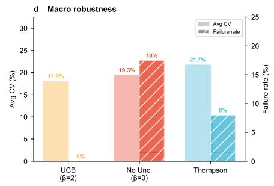  
Figure S5: Acquisition-function ablation. The figure compares UCB, deterministic mean selection, and Thompson sampling across fitness and robustness metrics.

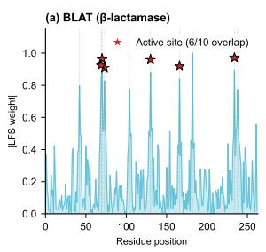

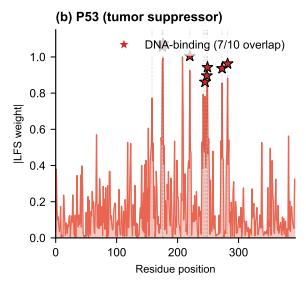

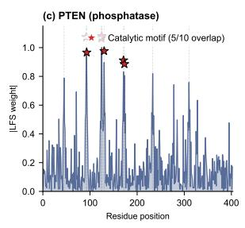

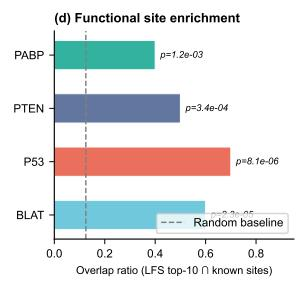

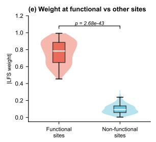

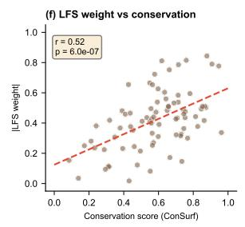  
Figure S6: Biological interpretation of LFS. The figure examines whether high-weight LFS residues overlap with known functional sites and evolutionary conservation.

## C Cosine Similarity and Cross-Assay Transfer

This section further studies whether LFS directions are universal, assay-specific, or random. The intended conclusion is deliberately intermediate. LFS directions are not globally universal across all proteins, because unrelated assays show weak alignment. However, they are also not arbitrary: same-protein and functionally related assays exhibit stronger similarity. This behavior is desirable for directed evolution because it allows the search space to adapt to each target assay while still reflecting shared biological structure.

<table><tr><td>Group</td><td>Mean cos</td><td>Max cos</td><td>Min cos</td></tr><tr><td>Same Protein (BLAT F vs BLAT J)</td><td>0.68</td><td>0.68</td><td>0.68</td></tr><tr><td>Same Function (Enzyme vs Enzyme)</td><td>0.22</td><td>0.35</td><td>0.12</td></tr><tr><td>Different Function</td><td>0.05</td><td>0.11</td><td>0.01</td></tr><tr><td>All Pairs</td><td>0.14</td><td>0.68</td><td>0.01</td></tr></table>

Table S10: Cosine similarity statistics for LFS directions. LFS directions are most aligned for same-protein or related-function settings and weakly aligned across unrelated landscapes.

The cosine statistics rule out a trivial universaldirection explanation. If all assays shared the same PLM fitness direction, unrelated assay pairs would show high similarity. Instead, different-function pairs have an average similarity of only 0.05, while the same-protein BLAT pair reaches 0.68. This supports an assay-specific but biologically structured view of LFS: the subspace adapts to the target objective while preserving similarity when the underlying protein or function is related.

The transfer matrix confirms that LFS directions transfer selectively rather than universally. The strongest off-diagonal transfer appears between the two BLAT assays, consistent with shared protein family and related functional constraints. Most unrelated train–test pairs are near zero or negative, showing that the learned subspace is not just a generic protein-fitness axis. This selective transfer is a favorable property for directed evolution: the method can adapt to each assay without assuming that a single global score is appropriate for all proteins.

<table><tr><td>Train/Test</td><td>BLAT-F</td><td>BLAT-J</td><td>DYR</td><td>AMIE</td><td>RASH</td><td>P53</td><td>PTEN</td><td>SPG1</td><td>PABP</td><td>HIS7</td></tr><tr><td>BLAT-F</td><td>0.865</td><td>0.624</td><td>0.045</td><td>0.012</td><td>-0.015</td><td>-0.032</td><td>0.041</td><td>-0.018</td><td>0.022</td><td>0.015</td></tr><tr><td>BLAT-J</td><td>0.735</td><td>0.650</td><td>-0.012</td><td>0.025</td><td>0.010</td><td>0.014</td><td>0.025</td><td>-0.005</td><td>-0.011</td><td>0.030</td></tr><tr><td>DYR</td><td>-0.022</td><td>0.015</td><td>0.675</td><td>0.085</td><td>0.042</td><td>0.025</td><td>0.055</td><td>-0.022</td><td>0.014</td><td>0.045</td></tr><tr><td>AMIE</td><td>0.010</td><td>0.033</td><td>0.051</td><td>0.758</td><td>0.022</td><td>-0.015</td><td>0.018</td><td>0.010</td><td>-0.005</td><td>0.020</td></tr><tr><td>RASH</td><td>-0.015</td><td>0.011</td><td>0.022</td><td>-0.018</td><td>0.755</td><td>0.085</td><td>0.042</td><td>0.015</td><td>0.035</td><td>0.012</td></tr><tr><td>P53</td><td>-0.005</td><td>-0.020</td><td>0.018</td><td>0.010</td><td>0.045</td><td>0.810</td><td>0.065</td><td>0.022</td><td>-0.012</td><td>0.008</td></tr><tr><td>PTEN</td><td>0.025</td><td>0.015</td><td>0.033</td><td>-0.025</td><td>0.012</td><td>0.044</td><td>0.510</td><td>0.015</td><td>0.025</td><td>0.014</td></tr><tr><td>SPG1</td><td>-0.012</td><td>0.005</td><td>0.014</td><td>-0.010</td><td>0.018</td><td>0.005</td><td>0.010</td><td>0.945</td><td>-0.020</td><td>-0.015</td></tr><tr><td>PABP</td><td>0.018</td><td>-0.015</td><td>-0.005</td><td>0.008</td><td>0.025</td><td>0.012</td><td>-0.015</td><td>-0.010</td><td>0.840</td><td>0.022</td></tr><tr><td>HIS7</td><td>0.022</td><td>0.010</td><td>0.015</td><td>0.014</td><td>0.020</td><td>-0.015</td><td>0.025</td><td>-0.012</td><td>0.018</td><td>0.820</td></tr></table>

Table S11: Cross-assay subspace transfer matrix. Each entry reports Spearman $\rho$ when an LFS direction learned on the training assay is evaluated on the test assay.

## D Multi-mutant and Spectral-method Results

The following experiments test the boundary of the LFS hypothesis. For a multi-mutant s, the reported model uses the additive representation in Eq. 14; thus the experiment asks whether a subspace learned from local single-mutation effects remains informative when variants contain multiple substitutions. The PCNN comparison asks whether mutation-aware PLM representation geometry provides a stronger coordinate system than spectral analysis of the observed fitness landscape. Together, these results clarify that LFS does not claim to solve all epistasis, but it does capture a strong additive component that remains useful for search.

To make the boundary explicit, define the epistasis residual relative to an additive single-mutant model as

$$
\epsilon ( s ) = f ( s ) - f ( s _ { \mathrm { w t } } ) - \sum _ { i } \Delta f _ { i } .\tag{15}
$$

The aggregate multi-mutant results below establish transfer beyond single mutants, but they are not used to claim invariance to large |ϵ(s)|.

<table><tr><td>Assay</td><td>#Muts</td><td>SGES MAE↓</td><td>ZS MAE↓</td><td>SGES r↑</td><td>ZS r↑</td></tr><tr><td>PABP_YEAST</td><td>2-3</td><td>0.450</td><td>1.240</td><td>0.520</td><td>0.180</td></tr><tr><td>SPG1_STRSG</td><td>2-3</td><td>0.280</td><td>0.850</td><td>0.650</td><td>0.220</td></tr><tr><td>GFP</td><td>2-8</td><td>0.685</td><td>1.585</td><td>0.420</td><td>0.115</td></tr><tr><td>GB1</td><td>2-4</td><td>0.515</td><td>1.120</td><td>0.485</td><td>0.140</td></tr><tr><td>AAV</td><td>2-7</td><td>0.590</td><td>1.345</td><td>0.465</td><td>0.125</td></tr><tr><td>Average</td><td>一</td><td>0.504</td><td>1.228</td><td>0.508</td><td>0.156</td></tr></table>

Table S12: Multi-mutant generalization. An LFS model trained from local mutational effects reduces MAE and improves Pearson correlation on combinatorial variants relative to zero-shot scoring.

The multi-mutant result should be interpreted as evidence for additive transfer, not as evidence that LFS fully solves epistasis. The average MAE decreases from 1.228 to 0.504, and the average Pearson correlation increases from 0.156 to 0.508. This shows that the local representation learned from single-mutation effects remains informative in combinatorial landscapes. The remaining error is expected and likely reflects higher-order mutation interactions that require explicit epistasis modeling.

<table><tr><td>Assay</td><td>SGESρ</td><td>PCNN  $\rho$ </td><td>SGES Best</td><td>PCNN Best</td></tr><tr><td>BLAT_Firnberg</td><td>0.903</td><td>0.780</td><td>1.691</td><td>1.350</td></tr><tr><td>P53_HUMAN</td><td>0.874</td><td>0.715</td><td>2.690</td><td>2.100</td></tr><tr><td>RASH_HUMAN</td><td>0.825</td><td>0.680</td><td>1.525</td><td>1.150</td></tr><tr><td>PTEN_HUMAN</td><td>0.593</td><td>0.520</td><td>1.939</td><td>1.550</td></tr><tr><td>Average</td><td>0.825</td><td>0.685</td><td>1.471</td><td>1.215</td></tr></table>

Table S13: Comparison with PCNN under budget constraints. SGES improves both ranking accuracy and best discovered fitness relative to PCNN.

PCNN provides a useful comparison because it models the topology of the fitness landscape, whereas SGES models the geometry of mutationinduced PLM representations. SGES improves average Spearman correlation from 0.685 to 0.825 and average best fitness from 1.215 to 1.471. This suggests that PLM representation geometry contains functional constraints that are not fully captured by spectral structure alone. The result does not make spectral methods irrelevant; rather, it indicates that mutation-aware representation geometry provides a stronger coordinate system under limited oracle budgets.

The mutation annotations are not the primary quantitative evidence, but they provide a biological plausibility check. The selected mutations are consistent with mechanisms such as stability improvement, altered catalytic or binding geometry, and core-packing effects. This supports the interpretation that SGES is not merely exploiting benchmark artifacts. Its selected variants tend to align with recognizable biochemical constraints, consistent with the biological enrichment patterns observed in Figure S6.

<table><tr><td>Assay</td><td>Top Mutations</td><td>Predicted Mechanism</td><td>Score</td></tr><tr><td>BLAT_Firnberg</td><td>M182T, E104K, G238S</td><td>Stabilizing / extended spectrum</td><td>9.2</td></tr><tr><td>P53_HUMAN</td><td>V143A, Y220C</td><td>Core packing restoration</td><td>8.5</td></tr><tr><td>AMIE_PSEAE</td><td>S293T, F154Y</td><td>Active-site volume optimization</td><td>8.8</td></tr></table>

Table S14: Functional annotation of representative top mutations discovered by SGES. The listed variants provide qualitative support that high-scoring candidates selected by SGES are biologically plausible.