# MASKERADE: TOKEN-ROUTED MASK EXPERTS FORDENSE-TO-MOE UPCYCLING

Mingyuan Zhang1, Yue Bai1, Zhongruo Wang, Yupin Huang,

Yiyang Huang1, Hailing Wang1, Huimin Zeng1, Yun Fu1,2

1Department of Electrical and Computer Engineering, Northeastern University

2Khoury College of Computer Science, Northeastern University

## ABSTRACT

Sparsely activated Mixture-of-Experts (MoE) models increase model capacity without a proportional increase in per-token computation. Dense-to-MoE upcycling reuses pretrained dense models to construct such systems, commonly by copying feed-forward networks (FFNs) into independently trained experts. We introduce MASKerade, a dense-to-MoE training method that instead learns experts as sparse subnetworks of a frozen pretrained FFN. Each expert is defined by a learned binary mask, and a token-level router selects which masked FFNs to execute and combine. The router and mask scores are optimized jointly, while the underlying FFN weight values remain unchanged. This formulation supports neuron-structured, semi-structured, and unstructured experts within the same routing architecture. Our main configuration uses four 2:4 experts with top-2 routing, where two half-dense expert passes have the nominal FFN arithmetic of one dense pass, without requiring independent expert weight matrices. On five vision-language benchmarks with Qwen and Gemma backbones, this configuration achieves the highest performance among the compared baselines. Comparisons across mask granularities, routing interventions, and compute-matched controls distinguish the effects of learned connectivity from expert activation count. These results establish mask learning over frozen weights as a practical alternative for constructing token-routed MoE experts. Codes: https://github.com/Ming-K9/MASKerade.

## 1 INTRODUCTION

Mixture-of-Experts (MoE) models separate the number of available parameters from per-token computation (Jacobs et al., 1991). A sparsely gated layer selects a small subset of experts and combines their outputs, rather than evaluating every expert for every input (Shazeer et al., 2017; Fedus et al., 2022). Dense-to-MoE upcycling makes this approach accessible from existing pretrained models by converting selected feed-forward networks (FFNs) into routed expert layers, reusing the investment in dense pretraining (Komatsuzaki et al., 2023). This is particularly attractive for multimodal instruction tuning, where a single model must process heterogeneous visual and textual inputs (Lin et al., 2026; Chen et al., 2024a).

An important design decision in upcycling is what constitutes an expert. Replication-based approaches initialize multiple FFNs from the same dense FFN and then learn separate weight values. Some of them partially reinitialize these copies to encourage their differentiation (Nakamura et al., 2025). Other methods construct smaller experts by partitioning or pruning pretrained FFNs (Zhang et al., 2022; Zhu et al., 2024; Feng et al., 2025), or introduce expert-specific adapters and low-rank updates (Wu et al., 2024; Chen et al., 2024a).

We investigate a different parameterization: can experts be learned by selecting connections in a pretrained FFN? Learning a mask can change a network’s function without changing its retained weights, as demonstrated by supermask learning and learnable LLM pruning (Ramanujan et al., 2020; Fang et al., 2024; Zhang et al., 2026; 2025). In an MoE, several such masks can coexist over the same weights. The router then chooses among alternative sparse computations. This replaces expert-specific weight adaptation with expert-specific connectivity learning.

We propose MASKerade, which jointly learns a bank of binary expert masks and a token-level router over a frozen FFN. For a given token, the router selects a small subset of masks, executes the corresponding masked FFNs, and combines their outputs using routing weights. Conceptually, this resembles a MASKerade (masquerade, with “qu” replaced by “k”) in which tokens enter the same shared FFN but wear different masks. MASKerade studies a specific combination that consists of direct masking of the frozen pretrained FFN weights, token-level sparse routing, and hard connectivity constraints. We evaluate MASKerade through multimodal instruction tuning of Qwen and Gemma backbones (Yang et al., 2025; Team et al., 2025). MASKerade attains the best performance against the external methods across five benchmarks. Our contributions are:

• We introduce MASKerade, a dense-to-MoE upcycling method that constructs experts as learned binary masks over frozen pretrained FFNs.

• MASKerade jointly optimizes expert masks and token routing under prescribed sparsity constraints, accommodating neuron-structured, semi-structured, and unstructured masks.

• Our experiments and analysis demonstrate that effective dense-to-MoE adaptation can be trained without updating the underlying pretrained FFN weights.

## 2 RELATED WORK

Sparse MoE and dense-to-MoE conversion. Sparsely gated MoE layers use input-dependent expert selection to increase the available model capacity while restricting active computation (Shazeer et al., 2017; Fedus et al., 2022). At the routing level, MaskMoE uses fixed, token-frequencydependent masks on routing logits to restrict the experts accessible to each vocabulary token (Su et al., 2024). These masks constrain expert visibility rather than define sparse FFN subnetworks. Sparse Upcycling initializes expert layers from pretrained dense checkpoints (Komatsuzaki et al., 2023), and Drop-Upcycling uses partial reinitialization to reduce the similarity of copied experts (Nakamura et al., 2025). MoEfication interprets FFN neurons as groups of experts and learns to select relevant groups (Zhang et al., 2022). LLaMA-MoE combines expert partitioning with continual pretraining (Zhu et al., 2024), while DIVE uses domain affinity and calibration-dependent pruning to construct diverse experts (Feng et al., 2025). ToMoE learns dynamic structural pruning through a hypernetwork to convert dense models into routed, narrower computations (Gao et al., 2026). MASKerade also starts from a dense model, but learns masks directly on its frozen FFN tensors instead of requiring independently fine-tuned FFN copies.

Learning sparse subnetworks. Supermask methods learn useful subnetworks while keeping their underlying weight values fixed (Ramanujan et al., 2020). For pretrained LLMs, Wanda selects weights using weight magnitudes and activation statistics without gradient-based mask training (Sun et al., 2024). SparseLLM formulates global pruning as coordinated optimization subproblems, using auxiliary variables to make the problem tractable (Bai et al., 2024). MaskLLM learns a distribution over legal semi-structured patterns using Gumbel-Softmax (Fang et al., 2024). Beyond compression, Mask Fine-Tuning (MFT) uses the original fine-tuning objective to learn binary weight masks over a frozen, already fine-tuned LLM, seeking further capability improvements (Zhang et al., 2026). Zhang et al. (2025) extend this approach to pretrained vision-language models, learning hard or soft masks over language-model and projector weights. These methods motivate learning connectivity rather than only pruning by a fixed importance criterion. MASKerade differs from a single learned subnetwork by maintaining multiple masks and selecting them conditionally for each token.

Mask-based and interpolated experts. MoM explicitly studies learnable masks as an alternative to conventional experts (Liu et al., 2025). SMAT learns sparse interpolated experts for few-shot meta tuning of vision models (Chen et al., 2024b). SIMoE applies sparse expert discovery to LLM instruction tuning, where structured masks act on a shared trainable parameter delta added to the frozen pretrained parameters. Their main routing configuration merges experts at the instance level (Chen et al., 2025). CDSP-MoE learns expert topology within a shared parameter subspace using gradientconflict signals (Gan & Lei, 2026). Our distinction is to route tokens through hard-masked versions of the pretrained FFN itself, with no trainable shared delta.

## 3 METHOD

## 3.1 EXPERTS AS FROZEN-WEIGHT SUBNETWORKS

Let $\theta _ { 0 }$ denote a pretrained dense model and $\mathcal { T }$ the set of FFN layers to convert. In a converted layer $\ell ,$ write its frozen FFN parameters as $W _ { \ell } .$ Conventional replicated experts learn separate parameter sets $\{ \dot { W } _ { \ell , e } \} _ { e = 1 } ^ { E }$ initialized from $W _ { \ell }$ MASKerade instead defines

$$
\begin{array} { r l } & { \widetilde { W } _ { \ell , e } ^ { ( a ) } = W _ { \ell } ^ { ( a ) } \odot M _ { \ell , e } ^ { ( a ) } , } \\ & { M _ { \ell , e } ^ { ( a ) } \in \{ 0 , 1 \} ^ { \mathrm { s h a p e } ( W _ { \ell } ^ { ( a ) } ) } . } \end{array}\tag{1}
$$

where a indexes the FFN projections and $\odot$ is elementwise multiplication.

For the gated FFNs used by our backbones, with gate, up, and down projections $W ^ { ( g ) }$ 7 $W ^ { ( u ) } \in \mathbb { R } ^ { d _ { \mathrm { f f } } \times \bar { d } }$ and $W ^ { ( d ) } \in \bar { \mathbb { R } } ^ { d \times d _ { \mathrm { f f } } }$ , expert e computes

$$
F _ { \ell , e } ( h ) = \widetilde W _ { \ell , e } ^ { ( d ) } \left[ \phi _ { \ell } \left( \widetilde W _ { \ell , e } ^ { ( g ) } h \right) \odot \left( \widetilde W _ { \ell , e } ^ { ( u ) } h \right) \right] .\tag{2}
$$

In our configuration, the pretrained parameters remain frozen throughout upcycling.

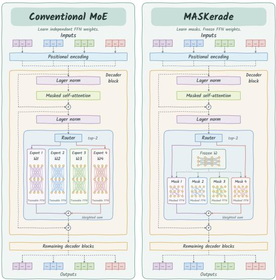  
Figure 1: Conventional MoE and MASKerade. Tokens select independent FFNs (left) or learned masks over one frozen FFN (right).

## 3.2 TOKEN-LEVEL ROUTING

Routing selects from a learned bank of expert masks shared across tokens. A trainable linear router $R _ { \ell } \in \overline { { \mathbb { R } } } ^ { E \times d }$ maps each token’s hidden state to probabilities $p _ { \ell , e } ( h )$ = softmax $( R _ { \ell } h ) _ { \ell }$ e. For k experts, deterministic top-k selection gives $S _ { \ell } ( h ) \bar { = } \mathrm { T o p K } ( p _ { \ell } ( \bar { h } ) , \bar { k } )$ . Our routing formulation uses deterministic top-k expert selection and dropless dispatch during both training and inference. The selected expert outputs are combined as

$$
F _ { \ell } ^ { \mathrm { M o E } } ( h ) = \sum _ { e \in S _ { \ell } ( h ) } g _ { \ell , e } ( h ) F _ { \ell , e } ( h ) , \qquad g _ { \ell , e } ( h ) = \left\{ \begin{array} { l l } { p _ { \ell , e } ( h ) , } & { k = 1 , } \\ { \frac { p _ { \ell , e } ( h ) } { \sum _ { j \in S _ { \ell } ( h ) } p _ { \ell , j } ( h ) } , } & { k \geq 2 . } \end{array} \right.\tag{3}
$$

For $k \geq 2 ,$ the coefficients sum to one over the selected experts. For top-1 routing with $E > 1$ retaining the selected expert’s softmax probability preserves a differentiable path from the task loss to the router. When $E = 1$ , routing will be bypassed.

## 3.3 MASK PARAMETERIZATION AND GRANULARITY

Each mask is obtained from continuous trainable scores $S$ using a hard selection operator $\mathcal { H } ,$ , so $M = \mathcal { H } ( S )$ is binary. We denote the retained fraction by $\rho$ and consider three families.

Semi-structured. For an N:M pattern, each row of a weight matrix is partitioned into contiguous groups of M entries along its dimension. For each group $B$ we keep the $N$ largest score magnitudes:

$$
M _ { \ell , e , i } ^ { ( a ) } = \mathbf { 1 } \Big [ i \in \mathrm { T o p N } _ { j \in B } \left| S _ { \ell , e , j } ^ { ( a ) } \right| \Big ] , \qquad \sum _ { i \in B } M _ { \ell , e , i } ^ { ( a ) } = N .\tag{4}
$$

Unstructured. For each expert’s projection tensor, let $P$ denote its number of entries and $q = \lceil \rho P \rceil$ the retained count. We select the q largest score magnitudes over all flattened positions:

$$
M _ { \ell , e , i } ^ { ( a ) } = \mathbf { 1 } \Big [ i \in \mathrm { T o p K } _ { 1 \leq j \leq P } \left( \left| S _ { \ell , e , j } ^ { ( a ) } \right| , q \right) \Big ] , \qquad \sum _ { i = 1 } ^ { P } M _ { \ell , e , i } ^ { ( a ) } = q .
$$

Table 1: Main comparison with existing methods on small models. All methods start from the same Zero-shot checkpoint. We learn masks as experts over frozen FFN weights. Best and second-best results in each metric are shown in bold and underlined, respectively.
<table><tr><td>Method</td><td></td><td>Act. Params.</td><td>GQA↑</td><td>MME↑</td><td>POPE↑</td><td>SQA ↑</td><td>TextVQA ↑</td></tr><tr><td rowspan="13">O-.7B</td><td>Zero-shot (Yang et al., 2025) Dense MLP</td><td>1.72B</td><td>25.97</td><td>962.0</td><td>83.59</td><td>60.93</td><td>32.38</td></tr><tr><td></td><td>1.72B</td><td> $5 8 . 4 1 { \scriptstyle \pm 0 . 3 5 }$ </td><td> $1 3 0 0 . 4 \pm 1 8 . 4$ </td><td> $8 5 . 0 1 { \scriptstyle \pm 0 . 2 4 }$ </td><td> $6 1 . 1 6 { \pm } 0 . 3 2$ </td><td> $4 9 . 1 9 { \scriptstyle \pm 0 . 3 2 }$ </td></tr><tr><td>MoEfication (Zhang et al., 2022)</td><td>1.46B</td><td> $5 3 . 6 0 { \scriptstyle \pm 0 . 2 0 }$ </td><td> $1 2 8 0 . 5 { \pm } 1 5 . 8 $ </td><td> $8 4 . 7 5 { \scriptstyle \pm 0 . 3 3 }$ </td><td> $6 0 . 1 1 { \scriptstyle \pm 0 . 9 6 }$ </td><td> $4 9 . 9 4 { \scriptstyle \pm 0 . 5 5 }$ </td></tr><tr><td>LLaVA-MoLE (Chen et al., 2024a)</td><td>1.91B</td><td> $5 8 . 0 5 { \scriptstyle \pm 0 . 3 8 }$ </td><td> $1 2 9 5 . 0 { \scriptstyle \pm 1 8 . 3 }$ </td><td> $8 4 . 9 7 { \scriptstyle \pm 0 . 3 6 }$ </td><td> $6 0 . 2 4 { \scriptstyle \pm 0 . 0 9 }$ </td><td> $5 0 . 2 5 { \scriptstyle \pm 0 . 0 6 }$ </td></tr><tr><td>PESC (Wu et al., 2024)</td><td>1.73B</td><td> $5 6 . 8 1 { \scriptstyle \pm 0 . 3 6 }$ </td><td> $1 3 0 9 . 1 { \pm } 1 1 . 3 $ </td><td> $8 4 . 3 1 { \scriptstyle \pm 0 . 2 9 }$ </td><td> $6 1 . 6 0 { \scriptstyle \pm 0 . 5 7 }$ </td><td> $4 9 . 9 5 { \scriptstyle \pm 0 . 2 5 }$ </td></tr><tr><td>LLaMA-MoE (Zhu et al., 2024)</td><td>1.46B</td><td> $5 7 . 8 5 { \pm } 0 . 1 6$ </td><td> $1 2 3 3 . 3 { \pm } 1 7 . 5 $ </td><td> $8 5 . 4 5 { \scriptstyle \pm 0 . 3 9 }$ </td><td> $6 0 . 5 6 { \scriptstyle \pm 0 . 5 8 }$ </td><td> $5 0 . 9 0 { \scriptstyle \pm 0 . 5 8 }$ </td></tr><tr><td>Drop-Upcycling (Nakamura et al., 2025)</td><td>2.25B</td><td> $6 0 . 7 7 { \scriptstyle \pm 0 . 2 4 }$ </td><td> $1 3 1 2 . 9 { \scriptstyle \pm 1 3 . 9 }$ </td><td> $8 5 . 6 6 { \pm } 0 . 1 9$ </td><td> $6 1 . 6 0 { \scriptstyle \pm 0 . 6 5 }$ </td><td> $5 0 . 8 2 { \scriptstyle \pm 0 . 0 7 }$ </td></tr><tr><td>MoM (Liu et al., 2025)</td><td>2.25B</td><td> $\overline { { 5 3 . 4 8 { \pm 0 . 1 3 } } }$ </td><td> $1 2 8 3 . 2 { \pm } 1 6 . 0$ </td><td> $8 5 . 7 3 { \scriptstyle \pm 0 . 2 5 }$ </td><td> $\underline { { 6 2 . 3 7 \pm 0 . 7 5 } }$ </td><td> $5 0 . 4 9 { \scriptstyle \pm 0 . 2 7 }$ </td></tr><tr><td>DIVE (Feng et al., 2025)</td><td>1.46B</td><td> $5 7 . 8 7 { \pm } 0 . 1 6$ </td><td> $1 3 0 0 . 6 { \scriptstyle \pm 1 6 . 7 }$ </td><td> $8 3 . 8 0 { \scriptstyle \pm 0 . 3 4 }$ </td><td> $\overline { { 6 0 . 8 4 \pm 0 . 7 6 } }$ </td><td> $5 0 . 5 5 { \scriptstyle \pm 0 . 6 2 }$ </td></tr><tr><td>MoE-LLaVA (Lin et al., 2026)</td><td>2.25B</td><td> $6 0 . 0 6 { \pm } 0 . 1 9$ </td><td> $1 3 1 5 . 3 { \pm } 1 1 . 8 $ </td><td> $8 5 . 1 9 { \scriptstyle \pm 0 . 2 2 }$ </td><td> $6 2 . 0 7 { \scriptstyle \pm 0 . 7 6 }$ </td><td> $5 1 . 3 6 { \pm } 0 . 3 2 $ </td></tr><tr><td>ToMoE (Gao et al., 2026)</td><td>1.46B</td><td> $5 8 . 5 4 \pm 0 . 2 2 $ </td><td> $\overline { { 1 3 0 2 . 2 \pm 1 6 . 2 } }$ </td><td> $8 5 . 6 6 { \scriptstyle \pm 0 . 4 0 }$ </td><td> $6 1 . 6 1 { \scriptstyle \pm 0 . 5 0 }$ </td><td> $5 0 . 7 7 { \scriptstyle \pm 0 . 2 2 }$ </td></tr><tr><td>[Ours] MASKerade (Semi-structured 2:4)</td><td>1.72B</td><td> ${ \bf 6 2 . 0 0 { \scriptstyle \pm 0 . 2 8 } }$ </td><td>1332.4±11.9</td><td>86.49±0.16</td><td> ${ \bf 6 3 . 4 8 } \pm { \bf 0 . 5 7 }$ </td><td>52.50±0.37</td></tr><tr><td rowspan="10">Zero-shot (Team et al., 2025) Dense MLP MoEfication (Zhang et al., 2022) Gmm-1B</td><td>1.00B</td><td>28.25</td><td>823.0</td><td>82.13</td><td>36.74</td><td></td></tr><tr><td>1.00B</td><td> $5 6 . 3 2 { \scriptstyle \pm 0 . 1 2 }$ </td><td> $1 2 3 3 . 4 { \pm } 1 3 . 9$ </td><td> $8 5 . 7 1 { \scriptstyle \pm 0 . 1 6 }$ </td><td> $5 2 . 2 0 { \scriptstyle \pm 0 . 6 9 }$ </td><td>16.66  $4 1 . 3 0 { \scriptstyle \pm 0 . 3 1 }$ </td></tr><tr><td>0.84B</td><td> $5 5 . 3 6 { \scriptstyle \pm 0 . 2 8 }$ </td><td></td><td> $8 0 . 9 2 { \scriptstyle \pm 0 . 3 5 }$ </td><td> $5 0 . 3 3 { \scriptstyle \pm 0 . 5 5 }$ </td><td> $4 0 . 6 8 { \scriptstyle \pm 0 . 5 8 }$ </td></tr><tr><td>1.11B</td><td> $5 5 . 6 6 { \scriptstyle \pm 0 . 1 0 }$ </td><td> $1 2 1 2 . 9 { \pm } 1 3 . 5 $   $1 2 4 4 . 8 { \pm } 1 6 . 4$ </td><td> $8 5 . 7 7 { \scriptstyle \pm 0 . 2 4 }$ </td><td> $5 1 . 5 6 { \scriptstyle \pm 0 . 4 4 }$ </td><td> $4 0 . 5 4 { \pm } 0 . 8 3 $ </td></tr><tr><td>LLaVA-MoLE (Chen et al., 2024a) PESC (Wu et al., 2024)</td><td> $5 7 . 5 4 \pm 0 . 2 9$ </td><td> $1 2 6 7 . 1 \pm 1 8 . 1 $ </td><td> $8 5 . 0 0 { \scriptstyle \pm 0 . 3 6 }$ </td><td> $5 3 . 9 1 { \scriptstyle \pm 0 . 5 2 }$ </td><td> $4 2 . 4 9 { \scriptstyle \pm 0 . 7 1 }$ </td></tr><tr><td>LLaMA-MoE (Zhu et al., 2024)</td><td>1.00B 0.84B</td><td> $5 7 . 6 7 { \scriptstyle \pm 0 . 3 3 }$   $1 2 3 4 . 7 { \pm } 1 1 . 2$ </td><td> $8 5 . 0 0 { \scriptstyle \pm 0 . 4 2 }$ </td><td> $5 2 . 7 1 { \scriptstyle \pm 0 . 6 3 }$ </td><td> $4 0 . 9 6 { \scriptstyle \pm 0 . 6 7 }$ </td></tr><tr><td>Drop-Upcycling (Nakamura et al., 2025)</td><td>1.31B</td><td> $5 8 . 9 4 { \scriptstyle \pm 0 . 1 9 }$   $1 2 8 7 . 5 { \pm } 1 4 . 4 $ </td><td> $8 5 . 5 9 { \scriptstyle \pm 0 . 4 0 }$ </td><td> $5 4 . 2 4 { \scriptstyle \pm 0 . 4 0 }$ </td><td> $4 2 . 5 5 { \pm } 0 . 6 8$ </td></tr><tr><td>MoM (Liu et al., 2025)</td><td>1.31B</td><td> $5 6 . 7 9 2 0 . 2 9$ </td><td> $1 2 4 9 . 1 { \pm } 1 8 . 9$   $8 2 . 1 0 { \scriptstyle \pm 0 . 4 0 }$ </td><td> $5 0 . 0 7 { \scriptstyle \pm 0 . 5 1 }$ </td><td> $\overline { { 3 9 . 4 5 \pm 0 . 7 9 } }$ </td></tr><tr><td>DIVE (Feng et al., 2025)</td><td>0.85B</td><td> $5 1 . 6 6 { \scriptstyle \pm 0 . 2 7 }$ </td><td> $1 1 2 9 . 3 { \pm } 1 3 . 2 $ </td><td> $8 2 . 8 0 { \scriptstyle \pm 0 . 2 8 }$   $5 0 . 8 4 { \scriptstyle \pm 0 . 6 3 }$ </td><td> $4 1 . 7 9 2 0 . 5 8$ </td></tr><tr><td>MoE-LLaVA (Lin et al., 2026)</td><td>1.31B</td><td> $5 9 . 3 4 { \pm } 0 . 4 5 $ </td><td> $1 2 8 8 . 0 { \pm } 1 8 . 4 $ </td><td> $8 5 . 8 0 { \pm } 0 . 1 8 $ </td><td> $5 4 . 8 3 { \pm } 0 . 4 2 $ </td></tr><tr><td>ToMoE (Gao et al., 2026)</td><td>0.84B</td><td> $5 3 . 9 6 { \pm } 0 . 1 5$ </td><td> $1 1 2 3 . 0 { \pm } 1 7 . 9$ </td><td> $8 1 . 3 7 { \scriptstyle \pm 0 . 4 3 }$ </td><td> $5 1 . 9 8 { \pm } 0 . 5 2 $ </td><td> $4 1 . 9 1 { \pm } 0 . 5 0 $   $4 0 . 6 3 { \pm } 0 . 3 2$ </td></tr><tr><td>[Ours] MASKerade (Semi-structured 2:4)</td><td>1.00B</td><td> ${ \bf 6 0 . 0 7 } \pm { \bf 0 . 2 7 }$ </td><td> $\mathbf { 1 2 9 3 . 8 { \pm 1 1 . 9 } }$ </td><td> $\mathbf { 8 6 . 4 1 \pm 0 . 1 0 }$ </td><td> ${ \pm } 5 5 . 3 0 { \scriptstyle \pm 0 . 4 7 }$ </td><td> $\pm 2 . 9 0 { \scriptstyle \pm 0 . 4 7 }$ </td></tr></table>

Structured. Each expert instead learns a score vector over the $d _ { \mathrm { f } }$ intermediate neurons, retaining a fraction $\rho .$ Its binary mask $m _ { \ell , e }$ is shared across the corresponding gate/up rows and down columns:

$$
M _ { \ell , e } ^ { ( g ) } = M _ { \ell , e } ^ { ( u ) } = m _ { \ell , e } \mathbf { 1 } _ { d } ^ { \top } , \qquad M _ { \ell , e } ^ { ( d ) } = \mathbf { 1 } _ { d } m _ { \ell , e } ^ { \top } .\tag{5}
$$

## 3.4 JOINT MASK AND ROUTER TRAINING

Score initialization. We consider two initialization schemes for the mask scores. With random initialization, each expert’s scores are sampled independently using Kaiming-uniform initialization.

With importance initialization, weight-level scores instead use

the pretrained weight magnitudes with independent expertspecific noise:

$$
\begin{array} { r l } & { S _ { \ell , e } ^ { ( a ) } = | W _ { \ell } ^ { ( a ) } | + \epsilon _ { \ell , e } ^ { ( a ) } , } \\ & { \epsilon _ { \ell , e , i } ^ { ( a ) } \sim \mathcal { N } \bigg ( 0 , \Big [ \alpha _ { \mathrm { i n i t } } ~ \mathrm { s t d } ( | W _ { \ell } ^ { ( a ) } | ) \Big ] ^ { 2 } \bigg ) . } \end{array}\tag{6}
$$

$\alpha _ { \mathrm { i n i t } } ~ \geq ~ 0$ controls the relative noise scale. The magnitude term favors high-magnitude connections, while independent perturbations help break symmetry between expert initializations. For neuron-structured masks, the importance of neuron j is $u _ { \ell , j } = ( \mathrm { m e a n } | W _ { \ell , j , : } ^ { ( g ) } | +$ mean $| W _ { \ell , j , : } ^ { ( u ) } |$ +mean $| W _ { \ell , : , j } ^ { ( d ) } | ) / 3$ We initialize its score as $S _ { \ell , e , j } = u _ { \ell , j } + \epsilon _ { \ell , e , j }$ , with independent Gaussian noise of standard deviation $\alpha _ { \mathrm { i n i t } } \mathrm { s t d } ( u _ { \ell } )$ across neurons and experts. Thus, structured importance aggregates the three weight slices affected by the same neuron mask.

  
Figure 2: Initialization loss for 2:4 masks on Qwen3-1.7B.

The loss curve comparison in Fig. 2 shows a substantially lower initial loss with importance initialization, as well as a lower training loss near the end of the run. Motivated by this observation, we adopt importance initialization as the default for subsequent MASKerade experiments. Tab. 5 and Fig. 5 show more analysis.

Table 2: Main comparison with existing methods on large models. All methods start from the same Zero-shot checkpoint. We learn masks as experts over frozen FFN weights. Best and second-best results in each metric are shown in bold and underlined, respectively.
<table><tr><td rowspan="11">w-277B</td><td>Method</td><td>Act. Params.</td><td>GQA↑</td><td>MME↑</td><td>POPE↑</td><td>SQA↑</td><td>TextVQA ↑</td></tr><tr><td>Zero-shot (Yang et al., 2025) Dense MLP</td><td>26.90B 26.90B</td><td>61.39 64.13</td><td>1692.1 1716.0</td><td>86.23 86.90</td><td>92.74</td><td>71.65</td></tr><tr><td>MoEfication (Zhang et al., 2022)</td><td>22.62B</td><td>61.05</td><td>1691.2</td><td>86.15</td><td>93.38</td><td>73.41</td></tr><tr><td>LLaVA-MoLE (Chen et al., 2024a)</td><td>29.82B</td><td>65.71</td><td>1702.5</td><td>86.47</td><td>91.55 92.17</td><td>72.00 74.08</td></tr><tr><td>PESC (Wu et al., 2024)</td><td>26.94B</td><td>65.61</td><td>1717.4</td><td>87.08</td><td>91.18</td><td></td></tr><tr><td>LLaMA-MoE (Zhu et al., 2024)</td><td>22.62B</td><td>64.33</td><td>1715.5</td><td>86.78</td><td></td><td>77.33</td></tr><tr><td>Drop-Upcycling (Nakamura et al., 2025)</td><td>35.45B</td><td>65.75</td><td>1715.3</td><td>87.26</td><td>93.46</td><td>78.63</td></tr><tr><td>MoM (Liu et al., 2025)</td><td>35.45B</td><td></td><td></td><td></td><td>94.12</td><td>79.04</td></tr><tr><td>DIVE (Feng et al., 2025)</td><td>22.65B</td><td>61.27</td><td>1689.3</td><td>86.29</td><td>88.82</td><td>79.95</td></tr><tr><td>MoE-LLaVA (Lin et al., 2026)</td><td></td><td>64.58</td><td>1708.0</td><td>87.16</td><td>90.83</td><td>79.68</td></tr><tr><td>ToMoE (Gao et al., 2026)</td><td>35.45B</td><td>65.58</td><td>1715.4</td><td>87.47</td><td>94.42</td><td>80.27</td></tr><tr><td></td><td>22.62B</td><td>61.87</td><td>1681.2</td><td>87.58</td><td>89.57</td><td>71.80</td></tr><tr><td>[Ours] MASKerade (Semi-structured 2:4) Zero-shot (Team et al., 2026)</td><td>26.90B</td><td>66.37</td><td>1724.9</td><td>87.68</td><td>94.79</td><td>81.08</td></tr><tr><td>Dense MLP</td><td>30.70B 30.70B</td><td>47.46 60.81</td><td>1573.8 1626.6</td><td>82.48 86.00</td><td>83.24 83.59</td><td>68.28 72.67</td></tr><tr><td>MoEfication (Zhang et al., 2022)</td><td>25.50B</td><td>58.59</td><td></td><td></td><td></td><td></td></tr><tr><td>LLaVA-MoLE (Chen et al., 2024a)</td><td>34.24B</td><td>61.24</td><td>1559.6 1578.3</td><td>79.74 86.52</td><td>81.17</td><td>68.02</td></tr><tr><td>PESC (Wu et al., 2024)</td><td>30.74B</td><td>63.11</td><td>1651.3</td><td>87.07</td><td>74.96</td><td>73.26</td></tr><tr><td>LLaMA-MoE (Zhu et al., 2024)</td><td>25.50B</td><td>63.44</td><td>1629.5</td><td>86.39</td><td>86.07</td><td>74.96</td></tr><tr><td>Gm31B Drop-Upcycling (Nakamura et al., 2025)</td><td>41.10B</td><td></td><td></td><td></td><td>77.24</td><td>74.52</td></tr><tr><td></td><td></td><td>65.22</td><td>1676.2</td><td>86.86</td><td>81.51</td><td>75.11</td></tr><tr><td>MoM (Liu et al., 2025)</td><td>41.10B</td><td>58.81</td><td>1581.4</td><td>82.89</td><td>84.28</td><td>68.87</td></tr><tr><td>DIVE (Feng et al., 2025)</td><td>25.53B</td><td>61.25</td><td>1573.3</td><td>83.36</td><td>73.82</td><td>72.60</td></tr><tr><td>MoE-LLaVA (Lin et al., 2026)</td><td>41.10B</td><td>64.86</td><td>1678.4</td><td>86.63</td><td>84.50</td><td>74.88</td></tr><tr><td>ToMoE (Gao et al., 2026)</td><td>25.50B</td><td>60.58</td><td>1575.6</td><td>85.34</td><td>83.29</td><td>69.37</td></tr><tr><td>[Ours] MASKerade (Semi-structured 2:4)</td><td>30.70B</td><td>65.30</td><td>1694.3</td><td>87.33</td><td>87.62</td><td>75.44</td></tr></table>

Gradient estimator. Hard selection is not differentiable. Following straight-through and supermask learning (Bengio et al., 2013; Zhang et al., 2026), we use hard masks in the forward pass and a straight-through surrogate to propagate gradients to the continuous mask scores in the backward pass. For each masked projection, the learning signal at the mask is

$$
\frac { \partial \mathcal { L } } { \partial M _ { \ell , e } ^ { ( a ) } } = W _ { \ell } ^ { ( a ) } \odot \frac { \partial \mathcal { L } } { \partial \widetilde { W } _ { \ell , e } ^ { ( a ) } } .\tag{7}
$$

For neuron-structured masks, gradients from the incident connections are accumulated into the shared neuron scores. All masks are recomputed from the updated scores.

Training objective. Mask scores and routers are learned jointly through supervised autoregressive loss and a load-balancing term:

$$
\operatorname* { m i n } _ { \{ S _ { \ell } , R _ { \ell } \} _ { \ell \in \mathcal { I } } } \mathcal { L } _ { \mathrm { S F T } } ( \theta _ { 0 } , S , R ) + \lambda _ { \mathrm { b a l } } \sum _ { \ell \in \mathcal { I } } \mathcal { L } _ { \mathrm { b a l } } ^ { ( \ell ) } , \qquad \theta _ { 0 } \ \mathrm { f i x e d } ,\tag{8}
$$

where $\mathcal { L } _ { \mathrm { S F T } }$ is the mean negative log-likelihood of the supervised response tokens, and $\lambda _ { \mathrm { b a l } }$ controls the strength of load balancing. Following the probability-load balancing principle of (Fedus et al., 2022), we measure expert usage over all selected assignments and define the penalty over T tokens entering a converted layer as

$$
\bar { p } _ { \ell , e } = \frac { 1 } { T } \sum _ { t = 1 } ^ { T } p _ { \ell , e } ( h _ { t } ) , \quad f _ { \ell , e } = \frac { 1 } { T } \sum _ { t = 1 } ^ { T } \mathbf { 1 } [ e \in \mathcal { S } _ { \ell } ( h _ { t } ) ] , \quad \mathcal { L } _ { \mathrm { b a l } } ^ { ( \ell ) } = E \sum _ { e = 1 } ^ { E } \bar { p } _ { \ell , e } f _ { \ell , e } .\tag{9}
$$

$\bar { p } _ { \ell , e }$ measures the mean routing probability, and $f _ { \ell , \epsilon }$ measures the fraction of tokens assigned to expert e. Each token contributes to all k selected experts, so $\textstyle \sum _ { e = 1 } ^ { E } f _ { \ell , e } = k$

## 4 EXPERIMENTS

We evaluate MASKerade as a dense-to-MoE adaptation method for multimodal instruction tuning.

Table 3: Mask-based MoE comparison. Best and second-best results in each metric are shown in bold and underlined, respectively.
<table><tr><td></td><td>Method</td><td>GQA</td><td>MME</td><td>POPE</td><td>SQA</td><td>TextVQA</td></tr><tr><td rowspan="11">O--.7B Gmm-1B</td><td>Zero-shot</td><td>25.97</td><td>962.0</td><td>83.59</td><td>60.93</td><td>32.38</td></tr><tr><td>Dense MLP</td><td>58.41±0.35</td><td>1300.4±18.4</td><td>85.01±0.24</td><td>61.16±0.32</td><td>49.19±0.32</td></tr><tr><td>Random 2:4</td><td>43.36±0.30</td><td>871.8±21.3</td><td>82.15±0.16</td><td>40.75±0.42</td><td>28.22±0.48</td></tr><tr><td>Magnitude 2:4</td><td>51.54±0.26</td><td>1127.6±14.7</td><td>85.38±0.53</td><td>58.34±0.80</td><td>43.15±0.71</td></tr><tr><td>Wanda 2:4 (Sun et al., 2024)</td><td>51.97±0.53</td><td>1148.2±23.8</td><td>83.96±0.44</td><td>60.81±0.64</td><td>44.01±0.27</td></tr><tr><td>Wanda Unstructured (Sun et al., 2024)</td><td>52.24±0.48</td><td>1187.4±37.4</td><td>86.06±0.27</td><td>63.01±0.52</td><td>45.21±0.22</td></tr><tr><td>[Ours] Structured</td><td>58.81±0.12</td><td>1302.0±18.3</td><td>85.06±0.48</td><td>61.58±0.52</td><td>51.05±0.24</td></tr><tr><td>[Ours] Unstructured</td><td>62.06±0.30</td><td>1315.8±11.2</td><td>86.27±0.32</td><td>63.71±0.42</td><td>52.83±0.13</td></tr><tr><td>[Ours] Semi-tructured 2:4 Zero-shot</td><td>62.00±0.28</td><td>1332.4±11.9</td><td>86.49±0.16</td><td>63.48±0.57</td><td>52.50±0.37</td></tr><tr><td>Dense MLP</td><td>28.25 56.32±0.12</td><td>823.0 1233.4±13.9</td><td>82.13 85.71±0.16</td><td>36.74 52.20±0.69</td><td>16.66 41.30±0.31</td></tr><tr><td>Random 2:4</td><td>36.45±0.64</td><td>732.8±20.6</td><td>64.37±0.69</td><td>23.24±0.82</td><td></td></tr><tr><td>Magnitude 2:4</td><td>46.10±0.36</td><td>920.5±18.3</td><td>83.10±0.56</td><td></td><td>13.50±0.78</td></tr><tr><td>Wanda 2:4 (Sun et al., 2024)</td><td>47.45±0.16</td><td>904.8±6.4</td><td>82.87±0.70</td><td>34.03±0.52</td><td>28.87±0.58</td></tr><tr><td>Wanda Unstructured (Sun et al., 2024)</td><td>47.38±0.17</td><td>1001.0±15.7</td><td>80.62±0.78</td><td>36.23±0.62 35.94±0.43</td><td>30.25±0.75</td></tr><tr><td></td><td></td><td></td><td></td><td></td><td>32.34±0.97</td></tr><tr><td>[Ours] Structured</td><td>56.88±0.47</td><td>1253.5±12.9</td><td>85.81±0.34</td><td>52.33±0.84</td><td>41.58±0.37</td></tr><tr><td>[Ours] Unstructured</td><td>60.38±0.11</td><td>1288.9±7.1</td><td>85.87±0.58</td><td>56.68±0.74</td><td>42.41±0.49</td></tr><tr><td>[Ours] Semi-tructured 2:4</td><td>60.07±0.27</td><td>1293.8±11.9</td><td>86.41±0.10</td><td>55.30±0.47</td><td>42.90±0.47</td></tr></table>

## 4.1 EXPERIMENTAL SETUP

Backbones and training data. We conduct our experiments on both small and large Vision-Language Models (VLMs). For small models, we use LLaVA-style vision-language models (Liu et al., 2023) with Qwen3-1.7B (Yang et al., 2025) and Gemma3-1B (Team et al., 2025) language backbones. Both use a CLIP ViT-L/14 image encoder (Radford et al., 2021). For large models, we use Qwen3.6-27B (Yang et al., 2025) and Gemma4-31B (Team et al., 2026) as the VLM backbones. Adaptation uses the 665K instruction mixture in the MoE-LLaVA pipeline (Lin et al., 2026).

Baselines and benchmarks. We compare with representative strategies. We adapt the baseline expert constructions to a common starting VLM and instruction dataset within each backbone. Expert widths, trainable modules, and learning rates remain method-specific. We evaluate on five benchmarks, including GQA (Hudson & Manning, 2019), MME (Fu et al., 2023), POPE (Li et al., 2023), ScienceQA (Lu et al., 2022), and TextVQA (Singh et al., 2019).

Implementation details. We convert alternating FFN layers, with 14 of 28 for Qwen3-1.7B and 13 of 26 for Gemma3-1B, and 32 of 64 for Qwen3.6-27B and 30 of 60 for Gemma4-31B (the comparison of different layers is in Tab. 18). Layer indices are zero-based and even. Each converted layer has E = 4 mask experts with top-2 routing. We use a cosine learning-rate schedule with 3% warmup, zero weight decay, and bfloat16 training. The default initialization noise is $\alpha _ { \mathrm { i n i t } } = 0 . 1$ and the balance coefficient is $\lambda _ { \mathrm { b a l } } = 0 . 0 1$ . We run most experiments with three random seeds and report the mean and sample standard deviation. More implementation details are in Tab. 9.

## 4.2 MAIN RESULTS

Main Comparison. Tab. 1 and Tab. 2 compare MASKerade with representative MoE adaptation methods from the same Zero-shot checkpoint for each backbone. Among the results, MASKerade achieves the highest reported performance on all five benchmarks. Act. Params. denotes nominal activated language-model parameter counts, with overlapping masked weights counted separately across selected experts, rather than unique weights, exact FLOPs, or measured latency. Its nominal activated-parameter counts match Dense MLP and are below most baselines. We also provide a lowbudget MASKerade compared with the lowest activated-computation methods in Tab. 7. Overall, these results support MASKerade as an effective alternative to learning independent experts.

Table 4: Router learning and inference-time interventions with four 2:4 experts and top-2 routing. Frozen-random routers remain fixed during mask learning.
<table><tr><td>Setting</td><td>GQA↑</td><td>MME↑</td><td>POPE↑</td><td>SQA↑</td><td>TextVQA ↑</td></tr><tr><td colspan="6">Qwen3-1.7B</td></tr><tr><td>Trained</td><td> $6 2 . 0 0 { \scriptstyle \pm 0 . 2 8 }$ </td><td> $1 3 3 2 . 4 { \pm } 1 1 . 9$ </td><td> $8 6 . 4 9 { \scriptstyle \pm 0 . 1 6 }$ </td><td> $6 3 . 4 8 { \scriptstyle \pm 0 . 5 7 }$ </td><td> $5 2 . 5 0 { \scriptstyle \pm 0 . 3 7 }$ </td></tr><tr><td>Random (frozen during training)</td><td> $6 0 . 0 2 { \scriptstyle \pm 0 . 0 7 }$ </td><td> $1 3 0 7 . 7 { \pm } 2 1 . 0 $ </td><td> $8 5 . 9 6 { \pm } 0 . 4 5 $ </td><td> $6 1 . 2 7 { \scriptstyle \pm 1 . 0 5 }$ </td><td> $5 0 . 9 7 { \scriptstyle \pm 0 . 2 8 }$ </td></tr><tr><td>Random (after training)</td><td> $5 9 . 3 0 { \scriptstyle \pm 0 . 3 9 }$ </td><td> $1 2 9 7 . 8 { \pm } 1 2 . 6 $ </td><td> $8 4 . 6 0 { \pm } 0 . 1 1 $ </td><td> $6 0 . 3 2 { \scriptstyle \pm 0 . 6 6 }$ </td><td> $4 9 . 7 1 { \pm } 0 . 5 8 $ </td></tr><tr><td>Label-permuted</td><td> $5 6 . 8 6 { \scriptstyle \pm 0 . 5 2 }$ </td><td> $1 2 7 0 . 0 { \scriptstyle \pm 1 2 . 2 }$ </td><td> $8 3 . 8 2 { \scriptstyle \pm 0 . 6 6 }$ </td><td> $6 0 . 8 2 { \scriptstyle \pm 0 . 8 4 }$ </td><td> $4 9 . 6 3 { \pm } 0 . 6 1$ </td></tr><tr><td colspan="6">Gemma3-1B</td></tr><tr><td>Trained</td><td> $6 0 . 0 7 { \scriptstyle \pm 0 . 2 7 }$ </td><td> $1 2 9 3 . 8 { \pm } 1 1 . 9$ </td><td> $8 6 . 4 1 { \scriptstyle \pm 0 . 1 0 }$ </td><td> $5 5 . 3 0 { \scriptstyle \pm 0 . 4 7 }$ </td><td> $4 2 . 9 0 { \scriptstyle \pm 0 . 4 7 }$ </td></tr><tr><td>Random (frozen during training)</td><td> $5 8 . 9 2 { \scriptstyle \pm 0 . 1 4 }$ </td><td> $1 2 6 7 . 1 \pm 1 6 . 1$ </td><td> $8 5 . 3 7 { \scriptstyle \pm 0 . 7 4 }$ </td><td> $5 2 . 6 7 { \scriptstyle \pm 0 . 1 9 }$ </td><td> $4 1 . 3 6 { \pm } 0 . 4 3$ </td></tr><tr><td>Random (after training)</td><td> $5 7 . 8 9 { \pm } 0 . 1 8 $ </td><td> $1 2 7 2 . 1 { \pm } 1 7 . 7$ </td><td> $8 5 . 0 4 { \scriptstyle \pm 0 . 6 3 }$ </td><td> $5 1 . 2 6 { \scriptstyle \pm 0 . 8 0 }$ </td><td> $3 9 . 4 0 { \scriptstyle \pm 0 . 5 5 }$ </td></tr><tr><td>Label-permuted</td><td> $5 6 . 1 3 { \scriptstyle \pm 0 . 2 8 }$ </td><td> $1 2 2 6 . 9 { \pm } 1 6 . 1$ </td><td> $8 4 . 9 9 { \scriptstyle \pm 0 . 5 8 }$ </td><td> $4 6 . 7 5 { \scriptstyle \pm 0 . 9 9 }$ </td><td> $4 0 . 2 9 { \scriptstyle \pm 0 . 6 5 }$ </td></tr></table>

Table 5: Mask-score initialization on Qwen3- 1.7B (four experts, top-2, 50% retention).
<table><tr><td>Initialization</td><td>GQA↑ MME↑</td><td></td><td>POPE ↑ SQA ↑ TextVQA ↑</td><td></td><td></td></tr><tr><td>Structured 50%</td><td></td><td></td><td></td><td></td><td></td></tr><tr><td>Random</td><td>58.51</td><td>1290.0</td><td>84.11</td><td>60.21</td><td>49.82</td></tr><tr><td>Importance</td><td>58.90</td><td>1312.0</td><td>84.56</td><td>62.08</td><td>50.85</td></tr><tr><td>Importance-permuted</td><td>51.54</td><td>1060.0</td><td>84.01</td><td>57.21</td><td>43.76</td></tr><tr><td>Unstructured 50%</td><td></td><td></td><td></td><td></td><td></td></tr><tr><td>Random</td><td>60.20</td><td>1303.9</td><td>85.23</td><td>58.95</td><td>48.99</td></tr><tr><td>Importance</td><td>62.06</td><td>1322.4</td><td>86.27</td><td>63.71</td><td>52.94</td></tr><tr><td>Importance-permuted</td><td>60.88</td><td>1242.8</td><td>84.93</td><td>59.44</td><td>48.24</td></tr><tr><td>Semi-structured 2:4</td><td></td><td></td><td></td><td></td><td></td></tr><tr><td>Random</td><td>54.44</td><td>1101.1</td><td>84.65</td><td>55.43</td><td>39.47</td></tr><tr><td>Importance</td><td>62.08</td><td>1335.1</td><td>86.63</td><td>63.99</td><td>52.86</td></tr><tr><td>Importance-permuted</td><td>60.68</td><td>1280.5</td><td>85.41</td><td>55.23</td><td>47.46</td></tr></table>

Table 6: Per-expert retention across mask granularities on Qwen3-1.7B (four experts, top-2).
<table><tr><td>Family</td><td colspan="5">GQA ↑ MME ↑ POPE ↑ SQA ↑ TextVQA ↑</td></tr><tr><td>Structured</td><td></td><td></td><td></td><td></td><td></td></tr><tr><td>25% FFN parameters</td><td>57.00</td><td>1299.8</td><td>83.97</td><td>59.19</td><td>48.60</td></tr><tr><td>50% FFN parameters</td><td>58.90</td><td>1312.0</td><td>84.56</td><td>62.08</td><td>50.85</td></tr><tr><td>75% FFN parameters</td><td>60.99</td><td>1315.4</td><td>85.80</td><td>62.57</td><td>50.38</td></tr><tr><td>Unstructured</td><td></td><td></td><td></td><td></td><td></td></tr><tr><td>25% FFN parameters</td><td>61.70</td><td>1322.0</td><td>85.86</td><td>60.69</td><td>50.31</td></tr><tr><td>50% FFN parameters</td><td>62.06</td><td>1322.4</td><td>86.27</td><td>63.71</td><td>52.94</td></tr><tr><td>75% FFN parameters</td><td>62.13</td><td>1375.7</td><td>86.42</td><td>65.88</td><td>54.26</td></tr><tr><td>Semi-structured</td><td></td><td></td><td></td><td></td><td></td></tr><tr><td>1:4 mask</td><td>61.20</td><td>1312.2</td><td>85.46</td><td>61.29</td><td>51.11</td></tr><tr><td>2:4 mask</td><td>62.08</td><td>1335.1</td><td>86.63</td><td>63.99</td><td>52.86</td></tr><tr><td>3:4 mask</td><td>62.92</td><td>1338.9</td><td>87.22</td><td>65.94</td><td>53.74</td></tr></table>

Mask construction and granularity. Tab. 3 compares learned mask experts with random, magnitude-based, and Wanda-based (Sun et al., 2024) mask construction. Fixed-mask experts obtain diversity through independent random initialization (Random), expert-specific score perturbations (Magnitude and Wanda Unstructured), or source-specific calibration (Wanda 2:4). Magnitude and Wanda masks improve over random masks, but our learned 2:4 experts achieve higher reported means than all fixed-mask baselines on all five benchmarks. These comparisons support optimizing the retained connections rather than relying solely on predetermined mask construction.

Among the learned variants, both unstructured and semi-structured masks outperform neuronstructured masks on all five benchmarks for both backbones, and neither weight-level variant dominates the other. Because NVIDIA GPUs support 2:4 sparsity for accelerated computation, we use the 2:4 mask as our primary configuration and report it throughout the main experiments.

## 4.3 ABLATIONS AND ANALYSIS

Router optimization. Tab. 4 distinguishes router optimization during training from interventions applied after training. The frozen-random setting keeps randomly initialized router parameters fixed while learning the masks. Jointly learning masks and routers produces higher reported means on all five benchmarks. Replacing the trained router with a randomly initialized one at evaluation, while retaining the learned masks, reduces the model performance. The label-permuted intervention changes which learned mask each expert index selects, which also worsens model performance. This sensitivity to the index-to-mask correspondence supports the importance of the learned binding between the router and masks.

Effect of score initialization. Tab. 5 compares random, importance, and importance-permuted initialization for learned masks across the three granularities. Importance initialization achieves the highest scores on all five benchmarks within each family. Its advantage over random initialization is particularly pronounced for 2:4 masks. The importance-permuted control disrupts the alignment of the importance prior with its original parameter locations. This supports retaining location-specific importance information when initializing the scores. Together, these observations support the default importance initialization across mask families.

Table 7: Matched nominal activation budgets on Qwen3-1.7B. Calculation denotes retained density per expert multiplied by the number of activated experts.
<table><tr><td>Configuration</td><td>Masks</td><td>Calculation</td><td>Act. params</td><td>GQA↑</td><td>MME↑</td><td>POPE↑</td><td>SQA ↑</td><td>TextVQA ↑</td></tr><tr><td>MoEfication (Zhang et al., 2022)</td><td></td><td></td><td>1.46B</td><td>53.60±0.20</td><td>1280.5±15.8</td><td>84.75±0.33</td><td>60.11±0.96</td><td>49.94±0.55</td></tr><tr><td>LLaMA-MoE (Zhu et al., 2024)</td><td></td><td></td><td>1.46B</td><td>57.85±0.16</td><td> $1 2 3 3 . 3 { \pm } 1 7 . 5 $ </td><td> $8 5 . 4 5 { \scriptstyle \pm 0 . 3 9 }$ </td><td>60.56±0.58</td><td>50.90±0.58</td></tr><tr><td>DIVE (Feng et al., 2025)</td><td></td><td></td><td>1.46B</td><td>57.87±0.16</td><td> $1 3 0 0 . 6 { \scriptstyle \pm 1 6 . 7 }$ </td><td>83.80±0.34</td><td>60.84±0.76</td><td>50.55±0.62</td></tr><tr><td>ToMoE (Gao et al., 2026)</td><td></td><td></td><td>1.46B</td><td>58.54±0.22</td><td>1302.2±16.2</td><td>85.66±0.40</td><td>61.61±0.50</td><td>50.77±0.22</td></tr><tr><td>1 mask only</td><td>2:4</td><td>50% × 1</td><td>1.46B</td><td>56.51±0.32</td><td>1258.1±15.5</td><td>84.50±0.25</td><td>59.67±0.56</td><td>49.13±0.68</td></tr><tr><td>[Ours] 4e/top-2</td><td>1:4</td><td>25% × 2</td><td>1.46B</td><td>61.40±0.32</td><td>1322.2±11.8</td><td>85.96±0.46</td><td>61.79±0.53</td><td>50.94±0.34</td></tr><tr><td>[Ours] 4e/top-1</td><td>2:4</td><td> $5 0 \% \times 1$ </td><td>1.46B</td><td>61.85±0.31</td><td>1326.6±4.8</td><td>86.29±0.07</td><td>62.85±0.32</td><td>51.76±0.48</td></tr><tr><td>[Ours] 4e/top-2</td><td>2:4</td><td>50% × 2</td><td>1.72B</td><td>62.00±0.28</td><td>1332.4±11.9</td><td>86.49±0.16</td><td>63.48±0.57</td><td>52.50±0.37</td></tr></table>

Table 8: Standalone FFN-block latency on an H100 (BF16, CUDA graphs, balanced synthetic routing). Ratios report relative latency.
<table><tr><td>Model</td><td>dense (ms)</td><td>Vanilla (ms)</td><td>ours (ms)</td><td>Vanilla (×dense)</td><td>ours (×dense)</td><td>ours (× Vanilla)</td></tr><tr><td>Qwen3-1.7B</td><td>1.13</td><td>2.78</td><td>2.59</td><td>2.46</td><td>2.29</td><td>0.93</td></tr><tr><td>Gemma3-1B</td><td>0.78</td><td>2.04</td><td>2.02</td><td>2.62</td><td>2.59</td><td>0.99</td></tr><tr><td>Qwen3.6-27B</td><td>7.29</td><td>15.14</td><td>11.96</td><td>2.08</td><td>1.64</td><td>0.79</td></tr><tr><td>Gemma-4-31B</td><td>9.62</td><td>20.69</td><td>15.52</td><td>2.15</td><td>1.61</td><td>0.75</td></tr></table>

Mask ratio. Tab. 6 varies the per-expert retained fraction from 25% to 75% across the three mask families on Qwen3-1.7B, with four experts and top-2 routing. The relative performance of mask families depends on retention. At 25%, unstructured masks perform best on most benchmarks. Instead, at 50% and 75%, the best results are split between unstructured and semi-structured masks.

Matched activation budgets. Tab. 7 compares low-budget MASKerade variants with a single learned mask and existing MoE methods at the lowest activated parameters on Qwen3-1.7B in the main table. The two MASKerade variants evaluate either one 2:4 expert or two 1:4 experts per token, both using half the nominal arithmetic of one dense pass through each converted FFN. Both variants achieve higher reported means than the four external baselines on all five benchmarks. Relative to a single learned 2:4 mask, the 4e/top-1 configuration improves all five benchmarks at the same nominal budget. At this budget, 2:4/top-1 also outperforms 1:4/top-2 on all five benchmarks. The default 2:4/top-2 configuration improves further but increases nominal activated parameters from 1.46B to 1.72B. These results compare complete routed configurations and do not isolate a benefit from activating more experts alone.

Inference speed. Tab. 8 compares a standalone SwiGLU microbenchmark at the FFN dimensions of the four backbones. The dense reference evaluates one FFN pass, while Vanilla and MASKerade evaluate four-expert top-2 blocks with synthetic balanced expert assignments. Measurements use bfloat16 on an H100 GPU under CUDA-graph replay. The MASKerade’s weight compression and algorithm selection occur before timing. The timed block includes router operations, token dispatch, expert computation, and weighted output combination. The normalized columns report latency ratios. Relative to Vanilla, MASKerade takes 0.93× and 0.99× the time at the Qwen3-1.7B and Gemma3-1B shapes, respectively. The reduction is larger at the Qwen3.6-27B and Gemma4-31B shapes, where the ratios are 0.79× and 0.75×, corresponding to approximately 21% and 25% lower latency. The benefit of MASKerade is therefore shape-dependent and more at the larger models.

Structure of learned masks. Fig. 3 (a) reports pairwise Jaccard overlap between the learned 2:4 masks, defined as the intersection divided by the union of their retained weight positions and averaged over converted FFN projections and runs. The off-diagonal values range from 0.588 to 0.590, showing that the experts retain overlapping, but nonidentical, connectivity.

Latent shared expert. Fig. 3 (b) to (d) decompose the average retained weight density at each converted layer into connections shared by all four experts, shared by two or three, and unique to one. The fractions are normalized by the number of dense FFN weight positions and averaged over experts, so each bar sums to 50%. The all-four intersection constitutes the latent shared expert: a connectivity core implicitly present in every mask. All three mask families contain both shared and expert-specific connections, but their compositions differ. For semi-structured and unstructured masks, connections shared by all four experts account for more than half of the retained entries. Neuron-structured masks have a much smaller all-four intersection and a larger partially shared component. These profiles remain broadly stable across the converted layers.

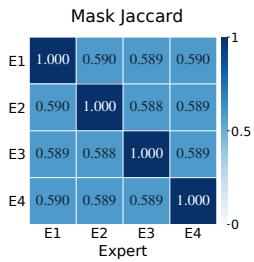  
(a) Trained overlap

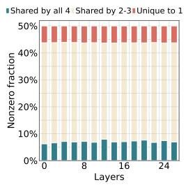  
(b) Structured

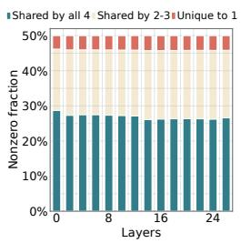  
(c) Semi-structured 2:4

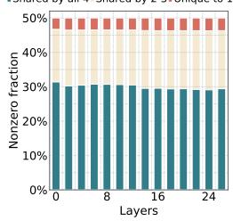  
(d) Unstructured

Figure 3: Learned mask structure on Qwen3-1.7B: (a) 2:4 mask Jaccard overlap; (b)-(d) layer-wise sharing of retained connections.  
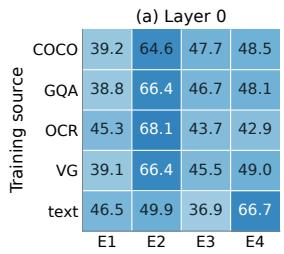

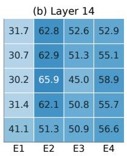

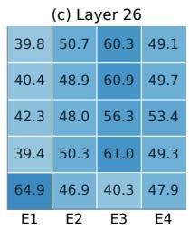  
Figure 4: Layer-local expert selection by training source on Qwen3-1.7B. Panels show layers 0, 14, 26, and an equal index-wise mean over all 14 converted layers. Expert IDs are not aligned across layers. 50% indicates balanced top-2 usage.

Routing across training sources. Fig. 4 reports expert selection frequencies for prompts from five training-source buckets, including COCO (Lin et al., 2015), GQA (Hudson & Manning, 2019), OCR (Mishra et al., 2019), VG (Krishna et al., 2016), and text. Each entry averages binary dispatch indicators over prefill tokens within a prompt, then equally over prompts from the same source. We use 64 prompts per source. The three displayed layers, 0, 14, and 26, are selected by depth. The mean panel equally averages all 14 converted layers, not only these three. Expert IDs are local to each layer and are not aligned before averaging, so this panel summarizes index-wise utilization, not four global experts. With two of four experts selected per token, balanced usage corresponds to a 50% selection frequency per expert. Individual layers exhibit source-related usage differences, while the all-layer mean is closer to balanced usage, obscuring the larger contrasts visible at individual layers. These observations indicate source-related, layer-local routing patterns. More detailed analysis can be found in Tab. 19.

## 5 CONCLUSION

We presented MASKerade, a dense-to-MoE upcycling method that learns token-routed mask experts over frozen pretrained FFN weights. Vision-language experiments and controlled ablations support learning expert connectivity as an effective alternative to updating independent expert weights. The learned masks retain a shared connectivity core alongside expert-specific connections, with routing adapting their use to individual tokens. Future work will investigate inference kernels that reuse overlapping computations while preserving expert-specific nonlinear transformations, and assess their end-to-end latency and memory trade-offs.

## REFERENCES

Guangji Bai, Yijiang Li, Chen Ling, Kibaek Kim, and Liang Zhao. Sparsellm: Towards global pruning of pre-trained language models. In Advances in Neural Information Processing Systems, 2024.

Yoshua Bengio, Nicholas Léonard, and Aaron Courville. Estimating or propagating gradients through stochastic neurons for conditional computation, 2013.

Shaoxiang Chen, Zequn Jie, and Lin Ma. Llava-mole: Sparse mixture of lora experts for mitigating data conflicts in instruction finetuning mllms, 2024a.

Shengzhuang Chen, Jihoon Tack, Yunqiao Yang, Yee Whye Teh, Jonathan Richard Schwarz, and Ying Wei. Unleashing the power of meta-tuning for few-shot generalization through sparse interpolated experts, 2024b.

Shengzhuang Chen, Ying Wei, and Jonathan Richard Schwarz. Automatic expert discovery in LLM upcycling via sparse interpolated mixture-of-experts. In Wanxiang Che, Joyce Nabende, Ekaterina Shutova, and Mohammad Taher Pilehvar (eds.), Proceedings of the 63rd Annual Meeting of the Association for Computational Linguistics (Volume 1: Long Papers), 2025.

Gongfan Fang, Hongxu Yin, Saurav Muralidharan, Greg Heinrich, Jeff Pool, Jan Kautz, Pavlo Molchanov, and Xinchao Wang. Maskllm: Learnable semi-structured sparsity for large language models. In Advances in Neural Information Processing Systems, 2024.

William Fedus, Barret Zoph, and Noam Shazeer. Switch transformers: Scaling to trillion parameter models with simple and efficient sparsity, 2022.

Yuchen Feng, Bowen Shen, Naibin Gu, Jiaxuan Zhao, Peng Fu, Zheng Lin, and Weiping Wang. DIVE into MoE: Diversity-enhanced reconstruction of large language models from dense into mixture-of-experts. In Proceedings of the 63rd Annual Meeting of the Association for Computational Linguistics (Volume 1: Long Papers), 2025.

Chaoyou Fu, Peixian Chen, Yunhang Shen, Yulei Qin, Mengdan Zhang, Xu Lin, Jinrui Yang, Xiawu Zheng, Ke Li, Xing Sun, et al. Mme: A comprehensive evaluation benchmark for multimodal large language models. arXiv preprint arXiv:2306.13394, 2023.

Yuxing Gan and Ziyu Lei. Mixture-of-experts with gradient conflict-driven subspace topology pruning for emergent modularity, 2026.

Shangqian Gao, Ting Hua, Reza Shirkavand, Chi-Heng Lin, Zheng Tang, Zhengao Li, Longge Yuan, Fangyi Li, Zeyu Zhang, Alireza Ganjdanesh, Qian Lou, Jie Xu, and Yen-Chang Hsu. Tomoe: Converting dense large language models to mixture-of-experts through dynamic structural pruning. Transactions on Machine Learning Research, 2026.

Drew A Hudson and Christopher D Manning. Gqa: A new dataset for real-world visual reasoning and compositional question answering. Conference on Computer Vision and Pattern Recognition (CVPR), 2019.

Robert A Jacobs, Michael I Jordan, Steven J Nowlan, and Geoffrey E Hinton. Adaptive mixtures of local experts. Neural computation, 1991.

Aran Komatsuzaki, Joan Puigcerver, James Lee-Thorp, Carlos Riquelme Ruiz, Basil Mustafa, Joshua Ainslie, Yi Tay, Mostafa Dehghani, and Neil Houlsby. Sparse upcycling: Training mixture-of-experts from dense checkpoints. In The Eleventh International Conference on Learning Representations, 2023.

Ranjay Krishna, Yuke Zhu, Oliver Groth, Justin Johnson, Kenji Hata, Joshua Kravitz, Stephanie Chen, Yannis Kalantidis, Li-Jia Li, David A. Shamma, Michael S. Bernstein, and Fei-Fei Li. Visual genome: Connecting language and vision using crowdsourced dense image annotations, 2016.

Yifan Li, Yifan Du, Kun Zhou, Jinpeng Wang, Xin Zhao, and Ji-Rong Wen. Evaluating object hallucination in large vision-language models. In Houda Bouamor, Juan Pino, and Kalika Bali (eds.), Proceedings of the 2023 Conference on Empirical Methods in Natural Language Processing, 2023.

Bin Lin, Zhenyu Tang, Yang Ye, Jinfa Huang, Junwu Zhang, Yatian Pang, Peng Jin, Munan Ning, Jiebo Luo, and Li Yuan. Moe-llava: Mixture of experts for large vision-language models. IEEE Transactions on Multimedia, 2026.

Tsung-Yi Lin, Michael Maire, Serge Belongie, Lubomir Bourdev, Ross Girshick, James Hays, Pietro Perona, Deva Ramanan, C. Lawrence Zitnick, and Piotr Dollár. Microsoft coco: Common objects in context, 2015.

Haotian Liu, Chunyuan Li, Qingyang Wu, and Yong Jae Lee. Visual instruction tuning. In Advances in Neural Information Processing Systems, 2023.

Peiyu Liu, Tianwen Wei, Bo Zhu, Wayne Xin Zhao, and Shuicheng Yan. Masks can be learned as an alternative to experts. In Proceedings of the 63rd Annual Meeting of the Association for Computational Linguistics (Volume 1: Long Papers), 2025.

Pan Lu, Swaroop Mishra, Tony Xia, Liang Qiu, Kai-Wei Chang, Song-Chun Zhu, Oyvind Tafjord, Peter Clark, and Ashwin Kalyan. Learn to explain: Multimodal reasoning via thought chains for science question answering. In The 36th Conference on Neural Information Processing Systems (NeurIPS), 2022.

Anand Mishra, Shashank Shekhar, Ajeet Kumar Singh, and Anirban Chakraborty. Ocr-vqa: Visual question answering by reading text in images. In 2019 International Conference on Document Analysis and Recognition (ICDAR), 2019.

Taishi Nakamura, Takuya Akiba, Kazuki Fujii, Yusuke Oda, Rio Yokota, and Jun Suzuki. Dropupcycling: Training sparse mixture of experts with partial re-initialization. In The Thirteenth International Conference on Learning Representations, 2025.

Alec Radford, Jong Wook Kim, Chris Hallacy, Aditya Ramesh, Gabriel Goh, Sandhini Agarwal, Girish Sastry, Amanda Askell, Pamela Mishkin, Jack Clark, Gretchen Krueger, and Ilya Sutskever. Learning transferable visual models from natural language supervision, 2021.

Vivek Ramanujan, Mitchell Wortsman, Aniruddha Kembhavi, Ali Farhadi, and Mohammad Rastegari. What’s hidden in a randomly weighted neural network? In Proceedings of the IEEE/CVF Conference on Computer Vision and Pattern Recognition (CVPR), 2020.

Noam Shazeer, Azalia Mirhoseini, Krzysztof Maziarz, Andy Davis, Quoc Le, Geoffrey Hinton, and Jeff Dean. Outrageously large neural networks: The sparsely-gated mixture-of-experts layer, 2017.

Amanpreet Singh, Vivek Natarjan, Meet Shah, Yu Jiang, Xinlei Chen, Devi Parikh, and Marcus Rohrbach. Towards vqa models that can read. In Proceedings of the IEEE Conference on Computer Vision and Pattern Recognition, 2019.

Zhenpeng Su, Zijia Lin, Xue Bai, Xing Wu, Yizhe Xiong, Haoran Lian, Guangyuan Ma, Hui Chen, Guiguang Ding, Wei Zhou, and Songlin Hu. Maskmoe: Boosting token-level learning via routing mask in mixture-of-experts, 2024.

Mingjie Sun, Zhuang Liu, Anna Bair, and J. Zico Kolter. A simple and effective pruning approach for large language models, 2024.

Gemma Team, Aishwarya Kamath, Johan Ferret, Shreya Pathak, Nino Vieillard, Ramona Merhej, Sarah Perrin, Tatiana Matejovicova, Alexandre Ramé, Morgane Rivière, Louis Rouillard, Thomas Mesnard, Geoffrey Cideron, Jean bastien Grill, Sabela Ramos, Edouard Yvinec, Michelle Casbon, Etienne Pot, Ivo Penchev, Gaël Liu, Francesco Visin, Kathleen Kenealy, Lucas Beyer, Xi aohai Zhai, Anton Tsitsulin, Robert Busa-Fekete, Alex Feng, Noveen Sachdeva, Benjamin Coleman, Yi Gao, Basil Mustafa, Iain Barr, Emilio Parisotto, David Tian, Matan Eyal, Colin Cherry, Jan-Thorsten Peter, Danila Sinopalnikov, Surya Bhupatiraju, Rishabh Agarwal, Mehran Kazemi,

Dan Malkin, Ravin Kumar, David Vilar, Idan Brusilovsky, Jiaming Luo, Andreas Steiner, Abe Friesen, Abhanshu Sharma, Abheesht Sharma, Adi Mayrav Gilady, Adrian Goedeckemeyer, Alaa Saade, Alex Feng, Alexander Kolesnikov, Alexei Bendebury, Alvin Abdagic, Amit Vadi, András György, André Susano Pinto, Anil Das, Ankur Bapna, Antoine Miech, Antoine Yang, Antonia Paterson, Ashish Shenoy, Ayan Chakrabarti, Bilal Piot, Bo Wu, Bobak Shahriari, Bryce Petrini, Charlie Chen, Charline Le Lan, Christopher A. Choquette-Choo, CJ Carey, Cormac Brick, Daniel Deutsch, Danielle Eisenbud, Dee Cattle, Derek Cheng, Dimitris Paparas, Divyashree Shivakumar Sreepathihalli, Doug Reid, Dustin Tran, Dustin Zelle, Eric Noland, Erwin Huizenga, Eugene Kharitonov, Frederick Liu, Gagik Amirkhanyan, Glenn Cameron, Hadi Hashemi, Hanna Klimczak-Plucinska, Harman Singh, Harsh Mehta, Harshal Tushar Lehri, Hussein Hazimeh, Ian´ Ballantyne, Idan Szpektor, Ivan Nardini, Jean Pouget-Abadie, Jetha Chan, Joe Stanton, John Wieting, Jonathan Lai, Jordi Orbay, Joseph Fernandez, Josh Newlan, Ju yeong Ji, Jyotinder Singh, Kat Black, Kathy Yu, Kevin Hui, Kiran Vodrahalli, Klaus Greff, Linhai Qiu, Marcella Valentine, Marina Coelho, Marvin Ritter, Matt Hoffman, Matthew Watson, Mayank Chaturvedi, Michael Moynihan, Min Ma, Nabila Babar, Natasha Noy, Nathan Byrd, Nick Roy, Nikola Momchev, Nilay Chauhan, Noveen Sachdeva, Oskar Bunyan, Pankil Botarda, Paul Caron, Paul Kishan Rubenstein, Phil Culliton, Philipp Schmid, Pier Giuseppe Sessa, Pingmei Xu, Piotr Stanczyk, Pouya Tafti, Rakesh Shivanna, Renjie Wu, Renke Pan, Reza Rokni, Rob Willoughby, Rohith Vallu, Ryan Mullins, Sammy Jerome, Sara Smoot, Sertan Girgin, Shariq Iqbal, Shashir Reddy, Shruti Sheth, Siim Põder, Sijal Bhatnagar, Sindhu Raghuram Panyam, Sivan Eiger, Susan Zhang, Tianqi Liu, Trevor Yacovone, Tyler Liechty, Uday Kalra, Utku Evci, Vedant Misra, Vincent Roseberry, Vlad Feinberg, Vlad Kolesnikov, Woohyun Han, Woosuk Kwon, Xi Chen, Yinlam Chow, Yuvein Zhu, Zichuan Wei, Zoltan Egyed, Victor Cotruta, Minh Giang, Phoebe Kirk, Anand Rao, Kat Black, Nabila Babar, Jessica Lo, Erica Moreira, Luiz Gustavo Martins, Omar Sanseviero, Lucas Gonzalez, Zach Gleicher, Tris Warkentin, Vahab Mirrokni, Evan Senter, Eli Collins, Joelle Barral, Zoubin Ghahramani, Raia Hadsell, Yossi Matias, D. Sculley, Slav Petrov, Noah Fiedel, Noam Shazeer, Oriol Vinyals, Jeff Dean, Demis Hassabis, Koray Kavukcuoglu, Clement Farabet, Elena Buchatskaya, Jean-Baptiste Alayrac, Rohan Anil, Dmitry, Lepikhin, Sebastian Borgeaud, Olivier Bachem, Armand Joulin, Alek Andreev, Cassidy Hardin, Robert Dadashi, and Léonard Hussenot. Gemma 3 technical report, 2025.

Gemma Team, Sherif El Abd, Vaibhav Aggarwal, Robin Algayres, Alek Andreev, Olivier Bachem, Ian Ballantyne, Cormac Brick, Victor Carbune, Michelle Casbon, Mayank Chaturvedi, Aditya˘ Chawla, Victor Cotruta, Alice Coucke, Phil Culliton, Robert Dadashi, Lucas Dixon, Mohamed Elhawaty, Utku Evci, Clément Farabet, Johan Ferret, Filippo Galgani, Sertan Girgin, Jean-Bastien Grill, Maarten Grootendorst, Jiaxian Guo, Cassidy Hardin, Yanzhang He, Steven M. Hernandez, Omri Homburger, Léonard Hussenot, Juyeong Ji, Armand Joulin, Aishwarya Kamath, Parnian Kassraie, Olivier Lacombe, Preethi Lahoti, Gaël Liu, Gus Martins, Luciano Martins, Tatiana Matejovicova, Ramona Merhej, Nikola Momchev, Sneha Mondal, Ryan Mullins, Sindhu Raghuram Panyam, Shreya Pathak, Sarah Perrin, André Susano Pinto, Etienne Pot, Angéline Pouget, Alexandre Ramé, Sabela Ramos, Douglas Reid, David Rim, Morgane Rivière, Karsten Roth, Louis Rouillard, Omar Sanseviero, Pier Giuseppe Sessa, Shane Settle, Danila Sinopalnikov, Sara Smoot, Piotr Stanczyk, Andreas Steiner, Lawrence Stewart, Ilya Tolstikhin, Michael Tschannen, Anton Tsitsulin, Nino Vieillard, Renjie Wu, Pingmei Xu, Haichuan Yang, Edouard Yvinec, Biao Zhang, Li Zhang, Joe Zou, Nicolas Aagnes, Abdelrahman Abdelhamed, Jakub Adamek, Shivani Agrawal, Shubham Agrawal, Ibrahim Alabdulmohsin, Jean Baptiste Alayrac, Uri Alon, Chandramouli Amarnath, Ankesh Anand, Chrysovalantis Anastasiou, Setareh Ariafar, François-Xavier Aubet, Kyriakos Axiotis, Federico Barbero, Joelle Barral, Alexei Bendebury, Urs Bergmann, Stanley Bileschi, Kat Black, Mathieu Blondel, Sebastian Borgeaud, Arthur Bražinskas, Ryan Bur nell, Robert Busa-Fekete, Mu Cai, Daniele Calandriello, Glenn Cameron, Charlotte Caucheteux, Rahma Chaabouni, Garima Chadha, Jetha Chan, Blake Jianhang Chen, Jesse Chen, Lin Chen, Xu Chen, Derek Cheng, Tzu hsiang Chien, Nikolai Chinaev, Yi Chou, Zhaohui Chu, Benjamin Coleman, Pooja Consul, Sam Conway-Rahman, Scott Crowell, Dylan Cutler, Vivek Dani, Samira Daruki, Anil Das, Daniel Deutsch, Nishanth Dikkala, Li Ding, Qiuhan Ding, Shenil Dodhia, Konstantin Donhauser, Tulsee Doshi, Anca Dragan, Alex Druinsky, Sahil Dua, Zoltan Egyed, Danielle Eisenbud, Daniel Eppens, Cindy Fan, Bahare Fatemi, Yassir Fathullah, Vlad Feinberg, Milen Ferev, Sebastian Flennerhag, Takumi Fujimoto, João Gabriel Oliveira, Isaac Galatzer-Levy, João Gante, Simon Geisler, Soham Ghosal, Antonious M. Girgis, Tamara von Glehn, Alec Go, Alhaad Gokhale, Alex Grills, Yiming Gu, Mayank Gupta, Pramod Gupta, Guru Guruganesh, Raia Hadsell, Hamza Harkous, Jitendra Harlalka, Demis Hassabis, Anja Hauth, Joe Heyward, Arian Hosseini, Chih-Yang Hsia, I-Hung Hsu, Xiaopeng Huang, Yangsibo Huang, Kevin Hui, Adrian Hutter, Te I, Fotis Iliopoulos, Advait Jain, Ganesh Jawahar, Ziwei Ji, Qilin Jin, Melvin Johnson, Kandarp Joshi, Arun Kandoor, Wang-Cheng Kang, Koray Kavukcuoglu, Mehran Kazemi, Kathleen Kenealy, Amr Khalifa, Phoebe Kirk, Ivan Korotkov, Suraj Kothawade, Vitaly Kovalev, Neel Kovelamudi, Adam Kraft, Ravin Kumar, Vivek Kumar, Harish Kuppam, Justin Lannin, Chen-Yu Lee, Seungji Lee, Dmitry Lepikhin, Alon Levkovitch, Dongdong Li, Qiujia Li, Valentin Liévin, Ethan Lin, Ziqian Lin, Casper Liu, Tianlin Liu, Tianqi Liu, Xin Liu, Ivan Lobov, Mayank Lunayach, Min Ma, Gagan Madan, Andrii Maksai, Eric Malmi, Michal Matuszak, Daniel McDuff, Gaurav Menghani, Maciej Mikuła, Daniil Mirylenka, Karolis Misiunas, Vedant Misra, Andreea Mitran, Kareem Mohamed, Maksim Mukha, Eric Noland, James O’Donnell, Brendan O’Donoghue, Kate Olszewska, Bernett Orlando, Wanqiong Pan, Rina Panigrahy, Unnati Parekh, Nicolas Perez-Nieves, Chunjong Park, Eric Paskie, Liqian Peng, Bryce Petrini, Slav Petrov, Jonas Pfeiffer, Bilal Piot, Martyna Plomecka, Siim Poder, Octavio Ponce, Arijit Pramanik, David Racz, Anish Rajan, Michelle Ramanovich, Anand Rao, Marvin Ritter, Vitor Rodrigues, Evan Rosen, Mikołaj Rybinski, Noveen Sachdeva, Michaël E. Sander, Rohit´ Sathyanarayana, Sagar Savla, Samuel Schmidgall, Tal Schuster, George Scrivener, Benoit Seguin, Andrew Sellergren, Aliaksei Severyn, Izhak Shafran, Dhruv Shah, Bobak Shahriari, Yuan Shangguan, Ashish Shenoy, Pradeep Shenoy, Rakesh Shivanna, Pauline Sho, Lucas Spangher, Wojciech Stokowiec, Tim Strother, Yao Su, Yinghao Sun, Mukund Sundararajan, Andrea Tacchetti, Mor Hazan Taege, Pouya Tafti, Jean Tarbouriech, Chetan Tekur, Shantanu Thakoor, Rahul Thapa, Madeleine Traverse, Lenart Treven, Tao Tu, Chien Te Tung, Çaglar Ünlü, Petar Veli ˘ ckovi ˇ c, Ma- ´ lini Pooni Venkat, Sagar Gubbi Venkatesh, Vidya Venkiteswaran, Francesco Visin, Alex Vitvitskyi, Kiran Vodrahalli, Weiyi Wang, Xin Wang, Tris Warkentin, Jan Wassenberg, John Wieting, Cindy Wu, Lechao Xiao, Hao Xu, Yuhui Xu, Fuzhao Xue, Arun Yadav, Jun Yan, Antoine Yang, Lin Yang, Ming-Hsuan Yang, Ziyu Ying, Jae Hyeon Yoo, Morteza Zadimoghaddam, Sajjad Zafar, Fred Zhang, Jiageng Zhang, Jianyi Zhang, Xiaofan Zhang, Chao Zhao, David Zhou, and Chen Zou. Gemma 4 technical report, 2026.

Haoyuan Wu, Haisheng Zheng, Zhuolun He, and Bei Yu. Parameter-efficient sparsity crafting from dense to mixture-of-experts for instruction tuning on general tasks. In Proceedings of the 2024 Conference on Empirical Methods in Natural Language Processing, 2024.

An Yang, Anfeng Li, Baosong Yang, Beichen Zhang, Binyuan Hui, Bo Zheng, Bowen Yu, Chang Gao, Chengen Huang, Chenxu Lv, Chujie Zheng, Dayiheng Liu, Fan Zhou, Fei Huang, Feng Hu, Hao Ge, Haoran Wei, Huan Lin, Jialong Tang, Jian Yang, Jianhong Tu, Jianwei Zhang, Jianxin Yang, Jiaxi Yang, Jing Zhou, Jingren Zhou, Junyang Lin, Kai Dang, Keqin Bao, Kexin Yang, Le Yu, Lianghao Deng, Mei Li, Mingfeng Xue, Mingze Li, Pei Zhang, Peng Wang, Qin Zhu, Rui Men, Ruize Gao, Shixuan Liu, Shuang Luo, Tianhao Li, Tianyi Tang, Wenbiao Yin, Xingzhang Ren, Xinyu Wang, Xinyu Zhang, Xuancheng Ren, Yang Fan, Yang Su, Yichang Zhang, Yinger Zhang, Yu Wan, Yuqiong Liu, Zekun Wang, Zeyu Cui, Zhenru Zhang, Zhipeng Zhou, and Zihan Qiu. Qwen3 technical report, 2025.

Mingyuan Zhang, Yue Bai, Yifan Wang, Yiyang Huang, and Yun Fu. Rethinking fine-tuning: Unlocking hidden capabilities in vision-language models, 2025.

Mingyuan Zhang, Yue Bai, Huan Wang, Yizhou Wang, Qihua Dong, Yitian Zhang, and Yun Fu. Boosting large language models with mask fine-tuning, 2026.

Zhengyan Zhang, Yankai Lin, Zhiyuan Liu, Peng Li, Maosong Sun, and Jie Zhou. MoEfication: Transformer feed-forward layers are mixtures of experts. In Findings of the Association for Computational Linguistics: ACL 2022, 2022.

Tong Zhu, Xiaoye Qu, Daize Dong, Jiacheng Ruan, Jingqi Tong, Conghui He, and Yu Cheng. LLaMA-MoE: Building mixture-of-experts from LLaMA with continual pre-training. In Proceedings of the 2024 Conference on Empirical Methods in Natural Language Processing, 2024.

## APPENDIX

## A IMPLEMENTATION DETAILS

Default configuration. Tab. 9 summarizes the MASKerade training setup. Across backbones, alternating FFNs are converted into four 2:4 mask experts with deterministic top-2 routing in both training and inference. Mask scores and routers are optimized while pretrained language-model weights remain frozen. We use importance initialization and one epoch of AdamW training with a peak learning rate of $5 \times 1 0 ^ { - 4 }$ . The small and large model settings differ in global batch size, hardware allocation, and text length limit, as listed in the table.

Table 9: Default MASKerade implementation details.
<table><tr><td>Setting</td><td>Value</td></tr><tr><td>Training data</td><td>665K multimodal instruction mixture</td></tr><tr><td>Converted FFNs</td><td>Even-indexed layers: Qwen3-1.7B, 14/28; Gemma3-1B, 13/26; Qwen3.6- 27B, 32/64; Gemma4-31B, 30/60</td></tr><tr><td>Experts and routing</td><td>Four experts with deterministic top-2 in training and inference using drop- less dispatch</td></tr><tr><td>Default masks</td><td>Semi-structured 2:4</td></tr><tr><td>Trainable LM parameters</td><td>Mask scores and routers</td></tr><tr><td>Pretrained LM weights</td><td>Frozen</td></tr><tr><td>Score initialization</td><td>Importance initialization with noise scale  $\alpha _ { \mathrm { i n i t } } = 0 . 1$ </td></tr><tr><td>Gradient estimator</td><td>Straight-through estimator for hard mask selection</td></tr><tr><td>Optimizer</td><td>AdamW</td></tr><tr><td>Learning rate</td><td> $5 \times 1 0 ^ { - 4 }$  for mask scores and routers</td></tr><tr><td>Training epochs</td><td>1</td></tr><tr><td>Learning-rate schedule</td><td>Cosine decay with 3% warmup</td></tr><tr><td>Weight decay</td><td>0</td></tr><tr><td>Load-balancing coefficient</td><td> $\lambda _ { \mathrm { b a l } } = 0 . 0 1$  Bfloat16</td></tr><tr><td>Precision Global batch size</td><td></td></tr><tr><td></td><td>Small: 128 (8 NVIDIA H100 GPUs); large: 256 (64 NVIDIA B200 GPUs)</td></tr><tr><td>Text length limit</td><td>Small: 2048; large: 1,536 tokens before visual-token expansion</td></tr><tr><td>Evaluation metrics</td><td>GQA: accuracy (%)</td></tr><tr><td></td><td>MME: perception score</td></tr><tr><td></td><td>POPE: mean F1 across three splits (%)</td></tr><tr><td></td><td>SQA: image-subset accuracy (%)</td></tr><tr><td></td><td>TextVQA: consensus VQA accuracy (%)</td></tr></table>

## B MORE ANALYSIS

## B.1 SCORE INITIALIZATION

Initialization dynamics. Fig. 5 and Fig. 6 compare training-loss trajectories under random and importance initialization on Qwen3-1.7B and Gemma3-1B. Importance initialization lowers the initial loss for unstructured and 2:4 masks on both backbones. The unstructured gap narrows during training, whereas importance-initialized 2:4 masks retain lower loss and exhibit fewer large fluctuations. The neuron-structured curves are closer on Qwen3-1.7B. For Gemma3-1B, random initialization starts with substantially lower loss and remains lower near the end of training. These curves show that the optimization effect of initialization depends on mask granularity and backbone.

Score initialization on Gemma. Tab. 10 compares random, importance, and importance-permuted initialization across the three mask granularities on Gemma3-1B. Importance initialization has the highest reported score on all five benchmarks within each family. Its advantage over random initialization is particularly pronounced for 2:4 masks on GQA and TextVQA, while the GQA difference is smaller for unstructured masks. Permuting importance scores also reduces performance in every family, supporting the value of aligning the initialization prior with its original parameter locations.

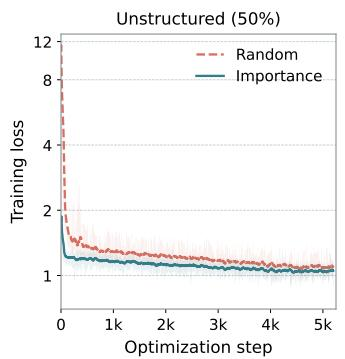

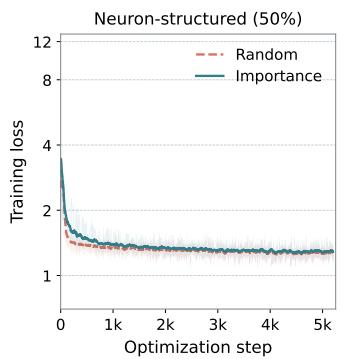

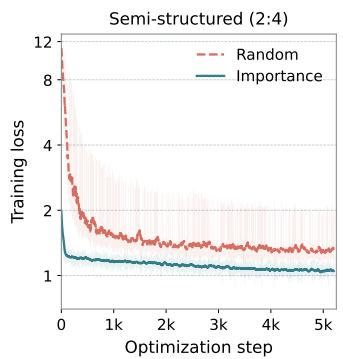  
Figure 5: Random versus importance initialization across mask granularities on Qwen3-1.7B.

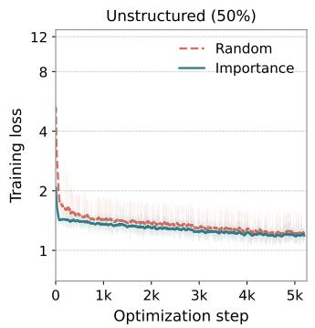

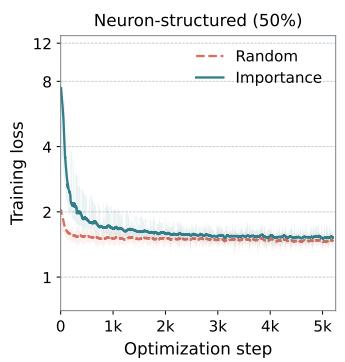

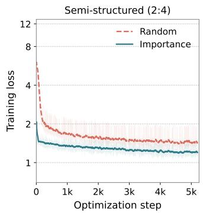  
Figure 6: Random versus importance initialization across mask granularities on Gemma3-1B.

Mask ratio on Gemma. Tab. 11 varies the per-expert retained fraction from 25% to 75% across the three mask families on Gemma3-1B, with four experts and top-2 routing. Unstructured masks lead on four benchmarks at each retention level. Semi-structured masks achieve the highest TextVQA scores at 25% and 50% retention, while neuron-structured masks lead on TextVQA at 75%.

Matched activation budgets on Gemma. Tab. 12 compares low-budget MASKerade variants with a single learned mask and existing MoE methods on Gemma3-1B. At 0.84B nominal activated parameters, 1:4/top-2 achieves higher reported means than the single 2:4 mask and all four external baselines on all five benchmarks. The 2:4/top-1 variant exceeds the single mask on four benchmarks, with a slightly lower GQA mean (58.24 versus 58.30). These comparisons support learning multiple token-selectable masks under a fixed nominal activation budget. Unlike on Qwen3-1.7B, 1:4/top-2 outperforms 2:4/top-1 on four benchmarks, with POPE as the exception, indicating that the preferred allocation between expert density and selection count depends on the backbone.

Structure of learned masks on Gemma. Fig. 7 (a) reports pairwise Jaccard overlap between learned 2:4 masks in the Gemma3-1B runs, averaged over converted FFN projections and runs. The off-diagonal values range from 0.489 to 0.492, indicating overlapping but nonidentical retained connections. The similar overlap across expert pairs suggests that no pair is substantially more alike than the others under this structural measure. This establishes connectivity diversity, while the usefulness of the routed assignments requires separate functional and intervention analyses.

Latent shared expert on Gemma. Fig. 7 (b) to (d) decompose the average retained weight density at each converted layer into connections shared by all four experts, shared by two or three, and unique to one. Each bar sums to 50% of dense weight positions. The all-four intersection forms a latent shared expert, with a smaller shared core for neuron-structured masks than for either weight-level family. In these Gemma3-1B runs, the all-four component accounts for less than half of retained entries in every family. All three constructions therefore combine a common connectivity core with partially shared and expert-specific connections.

Table 10: Mask-score initialization on Gemma3-1B (four experts, top-2, 50% retention).
<table><tr><td>Initialization</td><td>GQA↑ MME↑1</td><td>POPE ↑ SQA ↑ TextVQA ↑</td><td></td><td></td><td></td></tr><tr><td>Structured 50%</td><td></td><td></td><td></td><td></td><td></td></tr><tr><td>Random</td><td>53.13</td><td>1004.9</td><td>81.00</td><td>50.10</td><td>39.58</td></tr><tr><td>Importance</td><td>56.65</td><td>1251.4</td><td>85.68</td><td>51.74</td><td>41.80</td></tr><tr><td>Importance-permuted</td><td>53.16</td><td>1008.2</td><td>82.76</td><td>49.85</td><td>40.20</td></tr><tr><td>Unstructured 50%</td><td></td><td></td><td></td><td></td><td></td></tr><tr><td>Random</td><td>59.92</td><td>1210.7</td><td>85.72</td><td>46.65</td><td>38.85</td></tr><tr><td>Importance</td><td>60.46</td><td>1295.3</td><td>86.39</td><td>56.64</td><td>42.73</td></tr><tr><td>Importance-permuted</td><td>59.34</td><td>1221.0</td><td>85.41</td><td>52.74</td><td>39.49</td></tr><tr><td>Semi-structured 2:4</td><td></td><td></td><td></td><td></td><td></td></tr><tr><td>Random</td><td>51.54</td><td>1068.2</td><td>83.37</td><td>45.60</td><td>26.89</td></tr><tr><td>Importance</td><td>60.34</td><td>1294.4</td><td>86.35</td><td>55.40</td><td>42.81</td></tr><tr><td>Importance-permuted</td><td>58.89</td><td>1203.8</td><td>85.27</td><td>42.94</td><td>37.07</td></tr></table>

Table 11: Per-expert retention across mask granularities on Gemma3-1B (four experts, top-2).
<table><tr><td>Family</td><td>GQA↑ MME↑1</td><td></td><td></td><td></td><td>POPE ↑ SQA ↑ TextVQA ↑</td></tr><tr><td>Structured</td><td></td><td></td><td></td><td></td><td></td></tr><tr><td>25% FFN parameters</td><td>51.25</td><td>1105.5</td><td>83.01</td><td>48.86</td><td>39.03</td></tr><tr><td>50% FFN parameters</td><td>56.65</td><td>1251.4</td><td>85.68</td><td>51.74</td><td>41.80</td></tr><tr><td>75% FFN parameters</td><td>58.95</td><td>1292.8</td><td>85.09</td><td>51.47</td><td>45.21</td></tr><tr><td>Unstructured</td><td></td><td></td><td></td><td></td><td></td></tr><tr><td>25% FFN parameters</td><td>59.82</td><td>1256.2</td><td>85.40</td><td>54.22</td><td>41.74</td></tr><tr><td>50% FFN parameters</td><td>60.46</td><td>1295.3</td><td>86.39</td><td>56.64</td><td>42.73</td></tr><tr><td>75% FFN parameters</td><td>60.78</td><td>1315.8</td><td>86.31</td><td>56.48</td><td>43.02</td></tr><tr><td>Semi-structured</td><td></td><td></td><td></td><td></td><td></td></tr><tr><td>1:4 mask</td><td>59.09</td><td>1233.7</td><td>85.11</td><td>52.99</td><td>41.87</td></tr><tr><td>2:4 mask</td><td>60.34</td><td>1294.4</td><td>86.35</td><td>55.40</td><td>42.81</td></tr><tr><td>3:4 mask</td><td>60.37</td><td>1304.4</td><td>86.12</td><td>55.19</td><td>43.21</td></tr></table>

Table 12: Matched nominal activation budgets on Gemma3-1B. Calculation denotes retained density per expert times the number of activated experts. Only protocol-matched runs are included.
<table><tr><td>Configuration</td><td>Masks</td><td>Calculation</td><td>Act. params</td><td>GQA↑</td><td>MME↑</td><td>POPE↑</td><td>SQA↑</td><td>TextVQA ↑</td></tr><tr><td>MoEfication (Zhang et al., 2022)</td><td></td><td></td><td>0.84B</td><td>55.36±0.28</td><td>1212.9±13.5</td><td>80.92±0.35</td><td>50.33±0.55</td><td>40.68±0.58</td></tr><tr><td>LLaMA-MoE (Zhu et al., 2024)</td><td></td><td></td><td>0.84B</td><td>57.67±0.33</td><td>1234.7±11.2</td><td>85.00±0.42</td><td>52.71±0.63</td><td>40.96±0.67</td></tr><tr><td>DIVE (Feng et al., 2025)</td><td></td><td></td><td>0.85B</td><td>51.66±0.27</td><td>1129.3±13.2</td><td>82.80±0.28</td><td>50.84±0.63</td><td>41.79±0.58</td></tr><tr><td>ToMoE (Gao et al., 2026)</td><td></td><td></td><td>0.84B</td><td>53.96±0.15</td><td>1123.0±17.9</td><td>81.37±0.43</td><td>51.98±0.52</td><td>40.63±0.32</td></tr><tr><td>1 mask only</td><td>2:4</td><td>50% × 1</td><td>0.84B</td><td>58.30±0.30</td><td>1239.9±13.7</td><td>84.87±0.38</td><td>52.59±0.69</td><td>40.07±0.68</td></tr><tr><td>[Ours] 4e/top-2</td><td>1:4</td><td>25% × 2</td><td>0.84B</td><td>59.09±0.33</td><td>1248.7±15.5</td><td>85.11±0.36</td><td>52.99±0.61</td><td>42.47±0.64</td></tr><tr><td>[Ours] 4e/top-1</td><td>2:4</td><td>50% × 1</td><td>0.84B</td><td>58.24±0.31</td><td>1246.8±11.3</td><td>85.77±0.35</td><td>52.61±0.61</td><td>41.46±0.67</td></tr><tr><td>[Ours] 4e/top-2</td><td>2:4</td><td>50% × 2</td><td>1.00B</td><td>60.07±0.27</td><td>1293.8±11.9</td><td>86.41±0.10</td><td>55.30±0.47</td><td>42.90±0.47</td></tr></table>

Routing across training sources. Fig. 8 reports expert selection frequencies for five training-source buckets on Gemma3-1B. Each entry averages token selection frequencies within a prompt and then equally over 64 prompts per source. Layers 0, 12, and 24 show source-related differences, with text prompts exhibiting a distinct selection pattern at layer 24. The mean over all 13 converted layers is closer to the balanced 50% usage level.

Updating shared FFN weights. Tab. 13 examines whether learning the underlying FFN weights improves mask-based adaptation. On Qwen3-1.7B, weight updates improve all five benchmarks for a single mask and four benchmarks for 4e/top-2. For Gemma3-1B, weight updates improve all five benchmarks in both configurations. The frozen-weight multi-expert configuration also exceeds Wanda prune-then-tune on all five benchmarks on Qwen3-1.7B and Gemma3-1B. Weight adaptation can therefore complement mask learning.

Number of activated experts. Tab. 14 and Tab. 16 vary top-k while keeping four 2:4 experts. These are configuration-level comparisons: Eq. 3 retains the selected probability for top-1 but renormalizes the selected probabilities for k ≥ 2. For Qwen3-1.7B, activating all four experts gives the highest GQA, SQA, and TextVQA scores, whereas top-2 performs best on MME and POPE. For Gemma3- 1B, top-2 leads on four benchmarks and top-3 gives a slightly higher MME score. Activating all four experts lowers every Gemma score relative to top-2 despite doubling the nominal selected-expert FFN computation. Since each expert retains half of the FFN weights, increasing k from one to four raises converted-FFN computation from half to twice that of a dense pass without guaranteeing better performance.

Number of available experts. Tab. 15 and Tab. 17 vary the size of the mask bank while selecting one 2:4 expert per token. For Qwen3-1.7B, moving from one to four experts improves all five benchmarks. Eight experts further improve MME and POPE but reduce the other three scores. For Gemma3-1B, two experts give the highest GQA and MME scores, while one expert leads on SQA, four on TextVQA, and eight on POPE. Larger mask banks therefore do not yield uniform gains across backbones or tasks. Selected-expert FFN computation remains fixed in this comparison, although the number of mask scores and the router size increase with the expert bank. The single mask case bypasses routing, whereas multi-expert top-1 uses probability-weighted outputs. The comparison therefore does not isolate expert-bank size from output scaling.

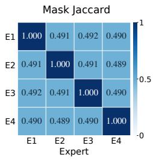  
(a) Trained overlap

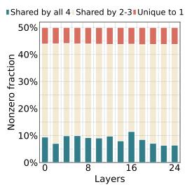  
(b) Structured

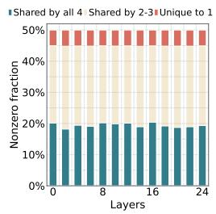  
(c) Semi-structured 2:4

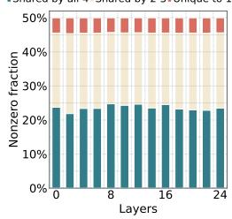  
(d) Unstructured

Figure 7: Learned mask structure on Gemma3-1B, averaged over three runs per family: (a) 2:4 Jaccard overlap; (b)-(d) layer-wise sharing of retained connections, normalized by dense weight positions.  
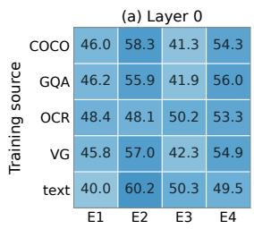

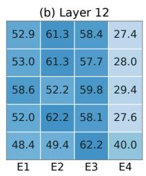

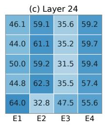

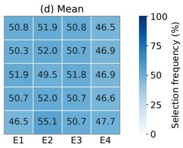  
Figure 8: Layer-local expert selection by training source on Gemma3-1B. Panels show layers 0, 12, 24, and the unaligned index-wise mean over all 13 converted layers. 50% denotes balanced top-2 usage.

Placement of converted layers. Tab. 18 compares where we introduce mask experts. On Qwen3- 1.7B, even-indexed layers give the highest MME and TextVQA scores, while the first and second halves lead on POPE and SQA, respectively. For Gemma3-1B, even-indexed layers lead on MME, POPE, and TextVQA, and odd-indexed layers give the highest SQA score. Converting every FFN gives the highest GQA score on both backbones, but lowers the other four scores relative to evenlayer conversion. These results support alternating even layers as a practical default without requiring conversion of the entire FFN stack.

Functional diversity of mask experts. Tab. 19 uses 600 examples per backbone: 300 GQA testdev and 300 TextVQA validation examples. Identical token hidden states are fed to all four experts. Pairwise statistics average tokens within each prompt, then equally across prompts and the six expert pairs, separately for vision, prompt, and teacher-forced response tokens (including the template separator). Mean pairwise cosine similarities range from 0.65 to 0.90, with positive normalized distances throughout, showing that the masks induce different transformations rather than identi cal expert outputs. For both backbones, the middle probed layer exhibits lower cosine similarity and greater normalized distance than the early and late layers across all three token types. This complements the connectivity overlap analysis in Fig. 3: shared weight positions can coexist with functionally distinct outputs.

Local expert replacement. Tab. 20 uses the same 600-example subset. At a single layer, one selected expert is replaced at every answer-predictive position, starting with the last prompt token, while retaining its routing weight. NLL uses teacher-forced reference answers, excluding the final labeled token. Diagnostic accuracy uses normalized exact match after greedy decoding (up to eight new tokens). TextVQA accepts any annotated answer rather than using the official consensus score. Every reported intervention increases mean and median NLL and reduces diagnostic accuracy. Loss increases affect 57–78% of evaluated inputs, and correct-to-wrong answer flips consistently exceed wrong-to-correct flips. The effects are largest at the middle probed layers and when replacing the first-ranked selected expert, although that slot also retains the larger routing weight. Together with Tab. 4, these results support the usefulness of the learned assignments on this subset: selected masks are not freely interchangeable with unselected ones.

Table 13: Mask learning with frozen or trainable shared FFN weights on Qwen3-1.7B and Gemma3- 1B.
<table><tr><td></td><td>Configuration</td><td>GQA↑</td><td>MME↑</td><td>POPE↑</td><td>SQA↑</td><td>TextVQA ↑</td></tr><tr><td>O-.7B</td><td>learned mask only (1 mask)</td><td>56.51±0.32</td><td> $1 2 5 8 . 1 { \pm } 1 5 . 5 $ </td><td> $8 4 . 5 0 { \scriptstyle \pm 0 . 2 5 }$ </td><td> $5 9 . 6 7 { \scriptstyle \pm 0 . 5 6 }$ </td><td>49.13±0.68</td></tr><tr><td></td><td>learned mask + trained weights (1 mask)</td><td>60.69±0.05</td><td> $1 3 1 0 . 8 { \pm } 0 . 4 $ </td><td> $8 5 . 9 3 { \scriptstyle \pm 0 . 3 9 }$ </td><td> $6 1 . 4 1 { \pm } 0 . 4 8$ </td><td> $5 0 . 4 9 { \scriptstyle \pm 0 . 3 5 }$ </td></tr><tr><td></td><td>learned mask only (4e/top-2)</td><td>62.00±0.28</td><td> $1 3 3 2 . 4 { \pm } 1 1 . 9$ </td><td> $8 6 . 4 9 { \scriptstyle \pm 0 . 1 6 }$ </td><td> $6 3 . 4 8 { \scriptstyle \pm 0 . 5 7 }$ </td><td> $5 2 . 5 0 { \scriptstyle \pm 0 . 3 7 }$ </td></tr><tr><td></td><td>learned masks + trained weights (4e/top-2)</td><td>62.73±0.33</td><td> $1 3 5 3 . 2 { \pm } 1 . 2$ </td><td> $8 6 . 4 6 { \scriptstyle \pm 0 . 5 4 }$ </td><td> $6 3 . 5 9 2 0 . 5 2 $ </td><td> $5 2 . 9 3 { \scriptstyle \pm 0 . 2 4 }$ </td></tr><tr><td></td><td>prune-then-tune (Wanda, 4e/top-2)</td><td>58.27±0.08</td><td> $1 2 8 2 . 7 { \scriptstyle \pm 2 0 . 4 }$ </td><td> $8 5 . 8 1 { \scriptstyle \pm 0 . 4 0 }$ </td><td> $6 1 . 2 9 { \scriptstyle \pm 0 . 5 2 }$ </td><td> $4 9 . 8 8 { \pm } 0 . 1 7 $ </td></tr><tr><td></td><td>learned mask only (1 mask)</td><td> $5 8 . 3 0 { \scriptstyle \pm 0 . 3 0 }$ </td><td> $1 2 3 9 . 9 { \scriptstyle \pm 1 3 . 7 }$ </td><td> $8 4 . 8 7 { \pm } 0 . 3 8 $ </td><td> $5 2 . 5 9 { \scriptstyle \pm 0 . 6 9 }$ </td><td> $4 0 . 0 7 { \scriptstyle \pm 0 . 6 8 }$ </td></tr><tr><td></td><td>learned mask + trained weights (1 mask)</td><td>60.06±0.22</td><td> $1 2 4 0 . 9 { \pm } 4 . 6 $ </td><td> $8 5 . 4 9 { \scriptstyle \pm 0 . 1 7 }$ </td><td> $5 2 . 6 6 { \scriptstyle \pm 0 . 3 7 }$ </td><td> $4 0 . 7 0 { \scriptstyle \pm 0 . 3 8 }$ </td></tr><tr><td></td><td>learned mask only (4e/top-2)</td><td> $6 0 . 0 7 { \scriptstyle \pm 0 . 2 7 }$ </td><td> $1 2 9 3 . 8 { \pm } 1 1 . 9$ </td><td> $8 6 . 4 1 { \scriptstyle \pm 0 . 1 0 }$ </td><td> $5 5 . 3 0 { \scriptstyle \pm 0 . 4 7 }$ </td><td> $4 2 . 9 0 { \scriptstyle \pm 0 . 4 7 }$ </td></tr><tr><td>Gm-1B</td><td>learned masks + trained weights (4e/top-2)</td><td> $6 0 . 9 5 { \scriptstyle \pm 0 . 3 3 }$ </td><td> $1 2 9 6 . 7 { \pm } 4 . 1$ </td><td> $8 6 . 5 3 { \scriptstyle \pm 0 . 1 6 }$ </td><td> $5 5 . 9 0 { \scriptstyle \pm 0 . 4 6 }$ </td><td>44.70±0.43</td></tr><tr><td></td><td>prune-then-tune (Wanda, 4e/top-2)</td><td> $5 8 . 2 5 { \scriptstyle \pm 0 . 2 3 }$ </td><td> $1 2 5 5 . 0 { \pm } 1 3 . 7$ </td><td> $8 4 . 6 9 { \scriptstyle \pm 0 . 4 7 }$ </td><td> $5 1 . 8 1 { \scriptstyle \pm 0 . 4 5 }$ </td><td> $3 7 . 0 1 { \scriptstyle \pm 0 . 3 4 }$ </td></tr></table>

Table 14: Varying top-k with four 2:4 experts on Qwen3-1.7B.  
Table 15: Varying the number of 2:4 experts with top-1 routing on Qwen3-1.7B.
<table><tr><td>Top-k GQA ↑</td><td>MME↑</td><td></td><td>POPE↑</td><td>SQA ↑</td><td>TextVQA ↑</td></tr><tr><td>1</td><td>62.20</td><td>1323.1</td><td>86.31</td><td>63.10</td><td>51.59</td></tr><tr><td>2</td><td>62.08</td><td>1335.1</td><td>86.63</td><td>63.99</td><td>52.86</td></tr><tr><td>3</td><td>62.59</td><td>1297.8</td><td>86.32</td><td>64.30</td><td>52.52</td></tr><tr><td>4</td><td>62.75</td><td>1309.0</td><td>86.32</td><td>64.40</td><td>53.07</td></tr></table>

Table 16: Varying top-k with four 2:4 experts on Gemma3-1B.

<table><tr><td>N</td><td>GQA↑</td><td>MME↑</td><td>POPE↑</td><td>SQA ↑ TextVQA ↑</td></tr><tr><td>1</td><td>56.36</td><td>1265.6</td><td>84.60</td><td>60.07 49.73</td></tr><tr><td>2</td><td>60.46</td><td>1304.4</td><td>85.98</td><td>61.87 50.99</td></tr><tr><td>4</td><td>62.20</td><td>1323.1</td><td>86.31</td><td>63.10 51.59</td></tr><tr><td>8</td><td>61.87</td><td>1330.5</td><td>86.50</td><td>63.04 51.55</td></tr></table>

<table><tr><td colspan="5">Top-k GQA ↑ MME↑ POPE↑ SQA↑ TextVQA ↑</td></tr><tr><td>1</td><td>58.24</td><td>1246.8</td><td>85.77</td><td>52.11</td><td>40.86</td></tr><tr><td>2</td><td>60.34</td><td>1294.4</td><td>86.35</td><td>55.40</td><td>42.81</td></tr><tr><td>3</td><td>59.72</td><td>1295.9</td><td>84.93</td><td>53.00</td><td>39.39</td></tr><tr><td>4</td><td>60.10</td><td>1267.6</td><td>85.25</td><td>54.49</td><td>41.48</td></tr></table>

Table 17: Varying the number of 2:4 experts with top-1 routing on Gemma3-1B.
<table><tr><td>N GQA↑</td><td>MME↑</td><td>POPE↑</td><td>SQA↑</td><td>TextVQA ↑</td></tr><tr><td>1</td><td>58.50</td><td>1237.4</td><td>84.87</td><td>52.64 40.57</td></tr><tr><td>2</td><td>59.10</td><td>1301.7</td><td>85.79 50.72</td><td>40.27</td></tr><tr><td>4</td><td>58.24</td><td>1246.8 85.77</td><td>52.11</td><td>40.86</td></tr><tr><td>8</td><td>57.70</td><td>1299.4</td><td>85.91 51.96</td><td>36.47</td></tr></table>

Hyperparameter sensitivity. Tab. 21 varies initialization noise and learning rate around the default configuration. On Qwen3-1.7B, removing initialization noise lowers all five scores. Increasing the noise to 0.3 improves GQA, MME, and POPE but lowers SQA and TextVQA. For Gemma3-1B, the default has the highest GQA, MME, and POPE scores, while removing noise slightly improves SQA and using a learning rate of $1 \times 1 0 ^ { - 4 }$ slightly improves TextVQA. The higher learning rate of $1 \times 1 0 ^ { - 3 }$ lowers all five Gemma scores. No tested alternative improves every benchmark over the default, indicating task-dependent trade-offs around the chosen recipe.

Training-time routing policy. Tab. 22 compares deterministic top-2 training with a control that selects the first expert by argmax and samples the second using Gumbel-perturbed logits. Both models use deterministic routing at evaluation, so the comparison concerns training-time expert selection. Deterministic top-2 has higher reported means on all five benchmarks for both backbones. The gains are larger on Gemma3-1B, particularly on MME and SQA, whereas the Qwen3-1.7B differences on GQA and TextVQA are small. This comparison supports the deterministic default, without implying statistically significant improvements on every benchmark or a need for stochastic expert selection during mask learning.

Table 18: Effect of MoE layer placement across model backbones (four 2:4 experts, top-2).
<table><tr><td></td><td>Placement</td><td>MoE layers</td><td>GQA↑</td><td>MME↑</td><td>POPE↑</td><td>SQA↑</td><td>TextVQA ↑</td></tr><tr><td rowspan="5">--.7B</td><td>Even layers</td><td>14</td><td>62.08</td><td>1335.1</td><td>86.63</td><td>63.99</td><td>52.86</td></tr><tr><td>Odd layers</td><td>14</td><td>62.14</td><td>1326.6</td><td>85.20</td><td>61.92</td><td>51.69</td></tr><tr><td>First half</td><td>14</td><td>61.26</td><td>1296.0</td><td>86.73</td><td>58.30</td><td>50.92</td></tr><tr><td>Second half</td><td>14</td><td>60.76</td><td>1299.2</td><td>85.96</td><td>67.23</td><td>50.42</td></tr><tr><td>All layers</td><td>28</td><td>62.47</td><td>1298.3</td><td>86.58</td><td>60.44</td><td>50.02</td></tr><tr><td>Gm-B</td><td>Even layers</td><td>13</td><td>60.34</td><td>1294.4</td><td>86.35</td><td>55.40</td><td>42.81</td></tr><tr><td rowspan="4"></td><td>Odd layers</td><td>13</td><td>60.38</td><td>1245.5</td><td>85.85</td><td>56.12</td><td>40.76</td></tr><tr><td>First half</td><td>13</td><td>59.33</td><td>1236.3</td><td>85.05</td><td>53.15</td><td>34.11</td></tr><tr><td>Second half</td><td>13</td><td>58.74</td><td>1154.9</td><td>84.91</td><td>50.62</td><td>34.29</td></tr><tr><td>All layers</td><td>26</td><td>60.57</td><td>1192.4</td><td>85.78</td><td>46.80</td><td>37.90</td></tr></table>

Table 19: Identical-input expert outputs by token type. Cosine and Distance are pairwise averages. Distance normalizes $L _ { 2 }$ differences by summed output norms, and $e _ { i }$ denotes the mean output norm.
<table><tr><td>Layer</td><td>Token type</td><td>Cosine</td><td>Distance</td><td> $e _ { 0 }$ </td><td> $e _ { 1 }$ </td><td> $e _ { 2 }$ </td><td> $e _ { 3 }$ </td></tr><tr><td colspan="6">Qwen3-1.7B</td><td></td><td></td></tr><tr><td>0</td><td>Vision</td><td>0.700</td><td>0.390</td><td>13.60</td><td>13.70</td><td>13.50</td><td>13.80</td></tr><tr><td>0</td><td>Prompt</td><td>0.780</td><td>0.330</td><td>9.20</td><td>9.30</td><td>9.10</td><td>9.40</td></tr><tr><td>0</td><td>Respônse</td><td>0.720</td><td>0.370</td><td>11.60</td><td>11.40</td><td>11.80</td><td>12.00</td></tr><tr><td>14</td><td>Vision</td><td>0.650</td><td>0.420</td><td>52.00</td><td>53.00</td><td>51.00</td><td>54.00</td></tr><tr><td>14</td><td>Prompt</td><td>0.730</td><td>0.370</td><td>44.00</td><td>45.00</td><td>46.00</td><td>44.50</td></tr><tr><td>14</td><td>Respônse</td><td>0.670</td><td>0.410</td><td>47.00</td><td>49.00</td><td>48.00</td><td>48.50</td></tr><tr><td>26</td><td>Vision</td><td>0.780</td><td>0.330</td><td>355.0</td><td>360.0</td><td>350.0</td><td>365.0</td></tr><tr><td>26</td><td>Prompt</td><td>0.800</td><td>0.320</td><td>510.0</td><td>520.0</td><td>500.0</td><td>515.0</td></tr><tr><td>26</td><td>Respônse</td><td>0.760</td><td>0.350</td><td>515.0</td><td>525.0</td><td>505.0</td><td>520.0</td></tr><tr><td colspan="8">Gemma3-1B</td></tr><tr><td>0</td><td>Vision</td><td>0.880</td><td>0.240</td><td>24.50</td><td>24.30</td><td>26.70</td><td>27.00</td></tr><tr><td>0</td><td>Prompt</td><td>0.820</td><td>0.300</td><td>23.70</td><td>23.40</td><td>23.60</td><td>24.20</td></tr><tr><td>0</td><td>Response</td><td>0.760</td><td>0.380</td><td>19.50</td><td>16.80</td><td>19.20</td><td>26.80</td></tr><tr><td>12</td><td>Vision</td><td>0.680</td><td>0.390</td><td>2.08</td><td>2.00</td><td>2.20</td><td>1.91</td></tr><tr><td>12</td><td>Prompt</td><td>0.720</td><td>0.360</td><td>2.10</td><td>2.12</td><td>2.08</td><td>1.92</td></tr><tr><td>12</td><td>Response</td><td>0.660</td><td>0.410</td><td>2.03</td><td>2.08</td><td>2.14</td><td>1.95</td></tr><tr><td>24</td><td>Vision</td><td>0.900</td><td>0.220</td><td>2.64</td><td>2.67</td><td>2.62</td><td>2.60</td></tr><tr><td>24</td><td>Prompt</td><td>0.880</td><td>0.240</td><td>2.58</td><td>2.64</td><td>2.57</td><td>2.54</td></tr><tr><td>24</td><td>Response</td><td>0.890</td><td>0.230</td><td>2.94</td><td>2.91</td><td>2.88</td><td>2.90</td></tr></table>

Table 20: Single-layer expert replacement with routing weights fixed. Slot and Alt. give zerobased router ranks among selected and unselected experts. ∆ compares with original routing. C/W denote correct/incorrect answers. Accuracy changes and flips are in percentage points and percent, respectively.
<table><tr><td></td><td></td><td></td><td>Layer Slot Alt. Mean ∆NLL Median</td><td></td><td>∆NLL&gt; 0 (%)</td><td>∆Acc</td><td>C→W W→C</td></tr><tr><td colspan="7">Qwen3-1.7B</td></tr><tr><td>0</td><td>0</td><td>0</td><td>+0.025</td><td>+0.008</td><td>62.0 -1.00</td><td>1.50</td><td>0.50</td></tr><tr><td>0</td><td>0</td><td>1</td><td>+0.040</td><td>+0.012</td><td>67.0</td><td>-1.50</td><td>2.00 0.50</td></tr><tr><td>0</td><td>1</td><td>0</td><td>+0.015</td><td>+0.004</td><td>60.0</td><td>-0.50</td><td>1.00 0.50</td></tr><tr><td>0</td><td>1</td><td>1</td><td>+0.020</td><td>+0.006</td><td>63.0</td><td>-1.00 1.50</td><td>0.50</td></tr><tr><td>14</td><td>0</td><td>0</td><td>+0.080</td><td>+0.035</td><td>73.0</td><td>-3.00 4.00</td><td>1.00</td></tr><tr><td>14</td><td>0</td><td>1</td><td>+0.110</td><td>+0.045</td><td>78.0</td><td>-4.00 5.00</td><td>1.00</td></tr><tr><td>14</td><td>1</td><td>0</td><td>+0.040</td><td>+0.015</td><td>66.0</td><td>-1.50</td><td>2.50 1.00</td></tr><tr><td>14</td><td>1</td><td>1</td><td>+0.055</td><td>+0.022</td><td>70.0</td><td>-2.00</td><td>3.00 1.00</td></tr><tr><td>26</td><td>0</td><td>0</td><td>+0.060</td><td>+0.027</td><td>72.0</td><td>-2.50</td><td>3.50 1.00</td></tr><tr><td>26</td><td>0</td><td>1</td><td>+0.090</td><td>+0.038</td><td>76.0</td><td>-3.50 4.50</td><td>1.00</td></tr><tr><td>26</td><td>1</td><td>0</td><td>+0.025</td><td>+0.009</td><td>64.0</td><td>-1.00 2.00</td><td>1.00</td></tr><tr><td>26</td><td>1</td><td>1</td><td>+0.035</td><td>+0.013</td><td>67.0</td><td>-1.50 2.50</td><td>1.00</td></tr><tr><td colspan="8">Gemma3-1B</td></tr><tr><td>0</td><td>0</td><td>0</td><td>+0.018</td><td>+0.005</td><td>59.0</td><td>-0.67 1.17</td><td>0.50</td></tr><tr><td>0</td><td>0</td><td>1</td><td>+0.030</td><td>+0.009</td><td>64.0</td><td>-1.00 1.50</td><td>0.50</td></tr><tr><td>0</td><td>1</td><td>0</td><td>+0.012</td><td>+0.003</td><td>57.0</td><td>-0.50 1.00</td><td>0.50</td></tr><tr><td>0</td><td>1</td><td>1</td><td>+0.017</td><td>+0.005</td><td>60.0</td><td>-0.67 1.17</td><td>0.50</td></tr><tr><td>12</td><td>0</td><td>0</td><td>+0.060</td><td>+0.022</td><td>69.0</td><td>-2.17</td><td>3.00 0.83</td></tr><tr><td>12</td><td>0</td><td>1</td><td>+0.075</td><td>+0.030</td><td>74.0</td><td>-2.67</td><td>3.50 0.83</td></tr><tr><td>12</td><td>1</td><td>0</td><td>+0.032</td><td>+0.010</td><td>63.0</td><td>-1.00 1.67</td><td>0.67</td></tr><tr><td>12</td><td>1</td><td>1</td><td>+0.045</td><td>+0.016</td><td>67.0</td><td>-1.50 2.17</td><td>0.67</td></tr><tr><td>24</td><td>0</td><td>0</td><td>+0.045</td><td>+0.016</td><td>67.0</td><td>-1.50 2.50</td><td>1.00</td></tr><tr><td>24</td><td>0</td><td>1</td><td>+0.060</td><td>+0.024</td><td>71.0</td><td>-2.00</td><td>3.00 1.00</td></tr><tr><td>24</td><td>1</td><td>0</td><td>+0.022</td><td>+0.006</td><td>61.0</td><td>-0.67</td><td>1.50 0.83</td></tr><tr><td>24</td><td>1</td><td>1</td><td>+0.030</td><td>+0.010</td><td>64.0</td><td>-1.00</td><td>1.83 0.83</td></tr></table>

Table 21: Sensitivity to initialization noise $\alpha _ { \mathrm { i n i t } }$ and learning rate across model backbones (four 2:4 experts, top-2).
<table><tr><td></td><td>αinit</td><td>Learning rate</td><td>GQA↑</td><td>MME↑</td><td>POPE↑</td><td>SQA↑</td><td>TextVQA ↑</td></tr><tr><td>-.7B</td><td>0.1</td><td> $5 \times 1 0 ^ { - 4 }$ </td><td>62.08</td><td>1335.1</td><td>86.63</td><td>63.99</td><td>52.86</td></tr><tr><td></td><td>0</td><td> $5 \times 1 0 ^ { - 4 }$ </td><td>61.96</td><td>1324.5</td><td>86.34</td><td>61.48</td><td>52.11</td></tr><tr><td></td><td>0.3</td><td> $5 \times 1 0 ^ { - 4 }$ </td><td>62.20</td><td>1343.1</td><td>86.73</td><td>63.81</td><td>52.26</td></tr><tr><td></td><td>0.1</td><td> $1 \times 1 0 ^ { - 4 }$ </td><td>61.49</td><td>1287.2</td><td>85.81</td><td>65.15</td><td>51.92</td></tr><tr><td></td><td>0.1</td><td> $1 \times 1 0 ^ { - 3 }$ </td><td>61.89</td><td>1321.6</td><td>86.78</td><td>60.98</td><td>52.45</td></tr><tr><td></td><td>0.1</td><td> $5 \times 1 0 ^ { - 4 }$ </td><td>60.34</td><td>1294.4</td><td>86.35</td><td>55.40</td><td>42.81</td></tr><tr><td></td><td>0</td><td> $5 \times 1 0 ^ { - 4 }$ </td><td>59.74</td><td>1291.5</td><td>85.51</td><td>55.78</td><td>42.12</td></tr><tr><td></td><td>0.3</td><td> $5 \times 1 0 ^ { - 4 }$ </td><td>59.63</td><td>1288.2</td><td>84.87</td><td>52.75</td><td>41.40</td></tr><tr><td>Gm-B</td><td>0.1</td><td> $1 \times 1 0 ^ { - 4 }$ </td><td>59.90</td><td>1251.4</td><td>85.87</td><td>53.30</td><td>42.99</td></tr><tr><td></td><td>0.1</td><td> $1 \times 1 0 ^ { - 3 }$ </td><td>59.13</td><td>1222.1</td><td>84.78</td><td>52.31</td><td>35.38</td></tr></table>

Table 22: Training-gate comparison across model backbones (four 2:4 experts). Both settings use deterministic evaluation.
<table><tr><td>Training router</td><td>GQA↑</td><td>MME↑</td><td>POPE↑</td><td>SQA↑</td><td>TextVQA ↑</td></tr><tr><td>Qwen3-1.7B</td><td></td><td></td><td></td><td></td><td></td></tr><tr><td>Argmax + Gumbel</td><td>61.97±0.27</td><td>1309.7±10.6</td><td>86.35±0.10</td><td>63.20±0.45</td><td>52.46±0.23</td></tr><tr><td>Deterministic top-2</td><td>62.00±0.28</td><td>1332.4±11.9</td><td>86.49±0.16</td><td>63.48±0.57</td><td>52.50±0.37</td></tr><tr><td>Gemma3-1B</td><td></td><td></td><td></td><td></td><td></td></tr><tr><td>Argmax + Gumbel 59.20±0.22 1214.3±14.9 85.18±0.16 51.14±0.54 40.66±0.38</td><td></td><td></td><td></td><td></td><td></td></tr><tr><td>Deterministic top-2</td><td> ${ \bf 6 0 . 0 7 } \pm { \bf 0 . 2 7 }$ </td><td> $\mathbf { 1 2 9 3 . 8 { \pm 1 1 . 9 } }$ </td><td> $\mathbf { 8 6 . 4 1 \pm 0 . 1 0 }$ </td><td> ${ \pm \bf 5 5 . 3 0 { \pm 0 . 4 7 } }$ </td><td> $\pm 2 . 9 0 { \scriptstyle \pm 0 . 4 7 }$ </td></tr></table>