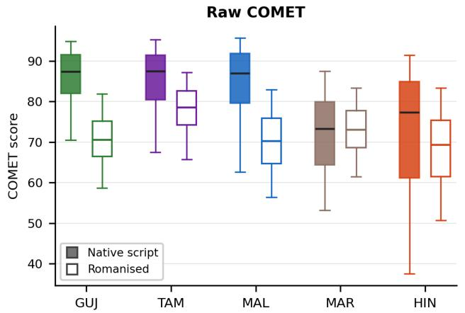
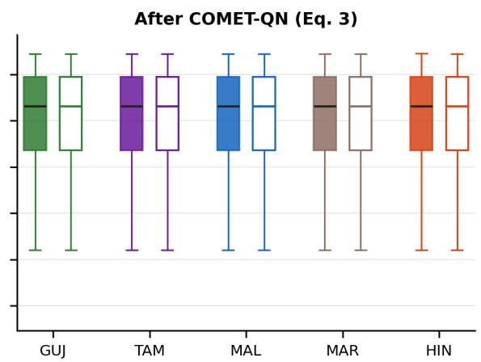
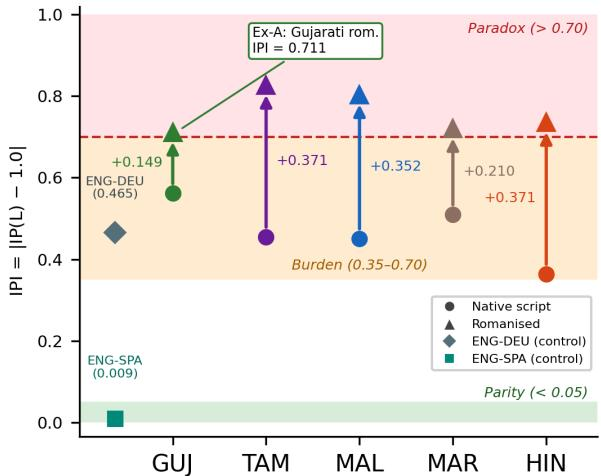

# Making COMET Comparable Across Scripts: Diagnosis and Correction of Tokeniser-Induced Script Bias in Indic MT Evaluation

G. L. John Salvin Swapnil Hingmire

Mehta Family School of Data Science and Artificial Intelligence Indian Institute of Technology Palakkad, Kerala, India 142503002@smail.iitpkd.ac.in swapnilh@iitpkd.ac.in

## Abstract

COMET reports translation quality as a single number, and that number is routinely compared across target languages written in different scripts. Such a comparison assumes Script Invariance: the score should not depend on the writing system that carries the target. We test it on IndicMT Eval by re-encoding the target into Latin script, which changes orthographic form while holding content and human ratings fixed. Script identity then accounts for 22.9% of native-script COMET variance, and agree ment with annotators falls in all five languages studied. We trace the effect to the tokeniser and measure it with three label-free diagnostics. The bias is two faults, not one. Scores from dif ferent scripts occupy incompatible ranges, and within a single script the metric orders trans lations less accurately. No order-preserving transform of the score can repair the second fault. The first is removed exactly by COMET QN, which maps the score distribution of each (language, script) pair onto a shared reference. Pooled agreement with annotators rises from 0.300 to 0.399, which is what makes scores from different scripts safe to place on one axis, and every within-language ordering is provably preserved. A regressor over parity features re covers a further 17.1% of the lost sensitivity. The remainder belongs to the encoder, and no post-processing can reach it. We therefore recommend publishing the normalised score, the three diagnostics, and the identity of the to keniser they were computed against, so that a reader can tell how much of a score reflects translation quality and how much reflects the writing system.1

## 1 Introduction

Learned metrics have displaced surface metrics such as BLEU (Papineni et al., 2002) as the primary quality signal in machine translation. COMET (Rei et al., 2020) projects source, hypothesis and reference into one multilingual space and scores adequacy by proximity within it. On high-resource European pairs its agreement with Multidimensional Quality Metrics (MQM; Lommel et al., 2014) annotation far exceeds that of n-gram metrics (Freitag et al., 2021), and it now underpins system rankings at WMT and throughout the field.

Emitting a single scalar invites that scalar to travel: between systems, between test sets, and, more consequentially, between target languages written in different scripts. That last comparison carries an unstated premise. Call it Script Invariance (SI). Writing $\pi _ { p } ( \cdot )$ for a transliteration that re-encodes a string into script p without disturbing its linguistic content, SI asserts that for every admissible target script $p ,$

$$
\mathrm { C O M E T } ( s , \pi _ { p } ( t ) , \pi _ { p } ( r ) ) = \mathrm { C O M E T } ( s , t , r ) .
$$

The premise is operational rather than architectural. No component of COMET consults script identity; it is the reading practice, not the model, that treats the output as script-neutral.

(1)

There is good reason to doubt the premise. A tokeniser cuts text into subword pieces before a model sees it. Subword vocabularies are built from corpora in which Latin script dominates, so they hold few whole units for an Indic word and fall back on very short pieces. The same content then costs more tokens, and each token carries less meaning (Petrov et al., 2023; Ahia et al., 2023). We call this splitting fragmentation. What fragmentation costs a model is by now documented independently of evaluation. Ghosh and Jyothi (2026) test 27 languages on six tasks. They find that robustness to alternative tokenisations holds comfortably for English but fails to generalise. Llama-3.1-8B loses 23.7% of relative performance on average, and the languages that fragment most suffer most. A learned metric is itself a multilingual model, and it reads the same fragmented text. It is also trained and validated mostly on the languages that fragment least. Fragmentation degrades what a model does with a sentence. We ask whether it also degrades what a metric says about one, and what a practitioner should do if it does.

<table><tr><td colspan="3">(A) One translation, two scripts &quot;It was the final match for the All Blacks, who had already won the trophy two weeks ago.&#x27; y</td></tr><tr><td>Condition</td><td>Human</td><td>COMET</td></tr><tr><td>MAL native script Same text, romanised</td><td>25/25 25/25</td><td>94.4 56.2</td></tr><tr><td colspan="3">(B) One source, two error-free targets &quot;Hydrogen ions are protons that had their electrons</td></tr><tr><td>stripped off them.&quot;</td><td></td><td>COMET</td></tr><tr><td>Language / Script</td><td>Human</td><td></td></tr><tr><td>MAL (Malayalam script)</td><td>25/25</td><td>95.6</td></tr><tr><td>HIN (Devanagari)</td><td>25/25</td><td>33.0</td></tr></table>

Table 1: Two segments from IndicMT Eval. Human columns are MQM annotations. Rewriting the script in (A) changes surface form alone, so the rating transfers unchanged; in (B) a single English source is rendered into two languages and both outputs are independently judged error-free, leaving script as the only source of variation.

Testing the premise: We put Eq. 1 to a direct test on IndicMT Eval (Sai et al., 2023), which pairs 1,400 MQM-annotated segments with each of five English→Indic pairs: Gujarati (GUJ), Tamil (TAM), Malayalam (MAL), Marathi (MAR) and Hindi (HIN). Romanising the target side with a deterministic transliterator holds source text, reference content and MQM annotation fixed while varying orthographic form alone, so any movement in COMET is attributable to script. Two gaps make the test worth running. Script has rarely been treated as a controlled causal variable, and no inference-time diagnostic exists that quantifies the resulting distortion without retraining. The magnitudes involved are not subtle: Table 1 shows an error-free Malayalam output losing more than 38 COMET points to a change of script alone, and two independently error-free translations of one English sentence separated by 62.6 points. §4 reports the full results.

What a measurement leaves open: Measuring the script-induced component of a score establishes that the component exists and how large it is. It does not say what number to publish in place of the affected one. Both obvious responses fail. Discarding the score forfeits the evaluation. Publishing it unchanged carries the confound into a system ranking. A third option is to romanise every target, so that all languages are read in one script. That costs up to 5.57× more encoder compute, and it lowers agreement with annotators instead of restoring it (§4.2, §7). Earlier work does rescale metric outputs, but along the language axis rather than the script axis, so it does not close the gap either (§2). Supplying the missing action is the purpose of this paper.

This paper: We begin from an observation that reframes the problem: what is loosely called script bias is two failures wearing one name. Each (language, script) pair forms a cell (§6), and cells occupy incompatible numerical ranges, so a Malayalam score and a Hindi score cannot meaningfully be set side by side. We call this a failure of calibration. Separately, the metric grows worse within any single cell at telling better translations from worse ones. Marathi is the clearest case. Its mean score barely moves under romanisation, so the language looks well calibrated, yet its ability to rank translations by quality, which we call sensitivity, falls as far as in any other language (§5). Each fault admits a different remedy. We prove that the second is beyond the reach of every order-preserving transform of the score, and we remove the first exactly using a construction borrowed from high-throughput biology, with no human labels and no retraining.

The paper is organised around three research questions. RQ1: how much of a COMET score is attributable to the script of the target rather than to the quality of the translation, and can that component be estimated at inference time without human ratings (§4)? RQ2: scores from different scripts occupy different numerical ranges. Can those ranges be made comparable by post-processing the scores alone, without retraining the metric (§6.3)? This matters because comparison across cells is itself a ranking task. Any multilingual leaderboard, release threshold or average over language pairs pools cells, and pooled agreement with annotators sits far below within-language agreement for that reason (§6.2). RQ3: can the lost within-cell sensitivity be restored (§6.2, §6.4)?

Contributions: We contribute (i) the first controlled causal test of Script Invariance for a learned MT metric, holding source, reference content and human ratings fixed while varying script alone (§4); (ii) three inference-time diagnostics, built from tokenisation and information parity, that quantify the script-induced component of a score without human labels (§4.2); (iii) a decomposition of script bias into calibration and sensitivity components, shown to be empirically decoupled, with a severityresolved account of the Marathi counter-case (§5, §6.1); (iv) a rank-invariance result bounding what any post-hoc correction can achieve, demonstrated across four corrector classes (§6.2); (v) COMET-QN, a label-free normalisation that removes the calibration component exactly and lifts pooled crossscript agreement from 0.300 to 0.399 (§6.3); and (vi) a parity-feature regressor recovering a further 17.1% of lost sensitivity with no exposure to the target language (§6.4).

## 2 Background and Related Work

Unequal tokenisation and parity measures: That subword vocabularies bill different languages differently for equivalent content is by now well attested. Petrov et al. (2023) document token-count disparities reaching 15× and introduce Tokenization Parity (TP), the ratio of subword tokens per word in a target language against the English figure; Ahia et al. (2023) follow the consequences through to billing and latency on commercial APIs. Tsvetkov and Kipnis (2024) recast the same disparity as Information Parity (IP), the ratio between a language model’s compression efficiency on a target language and on English, and show IP an ticipates downstream behaviour better than token counts alone. Kanjirangat et al. (2025) extend both measures to dialectal settings. Ghosh and Jyothi (2026) report the same coupling between fragmentation and model behaviour. It is therefore not peculiar to any one architecture. Two vocabulary independent quantities serve as controls here. Byte Premium (Arnett et al., 2024; Arnett and Bergen, 2025) is the target-to-English ratio of bytes per word, and it eliminates UTF-8 overhead as an explanation. MATTR (Covington and McFall, 2010) counts distinct word forms within a sliding 500- token window. It reads no model vocabulary, so it is immune to training-corpus artefacts (Appendix F). Together, TP and IP describe what we call the repre sentational burden a tokeniser places on a language. TP counts how many subword pieces the tokeniser spends on a given amount of text, so it measures fragmentation. IP measures how much information each of those pieces carries, so it measures density. Neither measure is sufficient alone. A language can fragment little and still lose information on every piece, or fragment heavily while each piece stays meaningful. Only the two read together say what the tokeniser costs, so the diagnostics of §4.2 are built from their interaction.

This literature quantifies what a tokeniser costs a language, and Ghosh and Jyothi (2026) extend the accounting to what it costs a model at inference. Neither asks whether the cost propagates into the evaluation scores by which such models are ranked. That is the question RQ1 puts.

Documented COMET failure modes: Work on where COMET breaks down has considered language mismatch and translationese (Zouhar et al., 2024) and perturbations applied within a single script (Karpinska et al., 2022), and has advocated retraining the encoder for under-served pairs (Wang et al., 2024; Falcão et al., 2024). None manipulates orthographic form as a controlled condition. The IndicMT Eval authors observed cross-language COMET variation and attributed it to language family rather than testing script (Sai et al., 2023). Retraining, meanwhile, speaks to neither the diagnosis nor the reporting difficulty confronting a deployment already in service.

The COMET family shares one tokeniser: The checkpoint we audit (§3) inherits the Sentence-Piece (Kudo and Richardson, 2018) tokeniser and 250K vocabulary of XLM-R (Conneau et al., 2020). So does the rest of the family. xCOMET-XL and xCOMET-XXL are trained over the XL and XXL variants of XLM-R (Guerreiro et al., 2024; Goyal et al., 2021), which retain that vocabulary, and CometKiwi rests on InfoXLM (Rei et al., 2022b), itself initialised from XLM-R (Chi et al., 2021). TP is determined by the tokeniser and not by the regression head, so the fragmentation burden we measure is identical across these variants. The exposure travels with the vocabulary rather than with the text, which is what makes a metric-side correction the right level of intervention (§6).

Distributional correction and batch effects: Rescaling metric outputs is not itself novel, but it has been practised along the language axis rather than the script axis: the COMET family z-normalises annotations during training (Rei et al., 2020), and low-resource variants standardise direct assessments within evaluator (Wang et al., 2024). Both are affine maps, and §6.2 proves that any affine map, indeed any order-preserving transform, leaves a metric’s rank agreement with human judgement exactly unchanged, so it cannot repair the sensitivity half of the present problem. Quantile normalisation is a more forceful instrument, devised in high-throughput biology to remove technical batch effects from microarray readings, and later refined for cross-platform comparison (Bolstad et al., 2003; Franks et al., 2018). There, one biological sample measured on two machines yields two readings that differ because of the equipment, and forcing both batches onto a shared distribution removes the machine-specific component. The correspondence we exploit is structural: a (language, script) cell stands to a COMET score as a processing batch stands to a gene-expression reading, with the writing system in the role of the machine, an artefact of measurement rather than a property of the translation. So far as we are aware, quantile normalisation has not previously been enlisted to make learnedmetric scores comparable across writing systems.

## 3 Experimental Setup

This section fixes the corpus, the intervention, the checkpoint and the sample bases.

Corpora: IndicMT Eval (Sai et al., 2023) contributes 1,400 MQM-annotated segments for each of the five English→Indic pairs introduced in §1. Each segment carries fine-grained error types and one of five severity grades, running from Very Low to Very High, alongside a Default grade for output found free of error. Because one set of English sources is rendered into all five targets, cross-language comparison rests on identical content. Two WMT24 pairs (Kocmi et al., 2024) serve as Latin-script controls: ENG-SPA as a morphologically simple anchor and ENG-DEU as a morphologically complex counterweight.2

The manipulation: Target-side text is transliterated by IndicXlit (Madhani et al., 2023), a deterministic neural system that leaves phonology, morphology and meaning intact while altering orthographic form. Sources and MQM annotations are held constant, so native-script judgements carry over unchanged to the romanised condition and any movement in COMET is ascribable to script alone. Romanised Indic text is in any case an authentic genre (Roark et al., 2020; Chavan et al., 2023), so the experiment doubles as an audit of metric behaviour on text deployments genuinely meet.

Transliteration quality: On Dakshina, a benchmark that pairs native-script words with human romanisations (Roark et al., 2020), IndicXlit reports a mean top-1 accuracy of 60.5%, or 72.1% with re-ranking (Madhani et al., 2023). Both figures are for the Roman-to-native direction. Exact match understates faithfulness here, because romanisation is not standardised and several spellings of a word are valid at once. The same error analysis attributes 85% of errors to vowel and consonant choice rather than to content. Residual noise is therefore orthographic, and §4.3 shows that noise of this kind cannot account for the effect we measure.

Checkpoint and scope: Scores come from the reference-based checkpoint Unbabel/wmt22-comet-da (Rei et al., 2022a) run under unbabel-comet v2.2.6. TP uses XLM-R’s SentencePiece tokeniser, the one that checkpoint employs, and IP an external autoregressive model, BLOOM-560m (Scao et al., 2022). Our empirical claims are bounded accordingly: to XLM-R-based COMET, and to the five Indic abugidas studied, that is, scripts whose consonant letters bear an inherent vowel modified by diacritics. The diagnostics themselves read whichever tokeniser the audited metric carries, so the apparatus transfers to xCOMET and CometKiwi unaltered. Other vocabularies are taken up in the Limitations.

Three sample bases: The corpus holds 5 × 1,400 = 7,000 segments, and three nested subsets are used, identified wherever a figure is quoted. (i) All 7,000 segments underpin every analysis using metric-side quantities alone: the ANOVA, every COMET, TP and IP mean, the parity diagnostics of §4.2, and the Hindi–Gujarati comparison of §4.1. (ii) A 6,995-segment working set underpins every analysis requiring a human score, five rows bearing non-numeric MQM entries being discarded. At most 0.2% of any language is touched and no conclusion turns on the choice, as Appendix A shows. (iii) Severity-resolved subsets exclude Default, which bears no severity rank, leaving 1,258 segments for MAR (§5). Counts appear in Appendix A.

Conventions: Tables and figures order languages by native-script COMET descending, which for this corpus gives GUJ, TAM, MAL, MAR, HIN, running from 85.7 down to 71.8. A dagger (†) marks a coefficient individually significant against zero at $p < 0 . 0 5$ , two-sided and at segment level, and ns one that is not; each coefficient is tested alone, and differences between two dependent coefficients are tested separately (§4.3). Subscripts $\mathrm { n a t }$ and $\mathrm { r o m }$ denote the native-script and romanised conditions. With the apparatus fixed, we turn to what changing the script does to the score.

## 4 The Effect of Romanisation

Romanisation changes the script and nothing else, so whatever moves in the score is the script moving it. This section records what moves, in three observations. It then turns those observations into diagnostics a practitioner can compute, and asks whether the decline they describe is large enough and real enough to warrant a correction. Supporting tables sit in Appendices A to F.

## 4.1 Three observations

Observation 1: script explains 22.9% of COMET variance. A one-way ANOVA grouping targets by script family (Devanagari: HIN, MAR; non-Devanagari: GUJ, MAL, TAM) gives $\eta ^ { 2 } = 2 2 . 9 \%$ on native-script COMET, and romanisation reduces it to 1.5% (Appendix A). The effect is concrete: Hindi and Gujarati are two Indo-Aryan languages separated chiefly by writing system, and the 13.95-point COMET gap between them shrinks to 2.29 under romanisation. Script is therefore the dominant factor behind cross-language COMET differences. The displacement is specific to each language and does not even share a sign: GUJ falls by 15.09 points, MAL by 14.01, TAM by 7.15 and HIN by 3.43, while MAR rises by 1.02 (Table 2). A spread of that width, with one language moving against the other four, already rules out any correction written as a single constant or slope (§6.1).

Observation 2: the TP–IP inversion. Romanisation inflates TP and collapses IP in every Indic language, TAM at the extreme with $\mathrm { T P + 7 7 . 9 \% }$ and IP −68.0% (Table 2). At the language level $( n = 5 ,$ descriptive) the TP–IP anti-correlation strengthens from $r = - 0 . 4 8 1 ^ { \mathrm { n s } }$ natively to $r = - 0 . 8 9 6 ^ { \dagger }$ under romanisation. The explosion is driven by Tamil digraphs $( z h , d h , g h )$ and by Indic dependent vowels that the tokeniser strands as near-zero-information pieces (Brahma et al., 2025), a mechanism examined in Appendix D. The encoder is handed more tokens each carrying less, the worst combination for a signal that has to discriminate.

Observation 3: COMET is uniquely fragile. In native script COMET has the highest $| \rho |$ against MQM in every language, ranging from 0.422 to 0.651. Under romanisation it falls furthest in every language $( | \Delta \rho | = 0 . 1 9 \mathrm { ~ t o ~ } 0 . 3 9 )$ , exceeding

BLEURT (Sellam et al., 2020) at 0.09 to 0.19, BERTScore (Zhang et al., 2020) at 0.04 to 0.06, and the surface metrics BLEU, ChrF (Popovic´, 2015) and TER (Snover et al., 2006), all below 0.07; Table 7 gives all six. Agreement falls in all five languages, MAR included, so the displacement is not a harmless relabelling of a scale that still orders translations correctly. Every metric reads the same text against the same ratings, and only the encoder-dependent ones move, which places the failure inside the encoder rather than at the character surface. These observations document the failure but give a practitioner nothing to compute, which is what the next subsection supplies.

## 4.2 The parity diagnostics

We now introduce three diagnostics that turn the observations into numbers computable before any score is trusted. TP and IP each capture one dimension of the representational burden of §2, and the Gujarati case shows why the two must be combined. Formal definitions, axiomatic motivation and threshold calibration are in Appendices B and G.

Script Bias Index: $\mathrm { S B I } = \mathbb { E } _ { i } [ \mathrm { T P } _ { i } / \mathrm { I P } _ { i } ]$ counts subword pieces consumed per unit of information retrieved. Both inputs are cheap. Token counts come from the tokeniser. The information term comes from BLOOM-560m (Scao et al., 2022), a small multilingual language model used here only to measure how predictable a segment is. SBI therefore never reads COMET output or human ratings, and can be computed before any evaluation is trusted. We take $\mathrm { S B I } \geq 3 . 0 $ as a working threshold. Above it we do not read a raw score as a quality signal without the corrections of §6. The native-script ranking of SBI over the five languages reproduces the COMET ranking exactly $( \rho = 1 . 0 0 )$

SBI also settles a case that neither parity measure settles alone, which we call the Gujarati anomaly. Gujarati fragments least of the five under romanisation, its TP rising by only +15.2%, so fragmentation on its own would call it the safest language here. Its native information parity is nonetheless the lowest at 0.438, meaning each of its tokens carries the least. Combining the two gives $\mathrm { S B I _ { n a t } } = 3 . 4 5$ , the highest of the five, and that matches how COMET behaves: Gujarati loses more points under romanisation than any other language (Table 2). Romanisation raises SBI sharply in every language, from $\mathrm { S B I _ { n a t } } \in [ 2 . 0 3 , 3 . 4 5 ]$ to $\mathrm { S B I _ { r o m } } \in \ [ 5 . 9 6 , 1 5 . 9 0 ]$ , and the flag fires on at least $9 5 . 2 \%$ of romanised segments in all five languages against 6.6% to 62.1% natively.

<table><tr><td>Language</td><td colspan="4">COMET</td><td colspan="4">TP</td><td colspan="3">IP</td></tr><tr><td></td><td>nat</td><td>rom</td><td>Δ</td><td> $\rho _ { \mathrm { n a t } } {  } \rho _ { \mathrm { r o m } }$ </td><td></td><td></td><td>rom</td><td>∆</td><td>nat</td><td>rom</td><td>∆</td></tr><tr><td>GUJª</td><td>85.70</td><td>70.61</td><td>-15.09</td><td> $0 . 5 9 0 ^ { \dag }  0 . 3 4 1 ^ { \dag }$ </td><td></td><td>1.388</td><td>1.599</td><td> $+ 1 5 . 2 \%$ </td><td>0.438</td><td>0.289</td><td>-34.0%</td></tr><tr><td>TAM</td><td>84.88</td><td>77.72</td><td>-7.15</td><td> $0 . 6 2 9 ^ { \dagger }  0 . 2 4 0 ^ { \dagger }$ </td><td></td><td>1.319</td><td>2.347</td><td> $+ 7 7 . 9 \%$ </td><td>0.545</td><td>0.174</td><td>-68.0%</td></tr><tr><td>MAL</td><td>84.08</td><td>70.07</td><td>-14.01</td><td> $0 . 6 5 1 ^ { \dagger } \substack {  } 0 . 4 6 0 ^ { \dagger }$ </td><td></td><td>1.248</td><td>1.847</td><td> $+ 4 8 . 0 \%$ </td><td>0.549</td><td>0.197</td><td>-64.1%</td></tr><tr><td> $\mathbf { M A R } ^ { b }$ </td><td>71.92</td><td>72.94</td><td>+1.02</td><td> $0 . 4 8 7 ^ { \dagger }  0 . 2 7 8 ^ { \dagger }$ </td><td></td><td>1.165</td><td>1.640</td><td> $+ 4 0 . 7 \%$ </td><td>0.490</td><td>0.280</td><td>-42.9%</td></tr><tr><td>HIN</td><td>71.75</td><td>68.32</td><td>-3.43</td><td> $0 . 4 2 2 ^ { \dagger }  0 . 2 3 0 ^ { \dagger }$ </td><td></td><td>1.210</td><td>1.702</td><td> $+ 4 0 . 7 \%$ </td><td>0.636</td><td>0.265</td><td>-58.3%</td></tr></table>

Table 2: Mean COMET, segment-level Spearman agreement with MQM, and the TP–IP inversion, in the native (nat) and romanised (rom) conditions. COMET, TP and IP means use all 1,400 segments per language; ρ uses the working set. aGUJ shows the largest COMET fall despite the smallest TP inflation, because its native IP is the lowest of the five, which gives it the greatest representational burden (§4.2). ${ } ^ { b } \mathbf { M A R }$ is the sole language whose mean COMET rises while every other quality signal worsens (§5).

IP Parity Index: $\mathrm { I P I } = \left| \mathrm { I P } - 1 . 0 \right|$ is distance from English-equivalent parity, and it sorts a setting into three zones. In Parity, below 0.35, scores may be read directly. In Burden, between 0.35 and 0.70, COMET still tracks adequacy but its absolute level is suppressed. In Paradox, above 0.70, agreement with MQM typically falls below $\rho \ = \ 0 . 4 0 ;$ romanised MAL is the sole exception (Appendix G). All five Indic languages sit in Burden natively and cross into Paradox once romanised.

Computational Tax: Romanisation charges twice at once, in tokens per word $\mathrm { ( L P = \overline { { T P } } _ { r o m } / \overline { { T P } } _ { n a t } ) }$ and in information per token $( \mathrm { E P = \overline { { I P } } _ { n a t } / \overline { { I P } } _ { r o m } ) }$ and since neither charge can be traded for the other their product Tax $= \mathrm { L P } \times \mathrm { E P }$ gives the surplus encoder compute a romanised segment demands, from 1.75× for GUJ to 5.57× for TAM. EP accounts for 62 to 75% of ln(Tax) (Appendix C), so the dominant cost is information lost per token, which no remedy that merely counts tokens can reach.

Between them the three answer RQ1. They estimate the script-induced component of a score from token counts and likelihoods alone, and every romanised setting studied here exceeds both working thresholds, $\mathrm { S B I } \geq 3 . 0$ and $\mathrm { I P I } > 0 . 7 0$ . What they do not supply is a number to publish in place of the affected one. Before building one, the next subsection asks whether the decline they flag is large enough and real enough to warrant a correction at all.

## 4.3 Effect size and the adequacy objection

Before building a correction we settle two questions. Is the decline real at a defensible effect size, and is it instead the metric responding correctly to a genuine loss of adequacy?

Measuring the effect on the right scale: A correlation coefficient does not live on a ratio scale (Stevens, 1946), so a claim of the form “the correlation dropped by X percent” has no defined referent. We therefore report absolute differences, and shared variance where a relative statement is wanted. COMET’s agreement with MQM declines by $| \Delta \rho |$ between 0.19 and 0.39; expressed as shared variance, $\rho ^ { 2 }$ falls from 0.42 to 0.21 for MAL and from 0.40 to 0.06 for TAM. The two coefficients are computed over the same segments against the same ratings, so they are dependent and overlapping, and the difference is tested with the Meng et al. (1992) procedure. Every language shows a significant decline, with z running from 8.7 to 16.0 and all $p < 1 0 ^ { - 1 7 }$ . Appendix A gives the per-language values, two confirmatory tests, and the relation to the Williams test used for metric comparison at WMT.

Is adequacy genuinely lost? Because MQM ratings are carried over rather than re-collected, one might object that romanisation truly degrades adequacy and that a falling correlation is the metric behaving correctly. Two features of the data resist that reading. First, all six metrics are scored against the same ratings, yet the size of the decline tracks how far each metric depends on a subword encoder (Appendix A), whereas invalid ratings would drag every metric down alike. Second, §5 contains outputs whose COMET scores rise under romanisation while their human adequacy is unchanged and, in one instance, zero; a translation judged entirely inadequate cannot be made more adequate by a change of script. The same two features answer the related worry that transliteration itself introduces errors. Noise of that kind would act like annotation noise, and would therefore depress every metric alike rather than tracking encoder dependence. Direct human rating of romanised output would settle both questions outright and remains for future work. A correction is therefore warranted, and the next section establishes what kind it must be.

## 5 The Marathi Severity Inversion

Marathi behaves unlike the other four languages, and the reason constrains what any correction can look like. Romanisation lowers mean COMET in the other four, which at least moves with their falling agreement with human judgement. Marathi does the opposite: its mean COMET rises by 1.02 points, even though every underlying quality signal worsens in step with the rest, IP falling by 42.9% and agreement with MQM dropping from $\rho = 0 . 4 8 7$ to 0.278. Observation 1 recorded the rise. This section accounts for it, and the account carries beyond Marathi, because it eliminates the most obvious class of remedy before any is built.

The immediate cause is orthographic. Marathi marks spoken and literary variation through diacritics including visarga, a word-final breathing mark, and chandrabindu, a nasalisation mark (Ravishankar and Tyers, 2017). Romanisation collapses these distinctions onto one Latin surface form, rendering every hypothesis more reference-like to a similarity-based metric regardless of its quality. Resolving by MQM severity exposes the consequence (Table 3). The gain accrues entirely to badly translated segments while the best output loses ground, and bucket means rise monotonically with severity. At segment level, severity and ∆COMET correlate at $\rho = 0 . 1 8 3 ^ { \dagger } \left( p = 5 . 9 \times 1 0 ^ { - 1 1 } , N = 1 , 2 5 8 \right)$ . The aggregate rise is significant across the full 1,400 (Wilcoxon $W = 4 5 3 , 8 5 6 , p = 0 . 0 1 6 )$ , yet the median change is −0.21: a minority of very poor segments pulls the mean upward. One output rated 0/25 gains 26.1 COMET points, from 36.6 to 62.7.

Two things follow. Evidentially, and as used in §4.3, score movements that reward inadequacy cannot be evidence of recovered adequacy. Prescriptively, Marathi’s bias is neither a fixed offset nor a fixed multiple: it varies with quality within the language, and its aggregate sign opposes that of the other four. No single constant can therefore serve all five. That rules out the per-language offsets and rescalings a practitioner would reach for first, and leaves only a treatment acting on whole score distributions rather than on their centres. Constructing one is the business of §6, and §6.2 makes the exclusion exact.

<table><tr><td>Severity N</td><td>Mean ∆COMET</td></tr><tr><td>Very Low 69</td><td>-3.72</td></tr><tr><td>Low 86</td><td>-1.90</td></tr><tr><td>Medium 184</td><td>+0.73</td></tr><tr><td>High 258</td><td>+1.08</td></tr><tr><td>Very High661</td><td>+2.63</td></tr></table>

$$
\rho = 0 . 1 8 3 ^ { \dagger }
$$

Table 3: Mean ∆COMET (romanised minus native) for MAR by MQM severity. The five buckets total 1,258; the remaining 142 segments are Default and bear no severity rank. ∆COMET needs no human score, so the full 1,400-segment base applies.

## 6 From Diagnosis to Treatment

A practitioner arrives at this point holding a flagged score, that is, one computed in a setting where $\mathrm { S B I } ~ \geq ~ 3 . 0$ or $\mathrm { I P I } > 0 . 7 0 ~ ( \ S 4 . 2 )$ . This section supplies the missing action in three moves: separate the bias into parts that demand different remedies (§6.1), establish what no post-hoc method can achieve (§6.2), and correct what remains (§6.3 and §6.4). The correction is applied to the scores rather than to the text because the fragmentation driving the confound belongs to the vocabulary the metric carries (§2). Throughout, a cell denotes one (language, script) pair, such as GUJ native or GUJ romanised, and the ten settings form a 5 × 2 grid of cells. A cell plays the role of a batch in the quantilenormalisation analogy of §2. Every quantity here is validated against human ratings, so all values use the 6,995-segment working set (§3).

## 6.1 Calibration and sensitivity are different problems

Marathi showed that no constant serves every language. The reason is that romanisation does two things at once, and conflating them has obscured which of the two is fixable.

(P1) Miscalibration. Cells occupy different numerical ranges. The native-minus-romanised COMET gap varies across languages and even reverses sign, standing at +15.09 points for GUJ but −1.02 for MAR (§4.1), so no shared constant, slope or offset can remove it.

(P2) Sensitivity loss. Within a cell, the metric’s capacity to order translations by quality deteriorates. Segment-level agreement with MQM falls in every language, MAR included, whose P1 gap is nearly zero.

P1 is a question of location and scale, P2 one of representational fidelity, and MAR shows that the two vary independently: a cell can be almost perfectly calibrated and still have lost much of its discriminative power. The split is worth making because the two admit different treatments, and, as the next subsection shows, one admits none at all.

## 6.2 Rescaling cannot restore sensitivity

This subsection fixes the limit on RQ3. P2 is beyond any rescaling of the score, so a correction for it must look outside the score entirely (§6.4). Let $s = ( s _ { 1 } , \ldots , s _ { n } )$ be the COMET scores in a cell and h the paired human ratings, and recall that Spearman’s $\rho _ { S }$ depends on the scores only through their ranks.

Proposition (Rank invariance): For any strictly increasing $f ,$ order is preserved, so ran $\operatorname { s } ( f ( s _ { i } ) ) =$ rank(si) for every i, and therefore

$$
\rho _ { S } ( f ( s ) , h ) = \rho _ { S } ( s , h ) .\tag{2}
$$

The two sides of Eq. 2 are equal for every dataset and every strictly increasing $f ,$ not merely on average. The reason is that such an $f$ can stretch or shift the scores but cannot reorder them, and Spearman agreement depends on the scores only through their order. Rescaling therefore leaves agreement with human judgement exactly where it was. The scope of that argument is what makes it useful: mean-shifting, affine rescaling, quantile mapping and isotonic regression are all strictly increasing functions of the scalar score, and together they exhaust the class of post-hoc corrections a practitioner would plausibly reach for. Whatever discriminative power romanisation destroyed at scoring time survives every one of them untouched.

Table 4 confirms this on a 50/50 within-language split. Four distributional correctors reduce the mean gap from 7.88 COMET points on the heldout half to roughly 0.6, and they lift pooled crosslanguage agreement. The whole-working-set figure is 8.14 (Figure 1). Yet the language-averaged Spearman stays pinned at 0.310 against a native ceiling of 0.564, moving in the fourth decimal at most. The table also answers the objection that only rankings matter and a per-script scale is therefore harmless. Pooled agreement across cells is itself a ranking task, and on the raw romanised half it stands at 0.160 against 0.310 within language. Every monotone corrector lifts the pooled figure toward 0.30 without moving the within-language figure, which is the calibration fault seen as a ranking failure.

The result is negative in form and constructive in consequence. It sends effort where it can pay: P1 is fully remediable once the scores exist (§6.3), P2 only by using information beyond the scalar (§6.4), and the rest is the Computational Tax of §4.2.

<table><tr><td>Corrector (transform class)</td><td> $| \Delta |$ </td><td> $\rho _ { S } ^ { \mathrm { l a n g } }$ </td><td> $\rho _ { S } ^ { \mathrm { p o o l } }$ </td></tr><tr><td>Raw romanised (identity)</td><td>7.88</td><td>0.310</td><td>0.160</td></tr><tr><td>Per-lang mean shift (location)</td><td>0.61</td><td>0.310</td><td>0.280</td></tr><tr><td>Per-lang affine / z (loc.+scale)</td><td>0.63</td><td>0.310</td><td>0.301</td></tr><tr><td>Per-lang quantile map (monotone)</td><td>0.61</td><td>0.310</td><td>0.298</td></tr><tr><td>Per-lang isotonic (monotone)</td><td>0.68</td><td>0.309</td><td>0.282</td></tr><tr><td>Native score (ceiling)</td><td>0.00</td><td>0.564</td><td>0.488</td></tr></table>

Table 4: Rank invariance quantified on a 50/50 withinlanguage split (seed 42), so all values are computed on the held-out half: $| \Delta |$ is the mean absolute per-language gap after correction (the whole-working-set raw gap is 8.14, Figure 1), $\rho _ { S } ^ { \mathrm { l a n g } }$ the language-averaged and $\bar { \rho } _ { S } ^ { \mathrm { p o o l } }$ the pooled agreement with MQM over the romanised cells of that half. Every monotone corrector closes the gap and improves pooled comparability while the language-averaged column remains fixed at 0.310, exactly as Eq. 2 requires.

## 6.3 COMET-QN: quantile renormalisation

This subsection answers RQ2. The calibration fault P1 can be removed exactly, and the idea behind the removal is simple. We force every cell onto one shared score distribution, so that a given rank means the same COMET value in any language or script. We take the reference R to be the pooled native-script distribution, and for a score $s _ { i }$ in a cell of size n we set

$$
s _ { i } ^ { \prime } = Q _ { R } \left( { \frac { \operatorname { r a n k } ( s _ { i } ) } { n + 1 } } \right) ,\tag{3}
$$

with $Q _ { R }$ the empirical quantile function of R. This is quantile normalisation as used to remove batch effects from microarray readings (Bolstad et al., 2003), applied to cells instead of batches. Three steps: keep only each score’s rank, turn it into a position in [0, 1], and read off the value at that position of R. Appendix H works five romanised Gujarati segments through the map.

Because Eq. 3 uses $s _ { i }$ only through its rank, it cannot disturb any within-cell ordering (Eq. 2), yet every cell now shares $R ,$ so the per-language gap, MAR’s sign-reversed −1.02 included, is exactly zero by construction rather than by fitting. Figure 1 confirms the effect. The gap collapses to zero. Pooled agreement with MQM rises from 0.300 to 0.399 (Spearman) and 0.324 to 0.400 (Pearson), while within-language agreement is unchanged to four decimals. COMET-QN buys comparability, not sensitivity, exactly as the decomposition predicts. SBI also collapses toward zero afterwards, so the diagnostic of §4.2 doubles as a certificate that P1 is eliminated.

  
Figure 1: COMET-QN across the ten (language, script) cells (boxes: median, IQR, 5th–95th percentiles; 6,995- segment working set). Left, raw COMET (mean |per-lang. gap| = 8.14 pts; pooled ${ \rho } _ { S } = 0 . 3 0 0 )$ : native cells, filled, sit consistently above their romanised counterparts, open, by a margin that varies across languages and reverses for MAR, which is problem P1 (§6.1). Right, after COMET-QN (Eq. 3; mean |per-lang. gap| $= 0 . 0 0$ pts; pooled $\rho _ { S } = 0 . 3 9 9 )$ : all cells share the pooled native reference, so the gap is exactly zero by construction and cross-script comparison becomes meaningful. Pooled Pearson agreement rises from 0.324 to 0.400 over the same cells, while within-language agreement is unchanged to four decimals, GUJ standing at 0.5903 before and after. Within-cell ordering is provably untouched (Eq. 2).

Scope and reference: COMET-QN assumes the cells share a comparable underlying quality distribution. If one system pool is genuinely weaker, the method erases that real difference along with the artefactual one, so it belongs within a single dataset and domain. The same restriction governs comparison across test sets. Two test sets with different quality distributions are different batches, so COMET-QN should be applied within each and its outputs not compared between them; quantifying the distortion when that assumption is violated is future work. Stable quantiles need a few hundred segments per cell, easily met by the 1,400 here. The pooled native-script reference is the condition COMET was validated on and hence the natural anchor. Other references preserve the exact zerogap property, though we do not claim the pooledagreement gain is invariant to the choice. P1 is now settled, which leaves P2 and the question of how much of it can be won back.

## 6.4 Recovering sensitivity from parity features

RQ3 concerns P2, the sensitivity fault. It lies beyond any transform of the scalar (Eq. 2), so recovering it needs information the scalar does not carry. The parity diagnostics are the natural source, since they record how severely the encoder was taxed on each segment. We therefore compose two

operators,

$$
{ \widetilde s } = C _ { \mathrm { s e n s } } ( C _ { \mathrm { c a l } } ( s , c ) ; \phi ) ,\tag{4}
$$

read inside out: COMET-QN $( C _ { \mathrm { c a l } } )$ fixes the calibration fault while leaving every rank untouched, then the regressor $( C _ { \mathrm { s e n s } } )$ uses the parity features $\phi$ to re-rank segments. Calibration must come first because it is the only rank-safe step, and $C _ { \mathrm { s e n s } }$ is deliberately the only stage allowed to change ranks. Here $\phi$ collects TP and IP in both conditions together with their differences, and $C _ { \mathrm { s e n s } }$ is a gradient-boosted regressor mapping $( \mathrm { C O M E T _ { r o m } } , \phi )$ to $\mathrm { C O M E T _ { n a t } }$ . No human labels enter: because romanisation preserves content, every (romanised, native) pair is free supervision.

Evaluation follows the honest deployment regime, leave-one-language-out: fit on four languages and apply to the fifth, unseen, as when a new language arrives with no corrector data of its own. The deficit recovered is $( \rho _ { \mathrm { c a l } } - \rho _ { \mathrm { r a w } } ) / ( \rho _ { \mathrm { n a t } } - \rho _ { \mathrm { r a w } } )$ a scale that stays comparable across languages with different native ceilings. Averaged over the five folds the regressor restores 17.1% of the lost sensitivity with no exposure to the target language, improving four of five (Table 5).

Reading the failure: MAR’s negative transfer at −20.3% is the same fact that defeats a universal formula: script bias is not one function. The parity features act as a proxy for the direction of the bias, dependable only where the pattern of TP and IP divergence resembles that of the training languages.

<table><tr><td>Held-out</td><td>ρraw</td><td>ρcal</td><td>ρnat</td><td>Recovered</td></tr><tr><td>GUJ</td><td>0.341</td><td>0.437</td><td>0.590</td><td>38.6%</td></tr><tr><td>TAM</td><td>0.240</td><td>0.291</td><td>0.629</td><td>13.0%</td></tr><tr><td>MAL</td><td>0.460</td><td>0.524</td><td>0.651</td><td>33.5%</td></tr><tr><td>MAR</td><td>0.278</td><td>0.236</td><td>0.487</td><td>-20.3%</td></tr><tr><td>HIN</td><td>0.230</td><td>0.270</td><td>0.422</td><td>20.8%</td></tr><tr><td>Mean</td><td></td><td></td><td></td><td>17.1%</td></tr></table>

Table 5: Parity-feature calibration under leave-onelanguage-out (segment-level Spearman against MQM, 6,995-segment working set). Recovery is the fraction of the raw-to-native sensitivity gap closed. MAR transfers negatively: its bias runs counter to the four training languages, its P1 gap being sign-reversed (§6.1), so a model fitted on them mispredicts its residual.

The failure can nonetheless be anticipated without labels, though not by the mean diagnostics: MAR’s native SBI of 2.61 and IPI of 0.510 both sit inside the range of the other four (Appendix B). What separates MAR is the sign of its mean cell gap, native minus romanised, computable from scores alone and the direction the regressor learns. A cell whose sign opposes the training cells should therefore receive COMET-QN alone, until a corrector has been fitted on languages sharing its sign. The residual five sixths of the deficit is encoder-intrinsic, which is to say it is the Computational Tax of §4.2. Posthoc composition and encoder retraining therefore address disjoint portions of the loss, and neither substitutes for the other.

What this buys a practitioner is modest but definite. Scores from different scripts become comparable, a sixth of the lost discrimination comes back, and the distortion that remains can be stated rather than hoped away. The rest cannot be reported around, only rebuilt around, and the procedure below is built on that division.

## 7 What to Report

The preceding sections converge on a procedure. For a non-Latin-script target we suggest the following.

1. State which encoder and tokeniser the metric carries. The COMET variants in common use carry XLM-R (§2); others must be profiled against their own vocabulary first.

2. Compute IPI once for the (language, script) pair against that tokeniser. This needs no human ratings and no access to the metric’s internals.

3. In the Parity zone, report raw COMET. The tokeniser treats the language much as it treats English, so no companion figures are needed.

4. In the Burden zone, report raw COMET with

IPI beside it, so absolute levels are not over-read while rankings are still trusted.

5. In the Paradox zone, report COMET-QN (Eq. 3) with raw COMET and the three diagnostics, and do not compare raw scores across scripts. Apply the parity-feature regressor only when the cell’s mean-gap sign matches the languages it was fitted on (§6.4).

6. Do not romanise as a preprocessing convenience: it costs 1.75–5.57× in encoder compute and degrades agreement with annotators rather than equalising it (§4.3).

No step consumes human ratings. Appendix I runs the procedure through one setting, romanised Gujarati, end to end.

## 8 Conclusion

Script bias in COMET is two faults. One is removed exactly and without labels by quantile renormalisation; the other is beyond any rescaling and comes back only in part. The recommendation is concrete: publish the normalised score, the diagnostics, and the identity of the tokeniser they were computed against, whenever COMET is reported on a non-Latin-script target. That tokeniser is XLM-R across the COMET variants in common use (§2), so the procedure covers much of published Indic MT evaluation. The released code emits all four numbers in one pass, so adopting the protocol costs a practitioner one command.

Two consequences reach past this corpus. A metric can look healthy in aggregate and still be unfit for the comparison it is put to, so the conditions a score was measured under belong beside it. The fault is also not COMET’s alone: it lives in a vocabulary much of the multilingual metric family shares. Three things follow. The apparatus should be run against metrics carrying other vocabularies, which is the study we are preparing. The diagnostics should be tested on writing systems that are not abugidas, once a corpus with matched sources exists. And human ratings should be collected directly on romanised output, which would settle the one assumption this design cannot test from the inside. The deeper remedy remains an encoder that spreads capacity evenly across scripts.

## Limitations

Our metric-level claims cover one metric, COMET wmt22-comet-da, and one tokeniser, the XLM-R SentencePiece vocabulary that checkpoint carries. The xCOMET and CometKiwi variants inherit the same tokeniser and vocabulary (§2), so the fragmentation burden we measure carries to them unchanged; whether the score-level dis tortion does is a different question, and one we have not answered. Nor have we measured how tokenisers of other designs, byte-level, English centric or WordPiece, respond to the same intervention, or how metrics built on them would score the resulting text. Both questions belong to a single follow-up study, which we are preparing: it takes the neural metrics that do not share XLM-R’s vo cabulary, MetricX (Juraska et al., 2024) and the mT5-based family (Xue et al., 2021) most obvi ously, computes the parity diagnostics against each metric’s own tokeniser, and repeats the romanisa tion intervention across that set. That design would establish whether script sensitivity is a property of one widely-used vocabulary or a recurring hazard of multilingual metric construction, and it would test whether COMET-QN transfers as a correction. Since the diagnostics read whichever tokeniser the audited metric carries and IP is computed externally, the apparatus requires no modification for such a study; only the metrics and their tokenis ers need substituting. The languages studied are five Indic abugidas; behaviour under ideographic writing systems is untested, and to our knowledge no corpus offers MQM-annotated evaluations of identical sources across several non-Latin scripts, which is what the design requires. The diagnos tics themselves are computable on any script and any tokeniser, so the apparatus would extend to Chinese, Japanese and Korean unchanged; what is missing is the corpus, and we make no claim about how COMET-QN would perform there. At 1,400 segments per language our corpus is smaller than those of Brahma et al. (2025) and Kumar et al. (2017); we claim only that our dependent-vowel ordering agrees with theirs and so corroborates rather than independently establishes it. The IPI zone boundaries and the SBI ≥ 3.0 flag are calibrated on this corpus, with the WMT24 controls providing a first external check but no more. COMET-QN as sumes comparable underlying quality across cells and would erase a genuine quality difference be tween system pools, so it belongs within a single dataset and domain; its reference distribution is a free parameter whose influence on the pooled agreement gain we have not measured. The carried over annotation design is supported by the encoder dependence ordering and the MAR counter-case (§4.3, §5). We do not, however, measure transliteration accuracy on this corpus. The published IndicXlit figures we quote in §3 are for the opposite direction, so residual transliteration error in our own outputs is bounded by argument rather than by direct measurement. A study collecting human ratings directly on romanised output would settle the question and remains future work, as does evaluation against code-switched references, a complementary setting that our fully-romanising design deliberately excludes.

Artefact licences: Every artefact used, namely IndicMT Eval (Sai et al., 2023), the WMT24 evaluation packages (Kocmi et al., 2024), XLM-RoBERTa (Conneau et al., 2020), BLOOM-560m (Scao et al., 2022), COMET, BLEURT (Sellam et al., 2020), BERTScore (Zhang et al., 2020) and IndicXlit (Madhani et al., 2023), is released for research use under a permissive or open-research licence. Our use is consistent with those terms and we redistribute none of the underlying corpora. Released code is MIT-licensed.

## Ethics Statement

We foresee no ethical concerns arising from this work. The study measures and corrects a distortion in automatic evaluation caused by tokenisation artefacts affecting Indic scripts, and reports interpretable statistical evidence together with an actionable procedure. All corpora and benchmarks are publicly available and every released artefact is analytical, with no foreseeable potential for harm. By exposing a previously unmeasured distortion and supplying a correction for it, the work is intended to benefit under-served Indic-language communities whose systems are ranked by the affected metric.

## References

Orevaoghene Ahia, Sachin Kumar, Hila Gonen, Jungo Kasai, David R. Mortensen, Noah A. Smith, and Yulia Tsvetkov. 2023. Do all languages cost the same? Tokenization in the era of commercial language models. In Proceedings of the 2023 Conference on Empirical Methods in Natural Language Processing, EMNLP 2023, Singapore, December 6–10, 2023, pages 9904–9923. Association for Computational Linguistics.

Catherine Arnett and Benjamin K. Bergen. 2025. Why do language models perform worse for morphologically complex languages? In Proceedings of the 31st International Conference on Computational Linguistics, COLING 2025, Abu Dhabi, UAE, January

19–24, 2025, pages 6607–6623. Association for Computational Linguistics.

Catherine Arnett, Tyler A. Chang, and Benjamin Bergen. 2024. A bit of a problem: Measurement disparities in dataset sizes across languages. In Proceedings of the 3rd Annual Meeting of the Special Interest Group on Under-resourced Languages @ LREC-COLING 2024, pages 1–9, Torino, Italia. ELRA and ICCL.

Benjamin M. Bolstad, Rafael A. Irizarry, Magnus Åstrand, and Terence P. Speed. 2003. A comparison of normalization methods for high density oligonucleotide array data based on variance and bias. Bioinformatics, 19(2):185–193.

Maharaj Brahma, N J Karthika, Atul Singh, Devaraj Adiga, Smruti Bhate, Ganesh Ramakrishnan, Rohit Saluja, and Maunendra Sankar Desarkar. 2025. MorphTok: Morphologically grounded tokenization for Indian languages. In Proceedings ofthe ICML 2025 Tokenization Workshop (TokShop), volume 267 of Proceedings ofMachine Learning Research, Vancouver, Canada. PMLR.

Tanmay Chavan, Omkar Gokhale, Aditya Kane, Shantanu Patankar, and Raviraj Joshi. 2023. My boli: Code-mixed Marathi-English corpora, pretrained language models and evaluation benchmarks. In Findings of the Association for Computational Linguistics: IJCNLP-AACL 2023 (Findings), pages 242–249, Nusa Dua, Bali. Association for Computational Linguistics.

Zewen Chi, Li Dong, Furu Wei, Nan Yang, Saksham Singhal, Wenhui Wang, Xia Song, Xian-Ling Mao, Heyan Huang, and Ming Zhou. 2021. InfoXLM: An information-theoretic framework for cross-lingual language model pre-training. In Proceedings ofthe 2021 Conference of the North American Chapter of the Association for Computational Linguistics: Human Language Technologies, NAACL-HLT 2021, Online, June 6–11, 2021, pages 3576–3588. Association for Computational Linguistics.

Alexis Conneau, Kartikay Khandelwal, Naman Goyal, Vishrav Chaudhary, Guillaume Wenzek, Francisco Guzmán, Edouard Grave, Myle Ott, Luke Zettlemoyer, and Veselin Stoyanov. 2020. Unsupervised cross-lingual representation learning at scale. In Proceedings ofthe 58th Annual Meeting ofthe Associationfor Computational Linguistics, ACL 2020, Online, July 5–10, 2020, pages 8440–8451. Association for Computational Linguistics.

Michael A. Covington and Joe D. McFall. 2010. Cutting the Gordian knot: The moving-average type-token ratio (MATTR). Journal ofQuantitative Linguistics, 17(2):94–100.

Daniel Deutsch, Rotem Dror, and Dan Roth. 2021. A statistical analysis of summarization evaluation metrics using resampling methods. Transactions ofthe Associationfor Computational Linguistics, 9:1132– 1146.

Júlia Falcão, Claudia Borg, Nora Aranberri, and Kurt Abela. 2024. COMET for low-resource machine translation evaluation: A case study of English-Maltese and Spanish-Basque. In Proceedings of the 2024 Joint International Conference on Computational Linguistics, Language Resources and Evaluation, LREC-COLING 2024, Torino, Italia, May 20–25, 2024, pages 3553–3565. ELRA and ICCL.

Jennifer M. Franks, Guoshuai Cai, and Michael L. Whitfield. 2018. Feature specific quantile normalization enables cross-platform classification of molecular subtypes using gene expression data. Bioinformatics, 34(11):1868–1874.

Markus Freitag, George Foster, David Grangier, Viresh Ratnakar, Qijun Tan, and Wolfgang Macherey. 2021. Experts, errors, and context: A large-scale study of human evaluation for machine translation. Transactions ofthe Associationfor Computational Linguistics, 9:1460–1474.

Poulami Ghosh and Preethi Jyothi. 2026. Language models are not equally robust to noncanonical tokenization across languages. Preprint, arXiv:2607.26831.

Naman Goyal, Jingfei Du, Myle Ott, Giri Anantharaman, and Alexis Conneau. 2021. Larger-scale transformers for multilingual masked language modeling. In Proceedings ofthe 6th Workshop on Representation Learning for NLP, RepL4NLP@ACL-IJCNLP 2021, Online, August 6, 2021, pages 29–33. Association for Computational Linguistics.

Yvette Graham and Timothy Baldwin. 2014. Testing for significance of increased correlation with human judgment. In Proceedings of the 2014 Conference on Empirical Methods in Natural Language Processing, EMNLP 2014, Doha, Qatar, October 25–29, 2014, pages 172–176. Association for Computational Linguistics.

Nuno M. Guerreiro, Ricardo Rei, Daan van Stigt, Luisa Coheur, Pierre Colombo, and André F. T. Martins. 2024. xCOMET: Transparent machine translation evaluation through fine-grained error detection. Transactions of the Association for Computational Linguistics, 12:979–995.

Vitalii Hirak, Jaap Jumelet, and Arianna Bisazza. 2026. Assessing the impact of typological features on multilingual machine translation in the age of large language models. In Proceedings of the 19th Conference ofthe European Chapter ofthe Associationfor Computational Linguistics (Volume 1: Long Papers), EACL 2026, Rabat, Morocco, pages 2416–2434. Association for Computational Linguistics.

Juraj Juraska, Daniel Deutsch, Mara Finkelstein, and Markus Freitag. 2024. MetricX-24: The Google submission to the WMT 2024 metrics shared task. In Proceedings ofthe Ninth Conference on Machine Translation, pages 492–504, Miami, Florida, USA. Association for Computational Linguistics.

Vani Kanjirangat, Tanja Samardzic, Ljiljana Dolamic, and Fabio Rinaldi. 2025. Tokenization and representation biases in multilingual models on dialectal NLP tasks. In Proceedings of the 2025 Conference on Empirical Methods in Natural Language Processing, EMNLP 2025, Suzhou, China, November 4–9, 2025, pages 23992–24010. Association for Computational Linguistics.

Marzena Karpinska, Nishant Raj, Katherine Thai, Yixiao Song, Ankita Gupta, and Mohit Iyyer. 2022. DEMETR: Diagnosing evaluation metrics for translation. In Proceedings of the 2022 Conference on Empirical Methods in Natural Language Processing, EMNLP 2022, Abu Dhabi, United Arab Emirates, December 7–11, 2022, pages 9540–9561. Association for Computational Linguistics.

Tom Kocmi, Eleftherios Avramidis, Rachel Bawden, Ondˇrej Bojar, Anton Dvorkovich, Christian Federmann, Mark Fishel, Markus Freitag, Thamme Gowda, Roman Grundkiewicz, Barry Haddow, Marzena Karpinska, Philipp Koehn, Benjamin Marie, Christof Monz, Kenton Murray, Masaaki Nagata, Martin Popel, Maja Popovic, and 3 others. 2024.´ Findings of the WMT24 general machine translation shared task: The LLM era is here but MT is not solved yet. In Proceedings ofthe Ninth Conference on Machine Translation, WMT 2024, Miami, Florida, USA, November 15–16, 2024, pages 1–46. Association for Computational Linguistics.

Taku Kudo and John Richardson. 2018. SentencePiece: A simple and language independent subword tokenizer and detokenizer for neural text processing. In Proceedings of the 2018 Conference on Empirical Methods in Natural Language Processing: System Demonstrations, EMNLP 2018, Brussels, Belgium, October 31 – November 4, 2018, pages 66–71. Association for Computational Linguistics.

Arun Kumar, Ryan Cotterell, Lluís Padró, and Antoni Oliver. 2017. Morphological analysis of the Dravidian language family. In Proceedings ofthe 15th Conference of the European Chapter of the Associationfor Computational Linguistics, EACL 2017, Valencia, Spain, April 3–7, 2017 (Volume 2: Short Papers), pages 217–222. Association for Computational Linguistics.

Arle Lommel, Hans Uszkoreit, and Aljoscha Burchardt. 2014. Multidimensional quality metrics (MQM): A framework for declaring and describing translation quality metrics. Tradumàtica: tecnologies de la traducció, (12):455–463.

Yash Madhani, Sushane Parthan, Priyanka Bedekar, Gokul Nc, Ruchi Khapra, Anoop Kunchukuttan, Pratyush Kumar, and Mitesh Khapra. 2023. Aksharantar: Open Indic-language transliteration datasets and models for the next billion users. In Findings of the Association for Computational Linguistics: EMNLP 2023, pages 40–57, Singapore. Association for Computational Linguistics.

Xiao-Li Meng, Robert Rosenthal, and Donald B. Rubin. 1992. Comparing correlated correlation coefficients. Psychological Bulletin, 111(1):172–175.

Kishore Papineni, Salim Roukos, Todd Ward, and Wei-Jing Zhu. 2002. Bleu: a method for automatic evaluation of machine translation. In Proceedings ofthe 40th Annual Meeting ofthe Associationfor Computational Linguistics, July 6–12, 2002, Philadelphia, PA, USA, pages 311–318. ACL.

Aleksandar Petrov, Emilio La Malfa, Philip H. S. Torr, and Adel Bibi. 2023. Language model tokenizers introduce unfairness between languages. In Advances in Neural Information Processing Systems 36, NeurIPS 2023, New Orleans, LA, USA, December 10–16, 2023, volume 36.

Maja Popovic. 2015.´ chrF: character n-gram F-score for automatic MT evaluation. In Proceedings of the Tenth Workshop on Statistical Machine Translation, WMT 2015, Lisbon, Portugal, September 17–18, 2015, pages 392–395. Association for Computational Linguistics.

Vinit Ravishankar and Francis M. Tyers. 2017. Finitestate morphological analysis for Marathi. In Proceedings of the 13th International Conference on Finite State Methods and Natural Language Processing (FSMNLP 2017), pages 50–55, Umeå, Sweden. Association for Computational Linguistics.

Ricardo Rei, José G. C. de Souza, Duarte M. Alves, Chrysoula Zerva, Ana C. Farinha, Taisiya Glushkova, Alon Lavie, Luisa Coheur, and André F. T. Martins. 2022a. COMET-22: Unbabel-IST 2022 submission for the metrics shared task. In Proceedings of the Seventh Conference on Machine Translation, WMT 2022, Abu Dhabi, United Arab Emirates (Hybrid), December 7–8, 2022, pages 578–585. Association for Computational Linguistics.

Ricardo Rei, Craig Stewart, Ana C. Farinha, and Alon Lavie. 2020. COMET: A neural framework for MT evaluation. In Proceedings ofthe 2020 Conference on Empirical Methods in Natural Language Processing, EMNLP 2020, Online, November 16–20, 2020, pages 2685–2702. Association for Computational Linguistics.

Ricardo Rei, Marcos Treviso, Nuno M. Guerreiro, Chrysoula Zerva, Ana C. Farinha, Christine Maroti, José G. C. de Souza, Taisiya Glushkova, Duarte M. Alves, Luisa Coheur, Alon Lavie, and André F. T. Martins. 2022b. CometKiwi: IST-unbabel 2022 submission for the quality estimation shared task. In Proceedings ofthe Seventh Conference on Machine Translation, WMT 2022, Abu Dhabi, United Arab Emirates (Hybrid), December 7–8, 2022, pages 634– 645. Association for Computational Linguistics.

Brian Roark, Lawrence Wolf-Sonkin, Christo Kirov, Sabrina J. Mielke, Cibu Johny, I¸sın Demir¸sahin, and Keith Hall. 2020. Processing South Asian languages written in the Latin script: the Dakshina dataset.

In Proceedings of the Twelfth Language Resources and Evaluation Conference, LREC 2020, Marseille, France, May 11–16, 2020, pages 2413–2423. European Language Resources Association.

Ananya B. Sai, Tanay Dixit, Vignesh Nagarajan, Anoop Kunchukuttan, Pratyush Kumar, Mitesh M. Khapra, and Raj Dabre. 2023. IndicMT eval: A dataset to meta-evaluate machine translation metrics for indian languages. In Proceedings ofthe 61st Annual Meeting of the Association for Computational Linguistics (Volume 1: Long Papers), ACL 2023, Toronto, Canada, July 9–14, 2023, pages 14210–14228. Association for Computational Linguistics.

Teven Le Scao, Angela Fan, Christopher Akiki, Ellie Pavlick, Suzana Ilic, Daniel Hesslow, Roman´ Castagné, Alexandra Sasha Luccioni, François Yvon, Matthias Gallé, and 1 others. 2022. BLOOM: A 176B-parameter open-access multilingual language model. Preprint, arXiv:2211.05100.

Thibault Sellam, Dipanjan Das, and Ankur P. Parikh. 2020. BLEURT: learning robust metrics for text generation. In Proceedings of the 58th Annual Meeting of the Association for Computational Linguistics, ACL 2020, Online, July 5–10, 2020, pages 7881– 7892. Association for Computational Linguistics.

Matthew Snover, Bonnie Dorr, Richard Schwartz, Linnea Micciulla, and John Makhoul. 2006. A study of translation edit rate with targeted human annotation. In Proceedings ofthe 7th Conference ofthe Associationfor Machine Translation in the Americas: Technical Papers, AMTA 2006, Cambridge, Massachusetts, USA, August 8–12, 2006, pages 223–231. Association for Machine Translation in the Americas.

James H. Steiger. 1980. Tests for comparing elements of a correlation matrix. Psychological Bulletin, 87(2):245–251.

S. S. Stevens. 1946. On the theory of scales of measurement. Science, 103(2684):677–680.

Alexander Tsvetkov and Alon Kipnis. 2024. Information parity: Measuring and predicting the multilingual capabilities of language models. In Findings of the Association for Computational Linguistics: EMNLP 2024, Miami, Florida, USA, November 12– 16, 2024, pages 7971–7989. Association for Computational Linguistics.

Jiayi Wang, David Ifeoluwa Adelani, Sweta Agrawal, Marek Masiak, Ricardo Rei, Eleftheria Briakou, Marine Carpuat, Xuanli He, Sofia Bourhim, Andiswa Bukula, and 1 others. 2024. AfriMTE and AfriCOMET: Enhancing COMET to embrace underresourced african languages. In Proceedings of the 2024 Conference of the North American Chapter of the Associationfor Computational Linguistics: Human Language Technologies, NAACL 2024, Mexico City, Mexico, June 16–21, 2024, pages 5997–6023. Association for Computational Linguistics.

Linting Xue, Noah Constant, Adam Roberts, Mihir Kale, Rami Al-Rfou, Aditya Siddhant, Aditya Barua, and Colin Raffel. 2021. mT5: A massively multilingual pre-trained text-to-text transformer. In Proceedings ofthe 2021 Conference ofthe North American Chapter of the Association for Computational Linguistics: Human Language Technologies, pages 483–498, Online. Association for Computational Linguistics.

Tianyi Zhang, Varsha Kishore, Felix Wu, Kilian Q. Weinberger, and Yoav Artzi. 2020. BERTScore: Evaluating text generation with BERT. In 8th International Conference on Learning Representations, ICLR 2020, Addis Ababa, Ethiopia, April 26–30, 2020. OpenReview.net.

Vilém Zouhar, Pinzhen Chen, Tsz Kin Lam, Nikita Moghe, and Barry Haddow. 2024. Pitfalls and outlooks in using COMET. In Proceedings of the Ninth Conference on Machine Translation, pages 1272– 1288, Miami, Florida, USA. Association for Computational Linguistics.

## A Statistical Detail and Sample Sizes

Table 6 gives per-language totals and MQM severity counts. Five rows carrying non-numeric MQM entries are discarded, one apiece in MAL and TAM and three in MAR, so per-language totals for analyses needing a human score become 1,400 for GUJ and HIN, 1,399 for TAM and MAL, and 1,397 for MAR. No conclusion turns on the choice of base: the ANOVA returns $F = 2 { , } 0 8 0 . 8$ on the full corpus and $F = 2 { , } 0 8 0 { . } 2$ on the working set, so the 22.9% variance result of §4.1 is unaffected and the discarded rows introduce no detectable bias. Table 7 gives agreement with MQM for all six metrics in both conditions, the evidence behind the encoderdependence ordering of §4.3. Table 8 collects the ANOVA, the SBI threshold proportions, the HIN–GUJ contrast and the dependent-correlation tests. The Meng procedure belongs to the family of the Williams test used for metric comparison at WMT (Graham and Baldwin, 2014); Steiger’s test (Steiger, 1980) and a 5,000-round paired permutation test (Deutsch et al., 2021) both agree with it.

## B Parity Profile and Diagnostic Definitions

Table 9 defines the two prior parity measures and the three diagnostics built from them. Table 10 profiles all seven language-script settings, and Figure 2 plots the IPI zone transitions.

<table><tr><td>Lang.</td><td>N</td><td>Def</td><td>VL</td><td>L</td><td>M</td><td>H</td><td>VH</td></tr><tr><td>GUJ</td><td>1,400</td><td>248</td><td>217</td><td>326</td><td>390</td><td>184</td><td>35</td></tr><tr><td>TAM</td><td>1,400</td><td>60</td><td>124</td><td>151</td><td>323</td><td>313</td><td>429</td></tr><tr><td>MAL</td><td>1,400</td><td>372</td><td>25</td><td>162</td><td>443</td><td>334</td><td>64</td></tr><tr><td>MAR</td><td>1,400</td><td>142</td><td>69</td><td>86</td><td>184</td><td>258</td><td>661</td></tr><tr><td>HIN</td><td>1,400</td><td>399</td><td>1</td><td>7</td><td>134</td><td>324</td><td>535</td></tr></table>

Table 6: Per-language totals and MQM severity counts; buckets sum to 1,400 in every language. Def= Default (error-free); VL/L/M/H/VH = Very Low, Low, Medium, High, Very High. Analyses needing a numeric human score use 1,400 (GUJ, HIN), 1,399 (TAM, MAL) and 1,397 (MAR), giving the 6,995-segment working set (§3).

  
Figure 2: IPI zone transitions under romanisation. Bands: Parity (< 0.35), Burden (0.35–0.70), Paradox $( > 0 . 7 0 )$ . Every Indic language crosses into Paradox; ENG-DEU (Burden) and ENG-SPA (Parity) are Latinscript reference points. The callout marks the romanised Malayalam example of Table 1(A), at $\mathrm { I P I } = 0 . 8 0 3$ and COMET = 56.2.

## C Computational Tax Decomposition

Table 11 splits the Computational Tax into its Length Penalty (LP) and Entropy Penalty (EP) components for each language, with EP’s share of ln(Tax) in the final column.

## D Dependent Vowels and Word Length

Vowels in Indic abugidas are written as diacritics attached to the preceding consonant, and a wellmatched tokeniser keeps each consonant-vowel unit whole. XLM-RoBERTa’s SentencePiece vocabulary, induced from Latin-dominant text, frequently strands these diacritics as tokens of their own carrying no meaning. MAL yields 42.5 such isolated tokens per 1,000 XLM-R tokens and GUJ 36.7 (Table 10). TAM has the lowest rate at 13.6 yet the largest TP inflation under romanisation at +77.9%. That dissociation points to a second and independent mechanism. Agglutinative suffix chains produce long word forms that the tokeniser must divide heavily, which Table 12 corroborates: TAM reaches $\rho = 0 . 9 0 5 ^ { \dagger }$ between word count and token count in the romanised condition. MATTR is vocabulary-free and hence independent of XLM-R, and it recovers the same ordering (MAL > TAM $> \mathrm { M A R } > \mathrm { G U J } > \mathrm { H I N } )$ . That agreement points to genuine morphological diversity (Hirak et al., 2026) rather than a training-corpus artefact.

## E Latin-Script Controls

ENG-DEU and ENG-SPA from WMT24 (Kocmi et al., 2024) serve as Latin-script controls. SPA anchors the Parity zone at $\mathrm { I P I } ~ = ~ 0 . 0 0 9$ , while DEU refutes the surface-script explanation: written in the same alphabet as SPA, it nonetheless shows IP suppression of the same magnitude as the Indic native range (0.535 against 0.438–0.636). The two diverge by a factor of twelve in their IP–COMET correlation $( r = - 0 . 2 6 2 ^ { \dagger }$ for DEU against $r ~ = ~ - 0 . 0 2 1 ^ { \mathrm { n s } }$ for SPA; $N ~ = ~ 6 { , } 0 0 6$ and 4,651). Byte premiums are nearly identical at 1.25× and 1.09×, which excludes characterencoding overhead directly. German compounding drives the gap: Erlassvereinfachungsverträge (28 characters, “decree simplification contracts”) costs 9 XLM-R tokens, whereas simultáneamente (15 characters, “simultaneously”) costs 4. Only 14.6% of DEU word types receive a single-token encoding against 22.1% for SPA, and long DEU words need 32% more tokens than long SPA words. DEU’s MATTR of 0.634 exceeds SPA’s 0.581, consistent with the compounding account. Table 13 sets both controls beside the Indic native range.

A reversal in SBI: Across the Indic languages, script-induced SBI elevation is independent of quality: fragmentation applies as a structural offset irrespective of how good a translation is. In DEU the relationship inverts. Erroneous MT output there tends toward paraphrase and syntactic simplification (Zouhar et al., 2024), producing shorter and commoner word sequences and hence less fragmentation. Error-free DEU segments average SBI = 2.349 while segments with major errors average 2.129 (Kruskal–Wallis $H = 1 3 5 . 0 ^ { \dagger }$ $p = 5 . 0 \times 1 0 ^ { - 3 0 } )$ , the reverse of the romanised-Indic direction. SBI nonetheless remains a valid zone diagnostic in both cases, placing DEU in Burden at 2.24 and SPA in Parity at 1.12.

<table><tr><td>Language</td><td>COMET</td><td>BLEURT</td><td>BERTScore</td><td>BLEU</td><td>ChrF</td><td>TER</td></tr><tr><td> $\mathrm { G U J _ { n a t } }$ </td><td> $\mathbf { \hbar } + \mathbf { 0 . 5 9 0 } ^ { \dagger }$ </td><td> $+ 0 . 5 2 2 ^ { \dagger }$ </td><td> $+ 0 . 4 3 8 ^ { \dagger }$ </td><td> $+ 0 . 3 3 9 ^ { \dagger }$ </td><td> $+ 0 . 4 0 1 ^ { \dagger }$ </td><td> $- 0 . 3 2 7 ^ { \dagger }$ </td></tr><tr><td> $\mathrm { G U J _ { r o m } }$ </td><td> $+ 0 . 3 4 1 ^ { \dagger }$ </td><td> $+ 0 . 3 3 9 ^ { \dagger }$ </td><td> $+ 0 . 3 7 5 ^ { \dagger }$ </td><td> $+ 0 . 3 4 0 ^ { \dagger }$ </td><td> $+ 0 . 4 0 7 ^ { \dagger }$ </td><td> $- 0 . 3 3 3 ^ { \dagger }$ </td></tr><tr><td> $\mathrm { T A M _ { n a t } }$ </td><td> $\mathbf { \mathbf { + 0 . 6 2 9 } ^ { \dagger } }$ </td><td> $+ 0 . 5 6 3 ^ { \dagger }$ </td><td> $+ 0 . 4 5 9 ^ { \dagger }$ </td><td> $+ 0 . 3 2 0 ^ { \dagger }$ </td><td> $- 0 . 3 1 2 ^ { \ S }$ </td><td> $+ 0 . 4 1 0 ^ { \ S }$ </td></tr><tr><td> $\mathrm { T A M _ { r o m } }$ </td><td> $+ 0 . 2 4 0 ^ { \dagger }$ </td><td> $+ 0 . 3 7 7 ^ { \dagger }$ </td><td> $+ 0 . 4 1 2 ^ { \dagger }$ </td><td> $+ 0 . 2 8 6 ^ { \dagger }$ </td><td> $+ 0 . 4 0 8 ^ { \ S }$ </td><td> $- 0 . 3 0 8 ^ { \ S }$ </td></tr><tr><td> $\mathbf { M A L } _ { \mathrm { n a t } }$ </td><td> $\mathbf { + 0 . 6 5 1 ^ { \dag } }$ </td><td> $+ 0 . 5 9 6 ^ { \dagger }$ </td><td> $+ 0 . 5 6 6 ^ { \dagger }$ </td><td> $+ 0 . 4 7 0 ^ { \dagger }$ </td><td> $+ 0 . 5 4 2 ^ { \dagger }$ </td><td> $- 0 . 4 5 1 ^ { \dagger }$ </td></tr><tr><td> $\mathrm { M A L } _ { \mathrm { r o m } }$ </td><td> $+ 0 . 4 6 0 ^ { \dagger }$ </td><td> $+ 0 . 4 4 3 ^ { \dagger }$ </td><td> $+ 0 . 5 2 9 ^ { \dagger }$ </td><td> $+ 0 . 4 0 9 ^ { \dagger }$ </td><td> $+ 0 . 5 4 9 ^ { \dagger }$ </td><td> $- 0 . 4 6 6 ^ { \dagger }$ </td></tr><tr><td> $\mathrm { \mathbf { M A R } _ { \mathrm { n a t } } }$ </td><td> $\scriptstyle + \mathbf { 0 . 4 8 7 } ^ { \dagger }$ </td><td> $+ 0 . 4 4 3 ^ { \dagger }$ </td><td> $+ 0 . 3 5 4 ^ { \dagger }$ </td><td> $+ 0 . 2 6 1 ^ { \dagger }$ </td><td> $+ 0 . 2 9 2 ^ { \dagger }$ </td><td> $- 0 . 2 5 5 ^ { \dagger }$ </td></tr><tr><td> $\mathrm { M A R } _ { \mathrm { r o m } }$ </td><td> $+ 0 . 2 7 8 ^ { \dagger }$ </td><td> $+ 0 . 2 8 6 ^ { \dagger }$ </td><td> $+ 0 . 3 1 3 ^ { \dagger }$ </td><td> $+ 0 . 2 5 6 ^ { \dagger }$ </td><td> $+ 0 . 3 0 7 ^ { \dagger }$ </td><td> $- 0 . 2 5 8 ^ { \dagger }$ </td></tr><tr><td> $\mathrm { H I N } _ { \mathrm { n a t } }$ </td><td> $\mathbf { + 0 . 4 2 2 } ^ { \dagger }$ </td><td> $+ 0 . 3 8 1 ^ { \dagger }$ </td><td> $+ 0 . 2 7 4 ^ { \dagger }$ </td><td> $+ 0 . 2 0 2 ^ { \dagger }$ </td><td> $+ 0 . 2 2 4 ^ { \dagger }$ </td><td> $- 0 . 2 3 6 ^ { \dagger }$ </td></tr><tr><td> $\mathrm { H I N } _ { \mathrm { r o m } }$ </td><td> $+ 0 . 2 3 0 ^ { \dagger }$ </td><td> $+ 0 . 2 9 4 ^ { \dagger }$ </td><td> $+ 0 . 2 1 4 ^ { \dagger }$ </td><td> $+ 0 . 2 0 4 ^ { \dagger }$ </td><td> $+ 0 . 2 1 7 ^ { \dagger }$ </td><td> $- 0 . 2 1 3 ^ { \dagger }$ </td></tr></table>

Table 7: Spearman agreement between each metric and MQM on the working set (N = 1,400 for GUJ and HIN, 1,399 for TAM and MAL, 1,397 for MAR). Bold marks the strongest |ρ| per language. COMET loses $| \Delta \rho | = 0 . 1 9$ to 0.39 under romanisation while the surface metrics stay flat. TER is negatively oriented. §TAM ChrF and TER reverse sign natively owing to character-n-gram fragmentation in the reference.

<table><tr><td>Quantity</td><td>Native</td><td>Romanised</td></tr><tr><td> $F$ </td><td> $2 { , } 0 8 0 . 8$ </td><td>108.3</td></tr><tr><td></td><td> $< 1 0 ^ { - 9 9 }$ </td><td> $3 . 5 \times 1 0 ^ { - 2 5 }$ </td></tr><tr><td> ${ \bf \Pi } _ { \eta ^ { 2 } } ^ { p }$ </td><td>22.9%</td><td>1.5%</td></tr><tr><td colspan="3">Segment-level SBI ≥ 3.0 proportions</td></tr><tr><td>GUJ</td><td>62.1%</td><td>95.7%</td></tr><tr><td>TAM</td><td>34.9%</td><td>97.9%</td></tr><tr><td>MAL</td><td>30.9%</td><td>95.2%</td></tr><tr><td>MAR</td><td>28.2%</td><td>95.4%</td></tr><tr><td>HIN</td><td>6.6%</td><td>98.3%</td></tr></table>

$$
1 3 . 9 5 \mathrm { p t s } ; t = 2 7 . 4 ^ { \dagger } , p < 1 0 ^ { - 9 9 }
$$

$$
2 . 2 9 \mathrm { p t s } ; t = 6 . 9 7 ^ { \dagger } , p = 4 . 1 \times 1 0 ^ { - 1 2 }
$$

Native-vs-romanised COMET–MQM decline (Meng z) GUJ 10.5; TAM 16.0; MAL 9.8; MAR 8.7; HIN 10.1 Steiger Z agrees to one decimal; 5,000-round paired permutation: 0/5,000 exceedances per language.

<table><tr><td>Metric</td><td>Ideal Role</td><td></td></tr><tr><td> $\mathrm { T P } = { | t ( s _ { L } ) | } / { | t ( s _ { E } ) | }$ </td><td>1.0</td><td>Fragmentation cost;  $> ~ 1$  over-fragmentation.</td></tr><tr><td> $\mathrm { I P } = \mathrm { N L L } ( w _ { E } ) / \mathrm { N L L } ( w _ { L } )$ </td><td>≈ 1.0</td><td>Semantic density per token; 1 collapse.</td></tr><tr><td> $\mathrm { S B I } = \mathbb { E } _ { i } [ \mathrm { T P } _ { i } / \mathrm { I P } _ { i } ]$ </td><td>1.0</td><td>Burden per unit information.  $\mathrm { { F l a g } \geq 3 . 0 . }$ </td></tr><tr><td> $\mathrm { I P I } = | \mathrm { I P } - 1 . 0 |$ </td><td>0.0</td><td>Distance from parity; Par- ity/Burden/Paradox zones.</td></tr><tr><td> $\mathrm { T a x } = \mathrm { L P } \times \mathrm { E P }$ </td><td>1.0</td><td>Romanisation overhead; LP, EP defined in §4.2.</td></tr></table>

Table 9: The two prior parity measures (TP, IP) and the three diagnostics of $\ S 4 . 2 . \ t ( \cdot )$ is XLM-RoBERTa’s tokeniser and NLL the total negative log-likelihood under BLOOM-560m. Ideal is the value at English-equivalent parity.

Table 8: ANOVA on COMET by script family $( N =$ 7,000; the ANOVA and the SBI proportions use metricside quantities only, so no rows are dropped, and the same test on the 6,995-segment working set gives $F = 2 { , } 0 8 0 . 2 )$ , the share of segments the $\mathrm { S B I } \geq 3 . 0 $ flag catches in each condition, the HIN–GUJ contrast, and the dependent-correlation tests (Meng et al., 1992; Steiger, 1980; Deutsch et al., 2021). $\eta ^ { 2 } ~ =$ $\mathrm { S S _ { b e t w e e n } / S S _ { t o t a l } . }$

## F Vocabulary-Free Corroboration

Table 14 reports MATTR and Byte Premium across all seven settings. Both are computed without reference to any model vocabulary, so they check the TP and IP findings independently of XLM-R and of UTF-8 encoding.

Why SBI takes a ratio form: A measure of representational burden ought to (a) equal 1.0 when

## G Axiomatic Motivation and Threshold Calibration

$\mathrm { T P } = \mathrm { I P } = 1 . 0 ;$ (b) be unaffected by constant rescaling of either input; (c) grow without bound as fragmentation rises or density collapses; and (d) identify the GUJ case, where the smallest TP inflation under romanisation of the five (+15.2%) combines with the lowest native information parity $( \overline { { \mathrm { I P } } } _ { \mathrm { n a t } } = 0 . 4 3 8 )$ to produce the greatest overall burden. The additive form $\mathrm { T P } - \mathrm { I P }$ violates (a) and (d). The ratio $\mathrm { T P / I P }$ is the simplest function meeting all four.

Why Tax multiplies: The two charges are incurred at once: a segment requires more tokens (LP) and each conveys less (EP). Because neither can be exchanged for the other, their joint effect on inference cost compounds rather than accumulates. TAM at $\mathrm { L P } = 1 . 7 8$ and $\mathrm { E P = 3 . 1 3 }$ is a different situation from $\mathrm { L P = 3 . 1 3 }$ and $\mathrm { E P } = 1 . 7 8$ despite the identical sum.

Calibrating the IPI boundaries: The Paradox boundary at 0.70 is set empirically. Romanised agreement values are {0.230, 0.240, 0.278, 0.341, 0.460} across the five languages, four of which fall below $\rho ~ = ~ 0 . 4 0 ;$ MAL at 0.460 is the exception, the single romanised setting above $\rho = 0 . 4 0$ in the Paradox zone, and it still shows an absolute decline of 0.191 from its native 0.651, with shared variance halved from 0.42 to 0.21. The Burden upper bound is the largest IPI compatible with $\rho \ge 0 . 4 0$ across all native-script settings, and 0.70 is a round value inside the empirical gap separating the highest native setting (GUJ at 0.562) from the lowest romanised one (GUJ at 0.711). Consequently all twelve classifications are insensitive to where in that gap the boundary is drawn, which is what makes the zone labels of §4.2 robust to the choice. The Parity/Burden boundary is set at 0.35, below the lowest Burden setting (HIN native at 0.364) and well above SPA’s 0.009; no setting in our data falls in the 0.05–0.35 interval, which is therefore left inside Parity by construction.

<table><tr><td>Lang.</td><td>Script</td><td>Family</td><td> $\overline { { \mathrm { I P } } } _ { \mathrm { n a t } }$ </td><td> $\overline { { \mathrm { T P } } } _ { \mathrm { n a t } }$ </td><td> $\mathrm { { S B I } _ { n a t } }$ </td><td> $\mathrm { { I P I } _ { \mathrm { { n a t } } } }$ </td><td> $\mathrm { I P I } _ { \mathrm { r o m } }$ </td><td>MATTR</td><td>DV/1k</td><td>IP-COMET r</td></tr><tr><td>SPA</td><td>Latin</td><td>Romance</td><td>1.009</td><td>1.090</td><td>1.12</td><td>0.009</td><td>n/a</td><td>0.581</td><td>n/a</td><td> $- 0 . 0 2 1 ^ { \mathrm { n s } }$ </td></tr><tr><td>DEU</td><td>Latin</td><td>Germanic</td><td>0.535</td><td>1.133</td><td>2.24</td><td>0.465</td><td>n/a</td><td>0.634</td><td>n/a</td><td>-0.262†</td></tr><tr><td>GUJ</td><td>Gujarati</td><td>IA</td><td>0.438</td><td>1.388</td><td>3.45</td><td>0.562</td><td>0.711</td><td>0.752</td><td>36.7</td><td>-0.064†</td></tr><tr><td>TAM</td><td>Tamil</td><td>Dravidian</td><td>0.545</td><td>1.319</td><td>2.73</td><td>0.455</td><td>0.826</td><td>0.862</td><td>13.6</td><td>-0.263†</td></tr><tr><td>MAL</td><td>Malayalam</td><td>Dravidian</td><td>0.549</td><td>1.248</td><td>2.62</td><td>0.451</td><td>0.803</td><td>0.897</td><td>42.5</td><td>-0.266†</td></tr><tr><td>MAR</td><td>Devanagari</td><td>IA</td><td>0.490</td><td>1.165</td><td>2.61</td><td>0.510</td><td>0.720</td><td>0.827</td><td>24.5</td><td>-0.216†</td></tr><tr><td>HIN</td><td>Devanagari</td><td>IA</td><td>0.636</td><td>1.210</td><td>2.03</td><td>0.364</td><td>0.735</td><td>0.633</td><td>18.3</td><td>+0.203†</td></tr></table>

Table 10: Parity profile for all seven settings. Indic values are from the Translation column of IndicMT Eval (Sai et al., 2023) $( N = 1 , 4 0 0$ per language); ENG-DEU and ENG-SPA are from WMT24 (Kocmi et al., 2024) (339 sources pooled across MT systems, 6,006 rows for ENG-DEU and 4,651 for ENG-SPA). Controls appear first, then the fixed language order. DV/1k counts isolated dependent-vowel tokens per 1,000 XLM-R tokens. IP–COMET r is segment-level Pearson over all 1,400 segments per language, requiring no human score. n/a: the Latin-script controls have no romanised condition. IA = Indo-Aryan. GUJ’s IP–COMET correlation is weak but significant $( r = - 0 . 0 6 4 , p = 0 . 0 1 7 )$

<table><tr><td>Lang.</td><td>LP</td><td>EP</td><td>Tax</td><td>EP%</td></tr><tr><td>GUJ</td><td>1.15×</td><td>1.52×</td><td>1.75×</td><td>74.6%</td></tr><tr><td>TAM</td><td>1.78×</td><td>3.13×</td><td>5.57×</td><td>66.4%</td></tr><tr><td>MAL</td><td>1.48×</td><td>2.78×</td><td>4.12×</td><td>72.3%</td></tr><tr><td>MAR</td><td>1.41×</td><td>1.75×</td><td>2.47×</td><td>62.1%</td></tr><tr><td>HIN</td><td>1.41×</td><td>2.40×</td><td>3.37×</td><td>71.9%</td></tr></table>

Table 11: Length and Entropy Penalty components of the Computational Tax, with $\mathrm { E P \% = l n ( E P ) / l n ( T a x ) }$ The Entropy Penalty dominates in every language, so information lost per token, not tokens gained, is the principal cost of romanisation.
<table><tr><td>Lang.</td><td>Native ρ</td><td>Romanised ρ</td></tr><tr><td>GUJ</td><td>0.883†</td><td>0.952†</td></tr><tr><td>TAM</td><td>0.850†</td><td>0.905†</td></tr><tr><td>MAL</td><td>0.875†</td><td>0.900†</td></tr><tr><td>MAR</td><td> $0 . 8 9 1 ^ { \dagger }$ </td><td>0.942†</td></tr><tr><td>HIN</td><td> $0 . 8 9 7 ^ { \dagger }$ </td><td>0.956†</td></tr></table>

Table 12: Segment-level Spearman correlation between word count and XLM-R token count (all $p < 1 0 ^ { - 9 9 }$ N = 1,400). Romanisation drives these toward 1.0, the signature of single-character fallback.

## H COMET-QN Procedure and Reproducibility

Working set: Numeric fields are coerced and the five rows carrying non-numeric MQM entries are dropped, leaving 6,995 records, each holding native-script and romanised COMET, a human MQM score, and TP and IP for both conditions. Analyses that use no human score retain all 7,000 rows (§3).

Quantile renormalisation (Eq. 3): Fix the reference R as the pooled native-script COMET distribution over all languages, sorted. Within each cell, replace every score by its fractional rank rank $( s _ { i } ) / ( n + 1 )$ , then map that fraction through the empirical quantile function $Q _ { R } .$ . Both steps are monotone, hence rank-preserving within the cell. Table 15 works five romanised Gujarati segments through the map.

Sensitivity regressor: Gradient-boosted trees with 300 estimators, depth 3, learning rate 0.05 and seed 0. Features are $\mathrm { C O M E T _ { r o m } }$ , the four parity values $\mathrm { T P _ { n a t } , T P _ { r o m } , I P _ { n a t } \ a n d \ I P _ { r o m } , }$ and the two differences $\Delta \mathrm { T P } = \mathrm { T P } _ { \mathrm { n a t } } - \mathrm { T P } _ { \mathrm { r o m } }$ and $\Delta \mathrm { I P } = \mathrm { I P } _ { \mathrm { n a t } } - \mathrm { I P } _ { \mathrm { r o m } }$ . The target is $\mathrm { C O M E T _ { n a t } }$

<table><tr><td>Setting</td><td> $\overline { { \mathrm { I P } } }$ </td><td>SBI</td><td>MATTR</td><td>Byte pr.</td><td>1-tok%</td><td>IP-COMET r</td></tr><tr><td>ENG-SPA (SPA)</td><td>1.009</td><td>1.12</td><td>0.581</td><td>1.09×</td><td>22.1%</td><td> $- 0 . 0 2 1 ^ { \mathrm { n s } }$ </td></tr><tr><td>ENG-DEU (DEU)</td><td>0.535</td><td>2.24</td><td>0.634</td><td>1.25×</td><td>14.6%</td><td> $- 0 . 2 6 2 ^ { \dagger }$ </td></tr><tr><td>Indic nat.</td><td>0.438-0.636</td><td>2.03-3.45</td><td>0.633-0.897</td><td>2.45-5.33×</td><td>8.7-30.3%</td><td>varies</td></tr></table>

Table 13: Latin-script controls beside the Indic native range. 1-tok% is the share of unique word types receiving a single-token XLM-R encoding. Zones: ENG-SPA Parity; ENG-DEU Burden; Indic native Burden; Indic romanised Paradox.

<table><tr><td>Lang.</td><td>Script</td><td>MATTRnat</td><td> $\mathbf { M A T T R } _ { \mathrm { r o m } }$ </td><td>Byte Prem.</td></tr><tr><td>GUJ</td><td>Gujarati</td><td>0.752</td><td>0.665↓</td><td>3.03</td></tr><tr><td>TAM</td><td>Tamil</td><td>0.862</td><td>0.733↓</td><td>5.30</td></tr><tr><td>MAL</td><td>Malayalam</td><td>0.897</td><td>0.768↓</td><td>5.33</td></tr><tr><td>MAR</td><td>Devanagari</td><td>0.827</td><td>0.721↓</td><td>3.64</td></tr><tr><td>HIN</td><td>Devanagari</td><td>0.633</td><td>0.601↓</td><td>2.45</td></tr><tr><td>SPA</td><td>Latin (Romance)</td><td>0.581</td><td>n/a</td><td>1.09</td></tr><tr><td>DEU</td><td>Latin (Germanic)</td><td>0.634</td><td>n/a</td><td>1.25</td></tr></table>

Table 14: MATTR and Byte Premium across all seven settings as vocabulary-free and encoding-independent checks on the TP and IP findings. MATTR uses $w = 5 0 0$ with whitespace tokenisation (Covington and McFall, 2010); Byte Premium is the target-to-English ratio of UTF-8 bytes per word (Arnett et al., 2024; Arnett and Bergen, 2025). ↓ marks a fall under romanisation; n/a: no romanised condition exists for the Latin-script controls.

<table><tr><td>Raw</td><td>Rank</td><td>Position</td><td>Mapped</td></tr><tr><td>71.07</td><td>1</td><td>0.167</td><td>68.21</td></tr><tr><td>76.41</td><td>2</td><td>0.333</td><td>77.27</td></tr><tr><td>78.14</td><td>3</td><td>0.500</td><td>83.14</td></tr><tr><td>78.24</td><td>4</td><td>0.667</td><td>87.58</td></tr><tr><td>80.33</td><td>5</td><td>0.833</td><td>91.48</td></tr></table>

Table 15: Eq. 3 applied to five romanised GUJ segments. Position is rank/(n+1); Mapped is the value at that position of the pooled native-script reference. Ranks are carried through unchanged, which is why the operation cannot disturb any within-cell ordering.

## I The Reporting Procedure on One Setting

This appendix applies §7 end to end to romanised Gujarati, using only numbers already reported above.

Step 1, name the tokeniser. The metric is wmt22-comet-da, which carries the XLM-R SentencePiece vocabulary (§3). It is inside the profiled family, so the remaining steps apply unchanged.

Step 2, compute IPI. For romanised Gujarati, $\mathrm { I P I } = 0 . 7 1 1$ (Table 10). No human ratings are involved.

Step 3, read the zone. 0.711 exceeds 0.70, so the setting is in Paradox. Steps 3 and 4 do not apply; step 5 does.

Step 5, assemble the report. Publish COMET-QN as the headline figure, with the raw mean

COMET of 70.61 beside it, and the three diagnostics: $\mathrm { S B I _ { n a t } ~ = ~ 3 . 4 5 , ~ I P I _ { r o m } ~ = ~ 0 . 7 1 1 }$ , and Tax = 1.75×. Do not compare the raw score against a native-script score from another language. The regressor gate then applies. Gujarati’s mean cell gap is negative, native minus romanised giving −15.09 points, the same sign as TAM, MAL and HIN, so a corrector fitted on those languages transfers and recovers 38.6% of the lost sensitivity (Table 5). Had the sign matched MAR instead, the gate would have withheld the regressor and left COMET-QN alone.

Step 6, do not romanise. Romanising Gujarati to equalise scripts would cost 1.75× the encoder compute and drop agreement with annotators from $\rho = 0 . 5 9 0$ to 0.341.

A reader of that report can see the corrected score, the uncorrected score, how heavily the tokeniser taxed the language, and how much distortion the correction did not remove.

Protocols: Table 4 uses a 50/50 within-language split at seed 42; Figure 1 uses the whole working set; Table 5 uses leave-one-language-out. Correlations are segment-level Spearman unless labelled Pearson, and “pooled” concatenates cells before correlating. All values are regenerated by the released analysis script.