# Mathematical Invariant-Enabled Topological Neural Networks for Molecular and Materials Property Prediction

Yiming Ren1, Xiang Liu1, Mustafa Hajij2, Pietro Liò3, and Guo-Wei Wei1,4,5,∗

1Department of Mathematics, University of Georgia, Athens, GA 30602, USA. 2Department of Data Science, University of San Francisco, CA 94117, USA. 3 Department of Computer Science and Technology, Cambridge University, Cambridge, United Kingdom. 4Department of Biochemistry and Molecular Biology, University of Georgia, Athens, GA 30602, USA. 5School of Computing, University of Georgia, Athens, GA 30602, USA.

## Abstract

Existing molecular and materials learning approaches often rely on a limited set of structural representations, which may capture only selected aspects of complex three-dimensional structure. Here, we introduce mathematical invariant-enabled topological neural networks (MITNNs), a framework that represents complex structures through multiple complementary mathematical views and integrates them with topological neural architectures. MITNNs combine multiscale invariants from topology, spectra theory, commutative algebra, diferential geometry, and discrete curvature, capturing complementary structural information from the same system. Systematic invariant-subset, architecture-subset, and ensemble analyses show that predictive performance depends on how mathematical representations and neural architectures are paired, with selected combinations outperforming individual models and the aggregation of all available components. Across protein–ligand binding, metal–organic framework properties, mutation-induced protein solubility, and molecular toxicity prediction, MITNN consistently outperforms existing methods. These results establish MITNN as a mathematically multimodal framework for scientific machine learning.

## 1 Introduction

Accurate prediction of molecular and materials properties underpins a broad range of scientific and technological applications, including drug discovery, protein engineering, porous-material design and predictive toxicology [1–3]. Despite rapid advances in machine learning, a fundamental challenge remains: how to represent complex molecular and materials structures in a manner that faithfully captures their three-dimensional (3D) organization, stereochemistry and higher-order relationships across multiple spatial scales. These structural characteristics span local chemical environments and interatomic interactions, mesoscale connectivity and global 3D organization, and are not fully captured by many existing molecular representations [4]. The resulting representation gap can limit the ability of learning models to distinguish structurally distinct systems that exhibit similar low-order descriptors.

Existing approaches make diferent trade-ofs between structural fidelity, invariance and computational complexity. Conventional fixed-length molecular descriptors provide compact representations but may omit spatial relationships that are not explicitly encoded during descriptor construction [5]. Coordinate-aware and geometric graph models preserve more explicit 3D information, but their architectures must account for the invariance or equivariance of molecular systems under atom permutations, translations and rotations [6–8]. Moreover, conventional message-passing schemes primarily propagate information through pairwise connectivity and therefore may have limited capacity to represent angular, many-body and higher-order organization unless these relationships are explicitly incorporated into the representation or architecture [9–11]. These limitations point to a broader need for representations that encode complementary structural information across topology, geometry, algebra and higher-order organization while respecting the mathematical symmetries inherent to molecular and materials systems.

Mathematical invariants ofer a principled route to such representations. By construction, invariants characterize structural properties that remain unchanged under specified transformations, while diferent mathematical formalisms can capture complementary aspects of a system. Topological data analysis, for example, uses persistent homology (PH) to track the birth and death of connected components, loops and cavities across a filtration, providing scale-dependent summaries of topological organization [12–14]. Persistent combinatorial Laplacians extend this description by incorporating spectral information associated with the underlying topological structures [15], while related persistent operators provide representations for labeled, directed and higher-order structures [16]. Diferential-geometric approaches characterize local shape and interaction geometry through curvature descriptors [17], and Forman persistent Ricci curvature captures the multiscale evolution of discrete curvature in combinatorial structures [18]. Persistent commutative algebra provides yet another perspective by encoding algebraic, combinatorial and graded topological information across a filtration [19]. Collectively, these constructions provide mathematically distinct but potentially complementary descriptions of molecular and materials structure, including topological, spectral, algebraic–combinatorial, geometric and curvature information.

Extracting mathematical invariants, however, addresses only one part of the representation problem. An equally important question is how the resulting information should be processed by a learning architecture. One approach is descriptor-based learning, in which mathematical outputs are transformed into fixed-length vectors, images, curves or multiscale arrays and subsequently processed by conventional neural networks [20, 21]. Fully connected artificial neural networks (ANNs) can learn nonlinear interactions among global descriptors, whereas convolutional neural networks (CNNs) exploit local patterns in spatially or multiscale organized representations. A complementary approach incorporates structural organization directly into neural computation. Graph neural networks propagate information through pairwise connectivity, while geometric and equivariant architectures explicitly encode 3D geometry and prescribed transformation behavior [7–9]. More recently, higher-order neural architectures have extended message passing beyond pairwise relationships by organizing computation over simplicial complexes, cell complexes, sheaves and copresheaves [22–27]. In particular, simplicial neural networks (SNNs) propagate information through incidence relations among simplices [28], whereas copresheaf transformer neural networks (CTNNs) organize information exchange through copresheaf-based structure maps [26, 29]. These architectures provide a means of incorporating higher-order organization directly into the learning process rather than encoding it solely through pairwise descriptors.

The diversity of mathematical invariants and neural architectures raises a fundamental modeling question: can complex scientific structures be learned more efectively by combining multiple complementary mathematical views, and how does the utility of each view depend on the neural architecture used to process it? Existing studies have demonstrated the predictive value of individual mathematical invariants, including persistent topological and curvature-based descriptors, and have combined topological information with conventional molecular descriptors or structure-aware neural networks [18, 20, 30]. However, these approaches have generally focused on individual mathematical representations or particular invariant– architecture combinations rather than systematically integrating multiple mathematical formalisms within a common learning framework. Consequently, it remains unclear whether diferent mathematical invariants provide complementary information, whether higher-order neural architectures can better exploit such information, and whether combining increasingly diverse mathematical representations necessarily leads to improved prediction.

Here we introduce mathematical invariant-enabled topological neural networks (MITNNs), a mathematically multimodal framework that represents molecular and materials structures through multiple complementary mathematical views and integrates them with neural architectures. MITNNs consider five families of mathematical invariants: persistent homology (PH), persistent Laplacian (PL), commutative algebra (CA), element interactive curvature (EIC) and Forman persistent Ricci curvature (FPRC). These invariants characterize complementary aspects of molecular and materials structures through topological, spectral, algebraic–combinatorial, geometric and discrete-curvature information. On the learning side, MITNNs combine these invariant representations with four neural architectures spanning conventional and higher-order learning: artificial neural networks (ANNs), convolutional neural networks (CNNs), simplicial neural networks (SNNs) and copresheaf transformer neural networks (CTNNs). Pairing the five invariant families with the four architectures produces a systematic library of invariant–architecture models within a common experimental framework. Rather than assuming that a particular invariant or neural architecture is universally optimal, MITNNs enable their predictive roles and interactions to be evaluated systematically. We benchmark this framework on five datasets spanning four representative molecular and materials prediction tasks: protein–ligand binding afinity, metal–organic framework (MOF) gas uptake, mutation-induced changes in protein solubility and quantitative toxicity prediction. Across these tasks, MITNNs consistently outperform existing state-of-the-art methods. These results demonstrate the efectiveness of mathematically multimodal learning and highlight the value of integrating complementary mathematical representations with topological neural computation.

## 2 Results

## 2.1 Overview of the MITNN Framework

As illustrated in Fig. 1, MITNN provides a unified framework that maps three-dimensional molecular and materials structures to mathematical domains, constructs multiscale mathematical invariants, processes the resulting invariant features using multiple neural architectures, and integrates base-model predictions to form consensus predictions. The framework accommodates structurally distinct systems, including protein–ligand complexes, metal–organic frameworks (MOFs), wild-type and mutant proteins, and small molecules (Fig. 1A). Because these systems difer substantially in their structural organization, MITNN adapts the mathematical domains and invariant constructions to the characteristics of each application.

The first stage maps three-dimensional molecular and materials structures to mathematical domains for invariant construction (Fig. 1B). Bipartite graphs encode interactions between element-specific atom groups, providing a natural representation of heterogeneous intermolecular interactions. Simplicial complexes encode proximity and higher-order connectivity across multiple scales, with Vietoris–Rips and alpha complexes providing distinct constructions for diferent invariant formulations and structural settings. Diferentiable manifolds provide continuous geometric representations from which local and multiscale geometric quantities can be derived.

From these mathematical domains, MITNN constructs five families of multiscale mathematical invariants (Fig. 1C). Commutative algebra (CA) encodes algebraic–combinatorial structure through facet counts and f-vector quantities. Persistent homology (PH) tracks the evolution of topological features across filtration scales in dimensions $H _ { 0 } , \ H _ { 1 }$ , and $H _ { 2 }$ . Persistent Laplacian (PL) enriches this multiscale topological information with spectral characteristics derived from its zero and nonzero eigenvalue components [15]. Element interactive curvature (EIC) captures continuous local geometry through curvature quantities derived from element-resolved interaction manifolds. Forman persistent Ricci curvature (FPRC) describes the evolution of discrete curvature across filtered simplicial structures [18]. The detailed construction of each mathematical invariant is provided in Section S3.

D  
A3 Protein structure  
Molecules & Materials  
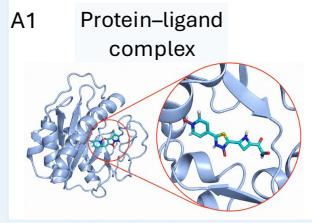

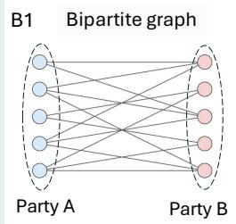

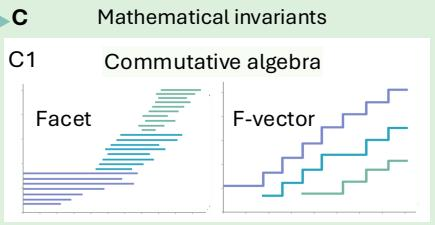

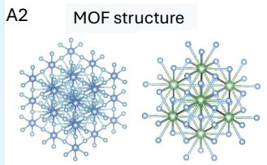

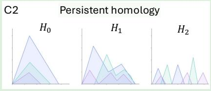

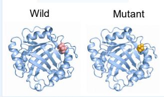

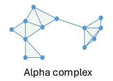

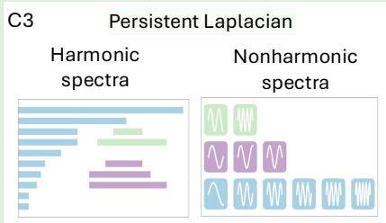

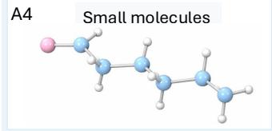

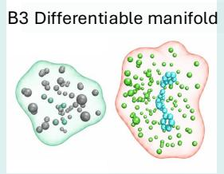

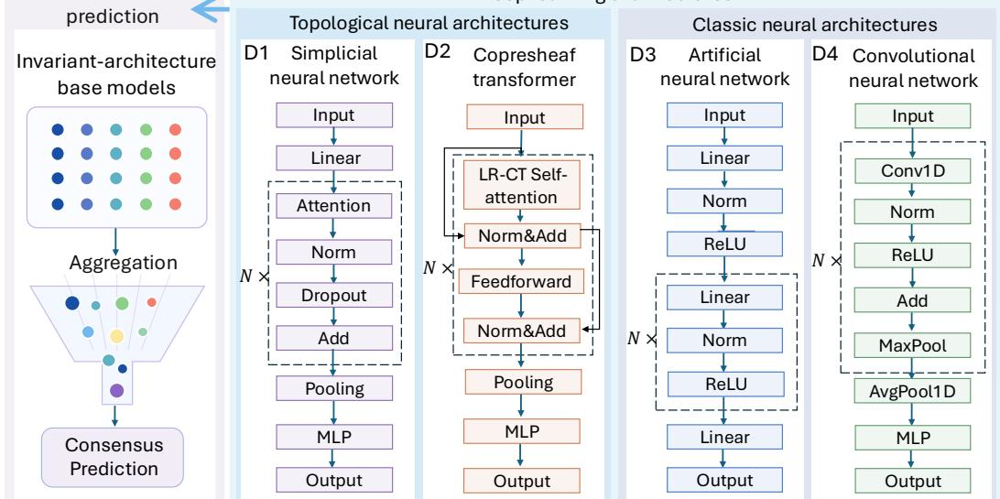  
Figure 1: Overview of the MITNN framework. (A) Representative molecular and materials systems, including (A1) protein–ligand complexes, (A2) metal–organic frameworks, (A3) wild-type and mutant protein structures, and (A4) small molecules. (B) Mathematical domains, including (B1) bipartite graphs, (B2) Vietoris–Rips and Alpha simplicial complexes, and (B3) diferentiable manifolds. (C) Mathematical invariant families, including (C1) commutative algebra, (C2) persistent homology, (C3) persistent Laplacian, (C4) element interactive curvature, and (C5) Forman persistent Ricci curvature. (D) Neural architectures, including the topological neural architectures (D1) simplicial neural networks and (D2) copresheaf transformer neural networks, and the classic neural architectures (D3) artificial neural networks and (D4) convolutional neural networks. (E) Consensus prediction obtained by aggregating invariant–architecture base models.

The resulting invariant features are processed using four neural architectures (Fig. 1D), including two topological neural architectures and two classic neural architectures. The topological architectures comprise simplicial neural networks (SNNs), which organize feature propagation according to simplicial relations, and copresheaf transformer neural networks (CTNNs), which organize information exchange through copresheaf structure maps and low-rank copresheaf transformer (LR-CT) self-attention. The LR-CT formulation preserves structured directional information flow across local feature spaces while improving computational scalability [29]. MITNN also incorporates ANNs for fully connected nonlinear processing of invariant features and CNNs for capturing local dependencies in ordered multiscale feature arrays. Detailed architecture implementations are provided in Section S4.

Pairing an available mathematical invariant with a neural architecture produces an invariant–architecture base model. With five invariant families and four neural architectures, the general MITNN framework admits up to 20 such base models. MITNN supports two consensus variants (Fig. 1E). MITNNall aggregates all available invariant–architecture base models, whereas MITNNbest uses the best-performing base-model subset identified through exhaustive ensemble analysis. Details of the consensus aggregation procedures for each application and the base-model compositions of $\mathrm { M I T N N ^ { b e s t } }$ are provided in Section S2.1 and Table S2, respectively.

## 2.2 MITNN for Protein–Ligand Binding Afinity Prediction

Protein–ligand binding afinity quantifies the interaction strength between a ligand and its macromolecular target and is a central endpoint in structure-based drug discovery [52, 53]. We evaluated MITNN on the CASF-2016 benchmark [54], which has been widely used to assess the scoring performance of computational binding afinity models [36, 55, 56].

The evaluation protocol used PDBbind-v2016 refined complexes for model training and CASF-2016 core complexes for benchmark evaluation. Each invariant–architecture base model was trained in ten independent runs with diferent random seeds to account for stochastic variation in model initialization and training. Predictions from the ten runs were summarized by their median for each base model, and the MITNN consensus predictions were then obtained by taking the median across the included base models. Predictive performance was evaluated using the Pearson correlation coeficient (PCC) and standard deviation (SD), as defined in Section S1.2. Binding afinities originally expressed on the $p K _ { d }$ scale were converted to kcal/mol by multiplying both experimental and predicted values by a factor of −1.36.

As shown in Fig. 2A, MITNNall achieved a PCC of 0.857 and an SD of 1.522 kcal/mol, while MITNNbest further improved the PCC to 0.865 and reduced the SD to 1.483 kcal/mol. As summarized in Table S3, both consensus models outperformed all existing scoring functions and topology-based learning methods [14, 31–38]. In particular, MITNNbest achieved the highest PCC and the lowest reported SD among all evaluated methods. Relative to TopoFormer-Seq, the strongest prior method in the comparison, MITNNbest increased the PCC from 0.852 to 0.865 and reduced the SD from 1.612 to 1.483 kcal/mol, corresponding to a 1.5% relative improvement in PCC and an 8.0% reduction in SD. MITNN also outperformed other competitive approaches, including PerSpect-ML [32], AGL-Score, PLEC, DeltaVinaRF20, and Pafnucy.

## 2.3 MITNN for MOF Gas-Uptake Prediction

Metal–organic frameworks (MOFs) are porous crystalline materials whose gas adsorption properties depend on both global structural characteristics, such as pore geometry and framework connectivity, and local chemical environments. We therefore evaluated MITNN on MOF gas-uptake prediction to assess its performance on a materials property prediction task involving both global structural organization and local chemical environments. To account for elemental heterogeneity, the constituent elements were grouped into eight chemical categories together with an all-atom category (Fig. S3).

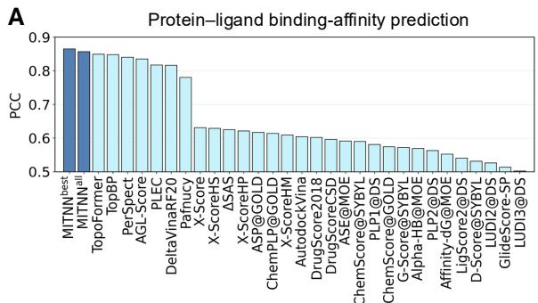

B  
MOF gas-uptake prediction  
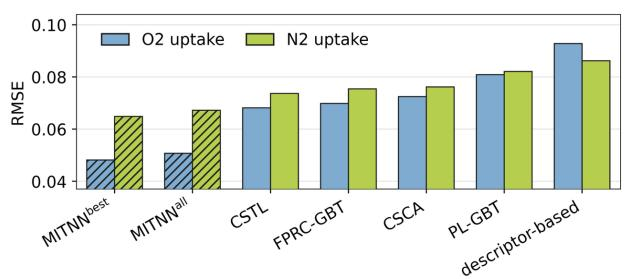

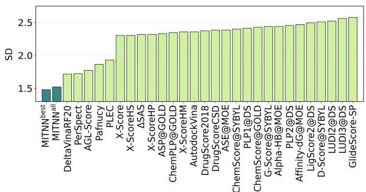

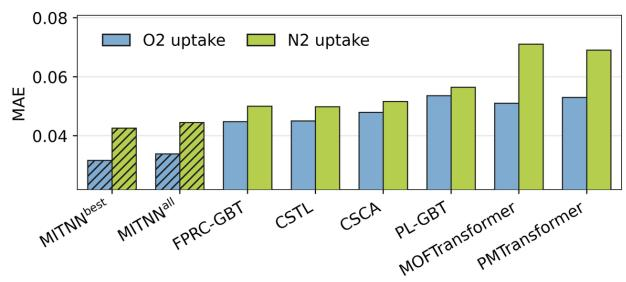

C  
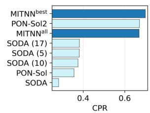  
D

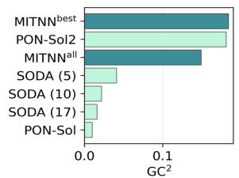

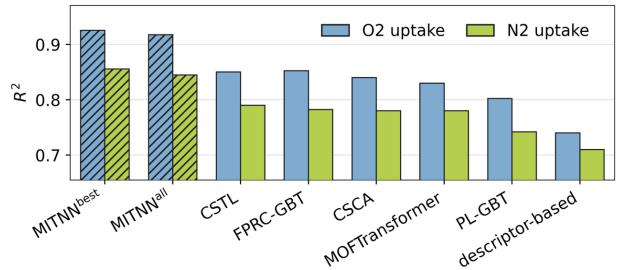

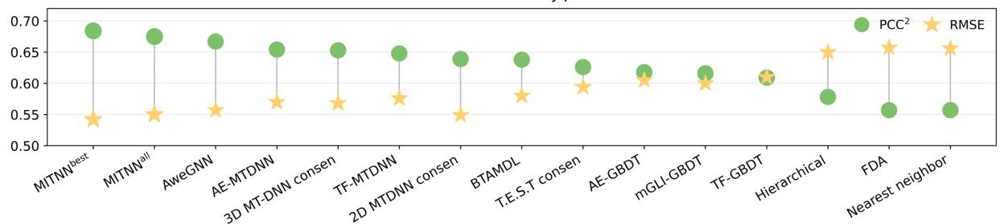  
Figure 2: Overall predictive performance of MITNN across molecular and materials benchmark applications. Results are shown for both MITNN consensus variants. (A) Protein–ligand binding afinity prediction on CASF-2016, evaluated by PCC and SD and compared with representative scoring functions and topology-based models [14, 31–38]. (B) $\mathrm { O _ { 2 } }$ and $\mathrm { N _ { 2 } }$ uptake prediction in MOFs, evaluated by $R ^ { 2 }$ , MAE, and RMSE and compared with representative descriptor-based, topology-based, and transformer-based approaches [39–43]. (C) Mutation-induced protein solubility prediction on PON-Sol2, evaluated by CPR and $\mathrm { G C ^ { 2 } }$ and compared with existing solubility predictors [44, 45]. (D) Quantitative $\mathrm { L D _ { 5 0 } }$ toxicity prediction, evaluated by $\mathrm { P C C ^ { 2 } }$ and RMSE and compared with representative traditional machine-learning, multitask-learning, and molecular-descriptor-based methods [46–51].

We evaluated MITNN for $\mathrm { O _ { 2 } }$ and $\mathrm { N _ { 2 } }$ uptake prediction, with uptake reported in mo $/ \mathrm { k g }$ . The dataset sizes and partitioning protocols are summarized in Table S1. For each gas species, ten random train–validation–test partitions were generated using an 8:1:1 ratio. Within each partition, each invariant– architecture base model was evaluated over multiple independently seeded runs. The predictions from the included base models and independent runs were averaged to obtain the corresponding MITNN consensus prediction. Predictive performance was evaluated using $R ^ { 2 }$ , MAE, and RMSE, as defined in Section S1.2. The reported metrics were averaged across the ten random partitions.

As shown in Fig. 2B, $\mathrm { M I T N N ^ { a l l } }$ achieved an $R ^ { 2 }$ of 0.909 for $\mathrm { O _ { 2 } }$ uptake, which increased to 0.917 for MITNNbest. For $\mathrm { N _ { 2 } }$ uptake, MITNNall and MITNNbest achieved $R ^ { 2 }$ values of 0.838 and 0.845, respectively. MITNNbest also yielded lower MAE and RMSE than MITNNall for both gas species. Both MITNN consensus models outperformed all representative descriptor-based, topology-based, and transformer-based approaches included in our evaluation. In particular, compared with the strongest non-MITNN baselines, MITNNbest improved $R ^ { 2 }$ by 7.9% for $\mathrm { O _ { 2 } }$ uptake and 7.0% for $\mathrm { N _ { 2 } }$ uptake, while reducing MAE by 23.9% and 15.1%, and RMSE by 23.3% and 13.8%, respectively. These comparisons include MOFTransformer [39], PMTransformer [40], a descriptor-based model [41], CSTL [42], CSCA [43], as well as the topology-based FPRC-GBT and PL-GBT baselines evaluated under the same ten-partition protocol. Detailed numerical comparisons are provided in Table S4, which also includes PL-GBT and FPRC-GBT, obtained by coupling persistent Laplacian and Forman persistent Ricci curvature features, respectively, with gradient-boosting trees.

## 2.4 MITNN for Mutation-Induced Protein Solubility Prediction

Mutation-induced changes in protein solubility can influence protein stability, aggregation propensity, and biological function. We evaluated MITNN on the PON-Sol2 benchmark [44], which formulates mutation-induced solubility prediction as a three-class classification problem comprising decreased, neutral, and increased solubility. Following the position-stratified blind-test protocol of PON-Sol2 [44], models were evaluated on an independent test set of 662 variants, including 338 solubility-decreasing, 87 neutral, and 237 solubility-increasing mutations. The dataset sizes and partitioning protocol are summarized in Table S1. Each invariant–architecture base model was trained in ten independent runs with diferent random seeds. Predictions from the included base models and independent runs were averaged before class assignment. Predictive performance was evaluated using the Correct Prediction Ratio (CPR) and Generalized Squared Correlation $\bigl ( \mathrm { G C } ^ { 2 } \bigr )$ , as defined in Section S1.2. As shown in Fig. 2C, MITNNall achieved a CPR of 0.669 and a $\mathrm { G C ^ { 2 } }$ of 0.149. MITNNbest improved these values to 0.699 and 0.184, respectively, outperforming the published PON-Sol2 predictor, which reported a CPR of 0.671 and a $\mathrm { G C ^ { 2 } }$ of 0.181. Detailed comparisons with the evaluated protein solubility predictors are provided in Table S5.

## 2.5 MITNN for Quantitative Toxicity Prediction

Quantitative toxicity prediction is important for chemical safety assessment and drug development. We evaluated MITNN on the oral rat median lethal dose $\mathrm { ( L D _ { 5 0 } ) }$ endpoint, a widely used measure of acute toxicity [48].

Each invariant–architecture base model was trained in ten independent runs with diferent random seeds. Predictions were summarized by the median across the independent runs for each base model, and the MITNN consensus was then obtained by taking the median across the included base models. Predictive performance was evaluated using the squared Pearson correlation coeficient $\mathrm { ( P C C ^ { 2 } ) }$ and root mean square error (RMSE), as defined in Section S1.2. As shown in Fig. 2D, MITNNall achieved a $\mathrm { P C C ^ { 2 } }$ of 0.675 and an RMSE of 0.550, whereas MITNNbest further improved these values to 0.684 and 0.542, respectively. As summarized in Table S6, MITNNbest achieved the highest $\mathrm { P C C ^ { 2 } }$ and the lowest RMSE among all evaluated toxicity-prediction methods, outperforming conventional toxicityestimation approaches, molecular-descriptor-based machine-learning models, multitask-learning methods, and graph-based neural networks [46–48, 50, 51].

A
<table><tr><td rowspan=1 colspan=1>0.789</td><td rowspan=1 colspan=1>0.806</td><td rowspan=1 colspan=1>0.774</td><td rowspan=1 colspan=1>0.767</td><td rowspan=1 colspan=1>0.558</td><td rowspan=1 colspan=1>0.555</td><td rowspan=1 colspan=1>0.562</td><td rowspan=1 colspan=1>0.592</td></tr><tr><td rowspan=1 colspan=1>0.782</td><td rowspan=1 colspan=1>0.783</td><td rowspan=1 colspan=1>0.798</td><td rowspan=1 colspan=1>0.794</td><td rowspan=1 colspan=1>0.592</td><td rowspan=1 colspan=1>0.605</td><td rowspan=1 colspan=1>0.589</td><td rowspan=1 colspan=1>0.588</td></tr><tr><td rowspan=1 colspan=1>0.807</td><td rowspan=1 colspan=1>0.814</td><td rowspan=1 colspan=1>0.787</td><td rowspan=1 colspan=1>0.809</td><td rowspan=1 colspan=1>0.606</td><td rowspan=1 colspan=1>0.584</td><td rowspan=1 colspan=1>0.578</td><td rowspan=1 colspan=1>0.640</td></tr><tr><td rowspan=1 colspan=1>0.817</td><td rowspan=1 colspan=1>0.812</td><td rowspan=1 colspan=1>0.812</td><td rowspan=1 colspan=1>0.802</td><td rowspan=1 colspan=1>0.618</td><td rowspan=1 colspan=1>0.640</td><td rowspan=1 colspan=1>0.600</td><td rowspan=1 colspan=1>0.612</td></tr><tr><td rowspan=1 colspan=1>0.831</td><td rowspan=1 colspan=1>0.847</td><td rowspan=1 colspan=1>0.832</td><td rowspan=1 colspan=1>0.831</td><td rowspan=1 colspan=1>0.628</td><td rowspan=1 colspan=1>0.644</td><td rowspan=1 colspan=1>0.630</td><td rowspan=1 colspan=1>0.628</td></tr><tr><td rowspan=1 colspan=1>0.813</td><td rowspan=1 colspan=1>0.829</td><td rowspan=1 colspan=1>0.818</td><td rowspan=1 colspan=1>0.821</td><td rowspan=1 colspan=1>0.625</td><td rowspan=1 colspan=1>0.628</td><td rowspan=1 colspan=1>0.625</td><td rowspan=1 colspan=1>0.626</td></tr><tr><td rowspan=1 colspan=1>0.821</td><td rowspan=1 colspan=1>0.834</td><td rowspan=1 colspan=1>0.810</td><td rowspan=1 colspan=1>0.831</td><td rowspan=1 colspan=1>0.632</td><td rowspan=1 colspan=1>0.608</td><td rowspan=1 colspan=1>0.614</td><td rowspan=1 colspan=1>0.654</td></tr><tr><td rowspan=1 colspan=1>0.825</td><td rowspan=1 colspan=1>0.827</td><td rowspan=1 colspan=1>0.824</td><td rowspan=1 colspan=1>0.822</td><td rowspan=1 colspan=1>0.640</td><td rowspan=1 colspan=1>0.632</td><td rowspan=1 colspan=1>0.619</td><td rowspan=1 colspan=1>0.650</td></tr><tr><td rowspan=1 colspan=1>0.831</td><td rowspan=1 colspan=1>0.838</td><td rowspan=1 colspan=1>0.823</td><td rowspan=1 colspan=1>0.816</td><td rowspan=1 colspan=1>0.634</td><td rowspan=1 colspan=1>0.646</td><td rowspan=1 colspan=1>0.628</td><td rowspan=1 colspan=1>0.637</td></tr><tr><td rowspan=1 colspan=1>0.827</td><td rowspan=1 colspan=1>0.828</td><td rowspan=1 colspan=1>0.836</td><td rowspan=1 colspan=1>0.831</td><td rowspan=1 colspan=1>0.638</td><td rowspan=1 colspan=1>0.657</td><td rowspan=1 colspan=1>0.625</td><td rowspan=1 colspan=1>0.638</td></tr><tr><td rowspan=1 colspan=1>0.843</td><td rowspan=1 colspan=1>0.841</td><td rowspan=1 colspan=1>0.826</td><td rowspan=1 colspan=1>0.829</td><td rowspan=1 colspan=1>0.644</td><td rowspan=1 colspan=1>0.635</td><td rowspan=1 colspan=1>0.629</td><td rowspan=1 colspan=1>0.656</td></tr><tr><td rowspan=1 colspan=1>0.836</td><td rowspan=1 colspan=1>0.832</td><td rowspan=1 colspan=1>0.824</td><td rowspan=1 colspan=1>0.831</td><td rowspan=1 colspan=1>0.651</td><td rowspan=1 colspan=1>0.648</td><td rowspan=1 colspan=1>0.624</td><td rowspan=1 colspan=1>0.659</td></tr><tr><td rowspan=1 colspan=1>0.838</td><td rowspan=1 colspan=1>0.849</td><td rowspan=1 colspan=1>0.829</td><td rowspan=1 colspan=1>0.839</td><td rowspan=1 colspan=1>0.639</td><td rowspan=1 colspan=1>0.636</td><td rowspan=1 colspan=1>0.638</td><td rowspan=1 colspan=1>0.645</td></tr><tr><td rowspan=1 colspan=1>0.839</td><td rowspan=1 colspan=1>0.844</td><td rowspan=1 colspan=1>0.842</td><td rowspan=1 colspan=1>0.837</td><td rowspan=1 colspan=1>0.641</td><td rowspan=1 colspan=1>0.650</td><td rowspan=1 colspan=1>0.635</td><td rowspan=1 colspan=1>0.642</td></tr><tr><td rowspan=1 colspan=1>0.843</td><td rowspan=1 colspan=1>0.844</td><td rowspan=1 colspan=1>0.841</td><td rowspan=1 colspan=1>0.839</td><td rowspan=1 colspan=1>0.646</td><td rowspan=1 colspan=1>0.664</td><td rowspan=1 colspan=1>0.636</td><td rowspan=1 colspan=1>0.650</td></tr><tr><td rowspan=1 colspan=1>0.829</td><td rowspan=1 colspan=1>0.840</td><td rowspan=1 colspan=1>0.828</td><td rowspan=1 colspan=1>0.836</td><td rowspan=1 colspan=1>0.650</td><td rowspan=1 colspan=1>0.638</td><td rowspan=1 colspan=1>0.635</td><td rowspan=1 colspan=1>0.657</td></tr><tr><td rowspan=1 colspan=1>0.833</td><td rowspan=1 colspan=1>0.843</td><td rowspan=1 colspan=1>0.836</td><td rowspan=1 colspan=1>0.836</td><td rowspan=1 colspan=1>0.648</td><td rowspan=1 colspan=1>0.659</td><td rowspan=1 colspan=1>0.641</td><td rowspan=1 colspan=1>0.647</td></tr><tr><td rowspan=1 colspan=1>0.838</td><td rowspan=1 colspan=1>0.843</td><td rowspan=1 colspan=1>0.829</td><td rowspan=1 colspan=1>0.838</td><td rowspan=1 colspan=1>0.656</td><td rowspan=1 colspan=1>0.649</td><td rowspan=1 colspan=1>0.637</td><td rowspan=1 colspan=1>0.663</td></tr><tr><td rowspan=1 colspan=1>0.843</td><td rowspan=1 colspan=1>0.848</td><td rowspan=1 colspan=1>0.830</td><td rowspan=1 colspan=1>0.842</td><td rowspan=1 colspan=1>0.653</td><td rowspan=1 colspan=1>0.637</td><td rowspan=1 colspan=1>0.640</td><td rowspan=1 colspan=1>0.663</td></tr><tr><td rowspan=1 colspan=1>0.839</td><td rowspan=1 colspan=1>0.838</td><td rowspan=1 colspan=1>0.838</td><td rowspan=1 colspan=1>0.837</td><td rowspan=1 colspan=1>0.657</td><td rowspan=1 colspan=1>0.658</td><td rowspan=1 colspan=1>0.635</td><td rowspan=1 colspan=1>0.662</td></tr><tr><td rowspan=1 colspan=1>0.846</td><td rowspan=1 colspan=1>0.845</td><td rowspan=1 colspan=1>0.840</td><td rowspan=1 colspan=1>0.835</td><td rowspan=1 colspan=1>0.654</td><td rowspan=1 colspan=1>0.649</td><td rowspan=1 colspan=1>0.637</td><td rowspan=1 colspan=1>0.660</td></tr><tr><td rowspan=1 colspan=1>0.840</td><td rowspan=1 colspan=1>0.851</td><td rowspan=1 colspan=1>0.840</td><td rowspan=1 colspan=1>0.844</td><td rowspan=1 colspan=1>0.651</td><td rowspan=1 colspan=1>0.651</td><td rowspan=1 colspan=1>0.646</td><td rowspan=1 colspan=1>0.650</td></tr><tr><td rowspan=1 colspan=1>0.849</td><td rowspan=1 colspan=1>0.844</td><td rowspan=1 colspan=1>0.837</td><td rowspan=1 colspan=1>0.839</td><td rowspan=1 colspan=1>0.657</td><td rowspan=1 colspan=1>0.658</td><td rowspan=1 colspan=1>0.639</td><td rowspan=1 colspan=1>0.665</td></tr><tr><td rowspan=1 colspan=1>0.847</td><td rowspan=1 colspan=1>0.851</td><td rowspan=1 colspan=1>0.840</td><td rowspan=1 colspan=1>0.843</td><td rowspan=1 colspan=1>0.654</td><td rowspan=1 colspan=1>0.661</td><td rowspan=1 colspan=1>0.646</td><td rowspan=1 colspan=1>0.656</td></tr><tr><td rowspan=1 colspan=1>0.846</td><td rowspan=1 colspan=1>0.847</td><td rowspan=1 colspan=1>0.849</td><td rowspan=1 colspan=1>0.845</td><td rowspan=1 colspan=1>0.652</td><td rowspan=1 colspan=1>0.667</td><td rowspan=1 colspan=1>0.641</td><td rowspan=1 colspan=1>0.655</td></tr><tr><td rowspan=1 colspan=1>0.840</td><td rowspan=1 colspan=1>0.846</td><td rowspan=1 colspan=1>0.838</td><td rowspan=1 colspan=1>0.842</td><td rowspan=1 colspan=1>0.661</td><td rowspan=1 colspan=1>0.659</td><td rowspan=1 colspan=1>0.644</td><td rowspan=1 colspan=1>0.664</td></tr><tr><td rowspan=1 colspan=1>0.844</td><td rowspan=1 colspan=1>0.850</td><td rowspan=1 colspan=1>0.839</td><td rowspan=1 colspan=1>0.844</td><td rowspan=1 colspan=1>0.660</td><td rowspan=1 colspan=1>0.650</td><td rowspan=1 colspan=1>0.646</td><td rowspan=1 colspan=1>0.664</td></tr><tr><td rowspan=1 colspan=1>0.848</td><td rowspan=1 colspan=1>0.850</td><td rowspan=1 colspan=1>0.838</td><td rowspan=1 colspan=1>0.845</td><td rowspan=1 colspan=1>0.663</td><td rowspan=1 colspan=1>0.657</td><td rowspan=1 colspan=1>0.647</td><td rowspan=1 colspan=1>0.667</td></tr><tr><td rowspan=1 colspan=1>0.849</td><td rowspan=1 colspan=1>0.847</td><td rowspan=1 colspan=1>0.846</td><td rowspan=1 colspan=1>0.842</td><td rowspan=1 colspan=1>0.661</td><td rowspan=1 colspan=1>0.663</td><td rowspan=1 colspan=1>0.643</td><td rowspan=1 colspan=1>0.666</td></tr><tr><td rowspan=1 colspan=1>0.846</td><td rowspan=1 colspan=1>0.853</td><td rowspan=1 colspan=1>0.846</td><td rowspan=1 colspan=1>0.848</td><td rowspan=1 colspan=1>0.659</td><td rowspan=1 colspan=1>0.666</td><td rowspan=1 colspan=1>0.650</td><td rowspan=1 colspan=1>0.658</td></tr><tr><td rowspan=1 colspan=1>0.848</td><td rowspan=1 colspan=1>0.852</td><td rowspan=1 colspan=1>0.845</td><td rowspan=1 colspan=1>0.847</td><td rowspan=1 colspan=1>0.665</td><td rowspan=1 colspan=1>0.663</td><td rowspan=1 colspan=1>0.650</td><td rowspan=1 colspan=1>0.668</td></tr></table>

B  
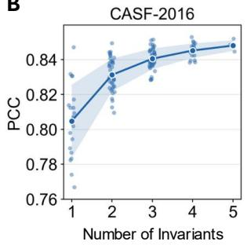

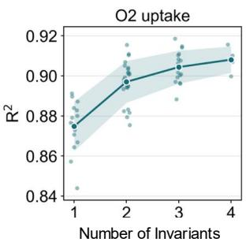

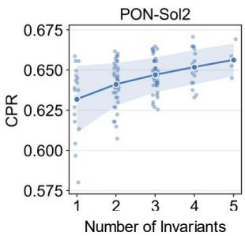

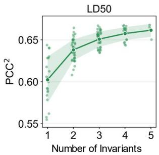  
Figure 3: Complementarity among mathematical invariant families in MITNN. (A) Exhaustive invariant-subset analysis for CASF-2016 and $\mathrm { L D } _ { 5 0 }$ . The incidence matrix indicates the invariant families included in each subset. For each neural-network architecture, predictions from the corresponding base models were averaged to form the subset prediction. The heatmaps report PCC for CASF-2016 and $\mathrm { P C C ^ { 2 } }$ for $\mathrm { L D } _ { 5 0 }$ across four architectures. (B) Performance versus invariant-subset size for CASF-2016, MOF O2 uptake, PON-Sol2, and $\mathrm { L D } _ { 5 0 }$ . Each point denotes one invariant subset under a fixed architecture; solid lines show the mean over subsets of the same size across the four architectures, with shaded regions indicating variability. CASF-2016, PON-Sol2, and $\mathrm { L D _ { 5 0 } }$ use PH, PL, CA, FPRC, and ${ \mathrm { E I C } } ,$ while $\mathrm { M O F \ O _ { 2 } }$ uptake uses PH, PL, CA, and FPRC.

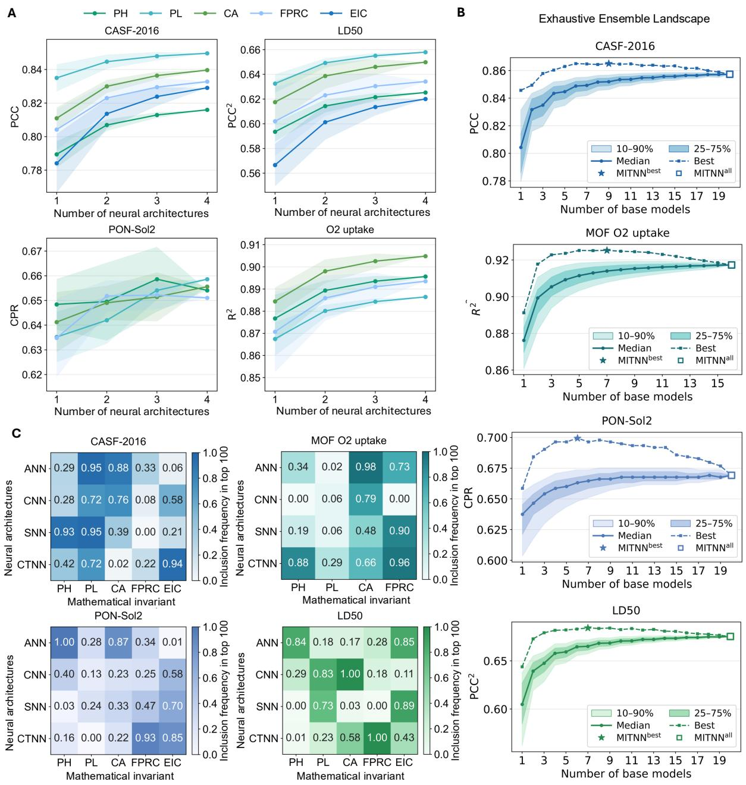  
Figure 4: Architectural complementarity and selective ensemble composition in MITNN. (A) Architecture-subset analysis with the mathematical invariant held fixed. For each invariant, predictions from the corresponding invariant–architecture base models within a given architecture subset were averaged to form the subset prediction. Points show the mean performance over all architecture subsets of the same cardinality, and shaded regions indicate the corresponding variability. (B) Ensemble-performance landscapes over the complete invariant–architecture base-model pool for CASF-2016, PON-Sol2, $\mathrm { L D } _ { 5 0 } .$ and MOF $\mathrm { O _ { 2 } }$ uptake. For each ensemble size, the performance distribution was obtained over all candidate base-model subsets of that cardinality. Solid and dashed curves denote the median and best performance at each ensemble size, respectively, and shaded regions indicate the 25–75 and 10–90 percentile intervals. Stars mark MITNNbest, corresponding to the global maximum of each ensemble landscape, whereas hollow squares mark MITNNall at the complete-pool endpoints. (C) Inclusion frequency of each invariant–architecture base model among the top 100 performing ensembles for each application.

## 2.6 Mathematical-Invariant Complementarity within Fixed Neural Architectures

To assess complementarity among mathematical invariant families, we held the neural architecture fixed and systematically varied the invariant subset. For CASF-2016, PON-Sol2, and $\mathrm { L D } _ { 5 0 } .$ , all 31 nonempty subsets of PH, PL, CA, FPRC, and EIC were evaluated. For the MOF application, all 15 nonempty subsets of PH, PL, CA, and FPRC were evaluated for both $\mathrm { O _ { 2 } }$ and $\mathrm { N _ { 2 } }$ uptake. For the MOF application, the complementarity analysis presented here focuses on $\mathrm { O _ { 2 } }$ uptake, while the corresponding $\mathrm { N _ { 2 } }$ uptake results are provided in Section S5. For each fixed architecture, predictions from the base models corresponding to a given invariant subset were averaged at the sample level. Complete results are provided in Tables $\mathrm { S } 7 { - } \mathrm { S } 1 0$ for CASF-2016, Tables S11–S14 for PON-Sol2, Tables S15–S18 and S19–S22 for $\mathrm { M O F ~ O _ { 2 } }$ and $\mathrm { N _ { 2 } }$ uptake, respectively, and Tables S23–S26 for $\mathrm { L D _ { 5 0 } }$

Figure 3A shows the performance of all invariant combinations for CASF-2016 and $\mathrm { L D _ { 5 0 } }$ under each fixed neural architecture, whereas Figure 3B summarizes performance as a function of invariant-subset size across all four applications. Overall, combining multiple invariant families tends to improve predictive performance, with the largest average gain generally occurring from one to two invariants and smaller gains as additional invariants are included. This trend supports complementarity among mathematically distinct invariant families. However, performance also depends strongly on invariant composition. For PON-Sol2, subsets of the same size show substantial performance variability. For CASF-2016, CNN achieves its highest PCC of 0.853 with $\mathrm { P H + P L + C A + E I C }$ , slightly exceeding the PCC of 0.852 obtained with all five invariant families, indicating that the complete invariant set is not necessarily optimal.

Invariant preferences also vary across applications and neural architectures. For CASF-2016, PL appears consistently in high-performing combinations across architectures. For MOF $\mathrm { { O _ { 2 } } }$ uptake, CA and FPRC occur frequently in high-performing subsets, with PH or PL providing additional gains depending on the architecture. For PON-Sol2 and $\mathrm { L D _ { 5 0 } }$ , the best-performing invariant combinations vary more substantially across architectures. Figure S4 further summarizes the distributions of invariant-subset performance under each fixed architecture. CNN shows the highest central tendency for CASF-2016, whereas CTNN shows the highest central tendency for $\mathrm { M O F ~ O _ { 2 } }$ uptake and $\mathrm { L D } _ { 5 0 } ;$ the PON-Sol2 distributions are more similar across architectures.

## 2.7 Architectural Complementarity for Fixed Mathematical Invariants

Architectural complementarity was examined by holding the mathematical invariant fixed and systematically varying the subset of neural architectures. For each invariant, all 15 nonempty subsets of ANN, CNN, SNN, and CTNN were evaluated. For this architecture-subset analysis, predictions from the corresponding invariant–architecture base models were averaged at the sample level. Complete results are provided in Tables S27–S31 for CASF-2016, Tables S32–S36 for PON-Sol2, Tables S37–S40 and S41–S44 for $\mathrm { M O F ~ O _ { 2 } }$ and $\mathrm { N _ { 2 } }$ uptake, respectively, and Tables S45–S49 for $\mathrm { L D _ { 5 0 } }$

Figure 4A summarizes performance as a function of architecture-subset size for each fixed mathematical invariant. Across most invariant–application settings, combining multiple architectures improves average performance relative to using a single architecture, although the improvement is not necessarily monotonic and depends on architecture composition. For CASF-2016, PL remains consistently strong across architecture subsets, indicating relatively low sensitivity to architecture composition. For MOF $\mathrm { O _ { 2 } }$ uptake, CA achieves the strongest overall performance, whereas FPRC shows larger gains from combining multiple architectures. For PON-Sol2, the overlapping and nonmonotonic performance trends indicate that the specific architecture composition is more influential than subset size alone. For $\mathrm { L D _ { 5 0 } }$ , FPRC performs strongly with CTNN alone, whereas EIC benefits more substantially from combining multiple architectures.

## 2.8 Selective Integration of Invariant–Architecture Base Models

The preceding complementarity analyses show that predictive performance depends jointly on the mathematical invariant and the neural architecture. We therefore examined ensembles of available invariant– architecture base models to assess how the number and composition of included base models influence performance. Candidate subsets were evaluated using the aggregation procedures defined for each application.

Figure 4B shows the ensemble-performance landscapes for CASF-2016 binding afinity, $\mathrm { M O F \ O _ { 2 } }$ uptake, PON-Sol2 protein solubility, and $\mathrm { L D _ { 5 0 } }$ toxicity. Across all four applications, median performance increases rapidly for smaller ensembles and then gradually approaches a plateau as more base models are included. Meanwhile, the 25–75 and 10–90 percentile intervals become progressively narrower, indicating reduced variability among base-model subsets of the same size. Despite this overall trend, the highest performance is reached before all available base models are included. The best-performing ensembles contain 9, 7, 6, and 7 base models for CASF-2016, MOF $\mathrm { O _ { 2 } }$ uptake, PON-Sol2, and $\mathrm { L D _ { 5 0 } }$ , respectively, with their corresponding base-model compositions summarized in Table S2. Additional base-model-level comparisons are provided in Figs. S1 and S2. Overall, increasing ensemble size generally improves typical performance and reduces variability, whereas optimal performance depends on base-model composition rather than ensemble size alone.

Figure 4C further characterizes the composition of high-performing ensembles by reporting the inclusion frequencies of individual invariant–architecture base models among the top 100 ensembles. The resulting frequency distributions are markedly nonuniform and vary across applications, indicating that certain base models are preferentially selected. For CASF-2016, PL-based models appear frequently across multiple architectures, whereas CA- and FPRC-based models are more prominent for MOF $\mathrm { O _ { 2 } }$ uptake. These patterns are consistent with the invariant-level complementarity results in Section 2.6 and broadly agree with the compositions of MITNNbest summarized in Table S2. Overall, high-performing ensembles favor specific invariant–architecture pairings rather than sampling uniformly from the available base-model pool, further highlighting the importance of ensemble composition for predictive performance.

## 3 Discussion

MITNN provides a unified, mathematically multimodal framework for integrating complementary mathematical representations with multiple neural architectures in molecular and materials property prediction. The framework combines five invariant families that capture algebraic-topological, spectral, algebraic– combinatorial, continuous diferential-geometric, and discrete-curvature information, providing distinct mathematical views of the same underlying structures. On the learning side, MITNN incorporates topological neural architectures, including simplicial neural networks and copresheaf transformer neural networks, alongside artificial and convolutional neural networks. Coupling the available mathematical invariants with these architectures forms a library of invariant–architecture base models, enabling mathe matical and architectural complementarity to be examined within a common predictive framework. Across protein–ligand binding afinity, MOF gas uptake, mutation-induced protein solubility, and quantitative toxicity, MITNN achieves consistently strong performance relative to the evaluated baselines.

The complementarity analyses show that predictive performance depends jointly on the mathematical invariant and the neural architecture used to process its features. Combining multiple invariant families or neural architectures is generally beneficial, but the extent of improvement depends on the specific invariants, architectures, and prediction task. For example, for CASF-2016, the frequent representation of PL-based models among high-performing combinations may reflect the additional spectral information captured by PL alongside multiscale topological connectivity.

The ensemble analyses further show that broader aggregation improves typical performance and reduces variability, whereas the highest performance is achieved by selected subsets of invariant–architecture base models. The nonuniform inclusion frequencies among high-performing ensembles further indicate that certain invariant–architecture pairings are preferentially represented. These results demonstrate that predictive gains depend not only on the diversity of mathematical invariants and neural architectures, but also on how they are paired and integrated.

The conclusions of this study are conditioned on the invariant families, neural architectures, and benchmark applications considered here, and the observed trends should therefore not be interpreted as universally applicable across all prediction problems. Future extensions may incorporate additional mathematical constructions, including persistent path Laplacians [57], persistent hyperdigraph Laplacians [58], and localized persistent commutative algebra [59], together with additional topological neural architectures [22, 24, 25] and geometric and equivariant neural networks [7, 8, 11]. As the invariant–architecture library grows, scalable strategies for base-model screening and selection will also become important. More broadly, MITNN may be extended to other complex scientific data in which complementary mathematical representations of stereochemistry need to be coupled with high-order neural processing mechanisms.

## 4 Methods

## 4.1 Mathematical Invariants

MITNN employs five families of multiscale mathematical invariants: PH, PL, CA, EIC, and FPRC. In general, let $D _ { \lambda }$ denote a mathematical quantity constructed from a mathematical domain X at scale λ. For an admissible transformation $g , D _ { \lambda }$ is invariant with respect to g if

$$
D _ { \lambda } ( g \mathcal { X } ) = D _ { \lambda } ( \mathcal { X } ) .
$$

The admissible transformations depend on the particular invariant construction and may include labelpreserving atom or vertex reindexings, Euclidean rigid motions, and simplicial isomorphisms.

The five invariant families characterize distinct aspects of molecular and materials structure. PH characterizes the persistence of topological features across a filtration; PL augments this topological information with spectral quantities derived from its zero and nonzero eigenvalues; CA encodes algebraic–combinatorial properties of filtered simplicial complexes; EIC characterizes continuous geometric information derived from element-specific interaction density fields; and FPRC describes the evolution of discrete combinatorial curvature over filtered simplicial complexes. Because these quantities are evaluated across filtration or interaction scales, their values generally vary with λ, while remaining invariant under the admissible transformations at each fixed scale. The resulting scale-indexed quantities are organized into multiscale invariant feature blocks and subsequently supplied to the neural architectures. Further details of invariant construction and feature generation are provided in Section S3.

## 4.2 Simplicial Complexes and Filtrations

We first introduce the algebraic-topological notation shared by the filtration-based invariant constructions. A q-simplex is the convex hull of $q + 1$ afinely independent vertices. In particular, $0 \ i , 1 \ i , 2 \ i$ , and 3-simplices correspond to vertices, edges, filled triangles, and tetrahedra, respectively. A simplicial complex K is a finite collection of simplices that is closed under taking faces: if $\sigma \in { \mathcal { K } }$ , then every face of σ also belongs to $\kappa .$

Let k be a field and let $C _ { q } ( K ; \Bbbk )$ denote the q-chain group generated by the oriented q-simplices of $\kappa .$ The boundary operator

$$
\partial _ { q } : C _ { q } ( { \mathcal { K } } ; \mathbb { k } ) \longrightarrow C _ { q - 1 } ( { \mathcal { K } } ; \mathbb { k } )
$$

acts on an oriented simplex as

$$
\partial _ { q } [ u _ { 0 } , \dots , u _ { q } ] = \sum _ { \ell = 0 } ^ { q } ( - 1 ) ^ { \ell } [ u _ { 0 } , \dots , \widehat { u _ { \ell } } , \dots , u _ { q } ] ,
$$

where $\widehat { u _ { \ell } }$ denotes omission of the vertex $u _ { \ell }$ . Because $\partial _ { q } \partial _ { q + 1 } = 0$ , every boundary is a cycle. The q-th homology group is therefore

$$
H _ { q } ( K ; \mathbb { k } ) = \frac { \ker \partial _ { q } } { \operatorname { i m } \partial _ { q + 1 } } ,
$$

and its dimension

$$
\beta _ { q } = \dim _ { \Bbbk } H _ { q } ( \mathcal { K } ; \Bbbk )
$$

is the q-th Betti number. In the usual geometric interpretation, $\beta _ { 0 } , \ \beta _ { 1 }$ , and $\beta _ { 2 }$ quantify connected components, independent loops, and enclosed cavities, respectively.

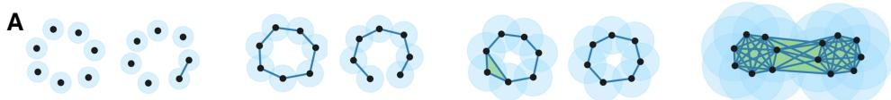

To characterize point-cloud data across geometric scales, we consider a filtration, namely a nested sequence of simplicial complexes

$$
\mathcal { K } _ { t _ { 0 } } \subseteq \mathcal { K } _ { t _ { 1 } } \subseteq \cdots \subseteq \mathcal { K } _ { t _ { M } } , \qquad t _ { 0 } < t _ { 1 } < \cdots < t _ { M } .
$$

Common constructions include Vietoris–Rips and alpha filtrations [60–62]. For $t _ { a } \leq t _ { b } .$ , the inclusion

$$
{ \mathcal { K } } _ { t _ { a } } \hookrightarrow { \mathcal { K } } _ { t _ { b } }
$$

captures the evolution of the simplicial structure across scales and provides the basis for the topological, spectral, algebraic–combinatorial, and discrete-curvature invariants introduced below. Figure 5A shows representative stages of such a filtration in the schematic example.

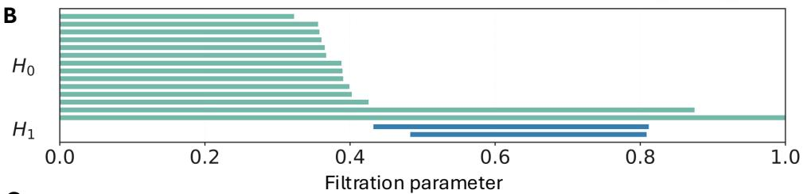

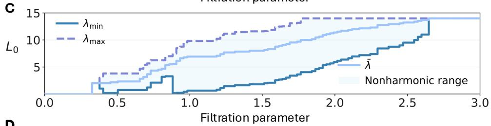  
D

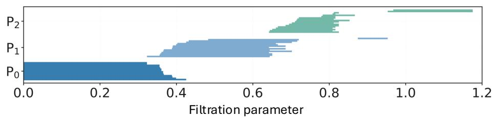

E  
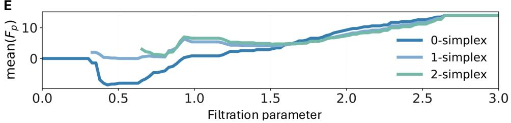  
Figure 5: Schematic comparison of four filtration-based multiscale mathematical invariants obtained from the same Vietoris–Rips filtration of a 14-point two-loop point cloud. (A) Representative Vietoris–Rips complexes at increasing filtration parameter ϵ. (B) Persistence intervals for $H _ { 0 }$ and $H _ { 1 }$ . (C) Evolution of the nonharmonic spectrum of the 0-Laplacian $L _ { 0 } ,$ illustrated by the smallest and largest positive eigenvalues $\lambda _ { \operatorname* { m i n } } ^ { + }$ and $\lambda _ { \operatorname* { m a x } } ^ { + } ,$ the mean positive eigenvalue $\bar { \lambda } ,$ and the nonharmonic spectral range. (D) Facet-persistence bars $P _ { 0 } , \ P _ { 1 }$ , and $P _ { 2 }$ associated with 0-, 1-, and 2-dimensional facets. (E) Signed mean Forman curvature mean $( F _ { p } )$ for $p = 0 , 1 , 2$

## 4.3 Persistent Homology (PH)

Persistent homology (PH) [13] extends simplicial homology by tracking the appearance and disappearance of topological features across a filtration. For filtration indices $a \leq b .$ the inclusion

$$
{ \mathcal { K } } _ { t _ { a } } \hookrightarrow { \mathcal { K } } _ { t _ { b } }
$$

induces a homomorphism

$$
\phi _ { a , b } ^ { q } : H _ { q } ( \mathcal { K } _ { t _ { a } } ; \mathbb { k } ) \longrightarrow H _ { q } ( \mathcal { K } _ { t _ { b } } ; \mathbb { k } ) .
$$

The corresponding persistent homology group is

$$
H _ { q } ^ { a , b } = \mathrm { i m } \phi _ { a , b } ^ { q } ,
$$

and its dimension

$$
\beta _ { q } ^ { a , b } = \mathrm { d i m } _ { \Bbbk } H _ { q } ^ { a , b }
$$

is the persistent Betti number. The birth and death of homological features across the filtration are summarized by persistence intervals, which provide a multiscale characterization of topological structure.

PH is invariant under vertex relabeling and filtration-preserving simplicial isomorphisms. For distancebased filtrations, Euclidean translations and rotations preserve pairwise distances and therefore leave the persistence barcodes unchanged. Uniform spatial scaling, however, rescales the filtration parameters and is not considered an invariant transformation here.

Figure 5B illustrates the $H _ { 0 }$ and $H _ { 1 }$ persistence intervals for the schematic two-loop point cloud. The $H _ { 0 }$ intervals describe the progressive merging of connected components as the filtration expands, whereas the $H _ { 1 }$ intervals record the formation and subsequent filling of the two loop-like structures.

## 4.4 Persistent Laplacian (PL)

Persistent Laplacian (PL) spectra complement persistent homology by characterizing both harmonic and nonharmonic spectral properties of simplicial complexes along a filtration[63]. For the spectral construction, the chain groups are taken over R and endowed with the inner product for which the oriented simplices form an orthonormal basis. The q-th combinatorial Laplacian is

$$
{ \cal L } _ { q } = \partial _ { q + 1 } \partial _ { q + 1 } ^ { * } + \partial _ { q } ^ { * } \partial _ { q } ,\tag{1}
$$

where $\partial _ { q } ^ { * }$ denotes the adjoint of the boundary operator. The operator $L _ { q }$ is real, symmetric, and positive semidefinite, and induces the discrete Hodge decomposition

$$
C _ { q } ( { \cal K } ; \mathbb { R } ) = \operatorname { i m } \partial _ { q + 1 } \oplus \ker L _ { q } \oplus \operatorname { i m } \partial _ { q } ^ { * } .
$$

Moreover,

$$
\ker L _ { q } \cong H _ { q } ( \mathcal { K } ; \mathbb { R } ) ,
$$

so the multiplicity of the zero eigenvalue equals the q-th Betti number [64]. Thus, the zero-eigenvalue multiplicity recovers topological information, whereas the positive eigenvalues encode additional spectral information about the incidence and connectivity structure of the simplicial complex.

For filtration indices $a \leq b ,$ , define

$$
\begin{array} { r } { C _ { q + 1 } ^ { a , b } = \left\{ c \in C _ { q + 1 } ( \mathcal { K } _ { t _ { b } } ; \mathbb { R } ) \ \middle \vert \ \partial _ { q + 1 } ^ { b } c \in C _ { q } ( \mathcal { K } _ { t _ { a } } ; \mathbb { R } ) \right\} . } \end{array}
$$

Restricting $\partial _ { q + 1 } ^ { b }$ to this space gives the persistent boundary operator

$$
\partial _ { q + 1 } ^ { a , b } : C _ { q + 1 } ^ { a , b } \to C _ { q } ( \mathcal { K } _ { t _ { a } } ; \mathbb { R } ) ,
$$

and the corresponding persistent Laplacian is

$$
L _ { q } ^ { a , b } = \partial _ { q + 1 } ^ { a , b } \bigl ( \partial _ { q + 1 } ^ { a , b } \bigr ) ^ { * } + \bigl ( \partial _ { q } ^ { a } \bigr ) ^ { * } \partial _ { q } ^ { a } .\tag{2}
$$

Its kernel is isomorphic to the persistent homology group,

$$
\ker L _ { q } ^ { a , b } \cong H _ { q } ^ { a , b } ,
$$

so the multiplicity of the zero eigenvalue equals the persistent Betti number $\beta _ { q } ^ { a , b }$ . The positive spectrum contains complementary nonharmonic information not captured by persistent Betti numbers alone [63, 65, 66].

The PL spectrum is invariant under filtration-preserving simplicial relabeling. Reordering or consistently reorienting simplices transforms the Laplacian by an orthogonal signed-permutation similarity,

$$
L _ { q } ^ { \prime } = P _ { q } ^ { \top } L _ { q } P _ { q } ,
$$

and therefore leaves its spectrum unchanged. For distance-based filtrations, Euclidean translations and rotations likewise preserve the filtered simplicial complexes and their Laplacian spectra.

Figure 5C illustrates the evolution of the nonharmonic spectrum of $L _ { 0 }$ along the filtration. Initially, the complex contains only isolated vertices and the spectrum is entirely harmonic. As edges are introduced, positive eigenvalues emerge and evolve with the connectivity of the simplicial complex. Once the Vietoris– Rips filtration of the 14-point example reaches the complete clique complex, all positive eigenvalues coincide.

## 4.5 Commutative Algebra (CA)

The commutative-algebra (CA) invariant family used in MITNN is based on the persistent Stanley– Reisner theory introduced by Suwayyid and Wei [19], which associates filtered simplicial complexes with commutative-algebraic objects. This construction encodes the combinatorial organization of a simplicial complex through squarefree monomial ideals, their quotient rings, and facet-associated prime decompositions.

Let ∆ be a finite simplicial complex on the vertex set $W = \{ y _ { 1 } , \dots , y _ { n } \}$ , and let $\varphi : \Delta  \mathbb { R }$ be a monotone face function satisfying $\varphi ( \omega ) \leq \varphi ( \omega ^ { \prime } )$ whenever $\omega \subseteq \omega ^ { \prime }$ . The function $\varphi$ induces the filtration

$$
\Delta _ { \epsilon } = \{ \omega \in \Delta \mid \varphi ( \omega ) \leq \epsilon \} ,
$$

with $\Delta _ { \epsilon _ { a } } \subseteq \Delta _ { \epsilon _ { b } }$ for $\epsilon _ { a } \leq \epsilon _ { b }$ . Fix a field k and let $R = \mathbb { k } [ y _ { 1 } , \dots , y _ { n } ]$ be the standard graded polynomial ring. At each filtration scale ϵ, the Stanley–Reisner ideal of $\Delta _ { \epsilon }$ is

$$
I _ { \epsilon } = I ( \Delta _ { \epsilon } ) = ( y _ { i _ { 1 } } \cdot \cdot \cdot y _ { i _ { s } } \mid \{ y _ { i _ { 1 } } , \ldots , y _ { i _ { s } } \} \not \in \Delta _ { \epsilon } ) \subseteq R ,\tag{3}
$$

and the corresponding Stanley–Reisner ring is $\mathbb { k } [ \Delta _ { \epsilon } ] = R / I _ { \epsilon }$ . As the filtration expands, the set of nonfaces decreases, yielding a descending sequence of squarefree monomial ideals.

The Stanley–Reisner ideal admits an irredundant minimal-prime decomposition indexed by the facets of the simplicial complex:

$$
I _ { \epsilon } = \bigcap _ { \omega \in \mathcal { F } ( \Delta _ { \epsilon } ) } P _ { \omega } , \qquad P _ { \omega } = ( y _ { i } \mid y _ { i } \notin \omega ) ,\tag{4}
$$

where $\mathcal { F } ( \Delta _ { \epsilon } )$ denotes the set of facets of $\Delta _ { \epsilon }$ . To distinguish facets by dimension, define

$$
\mathcal { P } _ { \epsilon } ^ { ( p ) } = \{ P _ { \omega } \mid \omega \in \mathcal { F } ( \Delta _ { \epsilon } ) , \ \mathrm { d i m } ( \omega ) = p \} .
$$

For $\epsilon _ { a } \leq \epsilon _ { b }$ , the persistent p-dimensional facet set and its cardinality are

$$
\mathcal { P } _ { \epsilon _ { a } , \epsilon _ { b } } ^ { ( p ) } = \mathcal { P } _ { \epsilon _ { a } } ^ { ( p ) } \cap \mathcal { P } _ { \epsilon _ { b } } ^ { ( p ) } , \qquad \mu _ { p } ^ { \epsilon _ { a } , \epsilon _ { b } } = \left| \mathcal { P } _ { \epsilon _ { a } , \epsilon _ { b } } ^ { ( p ) } \right| .\tag{5}
$$

These quantities characterize the persistence of maximal simplices across the filtration.

Facet-based quantities describe only maximal simplices, whereas the f-vector records simplices of all dimensions. Let $\Delta _ { \epsilon } ^ { \left( p \right) }$ denote the set of p-simplices in $\Delta _ { \epsilon }$ . The f-vector at scale ϵ is

$$
\mathbf { f } ^ { \epsilon } = \left( f _ { 0 } ^ { \epsilon } , f _ { 1 } ^ { \epsilon } , \dots , f _ { \mathrm { d i m } ( \Delta _ { \epsilon } ) } ^ { \epsilon } \right) , \qquad f _ { p } ^ { \epsilon } = \left| \Delta _ { \epsilon } ^ { ( p ) } \right| .\tag{6}
$$

Thus, facet persistence and f-vectors provide complementary algebraic–combinatorial information about the evolving simplicial complex.

The resulting CA quantities are invariant under vertex relabeling. A permutation of the vertices induces a corresponding permutation of the polynomial variables and hence a graded automorphism of R that maps the associated Stanley–Reisner ideals to isomorphic ideals. Consequently, the facet-associated quantities and f-vector components are unchanged. These quantities therefore define algebraic–combinatorial invariants, although they are not complete invariants, since nonisomorphic simplicial complexes may share the same facet counts or f-vectors.

Figure 5D illustrates the persistence of 0-, 1-, and 2-dimensional facets along the filtration. A facet is born when it first appears as a maximal simplex and ceases to persist once it becomes a face of a higher-dimensional simplex. The corresponding $P _ { 0 } , P _ { 1 }$ , and $P _ { 2 }$ bars therefore describe the multiscale evolution of maximal vertices, edges, and triangles, respectively.

## 4.6 Element Interactive Curvature (EIC)

Element interactive curvature (EIC) provides a continuous diferential-geometric representation of elementspecific molecular interactions through diferentiable density fields [17]. Let a molecular system consist of atoms at positions $\mathbf { x } _ { j }$ with weights $w _ { j }$ . A discrete-to-continuum density field is defined as

$$
\rho ( \mathbf x ; \{ \eta _ { j } \} , \{ w _ { j } \} ) = \sum _ { j = 1 } ^ { N } { w _ { j } \Phi } ( \| \mathbf x - \mathbf x _ { j } \| ; \eta _ { j } ) ,\tag{7}
$$

where $w _ { j } = 1$ gives a number density and $w _ { j } = q _ { j }$ gives a charge density. The kernel Φ is a monotonically decaying $C ^ { 2 }$ radial function satisfying

$$
\Phi ( d ; \eta ) \to 1 \quad \mathrm { a s ~ } d \to 0 , \qquad \Phi ( d ; \eta ) \to 0 \quad \mathrm { a s ~ } d \to \infty .
$$

Common choices include the generalized exponential and generalized Lorentz kernels,

$$
\begin{array} { l l } { \Phi _ { \mathrm { E } } ( d ; \eta ) = \exp \left[ - \left( \displaystyle \frac { d } { \eta } \right) ^ { \kappa } \right] , } & { \kappa > 0 , } \\ { \Phi _ { \mathrm { L } } ( d ; \eta ) = \displaystyle \frac { 1 } { 1 + \left( \displaystyle \frac { d } { \eta } \right) ^ { \nu } } , } & { \nu > 0 . } \end{array}\tag{8}
$$

To retain chemical specificity, the density construction is resolved by element pairs. Let $D _ { a } =$ $\textstyle \bigcup _ { i : e _ { i } = a } B ( \mathbf { x } _ { i } , r _ { i } )$ denote the van der Waals domain associated with atoms of element type a. For two distinct element types a and $b ,$ the element-interactive density generated by atoms of type b over $D _ { a }$ is

$$
\rho _ { a b } ( \mathbf { x } ; \eta _ { a b } ) = \sum _ { \substack { j : e _ { j } = b } \atop \| \mathbf { x } _ { i } - \mathbf { x } _ { j } \| > r _ { i } + r _ { j } + \sigma , \forall i : e _ { i } = a } w _ { j } \Phi ( \| \mathbf { x } - \mathbf { x } _ { j } \| ; \eta _ { a b } ) , \qquad \mathbf { x } \in D _ { a } ,\tag{9}
$$

where $r _ { i }$ and $r _ { j }$ are atomic radii and $\sigma$ is the dataset-dependent correction used in the original EIC construction. The distance constraint excludes covalent interactions. Interactions between atoms of the same element type are treated using atom-specific van der Waals domains to avoid self-contributions.

A multiscale representation is obtained by varying the characteristic interaction length. Following the EIC parametrization,

$$
\eta _ { a b } ( \tau ) = \tau \big ( \bar { r } _ { a } + \bar { r } _ { b } \big ) ,
$$

where $\bar { r } _ { a }$ and $\bar { r } _ { b }$ are the van der Waals radii associated with element types a and $b ,$ and τ is a dimensionless scale parameter. Diferent values of τ probe element-specific interactions over diferent spatial ranges.

For a fixed element pair and interaction scale, element-interactive manifolds are defined by the level sets

$$
\rho _ { a b } ( \mathbf { x } ; \eta _ { a b } ) = c \rho _ { \operatorname* { m a x } } , \qquad 0 \le c \le 1 ,
$$

where $\rho _ { \mathrm { m a x } } = \operatorname* { m a x } _ { \mathbf { x } \in D _ { a } } \rho _ { a b } ( \mathbf { x } ; \eta _ { a b } )$ . At regular points for which $\nabla \rho \neq 0$ , let $g = \rho _ { x } ^ { 2 } + \rho _ { y } ^ { 2 } + \rho _ { z } ^ { 2 }$ . The Gaussian curvature $K$ and mean curvature H are obtained from the first- and second-order spatial derivatives of the density:

$$
\begin{array} { l } { { \displaystyle K = \frac { 1 } { g ^ { 2 } } \Big [ 2 \rho _ { x } \rho _ { y } \rho _ { x z } \rho _ { y z } + 2 \rho _ { x } \rho _ { z } \rho _ { x y } \rho _ { y z } + 2 \rho _ { y } \rho _ { z } \rho _ { x y } \rho _ { x z } } } \\ { { \displaystyle \qquad - 2 \rho _ { x } \rho _ { z } \rho _ { x z } \rho _ { y y } - 2 \rho _ { y } \rho _ { z } \rho _ { x x } \rho _ { y z } - 2 \rho _ { x } \rho _ { y } \rho _ { x y } \rho _ { z z } } } \\ { { \displaystyle \qquad + \rho _ { z } ^ { 2 } \rho _ { x x } \rho _ { y y } + \rho _ { x } ^ { 2 } \rho _ { y y } \rho _ { z z } + \rho _ { y } ^ { 2 } \rho _ { x x } \rho _ { z z } - \rho _ { x } ^ { 2 } \rho _ { y z } ^ { 2 } - \rho _ { y } ^ { 2 } \rho _ { x z } ^ { 2 } - \rho _ { z } ^ { 2 } \rho _ { x y } ^ { 2 } \Big ] , } } \end{array}\tag{10}
$$

and

$$
\begin{array} { c } { { H = \displaystyle \frac { 1 } { 2 g ^ { 3 / 2 } } \Big [ 2 \rho _ { x } \rho _ { y } \rho _ { x y } + 2 \rho _ { x } \rho _ { z } \rho _ { x z } + 2 \rho _ { y } \rho _ { z } \rho _ { y z } } } \\ { { - ( \rho _ { y } ^ { 2 } + \rho _ { z } ^ { 2 } ) \rho _ { x x } - ( \rho _ { x } ^ { 2 } + \rho _ { z } ^ { 2 } ) \rho _ { y y } - ( \rho _ { x } ^ { 2 } + \rho _ { y } ^ { 2 } ) \rho _ { z z } \Big ] . } } \end{array}\tag{11}
$$

The corresponding principal curvatures are

$$
\kappa _ { \mathrm { m i n } } = H - \sqrt { H ^ { 2 } - K } , \qquad \kappa _ { \mathrm { m a x } } = H + \sqrt { H ^ { 2 } - K } .
$$

These curvature functions characterize the local geometry associated with each element pair and interaction scale.

Because the density construction depends on radial functions of Euclidean distances, atom reindexing leaves it unchanged, while translations and rotations rigidly transform the density field and its level sets without changing their curvature values. Gaussian curvature is independent of surface orientation, whereas the sign of mean curvature depends on the chosen normal direction. Under a consistent normal convention, the EIC quantities are therefore invariant under atom reindexing, translations, and rotations.

## 4.7 Forman Persistent Ricci Curvature (FPRC)

Forman persistent Ricci curvature (FPRC) characterizes the evolution of discrete combinatorial curvature across a filtration of simplicial complexes [18]. Two distinct p-simplices α and α¯ are called parallel, denoted by ${ \bar { \alpha } } \parallel \alpha ,$ if they share a common $( p - 1 )$ )-face but are not both faces of any common $( p + 1 )$ -simplex.

For $p > 0$ , the Forman Ricci curvature of a p-simplex α in an unweighted simplicial complex is

$$
F _ { p } ( \alpha ) = \# \{ \beta ^ { p + 1 } \mid \alpha < \beta ^ { p + 1 } \} + \# \{ \gamma ^ { p - 1 } \mid \gamma ^ { p - 1 } < \alpha \} - \# \{ \bar { \alpha } \mid \bar { \alpha } \mid \alpha \} ,\tag{12}
$$

where the first term counts the $( p + 1 )$ -dimensional cofaces of $\alpha ,$ the second counts its $( p - 1 )$ )-dimensional faces, and the third counts its parallel p-simplices.

Following the convention used in the FPRC construction [18], the curvature of a nonisolated vertex v is defined from the curvatures of its incident edges as

$$
F _ { 0 } ( v ) = \frac { 1 } { d ( v ) } \sum _ { e > v } F _ { 1 } ( e ) ,\tag{13}
$$

where $d ( v )$ is the number of edges incident to v. For an isolated vertex, we set $F _ { 0 } ( v ) = 0$ . Evaluating Forman Ricci curvature across simplex dimensions and filtration values yields a multiscale characterization of the evolving combinatorial curvature.

Forman Ricci curvature depends only on the local face–coface incidence relations and parallel-simplex relations. These relations are preserved under simplicial isomorphisms and vertex relabeling, so corre sponding simplices have identical curvature values. For distance-based filtrations, Euclidean translations and rotations also preserve the filtered simplicial complexes. The resulting FPRC quantities are therefore invariant under these transformations.

Figure 5E illustrates the signed mean Forman curvature mean $( F _ { p } )$ for $p = 0 , 1 , 2$ . Isolated vertices are assigned $F _ { 0 } = 0$ . The first edge has $F _ { 1 } = 2$ , whereas the first triangle has $F _ { 2 } = 3$ , reflecting their respective local face–coface configurations at the time of appearance. At intermediate filtration values, the mean curvature varies as the local face–coface and parallel-simplex configurations evolve. For the 14-point example, the three mean-curvature curves eventually converge and remain constant once the Vietoris–Rips filtration reaches the complete clique complex.

## Acknowledgments

This work was supported in part by NIH grant R35GM148196, the University of Georgia, the Georgia Research Alliance and the Defense Advanced Research Projects Agency (DARPA) under Agreement No. HR00112969E087. MH was supported in part by the National Science Foundation (NSF grant DMS-2134231). The views and conclusions contained in this document are those of the authors and should not be interpreted as representing the oficial policies, either expressed or implied, of the U.S. Government.

## References

[1] Keith T Butler, Daniel W Davies, Hugh Cartwright, Olexandr Isayev, and Aron Walsh. Machine learning for molecular and materials science. Nature, 559(7715):547–555, 2018.

[2] Jessica Vamathevan, Dominic Clark, Paul Czodrowski, Ian Dunham, Edgardo Ferran, George Lee, Bin Li, Anant Madabhushi, Parantu Shah, Michaela Spitzer, et al. Applications of machine learning in drug discovery and development. Nature reviews Drug discovery, 18(6):463–477, 2019.

[3] Kevin Maik Jablonka, Daniele Ongari, Seyed Mohamad Moosavi, and Berend Smit. Big-data science in porous materials: materials genomics and machine learning. Chemical reviews, 120(16):8066–8129, 2020.

[4] Michael Desgagné, Amirabbas Kazeminia, Kübra Kaygisiz, Bradley L Pentelute, and Marinka Zitnik. Stereopep: Do molecular models understand stereochemistry? a benchmark on synthetic diastereomeric peptides. 2026.

[5] Albert P Bartók, Risi Kondor, and Gábor Csányi. On representing chemical environments. Physical Review B—Condensed Matter and Materials Physics, 87(18):184115, 2013.

[6] Kristof Schütt, Pieter-Jan Kindermans, Huziel Enoc Sauceda Felix, Stefan Chmiela, Alexandre Tkatchenko, and Klaus-Robert Müller. Schnet: A continuous-filter convolutional neural network for modeling quantum interactions. Advances in neural information processing systems, 30, 2017.

[7] Vıctor Garcia Satorras, Emiel Hoogeboom, and Max Welling. E (n) equivariant graph neural networks. In International conference on machine learning, pages 9323–9332. PMLR, 2021.

[8] Fabian Fuchs, Daniel Worrall, Volker Fischer, and Max Welling. Se (3)-transformers: 3d rototranslation equivariant attention networks. Advances in neural information processing systems, 33: 1970–1981, 2020.

[9] Justin Gilmer, Samuel S Schoenholz, Patrick F Riley, Oriol Vinyals, and George E Dahl. Neural message passing for quantum chemistry. In International conference on machine learning, pages 1263–1272. Pmlr, 2017.

[10] Johannes Gasteiger, Janek Groß, and Stephan Günnemann. Directional message passing for molecular graphs. arXiv preprint arXiv:2003.03123, 2020.

[11] Ilyes Batatia, David P Kovacs, Gregor Simm, Christoph Ortner, and Gábor Csányi. Mace: Higher order equivariant message passing neural networks for fast and accurate force fields. Advances in neural information processing systems, 35:11423–11436, 2022.

[12] Edelsbrunner, Letscher, and Zomorodian. Topological persistence and simplification. Discrete & computational geometry, 28(4):511–533, 2002.

[13] Afra Zomorodian and Gunnar Carlsson. Computing persistent homology. In Proceedings of the twentieth annual symposium on Computational geometry, pages 347–356, 2004.

[14] Zixuan Cang, Lin Mu, and Guo-Wei Wei. Representability of algebraic topology for biomolecules in machine learning based scoring and virtual screening. PLoS computational biology, 14(1):e1005929, 2018.

[15] Rui Wang, Duc Duy Nguyen, and Guo-Wei Wei. Persistent spectral graph. International journal for numerical methods in biomedical engineering, 36(9):e3376, 2020.

[16] Xiaoqi Wei and Guo-Wei Wei. Persistent topological laplacians—a survey. Mathematics, 13(2):208, 2025.

[17] Duc Duy Nguyen and Guo-Wei Wei. Dg-gl: Diferential geometry-based geometric learning of molecular datasets. International journal for numerical methods in biomedical engineering, 35(3): e3179, 2019.

[18] JunJie Wee and Kelin Xia. Forman persistent ricci curvature (fprc)-based machine learning models for protein–ligand binding afinity prediction. Briefings in Bioinformatics, 22(6):bbab136, 2021.

[19] Faisal Suwayyid and Guo-Wei Wei. Persistent stanley–reisner theory. Foundations of data science (Springfield, Mo.), 2025.

[20] Zixuan Cang and Guo-Wei Wei. Topologynet: Topology based deep convolutional and multi-task neural networks for biomolecular property predictions. PLoS computational biology, 13(7):e1005690, 2017.

[21] Zixuan Cang and Guo-Wei Wei. Integration of element specific persistent homology and machine learning for protein-ligand binding afinity prediction. International journal for numerical methods in biomedical engineering, 34(2):e2914, 2018.

[22] Cristian Bodnar, Francesco Di Giovanni, Benjamin Chamberlain, Pietro Lio, and Michael Bronstein. Neural sheaf difusion: A topological perspective on heterophily and oversmoothing in gnns. Advances in Neural Information Processing Systems, 35:18527–18541, 2022.

[23] Mustafa Hajij, Ghada Zamzmi, Theodore Papamarkou, Nina Miolane, Aldo Guzmán-Sáenz, Karthikeyan Natesan Ramamurthy, Tolga Birdal, Tamal K Dey, Soham Mukherjee, Shreyas N Samaga, et al. Topological deep learning: Going beyond graph data. arXiv preprint arXiv:2206.00606, 2022.

[24] Mustafa Hajij, Ghada Zamzmi, Theodore Papamarkou, AIdo Guzman-Saenz, ToIga Birdal, and Michael T Schaub. Combinatorial complexes: bridging the gap between cell complexes and hypergraphs. In 2023 57th Asilomar Conference on Signals, Systems, and Computers, pages 799–803. IEEE, 2023.

[25] Patrick Gillespie, Layal Bou Hamdan, Ioannis Schizas, David L Boothe, and Vasileios Maroulas. Bayesian sheaf neural networks. arXiv preprint arXiv:2410.09590, 2024.

[26] Mustafa Hajij, Lennart Bastian, Sarah Osentoski, Hardik Kabaria, John L Davenport, Sheik Dawood, Balaji Cherukuri, Joseph G Kocheemoolayil, Nastaran Shahmansouri, Adrian Lew, et al. Copresheaf topological neural networks: A generalized deep learning framework. arXiv preprint arXiv:2505.21251, 2025.

[27] Theodore Papamarkou, Tolga Birdal, Michael Bronstein, Gunnar Carlsson, Justin Curry, Yue Gao, Mustafa Hajij, Roland Kwitt, Pietro Lio, Paolo Di Lorenzo, et al. Position: Topological deep learning is the new frontier for relational learning. Proceedings of machine learning research, 235:39529, 2024.

[28] Stefania Ebli, Michaël Deferrard, and Gard Spreemann. Simplicial neural networks. arXiv preprint arXiv:2010.03633, 2020.

[29] Xiang Liu, Yiming Ren, Mustafa Hajij, Pietro Liò, and Guo-Wei Wei. Dtdl: Dual topological deep learning for drug discovery. Manuscript submitted for publication, 2026.

[30] Yogesh Verma, Amauri H Souza, and Vikas Garg. Topological neural networks go persistent, equivariant, and continuous. arXiv preprint arXiv:2406.03164, 2024.

[31] Marta M Stepniewska-Dziubinska, Piotr Zielenkiewicz, and Pawel Siedlecki. Development and evaluation of a deep learning model for protein–ligand binding afinity prediction. Bioinformatics, 34 (21):3666–3674, 2018.

[32] Zhenyu Meng and Kelin Xia. Persistent spectral–based machine learning (perspect ml) for proteinligand binding afinity prediction. Science advances, 7(19):eabc5329, 2021.

[33] Yan Li, Li Han, Zhihai Liu, and Renxiao Wang. Comparative assessment of scoring functions on an updated benchmark: 2. evaluation methods and general results. Journal of chemical information and modeling, 54(6):1717–1736, 2014.

[34] Minyi Su, Qifan Yang, Yu Du, Guoqin Feng, Zhihai Liu, Yan Li, and Renxiao Wang. Comparative assessment of scoring functions: the casf-2016 update. Journal of chemical information and modeling, 59(2):895–913, 2018.

[35] Tiejun Cheng, Xun Li, Yan Li, Zhihai Liu, and Renxiao Wang. Comparative assessment of scoring functions on a diverse test set. Journal of chemical information and modeling, 49(4):1079–1093, 2009.

[36] Cheng Wang and Yingkai Zhang. Improving scoring-docking-screening powers of protein–ligand scoring functions using random forest. Journal of computational chemistry, 38(3):169–177, 2017.

[37] Duc Duy Nguyen and Guo-Wei Wei. Agl-score: algebraic graph learning score for protein–ligand binding scoring, ranking, docking, and screening. Journal of chemical information and modeling, 59 (7):3291–3304, 2019.

[38] Maciej Wójcikowski, Michał Kukiełka, Marta M Stepniewska-Dziubinska, and Pawel Siedlecki. Development of a protein–ligand extended connectivity (plec) fingerprint and its application for binding afinity predictions. Bioinformatics, 35(8):1334–1341, 2019.

[39] Yeonghun Kang, Hyunsoo Park, Berend Smit, and Jihan Kim. A multi-modal pre-training transformer for universal transfer learning in metal–organic frameworks. Nature Machine Intelligence, 5(3):309–318, 2023.

[40] Hyunsoo Park, Yeonghun Kang, and Jihan Kim. Enhancing structure–property relationships in porous materials through transfer learning and cross-material few-shot learning. ACS Applied Materials & Interfaces, 15(48):56375–56385, 2023.

[41] Ibrahim B Orhan, Hilal Daglar, Seda Keskin, Tu C Le, and Ravichandar Babarao. Prediction of o2/n2 selectivity in metal–organic frameworks via high-throughput computational screening and machine learning. ACS applied materials & interfaces, 14(1):736–749, 2021.

[42] Dong Chen, Chun-Long Chen, and Guo-Wei Wei. Category-specific topological learning of metal– organic frameworks. Journal of Materials Chemistry A, 13(13):9292–9303, 2025.

[43] Caleb Simiyu Khaemba, Hongsong Feng, Dong Chen, Chun-Long Chen, and Guo-Wei Wei. Commutative algebra modeling in materials science–a case study on metal–organic frameworks (mofs). Journal of Chemical Information and Modeling, 66(5):2584–2596, 2026.

[44] Yang Yang, Lianjie Zeng, and Mauno Vihinen. Pon-sol2: prediction of efects of variants on protein solubility. International Journal of Molecular Sciences, 22(15):8027, 2021.

[45] Yang Yang, Abhishek Niroula, Bairong Shen, and Mauno Vihinen. Pon-sol: prediction of efects of amino acid substitutions on protein solubility. Bioinformatics, 32(13):2032–2034, 2016.

[46] Todd M. Martin. User’s guide for t.e.s.t. (version 4.2): Toxicity estimation software tool—a program to estimate toxicity from molecular structure. Technical Report EPA/600/R-16/058, U.S. Environmenta Protection Agency, Ofice of Research and Development, Washington, DC, 2016.

[47] Kaifu Gao, Duc Duy Nguyen, Vishnu Sresht, Alan M Mathiowetz, Meihua Tu, and Guo-Wei Wei. Are 2d fingerprints still valuable for drug discovery? Physical chemistry chemical physics, 22(16): 8373–8390, 2020.

[48] Kedi Wu and Guo-Wei Wei. Quantitative toxicity prediction using topology based multitask deep neural networks. Journal of chemical information and modeling, 58(2):520–531, 2018.

[49] Jian Jiang, Rui Wang, Menglun Wang, Kaifu Gao, Duc Duy Nguyen, and Guo-Wei Wei. Boosting tree-assisted multitask deep learning for small scientific datasets. Journal of chemical information and modeling, 60(3):1235–1244, 2020.

[50] Timothy Szocinski, Duc Duy Nguyen, and Guo-Wei Wei. Awegnn: Auto-parametrized weighted element-specific graph neural networks for molecules. Computers in biology and medicine, 134:104460, 2021.

[51] S Jannicke Moe, Anders L Madsen, Kristin A Connors, Jane M Rawlings, Scott E Belanger, Wayne G Landis, Raoul Wolf, and Adam D Lillicrap. Development of a hybrid bayesian network model for predicting acute fish toxicity using multiple lines of evidence. Environmental Modelling & Software, 126:104655, 2020.

[52] Heng Cai, Chao Shen, Tianye Jian, Xujun Zhang, Tong Chen, Xiaoqi Han, Zhuo Yang, Wei Dang, Chang-Yu Hsieh, Yu Kang, et al. Carsidock: a deep learning paradigm for accurate protein–ligand docking and screening based on large-scale pre-training. Chemical Science, 15(4):1449–1471, 2024.

[53] Qurrat Ul Ain, Antoniya Aleksandrova, Florian D Roessler, and Pedro J Ballester. Machine-learning scoring functions to improve structure-based binding afinity prediction and virtual screening. Wiley Interdisciplinary Reviews: Computational Molecular Science, 5(6):405–424, 2015.

[54] Zhihai Liu, Yan Li, Li Han, Jie Li, Jie Liu, Zhixiong Zhao, Wei Nie, Yuchen Liu, and Renxiao Wang. Pdb-wide collection of binding data: current status of the pdbbind database. Bioinformatics, 31(3): 405–412, 2015.

[55] Pedro J Ballester and John BO Mitchell. A machine learning approach to predicting protein–ligand binding afinity with applications to molecular docking. Bioinformatics, 26(9):1169–1175, 2010.

[56] Chen Li, An Zhang, Lin Wang, Jinhong Zuo, Chenglin Zhu, Jun Xu, Miaomiao Wang, and John Z. H. Zhang. Development of a polynomial scoring function p3-score for improved scoring and ranking powers. Chemical Physics Letters, 824:140547, 2023. doi: 10.1016/j.cplett.2023.140547.

[57] Rui Wang and Guo-Wei Wei. Persistent path laplacian. Foundations of data science (Springfield, Mo.), 5(1):26, 2023.

[58] Dong Chen, Jian Liu, Jie Wu, and Guo-Wei Wei. Persistent hyperdigraph homology and persistent hyperdigraph Laplacians. Foundations of data science (Springfield, Mo.), 5(4):558, 2023.

[59] Kaiyue He, Faisal Suwayyid, and Guo-Wei Wei. Localized persistent commutative algebra. arXiv preprint arXiv:2609.02858, 2026.

[60] Leopold Vietoris. Über den höheren zusammenhang kompakter räume und eine klasse von zusammenhangstreuen abbildungen. Mathematische Annalen, 97(1):454–472, 1927.

[61] Herbert Edelsbrunner and John Harer. Computational topology: an introduction. American Mathematical Soc., 2010.

[62] Herbert Edelsbrunner. Alpha shapes-a survey. In Tessellations in the sciences: Virtues, techniques and applications of geometric tilings. 2011.

[63] Rui Wang, Rundong Zhao, Emily Ribando-Gros, Jiahui Chen, Yiying Tong, and Guo-Wei Wei. Hermes: Persistent spectral graph software. Foundations of data science (Springfield, Mo.), 3(1):67, 2021.

[64] Beno Eckmann. Harmonische funktionen und randwertaufgaben in einem komplex. Commentarii Mathematici Helvetici, 17(1):240–255, 1944.

[65] Facundo Mémoli, Zhengchao Wan, and Yusu Wang. Persistent laplacians: Properties, algorithms and implications. SIAM Journal on Mathematics of Data Science, 4(2):858–884, 2022.

[66] Benjamin Jones and Guo-Wei Wei. Petls: Persistent topological laplacian software. arXiv preprint arXiv:2508.11560, 2025.