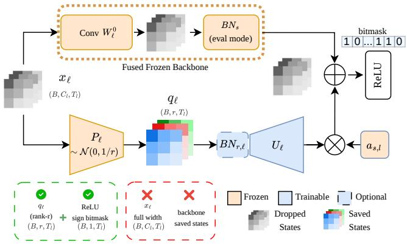
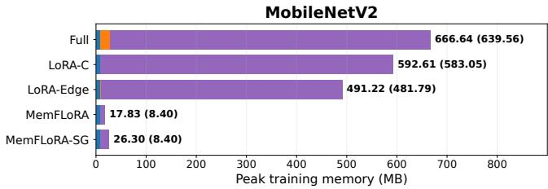
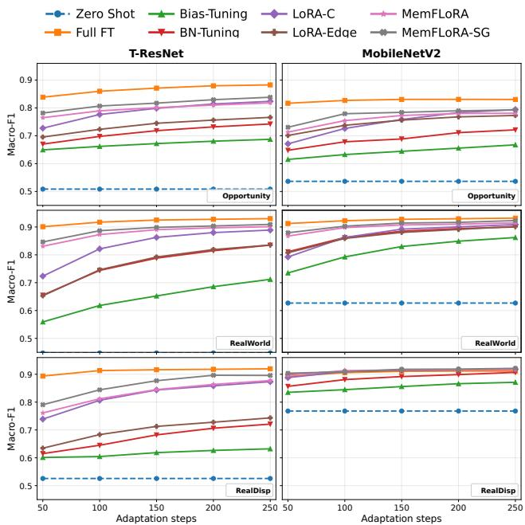
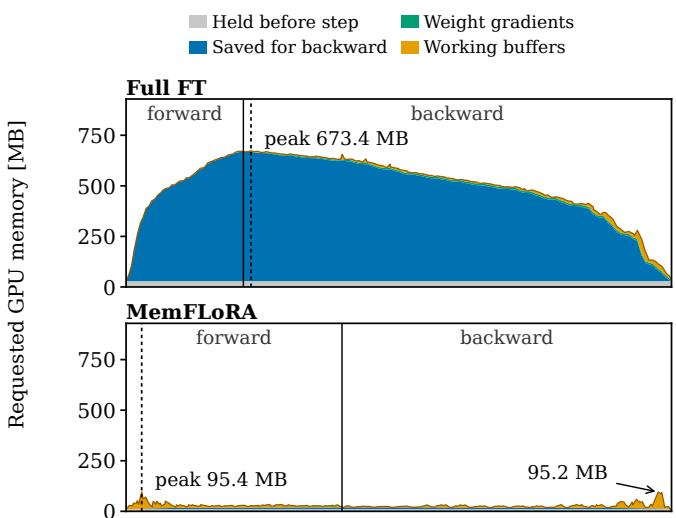

# MemFLoRA: Memory-Floor LoRA for CNN Adaptation at the Edge

Mehmet Emre Akbulut Technical University of Munich Munich, Germany mehmet.akbulut@tum.de

Johannes Geier Technical University of Munich Munich, Germany johannes.geier@tum.de

Ulf Schlichtmann Technical University of Munich Munich, Germany ulf.schlichtmann@tum.de

## Abstract

On-device learning is necessary when the model encounters user-, sensor-, or environment-specific shifts after deployment. Although parameter-eficient fine-tuning (PEFT) methods, particularly Low-Rank Adaptation (LoRA) variants, enable eficient adaptation at the edge, the limiting resource for Convolutional Neural Network (CNN) adaptation is often not the number of trainable parameters but the activation state that must be retained until the backward pass. This paper introduces Memory-Floor LoRA (MemFLoRA), a low-rank CNN adapter built around a memory-first design principle rather than a direct application of transformer-oriented LoRA. Instead of merely reducing trainable weights, we define an activationmemory-floor criterion: trainable backward computations must not depend on full-width layer inputs. The resulting adapter freezes the down-projection, trains a scale-matched up-projection, and combines eval-mode backbone normalization with activation-minimal backward rules, reducing saved state to the low-rank branch.

Evaluated on three Human Activity Recognition (HAR) datasets and two CNN backbones under subject, body-location, and sensorplacement shifts, MemFLoRA reduces saved-activation memory by 98.5-98.7% and peak training-state memory by 94.9-97.3% relative to full fine-tuning, while matching or exceeding CNN PEFT baselines.

## CCS Concepts

• Computing methodologies → Neural networks.

## Keywords

LoRA, On-Device Learning, Edge AI, CNN

## ACM Reference Format:

Mehmet Emre Akbulut, Johannes Geier, and Ulf Schlichtmann. 2027. Mem-FLoRA: Memory-Floor LoRA for CNN Adaptation at the Edge. In 32nd Asia and South Pacific Design Automation Conference (ASPDAC ’27), January 25–28, 2027, Tokyo, Japan. ACM, New York, NY, USA, 8 pages. https: //doi.org/10.1145/3840404.3848401

## 1 Introduction

Artificial Intelligence (AI) at the edge has become increasingly important as intelligent sensing devices become deeply embedded in everyday life. Smartphones, wearables, and Internet of Things (IoT) platforms interact with their environments and generate large amounts of domain-specific data. This trend pushes AI computation closer to the data source, enabling lower latency, reduced communication costs, and improved privacy compared with sending all data to cloud servers [26].

  
Figure 1: Brief overview of MemFLoRA computation and saved-state graph, reducing persistent saved state from �(� �ℓ �ℓ) to �(� ��ℓ) plus a bit-packed ReLU mask.

However, a fixed pretrained model may fail to provide robust predictions after deployment. For example, in sensor-based HAR, the target stream can difer from the source data due to subjectdependent motion patterns, sensor-placement deviations, device heterogeneity, and evolving user behavior [16, 21]. These changes can lead to distribution shifts or concept drifts and degrade the out of-distribution performance of fixed pretrained models. Since the corrective data are generated locally and may be privacy-sensitive, adapting the model on-device is preferable to repeated cloud-side retraining. However, full fine-tuning updates all model parameters and incurs substantial memory, compute, and energy overhead, which can exceed the resources of embedded systems and motivate more selective adaptation strategies.

Since its introduction [9], LoRA has become a widely used adaptation method for Large Language Models (LLMs), but its role in CNNs and extreme-edge learning scenarios remains much less explored. The standard reading of PEFT is that reducing the number of trainable parameters reduces the training-memory footprint. This assumption is often reasonable in LLMs, where optimizer state and trainable weight gradients dominate. However, for edge CNNs, memory is often dominated by the activation tensors that automatic diferentiation retains for backward propagation, not by the optimizer state or the trainable parameter set [4].

This mismatch indicates that parameter-eficient methods may still be memory-expensive, motivating MemFLoRA1: a LoRA-style CNN adapter with an activation-memory floor. The design rule is that no trainable backward computation should require the fullwidth activation tensor. The adapter satisfies this rule through a frozen down-projection, a trainable up-projection scale-matched to the frozen backbone, and eval-mode backbone normalization. This restricts the saved state to the low-rank branch while preserving adaptation capacity. In summary, our main contributions are:

• By decomposing the saved-tensor cost into three pillars, we define an activation-memory-floor criterion requiring that no persistent full-precision activation tensor used by trainable backward computations scales with layer width, and show that MemFLoRA satisfies it with rank-� saved state. Enforcing this floor reduces saved-activation memory by 98.5-98.7% and total peak training-state memory by 94.9- 97.3% relative to full fine-tuning.

• We introduce a memory-floor CNN adapter that combines a frozen down-projection, a scale-matched trainable up-projection, eval-mode backbone normalization, and activationminimal backward rules, together with a streaming-gradient (SG) variant that recovers the exact projection gradient without persistently saving the full-width activation.

• Across three HAR datasets spanning subject, location, and sensor-placement shifts and two CNN backbones, we match or exceed all evaluated rank-dependent PEFT methods in mean Macro-F1 across ranks and backbones.

## 2 Background and Related Work

Prior work on eficient adaptation has followed two complementary directions. LoRA-style PEFT methods restrict updates to low-rank branches, reducing trainable parameters and optimizer-state costs while remaining easy to integrate into pretrained models and, in many cases, mergeable into the backbone for inference. On-device training methods instead prioritize the dominant training-memory cost by reducing saved activations through selective updates and freezing. Our work bridges these directions by co-designing the adapter architecture and training graph around this activationmemory constraint, rather than treating activation reduction and adaptation as independent problems.

## 2.1 Low-Rank Adaptation

LoRA introduced low-rank adaptation by injecting trainable lowrank updates into frozen pretrained weights, reducing trainable parameters while preserving accuracy [9]. Most low-rank adaptation research focuses on transformer-based models and the adapter architecture. Work on CNNs is sparser and largely adopts the same parameter-centric perspective as its transformer-based counterparts [8, 11, 15] rather than reconsidering the activation state retained during training. ConvLoRA [1] combines LoRA with AdaBN [12] for medical-image domain adaptation, whereas Convolution Meets LoRA [24] integrates lightweight convolutions into LoRA experts without fine-tuning the convolution itself. LoRA-C [8] performs low-rank decomposition at the convolutional-layer level rather than the kernel level, targeting parameter-eficient adaptation for IoT devices. More recently, LoRA-Edge [11] targets on-device CNN fine-tuning for human activity recognition under domain shift, using a tensor-train structure to reduce trainable parameters and improve convergence. Across this body of work, the shared objective is parameter eficiency, leaving the CNN setting’s dominant saved-activation cost largely unaddressed.

LoRA-FA [23] freezes the down-projection and trains only the up-projection. Theoretical work on asymmetric low-rank adapters further explains that freezing the input-side projection constrains updates to a projected subspace, while leaving the output-side factor trainable can remain expressive in high-dimensional regimes [25]. MemFLoRA inherits this asymmetric-trainability principle but extends it to CNN adaptation, where BatchNorm, activation backward, and convolutional execution introduce saved-state constraints absent from the transformer setting. Asymmetric trainability alone removes the full-width input saved for the trainable down-projection. In CNNs, however, full-width state can also be retained by train-mode BatchNorm, activation backward, and the frozen convolutional branch.

## 2.2 On-Device Training and Activation-Memory

Several prior systems reduce training memory for on-device learning through quantization, sparse updates, rematerialization, or activation compression. TinyTL [4] showed that activations dominate on-device training memory. Building on this perspective, MCUNetV3 [13] combines quantization-aware scaling, sparse updates, and a tiny training engine to enable learning under extremely small memory budgets. POET [18] formulates rematerialization and paging schedules for training, while gradient checkpointing [7] reduces activation storage by recomputing intermediate activations during the backward pass. Activation-compression methods such as ActNN [6], GACT [14], and Few-bit Backward [17] reduce the cost of storing activations by compressing or quantizing them.

Checkpointing, rematerialization, and activation compression are orthogonal execution-level techniques: they reduce or reconstruct the state required by a given adapter but do not change its intrinsic backward dependencies. Our floor instead concerns adapter design, before such techniques are applied. MemFLoRA attains this floor without recomputation or compression, and these techniques can be applied on top of it for further savings.

MemFLoRA combines asymmetric low-rank adaptation with the activation-centric perspective of on-device training. Unlike the execution-level techniques discussed above, it modifies the adapter’s intrinsic backward dependencies so that the persistent state required by trainable computations is bounded by the rank-� branch. To the best of our knowledge, MemFLoRA is the first LoRA-style CNN adapter explicitly designed around an activationmemory-floor criterion. The novelty lies in enforcing a graph-level activation-memory constraint across the frozen projection, adapter branch, backbone normalization, activation backward, adapter placement, convolutional geometry, and optionally, projection-gradient recovery.

## 3 Method

We introduce a family of LoRA-style adapters for activation-memoryeficient CNN adaptation as illustrated in Figure 1. In transformers, LoRA is naturally applied to linear projections, where the main design variable is the rank of the injected update. In CNNs, however, the adapter interacts with convolutional kernel geometry, BatchNorm mode and statistics, activation functions, and fused

Conv–BN–ReLU execution. Consequently, directly factorizing convolutional weights may reduce trainable parameters while still retaining full-width feature maps for the backward pass. We instead require that no trainable backward formula should require the full-width activation tensor. In the remainder of this section, we define the memory floor, derive the adapter form and placement from it, and show how each component follows from this constraint rather than being an independent design choice.

## 3.1 The Activation-Memory Floor Criterion

Total training memory decomposes as

$$
M _ { \mathrm { t r a i n } } = M _ { \mathrm { w e i g h t s } } + M _ { \mathrm { g r a d } } + M _ { \mathrm { o p t i m } } + M _ { \mathrm { s a v e d } } + M _ { \mathrm { b u f } } ,\tag{1}
$$

where the terms denote model weights, gradients, optimizer states, tensors saved during the forward pass for backward reuse, and temporary bufers, respectively. Among these, $M _ { \mathrm { s a v e d } }$ can dominate for edge CNNs (Figure 2). Parameter-eficient fine-tuning reduces $M _ { \mathrm { g r a d } }$ and $M _ { \mathrm { o p t i m } }$ but leaves $M _ { \mathrm { s a v e d } }$ essentially unchanged, which is why parameter eficiency does not imply memory eficiency.

For input $x _ { \ell } \in \mathbb { R } ^ { B \times C _ { \ell } \times T _ { \ell } } , M _ { \mathrm { s a v e d } }$ decomposes into three pillars, each retained by a distinct part of the backward graph: (i) activation/ReLU state: although ReLU backward requires only the activation sign, standard automatic diferentiation typically retains a full-width tensor, $O ( B C _ { \ell } T _ { \ell } ) ;$ (ii) BatchNorm state: train-mode BatchNorm’s backward requires the normalized input, so full-width BN input is saved, $O ( B C _ { \ell } T _ { \ell } )$ ; (iii) frozen-branch convolution state: the input of every convolution is saved, including the input of the adapter and the input of the frozen backbone. A standard low-rank convolutional adapter trains both factors and therefore its saved adapter input remains full-width, $O ( B C _ { \ell } T _ { \ell } )$ , matching the asymptotic activation width of full fine-tuning.

We define the activation-memory floor for single-pass LoRAstyle CNN adapters as persistent saved state of $O ( B r T _ { \ell } )$ for trainable backward computations, independent of $C _ { \ell }$ . The ReLU gate is accounted for separately as a bit-packed mask, which is the minimal direct state for exact ReLU backward without recomputation. MemFLoRA satisfies this by replacing the dense saved state of the three pillars with the rank-� bottleneck and a bit-packed ReLU gate. Eval-mode BatchNorm removes Pillar (ii): During adaptation, the BatchNorm statistics $( \mu _ { \ell } , \sigma _ { \ell } ^ { 2 } )$ ) are frozen to target-calibrated values, and the afine parameters $( \gamma _ { s , \ell } , \beta _ { s , \ell } )$ are the fixed backbone scale and shift. BatchNorm then reduces to a per-channel afine map

$$
\begin{array} { r } { \mathrm { B N } _ { s } ^ { \mathrm { e v a l } } ( z ) = a _ { s , \ell } \odot z + b _ { s , \ell } ; ~ a _ { s , \ell } = \frac { \gamma _ { s , \ell } } { \sqrt { \sigma _ { s , \ell } ^ { 2 } + \varepsilon } } ; ~ b _ { s , \ell } = \beta _ { s , \ell } - a _ { s , \ell } \odot \mu _ { s , \ell } } \end{array}\tag{2}
$$

Because (2) is a fixed afine transform, its backward pass saves no activation. Eval-mode BatchNorm is therefore a precondition for the floor rather than an optional choice.

Bit-packed sign mask reduces Pillar (i): the backward pass of a fused Conv–BN–ReLU operator stores the ReLU sign at one bit per element rather than a full-precision tensor.

Frozen down-projection removes Pillar (iii): We adapt each convolution with a frozen down-projection $P _ { \ell }$ and a trainable upprojection $U _ { \ell }$ . If $P _ { \ell }$ were trainable, its gradient has the outer-product form $\nabla P _ { \ell } \propto g _ { \ell } x _ { \ell } ^ { \top }$ which would require retaining the full-width input $x _ { \ell } ,$ of size $O ( B C _ { \ell } T _ { \ell } )$ , violating the floor. After freezing $P _ { \ell }$

  
Figure 2: Peak training-state memory decomposition of MobileNetV2 at rank-2 on Opportunity with a batch size of 64. Labels report total peak memory, with saved-activation memory in parentheses.

$U _ { \ell }$ requires only the bottleneck activation $q _ { \ell } = P _ { \ell } x _ { \ell } \in \mathbb { R } ^ { B \times r \times T _ { \ell } } { \mathrm { ~ r e } } ,$ ducing the saved adapter state to $O ( B r T _ { \ell } )$ . $\mathrm { A t } \boldsymbol { r } = 1$ , this becomes $O ( B T _ { \ell } )$ and is independent of $C _ { \ell } .$ . Frozen-projection asymmetry is thus a requirement of the floor, not a stylistic choice.

## 3.2 Adapter Form and Placement

We adapt each convolution with a branch consisting of a frozen down-projection $P _ { \ell }$ and a trainable up-projection $U _ { \ell }$

$$
\Delta _ { \ell } = U _ { \ell } \big ( P _ { \ell } x _ { \ell } \big ) = U _ { \ell } ( q _ { \ell } ) ,\tag{3}
$$

As shown in Section 3.1, freezing $P _ { \ell }$ places this branch at the memory-floor: the gradient of $U _ { \ell }$ depends only on the rank-� bottleneck $q _ { \ell } ,$ , never on the full-width input $x _ { \ell }$

To preserve the activation-memory floor, we implement each Conv–BN–ReLU site as a single activation-minimal operator rather than exposing the convolution output, BN output, and ReLU preactivation as separate saved tensors. Under this memory constraint, the adapter branch is added to the fused Conv–BN output:

$$
y _ { \ell } = \varphi \left( \mathrm { B N } _ { s } ^ { \mathrm { e v a l } } \big ( W _ { \ell } ^ { 0 } x _ { \ell } \big ) + \Delta _ { \ell } \right)\tag{4}
$$

Here, $W _ { \ell } ^ { 0 }$ is the frozen source convolution, $\varphi$ is the activation function, and $\Delta _ { \ell }$ is the low-rank adapter update.

Because eval-mode BatchNorm is afine (Equation (2)), injecting the adapter before normalization is algebraically equivalent to

$$
\varphi \Bigl ( \mathrm { B N } _ { s } ^ { \mathrm { e v a l } } ( W _ { \ell } ^ { 0 } x _ { \ell } + \Delta _ { \ell } ) \Bigr ) = \varphi \Bigl ( \mathrm { B N } _ { s } ^ { \mathrm { e v a l } } ( W _ { \ell } ^ { 0 } x _ { \ell } ) + a _ { s , \ell } \odot \Delta _ { \ell } \Bigr ) .\tag{5}
$$

## 3.3 Scale-Matching the Adapter Branch

The forward rule in (4) adds the adapter output $\Delta _ { \ell }$ to the normalized backbone output $\mathrm { B N } _ { s } ^ { \mathrm { e v a l } } ( W _ { \ell } ^ { 0 } x _ { \ell } )$ . The backbone term is scaled per channel by $a _ { s , \ell }$ per (2); the adapter term, at raw scale, is not. This subsection shows that matching the per-channel scale of the two branches is critical under the evaluated initialization and optimization protocol, examines the two ways to supply it, and derives our choice. Writing the pre-activation as

$$
z _ { \ell } = a _ { s , \ell } \odot ( W _ { \ell } ^ { 0 } x _ { \ell } ) + b _ { s , \ell } + U _ { \ell } ( q _ { \ell } ) ,\tag{6}
$$

the bottleneck $q _ { \ell } = P _ { \ell } x _ { \ell }$ is a frozen random projection of the layer input; its per-channel magnitudes are uncontrolled and are not on the scale of the normalized backbone term. When the two branches are mismatched in scale, the adapter updates are poorly conditioned across channels, the adapter output rapidly grows out of scale with the normalized backbone term, and the ReLU gate destabilizes.

Empirically, a raw-scale memory-floor adapter fails to adapt at all (Section 4, Table 4). The adapter branch, therefore, requires perchannel scale-matching to the backbone before summation.

Option A: trainable bottleneck normalization. One way to supply the missing scale is to normalize the bottleneck before $U _ { \ell }$ with a trainable BatchNorm $\mathrm { B N } _ { r , \ell }$ over the � bottleneck channels,

$$
\Delta _ { \ell } ^ { \mathrm { B N } _ { r } } = U _ { \ell } \left( \gamma _ { r , \ell } \odot \frac { q _ { \ell } - \mu _ { r , \ell } } { \sqrt { \sigma _ { r , \ell } ^ { 2 } + \varepsilon } } + \beta _ { r , \ell } \right) ,\tag{7}
$$

with batch statistics $( \mu _ { r , \ell } , \sigma _ { r , \ell } ^ { 2 } )$ and trainable afine $( \gamma _ { r , \ell } , \beta _ { r , \ell } )$ . This normalization places every bottleneck channel at unit scale and prevents the collapse of (6). Batch-dependent statistics add variation under small adaptation batches and discard the per-channel bottleneck magnitudes used by the trainable spatial kernel.

Option B: inherited scale. The equivalence in (5) identifies a natural per-channel scale directly: it is the eval-mode BatchNorm output scale $\begin{array} { r } { a _ { s , \ell } , } \end{array}$ the same constant that the fused block already applies to the backbone branch. Scaling the adapter output by $a _ { s , t }$ yields

$$
y _ { \ell } = \varphi \left( \mathrm { B N } _ { s } ^ { \mathrm { e v a l } } ( W _ { \ell } ^ { 0 } x _ { \ell } ) + a _ { s , \ell } \odot U _ { \ell } ( q _ { \ell } ) \right)\tag{8}
$$

Unlike $\mathrm { B N } _ { r , \ell } ,$ , the factor $a _ { s , \ell }$ is a fixed, precomputed, per-channel constant, so it introduces no batch-statistic noise and no additional saved state, and it leaves the bottleneck magnitudes intact for $U _ { \ell }$

Choice. Under the matched initialization and geometry presented in Section 3.4, the fixed scale $a _ { s , \ell }$ outperforms the trainable normalization $\mathrm { B N } _ { r , \ell }$ (Table 4): both prevent the collapse, but $a _ { s , \ell }$ avoids the statistical noise caused by $\mathrm { B N } _ { r , \ell }$ and preserves the bottleneck signal. Although $\mathrm { B N } _ { r , \ell }$ is initialization-agnostic and mitigates the efect of projection, we adopt (8) and use no bottleneck normalization.

## 3.4 Convolutional Geometry

The adapter is defined by a frozen down-projection $P _ { \ell }$ and a trainable up-projection $U _ { \ell } ,$ but it does not yet specify which factor carries the spatial kernel. For a linear layer, this question does not arise; for a convolution, it is a design choice determining whether the adapter can re-learn temporal or spatial filters for the target domain. Two parameterizations are on the memory floor, since both keep the bottleneck $q _ { \ell }$ at rank �.

Frozen-kernel parameterization. The down-projection $P _ { \ell }$ carries the �-tap spatial kernel and is frozen; the trainable $U _ { \ell }$ is a pointwise (1 × 1) channel mixer:

$$
P _ { \ell } \in \mathbb { R } ^ { r \times C _ { \ell } \times k } , \quad U _ { \ell } \in \mathbb { R } ^ { C _ { \mathrm { o u t } } \times r \times 1 } , \quad \# ( U _ { \ell } ) = r C _ { \mathrm { o u t } } .\tag{9}
$$

Here, the spatial filters are fixed, so the adapter can only re-mix a fixed set of filter responses; it cannot form new temporal filters.

Trainable-kernel parameterization. The down-projection is a frozen pointwise projection and the trainable up-projection carries the full �-tap spatial kernel:

$$
P _ { \ell } \in \mathbb { R } ^ { r \times C _ { \ell } \times 1 } , \quad U _ { \ell } \in \mathbb { R } ^ { C _ { \mathrm { o u t } } \times r \times k } , \quad \# ( U _ { \ell } ) = r C _ { \mathrm { o u t } } k .\tag{10}
$$

The trainable spatial kernel operates directly on the bottleneck magnitudes $q _ { \ell } ,$ which are the same magnitudes that Section 3.3 showed must be preserved rather than normalized away.

Parameter cost and the floor. The trainable-kernel parameterization costs a factor of� in trainable parameters, $r C _ { \mathrm { { o u t } } }$ � versus $r C _ { \mathrm { { o u t } } }$ This cost falls on the optimizer state $M _ { \mathrm { o p t i m } } ,$ , not on the activation floor: the saved adapter state is $O ( B r T _ { \ell } )$ in both parameterizations, since $q _ { \ell } = P _ { \ell } x _ { \ell }$ is rank-� regardless of where the kernel sits. For edge CNNs, where $M _ { \mathrm { s a v e d } } \gg M _ { \mathrm { o p t i m } }$ (see Figure 2), the �× parameter increase is a subdominant cost paid to recover adaptation capacity at the same activation floor.

Initialization. Because $P _ { \ell }$ is frozen, its initialization fixes the subspace in which the adapter operates and the per-channel scale of the bottleneck. We initialize $P _ { \ell } \sim { \cal N } ( 0 , 1 / r )$ , for which

$$
\begin{array} { r } { \mathbb { E } \big [ \mathrm { V a r } ( q _ { \ell , j } ) \big ] = \frac { 1 } { r } \mathrm { t r } ( \Sigma _ { x _ { \ell } } ) . } \end{array}\tag{11}
$$

This expected variance is identical across the � bottleneck channels, where $\Sigma _ { x _ { \ell } } = \mathrm { C o v } ( x _ { \ell } )$ . This produces a variance-balanced bottleneck compatible with the scale-matched adapter in (8). The trainable up-projection is zero-initialized, $U _ { \ell } = 0 ,$ so the adapter is inactive at initialization and adaptation starts exactly from the source model. The scale mismatch of Section 3.3 therefore acts on the gradient rather than the forward pass. We examine sensitivity to this initialization in Section 4.

## 3.5 Projection-Gradient Recovery

MemFLoRA freezes $P _ { \ell }$ to preserve the memory floor, but this restricts adaptation to a fixed projected subspace. As an optional extension, MemFLoRA-SG uses rematerialization, an execution-level technique orthogonal to the adapter design, to update $P _ { \ell }$ without persistently retaining the full-width input $x _ { \ell } .$ . Let $g _ { \ell } = \partial \mathcal L / \partial q _ { \ell }$ where $q _ { \ell } = P _ { \ell } x _ { \ell }$ . Then

$$
\frac { \partial \mathcal { L } } { \partial P _ { \ell } } = \sum _ { b , t } g _ { \ell , b , t } x _ { \ell , b , t } ^ { \top } .\tag{12}
$$

Standard backpropagation retains $x _ { \ell }$ until this outer product is formed. MemFLoRA-SG stores only the rank-� gradient $g _ { \ell } ,$ replays the current adapted network under no\_grad, and immediately contracts each rematerialized $x _ { \ell }$ with $g _ { \ell }$ [7]. The input is released immediately after its layerwise contraction, so full-width activations do not accumulate across layers and only one such bufer is live at a time. MemFLoRA-SG therefore preserves rank-bounded persistent backward state, $O ( B r T _ { \ell } )$ , at the cost of one additional forward pass and a layer-local full-width temporary bufer included in the reported peak-memory accounting.

## 4 Experimental Results

We follow the experimental protocol and application scope established by LoRA-Edge [11], the most directly related on-device CNN adaptation baseline, while extending the evaluation across three ranks and 20 independent seeds, with detailed training-state memory accounting and additional rank-independent baselines. We evaluate T-ResNet [19] and MobileNetV2 [20] on the three HAR benchmarks summarized in Table 2, spanning complementary deployment shifts. Opportunity uses Leave-One-Subject-Out (LOSO), with one subject as target and the others as source; RealWorld uses Leave-One-Location-Out (LOLO), with one sensor location as target; and RealDisp uses ideal placement as source and self placement as target. Target data are divided into 80% adaptation and 20% held-out test data, with no test data used for adaptation or AdaBN calibration.

Table 1: Headline Macro-F1 comparison at 50 adaptation steps. Mean ± sample standard deviations across 20 seeds are reported
<table><tr><td>Dataset</td><td>Backbone</td><td>Zero Shot</td><td>Full FT</td><td>Bias-Tuning</td><td>BN-Tuning r</td><td>LoRA-C</td><td></td><td></td><td>LoRA-Edge MemFLoRA MemFLoRA-SG</td></tr><tr><td rowspan="3">Opportunity</td><td rowspan="2">MobileNetV2</td><td rowspan="2"> $0 . 5 8 5 \pm 0 . 0 8 8$ </td><td rowspan="2">0.820 ± 0.025</td><td rowspan="2"> $0 . 6 3 2 \pm 0 . 0 5 4$ </td><td>248  $0 . 6 6 8 \pm 0 . 0 4 3$ </td><td> $0 . 6 9 8 \pm 0 . 0 3 7$   $0 . 7 2 8 \pm 0 . 0 3 2$ </td><td> $0 . 7 3 0 \pm 0 . 0 3 2$   $0 . 7 6 0 \pm 0 . 0 2 7$ </td><td> $0 . 7 4 7 \pm 0 . 0 2 5$   $0 . 7 6 4 \pm 0 . 0 2 8$ </td><td> $0 . 7 5 8 \pm 0 . 0 2 8$   $0 . 7 7 4 \pm 0 . 0 2 4$ </td></tr><tr><td></td><td> $0 . 7 5 6 \pm 0 . 0 2 8$ </td><td></td><td></td><td> $0 . 7 8 5 \pm 0 . 0 2 3$ </td></tr><tr><td rowspan="3"></td><td rowspan="3">T-ResNet</td><td rowspan="3">0.511 ± 0.0870.847 ± 0.0260.655 ± 0.0540.684 ± 0.052</td><td rowspan="3"></td><td rowspan="3"></td><td></td><td> $0 . 7 8 9 \pm 0 . 0 2 5$   $0 . 7 1 0 \pm 0 . 0 5 2$ </td><td> $0 . 7 7 1 \pm 0 . 0 2 8$ </td><td></td></tr><tr><td>2  $0 . 7 4 6 \pm 0 . 0 4 4$ </td><td></td><td> $0 . 7 6 8 \pm 0 . 0 4 6$ </td><td> $0 . 7 7 3 \pm 0 . 0 4 0$ </td></tr><tr><td> $0 . 7 7 3 \pm 0 . 0 3 9$ </td><td> $0 . 7 4 6 \pm 0 . 0 4 6$ </td><td> $0 . 7 9 3 \pm 0 . 0 3 4$ </td><td> $0 . 7 9 7 \pm 0 . 0 3 5$   $0 . 8 1 5 \pm 0 . 0 3 1$ </td></tr><tr><td rowspan="3">RealDisp</td><td rowspan="2"></td><td rowspan="2">MobileNetV2 0.791 ± 0.000 0.894 ± 0.013 0.835 ± 0.003 0.865 ± 0.005</td><td rowspan="2"></td><td rowspan="2"></td><td>48</td><td> $0 . 8 0 1 \pm 0 . 0 3 0$   $0 . 8 8 2 \pm 0 . 0 0 5$ </td><td> $0 . 7 7 4 \pm 0 . 0 3 8$   $0 . 8 9 2 \pm 0 . 0 0 4$ </td><td> $0 . 8 1 2 \pm 0 . 0 3 3$ </td><td> $0 . 8 9 6 \pm 0 . 0 0 4$ </td></tr><tr><td></td><td> $0 . 8 9 0 \pm 0 . 0 0 5$ </td><td> $0 . 8 9 1 \pm 0 . 0 0 4$   $0 . 8 9 8 \pm 0 . 0 0 4$   $0 . 8 8 8 \pm 0 . 0 1 0$ </td><td></td><td> $0 . 8 9 7 \pm 0 . 0 0 6$ </td></tr><tr><td rowspan="3"></td><td rowspan="3">T-ResNet  $0 . 5 2 6 \pm 0 . 0 0 0$ </td><td rowspan="3"> $0 . 8 9 1 \pm 0 . 0 0 9$  0.599 ± 0.005</td><td rowspan="3"></td><td>248</td><td> $0 . 8 9 7 \pm 0 . 0 0 3$ </td><td> $0 . 9 0 3 \pm 0 . 0 0 6$   $0 . 8 8 5 \pm 0 . 0 1 0$ </td><td> $0 . 8 9 5 \pm 0 . 0 0 7$ </td><td></td></tr><tr><td></td><td> $0 . 7 3 8 \pm 0 . 0 0 9$ </td><td> $0 . 6 3 1 \pm 0 . 0 0 5$ </td><td> $0 . 7 4 2 \pm 0 . 0 1 7$ </td><td> $0 . 7 6 8 \pm 0 . 0 1 5$ </td></tr><tr><td> $0 . 6 2 0 \pm 0 . 0 0 5$ </td><td> $0 . 7 8 7 \pm 0 . 0 1 0$ </td><td> $0 . 6 8 6 \pm 0 . 0 0 4$ </td><td> $0 . 7 8 7 \pm 0 . 0 1 0$ </td><td> $0 . 8 1 5 \pm 0 . 0 0 9$ </td></tr><tr><td rowspan="3">RealWorld</td><td rowspan="2">MobileNetV2</td><td rowspan="2"> $0 . 6 1 0 \pm 0 . 0 8 7$ </td><td rowspan="2"> $0 . 9 1 1 \pm 0 . 0 2 6$  0.751 ± 0.067</td><td rowspan="2"> $0 . 8 2 5 \pm 0 . 0 4 9$ </td><td>248</td><td> $0 . 8 2 7 \pm 0 . 0 1 0$   $0 . 8 0 2 \pm 0 . 0 4 4$ </td><td> $0 . 7 4 2 \pm 0 . 0 0 6$   $0 . 8 1 7 \pm 0 . 0 4 6$ </td><td> $0 . 8 2 8 \pm 0 . 0 1 1$ </td><td> $0 . 8 4 7 \pm 0 . 0 1 1$   $0 . 8 8 2 \pm 0 . 0 3 5$ </td></tr><tr><td>248</td><td> $0 . 8 4 6 \pm 0 . 0 3 7$   $0 . 8 6 6 \pm 0 . 0 3 5$ </td><td> $0 . 8 7 4 \pm 0 . 0 3 8$   $0 . 8 8 6 \pm 0 . 0 3 5$ </td><td></td><td> $0 . 8 9 2 \pm 0 . 0 3 4$ </td></tr><tr><td rowspan="2"></td><td rowspan="2"> $0 . 4 4 9 \pm 0 . 1 2 4$   $0 . 9 0 3 \pm 0 . 0 2 8$ </td><td rowspan="2"> $0 . 6 3 1 \pm 0 . 1 2 5$ </td><td rowspan="2"></td><td> $0 . 8 8 0 \pm 0 . 0 3 2$ </td><td> $0 . 8 8 9 \pm 0 . 0 3 4$ </td><td> $0 . 8 9 6 \pm 0 . 0 3 4$ </td><td> $0 . 9 0 1 \pm 0 . 0 3 2$ </td><td></td></tr><tr><td> $0 . 5 5 4 \pm 0 . 1 3 4$ </td><td>248  $0 . 6 8 9 \pm 0 . 0 9 6$ </td><td> $0 . 6 3 2 \pm 0 . 1 0 8$ </td><td> $0 . 8 2 6 \pm 0 . 0 6 5$ </td><td> $0 . 8 4 7 \pm 0 . 0 5 2$ </td></tr></table>

Table 2: Datasets, domain shifts, and preprocessing settings.
<table><tr><td>Dataset</td><td>Shift</td><td>Subj. Act. Hz Win./Str.</td><td></td><td></td><td></td></tr><tr><td>Opportunity [5] Subject</td><td></td><td>4</td><td>17</td><td>30</td><td>60/30</td></tr><tr><td>RealWorld [22]</td><td>Body location</td><td>15</td><td>8</td><td>50</td><td>500/250</td></tr><tr><td>RealDisp [2]</td><td>Sensor placement</td><td>17</td><td>33</td><td>50</td><td>250/125</td></tr></table>

All methods use Adam [10] with a learning rate of 0.001, a batch size of 64, and 50 adaptation steps to match the evaluation protocol of LoRA-Edge [11]. We adapt all convolutional layers in T-ResNet and the pointwise convolutions in MobileNetV2, and evaluate ranks $r \in \{ 2 , 4 , 8 \}$ . We report macro-F1 over 20 seeds. For each random seed, the source model is independently pretrained for 20 epochs; all adaptation runs use a weight decay of 0.0005 and no learningrate scheduler. MemFLoRA-SG replay uses the same mini-batch and unchanged parameters and completes before the optimizer step.

We compare against both rank-independent and rank-dependent adaptation baselines. The rank-independent baselines are Zeroshot, which performs no target adaptation, Full Fine-Tuning (Full FT) which updates the entire model, Bias-tuning [3] and BNtuning. The rank-dependent baselines are LoRA-C [8] and LoRA-Edge [11], two CNN-oriented LoRA baselines for edge adaptation.

Table 3 reports training-memory scaling at � = 2 across batch sizes for T-ResNet and MobileNetV2, while Figure 2 visualizes the � = 64 peak-memory decomposition. Although the other methods reduce the number of trainable parameters, their memory remains dominated by saved activations. At � = 64, MemFLoRA reduces savedactivation memory relative to Full FT by 98.5% on T-ResNet and 98.7% on MobileNetV2, with corresponding peak training-state reductions of 94.9% and 97.3%. MemFLoRA-SG retains rank-bounded persistent state but incurs a replay bufer, yielding peak-memory

Table 3: For T-ResNet and MobileNetV2, batch-size entries report peak/saved-activation memory [MB]; optimizer-state memory is reported separately.
<table><tr><td>Method</td><td> $B _ { 1 }$ </td><td> $B _ { 8 }$ </td><td> $B _ { 3 2 }$ </td><td> $B _ { 6 4 }$ </td><td>Opt. [MB]</td></tr><tr><td>Full FT</td><td>9.02/0.90</td><td>13.84/7.09</td><td>35.08/28.33</td><td>63.40/56.65</td><td>4.49</td></tr><tr><td>T-Net LoRA-C</td><td>5.51/3.10</td><td>11.53/9.12</td><td>32.20/29.79</td><td>59.76/57.35</td><td>0.10</td></tr><tr><td>LoRA-Edge</td><td>2.93/0.60</td><td>7.05/4.72</td><td>21.19/18.86</td><td>40.04/37.71</td><td>0.02</td></tr><tr><td>MemFLoRA</td><td>2.44/0.02</td><td>2.50/0.11</td><td>2.81/0.42</td><td>3.23/0.83</td><td>0.08</td></tr><tr><td>MemFLoRA-SG</td><td>2.50/0.02</td><td>2.78/0.11</td><td>3.74/0.42</td><td>5.01/0.83</td><td>0.10</td></tr><tr><td></td><td></td><td></td><td>43.20/16.12109.00/81.91 346.93/319.85 666.64/639.56</td><td></td><td>17.97</td></tr><tr><td> $\mathrm { L o R A – C }$ </td><td>27.17/17.6190.00/80.443</td><td></td><td>305.40/295.84 592.61/583.05</td><td></td><td>0.30</td></tr><tr><td>LoRA-Edge</td><td>17.09/7.66</td><td>69.77/60.34</td><td>250.39/240.96 491.22/481.79</td><td></td><td>0.16</td></tr><tr><td>MemFLoRA</td><td>9.63/0.20</td><td>10.54/1.11</td><td>13.66/4.23</td><td>17.83/8.40</td><td>0.16</td></tr><tr><td>MemFLoRA-SG</td><td>9.91/0.20</td><td>11.73/1.11</td><td>17.97/4.23</td><td>26.30/8.40</td><td>0.16</td></tr></table>

## 4.1 Comparative Memory Analysis

reductions of 92.1% and 96.1%, respectively. For fairness, all rankdependent methods use activation-aware implementations that retain only tensors required by their adapter gradients. The batchsize sweep further shows that MemFLoRA’s saved-state advantage persists as activation memory grows. Notably, its peak memory at � = 64, 3.23 MB on T-ResNet and 17.83 MB on MobileNetV2, is comparable to LoRA-Edge at � = 1, with 2.93 MB and 17.09 MB, respectively. Thus, under a similar memory budget, MemFLoRA supports a 64× larger adaptation batch.

## 4.2 Results Across Adaptation Budgets

Table 1 reports macro-F1 under a tight 50-step adaptation budget across six dataset–backbone settings and three ranks. Among the single-pass rank-dependent methods, MemFLoRA reaches an average of 0.827, compared with 0.798 for LoRA-C and 0.777 for LoRA-Edge. Thus, its substantial memory reduction does not come at the cost of adaptation quality. MemFLoRA-SG provides an accuracyoriented operating point by increasing the average macro-F1 to 0.839, while retaining a substantially smaller memory footprint than conventional CNN LoRA methods.

  
Figure 3: Adaptation performance at ���� = 2 across adaptation steps for T-ResNet (left) and MobileNetV2 (right).

We next examine convergence across adaptation budgets. Fig-RealDisp ure 3 shows the rank-2 adaptation trajectories, which are qual-100 150 200 250 50 100 150 itatively consistent across datasets and backbones. MemFLoRA narrows the gap to Full FT as adaptation proceeds while remaining competitive at convergence. MemFLoRA-SG generally provides the strongest performance through projection-gradient recovery.

## 4.3 Design Ablations and Training Cost

Table 4 summarizes three design choices. First, Gaussian initialization consistently outperforms the orthogonalized projection across the three evaluated ranks. We therefore use Gaussian initialization in the remaining experiments. Second, placing the spatial kernel in the trainable factor improves macro-F1 while preserving the same rank-bounded saved-state. Finally, the scale-normalization ablation shows that adding an unnormalized adapter to the normalized backbone output causes performance to collapse. Either bottleneck normalization or the frozen source-BN scale restores a usable adapter scale, but the source-BN scale alone gives the best average result. Following prior on-device adaptation protocols, we calibrate AdaBN using one batch of target data, showing that it has a negligible efect. Entries in the table report mean macro-F1 over all target subjects from an independent ablation sweep; diferences from Table 1 are within seed-level variation.

Table 5 summarizes the training-side cost at rank 2 on Opportu nity. MemFLoRA closely matches the computational cost of LoRA-Edge: 222.5 versus 218.6 million MACs for T-ResNet and 286.0 versus 283.2 million MACs for MobileNetV2. These correspond to only 70% and 71% of the Full Fine-Tuning cost, respectively. MemFLoRA uses more trainable parameters than LoRA-Edge on T-ResNet (10.6K versus 2.3K) and the same number on MobileNetV2 (19.8K). This is a deliberate geometry-level trade-of: the trainable parameter footprint remains small, while the adapter directly reduces the activations saved for backward, which dominate CNN training memory. MemFLoRA therefore provides comparable or better adaptation quality and nearly identical computational cost to LoRA-Edge, while substantially reducing peak training-state memory. MemFLoRA-SG retains the same number of trainable parameters but requires 104% and 106% of the Full Fine-Tuning MACs because of its additional forward replay. It therefore ofers higher adaptation accuracy in exchange for additional computation, while remaining in the same low-memory regime as MemFLoRA. To isolate the convergence behavior during adaptation, we measure the adaptation steps until each method first reaches 85% of the final Full FT macro-F1 at the adaptation checkpoints shown in Figure 3. Mem-FLoRA and MemFLoRA-SG reach the threshold fastest on T-ResNet and are comparable to LoRA-Edge on MobileNetV2.

Table 4: Ablations on Opportunity with T-ResNet at 50 adaptation steps.
<table><tr><td>Factor</td><td>Variant</td><td>r = 2</td><td>r = 4</td><td>r = 8</td></tr><tr><td>Init.</td><td>Normal P</td><td>0.759</td><td>0.777</td><td>0.802</td></tr><tr><td></td><td>Orthogonal P</td><td>0.673</td><td>0.709</td><td>0.751</td></tr><tr><td>Geom.</td><td>1×1 down, k×k up k×k down, 1×1 up</td><td>0.760</td><td>0.777</td><td>0.802</td></tr><tr><td></td><td></td><td>0.731</td><td>0.755</td><td>0.773</td></tr><tr><td>Scale</td><td>None</td><td>0.200</td><td>0.197</td><td>0.187</td></tr><tr><td></td><td>BNr</td><td>0.728</td><td>0.772</td><td>0.805</td></tr><tr><td></td><td> $a _ { s }$ </td><td>0.764</td><td>0.792</td><td>0.808</td></tr><tr><td>AdaBN</td><td>Off</td><td>0.753</td><td>0.779</td><td>0.804</td></tr><tr><td></td><td>On</td><td>0.762</td><td>0.783</td><td>0.801</td></tr></table>

Table 5: Training-performance summary at rank 2. Total adaptation Multiply-Accumulates (MACs) are reported as AdaBN calibration MACs plus 50 adaptation steps.
<table><tr><td>Backbone</td><td>Method</td><td>Par. [103]</td><td>MACs [106]</td><td>Relative cost [%]</td><td>Steps to 85% [n]</td></tr><tr><td rowspan="5">T-ResNet</td><td>Full FT</td><td>560.9</td><td>320.0</td><td>一</td><td>一</td></tr><tr><td>LoRA-C</td><td>12.8</td><td>320.2</td><td>100</td><td>22</td></tr><tr><td>LoRA-Edge</td><td>2.3</td><td>218.6</td><td>68</td><td>24</td></tr><tr><td>MemFLoRA</td><td>10.6</td><td>222.5</td><td>70</td><td>19</td></tr><tr><td>MemFLoRA-SG</td><td>10.6</td><td>331.7</td><td>104</td><td>15</td></tr><tr><td rowspan="5"></td><td>Full FT</td><td>2250</td><td>403.0</td><td>一</td><td>一</td></tr><tr><td>LoRA-C</td><td>37.1</td><td>390.9</td><td>97</td><td>32</td></tr><tr><td>MobileNetV2 LoRA-Edge</td><td>19.8</td><td>283.2</td><td>70</td><td>24</td></tr><tr><td>MemFLoRA</td><td>19.8</td><td>286.0</td><td>71</td><td>24</td></tr><tr><td>MemFLoRA-SG</td><td>19.8</td><td>426.0</td><td>106</td><td>23</td></tr></table>

MemFLoRA also outperforms non-LoRA activation-minimal approaches, such as TinyTL [4]. Since TinyTL is not a plug-and-play LoRA adapter, its implementation requires architecture-specific design choices; we therefore evaluate both an activation-minimal frozen-block variant with eval-mode BN and a train-BN variant that preserves BN adaptation at higher memory cost. On Opportunity, these variants reach 0.682 and 0.737 macro-F1 with 150.47 MB and 518.83 MB peak training-state memory, respectively. In contrast, rank-2 MemFLoRA reaches 0.747 macro-F1 with only 17.83 MB, showing that our low-rank memory-floor design provides a simpler adapter-style alternative with substantially lower training memory.

Table 6: Training-state memory measured at rank � = 2 and batch size � = 64. Entries report peak concurrent trainingstate storage / saved-backward state [MB].
<table><tr><td>Method</td><td>T-ResNet</td><td>MobileNetV2</td></tr><tr><td>Full FT</td><td>54.52 / 47.77</td><td>666.72 / 639.55</td></tr><tr><td>LoRA-C</td><td>52.37 / 49.96</td><td>6592.61 / 583.04</td></tr><tr><td>LoRA-Edge</td><td>35.12 / 32.79</td><td>491.21 / 481.78</td></tr><tr><td>MemFLoRA</td><td>3.22 / 0.83</td><td>17.83 / 8.39</td></tr></table>

Table 7: Peak requested CUDA memory at $r \ = \ 2 , B \ = \ 6 4$ [MB], from the same runs as Table 6. Values include inputs, temporaries, and workspaces in addition to training state.
<table><tr><td>Method</td><td>T-ResNet</td><td>MobileNetV2</td></tr><tr><td>Full FT</td><td>66.20</td><td>673.39</td></tr><tr><td>LoRA-C</td><td>64.08</td><td>601.45</td></tr><tr><td>LoRA-Edge</td><td>44.80</td><td>503.32</td></tr><tr><td>MemFLoRA</td><td>19.43</td><td>95.43</td></tr></table>

## 4.4 Jetson Orin Deployment Validation

We validate training-state memory on an NVIDIA Jetson Orin Nano (8 GB) using both backbones and all methods at � = 2 and � = 64. We measure one complete update after two warm-up updates using Opportunity-shaped inputs. The device profiler tracks allocations associated with model parameters and bufers, materialized opti mizer state, gradients, saved-backward state, and total training state. Peak memory denotes the maximum concurrent storage of these tracked training-state components, whereas saved-backward state is measured separately at the end of the forward pass. Pre-existing inputs and labels, checkpoint copies, general intermediates and workspaces, and allocator cache are outside this metric.

At � = 64, MemFLoRA reduces saved-backward storage relative to Full FT by 98.3% and 98.7% on T-ResNet and MobileNetV2, respectively, with corresponding peak training-state reductions of 94.1% and 97.3%. These measurements closely follow the mem ory reduction trend estimated in Table 3, where the corresponding reductions were 98.5%/98.7% for saved state and 94.9%/97.3% for peak training state. Nevertheless, the deployment measurements preserve the large training-state memory advantage of MemFLoRA.

Table 7 reports the peak requested CUDA memory from the same runs. This footprint includes training state, input batches, transient tensors, and workspaces, but excludes unused allocator cache and allocation rounding. These additional runtime allocations lie outside the training-state memory floor of Section 3.1.

Figure 4 traces the requested memory through the forward and backward passes of one MobileNetV2 update at � = 64, recorded in a separate Full FT and MemFLoRA run; the optimizer step adds no peak and is omitted. Full FT peaks at the start of the backward pass, when 639.2 MB of saved activations are still held. MemFLoRA instead peaks early in the forward pass. The first, high-resolution layers produce the largest feature maps, and their transient intermediates occupy 82.7 of MemFLoRA’s 95.4 MB peak, while only 1.5 MB is saved for backward. These bufers are released after each layer instead of accumulating. A second, nearly equal spike (95.2 MB) occurs at the end of the backward pass, when backpropagation reaches the same early layers and their full-width activation gradients are formed. Full FT shows the same late spike in working bufers, but by then most of its saved activations have been released. MemFLoRA’s peak is therefore set by the transient working set of the largest layers, not by retained state.

  
Figure 4: Requested GPU memory during one MobileNetV2 update at � = 2, � = 64 on Jetson Orin Nano.

## 5 Conclusion

MemFLoRA shows that eficient edge CNN adaptation depends not only on trainable parameters but also on activations retained for backpropagation. It reduces saved-activation memory by 98.5– 98.7% and peak training-state memory by 94.9–97.3% relative to full fine-tuning. By defining an activation-memory-floor criterion, deriving the design constraints it imposes, and showing that adaptation quality can be preserved while satisfying it, this work reframes LoRA for on-device CNN adaptation as a saved-state design problem rather than merely a parameter-count problem, providing a foundation for future edge adaptation research.

## Acknowledgments

This work has been developed in the project DI-EDAI funded by the German Federal Ministry of Research, Technology and Space (BMFTR) under contract No. 16ME0991.

## References

[1] Sidra Aleem, Julia Dietlmeier, Eric Arazo, and Suzanne Little. 2024. ConvLoRA and AdaBN Based Domain Adaptation via Self-Training. In 2024 IEEE International Symposium on Biomedical Imaging (ISBI). 1–5. doi:10.1109/ISBI56570.2024. 10635661

[2] Oresti Banos, Mate Attila Toth, Miguel Damas, Hector Pomares, and Ignacio Rojas. 2014. Dealing with the Efects of Sensor Displacement in Wearable Activity Recognition. Sensors 14, 6 (2014), 9995–10023. doi:10.3390/s140609995

[3] Elad Ben Zaken, Yoav Goldberg, and Shauli Ravfogel. 2022. BitFit: Simple Parameter-eficient Fine-tuning for Transformer-based Masked Language-models. In Proceedings ofthe 60th Annual Meeting ofthe Association for Computational Linguistics (Volume 2: Short Papers), Smaranda Muresan, Preslav Nakov, and Aline Villavicencio (Eds.). Association for Computational Linguistics, Dublin, Ireland, 1–9. doi:10.18653/v1/2022.acl-short.1

[4] Han Cai, Chuang Gan, Ligeng Zhu, and Song Han. 2020. TinyTL: Reduce Memory, Not Parameters for Eficient On-Device Learning. In Advances in Neural Information Processing Systems, H. Larochelle, M. Ranzato, R. Hadsell, M.F. Balcan, and H. Lin (Eds.), Vol. 33. Curran Associates, Inc., 11285–11297.

[5] Ricardo Chavarriaga, Hesam Sagha, Alberto Calatroni, Sundara Tejaswi Digu marti, Gerhard Tröster, José del R. Millán, and Daniel Roggen. 2013. The Op portunity challenge: A benchmark database for on-body sensor-based activity recognition. Pattern Recognition Letters 34, 15 (2013), 2033–2042. doi:10.1016/j. patrec.2012.12.014 Smart Approaches for Human Action Recognition.

[6] Jianfei Chen, Lianmin Zheng, Zhewei Yao, Dequan Wang, Ion Stoica, Michael Ma honey, and Joseph Gonzalez. 2021. ActNN: Reducing Training Memory Footprint via 2-Bit Activation Compressed Training. In Proceedings of the 38th International Conference on Machine Learning (Proceedings ofMachine Learning Research, Vol. 139), Marina Meila and Tong Zhang (Eds.). PMLR, 1803–1813.

[7] Tianqi Chen, Bing Xu, Chiyuan Zhang, and Carlos Guestrin. 2016. Training Deep Nets with Sublinear Memory Cost. ArXiv abs/1604.06174 (2016).

[8] Chuntao Ding, Xu Cao, Jianhang Xie, Linlin Fan, Shangguang Wang, and Zhichao Lu. 2024. LoRA-C: Parameter-Eficient Fine-Tuning of Robust CNN for IoT Devices. ArXiv abs/2410.16954 (2024).

[9] Edward J Hu, Yelong Shen, Phillip Wallis, Zeyuan Allen-Zhu, Yuanzhi Li, Shean Wang, Lu Wang, and Weizhu Chen. 2022. LoRA: Low-Rank Adaptation of Large Language Models. In International Conference on Learning Representations.

[10] Diederik P. Kingma and Jimmy Ba. 2014. Adam: A Method for Stochastic Opti mization. CoRR abs/1412.6980 (2014).

[11] Hyunseok Kwak, Kyeongwon Lee, Jae-Jin Lee, and Woojoo Lee. 2026. LoRA-Edge: Tensor-Train–Assisted LoRA for Practical CNN Fine-Tuning on Edge Devices. In 2026 Design, Automation & Test in Europe Conference (DATE). 1–7. doi:10.23919/ DATE69613.2026.11539617

[12] Yanghao Li, Naiyan Wang, Jianping Shi, Xiaodi Hou, and Jiaying Liu. 2018. Adap tive Batch Normalization for practical domain adaptation. Pattern Recognition 80 (2018), 109–117. doi:10.1016/j.patcog.2018.03.005

[13] Ji Lin, Ligeng Zhu, Wei-Ming Chen, Wei-Chen Wang, Chuang Gan, and Song Han. 2022. On-Device Training Under 256KB Memory. In Advances in Neural Information Processing Systems, S. Koyejo, S. Mohamed, A. Agarwal, D. Belgrave, K. Cho, and A. Oh (Eds.), Vol. 35. Curran Associates, Inc., 22941–22954.

[14] Xiaoxuan Liu, Lianmin Zheng, Dequan Wang, Yukuo Cen, Weize Chen, Xu Han, Jianfei Chen, Zhiyuan Liu, Jie Tang, Joey Gonzalez, Michael W. Mahoney, and Alvin Cheung. 2022. GACT: Activation Compressed Training for Generic Network Architectures. In International Conference on Machine Learning.

[15] Hiroki Matsutani, Masaaki Kondo, Kazuki Sunaga, and Radu Marculescu. 2025. Skip2-LoRA: A Lightweight On-device DNN Fine-tuning Method for Low-cost Edge Devices. In Proceedings ofthe 30th Asia and South Pacific Design Automation Conference (Tokyo, Japan) (ASPDAC ’25). Association for Computing Machinery, New York, NY, USA, 51–57. doi:10.1145/3658617.3697589

[16] Davide Nadalini, Manuele Rusci, Luca Benini, and Francesco Conti. 2023. Reduced precision floating-point optimization for Deep Neural Network On-Device Learning on microcontrollers. Future Generation Computer Systems 149 (2023), 212–226. doi:10.1016/j.future.2023.07.020

[17] Georgii Sergeevich Novikov, Daniel Bershatsky, Julia Gusak, Alex Shonenkov, Denis Valerievich Dimitrov, and Ivan Oseledets. 2023. Few-bit Backward: Quantized Gradients of Activation Functions for Memory Footprint Reduction. In Proceedings ofthe 40th International Conference on Machine Learning (Proceedings ofMachine Learning Research, Vol. 202), Andreas Krause, Emma Brunskill, Kyunghyun Cho, Barbara Engelhardt, Sivan Sabato, and Jonathan Scarlett (Eds.). PMLR, 26363–26381.

[18] Shishir G. Patil, Paras Jain, Prabal Dutta, Ion Stoica, and Joseph Gonzalez. 2022. POET: Training Neural Networks on Tiny Devices with Integrated Rematerialization and Paging. In Proceedings ofthe 39th International Conference on Machine Learning (Proceedings ofMachine Learning Research, Vol. 162), Kamalika Chaudhuri, Stefanie Jegelka, Le Song, Csaba Szepesvari, Gang Niu, and Sivan Sabato (Eds.). PMLR, 17573–17583.

[19] Tal Ridnik, Hussam Lawen, Asaf Noy, Emanuel Ben Baruch, Gilad Sharir, and Itamar Friedman. 2021. TResNet: High Performance GPU-Dedicated Architecture. In Proceedings of the IEEE/CVF Winter Conference on Applications of Computer Vision (WACV). 1400–1409.

[20] Mark Sandler, Andrew Howard, Menglong Zhu, Andrey Zhmoginov, and Liang-Chieh Chen. 2018. MobileNetV2: Inverted Residuals and Linear Bottlenecks. In Proceedings ofthe IEEE Conference on Computer Vision and Pattern Recognition (CVPR).

[21] Kazuki Sunaga, Masaaki Kondo, and Hiroki Matsutani. 2023. Addressing the Gap Between Training Data and Deployed Environment by On-Device Learning. IEEE Micro 43, 6 (2023), 66–73. doi:10.1109/MM.2023.3314711

[22] Timo Sztyler and Heiner Stuckenschmidt. 2016. On-body localization of wearable devices: An investigation of position-aware activity recognition. In 2016 IEEE International Conference on Pervasive Computing and Communications (PerCom). 1–9. doi:10.1109/PERCOM.2016.7456521

[23] Longteng Zhang, Lin Zhang, Shaohuai Shi, Xiaowen Chu, and Bo Li. 2023. LoRA-FA: Memory-Eficient Low-Rank Adaptation for Large Language Models Fine-Tuning. arXiv preprint arXiv:2308.03303 (2023).

[24] Zihan Zhong, Zhiqiang Tang, Tong He, Haoyang Fang, and Chun Yuan. 2024. Convolution Meets LoRA: Parameter Eficient Finetuning for Segment Anything Model. ArXiv abs/2401.17868 (2024).

[25] Jiacheng Zhu, Kristjan Greenewald, Kimia Nadjahi, Haitz Sáez De Ocáriz Borde, Rickard Brüel Gabrielsson, Leshem Choshen, Marzyeh Ghassemi, Mikhail Yurochkin, and Justin Solomon. 2024. Asymmetry in low-rank adapters of foundation models. In Proceedings ofthe 41st International Conference on Machine Learning (Vienna, Austria) (ICML’24). JMLR.org, Article 2581, 17 pages.

[26] Ligeng Zhu, Lanxiang Hu, Ji Lin, Wei-Ming Chen, Wei-Chen Wang, Chuang Gan, and Song Han. 2023. PockEngine: Sparse and Eficient Fine-tuning in a Pocket. In Proceedings of the 56th Annual IEEE/ACM International Symposium on Microarchitecture (Toronto, ON, Canada) (MICRO ’23). Association for Computing Machinery, New York, NY, USA, 1381–1394. doi:10.1145/3613424.3614307