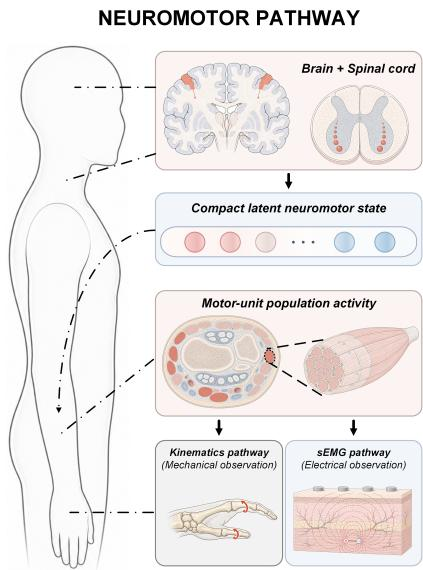
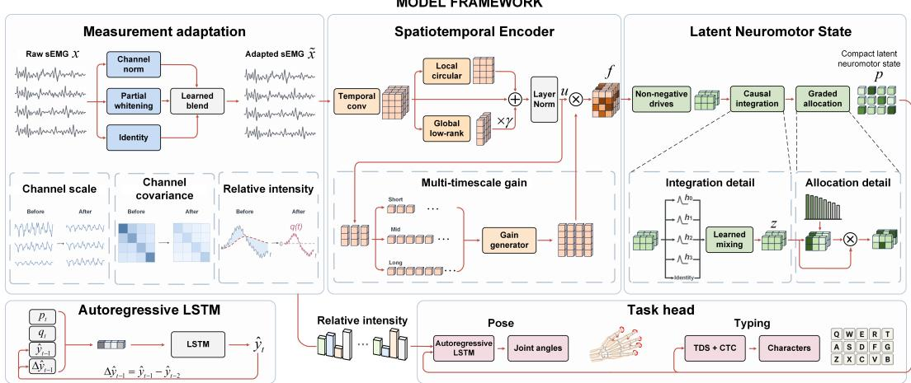
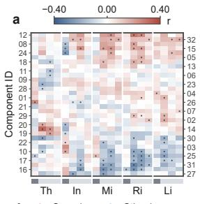
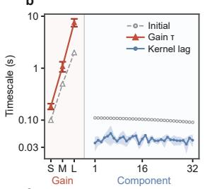
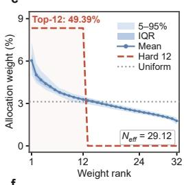
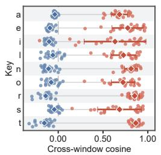
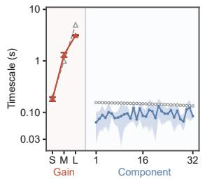
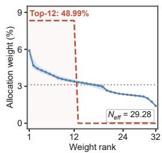

# NEUROMOTOR HIERARCHY NETWORK: PHYSIOLOG-ICAL INDUCTIVE BIASES FOR ROBUST GENERALIZA-TION IN SEMG DECODING

He Wang Hongyuan Qi Zhaoxian Zhang Jinbin Luo   
Linyi He Mehul Motani\* Changsheng Wu   
National University of Singapore   
\*Corresponding authors

## ABSTRACT

Surface electromyography (sEMG) provides a wearable, noninvasive interface to neuromuscular activity for movement decoding and human-computer interaction. Population-scale decoding remains difficult because the relationship between sEMG and neuromuscular activity varies across users and sessions, while taskrelevant dynamics span channels and multiple timescales. Learning waveformto-output mappings from task labels leaves the distinction between recording variability and coordinated motor activity implicit. We introduce the Neuromotor Hierarchy Network (NHN), which learns a compact latent neuromotor state from task supervision to represent task-relevant neuromuscular coordination. NHN constructs this latent state through a hierarchy inspired by neuromotor organization. It adapts recording statistics while preserving relative intensity. Its spatiotemporal encoder uses parameter-efficient channel interactions and modulates features with multi-timescale history. The resulting features yield candidate activations of learned motor primitives, which are temporally integrated and continuously weighted to form the state. Theoretical analysis characterizes the efficiency, temporal behavior, and optimization of NHN’s core mechanisms. We evaluate the architecture for both continuous hand-pose estimation on emg2pose and touch-typing recognition on emg2qwerty. On emg2pose, NHN reduces user-averaged angular error by 0.52% to 2.84% across all three generalization splits in both Regression and Tracking relative to Hadidi et al.’s best task-specific variants, using 48.42% to 48.51% fewer parameters. On emg2qwerty, NHN reduces beam-search character error rate by 19.40% zero-shot and 30.42% after fine-tuning relative to SplashNet-Upscale, using 65.86% fewer parameters. Physiology-guided inference of a latent neuromotor state supports parameter-efficient sEMG decoding.

## 1 INTRODUCTION

Surface electromyography (sEMG) supports prosthetic control, gesture input, continuous hand-pose estimation, and touch-typing recognition without cameras or implanted sensors (Atzori et al., 2014; Farina et al., 2014; Kaifosh et al., 2025). Population-scale datasets pair wrist sEMG with diverse hand kinematics (Salter et al., 2024) or natural typing (Sivakumar et al., 2024) to support cross-user learning. Decoders must resolve fine-grained activity while limiting sensitivity to waveform variation across users and sessions. Resource-constrained wearables also require parameter efficiency.

Larger training populations and stronger temporal models have advanced pose and typing decoding (Kaifosh et al., 2025; Mehlman et al., 2025; Hadidi et al., 2026). Progress also comes from constraining what these models need to learn. SplashNet adapts signal statistics and shares weights between the two hands to improve typing efficiency (Hadidi et al., 2025), while EMBridge (Cui et al., 2026) transfers pose structure to electromyographic representations through cross-modal learning. These advances leave open how to organize a compact representation of task-relevant neuromuscular coordination while limiting sensitivity to recording-specific variation. The physiology of sEMG generation can guide this organization.

The neuromotor pathway links motor-neuron activity to coordinated muscle activation, giving rise to both movement and surface electrical signals (Figure 1). At the neural level, motor neurons integrate synaptic input over time, while recruitment and discharge-rate modulation shape graded motor output (Negro et al., 2016; Powers & Heckman, 2017; Heckman & Enoka, 2012). Their discharges evoke action potentials in muscle fibers, initiating contraction through excitation-contraction coupling (Heckman & Enoka, 2012). Across muscles, activation forms coordinated patterns that vary in strength and timing, producing forces that act through the musculoskeletal system to generate movement (d’Avella et al., 2003; Bizzi & Cheung, 2013). The same muscle-fiber action potentials also give rise to the electrical signals recorded at the skin, where tissue filtering and volume conduction shape the mixture observed by surface electrodes. Anatomy, electrode placement, contact, and gain affect the scale and spatial distribution of the recorded waveform (Farina et al., 2002; 2014; 2025).

  
Figure 1: Physiological inspiration. Neuromotor coordination links hand motion and sEMG, motivating a compact latent neuromotor state.

Thus, sEMG and hand kinematics share a neuromotor origin, but their relationship varies with recording conditions, anatomy, and individual motor control (Farina et al., 2014; Kaifosh et al., 2025). Aligned latent representations support cross-session and cross-individual decoding in cortical and sEMG studies (Gallego et al., 2020; Safaie

et al., 2023; Al-Mashhadani et al., 2025). We hypothesize that a compact latent neuromotor state can accommodate this variability by accounting for measurement effects and representing coordination through physiologically structured components (d’Avella et al., 2003). Their activation strength and timing can vary within a shared representation to accommodate individual motor patterns and reduce reliance on recording- or user-specific waveforms.

The Neuromotor Hierarchy Network (NHN) implements this inference process (Figure 2). Its measurement adapter adjusts recording-dependent waveform statistics while retaining relative intensity. A causal spatiotemporal encoder combines temporal convolutions and parameter-efficient interactions, then modulates features using multi-timescale activity histories. A compact projection maps these features to non-negative candidate drives, which are causally integrated before Henneman-inspired graded allocation forms the compact latent neuromotor state. The state sequence and retained intensity cues support task-specific decoding. We provide theoretical support for these architectural choices.

We make three contributions.

• We introduce NHN, a physiology-guided sEMG decoding architecture that infers a compact, task-aligned latent neuromotor state to support generalization across users and sessions.

• NHN combines learnable causal adaptation that preserves relative intensity, parameterefficient channel interactions, and feature regulation based on activity histories. Nonnegative drives prevent cancellation during integration, while continuous graded allocation regulates each primitive’s contribution.

• We evaluate a common NHN architecture with task-specific prediction heads on emg2pose and emg2qwerty, demonstrating its applicability to both continuous hand-pose estimation and discrete character-sequence recognition.

## 2 RELATED WORK

Generalization in sEMG decoding. Population-scale training supports calibration-free interfaces (Kaifosh et al., 2025), while benchmarks (Yang et al., 2024) distinguish intersubject transfer from adaptation and broaden demographic coverage (Gowda et al., 2025). Target-domain adaptation uses voting-based pseudo-label refinement (Duan et al., 2023), memory-based labeling in spiking networks (Guo et al., 2024), and class-level alignment (Zhong et al., 2025). Disentanglement preserves shared and target-specific features (Su et al., 2025a), while adapter expansion and rehearsal limit forgetting across new users (Chen et al., 2024b). Pretraining supports few-shot personalization through selfsupervised task replay (Yoon et al., 2025). Source training learns cross-posture invariance through Fourier-phase distillation (Su et al., 2025b) and reusable patterns through quantized myoelectric codebooks (Huang et al., 2026). Architectures use short-window attention for noisy gesture decoding (Guo et al., 2025) and linear state-space models for typing (Ortone et al., 2026). We exclude the latter from quantitative comparisons because evaluation protocols differ. NHN organizes task-relevant coordination with physiological priors in a compact decoder.

Transferable representations for physiological signals. For brain recordings, geometry-aware encodings accommodate sensor layouts (El Ouahidi et al., 2025; Xiao et al., 2025), while factorized and cross-scale attention model spatiotemporal dependencies (Wang et al., 2025; Zhou et al., 2025). Temporal-spectral tokens (Ma et al., 2026), multiscale wavelets (Chen et al., 2025), and physiological frequency bands for ear-recorded signals (Yoon et al., 2026) structure time-frequency content. Pretraining combines masked reconstruction with latent alignment (Wang et al., 2024) or learns text-aligned tokens (Jiang et al., 2025). Optical and cardiac models exploit pulse morphology (Pillai et al., 2025) and electrical-to-peripheral timing (Zhou et al., 2026). Low-rank weight generation personalizes models using local data (Wu et al., 2025). For task-supervised sEMG, the question is how physiological priors can jointly guide measurement processing and activity representation. NHN unifies them in a neuromotor-inspired hierarchy.

Latent neuromotor states and motor primitives. Motor-state representations differ in scale and behavioral relevance. Simulation benchmarks (Mamidanna et al., 2025) and separation algorithms (Tacca et al., 2025) support decomposition into individual motor-unit discharge trains. Aligned population recordings reveal cross-animal regularities (Safaie et al., 2023), while neural trajectories exhibit dynamical constraints (Oby et al., 2025). Dynamical embeddings capture cross-recording variation (Vermani et al., 2025), input-driven models separate intrinsic dynamics from measured-input effects (Vahidi et al., 2025), and multi-region models distinguish shared and region-specific subspaces (Sristi et al., 2026). Behavior further constrains representations through movement-supervised neural embeddings (Chen et al., 2024a) and sparse-input dynamical models of larval zebrafish locomotion (Soares Mullen et al., 2024). Synergy-based control uses low-rank policies (Dong et al., 2022) or state-dependent synergies (He et al., 2024), while synergy-based neural manifolds link population activity to hand kinematics (Sun et al., 2025). For sEMG, the challenge is to infer a compact, taskrelevant latent neuromotor state from mixed surface measurements. NHN organizes its non-negative components through temporal integration and graded allocation under task supervision.

## 3 METHOD: NEUROMOTOR HIERARCHY NETWORK

Inspired by neuromotor organization, NHN learns a compact latent neuromotor state for sEMG decoding. Measurement adaptation and spatiotemporal encoding provide evidence of coordination, which the network organizes into graded primitives for task-specific prediction (Figure 2).

Let $\pmb { x } \in \mathbb { R } ^ { C \times T _ { 0 } }$ contain $T _ { 0 }$ samples from $C$ sEMG channels, and let κ index the task. Denote measurement adaptation by ${ \mathcal { A } } ,$ spatiotemporal encoding by $\mathcal { E } ,$ , latent neuromotor state construction by $B ,$ and task-specific prediction by ${ \mathcal { H } } _ { \kappa }$ . For pose estimation, the data flow is

$$
\begin{array} { r } { ( \tilde { \mathbf { x } } , \mathbf { q } ) = \mathcal { A } ( \pmb { x } ) , \quad \pmb { f } = \mathcal { E } ( \tilde { \mathbf { x } } ) , \quad \pmb { p } = \mathcal { B } ( \pmb { f } ) , \quad \hat { \mathbf { y } } = \mathcal { H } _ { \kappa } ( \pmb { p } , \pmb { q } ^ { \downarrow } ) . } \end{array}\tag{1}
$$

The adapted waveform x˜ and relative intensity q retain the input dimensions. Aligning $\pmb q$ to the encoder’s time grid gives $q ^ { \downarrow } \in \mathbb { R } ^ { C \times L _ { \kappa } }$ . The encoded sequence $\dot { \pmb f } \in \mathbb { R } ^ { D \times L _ { \kappa } }$ has width $D$ , while the latent neuromotor state $\pmb { p } \in \mathbb { R } _ { > 0 } ^ { N \times L _ { \kappa } }$ contains N primitives over the same $L _ { \kappa }$ frames. Throughout, bold feature symbols denote sequences; a time subscript selects one column, and two subscripts select a scalar entry. We use the rectified linear unit (ReLU) and layer normalization (LN).

## 3.1 MEASUREMENT ADAPTATION WITH INTENSITY PRESERVATION

Tissue filtering and electrode sampling motivate adjusting recording-dependent scale and covariance while retaining short-term intensity cues (De Luca & Merletti, 1988; Farina et al., 2014).

  
Figure 2: NHN architecture. Task-trained NHN adapts and encodes sEMG, then integrates and allocates candidate drives to form a compact latent neuromotor state for pose and typing decoding.

For input sample $n = 1 , \ldots , T _ { 0 } .$ , let $\ell _ { c , n }$ be channel $c \mathbf { \hat { s } }$ log standard deviation over a causal window ending at n. The intensity path centers it against its cumulative mean. Partial whitening $\mathcal { W }$ uses the channel mean $\pmb { \mu } _ { b }$ and covariance $\Sigma _ { b }$ of samples preceding each block $b ,$

$$
\begin{array} { r l } & { \displaystyle q _ { c , n } = \ell _ { c , n } - \frac { 1 } { n } \sum _ { i = 1 } ^ { n } \ell _ { c , i } , } \\ & { \displaystyle \mathscr { W } ( \pmb { x } ) _ { n } = \left[ \left( 1 - \alpha \right) \mathrm { D i a g } ( \pmb { \Sigma } _ { b } ) + \alpha \pmb { \Sigma } _ { b } + \lambda _ { b } \pmb { I } _ { C } \right] ^ { - 1 / 2 } \left( \pmb { x } _ { n } - \pmb { \mu } _ { b } \right) , \quad n \in b . } \end{array}\tag{2}
$$

Here Diag retains the covariance diagonal and $I _ { C }$ is the identity matrix. Fixed $\alpha \in [ 0 , 1 ]$ interpolates between channel-wise normalization and joint whitening without a principal-component rotation. The regularizer $\lambda _ { b } > 0$ is computed from mean channel variance. The first block uses cumulative diagonal normalization, with warmup confined to the input’s left context. For pose, the waveform path blends $\mathcal { W } ( \pmb { x } )$ with $\mathcal { D } ( \pmb { x } )$ , which normalizes using cumulative channel-wise means and standard deviations. Both operate on the original x, with learned residual strengths $\eta _ { \mathrm { d } } , \eta _ { \mathrm { w } } \in \mathbb { R }$

$$
\tilde { \mathbf { \boldsymbol { x } } } = \left( 1 - \eta _ { \mathrm { w } } \right) \left[ \mathbf { \boldsymbol { x } } + \eta _ { \mathrm { d } } \bigl ( s _ { 0 } \mathcal { D } ( \mathbf { \boldsymbol { x } } ) - \mathbf { \boldsymbol { x } } \bigr ) \right] + \eta _ { \mathrm { w } } s _ { 0 } \mathcal { W } ( \mathbf { \boldsymbol { x } } ) .\tag{3}
$$

The once-calibrated, fixed scale $s _ { 0 } > 0$ puts both candidates on the input’s amplitude scale. q retains intensity for task-dependent fusion.

## 3.2 SPATIOTEMPORAL ENCODING OF ADAPTED SEMG

The encoder combines temporal convolution and local-global mixing in time-depth separable (TDS) blocks (Hannun et al., 2019), followed by multi-timescale adaptive gain to produce $f .$

Temporal feature extraction. Within a block r of width $D _ { r } , { \boldsymbol { u } } ^ { \mathrm { i n } } , { \boldsymbol { u } } ^ { \mathrm { m i d } }$ , and ${ \pmb u } ^ { \mathrm { o u t } }$ denote its input, temporal features, and output, respectively. Convolutional input layers map x˜ to the first block’s $\mathbf { \Delta } \mathbf { u } ^ { \mathrm { { i n } } }$ Temporal convolution $\mathcal { T } _ { r }$ produces

$$
\pmb { u } ^ { \mathrm { m i d } } = \mathrm { L N } \big ( \mathrm { c r o p } _ { r } ( \pmb { u } ^ { \mathrm { i n } } ) + \mathrm { R e L U } \big ( \mathcal { T } _ { r } ( \pmb { u } ^ { \mathrm { i n } } ) \big ) \big ) .\tag{4}
$$

crop retains trailing input frames to match the unpadded convolution’s output length.

Local-global mixing of temporal features. Motivated by local correlations and distributed muscle coordination (Farina et al., 2014; d’Avella et al., 2003), local-global mixing combines shared local interactions with a low-rank path connecting distant groups. The global path uses the Gaussian error linear unit (GELU). At block frame $t ,$ the residual output is

$$
\boldsymbol { u } _ { t } ^ { \mathrm { o u t } } = \mathrm { L N } \left( \boldsymbol { u } _ { t } ^ { \mathrm { m i d } } + \boldsymbol { \mathcal { C } } _ { k } ^ { ( r ) } ( \boldsymbol { u } _ { t } ^ { \mathrm { m i d } } ) + \gamma _ { r } \boldsymbol { W } _ { \mathrm { u p } } ^ { ( r ) } \mathrm { G E L U } ( \boldsymbol { W } _ { \mathrm { d o w n } } ^ { ( r ) } \boldsymbol { u } _ { t } ^ { \mathrm { m i d } } ) \right) .\tag{5}
$$

The local operator $\mathcal { C } _ { k } ^ { ( r ) }$ applies two width-k circular convolutions separated by ReLU, sharing weights across G feature groups arranged on a ring, each containing $D _ { r } / \bar { G }$ features. The global projections $W _ { \mathrm { d o w n } } ^ { ( r ) }$ and $W _ { \mathrm { u p } } ^ { ( r ) }$ project from width $D _ { r }$ to R and back, with a learned gate $\gamma _ { r }$ . Projection biases are omitted in Equation 5. Each block has independent parameters and passes ${ \pmb u } ^ { \mathrm { o u t } }$ to the next block’s $\mathbf { \Delta } \mathbf { u } ^ { \mathrm { { i n } } }$ , with convolutional projection when width or rate changes. A final projection, when needed, yields $\pmb { u } \in \mathbb { R } ^ { D \times L _ { \kappa } }$ for adaptive gain.

Multi-timescale contextualization. The mixed features u are reweighted using causal history at multiple timescales to capture brief and sustained activity, motivated by common drive and muscle coordination (Negro et al., 2016; d’Avella et al., 2003). Each of M context states accumulates the same input $\mathbf { \pmb { u } } _ { t }$ with a different learned timescale,

$$
\begin{array} { r } { \pmb { s } _ { t } ^ { ( m ) } = \left( 1 - e ^ { - \Delta t / \tau _ { m } } \right) \pmb { u } _ { t } + e ^ { - \Delta t / \tau _ { m } } \pmb { s } _ { t - 1 } ^ { ( m ) } , \qquad m = 1 , \dots , M . } \end{array}\tag{6}
$$

On the final encoder grid $t = 0 , \ldots , L _ { \kappa } - 1$ , the context states $\pmb { s } _ { t } ^ { ( m ) } \in \mathbb { R } ^ { D }$ use frame interval $\Delta t .$ learned $\tau _ { m } \geq \Delta t$ , and learned initial states $\pmb { s } _ { - 1 } ^ { ( m ) }$ . A learned map $g _ { a } : \mathbb { R } ^ { M D }  \mathbb { R } ^ { D }$ converts the concatenated states into a residual gain on the current features,

$$
\pmb { f } _ { t } = \pmb { u } _ { t } \odot \left[ 1 + \operatorname { t a n h } \Bigl ( g _ { a } \Bigl ( \bigl [ \pmb { s } _ { t } ^ { ( 1 ) } ; \ldots ; \pmb { s } _ { t } ^ { ( M ) } \bigr ] \Bigr ) \Bigr ) \right] ,\tag{7}
$$

where ⊙ denotes elementwise multiplication.

## 3.3 LATENT NEUROMOTOR STATE CONSTRUCTION FROM ENCODED FEATURES

Through drive projection, temporal integration, and graded allocation, B maps contextualized features f into a compact latent neuromotor state $^ { p , }$ limiting the width passed to the prediction head.

Non-negative candidate drives. A learned pointwise affine map $g _ { d } ,$ , layer normalization, and Softplus produce $N$ non-negative candidate drives per frame,

$$
\begin{array} { r } { \pmb { d } _ { t } = \mathrm { S o f t p l u s } ( \operatorname { L N } ( g _ { d } ( \pmb { f } _ { t } ) ) ) \in \mathbb { R } _ { \ge 0 } ^ { N } . } \end{array}\tag{8}
$$

Non-negativity prevents cancellation during integration. Low-dimensional coordination motivates the compact drive space (Tresch et al., 1999; d’Avella et al., 2003; Bizzi & Cheung, 2013).

Temporal integration of candidate drives. The candidate drives d are integrated before allocation, inspired by synaptic input integration (Powers & Heckman, 2017). Diverse motor-unit contraction times motivate heterogeneous temporal support (Burke et al., 1973; Heckman & Enoka, 2012), implemented with causal finite impulse response (FIR) paths. Combining $M _ { f }$ filtered versions of d with an identity path gives

$$
\bar { \pmb { d } } _ { t } = \omega _ { 0 } \odot \pmb { d } _ { t } + \sum _ { m = 1 } ^ { M _ { f } } \omega _ { m } \odot \left( \mathbf { k } _ { m } \ast _ { \mathrm { c } } \pmb { d } \right) _ { t } .\tag{9}
$$

Each $\mathbf { k } _ { m }$ contains a non-negative geometric kernel per primitive, with independently learned positive time constants. Numerical normalization gives kernel mass at most one. The causal operator $^ * \mathrm { c }$ filters each primitive separately, using left zero-padding to preserve length. Learned weights $\omega _ { m } \in \mathbb { R } ^ { N }$ are softmax-normalized per primitive across paths, including the identity path $m = 0$ . These filters integrate candidate drives, whereas adaptive gain reweights encoder features.

Henneman-inspired allocation of integrated drives. Whereas muscle-synergy studies motivate the low-dimensional drive space, Henneman’s size principle motivates heterogeneous participation priorities among the learned drive components (Henneman, 1957; Milner-Brown et al., 1973). Behavior-dependent motor-unit control motivates activity-dependent allocation (Marshall et al., 2022). NHN combines learned recruitment priorities $\boldsymbol { \beta } \in \mathbb { R } ^ { N }$ with the current drive at a drive-dependent temperature $\theta _ { t }$

$$
\theta _ { t } = \operatorname* { m a x } \{ 1 0 ^ { - 4 } , \operatorname* { m e a n } \bigl ( \mathrm { T o p } _ { K } ( \bar { d } _ { t } ) \bigr ) \} , \qquad p _ { t } = N \bar { d } _ { t } \odot \mathrm { s o f t m a x } \biggl ( \frac { \bar { d } _ { t } + \beta } { \theta _ { t } } \biggr ) .\tag{10}
$$

For fixed $K \in \{ 1 , \ldots , N \} , \mathrm { T o p } _ { K }$ returns the K largest drive entries, whose mean calibrates temperature. Softmax weights all primitives. Multiplication by $\bar { d } _ { t }$ preserves continuous magnitudes. Collecting ${ \mathbf { } } p _ { t }$ across frames gives ${ \bf { \bar { p } } } = B ( f )$ .

## 3.4 TASK-SPECIFIC PREDICTION HEADS

The prediction head $\mathcal { H } _ { \kappa }$ maps the latent neuromotor state sequence p to joint-angle estimates yˆ using an autoregressive long short-term memory (LSTM) network, or to character probabilities using TDS with connectionist temporal classification (CTC) (Graves et al., 2006).

## 4 EXPERIMENTS

We evaluate NHN on emg2pose and emg2qwerty, assessing generalization across users and recording conditions alongside inference efficiency. Both tasks use independently trained weights, encoder output width $D = 6 4$ , and $N = 3 2$ primitives. The backbone takes C = 16 sEMG channels from a single wrist at 2 kHz. It processes one wrist for pose and each wrist separately for typing. The NHN backbone and prediction heads use causal operations.

Pose estimation on emg2pose. We use the data splits and evaluation protocol of Salter et al. (2024). The User, Stage, and User×Stage splits hold out users, movement stages, or both. Evaluation uses 5-s windows. Tracking receives a ground-truth initial pose, whereas Regression does not. An autoregressive LSTM head predicts joint angles at the 50-Hz rollout rate used by vemg2pose in Salter et al. (2024). We train separate Regression and Tracking models with joint supervision, adopting the task-weighting scheme of Hadidi et al. (2026). Metrics are angular error (AE) in degrees and landmark distance (LD) in millimeters.

Typing recognition on emg2qwerty. We use emg2qwerty (Sivakumar et al., 2024) with SplashNet’s data splits and evaluation settings (Hadidi et al., 2025). We pretrain NHN on pooled data from training users. On held-out users, we evaluate both the pretrained model without adaptation (zero-shot) and models obtained through subject-specific fine-tuning. Other-domain validation (ODV) uses separate validation users, whereas test-domain validation (TDV) and test-domain test (TDT) use validation and test sessions of held-out test users. Fine-tuned comparisons use TDV and TDT. We use a 100-Hz latent neuromotor state sequence to balance temporal resolution and computational cost, consistent with the feature rate used by Mehlman et al. (2025). NHN shares backbone weights between wrists and concatenates their state sequences for a TDS prediction head. Training uses CTC loss. We report character error rate (CER) under greedy decoding and beam search with a 6-gram language model (LM) trained on WikiText-103.

Training and statistics. For pose training and typing pretraining, we train NHN from scratch using adaptive moment estimation with decoupled weight decay (AdamW), cosine learning-rate schedules, and five random seeds. We report the mean ± standard deviation (SD) across participants after averaging each participant’s scores over seeds. Participant-level baseline statistics are reproduced as published.

Baselines and efficiency. The emg2pose baseline shares the dataset’s name and directly predicts joint angles (Salter et al., 2024). Other pose baselines include vemg2pose, NeuroPose (Liu et al., 2021), Sensing Dynamics (Sîmpetru et al., 2022), the position (Pos) and velocity (Vel), single-task (ST) and multi-task (MT) variants of Hadidi et al. (2026), and Static. These pose comparisons use published results under matching evaluation protocols. We additionally evaluate available pretrained checkpoints at the session level. Typing comparisons use the TDS convolutional network (TDS ConvNet) (Sivakumar et al., 2024), SplashNet (Hadidi et al., 2025), and distilled Transformers (Mehlman et al., 2025). We report model parameters (Params.) and floating-point operations (FLOPs), expressed in billions (GFLOPs), for 5-s pose spans and 30-s typing inputs. These counts cover neural network inference, including prediction heads, and exclude language-model and text-decoding costs.

## 5 RESULTS AND DISCUSSION

## 5.1 MAIN RESULTS

On emg2pose, NHN’s advantage over vemg2pose is more pronounced when generalization includes unseen movement stages (Table 1). In both Regression and Tracking, absolute reductions in userlevel AE and LD are larger on Stage and User×Stage than on User. For example, Regression AE decreases by 1.44◦ on Stage compared with 0.86◦ on User. Session-equal aggregation within each split preserves the advantage: AE decreases by 8.48% in Regression and 7.73% in Tracking, with corresponding LD improvements. Against the stronger variants of Hadidi et al. (2026), which retain the vemg2pose core architecture with revised decoding and training, NHN achieves lower user-level AE and LD with 48.42% to 48.51% fewer parameters and 35.55% to 35.64% less computation. Hadidi et al.’s best-performing variants differ between tasks (Vel-MT for Regression and Pos-ST for Tracking), whereas NHN uses a common architecture and joint-supervision formulation.

Table 1: emg2pose Regression and Tracking. Split columns report user mean ± SD. Session columns weight sessions within each split, then splits equally. Bold marks column minima within each setting, excluding Static for efficiency. Dashes denote unreported values. Published split results: aHadidi et al. (2026), b,c,dSalter et al. (2024).
<table><tr><td></td><td colspan="2">User</td><td colspan="2">Stage</td><td colspan="2">User×Stage</td><td colspan="2">Session</td><td colspan="2">Efficiency</td></tr><tr><td>Model</td><td>AE↓ (°)</td><td>LD↓ (mm)</td><td>AE↓ (°)</td><td>LD↓ (mm)</td><td>AE↓ (°)</td><td>LD↓ (mm)</td><td>(°)</td><td>(mm)</td><td></td><td>AE↓ LD↓ Params. GFLOPs (106)↓ per 5 s↓</td></tr><tr><td>(a) Regression</td><td></td><td></td><td></td><td></td><td></td><td></td><td></td><td></td><td></td><td></td></tr><tr><td>Statica</td><td>16.86±1.80 25.17±2.8419.18±1.71 28.57±2.4618.87±2.01 28.77±2.78 17.87 26.81</td><td></td><td></td><td></td><td></td><td></td><td></td><td></td><td>0</td><td>0</td></tr><tr><td>Sensing Dynamicsb</td><td>15.50±1.40 21.80±2.10 18.80±1.60 26.60±2.0018.70±1.60 27.20±2.00</td><td></td><td></td><td></td><td></td><td></td><td></td><td></td><td></td><td>1</td></tr><tr><td>NeuroPosec</td><td>13.20±1.10 17.50±1.3017.20±1.70 24.00±2.1017.50±1.50 24.90±1.7015.52 21.61</td><td></td><td></td><td></td><td></td><td></td><td></td><td></td><td>6.35</td><td>1.12</td></tr><tr><td>emg2posed</td><td>12.57±1.3016.28±1.8115.17±1.59 20.53±2.1315.57±1.30 21.49±1.71 14.01 18.94</td><td></td><td></td><td></td><td></td><td></td><td></td><td></td><td>2.95</td><td>2.21</td></tr><tr><td>vemg2posed</td><td>12.24±1.34 15.82±1.9015.22±1.58 20.38±2.0715.63±1.37 21.30±1.8713.9118.69</td><td></td><td></td><td></td><td></td><td></td><td></td><td></td><td>5.98</td><td>3.72</td></tr><tr><td>Pos-STa</td><td>12.19±1.2715.79±1.8014.96±1.63 20.23±2.1515.47±1.30 21.29±1.82</td><td></td><td></td><td></td><td></td><td></td><td></td><td></td><td>5.97</td><td>3.72</td></tr><tr><td>Vel-STa</td><td>12.17±1.31 15.58±1.8514.62±1.6519.62±2.21 15.35±1.32 20.92±1.87</td><td></td><td></td><td></td><td></td><td></td><td></td><td></td><td>5.98</td><td>3.72</td></tr><tr><td>Pos-MTa</td><td></td><td></td><td></td><td>11.54±1.1914.74±1.64 14.02±1.62 18.61±2.1614.58±1.2919.78±1.83</td><td></td><td></td><td></td><td></td><td>5.97</td><td>3.72</td></tr><tr><td>Vel-MTa</td><td>11.64±1.2514.74±1.7413.85±1.6218.33±2.1614.63±1.3419.77±1.95</td><td></td><td></td><td></td><td></td><td></td><td></td><td></td><td>5.98</td><td>3.72</td></tr><tr><td></td><td>NHN (Ours) 11.38±1.13 14.42±1.53 13.78±1.5718.21±2.0614.22±1.2619.26±1.8812.73 16.88</td><td></td><td></td><td></td><td></td><td></td><td></td><td></td><td>3.08</td><td>2.40</td></tr><tr><td colspan="2">(b) Tracking</td><td></td><td></td><td></td><td></td><td></td><td></td><td></td><td></td><td></td></tr><tr><td>Staticª</td><td></td><td></td><td></td><td></td><td></td><td>10.48±1.81 15.71±2.98 14.86±1.91 21.81±2.58 14.29±1.86 21.48±2.33 13.16 19.99</td><td></td><td></td><td>0</td><td>0</td></tr><tr><td>emg2posed</td><td></td><td></td><td></td><td>11.33±1.1014.75±1.5315.39±1.50 20.88±1.9215.05±1.22 20.69±1.3913.44 18.23</td><td></td><td></td><td></td><td></td><td>2.95</td><td>2.21</td></tr><tr><td>vemg2posed</td><td></td><td></td><td></td><td>7.70±0.98 10.22±1.54 11.20±1.43 15.18±1.81 11.03±1.01 15.35±1.46 9.84 13.56</td><td></td><td></td><td></td><td></td><td>5.97</td><td>3.72</td></tr><tr><td>Pos-STa</td><td></td><td></td><td></td><td>7.35±0.92 9.67±1.48 10.21±1.32 13.73±1.6910.25±0.93 14.18±1.35</td><td></td><td></td><td></td><td></td><td>5.97</td><td>3.72</td></tr><tr><td>Vel-STa</td><td></td><td></td><td></td><td>7.64±0.94 10.02±1.52 10.76±1.3414.43±1.71 10.75±0.93 14.82±1.40</td><td></td><td></td><td></td><td></td><td>5.97</td><td>3.72</td></tr><tr><td>Pos-MTa</td><td></td><td>7.36±0.90 9.68±1.46 10.28±1.3313.81±1.70 10.29±0.97 14.22±1.37</td><td></td><td>7.64±0.95 10.00±1.53 10.77±1.3614.44±1.75 10.75±0.97 14.81±1.41</td><td></td><td></td><td></td><td></td><td>5.97 5.97</td><td>3.72</td></tr><tr><td>Vel-MTa</td><td></td><td></td><td></td><td></td><td></td><td></td><td></td><td></td><td></td><td>3.72</td></tr><tr><td>NHN (Ours)</td><td>7.30±0.88</td><td>9.55±1.4110.12±1.31 13.59±1.69 10.16±0.9914.03±1.33</td><td></td><td></td><td></td><td></td><td>9.08 12.39</td><td></td><td>3.08</td><td>2.40</td></tr></table>

On emg2qwerty, NHN’s gains are present before language-model-assisted decoding and persist after individual adaptation (Table 2). On TDT, greedy CER decreases by 6.16 percentage points relative to SplashNet-Upscale (Hadidi et al., 2025) in zero-shot evaluation and by 2.98 points relative to its Shared variant after fine-tuning. Relative beam-search CER reductions against these baselines are 19.40% and 30.42%, respectively. NHN outperforms TDS ConvNet and all SplashNet variants across the evaluated splits, settings, and decoding methods. These gains accompany 65.86% fewer parameters and 74.99% less neural-network computation than SplashNet-Upscale. The Transformer baselines achieve lower TDT greedy CER, but with larger parameter counts and greater computation.

## 5.2 LEARNED ORGANIZATION OF THE LATENT NEUROMOTOR STATE

Figure 3 shows how NHN’s physiology-inspired hierarchy learns different patterns in the compact latent neuromotor state for pose estimation and typing. Its primitives (Section 3.3) are the individual state dimensions, labeled components in the figure. Relative activation is each primitive’s share of the summed activation across primitives.

Table 2: emg2qwerty CER (%). NHN reports mean ± SD across participants. Bold marks column minima within each setting. Dashes denote unreported results. ODV is not evaluated after fine-tuning. aSivakumar et al. (2024) (ODV and efficiency from b). bHadidi et al. (2025). cMehlman et al. (2025).
<table><tr><td></td><td colspan="2">ODV</td><td colspan="2">TDV</td><td colspan="2">TDT</td><td colspan="2">Efficiency</td></tr><tr><td>Model</td><td>Greedy↓ (%)</td><td>Beam↓ (%)</td><td>Greedy↓ (%)</td><td>Beam↓ (%)</td><td>Greedy↓ (%)</td><td>Beam↓ (%)</td><td>(106)</td><td>Params.↓ GFLOPs↓ per 30 s</td></tr><tr><td>(a) Zero-shot</td><td></td><td></td><td></td><td></td><td></td><td></td><td></td><td></td></tr><tr><td>TDS ConvNeta</td><td>72.44</td><td>72.07</td><td>55.57</td><td>52.10±5.54</td><td>55.38</td><td>51.78±4.61</td><td>5.29</td><td>61.61</td></tr><tr><td>SplashNet (Split-only)b</td><td>61.74</td><td>58.64</td><td>45.73</td><td>37.28±6.91</td><td>45.69</td><td>37.37±7.34</td><td>2.68</td><td>36.84</td></tr><tr><td>SplashNet-mini (Shared)b</td><td>61.07</td><td>58.20</td><td>45.33</td><td>36.46±7.09</td><td>45.26</td><td>36.41±7.30</td><td>1.38</td><td>36.84</td></tr><tr><td>SplashNet-Upscaleb</td><td>60.16</td><td>56.95</td><td>44.79</td><td>35.49±7.56</td><td>44.78</td><td>35.67±6.79</td><td>2.58</td><td>71.38</td></tr><tr><td>Transformer-tinyc</td><td>一</td><td></td><td>一</td><td></td><td>31.90</td><td></td><td>2.20</td><td>~9720</td></tr><tr><td>Transformer-smallc</td><td></td><td></td><td></td><td></td><td>32.70</td><td></td><td>5.40</td><td>~18720</td></tr><tr><td>NHN (Ours)</td><td>56.93±13.82 51.73±15.32 39.03±7.08 29.29±8.99 38.62±7.01 28.75±8.29</td><td></td><td></td><td></td><td></td><td></td><td>0.88</td><td>17.85</td></tr><tr><td colspan="9">(b) Subject-specific fine-tuning</td></tr><tr><td colspan="2">TDS ConvNeta</td><td></td><td>11.39</td><td>8.31±3.19</td><td>11.28</td><td>6.95±3.61</td><td>5.29</td><td>61.61</td></tr><tr><td colspan="2">SplashNet (Split-only)b</td><td></td><td>12.67</td><td>6.04±2.81</td><td>12.89</td><td>6.10±3.32</td><td>2.68</td><td>36.84</td></tr><tr><td colspan="2">SplashNet-mini (Shared)b</td><td></td><td>13.01</td><td>6.13±2.96</td><td>13.22</td><td>5.87±3.04</td><td>1.38</td><td>36.84</td></tr><tr><td colspan="2">SplashNet-mini (Unshared)b</td><td></td><td>12.68</td><td>5.85±2.83</td><td>13.07</td><td>5.96±3.28</td><td>2.68</td><td>36.84</td></tr><tr><td colspan="2">SplashNet-Upscale (Shared)b</td><td></td><td>12.10</td><td>5.46±2.60</td><td>12.39</td><td>5.51±2.81</td><td>2.58</td><td>71.38</td></tr><tr><td colspan="2">SplashNet-Upscale (Unshared)b</td><td></td><td>11.80</td><td>5.57±2.65</td><td>12.13</td><td>5.67±2.97</td><td>5.06</td><td>71.38</td></tr><tr><td colspan="2">Transformer-tinyc</td><td></td><td>一</td><td>一</td><td>8.60</td><td>一</td><td>2.20</td><td>~9720</td></tr><tr><td colspan="2">Transformer-smallc</td><td></td><td>1</td><td></td><td>7.10</td><td>1</td><td>5.40</td><td>~18720</td></tr><tr><td colspan="2">NHN (Ours)</td><td></td><td>9.12±3.76</td><td>3.95±1.62</td><td>9.41±3.51</td><td>3.83±1.51</td><td>0.88</td><td>17.85</td></tr></table>

On emg2pose, relative primitive activations have overlapping associations with joint angles across fingers in the sampled validation data (Figure 3a). These associations suggest that hand posture is represented through the combined activity of multiple primitives, consistent with NHN’s coordinationinspired design. Training increases all three adaptive-gain timescales but decreases mean integration lags, the kernel-weighted average age of candidate drives (Figure 3b). For continuous pose estimation, this suggests using longer context to reweight encoder features through adaptive gain, while emphasizing recent candidate drives when constructing the state. Allocation weights set the relative emphasis on integrated candidate drives (Equation 10). They remain spread across primitives, with the 12 largest accounting for about half the total allocation weight in the illustrated clip (Figure 3c).

On emg2qwerty, primitive-activation patterns across the sampled training windows show higher mean similarity for the same key than for different keys within participants, across all nine analyzed keys (Figure 3d). These recurring patterns suggest that repeated keystrokes reuse similar primitive combinations. Training decreases the short (S) and long (L) adaptive-gain timescales but increases the intermediate (M) one, while mean integration lags decrease (Figure 3e). For discrete typing events, this suggests using intermediate context for adaptive gain while emphasizing recent candidate drives during state construction, rather than extending history at every gain scale. Allocation is also spread across primitives with unequal weights in the illustrated typing clip (Figure 3f). Together, these patterns suggest that NHN learns to weigh recent and earlier activity differently for adaptive gain and primitive-wise drive integration, with task-specific preferences within the same architecture.

On the sampled validation data, uniform allocation, with equal allocation weights across primitives, increases pose AE by 3.94◦ and typing greedy CER by 42.12 percentage points compared with learned allocation. These increases occur at unchanged total state activation, indicating that the prediction heads rely on its distribution across primitives, not just its overall strength.

f  
d  

b  

c  

  
Figure 3: Learned organization of the compact latent neuromotor state. Pose Regression: (a) participant-mean Pearson correlations between relative primitive activations and joint angles. Dots mark $\ge ~ 8 0 \%$ participant agreement with the mean sign. Dark/light strips indicate abductionadduction/flexion-extension. Th/In/Mi/Ri/Li denote thumb/index/middle/ring/little fingers. (b) Initial and post-training adaptive-gain timescales $( \tau _ { m } ,$ Equation 6) and mean integration lags, kernelweighted mean ages of candidate drives (Equation 9), with five-run mean±SD. S, M, and L denote short, intermediate, and long timescales. (c) Mean within-frame ranked allocation weights, with dark interquartile range (IQR) and light 5-95% frame bands. Hard-12/Uniform assign equal weights to 12/32 primitives. Typing: (d) within-participant cross-window key-profile cosine similarity. Circles denote participant-model observations, diamonds means, bars participant SD. (e) Initial and post-training adaptive-gain timescales and mean integration lags (five-run mean±SD). (f) Ranked allocation weights with bands and reference distributions as in (c).

## 6 LIMITATIONS

NHN’s learned components are task representations rather than genuine physiological sources. Generalization is evaluated on wrist sEMG. Physical-device deployment and transfer to other sensor layouts remain untested. At longer fixed tracking horizons, NHN’s errors are higher, although they remain below vemg2pose’s and the gap between them is larger.

## 7 CONCLUSION

NHN uses a physiology-inspired hierarchy to infer a compact latent neuromotor state from wrist sEMG for hand-pose estimation and touch-typing recognition. The learned organization takes different forms: distributed joint-angle associations in pose and recurring key-specific combinations in typing, accompanied by distinct temporal preferences. Allocation interventions show that decoding uses relative activation patterns beyond total intensity. Theoretical analysis characterizes the underlying computational mechanisms. Together with the generalization and efficiency results, these findings support an architectural approach in which physiological organization guides representation structure while task supervision shapes its content.

## AI USE STATEMENT

We used large language models extensively for iterative manuscript revision, including language polishing and improvements to clarity and readability, as well as for assistance with code writing and debugging during implementation. We also used a generative image tool to produce an initial draft of the anatomical schematic in Figure 1, which we subsequently modified and refined manually to better reflect the relevant physiological structures. We reviewed the AI-assisted text for technical accuracy and reviewed and tested the AI-assisted code before using it in our experiments. The authors take responsibility for the final manuscript, figures, code, and reported results, including all content developed with AI assistance.

## ETHICS STATEMENT

We use the publicly available emg2pose and emg2qwerty datasets and collected no additional humanparticipant data. The original studies report ethics approval and participant informed consent (Salter et al., 2024; Sivakumar et al., 2024). We use both datasets in accordance with their respective licenses.

## REPRODUCIBILITY STATEMENT

We will release the complete codebase used for training, subject-specific fine-tuning, and the analyses reported in this work.

## REFERENCES

Zubaidah Al-Mashhadani, Trevor Overton, Di Wu, and Mohsen Rakhshan. Toward plug and play myoelectric control via one-shot latent representation alignment. IEEE Transactions on Neural Systems and Rehabilitation Engineering, 33:4409–4421, 2025. doi: 10.1109/TNSRE.2025.36262 55.

Manfredo Atzori, Arjan Gijsberts, Claudio Castellini, Barbara Caputo, Anne-Gabrielle Mittaz Hager, Simone Elsig, Giorgio Giatsidis, Franco Bassetto, and Henning Müller. Electromyography data for non-invasive naturally-controlled robotic hand prostheses. Scientific Data, 1:140053, 2014. doi: 10.1038/sdata.2014.53.

Ali Behrouz, Peilin Zhong, and Vahab Mirrokni. Titans: Learning to memorize at test time. In Advances in Neural Information Processing Systems, volume 38, pp. 113506–113543, 2025. doi: 10.52202/085713-3786. URL https://proceedings.neurips.cc/paper\_files/p aper/2025/file/a4ca07aa108036f80cbb5b82285fd4b1-Paper-Conference. pdf.

Emilio Bizzi and Vincent C. K. Cheung. The neural origin of muscle synergies. Frontiers in Computational Neuroscience, 7:51, 2013. doi: 10.3389/fncom.2013.00051.

R. E. Burke, D. N. Levine, P. Tsairis, and F. E. Zajac, III. Physiological types and histochemical profiles in motor units of the cat gastrocnemius. The Journal of Physiology, 234(3):723–748, 1973. doi: 10.1113/jphysiol.1973.sp010369.

Chenggang Chen, Zhiyu Yang, and Xiaoqin Wang. Neural embeddings rank: Aligning 3D latent dynamics with movements. In Advances in Neural Information Processing Systems, volume 37, pp. 141461–141489, 2024a. doi: 10.52202/079017-4492. URL https://proceedings.ne urips.cc/paper\_files/paper/2024/file/ffe78e2b3c80439e6dfd3f7f38c fa888-Paper-Conference.pdf.

Xingjian Chen, Weiyu Guo, Chuang Lin, Ning Jiang, and Jingyong Su. Cross-subject lifelong learning for continuous estimation from surface electromyographic signal. IEEE Transactions on Neural Systems and Rehabilitation Engineering, 32:1965–1973, 2024b. doi: 10.1109/TNSRE.20 24.3400535.

Yanlong Chen, Mattia Orlandi, Pierangelo Rapa, Simone Benatti, Luca Benini, and Yawei Li. Phys ioWave: A multi-scale wavelet-transformer for physiological signal representation. In Advances in Neural Information Processing Systems, volume 38, pp. 169357–169399, 2025. doi: 10.52202 /085713-5639. URL https://proceedings.neurips.cc/paper\_files/paper/2 025/file/f7a7bb369e48f10e85fce85b67d8c516-Paper-Conference.pdf.

Kyunghyun Cho, Bart van Merriënboer, Caglar Gulcehre, Dzmitry Bahdanau, Fethi Bougares, Holger Schwenk, and Yoshua Bengio. Learning phrase representations using RNN encoder–decoder for statistical machine translation. In Proceedings ofthe 2014 Conference on Empirical Methods in Natural Language Processing, pp. 1724–1734. Association for Computational Linguistics, 2014. doi: 10.3115/v1/D14-1179. URL https://aclanthology.org/D14-1179.pdf.

Wenhui Cui, Christopher M. Sandino, Hadi Pouransari, Ran Liu, Juri Minxha, Ellen L. Zippi, Erdrin Azemi, and Behrooz Mahasseni. EMBridge: Enhancing gesture generalization from EMG signals through cross-modal representation learning. In International Conference on Learning Representations, pp. 149668–149684, 2026. URL https://proceedings.iclr.cc/pa per\_files/paper/2026/file/f216728558e6f93f815ea1552315c22d-Paper -Conference.pdf.

Tri Dao and Albert Gu. Transformers are SSMs: Generalized models and efficient algorithms through structured state space duality. In Proceedings ofthe 41st International Conference on Machine Learning, volume 235 of Proceedings of Machine Learning Research, pp. 10041–10071. PMLR, 2024. URL https://proceedings.mlr.press/v235/dao24a.html.

Andrea d’Avella, Philippe Saltiel, and Emilio Bizzi. Combinations of muscle synergies in the construction of a natural motor behavior. Nature Neuroscience, 6(3):300–308, 2003. doi: 10.1038/ nn1010.

Peter Dayan, Geoffrey E. Hinton, Radford M. Neal, and Richard S. Zemel. The Helmholtz machine. Neural Computation, 7(5):889–904, 1995. doi: 10.1162/neco.1995.7.5.889.

Carlo J. De Luca and Roberto Merletti. Surface myoelectric signal cross-talk among muscles of the leg. Electroencephalography and Clinical Neurophysiology, 69(6):568–575, 1988. doi: 10.1016/0013-4694(88)90169-1.

Heng Dong, Tonghan Wang, Jiayuan Liu, and Chongjie Zhang. Low-rank modular reinforcement learning via muscle synergy. In Advances in Neural Information Processing Systems, volume 35, pp. 19861–19873, 2022. doi: 10.52202/068431-1444. URL https://proceedings.neur ips.cc/paper\_files/paper/2022/file/7da6005a8d6942e8b328357da2872 aed-Paper-Conference.pdf.

Di Duan, Huanqi Yang, Guohao Lan, Tianxing Li, Xiaohua Jia, and Weitao Xu. EMGSense: A low-effort self-supervised domain adaptation framework for EMG sensing. In 2023 IEEE International Conference on Pervasive Computing and Communications, pp. 160–170. IEEE, 2023. doi: 10.1109/PERCOM56429.2023.10099164.

Yassine El Ouahidi, Jonathan Lys, Philipp Thölke, Nicolas Farrugia, Bastien Pasdeloup, Vincent Gripon, Karim Jerbi, and Giulia Lioi. REVE: A foundation model for EEG – adapting to any setup with large-scale pretraining on 25,000 subjects. In Advances in Neural Information Processing Systems, volume 38, pp. 22541–22577, 2025. doi: 10.52202/085713-0760. URL https: //proceedings.neurips.cc/paper\_files/paper/2025/file/20a917f7777 3ac0fa8bea2bdd6606b66-Paper-Conference.pdf.

Jesse Engel, Lamtharn Hantrakul, Chenjie Gu, and Adam Roberts. DDSP: Differentiable digital signal processing. In International Conference on Learning Representations, 2020. URL https: //openreview.net/pdf?id=B1x1ma4tDr.

Dario Farina, Corrado Cescon, and Roberto Merletti. Influence of anatomical, physical, and detectionsystem parameters on surface EMG. Biological Cybernetics, 86(6):445–456, 2002. doi: 10.1007/ s00422-002-0309-2.

Dario Farina, Roberto Merletti, and Roger M. Enoka. The extraction of neural strategies from the surface EMG: an update. Journal ofApplied Physiology, 117(11):1215–1230, 2014. doi: 10.1152/japplphysiol.00162.2014.

Dario Farina, Roberto Merletti, and Roger M. Enoka. The extraction of neural strategies from the surface EMG: 2004–2024. Journal of Applied Physiology, 138(1):121–135, 2025. doi: 10.1152/japplphysiol.00453.2024.

Tamar Flash and Neville Hogan. The coordination of arm movements: an experimentally confirmed mathematical model. Journal ofNeuroscience, 5(7):1688–1703, 1985. doi: 10.1523/JNEUROSCI. 05-07-01688.1985.

Juan A. Gallego, Matthew G. Perich, Raeed H. Chowdhury, Sara A. Solla, and Lee E. Miller. Longterm stability of cortical population dynamics underlying consistent behavior. Nature Neuroscience, 23(2):260–270, 2020. doi: 10.1038/s41593-019-0555-4.

Harshavardhana T. Gowda, Neha Kaul, Carlos Carrasco, Marcus Battraw, Safa Amer, Saniya Kotwal, Selena Lam, Zachary McNaughton, Ferdous Rahimi, Sana Shehabi, Jonathon Schofield, and Lee M. Miller. A database of upper limb surface electromyogram signals from demographically diverse individuals. Scientific Data, 12:517, 2025. doi: 10.1038/s41597-025-04825-z.

Alex Graves, Santiago Fernández, Faustino Gomez, and Jürgen Schmidhuber. Connectionist temporal classification: Labelling unsegmented sequence data with recurrent neural networks. In Proceedings ofthe 23rd International Conference on Machine Learning, pp. 369–376. ACM, 2006. doi: 10.1145/1143844.1143891.

Albert Gu, Karan Goel, and Christopher Ré. Efficiently modeling long sequences with structured state spaces. In International Conference on Learning Representations, 2022. URL https: //openreview.net/pdf?id=uYLFoz1vlAC.

Weiyu Guo, Ying Sun, Yijie Xu, Ziyue Qiao, Yongkui Yang, and Hui Xiong. SpGesture: Source-free domain-adaptive sEMG-based gesture recognition with jaccard attentive spiking neural network. In Advances in Neural Information Processing Systems, volume 37, pp. 36717–36747, 2024. doi: 10.52202/079017-1157. URL https://proceedings.neurips.cc/paper\_files/p aper/2024/file/409334f42cbb57d07aa152f2d0433ec7-Paper-Conference. pdf.

Weiyu Guo, Ziyue Qiao, Ying Sun, Yijie Xu, and Hui Xiong. Revisiting noise resilience strategies in gesture recognition: Short-term enhancement in sEMG analysis. In Proceedings ofthe 42nd International Conference on Machine Learning, volume 267 of Proceedings of Machine Learning Research, pp. 20903–20920. PMLR, 2025. URL https://proceedings.mlr.press/v2 67/guo25h.html.

Nima Hadidi, Jason Chan, Ebrahim Feghhi, and Jonathan C. Kao. SplashNet: Split-and-share encoders for accurate and efficient typing with surface electromyography. In Advances in Neural Information Processing Systems, volume 38, pp. 166117–166141, 2025. doi: 10.52202/085713-5 537. URL https://proceedings.neurips.cc/paper\_files/paper/2025/fi le/f29af347aedbdaa316043aa8457a8fb6-Paper-Conference.pdf.

Nima Hadidi, Johannes Lee, Ebrahim Feghhi, Michael Yuan, and Jonathan C. Kao. Re-evaluating position and velocity decoding for hand pose estimation with surface electromyography. arXiv preprint arXiv:2603.08212, 2026. doi: 10.48550/arXiv.2603.08212. URL https://arxiv. org/abs/2603.08212.

Awni Hannun, Ann Lee, Qiantong Xu, and Ronan Collobert. Sequence-to-sequence speech recognition with time-depth separable convolutions. In Proc. Interspeech 2019, pp. 3785–3789, 2019. doi: 10.21437/Interspeech.2019-2460. URL https://www.isca-archive.org/interspee ch\_2019/hannun19\_interspeech.pdf.

Kaibo He, Chenhui Zuo, Chengtian Ma, and Yanan Sui. DynSyn: Dynamical synergistic representation for efficient learning and control in overactuated embodied systems. In Proceedings ofthe 41st International Conference on Machine Learning, volume 235 of Proceedings of Machine Learning Research, pp. 18115–18132. PMLR, 2024. URL https://proceedings.mlr.press/v2 35/he24o.html.

C. J. Heckman and Roger M. Enoka. Motor unit. Comprehensive Physiology, 2(4):2629–2682, 2012. doi: 10.1002/j.2040-4603.2012.tb00465.x.

Elwood Henneman. Relation between size of neurons and their susceptibility to discharge. Science, 126(3287):1345–1347, 1957. doi: 10.1126/science.126.3287.1345.

Sepp Hochreiter and Jürgen Schmidhuber. Long short-term memory. Neural Computation, 9(8): 1735–1780, 1997. doi: 10.1162/neco.1997.9.8.1735.

Zhenghao Huang, Huilin Yao, Kaikai Wang, and Lin Shu. Reading your actions: Learning generalizable action representations via pre-training AEMG. In Proceedings of the IEEE/CVF Conference on Computer Vision and Pattern Recognition, pp. 20108–20117, June 2026. URL https://openaccess.thecvf.com/content/CVPR2026/papers/Huang\_Read ing\_Your\_Actions\_Learning\_Generalizable\_Action\_Representations\_v ia\_Pre-training\_AEMG\_CVPR\_2026\_paper.pdf.

Wei-Bang Jiang, Yansen Wang, Bao-Liang Lu, and Dongsheng Li. NeuroLM: A universal multi-task foundation model for bridging the gap between language and EEG signals. In International Conference on Learning Representations, pp. 55436–55457, 2025. URL https://proceedi ngs.iclr.cc/paper\_files/paper/2025/file/8b4add8b0aa8749d80a34ca5 d941c355-Paper-Conference.pdf.

Patrick Kaifosh, Thomas R. Reardon, and CTRL-labs at Reality Labs. A generic non-invasive neuromotor interface for human–computer interaction. Nature, 645(8081):702–711, 2025. doi: 10.1038/s41586-025-09255-w.

Yilin Liu, Shijia Zhang, and Mahanth Gowda. NeuroPose: 3D hand pose tracking using EMG wearables. In Proceedings of the Web Conference 2021, pp. 1471–1482. ACM, 2021. doi: 10.1145/3442381.3449890.

Jingying Ma, Feng Wu, Qika Lin, Yucheng Xing, Chenyu Liu, Ziyu Jia, and Mengling Feng. CodeBrain: Bridging decoupled tokenizer and multi-scale architecture for EEG foundation model. In International Conference on Learning Representations, pp. 83526–83574, 2026. URL https: //proceedings.iclr.cc/paper\_files/paper/2026/file/86d1ab582afb24 7ccaa84bec4a7e24f7-Paper-Conference.pdf.

Pranav Mamidanna, Thomas Klotz, Dimitrios Halatsis, Agnese Grison, Irene Mendez-Guerra, Shihan Ma, Arnault H. Caillet, Simon Avrillon, Robin Rohlén, and Dario Farina. MUniverse: A simulation and benchmarking suite for motor unit decomposition. In Advances in Neural Information Processing Systems, volume 38, pp. 166708–166733, 2025. doi: 10.52202/085713-5020. URL https://proceedings.neurips.cc/paper\_files/paper/2025/file/dcce2 8990bf662c6b916c52cd7e975da-Paper-Datasets\_and\_Benchmarks\_Track .pdf.

Najja J. Marshall, Joshua I. Glaser, Eric M. Trautmann, Elom A. Amematsro, Sean M. Perkins, Michael N. Shadlen, L. F. Abbott, John P. Cunningham, and Mark M. Churchland. Flexible neural control of motor units. Nature Neuroscience, 25(11):1492–1504, 2022. doi: 10.1038/s41593-022 -01165-8.

Nicholas Mehlman, Jean-Christophe Gagnon-Audet, Michael Shvartsman, Kelvin Niu, Alexander H. Miller, and Shagun Sodhani. Scaling and distilling transformer models for sEMG. Transactions on Machine Learning Research (TMLR), 2025. URL https://openreview.net/pdf?i d=hFPWThwUiZ.

H. S. Milner-Brown, R. B. Stein, and R. Yemm. The orderly recruitment of human motor units during voluntary isometric contractions. The Journal ofPhysiology, 230(2):359–370, 1973. doi: 10.1113/jphysiol.1973.sp010192.

Francesco Negro, Utku ¸Sükrü Yavuz, and Dario Farina. The human motor neuron pools receive a dominant slow-varying common synaptic input. The Journal of Physiology, 594(19):5491–5505, 2016. doi: 10.1113/JP271748.

Emily R. Oby, Alan D. Degenhart, Erinn M. Grigsby, Asma Motiwala, Nicole T. McClain, Patrick J. Marino, Byron M. Yu, and Aaron P. Batista. Dynamical constraints on neural population activity. Nature Neuroscience, 28(2):383–393, 2025. doi: 10.1038/s41593-024-01845-7.

Andrea Ortone, Maxime Fabre, Riccardo Massa, Alberto Mazzoni, Giuseppe Desoli, Calogero Maria Oddo, and Emre Neftci. Efficient sEMG decoding with hybrid, multi-timescale neural networks. Biomedical Signal Processing and Control, 128:111215, 2026. doi: 10.1016/j.bspc.2026.111215.

Arvind Pillai, Dimitris Spathis, Fahim Kawsar, and Mohammad Malekzadeh. PaPaGei: Open foundation models for optical physiological signals. In International Conference on Learning Representations, pp. 48230–48261, 2025. URL https://proceedings.iclr.cc/pape r\_files/paper/2025/file/7871f51d332c8661cc729539d7987b21-Paper-C onference.pdf.

Randall K. Powers and Charles J. Heckman. Synaptic control of the shape of the motoneuron pool input-output function. Journal ofNeurophysiology, 117(3):1171–1184, 2017. doi: 10.1152/jn.008 50.2016.

Rajesh P. N. Rao and Dana H. Ballard. Predictive coding in the visual cortex: a functional interpretation of some extra-classical receptive-field effects. Nature Neuroscience, 2(1):79–87, 1999. doi: 10.1038/4580.

Mostafa Safaie, Joanna C. Chang, Junchol Park, Lee E. Miller, Joshua T. Dudman, Matthew G. Perich, and Juan A. Gallego. Preserved neural dynamics across animals performing similar behaviour. Nature, 623(7988):765–771, 2023. doi: 10.1038/s41586-023-06714-0.

Sasha Salter, Richard Warren, Collin Schlager, Adrian Spurr, Shangchen Han, Rohin Bhasin, Yujun Cai, Peter Walkington, Anuoluwapo Bolarinwa, Robert Wang, Nathan Danielson, Josh Merel, Eftychios Pnevmatikakis, and Jesse Marshall. emg2pose: A large and diverse benchmark for surface electromyographic hand pose estimation. In Advances in Neural Information Processing Systems, volume 37, pp. 55703–55728, 2024. doi: 10.52202/079017-1770. URL https: //proceedings.neurips.cc/paper\_files/paper/2024/file/64f8884f6ba 3d9ace5bb647c4f917896-Paper-Datasets\_and\_Benchmarks\_Track.pdf.

Marco Santello, Martha Flanders, and John F. Soechting. Postural hand synergies for tool use. The Journal ofNeuroscience, 18(23):10105–10115, 1998. doi: 10.1523/JNEUROSCI.18-23-10105.1 998.

John P. Scholz and Gregor Schöner. The uncontrolled manifold concept: identifying control variables for a functional task. Experimental Brain Research, 126(3):289–306, 1999. doi: 10.1007/s00221 0050738.

Raul C. Sîmpetru, Andreas Arkudas, Dominik I. Braun, Marius Osswald, Daniela Souza de Oliveira, Bjoern Eskofier, Thomas M. Kinfe, and Alessandro Del Vecchio. Sensing the full dynamics of the human hand with a neural interface and deep learning. bioRxiv, 2022. doi: 10.1101/2022.07.29.5 02064.

Viswanath Sivakumar, Jeffrey Seely, Alan Du, Sean R. Bittner, Adam Berenzweig, Anuoluwapo Bolarinwa, Alexandre Gramfort, and Michael I. Mandel. emg2qwerty: A large dataset with baselines for touch typing using surface electromyography. In Advances in Neural Information Processing Systems, volume 37, pp. 91373–91389, 2024. doi: 10.52202/079017-2899. URL http s://proceedings.neurips.cc/paper\_files/paper/2024/file/a64d53074 d011e49af1dfc72c332fe4b-Paper-Datasets\_and\_Benchmarks\_Track.pdf.

Thomas Soares Mullen, Marine Schimel, Guillaume Hennequin, Christian K. Machens, Michael B. Orger, and Adrien Jouary. Learning interpretable control inputs and dynamics underlying animal locomotion. In International Conference on Learning Representations, pp. 24002–24024, 2024. URL https://proceedings.iclr.cc/paper\_files/paper/2024/file/6882 dbdc34bcd094e6f858c06ce30edb-Paper-Conference.pdf.

Ram Dyuthi Sristi, Sowmya Manojna Narasimha, Jingya Huang, Alice Despatin, Simon Musall, Vikash Gilja, and Gal Mishne. Coupled transformer autoencoder for disentangling multi-region neural latent dynamics. In International Conference on Learning Representations, pp. 71457– 71488, 2026. URL https://proceedings.iclr.cc/paper\_files/paper/2026 /file/747ef138fdb0f3d68c76e6b6b885594b-Paper-Conference.pdf.

Kejia Su, Kai Liu, Bo Wan, Hanbing Qiao, Jiayang Huang, Min Feng, and Jinhui Liu. Multisource adversarial feature disentanglement method for cross-subject gesture recognition using sEMG signals. IEEE Transactions on Instrumentation and Measurement, 74:1–12, 2025a. doi: 10.1109/ TIM.2025.3557823.

Tanying Su, Xin Tan, Xinyu Jiang, Xiao Liu, Bo Hu, and Chenyun Dai. A dynamic balanced single source domain generalization model for cross-posture myoelectric control. IEEE Transactions on Neural Systems and Rehabilitation Engineering, 33:255–265, 2025b. doi: 10.1109/TNSRE.2024.3 521229.

Huaqin Sun, Zhengyi Wang, Yu Qi, and Yueming Wang. Decoding multi-joint hand movements from brain signals by learning a synergy-based neural manifold. Patterns, 6(11):101394, 2025. doi: 10.1016/j.patter.2025.101394.

Nicholas Tacca, Bryan R. Schlink, Jackson T. Levine, Mary K. Heimann, Collin Dunlap, Samuel C. Colachis, IV, Philip Putnam, Matthew A. Zeglen, Daniel J. Brobston, Austin M. Bollinger, José L. Pons, Lauren Wengerd, Eric C. Meyers, and David A. Friedenberg. Decomposing motor units through elimination for real-time intention driven assistive neurotechnology. In Advances in Neural Information Processing Systems, volume 38, pp. 122841–122860, 2025. doi: 10.52202/085713-4 096. URL https://proceedings.neurips.cc/paper\_files/paper/2025/fi le/b213d870740582dd6af77bbdaed900c9-Paper-Conference.pdf.

Emanuel Todorov and Michael I. Jordan. Optimal feedback control as a theory of motor coordination. Nature Neuroscience, 5(11):1226–1235, 2002. doi: 10.1038/nn963.

Matthew C. Tresch, Philippe Saltiel, and Emilio Bizzi. The construction of movement by the spinal cord. Nature Neuroscience, 2(2):162–167, 1999. doi: 10.1038/5721.

Parsa Vahidi, Omid G. Sani, and Maryam M. Shanechi. BRAID: Input-driven nonlinear dynamical modeling of neural-behavioral data. In International Conference on Learning Representations, pp. 2940–2969, 2025. URL https://proceedings.iclr.cc/paper\_files/paper/20 25/file/082d3d795520c43214da5123e56a3a34-Paper-Conference.pdf.

Ayesha Vermani, Josue Nassar, Hyungju Jeon, Matthew Dowling, and Il Memming Park. Metadynamical state space models for integrative neural data analysis. In International Conference on Learning Representations, pp. 84623–84646, 2025. URL https://proceedings.iclr.c c/paper\_files/paper/2025/file/d3222559698f41247261b7a6c2bbaedc-P aper-Conference.pdf.

Guagnyu Wang, Wenchao Liu, Yuhong He, Cong Xu, Lin Ma, and Haifeng Li. EEGPT: Pretrained transformer for universal and reliable representation of EEG signals. In Advances in Neural Information Processing Systems, volume 37, pp. 39249–39280, 2024. doi: 10.52202/079017-1239. URL https://proceedings.neurips.cc/paper\_files/paper/2024/file/4 540d267eeec4e5dbd9dae9448f0b739-Paper-Conference.pdf.

Jiquan Wang, Sha Zhao, Zhiling Luo, Yangxuan Zhou, Haiteng Jiang, Shijian Li, Tao Li, and Gang Pan. CBraMod: A criss-cross brain foundation model for EEG decoding. In International Conference on Learning Representations, pp. 75310–75346, 2025. URL https://proceedi ngs.iclr.cc/paper\_files/paper/2025/file/bbbd6d915cb90be21c1254a8 2d45cedd-Paper-Conference.pdf.

Chenrui Wu, Haishuai Wang, Xiang Zhang, Chengqi Zhang, and Jiajun Bu. Efficient personalized adaptation for physiological signal foundation model. In Proceedings ofthe 42nd International Conference on Machine Learning, volume 267 of Proceedings of Machine Learning Research, pp. 67833–67851. PMLR, 2025. URL https://proceedings.mlr.press/v267/wu25ah. html.

Qinfan Xiao, Ziyun Cui, Chi Zhang, Siqi Chen, Wen Wu, Andrew Thwaites, Alexandra Woolgar, Bowen Zhou, and Chao Zhang. BrainOmni: A brain foundation model for unified EEG and MEG signals. In Advances in Neural Information Processing Systems, volume 38, pp. 41179–41212, 2025. doi: 10.52202/085713-1375. URL https://proceedings.neurips.cc/paper \_files/paper/2025/file/3aef4a18c2646b9d11d9ab4d9bec72c8-Paper-C onference.pdf.

Jehan Yang, Maxwell Soh, Vivianna Lieu, Douglas J. Weber, and Zackory Erickson. EMGBench: Benchmarking out-of-distribution generalization and adaptation for electromyography. In Advances in Neural Information Processing Systems, volume 37, pp. 50313–50342, 2024. doi: 10.52202/0

79017-1593. URL https://proceedings.neurips.cc/paper\_files/paper/202 4/file/59fe60482e2e5faf557c37d121994663-Paper-Datasets\_and\_Benc hmarks\_Track.pdf.

Songlin Yang, Jan Kautz, and Ali Hatamizadeh. Gated delta networks: Improving Mamba2 with delta rule. In International Conference on Learning Representations, pp. 29687–29707, 2025. URL https://proceedings.iclr.cc/paper\_files/paper/2025/file/4904 fad153f6434a7bcf04465d4be2cc-Paper-Conference.pdf.

Hyungjun Yoon, Jaehyun Kwak, Biniyam Aschalew Tolera, Gaole Dai, Mo Li, Taesik Gong, Kimin Lee, and Sung-Ju Lee. SelfReplay: Adapting self-supervised sensory models via adaptive metatask replay. In Proceedings ofthe 23rd ACM Conference on Embedded Networked Sensor Systems, pp. 226–239. ACM, 2025. doi: 10.1145/3715014.3722066.

Hyungjun Yoon, Seungjoo Lee, Yu Yvonne Wu, Xiaomeng Chen, Taiting Lu, Freddy Yifei Liu, Taeckyung Lee, Hyeongheon Cha, Haochen Zhao, Gaoteng Zhao, Dongyao Chen, Cecilia Mascolo, Sung-Ju Lee, and Lili Qiu. Beyond hearing: Learning task-agnostic ExG representations from earphones via physiology-informed tokenization. In International Conference on Learning Representations, pp. 34511–34534, 2026. URL https://proceedings.iclr.cc/pape r\_files/paper/2026/file/3a5abb38fcb597bff82f481c8f1fedca-Paper-C onference.pdf.

Xiao-Cong Zhong, Qisong Wang, Dan Liu, Xuefu Wang, Rui Li, Yunfei Wang, Meiyan Zhang, and Jinwei Sun. Plug-and-play sEMG-driven hand gesture recognition with subdomain adaptation for exoskeleton rehabilitation gloves. IEEE Transactions on Instrumentation and Measurement, 74: 1–10, 2025. doi: 10.1109/TIM.2024.3502881.

Hao Zhou, Simon A. Lee, Cyrus Tanade, Keum San Chun, Juhyeon Lee, Migyeong Gwak, Megha Thukral, Justin Sung, Eugene Hwang, Mehrab Bin Morshed, Li Zhu, Viswam Nathan, Md Mahbubur Rahman, Subramaniam Venkatraman, and Sharanya Arcot Desai. Physiology-aware masked cross-modal reconstruction for biosignal representation learning. In Proceedings of the 43rd International Conference on Machine Learning, 2026. URL https://icml.cc/virtual/ 2026/poster/64405.

Yuchen Zhou, Jiamin Wu, Zichen Ren, Zhouheng Yao, Weiheng Lu, Kunyu Peng, Qihao Zheng, Chunfeng Song, Wanli Ouyang, and Chao Gou. CSBrain: A cross-scale spatiotemporal brain foundation model for EEG decoding. In Advances in Neural Information Processing Systems, volume 38, pp. 87150–87195, 2025. doi: 10.52202/085713-2915. URL https://proceedi ngs.neurips.cc/paper\_files/paper/2025/file/7e199ad8ae40eb19b2980 f61f659cb07-Paper-Conference.pdf.