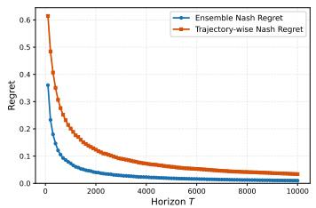
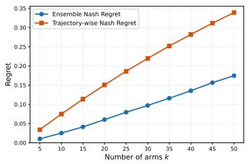
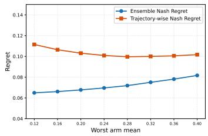

# Nash Social Welfare for Multi Armed Bandits: Trajectory-wise Expected and High Probability Regret

Avishek Ghosh Department of Computer Science and Engineering Indian Institute of Technology, Bombay avishek\_ghosh@iitb.ac.in

## Abstract

We study fair multi-armed bandits under the Nash Social Welfare (NSW) objective, which measures performance via the geometric mean of accumulated rewards as a fairness-respecting performance metric. Existing formulations define Nash regret as $\begin{array} { r } { \mathrm { N R } _ { T } = \mu ^ { \star } - ( \prod _ { t = 1 } ^ { T } \mathbb { E } \mu _ { I _ { t } } ) ^ { 1 / T } } \end{array}$ , where $\mu _ { I _ { t } }$ is the mean reward of the recommended arm $I _ { t }$ and $T$ is the learning horizon. We observe that, since ensemble Nash regret operates on per-round marginal expectations before applying the geometric mean, it does not capture the joint distribution of rewards across rounds — leaving an aspect of the NSW fairness motivation unaddressed at the trajectory level.

To address this, we propose trajectory-wise Nash regret $\widetilde { { \mathrm { N R } _ { T } } } = \mu ^ { \star } - $ $\mathbb { E } [ ( \prod _ { t = 1 } ^ { T } \mu _ { I _ { t } } ) ^ { 1 / T } ]$ , where the geometric mean is computed over complete sample paths before taking expectations. This formulation captures the fairness properties of NSW more faithfully and requires controlling the joint distribution of rewards across rounds, rather than merely per-round marginals. By Jensen’s inequality applied to the concave geometric mean, $\widetilde { \mathrm { N R } } _ { T } \ \geq \ \mathrm { N R } _ { T }$ , making it a strictly stronger metric. We additionally introduce high probability Nash regret $\begin{array} { r } { \widehat { \mathrm { N R } } _ { T } = \mu ^ { \star } - ( \prod _ { t } \mu _ { I _ { t } } ) ^ { 1 / T } } \end{array}$ , obtaining the first high probability regret bounds in the fair bandits literature. We propose a two-phase algorithm, Round Robin Nash Confidence Bound (RR-NCB), combining structured round robin exploration with a Nash confidence bound index policy. We establish that $\widetilde { \mathrm { N R } } _ { T } \leq \widetilde { \mathcal { O } } ( \sqrt { k \log T / T } )$ and $\widehat { \mathrm { N R } } _ { T } \leq \widetilde { \mathcal { O } } ( \sqrt { k \log ( k T / \delta ) / T } )$ with probability $1 - \delta ,$ matching the optimal $\widetilde { \mathcal { O } } ( \sqrt { k / T } )$ scaling despite operating under strictly stronger metrics. Optimality follows from a lower bound chain via AM-GM and standard k-armed bandit minimax arguments. We validate our theoretical findings through simulations.

## 1 Introduction

We consider the canonical framework of multi-armed bandit where an agent is interacting with the environment with k arms for T rounds. At every time instant, the agent pulls an arm out of these and receives a random reward. The rewards received by the agent are iid across rounds with mean reward corresponding to arms $\{ 1 , \ldots , k \}$ be denoted by $\mu _ { 1 } , \ldots , \mu _ { k }$ apriori unknown. We assume $\mu _ { i } \in ( 0 , 1 ]$ for all ${ \bf \bar { \Phi } } _ { i } \in [ k ]$ and $\mu ^ { \star } : = \operatorname* { m a x } _ { i \in [ k ] } \mu _ { i }$ . Without loss of generality, fix $i ^ { \star } \in$ arg max $\mu _ { i }$ . Typically, to characterize the performance of a learning algorithm, one considers the notion of cumulative or average regret given by the difference between the mean reward of best arm $\mu ^ { * }$ and the arithmetic mean of accumulated rewards over rounds $\begin{array} { r } { { \frac { 1 } { T } } \sum _ { i = 1 } ^ { T } \mathbb { E } \mu _ { I _ { t } } } \end{array}$ , where $\{ \mu _ { I _ { t } } \} _ { i = 1 } ^ { T }$ are the recommendations of the leaning algorithm (Lattimore and Szepesvári [2020], Bubeck and Cesa-Bianchi [2012]).

However, in welfare economics, it is well understood that the arithmetic mean overlooks the fairness aspect completely (Taylor [2004], Kaneko and Nakamura [1979], Kaneko [1981], Caragiannis et al.

[2019]). This becomes critical in certain applications like clinical trials and drug recommendation. A natural alternative is to use axiomatically-justified welfare function namely Nash Social Welfare (NSW), where one takes geometric mean (instead of arithmetic mean) of the accumulated rewards. As discussed in Taylor [2004], Caragiannis et al. [2019] NSW satisfies several fundamental axioms like scale invariance, symmetry, independence of unconcerned agents and the Pigou-Dalton transfer principle (Robinhood principle). In a nutshell, in our context, the Pigou-Dalton principle implies that NSW will increase in the event where a well-off arm (with high reward) transfers δ reward to a low reward (value) arm. At the same time, if the relative increase in the value of low reward arm is significantly less than the relative decrease in the value of the well-off arm, NSW does not favor such a transfer, striking a balance between fairness and efficiency. In Kaneko and Nakamura [1979], it is argued that NSW is the unique welfare function satisfying all the above-mentioned axioms.

To this end Barman et al. [2023] introduces the notion offair bandits, where the goal is to minimize the Nash regret given by $\begin{array} { r } { \mathrm { N R } _ { T } = \mu ^ { \star } - [ ( \prod _ { t = 1 } ^ { T } \mathbb { E } \mu _ { I _ { t } } ) ^ { 1 / T } ] } \end{array}$ . Note that this formulation respects the fairness aspect as it considers the geometric mean of the accumulated reward. A learning algorithm with (optimal) regret scaling of $\tilde { \mathcal { O } } ( \sqrt { K / T } )$ is given for bounded (between $[ 0 , 1 ] )$ rewards. Later Sarkar et al. [2025] extended this result to capture sub-Gaussian rewards and obtain similar regret. Moreover Krishna et al. [2025] study the $p$ mean regret, where the $\ell _ { p }$ norm of the accumulated reward is considered as a fair metric. Note that when $p  0$ , this metric boils down to the NSW.

In all the above mentioned papers, the Nash Social Welfare function is defined by taking the expectation over the algorithm’s randomness first and then applying the geometric mean. More formally, at every round t, one computes the ensemble average $\dot { \mathbb { E } } [ \mu _ { I _ { t } } ]$ across sample paths, yielding a sequence of non-random quantities $\dot { \left( { \mathbb { E } } [ \mu _ { I _ { 1 } } ] , \dots , { \mathbb { E } } [ \mu _ { I _ { T } } ] \right) }$ , to which the geometric mean is then applied. The distinction between this ensemble NSW and the arithmetic mean therefore reduces to the choice of aggregation function on this same non-random sequence: $\begin{array} { r } { f _ { 1 } ( z _ { 1 } , . . . , z _ { T } ) = \frac { 1 } { T } \sum _ { i = 1 } ^ { T } z _ { i } } \end{array}$ versus $\begin{array} { r } { f _ { 2 } ( z _ { 1 } , . . . , z _ { T } ) = \left( \prod _ { i = 1 } ^ { T } z _ { i } \right) ^ { 1 / T } } \end{array}$ . Since these are related by a log transform, log $f _ { 2 } ( z _ { 1 } , \dots , z _ { T } ) =$ $f _ { 1 } ( \log z _ { 1 } , \dots , \log z _ { T } )$ , optimizing $f _ { 2 }$ over policies is equivalent to optimizing $f _ { 1 }$ on log-transformed marginals. This suggests that, at the level of per-round marginal expectations, ensemble Nash regret and the arithmetic mean objective may share more structural similarity than the NSW motivation implies — and crucially, neither captures the joint distribution of rewards across rounds, which is where trajectory-level fairness resides.

To address this, we propose a modified NSW that moves the expectation operator outside the geometric mean: $\widetilde { \mathrm { N S W } } _ { T } = \mathbb { E } [ ( \prod _ { t = 1 } ^ { T } \mu _ { I _ { t } } ) ^ { 1 / T } ]$ , where the geometric mean is computed over a complete sample path first, and then averaged across trajectories. Unlike the ensemble formulation, this requires controlling the joint distribution of $( \mu _ { I _ { 1 } } , \dots , \mu _ { I _ { T } } )$ rather than merely the per-round marginals $\dot { \mathbb E } [ \mu _ { I _ { t } } ]$ and no deterministic log-transform reduces it to an arithmetic mean.

By Jensen’s inequality applied to the concave geometric mean function, we have $\widetilde { \mathrm { N S W } } _ { T } \leq \mathrm { N S W } _ { T }$ Since we look at the complete trajectory, the corresponding regret is defined as Trajectory-wise Nash regret and the we call the original Nash regret as Ensemble Nash regret. We have,

$$
\widetilde { \mathrm { N R } } _ { T } \ : = \ : \mu ^ { \star } \ : - \ : \mathbb { E } [ ( \prod _ { t = 1 } ^ { T } \mu _ { I _ { t } } ) ^ { 1 / T } ] \ge \mathrm { N R } _ { T } .
$$

$\widetilde { \mathrm { N R } } _ { T }$ is a stronger metric compared to $\mathrm { N R } _ { T }$ and upper bounds on $\mathrm { N R } _ { T }$ does not translate.

Moreover, in this paper we also study the random variable $( \prod _ { t = 1 } ^ { T } \mu _ { I _ { t } } ) ^ { 1 / T }$ trajectory-wise and obtain high probability regret bound. There are important settings where averaging is not appropriate. In a clinical trial, for instance, each patient population experiences a single, irreversible sequence of treatment decisions — there is no ensemble of parallel runs to average over. What matters is the welfare of the actual trajectory, not its expectation. To the best of our knowledge, this is the first work to obtain a high probability regret on fair bandits. We define

$$
\widehat { \mathrm { N R } } _ { T } : = \mu ^ { \star } - \big ( \prod _ { t } \mu _ { I _ { t } } \big ) ^ { 1 / T } .
$$

## 1.1 Summary of Contributions

We summarize our contribution in Table 1.1. We mention the details here.

<table><tr><td></td><td>Ensemble Regret</td><td>Trajectory-wise Regret</td><td>High Prob. Regret</td><td>Regret Scaling</td></tr><tr><td>Barman et al. [2023]</td><td>√</td><td>x</td><td>X</td><td> $\tilde { \mathcal { O } } ( \sqrt { K / T } )$ </td></tr><tr><td>Krishna et al. [2025]</td><td>√</td><td>X</td><td>x</td><td> $\tilde { \mathcal { O } } ( \sqrt { K / T } )$ </td></tr><tr><td>Sarkar et al. [2025]</td><td>√</td><td>X</td><td>x</td><td> $\tilde { \mathcal { O } } ( \sqrt { K / T } )$ </td></tr><tr><td>This paper</td><td>√</td><td>√</td><td>√</td><td> $\tilde { \mathcal { O } } ( \sqrt { K / T } )$ </td></tr></table>

Table 1: Comparison of regret guarantees across methods. Barman et al. [2023], Sarkar et al. [2025], Krishna et al. [2025] only works with ensemble regret, whereas we explicitly handle trajectory-wise and high probability regret. Since $\widetilde { \mathrm { N R } } _ { T } \geq \mathrm { N R } _ { T }$ , our framework also gives an upper bound for ensemble regret.

• Matching Regret Upper Bound: We propose a learning algorithm, namely Round Robbin Nash Confidence Bound (RR-NCB) which uses round robbin exploration along with an index policy governed by the Nash confidence bound (see Algorithm 4) for details). We show that

$$
\begin{array} { r } { \widetilde { \mathrm { N R } } _ { T } \leq \tilde { \mathcal { O } } \big ( \sqrt { \frac { k \log T } { T } } \big ) \quad \mathrm { a n d } \quad \operatorname* { P r } \Big [ \widehat { \mathrm { N R } } _ { T } \leq \tilde { \mathcal { O } } \big ( \sqrt { \frac { k \log \left( 8 k T / \delta \right) } { T } } \big ) \Big ] \geq 1 - \delta , } \end{array}
$$

where $\tilde { \mathcal { O } } ( . )$ hides other log factors. Note that the regret scaling is $\tilde { \mathcal { O } } ( \sqrt { k / T } )$ (ignoring log factor), which matches the regret upper bound of Barman et al. [2023], Sarkar et al. [2025] and Krishna et al. [2025] (for $p  0 )$ . This implies that although $\mathrm { N R } _ { T } \geq \mathrm { N R } _ { T }$ , we were able to obtain the same regret scaling. Hence, the trajectory-wise Nash regret, which is a stronger metric comes with no additional cost in terms of regret. The same conclusion holds for high probability regret bound as well. To the best our knowledge no previous work has obtained high probability Nash regret.

• Matching Regret Lower Bound: Invoking the Jensen’s inequality, we have the following chain of inequalities:

$$
\widetilde { \mathrm { N R } } _ { T } \ge \mathrm { N R } _ { T } \ge \mu ^ { * } - \frac { 1 } { T } \sum _ { t = 1 } ^ { T } \mathbb { E } \mu _ { I _ { t } } \ge \Omega ( \sqrt { k / T } ) ,
$$

where the second inequality comes from AM-GM inequality and the third inequality is the standard lower bound for k-armed bandits (see Lattimore and Szepesvári [2020], Bubeck and Cesa-Bianchi [2012]). Hence, the regret achieved by RR-NCB is optimal. Similar argument holds for the high probability bound as well. We have

$$
\widehat { \mathrm { N R } } _ { T } \geq \mu ^ { * } - \frac { 1 } { T } \sum _ { t = 1 } ^ { T } \mu _ { I _ { t } } \geq \Omega \big ( \sqrt { k / T } \log ( 1 / \delta ) \big ) ,
$$

with probability at least $1 - \delta .$ . Note that this is a sample path-wise (trajectory-wise) regret. Hence RR-NCB yields optimal regret for both Trajectory-wise $\widetilde { \mathrm { N R } } _ { T }$ and high probability $\widehat { \mathrm { N R } } _ { T }$ Nash regret.

• Simulations: We validate out theoretical finding through simulations. In particular we show that trajectory-wise average $\widetilde { \mathrm { N R } } _ { T }$ yields worse regret compared to $\mathrm { N R } _ { T }$ as predicted by theory. However, we show that by playing RR-NCB, the gap can be made small. The details are deferred to Section 7.

## 1.2 Technical Novelty

The analysis of Trajectory-wise and high probability Nash regret comes with additional technical challenges. Here we succinctly summarize a few of them.

• Trajectory-wise Jensen-on-exp identity: The geometric mean satisfies an exact trajectory wise identity:

$$
\begin{array} { r } { \left( \prod _ { t } \mu _ { I _ { t } } \right) ^ { 1 / T } \ = \ \mu ^ { \star } \cdot \exp ( - \widehat { R } _ { T } ) \quad \mathrm { o n e v e r y ~ s a m p l e ~ p a t h } , } \end{array}
$$

where $\begin{array} { r } { \widehat { R } _ { T } = ( 1 / T ) \sum _ { t } \log ( \mu ^ { \star } / \mu _ { I _ { t } } ) } \end{array}$ is the realized cumulative log-regret. Now, we use Jensen’s inequality on the exponential function. Combined with the identity $1 - e ^ { - x } \leq x$ we obtain $\widetilde { \mathrm { N R } } _ { T } \leq \mu ^ { \star } \bar { R } _ { T }$ where $\bar { R } _ { T } = \mathbb { E } [ \widehat { R } _ { T } ]$

On the other hand, for high probability regret, we can skip the Jensen step and directly invoke $1 - e ^ { - x } \leq x$ to obtain $\widehat { \mathrm { N R } } _ { T } \ \leq \ \mu ^ { \star } \widehat { R } _ { T }$ . Hence, the high-probability analysis of $\widehat { \mathrm { N R } } _ { T }$ is cleaner than the in-expectation analysis of $\widetilde { \mathrm { N R } } _ { T }$ . By contrast, controlling $\widehat { N R } _ { T }$ via concentrating $( \prod _ { t } \mu _ { I _ { t } } ) ^ { 1 / T }$ around its expectation (the naive route) would be substantially more involved.

• Unified analysis and Log regret as unifying intermediate: We argue that both regret are reduced to the same intermediate object — the cumulative log-regret. This enables us to give a unified analysis that holds for both trajectory-wise and high probability Nash regret.

• Round Robbin Exploration: In Barman et al. [2023], Sarkar et al. [2025], thanks to the expectation inside geometric mean, a simple uniform exploration gives $\mathbb { E } \mu _ { I _ { t } } ~ \ge ~ \mu ^ { * } / k$ trivially. However, such a lower bound cannot be applied in out setup. Hence, in our learning algorithm RR-NCB, we design the first phase as round robbin exploration. We design the length of such exploration carefully and include a stopping criteria so that every arm gets pulled sufficiently and at the same time the length of exploration period is not too large (otherwise the regret would be impacted).

• Good Event and bad arms: We define a good event E judiciously and show (in Lemma A.7 that on $E ,$ bad arms (with mean reward $\mu _ { j } \leq \mu ^ { \star } / 6 4 )$ are never played in Phase 2. This crucially controls the regret in Phase 2. Moreover, under $E _ { \mathrm { { i } } }$ , the mean estimate of the good arms (with $\mu _ { j } > \mu ^ { \star } / 6 4 )$ stay close to the actual mean, incurring small regret.

## 1.3 Motivating Applications of Trajectory-wise Regret

Clinical Trials: The trajectory-level view is more appropriate when we have non-replayability like in clinical trials (the motivating example of Barman et al. [2023], Sarkar et al. [2025]). Here, each patient is treated exactly once. The sequence of treatments administered is a single trajectory. A metric that averages over multiple instantiations of the algorithm’s randomization does not reflect what actually happens to the population of patients in any given run. In such cases, a high probability per-trajectory regret is of importance, which our framework provides (see high probability Nash regret, Theorem 5.5).

Risk-Sensitive Control: In classical risk-sensitive control (Howard and Matheson [1972], Whittle [1990] as well as the Linear-Exponential-Quadratic-Gaussian framework (Biswas and Borkar [2023]) the objective is to minimize the expected cumulative cost given by $\mathbb { E } ( \exp ( - \theta C ) )$ , were $\theta$ is the risk sensitive parameter and $C$ is the cost incurred in one trajectory. As discussed in Biswas and Borkar [2023], the expectation outside encodes risk sensitivity, and reducing it to $\exp ( - \theta \mathbb { E } C )$ collapses into risk neutral setup.

Portfolio Optimization and Kelly Criteria: Consider a sequential investment problem where at each round t, a fraction of wealth is allocated to asset $I _ { t }$ yielding a (multiplicative) return $R _ { t }$ . After $T$ rounds, terminal wealth is $\begin{array} { r } { W _ { T } = \prod _ { t = 1 } ^ { T } R _ { t } } \end{array}$ . The Kelly criterion Kelly [1956] maximizes E $W _ { T }$ which is equivalent to trajectory-wise expected regret.

Ergodicity Economics: Peters [2019] argues that for non-ergodic multiplicative processes, the timeaverage growth rate lim $T \mathrm { { \to } } { \infty } ( \prod _ { t } X _ { t } ) ^ { 1 / T }$ differs from the ensemble average $\mathbb { E } [ X _ { t } ]$ , and rational agents should optimize the former.

Evolutionary Biology: The geometric mean fitness principle (Dempster [1955], Lewontin and Cohen [1969]) states that long-run reproductive success in varying environments is governed by $\mathbb { E } [ ( \prod _ { t } W _ { t } ) ^ { 1 / T } ]$ ], not $( \prod _ { t } \mathbb { E } [ W _ { t } ] ) ^ { 1 / T }$ , where $W _ { t }$ is the fitness in generation t. Strategies producing occasional near-zero fitness are selected against even if their arithmetic mean fitness is high.

## 2 Other Related Work

Fairness in Online Learning and Bandits: Joseph et al. [2016] initiates meritocratic fairness in multi-armed bandits, requiring that a worse arm is never preferred over a better one, with tight regret bounds. Joseph et al. [2018] extends this to contextual bandits under a Rawlsian notion with polynomial regret bounds. Gillen et al. [2018] studies individual fairness in linear contextual bandits with an unknown Mahalanobis similarity metric, learning constraints from weak regulatory feedback. Wang et al. [2021] formalizes exposure fairness in stochastic bandits, designing algorithms that jointly minimize reward and fairness regret.

Nash Regret in Other Settings: Building on Barman et al. [2023], Sawarni et al. [2023] extends Nash regret to stochastic linear bandits with tight upper bounds via log-transformed reward maximization. Sarkar et al. [2026] resolves the open problem of dimension-optimal Nash regret in linear bandits and initiates the study of p-mean regret, proposing FAIRLINBANDIT. Zhang et al. [2024] extends the NSW objective to multi-agent bandits with sublinear regret guarantees and matching lower bounds in both stochastic and adversarial settings.

Axiomatic Fairness in Mathematical Economics: Nash [1950] introduces the Nash bargaining solution via axioms of symmetry, scale invariance, independence of irrelevant alternatives, and Pareto optimality. Kaneko and Nakamura [1979] proves NSW is the unique social welfare function satisfying classical social choice axioms without interpersonal utility comparisons. Taylor [2004] formalizes the Pigou-Dalton transfer principle, positioning NSW between utilitarian and egalitarian objectives. Caragiannis et al. [2019] shows maximum Nash welfare simultaneously achieves EF1 and Pareto optimality. Cousins [2023] characterizes the p-mean welfare family in a machine learning context, identifying NSW as its unique fair member.

## 3 Problem Formulation

We work with the canonical stochastic bandit model. where the sample space is $\Omega = [ k ] ^ { T } \times [ 0 , 1 ] ^ { k \times T }$ equipped with the product σ-algebra. An element $\boldsymbol { \omega } = ( ( I _ { 1 } , \ldots , I _ { T } ) , ( Y _ { i , s } ) _ { i \in [ k ] , s \in [ T ] } )$ specifies the algorithm’s pull sequence and $\bar { \mathrm { ~ a ~ } } Y _ { i , s }$ is the reward of arm i on its s-th pull. Throughout, we assume that rewards $Y _ { i , s }$ are in [0, 1] for all $i \in [ k ]$ and $s \in [ T ]$ ]. Moreover, the rewards obtained from each arm are i.i.d. with with mean $\mu _ { i }$ for the i-th arm. Recall that we assume $\mu _ { i } \in ( 0 , 1 ]$ for all $i \in [ k ]$

Any learning algorithm A recommends arm $I _ { t }$ for the learner at time t based on past history. As mentioned in Section 1, the objective is to characterize the trajectory-wise Nash regret as well as the high probability Nash regret given respectively by

$$
\widetilde { \mathrm { N R } } _ { T } = \mu ^ { \star } - \mathbb { E } [ ( \prod _ { t = 1 } ^ { T } \mu _ { I _ { t } } ) ^ { 1 / T } ] \ge \mathrm { N R } _ { T } , \quad \widehat { \mathrm { N R } } _ { T } : = \mu ^ { \star } - \bigl ( \prod _ { t } \mu _ { I _ { t } } \bigr ) ^ { 1 / T } .
$$

First, we show that a positive floor assumption on $\mu _ { i }$ is needed for tractability.

Assumption 3.1 (Positivity floor). There exists a constant $\mu _ { \operatorname* { m i n } } \in ( 0 , \mu ^ { \star } ]$ such that $\mu _ { i } \geq \mu _ { \mathrm { m i n } }$ for every $i \in [ k ]$

We now argue that such assumption is unavoidable for handling the trajectory-wise and high probability Nash regret. The following proposition formally shows that any algorithm A which pulls every arm with positive probability at least once in T rounds, the modified Nash regret cannot go to zero, and hence learning is not possible.

Proposition 3.2. Fix $k \geq 2 .$ . For any algorithm A that pulls every arm with positive probability at least once over T rounds, there exists a bandit instance ν with $\mu ^ { \star } = 1$ and min $\mu _ { i } = 0$ on which

$$
\widetilde { \mathrm { N R } } _ { T } ( \mathcal { A } , \nu ) \ge \mu ^ { \star } \cdot \mathrm { P r } \big [ \exists t \le T : I _ { t } = i _ { 0 } \big ] ,
$$

where $i _ { 0 }$ is the zero-mean arm. In particular, no learning algorithm achieves $\widetilde { \mathrm { N R } } _ { T }  0$ in $T$ uniformly over instances allowing zero-mean arms.

Remark 3.3 (Assumption 3.1 for High Probability Regret). Without Assumption 3.1, on the event that an algorithm pulls a zero-mean arm at least once with non-zero probability, $\widehat { \mathrm { N R } } _ { T } = \mu ^ { \star }$ exactly. Hence, no high-probability bound below $\mu ^ { \star }$ is possible without the floor.

Remark 3.4 (Such Assumption is not required for ensemble Nash regret of Barman et al. [2023], Sarkar et al. [2025]). This pathology disappears for the ensemble $\mathrm { N } \bar { \mathrm { R } } _ { T }$ , where the expectation is taken before the geometric mean. Hence, a single zero-mean round is averaged out into a $\Theta ( 1 / T )$ contribution to $\mathbb { E } [ \mu _ { I _ { t } } ]$

Algorithm 1 Round Robbin Nash Confidence Bound (RR-NCB)   
Require: Number of arms k, horizon T, confidence parameter $L > 0 ;$ constants $c = 3 .$   
1: Phase 1 (Round-robin exploration).   
2: $t \gets 0$   
3: while maxi∈[k] $n _ { i } \cdot \widehat { \mu } _ { i } \leq$ 420 $c ^ { 2 } L$ do   
4: Pull each arm $i \in [ k ]$ in round robbin fashion.   
5: Update $n _ { i }$ and ${ \widehat { \mu } } _ { i } .$   
6: $t \gets t + 1$   
7: end while   
8: Let τ denote the round at which the stopping condition first holds.   
9: Phase 2 (NCB selection).   
10: for $t = \tau + 1 , \dots , T$ do   
11: Set $\mathrm { N C B } _ { i } ( t ) : = \widehat { \mu } _ { i } + 2 c \sqrt { 2 \widehat { \mu } _ { i } L / n _ { i } }$ for each arm $i .$   
12: Pull $I _ { t } \in$ arg maxi $\mathrm { N C B } _ { i } \dot { ( t ) }$   
13: Observe $X _ { t } ;$ update $n _ { I _ { t } } , \widehat { \mu } _ { I _ { t } }$   
14: end for

Remark 3.5 (No Impact on Regret (order-wise)). We see (in Theorems 5.1, 5.5 that the floor enters our bound only logarithmically and only in the lower-order $1 / T$ term. Hence, such assumption (i.e., a low value of $\mu _ { \mathrm { { m i n } } }$ does not impact the regret scaling.

Remark 3.6 (Knowledge of $\mu _ { \mathrm { { m i n } } }$ not needed). We see in Section 4, that the knowledge of $\mu _ { \mathrm { { m i n } } }$ is not required to run the learning algorithm. This is just for theoretical tractability.

## 4 Algorithm

We propose the Round Robbin Nash Confidence Bound algorithm (RR-NCB), parameterized by a confidence parameter $L > 0$ in place of log T. Set $c = 3$ and $S : = c ^ { 2 } L / \mu ^ { \star }$ throughout.

We use the following notation throughout. The algorithm observes $Y _ { I _ { t } , n _ { I _ { t } } ( t ) }$ at round $t ,$ where $\begin{array} { r } { n _ { i } ( t ) : = \sum _ { s = 1 } ^ { t } \mathbf { 1 } \{ I _ { s } = i \} } \end{array}$ . We write $\begin{array} { r } { \widehat { \mu } _ { i , s } : = \frac { 1 } { s } \sum _ { j = 1 } ^ { s } Y _ { i , j } } \end{array}$ for the empirical mean of arm i from its first s rewards, and abbreviate $n _ { i } = n _ { i } ( t ) , \widehat { \mu } _ { i } = \widehat { \mu } _ { i , n _ { i } ( t ) }$ when t is clear from context.

We will instantiate Algorithm 1 twice: (a) with $L = \log T$ , for the in-expectation bound on $\widetilde { \mathrm { N R } } _ { T }$ and (b) with $L = L _ { \delta } : = \log ( 8 k T / \delta )$ , for the high-probability bound on $\widehat { \mathrm { N R } } _ { T }$

The algorithm is a two-phase procedure for the k-armed stochastic bandit problem over a known horizon T, parameterized by a confidence parameter $L > 0$ and a constant $c = 3 .$ . We modify the Nash Confidence Bound (NCB) algorithm of Barman et al. [2023], adapted to support both in-expectation and high-probability Nash regret guarantees through a single unified design.

Phase 1: Round-robin exploration. The algorithm begins by exploring all arms uniformly. In each pass, it pulls every arm $i \in \{ 1 , \ldots , k \}$ exactly once in a round robbin fashion, then checks whether the stopping condition

$$
\operatorname* { m a x } _ { i } n _ { i } \cdot \widehat { \mu } _ { i } > 4 2 0 c ^ { 2 } L
$$

is satisfied, where $n _ { i }$ is the total number of times arm i has been pulled so far and $\widehat { \mu } _ { i }$ is its empirical mean. If the condition is not met and the horizon has not been reached, another pass begins. This round-robin schedule ensures that all arms have been pulled the same number of times. The stopping time τ is the first round at which the condition is met.

The stopping condition serves a dual purpose. First, it guarantees that Phase 1 does not end too early: the threshold $4 2 0 c ^ { 2 } L$ is large enough that, on the good event, no arm can cross it before round 192 kS (where $S : = c ^ { 2 } L / \mu ^ { \star } )$ , ensuring every arm accumulates at least 192 S samples. This sample-count floor is what makes Phase $2 \mathrm { { : } }$ concentration-based analysis viable. Second, the condition guarantees that Phase 1 does not run too long: the optimal arm’s product $n _ { i } { \star } \widehat { \mu } _ { i }$ ⋆ must cross the threshold by round 484 kS, keeping Phase 1’s contribution to the regret bounded by $O ( k L \log ( 1 / \mu _ { \operatorname* { m i n } } ) / T )$ ).

Phase 2: NCB selection. From round $\tau + 1$ to $T ,$ the algorithm selects arms greedily by an optimistic index. For each arm i, it computes the Nash Confidence Bound (NCB) given by

$$
\mathrm { N C B } _ { i } : = \widehat { \mu } _ { i } + 2 c \sqrt { 2 \widehat { \mu } _ { i } L / n _ { i } }
$$

and pulls the arm with the largest $\mathrm { N C B } _ { i }$ . The index scales with $\sqrt { \widehat { \mu } _ { i } / n _ { i } }$ rather than $\sqrt { 1 / n _ { i } }$ similar to Barman et al. [2023]. This ensures that arms whose empirical means are small automatically receive tighter confidence widths, preventing over-exploration. This variance-sensitive design is the key to achieving $O ( \sqrt { k / T } )$ Nash regret rather than $O ( \sqrt { k \log k / T } )$ . After each pull, the selected arm’s count and empirical mean are updated, and the procedure repeats until round $T ,$

## 5 Main Results

In this section, we obtain the main result of the paper. Specifically, we show that RR-NCB yields trajectory-wise as well as high probability Nash regret guarantee. We formally state the results now.

Theorem 5.1 (Trajectory-wise Expected Regret). Suppose Assumption 3.1 holds and we run $A l g o -$ rithm 1 with $L = \log T , c = 3$ and horizon T. The Trajectory-wise expected regret $\widetilde { \mathrm { N R } } _ { T }$ satisfies

$$
\begin{array} { r } { \widetilde { \mathrm { N R } } _ { T } \ \leq \ C _ { 1 } \sqrt { \frac { k \log T } { T } } + C _ { 2 } \frac { k \log T \log ( 1 / \mu _ { \operatorname* { m i n } } ) } { T } + \frac { 3 k \log ( 1 / \mu _ { \operatorname* { m i n } } ) } { T ^ { 2 } } } \end{array}
$$

for absolute constants $C _ { 1 } , C _ { 2 } > 0 .$

The proof is deferred to the Appendix. A few remarks are in order.

Remark 5.2. (Matching regret with Barman et al. [2023], Sarkar et al. [2025] The regret $\widetilde { \mathrm { N R } } _ { T }$ consists of three terms, out of which the dominating term is $\tilde { \mathcal { O } } ( \sqrt { k / T } )$ . The regret scaling matches with the (ensemble) Nash regret of Barman et al. [2023], Sarkar et al. [2025]. This shows that although we are working with a stronger notion of regret (as $\widetilde { \mathrm { N R } } _ { T } \geq \mathrm { N R } _ { T } )$ , we obtain the same result (order-wise). In other words, trajectory-wise or sample path based analysis comes with no additional cost (in terms of regret).

Remark 5.3. (Matching Regret Lower Bound) Since $\widetilde { \mathrm { N R } } _ { T } \geq \mathrm { N R } _ { T }$ , a simple application of AM-GM inequality shows that $\widetilde { \mathrm { N R } } _ { T } = \Omega ( \sqrt { k / T } )$ , which implies that RR-NCB is order-wise optimal.

Remark 5.4. (Dependence on $\mu _ { \mathrm { m i n } } )$ We see that although $\widetilde { \mathrm { N R } } _ { T }$ depends on the positivity floor $\mu _ { \mathrm { { m i n } } } .$ the dependence is present only in minor terms (i.e., the terms scaling with $1 / \dot { T }$ and $1 / T ^ { 2 } )$ . Hence, the influence of $\mu _ { \mathrm { { m i n } } }$ on regret is minor. In Section 7, we validate this finding through simulations.

We now present the high probability Nash regret. We have the following result.

Theorem 5.5 (High Probability Regret). Let $\delta \in ( 0 , 1 )$ and we run Algorithm 1 with $L = \log ( 8 k T / \delta )$ Under Assumption $3 . I ,$ we have

$$
\begin{array} { r } { \operatorname* { P r } \biggr [ \widehat { \mathrm { N R } } _ { T } \ \le \ C ^ { \prime } \sqrt { \frac { k \log ( k T / \delta ) } { T } } \ + \ C ^ { \prime \prime } \frac { k \log ( k T / \delta ) \log ( 1 / \mu _ { \operatorname* { m i n } } ) } { T } \biggr ] \ \ge \ 1 - \delta , } \end{array}
$$

for absolute constants $C ^ { \prime } , C ^ { \prime \prime } > 0 .$

The formal proof is deferred to the Appendix. We collect a few remarks here.

Remark 5.6. (Matching regret upper and lower bounds) Similar to above, the high probability regret is $\tilde { \mathcal { O } } ( \sqrt { k / T } )$ which matches Barman et al. [2023], Sarkar et al. [2025] and is optimal (via same AM-GM inequality).

Remark 5.7. (Novel high probability Nash regret) We point out that this is the first result obtaining high probability Nash regret, which is of importance in safety critical applications.

## 6 Proof Sketch

Recall that we have k-armed stochastic bandit with means $\mu _ { i } \in [ \mu _ { \operatorname* { m i n } } , 1 ] , \mu ^ { \star } = \operatorname* { m a x } _ { i } \mu _ { i }$ , horizon T. We bound two variants of Nash regret:

$$
\begin{array} { r } { \widetilde { \mathrm { N R } } _ { T } : = \mu ^ { \star } - \mathbb { E } \bigl [ ( \prod _ { t } \mu _ { I _ { t } } ) ^ { 1 / T } \bigr ] , \qquad \widehat { \mathrm { N R } } _ { T } : = \mu ^ { \star } - ( \prod _ { t } \mu _ { I _ { t } } ) ^ { 1 / T } . } \end{array}
$$

Our proposed algorithm, RR-NCB (given in 1) has 2 phases. In Phase I agent pull arms in a round-robin fashion until maxi $n _ { i } \widehat { \mu } _ { i } > 4 2 0 c ^ { 2 } \check { L } \left( c = 3 \right)$ . In Phase II, we play the arm with maximum index given by $\mathrm { N C B } _ { i } = \widehat { \mu } _ { i } + 2 c \sqrt { 2 \widehat { \mu } _ { i } L / n _ { i } }$ in Phase 2. We set $L = \log T$ for $\widetilde { \mathrm { N R } } _ { T } , L = L _ { \delta } = \log ( 8 k T / \delta )$ for $\widehat { \mathrm { N R } } _ { T }$ , and $S = c ^ { 2 } L / \mu ^ { \star }$ . We now provide step by step reduction.

Step 1: Reduction to Trajectory-wise log-regret: The first step in the proof is to reduce the variants of Nash regret to log-regret trajectory-wise. Since $\begin{array} { r } { ( \prod _ { t } \mu _ { I _ { t } } ) ^ { 1 / T } = \exp \bigl ( \log \mu ^ { \star } - \widehat { R } _ { T } \bigr ) } \end{array}$ trajectorywise, where $\begin{array} { r } { \widehat { R } _ { T } : = \frac { 1 } { T } \sum _ { t } \log ( \mu ^ { \star } / \mu _ { I _ { t } } ) \geq 0 } \end{array}$ , the inequality $1 - e ^ { - x } \leq x$ gives trajectory-wise $\widehat { \mathrm { N R } } _ { T } \leq \mu ^ { \star } \widehat { R } _ { T }$ . For the in-expectation case, we apply Jensen inequality on the exponential convex function, which gives $\widetilde { \mathrm { N R } } _ { T } \leq \mu ^ { \star } \bar { R } _ { T }$ , where $\bar { R } _ { T } = \mathbb { E } [ \widehat { R } _ { T } ]$

Step 2: Define a Good Event E: We define $E : = E _ { 2 } \cap E _ { 3 }$ that supports the entire analysis. The definitions are parameterized by $L > 0$ , with $S : = c ^ { 2 } L / \mu ^ { \star }$ with $c = 3$

$E _ { 2 }$ (concentration of high-mean arms): For all arms i with $\mu _ { i } > \mu ^ { \star } / 6 4$ and all sample counts $\begin{array} { r } { s \in [ 6 4 S , T ] , \quad | \widehat { \mu } _ { i , s } - \mu _ { i } | \ \leq \ c \sqrt { \frac { \mu _ { i } L } { s } } . } \end{array}$

$E _ { 3 }$ (low-mean arms stay low): For all arms $j$ with $\mu _ { j } ~ \leq ~ \mu ^ { \star } / 6 4$ and all sample counts $s \in$ [64S, T], $\widehat { \mu } _ { j , s } ~ < ~ \frac { \mu ^ { \star } } { 3 2 }$

We show that on good event E, we have

$$
\mathrm { P r } [ E ] \ge 1 - 3 k / T ^ { 2 } \quad \mathrm { f o r } \quad L = \log T , \quad \mathrm { P r } [ E ] \ge 1 - \delta \quad \mathrm { f o r } \quad L = L _ { \delta }
$$

Step 3: Regret split into Phase 1 and Phase 2:

• Phase $I \left( t \leq \tau \right) :$ each lo $\smash { \xi ( \mu ^ { \star } / \mu _ { I _ { t } } ) \le \log ( 1 / \mu _ { \mathrm { m i n } } ) }$ , so the regret contribution is at most $\mu ^ { \star } \cdot \tau \log ( 1 / \mu _ { \operatorname* { m i n } } ) / T$

• Phase $2 \left( t > \tau \right)$ : We show (in Lemma $\mathbf { A . 7 }$ that on event $E ,$ bad arms are never played in Phase 2. In particular every arm j with $\mu _ { j } \leq \mu ^ { \star } / 6 4$ is never pulled in Phase 2. The condition on pulled arm $\mu _ { I _ { t } } \geq \mu ^ { \star } / 6 4$ lets us linearize, log $( \mu ^ { \star } / \bar { \mu } _ { i } ) \le 6 4 ( \mu ^ { \star } - \mu _ { i } ) / \mu ^ { \star }$ reducing Phase $2 \mathrm { { : } } \mathrm { { s } }$ log-regret to $\begin{array} { r } { \big ( 6 4 / T \big ) \sum _ { t > \tau } ( \mu ^ { \star } - \mu _ { I _ { t } } ) } \end{array}$ . This is the standard cumulative gap and is handled via concentration arguments.

Step 4: Bound on Phase 1 Termination: Two auxiliary lemmas pin down the duration of Phase I:

• Lemma A.3: $\mathrm { A t } \tau \leq 1 9 2 k S , n \widehat { \mu } _ { i , n } < 4 2 0 c ^ { 2 } L$ (proved by splitting on $\mu _ { i } \leqslant \mu ^ { \star } / 6 4$ and using $E _ { 2 } , E _ { 3 } )$ . Hence, Phase-1 hasn’t stopped yet.

• Lemma A.4: $\mathrm { A t } \tau \geq 4 8 4 k S , n \widehat { \mu } _ { i ^ { \star } , n } > 4 2 0 c ^ { 2 } L$ (using $E _ { 2 }$ at the optimal arm). So, Phase 1 has definitely stopped.

Step 5: $\sqrt { k T }$ NCB analysis. We characterize the per-pull gap in Lemma A.8. In particular,

$$
\mu ^ { \star } - \mu _ { i } \leq 4 c \sqrt { \mu ^ { \star } L / ( T _ { i } - 1 ) }
$$

for any arm pulled in Phase 2. This is obtained by exploiting Lemma ${ \mathrm { A . 6 ~ ( N C B } } _ { i ^ { \star } } \geq \mu ^ { \star } )$ along with the event $E _ { 2 }$ . Using this, we show that the j-th pull of arm i in Phase 2 yields a maximum regret of $4 c \sqrt { \mu ^ { \star } L / j }$ . Summing over all the pulls and applying the Cauchy-Schwartz inequality, we obtain

$$
\sum _ { t > \tau } ( \mu ^ { \star } - \mu _ { I _ { t } } ) \leq 8 c \sqrt { k T \mu ^ { \star } L } .
$$

Step 5: Combine. Phase 1 contributes $\leq C _ { 1 } k L \log ( 1 / \mu _ { \mathrm { m i n } } ) / T$ , Phase 2 contributes $\leq C _ { 2 } \sqrt { k L / T }$ Multiplying by $\mu ^ { \star } \leq 1$ and adding:

$$
\begin{array} { r } { \widetilde { \mathrm { N R } } _ { T } , \ \widehat { \mathrm { N R } } _ { T } \ = \ O \Big ( \sqrt { \frac { k L } { T } } \ + \ \frac { k L \log ( 1 / \mu _ { \operatorname* { m i n } } ) } { T } \Big ) . } \end{array}
$$

For the Trajectory-wise expected regret, we also calculate the regret off event E. By using the high probability of $E ,$ this term yields a minor $\mathcal { O } ( 1 / T ^ { 2 } )$ term.

  
Figure 1: Nash Regret comparisons. Left: Regret vs. horizon T. Center: Regret vs. number of arms k. Right: Regret vs. worst arm mean.

## 7 Simulations

We conduct three sets of simulations on a stochastic multi-armed bandit instance with the best arm mean $\mu ^ { \star } = 0 . 9$ and worst arm mean ε (we vary this). We evaluate two notions of Nash regret across 200 independent seeds: the ensemble Nash regret (of Barman et al. [2023]), computed by averaging pulled-arm means across seeds at each round before taking the geometric mean over rounds, and the trajectory-wise Nash regret, computed by taking the geometric mean of realized rewards along each individual trajectory and then averaging across seeds.

In the first experiment we fix $k \ = \ 2 5$ arms and $\varepsilon \quad = \quad 0 . 1$ , and vary the horizon $T \in$ $\{ 1 0 0 , 2 0 0 , \ldots , \bar { 1 } 0 , 0 0 0 \}$ . In the second experiment we fix $T = 1 0 , 0 0 0$ and $\varepsilon \ = \ 0 . 1$ , and vary the number of arms $k \in \{ 5 , 1 0 , 1 5 , \ldots , 5 0 \}$ . In the third experiment we fix $T = 1 0 { , } 0 0 0$ and $k = 2 5$ and vary the worst-arm mean ε across 10 values from 0.12 to 0.40 in increments of 0.04.

## 7.1 Results and Insights

The results are shown in Figure 1. In the regret vs. T experiment, we compare the performance of RR-NCB to NCB of Barman et al. [2023]. We see that both regrets go to zero implying learnability and sub-linear regret. Moreover, as theory predicts, the trajectory-wise Nash regret is bigger than the standard ensemble Nash regret. However as $T$ gets large, the gap between the two reduces. This validates the theoretical finding that both the algorithms achieve similar order-wise regret.

We then compare the Nash regret against the number of arms k, and unsurprisingly, we got an increasing curve. To understand the impact of the positivity error floor assumption in our formulation, we run another experiment where we choose 10 bandit instances with varying arm mean for the worst arm. We take the mean of the worst arm as a proxy for positivity error floor (see Assumption 3.1). We observe (in Figure 1) that the trajectory-wise Nash regret is not changing much from one instance to other. This observation further validates the theoretical finding that the effect of this minimum floor assumption is in the minor order regret terms, and poses no major influence on the trajectory-wise Nash regret. We run NCB of Barman et al. [2023] in the same setting as well. As expected the ensemble Nash regret is not changing much as well, which substantiate the fact that the ensemble Nash regret does not depend on such positivity floor.

## 8 Conclusion and Open Problems

In this paper we study fair multi-armed bandits from a trajectory (sample path) point of view (both in expectation and high probability). We propose and analyze a learning algorithm which yields optimal regret guarantees which we validate through simulations.

We end this paper with a few open problems. Until now, all the guarantees on Nash regret are instance independent. Can we obtain instance dependent optimal logarithmic Nash regret? Moreover, how does the trajectory-wise Nash regret scale in the presence of multiple agents (in a cooperative or competitive setup)? Furthermore, for structured bandits (like linear, kernelized), can we obtain regret guarantees for trajectory-wise Nash regret? We keep these questions for our future endeavors.

## References

Siddharth Barman, Arindam Khan, Arnab Maiti, and Ayush Sawarni. Fairness and welfare quantification for regret in multi-armed bandits. In Proceedings of the Thirty-Seventh AAAI Conference on Artificial Intelligence and Thirty-Fifth Conference on Innovative Applications of Artificial Intelligence and Thirteenth Symposium on Educational Advances in Artificial Intelligence, AAAI’23/IAAI’23/EAAI’23. AAAI Press, 2023. ISBN 978-1-57735-880-0. doi: 10.1609/aaai.v37i6.25829. URL https://doi.org/10.1609/aaai.v37i6.25829.

Anup Biswas and Vivek S Borkar. Ergodic risk-sensitive control—a survey. Annual Reviews in Control, 55:118–141, 2023.

Sébastien Bubeck and Nicolo Cesa-Bianchi. Regret analysis of stochastic and nonstochastic multiarmed bandit problems. arXiv preprint arXiv:1204.5721, 2012.

Ioannis Caragiannis, David Kurokawa, Hervé Moulin, Ariel D. Procaccia, Nisarg Shah, and Junxing Wang. The unreasonable fairness of maximum nash welfare. ACM Trans. Econ. Comput., 7(3), September 2019. ISSN 2167-8375. doi: 10.1145/3355902. URL https://doi.org/10.1145/ 3355902.

Cyrus Cousins. Revisiting fair-PAC learning and the axioms of cardinal welfare. In Proceedings of the 26th International Conference on Artificial Intelligence and Statistics (AISTATS), pages 7422–7442. PMLR, 2023.

Everett R. Dempster. Maintenance of genetic heterogeneity. Cold Spring Harbor Symposia on Quantitative Biology, 20:25–32, 1955. doi: 10.1101/SQB.1955.020.01.005.

Stephen Gillen, Christopher Jung, Michael Kearns, and Aaron Roth. Online learning with an unknown fairness metric. In Advances in Neural Information Processing Systems (NeurIPS), 2018.

Ronald A. Howard and James E. Matheson. Risk-sensitive markov decision processes. Management Science, 18(7):356–369, 1972. ISSN 00251909, 15265501. URL http://www.jstor.org/ stable/2629352.

Matthew Joseph, Michael Kearns, Jamie Morgenstern, and Aaron Roth. Fairness in learning: Classic and contextual bandits. In Advances in Neural Information Processing Systems (NeurIPS), pages 325–333, 2016.

Matthew Joseph, Michael Kearns, Jamie H Morgenstern, Seth Neel, and Aaron Roth. Fair algorithms for infinite and contextual bandits. arXiv preprint arXiv:1610.09559, 2018.

Mamoru Kaneko. The nash social welfare function for a measure space of individuals. Journal of Mathematical Economics, 8(2):173–200, 1981. ISSN 0304-4068. doi: https://doi.org/10.1016/ 0304-4068(81)90021-5. URL https://www.sciencedirect.com/science/article/pii/ 0304406881900215.

Mamoru Kaneko and Kenjiro Nakamura. The nash social welfare function. Econometrica, 47(2): 423–435, 1979. ISSN 00129682, 14680262. URL http://www.jstor.org/stable/1914191.

J. L. Kelly. A new interpretation of information rate. The Bell System Technical Journal, 35(4): 917–926, 1956. doi: 10.1002/j.1538-7305.1956.tb03809.x.

Anand Krishna, Philips George John, Adarsh Barik, and Vincent YF Tan. p-mean regret for stochastic bandits. In Proceedings of the AAAI Conference on Artificial Intelligence, volume 39, pages 17966–17973, 2025.

Tor Lattimore and Csaba Szepesvári. Bandit Algorithms. Cambridge University Press, 2020.

R. C. Lewontin and D. Cohen. On population growth in a randomly varying environment. Proceedings ofthe National Academy ofSciences, 62(4):1056–1060, 1969. doi: 10.1073/pnas.62.4.1056.

John F. Nash. The bargaining problem. Econometrica, 18(2):155–162, 1950.

Ole Peters. The ergodicity problem in economics. Nature Physics, 15:1216–1221, 2019. doi: 10.1038/s41567-019-0732-0.

Dhruv Sarkar, Nishant Pandey, and Sayak Ray Chowdhury. Revisiting social welfare in bandits: Ucb is (nearly) all you need. arXiv preprint arXiv:2510.21312, 2025.

Dhruv Sarkar, Nishant Pandey, and Sayak Ray Chowdhury. Improved algorithms for nash welfare in linear bandits. arXiv preprint arXiv:2601.22969, 2026.

Ayush Sawarni, Soumyabrata Pal, and Siddharth Barman. Nash regret guarantees for linear bandits. In Advances in Neural Information Processing Systems (NeurIPS), volume 36, pages 33288–33318, 2023.

Alan D. Taylor. Public Choice, 119(3/4):468–470, 2004. ISSN 00485829, 15737101. URL http://www.jstor.org/stable/30026057.

Roman Vershynin. High-Dimensional Probability: An Introduction with Applications in Data Science, volume 47 of Cambridge Series in Statistical and Probabilistic Mathematics. Cambridge University Press, Cambridge, 2018.

Martin J Wainwright. High-Dimensional Statistics: A Non-Asymptotic Viewpoint, volume 48 of Cambridge Series in Statistical and Probabilistic Mathematics. Cambridge University Press, Cambridge, 2019.

Lequn Wang, Wen Sun, and Thorsten Joachims. Fairness of exposure in stochastic bandits. In Proceedings ofthe 38th International Conference on Machine Learning (ICML), pages 10686– 10696. PMLR, 2021.

Peter Whittle. A risk-sensitive maximum principle. Systems & Control Letters, 15(3):183–192, 1990.

Mengxiao Zhang, Ramiro Deo-Campo Vuong, and Haipeng Luo. No-regret learning for fair multiagent social welfare optimization. arXiv preprint arXiv:2405.20678, 2024.

## A Proofs

## A.1 Setup and Useful Lemmas

Without loss of generality, throughout the proof we assume

$$
\mu ^ { \star } \geq 5 1 2 \sqrt { k L / T } ,
$$

which we call the warm-up condition. When this bound fails, our results hold deterministically with

$$
\widetilde { \mathrm { N R } } _ { T } \leq \mu ^ { \star } \leq 5 1 2 \sqrt { k L / T } .
$$

Similar bounds holds for $\widehat { \mathrm { N R } } _ { T }$ . This crucially leverages the non-negativity of the rewards.

## A.2 The Good Event

We define a good event $E : = E _ { 2 } \cap E _ { 3 }$ that supports the entire analysis. The definitions are parameterized by $L > 0 .$ , with $S : = c ^ { 2 } L / \bar { \mu } ^ { \star }$ as before. Recall $c = 3$

$E _ { 2 }$ (concentration of high-mean arms): For all arms i with $\mu _ { i } > \mu ^ { \star } / 6 4$ and all sample counts $s \in [ 6 4 S , T ]$ ，

$$
\begin{array} { r } { | \widehat { \mu } _ { i , s } - \mu _ { i } | \le c \sqrt { \frac { \mu _ { i } L } { s } } . } \end{array}
$$

$E _ { 3 }$ (low-mean arms stay low): For all arms $j$ with $\mu _ { j } \leq \mu ^ { \star } / 6 4$ and all sample counts $s \in [ 6 4 S , T ]$

$$
\widehat { \mu } _ { j , s } \ < \ \frac { \mu ^ { \star } } { 3 2 } .
$$

## A.3 Round-robin sampling

Under the round-robin schedule of Algorithm 1, after any number of rounds $r \geq k$ during Phase 1, each arm i has been pulled either $\lfloor r / \bar { k } \rfloor \mathrm { ~ o r ~ } \lceil r / k \rceil$ times. For the sake of simplicity and clarity of exposition we assume that τ is a multiple of k (otherwise we just use ceil and floor which will only impact the final regret in terms of universal constants). Hence, at round τ every arm has count $\tau / \dot { k }$ exactly. We use this throughout below.

## A.4 Probability of the good event

Lemma A.1 (Good event probability). $\mathrm { P r } [ E ^ { c } ] \le 3 k T \exp ( - c ^ { 2 } L / 3 )$

Proof. We bound $\mathrm { P r } [ E _ { 2 } ^ { c } ]$ and $\mathrm { P r } [ E _ { 3 } ^ { c } ]$ separately and union-bound.

$E _ { 2 } .$ : For an arm i with $\mu _ { i } > \mu ^ { \star } / 6 4$ and $s ~ \in ~ [ 6 4 S , T ]$ , by Lemma E.1 with $\nu ~ = ~ \mu _ { i }$ and $\delta : = $ $c \sqrt { L / ( \mu _ { i } s ) }$ , we have

$$
\begin{array} { r } { \operatorname* { P r } \biggr [ \left| \widehat { \mu } _ { i , s } - \mu _ { i } \right| \geq c \sqrt { \frac { \mu _ { i } L } { s } } \biggr ] \leq 2 \exp \biggr ( - \frac { \delta ^ { 2 } s \mu _ { i } } { 3 } \biggr ) = 2 \exp \biggr ( - \frac { c ^ { 2 } L } { 3 } \biggr ) . } \end{array}
$$

We require $\delta \leq 1$ for Lemma E.1 to apply, i.e., $s \geq c ^ { 2 } L / \mu _ { i }$ . Since $\mu _ { i } > \mu ^ { \star } / 6 4 , c ^ { 2 } L / \mu _ { i } <$ $6 4 c ^ { 2 } L \bar { / } \mu ^ { \star } = 6 4 S$ , and $s \geq 6 4 S$ suffices.

Union-bounding over k arms and T sample counts: $\mathrm { P r } [ E _ { 2 } ^ { c } ] \leq 2 k T \exp ( - c ^ { 2 } L / 3 )$

$E _ { 3 } .$ : For an arm j with $\mu _ { j } \leq \mu ^ { \star } / 6 4$ and $s \in [ 6 4 S , T ]$ , by Lemma E.2 with $\nu _ { H } = \mu ^ { \star } / 6 4$ (note $( 1 + 1 ) \nu _ { H } = \mu ^ { \star } / 3 2 )$ , we have

$$
\begin{array} { r } { \operatorname* { P r } \Bigl [ \widehat \mu _ { j , s } \geq \frac { \mu ^ { \star } } { 3 2 } \Bigr ] \leq \exp \Bigl ( - \frac { 1 \cdot s \cdot \mu ^ { \star } / 6 4 } { 3 } \Bigr ) = \exp \Bigl ( - \frac { s \mu ^ { \star } } { 1 9 2 } \Bigr ) . } \end{array}
$$

For $s \geq 6 4 S$ , we have $s \mu ^ { \star } / 1 9 2 \geq 6 4 c ^ { 2 } L / 1 9 2 = c ^ { 2 } L / 3$ . So the bound becomes $\exp ( - c ^ { 2 } L / 3 )$

Union over k arms and T sample counts: $\operatorname* { P r } [ E _ { 3 } ^ { c } ] \leq k T \exp ( - c ^ { 2 } L / 3 )$

Adding the two bounds: $\mathrm { P r } [ E ^ { c } ] \le 3 k T \exp ( - c ^ { 2 } L / 3 )$

Corollary A.2. $F o r c = 3 .$

1. With L = log T and $T \geq 3 k , \mathrm { P r } [ E ] \geq 1 - 3 k / T ^ { 2 }$

2. With $L = L _ { \delta } : = \log ( 8 k T / \delta )$ and $\delta \in ( 0 , 1 ) , \operatorname* { P r } [ E ] \geq 1 - \delta .$

Proof. (1) With $L = \log T$ and $c = 3 \colon \exp ( - c ^ { 2 } L / 3 ) = \exp ( - 3 \log T ) = T ^ { - 3 }$ . So $\mathrm { P r } [ E ^ { c } ] \le$ $3 k / \check { T } ^ { 2 }$

(2) With L = log(8kT /δ): exp(−c2L/3) = (8kT /δ)−3. So

$$
\begin{array} { r } { \mathrm { P r } [ E ^ { c } ] \le \frac { 3 k T \delta ^ { 3 } } { ( 8 k T ) ^ { 3 } } = \frac { 3 \delta ^ { 3 } } { 5 1 2 ( k T ) ^ { 2 } } \le \delta , } \end{array}
$$

for any $\delta \in ( 0 , 1 )$ and $k T \geq 1$

## A.5 Analysis of Phase 1

We now characterize the number of pulls made in Phase-I. The Phase 1 stopping rule activates when maxi $n _ { i } \widehat { \mu } _ { i } > 4 2 0 c ^ { 2 } L$ . To pin down τ, we need to know when $n _ { i } \widehat { \mu } _ { i }$ has not yet crossed the threshold and when it must have. The next two lemmas provide both bounds.

Lemma A.3. On the event E, for any arm $i \in [ k ]$ and any sample count $n \leq 1 9 2 S$

$$
n \widehat { \mu } _ { i , n } \ < \ 2 1 0 c ^ { 2 } L < 4 2 0 c ^ { 2 } L .
$$

Proof. Since $Y _ { i , j } \in [ 0 , 1 ]$ (non-negative), the sum $\begin{array} { r } { n \widehat { \mu } _ { i , n } = \sum _ { j = 1 } ^ { n } Y _ { i , j } } \end{array}$ is non-decreasing in n. So it suffices to bound the case $n = N$ where $N = 1 9 2 S$ . We have

$$
n \widehat { \mu } _ { i , n } ~ \leq ~ N \widehat { \mu } _ { i , N } .\tag{1}
$$

Two cases on $\mu _ { i }$

Case 1: $\mu _ { i } \leq \mu ^ { \star } / 6 4$ . Since $N = 1 9 2 S \geq 6 4 S .$ , E3 applies and gives $\widehat { \mu } _ { i , N } < \mu ^ { \star } / 3 2$ . Hence

$$
\begin{array} { r } { N \widehat { \mu } _ { i , N } \ < \ 1 9 2 S \cdot \frac { \mu ^ { \star } } { 3 2 } \ = \ 6 S \mu ^ { \star } \ = \ 6 c ^ { 2 } L . } \end{array}
$$

Case 2: $\mu _ { i } > \mu ^ { \star } / 6 4$ . Since $N \geq 6 4 S , E _ { 2 }$ applies:

$$
\begin{array} { r } { \widehat { \mu } _ { i , N } \leq \mu _ { i } + c \sqrt { \frac { \mu _ { i } L } { N } } \leq \mu ^ { \star } + c \sqrt { \frac { \mu ^ { \star } L } { N } } = \mu ^ { \star } + c \sqrt { \frac { \mu ^ { \star } L \cdot \mu ^ { \star } } { 1 9 2 c ^ { 2 } L } } = \mu ^ { \star } \Big ( 1 + \frac { 1 } { \sqrt { 1 9 2 } } \Big ) . } \end{array}
$$

Hence, invoking the definition of N, we have $N \widehat { \mu } _ { i , N } < 2 1 0 c ^ { 2 } L$

In both cases $N \widehat { \mu } _ { i , N } < 2 1 0 c ^ { 2 } L ,$ , so (1) gives $n { \widehat { \mu } } _ { i , n } < 2 1 0 c ^ { 2 } L$

Lemma A.4. On the event E, for any sample count $n \geq 4 8 4 S ,$

$$
n { \widehat { \mu } } _ { i ^ { \star } , n } \geq 4 6 2 c ^ { 2 } L > 4 2 0 c ^ { 2 } L .
$$

Proof. By monotonicity, $n \widehat { \mu } _ { i ^ { \star } , n } \geq M \widehat { \mu } _ { i ^ { \star } , M }$ where $M = 4 8 4 S$ . Since $\mu _ { i ^ { \star } } = \mu ^ { \star } > \mu ^ { \star } / 6 4$ and $M \geq 6 4 \bar { S } , E _ { 2 }$ applies and we have

$$
\begin{array} { r } { \widehat { \mu } _ { i ^ { \star } , M } \geq \mu ^ { \star } - c \sqrt { \frac { \mu ^ { \star } L } { M } } = \mu ^ { \star } - c \sqrt { \frac { \mu ^ { \star } L \cdot \mu ^ { \star } } { 4 8 4 c ^ { 2 } L } } = \mu ^ { \star } \Big ( 1 - \frac { 1 } { \sqrt { 4 8 4 } } \Big ) = \frac { 2 1 } { 2 2 } \mu ^ { \star } . } \end{array}
$$

Hence $M \widehat { \mu } _ { i ^ { \star } , M } \geq 4 6 2 c ^ { 2 } L$

## A.5.1 Bounding the Phase 1 stopping time

We use the above 2 Lemmas to bound τ under event E. We have

$$
1 9 2 k S \leq \tau \leq 4 8 4 k S ( = T _ { e } ) .
$$

Corollary A.5 (Phase 1 sample counts). On E, at the end of Phase 1, every arm i has been pulled exactly τ/k times, with $\tau / k \stackrel { - } { > } 1 9 2 S > 6 4 S$ . In particular, every arm satisfies $n _ { i } ( \tau ) > 1 9 2 c ^ { \hat { 2 } } L / \mu ^ { \star }$

## A.6 Analysis of Phase 2: NCB-Based Selection

Throughout this section we work on the good event $E ,$ and we denote $S = c ^ { 2 } L / \mu ^ { \star }$ as before. By Corollary $\mathrm { A . 5 , }$ on E every arm i has $n _ { i } > 1 9 2 S > 6 4 S$ before the start of Phase $2 { \mathrm { ~ ( t h e } } \geq 6 4 S$ form is what we use most often as it is defined in the event E).

Lemma A.6 (Optimal arm’s NCB stays above $\mu ^ { \star } )$ . On the event $E$ and assuming $\mu ^ { \star } \geq 5 1 2 \sqrt { k L / T }$ for every Phase 2 round $t > \tau _ { : }$

$$
\begin{array} { r } { \mathrm { N C B } _ { i ^ { \star } } ( t ) \ \geq \ \mu ^ { \star } . } \end{array}
$$

Proof. Fix $t > \tau$ and let $n ^ { \star } : = n _ { i ^ { \star } } ( t - 1 ) \geq 6 4 S$ (Corollary A.5).

Since $\mu ^ { \star } > \mu ^ { \star } / 6 4$ and $n ^ { \star } \geq 6 4 S , E _ { 2 }$ gives $| \widehat { \mu } _ { i ^ { \star } } - \mu ^ { \star } | \leq c \sqrt { \mu ^ { \star } L / n ^ { \star } }$ . In particular,

$$
\begin{array} { r } { \widehat { \mu } _ { i ^ { \star } } \ \geq \ \mu ^ { \star } - c \sqrt { \frac { \mu ^ { \star } L } { n ^ { \star } } } \implies c \sqrt { \frac { \mu ^ { \star } L } { n ^ { \star } } } \geq \mu ^ { \star } - \widehat { \mu } _ { i ^ { \star } } . } \end{array}\tag{2}
$$

We want to show $\widehat { \mu } _ { i ^ { \star } } + 2 c \sqrt { 2 \widehat { \mu } _ { i ^ { \star } } L / n ^ { \star } } \geq \mu ^ { \star }$ , equivalently

$$
\begin{array} { r } { 2 c \sqrt { \frac { 2 \widehat { \mu } _ { i } \star L } { n ^ { \star } } } \geq \mu ^ { \star } - \widehat { \mu } _ { i ^ { \star } } . } \end{array}\tag{3}
$$

So (3) is implied by

$$
\begin{array} { r } { 2 c \sqrt { \frac { 2 \widehat { \mu } _ { i ^ { \star } } L } { n ^ { \star } } } \geq c \sqrt { \frac { \mu ^ { \star } L } { n ^ { \star } } } \Longleftrightarrow 8 \widehat { \mu } _ { i ^ { \star } } \geq \mu ^ { \star } . } \end{array}\tag{4}
$$

We verify $8 \widehat { \mu } _ { i ^ { \star } } \geq \mu ^ { \star }$ . Using (2) and $n ^ { \star } \ge 6 4 S = 6 4 c ^ { 2 } L / \mu ^ { \star }$

$$
\begin{array} { r } { c \sqrt { \frac { \mu ^ { \star } L } { n ^ { \star } } } \ \leq \ c \sqrt { \frac { \mu ^ { \star } L \cdot \mu ^ { \star } } { 6 4 c ^ { 2 } L } } \ = \ \frac { \mu ^ { \star } } { 8 } . } \end{array}
$$

Hence $\widehat { \mu } _ { i ^ { \star } } \geq \mu ^ { \star } - \mu ^ { \star } / 8 = 7 \mu ^ { \star } / 8 , \operatorname { s o } 8 \widehat { \mu } _ { i ^ { \star } } \geq 7 \mu ^ { \star } \geq \mu ^ { \star }$ . This establishes (4) and hence $\mathrm { N C B } _ { i ^ { \star } } ( t ) \geq$ $\mu ^ { \star }$ □

Lemma A.7 (Bad arms are never pulled in Phase 2). On the event E and assuming $\mu ^ { \star } \geq 5 1 2 \sqrt { k L / T }$ every arm j with $\mu _ { j } \leq \mu ^ { \star } / 6 4$ is never pulled in Phase 2.

Proof. Fix such an arm j. By Corollary $\mathbf { A } . 5 , n _ { j } \geq 6 4 S$ at the start of Phase 2. Since $\mu _ { j } \leq \mu ^ { \star } / 6 4$ $E _ { 3 }$ gives $\widehat { \mu } _ { j } < \mu ^ { \star } / 3 2$ throughout Phase 2 (note that $n _ { j }$ only increases, and $E _ { 3 }$ is a uniform statement over $s \in [ \bar { 6 4 } S , T ] $ .

For any Phase 2 round t, with $n _ { j } \geq 6 4 S ;$

$$
\begin{array} { r } { \mathrm { N C B } _ { j } ( t ) \ = \ \widehat { \mu } _ { j } + 2 c \sqrt { \frac { 2 \widehat { \mu } _ { j } L } { n _ { j } } } \ < \ \frac { \mu ^ { \star } } { 3 2 } + 2 c \sqrt { \frac { 2 ( \mu ^ { \star } / 3 2 ) L } { 6 4 S } } \ = \ \frac { \mu ^ { \star } } { 3 2 } + 2 c \sqrt { \frac { \mu ^ { \star } L \cdot \mu ^ { \star } } { 1 0 2 4 c ^ { 2 } L } } \ = \ \frac { \mu ^ { \star } } { 3 2 } + \frac { \mu ^ { \star } } { 1 6 } \ = \ \frac { 3 \mu ^ { \star } } { 3 2 } . } \end{array}
$$

By Lemma $\mathrm { A } . 6 , \mathrm { N C B } _ { i ^ { \star } } ( t ) \geq \mu ^ { \star }$ . Since $3 \mu ^ { \star } / 3 2 < \mu ^ { \star } \leq \mathrm { N C B } _ { i ^ { \star } } ( t )$ , we have $\mathrm { N C B } _ { j } ( t ) < \mathrm { N C B } _ { i ^ { \star } } ( t )$ so arm j is not selected at round t. This holds for every $t > \tau , { \bf s o } j$ is never pulled in Phase 2.

## A.6.1 Per-pull gap for arms pulled in Phase 2

Lemma A.8 (Per-pull gap). On the event E and assuming $\mu ^ { \star } \geq 5 1 2 \sqrt { k L / T } ,$ suppose arm i is pulled in Phase 2 at some round, and let $T _ { i }$ denote its total pull count at that moment (including the current pull). Then

$$
\begin{array} { r } { \mu ^ { \star } - \mu _ { i } \ \leq \ 4 c \sqrt { \frac { \mu ^ { \star } L } { T _ { i } - 1 } } . } \end{array}
$$

Proof. By Lemma A.7, $\mu _ { i } > \mu ^ { \star } / 6 4$ . By Corollary $\mathrm { A } . 5 , T _ { i } - 1 \geq 6 4 S$ (since the prior pull count is at least the Phase 1 count, which is $\geq 6 4 S )$ . Hence $E _ { 2 }$ applies at $s = T _ { i } - 1$

At the moment of this pull, since arm i was selected by NCB,

$$
\begin{array} { r } { \widehat { \mu } _ { i } + 2 c \sqrt { \frac { 2 \widehat { \mu } _ { i } L } { T _ { i } - 1 } } \ = \ \mathrm { N C B } _ { i } \ \geq \ \mathrm { N C B } _ { i ^ { \star } } \ \geq \ \mu ^ { \star } , } \end{array}\tag{5}
$$

the last inequality by Lemma A.6.

We upper-bound $\widehat { \mu } _ { i }$ using $E _ { 2 }$ (since $\mu _ { i } > \mu ^ { \star } / 6 4 )$ and $T _ { i } - 1 \geq 6 4 S \mathrm { : }$

$$
\begin{array} { r } { \widehat { \mu } _ { i } \leq \mu _ { i } + c \sqrt { \frac { \mu _ { i } L } { T _ { i } - 1 } } \leq \mu ^ { \star } + c \sqrt { \frac { \mu ^ { \star } L } { T _ { i } - 1 } } \leq \mu ^ { \star } + c \sqrt { \frac { \mu ^ { \star } L \cdot \mu ^ { \star } } { 6 4 c ^ { 2 } L } } = \mu ^ { \star } + \frac { \mu ^ { \star } } { 8 } = \frac { 9 } { 8 } \mu ^ { \star } . } \end{array}
$$

Substituting this bound into (5):

$$
\begin{array} { r } { \mu ^ { \star } \ \leq \ \widehat \mu _ { i } + 2 c \sqrt { \frac { 2 \cdot ( 9 / 8 ) \mu ^ { \star } L } { T _ { i } - 1 } } \ = \ \widehat \mu _ { i } + 3 c \sqrt { \frac { \mu ^ { \star } L } { T _ { i } - 1 } } . } \end{array}
$$

Combining with the upper bound on $\widehat { \mu } _ { i }$ in terms of $\mu _ { i }$ from $E _ { 2 }$

$$
\begin{array} { r } { \widehat { \mu } _ { i } \leq \mu _ { i } + c \sqrt { \frac { \mu _ { i } L } { T _ { i } - 1 } } \leq \mu _ { i } + c \sqrt { \frac { \mu ^ { \star } L } { T _ { i } - 1 } } \cosh \Rightarrow \mu ^ { \star } \leq \mu _ { i } + 4 c \sqrt { \frac { \mu ^ { \star } L } { T _ { i } - 1 } } , } \end{array}
$$

which is the claimed bound after rearranging.

## B Proof of Trajectory-wise Expectation Bound: $\widetilde { \mathrm { N R } } _ { T }$

We use the lemmas of Sections $\mathrm { A } . 2 \mathrm { - } \mathrm { A } . 6$ with $L = \log T$ , so that $\operatorname* { P r } [ E ] \geq 1 - 3 k / T ^ { 2 }$ (Corollary A.2).

## B.1 Reduction via Jensen on exp

Lemma B.1. For any [k]-valued random sequence $( I _ { t } ) _ { t = 1 } ^ { T }$ with $\mu _ { I _ { t } } > 0 a . s .$

$$
\begin{array} { r } { \widetilde { \mathrm { N R } } _ { T } \ \le \ \mu ^ { \star } \cdot \bar { R } _ { T } , \qquad w h e r e \qquad \bar { R } _ { T } \ : = \ \frac 1 T \displaystyle \sum _ { t = 1 } ^ { T } \mathbb { E } \Big [ \log \frac { \mu ^ { \star } } { \mu _ { I _ { t } } } \Big ] \ge 0 . } \end{array}
$$

Proof. Pathwise, $\begin{array} { r } { ( \prod _ { t } \mu _ { I _ { t } } ) ^ { 1 / T } = \exp \left( \frac { 1 } { T } \sum _ { t } \log \mu _ { I _ { t } } \right) } \end{array}$ . Since exp is convex, Jensen’s inequality gives

$$
\mathbb { E } \Bigg [ \exp \Bigg ( \frac { 1 } { T } \sum _ { t } \log \mu _ { I _ { t } } \Bigg ) \Bigg ] \geq \exp \Bigg ( \frac { 1 } { T } \sum _ { t } \mathbb { E } [ \log \mu _ { I _ { t } } ] \Bigg ) = \exp ( \log \mu ^ { \star } - \bar { R } _ { T } ) = \mu ^ { \star } e ^ { - \bar { R } _ { T } } ,
$$

using

$$
\mathbb { E } [ \log \mu _ { I _ { t } } ] = \log \mu ^ { \star } - \mathbb { E } [ \log ( \mu ^ { \star } / \mu _ { I _ { t } } ) ] .
$$

Hence,

$$
\widetilde { \mathrm { N R } } _ { T } \le \mu ^ { \star } ( 1 - e ^ { - \bar { R } _ { T } } ) \le \mu ^ { \star } \bar { R } _ { T } ,
$$

using $1 - e ^ { - x } \leq x$ for all non-negative x.

## B.2 Concluding the proof of Theorem 5.1

By Lemma B.1 it suffices to bound $\mu ^ { \star } \bar { R } _ { T }$ . We decompose in the following way:

$$
\begin{array} { r } { \mu ^ { \star } \bar { R } _ { T } = \underbrace { \frac { \mu ^ { \star } } { T } \mathbb { E } \left[ \mathbf { 1 } _ { E } \sum _ { t \leq \tau } \log \frac { \mu ^ { \star } } { \mu t _ { t _ { t } } } \right] } _ { \mathrm { ( I ) } } + \underbrace { \frac { \mu ^ { \star } } { T } \mathbb { E } \left[ \mathbf { 1 } _ { E } \sum _ { t = \tau + 1 } ^ { T } \log \frac { \mu ^ { \star } } { \mu t _ { t _ { t } } } \right] } _ { \mathrm { ( I I ) } } + \underbrace { \frac { \mu ^ { \star } } { T } \mathbb { E } \left[ \mathbf { 1 } _ { E ^ { c } } \sum _ { t = 1 } ^ { T } \log \frac { \mu ^ { \star } } { \mu t _ { t _ { t } } } \right] } _ { \mathrm { ( I I I ) } } . } \end{array}
$$

(I) Phase 1 on E. On $E ,$ we have $\tau \leq 4 8 4 c ^ { 2 } k \log T / \mu ^ { \star }$ . Also, each pulled arm satisfies $\mu _ { I _ { t } } \geq \mu _ { \mathrm { m i n } }$ Hence, since $\mu ^ { \star } \leq 1$ , we have $\log ( \mu ^ { \star } / \mu _ { I _ { t } } ) \leq \log ( \mathrm { i } / \mu _ { \operatorname* { m i n } } )$ . We have

$$
\begin{array} { r } { \mathrm { ( I ) } ~ \le ~ \frac { \mu ^ { \star } } { T } \cdot \frac { 4 8 4 c ^ { 2 } k \log T } { \mu ^ { \star } } \cdot \log ( 1 / \mu _ { \operatorname* { m i n } } ) ~ = ~ \frac { 4 8 4 c ^ { 2 } k \log T \log ( 1 / \mu _ { \operatorname* { m i n } } ) } { T } . } \end{array}
$$

(II) Phase 2 on E. On $E ,$ we have $\mu _ { I _ { t } } \geq \mu ^ { \star } / 6 4 ;$ otherwise the arm is never played (see Lemma A.7). The elementary inequality

$$
\begin{array} { r } { \log \frac { \mu ^ { \star } } { \mu _ { i } } \ \leq \ \frac { 6 4 ( \mu ^ { \star } - \mu _ { i } ) } { \mu ^ { \star } } \quad \mathrm { w h e n e v e r } \ \mu _ { i } \geq \mu ^ { \star } / 6 4 , } \end{array}\tag{6}
$$

follows from log $( 1 + u ) \leq u$ with $u = ( \mu ^ { \star } - \mu _ { i } ) / \mu _ { i }$ and $\mu _ { i } \geq \mu ^ { \star } / 6 4$ . Substituting,

$$
\begin{array} { r }  \mathrm { ( I I ) ~ \le ~ \frac { \mu ^ { \star } } { T } ~ \mathbb { E } \left[ \mathbf { 1 } _ { E } \displaystyle \sum _ { t > \tau } \frac { 6 4 ( \mu ^ { \star } - \mu _ { I _ { t } } ) } { \mu ^ { \star } } \right] ~ = ~ \frac { 6 4 } { T } \mathbb { E } \left[ \mathbf { 1 } _ { E } \displaystyle \sum _ { t > \tau } ( \mu ^ { \star } - \mu _ { I _ { t } } ) \right] . } \end{array}
$$

Let $m _ { i }$ be the Phase 2 pull count of arm i, and $T _ { i } ^ { ( j ) }$ the prior pull count of arm i before its j-th Phase 2 pull. By Corollary A.5, on E in phase 1, every arm has $> 1 2 8 S$ pulls. Hence $T _ { i } ^ { ( j ) } > 1 2 8 S + j - 1 \geq j$ Lemma A.8 (applied with total count $T _ { i } = T _ { i } ^ { ( j ) } + 1$ , so $T _ { i } - 1 = T _ { i } ^ { ( j ) } )$ gives

$$
\begin{array} { r } { \mu ^ { \star } - \mu _ { I _ { t } } \ \leq \ 4 c \sqrt { \frac { \mu ^ { \star } \log T } { T _ { i } ^ { ( j ) } } } \ \leq \ 4 c \sqrt { \frac { \mu ^ { \star } \log T } { j } } . } \end{array}
$$

Summing up, we obtain

$$
\sum _ { t > \tau } ( \mu ^ { \star } - \mu _ { I _ { t } } ) \ \leq \ 4 c \sqrt { \mu ^ { \star } \log T } \sum _ { i } \sum _ { j = 1 } ^ { m _ { i } } \frac { 1 } { \sqrt { j } } \ \leq \ 8 c \sqrt { \mu ^ { \star } \log T } \sum _ { i } \sqrt { m _ { i } } \ \leq \ 8 c \sqrt { k T \mu ^ { \star } \log T } ,
$$

using $\textstyle \sum _ { j = 1 } ^ { m } 1 / { \sqrt { j } } \leq 2 { \sqrt { m } }$ and Cauchy–Schwarz $\begin{array} { r } { \sum _ { i } { \sqrt { m _ { i } } } \leq \sqrt { k \sum _ { i } m _ { i } } \leq \sqrt { k T } } \end{array}$ . Therefore

$$
\begin{array} { r } { \mathrm { ( I I ) } ~ \le ~ \frac { 6 4 \cdot 8 c \sqrt { k T \mu ^ { \star } \log T } } { T } ~ = ~ 5 1 2 c \sqrt { \frac { k \mu ^ { \star } \log T } { T } } ~ \le ~ 5 1 2 c \sqrt { \frac { k \log T } { T } } , } \end{array}
$$

the last using $\mu ^ { \star } \leq 1$

(III) Off the good event. On $E ^ { c } , \log ( \mu ^ { \star } / \mu _ { I _ { t } } ) \leq \log ( 1 / \mu _ { \operatorname* { m i n } } )$ for every t, and $\operatorname* { P r } [ E ^ { c } ] \leq 3 k / T ^ { 2 }$

$$
\begin{array} { r } { \mathrm { ( I I I ) } ~ \le ~ \frac { \mu ^ { \star } } { T } \cdot T \log ( 1 / \mu _ { \operatorname* { m i n } } ) \cdot \mathrm { P r } [ E ^ { c } ] ~ \le ~ \frac { 3 k \log ( 1 / \mu _ { \operatorname* { m i n } } ) } { T ^ { 2 } } . } \end{array}
$$

Combining. With all 3 bounds above, we obtain

$$
\begin{array} { r } { \widetilde { \mathrm { N R } } _ { T } \leq C _ { 1 } \frac { k \log T \log ( 1 / \mu _ { \operatorname* { m i n } } ) } { T } + C _ { 2 } \sqrt { \frac { k \log T } { T } } + \frac { 3 k \log ( 1 / \mu _ { \operatorname* { m i n } } ) } { T ^ { 2 } } . } \end{array}
$$

## C High-Probability Bound on $\widehat { \mathrm { N R } } _ { T }$

We use the lemmas of Sections $\mathbf { A } . 2 \mathrm { - } \mathbf { A } . 6$ with $L = L _ { \delta } : = \log ( 8 k T / \delta )$ , so that $\mathrm { P r } [ E ] \ge 1 - \delta$ (Corollary A.2).

## C.1 Trajectory-wise reduction

Lemma C.1 (Trajectory-wise Jensen reduction). On every sample path with $\mu _ { I _ { t } } > 0 .$ for all t,

$$
\widehat { \mathrm { N R } } _ { T } \ \leq \ \mu ^ { \star } \cdot \widehat { R } _ { T } , \qquad w h e r e \qquad \widehat { R } _ { T } : = \ \frac { 1 } { T } \sum _ { t = 1 } ^ { T } \log \frac { \mu ^ { \star } } { \mu _ { I _ { t } } } .
$$

Proof. Pathwise (no expectation), $( \prod _ { t } \mu _ { I _ { t } } ) ^ { 1 / T } = \exp ( - \widehat { R } _ { T } ) \mu ^ { \star }$ . Hence $\widehat { \mathrm { N R } } _ { T } = \mu ^ { \star } ( 1 - e ^ { - \widehat { R } _ { T } } ) \leq$ $\mu ^ { \star } \widehat { R } _ { T }$ , using $1 - e ^ { - x } \leq x$ □

## C.2 Concluding the proof of Theorem 5.5

By Lemma C.1, on every sample path $\widehat { \mathrm { N R } } _ { T } \leq \mu ^ { \star } \widehat { R } _ { T }$ . We bound $\mu ^ { \star } \widehat { R } _ { T }$ pathwise on E:

$$
\begin{array} { r } { \mu ^ { \star } \widehat { R } _ { T } \ = \ \underbrace { \frac { \mu ^ { \star } } { T } \sum _ { t \leq \tau } \log \frac { \mu ^ { \star } } { \mu _ { I _ { t } } } } _ { \mathrm { ( I ) } } + \ \underbrace { \frac { \mu ^ { \star } } { T } \sum _ { t = \tau + 1 } ^ { T } \log \frac { \mu ^ { \star } } { \mu _ { I _ { t } } } } _ { \mathrm { ( I I ) } } . } \end{array}
$$

(I) Phase 1 on E. On $E , \tau \leq 4 8 4 c ^ { 2 } k L _ { \delta } / \mu ^ { \star }$ . Each pulled arm has $\mu _ { I _ { t } } \geq \mu _ { \mathrm { m i n } }$ , so $\log ( \mu ^ { \star } / \mu _ { I _ { t } } ) \leq$ $\log ( 1 / \mu _ { \operatorname* { m i n } } )$

$$
\begin{array} { r } { \mathrm { ( I ) ~ \leq ~ \frac { 4 8 4 c ^ { 2 } k L _ { \delta } \log ( 1 / \mu _ { \operatorname* { m i n } } ) } { T } . } } \end{array}
$$

(II) Phase 2 on $E .$ The argument is identical to that in Theorem 5.1, but pathwise (trajectory-wise) rather than in expectation. Using (6) and the per-pull gap (Lemma A.8, applied pathwise), then Cauchy–Schwarz $\begin{array} { r } { \sum _ { i } \sqrt { m _ { i } } \le \sqrt { k T } } \end{array}$ pathwise:

$$
\begin{array} { r } { \mathrm { ( I I ) } \ \le \ 5 1 2 c \sqrt { \frac { k L _ { \delta } } { T } } . } \end{array}
$$

Combining. On E (which has probability $\geq 1 - \delta )$

$$
\begin{array} { r } { \widehat { \mathrm { N R } } _ { T } \leq \mu ^ { \star } \widehat { R } _ { T } \leq C ^ { \prime } \sqrt { \frac { k L _ { \delta } } { T } } + C ^ { \prime \prime } \frac { k L _ { \delta } \log ( 1 / \mu _ { \operatorname* { m i n } } ) } { T } . } \end{array}
$$

## D Positivity floor

The following statement makes precise the claim, made informally above (after Assumption 3.1), that some such floor is unavoidable.

Proposition D.1. Fix $k \geq 2 .$ . For any algorithm A that pulls every arm with positive probability at least once over T rounds, there exists a bandit instance ν with $\mu ^ { \star } = 1$ and min $\mu _ { i } = 0$ on which

$$
\widetilde { \mathrm { N R } } _ { T } ( \mathcal { A } , \nu ) \ge \mu ^ { \star } \cdot \mathrm { P r } \big [ \exists t \le T : I _ { t } = i _ { 0 } \big ] ,
$$

where $i _ { 0 }$ is the zero-mean arm. In particular, no learning algorithm achieves $\widetilde { \mathrm { N R } } _ { T }  0$ in T uniformly over instances allowing zero-mean arms.

Proof. On the event $\begin{array} { r } { \{ \exists t : I _ { t } = i _ { 0 } \} , \prod _ { t = 1 } ^ { T } \mu _ { I _ { t } } = 0 } \end{array}$ , so the geometric mean $( \prod _ { t } \mu _ { I _ { t } } ) ^ { 1 / T } = 0$ . Hence

$$
\begin{array} { r } { \mathbb { E } \Big [ \big ( \prod _ { t } \mu _ { I _ { t } } \big ) ^ { 1 / T } \Big ] \ \leq \ \mu ^ { \star } \cdot \operatorname* { P r } \big [ \mathcal { \sharp } t : I _ { t } = i _ { 0 } \big ] \ = \ \mu ^ { \star } \big ( 1 - \operatorname* { P r } [ \mathcal { \exists } t : I _ { t } = i _ { 0 } ] \big ) , } \end{array}
$$

and the claimed lower bound follows. The second statement follows because any algorithm that fails to pull some arm $i _ { 0 }$ with probability bounded below cannot be uniformly consistent (a no-pull on a possibly-optimal arm). □

Why a positivity floor is necessary in High Probability Regret? Without Assumption 3.1, on the (positive-probability) event that an algorithm pulls a zero-mean arm at least once, $\widehat { \mathrm { N R } } _ { T } = \mu ^ { \star }$ exactly. Since any consistent learning algorithm must pull every arm with positive probability, no high-probability bound below $\mu ^ { \star }$ is possible without the floor.

## E Auxiliary Lemmas

We collect the concentration tools used throughout. These are standard (see Vershynin [2018], Wainwright [2019]). We mention here for completeness.

## E.1 Multiplicative Chernoff–Hoeffding bound

Lemma E.1 (Multiplicative Chernoff for $\lceil 0 , 1 \rceil$ random variables). Let $Y _ { 1 } , \dots , Y _ { n }$ be independent random variables in [0, 1]. Set $\begin{array} { r } { \bar { Y } : = \frac { 1 } { n } \sum _ { j } \dot { Y _ { j } } } \end{array}$ and $\nu : = \mathbb { E } [ \bar { Y } ]$ . For any $\delta \in [ 0 , 1 ]$

$$
\begin{array} { r } { \operatorname* { P r } [ \bar { Y } \geq ( 1 + \delta ) \nu ] \leq \exp \bigl ( - \frac { \delta ^ { 2 } n \nu } { 3 } \bigr ) , \qquad \operatorname* { P r } [ \bar { Y } \leq ( 1 - \delta ) \nu ] \leq \exp \bigl ( - \frac { \delta ^ { 2 } n \nu } { 2 } \bigr ) . } \end{array}
$$

In particular, the symmetric bound $\mathrm { P r } [ | \bar { Y } - \nu | \ge \delta \nu ] \le 2 \exp ( - \delta ^ { 2 } n \nu / 3 )$ holds.

Proof. By the Cramér–Chernoff method. Let $S : = \textstyle \sum _ { i } Y _ { j }$ , so $\mathbb { E } [ S ] = n \nu$ . For any $\lambda > 0$ $\operatorname* { P r } [ S \geq ( 1 + \delta ) n \nu ] \leq e ^ { - \lambda ( 1 + \delta ) n \nu } \mathbb { E } [ e ^ { \lambda S } ]$ . Since each $Y _ { j } \in [ 0 , 1 ] , \mathbb { E } [ e ^ { \lambda Y _ { j } } ] \leq 1 + \mathbb { E } [ Y _ { j } ] ( e ^ { \lambda } - 1 ) \leq$ exp $( \mathbb { E } [ Y _ { j } ] ( e ^ { \lambda } - 1 ) )$ , by the inequality $1 + x \leq e ^ { x }$ . Hence $\mathbb { E } [ e ^ { \lambda S } ] \le \exp ( n \nu ( e ^ { \lambda } - 1 ) )$ , and

$$
\operatorname* { P r } [ S \geq ( 1 + \delta ) n \nu ] \leq \exp \bigl ( n \nu ( e ^ { \lambda } - 1 ) - \lambda ( 1 + \delta ) n \nu \bigr ) .
$$

Optimizing in $\lambda \left( \lambda ^ { \star } = \log ( 1 + \delta ) \right) \operatorname { g i v e s } \operatorname* { P r } [ S \geq ( 1 + \delta ) n \nu ] \leq ( ( e ^ { \delta } ) / ( 1 + \delta ) ^ { 1 + \delta } ) ^ { n \nu }$ . Using the standard estimate log $\langle ( 1 + \delta ) ^ { 1 + \delta } ) - \delta \geq \delta ^ { 2 } / 3$ for $\delta \in [ 0 , 1 ]$ gives the upper-tail bound. The lower-tail bound (with denominator 2) follows analogously from log $\left( ( 1 - \delta ) ^ { 1 - \delta } \right) + \delta \ge \delta ^ { 2 } / 2$ . The symmetric bound is the union of the two. □

Lemma E.2 (One-sided extension to bounded mean). Let $Y _ { 1 } , \dots , Y _ { n }$ be independent random variables in [0, 1], and suppose $\mathbb { E } [ \bar { Y } ] \le \nu _ { H }$ for some $\nu _ { H } \in [ 0 , 1 ]$ . For any $\delta \in [ 0 , \bar { 1 } ]$

$$
\begin{array} { r } { \mathrm { P r } [ \bar { Y } \ge ( 1 + \delta ) \nu _ { H } ] ~ \le ~ \exp \bigl ( - \frac { \delta ^ { 2 } n \nu _ { H } } { 3 } \bigr ) . } \end{array}
$$

Proof. We use the Cramér–Chernoff method directly. For any $\lambda > 0$

$$
\Pr [ \bar { Y } \geq ( 1 + \delta ) \nu _ { H } ] \ \leq \ e ^ { - \lambda ( 1 + \delta ) n \nu _ { H } } \prod _ { j = 1 } ^ { n } \mathbb { E } [ e ^ { \lambda Y _ { j } } ] .
$$

Since each $Y _ { j } \in [ 0 , 1 ] , \mathbb { E } [ e ^ { \lambda Y _ { j } } ] \le 1 + \mathbb { E } [ Y _ { j } ] ( e ^ { \lambda } - 1 )$ (by convexity of $e ^ { \lambda y }$ on $[ 0 , 1 ]$ and the fact that $e ^ { \lambda \cdot 0 } ( 1 - y ) + e ^ { \lambda \cdot 1 } y = 1 + y ( e ^ { \lambda } - 1 )$ dominates $e ^ { \lambda y }$ pointwise). Using $\mathbb { E } [ Y _ { j } ] \le \nu _ { H }$ (here we use $\mathbb { E } [ \bar { Y } ] \le \nu _ { H }$ summand-wise; if individual means exceed $\nu _ { H }$ , replace $\mathbb { E } [ Y _ { j } ]$ by the sum bound below) and ${ \dot { 1 } } + x \leq e ^ { x }$

$$
\prod _ { j = 1 } ^ { n } \mathbb { E } [ e ^ { \lambda Y _ { j } } ] \le \prod _ { j = 1 } ^ { n } \exp ( \mathbb { E } [ Y _ { j } ] ( e ^ { \lambda } - 1 ) ) = \exp \Bigl ( n \bar { \mu } ( e ^ { \lambda } - 1 ) \Bigr ) \le \exp \Bigl ( n \nu _ { H } ( e ^ { \lambda } - 1 ) \Bigr ) ,
$$

where $\begin{array} { r } { \bar { \mu } : = \frac { 1 } { n } \sum _ { j } \mathbb { E } [ Y _ { j } ] \leq \nu _ { H } } \end{array}$ (and $e ^ { \lambda } - 1 \ge 0$ for $\lambda \geq 0 )$ . Optimizing in λ at $\lambda ^ { \star } = \log ( 1 + \delta )$ gives

$$
\begin{array} { r } { \operatorname* { P r } [ \bar { Y } \ge ( 1 + \delta ) \nu _ { H } ] \le \left( \frac { e ^ { \delta } } { ( 1 + \delta ) ^ { 1 + \delta } } \right) ^ { n \nu _ { H } } \le \exp \left( - \frac { \delta ^ { 2 } n \nu _ { H } } { 3 } \right) , } \end{array}
$$

the last step using $( 1 + \delta ) \log ( 1 + \delta ) - \delta \geq \delta ^ { 2 } / 3 \mathrm { f o r } \delta \in [ 0 , 1 ] .$

## E.2 A useful numerical inequality

Claim E.3. For all $x \in [ 0 , 1 / 2 ]$ and $a \in [ 0 , 1 ]$

$$
( 1 - x ) ^ { a } \geq 1 - 2 a x .
$$

Proof. The binomial series gives, for $x \in [ 0 , 1 )$ and $a \in [ 0 , 1 ]$

$$
\begin{array} { r } { ( 1 - x ) ^ { a } = 1 - a x - a x \Big ( \frac { 1 - a } { 2 ! } x + \frac { ( 1 - a ) ( 2 - a ) } { 3 ! } x ^ { 2 } + \cdot \cdot \cdot \Big ) . } \end{array}
$$

The bracketed series is non-negative termwise (each factor $j - a \in [ 0 , j ]$ for $j \geq 1$ , and dividing by $j !$ keeps coefficients positive), and using $\begin{array} { r } { \frac { ( 1 - a ) ( 2 - a ) \cdots ( j - a ) } { ( j + 1 ) ! } \leq \frac { 1 } { j + 1 } \overset { \cdot } { \leq } 1 } \end{array}$ in each term, the bracket is bounded above by

$$
{ \frac { x } { 2 } } + { \frac { x ^ { 2 } } { 3 } } + { \frac { x ^ { 3 } } { 4 } } + \cdots \leq x + x ^ { 2 } + x ^ { 3 } + \cdots = { \frac { x } { 1 - x } } \ \leq \ 1
$$

for $x \leq 1 / 2$ . Hence $( 1 - x ) ^ { a } \geq 1 - a x - a x \cdot 1 = 1 - 2 a x$