# On the Intrinsic Limited Robustness of Latent-Based Watermarking

Cheng-Han Yeh∗ Kuan-chun Yu∗ Cheng-Chang Tsai∗ Chun-Shien Lu Institute of Information Science Academia Sinica Taipei, Taiwan (ROC) {jerryyeh,mikeyu1012,cctsai,lcs}@iis.sinica.edu.tw

## Abstract

Existing latent-based watermarking methods for diffusion models have overestimated their robustness to image distortions, including geometric transformations such as rotation, scaling, and translation (RST). Moreover, this paradigm of watermarking approaches may suffer from inherent limitations arising from the domain in which the watermark is embedded. In this paper, we provide the first theoretical analysis explaining why these methods lack invariance to perturbations. By relaxing the invariant relation, we derive a maximum perturbation bound that characterizes the relationship between pixel-space perturbations and their corresponding effects in latent space. In addition, we present the first analytical formulation that captures all components of practical detection mechanisms. Finally, we conduct experiments to validate the theoretical findings and the limitations of latent-based watermarking methods. Our theoretical and empirical results indicate that, under the current design paradigm, latent-based watermarking methods intrinsically exhibit limited robustness. We conclude by providing the analytical tool and design guidelines that future research could follow.

## 1 Introduction

## 1.1 Background

The dissemination of misinformation or disinformation severely causes financial loss and reputation damage. In particular, due to the maturation of diffusion models [6, 15, 37, 41] in deep learning, the generated (fake) images have been indistinguishable from the natural images, deteriorating the distribution of AI-generated contents (AIGCs) and further obscuring the facts. Several realistic cases indicate that if AIGCs cannot be efficiently detected, not only is intellectual property infringed, but also financial losses may occur, and reputation may be damaged. In addressing these concerns, governments and industries start to take precautionary measures internationally [5, 7, 27, 43]. These policies clearly suggest to employ digital watermarking technologies for AIGCs detection and tracing, revealing its importance.

## 1.2 Motivation

Watermarking methods [4, 10, 48] on AIGCs have been proposed, to name a few, but can only claim robustness against limited types of perturbations with a limited set of parameters. This obscures the potential risk, i.e., insufficient robustness, of these well-known watermarking schemes. Specifically, we are curious about the factors, including watermark patterns, the shift in latent distribution, etc, that affect the robustness claimed by these methods.

To answer this question, we establish a new formulation that combines the RST framework [38] and the diffusion model [19]. We prove that the inverse diffusion process lacks invariance and robustness to perturbations in the pixel space. Next, by relaxing the detection criterion, we extend this analysis and derive an upper bound that characterizes pixel-space perturbations induced by variations around the watermark. The results show that sufficiently shifting the mean of the standard normal distribution via watermark injection improves robustness to distortions in the corresponding images. In addition, we propose the first analytical form to characterize the components used in latent-based watermarking. This form also delineates the relationships between the detection mechanism, the setting of False Positive Rate (FPR), and different perturbations beyond RST.

In summary, our contributions are fivefold:

1. We are the first to bridge Vector Approximate Message Passing [33] with DDIM reverse process, deliver the proof to invert the reverse process, and give the closed form of the Lipschitz constant of DDIM reverse and inverse process.

2. We identify the factors that influence the robustness of watermarking on the latent representation, and explain the lack of invariance to perturbations.

3. We derive the upper bound of the perturbation, measured by the $\ell _ { p }$ -norm, for a watermarked image, and show that even if such an image is perturbed, it could still be recognized by the detection algorithm.

4. We provide the first analytical form to describe the robustness of a watermarking scheme, involving the design of watermark, perturbations, setting of False Positive Rate (FPR), and Lipschitz constant of perturbations.

5. Our findings, supported by both theoretical and experimental evidences, highlight a key limitation in that latent-based watermarking schemes may lack robustness under the current design paradigm.

## 2 Related Work

An increasing number of studies have been proposed for generative watermarking in the latent space of diffusion models, which require the inverse process of DDIM [41] to return to the time step at which the watermarks are embedded in that the image generation and watermarking processes are coupled together. The concept of generative watermarking or in-process watermarking2 was first proposed in Tree-Ring [48].

Although Tree-Ring demonstrates somewhat robustness in verifying the existence of a watermark, its performance deteriorates significantly in watermark identification due to the inherent low-capacity property. To address this issue, RingID [4] proposes using a more meticulously designed pattern as the watermark, along with a multi-channel heterogeneous watermarking framework, to achieve superior robustness and identification capability. Unlike Tree-Ring and RingID, which use watermarks with designed patterns for specific purposes, Gaussian Shading [52] uses a binary sequence as its watermark. In addition, unlike Tree-Ring and RingID, which both cause the distribution of initial noises to deviate from the standard Gaussian distribution, Gaussian Shading and its variant [25] map the watermark to the initial noise sampled from the standard Gaussian distribution.

In contrast to the aforementioned works that embed watermarks into the initial noise, ROBIN [16] embeds the watermark into the latent at an intermediate time step, whereas Latent Watermark [26] embeds the watermark immediately before decoding. Finally, ZoDiac [54] employs a pre-trained stable diffusion [37] model to embed the watermark into the trainable latent space.

Another line of research explores content-dependent watermark (CDW). This concept was first introduced in [21] to counter watermark estimation attacks (WEAs), which are used in collusion and copy attacks [44]. Specifically, CDW comprises an informative watermark that carries information about the owner and an image/content hash that represents the cover carrier, i.e., content-dependent information [21]. For watermarking on AIGCs, Yang et al. [51] proposes averaging over a certain number of images to extract an additive pattern, which can be used for watermark forgery and removal.

To defend against this attack, Yang et al. [51] also suggests that content-adaptive watermarking methods, which employ the same underlying concept as CDW, demonstrate robust resistance.

## 3 Insufficient Robustness in Latent-Based Watermarking

In this section, we investigate the limited robustness of latent-based watermarking methods. First, we introduce the notations used in our analysis in Sec. 3.1. Second, we provide the analytical tool to explain the reverse and inverse processes of DDIM from the Vector Approximate Message Passing (VAMP) [33] and MMSE denoiser perspective in Sec. 3.2. Third, we examine the perturbation invariance of latent-based watermarking [4, 11, 16, 34, 48, 50, 52, 54, 56] in Sec. 3.3. Then, as mentioned in Sec. 1.2, by relaxing the invariant relation, we provide a framework describing the relationship between the perturbations on pixel space and the corresponding effects on latent space of diffusion models, and give insights regarding the tolerance $( i . e .$ , the maximum perturbation on the image) and the resistance $( i . e .$ , the upper bound of the Lipschitz constants of perturbations that a watermarking scheme can resist) of the latent-based watermarking methods against more severe perturbations in the pixel space in Sec. 3.4. Finally, we discuss the effects of thresholds and latent distribution shift of these methods in Sec. 3.5. For the background relevant to our analysis, please refer to Sec. A of Appendix.

## 3.1 Notation

Throughout this paper, $\mathbf { I } \in \mathbb { R } ^ { C \times H \times W }$ denotes an image, $\mathbf { x } _ { \mathrm { 0 } }$ represents the latent representation at time step $0 ,$ and $\mathbf { y }$ is the corresponding latent representation at time step $T ,$ where $\mathbf { x } _ { 0 } , \mathbf { y } \in \mathbb { R } ^ { n }$ . ∥ · ∥ represents the $\ell _ { p }$ norm, $p \geq 1$ , unless specifically stated. Id denotes the identity matrix. $D _ { \theta }$ is the minimum mean-squared error (MMSE) denoiser [28, 33], parameterized by $\theta .$ . We use $\epsilon _ { \theta }$ to represent the noise prediction network used in [41] and parameterized by θ. We denote the encoder and decoder used in [37] as $\mathcal { E } _ { \phi _ { \epsilon } }$ and $\mathcal { G } _ { \phi _ { g } } .$ , where $\mathbf { I } = \mathcal { G } _ { \phi _ { g } } ( \mathbf { x } _ { 0 } )$ and $\mathbf { x } _ { 0 } = \mathcal { E } _ { \phi _ { e } } ( \mathcal { G } _ { \phi _ { g } } ( \mathbf { x } _ { 0 } ) )$ . We use ${ \mathcal { R } } , { \mathcal { S } }$ , and $\mathcal { T }$ to denote the rotation, scaling, and translation operations, respectively. $\mathcal { F }$ and $\mathcal { F } _ { \mathcal { M } }$ represent the Fourier and Fourier–Mellin transforms, respectively. λ(A) collects eigenvalues of a square matrix A.

## 3.2 Formulation of DDIM Reverse and Inverse Process

Recently, diffusion models and their corresponding denoisers used in the reverse process have been studied in [19] to analyze the inductive biases of the network, under the assumption that the denoiser is a “piecewise linear, bias-free neural network”. Given a denoiser and a noisy input image, prior works [19, 29, 36] represent the denoised image as the product of the Jacobian matrix of the denoiser evaluated at the noisy input image and the noisy input image itself. Although these assumptions make the analysis more concise, they also restrict its applicability and practicality.

In our analysis, a $T \cdot$ -step reverse process $f _ { \theta }$ can be represented as an unrolling VAMP using the MMSE denoiser $D _ { \theta }$ without the above assumption. Specifically, we have the following Theorem.

Theorem 3.1. Given an MMSE denoiser $D _ { \theta }$ and an induced T-step DDIM reverse process $f _ { \theta } , f _ { \theta }$ is globally invertible and expressed as:

$$
\mathbf { y } = f _ { \theta } ^ { - 1 } ( \hat { \mathbf { x } } _ { 0 } ) = f _ { \theta } ^ { - 1 } ( f _ { \theta } ( \mathbf { y } ) ) ,\tag{1}
$$

where $\hat { \mathbf { x } } _ { 0 }$ is the denoised representation given the latent representation y. At the same time,for all $\tilde { \mathbf { y } }$ in latent space and the corresponding denoised representation $\tilde { \mathbf { x } } _ { 0 } , \tilde { \mathbf { x } } _ { 0 } = f _ { \theta } ( \tilde { \mathbf { y } } ) = f _ { \theta } ( f _ { \theta } ^ { - 1 } ( \tilde { \mathbf { x } } _ { 0 } ) )$ .

The detailed derivations are in Sec. B and Sec. C of Appendix.

## 3.3 Limited Perturbation Invariance in Latent-based Watermark

We begin by analyzing the lack of invariance of the composition of RST transformations, which is formalized in the following theorem. The proofs of the following theorems are in Sec. C of Appendix.

Theorem 3.2. Given an invertible $f _ { \theta }$ defined in Eq. $( I ) ,$ , an RST-perturbed representation $\hat { \mathbf { x } } _ { 0 } ^ { R S T }$ , and its original counterpart $\hat { \mathbf { x } } _ { 0 }$ with $\hat { \mathbf { x } } _ { 0 } ^ { \check { R } \check { S } T } \neq \hat { \mathbf { x } } _ { 0 } ,$ , we have

$$
\begin{array} { r } { [ \mathcal { F _ { M } } \circ \mathcal { F } ] \mathbf { y } ^ { R S T } \neq [ \mathcal { F _ { M } } \circ \mathcal { F } ] \mathbf { y } , } \end{array}\tag{2}
$$

where $\mathbf { y } ^ { R S T }$ and y are the latent representations $o f \hat { \mathbf { x } } _ { 0 } ^ { R S T }$ and $\begin{array} { r } { \hat { \mathbf { x } } _ { 0 } , } \end{array}$ , respectively. In other words, the combined process, i.e., the DDIM inversion process operating on an RST-transformed input, does not possess RST invariance, which results in the inequality ofthe transformed outputs in the joint Fourier and Fourier-Mellin domains.

Theorem 3.2 shows that even after transforming the latent representations, $\mathbf { y } ^ { R S T }$ and $\mathbf { y } ,$ into the Fourier domain, the results are not equal. To reach equality, it should satisfy the assumption called “fragility” in that no perturbation is allowed between either $\hat { \mathbf { x } } _ { 0 } ^ { R S T }$ and $\hat { \mathbf { x } } _ { 0 }$ or $\mathbf { y } ^ { R S T }$ and $\mathbf { y }$

Furthermore, we extend our analysis to perturbations beyond RST transformations and formalize the corresponding result in the following theorem.

Theorem 3.3. If the output of $f _ { \theta } ,$ defined in Theorem $3 . I ,$ is non-RST invariant, then the output is also not invariant to any perturbations.

## 3.4 Maximum Perturbation on Image and Resilience against Perturbations

Different from the fragility assumption made in Theorems 3.2 and 3.3, here we derive the upper bound of the maximum allowed perturbation on images for robustness purposes, given a certain tolerance in terms of distance in latent space. Specifically, all images within such a bound can go through DDIM inversion to obtain latent representations close to the unperturbed one under a certain distance metric.

Given the Lipschitz constants of DDIM reverse and inverse processes at each time step provided in Sec. B.2 of Appendix, we can derive the Lipschitz constants of T-step reverse and inverse processes.

Theorem 3.4. Let $f _ { \theta } : \mathbb { R } ^ { n }  \mathbb { R } ^ { n }$ be the generative process and $f _ { \theta } ^ { - 1 } : \mathbb { R } ^ { n }  \mathbb { R } ^ { n }$ be the inverse process. The global Lipschitz bounds with monotonically decreasing noise schedule $\left\{ \alpha _ { t } \right\} _ { t = 0 } ^ { T } a r e \colon$

$$
G e n e r a t i o n . \quad L _ { f _ { \theta } } \leq \frac { \sqrt { \alpha _ { 0 } } } { \sqrt { { \bar { \alpha } _ { T } } } } ,
$$

$$
I n \nu e r s i o n \mathrm { : } \quad L _ { f _ { \theta } ^ { - 1 } } \leq \frac { \sqrt { 1 - \bar { \alpha } _ { T } } } { \sqrt { 1 - \alpha _ { 0 } } } ,
$$

where $\textstyle { \bar { \alpha } } _ { t } : = \prod _ { s = 0 } ^ { t } \alpha _ { s }$ . The detailed proof is in Sec. C of Appendix.

Next, for the operations commonly used in the generation and detection of latent-based watermarks, we define the following operators: W injects a w in a latent representation y; M denotes a masking operation used to extract the watermark pattern; and $\mathcal { T } \in { S } _ { \mathcal { T } }$ represents an image transformation from a set of operator $S _ { T }$ , including geometric, non-geometric, and model-based perturbations under different parameter settings. Note that we treat different parameter settings of a perturbation as distinct operators in $S _ { T }$ . Additionally, we denote the Lipschitz constants of $\mathcal { F } ^ { - 1 } , \dot { \mathcal { F } } , \mathcal { W } , \mathcal { M } , \mathcal { E } _ { \phi _ { e } }$ $\mathcal { G } _ { \phi _ { g } }$ , and $\bar { \boldsymbol { \tau } } ,$ , as $L _ { \mathcal { F } ^ { - 1 } } , L _ { \mathcal { F } } , L _ { \mathcal { W } } , L _ { \mathcal { M } } , L _ { { \mathcal { E } } _ { \phi _ { e } } } , L _ { { \mathcal { G } } _ { \phi _ { g } } }$ , and $L _ { T }$ , respectively.

Now, we can define the image generation process from a watermarked latent. Given a latent y sampled from standard normal distribution, the watermarked image I can be generated as:

$$
\begin{array} { r } { \mathbf { I } = \mathbf { F } ( \mathbf { y } , \mathbf { w } ) \stackrel { \mathrm { d e f } } { = } \mathcal { G } _ { \phi _ { g } } ( f _ { \theta } ( \mathcal { F } ^ { - 1 } ( \mathbf { y } _ { \mathbf { w } } ) ) , } \\ { \mathbf { y } _ { \mathbf { w } } = \mathcal { W } ( \mathbf { y } , \mathbf { w } ) \stackrel { \mathrm { d e f } } { = } \mathcal { F } ( \mathbf { y } ) \odot \mathbf { 1 } _ { \mathcal { M } ^ { c } } + \mathbf { w } , } \end{array}\tag{3}
$$

where $\mathbf { 1 } _ { ( \cdot ) }$ is an indicator function, ⊙ is Hadamard product, $\mathbf { y } _ { \mathbf { w } }$ is the watermarked latent, and $\mathbf { w } = \mathbf { W } \mathbf { \operatorname { \odot } } \mathbf { 1 } _ { \mathcal { M } }$ for some $\mathbf { W } \in \mathbb { C } ^ { n }$ denoting the ground-truth watermark pattern. In Eq. (3), as W injects a pattern into $\mathbf { y } ,$ we formulate the Lipschitz constant of W with image size of $H \times W$ as $L _ { \mathcal { W } } = \sqrt { H W }$ . Similarly, we can formally define a mapping from a watermarked image I to the representation employed by the watermark detection algorithm as:

$$
\hat { \mathbf { w } } = \mathbf { F } ^ { - 1 } ( \mathcal { T } ( \mathbf { I } ) ) \stackrel { \mathrm { d e f } } { = } \mathcal { M } ( \mathcal { F } ( f _ { \theta } ^ { - 1 } ( \mathcal { E } _ { \phi _ { e } } ( \mathcal { T } ( \mathbf { I } ) ) ) ) ,\tag{4}
$$

where wˆ is the estimated watermark from the distorted image $\mathcal { T } ( \mathbf { I } )$

Due to numerical errors, asymmetric guidance scales, and value clipping during reverse and inverse processes, the invariant relation, as depicted in Theorem $3 . 3 ,$ is highly unachievable even if perturbations are not present. Therefore, we relax the invariant relation and define a scalar r to capture these practical effects. We examine these practical effects in Sec. 4.2.

Table 1: Comparison of different watermarking schemes with operations involved in the generation and detection processes. ∗ denotes the use of the noise layer for fine-tuning the network model or extra modules. † denotes the extra module for compensating for or correcting the errors caused by perturbations. $\triangle$ denotes the need for modifications of the reverse process. The “× number” indicates the number of modules used in the generation or detection process.
<table><tr><td>Watermarking Methods</td><td>MIW</td><td> $\mathcal { F } ^ { - 1 } \ d s / \mathcal { F }$ </td><td> $f _ { \theta } / f _ { \theta } ^ { - 1 }$ </td><td> $\mathcal { G } _ { \phi _ { g } } \ : / \mathcal { E } _ { \phi _ { e } }$ </td></tr><tr><td>Tree-Ring (TR) [48] RingID [4]</td><td>√1√  $\checkmark / \checkmark$ </td><td> $\eqslantless / \checkmark$ </td><td> $\overline { { \curvearrowright \subset \mathop { \egroup } } } \sqrt { \mathbin { \updownarrow } }$ </td><td> $\overline { { \curvearrowright \subset \mathop { \egroup } } }$ </td></tr><tr><td>HSQR/TR [20]</td><td> $\checkmark / \checkmark$ </td><td> $\checkmark / \checkmark$   $\checkmark / \checkmark$ </td><td> $\checkmark / \checkmark$   $\checkmark / \checkmark$ </td><td> $\checkmark / \checkmark$   $\checkmark / \checkmark$ </td></tr><tr><td>Gaussian Shading (GS) [52]</td><td> $\times / \checkmark$ </td><td> $\times / \times$ </td><td> $\checkmark / \checkmark$ </td><td> $\checkmark / \checkmark$ </td></tr><tr><td>PRC Watermark (PRCW) [12]</td><td></td><td></td><td></td><td> $\checkmark / \checkmark$ </td></tr><tr><td>WIND [2]</td><td> $\times / \checkmark$ </td><td> $\times / \times$ </td><td> $\checkmark / \checkmark$ </td><td></td></tr><tr><td></td><td> $\times / \checkmark$ </td><td> $\times / \times$ </td><td> $\checkmark / \checkmark$ </td><td> $\checkmark / \checkmark$ </td></tr><tr><td>TR-SynTag [8]</td><td> $\eqslantless / \checkmark$ </td><td> $\eqslantless / \checkmark$ </td><td> $\overline { { \textsf { V } / \textsf { V } ( \textsf { f } \times 2 ) } }$ </td><td> $\overline { { \textsf { V } / \textsf { V } ( \dagger ) } }$ </td></tr><tr><td>GS-SynTag [8]</td><td> $\times / \checkmark$ </td><td> $\times / \times$ </td><td> $\surd / \surd ( \div \times 2 )$ </td><td></td></tr><tr><td>TR-CoSDA [9]</td><td> $\checkmark / \checkmark$ </td><td> $\checkmark / \checkmark$ </td><td></td><td> $\surd / \surd ( \dagger )$ </td></tr><tr><td>GS-CoSDA [9]</td><td> $\times / \checkmark$ </td><td></td><td> $\surd / \surd ( * , \triangle )$ </td><td> $\checkmark / \checkmark$ </td></tr><tr><td>MaXsive [25]</td><td> $\times / \checkmark$ </td><td> $\times / \times$ </td><td> $\checkmark / \checkmark ( * , \bigtriangleup )$ </td><td> $\checkmark / \checkmark$ </td></tr><tr><td></td><td></td><td> $\times / \times$ </td><td> $\surd / \ V \ ( \dagger , \triangle )$ </td><td> $\checkmark / \checkmark$ </td></tr><tr><td>WMAdaptor [3]</td><td> $\times / \times$ </td><td> $\times / \times$ </td><td> $\times ~ / ~ \times$ </td><td> $\checkmark / \checkmark \left( * \right)$ </td></tr><tr><td>LaWa [35] Stable Signature [10]</td><td> $\times / \times$ </td><td> $\times / \times$ </td><td> $\times ~ / ~ \times$ </td><td> $\checkmark / \checkmark \left( * \right)$ </td></tr><tr><td>HiDDeN [55]</td><td> $\times / \times$ </td><td> $\times / \times$ </td><td> $\times ~ / ~ \times$ </td><td> $\checkmark / \check { \checkmark } \left( \ast \right)$ </td></tr><tr><td></td><td> $\times / \times$ </td><td> $\times / \times$ </td><td> $\times ~ / ~ \times$ </td><td> $\checkmark / \check { \check { \mathbf { \Xi } } } \big ( \dot { * } \big )$ </td></tr></table>

With these practical considerations, we define the ball of radius r centered at w as $B _ { r } ( \mathbf { w } ) = \{ \mathbf { w } ^ { \prime }$ $\| \mathbf { w } - \mathbf { w } ^ { \prime } \| \leq r \}$ . Our goal below is to demonstrate the relationship between the distortions within the ball $B _ { r } ( \mathbf { w } )$ in the latent space and the upper bound of corresponding perturbations in the pixel space.

Theorem 3.5. Given a watermarked image I generatedfrom w and y $\sim \mathcal { N } ( \mathbf { 0 } , \mathrm { I d } )$ , and a ball $B _ { r } ( \mathbf { w } )$ if the watermarked image I and its perturbed counterpart $\mathcal { T } ( \mathbf { I } )$ satisfy

$$
\forall \mathbf { I } , \| \mathbf { I } - \mathcal { T } ( \mathbf { I } ) \| \leq L _ { \mathbf { F } } r ,
$$

then for any watermarked images, $\mathbf { I } = \mathbf { F } ( \mathbf { y } , \mathbf { w } )$ and $\mathbf { I } ^ { \prime } = \mathbf { F } ( \mathbf { y } , \mathbf { w } ^ { \prime } )$ , with $\mathbf { w } ^ { \prime } \in \mathcal { B } _ { r } ( \mathbf { w } )$ , we have:

$$
\| \mathbf { w } - \hat { \mathbf { w } } ^ { \prime } \| \leq L _ { \mathbf { F } ^ { - 1 } } ( 1 + L \tau ) L _ { \mathbf { F } } r ,\tag{5}
$$

where $\hat { \mathbf { w } } ^ { \prime }$ is the estimated watermark $o f \mathcal { T } ( \mathbf { I } ^ { \prime } )$ , obtained from Eq. (4), $L _ { \mathbf { F } } = L _ { \mathcal { G } _ { \phi _ { a } } } L _ { f _ { \theta } } L _ { \mathcal { F } ^ { - 1 } } L _ { \mathcal { W } }$ , and $L _ { \mathbf { F } ^ { - 1 } } = L _ { \mathcal { E } _ { \phi _ { e } } } L _ { f _ { \theta } ^ { - 1 } } L _ { \mathcal { F } } L _ { \mathcal { M } }$

The derivation is in Sec. C of Appendix. For $\hat { \mathbf { w } } ^ { \prime }$ to be identified as the embedded watermark under a given FPR and corresponding threshold R, we need $\| \mathbf { w } - \hat { \mathbf { w } } ^ { \prime } \| \leq R$ , where $r < R$ . To clarify the difference between R and r, R describes the threshold of a given FPR that encloses the distance between the watermark w and any perturbed watermark $\hat { \mathbf { w } } ^ { \prime }$ , whereas r is the upper bound of the distance between any two unperturbed watermarks w and $\mathbf { w } ^ { \prime }$ , and the distance between w and its perturbed counterpart wˆ .

To connect R and Eq. (5) for analyzing the robustness of watermark w, we first look at the Lipschitz constants of each component used in the reverse and inverse processes. Actually, the Lipschitz constant $L _ { \mathcal { M } }$ of masking operation $\mathcal { M }$ is less than 1. However, from Theorem $3 . 4 .$ , we know that the reverse and inverse processes are expansive mappings, with both $L _ { f _ { \theta } }$ and $L _ { f _ { \theta } ^ { - 1 } }$ being larger than 1.

Finding 3.6. Suppose that an image is attacked by two perturbations, including $\tau _ { \mathrm { m i n } } .$ , which has the smallest Lipschitz constant $L _ { T _ { \mathrm { m i n } } }$ among $\scriptstyle { \mathcal { S } } _ { T }$ , and $\tau _ { \mathrm { m a x } } .$ , which has the largest Lipschitz constant $L _ { \mathcal { T } _ { \mathrm { m a x } } } > L _ { \mathcal { T } _ { \mathrm { m i n } } }$ among $S _ { T }$ . We then can derive from Eq. (5) to have:

$$
\begin{array} { r } { \vert \vert \mathbf { w } - \hat { \mathbf { w } } ^ { \prime } \vert \vert \leq ( 1 + L _ { \mathcal { T } _ { \mathrm { m i n } } } ) L _ { \mathbf { F } ^ { - 1 } } L _ { \mathbf { F } } r \leq ( 1 + L _ { \mathcal { T } _ { \mathrm { m a x } } } ) L _ { \mathbf { F } ^ { - 1 } } L _ { \mathbf { F } } r . } \end{array}\tag{6}
$$

Finding 3.7. Eq. (6) shows that whether a perturbed image $\mathcal { T } ( \mathbf { I ^ { \prime } } )$ can be identified as a watermarked image depends on $\mathcal { M } , \mathcal { W }$ , and R. That is, given a diffusion model, M, w, and $R ,$ the watermark is robust against any perturbation $\mathcal { T } \in S _ { \mathcal { T } }$ whose Lipschitz constant is at most $\begin{array} { r } { \frac { R } { L _ { \mathbf { F } ^ { - 1 } } L _ { \mathbf { F } ^ { r } } } - 1 } \end{array}$ such that

$$
\begin{array} { r } { \| \mathbf { w } - \hat { \mathbf { w } } ^ { \prime } \| \leq ( 1 + L _ { { \mathcal { T } _ { \operatorname* { m i n } } } } ) L _ { \mathbf { F } ^ { - 1 } } L _ { \mathbf { F } } r \leq ( 1 + L _ { \mathcal { T } } ) L _ { \mathbf { F } ^ { - 1 } } L _ { \mathbf { F } } r \leq R . } \end{array}\tag{7}
$$

From Eq. (7), the impact of perturbations depends on the modules used in F and $\mathbf { F } ^ { - 1 }$ . In particular, expansive modules employed to extract the estimated watermark degrade watermarking robustness. Constraining these modules to be non-expansive in diffusion models, however, restricts the diversity of the generated samples, revealing an inherent trade-off in latent-based watermarking.

Remark 3.8. Latent-based watermarking uses expansive modules that amplify perturbations in the pixel space, whereas using non-expansive modules results in generated samples with limited diversity.

The ratio between R and r further limits robustness under a low FPR, which requires a smaller R, as discussed in Sec. 3.5 below. When $R \leq r$ , the detector inevitably classifies a non-perturbed watermarked image as unwatermarked based on the estimated watermark. This behavior highlights a fundamental limitation of latent-based watermarking in practical settings.

Remark 3.9. The factor r is always present due to inevitable errors in diffusion models. When the latent-based watermark is used in real-world applications, R cannot be smaller than r.

Design Guideline Based on our theoretical and empirical analyses, we fundamentally question the long-term viability of latent-based watermarking paradigm for AI-generated content. Our findings indicate that any robust watermarking scheme must navigate three inherent mathematical constraints— all of which latent-based methods structurally violate.

First, the reverse and inverse processes of diffusion models lack perturbation invariance, rendering their latent representations highly sensitive to even minor spatial distortions. Second, the expansive nature of these processes (with Lipschitz constants $L > 1 )$ mathematically guarantees that any pixelspace attack or numerical error will be significantly amplified during latent extraction. Consequently, both injection and detection must bypass such expansive modules. Third, latent-based methods face an inherent trade-off: injecting a more robust signal requires shifting the model’s sampling distribution, which consequently degrades generation quality and increases the FID score [14].

In light of these fundamental bottlenecks, the continued pursuit of latent-based watermarking appears mathematically counterproductive. A practical alternative is readily available: several existing post-hoc watermarking methods [13, 17, 42, 46, 49, 53] already meet these rigorous guidelines. By operating entirely outside the sensitive latent space and avoiding expansive diffusion modules, these existing post-hoc schemes naturally bypass the aforementioned vulnerabilities, ensuring high detection reliability while strictly adhering to prescribed fidelity constraints (e.g., PSNR or FID).

We provide a comparison of different watermarking methods that describe all the operations involved in the generation and detection processes in Table 1. In the upper block of Table 1, we include the methods that do not train and fine-tune any components, and embed a designed watermark pattern in the latent representation at time step T. The lower block indicates methods that introduce extra modules, modify the sampling process $f _ { \theta } ,$ or leverage the noise layer to improve the robustness of watermarking. However, none of the methods in Table 1 satisfy the aforementioned guidelines.

## 3.5 Effects of R and Distribution Shift in Latent Space

We can see that setting R is closely related to Eq. (5) and Eq. (7), which determines the robustness of the watermarking scheme against perturbations. Hence, we discuss the effect of R and its connection with the False Positive rate (FPR). Suppose we have two datasets: one with watermarked images $\mathcal { D } _ { w } \backslash$ the other with unwatermarked images D. According to [1], the detection threshold was set based on the ratio of the number of false positive examples to the number of samples in $\mathcal { D } .$

Specifically, since unwatermarked images are inverted by $\mathbf { F } _ { \theta } ^ { - 1 }$ into the latent space, this induces a distance between the estimated watermark of sample from $\mathrm { \Delta } { \bf \bar { \mathcal { D } } }$ and watermark w. As the number of samples in $\mathcal { D }$ increases, the distribution of distances between the unwatermarked latents and ground-truth watermark w converges to a non-central χ distribution. Hence, we can set the threshold R such that the ratio of area satisfying $\| \mathbf { w } - \hat { \mathbf { w } } ^ { \prime } \| \leq \dot { R }$ to area under this non-central $\chi$ distribution equals the desired FPR. The condition $\left\| \mathbf { w } - \hat { \mathbf { w } } ^ { \prime } \right\| \leq R$ thus serves as the detection criterion.

Given R and based on Eq. (27) in Sec. C of Appendix, increasing the upper bound $L _ { \mathbf { F } } r$ around the image I, within which the bound covers more images and these images can be projected back to $B _ { r } ( \mathbf { w } )$ , provides a wider area to tolerate perturbations. Thus, according to Eq. (27), it is possible to increase the value of r or norm of w in the latent space, which correspond to relaxing the criterion $\lVert \mathbf { w } - \hat { \mathbf { w } } \rVert$ or increasing the strength of the injected w, respectively.

To reveal the importance of r, we vary it from 0 to $\infty ,$ , allowing us to explore similarity based on the distance between w and inversed latent representation $\mathbf { w } ^ { \prime }$ , as defined in Eq. (27). In fact, setting r is equivalent to defining the region in which latent representations lie within a distance r of w. If it is set to ∞, every latent representation is trivially considered close to w, which can result in high FPRs. Interestingly, this condition occurs when channels are masked by M. For example, Tree-Ring [48] and RingID [4] only consider the difference in one channel while discarding the rest of the channels. Hence, even if the rest of the channels differ significantly, as long as the difference in the selected dimension remains within the constraint, the data is still regarded as being watermarked. Please also refer to the visual explanations and the discussions of $B _ { r } ( \mathbf { w } )$ in Sec. D of Appendix. Conversely, if it equals 0, indicating $r = 0$ without allowing any tolerance, which depicts the “fragility” scenario discussed in Sec. 3.3.

On the other hand, by moving w to another position, where $\| \mathbf { w } \|$ increases greatly while not increasing r, this does not enlarge the maximum perturbation bound of I accordingly, yet corresponds to a larger allowed perturbation in the pixel space. Adding a shift on each latent representation not only moves the normal distribution $\mathcal { N } ( \mathbf { \dot { 0 } } , \mathbf { I } ) \mathrm { ~ t o ~ } \mathcal { N } ( \mu _ { \mathbf { w } } , \Sigma _ { \mathbf { w } } )$ ) but also moves a set of y’s to an area that induces a larger norm for every $\mathbf { y _ { w } } \in \mathcal { N } ( \mu _ { \mathbf { w } } , \pmb { \Sigma _ { w } } )$ , which creates a larger “buffer” between $\mathcal { N } ( \mathbf { 0 } , \mathbf { I } )$ and $\mathcal { N } ( \mu _ { \mathbf { w } } , \pmb { \Sigma } _ { \mathbf { w } } )$ that accommodates perturbed latent representations. As for moving to near the normal distribution, which shrinks the “buffer,” there are higher chances that the latent representations are from $\mathcal { N } ( \mathbf { 0 } , \mathbf { I } )$ . Hence, it is argued that the robustness of latent-based watermarking comes from shifting the normal distribution $\mathcal { N } ( \mathbf { 0 } , \mathbf { I } )$ to $\mathcal { N } ( \mu _ { \mathbf { w } } , \pmb { \Sigma } _ { \mathbf { w } } )$ , as shown in Fig. 6 in Sec. E of Appendix. We also provide an alternative explanation of the detection mechanism from the perspective of forgery and removal attacks in Sec. F of Appendix.

## 4 Experiments

In Sec. 3, our theoretical analysis shows that the latent space of diffusion models is not invariant to perturbations in the pixel space. We provide Eqs. (6) and (7) in Sec. 3.4 to describe distortions in the latent space stemming from perturbations in the pixel space. To examine our theoretical findings, we provide empirical results using different perturbations and parameter settings on existing watermarking schemes. Our goal is to reveal why latent-based watermarking methods require auxiliary modules to withstand perturbations and identify the components that limit their robustness. Therefore, we selected some of the methods in the upper block of Table 1 as our evaluation targets. The implementation details are first described in Sec. 4.1. In Secs. 4.2, 4.3, and 4.4, we show that Eq. (7) provides explanations regarding the effects of perturbations and Lipschitz constant $L _ { T } ,$ , mask M, and watermark pattern w on the distance $\lVert \mathbf { w } - \bar { \hat { \mathbf { w } } } ^ { \prime } \rVert$ . Also, we can observe the roles of r and R mentioned in Secs. 3.4 and 3.5.

## 4.1 Implementation Details

All experiments were conducted in Docker containers, each equipped with an Intel® $\mathbf { X e o n } ^ { \mathbb { B } }$ Gold 6154 CPU and a single NVIDIA Tesla V100-SXM2-32GB GPU. The implementations used the Diffusers [45] package from Hugging Face3, along with the codebases from Tree-Ring [48], RingID [4], PRCW [12], and HSTR/QR [20]. We adopted Stable Diffusion v2-1 [37] from Diffusers. The prompt dataset is the stable-diffusion-prompts from Gustavosta4. The image distortions were implemented with Pillow5, torchvision [24] , and Stirmark [32].

To investigate how the strength of attacks affects the detection, each attack was conducted with five parameter settings. Additionally, we included two types of regeneration from WAVES [1]: Regen-VAE and Regen-DiffPure. See Sec. G of Appendix for detailed descriptions. Due to limited space, we present five perturbations, each with three different parameter settings. Please refer to Secs. H, I, and J of Appendix for complete experiments.

For experiment settings, we set the ring radius as 0 ∼ 10 for Tree-Ring [48] and 3 ∼ 14 for RingID [4]. The reverse process used 50 steps to generate watermarked and unwatermarked images with guidance scales set to 7.5. We followed the settings in [4, 12, 20, 48] and sampled 1,000 pairs of these images to compute the detection thresholds of 1e-2 in terms of FPR. Before watermark detection, we utilized the DDIM inversion [6, 41, 48] to execute the inverse process with the same 50 steps from images to latent representations with guidance scales set to 1.0, which followed the same settings in [16, 48].

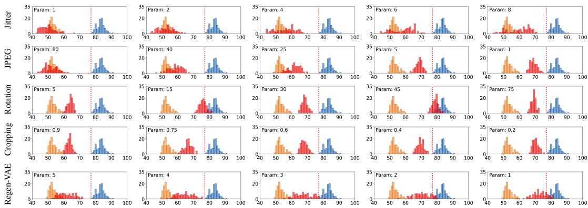  
Figure 1: Effects of different perturbations on $\lVert \mathbf { w } - \hat { \mathbf { w } } ^ { \prime } \rVert$ . From left to right, the perturbations were set with different parameters (Param). Watermark: Tree-Ring. Thresholds: 77.12 (1e-2 FPR).

## 4.2 Effects of perturbations on detection distance

In this experiment, we analyzed the implications of Eq. (7) in that the maximum perturbed distance $\lVert \mathbf { w } - \hat { \mathbf { w } } ^ { \prime } \rVert$ can be ordered by the magnitudes of applied perturbations. We used Tree-Ring [48] and HSQR [20] as representative examples, with the corresponding results presented in Figs. 1 and 2. For PRCW [12], see Figs. 10, 11, 12, and 13 in Sec. H of Appendix.

In these figures, the orange distribution denotes the distance between the watermarked latent and ground-truth watermark, the blue distribution corresponds to the distance between the unwatermarked latent and ground-truth watermark, and the red distribution represents the distances between the perturbed watermarked latent and ground-truth watermark. The red dotted lines indicate the detection threshold R at FPRs of 1e-2. Ideally, the orange distribution should be concentrated at 0. However, numerical errors, different guidance scales, stochastic sampling effects, and value clipping introduced during the reverse and inverse processes cause the estimated watermark to deviate from w, resulting in a nonzero shift of $\lVert \mathbf { w } - \hat { \mathbf { w } } ^ { \prime } \rVert$ . These deviations, captured by the term r, are explicitly accounted for in our derivation in Sec. 3.4. We also present experiments of these deviations on different watermarking schemes in Table 2 and Fig. 14 in Sec. H of Appendix. It shows that as the number of time steps t increases, the mean value and maximum of a set of $\lVert \mathbf { w } - \hat { \mathbf { w } } ^ { \prime } \rVert$ are slightly reduced. This provides a remedy to reduce the numerical errors by the number of time steps t so that the orange distribution shifts towards 0 and leaves more distance for unknown perturbations.

It can be seen from Figs. 1 and 2 that increasing perturbation strength leads to progressively larger shifts of the red distributions. If the stricter threshold is adjusted from the red dotted line to the left of the red dotted line, several perturbations are observed to push the red distributions beyond the stricter detection thresholds. According to Eq. (7), a lower FPR setting, corresponding to a stricter threshold, excludes more perturbations than a looser threshold, thereby reducing the watermark robustness. However, in practice, a watermarking scheme should be robust to perturbations even under a lower FPR setting.

## 4.3 Effects of Masking M and Watermark w

We can observe from Figs. 1 and 2 that HSQR [20] is vulnerable to rotation but Tree-Ring [48] is not. The difference comes from the design of mask M and watermark w. According to HSQR [20], it utilizes a square mask and injects a QR-code-like pattern as the watermark. We hypothesize that the vulnerability comes from the desynchronization of the extracted watermark. However, even if the mask and pattern are circular and ring-like in Tree-Ring [48], we further verified Theorems 3.2 and 3.3 in Sec. 3.3. In Fig. 1, the perturbation was set to rotate an image by 5 degrees, but the red distribution shifts from the orange distribution. Hence, we can conclude that theoretically and empirically, the diffusion process, unlike the Fourier and Fourier–Mellin transforms, is not rotation-invariant. Moreover, according to these experiments, the diffusion process is not invariant to perturbation. In Sec. I of Appendix, according to our reasoning about $\| \mathbf { w } \|$ and the corresponding “buffer” mentioned in Sec. 3.5, we verify such an effect of moving a distribution toward the one with a larger norm by increasing the strength of injected watermarks.

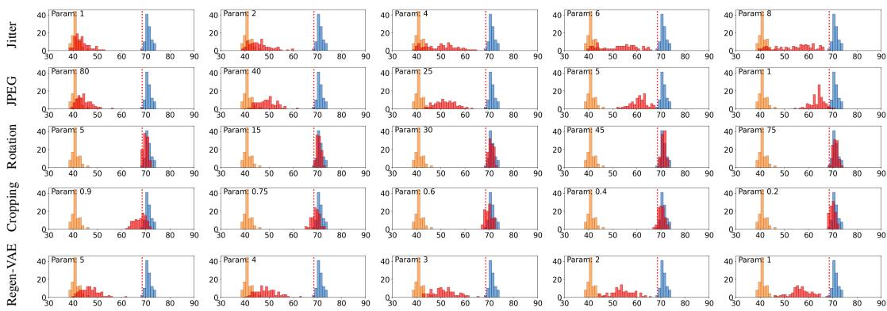  
Figure 2: Effects of different perturbations on $\lVert \mathbf { w } - \hat { \mathbf { w } } ^ { \prime } \rVert$ . From left to right, the perturbations were set with different parameters (Param). Watermark: HSQR. Thresholds: 68.52 (1e-2 FPR).

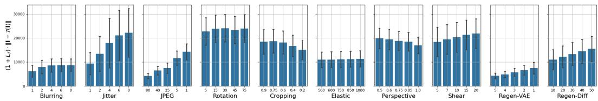  
Figure 3: Experimental thresholds for different perturbations on $\lVert \mathbf { w } - \hat { \mathbf { w } } ^ { \prime } \rVert$ , each with different parameters on x-axis. The y-axis represents the potential threat that $\hat { \mathbf { w } } ^ { \prime }$ is getting far from w, which corresponds to Eq. (7). Watermarking method: Tree-Ring.

## 4.4 Effects of Lipschitz constant $L _ { T }$

As demonstrated in Eq. (5) and Eq. (7), the distance $\left\| \mathbf { w } - \hat { \mathbf { w } } ^ { \prime } \right\|$ is upper-bounded by a term proportional to $( 1 + L \tau ) r$ for a fixed F, provided that the condition $\| \mathbf { I } - \mathcal { T } ( \mathbf { I } ) \| \le L _ { \mathbf { F } } r$ is satisfied. This leads us to investigate whether the size of $( 1 + L \tau ) \Vert \mathbf { I } - \mathcal { T } ( \mathbf { I } ) \Vert$ is positively correlated with the separation of w from $\hat { \mathbf { w } } ^ { \prime }$ . The result for Tree-Ring is presented in Fig. 3 and those for other watermarking methods are shown in Figs. 22 and 23. Essentially, these patterns in these figures appear highly similar because the value $( 1 + \mathbf { \bar { \chi } } _ { L T } ) \| \mathbf { I } - \mathcal { T } ( \mathbf { I } ) \|$ is independent of the watermark pattern. In comparison with Fig. 1, we observe that lower values on the y-axis in Fig. 3 correspond to smaller perturbation shifts, such as Blurring and high-quality factors of JPEG. Conversely, higher y-axis values typically indicate greater shifts, such as Cropping and certain Rotation cases. Interestingly, Jitter exhibits large standard deviations, suggesting that the shift varies significantly across different images. This effect corresponds to the dispersed distribution of the red bars in Jitter of Figs. 1 and 2. For thresholds computed with different watermarking schemes, please refer to Sec. J of Appendix.

## 5 Conclusion and Limitations

In this paper, we establish that latent-based watermarking methods lack invariance to perturbations. Through both theoretical analysis and empirical evaluation, we show that their performance is strongly influenced by the components used in the diffusion reverse and inverse processes. Furthermore, our theoretical and experimental findings demonstrate that existing latent-based watermarking schemes, utilizing DDIM or other expansive modules, are fundamentally limited in practical settings, particularly when operating under low FPR constraints. Taken together, these results highlight fundamental limitations of current latent-based watermarking approaches and suggest that the prevailing design paradigm may be insufficient to achieve robust watermarking in practice.

Our aim is not to hinder the development of latent-based watermarking methods, but to provide guidance for future research. We acknowledge that our analysis relies on assumptions about the MMSE denoiser and the invertibility of DDIM, which may not always hold in practice. Despite these limitations, the proposed framework offers a useful analytical perspective for identifying potential weaknesses in future watermarking designs.

## References

[1] Bang An, Mucong Ding, Tahseen Rabbani, Aakriti Agrawal, Yuancheng Xu, Chenghao Deng, Sicheng Zhu, Abdirisak Mohamed, Yuxin Wen, Tom Goldstein, et al. Waves: Benchmarking the robustness of image watermarks. In International Conference on Machine Learning, pages 1456–1492. PMLR, 2024. 6, 7

[2] Kasra Arabi, Benjamin Feuer, R Teal Witter, Chinmay Hegde, and Niv Cohen. Hidden in the noise: Two-stage robust watermarking for images. arXiv preprint arXiv:2412.04653, 2024. 5

[3] Hai Ci, Yiren Song, Pei Yang, Jinheng Xie, and Mike Zheng Shou. Wmadapter: Adding watermark control to latent diffusion models. arXiv preprint arXiv:2406.08337, 2024. 5

[4] Hai Ci, Pei Yang, Yiren Song, and Mike Zheng Shou. Ringid: Rethinking tree-ring watermarking for enhanced multi-key identification. arXiv preprint arXiv:2404.14055, 2024. 1, 2, 3, 5, 7, 14, 22, 23, 26, 27, 36, 37

[5] Samantha Delouya. European union agrees to regulate potentially harmful effects of artificial intelligence, 2023. 1

[6] Prafulla Dhariwal and Alexander Nichol. Diffusion models beat gans on image synthesis. Advances in neural information processing systems, 34:8780–8794, 2021. 1, 8, 14

[7] European Parliament. Generative ai and watermarking, 2023. 1

[8] Han Fang, Kejiang Chen, Zehua Ma, Jiajun Deng, Yicong Li, Weiming Zhang, and Ee-Chien Chang. Syntag: Enhancing the geometric robustness of inversion-based generative image watermarking. In Proceedings of the IEEE/CVF International Conference on Computer Vision, pages 15416–15425, 2025. 5

[9] Han Fang, Kejiang Chen, Zijin Yang, Bosen Cui, Weiming Zhang, and Ee-Chien Chang. Cosda: Enhancing the robustness of inversion-based generative image watermarking framework. In Proceedings ofthe AAAI Conference on Artificial Intelligence, pages 2888–2896, 2025. 5

[10] Pierre Fernandez, Guillaume Couairon, Hervé Jégou, Matthijs Douze, and Teddy Furon. The stable signature: Rooting watermarks in latent diffusion models. In Proceedings ofthe IEEE/CVF International Conference on Computer Vision, pages 22466–22477, 2023. 1, 5

[11] Zheng Gao, Yifan Yang, Xiaoyu Li, Xiaoyan Feng, Haoran Fan, Yang Song, and Jiaojiao Jiang. Slice: Semantic latent injection via compartmentalized embedding for image watermarking. arXiv preprint arXiv:2603.12749, 2026. 3, 14

[12] Sam Gunn, Xuandong Zhao, and Dawn Song. An undetectable watermark for generative image models. arXiv preprint arXiv:2410.07369, 2024. 5, 7, 8, 24, 25

[13] Mingze He, Hongxia Wang, Fei Zhang, and Yuyuan Xiang. Exploring accurate invariants on polar harmonic fourier moments in polar coordinates for robust image watermarking. IEEE Transactions on Multimedia, 26:5435–5449, 2024. 6

[14] Martin Heusel, Hubert Ramsauer, Thomas Unterthiner, Bernhard Nessler, and Sepp Hochreiter. Gans trained by a two time-scale update rule converge to a local nash equilibrium. Advances in neural information processing systems, 30, 2017. 6

[15] Jonathan Ho, Ajay Jain, and Pieter Abbeel. Denoising diffusion probabilistic models. Advances in neural information processing systems, 33:6840–6851, 2020. 1

[16] Huayang Huang, Yu Wu, and Qian Wang. Robin: Robust and invisible watermarks for diffusion models with adversarial optimization. Advances in Neural Information Processing Systems, 37:3937–3963, 2024. 2, 3, 8, 14

[17] Ying Huang, Hu Guan, Jie Liu, Shuwu Zhang, Baoning Niu, and Guixuan Zhang. Robust texture-aware local adaptive image watermarking with perceptual guarantee. IEEE Transactions on Circuits and Systems for Video Technology, 33(9):4660–4674, 2023. 6

[18] Zhaoyang Jia, Han Fang, and Weiming Zhang. Mbrs: Enhancing robustness of dnn-based watermarking by mini-batch of real and simulated jpeg compression. In Proceedings of the 29th ACM international conference on multimedia, pages 41–49, 2021. 2

[19] Zahra Kadkhodaie, Florentin Guth, Eero P Simoncelli, and Stéphane Mallat. Generalization in diffusion models arises from geometry-adaptive harmonic representation. arXiv preprint arXiv:2310.02557, 2023. 2, 3

[20] Sung Ju Lee and Nam Ik Cho. Semantic watermarking reinvented: Enhancing robustness and generation quality with fourier integrity. In Proceedings of the IEEE/CVF International Conference on Computer Vision, pages 18759–18769, 2025. 5, 7, 8, 26

[21] Chun-Shien Lu and Chao-Yong Hsu. Content-dependent anti-disclosure image watermark. In International Workshop on Digital Watermarking, pages 61–76. Springer, 2003. 2

[22] Chun-Shien Lu, Shih-Wei Sun, Chao-Yong Hsu, and Pao-Chi Chang. Media hash-dependent image watermarking resilient against both geometric attacks and estimation attacks based on false positiveoriented detection. IEEE Transactions on Multimedia, 8(4):668–685, 2006. 2, 14

[23] Xiyang Luo, Ruohan Zhan, Huiwen Chang, Feng Yang, and Peyman Milanfar. Distortion agnostic deep watermarking. In Proceedings of the IEEE/CVF conference on computer vision and pattern recognition, pages 13548–13557, 2020. 2

[24] TorchVision maintainers and contributors. Torchvision: Pytorch’s computer vision library. https: //github.com/pytorch/vision, 2016. 7

[25] Po-Yuan Mao, Cheng-Chang Tsai, and Chun-Shien Lu. Maxsive: High-capacity and robust training-free generative image watermarking in diffusion models. In Proceedings of the 33rd ACM International Conference on Multimedia, 2025. 2, 5

[26] Zheling Meng, Bo Peng, and Jing Dong. Latent watermark: Inject and detect watermarks in latent diffusion space. IEEE Transactions on Multimedia, 2025. 2

[27] Rachel Metz. The white house released an ‘ai bill of rights’, 2022. 1

[28] Christopher A Metzler, Arian Maleki, and Richard G Baraniuk. From denoising to compressed sensing. IEEE Transactions on Information Theory, 62(9):5117–5144, 2016. 3

[29] Sreyas Mohan, Zahra Kadkhodaie, Eero P Simoncelli, and Carlos Fernandez-Granda. Robust and interpretable blind image denoising via bias-free convolutional neural networks. arXiv preprint arXiv:1906.05478, 2019. 3

[30] Ron Mokady, Amir Hertz, Kfir Aberman, Yael Pritch, and Daniel Cohen-Or. Null-text inversion for editing real images using guided diffusion models. In Proceedings of the IEEE/CVF conference on computer vision and pattern recognition, pages 6038–6047, 2023. 14

[31] Fabien AP Petitcolas. Watermarking schemes evaluation. IEEE signal processing magazine, 17(5):58–64, 2000. 14, 27

[32] Fabien AP Petitcolas, Ross J Anderson, and Markus G Kuhn. Attacks on copyright marking systems. In International workshop on information hiding, pages 218–238. Springer, 1998. 7, 14, 26, 27

[33] Sundeep Rangan, Philip Schniter, and Alyson K Fletcher. Vector approximate message passing. IEEE Transactions on Information Theory, 65(10):6664–6684, 2019. 2, 3

[34] Sylvestre-Alvise Rebuffi, Tuan Tran, Valeriu Lacatusu, Pierre Fernandez, Tomáš Soucek, Nikola Jovanoviˇ c,´ Tom Sander, Hady Elsahar, and Alexandre Mourachko. Learning to watermark in the latent space of generative models. arXiv preprint arXiv:2601.16140, 2026. 3, 14

[35] Ahmad Rezaei, Mohammad Akbari, Saeed Ranjbar Alvar, Arezou Fatemi, and Yong Zhang. Lawa: Using latent space for in-generation image watermarking. In European Conference on Computer Vision, pages 118–136. Springer, 2024. 5

[36] Yaniv Romano, Michael Elad, and Peyman Milanfar. The little engine that could: Regularization by denoising (red). SIAM Journal on Imaging Sciences, 10(4):1804–1844, 2017. 3

[37] Robin Rombach, Andreas Blattmann, Dominik Lorenz, Patrick Esser, and Björn Ommer. High-resolution image synthesis with latent diffusion models, 2021, 2021. 1, 2, 3, 7

[38] Joseph JK Ò Ruanaidh and Thierry Pun. Rotation, scale and translation invariant spread spectrum digital image watermarking. Signal processing, 66(3):303–317, 1998. 2, 14, 19

[39] Jascha Sohl-Dickstein, Eric Weiss, Niru Maheswaranathan, and Surya Ganguli. Deep unsupervised learning using nonequilibrium thermodynamics. In International conference on machine learning, pages 2256–2265. PMLR, 2015. 14

[40] Vassilios Solachidis and Loannis Pitas. Circularly symmetric watermark embedding in 2-d dft domain. IEEE transactions on image processing, 10(11):1741–1753, 2001. 2

[41] Jiaming Song, Chenlin Meng, and Stefano Ermon. Denoising diffusion implicit models. In International Conference on Learning Representations, 2021. 1, 2, 3, 8, 14

[42] Tomáš Soucek, Pierre Fernandez, Hady Elsahar, Sylvestre-Alvise Rebuffi, Valeriu Lacatusu, Tuan Tran,ˇ Tom Sander, and Alexandre Mourachko. Pixel seal: Adversarial-only training for invisible image and video watermarking. arXiv preprint arXiv:2512.16874, 2025. 6

[43] The White House. Fact sheet: President biden issues executive order on safe, secure, and trustworthy artificial intelligence, 2023. 1

[44] Sviatoslav Voloshynovskiy, Shelby Pereira, Victor Iquise, and Thierry Pun. Attack modelling: towards a second generation watermarking benchmark. Signal processing, 81(6):1177–1214, 2001. 2, 14

[45] Patrick von Platen, Suraj Patil, Anton Lozhkov, Pedro Cuenca, Nathan Lambert, Kashif Rasul, Mishig Davaadorj, Dhruv Nair, Sayak Paul, William Berman, Yiyi Xu, Steven Liu, and Thomas Wolf. Diffusers: State-of-the-art diffusion models. https://github.com/huggingface/diffusers, 2022. 7

[46] Jiayan Wang, Jing Zhao, Li Li, Zichi Wang, Hanzhou Wu, and Deyang Wu. Robust blind video watermark ing based on ring tensor and bch coding. IEEE Internet of Things Journal, 11(24):40743–40756, 2024. 6

[47] Zhendong Wang, Jianmin Bao, Wengang Zhou, Weilun Wang, Hezhen Hu, Hong Chen, and Houqiang Li. Dire for diffusion-generated image detection. In Proceedings of the IEEE/CVF International Conference on Computer Vision, pages 22445–22455, 2023. 14

[48] Yuxin Wen, John Kirchenbauer, Jonas Geiping, and Tom Goldstein. Tree-rings watermarks: Invisible fingerprints for diffusion images. In Thirty-seventh Conference on Neural Information Processing Systems, 2023. 1, 2, 3, 5, 7, 8, 14, 22, 23, 27, 34, 35

[49] Deyang Wu, Xinpeng Zhang, Jiayan Wang, Li Li, and Guorui Feng. Novel robust video watermarking scheme based on concentric ring subband and visual cryptography with piecewise linear chaotic mapping. IEEE Transactions on Circuits and Systemsfor Video Technology, 34(10):10281–10298, 2024. 6

[50] JinFeng Xie, Peipeng Yu, Jianwei Fei, Xiaoyu Zhou, and Zhihua Xia. Safetr: Verifiable semantic treering watermark for diffusion model against forgery attacks. In ICASSP 2026 - 2026 IEEE International Conference on Acoustics, Speech and Signal Processing (ICASSP), pages 9505–9511, 2026. 3, 14

[51] Pei Yang, Hai Ci, Yiren Song, and Mike Zheng Shou. Can simple averaging defeat modern watermarks? In The Thirty-eighth Annual Conference on Neural Information Processing Systems, 2024. 2, 3, 23, 24

[52] Zijin Yang, Kai Zeng, Kejiang Chen, Han Fang, Weiming Zhang, and Nenghai Yu. Gaussian shading: Provable performance-lossless image watermarking for diffusion models. In Proceedings of the IEEE/CVF Conference on Computer Vision and Pattern Recognition, pages 12162–12171, 2024. 2, 3, 5, 14

[53] Fei Zhang, Hongxia Wang, Mingze He, and Jinghong Xia. Robust blind symmetry-based watermarking in the frequency domain against social network processing and desynchronization attacks. IEEE Transactions on Circuits and Systems for Video Technology, pages 1–1, 2024. 6

[54] Lijun Zhang, Xiao Liu, Antoni V Martin, Cindy X Bearfield, Yuriy Brun, and Hui Guan. Attack-resilient image watermarking using stable diffusion. Advances in Neural Information Processing Systems, 37: 38480–38507, 2024. 2, 3, 14

[55] Jiren Zhu, Russell Kaplan, Justin Johnson, and Li Fei-Fei. Hidden: Hiding data with deep networks. In Proceedings ofthe European conference on computer vision (ECCV), pages 657–672, 2018. 2, 5

[56] Yifan Zhu, Yihan Wang, and Xiao-Shan Gao. Towards robust content watermarking against removal and forgery attacks. arXiv preprint arXiv:2604.06662, 2026. 3, 14

## Appendix

## A Background

We present the background knowledge relevant to our research.

## A.1 Rotation, Scale, and Translation Invariance

Geometric attacks (GAs), as one of the primary kinds of watermarking attacks [44], are greatly ignored nowadays in the evaluation of the robustness of generative watermarking. GAs aims to cause synchronization errors to disable watermark detection without removing embedded watermarks or degrading the quality of watermarked images. Rotation, scale, and translation are common global geometric distortions, which are included in Stirmark [31, 32]. In earlier studies, [38] presented a Fourier—Mellin-based approach to embed watermarks in resisting a combination of rotation and scaling transformations, whereas [22] proposed robust feature-based image watermarking with resistance to Stirmark benchmark.

## A.2 DDIM Inversion

Diffusion models [39] generate synthetic images through the reverse process, which progressively denoises the initial noise sampled from the standard Gaussian distribution. Since this reverse process is inherently not deterministic, it is virtually impossible to retrieve the initial noise that generates a given synthetic image. However, the introduction of DDIM [41] renders this possible. Song et al. [41] suggested that we can “reverse” the reverse process to obtain the initial noise for downstream applications that require it [4, 30, 47, 48]. Note that in [41], this “inverse process” was only mentioned, without any explicit formulation. The first explicit formulation of the inverse process appeared in [6], although it was not yet called the inverse process. Recently, in the literature on watermarking on AIGCs, the term “inverse process” was first introduced in Tree-Ring [48]. Since then, numerous methods exploiting the inverse process have been proposed [4, 11, 16, 34, 48, 50, 52, 54, 56].

## B The Lipschitz bounds of DDIM Reverse and Inverse Process (Prerequisite of Sec. C)

In this section, we provide a derivation that connects VAMP and the MMSE denoiser to the DDIM reverse process, and prove that such a process is invertible, a.k.a the inverse process.

## B.1 Theoretical Analysis: Spectral Stability of Diffusion via MMSE-AMP

In this section, we derive the spectral properties of the diffusion process by establishing an equivalence between the Denoising Diffusion Implicit Model (DDIM) and Vector Approximate Message Passing (VAMP). Our key insight is that DDIM acts as a normalized iterative denoiser, where the normalization constant induces an expansive regime essential for generation. By treating the diffusion step as a regularized MMSE estimation update, we derive rigorous spectral bounds for both the generative (reverse) and encoding (inverse) processes.

The DDIM sampling process generates a sequence $\mathbf x _ { T } ( i . e . , \mathbf y ) , \mathbf x _ { T - 1 } , . . . , \mathbf x _ { 0 }$ via the update rule:

$$
\mathbf { x } _ { t - 1 } = \sqrt { \bar { \alpha } _ { t - 1 } } \underbrace { \left( \frac { \mathbf { x } _ { t } - \sqrt { 1 - \bar { \alpha } _ { t } } \epsilon _ { \theta } ( \mathbf { x } _ { t } ) } { \sqrt { \bar { \alpha } _ { t } } } \right) } _ { \hat { \mathbf { x } } _ { 0 } ( \mathbf { x } _ { t } ) } + \sqrt { 1 - \bar { \alpha } _ { t - 1 } } \epsilon _ { \theta } ( \mathbf { x } _ { t } ) ,\tag{8}
$$

where $\begin{array} { r } { \bar { \alpha } _ { t } : = \prod _ { s = 0 } ^ { t } \alpha _ { s } , \{ \alpha _ { t } \} _ { t = 0 } ^ { T } \subset ( 0 , 1 ] } \end{array}$ is the noise schedule, and $\epsilon _ { \theta } ( \cdot )$ is the learned denoiser parameterized by θ, and $\hat { \mathbf { x } } _ { 0 } ( \mathbf { x } _ { t } )$ is the DDIM prediction at t.

## B.1.1 Connection: DDIM as Normalized AMP

To apply the VAMP theory, we must align the signal models. Standard VAMP assumes a signal-plusnoise model $\mathbf { y } = \mathbf { x } _ { 0 } + \xi , \xi \sim \mathcal { N } ( \mathbf { 0 } , \sigma ^ { 2 } \mathrm { I d } )$ . In contrast, the diffusion state $\mathbf { x } _ { t }$ scales the signal by

$\sqrt { \alpha _ { t } }$ . We define the Normalized AMP State $\mathbf { u } _ { t }$ as:

$$
\mathbf { u } _ { t } = \frac { \mathbf { x } _ { t } } { \sqrt { \bar { \alpha } _ { t } } } = \mathbf { x } _ { 0 } + \sqrt { \frac { 1 - \bar { \alpha } _ { t } } { \bar { \alpha } _ { t } } } \epsilon .
$$

This transforms $\mathbf { x } _ { t }$ into the standard form expected by an MMSE estimator. The DDIM prediction $\hat { \mathbf { x } } _ { 0 } ( \mathbf { x } _ { t } )$ is equivalent to applying a standard MMSE denoiser $D _ { \theta } ( \cdot )$ to this normalized state:

$$
\hat { \mathbf { x } } _ { 0 } ( \mathbf { x } _ { t } ) = D _ { \theta } ( \mathbf { u } _ { t } ) = D _ { \theta } \left( \frac { \mathbf { x } _ { t } } { \sqrt { \bar { \alpha } _ { t } } } \right) .\tag{9}
$$

To connect $\epsilon _ { \theta }$ in DDIM and $D _ { \theta }$ in VAMP, we have:

$$
\epsilon _ { \theta } ( \mathbf { z } ) = \frac { \mathbf { z } - \sqrt { \bar { \alpha } _ { t } } D _ { \theta } \left( \frac { \mathbf { z } } { \sqrt { \bar { \alpha } _ { t } } } \right) } { \sqrt { 1 - \bar { \alpha } _ { t } } } ,\tag{10}
$$

where z is the noisy representation of each time step t in DDIM.

## B.1.2 The Jacobian Analysis

We first reformulate the DDIM update rule in Eq. (8) to isolate the denoising operator by employing Eq. (10) to yield the MMSE-AMP Affine Form with $\mathbf { z } = \mathbf { x } _ { t }$ . The DDIM update, the reverse step, from $t  t - 1$ is given by the affine form:

$$
{ \bf x } _ { t - 1 } = \mu _ { t } { \bf x } _ { t } + \gamma _ { t } \hat { \bf x } _ { 0 } ( { \bf x } _ { t } ) = \mu _ { t } { \bf x } _ { t } + \gamma _ { t } D _ { \theta } \left( \frac { { \bf x } _ { t } } { \sqrt { \bar { \alpha } _ { t } } } \right) ,\tag{11}
$$

where the coefficients are determined by the noise schedule:

$$
\begin{array} { r l } & { { \mu _ { t } } = \frac { { \sqrt { 1 - { { \bar { \alpha } } _ { t - 1 } } } } } { { \sqrt { 1 - { { \bar { \alpha } } _ { t } } } } } , \quad \mathrm { ( N o i s e } \mathrm { C a r r y o v e r ) } } \\ & { { \gamma _ { t } } = \sqrt { { { \bar { \alpha } } _ { t - 1 } } } - { \mu _ { t } } \sqrt { { { \bar { \alpha } } _ { t } } } . \quad \mathrm { ( S i g n a l I n j e c t i o n ) } } \end{array}
$$

To determine the stability of this update, we compute the Jacobian matrix $\begin{array} { r } { J _ { t } = \frac { \partial \mathbf { x } _ { t - 1 } } { \partial \mathbf { x } _ { t } } } \end{array}$ . Applying the chain rule to Eq. (11) introduces the critical scaling factor $1 / \sqrt { \bar { \alpha } _ { t } } \mathrm { : }$

$$
J _ { t } = \mu _ { t } \mathrm { I d } + \left. \frac { \gamma _ { t } } { \sqrt { \bar { \alpha } _ { t } } } \nabla _ { \mathbf { u } } D _ { \theta } ( \mathbf { u } ) \right| _ { \mathbf { u } = \frac { \mathbf { x } _ { t } } { \sqrt { \bar { \alpha } _ { t } } } } .\tag{12}
$$

## B.2 Derivation of Spectral Bounds

We apply the Fundamental Property of MMSE Estimators used in VAMP theory: the MMSE denoiser is contractive, i.e., its eigenvalues are within [0, 1]. Thus, we can have the following proposition.

Proposition B.1 (Spectral Bounds of MMSE Denoiser). Assuming the denoiser $D _ { \theta } ( \cdot )$ approximates the optimal MMSE estimator under Gaussian noise, the eigenvalues of its Jacobian matrix satisfy $\lambda ( \nabla \bar { D } _ { \theta } ) \subset [ 0 , 1 ]$

Proof. Our goal is to show that $\nabla D _ { \theta }$ is positive semi-definite, and that $0 \preceq \nabla D _ { \theta } \preceq { \mathrm { I d } }$ . Given $\mathbf { u } \sim \mathcal { N } ( \mathbf { x } , \sigma ^ { 2 } \mathrm { I d } )$ , the denoiser $D = D _ { \theta }$ is defined as posterior expectation conditioned on u:

$$
D ( \mathbf { u } ) = \mathbb { E } [ \mathbf { x } | \mathbf { u } ] = \int \mathbf { x } p ( \mathbf { x } | \mathbf { u } ) d \mathbf { x } .
$$

Applying Tweedie’s formula,

$$
D ( \mathbf { u } ) = \mathbf { u } + \sigma ^ { 2 } \nabla \log p ( \mathbf { u } ) ,
$$

where $\begin{array} { r } { p ( \mathbf { u } ) : = \int p ( \mathbf { u } | \mathbf { x } ) p ( \mathbf { x } ) } \end{array}$ dx. So the Jacobian matrix is

$$
\nabla D ( \mathbf { u } ) = \operatorname { I d } + \sigma ^ { 2 } \nabla ^ { 2 } \log p ( \mathbf { u } ) .\tag{13}
$$

Using the formula (will be proved in Lemma B.2):

$$
\nabla ^ { 2 } \log { p ( \mathbf { u } ) } = \frac { 1 } { \sigma ^ { 4 } } \mathrm { C o v } ( \mathbf { x } | \mathbf { u } ) - \frac { 1 } { \sigma ^ { 2 } } \mathrm { I d } ,
$$

where $\operatorname { C o v } ( \mathbf { x } | \mathbf { u } ) : = \mathbb { E } [ \mathbf { x } \mathbf { x } ^ { \top } | \mathbf { u } ] - \mathbb { E } [ \mathbf { x } | \mathbf { u } ] \mathbb { E } [ \mathbf { x } | \mathbf { u } ] ^ { \top }$ , and taking it into Eq. (13) gives

$$
\nabla D ( \mathbf { u } ) = \operatorname { I d } + \sigma ^ { 2 } \left( { \frac { 1 } { \sigma ^ { 4 } } } \mathrm { { C o v } } ( \mathbf { x } | \mathbf { u } ) - { \frac { 1 } { \sigma ^ { 2 } } } \mathrm { { I d } } \right) = { \frac { 1 } { \sigma ^ { 2 } } } \mathrm { { C o v } } ( \mathbf { x } | \mathbf { u } ) .
$$

This immediately shows that $\nabla D \succeq 0$ since covariance matrices are positive semi-definite. To show that $\nabla D \preceq \mathrm { I d }$ , we observe that, $p ( \mathbf { u } )$ is log-concave, which means $\nabla ^ { 2 } \log p ( \mathbf { u } ) \preceq 0$ . Thus using Eq. (13) again, we obtain $\nabla D \preceq { \bar { \mathrm { I d } } }$ □

Lemma B.2. $\begin{array} { r } { \nabla ^ { 2 } \log p ( \mathbf { u } ) = \frac { 1 } { \sigma ^ { 4 } } \mathrm { C o v } ( \mathbf { x } | \mathbf { u } ) - \frac { 1 } { \sigma ^ { 2 } } \mathrm { I d } . } \end{array}$

Proof. Note that $p ( \mathbf { u } | \mathbf { x } ) = \mathcal { N } ( \mathbf { x } , \sigma ^ { 2 } \mathrm { I d } )$ , so we have the useful formula, the derivative of p.d.f. of Gaussian distribution:

$$
\nabla _ { \mathbf { u } } p ( \mathbf { u } | \mathbf { x } ) = - \frac { 1 } { \sigma ^ { 2 } } ( \mathbf { u } - \mathbf { x } ) p ( \mathbf { u } | \mathbf { x } ) .\tag{14}
$$

We begin with computing the Jacobian. From the chain rule, $\begin{array} { r } { \nabla \log p ( \mathbf { u } ) = \frac { \nabla p ( \mathbf { u } ) } { p ( \mathbf { u } ) } } \end{array}$ , and calculate the numerator:

$$
\begin{array} { r l } & { \nabla p ( \mathbf { u } ) = \nabla _ { \mathbf { u } } \int p ( \mathbf { u } | \mathbf { x } ) p ( \mathbf { x } ) d \mathbf { x } } \\ & { \qquad = \displaystyle \int \nabla _ { \mathbf { u } } p ( \mathbf { u } | \mathbf { x } ) p ( \mathbf { x } ) d \mathbf { x } } \\ & { \qquad = \displaystyle - \frac { 1 } { \sigma ^ { 2 } } \int ( \mathbf { u } - \mathbf { x } ) p ( \mathbf { u } | \mathbf { x } ) p ( \mathbf { x } ) d \mathbf { x } , } \end{array}\tag{15}
$$

where the last equality follows by Eq. (14). Thus, applying Bayes’ formula,

$$
\begin{array} { l } { { \nabla \log p ( { \mathbf u } ) = - { \displaystyle \frac { 1 } { p ( { \mathbf u } ) \sigma ^ { 2 } } } \int ( { \mathbf u } - { \mathbf x } ) p ( { \mathbf u } | { \mathbf x } ) p ( { \mathbf x } ) d { \mathbf x } } \ ~ } \\ { { \displaystyle ~ = - { \frac { 1 } { \sigma ^ { 2 } } } \int ( { \mathbf u } - { \mathbf x } ) { \frac { p ( { \mathbf u } | { \mathbf x } ) p ( { \mathbf x } ) } { p ( { \mathbf u } ) } } d { \mathbf x } } \ ~ } \\ { { \displaystyle ~ = - { \frac { 1 } { \sigma ^ { 2 } } } \int ( { \mathbf u } - { \mathbf x } ) p ( { \mathbf x } | { \mathbf u } ) d { \mathbf x } } \ ~ } \\ { { \displaystyle ~ = - { \frac { 1 } { \sigma ^ { 2 } } } \mathbb E [ { \mathbf u } - { \mathbf x } | { \mathbf u } ] } . } \end{array}\tag{16}
$$

Next, we compute the Hessian:

$$
\begin{array} { r l } & { \nabla ^ { 2 } \log p ( \mathbf { u } ) = \nabla \left( \frac { \nabla p ( \mathbf { u } ) } { p ( \mathbf { u } ) } \right) = \frac { p ( \mathbf { u } ) \nabla ^ { 2 } p ( \mathbf { u } ) - \nabla p ( \mathbf { u } ) ( \nabla p ( \mathbf { u } ) ) ^ { \top } } { p ( \mathbf { u } ) ^ { 2 } } } \\ & { \qquad = \frac { \nabla ^ { 2 } p ( \mathbf { u } ) } { p ( \mathbf { u } ) } - \left( \frac { \nabla p ( \mathbf { u } ) } { p ( \mathbf { u } ) } \right) \left( \frac { \nabla p ( \mathbf { u } ) } { p ( \mathbf { u } ) } \right) ^ { \top } } \\ & { \qquad = \frac { \nabla ^ { 2 } p ( \mathbf { u } ) } { p ( \mathbf { u } ) } - \frac { 1 } { \sigma ^ { 4 } } \mathbb { E } [ \mathbf { u } - \mathbf { x } | \mathbf { u } ] \mathbb { E } [ \mathbf { u } - \mathbf { x } | \mathbf { u } ] ^ { \top } , } \end{array}\tag{17}
$$

where the second term of the last equality follows by Eq. (16). To deal with the first term of Eq. (17), we need to calculate $\nabla ^ { 2 } p ( \mathbf { u } )$ . From Eqs. (14) and (15),

$$
\begin{array} { l } { { \nabla ^ { 2 } p ( { \bf u } ) = - { \frac { 1 } { \sigma ^ { 2 } } } \int \nabla _ { { \bf u } } [ ( { \bf u } - { \bf x } ) p ( { \bf u } | { \bf x } ) ] p ( { \bf x } ) d { \bf x } } \ ~ } \\ { { \displaystyle ~ = - { \frac { 1 } { \sigma ^ { 2 } } } \int \left[ { \bf L } \cdot p ( { \bf u } | { \bf x } ) + ( { \bf u } - { \bf x } ) ( \nabla _ { { \bf u } } p ( { \bf u } | { \bf x } ) ) ^ { \top } \right] p ( { \bf x } ) d { \bf x } } \ ~ } \\ { { \displaystyle ~ = - { \frac { 1 } { \sigma ^ { 2 } } } \int \left[ { \bf H } \cdot p ( { \bf u } | { \bf x } ) - { \frac { 1 } { \sigma ^ { 2 } } } ( { \bf u } - { \bf x } ) ( { \bf u } - { \bf x } ) ^ { \top } p ( { \bf u } | { \bf x } ) \right] p ( { \bf x } ) d { \bf x } } \ ~ } \\ { { \displaystyle ~ = - { \frac { 1 } { \sigma ^ { 2 } } } \mathrm { H d } \int p ( { \bf u } | { \bf x } ) p ( { \bf x } ) d { \bf x } + { \frac { 1 } { \sigma ^ { 4 } } } \int ( { \bf u } - { \bf x } ) ( { \bf u } - { \bf x } ) ^ { \top } p ( { \bf u } | { \bf x } ) p ( { \bf x } ) d { \bf x } } \ ~ } \\ { { \displaystyle ~ = - { \frac { 1 } { \sigma ^ { 2 } } } \mathrm { I d } \cdot p ( { \bf u } ) + { \frac { 1 } { \sigma ^ { 4 } } } \int ( { \bf u } - { \bf x } ) ( { \bf u } - { \bf x } ) ^ { \top } p ( { \bf u } | { \bf x } ) p ( { \bf x } ) d { \bf x } } . } \end{array}
$$

Therefore, using Bayes’ formula,

$$
\begin{array} { l } { \displaystyle \frac { \nabla ^ { 2 } p ( \mathbf { u } ) } { p ( \mathbf { u } ) } = - \frac { 1 } { \sigma ^ { 2 } } \mathrm { I d } + \frac { 1 } { \sigma ^ { 4 } } \int ( \mathbf { u } - \mathbf { x } ) ( \mathbf { u } - \mathbf { x } ) ^ { \top } p ( \mathbf { x } | \mathbf { u } ) d \mathbf { x } } \\ { \displaystyle \qquad = - \frac { 1 } { \sigma ^ { 2 } } \mathrm { I d } + \frac { 1 } { \sigma ^ { 4 } } \mathbb { E } [ ( \mathbf { u } - \mathbf { x } ) ( \mathbf { u } - \mathbf { x } ) ^ { \top } | \mathbf { u } ] . } \end{array}\tag{18}
$$

Finally, taking Eq. (18) into Eq. (17) gives

$$
\begin{array} { l } { { \nabla ^ { 2 } \log p ( { \bf u } ) = \displaystyle \frac { 1 } { \sigma ^ { 4 } } \left( { \mathbb { E } [ ( { \bf u } - { \bf x } ) ( { \bf u } - { \bf x } ) ^ { \top } | { \bf u } ] - \mathbb { E } [ { \bf u } - { \bf x } | { \bf u } ] \mathbb { E } [ { \bf u } - { \bf x } | { \bf u } ] ^ { \top } } \right) - \frac { 1 } { \sigma ^ { 2 } } \mathrm { I d } } \ ~ } \\ { { \displaystyle ~ = \frac { 1 } { \sigma ^ { 4 } } \mathrm { C o v } ( { \bf u } - { \bf x } | { \bf u } ) - \frac { 1 } { \sigma ^ { 2 } } \mathrm { I d } } \ ~ } \\ { { \displaystyle ~ = \frac { 1 } { \sigma ^ { 4 } } \mathrm { C o v } ( { \bf x } | { \bf u } ) - \frac { 1 } { \sigma ^ { 2 } } \mathrm { I d } } , } \end{array}
$$

so the Hessian is obtained. This completes the proof.

Using this property, the spectrum of the DDIM Jacobian matrix $J _ { t }$ in Eq. (12) is bounded by the linear combination of the identity and the denoiser spectrum. The spectrum of the reverse step is thus:

$$
\lambda ( J _ { t } ) = \left\{ \mu _ { t } + \frac { \gamma _ { t } } { \sqrt { \bar { \alpha } _ { t } } } \lambda : \lambda \in \lambda ( \nabla D _ { \theta } ) \right\} .\tag{19}
$$

Also, we can verify whether our derived sampling step is invertible. First, since noise variance never hits zero during intermediate steps, $\mu _ { t } > 0$ . Also, for time step t $\mathbf { \sigma } _ { 0 } t - 1 , \bar { \alpha } _ { t - 1 } > \bar { \alpha } _ { t }$ , which implies $\gamma _ { t } > 0$ . For an MMSE denoiser $D _ { \theta } ( \cdot )$ , its Jacobian matrix is positive semi-definite since its eigenvalues are within [0, 1]. Therefore, the eigenvalues of Eq. (12), a.k.a Eq. (19), are strictly positive. As a result, Eq. (11) is non-singular.

## B.2.1 Generative Expansion (Reverse Process)

The maximum expansion is the supremum over the spectrum $\begin{array} { r } { L _ { \mathrm { g e n } } ^ { ( t ) } = \operatorname* { s u p } _ { \lambda _ { D } \in [ 0 , 1 ] } \left( \mu _ { t } + \frac { \gamma _ { t } } { \sqrt { \bar { \alpha } _ { t } } } \lambda _ { D } \right) } \end{array}$ The Lipschitz constant of the generation step is the maximum singular value of $J _ { t }$ . This occurs along the signal direction, where the denoiser preserves structure $( \lambda _ { \operatorname* { m a x } } ( \nabla D _ { \theta } ) = 1 )$ . From Eq. (19), we can obtain:

$$
\begin{array} { r l r } {  { L _ { \mathrm { g e n } } ^ { ( t ) } \le \mu _ { t } + \frac { \gamma _ { t } } { \sqrt { \bar { \alpha } _ { t } } } = \mu _ { t } + \frac { 1 } { \sqrt { \bar { \alpha } _ { t } } } ( \sqrt { \bar { \alpha } _ { t - 1 } } - \mu _ { t } \sqrt { \bar { \alpha } _ { t } } ) } } \\ & { } & { ~ = \mu _ { t } + \frac { \sqrt { \bar { \alpha } _ { t - 1 } } } { \sqrt { \bar { \alpha } _ { t } } } - \mu _ { t } = \frac { \sqrt { \bar { \alpha } _ { t - 1 } } } { \sqrt { \bar { \alpha } _ { t } } } . } \end{array}\tag{20}
$$

## B.2.2 Inversion Singularity

For the inverse process $x _ { t - 1 } \to x _ { t } .$ , we ask “where does the reverse process contract the input the most?” The maximum expansion of the inverse process is dictated by the infimum of the forward step $\begin{array} { r } { L _ { \mathrm { i n v } } ^ { ( t ) } = \left( \operatorname* { i n f } _ { \lambda _ { D } \in [ 0 , 1 ] } \left( \mu _ { t } + \frac { \gamma _ { t } } { \sqrt { \bar { \alpha } _ { t } } } \lambda _ { D } \right) \right) ^ { - 1 } } \end{array}$ . During the reverse process, the denoiser suppresses the noisy signal the most $( \dot { \lambda } _ { \mathrm { m i n } } ( \nabla D _ { \theta } ) \dot { = } \mathrm { 0 ) }$ . Hence, the stability is governed by the noise subspace, where in this regime, the Jacobian matrix in Eq. (12) simplifies to $\breve { J _ { t } } = \mu _ { t } \mathrm { I d }$ . The inverse Lipschitz constant is therefore $1 / \mu _ { t } \colon$

$$
L _ { \mathrm { i n v } } ^ { ( t ) } \leq \frac { 1 } { \mu _ { t } } = \frac { \sqrt { 1 - \bar { \alpha } _ { t } } } { \sqrt { 1 - \bar { \alpha } _ { t - 1 } } } .\tag{21}
$$

## C Proofs of Theorems and Lemmas

In the following, we provide detailed proofs of Theorem 3.1, Theorem 3.2, Theorem 3.3, Theorem $3 . 4 ,$ and Theorem 3.5.

Proof of Theorem 3.1. In our specific MMSE-VAMP framework, the mapping naturally satisfies the "stronger conditions" required for global bijectivity. Specifically, the Jacobian of our update step is not merely non-singular; it is strictly positive definite globally. We prove with the following reasoning:

First, by Tweedie’s formula, the optimal MMSE denoiser under Gaussian noise is $D _ { \theta } ( \mathbf { x } ) = \mathbf { x } +$ $\sigma ^ { 2 } \nabla _ { \mathbf { x } } \log p ( \mathbf { x } )$ . Because it is the gradient of a scalar potential function, its Jacobian $\dot { \nabla } D _ { \boldsymbol { \theta } } ( \mathbf { x } )$ is symmetric. Furthermore, standard MMSE properties dictate that the eigenvalues of $\nabla D _ { \boldsymbol { \theta } } ( \mathbf { \dot { x } } )$ are bounded in [0, 1] everywhere in the domain. Therefore, $\nabla D _ { \boldsymbol { \theta } } ( \mathbf { x } )$ is a positive semi-definite (PSD) matrix globally.

Recall our derived Jacobian for a single DDIM step $( { \bf x } _ { t }  { \bf x } _ { t - 1 } )$

$$
J _ { t } = \mu _ { t } \mathbf { I } + \frac { \gamma _ { t } } { \sqrt { \bar { \alpha } _ { t } } } \nabla D _ { \theta } ( \mathbf { u } _ { t } )
$$

Because $\mu _ { t } > 0$ strictly (based on the diffusion noise schedule), $\gamma _ { t } > 0 .$ , and $\nabla D _ { \theta } \succeq 0$ globally, the entire Jacobian matrix $J _ { t }$ is strictly positive definite everywhere in $\mathbb { R } ^ { d }$ . Specifically, its minimum eigenvalue is bounded globally by $\mu _ { t } > 0$

Finally, according to the global inverse function theorem (and specifically the Gale-Nikaido theorem for mappings with positive principal minors, or standard results for strongly monotone operators), a continuously differentiable mapping $F : \mathbb { R } ^ { d }  \mathbb { R } ^ { d }$ whose Jacobian is everywhere strictly positive definite is a global diffeomorphism (a smooth bijection). Because every individual step $t  t - 1$ is a global bijection, the full T-step composition is also globally invertible. □

Proof of Theorem 3.2. We use proof by contradiction. Suppose both $\hat { \mathbf { x } } _ { 0 } ^ { R S T }$ and $\hat { \mathbf { x } } _ { 0 }$ have the same latent representation, which means $\mathbf { y } ^ { R \pmb { \xi } _ { T } } = \mathbf { y }$ , given the invertible $f _ { \theta }$ and $\mathbf { I } ^ { R S T } = \mathcal { R } \mathcal { S } \mathcal { T } ( \mathbf { I } )$ , we can derive:

$$
\hat { \mathbf { x } } _ { 0 } ^ { R S T } = \mathcal { E } _ { \phi _ { e } } ( \mathbf { I } ^ { R S T } ) = f _ { \theta } ( \mathbf { y } ^ { R S T } ) ,
$$

which contradicts $\hat { \mathbf { x } } _ { 0 } ^ { R S T } \neq \hat { \mathbf { x } } _ { 0 }$ . Actually, the above statement is true only when $\mathcal { R S T } = \mathrm { I d }$ , that is to say, there are no $\mathcal { R } \mathcal { S } \dot { \mathcal { T } }$ perturbations on I.

Moreover, with the invertible $f _ { \theta } ,$ , we have:

$$
\begin{array} { r } { \mathbf { y } = f _ { \theta } ^ { - 1 } ( \hat { \mathbf { x } } _ { 0 } ) , \quad \quad } \\ { \mathbf { y } ^ { R S T } = f _ { \theta } ^ { - 1 } ( \hat { \mathbf { x } } _ { 0 } ^ { R S T } ) . } \end{array}
$$

If the assumption $\mathbf { y } ^ { R S T } = \mathbf { y }$ is imposed, we have:

$$
f _ { \theta } ^ { - 1 } ( \hat { \mathbf { x } } _ { 0 } ^ { R S T } ) = f _ { \theta } ^ { - 1 } ( \hat { \mathbf { x } } _ { 0 } ) ,\tag{22}
$$

which contradicts the definition of inverse function and $\mathcal { R } \mathcal { S } \mathcal { T } \neq \mathrm { I d }$ since $\hat { \mathbf { x } } _ { 0 } ^ { R S T } = \hat { \mathbf { x } } _ { 0 }$ and is true only when $\mathcal { R S T } = \mathrm { I d }$ , which means no perturbation is imposed on I. As a result, we can conclude that if $\hat { \mathbf { x } } _ { 0 } ^ { R S T } \neq \hat { \mathbf { x } } _ { 0 } \left( i . e . , \mathcal { R S T } \neq \mathrm { I d } \right)$ , then $\mathbf { y } ^ { R S T } \neq \mathbf { y }$

Now, given $\mathbf { I } ^ { R S T } = \mathcal { R } \mathcal { S } \mathcal { T } ( \mathbf { I } )$ and $\hat { \mathbf { x } } _ { 0 } ^ { R S T } \neq \hat { \mathbf { x } } _ { 0 }$ , we can derive by combining the DDIM inversion $f _ { \theta } ^ { - 1 }$ with $\mathcal { F }$ and $\mathcal { F } _ { \mathcal { M } }$ in the RST-invariant watermarking framework [38] as:

$$
\mathcal { I } _ { 1 } = [ \mathcal { F _ { M } } \circ \mathcal { F } ] f _ { \theta } ^ { - 1 } ( \hat { \mathbf { x } } _ { 0 } ^ { R S T } ) = [ \mathcal { F _ { M } } \circ \mathcal { F } ] \mathbf { y } ^ { R S T } ,\tag{23}
$$

$$
\mathcal { T } _ { 2 } = [ \mathcal { F } _ { \mathcal { M } } \circ \mathcal { F } ] f _ { \theta } ^ { - 1 } ( \hat { \mathbf { x } } _ { 0 } ) = [ \mathcal { F } _ { \mathcal { M } } \circ \mathcal { F } ] \mathbf { y } .\tag{24}
$$

where $\mathcal { T } _ { 1 }$ and $\mathcal { T } _ { 2 }$ are outputs of ${ \mathcal { F } } _ { { \mathcal { M } } } \circ { \mathcal { F } }$ operations, respectively. To demonstrate that $\mathcal { T } _ { 1 } \neq \mathcal { T } _ { 2 }$ we leverage the inherent properties of DDIM inversion—and generative models more broadly. Specifically, even within the framework of a Probability Flow ODE, due to the expansive property of $f _ { \theta } ^ { - 1 } \left( i . e . \right.$ , large $L _ { f _ { \theta } ^ { - 1 } } )$ , the resulting latent representations y and $\mathbf { y } ^ { R S T }$ exhibit amplitude inconsistency. By treating the inconsistency as a random variable (see proof of Theorem 3.3), it follows that $\mathcal { T } _ { 1 } \neq \mathcal { T } _ { 2 }$ holds almost surely. In conclusion, when the DDIM inversion process operates with an RST-invariant framework, the combined process, $a . k . a$ DDIM inversion and RST-invariant framework, loses RST invariance. □

Proof of Theorem 3.3. In this proof, we will continue the discussion of the proof of Theorem 3.2, focusing on proving the expansion property of DDIM inverse process. Let $\mathbf x _ { t } , \mathbf y _ { t }$ be the trajectories of two distinct data points under the deterministic DDIM process, and let $\Delta _ { t } : = { \bf x } _ { t } - { \bf y } _ { t }$ denote the difference vector between the two particles at time t. Using the linearized approximation of the DDIM trajectory:

$$
\mathbf { x } _ { t } \approx \sqrt { \bar { \alpha } _ { t } } \mathbf { x } _ { 0 } + \sqrt { 1 - \bar { \alpha } _ { t } } \epsilon ,
$$

For two points starting at $\mathbf { x } _ { \mathrm { 0 } }$ and $\mathbf { y } _ { 0 }$ with random initial difference $\begin{array} { r } { \Delta _ { 0 } = \mathbf { x } _ { 0 } - \mathbf { y } _ { 0 } ( i . e . } \end{array}$ , any perturbation), their inverted states at time t relate to the initial states as (with high probability):

$$
\| \Delta _ { t } \| \geq \frac { \sqrt { 1 - \bar { \alpha } _ { t } } } { \sqrt { 1 - \alpha _ { 0 } } } \| \Delta _ { 0 } \| .\tag{25}
$$

To show Eq. (25), we follow the rule of DDIM inversion, for each step,

$$
\begin{array} { r l } & { \mathbf { x } _ { t } = \sqrt { \bar { \alpha } _ { t } } \hat { \mathbf { x } } _ { 0 } + \sqrt { 1 - \bar { \alpha } _ { t } } \epsilon } \\ & { \quad = \sqrt { \bar { \alpha } _ { t } } \hat { \mathbf { x } } _ { 0 } + \sqrt { 1 - \bar { \alpha } _ { t } } \frac { \mathbf { x } _ { t - 1 } - \sqrt { \bar { \alpha } _ { t - 1 } } \hat { \mathbf { x } } _ { 0 } } { \sqrt { 1 - \bar { \alpha } _ { t - 1 } } } } \\ & { \quad = \sqrt { \displaystyle \frac { 1 - \bar { \alpha } _ { t } } { 1 - \bar { \alpha } _ { t - 1 } } } \mathbf { x } _ { t - 1 } + \left( \sqrt { \bar { \alpha } _ { t } } - \frac { \sqrt { ( 1 - \bar { \alpha } _ { t } ) \bar { \alpha } _ { t - 1 } } } { \sqrt { 1 - \bar { \alpha } _ { t - 1 } } } \right) \hat { \mathbf { x } } _ { 0 } , } \end{array}
$$

where $\hat { \mathbf { x } } _ { 0 } = \hat { \mathbf { x } } _ { 0 } ( \mathbf { x } _ { t - 1 } )$ is the predicted $\mathbf { x } _ { \mathrm { 0 } }$ given $\mathbf { x } _ { t - 1 }$ . It follows that

$$
\begin{array} { r l } & { \frac { \partial \mathbf { x } _ { t } } { \partial \mathbf { x } _ { t - 1 } } = \sqrt { \frac { 1 - \bar { \alpha } _ { t } } { 1 - \bar { \alpha } _ { t - 1 } } } \mathrm { I d } + \left( \sqrt { \bar { \alpha } _ { t } } - \frac { \sqrt { ( 1 - \bar { \alpha } _ { t } ) } \bar { \alpha } _ { t - 1 } } { \sqrt { 1 - \bar { \alpha } _ { t - 1 } } } \right) \frac { \partial \hat { \mathbf { x } } _ { 0 } } { \partial \mathbf { x } _ { t - 1 } } } \\ & { \qquad = \underbrace { \sqrt { \frac { 1 - \bar { \alpha } _ { t } } { 1 - \bar { \alpha } _ { t - 1 } } } \mathrm { I d } } _ { = : \eta _ { t } } + \underbrace { \left( \sqrt { \frac { \bar { \alpha } _ { t } } { \bar { \alpha } _ { t - 1 } } } - \sqrt { \frac { 1 - \bar { \alpha } _ { t } } { 1 - \bar { \alpha } _ { t - 1 } } } \right) } _ { = : - \kappa _ { t } } \nabla D _ { \theta } ( \mathbf { u } _ { t } ) | _ { \mathbf { u } _ { t } = \mathbf { x } _ { t - 1 } / \sqrt { \bar { \alpha } _ { t - 1 } } } , } \\ & { \qquad = \eta _ { t } \left( \mathrm { I d } - \frac { \kappa _ { t } } { \eta _ { t } } \nabla D _ { \theta } ( \mathbf { u } _ { t } ) \right) , } \end{array}\tag{26}
$$

where Eq. (26) follows from Eq. (9), and $\eta _ { t } , \kappa _ { t } > 0$ denote the corresponding coefficients (see Fig. 4 for numerically computing $\eta _ { t } , \kappa _ { t }$ , and $\kappa _ { t } / \eta _ { t } )$ . We may multiply all the terms together and gives the Jacobian:

$$
\begin{array} { r l r } & { } & { J _ { 0  t } : = \displaystyle \frac { \partial \mathbf { x } _ { t } } { \partial \mathbf { x } _ { 0 } } = \prod _ { s = 1 } ^ { t } \frac { \partial \mathbf { x } _ { s } } { \partial \mathbf { x } _ { s - 1 } } = ( \prod _ { s = 1 } ^ { t } \eta _ { s } ) \prod _ { s = 1 } ^ { t } ( \mathrm { I d } - \frac { \kappa _ { s } } { \eta _ { s } } \nabla D _ { \theta } ( \mathbf { u } _ { s } ) ) } \\ & { } & { \displaystyle = \frac { \sqrt { 1 - { \bar { \alpha } } _ { t } } } { \sqrt { 1 - \alpha _ { 0 } } } ( \mathrm { I d } + \sum _ { m = 1 } ^ { t } R _ { 0  t } ^ { ( m ) } ) , } \end{array}
$$

where

$$
R _ { 0  t } ^ { ( m ) } : = ( - 1 ) ^ { m } \sum _ { \substack { 1 \leq i _ { 1 } < i _ { 2 } < \cdots < i _ { m } \leq t j = 1 } } \prod _ { j = 1 } ^ { m } \frac { \kappa _ { i _ { j } } } { \eta _ { i _ { j } } } \nabla D _ { \theta } ( \mathbf { u } _ { i _ { j } } ) .
$$

Since $\Delta _ { 0 }$ is a high-dimensional vector, and note that $0 \preceq \nabla D _ { \theta } ( \mathbf { u } _ { i _ { i } } ) \preceq { \mathrm { I d } }$ (Proposition B.1), the vector $R _ { 0  t } ^ { ( m ) } \Delta _ { 0 }$ , for each $m ,$ is perpendicular to $\Delta _ { 0 }$ with high probability. Therefore,

$$
\| \Delta _ { t } \| = \| J _ { 0 \to t } \Delta _ { 0 } \| = \frac { \sqrt { 1 - { \bar { \alpha } } _ { t } } } { \sqrt { 1 - \alpha _ { 0 } } } \left\| \Delta _ { 0 } + \sum _ { m = 1 } ^ { t } R _ { 0 \to t } ^ { ( m ) } \Delta _ { 0 } \right\| \geq \frac { \sqrt { 1 - { \bar { \alpha } } _ { t } } } { \sqrt { 1 - \alpha _ { 0 } } } \| \Delta _ { 0 } \|
$$

with high probability.

The inverse process maps data from a low-variance manifold $( \alpha _ { 0 } \approx 1 )$ to a high-variance Gaussian sphere $( \alpha _ { t }  0 )$ . The scaling factor $\sqrt { 1 - \bar { \alpha } _ { t } } / \sqrt { 1 - \alpha _ { 0 } }$ acts as an amplifier for any $\Delta _ { 0 } .$ . Consequently, the distance between two distinct particles is significantly magnified as t increases. □

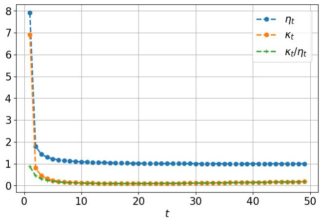  
Figure 4: Coefficients $\eta _ { t } , \kappa _ { t } , \kappa _ { t } / \eta _ { t }$ of all time steps, under the linear noise schedule.

Proof of Theorem 3.4. Since $\bar { \alpha } _ { t - 1 } > \bar { \alpha } _ { t } , L _ { \mathrm { g e n } } ^ { ( t ) } > 1$ . Eq. (20) proves that generation is locally expansive. The total Lipschitz constant for the full trajectory telescopes perfectly:

$$
L _ { f _ { \theta } } \leq \prod _ { t = 1 } ^ { T } \frac { \sqrt { \bar { \alpha } _ { t - 1 } } } { \sqrt { \bar { \alpha } _ { t } } } = \frac { \sqrt { \alpha _ { 0 } } } { \sqrt { \bar { \alpha } _ { T } } } .
$$

Similarly, the global bound for inversion telescopes can be derived using Eq. (21) as:

$$
L _ { f _ { \theta } ^ { - 1 } } \leq \prod _ { t = 1 } ^ { T } \frac { \sqrt { 1 - \bar { \alpha } _ { t } } } { \sqrt { 1 - \bar { \alpha } _ { t - 1 } } } = \frac { \sqrt { 1 - \bar { \alpha } _ { T } } } { \sqrt { 1 - \alpha _ { 0 } } } .
$$

Before proving Theorem 3.5, we need two lemmas.

Lemma C.1. Given $L _ { \mathcal { G } } , L _ { f _ { \theta } } , L _ { \mathcal { W } } , L _ { \mathcal { F } ^ { - 1 } } , \mathbf { y } \sim \mathcal { N } ( \mathbf { 0 } , \mathrm { I d } )$ , w, and $r > 0 ,$ we denote the Lipschitz constant of F in Eq. (3) as $L _ { \mathbf { F } } = L _ { \mathcal { G } _ { \phi _ { a } } } L _ { f _ { \theta } } L _ { \mathcal { F } ^ { - 1 } } L _ { \mathcal { W } }$ . Furthermore, given $\mathbf { w } ^ { \prime } \in \mathcal { B } _ { r } ( \mathbf { w } )$ , we can obtain the maximum perturbation bound in the pixel space with $\mathbf { I } = \mathbf { F } ( \mathbf { y } , \mathbf { w } )$ and $\mathbf { I } ^ { \prime } = \mathbf { F } ( \mathbf { y } , \mathbf { w } ^ { \prime } )$ as:

$$
\| \mathbf { I } - \mathbf { I ^ { \prime } } \| \leq L _ { \mathbf { F } } r .\tag{27}
$$

Specifically, the inequality in Eq. (27) can be interpreted as the maximum discrepancy in the pixel space, given that the perturbed watermark $\mathbf { w } ^ { \prime } \in \bar { B _ { r } ( \mathbf { w } ) }$ in the latent space.

Proof of Lemma C.1. According to the results in Theorem 3.4, given the Lipschitz constants of W, $\mathcal { M } _ { : }$ , and $\mathcal { G } _ { \phi _ { g } }$ , and Eq. (3) and $L _ { \mathcal { W } } = \sqrt { H W }$ , we can have the following property:

$$
\| \mathbf { I } - \mathbf { I ^ { \prime } } \| = \| \mathbf { F } ( \mathbf { y } , \mathbf { w } ) - \mathbf { F } ( \mathbf { y } , \mathbf { w } ^ { \prime } ) \| \leq L _ { \mathbf { F } } \| \mathbf { w } - \mathbf { w } ^ { \prime } \| ,
$$

$$
\begin{array} { r } { L _ { \mathbf { F } } = L _ { \mathcal { G } _ { \phi _ { g } } } L _ { f _ { \theta } } L _ { \mathcal { F } ^ { - 1 } } L _ { \mathcal { W } } , } \end{array}\tag{28}
$$

and, with a radius $r$ in the latent space at point w, we define a ball centered at w as $\boldsymbol { B } = \left\{ \mathbf { w } ^ { \prime } \right.$ $\| \mathbf { w } ^ { \prime } - \mathbf { w } \| \leq r \}$ . Hence, the Eq. (28) can be simplified into:

$$
\| \mathbf { I } - \mathbf { I ^ { \prime } } \| \leq L _ { \mathbf { F } } r ,\tag{29}
$$

Lemma C.2. Given the Lipschitz constants $L _ { { \mathcal { E } } _ { \phi _ { e } } } , L _ { f _ { o } ^ { - 1 } } , L _ { \mathcal { F } }$ , and $L _ { \mathcal { M } } ,$ , we define the Lipschitz constant ofthe watermark estimation ofan image as $L _ { \mathbf { F } ^ { - 1 } } ^ { ' } = L \varepsilon _ { \phi _ { e } } L _ { f _ { a } ^ { - 1 } } L _ { \mathcal { F } } L _ { \mathcal { M } }$ . With Eq. (4), the ground-truth watermark w, and a distorted image T(I),for all $\mathbf { I } = \mathbf { F } ( \mathbf { \bar { y } } , \mathbf { w } )$ and $\mathbf { y } \sim \mathcal { N } ( \mathbf { 0 } , \mathrm { I d } )$ , the maximum perturbation that affects the estimated watermark wˆ can be derived as:

$$
\begin{array} { r } { \| \mathbf { w } - \hat { \mathbf { w } } \| \leq \| \mathbf { w } - \bar { \mathbf { w } } \| + L _ { \mathbf { F } ^ { - 1 } } \| \mathbf { I } - \mathcal { T } ( \mathbf { I } ) \| , } \end{array}\tag{30}
$$

where $\bar { \mathbf { w } } = \mathbf { F } ^ { - 1 } ( \mathbf { I } ) = \mathcal { M } ( \mathcal { F } ( f _ { \theta } ^ { - 1 } ( \mathcal { E } _ { \phi _ { e } } ( \mathbf { I } ) ) )$ indicates the estimated watermark from image I. If $\mathbf { F } ^ { - 1 } \mathbf { F } = \mathrm { I d } , E q . \ ( 3 0 )$ can be reduced into

$$
\| \mathbf { w } - \hat { \mathbf { w } } \| \leq L _ { \mathbf { F } ^ { - 1 } } \| \mathbf { I } - \mathcal { T } ( \mathbf { I } ) \| .\tag{31}
$$

ProofofLemma C.2. According to the results in Theorem 3.4, given the Lipschitz constants $L _ { \mathcal { E } _ { \phi _ { e } } }$ $L _ { f _ { \theta } ^ { - 1 } } , L _ { \mathcal { F } }$ , and $L _ { \mathcal { M } }$ , and Eq. (4), we can have the following property:

$$
\| \bar { \mathbf { w } } - \hat { \mathbf { w } } \| = \| \mathbf { F } ^ { - 1 } ( \mathbf { I } ) - \mathbf { F } ^ { - 1 } ( \mathcal { T } ( \mathbf { I } ) ) \| \leq L _ { \mathbf { F } ^ { - 1 } } \| \mathbf { I } - \mathcal { T } ( \mathbf { I } ) \| ,
$$

$$
L _ { \mathbf { F } ^ { - 1 } } = L \varepsilon _ { \phi _ { e } } L _ { f _ { \theta } ^ { - 1 } } L _ { \mathcal { F } } L _ { \mathcal { M } } .
$$

Using the triangular inequality, we have the result

$$
\left\| \mathbf { w } - { \hat { \mathbf { w } } } \right\| \leq \left\| \mathbf { w } - { \bar { \mathbf { w } } } \right\| + \left\| { \bar { \mathbf { w } } } - { \hat { \mathbf { w } } } \right\| \leq \left\| \mathbf { w } - { \bar { \mathbf { w } } } \right\| + L _ { \mathbf { F } ^ { - 1 } } \left\| \mathbf { I } - { \mathcal { T } } ( \mathbf { I } ) \right\| .\tag{32}
$$

Given the inverse process $f _ { \theta } ^ { - 1 }$ and the encoder $\mathcal { E } _ { \phi _ { e } } , \| \mathbf { w } - \bar { \mathbf { w } } \| = 0$ since $\mathbf { F } ^ { - 1 } \mathbf { F } = \mathrm { I d }$ , hence, Eq. (32) can be reduced into Eq. (31). □

Proof of Theorem 3.5. With the above lemmas, given the Lipschitz constant $L _ { T }$ and any two watermarked images I and I′, we have

$$
\Vert T ( \mathbf { I } ) - T ( \mathbf { I } ^ { \prime } ) \Vert \leq L \tau \Vert \mathbf { I } - \mathbf { I } ^ { \prime } \Vert .\tag{33}
$$

Using the triangle inequality and Eq. (33), we have

$$
\| \mathbf { I } - T ( \mathbf { I } ^ { \prime } ) \| \leq \| \mathbf { I } - T ( \mathbf { I } ) \| + \| T ( \mathbf { I } ) - T ( \mathbf { I } ^ { \prime } ) \| \leq \| \mathbf { I } - T ( \mathbf { I } ) \| + L _ { T } \| \mathbf { I } - \mathbf { I } ^ { \prime } \| .\tag{34}
$$

$$
\| \mathbf { I } - \mathcal { T } ( \mathbf { I } ^ { \prime } ) \| \leq \| \mathbf { I } - \mathcal { T } ( \mathbf { I } ) \| + L _ { \mathcal { T } } \| \mathbf { I } - \mathbf { I } ^ { \prime } \| \leq \| \mathbf { I } - \mathcal { T } ( \mathbf { I } ) \| + L _ { \mathcal { T } } L _ { \mathbf { F } } r .\tag{35}
$$

Next, given Lemma C.1, if all watermarked images are resistant to the perturbation $\tau$ on themselves, the following must be satisfied with Eq. (27):

$$
\forall \mathbf { I } , \| \mathbf { I } - \mathcal { T } ( \mathbf { I } ) \| \leq L _ { \mathbf { F } } r .\tag{36}
$$

Hence, from Eqs. (35) and (36), we get

$$
\begin{array} { r } { \| \mathbf { I } - \mathcal { T } ( \mathbf { I } ^ { \prime } ) \| \le L _ { \mathbf { F } } r + L _ { \mathcal { T } } L _ { \mathbf { F } } r = ( 1 + L _ { \mathcal { T } } ) L _ { \mathbf { F } } r . } \end{array}\tag{37}
$$

Define the following

$$
\bar { \mathbf { w } } = \mathbf { F } ^ { - 1 } ( \mathbf { I } ) , \quad \hat { \mathbf { w } } ^ { \prime } = \mathbf { F } ^ { - 1 } ( \mathcal { T } ( \mathbf { I } ^ { \prime } ) ) ,
$$

by the definition of Lipschitz constant $L _ { \mathbf { F } ^ { - 1 } }$ , we derive

$$
\| \bar { \mathbf { w } } - \hat { \mathbf { w } } ^ { \prime } \| = \| \mathbf { F } ^ { - 1 } ( \mathbf { I } ) - \mathbf { F } ^ { - 1 } ( \mathcal { T } ( \mathbf { I } ^ { \prime } ) ) \| \leq L _ { \mathbf { F } ^ { - 1 } } \| \mathbf { I } - \mathcal { T } ( \mathbf { I } ^ { \prime } ) \| .\tag{38}
$$

Using the triangle inequality, we turn Eq. (38) into

$$
\begin{array} { r } { \| \mathbf { w } - \hat { \mathbf { w } } ^ { \prime } \| \leq \| \mathbf { w } - \bar { \mathbf { w } } \| + \| \bar { \mathbf { w } } - \hat { \mathbf { w } } ^ { \prime } \| \leq \| \mathbf { w } - \bar { \mathbf { w } } \| + L _ { \mathbf { F } ^ { - 1 } } \| \mathbf { I } - \mathcal { T } ( \mathbf { I } ^ { \prime } ) \| . } \end{array}\tag{39}
$$

Given $f _ { \theta } ^ { - 1 }$ and $\mathcal { E } _ { \phi _ { e } } , \| \mathbf { w } - \bar { \mathbf { w } } \| = 0$ since F−1F = Id, hence, Eq. (39) can be reduced into

$$
\| \mathbf { w } - \hat { \mathbf { w } } ^ { \prime } \| \leq L _ { \mathbf { F } ^ { - 1 } } \| \mathbf { I } - \mathcal { T } ( \mathbf { I } ^ { \prime } ) \| .\tag{40}
$$

Combining Eqs. (37) and (40), we finally have Eq. (5).

$$
\| \mathbf { w } - \hat { \mathbf { w } } ^ { \prime } \| \leq L _ { \mathbf { F } ^ { - 1 } } ( 1 + L \tau ) L _ { \mathbf { F } } r
$$

## D B defined by Tolerance Constraints

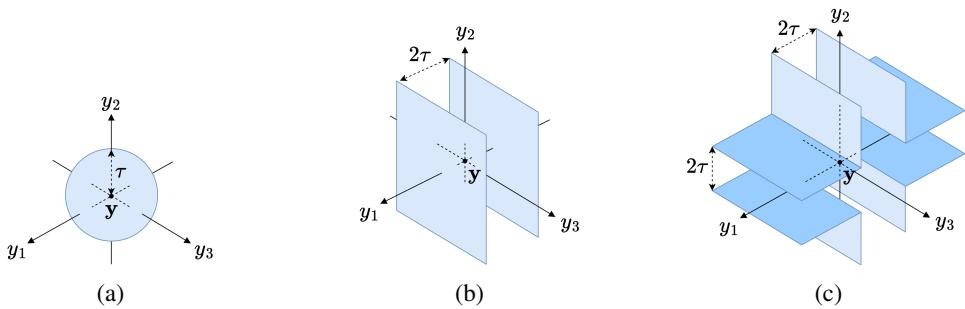  
Figure 5: Visual explanation of B. (a) The tolerance constraint is described in Sec. 3.4. (b) The constraint only considers the y1-axis (corresponding to watermark and detection on the Channel 3 in Tree-Ring [48]), leaving other dimensions unbounded. As long as the $\ell _ { 1 }$ distance between any points and y (centre) on the y1-axis is below a certain threshold $\tau$ (corresponding to falling within the two planes in the figure), it is considered to be in B. (c) This constraint considers the $y _ { 1 ^ { - } }$ and y2-axes, respectively (corresponding to the Channels 0 and 3 in RingID [4]), leaving the y3-axes unbounded. The constraint requires calculating the $\ell _ { 1 }$ distance between any point and $\mathbf { y }$ on $y _ { 1 ^ { - } }$ and y -axes, respectively, in a dimension-wise manner, and then takes the minimum of these two values. $\mathbf { A }$ point is considered to fall in B if this minimum value is below a certain threshold τ (corresponding to falling within the cross-shaped region in the figure).

In this section, we give an intuitive explanation of the high FPR under different tolerance constraints as described and illustrated in Fig. 5. Given a tolerance τ and the point $\mathbf { y } = ( y _ { 1 } , y _ { 2 } , y _ { 3 } ) \in \mathbb { R } ^ { 3 }$ , we define the following subspaces

$$
\begin{array} { r l } & { \mathcal { B } _ { a } = \{ \mathbf { y } ^ { \prime } | \| \mathbf { y } ^ { \prime } - \mathbf { y } \| _ { 2 } \leq \tau , \mathbf { y } ^ { \prime } \in \mathbb { R } ^ { 3 } \} , } \\ & { \mathcal { B } _ { b } = \{ \mathbf { y } ^ { \prime } | \| y _ { 1 } ^ { \prime } - y _ { 1 } \| _ { 1 } \leq \tau , \mathbf { y } ^ { \prime } \in \mathbb { R } ^ { 3 } \} , } \\ & { \mathcal { B } _ { b ^ { \prime } } = \{ \mathbf { y } ^ { \prime } | \| y _ { 2 } ^ { \prime } - y _ { 2 } \| _ { 1 } \leq \tau , \mathbf { y } ^ { \prime } \in \mathbb { R } ^ { 3 } \} , } \\ & { \mathcal { B } _ { c } = \{ \mathbf { y } ^ { \prime } | \operatorname* { m i n } ( \| y _ { 1 } ^ { \prime } - y _ { 1 } \| _ { 1 } , \| y _ { 2 } ^ { \prime } - y _ { 2 } \| _ { 1 } ) \leq \tau , \mathbf { y } ^ { \prime } \in \mathbb { R } ^ { 3 } \} . } \end{array}
$$

where $\begin{array} { r } { B _ { a } , B _ { b } . } \end{array}$ , and $B _ { c }$ correspond to Fig. 5(a), (b), and (c), respectively. We can easily observe that three different constraints can cover different volumes vol(·) in a three-dimensional space, denoted as $v o l ( B _ { a } )$ , vol $( B _ { b } )$ , and $v o l ( B _ { c } )$ . First, $B _ { a } \subset B _ { b } , B _ { b ^ { \prime } } , B _ { c }$ . Second, $v o l ( B _ { c } )$ can be seen as the union of two subspaces, $B _ { b }$ and $B _ { b ^ { \prime } }$ ′ . We could conclude that

$$
B _ { a } \subset B _ { b } \subset B _ { c } .\tag{41}
$$

Accordingly, it is easier for a data point $\mathbf { y } ^ { \prime }$ to be included in $\textstyle B _ { c } ,$ while it is harder to be included in $\scriptstyle { B _ { a } }$ since $B _ { c }$ covers the most volume. More importantly, to perturb/attack a data point in/out of subspaces $B _ { b }$ and $\textstyle B _ { c } .$ , the effort can be made by moving the point along the bounded axes, respectively. This results in a harder attack success rate for $\bar { B _ { a } } ^ { - }$ since all axes should be considered. Hence, we can conclude that, under the same tolerance $\tau ,$ , the constraint leads to different structures of $B ,$ , resulting in looser or tighter criteria to determine whether a point $\mathbf { y } ^ { \prime }$ lies within B.

## E Simulations of Distribution Shift

To demonstrate that relocation of $\mathbf { y } _ { \mathbf { w } }$ caused by watermarks moves the latent distributions away from those of normally generated images with the corresponding latent representations y close to 0, we examine this effect in this section for the simulation of Gaussian distribution in Fig. 6(a) and the corresponding $\chi$ distribution in Fig. 6(b) under different shifts in mean $\mu .$ . This gives a larger tolerance for perturbing the images and leads to better robustness of watermarking in the generative process, despite the possible high FPRs.

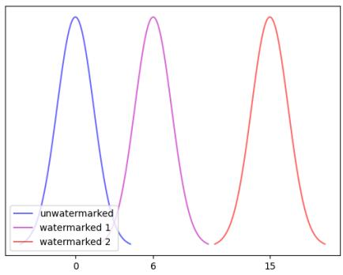  
(a)

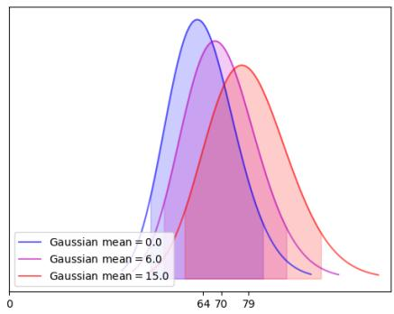  
(b)

Figure 6: (a) Distribution Shift in latent space. The norm of watermarked images will shift away from 0. By injecting a larger-norm watermark in latent representation, it is easier to distinguish whether an image is from a normal distribution. Also, the allowed perturbation will be larger since the latent representations of perturbed images will fall within the gap between the unwatermarked and watermarked latents. However, they are still away from the unwatermarked latent. (b) The distribution of the $\ell _ { 2 } { \mathrm { - n o r m } }$ of samples from each normal distribution. These distributions follow the $\chi$ distribution. The shaded areas represent the 0.3 and 99.7 percentiles for each distribution.  
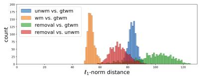  
(a) Watermark: Tree-Ring

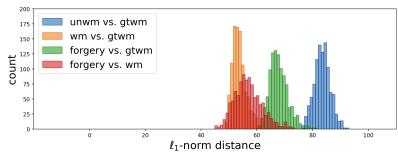

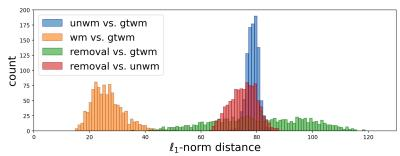

(b) Watermark: Tree-Ring  
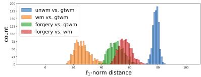  
(c) Watermark: RingID  
(d) Watermark: RingID  
Figure 7: Histograms of distance. When comparing the latent of the attacked images to samples from the normal distribution $( e . g .$ , unwatermarked latent), we find that the attacked latent still maintains a certain distance from the unwatermarked latent, especially for the removal attack case. Here, “gtwm” means “ground-truth watermark”; “wm” means “watermarked images”; and “unwm” means “unwatermarked images”. (Best viewed in a color display)

## F Analysis of the Detection Distance through the Lens of Forgery and Removal Attacks

To provide another perspective, we have looked closely at the forgery and removal attacks on images to examine the effect of distribution shifts in latent representations in Fig. 7. The interpretation of the x-axis of Fig. 7 should not be confused with that of Fig. 6 in that the former describes the distance between the estimated watermark and the ground-truth watermark while the latter describes the mean value $\mu _ { \mathbf { w } }$ of watermarked distribution. Please also note that the interpretation of Fig. 7 should consider each histogram’s reference point and distance together, and that, in standard practice, we compute the distance between the inversed test latent and the ground truth watermark to decide if it is watermarked.

Specifically, in Fig. 7, we present the histograms of distance between two watermarks from two latent-based watermarking methods, Tree-Ring [48] and RingID [4], under the forgery and removal attacks [51]. We use the blue, orange, and green histograms to represent the distances between the latent representation of ground truth watermark and those of (1) unwatermarked images, (2) watermarked images, and (3) forgery/removal attacked images, respectively. As for the red histogram, it represents the distance between the latent representations of unwatermarked images and those of forgery/removal attacked images.

We can observe from Fig. 7(a) and Fig. 7(c) that to remove a watermark successfully, the ideal way is to push the watermarked images away from the ground truth watermark distribution, i.e., away from data that contain watermarks, which corresponds to the “green” histogram so that data being removed no longer stay in the ball. For forgery attack in Fig. 7(b) and Fig. 7(d), the attack adds an estimated watermark on other possibly unwatermarked images, which means that the attacker pushes unwatermarked image toward the ground truth watermark distribution that corresponds to the “green” histogram, indicating those data belong to the ball and hence are close to the watermark distribution.

Interestingly, the “red” histogram establishes that the attacked images (via forgery or removal) do not remain closer to the desired distribution (watermarked or unwatermarked images). This suggests key weaknesses in such methods: they allow excessive tolerance, exhibit small distribution shifts, and leak significant information (as shown in [51]), enabling attackers to estimate the watermark. Consequently, these methods are vulnerable to forgery and removal attacks. As long as the perturbations move data into or out of the target region, the attack needs not to be precisely aligned with—or directly oppose—the watermark direction. Unlike traditional non-learning-based watermarking techniques, which resist such attacks while preserving image quality, these generative watermarking methods trade robustness for flexibility, making the watermarks easier to be compromised.

## G Experimental Settings

In this section, we give a detailed description of the settings of perturbations. The perturbations and the settings of each perturbation is as follows:

– Blurring: blur with the kernel size set to 1, 2, 4, 6, 8.

– Color Jitter: increase the brightness of the image by setting the factor to 1, 2, 4, 6, 8.

– JPEG: compress the image with JPEG quality score set to 1, 5, 25, 40, 80.

– Rotation: rotate the image 5◦, 15◦, 30◦, 45◦, 75◦ clock-wise.

– Cropping: crop 10%, 25%, 40%, 60%, 80% of the image (i.e., remaining factor 0.9, 0.75, 0.6, 0.4, 0.2, respectively).

– Elastic deformation: produces a see-through-water-like effect on the image, with (α, σ) = (500, 50), (600, 60), (750, 75), (850, 85), (1000, 100).

– Random perspective: perform random perspective on the image, with distortion scale set to 0.5, 0.6, 0.75, 0.85, 1.0.

– Shear: shear the image with the parameter set to 5, 7, 10, 15, 20.

– Regen-VAE: regenerate the image with VAE with the quality level set to 1, 2, 3, 4, 5.

– Regen-DiffPure: regenerate the image with Stable Diffusion v1-4 with the number of noise and denoise step set to 10, 20, 30, 40, 50.

For all cases of Tree-Ring, RingID, HSQR, HSTR, and PRCW, 100 watermarked images were processed through ten types of distortions and subsequently fed into the model for detection.

## H Complete Experiments of Tree-Ring, HSQR, and PRCW

We present the experiments related to the effects of perturbations on Tree-Ring, HSQR, and PRCW. Each watermarking scheme is attacked by seven perturbations with five different parameters to control the strength of the perturbation. Please refer to Figs. 8, 9, 10, 11, 12, and 13.

Following the official implementation of the PRCW method [12], first we initialize a key pair (encode\_key, decode\_key), and subsequently generate 100 watermarked images using encode\_key. We then apply seven types of image distortions listed in Sec. G of Appendix, each evaluated across five distinct intensity levels. Subsequently, decoding and detection are performed on the distorted images and their corresponding unattacked counterparts, using the decode\_key. The detection is determined by two binary criteria: (i) Decoding component: a bit-wise comparison between the recovered\_bits (from the input image) and the test\_bit (extracted by decode\_key), which requires an exact match to be considered valid, and (ii) Detection component: a threshold-based detection result. A final detection is deemed successful if either of these two criteria is satisfied.

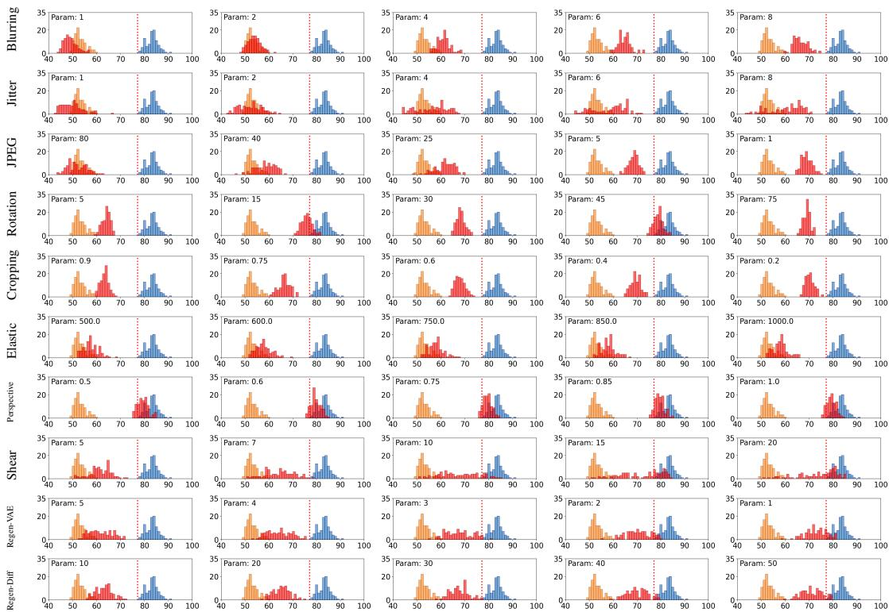  
Figure 8: The effects of different perturbations on $\lVert \mathbf { w } - \hat { \mathbf { w } } ^ { \prime } \rVert$ . From left to right, the perturbations are set with different parameters (Param). Watermark: Tree-Ring. Thresholds: 77.12 (1e-2 FPR).

Table 2: Effects of different number of inference time steps on $\lVert \mathbf { w } - \hat { \mathbf { w } } ^ { \prime } \rVert$ . The number of inference time steps were set to 10, 30, 50 (default), 70, and 90. We present the mean and the maximum values of a set of $\lVert \mathbf { w } - \hat { \mathbf { w } } ^ { \prime } \rVert$
<table><tr><td rowspan=1 colspan=1>WM Method</td><td rowspan=1 colspan=1>Tree-Ring</td><td rowspan=1 colspan=1>RingID</td><td rowspan=1 colspan=1>HSQR</td><td rowspan=1 colspan=1>HSTR</td></tr><tr><td rowspan=1 colspan=1></td><td rowspan=1 colspan=1>mean   max</td><td rowspan=1 colspan=1>mean   max</td><td rowspan=1 colspan=1>mean   max</td><td rowspan=1 colspan=1>mean   max</td></tr><tr><td rowspan=1 colspan=1>t = 10</td><td rowspan=1 colspan=1>55.36  62.38</td><td rowspan=1 colspan=1>29.34  45.37</td><td rowspan=1 colspan=1>43.17  48.91</td><td rowspan=1 colspan=1>19.94  25.93</td></tr><tr><td rowspan=1 colspan=1>t = 30</td><td rowspan=1 colspan=1>53.96  60.62</td><td rowspan=1 colspan=1>26.31  45.52</td><td rowspan=1 colspan=1>41.69  47.76</td><td rowspan=1 colspan=1>17.48  24.95</td></tr><tr><td rowspan=1 colspan=1>t = 50</td><td rowspan=1 colspan=1>53.72  60.53</td><td rowspan=1 colspan=1>25.63  45.91</td><td rowspan=1 colspan=1>41.33  47.53</td><td rowspan=1 colspan=1>16.94  24.86</td></tr><tr><td rowspan=1 colspan=1>t = 70</td><td rowspan=1 colspan=1>53.58  60.28</td><td rowspan=1 colspan=1>25.36  44.42</td><td rowspan=1 colspan=1>41.30  47.75</td><td rowspan=1 colspan=1>16.68  23.88</td></tr><tr><td rowspan=1 colspan=1>t = 90</td><td rowspan=1 colspan=1>53.52  60.16</td><td rowspan=1 colspan=1>25.03  43.66</td><td rowspan=1 colspan=1>41.19  47.75</td><td rowspan=1 colspan=1>16.55  23.54</td></tr></table>

To facilitate the visualization of the distance between perturbed watermarked images and their groundtruth watermarks, we employ the Hamming distance $\| \cdot \| _ { H }$ for the decoding component. For the detection component, we utilize the following discriminant from Algorithm 3 of PRCW [12]:

$$
\sum _ { \mathbf { w } \in \mathbf { P } } \log \left( \frac { 1 + \hat { s } _ { \mathbf { w } } } { 2 } \right) - \sqrt { C \log ( 1 / F ) } + \frac { 1 } { 2 } \sum _ { \mathbf { w } \in \mathbf { P } } \log \left( \frac { 1 - \hat { s } _ { \mathbf { w } } ^ { 2 } } { 4 } \right) \left\{ \begin{array} { l l } { \geq 0 } & { \Rightarrow \quad \mathrm { T r u e } , } \\ { < 0 } & { \Rightarrow \quad \mathrm { F a l s e } . } \end{array} \right.\tag{42}
$$

The corresponding results are illustrated in Figs. 10 and 11, respectively, under 1e-2 FPR. For 1e-5 FPR, please refer to Figs. 12 and 13, where blue dotted lines indicate the detection threshold.

We also present the numerical errors in Table 2. For visualizing the effects of numerical errors in DDIM inversion on $\left\| \mathbf { w } - \hat { \mathbf { w } } ^ { \prime } \right\|$ , we use histograms to demonstrate the shifting of $\lVert \mathbf { w } - \hat { \mathbf { w } } ^ { \prime } \rVert$ in Fig. 14.

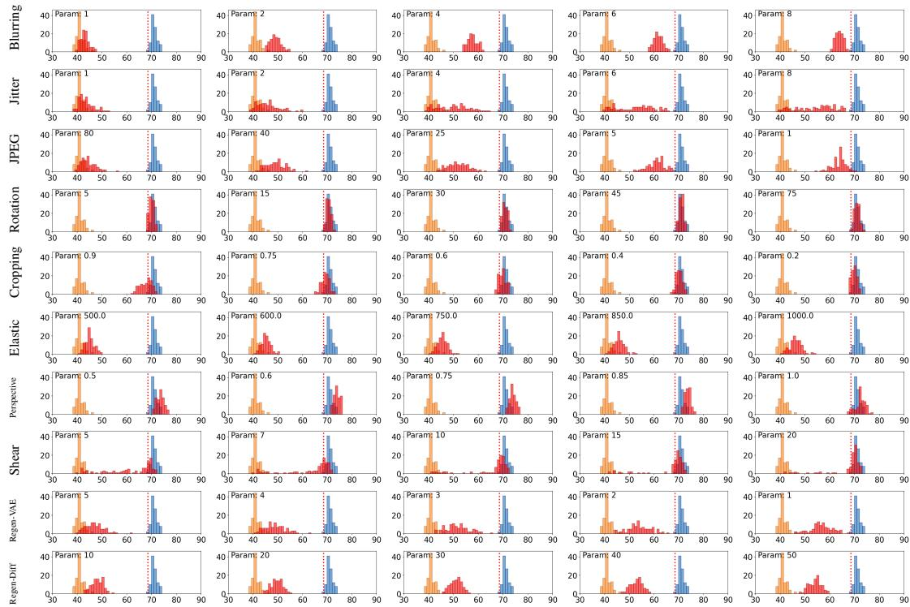  
Figure 9: The effects of different perturbations on $\lVert \mathbf { w } - \hat { \mathbf { w } } ^ { \prime } \rVert$ . From left to right, the perturbations are set with different parameters (Param). Watermark: HSQR. Thresholds: 68.52 (1e-2 FPR).

## I Effects of $\left\| \mathbf { w } \right\|$ on Detection Distance

We examined the effect of ∥w∥ on watermark detection, as discussed in Lemma C.1 and Sec. 3.5. We used RingID [4] and HSTR [20] as representative examples, with the corresponding results presented in Figs. 15 and 16, and Figs. 20 and 21 in Sec. I.1 of Appendix. According to Eq. (27), we can expand the upper bound by increasing ∥w∥. The increase in ∥w∥ can be done by setting α in RingID [4] from 64 to 128, and multiplying the pattern injected in channel 0 by 2. Comparing Fig. 15 and Fig. 16, we see that the distance between the orange and blue distributions increases in Fig. 16. Such a gap can accommodate estimated watermarks that corresponding images are perturbed in the pixel space, and thereby create a buffer to withstand perturbations, especially when we use the threshold (red) of 1e-2 FPR. This modification can be done on HSTR. We also provide the experiments that we only set α to 128 without multiplying the pattern injected in channel 0 by 2. See Fig. 19 in Sec. I.1 of Appendix. For more thorough attacks, we used Stirmark [32] to examine the robustness of Tree-Ring and RingID in Sec. K of Appendix.

## I.1 Complete experiments of the effect of $\| \mathbf { w } \|$ on Detection Distance

In this section, we provide experiments on the effects of increasing ∥w∥ on robustness of watermark, which we consider RingID and HSTR as representative watermarking schemes. For notational simplicity, RingID-m-α denotes a configuration where the pattern on channel 0 is scaled by a factor of m (default: m = 1) and the pattern on channel 3 is governed by the parameter α (default: $\alpha = 6 4 )$ . Similarly, HSTR-m-m indicates that the patterns on both channels 0 and 3 are multiplied by m (default: m = 1). Please refer to Figs. 17, 18, 19, 20, and 21. For FID score results, please refer to Table 3.

## J Experiments of the Lipschitz Constant on thresholds

We present the estimated thresholds with different watermarking schemes. Please refer to Figs. 22 and 23.

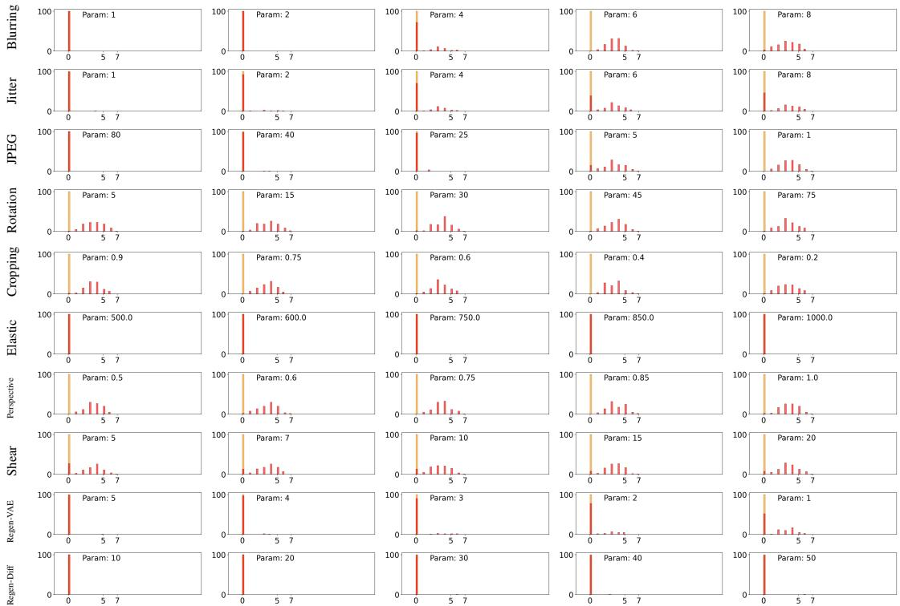  
Figure 10: The effects of different perturbations on $\| \mathbf { w } - \hat { \mathbf { w } } ^ { \prime } \| _ { H }$ . From left to right, the perturbations are set with different parameters (Param). Watermark: PRCW decoding component (1e-2 FPR). In this case, the number of bits is $\left\lceil \log _ { 2 } ( 1 / \mathrm { 1 0 ^ { - 2 } } ) \right\rceil = 7 .$

<table><tr><td>WM Methods</td><td>FID (↓)</td></tr><tr><td>RingID</td><td>45.31</td></tr><tr><td>RingID-2-128</td><td>428.68</td></tr><tr><td>HSTR</td><td>45.32</td></tr><tr><td>HSTR-2-2</td><td>187.77</td></tr></table>

Table 3: The FID score of watermark methods with different magnitude ∥w∥.

## K Performance of Tree-Ring & RingID on Stirmark

To check the robustness claimed by Tree-Ring [48] and RingID [4], we verified these methods via a well-known benchmark, called Stirmark [31, 32], which extensively includes both non-geometric image manipulations and geometric distortions, as shown in Tables 4, 5, 6, and 7. More information can be found in Stirmark [32].

In this experiment, we further examine the performance in terms of detection accuracy and TPR under more extensive perturbations with FPR set to 1e-2. Here, apart from the watermark detection accuracy in main text, the ACC represented in these tables is defined as

$$
\mathrm { A C C } = \operatorname* { m a x } \left\{ 1 - \frac { \mathrm { F P R } + \left( 1 - \mathrm { T P R } \right) } { 2 } \right\} ,
$$

which coincides with the usual definition of ACC since the numbers of watermarked and unwatermarked samples are equal.

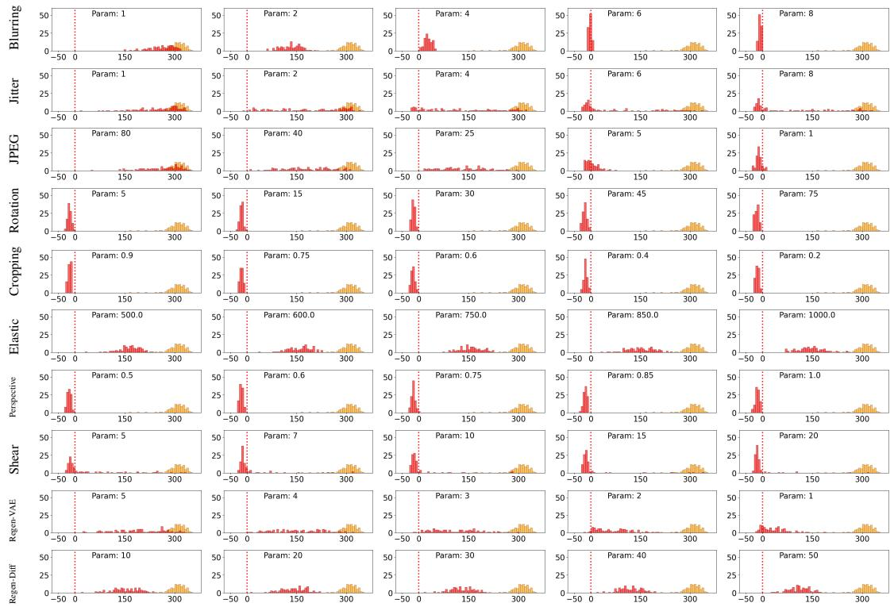  
Figure 11: The effects of different perturbations by Eq. (42). From left to right, the perturbations are set with different parameters (Param). Watermark: PRCW detection component (1e-2 FPR).

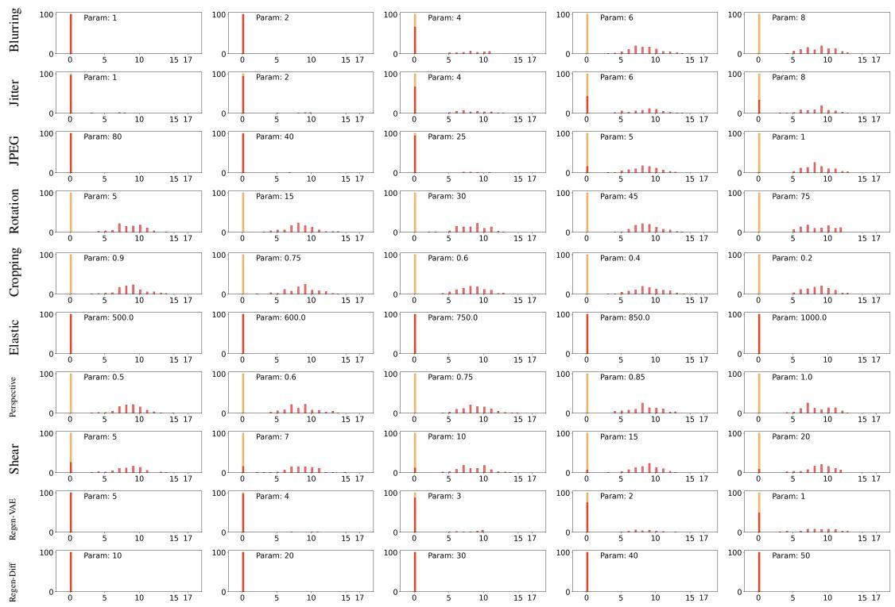  
Figure 12: The effects of different perturbations on $\| \mathbf { w } - \hat { \mathbf { w } } ^ { \prime } \| _ { H }$ . From left to right, the perturbations are set with different parameters (Param). Watermark: PRCW decoding component (1e-5 FPR). In this case, the number of bits is $\left\lceil \log _ { 2 } ( 1 / 1 0 ^ { - 5 } ) \right\rceil = 1 7$

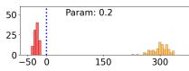

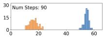

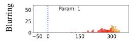

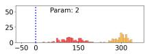

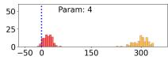

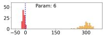

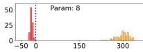

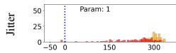

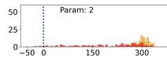

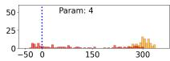

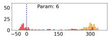

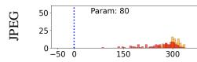

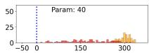

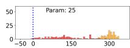

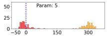

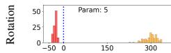

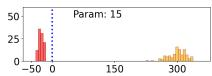

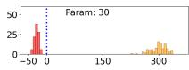

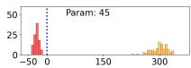

<table><tr><td>50 25 0 -50</td><td>Param: 75 0 150 300</td></tr></table>

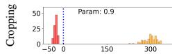

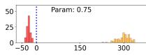

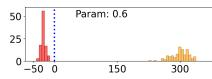

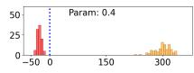

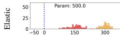

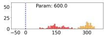

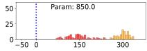

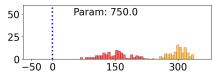

<table><tr><td>50 25</td><td rowspan="16">0</td><td>Param: 1000.0</td></tr><tr><td></td></tr><tr><td></td></tr><tr><td></td></tr><tr><td></td></tr><tr><td></td></tr><tr><td></td></tr><tr><td></td></tr><tr><td></td></tr><tr><td>NL</td></tr><tr><td></td></tr><tr><td>-50 o</td><td>150 300</td></tr></table>

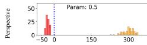

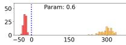

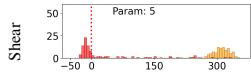

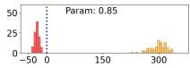

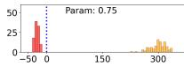

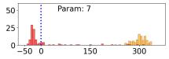

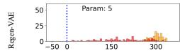

  
Figure 13: The effects of different perturbations by Eq. (42). From left to right, the perturbations are set with different parameters (Param). Watermark: PRCW detection component (1e-5 FPR).

  
Figure 14: Effects of different number of inference time steps on ∥w − wˆ ′∥. From left to right, the number of inference time steps (Num Steps) were set to 10, 30, 50 (default), 70, and 90.

  
Figure 15: Effects of different perturbations on $\lVert \mathbf { w } - \hat { \mathbf { w } } ^ { \prime } \rVert$ . Watermark: RingID. Thresholds: 73.0 (1e-2 FPR).

  
Figure 16: Effects of different perturbations on $\lVert \mathbf { w } - \hat { \mathbf { w } } ^ { \prime } \rVert$ . Watermark: RingID with channel 0 pattern multiplied by 2 and α = 128. Thresholds: 119.85 (1e-2 FPR).

  
Figure 17: The effects of different perturbations on ∥w − wˆ ′∥. From left to right, the perturbations are set with different parameters (Param). Watermark: RingID. Thresholds: 73.0 (1e-2 FPR).

  
Figure 18: The effects of different perturbations on ∥w − wˆ ′∥. From left to right, the perturbations are set with different parameters (Param). Watermark: RingID with channel 0 pattern multiplied by 2 and α = 128 (RingID-2-128). Thresholds: 119.85 (1e-2 FPR).

  
Figure 19: The effects of different perturbations on $\lVert \mathbf { w } - \hat { \mathbf { w } } ^ { \prime } \rVert$ . From left to right, the perturbations are set with different parameters (Param). Watermark: RingID with $\alpha = 1 2 8$ (RingID-1-128). Thresholds: 73.51 (1e-2 FPR).

  
Figure 20: The effects of different perturbations on $\lVert \mathbf { w } - \hat { \mathbf { w } } ^ { \prime } \rVert$ . From left to right, the perturbations are set with different parameters (Param). Watermark: HSTR. Thresholds: 50.39 (1e-2 FPR).

  
Figure 21: The effects of different perturbations on $\lVert \mathbf { w } - \hat { \mathbf { w } } ^ { \prime } \rVert$ . From left to right, the perturbations are set with different parameters (Param). Watermark: HSTR with channels 0 and 3 pattern multiplied by 2 (HSTR-2-2). Thresholds: 82.15 (1e-2 FPR).

  
Figure 22: The experimental thresholds for different perturbations on ∥w − wˆ ′∥, each with different parameters on x-axis. The value on y-axis represents the potential threat that wˆ ′ is getting far from w, which corresponds to Eq. (7). Watermark: RingID.  
Figure 23: The experimental thresholds for different perturbations on $\lVert \mathbf { w } - \hat { \mathbf { w } } ^ { \prime } \rVert .$ , each with different parameters on x-axis. The value on y-axis represents the potential threat that wˆ ′ is getting far from w, which corresponds to Eq. (7). Watermark: HSQR.

Table 4: Attacker: StirMark 3.1.79. Defense: Tree-Ring [48] (watermark: ring). Diffusion model: LDM. Number of testing images: watermarked: 1000 / unwatermarked: 1000. Generated image size: 3x512x512. Latent size: 4x64x64.
<table><tr><td>Attack</td><td>AUC</td><td>ACC</td><td>TPR@0.01FPR</td></tr><tr><td>Median filter 2x2</td><td>1.0000</td><td>1.0000</td><td>1.0000</td></tr><tr><td>Median filter 3x3</td><td>1.0000</td><td>1.0000</td><td>1.0000</td></tr><tr><td>Median filter 4x4</td><td>1.0000</td><td>0.9995</td><td>0.9990</td></tr><tr><td>Gaussian filter 3x3</td><td>1.0000</td><td>1.0000</td><td>1.0000</td></tr><tr><td>JPEG 90</td><td>1.0000</td><td>1.0000</td><td>1.0000</td></tr><tr><td>JPEG 80</td><td>1.0000</td><td>1.0000</td><td>1.0000</td></tr><tr><td>JPEG 70</td><td>1.0000</td><td>1.0000</td><td>1.0000</td></tr><tr><td>JPEG 60</td><td>1.0000</td><td>1.0000</td><td>1.0000</td></tr><tr><td>JPEG 50</td><td>1.0000</td><td>0.9995</td><td>1.0000</td></tr><tr><td>JPEG 40</td><td>1.0000</td><td>0.9975</td><td>0.9990</td></tr><tr><td>JPEG 30</td><td>0.9999</td><td>0.9970</td><td>0.9980</td></tr><tr><td>JPEG 20</td><td>0.9998</td><td>0.9945</td><td>0.9970</td></tr><tr><td>JPEG 10</td><td>0.9968</td><td>0.9760</td><td>0.9360</td></tr><tr><td>FMLR (Frequency Mode Laplacian Removal)</td><td>1.0000</td><td>0.9990</td><td>1.0000</td></tr><tr><td>Color reduce</td><td>1.0000</td><td>0.9995</td><td>1.0000</td></tr><tr><td>Sharpening 3x3</td><td>1.0000</td><td>1.0000</td><td>1.0000</td></tr><tr><td>1 column, 1 row removed</td><td>1.0000</td><td>1.0000</td><td>1.0000</td></tr><tr><td>5 column, 1 row removed</td><td>1.0000</td><td>1.0000</td><td>1.0000</td></tr><tr><td>1 column, 5 row removed</td><td>1.0000</td><td>1.0000</td><td>1.0000</td></tr><tr><td>17 column, 5 row removed</td><td>1.0000</td><td>1.0000</td><td>1.0000</td></tr><tr><td>5 column, 17 row removed</td><td>1.0000</td><td>1.0000</td><td>1.0000</td></tr><tr><td>Cropping 1% off</td><td>1.0000</td><td>1.0000</td><td>1.0000</td></tr><tr><td>Cropping 2% off</td><td>1.0000</td><td>0.9995</td><td>1.0000</td></tr><tr><td>Cropping 5% off</td><td>1.0000</td><td>0.9990</td><td>1.0000</td></tr><tr><td>Cropping 10% off</td><td>0.7880</td><td>0.7190</td><td>0.1070</td></tr><tr><td>Cropping 15% off</td><td>0.6690</td><td>0.6275</td><td>0.0620</td></tr><tr><td>Cropping 20% off</td><td>0.8747</td><td>0.7975</td><td>0.2470</td></tr><tr><td>Cropping 25% off</td><td>0.9265</td><td>0.8490</td><td>0.3330</td></tr><tr><td>Cropping 50% off</td><td>0.7645</td><td>0.7090</td><td>0.0470</td></tr><tr><td>Cropping 75% off</td><td>0.6154</td><td>0.5915</td><td>0.0280</td></tr></table>

Table 5: Attacker: StirMark 3.1.79. Defense: Tree-Ring [48] (watermark: ring). Diffusion model: LDM. Number of testing images: watermarked: 1000 / unwatermarked: 1000. Generated image size: 3x512x512. Latent size: 4x64x64.
<table><tr><td>Attack</td><td>AUC</td><td>ACC</td><td>TPR@0.01FPR</td></tr><tr><td>Linear (1.007, 0.010, 0.010, 1.012)</td><td>1.0000</td><td>1.0000</td><td>1.0000</td></tr><tr><td>Linear (1.010, 0.013, 0.009, 1.011)</td><td>1.0000</td><td>1.0000</td><td>1.0000</td></tr><tr><td>Linear (1.013, 0.008, 0.011, 1.008)</td><td>1.0000</td><td>1.0000</td><td>1.0000</td></tr><tr><td>Aspect ratio change (0.80, 1.00)</td><td>0.6752</td><td>0.6300</td><td>0.0650</td></tr><tr><td>Aspect ratio change (0.90, 1.00)</td><td>0.9999</td><td>0.9955</td><td>0.9990</td></tr><tr><td>Aspect ratio change (1.00, 0.80)</td><td>0.9206</td><td>0.8400</td><td>0.4470</td></tr><tr><td>Aspect ratio change (1.00, 0.90)</td><td>1.0000</td><td>0.9995</td><td>1.0000</td></tr><tr><td>Aspect ratio change (1.00, 1.20)</td><td>0.8612</td><td>0.7755</td><td>0.2640</td></tr><tr><td>Aspect ratio change (1.00, 1.10)</td><td>1.0000</td><td>0.9990</td><td>1.0000</td></tr><tr><td>Aspect ratio change (1.10, 1.00)</td><td>1.0000</td><td>0.9990</td><td>1.0000</td></tr><tr><td>Aspect ratio change (1.20, 1.00)</td><td>0.9781</td><td>0.9270</td><td>0.7360</td></tr><tr><td>Rotation 1.00</td><td>1.0000</td><td>1.0000</td><td>1.0000</td></tr><tr><td>Rotation 2.00</td><td>1.0000</td><td>0.9985</td><td>1.0000</td></tr><tr><td>Rotation 5.00</td><td>0.9584</td><td>0.8880</td><td>0.5500</td></tr><tr><td>Rotation 10.00</td><td>0.8968</td><td>0.8150</td><td>0.2930</td></tr><tr><td>Rotation 15.00</td><td>0.9339</td><td>0.8560</td><td>0.4210</td></tr><tr><td>Rotation 30.00</td><td>0.8914</td><td>0.8100</td><td>0.2280</td></tr><tr><td>Rotation 45.00</td><td>0.8735</td><td>0.7865</td><td>0.1920</td></tr><tr><td>Rotation 90.00</td><td>0.9994</td><td>0.9935</td><td>0.9950</td></tr><tr><td>Flipping</td><td>1.0000</td><td>1.0000</td><td>1.0000</td></tr><tr><td>Rotation scale 1.00</td><td>1.0000</td><td>1.0000</td><td>1.0000</td></tr><tr><td>Rotation scale 10.00</td><td>0.8993</td><td>0.8180</td><td>0.3770</td></tr><tr><td>Rotation scale 15.00</td><td>0.9373</td><td>0.8620</td><td>0.4510</td></tr><tr><td>Rotation scale 30.00</td><td>0.8942</td><td>0.8155</td><td>0.2080</td></tr><tr><td>Rotation scale 45.00</td><td>0.8767</td><td>0.7885</td><td>0.2720</td></tr><tr><td>Rotation scale 90.00</td><td>0.9994</td><td>0.9935</td><td>0.9950</td></tr><tr><td>Shearing x-0% y-1%</td><td>1.0000</td><td>1.0000</td><td>1.0000</td></tr><tr><td>Shearing x-1% y-0%</td><td>1.0000</td><td>1.0000</td><td>1.0000</td></tr><tr><td>Shearing x-1% y-1%</td><td>1.0000</td><td>1.0000</td><td>1.0000</td></tr><tr><td>Shearing x-0% y-5%</td><td>1.0000</td><td>0.9970</td><td>1.0000</td></tr><tr><td>Shearing x-5% y-0%</td><td>1.0000</td><td>0.9965</td><td>0.9980</td></tr><tr><td>Shearing x-5% y-5%</td><td>0.9999</td><td>0.9950</td><td>0.9960</td></tr><tr><td>Random bending</td><td>0.9999</td><td>0.9985</td><td>0.9990</td></tr></table>

Table 6: Attacker: StirMark 3.1.79. Defense: RingID [4] (watermark: ring & noise). Diffusion model: LDM. Number of testing images: watermarked: 1000 / unwatermarked: 1000. Generated image size: 3x512x512. Latent size: 4x64x64.
<table><tr><td>Attack</td><td>AUC</td><td>ACC</td><td>TPR@0.01FPR</td></tr><tr><td>Median filter 2x2</td><td>1.0000</td><td>1.0000</td><td>1.0000</td></tr><tr><td>Median filter 3x3</td><td>1.0000</td><td>1.0000</td><td>1.0000</td></tr><tr><td>Median filter 4x4</td><td>1.0000</td><td>1.0000</td><td>1.0000</td></tr><tr><td>Gaussian filter 3x3</td><td>1.0000</td><td>1.0000</td><td>1.0000</td></tr><tr><td>JPEG 90</td><td>1.0000</td><td>1.0000</td><td>1.0000</td></tr><tr><td>JPEG 80</td><td>1.0000</td><td>1.0000</td><td>1.0000</td></tr><tr><td>JPEG 70</td><td>1.0000</td><td>1.0000</td><td>1.0000</td></tr><tr><td>JPEG 60</td><td>1.0000</td><td>1.0000</td><td>1.0000</td></tr><tr><td>JPEG 50</td><td>1.0000</td><td>1.0000</td><td>1.0000</td></tr><tr><td>JPEG 40</td><td>1.0000</td><td>1.0000</td><td>1.0000</td></tr><tr><td>JPEG 30</td><td>1.0000</td><td>1.0000</td><td>1.0000</td></tr><tr><td>JPEG 20</td><td>1.0000</td><td>1.0000</td><td>1.0000</td></tr><tr><td>JPEG 10</td><td>1.0000</td><td>0.9995</td><td>1.0000</td></tr><tr><td>FMLR (Frequency Mode Laplacian Removal)</td><td>1.0000</td><td>1.0000</td><td>1.0000</td></tr><tr><td>Color reduce</td><td>1.0000</td><td>1.0000</td><td>1.0000</td></tr><tr><td>Sharpening 3x3</td><td>1.0000</td><td>1.0000</td><td>1.0000</td></tr><tr><td>1 column, 1 row removed</td><td>1.0000</td><td>1.0000</td><td>1.0000</td></tr><tr><td>5 column, 1 row removed</td><td>1.0000</td><td>1.0000</td><td>1.0000</td></tr><tr><td>1 column, 5 row removed</td><td>1.0000</td><td>1.0000</td><td>1.0000</td></tr><tr><td>17 column, 5 row removed</td><td>1.0000</td><td>1.0000</td><td>1.0000</td></tr><tr><td>5 column, 17 row removed</td><td>1.0000</td><td>1.0000</td><td>1.0000</td></tr><tr><td>Cropping 1% off</td><td>1.0000</td><td>1.0000</td><td>1.0000</td></tr><tr><td>Cropping 2% off</td><td>1.0000</td><td>1.0000</td><td>1.0000</td></tr><tr><td>Cropping 5% off</td><td>1.0000</td><td>1.0000</td><td>1.0000</td></tr><tr><td>Cropping 10% off</td><td>0.8307</td><td>0.7505</td><td>0.1030</td></tr><tr><td>Cropping 15% off</td><td>0.5457</td><td>0.5415</td><td>0.0120</td></tr><tr><td>Cropping 20% off</td><td>0.8277</td><td>0.7535</td><td>0.1070</td></tr><tr><td>Cropping 25% off</td><td>0.5457</td><td>0.5450</td><td>0.0120</td></tr><tr><td>Cropping 50% off</td><td>0.3713</td><td>0.5020</td><td>0.0070</td></tr><tr><td>Cropping 75% off</td><td>0.5412</td><td>0.5425</td><td>0.0150</td></tr></table>

Table 7: Attacker: StirMark 3.1.79. Defense: RingID [4] (watermark: ring & noise). Diffusion model: LDM. Number of testing images: watermarked: 1000 / unwatermarked: 1000. Generated image size: 3x512x512. Latent size: 4x64x64.
<table><tr><td>Attack</td><td>AUC</td><td>ACC</td><td>TPR@0.01FPR</td></tr><tr><td>Linear (1.007, 0.010, 0.010, 1.012)</td><td>1.0000</td><td>1.0000</td><td>1.0000</td></tr><tr><td>Linear (1.010, 0.013, 0.009, 1.011)</td><td>1.0000</td><td>1.0000</td><td>1.0000</td></tr><tr><td>Linear (1.013, 0.008, 0.011, 1.008)</td><td>1.0000</td><td>1.0000</td><td>1.0000</td></tr><tr><td>Aspect ratio change (0.80, 1.00)</td><td>0.9996</td><td>0.9920</td><td>0.9920</td></tr><tr><td>Aspect ratio change (0.90, 1.00)</td><td>1.0000</td><td>1.0000</td><td>1.0000</td></tr><tr><td>Aspect ratio change (1.00, 0.80)</td><td>0.9999</td><td>0.9935</td><td>0.9950</td></tr><tr><td>Aspect ratio change (1.00, 0.90)</td><td>1.0000</td><td>1.0000</td><td>1.0000</td></tr><tr><td>Aspect ratio change (1.00, 1.20)</td><td>1.0000</td><td>0.9980</td><td>1.0000</td></tr><tr><td>Aspect ratio change (1.00, 1.10)</td><td>1.0000</td><td>1.0000</td><td>1.0000</td></tr><tr><td>Aspect ratio change (1.10, 1.00)</td><td>1.0000</td><td>1.0000</td><td>1.0000</td></tr><tr><td>Aspect ratio change (1.20, 1.00)</td><td>1.0000</td><td>0.9980</td><td>0.9980</td></tr><tr><td>Rotation 1.00</td><td>1.0000</td><td>1.0000</td><td>1.0000</td></tr><tr><td>Rotation 2.00</td><td>1.0000</td><td>1.0000</td><td>1.0000</td></tr><tr><td>Rotation 5.00</td><td>0.9777</td><td>0.9260</td><td>0.6050</td></tr><tr><td>Rotation 10.00</td><td>0.6227</td><td>0.5955</td><td>0.0080</td></tr><tr><td>Rotation 15.00</td><td>0.8210</td><td>0.7435</td><td>0.1100</td></tr><tr><td>Rotation 30.00</td><td>0.4720</td><td>0.5060</td><td>0.0070</td></tr><tr><td>Rotation 45.00</td><td>0.3698</td><td>0.5005</td><td>0.0020</td></tr><tr><td>Rotation 90.00</td><td>1.0000</td><td>1.0000</td><td>1.0000</td></tr><tr><td>Flipping</td><td>1.0000</td><td>0.9995</td><td>1.0000</td></tr><tr><td>Rotation scale 1.00</td><td>1.0000</td><td>1.0000</td><td>1.0000</td></tr><tr><td>Rotation scale 10.00</td><td>0.6313</td><td>0.6040</td><td>0.0090</td></tr><tr><td>Rotation scale 15.00</td><td>0.8145</td><td>0.7415</td><td>0.1070</td></tr><tr><td>Rotation scale 30.00</td><td>0.4687</td><td>0.5080</td><td>0.0050</td></tr><tr><td>Rotation scale 45.00</td><td>0.3762</td><td>0.5000</td><td>0.0020</td></tr><tr><td>Rotation scale 90.00</td><td>1.0000</td><td>1.0000</td><td>1.0000</td></tr><tr><td>Shearing x-0% y-1%</td><td>1.0000</td><td>1.0000</td><td>1.0000</td></tr><tr><td>Shearing x-1% y-0%</td><td>1.0000</td><td>1.0000</td><td>1.0000</td></tr><tr><td>Shearing x-1% y-1%</td><td>1.0000</td><td>1.0000</td><td>1.0000</td></tr><tr><td>Shearing x-0% y-5%</td><td>1.0000</td><td>1.0000</td><td>1.0000</td></tr><tr><td>Shearing x-5% y-0%</td><td>1.0000</td><td>1.0000</td><td>1.0000</td></tr><tr><td>Shearing x-5% y-5%</td><td>1.0000</td><td>1.0000</td><td>1.0000</td></tr><tr><td>Random bending</td><td>1.0000</td><td>1.0000</td><td>1.0000</td></tr></table>