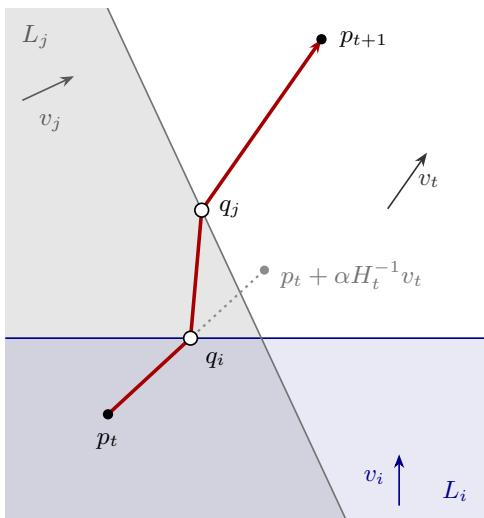
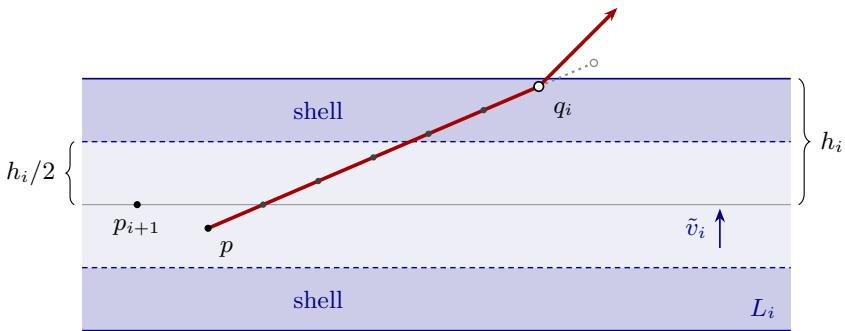

# Optimal and Eficient Online Inverse Optimization

Anupam Gupta∗, Guru Guruganesh, Honghao Lin, Vahab Mirrokni, Renato Paes Leme, David P. Woodruf†

Google Research

## Abstract

In online inverse linear optimization, a learner recommends an action and then observes the choice of an expert who maximizes a fixed, unknown linear objective on $\mathbb { R } ^ { d } \colon$ the goal is to learn to optimize this objective without observing it. Sakaue recently obtained the optimal regret $O ( { \sqrt { d } } )$ with a randomized algorithm making $( \bar { d } T ) ^ { O ( d ) }$ linear optimizations per round, and asked whether it can be attained in polynomial time. We answer positively: our deterministic algorithm has regret $O ( { \sqrt { d } } )$ for every horizon T and runs in time polynomial in d and T. It is a variant of the variable-metric algorithms of Sakaue et al. and Cai et al., in which a metric update is revoked once the query point moves far enough from where the update was made.

## 1 Introduction

Consider a resident who learns by watching the decisions of an attending physician on a hospital ward. Every patient comes with a handful of possible interventions — this drug or another, operate now or wait — and the attending picks one. The reasoning behind the pick is seldom spelled out: it balances how well a treatment works against what it does to the patient, and how fast recovery comes against what it costs. The resident never sees the criterion the attending uses, only the intervention chosen, one patient at a time. The goal is for the resident’s recommendations to become as good as the attending’s in the long run: each recommendation falls short of the attending’s choice by some amount, measured by the attending’s own criterion, and we want the total shortfall over all patients to stay small. This is the problem of online inverse linear optimization.

We represent the attending’s criterion by a fixed vector $w ^ { * }$ . Each intervention is a vector of d attributes, and the interventions available for the t-th patient form a set $X _ { t } \subseteq \mathbb { R } ^ { d }$ . The resident proposes one, and is then shown the one the attending chose, a maximizer of $\langle w ^ { * } , \cdot \rangle -$ and nothing more: not the criterion, not what any option is worth, not the size of the mistake. As in [10], this leads to the following problem.

Online inverse linear optimization. Fix a hidden $w ^ { \ast } \in \mathbb { B }$ . For $t = 1 , 2 , \ldots ;$

1. a compact nonempty action set $X _ { t } \subseteq \mathbb { B }$ is revealed, chosen adversarially as a function of the history;

2. the learner recommends an action $\hat { x } _ { t } \in X _ { t } ;$

3. the expert takes $x _ { t } \in \arg \operatorname* { m a x } _ { x \in X _ { t } } \langle w ^ { * } , x \rangle$ , which the learner then observes.

Here B is the unit ball of $\mathbb { R } ^ { d }$ and $\| \cdot \|$ the Euclidean norm. The learner is charged the cumulative shortfall of its recommendations, in the expert’s own currency,

$$
R _ { T } : = \sum _ { t = 1 } ^ { T } \langle w ^ { * } , x _ { t } - \hat { x } _ { t } \rangle \geq 0 ,\tag{1}
$$

<table><tr><td>Method</td><td>Regret</td><td>Uniform in T</td><td>Proper</td><td></td><td>Deterministic Per-round cost</td></tr><tr><td>Bärmann et al. [4, 5] (OGD/MWU)</td><td> $O ( \sqrt { T } )$ </td><td>no</td><td>yes</td><td>yes</td><td> $O ( \tau _ { \mathrm { s o l } } + d )$ </td></tr><tr><td>Besbes et al. [7, 8] (circumcenter)</td><td> $O ( d ^ { 4 } \ln T )$ </td><td>no</td><td>yes</td><td>yes</td><td> $\tau _ { \mathrm { s o l } } + \mathrm { p o l y } ( d , T )$ </td></tr><tr><td>Gollapudi et al. [16] (centroid)</td><td> $O ( d \ln T )$ </td><td>no</td><td>yes</td><td>yes</td><td> $\tau _ { \mathrm { s o l } } + \mathrm { p o l y } ( d , T )$ </td></tr><tr><td>Gollapudi et al. [16] (John ellipsoid)</td><td> $\exp ( O ( d \ln d ) )$ </td><td>yes</td><td>yes</td><td>yes</td><td> $\tau _ { \mathrm { s o l } } + \mathrm { p o l y } ( d , T )$ </td></tr><tr><td>Sakaue et al. [28] (online Newton step)</td><td> $O ( d \ln T )$ </td><td>no</td><td>yes</td><td>yes</td><td> $O ( \tau _ { \mathrm { s o l } } + d _ { - } ^ { 2 } + \tau _ { \mathrm { p r o j } } )$ </td></tr><tr><td>Sakaue [29] (second-order perceptron)</td><td> $O ( d \ln T )$ </td><td>no</td><td>yes</td><td>yes</td><td> $O ( \tau _ { \mathrm { s o l } } + d ^ { 2 } )$ </td></tr><tr><td>Dewasurendra [13] (multiscale vote)</td><td> $O ( d )$ </td><td>yes</td><td>no</td><td>yes</td><td> $T ^ { \dot { \Theta } ( d ) }$ </td></tr><tr><td>Cai et al. [10] (variable metric)</td><td> $O ( d )$ </td><td>yes</td><td>yes</td><td>yes</td><td> $O ( \tau _ { \mathrm { s o l } } + d ^ { 2 } )$ </td></tr><tr><td>Sakaue [27] (multiscale matrix weights)</td><td> $O ( { \sqrt { d } } ) ^ { \dagger }$ </td><td>yes</td><td>no</td><td>no</td><td> $( d T ) ^ { O ( d ) } \tau _ { \mathrm { s o l } } + \mathrm { f i n i t e }$ </td></tr><tr><td>This paper (revocable variable metric)</td><td> ${ \bf O } ( \sqrt { \bf d } )$ </td><td>yes</td><td>yes</td><td>yes</td><td> $O ( \tau _ { \mathrm { s o l } } + t d ^ { 2 } + t ^ { 2 } d )$ </td></tr><tr><td>with skipping (Prop. 3.3)</td><td> ${ \bf O } ( \sqrt { \bf d } )$ </td><td>yes</td><td>yes</td><td>yes</td><td> $\mathrm { a m o r t . } O ( \tau _ { \mathrm { s o l } } + d ^ { 2 } \log T )$ </td></tr><tr><td>Lower bound [28]; [10, Thm. 3.1]</td><td> $\Omega ( { \sqrt { d } } )$ </td><td></td><td></td><td></td><td></td></tr></table>

Table 1: Regret $R _ { T }$ of online inverse linear optimization on the unit ball. $\tau _ { \mathrm { s o l } } .$ one linear optimization over $X _ { t } ; \tau _ { \mathrm { p r o j } } \colon$ one Mahalanobis projection; †in expectation.

and never observes a single term of it. A bound is uniform in T if it does not depend on the horizon; it then bounds the total shortfall ever incurred. A learner is proper if it commits to an objective before it sees the menu: at the start of round t it holds an estimate $\hat { w } _ { t } \neq 0$ of $w ^ { * }$ and recommends $\hat { x } _ { t } \in \arg \operatorname* { m a x } _ { x \in X _ { t } } \langle \hat { w } _ { t } , x \rangle$ , at the cost of one linear optimization over $X _ { t } .$ . It is improper if $\hat { x } _ { t }$ may be any function of $X _ { t }$ and the history. A proper learner carries an explicit hypothesis about the attending’s criterion, and each of its proposals is the best one under that hypothesis.

This paper is about the dimension. Bounds uniform in T are now known (Table 1), so the horizon is no longer the obstacle; what remains is how the total shortfall grows with d, the number of attributes the criterion weighs. There is a floor: an adversary that ofers the two actions ±ei in round $i \leq d$ and draws the signs of $w ^ { * } \in \{ \pm 1 / \sqrt { d } \} ^ { d }$ at random makes the better action of each round independent of everything seen before, so every learner, even a randomized one, pays $\sqrt { d }$ in expectation [28, 27]. We ask for a learner that pays only that much and is also proper and eficient, with $\mathrm { p o l y } ( d , T )$ arithmetic operations per round.

History. The online formulation is due to B¨armann, Pokutta and Schneider [4, 5], who obtained $O ( \sqrt { T } )$ by online gradient descent and multiplicative weights. Besbes, Fonseca and Lobel [7, 8] obtained $O ( d ^ { 4 } \ln T )$ by a circumcenter rule, ProjectedCones. Gollapudi, Guruganesh, Kollias, Manurangsi, Paes Leme and Schneider [16], who studied the same protocol as contextual recommendation, obtained $O ( d \ln T )$ by a centroid cutting-plane rule and $\exp ( O ( d \ln d ) )$ , uniform in $T ,$ from the John ellipsoid. Sakaue, Tsuchiya, Bao and Oki [28] obtained O(d ln T) at $O ( d ^ { 2 } )$ per round plus a Mahalanobis projection by an online Newton step, together with the lower bound above, and Sakaue [29] kept $O ( d \ln T )$ and removed the projection by a second-order perceptron. Under structural assumptions the regret is finite: Sakaue, Bao and Tsuchiya [26] assume that the gap in value of every action is at least a fixed multiple of its distance to the optimal one, Oki and Sakaue [23] that every $X _ { t }$ is M-convex, as the bases of a matroid are, and Kitaoka [19] obtains finite regret and finitely many mistakes for the online Newton step on uniformly bounded integer action sets, for $w ^ { * }$ in the probability simplex and unique optimal actions; that bound carries a factor $d ^ { 2 }$ and depends on the range of the coordinates. Whether a finite poly(d) bound holds for arbitrary action sets was asked in [16, 23]. Dewasurendra [13] answered it with $O ( d )$ , uniform in $T \colon$ at every dyadic scale he covers the class of optimality-gap functions, pools the resulting tolerant tests into one weighted vote and plays the action the vote prefers — an improper rule with $T ^ { \Theta ( d ) }$ tests per round.

Cai, Gupta, Gupta, Guruganesh, Jiang, Liaw, Mehta, Paes Leme, Velegkas and Wang [10] obtained $O ( d )$ , precisely $\mathrm { R e g } _ { T } \leq 6 \sqrt { 3 } d R$ in the game below, with a deterministic proper rule at $O ( d ^ { 2 } )$ per round: a variable-metric step with a self-normalized rank-one update, analyzed through the trace power $\operatorname { t r } ( H ^ { - 1 / 2 } )$ . Sakaue [27] then reached the optimal order, $\mathbb { E } [ R _ { T } ] \leq 2 ^ { 2 1 } { \sqrt { d } }$ for every $T _ { i }$ , without knowledge of $T$ and for arbitrary compact action sets and ties, by matrix multiplicative weights on polynomial feature spaces at geometrically spaced scales. The learner is randomized and improper — it solves a linear program for a distribution over a list of actions and samples from it — and in round t its finest scale acts on polynomials of degree $\Theta ( t ^ { 4 } )$ in d variables, with $( d T ) ^ { O ( d ) }$ linear optimizations over $X _ { t }$ in its rational implementation. Sakaue proves that every round terminates, gives no polynomial bound on the running time, and asks whether $\sqrt { d }$ is attainable in time poly nomial in the dimension, the horizon and the input length [27, Section $7 ]$ . So far, then, $\sqrt { d }$ has been reached only by an improper, randomized rule with no polynomial bound, and $O ( d )$ is the best bound known for a proper learner, for a deterministic one, and for an eficient one.

The problem is the online face of an older one — recover an objective from observed optimal decisions — initiated by Burton and Toint [9] for shortest paths and cast in linear-programming form by Ahuja and Orlin [1]; see [11] for a survey. Ofline work turns on the choice of loss [17, 6, 21, 31], on noisy [3] or partially specified [25] data, and on statistical rates [15]; applications run from control [2] and routing [32] to ofline reinforcement learning [14].

Reduction to a cutting-plane game. As in [10], we work with the following primitive, isolated in [16].

Cutting planes with a strong separation oracle. A point $w ^ { * }$ is hidden in a known compact convex body $K _ { 1 } \subseteq \mathbb { R } ^ { d } $ ; let $R : = \operatorname* { m a x } _ { w \in K _ { 1 } } \| w \|$ . For $t = 1 , 2 , \ldots \colon$

1. the learner queries a point $p _ { t } \in \mathbb { R } ^ { d } ;$

2. an adversary, having seen $p _ { t }$ and the history, returns a unit vector $v _ { t }$ subject only to $r _ { t } : = $ $\langle w ^ { * } - p _ { t } , v _ { t } \rangle \geq 0$

The regret is Reg $\textstyle { \mathrm { : } } = \sum _ { t < T } r _ { t } .$ , a sum of nonnegative losses; the oracle is strong in that $v _ { t }$ may be chosen after seeing $p _ { t }$

A learner for this game on $K _ { 1 } = \mathbb { B }$ gives a proper learner for online inverse linear optimization: play $\hat { w } _ { t } : = p _ { t }$ (any fixed nonzero vector if $p _ { t } = 0 )$ , recommend $\hat { x } _ { t } \in \arg \operatorname* { m a x } _ { x \in X _ { t } } \langle \hat { w } _ { t } , x \rangle$ , and return $v _ { t } : = \delta _ { t } / \| \delta _ { t } \|$ for $\delta _ { t } : = x _ { t } - \hat { x } _ { t }$ , skipping the rounds with $\delta _ { t } = 0$ , which cost nothing. Optimality of $\hat { x } _ { t }$ and of $x _ { t }$ gives $\langle p _ { t } , \delta _ { t } \rangle \leq 0 \leq \langle w ^ { * } , \delta _ { t } \rangle$ , so $r _ { t } = \langle w ^ { * } - p _ { t } , \delta _ { t } \rangle / \| \delta _ { t } \| \geq 0$ and the round is legal, and as $\| \delta _ { t } \| \leq 2$ the shortfall is $\langle w ^ { * } , \delta _ { t } \rangle \leq \langle w ^ { * } - p _ { t } , \delta _ { t } \rangle = \| \delta _ { t } \| r _ { t } \leq 2 r _ { t }$ . Hence $R _ { T } \leq 2 \mathrm { R e g } _ { T } ;$ the expert need only be, round by round, at least as good as the recommendation under its own criterion.

## 1.1 Our Results

We solve the cutting-plane game at the optimal rate, deterministically and in polynomial time.

Our main result is an algorithm which, given only the radius $R = \operatorname* { m a x } _ { w \in K _ { 1 } } \| w \|$ , has regret $\mathrm { R e g } _ { T } = O ( R { \sqrt { d } } )$ for every horizon $T ,$ , every hidden $w ^ { \ast } \in K _ { 1 }$ and every strong separation oracle, and whose round t takes $O ( t d ^ { 2 } + t ^ { 2 } d )$ arithmetic operations, $O ( d ^ { 2 } + T d )$ per round on average over the first $T$ rounds (Theorem 2.1). The bound is uniform in $T _ { i }$ hence holds for $T = \infty .$ , and the algorithm is deterministic and anytime: it needs neither $T$ nor restarts. Through the reduction above, with $K _ { 1 } = \mathbb { B }$ , it gives a deterministic proper learner for online inverse linear optimization with $R _ { T } = O ( { \sqrt { d } } )$ for every horizon and every adaptive sequence of action sets, using one linear optimization over $X _ { t }$ and the same number of arithmetic operations per round (Corollary 2.2).

Both bounds are optimal: every learner, deterministic or randomized, sufers regret $\Omega ( R { \sqrt { d } } )$ in the game on $K _ { 1 } = R \mathbb { B }$ [10, Theorem 3.1], and $\Omega ( { \sqrt { d } } )$ in expectation in online inverse linear optimization for every $T \geq d \ [ 2 8 , 2 7 ]$ , so the optimal regret is $\Theta ( R \sqrt { d } )$ and $\Theta ( { \sqrt { d } } )$ , respectively. Ours is the first $\sqrt { d }$ bound for online inverse linear optimization that is deterministic, the first that is proper, and the first with a polynomial bound on its computation, which answers the question of [27]. Our cost exceeds the $O ( d ^ { 2 } )$ of [10] and grows with t. A variant that skips every stretch with $s _ { t } ^ { 2 } \leq ( t + 1 ) ^ { - 4 }$ keeps only O(d log t) stretches active, at an amortized $O ( d ^ { 2 } \log T )$ arithmetic operations per round and $O ( d ^ { 3 } \log ^ { 2 } t )$ in the worst round, with regret still $O ( R { \sqrt { d } } )$ (Proposition 3.3).

The main body works in the real-RAM model, counting arithmetic operations on real numbers, and it is self-contained: nothing in it depends on the appendix. Appendix A counts bit operations instead: a rounded variant of the algorithm, which reads each reply to finite precision, keeps regret $O ( R { \sqrt { d } } )$ and uses a number of bit operations per round polynomial in $d ,$ log t and the encoding length of R (Theorem A.1).

The algorithm. Our starting point is the variable-metric algorithm introduced for this problem by Sakaue, Tsuchiya, Bao and Oki [28] and Sakaue [29], and later made horizon-independent by Cai et al. [10]. In the version of [10], from $p _ { 1 } = 0$ and $H _ { 1 } = I$ it updates

$$
\begin{array} { r } { s _ { t } = \| v _ { t } \| _ { H _ { t } ^ { - 1 } } , \qquad H _ { t + 1 } = H _ { t } + \frac { \tau } { s _ { t } } v _ { t } v _ { t } ^ { \top } , \qquad p _ { t + 1 } = p _ { t } + \alpha H _ { t + 1 } ^ { - 1 } v _ { t } , } \end{array}\tag{2}
$$

with $\tau = \Theta ( 1 / d )$ and $\alpha = \Theta ( R / d )$ , where $\| x \| _ { H } : = ( x ^ { \top } H x ) ^ { 1 / 2 }$ . It is a variable-metric method: the positive definite matrix $H _ { t }$ is a metric that records what has been learned about $w ^ { * }$ , and each round stretches it along the direction $v _ { t }$ just received, to indicate that more is now known along $v _ { t } ;$ the steps $H ^ { - 1 } v$ are then long in directions not yet explored and short in explored ones. The analysis of [10] controls the distance $\| p _ { t } - w ^ { * } \| _ { H _ { t } }$ in the current metric. Every stretch inflates that distance and is never undone: this forces us to be conservative and maintain small stretches—i.e., to keep $\tau = \Theta ( 1 / d )$ which ends up incurring a regret that is $\sqrt { d }$ larger than the best possible.

We also maintain a metric, but a stretch is no longer permanent: it is revoked as soon as the query moves far along its direction from the query point at which it was made. The learner keeps a set $A _ { t }$ of active stretches, and its metric is

$$
H _ { t } \ = \ I + \sum _ { i \in A _ { t } } \gamma _ { i } v _ { i } v _ { i } ^ { \top } .
$$

The stretch i made at the end of round i specifies a weight $\gamma _ { i }$ and an associated slab $L _ { i }$ (consisting of the set of points within $4 \alpha s _ { i } ^ { 2 }$ $p _ { i + 1 }$ along the direction $v _ { i } )$ ; stretch i remains active only while the query belongs to slab $L _ { i }$ . In round t the query moves continuously along $H ^ { - 1 } v _ { t }$ for a time $\alpha ,$ where H corresponds to the currently active stretches; the moment the query leaves the slab of an active stretch, that stretch is revoked and the direction changes correspondingly. At the end of the round a new stretch is added to $A _ { t }$ . Formally, the algorithm is the following.

Definition 1.1 (Algorithm $\operatorname { R V M } ( \alpha ) )$ . Start from $p _ { 1 } = 0$ and $A _ { 1 } = \varnothing$ . In round $t = 1 , 2 , \ldots { }$ , query

  
Figure 1: One move of $R V M ( \alpha )$ in the plane, to scale $( \alpha = 1 )$ . The path (red) leaves the slab $L _ { i }$ at $q _ { i }$ and the slab $L _ { j }$ at $q _ { j }$ , turning at each revocation; the dotted segment is the single step with the metric frozen.

$p _ { t }$ and receive $v _ { t }$ . Then follow the continuous path $\hat { p } _ { t } : [ 0 , \alpha ] \to \mathbb { R } ^ { d }$ with right derivative given by

$$
\hat { p } _ { t } ( 0 ) = p _ { t } , \qquad \hat { p } _ { t } ^ { \prime } ( \eta ) = \hat { H } _ { t } ( \eta ) ^ { - 1 } v _ { t } , \qquad \hat { H } _ { t } ( \eta ) = I + \sum _ { i \in \hat { A } _ { t } ( \eta ) } \gamma _ { i } v _ { i } v _ { i } ^ { \top } ,\tag{3}
$$

$$
\hat { A } _ { t } ( \eta ) = \big \{ i \in A _ { t } : \hat { p } _ { t } ( \tilde { \eta } ) \in L _ { i } \mathrm { ~ f o r ~ a l l ~ } 0 \leq \tilde { \eta } \leq \eta \big \} ,
$$

and set

$$
\begin{array} { r l } { p _ { t + 1 } = \hat { p } _ { t } ( \alpha ) , \quad } & { s _ { t } = \| v _ { t } \| _ { \hat { H } _ { t } ( \alpha ) ^ { - 1 } } , \qquad \gamma _ { t } = \frac { 1 } { 8 s _ { t } ^ { 2 } } , \qquad L _ { t } = \big \{ p \in \mathbb { R } ^ { d } : | \langle p - p _ { t + 1 } , v _ { t } \rangle | < 4 \alpha s _ { t } ^ { 2 } \big \} , } \\ & { \qquad A _ { t + 1 } = \hat { A } _ { t } ( \alpha ) \cup \{ l \} , \qquad H _ { t + 1 } = \hat { H } _ { t } ( \alpha ) + \gamma _ { t } v _ { t } v _ { t } ^ { \top } . } \end{array}\tag{4}
$$

We run it with $\alpha = R / ( 3 \sqrt { d } )$

The term $\hat { A } _ { t } ( \eta )$ is the set of stretches whose slab the path has not yet left, so a stretch is revoked the moment the path reaches the boundary of its slab, at $\eta = \alpha$ included, and never returns; without revocations the path is a single segment and $p _ { t + 1 } = p _ { t } + \alpha H _ { t } ^ { - 1 } v _ { t }$ , a variable-metric step like that of (2). By Lemma 2.3 the path is well defined and piecewise linear, with at most $| A _ { t } | + 1$ pieces.

Every quantity the update uses is observable — the queries, the directions received and the stretches made from them — and neither the loss $r _ { t }$ nor $w ^ { * }$ appears. The learner is proper, since its queries are its estimates, and uses no randomness. Keeping $H ^ { - 1 }$ by Sherman–Morrison, round t costs $O ( ( k _ { t } + 1 ) ( d ^ { 2 } + | A _ { t } | d ) )$ operations, where $k _ { t }$ is the number of stretches it revokes (Remark 2.4); as $| A _ { t } | \le t - 1$ and each stretch is revoked at most once, this gives the counts of Theorem 2.1.

Figure 1 gives the geometric picture. Two stretches i and $j$ are active at $p _ { t }$ , and each shortens the step along its own direction, so the path leaves $p _ { t }$ bent away from $v _ { t }$ . At $q _ { i }$ it reaches the edge of $L _ { i } { \mathrm { : } }$ stretch i is revoked, the metric loses the $\gamma _ { i } v _ { i } v _ { i } ^ { \top }$ term, and the path turns correspondingly. At $q _ { j }$ it leaves $L _ { j }$ , stretch $j$ is revoked too, and the path continues along $v _ { t }$ itself until time α; stretch t is then defined, with its slab centered at $p _ { t + 1 }$ (its half-width $4 \alpha s _ { t } ^ { 2 } = 4$ is of the picture). As a comparison the dotted segment is the single step $p _ { t } + \alpha H _ { t } ^ { - 1 } v _ { t }$ taken by [10]. We note that the slabs are not knowledge sets: no point is ruled out, and $w ^ { * }$ may lie anywhere.

Organization. Section 2 states the results precisely and proves them. After checking that the move is well defined and counting its cost, it bounds the change of $\| \boldsymbol { p } - \boldsymbol { w } ^ { * } \| _ { H } ^ { 2 }$ over one move (Lemma 2.5), shows that over the lifetime of a stretch its penalty is refunded up to a term linear in the loss (Lemma 2.6), and pays for the stretches that are never revoked with a trace potential (Lemma 2.7). Section 3 shows why revocation is needed and why it happens exactly on the slab boundary, and gives a variant with $O ( d \log t )$ active stretches. Section 4 concludes. Appendix A treats finite precision and bit complexity.

## 2 Analysis

We state the main results precisely and prove them. The first is the regret bound and cost of $\operatorname { R V M } ( \alpha )$

Theorem 2.1 (Regret of $\operatorname { R V M } ( \alpha ) )$ . Let $R = \operatorname* { m a x } _ { w \in K _ { 1 } } \left\| w \right\|$ and run $R V M ( \alpha )$ with $\alpha = R / ( 3 \sqrt { d } )$ Then for every T, every $w ^ { * } \in K _ { 1 }$ and every strong separation oracle,

$$
\mathrm { R e g } _ { T } \leq \frac { 5 1 } { 8 } R \sqrt { d } < 6 . 4 R \sqrt { d } a n d \| p _ { T + 1 } - w ^ { * } \| ^ { 2 } \leq \frac { 1 7 } { 8 } R ^ { 2 } .
$$

Round t uses $O ( t d ^ { 2 } + t ^ { 2 } d )$ arithmetic operations, and the first T rounds use $O ( d ^ { 2 } + T d )$ per round on average.

Through the reduction of Section 1, the theorem gives our result for online inverse linear optimization.

Corollary 2.2 (Online inverse optimization). There is a deterministic proper learner for online inverse linear optimization with

$$
R _ { T } \leq \frac { 5 1 } { 4 } \sqrt { d } < 1 3 \sqrt { d }
$$

for every $T ,$ , every $w ^ { \ast } \in \mathbb { B }$ and every adaptive sequence of action sets. Its round t uses one linear optimization over $X _ { t }$ and $O ( t d ^ { 2 } + t ^ { 2 } d )$ arithmetic operations, and its first T rounds use $O ( d ^ { 2 } + T d )$ arithmetic operations per round on average.

Proof. Run $\mathrm { R V M } ( \alpha )$ on $K _ { 1 } = \mathbb { B }$ , so $R = 1$ , through the reduction of Section 1, which gives $R _ { T } \leq 2 \mathrm { R e g } _ { T }$ and adds one linear optimization and $O ( d )$ arithmetic operations per round, one of them the square root that normalizes $v _ { t }$ . Rounds with $x _ { t } = \hat { x } _ { t }$ are not rounds of the game, so the game’s round index never exceeds $t ,$ and Theorem 2.1 applies. □

The cost bounds of Theorem 2.1 are counted in Remark 2.4, once Lemma 2.3 has checked that the move is well defined; the rest of the section proves the regret bound.

The proof tracks the squared distance from the query to $w ^ { * }$ in the metric in use, $\| p - w ^ { * } \| _ { H } ^ { 2 } -$ the quantity $\| p _ { t } - w ^ { * } \| _ { H _ { t } } ^ { 2 }$ of [10] — through the three kinds of events that change it: the moves, the making of stretches, and their revocation. Lemma 2.5 accounts for a move, (6) regroups the whole run by stretch, Lemma 2.6 bounds the contribution of each stretch over its lifetime, and Lemma 2.7 bounds the total left over by the stretches that are never revoked.

## 2.1 The move and its cost

The move (3) defines the path and the set of active stretches in terms of each other. The first lemma checks that exactly one path fits the definition and collects the facts about it that the analysis uses.

Lemma 2.3 (Well-posed move). In every round t of $R V M ( \alpha )$

(a) the slab of every active stretch contains the query: $p _ { t } \in L _ { i }$ for all $i \in A _ { t }$ , so that $\hat { A } _ { t } ( 0 ) = A _ { t }$ and $\hat { H } _ { t } ( 0 ) = H _ { t } ,$

(b) exactly one path satisfies $( 3 )$ ; it is piecewise linear with at most $k _ { t } + 1 \leq | A _ { t } | + 1$ pieces, where $k _ { t } : = | A _ { t } \setminus \hat { A } _ { t } ( \alpha ) |$ is the number of stretches revoked in the round;

(c) $\hat { H } _ { t } ( \eta )$ is nonincreasing in $\eta ,$ so the dual length $\sigma ( \eta ) : = \| v _ { t } \| _ { \hat { H } _ { t } ( \eta ) ^ { - 1 } }$ is nondecreasing, and $0 < \sigma ( \eta ) \leq s _ { t } \leq 1 ,$

(d) each stretch i revoked in the round is revoked at a point $q _ { i }$ of the path on the boundary of its slab: $| \langle q _ { i } - p _ { i + 1 } , v _ { i } \rangle | = 4 \alpha s _ { i } ^ { 2 }$

Proof. (a) By induction on $t ;$ at $t = 1$ there are no stretches. Every $i \in \hat { A } _ { t } ( \alpha )$ has $p _ { t + 1 } = \hat { p } _ { t } ( \alpha ) \in L _ { i }$ by the definition of $\hat { A } _ { t } ( \alpha )$ , and $p _ { t + 1 }$ is the center of $L _ { t }$ , so $p _ { t + 1 } \in L _ { i }$ for all $i \in A _ { t + 1 }$

(b) While the active set is fixed, the right derivative $\hat { H } _ { t } ( \eta ) ^ { - 1 } v _ { t }$ is constant, so the path is a segment. By (a) the path starts with every stretch of $A _ { t }$ active, and it follows a segment until it reaches the boundary of an active slab or $\eta = \alpha ;$ the stretches on that boundary are revoked, the others are still strictly inside their slabs, and a new segment begins. Every piece but the last revokes a stretch, so there are at most $k _ { t } + 1$ pieces. The path is unique: since the slabs are open, any path satisfying (3) keeps its active set, hence its velocity, for a while after each time, so two such paths that agree up to some time agree a little beyond it.

(c) The set $\hat { A } _ { t } ( \eta )$ only loses elements, and each loss subtracts a positive semidefinite $\gamma _ { i } v _ { i } v _ { i } ^ { \top }$ from the metric. Inversion reverses the Loewner order, so $\hat { H } _ { t } ( \eta ) ^ { - 1 }$ is nondecreasing, and so is $\sigma ( \eta ) ^ { 2 } =$ $v _ { t } ^ { \top } \hat { H } _ { t } ( \eta ) ^ { - 1 } v _ { t }$ . Finally $\hat { H } _ { t } ( \eta ) \succeq I$ gives $0 \prec \hat { H } _ { t } ( \eta ) ^ { - 1 } \preceq I$ , hence $0 < \sigma ( \eta ) \leq \sigma ( \alpha ) = s _ { t } \leq \| v _ { t } \| = 1$

(d) The path starts in the open slab $L _ { i }$ by (a) and is continuous, so the first point at which it is not in $L _ { i } .$ , where stretch i is revoked, lies on the boundary of $L _ { i }$ □

Remark 2.4 (Cost). The algorithm stores $M = H ^ { - 1 }$ for the metric in use, and, for each active stretch i, the vector $v _ { i } ,$ the numbers $\gamma _ { i } , s _ { i }$ and the displacement $\phi _ { i } = \langle p - p _ { i + 1 } , v _ { i } \rangle$ of the current point. On a piece of the path it computes $u = M v _ { t }$ in $O ( d ^ { 2 } )$ operations and $\beta _ { i } = \langle v _ { i } , u \rangle$ for every active stretch in $O ( | A _ { t } | d )$ ; the piece ends at the least of the remaining time and the exit times $( 4 \alpha s _ { i } ^ { 2 } - \mathrm { s i g n } ( \beta _ { i } ) \phi _ { i } ) / | \beta _ { i } |$ over $\beta _ { i } \neq 0$ , after which $p$ and the $\phi _ { i }$ are advanced in $O ( d + | A _ { t } | )$ . Revoking stretch i is the Sherman–Morrison downdate

$$
M \gets M + \frac { \gamma _ { i } } { 1 - \gamma _ { i } v _ { i } ^ { \top } M v _ { i } } M v _ { i } v _ { i } ^ { \top } M ,
$$

whose denominator equals $1 / ( 1 + \gamma _ { i } v _ { i } ^ { \top } N ^ { - 1 } v _ { i } ) > 0$ for $N = H - \gamma _ { i } v _ { i } v _ { i } ^ { \top } \succeq I$ the metric after the downdate; making stretch t is the update $\begin{array} { r } { M \gets M - \frac { 1 } { 9 s _ { t } ^ { 2 } } M v _ { t } v _ { t } ^ { \top } M } \end{array}$ , since $\gamma _ { t } / ( 1 + \gamma _ { t } s _ { t } ^ { 2 } ) = 1 / ( 9 s _ { t } ^ { 2 } )$ . Each costs $O ( d ^ { 2 } )$ . By Lemma 2.3(b), round t therefore costs

$$
O \big ( ( k _ { t } + 1 ) ( d ^ { 2 } + | A _ { t } | d ) \big ) \ = \ O \big ( t d ^ { 2 } + t ^ { 2 } d \big )
$$

arithmetic operations, as $k _ { t } \le | A _ { t } | \le t - 1$ . Since each stretch is revoked at most once, $\textstyle \sum _ { t < T } k _ { t } \leq T$ so the first $T$ rounds cost $O ( T d ^ { 2 } + T ^ { 2 } d )$ in total, that is, $O ( d ^ { 2 } + T d )$ per round on average, with memory $O ( d ^ { 2 } + T d )$ . No random bits are used. Apart from the constant $\alpha ,$ all operations are rational, because $s _ { t }$ enters only through $s _ { t } ^ { 2 } = v _ { t } ^ { \top } M v _ { t }$ The counts are in the real-RAM model; Appendix $\mathrm { A }$ gives a rounded variant with polynomial bit complexity.

## 2.2 One move

Fix $T , w ^ { * }$ and the oracle. In round $t , \xi ( \eta ) : = \langle \hat { p } _ { t } ( \eta ) - p _ { t } , v _ { t } \rangle$ is the distance the query has moved along $v _ { t }$ by time $\eta$ of the path, and $\xi _ { t } : = \xi ( \alpha ) = \langle p _ { t + 1 } - p _ { t } , v _ { t } \rangle$ . For the stretch made in round $t \leq T$ , we let $q _ { t }$ be the point at which it is revoked if that happens by the end of round $T$ and $q _ { t } : = p _ { T + 1 }$ otherwise, and we put

$$
\Delta _ { t } : = \langle q _ { t } - p _ { t + 1 } , v _ { t } \rangle ,
$$

its displacement along $v _ { t }$ from the point where it was made. The stretches that are not revoked by the end of round $T$ form the set $A _ { T + 1 }$ , and we call them surviving. By Lemma $2 . 3 ( \mathrm { a } )$ and (d),

$$
| \Delta _ { t } | = 4 \alpha s _ { t } ^ { 2 } \mathrm { i f \ s t r e t c h { \it t } { \mathrm { i s \ r e v o k e d } { , } } } | \Delta _ { t } | < 4 \alpha s _ { t } ^ { 2 } \mathrm { i f \ i t \ s u r v i v e s { . } }\tag{5}
$$

Along the path the query moves along $\hat { H } _ { t } ( \eta ) ^ { - 1 } v _ { t }$ , which decreases the distance to $w ^ { * }$ at the rate $2 \langle w ^ { * } - \hat { p } _ { t } ( \eta ) , v _ { t } \rangle$ , and each revocation removes one term from the metric. The lemma records the net efect, together with the fact that the query cannot move far along $v _ { t }$ in one round.

Lemma 2.5 (One move). In every round t, $0 \le \xi _ { t } \le \alpha s _ { t } ^ { 2 }$ , and

$$
\Vert p _ { t + 1 } - w ^ { * } \Vert _ { \hat { H } _ { t } ( \alpha ) } ^ { 2 } - \Vert p _ { t } - w ^ { * } \Vert _ { H _ { t } } ^ { 2 } \le - 2 \alpha r _ { t } + \alpha ^ { 2 } s _ { t } ^ { 2 } - \sum _ { i \in A _ { t } \backslash \hat { A } _ { t } ( \alpha ) } \gamma _ { i } \langle w ^ { * } - q _ { i } , v _ { i } \rangle ^ { 2 } .
$$

Proof. On a piece of the path the metric $H = \hat { H } _ { t } ( \eta )$ is fixed and $\hat { p } _ { t } ^ { \prime } = H ^ { - 1 } v _ { t }$ , so

$$
\frac { d } { d \eta } \left\| \hat { p } _ { t } ( \eta ) - w ^ { * } \right\| _ { H } ^ { 2 } = 2 \langle \hat { p } _ { t } ( \eta ) - w ^ { * } , H \hat { p } _ { t } ^ { \prime } ( \eta ) \rangle = - 2 \langle w ^ { * } - \hat { p } _ { t } ( \eta ) , v _ { t } \rangle = - 2 \big ( r _ { t } - \xi ( \eta ) \big ) ,
$$

using $\langle w ^ { * } - \hat { p } _ { t } ( \eta ) , v _ { t } \rangle = \langle w ^ { * } - p _ { t } , v _ { t } \rangle - \langle \hat { p } _ { t } ( \eta ) - p _ { t } , v _ { t } \rangle$ . Here $\xi ( 0 ) = 0$ and $\xi ^ { \prime } ( \eta ) = \langle \hat { p } _ { t } ^ { \prime } ( \eta ) , v _ { t } \rangle =$ $v _ { t } ^ { \top } \hat { H } _ { t } ( \eta ) ^ { - 1 } v _ { t } = \sigma ( \eta ) ^ { 2 } \in ( 0 , s _ { t } ^ { 2 } ]$ by Lemma $2 . 3 ( \mathrm { c } )$ , so $0 \leq \xi ( \eta ) \leq \eta s _ { t } ^ { 2 } ;$ at $\eta = \alpha$ this is the first claim. The rate of change is therefore at most $- 2 r _ { t } + 2 \eta s _ { t } ^ { 2 }$ , and integrating over $[ 0 , \alpha ] \ { \mathrm { g i v e s } } \ - 2 \alpha r _ { t } + \alpha ^ { 2 } s _ { t } ^ { 2 }$ At the end of a piece, revoking stretch i at $q _ { i } = \hat { p } _ { t } ( \eta )$ subtracts $\gamma _ { i } \langle w ^ { * } - q _ { i } , v _ { i } \rangle ^ { 2 }$ from the squared distance, which gives the last term. □

If no stretch is revoked, $\sigma ( \eta ) = s _ { t }$ throughout and the lemma holds with equality: it is the familiar expansion $\lVert \boldsymbol { p } _ { t } + \alpha \boldsymbol { H } _ { t } ^ { - 1 } \boldsymbol { v } _ { t } - \boldsymbol { w } ^ { * } \rVert _ { H _ { t } } ^ { 2 } = \lVert \boldsymbol { p } _ { t } - \boldsymbol { w } ^ { * } \rVert _ { H _ { t } } ^ { 2 } - 2 \alpha r _ { t } + \alpha ^ { 2 } s _ { t } ^ { 2 }$

The ledger. Making stretch t at $p _ { t + 1 }$ adds $\gamma _ { t } \langle w ^ { * } - p _ { t + 1 } , v _ { t } \rangle ^ { 2 }$ to the squared distance: $\lVert p _ { t + 1 } -$ $w ^ { * } \| _ { H _ { t + 1 } } ^ { 2 } = \| p _ { t + 1 } - w ^ { * } \| _ { \hat { H } _ { t } ( \alpha ) } ^ { 2 } + \gamma _ { t } \langle w ^ { * } - p _ { t + 1 } , v _ { t } \rangle ^ { 2 }$ . Add this to Lemma 2.5 and sum over $t \leq T$ Each stretch revoked by the end of round $T$ is revoked exactly once, so its refund $\gamma _ { t } \langle w ^ { * } - q _ { t } , v _ { t } \rangle ^ { 2 }$ appears exactly once. The surviving stretches have $q _ { t } = p _ { T + 1 } , \mathrm { ~ s o ~ } \| p _ { T + 1 } - w ^ { * } \| _ { H _ { T + 1 } } ^ { 2 } = \| p _ { T + 1 } -$ $\begin{array} { r } { w ^ { * } \| ^ { 2 } + \sum _ { t \in A _ { T + 1 } } \gamma _ { t } \langle w ^ { * } - q _ { t } , v _ { t } \rangle ^ { 2 } } \end{array}$ , and $p _ { 1 } = 0 , H _ { 1 } = I$ give $\| p _ { 1 } - w ^ { * } \| _ { H _ { 1 } } ^ { 2 } = \| w ^ { * } \| ^ { 2 }$ . The penalty and the refund of stretch t combine: since $\langle w ^ { * } - p _ { t + 1 } , v _ { t } \rangle = r _ { t } - \xi _ { t }$ and $\langle w ^ { * } - q _ { t } , v _ { t } \rangle = r _ { t } - \xi _ { t } - \Delta _ { t }$

$$
\langle w ^ { * } - p _ { t + 1 } , v _ { t } \rangle ^ { 2 } - \langle w ^ { * } - q _ { t } , v _ { t } \rangle ^ { 2 } = \Delta _ { t } \big ( 2 ( r _ { t } - \xi _ { t } ) - \Delta _ { t } \big ) = 2 \Delta _ { t } r _ { t } - \Delta _ { t } ( \Delta _ { t } + 2 \xi _ { t } ) ,
$$

and the $r _ { t } ^ { 2 }$ cancels. Collecting,

$$
\| p _ { T + 1 } - w ^ { * } \| ^ { 2 } - \| w ^ { * } \| ^ { 2 } \leq \sum _ { t = 1 } ^ { T } \Lambda _ { t } , \qquad \Lambda _ { t } : = - 2 \alpha r _ { t } + \alpha ^ { 2 } s _ { t } ^ { 2 } + \gamma _ { t } \bigl ( 2 \Delta _ { t } r _ { t } - \Delta _ { t } ( \Delta _ { t } + 2 \xi _ { t } ) \bigr ) .\tag{6}
$$

We read $\Lambda _ { t }$ as the lifetime contribution of stretch t: the move that preceded it, and the penalty $\gamma _ { t } \langle w ^ { * } - p _ { t + 1 } , v _ { t } \rangle ^ { 2 }$ charged when the stretch was made, net of the refund $\gamma _ { t } \langle w ^ { * } - q _ { t } , v _ { t } \rangle ^ { 2 }$ collected when it is revoked $- \mathrm { { _ { o r } } }$ , for a surviving stretch, still owed at the end.

## 2.3 The lifetime of a stretch

In [10] the penalty for stretching the metric is never refunded, and it is quadratic in the loss: $\begin{array} { r } { \frac { \tau } { s _ { t } } r _ { t } ^ { 2 } } \end{array}$ there, $\gamma _ { t } \langle w ^ { * } - p _ { t + 1 } , v _ { t } \rangle ^ { 2 } = \gamma _ { t } ( r _ { t } - \xi _ { t } ) ^ { 2 }$ here. The point of revocation is that the refund cancels the quadratic part exactly, as the ledger shows, leaving in $\Lambda _ { t }$ a term linear in $r _ { t }$ whose coeficient the slab controls.

Lemma 2.6 (Lifetime of a stretch). For every $t \leq T$

$\Lambda _ { t } ~ \le ~ - \alpha r _ { t }$ if stretch t is revoked, $\begin{array} { r } { \Lambda _ { t } \ \le \ - \alpha r _ { t } + \frac { 9 } { 8 } \alpha ^ { 2 } s _ { t } ^ { 2 } } \end{array}$ if it survives.

Proof. Group the terms of $\Lambda _ { t }$ by their dependence on the loss:

$$
\begin{array} { r } { \Lambda _ { t } \ = \ \underbrace { - 2 \alpha r _ { t } + 2 \gamma _ { t } \Delta _ { t } r _ { t } } _ { \mathrm { l i n e a r ~ i n ~ } r _ { t } } + \underbrace { \alpha ^ { 2 } s _ { t } ^ { 2 } - \gamma _ { t } \Delta _ { t } ( \Delta _ { t } + 2 \xi _ { t } ) } _ { \mathrm { f r e e ~ o f } \ r _ { t } } . } \end{array}
$$

The linear part. By (5), $| \Delta _ { t } | \leq 4 \alpha s _ { t } ^ { 2 }$ , and $\gamma _ { t } \cdot 4 \alpha s _ { t } ^ { 2 } = \alpha / 2 ;$ as $r _ { t } \geq 0 , 2 \gamma _ { t } \Delta _ { t } r _ { t } \leq \alpha r _ { t }$ , so the linear part is at most $- \alpha r _ { t }$

The rest, for a revoked stretch. Here $| \Delta _ { t } | = 4 \alpha s _ { t } ^ { 2 } .$ , and $0 \le \xi _ { t } \le \alpha s _ { t } ^ { 2 }$ by Lemma 2.5, so

$$
\gamma _ { t } \Delta _ { t } ( \Delta _ { t } + 2 \xi _ { t } ) \geq \gamma _ { t } | \Delta _ { t } | \big ( | \Delta _ { t } | - 2 \xi _ { t } \big ) \geq \frac { 1 } { 8 s _ { t } ^ { 2 } } \cdot 4 \alpha s _ { t } ^ { 2 } \big ( 4 \alpha s _ { t } ^ { 2 } - 2 \alpha s _ { t } ^ { 2 } \big ) = \alpha ^ { 2 } s _ { t } ^ { 2 } .
$$

The rest, for a surviving stretch. Here we only use $\Delta _ { t } ( \Delta _ { t } + 2 \xi _ { t } ) = ( \Delta _ { t } + \xi _ { t } ) ^ { 2 } - \xi _ { t } ^ { 2 } \geq - \xi _ { t } ^ { 2 }$ , so the rest is at most $\begin{array} { r } { \alpha ^ { 2 } s _ { t } ^ { 2 } + \gamma _ { t } \xi _ { t } ^ { 2 } \le \alpha ^ { 2 } s _ { t } ^ { 2 } + \frac { 1 } { 8 s _ { t } ^ { 2 } } \alpha ^ { 2 } s _ { t } ^ { 4 } = \frac 9 8 \alpha ^ { 2 } s _ { t } ^ { 2 } } \end{array}$ □

The two cases say: a revoked stretch pays for its own step, since leaving the slab takes the query a distance $4 \alpha s _ { t } ^ { 2 }$ along $v _ { t }$ and the refund on the way out covers the cost $\alpha ^ { 2 } s _ { t } ^ { 2 }$ of the move that preceded the stretch; a surviving stretch leaves its $\textstyle { \bar { \frac { 9 } { 8 } } } \alpha ^ { 2 } s _ { t } ^ { 2 }$ to be paid by the potential of the next lemma. The constants in $( 4 )$ are the ones that make the first case balance exactly: with weight $\gamma _ { t } = \tau / s _ { t } ^ { 2 }$ and a half-width $h _ { t }$ with $\gamma _ { t } h _ { t } = \alpha / 2$ , the refund margin is $\begin{array} { r } { \frac { \alpha } { 2 } ( h _ { t } - 2 \alpha s _ { t } ^ { 2 } ) = \alpha ^ { 2 } s _ { t } ^ { 2 } ( \frac { 1 } { 4 \tau } - 1 ) } \end{array}$ ， which covers $\alpha ^ { 2 } s _ { t } ^ { 2 }$ exactly when $\tau \leq { \frac { 1 } { 8 } }$

## 2.4 The surviving stretches

It remains to bound $\textstyle \sum _ { t \in A _ { T + 1 } } s _ { t } ^ { 2 }$ . The metric in use is not monotone, since stretches come and ${ \mathrm { g o } }$ so we look instead at the metric built from the surviving stretches alone,

$$
\bar { H } _ { t } : = I + \sum _ { i \in A _ { T + 1 } , \ i < t } \gamma _ { i } v _ { i } v _ { i } ^ { \top } \qquad ( t = 1 , \ldots , T + 1 ) ,
$$

which is monotone, and use the potential $\mathrm { t r } ( \bar { H } _ { t } ^ { - 1 } )$ : it starts at d and never goes negative.

$$
\mathrm { L e m m a ~ 2 . 7 ~ ( S u r v i v i n g ~ s t r e t c h e s ) . } \sum _ { t \in A _ { T + 1 } } s _ { t } ^ { 2 } \ \leq \ 9 \big ( d - \mathrm { t r } ( \bar { H } _ { T + 1 } ^ { - 1 } ) \big ) \ \leq \ 9 d .
$$

Proof. If $t \not \in A _ { T + 1 }$ then $\bar { H } _ { t + 1 } = \bar { H } _ { t }$ . Fix $t \in A _ { T + 1 }$ and put $\bar { s } _ { t } : = \| v _ { t } \| _ { \bar { H } _ { t } ^ { - 1 } }$ . A surviving stretch $i < t$ was made before round t and is never revoked, so it is active throughout round $t ;$ hence $i \in \hat { A } _ { t } ( \alpha )$ so $\bar { H } _ { t } \preceq \hat { H } _ { t } ( \alpha )$ , and inverting, $\bar { s } _ { t } \geq s _ { t }$ . By Sherman–Morrison, $\begin{array} { r } { \bar { H } _ { t + 1 } ^ { - 1 } = \bar { H } _ { t } ^ { - 1 } - \frac { \gamma _ { t } } { 1 + \gamma _ { t } \bar { s } _ { t } ^ { 2 } } \bar { H } _ { t } ^ { - 1 } v _ { t } v _ { t } ^ { \top } \bar { H } _ { t } ^ { - 1 } } \end{array}$ so

$$
\mathrm { t r } ( \bar { H } _ { t } ^ { - 1 } ) - \mathrm { t r } ( \bar { H } _ { t + 1 } ^ { - 1 } ) = \frac { \gamma _ { t } \| \bar { H } _ { t } ^ { - 1 } v _ { t } \| ^ { 2 } } { 1 + \gamma _ { t } \bar { s } _ { t } ^ { 2 } } \geq \frac { \gamma _ { t } \bar { s } _ { t } ^ { 4 } } { 1 + \gamma _ { t } \bar { s } _ { t } ^ { 2 } } \geq \frac { \bar { s } _ { t } ^ { 2 } / 8 } { 1 + 1 / 8 } = \frac { \bar { s } _ { t } ^ { 2 } } { 9 } \geq \frac { s _ { t } ^ { 2 } } { 9 } .
$$

The first inequality is Cauchy–Schwarz, $\| \bar { H } _ { t } ^ { - 1 } v _ { t } \| \ge \langle v _ { t } , \bar { H } _ { t } ^ { - 1 } v _ { t } \rangle = \bar { s } _ { t } ^ { 2 }$ as $\lVert \boldsymbol { v } _ { t } \rVert = 1$ ; the second holds because the middle expression is increasing in γt and $\gamma _ { t } = 1 / ( 8 s _ { t } ^ { 2 } ) \geq 1 / ( 8 \bar { s } _ { t } ^ { 2 } )$ . Telescoping from $\mathrm { t r } ( \bar { H } _ { 1 } ^ { - 1 } ) = d$ gives the first bound, and $\mathrm { t r } ( \bar { H } _ { T + 1 } ^ { - 1 } ) > 0$ the second. □

Remark 2.8 (The potential). Our potential is $\mathrm { t r } ( \bar { H } ^ { - 1 } )$ , whereas the analysis of [10] uses the trace power t $\cdot ( H ^ { - 1 / 2 } )$ . The trace of the inverse is closer to optimal experimental design: if each stretch $\gamma _ { i } v _ { i } v _ { i } ^ { \top }$ is read as an observation along $v _ { i } .$ , then $\bar { H }$ is an information matrix and $\mathrm { t r } ( \bar { H } ^ { - 1 } )$ is its A-optimality criterion [18, 24].

## 2.5 Proof of Theorem 2.1

By (6) and Lemma 2.6,

$$
\Vert p _ { T + 1 } - w ^ { * } \Vert ^ { 2 } - \Vert w ^ { * } \Vert ^ { 2 } \ \leq \ - \alpha \sum _ { t \leq T } r _ { t } + \frac { 9 } { 8 } \alpha ^ { 2 } \sum _ { t \in A _ { T + 1 } } s _ { t } ^ { 2 } ,
$$

and Lemma 2.7 bounds the last sum by 9d. With $\| w ^ { * } \| \leq R$ and $\alpha = R / ( 3 \sqrt { d } )$ , so that $d \alpha ^ { 2 } = R ^ { 2 } / 9$

$$
\alpha \mathrm { \mathrm { \ R e g } } _ { T } + \| p _ { T + 1 } - w ^ { * } \| ^ { 2 } \leq R ^ { 2 } + \frac { 8 1 } { 8 } d \alpha ^ { 2 } = R ^ { 2 } + \frac { 9 } { 8 } R ^ { 2 } = \frac { 1 7 } { 8 } R ^ { 2 } .
$$

Both terms on the left are nonnegative. Dropping the second gives $\begin{array} { r } { \mathrm { R e g } _ { T } \leq \frac { 1 7 } { 8 } R ^ { 2 } / \alpha = \frac { 5 1 } { 8 } R \sqrt { d } ; } \end{array}$ and dropping the first gives $\lVert p _ { T + 1 } - \mathbf { \bar { w } } ^ { * } \rVert ^ { 2 } \leq \frac { 1 7 } { 8 } \hat { R ^ { 2 } }$ □

## 3 Further Properties

We explain why revocation is needed and why it happens exactly on the slab boundary, and give a variant with $O ( d \log t )$ active stretches.

## 3.1 Why revocation, and why on the boundary

Remark 3.1 (Stalling without revocation). The weight $\gamma _ { t } = 1 / ( 8 s _ { t } ^ { 2 } )$ is far heavier than the weight $\begin{array} { r } { \tau / s _ { t } , \tau = \frac { 1 } { 6 d } } \end{array}$ , of [10], and without revocation it would stop the query. On $K _ { 1 } = R \mathbb { B }$ take $w ^ { * } = R e _ { 1 }$ and let the oracle answer $v _ { t } = e _ { 1 }$ in every round, which is legal as long as $\langle p _ { t } , e _ { 1 } \rangle \leq R$ . If no stretch were ever revoked, the metric would be diag $( \mu _ { t } , 1 , \ldots , 1 )$ with $s _ { t } ^ { 2 } = 1 / \mu _ { t }$ and $\begin{array} { r } { \mu _ { t + 1 } = \mu _ { t } + \gamma _ { t } = \frac { 9 } { 8 } \mu _ { t } } \end{array}$ so round t would advance the query along $e _ { 1 }$ by ${ \alpha } / { \mu _ { t } } = { \alpha } ( \frac { 8 } { 9 } ) ^ { t - 1 }$ , and all rounds together by at most $9 \alpha = 3 R / { \sqrt { d } } .$ For $d \ge 1 0$ the query would never reach $w ^ { * }$ , and every round would lose $r _ { t } \geq R ( 1 - 3 / \sqrt { d } )$ . With revocation, a stretch stays active only until the query has advanced $4 \alpha s _ { i } ^ { 2 }$ past $p _ { i + 1 }$ , the point where it was made, so a direction that keeps being confirmed does not keep accumulating weight, and Theorem 2.1 bounds the total loss by $\overset { \mathtt { - } } { \frac { 8 } { 8 } } R \overset { \_ } { \underset { } { \ i } }$

Remark 3.2 (Revocation exactly on the boundary). Lemma 2.6 uses (5) in both directions, and each fails under a simpler rule. Without revocation every stretch survives and nothing bounds $\Delta _ { t } \mathrm { : }$ the refund $\gamma _ { t } \langle w ^ { * } - q _ { t } , v _ { t } \rangle ^ { 2 }$ is collected only at the end, where it can be zero, and then $\Lambda _ { t }$ contains the penalty $\gamma _ { t } ( r _ { t } - \xi _ { t } ) ^ { 2 } \approx r _ { t } ^ { 2 } / ( 8 s _ { t } ^ { 2 } )$ , which no multiple of $- \alpha r _ { t }$ absorbs when $r _ { t }$ is large compared with $\alpha s _ { t } ^ { 2 } ;$ ; Remark 3.1 shows that this is not an artifact of the proof. Revoking a stretch before the query leaves its slab gives $| \Delta _ { t } | < 4 \alpha s _ { t } ^ { 2 }$ , and the refund need no longer cover the cost $\alpha ^ { 2 } s _ { t } ^ { 2 }$ of the move. Revoking it after the query leaves, as a single step with the metric frozen followed by a check would do (the dotted segment in Figure 1), gives $| \Delta _ { t } | > 4 \alpha s _ { t } ^ { 2 }$ , and the linear part $2 \gamma _ { t } \Delta _ { t } r _ { t }$ is no longer bounded by $\alpha r _ { t }$ . Nor does the general bound keep the overshoot of a single step within a constant multiple of the half-width: the step moves the query along $v _ { i }$ by $\alpha | v _ { i } ^ { \top } H _ { t } ^ { - 1 } v _ { t } |$ , which Cauchy–Schwarz bounds only by $\alpha \| v _ { i } \| _ { H _ { t } ^ { - 1 } } \| v _ { t } \| _ { H _ { t } ^ { - 1 } } \leq \sqrt { 8 } \alpha s _ { i } s _ { t }$ , using $\| v _ { i } \| _ { H _ { t } ^ { - 1 } } ^ { 2 } \le \bar { 1 } / ( 1 + \gamma _ { i } ) < 8 s _ { i } ^ { 2 }$ for $i \in A _ { t }$ and $\| v _ { t } \| _ { H _ { t } ^ { - 1 } } \leq s _ { t }$ (Lemma $2 . 3 ( \mathrm { c } ) )$ , and this exceeds the half-width $4 \alpha s _ { i } ^ { 2 }$ of $L _ { i }$ by the factor $s _ { t } / ( \sqrt { 2 } s _ { i } )$ , which is unbounded. This is why the move is split at the slab boundaries.

## 3.2 Fewer active stretches

In RVM(α) every round makes a stretch, and up to $t - 1$ of them can be active at round t, which is where the factor t in the cost of Remark 2.4 comes from. A stretch with a tiny $s _ { t }$ carries a tiny slab and a tiny step, and skipping it costs almost nothing.

Proposition 3.3 (Skipping small stretches). Modify $R V M ( \alpha )$ so that stretch t is made only if $s _ { t } ^ { 2 } > ( t + 1 ) ^ { - 4 }$ , and otherwise $A _ { t + 1 } = \hat { A } _ { t } ( \alpha )$ and $H _ { t + 1 } = \hat { H } _ { t } ( \alpha )$ . With $\alpha = R / ( 3 \sqrt { d } )$ , for every $T _ { i }$ $w ^ { * } \in K _ { 1 }$ and strong separation oracle,

$$
\mathrm { R e g } _ { T } \leq \Big ( \frac { 5 1 } { 8 } + \frac { 0 . 0 3 } { d } \Big ) R \sqrt { d } < 6 . 4 1 R \sqrt { d } , \qquad | A _ { t } | \leq \frac { d \ln \bigl ( 1 + t ^ { 5 } / ( 8 d ) \bigr ) } { \ln ( 9 / 8 ) } = O ( d \log t ) f o r a l l \ t .
$$

Round t then costs $O ( d ^ { 3 } \log ^ { 2 } t )$ arithmetic operations, and the first T rounds cost $O ( T d ^ { 2 } \log T )$ in total.

Proof. Regret. Lemmas 2.3 and 2.5 do not refer to the rule for making stretches, and neither do Lemmas 2.6 and 2.7, which concern stretches that are made. In the ledger (6), a round that makes no stretch contributes $\Lambda _ { t } = - 2 \alpha r _ { t } + \alpha ^ { 2 } s _ { t } ^ { 2 } \leq - \alpha r _ { t } + \alpha ^ { 2 } ( t + 1 ) ^ { - 4 }$ , as $s _ { t } ^ { 2 } \leq ( t + 1 ) ^ { - 4 }$ . The proof of Theorem 2.1 then gives α $\begin{array} { r } { \mathrm { R e g } _ { T } \leq \frac { 1 7 } { 8 } R ^ { 2 } + \alpha ^ { 2 } \sum _ { t > 1 } ( t + 1 ) ^ { - 4 } } \end{array}$ , and $\textstyle \sum _ { n \geq 2 } n ^ { - 4 } = { \frac { \pi ^ { 4 } } { 9 0 } } - 1 < 0 . 0 8 3$ , so $\begin{array} { r } { \mathrm { R e g } _ { T } \leq \frac { 5 1 } { 8 } R \sqrt { d } + 0 . 0 8 3 \alpha \leq \frac { 5 1 } { 8 } R \sqrt { d } + 0 . 0 2 8 R / \sqrt { { d } } . } \end{array}$

Active stretches. Fix t and list $A _ { t } = \left\{ i _ { 1 } < \cdots < i _ { k } \right\}$ . Put $G _ { 1 } = I$ and $G _ { j + 1 } = G _ { j } + \gamma _ { i _ { j } } v _ { i _ { j } } v _ { i _ { i } } ^ { \top }$ , so that $G _ { k + 1 } = H _ { t }$ . Each $i _ { l }$ with $l < j$ was made before round $i _ { j }$ and is still active at round $t ,$ so it was active throughout round $i _ { j } ;$ hence $G _ { j } \preceq \hat { H } _ { i _ { j } } ( \alpha )$ and $v _ { i _ { j } } ^ { \top } G _ { j } ^ { - 1 } v _ { i _ { j } } \geq s _ { i _ { j } } ^ { 2 }$ . By the matrix determinant lemma and $\begin{array} { r } { \gamma _ { i } s _ { i } ^ { 2 } = \frac { 1 } { 8 } } \end{array}$ 2

$$
\operatorname * { d e t } { H _ { t } } \ = \ \prod _ { j = 1 } ^ { k } \bigl ( 1 + \gamma _ { i _ { j } } v _ { i _ { j } } ^ { \top } G _ { j } ^ { - 1 } v _ { i _ { j } } \bigr ) \ \geq \ \Bigl ( \frac { 9 } { 8 } \Bigr ) ^ { k } .
$$

On the other hand every stretch made has $\gamma _ { i } = 1 / ( 8 s _ { i } ^ { 2 } ) < ( i + 1 ) ^ { 4 } / 8$ , so tr $\begin{array} { r } { H _ { t } \leq d + \frac { 1 } { 8 } \sum _ { i = 1 } ^ { t - 1 } ( i + } \end{array}$ $1 ) ^ { 4 } \leq d + t ^ { 5 } / 8$ , and the inequality of arithmetic and geometric means gives det $H _ { t } \leq ( \mathrm { t r } H _ { t } / d ) ^ { d } \leq$ $( 1 + t ^ { 5 } / ( 8 d ) ) ^ { d }$ . Comparing the two bounds gives the claim on $| A _ { t } |$

Cost. By Remark 2.4, a piece costs $O ( d ^ { 2 } + | A _ { t } | d ) = O ( d ^ { 2 } \log t )$ , round t has at most $| A _ { t } | + 1$ pieces, and the first $T$ rounds have at most 2T pieces in total. □

## 4 Conclusion and AI Disclosure

We gave a deterministic proper learner for online inverse linear optimization with regret $O ( { \sqrt { d } } )$ the optimal order, using poly(d, T) arithmetic operations per round, and a rounded variant that uses $\mathrm { p o l y } ( d , \log t )$ bit operations per round $\left( { \mathrm { A p p e n d i x ~ A } } \right)$ . It is the variable-metric method of [10] with one change: stretches are revoked when the query leaves their slab, which lets their weight be a constant multiple of $1 / s _ { t } ^ { 2 }$ . The running time still depends on $T \colon$ the variant of Proposition 3.3 takes $O ( d ^ { 2 } \log T )$ operations per round on average, the logarithm being the number of active stretches, whereas [10] takes $O ( d ^ { 2 } )$ but has regret $O ( d R )$ . Whether regret $O ( R { \sqrt { d } } )$ is possible with poly(d) operations per round, independent of $T ,$ remains open.

The proof was initially obtained end to end by Colosseum [12], a fully automated agentic system built on the Gemini 4 base model. The raw output of Colosseum is available at [link], and a Lean 4 verification of all the results in this paper at [link]. The authors verified the proof and edited it for clarity of presentation; other models were used later to edit the text.

The raw output goes beyond the main body in two directions. First, it bounds the bit complexity; Appendix A presents this part, simplified and for uncorrupted feedback. Second, it allows corrupted feedback. Against an oracle whose responses violate $r _ { t } \geq 0$ by a total of $C ,$ , that ${ \mathrm { i s } } ,$ $\begin{array} { r } { \sum _ { t } ( r _ { t } ) _ { - } \le C } \end{array}$ with $x _ { \pm } : = \operatorname* { m a x } ( \pm x , 0 )$ , RVM(α) has regret $\begin{array} { r } { \sum _ { t < T } ( r _ { t } ) _ { + } = O ( R \sqrt { d } + C ) } \end{array}$ for every $T ,$ with no knowledge of $C .$ . The only step of our analysis that uses $r _ { t } \geq 0$ is the bound on the part of $\Lambda _ { t }$ linear in $r _ { t }$ in Lemma $2 . 6 ;$ without the sign, the same bound reads $- \alpha ( r _ { t } ) _ { + } + 3 \alpha ( r _ { t } ) _ { - }$ , and the rest of the proof goes through unchanged. This brings the corruption-robust guarantee of [10, Section 3.2], which needs an upper bound on $C ,$ to the rate $\sqrt { d }$ and to unknown C. We chose not to present this extension, and instead to focus on the core geometric idea of revocable stretches.

## References

[1] R. K. Ahuja and J. B. Orlin, Inverse Optimization, Oper. Res. 49(5):771–783, 2001.

[2] S. A. Akhtar, A. S. Kolarijani and P. Mohajerin Esfahani, Learning for Control: An Inverse Optimization Approach, IEEE Control Syst. Lett. 6:187–192, 2022.

[3] A. Aswani, Z.-J. Shen and A. Siddiq, Inverse Optimization with Noisy Data, Oper. Res. 66(3):870–892, 2018.

[4] A. B¨armann, S. Pokutta and O. Schneider, Emulating the Expert: Inverse Optimization through Online Learning, ICML 2017, PMLR 70:400–410.

[5] A. B¨armann, A. Martin, S. Pokutta and O. Schneider, An Online-Learning Approach to Inverse Optimization, arXiv:1810.12997, 2020.

[6] D. Bertsimas, V. Gupta and I. C. Paschalidis, Data-Driven Estimation in Equilibrium Using Inverse Optimization, Math. Program. 153(2):595–633, 2015.

[7] O. Besbes, Y. Fonseca and I. Lobel, Online Learning from Optimal Actions, COLT 2021, PMLR 134:586.

[8] O. Besbes, Y. Fonseca and I. Lobel, Contextual Inverse Optimization: Ofline and Online Learning, Oper. Res. 73(1):424–443, 2025.

[9] D. Burton and Ph. L. Toint, On an Instance of the Inverse Shortest Paths Problem, Math. Program. 53:45–61, 1992.

[10] Y. Cai, A. Gupta, V. Gupta, G. Guruganesh, Y. Jiang, C. Liaw, A. Mehta, R. Paes Leme, G. Velegkas and D. Wang, Eficient Online Inverse Optimization with O(d) Regret, arXiv:2609.13440, 2026.

[11] T. C. Y. Chan, R. Mahmood and I. Y. Zhu, Inverse Optimization: Theory and Applications, Oper. Res. 73(2):1046–1074, 2025.

[12] H. Lin, D. P. Woodruf, Y. Deng, J. Mao, S. Zuo and V. Mirrokni, Stellar Colosseum: A Many-Agent Harness for Long-Horizon Research in Mathematics and Theoretical Computer Science, arXiv:2609.15983, 2026.

[13] P. Dewasurendra, Multiscale Reward Hedging from Correct Demonstrations, arXiv:2608.06825, 2026.

[14] I. Dimanidis, T. Ok and P. Mohajerin Esfahani, Ofline Reinforcement Learning via Inverse Optimization, arXiv:2502.20030, 2025.

[15] P. Fatemi, H. Maskan, S. Sra and P. Mohajerin Esfahani, Tight Generalization Bounds for Noiseless Inverse Optimization, arXiv:2605.08866, 2026.

[16] S. Gollapudi, G. Guruganesh, K. Kollias, P. Manurangsi, R. Paes Leme and J. Schneider, Contextual Recommendations and Low-Regret Cutting-Plane Algorithms, NeurIPS 2021; arXiv:2106.04819.

[17] A. Keshavarz, Y. Wang and S. Boyd, Imputing a Convex Objective Function, IEEE Int. Symp. Intelligent Control, 2011, 613–619.

[18] J. Kiefer, General Equivalence Theory for Optimum Designs (Approximate Theory), Ann. Statist. 2(5):849–879, 1974.

[19] A. Kitaoka, Online Inverse Integer Linear Optimization via Small-Gradient Skipping: Constant Regret and Finite Mistakes, arXiv:2609.09809, 2026.

[20] Y. T. Lee, A. Sidford and S. C.-W. Wong, A Faster Cutting Plane Method and its Implications for Combinatorial and Convex Optimization, FOCS 2015, 1049–1065.

[21] P. Mohajerin Esfahani, S. Shafieezadeh-Abadeh, G. A. Hanasusanto and D. Kuhn, Data-Driven Inverse Optimization with Imperfect Information, Math. Program. 167(1):191–234, 2018.

[22] A. S. Nemirovski and D. B. Yudin, Problem Complexity and Method Eficiency in Optimization, Wiley, 1983.

[23] T. Oki and S. Sakaue, Finite and Corruption-Robust Regret Bounds in Online Inverse Linear Optimization under M-Convex Action Sets, ICML 2026; arXiv:2602.01682.

[24] F. Pukelsheim, Optimal Design of Experiments, Wiley, 1993; reprinted as SIAM Classics Appl. Math. 50, 2006.

[25] K. Ren, P. Mohajerin Esfahani and A. Georghiou, Inverse Optimization via Learning Feasible Regions, arXiv:2505.15025, 2025.

[26] S. Sakaue, H. Bao and T. Tsuchiya, Revisiting Online Learning Approach to Inverse Linear Optimization: A Fenchel–Young Loss Perspective and Gap-Dependent Regret Analysis, AIS-TATS 2025, PMLR 258:46–54.

[27] S. Sakaue, Tight Regret Bound for Online Inverse Linear Optimization via Multiscale Matrix Weights, arXiv:2609.26978, 2026.

[28] S. Sakaue, T. Tsuchiya, H. Bao and T. Oki, Online Inverse Linear Optimization: Eficient Logarithmic-Regret Algorithm, Robustness to Suboptimality, and Lower Bound, NeurIPS 2025; arXiv:2501.14349.

[29] S. Sakaue, Simple Projection-Free Algorithm for Contextual Recommendation with Logarithmic Regret and Robustness, arXiv:2603.20826, 2026.

[30] P. M. Vaidya, A New Algorithm for Minimizing Convex Functions over Convex Sets, Math. Program. 73:291–341, 1996.

[31] P. Zattoni Scroccaro, B. Atasoy and P. Mohajerin Esfahani, Learning in Inverse Optimization: Incenter Cost, Augmented Suboptimality Loss, and Algorithms, Oper. Res. 73(5):2661–2679, 2025.

[32] P. Zattoni Scroccaro, P. van Beek, P. Mohajerin Esfahani and B. Atasoy, Inverse Optimization for Routing Problems, Transportation Sci. 59(2):301–321, 2025.

## A Polynomial Bit Complexity

The main body counts arithmetic operations on real numbers. Here we count bit operations, and show that a rounded version of RVM keeps regret $O ( R { \sqrt { d } } )$ with a number of bit operations per round polynomial in d, log t and the encoding length of R; this answers the question of [27] in the bit model as well, relative to the interface for the replies described below. Rounding $\mathrm { R V M } ( \alpha )$ as it stands would not do: its constants make the revoked case of Lemma 2.6 balance exactly, which leaves no room for rounding errors. The rounded version takes smaller weights and wider slabs, which make that room; it rounds the replies inward and the velocities toward zero onto a dyadic grid, so that its queries are computed exactly; it revokes a stretch anywhere in the outer half of its slab, rather than exactly on the boundary; and it stores the inverse metric as the determinant and the adjugate of an integer matrix, so that no denominators accumulate.

The model. We count bit operations, with integer arithmetic done by the schoolbook methods, so that multiplying or dividing an integer of B bits by one of C bits costs $O ( B C )$ . The radius $R > 0$ is a dyadic rational, given in binary by an integer mantissa and an integer exponent of total length $\ell _ { R } .$ , and the queries are output exactly, as dyadic vectors in the same form. (If $R = 0$ , the query 0 never loses.) The replies are vectors $v _ { t }$ with $\| v _ { t } \| \leq 1$ , not necessarily unit vectors, still subject to $r _ { t } = \langle w ^ { * } - p _ { t } , v _ { t } \rangle \geq 0$ , and the learner reads them through a coordinate interface: asked for precision $b \geq 1$ in round $t ,$ it returns, at a cost of $O ( d b )$ bit operations, an integer vector $m \in \mathbb { Z } ^ { d }$ with

$$
\| 2 ^ { - b } m - v _ { t } \| _ { \infty } \leq 2 ^ { - b } .\tag{7}
$$

When the coordinates of $v _ { t }$ are given explicitly as rationals, the interface rounds them, at an additional cost polynomial in their encoding length.

Theorem A.1 (Bit complexity). Let $R > 0$ be dyadic and $b _ { t } : = 1 0 + \lceil \log _ { 2 } d \rceil + 6 \lceil \log _ { 2 } ( t + 1 ) \rceil =$ $O ( \log ( d ( t + 1 ) ) )$ . For every $T ,$ every $w ^ { * }$ with $\| w ^ { * } \| \leq R$ and every strong separation oracle whose replies $v _ { t } \in \mathbb { B }$ are read through (7), the rounded RVM of Definition A.2 has

$$
\mathrm { R e g } _ { T } \leq 2 1 R \sqrt { d } a n d | A _ { t } | \leq 6 5 d \mathrm { l n } \Big ( 1 + \frac { t ^ { 3 } } { 6 4 d } \Big ) = O \big ( d \mathrm { l o g } ( t + 1 ) \big ) f o r a l l t ,
$$

for the queries it outputs and the true replies. Its round t uses $O \left( \left( d ^ { 5 } + d ^ { 3 } \log ( t + 1 ) \right) \log ( t + 1 ) b _ { t } ^ { 2 } + \right.$ $d \ell _ { R } b _ { t } )$ bit operations and $O \big ( ( d ^ { 3 } + d ^ { 2 } \log ( t + 1 ) ) b _ { t } + d \ell _ { R } \big )$ bits of memory, and its first $T$ rounds use $O \big ( ( d ^ { \dot { 4 } } + d ^ { 2 } \log ( T + 1 ) ) b _ { T } ^ { 2 } + \dot { d } \ell _ { R } b _ { T } \big )$ bit operations per round on average.

The constant 21 in place of the $\frac { 5 1 } { 8 }$ of Theorem 2.1 is the price of the slack. Through the reduction of Section 1, with half-diferences of actions as replies, the theorem gives a proper learner for online inverse linear optimization in the bit model (Corollary A.5).

## A.1 The rounded algorithm

Definition A.2 (Rounded RVM). Let ν be the least power of two with $\nu \geq { \sqrt { d } } ,$ let $\alpha : = R / ( 8 \nu )$ and let $g _ { t } : = 2 ^ { - b _ { t } }$ , with $b _ { t }$ as in Theorem A.1. Start from $p _ { 1 } = 0$ and $A _ { 1 } = \varnothing$ . In round $t = 1 , 2 , \ldots { }$

1. Query $p _ { t }$ , request $v _ { t }$ at precision $b _ { t }$ , receiving $m \in \mathbb { Z } ^ { d }$ , and round it inward to $\tilde { v } _ { t } : = g _ { t } z _ { t }$ 2 where $z _ { t , j } : = \mathrm { s i g n } ( m _ { j } ) \operatorname* { m a x } \{ | m _ { j } | - 1 , 0 \}$

2. Starting at $p = p _ { t }$ and $A = A _ { t }$ with time α left, repeat the following motion until no time is left. Let $\begin{array} { r } { H = I + \textstyle \sum _ { i \in A } \gamma _ { i } \tilde { v } _ { i } \tilde { v } _ { i } ^ { \top } } \end{array}$ be the metric of the set A of active stretches, and let u be $H ^ { - 1 } \tilde { v } _ { t }$ with each coordinate truncated toward zero to a multiple of $g _ { t }$ . Move $p$ to $p + \theta u$ where θ is the largest multiple of $\alpha g _ { t }$ that is at most the time left and at most the time at which the ray $p + \theta ^ { \prime } u , \theta ^ { \prime } \geq 0$ , leaves the slab $L _ { i }$ of some active stretch i. Then revoke every active stretch i with $| \langle p - p _ { i + 1 } , \tilde { v } _ { i } \rangle | \geq h _ { i } / 2$

  
Figure 2: A motion of the rounded RVM, not to scale. It advances in ticks (dots) and stops at $q _ { i } .$ , the last tick before the ray (dotted) leaves the slab $L _ { i } ,$ inside the darker outer half, where stretch i is revoked.

3. Set $p _ { t + 1 } : = p$ and $s _ { t } ^ { 2 } : = \tilde { v } _ { t } ^ { \top } H ^ { - 1 } \tilde { v } _ { t }$ for the metric H left after the last motion. If $s _ { t } ^ { 2 } > ( t + 1 ) ^ { - 2 }$ ， make stretch t, with

$$
\gamma _ { t } : = \frac { \left\lceil 1 / s _ { t } ^ { 2 } \right\rceil } { 6 4 } , \qquad h _ { t } : = \frac { \alpha } { 2 \gamma _ { t } } , \qquad L _ { t } : = \big \{ p \in \mathbb { R } ^ { d } : | \langle p - p _ { t + 1 } , \tilde { v } _ { t } \rangle | \leq h _ { t } \big \} ,
$$

and set $A _ { t + 1 } : = A \cup \{ t \}$ ; otherwise set $A _ { t + 1 } : = A$

The motions of round t trace a piecewise linear path $\hat { p } _ { t } : [ 0 , \alpha ] \to \mathbb { R } ^ { d }$ , and as in (3) we write $\hat { A } _ { t } ( \eta )$ and $\hat { H } _ { t } ( \eta )$ for the set of active stretches and the metric in force at time $\eta ;$ they change only where a motion ends, $\begin{array} { r } { H _ { t } : = \hat { H } _ { t } ( 0 ) = I + \sum _ { i \in A _ { t } } \gamma _ { i } \tilde { v } _ { i } \tilde { v } _ { i } ^ { \top } } \end{array}$ is the metric at the start of the round, and $s _ { t } = \| \tilde { v } _ { t } \| _ { \hat { H } _ { t } ( \alpha ) ^ { - 1 } }$ as in (4). The precision makes the grid fine: $2 ^ { b _ { t } } \geq 2 ^ { 1 0 } d ( t + 1 ) ^ { 6 }$ , so $g _ { t } \leq 2 ^ { - 1 0 } d ^ { - 1 } ( t + 1 ) ^ { - 6 }$ . A motion is the move of $\operatorname { R V M } ( \alpha )$ made discrete: its velocity is $\hat { H } _ { t } ( \eta ) ^ { - 1 } \tilde { v } _ { t }$ up to the truncation, time advances in ticks of $\alpha g _ { t }$ , and the motion stops at the last tick before the query would leave a slab, where every stretch in the outer half of its slab is revoked. The weight $\gamma _ { t }$ lies between $1 / ( 6 4 s _ { t } ^ { 2 } )$ and $1 / ( 3 2 s _ { t } ^ { 2 } )$ , an eighth to a quarter of the weight in $\mathrm { R V M } ( \alpha )$ , and the product $\gamma _ { t } h _ { t } = \alpha / 2$ is the same as there, so the half-width $h _ { t }$ lies between $1 6 \alpha s _ { t } ^ { 2 }$ and $3 2 \alpha s _ { t } ^ { 2 }$ , four to eight times as wide. The threshold for making a stretch keeps every weight at most $( t + 1 ) ^ { 2 } / 6 4$ , as the threshold of Proposition 3.3 does there.

Figure 2 shows a motion that ends in a revocation. The band is the slab $L _ { i }$ of an active stretch $i ,$ of half-width $h _ { i }$ around $p _ { i + 1 }$ along ${ \tilde { v } } _ { i } .$ , and its outer halves, the $s h e l l s ,$ are shaded darker. The motion starts at $p ,$ in the inner half, and advances in ticks of $\alpha g _ { t }$ , the dots, drawn far longer than they are. It stops at $q _ { i } ,$ the last tick before the ray, dotted, leaves $L _ { i }$ . Since a tick is shorter than $h _ { i } / 2$ , the point $q _ { i }$ lies in the shell, so stretch i is revoked there, and the next motion starts in a new direction. Unlike the move of $\operatorname { R V M } ( \alpha )$ in Figure 1, the revocation point lies only in the outer half of the slab, not on its boundary; the slack in the weights and half-widths pays for this.

The next lemma plays the role of Lemma 2.3. Besides the facts about the motions, it records the size of the rounding errors and of the quantities they are multiplied by.

## Lemma A.3 (Rounded move). In every round t of the rounded RVM:

(a) $\| \tilde { v } _ { t } \| \leq \| v _ { t } \| \leq 1$ and $\lVert \tilde { v } _ { t } - v _ { t } \rVert \leq 2 \sqrt { d } g _ { t }$ , and the velocity u of every motion satisfies $\| u \| \leq 1$ and $\| u - \hat { H } ^ { - 1 } \tilde { v } _ { t } \| \leq \sqrt { d } g _ { t }$ for the metric Hˆ of that motion, and $s _ { t } \leq 1 ,$

(b) every weight satisfies $\gamma _ { i } \leq ( i + 1 ) ^ { 2 } / 6 4$ , and for all $\eta , \| \hat { p } _ { t } ( \eta ) \| \le \alpha t , \mathrm { t r } \hat { H } _ { t } ( \eta ) \le d + t ^ { 3 } / 6 4$ and $I \preceq \hat { H } _ { t } ( \eta ) \preceq ( t + 1 ) ^ { 3 } I ;$

(c) at the start of every motion, $| \langle p - p _ { i + 1 } , \tilde { v } _ { i } \rangle | < h _ { i } / 2$ for every active stretch i;

(d) every motion lasts a positive multiple of αg , and every motion but the last revokes a stretch, so the round has at most $k _ { t } + 1$ motions, where $k _ { t }$ is the number of stretches it revokes;

(e) every stretch i stays in $L _ { i }$ while it is active, and if it is revoked at a point $q _ { i }$ then $h _ { i } / 2 \leq$ $| \langle q _ { i } - p _ { i + 1 } , \tilde { v } _ { i } \rangle | \leq h _ { i }$

Proof. (a) By $( 7 ) , \ | m _ { j } - 2 ^ { b _ { t } } v _ { t , j } | \ \leq \ 1$ . If $| m _ { j } | \ge 2$ , then $z _ { t , j }$ has the sign of $v _ { t , j }$ and $| z _ { t , j } | =$ $| m _ { j } | - 1 \leq 2 ^ { b _ { t } } | v _ { t , j } | ; \mathrm { i f } | m _ { j } | \leq 1$ , then $z _ { t , j } = 0$ . In both cases $| \tilde { v } _ { t , j } | \leq | v _ { t , j } |$ and $| \tilde { v } _ { t , j } - v _ { t , j } | \le 2 g _ { t }$ Truncation toward zero moves each coordinate by less than $g _ { t }$ and does not increase its magnitude, and $\| \hat { H } ^ { - 1 } \tilde { v } _ { t } \| \leq \| \tilde { v } _ { t } \| \leq 1$ and $s _ { t } ^ { 2 } \leq \| \tilde { v } _ { t } \| ^ { 2 } \leq 1$ as $\hat { H } \succeq I$

(b) If stretch i is made, then $1 / s _ { i } ^ { 2 } < ( i + 1 ) ^ { 2 }$ , so $6 4 \gamma _ { i } = \lceil 1 / s _ { i } ^ { 2 } \rceil \leq ( i + 1 ) ^ { 2 }$ . The stretches active in round t were made in rounds $i < t$ , with $\lVert \tilde { v } _ { i } \rVert \leq 1$ , and $\begin{array} { r } { \sum _ { i < t } ( i + 1 ) ^ { 2 } \le t ^ { 3 } } \end{array}$ , which gives the bounds on $\hat { H } _ { t } ( \eta )$ . By (a), every round moves the query a distance at most α, from $p _ { 1 } = 0$

(c)–(e) A new stretch is made at the center $p _ { t + 1 }$ of its slab, so it sufices to show that $\mathrm { i f \left( c \right) }$ holds at the start of a motion, then the motion satisfies (d) and (e) and (c) holds at its end after the revocations. Let u be its velocity, and for an active stretch i let $\phi _ { i } : = \langle p - p _ { i + 1 } , \tilde { v } _ { i } \rangle$ and $\beta _ { i } : = \langle u , \tilde { v } _ { i } \rangle$ If $\beta _ { i } \neq 0$ , the ray leaves $L _ { i }$ at time

$$
\frac { h _ { i } - \mathrm { s i g n } ( \beta _ { i } ) \phi _ { i } } { | \beta _ { i } | } ~ > ~ \frac { h _ { i } } { 2 } ~ = ~ \frac { 1 6 \alpha } { \lceil 1 / s _ { i } ^ { 2 } \rceil } ~ \geq ~ \frac { 1 6 \alpha } { t ^ { 2 } } ~ > ~ \alpha g _ { t } ,
$$

using $| \beta _ { i } | \le 1$ by $\mathrm { ( a ) , ( b ) }$ for $i < t$ , and $g _ { t } < t ^ { - 2 }$ . Hence the motion lasts a positive multiple of $\alpha g _ { t }$ and stays in every slab. If it is not the last motion of the round, it ends less than $\alpha g _ { t }$ before the ray leaves some $L _ { i } ,$ at a point $p + \theta u$ where $| \phi _ { i } + \theta \beta _ { i } | > h _ { i } - \alpha g _ { t } > h _ { i } / 2$ , so stretch i is revoked. The stretches revoked at the end of the motion are those in the outer half of their slabs, which gives (e), and the others satisfy (c). As the motions last multiples of $\alpha g _ { t }$ that sum to $\alpha ,$ , there are finitely many, and (d) follows because a revoked stretch never returns. □

Parts $\mathrm { ( c ) - ( e ) }$ are the counterparts of Lemma $2 . 3 ( \mathrm { a } )$ , (b) and (d): a motion never leaves a slab, and it revokes a stretch only in the outer half of its slab, at a displacement between $h _ { i } / 2$ and $h _ { i }$ instead of exactly $h _ { i }$

## A.2 Regret

We prove the bounds on $\mathrm { R e g } _ { T }$ and $\left| A _ { t } \right|$ in Theorem A.1 by following Section 2 and pointing out what changes. Fix $T , w ^ { * }$ and the oracle, and in round t put

$$
\tilde { r } _ { t } : = \langle w ^ { * } - p _ { t } , \tilde { v } _ { t } \rangle , \qquad \xi ( \eta ) : = \langle \hat { p } _ { t } ( \eta ) - p _ { t } , \tilde { v } _ { t } \rangle , \qquad \xi _ { t } : = \xi ( \alpha ) ,
$$

the loss against the rounded reply and the distance moved along it. For every stretch t made, the point $q _ { t }$ and the displacement $\Delta _ { t } : = \langle q _ { t } - p _ { t + 1 } , \tilde { v } _ { t } \rangle$ are as in Section 2.2, and the surviving stretches form the set $A _ { T + 1 \cdot } \mathrm { ~ A s ~ } \| w ^ { * } \| \leq R = 8 \nu \alpha < 1 6 \sqrt { d } \alpha ,$ Lemma $\mathrm { { A . 3 ( b ) } }$ gives $\begin{array} { r } { \| \hat { p } _ { t } ( \eta ) - w ^ { * } \| \leq } \end{array}$ $\alpha ( t + 1 6 \sqrt { d } ) \leq 1 6 \sqrt { d } ( t + 1 ) \alpha$ throughout round t, and with Lemma $\mathrm { { A . 3 ( a ) } }$

$$
\left| { \tilde { r } } _ { t } - r _ { t } \right| \ \leq \ \left\| w ^ { * } - p _ { t } \right\| \left\| { \tilde { v } } _ { t } - v _ { t } \right\| \ \leq \ 3 2 d \left( t + 1 \right) g _ { t } \alpha .\tag{8}
$$

One move. On a motion the metric $H = \hat { H } _ { t } ( \eta )$ is fixed and $\hat { p } _ { t } ^ { \prime } = H ^ { - 1 } \tilde { v } _ { t } + \epsilon$ with $\lVert \epsilon \rVert \leq \sqrt { d } g _ { t }$ ， ${ \mathrm { s o } } ,$ as in the proof of Lemma 2.5,

$$
\frac { d } { d \eta } \| \hat { p } _ { t } ( \eta ) - w ^ { * } \| _ { H } ^ { 2 } = - 2 \big ( \tilde { r } _ { t } - \xi ( \eta ) \big ) + 2 \langle \hat { p } _ { t } ( \eta ) - w ^ { * } , H \epsilon \rangle .
$$

Here $\xi ^ { \prime } ( \eta ) = \sigma ( \eta ) ^ { 2 } + \langle \epsilon , \tilde { v } _ { t } \rangle$ , with $\sigma ( \eta ) ^ { 2 } : = \tilde { v } _ { t } ^ { \top } \hat { H } _ { t } ( \eta ) ^ { - 1 } \tilde { v } _ { t } \in [ 0 , s _ { t } ^ { 2 } ]$ since the metric only loses stretches during the round, so

$$
- \eta \sqrt { d } g _ { t } \leq \xi ( \eta ) \leq \eta \big ( s _ { t } ^ { 2 } + \sqrt { d } g _ { t } \big ) .\tag{9}
$$

The last term of the derivative is at most $2 \cdot 1 6 { \sqrt { d } } ( t + 1 ) \alpha \cdot ( t + 1 ) ^ { 3 } \cdot { \sqrt { d } } g _ { t }$ by Lemma $\mathrm { { A . 3 ( b ) } }$ Integrating over $[ 0 , \alpha ]$ and subtracting the refund of each stretch revoked in the round,

$$
\| p _ { t + 1 } - w ^ { * } \| _ { \dot { H } _ { t } ( \alpha ) } ^ { 2 } - \| p _ { t } - w ^ { * } \| _ { H _ { t } } ^ { 2 } \le - 2 \alpha \tilde { r } _ { t } + \alpha ^ { 2 } s _ { t } ^ { 2 } + 3 3 d \left( t + 1 \right) ^ { 4 } g _ { t } \alpha ^ { 2 } - \sum _ { i \le A _ { t } \backslash \dot { A } _ { t } ( \alpha ) } \gamma _ { i } \langle w ^ { * } - q _ { i } , \tilde { v } _ { i } \rangle ^ { 2 } .
$$

The ledger. The penalty of stretch t is $\gamma _ { t } ( \tilde { r } _ { t } - \xi _ { t } ) ^ { 2 }$ and its refund $\gamma _ { t } ( \tilde { r } _ { t } - \xi _ { t } - \Delta _ { t } ) ^ { 2 }$ , so the ledger of Section 2.2 holds with $\tilde { v } _ { t }$ and $\tilde { r } _ { t }$ in place of $v _ { t }$ and $r _ { t } ,$ each round that makes no stretch contributing its move alone:

$$
\| p _ { T + 1 } - w ^ { * } \| ^ { 2 } - \| w ^ { * } \| ^ { 2 } \leq \sum _ { t = 1 } ^ { T } \Lambda _ { t } ,
$$

where now $\Lambda _ { t } : = - 2 \alpha \tilde { r } _ { t } + \alpha ^ { 2 } s _ { t } ^ { 2 } + 3 3 d ( t + 1 ) ^ { 4 } g _ { t } \alpha ^ { 2 }$ , plus $\gamma _ { t } \big ( 2 \Delta _ { t } \tilde { r } _ { t } - \Delta _ { t } ( \Delta _ { t } + 2 \xi _ { t } ) \big )$ if stretch t is made.

The lifetime of a stretch. Suppose that stretch t is made. By Lemma $\mathrm { A } . 3 ( \mathrm { e } ) , \ | \Delta _ { t } | \leq h _ { t }$ , and $\gamma _ { t } h _ { t } = \alpha / 2$ , so the coeficient $- 2 \alpha + 2 \gamma _ { t } \Delta _ { t }$ of $\tilde { r } _ { t }$ lies in $[ - 3 \alpha , - \alpha ]$ ; as $r _ { t } \ge 0 , ( 8 )$ bounds the part of $\Lambda _ { t }$ linear in $\tilde { r } _ { t }$ by $- \alpha r _ { t } + 9 6 d ( t + 1 ) g _ { t } \alpha ^ { 2 }$ . By (9) and $s _ { t } ^ { 2 } > ( t + 1 ) ^ { - 2 } > \sqrt { d } g _ { t } , | \xi _ { t } | \leq 2 \alpha s _ { t } ^ { 2 }$ , and $h _ { t } = 3 2 \alpha / \lceil 1 / s _ { t } ^ { 2 } \rceil > 1 6 \alpha s _ { t } ^ { 2 }$ since $\lceil 1 / s _ { t } ^ { 2 } \rceil < 2 / s _ { t } ^ { 2 }$ . If stretch t is revoked, then $| \Delta _ { t } | \geq h _ { t } / 2 > 8 \alpha s _ { t } ^ { 2 }$ by Lemma $\mathrm { A . 3 ( e ) }$ , and as $a \mapsto a ( a - 4 \alpha s _ { t } ^ { 2 } )$ is increasing for $a \geq 2 \alpha s _ { t } ^ { 2 }$

$$
\gamma _ { t } \Delta _ { t } ( \Delta _ { t } + 2 \xi _ { t } ) \geq \gamma _ { t } | \Delta _ { t } | \big ( | \Delta _ { t } | - 4 \alpha s _ { t } ^ { 2 } \big ) \geq \gamma _ { t } \frac { h _ { t } } { 2 } \Big ( \frac { h _ { t } } { 2 } - 4 \alpha s _ { t } ^ { 2 } \Big ) = \frac { \alpha } { 4 } \Big ( \frac { h _ { t } } { 2 } - 4 \alpha s _ { t } ^ { 2 } \Big ) \geq \alpha ^ { 2 } s _ { t } ^ { 2 } ,
$$

so the refund pays for the move, as in Lemma 2.6. If stretch t survives, completing the square as there leaves $\begin{array} { r } { \alpha ^ { \hat { 2 } } s _ { t } ^ { \check { 2 } } + \gamma _ { t } \xi _ { t } ^ { 2 } \leq \alpha ^ { 2 } s _ { t } ^ { 2 } \big ( 1 + 4 \gamma _ { t } s _ { t } ^ { 2 } \big ) \leq \frac 9 8 \alpha ^ { 2 } s _ { t } ^ { 2 } . } \end{array}$ as $\begin{array} { r } { \gamma _ { t } s _ { t } ^ { 2 } < \frac { 1 } { 3 2 } } \end{array}$ . If no stretch is made, (8) gives $- 2 \alpha \tilde { r } _ { t } \leq - \alpha r _ { t } + 6 4 d ( t + 1 ) g _ { t } \alpha ^ { 2 }$ , and $\alpha ^ { 2 } s _ { t } ^ { 2 } \le \breve { \alpha } ^ { 2 } ( t + 1 ) ^ { - 2 }$ . The rounding errors add up to at most $\begin{array} { r } { 1 2 9 d ( t + 1 ) ^ { 4 } g _ { t } \alpha ^ { 2 } \leq \frac { 1 2 9 } { 1 0 2 4 } ( t + 1 ) ^ { - 2 } \alpha ^ { 2 } } \end{array}$ , so in every case

$$
\begin{array} { r } { \Lambda _ { t } \ \leq \ - \alpha r _ { t } + \frac { 8 } { 7 } \alpha ^ { 2 } ( t + 1 ) ^ { - 2 } , \quad \mathrm { p l u s ~ } \frac { 9 } { 8 } \alpha ^ { 2 } s _ { t } ^ { 2 } \ \mathrm { i f ~ s t r e t c h ~ } t \ \mathrm { i s ~ m a d e ~ a n d ~ s u r v i v e s } . } \end{array}
$$

The surviving stretches. The proof of Lemma 2.7 applies with $\tilde { v } _ { t }$ in place of $v _ { t } .$ using $\lVert \tilde { v } _ { t } \rVert \leq 1$ in the Cauchy–Schwarz step. In its notation, $\begin{array} { r } { \gamma _ { t } \bar { s } _ { t } ^ { 2 } \geq \gamma _ { t } s _ { t } ^ { 2 } \geq \frac { 1 } { 6 4 } } \end{array}$ , so the decrease of the potential at a surviving stretch t is at least $\bar { s } _ { t } ^ { 2 } \cdot \gamma _ { t } \bar { s } _ { t } ^ { 2 } / ( 1 + \gamma _ { t } \bar { s } _ { t } ^ { 2 } ) \geq \bar { s } _ { t } ^ { 2 } / 6 5 \geq s _ { t } ^ { 2 } / 6 5$ , and $\begin{array} { r } { \sum _ { t \in A _ { T + 1 } } s _ { t } ^ { 2 } \le 6 5 d . } \end{array}$

Conclusion. Summing over $t ,$ with $\| w ^ { * } \| \leq R$ and $\textstyle \sum _ { t > 1 } ( t + 1 ) ^ { - 2 } = \pi ^ { 2 } / 6 - 1 < 0 . 6 5 ,$

$$
\alpha \ : \mathrm { R e g } _ { T } + \| p _ { T + 1 } - w ^ { * } \| ^ { 2 } \leq R ^ { 2 } + \frac { 9 } { 8 } \cdot 6 5 d \alpha ^ { 2 } + \frac { 8 } { 7 } \cdot 0 . 6 5 \alpha ^ { 2 } \leq R ^ { 2 } + 7 4 d \alpha ^ { 2 } .
$$

With $\rho : = \nu / \sqrt { d } \in [ 1 , 2 )$ , this gives $\begin{array} { r } { \mathrm { R e g } _ { T } \leq R ^ { 2 } / \alpha + 7 4 d \alpha = ( 8 \rho + \frac { 3 7 } { 4 o } ) R \sqrt { d } . } \end{array}$ . The coeficient is convex in $\rho ,$ so it is at most the larger of its values at the endpoints, $\frac { 6 9 } { 4 }$ at $\rho = 1$ and $\frac { 1 6 5 } { 8 } < 2 1$ at $\rho = 2$

Active stretches. The proof of Proposition 3.3 applies with $\tilde { v } _ { i }$ in place of $v _ { i } { : }$ each factor of the determinant is at least $\begin{array} { r } { 1 + \gamma _ { i } s _ { i } ^ { 2 } \ \geq \ \frac { 6 5 } { 6 4 } } \end{array}$ , and tr $H _ { t } ~ \leq ~ d + t ^ { 3 } / 6 4$ by Lemma $\mathrm { { A . 3 ( b ) } }$ Hence $\begin{array} { r } { \big ( \frac { 6 5 } { 6 4 } \big ) ^ { | A _ { t } | } \leq \operatorname* { d e t } H _ { t } \leq ( 1 + t ^ { 3 } / ( 6 4 d ) ) ^ { d } } \end{array}$ , and the bound on $| A _ { t } |$ follows from ln $\textstyle { \frac { 6 5 } { 6 4 } } \geq { \frac { 1 } { 6 5 } }$ □

## A.3 Exact integer arithmetic

We now run the rounded RVM in integer arithmetic, with no rounding beyond the truncations of Definition A.2, and bound the lengths of the integers involved. The precisions $b _ { t }$ are nondecreasing in t, so $g _ { t - 1 }$ is a multiple of $g _ { t }$ . In round t every motion moves the query by θu with $\theta \in \alpha g _ { t } \mathbb { Z }$ and $u \in g _ { t } \mathbb { Z } ^ { d }$ , so by induction, throughout round $t , p = \alpha 2 ^ { - 2 b _ { t } } Y$ for an integer vector $Y { : }$ the queries are computed exactly. Write $b : = b _ { t }$ and $\mu : = 2 b + 6$ . An active stretch $i ,$ made in round $i ,$ has $\tilde { v } _ { i } = 2 ^ { - b _ { i } } z _ { i }$ and $p _ { i + 1 } = \alpha 2 ^ { - 2 b _ { i } } Y _ { i + 1 }$ for integer vectors $z _ { i }$ and $Y _ { i + 1 }$ , and an integer $\kappa _ { i } : = 6 4 \gamma _ { i } = \lceil 1 / s _ { i } ^ { 2 } \rceil$ ; we write $\bar { z } _ { i } : = 2 ^ { b - b _ { i } } z _ { i }$ and $\bar { Y } _ { i + 1 } : = 4 ^ { b - b _ { i } } Y _ { i + 1 }$ for these vectors at the current precision. The metric is then $H = 2 ^ { - \mu } G$ for the integer matrix

$$
G : = \ 2 ^ { \mu } I + \sum _ { i \in A } \kappa _ { i } \bar { z } _ { i } \bar { z } _ { i } ^ { \top } ,
$$

and the algorithm stores, in place of $H ^ { - 1 }$ , the integer $D : = \operatorname* { d e t } G$ and the integer matrix $\scriptstyle J : =$ adj $G = D G ^ { - 1 }$ , so that $H ^ { - 1 } = 2 ^ { \mu } J / D$ . Every stretch made or revoked changes G by a rank-one term, and D and J follow by the next lemma, a fraction-free form of Sherman–Morrison.

Lemma A.4 (Adjugate update). Let G and $G ^ { \prime } = G \pm \kappa z z ^ { \top }$ be positive definite integer matrices, with $\kappa \in \mathbb { Z }$ and $z \in \mathbb { Z } ^ { d }$ , and let D = det G, J = adj G and $y = J z$ . Then

$$
\operatorname * { d e t } G ^ { \prime } = D \pm \kappa \langle z , y \rangle , \qquad \operatorname * { a d j } G ^ { \prime } = \frac { \left( \operatorname * { d e t } G ^ { \prime } \right) J \mp \kappa y y ^ { \top } } { D } ,
$$

and the division is exact.

Proof. By the matrix determinant lemma, det $G ^ { \prime } = D ( 1 \pm \kappa z ^ { \top } G ^ { - 1 } z ) = D \pm \kappa \langle z , y \rangle$ . By Sherman– Morrison, $G ^ { \prime - 1 } = G ^ { - 1 } \mp \kappa G ^ { - 1 } z z ^ { \top } G ^ { - 1 } / ( 1 \pm \kappa z ^ { \top } G ^ { - 1 } z )$ ; multiplying by det $G ^ { \prime }$ and substituting $G ^ { - 1 } = J / D$ gives the formula for adj $G ^ { \prime } = \left( \operatorname * { d e t } G ^ { \prime } \right) G ^ { \prime - 1 }$ . The adjugate of an integer matrix is an integer matrix, so the division is exact. □

Starting from $Y = 0 , A = \varnothing , D = 2 ^ { d \mu }$ and $J = 2 ^ { ( d - 1 ) \mu } I$ at $\mu = 2 b _ { 1 } + 6$ , and with $b _ { 0 } : = b _ { 1 }$ , round t runs as follows.

1. Output $p _ { t } = \alpha 2 ^ { - 2 b _ { t - 1 } } Y$ . Multiply Y by $4 ^ { b - b _ { t - 1 } }$ , D by $4 ^ { d ( b - b _ { t - 1 } ) }$ and J by $4 ^ { ( d - 1 ) ( b - b _ { t - 1 } ) }$ , as the change of precision multiplies G by $4 ^ { b - b _ { t - 1 } }$ . Request $v _ { t }$ , compute $z _ { t } .$ , and set $N : = 2 ^ { b }$ , the number of ticks left.

2. While $N > 0 .$ , compute $y : = J z _ { t }$ and $U _ { j } : = \mathrm { s i g n } ( y _ { j } ) \lfloor 2 ^ { \mu } | y _ { j } | / D \rfloor$ , so that $\boldsymbol { u } \ = \ g _ { t } \boldsymbol { U }$ , since $H ^ { - 1 } \tilde { v } _ { t } = g _ { t } 2 ^ { \mu } y / D$ . For each active i compute $\Phi _ { i } : = \langle Y - { \bar { Y } } _ { i + 1 } , { \bar { z } } _ { i } \rangle$ and $\Psi _ { i } : = \left. U , \bar { z } _ { i } \right.$ , so that $\langle p - p _ { i + 1 } , \tilde { v } _ { i } \rangle = \alpha 2 ^ { - 3 b } \Phi _ { i }$ and $\langle u , \tilde { v } _ { i } \rangle = 2 ^ { - 2 b } \Psi _ { i } ;$ as $h _ { i } = 3 2 \alpha / \kappa _ { i }$ , if $\Psi _ { i } \neq 0$ the ray leaves $L _ { i }$ after $( 2 ^ { 3 b + 5 } - \mathrm { s i g n } ( \Psi _ { i } ) \kappa _ { i } \Phi _ { i } ) / ( \kappa _ { i } | \Psi _ { i } | )$ ticks. Let n be the least of N and the integer parts of these numbers, set $Y \gets Y + n U$ and $N \gets N - n$ , and revoke, one at a time, every active i with $\kappa _ { i } | \Phi _ { i } + n \Psi _ { i } | \geq 2 ^ { 3 b + 4 }$ , updating D and J by Lemma A.4 with the minus sign, $\kappa = \kappa _ { i }$ and $z = \bar { z } _ { i }$

3. Compute $S : = \langle z _ { t } , J z _ { t } \rangle$ , so that $s _ { t } ^ { 2 } = 6 4 S / D$ . If $6 4 ( t + 1 ) ^ { 2 } S > D$ , make stretch $t { : }$ store $z _ { t } .$ $Y _ { t + 1 } : = Y , b _ { t }$ and $\kappa _ { t } : = \lceil D / ( 6 4 S ) \rceil$ ⌉, and update D and J by Lemma A.4 with the plus sign, $\kappa = \kappa _ { t }$ and $z = z _ { t }$

The only roundings are those of Definition A.2: the inward rounding of the reply, the floors in U and in the numbers of ticks, and the ceiling in $\kappa _ { t }$ . Every matrix $G$ met along the way, including those between the revocations of one motion, is $2 ^ { \mu } I$ plus positive semidefinite terms, so Lemma A.4 applies.

Bit lengths and cost. We prove the cost bounds of Theorem A.1. Throughout round $t ,$ Lemma A.3 gives $\| p \| \leq \alpha t$ , hence $| Y _ { j } | \leq 4 ^ { b } t$ , and likewise for ${ \bar { Y } } _ { i + 1 } ;$ also $| \bar { z } _ { i , j } | \leq 2 ^ { b } , | U _ { j } | \leq 2 ^ { b }$ and $\kappa _ { i } \leq ( t + 1 ) ^ { 2 }$ . As $\log _ { 2 } ( d t ) \leq b$ , these integers, the $\Phi _ { i } .$ , the $\Psi _ { i }$ and the numerators of the numbers of ticks have $O ( b )$ bits. Since $G = 2 ^ { \mu } H \succeq 2 ^ { \mu } I$ , and tr $H \leq d + ( t + 1 ) ^ { 3 } / 6 4$ even after stretch t is made, the inequality of arithmetic and geometric means gives $2 ^ { d \mu } \leq D \leq 2 ^ { d \mu } ( 1 + ( t + 1 ) ^ { 3 } / ( 6 4 d ) ) ^ { d }$ and $| J _ { j k } | \leq \| J \| = D \| G ^ { - 1 } \| \leq 2 ^ { - \mu } D$ ; so D, the entries of J and y, S and the integers in Lemma A.4 have $O ( d b )$ bits. A motion therefore costs $O ( d ^ { 3 } b ^ { 2 } )$ bit operations for $y$ and $U$ and $O ( | A _ { t } | d b ^ { 2 } )$ for the scan of the active stretches, each use of Lemma A.4 costs $O ( d ^ { 4 } b ^ { 2 } )$ , and the change of precision and the request cost $O ( d ^ { 3 } b )$ . Writing $p _ { t }$ in mantissa–exponent form multiplies the mantissa of R by d integers of $O ( b )$ bits, at a cost of $O ( d \ell _ { R } b )$ . By Lemma $\mathrm { A . 3 ( d ) }$ , round t thus uses

$$
O \big ( ( k _ { t } + 1 ) ( d ^ { 4 } + d | A _ { t } | ) b _ { t } ^ { 2 } + d \ell _ { R } b _ { t } \big )
$$

bit operations, and the counts of Theorem A.1 follow from $k _ { t } \le | A _ { t } | = O ( d \log ( t { + } 1 ) )$ and $\begin{array} { r } { \sum _ { t < T } k _ { t } \le } \end{array}$ $T .$ . The memory holds D and $J ,$ in $O ( d ^ { 3 } b _ { t } )$ bits, the $| A _ { t } |$ active stretches, in $O ( d b _ { t } )$ bits each, and the query, in $O ( d ( \ell _ { R } + b _ { t } ) )$ bits. □

## A.4 Inverse optimization in the bit model

For online inverse linear optimization we use the reduction of Section 1 with one change: the reply is the half-diference $\frac { 1 } { 2 } \big ( x _ { t } - \hat { x } _ { t } \big )$ rather than the normalized diference, which avoids the square root and needs no precision beyond that of the actions.

Corollary A.5 (Inverse optimization in the bit model). Suppose that the actions are read through the coordinate interface (7). There is a deterministic proper learner for online inverse linear optimization with $R _ { T } ~ \le ~ 4 2 \sqrt { d }$ for every $T _ { i }$ , every $w ^ { \ast } \in \mathbb { B }$ and every adaptive sequence of action sets. Its round t uses one linear optimization over $X _ { t }$ , for an integer objective with $O ( b _ { t } )$ bits per coordinate, and $O ( ( d ^ { 5 } + d ^ { 3 } \log ( t + 1 ) ) \log ( t + 1 ) b _ { t } ^ { 2 } )$ bit operations, and its first T rounds use $O ( ( d ^ { 4 } + d ^ { 2 } \log ( T + 1 ) ) b _ { T } ^ { 2 } )$ bit operations per round on average.

Proof. Run the rounded RVM with $R = 1$ . Before seeing $X _ { t } ,$ take as objective the integer vector Y with $p _ { t } = \alpha 2 ^ { - 2 b _ { t - 1 } } Y$ , or $e _ { 1 }$ if $Y = 0$ , recommend the action $\hat { x } _ { t } \in X _ { t }$ returned by the linear optimization, and after observing $x _ { t }$ reply $\begin{array} { r } { v _ { t } : = \frac { 1 } { 2 } \delta _ { t } } \end{array}$ with $\delta _ { t } : = x _ { t } - \hat { x } _ { t }$ . As Y is a positive multiple of $p _ { t }$ , optimality of $\hat { x } _ { t }$ and $x _ { t }$ gives $\langle p _ { t } , \delta _ { t } \rangle \leq 0 \leq \langle w ^ { * } , \delta _ { t } \rangle$ , so $\| v _ { t } \| \leq 1 , r _ { t } = \frac { 1 } { 2 } \langle w ^ { * } - p _ { t } , \delta _ { t } \rangle \geq 0 .$ , and the shortfall is $\langle w ^ { * } , \delta _ { t } \rangle \leq \langle w ^ { * } - p _ { t } , \delta _ { t } \rangle = 2 r _ { t }$ . Theorem A.1 then gives $R _ { T } \leq 2 \mathrm { R e g } _ { T } \leq 4 2 \sqrt { d } ;$ every round, including those with $\delta _ { t } = 0$ , is a round of the game. To answer a request of precision $b ,$ read $x _ { t }$ and $\hat { x } _ { t }$ at precision $b + 2 .$ , receiving m and $\hat { m } ;$ then $( m _ { j } - \hat { m } _ { j } ) / 8$ is within $\textstyle { \frac { 1 } { 4 } }$ of $2 ^ { b } v _ { t , j }$ , and rounding it to a nearest integer answers $( 7 )$ at a cost of $O ( d b )$ □