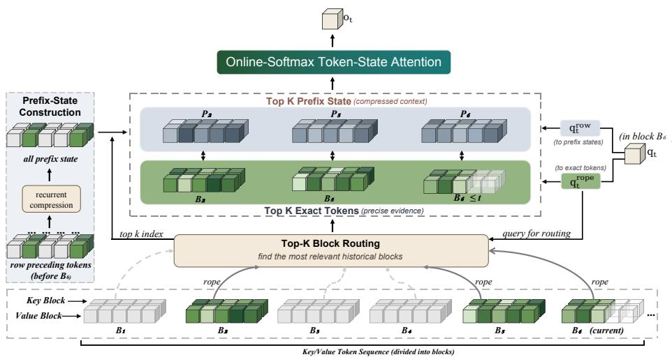
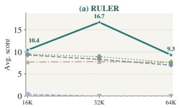
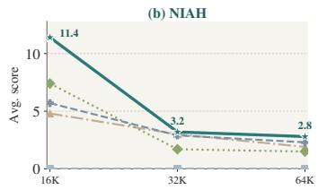
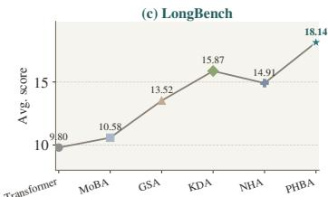
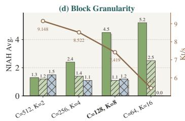
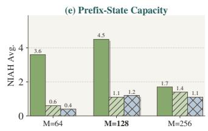
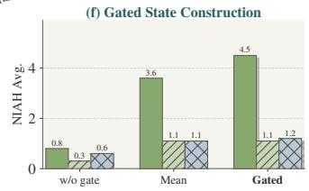
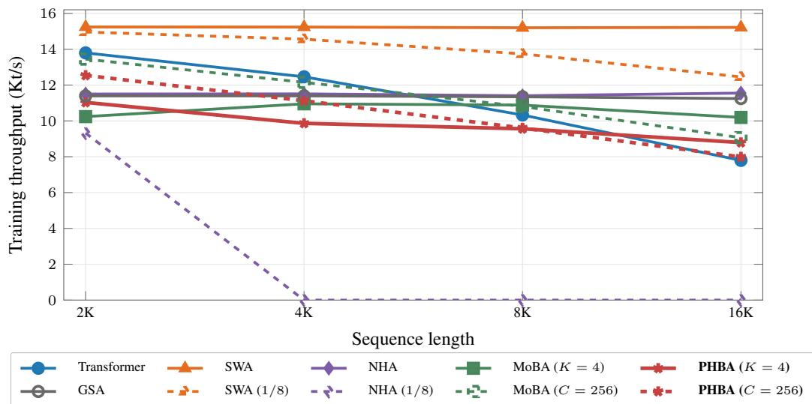

# PHBA: PREFIX-STATE HYBRID BLOCK ATTENTION

Ruijie Li<sup>1</sup>, Jiaxi Hu<sup>1,∗</sup>, Shiyu Wang<sup>2,∗</sup>, Yuxuan Liang<sup>1,∗</sup>

<sup>1</sup>The Hong Kong University of Science and Technology (Guangzhou)

<sup>2</sup>Independent researcher

<sup>∗</sup>Corresponding author

## ABSTRACT

Hybrid architectures combining linear sequence models with softmax attention provide an effective balance between efficient long-context modeling and precise token retrieval. Existing designs such as Native Hybrid Attention (NHA) combine compressed long-term states with sliding-window attention, but their exact attention is restricted to a fixed local window. In this work, we introduce Prefix-State Hybrid Block Attention (PHBA), which replaces local sliding-window attention with top-k block-sparse retrieval and couples each retrieved block with a compact prefix state summarizing its preceding context. The prefix states are constructed by a gated linear recurrence at block boundaries and retrieved together with the corresponding token blocks, allowing the model to combine precise long-range evidence with compressed historical context within a unified layer. We further develop a hardware-aware Triton implementation that streams routed token blocks and prefix states without materializing large intermediate tensors. Experiments show that PHBA improves long-context and retrieval performance over strong linear and hybrid baselines while retaining efficient training and inference.

## 1 INTRODUCTION

Long-context language modeling requires both efficient sequence processing and reliable retrieval of information from distant positions. Standard self-attention (Vaswani et al., 2017; Dao et al., 2022) provides precise token-level access to the entire history, but its quadratic complexity makes it increasingly expensive as the context length grows. Linear and recurrent sequence models (Katharopoulos et al., 2020; Choromanski et al., 2020; Gu et al., 2021; Smith et al., 2022; Sun et al., 2023; Gu & Dao, 2023; Dao & Gu, 2024; Yang et al., 2023; Arora et al., 2024; Hu et al., 2025; Qin et al., 2024; Zhang et al., 2024; Team et al., 2025; Hatamizadeh et al., 2026) offer a more efficient alternative by compressing historical information into fixed-size states , but this compression can limit precise in-context retrieval.

A practical solution is to combine recurrent sequence modeling with sparse or local softmax attention. Recent hybrid architectures mix efficient recurrent computation with token-level attention to improve the trade-off between long-range efficiency and recall (Arora et al., 2024; De et al., 2024; Du et al., 2026). For example, Native Hybrid Attention (NHA) (Du et al., 2026) combines a compressed recurrent state with sliding-window attention (SWA), allowing each layer to access both summarized long-term memory and precise recent tokens. However, the exact-attention component in SWA is inherently local: key–value pairs outside the fixed window are accessible only through the compressed recurrent state. As a result, the exact-attention budget cannot be allocated according to the content relevance between each query and the global history. This leaves a central challenge for long-context hybrid models:

Can sparse attention retrieve the globally relevant key–value contentfor each query while preserving its preceding context?

Sparse attention has long been explored as a way to extend token-level interaction beyond dense quadratic attention (Child et al., 2019; Kitaev et al., 2020; Beltagy et al., 2020; Zaheer et al., 2020; Roy et al., 2021). A natural way to extend exact attention beyond a fixed local window is contentdependent block retrieval. Top-K block-sparse attention allocates the sparse computation to relevant blocks from distant history rather than only to recent tokens. In particular, Mixture of Block Attention (MoBA) (Lu et al., 2026) uses query-dependent block-level routing to identify a small number of historical blocks for each query.

Based on this observation, we introduce Prefix-State Hybrid Block Attention (PHBA). PHBA replaces the fixed sliding-window component of conventional recurrent–attention hybrids with content-dependent block-sparse retrieval. In addition, PHBA associates each block with a compact prefix state constructed by a gated slot recurrence (Yang et al., 2023; Zhang et al., 2024) at the corresponding block boundary. When a query selects a historical block, it accesses both the exact tokens within that block and its aligned prefix state, which summarizes the causal history preceding the block. PHBA therefore couples high-resolution retrieved content with compressed context immediately preceding that content.

The key design is to align recurrent memory with the same block structure used for sparse routing. Rather than relying on a single compressed history together with fixed local attention, PHBA exposes block-aligned prefix memories that can be selected together with distant exact-token blocks. This allows the model to recover broader historical context around retrieved content without maintaining a separate recurrent state for every token.

Efficiently implementing this computation requires processing dynamically routed token blocks together with their associated prefix states without materializing packed sparse payloads. We therefore develop a hardware-aware Triton implementation that directly streams selected token and state blocks from their original memory layouts and uses compact routing metadata for efficient sparse execution. Combined with chunkwise prefix-state construction and online-softmax accumulation, the implementation supports efficient long-context training and inference. Experiments demonstrate that PHBA consistently improves retrieval and long-context modeling over strong recurrent, sparseattention, and hybrid baselines while maintaining favorable efficiency at long sequence lengths.

## 2 PRELIMINARY

PHBA builds upon two components: block-sparse attention for selective token retrieval and gated slot memory for recurrent sequence modeling. This section briefly reviews these two components and introduces the notation used in PHBA.

## 2.1 BLOCK-SPARSE ATTENTION

Sparse attention reduces the cost of standard self-attention by allowing each query to attend to only a subset of historical tokens. Block-sparse attention groups the sequence into contiguous blocks and performs selection at the block level.

Let the sequence be partitioned into blocks $\{ B _ { 1 } , \dotsc , B _ { B } \}$ , and let $\mathcal { R } _ { t }$ denote the set of blocks selected for query $\pmb q _ { t }$ . The query attends to the tokens contained in the selected blocks:

$$
\pmb { o } _ { t } ^ { \mathrm { b l k } } = \mathrm { s o f t m a x } \left( \frac { \pmb { q } _ { t } \pmb { K } _ { \mathcal { R } _ { t } } ^ { \top } } { \sqrt { d } } \right) V _ { \mathcal { R } _ { t } } ,\tag{1}
$$

where $K _ { \mathcal { R } _ { i } }$ and $V _ { \mathcal { R } _ { t } }$ contain the key and value vectors from the selected blocks.

Content-dependent block routing, as used in Mixture of Block Attention (MoBA), selects a small number of relevant blocks for each query. PHBA adopts this block-routed sparse-attention setting; the routing procedure is described in Sec. 3.

## 2.2 GATED SLOT MEMORY

Gated Slot Attention (GSA) (Zhang et al., 2024) represents historical information using a fixed number of key and value memory slots. Let $\widetilde { \pmb { K } } _ { t } \in \mathbb { R } ^ { M \times d }$ and $\boldsymbol { \widetilde { V } } _ { t } \in \mathbb { R } ^ { M \times d _ { v } }$ denote the key and value memories, and let $\pmb { A } _ { t } \in ( 0 , 1 ) ^ { M }$ denote a slot-wise retention gate. Using the coupled write gate ${ \cal I } _ { t } = { \bf 1 } - { \cal A } _ { t } ,$ , the memories are updated as

$$
\begin{array} { r } { \widetilde { \pmb { K } } _ { t } = \mathrm { D i a g } ( \pmb { A } _ { t } ) \widetilde { \pmb { K } } _ { t - 1 } + \pmb { I } _ { t } \pmb { k } _ { t } ^ { \top } , } \\ { \widetilde { \pmb { V } } _ { t } = \mathrm { D i a g } ( \pmb { A } _ { t } ) \widetilde { \pmb { V } } _ { t - 1 } + \pmb { I } _ { t } \pmb { v } _ { t } ^ { \top } . } \end{array}\tag{2}
$$

  
Figure 1: Overview of PHBA. The RoPE query ${ \pmb q } _ { t } ^ { \mathrm { r o p e } }$ first performs Top-K Block Routing to select relevant historical blocks. PHBA attends to the retrieved exact tokens with ${ \pmb q } _ { t } ^ { \mathrm { r o p e } }$ and their Block-Aligned Prefix States with $\pmb q _ { t } ^ { \mathrm { r a w } }$ , and combines both memory types through Online-Softmax Token–State Attention to produce o<sub>t</sub>.

The shared slot-wise gate keeps the key and value memories temporally aligned. This recurrence is a specialization of gated linear attention (GLA) (Yang et al., 2023) and admits the same hardwareefficient chunkwise-parallel formulation. PHBA adopts this gated slot-memory construction to form block-aligned prefix states, but uses them differently from GSA: the resulting key/value slots are stored only at block boundaries and later participate in joint softmax attention together with routed exact-token blocks.

## 3 PREFIX-STATE HYBRID BLOCK ATTENTION

Prefix-State Hybrid Block Attention (PHBA) combines block-sparse retrieval with recurrent prefix states within a single attention layer, as illustrated in Figure 1. For each query, PHBA retrieves a small number of relevant historical blocks at full token resolution, while compact recurrent states summarize the prefixes preceding these blocks. The exact token representations and their aligned prefix states share a common softmax normalization, which is evaluated efficiently through onlinesoftmax merging without explicitly materializing a combined attention matrix. We describe PHBA in four parts: top-K block routing, prefix-state construction, online-softmax token–state attention, and efficient execution. Unless otherwise stated, we use single-head notation. Let $Q ^ { \mathrm { r a w } } , K ^ { \mathrm { r a w } } \in$ $\mathbb { R } ^ { T \times d }$ and $V \in \mathbb { R } ^ { T \times d _ { \tau } }$ denote the projected queries, keys, and values. RoPE is applied to the token-attention queries and keys, producing $Q ^ { \mathrm { r o \bar { p } e } }$ and $K ^ { \mathrm { r o p e } }$

## 3.1 TOP-K BLOCK ROUTING

PHBA partitions the sequence into $N _ { c } = \lceil T / C \rceil$ contiguous blocks of at most $C$ tokens. Let $B _ { b }$ denote block $b ,$ and let $c ( t )$ denote the block containing query token t. Historical routing considers only blocks preceding the current block.

PHBA uses a total exact-block budget of K blocks per query. Since the current block is always retained for local causal attention, $K _ { h } = K - 1$ blocks remain for historical routing.

Each block is represented for routing by the mean of its RoPE-transformed keys. For query t, PHBA selects the $K _ { h }$ historical blocks whose summaries have the largest similarity to the query:

$$
\bar { k } _ { b } ^ { \mathrm { r o p e } } = \frac { 1 } { | \mathcal { B } _ { b } | } \sum _ { i \in \mathcal { B } _ { b } } k _ { i } ^ { \mathrm { r o p e } } , \qquad \mathcal { R } _ { t } = \mathrm { T o p K } \left( \big \{ ( \boldsymbol { q } _ { t } ^ { \mathrm { r o p e } } ) ^ { \top } \bar { \boldsymbol { k } } _ { b } ^ { \mathrm { r o p e } } \big \} _ { b < c ( t ) } , K _ { h } \right) .\tag{3}
$$

The centroid is used only for routing. Once a historical block is selected, PHBA attends to its original token-level keys and values. The current block is not included in the historical route; instead, local

causal attention over the current block forms part of the token branch. Therefore, the exact-token memory visible to query t is

$$
\mathcal { E } _ { t } ^ { \mathrm { t o k } } = \mathcal { B } _ { c ( t ) } ^ { \leq t } \cup \bigcup _ { b \in \mathcal { R } _ { t } } \mathcal { B } _ { b } ,\tag{4}
$$

where $B _ { c ( t ) } ^ { \leq t }$ contains the causal tokens in the current block. This provides local causal context together with query-dependent access to distant historical blocks.

## 3.2 PREFIX-STATE CONSTRUCTION

Sparse retrieval provides exact token information from selected blocks, while recurrent prefix states provide a compact summary of earlier history. PHBA constructs separate prefix-key and prefix-value states using the gated recurrence introduced in Sec. 2.2.

Let M denote the number of recurrent slots. For token t, PHBA predicts a retention gate ${ \mathbf { A } } _ { t } ~ =$ $\sigma ( { \mathbf { a } _ { t } } ) ^ { 1 / \tau } \in ( 0 , 1 ) ^ { M }$ and uses the coupled write gate ${ \cal I } _ { t } = { \bf 1 } - A _ { t }$ . The prefix states are updated as

$$
\begin{array} { r l } & { { \cal S } _ { t } ^ { K } = \mathrm { D i a g } ( A _ { t } ) { \cal S } _ { t - 1 } ^ { K } + { \cal I } _ { t } ( k _ { t } ^ { \mathrm { r a w } } ) ^ { \top } , } \\ & { { \cal S } _ { t } ^ { V } = \mathrm { D i a g } ( A _ { t } ) { \cal S } _ { t - 1 } ^ { V } + { \cal I } _ { t } { \boldsymbol v } _ { t } ^ { \top } , } \end{array}\tag{5}
$$

where $S _ { t } ^ { K } \in \mathbb { R } ^ { M \times d }$ and $S _ { t } ^ { V } \in \mathbb { R } ^ { M \times d _ { v } }$ . The two recurrences share the same slot-wise retention and write gates, ensuring that each prefix-key slot and its corresponding prefix-value slot summarize the same historical positions with identical temporal weighting.

For a block $B _ { b }$ beginning at position $\tau _ { b } ,$ PHBA stores the states immediately before the block:

$$
P _ { b } ^ { K } = S _ { \tau _ { b } - 1 } ^ { K } , \qquad P _ { b } ^ { V } = S _ { \tau _ { b } - 1 } ^ { V } .\tag{6}
$$

Thus, $( P _ { b } ^ { K } , P _ { b } ^ { V } )$ summarizes the causal prefix preceding $B _ { b }$ and does not contain tokens from the block itself.

For query t, the candidate prefix-state blocks are

$$
\mathcal { E } _ { t } ^ { \mathrm { s t } } = \{ c ( t ) \} \cup \mathcal { R } _ { t } .\tag{7}
$$

States associated with blocks having an empty causal prefix are masked. The current-block state summarizes all history before the local block, while each routed state provides the prefix associated with the corresponding historical evidence block.

## 3.3 ONLINE-SOFTMAX TOKEN–STATE ATTENTION

PHBA attends jointly to two types of memory: exact token representations and block-aligned prefix states. The token branch uses RoPE-transformed queries and keys, whereas the prefix-state branch uses the raw query and the raw prefix-state keys. For a token $i \in \hat { \mathcal { E } } _ { t } ^ { \mathrm { t o k } }$ and a prefix-state slot m from block $b \in \mathcal { E } _ { t } ^ { \mathrm { s t } }$ , the corresponding attention logits are

$$
\ell _ { t , i } ^ { \mathrm { t o k } } = \frac { ( q _ { t } ^ { \mathrm { r o p e } } ) ^ { \top } k _ { i } ^ { \mathrm { r o p e } } } { \sqrt { d } } , \qquad \ell _ { t , b , m } ^ { \mathrm { s t } } = \frac { ( q _ { t } ^ { \mathrm { r a w } } ) ^ { \top } p _ { b , m } ^ { K } } { \sqrt { d } } ,\tag{8}
$$

where $p _ { b , m } ^ { K }$ and $\pmb { p } _ { b , m } ^ { V }$ denote the m-th key and value slots of the prefix state associated with block b. Although the two memory types are evaluated through separate sparse branches, they are normalized jointly. Define their branch-wise partition functions as

$$
Z _ { t } ^ { \mathrm { { t o k } } } = \sum _ { i \in \mathcal { E } _ { t } ^ { \mathrm { { t o k } } } } e ^ { \ell _ { t , i } ^ { \mathrm { { t o k } } } } , \qquad Z _ { t } ^ { \mathrm { s t } } = \sum _ { b \in \mathcal { E } _ { t } ^ { \mathrm { { s t } } } } \sum _ { m = 1 } ^ { M } e ^ { \ell _ { t , b , m } ^ { \mathrm { { s t } } } } .\tag{9}
$$

The PHBA output is

$$
\partial _ { t } ^ { \mathrm { P H B A } } = \frac { \displaystyle \sum _ { i \in \mathcal { E } _ { t } ^ { \mathrm { t o k } } } e ^ { \ell _ { t , i } ^ { \mathrm { t o k } } } \pmb { v } _ { i } + \sum _ { b \in \mathcal { E } _ { t } ^ { \mathrm { s t } } } \sum _ { m = 1 } ^ { M } e ^ { \ell _ { t , b , m } ^ { \mathrm { s t } } } \pmb { p } _ { b , m } ^ { V } } { Z _ { t } ^ { \mathrm { t o k } } + Z _ { t } ^ { \mathrm { s t } } } .\tag{10}
$$

Importantly, PHBA does not explicitly concatenate the token and prefix-state memories. Instead, each branch maintains its own online-softmax statistics. Let $O _ { t } ^ { \mathrm { t o k } } , L _ { t } ^ { \mathrm { t o k } }$ and $O _ { t } ^ { \mathrm { s t } } , L _ { t } ^ { \mathrm { s t } }$ denote the normalized outputs and log-sum-exp statistics of the token and prefix-state branches, respectively. The two branches are merged exactly as

$$
\begin{array} { r l } & { { \cal L } _ { t } = \mathrm { L S E } \left( { \cal L } _ { t } ^ { \mathrm { t o k } } , { \cal L } _ { t } ^ { \mathrm { s t } } \right) , } \\ & { { \cal O } _ { t } = e ^ { L _ { t } ^ { \mathrm { t o k } } - L _ { t } } { \cal O } _ { t } ^ { \mathrm { t o k } } + e ^ { L _ { t } ^ { \mathrm { s t } } - L _ { t } } { \cal O } _ { t } ^ { \mathrm { s t } } . } \end{array}\tag{11}
$$

This online-softmax merge is exactly equivalent to applying a single softmax over the union of exact tokens and prefix-state slots, while avoiding explicit concatenation of the two memory types. Consequently, each query allocates probability mass directly between exact token evidence and compressed prefix information, rather than combining independently normalized branch outputs through an external fusion weight. In implementation, the two branch outputs need not be materialized sep arately: the same online-softmax merge is applied incrementally while streaming the selected token and prefix-state blocks. The hardware-efficient realization is described in Sec. 3.4 and Algorithm 6.

## 3.4 HARDWARE-EFFICIENT CHUNKWISE AND SPARSE EXECUTION

PHBA addresses two sources of training inefficiency. First, the recurrent prefix-state construction is reformulated into a chunkwise-parallel computation, avoiding token-wise recurrent execution within each chunk. Second, routed attention is implemented with metadata-driven sparse kernels that avoid gathering selected queries and memory blocks into packed payload tensors. Together, these two designs enable efficient training while preserving the PHBA formulation in Sec. 3.3.

Chunkwise Prefix-State Update. The prefix-state recurrence follows the gated slot-memory structure of GSA and admits the same chunkwise decomposition as gated linear attention. We use the same block partition as in Sec. 3.1. For packed inputs, the recurrence is applied independently to each sequence and the incoming state is reset to zero at its first block. Let $\hat { C } _ { n } ^ { \mathrm { ~ ~ } } = | \boldsymbol { B } _ { n } |$ denote the length of block n. For block [n], define

$$
\stackrel { \triangledown } { \vec { A } } _ { [ n ] , i } = \prod _ { j = 1 } ^ { i } A _ { [ n ] , j } , \qquad \stackrel { \triangledown } { \overleftarrow { A } } _ { [ n ] , i } = \prod _ { j = i + 1 } ^ { C _ { n } } A _ { [ n ] , j } .\tag{12}
$$

where the products are elementwise. For compact notation, we write ${ \cal S } _ { [ n ] } = [ S _ { [ n ] } ^ { K } , S _ { [ n ] } ^ { V } ]$ and $Z _ { [ n ] } =$ $[ K _ { [ n ] } ^ { \mathrm { r a w } } , V _ { [ n ] } ]$ . Let ${ \pmb I } _ { [ n ] } = { \bf 1 } - { \pmb A } _ { [ n ] }$ and $W _ { [ n ] } = { \cal I } _ { [ n ] } \odot \overleftarrow { { \cal A } } _ { [ n ] }$ . The boundary state is updated as

$$
\begin{array} { r } { \pmb { S } _ { [ n + 1 ] } = \mathrm { D i a g } \left( \overrightarrow { \pmb { A } } _ { [ n ] , C _ { n } } \right) \pmb { S } _ { [ n ] } + \pmb { W } _ { [ n ] } ^ { \top } \pmb { Z } _ { [ n ] } . } \end{array}\tag{13}
$$

Only the boundary state is recurrent across chunks, while the writes within each chunk are evaluated in parallel. The incoming state $S _ { [ n ] }$ is stored as the prefix state associated with chunk [n]. Thus, PHBA retains the causal recurrent update while exposing only block-aligned prefix states to the subsequent sparse attention computation. A detailed derivation of Eq. 13 is provided in Appendix A.1.1.

Operator-Aware Sparse Execution. PHBA is designed around a simple systems constraint: routed attention should not first gather selected query rows and memory blocks into packed sparse payload tensors. Such a pipeline would introduce additional HBM round trips before the attention kernel can start. PHBA instead materializes only compact integer routing metadata and directly loads the required query rows, token blocks, and prefix-state blocks from their original HBM layouts into on-chip SRAM/registers.

Algorithm 1 first produces the query-centric historical routes used by the forward pass. During training, the same routing decisions are additionally reformatted into block-major variable-length metadata for the backward pass, without moving the underlying payloads. For the forward pass, block-local causal FlashAttention first computes row-wise outputs and log-sum-exp statistics. The fused sparse kernel then extends the corresponding online-softmax accumulators with the currentblock prefix state, routed historical token blocks, and their aligned prefix states. This is exactly equivalent to the joint token–state softmax in Eq. 10 and the online-softmax merge in Eq. 11, without explicitly concatenating the two memory types. Algorithm 2 summarizes the forward execution.

Algorithm 1 PHBA Routing and Block-Major Metadata Construction   
Require: RoPE queries/keys $Q ^ { \mathrm { r o p e } } , K ^ { \mathrm { r o p e } } \in \mathbb { R } ^ { T \times H \times d }$ in HBM. Boundaries cu. Block size C.   
Total exact-block budget K.   
1: Set historical routing budget $K _ { h } \gets K - 1 .$   
2: Construct current block ids $c \in \mathbb { Z } ^ { T }$ , block-row pointers BlockPtr $\in \mathbb { Z } ^ { N _ { c } + 1 }$ , and prefix-validity   
mask PrefixValid $\in \ \{ 0 , 1 \} ^ { N _ { c } }$ from cu and C, where PrefixValid[b] = 1 iff block b has a   
nonempty causal prefix.   
3: Compute key-block centroids $\bar { K } ^ { \mathrm { r o p e } } \in \mathbb { R } ^ { N _ { c } \times H \times d }$ using Algorithm 3.   
4: Select historical $\mathrm { t o p } { \cdot } K _ { h }$ blocks $\pmb { R } ^ { c } \in \mathbb { Z } ^ { T \times H \times K _ { h } }$ using Algorithm 4.   
5: Set historical-token routes $R ^ { \mathrm { t o k } }  R ^ { c } .$   
6: Broadcast c over heads as $\pmb { c } ^ { H } \in \mathbb { Z } ^ { T \times H \times 1 }$ and set prefix-state routes $R ^ { \mathrm { s t } } \gets [ { \bf c } ^ { H } ; R ^ { c } ]$ along the   
route dimension.   
7: Set any entry in $\pmb { R } ^ { \mathrm { s t } }$ whose routed block b has Prefi $\mathrm { x V a l i d } [ b ] = 0 \mathrm { t o } - 1 $   
8: During training, reformat $R ^ { \mathrm { t o k } }$ and $\pmb { R } ^ { \mathrm { s t } }$ into block-major varlen metadata for sparse backward   
using Algorithm 5.   
9: return $R ^ { c } , c .$ , BlockPtr, PrefixValid and, during training, $( \pmb { \rho } ^ { \mathrm { t o k } } , \mathrm { O f f s e t } ^ { \mathrm { t o k } } , C _ { \mathrm { b l k } } ^ { \mathrm { t o k } } )$   
$( \rho ^ { \mathrm { s t } } , \mathrm { O f f s e t } ^ { \mathrm { s t } } , C _ { \mathrm { b l k } } ^ { \mathrm { s t } } )$

Require: Token tensors $Q ^ { \mathrm { r a w } } , Q ^ { \mathrm { r o p e } } ,$ , K<sup>rope</sup> $\in \mathbb { R } ^ { T \times H \times d }$ and $V \in \mathbb { R } ^ { T \times H \times d _ { v } }$ in HBM. Prefix   
states $P ^ { K } \in \mathbb { R } ^ { N _ { c } \times H \times \mathbf { \bar { M } } \times d }$ and $\pmb { P } ^ { V } \in \mathbb { R } ^ { N _ { c } \times H \times M \times d _ { v } }$ in HBM. Routes $R ^ { c } ,$ , current block ids   
c, block-row pointers BlockPtr, and prefix-validity mask PrefixValid. Tile sizes $B _ { r } , B _ { c }$   
1: Run block-local causal FlashAttention according to BlockPtr and write $O ^ { \mathrm { l o c } } \in \mathbb { R } ^ { T \times H \times d _ { v } }$ and   
$L ^ { \mathrm { l o c } } \in \mathbb { R } ^ { T \times H }$ to HBM.   
2: Run FUSEDSPARSEFORWARD (Algorithm 6) with $( Q ^ { \mathrm { r a w } } , Q ^ { \mathrm { r o p e } } , K ^ { \mathrm { r o p e } } , V , P ^ { K } , P ^ { V } )$ , routes   
$( R ^ { c } , c ) .$ , BlockPtr, PrefixValid, seed $( O ^ { \mathrm { l o c } } , L ^ { \mathrm { l o c } } )$ , and tile sizes $B _ { r } , B _ { c } .$   
3: The fused kernel extends the corresponding online-softmax accumulators with the current-block   
prefix state, historical exact-token blocks, and their aligned prefix states.   
4: The fused kernel writes final output O and joint log-sum-exp L to HBM.   
5: return $O , L .$

Detailed centroid computation, top-K selection, metadata reformatting, sparse forward, and backward kernels are provided in Appendix A.1.

## 4 EXPERIMENTS

## 4.1 EXPERIMENTAL SETUP

Models and Training. We evaluate PHBA at two scales: 760M models trained on 50B tokens and 1.3B models trained on 100B tokens. All models are trained from scratch on FineWeb-Edu (Penedo et al., 2024) with an 8K context length. Unless otherwise specified, PHBA uses $M = 1 2 8$ prefixstate slots and block size $C = 1 2 8$ . For the 1.3B main comparison, we use a fixed $1 / 8$ exact-token budget, corresponding to $K = 8$ blocks at 8K. Additional architecture, optimization, and training details are provided in Appendix A.2.1.

Baselines. We compare PHBA with Transformer (Vaswani et al., 2017), MoBA (Lu et al., 2026), GSA (Zhang et al., 2024), KDA (Team et al., 2025), and NHA (Du et al., 2026). All baselines are trained on the same data and context length at matched model scale; efficient baselines use matched token budgets where applicable. Detailed baseline information is provided in Appendix A.2.2.

Evaluation. We evaluate language modeling, zero-shot commonsense reasoning, long-context retrieval, and real-world understanding. Language modeling and commonsense evaluation use lm-evaluation-harness (Gao et al., 2024). Models trained at 8K are directly evaluated at 16K–64K without further training. We use RULER/NIAH for long-context retrieval and Long-Bench for real-world understanding, truncating LongBench inputs beyond 8K to the first and last 4K tokens. Detailed benchmark descriptions are provided in Appendix A.2.3.

Table 1: Short-context evaluation of 760M and 1.3B models. RULER/NIAH are evaluated at 4K and 8K and scaled by 100. Bold/underline denote best/second-best results. PHBA (default): M = C = 128, K = 8.  
PART I: Common Sense Reasoning & RULER Tasks
<table><tr><td rowspan="3">Model &amp; Scale</td><td colspan="9"></td><td colspan="8"></td></tr><tr><td colspan="4">Common Sense Reasoning</td><td colspan="2"></td><td colspan="2"></td><td colspan="8">RULER Tasks</td></tr><tr><td>ARCe (acc↑)</td><td>ARCc (acc↑)</td><td>Hella. PIQA (acc↑) (acc↑)</td><td>Wino.</td><td>(acc↑) (acc↑)</td><td>Avg. 4k↑</td><td>CWE 8k↑</td><td></td><td>FWE 4k↑ 8k↑</td><td>HotpotQA</td><td></td><td>SQuAD</td><td></td><td>VT</td><td></td><td>Avg</td><td>8k↑</td></tr><tr><td colspan="10"></td><td>4k↑ 8k↑</td><td></td><td></td><td>4k↑ 8k↑</td><td></td><td>4k↑</td><td>8k↑</td><td>4k↑</td></tr><tr><td>760M params with 50B training tokens</td><td></td><td></td><td></td><td></td><td></td><td></td><td></td><td></td><td></td><td></td><td></td><td></td><td></td><td></td><td></td><td></td><td></td></tr><tr><td>PHBA (origin)</td><td>66.96</td><td>34.30</td><td>52.14</td><td>70.73 55.33</td><td>55.89</td><td></td><td>26.3 3.6</td><td>19.5</td><td>22.1</td><td>20.2</td><td>15.6</td><td>24.4</td><td>14.6</td><td>1.0</td><td>2.0</td><td>18.3</td><td>11.6</td></tr><tr><td>w. C = 512, K = 2</td><td>64.10</td><td>32.34</td><td>48.25</td><td>69.70</td><td>52.25</td><td>53.33</td><td>4.8 0.3</td><td>1.6</td><td>3.4</td><td>23.0</td><td>16.4</td><td>26.6</td><td>10.0</td><td>10.9</td><td>0.6</td><td>13.4</td><td>6.1</td></tr><tr><td>w. C = 256, K = 4 w. C = 64, K = 16</td><td>64.35</td><td>32.00</td><td>49.89</td><td>69.70</td><td>53.67</td><td>53.92</td><td>20.0 0.6</td><td>4.1</td><td>9.2</td><td>21.0</td><td>15.8</td><td>24.3</td><td>9.7</td><td>9.0</td><td>0.4</td><td>15.7</td><td>7.1</td></tr><tr><td>w. M = 64</td><td>67.51 66.08</td><td>34.22</td><td>53.25</td><td>71.38</td><td>55.88</td><td>56.45</td><td>34.7 5.5</td><td>11.0 2.9</td><td>3.9</td><td>24.4</td><td>22.2</td><td>37.8</td><td>22.1</td><td>0.9</td><td>0.3</td><td>21.8</td><td>10.8 8.9</td></tr><tr><td>w. M = 256</td><td>64.94</td><td>32.59</td><td>51.70</td><td>70.40 55.64</td><td></td><td>55.28</td><td>10.1 3.1</td><td></td><td>2.7</td><td>24.6</td><td>19.0</td><td>33.1</td><td>19.6</td><td>1.8</td><td>0.0</td><td>14.5</td><td>7.2</td></tr><tr><td>w/o. gate</td><td>64.52</td><td>31.31</td><td>48.85</td><td>70.13</td><td>55.96</td><td>54.24</td><td>21.4 4.0</td><td>0.0</td><td>0.0</td><td>23.4</td><td>18.8</td><td>27.9</td><td>12.9</td><td>4.8</td><td>0.1</td><td>15.5</td><td></td></tr><tr><td>w. mean</td><td>65.61</td><td>34.39 33.53</td><td>49.98 50.19</td><td>70.24 70.24</td><td>53.75 57.38</td><td>54.58 55.39</td><td>30.5 1.1 18.1 0.1</td><td>4.1 7.5</td><td>2.1 4.1</td><td>20.0 20.8</td><td>17.0 17.8</td><td>21.9 24.9</td><td>10.9 15.2</td><td>0.6 7.4</td><td>0.0 0.8</td><td>15.4 15.7</td><td>6.2 7.6</td></tr><tr><td colspan="10">1.3B params with 100B training tokens</td><td colspan="7"></td></tr><tr><td>Transformer</td><td></td><td></td><td></td><td></td><td></td><td></td><td></td><td></td><td></td><td></td><td></td><td></td><td></td><td></td><td></td><td></td><td></td></tr><tr><td>MoBA</td><td>72.14 70.16</td><td>38.74 36.09</td><td>57.41 56.25</td><td>71.33 71.38</td><td>58.33 55.96</td><td>59.59 57.97</td><td>38.8 2.2</td><td>25.7 27.2 18.2</td><td>3.9</td><td>230.2 25.2</td><td>24.6 21.0</td><td>34.3 37.4</td><td>25.6 22.0</td><td>5.6 0.8</td><td>0.0</td><td>26.9 23.4</td><td>15.9 10.8</td></tr><tr><td>GSA</td><td>68.94</td><td>35.84</td><td>56.15</td><td>72.31</td><td>56.67</td><td>35.2 57.98 1.5</td><td>1.6 0.4</td><td>1.3</td><td>2.0</td><td>17.2</td><td>15.8</td><td>14.4</td><td>10.1</td><td>32.4</td><td>5.5 23.6</td><td>13.4</td><td>10.4</td></tr><tr><td>KDA</td><td>73.53</td><td>40.02</td><td>58.89</td><td>73.45</td><td>59.43</td><td>61.06</td><td>28.6 3.5</td><td>41.8</td><td>33.3</td><td>23.6</td><td>21.6</td><td>23.4</td><td>14.1</td><td>7.6</td><td>10.8</td><td>25.0</td><td>16.7</td></tr><tr><td>NHA</td><td>71.42</td><td>36.09</td><td>58.35</td><td>74.37</td><td>58.48</td><td>59.75</td><td>33.5 7.0</td><td>45.7</td><td>23.1</td><td>11.8</td><td>26.2</td><td>19.2</td><td>27.2</td><td>21.8</td><td>1.3</td><td>26.4</td><td>15.1</td></tr><tr><td>PHBA</td><td>71.17</td><td>38.14</td><td>58.58</td><td>72.63</td><td>59.83</td><td>60.07</td><td>31.0 24.2</td><td>31.3</td><td>45.3</td><td>29.0</td><td>13.4</td><td>43.4</td><td>16.2</td><td>1.5</td><td>20.5</td><td>27.2</td><td>23.9</td></tr></table>

PART II: Language Modeling Tasks
<table><tr><td colspan="4">76oM params witn S0B tramning tokens</td><td colspan="5">1.SB params witn 1o0B training tokens</td></tr><tr><td>Model</td><td>Wiki. (ppl↓)</td><td>Lamb. (acc↑)</td><td>Lamb. (ppl↓) |Model</td><td></td><td>Wiki. (ppl↓)</td><td>Lamb. (acc↑)</td><td>Lamb. (ppl↓)</td></tr><tr><td>PHBA (origin)</td><td>18.33</td><td>42.98</td><td>16.33</td><td>Transformer</td><td>15.67</td><td>46.69</td><td>12.26</td></tr><tr><td>w. C = 512, K = 2</td><td>19.76</td><td>40.31</td><td>19.34</td><td>MoBA</td><td>16.22</td><td>47.22</td><td>13.04</td></tr><tr><td>w. C = 256, K = 4</td><td>19.19</td><td>40.52</td><td>17.86</td><td>GSA</td><td>16.86</td><td>40.93</td><td>16.74</td></tr><tr><td>w. C = 64, K = 16</td><td>17.34</td><td>45.24</td><td>14.60</td><td>KDA</td><td>16.18</td><td>48.65</td><td>10.91</td></tr><tr><td>w. M = 64</td><td>18.84</td><td>43.74</td><td>15.91</td><td>NHA</td><td>15.96</td><td>48.34</td><td>11.51</td></tr><tr><td>w. M = 256</td><td>19.74</td><td>41.90</td><td>18.15</td><td>PHBA</td><td>15.21</td><td>49.27</td><td>10.80</td></tr><tr><td>w/o. gate</td><td>18.88</td><td>43.31</td><td>16.11</td><td></td><td>Table Color Legend</td><td></td><td></td></tr><tr><td>w. mean</td><td>18.76</td><td>43.24</td><td>16.38</td><td>Blue: Proposed MethodGray: Primary BaselineRed: Average Columns</td><td></td><td></td><td></td></tr></table>

PART III: NIAH Tasks
<table><tr><td rowspan="3">Model &amp; Scale</td><td colspan="6">Single-Key NIAH</td><td colspan="6">Multi-Key NIAH</td><td colspan="3">NIAH (Extra)</td><td colspan="2">Avg</td></tr><tr><td colspan="2">Task 1</td><td colspan="2">Task 2</td><td colspan="2">Task 3</td><td colspan="2">Task 1</td><td colspan="2">Task 2</td><td colspan="2">Task 3</td><td colspan="2">|MultiQuery</td><td colspan="2">MultiValue</td><td colspan="2">Mean</td></tr><tr><td>4k↑</td><td>8k↑</td><td>4k↑</td><td>8k↑</td><td>4k↑</td><td>8k↑</td><td>4k↑</td><td>8k↑</td><td>4k↑ 8k↑</td><td></td><td>4k↑ 8k↑</td><td>4k↑</td><td>8k↑</td><td></td><td>4k↑ 8k↑</td><td></td><td>4k↑ 8k↑</td></tr><tr><td colspan="10">760M params with 50B training tokens</td><td colspan="7"></td></tr><tr><td>PHBA (origin)</td><td>99.4</td><td>20.4 97.4</td><td>42.8</td><td>67.4</td><td>11.4</td><td></td><td>78.0 44.0</td><td>43.2</td><td>5.6</td><td>18.8</td><td>0.0</td><td>41.7</td><td>22.2</td><td>46.0</td><td>25.0</td><td>61.5</td><td>21.4</td></tr><tr><td>w. C = 512, K = 2</td><td>78.6</td><td>12.6 36.2</td><td>19.6</td><td>25.4</td><td>3.6</td><td>32.0</td><td>20.4</td><td>1.4</td><td>0.6</td><td>1.0</td><td>0.2</td><td>23.1</td><td>13.9</td><td>23.1</td><td>15.8</td><td>27.6</td><td>10.8</td></tr><tr><td>w. C = 256, K = 4</td><td>88.0</td><td>6.2 66.6</td><td>33.2</td><td>35.2</td><td>6.0</td><td>43.2</td><td>26.0</td><td>5.6</td><td>2.4</td><td>12.6</td><td>0.6</td><td>27.1</td><td>19.0</td><td>29.3</td><td>20.3</td><td>38.5</td><td>14.2</td></tr><tr><td>w. C = 64, K = 16</td><td>99.2</td><td>52.0 98.8</td><td>61.6</td><td>57.6</td><td>12.2</td><td>82.8</td><td>51.8</td><td>24.2</td><td>5.8</td><td>11.6</td><td>1.6</td><td>44.8</td><td>20.8</td><td>42.9</td><td>25.3</td><td>57.7</td><td>28.9</td></tr><tr><td>w. M = 64</td><td>99.0</td><td>20.2 93.4</td><td>50.4</td><td>41.4</td><td>12.0</td><td>72.2</td><td>42.2</td><td>10.2</td><td>1.4</td><td>9.4</td><td>0.2</td><td>32.7</td><td>23.0</td><td>39.0</td><td>23.2</td><td>49.7</td><td>21.6</td></tr><tr><td>w. M = 256</td><td>66.2</td><td>3.6 75.4</td><td>23.2</td><td>13.2</td><td>4.6</td><td>42.6</td><td>18.4</td><td>2.6</td><td>0.2</td><td>7.6</td><td>0.0</td><td>29.7</td><td>9.3</td><td>31.4</td><td>11.9</td><td>33.6</td><td>8.9</td></tr><tr><td>w/o. gate</td><td>92.6 94.8</td><td>37.4 65.2 53.8 68.6</td><td>21.0 36.6</td><td>32.8 4.2</td><td>5.6 6.0</td><td>36.0 50.0</td><td>16.2 35.6</td><td>2.6 9.0</td><td>0.6 0.4</td><td>4.8</td><td>0.4</td><td>30.5</td><td>13.5 17.3</td><td>24.9 29.9</td><td>14.0 20.8</td><td>36.2 36.3</td><td>13.6 21.3</td></tr><tr><td colspan="10">w. mean</td><td colspan="7">4.4 0.0 29.4</td></tr><tr><td>1.3B params with 100B training tokens</td><td></td><td></td><td></td><td></td><td></td><td></td><td></td><td></td><td></td><td></td><td></td><td></td><td></td><td></td><td></td><td></td><td></td></tr><tr><td>Transformer MoBA</td><td>99.8</td><td>72.4</td><td>100.0 73.6</td><td>63.2</td><td></td><td>42.6</td><td>84.2 68.0 75.8 40.2</td><td></td><td></td><td>12.0 8.6</td><td>1.0 0.0</td><td>30.0</td><td>19.0</td><td></td><td>57.9 31.3 43.2 26.8 21.4</td><td>67.0 39.3</td><td>44.5 23.6</td></tr><tr><td>GSA</td><td>98.8</td><td>64.0 83.0</td><td>37.4 20.2</td><td>15.8 2.4</td><td>10.6 1.0</td><td>41.8 24.2</td><td>32.8 21.6</td><td>7.2 0.0</td><td>3.2 0.0</td><td>0.0</td><td>0.0</td><td>34.4</td><td>14.2</td><td>29.5 34.4</td><td>14.0</td><td>34.6</td><td>16.5</td></tr><tr><td>KDA</td><td>93.0 100.0</td><td>60.8 88.0 29.6 86.2</td><td>49.2</td><td>46.0</td><td>19.4</td><td>26.4</td><td>53.0</td><td>0.2</td><td>14.0</td><td>0.0</td><td>0.4</td><td>42.7</td><td>27.1</td><td>49.3</td><td>28.0</td><td>43.8</td><td>27.5</td></tr><tr><td>NHA</td><td>100.0</td><td>98.6 95.0</td><td>48.2</td><td>53.8</td><td></td><td>10.8 30.0</td><td>24.8</td><td>40.0</td><td>0.0</td><td>0.0</td><td>0.0</td><td>38.2</td><td>19.4</td><td>39.1</td><td>17.4</td><td>49.5</td><td>27.4</td></tr><tr><td>PHBA</td><td>100.0</td><td>99.4</td><td>98.6 39.6</td><td></td><td>54.4</td><td>23.6</td><td>76.0 26.6</td><td>45.8</td><td>0.0</td><td>13.0</td><td>0.0</td><td>55.8 20.5</td><td></td><td>59.0</td><td>26.1</td><td>62.6</td><td>29.5</td></tr></table>

## 4.2 SHORT-CONTEXT LANGUAGE MODELING AND RETRIEVAL

Table 1 reports performance within the 8K training context.

Language Modeling and Commonsense Reasoning. Table 1 reports WikiText and LAM-BADA (Merity et al., 2016; Paperno et al., 2016) together with zero-shot ARC, HellaSwag, PIQA, and WinoGrande (Clark et al., 2018; Zellers et al., 2019; Bisk et al., 2020; Sakaguchi et al., 2021). At 1.3B scale, PHBA achieves the best WikiText and LAMBADA results among the compared models and a competitive commonsense average of 60.07, second only to KDA. This shows that routed retrieval and prefix-state memory preserve strong short-context modeling quality.

Short-Context Retrieval. On RULER (Hsieh et al., 2024) and its NIAH variants, PHBA consistently outperforms the other efficient baselines at 4K and 8K, trailing only the dense Transformer on NIAH. This demonstrates strong retrieval within the training context.

## 4.3 LONG-CONTEXT RETRIEVAL AND UNDERSTANDING

We next evaluate the 1.3B models beyond the 8K training length. Figure 2 (a)–(c) reports RULER, NIAH, and LongBench averages, with complete results in Appendix Table 2.











  
Transformer MoBA GSA KDA NHA PHBA 16K 32K 64K Shadow: default Throughput (Kt/s)  
Figure 2: Long-context results and ablations. (a)–(b) RULER/NIAH averages at 16K/32K/64K; (c) Long-Bench average. (d)–(f) Ablations of block granularity, prefix-state capacity, and gated state construction; (d) also reports throughput (1.3B, BS=1, 8K). Bars denote 16K/32K/64K results; shadows mark default settings.

Long-Context Retrieval. PHBA maintains the strongest overall RULER and NIAH (Hsieh et al., 2024) performance from 16K to 64K, with the advantage becoming more pronounced beyond the training length. Content-dependent routing preserves direct access to distant token-level information, while aligned prefix states provide the context preceding the retrieved blocks, improving longcontext extrapolation over compressed memory or sparse token retrieval alone.

Long-Context Understanding. PHBA also achieves the strongest LongBench (Bai et al., 2024) average, with gains across document QA, summarization, and few-shot tasks while remaining competitive on code. This indicates that the retrieval gains transfer beyond controlled synthetic settings to real-world long-context tasks.

## 4.4 ABLATION AND DESIGN ANALYSIS

Figure 2 (d)–(f) summarizes the long-context ablations of block granularity, prefix-state capacity, and gated state construction. Short-context ablations are included in Table 1, with complete longcontext results in Appendix Table 2.

Block Granularity. Under a fixed 1/8 exact-token budget, reducing C and increasing K generally improves retrieval by enabling finer-grained routing (Figure 2 (d); Table 1). Smaller blocks, however, require more routed blocks and reduce throughput. We therefore use C = 128 and K = 8 as the default quality–efficiency trade-off.

Prefix-State Capacity. Figure 2 (e) and Table 1 show that performance does not improve monotonically with state size. M = 128 gives the strongest and most stable results across context lengths, while smaller states lack capacity and larger states provide no consistent benefit.

Gated State Construction. Figure 2 (f) and Table 1 show that the learned gated recurrence consistently outperforms ungated and mean-aggregation variants, especially under long-context extrapola tion. This highlights the importance of adaptive retention and writing for prefix-state construction.

Token–State Composition. MoBA retrieves distant tokens without an aligned summary of their preceding context, whereas NHA combines recurrent memory with exact attention restricted to a fixed local window. PHBA instead couples routed historical blocks with their block-aligned prefix states, yielding stronger retrieval and long-context performance in Figure 2 (a)–(c) and Table 1.

## 4.5 TRAINING EFFICIENCY.

Figure 3 compares end-to-end training throughput, with detailed benchmark settings and measurement protocols provided in Sec. A.2.4. With a fixed 64-token window, NHA is about 24% slower than SWA. Under the matched 1/8 budget, PHBA is 18.4–34.6% faster than NHA at 2K, while NHA runs out of memory from 4K onward in the evaluated implementation. Relative to MoBA, adding block-aligned prefix states incurs only 6.7–11.9% overhead for C = 256 across 2K–16K. With K = 4, PHBA reaches 8.79 Kt/s at 16K, 12.8% higher than full attention, while GSA remains nearly length-independent due to its recurrent computation.

  
Figure 3: Training efficiency on a single NVIDIA H20-96GB GPU. For MoBA and PHBA, both configurations maintain a fixed 1/8 sparse token budget: K = 4 dynamically adjusts the block size C, whereas $\bar { C } = 2 5 6$ dynamically adjusts the number of routed blocks K. SWA (1/8) and NHA (1/8) similarly scale the window size with sequence length, while SWA and NHA use a fixed window size of 64. All state-based models use M = 128 memory slots. Zero throughput for NHA (1/8) denotes out-of-memory (OOM).

## 4.6 RELATED WORK

Efficient sequence models replace dense attention with structured or recurrent state updates, including S4/S5, RetNet, Mamba/Mamba-2, GLA, HGRN2, GSA, and recent gated or delta-rule variants such as DeltaNet, KDA, and Gated DeltaNet-2 (Gu et al., 2021; Smith et al., 2022; Sun et al., 2023; Gu & Dao, 2023; Dao & Gu, 2024; Yang et al., 2023; Qin et al., 2024; Zhang et al., 2024; Yang et al., 2024; Team et al., 2025; Hatamizadeh et al., 2026). A complementary line reduces softmax-attention cost through sparse connectivity, from Sparse Transformer, Reformer, Longformer, BigBird, and Routing Transformer to MoBA’s query-dependent block routing (Child et al., 2019; Kitaev et al., 2020; Beltagy et al., 2020; Zaheer et al., 2020; Roy et al., 2021; Lu et al., 2026). Hybrid architectures such as BASED, Griffin, and NHA combine recurrent or linear memory with local attention (Arora et al., 2024; De et al., 2024; Du et al., 2026); NHA further places recurrent key–value slots and sliding-window tokens under a shared softmax. In this work, PHBA builds on these lines by pairing content-routed historical blocks with block-aligned prefix states, so each selected block is accompanied by a compressed summary of its preceding context.

## 5 CONCLUSION

We introduced Prefix-State Hybrid Block Attention (PHBA), which combines content-dependent block-sparse retrieval with block-aligned recurrent prefix states for efficient long-context modeling. PHBA jointly attends to routed historical tokens and the compressed context preceding them, providing both fine-grained retrieval and broader historical information within a unified softmax. A hardware-aware implementation further enables efficient chunkwise state construction and sparse execution without materializing packed payloads. Experiments demonstrate consistent improvements in retrieval and long-context understanding while preserving competitive language modeling quality and training efficiency.

## AI USE STATEMENT

In this work, we used generative AI tools solely to aid and polish the writing. We did not use generative AI tools for research design, methodology, experiments, data analysis, or the generation of results. All AI-assisted content was reviewed by the authors. We take full responsibility for the final content of this work.

## ETHICS STATEMENT

This work studies efficient sequence modeling architectures and does not involve human subjects or the collection of sensitive personal data. Experiments are conducted using publicly available training and evaluation datasets. We are not aware of additional ethical concerns specific to the proposed method beyond those generally associated with large language models.

## REPRODUCIBILITY STATEMENT

We provide detailed specifications of PHBA in the main paper, including its routing, prefix-state construction, token–state attention, and efficient execution. The appendix contains the chunkwise derivation, complete operator pseudocode, training and evaluation settings, throughput benchmark protocol, and full experimental results. Together, these materials are intended to support faithful reproduction of the proposed method and experiments. The source code and implementation will be made publicly available upon acceptance.

## AUTHOR CONTRIBUTIONS

If you’d like to, you may include a section for author contributions as is done in many journals. This is optional and at the discretion of the authors

## ACKNOWLEDGMENTS

Use unnumbered third level headings for the acknowledgments. All acknowledgments, including those to funding agencies, go at the end of the paper.

## REFERENCES

Simran Arora, Sabri Eyuboglu, Michael Zhang, Aman Timalsina, Silas Alberti, Dylan Zinsley, James Zou, Atri Rudra, and Christopher Re. Simple linear attention language models balance´ the recall-throughput tradeoff. arXiv preprint arXiv:2402.18668, 2024.

Yushi Bai, Xin Lv, Jiajie Zhang, Hongchang Lyu, Jiankai Tang, Zhidian Huang, Zhengxiao Du, Xiao Liu, Aohan Zeng, Lei Hou, et al. Longbench: A bilingual, multitask benchmark for long context understanding. In Proceedings of the 62nd annual meeting of the association for computational linguistics (volume 1: Long papers), pp. 3119–3137, 2024.

Iz Beltagy, Matthew E Peters, and Arman Cohan. Longformer: The long-document transformer. arXiv preprint arXiv:2004.05150, 2020.

Yonatan Bisk, Rowan Zellers, Jianfeng Gao, Yejin Choi, et al. Piqa: Reasoning about physical commonsense in natural language. In Proceedings of the AAAI conference on artificial intelligence, volume 34, pp. 7432–7439, 2020.

Rewon Child, Scott Gray, Alec Radford, and Ilya Sutskever. Generating long sequences with sparse transformers. arXiv preprint arXiv:1904.10509, 2019.

Krzysztof Choromanski, Valerii Likhosherstov, David Dohan, Xingyou Song, Andreea Gane, Tamas Sarlos, Peter Hawkins, Jared Davis, Afroz Mohiuddin, Lukasz Kaiser, et al. Rethinking attention with performers. arXiv preprint arXiv:2009.14794, 2020.

Peter Clark, Isaac Cowhey, Oren Etzioni, Tushar Khot, Ashish Sabharwal, Carissa Schoenick, and Oyvind Tafjord. Think you have solved question answering? try arc, the ai2 reasoning challenge. arXiv preprint arXiv:1803.05457, 2018.

Tri Dao and Albert Gu. Transformers are ssms: Generalized models and efficient algorithms through structured state space duality. arXiv preprint arXiv:2405.21060, 2024.

Tri Dao, Dan Fu, Stefano Ermon, Atri Rudra, and Christopher Re. Flashattention: Fast and memory-´ efficient exact attention with io-awareness. Advances in neural information processing systems, 35:16344–16359, 2022.

Soham De, Samuel L Smith, Anushan Fernando, Aleksandar Botev, George Cristian-Muraru, Albert Gu, Ruba Haroun, Leonard Berrada, Yutian Chen, Srivatsan Srinivasan, et al. Griffin: Mixing gated linear recurrences with local attention for efficient language models. arXiv preprint arXiv:2402.19427, 2024.

Jusen Du, Jiaxi Hu, Zhang Tao, Weigao Sun, and Yu Cheng. Native hybrid attention for efficient sequence modeling. In Proceedings ofthe 64th Annual Meeting ofthe Associationfor Computational Linguistics (Volume 1: Long Papers), pp. 3826–3842, 2026.

Leo Gao, Jonathan Tow, Baber Abbasi, Stella Biderman, Sid Black, Anthony DiPofi, Charles Foster, Laurence Golding, Jeffrey Hsu, Alain Le Noac’h, Haonan Li, Kyle McDonell, Niklas Muennighoff, Chris Ociepa, Jason Phang, Laria Reynolds, Hailey Schoelkopf, Aviya Skowron, Lintang Sutawika, Eric Tang, Anish Thite, Ben Wang, Kevin Wang, and Andy Zou. The language model evaluation harness, 07 2024. URL https://zenodo.org/records/12608602.

Albert Gu and Tri Dao. Mamba: Linear-time sequence modeling with selective state spaces. arXiv preprint arXiv:2312.00752, 2023.

Albert Gu, Karan Goel, and Christopher Re. Efficiently modeling long sequences with structured´ state spaces. arXiv preprint arXiv:2111.00396, 2021.

Ali Hatamizadeh, Yejin Choi, and Jan Kautz. Gated deltanet-2: Decoupling erase and write in linear attention. arXiv preprint arXiv:2605.22791, 2026.

Cheng-Ping Hsieh, Simeng Sun, Samuel Kriman, Shantanu Acharya, Dima Rekesh, Fei Jia, Yang Zhang, and Boris Ginsburg. Ruler: What’s the real context size of your long-context language models? arXiv preprint arXiv:2404.06654, 2024.

Jiaxi Hu, Yongqi Pan, Jusen Du, Disen Lan, Xiaqiang Tang, Qingsong Wen, Yuxuan Liang, and Weigao Sun. Comba: Improving bilinear rnns with closed-loop control. arXiv preprint arXiv:2506.02475, 2025.

Angelos Katharopoulos, Apoorv Vyas, Nikolaos Pappas, and Franc¸ois Fleuret. Transformers are rnns: Fast autoregressive transformers with linear attention. In International conference on machine learning, pp. 5156–5165. PMLR, 2020.

Nikita Kitaev, Łukasz Kaiser, and Anselm Levskaya. Reformer: The efficient transformer. arXiv preprint arXiv:2001.04451, 2020.

Enzhe Lu, Zhejun Jiang, Jingyuan Liu, Yulun Du, Tao Jiang, Chao Hong, Shaowei Liu, Weiran He, Enming Yuan, Yuzhi Wang, et al. Moba: Mixture of block attention for long-context llms. Advances in Neural Information Processing Systems, 38:17790–17815, 2026.

Stephen Merity, Caiming Xiong, James Bradbury, and Richard Socher. Pointer sentinel mixture models. arXiv preprint arXiv:1609.07843, 2016.

Denis Paperno, German Kruszewski, Angeliki Lazaridou, Ngoc-Quan Pham, Raffaella Bernardi,´ Sandro Pezzelle, Marco Baroni, Gemma Boleda, and Raquel Fernandez. The lambada dataset:´ Word prediction requiring a broad discourse context. In Proceedings of the 54th annual meeting ofthe associationfor computational linguistics (volume 1: Long papers), pp. 1525–1534, 2016.

Guilherme Penedo, Hynek Kydl´ıcek, Anton Lozhkov, Margaret Mitchell, Colin Raffel, Leandroˇ Von Werra, Thomas Wolf, et al. The fineweb datasets: Decanting the web for the finest text data at scale. Advances in Neural Information Processing Systems, 37:30811–30849, 2024.

Zhen Qin, Songlin Yang, Weixuan Sun, Xuyang Shen, Dong Li, Weigao Sun, and Yiran Zhong. Hgrn2: Gated linear rnns with state expansion. arXiv preprint arXiv:2404.07904, 2024.

Aurko Roy, Mohammad Saffar, Ashish Vaswani, and David Grangier. Efficient content-based sparse attention with routing transformers. Transactions of the Association for Computational Linguistics, 9:53–68, 2021.

Keisuke Sakaguchi, Ronan Le Bras, Chandra Bhagavatula, and Yejin Choi. Winogrande: An adversarial winograd schema challenge at scale. Communications ofthe ACM, 64(9):99–106, 2021.

Jimmy TH Smith, Andrew Warrington, and Scott W Linderman. Simplified state space layers for sequence modeling. arXiv preprint arXiv:2208.04933, 2022.

Yutao Sun, Li Dong, Shaohan Huang, Shuming Ma, Yuqing Xia, Jilong Xue, Jianyong Wang, and Furu Wei. Retentive network: A successor to transformer for large language models. arXiv preprint arXiv:2307.08621, 2023.

Kimi Team, Yu Zhang, Zongyu Lin, Xingcheng Yao, Jiaxi Hu, Fanqing Meng, Chengyin Liu, Xin Men, Songlin Yang, Zhiyuan Li, et al. Kimi linear: An expressive, efficient attention architecture. arXiv preprint arXiv:2510.26692, 2025.

Ashish Vaswani, Noam Shazeer, Niki Parmar, Jakob Uszkoreit, Llion Jones, Aidan N Gomez, Łukasz Kaiser, and Illia Polosukhin. Attention is all you need. Advances in neural information processing systems, 30, 2017.

Songlin Yang, Bailin Wang, Yikang Shen, Rameswar Panda, and Yoon Kim. Gated linear attention transformers with hardware-efficient training. arXiv preprint arXiv:2312.06635, 2023.

Songlin Yang, Bailin Wang, Yu Zhang, Yikang Shen, and Yoon Kim. Parallelizing linear transformers with the delta rule over sequence length. Advances in neural information processing systems, 37:115491–115522, 2024.

Manzil Zaheer, Guru Guruganesh, Kumar Avinava Dubey, Joshua Ainslie, Chris Alberti, Santiago Ontanon, Philip Pham, Anirudh Ravula, Qifan Wang, Li Yang, et al. Big bird: Transformers for longer sequences. Advances in neural information processing systems, 33:17283–17297, 2020.

Rowan Zellers, Ari Holtzman, Yonatan Bisk, Ali Farhadi, and Yejin Choi. Hellaswag: Can a machine really finish your sentence? In Proceedings of the 57th annual meeting of the association for computational linguistics, pp. 4791–4800, 2019.

Yu Zhang, Songlin Yang, Ruijie Zhu, Yue Zhang, Leyang Cui, Yiqiao Wang, Bolun Wang, Freda Shi, Bailin Wang, Wei Bi, et al. Gated slot attention for efficient linear-time sequence modeling. Advances in Neural Information Processing Systems, 37:116870–116898, 2024.

## A APPENDIX

## A.1 PHBA OPERATOR PSEUDOCODE

This appendix expands the PHBA kernels in Section 3.4. We write C for the token block size, M for the number of prefix-state slots, and H for the number of heads. A logical block is either a token block or a prefix-state block. A physical tile is the smaller query, memory, or feature tile loaded from HBM to SRAM/registers by one Triton program.

The important implementation choice is that PHBA does not build packed sparse payload tensors. The forward kernel consumes the query-centric historical routes $\pmb { R } ^ { c }$ directly and loads routed token and prefix-state blocks from their original HBM layouts. During training, the same routing decisions are reformatted into block-major integer metadata $\rho , \mathrm { O f f s e t } , C _ { \mathrm { b l k } }$ for efficient sparse backward. The generic symbols $\rho ,$ Ofset, $C _ { \mathrm { b l k } }$ denote either the historical-token metadata $( \bar { \rho } ^ { \mathrm { t o k } } , \mathrm { O f f s e t } ^ { \mathrm { t o k } } , C _ { \mathrm { b l k } } ^ { \mathrm { t o k } } )$ or the prefix-state metadata $( \rho ^ { \mathrm { s t } } , \mathrm { O f f s e t } ^ { \mathrm { s t } } , C _ { \mathrm { b l k } } ^ { \mathrm { s t } } )$ from the main text.

## A.1.1 CHUNKWISE PARALLEL PREFIX-STATE MEMORY CONSTRUCTION

This subsection derives the chunkwise parallel form of the prefix-state recurrence in Eq. 5. For each token t, PHBA maintains the combined slot-state matrix $S _ { t } = \lceil \widetilde { K } _ { t } , \widetilde { V } _ { t } \rceil \in \mathbb { R } ^ { M \times ( d + d _ { v } ) }$ and writes $z _ { t } = \left[ k _ { t } ^ { \mathrm { r a w } } , v _ { t } \right] \in \mathbb R ^ { d + d _ { v } }$ . The recurrent update is

$$
\begin{array} { r } { S _ { t } = \mathrm { D i a g } ( A _ { t } ) S _ { t - 1 } + I _ { t } z _ { t } ^ { \top } , } \end{array}\tag{14}
$$

where $\pmb { A } _ { t } \in ( 0 , 1 ) ^ { M }$ is the retention gate and ${ \cal I } _ { t } = { \bf 1 } - A _ { t }$ is the coupled write gate. PHBA separates memory formation from sparse readout: the recurrence constructs boundary prefix key/value memories, and the attention layer later selects among them.

We now derive the chunkwise parallel form. For packed inputs, the recurrence is reset at each sequence boundary specified by cu, so the first block of every sequence receives a zero incoming state. For any token-wise tensor $\boldsymbol { X }$ , let $X _ { [ n ] }$ denote its rows in chunk $n ,$ where $C _ { n } = | \boldsymbol { B } _ { n } |$ . Thus $K _ { [ n ] } ^ { \mathrm { r a w } } \in \mathbb { R } ^ { C _ { n } \times d } , { \cal V } _ { [ n ] } \in \mathbb { R } ^ { C _ { n } \times d _ { v } }$ , and $\mathbf { \Phi } _ { } \mathbf { A } _ { [ n ] } , \mathbf { \Phi } _ { } \mathbf { I } _ { [ n ] } \in \mathbb { R } ^ { C _ { n } \times M }$ stack the raw keys, values, retention gates, and write gates in this chunk. Define $\pmb { Z } _ { [ n ] } = \left[ \pmb { K } _ { [ n ] } ^ { \mathrm { r a w } } , \pmb { V } _ { [ n ] } \right] \in \mathbb { R } ^ { C _ { n } \times ( d + d _ { v } ) }$ . Partially unrolling Eq. 14 for the r-th row inside chunk n gives

$$
S _ { [ n ] , r } = \mathrm { D i a g } \left( \prod _ { i = 1 } ^ { r } A _ { [ n ] , i } \right) S _ { [ n ] , 0 } + \sum _ { i = 1 } ^ { r } \left( I _ { [ n ] , i } \odot \prod _ { j = i + 1 } ^ { r } A _ { [ n ] , j } \right) z _ { [ n ] , i } ^ { \top } ,\tag{15}
$$

where $z _ { [ n ] , i } = \left[ k _ { [ n ] , i } ^ { \mathrm { r a w } } , \pmb { v } _ { [ n ] , i } \right]$ . Here $S _ { [ n ] , 0 }$ is the boundary state entering chunk $n ,$ and $S _ { [ n ] , C _ { r } }$ is the boundary state leaving it. For brevity, we write $S _ { [ n ] } \equiv S _ { [ n ] , 0 }$ and $S _ { [ n + 1 ] } \equiv S _ { [ n ] , C _ { n } }$ As in chunkwise GLA, define the cumulative retention products

$$
\vec { \pmb { A } } _ { [ n ] , r } = \prod _ { j = 1 } ^ { r } \pmb { A } _ { [ n ] , j } ,
$$

$$
\overleftarrow { \boldsymbol { A } } _ { [ n ] , r } = \prod _ { j = r + 1 } ^ { C _ { n } } \boldsymbol { A } _ { [ n ] , j } .\tag{16}
$$

All products over the gate vectors are elementwise. The forward product $\vec { A }$ propagates boundary memory across the chunk, while the backward product $\overleftarrow { A }$ decays each within-chunk write to the chunk boundary. Let $\overleftarrow { \mathbf { A } } _ { [ n ] } \in \mathbb { R } ^ { C _ { n } \times M }$ stack these backward products. The compact write matrix is

$$
\begin{array} { r } { W _ { [ n ] } = I _ { [ n ] } \odot \overleftarrow { \mathbf { A } } _ { [ n ] } \in \mathbb { R } ^ { C _ { n } \times M } , \quad \quad \mathbf { \Delta } _ { [ n ] } = \mathbf { W } _ { [ n ] } ^ { \top } \mathbf { Z } _ { [ n ] } \in \mathbb { R } ^ { M \times ( d + d _ { v } ) } . } \end{array}\tag{17}
$$

Then the chunkwise boundary update becomes

$$
S _ { [ n + 1 ] } = \underbrace { \mathrm { D i a g } \left( \overrightarrow { A } _ { [ n ] , C _ { n } } \right) S _ { [ n ] } } _ { \mathrm { i n t e r - c h u n k ~ r e c u r r e n c e } } + \underbrace { \mathbf { \Delta } \mathbf { \Delta } \mathbf { \Delta } \mathbf { \Delta } \mathbf { \Delta } \mathbf { \Delta } \mathbf { \Sigma } } _ { \mathrm { i n t r a - c h u n k ~ p a r a l l e l ~ w r i t e } } .\tag{18}
$$

Equation 18 is the form used for parallel training. Only the boundary state $S _ { [ n ] }$ is sequential across chunks. Inside each chunk, the writes reduce to matrix products over chunk rows and state slots. Thus PHBA materializes one prefix key/value state per chunk boundary rather than one recurrent state per token. For numerical stability, the implementation forms these cumulative retention factors from chunk-local prefix sums of log A rather than explicitly multiplying gate values.

## A.1.2 ROUTING METADATA KERNELS

PHBA uses a three-stage routing pipeline: compute block centroids, select $\mathrm { t o p } { \cdot } K _ { h }$ historical block ids with a tiled score kernel, and reformat the query-centric routes into block-major metadata for sparse backward. The dense query–centroid score matrix is never materialized to HBM. The main routing procedure also constructs PrefixValid $\in \{ 0 , 1 \} ^ { N _ { c } }$ , where $\mathrm { P r e f i x V a l i d } [ b ] = 1$ iff block b has a nonempty causal prefix.

Block Centroids. Algorithm 3 computes one routing centroid for each block and attention head. Blocks are formed independently within each packed sequence specified by cu, and only valid rows contribute to the centroid.

Algorithm 3 Fused Key-Block Centroid Computation   
Require: RoPE keys $K ^ { \mathrm { r o p e } } \in \mathbb { R } ^ { T \times H \times d }$ in HBM. Block-row pointers BlockPtr $\in \mathbb { Z } ^ { N _ { c } + 1 }$ induced   
by cu and block size $C .$   
1: Allocate centroid tensor $\bar { K } ^ { \mathrm { r o p e } } \in \mathbb { R } ^ { N _ { c } \times H \times d }$ in HBM.   
2: for each block j and head h in parallel do   
3: Set $\begin{array} { r } { B _ { j } = [ \dot { \mathrm { B l o c k P t r } } [ j ] , \dot { \mathrm { B l o c k P t r } } [ j + 1 ] ) . } \end{array}$   
4: Stream valid rows of $\bar { \pmb { K } } _ { B _ { j } , h } ^ { \mathrm { r o p e } }$ from HBM through SRAM and accumulate their sum in fp32   
registers.   
5: Divide by $| B _ { j } |$ on chip and write $\bar { \kappa } _ { j , h } ^ { \mathrm { r o p e } }$ to HBM.   
6: end for   
7: return $\bar { \kappa } ^ { \mathrm { r o p e } }$

Historical Block Selection. Algorithm 4 scans centroid tiles and maintains a running top- $K _ { h }$ list for each query and head. Only blocks from the same packed sequence and strictly preceding the query’s current block are eligible. If fewer than $K _ { h }$ blocks are available, unused route entries remain −1. The discrete route indices are treated as non-differentiable metadata.

Algorithm 4 Tiled Top-K Historical Block Selection   
Require: RoPE queries $Q ^ { \mathrm { r o p e } } \in \mathbb { R } ^ { T \times H \times d }$ and centroids $\bar { K } ^ { \mathrm { r o p e } } \in \mathbb { R } ^ { N _ { c } \times H \times d } \mathrm { i n }$ HBM. Boundaries   
cu. Block-row pointers BlockPtr. Current block ids c. Total exact-block budget K. Tile sizes   
$B _ { r } , B _ { c }$   
1: Set historical routing budget $K _ { h } \gets K - 1$   
2: For each head and packed sequence, partition query rows and centroid rows into tiles of sizes   
$B _ { r }$ and $\boldsymbol { B } _ { c } ,$ respectively.   
3: Initialize $\mathbf { \Psi } _ { R ^ { c } } ^ { \mathbf { \Psi } } \in \mathbf { \Psi } _ { \mathbb { Z } } ^ { T \times H \times K _ { h } }$ to −1 in HBM.   
4: for each query tile i and head h in parallel do   
5: Load $\dot { \boldsymbol Q } _ { i , h } ^ { \mathrm { r o p e } }$ from HBM to SRAM and initialize top- $K _ { h }$ scores to −∞ and block ids $\mathrm { t o } - 1$   
6: for each centroid tile j in the same packed sequence do   
7: Load $\bar { K } _ { j , h } ^ { \mathrm { r o p e } }$ from HBM to SRAM.   
8: Compute $S _ { i j , h }  Q _ { i , h } ^ { \mathrm { r o p e } } ( \bar { K } _ { j , h } ^ { \mathrm { r o p e } } ) ^ { \top }$ on chip.   
9: Apply row-wise $b < c ( t )$ and valid-row masks and update the running top- $K _ { h }$ distinct   
block ids in registers.   
10: end for   
11: Write the final block ids to $\pmb { R } ^ { c }$ in HBM.   
12: end for   
13: return $\pmb { R } ^ { c } .$

Block-Major Metadata. Algorithm 5 inverts the query-centric routing relation. It counts query– head rows assigned to each logical block–head pair, prefix-sums the counts to obtain contiguous ranges, and scatters flattened query–head row ids into these ranges. Only integer metadata is materialized; token and state payloads remain in their original HBM layouts.

## A.1.3 QUERY-TILE FUSED SPARSE FORWARD KERNEL

Algorithm 6 implements the PHBA forward pass directly from the query-centric routes R<sup>c</sup>. Each query tile starts from the block-local causal FlashAttention output and log-sum-exp, then extends the same online-softmax accumulators with the current-block prefix state, routed historical token blocks, and their aligned prefix states.

Within a query tile, the $B _ { r } K _ { h }$ historical route entries use a fixed-capacity schedule rather than dynamic compaction. A leader mask marks the first valid occurrence of each historical block id, allowing one loaded block to serve all rows in the tile that route to it. The token branch uses $( Q ^ { \mathrm { r o p e } } , K ^ { \mathrm { r o p e } } , V )$ , whereas the state branch uses $( Q ^ { \mathrm { r a w } } , P ^ { K } , P ^ { V } )$ . Payload tensors remain in their original HBM layouts.

```latex
Algorithm 5 Reformat Routes to Block-Major Varlen Metadata
Require: Query-centric routes $\pmb { R } \in \mathbb { Z } ^ { T \times H \times K _ { \mathrm { s e l } } }$ in HBM, with distinct valid block ids within each
query–head row. Number of logical blocks $N _ { c } .$ Number of heads $H$
1: Initialize $C _ { \mathrm { b l k } } \in \mathbb { Z } ^ { N _ { c } H }$ to zero in HBM.
2: for each route slot $( t , h , k )$ in parallel do
3: Set $\begin{array} { r } { b  R [ t , h , \dot { k } ] . } \end{array}$
4: if $b \geq 0$ then
5: atomic $\mathrm { A d d } ( \& C _ { \mathrm { b l k } } [ b H + h ] , 1 ) .$
6: end if
7: end for
8: Exclusive prefix-sum $C _ { \mathrm { b l k } }$ to obtain Ofset $\in \mathbb { Z } ^ { N _ { c } H + 1 }$ with Ofset $[ 0 ] = 0 .$
9: Set $N _ { \mathrm { e d g e } } \dot { { } ^ { \bullet } } \gets \mathrm { O f f s e t } [ N _ { c } H ] .$ , allocate $\rho \in \mathbb { Z } ^ { N _ { \mathrm { e d g e } } }$ , and initialize Cursor $\in \mathbb { Z } ^ { N _ { c } H }$ to zero in
HBM.
10: for each route slot $( t , h , k )$ in parallel do
11: Set $\begin{array} { r } { b  R [ t , h , k ] . } \end{array}$
12: $\mathbf { i f } \ b \geq 0$ then
13: Set $e  b H + h , r  t H + h ,$ and $p $ atomicAdd(&Cursor[e], 1).
14: Store $r$ into ρ[Ofset[e] + p].
15: end if
16: end for
17: return $\rho , \mathrm { O f f s e t } , C _ { \mathrm { b l k } } .$
A.1.4 SPARSE BACKWARD KERNEL
The backward pass complements the query-centric forward with a block-major schedule. Algo
rithm 7 uses $\rho$ and Ofset to enumerate the query–head rows accessing each token or prefix-state
block. Sparse scores and probabilities are recomputed on chip from the final joint log-sum-exp $L ,$
avoiding materialized sparse probability tensors.
For compactness, let $( Q ^ { \mathrm { t o k } } , K _ { j , h } ^ { \mathrm { t o k } } , V _ { j , h } ^ { \mathrm { t o k } } )$ denote $( Q ^ { \mathrm { r o p e } } , K _ { B _ { i } , h } ^ { \mathrm { r o p e } } , V _ { B _ { j } , h } )$ , and let $( Q ^ { \mathrm { s t } } , K _ { j , h } ^ { \mathrm { s t } } , V _ { j , h } ^ { \mathrm { s t } } )$
denote $( Q ^ { \mathrm { r a w } } , P _ { j , h } ^ { K } , P _ { j , h } ^ { V } )$ , where $B _ { j } = [ \mathrm { B l o c k P t r } [ j ]$ , BlockPtr[j + 1]). The two logical memories
therefore contain $| B _ { j } |$ token rows and M prefix-state slots, respectively.
```

## A.2 ADDITIONAL EXPERIMENTAL DETAILS

## A.2.1 MODEL ARCHITECTURE AND TRAINING.

We train all models from scratch on FineWeb-Edu with a context length of 8K. The 760M and 1.3B models are trained on 50B and 100B tokens, respectively, with hidden dimensions of 1536 and 2048 and a head dimension of 128. The 1.3B models use 16 attention heads and an MLP expansion ratio of 4. Unless otherwise specified, PHBA uses $M = 1 2 8$ prefix-state slots and block size $C = 1 2 8 .$ For the 1.3B main comparison, the exact-token budget is fixed to $1 / 8$ of the sequence. At the 8K training length, this corresponds to 1024 exact tokens per query, or $K = 8$ blocks consisting of the current causal block and seven routed historical blocks.

We use a 32K SentencePiece tokenizer and optimize all models with AdamW, using $\beta _ { 1 } ~ = ~ 0 . 9$ $\beta _ { 2 } ~ = ~ 0 . 9 5$ , a peak learning rate of $3 \times 1 0 ^ { - 4 }$ , weight decay of 0.1, and gradient clipping at 1.0. The learning rate follows cosine decay with a 1% warmup. Training uses a global batch size of 64 sequences (524,288 tokens per optimization step) in bfloat16 on 8 NVIDIA B200-192GB GPUs.

## A.2.2 BASELINE CONFIGURATION.

We compare PHBA with Transformer (Vaswani et al., 2017), MoBA (Lu et al., 2026), GSA (Zhang et al., 2024), KDA (Team et al., 2025), and NHA (Du et al., 2026). To isolate the effect of the sequence-mixing mechanism, all compared models use standalone architectures rather than hybrid layer compositions. All baselines are trained on the same data and context length at matched model scale, while following the recommended architectural configurations of the corresponding methods. Sparse-attention methods use matched exact-token budgets where applicable.

Algorithm 6 Query-Tile Fused Token–State Sparse Forward   
Require: $Q ^ { \mathrm { r a w } } , Q ^ { \mathrm { r o p e } } \in \mathbb { R } ^ { T \times H \times d } , K ^ { \mathrm { r o p e } } \in \mathbb { R } ^ { T \times H \times d }$ , and $V \in \mathbb { R } ^ { T \times H \times d _ { v } }$ in HBM. Prefix states   
$\dot { \mathbf { \xi } } _ { P } \kappa _ { \mathbf { \xi } , P } \dot { \nu }$ in HBM. Routes $\pmb { R } ^ { c }$ and current block ids c. Block-row pointers BlockPtr. Prefix  
validity mask PrefixValid. Seed $S ^ { \mathrm { l o c } } , L ^ { \mathrm { l o c } }$ . Tile sizes $B _ { r } , B _ { c } .$   
1: Divide query rows within each current block and head into contiguous tiles of size $B _ { r }$   
2: for each query tile $\mathcal { Q } _ { i }$ in parallel do   
3: Let $c _ { i }$ and $h _ { i }$ be the current block and head shared by rows in $\mathcal { Q } _ { i }$   
4: Load $Q _ { i } ^ { \mathrm { r o p e } } , Q _ { i } ^ { \mathrm { r a w } }$ and ${ \cal O } _ { i } ^ { \mathrm { l o c } } , { \cal L } _ { i } ^ { \mathrm { l o c } }$ from HBM.   
5: Initialize row-wise $\mathrm { f p } 3 2$ online-softmax accumulators as $m _ { i } \gets L _ { i } ^ { \mathrm { l o c } } , \ell _ { i } \gets \mathbf { 1 }$ , and $U _ { i } \gets$   
${ \cal O } _ { i } ^ { \mathrm { l o c } }$   
$\triangleright e ^ { L _ { i } ^ { \mathrm { l o c } } } O _ { i } ^ { \mathrm { l o c } }$ equals the unnormalized local-attention numerator.   
6: Load historical routes ${ \cal R } _ { i } ^ { c }$ to SRAM, setting padded query rows $\mathrm { t o } - 1$   
7: Set $\mu _ { i } ^ { \mathrm { c u r } } \gets \mathrm { P r e f i x V a l i d } [ c _ { i } ]$ and divide the $\mathbf { \check { \textit { M } } }$ current-prefix slots into tiles of size $B _ { c } .$   
8: for each current-prefix-state tile do   
9: Load the corresponding $P _ { c _ { i } , h _ { i } } ^ { K } , P _ { c _ { i } , h _ { i } } ^ { V }$ rows from HBM to SRAM under validity and tail   
masks.   
10: Compute scores using $Q _ { i } ^ { \mathrm { r a w } } / { \sqrt { d } } ,$ mask invalid scores $\mathrm { t o } \mathrm { - } \infty$ , and update $( m _ { i } , \ell _ { i } , U _ { i } )$   
on chip.   
11: end for   
12: Flatten ${ \cal R } _ { i } ^ { c }$ into $\pmb { b } _ { i } = ( b _ { i , 1 } , \dots , b _ { i , J } )$ with $J = B _ { r } K _ { h }$   
13: Compute leader mask $\lambda _ { i , p }  \mathbb { 1 } [ \mathit { b } _ { i , p } \geq 0 ] \mathbb { 1 } [ \mathit { b } _ { i , p } \notin \{ \mathit { b } _ { i , 1 } , \ldots , \mathit { b } _ { i , p - 1 } \} ]$ on chip.   
14: for each fixed candidate slot $p = \bar { 1 , \ldots , J }$ do   
15: Set $b \gets b _ { i , p } , \tilde { b } \gets \operatorname* { m a x } ( b , 0 )$ , and $\begin{array} { r } { \chi _ { i , p } [ r ]  \lambda _ { i , p } \mathbb { 1 } [ \exists k : R _ { i } ^ { c } [ r , k ] = b ] . } \end{array}$   
16: Set $B _ { \tilde { b } } \gets [ \mathrm { B l o c k P t r } [ \tilde { b } ]$ , BlockPtr[<sup>˜</sup>b + 1]) and divide it into token-memory tiles of size   
$B _ { c } .$   
17: for each token-memory tile do   
18: Load the corresponding $K _ { \beta _ { \tilde { b } } , h _ { i } } ^ { \mathrm { r o p e } } , V _ { B _ { \tilde { b } } , h _ { i } }$ rows from HBM to SRAM under leader and   
tail masks.   
19: Compute scores using $Q _ { i } ^ { \mathrm { r o p e } } / { \sqrt { d } } ,$ mask rows with $\chi _ { i , p } [ r ] = 0$ and invalid tails, and   
update $( m _ { i } , \ell _ { i } , \bar { U } _ { i } )$ on chip.   
20: end for   
21: Set $\mu _ { i , p } ^ { \mathrm { s t } }  \lambda _ { i , p }$ PrefixValid[<sup>˜</sup>b] and divide the M aligned-prefix slots into tiles of size   
$B _ { c } .$   
22: for each prefix-state tile do   
23: Load the corresponding $P _ { \tilde { b } , h _ { i } } ^ { K } , P _ { \tilde { b } , h } ^ { V }$ rows from HBM to SRAM under validity and   
tail masks.   
24: Compute scores using $Q _ { i } ^ { \mathrm { r a w } } / { \sqrt { d } } ,$ mask rows with ${ \displaystyle \chi _ { i , p } [ r ] ~ = ~ 0 ~ \mathrm { o r } ~ \mu _ { i , p } ^ { \mathrm { s t } } ~ = ~ 0 , }$ , and   
update $( m _ { i } , \ell _ { i } , U _ { i } )$ on chip.   
25: end for   
26: end for   
27: Finalize $O _ { i }  U _ { i } / \ell _ { i }$ and $L _ { i } \gets m _ { i } + \log \ell _ { i } ,$ and write $O _ { i } , L _ { i }$ to HBM.   
28: end for   
29: return output O and log-sum-exp $L .$

## A.2.3 EVALUATION PROTOCOL.

For short-context evaluation, we report language modeling on WikiText and LAMBADA (Merity et al., 2016; Paperno et al., 2016), together with zero-shot commonsense reasoning on ARC-Easy/Challenge, HellaSwag, PIQA, and WinoGrande (Clark et al., 2018; Zellers et al., 2019; Bisk et al., 2020; Sakaguchi et al., 2021). All short-context evaluations use lm-evaluation-harness (Gao et al., 2024).

For long-context evaluation, models trained only at 8K are directly evaluated at 16K, 32K, and 64K without further training or fine-tuning. We use RULER (Hsieh et al., 2024) to evaluate retrieval and reasoning over long sequences, including common-word extraction (CWE), question answering based on HotpotQA and SQuAD, and controlled NIAH variants. We further evaluate real-world long-context understanding on LongBench (Bai et al., 2024), covering document QA, summarization, few-shot learning, and code-related tasks. LongBench inputs of at most 8K tokens are evaluated in full; longer inputs are truncated by retaining the first 4K and last 4K tokens.

Algorithm 7 Metadata-Driven Sparse Backward   
Require: Token tensors $Q ^ { \mathrm { r a w } } , Q ^ { \mathrm { r o p e } } , K ^ { \mathrm { r a w } } , K ^ { \mathrm { r o p e } }$ , V in HBM. Prefix states $P ^ { K } , P ^ { V }$ and reten  
tion gates A. Block-row pointers BlockPtr and boundaries cu. Final output and gradient   
$O , d O \in \mathbb { R } ^ { T \times H \times d _ { \imath } }$ , joint log-sum-exp $\boldsymbol { L } \in \mathbb { R } ^ { T \times H }$ , block-major metadata $( \bar { \rho ^ { \beta } } , \mathrm { O f f s e t } ^ { \bar { \beta } } , C _ { \mathrm { b l k } } ^ { \beta } )$   
for $\beta \in \{ \mathrm { t o k } , \mathrm { s t } \}$ , and tile sizes $B _ { r } , B _ { c } ^ { \top } .$   
1: Compute $D \gets$ rowsum $( d O \circ O )$ and initialize query and memory-gradient buffers to zero.   
2: Run block-local FlashAttention-style backward using the final joint $\mathbf { \bar { \rho } } _ { L , D }$ and accumulate into   
the token-gradient buffers.   
3: for $\beta \in \{ \mathrm { t o k } , \mathrm { s t } \}$ do   
4: for each logical block j and head h with $C _ { \mathrm { b l k } } ^ { \beta } [ j H + h ] > 0$ in parallel do   
5: Read routed query rows $\mathcal { R } _ { j , h } ^ { \beta }$ from $\rho ^ { \beta } , \mathrm { O f f s e t } ^ { \beta }$ and partition $( K _ { j , h } ^ { \beta } , V _ { j , h } ^ { \beta } )$ into memory   
tiles of size $B _ { c } .$   
6: for each memory tile $\mathcal { M }$ do   
7: Load $K _ { \mathcal { M } , h } ^ { \beta } , V _ { \mathcal { M } , h } ^ { \beta }$ and initialize $d K _ { \mathcal { M } , h } ^ { \beta } , d V _ { \mathcal { M } , h } ^ { \beta }  0 .$   
8: for each $B _ { r }$ -sized query tile in $\mathcal { R } _ { j , h } ^ { \beta }$ do   
9: Gather $Q ^ { \beta } , d O , L , D$ to SRAM.   
10: Recompute $S \gets Q ^ { \beta } ( K _ { \mathcal { M } , h } ^ { \beta } ) ^ { \top } / \sqrt { d }$ and mask invalid tail columns.   
11: Compute Π $ \exp ( S - L ) , d \Pi  d O ( V _ { \mathcal { M } , h } ^ { \beta } ) ^ { \top }$ , and $d S \gets \Pi \circ ( d \Pi - D )$   
12: Accumulate $ { d V _ {  { \mathcal { M } } , h } ^ { \beta } }  { + } =  { \boldsymbol { \Pi } } ^ { \top }$ dO and $d K _ { \mathcal { M } , h } ^ { \beta } \mathrel { + } = d S ^ { \top } Q ^ { \beta } / \sqrt { d } .$   
13: Atomically scatter-add $d S K _ { \mathcal { M } , h } ^ { \beta } / \sqrt { d }$ to the corresponding $d Q ^ { \beta }$ rows.   
14: end for   
15: Accumulate $d K _ { \mathcal { M } , h } ^ { \beta } , d V _ { \mathcal { M } , h } ^ { \beta }$ into HBM.   
16: end for   
17: end for   
18: end for   
19: Stack direct prefix-state adjoints as d ${ \cal P } _ { [ n ] }  [ d { \cal P } _ { [ n ] } ^ { K } , d { \cal P } _ { [ n ] } ^ { V } ] .$   
20: Traverse blocks in reverse within each packed sequence, with zero propagated adjoint at the   
terminal boundary.   
21: for each block [n] in reverse order do   
22: Set $\bar { S } _ { [ n + 1 ] } \stackrel {  } {  } d P _ { [ n + 1 ] } + \bar { S } _ { [ n + 1 ] } ^ { \mathrm { p r o p } } ,$ , with $d P _ { [ n + 1 ] } = 0$ at an unexposed terminal boundary.   
23: Load the incoming boundary state $S _ { [ n ] }  [ P _ { [ n ] } ^ { K } , P _ { [ n ] } ^ { V } ]$   
24: Recompute the chunk-local cumulative retention factors and $W _ { [ n ] }  I _ { [ n ] } \odot \overleftarrow { \mathbf { A } } _ { [ n ] }$ from the   
retained gate values.   
25: Backpropagate $\bar { S } _ { [ n + 1 ] }$ once through $\pmb { S } _ { [ n + 1 ] }  \mathrm { D i a g } ( \overrightarrow { \cal A } _ { [ n ] , C _ { n } } ) \pmb { S } _ { [ n ] } + \pmb { W } _ { [ n ] } ^ { \top } \pmb { Z } _ { [ n ] }$ , obtaining   
$\bar { S } _ { [ n ] } ^ { \mathrm { p r o p } }  \mathrm { D i a g } ( \overrightarrow { A } _ { [ n ] , C _ { n } } ) \bar { S } _ { [ n + 1 ] }$ and gradients to ${ \cal Z } _ { [ n ] } = [ K _ { [ n ] } ^ { \mathrm { r a w } } , V _ { [ n ] } ]$ and $A _ { [ n ] }$ , including the   
coupled write dependence ${ \pmb I } _ { [ n ] } = { \bf 1 } - { \pmb A } _ { [ n ] }$   
26: end for   
27: Backpropagate the retention-gate gradients through $\mathbf { \nabla } A = \sigma ( \mathbf { a } ) ^ { 1 / \tau } .$   
28: Backpropagate token-path query/key gradients through RoPE, combine them with the raw   
query/key gradients from the state path, and combine token-attention and state-construction   
gradients for V.   
29: return accumulated token, state, and gate gradients.

## A.2.4 EFFICIENCY BENCHMARK PROTOCOL.

Due to hardware availability, the efficiency benchmarks are conducted on a single NVIDIA H20- 96GB GPU rather than the NVIDIA B200-192GB GPUs used for model training. All compared methods are evaluated on the same H20-96GB hardware and under the same BF16 training configuration. We benchmark end-to-end training throughput at sequence lengths of 2K, 4K, 8K, and 16K, and report throughput in thousands of processed tokens per second (Kt/s). For sparse-attention methods, we compare configurations under a matched $1 / 8$ exact-token budget. For MoBA and PHBA, we consider two complementary parameterizations. In the fixed-K setting, $K = 4$ and the block size C is adjusted with sequence length to preserve the $1 / 8$ token budget. In the fixed-block setting, $C = 2 5 6$ and the number of selected blocks K is adjusted accordingly. This keeps the amount of exact token-level attention comparable across sequence lengths while exposing the different routing and block-size trade-offs. For SWA and NHA, we report both a fixed-window configuration with window size 64 and a matched-budget configuration in which the window size grows with sequence length to maintain the same $1 / 8$ token budget. All state-based methods use $M \stackrel { - } { = } 1 2 8$ memory slots. Transformer uses full causal attention. Each measurement covers the complete training computation, including forward and backward propagation and parameter updates. Input preparation and data-loading overhead are excluded from the timing so that the comparison reflects model and operator efficiency. Measurements are taken after warm-up iterations to remove initialization effects. NHA with the $\mathrm { { \bar { 1 } } } / 8$ configuration exceeds the available GPU memory from 4K onward under the evaluated implementation; these cases are reported as OOM (zero throughput in Fig. 3).

Table 2: Long-context evaluation on RULER, NIAH, and LongBench. Metrics are multiplied by 100. Bold and underline indicate the best and second-best results within each model scale, respectively. PHBA (origin) uses M = 128, C = 128, and K = 8.
<table><tr><td rowspan="2">Model &amp; Scale</td><td colspan="2">CWE</td><td rowspan="2"></td><td colspan="2">HotpotQA</td><td colspan="2">SQuAD</td><td colspan="3">Avg</td></tr><tr><td>16k↑ 32k↑</td><td>64k↑</td><td>16k↑ 32k↑</td><td>64k↑</td><td>16k↑</td><td>32k↑</td><td>64k↑</td><td>16k↑ 32k↑</td><td>64k↑</td></tr><tr><td colspan="9">760M params with 50B training tokens</td><td></td><td></td></tr><tr><td>PHBA (origin) w. C = 512, K = 2</td><td>0.1 0.0 0.1 0.0</td><td>0.0 0.0</td><td>12.8 11.8</td><td>10.0</td><td>6.4 8.8</td><td>6.9 6.8</td><td>5.5 5.5</td><td>7.2 6.6</td><td>5.6 5.7</td><td>4.0</td></tr><tr><td>w. C = 256, K</td><td>0.1</td><td>0.1</td><td>9.4</td><td>10.4 10.6</td><td>10.4 9.8</td><td>8.0 4.3 4.7</td><td></td><td></td><td></td><td>5.3</td></tr><tr><td>w. C = 64, K = 16</td><td>0.1</td><td></td><td></td><td></td><td></td><td></td><td>4.3</td><td></td><td>5.1</td><td>4.7</td></tr><tr><td></td><td>0.0</td><td>0.0</td><td>12.8</td><td>8.8</td><td>0.4</td><td>9.1 7.1</td><td>0.2</td><td>7.3</td><td>5.3</td><td>0.2</td></tr><tr><td>w. M = 64</td><td>0.2 0.0</td><td>0.0</td><td>10.8</td><td>11.4</td><td>9.0</td><td>8.9 5.2</td><td>5.1</td><td>6.6</td><td>5.5</td><td>4.7</td></tr><tr><td>w. M = 256</td><td>0.1 0.0</td><td>0.0</td><td>12.2</td><td>9.6</td><td>9.6</td><td>9.1 6.7</td><td>4.9</td><td>7.1</td><td>5.4</td><td>4.8</td></tr><tr><td>w/o. gate</td><td>0.1 0.0</td><td>0.0</td><td>8.2</td><td>4.4</td><td>3.2</td><td>4.6</td><td>3.4 1.9</td><td>4.3 5.9</td><td>2.6</td><td>1.7</td></tr><tr><td>w. mean</td><td>0.2 0.0</td><td>0.0</td><td>10.4</td><td>11.0</td><td>9.2</td><td>7.0</td><td>5.9</td><td>4.2</td><td>5.6</td><td>4.5</td></tr><tr><td colspan="9">1.3B params with 100B training tokens</td><td></td></tr><tr><td>Transformer</td><td>0.0</td><td>0.0 0.0</td><td>0.0</td><td>0.0</td><td>0.0</td><td>0.0</td><td>0.0</td><td>0.0</td><td>0.0</td><td>0.0</td></tr><tr><td>MoBA</td><td>0.0</td><td>0.0 0.0</td><td>0.0</td><td>0.0</td><td>0.0</td><td>1.1 0.1</td><td>0.0</td><td>0.4</td><td>0.0</td><td>0.0</td></tr><tr><td>GSA</td><td>0.2 0.0</td><td>0.0</td><td>14.0</td><td>14.8</td><td>13.6</td><td>9.0 8.6</td><td>9.2</td><td>7.7 9.5</td><td>7.8</td><td>7.6</td></tr><tr><td>KDA</td><td>0.2 0.0</td><td>0.2</td><td>15.4</td><td>15.0</td><td>13.0</td><td>12.9</td><td>11.7 9.5</td><td></td><td>8.9</td><td>7.6</td></tr><tr><td>NHA</td><td>0.5 0.1</td><td>0.0</td><td>16.0</td><td>15.6</td><td>13.4</td><td>11.3 9.2</td><td>7.7</td><td>9.3</td><td>8.3</td><td>7.0</td></tr><tr><td>PHBA</td><td>5.0 26.0</td><td>4.0</td><td>14.0</td><td>13.0</td><td>13.4</td><td>12.2</td><td>11.0</td><td>10.4</td><td>16.7</td><td>9.3</td></tr><tr><td colspan="9"></td><td>10.4</td></tr><tr><td rowspan="2">Model &amp; Scale</td><td></td><td>PART II: NIAH Tasks (Long Context)</td><td></td><td></td><td></td><td>NIAH (Extra)</td><td></td><td></td><td>Avg</td><td></td></tr><tr><td colspan="9">Multi-Key NIAH Task 1 Task 2 Task 3</td></tr><tr><td>760M params with 50B training tokens PHBA (origin) 10.0 w. C = 512, K = 2 3.2</td><td colspan="6">16k 32k 64k 16k 32k 64k 16k 32k 64k 2.2 3.2 0.0 0.0 0.0</td><td colspan="2">16k 32k 64k</td><td colspan="2">Mean 16k 32k 64k 1.1 1.2</td></tr><tr><td colspan="9">w. C = 256, K =4 3.6 w. C = 64, K = 16</td></tr><tr><td>w. M = 64 w. M = 256 w/o. gate w. mean</td><td>10.6 5.8 0.0 7.0 2.2 1.8 3.2 2.2 3.2 2.4 1.4 2.8 3.4 3.2</td><td>0.2 0.0 0.8 0.0 0.0 0.0 0.0 0.0</td><td>0.0 0.0 0.0 0.0 0.0 0.0 0.0 0.4 0.0 0.0</td><td>0.0 0.0 0.0 0.0 0.0 0.0 0.0</td><td>2.9 2.3 6.1 2.4 3.9 0.4 2.4 2.3 0.0</td><td>0.0 5.4 0.0 9.2 0.0 6.1 0.0 2.3</td><td>2.6 4.3 0.2 2.6</td><td>2.4 2.4 0.0 5.2 0.4 3.6 2.1 1.7</td><td>1.4 2.5 0.6 1.4 0.3</td><td>1.1 0.0 0.4 1.1 0.6</td></tr><tr><td>1.3B params with 100B training tokens Transformer MoBA</td><td>8.6 0.0 0.0 0.0 0.0 0.0 0.0 0.0</td><td>0.2 0.0 0.0 0.0 0.0 0.0 0.0</td><td>0.0 0.0 0.0</td><td>0.0 0.0 0.0 0.0 0.0</td><td>0.3 3.3 0.0</td><td>0.0 0.7 0.2 0.0 0.0</td><td>1.5 0.1 5.9 1.3 0.0</td><td>0.4 2.2 0.0 0.0</td><td>0.8 3.6 1.1 0.0</td><td>1.1 0.0 0.0 0.0 0.0</td></tr><tr><td colspan="9">GSA 9.4 5.8 13.0</td></tr><tr><td>KDA NHA</td><td>2.6 10.0 4.6 5.8</td><td>3.2 3.4 0.2 0.0 0.0</td><td>0.0 0.0 0.0 0.4 0.0 0.0</td><td>0.0 0.0 0.0 0.0</td><td>0.0 6.3 0.0 9.4 0.0 8.9</td><td>4.1 3.1 2.4 1.7 4.6 2.7</td><td>8.3 11.0 9.4</td><td>5.2 2.5 3.4 2.4 5.4 3.0</td><td>4.8 3.0 7.4 1.7 5.7 2.9</td><td>1.9 1.5 2.3</td></tr><tr><td colspan="9">PHBA 13.6 8.2</td></tr><tr><td></td><td></td><td></td><td>20.0 0.0 0.0 PART II: LongBench Tasks</td><td>0.0 0.0</td><td>0.0 11.5</td><td>2.1 3.0</td><td>11.9</td><td>5.8 4.7</td><td>11.4 3.2</td><td>2.8</td></tr><tr><td colspan="9"></td></tr><tr><td>Model &amp; Scale</td><td>Single-Doc</td><td>Qasp. Hotp. 2Wiki.</td><td>Multi-Doc</td><td></td><td>Summarization</td><td></td><td>Few-shot</td><td></td><td>Code</td><td>Avg</td></tr><tr><td colspan="9"></td></tr><tr><td>760M params with 50B training tokens</td><td></td><td></td><td></td><td>Gov.</td><td></td><td></td><td>|TREC Triv.</td><td>LCC</td><td>Repo.</td><td></td></tr><tr><td>PHBA (origin)</td><td>14.82 6.54 14.02</td><td>6.03</td><td>8.84</td><td>8.77</td><td>8.74 19.06</td><td>38.67</td><td>24.19</td><td>12.95</td><td>12.90</td><td>14.68</td></tr><tr><td>w. C = 512, K = 2 w. C = 256, K = 4</td><td>4.87 13.96 5.37</td><td>6.08</td><td>8.61</td><td>6.82</td><td>6.43 18.75</td><td>32.67</td><td>24.11</td><td>15.73</td><td>17.35</td><td>14.13 14.09</td></tr><tr><td>w. C = 64, K = 16</td><td>15.35 6.31</td><td>6.17 7.17</td><td>7.86</td><td>6.26 8.41</td><td>22.10 6.97 24.62</td><td>29.33</td><td>21.08</td><td>16.29 15.13</td><td>18.11 14.91</td><td>15.94</td></tr><tr><td>w. M = 64</td><td>16.50 5.93</td><td>6.05</td><td>8.61 9.33</td><td>8.22</td><td>10.55 16.80</td><td>43.67 37.83</td><td>24.33 17.83</td><td>15.78</td><td>18.54</td><td>15.09</td></tr><tr><td>w. M = 256</td><td>13.99 5.32</td><td>5.90</td><td>8.78</td><td>10.85</td><td>8.75 17.27</td><td>40.67</td><td>21.71</td><td>14.84</td><td>15.17</td><td>14.60</td></tr><tr><td>w/o. gate</td><td>12.04 5.62</td><td>5.91</td><td>9.33</td><td>8.17 7.75</td><td>9.64 12.12</td><td>24.00</td><td>23.71</td><td>16.05</td><td>14.30</td><td>12.77</td></tr><tr><td>w. mean</td><td>13.71 6.18</td><td>5.70</td><td>7.70</td><td>7.49</td><td>7.22</td><td>30.33</td><td>22.85</td><td>15.85</td><td>19.68</td><td>14.21</td></tr><tr><td>1.3B params with 100B training tokens</td><td></td><td></td><td></td><td></td><td></td><td>19.56</td><td></td><td></td><td></td><td></td></tr><tr><td>Transformer MoBA</td><td>10.97 5.83 10.01 5.80</td><td>4.21 3.74</td><td>5.68 6.34</td><td>7.60 8.63</td><td>6.74 7.43</td><td>10.38 23.00 11.47 25.00</td></table>