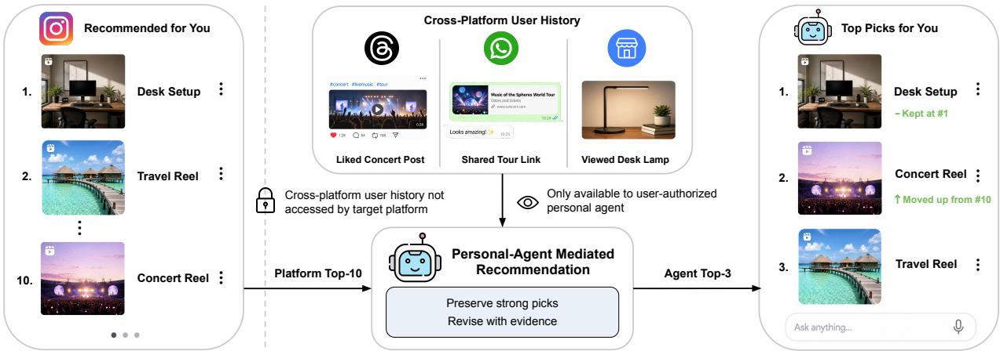
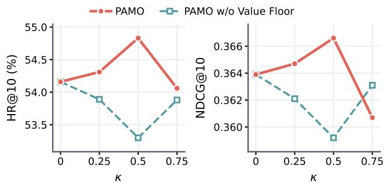
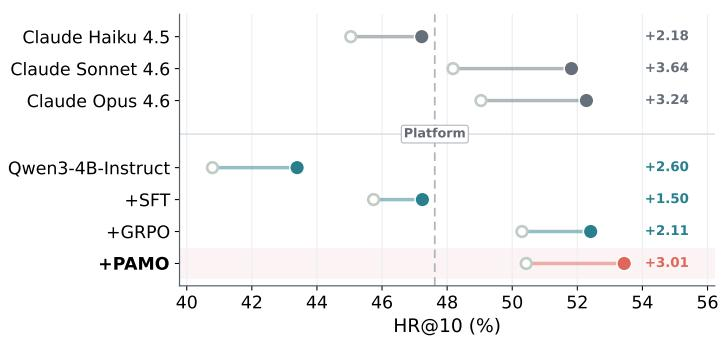
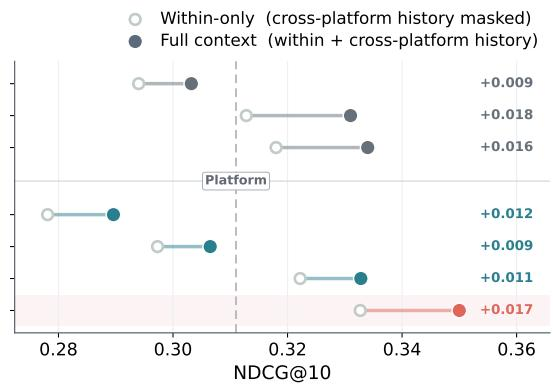
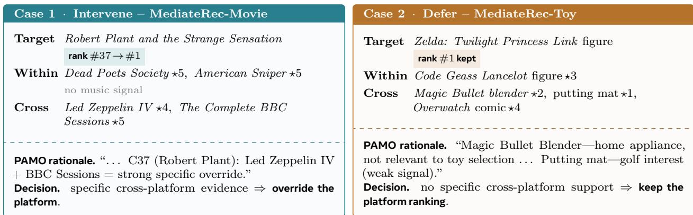
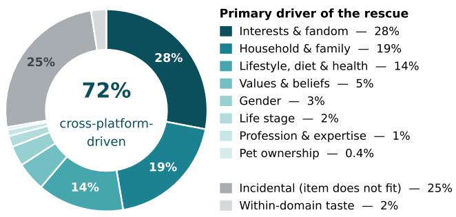
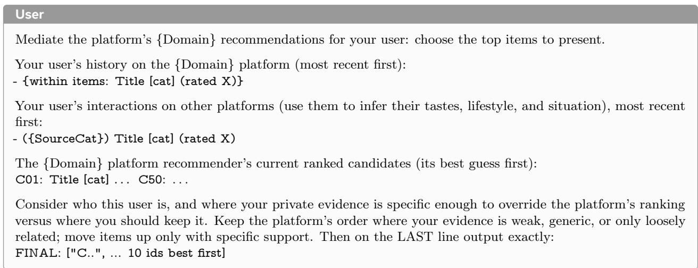

# Personal-Agent Mediated Recommendation with Cross-Platform User History

Yu Xia1,∗, Jiangfan Zhang2, Jun Xiao2, Julian McAuley1, Xiangjun Fan2

1University of California San Diego, 2Meta AI

∗Work done during Yu Xia’s internship at Meta, mentored by Jiangfan Zhang.

Modern recommendation is shifting from platform-centric personalization toward user-governed personalization, where a personal LLM agent can act on the user’s behalf across services. We formalize this emerging paradigm as Personal-Agent Mediated Recommendation: a platform recommender ranks a candidate set using platform-local information, and a personal agent uses user-authorized crossplatform history to mediate the resulting ranking and produce the final top-K slate. Such mediation is nontrivial: the platform ranking can encode strong population evidence that the personal agent cannot observe, so efective mediation must therefore balance beneficial rescues against harmful overrides. To study this trade-of, we introduce MediateRec, a benchmark that includes scalable proxy crossplatform environments and a real cross-platform test under a controlled platform–agent information boundary. To train the agent to use cross-platform history efectively, we further propose Personal Attribution Mediation Optimization (PAMO), which counterfactually masks that history to estimate personal mediation support and reallocates rank-aware advantage mass under a platform-relative value floor. We theoretically prove that PAMO preserves cutof-level advantage mass and is locally optimal among first-order reallocations that preserve this mass without lowering average platform-relative value. Experiments on MediateRec show that personal-agent mediation enables meaningful platform corrections, yet even strong proprietary LLMs introduce non-negligible harmful overrides. PAMO consistently improves over matched outcome-only RL across seen and unseen target platforms and on the real cross-platform test, while achieving a better rescue–harm balance.

Date: October 7, 2026 Emails: yux078@ucsd.edu, jiangfanzhang@meta.com, junxiao@meta.com, jmcauley@ucsd.edu, maxfan@meta.com

∞Meta

## 1 Introduction

Personalization in recommender systems has traditionally been confined to individual platforms, each modeling users from the interactions observed within its own service. The emergence of user-authorized personal LLM agents such as Muse (Meta, 2026) points to a more user-governed architecture, in which an agent can maintain user history across services and act on the user’s behalf (Zhang et al., 2026b; Lin et al., 2026a; Liu et al., 2026; Sun, 2026). Platforms can exploit platform-local interactions and population-level collaborative patterns that the personal agent cannot directly observe (Covington et al., 2016; Kang and McAuley, 2018), while personal agents can use cross-platform history unavailable to any single service.

Recent agentic recommender systems equip LLM agents with planning, memory, tool use, interaction, and multi-agent coordination (Huang et al., 2025a; Lin et al., 2026b; Shang et al., 2026; Xia et al., 2026). These systems mainly position the agent as a platform-side recommender or as a component inside the platform pipeline. They do not directly address a user-side personal agent that receives an existing platform proposal and uses cross-platform history to revise it. This leaves a concrete question: when does cross-platform history justify changing a strong platform ranking, and when should the agent defer to it?

We formalize this setting as Personal-Agent Mediated Recommendation. A platform recommender first ranks a candidate set using platform-local information. A personal agent then receives the resulting platform proposal together with the user’s cross-platform history and produces the final top-K slate. The platform ranking is a strong default: it can encode collaborative patterns across users that the personal agent cannot observes. The agent may rescue a target that the platform misses, but it may also introduce a harmful override by dropping a target that platform ranks correctly. Efective mediation therefore requires correcting platform misses without weakening platform decisions. This rescue–harm trade-of distinguishes mediation from standalone reranking and makes selective use of cross-platform history its central learning problem.

  
Figure 1 Personal-Agent Mediated Recommendation. The platform proposal summarizes platform-local population evidence, while the personal agent additionally uses cross-platform history to selectively revise or preserve the ranking.

Evaluating this task requires paired information views of the same recommendation episode: a platform ranking generated from platform-local information and cross-platform user history exposed only to the personal agent. Existing agentic recommendation benchmarks (Shang et al., 2026; Narasimhan and Narasimhan, 2026) mainly evaluate how well platform-side agents use within-platform information rather than evaluating a personal agent mediating a given platform ranking. To this end, we introduce MediateRec, a benchmark that constructs a controlled platform–agent information boundary: the platform proposal is generated from platform-local information, while cross-platform history is available only to the personal agent. MediateRec includes scalable proxy cross-platform environments built from Amazon Reviews (Hou et al., 2026) with a real cross-platform external test built from linked activity across independent services (Ballou et al., 2025). Results on MediateRec show that access to cross-platform history alone does not ensure efective mediation: strong proprietary LLMs are able to make meaningful platform corrections, yet still introduce non-negligible harmful overrides.

Recent methods commonly train recommendation agents with ranking or task rewards (Lin et al., 2025; Huang et al., 2026; Zhu et al., 2026; Liu et al., 2025). In personal-agent mediated recommendation, however, final outcomes do not distinguish equally rewarded responses by how strongly they depend on the user’s cross-platform history. A successful correction may genuinely rely on that history or may arise from generic reranking. To train the personal agent to use cross-platform history more efectively, we propose Personal Attribution Mediation Optimization (PAMO). PAMO samples responses with full history and rescores the same visible rationales after masking cross-platform history. The likelihood contrast defines a personal mediation support score measuring each rationale’s dependence on cross-platform history. Recommendation outcomes determine the sign and total amount of advantage, personal mediation support guides how that advantage is allocated among responses that disagree with the platform, and a value floor keeps the reallocation aligned with platform-relative recommendation utility.

We prove that PAMO preserves the positive and negative advantage mass induced by ranking outcomes and is locally optimal among first-order reallocations that preserve this mass without lowering average platform relative value. Empirically, PAMO improves over matched outcome-only RL with better recommendation accuracy and rescue–harm balance across seen and unseen target platforms and on the real cross-platform test. Our main contributions are threefold:

• We formalize Personal-Agent Mediated Recommendation, where a personal agent uses cross-platform history to mediate a platform proposal and produce the final recommendation, and characterize its platform-relative

rescues and harmful overrides.

• We introduce MediateRec1, which includes scalable proxy cross-platform environments and a real crossplatform external test under a controlled platform–agent information boundary.

• We propose Personal Attribution Mediation Optimization (PAMO), which estimates personal mediation support through counterfactual masking and performs value-preserving advantage reallocation. We establish theoretically its local optimality among first-order reallocations that preserve this mass without decreasing platform-relative value.

## 2 Related Work

## 2.1 Agentic Recommender Systems

Agentic recommender systems augment platform-side recommendation with LLM reasoning, tool use, memory, interaction, and multi-agent coordination (Huang et al., 2025a; Lin et al., 2026b). Tool-augmented agents acquire user, item, and collaborative information during recommendation (Huang et al., 2025b; Wang et al., 2024; Zhang et al., 2026a), while multi-agent methods coordinate user- and item-oriented reasoning (Zhang et al., 2024; Xia et al., 2026). Memory-based systems maintain evolving user states through collaborative or hierarchical memory structures (Chen et al., 2026; Shen et al., 2026). These methods strengthen the platformside recommender, whose platform proposal forms the input to our mediation setting. Recommendation agents are commonly adapted through memory and skill evolution, supervised trajectory tuning, and reinforcement learning from recommendation feedback. MemRec (Chen et al., 2026) and MARS (Shen et al., 2026) update what the agent remembers about the user, while SAGER (Tao et al., 2026) evolves user-specific reasoning skills. Post-training methods (Zhang et al., 2026a; Lin et al., 2025; Huang et al., 2026; Zhu et al., 2026; Liu et al., 2025) teach recommendation reasoning and optimize ranking outcomes through task-specific rewards or finer-grained credit assignment. Our proposed PAMO instead targets personal mediation over an existing platform ranking, combining recommendation outcomes with support contributed by cross-platform history.

## 2.2 User-Governed Personalization and Agents

Personal agents adapt planning and actions to individual users through profile modeling, persistent memory, and interaction history (Xu et al., 2026). Representative systems connect user-specific memory to tool use, mobile interaction, and GUI actions (Zhang et al., 2026c; Wang et al., 2026; Lyu et al., 2026), while PersonaLens (Zhao et al., 2025) and Persona2Web (Kim et al., 2026) evaluate preference inference from prior user records. Recent position papers (Zhang et al., 2026b; Lin et al., 2026a; Liu et al., 2026; Sun, 2026) place these capabilities within a user-governed architecture where personal agents maintain context across services and mediate interactions with platforms, which our formulation instantiates for recommendation. A similar user–agent–platform system, iAgent (Xu et al., 2025), centers personalization on explicit user instructions, tools, and feedback memory. Although it is framed as reranking an initial platform list, it constructs each candidate list by randomly sampling one target item and nine negatives, rather than mediating a scored platform ranking. Our setting instead starts from a frozen, strong platform proposal and studies when cross-platform history should revise or preserve it. A concurrent work, ClawRec (Wu et al., 2026), directly constructs a unified cross-source recommendation slate from multi-source context, whereas we train a personal agent to mediate a strong platform proposal using cross-platform history. Our MediateRec benchmark is built from public interaction traces and includes a test-only external evaluation on real linked services. Cross-domain recommendation typically combines multi-source or multi-domain behavior within a centralized recommender (Li et al., 2022; Hou et al., 2022; Ju et al., 2025). Our setting instead holds the target platform recommender unchanged and introduces cross-platform history only at user-side personal-agent mediation. In MediateRec, we use cross-domain records in Amazon Reviews (Hou et al., 2026) to construct scalable proxy platform boundaries, while OpenPlay (Ballou et al., 2025) evaluates the same information boundary across real platform services.

## 3 Personal-Agent Mediated Recommendation

## 3.1 Task Formulation

For each recommendation episode, the platform returns a proposal

$$
B = ( { \mathcal C } , \rho _ { P } , M ) , \qquad P = \mathrm { T o p } _ { K } ( \rho _ { P } ) ,\tag{1}
$$

where $\mathcal { C }$ is the candidate set, $\rho _ { P }$ is the complete platform ranking over ${ \mathcal { C } } ,$ M contains candidate metadata, and $P$ is the platform’s default top-K slate. Let

$$
H = ( H ^ { \mathrm { w i t h i n } } , H ^ { \mathrm { c r o s s } } )\tag{2}
$$

denote the user-authorized history available to the personal agent, where $H ^ { \mathrm { w i t h i n } }$ contains target-platform records and $H ^ { \mathrm { c r o s s } }$ contains cross-platform records unavailable to the target platform. Given the platform proposal and history, the agent generates a visible rationale R followed by a ranked final slate:

$$
( R , S ) \sim \pi _ { \theta } ( \cdot \mid B , H ) , \qquad S \in \Pi _ { K } ( \mathcal { C } ) ,\tag{3}
$$

where $\Pi _ { K } ( { \mathcal { C } } )$ is the set of ordered length-K selections from C. The platform ranking summarizes platform-local evidence, including population-level collaborative patterns that the personal agent cannot directly observe. Conversely, the platform does not observe $H ^ { \mathrm { c r o s s } }$ . The agent receives the platform proposal but not the platform’s scores or internal state, making the information asymmetry two-sided. Since returning the platform slate $P$ is valid, the task is selective mediation rather than ranking from scratch.

## 3.2 Mediation Objective

Let Y denote the held-out target item. For any slate $X ,$ , set rank $x ( Y ) = \infty$ when $Y \not \in X$ . We consider top-K inclusion and single-target NDCG@K:

$$
\begin{array} { r l r } & { } & { U _ { \mathrm { H R } } ( X , Y ) = \mathbf { 1 } \{ Y \in X \} , } \\ & { } & { U _ { \mathrm { N D C G } } ( X , Y ) = \displaystyle \frac { \mathbf { 1 } \{ Y \in X \} } { \log _ { 2 } \left( \mathrm { r a n k } _ { X } ( Y ) + 1 \right) } . } \end{array}\tag{4}
$$

Let U denote the chosen recommendation utility. Training maximizes $\mathbb { E } _ { S \sim \pi _ { \theta } ( \cdot | B , H ) } [ U ( S , Y ) ]$ . To characterize the agent’s efect relative to the platform, we define the episode-level mediation value

$$
\Delta ( S ; P , Y ) = U ( S , Y ) - U ( P , Y ) .\tag{5}
$$

Because P is fixed with respect to $\pi _ { \boldsymbol { \theta } } .$ , maximizing $\mathbb { E } [ \Delta ( S ; P , Y ) ]$ is equivalent to maximizing $\mathbb { E } [ U ( S , Y ) ]$ . The platform-relative form distinguishes beneficial corrections from harmful changes to the platform slate.

For top-K inclusion, mediation has four outcomes: a preserved hit when $Y \in P \cap S$ , a rescue when $Y \not \in P$ but $Y \in S$ , a harmful override when $Y \in P$ but $Y \not \in S$ , and a mutual miss otherwise. The resulting platform-relative improvement is

$$
\Delta { \mathrm { H R @ } } K = { \mathrm { P r } } ( { \mathrm { r e s c u e } } ) - { \mathrm { P r } } ( { \mathrm { h a r m f u l ~ o v e r r i d e } } ) .\tag{6}
$$

For NDCG@K, the mediation value in Eq. (5) also captures promotions and demotions of the target item. Efective mediation therefore requires making high-value corrections while avoiding degradation of strong platform decisions.

## 4 MediateRec Benchmark

We introduce MediateRec to support training and evaluation under the platform–agent information boundary defined above. The benchmark includes four proxy cross-platform environments built from Amazon Reviews for scalable training and evaluation and a real cross-platform external test built from OpenPlay. The platform is constructed using only within-platform information, whereas the personal agent additionally receives cross-platform history.

## 4.1 Benchmark Design

## 4.1.1 Amazon Proxy Platforms

Public interaction data rarely link the same user across independent services because platform records are siloed and privacy-sensitive (Lin et al., 2026a). We therefore use Amazon product categories as controlled proxy platforms. We select original Movies & TV, Toys & Games, Grocery & Gourmet Food, and Beauty & Personal Care categories as the target platforms for Movie, Toy, Grocery, and Beauty, respectively. Earlier interactions on the target platform form within-platform history, and earlier interactions on all other Amazon categories of the same user form cross-platform history. Although Amazon categories are not independent services, this construction preserves the information asymmetry of interest: the platform uses only its loca records, while the personal agent receives a broader view of the same user.

We build these datasets from the 0-core population of Amazon Reviews 2023 (Hou et al., 2026). We apply no additional k-core filter which preserves natural distributions of within-platform and cross-platform user histories. Movie and Toy each contain 5,000 training, 1,000 validation, and 2,000 test episodes and provide seen-target-platform evaluation. Grocery and Beauty each contain 2,000 test episodes and are reserved for unseen-target-platform transfer.

## 4.1.2 OpenPlay: Real Cross-Platform Data

The Amazon construction provides scale and controlled transfer, but its platform boundary remains a proxy. For a real cross-platform setting, we use the OpenPlay dataset (Ballou et al., 2025), which links Steam, Nintendo, and Xbox activity through a shared pseudonymized person identifier. Steam is the target platform: earlier Steam titles form within-platform history, while earlier Nintendo titles and Xbox genres records from the same user form cross-platform history. The shared identifier gives direct person-level linkage across genuinely separate services without entity matching.

We require at least one within-platform and one cross-platform record but impose no additional activity threshold, similarly preserving the natural variation in gaming histories rather than restricting evaluation to highly active users. The resulting 645-user cohort is used only for external testing. It is excluded from agent training, hyperparameter selection, and checkpoint selection, providing an external test of whether mediation strategy learned on the Amazon proxy platforms transfers to a real cross-platform boundary.

## 4.1.3 Temporal Episodes and Candidate Sets

Each user contributes one temporally ordered episode. In Movie, Toy, Grocery, and Beauty, the user’s final interaction on the target category is held out as Y and treated as an implicit interaction target. In OpenPlay, Y is the last-adopted Steam title that passes a positive-engagement threshold of 30 minutes of playtime, with adoption defined by first-play time. In all five datasets, each episode contains at least one within-platform record and one cross-platform record strictly before the target event.

The platform and personal agent operate over the same fixed set of 50 candidates: Y and 49 items the user has not previously interacted with, sampled from the target platform. Negatives are sampled without replacement in proportion to item popularity, which favors frequently interacted items rather than rare long-tail items (Krichene and Rendle, 2020; Ihemelandu and Ekstrand, 2023). Candidates are randomly ordered for platform construction. After the platform-side recommender ranking, candidates are relabeled by platform rank, and this final representation is held fixed across all agent conditions. As all agents operate over the same candidate set, platform-relative changes reflect mediation of an available candidate set rather than diferent retrieval pools. Table 1 summarizes the resulting dataset sizes, history statistics, common cross-platform sources, and performance of the frozen target platform described next.

## 4.2 Platform–Agent Interface

## 4.2.1 Target Platform Ranking

We construct a strong target-platform ranking so that generic repair of a weak candidate order is not mistaken for efective mediation. For each episode, a target-platform-trained SASRec model first ranks the 50 candidates using population interactions and the user’s within-platform history (Kang and McAuley, 2018). This stage encodes population-level collaborative patterns unavailable to the personal agent. Following recent work on LLM-based recommendations and agentic recommendations (Hou et al., 2024; Yue et al., 2023), we use Claude Sonnet 4.6 to rerank the SASRec order at temperature 0, conditioned on the user’s within-platform history. The reranking prompt is provided in Appendix A.3. Cross-platform history is never exposed during target platform ranking construction, and the final returned platform ranking is frozen for all personal-agent training and evaluation. The resulting platform rankings achieve mean HR@10 / NDCG@10 of 49.3%/0.329 across the four Amazon datasets and 40.8%/0.241 on OpenPlay, providing a strong default that the personal agent must preserve when correct and revise when cross-platform history provides stronger evidence.

Table 1 MediateRec statistics. Train/Val./Test report episode counts; Within/Cross are mean pre-target history lengths; Platform H@10 is the frozen platform’s HR@10; Common cross-platform sources are ranked by user coverage.
<table><tr><td>MediateRec</td><td>Train</td><td>Val.</td><td>Test</td><td>Within</td><td>Cross</td><td>Platform H@10</td><td>Common Cross-Platform Sources</td></tr><tr><td>Movie</td><td>5,000</td><td>1,000</td><td>2,000</td><td>4.9</td><td>26.7</td><td></td><td>56.0 Books (59.7%); Home &amp; Kitchen (53.4%); Electronics (50.3%)</td></tr><tr><td>Toy</td><td>5,000</td><td>1,000</td><td>2,000</td><td>2.8</td><td>24.0</td><td></td><td>47.7 Home &amp; Kitchen (71.3%); Clothing, Shoes &amp; Jewelry (68.5%); Electronics (52.4%)</td></tr><tr><td>Grocery</td><td></td><td></td><td>2,000</td><td>2.9</td><td>31.6</td><td></td><td>45.0 Home &amp; Kitchen (77.7%); Clothing, Shoes &amp; Jewelry (71.4%); Health &amp; Household (60.3%)</td></tr><tr><td>Beauty</td><td></td><td></td><td>2,000</td><td>3.2</td><td>26.6</td><td></td><td>48.6 Clothing, Shoes &amp; Jewelry (74.1%); Home &amp; Kitchen (71.4%); Electronics (52.9%)</td></tr><tr><td>OpenPlay</td><td></td><td></td><td>645</td><td>11.9</td><td>11.0</td><td></td><td>40.8 Nintendo (85.1%); Xbox (19.8%)</td></tr></table>

## 4.2.2 Personal-Agent Mediation

The personal agent receives the platform proposal B, within-platform history $H ^ { \mathrm { w i t h i n } }$ , and cross-platform history $H ^ { \mathrm { c r o s s } }$ , but not platform scores, population interactions, or model states, matching the task’s platform– agent information boundary. It then produces a ranked top-10 from the 50 candidates in a single call. We provide a default single-call mediation prompt in Appendix A.4 that treats platform rank as meaningful evidence and asks the agent to revise it only when cross-platform history provides specific support. The interface therefore allows both deference to strong platform decisions and selective intervention when cross-platform history adds useful information.

## 4.3 Evaluation Protocol

All selected users are disjoint across the target platforms and their train, validation, and test splits. Trained checkpoint selection uses only the seen-target-platform training and validation data. All held-out platforms are evaluated without adaptation. All methods are evaluated on identical users, targets, candidates, and constructed platform rankings within each dataset. We report HR@{3,5,10} and NDCG@{3,5,10}, together with rescue, harmful override, and intervention, which is the number of platform-slate items replaced in the final slate, $d ( S , P ) = K - | S \cap P |$ . The full-history condition provides $( H ^ { \mathrm { w i t h i n } } , H ^ { \mathrm { c r o s s } } )$ , while the within-only condition uses $H ^ { - } = ( H ^ { \mathrm { w i t h i n } } , \mathcal { O } )$ , holding the candidate set and platform proposal fixed. Movie and Toy are aggregated as seen target platforms, Grocery and Beauty as unseen target platforms, and OpenPlay is reported separately as the real cross-platform external test.

Appendix A provides the further benchmark construction and implementation details.

## 5 Personal Attribution Mediation Optimization

Outcome-only reinforcement learning can improve recommendation outcomes, but it cannot distinguish a platform correction that genuinely depends on cross-platform history from an equally successful correction produced by generic reranking. Our Personal Attribution Mediation Optimization (PAMO) addresses this ambiguity in three steps. First, it estimates how strongly each sampled rationale depends on cross-platform history. Second, it decomposes NDCG into rank-aware group-relative advantages. Third, it reallocates the advantage assigned to platform-relative changes toward more strongly supported responses while retaining their average platform-relative NDCG magnitude. We then establish preservation and local-optimality properties of this reallocation.

For each episode, PAMO samples G responses from the frozen rollout policy:

$$
( R _ { g } , S _ { g } ) \sim \pi _ { \bar { \theta } } ( \cdot \mid B , H ) , \qquad g = 1 , \ldots , G ,\tag{7}
$$

where $\pi _ { \bar { \theta } }$ is fixed during the current update.

## 5.1 Counterfactual Personal Mediation Support

Recommendation outcomes reveal whether a sampled slate succeeds, but not whether the response actually relies on cross-platform history. To measure this dependence, PAMO keeps the sampled response and platform proposal fixed and removes only the cross-platform history. It then compares the likelihood of the same response under the full-history and within-only inputs.

We score the visible rationale rather than the final identifier span. Once the same rationale prefix is teacherforced under both inputs, the final identifiers are conditioned on that fixed prefix and can become less sensitive to the removed history. The rationale more directly captures the history-conditioned deliberation that produced the slate.

Let $R _ { g }$ be the rationale generated before the FINAL: marker, with $| R _ { g } |$ scored tokens. We write the full-history input as $( B , H )$ and the within-only input as $( B , H ^ { - } )$ , where

$$
H ^ { - } = ( H ^ { \mathrm { w i t h i n } } , \emptyset )
$$

masks cross-platform history while retaining the complete within-platform history. PAMO defines the personal mediation support score

$$
c _ { g } = \frac { 1 } { \vert R _ { g } \vert } \log \frac { \pi _ { \bar { \theta } } ( R _ { g } \vert B , H ) } { \pi _ { \bar { \theta } } ( R _ { g } \vert B , H ^ { - } ) } .\tag{8}
$$

Because the full-history log-probabilities are retained during rollout generation, computing $c _ { g }$ requires one additional teacher-forced pass under the within-only input. A larger $c _ { g }$ means that the sampled rationale depends more strongly on cross-platform history, conditional on the same platform proposal and withinplatform history. The score is model-relative: it measures history dependence, not whether the history is correct or useful. Recommendation outcomes provide that supervision. We normalize $c _ { g }$ by rationale length, stop gradients through it, and attach one score to the response as a whole.

## 5.2 Rank-Aware Platform-Relative Advantage

For each ranking depth $k \in \{ 1 , \ldots , K \}$ , we call the top-k boundary cutof $k ,$ and a rank change afects exactly the cutofs it crosses. Moving the target from rank 8 to rank 3, for example, changes the outcome at cutofs 3 through 7. We use the exact decomposition of single-target NDCG@K over these nested top-k outcomes.

For rollout $g$ and the platform slate, define

$$
z _ { g , k } = \mathbf { 1 } \{ \mathrm { r a n k } _ { S _ { g } } ( Y ) \leq k \} , \qquad z _ { P , k } = \mathbf { 1 } \{ \mathrm { r a n k } _ { P } ( Y ) \leq k \} .\tag{9}
$$

Let $\ell _ { k }$ denote the NDCG discount and $\alpha _ { k }$ its marginal cutof utility:

$$
\ell _ { k } = \frac { 1 } { \log _ { 2 } ( k + 1 ) } , \qquad \ell _ { K + 1 } = 0 , \qquad \alpha _ { k } = \ell _ { k } - \ell _ { k + 1 } .\tag{10}
$$

The rollout reward is exactly

$$
r _ { g } \equiv U _ { \mathrm { N D C G } } ( S _ { g } , Y ) = \sum _ { k = 1 } ^ { K } \alpha _ { k } z _ { g , k } .\tag{11}
$$

Each $\alpha _ { k } \geq 0$ is the marginal NDCG gain from moving the target across cutof $k ,$ so $\operatorname { E q . }$ (11) lets PAMO model platform corrections at each afected cutof without changing the underlying ranking utility.

At each cutof, we use the group-relative centering of GRPO (Shao et al., 2024). The rollout-group hit rate and centered advantage are

$$
p _ { k } = \frac { 1 } { G } \sum _ { g = 1 } ^ { G } z _ { g , k } , \qquad A _ { g , k } ^ { \mathrm { g r p } } = z _ { g , k } - p _ { k } .\tag{12}
$$

There are $G p _ { k }$ successful rollouts, each with advantage $1 - p _ { k }$ . Their total positive advantage, which also equals the magnitude of the total negative advantage, is

$$
m _ { k } = G p _ { k } ( 1 - p _ { k } ) .\tag{13}
$$

Under uniform allocation, recombining the cutof advantages recovers the centered NDCG advantage exactly, $\begin{array} { r } { \sum _ { k } \alpha _ { k } ( z _ { g , k } - p _ { k } ) = r _ { g } - \bar { r } } \end{array}$ with $\begin{array} { r } { \bar { r } = \frac { 1 } { G } \sum _ { g } r _ { g } } \end{array}$ . The decomposition therefore preserves the centered NDCG advantage of the matched $\mathrm { G R P O }$ baseline before support-based reallocation. Appendix B.1 gives the full decomposition and uniform-allocation derivation.

PAMO modifies advantages only for responses whose top-k outcome difers from the platform. We define the platform-disagreement set

$$
\begin{array} { r } { \mathcal { D } _ { k } = \{ g : z _ { g , k } \neq z _ { P , k } \} , \qquad s _ { k } = 1 - 2 z _ { P , k } . } \end{array}\tag{14}
$$

If the platform misses at cutof k $( s _ { k } = 1 )$ , $\mathcal { D } _ { k }$ contains top-k rescues. If the platform succeeds $( s _ { k } = - 1 )$ it contains harmful overrides that move the target below the cutof. Preserved hits and mutual misses stay outside $\mathcal { D } _ { k }$ and keep the standard group-relative advantage, as they are not platform-relative interventions at that cutof. We call a cutof active when $0 < p _ { k } < 1$ . At $p _ { k } \in \{ 0 , 1 \}$ , Eq. (13) gives $m _ { k } = 0$ and the cutof contributes no update, so PAMO solves the allocation only at active cutofs.

## 5.3 Value-Preserving Advantage Reallocation

## 5.3.1 Value-Constrained Allocation

Within each active platform disagreement set, PAMO tilts the advantage allocation toward more personally supported responses while not lowering its average platform-relative recommendation value. For $g \in \mathcal { D } _ { k }$ define the direction-aligned NDCG magnitude as

$$
\begin{array} { r } { r _ { P } = U _ { \mathrm { N D C G } } ( P , Y ) , \qquad v _ { g , k } = s _ { k } ( r _ { g } - r _ { P } ) . } \end{array}\tag{15}
$$

For every $g \in \mathcal { D } _ { k }$ , the sign $s _ { k }$ makes $v _ { g , k } = | r _ { g } - r _ { P } | \geq 0$ . Thus, $v _ { g , k }$ is larger for a stronger rescue when the platform misses and for a more severe harmful override when the platform succeeds. The cutof determines whether the response is a rescue or harmful override, while $v _ { g , k }$ measures the NDCG magnitude of the full rank change.

Let $n _ { k } = | \mathcal { D } _ { k } |$ and let $u _ { k }$ be the uniform distribution over this set:

$$
u _ { g , k } = \frac { 1 } { n _ { k } } , \qquad \bar { v } _ { k } = \sum _ { g \in \mathcal { D } _ { k } } u _ { g , k } v _ { g , k } .\tag{16}
$$

Reallocating advantage by personal support alone can concentrate it on a highly history-dependent but low-value rescue, or place too little negative advantage on a severe harmful override. PAMO therefore requires the reallocated advantage to retain at least the average direction-aligned NDCG magnitude of the original uniform allocation, a constraint we call the value floor.

Using the value floor rather than a fixed weighted sum permits support-based reallocation only when it does not reduce the original average value. Here $\eta \geq 0$ is the support strength. For each active $\mathcal { D } _ { k }$ , PAMO chooses

$$
\begin{array} { r l } { w _ { k } ^ { \star } = \arg \underset { w _ { k } \in \mathbb { R } _ { + } ^ { n _ { k } } , \sum _ { g } w _ { g , k } = 1 } { \operatorname* { m a x } } } & { \eta \underset { g \in \mathcal { D } _ { k } } { \sum } w _ { g , k } c _ { g } - \mathrm { K L } ( w _ { k } \| u _ { k } ) } \\ { \mathrm { s u b j e c t ~ t o ~ } } & { \displaystyle \sum _ { g \in \mathcal { D } _ { k } } w _ { g , k } v _ { g , k } \geq \bar { v } _ { k } . } \end{array}\tag{17}
$$

The objective tilts the advantage allocation toward personal support while limiting departure from the uniform group-relative allocation, and the value floor excludes allocations with lower average direction-aligned NDCG magnitude. Because $u _ { k }$ is feasible (it meets the value floor with equality) and the negative-KL objective is strictly concave on the simplex, the solution is unique.

The unique optimizer has the dual-parameterized exponential form

$$
w _ { g , k } ^ { \star } = \frac { \exp ( \eta c _ { g } + \lambda _ { k } v _ { g , k } ) } { \sum _ { j \in \mathcal { D } _ { k } } \exp ( \eta c _ { j } + \lambda _ { k } v _ { j , k } ) } , \qquad g \in \mathcal { D } _ { k } ,\tag{18}
$$

where $\lambda _ { k } \geq 0$ is the dual coeficient of the value floor. When the unconstrained support tilt already satisfies the floor, $\lambda _ { k } = 0$ . Otherwise, $\lambda _ { k }$ is the unique value that makes the constraint in Eq. (17) active. Appendix B.2 derives Eq. (18) and the one-dimensional $\lambda _ { k }$ search.

## 5.3.2 PAMO Advantage

PAMO assigns the cutof-level advantage

$$
\begin{array} { r } { A _ { g , k } ^ { \mathrm { P A M O } } = \left\{ \begin{array} { l l } { s _ { k } m _ { k } w _ { g , k } ^ { \star } , } & { g \in \mathcal { D } _ { k } , } \\ { A _ { g , k } ^ { \mathrm { g r p } } , } & { g \notin \mathcal { D } _ { k } . } \end{array} \right. } \end{array}\tag{19}
$$

The allocation changes only which platform-disagreement rollouts receive the fixed signed advantage mass $s _ { k } m _ { k }$ . Rollouts whose cutof outcome agrees with the platform retain the group-relative advantage in Eq. (12).

Because the scale of $c _ { g }$ changes during training, we calibrate the support strength using a dimensionless concentration parameter $\kappa .$ Let $\widehat { \sigma } _ { c }$ be the mean, over all active platform-disagreement sets in the current update, of the within-set standard deviation of $c _ { g }$ . We set

$$
\eta = \operatorname* { m i n } \left\{ \frac { \kappa } { \operatorname* { m a x } ( \widehat { \sigma } _ { c } , \epsilon _ { c } ) } , \eta _ { \mathrm { m a x } } \right\} ,\tag{20}
$$

where $\epsilon _ { c } > 0$ is a numerical floor and $\eta _ { \mathrm { m a x } }$ caps the support strength. Thus, κ controls the typical spread of the support logits: $\kappa = 0$ gives the uniform allocation, while larger values make the allocation more responsive to diferences in personal mediation support.

Finally, the cutof advantages are combined into one response advantage using the same marginal utilities that define NDCG,

$$
A _ { g } ^ { \mathrm { P A M O } } = \sum _ { k = 1 } ^ { K } \alpha _ { k } A _ { g , k } ^ { \mathrm { P A M O } } ,\tag{21}
$$

which is used in the same clipped token-level GRPO objective as the matched outcome-only baseline (Shao et al., 2024). PAMO adds one masked teacher-forced scoring pass during training, with no additional rollouts and no inference-time component. Appendix B.5 gives the clipped token-level objective and computational details.

## 5.4 Theoretical Analysis

The allocation in Eq. (17) reallocates advantage within each platform disagreement set while preserving its cutof-level mass.

Proposition 1 (Advantage-Mass and Value Preservation). Fix an active cutof $( 0 < p _ { k } < 1 )$ and support strength $\eta \geq 0$ , and let $w _ { k } ^ { \star }$ solve Eq. (17). PAMO preserves the aggregate positive and negative group-relative advantage mass:

$$
\sum _ { g : z _ { g , k } = 1 } A _ { g , k } ^ { \mathrm { P A M O } } = m _ { k } , \qquad \sum _ { g : z _ { g , k } = 0 } A _ { g , k } ^ { \mathrm { P A M O } } = - m _ { k } .\tag{22}
$$

Its allocation also satisfies

$$
\mathbb { E } _ { w _ { k } ^ { \star } } [ v _ { k } ] \geq \mathbb { E } _ { u _ { k } } [ v _ { k } ] , \qquad \mathbb { E } _ { w _ { k } ^ { \star } } [ c ] \geq \mathbb { E } _ { u _ { k } } [ c ] .\tag{23}
$$

Proof sketch. At an active cutof, $\mathcal { D } _ { k }$ contains exactly one side of the binary group outcome—rescues when the platform misses and harmful overrides when it succeeds. Since $w _ { k } ^ { \star }$ sums to one, PAMO redistributes but does not change the signed advantage mass $s _ { k } m _ { k }$ , and the platform-agreement side is untouched. The value inequality is the feasibility constraint, and comparing the optimum with the feasible uniform allocation $u _ { k }$ gives $\mathbb { E } _ { w _ { k } ^ { \star } } [ c ] \geq \mathbb { E } _ { u _ { k } } [ c ]$ . Appendix B.3 gives the full proof.

To characterize the local reallocation direction, center the support score and value magnitude under the uniform distribution:

$$
\begin{array} { r } { \widetilde { c } _ { g , k } = c _ { g } - \mathbb { E } _ { u _ { k } } [ c ] , \qquad \widetilde { v } _ { g , k } = v _ { g , k } - \mathbb { E } _ { u _ { k } } [ v _ { k } ] . } \end{array}\tag{24}
$$

Define the cone of admissible first-order weight reallocations

$$
{ \mathcal K } _ { k } = \left\{ q \in { \mathbb R } ^ { n _ { k } } : { \mathbf { 1 } } ^ { \top } q = 0 , \ \langle q , \widetilde { v } _ { k } \rangle \geq 0 \right\} , \qquad q _ { k } = \mathrm { P r o j } _ { { \mathcal K } _ { k } } ( \widetilde { c } _ { k } ) .\tag{25}
$$

Theorem 1 (Local Optimality of the PAMO Allocation Direction). Fix an active cutof k with $n _ { k } \geq 2$ . The right derivative of the PAMO weights at the uniform allocation is

$$
\left. \frac { d w _ { k } ^ { \star } } { d \eta } \right| _ { \eta = 0 ^ { + } } = \frac { 1 } { n _ { k } } q _ { k } .\tag{26}
$$

When $q _ { k } \neq 0$ , the direction $q _ { k } / \lVert q _ { k } \rVert _ { 2 }$ maximizes the first-order increase in average personal mediation support among unit-Euclidean-norm infinitesimal reallocations that preserve total weight and do not decrease average direction-aligned NDCG magnitude.

Proof sketch. Expanding the exponential-family solution around the uniform allocation, $\lambda _ { k } ( \eta ) = \eta \mu _ { k } + o ( \eta )$ The simplex constraint centers the support score, and an active value floor removes the component of the centered support direction that would decrease the value magnitude. Because the Hessian of $\mathrm { K L } ( \boldsymbol { w } _ { k } \| \boldsymbol { u } _ { k } )$ is isotropic on the simplex tangent space at $u _ { k }$ , the resulting direction is the Euclidean projection of $\widetilde { c } _ { k }$ onto $\kappa _ { k }$ , whose optimality condition gives the maximal first-order support gain among unit-norm admissible reallocations. Appendix B.4 gives the full proof, including existence of the one-sided derivative.

If the centered support direction is already value-aligned then $q _ { k } = \widetilde { c } _ { k }$ . Otherwise the projection in $\operatorname { E q . }$ (25) removes only the value-conflicting component. Thus, at each active cutof, PAMO follows the steepest supportincreasing first-order advantage reallocation that preserves total advantage mass and does not decrease the average direction-aligned NDCG magnitude. These results characterize advantage allocation within a fixed sampled rollout group, treating $c _ { g }$ and $v _ { g , k }$ as fixed, and do not imply global optimality of the neural policy or a guaranteed held-out utility improvement.

## 6 Experiments

The experiments are designed to answer the following research questions on personal-agent mediated recommendation:

RQ1. Can personal-agent mediation improve a strong platform proposal, and does PAMO outperform matched RL training baselines?

RQ2. How much of the mediation gain comes from cross-platform user history rather than generic reranking?

RQ3. How do the value floor and diferent values of support concentration κ afect PAMO?

RQ4. How does PAMO use cross-platform history to decide when to revise or preserve the platform ranking?

## 6.1 Experimental Setup

## 6.1.1 Models and Baselines

We report the frozen Platform ranking as the no-mediation baseline. As described in Section 4.2, it is produced by a target-platform SASRec model followed by Claude Sonnet 4.6 reranking using within-platform history only (Kang and McAuley, 2018; Hou et al., 2024; Yue et al., 2023). This baseline combines population-level collaborative signals with LLM reranking and defines the platform proposal received by every personal agent. Rescue, harmful override, and intervention are measured relative to it. Existing platform-side agentic recommenders operate upstream by constructing or refining such a proposal, rather than at the personal-agent decision point studied here.

All trainable personal agents use Qwen3-4B-Instruct-2507 as the backbone. Claude Sonnet 4.6 supplies the supervised demonstrations for behavior initialization. We additionally evaluate Claude Haiku 4.5, Sonnet 4.6, and Opus 4.6 as proprietary inference-time reference models. All personal-agent methods receive the same frozen platform proposal and use the same information interface.

We compare the base model, supervised fine-tuning (SFT), GRPO (Shao et al., 2024), and PAMO. GRPO is the matched outcome-only RL baseline and uses NDCG@10 as its reward. It shares PAMO’s SFT initialization, training data, rollout budget, optimizer, and update budget, difering only in advantage reallocation. For ablation, we also evaluate PAMO w/o Value Floor, which removes the value floor in Section 5.3 and reallocates advantage using personal mediation support alone.

## 6.1.2 Training

We initialize the personal agent on 2,000 Sonnet demonstrations, 1,000 each from Movie and Toy, retained without filtering by recommendation outcome for format learning. SFT uses three epochs, batch size 64, maximum sequence length 8,192, and learning rate $1 0 ^ { - 5 }$ . All RL methods start from the same SFT checkpoint. Each update uses 64 prompts and $G = 8$ rollouts per prompt, sampled with temperature 1.0 and top-p 1.0, with learning rate $1 0 ^ { - 6 }$ , PPO minibatch size 32, clipping threshold $\epsilon = 0 . 2$ , and no KL penalty. Prompt and response lengths are capped at 8,192 and 2,048 tokens, and group advantages are not standardized. Main runs use 400 updates with validation and checkpointing every 50 updates. PAMO computes personal mediation support on the visible rationale and masks cross-platform history, sweeping $\kappa \in \{ 0 . 2 5 , 0 . 5 , 0 . 7 5 \}$ on the validation set with the efective inverse temperature capped at $\eta _ { \mathrm { m a x } } = 6 0$ . We implement training with VeRL (Sheng et al., 2024) and use vLLM (Kwon et al., 2023) for rollout generation.

## 6.1.3 Evaluation

We select the checkpoint with the highest validation NDCG@10. At test time, each model produces one response per episode using temperature 0.7, $\mathrm { t o p } { - } p = 0 . 8$ , and $\mathrm { t o p } { - } k = 2 0$ . We extract the candidate identifiers following the FINAL: marker, remove duplicates, and use their best-first order as the final slate. We report HR@{3,5,10} and NDCG@{3,5,10}. At K = 10, rescue is the percentage of episodes in which the platform misses the target but the personal agent recovers it, while harmful override is the percentage in which the platform includes the target but the agent removes it. Mean intervention is the number of platform top-10 items replaced in the final slate.

## 6.2 Overall Mediation Performance (RQ1)

## 6.2.1 Access to Cross-Platform History Is Insufficient

Tables 2 and 3 report mediation results across the five MediateRec datasets. Access to cross-platform history alone does not produce efective mediation. The base Qwen3-4B-Instruct falls below the platform on all five datasets, and its harmful-override rate exceeds its rescue rate throughout. Cross-platform history therefore needs to be combined with selective deference to the platform proposal. Among the proprietary models, Haiku only nearly match the platform even with cross-platform history, whereas Sonnet and Opus improve HR@10 over the platform on all five datasets. Their remaining harmful-override rates show that stronger model capability alone does not solve selective mediation.

## 6.2.2 PAMO Improves Outcome-Only Training

Among the training methods, SFT followed by GRPO progressively recovers selective mediation, and PAMO improves further over the matched GRPO baseline. PAMO improves both HR@10 and NDCG@10 over GRPO on all five datasets. The gain does not come from more aggressive intervention: mean intervention stays similar,

Table 2 Recommendation and mediation results on the four proxy cross-platform test sets. H@X and N@X denote HR@X and NDCG@X. Best results are in bold; second-best results are underlined.
<table><tr><td></td><td colspan="8">MediateRec-Movie</td><td colspan="10">MediateRec-Toy</td></tr><tr><td>Method</td><td>H@3</td><td>H@5</td><td>H@10</td><td>N@3</td><td>N@5</td><td>N@10</td><td>Resc.</td><td>Harm</td><td>Int.</td><td>H@3</td><td>H@5</td><td>H@10</td><td>N@3</td><td>N@5</td><td>N@10</td><td>Resc.</td><td>Harm</td><td>Int.</td></tr><tr><td>Platform</td><td>37.0</td><td>44.5</td><td>56.0</td><td>0.319</td><td>0.349</td><td>0.386</td><td></td><td></td><td></td><td>31.2 36.8</td><td></td><td>47.7</td><td>0.268</td><td>0.291</td><td>0.326</td><td></td><td></td><td></td></tr><tr><td>Claude Haiku 4.5</td><td>35.3</td><td>42.4</td><td>56.8</td><td>0.304</td><td>0.333</td><td>0.380</td><td>10.9</td><td>10.1</td><td>3.77</td><td>30.4</td><td>37.3</td><td>48.2</td><td>0.261</td><td>0.290</td><td>0.325</td><td>9.6</td><td>9.1</td><td>3.96</td></tr><tr><td>Claude Sonnet 4.6</td><td>40.4</td><td>49.0</td><td>63.1</td><td>0.340</td><td>0.376</td><td>0.421</td><td>12.2</td><td>5.0</td><td>3.27</td><td>32.6</td><td>39.5</td><td>52.3</td><td>0.281</td><td>0.308</td><td>0.350</td><td>12.1</td><td>7.5</td><td>3.71</td></tr><tr><td>Claude Opus 4.6</td><td>42.1</td><td>50.2</td><td>63.2</td><td>0.353</td><td>0.387</td><td>0.428</td><td>11.6</td><td>4.2</td><td>2.92</td><td>33.5</td><td>40.4</td><td>52.4</td><td>0.285</td><td>0.313</td><td>0.352</td><td>11.7</td><td>7.0</td><td>3.62</td></tr><tr><td>Qwen3-4B-Instruct</td><td>34.1</td><td>41.0</td><td>50.1</td><td>0.298</td><td>0.326</td><td>0.355</td><td>4.1</td><td>9.9</td><td>2.90</td><td>29.4</td><td>34.8</td><td>45.5</td><td>0.254</td><td>0.276</td><td>0.311</td><td>5.5</td><td>7.7</td><td>3.14</td></tr><tr><td>+SFT</td><td>37.5</td><td>45.0</td><td>57.7</td><td>0.318</td><td>0.349</td><td>0.390</td><td>8.2</td><td>6.5</td><td>2.93</td><td>30.6</td><td>37.4</td><td>48.6</td><td>0.265</td><td>0.293</td><td>0.329</td><td>8.7</td><td>7.8</td><td>3.43</td></tr><tr><td>+GRPO</td><td>38.6 41.0</td><td>47.4</td><td>61.2</td><td>0.328</td><td>0.364</td><td>0.408</td><td>9.2</td><td>3.9</td><td>2.71</td><td>33.9</td><td>41.0</td><td>53.4</td><td>0.286</td><td>0.315</td><td>0.355</td><td>11.2</td><td>5.6</td><td>3.64</td></tr><tr><td>+PAMO</td><td>49.0</td><td></td><td>62.2</td><td>0.351</td><td>0.384</td><td>0.426</td><td>10.3</td><td>4.0</td><td>2.76</td><td>35.0 42.2</td><td>54.8</td><td>0.302</td><td>0.332</td><td></td><td>0.372</td><td>11.9</td><td>4.8</td><td>3.31</td></tr><tr><td rowspan="2">H@3</td><td colspan="10">MediateRec-Grocery</td><td colspan="7">MediateRec-Beauty</td></tr><tr><td colspan="10">H@5 H@10 N@3 N@5 N@10</td><td colspan="7">N@3 N@5 N@10 Resc. Harm</td></tr><tr><td>Platform</td><td>27.6</td><td>33.6</td><td>45.0</td><td>0.238</td><td>0.263</td><td>0.299</td><td></td><td></td><td></td><td>27.4 34.4</td><td></td><td>48.6</td><td>0.230</td><td>0.259 0.305</td><td></td><td></td><td></td><td></td></tr><tr><td>Claude Haiku 4.5</td><td>26.4</td><td>32.9</td><td>43.0</td><td>0.224</td><td>0.251</td><td>0.283</td><td>8.9</td><td>11.1</td><td>4.08</td><td>27.4 34.5</td><td></td><td>47.3</td><td>0.227</td><td>0.256</td><td>0.297</td><td>8.4</td><td>9.8</td><td>3.73</td></tr><tr><td>Claude Sonnet 4.6</td><td>28.3</td><td>36.0</td><td>49.1</td><td>0.239</td><td>0.271</td><td>0.313</td><td>11.0</td><td>7.0</td><td>3.84</td><td>30.2</td><td>37.9</td><td>50.6</td><td>0.248</td><td>0.279</td><td>0.320</td><td>10.4</td><td>8.4</td><td>3.81</td></tr><tr><td>Claude Opus 4.6</td><td>27.3</td><td>35.6</td><td>48.5</td><td>0.232</td><td>0.266</td><td>0.308</td><td>9.8</td><td>6.3</td><td>3.29</td><td>30.8</td><td>38.1</td><td>51.9</td><td>0.248</td><td>0.278</td><td>0.322</td><td>11.6</td><td>8.3</td><td>3.75</td></tr><tr><td>Qwen3-4B-Instruct</td><td>26.0</td><td>30.8</td><td>41.0</td><td>0.225</td><td>0.244</td><td>0.277</td><td>4.7</td><td>8.8</td><td>3.09</td><td>25.8</td><td>31.9</td><td>41.5</td><td>0.217</td><td>0.243</td><td>0.273</td><td>4.7</td><td>11.8</td><td>3.67</td></tr><tr><td>+SFT</td><td>27.2</td><td>33.6</td><td>43.4</td><td>0.230</td><td>0.256</td><td>0.288</td><td>6.8</td><td>8.4</td><td>3.35</td><td>27.8</td><td>33.9</td><td>46.8</td><td>0.229</td><td>0.254</td><td>0.296</td><td>6.6</td><td>8.4</td><td>2.79</td></tr><tr><td>+GRPO</td><td>28.8</td><td>35.4</td><td>48.8</td><td>0.244</td><td>0.271</td><td>0.314</td><td>8.4</td><td>4.7</td><td>2.87</td><td>29.4</td><td>37.8</td><td>51.2</td><td>0.241</td><td>0.276</td><td>0.319</td><td>8.9</td><td>6.3</td><td>3.19</td></tr><tr><td>+PAMO</td><td>30.4</td><td>37.5</td><td>50.6</td><td>0.264</td><td>0.292</td><td>0.335</td><td>10.0</td><td>4.5</td><td>2.96</td><td>31.1</td><td>39.1</td><td>51.7</td><td>0.260</td><td>0.293</td><td>0.333</td><td>8.6</td><td>5.5</td><td>3.05</td></tr></table>

while PAMO reduces harmful overrides on four datasets and improves the rescue–harm balance overall. Using a 4B open model, PAMO is competitive with the proprietary models and exceeds them on many unseen-target and OpenPlay metrics. On MediateRec-OpenPlay, evaluated without any Open Play training or model selection, PAMO obtains the highest ranking metrics. Relative to GRPO, its largest gains occur near the top of the ranking, with higher H@3 and NDCG@10 and a lower harmful-override rate.

Table 3 Recommendation and mediation results on the real cross-platform test set.
<table><tr><td></td><td colspan="9">MediateRec-OpenPlay</td></tr><tr><td>Method</td><td></td><td></td><td>H@3 H@5 H@10</td><td>N@3</td><td>N@5</td><td>N@10</td><td>Resc. Harm Int.</td><td></td><td></td></tr><tr><td>Platform</td><td>20.5</td><td>27.3</td><td>40.8</td><td>0.169</td><td>0.198</td><td>0.241</td><td></td><td></td><td></td></tr><tr><td>Claude Haiku 4.5</td><td>20.5</td><td>28.2</td><td>40.8</td><td>0.160</td><td>0.191</td><td>0.231</td><td>12.2</td><td>12.2</td><td>4.52</td></tr><tr><td>Claude Sonnet 4.6</td><td>23.7</td><td>30.5</td><td>44.0</td><td>0.180</td><td>0.208</td><td>0.251</td><td>13.5</td><td>10.2</td><td>4.40</td></tr><tr><td>Claude Opus 4.6</td><td>21.1</td><td>29.9</td><td>45.4</td><td>0.174</td><td>0.211</td><td>0.260</td><td>13.6</td><td>9.0</td><td>3.75</td></tr><tr><td>Qwen3-4B-Instruct</td><td>20.2</td><td>28.2</td><td>38.9</td><td>0.165</td><td>0.198</td><td>0.232</td><td>8.5</td><td>10.4</td><td>3.58</td></tr><tr><td>+SFT</td><td>19.5</td><td>26.0</td><td>39.7</td><td>0.160</td><td>0.187</td><td>0.231</td><td>10.5</td><td>11.6</td><td>3.97</td></tr><tr><td>+GRPO</td><td>22.2</td><td>30.7</td><td>47.4</td><td>0.179</td><td>0.214</td><td>0.267</td><td>13.8</td><td>7.1</td><td>3.40</td></tr><tr><td>+PAMO</td><td></td><td>26.2 32.7</td><td>47.9</td><td>0.208</td><td>0.235</td><td>0.284</td><td>13.2</td><td>6.0</td><td>3.40</td></tr></table>

## 6.3 Cross-Platform History Contribution (RQ2)

To isolate the contribution of cross-platform history, we re-evaluate each model after masking only the cross-platform records. The candidate set, platform proposal, and within-platform history remain unchanged, so the comparison removes the information unavailable to the platform without changing the underlying recommendation episode. Figure 2 reports the five-dataset macro average. Adding cross-platform history improves both HR@10 and NDCG@10 for every evaluated model, showing that the mediation gains cannot be explained by generic reranking alone. The largest improvements occur for Sonnet, Opus, and PAMO, indicating that stronger models and targeted post-training make better use of the same cross-platform evidence. Together with the base-model results in RQ1, this finding also shows that access to cross-platform history is useful but insuficient by itself: the agent must learn when that evidence is specific enough to justify changing the platform ranking.

## 6.4 Ablation and Sensitivity Analysis (RQ3)

## 6.4.1 Effect of Support Concentration κ

The support concentration parameter κ controls how strongly PAMO reallocates advantage toward responses with higher personal mediation support. Figure 3 shows an inverted-U pattern. At κ = 0, personal mediation support does not afect the allocation. Increasing κ to 0.5 improves both HR@10 and NDCG@10,

  
Figure 2 Efect of cross-platform history averaged over all five test sets in MediateRec. Open markers use within-platform history only and filled markers use the full-context input. The dashed vertical line marks the frozen platform baseline.

showing that the counterfactual support signal provides useful information beyond the ranking outcome. Performance weakens at the largest tested value, $\kappa = 0 . 7 5$ , indicating that allowing support diferences to dominate the allocation is less effective. We therefore use $\kappa = 0 . 5$ in the main experiments.

## 6.4.2 Role of the Value Floor

We next remove the value floor while retaining the same personal mediation support signal. This variant reallocates advantage according to history dependence alone, without requiring the allocation

Figure 3 Efect of support concentration κ and the value floor, averaged over the four proxy cross-platform test sets.

to preserve average platform-relative NDCG magnitude. As shown in Figure 3, it performs below the $\kappa = 0$ baseline across the tested support strengths, whereas full PAMO improves both HR@10 and NDCG@10. This contrast shows why personal mediation support cannot serve as a complete training signal by itself. A response can depend strongly on cross-platform history while still producing a weak rescue or a severe harmful override. The value floor prevents such responses from receiving a favorable reallocation merely because they are history-dependent, keeping the support signal aligned with recommendation quality.

## 6.5 PAMO Mediation Behavior Analysis (RQ4)

## 6.5.1 Aggregate Mediation Behavior

We first examine how PAMO uses cross-platform history when it successfully overrides the platform. We annotate the visible rationales of the 900 test episodes in which the platform top-10 misses the target and PAMO recovers it. Using Claude Sonnet 4.6 as the annotator over each rationale and its corresponding cross-platform records, we identify the primary evidence behind each rescue.

Figure 5 shows that cross-platform user context is the primary driver in 72% of rescues, rather than incidental reranking or within-platform taste alone. The most common forms are interests and fandom (28%), household and family (19%), and lifestyle, diet, and health (14%). The remaining rescues are mainly incidental (25%), with only a small fraction attributed primarily to within-platform taste. Thus, most PAMO rescues are explicitly motivated by user context derived from records unavailable to the target platform.

## 6.5.2 Intervening versus Deferring

Aggregate categories do not show how PAMO turns cross-platform history into a mediation decision. Figure 4 therefore presents two representative visible rationales illustrating the two behaviors central to the task: intervening when cross-platform evidence is specific and deferring when it is weak. In the first case,

  
Figure 4 Representative PAMO rationales illustrating intervention under specific cross-platform evidence and deference under weak cross-platform evidence.

the within-platform history provides no music signal, while the cross-platform history contains Led Zeppelin IV and The Complete BBC Sessions. PAMO explicitly connects these records to Robert Plant and promotes his concert film from platform rank 37 to rank 1. In the second case, the platform ranks a Zelda collectible first, while the crossplatform history provides only weak or unrelated evidence. PAMO recognizes this lack of support and preserves the platform’s top item. Together, the cases illustrate the selective behavior targeted by PAMO: cross-platform history can justify a sub-

  
Figure 5 Primary evidence behind PAMO’s 900 rescues.

stantial intervention when its support is specific, while weak evidence leads to deference.

## 7 Conclusion

In this paper, we formalize the Personal-Agent Mediated Recommendation task, in which a user-authorized personal agent uses cross-platform history to mediate a platform proposal and produce the final slate. We introduce MediateRec, which combines scalable proxy cross-platform environments with a real cross-platform external test. We also propose PAMO, which estimates personal mediation support through counterfactual masking and performs value-preserving advantage reallocation. Across seen and unseen proxy target platforms and the real cross-platform test, PAMO improves over matched outcome-only RL while achieving a stronger rescue–harm balance. These results show that efective mediation requires not only access to cross-platform user history, but also learning when that history should override population evidence encoded by a strong platform ranking.

## References

Nick Ballou, Tamás A Földes, Matti Vuorre, Thomas Hakman, Kristofer Magnusson, and Andrew K Przybylski. Open play: A longitudinal dataset of multi-platform video game digital trace data and psychological measures, Nov 2025. osf.io/preprints/psyarxiv/nz96c\_v1.

Weixin Chen, Yuhan Zhao, Jingyuan Huang, Zihe Ye, Mingxuan Ju, Tong Zhao, Neil Shah, Li Chen, and Yongfeng Zhang. MemRec: Collaborative memory-augmented agentic recommender system. In Maria Liakata, Viviane P. Moreira, Jiajun Zhang, and David Jurgens, editors, Proceedings of the 64th Annual Meeting of the Association for Computational Linguistics (Volume 1: Long Papers), pages 44515–44544, San Diego, California, United States, July 2026. Association for Computational Linguistics. ISBN 979-8-89176-390-6. doi: 10.18653/v1/2026.acl-long.2061. https://aclanthology.org/2026.acl-long.2061/.

Paul Covington, Jay Adams, and Emre Sargin. Deep neural networks for youtube recommendations. In Proceedings of the 10th ACM Conference on Recommender Systems, RecSys ’16, page 191–198, New York, NY, USA, 2016. Association for Computing Machinery. ISBN 9781450340359. doi: 10.1145/2959100.2959190. https://doi.org/10. 1145/2959100.2959190.

Yupeng Hou, Shanlei Mu, Wayne Xin Zhao, Yaliang Li, Bolin Ding, and Ji-Rong Wen. Towards universal sequence representation learning for recommender systems. KDD ’22, page 585–593, New York, NY, USA, 2022. Association for Computing Machinery. ISBN 9781450393850. doi: 10.1145/3534678.3539381. https://doi.org/10.1145/3534678. 3539381.

Yupeng Hou, Junjie Zhang, Zihan Lin, Hongyu Lu, Ruobing Xie, Julian McAuley, and Wayne Xin Zhao. Large language models are zero-shot rankers for recommender systems. In European conference on information retrieval, pages 364–381. Springer, 2024.

Yupeng Hou, Jiacheng Li, Xiangjun Fu, Zhankui He, An Yan, Xiusi Chen, and Julian McAuley. Bridging language and items for retrieval and recommendation: Benchmarking LLMs as semantic encoders. In Maria Liakata, Viviane P. Moreira, Jiajun Zhang, and David Jurgens, editors, Proceedings of the 64th Annual Meeting of the Association for Computational Linguistics (Volume 1: Long Papers), pages 3251–3265, San Diego, California, United States, July 2026. Association for Computational Linguistics. ISBN 979-8-89176-390-6. doi: 10.18653/v1/2026.acl-long.147. https://aclanthology.org/2026.acl-long.147/.

Chengkai Huang, Junda Wu, Yu Xia, Zixu Yu, Ruhan Wang, Tong Yu, Ruiyi Zhang, Ryan A Rossi, Branislav Kveton, Dongruo Zhou, et al. Towards agentic recommender systems in the era of multimodal large language models. arXiv preprint arXiv:2503.16734, 2025a.

Jiani Huang, Shijie Wang, Liang-Bo Ning, Wenqi Fan, and Li Qing. ReRec: Reasoning-augmented LLM-based recommendation assistant via reinforcement fine-tuning. In Maria Liakata, Viviane P. Moreira, Jiajun Zhang, and David Jurgens, editors, Proceedings of the 64th Annual Meeting of the Association for Computational Linguistics (Volume 1: Long Papers), pages 21040–21055, San Diego, California, United States, July 2026. Association for Computational Linguistics. ISBN 979-8-89176-390-6. doi: 10.18653/v1/2026.acl-long.964. https://aclanthology.org/ 2026.acl-long.964/.

Xu Huang, Jianxun Lian, Yuxuan Lei, Jing Yao, Defu Lian, and Xing Xie. Recommender ai agent: Integrating large language models for interactive recommendations. ACM Trans. Inf. Syst., 43(4), June 2025b. ISSN 1046-8188. doi: 10.1145/3731446. https://doi.org/10.1145/3731446.

Ngozi Ihemelandu and Michael D Ekstrand. Candidate set sampling for evaluating top-n recommendation. In 2023 IEEE/WIC International Conference on Web Intelligence and Intelligent Agent Technology (WI-IAT), pages 88–94. IEEE, 2023.

Clark Mingxuan Ju, Leonardo Neves, Bhuvesh Kumar, Liam Collins, Tong Zhao, Yuwei Qiu, Qing Dou, Sohail Nizam, Sen Yang, and Neil Shah. Revisiting self-attention for cross-domain sequential recommendation. In Proceedings of the 31st ACM SIGKDD Conference on Knowledge Discovery and Data Mining V.2, KDD ’25, page 1094–1105, New York, NY, USA, 2025. Association for Computing Machinery. ISBN 9798400714542. doi: 10.1145/3711896.3737108. https://doi.org/10.1145/3711896.3737108.

Wang-Cheng Kang and Julian McAuley. Self-attentive sequential recommendation. In 2018 IEEE international conference on data mining (ICDM), pages 197–206. IEEE, 2018.

Serin Kim, Sangam Lee, and Dongha Lee. Persona2web: Benchmarking personalized web agents for contextual reasoning with user history. In Forty-third International Conference on Machine Learning, 2026. https://openreview. net/forum?id=qvvD9hgHoX.

Walid Krichene and Stefen Rendle. On sampled metrics for item recommendation. In Proceedings of the 26th ACM SIGKDD International Conference on Knowledge Discovery & Data Mining, KDD ’20, page 1748–1757, New York, NY, USA, 2020. Association for Computing Machinery. ISBN 9781450379984. doi: 10.1145/3394486.3403226. https://doi.org/10.1145/3394486.3403226.

Woosuk Kwon, Zhuohan Li, Siyuan Zhuang, Ying Sheng, Lianmin Zheng, Cody Hao Yu, Joseph E. Gonzalez, Hao Zhang, and Ion Stoica. Eficient memory management for large language model serving with pagedattention. In Proceedings of the ACM SIGOPS 29th Symposium on Operating Systems Principles, 2023.

Chenglin Li, Mingjun Zhao, Huanming Zhang, Chenyun Yu, Lei Cheng, Guoqiang Shu, BeiBei Kong, and Di Niu. Recguru: Adversarial learning of generalized user representations for cross-domain recommendation. In Proceedings of the Fifteenth ACM International Conference on Web Search and Data Mining, WSDM ’22, page 571–581, New York, NY, USA, 2022. Association for Computing Machinery. ISBN 9781450391320. doi: 10.1145/3488560.3498388. https://doi.org/10.1145/3488560.3498388.

Jiacheng Lin, Tian Wang, and Kun Qian. Rec-r1: Bridging generative large language models and user-centric recommendation systems via reinforcement learning. Transactions on Machine Learning Research, 2025. ISSN 2835-8856. https://openreview.net/forum?id=YBRU9MV2vE.

Jiacheng Lin, Kun Qian, Arvind Srinivasan, Tian Wang, Fang Han, Changran Hu, Junze Liu, Ziyi Wang, Hanwen Xu, Mengmeng Xue, et al. Llm agents enable user-governed personalization beyond platform boundaries. arXiv preprint arXiv:2605.09794, 2026a.

Xinyu Lin, Yashar Deldjoo, Sunhao Dai, Honghui Bao, Xiaopeng Ye, Fatemeh Nazary, Wenjie Wang, Tommaso Di Noia, Jun Xu, and Tat-Seng Chua. Autonomous information seeking: A roadmap for agentic recommender systems. arXiv preprint arXiv:2607.04433, 2026b.

Jiahao Liu, Mingzhe Han, Guanming Liu, Weihang Wang, Dongsheng Li, Hansu Gu, Peng Zhang, Tun Lu, and Ning Gu. From hidden profiles to governable personalization: Recommender systems in the age of llm agents. arXiv preprint arXiv:2604.20065, 2026.

Zhanyu Liu, Shiyao Wang, Xingmei Wang, Rongzhou Zhang, Jiaxin Deng, Honghui Bao, Jinghao Zhang, Wuchao Li, Pengfei Zheng, Xiangyu Wu, et al. Onerec-think: In-text reasoning for generative recommendation. arXiv preprint arXiv:2510.11639, 2025.

Yibo Lyu, Gongwei Chen, Rui Shao, Weili Guan, and Liqiang Nie. PersonalAlign: Hierarchical implicit intent alignment for personalized GUI agent with long-term user-centric records. In Maria Liakata, Viviane P. Moreira, Jiajun Zhang, and David Jurgens, editors, Proceedings of the 64th Annual Meeting of the Association for Computational Linguistics (Volume 1: Long Papers), pages 36074–36089, San Diego, California, United States, July 2026. Association for Computational Linguistics. ISBN 979-8-89176-390-6. doi: 10.18653/v1/2026.acl-long.1669. https://aclanthology. org/2026.acl-long.1669/.

Meta. Introducing muse: The world’s first personal ai agent built for everyone, September 2026. https://about.fb. com/news/2026/09/introducing-muse-personal-ai-agent/.

Bharath Sivaram Narasimhan and Karthik R Narasimhan. τ-rec: A verifiable benchmark for agentic recommender systems. arXiv preprint arXiv:2606.10156, 2026.

Yu Shang, Peijie Liu, Yuwei Yan, Zijing Wu, Leheng Sheng, Yuanqing Yu, Chumeng Jiang, An Zhang, Fengli Xu, Yu Wang, Min Zhang, and Yong Li. Agentrecbench: Benchmarking LLM agent-based personalized recommender systems. In The Thirty-ninth Annual Conference on Neural Information Processing Systems Datasets and Benchmarks Track, 2026. https://openreview.net/forum?id=fm77rDf9JS.

Zhihong Shao, Peiyi Wang, Qihao Zhu, Runxin Xu, Junxiao Song, Xiao Bi, Haowei Zhang, Mingchuan Zhang, YK Li, Yang Wu, et al. Deepseekmath: Pushing the limits of mathematical reasoning in open language models. arXiv preprint arXiv:2402.03300, 2024.

Xiang Shen, Yuhang Zhou, Yifan Wu, Zhuokai Zhao, Siyu Lin, Lei Huang, Qianqian Zhong, Lizhu Zhang, Benyu Zhang, Xiangjun Fan, et al. Agentic recommender system with hierarchical belief-state memory. arXiv preprint arXiv:2605.14401, 2026.

Guangming Sheng, Chi Zhang, Zilingfeng Ye, Xibin Wu, Wang Zhang, Ru Zhang, Yanghua Peng, Haibin Lin, and Chuan Wu. Hybridflow: A flexible and eficient rlhf framework. arXiv preprint arXiv: 2409.19256, 2024.

Aixin Sun. A position paper on recommender systems in the era of autonomous agents. arXiv preprint arXiv:2607.24822, 2026.

Zhen Tao, Riwei Lai, Chenyun Yu, Weixin Chen, Li Chen, Beibei Kong, Lei Cheng, Chengxiang Zhuo, Zang Li, and Qingqiang Sun. Sager: Self-evolving user policy skills for recommendation agent. arXiv preprint arXiv:2604.14972, 2026.

Shuoxin Wang, Chang Liu, Gowen Loo, Lifan Zheng, Kaiwen Wei, Huanqian Yan, Xinyi Zeng, Jingyuan Zhang, and Yu Tian. Me-agent: A personalized mobile agent with two-level user habit learning for enhanced interaction. In Maria Liakata, Viviane P. Moreira, Jiajun Zhang, and David Jurgens, editors, Findings of the Association for Computational Linguistics: ACL 2026, pages 24206–24222, San Diego, California, United States, July 2026. Association for Computational Linguistics. ISBN 979-8-89176-395-1. doi: 10.18653/v1/2026.findings-acl.1211. https://aclanthology.org/2026.findings-acl.1211/.

Yancheng Wang, Ziyan Jiang, Zheng Chen, Fan Yang, Yingxue Zhou, Eunah Cho, Xing Fan, Yanbin Lu, Xiaojiang Huang, and Yingzhen Yang. RecMind: Large language model powered agent for recommendation. In Kevin Duh, Helena Gomez, and Steven Bethard, editors, Findings of the Association for Computational Linguistics: NAACL 2024, pages 4351–4364, Mexico City, Mexico, June 2024. Association for Computational Linguistics. doi: 10.18653/v1/2024.findings-naacl.271. https://aclanthology.org/2024.findings-naacl.271/.

Chenghao Wu, Kesha Ou, Xiaolei Wang, Bowen Zheng, Bingqian Li, Enze Liu, Wayne Xin Zhao, Weitao Li, Long Zhang, Sheng Chen, et al. Clawrec: A claw-native recommender system. arXiv preprint arXiv:2607.23779, 2026.

Yu Xia, Sungchul Kim, Tong Yu, Ryan A. Rossi, and Julian McAuley. Multi-agent collaborative filtering: Orchestrating users and items for agentic recommendations. In Proceedings of the ACM Web Conference 2026, WWW ’26, page 8649–8652, New York, NY, USA, 2026. Association for Computing Machinery. ISBN 9798400723070. doi: 10.1145/3774904.3792931. https://doi.org/10.1145/3774904.3792931.

Wujiang Xu, Yunxiao Shi, Zujie Liang, Xuying Ning, Kai Mei, Kun Wang, Xi Zhu, Min Xu, and Yongfeng Zhang. iAgent: LLM agent as a shield between user and recommender systems. In Wanxiang Che, Joyce Nabende, Ekaterina Shutova, and Mohammad Taher Pilehvar, editors, Findings of the Association for Computational Linguistics: ACL 2025, pages 18056–18084, Vienna, Austria, July 2025. Association for Computational Linguistics. ISBN 979-8-89176-256-5. doi: 10.18653/v1/2025.findings-acl.928. https://aclanthology.org/2025.findings-acl.928/.

Yue Xu, Qian Chen, Zizhan Ma, Dongrui Liu, Wenxuan Wang, Xiting Wang, Li Xiong, and Wenjie Wang. Toward personalized llm-powered agents: Foundations, evaluation, and future directions. arXiv preprint arXiv:2602.22680, 2026.

Zhenrui Yue, Sara Rabhi, Gabriel de Souza Pereira Moreira, Dong Wang, and Even Oldridge. Llamarec: Two-stage recommendation using large language models for ranking. arXiv preprint arXiv:2311.02089, 2023.

Haobo Zhang, Yutao Zhu, Kelong Mao, Tianhao Li, and Zhicheng Dou. Recthinker: An agentic framework for tool-augmented reasoning in recommendation. arXiv preprint arXiv:2603.09843, 2026a.

Junjie Zhang, Yupeng Hou, Ruobing Xie, Wenqi Sun, Julian McAuley, Wayne Xin Zhao, Leyu Lin, and Ji-Rong Wen. Agentcf: Collaborative learning with autonomous language agents for recommender systems. In Proceedings of the ACM Web Conference 2024, WWW ’24, page 3679–3689, New York, NY, USA, 2024. Association for Computing Machinery. ISBN 9798400701719. doi: 10.1145/3589334.3645537. https://doi.org/10.1145/3589334.3645537.

Luankang Zhang, Hang Lv, Qiushi Pan, Kefen Wang, Yonghao Huang, Xinrui Miao, Yin Xu, Wei Guo, Yong Liu, Hao Wang, et al. The next paradigm is user-centric agent, not platform-centric service. arXiv:2602.15682, 2026b.

Weizhi Zhang, Xinyang Zhang, Chenwei Zhang, Liangwei Yang, Jingbo Shang, Zhepei Wei, Henry Peng Zou, Zijie Huang, Zhengyang Wang, Yifan Gao, Xiaoman Pan, Lian Xiong, Jingguo Liu, Philip S. Yu, and Xian Li. PersonaAgent: Bridging memory and action for personalized LLM agents. In Maria Liakata, Viviane P. Moreira, Jiajun Zhang, and David Jurgens, editors, Findings of the Association for Computational Linguistics: ACL 2026, pages 26421–26439, San Diego, California, United States, July 2026c. Association for Computational Linguistics. ISBN 979-8-89176-395-1. doi: 10.18653/v1/2026.findings-acl.1315. https://aclanthology.org/2026.findings-acl.1315/.

Zheng Zhao, Clara Vania, Subhradeep Kayal, Naila Khan, Shay B. Cohen, and Emine Yilmaz. PersonaLens: A benchmark for personalization evaluation in conversational AI assistants. In Wanxiang Che, Joyce Nabende, Ekaterina Shutova, and Mohammad Taher Pilehvar, editors, Findings of the Association for Computational Linguistics: ACL 2025, pages 18023–18055, Vienna, Austria, July 2025. Association for Computational Linguistics. ISBN 979-8-89176- 256-5. doi: 10.18653/v1/2025.findings-acl.927. https://aclanthology.org/2025.findings-acl.927/.

Yaochen Zhu, Harald Steck, Dawen Liang, Yinhan He, Vito Claudio Ostuni, Jundong Li, and Nathan Kallus. Rank-GRPO: Training LLM-based conversational recommender systems with reinforcement learning. In The Fourteenth International Conference on Learning Representations, 2026. https://openreview.net/forum?id=Xgw2D9cALS.

## Appendix

This appendix provides additional details for benchmark reproducibility and theoretical analysis. Appendix A includes the futher construction details of MediateRec, target-platform LLM reranking prompt, and personalagent mediation prompt. Appendix B provides further implementation details for PAMO, derivations of its NDCG decomposition and value-constrained allocation, complete proofs of the theoretical results, and additional training details.

## A MediateRec Benchmark Details

This appendix specifies the source processing, temporal episode construction, candidate sampling, platform generation, and personal-agent inputs defered from Section 4.

## A.1 Amazon Proxy Construction

## A.1.1 Source and Episodes

We use the rating-only 0-core population of Amazon Reviews 2023 keyed by parent ASIN (Hou et al., 2026). Products without titles are removed, metadata are deduplicated by parent ASIN, and repeated user–item interactions retain the earliest timestamp. A user is eligible after interacting in at least two Amazon categories. For each retained episode, the user’s final interaction on the target platform is held out as Y; earlier target platform interactions form within-platform history, and earlier interactions in other Amazon categories form cross-platform history. Both histories must be nonempty and must strictly precede the target timestamp. Within-platform records contain the item title, category, and star rating; cross-platform records additionally identify the source Amazon category. Across the construction pools, 33 non-target categories appear in cross-platform histories.

Each user contributes one episode in exactly one target platform. Eligible users are shufled with seed 7 and processed in the fixed order Movie, Toy, Grocery, and Beauty, with a global used-user set assigning a user eligible for several targets to the first one in this order. This guarantees disjoint users across target platforms and splits, although the fixed order can favor earlier target platforms. Split sizes and evaluation roles are reported in Table 1.

## A.1.2 Candidate Sets

Each episode contains Y and 49 distinct negatives from the titled catalog of the target platform. Negatives are sampled without replacement in proportion to their target-category interaction counts over the full population. The target and every item in the user’s histories are excluded. The catalog and popularity counts are static rather than restricted to items observed before the target timestamp. The 50 candidates are randomly permuted with seed 7 before platform construction.

## A.2 OpenPlay Construction

## A.2.1 Source and cohort

We use OpenPlay (Ballou et al., 2025), which contains pseudonymized person identifier links Steam, Nintendo, and Xbox records for the same person. Steam and Nintendo records expose game titles, whereas Xbox records expose genres but not resolved game titles. We obtain Steam genres from IGDB metadata and omit mobile records because they contain aggregate activity without game identity. Starting from 732 users with Steam activity and at least one Nintendo or Xbox record, the target and pre-target history requirements described below yield the 645-user external-test cohort.

## A.2.2 Temporal Episodes and Histories

For each user, Y is the last-adopted Steam title among games with at least 30 minutes of total playtime. Adoption time is the title’s first-play timestamp, which also defines the episode split time T. Within-platform history contains distinct Steam titles first played strictly before T, while cross-platform history contains Nintendo and Xbox records strictly before T. Each episode requires at least one record of each type.

Within-platform history is rendered most-recent-first and capped at 30 Steam titles; cross-platform history is capped at 50 records. Steam records contain a title, primary genre, and a five-level engagement value based on cumulative playtime observed strictly before T, using boundaries of 0.5, 2, 10, and 50 hours. Nintendo and Xbox engagement is computed analogously from pre-T activity. Engagement is rendered in a dedicated field rather than as an explicit rating. Nintendo records retain titles, Xbox records retain genres, and every cross-platform record identifies its source service.

## A.2.3 Candidate Sets

Each episode contains Y and 49 Steam negatives sampled without replacement in proportion to title popularity, using exponent 1.0 and seed 7. Previously played Steam titles are excluded. Candidates are randomly permuted before platform construction using seed 7 + index for each episode.

## A.3 Target Platform Construction

For each target platform, we first train a SASRec model on chronological within-platform interactions (Kang and McAuley, 2018). The models use 64 dimensional item and positional embeddings, maximum sequence length 50, two self-attention blocks, one attention head, dropout 0.5, and sampled cross-entropy with 256 uniformly sampled negatives. Training uses Adam with learning rate $1 0 ^ { - 3 }$ and batch size 256, with early stopping on validation HR@10.

For each benchmark episode, SASRec ranks the fixed 50-item candidate set using within-platform information only. Claude Sonnet 4.6 then reranks this SASRec-ordered list at temperature 0 using the user’s withinplatform history. Cross-platform history is never exposed during platform construction. The resulting ranking is frozen for all personal-agent training and evaluation, and candidates are relabeled by this final order so that C01 denotes the platform’s highest-ranked candidate.

## A.3.1 Platform LLM Reranking Prompt

We use the same platform-reranking instruction across datasets, with dataset-specific history and item fields substituted for the placeholders below.

System

You are the {Domain} platform’s recommendation ranker. You are given a list of candidate items that an upstream collaborative-filtering model has already ranked for this user (best guess first), together with the user’s recent activity on this platform. Your job is to re-rank the candidates into the order most likely to match what this user will engage with next, using the platform’s ranking as a strong prior and the user’s on-platform history as supporting evidence. Return a best-first ordering of the candidates.

User

Re-rank the {Domain} platform’s candidate recommendations for this user.

The user’s recent activity on the {Domain} platform (most recent first):

\- Title [cat] (rated X)

The current ranked candidates (the model’s best guess first):

C01: Title [cat] . . . C50: . . .

Order all candidates from most to least likely for this user. On the LAST line output exactly: FINAL: ["C..", ... best first]

For Open Play, product categories and ratings are replaced by game genres and the corresponding engagement field. The platform prompt never contains Nintendo or Xbox history.

## A.4 Personal-Agent Interface

The personal agent receives the 50 candidates in frozen platform order, up to 30 within-platform records, and up to 50 cross-platform records. Candidate cards contain an identifier, title, and public category or genre. Amazon histories contain titles, categories, and star ratings, with the source category attached to cross-platform records. Open Play histories contain Steam titles and engagement values, Nintendo titles, or Xbox genres, together with their source services.

The agent returns ten distinct candidate identifiers in best-first order after a FINAL: marker. It cannot introduce items outside the candidate set and does not observe platform scores, population interactions, or internal model states. Agent-training examples are constructed only from Movie and Toy; the held-out target identifier is used for reward computation but never appears in the model prompt.

## A.4.1 Default Mediation Prompt

All personal-agent conditions use the same mediation instruction. The prompt treats the platform ranking as meaningful evidence while asking the agent to intervene only when the user’s cross-platform history provides suficiently specific support.

You are this user’s personal recommendation agent, authorized to access their historical interactions across platforms, acting in the user’s interest. The platform’s recommender provides a ranked candidate list; its ranking already encodes collaborative signal from many similar users that you cannot directly see, so a high rank is rea evidence in its own right. Your job is to mediate: decide where the platform’s ranking already serves this user and should be KEPT, and where this user’s private cross-platform history gives you specific, on-point evidence to move a lower-ranked item up. Deferring to a strong platform ranking is often the right call—intervene decisively only when your private evidence is specific, not generic or loosely related. Reason about who the user is, judge where your evidence is strong versus weak, then give your final selection.

  
For Open Play, the same prompt structure is used with Steam titles, genres, and engagement values for within-platform history; Nintendo titles and Xbox genres for cross-platform history; and game genres in place of Amazon product categories.

## A.5 Validation and Scope

Every benchmark episode contains 50 distinct candidates and one target. All history records precede the target event, and sampled negatives exclude the target and the user’s prior items. Because the target is inserted into every candidate set, MediateRec evaluates candidate-conditioned ranking and mediation rather than end-to-end retrieval.

The Amazon construction uses static catalogs and full-population popularity counts that are not restricted to items available before each target timestamp. Open Play provides focused external validation with Steam as the only target platform, Xbox evidence available at the genre level, and mobile activity omitted because game identities are unavailable. The benchmark release includes split assignments, fixed candidate sets, frozen platform rankings, normalized title mappings, prompt templates, and parser code.

## B PAMO Derivations, Proofs, and Details

## B.1 NDCG Decomposition and Group-Relative Consistency

Suppose the relevant item appears at rank $q \leq K$ . By Eq. (9), $z _ { g , k } = 1$ exactly for $k \geq q$ . Therefore,

$$
\sum _ { k = 1 } ^ { K } \alpha _ { k } z _ { g , k } = \sum _ { k = q } ^ { K } ( \ell _ { k } - \ell _ { k + 1 } ) = \ell _ { q } .\tag{27}
$$

If the relevant item is absent from the slate, every $z _ { g , k }$ is zero. Hence, Eq. (11) exactly represents the NDCG utility in Eq. (4).

Fix an active cutof k. At $\eta = 0$ , the unique solution of Eq. (17) is the uniform distribution $u _ { k } .$ , which satisfies the value floor with equality. If the platform misses at cutof $k , \mathcal { D } _ { k }$ contains the $G p _ { k }$ successful rollouts, and each receives

$$
{ \frac { m _ { k } } { G p _ { k } } } = 1 - p _ { k } .\tag{28}
$$

If the platform succeeds, $\mathcal { D } _ { k }$ contains the $G ( 1 - p _ { k } )$ failures, and each receives

$$
- { \frac { m _ { k } } { G ( 1 - p _ { k } ) } } = - p _ { k } .\tag{29}
$$

Thus, at every active cutof,

$$
A _ { g , k } ^ { \mathrm { P A M O } } = z _ { g , k } - p _ { k } \qquad { \mathrm { w h e n ~ } } \eta = 0 .\tag{30}
$$

At an inactive cutof, $p _ { k } \in \{ 0 , 1 \}$ , so $m _ { k } = 0$ and both the standard group-relative advantage and the PAMO advantage are identically zero

Since $\begin{array} { r } { \bar { r } = G ^ { - 1 } \sum _ { g } r _ { g } = \sum _ { k } \alpha _ { k } p _ { k } } \end{array}$ , recombining the cutof-level advantages gives

$$
\sum _ { k = 1 } ^ { K } \alpha _ { k } ( z _ { g , k } - p _ { k } ) = r _ { g } - \bar { r } .\tag{31}
$$

The uniform allocation therefore exactly matches centered NDCG supervision.

## B.2 Dual Form of the PAMO Allocation

For one active cutof, the Lagrangian of Eq. (17) is

$$
\begin{array} { r l } & { \mathcal { I } ( w , \lambda , \nu ) = \eta \displaystyle \sum _ { g \in \mathcal { D } _ { k } } w _ { g } c _ { g } - \mathrm { K L } ( w \| u _ { k } ) } \\ & { \qquad + \lambda \left( \displaystyle \sum _ { g \in \mathcal { D } _ { k } } w _ { g } v _ { g , k } - \bar { v } _ { k } \right) + \nu \left( \displaystyle \sum _ { g \in \mathcal { D } _ { k } } w _ { g } - 1 \right) \mathrm { , } } \end{array}\tag{32}
$$

where $\lambda \geq 0$ . Stationarity with respect to $w _ { g }$ gives

$$
\log \frac { w _ { g } } { u _ { g , k } } = \eta c _ { g } + \lambda v _ { g , k } + \mathrm { c o n s t . }\tag{33}
$$

Since $u _ { k }$ is uniform, normalization yields Eq. (18).

Complementary slackness gives

$$
\lambda _ { k } \left( \mathbb { E } _ { w _ { k } ^ { \star } } [ v _ { k } ] - \mathbb { E } _ { u _ { k } } [ v _ { k } ] \right) = 0 .\tag{34}
$$

Thus, $\lambda _ { k } = 0$ whenever the support-only allocation satisfies the value floor. Otherwise, the constraint is active and holds with equality.

For fixed $\eta ,$ the weighted direction-aligned NDCG magnitude is nondecreasing in $\lambda _ { k }$

$$
\frac { d } { d \lambda _ { k } } \mathbb { E } _ { w _ { k } ^ { \star } } [ v _ { k } ] = \operatorname { V a r } _ { w _ { k } ^ { \star } } ( v _ { k } ) \geq 0 .\tag{35}
$$

The derivative is strictly positive whenever the values $\{ v _ { g , k } : g \in \mathcal { D } _ { k } \}$ are not all equal. Hence, if the unconstrained support tilt violates the value floor, the active dual coeficient is unique and can be found by one-dimensional root finding. If all $v _ { g , k }$ are equal, the value floor is vacuous and we choose $\lambda _ { k } = 0$

## B.3 Proof of Proposition 1

Advantage preservation follows from the normalization of $w _ { k } ^ { \star }$ . If the platform misses, the rescue advantages satisfy

$$
\sum _ { g : z _ { g , k } = 1 } A _ { g , k } ^ { \mathrm { P A M O } } = m _ { k } \sum _ { g \in \mathcal { D } _ { k } } w _ { g , k } ^ { \star } = m _ { k } .\tag{36}
$$

The failed rollouts retain advantage $- p _ { k }$ and sum to $- m _ { k }$ . If the platform succeeds, the successful rollouts retain advantage $1 - p _ { k }$ and sum to $m _ { k } .$ , while

$$
\sum _ { g : z _ { g , k } = 0 } A _ { g , k } ^ { \mathrm { P A M O } } = - m _ { k } \sum _ { g \in \mathcal { D } _ { k } } w _ { g , k } ^ { \star } = - m _ { k } .\tag{37}
$$

This proves $\mathrm { E q . ~ ( 2 2 ) }$

The first inequality in Eq. (23) is the feasibility requirement in Eq. (17). To prove the second, note that $u _ { k }$ is feasible. Optimality of $\boldsymbol { w } _ { k } ^ { \star }$ therefore gives

$$
\eta \mathbb { E } _ { w _ { k } ^ { \star } } [ c ] - \mathrm { K L } ( w _ { k } ^ { \star } \| u _ { k } ) \geq \eta \mathbb { E } _ { u _ { k } } [ c ] .\tag{38}
$$

For $\eta > 0 ,$

$$
\mathbb { E } _ { w _ { k } ^ { \star } } [ c ] \geq \mathbb { E } _ { u _ { k } } [ c ] + \frac { 1 } { \eta } \mathrm { K L } ( w _ { k } ^ { \star } \| u _ { k } ) \geq \mathbb { E } _ { u _ { k } } [ c ] .\tag{39}
$$

At $\eta = 0 , w _ { k } ^ { \star } = u _ { k }$ , so the inequality holds with equality.

## B.4 Proof of Theorem 1

Let $n _ { k } = | \mathcal { D } _ { k } |$ , and let $w _ { k } ( \eta , \lambda )$ denote the normalized exponential weights

$$
w _ { g , k } ( \eta , \lambda ) = \frac { \exp ( \eta c _ { g } + \lambda v _ { g , k } ) } { \sum _ { j \in \mathcal { D } _ { k } } \exp ( \eta c _ { j } + \lambda v _ { j , k } ) } .
$$

At $\eta = 0$ and $\lambda = 0$ , these weights equal the uniform distribution $u _ { k }$

If $\widetilde { v } _ { k } = 0$ , then $v _ { g , k }$ is constant over $\mathcal { D } _ { k }$ , so the value floor is satisfied with equality by every allocation. We may therefore choose $\lambda _ { k } ( \eta ) = 0$ . The softmax expansion below then holds with $\mu _ { k } = 0$

Now suppose $\widetilde v _ { k } \neq 0$ . Define

$$
F _ { k } ( \eta , \lambda ) = \mathbb { E } _ { w _ { k } ( \eta , \lambda ) } [ v _ { k } ] - \mathbb { E } _ { u _ { k } } [ v _ { k } ] .\tag{40}
$$

$$
\mathrm { A t } \ ( \eta , \lambda ) = ( 0 , 0 ) ,
$$

$$
F _ { k } ( 0 , 0 ) = 0 , \qquad \frac { \partial F _ { k } } { \partial \eta } ( 0 , 0 ) = \mathrm { C o v } _ { u _ { k } } ( c , v _ { k } ) = \frac { 1 } { n _ { k } } \left. \widetilde { c } _ { k } , \widetilde { v } _ { k } \right. ,\tag{41}
$$

and

$$
\frac { \partial F _ { k } } { \partial \lambda } ( 0 , 0 ) = \mathrm { V a r } _ { u _ { k } } ( v _ { k } ) = \frac { 1 } { n _ { k } } \left. \widetilde { v } _ { k } \right. _ { 2 } ^ { 2 } > 0 .\tag{42}
$$

The implicit function theorem therefore $\mathrm { g i }$ ves a diferentiable boundary $\lambda _ { k } ^ { \mathrm { b d } } ( \eta )$ near $\eta = 0$ such that

$$
F _ { k } \bigl ( \eta , \lambda _ { k } ^ { \mathrm { b d } } ( \eta ) \bigr ) = 0 , \qquad \lambda _ { k } ^ { \mathrm { b d } } ( 0 ) = 0 ,
$$

with

$$
\left. \frac { d \lambda _ { k } ^ { \mathrm { b d } } } { d \eta } \right| _ { \eta = 0 } = - \frac { \langle \widetilde { c } _ { k } , \widetilde { v } _ { k } \rangle } { \| \widetilde { v } _ { k } \| _ { 2 } ^ { 2 } } .\tag{43}
$$

The KKT conditions select $\lambda _ { k } ( \eta ) = 0$ when the unconstrained support tilt is feasible, i.e., when $F _ { k } ( \eta , 0 ) \ge 0$ and otherwise select the active boundary $\lambda _ { k } ( \eta ) = \lambda _ { k } ^ { \mathrm { b d } } ( \eta )$ . Consequently,

$$
\mu _ { k } \equiv \operatorname* { l i m } _ { \eta \downarrow 0 } \frac { \lambda _ { k } ( \eta ) } { \eta } = \operatorname* { m a x } \left\{ 0 , - \frac { \langle \widetilde { c } _ { k } , \widetilde { v } _ { k } \rangle } { \Vert \widetilde { v } _ { k } \Vert _ { 2 } ^ { 2 } } \right\} .\tag{44}
$$

This expression also covers the boundary case $\langle \widetilde { c } _ { k } , \widetilde { v } _ { k } \rangle = 0$ , for which $\lambda _ { k } ( \eta ) = o ( \eta )$

Expanding the softmax weights around $( \eta , \lambda ) = ( 0 , 0 )$ gives

$$
w _ { g , k } ^ { \star } = \frac { 1 } { n _ { k } } + \frac { \eta } { n _ { k } } \left( \widetilde { c } _ { g , k } + \mu _ { k } \widetilde { v } _ { g , k } \right) + o ( \eta ) .\tag{45}
$$

Define

$$
\begin{array} { r } { q _ { k } = \widetilde { c } _ { k } + \mu _ { k } \widetilde { v } _ { k } = \left\{ \begin{array} { l l } { \widetilde { c } _ { k } , } & { \langle \widetilde { c } _ { k } , \widetilde { v } _ { k } \rangle \geq 0 \mathrm { ~ o r ~ } \widetilde { v } _ { k } = 0 , } \\ { \widetilde { c } _ { k } - \displaystyle \frac { \langle \widetilde { c } _ { k } , \widetilde { v } _ { k } \rangle } { \| \widetilde { v } _ { k } \| _ { 2 } ^ { 2 } } \widetilde { v } _ { k } , } & { \langle \widetilde { c } _ { k } , \widetilde { v } _ { k } \rangle < 0 . } \end{array} \right. } \end{array}\tag{46}
$$

Because both centered vectors lie in the simplex tangent space, $q _ { k }$ is exactly the Euclidean projection of $\widetilde { c } _ { k }$ onto

$$
\begin{array} { r } { \mathcal { K } _ { k } = \left\{ q : \mathbf { 1 } ^ { \top } q = 0 , \ : \langle q , \widetilde { v } _ { k } \rangle \geq 0 \right\} . } \end{array}
$$

Equation (45) therefore yields

$$
\left. \frac { d w _ { k } ^ { \star } } { d \eta } \right| _ { \eta = 0 ^ { + } } = \frac { 1 } { n _ { k } } q _ { k } ,
$$

which proves Eq. (26). The corresponding cutof-advantage derivative follows from $A _ { g , k } ^ { \mathrm { P A M O } } = s _ { k } m _ { k } w _ { g , k } ^ { \star } \colon$

$$
\left. \frac { \partial A _ { g , k } ^ { \mathrm { P A M O } } } { \partial \eta } \right| _ { \eta = 0 ^ { + } } = s _ { k } \frac { m _ { k } } { n _ { k } } q _ { g , k } .\tag{47}
$$

It remains to prove directional optimality. Consider any infinitesimal weight reallocation h satisfying

$$
\mathbf { 1 } ^ { \top } h = 0 , \qquad \langle h , \widetilde { v } _ { k } \rangle \geq 0 , \qquad \| h \| _ { 2 } \leq 1 .\tag{48}
$$

The corresponding first-order increase in expected personal mediation support is

$$
\langle h , \widetilde { c } _ { k } \rangle .\tag{49}
$$

If $\langle \widetilde { c } _ { k } , \widetilde { v } _ { k } \rangle \ge 0 .$ , then $q _ { k } = \widetilde { c } _ { k }$ is feasible, and $q _ { k } / \lVert q _ { k } \rVert _ { 2 }$ maximizes Eq. (49) by the Cauchy–Schwarz inequality whenever $q _ { k } \neq 0$

If $\langle \widetilde { c } _ { k } , \widetilde { v } _ { k } \rangle < 0$ , write

$$
\widetilde { c } _ { k } = q _ { k } + a _ { k } \widetilde { v } _ { k } , \qquad a _ { k } = \frac { \langle \widetilde { c } _ { k } , \widetilde { v } _ { k } \rangle } { \| \widetilde { v } _ { k } \| _ { 2 } ^ { 2 } } < 0 .\tag{50}
$$

For every admissible $h ,$

$$
\begin{array} { r } { \langle h , \widetilde { c } _ { k } \rangle = \langle h , q _ { k } \rangle + a _ { k } \langle h , \widetilde { v } _ { k } \rangle \le \langle h , q _ { k } \rangle \le \| q _ { k } \| _ { 2 } . } \end{array}\tag{51}
$$

Since $\langle q _ { k } , \widetilde { v } _ { k } \rangle = 0$ , equality is attained by $h = q _ { k } / \lVert q _ { k } \rVert _ { 2 }$ whenever $q _ { k } \neq 0$ . Thus, $q _ { k } / \lVert q _ { k } \rVert _ { 2 }$ maximizes the admissible first-order support gain. If $q _ { k } = 0$ , no admissible reallocation yields a positive first-order gain.

## B.5 Training Objective and Cost

We use $A _ { g } ^ { \mathrm { P A M O } }$ as the response-level advantage in the same clipped token-level GRPO objective as the matched baseline. For generated token $y _ { g , t }$ ,

$$
\rho _ { g , t } ( \theta ) = \frac { \pi _ { \theta } ( y _ { g , t } \mid B , H , y _ { g , < t } ) } { \pi _ { \bar { \theta } } ( y _ { g , t } \mid B , H , y _ { g , < t } ) } ,\tag{52}
$$

and

$$
\begin{array} { r l } & { \mathcal { L } _ { \mathrm { P A M O } } = - \mathbb { E } _ { g , t } \Big [ \operatorname* { m i n } \Big \{ \rho _ { g , t } ( \theta ) A _ { g } ^ { \mathrm { P A M O } } , \mathrm { c l i p } ( \rho _ { g , t } ( \theta ) , 1 - \epsilon , 1 + \epsilon ) A _ { g } ^ { \mathrm { P A M O } } \Big \} \Big ] . } \end{array}\tag{53}
$$

The same scalar advantage is applied to all generated tokens in response $g ;$ padding is masked, and the support scores and allocation weights are detached from gradient computation. The full-history rollout log-probabilities form the denominator in Eq. (52).

PAMO adds one teacher-forced scoring pass under the within-only input to compute personal mediation support, but does not generate additional rollouts. The constrained allocation is solved independently at each active cutof over at most G responses, with a one-dimensional search for the dual coeficient when the value floor is active. PAMO therefore leaves the rollout budget unchanged and adds no inference-time component.