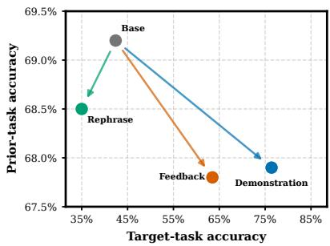
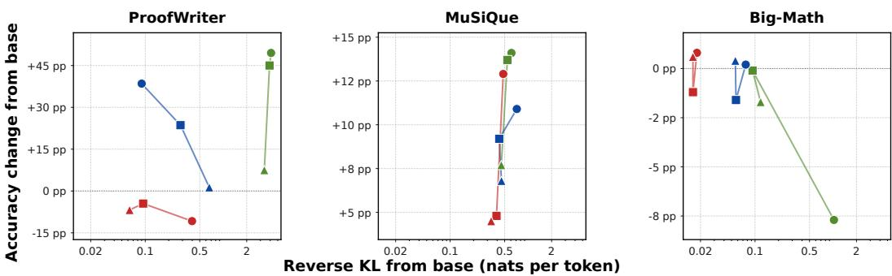
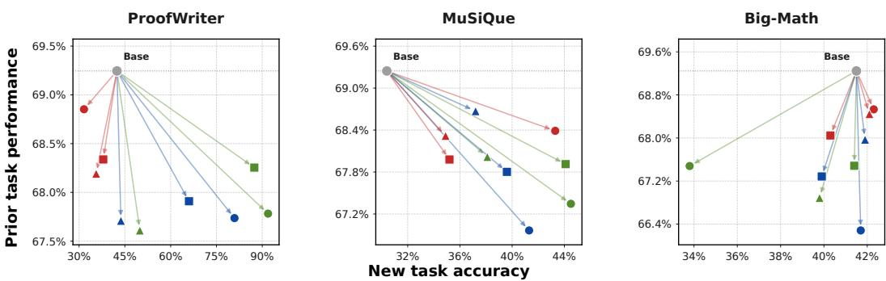
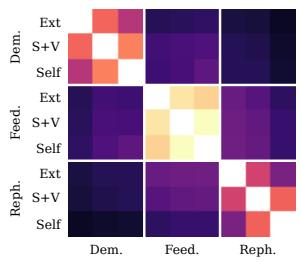
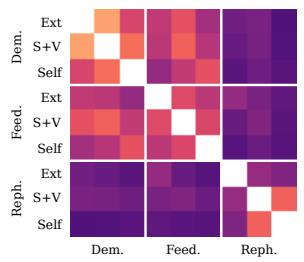
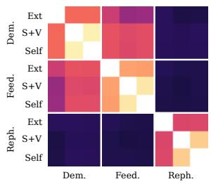

# Privileged Context as Drift in On-Policy Self-Distillation

Ravenor Davion∗ Stanford University rdavion@stanford.edu

Nick Rui∗ Stanford University nickrui@stanford.edu

## Abstract

On-policy self-distillation (OPSD) trains a language model to match a copy of itself conditioned on privileged context. Existing work varies what privileged context contains and how it is produced while also changing models, data, and training setups, making the effects of privileged context design difficult to isolate. Motivated by efforts in continual learning to reduce catastrophic forgetting, we study how the choice of privileged context affects policy drift. Specifically, we vary two axes: content (a demonstration, feedback, or rephrase) and source (external, selfgenerated with a verifier, or self-generated without a verifier). We train Qwen2.5-7B with OPSD across these nine combinations and three datasets, measuring target-task accuracy, prior-task retention, reverse KL from the base policy, and parameterupdate geometry. Holding source fixed, changing content spans a wider median KL range than holding content fixed and changing source. The ratio between these ranges is 5.1× for per-token KL and 2.2× for per-sequence KL. Parameterupdate geometry shows the same pattern: updates from adapters that share content are more closely aligned (mean cosine 0.571) than updates from adapters that share source (0.255). For continual learning, these findings suggest that privileged context should be treated as part of OPSD’s stability design because it is associated with how far and in what direction the policy moves.

## 1 Introduction

Recent frontier post-training pipelines increasingly separate capability acquisition from capability integration. Rather than jointly optimizing a single model across all target domains, these pipelines first train specialized policies using reinforcement learning and then consolidate their improvements into a unified model using on-policy distillation (OPD) [DeepSeek-AI, 2026, LLM-Core Xiaomi, 2026, NVIDIA, 2026, Ma et al., 2026]. This strategy addresses a central difficulty in large-scale posttraining: optimizing a model for one domain can degrade capabilities acquired in others. Consequently, methods that can transfer improvements from specialized policies while limiting forgetting are becoming an increasingly important component of frontier model training.

  
Figure 1: Privileged context content choices are associated with different target-task and prior-task outcomes. Points average over the three source conditions on ProofWriter; source-specific results appear in Figure 3.

These methods enable continual learning, where a model acquires new capabilities while preserving existing ones. Shenfeld et al. [2025] show that policy drift, measured by KL divergence from the base policy, is strongly predictive of degradation in previously acquired capabilities, a phenomenon commonly referred to as catastrophic forgetting. Controlling unnecessary drift during post-training is therefore an essential objective for continual learning.

Recent work has proposed on-policy self-distillation (OPSD) as an approach to mitigating catastrophic forgetting [Shenfeld et al., 2026]. OPSD is designed to limit policy drift for two reasons. First, the teacher remains at the student’s initialization and is conditioned on additional privileged context [Vapnik and Vashist, 2009, Lopez-Paz et al., 2016]. The initialized teacher anchors training targets to the base policy, while privileged context supplies the initial teacher–student disagreement. Second, OPSD is on-policy: training prefixes are sampled from the student, so teacher targets are evaluated on states that the student visits. This reduces the train–deployment state-distribution mismatch that can arise when training exclusively on fixed or teacher-generated sequences [Ross et al., 2011, Lin et al., 2020, Agarwal et al., 2024].

This stability motivation makes privileged context a central design variable, as it determines the teacher’s target distribution throughout training. We therefore study privileged context as drift, asking:

## How do the content and source of privileged context affect policy drift in OPSD?

Existing OPSD methods use a wide range of content as privileged context, including worked solutions [Ichihara et al., 2026, Jiang et al., 2026, Xiang et al., 2026, Jin et al., 2026], consensus answers [Gkountouras et al., 2026, Li et al., 2026b, Guo et al., 2026], verifier-accepted peer rollouts [Shen et al., 2026, Li et al., 2026c], execution traces [Li et al., 2026a, Liu et al., 2026], self-critiques [Zhang et al., 2026c], problem restatements [Qin et al., 2026, Zheng et al., 2026a, Lin et al., 2026], retrieved documents [Stein et al., 2026, Zheng et al., 2026b], rubrics [Rezaei et al., 2026, Gu et al., 2026], standing instructions [Sang et al., 2026, Fu et al., 2026, Dong et al., 2026], compressed privileged context [Zhang et al., 2026b], and learned soft tokens [Zhang et al., 2026a]. We focus on three representative forms: demonstrations, which provide an explicit solution to the query; feedback, which provides diagnostics on a previous attempt; and rephrases, which restate the query without providing an answer.

Privileged context also differs in its source. Some methods use privileged context generated by a larger or external model [Ichihara et al., 2026, Jiang et al., 2026, Qin et al., 2026], while others use privileged context generated by the student. Among self-generated privileged context artifacts, we distinguish between methods that use a correctness signal and those that do not. For example, some methods use a verifier to filter peer rollouts or trigger additional privileged context generation [Shen et al., 2026, Li et al., 2026a,c], whereas others generate privileged context without access to correctness feedback [Zhang et al., 2026c, Zheng et al., 2026a]. This distinction matters because access to correctness signals changes both the information available during training and the settings in which a method can be deployed. We therefore study source independently of content, considering three sources: an external source (a larger model), the student with verifier-based filtering, and the student without a verifier.

To disentangle these effects, we evaluate a full 3 × 3 content-by-source grid on three domains of tasks. We measure drift using per-token KL divergence from the base policy, cosine similarity between parameter updates, and changes in accuracy on prior-task benchmarks.

## 2 Approach

We isolate the effect of privileged context by crossing the three content types with the three sources while holding base model, OPSD objective, optimization budget, and evaluation procedure fixed. The result is nine conditions per dataset and 27 total trained adapters.

## 2.1 Privileged Context Matrix

Table 1 summarizes the repository implementation of every cell. External privileged context artifacts are generated by Qwen3.6-27B [Qwen Team, 2026]; both self-generated columns use a frozen Qwen2.5-7B-Instruct [Qwen Team, 2024]. Gold answers are never included in a model prompt. They are used only by the deterministic verifier in the External and Self + Verifier columns. The Self (no verifier) source uses a majority-vote-style plurality over sampled answers, with model agreement in place of labels.

<table><tr><td>Content</td><td>External</td><td>Self + Verifier</td><td>Self (no verifier)</td></tr><tr><td>Demonstration</td><td>Generate one Qwen3.6 worked solution; retain the query only when its extracted answer verifies.</td><td>Sample eight frozen-Qwen2.5 solutions; among verifier-correct candidates, select the one with the highest mean token log-probability.</td><td>Sample eight solutions, cluster their extracted answers, and select the highest-confidence solution in the plurality cluster.</td></tr><tr><td>Feedback</td><td>Critique one fixed Qwen2.5 attempt with Qwen3.6, apply the critique with frozen Qwen2.5, and retain it only when the correction verifies.</td><td>the fixed attempt, apply each, solution, sample eight and select the critique producing the highest-confidence verifier-correct correction.</td><td>Sample eight self-critiques of Build a label-free consensus critiques conditioned on it, apply each, and select by plurality agreement among the resulting corrections.</td></tr><tr><td>Rephrase</td><td>Generate one Qwen3.6 answer-preserving restatement and retain it only when frozen Qwen2.5 answers it correctly.</td><td>Sample eight self-restatements, answer each with frozen Qwen2.5, and select the restatement producing the highest-confidence verifier-correct answer.</td><td>Sample and answer eight self-restatements, cluster the downstream answers, and select the highest-confidence restatement in the plurality cluster.</td></tr></table>

Table 1: The 3 × 3 privileged context matrix. All artifacts are generated and selected offline before training. During OPSD, the student always receives the original query; only the frozen teacher receives the selected demonstration, attempt and feedback, or rephrased query.

<table><tr><td>Dataset</td><td>Train</td><td>Dev.</td><td>Test</td></tr><tr><td>ProofWriter OWA D5, depths 4–5</td><td>3,200</td><td>200</td><td>1,000</td></tr><tr><td>MuSiQue answerable</td><td>3,200</td><td>200</td><td>1,000</td></tr><tr><td>Big-Math, hard subsets</td><td>3,200</td><td>200</td><td>1,000</td></tr></table>

Table 2: Frozen dataset split sizes.

Empty, truncated, unparseable, or verifier-rejected artifacts are rejected for that condition, and the query is replaced from its registered reserve. Appendix B gives all nine privileged context artifacts for one query, and Appendix A gives the prompt and sampling details.

## 2.2 Datasets

We use ProofWriter OWA D5 at proof depths 4–5 [Tafjord et al., 2021], answerable MuSiQue with three- and four-hop primary questions and a two-hop reserve used only for replacements [Trivedi et al., 2022], and hard Big-Math subsets [Albalak et al., 2025]. Big-Math uses a native held-out test set matched to the training set’s joint source and solve-rate profile (realized mean solve rate 0.267 versus 0.270 in training).

Within each dataset, we audit candidates in one seed-0 primary-then-reserve order under all nine cells and form a 3,200-query master set by descending number of cells in which privileged context construction succeeds. Each condition keeps its accepted master queries and then, in the same order, tops up from accepted candidates outside the master until it reaches 3,200. Table 2 reports the split sizes. Task verifiers are exact-label match for ProofWriter, symbolic equivalence through math-verify [Kydlícek, 2025] for Big-Math, and normalized exact match against answer aliasesˇ for MuSiQue.

## 2.3 Training

We apply OPSD to Qwen2.5-7B-Instruct for each dataset and configuration, updating only a student LoRA adapter while keeping the teacher frozen. Let $x _ { i }$ be a query, $c _ { i }$ its fixed privileged context, and

$y _ { i } \sim \pi _ { \boldsymbol \theta _ { s } } ( \cdot \vert x _ { i } )$ a fresh rollout from the current pre-update student. The frozen teacher and trainable student score the same rollout prefix, $q _ { t } ^ { i } ( \cdot ) = \pi _ { \theta _ { 0 } } ^ { \setminus } ( \cdot \mid \stackrel { \cdot } { x } _ { i } , c _ { i } , y _ { i } ^ { < t } )$ and $p _ { \theta , t } ^ { i } ( \cdot ) = \pi _ { \theta } ( \cdot \mid x _ { i } , y _ { i } ^ { < t } )$ . For a batch B, we minimize the token-normalized full-vocabulary forward KL

$$
\widehat { \mathcal { L } } ( \theta ) = \frac { 1 } { \sum _ { i \in \mathcal { B } } T _ { i } } \sum _ { i \in \mathcal { B } } \sum _ { t = 1 } ^ { T _ { i } } \mathrm { K L } \big ( q _ { t } ^ { i } \big \| p _ { \theta , t } ^ { i } \big ) = \frac { 1 } { \sum _ { i \in \mathcal { B } } T _ { i } } \sum _ { i \in \mathcal { B } } \sum _ { t = 1 } ^ { T _ { i } } \sum _ { v \in \mathcal { V } } q _ { t } ^ { i } ( v ) \log \frac { q _ { t } ^ { i } ( v ) } { p _ { \theta , t } ^ { i } ( v ) } .\tag{1}
$$

Only the student LoRA parameters are updated; the same-weight teacher remains at $\theta _ { 0 }$ and is detached. Every run uses Qwen2.5-7B-Instruct with LoRA [Hu et al., 2022] of rank $1 6 , \alpha = 3 2 .$ and zero dropout on the $\mathsf { q } , \mathsf { k } , \mathsf { v } , \mathsf { o } ,$ gate, up, and down projections. We train for 861 constant-rate AdamW steps (learning rate $1 0 ^ { - 5 }$ , weight decay 0.01, effective batch size 16, microbatch size 1, gradient clipping 1.0, BF16, and non-reentrant gradient checkpointing), yielding 13,776 fresh rollout exposures over 3,200 unique queries. The final step-861 checkpoint is fixed before test evaluation.

## 2.4 Evaluation

We evaluate target-task accuracy, prior-task retention, distributional drift, and LoRA weight geometry.

Task retention. Each adapter and the base model are evaluated with the Language Model Evaluation Harness [Gao et al., 2024] on MMLU, HellaSwag, TruthfulQA-mc2, IFEval, and HumanEval [Hendrycks et al., 2021, Zellers et al., 2019, Lin et al., 2022, Zhou et al., 2023, Chen et al., 2021]. For benchmark b, we compute $\Delta _ { b } = \mathrm { A c c } _ { \mathrm { t r a i n e d } , b } - \mathrm { A c c } _ { \mathrm { b a s e } , b }$ on the same items, then report the unweighted mean of the five $\Delta _ { b }$ values. Negative change is forgetting. Per-item outcomes are paired when constructing intervals.

KL divergence. For every held-out prompt, we greedily decode both the trained and base models and teacher-force both policies on each saved response. The primary drift measure is the fullvocabulary reverse KL along the trained trajectory,

$$
D _ { \mathrm { r e v } } = \sum _ { t } \mathrm { K L } \big ( \pi _ { \mathrm { t r } } ( \cdot \mid x , y _ { \mathrm { t r } } ^ { < t } ) \big | \big | \pi _ { \mathrm { b } } ( \cdot \mid x , y _ { \mathrm { t r } } ^ { < t } ) \big ) ,\tag{2}
$$

averaged across prompts in nats per sequence and, separately, after within-prompt normalization in nats per token. This pairing of reverse KL with trained-model prefixes follows the sequence-level decomposition in prior work [Wen et al., 2023, Zhao et al., 2026]. As a secondary response-length diagnostic, Appendix D reports the two-sample Kolmogorov–Smirnov statistic between trained and base response lengths [Rabanser et al., 2019].

Weight geometry. For every adapted module, the LoRA update is $\Delta W = ( \alpha / r ) B A$ . We report the global Frobenius norm $\begin{array} { r } { \| \Delta W \| _ { F } = ( \sum _ { m } \| \Delta W _ { m } \| _ { F } ^ { 2 } ) ^ { 1 / 2 } } \end{array}$ , the mean effective rank $\exp ( H ( p ) )$ with $\begin{array} { r } { p _ { k } \stackrel { - } { = } \sigma _ { k } ^ { 2 } / \sum _ { j } \sigma _ { j } ^ { 2 } } \end{array}$ , and the Frobenius cosine between the vectorized updates of each condition pair. These measure update magnitude, spectral concentration, and direction, respectively [Ilharco et al., 2023, Nagarajan and Kolter, 2019, Roy and Vetterli, 2007].

Accuracy. Target-task accuracy uses greedy decoding on each frozen 1,000-example test set and the dataset-specific verifier above. For every condition, we report base accuracy, trained accuracy, their paired difference, and a 95% paired-bootstrap interval with 10,000 resamples. These intervals quantify test-item uncertainty; the experiment uses one training seed per condition.

## 3 Results

## 3.1 Base-Relative Comparisons

Across all adapters, content choices span a wider range of distributional drift from the base policy than source choices. Target-task accuracy and prior-task retention do not follow the same ordering.

Accuracy Gain vs. Policy Drift Across Datasets  
  
Demonstration Feedback Rephrase External Self + Verifier Self (no verifier)

Figure 2: Target-task accuracy change and per-token distributional drift by privileged context condition. Held-out accuracy change is plotted against trained-to-base reverse KL per token for one adapter per condition. Each adapter uses one training seed. Color denotes content, marker denotes source, and conditions with the same content are joined. The horizontal axis is logarithmic and shared. Vertical scales differ. Accuracy uses greedy decoding on 1,000 examples per dataset. Per-condition values and paired bootstrap intervals are in Appendix Table 5.

Figure 2 plots target-task accuracy change against $D _ { \mathrm { r e v } }$ per token. Holding source fixed, the median largest-to-smallest KL ratio across content choices is 7.2 over the nine dataset–source groups. Holding content fixed, the corresponding ratio across source choices is 1.4 over the nine dataset–content groups. Under per-sequence KL, the corresponding median ratios are 2.80 across content and 1.25 across source. Thus, changing content spans a wider median KL range under both summaries, although the ratio between the content and source comparisons is 5.1 per token and 2.2 per sequence. These comparisons describe the selected levels of each axis rather than general effect sizes, and one fixed-content group has an 11.1-fold per-token range across sources. Appendix D reports the underlying per-condition measurements.

Per-token KL ranges from 0.02 nats for Big-Math rephrases to 4.10 nats for ProofWriter demonstrations. Demonstration and feedback conditions have positive target-task accuracy point estimates for every source on ProofWriter and MuSiQue, with a maximum gain of 49.5 points over the ProofWriter base accuracy of 42.4%. Rephrase conditions have positive point estimates on MuSiQue and negative point estimates on ProofWriter. On Big-Math, eight of nine target-task accuracy intervals include zero, and the External-demonstration condition decreases accuracy by 7.7 points. Larger KL from the base is therefore not consistently associated with higher target-task accuracy.

Within most dataset–content groups, source choices span a narrower KL range, although target-task accuracy can still differ. The ordering External ≥ Self + Verifier ≥ Self is fully monotonic for per-token KL in five of the nine dataset–content groups, has one pairwise inversion or tie in three, and fully reverses in one. Target-task accuracy does not follow this ordering. ProofWriter demonstrations, for example, span 42.0 accuracy points across sources despite lying within a 1.22-fold per-token KL range.

Per-token and per-sequence KL also rank conditions differently. Their Spearman correlation is −0.148 across adapters, while mean response length ranges from 5 to 622 tokens. ProofWriter demonstrations have the largest per-token KL in the study, 4.10 nats, but one of the smallest per-sequence values, 20.6 nats over a 5-token response. A Big-Math demonstration condition has 0.09 nats per token but accumulates 40.4 nats over a 553-token response. Per-token KL measures mean local divergence along the trained response, whereas per-sequence KL measures accumulated divergence over the response. Because response length varies substantially across conditions, we report both summaries and do not treat either as invariant to response length.

Across all conditions, target-task accuracy changes by as much as 49.5 points, whereas mean priortask accuracy changes by at most 3.0 points (Figure 3). Most conditions show a decrease in prior-task accuracy with a paired evaluation-item bootstrap interval that excludes zero. The largest benchmark level decreases occur on IFEval and HumanEval, at 8.3 and 6.1 points, respectively, while MMLU changes by no more than 0.21 points across conditions. Because each condition uses one training seed, these intervals quantify only evaluation-item uncertainty. Appendix C reports the conditionand benchmark-level changes.

Performance vs. Forgetting Across Datasets  
  
Demonstration Feedback Rephrase External Self + Verifier Self (no verifier)  
Figure 3: Target-task and prior-task accuracy by dataset and privileged context condition. Each arrow starts at the base Qwen2.5-7B model (gray circle) and ends at one adapter. Each adapter uses one training seed. The horizontal axis shows absolute held-out target-task accuracy. The vertical axis shows the unweighted mean of absolute accuracy over five prior-task benchmarks (25,606 items). Color denotes content and marker denotes source. Both axes are scaled separately in each panel to make within-dataset differences visible. Paired evaluation-item bootstrap intervals for prior-task accuracy changes are reported in Appendix Table 3; benchmark-level changes are in Appendix Table 4.

Figure 1 shows source-averaged ProofWriter outcomes as a compact illustration. These averages mask substantial variation within content: demonstration accuracy spans 42.0 points across sources. We therefore do not interpret the separation among source-averaged conditions as an isolated content effect; the source-specific results in Figure 3 form the basis of the held-fixed comparisons.

Task retention does not follow the content–source pattern observed for per-token KL. Most paired source contrasts in prior-task accuracy have intervals that include zero. Among the remaining contrasts, four oppose the KL-derived ordering and one follows it. Across adapters, per-token KL has Spearman correlation −0.188 with prior-task accuracy change, and target-task accuracy change has correlation −0.053 with prior-task accuracy change. The largest observed association is between per-sequence KL and prior-task accuracy change, with correlation −0.480.

## 3.2 Pairwise Adapter Comparisons

Holding source fixed and changing content gives a mean update cosine of 0.255 (Figure 4). Holding content fixed and changing source gives a mean cosine of 0.571. For reference, updates trained on different datasets have mean cosine 0.034 over 243 pairs. Within a dataset, adapters trained with the same content and different sources therefore have more closely aligned update directions than adapters trained with the same source and different content.

The two self-generated sources are the most closely aligned source pair in seven of the nine dataset– content groups. Their mean cosine is 0.662, compared with 0.563 for External versus Self + Verifier and 0.488 for External versus Self. Self + Verifier is closer to External than Self is in eight groups and closer to Self than External is in seven. These comparisons often place Self + Verifier between the other source conditions, but they do not establish that the three sources lie on a single trajectory.

  
(a) ProofWriter

  
(b) MuSiQue

  
(c) Big-Math  
Figure 4: Pairwise LoRA-update cosine similarity by dataset and privileged context condition. Each panel shows Frobenius cosine between the LoRA deltas of the nine single-seed adapters trained on one dataset, ordered by content and then source.

## 4 Discussion

## 4.1 Analysis

The base-relative and pairwise comparisons measure different properties, yet both distinguish content from source in the same way. With source fixed, changing content gives median largest-to-smallest KL ratios of 7.2 per token and 2.80 per sequence, along with a mean parameter-update cosine of 0.255. With content fixed, changing source gives corresponding median KL ratios of 1.4 and 1.25 and a mean cosine of 0.571. Content choices are therefore associated with larger differences in drif magnitude under both KL summaries and with larger differences in update direction within this grid, although the size of the KL contrast depends on aggregation.

Adapter geometry remains associated with source after distillation. External and Self + Verifier both use verifier-based selection, yet Self + Verifier is closer to Self in seven of nine dataset–content groups and closer to External than Self is in eight. This pattern is compatible with generatorspecific properties persisting after distillation and with prior evidence that distillation transfers teacher mechanisms incompletely [Wu et al., 2024], although that work studies teacher mechanisms rather than generators of privileged context. However, the External condition also changes model identity, capacity, prompting, temperature, and selection procedure, so the experiment cannot isolate that explanation or place the three sources on a single trajectory.

Target-task accuracy and task retention do not follow the same content–source contrast. ProofWriter demonstrations span 42.0 target-task accuracy points across sources within a 1.22-fold per-token KL range, while most Big-Math conditions change the output distribution without a detectable accuracy gain. The weak rank correlations among per-token KL, target-task accuracy change, and prior-task accuracy change likewise do not support treating any one measure as a proxy for the others. The three measurements describe acquisition, distributional drift, and retention separately.

Several limits bound this interpretation. The content and source levels differ in kind, so the held-fixed KL comparisons depend on the selected levels, and their magnitude depends on whether divergence is aggregated per token or per sequence. Because response length varies with content type, neither summary is length-invariant, and part of the content-associated KL range may reflect response length rather than per-step distributional change. All 27 adapters share one base model, LoRA rank, training budget, and seed; evaluation-item bootstrap intervals do not measure training variance, so smaller contrasts may not replicate across seeds, and repeating the grid over multiple seeds is needed to confirm them. ProofWriter and MuSiQue use overlapping but non-identical training-query sets across conditions, whereas Big-Math uses a shared set. The KL estimates follow greedy trajectories. Finally, the External source confounds authorship with model identity and capacity, so source differences cannot be attributed to generator capacity or verification individually, and the grid excludes other forms of privileged context such as retrieved documents, rubrics, and standing instructions.

## 4.2 Implications for Continual Learning

For continual post-training, privileged context is part of the stability design. The same-model teacher anchors the training target to the initialized policy, and on-policy rollouts obtain teacher targets on prefixes sampled from the student. The use of model outputs as stability targets parallels Learning without Forgetting, which distills the previous model on new-task inputs while fitting the new task [Li and Hoiem, 2016]. OPSD differs by conditioning its teacher on privileged context and evaluating the teacher on student rollouts. Neither property fixes the teacher’s conditional distribution, which is determined by privileged context. The resulting adapters can therefore drift by different amounts and in different directions even when the model, objective, optimization budget, and on-policy sampling procedure are held fixed.

This distinction matters when OPSD is used to integrate specialized capabilities. A condition can produce a large target-task gain with limited prior-task change, or alter the output distribution without improving the target task. Selecting privileged context only by target-task accuracy can therefore obscure differences in retention and distributional drift. Evaluating acquisition, retention, and drift separately gives a more complete account of whether an OPSD update adds a capability while limiting movement from the base policy.

## 5 Conclusion

We study how the content and source of privileged context affect OPSD outcomes while holding the model, training objective, optimization budget, and evaluation procedure fixed. Across three datasets, changing content is associated with larger differences in drift from the base policy and in parameter-update direction than changing source. Source differences are smaller but not absent: adapters trained under the two self-generated conditions generally have more closely aligned updates with each other than with the External condition. These patterns agree across base-relative and pairwise comparisons, but they do not identify a universally preferable content or source. Target-task acquisition, prior-task retention, and distributional drift often rank the same conditions differently.

Taken together, these findings motivate treating privileged context as part of the stability design of OPSD. Same-model distillation and on-policy sampling constrain the training setup, but they do not determine how far or in what direction the student moves. OPSD systems intended for continual learning should therefore evaluate acquisition, retention, and drift separately rather than select privileged context using target-task accuracy alone.

It remains open which properties of privileged context generators account for the source-associated differences observed here. More granular, controlled comparisons that separate authorship, model capacity, prompting, and verifier-based selection could help identify their respective contributions.

## References

Rishabh Agarwal, Nino Vieillard, Yongchao Zhou, Piotr Stanczyk, Sabela Ramos, Matthieu Geist, and Olivier Bachem. On-policy distillation of language models: Learning from self-generated mistakes. In International Conference on Learning Representations (ICLR), 2024.

Alon Albalak, Duy Phung, Nathan Lile, Rafael Rafailov, Kanishk Gandhi, Louis Castricato, Anikait Singh, Chase Blagden, Violet Xiang, Dakota Mahan, and Nick Haber. Big-Math: A largescale, high-quality math dataset for reinforcement learning in language models. arXiv preprint arXiv:2502.17387, 2025.

Mark Chen, Jerry Tworek, Heewoo Jun, Qiming Yuan, Henrique Ponde de Oliveira Pinto, Jared Kaplan, Harri Edwards, Yuri Burda, Nicholas Joseph, Greg Brockman, Alex Ray, Raul Puri, Gretchen Krueger, Michael Petrov, Heidy Khlaaf, Girish Sastry, Pamela Mishkin, Brooke Chan, Scott Gray, Nick Ryder, Mikhail Pavlov, Alethea Power, Lukasz Kaiser, Mohammad Bavarian, Clemens Winter, Philippe Tillet, Felipe Petroski Such, Dave Cummings, Matthias Plappert, Fotios Chantzis, Elizabeth Barnes, Ariel Herbert-Voss, William Hebgen Guss, Alex Nichol, Alex Paino, Nikolas Tezak, Jie Tang, Igor Babuschkin, Suchir Balaji, Shantanu Jain, William Saunders, Christopher Hesse, Andrew N. Carr, Jan Leike, Josh Achiam, Vedant Misra, Evan Morikawa, Alec Radford, Matthew Knight, Miles Brundage, Mira Murati, Katie Mayer, Peter Welinder, Bob

McGrew, Dario Amodei, Sam McCandlish, Ilya Sutskever, and Wojciech Zaremba. Evaluating large language models trained on code. arXiv preprint arXiv:2107.03374, 2021.

DeepSeek-AI. DeepSeek-V4: Towards highly efficient million-token context intelligence. arXiv preprint arXiv:2606.19348, 2026.

Leichao Dong, Dongxu Zhang, Yiding Sun, Qirui Wang, Yuhan Wang, Lin Chen, and Jihua Zhu. Better starts, better ends: Bootstrapped iterative self-reasoning distillation for compressed reasoning. arXiv preprint arXiv:2607.15736, 2026.

Yu Fu, Longxuan Yu, Haz Sameen Shahgir, Zhipeng Wei, Hui Liu, N. Benjamin Erichson, and Yue Dong. Reducing the safety tax in LLM safety alignment with on-policy self-distillation. arXiv preprint arXiv:2605.15239, 2026.

Leo Gao, Jonathan Tow, Baber Abbasi, Stella Biderman, Sid Black, Anthony DiPofi, Charles Foster, Laurence Golding, Jeffrey Hsu, Alain Le Noac’h, Haonan Li, Kyle McDonell, Niklas Muennighoff, Chris Ociepa, Jason Phang, Laria Reynolds, Hailey Schoelkopf, Aviya Skowron, Lintang Sutawika, Eric Tang, Anish Thite, Ben Wang, Kevin Wang, and Andy Zou. The language model evaluation harness, July 2024. URL https://zenodo.org/records/12608602.

John Gkountouras, Josip Jukic, and Ivan Titov. Consensus as privileged context for label-free ´ self-distillation. arXiv preprint arXiv:2607.13643, 2026.

Siyi Gu, Jialin Chen, Sophia Zhou, Arman Cohan, and Rex Ying. Rethinking reward supervision: Rubric-conditioned self-distillation. arXiv preprint arXiv:2606.19327, 2026.

Jiaxin Guo, Yanwei Yue, Xuanbo Fan, Chunyu Yang, and Yan Zhang. Learning from consensus and disagreement: Unsupervised on-policy self-distillation with minority-trajectory contrast. arXiv preprint arXiv:2608.08764, 2026.

Dan Hendrycks, Collin Burns, Steven Basart, Andy Zou, Mantas Mazeika, Dawn Song, and Jacob Steinhardt. Measuring massive multitask language understanding. In International Conference on Learning Representations (ICLR), 2021.

Edward J. Hu, Yelong Shen, Phillip Wallis, Zeyuan Allen-Zhu, Yuanzhi Li, Shean Wang, Lu Wang, and Weizhu Chen. LoRA: Low-rank adaptation of large language models. In International Conference on Learning Representations (ICLR), 2022.

Yuki Ichihara, Naoto Iwase, Mohammad Atif Quamar, and Junpei Komiyama. Privileged solutions or context-induced teacher behavior? dissecting on-policy self-distillation. arXiv preprint arXiv:2608.09228, 2026.

Gabriel Ilharco, Marco Tulio Ribeiro, Mitchell Wortsman, Suchin Gururangan, Ludwig Schmidt, Hannaneh Hajishirzi, and Ali Farhadi. Editing models with task arithmetic. In International Conference on Learning Representations (ICLR), 2023.

Yubo Jiang, Fengying Xie, Zhiguo Jiang, and Haopeng Zhang. Distill skills into weights, not prompts: Abstract skills as privileged signals for on-policy self-distillation. arXiv preprint arXiv:2608.09826, 2026.

Yiqiao Jin, Yiyang Wang, Lucheng Fu, Yijia Xiao, Yinyi Luo, Haoxin Liu, B. Aditya Prakash, Josiah Hester, Jindong Wang, and Srijan Kumar. UniSD: Towards a unified self-distillation framework for large language models. arXiv preprint arXiv:2605.06597, 2026.

Hynek Kydlícek. Math-Verify: Math verification library.ˇ https://github.com/huggingface/ Math-Verify, 2025.

Yang Li, Erik Nijkamp, Semih Yavuz, and Shafiq Joty. Learning from language feedback via variational policy distillation. arXiv preprint arXiv:2605.15113, 2026a.

Yijiang Li, Bingyang Wang, Yijun Liang, Yunjie Tian, Di Fu, and Nuno Vasconcelos. On-policy self-distillation without any supervision. arXiv preprint arXiv:2608.06296, 2026b.

Yu Li, Shu Hong, and Tian Lan. Localizing credit at the divergence: Path-conditioned self-distillation for LLM reasoning. arXiv preprint arXiv:2606.15576, 2026c.

Zhizhong Li and Derek Hoiem. Learning without forgetting. In Computer Vision – ECCV 2016, volume 9908 of Lecture Notes in Computer Science, pages 614–629. Springer, 2016. doi: 10.1007/ 978-3-319-46493-0\_37.

Alexander Lin, Jeremy Wohlwend, Howard Chen, and Tao Lei. Autoregressive knowledge distillation through imitation learning. In Proceedings of the 2020 Conference on Empirical Methods in Natural Language Processing (EMNLP), 2020.

Stephanie Lin, Jacob Hilton, and Owain Evans. TruthfulQA: Measuring how models mimic human falsehoods. In Proceedings of the 60th Annual Meeting of the Association for Computational Linguistics (ACL), 2022.

Zizhuo Lin, Quanling Liu, Jinsheng Quan, Chao Zhang, Yifan Zhu, Xing Shi, Jingtao Xu, Zhihui Li, and Yawei Luo. Same evidence, different answers: Canonical-context on-policy distillation for multi-turn language models. arXiv preprint arXiv:2605.30251, 2026.

Haoran Liu, Yuwei Zhang, Xiyao Li, Bohan Lyu, and Jingbo Shang. HERO: Hindsightenhanced reflection from environment observations for agentic self-distillation. arXiv preprint arXiv:2606.11559, 2026.

LLM-Core Xiaomi. MiMo-V2-Flash technical report. arXiv preprint arXiv:2601.02780, 2026.

David Lopez-Paz, Léon Bottou, Bernhard Schölkopf, and Vladimir Vapnik. Unifying distillation and privileged information. In International Conference on Learning Representations (ICLR), 2016.

Wenhan Ma, Jianyu Wei, Liang Zhao, Hailin Zhang, Bangjun Xiao, Lei Li, Qibin Yang, Bofei Gao, Yudong Wang, Rang Li, Jinhao Dong, Zhifang Sui, and Fuli Luo. MOPD: Multi-teacher on-policy distillation for capability integration in LLM post-training. arXiv preprint arXiv:2606.30406, 2026.

Vaishnavh Nagarajan and J. Zico Kolter. Generalization in deep networks: The role of distance from initialization. arXiv preprint arXiv:1901.01672, 2019.

NVIDIA. Nemotron 3 Ultra: Open, efficient mixture-of-experts hybrid mamba-transformer model for agentic reasoning. arXiv preprint arXiv:2606.15007, 2026.

Ruiyang Qin, Qingzhuo Wang, Dongrui Liu, Qiang Li, Zhihua Wei, and Wen Shen. Multilingual safety alignment via self-distillation. arXiv preprint arXiv:2605.02971, 2026.

Qwen Team. Qwen2.5 technical report. arXiv preprint arXiv:2412.15115, 2024.

Qwen Team. Qwen3.6-27B: Flagship-level coding in a 27B dense model. https://qwen.ai/ blog?id=qwen3.6-27b, April 2026.

Stephan Rabanser, Stephan Günnemann, and Zachary C. Lipton. Failing loudly: An empirical study of methods for detecting dataset shift. In Advances in Neural Information Processing Systems (NeurIPS), 2019.

MohammadHossein Rezaei, Anas Mahmoud, Zihao Wang, Utkarsh Tyagi, Advait Gosai, Razvan-Gabriel Dumitru, Aakash Sabharwal, Bing Liu, and Yunzhong He. Rubric-guided self-distillation: Post-training without rubric verifiers. arXiv preprint arXiv:2606.12507, 2026.

Stephane Ross, Geoffrey J. Gordon, and J. Andrew Bagnell. A reduction of imitation learning and structured prediction to no-regret online learning. In Proceedings of the 14th International Conference on Artificial Intelligence and Statistics (AISTATS), 2011.

Olivier Roy and Martin Vetterli. The effective rank: A measure of effective dimensionality. In Proceedings of the 15th European Signal Processing Conference (EUSIPCO), pages 606–610, 2007.

Hejian Sang, Yuanda Xu, Zhengze Zhou, Ran He, Zhipeng Wang, and Jiachen Sun. CRISP: Compressed reasoning via iterative self-policy distillation. arXiv preprint arXiv:2603.05433, 2026.

Guobin Shen, Xiang Cheng, Chenxiao Zhao, Lei Huang, Jindong Li, Dongcheng Zhao, and Xing Yu. Anti-self-distillation for reasoning RL via pointwise mutual information. arXiv preprint arXiv:2605.11609, 2026.

Idan Shenfeld, Jyothish Pari, and Pulkit Agrawal. RL’s razor: Why online reinforcement learning forgets less. arXiv preprint arXiv:2509.04259, 2025.

Idan Shenfeld, Mehul Damani, Jonas Hübotter, and Pulkit Agrawal. Self-distillation enables continual learning. arXiv preprint arXiv:2601.19897, 2026.

Alex Stein, Furong Huang, and Tom Goldstein. GATES: Self-distillation under privileged context with consensus gating. arXiv preprint arXiv:2602.20574, 2026.

Oyvind Tafjord, Bhavana Dalvi, and Peter Clark. ProofWriter: Generating implications, proofs, and abductive statements over natural language. In Findings of the Association for Computational Linguistics (ACL-IJCNLP), 2021.

Harsh Trivedi, Niranjan Balasubramanian, Tushar Khot, and Ashish Sabharwal. MuSiQue: Multihop questions via single-hop question composition. Transactions of the Association for Computational Linguistics (TACL), 10:539–554, 2022.

Vladimir Vapnik and Akshay Vashist. A new learning paradigm: Learning using privileged information. Neural Networks, 22(5–6):544–557, 2009.

Yuqiao Wen, Zichao Li, Wenyu Du, and Lili Mou. f-divergence minimization for sequence-level knowledge distillation. In Proceedings of the 61st Annual Meeting of the Association for Computational Linguistics (ACL), 2023.

Cindy Wu, Ekdeep Singh Lubana, Bruno Kacper Mlodozeniec, Robert Kirk, and David Krueger. What mechanisms does knowledge distillation distill? In Proceedings of UniReps: the First Workshop on Unifying Representations in Neural Models, volume 243 of Proceedings ofMachine Learning Research, pages 60–75, 2024.

Shizhe Xiang, Ke An, Wenlong Yu, Yue Liu, Jian Luan, Pei Fu, and Qilong Wang. Teaching the way, not the answer: Privileged tutoring distillation for multimodal policy optimization. arXiv preprint arXiv:2606.07000, 2026.

Rowan Zellers, Ari Holtzman, Yonatan Bisk, Ali Farhadi, and Yejin Choi. HellaSwag: Can a machine really finish your sentence? In Proceedings of the 57th Annual Meeting of the Association for Computational Linguistics (ACL), 2019.

Guibin Zhang, Jiayang Lyu, Ran Sun, Xinlei Yu, Haoyu Zhao, Qibing Ren, and Shuicheng Yan. Latent on-policy self-distillation. arXiv preprint arXiv:2608.13040, 2026a.

Xinsen Zhang, Zhenkai Ding, Tianjun Pan, Run Yang, Chun Kang, Xue Xiong, and Jingnan Gu. OPSDL: On-policy self-distillation for long-context language models. arXiv preprint arXiv:2604.17535, 2026b.

Yuwei Zhang, Sha Li, Changlong Yu, Qin Lu, Shuowei Jin, Chengyu Dong, Haoran Liu, Ilgee Hong, Xintong Li, Zhenyu Shi, Bing Yin, and Jingbo Shang. Learning with rare success but rich feedback via reflection-enhanced self-distillation. arXiv preprint arXiv:2605.12741, 2026c.

Anhao Zhao, Haoran Xin, Yingqi Fan, Junlong Tong, Wenjie Li, and Xiaoyu Shen. Decoupling KL and trajectories: A unified perspective for SFT, DAgger, offline RL, and OPD in LLM distillation. arXiv preprint arXiv:2605.16826, 2026.

Haoyu Zheng, Yun Zhu, Shu Yuan, Shangming Chen, Qing Wang, Wenqiao Zhang, Jun Xiao, and Yueting Zhuang. MAIGO: Mitigating lost-in-conversation with history-cleaned on-policy self-distillation. arXiv preprint arXiv:2605.27186, 2026a.

Ziyang Zheng, Zeju Li, Xiangyu Wen, Jianyuan Zhong, Junhua Huang, Lei Chen, Mingxuan Yuan, and Qiang Xu. Context distillation as latent memory management. arXiv preprint arXiv:2605.28889, 2026b.

Jeffrey Zhou, Tianjian Lu, Swaroop Mishra, Siddhartha Brahma, Sujoy Basu, Yi Luan, Denny Zhou, and Le Hou. Instruction-following evaluation for large language models. arXiv preprint arXiv:2311.07911, 2023.

## A Implementation Details

## A.1 Generation

Self-generation draws eight candidates at temperature 1.0 and top-p 0.95. The external model runs at temperature 0.7 with thinking mode disabled. Ties in any selection rule are broken by mean token log-probability. Any empty, unparseable, truncated, or verifier-rejected artifact is treated as rejected and the query is replaced from a prespecified reserve, so no condition trains on a failed artifact.

## A.2 Optimization

We use AdamW at a constant learning rate of $1 0 ^ { - 5 }$ , with weight decay 0.01, gradient clipping 1.0, effective batch size 16 with microbatch size 1, BF16, and non-reentrant gradient checkpointing. LoRA is applied to all attention and MLP projections at rank 16, α = 32, dropout 0. Each run draws a fresh on-policy rollout every time a query is selected, giving 13,776 rollout exposures over 861 optimizer steps. All runs use seed 0. Diagnostic checkpoints are written at steps 215, 431, 646, and 861; step 861 was fixed in advance as the reported checkpoint and no checkpoint is selected using test performance.

## A.3 Evaluation

Task accuracy is greedy decoding on the frozen 1,000-example test split, with the prespecified per-dataset verifier and identical response limits for base and trained models. Intervals are paired bootstrap over test examples with $\bar { B = 1 0 , 0 0 0 }$ resamples. Prior-task benchmarks are run at full size under the Language Model Evaluation Harness, at 14,042 items for MMLU, 10,042 for HellaSwag, 817 for TruthfulQA-mc2, 541 for IFEval, and 164 for HumanEval.

## B Privileged Context Examples

This is a quality-screened illustration, not a random sample. Among the 637 query identifiers present in all nine final ProofWriter condition datasets, we selected one with three verifier-correct demonstrations, a verifier-incorrect fixed attempt, and three self-contained rephrases whose selected downstream labels match the task label. All generated wording is reproduced verbatim, including Markdown markup. The feedback prompt requests a targeted critique rather than a replacement solution but does not prohibit an explicit answer label. Selection checks the downstream correction rather than each claim in the feedback; the Self feedback therefore retains its inconsistent final line.

## B.1 Query

Erin is kind. Erin is nice. Erin is quiet. Erin is round. Fiona is cold. Fiona is kind. Fiona is nice. Fiona is quiet. Gary is green. Harry is green. Harry is quiet. Harry is round. If Erin is cold then Erin is quiet. If someone is young and round then they are quiet. If someone is young and cold then they are kind. If someone is young and green then they are kind. If someone is green then they are young. All kind, cold people are quiet. Quiet people are nice. If someone is quiet then they are young. All kind, green people are cold.

Based on the information above, is the following statement True, False, or Unknown? Gary is not quiet.

## B.2 Demonstration, External

To determine whether the statement "Gary is not quiet" is True, False, or Unknown, we must deduce the properties of Gary based on the provided facts and rules.

\*\*1. Analyze the Facts regarding Gary:\*\* \* Fact: Gary is green. \*\*2. Analyze the Rules:\*\* \* Rule 1: If Erin is cold then Erin is quiet. \* Rule 2: If someone is young and round then they are quiet. \* Rule 3: If someone is young and cold then they are kind. \* Rule

4: If someone is young and green then they are kind. \* Rule 5: If   
someone is green then they are young. \* Rule 6: All kind, cold   
people are quiet. \* Rule 7: Quiet people are nice. \* Rule 8: If   
someone is quiet then they are young. \* Rule 9: All kind, green   
people are cold.   
\*\*3. Step-by-Step Deduction for Gary:\*\*   
\* \*\*Step 1:\*\* Determine if Gary is young. \* From Fact: Gary is   
green. \* From Rule 5: "If someone is green then they are young." \*   
Since Gary is green, \*\*Gary is young\*\*.   
\* \*\*Step 2:\*\* Determine if Gary is kind. \* From Step 1: Gary is   
young. \* From Fact: Gary is green. \* From Rule 4: "If someone is   
young and green then they are kind." \* Since Gary is young and green,   
\*\*Gary is kind\*\*.   
\* \*\*Step 3:\*\* Determine if Gary is cold. \* From Step 2: Gary is   
kind. \* From Fact: Gary is green. \* From Rule 9: "All kind,   
green people are cold." \* Since Gary is kind and green, \*\*Gary is   
cold\*\*.   
\* \*\*Step 4:\*\* Determine if Gary is quiet. \* From Step 3: Gary is   
cold. \* From Step 2: Gary is kind. \* From Rule 6: "All kind,   
cold people are quiet." \* Since Gary is kind and cold, \*\*Gary is   
quiet\*\*.   
\*Alternative path for Step 4:\* \* From Step 1: Gary is young. \* From   
Fact: Gary is green. \* Does Rule 2 apply? "If someone is young   
and round then they are quiet." We know Gary is young, but we do   
not know if Gary is round. So this rule doesn’t directly apply yet.   
\* However, the deduction in Step 4 using Rule 6 is sufficient and   
definitive. Gary is quiet.   
\*\*4. Evaluate the Query:\*\* \* The query asks: "Gary is not quiet." \*   
Our deduction shows: \*\*Gary is quiet.\*\* \* Therefore, the statement   
"Gary is not quiet" contradicts the deduced fact.   
\*\*Conclusion:\*\* The statement is False.   
Final answer: False

## B.3 Demonstration, Self + Verifier

To determine whether the statement "Gary is not quiet" is True, False, or Unknown, let’s analyze the given facts and rules step by step.

1. \*\*Facts and Rules\*\*: - Erin is kind. - Erin is nice. - Erin is quiet. - Erin is round. - Fiona is cold. - Fiona is kind. - Fiona is nice. - Fiona is quiet. - Gary is green. - Harry is green. - Harry is quiet. - Harry is round. - If Erin is cold then Erin is quiet. (Not relevant as Erin is not cold.) - If someone is young and round then they are quiet. - If someone is young and cold then they are kind. - If someone is young and green then they are kind. - If someone is green then they are young. - All kind, cold people are quiet. - Quiet people are nice. - If someone is quiet then they are young. - All kind, green people are cold.

2. \*\*Analyzing Gary\*\*: - Gary is green. - From the rule "If someone is green then they are young," we can infer that Gary is young. - From the rule "If someone is young and green then they are kind," since Gary is both young and green, Gary is kind. - From the rule "All kind, green people are cold," since Gary is kind and green, Gary is cold. - From the rule "If someone is young and cold then they are kind," we confirm that Gary is kind (already known). From the rule "All kind, cold people are quiet," since Gary is both kind and cold, Gary is quiet.

Since we can logically conclude from the given facts and rules that Gary is quiet, the statement "Gary is not quiet" is False.

## B.4 Demonstration, Self

To determine whether the statement "Gary is not quiet" is True, False, or Unknown, let’s analyze the given facts and rules step by step.

1. \*\*Facts and Rules\*\*: - Erin is kind. - Erin is nice. - Erin is quiet. - Erin is round. - Fiona is cold. - Fiona is kind. - Fiona is nice. - Fiona is quiet. - Gary is green. - Harry is green. - Harry is quiet. - Harry is round. - If Erin is cold then Erin is quiet. (Not relevant as Erin is not cold.) - If someone is young and round then they are quiet. - If someone is young and cold then they are kind. - If someone is young and green then they are kind. - If someone is green then they are young. - All kind, cold people are quiet. - Quiet people are nice. - If someone is quiet then they are young. - All kind, green people are cold.

2. \*\*Analyzing Gary\*\*: - Gary is green. - From the rule "If someone is green then they are young," we can infer that Gary is young. - From the rule "If someone is young and green then they are kind," since Gary is both young and green, Gary is kind. - From the rule "All kind, green people are cold," since Gary is kind and green, Gary is cold. - From the rule "If someone is young and cold then they are kind," we confirm that Gary is kind (already known). From the rule "All kind, cold people are quiet," since Gary is both kind and cold, Gary is quiet.   
Since we can logically conclude from the given facts and rules that Gary is quiet, the statement "Gary is not quiet" is False.   
Final answer: False

## B.5 Fixed Attempt

The same verifier-incorrect attempt is supplied to all three feedback generators.

To determine if the statement "Gary is not quiet" is true, false, or unknown, let’s analyze the given information step by step.

1. \*\*Gary’s Characteristics:\*\* - Gary is green. - Gary is quiet.

2. \*\*Rules and Inferences:\*\* - "If someone is green then they are young." (Gary is green, therefore Gary is young.) - "If someone is young and green then they are kind." (Gary is young and green, therefore Gary is kind.) - "If someone is young and green then they are kind." (Repetition, not needed.) - "All kind, green people are cold." (Since Gary is both young and green, and "All kind, green people are cold," this implies Gary is cold.) - "All kind, cold people are quiet." (Since Gary is both kind and cold, this implies Gary is quiet.)

3. \*\*Check Contradictions:\*\* - We do not have a rule or given information stating that Gary cannot be quiet, nor do we have a direct contradiction to Gary being quiet.

4. \*\*Deductions:\*\* - Since all the conditions that imply Gary should be quiet are satisfied (young and green, and thus kind and cold), we cannot say for certain that Gary is not quiet based solely on the given information.

5. \*\*Conclusion:\*\* - Given the information, Gary being quiet is a necessary outcome from the provided rules. Thus, we do not have a basis to assert that Gary is not quiet.

## B.6 Feedback, External

The error lies in the final classification of the answer. You correctly deduced that Gary \*\*is\*\* quiet based on the rules (Green \$\rightarrow\$ Young \$\rightarrow\$ Kind \$\rightarrow\$ Cold \$\rightarrow\$ Quiet). Since the statement "Gary is not quiet" directly contradicts the derived fact that Gary is quiet, the statement is \*\*False\*\*, not Unknown. Under the open-world assumption, a statement is False only if its negation is entailed by the premises; here, the premises entail that Gary is quiet, so the claim that he is not quiet is false.

## B.7 Feedback, Self + Verifier

The first important error is in the conclusion. The statement "Since all the conditions that imply Gary should be quiet are satisfied, we cannot say for certain that Gary is not quiet based solely on the given information" is incorrect. The information states that if someone is young and green, they are kind and, therefore, cold, and all kind, cold people are quiet. Since Gary is young and green, you can deduce that Gary is quiet.

Concrete change needed: Since Gary is young and green, and all kind, cold people are quiet, you can conclude that Gary is quiet. Therefore, the statement "Gary is not quiet" is False.

Final answer: False

## B.8 Feedback, Self

The analysis correctly deduces that Gary is quiet based on the given rules. However, the conclusion should state that the statement "Gary is not quiet" is False, not Unknown.

Final answer: Unknown (should be False)

## B.9 Rephrase, External

Erin is kind, nice, quiet, and round. Fiona is cold, kind, nice, and quiet. Gary is green. Harry is green, quiet, and round. Consider the following rules: 1. If Erin is cold, then Erin is quiet. 2. If someone is young and round, then they are quiet. 3. If someone is young and cold, then they are kind. 4. If someone is young and green, then they are kind. 5. If someone is green, then they are young. 6. All people who are both kind and cold are quiet. 7. All quiet people are nice. 8. If someone is quiet, then they are young. 9. All people who are both kind and green are cold. Based on this information, is the statement "Gary is not quiet" True, False, or Unknown?

## B.10 Rephrase, Self + Verifier

Erin is kind. Erin is nice. Erin is quiet. Erin is round. Fiona is cold. Fiona is kind. Fiona is nice. Fiona is quiet. Gary is green. Harry is green. Harry is quiet. Harry is round. If Erin is cold then Erin is quiet. If someone is young and round then they are quiet. If someone is young and cold then they are kind. If someone is young and green then they are kind. If someone is green then they are young. All kind, cold people are quiet. Quiet people are nice. If someone is quiet then they are young. All kind, green people are cold.

Is the statement "Gary is not quiet" True, False, or Unknown?

## B.11 Rephrase, Self

Erin is kind. Erin is nice. Erin is quiet. Erin is round. Fiona is cold. Fiona is kind. Fiona is nice. Fiona is quiet. Gary is green. Harry is green. Harry is quiet. Harry is round. If Erin is cold then Erin is quiet. If someone is young and round then they are quiet. If someone is young and cold then they are kind. If someone is young and green then they are kind. If someone is green then they are young. All kind, cold people are quiet. Quiet people are nice. If someone is quiet then they are young. All kind, green people are cold.

Is the statement "Gary is not quiet" True, False, or Unknown?

## C Prior-Task Accuracy

<table><tr><td>Content</td><td>External</td><td>Self + Verifier</td><td>Self</td></tr><tr><td>ProofWriter</td><td></td><td></td><td></td></tr><tr><td>Demonstration</td><td>-0.0146*</td><td>-0.0099*</td><td>-0.0164*</td></tr><tr><td>Feedback</td><td>-0.0151*</td><td>-0.0134*</td><td>-0.0154*</td></tr><tr><td>Rephrase</td><td>-0.0039</td><td>-0.0091*</td><td>-0.0105*</td></tr><tr><td>MuSiQue</td><td></td><td></td><td></td></tr><tr><td>Demonstration</td><td>-0.0190*</td><td>-0.0133*</td><td>-0.0123*</td></tr><tr><td>Feedback</td><td>-0.0228*</td><td>-0.0144*</td><td>-0.0057</td></tr><tr><td>Rephrase</td><td>-0.0086</td><td>-0.0127*</td><td>-0.0093*</td></tr><tr><td>Big-Math</td><td></td><td></td><td></td></tr><tr><td>Demonstration</td><td>-0.0177*</td><td>-0.0176*</td><td>-0.0236*</td></tr><tr><td>Feedback</td><td>-0.0296*</td><td>-0.0196*</td><td>-0.0128*</td></tr><tr><td>Rephrase</td><td>-0.0071</td><td>-0.0120*</td><td>-0.0080</td></tr></table>

Table 3: Mean prior-task accuracy change by dataset and privileged context condition. Entries are changes in the unweighted mean accuracy over five benchmarks (25,606 items). ∗ marks a paired 95% bootstrap interval over evaluation items that excludes zero. Each adapter uses one training seed, whose variance is not represented by the interval.

Table 3 reports the suite mean, aggregating without weights over the five benchmark-level changes reported below for every condition.
<table><tr><td>Content</td><td>Source</td><td>MMLU</td><td>HellaSwag</td><td>TruthfulQA</td><td>IFEval</td><td>HumanEval</td></tr><tr><td>ProofWriter</td><td></td><td></td><td></td><td></td><td></td><td></td></tr><tr><td>Demonstration</td><td>External</td><td>+0.01</td><td>-0.04</td><td>-0.61*</td><td>-2.40</td><td>-4.27*</td></tr><tr><td>Demonstration</td><td>Self + Verifier</td><td>+0.14</td><td>-0.19*</td><td>+0.12</td><td>-2.59</td><td>-2.44</td></tr><tr><td>Demonstration</td><td>Self</td><td>+0.00</td><td>-0.14</td><td>-0.13</td><td>-4.25*</td><td>-3.66</td></tr><tr><td>Feedback</td><td>External</td><td>+0.05</td><td>-0.24*</td><td>-0.59*</td><td>-5.55*</td><td>-1.22</td></tr><tr><td>Feedback</td><td>Self + Verifier</td><td>+0.09</td><td>-0.17*</td><td>-0.65*</td><td>-3.51*</td><td>-2.44</td></tr><tr><td>Feedback</td><td>Self</td><td>-0.07</td><td>-0.19*</td><td>-0.36</td><td>-4.62*</td><td>-2.44</td></tr><tr><td>Rephrase</td><td>External</td><td>+0.05</td><td>-0.03</td><td>-0.39*</td><td>-0.37</td><td>-1.22</td></tr><tr><td>Rephrase</td><td>Self + Verifier</td><td>-0.16</td><td>-0.15*</td><td>-0.61*</td><td>-2.40</td><td>-1.22</td></tr><tr><td>Rephrase</td><td>Self</td><td>-0.19*</td><td>-0.10</td><td>-0.45*</td><td>-1.48</td><td>-3.05</td></tr><tr><td>MuSiQue</td><td></td><td></td><td></td><td></td><td></td><td></td></tr><tr><td>Demonstration</td><td>External</td><td>-0.05</td><td>-0.10</td><td>-2.29*</td><td>-4.62*</td><td>-2.44</td></tr><tr><td>Demonstration</td><td>Self + Verifier</td><td>-0.02</td><td>+0.02</td><td>-1.82*</td><td>-2.40</td><td>-2.44</td></tr><tr><td>Demonstration</td><td>Self</td><td>-0.12</td><td>-0.10</td><td>-1.13*</td><td>-2.96</td><td>-1.83</td></tr><tr><td>Feedback</td><td>External</td><td>-0.04</td><td>-0.15</td><td>-2.01*</td><td>-5.55*</td><td>-3.66</td></tr><tr><td>Feedback</td><td>Self + Verifier</td><td>-0.09</td><td>-0.12</td><td>-0.69</td><td>-3.88*</td><td>-2.44</td></tr><tr><td>Feedback</td><td>Self</td><td>-0.08</td><td>-0.10</td><td>-0.92*</td><td>-0.55</td><td>-1.22</td></tr><tr><td>Rephrase</td><td>External</td><td>-0.21</td><td>-0.20*</td><td>-1.73*</td><td>-0.92</td><td>-1.22</td></tr><tr><td>Rephrase</td><td>Self + Verifier</td><td>+0.01</td><td>-0.10</td><td>-0.79*</td><td>-2.40</td><td>-3.05</td></tr><tr><td>Rephrase</td><td>Self</td><td>-0.01</td><td>-0.09</td><td>-0.75*</td><td>-0.74</td><td>-3.05</td></tr><tr><td>Big-Math</td><td></td><td></td><td></td><td></td><td></td><td></td></tr><tr><td>Demonstration</td><td>External</td><td>+0.05</td><td>-0.19*</td><td>-0.41</td><td>-4.62*</td><td>-3.66</td></tr><tr><td>Demonstration</td><td>Self + Verifier</td><td>-0.09</td><td>-0.13</td><td>-0.50</td><td>-4.44*</td><td>-3.66</td></tr><tr><td>Demonstration</td><td>Self</td><td>-0.15</td><td>-0.20*</td><td>-0.47</td><td>-6.10*</td><td>-4.88*</td></tr><tr><td>Feedback</td><td>External</td><td>-0.04</td><td>-0.27*</td><td>-0.09</td><td>-8.32*</td><td>-6.10*</td></tr><tr><td>Feedback</td><td>Self + Verifier</td><td>-0.18</td><td>-0.17*</td><td>-0.01</td><td>-5.18*</td><td>-4.27*</td></tr><tr><td>Feedback</td><td>Self</td><td>-0.07</td><td>-0.19*</td><td>-0.09</td><td>-4.81*</td><td>-1.22</td></tr><tr><td>Rephrase</td><td>External</td><td>-0.09</td><td>-0.09</td><td>+0.03</td><td>-0.37</td><td>-3.05</td></tr><tr><td>Rephrase</td><td>Self + Verifier</td><td>-0.21</td><td>-0.14</td><td>-0.34</td><td>+0.18</td><td>-5.49*</td></tr><tr><td>Rephrase</td><td>Self</td><td>-0.19</td><td>+0.01</td><td>-0.24</td><td>+1.29</td><td>-4.88*</td></tr></table>

Table 4: Prior-task accuracy change by benchmark and privileged context condition, in percentage points. ∗ marks a paired 95% bootstrap interval over evaluation items that excludes zero; all adapters use one training seed.

## D Per-Condition Measurements

We report every quantity used in the main text for all 27 conditions. Base accuracy is given per dataset in the header rows. The two divergence columns report the divergence in Eq. (2) per token and per sequence. Length is the trained model’s mean response length in tokens, and erank is effective rank, the mean over adapted modules out of 16.
<table><tr><td>Content</td><td>Source</td><td>∆acc</td><td>95% CI</td><td>/tok</td><td>/seq</td><td>KS</td><td>len</td><td> $\| \Delta W \| _ { F }$ </td><td>erank</td></tr><tr><td colspan="8">ProofWriter, base 0.424</td></tr><tr><td>Demonstration External</td><td></td><td>+0.495</td><td>[+0.46, +0.53]</td><td></td><td>4.104 20.6 1.00</td><td></td><td>5</td><td>1.75</td><td>6.78</td></tr><tr><td></td><td>Demonstration Self + Verifier +0.450</td><td></td><td>[+0.41, +0.49]</td><td></td><td>3.92019.6</td><td>1.00</td><td>5</td><td>2.25</td><td>6.12</td></tr><tr><td>Demonstration Self</td><td></td><td>+0.075</td><td>[+0.04, +0.11]</td><td></td><td>3.361 16.8 1.00</td><td></td><td>5</td><td>2.38</td><td>6.10</td></tr><tr><td>Feedback</td><td>External</td><td>+0.385</td><td>[+0.35, +0.42]</td><td></td><td>0.090 25.7 0.15</td><td></td><td>336</td><td>3.18</td><td>5.40</td></tr><tr><td>Feedback</td><td>Self + Verifier +0.236</td><td></td><td>[+0.20, +0.27]</td><td>0.283</td><td></td><td>23.1 0.15</td><td>281</td><td>2.95</td><td>5.82</td></tr><tr><td>Feedback</td><td>Self</td><td>+0.013</td><td>[−0.02, +0.05]</td><td>0.662</td><td></td><td>22.7 0.27</td><td>228</td><td>2.94</td><td>5.94</td></tr><tr><td>Rephrase</td><td>External</td><td>-0.108</td><td>[−0.14, −0.07]</td><td>0.398</td><td>15.9</td><td>0.29</td><td>234</td><td>2.56</td><td>6.25</td></tr><tr><td>Rephrase</td><td>Self + Verifier -0.045</td><td></td><td>[-0.08, -0.01]</td><td>0.094</td><td></td><td>8.9 0.16 280</td><td></td><td>2.15</td><td>7.01</td></tr><tr><td>Rephrase</td><td>Self</td><td>-0.068</td><td>[−0.10, −0.03]</td><td>0.063</td><td></td><td>8.1 0.18</td><td>283</td><td>2.26</td><td>6.96</td></tr><tr><td colspan="8">MuSiQue, base 0.304</td></tr><tr><td>Demonstration External</td><td></td><td>+0.141</td><td>[+0.11, +0.17]</td><td>0.611</td><td></td><td>4.50.43</td><td>8</td><td>2.44</td><td>5.71</td></tr><tr><td>Demonstration Self + Verifier +0.137</td><td></td><td></td><td>[+0.11, +0.17]</td><td>0.542</td><td></td><td>4.1 0.41</td><td>8</td><td>2.41</td><td>5.88</td></tr><tr><td>Demonstration Self</td><td></td><td>+0.077</td><td>[+0.05, +0.10]</td><td>0.453</td><td></td><td>3.6 0.40</td><td>9</td><td>2.53</td><td>6.01</td></tr><tr><td>Feedback</td><td>External</td><td>+0.109</td><td>[+0.08, +0.14]</td><td>0.716</td><td></td><td>6.50.38</td><td>10</td><td>2.76</td><td>5.56</td></tr><tr><td>Feedback</td><td>Self + Verifier +0.092</td><td></td><td>[+0.06, +0.12]</td><td>0.426</td><td></td><td>3.7 0.38</td><td>10</td><td>2.45</td><td>6.19</td></tr><tr><td>Feedback</td><td>Self</td><td>+0.068</td><td>[+0.04, +0.09]</td><td>0.455</td><td></td><td>3.7 0.39</td><td>9</td><td>2.57</td><td>6.23</td></tr><tr><td>Rephrase</td><td>External</td><td>+0.129</td><td>[+0.10, +0.15]</td><td>0.480</td><td></td><td>13.7 0.19</td><td>45</td><td>2.71</td><td>5.43</td></tr><tr><td>Rephrase</td><td>Self + Verifier +0.048</td><td></td><td>[+0.02, +0.07]</td><td>0.393</td><td></td><td>3.90.33</td><td>12</td><td>2.37</td><td>6.29</td></tr><tr><td>Rephrase</td><td>Self</td><td>+0.045</td><td>[+0.02, +0.07]</td><td>0.336</td><td></td><td>4.6 0.22</td><td>22</td><td>2.32</td><td>6.51</td></tr><tr><td colspan="8">Big-Math, base 0.415</td><td></td><td></td></tr><tr><td>Demonstration External</td><td></td><td>-0.077</td><td>[-0.10, -0.05]</td><td></td><td>1.028 40.1 0.59 240</td><td></td><td></td><td>3.32</td><td>6.00</td></tr><tr><td></td><td>Demonstration Self + Verifier —0.001</td><td></td><td>[−0.02, +0.02]</td><td>0.093</td><td></td><td>40.4 0.17 553</td><td></td><td>2.91</td><td>6.42</td></tr><tr><td>Demonstration Self</td><td></td><td>-0.017</td><td>[−0.04, +0.01]</td><td>0.118</td><td></td><td>43.5 0.22 523</td><td></td><td>2.92</td><td>6.36</td></tr><tr><td>Feedback</td><td>External</td><td>+0.002</td><td>[−0.02, +0.03]</td><td>0.076</td><td></td><td>41.2 0.09 622</td><td></td><td>3.08</td><td>6.35</td></tr><tr><td>Feedback</td><td>Self + Verifier -0.016</td><td></td><td>[−0.04, +0.01]</td><td>0.057</td><td></td><td>29.7 0.12 592</td><td></td><td>2.98</td><td>6.56</td></tr><tr><td>Feedback</td><td>Self</td><td>+0.004</td><td>[−0.02, +0.03]</td><td>0.056</td><td></td><td>28.7 0.15 590</td><td></td><td>2.99</td><td>6.52</td></tr><tr><td>Rephrase</td><td>External</td><td>+0.008</td><td>[−0.01, +0.03]</td><td>0.018</td><td></td><td>8.2 0.09 609</td><td></td><td>2.47</td><td>7.56</td></tr><tr><td>Rephrase</td><td>Self + Verifier -0.012</td><td></td><td>[−0.04, +0.01]</td><td>0.016</td><td></td><td>7.1 0.10 601</td><td></td><td>2.31</td><td>7.83</td></tr><tr><td>Rephrase</td><td>Self</td><td>+0.006</td><td>[−0.02, +0.03]</td><td>0.016</td><td></td><td>7.2 0.10 601</td><td></td><td>2.28</td><td>7.83</td></tr></table>

Table 5: Task accuracy, distributional drift, response length, update norm, and effective rank by privileged context condition. All 27 adapters use one training seed. Accuracy intervals are paired bootstrap intervals over evaluation items and do not include training-seed variance.