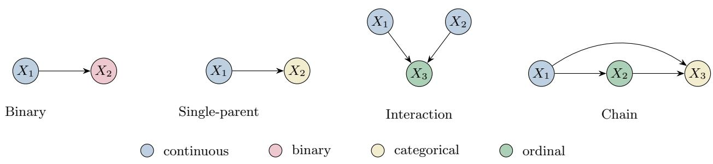

# Probabilistic Counterfactual Inference for Discrete Outcomes in Gaussian-Process Causal Models

Juliette Sinnott1, Amir-Hossein Karimi2,3, and Mohammad Kohandel1

1Department of Applied Mathematics, University of Waterloo, Waterloo, Ontario, N2L 3G1, Canada

2Department of Electrical and Computer Engineering, University of Waterloo, Waterloo, Ontario, N2L 3G1, Canada

3Vector Institute for Artificial Intelligence, Toronto, Ontario, M5G 0C6, Canada

\*Email: jssinnot@uwaterloo.ca

## Abstract

Counterfactual inference in Gaussian-process structural causal models (GP-SCMs) has been developed primarily for continuous endogenous variables, limiting applicability to causal graphs that contain discrete child nodes with continuous parents. We introduce a unified probabilistic framework for counterfactual inference with heterogeneous variable types by pairing GP predictors with explicit exogenous noise mechanisms. For discrete outcomes, we derive exact conditional noise-abduction procedures using a uniform threshold for binary variables, a Gumbel-max race for nominal categories, and a latent Gaussian cut-point model for ordinal ones. In each case, we propagate abducted noise through interventions while accounting for posterior uncertainty in the GP latent functions, and prove that the resulting mechanisms reproduce the fitted model’s observational and interventional distributions. On synthetic SCMs with known ground-truth counterfactuals, we evaluate estimation accuracy, consistency, and robustness to coupling misspecification. A key finding is that applying a categorical coupling to ordinal data inflates counterfactual error roughly threefold even when observational fit remains comparable, and that this error does not diminish with more data. As the training set grows, the fitted structural equation converges to the truth while the counterfactual error flattens onto a floor. In the reverse direction, forcing a false order onto nominal data instead degrades the fitted equation itself. The choice of coupling must therefore be justified on structural grounds rather than read of the fit.

## 1 Introduction

Incorporating causality into Machine Learning can be a crucial step towards developing realistic and explainable models. Pearl et al. [2016] has shown that structural causal models (SCMs) can be used to determine the efects of interventions and estimate counterfactual queries. Interventions compute the downstream efects of changing one or more variables in a system. Counterfactuals extend upon this by using knowledge of a factual instance to compute how the variables would have changed had an intervention been performed.

To incorporate this causal reasoning into a real-world system, researchers must develop an SCM comprised of a causal graph and structural equations. The graph structure describes which features are causal parents of others, which can be determined using domain knowledge and independence tests using observational data [Spirtes et al., 2000, Zhang et al., 2011, Hoyer et al., 2009]. For this paper, we assume this step has been completed using one of many graph discovery techniques. From here, structural equations must be fitted for each parent-child relationship. Recent work has suggested that Gaussian process (GP) regression can approximate the variety of relationships that occur (linear, non-linear, additive) and provide uncertainty quantification over the resulting counterfactual [Karimi et al., 2020]. This method has presently only been developed for relationships between real-valued features, and extending it to work for non-continuous child variables requires several adjustments. We explain how the probabilistic counterfactual estimation changes for binary, categorical and ordinal features. Our method is proven theoretically and validated experimentally using synthetic SCMs for ground-truth.

## 1.1 Counterfactuals

We define counterfactuals and their evaluation as in Pearl et al. [2016]:

## Counterfactual Queries

Given observation $\mathbf { x } ^ { F }$ , what would have happened if $\mathbf { X } _ { \mathcal { T } }$ had instead taken the value $\pmb { \theta } ?$ The counterfactual variable is written $\mathbf { x } ^ { \mathrm { C F } } = \mathbf { x } ( \mathrm { d o } ( \mathbf { X } _ { \mathcal { T } } \bar { = } \mathbf { \dot { \theta } } ) ) \mid \mathbf { x } ^ { F }$

Given a fully specified SCM M with d nodes and equations $\mathbf { F } = \{ \mathbf { X } _ { r } : = f _ { r } ( \mathbf { X } _ { \mathrm { p a } ( r ) } , U _ { r } ) \} _ { r = 1 } ^ { d }$ , and an observed instance $\bar { \mathbf { x } } ^ { F }$ , counterfactuals asking what would have happened had we set $\mathbf { X } _ { I } = \theta$ are evaluated using the following three steps:

Three Steps for Computing Counterfactuals

1. Abduction: Use evidence $\mathbf { x } ^ { F }$ and the equations to solve backwards for $\{ U _ { r } \} _ { r = 1 } ^ { d } .$

2. Action: Modify the model M, by performing the intervention do $( \mathbf { X } _ { I } = \theta )$ , to get new structural equations Fdo(XI=θ).

3. Prediction: Use the modified structural equations and the values of $\{ U _ { r } \} _ { r = 1 } ^ { d }$ to compute the value of $\mathbf { x } ^ { \mathrm { C F } }$

Typically, the most challenging step in this process is Abduction, because the method to isolate the factual noise depends on the form of the structural equations. The previous approach uses additive Gaussian noise, which allows for easy noise isolation Karimi et al. [2020], however this approach will not work for discrete features.

Consider a bank deciding whether to extend a loan. A continuous feature such as debt-to-income ratio determines an ordinal risk tier (subprime through super-prime, from thresholding a composite score), which in turn determines a nominal decision such as which loan product is ofered. An applicant who is denied may reasonably ask what would have happened had their financial position been diferent. Answering this counterfactual query means carrying Abduction, Action, and Prediction through a causal chain whose structural equations mix continuous, ordinal, and nominal variables. Existing approaches are limited to scenarios with only real-valued downstream variables, leaving systems like the one described here out of their scope Karimi et al. [2020].

## 1.2 Existing Approaches

Prior work falls into three families, by which pipeline stage they address: discovering the graph, fitting equations on a given graph, or coupling a fixed interventional law into a counterfactual mechanism. We address the middle stage: fitting Gaussian Process equations paired with an exact noise-abduction identity. Graph discovery has begun exploiting ordinal structure to orient edges [Ni and Mallick, 2022], and Yao et al. [2025] use a categorical mechanism close to ours for graph identifiability in mixed additive noise mod els, without addressing counterfactual queries; we instead take the graph as given. For fitting discrete or ordinal equations, ordinal variables are classically modelled by discretising a latent score at fixed cutpoints [McKelvey and Zavoina, 1975, Boes, 2013], with Chu and Ghahramani [2005] giving the Gaussian Process likelihood our construction builds on; deep generative alternatives dequantise discrete variables into normalising-flow SCMs [Pawlowski et al., 2020], or relax categorical latents via a temperature-annealed softmax [Jang et al., 2017, Maddison et al., 2017] for gradient-based training rather than exact abduction, which we use instead. A separate line instead couples a fixed interventional law: Oberst and Sontag [2019] introduce the Gumbel-max coupling, singled out axiomatically by counterfactual stability, while Lorberbom et al. [2021] learn a coupling minimising counterfactual treatment-efect variance over a query distribution; our interventional law is itself a fitted, uncertain Gaussian Process, and we choose the coupling to match the endogenous variable’s $t y p e ,$ not to optimise a downstream objective.

## 2 Preliminaries

## 2.1 Introducing Gumbel Noise

We introduce the Gumbel distribution because it gives an exact, explicit exogenous noise variable for categorical outcomes. The same construction is used to relax categorical sampling into a diferentiable operation for gradient-based training via the Gumbel-softmax/Concrete distribution [Jang et al., 2017, Maddison et al., 2017]. We instead exploit its exact (non-relaxed) form to obtain closed-form noise abduction.

Gumbel Distribution [Gumbel, 1954]   
G ∼ Gumbel(µ, 1) if it has CDF $F ( g ) = \exp \bigl ( - e ^ { - ( g - \mu ) } \bigr )$ on R.

We highlight three important properties of this distribution that we will use to evaluate the counterfactuals:

• Reparameterisation: $V \sim \mathrm { U n i f o r m } ( 0 , 1 ) \implies \mu - \log ( - \log V ) \sim \mathrm { G u m b e l } ( \mu , 1 )$

• Truncation [Maddison et al., 2014]: Conditioned on $G \leq b .$

$$
\mu - \log \left( e ^ { - ( b - \mu ) } - \log V \right) \sim \operatorname { G u m b e l } ( \mu , 1 ) { \mathrm { ~ f o r ~ } } V \sim \operatorname { U n i f o r m } ( 0 , 1 )
$$

has the conditioned law.

• Gumbel-max trick [Yellott, 1977]: For scores $\ell \in \mathbb { R } ^ { C }$ and iid $G _ { 1 } , \ldots , G _ { C } \sim \mathrm { G u m b e l } ( 0 , 1 )$ , the perturbed maximum $M : = \operatorname* { m a x } _ { c } \{ \ell _ { c } + G _ { c } \}$ satisfies

$$
\begin{array} { r } { M \sim \mathrm { G u m b e l } \Big ( \log \sum _ { c } e ^ { \ell _ { c } } , 1 \Big ) \quad \mathrm { i n d e p e n d e n t l y ~ o f } \ a r g m a x _ { c } \{ \ell _ { c } + G _ { c } \} \sim \mathrm { s o f t m a x } ( \ell ) } \end{array}
$$

## 2.2 Coupling and Abduction

When the structural equations are approximated by fitted $\mathrm { G P s } .$ , the uncertainty about $f _ { r }$ means that the exogenous noise driving $X _ { r }$ is never observed directly. Instead, its posterior is updated (abducted) from the factual observation, and this fixed abducted noise is carried into the counterfactual world while only the parents change. For continuous nodes as in Karimi et al. [2020], one can use additive Gaussian noise that can be uniquely solved for given a factual instance.

For a discrete outcome, this uniqueness breaks. The factual and counterfactual class distributions, $\mathbf { p } ^ { F }$ and $\mathbf { p } ^ { \mathrm { C F } }$ , are each pinned down by the fitted model, but they alone do not determine a joint law over the pair $( X _ { r } , X _ { r } ^ { \mathrm { C F } } )$ : infinitely many joint distributions share the same two marginals. Call any such choice a coupling. Abduction is how a coupling gets realised in practice: we equip $X _ { r }$ with an explicit exogenous noise variable, infer its posterior from the factual observation $x _ { r } ^ { F }$ , and reuse that same noise, unchanged, to generate $X _ { r } ^ { \mathrm { C F } }$ under the counterfactual parents. Because the noise realisation is shared across both worlds, the resulting joint law (the coupling) is determined entirely by how the exogenous noise is defined and abducted, which is exactly the modelling choice this paper studies for each variable type.

• Binary. A binary outcome needs only a single scalar noise $U _ { r } \sim \mathrm { U n i f o r m } ( 0 , 1 )$ , thresholded against the class probability. This is the unique coupling consistent with two Bernoulli marginals under the natural monotonicity requirement that raising the class probability cannot lower $P ( X _ { r } = 1 )$ .

• Categorical. For $C \geq 3$ unordered classes, one natural noise is a vector of $C$ independent Gumbel perturbations, one per class, abducted jointly from which class won the factual “race” and reused for a second race against the counterfactual class scores. This is the Gumbel-max coupling: it treats every pair of classes symmetrically, and is the coupling characterised by counterfactual stability [Oberst and Sontag, 2019].

• Ordinal. When the classes carry an order, a diferent noise construction is more natural: a single shared Gaussian $N _ { r } ,$ pushed through the factual and counterfactual cutpoints of the same monotone threshold function. This is the comonotone coupling: since the same monotone map is applied to the same noise draw in both worlds, it respects the class ordering in a way the Gumbel-max coupling does not.

The categorical and ordinal constructions therefore abduct genuinely diferent exogenous noise objects (a vector of per-class Gumbels versus a single Gaussian), and so induce diferent couplings, even when fit to variables with the same number of classes. The one case where this distinction disappears is $C = 2 \colon$ with only two classes, both constructions collapse to thresholding a single uniform, so the Gumbel-max and comonotone couplings coincide exactly, and the choice between “categorical” and “ordinal” machinery becomes immaterial.

## 3 Results

Both propositions below instantiate the Compatibility/Abduction/Action-and-Prediction schema of §2.2;   
what difers is the noise object each abducts and how it is reused.

## 3.1 Categorical

Proposition 1 (Categorical Probabilistic Counterfactuals with Gaussian Processes). Let $\mathbf { f } \left( \mathbf { x } \right)$ denote a realisation of the fitted GP latent at $\mathbf { X } _ { \mathrm { p a } ( r ) } = \mathbf { x }$ , and let $\mathbf { p } ( \mathbf { x } ; \mathbf { f } ) : = \big ( p _ { 1 } ( \mathbf { x } ; \mathbf { f } ) , \dots , p _ { C } ( \mathbf { x } ; \mathbf { f } ) \big )$ be the normalised class-probability vector it induces. We fit C independent binary Laplace GP classifiers, one per class, and renormalise: $\begin{array} { r } { p _ { c } : = \sigma ( f _ { c } ) / \sum _ { c ^ { \prime } } \sigma ( f _ { c ^ { \prime } } ) } \end{array}$ . The joint multiclass softmax $\begin{array} { r } { \mathit { \mathcal { \hat { h } } t } , } \end{array}$ under which $\mathbf { p } = \operatorname { s o f t m a x } ( \mathbf { f } )$ instead, is developed in $\ \xi A . 6 . 1 $ , and Remark 2 records what difers between the two; nothing in the construction below depends on the choice, because the coupling is stated on log p rather than on f. Write $\ell ( \mathbf { x } ) : = \log \mathbf { p } ( \mathbf { x } ; \mathbf { f } )$ for the corresponding log-probability scores, suppressing f where no ambiguity arises. Model the structural equations as:

$$
X _ { r } : = \underset { c \in \{ 1 , \ldots , C \} } { \arg \operatorname* { m a x } } \left\{ \ell _ { c } ( \mathbf { X } _ { \mathrm { p a } ( r ) } ) + G _ { r , c } \right\} , \qquad G _ { r , c } \overset { i i d } { \sim } \mathrm { G u m b e l } ( 0 , 1 ) ,\tag{1}
$$

with $\mathbf { G } _ { r } : = ( G _ { r , 1 } , \ldots , G _ { r , C } )$

(Compatibility.) For every x and every realisation of the latent,

$$
P \big ( X _ { r } = c \mid \mathbf { X _ { p a } } ( r ) = \mathbf { x } , \mathbf { f } \big ) = \mathrm { s o f t m a x } \big ( \log \mathbf { p } ( \mathbf { x } ; \mathbf { f } ) \big ) _ { c } = p _ { c } ( \mathbf { x } ; \mathbf { f } ) ,\tag{2}
$$

the softmax identity required by the schema above.

(Abduction.) Write $\ell ^ { F } : = \ell ( \mathbf { x } _ { \mathrm { p a } ( r ) } ^ { F } ; \mathbf { f } ^ { F } )$ and let $c ^ { * } : = x _ { r } ^ { F }$ be the observed class, and $M : = \operatorname* { m a x } _ { c } \{ \ell _ { c } ^ { F } +$ $\left. G _ { r , c } \right\}$ is the factual winning score. Conditional on $\ell ^ { F }$ and on $X _ { r } = c ^ { * }$ , the posterior of $\mathbf { G } _ { \eta }$ is sampled exactly $b y$

$$
\begin{array} { r } { M \sim \mathrm { G u m b e l } \Big ( \log \sum _ { c } e _ { c } ^ { \ell _ { c } ^ { F } } , 1 \Big ) , \quad G _ { r , c ^ { * } } : = M - \ell _ { c ^ { * } } ^ { F } , \quad G _ { r , c } : = - \log \big ( e ^ { - ( M - \ell _ { c } ^ { F } ) } - \log V _ { c } \big ) , c \not = c ^ { * } , } \end{array}\tag{3}
$$

with ${ V _ { c } } \stackrel { i i d } { \sim }$ Uniform(0, 1).

(Action and Prediction.) The intervention replaces $\mathbf { x } _ { \mathrm { p a } ( r ) } ^ { F }$ by $\tilde { \mathbf { x } } _ { \mathrm { p a } ( r ) }$ leaving the latent process and $\mathbf { G } _ { \eta }$ fixed, so with $\tilde { \ell } : = \ell ( \tilde { \mathbf { x } } _ { \mathrm { p a } ( r ) } )$ 2

$$
X _ { r } ^ { \mathrm { C F } } = \arg \operatorname* { m a x } _ { c } \big \{ \tilde { \ell } _ { c } + G _ { r , c } \big \} .\tag{4}
$$

As the schema requires, $( \mathbf { f } ^ { F } , \tilde { \mathbf { f } } )$ , from which $\ell ^ { F }$ and $\tilde { \ell }$ are formed, are drawn from their joint posterior, which for each class c is the bivariate Gaussian with means $\mathbf { k } _ { F } ^ { \top } ( \mathbf { e } _ { r , c } - \hat { \pi } _ { r , c } )$ and $\tilde { \mathbf { k } } ^ { \top } ( \mathbf { e } _ { r , c } - \hat { \pi } _ { r , c } )$ and covariance

$$
\mathrm { C o v } \big ( f _ { c } ^ { F } , \tilde { f } _ { c } \big ) = k _ { r } \big ( \mathbf { x } _ { \mathtt { p a } ( r ) } ^ { F } , \tilde { \mathbf { x } } _ { \mathtt { p a } ( r ) } \big ) - \mathbf { k } _ { F } ^ { \top } \big ( \mathbf { K } + \hat { W } _ { c } ^ { - 1 } \big ) ^ { - 1 } \tilde { \mathbf { k } } , \qquad \mathbf { k } _ { F } : = \big ( k _ { r } ( \mathbf { x } _ { \mathtt { p a } ( r ) } ^ { F } , \mathbf { x } _ { \mathtt { p a } ( r ) } ^ { i } ) \big ) _ { i = 1 } ^ { n } .\tag{5}
$$

Under the one-versus-rest fit the C classifiers are independent, so the pairs $( f _ { c } ^ { F } , \tilde { f } _ { c } )$ are drawn independently across classes. Within a class, however, the pair must be a single draw from equation $5 \colon f _ { r , c }$ is one function evaluated at two inputs, and drawing the two marginally would discard the covariance and with it Corollary 1. The counterfactual class probabilities are

$$
P \big ( X _ { r } ^ { \mathrm { { C F } } } = c \mid \mathbf { x } ^ { F } \big ) = \mathbb { E } _ { ( \mathbf { f } ^ { F } , \tilde { \mathbf { f } } ) } \mathbb { E } _ { \mathbf { G } _ { r } \mid x _ { r } ^ { F } , \mathbf { f } ^ { F } } \Big [ \mathbb { I } \big \{ \arg \operatorname* { m a x } _ { c ^ { \prime } } ( \tilde { \ell } _ { c ^ { \prime } } + G _ { r , c ^ { \prime } } ) = c \big \} \Big ] ,\tag{6}
$$

approximated by Monte Carlo over draws of $( \mathbf { f } ^ { F } , \tilde { \mathbf { f } } )$ and, for each, a draw of $\mathbf { G } _ { r }$ from equation 3.

Corollary 1 (Consistency under the trivial intervention). In the setting of Proposition 1, intervening at the factual parent value itself, do $\big ( \mathbf { X } _ { \mathrm { p a } ( r ) } = \mathbf { x } _ { \mathrm { p a } ( r ) } ^ { F } \big )$ , recovers the observed factual outcome with certainty:

$$
\begin{array} { r } { P \big ( X _ { r } ^ { \mathrm { C F } } = x _ { r } ^ { F } \mid \mathbf { x } ^ { F } , \mathrm { d o } ( \mathbf { X } _ { \mathrm { p a } ( r ) } = \mathbf { x } _ { \mathrm { p a } ( r ) } ^ { F } ) \big ) = 1 . } \end{array}\tag{7}
$$

Corollary 2 (Binary case: closed form). Let $C = 2$ and put $p ( \mathbf { x } ) : = p _ { 1 } ( \mathbf { x } ) = \sigma ( f _ { r } ( \mathbf { x } ) ) \mathrm { ~ } w i t h \sigma ( t ) = ( 1 + e ^ { - t } ) ^ { - 1 }$ Then equation 1 is equivalent to

$$
X _ { r } : = \mathbb { I } \big [ p ( \mathbf { X } _ { \mathrm { p a } ( r ) } ) > U _ { r } \big ] , \qquad U _ { r } \sim \mathrm { U n i f o r m } ( 0 , 1 ) ,\tag{8}
$$

the exogenous noise being $U _ { r } = \sigma ( G _ { r , 2 } - G _ { r , 1 } )$

Abduction is exact: writing $p ^ { F } : = p ( \mathbf { x } _ { \mathrm { p a } ( r ) } ^ { F } )$

$$
U _ { r } \mid \mathbf { x } ^ { F } , f _ { r } \sim { \left\{ \operatorname { U n i f o r m } ( 0 , p ^ { F } ) , \right. } \lambda _ { r } ^ { F } = 1 ,\tag{9}
$$

and with $p ^ { \mathrm { C F } } : = p ( \tilde { \mathbf { x } } _ { \mathrm { p a } ( r ) } )$

$$
P \big ( X _ { r } ^ { \mathrm { C F } } = 1 \big | \mathbf { x } ^ { F } , f _ { r } \big ) = \left\{ \begin{array} { l l } { \operatorname* { m i n } ( p ^ { \mathrm { C F } } , p ^ { F } ) / p ^ { F } , } & { x _ { r } ^ { F } = 1 , } \\ { \operatorname* { m a x } ( 0 , p ^ { \mathrm { C F } } - p ^ { F } ) / ( 1 - p ^ { F } ) , } & { x _ { r } ^ { F } = 0 . } \end{array} \right.\tag{10}
$$

Marginalising over the joint Laplace posterior of $( f ^ { F } , \tilde { f } ) : = \big ( f _ { r } ( \mathbf { x } _ { \mathrm { p a } ( r ) } ^ { F } ) , f _ { r } ( \tilde { \mathbf { x } } _ { \mathrm { p a } ( r ) } ) \big )$ gives

$$
\begin{array} { r } { P \big ( X _ { r } ^ { \mathrm { { C F } } } = 1 \mid \mathbf { x } ^ { F } \big ) = \mathbb { E } _ { ( f ^ { F } , \bar { f } ) } \Big [ e q u a t i o n \ 1 0 \ e v a l u a t e d \ a t \ p ^ { F } = \sigma ( f ^ { F } ) , \ p ^ { \mathrm { { C F } } } = \sigma ( \tilde { f } ) \Big ] . } \end{array}\tag{11}
$$

## 3.2 Ordinal

The categorical approach assumes an unordered (nominal) set of classes, thus the Gumbel-max coupling of Proposition 1 treats every pair of classes symmetrically. We give the ordinal analogue here, built on the classical Gaussian-process ordinal-regression likelihood [Chu and Ghahramani, 2005]. This is exactly the continuous ANM-GP approach of Karimi et al. [2020], observed through a coarsened, binned channel rather than directly.

Cutpoints as a learned mechanism parameter. If the cutpoints of a variable are unknown, class boundaries can be inferred from data on the same footing as the latent function $f _ { r }$ itself. Write $\theta \ : = \ :$ $( \theta _ { 1 } , \dots , \theta _ { C - 1 } ) \in \mathbb { R } ^ { C - 1 }$ for an unconstrained parameterisation of the cutpoints,

$$
b _ { 1 } ( \theta ) : = \theta _ { 1 } , \qquad b _ { c } ( \theta ) : = b _ { c - 1 } ( \theta ) + e ^ { \theta _ { c } } \quad ( c = 2 , \ldots , C - 1 ) ,\tag{12}
$$

under which every $\theta \in \mathbb { R } ^ { C - 1 }$ maps to a strictly increasing tuple of cutpoints and every strictly increasing tuple arises this way, and place an independent Gaussian prior $\begin{array} { r } { \theta \sim p ( \theta ) : = \prod _ { c } \mathcal { N } ( \theta _ { c } ; 0 , \tau _ { c } ^ { 2 } ) } \end{array}$ , a priori independent of $f _ { r }$ and of $N _ { r }$

Proposition 2 (Ordinal Probabilistic Counterfactuals with Gaussian Processes and Learned Cutpoints). Model the structural equation as

$$
\begin{array} { r l } & { Y _ { r } : = f _ { r } ( \mathbf { X } _ { \mathrm { p a } ( r ) } ) + N _ { r } , \quad f _ { r } \sim \mathcal { G P } ( 0 , k _ { r } ) , \quad N _ { r } \sim \mathcal { N } ( 0 , 1 ) , \quad \theta \sim p ( \theta ) , } \\ & { X _ { r } : = \displaystyle \sum _ { c = 1 } ^ { C } c \cdot \mathbb { I } \big \{ b _ { c - 1 } ( \theta ) \leq Y _ { r } < b _ { c } ( \theta ) \big \} , } \end{array}\tag{13}
$$

with $b _ { 0 } ( \theta ) : = - \infty , b _ { C } ( \theta ) : = \infty$ , and $( f _ { r } , N _ { r } , \theta )$ mutually independent a priori.

(Compatibility.) Recall that for $N \sim \mathcal { N } ( 0 , 1 )$ we have the CDF: $\Phi ( z ) = P ( N \leq z )$ . For every x and every realisation of $( f _ { r } , \theta )$ ,

$$
P \big ( X _ { r } = c \mid \mathbf { X } _ { \mathtt { p a } ( r ) } = \mathbf { x } , f _ { r } , \theta \big ) = \Phi \big ( b _ { c } ( \theta ) - f _ { r } ( \mathbf { x } ) \big ) - \Phi \big ( b _ { c - 1 } ( \theta ) - f _ { r } ( \mathbf { x } ) \big ) ,\tag{14}
$$

the identity required $b y$ the schema above; nothing in it uses $\theta$ s non-randomness.

(Abduction.) Let $c ^ { * } : = x _ { r } ^ { F }$ and, for any realisation of θ, write $( a ^ { F } ( \theta ) , b ^ { F } ( \theta ) ) : = ( b _ { c ^ { * } - 1 } ( \theta ) , b _ { c ^ { * } } ( \theta ) )$ for the interval implied by the observed class, and $f _ { r } ^ { F } : = f _ { r } ( \mathbf { x } _ { \mathrm { p a } ( r ) } ^ { \bar { F } } )$ . Conditional on $\theta ,$ on $f _ { r } ^ { F }$ , and on $X _ { r } = c ^ { * }$ the posterior of $N _ { r }$ is exact:

$$
N _ { r } \mid \mathbf { x } ^ { F } , f _ { r } ^ { F } , { \boldsymbol { \theta } } , X _ { r } = c ^ { * } \sim { \mathcal { N } } ( 0 , 1 ) { \mathit { t r u n c a t e d } } t o \left( a ^ { F } ( { \boldsymbol { \theta } } ) - f _ { r } ^ { F } , \ b ^ { F } ( { \boldsymbol { \theta } } ) - f _ { r } ^ { F } \right) ,\tag{15}
$$

by exactly the fixed-cutpoint argument, since θ enters only through which interval is being conditioned on. Marginalising over the joint posterior of $( f _ { r } ^ { F } , \theta )$ , the noise’s posterior is the continuous mixture of truncated normals obtained by averaging equation 15 over θ.

(Action and Prediction.) The intervention replaces $\mathbf { x } _ { \mathrm { p a } ( r ) } ^ { F }$ by $\tilde { \mathbf { x } } _ { \mathrm { p a } ( r ) }$ , leaving the latent process, θ, and Nr fixed, so with $\tilde { f } _ { r } : = f _ { r } ( \tilde { \mathbf { x } } _ { \mathrm { p a } ( r ) } )$

$$
P \big ( X _ { r } ^ { \mathrm { { C F } } } = k \mid \mathbf { x } ^ { F } , f _ { r } ^ { F } , \tilde { f } _ { r } , \theta \big ) = \frac { \big [ \Phi \big ( \operatorname* { m i n } ( \beta , \gamma _ { k } ) \big ) - \Phi \big ( \operatorname* { m a x } ( \alpha , \gamma _ { k - 1 } ) \big ) \big ] _ { + } } { \Phi ( \beta ) - \Phi ( \alpha ) } ,\tag{16}
$$

where $\alpha : = { a ^ { F } ( \theta ) } - { f _ { r } ^ { F } } , \beta : = { b ^ { F } ( \theta ) } - { f _ { r } ^ { F } } , \gamma _ { k } : = { b _ { k } ( \theta ) } - { \tilde { f } _ { r } }$ and $( \cdot ) _ { + } : = \operatorname* { m a x } ( 0 , \cdot )$ . Since $f _ { r }$ is unknown, $( f _ { r } ^ { F } , \tilde { f } _ { r } )$ must be drawn from their joint posterior given $\theta ,$ approximated as Gaussian by the Laplace approximation to the ordinal likelihood equation 14 [Chu and Ghahramani, 2005], the single-latent analogue of the joint Laplace posterior in eq. equation ${ } ^ { 5 , }$ and θ is itself unknown, drawn from its own Laplace-Gaussian posterior (Lemma 6). The full estimator therefore marginalises over both:

$$
P \big ( X _ { r } ^ { \mathrm { C F } } = k \ | \ \mathbf { x } ^ { F } \big ) = \mathbb { E } _ { \theta } \Big [ \mathbb { E } _ { ( f _ { r } ^ { F } , \tilde { f } _ { r } ) | \theta } \big [ e q u a t i o n \ 1 6 \big ] \Big ] ,\tag{17}
$$

approximated by nested Monte Carlo: draw $\theta ^ { ( s ) }$ from its Laplace-Gaussian posterior, refit the single-latent joint posterior of $( f _ { r } ^ { F } , \tilde { f } _ { r } )$ at the resulting cutpoints $\mathbf { b } ( \theta ^ { ( s ) } )$ , draw from $i t ,$ and average eq. equation 16 over both layers.

Corollary 3 (Fixed cutpoints). When the cutpoints b $= { \bf b } ( \theta _ { 0 } )$ are known rather than inferred, this means $p ( \theta ) = \delta _ { \theta _ { 0 } }$ is a point mass and the outer expectation in equation 17 collapses to a single term at $\theta = \theta _ { 0 }$ Then Proposition $\mathcal { Q }$ reduces exactly to fitting a single-latent GP-ordinal model at the given, fixed b: this is the case used throughout Chu and Ghahramani’s original construction [Chu and Ghahramani, 2005] and, prior to this section, throughout this paper.

Remark 1 (Which coupling each proposition selects). §2.2 sketches which coupling each proposition selects; here we make Proposition 2’s precise. Fix a realisation of θ and write $\begin{array} { r } { H ( y ) : = \sum _ { c } c \cdot \mathbb { I } \{ b _ { c - 1 } ( \theta ) \leq y < } \end{array}$ $b _ { c } ( \theta ) \}$ , non-decreasing. Eq. equation 13 gives $X _ { r } = H ( f _ { r } ^ { F } + N _ { r } ) $ and $X _ { r } ^ { \mathrm { C F } } = H ( \tilde { f } _ { r } + N _ { r } ) $ , both nondecreasing functions of the same scalar; with $U : = \Phi ( N _ { r } )$ this realises $( X _ { r } , \dot { X } _ { r } ^ { \mathrm { C F } } )$ as $\dot { ( F _ { p } ^ { - 1 } ( U ) , F _ { q } ^ { - 1 } ( U ) ) }$ for the factual and counterfactual class distributions $p , q$ the comonotone coupling (matching the monotonicity assumption used for identification in the binary [Pearl, 1999] and categorical [Lu et al., 2020] settings).

At $C = 2$ this coincides with the Gumbel-max coupling of Proposition 1: for Bernoulli marginals the comonotone coupling is the unique one, which is why Corollary 2 admits a closed form where the general case does not — but only as couplings. The link functions still difer (probit here, logit in Corollary 2), so the two propositions agree at $C = 2$ as couplings, not as fitted models, and they diverge for $C \geq 3$ (the Experiments section measures the cost). The identification above also holds only at a fixed $\theta \colon$ after marginalising over the joint posterior of $( f _ { r } ^ { F } , \tilde { f } _ { r } , \tilde { \theta } )$ in equation 17, the estimator is a mixture of comonotone couplings over varying marginals, which need not itself be comonotone.

## 4 Experiments

## 4.1 Setup

Two fully worked examples in Appendix A.2 (Examples 1 and 2, one by hand, one against a fitted GP) walk through Abduction, Action and Prediction on a single SCM whose true mechanism happens to be exactly the Gumbel-max form of eq. equation 1. To conduct a more thorough survey of our method, we use categorical and ordinal approaches (Algorithm 1 and Algorithm 2) to compute counterfactuals on varying causal graphs depicted in Figure 1. The true structural equations of the graphs are known to us, but for our experiments we fit a sklearn Gaussian Process classifier to synthetic data generated from the true SCMs. The SCMs vary in both structural complexity and in the datatype of the endogenous nodes. We deliberately test whether each method’s accuracy is confined to the case it was derived for. Using the Binary SCM, we explore the claim, from Remark 1, that both the categorical and ordinal approaches are equivalent.

These four structures can naturally occur in many systems, for example in the loan scenario (§1). The Binary SCM could be a bank’s approve/deny decision from debt-to-income ratio; the Single-parent SCM, an applicant’s routing to one of several loan products via an argmax over per-product suitability scores; the Interaction SCM, a risk tier from thresholding debt-to-income and loan-to-value non-additively; and the Chain SCM, the full pipeline, where debt-to-income sets the tier and both together determine which product is ofered.

For each SCM we draw $n = 5 0 0$ training samples, fit the classifier(s) with no knowledge of the true structural equations, and evaluate on 8 factual/intervention scenarios.

During the GP fitting, we bound each RBF length scale to $[ 0 . 1 \hat { \sigma } _ { d } , 1 0 \hat { \sigma } _ { d } ]$ rather than sklearn’s default $[ 1 0 ^ { - 5 } , 1 0 ^ { 5 } ]$ , whose ten-decade range causes most optimiser restarts to start far outside the data support, where the kernel is flat and fits get stuck. Under the default, the Single-parent SCM’s baseline-class latent came out exactly constant $( P \approx 0 . 2 0$ vs. a true 0.05) and stayed there even with five times more restarts. The bounded fit attains a higher marginal likelihood, so this is a correction, not a modelling choice.

An ordinal cut-point mechanism. Our Interaction and Chain SCMs use the ordinal mechanism of Proposition 2 (eq. equation 13), with true cutpoints $b _ { 1 } = - 0 . 5 , b _ { 2 } = 0 . 5$ Ground truth is closed form: since the true score g and $( b _ { 1 } , b _ { 2 } )$ are both known, eq. equation 16 is evaluated directly at $f _ { r } ^ { F } = g ( \mathbf { x } _ { \mathrm { p a } ( r ) } ^ { F } )$ $\tilde { f } _ { r } = g ( \tilde { \mathbf { x } } _ { \mathrm { p a } ( r ) } )$ , with no Monte Carlo needed. Both fitted estimators below instead learn $g$ from data via a GP classifier, as throughout, and difer only in whether they are also given the true cutpoints or must infer them (discussed further below).

Binary

Single-parent

Interaction

$$
X _ { 1 } : = U _ { 1 } , \ U _ { 1 } \sim { \mathcal { N } } ( 0 , 1 ) ,
$$

$$
X _ { 1 } : = U _ { 1 } , \ U _ { 1 } \sim { \mathcal { N } } ( 0 , 1 ) ,
$$

$$
\begin{array} { r } { X _ { 1 } , X _ { 2 } \sim \mathcal { N } ( 0 , 1 ) \ \mathrm { i i d } , } \end{array}
$$

$$
X _ { 2 } : = \mathbb { I } \big [ 2 X _ { 1 } { + } U _ { 2 } { > } 0 \big ] ,
$$

$$
X _ { 2 } : = \underset { c \in \{ 1 , 2 , 3 \} } { \arg \operatorname* { m a x } } \{ \eta _ { c } ( X _ { 1 } ) + G _ { c } \} ,
$$

$$
Y _ { 3 } : = X _ { 1 } X _ { 2 } + N _ { 3 } ,
$$

$$
U _ { 2 } \sim { \mathcal { N } } ( 0 , 1 ) .
$$

$$
\eta ( x _ { 1 } ) { = } ( 0 , 1 . 2 x _ { 1 } , - x _ { 1 } { + } 0 . 4 ) .
$$

$$
\begin{array} { r } { N _ { 3 } \sim \mathcal { N } ( 0 , 1 ) , } \end{array}
$$

$$
\begin{array} { c } { { X _ { 3 } : = 1 + \mathbb { I } \{ Y _ { 3 } > b _ { 1 } \} } } \\ { { + \mathbb { I } \{ Y _ { 3 } > b _ { 2 } \} . } } \end{array}
$$

  
Figure 1: The four synthetic SCM structures used in Section 4 (Binary, Single-parent, Interaction and Chain), increasing in graph complexity and node type. Node fill color indicates each variable’s data type.

Table 1: Counterfactual error $\mathrm { T V _ { c f } }$ and interventional error $\mathrm { T V } _ { \mathrm { i n t } }$ across all four synthetic SCMs, under a categorical fit and under an ordinal fit with learned cutpoints; mean ± sd over 10 seeds at $n = 5 0 0$ . Mediator applies only to the Chain SCM’s $X _ { 3 } { \mathrm { : } }$ whether the upstream mediator $X _ { 2 }$ was fit as a categorical or ordinal node, isolating propagated error from $X _ { 3 } ^ { } \mathrm { { s } }$ own.
<table><tr><td rowspan="2"></td><td rowspan="2">Node type Mediator</td><td rowspan="2"></td><td colspan="2">Categorical fit</td><td colspan="2">Ordinal fit</td></tr><tr><td> $\overline { { \mathrm { { T V } _ { \mathrm { { i n t } } } } } }$ </td><td> $\overline { { \mathrm { { T V } _ { c f } } } }$ </td><td> $\overline { { \mathrm { \Delta T V _ { \mathrm { i n t } } } } }$ </td><td> $\overline { { \mathrm { { T V _ { c f } } } } }$ </td></tr><tr><td>SCM Binary</td><td>binary</td><td></td><td> $\overline { { 0 . 0 2 1 \pm 0 . 0 1 0 } }$ </td><td> $\overline { { 0 . 0 2 1 \pm 0 . 0 1 4 } }$ </td><td> $\mathbf { \overline { { 0 . 0 1 8 \pm 0 . 0 0 9 } } }$ </td><td> $\mathbf { 0 . 0 1 5 \pm 0 . 0 0 7 }$ </td></tr><tr><td>Single-parent</td><td>categorical</td><td></td><td> $\mathbf { 0 . 0 3 0 \pm 0 . 0 1 0 }$ </td><td> $\mathbf { 0 . 0 3 1 \pm 0 . 0 1 5 }$ </td><td> $0 . 1 8 4 \pm 0 . 0 3 1$ </td><td> $0 . 1 7 3 \pm 0 . 0 3 3$ </td></tr><tr><td>Interaction</td><td>ordinal</td><td></td><td> $0 . 0 7 8 \pm 0 . 0 1 6$ </td><td> $0 . 2 3 1 \pm 0 . 1 0 0$ </td><td> $\mathbf { 0 . 0 4 5 \pm 0 . 0 1 1 }$ </td><td> $\mathbf { 0 . 0 6 8 \pm 0 . 0 4 0 }$ </td></tr><tr><td>learned cutpoints</td><td>ordinal</td><td></td><td></td><td></td><td> $0 . 0 4 9 \pm 0 . 0 1 0$ </td><td> $0 . 0 7 0 \pm 0 . 0 4 1$ </td></tr><tr><td>Chain, X3</td><td>categorical</td><td>categorical</td><td> $0 . 0 7 0 \pm 0 . 0 1 2$ </td><td> $0 . 0 9 1 \pm 0 . 0 1 7$ </td><td> $0 . 2 2 3 \pm 0 . 0 2 1$ </td><td> $0 . 2 2 1 \pm 0 . 0 6 2$ </td></tr><tr><td>Chain, X3</td><td>categorical</td><td>ordinal</td><td> $\mathbf { 0 . 0 7 0 \pm 0 . 0 1 2 }$ </td><td> $\mathbf { 0 . 0 4 4 } \pm \mathbf { 0 . 0 2 0 }$ </td><td> $0 . 2 2 3 \pm 0 . 0 2 1$ </td><td> $0 . 2 1 3 \pm 0 . 0 5 7$ </td></tr><tr><td>Chain,  $X _ { 2 }$ </td><td>ordinal</td><td></td><td> $0 . 0 3 7 \pm 0 . 0 1 0$ </td><td> $0 . 2 7 4 \pm 0 . 0 7 4$ </td><td> ${ \bf 0 . 0 2 7 \pm 0 . 0 0 7 }$ </td><td> $\mathbf { 0 . 0 4 5 \pm 0 . 0 1 6 }$ </td></tr><tr><td>learned cutpoints</td><td>ordinal</td><td></td><td></td><td></td><td> $0 . 0 2 9 \pm 0 . 0 1 0$ </td><td> $0 . 0 4 1 \pm 0 . 0 2 4$ </td></tr></table>

Chain (mixed mechanisms).

$$
\begin{array} { r l } & { X _ { 1 } : = U _ { 1 } , } \\ & { X _ { 2 } : = 1 + \mathbb { I } \{ X _ { 1 } + N _ { 2 } > b _ { 1 } \} + \mathbb { I } \{ X _ { 1 } + N _ { 2 } > b _ { 2 } \} , } \\ & { \qquad N _ { 2 } \sim \mathcal { N } ( 0 , 1 ) , } \\ & { X _ { 3 } : = \underset { c } { \arg \operatorname* { m a x } } \{ \tilde { \eta } _ { c } ( X _ { 1 } , X _ { 2 } ) + G _ { 3 , c } \} , } \\ & { \qquad \tilde { \eta } ( x _ { 1 } , x _ { 2 } ) = ( 0 , x _ { 1 } + ( x _ { 2 } - 2 ) , - ( x _ { 1 } + ( x _ { 2 } - 2 ) ) ) } \end{array}
$$

Computing the ground-truth counterfactual for $X _ { 3 }$ under $d o ( X _ { 1 } = \tilde { x } _ { 1 } )$ chains two diferent per-node abductions through the mediator $X _ { 2 } { : }$ a truncated-normal posterior for $X _ { 2 } \mathrm { ^ { } s }$ noise (eq. equation 15) and a truncated-Gumbel posterior for $X _ { 3 } ^ { } \mathrm { { ^ { s } } }$ (eq. equation 3).

For each experiment, we report two total-variation distances representing how well the fitted structural equation matches the true one $( \mathrm { T V _ { i n t } } )$ , and the counterfactual accuracy $\left( \mathrm { T V _ { c f } } \right)$ $\mathrm { T V } _ { \mathrm { i n t } }$ represents the distance between ${ \hat { P } } ( X _ { r } \mid \mathbf { X } _ { \operatorname { p a } ( r ) } )$ and the true mechanism’s own class probabilities, averaged over the factual and the counterfactual parent configuration. This is the rung-two quantity that the Compatibility identities equation 2 and equation 14 guarantee any fitted model reproduces. Each entry is a mean ± standard deviation over 10 seeds at $n = 5 0 0$ , so the spread reflects seed-to-seed variability across the whole pipeline (data, kernel fit and Monte Carlo draws together), not Monte Carlo noise alone. Appendix A.3 gives the full protocol and a Monte Carlo convergence check. Consistency error is exactly zero in every row, as Corollary 1 requires, whether or not the estimator’s assumed mechanism matches the truth.

## 4.2 Findings

Misspecification is invisible to the fit — but only in one direction, and only partly correctable. Fitting the categorical estimator to data whose true mechanism is the ordinal cut-point model (the Interaction SCM, the Chain SCM’s mediator) leaves $\mathrm { T V } _ { \mathrm { i n t } }$ at the same order as the correctly specified rows, while $\mathrm { T V _ { c f } }$ is still of by roughly 0.25 (Table 1). Refitting these nodes with Proposition $2 \mathrm { { ^ { \circ } s } }$ ordinal estimator recovers most of that gap, by factors of 3.4 and 6.1, while $\mathrm { T V } _ { \mathrm { i n t } }$ moves by far less. The Chain SCM’s terminal node makes this sharpest: its own mechanism was never misspecified and its fitted equation is unchanged between the two arms, yet its counterfactual accuracy improves because it is fed a more accurate mediator counterfactual. What residual error remains once the coupling is right is ordinary GP estimation dificulty. The Interaction SCM’s higher error against the Single-parent SCM’s reflects the interaction term $x _ { 1 } x _ { 2 }$ being a harder two-dimensional surface to learn from 500 samples than the Single-parent SCM’s additive score. In the reverse direction, fitting the ordinal estimator to genuinely nominal Gumbel-max data (the Singleparent SCM, the Chain SCM’s terminal node) degrades $\mathrm { T V } _ { \mathrm { i n t } }$ itself, by a factor of six on the Single-parent SCM $( 0 . 0 3 0  0 . 1 8 4 )$ , because forcing a monotone latent score onto classes with no true order is a harder regression problem outright, not merely the wrong label on a well-fit one. Imposing order costs the fit; imposing nominality does not.

The binary control. As §2.2 and Remark 1 predict for the case where the two couplings coincide, refitting the Binary SCM with the matching probit link barely moves $\mathrm { T V _ { c f } }$ , well inside one standard deviation across seeds, in sharp contrast to the large drop that correcting a genuine mismatch produces at the Interaction SCM (Table 1).

Learned cutpoints cost almost nothing. The indented “learned cutpoints” rows infer b jointly with g (Proposition 2’s general construction) instead of being given the true $b _ { 1 } = - 0 . 5 , b _ { 2 } = 0 . 5$ (Corollary 3’s fixed-cutpoint case), yet the two are indistinguishable within seed noise. This is valuable for cases when a variable is known to be ordinal, but the cutpoints are not defined, such as the risk-tiers in the loan example.

More data does not fix the wrong coupling. Repeating the sweep at four training-set sizes, $n = 1 0 0$ to 1000 (Table 2, Appendix A.4), shows $\mathrm { T V } _ { \mathrm { i n t } }$ and $\mathrm { T V _ { c f } }$ falling together where the coupling is correct, as ordinary GP asymptotics predict, but diverging where it is wrong: $\mathrm { T V } _ { \mathrm { i n t } }$ keeps improving while $\mathrm { T V _ { c f } }$ flattens onto a floor near 0.21–0.24, so their ratio grows with n under misspecification instead of staying near 1. The error is not a small-sample artefact more data would remove: the fit would pass any diagnostic applied to it, yet the counterfactual remains wrong by a fixed amount. The coupling family is a modelling decision that must be made on structural grounds, not one the observational fit can be trusted to reveal at any sample size.

Ablating the estimator confirms the coupling, not the GP, is responsible. Table 3 (Appendix A.4) separates abduction, coupling and posterior averaging on the two single-node SCMs: abduction is what does the work (skipping it costs an order of magnitude in accuracy on the Single-parent SCM), posterior averaging contributes almost nothing to the point estimate, and an oracle given the true class probabilities still recovers only about a tenth of the misspecification error at the Interaction SCM — roughly nine tenths of it is the coupling, not the GP.

## 5 Discussion

Propositions 1 and 2 agree on every observational and interventional quantity and disagree only about the counterfactual, by construction. This is the content of the two Compatibility identities, and Remark 1 identifies the two couplings responsible. §4 puts numbers on this gap and its direction-dependent visibility to the fit. Either way, the mechanism is a modelling choice made above the fitted model, not a parameter the fit can be relied on to recover.

This raises the question of how the choice should be made. Lorberbom et al. [2021] answer it by optimising a downstream objective, since no experiment can adjudicate the choice directly. Our results argue an objective alone is not enough: §4 shows a good observational and interventional fit does not imply a correct counterfactual, since mismatched couplings can agree on both while still diverging sharply downstream. We instead let the variable’s type, known before any objective is specified, constrain the admissible couplings, and find this constraint the more consequential of the two: the gap between type-appropriate couplings dwarfs the gains reported from tuning within a single family.

Two limitations follow. First, our validation is against synthetic SCMs with known mechanisms; on real data the exact mechanism is not observable, though the gap is narrower than it sounds: choosing the coupling only requires knowing the variable’s type — whether its categories carry an order — not its structural equation, and type is ordinary domain knowledge even when the mechanism is not. Second, the constraint is structural: Lorberbom et al. [2021] show no mechanism that abducts noise once and reuses it across interventions can be optimal simultaneously for every pair of interventional distributions, so neither proposition is uniformly best, each being the natural choice for its variable type. Proposition 2 already relaxes one candidate restriction by inferring cutpoints jointly with the latent function, with Corollary 3 recovering the fixed-cutpoint case exactly and costing almost nothing in practice (§4). Extending the construction to latent functions shared across correlated ordinal nodes remains a natural next step.

## 6 Conclusion

We introduced a unified probabilistic framework for counterfactual inference in GP-SCMs with heterogeneous variable types, deriving exact noise-abduction procedures for binary, categorical, and ordinal outcomes and proving that each reproduces its fitted model’s observational and interventional distributions exactly. Across a suite of synthetic SCMs with known ground truth, we showed that the choice of coupling, not the quality of the underlying GP fit, is what determines counterfactual accuracy: two estimators that agree on every observational and interventional quantity can disagree by a total variation distance of roughly 0.25 on the counterfactual, an error that does not shrink with more data. This gap is invisible to goodness-of-fit when ordinal data is mistaken for categorical, but not in reverse: forcing a false order onto categorical data degrades the fit itself, so the two directions of misspecification are detected diferently but corrected the same way. Because a variable’s type constrains the admissible couplings before any data is seen, that structural knowledge, not a downstream fitting criterion, is what should guide the choice.

## Reproducibility statement

Our theoretical claims are proved in full in Appendix A.6, with assumptions stated alongside each result and the Gaussian process background they build on recalled in Appendix A.1. All experiments use synthetic SCMs whose generating equations are given explicitly in §4 and Appendix A.2, so exact ground-truth counterfactuals are available in closed form rather than estimated; the full training and evaluation protocol (sample sizes, seeds, and Monte Carlo budgets) is specified in Appendix A.3, and a Monte Carlo convergence check is included there.

## Acknowledgments

This research was supported in part by the Natural Sciences and Engineering Research Council of Canada (NSERC) under grant to both MK and AHK.

## References

Christopher M. Bishop. Pattern Recognition and Machine Learning. Springer, 2006.

Stefan Boes. Nonparametric analysis of treatment efects in ordered response models. Empirical Economics, 44(1):81–109, 2013.

Wei Chu and Zoubin Ghahramani. Gaussian processes for ordinal regression. Journal of Machine Learning Research, 6:1019–1041, 2005.

Emil Julius Gumbel. Statistical Theory of Extreme Values and Some Practical Applications: A Series of Lectures, volume 33 of National Bureau of Standards Applied Mathematics Series. U.S. Government Printing Ofice, Washington, D.C., 1954.

Patrik O. Hoyer, Dominik Janzing, Joris M. Mooij, Jonas Peters, and Bernhard Sch¨olkopf. Nonlinear causal discovery with additive noise models. In Advances in Neural Information Processing Systems 21 (NeurIPS), pages 689–696, 2009.

Eric Jang, Shixiang Gu, and Ben Poole. Categorical reparameterization with Gumbel-softmax. In International Conference on Learning Representations (ICLR), 2017.

Amir-Hossein Karimi, Julius von K¨ugelgen, Bernhard Sch¨olkopf, and Isabel Valera. Algorithmic recourse under imperfect causal knowledge: A probabilistic approach. In Advances in Neural Information Processing Systems 33 (NeurIPS), pages 265–277, 2020.

Guy Lorberbom, Daniel D. Johnson, Chris J. Maddison, Daniel Tarlow, and Tamir Hazan. Learning generalized Gumbel-max causal mechanisms. In Advances in Neural Information Processing Systems 34 (NeurIPS), 2021.

Chaochao Lu, Biwei Huang, Ke Wang, Jos´e Miguel Hern´andez-Lobato, Kun Zhang, and Bernhard Sch¨olkopf. Sample-eficient reinforcement learning via counterfactual-based data augmentation. arXiv preprint arXiv:2012.09092, 2020.

David J. C. MacKay. The evidence framework applied to classification networks. Neural Computation, 4(5): 720–736, 1992.

Chris J. Maddison, Daniel Tarlow, and Tom Minka. A\* sampling. In Advances in Neural Information Processing Systems 27 (NeurIPS), pages 3086–3094, 2014.

Chris J. Maddison, Andriy Mnih, and Yee Whye Teh. The concrete distribution: A continuous relaxation of discrete random variables. In International Conference on Learning Representations (ICLR), 2017.

Richard D. McKelvey and William Zavoina. A statistical model for the analysis of ordinal level dependent variables. The Journal of Mathematical Sociology, 4(1):103–120, 1975.

Yang Ni and Bani Mallick. Ordinal causal discovery. In Proceedings of the Thirty-Eighth Conference on Uncertainty in Artificial Intelligence (UAI), 2022.

Michael Oberst and David Sontag. Counterfactual of-policy evaluation with Gumbel-max structural causal models. In Proceedings of the 36th International Conference on Machine Learning, volume 97 of PMLR, pages 4881–4890, 2019.

Nick Pawlowski, Daniel C. Castro, and Ben Glocker. Deep structural causal models for tractable counterfactual inference. In Advances in Neural Information Processing Systems 33 (NeurIPS), 2020.

Judea Pearl. Probabilities of causation: three counterfactual interpretations and their identification. Synthese, 121(1):93–149, 1999.

Judea Pearl, Madelyn Glymour, and Nicholas P. Jewell. Causal Inference in Statistics: A Primer. John Wiley & Sons, 2016.

Carl Edward Rasmussen and Christopher K. I. Williams. Gaussian Processes for Machine Learning. MIT Press, Cambridge, MA, 2006.

Peter Spirtes, Clark Glymour, and Richard Scheines. Causation, Prediction, and Search. MIT Press, 2nd edition, 2000.

Christopher K. I. Williams and David Barber. Bayesian classification with Gaussian processes. IEEE Transactions on Pattern Analysis and Machine Intelligence, 20(12):1342–1351, 1998.

Ruicong Yao, Tim Verdonck, and Jakob Raymaekers. Causal discovery in mixed additive noise models. In Proceedings of the 28th International Conference on Artificial Intelligence and Statistics (AISTATS), volume 258 of PMLR, 2025.

John I. Yellott. The relationship between Luce’s choice axiom, Thurstone’s theory of comparative judgment, and the double exponential distribution. Journal of Mathematical Psychology, 15(2):109–144, 1977.

Kun Zhang, Jonas Peters, Dominik Janzing, and Bernhard Sch¨olkopf. Kernel-based conditional independence test and application in causal discovery. In Proceedings of the Twenty-Seventh Conference on Uncertainty in Artificial Intelligence (UAI), pages 804–813, 2011.

## A Appendix

## A.1 Definitions

Definition 1 (Gaussian Process Prior [Rasmussen and Williams, 2006]). A Gaussian process (GP) is a collection of random variables, any finite number of which have a joint Gaussian distribution. A GP is completely specified by its mean function m(x) and covariance function $k ( \mathbf { x } , \mathbf { x } ^ { \prime } )$ , defined as:

$$
m ( \mathbf { x } ) = \mathbb { E } [ f ( \mathbf { x } ) ] ,\tag{18}
$$

$$
k ( \mathbf { x } , \mathbf { x } ^ { \prime } ) = \mathbb { E } \big [ \big ( f ( \mathbf { x } ) - m ( \mathbf { x } ) \big ) \big ( f ( \mathbf { x } ^ { \prime } ) - m ( \mathbf { x } ^ { \prime } ) \big ) \big ] .\tag{19}
$$

We denote the GP prior over functions as

$$
f ( \mathbf { x } ) \sim \mathcal { G P } \big ( m ( \mathbf { x } ) , k ( \mathbf { x } , \mathbf { x } ^ { \prime } ) \big ) .\tag{20}
$$

For notational convenience the mean function is often taken to be zero.

Definition 2 (Gaussian Process Posterior [Rasmussen and Williams, 2006]). Let $\mathbfcal { D } = \{ ( \mathbf { x } _ { i } , y _ { i } ) \} _ { i = } ^ { n }$ be training observations with $y _ { i } = f ( \mathbf { x } _ { i } ) + \varepsilon , \varepsilon \sim \mathcal { N } ( 0 , \sigma _ { n } ^ { 2 } )$ , and let $f \sim \mathcal { G P } ( 0 , k ( \mathbf x , \mathbf x ^ { \prime } ) )$ ). The joint prior over training targets y and test function values f∗ at inputs $X ,$ is:

$$
\left[ \mathbf { y } _ { * } \right] \sim { \mathcal { N } } { \Big ( } \mathbf { 0 } , \ \left[ K ( X , X ) + \sigma _ { n } ^ { 2 } I \right. \ \left. K ( X , X _ { * } ) \right] { \Big ) } \ .\tag{21}
$$

Conditioning on the observations yields the GP posterior predictive distribution:

$$
\mathbf { f } _ { * } \mid X , \mathbf { y } , X _ { * } \sim \mathcal { N } ( \bar { \mathbf { f } } _ { * } , \mathrm { C o v } ( \mathbf { f } _ { * } ) ) ,\tag{22}
$$

$$
\bar { \bf f } _ { * } \triangleq { \cal K } ( X _ { * } , X ) \big [ { \cal K } ( X , X ) + \sigma _ { n } ^ { 2 } I \big ] ^ { - 1 } { \bf y } ,\tag{23}
$$

$$
\operatorname { C o v } ( \mathbf { f _ { * } } ) \ = \ K ( X _ { * } , X _ { * } ) - K ( X _ { * } , X ) \big [ K ( X , X ) + \sigma _ { n } ^ { 2 } I \big ] ^ { - 1 } K ( X , X _ { * } ) .\tag{24}
$$

For a single test point $\mathbf { x } _ { * }$ with $\mathbf { k } _ { * } \triangleq K ( X , \mathbf { x } _ { * } )$ , these reduce to:

$$
\bar { f } _ { * } = \mathbf { k } _ { * } ^ { \top } ( K + \sigma _ { n } ^ { 2 } I ) ^ { - 1 } \mathbf { y } , \qquad \mathrm { V a r } [ f _ { * } ] = k ( \mathbf { x } _ { * } , \mathbf { x } _ { * } ) - \mathbf { k } _ { * } ^ { \top } ( K + \sigma _ { n } ^ { 2 } I ) ^ { - 1 } \mathbf { k } _ { * } .\tag{25}
$$

## A.2 Worked Numerical Example

Example 1 (Worked numerical example of the three-step procedure). We walk through Abduction, Action and Prediction for a single categorical node $X _ { r }$ with $C = 3$ classes {1, 2, 3}, treating the fitted GP latent as known exactly at the factual and counterfactual parent values (the Compatibility case of Proposition 1), so that $\ell ^ { F }$ and ˜ℓ below are fixed score vectors rather than posterior draws.

Setup. Let $X _ { r }$ have a single scalar parent, so that $\mathbf { x } _ { \mathrm { p a } ( r ) }$ is one number, and fix the intervention up front: the factual parent value is $\mathbf { x } _ { \mathrm { p a } ( r ) } ^ { F } = 0 . 5$ and we intervene with do $( \mathbf { X } _ { \mathrm { p a } ( r ) } = \tilde { \mathbf { x } } _ { \mathrm { p a } ( r ) } )$ at $\tilde { \mathbf { x } } _ { \mathrm { p a } ( r ) } = 2 . 5$ The intervention is on the parent, not on X itself; the class taken by $X _ { r }$ is what the three steps below compute. Both score vectors are outputs of the already-fitted classifier, read of at these two inputs through $\ell ( { \bf { x } } ) = \log { \bf { p } } ( { \bf { x } } ; { \bf { f } } )$ , and neither is chosen at counterfactual time.

At the factual input the classifier gives $\mathbf { p } ^ { F } : = \mathbf { p } ( \mathbf { x } _ { \mathrm { p a } ( r ) } ^ { F } ; \mathbf { f } ) = ( 0 . 7 , 0 . 2 , 0 . 1 )$ , so $\ell ^ { F } = \log { \mathbf { p } ^ { F } } = ( - 0 . 3 5 6 7 , - 1 . 6 0 9 4 , - 2 . 3 0 2 6$ and the observed factual outcome is $x _ { r } ^ { F } = c ^ { * } = 1 . \mathrm { \normalfont ~ \dot { A } t }$ the intervened input it gives $\tilde { \mathbf { p } } : = \mathbf { p } ( \tilde { \mathbf { x } } _ { \mathrm { p a } ( r ) } ; \mathbf { f } ) =$ $( 0 . 2 , 0 . 3 , 0 . 5 )$ , i.e. $\tilde { \ell } = ( - 1 . 6 0 9 4 , - 1 . 2 0 4 0 , - 0 . 6 9 3 1 )$ — moving the parent from 0.5 to 2.5 makes class $3 ,$ not class 1, the most probable outcome.

1. Abduction (eq. equation 3). Since $\mathbf { p } ^ { F }$ is normalised, $\begin{array} { r } { \mu : = \log \sum _ { c } e ^ { \ell _ { c } ^ { F } } = 0 } \end{array}$ . Suppose the sampler draws $V _ { M } = 0 . 6$ for the factual winning score M:

$$
M = \mu - \log ( - \log V _ { M } ) = - \log ( - \log 0 . 6 ) = 0 . 6 7 1 7 .
$$

This fixes $G _ { r , c ^ { * } } = M - \ell _ { c ^ { * } } ^ { F } = 0 . 6 7 1 7 - ( - 0 . 3 5 6 7 ) = 1 . 0 2 8 4$ . For the two losing classes, drawing $V _ { 2 } = 0 . 5$ and $V _ { 3 } = 0 . 9$ and writing $b _ { c } : = M - \ell _ { c } ^ { F }$

$$
b _ { 2 } = 2 . 2 8 1 2 , \quad G _ { r , 2 } = - \log \left( e ^ { - b _ { 2 } } - \log V _ { 2 } \right) = - \log ( 0 . 1 0 2 2 + 0 . 6 9 3 1 ) = 0 . 2 2 9 0 ,
$$

$$
b _ { 3 } = 2 . 9 7 4 3 , \quad G _ { r , 3 } = - \log \left( e ^ { - b _ { 3 } } - \log V _ { 3 } \right) = - \log ( 0 . 0 5 1 1 + 0 . 1 0 5 4 ) = 1 . 8 5 5 1 .
$$

The abducted noise vector is $\mathbf { G } _ { r } = ( 1 . 0 2 8 4 , 0 . 2 2 9 0 , 1 . 8 5 5 1 )$ , held fixed for the remaining steps.

2. Action. The intervention replaces $\ell ( { \mathbf { X } _ { \mathrm { p a } ( r ) } } )$ by $\tilde { \ell }$ in the structural equation equation 1, giving the modified equation $X _ { r } ^ { \mathrm { C F } } : = \arg \operatorname* { m a x } _ { c } \{ \tilde { \ell } _ { c } + G _ { r , c } \}$ with $\mathbf { G } _ { r }$ unchanged.

3. Prediction (eq. equation 4). Adding the fixed noise to the post-intervention scores,

$$
\tilde { \ell } _ { c } + G _ { r , c } = ( - 0 . 5 8 1 0 , ~ - 0 . 9 7 5 0 , ~ { \bf 1 . 1 6 1 9 } ) , \qquad c = 1 , 2 , 3 ,
$$

so $X _ { r } ^ { \mathrm { C F } } = 3 \colon$ although class 1 was the observed factual outcome and class 3 was the least likely class factually, the noise realisation abducted from the factual observation, carried through to the new scores under the intervention, makes class 3 the counterfactual outcome. As a check, intervening at the factual value itself, $\mathrm { d o } ( \mathbf { X } _ { \mathrm { p a } ( r ) } = \mathbf { x } _ { \mathrm { p a } ( r ) } ^ { F } )$ , replaces $\tilde { \ell }$ by $\ell ^ { F }$ and recovers $X _ { r } ^ { \mathrm { C F } } = c ^ { * } = 1$ for every draw, as required by consistency (Corollary 1, eq. equation 2).

Example 2 (Empirical validation against a known ground truth). Example 1 fixes the scores $\ell ^ { F } , \tilde { \ell }$ by hand. Here we instead generate data from a known SCM, fit a genuine Gaussian Process classifier to it, run the full estimator of Proposition 1 (including the joint-latent Monte Carlo average of eq. equation 6, not the pointestimate simplification of Example 1), and compare the result against the exact counterfactual computed from the known structural equations.

The SCM. One continuous parent and one 3-way categorical child, the simplest instance of Proposition 1 that is not binary:

$$
\begin{array} { l } { X _ { 1 } : = U _ { 1 } , \quad U _ { 1 } \sim \mathcal { N } ( 0 , 1 ) , \quad } \\ { X _ { 2 } : = \underset { c \in \{ 1 , 2 , 3 \} } { \arg \operatorname* { m a x } } \{ \eta _ { c } ( X _ { 1 } ) + G _ { c } \} , \quad G _ { c } \overset { i i d } { \sim } \mathrm { G u m b e l } ( 0 , 1 ) , } \end{array}
$$

with ${ \pmb \eta } ( x _ { 1 } ) = ( 0 , x _ { 1 } , - x _ { 1 } )$ : positive $x _ { 1 }$ favours class 2, negative $x _ { 1 }$ favours class $^ { 3 , }$ and class 1 is a constant baseline.

Pipeline. We draw $n = 4 0 0$ samples $( x _ { 1 } ^ { i } , x _ { 2 } ^ { i } )$ from this SCM and fit an sklearn GaussianProcessClassifier with an RBF kernel to $X _ { 1 }  X _ { 2 }$ . For the factual instance $x _ { 1 } ^ { F } = 1 . 7 6 4 1 , x _ { 2 } ^ { F } = 2$ and the intervention $d o ( X _ { 1 } = - 1 . 7 6 4 1 )$ , the fitted model’s counterfactual class distribution (Monte Carlo over 4,000 draws of the joint latent and the abducted noise) is compared against the exact ground-truth distribution obtained by abducting G from the known $\eta$ (the same identity as eq. equation 3, applied to η instead of a fitted $\ell )$ :

The GP estimate evaluates the counterfactual as:

$$
\hat { P } ( X _ { 2 } ^ { \mathrm { C F } } = c | d o ( X _ { 1 } = - 1 . 7 6 4 1 ) ) = ( 0 . 0 6 3 5 , 0 . 0 5 1 5 , \mathbf { 0 . 8 8 5 0 } )
$$

While the ground truth is:

$$
P ( X _ { 2 } ^ { \mathrm { C F } } = c | d o ( X _ { 1 } = - 1 . 7 6 4 1 ) ) = ( 0 . 0 7 7 4 , 0 . 0 2 9 3 , \mathbf { 0 . 8 9 3 3 } )
$$

Both agree that the counterfactual class is 3 and the total variation distance between the fitted estimate and the ground truth is only 0.022. As a consistency check, re-running the same fitted estimator with the trivial intervention $d o ( X _ { 1 } = x _ { 1 } ^ { F } )$ places probability 1.0 on class 2, confirming eq. equation 2 holds empirically for the fitted model as well as for the true one.

## A.3 Experimental Protocol

Each entry in Table 1 is a mean ± standard deviation over 10 random seeds at $n = 5 0 0 \mathrm { \Omega }$ : each seed redraws the training data, refits every Gaussian Process, and re-runs all 8 factual/intervention scenarios, so the reported spread reflects sampling variability across the whole pipeline (data, kernel fit and Monte Carlo draws together). For example, the mismatched arm of the Interaction SCM ranges from 0.11 to 0.41 across the ten seeds.

Every counterfactual probability is itself a Monte Carlo average over 4,000 draws of the joint latent and the abducted noise. This budget is comfortably converged: re-running the Interaction SCM at $n _ { \mathrm { m c } }$ from 250 to $1 6 { , } 0 0 0$ moves $\mathrm { T V _ { c f } }$ by only +0.012 between the first two budgets and by at most 0.0015 beyond 2,000, two orders of magnitude below the seed-to-seed standard deviation of 0.100. Monte Carlo error is therefore not what the reported spread is measuring.

## A.4 Additional Ablations

More data does not fix the wrong coupling. Table 2 repeats the sweep at four training-set sizes, and separates the two kinds of error cleanly. Where the coupling is correct, both quantities fall with n as ordinary GP asymptotics predict: the Single-parent SCM goes from 0.061 to 0.021 between $n = 1 0 0$ and $n = 1 0 0 0$ , the Chain SCM’s refitted mediator from 0.055 to 0.022. Where the coupling is wrong, the fit keeps converging while the counterfactual does not. The Interaction SCM’s $\mathrm { T V } _ { \mathrm { i n t } }$ falls by 61% over that range (0.144 → 0.056) and the Chain SCM’s mismatched mediator by 74% (0.091 → 0.024), but their $\mathrm { T V _ { c f } }$ barely moves, $0 . 2 5 4  0 . 2 0 7$ and $0 . 2 7 9  0 . 2 4 3$ , flattening onto a floor near 0.21–0.24.

The ratio $\mathrm { T V _ { c f } / T V _ { i n t } }$ therefore grows with sample size when the coupling is misspecified (from 1.8 to 3.7 on the Interaction SCM, and from 3.1 to 10.2 on the Chain SCM’s mediator), while staying near 1 in every correctly specified row. This is the sharpest form of the point. The error is not a small-sample artefact that more data would remove: the structural equation converges to the truth, the goodness of fit improves monotonically and would reassure any diagnostic applied to it, and the counterfactual remains wrong by a fixed amount. The coupling family is a modelling decision that must be made on structural grounds; it is not one the observational fit can be trusted to reveal, at any sample size.

Table 2: Counterfactual error $\mathrm { T V _ { c f } }$ against training-set size, mean over 10 seeds. Rows marked † use an estimator whose coupling does not match the true mechanism; their error flattens rather than falling with n.
<table><tr><td>arm</td><td> $n = 1 0 0$ </td><td> $n = 2 5 0$ </td><td> $n = 5 0 0$ </td><td> $\overline { { n = 1 0 0 0 } }$ </td></tr><tr><td>Binary (probit)</td><td>0.040</td><td>0.022</td><td>0.021</td><td>0.015</td></tr><tr><td>Single-parent (Gumbel-max)</td><td>0.061</td><td>0.045</td><td>0.031</td><td>0.021</td></tr><tr><td>Interaction (ordinal) †</td><td>0.253</td><td>0.226</td><td>0.231</td><td>0.207</td></tr><tr><td>Chain,  $X _ { 3 } \ \mathrm { ( G u m b e l – m a x ) }$ </td><td>0.119</td><td>0.084</td><td>0.091</td><td>0.071</td></tr><tr><td>mediator  $X _ { 2 }$  (ordinal) †</td><td>0.279</td><td>0.249</td><td>0.274</td><td>0.242</td></tr><tr><td>Binary, refit</td><td>0.039</td><td>0.021</td><td>0.014</td><td>0.013</td></tr><tr><td>Interaction, refit</td><td>0.083</td><td>0.094</td><td>0.068</td><td>0.055</td></tr><tr><td>Chain, refit,  $X _ { 3 }$ </td><td>0.081</td><td>0.056</td><td>0.044</td><td>0.024</td></tr><tr><td>mediator  $X _ { 2 }$ </td><td>0.055</td><td>0.036</td><td>0.045</td><td>0.022</td></tr></table>

What each ingredient contributes. The table above varies the SCM and holds the estimator fixed; Table 3 does the reverse, on the two single-node SCMs, Single-parent and Interaction, and separates the three things the estimator does: abduct an exogenous noise, couple it through the intervention, and average over the GP posterior.

Abduction is what does the work. Evaluating the fitted classifier at the intervened parents and ignoring the factual outcome entirely (the “resample independently” baseline) gives $\mathrm { T V } _ { \mathrm { c f } } = 0 . 2 9 5$ on the Singleparent SCM, an order of magnitude worse than the 0.031 of the full estimator. Conditioning the latent on the factual outcome without abducting an exogenous noise scarcely helps (0.300): it lands on top of the interventional baseline, which is the behaviour one expects, since a latent shared with the factual world constrains the probabilities but leaves the realised outcome free to be redrawn.

Averaging over the GP posterior, by contrast, contributes almost nothing to the point estimate: replacing the draws by the posterior mean latent leaves $\mathrm { T V _ { c f } }$ unchanged to three decimals on both SCMs (0.031 against 0.031, 0.232 against 0.231). We report this as a negative result about our own construction. It does not license dropping the joint draw: the pair $( f _ { c } ^ { F } , \tilde { f } _ { c } )$ must still come from the joint posterior, since it is the shared latent that makes Corollary 1 hold exactly, and a plug-in mean discards the posterior spread that any credible interval on the counterfactual would need. What the comparison shows is that marginalising buys calibration, not accuracy, at these sample sizes.

The oracle isolates the coupling. The last row replaces the fitted class probabilities with the true ones, leaving everything else alone, so any error it still makes is attributable to the coupling and to nothing else. On the Single-parent SCM, whose true mechanism is Gumbel-max, the oracle error falls to $0 . 0 0 5 { \pm } 0 . 0 0 1$ , the Monte Carlo floor at 4,000 draws, which is the check that the oracle is doing what it claims. On the Interaction SCM it falls only from 0.231 to 0.205. Exact probabilities recover about a tenth of the misspecification error and leave the rest untouched: roughly nine tenths of it is the coupling, not the Gaussian Process. Together with Table 2 this closes the argument from both directions: neither more data nor perfect probabilities repairs the wrong coupling.

Table 3: Counterfactual error $\mathrm { T V _ { c f } }$ for five estimators on the same data, mean ± sd over 10 seeds at $n = 5 0 0$ The Single-parent SCM’s true mechanism is Gumbel-max, matching the coupling; the Interaction SCM’s is the ordinal cut-point model, so the coupling is misspecified.
<table><tr><td>estimator</td><td>Single-parent</td><td>Interaction</td></tr><tr><td>interventional (no abduction)</td><td> $\overline { { 0 . 2 9 5 \pm 0 . 0 7 9 } }$ </td><td> $\overline { { 0 . 4 3 4 \pm 0 . 0 5 1 } }$ </td></tr><tr><td>latent-only abduction</td><td> $0 . 3 0 0 \pm 0 . 0 8 0$ </td><td> $0 . 4 3 0 \pm 0 . 0 5 1$ </td></tr><tr><td>plug-in posterior mean</td><td> $0 . 0 3 1 \pm 0 . 0 1 4$ </td><td> $0 . 2 3 2 \pm 0 . 1 0 2$ </td></tr><tr><td>full estimator (ours)</td><td> $0 . 0 3 1 \pm 0 . 0 1 5$ </td><td> $0 . 2 3 1 \pm 0 . 1 0 0$ </td></tr><tr><td>oracle: true  $\mathbf { p } ,$  same coupling</td><td> $0 . 0 0 5 \pm 0 . 0 0 1$ </td><td> $0 . 2 0 5 \pm 0 . 0 9 2$ </td></tr></table>

## A.5 Algorithms

Algorithms 1 and 2 give the two estimators in the form they are implemented. Both follow the same skeleton $- \ \mathrm { { f i t } }$ , compute the joint posterior moments once, then repeat abduction, action and prediction inside a Monte Carlo loop that marginalises over the uncertainty in the latent — and difer only in the exogenous noise and how it is abducted.

Fixing $p ( \theta )$ to a point mass at some $\theta _ { 0 }$ (so $S _ { \theta } = 1$ and $\theta ^ { ( 1 ) } = \theta _ { 0 }$ deterministically) recovers the fixed-cutpoint algorithm of Corollary 3 exactly, the Training step reducing to a single Laplace fit at the given $\mathbf { b } ( \theta _ { 0 } )$

Two implementation details are worth stating, because both are easy to get wrong and neither is visible in the equations. First, the pair $( f _ { c } ^ { F } , \tilde { f } _ { c } )$ on line 9 of Algorithm 1 must be a single draw from the joint posterior; drawing the two marginally discards the covariance equation 5 and destroys the exact consistency of Corollary 1. When a whole response curve is traced over a grid of interventions, the draws should additionally share one random-number stream across grid points, for the reason given in Remark 3. Second, the abduction on line 15 is written with logaddexp rather than as $- \log ( e ^ { - b _ { c } } - \log V _ { c } )$ : the two are identical in exact arithmetic, but the first is a sum inside the logarithm and so neither cancels nor overflows, whereas the naive form loses precision exactly for classes that were probable factually yet lost the arg max — the individuals whose counterfactuals are most interesting.

Algorithm 1 Counterfactual for a categorical node (Proposition 1)   
Require: sample $\{ ( \mathbf { x } _ { \mathrm { p a } ( r ) } ^ { i } , x _ { r } ^ { i } ) \} _ { i = 1 } ^ { n } ;$ factual $\overline { { ( \mathbf { x } _ { \mathrm { p a } ( r ) } ^ { F } , x _ { r } ^ { F } = c ^ { * } ) } } ;$ ; intervention $\tilde { \mathbf { x } } _ { \mathrm { p a } ( r ) } ;$ draws $S$   
Ensure: $\hat { P } ( X _ { r } ^ { \mathrm { C F } } = c \hat { \mid } \mathbf { x } ^ { F } )$ for $c = 1 , \ldots , C$   
Training   
1: for $c = 1 , \ldots , C$ do   
2: fit a binary Laplace GP classifier for class c against the rest ▷ one-versus-rest; Remark 2   
3: end for   
Posterior moments — independent of the draw, so computed once   
4: for $c = 1 , \ldots , C$ do   
5: $( \mu _ { c } ^ { F } , s _ { c } ^ { F 2 } , \widetilde { \mu } _ { c } , \widetilde { s } _ { c } ^ { 2 } , \rho _ { c } ) \gets$ joint two-point Laplace moments at $( \mathbf { x } _ { \mathrm { p a } ( r ) } ^ { F } , \tilde { \mathbf { x } } _ { \mathrm { p a } ( r ) } )$ , eq. equation 5   
6: end for   
7: n $ \mathbf { 0 } \in \mathbb { R } ^ { C }$   
8: for $s = 1 , \ldots , S$ do ▷ marginalise over the GP posterior   
9: for $c = 1 , \ldots , C$ do   
10: draw $( f _ { c } ^ { F } , \tilde { f } _ { c } )$ jointly from the bivariate Gaussian above ▷ one draw, both inputs; classes   
independent   
11: end for   
12: ℓF ← log norm $\left( { \boldsymbol { \sigma } } ( \mathbf { f } ^ { F } ) \right)$ , ˜ℓ ← log norm $\big ( \boldsymbol { \sigma } ( \tilde { \mathbf { f } } ) \big )$ ▷ coupling lives on log p   
Abduction — eq. equation 3   
13: $\begin{array} { r } { V \sim \mathrm { U n i f o r m } ( 0 , 1 ) ; \quad M \gets \log \sum _ { c } e ^ { \ell _ { c } ^ { F } } - \log ( - \log V ) } \end{array}$ ▷ the factual winning score   
14: $b _ { c }  M - \ell _ { c } ^ { F } ; \quad E _ { c } \overset { i i d } { \sim } \mathrm { E x p } ( 1 )$   
15: $G _ { c ^ { * } }  b _ { c ^ { * } } ; ~ G _ { c }  - \mathrm { l o g a d d e x p } ( - b _ { c } , \log E _ { c } )$ for $c \neq c ^ { * }$   
Action and prediction   
16: $k \gets \arg \operatorname* { m a x } _ { c } \{ \tilde { \ell } _ { c } + G _ { c } \} ; \quad n _ { k } \gets n _ { k } + 1$   
17: end for   
18: return $\mathbf { n } / S$

Algorithm 2 Counterfactual for an ordinal node with learned cutpoints (Proposition 2)   
Require: sample; cutpoint prior $p ( \theta )$ (eq. equation 12); factual $( \mathbf { x } _ { \mathrm { p a } ( r ) } ^ { F } , x _ { r } ^ { F } = c ^ { * } )$ ; intervention $\tilde { \mathbf { x } } _ { \mathrm { p a } ( r ) } ;$ outer   
draws $S _ { \theta } ;$ inner draws $S _ { f }$   
Ensure: ${ \hat { P } } ( X _ { r } ^ { \mathrm { C F } } = k \mid \mathbf { x } ^ { F } )$ for $k = 1 , \ldots , C$   
Training   
1: fit $ { \hat { \theta } } ,  { \Sigma } _ { \theta } ^ { \mathrm { ~ ~ } }$ by Laplace-approximating the profiled cutpoint posterio ▷ Lemma 6   
2: $\mathbf { q }  \mathbf { 0 } \in \mathbb { R } ^ { C }$   
3: for $t = 1 , \ldots , S _ { \theta }$ do ▷ marginalise over the cutpoint posterior   
4: draw $\theta ^ { ( t ) } \sim \mathcal { N } ( \hat { \theta } , \Sigma _ { \theta } ) ;$ set $b _ { c } \gets b _ { c } ( \theta ^ { ( t ) } )$ via eq. equation 12   
5: fit one latent GP under the ordinal-probit likelihood equation 14 at these cutpoints, by Laplace   
approximation ▷ Lemma 5   
6: $( \mu ^ { F } , s ^ { F 2 } , \tilde { \mu } , \tilde { s } ^ { 2 } , \rho )$ ← joint two-point moments at $( \mathbf { x } _ { \mathrm { p a } ( r ) } ^ { F } , \tilde { \mathbf { x } } _ { \mathrm { p a } ( r ) } )$ under this fit   
7: for $s = 1 , \ldots , S _ { f }$ do ▷ marginalise over the GP posterior   
8: draw $( f ^ { F } , \tilde { f } )$ jointly from the bivariate Gaussian above   
Abduction — the factual class confines $N _ { r }$ to one interval, eq. equation 15   
9: $\alpha  b _ { c ^ { * } - 1 } - f ^ { F } ; \beta  b _ { c ^ { * } } - f ^ { F }$   
Action and prediction — eq. equation 16; $N _ { r }$ is integrated out in closed form rather than sampled   
10: for $k = 1 , \ldots , C$ do   
11: $q _ { k } \gets q _ { k } + \left[ \Phi ( \operatorname* { m i n } ( \beta , b _ { k } - \tilde { f } ) ) - \Phi ( \operatorname* { m a x } ( \alpha , b _ { k - 1 } - \tilde { f } ) ) \right] _ { + } / \left( \Phi ( \beta ) - \Phi ( \alpha ) \right) / S _ { f }$   
12: end for   
13: end for   
14: end for   
15: return $\mathbf { q } / S _ { \theta }$

For a multi-node SCM the two algorithms are applied per node in topological order, each node abducting its own exogenous noise from its own factual parents and outcome, and the sampled counterfactual of a parent feeding the next node’s intervened input.

## A.6 Proofs

Throughout, $\{ { \bf x } ^ { i } \} _ { i = 1 } ^ { n }$ denotes the observational sample, $\mathbf { x } ^ { F }$ the factual individual, and where $\mathbf { x } ^ { F } \in \{ \mathbf { x } ^ { i } \} _ { i = 1 } ^ { n }$ we write $F \in [ n ]$ for its index. We write $\mathbf { e } _ { F } \in \mathbb { R } ^ { n }$ for the F-th standard basis vector, ${ \bf 1 } _ { n }$ for the all-ones vector, and reserve $\tilde { \mathbf { x } } _ { \mathrm { p a } ( r ) }$ for the counterfactual parent configuration. All statements are made for a fixed $r \in [ d ]$ with non-empty parent set $| \mathrm { { p a } } ( r ) | > 0 ;$ the subscript r is suppressed wherever no ambiguity arises.

For the discrete results of $\ S \mathrm { A . 6 . 2 } , \ell = ( \ell _ { 1 } , \ldots , \ell _ { C } )$ denotes a vector of log-probability scores entering a arg max over classes, and M denotes the value of that maximum. We deliberately avoid a and M for these objects: in the recourse literature [Karimi et al., 2020] $a = \mathrm { d o } ( \mathbf { X } _ { \mathcal { T } } = \pmb { \theta } ) \in \mathbb { A } ^ { F }$ is an action and M is the SCM itself, and neither is what is meant here. The Gumbel vector $\mathbf { G } _ { r }$ plays the role of the exogenous $U _ { r }$ of that paper’s equation (1); we retain G because U is used in Corollary 2 for the induced scalar uniform noise of the binary mechanism.

## A.6.1 Laplace machinery for the multiclass GPC

Notation and ordering conventions. For $C > 2$ the latent object is the nC-vector collecting C latent values per training point, and two orderings are in circulation. Write

$$
\mathbf { f } : = \left( \mathbf { f } _ { r , 1 } ^ { \mathsf { T } } , \ldots , \mathbf { f } _ { r , C } ^ { \mathsf { T } } \right) ^ { \top } \in \mathbb { R } ^ { n C } \quad ( \mathrm { c l a s s - o r d e r e d } ) , \qquad \mathbf { f } ^ { \pi } : = P \mathbf { f } \quad ( \mathrm { p o i n t - o r d e r e d } ) ,\tag{26}
$$

where $\mathbf { f } _ { r , c } : = \big ( f _ { r , c } ( \mathbf { x } _ { \mathrm { p a } ( r ) } ^ { 1 } ) , \dots , f _ { r , c } ( \mathbf { x } _ { \mathrm { p a } ( r ) } ^ { n } ) \big ) ^ { \top }$ and P is the permutation sending index $( c - 1 ) n + i \mathrm { t o } ( i - 1 ) C + c$ Since $f _ { r , 1 } , \ldots , f _ { r , C }$ are independent GPs sharing the kernel $k _ { r }$ , the prior covariance of f is

$$
\begin{array} { r } { \pmb { \mathcal { K } } _ { r } : = \mathbf { I } _ { C } \otimes \mathbf { K } , \qquad \mathbf { K } : = \left( k _ { r } ( \mathbf { x } _ { \mathrm { p a } ( r ) } ^ { i } , \mathbf { x } _ { \mathrm { p a } ( r ) } ^ { j } ) \right) _ { i j } , } \end{array}\tag{27}
$$

Let $\mathbf { e } _ { r , c } \in \{ 0 , 1 \} ^ { n }$ have i-th entry $\mathbb { I } \{ x _ { r } ^ { i } = c \}$ , let $\mathbf { e } \in \mathbb { R } ^ { n C }$ be the class-ordered stack of the $\mathbf { e } _ { r , c } ,$ and let $\pi \in \mathbb { R } ^ { n C }$ be the corresponding stack of $\pi _ { r , c }$ , where $\pi _ { i } ( \mathbf { f } ) = \mathrm { s o f t m a x } ( \mathbf { f } _ { r } ( \mathbf { x } _ { \mathrm { p a } ( r ) } ^ { i } ) ) \in \mathbb { R } ^ { C }$ , the softmax reduction noted in Proposition 1’s preamble below.

The following lemma is the machinery behind the multiclass Laplace posterior used throughout Proposition 1 below, whose joint covariance is displayed there as eq. equation $5 ;$ this general machinery is not itself exposed as a separate main-text equation, so it is derived here in full, and used directly in the proof of Proposition 1 in $\ S \mathrm { A . 6 . 2 }$

Lemma 1 (Strict concavity, the MAP equation, and the Laplace predictive). Let $\Psi ( \mathbf { f } ) : = \log p ( \mathbf { x } _ { r } )$ $\mathbf { f } ) + \log p ( \mathbf { f } \mid \mathbf { X } _ { \mathrm { p a } ( r ) } )$ be the unnormalised log posterior of the multiclass GPC model, i.e. of the bare softmax likelihood $P ( X _ { r } \ ' = c \mid { \bf f } ) = \mathrm { s o f t m a x } ( { \bf f } _ { r } ( { \bf x } ) ) _ { \alpha }$ without the Gumbel-max coupling of Proposition 1’s eq. equation $^ { 1 , }$ with K ≻ 0. Then:

(i) $\nabla \Psi ( \mathbf { f } ) = ( \mathbf { e } - \pmb { \pi } ) - \pmb { \mathcal { K } } _ { r } ^ { - 1 } \mathbf { f }$ and $\nabla ^ { 2 } \Psi ( \mathbf { f } ) = - W ( \mathbf { f } ) - \kappa _ { r } ^ { - 1 }$ , where $W ( \mathbf { f } )$ is the n $C \times n C$ matrix with P W(f) P⊤ = blockdiag $\big ( \Lambda _ { 1 } ( { \bf f } ) , \dots , \Lambda _ { n } ( { \bf f } ) \big )$ and $\Lambda _ { i } ( \mathbf { f } ) : = \mathrm { d i a g } ( \pmb { \pi } _ { i } ) - \pmb { \pi } _ { i } \pmb { \pi } _ { i } ^ { \top }$ (derived below);

(ii) $W ( \mathbf { f } ) \succeq 0$ , with null space of dimension n;

(iii) Ψ is strictly concave, hence has a unique maximiser $\hat { \mathbf { f } } _ { r } $ , characterised for each $c \in \{ 1 , \ldots , C \}$ by

$$
\hat { \mathbf { f } } _ { r , c } = \mathbf { K } \big ( \mathbf { e } _ { r , c } - \hat { \pi } _ { r , c } \big ) , \qquad \hat { \boldsymbol { \pi } } _ { r , c } : = \boldsymbol { \pi } _ { r , c } ( \hat { \mathbf { f } } _ { r } ) ;\tag{28}
$$

(iv) the Laplace approximation to the latent posterior is $\boldsymbol { q } ( \mathbf { f } _ { r } \mid \mathbf { \cdot } ) = \mathcal { N } \big ( \hat { \mathbf { f } } _ { r } , ( \pmb { \kappa } _ { r } ^ { - 1 } + \hat { W } ) ^ { - 1 } \big )$ (the general multiclass Laplace posterior, of which the joint covariance needed in Proposition $\mathit { 1 3 } \mathit { e q . }$ equation 5 is a two-point specialisation), and the induced predictive law at any input $\mathbf { x } ^ { \star }$ has, per class,

$$
\mathbb { E } _ { q } \left[ f _ { r , c } ( \mathbf { x } ^ { \star } ) \right] = \mathbf { k } _ { \star } ^ { \top } \left( \mathbf { e } _ { r , c } - \hat { \pi } _ { r , c } \right) , \qquad \mathrm { V a r } _ { q } \left[ f _ { r , c } ( \mathbf { x } ^ { \star } ) \right] = k _ { \star } - \mathbf { k } _ { \star } ^ { \top } \left( \mathbf { K } + \hat { W } _ { c } ^ { - 1 } \right) ^ { - 1 } \mathbf { k } _ { \star } ,\tag{29}
$$

with $\mathbf { k } _ { \star } : = \big ( k _ { r } ( \mathbf { x } ^ { \star } , \mathbf { x } _ { \mathrm { p a } ( r ) } ^ { i } ) \big ) _ { i = 1 } ^ { n } , k _ { \star } : = k _ { r } ( \mathbf { x } ^ { \star } , \mathbf { x } ^ { \star } )$ and $\hat { W } _ { c } : = \mathrm { d i a g } ( \hat { \pi } _ { i , c } ( 1 - \hat { \pi } _ { i , c } ) ) _ { i = 1 } ^ { n }$ . More generally, for two inputs $\mathbf { x } ^ { \star } , \mathbf { x } ^ { \dagger }$

$$
\operatorname { C o v } _ { q } \left[ f _ { r , c } ( \mathbf { x } ^ { \star } ) , f _ { r , c } ( \mathbf { x } ^ { \dagger } ) \right] = k _ { r } ( \mathbf { x } ^ { \star } , \mathbf { x } ^ { \dagger } ) - \mathbf { k } _ { \star } ^ { \top } \left( \mathbf { K } + \hat { W } _ { c } ^ { - 1 } \right) ^ { - 1 } \mathbf { k } _ { \dagger } .\tag{30}
$$

Proof. (i) The bare softmax likelihood factorises over training points, so

$$
\Psi ( \mathbf { f } ) = \sum _ { i = 1 } ^ { n } \Bigl [ f _ { r , x _ { r } ^ { i } } ( \mathbf { x } _ { \mathrm { p a } ( r ) } ^ { i } ) - \log { \sum _ { c = 1 } ^ { C } \exp { f _ { r , c } ( \mathbf { x } _ { \mathrm { p a } ( r ) } ^ { i } ) } } \Bigr ] - \frac { 1 } { 2 } \mathbf { f } ^ { \top } \mathcal { K } _ { r } ^ { - 1 } \mathbf { f } + \mathrm { c o n s t } ,\tag{31}
$$

the constant absorbing $\begin{array} { r } { - \frac { 1 } { 2 } \log | { \pmb { \mathcal { K } } } _ { r } | - \frac { n C } { 2 } \log 2 \pi } \end{array}$ . Diferentiating the i-th bracket in $f _ { r , c } ( \mathbf { x } _ { \mathrm { p a } ( r ) } ^ { i } )$ gives $\mathbb { I } \{ x _ { r } ^ { i } =$ $c \} - \ \pi _ { i , c } ,$ , which stacks to $\mathbf { e } - \pi ;$ diferentiating $- \frac { 1 } { 2 } \mathbf { f } ^ { \top } \pmb { \mathcal { K } } _ { r } ^ { - 1 } \mathbf { f }$ gives $- \kappa _ { r } ^ { - 1 } \mathbf { f }$ . Diferentiating once more, the second derivative of the i-th bracket with respect to $\left( f _ { r , c } ( \mathbf { x } _ { \mathrm { p a } ( r ) } ^ { i } ) \right) _ { c = 1 } ^ { C } \mathrm { i s } - \left( \mathrm { d i a g } ( \pmb { \pi } _ { i } ) - \pmb { \pi } _ { i } \pmb { \pi } _ { i } ^ { \top } \right) = - \Lambda _ { i } ( \mathbf { f } )$ , and mixed derivatives across distinct training points vanish because the likelihood factorises.

(ii) For $\mathbf { v } \in \mathbb { R } ^ { n C }$ with point-ordered blocks $\mathbf { v } _ { i } \in \mathbb { R } ^ { C }$

$$
\mathbf { v } ^ { \top } W \mathbf { v } = \sum _ { i = 1 } ^ { n } \mathbf { v } _ { i } ^ { \top } \Lambda _ { i } \mathbf { v } _ { i } = \sum _ { i = 1 } ^ { n } \Bigl [ \sum _ { c } \pi _ { i , c } v _ { i , c } ^ { 2 } - \Bigl ( \sum _ { c } \pi _ { i , c } v _ { i , c } \Bigr ) ^ { 2 } \Bigr ] = \sum _ { i = 1 } ^ { n } \mathrm { V a r } _ { c \sim \pi _ { i } } \left[ v _ { i , c } \right] \ \geq \ 0 .\tag{32}
$$

The variance in equation 32 vanishes if $v _ { i , c }$ is constant in $c$ for each i (as $\pi _ { i , c } ~ > ~ 0$ for all $c )$ , i.e. if $\mathbf { v } _ { i } \in \mathrm { s p a n } \{ \mathbf { 1 } _ { C } \}$ ; the null space of W therefore has dimension exactly n. This degeneracy is the shift-invariance of the softmax, softmax $( \mathbf { f } _ { i } + a \mathbf { 1 } _ { C } ) = \mathrm { s o f t m a x } ( \mathbf { f } _ { i } )$

(iii) By (i) and (ii), $\nabla ^ { 2 } \Psi = - W - \kappa _ { r } ^ { - 1 } \prec 0$ everywhere, since $W \succeq 0$ and $\pmb { \mathcal { K } } _ { r } ^ { - 1 } = \mathbf { I } _ { C } \otimes \mathbf { K } ^ { - 1 } \succ 0$ . Hence Ψ is strictly concave and, being coercive, attains a unique global maximum $\hat { \mathbf { f } } _ { r }$ . Note that it is the GP prior, not the likelihood, that removes the softmax degeneracy and makes the $\mathrm { M A P }$ well defined. Setting $\nabla \Psi = 0$ gives $\mathcal { K } _ { r } ^ { - 1 } \hat { \mathbf { f } } _ { r } = \mathbf { e } - \hat { \boldsymbol { \pi } }$ , i.e. $\hat { \mathbf { f } } _ { r } = \mathcal { K } _ { r } ( \mathbf { e } - \hat { \pi } )$ . Since $\pmb { \mathcal { K } } _ { r } = \mathbf { I } _ { C } \otimes \mathbf { K }$ is block diagonal in the class-ordered layout, this decouples across c into equation 28.

(iv) Since $\nabla \Psi ( \hat { \mathbf { f } } _ { r } ) = 0$ , the second-order Taylor expansion of Ψ at its mode is $\Psi ( { \bf f } ) = \Psi ( \widehat { \bf f } _ { r } ) - \textstyle { \frac { 1 } { 2 } } ( { \bf f } -$ $\hat { \mathbf { f } } _ { r } ) ^ { \top } ( \mathcal { K } _ { r } ^ { - 1 } + \hat { W } ) ( \mathbf { f } - \hat { \mathbf { f } } _ { r } ) + O ( \Vert \mathbf { f } - \hat { \mathbf { f } } _ { r } \Vert ^ { 3 } )$ ; exponentiating and normalising the quadratic part gives the stated Gaussian [Williams and Barber, 1998, Rasmussen and Williams, 2006], whose covariance is well defined because $\dot { \kappa _ { r } } ^ { - 1 } + \hat { W } \succ 0$ by (ii)–(iii) notwithstanding the singularity of $\hat { W } .$ . For the predictive moments, $f _ { r , c } ( \mathbf { x } ^ { \star } ) \mid \mathbf { f } _ { r , c } ^ { \phantom { \dagger } } \sim \mathcal { N } ( \mathbf { k } _ { \star } ^ { \top } \mathbf { K } ^ { - 1 } \mathbf { f } _ { r , c } , k _ { \star } ^ { \star } - \mathbf { k } _ { \star } ^ { \top } \mathbf { K } ^ { - 1 } \mathbf { k } _ { \star } )$ by the GP prior; marginalising over $q$ with the laws of total expectation and total variance and using equation 28 gives the mean in equation 29, while the variance follows on approximating the c-th diagonal block of $( \check { \kappa } _ { r } ^ { - 1 } + \hat { W } ) ^ { - 1 }$ by $( \mathbf { K } ^ { - 1 } + \hat { W } _ { c } ) ^ { - 1 }$ and applying the Woodbury identity ${ \bf K } ^ { - 1 } - { \bf K } ^ { - 1 } ( { \bf K } ^ { - 1 } + \hat { W } _ { c } ) ^ { - 1 } { \bf K } ^ { - 1 } = ( { \bf K } + \hat { W } _ { c } ^ { - 1 } ) ^ { - 1 }$ , legitimate because $0 < \hat { \pi } _ { i , c } < 1$ makes $\hat { W } _ { c }$ invertible. Equation equation 30 is the same computation with k⋆ and $\mathbf { k } _ { \dagger }$ in the two slots. □

Remark 2 (One-versus-rest predictive moments). Lemma 1 concerns the joint multiclass Laplace approxi mation with a softmax likelihood. The implementation evaluated in §4 instead fits C independent binary Laplace classifiers and renormalises, and equation 29–equation 30 do not apply to it verbatim: there each class has its own bivariate Gaussian posterior over $( f _ { c } ^ { F } , \tilde { f } _ { c } )$ , obtained from that class’s own binary Laplace fit, and the classes are independent. As established in the proof of Proposition 1, this changes how p is estimated but not the counterfactual construction, because the coupling is stated on log p. The compatibility identity, the abduction of Lemma 3 and Corollary 1 all go through unchanged; only the accuracy of p is afected — which is exactly what the $\mathrm { T V } _ { \mathrm { i n t } }$ column of $\ S 4 \mathrm { ^ { \circ } s }$ table measures. At $C = 2$ the two approximations coincide and Corollary 2 applies as stated.

## A.6.2 Proof of Proposition 1, Corollary 1 and Corollary 2

Lemma 2 (Gumbel-max representation [Gumbel, 1954, Yellott, 1977]). Let $\ell = ( \ell _ { 1 } , \dots , \ell _ { C } ) \in \mathbb { R } ^ { C }$ be any score vector and $G _ { 1 } , \ldots , G _ { C } \stackrel { i i d } { \sim }$ Gumbel(0, 1). Then

$$
P \Big ( \operatorname { a r g m a x } _ { c } \{ \ell _ { c } + G _ { c } \} = c ^ { * } \Big ) = \mathrm { s o f t m a x } ( \ell ) _ { c ^ { * } } , \qquad \operatorname { m a x } _ { c } \{ \ell _ { c } + G _ { c } \} \sim \mathrm { G u m b e l } \Big ( \log \sum _ { c } e ^ { \ell _ { c } } , 1 \Big ) ,\tag{33}
$$

and the arg max and the max are independent.

Proof. $\ell _ { c } + G _ { c } \sim$ Gumbe $( \ell _ { c } , 1 )$ with CDF exp $\left( - e ^ { - \left( t - \ell _ { c } \right) } \right)$ . By independence, $\begin{array} { r } { P ( \operatorname* { m a x } _ { c } \{ \ell _ { c } + G _ { c } \} \le t ) = } \end{array}$ $\begin{array} { r } { \prod _ { c } \exp ( - e ^ { - ( t - \ell _ { c } ) } ) = \exp \left( - e ^ { - t } \sum _ { c } e ^ { \ell _ { c } } \right) = \exp \left( - e ^ { - ( t - \log \sum _ { c } e ^ { \ell _ { c } } ) } \right) } \end{array}$ , which is the second claim. For the first, condition on $G _ { c ^ { * } }$ and integrate:

$$
P \big ( \arg \operatorname* { m a x } = c ^ { * } \big ) = \int _ { \mathbb { R } } e ^ { - ( g - \ell _ { c ^ { * } } ) } e ^ { - e ^ { - ( g - \ell _ { c ^ { * } } ) } } \prod _ { c \neq c ^ { * } } \exp \bigl ( - e ^ { - ( g - \ell _ { c } ) } \bigr ) d g .\tag{34}
$$

Substituting $z : = e ^ { - g } , d z = - e ^ { - g } d g$ , the integrand becomes $e ^ { \ell _ { c ^ { * } } } \exp \bigl ( - z \sum _ { c } e ^ { \ell _ { c } } \bigr )$ dz on $z \in ( 0 , \infty )$ , whence equation 34 equals $e ^ { \ell _ { c ^ { * } } } / \sum _ { c } e ^ { \ell _ { c } }$ . Independence of the arg max and the max is the standard consequence of the same computation, the conditional law of the maximum given arg max $= c ^ { * }$ being free of $c ^ { * }$ □

Lemma 3 (Posterior of the Gumbel vector given the realised class [Maddison et al., 2014]). In the setting of Lemma ${ \it 2 } ,$ condition on arg ma $\mathrm { x } _ { c } \{ \ell _ { c } { + } G _ { c } \} = c ^ { \ast }$ . Let $M : = \operatorname* { m a x } _ { c } \{ \ell _ { c } + G _ { c } \}$ . Then $M \sim \mathrm { { G u m b e l } } ( \log { \sum _ { c } e ^ { \ell _ { c } } } , 1 )$ and given M the coordinates are conditionally independent with

$$
G _ { c ^ { * } } = M - \ell _ { c ^ { * } } , \qquad G _ { c } \mid M \sim \mathrm { G u m b e l } ( 0 , 1 ) c o n d i t i o n e d o n G _ { c } \leq M - \ell _ { c } , \quad c \neq c ^ { * } .\tag{35}
$$

Consequently equation 3 samples the posterior exactly.

Proof. The event {arg max = c∗, M ∈ dm} is $\begin{array} { r } { \{ \ell _ { c ^ { * } } + G _ { c ^ { * } } \in \mathfrak { d } m \} \cap \bigcap _ { c \neq c ^ { * } } \{ \ell _ { c } + G _ { c } \leq m \} } \end{array}$ . Given $M =$ m, the coordinate $c ^ { * }$ is determined, $G _ { c ^ { * } } = m - \ell _ { c ^ { * } }$ , and the remaining coordinates are independent (by independence of the $G _ { c } )$ each conditioned on the event $\{ \ell _ { c } + G _ { c } \le m \}$ , i.e. $\{ G _ { c } \leq m - \ell _ { c } \}$ . That $M \sim$ Gumbel(log $\textstyle \sum _ { c } e ^ { \ell _ { c } } , 1 )$ unconditionally, and independently of the arg max, is Lemma 2; hence its conditional law given arg max $\stackrel { } { = } c ^ { * }$ is the same. For the sampler, if $G \sim$ Gumbel(0, 1) conditioned on $G \leq b$ then its CDF is $\mathrm { e x p } ( - e ^ { - g } ) / \mathrm { e x p } ( - e ^ { - b } )$ for $g \leq b ;$ setting this equal to $V \ \sim \ \mathrm { U n i f o r m } ( 0 , 1 )$ and solving gives $e ^ { - g } = e ^ { - b } - \log V$ , i.e. $g = - \log \left( e ^ { - b } - \log V \right)$ , which with $b = m - \ell _ { c }$ is the expression in equation 3. Note $e ^ { - b } - \log V > 0$ almost surely, so the logarithm is well defined. □

Proof of Proposition 1. Compatibility. Apply Lemma 2 with $\ell _ { c } = \log p _ { c } ( \mathbf { x } )$ . For any probability vector p,

$$
\mathrm { s o f t m a x } ( \log { \mathbf p } ) _ { c } = \frac { p _ { c } } { \sum _ { c ^ { \prime } } p _ { c ^ { \prime } } } = p _ { c } ,\tag{36}
$$

so equation 33 gives equation 2 directly, for arbitrary $\mathbf { p . }$ Since $\mathbf { G } _ { \eta }$ is independent of the latent and of everything upstream, and $\mathrm { d o } ( \mathbf { X } _ { \mathrm { p a } ( r ) } = \tilde { \mathbf { x } } _ { \mathrm { p a } ( r ) } )$ removes only the equations for $\mathbf { X } _ { \mathrm { p a } ( r ) }$ 2

$$
\begin{array} { r } { P \big ( X _ { r } = c \mid \mathrm { d o } ( \mathbf { X } _ { \mathrm { p a } ( r ) } = \tilde { \mathbf { x } } _ { \mathrm { p a } ( r ) } ) \big ) = p _ { c } \big ( \tilde { \mathbf { x } } _ { \mathrm { p a } ( r ) } \big ) , } \end{array}\tag{37}
$$

so equation 1 matches the fitted model on all observational and interventional distributions.

The coupling must sit on log p, not on $\mathbf { f } _ { r }$ . Under the joint Laplace fit, softmax $\begin{array} { r } { ( \mathbf { f } _ { r } ) _ { c } = p _ { c } , } \end{array}$ so

$$
\begin{array} { r } { \log p _ { c } = f _ { r , c } - \log \sum _ { c ^ { \prime } } e ^ { f _ { r , c ^ { \prime } } } = f _ { r , c } - Z ( \mathbf { x } ) } \end{array}\tag{38}
$$

with $\begin{array} { r } { Z ( \mathbf { x } ) : = \log \sum _ { c ^ { \prime } } e ^ { f _ { r , c ^ { \prime } } } } \end{array}$ a shift invisible to arg max, so coupling on $\mathbf { f } _ { r }$ or on log p agree. Under a oneversus-rest fit, $p _ { c } \propto \sigma ( f _ { r , c } )$ , so softmax $( \mathbf { f } _ { r } ) \neq \mathbf { p }$ in general and coupling on $\mathbf { f } _ { r }$ would violate equation 2; only log p works for both.

Abduction. Equation equation 1 is a structural equation with $\mathbf { G } _ { \eta }$ exogenous, unit-specific and independent across units, so Step 1 asks for $P _ { \mathbf { G } _ { r } | \mathbf { x } ^ { F } }$ . Given $\ell ^ { F }$ , Lemma 3 with $\ell _ { c } \dot { = } \ell _ { c } ^ { F } = \log \dot { p _ { c } } ( \mathbf { x } _ { \mathrm { p a } ( r ) } ^ { F } ) , c ^ { * } = \bar { x } _ { r } ^ { F }$ gives exactly equation 3. Since $\ell ^ { F } = \log { \mathbf { p } }$ is normalised, $\begin{array} { r } { \sum _ { c } e ^ { \ell _ { c } ^ { F } } = 1 } \end{array}$ and $M \sim \mathrm { G u m b e l } ( 0 , 1 )$ here; equation 3 retains the general location because it also holds for unnormalised scores.

Action and prediction. Fixing $f _ { r } , { \bf G } _ { r }$ and substituting the argument gives equation 4. As only the Laplace posterior of $f _ { r }$ is known, $( \mathbf { f } ^ { F } , \tilde { \bar { \mathbf { f } } } )$ is drawn jointly, with moments given by Lemma 1(iv) — equation 29, equation 30 at $\mathbf { x } ^ { \star } = \mathbf { x } _ { \mathrm { p a } ( r ) } ^ { F } , \mathbf { x } ^ { \dagger } = \tilde { \mathbf { x } } _ { \mathrm { p a } ( r ) }$ — the covariance being equation 5. Taking expectation of the indicator in equation 4 over ${ \bf G } _ { r } \mid x _ { r } ^ { F } , { \bf f } ^ { F }$ then $( \mathbf { f } ^ { F } , \tilde { \mathbf { f } } )$

$$
P ( X _ { r } ^ { \mathrm { { C F } } } = c \mid \mathbf { x } ^ { F } ) = \mathbb { E } _ { ( \mathbf { f } ^ { F } , \tilde { \mathbf { f } } ) } \mathbb { E } _ { \mathbf { G } _ { r } \mid x _ { r } ^ { F } , \mathbf { f } ^ { F } } \left[ \mathbb { I } \{ \arg \operatorname* { m a x } \{ \tilde { \ell } _ { c ^ { \prime } } + G _ { r , c ^ { \prime } } \} = c \} \right] ,\tag{39}
$$

gives equation 6. The integrand is a bounded indicator, so the Monte Carlo estimator is unbiased and converges with probability 1 by the strong law of large numbers; each draw is a vertex of $\Delta ^ { C - 1 }$ , so the empirical average lies in $\dot { \Delta } ^ { C - 1 }$ at every finite sample size and is a valid categorical distribution.

The pair $( \mathbf { f } ^ { F } , \tilde { \mathbf { f } } )$ in abduction equation 35 and prediction equation 4 must be the same draw: $f _ { r }$ is one function evaluated at two inputs. Independent draws discard the covariance equation 5, severing the shared latent needed for Corollary 1. □

Proof of Corollary 1. Set $\begin{array} { r } { \tilde { \mathbf { x } } _ { \mathrm { p a } ( r ) } = \mathbf { x } _ { \mathrm { p a } ( r ) } ^ { F } , } \end{array}$ so $\mathbf { k } _ { \star } = \mathbf { k } _ { \dagger }$ in equation 30. Then

$$
\operatorname { V a r } _ { q } [ f _ { c } ^ { F } - \tilde { f } _ { c } ] = \operatorname { V a r } _ { q } [ f _ { c } ^ { F } ] + \operatorname { V a r } _ { q } [ \tilde { f } _ { c } ] - 2 \mathrm { C o v } _ { q } [ f _ { c } ^ { F } , \tilde { f } _ { c } ] = 0 , \qquad \mathrm { h e n c e } \qquad \tilde { \mathbf { f } } = \mathbf { f } ^ { F } \mathrm { a l m o s t ~ s u r e l y } .\tag{40}
$$

Since ${ \boldsymbol { \ell } } = \log \mathbf { p }$ is a deterministic function of f, equation 40 gives

$$
\tilde { \ell } = \ell ^ { F } \quad \mathrm { a l m o s t ~ s u r e l y } .\tag{41}
$$

By Lemma 3, conditioning the abduction on $x _ { r } ^ { F } = c ^ { * }$ gives, with $M = \operatorname* { m a x } _ { c } \{ \ell _ { c } ^ { F } + G _ { r , c } \}$ ，

$$
\ell _ { c ^ { * } } ^ { F } + G _ { r , c ^ { * } } = M , \qquad \ell _ { c } ^ { F } + G _ { r , c } < M \quad ( c \neq c ^ { * } ) ,\tag{42}
$$

the inequality strict almost surely, since the conditioned Gumbel distribution is continuous and so assigns zero probability to any exact value — an exact tie between two classes would be one such value, so ties simply do not occur. Substituting equation 41 into equation 42, the comparison is unchanged under ˜ℓ:

$$
\tilde { \ell } _ { c ^ { * } } + G _ { r , c ^ { * } } = \ell _ { c ^ { * } } ^ { F } + G _ { r , c ^ { * } } = M > \ell _ { c } ^ { F } + G _ { r , c } = \tilde { \ell } _ { c } + G _ { r , c } , \qquad c \neq c ^ { * } ,\tag{43}
$$

so

$$
\underset { c } { \arg \operatorname* { m a x } } \left\{ \tilde { \ell } _ { c } + G _ { r , c } \right\} = c ^ { * } = x _ { r } ^ { F } \quad \mathrm { a l m o s t \ s u r e l y } .\tag{44}
$$

Since this indicator equals $x _ { r } ^ { F }$ almost surely, averaging it in equation 6 returns the point mass at $x _ { r } ^ { F }$ , which is equation 7.

Remark. Two points bear on the implementation. Equation equation 40 requires $\mathbf { f } ^ { F }$ and ˜f to be the same posterior draw; sampling them independently from their marginals breaks it. And equation 44 uses no property of p beyond being a probability vector, so an empirical failure of consistency diagnoses the coupling, not the fit. □

Proof of Corollary 2 (binary closed form). Reduction. At $C = 2$ , shift-invariance of the arg max under f 7→ $\mathbf { f } + a \mathbf { 1 } _ { 2 }$ lets us write the event $\{ X _ { r } = 1 \}$ as $\{ f _ { r , 1 } { + } G _ { r , 1 } > f _ { r , 2 } { + } G _ { r , 2 } \} = \{ G _ { r , 2 } { - } G _ { r , 1 } < f _ { r } \}$ with $f _ { r } : = f _ { r , 1 } - f _ { r , 2 } .$ The diference of two independent standard Gumbels is standard logistic: for $L : = G _ { r , 2 } - G _ { r , 1 }$

$$
P ( L \leq t ) = \int _ { \mathbb { R } } \exp \left( - e ^ { - ( g + t ) } \right) e ^ { - g } \exp \left( - e ^ { - g } \right) d g = { \frac { 1 } { 1 + e ^ { - t } } } = \sigma ( t ) ,\tag{45}
$$

by the substitution $z = e ^ { - g }$ , which turns the integral into $\textstyle \int _ { 0 } ^ { \infty } e ^ { - z ( 1 + e ^ { - t } ) } d z = ( 1 + e ^ { - t } ) ^ { - 1 }$ . Setting $U _ { r } : = \sigma ( L )$ , which is Uniform $( 0 , 1 )$ because $\sigma$ is the CDF of $L ,$ and using strict monotonicity of $\sigma ,$

$$
\{ X _ { r } = 1 \} = \{ L < f _ { r } \} = \{ \sigma ( L ) < \sigma ( f _ { r } ) \} = \{ U _ { r } < p \} , \qquad p : = \sigma ( f _ { r } ) ,\tag{46}
$$

which is equation equation 8.

Abduction. By equation 46 the observation $x _ { r } ^ { F } = 1$ is equivalent to $U _ { r } < p ^ { F }$ , and $x _ { r } ^ { F } = 0$ to $U _ { r } \geq p ^ { F }$ Since $U _ { r }$ is uniform and independent of $f _ { r }$ , its posterior is the uniform law restricted to the corresponding interval, which is equation equation 9. Note that this abduction is exact: no approximation intervenes between the observation and the posterior of the exogenous variable.

Prediction. Conditional on $f _ { r } ,$ and hence on $p ^ { F }$ and $p ^ { \mathrm { C F } }$ , the counterfactual event is $\{ U _ { r } < p ^ { \mathrm { C F } } \}$ with $U _ { r }$ drawn from equation 9. If $x _ { r } ^ { F } = 1$ then $U _ { r } \sim$ Uniform $( 0 , p ^ { F } )$ and

$$
P \left( U _ { r } < p ^ { \mathrm { C F } } \right) = \frac { \vert ( 0 , p ^ { \mathrm { C F } } ) \cap ( 0 , p ^ { F } ) \vert } { p ^ { F } } = \frac { \operatorname* { m i n } ( p ^ { \mathrm { C F } } , p ^ { F } ) } { p ^ { F } } ,\tag{47}
$$

while if $x _ { r } ^ { F } = 0$ then $U _ { r } \sim \mathrm { U n i f o r m } ( p ^ { F } , 1 )$ and

$$
P \left( U _ { r } < p ^ { \mathrm { C F } } \right) = \frac { \lvert ( p ^ { F } , 1 ) \cap ( 0 , p ^ { \mathrm { C F } } ) \rvert } { 1 - p ^ { F } } = \frac { \operatorname* { m a x } ( 0 , p ^ { \mathrm { C F } } - p ^ { F } ) } { 1 - p ^ { F } } ,\tag{48}
$$

which together are equation equation 10. Marginalising over the joint Laplace posterior of $( f ^ { F } , \tilde { f } )$ , whose moments are equation 29–equation 30 at $C = 2 .$ , gives equation equation 11.

Consistency and monotonicity. Setting $\tilde { \mathbf { x } } _ { \mathrm { p a } ( r ) } = \mathbf { x } _ { \mathrm { p a } ( r ) } ^ { F }$ gives $p ^ { \mathrm { C F } } = p ^ { F }$ almost surely, so equation 47 equals 1 and equation 48 equals 0, the direct consequence of Corollary 1. Moreover both expressions are non-decreasing in $p ^ { \mathrm { C F } }$ , so the counterfactual probability is monotone in the intervention whenever $p ( \cdot )$ is, and here holds exactly and pathwise. □

Remark 3 (Common random numbers in the Monte Carlo estimator). When equation 6 or equation 11 is evaluated over a grid of intervention values $\tilde { \mathbf { x } } _ { \mathrm { p a } ( r ) }$ in order to trace a counterfactual response curve, the draws of $( \mathbf { f } ^ { F } , \tilde { \mathbf { f } } )$ should share a common random number stream across grid points. The per-point marginals are unafected — the draws are merely correlated across the grid — but the resulting curve is smooth rather than jittery, which preserves the exact monotonicity established in the proof of Corollary 2 at practical sample sizes. Independent draws per grid point leave a Monte Carlo residual that can locally violate monotonicity by $O ( M ^ { - 1 } / 2 )$ .

## A.6.3 The probit approximation

The following is used when a closed form is wanted in place of the Monte Carlo average in equation 11, at the cost of an additional approximation. It is stated separately because, unlike Corollary 2, it is not exact.

Lemma 4 (Gaussian–probit convolution). For $\lambda \in \mathbb { R } , m \in \mathbb { R }$ and $s ^ { 2 } > 0$

$$
\int _ { \mathbb { R } } \Phi ( \lambda f ) \mathcal { N } ( f ; m , s ^ { 2 } ) d f = \Phi \left( \frac { \lambda m } { \sqrt { 1 + \lambda ^ { 2 } s ^ { 2 } } } \right) .\tag{49}
$$

Proof. Let $Z \sim \mathcal { N } ( 0 , 1 )$ be independent of $\boldsymbol { F } \sim \mathcal { N } ( \boldsymbol { m } , s ^ { 2 } )$ . Since $\Phi ( \lambda f ) = P ( Z \leq \lambda f )$ , conditioning on $F$ and applying the tower rule gives

$$
\int _ { \mathbb { R } } \Phi ( \lambda f ) \mathcal { N } ( f ; m , s ^ { 2 } ) d f = \mathbb { E } _ { F } \bigl [ P ( Z \leq \lambda F \mid F ) \bigr ] = P \bigl ( Z - \lambda F \leq 0 \bigr ) .\tag{50}
$$

By independence, $\boldsymbol { Z } - \lambda \boldsymbol { F } \sim \mathcal { N } ( - \lambda m , 1 + \lambda ^ { 2 } s ^ { 2 } )$ , so the right-hand side of equation 50 equals Φ $\left( \lambda m / \sqrt { 1 + \lambda ^ { 2 } s ^ { 2 } } \right)$ 口

Remark 4 (Where the probit approximation may and may not be used). Lemma 4 with $\lambda = \sqrt { \pi / 8 } -$ the scale matching $\Phi ( \lambda \cdot )$ to σ to first order at the origin, since $\begin{array} { r } { \sigma ^ { \prime } ( 0 ) = \frac { 1 } { 4 } = \lambda \varphi ( 0 ) = \lambda / \sqrt { 2 \pi } \ [ \mathrm { M a c K a y } , } \end{array}$ 1992, Bishop, 2006] — yields the familiar closed form $\mathbb { E } [ \sigma ( f ) ] \approx \Phi \left( \lambda m / \sqrt { 1 + \lambda ^ { 2 } s ^ { 2 } } \right)$ for the interventional class probability itself — the quantity obtained by evaluating the fitted mechanism at $\tilde { \mathbf { x } } _ { \mathrm { p a } ( r ) }$ and averaging over the latent posterior. It does not give a closed form for equation 11. The reason is that equation $4 7 -$ equation 48 are non-linear in the pair $( p ^ { F } , p ^ { \mathrm { C F } } )$ through min, max and the ratio, so the expectation over the joint posterior does not reduce to a one-dimensional Gaussian integral of a probit. Applying Lemma 4 separately to $p ^ { F }$ and $p ^ { \mathrm { C F } }$ and substituting the results into equation 10 computes $\overset { \circ } { \boldsymbol { g } } ( \mathbb { E } [ \boldsymbol { p } ^ { F } ] , \bar { \mathbb { E } } [ \boldsymbol { p } ^ { \mathrm { C F } } ] )$ in place of $\mathbb { E } \big [ g ( p ^ { F } , p ^ { \mathrm { C F } } ) \big )$ , which by Jensen’s inequality is biased in general; in particular it destroys the exact consistency of Corollary 1, since the substitution no longer forces $\stackrel { \smile } { p } ^ { \mathrm { C F } } = \stackrel { \cdot } { p } ^ { F }$ pathwise. We therefore retain the Monte Carlo form in equation 11. Where diferentiability of the estimator is required, the reparametrised draws of $( f ^ { F } , \tilde { f } )$ are themselves diferentiable in $\tilde { \mathbf { x } } _ { \mathrm { p a } ( r ) }$ , so pathwise gradients are available without the probit step.

## A.6.4 Proof of the ordinal-GP counterfactual proposition

Numbering. This subsection proves Proposition 2. Equation equation 12 is the cutpoint reparameterisation, equation 13 the ordinal structural equation, equation 14 the compatibility identity, equation 15 the abduction of $N _ { r }$ , equation 16 the prediction given the latent and θ, and equation 17 the marginalisation over the joint posterior of $( f _ { r } , \theta )$ . Lemma 6, proved below alongside Lemma 5, supplies the Laplace-Gaussian posterior over θ that this marginalisation draws from. Corollary 3 is proved at the end of this subsection.

Throughout, Φ, φ denote the standard normal CDF and density. For a fixed realisation of θ, write $b _ { 0 } ( \theta ) ~ = ~ - \infty ~ < ~ b _ { 1 } ( \theta ) ~ < ~ \cdots ~ < ~ b _ { C - 1 } ( \theta ) ~ < ~ b _ { C } ( \theta ) ~ = ~ \infty$ for the cutpoints of eq. equation 13 at that θ via equation 12; as elsewhere in this appendix, all statements are for a fixed r with the subscript suppressed.

Lemma 5 (Laplace approximation for the ordinal-probit likelihood [Chu and Ghahramani, 2005]). Fix a realisation of θ and write $b _ { c } : = b _ { c } ( \theta )$ . Let $\pi ( f ; c ) : = \Phi ( b _ { c } - f ) - \Phi ( b _ { c - 1 } - f ) $ be the likelihood of observing class c given latent value $f ,$ and let $\begin{array} { r } { \Psi ( \mathbf { f } ; \theta ) : = \sum _ { i = 1 } ^ { n } \log \pi ( f _ { i } ; x _ { r } ^ { i } ) - \frac { 1 } { 2 } \mathbf { f } ^ { \top } \mathbf { K } ^ { - 1 } \mathbf { f } } \end{array}$ + const be the unnormalised log posterior of the single-latent GP-ordinal model equation 13 at that θ. Because $\pi ( \cdot ; c )$ is a function of $f _ { i }$ alone, $\nabla _ { \mathbf { f } } \Psi ( \mathbf { f } ; \theta ) = \ell ^ { \prime } ( \mathbf { f } ; \theta ) - \mathbf { K } ^ { - 1 } \mathbf { f }$ and $\nabla _ { \mathbf { f } } ^ { 2 } \Psi ( \mathbf { f } ; \theta ) = - W ( \mathbf { f } ; \theta ) - \mathbf { K } ^ { - 1 }$ with $W ( \mathbf { f } ; \theta )$ diagonal, $W _ { i i } = - \ell _ { i } ^ { \prime \prime } ( f _ { i } )$ where

$$
\ell _ { i } ^ { \prime } ( f _ { i } ) = \frac { \varphi ( z _ { 0 } ^ { i } ) - \varphi ( z _ { 1 } ^ { i } ) } { \pi ( f _ { i } ; x _ { r } ^ { i } ) } , \qquad \ell _ { i } ^ { \prime \prime } ( f _ { i } ) = \frac { z _ { 0 } ^ { i } \varphi ( z _ { 0 } ^ { i } ) - z _ { 1 } ^ { i } \varphi ( z _ { 1 } ^ { i } ) } { \pi ( f _ { i } ; x _ { r } ^ { i } ) } - \big ( \ell _ { i } ^ { \prime } ( f _ { i } ) \big ) ^ { 2 } ,\tag{51}
$$

$z _ { 1 } ^ { i } : = b _ { x _ { r } ^ { i } } - f _ { i } , z _ { 0 } ^ { i } : = b _ { x _ { r } ^ { i } - 1 } - f _ { i } \ ( w i t h \ \varphi ( \pm \infty ) : = 0 ,$ and $z \varphi ( z ) \to 0 \ a s \ z \to \pm \infty )$ . Chu and Ghahramani [2005] give this construction — their Laplace approximation — together with a treatment of the resulting Newton iteration; where $W ( \hat { \mathbf { f } } ; \theta ) \succeq 0$ at the mode ˆf(θ) (as it is for every fit reported in the validation section of the main text, verified numerically), the mode is characterised by $\hat { \mathbf { f } } ( \theta ) = \mathbf { K } \ell ^ { \prime } ( \hat { \mathbf { f } } ( \theta ) ; \theta )$ , the Laplace posterior is $q ( \mathbf { f } \mid \theta , \cdot ) = { \mathcal { N } } { \big ( } { \hat { \mathbf { f } } } ( \theta ) , ( \mathbf { K } ^ { - 1 } + { \hat { W } } ) ^ { - 1 } { \big ) }$ , and the induced predictive law at any two inputs $\mathbf { x } ^ { \star } , \mathbf { x } ^ { \dagger }$ is jointly Gaussian with

$$
\mathbb { E } _ { q } [ f ( \mathbf { x } ^ { \star } ) \mid \theta ] = \mathbf { k } _ { \star } ^ { \mathsf { T } } \ell ^ { \prime } ( \hat { \mathbf { f } } ( \theta ) ; \theta ) , \qquad \operatorname { C o v } _ { q } \left[ f ( \mathbf { x } ^ { \star } ) , f ( \mathbf { x } ^ { \dagger } ) \mid \theta \right] = k ( \mathbf { x } ^ { \star } , \mathbf { x } ^ { \dagger } ) - \mathbf { k } _ { \star } ^ { \mathsf { T } } ( \mathbf { K } + \hat { W } ^ { - 1 } ) ^ { - 1 } \mathbf { k } _ { \dagger } ,\tag{52}
$$

the single-latent specialisation of Lemma $1 ( i v )$ with the softmax likelihood’s $\left( \mathbf { e } - { \hat { \pi } } \right)$ and per-class $\hat { W } _ { c }$ replaced by $\ell ^ { \prime } ( \hat { \mathbf { f } } ( \theta ) ; \theta )$ and $\hat { W }$ above — the two constructions coincide once the block-diagonal structure of the multiclass case is set aside, since both are Newton–Laplace approximations to a likelihood that factorises over training points. Nothing above uses that θ is fixed rather than random: the statement holds conditionally on any realisation of θ, cutpoints ${ \bf b } ( \theta )$ playing the same role as any other given, fixed constant vector.

We take Lemma $5$ as given and do not re-derive the concavity or convergence properties of the Newton iteration; those are exactly the content of Chu and Ghahramani [2005] and are orthogonal to what follows, which is the counterfactual construction on top of the fitted latent – the same division of labour adopted for the one-versus-rest categorical fit.

Lemma 6 (Laplace approximation for the cutpoint posterior). Let $\hat { \mathbf { f } } \left( \theta \right)$ and $\Psi ( \cdot ; \theta )$ be as in Lemma ${ \it 5 , }$ and let $\begin{array} { r } { \mathrm { L M L } ( \theta ) : = \Psi ( \hat { \mathbf { f } } ( \theta ) ; \theta ) - \frac { 1 } { 2 } \log \operatorname* { d e t } \bigl ( I + \hat { W } ^ { 1 / 2 } \mathbf { K } \hat { W } ^ { 1 / 2 } \bigr ) } \end{array}$ denote the Laplace log marginal likelihood of Lemma 5 evaluated at $\theta \mathrm { ~ - ~ } t h e$ quantity Lemma 5’s Newton iteration already produces for any fixed θ, since profiling out f requires no assumption on how θ itself was chosen. Let

$$
L ( \theta ) : = \log p ( \theta ) + \operatorname { L M L } ( \theta ) , \qquad { \hat { \theta } } : = { \arg \operatorname* { m a x } _ { \theta } } L ( \theta ) .
$$

$B y$ the envelope theorem, since $\partial \Psi / \partial { \bf f } = 0 a t { \bf f } = \hat { \bf f } ( \theta )$ for every θ, the total derivative $\nabla _ { \boldsymbol { \theta } } L ( \boldsymbol { \theta } )$ equals the partial derivative of log $p ( \boldsymbol { \theta } ) + \Psi ( \mathbf { f } ; \boldsymbol { \theta } )$ in θ holding $\mathbf { f } = { \hat { \mathbf { f } } } ( \theta )$ fixed: the gradient of the profiled objective sees θ only through the explicit appearance of ${ \bf b } ( \theta )$ in the per-point likelihoods, with no term from dˆf/dθ. The Hessian does not enjoy this simplification: diferentiating the stationarity condition $\hat { \mathbf { f } } ( \theta ) = \mathbf { K } \ell ^ { \prime } ( \hat { \mathbf { f } } ( \theta ) ; \theta )$ implicitly gives

$$
\frac { d \hat { \mathbf { f } } } { d \theta _ { c } } = \big ( \mathbf { K } ^ { - 1 } + \hat { W } \big ) ^ { - 1 } \mathbf { K } \frac { \partial \ell ^ { \prime } } { \partial \theta _ { c } } \Big | _ { \hat { \mathbf { f } } ( \theta ) } ,
$$

the single-latent analogue of the implicit-function step used to diferentiate a $G P ' _ { s }$ marginal likelihood with respect to its kernel hyperparameters [Rasmussen and Williams, 2006, $\ \mathcal { S } ^ { 5 . 5 . 1 \jmath } ,$ and $\nabla _ { \theta } ^ { 2 } L ( \theta )$ carries a corresponding correction term through this Jacobian. The Laplace approximation to the profiled cutpoint posterior is then

$$
\theta \mid \mathcal { D } \approx \mathcal { N } \big ( \widehat { \theta } , \Sigma _ { \theta } \big ) , \qquad \Sigma _ { \theta } = - \big [ \nabla _ { \theta } ^ { 2 } L ( \theta ) \big ] _ { \theta = \widehat { \theta } } ^ { - 1 } .\tag{53}
$$

Remark 5 (Numerical versus symbolic Hessian). The correction term in $\nabla _ { \theta } ^ { 2 } L$ above is exact but need not be coded symbolically: since $\dot { \theta _ { } } \in \mathbb { R } ^ { C - 1 }$ is low-dimensional throughout this paper’s experiments $( C \leq 3 ) , \Sigma _ { \theta }$ in equation 53 is instead obtained by numerically diferentiating $L ( \theta )$ (central finite diferences), which is the same quantity up to $O ( \epsilon ^ { 2 } )$ truncation error and avoids re-deriving and re-implementing $d \hat { \mathbf { f } } / d \theta$ in code.

Proof of the ordinal proposition. Compatibility. Fix any realisation of θ and write $b _ { c } : = b _ { c } ( \theta )$ . Since $N _ { r } \sim$ $\mathcal { N } ( 0 , 1 )$ is independent of $( f _ { r } , \theta )$ by construction of equation $1 3 , Y _ { r } \mid f _ { r } ( \mathbf { x } ) , \theta \sim { \mathcal { N } } ( f _ { r } ( \mathbf { x } ) , 1 )$ , and $X _ { r } = c$ if $Y _ { r } \in [ b _ { c - 1 } , b _ { c } )$ ). Hence $P ( X _ { r } = c \mid \mathbf { X _ { p a } } _ { \Gamma } = \mathbf { x } , f _ { r } , \theta ) = \Phi ( b _ { c } - f _ { r } ( \mathbf { x } ) ) - \Phi ( b _ { c - 1 } - f _ { r } ( \mathbf { x } ) )$ , which is equation 14; this is the defining likelihood of Lemma 5 at that $\theta ,$ so no additional argument is needed. As $N _ { r }$ is exogenous and independent of everything upstream, the same identity evaluated at $\tilde { \mathbf { x } } _ { \mathrm { p a } ( r ) }$ is the interventional law, so equation 13 is compatible with any fitted $f _ { r }$ exactly as Proposition 1 is compatible with any fitted p: nothing about Φ being the ordinal link, as opposed to a fitted probit or any other calibrated classifier’s own class probabilities, is used in this half of the argument, and nothing in it uses $\theta \mathrm { { s } }$ non-randomness – averaging equation 14 over the joint posterior of $( f _ { r } , \theta )$ still reproduces the fitted model’s own law by the tower rule.

Abduction. Fix any realisation of θ and write $c ^ { \ast } : = x _ { r } ^ { F } , ( a ^ { F } , b ^ { F } ) : = ( b _ { c ^ { \ast } - 1 } ( \theta ) , b _ { c ^ { \ast } } ( \theta ) )$ , and condition on $f _ { r } ^ { F } : = f _ { r } ( \mathbf { x } _ { \mathrm { p a } ( r ) } ^ { F } )$ . The event $X _ { r } ^ { F } = c ^ { * } { \mathrm { ~ i s } } $ , given $f _ { r } ^ { F }$ and $\theta ,$ exactly $\{ \bar { N _ { r } } \in \bigl ( \dot { a ^ { F } } - f _ { r } ^ { \dot { F } } , \dot { b } ^ { F } - f _ { r } ^ { F } \bigr ) \}$ , since $Y _ { r } ^ { F } = f _ { r } ^ { F } + { N _ { r } } ^ { - }$ . Because $N _ { r }$ is a priori $\mathcal { N } ( 0 , 1 )$ and independent of $( f _ { r } , \theta )$ , and the only information the conditioning event carries about $N _ { r }$ is that it lies in this interval, Bayes’ rule gives the posterior of $N _ { r }$ as its prior restricted and renormalised to the interval, i.e. a truncated standard normal. This is equation 15, and it is exact conditional on $\theta \colon$ no approximation intervenes between the observation and the posterior of the exogenous variable at a given $\theta ,$ exactly as in the Abduction paragraph of Corollary 2’s proof, with the interval-restricted standard normal in place of the interval-restricted uniform. Since θ itself is not known, the noise’s actual posterior is obtained by the tower rule, averaging equation 15 over the joint posterior of $( f _ { r } ^ { F } , \theta )$ given the data and the factual observation – a continuous mixture of truncated normals rather than a single one, since diferent θ draws truncate to diferent intervals.

Action and prediction. Fix any realisation of θ. The intervention replaces $\mathbf { x } _ { \mathrm { p a } ( r ) } ^ { F } \mathrm { b y } \tilde { \mathbf { x } } _ { \mathrm { p a } ( r ) }$ and leaves $f _ { r } , \theta _ { ; }$ and $N _ { r }$ untouched, so with $\tilde { f } _ { r } : = f _ { r } ( \tilde { \mathbf { x } } _ { \mathrm { p a } ( r ) } )$ the counterfactual latent is $\tilde { Y } _ { r } = \tilde { f } _ { r } + N _ { r }$ , the same $N _ { r }$ as abducted in equation 15. Writing $\gamma _ { k } : = b _ { k } ( \theta ) - \tilde { f } _ { r } , \{ X _ { r } ^ { \mathrm { C F } } = k \} = \{ \tilde { Y } _ { r } \in [ b _ { k - 1 } ( \theta ) , b _ { k } ( \theta ) ) \} = \{ N _ { r } \in ( \gamma _ { k - 1 } , \gamma _ { k } ) \}$ , so with $\alpha : = \bar { a } ^ { F } - f _ { r } ^ { F } , \beta : = \bar { b ^ { F } } - f _ { r } ^ { F }$

$$
P \big ( X _ { r } ^ { \mathrm { { C F } } } = k \mid \mathbf { x } ^ { F } , f _ { r } ^ { F } , \tilde { f } _ { r } , \theta \big ) = P \big ( N _ { r } \in ( \gamma _ { k - 1 } , \gamma _ { k } ) \mid N _ { r } \in ( \alpha , \beta ) \big ) = \frac { \big | ( \gamma _ { k - 1 } , \gamma _ { k } ) \cap ( \alpha , \beta ) \big | _ { N ( 0 , 1 ) } } { \big | ( \alpha , \beta ) \big | _ { N ( 0 , 1 ) } } ,\tag{54}
$$

which, writing the intersection’s endpoints as max $( \alpha , \gamma _ { k - 1 } )$ and min $\mathbf { \Psi } _ { \cdot } ( \beta , \gamma _ { k } )$ and clipping a possibly empty intersection to probability zero via $( \cdot ) _ { + } ,$ , is exactly equation 16 — the same overlap-of-two-intervals computation as equation 47–equation 48, now for two general intervals under a standard normal rather than two half-lines under a uniform, and conditional on θ exactly the fixed-cutpoint computation. Since $f _ { r }$ is not known but only its Laplace posterior given θ is (Lemma 5), the pair $( f _ { r } ^ { \bar { F } } , \tilde { f } _ { r } )$ must be drawn from that joint posterior and the indicator averaged over it. And since θ is not known either, only its Laplace-Gaussian posterior equation 53 (Lemma 6) is, θ itself must be drawn and the whole construction – refit $( f _ { r } ^ { F } , \tilde { f } _ { r } ) \ ' _ { \mathrm { { i } } }$ joint posterior at the resulting ${ \bf b } ( \theta )$ , draw from it, evaluate equation 16 – repeated per draw, giving the nested average equation 17. The nested Monte Carlo estimator is unbiased and converges almost surely by the same argument as in the proof of Proposition 1, applied twice: at each fixed $\theta ^ { ( s ) }$ the inner average over $( f _ { r } ^ { F } , \tilde { f } _ { r } )$ is bounded with every draw contributing a vertex of the simplex, so the inner running average is itself a bounded, unbiased estimate of $\mathbb { E } _ { ( f _ { r } ^ { F } , \tilde { f } _ { r } ) | \theta ^ { ( s ) } }$ [equation 16] for every $s ;$ averaging these in turn over $\theta ^ { ( s ) } \sim \mathcal { N } ( \hat { \theta } , \Sigma _ { \theta } )$ is again a running average of a bounded quantity, hence unbiased and almost-surely convergent to equation 17 by the same law-of-large-numbers argument one level up.

Consistency (specialisation). Fix any realisation of θ. Setting $\tilde { \mathbf { x } } _ { \mathrm { p a } ( r ) } = \mathbf { x } _ { \mathrm { p a } ( r ) } ^ { F }$ gives $\tilde { f } _ { r } = f _ { r } ^ { F }$ a.s. by the same joint-posterior-on-the-diagonal argument as Corollary 1’s proof, hence $\gamma _ { k } = b _ { k } ( \theta ) - f _ { r } ^ { F }$ for every k; taking $k = c ^ { * }$ gives $\left( \gamma _ { c ^ { * } - 1 } , \gamma _ { c ^ { * } } \right) = \left( \alpha , \beta \right)$ , so the interval in the numerator of equation 16 contains $( \alpha , \beta )$ and the ratio in equation 16 equals 1, while for $k \neq c ^ { * }$ the intervals $( \gamma _ { k - 1 } , \gamma _ { k } )$ and $( \alpha , \beta )$ are disjoint (the γ’s partition the real line the same way the factual class’s own interval does). Hence $d o ( \mathbf { X } _ { \mathrm { p a } ( r ) } = \mathbf { x } _ { \mathrm { p a } ( r ) } ^ { F } )$ returns the point mass at $c ^ { * } = x _ { r } ^ { F }$ for every realisation of θ, and equation 17 inherits this since it is a convex combination, over both θ and the inner posterior draws, of point masses at $c ^ { * }$

Corollary 3. If $p ( \theta ) = \delta _ { \theta _ { 0 } }$ , then $\hat { \theta } \ : = \ : \theta _ { 0 }$ and $\Sigma _ { \theta } ~ = ~ 0$ maximise and (degenerately) characterise the posterior equation 53 exactly, so every draw $\theta ^ { ( s ) } = \theta _ { 0 }$ in equation 17: the outer expectation over θ collapses to evaluation at the single point $\theta _ { 0 } ,$ and the nested estimator of the Action-and-prediction paragraph above reduces to a single Laplace fit of $f _ { r }$ at the fixed cutpoints $\mathbf { b } ( \theta _ { 0 } )$ followed by the ordinary Monte Carlo average over $( f _ { r } ^ { F } , \tilde { f } _ { r } )$ – exactly Chu and Ghahramani’s construction [Chu and Ghahramani, 2005], used throughout this paper prior to this section. □

Remark 6 (Why this is not the multiclass Laplace approximation of §A.6.1, restricted to two classes). The ordinal likelihood at $C = 2$ reduces to a single cutpoint $b _ { 1 }$ and coincides with a probit link on $Y _ { r } - b _ { 1 }$ , not with the logistic (sigmoid) link of Corollary 2. The two links are close in shape but not identical [MacKay, 1992, Bishop, 2006], so the $C = 2$ ordinal-GP estimator is a distinct (probit) binary classifier from the project’s default (logistic) $\mathrm { G P C } ,$ even though both couple a single latent to a single scalar noise. Nothing in the counterfactual argument above depends on which of the two links is used; only the per-point derivatives of Lemma 5 would change.