# Quantization Effects on Tool-Failure Recovery Vary Across Prompts and Evaluation Designs

Yuhe Hu Duke University yh353@duke.edu

## Abstract

Post-training quantization reduces the cost of deploying language-model agents, but its effect on recovery from temporary tool failures can depend on how recovery is evaluated. We compare 8-bit and 4-bit variants of Llama-3.1-8B-Instruct and Qwen2.5-7B-Instruct on twenty deterministic tool-use tasks and five prompts. The 8-bit–4-bit recovery comparison changes direction across prompts and evaluation targets. On tasks that both variants complete without faults under the same prompt, the difference ranges from 0 to +20.2 percentage points for Llama and from −50.0 to +35.0 points for Qwen. Full-pipeline point estimates favor 8-bit Llama under all five prompts, whereas the Qwen comparison changes direction across prompts. The evaluation target can also reverse the result. For Llama under one prompt, scoring each variant only on its own clean-passing tasks favors 4-bit by 17.5 points; scoring the same tasks for both variants gives no difference, while scoring the full pipeline favors 8-bit by 28.3 points. Executor leniency is a third such choice. Rescoring the same logs with strict output parsing, which 8-bit Llama violates far more often than 4-bit Llama under that prompt, turns that +28.3 into −15.0 while leaving Qwen essentially unchanged. These findings show that one prompt, one screened task set, and one scoring policy do not establish a stable conclusion about quantized-agent robustness. Evaluations should compare variants on matched tasks, report full-pipeline success for deployment decisions, state the scoring policy, and quantify uncertainty across tasks rather than injected fault sites.

## 1 Introduction

Post-training quantization reduces the memory and compute required to run language-model agents, making 4-bit checkpoints attractive when inference cost matters [Frantar et al., 2023, Dettmers and Zettlemoyer, 2022, Gerganov and contributors, 2023]. Existing evaluations of compressed agents primarily report task completion. Deployment also requires the agent to respond appropriately when a tool is temporarily unavailable. It should retry when recovery is possible, avoid inventing a result, and complete the task after service returns. This paper asks how 8-bit and 4-bit quantization affect that recovery behavior.

Two sources of variation make this question harder than a single success rate suggests. First, recovery behavior can change with the instructions that specify when to retry or stop. Second, faultrecovery experiments often inject failures only into tasks that the tested configuration first completes without faults. If that clean screen is recomputed for each model, precision, and prompt, the reported rates may describe different tasks. A comparison can then combine a recovery difference with a change in which tasks were selected.

Experiment and evaluation targets

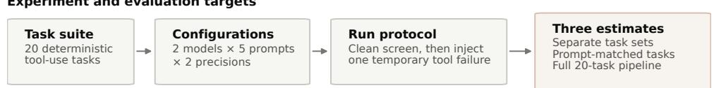

C. Full pipeline (20 tasks)  
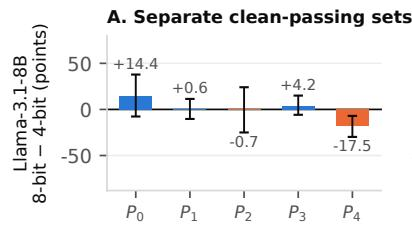

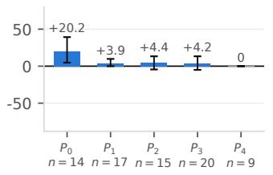

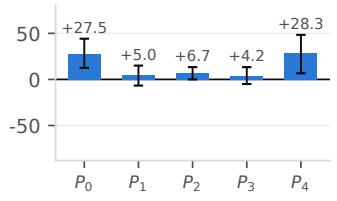

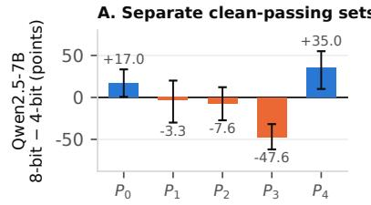

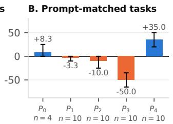

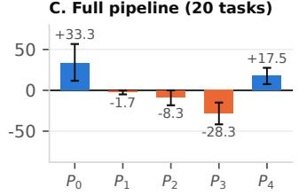  
Figure 1: The measured 8-bit–4-bit difference varies across models, prompts, and evaluation targets. A. Each variant’s own clean-passing tasks. B. Tasks that both variants pass cleanly under the same prompt; the number of matched tasks is shown below each prompt. C. All twenty tasks, with a clean failure scored as zero. Error bars are 95% task-bootstrap intervals. Panel A uses a two-sample bootstrap because the task sets can differ; Panels B and C use paired bootstraps.

We evaluate Llama-3.1-8B-Instruct and Qwen2.5-7B-Instruct at 8 and 4 bits on twenty deterministic order-management tasks, five prompts, and transient failures injected at every valid site on the required tool path. We analyze each run in three ways (Figure 1): recovery on each configuration’s own clean-passing tasks; recovery on tasks passed by both precisions under the same prompt; and full-pipeline success over all twenty tasks, with clean failures scored as failures. Llama is also evaluated at 3 bits, but the prompt interaction at that precision is exploratory and appears in the appendix.

The main result is that neither 8-bit nor 4-bit quantization provides a consistent recovery advantage across models and prompts. On prompt-matched tasks, Llama’s 8-bit–4-bit estimates range from 0 to +20.2 points, whereas Qwen’s range from −50.0 under $P _ { 3 }$ to +35.0 under $P _ { 4 }$ . Full-pipeline estimates favor 8-bit Llama under all five prompts but change sign across Qwen prompts. These results do not support a model-independent claim that one of the two precisions is more robust to temporary tool failures.

The analysis also shows why the evaluation target must be stated explicitly. For Llama $P _ { 4 } ,$ scoring each precision on its own clean-passing tasks favors 4-bit by 17.5 points. The difference is zero on the nine tasks passed by both precisions under $P _ { 4 } ,$ , while full-pipeline success favors 8-bit by 28.3 points because the 8-bit model passes many more tasks cleanly. In contrast, $\mathrm { Q w e n } / P _ { 3 }$ and $\mathrm { Q w e n } / P _ { 4 }$ retain large, oppositely directed differences after matching the tasks, so task selection cannot explain all observed variation. The scoring policy of the harness has the same power. Our executor accepts arithmetic expressions submitted in place of a literal amount, under ${ \bar { P } } _ { 4 }$ 8-bit Llama relies on this tolerance far more than 4-bit Llama does, and rescoring the logs under a strict policy reverses the Llama ${ } ^ { \prime P _ { 4 } }$ comparison on every target (Section 5.3).

Our contribution is therefore empirical and methodological. We connect the study of compressed agents with controlled tool-failure evaluation, show that the measured quantization effect varies across two models, five prompts, and two scoring policies, and identify when separate clean screening or executor leniency changes the interpretation. The resulting recommendation is to report matched-task recovery for conditional comparisons and full-pipeline success for deployment decisions, to state the scoring policy, and to use tasks as the unit of uncertainty.

## 2 Related work

Work on compressed agents and work on tool-failure recovery address different parts of our question. ACBench [Dong et al., 2025] evaluates agentic capabilities under compression, and Jang et al. [2026] show that aggregate scores can hide quantization-induced failures in $\tau ^ { : }$ 2-bench [Barres et al., 2025, Yao et al., 2024]. These studies do not isolate recovery from injected temporary tool failures. ToolMaze [Zhu et al., 2026] provides the fault taxonomy and recovery framing used here, but evaluates full-precision agents under fixed prompts. Our study connects these lines by comparing quantized variants under controlled tool failures and multiple prompt formulations. ACBench and ToolMaze each report a single success rate on tasks screened per configuration. We show on released logs that the clean screen, the evaluation target, and the executor’s parsing policy can each change the sign of a quantization comparison, and we provide matched-task and full-pipeline estimators that keep such comparisons interpretable.

Prompt sensitivity is well documented. Brittlebench [Romanou et al., 2026] measures ranking changes under semantics-preserving perturbations, while Hua et al. [2025] study evaluation artifacts in measured prompt sensitivity. Our prompts are not controlled paraphrases, so we interpret prompt differences as variation across deployment instructions rather than linguistic robustness. Recovery harnesses such as DARC [Wang et al., 2026] would need the same matched-task analysis when used to compare model variants.

## 3 Evaluation targets

Let $S ( \boldsymbol { a } , \boldsymbol { p } )$ be the set of tasks that pass a clean screen at precision a under prompt p, and for sets A of levels and $P$ of prompts define

$$
S ^ { * } ( A , P ) = \bigcap _ { a \in A , p \in P } S ( a , p ) .
$$

Let ${ r } _ { a , p } ( t )$ be mean success across the injected fault sites for task t. We report three targets because they answer different questions. The separately screened rate averages ${ r _ { a , p } ( t ) }$ over $S ( \boldsymbol { a } , \boldsymbol { p } )$ . It describes recovery on the work that one configuration handles cleanly, but two such rates may use different tasks. The matched-task recovery rate averages over tasks in $S ( a _ { 1 } , p ) \cap S ( a _ { 2 } , p )$ when comparing precisions $a _ { 1 }$ and $a _ { 2 }$ under prompt p. It isolates recovery on the same clean-solvable work. The full-pipeline success rate averages over all generated tasks and assigns zero to a task that fails the clean screen. Operationally, it is the success rate of a gated procedure in which a configuration is first certified on each task without faults and then run on that task under faults, with an uncertified task counted as a failure. This is the protocol of fault-injection evaluations that only perturb tasks a system already solves, including ours and ToolMaze’s [Zhu et al., 2026]. Because an uncertified task might still succeed under faults, the rate is a lower bound on ungated success, and we use it only to rank configurations under the gated protocol.

Our primary conditional comparison matches 8-bit and 4-bit tasks within each prompt, retaining 9– 20 Llama tasks and 4–10 Qwen tasks. As a stricter sensitivity analysis, we also use $S ^ { \bar { * } } ( \{ \mathbb { Q } 8 , \mathbb { Q } 4 \} , \mathcal { P } )$ the tasks that pass at both precisions under all five prompts. This intersection contains nine Llama tasks and three Qwen tasks. The exploratory 3-bit analysis uses separate Llama-only intersections (Appendix C).

## 4 Experimental setup

Tasks. The main prompt experiments use twenty deterministic tasks in a synthetic ordermanagement environment. Ten tasks require lookups of an order, customer, and discount, and ten add a shipping-fee lookup. Values come from a fixed seed, and the generator verifies each gold answer and minimal trajectory. A broader forty-task suite with multi-order and distractor-tool task families appears only in the appendix $P _ { 0 }$ ladder.

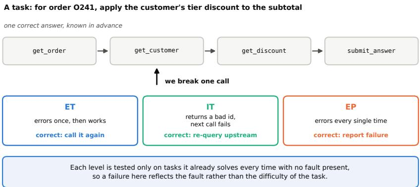  
Figure 2: One task and the three fault conditions. Each task is a deterministic tool chain with one verified answer, and a fault is injected at one call on the required path. The transient condition (ET) is the main experiment. Displaced (IT) and permanent (EP) faults are evaluated under $P _ { 0 }$ only (Appendix A). Fault episodes run only on tasks that pass that condition’s clean screen.

Models and serving. The main experiments evaluate Llama-3.1-8B-Instruct [Grattafiori et al., 2024] at Q8\_0, Q4\_K\_M, and Q3\_K\_M, and Qwen2.5-7B-Instruct [Yang et al., 2024] at Q8\_0 and Q4\_K\_M. The $P _ { 0 } – \mathrm { o n l y }$ appendix ladder also includes Llama Q6\_K, Q5\_K\_M, and Q2\_K. We serve all checkpoints with llama.cpp [Gerganov and contributors, 2023], full GPU offload, temperature 0, top-k 1, and a fixed seed on one NVIDIA L4. Both result files record the pinned llama.cpp commit (b10f9ca) and Hugging Face model-file revision.

Tool protocol and faults. On each turn the model emits one JSON object, the harness executes the requested tool, and the next prompt includes the observation. An episode is one attempt at one task. It ends at submit\_answer, report\_failure, or the step budget. Following ToolMaze [Zhu et al., 2026], the transient-error condition (ET) makes one target call fail while a later identical call succeeds. We inject this fault at every valid site on the gold tool path, producing 13–50 fault episodes per prompt–precision cell. Displaced (IT) and permanent (EP) faults were evaluated only under $P _ { 0 }$ (Appendix A).

Output parsing and scoring. All prompts ask for one JSON object per turn and a literal numeric amount in submit\_answer. The harness is tolerant on both counts. It extracts the first JSON object embedded in a non-JSON turn, and it evaluates a submitted arithmetic expression such as 200.0 \* 0.5 with a restricted parser. Each episode log records whether the episode was strict JSON throughout and whether the answer was an expression, so the released data can be rescored. We call the main-results policy tolerant scoring and the alternative that requires strict JSON and a literal amount strict scoring; the clean screen uses the same executor, so strict scoring also changes which tasks pass it. Section 5.3 reports all three targets under both policies.

Prompts. $P _ { 0 }$ contains tool signatures, a one-object-per-turn format rule, a worked example, an instruction that tools may fail and may be retried, and report\_failure. We wrote four rewrites that retain the tool interface and output format while changing the instructions. $P _ { 1 }$ and $P _ { 2 }$ use prose, $P _ { 3 }$ uses numbered rules, and ${ \bar { P } } _ { 4 }$ uses terse imperatives. These rewrites are not controlled paraphrases. They differ along several dimensions, and only $P _ { 0 }$ explicitly requires repeated attempts before a tool may be declared permanently unavailable. Moreover, $P _ { 3 }$ and $P _ { 4 }$ were written after the $P _ { 1 } / P _ { 2 }$ results were known. The supplementary material contains the complete prompts.

Screening and execution order. Each prompt–precision cell receives one clean pass over all twenty tasks, and faults are injected only into tasks that pass. After the exploratory Llama sweep produced the screening pattern, we froze its prompts, code, and analysis plan before running a pinned 5×3 sweep with complete episode logging. Its clean-task sets and fault-success counts match the released exploratory sweep in all fifteen cells. We then ran a 5×2 Qwen extension with the same tasks, prompts, harness, decoding settings, screening rule, and analysis. The Qwen extension was planned after the Llama result and is therefore a cross-model extension rather than a preregistered replication. Because decoding is deterministic, repeated identical counts check the pipeline but do not provide independent statistical samples.

Uncertainty. Rates carry episode-level 95% Wilson intervals where shown, while all main contrasts use task means. Comparisons between different clean-task sets use a two-sample task boot strap. Fixed-task comparisons use paired task bootstraps and two-sided sign tests that exclude ties. Every bootstrap uses 20,000 samples. Tasks, rather than injected fault sites or deterministic reruns, are the unit of uncertainty. The Llama per-level $P _ { 0 } { - } P _ { 1 }$ comparisons in Appendix C were specified after inspection of the pre-specified outcomes and are therefore exploratory.

## 5 Results

## 5.1 No precision level is consistently better

On tasks that both precisions pass cleanly under the same prompt, Llama’s 8-bit–4-bit recovery difference is +20.2 points under $P _ { 0 } ( 9 5 \% \thinspace \mathrm { C I } \thinspace [ + 4 . 8 , + 3 9 . 3 ] ) , + 3 . 9$ under $P _ { 1 } , + 4 . 4$ under $P _ { 2 } , + 4 . 2$ under $P _ { 3 }$ , and 0 under $P _ { 4 }$ (Figure 1B). Only the $P _ { 0 }$ interval excludes zero. Thus the Llama estimates are compatible with an 8-bit advantage under one prompt, but they do not show a stable difference across prompts.

Qwen varies in both direction and magnitude on the prompt-matched tasks. Its 8-bit–4-bit differences are $+ 8 . 3 , - 3 . 3 , - 1 0 . 0 , - 5 0 . 0$ , and +35.0 points from $P _ { 0 }$ through $P _ { 4 }$ . The intervals exclude zero under $P _ { 3 } ~ ( { \bf C I } ~ [ - 6 5 . 0 , - 3 5 . 0 ] )$ and $P _ { 4 } ~ ( \mathrm { C I } ~ [ + 2 0 . 0 , + 5 0 . 0 ] )$ , which favor opposite precisions. This result rules out a single 8-bit or 4-bit recovery advantage that generalizes across the two tested models and five prompts.

Full-pipeline success includes ordinary task competence as well as fault recovery (Figure 1C and Table 4). For Llama, the 8-bit point estimate is higher under all five prompts; the intervals exclude zero under $P _ { 0 } ~ ( + 2 7 . 5 $ points, $\mathrm { \bar { C } I \ [ + 1 2 . 5 , + 4 4 . 2 ] ) }$ and $P _ { 4 } ( + 2 8 . 3 , \bar { \mathrm { C I } } [ + 6 \bar { . } 7 , + 4 8 . 3 ] )$ . Qwen again changes direction, with differences o $\tilde { \cdot } + 3 3 . 3 , \tilde { - 1 . 7 } , - 8 . 3 , - 2 8 . 3$ , and $+ 1 7 . 5$ points. The $P _ { 0 } , P _ { 3 }$ and $P _ { 4 }$ intervals exclude zero. A deployment decision based on this pipeline would therefore depend on both the model and the prompt.

The stricter all-prompt intersection gives the same qualitative warning with less power. It retains nine Llama tasks and only three Qwen tasks; all intervals include zero, and the selected tasks often sit near the recovery ceiling. We use it as a sensitivity analysis rather than as the primary estimate.

## 5.2 Separate clean screening can change the conclusion

Table 1 reports recovery when each configuration is scored on its own clean-passing tasks. For Llama, the task-mean 8-bit–4-bit difference $\mathrm { i s + 1 4 . 4 }$ points under $P _ { 0 } , + 0 . 6$ under $P _ { 1 } , - 0 . 7$ under $P _ { 2 } , + 4 . 2$ under $P _ { 3 }$ , and −17.5 under $P _ { 4 }$ . Only the $P _ { 4 }$ two-sample task-bootstrap interval excludes zero $( 9 5 \% \mathrm { C I } \left[ - 2 9 . 8 , - 7 . 0 \right] )$ . Under that prompt, however, 8-bit passes 19 tasks cleanly and 4-bit passes 10, so the two rates summarize different work.

Qwen’s separately screened differences are $+ 1 7 . 0 , - 3 . 3 , - 7 . 6 , - 4 7 . 6 ,$ , and +35.0 points from $P _ { 0 }$ through $P _ { 4 }$ . The intervals exclude zero under $P _ { 0 } \left( \mathbf { C I } \left[ + 0 . 6 , + 3 3 . 3 \right] \right) , P _ { 3 } \left( \mathbf { C I } \left[ - 6 2 . 0 , - 3 1 . 8 \right] \right)$ , and $P _ { 4 }$ $( \mathbf { C I } \left[ + 1 0 . 0 , + 5 5 . 0 \right] )$ ). The clean sets differ under $P _ { 0 }$ (11 tasks for 8-bit and 5 for 4-bit) but coincide under $P _ { 1 }$ and $P _ { 4 }$ . Consequently, some separately screened comparisons mix task selection with recovery, while others already compare the same tasks.

Llama ${ } ^ { \prime P _ { 4 } }$ demonstrates the largest change in interpretation. Separate screening favors 4-bit by 17.5 points; the nine prompt-matched tasks give exactly zero; and the full pipeline favors 8-bit by 28.3 points. The first comparison is therefore driven by which tasks enter each denominator rather than by a 4-bit recovery advantage on shared work. Llama ${ } ^ { \prime P _ { 0 } }$ shows the opposite failure mode, where matching fourteen tasks reveals a +20.2-point difference that the noisier separately screened estimate does not resolve.

Qwen shows both selected-task and persistent recovery effects. Under $P _ { 0 } .$ , the estimate falls from +17.0 points on separate task sets to +8.3 on the four prompt-matched tasks, while full-pipeline success is +33.3 points. Under $P _ { 3 }$ the 8-bit clean set (ten tasks) is a subset of the 4-bit set (eleven tasks), and under $P _ { 4 }$ the two sets coincide; in both cases the matched population is the same ten tasks, and the large, oppositely signed differences (−50.0 and +35.0 points) survive matching. Separate screening can thus create, hide, or exaggerate a comparison, but it does not explain every precision difference in these data.

Table 1: Task-mean transient-fault recovery on each condition’s own clean-solvable set. Brackets give pooled successful/total fault episodes. Rows must not be compared as recovery effects unless they use the same tasks.
<table><tr><td>Model</td><td>Level</td><td> $P _ { 0 }$ </td><td> $P _ { 1 }$ </td><td> $P _ { 2 }$ </td><td> $P _ { 3 }$ </td><td> $P _ { 4 }$ </td></tr><tr><td>Llama</td><td>Q8_0</td><td>87.0% [37/44]</td><td>89.5% [41/47]</td><td>72.2% [29/44]</td><td>94.2% [47/50]</td><td>82.5% [38/48]</td></tr><tr><td></td><td>Q4_K_M</td><td>72.6% [21/32]</td><td>88.9% [38/44]</td><td>72.9% [25/38]</td><td>90.0% [44/50]</td><td>100% [20/20]</td></tr><tr><td></td><td>Q3_K_M</td><td>41.2% [16/47]</td><td>0% [0/32]</td><td>76.2% [22/32]</td><td>61.1% [26/44]</td><td>85.0% [17/21]</td></tr><tr><td>Qwen</td><td>Q8_0</td><td>97.0% [23/24]</td><td>90.0% [18/21]</td><td>83.3% [17/21]</td><td>43.3% [9/21]</td><td>85.0% [17/21]</td></tr><tr><td></td><td>Q4_K_M</td><td>80.0% [10/13]</td><td>93.3% [19/21]</td><td>90.9% [21/24]</td><td>90.9% [21/24]</td><td>50.0% [10/21]</td></tr></table>

Table 2: 8-bit minus 4-bit difference in percentage points under tolerant scoring (main results) and strict scoring (strict JSON, literal amount, clean screen rescored), for the separately screened, matched-task (n matched tasks), and full-pipeline targets. Brackets are 95% task-bootstrap interval under strict scoring; tolerant intervals appear in Figure 1 and the text.
<table><tr><td></td><td></td><td colspan="2">Separate</td><td colspan="3">Matched (n)</td><td colspan="3">Full pipeline</td></tr><tr><td>Model</td><td>Prompt</td><td>tol.</td><td>strict</td><td>tol.</td><td></td><td>strict</td><td>tol.</td><td></td><td>strict</td></tr><tr><td>Llama</td><td> $P _ { 0 }$ </td><td>+14.4</td><td>+54.2</td><td>+20.2 (14)</td><td>+50.0 (3) [0, +100]</td><td></td><td>+27.5</td><td></td><td>+12.5 [0, +27.5]</td></tr><tr><td></td><td> $P _ { 1 }$ </td><td>+0.6</td><td>+12.8</td><td>+3.9 (17)</td><td>+22.2 (9) [0, +44.4]</td><td></td><td>+5.0</td><td></td><td>+10.0 [0, +22.5]</td></tr><tr><td></td><td> $P _ { 2 }$ </td><td>-0.7</td><td>0</td><td>+4.4 (15)</td><td>0 (10) [0, 0]</td><td></td><td>+6.7</td><td>0 [0, 0]</td><td></td></tr><tr><td></td><td> $P _ { 3 }$ </td><td>+4.2</td><td>-15.0</td><td>+4.2 (20)</td><td></td><td>−25.0 (4) [−50.0, 0]</td><td>+4.2</td><td></td><td>0 [−10.0, +12.5]</td></tr><tr><td></td><td> $P _ { 4 }$ </td><td>-17.5</td><td>-42.9</td><td>0 (9)</td><td></td><td>-33.3 (6) [−66.7, -8.3]</td><td>+28.3</td><td></td><td>-15.0 [−30.0, −2.5]</td></tr><tr><td>Qwen</td><td> $P _ { 0 }$ </td><td>+17.0</td><td>+13.9</td><td>+8.3 (4)</td><td>0 (4) [0, 0]</td><td></td><td>+33.3</td><td></td><td>+31.7 [+10.0, +55.0]</td></tr><tr><td></td><td> $P _ { 1 }$ </td><td>-3.3</td><td>-3.3</td><td>-3.3 (10)</td><td>−3.3 (10) [−10.0, 0]</td><td></td><td>-1.7</td><td>-1.7 [−5.0, 0]</td><td></td></tr><tr><td></td><td> $P _ { 2 }$ </td><td>-7.6</td><td>-7.6</td><td>-10.0 (10)</td><td></td><td>−10.0 (10) [−25.0, 0]</td><td>-8.3</td><td>-8.3 [−18.3, 0]</td><td></td></tr><tr><td></td><td> $P _ { 3 }$ </td><td>-47.6</td><td>-47.6</td><td>–50.0 (10)</td><td></td><td>−50.0 (10) [−65.0, -35.0]</td><td>-28.3</td><td></td><td>-28.3 [−42.5, −15.0]</td></tr><tr><td></td><td> $P _ { 4 }$ </td><td>+35.0</td><td>+35.0</td><td>+35.0 (10)</td><td></td><td>+35.0 (10) [+20.0, +50.0]</td><td>+17.5</td><td></td><td>+17.5 [+7.5, +27.5]</td></tr></table>

## 5.3 Scoring policy changes the Llama comparison

The results above use tolerant scoring (Section 4). Table 2 rescores the same logs under strict scoring, with the clean screen rescored under the same policy; no model was rerun. Qwen almost never submits an expression (one of 165 successful fault episodes), so its estimates are essentially unchanged and the $P _ { 3 } / P _ { 4 }$ reversal is identical under both policies. Llama submits expressions heavily under every prompt, and under $P _ { 4 }$ the two precisions differ sharply. There, 30 of the 38 successful 8-bit fault episodes submit an expression, against 3 of 20 for 4-bit. Strict scoring therefore removes most of 8-bit Llama’s successes, shrinks its clean sets from 18–20 tasks to 4–10, and reverses the $P _ { 4 }$ comparison on every target. Separate screening moves from −17.5 to −42.9 points, the matchedtask difference from 0 to −33.3 (six tasks), and full-pipeline success from +28.3 to −15.0. The Llama full-pipeline point estimate no longer favors 8-bit under every prompt (+12.5, +10.0, 0, 0, −15.0 from $P _ { 0 }$ to $P _ { 4 , }$ .

Executor leniency is thus a third design choice, alongside the prompt and the evaluation target, that can reverse a quantization comparison, and under strict scoring Llama $P _ { 4 }$ favors 4-bit on all three targets. The two policies also measure different things. Tolerant scoring asks whether the agent recovers the right number; strict scoring also asks whether it obeys the output contract, which matters when a downstream parser does no repair. Because 8-bit Llama violates the literal-amount instruction far more often than 4-bit Llama under $P _ { 4 }$ , a strict executor penalizes it there for format compliance rather than recovery. We keep tolerant scoring as the main result because it isolates recovery, but a deployment comparison should use the deployed executor’s policy and say so.

## 6 Implications for evaluation

Match the measure to the claim. A conditional statement about recovery requires the same tasks in every compared configuration. A prompt-wise clean-task intersection provides that comparison, although the intersection may be small or selected for easier tasks. A deployment comparison should additionally report full-pipeline success over the entire suite, because clean competence is part of system performance.

Use tasks as the unit of evidence. Multiple injected sites within one task share the task’s structure and should not be treated as independent evidence about a cross-condition difference. Deterministic reruns check reproducibility rather than increasing sample size, and reporting task-level intervals alongside episode counts makes these dependencies visible.

Evaluate the deployed instructions. Prompts that change when an agent should retry, stop, or declare failure specify different policies rather than interchangeable wording. Recovery should therefore be tested with the deployment prompt at each candidate precision. Attributing a difference to one instruction requires a single-factor ablation rather than a comparison of multi-feature rewrites.

State the scoring policy. Output repair in the harness is part of the evaluated system. It should be documented, logged per episode so that results can be rescored, and matched to the deployed executor. When variants differ in how often they rely on repair, as 8-bit and 4-bit Llama do under $P _ { 4 } .$ , the policy can decide the comparison, and reporting both makes that dependence visible.

## 7 Limitations

Twenty tasks in one synthetic environment and two models of similar size are insufficient to estimate how often these patterns occur in other domains, model families, or scales. The twenty tasks come from two closely related templates; the generator’s multi-order and distractor-tool families were run only in the $P _ { 0 }$ ladder, so the key comparisons are untested on other task structures. The all-prompt 8- bit–4-bit intersections contain nine Llama tasks and three Qwen tasks and show substantial ceiling effects. They cannot establish equivalence or characterize the full clean-passing population. The fault model is also narrow, consisting of one transient failure that an identical retry resolves, without repeated failures, backoff, rate limits, or tool state that changes between attempts.

The five author-written prompts are not controlled paraphrases. $P _ { 3 }$ and $P _ { 4 }$ were composed after early results were known, and the per-level $P _ { 0 } – P _ { 1 }$ analysis was specified after the pre-specified outcomes. Because $P _ { 0 }$ and $P _ { 1 }$ differ in more than the retry criterion, the observed interaction does not establish a causal mechanism.

Finally, Q8\_0, Q4\_K\_M, and Q3\_K\_M are GGUF presets that differ in quantizer construction as well as nominal bit budget; “8-bit” and “4-bit” in this paper are shorthand for these presets, and our conclusions apply to them rather than to bit width in isolation or to other quantization families. Qwen was evaluated only at Q8\_0 and Q4\_K\_M, so the exploratory 3-bit prompt failure has not been tested in a second model. The strict-scoring analysis rescored existing logs without rerunning inference; a model told that its expression was rejected might behave differently. Larger task suites, independently designed prompts, additional model families and quantization methods, and the single-factor retry-policy ablation are needed to determine how broadly the observed variation generalizes.

## 8 Conclusion

We find no consistent Q8\_0 or Q4\_K\_M recovery advantage across Llama, Qwen, and five prompts. Results vary with the model, the prompt, whether the target is matched-task recovery or full-pipeline success, and whether the executor repairs non-conforming output. Separate clean screening can change the conclusion by changing the evaluated tasks, and strict scoring can reverse it by removing successes that depend on repair, as Llama/ $P _ { 4 }$ demonstrates on both counts. Evaluations should report both targets across prompts, state and log the scoring policy, and quantify uncertainty across tasks.

## References

Victor Barres, Honghua Dong, Soham Ray, Xujie Si, and Karthik Narasimhan. τ2-bench: Evaluating conversational agents in a dual-control environment. arXiv preprint arXiv:2506.07982, 2025.

Tim Dettmers and Luke Zettlemoyer. The case for 4-bit precision: k-bit inference scaling laws. arXiv preprint arXiv:2212.09720, 2022.

Peijie Dong, Zhenheng Tang, Xiang Liu, Lujun Li, Xiaowen Chu, and Bo Li. Can compressed LLMs truly act? an empirical evaluation of agentic capabilities in LLM compression. arXiv preprint arXiv:2505.19433, 2025.

Elias Frantar, Saleh Ashkboos, Torsten Hoefler, and Dan Alistarh. GPTQ: Accurate post-training quantization for generative pre-trained transformers. In International Conference on Learning Representations (ICLR), 2023.

Georgi Gerganov and contributors. llama.cpp: LLM inference in C/C++. https://github.com/ ggml-org/llama.cpp, 2023.

Aaron Grattafiori et al. The Llama 3 herd of models. arXiv preprint arXiv:2407.21783, 2024.

Andong Hua, Kenan Tang, Chenhe Gu, Jindong Gu, Eric Wong, and Yao Qin. Flaw or artifact? rethinking prompt sensitivity in evaluating LLMs. arXiv preprint arXiv:2509.01790, 2025.

Jiwon Jang, Kisu Yang, Heuiseok Lim, and Hyunwoo Park. Flat score, amplified failures: How the error budget masks damage in quantized LLM agents. arXiv preprint arXiv:2607.27275, 2026.

Angelika Romanou, Mark Ibrahim, Candace Ross, Chantal Shaib, Kerem Oktar, Samuel J. Bell, Anaelia Ovalle, Jesse Dodge, Antoine Bosselut, Koustuv Sinha, and Adina Williams. Brittlebench: Quantifying LLM robustness via prompt sensitivity. arXiv preprint arXiv:2603.13285, 2026.

Pan Wang, Yihao Hu, Hang Wang, Zirui Lv, Xin Zhang, Jianshe Li, Jiang-Ming Yang, Wei Wu, and Yongqi Tong. Diagnosis before recovery: Turning agent failures into selective self-correction. arXiv preprint arXiv:2608.11772, 2026.

An Yang, Baosong Yang, Beichen Zhang, Binyuan Hui, Bo Zheng, Bowen Yu, et al. Qwen2.5 technical report. arXiv preprint arXiv:2412.15115, 2024.

Shunyu Yao, Noah Shinn, Pedram Razavi, and Karthik Narasimhan. τ -bench: A benchmark for tool-agent-user interaction in real-world domains. arXiv preprint arXiv:2406.12045, 2024.

Dongsheng Zhu, Xuchen Ma, Yucheng Shen, Xiang Li, Yukun Zhao, Shuaiqiang Wang, Lingyong Yan, and Dawei Yin. When tools fail: Benchmarking dynamic replanning and anomaly recovery in LLM agents. arXiv preprint arXiv:2606.05806, 2026.

## A Full Llama quantization ladder under the original prompt

Before the prompt sweep, we evaluated six quantization presets under $P _ { 0 }$ and three fault conditions (Figure 3, Table 3). For transient faults, pooled success on each preset’s $P _ { 0 }$ clean-solvable set is $1 1 \bar { 7 } / 1 4 1 = 8 3 \%$ for Q8\_0–Q5\_K\_M and $5 9 / 7 0 = 5 6 \%$ for ${ \mathsf { Q 4 _ { - } K _ { - } M } } { \mathsf { - } } { \mathsf { Q 3 _ { - } K _ { - } M } }$ (Fisher exact $p =$ $4 . 7 \times 1 0 ^ { - 5 } )$ . On eleven tasks clean-solvable by both groups, five favor the higher-precision group, six tie, and none favor the lower group (sign test $p = 0 . 0 6 3 .$ , task-bootstrap CI [5, 29] points). Thus the site-level evidence is stronger than the task-level evidence.

No clean-solvable-set permanent-fault episode above 3 bits produced a fabricated numeric answer. Failures instead involved insufficient retries or unstructured termination. The earlier one-prompt Qwen2.5-7B-Instruct check gave 96% versus 77% pooled recovery. Its complete five-prompt extension is now part of the main analysis, and the earlier file is retained only as an audit trail. Q2\_K fails the pre-specified minimum of eight clean tasks and is excluded. It nevertheless emits strictly well-formed tool calls in 102 of 120 clean episodes (a tolerant parser recovers a call in all 120), usually repeating one call until the step budget ends. In an earlier protocol iteration, adding one sentence about tool resilience reduced the 4-bit model’s clean accuracy by 26 points while leaving the 8-bit result unchanged. Because prompt length and termination signaling both changed, we do not attribute that observation to one cause.

$$
\begin{array} { r l } & { \mathrel { \mathop { \longrightarrow } } \mathrel { \mathop { \longrightarrow } } \mathrel { \mathop { \mathrm { C l e a n } } } \mathrm { ( c l e a n - s o l v a b l e ~ s e t ) } \mathrel { \mathop { \longrightarrow } } \mathrel { \mathop { \mathrm { \Large ~ \sim ~ } } } \mathrm { T r a n s i e n t ~ f a u l t ~ ( E T ) } } \\ & { \mathrel { \mathop { \longrightarrow } } \mathrel { \mathop { \mathrm { C o r r u p t e d ~ d a t a ~ ( T T ) } } } \mathrel { \mathop { \longrightarrow } } \mathrel { \mathop { \mathrm { D e a d ~ t o o l : ~ a b s t a i n ~ ( E P ) } } } } \end{array}
$$

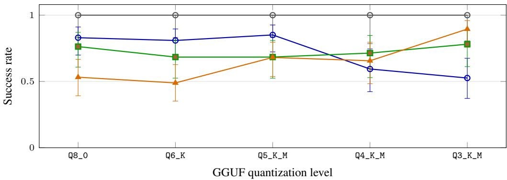  
Figure 3: The $P _ { 0 }$ ladder: success by quantization level under clean execution and the three fault conditions, each level on its own same-prompt clean-solvable set, with episode-level 95% Wilson intervals. The Q5\_K\_M-to-Q4\_K\_M transient-recovery decrease is conditional on $P _ { 0 } ;$ compare Figure 1.

Table 3: Results under $P _ { 0 }$ on each level’s same-prompt clean-solvable set. EP success denotes correct report $; \pm \mathsf { a i l }$ lure use; “Invented” counts fabricated numeric answers in EP.
<table><tr><td>Level</td><td>CLEAN</td><td>ET</td><td>IT</td><td>EP</td><td>Invented</td></tr><tr><td>Q8_0</td><td>19/19 (100%)</td><td>39/47 (83%)</td><td>29/38 (76%)</td><td>25/47 (53%)</td><td>0</td></tr><tr><td>Q6_K</td><td>19/19 (100%)</td><td>38/47 (81%)</td><td>26/38 (68%)</td><td>23/47 (49%)</td><td>0</td></tr><tr><td>Q5_K_M</td><td>19/19 (100%)</td><td>40/47 (85%)</td><td>26/38 (68%)</td><td>32/47 (68%)</td><td>0</td></tr><tr><td>Q4_K_M</td><td>14/14 (100%)</td><td>19/32 (59%)</td><td>20/28 (71%)</td><td>21/32 (66%)</td><td>0</td></tr><tr><td>Q3_K_M</td><td>16/16 (100%)</td><td>20/38 (53%)</td><td>25/32 (78%)</td><td>34/38 (89%)</td><td>3</td></tr></table>

## B Pipeline yield tables

Table 4: Full-suite pipeline yield: task-mean transient-fault success over all twenty tasks, with a task that fails the clean screen assigned zero. This quantity combines clean competence and fault recovery.
<table><tr><td>Model</td><td>Level</td><td> $P _ { 0 }$ </td><td> $P _ { 1 }$ </td><td> $P _ { 2 }$ </td><td> $P _ { 3 }$ </td><td> $P _ { 4 }$ </td></tr><tr><td>Llama</td><td>Q8_0</td><td>.78</td><td>.85</td><td>.65</td><td>.94</td><td>.78</td></tr><tr><td></td><td>Q4_K_M</td><td>.51</td><td>.80</td><td>.58</td><td>.90</td><td>.50</td></tr><tr><td></td><td>Q3_K_M</td><td>.39</td><td>.00</td><td>.53</td><td>.55</td><td>.42</td></tr><tr><td>Qwen</td><td>Q8_0</td><td>.53</td><td>.45</td><td>.42</td><td>.22</td><td>.425</td></tr><tr><td></td><td> $_ { \mathbb { Q } 4 _ { - } \mathbb { K } _ { - } \mathbb { M } }$ </td><td>.20</td><td>.47</td><td>.50</td><td>.50</td><td>.25</td></tr></table>

## C Exploratory Llama prompt–precision interaction

This analysis was specified after inspection of the planned Llama outcomes, and $P _ { 0 }$ and $P _ { 1 }$ differ in several ways. On each precision level’s pairwise common clean set, the $P _ { 0 } { - } P _ { 1 }$ recovery difference is −3.9 points at 8 bits $( { \bar { n } } = 1 7 \operatorname { t a s k s } , \operatorname { C I } [ { \bar { - } } 1 5 . 7 , + 5 . 9 ] ) , - 1 9 . 2 \operatorname { a t } 4 \operatorname { b i t s } \ ( { n } = 1 3 , \operatorname { C I } [ - 3 7 . 2 , - 3 . 8 ]$ , sign test $p = 0 . 1 2 5$ with four untied tasks), and +56.0 at 3 bits $( n { = } 1 4 , \mathrm { C I } \ [ + 3 5 . 7 , + 7 5 . 0 ] ;$ Figure 4A). Thus $P _ { 1 }$ has the higher point estimate at 8 and 4 bits, but the direction reverses at 3 bits.

On the distinct nine-task common set that passes every Llama 3-bit prompt condition, $P _ { 0 }$ recovers 77.8% and $P _ { 1 }$ recovers 0%; all nine tasks favor $P _ { 0 }$ (sign test $p = \bar { 3 . 9 } { \times } \bar { 1 0 } ^ { - 3 } , { \bf C I } \left[ + 6 1 . 1 , + 9 4 . 4 \right] )$ . The other prompts recover 100% for $P _ { 2 } , 6 6 . 7 \%$ for $P _ { 3 }$ , and 94.4% for $P _ { 4 }$ on this set.

Thirty-one of the 32 failed $3 { \mathrm { - b i t } } / P _ { 1 }$ episodes terminate with report\_failure after a transient error; the remaining episode submits an incorrect answer (Figure 4B). This regularity describes the output behavior, not an internal mechanism. A causal test would change only the repeated-attempts criterion between $P _ { 0 }$ and $P _ { 1 }$ and rerun the comparison at all three precision levels. Qwen was not run at 3 bits, and this ablation has not been conducted.

$$
P _ { 0 } - P _ { 1 }
$$

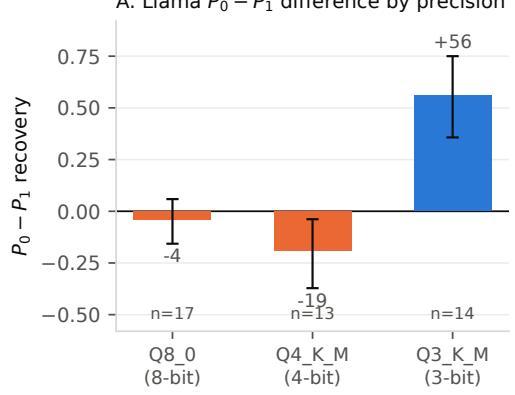

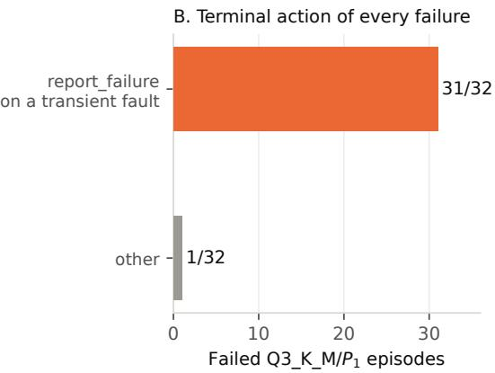  
Figure 4: Exploratory Llama-only prompt–precision result. A. Task-mean $P _ { 0 } { - } P _ { 1 }$ recovery difference on each precision level’s pairwise common clean set, with task-bootstrap 95% intervals. B. Terminal actions of all 32 failed $\hat { \mathbb { Q } } 3 _ { - } \mathbb { K } _ { - } \mathbb { M } P _ { 1 }$ episodes: 31 declare the transient fault permanent.

## NeurIPS Paper Checklist

1. Claims. Yes. The abstract and introduction state one primary empirical claim: neither 8-bit nor 4-bit quantization has a consistent tool-failure recovery advantage across the tested models and prompts. The paper also shows that separate clean screening can change the interpretation by changing the evaluated tasks. The Llama prompt–precision interaction is labeled exploratory, and no causal claim is made about which prompt feature drives it.

2. Limitations. Yes. Section 7 covers the small intersections, one synthetic environment, two similarly sized models, author-written prompts, post-hoc P3/P4, ceiling effects, the un-run criterion ablation, GGUF preset coverage, and the post-Llama timing of the Qwen extension.

3. Theory assumptions and proofs. N/A. No theoretical results.

4. Experimental reproducibility. Yes. Fixed seeds, temperature-0 decoding, pinned llama.cpp commit and model-file revision recorded in both released result files, and a Llama analysis plan fixed before its pinned run. The Qwen extension uses the frozen protocol but was planned after the Llama result and is not described as preregistered.

5. Open access to data and code. Yes. The task generator, harness, prompts, analysis code, and complete per-episode logs for all twenty-five Llama and Qwen sweep cells are in the supplementary ZIP; confirmatory\_paper\_stats.py reproduces the reported cross-prompt comparisons from the shipped data, and strict\_vs\_tolerant.py reproduces Table 2.

6. Experimental settings. Yes. Section 4 and the supplementary README give models, quantization levels, decoding parameters, prompts, and hardware.

7. Error bars. Yes. Episode-level 95% Wilson intervals where shown; two-sample task-bootstrap intervals for contrasts between different clean-task sets; and paired task-bootstrap intervals with sign tests for fixed-task contrasts. Every bootstrap uses 20,000 samples. Exploratory analyses are labeled, and the text notes where the bootstrap and sign test disagree.

8. Compute. Yes. All experiments ran on a single NVIDIA L4 (24 GB), roughly 12 GPU-hours total across the exploratory runs, pinned Llama run, and Qwen extension.

9. Code of ethics. Yes. The research conforms to the NeurIPS Code of Ethics.

10. Broader impacts. The work aims to prevent misleading reliability conclusions when quantized agents are selected for deployment. We foresee no negative applications specific to this evaluation method.

11. Safeguards. N/A. No models or data with misuse risk are released.

12. Licenses. Yes. Llama-3.1 (Llama 3.1 Community License), Qwen2.5 (Apache 2.0), llama.cpp (MIT), community GGUF conversions credited.

13. New assets. Yes. The released task suite and harness are documented in the supplementary README.

14. Crowdsourcing / human subjects. N/A.

15. IRB. N/A.

16. LLM usage. LLM assistance was used for experiment code, analysis tooling, and draft editing. All experimental design decisions, results, and citations were verified by the author, who takes full responsibility for the content. No LLM is an author.