# RAPID FREDHOLM STABILIZATION OF THE KURAMOTO–SIVASHINSKY EQUATION WITH UNRESTRICTED, SPATIALLY-VARYING ANTI-DIFFUSION.

Luke Bhan1, Miroslav Krstic1 and Yuanyuan Shi1

Abstract. In this work, we develop the first feedback design for rapid stabilization of the Kuramoto– Sivashinsky equation with a spatially varying anti-difusion coeficient. For constant coeficients, the single-input Fredholm design of Coron and L¨u (2015) excludes a discrete set of values at which repeated unstable eigenvalues cause a loss of controllability. We overcome this obstruction by introducing a second boundary input and assigning the two inputs distinct roles. The key idea, inspired by Heymann’s Lemma, is to use the boundary value $u ( 0 , t )$ entirely for a pre-feedback that renders the modified plant controllable through the curvature input $u _ { x x } ( 0 , t )$ . The latter input then stabilizes the plant through a Fredholm backstepping transformation. We show that two inputs sufice for controllability and are necessary when the plant has an unstable double eigenvalue. However, the Fredholm kernel still must be approximated for implementation. Hence, to enable kernel and gain approximation, we prove continuity of the coeficient-to-gain design map on compact admissible design classes. Unlike Volterra-based continuity proofs using successive approximations, our proof uses the modal representation to control the spectral data, the inverse coeficient system, and the tails of the kernel and gain series. This yields a single neural operator approximation of the gain to any prescribed $L ^ { 2 }$ accuracy across the class. Finally, we establish rapid local stabilization of the nonlinear closed-loop system under both the exact gains and suficiently accurate approximations. We conclude with numerical results that illustrate prescribed decay rates and the accuracy and computational cost of the approximations. In particular, we train a Fourier neural operator that achieves typical relative gain errors of approximately 0.1% and stabilizes all held-out cases tested, including a plant with an unstable double eigenvalue.

## 1. Introduction

## 1.1. Summary of results

We study the Kuramoto–Sivashinsky (KS) equation with a spatially varying anti-difusion coeficient and two boundary inputs:

$$
u _ { t } + u _ { x x x x } + \left( \lambda ( x ) u _ { x } \right) _ { x } + u u _ { x } = 0 ,\tag{1.1a}
$$

$$
u ( 1 , t ) = u _ { x x } ( 1 , t ) = 0 ,\tag{1.1b}
$$

$$
u ( 0 , t ) = U _ { 1 } ( t ) ,\tag{1.1c}
$$

$$
u _ { x x } ( 0 , t ) = U _ { 2 } ( t ) ,\tag{1.1d}
$$

on $( x , t ) \in ( 0 , 1 ) \times ( 0 , \infty )$ , with $u ( \cdot , 0 ) = u _ { 0 } \in L ^ { 2 } ( 0 , 1 )$ . The inputs $U _ { 1 }$ and $U _ { 2 }$ act on boundary displacement and curvature, respectively. For constant λ and $U _ { 1 } \equiv 0$ , the KS system in (1.1) is equivalent to the system in [14], whose design requires

$$
\lambda \not \in \mathcal { N } _ { \lambda } : = \{ ( i ^ { 2 } + j ^ { 2 } ) \pi ^ { 2 } : \ i , j \in \mathbb { Z } ^ { + } , \ i \not = j \} ,\tag{1.2}
$$

where, at these values, the linearized plant has an unstable double eigenvalue that no linear feedback through $U _ { 2 }$ alone can move (Proposition 2.3).

We showcase that, with two inputs, the restriction of (1.2) is removed. Moreover, we upgrade λ to be any function in $W ^ { 1 , \infty } ( 0 , 1 )$ by assigning the two inputs distinct roles. The displacement input $U _ { 1 }$ is used, in the sense of Heymann’s Lemma [23], entirely for a pre-feedback that makes the plant controllable through the curvature input $U _ { 2 } .$ , and $U _ { 2 }$ carries a Fredholm backstepping feedback (Figure 1). The first of our two main results is the following.

Theorem 1.1 (Two boundary feedbacks stabilize the Kuramoto–Sivashinsky equation at any rate for every anti-difusion coeficient). Consider the plant (1.1) with $\lambda \in W ^ { 1 , \infty } ( 0 , 1 )$ under the feedback laws

$$
U _ { 1 } ( t ) = \varepsilon \int _ { 0 } ^ { 1 } e ^ { - \theta y } u ( y , t ) \mathrm { d } y , \qquad U _ { 2 } ( t ) = \int _ { 0 } ^ { 1 } h ( y ) u ( y , t ) \mathrm { d } y ,\tag{1.3}
$$

with the gain

$$
h ( y ) = \sum _ { n \geq 1 } \frac { a + \tilde { \kappa } _ { n } } { \tilde { \chi } _ { n } ^ { \prime } ( 0 ) } \tilde { \chi } _ { n } ( y ) ,\tag{1.4}
$$

where ${ \tilde { \mu } } _ { n } , n \geq 1$ , are the eigenvalues, with eigenfunctions $\tilde { \chi } _ { n }$ , of

$$
- \tilde { \chi } ^ { \prime \prime \prime \prime } - ( \lambda \tilde { \chi } ^ { \prime } ) ^ { \prime } - \varepsilon \big ( \tilde { \chi } ^ { \prime \prime \prime } ( 0 ) + \lambda ( 0 ) \tilde { \chi } ^ { \prime } ( 0 ) \big ) e ^ { - \theta x } = \tilde { \mu } \tilde { \chi } , \qquad \tilde { \chi } ( 0 ) = \tilde { \chi } ^ { \prime \prime } ( 0 ) = \tilde { \chi } ( 1 ) = \tilde { \chi } ^ { \prime \prime } ( 1 ) = 0 ,\tag{1.5}
$$

and $\left( { \tilde { \kappa } } _ { n } \right)$ is the bounded solution of

$$
\tilde { \kappa } _ { m } = - a \sum _ { n \ne m } \frac { a + \tilde { \kappa } _ { n } } { \tilde { \mu } _ { n } - \tilde { \mu } _ { m } + a } , \qquad m \ge 1 .\tag{1.6}
$$

There exist a discrete set $\mathcal { T } _ { \lambda } \subset ( 0 , \infty )$ and a positive function $\varepsilon _ { 1 }$ on $( 0 , \infty ) \mid \mathcal { T } _ { \lambda }$ such that, for all $\theta \notin \mathcal { T } _ { \lambda }$ $0 < | \varepsilon | < \varepsilon _ { 1 } ( \theta )$ , and $a >$ max $\{ 0 , \operatorname* { m a x } _ { n } \mathrm { R e } \tilde { \mu } _ { n } \}$ with $\iota \not \in \{ \tilde { \mu } _ { i } - \tilde { \mu } _ { j } : \ i , j \geq 1 \}$ , every ${ \tilde { \mu } } _ { n }$ is algebraically simple, $\tilde { \chi } _ { n } ^ { \prime } ( 0 ) \ne 0$ , the bounded solution $\left( { \tilde { \kappa } } _ { n } \right) o f \left( 1 . 6 \right)$ exists and is unique, the series $( 1 . 4 )$ converges in $L ^ { 2 } ( 0 , 1 )$ to a real-valued function, and, for every $\omega \in \left( 0 , a - \operatorname* { m a x } _ { n } \operatorname { R e } \tilde { \mu } _ { n } \right)$ , there exist $\rho _ { 0 } , C , \epsilon ^ { * } > 0$ such that, for every $u _ { 0 } \in L ^ { 2 } ( 0 , 1 )$ with $\left\| u _ { 0 } \right\| \le \rho _ { 0 }$ , the closed-loop system (1.1), (1.3), with h in $U _ { 2 }$ defined by (1.4) or replaced by any $\hat { h } \in L ^ { 2 } ( 0 , 1 )$ satisfying $\| \hat { h } - h \| \leq \epsilon ^ { * }$ , has a unique mild solution $u \in C ( [ 0 , \infty ) ; L ^ { 2 } ( 0 , 1 ) ) \cap L _ { \mathrm { l o c } } ^ { 2 } ( [ 0 , \infty ) ; H ^ { 2 } ( 0 , 1 ) )$ satisfying

$$
\begin{array} { r } { \| u ( t ) \| \le C e ^ { - \omega t } \| u _ { 0 } \| , \qquad t \ge 0 . } \end{array}\tag{1.7}
$$

Theorem 1.1 concerns the controller (1.3)–(1.6) with the gain h computed exactly or approximated within $\epsilon ^ { * }$ Since a is restricted only from below and away from a discrete set, the decay rate ω can be prescribed arbitrarily, for every $\lambda \in W ^ { 1 , \infty } ( 0 , 1 )$ . The assertions on the eigenvalues, the gain and the coeficients ${ \tilde { \kappa } } _ { n }$ are proved in Sections 4–5 (Theorems 4.2 and 5.1), the closed-loop assertion in Section 7 (Theorem 7.4 for h, Theorem 7.6 for $\hat { h } )$ , and well-posedness in Appendix C.

The gain (1.4) is defined through the spectral data of (1.5) and the infinite system (1.6), and it must be recomputed for each λ and each choice of $( a , \varepsilon , \theta )$ . Our second main result replaces this computation by the evaluation of a single neural operator, trained once on a compact class of coeficients and design parameters.

Theorem 1.2 (A single neural operator stabilizes every plant in a compact class at a uniform rate). For $B > 0$ and $d \in ( 0 , 1 ]$ , let

$$
\mathcal { U } _ { B , d } : = \left\{ \mathbf { p } = ( \lambda , a , \varepsilon , \theta ) \in W ^ { 2 , \infty } ( 0 , 1 ) \times ( 0 , \infty ) \times \mathbb { R } \times ( 0 , \infty ) : \ \| \lambda \| _ { W ^ { 2 , \infty } } \leq B , ~ a + | \varepsilon | + \theta + \theta ^ { - 1 } \leq B , \right.
$$

$$
\operatorname* { m i n } _ { i \neq j } \frac { | \tilde { \mu } _ { i } - \tilde { \mu } _ { j } | } { \operatorname* { m a x } ( i , j ) ^ { 3 } } \geq d , \operatorname* { m i n } _ { n } \frac { | \tilde { \chi } _ { n } ^ { \prime } ( 0 ) | } { n } \geq d , \operatorname { d i s t } \big ( a , \{ \tilde { \mu } _ { i } - \tilde { \mu } _ { j } \} \big ) \geq d , a - \operatorname* { m a x } _ { n } \mathrm { R e } \tilde { \mu } _ { n } \geq d \Big \} ,\tag{1.8}
$$

where ${ \tilde { \mu } } _ { n }$ , repeated according to algebraic multiplicity and indexed so that Re $\tilde { \mu } _ { 1 } \geq \operatorname { R e } \tilde { \mu } _ { 2 } \geq \cdot \cdot \cdot , a r \epsilon$ the eigenvalues of (1.5), with eigenfunctions $\tilde { \chi } _ { n }$ , let $\mathcal G ( \mathbf { p } )$ denote the gain h in (1.4), and consider, for a map $\hat { \mathcal { G } } : \mathcal { U } _ { B , d }  L ^ { 2 } ( 0 , 1 )$ and $\mathbf { p } \in \mathcal { U } _ { B , d }$ , the plant (1.1) with coeficient λ under the feedback laws

$$
U _ { 1 } ( t ) = \varepsilon \int _ { 0 } ^ { 1 } e ^ { - \theta y } u ( y , t ) \mathrm { d } y , \qquad U _ { 2 } ( t ) = \int _ { 0 } ^ { 1 } \hat { \mathcal { G } } ( \mathbf { p } ) ( y ) u ( y , t ) \mathrm { d } y .\tag{1.9}
$$

For every $\epsilon > 0$ there exists a neural operator ${ \hat { \mathcal { G } } } ,$ , with function input $\lambda ,$ scalar inputs $( a , \varepsilon , \theta )$ , and output in $L ^ { 2 } ( 0 , 1 )$ , satisfying $\begin{array} { r } { \operatorname* { s u p } _ { \mathbf { p } \in \mathcal { U } _ { B , d } } \| \hat { \mathcal { G } } ( \mathbf { p } ) - \mathcal { G } ( \mathbf { p } ) \| \leq \epsilon _ { \lambda } } \end{array}$ and there exist $\epsilon _ { B , d } ^ { * } , \rho _ { B , d } , C _ { B , d } > 0$ such that, for every map $\hat { \mathcal G }$ with $\begin{array} { r } { \mathrm { s u p } _ { \mathbf { p } \in \mathcal { U } _ { B , d } } \| \hat { \mathcal { G } } ( \mathbf { p } ) - \mathcal { G } ( \mathbf { p } ) \| \leq \epsilon _ { B , d } ^ { * } , } \end{array}$ every $\mathbf { p } \in \mathcal { U } _ { B , d } ,$ and every $u _ { 0 } \in L ^ { 2 } ( 0 , 1 )$ with $\| u _ { 0 } \| \le \rho _ { B , d }$ , the closed-loop system (1.1), (1.9) has a unique mild solution u $\in C ( [ 0 , \infty ) ; L ^ { 2 } ( 0 , 1 ) ) \cap L _ { \mathrm { l o c } } ^ { 2 } ( [ 0 , \infty ) ; H ^ { 2 } ( 0 , 1 ) )$ satisfying

$$
\| u ( t ) \| \le C _ { B , d } e ^ { - d t / 4 } \| u _ { 0 } \| , \qquad t \ge 0 .\tag{1.10}
$$

The class $\mathcal { U } _ { B , d }$ bounds $\lambda \mathrm { ~ i n ~ } W ^ { 2 , \infty }$ , one derivative above Theorem 1.1, so that it is compact in $W ^ { 1 , \infty } ( 0 , 1 ) \times \mathbb { R } ^ { 3 }$ $\mathrm { B y }$ Theorem 1.1, every $\lambda \in W ^ { 2 , \infty } ( 0 , 1 )$ admits designs in $\mathcal { U } _ { B , d }$ for suitable B and d. The rate is uniform over the class, and d caps it, whereas in Theorem 1.1 it is arbitrary for a single plant. The tolerance applies to any approximate gain, whether produced by a neural operator or by a truncated modal computation. Theorem 1.2 is proved in Section 7.3, from continuity of $\mathcal { G }$ and uniform bounds on the design constants (Theorem 6.2), neural-operator approximation (Theorem 6.3), and stability under gain error (Theorem 7.6). Section 8 illustrates both results on a plant with an unstable double eigenvalue, with a Fourier neural operator trained on a family of coeficients. We now review the related literature.

## 1.2. Related work

## A. Fredholm backstepping

The Fredholm-based backstepping design originates in [43], where an Euler–Bernoulli beam is stabilized at an arbitrary decay rate from displacement and moment actuation at one end. Fredholm transformations were used again in [7] for first-order hyperbolic equations, where the non-strict-feedback structure rules out a Volterra transformation and the kernel is obtained by a fixed point on the square. Concurrently, and by a diferent technique, Coron and coauthors developed Fredholm designs for the Korteweg–de Vries equation [13], the Kuramoto–Sivashinsky equation [14], integro-diferential hyperbolic equations [12], a linearized bilinear Schr¨odinger equation [10] and the linearized water tank [11]. The design relies on a transformation built from the spectral data, together with an equivalence of the closed-loop operator with respect to a shifted copy of the plant operator. The method has since been abstracted to general linear systems with a Riesz basis of eigenvectors [22] and to the parabolic case [5]. Gagnon et al. [19] extended the spectral construction to skew-adjoint operators of order greater than one through a compactness/duality argument, with an application to linearized water waves. More recently, [17] gives explicit Fredholm constructions and quantitative bounds on the transformation and its inverse as the prescribed decay rate varies, for self-adjoint and skew-adjoint operators. Here we study parameter dependence and gain approximation for a generally non-self-adjoint pre-compensated operator. It is the design of [14], in the abstract form of [22], that Section 3 applies.

## B. Boundary control of Kuramoto–Sivashinsky

For the KS PDE, the available set of stabilization results depend on both the anti-difusion coeficient and the boundary conditions. Liu and Krstic [37] established nonlinear boundary stabilization for constant $\lambda < 4 \pi ^ { 2 }$ Their comparison with the uncontrolled system uses clamped conditions $u = u _ { x } = 0$ at both ends, which difer from the hinged conditions in (1.1). For the linear equation, Cerpa [8] identified a countable set of anti-difusion parameters at which a single boundary input loses null controllability. Two suitably chosen controls at the same end remove this restriction [8, 9], with an earlier result for λ = 0 in [36]. For the hinged configuration considered here, Coron and L¨u [14] constructed a Fredholm feedback achieving local rapid stabilization with a single curvature input when the constant coeficient satisfies (1.2). Our objective is to extend this design to spatially varying coeficients while accommodating the repeated eigenvalues that obstruct single-input stabilization.

## C. Using pre-feedback to obtain controllability

In finite dimensions, Heymann’s Lemma [23] states that any controllable multi-input system can be converted into a single-input controllable system using appropriate state feedback. A subsequent feedback through that input can then assign the closed-loop poles [45, 49, 50]. Along this conceptual direction, there have been PDE designs that assign diferent roles to multiple boundary inputs, as in the beam, Burgers, and flow-control settings of [29, 30, 47]. For the periodic heat equation, Gagnon et al. [18] proved necessity and suficiency of two scalar controls and constructed Fredholm feedbacks on the odd and even subspaces, with an extension to local rapid stabilization of the viscous Burgers equation. Our construction instead uses one boundary feedback to establish controllability through the other input before designing its Fredholm feedback. Here we establish a corresponding construction for the KS equation: feedback through the displacement input separates repeated eigenvalues and makes every mode accessible to the curvature input. The latter then implements the Fredholm stabilization law. Thus, the first stage establishes the controllability needed by the second stage.

## D. Numerical and neural operator gain approximation

In PDE backstepping, the controller gain is itself obtained by solving a kernel PDE [31]. Hence, numerical implementation of the gain has been a significant subject in the backstepping literature, with various approximations introduced. For example, Smyshlyaev and Krstic [44] presented early results on approximate gains for controlling parabolic PDEs using a finite-diference scheme for the kernel. The gain accuracy afects closed-loop stability, so a suficiently fine resolution is needed to preserve stability. Subsequently, Vazquez et al. [46] developed a power-series method that represents the kernel by a truncated Taylor expansion and determines its coeficients from the kernel equations to approximate the gain. Both approaches compute gains for a specified plant coeficient.

Recently, [2] introduced neural operators for learning the mapping from plant coeficients to gains. The neural network learns this mapping over a compact class of plant coeficients, allowing the trained operator to be reused across the class. This direction has since been applied to multiple PDE backstepping problems, including adaptive control of hyperbolic [32] and parabolic PDEs [3], adaptive freeway trafic control [40], and 2  2 hyperbolic PDE systems [48].

A common structural restriction of these approaches is their reliance on Volterra-type integral constructions for the gain operator. This difers fundamentally from the Fredholm construction studied here: Lipschitz continuity of Volterra gain operators is typically established using successive approximations [28], whereas here we use a modal representation. Establishing continuity through this representation is therefore a necessary step toward neural-operator approximation of the Fredholm gain.

## E. Companion papers and distinctions

The controllability and Fredholm design in Sections 2–5 enable the companion papers on stabilizing Poiseuille channel flow [26] and Yih’s viscoisty jump between two fluids [27]. Compared with classical Poiseuille flow, which has at most one unstable eigenmode per streamwise wavenumber [42], the KS equation studied here must accommodate an arbitrarily large unstable subspace and unstable double eigenvalues. Moreover, this paper difers from [27] in the pre-feedback design. The two-fluid interface paper constructs pre-feedback using the plant’s low mode spectral profile, allowing direct application of Heymann’s Lemma to the problematic modes [27, Lemma 4]. Here, the pre-feedback is completely specified by an exponential profile with static scalar parameters, proving that this restricted family sufices for every admissible plant coeficient and provides a consistent parameterization for continuity and gain approximation. Lastly, this paper difers from both companions by studying approximation of the gain operator and establishing corresponding stability results under the approximate gain.

## 1.3. Contributions

This paper makes two principal contributions.

(1) Rapid Fredholm stabilization of the Kuramoto–Sivashinsky equation with spatially varying anti-difusion coeficient. The existing Fredholm design [14] is limited to constant anti-difusion coeficients outside the critical set (1.2), where the single controlled boundary trace loses controllability. We remove this restriction: the coeficient can be any $\lambda \in W ^ { 1 , \infty } ( 0 , 1 )$ This is achieved through two control inputs. The first is a Heymann pre-feedback that makes every mode controllable. This enables the second curvature input which stabilizes the system via Fredholm backstepping. Although the Heymann–Fredholm architecture also appears in the companion Navier–Stokes and Yih designs [26, 27], its realization here is substantially more explicit: the complete controller consists of one exponential pre-feedback and one scalar Fredholm gain, stated together with its nonlinear rapid-stabilization guarantee in Theorem 1.1.

(2) The first neural-operator approximation of a Fredholm backstepping gain. Existing neural-operator backstepping results approximate gains generated by Volterra transformations [2, 3, 32, 40, 48]. A Fredholm gain instead depends globally on the spectral data of the plant and on an infinite coupled coeficient system, so the continuity arguments used for Volterra kernel maps do not apply. We prove continuity of the coeficient-and-design-to-gain map on compact admissible classes, obtain uniform approximation by a single neural operator, and prove that every suficiently accurate approximate gain preserves local exponential stability uniformly across the class. This introduces neural-operator gain approximation into Fredholm backstepping and supplies the stability theorem required for its use in feedback. Neither this approximation result nor its robustness guarantee appears in the companion Fredholm designs [26, 27].

The following technical innovations support these contributions.

(i) We prove that two boundary inputs are suficient for every spatially varying coeficient and necessary when the plant has an unstable double eigenvalue. We then show that the restricted exponential pre-feedback family sufices to split all repeated eigenvalues and make every mode controllable from the curvature input. This KS-specific construction is what gives Theorem 1.1 its unusually explicit form.

(ii) We establish continuity of the Fredholm gain despite the non-self-adjoint pre-compensated operator, its parameter-dependent domain, and eigenvalue collisions in the original plant. The proof combines resolvent and spectral-projection continuity with uniform control of the infinite coeficient system and the modal tails.

(iii) We prove nonlinear closed-loop robustness to $L ^ { 2 }$ error in the Fredholm gain, uniformly over compact admissible design classes. This estimate is the step that converts neural-operator approximation of the gain into a uniform stabilization result.

## 1.4. Organization of the paper

Sections 2–5 establish controllability, construct the feedback, and prove its existence and invertibility. Section 6 establishes continuity of the gain and kernel and neural-operator approximation. Section 7 establishes stability under exact and approximate gains, followed by numerical results in Section 8 and conclusions in Section 9. Table 1 summarizes the main results. The principal proofs accompany their results in the main text. The appendices contain the kernel-equation verification, Sobolev bounds for the modal coordinate map, and closed-loop well-posedness arguments.

## 1.5. Notation

$L ^ { 2 } ( 0 , 1 )$ is the real Lebesgue space, complexified for spectral arguments, with norm $\| \cdot \|$ and inner product $\begin{array} { r } { \langle f , g \rangle = \int _ { 0 } ^ { 1 } } \end{array}$ fg¯ dx, linear in $f .$ The bracket also denotes the induced duality pairing. States and implemented gains are real, with feedback functionals extended complex linearly. $H ^ { s } ( 0 , 1 )$ and $W ^ { k , \infty } ( 0 , 1 )$ are Sobolev spaces.

For Banach spaces $X , Y , \ { \mathcal { L } } ( X , Y )$ denotes bounded linear operators, with ${ \mathcal { L } } ( X ) = { \mathcal { L } } ( X , X )$ and space subscripts on norms as needed. $D ( A ) , \sigma ( A )$ , and $A ^ { * }$ denote domain, spectrum, and adjoint, with the adjoint taken in $L ^ { 2 }$ unless specified otherwise. We use $\mathbb { Z } ^ { + } = \{ 1 , 2 , . . . \}$ and the square-summable sequence space $\ell ^ { 2 }$

L. BHAN, M. KRSTIC AND Y. SHI  
Table 1. Main results and their roles in the design.
<table><tr><td>Result</td><td>Statement</td><td>Section</td></tr><tr><td>Theorem 2.2, Proposition 2.3</td><td>Two inputs suffice for every coefficient. A nonnegative double eigenvalue obstructs stabilization through either input alone.</td><td>2</td></tr><tr><td>Theorem 4.2</td><td>Pre-feedback ensures simple spectrum and controllability through the curvature input.</td><td>4</td></tr><tr><td>Theorem 5.1</td><td>The kernel and gain exist, with explicit modal formulas and an 5 invertible Fredholm transformation.</td><td></td></tr><tr><td>Theorem 6.2</td><td>The kernel and gain depend continuously on a compact admis- 6 sible design class, with uniformly bounded design and stability constants.</td><td></td></tr><tr><td>Theorem 6.3</td><td>One neural operator approximates the gain uniformly to any 6.4 prescribed accuracy.</td><td></td></tr><tr><td>Theorem 1.1, Theorem 7.4</td><td>Exact feedback achieves local exponential stability at any pre- 7 scribed decay rate.</td><td></td></tr><tr><td>rem 7.6</td><td>Theorems 1.1 and 1.2, Theo- Accurate gains preserve local exponential stability, with uniform 7.3 guarantees for one neural operator across the class.</td><td></td></tr></table>

The weighted space $\ell _ { s } ^ { 2 } , s \in \mathbb { R }$ , has norm $\begin{array} { r } { \| z \| _ { \ell _ { \cdot } ^ { 2 } } ^ { 2 } = \sum _ { n > 1 } n ^ { 2 s } | z _ { n } | ^ { 2 } } \end{array}$ . Re $z , \bar { z } , \delta _ { m n }$ , and $\delta$ denote real part, complex conjugate, Kronecker symbol, and Dirac distribution. Positive constants $c , C$ may vary between estimates and are independent of the estimated indices and variables. The notation $C ( B , d )$ indicates dependence only on $B , d .$ Other permitted parameter dependencies are stated locally.

For an admissible design, let $\{ \chi _ { n } \} , \{ \tilde { \chi } _ { n } \}$ be the biorthogonal Riesz bases of Theorem 4.2(ii) and write $\boldsymbol { v } _ { n } = \langle \boldsymbol { v } , \tilde { \chi } _ { n } \rangle$ . The modal inner product and spectral norms are

$$
\langle v , w \rangle _ { \mathcal { H } } : = \sum _ { n \geq 1 } v _ { n } \overline { { w _ { n } } } , \qquad \| w \| _ { \mathcal { H } ^ { s } } ^ { 2 } : = \sum _ { n \geq 1 } n ^ { 2 s } | w _ { n } | ^ { 2 } .\tag{1.11}
$$

For $s \geq 0 , \mathcal { H } ^ { s }$ consists of the functions in $L ^ { 2 } ( 0 , 1 )$ with finite spectral norm. For $s < 0$ , it is the completion of finite sums of $\chi _ { n }$ in that norm. We write $\mathcal { H } = \mathcal { H } ^ { 0 }$ , which is $L ^ { 2 } ( 0 , 1 )$ with the modal inner product, and distinguish these spectral spaces from the Sobolev spaces $H ^ { s } ( 0 , 1 )$

## 2. Two inputs: necessary and sufficient

We will begin by establishing that two inputs are not only suficient, but necessary for controlling (1.1). We first establish that its operator is self adjoint, and then present the spectrum of (1.1) which leads to the controllability result.

## 2.1. Plant operator

Fix a real coeficient $\lambda \in W ^ { 1 , \infty } ( 0 , 1 )$ . Define the plant operator $A _ { \lambda }$ by

$$
A _ { \lambda } \phi : = - \phi ^ { \prime \prime \prime \prime } - ( \lambda \phi ^ { \prime } ) ^ { \prime } ,\tag{2.1a}
$$

with domain

$$
D ( A _ { \lambda } ) : = \{ \phi \in H ^ { 4 } ( 0 , 1 ) : \ \phi ( 0 ) = \phi ( 1 ) = 0 , \ \phi ^ { \prime \prime } ( 0 ) = \phi ^ { \prime \prime } ( 1 ) = 0 \} .\tag{2.1b}
$$

For any test function $\phi \in D ( A _ { \lambda } )$ , the plant (1.1) can be written in the abstract form

$$
\frac { d } { d t } \langle u , \phi \rangle = \langle u , A _ { \lambda } \phi \rangle + U _ { 1 } \langle B _ { 1 } , \phi \rangle + U _ { 2 } \langle B _ { 2 } , \phi \rangle - \langle u u _ { x } , \phi \rangle ,\tag{2.2a}
$$

$$
\langle B _ { 1 } , \phi \rangle = - \phi ^ { \prime \prime \prime } ( 0 ) - \lambda ( 0 ) \phi ^ { \prime } ( 0 ) ,\tag{2.2b}
$$

$$
\langle B _ { 2 } , \phi \rangle = - \phi ^ { \prime } ( 0 ) .\tag{2.2c}
$$

First, we will show that $A _ { \lambda }$ is self-adjoint with compact resolvent so it has a real orthonormal basis of eigenfunctions $\left\{ \varphi _ { n } \right\}$ , with eigenvalues $\mu _ { 1 } \geq \mu _ { 2 } \geq \cdot \cdot \cdot  - \infty$ repeated according to multiplicity. For constant λ the eigenpairs are known in closed form (see [14]):

$$
\varphi _ { n } ( x ) = \sqrt { 2 } \sin ( n \pi x ) , \qquad \mu _ { n } = - n ^ { 4 } \pi ^ { 4 } + \lambda n ^ { 2 } \pi ^ { 2 } .\tag{2.3}
$$

Let $A _ { \lambda }$ be split into its spatial derivative and anti-difusion components as

$$
A _ { \lambda } = A _ { 0 } + P , \qquad A _ { 0 } \phi : = - \phi ^ { \prime \prime \prime \prime } , \qquad P \phi : = - ( \lambda \phi ^ { \prime } ) ^ { \prime } .\tag{2.4}
$$

where we ensure $A _ { 0 }$ has the sine basis: $A _ { 0 } \left( { \sqrt { 2 } } \sin n \pi x \right) = - n ^ { 4 } \pi ^ { 4 } { \sqrt { 2 } }$ sin nπx. Moreover, by integration by parts, one can show the perturbation $P$ is symmetric on $D ( \overset { \cdot } { A } _ { \lambda } )$ and that $P$ is small relative to $A _ { 0 } { \mathrm { : } }$

$$
\begin{array} { r } { \| \phi ^ { \prime } \| ^ { 2 } \leq \| \phi ^ { \prime \prime } \| \| \phi \| , \qquad \| \phi ^ { \prime \prime } \| ^ { 2 } \leq \| \phi ^ { \prime \prime \prime \prime } \| \| \phi \| = \| A _ { 0 } \phi \| \| \phi \| . } \end{array}\tag{2.5}
$$

These bounds and Young’s inequality [16, App. B.2] give, for every $\epsilon > 0$

$$
\| P \phi \| \leq \epsilon \| A _ { 0 } \phi \| + C _ { \epsilon } \| \phi \| , \quad C _ { \epsilon } : = \frac { M ^ { 2 } } { 4 \epsilon } + \frac { M } { 2 } , \quad M : = \| \lambda \| _ { L ^ { \infty } } + \| \lambda ^ { \prime } \| _ { L ^ { \infty } } .\tag{2.6}
$$

Thus the Kato–Rellich Theorem [24, Thm. V.4.3] guarantees that Aλ is self-adjoint on $D ( A _ { \lambda } )$ . Its spectrum is bounded above and its resolvent is compact because $D ( A _ { \lambda } ) \hookrightarrow L ^ { 2 } ( 0 , 1 )$ compactly.

To showcase the efect of the inputs, we compute the following identity via integration by parts

Lemma 2.1. (Integration by parts identity) Let $\psi \in H ^ { 4 } ( 0 , 1 )$ satisfy $\psi ( 1 ) = \psi ^ { \prime \prime } ( 1 ) = 0$ and let $\phi \in D ( A _ { \lambda } )$ Define

$$
\phi ^ { [ 3 ] } : = \phi ^ { \prime \prime \prime } + \lambda \phi ^ { \prime } .\tag{2.7}
$$

The following boundary identity holds:

$$
\int _ { 0 } ^ { 1 } \big ( \psi ^ { \prime \prime \prime \prime } + ( \lambda \psi ^ { \prime } ) ^ { \prime } \big ) \phi \mathrm { d } x = \psi ^ { \prime \prime } ( 0 ) \phi ^ { \prime } ( 0 ) + \psi ( 0 ) \phi ^ { [ 3 ] } ( 0 ) - \int _ { 0 } ^ { 1 } \psi A _ { \lambda } \phi \mathrm { d } x .\tag{2.8}
$$

Applied with $\psi = u ( \cdot , t )$ , (2.8) produces exactly the two boundary terms of (2.2b)–(2.2c).

Lastly, throughout thsi work, we will use the modal state and input coeficients repeatedly. Hence, we define the shorthand notation:

$$
\begin{array} { r } { u _ { n } : = \langle u ( \cdot , t ) , \varphi _ { n } \rangle , \quad \alpha _ { n } : = - \langle B _ { 1 } , \varphi _ { n } \rangle = \varphi _ { n } ^ { [ 3 ] } ( 0 ) , \quad \beta _ { n } : = - \langle B _ { 2 } , \varphi _ { n } \rangle = \varphi _ { n } ^ { \prime } ( 0 ) . } \end{array}\tag{2.9}
$$

Then (2.2) gives $\dot { u } _ { n } = \mu _ { n } u _ { n } - \alpha _ { n } U _ { 1 } - \beta _ { n } U _ { 2 } - \left. u u _ { x } , \varphi _ { n } \right.$

## 2.2. Plant operator has finitely many unstable eigenvalues

In this section, we showcase that the corresponding eigenvalue structure associated with the operator $A _ { \lambda }$ yields only finitely many unstable eigenvalues which are widely separated. To do so, we consider the upper and lower bounds of λ and invoke the min-max principle.

First, consider a constant $\bar { \lambda } = \| \lambda \| _ { L ^ { \infty } }$ and correspondingly define the operator $A _ { \bar { \lambda } } = - \phi ^ { \prime \prime \prime \prime } - \bar { \lambda } \phi ^ { \prime \prime }$ for $\phi \in D ( A _ { \lambda } )$ Then, since the eigenpairs are known in closed form for constant λ as in (2.3), we have that

$$
\langle A _ { - \bar { \lambda } } \phi , \phi \rangle \leq \langle A _ { \lambda } \phi , \phi \rangle \leq \langle A _ { \bar { \lambda } } \phi , \phi \rangle \qquad \mathrm { f o r ~ a l l ~ } \phi \in D ( A _ { \lambda } ) .\tag{2.10}
$$

The operators $A \in \{ A _ { - \bar { \lambda } } , A _ { \lambda } , A _ { \bar { \lambda } } \}$ are self-adjoint and bounded above, with compact resolvent on $D ( A _ { \lambda } )$ , so their decreasingly ordered eigenvalues satisfy the min–max formula

$$
\mu _ { n } ( A ) = \operatorname* { m a x } _ { S \subset D ( A _ { \lambda } ) } \quad \operatorname* { m i n } _ { \phi \in S } \ \frac { \langle A \phi , \phi \rangle } { \| \phi \| ^ { 2 } } .\tag{2.11}
$$

Applying (2.11) to both the span of the first n sine modes and the orthogonal complement of the first $n - 1$ modes, along with the fact that $- k ^ { 4 } \pi ^ { 4 } + \bar { \lambda } k ^ { 2 } \pi ^ { 2 }$ decreases for $k ^ { 2 } \ge \bar { \lambda } / ( 2 \pi ^ { 2 } )$ , gives

$$
\left| \mu _ { n } + n ^ { 4 } \pi ^ { 4 } \right| \leq \| \lambda \| _ { L ^ { \infty } } n ^ { 2 } \pi ^ { 2 } , \qquad n \geq \operatorname* { m a x } \left\{ 1 , \left\lceil { \sqrt { \frac { \| \lambda \| _ { L ^ { \infty } } } { 2 \pi ^ { 2 } } } } \right\rceil \right\} .\tag{2.12}
$$

Two important caveats are worth mentioning regarding (2.12). First, $n ^ { 4 }$ grows faster than $n ^ { 2 }$ , so only finitely many $\mu _ { n }$ are nonnegative. This implies that, no matter how large the anti-difusion, the instability is finite dimensional. Second, the gaps $\left| \mu _ { m } - \mu _ { n } \right|$ grow like $n ^ { 3 } .$ , so high modes are widely separated and only finitely many eigenvalues can be repeated. Now, we show that the boundary control with a single input, cannot compensate for eigenvalues with multiplicity two, and hence a second input is not only suficient, but necessary.

## 2.3. Two inputs are necessary and suficient

For each distinct eigenvalue µ of $A _ { \lambda }$ , define its eigenspace

$$
E _ { \mu } : = \{ \phi \in D ( A _ { \lambda } ) : ~ A _ { \lambda } \phi = \mu \phi \} .\tag{2.13}
$$

Additionally, let $P _ { \mu }$ denote the orthogonal projection in $L ^ { 2 } ( 0 , 1 )$ onto $E _ { \mu } .$

$$
P _ { \mu } v = \sum _ { n : \mu _ { n } = \mu } \langle v , \varphi _ { n } \rangle \varphi _ { n } , \quad \quad v \in L ^ { 2 } ( 0 , 1 ) .\tag{2.14}
$$

For the linearization of (1.1), an unstable double eigenvalue requires two inputs for stabilization. With zero initial state and $( U _ { 1 } , U _ { 2 } ) \in C _ { c } ^ { \infty } ( ( 0 , T _ { c } ) ; \mathbb { R } ^ { 2 } )$ , variation of constants gives

$$
u ( T _ { c } ) = \int _ { 0 } ^ { T _ { c } } e ^ { ( T _ { c } - s ) A _ { \lambda } } \big ( B _ { 1 } U _ { 1 } ( s ) + B _ { 2 } U _ { 2 } ( s ) \big ) \mathrm { d } s .\tag{2.15}
$$

Theorem 2.2 (Two inputs sufice for every λ). Let $\lambda \in W ^ { 1 , \infty } ( 0 , 1 )$ and $T _ { c } > 0$ . For the linearization of (1.1) with the two boundary inputs $U _ { 1 } = u ( 0 , \cdot )$ and $U _ { 2 } = u _ { x x } ( 0 , \cdot )$ , started from $u ( \cdot , 0 ) = 0$ , the set of terminal states (2.15) reached by controls $( U _ { 1 } , U _ { 2 } ) \in C _ { c } ^ { \infty } ( ( 0 , T _ { c } ) ; \mathbb { R } ^ { 2 } )$ is dense in $L ^ { 2 } ( 0 , 1 )$

Proof. By duality, it sufices to show that an adjoint solution with both boundary observations identically zero must have zero initial state. Let $\mathcal { R } ( T _ { c } )$ be the linear space of terminal states in (2.15). Take $z _ { 0 } \in \mathcal { R } ( T _ { c } ) ^ { \perp }$ and

set $z ( t ) = e ^ { t A _ { \lambda } } z _ { 0 }$ . Self-adjointness and (2.15) give

$$
0 = \langle u ( T _ { c } ) , z _ { 0 } \rangle = \int _ { 0 } ^ { T _ { c } } \left[ U _ { 1 } ( s ) \langle B _ { 1 } , z ( T _ { c } - s ) \rangle + U _ { 2 } ( s ) \langle B _ { 2 } , z ( T _ { c } - s ) \rangle \right] \mathrm { d } s .\tag{2.16}
$$

For $t > 0$ , parabolic smoothing gives $z ( t ) \in D ( A _ { \lambda } )$ , so both boundary observations are well defined and continuous. Since the controls are arbitrary, (2.2b)–(2.2c) imply

$$
z _ { x } ( 0 , t ) = z ^ { [ 3 ] } ( 0 , t ) = 0 , \qquad 0 < t < T _ { c } .\tag{2.17}
$$

To recover the traces of each spectral projection from (2.17), we first bound their growth with the eigenvalue. The trace inequality [16, Sec. 5.5, Thm. 1] and the elliptic estimate give, for $\phi \in D ( A _ { \lambda } )$ ,

$$
\begin{array} { r } { | \phi ^ { \prime } ( 0 ) | + | \phi ^ { [ 3 ] } ( 0 ) | \le C _ { \lambda } \rVert \phi \rVert _ { H ^ { 4 } } , } \end{array}\tag{2.18}
$$

$$
\| \phi \| _ { H ^ { 4 } } \leq C _ { \lambda } \big ( \| A _ { \lambda } \phi \| + \| \phi \| \big ) ,\tag{2.19}
$$

with $C _ { \lambda }$ depending only on $\| \lambda \| _ { W ^ { 1 , \infty } }$ . For the second estimate, the sine expansion gives $\| \phi \| _ { H ^ { 4 } } \leq C \| A _ { 0 } \phi \|$ Writing $A _ { 0 } = A _ { \lambda } - P$ and using (2.6) with $\epsilon = 1 / 2$ absorbs the perturbation term and proves (2.19). Applying these estimates to $P _ { \mu } z _ { 0 }$ yields, after enlarging $C _ { \lambda }$

$$
| ( P _ { \mu } z _ { 0 } ) ^ { \prime } ( 0 ) | + | ( P _ { \mu } z _ { 0 } ) ^ { [ 3 ] } ( 0 ) | \leq C _ { \lambda } ( 1 + | \mu | ) \| P _ { \mu } z _ { 0 } \| .\tag{2.20}
$$

Now expand $\begin{array} { r } { z ( t ) = \sum _ { \mu } e ^ { \mu t } P _ { \mu } z _ { 0 } } \end{array}$ over the distinct eigenvalues. Repeated eigenvalues are grouped in a single projection, so no simplicity assumption is needed. Equation (2.17) becomes

$$
\sum _ { \mu } e ^ { \mu t } ( P _ { \mu } z _ { 0 } ) ^ { \prime } ( 0 ) = 0 , \qquad \sum _ { \mu } e ^ { \mu t } ( P _ { \mu } z _ { 0 } ) ^ { [ 3 ] } ( 0 ) = 0 , \quad 0 < t < T _ { c } .\tag{2.21}
$$

The coeficient bound (2.20) and quartic spectral decay (2.12) give locally uniform convergence for Re $t > 0$ These series are therefore analytic, and their vanishing on $( 0 , T _ { c } )$ extends to all $t > 0$ . Dividing by $e ^ { \mu ^ { \star } t }$ for the largest eigenvalue $\mu ^ { \star }$ and letting $t \to \infty$ isolates the two traces of $P _ { \mu ^ { \star } } z _ { 0 }$ . Dominated convergence shows that both vanish. Removing this term and repeating gives $( P _ { \mu } z _ { 0 } ) ^ { \prime } ( 0 ) = ( P _ { \mu } z _ { 0 } ) ^ { [ 3 ] } ( 0 ) = 0$ for every $\mu .$

Each $\phi = P _ { \mu } z _ { 0 }$ thus has four zero Cauchy data at the left endpoint: the hinged conditions give $\phi ( 0 ) = \phi ^ { \prime \prime } ( 0 ) = 0$ and the two observations give $\phi ^ { \prime } ( 0 ) = \phi ^ { [ 3 ] } ( 0 ) = 0$ . Writing $y = ( \phi , \phi ^ { \prime } , \phi ^ { \prime \prime } , \phi ^ { [ 3 ] } ) ^ { \mathsf { T } }$ turns its eigenvalue equation into

$$
y _ { 1 } ^ { \prime } = y _ { 2 } , \qquad y _ { 2 } ^ { \prime } = y _ { 3 } , \qquad y _ { 3 } ^ { \prime } = y _ { 4 } - \lambda y _ { 2 } , \qquad y _ { 4 } ^ { \prime } = - \mu y _ { 1 } , \qquad y ( 0 ) = 0 .\tag{2.22}
$$

Uniqueness for this linear system with $L ^ { \infty }$ coeficients gives $y \equiv 0$ . Hence every spectral projection $P _ { \mu } z _ { 0 }$ vanishes, so $z _ { 0 } = 0$ and $\overline { { \mathcal { R } ( T _ { c } ) } } = L ^ { 2 } ( 0 , 1 )$ □

Proposition 2.3 (One input does not sufice). Let $\lambda \in W ^ { 1 , \infty } ( 0 , 1 )$ and let $\mu$ be a double eigenvalue of $A _ { \lambda } .$ Consider the linearization of (1.1) actuated through the curvature input only, $U _ { 1 } \equiv 0$ , with any linear feedback $U _ { 2 } = F ( u )$ where F is defined on a subspace of $L ^ { 2 } ( 0 , 1 )$ containing $E _ { \mu }$ . Then:

(i) $\mu$ is an eigenvalue of the closed loop: there is $\psi \in E _ { \mu } \setminus \{ 0 \}$ with $u ( t ) = e ^ { \mu t } \psi$ solving the closed-loop equations. Thus, no such feedback yields a decay rate larger than $- \mu ,$ and none is stabilizing if $\mu \geq 0$ The same holds with $U _ { 1 }$ and $U _ { 2 }$ exchanged.

(ii) For constant $\lambda , A _ { \lambda }$ has a double eigenvalue exactly when $\lambda = ( i ^ { 2 } + j ^ { 2 } ) \pi ^ { 2 } \in \mathcal { N } _ { \lambda }$ , and the corresponding double eigenvalue is $\mu = i ^ { 2 } j ^ { 2 } \pi ^ { 4 } > 0$ . For every $\lambda \in \mathcal { N } _ { \lambda }$ the curvature input alone cannot stabilize the linearized plant.

Proof. We first prove (i). Since dim $E _ { \mu } = 2$ and $F$ is scalar, choose $0 \not = \psi \in E _ { \mu }$ ker $F .$ . Its hinged boundary conditions and $F ( \psi ) = 0$ satisfy the feedback boundary conditions, so $u ( t ) = e ^ { \mu t } \psi$ remains a closed-loop solution. Thus no decay rate exceeding µ is possible, and $\mu \geq 0$ precludes exponential stability. The argument similarly applies with the inputs interchanged, completing (i).

For (ii), take constant λ. Equality of the eigenvalues of distinct sine modes $i \neq j$ gives $\lambda = ( i ^ { 2 } + j ^ { 2 } ) \pi ^ { 2 }$ and the positive repeated eigenvalue $\mu = i ^ { 2 } j ^ { 2 } \pi ^ { 4 }$ . Applying (i) proves (ii). □

Give two inputs are needed, we now showcase how to design the feedback law.

## 3. Controller design

Figure 1 summarizes the two-stage design. The displacement feedback’s job is to enable controllability by splitting repeated eigenvalues into simple ones while the curvature input applies the one-input design of [14], in the abstract form of [22], to the pre-compensated plant. In finite dimensions, this is Heymann’s Lemma [23, 49].

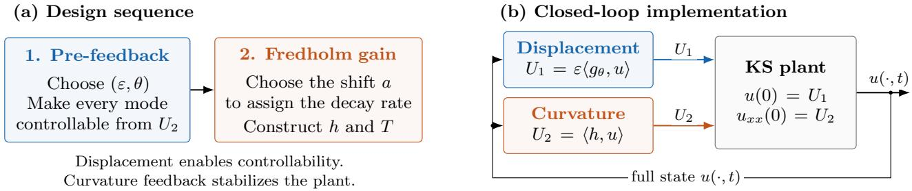  
Figure 1. Two feedbacks with distinct roles. (a) Displacement pre-feedback (blue) makes every mode controllable from the curvature input. The Fredholm design then constructs the stabilizing gain h and transformation $T = I - K$ . (b) Both feedback laws act simultaneously on the same plant state, with $g _ { \theta } ( y ) = e ^ { - \theta y }$ . The shift a sets the achievable decay rate.

## 3.1. Pre-feedback and pre-compensated operator

We start with the design of $U _ { 1 }$ which we call the pre-feedback as it enables stabilization, and does nothing more. The displacement input is given by

$$
U _ { 1 } ( t ) = \varepsilon \langle g _ { \theta } , u ( \cdot , t ) \rangle = \varepsilon \int _ { 0 } ^ { 1 } g _ { \theta } ( y ) u ( y , t ) \mathrm { d } y , \qquad g _ { \theta } ( y ) : = e ^ { - \theta y } , \qquad y \in [ 0 , 1 ] ,\tag{3.1}
$$

where $\theta > 0$ and $\varepsilon \neq 0$ control the spatial weighting and magnitude of the displacement pre-feedback, respectively. In particular, for θ outside a discrete set and all small $\varepsilon \neq 0$ it splits every double eigenvalue of $A _ { \lambda }$ and makes every resulting mode reachable from the curvature input, while leaving the high-frequency structure of $A _ { \lambda }$ untouched. With the input $U _ { 1 }$ applied, the pre-compensated operator then becomes

$$
D ( A _ { \lambda } ^ { \prime } ) = \{ \phi \in H ^ { 4 } : ~ \phi ( 0 ) = \varepsilon \langle g _ { \theta } , \phi \rangle , ~ \phi ^ { \prime \prime } ( 0 ) = \phi ( 1 ) = \phi ^ { \prime \prime } ( 1 ) = 0 \} , ~ A _ { \lambda } ^ { \prime } \phi = - \phi ^ { \prime \prime \prime \prime } - ( \lambda \phi ^ { \prime } ) ^ { \prime } .\tag{3.2}
$$

where $\begin{array} { r } { A _ { \lambda } ^ { \prime } = A _ { \lambda } + \varepsilon B _ { 1 } \langle g _ { \theta } , \cdot \rangle } \end{array}$ , plays the role of $A + b _ { 1 } k _ { 1 } ^ { \mathsf { T } }$ in Heymann’s Lemma. For $\varepsilon \ne 0 , \mathcal { A } _ { \lambda } ^ { \prime }$ is not self-adjoint. Nevertheless, under the parameter conditions established below, its eigenvectors form a Riesz basis of $L ^ { 2 } ( 0 , 1 )$ (cf. Theorem 4.2(ii)), allowing stabilization to be shown.

## 3.2. Transformation, target, kernel equations

We now give the stabilizing feedback $U _ { 2 }$ . To do so, we begin by introducing the Fredholm transformation:

$$
w ( x , t ) = u ( x , t ) - \int _ { 0 } ^ { 1 } k ( x , y ) u ( y , t ) \mathrm { d } y = : ( T u ) ( x , t ) , \qquad T : = I - K ,\tag{3.3}
$$

$$
( K u ) ( x ) : = \int _ { 0 } ^ { 1 } k ( x , y ) u ( y ) \mathrm { d } y ,\tag{3.4}
$$

and the curvature feedback

$$
U _ { 2 } ( t ) = \langle h , u ( \cdot , t ) \rangle = \int _ { 0 } ^ { 1 } h ( y ) u ( y , t ) \mathrm { d } y .\tag{3.5}
$$

where $( T , h )$ are to be designed. The kernel $k ( x , y )$ defines the transformation throughout the spatial domain, whereas $h ( y )$ is the gain used at the controlled boundary. For smooth $k ,$ these are related by $h ( y ) = k _ { x x } ( 0 , y )$ However, k is not necessarily globally smooth as we will see below.

Given this design, consider the following target system with parameter $a > 0$

$$
w _ { t } + w _ { x x x x } + ( \lambda w _ { x } ) _ { x } + a w = - ( I - K ) ( u u _ { x } ) ,\tag{3.6a}
$$

$$
w ( 0 , t ) = \varepsilon \langle g _ { \theta } , w \rangle ,\tag{3.6b}
$$

$$
w _ { x x } ( 0 , t ) = w ( 1 , t ) = w _ { x x } ( 1 , t ) = 0 ,\tag{3.6c}
$$

To ensure the corresponding Fredholm transform (3.3) maps the plant (1.1) into the target system (3.6), we design (k, h) through the operator conditions

$$
\begin{array} { r } { T \big ( \mathcal { A } _ { \lambda } ^ { \prime } + B _ { 2 } \langle h , \cdot \rangle \big ) = ( \mathcal { A } _ { \lambda } ^ { \prime } - a ) T , \qquad T B _ { 2 } = B _ { 2 } , } \end{array}\tag{3.7}
$$

where $T = I - K$ and K has kernel k. To obtain the first identity, substitute the feedback (3.5) into the pre-compensated plant and apply the time-independent transformation $w = T$ u:

$$
w _ { t } = T \big ( \boldsymbol { A } _ { \lambda } ^ { \prime } + \boldsymbol { B } _ { 2 } \langle \boldsymbol { h } , \cdot \rangle \big ) u - T ( u u _ { x } ) .\tag{3.8}
$$

The target equation requires $w _ { t } = ( A _ { \lambda } ^ { \prime } - a ) T u - T ( u u _ { x } )$ , so matching the linear terms gives the first identity in (3.7). We additionally impose the normalization $T B _ { 2 } = B _ { 2 }$ , which preserves the curvature input direction. The second identity is a design condition, rather than a consequence of the first. Integrating (3.7) by parts where traces exist gives the following kernel equations.

Proposition 3.1 (Kernel equations map plant to target). Let $k \in C ^ { 4 } ( [ 0 , 1 ] ^ { 2 } \setminus \{ x = y \} )$ be such that k and its derivatives up to order three extend continuously to each closed triangle $\{ y \leq x \} , \{ y \geq x \}$ (so that $k _ { y y y } ( x , 0 )$ and $k ( 0 , y ) , k _ { x x } ( 0 , y )$ are well defined), and suppose k solves

$$
k _ { x x x x } + ( \lambda ( x ) k _ { x } ) _ { x } - k _ { y y y y } - ( \lambda ( y ) k _ { y } ) _ { y } + a k = a \delta ( x - y ) + \varepsilon k _ { y y y } ( x , 0 ) g _ { \theta } ( y ) ,\tag{3.9a}
$$

$$
k ( x , 0 ) = k ( x , 1 ) = k _ { y y } ( x , 0 ) = k _ { y y } ( x , 1 ) = 0 ,\tag{3.9b}
$$

$$
k _ { y } ( x , 0 ) = 0 ,\tag{3.9c}
$$

$$
k ( 1 , y ) = k _ { x x } ( 1 , y ) = 0 ,\tag{3.9d}
$$

$$
k ( 0 , y ) = \varepsilon \int _ { 0 } ^ { 1 } k ( x , y ) g _ { \theta } ( x ) \mathrm { d } x ,\tag{3.9e}
$$

where (3.9a) is understood in the sense of distributions on $( 0 , 1 ) ^ { 2 }$ , (3.9b)–(3.9c) hold for $x \in ( 0 , 1 )$ , and (3.9d)– (3.9e) hold $f o r \ y \in ( 0 , 1 )$ . Then, for every suficiently smooth solution u of (1.1) with the feedback (3.1) and $\begin{array} { r } { U _ { 2 } = \int _ { 0 } ^ { 1 } k _ { x x } ( 0 , y ) u ( y , t ) } \end{array}$ dy, the function w defined by (3.3) satisfies the target system (3.6).

The proof is given in Appendix A.1.

## 3.3. Modal form of the kernel equations

Given the representation of the kernel and gain, it will be much easier to work in modal coordinates specified in this section. Recall that $\left\{ \varphi _ { n } \right\}$ is the orthonormal eigenbasis of $A _ { \lambda } .$ , with eigenvalues $\mu _ { n }$

Proposition 3.2 (Modal form of kernel equations). Suppose k satisfies the hypotheses of Proposition ${ \it 3 . 1 , }$ and set $h ( y ) : = k _ { x x } ( 0 , y )$ . Define the modal coeficients by

$$
h _ { j } : = \langle h , \varphi _ { j } \rangle , \qquad g _ { j } : = \langle g _ { \theta } , \varphi _ { j } \rangle , \qquad K _ { m j } : = \int _ { 0 } ^ { 1 } \int _ { 0 } ^ { 1 } k ( x , y ) \varphi _ { m } ( x ) \varphi _ { j } ( y ) \mathrm { d } y \mathrm { d } x .\tag{3.10}
$$

Then these coeficients satisfy, for all $m , j \geq 1$ ,

$$
\begin{array} { r } { ( \mu _ { j } - \mu _ { m } + a ) K _ { m j } + \beta _ { m } h _ { j } + \varepsilon \alpha _ { m } \sum _ { p } g _ { p } K _ { p j } - \varepsilon g _ { j } \sum _ { i } K _ { m i } \alpha _ { i } = a \delta _ { m j } , } \end{array}\tag{3.11a}
$$

$$
\begin{array} { r } { \sum _ { j } K _ { m j } \beta _ { j } = 0 . } \end{array}\tag{3.11b}
$$

The proof is given in Appendix A.2. The condition (3.11b) is the normalization $T B _ { 2 } = B _ { 2 }$ . It makes (3.11) linear in $( K , h )$ which is needed for the analysis. For $\varepsilon = 0$ , this is the system behind $\left[ 1 4 , ( 2 . 5 3 ) - ( 2 . 5 5 ) \right]$

Now, the PDE mapping the original plant to the target system is established, but not necessarily well-posed. The next section gives conditions on $a , \theta , \varepsilon$ such that this occurs.

## 4. Pre-feedback enables controllability

## 4.1. Admissible design and pre-feedback

We specify the spectral properties that the displacement pre-feedback must provide for the curvature input to implement the Fredholm design. We then prove that suitable parameters exist for every plant coeficient $\lambda \in W ^ { 1 , \infty } ( 0 , 1 )$ . Let $\mu _ { n } ^ { \prime }$ denote the eigenvalues of the pre-compensated operator $\mathcal { A } _ { \lambda } ^ { \prime }$ . For each algebraically simple eigenvalue, let $\chi _ { n }$ and $\tilde { \chi } _ { n }$ be corresponding eigenvectors of $\mathcal { A } _ { \lambda } ^ { \prime }$ and its adjoint $\mathcal { A } _ { \lambda } ^ { \prime * }$

$$
\begin{array} { r } { \mathcal { A } _ { \lambda } ^ { \prime } \chi _ { n } = \mu _ { n } ^ { \prime } \chi _ { n } , \qquad \mathcal { A } _ { \lambda } ^ { \prime } ^ { * } \tilde { \chi } _ { n } = \overline { { \mu _ { n } ^ { \prime } } } \tilde { \chi } _ { n } , \qquad \langle \chi _ { n } , \tilde { \chi } _ { n } \rangle = 1 . } \end{array}\tag{4.1}
$$

We use $\chi _ { n } , \tilde { \chi } _ { n }$ for the eigenvectors associated with mode $n ,$ and $\chi _ { z } , \tilde { \chi } _ { z }$ for those of $\mathcal { A } _ { \lambda } ^ { \prime }$ and its adjoint associated with $z , { \bar { z } } .$ . Since $\mathcal { A } _ { \lambda } ^ { \prime }$ has real coeficients, nonreal eigenvalues occur in complex-conjugate pairs; we take the eigenvectors real when the eigenvalue is real and conjugate-symmetric otherwise, so that $\chi _ { \bar { z } } = \overline { { \chi _ { z } } }$ and $\tilde { \chi } _ { \bar { z } } = \overline { { \tilde { \chi } _ { z } } }$ The design conditions are as follows.

Definition 4.1 (Admissible design). Fix $\lambda \in W ^ { 1 , \infty } ( 0 , 1 )$ . A triple $( a , \varepsilon , \theta ) \in ( 0 , \infty ) \times \mathbb { R } \times ( 0 , \infty )$ is admissible for λ if the pre-compensated operator $\mathcal { A } _ { \lambda } ^ { \prime }$ in (3.2), with eigenvalues $\mu _ { n } ^ { \prime } .$ , satisfies:

(H1) every eigenvalue of $\mathcal { A } _ { \lambda } ^ { \prime }$ , and hence of the plant as modified by $( \varepsilon , \theta )$ , is algebraically simple;

(H2) The curvature input acts on every mode, again a property of $( \varepsilon , \theta )$ , meaning

$$
b _ { n } ^ { \prime } : = \langle B _ { 2 } , \tilde { \chi } _ { n } \rangle = - \overline { { \tilde { \chi } _ { n } ^ { \prime } ( 0 ) } } \neq 0 , \qquad n \geq 1 .\tag{4.2}
$$

(H3) The target eigenvalues have negative real parts, and the target shift avoids spectral resonances:

$$
a > \operatorname* { m a x } _ { n } \operatorname { R e } \mu _ { n } ^ { \prime } , \quad \quad a \notin { \mathcal { N } } _ { a } ^ { \prime } : = \{ \mu _ { i } ^ { \prime } - \mu _ { j } ^ { \prime } : \ i , j \ge 1 \} .\tag{4.3}
$$

We write $\mathcal { U } _ { \lambda }$ for the admissible triples and $\mathcal { U } : = \{ ( \lambda , a , \varepsilon , \theta ) : ( a , \varepsilon , \theta ) \in \mathcal { U } _ { \lambda } \}$

For an eigenvector labeled by its eigenvalue z, we similarly write $b _ { z } ^ { \prime } : = \langle B _ { 2 } , \tilde { \chi } _ { z } \rangle$ . Thus $b _ { n } ^ { \prime }$ uses a mode index, whereas $b _ { z } ^ { \prime }$ uses the eigenvalue itself. Both coeficients refer to the chosen scaling of the adjoint eigenvector.

In Definition 4.1, (H1) makes (H2) the Fattorini–Hautus test for $( A _ { \lambda } ^ { \prime } , B _ { 2 } )$ : no adjoint eigenmode is orthogonal to the curvature input direction. Conditions (H1)–(H2) of Definition 4.1 describe what the displacement pre-feedback must achieve before the curvature feedback is designed. Condition (H3) of Definition 4.1 then selects the target shift a. These conditions restrict the design parameters, not the given coeficient λ. The next theorem shows that admissible choices exist for every $\lambda \in W ^ { 1 , \infty } ( 0 , 1 )$

## Theorem 4.2 (Pre-feedback enables controllability for every λ).

(i) Let $\lambda \in W ^ { 1 , \infty } ( 0 , 1 )$ , and let $\mathcal { A } _ { \lambda } ^ { \prime }$ be the operator (3.2) of the plant under the controllability-ensuring pre-feedback (3.1). There is a discrete set $\mathcal { T } _ { \lambda } \subset ( 0 , \infty )$ such that for every $\theta \notin \mathcal { T } _ { \lambda }$ there is $\varepsilon _ { 1 } ( \lambda , \theta ) > 0$ with the following property: for every ε with $0 < | \varepsilon | < \varepsilon _ { 1 } , ( H 1 )$ and (H2) of Definition $\ 4 . 1$ hold, the set $\mathcal { N } _ { a } ^ { \prime }$ is discrete, and $( a , \varepsilon , \theta ) \in \mathcal { U } _ { \lambda }$ for every $a \mathrm { ~ > ~ }$ max 0, max Re $\mu _ { n } ^ { \prime } \}$ outside $\mathcal { N } _ { a } ^ { \prime }$ . Moreover maxn Re $\mu _ { n } ^ { \prime } = \operatorname* { m a x } _ { n } \mu _ { n } + O ( | \varepsilon | )$

(ii) For every admissible design, the eigenvectors $\{ \chi _ { n } \}$ of ′ form a Riesz basis of $L ^ { 2 } ( 0 , 1 )$ with biorthogonal family the eigenvectors $\left\{ \tilde { \chi } _ { n } \right\}$ of $A _ { \lambda } ^ { \prime } { } ^ { * } , A _ { \lambda } ^ { \prime }$ generates a $\ddot { C } ^ { 0 }$ semigroup on $L ^ { 2 } ( 0 , 1 )$ , and, indexing so that Re $\mu _ { 1 } ^ { \prime } \geq \operatorname { R e } \mu _ { 2 } ^ { \prime } \geq \cdots$ , there are $c , C > 0$ such that, for all $n , p \geq 1$

$$
c n ^ { 4 } \leq | \mu _ { n } ^ { \prime } | + 1 \leq C n ^ { 4 } , \qquad | \mu _ { n } ^ { \prime } - \mu _ { p } ^ { \prime } | \geq c n ^ { 3 } | n - p | , \qquad c n \leq | b _ { n } ^ { \prime } | \leq C n .\tag{4.4}
$$

## 4.2. Proof of Theorem 4.2: pre-feedback enables controllability

The proof separates the high modes, which already have the required properties, from finitely many modes that may need pre-feedback. At high frequencies, the eigenvalues are simple and the curvature input reaches every mode. We show that the pre-feedback preserves these properties because its efect is smaller than the spectral gaps. At a double plant eigenvalue, the pre-feedback retains one eigenvalue and moves the other. Suitable conditions on the profile make both eigenvalues simple and both modes reachable. These conditions also ensure reachability of previously missed simple modes, while modes already reached remain so.

We first establish the plant estimates in Lemma 4.3. Lemma 4.4 then gives the pre-feedback resolvent, spectral characterization, and curvature-input coeficients. Lemma 4.5 uses these formulas to treat the high modes. For the remaining modes, we derive finitely many nonvanishing conditions on the profile and choose g to satisfy them. A common small nonzero amplitude ε and an admissible shift a then complete part (i). Finally, we prove completeness and use the high-mode estimates to establish the Riesz basis, semigroup generation, and spectra bounds in part (ii).

Throughout this proof, $\lambda \in W ^ { 1 , \infty } ( 0 , 1 )$ is fixed, $g \in L ^ { 2 } ( 0 , 1 )$ is a real pre-feedback profile, and $\varepsilon \in \mathbb { R }$ . Recall that $\alpha _ { n } = \varphi _ { n } ^ { \prime \prime \prime } ( 0 ) + \lambda ( 0 ) \varphi _ { n } ^ { \prime } ( 0 )$ and $\beta _ { n } = \varphi _ { n } ^ { \prime } ( 0 )$ are the boundary-trace coeficients associated with the displacement and curvature inputs, respectively, as defined in (2.9). We use $\mathcal { A } _ { \lambda } ^ { \prime }$ from (3.2) with $g _ { \theta }$ replaced by $^ { g , }$ and write

$$
g _ { n } : = \ \langle g , \varphi _ { n } \rangle , \qquad \mathfrak { g } _ { n } : = \operatorname* { m i n } _ { m \neq n } | \mu _ { m } - \mu _ { n } | .\tag{4.5}
$$

Unless stated otherwise, the generic constants in this subsection may depend on $\lambda , g , \varepsilon ,$ and the target shift a where it is used, but not on the mode indices or spectral variables.

## 4.2.1. Spectral properties of the original plant

We begin with the original plant. Its eigenspaces have dimension at most two, and its high-frequency eigenfunctions approach the sine basis. The proof also establishes the spectral gap used to control the efect of pre-feedback on the high modes.

Lemma 4.3 (Spectral properties of original operator $A _ { \lambda } )$ . Let $\lambda \in W ^ { 1 , \infty } ( 0 , 1 )$ , set $N _ { 1 } : = \operatorname* { m a x } \{ 3 , \lceil 2 \| \lambda \| _ { L ^ { \infty } } / \pi ^ { 2 } \rceil \}$ and $s _ { n } ( x ) : = { \sqrt { 2 } } \sin ( n \pi x )$ , and normalize $\varphi _ { n }$ by $\left. \varphi _ { n } , s _ { n } \right. > 0 \ f o r \ n \ge N _ { 1 }$ . Then, the following hold:

(i) For every eigenvalue $\mu$ of $A _ { \lambda }$ , the eigenspace $E _ { \mu }$ has dimension at most two.

(ii) For $\phi \in E _ { \mu }$ , the linear map $\phi \mapsto \left( \phi ^ { \prime } ( 0 ) , \phi ^ { [ 3 ] } ( 0 ) \right) ^ { \cdot } \in \mathbb { R } ^ { 2 }$ is injective. In particular, for a double eigenvalue

with eigenfunctions $\varphi _ { j } , \varphi _ { k }$ forming a basis of $E _ { \mu }$ , the matrix $\left( { \begin{array} { l l } { \alpha _ { j } } & { \alpha _ { k } } \\ { \beta _ { j } } & { \beta _ { k } } \end{array} } \right)$ is nonsingular.

(iii) With constants depending only on $\| \lambda \| _ { W ^ { 1 , \infty } }$ 2

$$
\| \varphi _ { n } - s _ { n } \| _ { H ^ { s } ( 0 , 1 ) } \leq C n ^ { s - 1 } \quad ( 0 \leq s \leq 4 ) , \qquad n \geq N _ { 1 } ,\tag{4.6}
$$

$$
\| \varphi _ { n } ^ { ( j ) } - s _ { n } ^ { ( j ) } \| _ { L ^ { \infty } } \leq C n ^ { j - 1 / 2 } \quad ( j = 0 , 1 , 2 , 3 ) , \qquad n \geq N _ { 1 } ,\tag{4.7}
$$

and consequently $\beta _ { n } = \sqrt { 2 } n \pi + O ( n ^ { 1 / 2 } ) , \alpha _ { n } = - \sqrt { 2 } ( n \pi ) ^ { 3 } + O ( n ^ { 5 / 2 } )$ . In particular, after enlarging $N _ { 1 }$ , there are $c _ { 0 } , C _ { 0 } > 0$ and $N _ { 1 }$ , depending only on $\| \lambda \| _ { W ^ { 1 , \infty } } ,$ , such that

$$
| \beta _ { n } | \leq C _ { 0 } n , \quad | \alpha _ { n } | \leq C _ { 0 } n ^ { 3 } ( n \geq 1 ) , \qquad c _ { 0 } n \leq | \beta _ { n } | , \quad c _ { 0 } n ^ { 3 } \leq | \alpha _ { n } | ( n \geq N _ { 1 } ) .\tag{4.8}
$$

Proof. We prove (i) and (ii) together. For $\phi \in E _ { \mu }$ , the hinged conditions give $\phi ( 0 ) = \phi ^ { \prime \prime } ( 0 ) = 0$ . The ODE uniqueness argument in the proof of Theorem $2 . 2$ shows that the remaining Cauchy data $\phi ^ { \prime } ( 0 )$ and $\phi ^ { [ 3 ] } ( 0 )$ uniquely determine ϕ. Hence dim $E _ { \mu } \leq 2$ , proving (i), and the trace map is injective, proving (ii).

We next prove (iii). Here $C > 0$ may vary but depends only on $\| \lambda \| _ { W ^ { 1 , \infty } ( 0 , 1 ) }$ , not on mode indices.

Use the decomposition $A _ { \lambda } = A _ { 0 } + P$ from (2.4). Expanding $P \phi = - ( \lambda \phi ^ { \prime } ) ^ { \prime }$ and applying H¨older’s inequality gives

$$
\| P \phi \| \leq C \| \lambda \| _ { W ^ { 1 , \infty } } \| \phi \| _ { H ^ { 2 } } ,\tag{4.9}
$$

We will need to bound the diference between eigenvalues. For $n \geq N _ { 1 }$ and $m \neq n ,$ , set $p = \operatorname* { m i n } \{ m , n \}$ and $q = \operatorname* { m a x } \{ m , n \}$ . The min–max lower bound $\mu _ { p } \geq - p ^ { 4 } \pi ^ { 4 } - \| \lambda \| _ { L ^ { \infty } } p ^ { 2 } \pi ^ { 2 }$ holds for every $p .$ Combining it with the upper bound in (2.12) at $q \geq N _ { 1 }$ and using the eigenvalue ordering gives

$$
| \mu _ { m } - \mu _ { n } | \geq \pi ^ { 4 } | m ^ { 4 } - n ^ { 4 } | - \| \lambda \| _ { L ^ { \infty } } \pi ^ { 2 } ( m ^ { 2 } + n ^ { 2 } ) .\tag{4.10}
$$

Using $n \geq N _ { 1 } \geq 2 \| \lambda \| _ { L ^ { \infty } } / \pi ^ { 2 }$ , we obtain, for m $\neq n ,$

$$
| m ^ { 2 } - n ^ { 2 } | \geq 2 n - 1 \geq 2 \| \lambda \| _ { L ^ { \infty } } / \pi ^ { 2 } .\tag{4.11}
$$

Factoring $| m ^ { 4 } - n ^ { 4 } | = | m ^ { 2 } - n ^ { 2 } | ( m ^ { 2 } + n ^ { 2 } )$ therefore gives

$$
\begin{array} { r } { | \mu _ { m } - \mu _ { n } | \geq \frac { 1 } { 2 } \pi ^ { 4 } | m ^ { 4 } - n ^ { 4 } | , \qquad n \geq N _ { 1 } , \quad m \neq n . } \end{array}\tag{4.12}
$$

Taking the minimum over m $\neq n$ and using $n ^ { 4 } - ( n - 1 ) ^ { 4 } \geq 2 n ^ { 3 }$ for $n \geq 3$ gives ${ \mathfrak { g } } _ { n } \geq \pi ^ { 4 } n ^ { 3 }$ . In particular, $\mu _ { n }$ is simple for $n \geq N _ { 1 }$

Since $A _ { 0 }$ has eigenpairs $\left( - n ^ { 4 } \pi ^ { 4 } , s _ { n } \right)$ , (2.12) and (4.9) give the residual bound

$$
\| ( A _ { \lambda } - \mu _ { n } ) s _ { n } \| \le \| P s _ { n } \| + | \mu _ { n } + n ^ { 4 } \pi ^ { 4 } | \le C n ^ { 2 } .\tag{4.13}
$$

Expand $\begin{array} { r } { s _ { n } = \sum _ { k } \langle s _ { n } , \varphi _ { k } \rangle \varphi _ { k } } \end{array}$ in the orthonormal plant eigenbasis. Applying $A _ { \lambda } - \mu _ { n }$ removes its component along $\varphi _ { n }$ , and orthogonality with the spectral gap gives

$$
( A _ { \lambda } - \mu _ { n } ) s _ { n } = \sum _ { k \neq n } ( \mu _ { k } - \mu _ { n } ) \langle s _ { n } , \varphi _ { k } \rangle \varphi _ { k } ,\tag{4.14}
$$

$$
\| ( A _ { \lambda } - \mu _ { n } ) s _ { n } \| ^ { 2 } = \sum _ { k \neq n } | \mu _ { k } - \mu _ { n } | ^ { 2 } | \langle s _ { n } , \varphi _ { k } \rangle | ^ { 2 } \geq \mathbb { \mathfrak { g } } _ { n } ^ { 2 } \sum _ { k \neq n } | \langle s _ { n } , \varphi _ { k } \rangle | ^ { 2 } .\tag{4.15}
$$

The sum on the right is the squared norm of the component of $s _ { n }$ orthogonal to $\varphi _ { n }$ . Taking square roots, using the residual bound (4.13) and ${ \mathfrak { g } } _ { n } \geq \pi ^ { 4 } n ^ { 3 }$ , gives

$$
\left\| s _ { n } - \langle s _ { n } , \varphi _ { n } \rangle \varphi _ { n } \right\| \leq { \frac { \| ( A _ { \lambda } - \mu _ { n } ) s _ { n } \| } { \mathfrak { g } _ { n } } } \leq { \frac { C n ^ { 2 } } { \pi ^ { 4 } n ^ { 3 } } } \leq C n ^ { - 1 } .\tag{4.16}
$$

Since $\| s _ { n } \| = 1$ , orthogonality also gives

$$
| \langle s _ { n } , \varphi _ { n } \rangle | ^ { 2 } = 1 - \| s _ { n } - \langle s _ { n } , \varphi _ { n } \rangle \varphi _ { n } \| ^ { 2 } \geq 1 - C ^ { 2 } n ^ { - 2 } .\tag{4.17}
$$

The chosen sign of $\varphi _ { n }$ therefore gives

$$
\left\| \varphi _ { n } - s _ { n } \right\| \leq C n ^ { - 1 } .\tag{4.18}
$$

To estimate the derivatives, set $\boldsymbol { v } = \varphi _ { n } - \boldsymbol { s } _ { n }$ . The eigenvalue equations for $\varphi _ { n }$ and $s _ { n }$ are

$$
( A _ { 0 } + P ) \varphi _ { n } = \mu _ { n } \varphi _ { n } , \qquad A _ { 0 } s _ { n } = - n ^ { 4 } \pi ^ { 4 } s _ { n } .\tag{4.19}
$$

Subtracting the second equation from the first and substituting $\varphi _ { n } = v + s _ { n }$ gives

$$
A _ { 0 } v = \mu _ { n } v + ( \mu _ { n } + n ^ { 4 } \pi ^ { 4 } ) s _ { n } - P \varphi _ { n } .\tag{4.20}
$$

Estimates (2.19), (2.12), and (4.9), with interpolation and $\| \varphi _ { n } \| = 1$ , give

$$
\| \varphi _ { n } \| _ { H ^ { 4 } } \leq C \big ( \| A _ { \lambda } \varphi _ { n } \| + \| \varphi _ { n } \| \big ) = C ( 1 + | \mu _ { n } | ) \leq C n ^ { 4 } ,\tag{4.21}
$$

$$
\| \varphi _ { n } \| _ { H ^ { 2 } } \leq C \| \varphi _ { n } \| ^ { 1 / 2 } \| \varphi _ { n } \| _ { H ^ { 4 } } ^ { 1 / 2 } \leq C n ^ { 2 } ,\tag{4.22}
$$

$$
\begin{array} { r } { \| P \varphi _ { n } \| \leq C \| \lambda \| _ { W ^ { 1 , \infty } } \| \varphi _ { n } \| _ { H ^ { 2 } } \leq C n ^ { 2 } . } \end{array}\tag{4.23}
$$

Combining these bounds with (4.18) gives

$$
\| A _ { 0 } v \| \le C n ^ { 4 } n ^ { - 1 } + C n ^ { 2 } \le C n ^ { 3 } , \qquad \| v \| _ { H ^ { 4 } } \le C ( \| A _ { 0 } v \| + \| v \| ) \le C n ^ { 3 } .\tag{4.24}
$$

Interpolation gives $\| v \| _ { H ^ { s } } \leq C n ^ { s - 1 }$ for $0 \leq s \leq 4$ . To obtain pointwise bounds, we apply the one-dimensional Gagliardo–Nirenberg inequality [6, p. 233, Eq. (42)] to $v ^ { ( j ) }$ . Each derivative $v ^ { ( j ) } , 0 \leq j \leq 3$ , either vanishes at both endpoints or has zero mean. Thus Poincar´e’s inequality gives $\| v ^ { ( j ) } \| \leq C \| v ^ { ( j + 1 ) } \|$ , allowing the additional $L ^ { 2 }$ term in the Gagliardo–Nirenberg inequality to be absorbed into the product below:

$$
\| v ^ { ( j ) } \| _ { L ^ { \infty } } \leq C \| v ^ { ( j ) } \| ^ { 1 / 2 } \| v ^ { ( j + 1 ) } \| ^ { 1 / 2 } \leq C n ^ { j - 1 / 2 } , \qquad 0 \leq j \leq 3 .\tag{4.25}
$$

It remains to bound the boundary traces. The trace coeficients can be written as

$$
\beta _ { n } = s _ { n } ^ { \prime } ( 0 ) + v ^ { \prime } ( 0 ) , \qquad \alpha _ { n } = s _ { n } ^ { \prime \prime \prime } ( 0 ) + v ^ { \prime \prime \prime } ( 0 ) + \lambda ( 0 ) \big ( s _ { n } ^ { \prime } ( 0 ) + v ^ { \prime } ( 0 ) \big ) .\tag{4.26}
$$

Since

$$
s _ { n } ^ { \prime } ( 0 ) = \ \sqrt 2 n \pi , \qquad s _ { n } ^ { \prime \prime \prime } ( 0 ) = - \sqrt 2 ( n \pi ) ^ { 3 } ,\tag{4.27}
$$

(4.25) gives the high-mode bounds in (4.8). For the finitely many remaining modes, the upper bounds follow from the elliptic estimate and the trace inequality after enlarging the constant. This completes (iii). □

## 4.2.2. Resolvent and input coeficients under pre-feedback

We now give the resolvent and adjoint of the pre-compensated operator and characterize its spectrum. Importantly, given the simplicity conditions, we showcase that the curvature-input coeficients are non-zero for eigenvalues moved by the pre-feedback and those retained from double plant eigenvalues.

Lemma 4.4 (Pre-feedback resolvent, spectrum, and input coeficients). Let $\lambda \in W ^ { 1 , \infty } ( 0 , 1 ) , \varepsilon \in \mathbb { R }$ , and $g \in L ^ { 2 } ( 0 , 1 )$ be real. $F o r \ z \not \in \sigma ( A _ { \lambda } )$ , define the boundary lifting and secular function by

$$
\rho ( z ) : = \sum _ { n \geq 1 } \frac { \alpha _ { n } } { \mu _ { n } - z } \varphi _ { n } , \qquad \Xi ( z ) : = 1 - \varepsilon \langle g , \rho ( z ) \rangle = 1 - \varepsilon \sum _ { n \geq 1 } \frac { g _ { n } \alpha _ { n } } { \mu _ { n } - z } .\tag{4.28}
$$

Then the following hold.

(i) $\mathcal { A } _ { \lambda } ^ { \prime }$ is closed and densely defined, and $f o r \ z \not \in \sigma ( A _ { \lambda } )$ with $\Xi ( z ) \neq 0$

$$
( A _ { \lambda } ^ { \prime } - z ) ^ { - 1 } f = ( A _ { \lambda } - z ) ^ { - 1 } f + \frac { \varepsilon \langle g , ( A _ { \lambda } - z ) ^ { - 1 } f \rangle } { \Xi ( z ) } \rho ( z ) , \qquad f \in L ^ { 2 } ( 0 , 1 ) .\tag{4.29}
$$

The plant resolvent is compact, and the correction has rank at most one. Hence $\mathcal { A } _ { \lambda } ^ { \prime }$ has compact resolvent. (ii) The adjoint has domain $D ( \mathcal { A } _ { \lambda } ^ { \prime } { } ^ { * } ) = D ( A _ { \lambda } )$ and, for $\phi \in D ( A _ { \lambda } )$ , acts as

$$
A _ { \lambda } ^ { \prime } { } ^ { * } \phi = A _ { \lambda } \phi - \varepsilon \phi ^ { [ 3 ] } ( 0 ) g .\tag{4.30}
$$

(iii) $z \in \sigma ( \mathcal { A } _ { \lambda } ^ { \prime } )$ if and only if one of the following holds:

$( a ) \ z \not \in \sigma ( A _ { \lambda } )$ and $\Xi ( z ) = 0$

$( b ) \ z \in \sigma ( A _ { \lambda } )$ and $E _ { z } \cap g ^ { \bot } \neq \{ 0 \}$

$( c ) \ z \in \sigma ( A _ { \lambda } )$ and Ξ is regular at z. For $\varepsilon \neq 0 .$ , this is equivalent to $\scriptstyle \sum _ { \mu _ { n } = z } g _ { n } \alpha _ { n } = 0$

Here $E _ { z }$ is the eigenspace of $A _ { \lambda }$ at z, and $g ^ { \perp }$ consists of the functions in $L ^ { 2 } ( 0 , 1 )$ orthogonal to $g .$

(iv) Assume $\varepsilon \neq 0$ . Let $\mu ^ { \prime }$ be real, with $\mu ^ { \prime } \notin \sigma ( A _ { \lambda } )$ and $\Xi ( \mu ^ { \prime } ) = 0$ . Then $\mu ^ { \prime }$ is algebraically simple if and only $i f \Xi ^ { \prime } ( \mu ^ { \prime } ) \neq 0$ . Moreover, when $\Xi ^ { \prime } ( \mu ^ { \prime } ) \neq 0$ , the eigenvectors $\chi _ { \mu ^ { \prime } }$ and $\tilde { \chi } _ { \mu ^ { \prime } }$ of the pre-compensated operator $\mathcal { A } _ { \lambda } ^ { \prime }$ and its adjoint $( A _ { \lambda } ^ { \prime } ) ^ { * }$ , respectively, associated with $\mu ^ { \prime }$ and normalized by $\langle \chi _ { \mu ^ { \prime } } , \tilde { \chi } _ { \mu ^ { \prime } } \rangle = 1$ , are given by

$$
\chi _ { \mu ^ { \prime } } : = \rho ( \mu ^ { \prime } ) , \qquad \tilde { \chi } _ { \mu ^ { \prime } } : = - \frac { \varepsilon } { \Xi ^ { \prime } ( \mu ^ { \prime } ) } ( A _ { \lambda } - \mu ^ { \prime } ) ^ { - 1 } g .\tag{4.31}
$$

The efect of the curvature input on this mode is given by the coeficient

$$
b _ { \mu ^ { \prime } } ^ { \prime } : = \langle B _ { 2 } , \tilde { \chi } _ { \mu ^ { \prime } } \rangle = - \tilde { \chi } _ { \mu ^ { \prime } } ^ { \prime } ( 0 ) = \frac { \varepsilon } { \Xi ^ { \prime } ( \mu ^ { \prime } ) } \sum _ { n \ge 1 } \frac { g _ { n } \beta _ { n } } { \mu _ { n } - \mu ^ { \prime } } .\tag{4.32}
$$

(v) Assume $\varepsilon \neq 0$ . Let $\mu$ be a double eigenvalue of $A _ { \lambda }$ with orthonormal eigenfunctions $\varphi _ { j } , \varphi _ { k }$ , and define

$$
\mathsf { r } _ { \mu } : = \ g _ { j } \alpha _ { j } + g _ { k } \alpha _ { k } .\tag{4.33}
$$

$I f \mathsf { r } _ { \mu } \neq 0$ , then $\mu$ is an algebraically simple eigenvalue of $\mathcal { A } _ { \lambda } ^ { \prime }$ with

$$
\chi _ { \mu } = g _ { k } \varphi _ { j } - g _ { j } \varphi _ { k } , \qquad \tilde { \chi } _ { \mu } = \frac { \alpha _ { k } \varphi _ { j } - \alpha _ { j } \varphi _ { k } } { \mathfrak { r } _ { \mu } } , \qquad b _ { \mu } ^ { \prime } = - \frac { \beta _ { j } \alpha _ { k } - \beta _ { k } \alpha _ { j } } { \mathfrak { r } _ { \mu } } \neq 0 .\tag{4.34}
$$

If $\mathsf r _ { \mu } = 0$ , then $\mu$ has algebraic multiplicity at least two.

Proof of Lemma $4 { \cdot } 4 .$ We first prove (i). We add a boundary lifting to the plant resolvent to enforce the pre-feedback condition. $\operatorname { F i x } z \not \in \sigma ( A _ { \lambda } )$ . The lifting $\rho ( z )$ is the $H ^ { 4 }$ solution of the boundary-value problem

$$
- \rho ( z ) ^ { \prime \prime \prime \prime } - ( \lambda \rho ( z ) ^ { \prime } ) ^ { \prime } = \ z \rho ( z ) , \qquad \rho ( z ) ( 0 ) = \ 1 , \qquad \rho ( z ) ( 1 ) = \rho ( z ) ^ { \prime \prime } ( 0 ) = \rho ( z ) ^ { \prime \prime } ( 1 ) = 0 .\tag{4.35}
$$

Since $z \not \in \sigma ( A _ { \lambda } )$ , this problem has a unique solution. Multiplying it by a scalar changes only its left displacement. Lemma 2.1 gives $( \mu _ { n } - z ) \langle \rho ( z ) , \varphi _ { n } \rangle = \alpha _ { n }$ , yielding the series in (4.28). The series converges in $L ^ { 2 }$ , while its boundary traces are supplied by the boundary-value problem.

For $\phi \in D ( A _ { \lambda } ^ { \prime } )$ , Lemma 2.1 with test function $\varphi _ { n }$ , the boundary conditions $\phi ^ { \prime \prime } ( 0 ) = 0$ and $\phi ( 0 ) = \varepsilon \langle g , \phi \rangle$ , and $\varphi _ { n } ^ { [ 3 ] } ( 0 ) = \alpha _ { n } \ \mathrm { g i v e }$

$$
\langle \mathcal { A } _ { \lambda } ^ { \prime } \phi , \varphi _ { n } \rangle = \mu _ { n } \langle \phi , \varphi _ { n } \rangle - \varepsilon \alpha _ { n } \langle g , \phi \rangle , \qquad n \ge 1 .\tag{4.36}
$$

For the equation $( \mathcal { A } _ { \lambda } ^ { \prime } - z ) \psi = f $ , set $p = \langle g , \psi \rangle$ . The modal identity (4.36) gives

$$
( \mu _ { n } - z ) \psi _ { n } - \varepsilon \alpha _ { n } p = f _ { n } .\tag{4.37}
$$

Solving in the plant basis and then applying the observation yields

$$
\psi = ( A _ { \lambda } - z ) ^ { - 1 } f + \varepsilon p \rho ( z ) , \qquad p \Xi ( z ) = \langle g , ( A _ { \lambda } - z ) ^ { - 1 } f \rangle .\tag{4.38}
$$

This proves (4.29) when $\Xi ( z ) \neq 0$ . Conversely, (4.35) gives the homogeneous boundary traces, while $\psi ( 0 ) =$ ${ \varepsilon } p = { \varepsilon } \langle g , \psi \rangle$ , so the formula satisfies the domain conditions.

The eigenvalue and trace bounds (2.12) and (4.8) give $\| \rho ( z ) \| \to 0$ as real $z  + \infty$ , so $\Xi ( z ) \to 1$ . Thus the resolvent formula applies for suficiently large real z. The resolvent is compact as the sum of a compact operator and a rank-one operator. Its boundedness and full domain also show that $\mathcal { A } _ { \lambda } ^ { \prime }$ is closed.

To verify density of the domain, approximate an arbitrary $f \in L ^ { 2 } ( 0 , 1 )$ by $\phi _ { 0 } \in D ( A _ { \lambda } )$ with error at most $\delta .$ Choose a smooth boundary lifting $\psi _ { \delta }$ supported near zero such that

$$
\psi _ { \delta } ( 0 ) = ~ 1 , \qquad \psi _ { \delta } ^ { \prime \prime } ( 0 ) = 0 , \qquad \psi _ { \delta } ( 1 ) = \psi _ { \delta } ^ { \prime \prime } ( 1 ) = 0 , \qquad \| \psi _ { \delta } \| \leq \delta .\tag{4.39}
$$

Such a lifting is obtained by rescaling a fixed smooth bump. Set

$$
\phi = \ \phi _ { 0 } + c \psi _ { \delta } , \qquad c = { \frac { \varepsilon \langle g , \phi _ { 0 } \rangle } { 1 - \varepsilon \langle g , \psi _ { \delta } \rangle } } .\tag{4.40}
$$

For small δ, the denominator stays away from zero and c remains bounded. Thus $\phi \in D ( A _ { \lambda } ^ { \prime } )$ and $\| f - \phi \| \leq$ $\delta + \vert c \vert \delta  0 .$ , proving density of $D ( \mathcal { A } _ { \lambda } ^ { \prime } )$ and completing (i).

We next prove (ii), identifying the adjoint and its domain. For $\phi \in D ( A _ { \lambda } ^ { \prime } )$ and $\zeta \in D ( A _ { \lambda } )$ , the boundary identity gives

$$
\langle \mathcal { A } _ { \lambda } ^ { \prime } \phi , \zeta \rangle = \langle \phi , A _ { \lambda } \zeta \rangle - \varepsilon \langle g , \phi \rangle \sum _ { n } \alpha _ { n } \zeta _ { n } .\tag{4.41}
$$

The eigenfunction expansion of $\zeta$ converges in the graph norm and hence in $H ^ { 4 }$ , giving $\begin{array} { r } { \sum _ { n } \alpha _ { n } \zeta _ { n } = \zeta ^ { [ 3 ] } ( 0 ) } \end{array}$ . The series also converges absolutely, since the trace coeficients grow like $n ^ { 3 }$ and $( n ^ { 4 } \zeta _ { n } ) _ { n } \in \ell ^ { 2 }$ . This proves the adjoint formula and the inclusion $D ( A _ { \lambda } ) \subseteq D ( { \mathcal { A } } _ { \lambda } ^ { \prime } { } ^ { * } )$ . For the reverse domain inclusion, take the adjoint of (4.29):

$$
\left( ( \ : A _ { \lambda } ^ { \prime } - z ) ^ { - 1 } \right) ^ { * } = \ : ( A _ { \lambda } - \bar { z } ) ^ { - 1 } + \frac { \varepsilon } { \Xi ( z ) } ( A _ { \lambda } - \bar { z } ) ^ { - 1 } { g } \ : \langle \cdot , \rho ( z ) \rangle .\tag{4.42}
$$

Its range is contained in $D ( A _ { \lambda } )$ and equals $D ( { \mathcal { A } } _ { \lambda } ^ { \prime } { } ^ { * } )$ . This proves (ii).

We next prove (iii). If $\varepsilon = 0$ , then $\mathcal { A } _ { \lambda } ^ { \prime } = A _ { \lambda }$ and $\Xi \equiv 1$ , so case (c) gives exactly the plant spectrum. Assume henceforth that $\varepsilon \neq 0$ . Since $\mathcal { A } _ { \lambda } ^ { \prime }$ has compact resolvent, it sufices to characterize its eigenvalues. Set $f = 0$ in (4.37) and recall that $p = \langle g , \psi \rangle$

For $z \not \in \sigma ( A _ { \lambda } )$ , (4.38) gives $\psi = \varepsilon p \rho ( z )$ and $p \Xi ( z ) = 0$ , so a nonzero eigenvector requires $\Xi ( z ) = 0$ . Conversely, since $\rho ( z ) ( 0 ) = 1$ , the condition $\Xi ( z ) = 0$ is precisely $1 = \varepsilon \langle g , \rho ( z ) \rangle$ . Thus $\rho ( z )$ satisfies the pre-feedback boundary condition and is an eigenfunction of $\mathcal { A } _ { \lambda } ^ { \prime }$ . This proves case (a).

At a plant eigenvalue, every nonzero $\psi \in E _ { z } \cap g ^ { \perp }$ satisfies the pre-feedback condition and remains an eigenfunction, proving case (b). By Lemma 4.3(i), the plant eigenvalue is either simple or double. At a double eigenvalue, $E _ { z } \cap g ^ { \perp }$ is necessarily nontrivial. At a simple eigenvalue $z = \mu _ { n } , g _ { n } = 0$ also gives case (b).

It remains to consider a simple plant eigenvalue with $g _ { n } \neq 0$ . The nth modal equation gives $\varepsilon \alpha _ { n } p = 0$ . If $\alpha _ { n } \neq 0$ , then $p = 0$ , all coeficients except $\psi _ { n }$ vanish, and $p = g _ { n } \psi _ { n }$ forces $\psi = 0$ . If $\alpha _ { n } = 0$ , the coeficient along $\varphi _ { n }$ remains free. For $m \neq n$ , the modal equations give $\psi _ { m } = \varepsilon \alpha _ { m } p / ( \mu _ { m } - \mu _ { n } )$ , and $\psi _ { n }$ can be chosen to satisfy $p = \langle g , \psi \rangle$ for any nonzero p. Thus a nonzero eigenvector exists precisely when $\alpha _ { n } = 0$ , which is the pole-cancellation condition $g _ { n } \alpha _ { n } = 0$ in case $\mathrm { ( c ) }$ . This exhausts the possibilities and proves (iii).

We next prove (iv). At a real root $\mu ^ { \prime }$ outside the plant spectrum, the right eigenvector is proportional to $\rho ( \mu ^ { \prime } )$ . Substituting the adjoint formula from part (ii) into $( \mathcal { A } _ { \lambda } ^ { \prime } ) ^ { * } \tilde { \chi } _ { \mu ^ { \prime } } = \mu ^ { \prime } \tilde { \chi } _ { \mu ^ { \prime } }$ gives

$$
( A _ { \lambda } - \mu ^ { \prime } ) \tilde { \chi } _ { \mu ^ { \prime } } = \varepsilon \tilde { \chi } _ { \mu ^ { \prime } } ^ { [ 3 ] } ( 0 ) g ,\tag{4.43}
$$

so an unnormalized adjoint eigenvector is

$$
\zeta : = ( A _ { \lambda } - \mu ^ { \prime } ) ^ { - 1 } g = \sum _ { n } \frac { g _ { n } } { \mu _ { n } - \mu ^ { \prime } } \varphi _ { n } .\tag{4.44}
$$

The consistency condition is precisely $\Xi ( \mu ^ { \prime } ) = 0$ , since

$$
[ ( A _ { \lambda } - \mu ^ { \prime } ) ^ { - 1 } g ] ^ { [ 3 ] } ( 0 ) = \sum _ { n } \frac { g _ { n } \alpha _ { n } } { \mu _ { n } - \mu ^ { \prime } } = \varepsilon ^ { - 1 } .\tag{4.45}
$$

The pairing of these two eigenvectors is

$$
\langle \rho ( \mu ^ { \prime } ) , ( A _ { \lambda } - \mu ^ { \prime } ) ^ { - 1 } g \rangle = \sum _ { n } \frac { g _ { n } \alpha _ { n } } { ( \mu _ { n } - \mu ^ { \prime } ) ^ { 2 } } = - \varepsilon ^ { - 1 } \Xi ^ { \prime } ( \mu ^ { \prime } ) .\tag{4.46}
$$

By (4.29), the resolvent has a simple pole with a rank-one spectral projection exactly when this pairing is nonzero. Normalization and the derivative trace give (4.31)–(4.32), proving (iv).

Finally, we prove (v). Suppose first that $\mathfrak { r } _ { \mu } \neq 0$ . The vector $\chi _ { \mu } \in E _ { \mu } \cap g ^ { \perp }$ remains an eigenvector by part (iii). Expanding (4.28) at $\mu$ gives

$$
\Xi ( z ) = - \frac { \varepsilon \mathsf { r } _ { \mu } } { \mu - z } + { \cal O } ( 1 ) , \qquad \Xi ( z ) ^ { - 1 } = { \cal O } ( \mu - z ) .\tag{4.47}
$$

Writing $\hat { \alpha } = \alpha _ { j } \varphi _ { j } + \alpha _ { k } \varphi _ { k }$ , the spectral projection obtained from (4.29) is

$$
P _ { \mu } - { \sf r } _ { \mu } ^ { - 1 } ( P _ { \mu } \hat { \alpha } ) \langle P _ { \mu } g , \cdot \rangle .\tag{4.48}
$$

This projection has rank one, as its trace is $2 - 1$ . Thus the retained eigenvalue is algebraically simple and has the eigenvectors stated in (v). Its curvature coeficient is nonzero by the injectivity of the boundary-trace map in Lemma 4.3(ii). When $\mathsf r _ { \mu } = 0$ , the pole in $\Xi$ is canceled and the eigenvalue has algebraic multiplicity at least two. This completes (v). □

## 4.2.3. Pre-feedback preserves the simple high modes

We now show that pre-feedback preserves simplicity and nonzero curvature coeficients at suficiently high modes. For a fixed profile g, the cutof can be chosen uniformly for $| \varepsilon | \leq 1$ . This leaves only finitely many modes to consider when the amplitude is subsequently reduced.

Lemma 4.5 (High modes). Let $\lambda \in W ^ { 1 , \infty } , g \in L ^ { 2 } ( 0 , 1 ) , \varepsilon \in \mathbb { R }$ . There exist an index $N _ { 0 }$ and a sequence $\vartheta _ { n }  0$ both depending only on $\| \lambda \| _ { W ^ { 1 , \infty } } , \| g \| , | \varepsilon |$ and the tails $\sum _ { m \geq N } | g _ { m } | ^ { 2 }$ , such that for every $n \geq N _ { 0 }$ the following holds: the disk $\{ | z - \mu _ { n } | \leq { \mathfrak { g } } _ { n } / 2 \}$ contains exactly one eigenvalue $\mu _ { n } ^ { \prime } o f { \mathcal { A } } _ { \lambda } ^ { \prime } ;$ it is real and algebraically simple; and there are eigenvectors χn of $\mathcal { A } _ { \lambda } ^ { \prime }$ and $\tilde { \chi } _ { n }$ of $\mathcal { A } _ { \lambda } ^ { \prime \ast }$ , normalized by $\langle \chi _ { n } , \tilde { \chi } _ { n } \rangle = 1$ , with

$$
\begin{array} { c } { { | \mu _ { n } ^ { \prime } - \mu _ { n } | \leq 2 | \varepsilon | | g _ { n } | | \alpha _ { n } | , \qquad \| \chi _ { n } - \varphi _ { n } \| \leq C | \varepsilon | | g _ { n } | , } } \\ { { b _ { n } ^ { \prime } : = \langle B _ { 2 } , \tilde { \chi } _ { n } \rangle = - \beta _ { n } ( 1 + \vartheta _ { n } ) , \qquad \vartheta _ { n } \to 0 . } } \end{array}\tag{4.49}
$$

Moreover $\mathcal { A } _ { \lambda } ^ { \prime }$ has no eigenvalue with $| z | \geq | \mu _ { N _ { 0 } } | + { \mathfrak { g } } _ { N _ { 0 } } / 2$ outside these disks, and only finitely many eigenvalues elsewhere.

Proof of Lemma 4.5. The gap bound (4.12), established in the proof of Lemma 4.3(iii), and its trace estimates give simplicity and nonzero curvature traces for high plant modes. We locate the perturbed eigenvalues, estimate their eigenvectors and traces, and establish spectral separation.

We first locate the eigenvalue in each high-mode disk. Fix $n \geq N _ { 1 }$ , set ${ \mathcal { D } } _ { n } : = \{ z \in \mathbb { C } : | z - \mu _ { n } | \leq { \mathfrak { g } } _ { n } / 2 \}$ , and separate the nth pole from the secular function:

$$
R _ { n } ( z ) : = \sum _ { m \neq n } \frac { g _ { m } \alpha _ { m } } { \mu _ { m } - z } , \qquad ( \mu _ { n } - z ) \Xi ( z ) = ( \mu _ { n } - z ) - \varepsilon g _ { n } \alpha _ { n } - \varepsilon ( \mu _ { n } - z ) R _ { n } ( z ) .\tag{4.50}
$$

On $\begin{array} { r } { \mathcal { D } _ { n } , | \mu _ { m } - z | \geq \frac { 1 } { 2 } | \mu _ { m } - \mu _ { n } | } \end{array}$ for m $\neq n .$ . Set $\begin{array} { r } { \bar { R } _ { n } : = \operatorname* { s u p } _ { z \in \mathcal { D } _ { n } } | R _ { n } ( z ) | } \end{array}$ . The trace and gap estimates, splitting the sum at $m = n / 2 ,$ , give

$$
\bar { R } _ { n } \leq \ C \sum _ { m \neq n } \frac { | g _ { m } | m ^ { 3 } } { | m ^ { 4 } - n ^ { 4 } | } \leq C \left( \sum _ { m \geq n / 2 } | g _ { m } | ^ { 2 } \right) ^ { 1 / 2 } \left( \sum _ { m \neq n } \frac { m ^ { 6 } } { ( m ^ { 4 } - n ^ { 4 } ) ^ { 2 } } \right) ^ { 1 / 2 } + C \| g \| n ^ { - 1 / 2 } .\tag{4.51}
$$

The square sum is uniformly bounded, with terms comparable to $( 1 6 ( m - n ) ^ { 2 } ) ^ { - 1 }$ near $m = n$ . Thus the high-mode contribution vanishes with the $\ell ^ { 2 }$ tail. For $m < n / 2 .$ , the bound $| \dot { m } ^ { 4 } - n ^ { 4 } | \geq 1 5 n ^ { 4 } / 1 6$ gives the remaining $O ( \| g \| n ^ { - 1 / 2 } )$ term, so $\bar { R } _ { n }  0$ . Also, $g _ { n } \to 0$ and the cubic gap give

$$
| \varepsilon g _ { n } \alpha _ { n } | \le C | \varepsilon | | g _ { n } | n ^ { 3 } \le \mathfrak { g } _ { n } / 8\tag{4.52}
$$

for suficiently large n. Choose $N _ { 0 }$ so that

$$
\begin{array} { r } { | \varepsilon | \bar { R } _ { n } \leq \ \frac { 1 } { 4 } , \qquad | \varepsilon g _ { n } \alpha _ { n } | \leq { \mathfrak { g } } _ { n } / { 8 } , \qquad n \geq N _ { 0 } . } \end{array}\tag{4.53}
$$

On the boundary of the disk, these estimates give

$$
| \varepsilon g _ { n } \alpha _ { n } + \varepsilon ( \mu _ { n } - z ) R _ { n } ( z ) | \leq { \mathfrak { g } } _ { n } / 4 < | \mu _ { n } - z | .\tag{4.54}
$$

Rouch´e’s theorem [41, p. 70] therefore gives exactly one zero of $( \mu _ { n } - z ) \Xi ( z )$ in the disk, counted with multiplicity. This zero is real by conjugation symmetry. If it difers from $\mu _ { n } .$ , it satisfies

$$
\mu _ { n } - \mu _ { n } ^ { \prime } = \frac { \varepsilon g _ { n } \alpha _ { n } } { 1 - \varepsilon R _ { n } ( \mu _ { n } ^ { \prime } ) } ,\tag{4.55}
$$

which gives the eigenvalue-displacement estimate in (4.49). The multiplicity count also makes the zero simple.   
For a moved eigenvalue, $\mu _ { n } - \mu _ { n } ^ { \prime } \neq 0$ , so $\Xi ^ { \prime } ( \mu _ { n } ^ { \prime } ) \neq 0$ and Lemma $4 . 4 ( \mathrm { i v } )$ gives algebraic simplicity.

We next estimate the eigenvectors and curvature coeficient when the eigenvalue is retained. If $g _ { n } \alpha _ { n } = 0$ , the high-mode trace bound gives $g _ { n } = 0$ . The zero is then the retained eigenvalue $\mu _ { n } .$ with $\chi _ { n } = \varphi _ { n }$ . The adjoint eigenvector, normalized by its nth coeficient, is

$$
\tilde { \chi } _ { n } = \ \varphi _ { n } + \frac { \varepsilon \alpha _ { n } } { 1 - \varepsilon R _ { n } ( \mu _ { n } ) } \sum _ { m \neq n } \frac { g _ { m } } { \mu _ { m } - \mu _ { n } } \varphi _ { m } .\tag{4.56}
$$

Splitting this sum at $m = n / 2$ and applying (4.12) gives

$$
\| \tilde { \chi } _ { n } - \varphi _ { n } \| \leq C | \varepsilon | \left[ \left( \sum _ { m \geq n / 2 } | g _ { m } | ^ { 2 } \right) ^ { 1 / 2 } + \frac { \| g \| } { n } \right] \longrightarrow 0 .\tag{4.57}
$$

The $L ^ { 2 }$ estimate does not control the boundary derivative. Taking the trace in (4.56) and using $| \beta _ { m } | \le C m$ gives

$$
b _ { n } ^ { \prime } = \ - \beta _ { n } ( 1 + { \cal O } ( \eta _ { n } ) ) , \qquad \eta _ { n } : = n ^ { 2 } \sum _ { m \neq n } \frac { | g _ { m } | m } { | m ^ { 4 } - n ^ { 4 } | } .\tag{4.58}
$$

The same low/high splitting shows $\eta _ { n }  0$ . These estimates prove the asserted bounds for the retained eigenvalue. For a moved eigenvalue, we obtain the same estimates from the explicit eigenvector formulas. For $g _ { n } \alpha _ { n } \neq 0$ normalize the right eigenvector from Lemma 4.4(iv) to have nth coeficient one, and denote it by $\chi _ { n }$ . Then

$$
\begin{array} { c } { { \displaystyle \chi _ { n } = \mathrm { \Lambda } \varphi _ { n } + \sum _ { m \neq n } \frac { \alpha _ { m } ( \mu _ { n } - \mu _ { n } ^ { \prime } ) } { \alpha _ { n } ( \mu _ { m } - \mu _ { n } ^ { \prime } ) } \varphi _ { m } , } } \\ { { \displaystyle \| \chi _ { n } - \varphi _ { n } \| ^ { 2 } \le 4 \varepsilon ^ { 2 } g _ { n } ^ { 2 } \sum _ { m \neq n } \frac { \alpha _ { m } ^ { 2 } } { ( \mu _ { m } - \mu _ { n } ^ { \prime } ) ^ { 2 } } \le C \varepsilon ^ { 2 } g _ { n } ^ { 2 } . } } \end{array}\tag{4.59}
$$

Here we used the displacement bound, the bounded sum in (4.51), and

$$
\frac { | \alpha _ { m } | } { | \alpha _ { n } | } \leq C ( m / n ) ^ { 3 } , \qquad | \mu _ { m } - \mu _ { n } ^ { \prime } | \geq \frac 1 2 | \mu _ { m } - \mu _ { n } | .\tag{4.60}
$$

Write the adjoint eigenvector as $\begin{array} { r } { \tilde { \chi } _ { n } = \varpi _ { n } \sum _ { m } \frac { g _ { m } } { \mu _ { m } - \mu _ { n } ^ { \prime } } \varphi _ { m } } \end{array}$ , where $\varpi _ { n }$ enforces biorthogonality. The corresponding curvature coeficient $b _ { n } ^ { \prime }$ therefore uses a diferent scaling from $b _ { \mu _ { n } ^ { \prime } } ^ { \prime }$ in (4.32). Multiplying the numerator and denominator of its trace formula by $( \mu _ { n } - \mu _ { n } ^ { \prime } ) / g _ { n }$ gives

$$
\frac { b _ { n } ^ { \prime } } { - \beta _ { n } } = \frac { 1 + \vartheta _ { n } ^ { ( 1 ) } } { 1 + \vartheta _ { n } ^ { ( 2 ) } } ,\tag{4.61}
$$

where, with $R _ { n } = R _ { n } ( \mu _ { n } ^ { \prime } )$

$$
\vartheta _ { n } ^ { ( 1 ) } = ~ \frac { \varepsilon \alpha _ { n } } { ( 1 - \varepsilon R _ { n } ) \beta _ { n } } \sum _ { m \neq n } \frac { g _ { m } \beta _ { m } } { \mu _ { m } - \mu _ { n } ^ { \prime } } ,
$$

$$
\vartheta _ { n } ^ { ( 2 ) } = \ \frac { \varepsilon ^ { 2 } g _ { n } \alpha _ { n } } { ( 1 - \varepsilon R _ { n } ) ^ { 2 } } \sum _ { m \neq n } \frac { g _ { m } \alpha _ { m } } { ( \mu _ { m } - \mu _ { n } ^ { \prime } ) ^ { 2 } } .\tag{4.62}
$$

Using $\eta _ { n }$ from (4.58) and the splitting used in (4.51) gives

$$
\begin{array} { r l } & { | \vartheta _ { n } ^ { ( 1 ) } | \le C \eta _ { n } \longrightarrow 0 , } \\ & { | \vartheta _ { n } ^ { ( 2 ) } | \le C  { \varepsilon } ^ { 2 } | g _ { n } | n ^ { 3 } \displaystyle \sum _ { m \ne n } \frac { | g _ { m } | m ^ { 3 } } { ( m ^ { 4 } - n ^ { 4 } ) ^ { 2 } } \le C  { \varepsilon } ^ { 2 } | g _ { n } | \| g \| \longrightarrow 0 . } \end{array}\tag{4.63}
$$

Together with the retained-mode estimate (4.58), this gives the sequence $\vartheta _ { n }$ in (4.49).

We now exclude further eigenvalues outside the high-mode disks. Choose large circles that stay at least ${ \mathfrak { g } } _ { n } / 2$ from each plant eigenvalue. On such a circle $| z | = R ,$ , split the sum in (4.28) at a fixed index N to obtain

$$
| \Xi ( z ) - 1 | \leq | \varepsilon | \sum _ { m \leq N } { \frac { | g _ { m } \alpha _ { m } | } { R - | \mu _ { m } | } } + C | \varepsilon | \left( \sum _ { m > N } | g _ { m } | ^ { 2 } \right) ^ { 1 / 2 } .\tag{4.64}
$$

Cauchy–Schwarz and the preceding sum bound give the second term. Choosing N large, then R large, gives $\mathrm { s u p } _ { | z | = R } | \Xi ( z ) - 1 |  0$ along these circles. Apply Rouch´e’s theorem [41, p. 70] to the analytic function $\begin{array} { r } { z \mapsto \Xi ( z ) \prod _ { | \mu _ { m } | \leq R } ( \mu _ { m } - z ) } \end{array}$

Its zeros encode the moved and retained eigenvalues, with algebraic multiplicities determined by the resolvent formula (4.29) and the moved and retained eigenvalue analysis in Lemma 4.4 and its proof. The total count equals the plant count. With one eigenvalue per high-mode disk, this proves the final assertion.

Finally, we record the spectral separation and uniformity needed below. Since $g _ { n } \to 0$ and $\left| \alpha _ { n } \right| \le C n ^ { 3 }$ , the displacement bound (4.49) gives

$$
| \mu _ { n } ^ { \prime } - \mu _ { n } | = o ( n ^ { 3 } ) , \qquad n \to \infty .\tag{4.65}
$$

Combining this with the plant gap (4.12), for distinct suficiently large indices we obtain

$$
\begin{array} { r } { | \mu _ { i } ^ { \prime } - \mu _ { j } ^ { \prime } | \geq | \mu _ { i } - \mu _ { j } | - | \mu _ { i } ^ { \prime } - \mu _ { i } | - | \mu _ { j } ^ { \prime } - \mu _ { j } | \geq \frac { 1 } { 4 } \pi ^ { 4 } | i ^ { 4 } - j ^ { 4 } | . } \end{array}\tag{4.66}
$$

After enlarging $N _ { 0 } .$ , this holds for all distinct $i , j \geq N _ { 0 }$ . For $| \varepsilon | \leq 1$ , replacing ε by 1 in these estimates gives a common $N _ { 0 }$ , uniform convergence of $\vartheta _ { n } .$ and uniform displacement bounds and spectral separation. □

## 4.2.4. Selection of the pre-feedback parameters

We now complete part (i) of Theorem 4.2. The gap estimate (4.12) and Lemma 4.3(iii) show that only finitely many plant eigenvalues are double or simple with $\beta _ { n } = 0$ . We first give conditions on a real profile g that resolve these modes for suficiently small nonzero ε. We then show that one exponential profile satisfies all the conditions.

(i) For double $\mu = \mu _ { j } = \mu _ { k } \ ( j \neq k )$ , take an orthonormal basis $\varphi _ { j } , \varphi _ { k }$ of $E _ { \mu }$ and define

$$
\hat { \alpha } _ { \mu } : = \alpha _ { j } \varphi _ { j } + \alpha _ { k } \varphi _ { k } , \qquad \hat { \beta } _ { \mu } : = \beta _ { j } \varphi _ { j } + \beta _ { k } \varphi _ { k } .\tag{4.67}
$$

Require

$$
\langle P _ { \mu } g , \hat { \alpha } _ { \mu } \rangle \neq 0 , \qquad \langle P _ { \mu } g , \hat { \beta } _ { \mu } \rangle \neq 0 .\tag{4.68}
$$

(ii) If $\mu _ { n }$ is simple and $\beta _ { n } \neq 0$ , no additional condition on $g$ is required.

(iii) If $\mu _ { n }$ is simple and $\beta _ { n } = 0$ , require

$$
\zeta _ { n } : = \sum _ { m \neq n } { \frac { \beta _ { m } } { \mu _ { m } - \mu _ { n } } } \varphi _ { m } , \qquad \langle g , \zeta _ { n } \rangle \neq 0 .\tag{4.69}
$$

We verify these conditions using the resolvent formula (4.29), which gives convergence of spectral projections onto small neighborhoods of the plant eigenvalues as $\varepsilon \to 0$

For a double eigenvalue, the first condition in (4.68) gives $\mathsf { r } _ { \mu } = g _ { j } \alpha _ { j } + g _ { k } \alpha _ { k } \neq 0$ . Lemma 4.4(v) therefore gives simplicity and a nonzero curvature coeficient for the retained eigenvalue $\mu .$ Near $\mu ,$ the secular equation can be written as

$$
( \mu - z ) \Xi ( z ) = ( \mu - z ) \bigl ( 1 - \varepsilon R _ { \mu } ( z ) \bigr ) - \varepsilon \mathsf { r } _ { \mu } , \qquad R _ { \mu } ( z ) : = \sum _ { \mu _ { n } \neq \mu } \frac { g _ { n } \alpha _ { n } } { \mu _ { n } - z } .\tag{4.70}
$$

Since $R _ { \mu }$ is analytic near $\mu ,$ the implicit function theorem gives a simple eigenvalue $\mu ^ { \prime } ( \varepsilon ) = \mu - \varepsilon \mathsf { r } _ { \mu } + O ( \varepsilon ^ { 2 } )$ distinct from $\mu$ for small nonzero ε.

Rescale $\chi _ { \mu ^ { \prime } ( \varepsilon ) }$ from Lemma $4 . 4 ( \mathrm { i v } )$ by $\varepsilon \mathsf { r } _ { \mu }$ . It then converges to $\hat { \alpha } _ { \mu } ,$ and its biorthogonal adjoint converges to $P _ { \mu } g / \mathfrak { r } _ { \mu }$ in $H ^ { 4 }$ . Denote the curvature coeficient for this scaling by $b _ { \mu ^ { \prime } ( \varepsilon ) } ^ { \prime }$ . Then (4.32) gives

$$
b _ { \mu ^ { \prime } ( \varepsilon ) } ^ { \prime } \longrightarrow - \frac { \langle P _ { \mu } g , \hat { \beta } _ { \mu } \rangle } { \mathfrak { r } _ { \mu } } \ne 0 .\tag{4.71}
$$

Since nonvanishing is independent of scaling, both eigenvalues have nonzero curvature coeficients.

For a simple plant eigenvalue, simplicity persists for small ε. Normalize its adjoint eigenvector to have coeficient one along $\varphi _ { n } . \mathrm { ~ H ~ } \beta _ { n } \neq 0$ , continuity gives $b _ { n } ^ { \prime }  - \beta _ { n } \neq 0$

If $\beta _ { n } = 0$ , the adjoint formula in Lemma 4.4(ii) gives the first-order expansion

$$
\tilde { \chi } _ { n } ( \varepsilon ) = \varphi _ { n } + \varepsilon \alpha _ { n } \sum _ { m \neq n } \frac { g _ { m } } { \mu _ { m } - \mu _ { n } } \varphi _ { m } + O ( \varepsilon ^ { 2 } ) \mathrm { i n } H ^ { 4 } .\tag{4.72}
$$

Taking the derivative trace at zero yields

$$
b _ { n } ^ { \prime } ( \varepsilon ) = - \varepsilon \alpha _ { n } \langle g , \zeta _ { n } \rangle + O ( \varepsilon ^ { 2 } ) .\tag{4.73}
$$

Lemma 4.3(ii) ensures $\alpha _ { n } \neq 0$ , so (4.69) makes this coeficient nonzero for all suficiently small nonzero amplitudes. The simple eigenvalues depend analytically on ε and hence move by $O ( | \varepsilon | )$

It remains to choose a single profile satisfying all these conditions. Set $g = g _ { \theta }$ . Conditions (4.68) and (4.69) are finitely many inequalities $F ( \theta ) : = \langle e ^ { - \theta y } , v \rangle \neq 0$ , with fixed $v \in L ^ { 2 } ( 0 , 1 )$ . The vectors v are nonzero by Lemma $4 . 3 ( \mathrm { i i } )$ for the trace vectors and by the nonzero high-mode coeficients for $\zeta _ { n } .$ , whose $L ^ { 2 }$ convergence follows from the eigenvalue and trace bounds. Each F extends analytically to $\mathbb { C }$ and is not identically zero: otherwise diferentiation at zero would give $\langle y ^ { k } , v \rangle = 0$ for all $k \geq 0$ , and density of polynomials would force $v = 0 .$ . The finite union of their zero sets in $( 0 , \infty )$ is therefore a discrete set $\mathcal { T } _ { \lambda }$ depending only on the plant.

Fix $\theta \notin \mathcal { T } _ { \lambda }$ . The proof of Lemma 4.5, with $g = g _ { \theta }$ , gives a cutof independent of ε for $| \varepsilon | \leq 1$ , above which (H1)–(H2) of Definition 4.1 hold. The preceding finite-mode arguments apply to the remaining eigenvalues, including simple modes with $\beta _ { n } \neq 0$ . Choose a common $\varepsilon _ { 1 } \leq 1$ below their amplitude bounds and small enough to keep eigenvalues arising from distinct plant eigenvalues separated. This gives (H1)–(H2) of Definition 4.1 for every $0 < | \varepsilon | < \varepsilon _ { 1 }$

The high-mode separation (4.66), together with the quartic asymptotics (2.12) and (4.65), implies that only finitely many distinct spectral diferences lie in any bounded set. Hence $\mathcal { N } _ { a } ^ { \prime }$ is discrete, and every $a > \operatorname* { m a x } \{ 0 , \operatorname* { m a x } _ { n } \mathrm { R e } \mu _ { n } ^ { \prime } \}$ outside it gives (H3) of Definition 4.1. The same uniform high-mode estimates show that the spectral maximum is determined by finitely many modes. Their $O ( | \varepsilon | )$ displacement established above gives maxn $\mathrm { R e } \mu _ { n } ^ { \prime } = \operatorname* { m a x } _ { n } \mu _ { n } + O ( | \varepsilon | )$ . This completes part (i) of Theorem 4.2.

## 4.2.5. Riesz basis and spectral estimates

We now prove part (ii) of Theorem 4.2. The high-mode estimates give closeness to the plant eigenbasis. To obtain a Riesz basis, we first establish completeness. Set $g = g _ { \theta }$ for the given admissible design. Constants may

depend on λ and $( a , \varepsilon , \theta )$ , but not on mode indices. We first prove completeness using the resolvent formula in Lemma 4.4. Choose real $z _ { \mathrm { 0 } }$ in the resolvent sets of both operators. Lemma 4.4(i) gives

$$
H : = ( \mathcal { A } _ { \lambda } ^ { \prime } - z _ { 0 } ) ^ { - 1 } = ( I + R ) H _ { 0 } , \qquad H _ { 0 } : = ( A _ { \lambda } - z _ { 0 } ) ^ { - 1 } ,\tag{4.74}
$$

where $R = \varepsilon \Xi ( z _ { 0 } ) ^ { - 1 } \rho ( z _ { 0 } ) \langle \cdot , g \rangle$ has rank at most one. The operator $H _ { 0 }$ is compact, self-adjoint, and injective. The plant spectral estimate (2.12) gives $c j ^ { - 4 } \leq s _ { j } ( H _ { 0 } ) \leq C j ^ { - 4 }$ , hence $H _ { 0 } \in \mathfrak { S } _ { 1 }$ , with constants also depending on z0. Since $H ^ { * } = H _ { 0 } ( I + R ^ { * } )$ is injective, ker $\left( I + R ^ { * } \right) = \{ 0 \}$ . Since $H _ { 0 } \in \mathfrak { S } _ { 1 }$ is self-adjoint and $R ^ { * }$ is compact, Keldysh’s theorem [20, Ch. V, Thm. 8.1] gives completeness of the root vectors of $H ^ { * }$ . The Fredholm alternative makes $I + R ^ { * }$ , and hence $I + R$ , invertible. Thus H is similar to the injective product $H _ { 0 } ( I + R )$ , to which the same theorem applies. Completeness transfers to $\mathcal { A } _ { \lambda } ^ { \prime }$ and its adjoint. By (H1) of Definition 4.1, their root vectors are eigenvectors.

We next establish the Riesz-basis property using Lemma 4.5. Use its high-mode eigenvectors and normalize the finitely many remaining eigenvectors in $L ^ { 2 }$ . The estimate (4.49) gives

$$
\sum _ { n \geq N _ { 0 } } \| \chi _ { n } - \varphi _ { n } \| ^ { 2 } \leq C \varepsilon ^ { 2 } \| g \| ^ { 2 } < \infty .\tag{4.75}
$$

Define $S \varphi _ { n } : = \chi _ { n } - \varphi _ { n }$ . Estimate (4.75) makes S Hilbert–Schmidt, so $I + S$ is Fredholm of index zero. Its range is closed and contains the complete family $\{ \chi _ { n } \}$ , so it is surjective. Index zero then gives injectivity. Thus $\chi _ { n } = ( I + S ) \varphi _ { n }$ is a Riesz basis. This is the form of Bari’s theorem used in [20, Ch. VI, Sec. 2, Bari’s theorem] and [21, Thm. 6.3]. The biorthogonal vectors are adjoint eigenvectors.

Finally, the Riesz basis gives the semigroup representation

$$
e ^ { t \mathcal { A } _ { \lambda } ^ { \prime } } f = \sum _ { n } e ^ { \mu _ { n } ^ { \prime } t } \langle f , \tilde { \chi } _ { n } \rangle \chi _ { n } .\tag{4.76}
$$

Lemma 4.5 and (2.12) give $\mu _ { n } ^ { \prime } \to - \infty$ , so the real parts are bounded above and the series defines a strongly continuous semigroup. The high-mode bounds in (4.4) follow from (2.12), Lemma 4.5, and (4.66). Quartic eigenvalue growth gives separation for pairs with one low and one high index. Conditions (H1)–(H2) of Definition 4.1 cover the finitely many remaining modes and pairs after adjusting the constants. This completes part (ii) and the proof of Theorem 4.2.

## 5. Fredholm kernel always exists and its transformation is invertible

This section shows that (3.11) is the one-input Fredholm backstepping problem of [22], there called Fequivalence, for the pair $( A _ { \lambda } ^ { \prime } , B _ { 2 } )$ . Its operator form is (3.7). Theorem 4.2 verifies these hypotheses for every $\lambda \in W ^ { 1 , \infty } ( 0 , 1 )$ when θ lies outside a discrete exceptional set, ε is suficiently small and nonzero, and $a > 0$ exceeds the largest real part of the pre-compensated eigenvalues and avoids the locally finite resonance set $\mathcal { N } _ { a } ^ { \prime }$ Using the Riesz basis and spectral estimates of Theorem 4.2(ii), we construct the kernel and gain and obtain invertibility of $I - K$ . Throughout this section, $g = g _ { \theta }$ and $g _ { n } : = \langle g _ { \theta } , \varphi _ { n } \rangle$ . Generic constants in this section may depend on λ and $( a , \varepsilon , \theta )$ , but not on mode indices.

## 5.1. Kernel construction and invertibility

Theorem 4.2(ii) supplies the Riesz basis and spectral and control-coeficient bounds needed to apply the Fredholm backstepping theorem of [22], yielding an invertible transformation for the pre-compensated plant:

Theorem 5.1 (Kernel and gain exist, and the transformation is invertible). Let $( a , \varepsilon , \theta ) \in \mathcal { U } _ { \lambda }$ , let $\mathcal { A } _ { \lambda } ^ { \prime }$ be the pre-compensated operator (3.2) and $B _ { 2 }$ the curvature control vector. Then:

(i) There exist a unique sequence $( K _ { n } ) _ { n \geq 1 }$ with $( K _ { n } b _ { n } ^ { \prime } n ^ { - 1 / 2 - \epsilon } ) \in \ell ^ { 2 }$ for all $\epsilon > 0$ and a bounded operator T on $L ^ { 2 } ( 0 , 1 )$ such that, with $\begin{array} { r } { \boldsymbol { h } : = \sum _ { n } K _ { n } \overline { { \boldsymbol { \chi } _ { n } } } } \end{array}$ (so that $\langle \chi _ { n } , h \rangle = K _ { n } )$

$$
\begin{array} { r l } & { T ( A _ { \lambda } ^ { \prime } + B _ { 2 } \langle h , \cdot \rangle ) = ( A _ { \lambda } ^ { \prime } - a ) T \quad i n \ \mathcal { L } ( \mathcal { H } ^ { 1 + s } , \mathcal { H } ^ { - 3 + s } ) \ f o r \ | s | < \frac { 3 } { 2 } , } \\ & { \qquad T B _ { 2 } = B _ { 2 } \quad i n \ \mathcal { H } ^ { - 3 / 2 - \epsilon } \ f o r \ e v e r y \ \epsilon > 0 . } \end{array}\tag{5.1}
$$

Moreover $\begin{array} { r } { \sum _ { n } n ^ { 1 - 2 \epsilon } | K _ { n } | ^ { 2 } < \infty } \end{array}$ for every $\epsilon > 0$ , so that $h \in L ^ { 2 } ( 0 , 1 )$ , and $h \in H ^ { 1 / 2 - \epsilon } ( 0 , 1 )$ for every $\epsilon \in ( 0 , \frac { 1 } { 2 } ]$ . Also $\mathcal { A } _ { \lambda } ^ { \prime } + B _ { 2 } \langle h , \cdot \rangle$ generates a $C ^ { 0 }$ semigroup on r $f o r \ r \in ( - 9 / 2 , 5 / 2 )$

(ii) (Invertibility.) T is an isomorphism of r for every $r \in ( - 9 / 2 , 5 / 2 )$ . In particular $T = I - K$ is boundedly invertible on $L ^ { 2 } ( 0 , 1 )$ , so that

$$
\begin{array} { r } { c _ { 1 } = \| I - K \| _ { \mathcal { L } ( L ^ { 2 } ) } < \infty , \qquad c _ { 2 } = \| ( I - K ) ^ { - 1 } \| _ { \mathcal { L } ( L ^ { 2 } ) } < \infty . } \end{array}\tag{5.2}
$$

(iii) Explicitly, $\begin{array} { r } { T \chi _ { n } = - K _ { n } \sum _ { p \geq 1 } \displaystyle \frac { b _ { p } ^ { \prime } } { \mu _ { n } ^ { \prime } - \mu _ { p } ^ { \prime } + a } \chi _ { p ; } } \end{array}$ , and $K _ { n } b _ { n } ^ { \prime } = - ( a + \kappa _ { n } )$ ) where $\left( \kappa _ { n } \right)$ is the unique solution in $\ell ^ { \infty }$ of

$$
\kappa _ { m } = - a \sum _ { n \ne m } \frac { a + \kappa _ { n } } { \mu _ { n } ^ { \prime } - \mu _ { m } ^ { \prime } + a } , \qquad m \ge 1 ,\tag{5.3}
$$

and $( \kappa _ { n } n ^ { \epsilon } ) \in \ell ^ { 2 }$ for every $\epsilon \in ( 0 , 5 / 2 )$ . The feedback and kernel are

$$
h ( y ) = \sum _ { n \geq 1 } K _ { n } \overline { { \tilde { \chi } _ { n } ( y ) } } , \qquad k ( x , y ) = \sum _ { n , p \geq 1 } \Big ( \delta _ { n p } + \frac { K _ { n } b _ { p } ^ { \prime } } { \mu _ { n } ^ { \prime } - \mu _ { p } ^ { \prime } + a } \Big ) \chi _ { p } ( x ) \overline { { \tilde { \chi } _ { n } ( y ) } } .\tag{5.4}
$$

the second series converging in $L ^ { 2 } ( ( 0 , 1 ) ^ { 2 } )$ . The operator $K : = I - T$ is Hilbert–Schmidt with kernel k. (iv) The coeficients $K _ { m j } = \langle K \varphi _ { j } , \varphi _ { m } \rangle$ and $h _ { j } = \langle h , \varphi _ { j } \rangle$ solve the modal system (3.11). Conversely any solution of (3.11) in the class of (i) coincides with it.

Proof. We first prove (i). We apply [22, Prop. 4.1 and Thm. 3.3] to $( \mathcal { A } , B ) = ( \mathcal { A } _ { \lambda } ^ { \prime } , B _ { 2 } )$ with $m = 1$ , using Theorem $4 . 2 ( \mathrm { i i } )$ to verify the hypotheses. Condition (H1) of Definition 4.1 gives algebraic simplicity, and Theorem $4 . 2 ( \mathrm { i i } )$ gives semigroup generation, a Riesz basis, and the bounds (4.4). These verify conditions $( 6 )  { - } ( 7 )$ and (13) of that reference with $\alpha = 4 , \beta = - 1$ , and $\gamma = 0$ . Condition (H3) of Definition 4.1 supplies the admissible target shift a.

Proposition 4.1 of that reference gives a feedback functional ${ \mathcal F } ,$ with coeficients $\mathcal { F } \chi _ { n } = K _ { n }$ , satisfying

$$
\mathcal { F } \in \mathcal { L } ( \mathcal { H } ^ { - 1 / 2 + \epsilon } ; \mathbb { C } ) , \qquad ( n ^ { 1 / 2 - \epsilon } K _ { n } ) _ { n } \in \ell ^ { 2 } , \qquad \epsilon > 0 ,\tag{5.5}
$$

and a transformation satisfying (3.7), with

$$
T : \mathcal { H } ^ { r } \longrightarrow \mathcal { H } ^ { r } \quad \mathrm { a n i s o m o r p h i s m } , \qquad - \frac { 9 } { 2 } < r < \frac { 5 } { 2 } .\tag{5.6}
$$

This is the cited range for $\mathcal { H } ^ { \beta + r }$ , with $\beta = - 1$ and $1 / 2 - \alpha < r < \alpha - 1 / 2$ . Its equations (50) and (90) give $T B _ { 2 } = B _ { 2 }$ and the intertwining identity in $\mathcal { L } ( \mathcal { H } ^ { 1 + s } , \mathcal { H } ^ { - 3 + s } )$ for $| s | < 3 / 2$ . Its Lemma 5.19 gives semigroup generation for the closed-loop operator $\mathcal { A } _ { \lambda } ^ { \prime } + B _ { 2 } \mathcal { F }$

Lemma 5.7 of [22] gives uniqueness of the feedback coeficients. It remains to verify the gain regularity. $\mathrm { B y }$ Lemma $4 . 4 ( \mathrm { i i } ) , D ( A _ { \lambda } ^ { \prime } { } ^ { * } ) = D ( A _ { \lambda } )$ , with graph norm equivalent to the $H ^ { 4 }$ norm. Interpolating the adjoint eigenvector synthesis map between $\ell ^ { 2 } \to L ^ { 2 }$ and $\ell _ { 4 } ^ { 2 } \to H ^ { 4 }$ , using the Riesz and eigenvalue bounds of Theorem $4 . 2 ( \mathrm { i i } )$ gives boundedness $\bar { \ell } _ { s } ^ { 2 } \to H ^ { s }$ for $0 \leq s \leq 4$ . Thus (5.5) gives $h \in H ^ { s } ( 0 , 1 )$ for $0 \leq s < 1 / 2$ , with its series converging in $L ^ { 2 }$

Uniqueness and the real plant data give a real-valued gain. Together with the operator identities and semigroup generation above, this proves (i).

We next prove (ii). The isomorphism assertion is (5.6). Taking $r = 0$ in (5.6) and using the Riesz-basis norm equivalence gives bounded invertibility on $L ^ { 2 } ( 0 , 1 )$ , proving (ii).

We next prove (iii). Equations $( 5 5 ) , ( 7 7 )$ , and (83) of [22] give the stated spectral formulas. The proof of its Lemma 5.8 gives $( \kappa _ { n } n ^ { \epsilon } ) _ { n } \in \ell ^ { 2 }$ for $0 < \epsilon < 5 / 2$

In the Riesz basis, the matrix of $K = I - T$ is

$$
\hat { K } _ { p n } = \ \delta _ { n p } + { \frac { K _ { n } b _ { p } ^ { \prime } } { \mu _ { n } ^ { \prime } - \mu _ { p } ^ { \prime } + a } } , \qquad \hat { K } _ { n n } = - { \frac { \kappa _ { n } } { a } } ,\tag{5.7}
$$

where the diagonal identity follows from $K _ { n } b _ { n } ^ { \prime } = - ( a + \kappa _ { n } )$ . Boundedness of $\left( \kappa _ { n } \right)$ and Theorem 4.2(ii) give $| K _ { n } | \leq C n ^ { - 1 }$ and $| b _ { p } ^ { \prime } | \leq C p$ . Together with the spectral gaps, (H3) of Definition 4.1, and $\textstyle ( \kappa _ { n } ) \in \ell ^ { 2 }$ , these imply

$$
\sum _ { p , n } | \hat { K } _ { p n } | ^ { 2 } < \infty .\tag{5.8}
$$

Thus K is Hilbert–Schmidt, and the kernel series (5.4) converges in $L ^ { 2 } ( ( 0 , 1 ) ^ { 2 } )$ . Uniqueness and the real plan data make the coeficients conjugate-symmetric, so conjugate eigenvalue pairs combine to give real h and k. This proves (iii).

Finally, to prove $( \mathrm { i v } )$ , project (3.7) onto the original plant eigenbasis, using (4.36) and $T = I - K$ . Reversing the computation in Proposition 3.2, $T B _ { 2 } = B _ { 2 }$ gives (3.11b), and the intertwining gives (3.11a). Conversely, a solution in the stated class gives the same operator identities, so uniqueness of the feedback and transformation gives the same modal coeficients. This proves (iv).

The eigenvalues and eigenfunctions in (1.5) are $\tilde { \mu } _ { n } = \overline { { \mu _ { n } ^ { \prime } } }$ and $\tilde { \chi } _ { n } ,$ the eigenpairs of $\mathcal { A } _ { \lambda } ^ { \prime \ast }$ in (4.1), and $\tilde { \kappa } _ { n } = \overline { { \kappa _ { n } } }$ is the bounded solution of (1.6). Since h is real, (5.4) with $K _ { n } = - ( a + \kappa _ { n } ) / b _ { n } ^ { \prime }$ and $b _ { n } ^ { \prime } = - \overline { { \tilde { \chi } _ { n } ^ { \prime } ( 0 ) } }$ coincides with (1.4). Theorems 4.2 and 5.1 therefore prove the assertions of Theorem 1.1 on the eigenvalues, the gain and the coeficients ${ \tilde { \kappa } } _ { n }$

For each admissible design, the following lemma establishes smoothing of K and bounded invertibility of T and its modal adjoint on the stated modal spaces. Uniform bounds over the admissible class are established in Section 6.3.6. Here $T ^ { \sharp }$ denotes the modal adjoint, defined by $\langle T v , w \rangle _ { \mathcal { H } } = \langle v , T ^ { \sharp } w \rangle _ { \mathcal { H } }$

Lemma 5.2 (Smoothing of K and invertibility on modal spaces). Let $( a , \varepsilon , \theta ) \in \mathcal { U } _ { \lambda }$ and let $T = I - K$ be the Fredholm transformation (3.3) with the kernel of Theorem 5.1.

(i) $K \in \mathcal { L } ( \mathcal { H } ^ { 0 } , \mathcal { H } ^ { 2 } ) \cap \mathcal { L } ( \mathcal { H } ^ { - 1 } , \mathcal { H } ^ { 1 } )$ . In particular $K : L ^ { 2 } ( 0 , 1 ) \to \mathcal { H } ^ { 2 } \subset H ^ { 2 } ( 0 , 1 )$ is compact and $I - K$ is Fredholm of index zero on $L ^ { 2 } ( 0 , 1 )$ .

(ii) $T , T ^ { - 1 }$ are isomorphisms of r for $r \in ( - \frac { 9 } { 2 } , \frac { 5 } { 2 } )$ 5 ), and $T ^ { \sharp } , ( T ^ { \sharp } ) ^ { - 1 }$ are isomorphisms of $\mathcal { H } ^ { - r }$ for the same r; in particular $T ^ { \sharp } \in \mathcal { L } ( \mathcal { H } ^ { 1 } ) \cap \mathcal { L } ( \mathcal { H } ^ { 2 } )$ , with $\| T ^ { \sharp } \| _ { \mathcal { L } ( \mathcal { H } ^ { - r } ) } = \| T \| _ { \mathcal { L } ( \mathcal { H } ^ { r } ) }$

Proof of Lemma 5.2. We first prove (i) by estimating the kernel matrix (5.7) in weighted sequence spaces. Theorem 5.1(iii), Theorem 4.2(ii), and (H3) of Definition 4.1 give

$$
| K _ { n } | \le \ C n ^ { - 1 } , \qquad | b _ { p } ^ { \prime } | \le C p , \qquad | \mu _ { n } ^ { \prime } - \mu _ { p } ^ { \prime } + a | \ge c ( 1 + | n ^ { 4 } - p ^ { 4 } | ) \quad ( p \neq n ) ,\tag{5.9}
$$

with constants depending on λ and $( a , \varepsilon , \theta )$ , but not on the mode indices. Applying these estimates to the matrix formula (5.7) and the coeficient equation (5.3), using boundedness of $\left( \kappa _ { n } \right)$ , gives

$$
| \hat { K } _ { p n } | \leq \frac { C n ^ { - 1 } p } { 1 + | n ^ { 4 } - p ^ { 4 } | } \quad ( p \neq n ) , \qquad | \hat { K } _ { n n } | \leq C n ^ { - 3 } \log ( n + 1 ) .\tag{5.10}
$$

The logarithm comes from summing $1 / | m - n |$ over indices comparable to n. To prove square summability of the weighted matrix, split the of-diagonal indices into three regions:

$$
\begin{array} { r } { p ^ { r } n ^ { - r } | \hat { K } _ { p n } | \leq C \left\{ \begin{array} { l l } { p ^ { r - 3 } n ^ { - r - 1 } , } & { p > 2 n , } \\ { ( 1 + n ^ { 3 } | n - p | ) ^ { - 1 } , } & { n / 2 \leq p \leq 2 n , \ p \neq n , } \\ { p ^ { r + 1 } n ^ { - r - 5 } , } & { p < n / 2 . } \end{array} \right. } \end{array}\tag{5.11}
$$

Squaring and summing these bounds, with an additional factor $p ^ { 2 }$ in the matrix entries for smoothing, and using (5.10) on the diagonal gives

$$
\begin{array} { r l r l } & { ~ \displaystyle \sum _ { p , n } \left( p ^ { r } n ^ { - r } | \hat { K } _ { p n } | \right) ^ { 2 } \le \mathit { C } , \quad } & & { r \in \{ - 1 , 0 , 1 , 2 \} , } \\ & { ~ \displaystyle \sum _ { p , n } \left( p ^ { r + 2 } n ^ { - r } | \hat { K } _ { p n } | \right) ^ { 2 } \le \mathit { C } , \quad } & & { r \in \{ - 1 , 0 \} . } \end{array}\tag{5.12}
$$

The second bound proves the smoothing assertions and makes $K : L ^ { 2 } ( 0 , 1 ) \to \mathcal { H } ^ { 2 }$ Hilbert–Schmidt, hence compact. The Riesz-basis property gives the continuous embedding $\mathcal { H } ^ { 2 } \hookrightarrow L ^ { 2 } ( 0 , 1 )$ , so K is compact on $L ^ { 2 } ( 0 , 1 )$ and $I - K$ is Fredholm of index zero. This proves (i).

To prove (ii), use the isomorphism range (5.6) and duality in the modal pairing. Since $( \mathcal { H } ^ { r } ) ^ { * } = \mathcal { H } ^ { - r }$ , duality gives the norm identity in Lemma 5.2(ii). Applying the same argument to $T ^ { - 1 }$ proves (ii).

## 6. Gain operator, continuity and neural-operator approximation

## 6.1. Gain operator and admissible class

Definition 6.1 (Gain operator). For $\lambda \in W ^ { 1 , \infty } ( 0 , 1 )$ and $( a , \varepsilon , \theta )$ admissible for λ, let h be the curvature gain in (5.4). We define the gain operator as the mapping

$$
\mathcal { G } : \mathcal { U }  L ^ { 2 } ( 0 , 1 ) , \qquad \mathcal { G } ( \lambda , a , \varepsilon , \theta ) = h .\tag{6.1}
$$

This is the operator to be approximated, and the only one challenging to solve for, since the displacement gain $\varepsilon g _ { \theta }$ is explicit. However, to approximate this operator, we will do so over a class of functions λ and admissible parameters $( a , \varepsilon , \theta )$ . This class requires two key properties. First, it must be compact, as neural network approximation theorems rely on compact domains [33]. Second, it must be bounded away from inadmissibility to tolerate any error ϵ in the approximation.

With the right eigenvectors normalized by $\| \chi _ { n } \| _ { L ^ { 2 } } = 1$ and $\tilde { \chi } _ { n }$ chosen biorthogonally, $\| \tilde { \chi } _ { n } \| \geq 1$ , so the margin on $\tilde { \chi } _ { n } ^ { \prime } ( 0 )$ in (6.2b) gives $| b _ { n } ^ { \prime } | \geq d n$ . The class $\mathcal { U } _ { B , d }$ coincides with (1.8).

Hence, we define the approximation class as follows. Fix a size $B > 0$ and a margin $d \in ( 0 , 1 ]$ , and let $\mathcal { U } _ { B , d }$ be the set of parameters ${ \bf p } = ( \lambda , a , \varepsilon , \theta )$ with $( a , \varepsilon , \theta )$ admissible for λ such that the following holds:

$$
\| \lambda \| _ { W ^ { 2 , \infty } } \leq B , \qquad a + | \varepsilon | + \theta + \theta ^ { - 1 } \leq B ,\tag{6.2a}
$$

$$
\operatorname* { m i n } _ { i \neq j } \frac { \vert \mu _ { i } ^ { \prime } - \mu _ { j } ^ { \prime } \vert } { \operatorname* { m a x } ( i , j ) ^ { 3 } } \geq d , \quad \operatorname* { m i n } _ { n } \frac { \vert \tilde { \chi } _ { n } ^ { \prime } ( 0 ) \vert } { n } \geq d , \quad \mathrm { d i s t } ( a , \mathcal { N } _ { a } ^ { \prime } ) \geq d , \quad a - \operatorname* { m a x } _ { n } \mathrm { R e } \mu _ { n } ^ { \prime } \geq d .\tag{6.2b}
$$

Notice that the bound on λ is placed in $W ^ { 2 , \infty }$ rather than in the $W ^ { 1 , \infty }$ assumed in Section 2. This ensures that the class of coeficients λ is compact in $W ^ { 1 , \infty }$ and is needed only for the training set. The design of Section 3 requires nothing beyond $\lambda \in W ^ { 1 , \infty }$

## 6.2. Continuity of the kernel and gain

The following theorem establishes continuity of (6.1) on the compact admissible class.

Theorem 6.2 (Design map is continuous, with uniformly bounded design constants). Let $B > 0$ and $d \in ( 0 , 1 ]$ Then $\mathcal { U } _ { B , d }$ is compact in $W ^ { 1 , \infty } ( 0 , 1 ) \times \mathbb { R } ^ { 3 }$ , the gain operator $\mathcal { G } : \mathcal { U } _ { B , d }  L ^ { 2 } ( 0 , 1 )$ is continuous, and

$$
\operatorname* { s u p } _ { \mathcal { U } _ { B , d } } \left( \| h \| _ { L ^ { 2 } ( 0 , 1 ) } + \| k \| _ { L ^ { 2 } ( ( 0 , 1 ) ^ { 2 } ) } + c _ { 1 } + c _ { 2 } + m ^ { - 1 } + M + c _ { \gamma } ^ { - 1 } + \Lambda + C _ { \mathrm { N } } \right) < \infty ,\tag{6.3}
$$

where $c _ { 1 } , c _ { 2 }$ are defined in $( 5 . 2 ) , m , M$ in (6.13), and $c _ { \gamma } , \Lambda , C _ { \mathrm { N } }$ in (6.29), (6.31), and (6.34), with $\nu _ { 0 } = d / 2$

Theorem 6.2 is not a routine continuity statement, for two reasons. First, the gain is not given by a formula in λ but through the spectral data $( \mu _ { n } ^ { \prime } , \chi _ { n } , \tilde { \chi } _ { n } , b _ { n } ^ { \prime } )$ of the pre-compensated operator $\mathcal { A } _ { \lambda } ^ { \prime }$ , which is non-self-adjoint and whose domain (3.2) moves with ε and $\theta .$ . Hence, perturbation results for a fixed operator do not apply directly. Second, the eigenfunctions of $A _ { \lambda }$ need not depend continuously on λ: at a double eigenvalue of $A _ { \lambda } .$ which is exactly the configuration the two-input design exists to handle, the eigenspace varies continuously but no continuous choice of individual eigenfunctions exists. A coeficient-by-coeficient argument therefore fails. The proof instead reads all low-frequency spectral data of $\mathcal { A } _ { \lambda } ^ { \prime }$ of its Riesz projections, which are continuous, and controls the high-frequency data by asymptotics that hold uniformly on the class. In this way, the gain and the transformation are shown to be continuous where no continuous eigenbasis exists.

## 6.3. Proof of Theorem 6.2: continuity of the kernel and gain

We follow how a change in the plant coeficient and design parameters passes through the construction of the gain and kernel. We first show that the pre-compensated resolvent varies continuously and that limits preserve the admissibility margins, proving compactness of $\mathcal { U } _ { B , d } .$ . Spectral projections then allow us to choose eigenvectors continuously near each admissible design. Although the eigenbasis changes with the design, its modal coeficients belong to the same sequence spaces. We use these spaces to compare the reconstruction maps and the infinite coeficient system, proving that its solution varies continuously. Combining the coeficients with the eigenvectors then gives continuity of the gain in $L ^ { 2 } ( 0 , 1 )$ and the kernel in $L ^ { 2 } ( ( 0 , 1 ) ^ { 2 } )$ ). At each stage, we handle finitely many modes by continuity and control the remaining modes by uniform summable estimates, including the kernel bounds from Lemma 5.2(i). Finally, compactness and continuity of inversion bound the transformations and their inverses. The spectral estimates and Sobolev bounds from Appendix B then give uniform bounds on the remaining stability constants.

## 6.3.1. Resolvent continuity and uniform spectral estimates

We first establish resolvent convergence under the size bounds (6.2a), without assuming that the limiting parameters are admissible. Subscript 0 denotes the limiting parameters and associated objects. The plant operators have a fixed domain. Since $A _ { \lambda } - A _ { \lambda _ { 0 } } = - \partial _ { x } ( ( \lambda - \lambda _ { 0 } ) \partial _ { x } \cdot )$ , its $H ^ { 4 } – \mathrm { t o } – L ^ { 2 } ( 0 , 1 )$ norm tends to zero. The resolvent identity gives

$$
( z - A _ { \lambda } ) ^ { - 1 } \longrightarrow ( z - A _ { \lambda _ { 0 } } ) ^ { - 1 } \quad \mathrm { i n } { \mathcal { L } } ( L ^ { 2 } ( 0 , 1 ) ) \mathrm { a n d } { \mathcal { L } } ( L ^ { 2 } ( 0 , 1 ) , H ^ { 4 } ) ,\tag{6.4}
$$

uniformly on compact subsets of the common resolvent set. Subtracting from $\rho ( z )$ a fixed smooth function with the same boundary data reduces its boundary-value problem to one with homogeneous boundary conditions. Thus (6.4) gives $\rho ( z ) \to \rho _ { 0 } ( z )$ in $H ^ { 4 }$ . Continuity of $g _ { \theta }$ then gives $\Xi ( z ) \to \Xi _ { 0 } ( z )$ , with $\rho$ and $\Xi$ defined in Lemma 4.4.

To obtain a common resolvent point without assuming admissibility, choose a suficiently large positive $z _ { 0 }$ The plant spectral and trace bounds in (2.12) and Lemma 4.3(iii) give

$$
\| \rho ( z _ { 0 } ) \| ^ { 2 } = \sum _ { n } { \frac { | \alpha _ { n } | ^ { 2 } } { | \mu _ { n } - z _ { 0 } | ^ { 2 } } } \leq C ( B ) \sum _ { n } { \frac { n ^ { 6 } } { ( z _ { 0 } + n ^ { 4 } ) ^ { 2 } } } \leq C ( B ) z _ { 0 } ^ { - 1 / 4 } .\tag{6.5}
$$

Since $\left| \varepsilon \right| \left\| g _ { \theta } \right\|$ is bounded by the size constraints, we may choose $z _ { 0 } = z _ { 0 } ( B )$ so that

$$
| \Xi ( z _ { 0 } ) - 1 | \leq | \varepsilon | \| g _ { \theta } \| \| \rho ( z _ { 0 } ) \| \leq \frac { 1 } { 2 } .\tag{6.6}
$$

Formula (4.29) therefore gives convergence of the pre-compensated resolvents at $z _ { \mathrm { 0 } }$ in both operator norms above, including at a possibly inadmissible limit. The resolvent identity extends this convergence to compact subsets of the limiting resolvent set. The adjoint operators have the common domain $D ( A _ { \lambda } )$ by Lemma $4 . 4 ( \mathrm { i i } )$ . Their coeficients and boundary-trace term vary continuously from $H ^ { 4 }$ to $L ^ { 2 } ( 0 , 1 )$ , so the same resolvent convergence holds for the adjoints.

We next obtain estimates that control the high modes uniformly. The eigenvectors supplied by Section 4 are rescaled to the unit-norm convention above before applying the admissibility margins. The constants in Lemma 4.5 depend only on the coeficient bound, the size of the pre-feedback, and the modal tails of $g _ { \boldsymbol { \theta } } .$ Integration by parts and Lemma 4.3(iii) give $| g _ { n } | \le C ( B ) / n$ uniformly over $\mathcal { U } _ { B , d } .$

Lemma 4.5 thus has a uniform threshold $N _ { 0 } = N _ { 0 } ( B )$ . For every design and $n \geq N _ { 0 }$ , the disk of radius ${ \mathfrak { g } } _ { n } / 2$ about $\mu _ { n }$ contains exactly one real, simple eigenvalue $\mu _ { n } ^ { \prime }$ . With $C = C ( B )$

$$
\begin{array} { r } { | \mu _ { n } ^ { \prime } - \mu _ { n } | \leq C n ^ { 2 } , \quad \frac { 1 } { 2 } | \beta _ { n } | \leq | b _ { n } ^ { \prime } | \leq 2 | \beta _ { n } | , \quad \| \chi _ { n } - \varphi _ { n } \| + \| \tilde { \chi } _ { n } - \varphi _ { n } \| \leq C / n . } \end{array}\tag{6.7}
$$

The first estimate follows from $| \mu _ { n } ^ { \prime } - \mu _ { n } | \leq 2 | \varepsilon | | g _ { n } | | \alpha _ { n } | \leq C n ^ { 2 }$ in Lemma 4.5.

This perturbation is smaller than the cubic gaps and the fourth-order spectral growth. After enlarging the threshold, the of-diagonal nonresonance estimate is

$$
| \mu _ { n } ^ { \prime } - \mu _ { m } ^ { \prime } + a | \geq \ c ( B , d ) ( 1 + | n ^ { 4 } - m ^ { 4 } | ) , \qquad n \neq m .\tag{6.8}
$$

These estimates control the high-mode constraints in (6.2). We treat the finitely many low modes separately.

## 6.3.2. Compactness of the admissible class

We now show that limits preserve the admissibility margins. Arzel\`a–Ascoli applied to λ and $\lambda ^ { \prime }$ makes the bounded $W ^ { 2 , \infty }$ coeficient class relatively compact in $W ^ { 1 , \infty }$ . The limit remains in the same ball by weakclosedness, and the scalar parameters range over a compact set. Consider a sequence $\mathbf { p } _ { j } \in \mathcal { U } _ { B , d }$ with $\mathbf { p } _ { j }  \mathbf { p }$ in $W ^ { 1 , \infty } \times \mathbb { R } ^ { 3 }$

Section 6.3.1 gives norm convergence of the compact resolvents at $z _ { \mathrm { 0 } }$ without requiring admissibility of $\mathbf { p } .$ Thus isolated eigenvalues and their Riesz projections converge. The uniform high-mode estimates leave only finitely many eigenvalues in a common bounded region to consider. After taking a subsequence and relabeling, their limits $\zeta _ { 1 } , \ldots , \zeta _ { N _ { 0 } - 1 }$ satisfy

$$
| \zeta _ { i } - \zeta _ { l } | \geq d \operatorname* { m a x } ( i , l ) ^ { 3 } , \qquad i \neq l .\tag{6.9}
$$

These limits are distinct eigenvalues of the limiting operator. Norm convergence of the compact resolvents excludes additional eigenvalues in this bounded region. Choose a small circle $\Gamma _ { n }$ around each $\zeta _ { n } ,$ enclosing no other limiting eigenvalue. By Section 6.3.1, the resolvents converge uniformly on $\Gamma _ { n } .$ , so the associated Riesz projections converge and retain rank one. Thus each $\zeta _ { n }$ is algebraically simple. Applying the same argument to the adjoints gives locally normalized eigenvectors converging in $H ^ { 4 }$ . The boundary traces therefore satisfy

$$
b _ { n } ^ { \prime } ( { \bf p } _ { j } ) = - \overline { { { \widetilde { \chi } } _ { n } ^ { \prime } ( 0 ; { \bf p } _ { j } ) } } \longrightarrow b _ { n } ^ { \prime } ( { \bf p } ) .\tag{6.10}
$$

The separation and curvature-input margins pass to these limits. Section 6.3.1 controls the remaining high modes uniformly, and the nonresonance and target-stability margins are preserved by the same spectral convergence. The limiting design therefore belongs to $\mathcal { U } _ { B , d } ,$ , proving compactness.

## 6.3.3. Continuity of the spectral coordinate maps

Fix an admissible design $\mathbf { p } _ { 0 }$ . We choose eigenvectors continuously near this design, then compare their modal reconstruction maps on $\bar { \ell } ^ { 2 }$

For each fixed $n ,$ surround $\mu _ { n } ^ { \prime } ( \mathbf { p } _ { 0 } )$ by an isolating contour Γ. Choose a fixed v with $P _ { n } ( \mathbf { p } _ { 0 } ) v \neq 0$ and set

$$
P _ { n } ( \mathbf { p } ) = { \frac { 1 } { 2 \pi i } } \oint _ { \Gamma } ( z - { \mathcal { A } } _ { \lambda } ^ { \prime } ) ^ { - 1 } \mathrm { d } z , \qquad \chi _ { n } ( \mathbf { p } ) = { \frac { P _ { n } ( \mathbf { p } ) v } { \| P _ { n } ( \mathbf { p } ) v \| } } .\tag{6.11}
$$

Section 6.3.1 makes $P _ { n }$ continuous in both operator norms. Its rank remains one because projections at operator-norm distance less than one have equal rank. The eigenvalue and normalized eigenvector therefore vary continuously. The biorthogonal adjoint eigenvector can also be chosen continuously in $H ^ { 4 }$ , so the trace inequality gives continuity of $b _ { n } ^ { \prime }$ . Local eigenvector choices sufice because the reconstructed gain and kernel are independent of their phases.

Define the synthesis maps by $J e _ { n } = \chi _ { n } , \tilde { J } e _ { n } = \tilde { \chi } _ { n } .$ , and $J _ { 0 } e _ { n } = s _ { n }$ , with $J _ { 0 }$ unitary. Comparing with the fixed sine basis avoids following plant eigenfunctions through a double eigenvalue. For high modes, choose the phases so that $\langle \chi _ { n } , s _ { n } \rangle > 0$ . Then (6.7) and Lemma 4.3(iii) give

$$
\| \chi _ { n } - s _ { n } \| + \| \widetilde { \chi } _ { n } - s _ { n } \| \leq \ \frac { C ( B ) } { n } , \qquad n \geq N _ { 0 } ( B ) .\tag{6.12}
$$

Continuity of each eigenvector and the uniform square-summable tail in (6.12) give operator-norm continuity of J and ${ \tilde { J } } .$ Let $m , M > 0$ be the optimal Riesz constants, defined by

$$
m \| w \| ^ { 2 } \leq \| w \| _ { \mathcal H ^ { 0 } } ^ { 2 } \leq M \| w \| ^ { 2 } , \qquad w \in L ^ { 2 } ( 0 , 1 ) .\tag{6.13}
$$

Thus $m ^ { - 1 } = \lVert J \rVert ^ { 2 }$ and $M = \| J ^ { - 1 } \| ^ { 2 }$ . Compactness from Section 6.3.2 and invertibility of the synthesis maps from Theorem $4 . 2 ( \mathrm { i i } )$ give

$$
\| J \| + \| \tilde { J } \| + \| J ^ { - 1 } \| \le C ( B , d ) , \qquad m ^ { - 1 } , M \le C ( B , d ) .\tag{6.14}
$$

## 6.3.4. Continuity of the feedback coeficients

We solve the coeficient system in $\ell ^ { \infty }$ , since the rescaled coeficients $c _ { n }$ below tend to one. Define

$$
{ \mathsf { C } } _ { m n } = \ { \begin{array} { l l } { \displaystyle ( \mu _ { n } ^ { \prime } - \mu _ { m } ^ { \prime } + a ) ^ { - 1 } , } & { n \neq m , } \\ { 0 , } & { n = m , } \end{array} } \quad { \mathsf { \Gamma } } _ { c n } = { \frac { a + \kappa _ { n } } { a } } .\tag{6.15}
$$

Then (5.3) becomes

$$
( I + a { \mathsf { C } } ) c = \mathbf { 1 } .\tag{6.16}
$$

Estimate (6.8) bounds the row and column sums:

$$
\operatorname* { m a x } \left\{ \sum _ { n } | \mathsf { C } _ { m n } | , \sum _ { n } | \mathsf { C } _ { n m } | \right\} \leq C ( B , d ) m ^ { - 3 } \log ( m + 1 ) .\tag{6.17}
$$

These bounds give uniform boundedness on $\ell ^ { \infty }$ and compactness by matrix truncation. Each entry is continuous by Section 6.3.3, and the uniform tails upgrade this to operator-norm continuity.

Uniqueness of the bounded solution in Theorem 5.1(iii) implies that $I + a \mathsf { C }$ has trivial kernel on $\ell ^ { \infty }$ . The Fredholm alternative therefore gives invertibility. Continuity of inversion gives continuity of $c = ( I + a \mathsf { C } ) ^ { - 1 } \mathbf { 1 }$ in

$\ell ^ { \infty }$ , and compactness of the design class yields

$$
\operatorname* { s u p } _ { \mathcal { U } _ { B , d } } \| ( I + a \mathsf { C } ) ^ { - 1 } \| _ { \mathcal { L } ( \ell ^ { \infty } ) } < \infty .\tag{6.18}
$$

The gain and kernel use two sequences with summable tails. First,

$$
K _ { n } = \ - { \frac { a c _ { n } } { b _ { n } ^ { \prime } } } , \qquad | K _ { n } | \leq C ( B , d ) n ^ { - 1 } .\tag{6.19}
$$

Continuity and the square-summable bound give continuity of $( K _ { n } )$ in $\ell ^ { 2 }$ . Second, the coeficient equation gives $\kappa = - a ^ { 2 } { \mathsf { C } } c ,$ so the row-sum estimate yields

$$
| \kappa _ { n } | \leq a ^ { 2 } \| c \| _ { \ell ^ { \infty } } \sum _ { m \neq n } | C _ { n m } | \leq C ( B , d ) n ^ { - 3 } \log ( n + 1 ) .\tag{6.20}
$$

Dominated convergence therefore also gives continuity of $\left( \kappa _ { n } \right)$ in $\ell ^ { 2 }$

## 6.3.5. Reconstruction of the gain and kernel

We now combine the continuous coeficients and coordinate maps to recover the gain and kernel as functions. The gain is reconstructed as

$$
h = { \overline { { \tilde { J } ( \overline { { K _ { n } } } } ) _ { n } } } .\tag{6.21}
$$

Conjugation is an isometry of $\ell ^ { 2 }$ and of $L ^ { 2 } ( 0 , 1 )$ , so Sections 6.3.3–6.3.4 prove continuity and uniform boundedness of h in $L ^ { 2 } ( 0 , 1 )$

The kernel matrix is given by (5.7). Sections 6.3.3–6.3.4 give uniform constants in the bounds for $c _ { n } , K _ { n }$ and $b _ { n } ^ { \prime }$ , while (6.8) controls the of-diagonal denominators. The coeficient equation (5.3) and (6.20) control $\kappa _ { n } .$ giving a uniform diagonal bound. Thus the bounds (5.10)–(5.11) from the proof of Lemma 5.2(i) hold uniformly with constants depending only on $B , d .$ . They provide a summable majorant for the squared matrix entries. Entrywise continuity and dominated convergence therefore give Hilbert–Schmidt continuity of $\hat { K }$ . Since $K = J \hat { K } J ^ { - 1 }$ , continuity of $J , J ^ { - 1 }$ , and $\hat { K }$ gives Hilbert–Schmidt continuity of $K$ , equivalently continuity of k in $L ^ { 2 } ( ( 0 , 1 ) ^ { 2 } )$

## 6.3.6. Uniform bounds on the design constants

The continuity established above bounds $\| h \|$ and $\lVert k \rVert$ on the compact class $\mathcal { U } _ { B , d } .$ . The coordinate estimate (6.14) bounds $m ^ { - 1 }$ and M. We therefore need only bound the transformation and forcing constants.

We now establish uniform bounds for the transformations. Since the modal spaces depend on the design, we compare the transformations on the fixed spaces $\ell _ { r } ^ { 2 } .$ The matrix bounds (5.10)–(5.11), made uniform in Section 6.3.5, and the weighted summability in (5.12) give operator-norm continuity of $\hat { K }$ on $\ell _ { r } ^ { 2 }$ for $r \in \{ - 1 , 0 , 1 , 2 \}$ Lemma 5.2(ii) makes $\hat { T } = I - \hat { K }$ invertible at every design. Continuity of inversion and compactness then give

$$
\operatorname* { s u p } _ { \mathcal { U } _ { B , d } } \Vert \hat { T } ^ { \pm 1 } \Vert _ { \mathcal { L } ( \ell _ { r } ^ { 2 } ) } < \infty , \qquad r \in \{ - 1 , 0 , 1 , 2 \} .\tag{6.22}
$$

Returning to the modal spaces and interpolating gives the bounds for $T ^ { \pm 1 }$ . The norm identity in Lemma $5 . 2 ( \mathrm { i i } )$ also applied to $T ^ { - 1 }$ , gives the bounds for $( T ^ { \sharp } ) ^ { \pm 1 }$ . Together with the smoothing estimate in (5.12), this gives

$$
\| T ^ { \pm 1 } \| _ { \mathcal { L } ( \mathcal { H } ^ { r } ) } + \| ( T ^ { \sharp } ) ^ { \pm 1 } \| _ { \mathcal { L } ( \mathcal { H } ^ { - r } ) } \leq \ C ( B , d ) , \qquad r \in [ - 1 , 2 ] ,\tag{6.23}
$$

$$
\| K \| _ { \mathcal { L } ( \mathcal { H } ^ { r } , \mathcal { H } ^ { r + 2 } ) } \leq C ( B , d ) , \qquad r \in \{ - 1 , 0 \} .\tag{6.24}
$$

In particular, (6.23) controls $T ^ { \sharp }$ on $\mathcal { H } ^ { 1 }$ , as needed for the nonlinear estimate. Taking $r = 0$ and using the uniform $L ^ { 2 }$ norm equivalence from (6.14) yields $c _ { 1 } , c _ { 2 } \leq C ( B , d )$

To define the nonlinear constant, we first relate the modal inner product to the usual $L ^ { 2 }$ pairing through

$$
\Gamma w : = \sum _ { n } w _ { n } \tilde { \chi } _ { n } = \tilde { J } J ^ { - 1 } w .\tag{6.25}
$$

Then $\langle f , w \rangle _ { \mathcal { H } } ~ = ~ \langle f , \Gamma w \rangle$ for $f , w \in L ^ { 2 } ( 0 , 1 )$ Lemma B.1 in Appendix B gives $\| \Gamma \| _ { \mathcal { L } ( L ^ { 2 } ( 0 , 1 ) ) } \leq M$ and $\lVert \Gamma ^ { - 1 } \rVert _ { \mathcal { L } ( L ^ { 2 } ( 0 , 1 ) ) } \leq m ^ { - 1 }$ . It also shows that Γ : ${ \mathcal { H } } ^ { s } \to H ^ { s } ( 0 , 1 )$ is bounded for $0 \leq s \leq 4$ , uniformly on $\mathcal { U } _ { B , d } ,$ and its images vanish at both endpoints for $1 / 2 < s \le 4$

We next define the dissipation weights and boundary-forcing constant. For an admissible design, let

$$
\nu : = a - \operatorname* { m a x } _ { n } \operatorname { R e } \mu _ { n } ^ { \prime } = a - \operatorname { R e } \mu _ { 1 } ^ { \prime } > 0 .\tag{6.26}
$$

For $0 < \nu _ { 0 } < \nu ,$ define

$$
\gamma _ { n } : = 2 \big ( a - \mathrm { R e } \mu _ { n } ^ { \prime } - \nu _ { 0 } \big ) .\tag{6.27}
$$

Every weight satisfies $\gamma _ { n } \geq 2 ( \nu - \nu _ { 0 } ) > 0$ . The plant estimate (2.12) and the displacement estimate (4.65) give

$$
a - \operatorname { R e } \mu _ { n } ^ { \prime } - \nu _ { 0 } = \pi ^ { 4 } n ^ { 4 } + o ( n ^ { 3 } ) \geq { \frac { 1 } { 2 } } \pi ^ { 4 } n ^ { 4 } , \qquad n { \mathrm { ~ s u f f i c i e n t l y ~ l a r g e . } }\tag{6.28}
$$

Enlarge $N _ { 0 }$ so that this holds for every $n \geq N _ { 0 }$ , and set

$$
c _ { \gamma } : = \operatorname * { m i n } \{ \pi ^ { 4 } , 2 ( \nu - \nu _ { 0 } ) N _ { 0 } ^ { - 4 } \} > 0 .\tag{6.29}
$$

Then $\gamma _ { n } \geq c _ { \gamma } n ^ { 4 }$ for all $n \geq 1$ . Consequently,

$$
\Sigma ( w ) : = \sum _ { n } \gamma _ { n } | w _ { n } | ^ { 2 } \geq c _ { \gamma } \| w \| _ { \mathcal H ^ { 2 } } ^ { 2 } , \qquad w \in \mathcal H ^ { 2 } .\tag{6.30}
$$

Define

$$
\Lambda : = \left( \sum _ { n \geq 1 } \frac { | b _ { n } ^ { \prime } | ^ { 2 } } { \gamma _ { n } } \right) ^ { 1 / 2 } < \infty .\tag{6.31}
$$

The series converges because Theorem 4.2(ii) gives $| b _ { n } ^ { \prime } | \leq C n ,$ while $\gamma _ { n } \geq c _ { \gamma } n ^ { 4 } .$

For uniform bounds on $\mathcal { U } _ { B , d } .$ take $\nu _ { 0 } = d / 2$ . The admissibility margin (6.2b) gives $\nu \geq d .$ . With $\nu _ { 0 } = d / 2$ this and the uniform high-mode estimates in Section 6.3.1 give

$$
\gamma _ { n } \geq \ d \quad ( n \geq 1 ) , \qquad \gamma _ { n } \geq \pi ^ { 4 } n ^ { 4 } \quad ( n \geq N _ { 0 } ) ,\tag{6.32}
$$

where $N _ { 0 }$ is uniform over $\mathcal { U } _ { B , d }$ . Thus $c _ { \gamma } \geq \operatorname* { m i n } \{ d / N _ { 0 } ^ { 4 } , \pi ^ { 4 } \} > 0$ . The spectral and coordinate estimates in Sections 6.3.1–6.3.3 give $| b _ { n } ^ { \prime } | \leq C ( B , d ) n$ uniformly. Splitting the series for $\Lambda ^ { 2 }$ at $N _ { 0 }$ therefore bounds the finite sum and the summable tail, yielding

$$
c _ { \gamma } ^ { - 1 } \leq C ( B , d ) , \qquad \Lambda ^ { 2 } = \sum _ { n } \frac { | b _ { n } ^ { \prime } | ^ { 2 } } { \gamma _ { n } } \leq C ( B , d ) .\tag{6.33}
$$

Finally, let $C _ { \mathrm { G N } }$ be a constant in the Gagliardo–Nirenberg inequality $\| v \| _ { L ^ { 4 } } ^ { 2 } \leq C _ { \mathrm { G N } } \| v \| ^ { 3 / 2 } \| v \| _ { H ^ { 1 } } ^ { 1 / 2 }$ [6, p. 233, Eq. (42)], and let $C _ { \mathrm { e m b } }$ be the norm of the embedding $\mathcal { H } ^ { 1 } \hookrightarrow H ^ { 1 } ( 0 , 1 )$ . Define the nonlinear constant by

$$
\begin{array} { r } { C _ { \mathrm { N } } : = C _ { \mathrm { G N } } \| \Gamma \| _ { \mathcal { L } ( \mathcal { H } ^ { 1 } , H ^ { 1 } ) } \| T ^ { \sharp } \| _ { \mathcal { L } ( \mathcal { H } ^ { 1 } ) } \| T ^ { - 1 } \| _ { \mathcal { L } ( \mathcal { H } ^ { 1 } ) } ^ { 1 / 2 } C _ { \mathrm { e m b } } ^ { 1 / 2 } . } \end{array}\tag{6.34}
$$

The transformation bounds (6.23) and the Sobolev bounds proved in Lemma B.1 uniformly bound every factor. Hence $C _ { \mathrm { N } } \leq C ( B , d )$ , completing the proof of (6.3). □

## 6.4. Neural-operator approximation of the Fredholm gain

We approximate by a neural operator [33, 39], as defined in [1, Def. 3], mapping λ and $( a , \varepsilon , \theta )$ to the curvature gain. Theorem 6.2 and neural-operator universality yield:

Theorem 6.3 (Neural-operator approximation [33, Thm. 2]). Let $B > 0 , d \in ( 0 , 1 ]$ and $\epsilon > 0$ . There exists a neural operator $\hat { \mathcal G } _ { : }$ , with function input λ, scalar inputs $( a , \varepsilon , \theta )$ , and output in $L ^ { 2 } ( 0 , 1 )$ , such that

$$
\operatorname* { s u p } _ { \mathbf { p } \in \mathcal { U } _ { B , d } } \| \mathcal { G } ( \mathbf { p } ) - \hat { \mathcal { G } } ( \mathbf { p } ) \| \leq \epsilon , \qquad \mathbf { p } = ( \lambda , a , \varepsilon , \theta ) .\tag{6.35}
$$

This theorem establishes existence without bounding network size, training cost, or sample complexity. These questions are studied separately through parametric complexity bounds [34], data complexity estimates [25], and empirical cost–accuracy comparisons [15]. Here, the result supplies the approximation required in the stability estimate: a single map, accurate to a prescribed tolerance across the whole design class.

## 7. Closed-loop stability

We first establish exponential stability of the target system. We then control the nonlinear forcing and use the bounded operators $T$ and $T ^ { - 1 }$ to obtain local rapid stabilization of the plant under the exact curvature gain. We then extend this result to the case where the gain is approximated by perscribing a maximum error tolerance for which the system remains locally stable.

## 7.1. Stability of the target system

We study the linear part of the target (3.6) together with its inhomogeneous version

$$
w _ { t } = ( A _ { \lambda } ^ { \prime } - a ) w + f , \qquad w ( 0 ) = w _ { 0 } \in L ^ { 2 } ( 0 , 1 ) .\tag{7.1}
$$

The forcing $f$ collects everything beyond the linear design. In the closed-loop variable $w = T u$ , it is $f =$ $- T ( u u _ { x } ) + B _ { 2 } \langle \hat { h } - h , u \rangle$ , where $\hat { h }$ is the implemented curvature gain. The first term is the transformed Burgers nonlinearity, and the second is the efect of approximating the gain. Thus the forced-target estimates below apply to both the exact-gain analysis in Section 7.2 and the gain-error analysis in Section 7.3.

We use the decay margin ν defined in (6.26). Using the modal inner product and norms from Section 1.5, we define the Lyapunov function by

$$
V ( w ) : = \sum _ { n = 1 } ^ { \infty } | w _ { n } | ^ { 2 } = \| w \| _ { \mathcal { H } } ^ { 2 } .\tag{7.2}
$$

The Riesz bounds (6.13) give $m \| w \| ^ { 2 } \leq V ( w ) \leq M \| w \| ^ { 2 }$

Proposition 7.1 (Exponential stability of forced target system). Let $( a , \varepsilon , \theta ) \ \in \ \mathcal { U } _ { \lambda }$ , let $\mathcal { A } _ { \lambda } ^ { \prime }$ be the precompensated operator (3.2), let $\nu = a - \operatorname* { m a x } _ { n } \mathrm { R e } \mu _ { n } ^ { \prime }$ be as in (6.26), and consider the forced target system (7.1), $w _ { t } = ( A _ { \lambda } ^ { \prime } - a ) w + f , w ( 0 ) = w _ { 0 } \in L ^ { 2 } ( 0 , 1 )$ . Then:

(i) $A _ { \lambda } ^ { \prime } - a$ generates an analytic semigroup on $L ^ { 2 } ( 0 , 1 )$ , namely $\begin{array} { r } { e ^ { t ( A _ { \lambda } ^ { \prime } - a ) } w ~ = ~ \sum _ { n } e ^ { ( \mu _ { n } ^ { \prime } - a ) t } w _ { n } \chi _ { n } } \end{array}$ , and for every $w _ { 0 } \in L ^ { 2 } ( 0 , 1 )$ and $f \in L _ { \mathrm { l o c } } ^ { 2 } ( [ 0 , \infty ) ; \mathcal { H } ^ { - 2 } )$ problem (7.1) has a unique mild solution, and $w \in C ( [ 0 , \infty ) ; L ^ { 2 } ( 0 , 1 ) ) \cap L _ { \mathrm { l o c } } ^ { 2 } ( [ 0 , \infty ) ; \bar { \mathcal { H } } ^ { 2 } )$ with $w _ { t } \in L _ { \mathrm { l o c } } ^ { 2 } ( [ 0 , \infty ) ; \mathcal { H } ^ { - 2 } )$

(ii) Along this solution, $t \mapsto V ( w ( t ) )$ is absolutely continuous and, for every $\nu _ { 0 } \in ( 0 , \nu )$

$$
\begin{array} { r l r } {  { \frac { d } { d t } V ( w ) = - 2 \sum _ { n \geq 1 } ( a - \mathrm { R e } \mu _ { n } ^ { \prime } ) | w _ { n } | ^ { 2 } + 2 \mathrm { R e } \langle f , w \rangle _ { \mathcal { H } } } } \\ & { } & { = - 2 \nu _ { 0 } V ( w ) - \sum _ { n \geq 1 } \gamma _ { n } | w _ { n } | ^ { 2 } + 2 \mathrm { R e } \langle f , w \rangle _ { \mathcal { H } } , } \end{array}\tag{7.3}
$$

where $\gamma _ { n }$ and $c _ { \gamma }$ are defined in (6.27) and (6.29). In particular, $\gamma _ { n } \geq 2 ( \nu - \nu _ { 0 } ) > 0$ and $\gamma _ { n } \geq c _ { \gamma } n ^ { 4 }$ (iii) In particular, for $f \equiv 0$

$$
V ( w ( t ) ) \leq e ^ { - 2 \nu t } V ( w _ { 0 } ) , \qquad \| w ( t ) \| \leq \sqrt { M / m } e ^ { - \nu t } \| w _ { 0 } \| , \qquad t \geq 0 ,\tag{7.4}
$$

and, for general f and every $\delta \in ( 0 , 1 )$ ,

$$
\begin{array} { c } { \displaystyle \frac { d } { d t } V ( \boldsymbol { w } ) \le - 2 \nu _ { 0 } V ( \boldsymbol { w } ) - ( 1 - \delta ) \sum _ { n } \gamma _ { n } | w _ { n } | ^ { 2 } + \frac { 1 } { \delta } \| f \| _ { \mathcal H _ { \gamma } ^ { - 2 } } ^ { 2 } , } \\ { \| f \| _ { \mathcal H _ { \gamma } ^ { - 2 } } ^ { 2 } : = \displaystyle \sum _ { n } \frac { | f _ { n } | ^ { 2 } } { \gamma _ { n } } \le \frac { \| f \| _ { \mathcal H ^ { - 2 } } ^ { 2 } } { c _ { \gamma } } . } \end{array}\tag{7.5}
$$

Proof. Theorem 4.2(ii) supplies the Riesz basis and quartic spectral growth, while Lemma 4.5 shows that suficiently high eigenvalues are real and negative. We use these properties to prove (i), then establish the forced energy identity in (ii) and the decay and forcing estimates in (iii).

We first prove (i). In the Riesz coordinates of Theorem 4.2(ii), $J ^ { - 1 } ( { \mathcal { A } } _ { \lambda } ^ { \prime } - a ) J = \mathrm { d i a g } ( \mu _ { n } ^ { \prime } - a )$ , and the semigroup is obtained by shifting (4.76). By (6.26), $\mathrm { R e } ( \mu _ { n } ^ { \prime } - a ) \leq - \nu$ . Since only finitely many eigenvalues are nonreal, Lemma 4.5 also gives $| \arg ( a - \mu _ { n } ^ { \prime } ) | \leq \pi / 2 - \delta ^ { \prime }$ for some $\delta ^ { \prime } > 0$ . The diagonal semigroup therefore extends analytically to a sector.

To establish existence and regularity in (i), fix a finite interval $[ 0 , \tau ]$ and let $f \in L ^ { 2 } ( 0 , \tau ; \mathcal { H } ^ { - 2 } )$ . The variationof-constants formula $\mathrm { g i v e s , }$ in each coordinate,

$$
w _ { n } ( t ) = \ e ^ { ( \mu _ { n } ^ { \prime } - a ) t } w _ { 0 , n } + \int _ { 0 } ^ { t } e ^ { ( \mu _ { n } ^ { \prime } - a ) ( t - s ) } f _ { n } ( s ) \mathrm { d } s .\tag{7.6}
$$

Taking the real part of the coordinate equation after multiplication by $\overline { { w _ { n } } } .$ , applying Young’s inequality, and integrating gives

$$
\int _ { 0 } ^ { \tau } ( a - \operatorname { R e } \mu _ { n } ^ { \prime } ) | w _ { n } | ^ { 2 } \mathrm { d } t \leq | w _ { 0 , n } | ^ { 2 } + \int _ { 0 } ^ { \tau } { \frac { | f _ { n } | ^ { 2 } } { a - \operatorname { R e } \mu _ { n } ^ { \prime } } } \mathrm { d } t .\tag{7.7}
$$

Theorem 4.2(ii) and the positive margin (6.26) give $c n ^ { 4 } \leq a - \mathrm { R e } \mu _ { n } ^ { \prime } \leq C n ^ { 4 }$ . Summing therefore gives $w \in L ^ { 2 } ( 0 , \tau ; \mathcal { H } ^ { 2 } )$ and $w _ { t } \in L ^ { 2 } ( 0 , \tau ; \mathcal { H } ^ { - 2 } )$ . Retaining the terminal energy in the same scalar estimate and summing only over $n > N$ gives

$$
\operatorname* { s u p } _ { 0 \leq t \leq \tau } \sum _ { n > N } | w _ { n } ( t ) | ^ { 2 } \leq \ \sum _ { n > N } | w _ { 0 , n } | ^ { 2 } + \int _ { 0 } ^ { \tau } \sum _ { n > N } \frac { | f _ { n } ( s ) | ^ { 2 } } { a - \mathrm { R e } \mu _ { n } ^ { \prime } } \mathrm { d } s \longrightarrow 0 \quad ( N  \infty ) .\tag{7.8}
$$

Thus the finite modal sums converge in $C ( [ 0 , \tau ] ; L ^ { 2 } ( 0 , 1 ) )$ to the mild solution. Uniqueness follows from (7.6).   
Since τ is arbitrary, this proves (i).

We next prove (ii). Each coordinate is absolutely continuous and satisfies, almost everywhere,

$$
\frac { \mathrm { d } } { \mathrm { d } t } | w _ { n } | ^ { 2 } = 2 \mathrm { R e } \big ( ( \mu _ { n } ^ { \prime } - a ) | w _ { n } | ^ { 2 } + f _ { n } \bar { w } _ { n } \big ) .\tag{7.9}
$$

By (7.7), the summed dissipation is integrable. Moreover, weighted Cauchy–Schwarz gives

$$
\sum _ { n } | f _ { n } \bar { w } _ { n } | \leq \| f \| _ { \mathcal { H } ^ { - 2 } } \| w \| _ { \mathcal { H } ^ { 2 } } \in L ^ { 1 } ( 0 , \tau ) .\tag{7.10}
$$

The integrated identities for the partial sums converge uniformly, and their derivatives converge in $L ^ { 1 } ( 0 , \tau )$ Thus $V ( w )$ is absolutely continuous and satisfies (7.3).

The weight bounds and the choice of $c _ { \gamma }$ were established in Section 6.3.6. Together with (7.3), they complete (ii).

Finally, we prove (iii). For $f = 0$ , (7.6) and (6.26) give $V ( w ( t ) ) \leq e ^ { - 2 \nu t } V ( w _ { 0 } )$ . The norm equivalence (6.13) yields the second estimate in (7.4). For general $f ,$ weighted Cauchy–Schwarz and Young’s inequality give

$$
2 \mathrm { R e } \langle f , w \rangle _ { \mathcal { H } } \leq \delta \sum _ { n } \gamma _ { n } | w _ { n } | ^ { 2 } + \delta ^ { - 1 } \sum _ { n } \frac { | f _ { n } | ^ { 2 } } { \gamma _ { n } } , \qquad \delta > 0 .\tag{7.11}
$$

Substituting into (7.3) for $0 < \delta < 1$ gives (7.5). Its norm bound follows from $\gamma _ { n } \geq c _ { \gamma } n ^ { 4 }$ , completing (iii). □

This proposition establishes exponential decay of the linear target system and provides the Lyapunov identity used below to control the nonlinear forcing $f = - T ( u u _ { x } )$

## 7.2. Local rapid stabilization of the nonlinear plant with the exact gain

For the exact curvature gain, the transformed nonlinear system is

$$
w _ { t } = ( A _ { \lambda } ^ { \prime } - a ) w - T ( u u _ { x } ) , \qquad w ( 0 ) = T u _ { 0 } .\tag{7.12}
$$

Definition 7.2 (Solutions of the closed loop). Let $u _ { 0 } \in L ^ { 2 } ( 0 , 1 )$ and set $Y _ { \tau } : = C ( [ 0 , \tau ) ; L ^ { 2 } ( 0 , 1 ) ) \cap L _ { \mathrm { l o c } } ^ { 2 } ( [ 0 , \tau ) ; \mathcal { H } ^ { 2 } )$ A function $u \in Y _ { \tau }$ is a solution of the closed loop (1.1), (3.1), (7.30) on the interval $[ 0 , \tau )$ if the function $w : = T \ i$ u is the mild solution of

$$
w _ { t } = ( A _ { \lambda } ^ { \prime } - a ) w + f , \qquad w ( 0 ) = T u _ { 0 } ,\tag{7.13}
$$

where $f \in L _ { \mathrm { l o c } } ^ { 2 } ( [ 0 , \tau ) ; \mathcal { H } ^ { - 2 } )$ is the corresponding target forcing.

For the exact gain, this definition applies with $f = - T ( u u _ { x } )$ . Proposition C.1 in Appendix C, applied with ${ \hat { h } } = h$ , supplies local existence, uniqueness, and the continuation criterion used below.

The identity $\langle f , w \rangle _ { \mathcal { H } } = \langle f , \Gamma w \rangle$ , with Γ defined in (6.25), lets us estimate the nonlinear term using integration by parts. Lemma B.1 gives the Sobolev bounds and zero endpoint values needed below.

Lemma 7.3 (Estimate of the nonlinear forcing term). Let $( a , \varepsilon , \theta ) \in \mathcal { U } _ { \lambda }$ and let T be the Fredholm transformation (3.3). Let $u \in \mathcal { H } ^ { 2 }$ and $w = T u$ . Then

$$
\begin{array} { r } { \left| \langle T ( u u _ { x } ) , w \rangle _ { \mathcal { H } } \right| \leq C _ { \mathrm { N } } \left\| u \right\| ^ { 3 / 2 } \left\| w \right\| _ { \mathcal { H } ^ { 1 } } ^ { 3 / 2 } , } \end{array}\tag{7.14}
$$

where $C _ { \mathrm { N } }$ is defined in (6.34) and satisfies $C _ { \mathrm { N } } \leq C ( B , d )$ on $\mathcal { U } _ { B , d }$

Proof. To estimate the modal pairing in physical coordinates, set $\phi = \Gamma T ^ { \sharp } w$ . Lemma 5.2(ii) and Lemma B.1 give $\phi \in H _ { 0 } ^ { 1 } ( 0 , 1 )$ . The definitions of $T ^ { \sharp }$ and Γ, followed by integration by parts, give

$$
\langle T ( u u _ { x } ) , w \rangle _ { \mathcal { H } } = \langle u u _ { x } , \phi \rangle = - \frac { 1 } { 2 } \int _ { 0 } ^ { 1 } u ^ { 2 } \overline { { \phi ^ { \prime } } } \mathrm { d } x .\tag{7.15}
$$

The boundary term vanishes because ϕ vanishes at both endpoints, although $u ( 0 )$ need not vanish. The Gagliardo–Nirenberg inequality [6, p. 233, Eq. (42)] gives

$$
\begin{array} { r } { | \langle T ( u u _ { x } ) , w \rangle _ { \mathcal { H } } | \leq \frac { 1 } { 2 } \| u \| _ { L ^ { 4 } } ^ { 2 } \| \phi ^ { \prime } \| \leq C _ { \mathrm { G N } } \| u \| ^ { 3 / 2 } \| u \| _ { H ^ { 1 } } ^ { 1 / 2 } \| \phi \| _ { H ^ { 1 } } . } \end{array}\tag{7.16}
$$

Since $u = T ^ { - 1 } w .$ , Lemma 5.2(ii) and the Sobolev bounds established in Lemma B.1 give

$$
\begin{array} { r l } & { \| u \| _ { H ^ { 1 } } \leq \smash { \cal C } _ { \mathrm { e m b } } \| T ^ { - 1 } \| _ { \mathcal { L } ( \mathcal { H } ^ { 1 } ) } \| w \| _ { \mathcal { H } ^ { 1 } } , } \\ & { \| \phi \| _ { H ^ { 1 } } \leq \smash { \| \Gamma \| _ { \mathcal { L } ( \mathcal { H } ^ { 1 } , H ^ { 1 } ) } \| T ^ { \sharp } \| _ { \mathcal { L } ( \mathcal { H } ^ { 1 } ) } \| w \| _ { \mathcal { H } ^ { 1 } } } . } \end{array}\tag{7.17}
$$

Here $C _ { \mathrm { e m b } }$ is the norm of the embedding from $\mathcal { H } ^ { 1 }$ into $H ^ { 1 }$ . Both $H ^ { 1 }$ factors are therefore controlled by $\| w \| _ { \mathcal { H } ^ { 1 } }$ Substitution into (7.16) gives (7.14) with the constant (6.34). The uniform transformation bounds (6.23) and the uniform Sobolev bounds in Lemma B.1 give $C _ { \mathrm { N } } \leq C ( B , d )$ □

The nonlinear estimate in Lemma 7.3 gives the following result.

Theorem 7.4 (Closed loop is locally exponentially stable). Consider the plant (1.1) with the pre-feedback (3.1) and the exact curvature feedback (3.5). Let $( a , \varepsilon , \theta ) \in \mathcal { U } _ { \lambda }$ , fix rates $0 < \omega < \bar { \nu } < \nu$ and a fraction $\varrho \in ( 0 , 1 )$ , and form $\gamma _ { n } , c _ { \gamma } , \Sigma$ and $C _ { \mathrm { N } }$ as in Section 6.3.6, with $\nu _ { 0 } : = \bar { \nu }$ . Set

$$
\begin{array} { r } { C _ { * } : = \frac { 5 } { 8 } \Big ( \frac { 8 \varrho } { 3 } \Big ) ^ { - 3 / 5 } \Big ( \frac { 2 C _ { \mathrm { N } } c _ { 2 } ^ { 3 / 2 } } { m ^ { 3 / 4 } c _ { \gamma } ^ { 3 / 8 } } \Big ) ^ { 8 / 5 } , \quad r _ { 0 } : = \Big ( \frac { \bar { \nu } - \omega } { C _ { * } } \Big ) ^ { 5 / 4 } , \quad \rho _ { 0 } : = \frac { \sqrt { r _ { 0 } / M } } { c _ { 1 } } . } \end{array}\tag{7.18}
$$

Then for every $u _ { 0 } \in L ^ { 2 } ( 0 , 1 )$ with $\left\| u _ { 0 } \right\| \le \rho _ { 0 }$ the closed loop has a unique solution on $[ 0 , \infty )$ and

$$
\begin{array} { r } { \| u ( t ) \| \le c _ { 1 } c _ { 2 } \sqrt { M / m } e ^ { - \omega t } \| u _ { 0 } \| , \qquad t \ge 0 , } \end{array}\tag{7.19}
$$

together with the dissipation bound

$$
( 1 - \varrho ) \int _ { 0 } ^ { \infty } e ^ { 2 \omega t } \Sigma ( T u ( t ) ) \mathrm { d } t \leq M c _ { 1 } ^ { 2 } \| u _ { 0 } \| ^ { 2 } .\tag{7.20}
$$

Proof. Proposition C.1 gives a local solution with $\hat { h } = h$ and its Lyapunov identity. We work on its maximal interval of existence. Write $w = T u , V = V ( w )$ , and $\Sigma = \Sigma ( w )$ , with $\nu _ { 0 } = { \bar { \nu } } .$

We first estimate the nonlinear contribution. Substituting the exact-gain forcing from (7.12) into (7.3) gives

$$
\dot { V } = \ - 2 \bar { \nu } V - \Sigma - 2 \mathrm { R e } \langle T ( u u _ { x } ) , w \rangle _ { \mathcal { H } } .\tag{7.21}
$$

The transformation bound (5.2), norm equivalence (6.13), and spectral interpolation with Proposition 7.1(ii) give

$$
\| u \| \leq c _ { 2 } m ^ { - 1 / 2 } V ^ { 1 / 2 } , \qquad \| w \| _ { \mathcal { H } ^ { 1 } } \leq V ^ { 1 / 4 } ( \Sigma / c _ { \gamma } ) ^ { 1 / 4 } .\tag{7.22}
$$

Set $A : = 2 C _ { \mathrm { N } } c _ { 2 } ^ { 3 / 2 } / ( m ^ { 3 / 4 } c _ { \gamma } ^ { 3 / 8 } )$ . Lemma 7.3 and Young’s inequality [16, App. B.2], with exponents $8 / 3$ and $8 / 5$ yield

$$
2 \big | \langle T ( u u _ { x } ) , w \rangle _ { \mathcal { H } } \big | \le A V ^ { 9 / 8 } \Sigma ^ { 3 / 8 } \le \varrho \Sigma + C _ { * } V ^ { 9 / 5 } ,\tag{7.23}
$$

where $\begin{array} { r } { C _ { * } = \frac { 5 } { 8 } ( \frac { 8 \varrho } { 3 } ) ^ { - 3 / 5 } A ^ { 8 / 5 } } \end{array}$ , exactly as in (7.18). Since $\varrho < 1$ , positive dissipation remains. Substitution into (7.21) gives

$$
\dot { V } \leq - \big ( 2 \bar { \nu } - C _ { * } V ^ { 4 / 5 } \big ) V - ( 1 - \varrho ) \Sigma .\tag{7.24}
$$

We next use the initial-state bound to close the energy estimate. By (5.2), (6.13), and the definition of $\rho _ { 0 }$ in (7.18),

$$
V ( 0 ) \leq M c _ { 1 } ^ { 2 } \| u _ { 0 } \| ^ { 2 } \leq r _ { 0 } .\tag{7.25}
$$

For $V \leq r _ { 0 } , ( 7 . 1 8 )$ gives $C _ { * } V ^ { 4 / 5 } \le \bar { \nu } - \omega$ , hence $2 \bar { \nu } - C _ { * } V ^ { 4 / 5 } \geq \bar { \nu } + \omega >$ 2ω. Scalar comparison applied to (7.24) therefore preserves $V \leq r _ { 0 }$ . Along the solution,

$$
\dot { V } \leq - 2 \omega V - ( 1 - \varrho ) \Sigma .\tag{7.26}
$$

Multiplying by $e ^ { 2 \omega t }$ and integrating gives

$$
e ^ { 2 \omega t } V ( t ) + ( 1 - \varrho ) \int _ { 0 } ^ { t } e ^ { 2 \omega s } \Sigma ( w ( s ) ) \mathrm { d } s \leq V ( 0 ) .\tag{7.27}
$$

In particular, $V ( t ) \leq e ^ { - 2 \omega t } V ( 0 )$ , so

$$
\| u ( t ) \| \leq c _ { 2 } m ^ { - 1 / 2 } e ^ { - \omega t } V ( 0 ) ^ { 1 / 2 } \leq c _ { 1 } c _ { 2 } { \sqrt { M / m } } e ^ { - \omega t } \| u _ { 0 } \| .\tag{7.28}
$$

This bound and the blow-up alternative in Proposition C.1 imply global existence and prove (7.19).

Finally, discarding the nonnegative terminal energy in (7.27) and letting t   gives (7.20), using (7.25). The physical $H ^ { 2 }$ estimate stated after the theorem follows from Lemma 5.2(ii), the embedding established in Lemma B.1, and Proposition 7.1(ii):

$$
\| u \| _ { H ^ { 2 } } \leq C \| T ^ { - 1 } \| _ { \mathcal { L } ( \mathcal { H } ^ { 2 } ) } ( \Sigma / c _ { \gamma } ) ^ { 1 / 2 } .\tag{7.29}
$$

Theorem 7.4, applied with $\bar { \nu } \in ( \omega , \nu )$ proves the closed-loop assertion of Theorem 1.1 for $\hat { h } = h$ . Moreover, since $\Sigma \geq c _ { \gamma } \Vert T u \Vert _ { \mathcal { H } ^ { 2 } } ^ { 2 } , ( 7 . 2 0 )$ also gives $\begin{array} { r } { \int _ { 0 } ^ { \infty } e ^ { 2 \omega t } \| u ( t ) \| _ { H ^ { 2 } } ^ { 2 } \mathrm { d } t \leq C \| u _ { 0 } \| ^ { 2 } } \end{array}$ , where C depends on $\lambda , ( a , \varepsilon , \theta ) , \bar { \nu } ,$ and $\varrho ,$ but not on u0. This estimate bounds the remaining dissipation after controlling the nonlinear term and will be used to absorb the additional forcing due to gain approximation.

## 7.3. Local rapid stabilization under gain approximation

We now quantify the curvature-gain accuracy required to preserve stability. For an admissible design ${ \bf p } = ( \lambda , a , \varepsilon , \theta )$ , the implemented curvature feedback is

$$
\hat { U } _ { 2 } ( t ) = \langle \hat { h } , u ( \cdot , t ) \rangle , \qquad \hat { h } = \hat { \mathcal { G } } ( \mathbf { p } ) ,\tag{7.30}
$$

applied to the plant (1.1) with pre-feedback (3.1).

Writing $e : = { \hat { h } } - h$ for the gain error, the exact transformation $w = T$ u gives

$$
w _ { t } = ( A _ { \lambda } ^ { \prime } - a ) w + f , \qquad w ( \cdot , 0 ) = T u _ { 0 } , \qquad f : = B _ { 2 } \langle e , u \rangle - T ( u u _ { x } ) , \qquad u = T ^ { - 1 } w .\tag{7.31}
$$

Since $T B _ { 2 } = B _ { 2 }$ , gain approximation adds the boundary forcing $B _ { 2 } \langle e , u \rangle$ to the exact-gain dynamics (7.12). Hence, we use Definition 7.2 to define solutions with the forcing $f = B _ { 2 } \langle e , u \rangle - T ( u u _ { x } )$

The nonlinear term is already bounded by Lemma 7.3. It remains to bound the gain error as follows.

Lemma 7.5 (Gain-error bound). For $u \in \mathcal { H } ^ { 2 } , w = T u$ , and $e \in L ^ { 2 } ( 0 , 1 )$

$$
\left| \langle B _ { 2 } \langle e , u \rangle , w \rangle _ { \mathcal { H } } \right| \leq \Lambda \left\| e \right\| \left\| u \right\| \Sigma ( w ) ^ { 1 / 2 } .\tag{7.32}
$$

where Σ and Λ are defined in (6.30) and (6.31), respectively.

Proof. Since $w \in \mathcal { H } ^ { 2 }$ by Lemma 5.2(ii), weighted Cauchy–Schwarz gives

$$
| \langle B _ { 2 } , w \rangle _ { \mathcal { H } } | = \ \left| \sum _ { n } b _ { n } ^ { \prime } \bar { w } _ { n } \right| \leq \left( \sum _ { n } \frac { | b _ { n } ^ { \prime } | ^ { 2 } } { \gamma _ { n } } \right) ^ { 1 / 2 } \Sigma ( w ) ^ { 1 / 2 } = \Lambda \Sigma ( w ) ^ { 1 / 2 } .\tag{7.33}
$$

This also shows that the modal dual pairing is well-defined. Multiplying by $| \langle e , u \rangle | \leq \| e \| \| u \|$ proves (7.32). □

Combining this bound with the nonlinear estimate gives an explicit gain-error tolerance and initial-state radius.

## 7.3.1. Local exponential stability under gain error

Theorem 7.6 (Closed loop is locally exponentially stable under gain error). Consider the Kuramoto–Sivashinsky plant (1.1) with the pre-feedback (3.1) and the perturbed curvature feedback (7.30). Let $( a , \varepsilon , \theta ) \in \mathcal { U } _ { \lambda }$ , let h be the exact curvature gain of Theorem 5.1, and let $\nu = a - \operatorname* { m a x } _ { n } \mathrm { R e } \mu _ { n } ^ { \prime }$ be the rate of the target system. Fix a target rate ω and an auxiliary rate ν¯ with $0 < \omega < \bar { \nu } < \nu ,$ and fractions $\varkappa _ { e } , \varkappa _ { \mathrm { N } } \in ( 0 , 1 )$ with $\varkappa _ { e } + \varkappa _ { \mathrm { N } } < 1$ . Let m, M be the Riesz constants (6.13), $c _ { 1 } , c _ { 2 }$ the norms of $T , T ^ { - 1 }$ on $L ^ { 2 } ( 0 , 1 )$ , and $\gamma _ { n } , c _ { \gamma } , \Sigma , \Lambda , C _ { \mathrm { N } }$ as defined in Section 6.3.6 with $\nu _ { 0 } : = \bar { \nu }$ . Set

$$
\epsilon ^ { * } : = \frac { \sqrt { { \mathscr { H } } _ { e } m \left( \bar { \nu } - \omega \right) } } { c _ { 2 } \Lambda } , \qquad r _ { 0 } : = \left( \frac { \bar { \nu } - \omega } { C _ { * } } \right) ^ { 5 / 4 } , \qquad \rho _ { 0 } : = \frac { \sqrt { r _ { 0 } / M } } { c _ { 1 } } , \qquad C _ { * } : = \frac { 5 } { 8 } \left( \frac { 8 \circ \kappa } { 3 } \right) ^ { - 3 / 5 } \left( \frac { 2 C _ { \mathrm { N } } c _ { 2 } ^ { 3 / 2 } } { m ^ { 3 / 4 } c _ { \mathrm { N } } ^ { 3 / 8 } } \right) ^ { 8 / 5 } .\tag{7.34}
$$

Let $\hat { h } = \hat { \mathcal { G } } ( \lambda , a , \varepsilon , \theta )$ be the implemented gain, with $\| \hat { h } - h \| \leq \epsilon ^ { * }$ . Then for every $u _ { 0 } \in L ^ { 2 } ( 0 , 1 )$ with $\left\| u _ { 0 } \right\| \le \rho _ { 0 }$ the closed loop (1.1), (3.1), (7.30) has a unique solution on $[ 0 , \infty )$ in the sense of Definition 7.2, and

$$
\begin{array} { r } { \| u ( t ) \| \le c _ { 1 } c _ { 2 } \sqrt { M / m } e ^ { - \omega t } \| u _ { 0 } \| , \qquad t \ge 0 , } \end{array}\tag{7.35}
$$

and

$$
( 1 - \varkappa _ { e } - \varkappa _ { \mathrm { N } } ) \int _ { 0 } ^ { \infty } e ^ { 2 \omega t } \ d \Sigma ( T u ( t ) ) d t \leq M c _ { 1 } ^ { 2 } \| u _ { 0 } \| ^ { 2 } .\tag{7.36}
$$

Proof. Use the local solution and Lyapunov identity from Proposition C.1, with $\nu _ { 0 } = \bar { \nu }$ . Writing $w = T u$ $V = V ( w )$ , and $\Sigma = \Sigma ( w )$ , the additional boundary forcing changes (7.21) to

$$
\dot { V } = \ - 2 \bar { \nu } V - \Sigma + 2 \mathrm { R e } \langle B _ { 2 } \langle e , u \rangle , w \rangle _ { \mathcal { H } } - 2 \mathrm { R e } \langle T ( u u _ { x } ) , w \rangle _ { \mathcal { H } } .\tag{7.37}
$$

The nonlinear estimate (7.23) applies with $\varrho = \varkappa _ { \mathrm { N } }$ , giving the constant C∗ in (7.34). By $\| e \| \le \epsilon ^ { * }$ , Lemma 7.5, and the plant-norm estimate (7.22), Young’s inequality with exponents 2, 2 gives

$$
\begin{array} { r l } & { 2 \big | \langle B _ { 2 } \langle e , u \rangle , w \rangle _ { \mathcal { H } } \big | \le 2 \epsilon ^ { * } \Lambda c _ { 2 } m ^ { - 1 / 2 } V ^ { 1 / 2 } \Sigma ^ { 1 / 2 } } \\ & { \phantom { { \sum } } \le \varkappa _ { e } \Sigma + ( \bar { \nu } - \omega ) V . } \end{array}\tag{7.38}
$$

Here $( \epsilon ^ { * } ) ^ { 2 } \Lambda ^ { 2 } c _ { 2 } ^ { 2 } / ( \varkappa _ { e } m ) = \bar { \nu } - \omega$ by (7.34). Combining the two forcing estimates leaves the positive dissipation fraction $1 - \varkappa _ { e } - \varkappa _ { \mathrm { N } }$ and gives

$$
\begin{array} { r } { \dot { V } \le - \big ( \bar { \nu } + \omega - C _ { * } V ^ { 4 / 5 } \big ) V - ( 1 - \varkappa _ { e } - \varkappa _ { \mathrm { N } } ) \Sigma . } \end{array}\tag{7.39}
$$

As in the proof of Theorem 7.4, the initial bound gives $V ( 0 ) \leq r _ { 0 }$ , and $C _ { * } V ^ { 4 / 5 } \le \bar { \nu } - \omega$ while $V \leq r _ { 0 }$ . The same comparison argument preserves this bound. Multiplying by $e ^ { 2 \omega t }$ and integrating yields

$$
e ^ { 2 \omega t } V ( t ) + ( 1 - \varkappa _ { e } - \varkappa _ { \mathrm { N } } ) \int _ { 0 } ^ { t } e ^ { 2 \omega s } \Sigma ( w ( s ) ) \mathrm { d } s \leq V ( 0 ) .\tag{7.40}
$$

The norm conversion and continuation argument of Theorem 7.4 now give global existence and (7.35). Letting $t \to \infty$ and using $V ( 0 ) \leq M c _ { 1 } ^ { 2 } \| u _ { 0 } \| ^ { 2 }$ gives (7.36). The physical $H ^ { 2 }$ estimate follows from (7.29). □

The tolerance scales with $\sqrt { \bar { \nu } - \omega }$ for fixed design and ν¯. It applies to any approximate gain, including gains computed by numerical schemes. Applied with $\bar { \nu } \in ( \omega , \nu )$ to a fixed admissible design, Theorem 7.6 proves the approximate-gain assertion of Theorem 1.1. Applied uniformly over $\mathcal { U } _ { B , d }$ with $\bar { \nu } = d / 2 , \omega = d / 4$ , and $\varkappa _ { e } = \varkappa _ { \mathrm { N } } = 1 / 4$ , it proves Theorem 1.2. In particular, the uniform bounds of Theorem 6.2 then give positive constants $\epsilon _ { B , d } ^ { * } , \rho _ { B , d } , C _ { B , d } $ depending only on $B , d ,$ such that

$$
\epsilon ^ { * } \geq \epsilon _ { B , d } ^ { * } , \qquad \rho _ { 0 } \geq \rho _ { B , d } , \qquad c _ { 1 } c _ { 2 } \sqrt { M / m } \leq C _ { B , d }\tag{7.41}
$$

throughout the class. Hence every map with uniform gain error at most $\epsilon _ { B , d } ^ { * }$ and every initial state with $\| u _ { 0 } \| \le \rho _ { B , d }$ satisfy the hypotheses of Theorem 7.6, which gives the unique global solution and (1.10).

## 8. Numerical examples

We first illustrate prescribed decay rates for a plant with an unstable double eigenvalue. We then define a family of coeficients, train a neural operator approximation of the curvature gain, and evaluate its nonlinear closed-loop performance and computational cost.

## 8.1. Prescribed rate stabilization with the modal gain

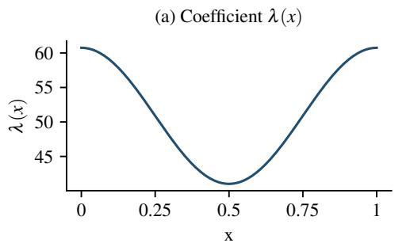

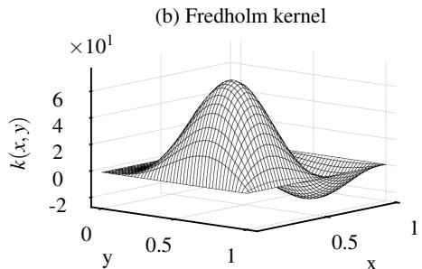

(c) Boundary controls  
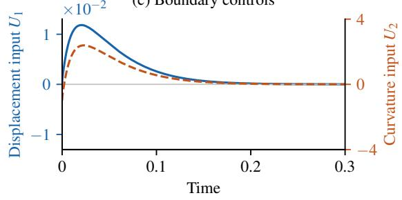  
$U _ { 1 }$ (left axis) $U _ { 2 }$ (right axis)

(d) Nonlinear plant u(x,t)  
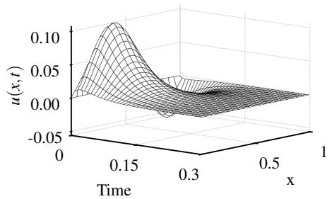  
Figure 2. Stabilization of the nonlinear plant with coeficient (8.1), initial condition $u _ { 0 } ( x ) =$ $1 0 ^ { - 3 } { \sqrt { 2 } } \sin ( \pi x )$ , and $( a , \theta , \varepsilon ) = ( 4 8 0 , 1 , 0 . 5 )$ . (a) The coeficient λ(x). (b) The Fredholm kernel computed with 32 modes. (c) The two boundary controls. (d) The nonlinear plant state.

We illustrate the two-input design on a plant with a repeated positive eigenvalue. Consider (1.1) with the spatially varying coeficient

$$
\lambda ( x ) = \pi ^ { 2 } \bigl ( c _ { * } + \cos ( 2 \pi x ) \bigr ) , \qquad c _ { * } \approx 5 . 1 5 6 .\tag{8.1}
$$

Here $c _ { * }$ is selected so that the two largest eigenvalues coincide: $\mu _ { 1 } = \mu _ { 2 } = \mu _ { * } \approx 4 5 9 . 1 1 4$ . By Proposition 2.3, this unstable double eigenvalue precludes exponential stabilization through the curvature input $U _ { 2 }$ alone. This example therefore illustrates the role of the displacement pre-feedback $U _ { 1 }$ in the two-input construction.

For this experiment, we choose the admissible design parameters $( a , \theta , \varepsilon ) \ : = \ : ( 4 8 0 , 1 , 0 . 5 )$ and the initial condition $u _ { 0 } ( x ) = 1 0 ^ { - 3 } \sqrt { 2 } \sin ( \pi x )$ , with $\| u _ { 0 } \| _ { L ^ { 2 } ( 0 , 1 ) } = 1 0 ^ { - 3 }$ . The gain (1.4) is computed by truncating the modal kernel construction to 32 kernel modes. Figure 2 shows the coeficient, the computed Fredholm kernel, and the resulting boundary controls and nonlinear plant response. Following an initial transient, the state and both controls decay toward zero for this initial condition.

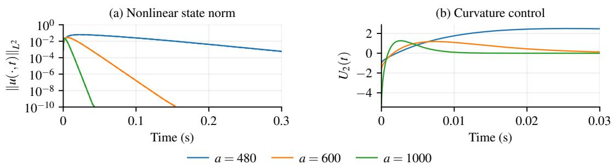  
Figure 3. Selectable decay rates for the fixed plant (8.1), with $( \theta , \varepsilon ) = ( 1 , 0 . 5 )$ and $u _ { 0 } ( x ) =$ $1 0 ^ { - 3 } { \sqrt { 2 } } \sin ( \pi x )$ . (a) Nonlinear state norms for $a = 4 8 0 , 6 0 0 , 1 0 0 0$ . (b) The corresponding curvature controls, with the first 0.03 seconds displayed to resolve the transient. Each curvature gain is recomputed using 1536 modes.

We next examine how the target shift a sets the decay rate. For an admissible design, Theorem 1.1 guarantees local exponential stability at any rate $0 < \omega < \nu$ , where $\nu = a - \operatorname* { m a x } _ { n } \operatorname { R e } \mu _ { n } ^ { \prime }$ is the target spectral margin defined in (6.26), also for every gain $\hat { h }$ with $\| \hat { h } - h \| \leq \epsilon ^ { * }$ . A truncated modal gain is covered provided its $L ^ { 2 }$ error is below $\epsilon ^ { * } ;$ this inequality is not verified here, so the simulations below are empirical. With the plant and pre-feedback fixed, increasing a increases this margin, while the suficient initial-state radius depends on the design and chosen rate. Keeping λ, $( \theta , \varepsilon ) = ( 1 , 0 . 5 )$ , and $u _ { 0 }$ fixed, we compare $a = 4 8 0 , 6 0 0$ , 1000 in Figure 3. For this comparison, each curvature gain is recomputed using 1536 modes. Panel (a) shows faster decay after

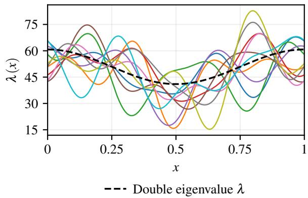  
Figure 4. Ten randomly selected training coeficients from the Fourier family (8.2). The dashed curve is the coeficient (8.1) with an unstable double eigenvalue.

<table><tr><td>Method</td><td>Time (ms) Error (%)</td></tr><tr><td>Modal (N = 4)</td><td> $0 . 2 2 9 \pm 0 . 0 0 7$  26.388</td></tr><tr><td>Modal (N = 64)</td><td> $1 . 1 4 3 \pm 0 . 0 1 9$  3.680</td></tr><tr><td>Modal (N = 128)  $4 . 1 3 7 \pm 0 . 0 2 2$ </td><td>2.417</td></tr><tr><td>Modal (N = 512)</td><td> $1 5 2 . 8 9 4 \pm 2 . 6 4 9$  0.885</td></tr><tr><td>Modal (N = 1024)  $8 1 4 . 6 2 0 \pm 5 . 5 0 3$ </td><td>0.000</td></tr><tr><td>FNO (CPU)</td><td> $2 5 . 9 2 5 \pm 0 . 4 6 7$  0.128</td></tr><tr><td>FNO (GPU)</td><td> $2 . 6 2 2 \pm 0 . 0 2 3$  0.129</td></tr></table>

Table 2. Gain-generation time (mean standard deviation) and mean relative $L ^ { 2 }$ error over 200 test profiles, using the 1024-mode reference. Modal timings use one CPU thread.

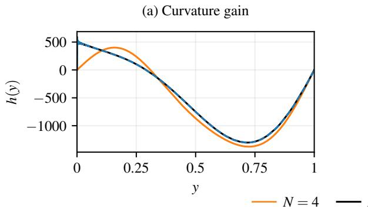

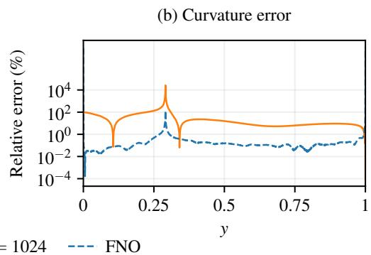  
(d) Nonlinear plant with FNO

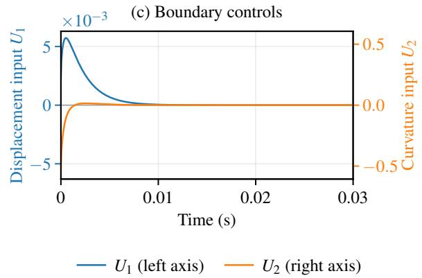

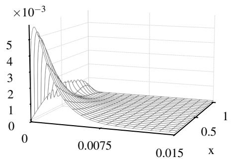  
Time (s)  
Figure 5. Gain approximation and nonlinear stabilization for the coeficient (8.1), with $( a , \theta , \varepsilon ) = ( 1 0 0 0 , 1 , 4 )$ and $u _ { 0 } ( x ) = 1 0 ^ { - 3 } \sqrt { 2 } \sin ( \pi x )$ . (a) Gains from $N = 4 .$ , 1024 and FNO. (b) Relative pointwise error $| \hat { h } ( y ) - h _ { \mathrm { r e f } } ( y ) | / ( | h _ { \mathrm { r e f } } ( y ) | + 1 0 ^ { - 6 } )$ , expressed as a percentage. The FNO relative $L ^ { 2 }$ error is 0.1107%. (c) FNO controls $U _ { 1 } ~ ( \mathrm { b l u e } .$ , left axis) and $U _ { 2 }$ (orange, right axis). (d) Nonlinear state under neural feedback up to $t = 0 . 0 1 5$

the initial transient as a increases. Panel (b) shows the corresponding curvature-control transients over the first 0.03 seconds. Note that, despite an increase in the gain, the control magnitudes do not necessarily increase and yet rapid stabilization is attained.

## 8.2. Stabilization with neural operator approximated gain

We now present experiments using a gain approximation. We first specify the set of design classes for which will we train a neural operator.

## 8.2.1. Dataset construction

We consider smooth spatially varying coeficients generated by

$$
\lambda ( x ) = \pi ^ { 2 } \Bigl ( c + \sum _ { \ell = 1 } ^ { 4 } \bigl [ \alpha _ { \ell } \cos ( 2 \pi \ell x ) + \beta _ { \ell } \sin ( 2 \pi \ell x ) \bigr ] \Bigr ) .\tag{8.2}
$$

The nine Fourier parameters are sampled independently and uniformly from

$$
\begin{array} { r } { c \in [ 4 . 8 , 5 . 3 ] , \qquad \alpha _ { 1 } \in [ 0 . 8 , 1 . 2 ] , \qquad \beta _ { 1 } \in [ - 0 . 2 , 0 . 2 ] , \qquad \alpha _ { \ell } , \beta _ { \ell } \in [ - 1 , 1 ] , \qquad \ell = 2 , 3 , 4 . } \end{array}
$$

The higher harmonics allow substantial changes in spatial shape, as illustrated by the ten randomly selected training profiles in Fig. 4. These bounded Fourier coeficients vary the mean, harmonic amplitudes, and phases but remain a uniformly bounded $W ^ { 2 , \infty }$ family.

We fix $( a , \theta , \varepsilon ) = ( 1 0 0 0 , 1 , 4 )$ to learn the dependence on λ, improving conditioning and decay relative to Section 8.1. We generate 1800 gain labels using at least 1024 modes on a uniform 3073-point grid, split into 1400 training, 200 validation, and 200 test samples.

Dataset generation takes approximately 226 seconds with a standard CPU.

## 8.2.2. Neural operator training

We train a Fourier neural operator (FNO) [35] for the map $\lambda \mapsto h$ at the fixed design parameters above. Its inputs are samples of λ and the spatial coordinates and its output is the curvature gain $\hat { h } ( y )$ used in (7.30). To improve numerical conditioning during training, we center and rescale the input coeficients using the mean and variance of the training data. The same rescaling is used for validation and testing. This normalization is standard in machine learning [4].

We minimize the squared $L ^ { 2 } ( 0 , 1 )$ error between $\hat { h }$ and the modal label $h _ { N }$ . The FNO has four 64-neuron layers, 32 Fourier modes, and 329281 trainable parameters. We train for 400 epochs using AdamW [38], initial learning rate $1 0 ^ { - 4 }$ , batch size 32, and gradient clipping at norm 1, selecting the checkpoint with lowest validation loss. Training takes 406 seconds on an RTX 3090 Ti.

Against the reference gain $h _ { \mathrm { r e f } } = h _ { 1 0 2 4 }$ , the median relative $L ^ { 2 }$ errors are 0.0916% on the training set and 0.1041% on the test set. The closed-loop tests below show that this accuracy is suficient for stabilization.

## 8.2.3. Neural operator closed-loop stability

Nonlinear closed-loop stability. We simulate the nonlinear closed loop for all 200 held-out test profiles using the FNO and each modal approximation in Table 2. The simulations use 384 plant modes and the initial condition $u _ { 0 } ( x ) = 1 0 ^ { - 3 } \sqrt { 2 }$ sin(πx), with $\| u _ { 0 } \| _ { L ^ { 2 } ( 0 , 1 ) } = 1 0 ^ { - 3 }$ . Every method produces decay over the simulation horizon $0 \leq t \leq 0 . 8$ , with $\| u ( 0 . 8 ) \| _ { L ^ { 2 } } < \| u _ { 0 } \| _ { L ^ { 2 } }$ in all 200 cases. The largest state norm under FNO feedback is $3 . 3 0 \times 1 0 ^ { - 3 }$

Figure 5(c)–(d) illustrates the nonlinear response for the coeficient (8.1) with an unstable double eigenvalue, using 384 plant modes and the same initial condition. Panel (c) shows the displacement and curvature inputs, and panel (d) shows the state under FNO feedback. The FNO and 1024-mode reference gain produce nearly identical decay, and all five modal approximations also stabilize this example. These simulations demonstrate the efectiveness of the learned gain on the held-out cases.

Computation time. Table 2 compares gain-generation time and relative error over 200 test profiles on the 3073- point grid. Modal timings include assembly, spectral computation, the coeficient solve, and gain reconstruction. FNO timings include normalization and GPU transfers for one profile. Ofline training and dataset generation are excluded. Timings use a Ryzen 9 5900X CPU (one thread) or RTX 3090 Ti.

Low-mode approximations are inexpensive but have larger gain errors. The FNO achieves approximately 0.13% mean relative error in 25.9 ms on the CPU or 2.62 ms on the GPU, compared with 815 ms for the 1024-mode solve. For a fixed plant, the gain is computed once and reused. The FNO’s speed is particularly valuable in adaptive control, where gains are updated as the coeficient estimate changes [3].

## 9. Conclusion

We have given a Fredholm backstepping design for the KS equation with a spatially varying anti-difusion coeficient. It is valid for every $\lambda \in W ^ { 1 , \infty } ( 0 , 1 )$ , with no further restriction on the plant. What makes this possible is the second boundary input. At an unstable repeated eigenvalue of the plant operator, no linear feedback through a single channel can stabilize the system (Proposition 2.3). The displacement input is spent entirely on a controllability-ensuring pre-feedback, in the sense of Heymann’s Lemma, so that every remaining restriction falls on the design parameters $( a , \varepsilon , \theta )$ and none on the plant (Theorem 4.2). We then show that the

Fredholm transformation is invertible (Theorem 5.1(ii)), and its invertibility is a consequence of controllability of the pre-compensated plant.

Under this two-input design, the Fredholm gain is still challenging to implement numerically. Consequently, we show that the operator mapping the design parameters and anti-difusion coeficient λ to the gain h is continuous (Theorem 6.2). This yields the existence of a single neural operator approximation of the gain to any prescribed $\dot { L } ^ { 2 }$ accuracy on a compact admissible design class (Theorem 6.3). We then establish stability for both the exact gain and suficiently accurate neural-operator approximations (Theorems 7.4 and 7.6). Explicitly, we show that local rapid stabilization is achievable in both cases (Theorems 1.1 and 1.2). We conclude with numerical results illustrating prescribed decay rates and stabilization using the learned gain.

Hence, this work opens the door to several significant extensions. First, it opens the way to adaptive and observer-based control via Fredholm backstepping, a completely unexplored topic. Second, the idea of using two controls can apply to numerous problems beyond the KS equation, as already shown in the companion papers [26, 27]. By making controllability part of the feedback design, this approach extends the reach of Fredholm backstepping to plants previously excluded by their spectral structure, enabling new directions in PDE backstepping.

Acknowledgment. The authors’ problems, ideas, and results were developed with the assistance of Claude and ChatGPT in final theorem formulation, proofs, simulations, and drafting throughout the paper, under the authors’ correction and complete verification.

## Appendix A. Additional proofs for Section 3: verification of the kernel and modal equations

## A.1. Proof of Proposition 3.1: verification of the plant-to-target transformation

Proof. Write $L _ { y } = \partial _ { y } ^ { 4 } + \partial _ { y } ( \lambda ( y ) \partial _ { y } )$ . Integration by parts, using the plant and kernel boundary conditions, gives

$$
\int _ { 0 } ^ { 1 } k ( x , y ) L _ { y } u ( y , t ) \mathrm { d } y = \langle L _ { y } k ( x , \cdot ) , u ( \cdot , t ) \rangle + k _ { y } ( x , 0 ) U _ { 2 } ( t ) + \big ( k _ { y y y } ( x , 0 ) + \lambda ( 0 ) k _ { y } ( x , 0 ) \big ) U _ { 1 } ( t ) .\tag{A1}
$$

The first term on the right is the distributional pairing in $y .$ Since $k _ { y } ( x , 0 ) = 0$ , only the displacement boundary term remains. Substituting $U _ { 1 } = \varepsilon \langle g _ { \theta } , u \rangle$ , this term cancels the kernel source $\varepsilon k _ { y y y } ( x , 0 ) g _ { \theta } ( y )$ after integration against $u ,$ giving the target equation.

At the left endpoint, (3.9e) and $w = u - K$ u give

$$
w ( 0 ) = \varepsilon \langle g _ { \theta } , u \rangle - \langle k ( 0 , \cdot ) , u \rangle = \varepsilon \langle g _ { \theta } , u - K u \rangle = \varepsilon \langle g _ { \theta } , w \rangle .\tag{A2}
$$

The remaining target boundary conditions follow from the kernel traces.

## A.2. Proof of Proposition 3.2: verification of the modal equivalence of the kernel

Proof. We first project in the y variable and then in the x variable. The section $k ( x , \cdot )$ need not belong to $D ( A _ { \lambda } )$ because its third derivative jumps at $y = x$ . The first projection must therefore use the distributional kernel equation, rather than an operator-domain identity. Define

$$
k _ { j } ( x ) : = \langle k ( x , \cdot ) , \varphi _ { j } \rangle , \qquad \ell ( x ) : = k _ { y y y } ( x , 0 ) .\tag{A3}
$$

Integration by parts has no endpoint terms because both functions and their second derivatives vanish at $y = 0 , 1$ ， by (3.9b) and $\varphi _ { j } \in D ( A _ { \lambda } )$ . Since $- L _ { y } \varphi _ { j } = \mu _ { j } \varphi _ { j }$ ，

$$
\langle - L _ { y } k ( x , \cdot ) , \varphi _ { j } \rangle = \langle k ( x , \cdot ) , - L _ { y } \varphi _ { j } \rangle = \mu _ { j } k _ { j } ( x ) .\tag{A4}
$$

Here $L _ { y } k$ is interpreted distributionally, so it includes the terms generated by derivative jumps at $y = x .$ . Thus the identity does not require $k ( x , \cdot ) \in D ( A _ { \lambda } )$ ). Hence (3.9a) becomes

$$
k _ { j } ^ { \prime \prime \prime \prime } + ( \lambda k _ { j } ^ { \prime } ) ^ { \prime } + ( \mu _ { j } + a ) k _ { j } = a \varphi _ { j } + \varepsilon \ell g _ { j } , \qquad \ell ( x ) = \sum _ { i } k _ { i } ( x ) \alpha _ { i } .\tag{A5}
$$

The second identity uses $k _ { y } ( x , 0 ) = 0$ , which also gives $\begin{array} { r } { \sum _ { i } k _ { i } ( x ) \beta _ { i } = 0 } \end{array}$ and hence (3.11b) after projection in x. For the remaining modal equation, the boundary data for $k _ { j }$ are

$$
k _ { j } ( 1 ) = k _ { j } ^ { \prime \prime } ( 1 ) = 0 , \qquad k _ { j } ( 0 ) = \varepsilon \sum _ { p } K _ { p j } g _ { p } , \qquad k _ { j } ^ { \prime \prime } ( 0 ) = h _ { j } .\tag{A6}
$$

Pairing (A5) with $\varphi _ { m }$ and applying the boundary identity of Lemma 2.1 gives (3.11a).

## Appendix B. Sobolev bounds for the modal coordinate map

Here generic constants may depend on $\lambda , ( a , \varepsilon , \theta )$ , and $\nu _ { 0 }$ , but not on the state, mode indices, or time. Bounds $C ( B , d )$ are uniform over $\mathcal { U } _ { B , d }$ for the stated common rate.

We first establish the Sobolev bounds and boundary properties of Γ needed in the proof of Lemma 7.3. These properties justify integration by parts in the modal pairing. Their uniform bounds are also used in Theorem 6.2.

Lemma B.1 (The operator Γ). Let $( a , \varepsilon , \theta ) \in \mathcal { U } _ { \lambda }$ and let Γ be the map (6.25) relating the modal inner product of the eigenbasis of $\mathcal { A } _ { \lambda } ^ { \prime }$ to the $L ^ { 2 }$ inner product. Then $\Gamma = \tilde { J } J ^ { - 1 }$ is an isomorphism of $L ^ { 2 } ( 0 , 1 )$ with $\| \Gamma \| \le M$ and $\lVert \Gamma ^ { - \bar { 1 } } \rVert \leq m ^ { - 1 }$ . It is bounded from $\mathcal { H } ^ { s }$ into $H ^ { s } ( 0 , 1 )$ for every $s \in [ 0 , 4 ]$ , with

$$
\Gamma ( \mathcal { H } ^ { s } ) \subset \ \{ v \in H ^ { s } ( 0 , 1 ) : v ( 0 ) = v ( 1 ) = 0 \}\tag{B1}
$$

for $\textstyle { \frac { 1 } { 2 } } < s \leq 4$ , in particular $\Gamma ( \mathcal { H } ^ { 1 } ) \subset H _ { 0 } ^ { 1 } ( 0 , 1 )$ . On $\mathcal { U } _ { B , d }$ the norms $\left\| \Gamma \right\| _ { \mathcal { L } ( \mathcal { H } ^ { s } , H ^ { s } ) }$ are bounded by $C ( B , d )$

Proof of Lemma B.1. The coordinate maps give the $L ^ { 2 }$ bounds directly. Indeed,

$$
\Gamma J = \tilde { J } , \qquad \Gamma = \tilde { J } J ^ { - 1 } , \qquad \tilde { J } = ( J ^ { - 1 } ) ^ { * } .\tag{B2}
$$

Consequently,

$$
\| \Gamma \| \leq \| J ^ { - 1 } \| ^ { 2 } = M , \qquad \| \Gamma ^ { - 1 } \| \leq \| J \| ^ { 2 } = m ^ { - 1 } .\tag{B3}
$$

For Sobolev regularity, we use graph-norm estimates for $\mathcal { A } _ { \lambda } ^ { \prime }$ and its adjoint. The following constants depend on λ and $( a , \varepsilon , \theta )$ for a fixed design and are uniform on $\mathcal { U } _ { B , d }$ as indicated. For $\phi \in D ( A _ { \lambda } ^ { \prime } )$ , the equation and boundary condition give

$$
\phi ^ { \prime \prime \prime \prime } = \mathrm { ~ - } A _ { \lambda } ^ { \prime } \phi - ( \lambda \phi ^ { \prime } ) ^ { \prime } , \qquad | \phi ( 0 ) | = | \varepsilon \langle g _ { \theta } , \phi \rangle | \le C ( B ) \| \phi \| .\tag{B4}
$$

The elliptic estimate, with interpolation to absorb the $H ^ { 2 }$ term, gives

$$
\| \phi \| _ { H ^ { 4 } } \leq C ( B ) ( \| A _ { \lambda } ^ { \prime } \phi \| + \| \phi \| ) .\tag{B5}
$$

For the adjoint, the additional trace term is absorbed using

$$
\begin{array} { r } { | \psi ^ { [ 3 ] } ( 0 ) | \le \delta \| \psi \| _ { H ^ { 4 } } + C _ { \delta , B } \| \psi \| , } \end{array}\tag{B6}
$$

with $\delta$ small. This is uniform because $\left| \varepsilon \right| \left\| g _ { \theta } \right\|$ is bounded on the class. Hence both operators have uniform equivalence of graph and $H ^ { 4 }$ norms. For $\phi \in \mathcal { H } ^ { 4 }$ , the series

$$
\Gamma \phi = \sum _ { n } \phi _ { n } { \tilde { \chi } } _ { n } , \qquad \sum _ { n } { \bar { \mu } } _ { n } ^ { \prime } \phi _ { n } { \tilde { \chi } } _ { n }\tag{B7}
$$

converge in $L ^ { 2 } ( 0 , 1 )$ by the spectral growth and Riesz bounds. Closedness of $\mathcal { A } _ { \lambda } ^ { \prime \ast }$ puts the first series in its domain. The uniform graph-norm estimate then gives

$$
\| \Gamma \| _ { \mathcal { L } ( \mathcal { H } ^ { 4 } , H ^ { 4 } ) } \leq C ( B , d ) .\tag{B8}
$$

Interpolating with the $L ^ { 2 }$ bound above gives the uniform bound for every $s \in [ 0 , 4 ]$ , and the same argument applies to the spectral embedding. Each finite adjoint eigenfunction sum vanishes at both endpoints. Convergence in $H ^ { s }$ and continuity of the trace for $s > 1 / 2$ pass these boundary conditions to the limit. □

## Appendix C. Closed-loop well-posedness

Throughout this appendix, fix an admissible design. Generic constants may depend on $\lambda , ( a , \varepsilon , \theta )$ , and $\nu _ { 0 }$ but not on the state, mode indices, or time.

Proposition 7.1 treats a prescribed forcing $f .$ For the closed loop, f depends on the unknown state, so existence and uniqueness require a fixed-point argument. The following result uses the general forced-target estimate together with Lemmas 7.3 and 7.5.

Proposition C.1 (Local existence and uniqueness for closed-loop plant). Consider the Kuramoto–Sivashinsky plant (1.1) with the pre-feedback (3.1) and the perturbed curvature feedback (7.30), that is $U _ { 2 } = \langle \hat { h } , u \rangle$ . For every $u _ { 0 } \in L ^ { 2 } ( 0 , 1 )$ and every $\hat { h } \in L ^ { 2 } ( 0 , 1 )$ there $i s \ \tau > 0$ , depending only on $\left\| u _ { 0 } \right\| , \ \left\| \hat { h } - h \right\|$ and the design, and a unique solution of the closed loop on [0, τ) in the sense of Definition 7.2. Any two solutions coincide on their common interval of existence. $I f \left[ 0 , \tau ^ { * } \right)$ is the maximal interval of existence and $\tau ^ { * } < \infty$ , then $\| u ( t ) \|  \infty$ as $t \uparrow \tau ^ { * }$ . Moreover $t \mapsto V ( T u ( t ) )$ is absolutely continuous on compact subsets of $[ 0 , \tau ^ { * } )$ and satisfies (7.3) with $f$ as in (7.31).

Proof of Proposition C.1. We first prove local existence and uniqueness by contraction in target coordinates. Fix $0 < \nu _ { 0 } < \nu$ and use the weighted norm $\| f \| _ { \mathcal { H } _ { \gamma } ^ { - 2 } }$ defined in (7.5). Equivalence follows from $c n ^ { 4 } \leq \gamma _ { n } \leq C n ^ { 4 }$ by Proposition 7.1 and Theorem 4.2(ii). Write $w = T u , u = T ^ { - 1 } w , e = \hat { h } - h$ , and work in

$$
X _ { \tau } = \ S ( [ 0 , \tau ] ; \mathcal { H } ^ { 0 } ) \cap L ^ { 2 } ( 0 , \tau ; \mathcal { H } ^ { 2 } ) , \qquad \| w \| _ { X _ { \tau } } = \operatorname* { s u p } _ { 0 \leq t \leq \tau } \| w ( t ) \| _ { \mathcal { H } ^ { 0 } } + \left( \int _ { 0 } ^ { \tau } \Sigma ( w ( t ) ) \mathrm { d } t \right) ^ { 1 / 2 } .\tag{C1}
$$

Define $\Phi ( w )$ as the mild solution of the linear target system with initial condition $T u _ { 0 }$ and forcing $f ( w ) =$ $B _ { 2 } \langle e , u \rangle - T ( u u _ { x } )$ from (7.31). A fixed point gives a solution in the sense of Definition 7.2. Integrating the identity of Proposition 7.1(ii) with (7.11) at $\delta = 1 / 2$ gives

$$
\| \Phi ( w ) \| _ { X _ { \tau } } \leq 3 \| T u _ { 0 } \| _ { \mathcal { H } ^ { 0 } } + 4 \| f ( w ) \| _ { L ^ { 2 } ( 0 , \tau ; \mathcal { H } _ { \gamma } ^ { - 2 } ) } .\tag{C2}
$$

In the proof of Lemma 7.3, replace w in the second slot by an arbitrary $v \in \mathcal { H } ^ { 2 }$ . Lemma $5 . 2 ( \mathrm { i i } )$ and Lemma B.1 control $\Gamma T ^ { \sharp } v$ in $H _ { 0 } ^ { 1 } ( 0 , 1 )$ . Using $\| v \| _ { \mathcal { H } ^ { 1 } } \leq c _ { \gamma } ^ { - 1 / 2 } \Sigma ( v ) ^ { 1 / 2 }$ from (6.30) and taking the supremum over $\Sigma ( v ) \leq 1$ gives the first bound below. Spectral interpolation and the $L ^ { 2 }$ norm equivalence give the second:

$$
\begin{array} { r } { \| T ( u u _ { x } ) \| _ { \mathcal { H } _ { \gamma } ^ { - 2 } } \leq C \| u \| ^ { 3 / 2 } \| u \| _ { \mathcal { H } ^ { 1 } } ^ { 1 / 2 } \leq C \| u \| ^ { 7 / 4 } \| u \| _ { \mathcal H ^ { 2 } } ^ { 1 / 4 } . } \end{array}\tag{C3}
$$

H¨older’s inequality in time and boundedness of $T ^ { - 1 }$ on $\mathcal { H } ^ { 0 }$ and $\mathcal { H } ^ { 2 }$ , from Lemma 5.2(ii), give

$$
\begin{array} { r } { \| T ( u u _ { x } ) \| _ { L ^ { 2 } ( 0 , \tau ; \mathcal { H } _ { \gamma } ^ { - 2 } ) } \leq \ C \tau ^ { 3 / 8 } \| w \| _ { X _ { \tau } } ^ { 2 } . } \end{array}\tag{C4}
$$

For the boundary forcing, (6.31) gives $\| B _ { 2 } \| _ { \mathcal { H } _ { v } ^ { - 2 } } = \Lambda$ , so

$$
\| B _ { 2 } \langle e , u \rangle \| _ { L ^ { 2 } ( 0 , \tau ; \mathcal { H } _ { \gamma } ^ { - 2 } ) } \leq C \Lambda \| e \| \tau ^ { 1 / 2 } \| w \| _ { X _ { \tau } } .\tag{C5}
$$

For diferences, use $\begin{array} { r } { u u _ { x } - v v _ { x } = \frac { 1 } { 2 } \partial _ { x } ( ( u - v ) ( u + v ) ) } \end{array}$ . The same product estimates and the linear estimate with zero initial data give

$$
\| \Phi ( w ) - \Phi ( z ) \| _ { X _ { \tau } } \leq C \big [ \tau ^ { 3 / 8 } ( \| w \| _ { X _ { \tau } } + \| z \| _ { X _ { \tau } } ) + \Lambda \| e \| \tau ^ { 1 / 2 } \big ] \| w - z \| _ { X _ { \tau } } .\tag{C6}
$$

Choose $R = 6 \| T u _ { 0 } \| _ { \mathcal { H } ^ { 0 } } + 1$ . Estimates (C2), (C4), and (C5) show that Φ maps the closed radius-R ball of X into itself for suficiently small τ. Estimate (C6) makes it a strict contraction. Banach’s fixed-poin theorem [6, Thm. 5.7] gives a unique fixed point. The choice of τ depends only on the stated data and the design. Applying the same diference estimate on short intervals gives uniqueness on overlapping intervals.

We next prove continuation and the blow-up alternative. Restarting the local construction gives a maximal interval of existence. The existence time is uniform when the initial norm is bounded. If the solution remained bounded along times approaching a finite $\tau ^ { * }$ , restarting at one of those times would extend it beyond τ∗, proving the blow-up alternative.

Finally, we prove the Lyapunov identity. The forcing estimates place f in $L ^ { 2 } ( 0 , \tau ; \mathcal { H } ^ { - 2 } )$ on every compact subinterval of existence. Proposition 7.1(ii) therefore gives absolute continuity of $V ( T u )$ and identity (7.3). □

## References

[1] L. Bhan, M. Krstic, and Y. Shi. Predictor-based output-feedback control of linear systems with time-varying input and measurement delays via neural-approximated prediction horizons. Systems Control Lett., 218:106574, 2026.

[2] L. Bhan, Y. Shi, and M. Krstic. Neural operators for bypassing gain and control computations in PDE backstepping. IEEE Trans. Automat. Control, 69(8):5310–5325, 2024.

[3] L. Bhan, Y. Shi, and M. Krstic. Adaptive control of reaction–difusion PDEs via neural operator-approximated gain kernels. Systems Control Lett., 195:105968, 2025.

[4] C. M. Bishop. Pattern Recognition and Machine Learning. Information Science and Statistics. Springer, New York, 2006.

[5] V. Boulard and A. Hayat. F-equivalence for parabolic systems and applications to the stabilization of nonlinear PDE, 2025. arXiv:2508.21605v2.

[6] H. Brezis. Functional Analysis, Sobolev Spaces and Partial Diferential Equations. Universitext. Springer, New York, 2011.

[7] F. Bribiesca-Argomedo and M. Krstic. Backstepping-forwarding control and observation for hyperbolic PDEs with Fredholm integrals. IEEE Trans. Automat. Control, 60(8):2145–2160, 2015.

[8] E. Cerpa. Null controllability and stabilization of the linear Kuramoto–Sivashinsky equation. Commun. Pure Appl. Anal., 9(1):91–102, 2010.

[9] E. Cerpa, P. Guzm´an, and A. Mercado. On the control of the linear Kuramoto–Sivashinsky equation. ESAIM Control Optim. Calc. Var., 23(1):165–194, 2017.

[10] J.-M. Coron, L. Gagnon, and M. Morancey. Rapid stabilization of a linearized bilinear 1-D Schr¨odinger equation. J. Math. Pures Appl., 115:24–73, 2018.

[11] J.-M. Coron, A. Hayat, S. Xiang, and C. Zhang. Stabilization of the linearized water tank system. Arch. Ration. Mech. Anal., 244(3):1019–1097, 2022.

[12] J.-M. Coron, L. Hu, and G. Olive. Stabilization and controllability of first-order integro-diferential hyperbolic equations. J. Funct. Anal., 271(12):3554–3587, 2016.

[13] J.-M. Coron and Q. L¨u. Local rapid stabilization for a Korteweg–de Vries equation with a Neumann boundary control on the right. J. Math. Pures Appl., 102(6):1080–1120, 2014.

[14] J.-M. Coron and Q. L¨u. Fredholm transform and local rapid stabilization for a Kuramoto–Sivashinsky equation. J. Diferential Equations, 259(8):3683–3729, 2015.

[15] M. V. de Hoop, D. Z. Huang, E. Qian, and A. M. Stuart. The cost-accuracy trade-of in operator learning with neural networks. J. Mach. Learn., 1(3):299–341, 2022.

[16] L. C. Evans. Partial Diferential Equations, volume 19 of Graduate Studies in Mathematics. American Mathematical Society, Providence, RI, 2nd edition, 2010.

[17] L. Gagnon, A. Hayat, S. Marx, S. Xiang, and C. Zhang. Quantitative Fredholm backstepping and rapid stabilization, 2026. arXiv:2605.17941.

[18] L. Gagnon, A. Hayat, S. Xiang, and C. Zhang. Fredholm transformation on Laplacian and rapid stabilization for the heat equation. J. Funct. Anal., 283(12):109664, 2022.

[19] L. Gagnon, A. Hayat, S. Xiang, and C. Zhang. Fredholm backstepping for critical operators and application to rapid stabilization for the linearized water waves. Ann. Inst. Fourier, 75(6):2423–2500, 2025.

[20] I. C. Gohberg and M. G. Kre˘ın. Introduction to the Theory of Linear Nonselfadjoint Operators in Hilbert Space, volume 18 of Translations of Mathematical Monographs. American Mathematical Society, Providence, RI, 1969.

[21] B.-Z. Guo. Riesz basis approach to the stabilization of a flexible beam with a tip mass. SIAM J. Control Optim., 39(6):1736–1747, 2001.

[22] A. Hayat and E. Loko. Rapid stabilization of general linear systems with F-equivalence. J. Funct. Anal., 290(12):111447, 2026.

[23] M. Heymann. Comments “on pole assignment in multi-input controllable linear systems”. IEEE Trans. Automat. Control, 13(6):748–749, 1968.

[24] T. Kato. Perturbation Theory for Linear Operators. Springer, Berlin, 2nd edition, 1976. Reprinted in 1995.

[25] N. B. Kovachki, S. Lanthaler, and H. Mhaskar. Data complexity estimates for operator learning, 2024. arXiv:2405.15992.

[26] M. Krstic. Fredholm backstepping with Heymann pre-feedback for linearized Navier–Stokes 2D channel, 2026. arXiv:2609.19331.

[27] M. Krstic. Stabilization of Yih’s viscosity jump interface in a channel, 2026. arXiv:2609.22384.

[28] M. Krstic, L. Bhan, and Y. Shi. Neural operators of backstepping controller and observer gain functions for reaction–difusion PDEs. Automatica, 164:111649, 2024.

[29] M. Krstic, B.-Z. Guo, A. Balogh, and A. Smyshlyaev. Control of a tip-force destabilized shear beam by observer-based boundary feedback. SIAM J. Control Optim., 47(2):553–574, 2008.

[30] M. Krstic, L. Magnis, and R. Vazquez. Nonlinear stabilization of shock-like unstable equilibria in the viscous Burgers PDE. IEEE Trans. Automat. Control, 53(7):1678–1683, 2008.

[31] M. Krstic and A. Smyshlyaev. Boundary Control of PDEs: A Course on Backstepping Designs. Society for Industrial and Applied Mathematics, Philadelphia, PA, 2008.

[32] M. Lamarque, L. Bhan, Y. Shi, and M. Krstic. Adaptive neural-operator backstepping control of a benchmark hyperbolic PDE. Automatica, 177:112329, 2025.

[33] S. Lanthaler, Z. Li, and A. M. Stuart. Nonlocality and nonlinearity implies universality in operator learning. Constr. Approx., 62(2):261–303, 2025.

[34] S. Lanthaler and A. M. Stuart. The parametric complexity of operator learning. IMA J. Numer. Anal., 46(2):647–712, 2026

[35] Z. Li, N. Kovachki, K. Azizzadenesheli, B. Liu, K. Bhattacharya, A. Stuart, and A. Anandkumar. Fourier neural operator for parametric partial diferential equations. In International Conference on Learning Representations, 2021.

[36] Y.-J. Lin Guo. Null boundary controllability for a fourth order parabolic equation. Taiwanese J. Math., 6(3):421–431, 2002.

[37] W.-J. Liu and M. Krstic. Stability enhancement by boundary control in the Kuramoto–Sivashinsky equation. Nonlinear Anal., 43(4):485–507, 2001.

[38] I. Loshchilov and F. Hutter. Decoupled weight decay regularization. In International Conference on Learning Representations, 2019.

[39] L. Lu, P. Jin, G. Pang, Z. Zhang, and G. Em. Karniadakis. Learning nonlinear operators via DeepONet based on the universal approximation theorem of operators. Nat. Mach. Intell., 3(3):218–229, 2021.

[40] K. Lv, J. Wang, Y. Zhang, and H. Yu. Neural operators for adaptive control of freeway trafic. Automatica, 182:112553, 2025.

[41] M. A. Naimark. Linear Diferential Operators, Part I. Ungar, New York, 1967.

[42] A. I. Ruban, J. S. B. Gajjar, and A. G. Walton. Fluid Dynamics: Part 4: Hydrodynamic Stability Theory. Oxford University Press, Oxford, 2023.

[43] A. Smyshlyaev, B.-Z. Guo, and M. Krstic. Arbitrary decay rate for Euler–Bernoulli beam by backstepping boundary feedback. IEEE Trans. Automat. Control, 54(5):1134–1140, 2009.

[44] A. Smyshlyaev and M. Krstic. Closed-form boundary state feedbacks for a class of 1-D partial integro-diferential equations. IEEE Trans. Automat. Control, 49(12):2185–2202, 2004.

[45] E. D. Sontag. Mathematical Control Theory: Deterministic Finite Dimensional Systems. Springer, 2nd edition, 1998.

[46] R. Vazquez, G. Chen, J. Qiao, and M. Krstic. The power series method to compute backstepping kernel gains: Theory and practice. In 2023 62nd IEEE Conference on Decision and Control (CDC), pages 8162–8169, 2023.

[47] R. Vazquez and M. Krstic. Control of Turbulent and Magnetohydrodynamic Channel Flows: Boundary Stabilization and State Estimation. Birkh¨auser, 2008.

[48] S. Wang, M. Diagne, and M. Krstic. Backstepping neural operators for 2 × 2 hyperbolic PDEs. Automatica, 178:112351, 2025.

[49] W. M. Wonham. On pole assignment in multi-input controllable linear systems. IEEE Trans. Automat. Control, 12(6):660–665, 1967.

[50] W. M. Wonham. Linear Multivariable Control: A Geometric Approach. Springer, 3rd edition, 1985.