# REFOLD: TRAINING-FREE REVERSIBLE INTER-TURN CONTEXT FOLDING FOR LONG-HORIZON AGENTS

Yupeng Su<sup>1</sup> Jiayi Tian<sup>1</sup> Zheng Zhang<sup>1</sup> Souvik Kundu<sup>2</sup> <sup>1</sup>University of California, Santa Barbara <sup>2</sup>Intel

## ABSTRACT

Long-horizon LLM agents act on an append-only interaction history that is re-sent to the model at every step, so the context and its cost grow with steps until the sessions exceed the context window. Existing methods manage the context through context requirement prediction, relying on additional model calls, heuristic rules, or trained policies. However, these predictive approaches introduce runtime overhead, invalidate prefix caches, and permanently discard content with no guarantee of recovery. To overcome these limitations, we introduce ReFold: a training-free rendering layer that preserves the underlying interaction history while compressing only the model’s rendered context. It removes two kinds of inter-turn redundancy without an auxiliary predictor: content an earlier turn already displayed, replaced by a stub, and turns the agent itself reports finished, folded into a one-line note. Both operators use chunked rendering, rewriting the cached prefix once every few steps rather than at every step. Every removal is strictly reversible, a wrong removal costs one restore from the history rather than permanent content loss. Because it operates at the rendering layer, ReFold is plug-and-play across standard ReAct-style harnesses. Evaluations across five long-horizon benchmarks and two frontier LLMs demonstrate that ReFold reduces token consumption by up to 2.5× and halves the KV-cache memory per session without degrading task success rates. Under capped context budgets, it avoids up to 92% of forced compactions. Under concurrent serving workloads, it reduces request queuing delays by up to 100%, accelerating inference by up to 1.7×, while cutting inference costs by 3.4×.

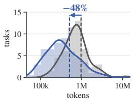

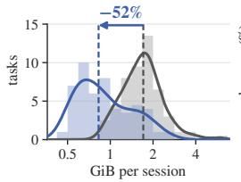  
Baseline

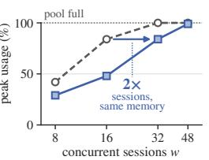  
ReFold

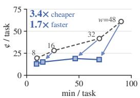  
Figure 1: ReFold’s savings carry from one session to the serving system. With Qwen3.6-27B on SWE-bench Verified, it cuts (a) tokens and (b) peak KV cache per session, so a vLLM server (c) fits 2× the sessions in the same memory and (d) runs tasks up to 3.4× cheaper and 1.7× faster.

## 1 INTRODUCTION

Large language model (LLM) agents solve complex tasks by interleaving reasoning with actions and tool calls in an external environment (Yao et al., 2023; Schick et al., 2023; Shinn et al., 2023), and this framework has been widely adopted to push the boundaries of automated software engineering. Given a natural-language issue and repository access (Jimenez et al., 2024), these systems localize faults, edit source files, and validate their own patches (Yang et al., 2024; Wang et al., 2025; Xia et al., 2025). Crucially, these workflows are inherently long-horizon: resolving real-world repository issues requires continuous loops of reading, searching, testing, and editing, resulting in execution trajectories that span dozens and up to hundreds of steps (Merrill et al., 2026).

These agents operate over an append-only interaction history, resending the entire transcript of prior tool calls and environmental observations to the model at every step. This history is dominated by tool outputs, such as file reads, search results, and test logs, which causes both context length and inference costs to grow with each successive step. Furthermore, long contexts degrade model accuracy well before the window limit (Liu et al., 2024; Hsieh et al., 2024). This pressure is directly evident at production scale: an analysis of GitHub Copilot over 95 trillion tokens reveals that while only 7.8% of agent sessions trigger context compaction, these sessions account for 44.2% of total token usage (Liu et al., 2026a). Although sessions that exceed their context window represent a clear minority, they dominate overall serving costs.

Existing methods prune the context by predicting whether past content will be needed later, and broadly fall into four categories: ➀ positional eviction, which keeps only the most recent observations and masks older ones behind placeholders (Lindenbauer et al., 2025); ➁ content pruning, which drops observation content judged irrelevant by heuristic rules, trained scorers, or auxiliary model calls (Wang et al., 2026; Xiao et al., 2026; Ren et al., 2026); ➂ external storage, which offloads evicted history to an addressable store the agent must query (Ehrlich & Blackman, 2026; Dang et al., 2026); and ➃ summarization, which replaces past interactions with model-written summaries, either through an extra model call at a static token threshold, as in Claude Code and Codex, or through summaries the agent learns to write (Sun et al., 2026; Ye et al., 2026; Gao et al., 2026; Li et al., 2026b). However, these predictive strategies come at a steep systemic cost: they introduce substantial runtime overhead, break prefix-cache reuse, or permanently discard context with no guarantee of recovery.

Our Contributions. To bridge these gaps, we present ReFold, a training-free rendering layer that preserves the agent’s append-only interaction history while compressing only the context the model sees. Instead of an auxiliary predictor, ReFold removes content the history shows to be repeated and folds turns the agent itself reports finished, while avoiding the additional systemic costs identified above. We summarize our contributions as follows:

• We systematically evaluate six context-management strategies within a unified agent harness, showing that pruning tool outputs alone cannot bound a session’s footprint and that predictive eviction incurs runtime overhead, invalidates prefix caches, or permanently discards context.

• We compress the rendered context through two lightweight operators. Deduplication replaces redundant content that previously appeared in earlier turns with a reference stub. Folding collapses turns that the agent has itself reported as finished into a one-line note, spanning both tool observations and the agent’s own messages.

• We avoid the systemic costs of existing strategies through two design choices. Both operators use chunked rendering, rewriting the cached prefix once every few steps rather than at every step. Every removal is strictly reversible by a restore from the unmodified history.

Evaluations across five long-horizon benchmarks and two frontier LLMs show that ReFold reduces token consumption and halves the per-session KV-cache footprint without degrading task success, and achieves lower cost and faster completion under capped budgets or concurrent load (Figure 1).

## 2 MOTIVATIONAL STUDY

In this section, we examine the systemic costs of existing context-management strategies through a controlled comparison in a unified agent harness. Following the four categories introduced in Section 1, we implement four strategies: ➀ masking observations older than a recency window behind placeholders (mask), ➁ pruning content within observations using heuristic rules or trained scorers (prune), ➂ evicting content into an addressable external store (recall), and ➃ compacting execution history via summarization (compact). In addition, agent harnesses provide two baselines: ➄ clipping older observations to a fixed character cap (clip) and ➅ retaining the interaction history unpruned (base). All six variants are evaluated on the same 50 SWE-bench Verified tasks under a 16k context budget, with configurable hyperparameters chosen by resolve rate (Appendix B).

Observation 1. Pruning tool outputs alone cannot guarantee that the context remains within a fixed budget. Enforcing a strict context bound requires controlling the accumulation of both tool outputs and the agent’s own commands and reasoning traces in the rendered context.

machinery: calls / task × s / cal  
(a) KV-cache footprint per step  
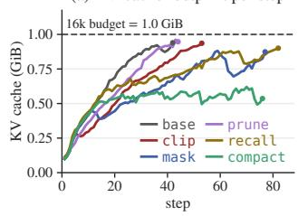

(c) Cost per task and the overhead within it  
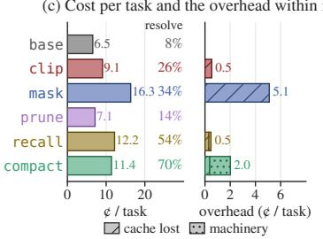

(e) Prefix-cache hits along one trajectory  
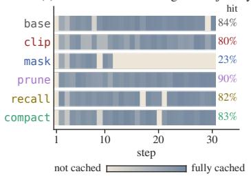

(b) Peak KV-cache composition  
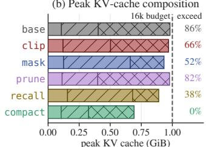  
system + task agent observations

(d) Duration per task and the machinery within it  
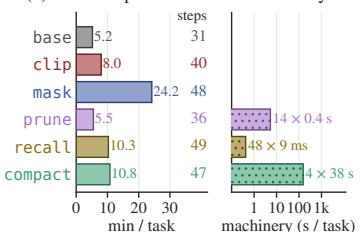

(f) Fate of observation tokens  
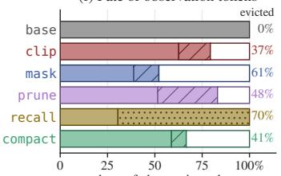  
kept machinery re-execute irrecoverable  
Figure 2: The six strategies on the same 50 SWE-bench Verified tasks at a 16k budget: per-session KV-cache footprint and peak composition (a, b), per-task cost and duration with resolve rate (c, d), prefix-cache reuse along one trajectory (e) and the fate of evicted observation tokens (f).

The peak KV-cache memory required per session constrains how many sessions a GPU can serve concurrently. Figure 2a shows that the per-session footprint grows steadily with steps under all five non-compacting strategies. In Figure 2b, these strategies reach peak footprints of approximately 0.89–0.98 GiB, close to the 1.0 GiB limit of the 16k context budget in our setup. Their contextbudget exceed rates range from 38% to 86%. The component breakdown in Figure 2b explains why pruning tool outputs alone is insufficient. Tool outputs account for approximately 59% of the peak KV-cache footprint under base. Under mask and recall, this share falls to approximately 24–29%, yet the total peak footprints remain close to the budget. These methods leave the remaining 66–68% of the budget untouched, including the fixed system prompt and task description as well as the agent’s commands and reasoning traces, which accumulate with each step. In contrast, compact, which compresses both agent messages and tool outputs, reduces the peak KV-cache footprint to approximately 0.69 GiB with a 0% context-budget exceed rate. These empirical findings motivate us to extend compression beyond tool outputs to the agent’s own commands and reasoning traces.

Observation 2. Auxiliary operations in context-management strategies introduce runtime overhead, adding inference cost and latency that offset part of the benefit from token savings.

Context-management strategies incur runtime overhead through auxiliary computation and disruptions to prefix-cache reuse. Figure 2c and d quantify these overheads in cost and execution time. As Figure 2d shows, compact makes a median of four summarization calls per task at approximately 38 s each, adding roughly 152 s to execution. According to Figure 2c, these calls cost approximately 1.6 cents per task, accounting for 14% of its total 11.4-cent cost. Meanwhile, prune invokes an auxiliary 0.6B scorer 14 times per task at approximately 0.4 seconds per call, adding roughly 5 seconds of latency that does not appear in the commercial token bill. Even without auxiliary model calls, mask increases inference cost by repeatedly modifying historical observations and invalidating cached prefixes: the lost cache alone adds 5.1 cents per task, which accounts for 31% of total cost. The net benefit therefore depends on three factors: the tokens saved, the frequency and per-call overhead of auxiliary operations, and the prefix-cache reuse preserved during execution. Learned strategies additionally require offline investment in training data, policy training, and adaptation to the target model and tool set. Together, these costs motivate a training-free, data-free approach that reduces context without auxiliary model calls and adds minimal work to the execution loop.

Observation 3. Context eviction introduces two systemic costs: it invalidates reusable KV-cache prefixes and removes historical information without guaranteeing its recovery.

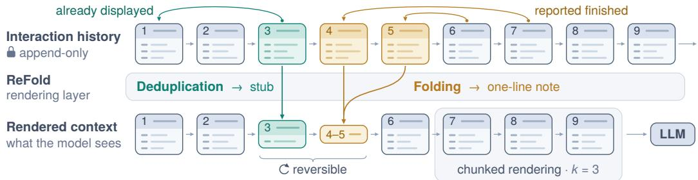  
Figure 3: ReFold compresses the rendered context while preserving the append-only history. Turn 3 repeats turn 1 and becomes a stub, and turns 4–5, reported finished, collapse into a note. Turns 7–9, past the k=3 boundary, render in full. Stubs and notes can be restored from the history.

Modern serving frameworks reduce prefill computation by reusing cached prefixes from prior steps. However, modifying historical context invalidates cached prefixes from the point of mutation onward, and the penalty depends on the position and frequency of these edits. Figure 2e traces prefix-cache reuse along one trajectory. Under mask, older observations are masked as they leave the recency window, repeatedly invalidating the cached prefix and reducing the cache-hit rate to 23%, compared with 84% under base. compact and recall also interrupt prefix-cache reuse when they update historical context, although cache-hit rates recover between updates. Beyond the cache penalty, eviction can permanently discard content that may remain relevant to subsequent steps. Figure 2f classifies an evicted token as recoverable if the strategy’s own mechanism can return it or re-executing a read of an unchanged file can reproduce it, and as irrecoverable otherwise. clip, mask, prune, and compact have no such mechanism: they evict 37–61% of the observation tokens, and 17–48% of all observation tokens cannot be recovered, whereas recall can return everything it evicts. Current eviction thus buys shorter prompts at the cost of prefix-cache reuse and recoverability, which motivates limiting prefix changes while keeping every eviction recoverable.

## 3 METHOD: REFOLD

In this section, we present the design and implementation of ReFold (Figure 3). It addresses the limitations mentioned above, with a rendering function that compresses the context sent to the model while preserving the append-only interaction history. Section 3.1 introduces the notation. Section 3.2 describes the two rendering operators, deduplication and folding. Section 3.3 explains their chunked rendering and reversibility, and Section 3.4 details ReFold’s integration into the agent loop.

## 3.1 SETUP

An LLM agent operates over sequential steps $t = 1 , \dots , T$ on an append-only interaction history:

$$
\mathbf { h } _ { t } = \mathbf { p } _ { \mathrm { s y s } } \oplus \mathbf { p } _ { \mathrm { t a s k } } \oplus \mathbf { z } _ { 1 } \oplus \cdot \cdot \cdot \oplus \mathbf { z } _ { t } , \qquad \mathbf { z } _ { i } = \mathbf { a } _ { i } \oplus \mathbf { o } _ { i } ,\tag{1}
$$

where $\oplus$ denotes concatenation, $\mathbf { p } _ { \mathrm { s y s } }$ is the system prompt, $\mathbf { p } _ { \mathrm { t a s k } }$ is the task description, and each turn $\mathbf { z } _ { i }$ is formulated as a pair, coupling the agent’s action ${ \bf a } _ { i }$ (encompassing its internal reasoning trace and tool invocations) with the resulting environment observation $\mathbf { o } _ { i }$ . At step t, the LLM M receives the context $\mathbf { c } _ { t - 1 }$ constructed from the previous interaction history $\mathbf { h } _ { t - 1 }$ and generates $\mathbf { a } _ { t } \sim \mathcal { M } ( \cdot \mid \mathbf { c } _ { t - 1 } )$ The environment executes the tool call in $\mathbf { a } _ { t }$ and returns $\mathbf { o } _ { t } .$ , and the completed turn $\mathbf { z } _ { t }$ is appended to form $\mathbf { h } _ { t } .$ . By default, the input context is the direct concatenation of the entire history: $\mathbf { c } _ { t - 1 } = \mathbf { h } _ { t - 1 }$ Since each turn is resent at every subsequent step, assuming a constant average turn length, the cumulative context volume scales quadratically as ${ \textstyle \sum _ { t = 1 } ^ { T } } | \mathbf { c } _ { t - 1 } | = \Theta ( T ^ { 2 } )$ . To tame this quadratic growth without losing past interactions, ReFold devises a rendering function R that maps the history $\mathbf { h } _ { t }$ to a compressed context $\mathbf { c } _ { t } = R ( \mathbf { h } _ { t } )$ , without modifying h<sub>t</sub>.

## 3.2 CONTEXT RENDERING

ReFold implements the rendering function $R$ via two targeted operators. Deduplication removes repeated content from an observation $\mathbf { o } _ { i } .$ , andfolding removes a whole turn $\mathbf { z } _ { i } .$ , the action ${ \bf a } _ { i }$ together with its observation $\mathbf { o } _ { i } ,$ once the agent has reported it as finished.

Deduplication. Deduplication eliminates redundant tool outputs across historical turns. When identical command outputs or file ranges recur, ReFold retains the initial occurrence and replaces subsequent duplicates with lightweight reference stubs. We partition the observation $\mathbf { o } _ { i }$ into $m _ { i }$ consecutive spans $s _ { i , 1 } , \ldots , s _ { i , m _ { i } }$ , where each span is classified as either novel or an exact duplicate of a prior span. The deduplicated observation is

$$
d _ { i } = \bigoplus _ { \ell = 1 } ^ { m _ { i } } \left\{ { { \ s \atop { s _ { i , \ell } } } } \right. { \mathrm { ~ i f ~ } } \mathrm { s p a n ~ } s _ { i , \ell } { \mathrm { ~ i s ~ a ~ d u p l i c a t e } } ,\tag{2}
$$

Each stub records the omitted region and points to the turn containing the retained copy; for long spans, it also keeps the top-level class and function signatures. Search results and repeated command outputs are deduplicated in the same way by comparing their full text. When the entire read is a duplicate, the stub has the following form:

[context-manager] <path>:<start>-<end> omitted: identical to step <source step>.   
\`restore <step>\` shows it again.

Folding. Folding removes turns that the agent has reported as finished. To detect finished turns without costly auxiliary operations, ReFold prompts the agent to prepend two metadata fields to its reasoning and tool call $\tilde { \mathbf { a } } _ { t } \mathrm { : }$ PROGRESS, a one-line description of what the current step does, and STALE, a set of prior step indices whose outputs the agent no longer needs, written as text ⟨STALE<sub>t</sub>⟩:

$$
\mathbf { a } _ { t } = \mathrm { P R O G R E S S } _ { t } \oplus \left. \mathrm { S T A L E } _ { t } \right. \oplus \tilde { \mathbf { a } } _ { t } .\tag{3}
$$

To facilitate this indexing, the observation of each turn is explicitly tagged with its step identifier. Both fields are generated as part of the regular response and require no additional model calls (Appendix C). ReFold only accepts STALE indices within the preceding k steps:

$$
S _ { t } = S _ { t - 1 } \cup \big ( \mathrm { s T A L E } _ { t } \cap \{ t - k , \ldots , t - 1 \} \big ) , \quad S _ { 0 } = \emptyset .\tag{4}
$$

For each step $i \in S _ { t }$ , the full message and tool output are replaced by a short note:

$$
f _ { i } = { \tt P R O G R E S S } _ { i } \oplus e _ { i } ,\tag{5}
$$

where $e _ { i }$ collects key details from the removed output, such as function signatures or search results. If no such details are available, $e _ { i }$ is empty. Notes of adjacent turns share one line in the following format, with the detail block included only when $e _ { i }$ is nonempty:

[context-manager] steps <i>-<j> folded: <PROGRESS i> · ... · <PROGRESS ${ \bf j } >$   
\`restore <i>-<j>\` shows them again.   
<file>: <extracted function signatures>   
\$ <search command> -> <retained search hits>

## 3.3 CHUNKED RENDERING AND REVERSIBILITY

Chunked rendering. To preserve prefix-cache reuse, both operators share a single boundary $b _ { t }$ that advances once every k steps:

$$
b _ { t } = \operatorname* { m a x } \biggl ( 0 , k \left\lfloor \frac { t - k } { k } \right\rfloor \biggr ) ,\tag{6}
$$

where t denotes the current execution step. All turns $\mathbf { z } _ { i }$ with $i > b _ { t }$ are protected and rendered in full. Earlier turns are divided into two categories: turns marked as finished are replaced by fold notes (Eq. 5), whereas the rest are deduplicated (Eq. 2). Together, these components define the rendering function introduced in Section 3.1:

$$
\mathbf { c } _ { t } = R ( \mathbf { h } _ { t } ) = \mathbf { p } _ { \mathrm { s y s } } \oplus \mathbf { p } _ { \mathrm { t a s k } } \oplus \bigoplus _ { i = 1 } ^ { t } { \left\{ \begin{array} { l l } { f _ { i } } & { { \mathrm { i f ~ } } i \leq b _ { t } a n d i \in S _ { t } , } \\ { \mathbf { a } _ { i } \oplus \mathbf { o } _ { i } } & { { \mathrm { i f ~ } } i > b _ { t } , } \\ { \mathbf { a } _ { i } \oplus d _ { i } } & { { \mathrm { o t h e r w i s e } } . } \end{array} \right. }\tag{7}
$$

Between boundary advances, the rendered context remains strictly append-only. Because historical turns remain invariant and new turns are merely appended to the sequence, the KV cache for the rendered prefix is preserved and fully reused across steps. We set the chunk size to k=3.

Reversibility. Because ReFold maintains an append-only history, anything it removes can be recovered through two distinct mechanisms. First, since each stub and fold note explicitly identifies the step indices it replaces, the agent can issue the command restore <step>. Rather than forwarding this command to the environment, the execution harness looks up the turn in the history and appends the original output as a new turn at the end of the context. This guarantees that the existing prompt prefix remains invariant and cache-friendly. Second, the agent can re-execute any original command whose prior output was compressed to observe the latest environment state. ReFold preserves these re-executed observations in full and exempts them from subsequent compression.

## 3.4 INTEGRATION WITH AGENTIC WORKFLOWS

Algorithm 1 in Appendix C integrates ReFold into the agent loop: OBSERVE appends each completed turn $\mathbf { z } _ { t }$ to the history $\mathbf { h } _ { t } .$ , extracts PROGRES $\boldsymbol { s } _ { t }$ and STAL $\mathrm { . E } _ { t }$ from $\mathbf { a } _ { t }$ , and updates the set $S _ { t }$ of finished steps; RENDER constructs the compressed context $\mathbf { c } _ { t } = R ( \mathbf { h } _ { t } )$ from $\mathbf { h } _ { t }$ and $S _ { t }$ before each model call. Because ReFold operates entirely at the rendering layer, it leaves the agent’s tools, environment, and interaction protocol unchanged. Integration requires only a rendering hook and prompt instructions that elicit the two signals, making ReFold easy to integrate into existing ReAct-style harnesses.

## 4 EXPERIMENTS

## 4.1 SETUP

Agent and models. We implement ReFold in mini-swe-agent, a ReAct-style agent that interleaves reasoning with shell commands to inspect files, modify code, and execute tests in the task environment. We evaluate two backbone models: Qwen3.6-27B, a dense model, and Qwen3.6-35B-A3B, a mixture of-experts (MoE) model. Both models are served using vLLM with prefix caching enabled, each on two NVIDIA RTX 6000 Ada GPUs with tensor parallelism. We use a temperature of 0, a maximum of 16,384 generated tokens per step, and a 250-step limit per trajectory. The full context window is 256k tokens, of which 16k are reserved for generation; the capped budgets in Section 4.3 are stated as usable context in the same way. All configurations use the same tools and execution environment, and command outputs are truncated at 10,000 characters (Appendix A.1).

Benchmarks. We evaluate on five benchmarks covering repository-level software engineering and terminal-based tasks, using 50 tasks from each (Appendix A.2). SWE-bench Verified (Jimenez et al., 2024; Chowdhury et al., 2024), SWE-bench Pro (Deng et al., 2026), and Multi-SWE-bench (Zan et al., 2025) evaluate agents on resolving issues in software repositories, requiring them to locate relevant code, implement changes, and validate their solutions. Terminal-Bench 1.0 and 2.1 (Merrill et al., 2025; 2026; The Terminal-Bench Team, 2026) extend the evaluation to tasks performed through a terminal. All tasks run in the official containers and are scored by the official evaluators.

Baselines. We evaluate ReFold against two context-management baselines. base retains the complete interaction history without compression. compact invokes an additional model call to summarize the history when context usage reaches 75% of the available budget, and subsequent execution proceeds from the summary. We compare compact with and without ReFold under the same experimental settings. At the full window, the compaction threshold is never reached; consequently, compact and base produce identical runs.

Evaluation metrics. We evaluate task performance, resource consumption, and execution efficiency. Task performance is measured by resolve, the number of tasks solved according to the official benchmark evaluators. Resource consumption is measured by tokens, the mean input and output tokens per task, cost, the mean estimated inference cost per task including cached-input discounts, both counting auxiliary model calls, and KV cache, the median peak KV-cache memory per session. On the server, KVpeak is the maximum share of the KV-cache pool in use during a run. Execution efficiency is measured by steps, the median number of model calls per task, duration, the median time from the first request to the final response of a task, compactions, the mean number of summarizeand-restart events of compact per task, and queue, the mean scheduling delay per request. Detailed metric definitions and measurement conventions are provided in Appendix A.3.

Table 1: Comparison across five benchmarks and two models, with 50 tasks per benchmark at the full context window and w=8. Parentheses indicate changes relative to base.
<table><tr><td rowspan="2">Benchmark</td><td colspan="2">Resolve</td><td colspan="2">Steps</td><td colspan="2">Tokens (k)</td><td colspan="2">KV cache (GiB)</td><td colspan="2">Cost (¢)</td></tr><tr><td>base</td><td>ReFold</td><td>base</td><td>ReFold</td><td>base</td><td>ReFold</td><td>base</td><td>ReFold</td><td>base</td><td>ReFold</td></tr><tr><td colspan="9">Qwen3.6-27B (dense)</td><td></td><td></td></tr><tr><td>SWE-bench Verified</td><td></td><td>38 38 (±0)</td><td></td><td>50 41 (-18%)</td><td>965</td><td>505 (-48%)</td><td>1.71</td><td>0.83 (−52%)</td><td></td><td>19.5 12.9 (−34%)</td></tr><tr><td>SWE-bench Pro</td><td>5</td><td>6 (+1)</td><td>46</td><td>50 (+9%)</td><td>1097</td><td>899 (-18%)</td><td>1.96</td><td>1.20 (−39%)</td><td>20.8</td><td>20.5 (−2%)</td></tr><tr><td>Multi-SWE-bench</td><td></td><td>25 25 (±0)</td><td>47</td><td>44 (-6%)</td><td>1372</td><td>956 (-30%)</td><td>1.55</td><td>0.93 (−40%)</td><td>25.5</td><td>22.3 (−13%)</td></tr><tr><td>Terminal-Bench 1.0</td><td></td><td>23 23 (±0)</td><td>20</td><td>15 (-25%)</td><td>1279</td><td>596 (-53%)</td><td>1.02</td><td>0.58 (-43%)</td><td>27.4</td><td>19.0 (−31%)</td></tr><tr><td>Terminal-Bench 2.1</td><td></td><td>23 26 (+3)</td><td>42</td><td>29 (-31%)</td><td>3989</td><td>1909 (−52%)</td><td>1.60</td><td>0.68 (-58%)</td><td>75.7</td><td>49.2 (-35%)</td></tr><tr><td colspan="9">Qwen3.6-35B-A3B (MoE)</td><td></td><td></td></tr><tr><td>SWE-bench Verified</td><td></td><td>36 36 (±0)</td><td>70</td><td>61 (-13%)</td><td>2019</td><td>1063 (-47%)</td><td></td><td>0.74 0.42 (-43%)</td><td>13.1</td><td>8.2 (-37%)</td></tr><tr><td>SWE-bench Pro</td><td>6</td><td>5 (−1)</td><td>82</td><td>66 (−20%)</td><td>3328</td><td>1344 (−60%)</td><td>0.92</td><td>0.41 (-55%)</td><td>19.8</td><td>11.0 (−45%)</td></tr><tr><td>Multi-SWE-bench</td><td></td><td>18 21 (+3)</td><td>89</td><td>66 (−26%)</td><td>3487</td><td>1755 (-50%)</td><td>0.84</td><td>0.47 (-44%)</td><td>20.7</td><td>12.5 (−40%)</td></tr><tr><td>Terminal-Bench 1.0</td><td></td><td>21 23 (+2)</td><td>25</td><td>22 (−12%)</td><td>1871</td><td>1094 (-42%)</td><td>0.38</td><td>0.27 (−30%)</td><td>13.6</td><td>11.1 (−18%)</td></tr><tr><td>Terminal-Bench 2.1</td><td></td><td>21 20 (−1)</td><td></td><td>53 32 (-40%)</td><td>5147</td><td>2920 (-43%)</td><td>0.61</td><td>0.29 (-52%)</td><td>34.3</td><td>22.6 (−34%)</td></tr></table>

## 4.2 MAIN RESULTS

All results in this subsection use the full 256k context window with w=8 concurrent sessions. Table 1 compares ReFold with base across five benchmarks and two models at this operating point. Resolvedtask counts differ by −1 to +3 out of 50, within the run-to-run variability of the setup (Appendix A). With task resolution remaining comparable, ReFold reduces both the total tokens processed and the memory each session requires. It shortens trajectories in nine of the ten settings, by up to 40%. Fewer steps over smaller rendered contexts reduce token usage by 18–53% on Qwen3.6-27B and 42–60% on Qwen3.6-35B-A3B. Smaller maximum prompts also lower peak per-session KV-cache memory by 39–58% and 30–55%, respectively. The token savings reduce estimated cost by 2–35% and 18–45%, after accounting for cached-input discounts and completion costs, while the smaller KV-cache footprint leaves room for higher concurrency.

## 4.3 PERFORMANCE UNDER RESOURCE CONSTRAINTS

Table 2 examines whether these resource savings improve execution under limited context budgets and increased serving load. All rows use Qwen3.6-27B on SWE-bench Verified, with 50 tasks per pair except w=64, which is read over 71 tasks. We vary the context budget at fixed w=8, increase concurrency at the full window, and evaluate both constraints jointly.

Context budget constraints. By removing repeated content and folding completed turns, ReFold slows context growth and delays threshold-triggered compaction. At fixed w=8, mean cost decreases by 24–36% and median duration by 12–17% across the 24k, 32k, and 64k budgets, with compaction reduction reaching 92% at 32k. These savings reflect both smaller model inputs and fewer auxiliary summarization calls. At 16k, compactions and duration decrease by 33% and 14%, respectively. Resolved-task counts differ by at most three out of 50 across all tested budgets.

Concurrent serving. The smaller per-session KV-cache footprint reported in Table 1 reduces memory demand under concurrent execution, alleviating serving contention. At w=16, 32, and 48, ReFold reduces token usage by 53–70%, mean cost by 46–71%, and median duration by 23–41%. Resolved-task counts increase from 31 to 38, 20 to 35, and 7 to 32, respectively. At w=48, mean scheduling delay falls from 8.96 to 0.02 s, consistent with lower contention allowing more tasks to finish within the execution limits. At w=64, both conditions saturate the KV cache, yet ReFold still reduces queue delay from 42.2 to 23.1 s and increases solved tasks from 18 to 39 out of the 71 tasks.

Joint budget and concurrency constraints. Under simultaneous constraints, reducing the rendered context limits both compaction overhead and concurrent KV-cache demand. With a 16k budget and w=48, ReFold reduces token usage by 24%, compactions by 37%, mean cost by 17%, and median duration by 28%, while both conditions solve 36 of 50 tasks. Peak server KV-cache occupancy decreases from 100% to 92%, and mean scheduling delay from 0.87 to 0.02 s. The reductions in compaction frequency and queue delay contribute to improved execution efficiency.

Table 2: Performance under context-budget and concurrency constraints. We vary the context budget at fixed w=8, increase concurrency at the full context window, and combine both constraints. Each pair compares the reference baseline with and without ReFold; parentheses indicate the changes.
<table><tr><td>Context, w</td><td>Arm</td><td>Resolve</td><td>Tokens (k)</td><td>Cost (¢)</td><td></td><td>Duration (min) Compactions KV peak (%)</td><td></td><td>Queue (s)</td></tr><tr><td>256k, w=8</td><td>base</td><td>38</td><td>965</td><td>19.5</td><td>9.8</td><td></td><td>42</td><td>0</td></tr><tr><td></td><td></td><td>+ ReFold 38 (±0)</td><td></td><td>505 (-48%) 12.9 (-34%)</td><td>9.4 (−4%)</td><td></td><td>29 (-13)</td><td>0(±0)</td></tr><tr><td>64k, w=8</td><td>compact</td><td>37</td><td>882</td><td>18.5</td><td>9.8</td><td>0.1</td><td>43</td><td>0</td></tr><tr><td></td><td></td><td>+ ReFold 39 (+2)</td><td></td><td>528 (-40%) 14.1 (-24%)</td><td>8.2 (-17%)</td><td>0.1 (±0)</td><td>28 (-15)</td><td>0(±0)</td></tr><tr><td>32k, w=8</td><td>compact</td><td>37</td><td>664</td><td>15.3</td><td>10.7</td><td>1.0</td><td>33</td><td>0</td></tr><tr><td></td><td></td><td>+ ReFold 35 (−2)</td><td>374 (-44%)</td><td>9.8 (-36%)</td><td>9.3 (-13%)</td><td>0.1 (-92%)</td><td>30 (-3)</td><td>0(±0)</td></tr><tr><td>24k, w=8</td><td>compact</td><td>37</td><td>621</td><td>15.5</td><td>11.4</td><td>2.3</td><td>30</td><td>0</td></tr><tr><td></td><td></td><td>+ ReFold 40 (+3)</td><td></td><td>400 (-36%) 11.2 (-28%)</td><td>10.1 (−12%)</td><td>0.4 (-83%)</td><td>22 (-8)</td><td>0(±0)</td></tr><tr><td>16k, w=8</td><td>compact</td><td>38</td><td>450</td><td>13.5</td><td>11.6</td><td>5.0</td><td>22</td><td>0</td></tr><tr><td></td><td></td><td>+ ReFold 37 (-1)</td><td></td><td>391 (−13%) 13.5 (±0%)</td><td>10.0 (-14%)</td><td>3.3 (-33%)</td><td>19 (-3)</td><td>0(±0)</td></tr><tr><td>256k, w=16 base</td><td></td><td>31</td><td>1290</td><td>28.1</td><td>26.2</td><td></td><td>84</td><td>0.02</td></tr><tr><td></td><td></td><td>+ ReFold 38 (+7)</td><td></td><td>600 (-53%) 15.1 (-46%)</td><td>15.4 (-41%)</td><td></td><td>48(-36)</td><td>0 (−0.02)</td></tr><tr><td>256k, w=32 base</td><td></td><td>20</td><td>1853</td><td>41.7</td><td>69.5</td><td>一</td><td>100</td><td>1.91</td></tr><tr><td></td><td></td><td>+ ReFold 35 (+15)</td><td>623 (-66%)</td><td>)19.0 (−54%)</td><td>46.4 (-33%)</td><td>一</td><td>84 (-16)</td><td>0 (-1.91)</td></tr><tr><td>256k, w=48 base</td><td></td><td>7</td><td>2103</td><td>61.0</td><td>90.3</td><td></td><td>100</td><td>8.96</td></tr><tr><td></td><td></td><td>+ ReFold 32 (+25)</td><td>639 (-70%)</td><td>17.8 (-71%)</td><td>69.3 (-23%)</td><td>一</td><td>99 (-1)</td><td>0.02 (-8.94)</td></tr><tr><td>256k, w=64 base</td><td></td><td>18</td><td>517</td><td>15.1</td><td>87.6</td><td></td><td>100</td><td>42.2</td></tr><tr><td></td><td></td><td>+ ReFold 39 (+21)</td><td></td><td>368 (-29%) 12.2 (-19%)</td><td>84.6 (-3%)</td><td></td><td>100 (±0)</td><td>23.1 (-19.1)</td></tr><tr><td>16k, w=48</td><td>compact</td><td>36</td><td>459</td><td>16.6</td><td>87.3</td><td>5.4</td><td>100</td><td>0.87</td></tr><tr><td></td><td></td><td>+ ReFold 36 (±0)</td><td></td><td>349 (-24%) 13.7 (-17%)</td><td>63.3 (-28%)</td><td>3.4 (-37%)</td><td>92 (-8)</td><td>0.02 (−0.85)</td></tr></table>

## 4.4 ABLATION STUDIES

All ablations use Qwen3.6-27B on SWE-bench Verified (Figure 4): the chunk-size sweep runs 20 tasks at the full window with w=8, and the chunking and reversibility ablations re-render recorded trajectories with each feature switched off and on.

Runtime overhead. ReFold applies deduplication and folding during context rendering without auxiliary model calls. Its mean rendering overhead is 0.4 ms per step, compared with 3.3 s for compact, 0.15 s for prune, and 8.5 ms for recall (Figure 4a). ReFold therefore reduces the computational overhead of context management within the agent loop.

Selection of the chunk size k. The chunk size k balances context reduction and prefix-cache reuse: smaller chunks update historical context more frequently, whereas larger chunks retain more uncompressed turns. Peak KV-cache memory and median duration are lowest at k=3–5 and rise toward both ends of the tested range (Figure 4b). With little variation in resolved-task counts, we select k=3 to limit prefix-cache invalidation while maintaining effective compression.

Effect of chunked rendering. As in Figure 2e, Figure 4c (top) traces prefix-cache reuse along one trajectory. Rendering the context anew at every step rewrites the cached prefix almost every time it changes, which drives the hit rate down to 51%. Chunked rendering confines these rewrites to boundary advances, once every k=3 steps, and keeps the context append-only in between, so the hit rate stays at 87%, comparable to the 84% under base.

Effect of reversibility. As in Figure 2f, Figure 4c (bottom) classifies each evicted observation token as recoverable or irrecoverable. Switching reversibility off disables restore, so removed content comes back only by re-reading an unchanged file, and even a re-executed output is compressed again once it passes the boundary instead of staying in full. ReFold then removes 53% of the observation tokens, but about a third of all observation tokens can no longer be recovered, the same share that compact loses. When reversibility stays on, ReFold removes 41%, as much as compact evicts, yet every removed token can be restored from the history.

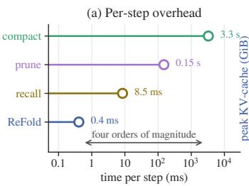

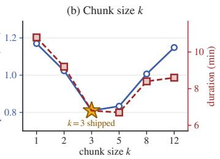

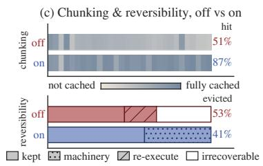  
Figure 4: Ablation results. (a) Per-step context-management overhead on a log scale. (b) Peak KV-cache memory (left axis) and median duration (right axis) across chunk sizes on 20 tasks; the axes are scaled to coincide at k=3. (c) Chunking (top) and reversibility (bottom) switched off and on.

## 5 RELATED WORK

Context management for LLM agents. To sustain long-horizon agent execution, existing methods reduce interaction history through pruning or summarization. Observation masking replaces older tool outputs with placeholders (Lindenbauer et al., 2025). AgentDiet has an LLM remove useless, redundant, or expired information from earlier steps (Xiao et al., 2026), SWE-Pruner uses a trained 0.6B model to retain goal-relevant lines (Wang et al., 2026), and TACO evolves observation-compression rules for terminal agents (Ren et al., 2026). Summarization methods also compress the agent’s own messages. Context-Folding summarizes branched sub-trajectories (Sun et al., 2026), while AgentFold folds history at multiple scales (Ye et al., 2026). MEM1 learns memory consolidation through reinforcement learning (Zhou et al., 2026), CompactionRL jointly learns summarization and task execution (Li et al., 2026b), and SWE-MeM learns when, what, and how to compact (Gao et al., 2026). SWE-AGILE summarizes reasoning behind a sliding window (Lian et al., 2026), CAT exposes context maintenance as a tool (Liu et al., 2026b), and ACON optimizes compression guidelines and distills the resulting compressor (Kang et al., 2026). ReFold compresses both observations and completed agent turns without auxiliary summarization calls or policy training.

External memory and token compression. To mitigate the memory and computational footprints of long-context inference, existing methods broadly rely on external memory offloading or promptlevel token compression. For external memory, early frameworks maintain historical context outside the active window. Generative Agents retrieve memories by recency, importance, and relevance (Park et al., 2023); MemGPT transfers information between context and external storage (Packer et al., 2023). A-MEM maintains linked memories (Xu et al., 2025), while Mem0 consolidates information in a persistent store (Chhikara et al., 2025). LCM keeps original messages in an immutable store behind a summary DAG (Ehrlich & Blackman, 2026), and ARC replaces observations with references to an addressable log (Dang et al., 2026). For input compression, LLMLingua uses perplexity-based token filtering (Jiang et al., 2023), LongLLMLingua incorporates question relevance (Jiang et al., 2024), and LLMLingua-2 uses a distilled token classifier (Pan et al., 2024). At the KV cache level, SkipKV compresses key-value caches with sentence similarity (Tian et al., 2026), while Continuum retains session KV caches across tool calls (Li et al., 2026a). In contrast to these lossy compaction or rigid external stores, ReFold makes every removal reversible by a restore from the preserved history, and uses chunked rendering to preserve prefix-cache locality.

## 6 CONCLUSION

We presented ReFold, a training-free context-rendering layer for long-horizon LLM agents. ReFold deduplicates repeated content and folds turns marked as completed by the agent while preserving the underlying interaction history, so every removal is reversible by a restore from it. Chunked rendering limits prefix-cache invalidation without auxiliary model calls. Across five benchmarks and two models, ReFold reduces token usage by 18–60%, estimated cost by up to 45%, and peak per-session KV-cache memory by 30–58%, with no detectable reduction in task success at the full window with w=8. Under constrained context budgets and concurrent serving, these savings reduce compaction frequency and scheduling delay, improving execution efficiency.

## REPRODUCIBILITY STATEMENT

ReFold is implemented as a plugin to the mini-swe-agent harness. It requires only a rendering hook and a change to the agent’s prompt that elicits the two signals, and leaves the agent’s tools, environment and interaction protocol unchanged. Section 3 specifies the two operators and their composition, and Appendix C.2 gives the exact prompt change verbatim. Section 4.1 and Appendices A.1 and A.2 list the models, serving configuration and benchmarks, and Appendix A.3 defines every reported quantity, including the rates and the cache accounting behind every cost. Every table and figure is produced from one per-task record of every cell, and we will release the code and these scripts.

## REFERENCES

Prateek Chhikara, Dev Khant, Saket Aryan, Taranjeet Singh, and Deshraj Yadav. Mem0: Building production-ready AI agents with scalable long-term memory. In European Conference on Artificial Intelligence (ECAI), volume 413 of Frontiers in Artificial Intelligence and Applications, pp. 2993– 3000. IOS Press, 2025.

Neil Chowdhury, James Aung, Chan Jun Shern, Oliver Jaffe, Dane Sherburn, Giulio Starace, Evan Mays, Rachel Dias, Marwan Aljubeh, Mia Glaese, Carlos E. Jimenez, John Yang, Leyton Ho, Tejal Patwardhan, Kevin Liu, and Aleksander Madry. Introducing SWE-bench Verified. OpenAI blog, https://openai.com/index/introducing-swe-bench-verified/, 2024.

Thang Dang, Yuma Ichikawa, Sakina Fatima, and Koichi Shirahata. Addressable recall compaction for long context-window control in AI agents. arXiv preprint arXiv:2607.25066, 2026.

Xiang Deng, Jeff Da, Edwin Pan, Yannis Yiming He, Charles Ide, Kanak Garg, Niklas Lauffer, Andrew Park, Chetan Rane, Karmini Sampath, Maya Krishnan, Srivatsa Kundurthy, Sean Hendryx, Zifan Wang, Chen Bo Calvin Zhang, Noah Jacobson, Bing Liu, and Brad Kenstler. SWE-Bench Pro: Can AI agents solve long-horizon software engineering tasks? In International Conference on Machine Learning (ICML), 2026.

Clint Ehrlich and Theodore Blackman. LCM: Lossless context management. arXiv preprint arXiv:2605.04050, 2026.

Shuzheng Gao, Wenhao Zeng, Zhaojian Yu, Jianqiao Wangni, Chaozheng Wang, Kai Cai, Shilin He, and Michael R. Lyu. SWE-MeM: Learning adaptive memory management for long-horizon coding agents. arXiv preprint arXiv:2606.28434, 2026.

Cheng-Ping Hsieh, Simeng Sun, Samuel Kriman, Shantanu Acharya, Dima Rekesh, Fei Jia, Yang Zhang, and Boris Ginsburg. RULER: What’s the real context size of your long-context language models? In Conference on Language Modeling (COLM), 2024.

Huiqiang Jiang, Qianhui Wu, Chin-Yew Lin, Yuqing Yang, and Lili Qiu. LLMLingua: Compressing prompts for accelerated inference of large language models. In Conference on Empirical Methods in Natural Language Processing (EMNLP), 2023.

Huiqiang Jiang, Qianhui Wu, Xufang Luo, Dongsheng Li, Chin-Yew Lin, Yuqing Yang, and Lili Qiu. LongLLMLingua: Accelerating and enhancing LLMs in long context scenarios via prompt compression. In Annual Meeting of the Association for Computational Linguistics (ACL), 2024.

Carlos E. Jimenez, John Yang, Alexander Wettig, Shunyu Yao, Kexin Pei, Ofir Press, and Karthik Narasimhan. SWE-bench: Can language models resolve real-world GitHub issues? In International Conference on Learning Representations (ICLR), 2024.

Minki Kang, Wei-Ning Chen, Dongge Han, Huseyin A. Inan, Lukas Wutschitz, Yanzhi Chen, Robert Sim, and Saravan Rajmohan. ACON: Optimizing context compression for long-horizon LLM agents. In International Conference on Machine Learning (ICML), 2026.

Hanchen Li, Qiuyang Mang, Runyuan He, Qizheng Zhang, Huanzhi Mao, Xiaokun Chen, Hangrui Zhou, Alvin Cheung, Joseph E. Gonzalez, and Ion Stoica. Continuum: Efficient and robust multi-turn LLM agent scheduling with KV cache time-to-live. In ICLR Workshop on Lifelong Agents: Learning, Aligning, Evolving, 2026a.

Yujiang Li, Zhenyu Hou, Yi Jing, Jie Tang, and Yuxiao Dong. CompactionRL: Reinforcement learning with context compaction for long-horizon agents. arXiv preprint arXiv:2607.05378, 2026b.

Shuquan Lian, Juncheng Liu, Yazhe Chen, Yuhong Chen, and Hui Li. SWE-AGILE: A software agent framework for efficiently managing dynamic reasoning context. In Findings of the Association for Computational Linguistics (ACL Findings), pp. 17536–17550, 2026.

Tobias Lindenbauer, Igor Slinko, Ludwig Felder, Egor Bogomolov, and Yaroslav Zharov. The complexity trap: Simple observation masking is as efficient as LLM summarization for agent context management. In NeurIPS Workshop on Deep Learningfor Code (DL4C), 2025.

Banruo Liu, Haoran Qiu, Íñigo Goiri, Rodrigo Fonseca, Ricardo Bianchini, and Esha Choukse. Agentic coding in the wild: Characterizing GitHub Copilot traces at production scale. arXiv preprint arXiv:2608.00101, 2026a.

Nelson F. Liu, Kevin Lin, John Hewitt, Ashwin Paranjape, Michele Bevilacqua, Fabio Petroni, and Percy Liang. Lost in the middle: How language models use long contexts. Transactions of the Association for Computational Linguistics (TACL), 12:157–173, 2024.

Shukai Liu, Bo Jiang, Jian Yang, Yizhi Li, Jinyang Guo, Xianglong Liu, and Bryan Dai. Context as a tool: Context management for long-horizon SWE-agents. In Findings ofthe Associationfor Computational Linguistics (ACL Findings), pp. 20604–20617, 2026b.

Mike Merrill, Alex Shaw, Chris Rytting, Ludwig Schmidt, and Andy Konwinski. Terminal-Bench: An evaluation framework and benchmark for agents in the terminal. https://www.tbench.ai/ news/announcement, 2025.

Mike A. Merrill, Alexander G. Shaw, Nicholas Carlini, Boxuan Li, Harsh Raj, Ivan Bercovich, Lin Shi, Jeong Yeon Shin, Thomas Walshe, E. Kelly Buchanan, Junhong Shen, Guanghao Ye, Haowei Lin, Jason Poulos, Maoyu Wang, Marianna Nezhurina, Di Lu, Orfeas Menis Mastromichalakis, Zhiwei Xu, Zizhao Chen, Yue Liu, Robert Zhang, Leon Liangyu Chen, Anurag Kashyap, Jan-Lucas Uslu, Jeffrey Li, Jianbo Wu, Minghao Yan, Song Bian, Vedang Sharma, Ke Sun, Steven Dillmann, Akshay Anand, Andrew Lanpouthakoun, Bardia Koopah, Changran Hu, Etash Guha, Gabriel H. S. Dreiman, Jiacheng Zhu, Karl Krauth, Li Zhong, Niklas Muennighoff, Robert Amanfu, Shangyin Tan, Shreyas Pimpalgaonkar, Tushar Aggarwal, Xiangning Lin, Xin Lan, Xuandong Zhao, Yiqing Liang, Yuanli Wang, Zilong Wang, Changzhi Zhou, David Heineman, Hange Liu, Harsh Trivedi, John Yang, Junhong Lin, Manish Shetty, Michael Yang, Nabil Omi, Negin Raoof, Shanda Li, Terry Yue Zhuo, Wuwei Lin, Yiwei Dai, Yuxin Wang, Wenhao Chai, Shang Zhou, Dariush Wahdany, Ziyu She, Jiaming Hu, Zhikang Dong, Yuxuan Zhu, Sasha Cui, Ahson Saiyed, Arinbjörn Kolbeinsson, Jesse Hu, Christopher Michael Rytting, Ryan Marten, Yixin Wang, Jenia Jitsev, Alex Dimakis, Andy Konwinski, and Ludwig Schmidt. Terminal-Bench: Benchmarking agents on hard, realistic tasks in command line interfaces. In International Conference on Learning Representations (ICLR), pp. 40903–40986, 2026.

Charles Packer, Sarah Wooders, Kevin Lin, Vivian Fang, Shishir G. Patil, Ion Stoica, and Joseph E. Gonzalez. MemGPT: Towards LLMs as operating systems. arXiv preprint arXiv:2310.08560, 2023.

Zhuoshi Pan, Qianhui Wu, Huiqiang Jiang, Menglin Xia, Xufang Luo, Jue Zhang, Qingwei Lin, Victor Rühle, Yuqing Yang, Chin-Yew Lin, H. Vicky Zhao, Lili Qiu, and Dongmei Zhang. LLMLingua-2: Data distillation for efficient and faithful task-agnostic prompt compression. In Findings of the Associationfor Computational Linguistics (ACL Findings), 2024.

Joon Sung Park, Joseph C. O’Brien, Carrie J. Cai, Meredith Ringel Morris, Percy Liang, and Michael S. Bernstein. Generative agents: Interactive simulacra of human behavior. In ACM Symposium on User Interface Software and Technology (UIST), 2023.

Jincheng Ren, Siwei Wu, Yizhi Li, Kang Zhu, Shu Xu, Boyu Feng, Ruibin Yuan, Wei Zhang, Riza Batista-Navarro, Jian Yang, and Chenghua Lin. A self-evolving framework for efficient terminal agents via observational context compression. arXiv preprint arXiv:2604.19572, 2026.

Timo Schick, Jane Dwivedi-Yu, Roberto Dessì, Roberta Raileanu, Maria Lomeli, Eric Hambro, Luke Zettlemoyer, Nicola Cancedda, and Thomas Scialom. Toolformer: Language models can teach themselves to use tools. In Advances in Neural Information Processing Systems (NeurIPS), volume 36, pp. 68539–68551, 2023.

Noah Shinn, Federico Cassano, Ashwin Gopinath, Karthik Narasimhan, and Shunyu Yao. Reflexion: Language agents with verbal reinforcement learning. In Advances in Neural Information Processing Systems (NeurIPS), volume 36, pp. 8634–8652, 2023.

Weiwei Sun, Miao Lu, Zhan Ling, Kang Liu, Xuesong Yao, Yiming Yang, and Jiecao Chen. Scaling long-horizon agent via context folding. In International Conference on Machine Learning (ICML), 2026.

The Terminal-Bench Team. Terminal-Bench 2.1. https://www.tbench.ai/news/ terminal-bench-2-1, 2026.

Jiayi Tian, Seyedarmin Azizi, Yequan Zhao, Erfan B Potraghloo, Sean McPherson, Sharath N Sridhar, Zhengyang Wang, Zheng Zhang, Massoud Pedram, and Souvik Kundu. SkipKV: Selective skipping of KV generation and storage for efficient inference with large reasoning models. Proceedings of Machine Learning and Systems, 8:1496–1514, 2026.

Xingyao Wang, Boxuan Li, Yufan Song, Frank F. Xu, Xiangru Tang, Mingchen Zhuge, Jiayi Pan, Yueqi Song, Bowen Li, Jaskirat Singh, Hoang H. Tran, Fuqiang Li, Ren Ma, Mingzhang Zheng, Bill Qian, Yanjun Shao, Niklas Muennighoff, Yizhe Zhang, Binyuan Hui, Junyang Lin, Robert Brennan, Hao Peng, Heng Ji, and Graham Neubig. OpenHands: An open platform for AI software developers as generalist agents. In International Conference on Learning Representations (ICLR), 2025.

Yuhang Wang, Yuling Shi, Mo Yang, Rongrui Zhang, Shilin He, Heng Lian, Yuting Chen, Siyu Ye, Kai Cai, and Xiaodong Gu. SWE-Pruner: Self-adaptive context pruning for coding agents. arXiv preprint arXiv:2601.16746, 2026.

Chunqiu Steven Xia, Yinlin Deng, Soren Dunn, and Lingming Zhang. Demystifying LLM-based software engineering agents. Proceedings ofthe ACM on Software Engineering, 2(FSE), 2025. Article FSE037.

Yuan-An Xiao, Pengfei Gao, Chao Peng, and Yingfei Xiong. Reducing cost of LLM agents with trajectory reduction. Proceedings of the ACM on Software Engineering, 3(FSE):1241–1263, 2026.

Wujiang Xu, Zujie Liang, Kai Mei, Hang Gao, Juntao Tan, and Yongfeng Zhang. A-Mem: Agentic memory for LLM agents. In Advances in Neural Information Processing Systems (NeurIPS), volume 38, pp. 17577–17604, 2025.

John Yang, Carlos E. Jimenez, Alexander Wettig, Kilian Lieret, Shunyu Yao, Karthik Narasimhan, and Ofir Press. SWE-agent: Agent-computer interfaces enable automated software engineering. In Advances in Neural Information Processing Systems (NeurIPS), volume 37, pp. 50528–50652, 2024.

Shunyu Yao, Jeffrey Zhao, Dian Yu, Nan Du, Izhak Shafran, Karthik Narasimhan, and Yuan Cao. ReAct: Synergizing reasoning and acting in language models. In International Conference on Learning Representations (ICLR), 2023.

Rui Ye, Zhongwang Zhang, Kuan Li, Huifeng Yin, Zhengwei Tao, Yida Zhao, Liangcai Su, Liwen Zhang, Zile Qiao, Xinyu Wang, Pengjun Xie, Fei Huang, Jingren Zhou, Siheng Chen, and Yong Jiang. AgentFold: Long-horizon web agents with proactive context folding. In International Conference on Learning Representations (ICLR), 2026.

Daoguang Zan, Zhirong Huang, Wei Liu, Hanwu Chen, Shulin Xin, Linhao Zhang, Qi Liu, Aoyan Li, Lu Chen, Xiaojian Zhong, Siyao Liu, Yongsheng Xiao, Liangqiang Chen, Yuyu Zhang, Jing Su, Tianyu Liu, Rui Long, Ming Ding, and Liang Xiang. Multi-SWE-bench: A multilingual benchmark for issue resolving. In Advances in Neural Information Processing Systems (NeurIPS), Datasets and Benchmarks Track, volume 38, 2025.

Zijian Zhou, Ao Qu, Zhaoxuan Wu, Sunghwan Kim, Alok Prakash, Daniela Rus, Bryan Kian Hsiang Low, and Paul Pu Liang. MEM1: Learning to synergize memory and reasoning for efficient long-horizon agents. In International Conference on Learning Representations (ICLR), 2026.

## CONTENTS

1 Introduction   
2 Motivational Study 2   
3 Method: ReFold 4   
3.1 Setup 4   
3.2 Context Rendering 4   
3.3 Chunked Rendering and Reversibility 5   
3.4 Integration with Agentic Workflows 6   
4 Experiments 6   
4.1 Setup 6   
4.2 Main Results 7   
4.3 Performance under Resource Constraints . 7   
4.4 Ablation Studies . 8   
5 Related Work 9   
6 Conclusion 9   
Reproducibility statement 10   
References 10   
A Experimental setup and measurement conventions 16   
A.1 Setup 16   
A.2 Benchmarks 16   
A.3 Metrics 16   
A.4 Run-to-run variability 18   
B Motivational study details 18   
B.1 The six strategies 18   
B.2 Hyperparameter settings 19   
B.3 How Figure 2 is measured 19   
C Method details 20   
C.1 Algorithm 20   
C.2 The prompt layer 20   
C.3 Worked example 21   
D Additional results 23   
D.1 A proprietary model . 23   
D.2 Per-step growth . 24   
D.3 Per-task distribution . 24   
D.4 Published methods on the same harness 24   
E Two operators 25   
F Composition with other mechanisms 25   
F.1 Routing across replicas . 26   
F.2 Routing between models . 26   
F.3 Retrieval memory . 27

## A EXPERIMENTAL SETUP AND MEASUREMENT CONVENTIONS

## A.1 SETUP

Every run in this paper serves its model on two NVIDIA RTX 6000 Ada GPUs with tensor parallelism 2, and every arm runs in the same mini-swe-agent harness with the same tools and execution environment. Table 3 lists the settings every run shares.

Table 3: Serving, decoding and harness settings shared by every run.
<table><tr><td>Setting</td><td>Value</td></tr><tr><td colspan="2">SERVING</td></tr><tr><td>Models</td><td>Qwen3.6-27B (dense), Qwen3.6-35B-A3B (MoE)</td></tr><tr><td>GPUs</td><td>2× NVIDIA RTX 6000 Ada (48 GB), tensor parallelism 2</td></tr><tr><td>Inference engine</td><td>vLLM 0.19.1, bf16, prefix caching enabled</td></tr><tr><td>GPU memory utilization</td><td>0.92</td></tr><tr><td>Max. running sequences</td><td>128</td></tr><tr><td>Max. batched tokens per iteration</td><td>16,384</td></tr><tr><td>KV-cache pool</td><td>31.3 GiB, 513k tokens (27B); 16.9 GiB, 887k tokens (A3B)</td></tr><tr><td>Server restart</td><td>before every run, starting from an empty prefix cache</td></tr><tr><td colspan="2">DECODING</td></tr><tr><td>Temperature</td><td>0</td></tr><tr><td>Max. generated tokens per step</td><td>16,384</td></tr><tr><td>Context window</td><td>262,144 tokens</td></tr><tr><td>Usable context</td><td>context window minus 16,384, which is 245,760 at the full window 8k, 16k, 24k, 32k and 64k tokens of usable context</td></tr><tr><td>Capped budgets</td><td></td></tr><tr><td colspan="2">HARNESS</td></tr><tr><td>Agent</td><td>mini-swe-agent, ReAct-style, one bash tool</td></tr><tr><td>Step limit</td><td>250 model calls per task</td></tr><tr><td>Request timeout</td><td>a request with no token for 600 s ends the task, without retry</td></tr><tr><td>Observation length</td><td>truncated to 10,000 characters</td></tr><tr><td>Concurrent sessions w</td><td>8 per server unless stated otherwise</td></tr><tr><td>Tasks</td><td>50 per benchmark, stratified by repository and difficulty</td></tr></table>

## A.2 BENCHMARKS

Table 4 describes the five benchmarks. Each contributes 50 tasks, sampled with stratification by repository and difficulty, and all arms of a comparison run on the same tasks. In the three SWE-bench variants the agent receives a repository and an issue, and its final patch counts as a fix when the tests that reproduce the issue pass and the tests that passed before still pass. In the two Terminal-Bench releases the agent receives a task in a container, and the task’s tests check the state it leaves behind. Every task runs in its benchmark’s official container and is scored by the official evaluator.

## A.3 METRICS

Table 5 defines every metric. For task i of the N in a cell, model call $j$ sends $p _ { i j }$ prompt tokens, of which $c _ { i j }$ are served from the prefix cache, and receives $g _ { i j }$ completion tokens, and a call an arm makes for itself, such as a summary, counts like any other. Token and cost figures are means over tasks, and step, duration and KV-cache figures are medians. A median of step counts is rounded to the nearest integer, with halves rounded up. Costs use hosted rates representative of August 2026, per million tokens $\pi _ { u } { = } \mathfrak { F } 0 . 3 0$ uncached, $\pi _ { c } { = } 5 0 . 1 $ 5 cached and $\pi _ { g } { = } \mathfrak { F } 2 . 7 0$ completion for Qwen3.6-27B, and \$0.10, \$0.05 and \$0.90 for Qwen3.6-35B-A3B. In the KV-cache formula, κ is the cache per token of the full-attention layers at bf16, 64 KiB for the 27B and 20 KiB for the A3B, and s the fixed state of the linear-attention layers, 0.14 and 0.06 GiB. Server-side metrics are read from vLLM’s counters over the R requests of a run, where request r arrives at $t _ { r } ^ { \mathrm { a r r } }$ and is scheduled at $t _ { r } ^ { \mathrm { s c h } }$

Table 4: The five benchmarks. Our 50 tasks cover every repository of the SWE-bench Pro public set and seven languages of Multi-SWE-bench, so the results are not tied to Python repositories.
<table><tr><td>Benchmark</td><td>Task</td><td>Full set</td><td>Our 50 tasks</td></tr><tr><td>SWE-bench Verified</td><td>GitHub issues in Python repositories, the human-validated subset of SWE-bench</td><td>500 tasks</td><td>8 repositories, all Python</td></tr><tr><td>SWE-bench Pro</td><td>Long-horizon issues in application and developer-tool repositories, reference patches of 107 lines over 4.1 files on average</td><td>731 tasks (public set)</td><td>all 11 repositories; Go 19, Python 14, TypeScript 12, JavaScript 5</td></tr><tr><td>Multi-SWE-bench</td><td>GitHub issues in Java, TypeScript, JavaScript, Go, Rust, C and C++ repositories</td><td>1,632 tasks</td><td>19 repositories; Rust 13, C++ 10, JavaScript 9, C 6, Java 5, TypeScript 4, Go 3</td></tr><tr><td>Terminal-Bench 1.0</td><td>Tasks in a Linux container through the terminal: scientific workflows, networking, games, data analysis,</td><td>80 tasks</td><td>50 of the 80</td></tr><tr><td>Terminal-Bench 2.1</td><td>security Terminal-Bench 2.0, a harder and better verified set, with 28 of its tasks fixed</td><td>89 tasks</td><td>50 of the 89</td></tr></table>

Table 5: Definitions of the metrics used in every table and figure.
<table><tr><td>Metric</td><td>Meaning</td><td>Formula</td></tr><tr><td colspan="3">PER TASK, FROM THE AGENT</td></tr><tr><td>Resolve</td><td>tasks the official evaluator scores as solved, out of N</td><td> $\textstyle \sum _ { i }$  1 [task i solved]</td></tr><tr><td>Exhausted</td><td>tasks with a request longer than the usable context B</td><td> $\textstyle \sum _ { i } \mathbf { 1 } [ \exists j \colon p _ { i j } > B ]$ </td></tr><tr><td>Timeouts</td><td>tasks ended by a model request that streams no token for 600 s</td><td> $\textstyle \sum _ { i }$  1 [task i timed out]</td></tr><tr><td>Steps</td><td>model calls of a task, median over tasks rounded to an integer</td><td>medi ni</td></tr><tr><td>Tokens</td><td>prompt and completion tokens of a task</td><td> $\begin{array} { r } { \frac { 1 } { N } \sum _ { i } \sum _ { j } ( p _ { i j } + g _ { i j } ) } \end{array}$ </td></tr><tr><td>Cost</td><td>tokens at hosted rates, in US cents</td><td> $\begin{array} { r } { \frac { 1 } { N } \sum _ { i } \sum _ { j } \left( \pi _ { u } ( p _ { i j } - c _ { i j } ) + \pi _ { c } c _ { i j } + \pi _ { g } g _ { i j } \right) } \end{array}$ </td></tr><tr><td>Cache hit</td><td>share of prompt tokens served from the prefix cache</td><td> $\sum _ { i , j } c _ { i j } / \sum _ { i , j } p _ { i j }$ </td></tr><tr><td>Duration</td><td>wall clock from a task&#x27;s first request to its last response</td><td> $\mathrm { m e d } _ { i } \left( t _ { i } ^ { \mathrm { e n d } } - t _ { i } ^ { \mathrm { s t a r t } } \right)$ </td></tr><tr><td>KV cache</td><td>memory one session holds at its largest prompt, over both GPUs</td><td> $\mathrm { m e d } _ { i } \left( \kappa \operatorname* { m a x } _ { j } p _ { i j } + s \right)$ </td></tr><tr><td>Compactions</td><td>summarize-and-restart events of compact</td><td> ${ \begin{array} { l } { { \frac { 1 } { N } } \sum _ { i } m _ { i } } \end{array} }$ </td></tr><tr><td colspan="3">PER RUN, FROM THE SERVER</td></tr><tr><td>KV peak</td><td>largest share of the KV-cache pool in use</td><td> $\operatorname* { m a x } _ { t } u ( t ) / U$ </td></tr><tr><td>Queue</td><td>mean wait before the scheduler admits a request</td><td> $\begin{array} { r } { \frac { 1 } { R } \sum _ { r } \left( t _ { r } ^ { \mathrm { s c h } } - t _ { r } ^ { \mathrm { a r r } } \right) } \end{array}$ </td></tr><tr><td>Preemptions</td><td>requests evicted from the KV cache and later count recomputed</td><td></td></tr></table>

Reading the tables. In paired rows ReFold sits under the arm it is compared with, and a bracketed figure is its change from that arm, green when better, red when worse and grey when it is zero or within run-to-run noise.

## A.4 RUN-TO-RUN VARIABILITY

Two runs of one configuration do not produce the same trajectories, since batched decoding at temperature 0 is not deterministic. We ran seven configurations twice on the same tasks (Table 6). In six of the seven pairs the resolve count moves by 1 to 3 of 50, and 2 to 7 tasks flip in each direction, so a difference of up to four tasks between two arms is within run-to-run noise. mask, which runs closest to the context limit, moves by 8.

Table 6: Seven configurations run twice on the same tasks. Lost and gained are the tasks solved only in the first or only in the second run, and six of the seven pairs differ by 1 to 3 tasks.
<table><tr><td>Arm</td><td>Context</td><td>Run 1</td><td>Run 2</td><td>Lost</td><td>Gained</td></tr><tr><td>compact</td><td>16k</td><td>38</td><td>35</td><td>5</td><td>2</td></tr><tr><td>recall</td><td>16k</td><td>27</td><td>24</td><td>7</td><td>4</td></tr><tr><td>mask</td><td>16k</td><td>17</td><td>25</td><td>5</td><td>13</td></tr><tr><td>compact</td><td>64k</td><td>38</td><td>37</td><td>3</td><td>2</td></tr><tr><td>compact + ReFold</td><td>64k</td><td>37</td><td>39</td><td>2</td><td>4</td></tr><tr><td>base</td><td>256k</td><td>37</td><td>39</td><td>3</td><td>5</td></tr><tr><td>ReFold</td><td>256k</td><td>39</td><td>37</td><td>5</td><td>3</td></tr></table>

## B MOTIVATIONAL STUDY DETAILS

## B.1 THE SIX STRATEGIES

Table 7 summarizes the six strategies of Section 2, with the part of the history each acts on, what decides a removal and what is left in its place. All six run in the same harness on the same 50 SWE-bench Verified tasks at a 16k usable-context budget with w=8, each configurable one at its best-resolving setting in Table 8, and every model call a strategy makes for itself counts toward its tokens, cost and duration. compact here is the second of its two 16k runs in Table 6, the one that logs the timing of its summary calls, and Table 2 reports the first.

Table 7: The six strategies of Section 2, by what they act on and what decides a removal. Only compact touches the agent’s own messages and keeps every task within the budget.
<table><tr><td>Strategy</td><td>Acts on</td><td>Removal decided by</td><td>Left in its place</td><td>As in</td></tr><tr><td>base</td><td>nothing</td><td></td><td></td><td>harness default</td></tr><tr><td>clip</td><td>observations older than the last three</td><td>a 1,000-character cap</td><td>a truncation marker</td><td>harness default</td></tr><tr><td>mask</td><td>whole observation</td><td>recency: older than the last N=10</td><td>a one-line placeholder observation masking</td><td>(Lindenbauer et al., 2025)</td></tr><tr><td>prune</td><td>lines within observations</td><td>a trained 0.6B scorer</td><td>the lines it keeps</td><td>SWE-Pruner (Wang et al., 2026)</td></tr><tr><td>recall</td><td>whole observations age, once the context</td><td>passes 75% of the budget</td><td>an addressable placeholder; recall &lt;id&gt; brings it back</td><td>ARC (Dang et al., 2026)</td></tr><tr><td>compact</td><td>the whole history, including agent messages</td><td>the context passes 75% of the budget</td><td>an extra model call, once a generated summary</td><td>Claude Code, Codex</td></tr></table>

base. The harness default, which sends the full interaction history at every step.

clip. Every observation older than the three most recent is cut to a fixed number of characters, keeping its first two thirds and its last third around a truncation marker. The cap is 1,000 characters.

mask. Observation masking (Lindenbauer et al., 2025). Tool observations older than the N=10 most recent are replaced by a one-line placeholder, and the agent’s reasoning and commands stay in place.

prune. SWE-Pruner (Wang et al., 2026) with the 0.6B scorer released with it. The agent attaches a focus question to each command, and the scorer keeps the lines of the output that are relevant to that question at a threshold of 0.5. Only file reads and searches are pruned, outputs shorter than 500 characters are left intact, and an output still longer than 10,000 characters after pruning keeps its first and last 5,000.

recall. Addressable eviction modeled on ARC (Dang et al., 2026). Once the estimated prompt passes 75% of the budget, the oldest tool observations of at least 500 characters move to an appendonly store until the prompt falls below 60%, while the six most recent observations stay, fewer when that is not enough. Each evicted observation leaves a placeholder with its index, command and size, and the command recall <id> returns the stored text verbatim without running anything. Its trigger matches that of compact.

compact. Threshold-triggered summarization in the style of Claude Code and Codex. Once the estimated prompt passes 75% of the budget, the oldest 60% of the history not yet summarized is sent to the same served model, which returns a summary of at most max(2048, B/8) tokens for a budget of B tokens, and the summary replaces that history for good. The six most recent observations are kept, fewer when they do not fit.

## B.2 HYPERPARAMETER SETTINGS

clip and mask each expose one knob that sets how much they remove, the character cap and the window size. Table 8 reports each at three settings next to base and compact, with the mean tokens per task and the median duration in minutes, and Section 2 uses the setting that resolves the most, marked in bold, a cap of 1,000 characters and N=10. prune, recall and compact run at the settings described above.

Table 8: clip and mask at three settings of their knob at a 16k budget. Each resolves the most at its tightest setting, still under half of what compact resolves.
<table><tr><td>Arm</td><td>Setting</td><td>Resolve</td><td>Exhausted</td><td>Tokens (k)</td><td>KV cache (GiB)</td><td>Cache hit</td><td>Dur.</td></tr><tr><td>base</td><td>一</td><td>4</td><td>43</td><td>288</td><td>1.12</td><td>87.4%</td><td>5.2</td></tr><tr><td>clip</td><td>cap 4000</td><td>7</td><td>41</td><td>302</td><td>1.11</td><td>86.0%</td><td>6.0</td></tr><tr><td></td><td>cap 2000</td><td>6</td><td>42</td><td>325</td><td>1.12</td><td>82.4%</td><td>6.9</td></tr><tr><td></td><td>cap 1000</td><td>13</td><td>33</td><td>358</td><td>1.11</td><td>77.1%</td><td>8.0</td></tr><tr><td>mask</td><td>N=40</td><td>4</td><td>45</td><td>310</td><td>1.12</td><td>80.8%</td><td>6.1</td></tr><tr><td></td><td>N=20</td><td>13</td><td>31</td><td>410</td><td>1.09</td><td>30.0%</td><td>15.5</td></tr><tr><td></td><td>N=10</td><td>17</td><td>26</td><td>483</td><td>1.07</td><td>15.2%</td><td>24.2</td></tr><tr><td>compact</td><td>一</td><td>35</td><td>0</td><td>398</td><td>0.83</td><td>80.4%</td><td>10.8</td></tr></table>

## B.3 HOW FIGURE 2 IS MEASURED

Footprint and composition (a, b). Panel (a) plots, at each step, the median over the tasks still running. Panel (b) splits each task’s peak KV cache by the system prompt and task, the agent’s messages, and the tool observations, and scales the mean shares by the median peak. Both panels plot only the part of the KV cache that grows with the prompt.

Cost and time (c, d). Tokens and cents are means over the 50 tasks and durations are medians. The part of each bar that a strategy spends on its own work is shown separately. For compact it is the summary calls, priced like any other call. The lost cache is the prompt tokens a strategy sends uncached beyond the hit rate of base, priced at the difference between the uncached and the cached rate. For time it is the wall clock between a tool result and the next request of the agent, summed over the steps where the strategy’s own machinery runs, the scorer for prune, the store lookup for recall, and the summary call for compact.

Prefix-cache trace (e). The cached share of each prompt over the first 30 model calls of one task, scikit-learn\_\_scikit-learn-25931, taken from that task’s trajectory in each strategy’s run.

Fate of removed observation tokens (f). Over every prompt a strategy sends, each observation token it has removed is classed as recoverable by the strategy’s own mechanism, as reproducible by re-executing a read of a file that has not changed since, or as irrecoverable, either because the output did not come from a file read or because the file has changed. A token counts once for every prompt it is missing from.

## C METHOD DETAILS

## C.1 ALGORITHM

Algorithm 1 gives the two procedures that ReFold adds to the agent loop.

Algorithm 1 ReFold. OBSERVE runs once per step, and RENDER runs before each model call.   
1: state history h (Eq. 1); markings PROGRESS<sub>j</sub>, STALE<sub>j</sub> for each completed step j (Eq. 4)   
2: procedure OBSERVE(t, a , o )   
3: append a<sub>t</sub> ⊕ o<sub>t</sub> to h; extract PROGRESS<sub>t</sub> and STALE<sub>t</sub> from a<sub>t</sub> (Eq. 3)   
4: procedure RENDER(t) (Eq. 7)   
5: compute b<sub>t</sub> (Eq. 6) and S<sub>t</sub>   
6: c ← p<sub>sys</sub> ⊕ p<sub>task</sub>   
7: for i = 1, . . . , t do   
8: if i ≤ b and $i \in S _ { t } \colon$ append f<sub>i</sub> (Eq. 5)   
9: else if i > b<sub>t</sub>: c ← c ⊕ a<sub>i</sub> ⊕ o<sub>i</sub>   
10: else: c ← c ⊕ a<sub>i</sub> ⊕ d<sub>i</sub> (Eq. 2)   
11: return c

## C.2 THE PROMPT LAYER

ReFold changes the agent’s prompt in four places and leaves the tools unchanged. The text below is for k=3. First, one paragraph is appended to the system prompt. It tells the agent that a [context-manager] note is harness bookkeeping rather than a shell error, and how to see omitted content again.

Context management: to save tokens, the harness omits parts of earlier tool   
outputs that already appear elsewhere and folds steps you have marked STALE.   
Every omission is marked by a \`[context-manager]\` note, which is NOT a shell   
error: it says what was omitted and where the same content still is. The bash   
command \`restore <step>\` shows a step's output again exactly as first shown,   
without running anything; re-running the original command shows its current   
state instead. Trust the provided context and proceed; restore or re-run only   
when the omitted output is necessary for your next step, since each one adds a   
step and token tax.

Second, the first item of the official response-format list, which by default asks for an open-ended reasoning section, is replaced by the two-line protocol that supplies the step progress and the finishedstep indices the operators consume. The rest of the template is kept verbatim.

Replaces the first response-format item   
Begin every response with these two lines, then your reasoning and your bash   
tool call:   
PROGRESS: <one short line on what THIS step does>   
STALE: <step numbers whose output you will not read again, or \`-\` if none>   
Each earlier tool output is labeled \`[step N]\`.   
STALE is about OUTPUT you are finished reading, not about the action. Name a   
step once you have taken what you needed from its output and will not consult   
that text again: you read a file and drew your conclusion, a search led   
nowhere, a check ruled a guess out.   
Do NOT name a step whose output you will still consult: the file you are about   
to change, the test results you are working against, the read that pinned down   
the root cause. Never name the step you are writing right now, it has no result   
yet.   
Name steps AS SOON AS you are done with them. Only the last 3 steps before this   
one can still be named; older numbers are ignored, so saving up a big cleanup   
for later is wasted.   
Named steps are folded into a \`[context-manager]\` note that keeps their   
PROGRESS lines and a signature skeleton. To see a folded or omitted output   
again, run \`restore <step>\` as your bash command (for example \`restore 7\` or   
\`restore 3-5\`): it shows the output exactly as first shown and runs nothing.   
Re-run the original command instead when you need its current state.   
Example first lines:   
PROGRESS: reading serializer.py to find the encode path   
STALE: 3, 4   
These two lines are metadata, never let them replace your bash tool call.

Third, every rendered tool output is prefixed with its step index, [step N], so that steps can be named. The harness counts from 0, so turn z of Section 3 carries [step i−1], and the step numbers below are these labels. Fourth, when a reply omits the PROGRESS line, a reminder is appended to the newest tool output, in a firmer form after repeated misses.

Appended to the newest tool output after a reply without the two lines   
[context-manager] Your last response did not start with the two metadata lines.   
Start this one with them, then continue:   
PROGRESS: <one short line on what THIS step does>   
STALE: <step numbers you are done with, or \`-\`>   
[context-manager] FORMAT VIOLATION (<n> in a row): every response MUST start   
with the PROGRESS and STALE lines. Write them FIRST, before anything else,   
right now.

## C.3 WORKED EXAMPLE

The boxes below follow one ReFold trajectory of Qwen3.6-27B on SWE-bench Verified with k=3, pydata\_\_xarray-2905, with notes in the format of Section 3.2. Long lines are wrapped and long outputs shortened. The green box gives the task and the amber box a reply of the agent, blue boxes hold what ReFold renders in place of an output, and the grey box an output shown in full.

The task. Assigning an object that has a values attribute into an array stores that attribute instead of the object.

Task of pydata\_\_xarray-2905, the issue shortened   
Variable.\_\_setitem\_\_ coercing types on objects with a values property   
[...]   
import xarray as xr

```python
good_indexed, bad_indexed = xr.DataArray([None]), xr.DataArray([None])
class HasValues(object):
values = 5
good_indexed.loc[{'dim_0': 0}] = set()
bad_indexed.loc[{'dim_0': 0}] = HasValues()
# correct
# good_indexed.values => array([set()], dtype=object)
# incorrect
# bad_indexed.values => array([array(5)], dtype=object)
[...]
The current behavior prevents storing objects inside arrays of `dtype==object
,→ even when only performing non-broadcasted assignments if the RHS has a
,→ `values` property.
[...]
```

Folding. The agent reads as\_compatible\_data at step 6. In its next reply it reports the root cause and names steps 4 to 6 stale, step 6 included.

Reply at step 7 of pydata\_\_xarray-2905, the command shortened   
PROGRESS: Found the problematic line [...] in as\_compatible\_data that extracts   
,→ .values from any object   
STALE: 4, 5, 6   
cat > /testbed/test\_issue.py << 'EOF'   
import xarray as xr   
[... 14 lines ...]   
EOF   
python /testbed/test\_issue.py

The protocol tells it to keep exactly this read, the one that pinned down the root cause. Steps 1 to 5, named earlier, are already folded, and from step 12 on step 6 joins them. The six turns, 13,584 characters in the log, now share one 1,219-character note, and across this fold the prompt shrinks by more than 2,200 characters, although it carries one more turn.

```xml
[context-manager] steps 1-6 folded: Reading variable.py to understand the
,→ __setitem__ issue with .values property coercion · Examining the
,→ __setitem__ method in variable.py to understand the coercion issue · Now I
,→ need to find the as_compatible_data function to understand where the
,→ coercion happens. `restore 1-6` shows them again.
$ ls -la /testbed/xarray/core/ -> total 1236 | drwxrwxrwx 2 root root 4096
,→ Aug 13 04:34 . | drwxrwxrwx 9 root root 4096 Aug 13 04:34 .. |
,→ -rw-r--r-- 1 root root 0 Aug 13 04:34 __init__.py
$ grep -n "__setitem__" /testbed/xarray/co -> 790: NB. __getitem__ and
,→ __setitem__ implement xarray-style ind | 849: def __setitem__(self,
,→ key, value): | 850: """__setitem__ is overloaded to access the
,→ underlying nump | 2553: def __setitem__(self, key, value):
variable.py: def __setitem__(self, key, value):; def attrs(self) ->
,→ Dict[Hashable, Any]:; def attrs(self, value: Mapping[Hashable, Any])
,→ -> None:; def encoding(self):; def encoding(self, value)
$ grep -n "def as_compatible_data" /testbe -> 189:def
,→ as_compatible_data(data, fastpath=False):
variable.py: def as_compatible_data(data, fastpath=False):; def
,→ _as_array_or_item(data):
```

From step 12 on, neither the command of step 6 nor the line the patch later changes appears anywhere in the prompt. The note keeps the signature of as\_compatible\_data and, from the grep, its line number.

Deduplication. At step 12 the agent rewrites its test script, runs it, and gets a 25-line traceback. At step 13 it changes the script again and gets the same traceback, character for character. Step 13 renders as a note that points to step 12, which still shows the traceback in full, and 1,044 characters shrink to 130.

Step 13 of pydata\_\_xarray-2905, a repeat of step 12   
[step 13]   
[context-manager] output omitted: identical to step 12. \`restore 13\` shows it   
,→ again.   
<returncode>1</returncode>   
... (25 lines) ...

Recovery by re-running. At step 15 the agent reproduces the bug. At step 16 it writes “Let me look at the function to understand the fix needed” and re-issues the step-6 command verbatim. The file has not been edited, so the output is byte-identical to what was folded, and because it repeats folded content it renders in full rather than as a stub.

```python
Step 16 of pydata__xarray-2905, the command of step 6 run again
[step 16]
<returncode>0</returncode>
<output>
def as_compatible_data(data, fastpath=False):
"""Prepare and wrap data to put in a Variable.
[... 29 lines ...]
# we don't want nested self-described arrays
data = getattr(data, "values", data)
[... 59 lines ...]
</output>
```

At steps 31 to 34 the agent patches that line, and the task is solved. The agent’s STALE was wrong, and one re-run undid it.

## D ADDITIONAL RESULTS

## D.1 A PROPRIETARY MODEL

Table 9 runs base and ReFold with Claude Opus 4.8, served through Amazon Bedrock with prompt caching, on 21 SWE-bench Verified tasks in the same harness at w=8. ReFold cuts the tokens of a task by 24%, its steps by 17%, its cost by 11% and its duration by 19%, and resolve stays within the run-to-run noise of Appendix A.4. Claude finishes these tasks in a median of 18 steps, against 50 for Qwen3.6-27B in Table 1, and the prompt cache serves 94% of the prompt tokens of base and 92% of those of ReFold, at a tenth of the input price.

Table 9: Claude Opus 4.8 on 21 SWE-bench Verified tasks at w=8. ReFold cuts tokens, steps, cost and duration by 11 to 24%.
<table><tr><td>Arm</td><td>Resolve</td><td>Steps</td><td>Tokens (k)</td><td>Completion (k)</td><td>Cost (¢)</td><td>Duration (min)</td></tr><tr><td>base</td><td>13</td><td>18</td><td>273</td><td>4.9</td><td>38.3</td><td>3.2</td></tr><tr><td>ReFold</td><td>12(-1)</td><td>15 (-17%)</td><td>208 (-24%)</td><td>4.5 (-8%)</td><td>33.9 (−11%)</td><td>2.6 (-19%)</td></tr></table>

Figure 5: KV cache per session at every step with Qwen3.6-27B. The gap between base and ReFold widens with trajectory length, as base keeps everything it has read.

## D.2 PER-STEP GROWTH

Figure 5 traces how the KV cache of a session evolves step by step behind the totals of Table 1, as the median over the tasks still running with the interquartile range shaded and each arm’s median peak dotted. Under base it climbs at every step because every step appends its observation and nothing is removed, so cumulative tokens grow faster than linearly with trajectory length (Section 3.1). Under ReFold it settles into a slowly rising sawtooth, and the gap widens with length. On SWE-bench Verified the part of the cache that grows with the prompt is 15% smaller at step 10, 35% at step 20 and 46% at step 30, and every benchmark widens the same way.

## D.3 PER-TASK DISTRIBUTION

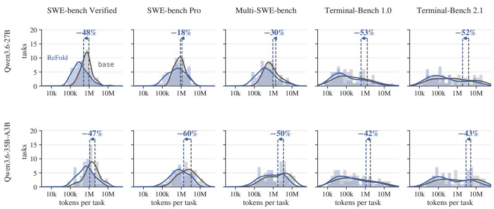  
Figure 6: Tokens per task for every cell of Table 1. ReFold shifts the whole distribution toward fewer tokens rather than trimming a few long tasks.

Figure 6 shows how the tokens of each cell of Table 1 are distributed over its tasks, with each arm’s mean dashed and the change of Table 1 marked between them. ReFold sends fewer tokens than base on 66 to 90% of the tasks of every cell.

## D.4 PUBLISHED METHODS ON THE SAME HARNESS

Table 10 compares ReFold with three published methods at the operating point of Table 1, Qwen3.6- 27B on SWE-bench Verified at the full window with w=8. The base and ReFold rows are those of Tables 1 and 2, the mean of their two runs in Table 6. LLMLingua-2 (Pan et al., 2024) compresses the body of every observation of at least 2,000 characters at the token level with its released classifier on a local GPU, keeping half of the tokens, exempting the three most recent observations and preserving the characters that frame an observation. SWE-Pruner (Wang et al., 2026) is the implementation of Appendix B.1. We run AgentDiet (Xiao et al., 2026) with the served model as its reflection model, which at each step rewrites one earlier observation longer than θ tokens, given the two steps before it and the one after, and the rewrite is adopted only if it saves more than θ tokens. The three most recent observations are exempt and a rewrite is capped at 2,048 tokens, and we run θ=500 and θ=150. Its rewriting calls count toward its tokens and cost and are priced as uncached prompt tokens. In Table 10, cost is in US cents per task and split into the main loop and the method’s own model calls, which are zero for the two methods that run a local model, and ratios are against base.

Table 10: Published methods at the setting of Table 1. ReFold cuts tokens and cost the most, and only ReFold halves the KV cache of a session.
<table><tr><td colspan="3"></td><td colspan="3">Cost (¢)</td><td colspan="2"></td></tr><tr><td>Method</td><td>Resolve</td><td>Tokens (k)</td><td>main</td><td>aux</td><td>total</td><td>Dur. (min)</td><td>KV cache (GiB)</td></tr><tr><td>base</td><td>38</td><td>965</td><td>19.5</td><td></td><td>19.5</td><td>9.8</td><td>1.71</td></tr><tr><td>LLMLingua-2</td><td>35</td><td>885 (-8%)</td><td>18.6</td><td>0</td><td>18.6 (0.95×)</td><td>10.7 (1.09×)</td><td>1.52</td></tr><tr><td>SWE-Pruner</td><td>35</td><td>905 (-6%)</td><td>18.7</td><td>0</td><td>18.7 (0.96×)</td><td>9.6 (0.98×)</td><td>1.55</td></tr><tr><td>AgentDiet θ=500</td><td>38</td><td>980 (+2%)</td><td>20.6</td><td>4.5</td><td>25.1 (1.29×)</td><td>20.8 (2.12×)</td><td>1.72</td></tr><tr><td>AgentDiet θ=150</td><td>37</td><td>817 (-15%)</td><td>17.5</td><td>12.2</td><td>29.7 (1.52×)</td><td>34.0 (3.46×)</td><td>1.45</td></tr><tr><td>ReFold</td><td>38</td><td>505 (-48%)</td><td>12.9</td><td></td><td>12.9 (0.66×)</td><td>9.4 (0.96×)</td><td>0.83</td></tr></table>

ReFold cuts tokens by 48% and cost by 34%, several times more than any other method, and only ReFold halves the memory a session holds, because a method that drops lines or tokens inside an observation cannot remove the whole repeated observations that set the peak. AgentDiet’s rewriting calls are why its cost rises with how often it is asked, and at θ=150 its auxiliary generation is three times that of its main loop. Resolve stays within 3 of base for every method, inside the run-to-run noise of Appendix A.4.

## E TWO OPERATORS

We switch off deduplication or folding in ReFold, with Qwen3.6-27B on SWE-bench Verified at the full window and w=8 (Table 11), with changes against the row with both off, which is base of Table 1. The row with both on is ReFold of Table 1. Folding does most of the work. With folding alone the KV cache a session holds is 49% below base and the tokens of a task 50%, where deduplication alone takes 16% and 33%. With both on, the KV cache falls by 52%, the lowest of the four cells. Completion tokens are at most 3% of the tokens in every cell, so every difference is on the prompt side.

Table 11: Deduplication and folding switched off in ReFold one at a time. The row with both off is base of Table 1, and the row with both on is ReFold. Folding does most of the reduction, and the two together leave the smallest KV cache.
<table><tr><td>Dedup.</td><td>Fold</td><td>Resolve</td><td>KV cache (GiB)</td><td>Tokens (k)</td></tr><tr><td rowspan="4">√</td><td></td><td>38</td><td>1.71</td><td>965</td></tr><tr><td></td><td>40 (+2)</td><td>1.43 (−16%)</td><td>649 (-33%)</td></tr><tr><td>√</td><td>36 (−2)</td><td>0.88 (−49%)</td><td>505 (-48%)</td></tr><tr><td>√</td><td>38 (±0)</td><td>0.83 (-52%)</td><td>478 (-50%)</td></tr></table>

## F COMPOSITION WITH OTHER MECHANISMS

ReFold needs only a rendering hook and prompt instructions, so it can run beneath mechanisms that act elsewhere in the loop, as it runs beneath compaction in Section 4.3. Here it runs beneath three more, one in the serving system, one in the choice of model and one in the prompt.

## F.1 ROUTING ACROSS REPLICAS

We serve Qwen3.6-27B from two replicas of two GPUs each and route the calls of every task in two ways (Table 12). Sticky routing sends every call of a task to one replica, so its prefix cache holds the whole trajectory. Round-robin routing alternates the replicas call by call, so a call can reuse only what its replica cached two calls earlier. At w=16 round-robin lowers the cache hit of both arms by a similar amount, 15.4 points for base and 12.5 for ReFold. At w=32 base fills the KV pools of both replicas, to 99.7 and 99.8%, and is preempted 10 and 63 times, and its cache hit falls from 78.3 to 13.7%. ReFold peaks at 68 and 80% without a preemption, keeps a cache hit of 31.2%, and resolves 40 tasks against 26 in 41.8 against 75.5 minutes. Under sticky routing the two arms resolve within four tasks of each other at both loads, while ReFold still cuts tokens by 55 and 42% and duration by 24 and 34%.

Table 12: Qwen3.6-27B on two replicas under sticky and round-robin routing. Round-robin lowers the cache hit of both arms, and at w=32, where base fills both KV pools, ReFold resolves 40 tasks against 26.
<table><tr><td>Routing, w</td><td>Arm</td><td>Resolve</td><td>Tokens (k)</td><td>Cache hit (%)</td><td>Duration (min)</td></tr><tr><td>Sticky, w=16</td><td>base</td><td>40</td><td>1118</td><td>89.5</td><td>12.5</td></tr><tr><td></td><td>+ ReFold</td><td>36 (-4)</td><td>502 (-55%)</td><td>76.4 (-13.2)</td><td>9.5 (-24%)</td></tr><tr><td>Round-robin, w=16</td><td>base</td><td>36</td><td>784</td><td>74.1</td><td>18.2</td></tr><tr><td></td><td>+ ReFold</td><td>36 (±0)</td><td>683 (-13%)</td><td>63.9 (−10.2)</td><td>15.6 (-14%)</td></tr><tr><td>Sticky, w=32</td><td>base</td><td>38</td><td>898</td><td>78.3</td><td>23.1</td></tr><tr><td></td><td>+ ReFold</td><td>35(-3)</td><td>523 (-42%)</td><td>72.2 (-6.1)</td><td>15.3 (-34%)</td></tr><tr><td>Round-robin, w=32</td><td>base</td><td>26</td><td>623</td><td>13.7</td><td>75.5</td></tr><tr><td></td><td>+ ReFold</td><td>40(+14)</td><td>441 (-29%)</td><td>31.2 (+17.5)</td><td>41.8 (-45%)</td></tr></table>

## F.2 ROUTING BETWEEN MODELS

One server runs Qwen3.6-27B and a second Qwen3.6-35B-A3B, each on two GPUs. Alternating runs send odd calls to one model and even calls to the other, so each model sees every other call and reuses only the prompt it cached two calls earlier (Table 13). The 27B only runs send every call to Qwen3.6-27B with the second server idle, and repeat the duration savings of the concurrency rows of Table 2 at both loads and their resolve gain at w=32. Their token saving at w=32 is smaller, since eight base tasks of Table 2 end at the step limit against one here. Under the alternation ReFold cuts tokens by 59 and 27% and duration by 26 and 33% at w=16 and 32, and resolves 37 tasks at both loads against 33 and 27. At w=32, 13 alternating and 21 27B-only tasks of base end in a timeout, against none and 2 for ReFold.

Table 13: Qwen3.6-27B alone or alternating with Qwen3.6-35B-A3B at every call. ReFold keeps its token and duration savings under the alternation and resolves more tasks than base at both loads.
<table><tr><td>Models, w</td><td>Arm</td><td>Resolve</td><td>Timeouts</td><td>Tokens (k)</td><td>Duration (min)</td></tr><tr><td>27B only, w=16</td><td>base</td><td>35</td><td>2</td><td>1033</td><td>27.0</td></tr><tr><td></td><td>+ ReFold</td><td>36(+1)</td><td>1</td><td>469 (-55%)</td><td>15.4 (-43%)</td></tr><tr><td>Alternating, w=16</td><td>base</td><td>33</td><td>3</td><td>1218</td><td>15.9</td></tr><tr><td></td><td>+ ReFold</td><td>37(+4)</td><td>0</td><td>499 (-59%)</td><td>11.8 (-26%)</td></tr><tr><td>27B only, w=32</td><td>base</td><td>21</td><td>21</td><td>667</td><td>61.6</td></tr><tr><td></td><td>+ ReFold</td><td>33(+12)</td><td>2</td><td>585 (-12%)</td><td>37.9 (-39%)</td></tr><tr><td>Alternating, w=32</td><td>base</td><td>27</td><td>13</td><td>811</td><td>42.7</td></tr><tr><td></td><td>+ ReFold</td><td>37(+10)</td><td>0</td><td>592 (-27%)</td><td>28.6 (-33%)</td></tr></table>

## F.3 RETRIEVAL MEMORY

The memory layer retrieves chunks of earlier tool outputs by BM25, the top three chunks of 40 lines each, and appends them to the end of the rendered prompt, at most 6,000 characters with each chunk labeled by the command that produced it. We run it with and without ReFold beneath it at a 16k budget with w=8, next to base and ReFold at the same budget without compaction (Table 14). On its own the memory layer resolves 8 tasks against 4 and still exhausts the budget on 39 of 50, because what it retrieves adds to the prompt. With ReFold beneath it, resolve rises to 17, exhaustions fall to 23 and the median peak KV cache to 0.98 GiB. ReFold alone does better still, with 21 resolved and 14 exhausted, since the retrieved chunks refill the budget that ReFold frees.

Table 14: Retrieval memory and ReFold switched independently at a 16k budget. ReFold beneath the memory layer doubles its resolve, from 8 to 17, and cuts its exhaustions from 39 to 23.
<table><tr><td>Memory</td><td>ReFold</td><td>Resolve</td><td>Exhausted</td><td>Tokens (k)</td><td>KV cache (GiB)</td><td>Steps</td><td>Duration (min)</td></tr><tr><td></td><td></td><td>4</td><td>43</td><td>288</td><td>1.12</td><td>31</td><td>5.2</td></tr><tr><td>V</td><td></td><td>8</td><td>39</td><td>307</td><td>1.12</td><td>29</td><td>14.6</td></tr><tr><td></td><td>√</td><td>21</td><td>14</td><td>334</td><td>0.87</td><td>32</td><td>6.9</td></tr><tr><td>√</td><td>V</td><td>17</td><td>23</td><td>616</td><td>0.98</td><td>52</td><td>21.8</td></tr></table>