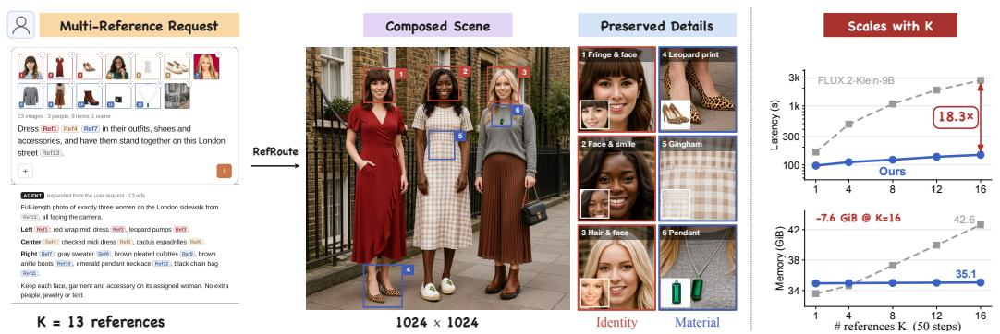

# REFROUTE: DECOUPLING CONDITIONING COST FROM REFERENCES VIA COMPACT RESIDUAL CONDI-TIONING AND SPATIAL ROUTING

Wanning He\* Yuyao Zhang Yu-Wing Tai Dartmouth College \*Equal contribution; co-first authors.

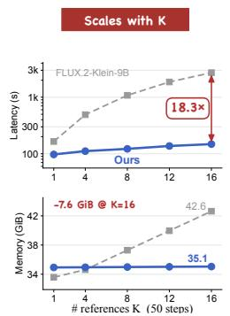  
Figure 1: Demo of RefRoute. Our method enables efficient many-reference generation while preserving fine appearance details and spatial correspondence. With 16 references, we achieve an 18.3× speedup over FLUX.2-Klein-9B at 50 steps.

## ABSTRACT

Multi-reference image generation requires preserving the appearance of multiple subjects while composing them into a coherent scene. However, existing diffusion transformers commonly encode references as dense visual token grids and jointly process them with global attention, making conditioning increasingly expensive as the number and resolution of references grow. We present RefRoute, a framework that addresses both reference representation cost and attention overhead through two complementary mechanisms. Compact residual conditioning combines low-resolution latent tokens with lightweight residual features extracted from full-resolution pixels, reducing reference token counts while retaining finegrained appearance cues. Condition routing and attention routing align reference tokens with their assigned target regions and restrict cross-reference interactions, while allowing selective reference access beyond region boundaries for scene integration. We further introduce RefRoute-Data for training manyreference generation models and ManyRef100, a benchmark spanning human, object, and mixed compositions with 10–17 references. After many-reference fine-tuning, RefRoute achieves an overall Weighted-Ref-VIEScore of 36.06 on ManyRef100, compared with 8.88 for FLUX.2-Klein-9B. Separate inference-cost evaluations show substantially slower latency growth as the reference count increases: at 16 references, our 50-step and 4-step configurations achieve 18.3× and 14.2× speedups over their corresponding FLUX baselines, respectively. These results establish compact reference representations and spatially routed attention as an effective approach to scalable many-reference image generation.

## 1 INTRODUCTION

Recent image generation models increasingly support multi-reference conditioning [1, 2, 8–10, 35, 36, 39], enabling users to control an image using multiple reference images, layouts, object regions, or other spatial cues [4, 18, 26, 33, 37, 38]. As illustrated in Fig. 1, a single generation may require several references to preserve the appearance of different entities while placing them at specified locations. This setting raises a fundamental efficiency question: How should the cost of conditioning scale as the number of references increases?

Current multimodal diffusion transformers largely answer this question by concatenation. Each reference image is encoded into a dense visual token grid, and the resulting reference tokens are appended to text and noisy target tokens in a unified attention sequence [2, 12, 21, 30, 34, 36]. If each reference contributes n tokens and the target contains $N _ { g }$ tokens, joint attention has complexity $O \left( ( N _ { g } + K n ) ^ { 2 } \right)$ , where K is the number of references. For example, a 1024 × 1024 reference produces 4096 visual tokens, making multiple references $( K > 1 )$ quickly dominate the input sequence. This reveals two distinct sources of unnecessary computation.

Representation scaling. A dense reference representation allocates tokens according to the number and resolution of input references. Yet the information required for generation does not necessarily grow with its references. Simply reducing the reference resolution decreases token count, but can discard precisely the high-frequency cues needed for faithful reconstruction [17]. The challenge is therefore not merely to compress a reference, but to construct a bounded representation that preserves generation-relevant appearance information.

Interaction scaling. Even after reducing the representation size, standard concatenation leaves the attention graph dense: every target token can interact with every reference token, and reference tokens from different entities can interact with one another. The model must therefore learn implicitly which reference controls which target region. As K grows, this unrestricted interaction creates unnecessary computation and increases the opportunity for attribute–subject misassociation, identity leakage, and spatial confusion [6, 7, 19, 32]. Spatial correspondence should instead be represented explicitly in the computation graph: a reference should primarily communicate with the region it is responsible for, rather than with the entire canvas.

These observations suggest a simple design principle: Conditioning should scale with the information and spatial support required by the output, rather than with the resolution and global connectivity of the inputs. Achieving this principle requires solving representation and interaction scaling together. A compact representation alone does not prevent all references from attending globally; spatial masking alone does not prevent the reference token count from growing with input resolution. RefRoute addresses both bottlenecks with two coupled mechanisms: compact residual conditioning and condition/attention routing.

Compact residual conditioning. We assign every reference a fixed token budget independent of its resolution. Specifically, a 1024 × 1024 reference is reduced from a 64 × 64 latent grid (4096 tokens) to a $1 6 \times 1 6$ grid (256 tokens). This makes the representation cost independent of the reference resolution. However, the compact latent alone loses fine appearance information. We therefore introduce a lightweight Pixel Residual Compressor that extracts complementary information directly from the original pixels and injects it into the first DiT layer. The resulting representation, $H ^ { \mathrm { r e f } } \stackrel { } { = }$ $H ^ { \mathrm { l r } } + P ( r )$ , combines the efficiency of a fixed-size latent representation with a residual pathway for high-frequency appearance cues. Because attention complexity depends on the total sequence length, this changes the reference-dependent attention cost by roughly 70× at K = 16, ignoring text tokens.

Condition and attention routing. Compact references still need to be associated with the correct target instances. RefRoute therefore makes this correspondence explicit. We align each reference with its assigned target region by remapping its rotary positional coordinates. Structured attention then blocks direct interactions between distinct references and lets target queries within each assigned region access the corresponding reference. Outside assigned regions, each target query can access the highest-ranked reference, retaining all tokens of that reference. This selective access allows reference information to influence the surrounding scene, supporting effects such as shadows and reflections while limiting global reference interactions.

We introduce RefRoute-Data and ManyRef100 to support training and evaluation of manyreference generation. After many-reference fine-tuning, RefRoute achieves an overall Weighted-Ref-VIEScore of 36.06 on ManyRef100, compared with 8.88 for FLUX.2-Klein-9B. Separate inference-cost evaluations show 18.3× and 14.2× speedups at 16 references over the corresponding FLUX baselines at 50 and four sampling steps, respectively. These results demonstrate improved many-reference composition and computational scaling, with a quality trade-off on the predominantly few-reference MICo-Bench.

Contributions. Our contributions are threefold:

• We introduce compact residual conditioning, which combines low-resolution latent tokens with pixel-derived residual features to reduce reference token counts while retaining fine-grained appearance cues.

• We propose condition and attention routing, which makes reference–region correspondence explicit through positional alignment and structured attention, with selective reference access beyond assigned regions.

• We construct RefRoute-Data with aligned reference–instance–spatial annotations and ManyRef100, a benchmark covering human, object, and mixed compositions with 10–17 refer ences per case, to support training and systematic evaluation of many-reference generation.

## 2 RELATED WORK

Multi-Reference Controllable Generation. Recent diffusion transformers [20] incorporate visual conditions by encoding reference images into latent tokens and combining them with text and noisy target tokens [2, 12, 16, 30, 37]. Multi-reference methods extend this design by concatenating multiple reference-token blocks [18, 21, 34, 36, 39, 40]. Other works study combinations of reference images with spatial layouts, masks, and poses [4, 18, 26, 33, 37, 38].

Most of these methods use a shared attention context for the reference and target tokens. Thus, the token count grows with the number and resolution of references, while the model must learn which reference should control each target instance. This can cause attribute–subject misassociation and appearance confusion as the number of references increases [6, 7, 19, 32]. StructGen reduces this ambiguity by assigning explicit identifiers to references and their relations [21], but the reference tokens still form a shared attention context. RefRoute instead explicitly binds each reference to it designated target region and restricts unnecessary interactions via condition and attention routing.

Efficient Conditioning and Diffusion Acceleration. Several works reduce the cost of processing visual conditions. OminiControl2 [31] uses compact condition representations and reuses condition features with asymmetric attention, while other methods also study efficient conditional processing [13]. A separate line of work reduces the number of denoising evaluations through progressive distillation, consistency training, and distribution matching [25, 27, 29, 42]. These approaches address condition processing or sampling cost, but do not specifically address how the conditioning cost scales with a large number of appearance references. RefRoute focuses on this many-reference scaling problem through fixed-size per-reference representations and spatially restricted interactions.

Reference Datasets and Benchmarks. Existing benchmarks have expanded from single-subject personalization to multi-reference and long-context generation. DreamBench [24] evaluates subject preservation and prompt alignment, while DreamBench++ [22] improves evaluation with human judgments. OmniContext [36] evaluates in-context generation with multi-references, MultiRef [5] combines real and synthetic multi-condition cases, and MICo-Bench [34] evaluates multi-image composition with a reference-aware VLM metric. More recent benchmarks increase the number and diversity of references, including MacroBench [6], MultiBanana [19], and StructGen Bench [21]. Other works further study multi-human identity preservation and reference association [3, 7, 32].

These benchmarks evaluate reference fidelity, composition, and reference association, but do not combine large reference counts with instance-level spatial assignment and computational scaling. RefRoute-Data and ManyRef100 target this setting by providing aligned reference–instance–spatial conditions and evaluating both generation quality and scaling with the number of references.

## 3 METHOD

We present RefRoute, an efficient framework for multi-reference conditioned generation. Figure 2 illustrates our compact residual reference representation and routing mechanism within a shared DiT. In the following sections, we first introduce the multi-reference conditioning formulation (Section 3.1), then describe compact residual reference encoding (Section 3.2) and condition and attention routing (Section 3.3), and finally present the construction of our training dataset (Section 3.4).

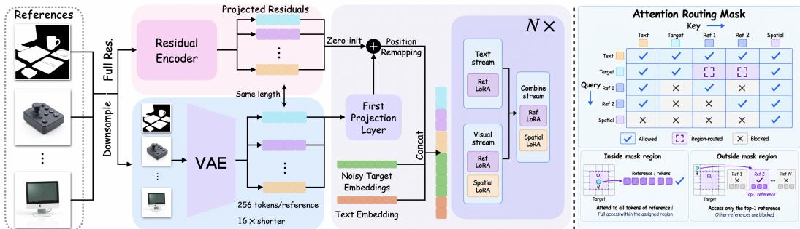  
Figure 2: Overview of RefRoute. Each reference is downsampled and VAE-encoded into compact tokens, while a residual encoder extracts complementary features from the full-resolution image. These features are added to the corresponding reference embeddings after the DiT input projection. The augmented embeddings are jointly processed with text and noisy target embeddings through condition-specific adapters and attention routing.

## 3.1 PRELIMINARIES OF MULTI-REFERENCE CONDITIONED GENERATION

Given a text prompt c, a target image $\mathbf { x } _ { \mathrm { 0 } }$ , and reference images $\{ \mathbf { r } _ { i } \} _ { i = 1 } ^ { N }$ , we encode the images into latent representations using a VAE [23]. Let $\mathbf { z } _ { 0 }$ denote the clean target latent and ${ \bf z } _ { t } = ( 1 - t ) { \bf z } _ { 0 } + t { \bf \epsilon }$ its noisy state at timestep $t ,$ where $\epsilon \sim \mathcal { N } ( \mathbf { 0 } , \mathbf { I } )$ . We denote the text embeddings by T, the noisy target embeddings by $\mathbf { X } .$ , and the embeddings of reference $\mathbf { r } _ { i }$ by $\mathbf { C } _ { r } ^ { i }$ , with the dependence of $\mathbf { X }$ on t omitted for brevity. These embeddings are concatenated into a unified sequence $[ \mathbf { T } ; \mathbf { X } ; \mathbf { C } _ { r } ^ { 1 } ; \ldots ; \mathbf { C } _ { r } ^ { N } ]$ , and jointly processed by a diffusion transformer (DiT).

To distinguish tokens from different images, each visual token is assigned a coordinate $( \tau _ { i } , h , w )$ where (h, w) denotes its spatial position and $\tau _ { i }$ identifies its source image. These coordinates are incorporated through rotary positional embeddings (RoPE) [28].

The model is optimized with the standard flow-matching objective [14]:

$$
\mathcal { L } _ { \mathrm { F M } } = \mathbb { E } \left[ \left| \left| \mathbf { v } _ { \theta } ( \mathbf { z } _ { t } , t , \mathbf { c } , \{ \mathbf { r } _ { i } \} _ { i = 1 } ^ { N } ) - ( \epsilon - \mathbf { z } _ { 0 } ) \right| \right| _ { 2 } ^ { 2 } \right] ,\tag{1}
$$

where $\mathbf { v } _ { \theta }$ denotes the predicted velocity. Although this unified formulation is flexible, its sequence length grows with the reference token counts, leading to substantial attention overhead. Moreover, unrestricted joint attention allows information from different references to mix across target regions. These challenges motivate our compact reference representation and explicit attention routing.

## 3.2 COMPACT RESIDUAL REFERENCE REPRESENTATION

The first bottleneck is the number of reference tokens. A 1024 × 1024 reference produces a $6 4 \times 6 4$ latent grid with 4096 tokens, yielding 65536 reference tokens for 16 references. We reduce this cost by downsampling each reference by a factor of 4 before VAE encoding. This produces a $1 6 \times 1 6$ grid with 256 tokens per reference, which we use in our experiments with up to 16 references.

Downsampling, however, removes fine-grained appearance information. We therefore introduce a lightweight Pixel Residual Compressor that extracts complementary features from the original full-resolution reference. As shown in Figure $^ { 2 , }$ each reference follows two parallel pathways: a compact VAE pathway that provides low-resolution latent tokens, and a pixel pathway that produces a residual feature sequence with the same spatial grid and token count.

Let $\mathbf { Z } _ { \mathrm { l r } } ^ { i } = \mathcal { E } ( \mathrm { D o w n s a m p l e } ( \mathbf { r } _ { i } ) )$ denote the compact latent tokens of reference $\mathbf { r } _ { i } .$ , where $\mathcal { E }$ is the VAE encoder. The DiT input projection maps these tokens to the transformer hidden dimension. In parallel, the Pixel Residual Compressor $P$ extracts features from $\mathbf { r } _ { i } .$ , which are mapped to the same hidden dimension by a zero-initialized projection. The resulting reference embeddings are

$$
\mathbf { C } _ { r } ^ { i } = \mathrm { P r o j } _ { \mathrm { i n } } ( \mathbf { Z } _ { \mathrm { l r } } ^ { i } ) + \mathrm { P r o j } _ { 0 } ( P ( \mathbf { r } _ { i } ) ) ,\tag{2}
$$

where $\operatorname { P r o j } _ { \operatorname { i n } }$ is the pretrained DiT input projection and $\mathrm { P r o j } _ { 0 }$ is a trainable projection whose weights and bias are initialized to zero. The residual is added elementwise to the corresponding projected reference tokens, once before the first DiT block. This preserves the compact sequence length while allowing full-resolution appearance information to complement the low-resolution representation. Architectural details are provided in Appendix A.5.

Pretraining the Pixel Residual Compressor. We pretrain the compressor to preserve appearance information useful for generation. Rather than encouraging a unified representation to retain all reference information [43], we process each reference independently and combine reconstruction with subject-driven generation.

At each training iteration, we sample either a reconstruction task, whose target is the reference itself, or a subject-driven generation task, whose target depicts the same subject under a different pose, viewpoint, or context. For a reference image r, the target–reference pair is

$$
( \mathbf { x } _ { 0 } , \mathbf { r } ) = ( \mathbf { r } , \mathbf { r } ) \quad { \mathrm { o r } } \quad ( \mathbf { x } _ { \mathrm { s u b j } ( \mathbf { r } ) } , \mathbf { r } ) ,\tag{3}
$$

where $\mathbf { x } _ { \mathrm { s u b j ( r ) } }$ depicts the same subject as r. Both tasks use the flow-matching objective from Section 3.1. Reconstruction encourages faithful appearance encoding, while subject-driven generation encourages transferable identity and appearance cues. For spatially conditioned examples, the compressor and generation model are trained to reconstruct the corresponding target image. The pretraining lays the foundation for unified multi-reference training.

## 3.3 CONDITION AND ATTENTION ROUTING

Compact encoding reduces the reference token count, but does not control how information from different references is combined during generation. We therefore introduce condition-specific adaptation and positional remapping, together with an attention routing mask that regulates interactions between references and target regions.

Condition Routing. Each reference image $\mathbf { r } _ { i }$ is encoded into compact reference embeddings $\mathbf { C } _ { r } ^ { i }$ using the two pathways described in Section 3.2. These embeddings are processed together with the text embeddings T, noisy target embeddings X, and spatial condition embeddings $\bar { \mathbf { C } } _ { s }$ when available. We use separate reference and spatial LoRA adapters [11] for condition-specific adaptation. As illustrated in Figure 2, the reference adapter operates in both the text and visual streams, while the spatial adapter operates in the visual stream; both are used in the subsequent combined stream.

To account for the reduced spatial resolution of compact references, we remap their rotary positional coordinates. For a reference token at grid position $( h , w )$ , we use $( \tau _ { i } , h , w ) \longmapsto ( \tau _ { i } , s h , s w )$ where s is the reference downsampling factor and $\tau _ { i }$ identifies the reference image. This rescaling expresses reference positions at the spatial scale of the target latent grid. The association between each reference and its designated target region is enforced by the attention routing mask below.

Attention Routing. Unrestricted joint attention allows references to exchange information with one another and influence unrelated target regions. We regulate these interactions using the routing structure shown in Figure 2. Following condition-specific adaptation, the queries, keys, and values are organized as: $\mathbf { U } = [ \mathbf { U } _ { \mathrm { T } } ; \mathbf { U } _ { X } ; \mathbf { U } _ { C _ { x } ^ { 1 } } ; \ldots ; \mathbf { U } _ { C _ { x } ^ { N } } ; \mathbf { \hat { U } } _ { C _ { s } } ] , \mathbf { U } \in \{ \mathbf { Q } , \mathbf { K } , \mathbf { V } \}$ , where the spatial condition component is omitted when unavailable. An additive routing bias M controls attention:

$$
\mathrm { A t t n } ( \mathbf { Q } , \mathbf { K } , \mathbf { V } ) = \mathrm { S o f t m a x } \left( \frac { \mathbf { Q } \mathbf { K } ^ { \top } } { \sqrt { d _ { k } } } + \mathbf { M } \right) \mathbf { V } ,\tag{4}
$$

where $d _ { k }$ is the key dimension. Each entry of M is zero for a permitted query–key connection and −∞ for a prohibited connection.

The mask first separates the reference streams: reference queries can attend to their own reference tokens, text tokens, and spatial condition tokens, but cannot attend to noisy target tokens or other references. Text queries retain access to all token groups, while target queries retain access to text, target, and spatial condition tokens. Spatial condition queries attend only to spatial condition tokens. These rules preserve shared textual and spatial guidance while preventing direct information exchange between different references.

Target-to-reference attention is further controlled by spatial assignments. Let $\Omega _ { i }$ denote the targettoken region assigned to reference $\mathbf { r } _ { i } .$ . A target query within $\bar { \Omega } _ { i }$ can attend to all tokens in $\mathbf { \bar { C } } _ { r } ^ { i }$ providing full access to the corresponding reference appearance within its designated region.

Strictly blocking reference information outside the assigned regions can limit effects that extend beyond object boundaries, such as shadows, illumination, and contact. We therefore allow target queries outside the assigned regions to access only the top-ranked reference. All tokens of the selected reference remain accessible, while connections to the other references are blocked. This selection operates at the reference level rather than the individual-token level. Together, these rules maintain explicit reference–region correspondence while permitting limited reference influence outside the assigned regions.

Table 1: MICo-Bench results. Completed evaluations cover all 897 cases at native 1024 × 1024 resolution. Columns report category-level and overall Weighted-Ref-VIEScore (0–100, higher is better). Rows above the first rule are reported results; FLUX.2 rows and ours are evaluated by us.
<table><tr><td>Method</td><td>Object</td><td>Person</td><td>HOI</td><td>De&amp;Re</td><td>Overall</td></tr><tr><td>Gemini-3-Pro-Image-Preview</td><td>50.59</td><td>54.75</td><td>50.21</td><td>52.13</td><td>51.76</td></tr><tr><td>GPT-Image-1.5</td><td>56.66</td><td>46.16</td><td>52.35</td><td>48.46</td><td>50.60</td></tr><tr><td>Gemini-2.5-Flash-Image</td><td>48.01</td><td>41.79</td><td>49.64</td><td>49.44</td><td>47.83</td></tr><tr><td>Qwen-Image-MICo</td><td>52.38</td><td>21.11</td><td>34.95</td><td>37.42</td><td>35.86</td></tr><tr><td>BAGEL-MICo</td><td>38.98</td><td>28.45</td><td>25.30</td><td>44.51</td><td>34.41</td></tr><tr><td>OmniGen2-MICo</td><td>46.26</td><td>22.85</td><td>32.18</td><td>36.82</td><td>33.82</td></tr><tr><td>Qwen-Image-Edit-2509</td><td>39.77</td><td>20.23</td><td>19.95</td><td>29.92</td><td>27.47</td></tr><tr><td>BLIP3o-Next-MICo</td><td>40.31</td><td>11.41</td><td>24.97</td><td>26.23</td><td>25.21</td></tr><tr><td>Lumina-Dimoo-MICo</td><td>38.44</td><td>12.14</td><td>24.66</td><td>21.32</td><td>23.32</td></tr><tr><td>FLUX.1-Kontext-dev (512²)</td><td>21.40</td><td>14.33</td><td>12.67</td><td>7.24</td><td>12.51</td></tr><tr><td>FLUX.2-Klein-Base-9B</td><td>54.66</td><td>55.14</td><td>52.44</td><td>59.56</td><td>55.67</td></tr><tr><td>FLUX.2-Klein-9B</td><td>50.63</td><td>53.24</td><td>51.07</td><td>62.36</td><td>55.18</td></tr><tr><td>Ours-MICo</td><td>48.22</td><td>49.65</td><td>52.81</td><td>56.68</td><td>52.81</td></tr><tr><td>Ours-MICo-Distilled</td><td>46.72</td><td>43.93</td><td>49.88</td><td>54.80</td><td>49.93</td></tr></table>

Overall Training. We train RefRoute in two stages. In Stage 1, we pretrain the Pixel Residual Compressor using the reconstruction and subject-driven generation tasks described in Section 3.2. In Stage 2, we initialize the compressor from the pretrained checkpoint and train the model with multiple references and spatial conditions using the condition and attention routing mechanisms above. Both stages use the flow-matching objective defined in Section 3.1.

## 3.4 DATASET CREATION

Existing multi-reference datasets [15, 41] provide broad task coverage, but MICo [34], for example, has three limitations: 89.2% of MICo-Bench cases have at most five references, references lack instance-level spatial annotations, and human references often mismatch the target identity. RefRoute-Data provides per-instance references, boxes, and masks for 20k object scenes (143k instances) and 1k human scenes (Appendix A.1); its mean reference–target ArcFace similarity is 0.53, versus 0.19 for the MICo-150K human subset.

## 4 EXPERIMENTS

Experimental Setup. RefRoute is built on FLUX.2-Klein-9B, and our evaluations use 1024 × 1024 outputs in BF16. We evaluate on two complementary benchmarks: MICo-Bench [34], where 89.2% of 897 cases contain two to five references, and our ManyRef100, comprising 100 cases (30 Human, 30 Object, and 40 Mixed) with 10–17 references and instance-level spatial annotations. We measure generation quality using Weighted-Ref-VIEScore, which combines reference fidelity, semantic consistency, and perceptual quality. Data construction, model configurations, and evaluation protocols are detailed in Appendices A.1 and A.3.

Multi-Reference Composition. We first evaluate our MICo variants before additional manyreference fine-tuning. As shown in Table 1, the undistilled and distilled variants achieve overall scores of 52.81 and 49.93, respectively. The undistilled variant surpasses the reported scores of Gemini-3-Pro-Image-Preview (51.76) and GPT-Image-1.5 (50.60). Both variants score below their corresponding FLUX baselines (55.67 and 55.18), while offering substantial computational savings as the reference count increases, as shown next.

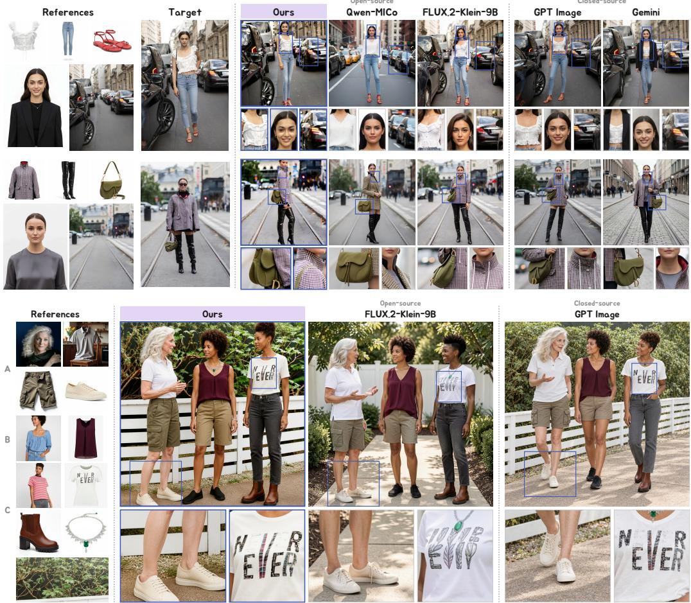  
Figure 3: Qualitative comparison. Top: MICo-Bench, with few references; columns show the references, the target, RefRoute, open-source baselines (Qwen-Image-MICo, FLUX.2-Klein-9B), and closed-source systems (GPT-Image, Gemini). Bottom: ManyRef100, with 10–17 references and assigned regions overlaid.

Table 2: Comparison on ManyRef100. We evaluate 1024 × 1024 generation with many references on our benchmark. Ours-ManyRef achieves the best overall and per-category scores; without manyreference fine-tuning, Ours-MICo outperforms both FLUX.2 baselines.
<table><tr><td>Method</td><td>Overall</td><td>Human</td><td>Object</td><td>Mixed</td><td>W</td><td>SC</td><td>PQ</td></tr><tr><td>FLUX.2-Klein-Base-9B</td><td>4.18</td><td>10.79</td><td>0.09</td><td>2.28</td><td>0.268</td><td>1.470</td><td>6.949</td></tr><tr><td>FLUX.2-Klein-9B</td><td>8.88</td><td>17.07</td><td>4.56</td><td>5.98</td><td>0.375</td><td>2.679</td><td>7.319</td></tr><tr><td>GPT-Image-1</td><td>27.92</td><td>10.31</td><td>55.95</td><td>20.09</td><td>0.574</td><td>5.613</td><td>7.763</td></tr><tr><td>Ours-MICo</td><td>17.32</td><td>13.60</td><td>36.10</td><td>6.02</td><td>0.639</td><td>3.758</td><td>6.171</td></tr><tr><td>Ours-ManyRef</td><td>36.06</td><td>28.10</td><td>57.37</td><td>26.04</td><td>0.709</td><td>6.428</td><td>7.583</td></tr></table>

Scaling with the Number of References. We examine both inference cost and generation quality as the number of references increases.

Qualitative Comparison. Figure 1 demonstrates many-reference generation with RefRoute, combining 13 references into a coherent scene while preserving facial identity and clothing patterns. The highlighted details include leopard-print shoes, a gingham dress, and a pendant, illustrating the retention of fine-grained appearance cues alongside correct reference–subject associations. Figure 3 presents qualitative comparisons on MICo-Bench. In the first row, RefRoute more faithfully preserves the woman’s facial identity, the structure of her top, and the background. In comparison, Qwen-MICo and Gemini alter the referenced top, while Qwen-MICo and FLUX.2-Klein-9B show discrepancies in facial identity. In the second row, RefRoute better retains the bag’s shape and construction details, as well as the jacket’s checkered pattern. The ManyRef100 example demonstrates our better results on the t-shirt logo and shoe details. More comparisons are in the appendix.

(a) Reconstruction  
(a) Total latency  
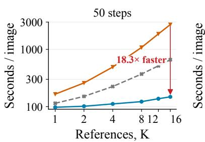

(b) Total latency  
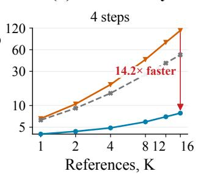

(c) Peak memory  
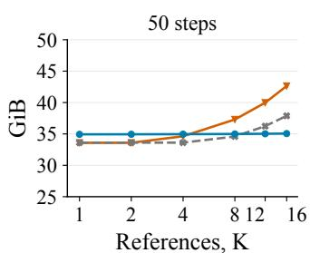  
FLUX.2-Klein-9B OminiControl2 Ours  
Figure 4: Inference cost versus reference count. Compared with FLUX.2-Klein baselines and an OminiControl2 reference-branch implementation, RefRoute exhibits slower latency growth and nearly constant peak allocated memory across the measured configurations.

Table 3: Residual source and injection space. Left: Stage 1 reconstruction on 100 images. Right: ManyRef100 after a matched Stage 2 budget of 10k steps. Human and mixed cells are ArcFace face cosine / mIoU / RRBA; object cells are DINO / mIoU / RRBA. Bold is best in each panel.
<table><tr><td>Design</td><td>PSNR↑ SSIM↑</td><td></td><td>DISTS↓ HF-MAE↓</td><td></td></tr><tr><td>VAE latent → DiT</td><td>24.22</td><td>0.725</td><td>0.0837</td><td>0.0220</td></tr><tr><td>Pixel → VAE</td><td>23.57</td><td>0.724</td><td>0.0949</td><td>0.0226</td></tr><tr><td>Pixel → DiT</td><td>24.78</td><td>0.745</td><td>0.0789</td><td>0.0207</td></tr></table>

(b) ManyRef100
<table><tr><td>Design</td><td>Human</td><td>Mixed</td><td>Object</td></tr><tr><td>Concat</td><td>0.264 / 0.177 / 0.3900.217 / 0.177 / 0.3850.701 / 0.426 / 0.794</td><td></td><td></td></tr><tr><td></td><td>Pixel → VAE 0.254 / 0.168 / 0.413 0.223 / 0.198 / 0.427 0.696 / 0.409 / 0.799</td><td></td><td></td></tr><tr><td></td><td></td><td></td><td>Pixel → DiT 0.300 / 0.217 / 0.5170.248 / 0.221 / 0.4670.731 / 0.444 / 0.824</td></tr></table>

Computational cost. Figure 4 reports inference cost for K = 1 to 16. At K = 16, RefRoute achieves 18.3× and 14.2× speedups over the corresponding FLUX baselines at 50 and 4 sampling steps, respectively. Across this range, peak allocated memory at 50 steps increases by only 0.12 GiB, compared with 9.05 GiB for the dense baseline. We also obtain 4.5× and 6.5× speedups over an OminiControl2 reference-branch implementation on the same backbone. This comparison measures mechanism cost rather than the complete trained OminiControl2 system. Measurement settings are provided in Appendix A.3.

Many-reference quality. Table 2 reports results on ManyRef100. Before additional many-reference fine-tuning, our MICo variant achieves an overall score of 17.32, exceeding FLUX.2-Klein-Base-9B (4.18) and FLUX.2-Klein-9B (8.88). Further fine-tuning raises the score to 36.06 and achieves the best results across Human, Object, and Mixed categories.

## 5 ABLATION STUDY

We ablate the compact residual representation and dynamic attention routing. Training configurations are provided in Appendix A.6.

## 5.1 RESIDUAL REPRESENTATION DESIGN

Compressing references to a 16 × 16 grid can discard fine appearance details. Table 3 examines how residual source and injection space affect their recovery. On Stage 1 reconstruction, pixel-to-DiT achieves the best results across all four metrics, reaching 24.78 dB PSNR compared with 23.57 dB for pixel-to-VAE and 24.22 dB for VAE-latent-to-DiT.

On ManyRef100, with a matched Stage 2 budget of 10k steps and routing enabled, pixel-to-DiT performs best across all categories and metrics. Compared with concatenation without a residual, it improves Human face similarity from 0.264 to 0.300 and Object DINO similarity from 0.701 to 0.731. Human RRBA also increases from 0.390 to 0.517, indicating better reference–region binding. These results support extracting residual features from pixels and injecting them into DiT space.

## 5.2 CONDITION ROUTING DESIGN

Restricting reference access to assigned regions can limit interactions with the surrounding scene, such as shadows and reflections. Our dynamic top-K (empirically set K=1) mechanism allows each target query outside these regions to attend to the highest-ranked reference, while retaining access to all tokens of that reference. We compare this mechanism with a strict spatial mask that blocks reference access outside assigned regions. The qualitative comparison in Figure 5 examines whether dynamic selection improves reference–environment interactions while preserving reference appearance. With the strict mask, the man appears to float above the ground, whereas dynamic routing preserves contact between his feet and the ground.

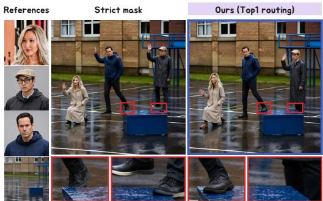  
Figure 5: Strict spatial masking vs. dynamic top-1 routing with the same checkpoint, seed, and prompt. Insets highlight reflections and ground contact outside assigned regions.

Effect of Stage 1 Pretraining. We ablate Stage 1 pretraining by training Stage 2 with and without the pretrained compressor for a matched budget of 10k steps. On scenes requesting ten people, pretraining reduces person-count MAE from 1.643 to 1.057, with the largest improvement on mixed scenes (1.900 to 1.075; Table 4). These results suggest that learning reference representations separately facilitates subsequent multi-reference

Table 4: Effect of Stage 1 pretraining. Personcount MAE after a matched Stage 2 budget of 10k steps. Lower is better; best results are in bold.
<table><tr><td rowspan="2">Setting</td><td colspan="3">Count MAE↓</td></tr><tr><td>Overall</td><td>Human</td><td>Mix</td></tr><tr><td>w/o Stage 1</td><td>1.643</td><td>1.300</td><td>1.900</td></tr><tr><td>w/ Stage 1</td><td>1.057</td><td>1.033</td><td>1.075</td></tr></table>

binding under a fixed training budget. Qualitative examples in the appendix (Figure 7) further illustrate the preservation of facial identity and fine-grained appearance details after Stage 1.

Limitations. Our current study focuses on many-reference image conditioning, where the conditioning inputs are visual references. Although RefRoute substantially reduces the representation and attention costs associated with increasing numbers of reference images, we do not investigate settings that involve long text conditioning, such as detailed textual descriptions or combinations of long text prompts with many visual references. Such settings introduce additional challenges in representing and routing long-range semantic information, which are beyond the scope of the current framework. Extending RefRoute to jointly handle large numbers of visual references and long textual conditions is an interesting direction for future work.

## 6 CONCLUSION

We presented RefRoute, a framework for scalable many-reference image generation that addresses both reference representation cost and attention overhead. Compact residual conditioning preserves fine-grained appearance cues within a reduced token budget, while condition and attention routing spatially align references with their target regions and suppress unnecessary cross-reference interactions. We further introduced RefRoute-Data and ManyRef100 to enable training and systematic evaluation in the many-reference regime. Experiments demonstrate substantially improved composition quality on ManyRef100 and more favorable inference-cost scaling as the number of references increases. At the same time, the lower performance on the predominantly few-reference MICo-Bench highlights the challenge of maintaining strong generation quality across different referencecount regimes. Overall, our results show that compact reference representations and spatially structured attention provide complementary mechanisms for scaling multi-reference generation, and suggest a broader direction toward conditioning architectures whose computational capacity adapts to the complexity of the desired scene.

## AI USE STATEMENT

In this work, we used generative AI tools in three ways. (1) Synthetic data: the target images and part of the references in RefRoute-Data and ManyRef100 were synthesized with GPT, HiDream-I1-Full, FLUX.2-klein-4B, and InfiniteYou (Appendix A.1). (2) Data filtering: vision-language models (Qwen3-VL and GPT-based judges) were used to verify, relabel, and screen generated samples during data construction (Appendix A.1). (3) Evaluation: generation quality is scored with Weighted-Ref-VIEScore, which relies on multimodal LLM judges (GPT-5.4 for semantic consistency and perceptual quality, and Qwen3-VL-30B-A3B-Instruct for the reference weights; Appendix A.3). In addition, we used generative AI tools to draft parts of this paper and to edit it for readability. The research questions, method design, implementation, and interpretation of results are the authors’ own. Synthesized and filtered images were retained only after the automatic detection, face-matching, and geometric and semantic checks described in Appendix A.1, and all AI-assisted text was checked by the authors against the experimental records. We take responsibility for the final content of this work, including text, claims, or artifacts produced with the aid of generative AI.

## ETHICS STATEMENT

This work does not involve human-subject experiments or the collection of personal information from individuals. The experiments use image references and generated content for research on multi-reference image generation. We take care to use data and pretrained models in accordance with their applicable licenses and usage terms. We acknowledge that image generation systems can be used in applications involving the representation or manipulation of people and other sensitive visual content; such applications are outside the scope of this work and may require additiona safeguards.

## REPRODUCIBILITY STATEMENT

We provide detailed descriptions of the RefRoute architecture, compact residual conditioning, condition and attention routing, training procedure, and distillation strategy in the paper and supplementary material. We also report the implementation details, model configurations, computationa cost measurements, and evaluation protocols used in our experiments. The construction and evaluation protocols of RefRoute-Data and ManyRef100 are described in detail to facilitate independent evaluation of high-cardinality multi-reference generation. We will release the source code, model configurations, data-generation and evaluation scripts, and the relevant dataset metadata upon publication, subject to the licensing and redistribution requirements of the underlying data and pretrained models.

## REFERENCES

[1] Black Forest Labs. FLUX.2: Frontier Visual Intelligence. Black Forest Labs Blog, 2025. URL https://bfl.ai/blog/flux-2.

[2] Black Forest Labs, Stephen Batifol, Andreas Blattmann, Frederic Boesel, Saksham Consul, Cyril Diagne, Tim Dockhorn, Jack English, Zion English, Patrick Esser, Sumith Kulal, Kyle Lacey, Yam Levi, Cheng Li, Dominik Lorenz, Jonas Müller, Dustin Podell, Robin Rombach, Harry Saini, Axel Sauer, and Luke Smith. FLUX.1 Kontext: Flow Matching for In-Context Image Generation and Editing in Latent Space. arXiv preprint arXiv:2506.15742, 2025.

[3] Shubhankar Borse, Seokeon Choi, Sunghyun Park, Jeongho Kim, Shreya Kadambi, Risheek Garrepalli, Sungrack Yun, Durga Malladi, and Fatih Porikli. MultiHuman-Testbench: Benchmarking Image Generation for Multiple Humans. In Advances in Neural Information Processing Systems (NeurIPS) Datasets and Benchmarks Track, 2025.

[4] Bowen Chen, Brynn Zhao, Haomiao Sun, Li Chen, Xu Wang, Daniel Du, and Xinglong Wu. XVerse: Consistent Multi-Subject Control of Identity and Semantic Attributes via DiT Modulation. In Advances in Neural Information Processing Systems (NeurIPS), 2025.

[5] Ruoxi Chen, Dongping Chen, Siyuan Wu, Sinan Wang, Shiyun Lang, Peter Sushko, Gaoyang Jiang, Yao Wan, and Ranjay Krishna. MultiRef: Controllable Image Generation with Multiple Visual References. In Proceedings ofthe ACM International Conference on Multimedia (ACM MM), pp. 13325–13331, 2025.

[6] Zhekai Chen, Yuqing Wang, Manyuan Zhang, and Xihui Liu. MACRO: Advancing Multi-Reference Image Generation with Structured Long-Context Data. arXiv preprint arXiv:2603.25319, 2026.

[7] Zhihan Chen, Yuhuan Zhao, Yijie Zhu, and Xinyu Yao. When Identities Collapse: A Stress-Test Benchmark for Multi-Subject Personalization. In Proceedings of the IEEE/CVF Conference on Computer Vision and Pattern Recognition (CVPR) Workshops, pp. 4855–4863, 2026.

[8] Chaorui Deng, Deyao Zhu, Kunchang Li, Chenhui Gou, Feng Li, Zeyu Wang, Shu Zhong, Weihao Yu, Xiaonan Nie, Ziang Song, Guang Shi, and Haoqi Fan. Emerging Properties in Unified Multimodal Pretraining. arXiv preprint arXiv:2505.14683, 2025.

[9] Patrick Esser, Sumith Kulal, Andreas Blattmann, Rahim Entezari, Jonas Müller, Harry Saini, Yam Levi, Dominik Lorenz, Axel Sauer, Frederic Boesel, Dustin Podell, Tim Dockhorn, Zion English, and Robin Rombach. Scaling Rectified Flow Transformers for High-Resolution Image Synthesis. In Proceedings of the International Conference on Machine Learning (ICML), volume 235 of Proceedings ofMachine Learning Research, pp. 12606–12633, 2024.

[10] Google DeepMind. Image editing in Gemini just got a major upgrade. Google Blog, 2025. URL https://blog.google/products-and-platforms/products/ gemini/updated-image-editing-model/. August 26, 2025.

[11] Edward J. Hu, Yelong Shen, Phillip Wallis, Zeyuan Allen-Zhu, Yuanzhi Li, Shean Wang, Lu Wang, and Weizhu Chen. LoRA: Low-Rank Adaptation of Large Language Models. In International Conference on Learning Representations (ICLR), 2022.

[12] Lianghua Huang, Wei Wang, Zhi-Fan Wu, Yupeng Shi, Huanzhang Dou, Chen Liang, Yutong Feng, Yu Liu, and Jingren Zhou. In-Context LoRA for Diffusion Transformers. arXiv preprint arXiv:2410.23775, 2024.

[13] Shanyuan Liu, Jian Zhu, Junda Lu, Yue Gong, Liuzhuozheng Li, Bo Cheng, Yuhang Ma, Liebucha Wu, Xiaoyu Wu, Dawei Leng, and Yuhui Yin. NanoControl: A Lightweight Framework for Precise and Efficient Control in Diffusion Transformer. arXiv preprint arXiv:2508.10424, 2025.

[14] Xingchao Liu, Chengyue Gong, and Qiang Liu. Flow Straight and Fast: Learning to Generate and Transfer Data with Rectified Flow. In International Conference on Learning Representations (ICLR), 2023.

[15] Yexin Liu, Manyuan Zhang, Yueze Wang, Hongyu Li, Dian Zheng, Weiming Zhang, Changsheng Lu, and Harry Yang. OpenSubject: Leveraging Video-Derived Identity and Diversity Priors for Subject-Driven Image Generation and Manipulation. In Proceedings of the European Conference on Computer Vision (ECCV), pp. 113–132, 2026.

[16] Chaojie Mao, Jingfeng Zhang, Yulin Pan, Zeyinzi Jiang, Zhen Han, Yu Liu, and Jingren Zhou. ACE++: Instruction-Based Image Creation and Editing via Context-Aware Content Filling. In Proceedings of the IEEE/CVF International Conference on Computer Vision (ICCV) Workshops, pp. 1979–1987, 2025.

[17] Tejaswini Medi, Hsien-Yi Wang, Arianna Rampini, and Margret Keuper. Decoupling High and Low Frequencies for Faithful Image Generation with Fine Details. In Proceedings of the European Conference on Computer Vision (ECCV), 2026.

[18] Chong Mou, Yanze Wu, Wenxu Wu, Zinan Guo, Pengze Zhang, Yufeng Cheng, Yiming Luo, Fei Ding, Shiwen Zhang, Xinghui Li, Mengtian Li, Mingcong Liu, Yunsheng Jiang, Shaojin Wu, Songtao Zhao, Jian Zhang, Qian He, and Xinglong Wu. DreamO: A Unified Framework for Image Customization. In Proceedings of the SIGGRAPH Asia 2025 Conference Papers, pp. 194:1–194:12, 2025.

[19] Yuta Oshima, Daiki Miyake, Kohsei Matsutani, Yusuke Iwasawa, Masahiro Suzuki, Yutaka Matsuo, and Hiroki Furuta. MultiBanana: A Challenging Benchmark for Multi-Reference Text-to-Image Generation. In Proceedings of the IEEE/CVF Conference on Computer Vision and Pattern Recognition (CVPR), pp. 448–460, 2026.

[20] William Peebles and Saining Xie. Scalable Diffusion Models with Transformers. In Proceed ings of the IEEE/CVF International Conference on Computer Vision (ICCV), pp. 4195–4205, 2023.

[21] Jianing Peng, Mengyu Wang, Henghui Ding, Zixiang Li, Ting Liu, Xiaochao Qu, Luoqi Liu, Yao Zhao, and Yunchao Wei. StructGen: Disambiguating Multi-Reference Image Generation via Structured Context Modeling. arXiv preprint arXiv:2607.15619, 2026.

[22] Yuang Peng, Yuxin Cui, Haomiao Tang, Zekun Qi, Runpei Dong, Jing Bai, Chunrui Han, Zheng Ge, Xiangyu Zhang, and Shu-Tao Xia. DreamBench++: A Human-Aligned Benchmark for Personalized Image Generation. In International Conference on Learning Representations (ICLR), 2025.

[23] Robin Rombach, Andreas Blattmann, Dominik Lorenz, Patrick Esser, and Björn Ommer. High-Resolution Image Synthesis With Latent Diffusion Models. In Proceedings of the IEEE/CVF Conference on Computer Vision and Pattern Recognition (CVPR), pp. 10684– 10695, 2022.

[24] Nataniel Ruiz, Yuanzhen Li, Varun Jampani, Yael Pritch, Michael Rubinstein, and Kfir Aberman. DreamBooth: Fine Tuning Text-to-Image Diffusion Models for Subject-Driven Generation. In Proceedings ofthe IEEE/CVF Conference on Computer Vision and Pattern Recognition (CVPR), pp. 22500–22510, 2023.

[25] Tim Salimans and Jonathan Ho. Progressive Distillation for Fast Sampling of Diffusion Models. In International Conference on Learning Representations (ICLR), 2022.

[26] Dong She, Siming Fu, Mushui Liu, Qiaoqiao Jin, Hualiang Wang, Weihao Zhou, and Jidong Jiang. MOSAIC: Multi-Subject Personalized Generation via Correspondence-Aware Alignment and Disentanglement. In International Conference on Learning Representations (ICLR), 2026.

[27] Yang Song, Prafulla Dhariwal, Mark Chen, and Ilya Sutskever. Consistency Models. In Proceedings of the International Conference on Machine Learning (ICML), volume 202 of Proceedings of Machine Learning Research, pp. 32211–32252, 2023.

[28] Jianlin Su, Murtadha Ahmed, Yu Lu, Shengfeng Pan, Wen Bo, and Yunfeng Liu. RoFormer: Enhanced transformer with Rotary Position Embedding. Neurocomputing, 568:127063, 2024.

[29] Peng Sun, Zhenglin Cheng, Deyuan Liu, Jun Xie, Xinyi Shang, and Tao Lin. Three-Body Scattering for Generative Modeling. arXiv preprint arXiv:2607.18198, 2026.

[30] Zhenxiong Tan, Songhua Liu, Xingyi Yang, Qiaochu Xue, and Xinchao Wang. OminiControl: Minimal and Universal Control for Diffusion Transformer. In Proceedings of the IEEE/CVF International Conference on Computer Vision (ICCV), pp. 14940–14950, 2025.

[31] Zhenxiong Tan, Qiaochu Xue, Xingyi Yang, Songhua Liu, and Xinchao Wang. OminiControl2: Efficient Conditioning for Diffusion Transformers. In Proceedings of the IEEE/CVF Conference on Computer Vision and Pattern Recognition (CVPR), pp. 4256–4265, 2026.

[32] Wenqing Tian, Hanyi Mao, Zhaocheng Liu, Lihua Zhang, Qiang Liu, Jian Wu, and Liang Wang. MultiBind: A Benchmark for Attribute Misbinding in Multi-Subject Generation. arXiv preprint arXiv:2603.21937, 2026.

[33] Xierui Wang, Siming Fu, Qihan Huang, Wanggui He, and Hao Jiang. MS-Diffusion: Multisubject Zero-shot Image Personalization with Layout Guidance. In International Conference on Learning Representations (ICLR), 2025.

[34] Xinyu Wei, Kangrui Cen, Hongyang Wei, Zhen Guo, Bairui Li, Zeqing Wang, Jinrui Zhang, and Lei Zhang. MICo-150K: A Comprehensive Dataset Advancing Multi-Image Composition. In Proceedings of the IEEE/CVF Conference on Computer Vision and Pattern Recognition (CVPR), pp. 29695–29706, 2026.

[35] Chenfei Wu, Jiahao Li, Jingren Zhou, Junyang Lin, Kaiyuan Gao, Kun Yan, Sheng-ming Yin, Shuai Bai, Xiao Xu, Yilei Chen, Yuxiang Chen, Zecheng Tang, Zekai Zhang, Zhengyi Wang, An Yang, Bowen Yu, Chen Cheng, Dayiheng Liu, Deqing Li, Hang Zhang, Hao Meng, Hu Wei, Jingyuan Ni, Kai Chen, Kuan Cao, Liang Peng, Lin Qu, Minggang Wu, Peng Wang, Shuting Yu, Tingkun Wen, Wensen Feng, Xiaoxiao Xu, Yi Wang, Yichang Zhang, Yongqiang Zhu, Yujia Wu, Yuxuan Cai, and Zenan Liu. Qwen-Image Technical Report. arXiv preprint arXiv:2508.02324, 2025.

[36] Chenyuan Wu, Jiahao Wang, Pengfei Zheng, Ruiran Yan, Shitao Xiao, Xin Luo, Yueze Wang, Wanli Li, Xiyan Jiang, Yexin Liu, Junjie Zhou, Ziyi Xia, Ze Liu, Chaofan Li, Haoge Deng, Kun Luo, Bo Zhang, Jiajun Zhang, Dong Liu, Defu Lian, Xinlong Wang, Zhongyuan Wang, Tiejun Huang, and Zheng Liu. OmniGen2: Towards Instruction-Aligned Multimodal Generation. In Proceedings of the IEEE/CVF Conference on Computer Vision and Pattern Recognition (CVPR), pp. 21964–21975, 2026.

[37] Shaojin Wu, Mengqi Huang, Wenxu Wu, Yufeng Cheng, Fei Ding, and Qian He. Less-to-More Generalization: Unlocking More Controllability by In-Context Generation. In Proceedings of the IEEE/CVF International Conference on Computer Vision (ICCV), pp. 18682–18692, 2025.

[38] Guangxuan Xiao, Tianwei Yin, William T. Freeman, Frédo Durand, and Song Han. FastComposer: Tuning-Free Multi-subject Image Generation with Localized Attention. International Journal ofComputer Vision, 133:1175–1194, 2025.

[39] Shitao Xiao, Yueze Wang, Junjie Zhou, Huaying Yuan, Xingrun Xing, Ruiran Yan, Chaofan Li, Shuting Wang, Tiejun Huang, and Zheng Liu. OmniGen: Unified Image Generation. In Proceedings of the IEEE/CVF Conference on Computer Vision and Pattern Recognition (CVPR), pp. 13294–13304, 2025.

[40] Yiyan Xu, Qiulin Wang, Wenjie Wang, Yunyao Mao, Xintao Wang, Pengfei Wan, Kun Gai, and Fuli Feng. UniCustom: Unified Visual Conditioning for Multi-Reference Image Generation. arXiv preprint arXiv:2605.12088, 2026.

[41] Junyan Ye, Dongzhi Jiang, Zihao Wang, Leqi Zhu, Zhenghao Hu, Zilong Huang, Jun He, Zhiyuan Yan, Jinghua Yu, Hongsheng Li, Conghui He, and Weijia Li. Echo-4o: Harnessing the Power of GPT-4o Synthetic Images for Improved Image Generation. arXiv preprint arXiv:2508.09987, 2025.

[42] Tianwei Yin, Michaël Gharbi, Richard Zhang, Eli Shechtman, Frédo Durand, William T. Freeman, and Taesung Park. One-step Diffusion with Distribution Matching Distillation. In Proceedings of the IEEE/CVF Conference on Computer Vision and Pattern Recognition (CVPR), pp. 6613–6623, 2024.

[43] Lvmin Zhang, Shengqu Cai, Muyang Li, Chong Zeng, Beijia Lu, Anyi Rao, Song Han, Gordon Wetzstein, and Maneesh Agrawala. TinyHistory: Lightweight Video History Embeddings via Two-Stage Context Learning. In Proceedings of the European Conference on Computer Vision (ECCV), 2026.

## A APPENDIX

This appendix follows the experimental claims: data and benchmark construction, evaluation setup and baseline configurations, implementation and training details, and inference-cost measurements and auxiliary probes.

## A.1 DATA AND BENCHMARK CONSTRUCTION

Many-reference generation requires associating each reference with its corresponding subject in a composed scene. We construct RefRoute-Data for training and ManyRef100 for evaluation. Each training record pairs a target image and scene description with per-instance references, bounding boxes, and masks, providing explicit reference-to-instance correspondence.

Data scale. The construction manifests contain 20,000 object scenes with 143,249 retained instances and 1,000 human scenes with 4,123 annotated people and 4,067 exported references. These totals describe the constructed data; the subset used for training depends on the checkpoint configuration. Retained object instances cover the requested inventory rather than all visible objects, and exported human references may contain identity uncertainty.

Training data construction. We use separate object and human branches within a shared fourstage pipeline (Figure 6).

• Prompt generation. For objects, we sample five to ten categories from an LVIS-derived vocabulary and compose scene descriptions. For humans, we specify scenes with two to eight people, including their attributes and poses.

• Target synthesis. We generate object scenes with HiDream-I1-Full and human scenes with GPT at 1024 × 1024 resolution. Human scenes use input identity images for two to four people and text-only conditioning for five to eight people.

• Instance annotation. For objects, GroundingDINO localizes the requested categories, and oneto-one assignment associates detections with the inventory. For humans, person detection, pose estimation, and face matching associate individuals with their spatial annotations and available identity images. SAM produces instance masks in both branches.

• Verification and reference construction. We filter or relabel unreliable object instances using geometric and semantic checks, then generate studio-style references from target crops with FLUX.2-klein-4B, retaining the crops when generation fails. For humans, we reuse an input identity image when its ArcFace cosine similarity to the matched target face is at least 0.50; otherwise, a reference may be synthesized from the target face.

Many-reference benchmark. We construct ManyRef100 to evaluate composition with larger reference sets across human, object, and mixed scenes. It contains 100 cases: 30 Human, 30 Object, and 40 Mixed, each with 10–17 references and explicit reference-to-instance spatial assignments. Object references derive from an earlier target version, while human references are rerendered. The benchmark therefore supports controlled evaluation of many-subject composition; generalization from independently photographed references remains outside its scope. Representative cases are provided in Appendix A.2.

Table 5: Models and baseline configurations.
<table><tr><td>Group</td><td>Models and use</td></tr><tr><td>Ours</td><td>Ours-MICo (40k); Ours-ManyRef (high-K continuation of Ours-MICo). Evaluated by us on MICo-Bench and ManyRef100 at 10242.</td></tr><tr><td>MICo-tuned open models</td><td>reported MICo-Bench scores.</td></tr><tr><td>Native open models</td><td>FLUX.2-Klein-9B (evaluated by us); OmniGen2 and Qwen-Image-Edit (reported MICo-Bench scores).</td></tr><tr><td></td><td>OminiControl2 mechanism Released reference-branch code reproduced on our backbone; no updated public weights. 4- and 50-step cost only.</td></tr></table>

## A.2 WORKED EXAMPLES AND CONSTRUCTION FLOW

Figure 6 summarizes the two construction paths. In the audited examples, an object scene retains all eight requested instances; a four-person identity-conditioned scene retains four matched original references; and an eight-person text-conditioned scene exports seven generated references, one flagged as identity-uncertain. These cases illustrate the distinction between spatial annotations, reference availability, and reference quality; they do not measure corpus-level annotation accuracy.

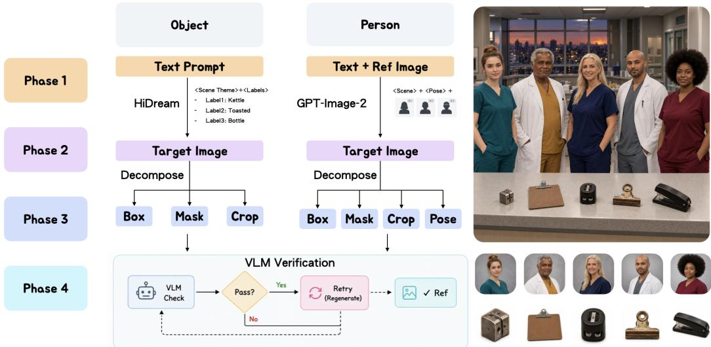  
Figure 6: Schematic of the object and person construction branches. The diagram shows target synthesis, decomposition into boxes, masks, and references (plus person poses), followed by verification. The illustrated images explain the flow; corpus counts and quality limits are specified in Appendix A.1.

## A.3 EVALUATION SETUP AND BASELINES

Models and comparisons. Table 5 summarizes the models used in our evaluation and the source of each comparison.

Published MICo-Bench scores follow each source’s inference settings; they are benchmark comparisons, not controlled inference ablations.

FLUX.2-Klein checkpoints. Throughout the paper, FLUX.2-Klein-9B refers to the FLUX.2 [klein] 9B model family, and the number of sampling steps identifies the checkpoint. Four-step results use the step-distilled FLUX.2-Klein-9B checkpoint, and 50-step results use the undistilled FLUX.2-Klein-Base-9B checkpoint. Both checkpoints share the same architecture and parameter count. This applies to Figure 1, Figure 4, and all latency and speedup comparisons.

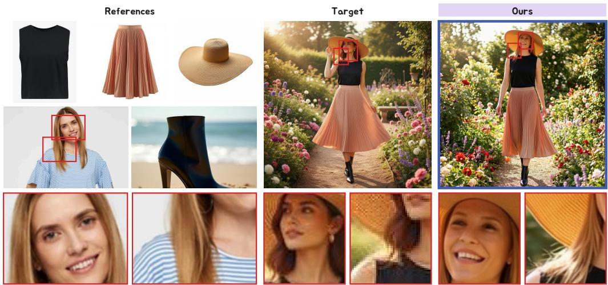  
Figure 7: Stage 1 output. Each reference is encoded as a 16 × 16 grid plus a pixel residual. After Stage 1, the model already preserves facial identity and garment details. Target is the ground-truth image. Bottom: zoomed crops of the red boxes.

Quality evaluation. For our MICo-Bench (N = 897) and ManyRef100 (N = 100) evaluations, Overall Weighted-Ref-VIEScore averages the per-case products:

$$
Q = \frac { 1 } { N } \sum _ { i = 1 } ^ { N } W _ { i } S C _ { i } P Q _ { i } .\tag{5}
$$

The MICo-Bench table also includes externally reported scores, labeled separately in Table 1.   
DINO, ArcFace, mIoU, and RRBA are reported only for the residual-design ablation in Table 3.

Inference cost. The reference-count curves use K = 1, 2, 4, 8, 12, 16 with reference KV caching disabled. Latency is the median of three runs, and peak allocated memory is the maximum over those runs. The OminiControl2 implementation reproduces its reference-branch mechanism on the same backbone with an untrained condition adapter; its measurements compare mechanism cost rather than quality or the full trained system.

## A.4 EFFECT OF STAGE 1 PRETRAINING

Figure 7 shows what the compressor has learned by the end of Stage 1. From compact references, the model reproduces the facial identity of the person reference as well as the skirt pleats, hat brim, and boot shape. Even in the ground-truth target, the face and some details differ from the references, and the training signal is further averaged across references. Stage 1 training preserves these reference details faithfully.

## A.5 PIXEL RESIDUAL COMPRESSOR DETAILS

The pixel residual encoder uses 6 3×3 stride-2 convolutions with GroupNorm and SiLU activations, for a total downsampling factor of $2 ^ { 6 }$ . Its output is aligned with the low-resolution reference grid, flattened, and processed by 2 lightweight spatial self-attention blocks. A zero-initialized linear projection maps the resulting features into the DiT hidden space, where they are added to the projected low-resolution latent features.

## A.6 TRAINING CONFIGURATION

Four-step inference. The recorded EMA36k student is measured at four sampling steps with CFG 1 and reference KV caching disabled. At $K = 1 6 .$ , its total latency is 7.84 s, compared with 111.10 s for the four-step FLUX.2-Klein-9B baseline. This is a cost measurement; it does not establish the student’s generation quality or the latency of the 60k high-K run.

Table 6: Training configuration by stage. Stage 2 uses 40k steps for the main experiments. The high-K variant continues training on RefRoute-Data for 20k additional steps (60k total). Stage 3 follows TBSM [29] for distillation.
<table><tr><td></td><td>Stage 1 (T2I)</td><td>Stage 2 (joint training)</td><td>Stage 3 (distillation)</td></tr><tr><td>Initialized from</td><td>Backbone weights</td><td>Stage 1 compressor + context Trained teacher LoRA</td><td></td></tr><tr><td>Objective</td><td>LFM (text-to-image)</td><td>LFM (multi-ref, routed)</td><td>Distillation following TBSM [29]</td></tr><tr><td>Trainable</td><td>Compressor, LoRA</td><td>context Compressor, context + spatial LoRA adapters LoRA, layout stream</td><td></td></tr><tr><td>LoRA rank / LR</td><td>128/10−4</td><td>128/10−4</td><td>128/10−5</td></tr><tr><td>Training steps Batch / GPUs</td><td>40k</td><td>40k (main); 60k total (high-K)</td><td>20k</td></tr><tr><td>Resolution</td><td>1×4/4</td><td>1×8/8</td><td>1×8/8</td></tr><tr><td></td><td>1024 / 1024</td><td>1024 / 1024</td><td>1024 / 1024</td></tr><tr><td>Reference count K</td><td>1</td><td>1-5</td><td>&gt;5</td></tr></table>

OminiControl2 mechanism comparison. We implement the OminiControl2 reference-branch mechanism [31] on the same backbone, using native-resolution references (4096 tokens per reference). Our representation uses 256 tokens per reference with pixel residuals. The OminiControl2 condition adapter is untrained; compact encoding and cross-step reuse are disabled. The results characterize mechanism cost rather than the complete trained system. Reference-branch topology also differs, so the timing gap is not attributed solely to token count.

## B ADDITIONAL QUALITATIVE RESULTS

## B.1 RESULTS ON MICO-BENCH

Figure 8 shows eight additional MICo-Bench cases. Each case shows the reference images (left) and our output (right); K is the number of references.

  
Figure 8: Additional qualitative results on MICo-Bench.

## B.2 ADDITIONAL MANY-REFERENCE EXAMPLES

Figure 9 shows four additional many-reference compositions with 11 to 14 references. Each case shows the reference images (left) and our output (right).

References  

  
(a) Indoor window: three people, watch · K = 11

References  
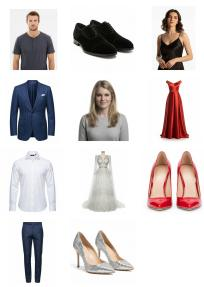  
(b) Fashion runway: suit and two gowns · K = 11

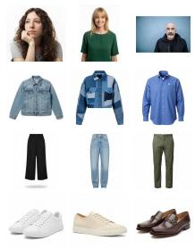

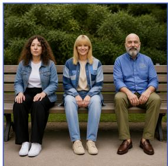  
(c) Park bench: three ful outfits · K = 12

  
(d) Poolside: outfits, jewelry, held drink · K = 14

  
Figure 9: Additional many-reference results with 11 to 14 references.