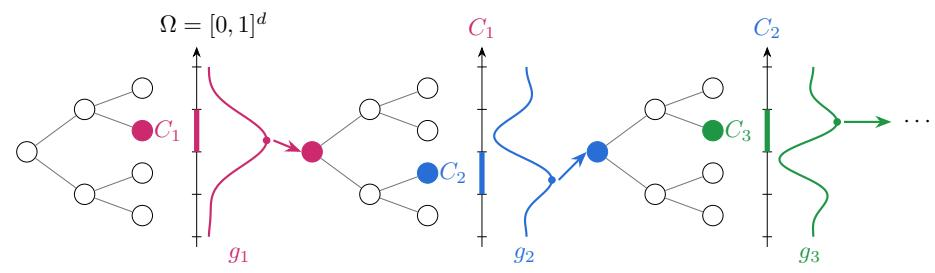
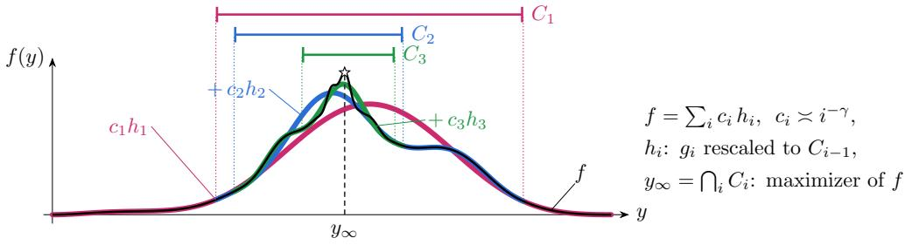

# REINFORCEMENT LEARNING FOR HIERARCHICAL REASONING REWARDS: MINIMAX-OPTIMAL RATES WITH TRANSFORMERS

Naoki Nishikawa

The University of Tokyo, RIKEN AIP nishikawa-naoki259@g.ecc.u-tokyo.ac.jp

Taiji Suzuki The University of Tokyo, RIKEN AIP taiji@mist.i.u-tokyo.ac.jp

## ABSTRACT

Reinforcement learning (RL) has become a standard tool for post-training language models on reasoning tasks, where the policy is updated by reward feedback while exploring the space of responses. Despite its empirical success, theoretical understanding of RL post-training remains limited, in particular of why on-policy exploration combined with a neural reward model is effective. In this paper, we address this question by modeling the reward as a hierarchical function on the response space: the reward consists of infinitely many local components, each of which becomes relevant only after the preceding ones have been resolved. We show that a natural Transformer-based actor–critic algorithm, which alternates between sampling from the current KL-regularized policy, fitting a Transformer critic to the observed rewards, and updating the policy, achieves the minimax optimal rates in the query budget and in the regularization strength up to logarithmic factors, and is minimax optimal for a fixed number of prompts. In contrast, we prove that sampling from the fixed reference distribution, as in offline reward modeling, can limit regret decay to a logarithmic rate. These results show that on-policy exploration progressively zooms in on the region where the reward is concentrated, and quantify its benefit for RL post-training.

## 1 INTRODUCTION

Reinforcement learning (RL) has emerged as a central ingredient in post-training large language models (LLMs) for complex reasoning. Recent systems have demonstrated substantial gains on mathematical reasoning, coding, and other verifiable tasks by optimizing model-generated responses against outcome-based rewards (Shao et al., 2024; Guo et al., 2025; Kimi Team, 2025). In contrast to supervised fine-tuning from a fixed collection of demonstrations, RL post-training repeatedly generates responses from the current policy, scores them with a reward model or verifier, and updates the policy with the resulting feedback. This creates a feedback loop: as the model improves, the distribution of responses from which subsequent training data are collected changes as well.

Despite the empirical success of this paradigm, the statistical role of such adaptive data collection is not yet fully understood. Recent theoretical work has identified several benefits of exploration in LLM reasoning and alignment, through the dynamics of reasoning, the generalization of the learned policy, or the implicit exploration of a KL-regularized policy (Foster et al., 2025; Kim et al., 2025; Wang et al., 2026a;b), and suggests that where the training responses come from can be as important as the learning rule applied to them. Yet a basic statistical question remains open: when and why does adapting the response distribution improve the rate of learning, in particular for the reasoning tasks that have driven recent progress in RL post-training, in which a correct solution must clear several difficult steps in succession?

To study this question, we formulate LLM post-training as KL-regularized reward maximization over a response space and introduce a hierarchical model of reasoning rewards. The motivation is that complex reasoning rarely reveals all of its difficulties at once: only after one hard step has been cleared does it become apparent that another, again nontrivial, problem must be solved next. In a mathematical proof, for example, one may first need to find the right theorem to invoke; only once this is settled does it become clear which transformation is needed to apply it, and only then do the finer algebraic and logical decisions come into view. We model this by a hierarchy of smooth reward components supported on nested regions of the response space, with progressively more localized reward structure appearing closer to optimal responses.

This hierarchical structure creates a sharp statistical distinction between fixed and adaptive response collection. Under the uniform reference distribution, the nested regions carrying deeper reward components occupy exponentially small fractions of the response space, and observations outside a region carry no information about the component inside it: one cannot tell that a deeper step is needed before getting that far. Learning a deep component is therefore a rare-event problem. Onpolicy RL removes this barrier: once a coarse reward component has been learned, the policy shifts its mass toward the corresponding promising region, so that the next batch is collected precisely where the next, finer component becomes visible. Repeating this step progressively localizes the data distribution around high-reward responses.

Contributions. We make this intuition precise through a minimax analysis. Let n denote the total number of reward observations, M the number of prompts, $\rho \geq 0$ the strength of the KL regularization, $\gamma > 1$ the rate at which deeper reward components decay, and α the smoothness of the components in a d-dimensional response embedding space. Our contributions are threefold.

1. Hierarchical reward model and minimax characterization. We introduce the nested hierarchical reward model and characterize the minimax regret over all (adaptive) algorithms. For fixed $M ,$ when the regularization is absent or weak, the minimax rate is $\widetilde { \Theta } \big ( n ^ { - ( \gamma - 1 ) / ( 2 \gamma + 1 ) } \big )$ : the difeficulty is how deep in the hierarchy the learner can explore. In the large-budget regime, the rate is $\widetilde { \Theta } \big ( \rho ( n / n _ { 0 } ) ^ { - 2 \alpha / ( 2 \alpha + d ) } \big )$ with $n _ { 0 } : = { M \rho ^ { - ( 2 + 1 / \gamma ) } }$ : the difficulty is the local nonparametric eestimation of the reward near the optimum. The upper bounds match the lower bounds up to logarithmic factors and a factor polynomial in M, and up to logarithmic factors for fixed M.

2. A minimax-optimal Transformer actor–critic. We give an on-policy actor–critic whose critic is a causal Transformer, refitted at every iteration to fresh on-policy observations, and whose actor is the resulting Gibbs policy. Such a procedure, motivated by standard RL post-training, attains both rates above up to logarithmic factors and is thus minimax optimal for fixed M.

3. A statistical separation from fixed response collection. We establish lower bounds for algorithms whose responses are drawn from the fixed reference distribution $\mu ,$ as in offline reward modeling, while the estimator and the output policy are unrestricted. Because deeper reward components are exponentially rare under fixed sampling, the regret can decay only logarithmically in $n / M$ when the regularization is weak. The benefit of on-policy RL is therefore statistical, not merely an optimization effect of the policy update.

Related work. A first line of work adapts the distribution of tasks or prompts during training: easy-to-hard schedules (Li et al., 2023; Parashar et al., 2026), adaptive prompt selection from the current performance (Rajaraman et al., 2026), and depth- or hint-based curricula (Bu et al., 2026). The last makes RL post-training with outcome-only rewards polynomial instead of exponential on a discrete reasoning tree. There the adaptivity is over prompts or tasks and the intermediate signal is supplied by the curriculum; here the prompt distribution is fixed and the learner adapts only its response distribution, which is possible because the reward is graded rather than outcome-only.

Technically, the closest algorithms are those for continuum-armed bandits, which partition the action space hierarchically and refine it around the maximizer (Kleinberg et al., 2008; Bubeck et al., 2011; Munos, 2011; Valko et al., 2013). We depart from that line in three ways, all motivated by LLM reasoning: the reward is hierarchical, with a new difficulty appearing at every level; the target is a diverse policy, the Gibbs policy at temperature $\rho > 0 .$ , rather than the maximizer alone; and the optimal rates are attained by fitting an LLM-compatible Transformer critic and updating a Gibbs actor, rather than by optimistic tree search. Nishikawa & Suzuki (2026) likewise alternate between updating a policy and refitting a neural reward estimator, but for a non-hierarchical reward with a fully connected estimator that must be smoothed before it drives the policy, and their rate is not matched by a lower bound. Appendix A discusses these two lines in more detail, together with search over reasoning trajectories, on-policy exploration under KL regularization, and neural function approximation in estimation and RL.

  
Figure 1: A hierarchically nested reward (Definition 1), for $d = 1$ and zoom depths $\ell _ { i } = 2$ . (Top) A response is a path in a tree with $2 ^ { d }$ children per node, and a prefix of depth h is a dyadic cube of that depth. The primitive $g _ { 1 }$ lives on $\Omega ;$ ; inside the cell $C _ { 1 }$ around its maximizer, $g _ { 2 }$ is added, rescaled to $C _ { 1 }$ , and so on. (Bottom) The resulting reward $\begin{array} { r } { f = \sum _ { i } c _ { i } h _ { i } \colon } \end{array}$ bumps of decreasing weight $c _ { i } \asymp i ^ { - \gamma }$ and decreasing width accumulate around the maximizer $y _ { \infty } = \cap _ { i } C _ { i }$

## 2 PROBLEM SETTING

We first introduce the class of hierarchically nested rewards. We then formulate RL post-training as KL-regularized maximization of such a reward. Finally, we describe how it can be queried.

## 2.1 HIERARCHICALLY NESTED REWARDS

We consider multi-step reasoning tasks with a hierarchical reward: at first only the coarse structure of the problem is visible, and solving one step reveals a further problem nested inside it. We model this structure by functions on the response embedding space $\dot { \Omega } = [ 0 , 1 ] ^ { d }$ in which a new term is added each time the argument enters a small region around the maximizer of the previous term; how a response of a language model is mapped to a point of Ω is explained in Section 2.2.

Hierarchically nested functions. Let $\mu$ be the uniform distribution on $\Omega , \ \mu ( S )$ being the Lebesgue measure of $S \subset \mathbb { R } ^ { d }$ and 1S its indicator. A dyadic cube of depth $h \geq 0$ is a cube of side $2 ^ { - h }$ of the form $\Pi _ { \scriptscriptstyle { i < d } } [ k _ { j } 2 ^ { \scriptscriptstyle - h } , ( \tilde { k } _ { j } + 1 ) 2 ^ { \scriptscriptstyle - h } )$ with integers $0 \leq k _ { j } < 2 ^ { h }$ , and $D _ { h } ( y )$ is the depth-h dyadic cube containing $y ,$ so that $\Omega = D _ { 0 } ( y ) \supset D _ { 1 } ( y ) \supset \cdot \cdot .$ The idea is that a first function $g _ { 1 }$ is defined on the whole cube; once the argument enters the small dyadic cube around the maximizer of $g _ { 1 }$ , a second function $g _ { 2 }$ is added on that cube (rescaled to Ω), and so on.

Definition 1 (Hierarchically nested function class). Let $\mathcal { G } = ( g _ { i } ) _ { i \geq 1 }$ be a sequence of uniformly bounded functions $g _ { i } : \Omega  \mathbb { R }$ , let $c = ( c _ { i } ) _ { i \geq 1 }$ be positive numbers with $\textstyle \sum _ { i } c _ { i } < \infty$ , and let ${ \ell = ( \ell _ { i } ) _ { i \geq 1 } }$ be positive integers (zoom depths); write $\begin{array} { r } { L _ { i } = \sum _ { a < i } \ell _ { a } , L _ { 0 } = \overline { { 0 } } . } \end{array}$ For each $i ,$ fix a maximizer $z _ { i } ^ { \star } \in \arg \operatorname* { m a x } _ { u \in \Omega } g _ { i } ( u )$ (ties broken by a fixed rule) and let $Q _ { i }$ be the depth- $\mathbf { \nabla } \cdot \boldsymbol { \ell } _ { i }$ dyadic cube containing $z _ { i } ^ { \star }$ . Define the active cells recursively by $C _ { 0 } = \Omega$ and ${ \cal C } _ { i } = b _ { i - 1 } + 2 ^ { - L _ { i - 1 } } Q _ { i }$ of depth $L _ { i } ,$ , where $b _ { i - 1 }$ is the lower-left corner of $C _ { i - 1 }$ , so that $C _ { i - 1 } = b _ { i - 1 } + 2 ^ { - L _ { i - 1 } } \Omega$ . The hierarchically nestedfunction generated by $( \mathcal { G } , c , \ell )$ is

$$
f ( y ) = \sum _ { i = 1 } ^ { \infty } c _ { i } h _ { i } ( y ) , \qquad h _ { i } ( y ) = g _ { i } ^ { 0 } \big ( 2 ^ { L _ { i - 1 } } ( y - b _ { i - 1 } ) \big ) ,\tag{1}
$$

where $g _ { i } ^ { 0 }$ is the extension of $g _ { i }$ by zero to $\mathbb { R } ^ { d }$ , so that $h _ { i }$ is a rescaled copy of $g _ { i }$ on $C _ { i - 1 }$ and vanishes outside. We write $\mathcal { H } ( \mathcal { G } , c , \ell )$ for $f ,$ and for the class of all such functions.

The cells are nested, $\Omega = C _ { 0 } \supset C _ { 1 } \supset \cdot \cdot .$ , and the i-th level $c _ { i } h _ { i }$ is visible only inside $C _ { i - 1 } { \mathrm { : } }$ solving level i (entering $C _ { i } )$ is a prerequisite for collecting the rewards of the deeper levels. Figure 1 illustrates the construction.

We make the following assumption; see Appendix B.1 for α-Holder smoothness.¨

Assumption 2. Let $\alpha > 0 , \lambda > 0 , c _ { \operatorname* { m i n } } \in ( 0 , 1 ) , \gamma > 1$ and integers $1 \leq \ell _ { \star } \leq \bar { \ell } < \infty$ be known constants, and let $c _ { i } = i ^ { - \gamma } / \zeta ( \gamma )$ with $\begin{array} { r } { \zeta ( \gamma ) \doteq \sum _ { i > 1 } i ^ { - \gamma } } \end{array}$ . The function $f = \mathcal { H } ( \mathcal { G } , c , \ell )$ has unknown primitives $\mathcal { G } = ( g _ { i } ) _ { i \geq 1 }$ and unknown zoom depths $\bar { \ell } = ( \ell _ { i } ) _ { i \geq 1 }$ that satisfy the following conditions: (A1) (Smoothness and boundedness) $g _ { 1 } \in [ 0 , 1 ] , g _ { i } \in [ - \overline { { 1 } } , 1 ]$ , and $\mathbf { \Delta } \bar { g _ { i } ^ { 0 } }$ is α-Holder smooth with¨ constant λ for all i. (A2) (Positive maximum) $g _ { i } ( z _ { i } ^ { \star } ) \ge c _ { \mathrm { m i n } }$ for all i. (A3) (Deep enough zoom) $\ell _ { i } \in [ \ell _ { \star } , \bar { \ell } ]$ for all i, and $3 ^ { \gamma } 2 ^ { - \beta \ell _ { \star } } \le \operatorname* { m i n } \{ 1 / 2 , c _ { \mathrm { m i n } } / ( 8 \lambda ) \}$ . (A4) (Zero mean) $\begin{array} { r } { \int _ { \Omega } g _ { i } d \mu = 0 ( i \geq 2 ) } \end{array}$

We collect the structural parameters as $\theta = ( d , \alpha , \lambda , c _ { \operatorname* { m i n } } , \gamma , \ell _ { \star } , \bar { \ell } )$ , and write $\begin{array} { r } { T _ { k } = \sum _ { i > k } c _ { i } \asymp } \end{array}$ $k ^ { - ( \gamma - 1 ) }$ for the weight of the levels deeper than k. Constants such as $C , c$ and those implicit in $a \lesssim b , a \asymp b$ and ${ \widetilde { O } } ( \cdot )$ depend only on θ and the noise level σ of Section 2.3.

Remark. (A1) is a standard smoothness condition. Requiring it of the zero extension $g _ { i } ^ { 0 }$ makes a primitive vanish continuously at the boundary of its cell, so that $f$ is continuous although it has infinitely many levels. (A2) and (A3) guarantee a genuine “correct continuation” at every level: $C _ { i }$ is so small that the variation of the previous levels inside it is dominated by the gain $c _ { \mathrm { m i n } } c _ { i }$ of solving level $i ,$ uniformly in i. (A4) makes the deeper levels cancel when averaged over a cell containing them, so that the average of $f$ over a region (Section 2.3) reveals only the levels that this region has resolved; by analogy with mathematical research, the deeper one digs into a problem, the deeper the results that come into view. Under Assumption $2 , f \in [ - 1 , 1 ]$ and its unique maximizer is the common point $y _ { \infty }$ of the nested cells (Lemma 6).

## 2.2 RL POST-TRAINING AS KL-REGULARIZED REWARD MAXIMIZATION

Let  be the set of prompts and  the set of responses. A policy P specifies, for every prompt x, a conditional distribution $P ( \cdot \mid x )$ over responses; a language model is a policy, and generating a response means sampling from it. The quality of a response is measured by an unknown reward function $f : \mathcal { X } \times \mathcal { Y } \stackrel { - } {  } \bar { \mathbb { R } }$ . Given a reference policy $\pi _ { \mathrm { r e f } }$ , typically the model before post-training, and a regularization strength $\rho \in [ 0 , 1 ]$ , post-training maximizes the KL-regularized objective

$$
J _ { \rho } ( P ; x ) = \mathbb { E } _ { y \sim P ( \cdot \mid x ) } [ f ( x , y ) ] - \rho \mathrm { K L } \left( P ( \cdot \mid x ) \mid \mid \pi _ { \mathrm { r e f } } ( \cdot \mid x ) \right)\tag{2}
$$

over prompts $x \sim \nu ,$ , where $\operatorname { K L } \left( \cdot \parallel \cdot \right)$ is the Kullback–Leibler divergence; this is the objective of KL-regularized post-training such as PPO and GRPO (Ziegler et al., 2019; Ouyang et al., 2022; Schulman et al., 2017; Shao et al., 2024). The performance of a policy is its regret

$$
J _ { \rho } ^ { * } ( x ) : = \operatorname* { s u p } _ { P } J _ { \rho } ( P ; x ) , \qquad \mathcal { R } _ { \rho } ( P ) = \mathbb { E } _ { x \sim \nu } \left[ J _ { \rho } ^ { * } ( x ) - J _ { \rho } ( P ; x ) \right] .\tag{3}
$$

For $\rho = 0$ we have $J _ { 0 } ^ { * } ( x ) = \operatorname* { s u p } _ { y } f ( x , y )$ , so $\mathcal { R } _ { 0 }$ is the unregularized regret. The learner does not know $f$ and can only query a noisy reward oracle a limited number of times (Section 2.3), which is the dominant cost when the reward comes from a verifier or a human.

For simplicity, we take the prompts to be M labels, $\mathscr { X } = [ M ]$ , drawn uniformly, $\nu = \operatorname { U n i f } ( [ M ] )$ and the responses to be infinite binary sequences, $\mathcal { Y } = \{ 0 , \mathrm { { \bar { 1 } } } \} ^ { \{ 0 , 1 , 2 , \dots \} }$ , generated one bit at a time; the reference policy $\pi _ { \mathrm { r e f } }$ generates the bits uniformly at random. Prompts are exogenous: at every round of interaction, a fresh prompt is drawn from ν independently of the past, and the learner cannot choose or reject prompts. The reward functions of different prompts are unrelated, and we write $f ( y ; m )$ for $f ( m , y )$

Embedding of responses. We embed responses into $\Omega = [ 0 , 1 ] ^ { d }$ so that the responses sharing a given prefix form a dyadic cube, and a longer prefix a smaller cube inside it. Concretely, we interleave the bits across the d coordinates in a round-robin fashion: $\phi : \mathcal { V } \to \Omega$ with $\phi _ { j } ( y ) =$ $\begin{array} { r l r } {  { \sum _ { k > 0 } y _ { k d + j - 1 } 2 ^ { - ( k + 1 ) } } } \end{array}$ for $j ~ \in ~ [ d ]$ . A prefix of length dh then corresponds to the dyadic cube $D _ { h } ( \phi ( y ) )$ , and generating bits uniformly corresponds to $\phi ( y ) \sim \mu .$ We identify a response with $\phi ( y )$ and a prefix with a cube, so that a policy is a distribution over Ω. The embedding can be read as part of the language model itself: it places responses that share a long prefix close to each other, so that the reward, as a function on $\Omega ,$ , records how the quality of a response depends on its reasoning prefix. Any embedding whose regions form a family of dyadic cubes would do; the results do not depend on the particular interleaving.

Hierarchically nested rewards of prompts. For every prompt $m \in [ M ]$ the reward is a hierarchically nested function $f ( \cdot ; m ) = \bar { \mathcal { H } } ( \mathcal { G } _ { m } , c , \ell )$ satisfying Assumption 2, with unknown primitives $\mathcal { G } _ { m } = ( g _ { i , m } ) _ { i \geq 1 } ;$ the weights c and the zoom depths ℓ are shared, and we write $C _ { i } ( m ) , h _ { i } ( \cdot ; m )$ $y _ { \infty } ( m )$ for the cells, levels and maximizer of prompt $m ,$ and $\mathcal { F } _ { M , \theta }$ for the resulting class of rewards. Each level is one difficulty of the task: its contribution $c _ { i } \asymp i ^ { - \gamma }$ decays with the depth at which it appears and is collected only once the earlier ones have been resolved. The reward is thus a function of the whole response rather than of a final answer, as in post-training pipelines where a verifier or a generative reward model scores the entire trajectory (Shao et al., 2025; DeepSeek-AI, 2026).

## 2.3 REWARD ORACLE AND LEARNING PROTOCOL

The learner interacts with the environment for n rounds, each of which yields exactly one observation. At round t a prompt $X _ { t } \sim \nu$ arrives, the learner generates a possibly partial response and queries the reward of one prefix, i.e. one dyadic cube $D _ { t }$ containing the response. The oracle returns the average reward over that cube plus noise,

$$
Z _ { t } = Q ( X _ { t } , D _ { t } ) + \xi _ { t } , \qquad Q ( m , D ) : = \mathbb { E } _ { y \sim \mu } [ f ( y ; m ) \mid y \in D ] ,\tag{4}
$$

where, conditionally on the history and on $( X _ { t } , D _ { t } )$ , the noise is mean zero and σ-sub-Gaussian, with σ (or an upper bound on it) known to the learner.

Equivalently, $Q ( m , D )$ is the expected terminal reward of a response with prefix D whose remaining bits are generated by the reference policy, the randomness of the completion being absorbed into the noise. This value can be estimated by Monte Carlo completions, as in methods that derive process supervision from terminal outcomes (Wang et al., 2024; Setlur et al., 2024). By (A3) and (A4), a prefix of depth h resolves at most the first max $\{ 1 , \lceil h / \ell _ { \star } \rceil \}$ levels, and deeper levels do not contribute to $Q ( m , D )$

After the n rounds the learner outputs a policy ${ \widehat { P } } ( \cdot \mid m )$ for every prompt. It knows $\theta$ and $\sigma _ { : }$ , but bneither the primitives, nor the zoom depths, nor the cells, nor the maximizers.

## 3 TRANSFORMER ACTOR–CRITIC ATTAINS THE MINIMAX RATES

In this section, we present an actor–critic algorithm in which the critic is a Transformer trained by empirical risk minimization on the full class and the actor is a KL-regularized (Gibbs) policy, and prove its regret bound.

## 3.1 TRANSFORMER CRITIC

The critic takes a prompt and a prefix and outputs a scalar. Its input is a token sequence $X =$ $( x _ { 1 } , \dots , x _ { T } )$ over the vocabulary $\mathcal { \bar { V } } = [ M ] \cup \{ 0 , \bar { 1 } , \mathrm { S T } 0 \mathrm { P } , \mathrm { P A D } , 0 \mathrm { U T } \}$ : the prompt token $m .$ , the dh bits of the prefix, a STOP token, PAD tokens, and a readout token OUT at the last position, the PAD tokens bringing every input to the same length T. Tokens are represented by one-hot vectors, $X \in \mathbb { R } ^ { | \nu | \times T }$ Following Takakura & Suzuki (2023), the Transformer architecture has three components: (i) a position-wise FNN layer, (ii) a self-attention layer, and (iii) an embedding layer.

(i) An FNN of depth L and width W is $f ( x ) \ : = \ ( A _ { L } \eta ( \cdot ) + b _ { L } ) \circ \cdot \cdot \cdot \circ ( A _ { 1 } x + b _ { 1 } )$ with $A _ { i } \ \in \ \mathbb { R } ^ { d _ { i + 1 } \times d _ { i } } , \ b _ { i } ^ { \cdot } \ \in \ \mathbb { R } ^ { d _ { i + 1 } }$ , maxi $d _ { i } ~ \leq ~ W$ and the ReLU activation $\eta ( x ) \stackrel { \cdot } { = } \operatorname* { m a x } \{ x , \stackrel { \cdot } { 0 } \}$ applied element-wise; $\Psi ( L , W , S , B )$ is the class of such FNNs with maxi $\{ \| \dot { A _ { i } } \| _ { \infty } , \| b _ { i } \| _ { \infty } \} \le \dot { B }$ and $\begin{array} { r } { \sum _ { i < L } \| A _ { i } \| _ { 0 } + \| b _ { i } \| _ { 0 } \overset { . } { \le } S } \end{array}$ . (ii) A causal self-attention layer with embedding dimension D and parameters $K , Q , V \in \mathbb { R } ^ { D \times D }$ maps $X \in \mathbb { R } ^ { D \times T } \mathrm { t o } g ( X ) _ { i } : = x _ { i } + V X _ { 1 : i } \mathrm { S o f t m a x } ( ( K X _ { 1 : i } ) ^ { \top } ( Q x _ { i } ) )$ $\textit { i } \in \ [ T ]$ , where $X _ { 1 : i } ~ = ~ ( x _ { 1 } , . . . , x _ { i } )$ and Softmax $\ : ( z ) \ : \ : = \ : \ : [ e ^ { z _ { j } } / \sum _ { i ^ { \prime } } e ^ { z _ { j ^ { \prime } } } ] _ { j }$ , so that each position attends only to itself and the preceding ones; $\mathcal { A } ( D , B )$ denotes the class of such layers with max $\{ \| K \| _ { \infty } , \| \dot { Q } \| _ { \infty } , \| V \| _ { \infty } \} \le \dot { B }$ . (iii) The embedding layer is En $\dot { \mathbf { \varphi } } _ { P } ( X ) ~ = ~ E X \dot { + } ~ P$ with a learnable $E \in \mathbb { R } ^ { D \times | \mathcal { V } | }$ and the fixed sinusoidal positional encoding $P ~ = ~ [ p _ { t } ] _ { t = 1 } ^ { T } ~ \in ~ \mathbb { R } ^ { D \times T }$ $p _ { t , 2 r } = \sin \left( t / 1 0 0 0 0 ^ { 2 r / D } \right) , p _ { t , 2 r + 1 } = \cos \left( t / 1 0 0 0 0 ^ { 2 r / D } \right)$

Algorithm 1 Transformer actor–critic with prefix-level exploration   
Input: budget $n ,$ prompts M, regularization $\rho ,$ and the schedule of Section 3.2.   
1: Initialize the score $W _ { 0 } \equiv 0 .$   
2: for $h = 0 , 1 , \ldots , H _ { \mathrm { t o t } } - 1$ do   
3: Actor: $P _ { h } ( d y \mid m ) \propto \exp \left( W _ { h } ( m , y ) / \vartheta _ { h } \right) \mu ( d y ) ,$   
i.e., $P _ { h } ( \cdot \mid m ) = \arg$ max $\dot { \cdot } \scriptscriptstyle P \left\{ \mathbb { E } _ { y \sim P } [ \dot { W } _ { h } ( \dot { m , } \dot { y } ) ] - \vartheta _ { h } \mathrm { K L } \left( P \parallel \mu \right) \right\} .$   
4: Collect: for $t = 1 , \ldots , b _ { h } \colon$ receive $X _ { t } \sim \nu ;$ generate $\dot { Y _ { t } } \sim \dot { P _ { h } } ( \cdot \mid X _ { t } )$ prefix by prefix,   
stopping at the prefix $D _ { t } = { \mathsf { Q } } { \mathsf { u e r y } } _ { h } ( X _ { t } , Y _ { t } )$ ; observe $Z _ { t } = Q ( X _ { t } , D _ { t } ) \dot { + } \xi _ { t }$   
5: Critic: $\widehat { T } _ { h } \in$ arg min $\begin{array} { r } { \cdot { \sigma _ { h } } \frac { 1 } { b _ { h } } \sum _ { t = 1 } ^ { b _ { h } } \left[ T ( X _ { t } , D _ { t } ) - Z _ { t } \right] ^ { 2 } , } \end{array}$   
6: Update: $\begin{array} { r } { W _ { h + 1 } = W _ { h } + I _ { h } \cdot \mathrm { c l i p } _ { [ - \Delta _ { h } , \Delta _ { h } ] } \big ( \widehat { T } _ { h } ( \cdot , \mathsf { Q u e r y } _ { h } ( \cdot ) ) - W _ { h } \big ) } \end{array}$ pointwise in $( m , y )$   
with the mask $I _ { h } ( m , y ) \in \{ 0 , 1 \}$ band the clipping width $\Delta _ { h } ( m , y )$   
7: end for   
8: return: $\widehat { P } ( d y \mid m ) \propto \exp { ( W _ { H _ { \mathrm { t o t } } } ( m , y ) / \vartheta _ { H _ { \mathrm { t o t } } } ) \mu ( d y ) } .$

We define the class of Transformers $\mathcal { T } = \mathcal { T } ( N _ { \mathrm { b l k } } , D , L , W , S , B )$ by

$$
\mathcal { T } : = \{ \mathop { \mathrm { c l i p ~ o ~ } } f _ { N _ { \mathrm { b l k } } } \circ g _ { N _ { \mathrm { b l k } } } \circ \cdots \circ f _ { 1 } \circ g _ { 1 } \circ \mathrm { E n c } _ { P } \ \middle | \begin{array} { l } { \| E \| _ { \infty } \leq B , \ g _ { b } \in \mathcal { A } ( D , B ) , } \\ { f _ { b } \in \Psi ( L , W , S , B ) \ ( b \in [ N _ { \mathrm { b l k } } ] ) \} , } \end{array} 
$$

where $N _ { \mathrm { b l k } }$ is the number of blocks (the depth of the Transformer; a block consists of a self-attention layer $g _ { b }$ followed by an FNN layer $f _ { b } ) _ { }$ , the FNNs are applied column-wise, the last FNN $f _ { N _ { \mathrm { b l k } } }$ has a one-dimensional output, and clip $= \mathrm { c l i p } _ { [ - 1 , 1 ] }$ is applied element-wise. A network $F \in { \vec { \tau } }$ thus maps an input sequence to a sequence of scalars in [ 1, 1], and the critic’s prediction is the entry at the readout position, $F ( X ) _ { T } ;$ we identify $F$ with this scalar function. The class is that of Takakura & Suzuki (2023), with causal attention in place of sliding-window attention, a single head, and the output read at the last position.

## 3.2 ALGORITHM

Algorithm 1 is an on-policy actor–critic of the kind used in RL post-training. It maintains a score $W _ { h } ( m , y )$ , the current estimate of the reward, and an actor $P _ { h } ,$ , the Gibbs policy of that score at a temperature $\vartheta _ { h } ;$ since the score is piecewise constant on dyadic cubes, the actor is sampled autoregressively, the probability of the next d bits being the ratio of the Gibbs masses of the children. Each iteration collects a fresh batch of on-policy responses and queries their rewards, fits the critic to them, and updates the actor. Every decision about a sample is a function of its own prefix, the shared critics and the shared rules. What distinguishes the algorithm from a vanilla actor–critic is the choice of the queried prefix.

Depth curriculum and adaptive resolution. Level i of the reward is visible only inside $C _ { i - 1 } ( m )$ so the learner has to zoom in along the correct path, while deep bits of a response that is already wrong at a shallow level carry no information (A4). Algorithm 1 therefore uses a depth curriculum: at iteration h the actor’s confidence is judged at depth $h ,$ which increases by one per iteration, and a response that is confident down to that depth is queried $\ell _ { \mathrm { l o o k } }$ depths deeper, the lookahead. Training on reasoning of increasing length or difficulty is standard practice in RL post-training (Luo et al., 2025; Kimi Team, 2025) and an instance of curriculum learning (Bengio et al., 2009). The critic is a process reward model, trained on prefixes of all depths (Lightman et al., 2024; Wang et al., 2024), which allows a response to be stopped early and queried at a coarse prefix whenever the actor is not confident about it (adaptive resolution). The query rule is

$$
\mathsf { Q u e r y } _ { h } ( m , y ) = \left\{ \begin{array} { l l } { D _ { k } ( y ) } & { \mathrm { a t ~ t h e ~ f i r s t ~ d e p t h ~ } 1 \leq k \leq h \mathrm { ~ w i t h ~ } P _ { h } ( D _ { k } ( y ) \mid m ) < \kappa _ { 0 } , } \\ { D _ { h + \ell _ { \mathrm { l o o k } } } ( y ) } & { \mathrm { i f ~ t h e r e ~ i s ~ n o ~ s u c h ~ d e p t h } , } \end{array} \right.\tag{5}
$$

with a constant threshold $\kappa _ { 0 } > 0 :$ generation stops at the first prefix whose actor mass falls below $\kappa _ { 0 }$ and that prefix is queried; if none does, the response is extended and queried $\ell _ { \mathrm { l o o k } }$ levels deeper. The rule uses only the probability that the current actor assigns to a prefix, which an autoregressive model already computes while generating it. The lookahead is $\ell _ { \mathrm { l o o k } } = 1$ in the small-regularization setting, where the iterations simply continue as long as the budget allows and the output is the last actor, and $\ell _ { \mathrm { l o o k } } = R + 1$ with $\overset { \cdot } { R } \overset { \cdot } { = } O ( \log \mathcal { L } )$ and $\bar { \mathcal { L } } : = \log \left( e + \bar { n } + M + \rho ^ { - 1 } \right)$ in the large-budget setting, where they are followed by the step described next.

Training the critic. The critic $\widehat { T } _ { h }$ is the least-squares fit over the entire class $\mathcal { T } _ { h }$ to all records of the bbatch, including those of the responses that stopped early; all parameters are fitted, and no quantity is computed or memorized per cube. Its risk is controlled by the approximation power and the covering number of $\mathcal { T } _ { h }$ , as in the nonparametric analysis of least squares over deep network classes (Schmidt-Hieber, 2020; Takakura & Suzuki, 2023). The batch of iteration $h$ has size $b _ { h } \asymp M ^ { \zeta _ { M } } c _ { h + \ell _ { \mathrm { l o o k } } } ^ { - 2 }$ up to logarithms, with $\zeta _ { M } : = 2 + d / ( 2 \alpha )$ : an iteration must reach the accuracy $c _ { h + \ell _ { \mathrm { l o o k } } }$ of the level it queries (the schedules are given in Appendices C.1 and D.1).

Actor update. Two devices standard in RL post-training are used in the update. In the front phase, the score is replaced only on the cubes of actor mass at least $\kappa _ { 0 }$ , where the critic has just been trained on fresh on-policy data, and the mask $I _ { h } ( m , y ) = \mathbb { 1 } _ { P _ { h } ( D _ { h } ( y ) | m ) \geq \kappa _ { 0 } }$ keeps the old score elsewhere: this is a trust region in the spirit of TRPO and PPO (Schulman et al., 2015; 2017). In the front phase no clipping is needed, $\Delta _ { h } \equiv 2 ;$ the final update is clipped, as in PPO, since a Gibbs policy at temperature $\rho$ amplifies an overestimate of the score exponentially.

Final refinement step (large budgets only). After $H \asymp \rho ^ { - 1 / \gamma } + \log ( n / \rho )$ exploration iterations the actor has resolved as many levels as $\rho$ can distinguish, and the remaining budget $b _ { H } = n -$ $\sum _ { h < H } b _ { h }$ is spent on one last iteration, which samples at temperature $\rho ,$ sets $I _ { H } \equiv 1$ , and uses

$$
\mathsf { Q u e r y } _ { H } ( m , y ) = D _ { q ( m , y ) + \ell _ { \mathrm { l o o k } } + r } ( y ) , \qquad \Delta _ { H } ( m , y ) = \rho + \eta c _ { 1 + \lfloor q ( m , y ) / \bar { \ell } \rfloor } ,\tag{6}
$$

where $q ( m , y )$ is the last exploration iteration at which the region of y was updated, r is a refinement depth and η is a structural constant. Querying r levels deeper than the last update balances approximation against estimation: the reward is Holder in the local coordinates of each shell¨ $C _ { a - 1 } \backslash \bar { C } _ { a } ,$ so a finer query buys a better fit until the estimation error takes over.

## 3.3 REGRET UPPER BOUND

We give two upper bounds, one for each regime of $\rho ,$ proved in Appendices C and D.

Theorem 3. Suppose that $f \in \mathcal { F } _ { M , \theta } ,$ , that the noise is conditionally σ-sub-Gaussian, that $\rho \in$ [0, 1] and that $n \ge M ^ { \zeta _ { M } }$ with $\zeta _ { M } = 2 + d / ( 2 \alpha )$ . Run Algorithm 1 with the hyperparameters of Appendix D.1 in the first case below and of Appendix C.1 in the second; in both cases it uses at most n queries, and its output satisfies, for a fixed exponent $c _ { \mathrm { l o g } } > 0$ and with $\widetilde O$ hiding logarithmic factors,

$$
\begin{array} { r } { \mathbb { E } \Big [ \mathcal { R } _ { \rho } ( \widehat { P } ) \Big ] \leq \left\{ \begin{array} { l l } { \widetilde { O } \Big ( \big ( n / M ^ { \zeta _ { M } } \big ) ^ { - \frac { \gamma - 1 } { 2 \gamma + 1 } } \Big ) } & { i f \rho = 0 o r \rho \lesssim ( n / M ) ^ { - \frac { \gamma } { 2 \gamma + 1 } } , } \\ { \widetilde { O } \Big ( \rho \big ( n \rho ^ { 2 + 1 / \gamma } / M \big ) ^ { - \frac { 2 \alpha } { 2 \alpha + d } } \Big ) } & { i f \rho \gtrsim \big ( n / M ^ { \zeta _ { M } } \big ) ^ { - \frac { \gamma } { 2 \gamma + 1 } } \mathcal { L } ^ { c _ { \mathrm { l o g } } } , } \end{array} \right. } \end{array}\tag{7}
$$

Theorem 3 leaves a band between its two cases, namely $( n / M ) ^ { - \gamma / ( 2 \gamma + 1 ) } \quad \lesssim \quad \rho \quad \lesssim$ $( n / M ^ { \zeta _ { M } } ) ^ { - \gamma / ( 2 \gamma + 1 ) } \mathcal { L } ^ { c _ { \mathrm { l o g } } }$ , in which the algorithm is well defined but we prove no guarantee. Up to logarithmic factors, the gap between the two thresholds is the price of using a single critic for all prompts: the guaranteed depth is $( n / M ^ { \zeta _ { M } } ) ^ { 1 / ( 2 \gamma + 1 ) }$ rather than $( n / M ) ^ { 1 / ( 2 \gamma + 1 ) }$ , since estimation theory bounds the $L ^ { 2 }$ error under the joint query law, not the error on every prefix that a prompt updates (Lemma 23). For a fixed number of prompts the gap is only polylogarithmic, and outside the band both rates are the minimax rates of Section 4 up to logarithmic factors.

Proof sketch. We sketch the proofs through the three inequalities that produce the two rates.

First, the actor keeps exploring the correct path. The two facts support each other by induction on h. If the score is accurate on each cube at the scale of the depth at which that cube was created, then the reward gap between the correct cube of depth h and any cube that left the path exceeds the errors made so far, and the Gibbs actor satisfies $\dot { P _ { h } } ( D _ { h } ( y _ { \infty } ( \dot { m } ) ) \mid m ) \ge p _ { * } > \dot { 0 }$ uniformly in h and in the reward (Lemma 12). The correct cube is therefore refined at every iteration, and the fresh batch drawn there restores the accuracy one level deeper; this is what keeps the queries concentrated where the next level is visible, and the same computation shows that the mass leaving the path $j$ levels earlier decays like $e ^ { - c j }$ , so the queried prefixes stay in a window of logarithmic length and the critic only has to approximate finitely many Holder functions there.¨

Second, the depth reached is fixed by the budget. Resolving level i requires an accuracy $\asymp c _ { i } \asymp i ^ { - \gamma }$ on a cube average, so the batches needed to reach depth H satisfy

$$
\sum _ { h < H } b _ { h } \asymp M ^ { \zeta _ { M } } \sum _ { h < H } c _ { h } ^ { - 2 } \asymp M ^ { \zeta _ { M } } H ^ { 2 \gamma + 1 } \leq n ,\tag{8}
$$

up to logarithms, the power $\zeta _ { M }$ being the price of converting the risk of the shared critic into accuracy at each updated prefix. In the small-regularization case this is the whole argument: the output is the last actor, uniform on cubes of depth H, its regret is the weight $T _ { H } \asymp H ^ { - ( \gamma - 1 ) }$ of the unresolved levels, and (8) gives $H \asymp ( n / M ^ { \zeta _ { M } } ) ^ { \bar { 1 } / ( 2 \gamma + 1 ) }$ , hence the first exponent of $( 7 )$ . The regularization only adds the penalty ρ dH log 2, which stays below $T _ { H }$ in the first case.

Third, in the large-budget case the score has to be turned into a regret bound. A Gibbs policy at temperature $\rho$ cannot distinguish levels of weight below $\rho ,$ i.e. levels deeper than $K \stackrel { \bar { } } { \ } \asymp \rho ^ { - \bar { 1 } / \gamma }$ reaching that depth costs $M ^ { \zeta _ { M } } \rho ^ { - ( 2 + 1 / \gamma ) }$ queries by (8), up to logarithms. What remains is the fine shape of the reward around the correct path, which the last iteration estimates with one more critic. The regret is an integral of variances under the interpolated Gibbs policies. Pointwise accuracy of the held score, clipping and exponential-moment control bound their density ratios relative to the collecting policy, giving schematically

$$
\mathbb { E } \big [ \mathcal { R } _ { \rho } ( \widehat { P } ) \big ] \lesssim \rho ^ { - 1 } \big [ ( \mathrm { c r i t i c ~ e r r o r } ) + ( \mathrm { p r o j e c t i o n ~ e r r o r } ) \big ] + ( \mathrm { d e e p - c o r e ~ a n d ~ f a i l u r e ~ e r r o r s } )\tag{9}
$$

b(Proposition 24). Here the projection error is the squared error from replacing the reward by its cube averages; the core and failure terms are lower order. Since the reward is α-Holder in¨ d local coordinates on each shell, the squared error obeys the nonparametric tradeoff, and balancing it against (8) gives the second case of (7).

## 4 MINIMAX LOWER BOUND

We now show that the rates of Theorem 3 cannot be improved by any algorithm, including algorithms that select prefixes adaptively without any restriction on computation, memory, or the use of past data. Let $\mathcal { N } _ { \sigma }$ be the class of noise distributions that are conditionally mean zero and σ-sub-Gaussian as in Section 2.3, and define the minimax regret

$$
\begin{array} { r } { R ^ { * } ( n , M , \rho ) : = \operatorname* { i n f } _ { A } \operatorname* { s u p } _ { f \in { \mathcal { F } _ { M , \theta } , N \in \mathcal { N } _ { \sigma } } } \mathbb { E } _ { f , N , A } \big [ \mathcal { R } _ { \rho } ( \widehat { P } _ { A } ) \big ] , } \end{array}\tag{10}
$$

bwhere the infimum is over all learning algorithms that use at most n queries in the protocol of Section 2.3.

Theorem 4. Fix $\sigma > 0 _ { : }$ , suppose that $\lambda \geq \Lambda _ { \alpha , d }$ and let $\rho \in [ 0 , 1 ] .$ . For all $M \geq 1$ and $n \geq M$

$$
R ^ { * } ( n , M , \rho ) \gtrsim \left\{ \begin{array} { l l } { ( n / M ) ^ { - \frac { \gamma - 1 } { 2 \gamma + 1 } } } & { i f \rho = 0 o r \rho \lesssim ( n / M ) ^ { - \frac { \gamma } { 2 \gamma + 1 } } , } \\ { \rho \operatorname* { m i n } \Big \{ 1 , \big ( n \rho ^ { 2 + 1 / \gamma } / M \big ) ^ { - \frac { 2 \alpha } { 2 \alpha + d } } \Big \} } & { f o r e \nu e r y \rho > 0 , } \end{array} \right.\tag{11}
$$

The proof is given in Appendix E. The condition $\lambda \geq \Lambda _ { \alpha , d }$ only ensures that the class $\mathcal { F } _ { M , \theta }$ is rich enough to contain the hard instances, with the sufficient constant $\Lambda _ { \alpha , d }$ defined in (86) for a bump of amplitude one and radius $1 / 8 ;$ the bounds hold even if the zoom depths $\ell _ { i } \equiv \ell _ { \star }$ are revealed to the learner.

The table below compares Theorems 3 and 4 regime by regime; all entries are up to polylogarithmic factors. The first cases of (7) and (11) hold under the same condition on $\rho ,$ and the second case of (11) holds for every $\rho > 0$ . In both regimes the two columns agree in the budget n and in the regularization $\rho ,$ and for a fixed number of prompts they agree completely: there the algorithm is minimax optimal up to logarithmic factors. Since the lower bounds hold for every algorithm, no amount of computation or memory can improve on our on-policy scheme by more than logarithmic factors. Apart from logarithmic factors, the two columns differ only through M, in the rate when the regularization is small and in the range of $\rho$ when the budget is large; both differences come from converting the joint $L ^ { 2 }$ error of the shared critic into accuracy at every updated prefix, which makes the cost of reaching depth H in (8) grow as $M ^ { \zeta _ { M } }$ rather than M in the number of prompts.

<table><tr><td></td><td>Lower bound (Theorem 4) Algorithm 1 (Theorem 3)</td><td></td></tr><tr><td>Small regularization</td><td> $\overset { } { ( n / M ) } ^ { - \frac { \gamma - 1 } { 2 \gamma + 1 } }$ </td><td> $\overline { { ( n / M ^ { \zeta _ { M } } ) } } ^ { - \frac { \gamma - 1 } { 2 \gamma + 1 } }$ </td></tr><tr><td>Large budget</td><td> $\rho \big ( n \rho ^ { 2 + 1 / \gamma } / { M } \big ) ^ { - \frac { 2 \alpha } { 2 \alpha + d } }$ </td><td> $\dot { \rho } \big ( n \rho ^ { 2 + 1 / \gamma } / M \big ) ^ { - \frac { 2 \alpha } { 2 \alpha + d } }$ </td></tr></table>

Remark (the two bottlenecks). The two bounds describe two different obstructions. Small regularization: the budget. The budget runs out before the levels of weight $c _ { i } > \rho$ are resolved, so the regret is dominated by the weight of the unresolved levels and neither α nor d appears. The bound is the same for $\rho = 0$ and for every $\rho \lesssim ( n / M ) ^ { - \gamma / ( 2 \gamma + 1 ) }$ ), because in that range the regularization changes the optimal value only by $O ( \rho ^ { 1 - 1 / \gamma } )$ , a small fraction of $( n / M ) ^ { - ( \gamma - 1 ) / ( 2 \gamma + 1 ) }$ . Large budget: the regularization. The correct path can be resolved down to the last level of weight $c _ { i } > \rho ,$ at depth $\rho ^ { - 1 \bar { / } \gamma }$ , and what is left is to estimate the fine shape of the reward around it. The second bound holds for every $\rho > 0$ , and the first, where it applies, is the larger one.

## 5 LOWER BOUND FOR FIXED-DISTRIBUTION SAMPLING: THE BENEFIT OF ON-POLICY EXPLORATION

The algorithm of Section 3 is on-policy: the responses whose rewards are queried are generated by the current actor. A common alternative in reward modeling is to collect responses from a fixed base distribution and to fit the reward model offline. In this section, we show that this restriction is costly in the hierarchical setting. Let ${ \mathcal { A } } _ { \mathrm { u n i f } }$ be the class of algorithms that, at every round t, generate the response $Y _ { t } \sim \mu$ uniformly at random (independently of the past), may choose the depth of the queried prefix $D _ { t } \ni Y _ { t }$ after seeing $( X _ { t } , Y _ { t } )$ and the history, and output an arbitrary policy $\widehat { P }$ at the bend. The only restriction is the sampling distribution: the estimator, the choice of the query depth and the final policy are unrestricted, and past data may be reused freely. Let $R _ { \mathrm { u n i f } } ^ { * } ( n , M , \rho )$ be the minimax regret (10) with the infimum restricted to ${ \mathcal { A } } _ { \mathrm { u n i f } }$

Theorem 5 (The price of fixed sampling). Suppose that $\sigma > 0$ and $\lambda \geq \Lambda _ { \alpha , d } .$ . There are constants $\rho _ { 0 } , c _ { 0 } > 0$ such that, for all $n \geq M \geq 1$

$$
R _ { \operatorname* { m i f } } ^ { * } ( n , M , \rho ) \gtrsim \left\{ \begin{array} { l l } { \big ( \log \frac { e n } { M } \big ) ^ { - ( \gamma - 1 ) } } & { i f \rho \lesssim \big ( \log \frac { e n } { M } \big ) ^ { - \gamma } , } \\ { \rho \operatorname* { m i n } \bigg \{ 1 , \Big ( n \rho ^ { 2 + 1 / \gamma } e ^ { - c _ { 0 } \rho ^ { - 1 / \gamma } } / M \Big ) ^ { - \frac { 2 \alpha } { 2 \alpha + d } } \bigg \} } & { i f \rho \in ( 0 , \rho _ { 0 } ] . } \end{array} \right.\tag{12}
$$

The first bound holds for every $\sigma \geq 0 ,$ , that is, evenfor a noiseless oracle.

The proofs are given in Appendix F. The two bounds describe two budget regimes. While $\rho \stackrel { < } { \sim }$ $( \log ( e n / M ) ) ^ { - \gamma }$ , the regret of any fixed-sampling method decays at most logarithmically in $n / M .$ whereas in the large-budget regime of Theorem $^ { 3 , }$ , the on-policy actor–critic achieves a polynomial rate; the two conditions are compatible for small $\rho .$ For larger budgets the fixed-sampling regret does decay polynomially, but it reaches that same rate only with the multiplicative price $\exp \big ( c _ { 0 } \rho ^ { - 1 / \gamma } \big )$ , whereas the on-policy bound depends on $\rho ^ { - 1 }$ polynomially. Two complements are proved there: for a fixed $\rho > 0$ and $n  \infty$ the exponent of n is not worsened by fixed sampling (Proposition 40); and the first bound is tight in its regime (Proposition 39).

Why on-policy sampling escapes. Once the actor has learned that a prefix is promising it generates responses from that prefix, so the cell of the next level is visited with constant probability rather than with probability $\phantom { 0 } \mathrm { { ( 2 ^ { - } } } d \ell _ { \star } k$ . Each iteration of Algorithm 1 then resolves one level at a cost of $c _ { k } ^ { - 2 } \asymp k ^ { 2 \gamma }$ queries instead of $2 ^ { d \ell _ { \star } k }$ , which is the statistical benefit of RL post-training over offline reward modeling in this setting.

## 6 CONCLUSION

We studied RL post-training with hierarchical rewards, in which the reward of a binary response is a sum of infinitely many Holder primitives revealed level by level. A Transformer actor–critic of the¨ standard form, alternating on-policy sampling from a KL-regularized policy, least-squares training of a shared Transformer critic and a Gibbs policy update, matches the minimax rates in the budget and in the regularization up to logarithmic factors, and is minimax optimal for a fixed number of prompts. The analysis identifies the role of each component: the prefix mass of the current policy selects where to query, the temperature schedule keeps the correct path confident, the full-class ERM adapts to the unknown cells, and a calibrated, clipped final update transfers the estimation error to the regret. Any method that keeps sampling from the fixed reference distribution $\mu ,$ in contrast, suffers a logarithmic rate or an exponential price in $\rho ^ { - 1 / \gamma }$ , which quantifies the benefit of on-policy exploration.

Limitations and future work. Our upper bounds are not optimal in the number of prompts M, for the reason given in Section 4; removing the extra factor, for instance through a prompt-wise estimation guarantee or an analysis of the exploration in expectation over the prompts, is left open. The two upper bounds are also separated by the band described after Theorem 3, where the same algorithm is well defined but we prove no guarantee, and the two parameter settings differ in the lookahead and in the presence of the refinement step. We assumed exact ERM and exact Gibbs sampling; the optimization remains to be analyzed. An empirical study of the prefix-mass exploration rule on synthetic hierarchical rewards and reasoning benchmarks is left for future work.

## ACKNOWLEDGMENTS

NN was partially supported by JST ACT-X (JPMJAX24CK) and JST BOOST (JPMJBS2418). TS was partially supported by JST CREST (JPMJCR2115) and JSPS KAKENHI (24K02905). This work was partially supported by JST ERATO (JPMJER2601). This research is supported by the National Research Foundation, Singapore and the Ministry of Digital Development and Information under the AI Visiting Professorship Programme (award number AIVP-2024-004). Any opinions, findings and conclusions or recommendations expressed in this material are those of the author(s) and do not reflect the views of National Research Foundation, Singapore and the Ministry of Digital Development and Information.

## AI USE STATEMENT

In this work, generative AI tools assisted with developing the theoretical model and formulating mathematical claims, provided key ingredients for proofs, and assisted with revising mathematical statements, developing and checking proof arguments, and drafting and editing proofs. Additionally, we used generative AI tools for drafting and revising parts of the manuscript, for the code that generates the figure, and for identifying and formatting references. We have reviewed all AI-assisted work. Every theorem, lemma and proof was verified by the authors, and all AI-drafted text was revised by them. We take responsibility for the final content of this work, including text, claims or artifacts produced with the aid of generative AI.

## REFERENCES

Yoshua Bengio, Jer´ ome Louradour, Ronan Collobert, and Jason Weston. Curriculum learning. Inˆ International Conference on Machine Learning, pp. 41–48, 2009.

Stephane Boucheron, G ´ abor Lugosi, and Pascal Massart. ´ Concentration Inequalities: A Nonasymptotic Theory ofIndependence. Oxford University Press, 2013.

Dake Bu, Wei Huang, Andi Han, Atsushi Nitanda, Hau-San Wong, Qingfu Zhang, and Taiji Suzuki. Provable Sample Efficiency of Curriculum Post-Training for Transformer Reasoning. In International Conference on Machine Learning, 2026.

Sebastien Bubeck, R ´ emi Munos, Gilles Stoltz, and Csaba Szepesv ´ ari. X-armed bandits. ´ Journal of Machine Learning Research, 12:1655–1695, 2011.

DeepSeek-AI. DeepSeek-V4: Towards highly efficient million-token context intelligence. arXiv preprint arXiv:2606.19348, 2026.

Jianqing Fan, Zhaoran Wang, Yuchen Xie, and Zhuoran Yang. A theoretical analysis of deep Qlearning. In Proceedings of the 2nd Conference on Learning for Dynamics and Control, volume 120 of Proceedings ofMachine Learning Research, pp. 486–489. PMLR, 2020.

Dylan J Foster, Zakaria Mhammedi, and Dhruv Rohatgi. Is a good foundation necessary for efficient reinforcement learning? the computational role of the base model in exploration. In The Thirty Eighth Annual Conference on Learning Theory, pp. 2026–2142. PMLR, 2025.

Daya Guo, Dejian Yang, Haowei Zhang, Junxiao Song, Ruoyu Zhang, Runxin Xu, Qihao Zhu, Shirong Ma, Peiyi Wang, Xiao Bi, et al. DeepSeek-R1: Incentivizing reasoning capability in LLMs via reinforcement learning. arXiv preprint arXiv:2501.12948v1, 2025. URL https: //arxiv.org/html/2501.12948v1.

Satoshi Hayakawa and Taiji Suzuki. On the minimax optimality and superiority of deep neural network learning over sparse parameter spaces. Neural Networks, 123:343–361, 2020.

Juno Kim, Denny Wu, Jason D Lee, and Taiji Suzuki. Metastable dynamics of chain-of-thought reasoning: Provable benefits of search, RL and distillation. In International Conference on Machine Learning, 2025.

Kimi Team. Kimi k1.5: Scaling reinforcement learning with LLMs. arXiv preprint arXiv:2501.12599, 2025.

Robert Kleinberg, Aleksandrs Slivkins, and Eli Upfal. Multi-armed bandits in metric spaces. In Proceedings ofthe 40th Annual ACM Symposium on Theory ofComputing, pp. 681–690, 2008.

Qiyang Li, Yuexiang Zhai, Yi Ma, and Sergey Levine. Understanding the complexity gains of singletask RL with a curriculum. In Proceedings of the 40th International Conference on Machine Learning, volume 202 of Proceedings ofMachine Learning Research. PMLR, 2023.

Hunter Lightman, Vineet Kosaraju, Yuri Burda, Harrison Edwards, Bowen Baker, Teddy Lee, Jan Leike, John Schulman, Ilya Sutskever, and Karl Cobbe. Let’s verify step by step. In International Conference on Learning Representations, 2024.

Michael Luo, Sijun Tan, Justin Wong, Xiaoxiang Shi, William Y. Tang, Manan Roongta, Colin Cai, Jeffrey Luo, Li Erran Li, Raluca Ada Popa, and Ion Stoica. DeepScaleR: Surpassing O1-preview with a 1.5B model by scaling RL. Notion blog post, 2025. URL https://pretty-radiob75.notion.site/DeepScaleR-Surpassing-O1-Preview-with-a-1-5B-Model-by-Scaling-RL-19681902c1468005bed8ca303013a4e2.

Remi Munos. Optimistic optimization of a deterministic function without the knowledge of its´ smoothness. In Advances in Neural Information Processing Systems, volume 24, 2011.

Naoki Nishikawa and Taiji Suzuki. Inference-time alignment with rewards in Besov spaces: Provable advantages of feature learning and multi-step policy updates. In International Conference on Machine Learning, 2026.

Long Ouyang, Jeff Wu, Xu Jiang, Diogo Almeida, Carroll L. Wainwright, Pamela Mishkin, Chong Zhang, Sandhini Agarwal, Katarina Slama, Alex Ray, John Schulman, Jacob Hilton, Fraser Kel ton, Luke Miller, Maddie Simens, Amanda Askell, Peter Welinder, Paul Christiano, Jan Leike, and Ryan Lowe. Training language models to follow instructions with human feedback. In Advances in Neural Information Processing Systems, volume 35, 2022.

Shubham Parashar, Shurui Gui, Xiner Li, Hongyi Ling, Sushil Vemuri, Blake Olson, Eric Li, Yu Zhang, James Caverlee, Dileep Kalathil, and Shuiwang Ji. Curriculum reinforcement learning from easy to hard tasks improves LLM reasoning. In International Conference on Learning Representations, 2026.

Nived Rajaraman, Audrey Huang, Miro Dudik, Rob Schapire, Dylan Foster, and Akshay Krishnamurthy. Learning to reason with curriculum I: Provable benefits of autocurriculum. In Proceedings of Thirty Ninth Conference on Learning Theory, volume 336 of Proceedings of Machine Learning Research, pp. 5518–5555. PMLR, 2026. URL https://proceedings.mlr. press/v336/rajaraman26a.html.

Johannes Schmidt-Hieber. Nonparametric regression using deep neural networks with ReLU activation function. The Annals ofStatistics, 48(4):1875–1897, 2020.

John Schulman, Sergey Levine, Pieter Abbeel, Michael Jordan, and Philipp Moritz. Trust region policy optimization. In International Conference on Machine Learning, pp. 1889–1897, 2015.

John Schulman, Filip Wolski, Prafulla Dhariwal, Alec Radford, and Oleg Klimov. Proximal policy optimization algorithms. arXiv preprint arXiv:1707.06347, 2017.

Amrith Setlur, Chirag Nagpal, Adam Fisch, Xinyang Geng, Jacob Eisenstein, Rishabh Agarwal, Alekh Agarwal, Jonathan Berant, and Aviral Kumar. Rewarding progress: Scaling automated process verifiers for LLM reasoning. arXiv preprint arXiv:2410.08146, 2024.

Zhihong Shao, Peiyi Wang, Qihao Zhu, Runxin Xu, Junxiao Song, Xiao Bi, Haowei Zhang, Mingchuan Zhang, Y. K. Li, Y. Wu, and Daya Guo. DeepSeekMath: Pushing the limits of mathematical reasoning in open language models. arXiv preprint arXiv:2402.03300, 2024.

Zhihong Shao, Yuxiang Luo, Chengda Lu, Z. Z. Ren, Jiewen Hu, Tian Ye, Zhibin Gou, Shirong Ma, and Xiaokang Zhang. DeepSeekMath-V2: Towards self-verifiable mathematical reasoning. arXiv preprint arXiv:2511.22570, 2025.

Taiji Suzuki. Adaptivity of deep ReLU network for learning in Besov and mixed smooth Besov spaces: Optimal rate and curse of dimensionality. In International Conference on Learning Representations, 2019.

Shokichi Takakura and Taiji Suzuki. Approximation and estimation ability of transformers for sequence-to-sequence functions with infinite dimensional input. In Proceedings of the 40th International Conference on Machine Learning, volume 202 of Proceedings ofMachine Learning Research, pp. 33416–33447. PMLR, 2023.

Alexandre B Tsybakov. Introduction to Nonparametric Estimation. Springer, 2008.

Michal Valko, Alexandra Carpentier, and Remi Munos. Stochastic simultaneous optimistic opti- ´ mization. In Proceedings ofthe 30th International Conference on Machine Learning, volume 28 of Proceedings ofMachine Learning Research, pp. 19–27. PMLR, 2013.

Peiyi Wang, Lei Li, Zhihong Shao, Runxin Xu, Damai Dai, Yifei Li, Deli Chen, Yu Wu, and Zhifang Sui. Math-Shepherd: Verify and reinforce LLMs step-by-step without human annotations. In Proceedings of the 62nd Annual Meeting of the Association for Computational Linguistics (Volume 1: Long Papers), pp. 9426–9439, 2024.

Siwei Wang, Yifei Shen, Haoran Sun, Shi Feng, Shang-Hua Teng, Li Dong, Yaru Hao, and Wei Chen. Benefits and pitfalls of reinforcement learning for language model planning: A theoretical perspective. In International Conference on Learning Representations, 2026a.

Zichen Wang, Haoyang Hong, and Huazheng Wang. When greedy sampling explores: KL-regularized contextual bandits without eluder-dimension dependence. arXiv preprint arXiv:2609.13564, 2026b.

Wei Xiong, Hanze Dong, Chenlu Ye, Ziqi Wang, Han Zhong, Heng Ji, Nan Jiang, and Tong Zhang. Iterative preference learning from human feedback: Bridging theory and practice for RLHF under KL-constraint. In Proceedings ofthe 41st International Conference on Machine Learning, volume 235 of Proceedings ofMachine Learning Research. PMLR, 2024.

Zhuoran Yang, Chi Jin, Zhaoran Wang, Mengdi Wang, and Michael I. Jordan. Provably efficient reinforcement learning with kernel and neural function approximations. In Advances in Neural Information Processing Systems, volume 33, 2020.

Dmitry Yarotsky. Error bounds for approximations with deep ReLU networks. Neural Networks, 94:103–114, 2017.

Heyang Zhao, Chenlu Ye, Wei Xiong, Quanquan Gu, and Tong Zhang. Logarithmic regret for online KL-regularized reinforcement learning. In Proceedings of the 42nd International Conference on Machine Learning, volume 267 of Proceedings of Machine Learning Research, pp. 77864–77884. PMLR, 2025.

Daniel M Ziegler, Nisan Stiennon, Jeffrey Wu, Tom B Brown, Alec Radford, Dario Amodei, Paul Christiano, and Geoffrey Irving. Fine-tuning language models from human preferences. arXiv preprint arXiv:1909.08593, 2019.

## A ADDITIONAL RELATED WORK

This appendix expands the discussion of related work in Section 1.

Prompt-side curricula. Prior work provides theoretical analyses of how easy-to-hard task schedules (Li et al., 2023; Parashar et al., 2026), performance-based prompt selection (Rajaraman et al., 2026), and depth- or hint-based curricula (Bu et al., 2026) improve learning efficiency. These curricula adjust the tasks or prompts used for training. In our setting, the prompt distribution is fixed; reward feedback instead guides the learner to adapt its response distribution toward promising regions. Accordingly, the baseline in our separation is sampling from the fixed reference distribution, not RL without a curriculum, and the two forms of adaptivity can be combined.

Search and exploration over reasoning trajectories. Kim et al. (2025) model chain-of-thought as a metastable Markov process and analyze how search discovers rare transitions between clusters of reasoning states. Wang et al. (2026a) study language models that generate paths between given vertices of a graph, analyzing how exploration and policy updates affect planning accuracy, convergence, and output diversity. In contrast, we ask how much adapting the response distribution can reduce the number of noisy reward observations needed for policy learning, relative to sampling from the fixed reference distribution.

On-policy exploration under KL regularization. Exploration and iterative learning under KL regularization have been analyzed in linear-softmax and preference-feedback frameworks (Foster et al., 2025; Xiong et al., 2024). Zhao et al. (2025) bound the suboptimality of Gibbs policies through squared reward-estimation errors, a mechanism that our analysis also uses (Appendix C.3), while Wang et al. (2026b) show that sampling from the Gibbs policy of an estimated reward can itself provide sufficient exploration under sufficiently strong regularization. In contrast, we study Gibbs-policy learning with noisy prefix-reward observations and hierarchically nested nonparametric rewards.

Continuum-armed bandits. Continuum-armed bandit methods concentrate sampling on promising regions by refining the action space, as in zooming and HOO (Kleinberg et al., 2008; Bubeck et al., 2011); SOO and StoSOO handle unknown local smoothness (Munos, 2011; Valko et al., 2013). Our algorithm shares this coarse-to-fine exploration principle, but our problem formulation reflects two features of LLM post-training. Specifically, we use KL regularization to retain response diversity and hierarchically nested rewards to model reasoning tasks in which resolving one difficulty reveals the next. In addition, our rates are attained not by optimistic tree search with explicit confidence bounds but by an LLM-compatible actor–critic, which fits a Transformer critic to on-policy reward feedback and updates the actor as a Gibbs policy.

Neural function approximation in estimation and RL. Approximation and estimation theory for deep networks provides statistical guarantees for nonparametric regression (Schmidt-Hieber, 2020; Suzuki, 2019; Hayakawa & Suzuki, 2020), and Takakura & Suzuki (2023) establish corresponding results for Transformers with sequence inputs. These results underpin our bounds on the Transformer critic’s estimation error. In neural value-function learning for MDPs, Fan et al. (2020) use a fixed sampling distribution, while Yang et al. (2020) use optimism-based exploration. Both analyses link approximation and estimation errors to policy-performance guarantees. In contrast, under a hierarchical reward structure modeling reasoning, we study how much adapting the response distribution can improve learning from reward feedback relative to sampling from the fixed reference distribution.

## B COMMON PRELIMINARIES AND TOOLS

This section collects the material that is used by more than one of the proofs that follow: the conventions and notation of the whole appendix (Appendix B.1), the geometry of hierarchically nested rewards (Appendix B.2), the Gibbs mass of the correct cube under a birth-accurate score (Appendix B.3), and the approximation and estimation theory of the Transformer critic on the relevant window (Appendix B.4). The geometry of Appendix B.2 is used by the upper bounds of

Appendices C and D and again by the lower bounds of Appendices E and F; the remaining subsections are common to the two upper bounds. The results specific to one theorem, together with the hyperparameter schedules that they use, are stated in the section devoted to that theorem.

## B.1 CONVENTIONS AND NOTATION

α-Holder smoothness.¨ For $\alpha > 0$ , put $k = \lceil \alpha \rceil - 1 , \tau = \alpha - k \in ( 0 , 1 ]$ and $\beta = \operatorname* { m i n } \{ \alpha , 1 \}$ . For $v \in C ^ { k } (  { \mathbb { R } } ^ { d } )$ define

$$
| v | _ { \alpha } : = \operatorname* { m a x } \left\{ \sum _ { \substack { 1 \leq | s | \leq k } } \| D ^ { s } v \| _ { \infty } , \operatorname* { m a x } _ { | s | = k } [ D ^ { s } v ] _ { \tau } \right\} , \qquad [ w ] _ { \tau } : = \operatorname* { s u p } _ { u \neq v } \frac { | w ( u ) - w ( v ) | } { \| u - v \| _ { \infty } ^ { \tau } } ,\tag{13}
$$

where s is a multi-index and the empty sum is zero. On a cube, $\| v \| _ { C ^ { \alpha } } : = \| v \| _ { \infty } + | v | _ { \alpha }$ uses the same restricted norms. We call $v : \bar { \mathbb { R } ^ { d } }  \mathbb { R } \alpha \ – H \ddot { o } l d e r$ smooth with constant λ if $\dot { v } \in C ^ { k } ( \mathbb R ^ { d } )$ and $| v | _ { \alpha } \leq \lambda .$ Thus integer smoothness means that derivatives of order $\alpha - 1$ are Lipschitz; for $\alpha \leq 1 , | v | _ { \alpha } = [ v ] _ { \alpha }$ . Condition (A1) preserves the original Holder condition for¨ $\alpha \leq 1$ and implies $| g _ { i } ^ { 0 } ( u ) \stackrel { \cdot } { - } g _ { i } ^ { 0 } ( v ) | \stackrel { \cdot } { \leq } \lambda \| u - v \| _ { \infty } ^ { \beta }$ for every $\alpha > 0 \colon$ when $\alpha > 1$ , integrate the gradient along the segment and use $\begin{array} { r } { \sum _ { i } \| \dot { \boldsymbol { \partial } } _ { j } g _ { i } ^ { 0 } \| _ { \infty } \leq \lambda } \end{array}$ . We use $C ^ { \alpha }$ (or α-Holder) for the full smoothness of (13), and¨ $\beta$ for function-value oscillations.

Conventions. Throughout the appendix, $C , C ^ { \prime } , c , c ^ { \prime } , \ldots$ . . denote positive constants that depend only on the structural parameters $\theta = ( \bar { d } , \alpha , \lambda , c _ { \operatorname* { m i n } } , \gamma , \ell _ { \star } , \bar { \ell } )$ and on σ, and never on $n , M , \rho ;$ their values may change from line to line. We fix a reward $f \in \mathcal { F } _ { M , \theta }$ and suppress the prompt index m when a single prompt is considered. We use the following notation:

$$
\begin{array} { l } { { \displaystyle c _ { i } = \frac { i ^ { - \gamma } } { \zeta ( \gamma ) } , \qquad T _ { k } = \sum _ { i > k } c _ { i } , \qquad L _ { i } = \sum _ { a \leq i } \ell _ { a } , \qquad E _ { a } ( m ) = C _ { a - 1 } ( m ) \setminus C _ { a } ( m ) , } } \\ { { \displaystyle f ^ { [ k ] } = \sum _ { i \leq k } c _ { i } h _ { i } , \qquad G _ { m } = \operatorname* { m a x } _ { y } f ( y ; m ) , \qquad r _ { k } = 2 ^ { - \beta \ell _ { k } } , \qquad \chi = 3 ^ { \gamma } r _ { \star } , \qquad B _ { 0 } = 2 ^ { d \ell } , } } \\ { { \kappa = \displaystyle \frac { c _ { \mathrm { m i n } } } { 2 } , \qquad K = \rho ^ { - 1 / \gamma } , \qquad \mathscr { L } = \log \left( e + n + M + \rho ^ { - 1 } \right) , } } \\ { { \displaystyle p = \frac { 2 \alpha } { 2 \alpha + d } , \qquad p _ { 0 } = \frac { \gamma - 1 } { 2 \gamma + 1 } . } } \end{array}
$$

The abbreviations $p$ and $p _ { 0 }$ for the two exponents are used in the appendix only (they are recalled where needed). Both upper bounds measure the accuracy of a score at the depth of the cube that carries it, and both pay a power of M in the batch sizes; we write

$$
a _ { j } = c _ { 1 + \lfloor j / \bar { \ell } \rfloor } ~ ( j \geq 0 ) , \qquad \zeta _ { M } = 2 + { \frac { d } { 2 \alpha } } , \qquad \ell _ { N } = 1 + \log ( N + 1 ) ,\tag{14}
$$

for the known scale attached to a depth $j$ (so that $a _ { j } \asymp c _ { k ( j ) } \asymp ( j + 1 ) ^ { - \gamma }$ for $k ( j ) = \operatorname* { m i n } \{ i : j \leq$ $L _ { i } \}$ , by (A3)), the exponent of M in the budget, and a logarithmic factor of an approximation size $N$

Table 1 collects the symbols of this list that recur throughout the appendix, and Table 2 the quantities that the two upper bounds share. The schedules that belong to one proof only are listed in Table 3 for the large-budget bound of Theorem 3 and in Appendix D.1 for the small-regularization bound of Theorem 3.

By (A3),

$$
\chi \leq \frac { 1 } { 2 } , \qquad \lambda \chi \leq \frac { c _ { \mathrm { m i n } } } { 8 } ,\tag{15}
$$

and for $k \geq 1$

$$
c _ { T } k ^ { - ( \gamma - 1 ) } \leq T _ { k } \leq C _ { T } k ^ { - ( \gamma - 1 ) } , \qquad c _ { T } = \frac { 2 ^ { - ( \gamma - 1 ) } } { ( \gamma - 1 ) \zeta ( \gamma ) } , \quad C _ { T } = \frac { 1 } { ( \gamma - 1 ) \zeta ( \gamma ) } .\tag{16}
$$

Table 1: Notation used throughout the appendix.
<table><tr><td>Symbol</td><td>Meaning</td></tr><tr><td> $\overline { { c _ { i } = i ^ { - \gamma } / \zeta ( \gamma ) } }$ </td><td>weight of level i of the hierarchy</td></tr><tr><td> $\textstyle T _ { k } = \sum _ { i > k } c _ { i }$ </td><td>weight of the levels deeper than k</td></tr><tr><td> $\begin{array} { r } { L _ { i } = \sum _ { a < i } \ell _ { a } } \end{array}$ </td><td>depth at which level i is fully resolved</td></tr><tr><td> $C _ { i } ( m ) , E _ { a } ^ { - } ( m )$ </td><td>active cell of level i; shell  $C _ { a - 1 } \setminus C _ { a }$ </td></tr><tr><td> $\begin{array} { r } { f ^ { [ k ] } = \sum _ { i < k } c _ { i } h _ { i } } \end{array}$ </td><td>reward truncated at level k</td></tr><tr><td> $G _ { m } = \operatorname* { m a x } _ { y } f ( y ; m )$ </td><td>optimal reward of prompt m</td></tr><tr><td> $Q ( m , D )$ </td><td>cube average (4) queried by the oracle</td></tr><tr><td> $\kappa = c _ { \mathrm { m i n } } / 2$ </td><td>gap constant of Lemma 8</td></tr><tr><td> $r _ { \star } , \chi , B _ { 0 }$   $\begin{array} { r } { p = \frac { 2 \alpha } { 2 \alpha + d } , p _ { 0 } = \frac { \gamma - 1 } { 2 \gamma + 1 } } \end{array}$ </td><td>zoom contraction, its γ-weighted version, branching the two exponents of Theorem 3</td></tr></table>

Table 2: Notation shared by the two upper bounds.
<table><tr><td>Symbol</td><td>Meaning</td><td>Defined in</td></tr><tr><td> $a _ { j } = c _ { 1 + \lfloor j / \bar { \ell } \rfloor }$   $\textstyle \zeta _ { M } = 2 + \frac { d } { 2 \alpha }$ </td><td>accuracy scale attached to depth j</td><td>(14)</td></tr><tr><td> $W _ { h } , D _ { h } ( m ) ^ { \prime }$ </td><td>exponent of M in the batch sizes</td><td>(14)</td></tr><tr><td>η</td><td>score at phase  $h ;$  partition on which it is constant</td><td>Lemma 19</td></tr><tr><td> $\dot { P } _ { h } ^ { * } ( m ) , k ( h )$ </td><td>birth-accuracy level</td><td>Definition 11</td></tr><tr><td></td><td>correct depth-h cube; the level it has reached Gibbs mass of the correct cube</td><td>Appendix B.3 Lemma 12</td></tr><tr><td> $p _ { * }$ </td><td></td><td>Appendix B.3</td></tr><tr><td> $\vartheta _ { h } , \kappa _ { 0 }$   $S$ </td><td>temperature schedule; mass threshold</td><td></td></tr><tr><td>H</td><td>lookahead: query depth minus phase</td><td>Section 3.2</td></tr><tr><td> $\begin{array} { r } { \varepsilon _ { h } = \frac { \eta } { 4 } a _ { h + S } } \end{array}$ </td><td>number of front-phase iterations accuracy required of the critic of phase h</td><td>Appendices C.1 and D.1 (52)</td></tr><tr><td> $\mathcal { W } _ { h } , \dot { K _ { w } } , J , N$ </td><td>query window; its size, length, approximation size</td><td>Lemma 17</td></tr><tr><td> $p _ { S }$ </td><td>actor mass of a single fine query</td><td>Lemma 21</td></tr><tr><td> $b _ { h } , \delta _ { h }$ </td><td>batch size and failure budget of phase h</td><td>Appendices C.1 and D.1</td></tr><tr><td> $\mathcal { E }$ </td><td>event that all front-phase critics are accurate</td><td>(52)</td></tr></table>

For a cube D we write $Q ( D ) = Q ( m , D )$ for the cube average (4); the cube average always carries its arguments, and the cubes $Q _ { 0 } , Q _ { 1 } , Q _  \}$ of the lower-bound constructions never do. The letters $D , L , W , S , T , B$ that name the parameters of the Transformer class in Section 3.1 all denote other objects in this appendix (D is a cube, $L _ { i }$ a depth, $W _ { h }$ a score, S the lookahead, $T _ { k }$ a tail weight and $B _ { 0 }$ a branching number), so the class is written here as

$$
\begin{array} { r l } { \mathcal { T } ( N _ { \mathrm { b l k } } , D _ { \mathrm { e m b } } , L _ { \mathrm { F F N } } , W _ { \mathrm { F F N } } , S _ { \mathrm { F F N } } , B _ { \mathrm { p a r } } ) } & { { } \mathrm { o n ~ i n p u t s ~ o f ~ l e n g t h ~ } T _ { \mathrm { i n } } , } \end{array}
$$

where $D _ { \mathrm { e m b } }$ is the embedding dimension, LFFN, WFFN, SFFN the depth, width and sparsity of the FNN layers (also called FFN layers here), $B _ { \mathrm { p a r } }$ the bound on the parameters and $T _ { \mathrm { i n } }$ the input length; $N _ { \mathrm { b l k } }$ is the number of blocks, as in the main text. Boundaries of dyadic cubes are µ-null sets and are assigned by the fixed convention of Section 2.1; all statements below are understood up to such null sets.

## B.2 GEOMETRY OF HIERARCHICAL REWARDS

The loss of a response is comparable to the tail weight of the level at which it leaves the correct path: (17) makes exploration necessary and (18) makes reaching a deep cell sufficient.

Lemma 6 (Basic geometry). Under Assumption 2, for every m, the series (1) converges uniformly, $\begin{array} { r } { f ( \cdot ; m ) \in [ - 1 , 1 ] , a n d \bigcap _ { i > 0 } C _ { i } ( m ) = \{ \bar { y _ { \infty } } ( m ) \} } \end{array}$ is the unique maximizer of $f ( \cdot ; m )$ . Moreover, with $C _ { \mathrm { n e a r } } = 2 + \lambda 2 ^ { \gamma } r _ { \star } / ( \bar { 1 } - \chi ) ,$

$$
G _ { m } - f ( y ; m ) \geq \kappa T _ { i }
$$

$$
( y \in E _ { i } ( m ) ) ,\tag{17}
$$

$$
0 \leq G _ { m } - f ( y ; m ) \leq C _ { \mathrm { n e a r } } T _ { k }
$$

$$
( y \in C _ { k } ( m ) ) .\tag{18}
$$

Proof. Uniform convergence and $f \in [ - 1 , 1 ]$ follow from $| h _ { i } | \leq 1$ and $\textstyle \sum _ { i } c _ { i } = 1$

Convergence and boundedness are immediate from $| h _ { i } | \leq 1$ and $\textstyle \sum _ { i } c _ { i } = 1$ . For the two gaps we compare an arbitrary response with the maximizer: the levels above the exit contribute nothing, the levels below it contribute at least a fixed fraction of their weight by (A2), and the levels already resolved contribute an error that the zoom condition (A3) keeps below a fraction of the gain; summing the resulting geometric series gives (17), and the same comparison inside a cell gives (18).

Lower bound on the loss outside the cells. Let $\begin{array} { r } { z = y _ { \infty } ( m ) \in \bigcap _ { i } C _ { i } ( m ) } \end{array}$ and $y \in E _ { a } ( m )$ . For every i we have $z \in C _ { i } ( m )$ , i. $\mathbf { e . , } z$ lies in the cube of relative depth $\ell _ { i }$ that contains the maximizer of ${ \mathit { g } } _ { i , m } ,$ so by (A1), (A2) and (15),

$$
h _ { i } ( z ; m ) \geq g _ { i , m } ( z _ { i , m } ^ { \star } ) - \lambda r _ { \star } \geq c _ { \operatorname* { m i n } } - \frac { c _ { \operatorname* { m i n } } } { 8 } = \frac { 7 c _ { \operatorname* { m i n } } } { 8 } ~ ( i \geq 1 ) ;\tag{19}
$$

the same bound holds for $i \leq k$ and any $z \in C _ { k } ( m )$ , which is the form used in Lemma 8. For $i > a$ we have $h _ { i } ( y ; m ) = 0$ . For $i < a$ , both y and z lie in $C _ { a - 1 } ( m )$ , which is a cube of relative side at most $2 ^ { - \ell _ { \star } ( \dot { a } - i ) }$ in the coordinates of $g _ { i , m } ,$ , so that

$$
| h _ { i } ( z ; m ) - h _ { i } ( y ; m ) | \leq \lambda r _ { \star } ^ { a - i } \qquad ( i < a ) ,
$$

while for $i = a$ we have $h _ { a } ( y ; m ) \leq g _ { a , m } ^ { \star } \leq h _ { a } ( z ; m ) + \lambda r _ { \star }$ . Since $( a + 1 ) / i \leq 3 ^ { a - i }$ for $i < a ,$ we obtain

$$
\lambda \Bigg ( c _ { a } r _ { \star } + \sum _ { i < a } c _ { i } r _ { \star } ^ { a - i } \Bigg ) \leq \lambda c _ { a + 1 } \Bigg ( 2 ^ { \gamma } r _ { \star } + \sum _ { b \geq 1 } 3 ^ { \gamma b } r _ { \star } ^ { b } \Bigg ) = \lambda c _ { a + 1 } \bigg ( 2 ^ { \gamma } r _ { \star } + \frac { \chi } { 1 - \chi } \bigg ) \leq \frac { 3 c _ { \operatorname* { m i n } } } { 8 } c _ { a + 1 } .\tag{20}
$$

Combining (19) and (20),

$$
f ( z ; m ) - f ( y ; m ) \geq \frac { 7 c _ { \operatorname* { m i n } } } { 8 } \sum _ { i = a + 1 } ^ { \infty } c _ { i } - \frac { 3 c _ { \operatorname* { m i n } } } { 8 } c _ { a + 1 } \geq \frac { c _ { \operatorname* { m i n } } } { 2 } T _ { a } = \kappa T _ { a } .
$$

Since $G _ { m } \geq f ( z ; m )$ , this gives (17), and shows that no $y \not \in \cap _ { i } C _ { i } ( m )$ is a maximizer.

Upper bound on the loss inside the cells. If $y \in C _ { k } ( m )$ and $z \in C _ { k ^ { \prime } } ( m )$ with $k ^ { \prime } \geq k$ , then by the same geometric series and $| h _ { i } | \leq 1$

$$
f ( z ; m ) - f ( y ; m ) \leq \sum _ { i \leq k } c _ { i } \lambda r _ { \star } ^ { k - i + 1 } + 2 T _ { k } \leq C _ { \mathrm { n e a r } } T _ { k } ,
$$

which gives (18); the maximum is attained at the common point of the cells by continuity. □

A query at depth h sees only the first max $\{ 1 , \lceil h / \ell _ { \star } \rceil \}$ levels: a deeper primitive lies either inside the queried cube, where it has mean zero (A4), or outside it.

Lemma 7 (Cube averages resolve only finitely many levels). Let D be a dyadic cube ofdepth h and $K _ { h } = \operatorname* { m a x } \{ 1 , \lceil h / \ell _ { \star } \rceil \}$ . Then

$$
Q ( m , D ) = \frac { 1 } { \mu ( D ) } \int _ { D } f ^ { [ K _ { h } ] } ( y ; m ) \mathrm { d } \mu ( y ) .\tag{21}
$$

More generally, for any $i \geq 2$ with $L _ { i - 1 } \geq h ,$ either $C _ { i - 1 } ( m ) \subset D$ or the interiors of $C _ { i - 1 } ( m )$ and D are disjoint, and in both cases $\begin{array} { r } { \int _ { D } h _ { i } ( \cdot ; m ) \mathrm { d } \mu = 0 . } \end{array}$

Proof. If $L _ { i - 1 } \geq h _ { * }$ , then $C _ { i - 1 } ( m )$ is at least as deep as $D ;$ since two dyadic cubes are either nested or have disjoint interiors, it is contained in D or disjoint from it. In the former case, by (A4),

$$
\int _ { D } h _ { i } ( \cdot ; m ) \mathrm { d } \mu = \mu ( C _ { i - 1 } ( m ) ) \int _ { \Omega } g _ { i , m } \mathrm { d } \mu = 0 .
$$

Since $L _ { i - 1 } \ge \ell _ { \star } ( i - 1 ) \ge h$ for $i > K _ { h } , ( 2 1 )$ follows.

Leaving the correct path at level a costs the whole weight $\sum _ { i > a } c _ { i }$ of the levels below a, up to the resolution $c _ { k }$ of the current depth.

Lemma 8 (Gap between the correct cube and the others). Fix m and let be afinite partition ofΩ into dyadic cubes. Let $\boldsymbol { D } _ { * } \in \mathcal { D }$ be the cube containing $y _ { \infty } ( m )$ , let $j \geq 1$ be its depth and

$$
k = \operatorname* { m i n } \{ i \geq 1 : j \leq L _ { i } \} , \qquad s o t h a t \qquad C _ { k } ( m ) \subset D _ { * } \subset C _ { k - 1 } ( m ) .
$$

Then every $D \in \mathcal { D } \setminus \{ D _ { * } \}$ satisfies either $D \subset E _ { a } ( m )$ for a unique $a \leq k - 1 , o r D \subset C _ { k - 1 } ( m ) \backslash$ $D _ { * }$ , and

$$
Q ( D _ { * } ) - Q ( D ) \geq \kappa \sum _ { i = a + 1 } ^ { k } c _ { i } - 3 c _ { k } \qquad ( D \subset E _ { a } ( m ) , a < k ) ,\tag{22}
$$

$$
Q ( D _ { * } ) - Q ( D ) \geq - 3 c _ { k }
$$

$$
( D \subset C _ { k - 1 } ( m ) \setminus D _ { * } ) .\tag{23}
$$

Moreover,

$$
\operatorname* { s u p } _ { u , v \in C _ { k - 1 } ( m ) } \left| f ^ { [ k ] } ( u ; m ) - f ^ { [ k ] } ( v ; m ) \right| \leq 3 c _ { k } .\tag{24}
$$

Proof. If ${ \cal D } \ne { \cal D } ,$ contained $C _ { a } ( m )$ for some $a \le k - 1$ , it would contain $D _ { * }$ , contradicting disjointness; hence, for each $a \le k - 1$ , D is inside $C _ { a } ( m )$ or disjoint from it, which gives the classification. By Lemma $7 , Q ( D _ { * } )$ is the average of $f ^ { [ k ] }$ over $D _ { * } ;$ moreover $f = f ^ { [ a ] } = f ^ { [ k ] }$ on $E _ { a } ( m )$ and $f = f ^ { [ k ] }$ on $C _ { k - 1 } ( m ) \setminus C _ { k } ( m )$ . The proof of Lemma 6 gives, for $z \in C _ { k } ( m )$ and $y \in E _ { a } ( m )$

$$
f ^ { [ k ] } ( z ; m ) - f ^ { [ k ] } ( y ; m ) \geq \kappa \sum _ { i = a + 1 } ^ { k } c _ { i } ,
$$

and, for $u , v \in C _ { k - 1 } ( m )$

$$
\left| f ^ { [ k ] } ( u ; m ) - f ^ { [ k ] } ( v ; m ) \right| \leq 2 c _ { k } + \lambda \sum _ { i < k } c _ { i } r _ { \star } ^ { k - i } \leq 3 c _ { k } ,
$$

which is (24). Since $Q ( D _ { * } )$ is an average over a subset of $C _ { k - 1 } ( m )$ , (24) gives $Q ( D _ { * } ) \geq$ $f ^ { [ k ] } ( z ; m ) - 3 c _ { k }$ for every $z \in C _ { k } ( m )$ , and averaging the first display over $y \in D$ yields (22) and (23). □

Inside a cube that the hierarchy has not yet split, cube averages at a fixed depth differ by at most the weight of the current level; (26) is the pointwise version on a shell.

Lemma 9 (Oscillation of cube averages at finite depth). Let A be a dyadic cube of depth $h ,$ let $k ( h ) =$ min $\{ i \geq 1 : h \leq L _ { i } \}$ (so that $L _ { k ( h ) - 1 } < h \leq L _ { k ( h ) } f o r h \geq 1 ) ,$ , and let $\dot { R _ { \mathrm { ~ \scriptsize ~ \geq ~ \bar { 0 } ~ . ~ } } }$ . For all dyadic cubes $D , D ^ { \prime } \subset A o f d e p t h$ at most $h + R + 1$

$$
| Q ( D ) - Q ( D ^ { \prime } ) | \leq C ( R + 1 ) c _ { k ( h ) } .\tag{25}
$$

Moreover, if ${ \mathrm { ~ : ~ } } A \subset E _ { i } ( m )$ for some i, then for every dyadic cube $D \subset A$ and $y \in D$

$$
| f ( y ; m ) - Q ( D ) | \leq C _ { \mathrm { o s c } } c _ { i } .\tag{26}
$$

Proof. A level i with $L _ { i - 1 } < h$ varies on A by at most $\lambda c _ { i } 2 ^ { - \beta ( h - L _ { i - 1 } ) }$ by (A1). Since $c _ { i } / c _ { k ( h ) } \leq$ $( k ( h ) - i + 1 ) ^ { \gamma }$ and $h - L _ { i - 1 } \geq \ell _ { \star } ( k ( h ) - i )$ , the sum over such levels is at most

$$
\lambda c _ { k ( h ) } \sum _ { r ^ { \prime } \ge 0 } ( r ^ { \prime } + 1 ) ^ { \gamma } 2 ^ { - \beta \ell _ { \star } r ^ { \prime } } \le C c _ { k ( h ) } .
$$

Levels with $h \leq L _ { i - 1 } < h + R + 1$ number at most $( R + 1 ) / \ell _ { \star } + 1$ , and each has amplitude at most $c _ { i } \leq c _ { k ( h ) }$ . Deeper levels do not contribute to $Q ( D )$ by Lemma 7. This proves (25); (26) follows in the same way, using that on $E _ { i } ( m )$ only the levels $\leq i$ are active and $c _ { a } / c _ { i } \leq ( i - a + 1 ) ^ { \gamma }$ for $a \leq i$ □

On a shell the reward is a finite sum of primitives, hence α-Holder in the¨ d local coordinates of that shell, with a seminorm of the order of $a _ { j }$

Lemma 10 (The reward on a shell is Holder in local coordinates)¨ . Let $P _ { i } ^ { * } = b _ { j } ( m ) + 2 ^ { - j } \Omega$ be the depth-j cube on the correct path, $A _ { j } = P _ { j } ^ { * } \backslash P _ { j + 1 } ^ { * }$ , and $i ( j ) = \operatorname* { m i n } \{ i : L _ { i } > j \}$ . On $A _ { j } , f = f ^ { [ i ( j ) ] }$ and thefunction

$$
g _ { m , j } ( z ) = f ^ { [ i ( j ) ] } \bigl ( b _ { j } ( m ) + 2 ^ { - j } z ; m \bigr ) , \qquad z \in \mathbb { R } ^ { d } ,
$$

satisfies $| g _ { m , j } | \leq 1$ and

$$
\| g _ { m , j } - g _ { m , j } ( 0 ) \| _ { C ^ { \alpha } ( \Omega ) } + [ g _ { m , j } ] _ { \beta } \leq C c _ { i ( j ) } \leq C a _ { j } ,\tag{27}
$$

with $a _ { j }$ as in (14).

Proof. Levels $i > i ( j )$ are supported in $P _ { j + 1 } ^ { * }$ , hence vanish on $A _ { j }$ . Put $t _ { a } = 2 ^ { - ( j - L _ { a - 1 } ) } \leq 1$ for $a \leq i ( j )$ . By (A1), a derivative of order $1 \leq | s | \leq k$ of the rescaled primitive has sup norm at most $\lambda t _ { a } ^ { | s | }$ , its order-k derivative has τ-Holder seminorm at most¨ $\lambda t _ { a } ^ { \alpha }$ , and its function-value $\beta -$ Holder seminorm is at most¨ $\lambda t _ { a } ^ { \beta }$ . Each exponent is at least $\beta ,$ and subtraction of its value at zero also bounds its sup norm on Ω by $\lambda t _ { a } ^ { \beta }$ . Thus, by the same geometric series as in Lemma 9,

$$
\| g _ { m , j } - g _ { m , j } ( 0 ) \| _ { C ^ { \alpha } ( \Omega ) } + [ g _ { m , j } ] _ { \beta } \leq C \lambda \sum _ { a \leq i ( j ) } c _ { a } 2 ^ { - \beta ( j - L _ { a - 1 } ) } \leq C c _ { i ( j ) } .
$$

Also, $c _ { i ( j ) } \leq C a _ { j }$ because the indices $i ( j ) \leq 1 + \lfloor j / \ell _ { \star } \rfloor$ and $1 + \lfloor j / \bar { \ell } \rfloor$ differ by at most the bounded factor $\lceil 2 \bar { \ell } / \ell _ { \star } \rceil + 1$ □

## B.3 GIBBS MASS OF THE CORRECT CUBE UNDER BIRTH-ACCURATE SCORES

Throughout, $P _ { h } ^ { * } ( m ) = D _ { h } ( y _ { \infty } ( m ) )$ denotes the correct depth-h cube and $k ( h ) = \operatorname* { m i n } \{ i \geq 1 : h \leq$ $L _ { i } \}$ , so that $C _ { k ( h ) } ^ { ' { } } ( m ) \subset P _ { h } ^ { * } ( m ) \subset C _ { k ( h ) - 1 } ( m )$ ; we write $k ( 0 ) = 1$ . The scores of Algorithm 1 are analyzed through the following notion. A cube created early is only ever estimated at the coarse scale of its own depth, so the accuracy the analysis can require of a score is scale-dependent.

Definition 11 (Birth-accurate score). Let be a finite partition of Ω into dyadic cubes and let W be constant on the cubes of . We say that W is η-birth-accurate on if

$$
| W ( D ) - Q ( m , D ) | \leq { \frac { \eta } { 4 } } a _ { \mathrm { d e p t h } ( D ) } \qquad { \mathrm { f o r ~ a l l ~ } } D \in { \mathcal { D } } .\tag{28}
$$

The accuracy allowed on a cube is tied to the depth of the cube, i.e., to the scale of the level that a query at this depth resolves, and not to a common final accuracy.

Lemma 12 (Gibbs mass and cold tail). Fix a prompt m and a phase $h \geq 1$ , and let $\mathcal { D } _ { h }$ be the dyadic leafpartition on which the current score $W _ { h }$ is constant, assumed to be such that $P _ { h } ^ { * } ( m )$ is a union of cubes of $\dot { \mathcal Ḋ D Ḍ } _ { h }$ . Let $k = k ( h )$ and suppose that $W _ { h }$ is η-birth-accurate on $\mathcal { D } _ { h }$ in the sense ofDefinition 11. Suppose that

$$
0 < t _ { - } \le \frac { \vartheta } { c _ { k } } \le t _ { + } , \qquad B _ { 0 } \exp \left( - \frac { \kappa } { 2 t _ { + } } \right) \le \frac 1 2 , \qquad \eta \le \eta _ { 0 } ,\tag{29}
$$

where $\eta _ { 0 }$ is a structural constant. Then, uniformly in the partition, in h and in the zoom sequence, the actor $P _ { h } = P _ { W _ { h } , \vartheta }$ of Algorithm 1, line $^ { 3 , }$ satisfies

$$
P _ { W _ { h } , \vartheta } ( P _ { h } ^ { * } ( m ) \mid m ) \ge p _ { * } : = \Big [ 1 + 2 B _ { 0 } e ^ { C _ { \mathrm { g a p } } / t _ { - } } \Big ] ^ { - 1 } ,\tag{30}
$$

$$
P _ { W _ { h } , \vartheta } \big ( \big ( P _ { h - j } ^ { * } ( m ) \big ) ^ { c } \big | \mathnormal { m } \big ) \leq C e ^ { - c j } \qquad ( 0 \leq j \leq h ) ,\tag{31}
$$

with a structural constant $C _ { \mathrm { g a p } }$ . For $h = 0 , P _ { 0 } ^ { * } = \Omega$ has mass one.

Proof. The proof compares the Gibbs weight inside the correct cube with the total Gibbs weight outside it, through the identity

$$
\frac { 1 } { P _ { W _ { h } , \vartheta } ( P _ { h } ^ { * } \mid m ) } = 1 + \frac { \int _ { \Omega \setminus P _ { h } ^ { * } } e ^ { W _ { h } / \vartheta } \mathrm { d } \mu } { \int _ { P _ { h } ^ { * } } e ^ { W _ { h } / \vartheta } \mathrm { d } \mu } .
$$

The step Inside lower-bounds the denominator by Jensen’s inequality, and the step Outside upperbounds the numerator shell by shell, using the reward gap of Lemma 8 and the birth accuracy of the score; combining the two gives the constant lower bound (30), and summing the same geometric series over the deep shells only gives the cold tail (31).

Inside: lower bound on the Gibbs weight of the correct cube. The cubes $D \in \mathcal { D } _ { h }$ inside $P _ { h } ^ { * }$ have depth at least $h ,$ so $a _ { \mathrm { d e p t h } ( D ) } \leq a _ { h } \leq C c _ { k }$ and $W _ { h } ( D ) \ge Q ( D ) - C \eta c _ { k }$ on them. Since $Q \big ( P _ { h } ^ { * } \big )$ is the volume-weighted average of the $Q ( D ) , D \subset P _ { h } ^ { * }$ (tower identity), Jensen’s inequality gives

$$
\int _ { P _ { h } ^ { \ast } } e ^ { W _ { h } / \vartheta } \mathrm { d } \mu = \sum _ { D \subset P _ { \ast } ^ { \ast } } \mu ( D ) e ^ { W _ { h } ( D ) / \vartheta } \geq \mu ( P _ { h } ^ { \ast } ) \exp \left( \frac { Q ( P _ { h } ^ { \ast } ) - C \eta c _ { k } } { \vartheta } \right) ;\tag{32}
$$

no constancy of $W _ { h }$ inside $P _ { h } ^ { * }$ is needed.

Outside: upper bound on the Gibbs weight of the outer shells. Apply Lemma 8 to the partition $\{ P _ { h } ^ { * } \} \cup \{ \bar { D } ^ { * } \in \mathcal { D } _ { h } : D \cap P _ { h } ^ { * } = \emptyset \}$ , in which $P _ { h } ^ { * }$ is the cube containing $y _ { \infty } ( m )$ : every $\boldsymbol { D } \in \mathcal { D } _ { h }$ disjoint from $P _ { b } ^ { * }$ satisfies either $D \in E _ { a } ( m )$ for a unique $a < k$ , or $D \subset \joinrel \subset C _ { k - 1 } ( \romannumeral 1 ) \setminus P _ { h } ^ { * }$ , and (22), (23) hold with $\ddot { D } _ { * } = P _ { h } ^ { * }$ . A cube $D \subset E _ { a } ( \grave { m } )$ is strictly inside $C _ { a - 1 } ( m )$ , so depth $( \dot { D } ) \stackrel { \vartriangle } { \geq } L _ { a - 1 } + 1$ and $a _ { \mathrm { d e p t h } ( D ) } \leq C c _ { a }$ by (A3); similarly $a _ { \mathrm { d e p t h } ( D ) } \leq C c _ { k }$ for $D \subset { \dot { C } } _ { k - 1 } \backslash P _ { h } ^ { * }$ . Hence, by (28), (22) and $c _ { a } \leq 2 ^ { \gamma } c _ { a + 1 } \leq 2 ^ { \gamma } \sum _ { i = a + 1 } ^ { k } c _ { i }$ , for $D \subset E _ { a } ( m )$

$$
\begin{array} { r l } & { \displaystyle Q ( P _ { h } ^ { * } ) - C \eta c _ { k } - W _ { h } ( D ) \geq \kappa \sum _ { i = a + 1 } ^ { k } c _ { i } - 3 c _ { k } - C \eta ( c _ { a } + c _ { k } ) } \\ & { \qquad \geq \displaystyle \frac { \kappa } { 2 } \sum _ { i = a + 1 } ^ { k } c _ { i } - C _ { \mathrm { g a p } } c _ { k } \geq \Big [ \frac { \kappa } { 2 } ( k - a ) - C _ { \mathrm { g a p } } \Big ] c _ { k } , } \end{array}
$$

once $\eta \leq \eta _ { 0 }$ with $\eta _ { 0 }$ small (the old errors are absorbed into half of the gap), and the same bound with the right-hand side $- C _ { \mathrm { g a p } } c _ { k }$ holds for $D \subset C _ { k - 1 } \setminus P _ { h } ^ { * }$ . By $h \leq L _ { k }$ and (A3), the volumes satisfy $\mu ( E _ { a } ) / \mu ( P _ { h } ^ { * } ) \leq B _ { 0 } ^ { k - a + 1 }$ and $\mu ( C _ { k - 1 } ) / \mu ( P _ { h } ^ { * } ) \leq B _ { 0 }$ . Summing the volumes of the cubes in each shell and using (32) and (29),

$$
\begin{array} { r l r } {  { \frac { 1 } { P _ { W _ { h } , \vartheta } ( P _ { h } ^ { * } \mid m ) } \le 1 + \sum _ { D \cap P _ { h } ^ { * } = \vartheta } \frac { \mu ( D ) } { \mu ( P _ { h } ^ { * } ) } \exp ( - \frac { Q ( P _ { h } ^ { * } ) - C \eta c _ { k } - W _ { h } ( D ) } { \vartheta } ) } } \\ & { } & \\ & { } & { \le 1 + B _ { 0 } e ^ { C _ { \mathrm { g a p } } / t _ { - } } [ 1 + \sum _ { b ^ { \prime } = 1 } ^ { k - 1 } ( B _ { 0 } e ^ { - \kappa / ( 2 t _ { + } ) } ) ^ { b ^ { \prime } } ] } \\ & { } & \\ & { } & { \le 1 + 2 B _ { 0 } e ^ { C _ { \mathrm { g a p } } / t _ { - } } , } \end{array}
$$

which is (30). For (31), a point outside $P _ { h - j } ^ { * }$ lies in a shell $E _ { a }$ with $L _ { a - 1 } < h - j$ , hence $L _ { a } <$ $h - j + \bar { \ell }$ and $k - a \ge j / \bar { \ell } - 1 ;$ summing the same geometric series only over these shells gives $\begin{array} { r } { P _ { W _ { h } , \vartheta } ( ( P _ { h - j } ^ { * } ) ^ { c } \mid m ) \le C \sum _ { b ^ { \prime } > j / \bar { \ell } - 1 } 2 ^ { - b ^ { \prime } } \le C e ^ { - c j } } \end{array}$ □

The temperature schedule satisfies (29). Both hyperparameter settings use the same schedule $\vartheta _ { h } = t _ { 0 } c _ { 1 + | h / \ell _ { \star } | }$ (Appendices C.1 and D.1), and we check here, once for both, that it meets the condition (29) of Lemma 12. Let $D _ { 0 } = \lceil 2 \bar { \ell } / \ell _ { \star } \rceil + 1$ . If depth h corresponds to the level $k ( h )$ , then $1 + \lfloor h / \ell _ { \star } \rfloor$ and $k ( h )$ differ by at most a factor $D _ { 0 }$ , so

$$
\frac { \vartheta _ { h } } { c _ { k ( h ) } } \in \left[ t _ { 0 } 2 ^ { - \gamma } D _ { 0 } ^ { - \gamma } , 2 ^ { \gamma } t _ { 0 } \right] .\tag{33}
$$

We fix $t _ { 0 }$ so small that $B _ { 0 } \exp \bigl ( - \kappa / ( 2 ^ { \gamma + 1 } t _ { 0 } ) \bigr ) \le 1 / 2 \colon$ ; then Lemma 12 applies at every step with $t _ { + } = 2 ^ { \gamma } t _ { 0 }$ and $t _ { - } = t _ { 0 } 2 ^ { - \gamma } D _ { 0 } ^ { - \gamma }$ , and $p _ { * }$ is a structural constant (independent of $S , n , M , \rho )$

## B.4 WINDOW-RESTRICTED TRANSFORMER APPROXIMATION AND ESTIMATION

The critic is fitted on data collected by the actor, and the two upper bounds both need the same chain of arguments to turn this into a pointwise accuracy statement:

windowed target decomposition Transformer realization covering number risk.

Lemma 13 shows that a causal Transformer can read the token positions that identify a queried cube; Lemma 14 bounds the covering number of the full class; Lemma 15 converts an approximation error and a covering number into a bound on the conditional risk of the empirical minimizer; Lemma 16 shows that, on the window that the actor actually queries, the infinite hierarchical target reduces to finitely many d-dimensional Holder functions; and Lemma 17 realizes approximations of those¨ functions inside the Transformer class. How the resulting risk bound is turned into accuracy at every updated node is not a generic estimation question and is treated where it is used (Lemma 23).

Position separation by the sinusoidal encoding. Take $D _ { \mathrm { e m b } }$ to be a multiple of 16. The coordi nates $r ^ { \prime } = \bar { 0 }$ and $r ^ { \prime } = \mathrm { \bar { \cal D } _ { e m b } } / 1 6$ 6 of the encoding contain

$$
\varphi ( t ) = \Big ( \sin t , \cos t , \sin \Big ( t / \sqrt { 1 0 } \Big ) , \cos \Big ( t / \sqrt { 1 0 } \Big ) \Big ) ,\tag{34}
$$

since $1 0 0 0 0 ^ { 2 ( D _ { \mathrm { e m b } } / 1 6 ) / D _ { \mathrm { e m b } } } = \sqrt { 1 0 }$ . The constructions below read the bits of a queried cube by attention, which requires the fixed sinusoidal encoding to separate positions well enough.

Lemma 13 (Position separation). For integers $1 \leq r ^ { \prime } \leq T _ { \mathrm { i r } }$ a

$$
\Gamma ( r ^ { \prime } ) : = ( 1 - \cos r ^ { \prime } ) + \Bigl ( 1 - \cos \Bigl ( r ^ { \prime } / \sqrt { 1 0 } \Bigr ) \Bigr ) \geq \frac { 1 } { 4 0 T _ { \mathrm { i n } } ^ { 2 } } .\tag{35}
$$

Consequently, for integer positions $s , t \in [ 1 , T _ { \mathrm { i n } } ]$

$$
\langle \varphi ( s ) , \varphi ( t ) \rangle = 2 ( s = t ) , \qquad \langle \varphi ( s ) , \varphi ( t ) \rangle \leq 2 - \frac { 1 } { 4 0 T _ { \mathrm { i n } } ^ { 2 } } ( s \neq t ) ,
$$

and a softmax attention with query $a _ { T } \varphi ( s ) , a _ { T } = 4 0 T _ { \mathrm { i n } } ^ { 2 } \log ( 8 T _ { \mathrm { i n } } )$ , and keys $\varphi ( t )$ puts weight at least $7 / 8$ on position s.

Proof. Let $k , l$ be the nearest integers to $r ^ { \prime } / ( 2 \pi )$ and $r ^ { \prime } / ( 2 \pi \sqrt { 1 0 } )$ , and put $u = r ^ { \prime } - 2 \pi k , v =$ $r ^ { \prime } / \sqrt { 1 0 } - 2 \pi l$ , so that $| u | , | v | \leq \pi$ and $| k | , | l | \le r ^ { \prime }$ . If $( k , l ) \neq ( 0 , 0 )$ , then $k ^ { 2 } - 1 0 l ^ { 2 }$ is a nonzero integer, hence

$$
\left| k - \sqrt { 1 0 } l \right| \geq \frac { 1 } { \left| k \right| + \sqrt { 1 0 } \left| l \right| } \geq \frac { 1 } { 5 r ^ { \prime } } .
$$

By the Cauchy–Schwarz inequality, $u ^ { 2 } + v ^ { 2 } \ge 4 \pi ^ { 2 } / ( 2 7 5 r ^ { \prime 2 } )$ , and $1 - \cos x \geq 2 x ^ { 2 } / \pi ^ { 2 }$ on $[ - \pi , \pi ]$ gives

$$
\Gamma ( r ^ { \prime } ) \ge \frac { 2 ( u ^ { 2 } + v ^ { 2 } ) } { \pi ^ { 2 } } \ge \frac { 8 } { 2 7 5 r ^ { \prime 2 } } \ge \frac { 1 } { 4 0 T _ { \mathrm { i n } } ^ { 2 } } .
$$

If $k = l = 0$ , then $u = r ^ { \prime } \geq 1$ and the bound is immediate. The softmax claim follows because the logit gap is at least $a _ { T } / ( 4 0 T _ { \mathrm { i n } } ^ { 2 } ) = \log ( 8 T _ { \mathrm { i n } } )$ and there are at most $T _ { \mathrm { i n } }$ positions. □

A ReLU “plateau” $" r ( z ) = 2 ( z - 1 / 4 ) _ { + } - 2 ( z - 3 / 4 ) _ { + }$ recovers a one-hot vector exactly from a vector whose correct coordinate is $\geq 7 / 8$ and whose other coordinates are $\leq 1 / 8$ . We also use the exact ReLU gate

$$
G ( z , c ) = ( z + C _ { \mathrm { g } } ( c - 1 ) ) _ { + } - ( - z + C _ { \mathrm { g } } ( c - 1 ) ) _ { + } = c z \qquad ( c \in \{ 0 , 1 \} , | z | \le C _ { \mathrm { g } } ) ,\tag{36}
$$

and the identity $h = ( h ) _ { + } - ( - h ) _ { + }$ to copy the coordinates that an FFN must preserve (the FFNs have no residual connection, so every FFN reproduces the part of the state that later blocks need; this at most doubles the width).

The complexity of the critic is measured by the covering entropy of the whole class of Section 3.1, all parameters being free; no sub-class adapted to the unknown reward is used.

Lemma 14 (Covering number of the full class). Let = $\mathcal { T } ( N _ { \mathrm { b l k } } , D _ { \mathrm { e m b } } , L _ { \mathrm { F F N } } , W _ { \mathrm { F F N } } , S _ { \mathrm { F F N } } , B _ { \mathrm { p a r } } )$ with $B _ { \mathrm { p a r } } \ \geq \ 1$ and $W _ { \mathrm { F F N } } ~ \geq ~ D _ { \mathrm { e m b } } ,$ , let P be its number of parameters, and let $A _ { 0 } = \ ' C ( D _ { \mathrm { e m b } } + \mathrm { \hat { W } _ { F F N } } + 1 ) ( B _ { \mathrm { p a r } } + 1 )$ . For $0 \textless \varepsilon \leq 1$ , the ε-covering number of  in the sup norm over all valid inputs of length $T _ { \mathrm { i n } }$ satisfies

$$
\log \mathcal { N } _ { \infty } ( \varepsilon , \mathcal { T } ) \leq N _ { \mathrm { b l k } } S _ { \mathrm { F F N } } \log \left( 2 L _ { \mathrm { F F N } } ( W _ { \mathrm { F F N } } + 1 ) ^ { 2 } \right) + P \log \left( 1 + \frac { 2 B _ { \mathrm { p a r } } A _ { 0 } ^ { C N _ { \mathrm { b l k } } ^ { 2 } \left( L _ { \mathrm { F F N } } + 2 \right) } } { \varepsilon } \right) .\tag{37}
$$

Proof. There are at most $( 2 L _ { \mathrm { F F N } } ( W _ { \mathrm { F F N } } + 1 ) ^ { 2 } ) ^ { S _ { \mathrm { F F N } } }$ sparsity patterns per FFN. For a fixed pattern, quantize all parameters to a grid of step $\varrho ,$ which gives $( 1 \dot { + } 2 B _ { \mathrm { p a r } } / \varrho ) ^ { \mathbf { \Gamma } _ { P } }$ networks. Since one-hot inputs and the positional encoding are bounded, the embedded states are bounded by $2 B _ { \mathrm { p a r } }$ . If the states before a block are bounded by $R _ { 0 }$ , they are bounded by $( 1 + D _ { \mathrm { e m b } } B _ { \mathrm { p a r } } ) R _ { 0 }$ after the attention (its output is a convex combination of values) and by $A _ { 0 } ^ { C ( L _ { \mathrm { F F N } } + 2 ) } ( R _ { 0 } + 1 )$ after the FFN, so all states are bounded by $A _ { 0 } ^ { C N _ { \mathrm { b l k } } \left( L _ { \mathrm { F F N } } + 2 \right) }$ . The softmax is 2-Lipschitz from the sup norm of the logits to the $\ell _ { 1 }$ norm of the weights, so the output of one block is $A _ { 0 } ^ { C ( L _ { \mathrm { F F N } } + 2 ) } ( R _ { 0 } + 1 ) ^ { C }$ -Lipschitz in the parameters and in the input; composing the blocks, the output is $A _ { 0 } ^ { C N _ { \mathrm { b l k } } ^ { 2 } \left( L _ { \mathrm { F F N } } + 2 \right) }$ -Lipschitz in the parameters, and the output clipping is 1-Lipschitz. The input length $T _ { \mathrm { i n } }$ does not enter, because the attention weights sum to one. Choosing $\varrho = \varepsilon A _ { 0 } ^ { - C N _ { \mathrm { b l k } } ^ { 2 } \left( L _ { \mathrm { F F N } } + 2 \right) }$ gives (37). □

This is the argument of Takakura & Suzuki (2023, Theorem 5.3) and Schmidt-Hieber (2020, Lemma 5), adapted to causal attention, a learned token embedding of size $O ( M )$ and the fixed positional encoding.

The batch is collected by the current actor, so the inputs are i.i.d. only given the history and the noise is only conditionally sub-Gaussian; the oracle inequality is stated in that form

Lemma 15 (ERM oracle inequality under conditionally sub-Gaussian noise). Fix the history at the beginning of a batch. Let $U _ { 1 } , \dots , U _ { n _ { b } }$ be i.i.d. inputs with law Π and $Z _ { t } = Q ( U _ { t } ) + \xi _ { t }$ with $| Q | \leq 1$ , where $\xi _ { t }$ is conditionally mean-zero and σ-sub-Gaussian given the past and $U _ { t }$ . Let $\mathcal { F }$ be a class offunctions with values in [ 1, 1] whose sup-norm covering entropy is $V ( \varepsilon )$ , and let $\hat { f }$ be any empirical risk minimizer of the squared loss over ${ \mathcal F } .$ . Then, for $n _ { b } \geq 2$ and $\delta \in ( 0 , 1 )$ , with probability at least $1 - \delta ,$

$$
\left\| \hat { f } - Q \right\| _ { L ^ { 2 } ( \Pi ) } ^ { 2 } \le C \operatorname* { i n f } _ { f \in \mathcal { F } } \left\| f - Q \right\| _ { L ^ { 2 } ( \Pi ) } ^ { 2 } + C ( 1 + \sigma ^ { 2 } ) \frac { V ( n _ { b } ^ { - 2 } ) + \log ( 2 n _ { b } / \delta ) } { n _ { b } } ,\tag{38}
$$

and the same bound holds in expectation with log(2nb) in place of log(2nb/δ).

Proof. Let $f _ { 0 } \in \mathcal { F }$ be fixed, and write $g = f - f _ { 0 } , b _ { 0 } = f _ { 0 } - Q$ and $\Pi _ { n _ { b } }$ for the empirical measure. The basic inequality of ERM reads

$$
\Pi _ { n _ { b } } ( \hat { f } - Q ) ^ { 2 } \leq \Pi _ { n _ { b } } ( f _ { 0 } - Q ) ^ { 2 } + 2 \Pi _ { n _ { b } } \Bigl [ \xi ( \hat { f } - f _ { 0 } ) \Bigr ] .\tag{39}
$$

The proof proceeds in three steps, starting from the basic inequality for the empirical risk minimizer. That inequality for the empirical risk minimizer leaves a noise term, an empirical squared error and an approximation term. We bound the noise term uniformly over a covering of the class by a sub-Gaussian maximal inequality, transfer the empirical squared error to its population version by Bernstein’s inequality on the same covering, and combine the two with the approximation term.

Noise term. For a fixed $^ { g , }$ the process

$$
\exp \left( u ^ { \prime } \sum _ { t = 1 } ^ { n _ { b } } \xi _ { t } g ( U _ { t } ) - \frac { \sigma ^ { 2 } u ^ { \prime 2 } } { 2 } \sum _ { t = 1 } ^ { n _ { b } } g ( U _ { t } ) ^ { 2 } \right)
$$

is a supermartingale with expectation at most one, because $g ( U _ { t } )$ is determined before $\xi _ { t }$ is revealed and the conditional moment generating function of $\xi _ { t }$ is bounded; the noise is not treated as independent of the inputs. Applying this to an $n _ { b } ^ { - 2 }$ -net of $\mathcal { F }$ with a union bound, and controlling the discretization error by maxt $| \xi _ { t } | \le C \sigma \sqrt { \log ( C n _ { b } / \delta ) }$ , we obtain simultaneously for all $f \in { \mathcal { F } }$ , with probability $1 - \delta / 2$

$$
2 \Pi _ { n _ { b } } [ \xi g ] \leq \frac { 1 } { 1 6 } \Pi _ { n _ { b } } g ^ { 2 } + C \sigma ^ { 2 } \frac { V ( n _ { b } ^ { - 2 } ) + \log ( C / \delta ) } { n _ { b } } .\tag{40}
$$

Empirical to population. Bernstein’s inequality (Boucheron et al., 2013, Theorem 2.10) for the i.i.d. inputs on the same net, with $g ^ { 2 } \leq 4$ and $\begin{array} { r } { \dot { \mathbb { E } } g ^ { 4 } \dot { \le } 4 \mathbb { E } g ^ { 2 } } \end{array}$ , gives simultaneously

$$
\Pi g ^ { 2 } \le 2 \Pi _ { n _ { b } } g ^ { 2 } + C \frac { V ( n _ { b } ^ { - 2 } ) + \log ( C / \delta ) } { n _ { b } } , \qquad \Pi _ { n _ { b } } b _ { 0 } ^ { 2 } \le 2 \Pi b _ { 0 } ^ { 2 } + C \frac { \log ( C / \delta ) } { n _ { b } } .\tag{41}
$$

Conclusion. Combining (39)–(41) with $2 b _ { 0 } g \ge - \textstyle { \frac { 1 } { 2 } } g ^ { 2 } - 2 b _ { 0 } ^ { 2 } ,$ , absorbing the empirical squared term into the left-hand side and taking the infimum over $f _ { 0 }$ yields (38); the expectation bound follows by integrating the tail, since the loss is bounded by 4. □

Windows. Fix a step h and a lookahead $S \geq 1$ , and let $J \ge 0$ be a window length. Put $s _ { h } =$ max $\{ 0 , h - J \}$ and define the window of step h as the set of inputs

$$
\mathcal { W } _ { h } = \big \{ ( m , D ) : \ : s _ { h } \leq \mathrm { d e p t h } ( D ) \leq h + S , D \subset P _ { s _ { h } } ^ { * } ( m ) \big \} ,\tag{42}
$$

i.e., the prefixes of depth between $s _ { h }$ and $h + S$ that agree with the correct path of their prompt up to depth $s _ { h }$ . The window is common to all prompts and is fixed by the step index; it depends on the unknown cells, and is a device of the proof. On the window, the cube average is a sum of few continuous functions of local coordinates.

Lemma 16 (Cube averages on a window are sums of few Holder functions)¨ . Let $K _ { w } \ge C _ { d } ( J +$ $S + 2 )$ with $C _ { d } \geq 1 + \bar { 1 } / \ell _ { \star }$ . For $( m , D ) \in \mathcal { W } _ { h }$ of depth q, write $s = s _ { h } , F _ { m , s } ^ { \mathrm { o l d } } = c _ { 1 } h _ { 1 } ( \cdot ; m ) +$ $\begin{array} { r } { \sum _ { i \geq 2 : L _ { i - 1 } < s } c _ { i } h _ { i } ( \cdot ; m ) } \end{array}$ , and let ${ \cal T } _ { h } ( m ) = \{ i \geq 2 : \ s \leq L _ { i - 1 } < h + S \}$ , a set ofat most $K _ { w }$ levels. Then

$$
Q ( m , D ) = \frac { 1 } { \mu ( D ) } \int _ { D } F _ { m , s } ^ { \mathrm { o l d } } \mathrm { d } \mu + \sum _ { i \in \mathcal { Z } _ { h } ( m ) \colon L _ { i - 1 } < \mathbf { q } , \ D \subset C _ { i - 1 } ( m ) } \frac { c _ { i } } { \mu ( D ) } \int _ { D } h _ { i } ( \cdot ; m ) \mathrm { d } \mu .\tag{43}
$$

Moreover, the components of (43) are smooth at the following scales.

(a) (Old component.) In the local coordinates of $P _ { s } ^ { * } ( m ) = b _ { s } + 2 ^ { - s } \Omega$ , the map $z \mapsto F _ { m , s } ^ { \mathrm { o l d } } ( b _ { s } +$ $2 ^ { - s } z )$ is α-Holder on¨ $[ 0 , 1 ] ^ { d }$ with $| \cdot | _ { \alpha }$ at most $C a _ { s }$ and $C ^ { \alpha }$ norm at most $C a _ { s }$ after subtracting its value at zero, and $a _ { s } \le C K _ { w } ^ { \gamma } a _ { h + S }$

(b) (Window components.) In the local coordinates of $\cdot _ { C _ { i - 1 } ( m ) }$ , the primitive $h _ { i } ( \cdot ; m )$ is α-Holder¨ with $| \cdot | _ { \alpha }$ at most λ, and $c _ { i } \leq C a _ { s } f o r$ every $i \in \mathcal { T } _ { h } ( m )$

(c) (Averaging preserves smoothness.) Fix a depth q and a cube A of depth $p \leq { \mathsf { q } }$ in whose local coordinates afunction g is α-Holder with seminorm¨ $| g | _ { \alpha } .$ . Then the cube average

$$
z \mapsto \int _ { [ 0 , 1 ] ^ { d } } g \Big ( z + 2 ^ { - ( \mathsf { q } - p ) } u \Big ) \mathrm { d } u
$$

is α-Holder in the lower-left corner¨ z with seminorm at most $| g | _ { \alpha }$ . The number of depths q occurring in the window is at most $J + S + 1 \le K _ { w }$

Proof. A level $i \geq 2$ with $L _ { i - 1 } \geq { \mathsf { q } }$ has support $C _ { i - 1 } ( m )$ of depth at least q, which is either inside D or disjoint from $D ;$ in both cases its contribution to $Q ( m , D )$ vanishes by (A4) and Lemma 7. A level with $s \leq L _ { i - 1 } < { \mathfrak { q } }$ has support of depth $L _ { i - 1 } < { \mathsf { q } }$ , which either contains D or is disjoint from it; only the former levels contribute, which gives (43). The number of levels with $L _ { i - 1 } \in [ s , h + S )$ is at most $( h + S - s ) / \ell _ { \star } + 1 \le ( J + S ) / \ell _ { \star } { + } 1 \le K _ { w }$ by (A3). For $\mathbf { ( a ) } .$ , the derivative-by-derivative scaling of Lemma 10, (A1) and the geometric series in Lemma 9 give a $C ^ { \alpha }$ norm after subtraction of a constant at most $\begin{array} { r } { C \lambda \Big ( c _ { 1 } 2 ^ { - \beta s } + \sum _ { i \geq 2 : L _ { i - 1 } < s } c _ { i } 2 ^ { - \beta ( s - L _ { i - 1 } ) } \Big ) \leq C c _ { k ( s ) } \leq C a _ { s } } \end{array}$ (the first level is included with $L _ { 0 } = 0 )$ , and $a _ { s } / a _ { h + S } \leq C ( ( h + S + 1 ) / ( s + \ ' 1 ) ) ^ { \gamma } \leq C ( J + S + 1 ) ^ { \gamma } \leq C K _ { w } ^ { \gamma }$ by (14). (b) is (A1) together with $c _ { i } \le c _ { k ( s ) } \le C a _ { s }$ for $\overset { \cdot } { L } _ { i - 1 } \geq \overset { \cdot } { s }$ . For (c), differentiation under the integral gives $\begin{array} { r } { D ^ { s } \int g ( z + v u ) \mathrm { d } u = \int \dot { D } ^ { s } g ( z + v u ) \mathrm { d } u } \end{array}$ for $| s | \leq k ;$ averaging contracts each derivative sup norm and each top-order τ-Holder seminorm. The same holds for the function-value¨ β-Holder seminorm, so subtraction of a constant again bounds the full local¨ $C ^ { \alpha }$ norm. □

The decomposition uses one coordinate system per level: approximating all levels in the coordinates of a single anchor cube would produce Holder seminorms of order¨ $2 ^ { \alpha J }$

Lemma 17 (Window class: approximation and covering). For integers $K _ { w } , N , T _ { \mathrm { i n } } ~ \ge ~ 1$ , let $\mathcal { T } _ { \mathrm { w i n } } ( K _ { w } , N , T _ { \mathrm { i n } } )$ be the class $\hat { \mathcal { T } } ( N _ { \mathrm { b l k } } , D _ { \mathrm { e m b } } , L _ { \mathrm { F F N } } , W _ { \mathrm { F F N } } , S _ { \mathrm { F F N } } , B _ { \mathrm { p a r } } )$ of Section 3.1 with input length $T _ { \mathrm { i n } }$ and the following architecture parameters. Then the class has the stated capacity, covering entropy and approximation power:

(a) (Architecture.) It suffices to take

$$
\begin{array} { r } { N _ { \mathrm { b l k } } \le C K _ { w } , \quad D _ { \mathrm { e m b } } \le C K _ { w } , \quad L _ { \mathrm { F F N } } \le C \ell _ { N } , \quad W _ { \mathrm { F F N } } \le C \big [ M K _ { w } ^ { 2 } ( N + 1 ) + K _ { w } ^ { 3 } \big ] , } \end{array}\tag{44}
$$

$$
S _ { \mathrm { F F N } } \le C \big [ M K _ { w } ^ { 2 } ( N + 1 ) \ell _ { N } + K _ { w } ^ { 3 } \big ] , \qquad B _ { \mathrm { p a r } } \le C \big [ M + K _ { w } + T _ { \mathrm { i n } } ^ { 2 } \log ( 8 T _ { \mathrm { i n } } ) + N + 1 \big ] .
$$

(b) (Covering entropy.) Its covering entropy satisfies

$$
V _ { N } ( u ) : = \log \mathcal { N } _ { \infty } ( u , \mathcal { T } _ { \mathrm { w i n } } ( K _ { w } , N , T _ { \mathrm { i n } } ) ) \le C M K _ { w } ^ { 6 } ( N + 1 ) \ell _ { N } ^ { 2 } \log \frac { C M T _ { \mathrm { i n } } K _ { w } ( N + 1 ) } { u } .\tag{45}
$$

(c) (Approximation on the window.) For every step h with $T _ { \mathrm { i n } } ~ \ge ~ d ( h + S ) + 3$ and $K _ { w } \ge$ $C _ { d } \bar { ( J + S + 2 ) }$ , there is a comparator $F _ { 0 , h } \in \bar { \mathcal { T } } _ { \mathrm { w i n } } ( K _ { w } , N , T _ { \mathrm { i n } } )$ (depending on the unknown reward) with

$$
\operatorname* { s u p } _ { ( m , D ) \in \mathcal { W } _ { h } } | F _ { 0 , h } ( m , D ) - Q ( m , D ) | \leq C K _ { w } ^ { \gamma + 1 } a _ { h + S } N ^ { - \alpha / d } ,\tag{46}
$$

(d) $( L ^ { 2 }$ form.) Consequently, for every law Π of inputs $( m , D )$ with $\Pi ( \mathcal { W } _ { h } ^ { c } ) = : \Lambda$

$$
\begin{array} { r } { \left. F _ { 0 , h } - Q \right. _ { L ^ { 2 } ( \Pi ) } ^ { 2 } \le C K _ { w } ^ { 2 \gamma + 2 } a _ { h + S } ^ { 2 } N ^ { - 2 \alpha / d } + 4 \Lambda . } \end{array}\tag{47}
$$

Proof. The proof follows the chain announced at the beginning of this subsection, in three steps: first we approximate each of the finitely many Holder components produced by Lemma 16 by a¨ ReLU network of size $N ;$ then we realize the sum of these networks inside the Transformer class, using the fixed positional encoding and Lemma 13 to route each record to the component it needs; finally we read off the architecture parameters and apply Lemma 14 to bound the covering entropy.

Approximation ofthe components. By Lemma 16, on the window $Q ( m , \cdot )$ is a sum of at most $K _ { w } + 1$ components, the old sum and those levels of $\mathcal { T } _ { h } ( m )$ whose support contains the query cube, and for each of the at most $K _ { w }$ query depths q every component is an α-Holder function of the¨ d local coordinates of the query cube inside its support cube, with $| \cdot | _ { \alpha }$ at most $C a _ { i }$ and $C ^ { \alpha }$ norm at most $C a _ { s }$ after subtracting its value at zero; the side length $2 ^ { - ( \mathsf { q } - p ) }$ is a discrete branch, not a continuous variable. Subtracting the value at the origin and dividing by $C a _ { s }$ sends each component into the unit α-Holder ball of¨ $[ 0 , 1 ] ^ { d }$ , and by Schmidt-Hieber (2020, Theorem 5) every function of that ball is approximated in sup norm to accuracy $C N ^ { - \alpha / d }$ by a network of

$$
\Psi ( C \ell _ { N } , C N , C N \ell _ { N } , C )
$$

(the internal precision integer of that theorem is set to $C \log ( N + 1 )$ , with constants depending on $\alpha , d ;$ the theorem covers every $\alpha > 0$ , including the integer $C ^ { k , 1 }$ cases). Per prompt there are $O ( K _ { w } ^ { 2 } )$ such functions, one for each component and query depth, of which at most $\dot { K } _ { w } + \dot { 1 }$ are active on a given input, so the sum of the rescaled approximations, clipped to $[ - 1 , 1 ]$ , satisfies (46) by (a)– (c) of Lemma 16. The approximation holds on the whole continuous range of the local coordinates; no interpolation of observed query values is involved.

Realization with the fixed positional encoding. Let $\varphi$ be the four coordinates (34) of the positional encoding and $a _ { T } = \dot { 4 } 0 T _ { \mathrm { i n } } ^ { 2 } \operatorname { \bar { l o g } } ( 8 T _ { \mathrm { i n } } )$ . The comparator is assembled from the following blocks.

(1) Token embedding. The embedding of each token contains its category (prompt, 0, 1, STOP, PAD, OUT) as constants spaced by at least 4 in coordinates separate from $\varphi .$ Each positional shift has magnitude at most 1, so the category intervals are disjoint and the first FFN recovers the category exactly by plateaus; it preserves $\varphi$ and initializes unused working coordinates to zero. By the gate (36) with the prompt category, the same FFN zeroes at all positions other than 1 the prompt information, namely the index $m$ , the $d ( h + S - s _ { h } )$ bits of the correct path of prompt m at the depths $s _ { h } + 1 , \ldots , h + S$ , and the level-boundary flags $\mathbb { 1 } _ { L _ { i - 1 } = j }$ for the depths $j$ of the window and $i \in \mathcal { T } _ { h } ( m )$ , that is, $O ( K _ { w } )$ numbers; the positional encoding of position 1 is subtracted in this embedding. These unknown bits and flags are parameters of the comparator, not information available to the learner.

(2) Broadcasting. The second block has zero attention logits, i.e. uniform causal attention, and a value map that copies the prompt information, multiplied by $T _ { \mathrm { i n } } ,$ to fresh coordinates. Since only position 1 carries it, the readout position $T _ { \mathrm { i n } }$ receives exactly the stored values; other positions receive multiples $T _ { \mathrm { i n } } / t$ , which are never read again.

(3) Reading the query cube. Then $K _ { w }$ blocks read the tokens at the absolute positions

$$
d s _ { h } + 2 , { \bf \alpha } . . . , d ( h + S ) + 2 ,
$$

one block per position: the query of the readout position is $a _ { T } \varphi ( t )$ for the target position t, the keys are $\varphi ( t ^ { \prime } )$ and the values are the token categories. By Lemma 13 the target receives weight at least $7 / 8$ , and a plateau recovers its category exactly; the result is stored in a fresh coordinate and the temporary coordinates are reset, so that earlier reads do not contaminate later keys and values. Since the FFNs have no residual connection, each of them copies the coordinates that later blocks need, using $x = ( x ) _ { + } - ( - x ) _ { + }$ ; this at most doubles the width.

(4) Computing the arguments. From the read tokens, an FFN of size $O ( K _ { w } ^ { 3 } )$ computes the query depth q from the position of STOP; the support gates $\mathbb { 1 } _ { D \subset { C _ { i - 1 } ( m ) } }$ for $\bar { i } \in \mathcal { T } _ { h } ( m )$ , as ReLU functions of the number of mismatches between the read bits and the stored path bits up to depth $L _ { i - 1 } ;$ and the local coordinates

$$
z _ { j } = \sum _ { r ^ { \prime } = p + 1 } ^ { \mathfrak { q } } b _ { r ^ { \prime } , j } 2 ^ { - ( r ^ { \prime } - p ) } , \qquad j \in [ d ] ,
$$

of the query cube in the coordinates of each candidate support cube of depth p, namely $p = s _ { h }$ for the old sum and $p = L _ { i - 1 }$ for the level i.

(5) Evaluating and selecting. A shared FFN of width $O ( M K _ { w } ^ { 2 } ( N + 1 ) + K _ { w } ^ { 3 } )$ evaluates in parallel the $O ( M K _ { w } ^ { 2 } )$ approximating networks of all prompts, components and depths, and the exact gate (36) with the product of the indicators ${ \mathbb { 1 } } _ { m ^ { \prime } = m } , { \mathbb { 1 } } _ { { \mathfrak { q ^ { \prime } } } = { \mathfrak { q } } }$ and the support gate selects the active ones and adds them, so that the approximation error is not multiplied by M or $K _ { w } ;$ ; the output is clipped t $) [ - 1 , 1 ]$

All information flows to the readout position, in accordance with the causal mask. On inputs outside the window, that is, a prefix that disagrees with the correct path before depth $s _ { h }$ or a depth below $s _ { h } .$ , the comparator outputs some value in [ 1, 1]; no detection of such inputs is claimed, and their error, at most 2 in absolute value, is charged to Λ in (47). The construction fits (44): the number of blocks is $O ( K _ { w } )$ , the state dimension ${ \cal { O } } ( K _ { w } )$ , the FFN depth $O ( \ell _ { N } )$ , and the weights are bounded by $O ( M + K _ { w } + T _ { \mathrm { i n } } ^ { 2 } \log ( 8 T _ { \mathrm { i n } } ) + N + \mathrm { i } )$

Covering. Counting the dense token embedding, the attention matrices, the readout and the nonzero FFN weights, the number of parameters is at most $D _ { \mathrm { e m b } } ( M + 5 ) + 3 N _ { \mathrm { b l k } } D _ { \mathrm { e m b } } ^ { 2 } + N _ { \mathrm { b l k } } S _ { \mathrm { F F N } } \leq$ $C M K _ { w } ^ { 4 } ( \mathsf { \bar { N } } + 1 ) \ell _ { N }$ , and the sparsity patterns are part of the class; Lemma 14 with these capacities gives (45) (the input length enters only through the logarithm of the weight bound). (47) follows from (46) and $\bar { | F _ { 0 , h } } - Q \bar { | } \leq 2$ □

The learner is not restricted to the comparator: all internal weights of the class $\mathcal { T } _ { \mathrm { w i n } }$ are fitted by ERM, and the comparator is used only to bound the approximation error in Lemma 15.

## C PROOF OF THE LARGE-BUDGET BOUND OF THEOREM 3

Proof strategy. The algorithm of the large-budget bound of Theorem 3 consists of two stages, and the proof follows that division. The front phase is the sequence of exploration iterations $\bar { h } < H :$ it refines the score along the correct path and is analyzed in Appendix C.2, whose main result is Proposition 18, a high-probability guarantee that every update stays birth-accurate together with a bound on the total number of queries that the phase consumes. The final refinement step is the single iteration $h = H \colon$ : conditionally on the success event of the front phase, it keeps the score $W _ { H }$ fixed, samples from the Gibbs policy at the target temperature $\rho ,$ fits one more critic at a variable query depth and outputs the clipped score. It is analyzed in Appendix C.3, whose main result is Proposition 24, a conditional regret bound that still exhibits the bias–variance tradeoff in the refinement resolution. Appendix C.4 then assembles the two propositions: it balances the resolution, uses the remaining budget $b \geq n / 2$ , substitutes the bound on H and adds the contribution of the front-phase failure event. Schematically,

$$
\mathrm { P r o p o s i t i o n ~ 1 8 ~ ( f r o n t ~ p h a s e ) } \implies \mathrm { P r o p o s i t i o n ~ 2 4 ~ ( f i n a l ~ r e f i n e m e n t ) } \implies \mathrm { T h e o r e m ~ 3 } .
$$

## C.1 HYPERPARAMETERS OF THE LARGE-BUDGET SETTING

This section concerns the large-budget setting of Section 3.2: $\ell _ { \mathrm { l o o k } } = S : = R + 1 , H _ { \mathrm { t o t } } = H + 1$ and the last iteration $h = H$ is the refinement step (6) with $I _ { H } \equiv 1$ and $\begin{array} { r } { \vartheta _ { H } = \vartheta _ { H + 1 } = \rho ; } \end{array}$ the smallregularization setting is treated in Appendix D. We call the exploration iterations $h < H$ the front phase and the final iteration the final refinement step, and use the following names: the batch size, class, actor and critic of the final refinement step are $b : = b _ { H } , \mathcal { T } _ { \mathrm { r e f } } : = \mathcal { T } _ { H } , \overline { { P } } _ { \mathrm { s t a r t } } : = P _ { H } = P _ { W _ { H } , \rho }$ and $\widehat { T } _ { \mathrm { r e f } } : = \widehat { T } _ { H } :$ the query cube of the final refinement step is $D _ { \mathrm { r e f } } ( m , y ) : = { \mathsf { Q u e r y } } _ { H } ( m , y ) =$ $D _ { q ( m , y ) + S + r } ( y )$ ; and the clipped score is $v : = W _ { H + 1 }$ , so that $\widehat { P } = P _ { v , \rho }$ . In the front phase, the query map is written $\Psi _ { h } : = \mathsf { Q u e r y } _ { h }$ of (5), and $\Delta _ { h } = 2$ b, so that line 6 of Algorithm 1 reads $W _ { h + 1 } ( m , y ) = \widehat { T } _ { h } ( m , D _ { h + S } ( y ) )$ on the selected cubes and $W _ { h + 1 } = W _ { h }$ elsewhere.

The quantities listed in Table 3 are specific to this proof; the schedules that both upper bounds share are those of Table 2, whose values are fixed below for the large-budget setting.

Table 3: Quantities used only in the proof of the large-budget bound of Theorem 3.
<table><tr><td>Symbol</td><td>Meaning</td></tr><tr><td>H</td><td>number of front-phase iterations</td></tr><tr><td> $R , S = R + 1$ </td><td>refinement depth of the lookahead; the lookahead itself</td></tr><tr><td> $\eta , r _ { \mathrm { m o m } }$ </td><td>birth-accuracy level; moment order used in the regret transfer</td></tr><tr><td> $\delta _ { F } , \delta _ { h }$ </td><td>total and per-phase failure budgets</td></tr><tr><td> $T _ { \mathrm { i n } }$ </td><td>input length of the front-phase critic</td></tr><tr><td> $b , r , N _ { \mathrm { r e f } }$   $\mathcal { L }$ </td><td>batch, query depth and approximation size of the final refinement step logarithmic factor  $\log ( e + n + M + \rho ^ { - 1 } )$ </td></tr></table>

Given $( n , M , \rho )$ , the algorithm fixes the following quantities before the first query. The structural constants $C _ { H } , C _ { H } ^ { \prime } , C _ { \mathrm { m o m } } , c _ { \eta } , t _ { 0 } , C _ { J } , C _ { N } , C _ { b } , D _ { N } , D _ { b }$ and $C _ { \mathrm { c a l } }$ (the constant of $( 6 2 ) )$ are chosen in the proofs below, in the order indicated there; in particular $c _ { \eta } ~ \leq ~ \eta _ { 0 }$ with $\eta _ { 0 }$ the constant of Lemma 12.

$$
\begin{array} { r l r } {  { H = \big \lceil C _ { H } K + C _ { H } ^ { \prime } \mathcal { L } \big \rceil , \quad } } & { } & { r _ { \mathrm { m o m } } = \big \lceil C _ { \mathrm { m o m } } \mathcal { L } \big \rceil , } \\ & { \eta = \frac { c _ { \eta } } { r _ { \mathrm { m o m } } } , \quad } & { \delta _ { F } = \frac { \rho ^ { 2 } } { ( n + 1 ) ^ { 2 } } , \quad \quad \delta _ { h } = \frac { \delta _ { F } } { H } , } \\ & { R = \Bigg \lceil \frac { 1 } { \beta } \log _ { 2 } \frac { 2 C _ { \mathrm { c a l } } } { \eta } \Bigg \rceil , \quad S = R + 1 , \quad } & { \varepsilon _ { h } = \frac { \eta } { 4 } a _ { h + S } \quad ( 0 \leq h < H ) , } \\ & { \vartheta _ { h } = t _ { 0 } c _ { 1 + \lfloor h / \ell _ { \star } \rfloor } \quad ( 0 \leq h \leq H - 1 ) , \quad } & { \kappa _ { 0 } = \frac { p _ { * } } { 2 } , } \end{array}\tag{48}
$$

where $C _ { H } , C _ { H } ^ { \prime }$ are large enough that $H \geq \bar { \ell } \lceil K \rceil + 1$ and $S \leq H$ (recall $S = O ( \log { \mathcal { L } } ) )$ ), and $p _ { * }$ is the constant of Lemma 12. The accuracy $\varepsilon _ { h }$ required of the critic of step h is tied to the depth $h + S$ of the cubes that this step queries and writes into the score (query-depth accuracy); no common absolute accuracy is required of all steps. For the front phase, the window length, the window size, the input length, the approximation size and the batch sizes are

$$
\begin{array} { r l r l } & { J = \lceil C _ { J } \mathcal { L } \rceil , } & & { K _ { w } = C _ { d } ( J + S + 2 ) , } \\ & { T _ { \mathrm { i n } } = d ( H + S ) + 3 , } & & { N = \left\lceil C _ { N } M ^ { \frac { d } { 2 \alpha } } \mathcal { L } ^ { D _ { N } } \right\rceil , } \\ & { b _ { h } = \left\lceil C _ { b } ( 1 + \sigma ^ { 2 } ) M ^ { \zeta _ { M } } a _ { h + S } ^ { - 2 } \mathcal { L } ^ { D _ { b } } \right\rceil \quad ( 0 \leq h < H ) , } \end{array}\tag{49}
$$

and $\mathcal { T } _ { h }$ is the class $\mathcal { T } _ { \mathrm { w i n } } ( K _ { w } , N , T _ { \mathrm { i n } } )$ of Lemma 17 (whose input-length argument is written $T _ { \mathrm { i n } }$ there), the same for all $h \ < \ H$ ; the window parameter J enters only the analysis (through the comparator of Lemma 17), not the algorithm. For the final refinement step, the batch size is $b =$ $\begin{array} { r } { n - \sum _ { h < H } b _ { h } } \end{array}$ , and the integer approximation size $N _ { \mathrm { r e f } } \geq 1$ is chosen with

$$
N _ { \mathrm { r e f } } \asymp \operatorname* { m a x } \left\{ 1 , \left( \frac { b \rho ^ { 2 } } { ( 1 + \sigma ^ { 2 } ) M ( H + 1 ) \mathcal { L } ^ { D _ { \mathrm { E } } } } \right) ^ { \frac { d } { 2 \alpha + d } } \right\} ,\tag{50}
$$

the query depth increment is $r = \lceil \alpha \log _ { 2 } N _ { \mathrm { r e f } } / ( \beta d ) \rceil$ , the input length is $T _ { \mathrm { r e f } } = d ( H + S + r ) + 3$ and $\mathcal { T } _ { \mathrm { r e f } }$ is the class of Lemma $2 7$ with these $H , S , N _ { \mathrm { r e f } }$ . The constants $C _ { \mathrm { F } } , D _ { \mathrm { F } }$ of the large-budget bound of Theorem 3 are such that $\textstyle \sum _ { h < H } b _ { h } \leq n / 2$ whenever $n \geq C _ { \mathrm { F } } ( 1 + \sigma ^ { 2 } ) M ^ { \zeta _ { M } } \rho ^ { - ( 2 \breve { + } 1 / \gamma ) } \mathcal { L } ^ { \overline { { D } } _ { \mathrm { F } } }$ (Proposition 18), so that $b \geq n / 2$ . The second condition of Theorem 3 is this requirement written in terms of $\rho ,$ with $c _ { \mathrm { l o g } } = \gamma D _ { \mathrm { F } } / ( 2 \gamma + 1 )$ and implicit constant $[ C _ { \mathrm { F } } ( 1 + \sigma ^ { 2 } ) ] ^ { \gamma / ( 2 \gamma + 1 ) }$ . If the budget is below this threshold, the algorithm outputs the uniform policy; this case is outside the large-budget bound of Theorem 3.

## C.2 THE FRONT PHASE

The goal of this subsection is the following guarantee for the exploration iterations $h < H$ . It is stated here, before the lemmas that prove it, because all of them are ingredients of this one statement. Proposition 18 (Front-phase guarantee and cost). With the parameters ofAppendix C.1,

$$
\sum _ { h < H } b _ { h } \le C ( 1 + \sigma ^ { 2 } ) M ^ { \zeta _ { M } } H ^ { 2 \gamma + 1 } \mathcal { L } ^ { D _ { b } } \le \frac { C _ { \mathrm { F } } } { 2 } ( 1 + \sigma ^ { 2 } ) M ^ { \zeta _ { M } } \rho ^ { - ( 2 + 1 / \gamma ) } \mathcal { L } ^ { D _ { \mathrm { F } } } ,\tag{51}
$$

where $\mathcal { E }$ is the event (52) that every critic ofthefront phase is accurate on its update inputs.

The proof is an induction over the phases, and the lemmas below are its steps. It is not a single chain: after the bookkeeping of Lemma 19 the argument branches into Lemma 20 and Lemma 21, and the two branches rejoin at Lemma 23:

$$
\mathcal { E } _ { h } \longrightarrow \{ \begin{array} { l l } { \mathrm { L e m m a ~ } 2 0 \colon \mathrm { t r u e } { \mathrm { - } } \mathrm { p a t h ~ p r o g r e s s } } \\ {  \mathrm { ~ L e m m a ~ } 2 2 \colon \mathrm { l o c a l i z a t i o n } } \\ {  \mathrm { ~ L e m m a s ~ } 1 5 \mathrm { ~ a n d ~ } 1 7 \colon \mathrm { j o i n t ~ r i s k } , \quad \longrightarrow \mathrm { ~ L e m m a ~ } 2 3 \longrightarrow \mathcal { E } _ { h + 1 } . } \\ { \mathrm { L e m m a ~ } 2 1 \colon \mathrm { f i n e } { \mathrm { - } } \mathrm { q u e r y ~ m a s s ~ } p _ { S } , } \end{array} 
$$

Proposition 18 iterates this implication over the H phases, sums the conditional failure probabilities and adds up the batch sizes.

The lemmas of this subsection are stated for a general lookahead $S \geq 1$ , a general accuracy sequence $\begin{array} { r } { \varepsilon _ { h } = \frac { \eta } { 4 } a _ { h + S } } \end{array}$ and general batch sizes $b _ { h } ;$ ; they are used with the parameters of Appendix C.1 here and with $\dot { S } = 1$ in Appendix D. We analyze the scores as functions on the analysis partition generated by the updates: initially $\mathcal { D } _ { 0 } ( m ) = \mathbf { \bar { \Omega } } \{ \Omega \}$ , and at step h the selected cubes are replaced by their depth-(h + S) sub-cubes. The algorithm never forms this partition.

Lemma 19 (Analysis partition with lookahead). For every history and every h, the following hold.

(i) $W _ { h } ( m , \cdot )$ is constant on the cubes ofa partition $\mathcal { D } _ { h } ( m )$ ofΩ into dyadic cubes.

(ii) Every cube $D \in \mathcal { D } _ { h } ( m )$ except the initial root was created at a step $r ( D ) < h$ and has depth $r ( D ) + S$

(iii) The set $\{ y : P _ { h } ( D _ { h } ( y ) \mid m ) \ge \kappa _ { 0 } \}$ of responses is a union of cubes of $\cdot _ { \mathcal { D } _ { h } ( m ) }$ and ofdepth-h cubes, ofwhich there are at most $1 / \kappa _ { 0 } ;$ these are the selected cubes.

(iv) $\mathcal { D } _ { h + 1 } ( m )$ is obtained from $\mathcal { D } _ { h } ( m )$ by splitting the selected cubes into their depth- $( h + S )$ sub-cubes, the fine queries ofstep h; the other cubes are left untouched and keep their score.

In particular the partitions are refined and never coarsened, so the birth step $r ( D )$ and the birth depth $r ( D ) + S$ of every current cube are well defined.

Proof. If a cube $D ^ { \prime } \in \mathcal { D } _ { h }$ has depth at most h, the actor is uniform on $D ^ { \prime } .$ , so all depth-h cubes inside $D ^ { \prime }$ have the same mass and are selected together; if $D ^ { \prime }$ is deeper than h, it lies inside one depth-h cube. Hence the mask $I _ { h }$ is constant on the cubes of $\mathcal { D } _ { h }$ . The update of line 6 with $\Delta _ { h } = 2$ replaces the score on the selected cubes by the values $\widehat { T } _ { h } ( m , D )$ on their depth- $\cdot ( h + S )$ sub-cubes $D .$ , which have depth $h + S > h - 1 + \bar { S } \geq$ bmaxD′ depth(D′), and keeps it elsewhere. The count follows since the masses of disjoint cubes sum to at most one. □

Let $\mathcal { E } _ { h }$ be the event that all critics of the steps $h ^ { \prime } < h$ are accurate on their update inputs:

$$
\begin{array} { r } { \mathcal { E } _ { h } = \Big \{ \Big | \widehat { T } _ { h ^ { \prime } } ( m , D ) - Q ( m , D ) \Big | \leq \varepsilon _ { h ^ { \prime } } \mathrm { ~ f o r ~ a l l ~ } h ^ { \prime } < h , \ m \in [ M ] , \mathrm { ~ a n d ~ f i n e ~ q u e r i e s ~ } D \mathrm { ~ o f ~ s t e p ~ } h ^ { \prime } \Big \} , } \end{array}\tag{52}
$$

and $\mathcal { E } ~ = ~ \mathcal { E } _ { H } ; ~ \mathcal { E } _ { h }$ is determined by the history at the beginning of step h. On $\mathcal { E } _ { h }$ , every cube $D \in \mathcal { D } _ { h } ( m )$ created at step $r ( D )$ satisfies $\begin{array} { r } { | \dot { W _ { h } } ( m , D ) - \dot { Q } ( m , \bar { D } ) | \leq \bar { \varepsilon } _ { r ( D ) } = \frac { \eta } { 4 } a _ { \mathrm { d e p t h } ( D ) } , \mathrm { i . e . } } \end{array}$ $W _ { h } ( m , \cdot )$ is η-birth-accurate on $\mathcal { D } _ { h } ( m )$ in the sense of Definition 11 (the root is updated at step 0, so no cube keeps the initial value 0 for $h \geq 1 )$

If the scores written so far are accurate, the correct cube carries enough actor mass to be refined, and the mass of the responses that left the path much earlier is exponentially small.

Lemma 20 (The correct cube is refined at every step). Let $\eta \leq \eta _ { 0 }$ . On $\mathcal { E } _ { h } ,$ , for every m and $h \geq 1$ the correct cube $P _ { h } ^ { * } ( m )$ is a union ofcubes of $\mathcal { D } _ { h } ( m )$ , all created at step $h - 1$

$$
\begin{array} { r } { P _ { h } ( P _ { h } ^ { * } ( m ) \mid m ) \ge p _ { * } , \qquad P _ { h } \big ( \big ( P _ { h - j } ^ { * } ( m ) \big ) ^ { c } \mid m \big ) \le C e ^ { - c j } \quad ( 0 \le j \le h ) , } \end{array}\tag{53}
$$

and, with $\kappa _ { 0 } = p _ { * } / 2$ , the correct cube $P _ { h } ^ { * } ( m )$ and all its ancestors are selected at step h. For $h = 0$ the root is selected.

Proof. By induction: if the correct parent $P _ { h - 1 } ^ { * } ( m )$ was selected at step $h - 1$ , it was split into $\mathrm { d e p t h - } ( h - 1 + S )$ cubes, so $P _ { h } ^ { * } ( m )$ (of depth $h \leq h - 1 + S )$ is a union of these cubes. On $\mathcal { E } _ { h }$ the score is η-birth-accurate on $\mathcal { D } _ { h } ( { \boldsymbol { m } } )$ , and the temperature satisfies (29) by (33), so Lemma 12 gives (53). Every ancestor of $P _ { h } ^ { * } ( m )$ has mass at least $p _ { * } \geq \kappa _ { 0 }$ , hence passes the mass check. □

The previous lemma says which cube is refined; the next says how much probability each cube created by that refinement receives.

Lemma 21 (Every fine query has a positive probability). On $\mathcal { E } _ { h } ,$ , for every $m ,$ every selected depth-h cube $A ^ { \prime }$ and every depth- $( h + S )$ cube $D \subset A ^ { \prime }$

$$
P _ { h } ( D \mid m ) \ge p _ { S } : = \kappa _ { 0 } e ^ { - C _ { S } S } 2 ^ { - d S } ,\tag{54}
$$

and every response that enters D is queried at D. In particular $p _ { S } ^ { - 1 } \leq C \mathscr { L } ^ { D _ { p } }$ for a fixed $D _ { p }$ when $S = O ( 1 + \log { \mathcal { L } } )$ , and $p _ { S } = \kappa _ { 0 } 2 ^ { - d }$ when $S = 1$

Proof. If A′ is contained in one cube of $\mathcal { D } _ { h } ( m )$ , the actor is uniform on $A ^ { \prime }$ and $P _ { h } ( D \mid m ) =$ $2 ^ { - d \check { S } } P _ { h } ( A ^ { \prime } \mid m ) \geq \kappa _ { 0 } 2 ^ { - d S }$ . Otherwise the cubes of $\mathcal { D } _ { h } ( m )$ ) inside $A ^ { \prime }$ have depths between h and $h + S - 1$ , their cube averages differ by at most $C S c _ { k ( h ) }$ by Lemma 9 (with $R + 1 = S )$ , and their scores are within $\begin{array} { r } { \frac { \eta } { 4 } a _ { h } \le C \eta c _ { k ( h ) } } \end{array}$ of the averages by birth accuracy; as $\vartheta _ { h } \asymp c _ { k ( h ) }$ , the density of $P _ { h }$ on $A ^ { \prime }$ is within a factor $e ^ { C _ { S } \dot { S } }$ of uniform, which gives (54). A response entering D passes the mass checks of all ancestors of D up to depth h (their masses are at least that of ${ \bar { A } } ^ { \prime } ) .$ so it is not stopped and is queried at depth $h + S , \mathrm { i . e . }$ , at $D .$ . The bound holds for every selected cube, not only for the correct one. 口

Up to an exponentially small leakage, the queried inputs of step h fall in the window $\mathcal { W } _ { h }$ , which is the finite region on which Lemmas 16 and 17 operate.

Lemma 22 (Window localization). Let $\Pi _ { h }$ be the joint law of the queried input $( X _ { t } , \Psi _ { h } ( X _ { t } , Y _ { t } ) )$ of step h (a fresh prompt and one on-policy response). On ${ \mathcal { E } } _ { h }$

$$
\Lambda _ { h } : = \Pi _ { h } ( { \mathcal W } _ { h } ^ { c } ) \le C e ^ { - c J } ,\tag{55}
$$

and $\Lambda _ { h } = 0 \ : i f s _ { h } = 0 .$

Proof. Every query has depth at most $h + S$ . If the response lies in $P _ { s _ { h } } ^ { * } ( m )$ , all its prefixes up to depth $s _ { h }$ are ancestors of $P _ { h } ^ { * } ( m )$ , which pass the mass check by Lemma 20, so the response is not stopped before depth $s _ { h }$ and its queried cube, of depth at least $s _ { h }$ , is contained in $P _ { s _ { h } } ^ { * } ( \bar { m } )$ , i.e., the input lies in $\mathcal { W } _ { h }$ . Hence $\mathcal { W } _ { h } ^ { c } \subset \{ Y \notin P _ { s _ { h } } ^ { * } ( X ) \}$ , whose probability is at most $C e ^ { - c ( h - s _ { h } ) } \leq C e ^ { - c J }$ by (53). □

The oracle inequality bounds the risk averaged over the query law, whereas the induction needs accuracy at every cube written into the score; each of them has probability at least $p _ { S }$ , so a joint risk of order $p _ { S } \varepsilon _ { h } ^ { 2 } / \dot { M }$ suffices, and this is where the factor $M ^ { \zeta _ { M } }$ is paid.

Lemma 23 (Joint risk of the full-class ERM and accuracy on the update inputs). Let $\begin{array} { r l } { \mathcal { T } _ { h } } & { { } = } \end{array}$ $\mathcal { T } _ { \mathrm { w i n } } ( K _ { w } , N , T _ { \mathrm { i n } } )$ with $K _ { w } \ge C _ { d } ( J + S + 2 )$ and $T _ { \mathrm { i n } } \geq d ( h + S ) + 3 ,$ , and let $\widehat { T } _ { h }$ be the ERM of line 5 on the $b _ { h }$ records of step h. Conditionally on a history in $\mathcal { E } _ { h } ,$ b, with probability at least $1 - \delta _ { h }$

$$
\mathsf { R } _ { h } : = \left\| \widehat { T } _ { h } - Q \right\| _ { L ^ { 2 } ( \mathbb { T } _ { h } ) } ^ { 2 } \le C \bigg [ K _ { w } ^ { 2 \gamma + 2 } a _ { h + S } ^ { 2 } N ^ { - 2 \alpha / d } + \Lambda _ { h } + ( 1 + \sigma ^ { 2 } ) \frac { V _ { N } ( b _ { h } ^ { - 2 } ) + \log ( 2 b _ { h } / \delta _ { h } ) } { b _ { h } } \bigg ] ,\tag{56}
$$

and, deterministically,for every m and everyfine query D ofstep $h ,$

$$
\left| \widehat { T } _ { h } ( m , D ) - Q ( m , D ) \right| ^ { 2 } \leq \frac { M } { p _ { S } } \mathsf { R } _ { h } .\tag{57}
$$

Proof. Conditionally on the history at the beginning of step $h ,$ the actor, the query rule and the class are fixed, the inputs $( X _ { t } , \Psi _ { h } \dot { ( } X _ { t } , Y _ { t } ) )$ are i.i.d. with law Πh (a fresh exogenous prompt and an independent rollout), the targets are $Z _ { t } = Q ( X _ { t } , \Psi _ { h } ( X _ { t } , Y _ { t } ) ) + \xi _ { t }$ with conditionally σ-sub-Gaussian noise, and all records, including the stopped ones, enter the unweighted loss. Lemma 15 with $\mathcal { F } = \mathcal { T } _ { h }$ and the comparator of Lemma 17 gives (56), using (47) with $\bar { \Lambda } = \Lambda _ { h }$ and (45). For (57): the joint probability of the input $( m , D )$ is $\Pi _ { h } ( \{ ( m , D ) \} ) = P _ { h } ( D \ | \ m ) / M \ge p _ { S } / M$ by Lemma 21, and $\mathsf { R } _ { h } \geq \Pi _ { h } \big ( \{ ( m , D ) \} \big ) \Big | \widehat { T } _ { h } ( m , D ) - Q ( m , D ) \Big | ^ { 2 }$ □

The factor M in (57) is paid in full: the joint $L ^ { 2 }$ risk is converted into the accuracy on every update input of every prompt, and this is what makes the batch sizes grow like $M ^ { \zeta _ { M } }$ rather than $M ;$ no prompt-wise estimation guarantee is used.

ProofofProposition 18. The accuracy statement is proved by induction over the phases: conditionally on a history in $\mathcal { E } _ { h } .$ , the parameters are chosen so that the two error terms of the joint risk bound (56) are below the level that (57) needs in order to give the required accuracy at every node updated at phase h, which is exactly $\mathcal { E } _ { h + 1 }$ ; summing the conditional failure probabilities over the phases gives the first half of (51). The cost statement then only adds up the batch sizes and uses the bound on H.

Accuracy. Condition on a history in ${ \mathcal { E } } _ { h }$ . By (57) it suffices that the right-hand side of the joint risk bound (56) be at most

$$
\mathsf { r } _ { h } : = c \frac { p _ { S } \eta ^ { 2 } a _ { h + S } ^ { 2 } } { M } ,\tag{58}
$$

and we check that each of its three terms is at most $\boldsymbol { \mathsf { r } } _ { h }$ separately.

• Leakage. By Lemma 22 and $H \leq n ,$ choosing $C _ { J }$ large gives

$$
\Lambda _ { h } \le C e ^ { - c J } \le c \frac { p _ { S } \eta ^ { 2 } a _ { H + S } ^ { 2 } } { M } \le { \sf r } _ { h } ( h < H ) ,
$$

where we used $\eta ^ { - 1 } = O ( \mathcal { L } ) , p _ { S } ^ { - 1 } = O ( \mathcal { L } ^ { D _ { p } } ) , a _ { H + S } ^ { - 2 } = O ( H ^ { 2 \gamma } )$ and $M \leq n$ on the range of the theorem.

• Approximation. With $K _ { w } = O ( \mathcal { L } )$ and $N = \lceil C _ { N } M ^ { d / ( 2 \alpha ) } \mathcal { L } ^ { D _ { N } } \rceil$ for $D _ { N }$ large, the approximation term $C K _ { w } ^ { 2 \gamma + 2 } a _ { h + S } ^ { 2 } N ^ { - 2 \alpha / d }$ of (56) is at most $\boldsymbol { \mathsf { r } } _ { h }$

• Estimation. Since $b _ { h } \leq n$ , (45) and the choice of $\delta _ { h }$ give

$$
V _ { N } ( b _ { h } ^ { - 2 } ) \leq C M ^ { 1 + \frac { d } { 2 \alpha } } \mathcal { L } ^ { D _ { N } + 9 } , \qquad \log \frac { 2 b _ { h } } { \delta _ { h } } \leq C \mathcal { L } ,
$$

so that with $D _ { b } \geq D _ { N } + D _ { p } + 1 1$ and $C _ { b }$ large the estimation term of (56) is at most $\boldsymbol { \mathsf { r } } _ { h }$ as well.

Hence, by (57), with conditional probability at least $1 - \delta _ { h }$ every fine query of step h is $\begin{array} { r } { \varepsilon _ { h } = \frac { \eta } { 4 } a _ { h + S ^ { - } } } \end{array}$ accurate, i.e. $\mathcal { E } _ { h + 1 }$ holds. Summing the conditional failure probabilities up to the first failure over the H steps,

$$
\operatorname* { P r } ( { \mathcal { E } } ^ { c } ) \leq \sum _ { h < H } \delta _ { h } = \delta _ { F } .
$$

No independence between the noise and the future occurrence of inputs is assumed, and no conditioning on future successes is used.

Cost. Since $S \leq H$ and $a _ { j } ^ { - 2 } \asymp ( j + 1 ) ^ { 2 \gamma }$

$$
\sum _ { h < H } b _ { h } \le C ( 1 + \sigma ^ { 2 } ) M ^ { \zeta _ { M } } \mathcal { L } ^ { D _ { b } } \sum _ { h < H } a _ { h + S } ^ { - 2 } \le C ( 1 + \sigma ^ { 2 } ) M ^ { \zeta _ { M } } H ^ { 2 \gamma + 1 } \mathcal { L } ^ { D _ { b } } ,
$$

which is the first inequality of (51), the rounding in (49) being absorbed into $C ;$ the second follows from $H \le C K { \mathcal { L } }$ with $C _ { \mathrm { F } } , D _ { \mathrm { F } }$ large. All records are counted: stopped responses, queries outside the window and the batches after a failure. □

## C.3 THE FINAL REFINEMENT STEP

Condition on the successful front-phase event $\mathcal { E }$ of Proposition 18. No query, critic fit or score update takes place between the two stages: the front-phase score $W _ { H }$ is kept fixed and the Gibbs temperature is set to the target regularization level, so that the responses of the last iteration are drawn from $P _ { \mathrm { s t a r t } } = P _ { W _ { H } , \rho }$ . The goal of this subsection is the following conditional guarantee, expressed in terms of the resolution ${ \bar { N } } _ { \mathrm { r e f } }$ chosen in (50), to display the approximation and estimation errors separately.

Proposition 24 (Final-refinement guarantee). With the parameters of Appendix C.1 on the largebudget range of Theorem 3, including the refinement resolution $N _ { \mathrm { r e f } }$ chosen in (50), the output $\widehat { P } = P _ { v , \rho }$ ofAlgorithm 1 satisfies

$$
\mathbb { E } \Big [ \mathcal { R } _ { \rho } ( \widehat { P } ) \Big | \mathcal { E } \Big ] \leq C \rho N _ { \mathrm { r e f } } ^ { - \frac { 2 \alpha } { d } } + \frac { C ( 1 + \sigma ^ { 2 } ) M ( H + 1 ) ( N _ { \mathrm { r e f } } + 1 ) } { b \rho } \mathcal { L } ^ { D _ { \mathrm { E } } } + \frac { C \delta _ { C } } { \rho } ,\tag{59}
$$

where b is the batch of the final iteration and $\delta _ { C }$ is the mass of the deep core (64).

The three terms are the approximation error of a resolution- $N _ { \mathrm { r e f } }$ fit, the estimation error of one critic fitted on b records, and the mass of the deep core. The proof is the chain

Lemma 25: pointwise calibration Lemma 26: Gibbs mass and moments

Lemma 27: final critic estimation

Lemma 28: continuous reward and clipping

Lemma 29: regret transfer.

Calibration and Gibbs control. For the rest of the proof we fix a good front-phase history (the event $\mathcal { E } )$ and a prompt m; all conditional expectations $\mathbb { E } [ \cdot \mid \mathcal { E } ]$ below are taken given that history. We write

$$
\begin{array} { r } { P _ { j } = P _ { j } ^ { * } ( m ) ~ ( 0 \leq j \leq H ) , \qquad A _ { j } = P _ { j } \setminus P _ { j + 1 } ~ ( 0 \leq j < H ) , } \\ { C _ { \mathrm { c o r e } } = P _ { H } , \qquad P _ { \mathrm { s t a r t } } = P _ { W _ { H } , \rho } . } \end{array}
$$

Only for the proof, consider the analysis partition $\mathcal { D } _ { H }$ of the final score $W _ { H } ( m , \cdot )$ . By Lemma 19, each update refines the previous partition and never coarsens it, so the last update index q is constant on each final cube $A ^ { \prime } \in \mathcal { D } _ { H }$ , and, on $\mathcal { E } _ { : }$

$$
\mathrm { d e p t h } ( A ^ { \prime } ) = q ( A ^ { \prime } ) + S , \quad W _ { H } ( A ^ { \prime } ) = { \widehat { T } } _ { q ( A ^ { \prime } ) } ( m , A ^ { \prime } ) , \quad | W _ { H } ( A ^ { \prime } ) - Q ( m , A ^ { \prime } ) | \leq { \frac { \eta } { 4 } } a _ { q ( A ^ { \prime } ) + S } .\tag{60}
$$

Since the root is updated at $h = 0$ , no cube keeps the initial value 0, and $\begin{array} { r } { W _ { H } \le G _ { m } + \frac { \eta } { 4 } a _ { q + S } } \end{array}$ everywhere. The algorithm never enumerates $\mathcal { D } _ { H } ;$ the index $q ( m , y )$ of (6) equals $q ( A ^ { \prime } )$ for the cube $A ^ { \prime } \ni y$ , and is evaluated for each sample from the saved actors.

A response that leaves the correct path at depth $j$ lies in a cube last updated at some step $q \geq j ,$ , so the error of the held score there is measured at the scale $a _ { q }$ of that update rather than at a common scale.

Lemma 25 (Calibration of the held score). On $\mathcal { E } ,$ for every final cube $A ^ { \prime } \in \mathcal { D } _ { H }$ contained in the shell $A _ { j } \ ( j < H )$ ,

$$
q ( A ^ { \prime } ) \geq j ,\tag{61}
$$

and for every $y \notin C _ { \mathrm { c o r e } }$ with last update index $q = q ( m , y )$

$$
| f ( y ; m ) - W _ { H } ( m , y ) | \leq \frac { \eta } { 4 } a _ { q + S } + C _ { \mathrm { c a l } } a _ { q } 2 ^ { - \beta S } \leq \eta a _ { q } .\tag{62}
$$

Proof. By Lemma 20 the correct parent $P _ { j }$ is selected at step j, so the whole shell $A _ { j } \subset P _ { j }$ satisfies the mass condition at step j and is updated at depth $j + S ;$ the holding of later steps never moves a query depth back, which gives (61), and a final cube of depth $q + S \subseteq j + 1$ is contained in one shell by dyadic consistency. Let i(j) = min $\{ i : L _ { i } > j \}$ , so that $f = f ^ { [ i ( j ) ] }$ on $A _ { j }$ . By (27) (the cube $A ^ { \prime }$ has side $2 ^ { - ( q + S - \dot { j } ) }$ in the local coordinates of $P _ { j } )$ ,

$$
\operatorname* { s u p } _ { y , z \in A ^ { \prime } } | f ( y ; m ) - f ( z ; m ) | \leq C c _ { i ( j ) } 2 ^ { - \beta ( q + S - j ) } .
$$

The known scales satisfy

$$
\frac { c _ { i ( j ) } } { a _ { q } } \leq C ( 1 + q - j ) ^ { \gamma } , \qquad a _ { q } \leq a _ { j } \leq C _ { a } c _ { i ( j ) } , \qquad \operatorname* { s u p } _ { u \geq 0 } ( 1 + u ) ^ { \gamma } 2 ^ { - \beta u } < \infty ,
$$

so the oscillation of $f$ on $A ^ { \prime }$ is at most $C _ { \mathrm { c a l } } a _ { q } 2 ^ { - \beta S }$ , which is at most $\eta a _ { q } / 2$ by the choice of R in $( 4 8 ) ( 2 ^ { - \beta S } \leq 2 ^ { - \beta R } \leq \eta / ( 2 C _ { \mathrm { c a l } } ) )$ . Combining with (60) and $\begin{array} { r } { \frac { \eta } { 4 } a _ { q + S } \leq \frac { \eta } { 4 } a _ { q } } \end{array}$ gives (62). The accuracy of the held score is the one of its own birth, at the scale of its query depth; no common final accuracy of all steps is used. This is a guarantee for the held score itself; no re-selection of the critic of step j is needed. □

Deep core mass and exponential moments. The calibration scale $a _ { q }$ varies over the response space, and the next lemma controls its distribution under $P _ { \mathrm { s t a r t } } ;$ ; the exponential moment is what bounds the density ratio in the regret transfer.

Lemma 26 (Normalization, deep-core mass and moments of the scale). Let $K = \rho ^ { - 1 / \gamma } , k _ { 0 } = \lceil K \rceil$ and let $C _ { H }$ be large enough that $H \geq \bar { \ell } k _ { 0 } + 1$ . On $\mathcal { E } ,$ there are constants $U , C _ { \mathrm { e x p } } ,$ independent of $n , M , \rho , r _ { \mathrm { m o m } }$ and S, such that

$$
Z _ { H } : = \int e ^ { W _ { H } / \rho } \mathrm { d } \mu \geq \exp \Bigg ( \frac { G _ { m } } { \rho } - U K - C \eta \Bigg ) ,\tag{63}
$$

$$
P _ { \mathrm { s t a r t } } ( C _ { \mathrm { c o r e } } \mid m ) + P _ { f , \rho } ( C _ { \mathrm { c o r e } } \mid m ) \le C \exp \left( - d H \log 2 + U K + C \eta \right) \le \delta _ { C } : = \frac { \rho ^ { 2 } } { ( n + 1 ) ^ { 2 } } ,\tag{64}
$$

and, with $q = q ( m , y )$ and for every fixed ϖ $\geq 0 ,$

$$
\begin{array} { l } { \displaystyle \int \exp \left( \frac { r _ { \mathrm { m o m } } \eta a _ { q } } { \rho } \right) \mathrm { d } P _ { \mathrm { s t a r t } } \leq C _ { \mathrm { e x p } } , \qquad \displaystyle \int \left( \frac { a _ { q } } { \rho } \right) ^ { \varpi } \mathrm { d } P _ { \mathrm { s t a r t } } \leq C _ { \varpi } , } \\ { \displaystyle \sum _ { j < H } P _ { \mathrm { s t a r t } } ( A _ { j } \mid m ) a _ { j } ^ { 2 } \leq C \rho ^ { 2 } . } \end{array}\tag{65}
$$

Proof. The three statements are proved in the order in which they depend on each other. We first lower-bound the partition function $Z _ { H }$ by restricting the integral to a near-optimal region on which the held score is accurate; this denominator bound, together with the tiny volume of the deepest region, shows that the deep core has negligible mass under both $P _ { \mathrm { s t a r t } }$ and the true Gibbs policy. For the moments we split the remaining shells into two regimes: shallow shells have a large reward gap and hence exponentially small Gibbs weight, while deep shells may carry mass but there $a _ { q } / \rho$ is uniformly bounded. Combining the two regimes gives the exponential moment, the polynomial moments and the weighted quadratic bound.

Normalization. Let $\ell = L _ { k _ { 0 } } \leq \bar { \ell } k _ { 0 } \leq H - 1$ . Step ℓ is executed, and at this step the correct parent $P _ { \ell } ^ { * } ( m ) = C _ { k _ { 0 } } ( m )$ is selected (Lemma 20) and updated as a whole at depth $\ell + S ;$ since later updates only refine, $C _ { k _ { 0 } } ( m )$ is a union of final cubes with last update index $q \geq \ell ,$ whose birth errors are at most $\begin{array} { r } { \frac { \eta } { 4 } a _ { q + S } \leq \frac { \eta } { 4 } a _ { \ell } \leq C \eta c _ { k _ { 0 } } \leq C \eta \rho } \end{array}$ by (60). By (18), ${ \bar { f } } \geq G _ { m } - { \bar { C } } _ { \mathrm { n e a r } } T _ { k _ { 0 } }$ on $C _ { k _ { 0 } } ( m )$ , and so are the cube averages of the final cubes inside; hence

$$
W _ { H } \ge G _ { m } - C _ { \mathrm { n e a r } } T _ { k _ { 0 } } - C \eta \rho ~ \mathrm { o n } ~ C _ { k _ { 0 } } ( m ) ,
$$

and (63) follows from $\mu ( C _ { k _ { 0 } } ) \geq 2 ^ { - d \bar { \ell } k _ { 0 } } , k _ { 0 } \leq 2 K$ and $T _ { k _ { 0 } } / \rho \ \leq \ C _ { T } k _ { 0 } ^ { - ( \gamma - 1 ) } K ^ { \gamma } \ \leq \ 2 C _ { T } K$ with $U = 4 d \bar { \ell } \log 2 + \mathrm { 2 } { \cal C } _ { \mathrm { n e a r } } \mathrm { \bar { \cal C } } _ { T }$ . No constancy of the score on the core is assumed, and the core $C _ { \mathrm { c o r e } } = P _ { H } ^ { * } ( m )$ is also a union of final cubes, all created at step $H - 1$

Deep-core mass. The core has volume $2 ^ { - d H }$ , and on it $q = H - 1$ and $\begin{array} { r } { W _ { H } \le Q + \frac { \eta } { 4 } a _ { H - 1 + S } \le } \end{array}$ $G _ { m } + C \eta \rho ( \mathrm { a s } \ a _ { H - 1 + S } \leq a _ { H } \leq C \rho ) ;$ ; together with (63) this gives the first inequality of (64) for $P _ { \mathrm { s t a r t } }$ , and the same bound holds for $P _ { f , \rho }$ by the lower bound on its normalization from (18). The second inequality holds once the constants $\dot { C } _ { H } , C _ { H } ^ { \prime }$ in (48) are large.

Moments. Choose $c _ { \eta }$ with $2 c _ { \eta } C _ { a } C _ { c T } \le \kappa / 2$ , where $c _ { i } \leq C _ { c T } T _ { i }$ . For a final cube $A ^ { \prime } \subset A _ { j } \subset E _ { i }$ (exit level i), by (17), (62) and $a _ { q } \leq a _ { j } \leq C _ { a } c _ { i }$

$$
W _ { H } + r _ { \mathrm { m o m } } \eta a _ { q } \le G _ { m } - \kappa T _ { i } + ( r _ { \mathrm { m o m } } + 1 ) \eta C _ { a } c _ { i } \le G _ { m } - \frac { \kappa } { 2 } T _ { i } ,
$$

and the same holds with $a _ { q }$ replaced by $a _ { j }$ . Fix $\theta _ { 0 } > 0$ with $\kappa c _ { T } \theta _ { 0 } ^ { 1 - \gamma } / 2 \geq U + 2$ . For $i \le \theta _ { 0 } K$ , (63) and (16) give a contribution at most $C \mu ( A ^ { \prime } ) e ^ { - 2 K }$ (the factor $e ^ { C \eta } \leq C$ is absorbed); for $i > \theta _ { 0 } K$ $a _ { q } / \rho \le a _ { j } / \rho \le C \theta _ { 0 } ^ { - \gamma }$ and $r _ { \mathrm { m o m } } \eta = c _ { \eta } ,$ so the exponential factor is bounded by a constant. Inside the core, $\dot { \boldsymbol { q } } = \boldsymbol { H } - \dot { \boldsymbol { 1 } }$ and $a _ { q } \leq C H ^ { - \gamma } \leq C \rho ,$ so the core can be included in the first two bounds. Summing gives (65); the decomposition into shells is a device of the proof and does not correspond to any special treatment of the core by the algorithm. □

The final critic fit. Let Π be the joint law of $( X , D _ { \mathrm { r e f } } ( X , Y ) )$ under $P _ { \mathrm { s t a r t } }$ and $T _ { \mathrm { r e f } } = d ( H +$ $S + r ) + 3 ;$ in the rest of this subsection, N denotes the approximation size $N _ { \mathrm { r e f } }$ of (50), with $r = \lceil \dot { \alpha } \log _ { 2 } N / ( \beta d ) \rceil$

The final critic approximates a different target, the reward on each shell in the local coordinates of that shell, by the same pattern as in Appendix B.4.

Lemma 27 (Approximation and capacity for the final refinement). There is a class $\begin{array} { r l } { \mathcal { T } _ { \mathrm { r e f } } } & { { } = } \end{array}$ $\mathcal { T } ( N _ { \mathrm { b l k } } , D _ { \mathrm { e m b } } , \dot { L } _ { \mathrm { F F N } } , W _ { \mathrm { F F N } } , S _ { \mathrm { F F N } } , \dot { B } _ { \mathrm { p a r } } )$ with $T _ { \mathrm { i n } } = T _ { \mathrm { r e f } }$ and

$$
\begin{array} { r l } & { D _ { \mathrm { e m b } } = C _ { \alpha , d } , \qquad N _ { \mathrm { b l k } } \leq C _ { \alpha , d } ( R + 2 + \log ( N + 1 ) ) , } \\ & { L _ { \mathrm { F F N } } \leq C _ { \alpha , d } ( 1 + \log ( N + 1 ) ) , } \\ & { W _ { \mathrm { F F N } } , S _ { \mathrm { F F N } } \leq C _ { \alpha , d } M ( H + 1 ) ( N + 1 ) ( 1 + \log ( N + 1 ) ) , } \\ & { B _ { \mathrm { p a r } } \leq C _ { \alpha , d } \big [ M + T _ { \mathrm { i n } } ^ { 2 } \log ( 8 M T _ { \mathrm { i n } } ) + 1 \big ] , } \end{array}\tag{66}
$$

whose covering entropy satisfies

$$
\log N _ { \infty } ( \varepsilon , T _ { \mathrm { r e f } } ) \leq C M ( H + 1 ) ( N + 1 ) ( R + 2 + \log ( N + 1 ) ) ^ { 5 } \log { \frac { C M T _ { \mathrm { i n } } ( N + 1 ) } { \varepsilon } } ,\tag{67}
$$

and which, on $\mathcal { E }$ (with the front-phase history fixed as above), contains a comparator $F _ { 0 }$ (depending on the history) with

$$
\begin{array} { r } { \| F _ { 0 } - Q \| _ { L ^ { 2 } ( \Pi ) } ^ { 2 } \le C \rho ^ { 2 } N ^ { - 2 \alpha / d } + 4 \delta _ { C } . } \end{array}\tag{68}
$$

Consequently, the ERM $\widehat { T } _ { \mathrm { r e f } }$ over $\mathcal { T } _ { \mathrm { r e f } }$ on bfresh records satisfies,for a constant $D _ { \mathrm { E } } ,$

$$
\mathbb { E } \bigg [ \Big \lVert \widehat { T } _ { \mathrm { r e f } } - Q \Big \rVert _ { L ^ { 2 } ( \Pi ) } ^ { 2 } \bigg | \mathcal { E } \bigg ] \leq C \rho ^ { 2 } N ^ { - 2 \alpha / d } + 4 \delta _ { C } + \frac { C ( 1 + \sigma ^ { 2 } ) M ( H + 1 ) ( N + 1 ) } { b } \mathcal { L } ^ { D _ { \mathrm { E } } } .\tag{69}
$$

Proof. The proof repeats the approximation–realization–covering–ERM pattern of Appendix B.4 for the shell-wise target, in four steps. We first approximate the local Holder function of each shell¨ at resolution N by a ReLU network, keeping the side length of the shell out of the approximation problem; then we realize these networks inside the Transformer class with the fixed positional encoding; then we read off the capacity and the covering entropy; and finally we collect the approximation error, the contribution of the deep core and the estimation error of Lemma 15.

Local approximation without treating the side length as a variable. By Lemma 10, $h _ { m , j } ( z ) =$ $( g _ { m , j } ( z ) - g _ { m , j } ( 0 ) ) / a _ { j }$ belongs to a fixed α-Holder ball on¨ $[ 0 , 1 ] ^ { d } .$ . By Schmidt-Hieber (2020, Theorem 5) (see also Yarotsky (2017)), there is a ReLU network $h _ { m , j }$ of depth $C \log ( N + 1 )$ , width CN and $C N \log ( N + 1 )$ nonzero weights of size $O ( 1 )$ with

$$
\left\| \tilde { h } _ { m , j } - h _ { m , j } \right\| _ { \infty } \leq C N ^ { - \alpha / d }
$$

(for all $\alpha > 0$ , including $C ^ { k , 1 }$ at integer α); the comparator uses $\tilde { g } _ { m , j } : = g _ { m , j } ( 0 ) + a _ { j } \tilde { h } _ { m , j }$ , so that $\| \tilde { g } _ { m , j } - g _ { m , j } \| _ { \infty } \leq C a _ { j } N ^ { - \alpha / d }$ , with MH local networks in parallel and $C M H N \log ( N + 1 )$ nonzero weights in total. A query cube D of a response leaving the path at depth j has depth $q + S + r = q + R + 1 + r$ with $q \ge j ~ \mathrm { b y } ~ ( 6 1 )$ . Let $F = D _ { j + R + 1 + r } ( \bar { y } )$ be its ancestor of depth $j + R + 1 + r$ , and let $z _ { F }$ be the local coordinates of the center of $F$ in $P _ { j }$ . Since $D \subset F \subset A _ { j }$ Lemma 10 gives

$$
\operatorname* { m a x } \left\{ | Q ( m , D ) - g _ { m , j } ( z _ { F } ) | , \operatorname* { s u p } _ { y \in F } | f ( y ; m ) - g _ { m , j } ( z _ { F } ) | \right\} \leq C a _ { j } 2 ^ { - \beta ( R + 1 + r ) } \leq C a _ { j } N ^ { - \alpha / d } .\tag{70}
$$

Here $2 ^ { - \beta r } \leq N ^ { - \alpha / d }$ by the choice of r. Thus only the first $d ( R + 1 + r )$ bits after the exit from the path have to be read, whatever the query depth; no approximation in $d + 1$ variables and no separate approximator per $( m , j , q )$ is needed. Reading these $\bar { O } _ { \alpha , d } ( R + 1 + \log ( N + 1 ) )$ bits uses that many blocks, and does not require a table indexed by the $2 ^ { d r }$ fine cubes; each cube query still costs one reward observation.

Realization with the fixed positional encoding. The comparator is built from the following blocks;   
$D _ { \mathrm { e m b } }$ is fixed throughout.

(1) Reading the input. The first block recovers from $\varphi ( t )$ , by Lemma 13 and plateaus, the token category and the integers $t , t ^ { 2 }$ at every position, with sparsity $O ( T _ { \mathrm { i n } } + M )$ and weights $O ( T _ { \mathrm { i n } } ^ { 2 } +$ $M )$ ; a second block delivers the prompt index m to all positions by an attention whose logit is $\mathrm { l o g ( 1 6 } M T _ { \mathrm { i n } } )$ on the prompt token, followed by a plateau on $[ 1 , M ]$

(2) Locating the exit from the correct path. The comparator stores the dH bits of the correct path of each prompt in an FFN table of size $O ( M H ) - \mathbf { a }$ property of the comparator, not information given to the learner — and flags as an event every one of the first dH response positions at which the input bit differs from the path bit, as well as the STOP position; later bits raise no event. With the event flag $e _ { t } \in \{ 0 , 1 \}$ , the readout attends with the logit

$$
b _ { 0 } e _ { t } - a _ { 0 } t , \qquad a _ { 0 } = \log \bigl ( 1 6 T _ { \mathrm { i n } } ^ { 2 } \bigr ) , \quad b _ { 0 } = a _ { 0 } ( T _ { \mathrm { i n } } + 1 ) ,
$$

so that the first event position $s _ { \mathrm { f i r s t } }$ receives weight at least $7 / 8 ;$ its position and STOP flag are recovered exactly, and the exit depth

$$
j = \left\lfloor { \frac { s _ { \mathrm { f i r s t } } - 2 } { d } } \right\rfloor
$$

is computed by $O ( T _ { \mathrm { i n } } )$ ReLUs.

(3) Reading the local coordinates. If the first event is a mismatch, $d ( R + 1 + r )$ further blocks read the bits at the positions

$$
d j + 2 , ~ . ~ . ~ . ~ , ~ d j + d ( R + 1 + r ) + 1
$$

by an attention with logit $2 a ^ { \prime } s t - a ^ { \prime } t ^ { 2 } , a ^ { \prime } = \log ( 8 T _ { \mathrm { i n } } )$ , and keys $( t , t ^ { 2 } )$ ; accumulating them into d coordinates with weights $2 ^ { - k ^ { \prime } }$ and adding $2 ^ { - ( R + r + 2 ) }$ yields $z _ { F } \in [ 0 , 1 ] ^ { d }$ . All these bits are present in the input, since $q \geq j$

(4) Selecting the local network. The ReLU gate

$$
( 1 - | m - m _ { 0 } | - | j - j _ { 0 } | ) _ { + }
$$

selects the local network $\tilde { g } _ { m _ { 0 } , j _ { 0 } } ( z _ { F } )$ , so that the approximation error is not multiplied by MH.

(5) The core. If the first event is STOP, i.e. there is no mismatch within the first $d H$ bits, the comparator returns $0 ;$ on the actual query support of a good history these inputs are exactly the queries inside $C _ { \mathrm { c o r e } }$

Capacity and covering. The construction fits (66): the sparsity is dominated by $O ( M T _ { \mathrm { i n } } )$ for the position/path tables and CMHN $\log ( N + 1 )$ for the local networks, the number of blocks is $O ( R +$ $\dot { 1 } + r ) = \stackrel { \cdot } { O } ( R + 2 + \log ( N + 1 ) )$ , and the weights are polynomial in $M , T _ { \mathrm { i n } } ;$ no address of the final

holding cubes has to be memorized, so no extra factor H enters the capacity. Lemma 14 gives (67) (the exponent 5 is not optimized).

Errors. On the queries outside the core, by (70) and the third bound of (65) applied to every prompt (recall that $\Pi ( m , \cdot )$ carries the factor $1 / \dot { M } )$ ,

$$
\sum _ { m = 1 } ^ { M } \sum _ { j < H } \Pi ( m , A _ { j } ) C a _ { j } ^ { 2 } N ^ { - 2 \alpha / d } \leq C \rho ^ { 2 } N ^ { - 2 \alpha / d } ;
$$

on the core, $Q \in [ - 1 , 1 ]$ and the comparator returns 0, so the contribution is at most $4 \Pi ( \mathrm { c o r e } ) \le 4 \delta _ { C }$ by (64). This gives (68); the value 0 on the core is a property of the comparator, not a removal of these records from the ERM. For the resolution (50), log(N + 1) + log $T _ { \mathrm { r e f } } \leq C \mathcal { L }$ . Lemma 15 with $n _ { b } = b$ and $V ( b ^ { - 2 } )$ bounded by (67) gives (69). □

The previous lemma bounds the error at the queried cubes, while the output policy is built from the clipped score on the whole space; the transfer uses Lemma 9 and the clipping widths of (6).

Lemma 28 (Projection error and the clipped score). On $\mathcal { E } ,$ the clipped score $v = W _ { H + 1 }$ of line 6 of the final refinement step satisfies $v \in [ - 1 , 1 ]$ , and, with $f ^ { \dagger } = f$ off the core and $f ^ { \dagger } = W _ { H }$ on the core,

$$
\mathbb { E } \bigg [ \int \big | v - f ^ { \dagger } \big | ^ { 2 } \mathrm { d } P _ { \mathrm { s t a r t } } \bigg | \mathcal { E } \bigg ] \leq C \rho ^ { 2 } N ^ { - \frac { 2 \alpha } { d } } + \frac { C ( 1 + \sigma ^ { 2 } ) M ( H + 1 ) ( N + 1 ) } { b } \mathcal { L } ^ { D _ { \mathrm { E } } } + C \delta _ { C } .\tag{71}
$$

Proof. The index q is constant on each final cube, and the query cubes are the r-fold subdivisions of the final cubes. Since $P _ { \mathrm { s t a r t } }$ has constant density on each final cube, it is uniform on each query cube D, so that

$$
\begin{array} { l } { \displaystyle \int _ { D } \Big ( \widehat { T } _ { \mathrm { r e f } } ( m , D ) - f \Big ) ^ { 2 } \mathrm { d } P _ { \mathrm { s t a r t } } = P _ { \mathrm { s t a r t } } ( D ) \Big ( \widehat { T } _ { \mathrm { r e f } } ( m , D ) - Q ( m , D ) \Big ) ^ { 2 } } \\ { \displaystyle \qquad + \int _ { D } \left( Q ( m , D ) - f \right) ^ { 2 } \mathrm { d } P _ { \mathrm { s t a r t } } . } \end{array}
$$

Off the core, the second term summed over the query cubes and the prompts is at most $C \rho ^ { 2 } N ^ { - 2 \alpha / d }$ by (70) and (65). Off the core, (62) shows that $f$ and $Q ( m , D )$ lie in the clipping interval $[ W _ { H } -$ $\Delta , W _ { H } + \Delta ]$ , so the clipping is a projection and does not increase the distance to $f ^ { \dagger } = f .$ . On the core, the same update is applied, $q = H - 1$ , and $| v - W _ { H } | \leq \rho + \eta a _ { H - 1 } \leq C \rho ,$ so the squared error is at most $\bar { C } \rho ^ { 2 } P _ { \mathrm { s t a r } 1 }$ t(core) $\leq C \rho ^ { 2 } \delta _ { C }$ . Combining with (69) gives (71). The clipping interval contains $W _ { H }$ and both $W _ { H }$ and $\widehat { T } _ { \mathrm { r e f } }$ lie in [ 1, 1], so $v \in [ - 1 , 1 ]$ □

From squared error to KL-regularized regret. A small squared error does not by itself give a small regret, and it is worth seeing why before the transfer is carried out. Let $\Phi _ { \rho } ( w ) \ = \ $ ρ log $\int e ^ { w / \rho } \mathrm { d } \mu$ . For a Gibbs policy $P _ { v } = P _ { v , \rho } $ the regret against a reward $f$ is the Bregman divergence of $\Phi _ { \rho } .$

$$
\begin{array} { r } { \mathcal { R } _ { \rho , f } ( P _ { v } ) = \Phi _ { \rho } ( f ) - \Phi _ { \rho } ( v ) - D \Phi _ { \rho } ( v ) [ f - v ] , \qquad D ^ { 2 } \Phi _ { \rho } ( w ) [ e , e ] = \displaystyle \frac { 1 } { \rho } \operatorname { V a r } _ { P _ { w } } ( e ) , } \end{array}
$$

so that, by Taylor’s formula with integral remainder,

$$
\mathcal { R } _ { \rho , f } ( P _ { v } ) = \frac { 1 } { \rho } \int _ { 0 } ^ { 1 } ( 1 - s ) \operatorname { V a r } _ { P _ { w _ { s } } } ( f - v ) \mathrm { d } s , \qquad w _ { s } = ( 1 - s ) v + s f .\tag{72}
$$

The variance is taken under the interpolated Gibbs policies, not under the collecting policy, and in general a small squared error under the collecting policy does not control (72). Indeed, take $f = 0$ $P _ { \mathrm { s t a r t } } = \mu ,$ and $v _ { \rho } = \mathbb { 1 } _ { A _ { \rho } }$ for a set $A _ { \rho }$ of measure $\bar { e } ^ { - 1 / ( 2 \rho ) }$ ; then

$$
\| v _ { \rho } - f \| _ { L ^ { 2 } ( P _ { \mathrm { s t a r t } } ) } ^ { 2 } = e ^ { - 1 / ( 2 \rho ) } \ll \rho , \qquad P _ { v _ { \rho } } ( A _ { \rho } ) \underset { \rho \to 0 } { \longrightarrow } 1 , \qquad \mathcal { R } _ { \rho , 0 } ( P _ { v _ { \rho } } ) \underset { \rho \to 0 } { \longrightarrow } \frac { 1 } { 2 } .
$$

A rare overestimate on a region of tiny mass concentrates the policy there, and bounding the density ratio by the range of the scores alone would cost a factor $e ^ { 2 / \rho }$ . The calibration of Lemma 25 and the clipping (6) avoid both.

The conversion uses the calibration and the exponential moment to bound the density ratio along the interpolation.

Lemma 29 (Regret of the clipped update). Let u¯ be a known upper bound on the right-hand side of (71) with $\bar { u } \leq 1 ,$ , and suppose $r _ { \mathrm { m o m } } \ge$ max 2, log $\left( 4 / \bar { u } \right) \}$ . Then, on $\mathcal { E } ,$

$$
\mathbb { E } [ { \mathcal { R } } _ { \rho , f } ( P _ { v } ) \mid { \mathcal { E } } ] \leq C \frac { \bar { u } } { \rho } + C \delta _ { C } .\tag{73}
$$

Proof. The proof proceeds in three steps. By (72) the regret is an integral of variances under the Gibbs policies interpolating between the clipped score and the reward, so the argument has to compare those policies with the collecting policy $P _ { \mathrm { s t a r t } }$ . We first bound the density ratio along the interpolation by $C e ^ { \eta a _ { q } / \rho }$ , using the calibration of the held score; then Holder’s inequality with the¨ exponential moment of Lemma 26 converts the squared error under $P _ { \mathrm { s t a r t } }$ into a regret bound against the modified reward $f ^ { \dagger }$ ; and finally the core is restored, at the price of its mass $\delta _ { C }$

Density ratios along the interpolation. For any interpolation w between $f ^ { \dagger }$ and v, we have $| w - W _ { H } | \le \rho + \eta a _ { q }$ everywhere (on the core because $q \ : = \ : H \ : - \ : 1 )$ . By (65) and Jensen’s inequality,

$$
\frac { Z _ { w } } { Z _ { H } } \ge \exp { \left( - 1 - \eta \int \frac { a _ { q } } { \rho } \mathrm { d } P _ { \mathrm { s t a r t } } \right) } \ge c , \qquad \frac { \mathrm { d } P _ { w } } { \mathrm { d } P _ { \mathrm { s t a r t } } } \le C \exp { \left( \frac { \eta a _ { q } } { \rho } \right) } ,
$$

and the same bound holds on the core since $a _ { H - 1 } \leq C \rho ;$ no constancy of the score on the core is used.

Regret against $f ^ { \dagger }$ . By (72) and the density bound, with $E : = | v - f ^ { \dagger } | \leq 2$

$$
\mathcal { R } _ { \rho , f ^ { \dagger } } ( P _ { v } ) \leq \frac { C } { \rho } \int e ^ { \eta a _ { q } / \rho } E ^ { 2 } \mathrm { d } P _ { \mathrm { s t a r t } } .
$$

Holder’s inequality with exponents ¨ $r _ { \mathrm { m o m } }$ and $r _ { \mathrm { m o m } } / ( r _ { \mathrm { m o m } } - 1 )$ and (65) give

$$
\begin{array} { r l } & { \int e ^ { \eta a _ { q } / \rho } E ^ { 2 } \mathrm { d } P _ { \mathrm { s t a r t } } \le \left( \int e ^ { r _ { \mathrm { m o m } } \eta a _ { q } / \rho } \mathrm { d } P _ { \mathrm { s t a r t } } \right) ^ { 1 / r _ { \mathrm { m o m } } } \left( \int E ^ { 2 r _ { \mathrm { m o m } } / ( r _ { \mathrm { m o m } } - 1 ) } \mathrm { d } P _ { \mathrm { s t a r t } } \right) ^ { 1 - 1 / r _ { \mathrm { m o m } } } } \\ & { \qquad \le 4 C _ { \mathrm { e x p } } ^ { 1 / r _ { \mathrm { m o m } } } \left( \int E ^ { 2 } \mathrm { d } P _ { \mathrm { s t a r t } } \right) ^ { 1 - 1 / r _ { \mathrm { m o m } } } , } \end{array}
$$

using $E ^ { 2 r _ { \mathrm { m o m } } / ( r _ { \mathrm { m o m } } - 1 ) } < 4 ^ { 1 / ( r _ { \mathrm { m o m } } - 1 ) } E ^ { 2 }$ . Taking expectations, using concavity and (71),

$$
\mathbb { E } \mathcal { R } _ { \rho , f ^ { \dagger } } ( P _ { v } ) \le \frac { C } \rho \bar { u } ^ { 1 - 1 / r _ { \mathrm { m o m } } } \le \frac { C e } \rho \bar { u } ,
$$

where the last step uses $\bar { u } ^ { - 1 / r _ { \mathrm { m o m } } } \le e$ by the choice of $r _ { \mathrm { m o m } } ;$ the constant of the exponential moment is uniform in $r _ { \mathrm { m o m } } ,$ so no polynomial factor is lost.

Restoring the true reward on the core. By the density bound and (64), $P _ { v } ( C _ { \mathrm { c o r e } } ) + P _ { f ^ { \dagger } , \rho } ( C _ { \mathrm { c o r e } } ) \leq$ $C \delta _ { C }$ . Since f and f† agree off the core,

$$
\Phi _ { \rho } ( f ) - \Phi _ { \rho } ( f ^ { \dagger } ) = \rho \log \frac { 1 - P _ { f ^ { \dagger } , \rho } ( C _ { \mathrm { c o r e } } ) } { 1 - P _ { f , \rho } ( C _ { \mathrm { c o r e } } ) } ,
$$

whose absolute value is at most $C \rho \delta _ { C }$ , while the expected rewards of $P _ { v }$ under $f$ and $f ^ { \dagger }$ differ by at most $2 P _ { v } ( C _ { \mathrm { c o r e } } ) \leq C \delta _ { C }$ . This gives (73). □

Proof of Proposition 24. On , Lemmas 25 to 28 hold for every prompt, and (71) bounds the squared error of the clipped score v under $P _ { \mathrm { s t a r t } }$ by

$$
\bar { u } _ { N _ { \mathrm { r e f } } } : = C \rho ^ { 2 } N _ { \mathrm { r e f } } ^ { - \frac { 2 \alpha } { d } } + \frac { C ( 1 + \sigma ^ { 2 } ) M ( H + 1 ) ( N _ { \mathrm { r e f } } + 1 ) } { b } \mathcal { L } ^ { D _ { \mathrm { E } } } + C \delta _ { C } .
$$

For the choice (50), put $\mathsf { A } = b \rho ^ { 2 } / [ ( 1 + \sigma ^ { 2 } ) M ( H + 1 ) \mathcal { L } ^ { D _ { \mathrm { E } } } ]$ . The large-budget condition, $b \geq n / 2$ and $H + 1 \leq C \rho ^ { - 1 / \gamma } \mathcal L$ give $\mathsf { A } \geq \bar { c } C _ { \mathrm { F } } M ^ { \zeta _ { M } - 1 } \mathcal { L } ^ { D _ { \mathrm { F } } - D _ { \mathrm { E } } - 1 }$ . Taking $C _ { \mathrm { F } } , D _ { \mathrm { F } }$ sufficiently large makes $\mathsf { A } \geq 1$ , and $N _ { \mathrm { r e f } } \asymp \mathsf { A } ^ { d / ( 2 \alpha + d ) }$ yields $\bar { u } _ { N _ { \mathrm { r e f } } } \leq C \rho ^ { 2 } [ \mathsf { A } ^ { - p } + ( n + 1 ) ^ { - 2 } ] \leq \rho ^ { 2 } \leq 1$ . The known bound may be enlarged to at least $c \rho ^ { 2 } / ( n + 1 ) ^ { 2 }$ , so that lo $\smash { \xi ( 4 / \bar { u } _ { N _ { \mathrm { r e f } } } ) \le C \bar { \mathcal { L } } \le r _ { \mathrm { m o m } } }$ for $C _ { \mathrm { m o m } }$ large and the clipping widths use only $\rho , \eta$ and $a _ { q }$ . Lemma 29 then gives $\mathbb { E } [ \mathcal { R } _ { \rho } ( \widehat { P } ) \mid \mathcal { E } ] \leq C \bar { u } _ { N _ { \mathrm { r e f } } } / \rho ,$ which is (59). □

## C.4 PROOF OF THE LARGE-BUDGET BOUND

By Proposition 18, the front phase uses $\textstyle \sum _ { h < H } b _ { h } \ \leq \ n / 2$ queries on the range $n \ge C _ { \mathrm { F } } ( 1 +$ $\sigma ^ { 2 } ) M ^ { \zeta _ { M } } \rho ^ { - ( 2 + 1 / \gamma ) } \mathcal { L } ^ { D _ { \mathrm { F } } }$ and the event $\mathcal { E }$ has probability at least $1 - \delta _ { F } ;$ ; the final iteration uses the remaining $b \geq n / 2$ queries, so the total is at most $n ,$ and $H + 1 \leq C \rho ^ { - 1 / \gamma } \mathcal L$ . The choice (50) of $N _ { \mathrm { r e f } }$ balances the first two terms of (59), so that Proposition 24 gives, on $\mathcal { E } .$

$$
\mathbb { E } \Big [ \mathcal { R } _ { \rho } ( \widehat { P } ) \Big | \Big \leq C \rho \Big [ \frac { ( 1 + \sigma ^ { 2 } ) M ( H + 1 ) } { b \rho ^ { 2 } } \Big ] ^ { p } \mathcal { L } ^ { D _ { \mathrm { E } } } + C \frac { \delta _ { C } } { \rho } ,
$$

while on $\mathcal { E } ^ { c }$ the regret is at most $^ { 4 , }$ since all scores lie in $[ - 1 , 1 ]$ . Since $\operatorname* { P r } ( \mathcal { E } ^ { c } ) \leq \delta _ { F } = \rho ^ { 2 } / ( n + 1 ) ^ { 2 }$ $\delta _ { C } / \rho = \rho / ( n + 1 ) ^ { 2 } , H + 1 \leq C \rho ^ { - 1 / \gamma } \mathcal { L }$ and $b \geq n / 2$ , and since $p < 1$ and $n \rho ^ { 2 + 1 / \gamma } / M \leq n .$ the failure terms are absorbed into the main term, and

$$
\mathbb { E } \Big [ \mathcal { R } _ { \rho } \big ( \widehat { P } \big ) \Big ] \leq C \rho \bigg ( \frac { M \rho ^ { - 1 / \gamma } } { n \rho ^ { 2 } } \bigg ) ^ { p } \mathcal { L } ^ { D } = C \rho \bigg ( \frac { M } { n \rho ^ { 2 + 1 / \gamma } } \bigg ) ^ { p } \mathcal { L } ^ { D } ,
$$

which is $( 7 ) ;$ the factor $( 1 + \sigma ^ { 2 } ) ^ { p }$ is absorbed into C. The dependence on M enters the starting condition through $M ^ { \zeta _ { M } }$ , i.e., through the front-phase cost of Proposition 18, and the rate itself through the joint estimation error of the final fit, which carries the factor M of (69) only. □

## D PROOF OF THE SMALL-REGULARIZATION BOUND OF THEOREM 3

In this section, Algorithm 1 runs with the small-regularization hyperparameters of Section 3.2: $\ell _ { \mathrm { l o o k } } = S = 1 , H _ { \mathrm { t o t } } = H$ exploration iterations with the query rule (5) and $\Delta _ { h } \ = \ 2$ , no refinement step, and the output is the last actor $\widehat { P } = P _ { H } = P _ { W _ { H } , \vartheta _ { H } }$ . The conventions of Appendix C are in force, with

$$
t = \frac { n } { M } , \qquad L _ { n } = \log ( e + n + M ) , \qquad p _ { 0 } = \frac { \gamma - 1 } { 2 \gamma + 1 } , \qquad \mathsf { T } _ { h } = \sum _ { i > h } a _ { j } \asymp ( h + 1 ) ^ { - ( \gamma - 1 ) } ,
$$

and $\mathcal { L }$ replaced by $L _ { n }$ in the lemmas of Appendix C.2. The regularization $\rho$ enters neither the algorithm nor the analysis until the last step of the proof; in particular $\rho = 0$ is allowed throughout. The lemmas of Appendices B.2 to B.4 are used as they stand, and the lemmas of Appendix C.2 are used with $S = 1$ , so that a cube created at step $r$ has depth $r + 1$ , the accuracy of step h is $\begin{array} { r } { \varepsilon _ { h } = \frac { \eta } { 4 } a _ { h + 1 } } \end{array}$ , and $p _ { S } = \kappa _ { 0 } 2 ^ { - d } = : p _ { \mathrm { f i n e } }$

Proof strategy. The proof has the same two stages as that of the large-budget bound, and differs only in the second. The front phase is the same loop, run with lookahead $S = 1$ , and Appendix D.2 shows that its updates stay birth-accurate and that the budget fixes the depth H it reaches. There is no final refinement step: the output is the last actor, and Appendix D.3 converts the reached depth directly into a reward gap through the Gibbs variational principle. Appendix D.4 combines the two and absorbs the regularization penalty.

## D.1 HYPERPARAMETERS OF THE SMALL-REGULARIZATION SETTING

Let $\eta \leq \eta _ { 0 }$ be a fixed structural constant (small enough for Lemma 12 and Lemma 32), $\kappa _ { 0 } = p _ { * } / 2$ with $p ,$ from Lemma 12, $\vartheta _ { h } = t _ { 0 } c _ { 1 + \lfloor h / \ell _ { \star } \rfloor }$ for all $h \geq 0$ with $t _ { 0 }$ as fixed after Lemma 12, and

$$
J = \left\lceil C _ { J } L _ { n } \right\rceil ,
$$

$$
K _ { w } = C _ { d } ( J + 3 ) , \qquad N = \Bigl \lceil C _ { N } M ^ { \frac { d } { 2 \alpha } } L _ { n } ^ { D _ { N } } \Bigr \rceil ,\tag{74}
$$

$$
b _ { h } = \left\lceil C _ { b } ( 1 + \sigma ^ { 2 } ) M ^ { \zeta M } a _ { h + 1 } ^ { - 2 } L _ { n } ^ { D _ { b } } \right\rceil , \quad \quad \bar { \delta } _ { H ^ { \prime } } = ( H ^ { \prime } + 1 ) ^ { - \gamma } , \quad \delta _ { h } = \frac { \bar { \delta } _ { H ^ { \prime } } } { H ^ { \prime } + 1 } \quad ( h < H ^ { \prime } ) ,
$$

for a candidate number of iterations $H ^ { \prime } \geq 1$ ; the structural constants $C _ { J } , C _ { N } , C _ { b } , D _ { N } , D _ { b }$ are chosen as in Proposition 18. The number of iterations is the largest one that the budget allows,

$$
H = \operatorname* { m a x } \left\{ H ^ { \prime } \in \{ 1 , \ldots , n \} : F _ { n } ( H ^ { \prime } ) : = \sum _ { h < H ^ { \prime } } b _ { h } \leq n \right\} ,\tag{75}
$$

and $H = 0$ if the set is empty (in particular if $n = 0 )$ , in which case the uniform policy is returned without any query. The input length is $T _ { \mathrm { i n } } = d H + 3$ , and $\mathcal { T } _ { h } = \mathcal { T } _ { \mathrm { w i n } } ( K _ { w } , N , T _ { \mathrm { i n } } )$ of Lemma 17, the same for all $h < H$ . The total number of queries is $F _ { n } ( H ) \leq n$ deterministically, and the choice uses neither the reward, nor the zoom sequence, nor any per-prompt quantity.

## D.2 THE FRONT PHASE

The front phase is the loop of Appendix C.2 run with $S = 1 \colon$ : Lemma 30 shows that its updates stay birth-accurate, and Lemma 31 converts the budget into the depth it reaches.

Lemma 30 (Progress). With the parameters ofAppendix D.1, $\Pr ( \mathcal { E } ) \geq 1 - \bar { \delta } _ { H }$ . On ,for $H \geq 1$ the correct cube $P _ { H } ^ { * } ( m )$ is a union of cubes of $\mathcal { D } _ { H } ( m )$ for every m, all cubes of $\mathcal { D } _ { H } ( m )$ have depth at most H, and $W _ { H } ( m , \cdot )$ is η-birth-accurate on $\mathcal { D } _ { H } ( m )$

Proof. With $S = 1$ , Lemmas 20 to 23 apply at every step $h < H$ on $\mathcal { E } _ { h }$ , with $p _ { S } = p _ { \mathrm { f i n e } }$ and $\Lambda _ { h } \leq$ $C e ^ { - c J }$ . The factors $\eta ^ { - 1 } , p _ { \mathrm { f i n e } } ^ { - 1 } , K _ { w } , \ell _ { N }$ and $\log ( 2 \bar { b } _ { h } \bar { ~ } / \delta _ { h } )$ are bounded by fixed powers of $L _ { n } .$ , while the factor $a _ { h + 1 } ^ { - 2 }$ is paid explicitly by $b _ { h }$ in (74). For the leakage, $H \leq n$ gives $a _ { H + 1 } ^ { - 2 } \leq C ( n + 1 ) ^ { 2 \gamma }$ so choosing $C _ { J }$ large in $J = \lceil C _ { J } L _ { n } \rceil$ yields

$$
\Lambda _ { h } \leq C e ^ { - c J } \leq c \frac { p _ { \mathrm { f i n e } } \eta ^ { 2 } a _ { H + 1 } ^ { 2 } } M \leq c \frac { p _ { \mathrm { f i n e } } \eta ^ { 2 } a _ { h + 1 } ^ { 2 } } M .
$$

The approximation and estimation terms are controlled as in Proposition 18, with $L _ { n }$ in place of ${ \mathcal { L } } .$ Hence, conditionally on $\mathcal { E } _ { h }$ the step succeeds with probability at least $1 - \delta _ { h }$ , and $\operatorname* { P r } ( \mathcal { E } ^ { c } ) \leq$ $\textstyle \sum _ { h \le H } \delta _ { h } \le \bar { \delta } _ { H }$ . The remaining claims are Lemmas 19 and 20 at $h = H$ □

Lemma 31 (Cost and the chosen depth). For $1 \leq H ^ { \prime } \leq n$

$$
c ( 1 + \sigma ^ { 2 } ) M ^ { \zeta _ { M } } H ^ { \prime 2 \gamma + 1 } \leq F _ { n } ( H ^ { \prime } ) \leq C ( 1 + \sigma ^ { 2 } ) M ^ { \zeta _ { M } } H ^ { \prime 2 \gamma + 1 } L _ { n } ^ { D _ { b } } ,\tag{76}
$$

and the depth (75) satisfies

$$
c \bigg ( 1 + \frac { n } { ( 1 + \sigma ^ { 2 } ) M ^ { \zeta _ { M } } L _ { n } ^ { D _ { b } } } \bigg ) ^ { \frac { 1 } { 2 \gamma + 1 } } \leq H + 1 \leq C \Big ( 1 + \frac { n } { M } \Big ) ^ { \frac { 1 } { 2 \gamma + 1 } } .\tag{77}
$$

Proof. Both inequalities of (76) follow from $a _ { h + 1 } ^ { - 2 } \asymp ( h + 2 ) ^ { 2 \gamma }$ and $\begin{array} { r } { \sum _ { h < H ^ { \prime } } ( h + 2 ) ^ { 2 \gamma } \asymp H ^ { \prime 2 \gamma + 1 } } \end{array}$ the rounding being absorbed by the constants. Lower bound on H. Let $\dot { A _ { n } } = ( 1 + \sigma ^ { 2 } ) M ^ { \zeta _ { M } } L _ { n } ^ { D _ { b } }$ If $n \geq C _ { 1 } A _ { n }$ with $C _ { 1 }$ large, then $H ^ { \prime } = \lfloor a _ { 0 } ( n / A _ { n } ) ^ { 1 / ( 2 \gamma + 1 ) }$ with $a _ { 0 }$ small satisfies $1 \leq H ^ { \prime } \leq n$ and $F _ { n } ( H ^ { \prime } ) ~ \leq ~ n$ by (76), so $H \geq H ^ { \prime } ;$ if $n < C _ { 1 } A _ { n }$ , the left inequality of $( 7 7 )$ holds trivially with $c \leq ( 1 + C _ { 1 } ) ^ { - 1 / ( 2 \gamma + 1 ) }$ , including $H = 0$ . Upper bound. If $H \geq 1$ , then $n \geq F _ { n } ( H ) \geq$ $c M ^ { \zeta _ { M } } H ^ { 2 \gamma + 1 } \geq c M H ^ { 2 \gamma + 1 }$ , so $H \leq C ( n / M ) ^ { 1 / ( 2 \gamma + 1 ) }$ ; the case $H = 0$ is trivial. □

The cost counts every record: stopped responses, responses of prompts that were never selected, and the batches after a failure. The factor $M ^ { \zeta _ { M } ^ { * } }$ , rather than M, is the price of converting the joint risk of the critic into the accuracy on the update inputs of every prompt (Lemma 23); the depth reached by the algorithm therefore grows like $( \dot { n } / M ^ { \zeta _ { M } } \dot { ) } ^ { 1 / ( 2 \gamma + 1 ) }$ up to logarithms, and not like $\overset { \cdot } { ( n / M ) } ^ { 1 / ( 2 \gamma + 1 ) }$

## D.3 THE TERMINAL BOUND

Unlike the large-budget setting, no further critic is fitted: the output is the last actor and its regret is read off the depth it reached.

Lemma 32 turns the heterogeneous birth errors into a one-sided envelope of the score, and Lemma 33 combines that envelope with the Gibbs variational principle and the deterministic KL bound.

Recall that the output is $\widehat { P } = P _ { W _ { H } , \vartheta _ { H } }$ with $\vartheta _ { H } = t _ { 0 } c _ { 1 + \lfloor H / \ell _ { \star } \rfloor } \asymp a _ { H } \asymp ( H + 1 ) ^ { - \gamma }$

Lemma 32 (Envelope of a birth-accurate score). Let $\eta ~ \le ~ \eta _ { 0 } , \ : f i x$ m and $H \geq 1$ , and let W be η-birth-accurate on a partition $\mathcal { D } o f \Omega$ into dyadic cubes of depth at most H such that $P _ { H } ^ { * } ( m )$ is a union ofcubes of . Then,for all $y \in \Omega ,$

$$
G _ { m } - f ( y ; m ) \leq C \big [ ( G _ { m } - W ( y ) ) _ { + } + \mathsf { T } _ { H } \big ] ,\tag{78}
$$

$$
W ( y ) \leq G _ { m } + C a _ { H } ,\tag{79}
$$

$$
W ( y ) \geq G _ { m } - C \mathsf { T } _ { H } \qquad ( y \in P _ { H } ^ { * } ( m ) ) .\tag{80}
$$

Proof. Let $k = k ( H )$ and $y \in D \in \mathcal { D }$ . By Lemma 8 (applied as in Lemma 12), either $D \subset E _ { a } ( m )$ for some $a < k , \mathrm { o r } \ D \ \subset \ C _ { k - 1 } ( m )$ . Shells. If $D \subset E _ { a } ( m )$ , then by (17) and $( 1 8 ) , \kappa T _ { a } \leq$ $G _ { m } - f ( y ^ { \prime } ; m ) \leq C _ { \mathrm { n e a r } } T _ { a - 1 } \leq \dot { C } \dot { T _ { a } }$ for all $y ^ { \prime } \in E _ { a } ( m )$ , so that $G _ { m } \stackrel { . } { - } Q ( m , D ) \geq \kappa T _ { a } ;$ since depth $\begin{array} { r } { \iota ( D ) \geq L _ { a - 1 } + 1 } \end{array}$ , the birth error is at most $\begin{array} { r } { \frac { \eta } { 4 } a _ { \mathrm { d e p t h } } ( D ) \leq C \eta c _ { a } \leq C \eta T _ { a } } \end{array}$ , and for η small

$$
G _ { m } - W ( D ) \geq \frac { \kappa } { 2 } T _ { a } > 0 , \qquad G _ { m } - f ( y ; m ) \leq C T _ { a } \leq C ( G _ { m } - W ( D ) ) = C ( G _ { m } - W ( y ) ) _ { + } ,
$$

which gives (78) and (79) on the shells. Inside. If $D \subset C _ { k - 1 } ( m )$ , then depth $( D ) \geq L _ { k - 1 } + 1$ and the birth error is at most $C \eta c _ { k } \le C a _ { H }$ , while $0 \leq G _ { m } - f ( y ^ { \prime } ; m ) \leq C _ { \mathrm { n e a r } } T _ { k - 1 } \leq C \mathsf { T }$ H for $y ^ { \prime } \in$ $C _ { k - 1 } ( m )$ by (18) and $T _ { k - 1 } \asymp \mathsf { T } _ { H } ;$ hence $G _ { m } - f ( y ; m ) \leq C { \mathsf { T } } _ { H } , W ( D ) \leq Q ( m , D ) + C a _ { H } \leq$ $G _ { m } + C _ { { \cal A } _ { H } } ^ { \mathrm { ~ ~ \tiny ~ a n d ~ , i f ~ } } D \subset P _ { H } ^ { * } ( m ) \subset C _ { k - 1 } ( m ) , W ( D ) \geq Q ( m , D ) - C { \cal a } _ { H } \geq G _ { m } - C \Upsilon _ { H } - C { \cal a } _ { H } \geq 0 .$ $G _ { m } - C \mathsf { T } _ { H }$ □

Lemma 33 (Terminal reward and KL). For every history and every m,

$$
\begin{array} { r } { \mathrm { K L } ( \widehat { P } ( \cdot \mid m ) \| \mu ) \leq d H \log 2 . } \end{array}\tag{81}
$$

On E, for every m,

$$
G _ { m } - \mathbb { E } _ { \widehat { P } ( \cdot | m ) } [ f ( \cdot ; m ) ] \leq C \mathsf { T } _ { H } \leq C ( H + 1 ) ^ { - ( \gamma - 1 ) } .\tag{82}
$$

Proof. KL. By Lemma 19, ${ \widehat { P } } ( \cdot \mid m )$ is uniform inside every cube of $\mathcal { D } _ { H } ( m )$ , whose cubes have depth at most H (with $S = 1 )$ ; refining $\mathcal { D } _ { H } ( m )$ to the uniform grid of depth H keeps $\widehat { P }$ uniform on each cell, so with $p _ { D } = \widehat { P } ( D \mid m )$ for the $2 ^ { d H }$ cells,

$$
\mathrm { K L } \left( \widehat { P } ( \cdot \mid m ) \Big \Vert \mu \right) = \sum _ { D } p _ { D } \log \frac { p _ { D } } { 2 ^ { - d H } } = d H \log 2 + \sum _ { D } p _ { D } \log p _ { D } \le d H \log 2 .
$$

This holds on every history; for $H = 0$ the divergence is 0.

Reward. For $H = 0$ the claim is trivial since $G _ { m } - \mathbb { E } _ { \mu } f \leq 2 \colon$ ; let $H \geq 1$ and write $W = W _ { H } ( m , \cdot )$ which is η-birth-accurate on $\mathcal { D } _ { H } ( m )$ on by Lemma 30. Let $U _ { * } = \mu ( \cdot \mid P _ { H } ^ { * } ( m ) )$ be the uniform distribution on the correct cube, a union of cubes of ${ \mathcal { D } } _ { H } ( m )$ . The Gibbs variational principle for $\widehat { P } = P _ { W , \vartheta _ { H } } , ( 8 0 )$ and KL $( U _ { * } \parallel \mu ) = d H$ log 2 give

$$
\begin{array} { r } { \mathbb { E } _ { \widehat { P } } [ W ] - \vartheta _ { H } \mathrm { K L } ( \widehat { P } \| \mu ) \geq \mathbb { E } _ { U _ { * } } [ W ] - \vartheta _ { H } \mathrm { K L } ( U _ { * } \| \mu ) \geq G _ { m } - C \mathsf { T } _ { H } - \vartheta _ { H } d H \log 2 , } \end{array}
$$

hence, by KL $( { \widehat { P } } \| \mu ) \geq 0$ and $\vartheta _ { H } H \le C a _ { H } H \le C \mathsf { T } _ { H }$

$$
\mathbb { E } _ { \widehat { P } } [ G _ { m } - W ] \leq C \mathbb { T } _ { H } .
$$

By (79), $( G _ { m } - W ) _ { + } \leq ( G _ { m } - W ) + C a _ { H } ,$ , so $\mathbb { E } _ { \widehat { P } } [ ( G _ { m } - W ) _ { + } ] \leq C \mathsf { T } _ { H }$ , and (78) yields (82). No sup-norm accuracy of the final score is used: the old cubes carry only the accuracy of their own birth, and the envelope of Lemma 32 is what the variational comparison needs. □

## D.4 PROOF OF THE SMALL-REGULARIZATION BOUND

The number of queries is $F _ { n } ( H ) \leq n$ by (75). For every $\begin{array} { r } { m , J _ { \rho } ^ { * } ( m ) = \rho \log \int e ^ { f ( y ; m ) / \rho } \mathrm { d } \mu \left( y \right) \leq } \end{array}$ $G _ { m }$ (and $J _ { 0 } ^ { * } ( m ) = G _ { m } )$ , so, by (81),

$$
\begin{array} { r l } & { { \mathcal R } _ { \rho } ( \widehat { P } ) = \displaystyle \frac { 1 } { M } \sum _ { m } \left[ J _ { \rho } ^ { * } ( m ) - \mathbb { E } _ { \widehat { P } ( \cdot \vert m ) } [ f ( \cdot ; m ) ] + \rho \mathrm { K L } \left( \widehat { P } ( \cdot \vert m ) \Big \Vert \mu \right) \right] } \\ & { \qquad \leq \displaystyle \frac { 1 } { M } \sum _ { m } \left[ G _ { m } - \mathbb { E } _ { \widehat { P } ( \cdot \vert m ) } [ f ( \cdot ; m ) ] \right] + \rho d H \log 2 . } \end{array}
$$

On the bracket is at most $C ( H + 1 ) ^ { - ( \gamma - 1 ) }$ by (82), and on $\mathcal { E } ^ { c }$ it is at most 2 since $f \in [ - 1 , 1 ] ;$ $\operatorname* { P r } ( { \mathcal { E } } ^ { c } ) \leq { \bar { \delta } } _ { H } = ( H + 1 ) ^ { - \gamma }$ by Lemma 30. Therefore

$$
\begin{array} { r } { \mathbb { E } \Big [ \mathcal { R } _ { \rho } ( \widehat { P } ) \Big ] \leq C ( H + 1 ) ^ { - ( \gamma - 1 ) } + \rho d H \log 2 , } \end{array}\tag{83}
$$

and for $\rho = 0$ the last term vanishes. For $0 < \rho \leq c _ { \mathrm { S } } ( 1 + t ) ^ { - \gamma / ( 2 \gamma + 1 ) }$ , the upper bound in (77) gives

$$
\begin{array} { r l } & { \rho d H \log 2 \leq C \rho ( H + 1 ) ^ { \gamma } ( H + 1 ) ^ { - ( \gamma - 1 ) } } \\ & { \qquad \leq C c _ { \mathrm { S } } ( 1 + t ) ^ { - \frac { \gamma } { 2 \gamma + 1 } } ( 1 + t ) ^ { \frac { \gamma } { 2 \gamma + 1 } } ( H + 1 ) ^ { - ( \gamma - 1 ) } \leq C ( H + 1 ) ^ { - ( \gamma - 1 ) } . } \end{array}
$$

In both cases, the lower bound in (77) yields

$$
\mathbb { E } \Big [ \mathcal { R } _ { \rho } ( \widehat { P } ) \Big ] \leq C ( H + 1 ) ^ { - ( \gamma - 1 ) } \leq C \bigg ( 1 + \frac { n } { M ^ { \zeta \varkappa } L _ { n } ^ { D _ { b } } } \bigg ) ^ { - p _ { 0 } } ,
$$

where the factor $( 1 + \sigma ^ { 2 } )$ is absorbed into $C ;$ this is the first case of $( 7 ) .$ , and the case $H = 0$ (uniform output, regret at most 2) is included by adjusting the constant. The constant $c _ { \mathrm { S } }$ is a structural constant that may be taken as small as we like; on the range of the small-regularization bound we have $( 1 + t ) \rho ^ { 2 + 1 / \gamma } \leq c _ { \mathrm { S } } ^ { 2 + 1 / \gamma }$ , so the first lower bound of (11) applies on that whole range as soon as $c _ { \mathrm { S } } ^ { 2 + 1 / \gamma } \leq c _ { 0 }$ , where $c _ { 0 }$ is the constant of the small-regularization bound of Theorem 4. □

## E PROOF OF THEOREM 4

Throughout this section, $\sigma > 0$ is fixed and $\lambda \geq \Lambda _ { \alpha , d } .$ . In the lower bound we use independent $N ( 0 , \sigma ^ { 2 } )$ noise, which belongs to $\mathcal { N } _ { \sigma }$ , and we fix the zoom depths $\ell _ { i } \equiv \ell _ { \star } :$ we may even reveal them to the learner, which only strengthens the statement. We write

$$
t = \frac { n } { M } , \qquad p = \frac { 2 \alpha } { 2 \alpha + d } , \qquad p _ { 0 } = \frac { \gamma - 1 } { 2 \gamma + 1 } , \qquad q = 2 ^ { - \ell _ { \star } } .
$$

Both bounds are first proved for a single prompt and then transferred to $M$ prompts; the transfer is Lemma 34 of Appendix E.1 and is common to the two. The rest of the section proves them one after the other, each in three steps: a hard family, the information bound for that family, and the assembly. The small-regularization bound comes first. Its family, built in Appendix E.2, places the bump of each level in one of two cubes; Appendix E.3 shows that a cube query at any depth carries little information about those placements, so that a constant fraction of them stays undecodable within the budget, and Appendix E.4 assembles the bound. The large-budget bound follows. Its family, built in Appendix E.5, has a Gibbs policy that spreads a comparable mass over a band of levels around $\rho ^ { - 1 / \gamma }$ and perturbs each level by bumps with random signs; Appendix E.6 bounds the information that the queries carry about those signs, and Appendix E.7 assembles the bound.

## E.1 REDUCTION TO A SINGLE PROMPT

For a fixed prompt, the problem is that of a single sequence $( g _ { i } ) _ { i \geq 1 }$ with regret $J _ { \rho } ^ { * } - J _ { \rho } ( P )$ . For a prior π on single-prompt instances, let $B _ { \pi } ( k , \rho )$ be the Bayes risk of the best algorithm that uses k adaptive cube queries; it is nonincreasing in k.

Lemma 34 (Bayes transfer). Let $k = \operatorname* { m a x } \{ 1 , \lceil 2 t \rceil \}$ , let π be any prior on single-prompt instances that may depend on $( n , M , \rho )$ but not on the data, and put the product prior $\pi ^ { \otimes M }$ on the M sequences. Then

$$
R ^ { \ast } ( n , M , \rho ) \geq \frac { 1 } { 2 } B _ { \pi } ( k , \rho ) .\tag{84}
$$

Proof. Consider the strengthened experiment in which the learner is told the whole prompt sequence $X _ { 1 } , \ldots , X _ { n }$ in advance and, when evaluated on prompt $m ,$ , the true functions of all other prompts. Since the sequences are independent under the product prior and the noise is independent across rounds, the answers to queries on other prompts can be simulated from the known functions and independent noise; hence the only source of information about prompt m is its own

$$
N _ { m } = \sum _ { t ^ { \prime } = 1 } ^ { n } \mathbb { 1 } _ { X _ { t ^ { \prime } } = m } \sim \mathrm { B i n } ( n , 1 / M )
$$

queries, and adaptivity across prompts does not help. The Bayes regret on prompt m is therefore at least

$$
\mathbb { E } _ { N _ { m } } B _ { \pi } ( N _ { m } , \rho ) \ge \mathrm { P r } ( N _ { m } \le k ) B _ { \pi } ( k , \rho ) \ge \frac 1 2 B _ { \pi } ( k , \rho ) ,
$$

where the last step is Markov’s inequality with E $N _ { m } = t \leq k / 2$ . Averaging over m and using that the minimax risk dominates the Bayes risk gives (84). The prior is fixed before the data and is not re-chosen according to the realized $N _ { m }$ □

Lemma 35 (KL divergence of adaptive cube queries). Let $f , f ^ { \prime }$ be two instances and let $\bar { P } _ { f } , \bar { P } _ { f ^ { \prime } }$ be the laws of the transcript (internal randomness, prompts, queried cubes, observations) of an algorithm with k queries under Gaussian noise. Then

$$
\mathrm { K L } \left( \bar { P } _ { f } \parallel \bar { P } _ { f ^ { \prime } } \right) = \frac { 1 } { 2 \sigma ^ { 2 } } \mathbb { E } _ { f } \sum _ { r ^ { \prime } = 1 } ^ { k } \left[ Q _ { f } ( X _ { r ^ { \prime } } , D _ { r ^ { \prime } } ) - Q _ { f ^ { \prime } } ( X _ { r ^ { \prime } } , D _ { r ^ { \prime } } ) \right] ^ { 2 } .\tag{85}
$$

Proof. By the chain rule, the kernels of the internal randomness, of the prompt and of the choice of $D _ { r ^ { \prime } }$ given the past are identical under both laws and contribute zero; the observation kernel given $\left( X _ { r ^ { \prime } } , D _ { r ^ { \prime } } \right)$ is Gaussian with the same variance, and the KL divergence of two such Gaussians is the squared mean difference divided by $2 \sigma ^ { 2 }$ □

## E.2 A TWO-CHOICE FAMILY

For $r _ { c } = 1 / 8$ and $m _ { \alpha } = \lceil \alpha \rceil + 1$ , define on $\mathbb { R } ^ { d }$

$$
\begin{array} { r l } & { \psi _ { 0 } ( u ) = \left\{ \begin{array} { l l } { [ 1 - ( \| u \| _ { \infty } / r _ { c } ) ^ { \alpha } ] _ { + } , } & { 0 < \alpha \leq 1 , } \\ { [ 1 - \| u \| _ { 2 } ^ { 2 } / r _ { c } ^ { 2 } ] _ { + } ^ { m _ { \alpha } } , } & { \alpha > 1 , } \end{array} \right. \quad \psi _ { z } ( u ) = \psi _ { 0 } ( u - z ) , } \\ & { \quad B _ { \alpha , d } = \operatorname* { m a x } \{ 8 ^ { \beta } , | \psi _ { 0 } | _ { \alpha } \} , \qquad \Lambda _ { \alpha , d } = 2 B _ { \alpha , d } . } \end{array}\tag{86}
$$

Here $| \cdot | _ { \alpha }$ is the zero-extension seminorm in (A1). For $\alpha \leq 1 , B _ { \alpha , d } = 8 ^ { \alpha }$ , so $\Lambda _ { \alpha , d } = 2 \cdot 8 ^ { \alpha }$ as before. For $\alpha > 1$ , the truncated polynomial is $C ^ { m _ { \alpha } - 1 }$ with bounded derivatives, hence $B _ { \alpha , d } < \infty$ including integer α. In both cases $\psi _ { 0 }$ has height one, a unique maximum at zero, and support inside $[ - r _ { c } , r _ { c } ] ^ { d } ;$ ; its value is strictly decreasing with radius inside its support. We use the following elementary gluing bound: disjoint translates of $\psi _ { 0 } .$ , with either sign, have seminorm at most $2 B _ { \alpha , d } .$ Indeed, at each point only one component contributes to any derivative; for the highest derivative at points in different supports, insert a zero value at each support boundary and bound each distance by the distance between the two points. The same argument applies to disjoint copies $A \psi _ { 0 } ( ( u - v ) / \bar { h } )$ with $h \leq 1$ and $| A | h ^ { - \alpha } \leq 1 $ : every derivative of order $j \le \lceil \alpha \rceil - 1$ is bounded by the corresponding derivative of $\psi _ { 0 } ,$ , since $| A | h ^ { - j } \leq 1$ , and the highest derivative has the same Holder bound before¨ gluing. Let $r _ { c } = 1 / 8 , q = 2 ^ { - \ell _ { \star } } , \ell _ { i } \equiv \ell _ { \star }$ , and

$$
\begin{array} { r } { z _ { 0 } = ( 1 / 4 + q / 2 , 1 / 2 + q / 2 , \dots , 1 / 2 + q / 2 ) , } \\ { z _ { 1 } = ( 3 / 4 + q / 2 , 1 / 2 + q / 2 , \dots , 1 / 2 + q / 2 ) , } \\ { z _ { - } = ( 1 / 2 + q / 2 , 1 / 2 + q / 2 , \dots , 1 / 2 + q / 2 ) . } \end{array}
$$

For bits $\omega _ { i , m } \in \{ 0 , 1 \}$ let

$$
g _ { 1 , m } = \psi _ { z _ { \omega _ { 1 , m } } } , \qquad g _ { i , m } = \psi _ { z _ { \omega _ { i , m } } } - \psi _ { z _ { - } } \quad ( i \geq 2 ) .\tag{87}
$$

Let $Q _ { b }$ be the depth-ℓ⋆ dyadic cube centered at $z _ { b }$ , for $b \in \{ 0 , 1 \}$ . Explicitly,

$$
\begin{array} { r } { Q _ { 0 } = [ 1 / 4 , 1 / 4 + q ) \times [ 1 / 2 , 1 / 2 + q ) ^ { d - 1 } , } \\ { Q _ { 1 } = [ 3 / 4 , 3 / 4 + q ) \times [ 1 / 2 , 1 / 2 + q ) ^ { d - 1 } . } \end{array}
$$

The bits $\omega$ index reward instances, not response bits: $\omega _ { i , m } = b$ selects a rescaled copy of $Q _ { b }$ inside $C _ { i - 1 } ( m )$ as the next active cell. The same disjoint local pair is used at every level and does not cover Ω. By $( \mathbf { A } 3 ) , q < r _ { c }$ . The bumps have disjoint supports and equal integrals, so the deeper primitives have zero mean; their zero extensions have $| g _ { i } ^ { 0 } | _ { \alpha } \leq \Lambda _ { \alpha , d } \leq \bar { \lambda }$ by the gluing bound. Each primitive has maximum one at $z _ { \omega _ { i , m } }$ , so the family lies in $\mathcal { F } _ { M , \theta }$ whenever $\lambda \geq \Lambda _ { \alpha , d }$ . The adaptive lower bound of Appendix E.3 and the fixed-sampling bounds of Appendix F both use this family.

## E.3 SMALL REGULARIZATION: THE ADAPTIVE EXPLORATION LOWER BOUND

By Lemma 34 and $1 + k \le 3 ( 1 + t )$ , it suffices to exhibit, for a single prompt, a prior $\pi _ { k , 0 }$ with

$$
B _ { \pi _ { k , 0 } } ( k , 0 ) \geq c ( 1 + k ) ^ { - p _ { 0 } } ,\tag{88}
$$

which Lemma 36 then transfers from $\rho = 0 \mathrm { t o } \rho > 0 .$

Lemma 36 (The regularization changes the optimal value by $O ( \rho ^ { 1 - 1 / \gamma } ) )$ . There is a constant U depending only on θ such thatfor all $\mathbf { \bar { \mathcal { f } } } \in \mathcal { F } _ { M , \theta } , m \in [ M ]$ and $\rho \in ( 0 , 1 ]$

$$
0 \leq G _ { m } - J _ { \rho } ^ { * } ( m ) \leq U \rho ^ { 1 - 1 / \gamma } .\tag{89}
$$

Consequently, for every policy $P , \mathcal { R } _ { \rho } ( P ) \geq \mathcal { R } _ { 0 } ( P ) - U \rho ^ { 1 - 1 / \gamma }$ , and

$$
R ^ { * } ( n , M , \rho ) \geq \Big [ R ^ { * } ( n , M , 0 ) - U \rho ^ { 1 - 1 / \gamma } \Big ] _ { + } .\tag{90}
$$

Proof. Since $f \leq G _ { m } , J _ { \rho } ^ { * } ( m ) = \rho \log \int e ^ { f / \rho } \mathrm { d } \mu \leq G _ { m }$ . Let $K ^ { \prime } = \lceil \rho ^ { - 1 / \gamma } \rceil$ and let $U _ { K ^ { \prime } } = \mu ( \cdot \ |$ $C _ { K ^ { \prime } } ( m ) )$ ; by the variational formula, (18), (16) and $L _ { K ^ { \prime } } \leq K ^ { \prime } \bar { \ell } \leq 2 \bar { \ell } \rho ^ { - 1 / \gamma }$

$$
\begin{array} { r l } & { J _ { \rho } ^ { * } ( m ) \geq \mathbb { E } _ { U _ { K ^ { \prime } } } f - \rho \mathrm { K L } \left( U _ { K ^ { \prime } } \parallel \mu \right) \geq G _ { m } - C _ { \mathrm { n e a r } } T _ { K ^ { \prime } } - \rho d L _ { K ^ { \prime } } \log 2 } \\ & { \qquad \geq G _ { m } - \left[ C _ { \mathrm { n e a r } } C _ { T } + 2 d \bar { \ell } \log 2 \right] \rho ^ { 1 - 1 / \gamma } . } \end{array}
$$

For a policy P, $\begin{array} { r } { \mathcal { R } _ { \rho } ( P ) = \frac { 1 } { M } \sum _ { m } [ J _ { \rho } ^ { * } ( m ) - \mathbb { E } _ { P } f + \rho \mathrm { K L } \left( P \parallel \mu \right) ] \geq \frac { 1 } { M } \sum _ { m } [ G _ { m } - \mathbb { E } _ { P } f ] - \rho \mathrm { K L } \left( P \textrm { H } \rho \right) , } \end{array}$ $U \rho ^ { 1 - 1 / \gamma } = \mathcal { R } _ { 0 } ( P ) - U \rho ^ { 1 - 1 / \gamma }$ . Taking the supremum over instances and the infimum over algorithms (an algorithm for the problem with parameter $\rho$ is an algorithm for $\rho = 0$ with the same queries) gives (90), together with $R ^ { * } \geq 0$ □

Lemma 37 (Bayes lower bound for adaptive exploration of one prompt). Let $M = 1$ and $\rho = 0$ For every integer $s \geq 2$ there is a prior $\pi _ { s }$ on the two-choice family (87) such that every algorithm with $k \geq 0$ adaptive cube queries has Bayes regret

$$
B _ { \pi _ { s } } ( k , 0 ) \geq \frac { \kappa T _ { 2 s - 1 } } { 4 } \bigg [ 1 - \frac { C _ { \mathrm { a d v } } k c _ { s } ^ { 2 } } { 8 \sigma ^ { 2 } s } \bigg ] _ { + } ^ { 2 } , \qquad C _ { \mathrm { a d v } } = 8 \sum _ { r > 1 } r ^ { 2 } 2 ^ { - r / 2 } .\tag{91}
$$

Consequently, with $s _ { k } = \operatorname* { m a x } \{ 2 , \lceil ( C _ { \mathrm { a d v } } k / ( 4 \sigma ^ { 2 } \zeta ( \gamma ) ^ { 2 } ) ) ^ { 1 / ( 2 \gamma + 1 ) } \rceil \}$

$$
B _ { \pi _ { s _ { k } } } ( k , 0 ) \geq c ( 1 + k ) ^ { - p _ { 0 } } .\tag{92}
$$

Proof. We first prove the finite-s bound by placing a prior on the unknown placements and pairing instances whose words to be decoded differ. For each fixed response, the reward has a spine structure that controls the information in any cube query. A Hellinger-affinity potential carries this control through adaptive histories; decoding the output policy then turns the remaining uncertainty into regret. The stated choice of s yields the rate.

Prior and comparison kernel. Let $\pi = \pi _ { \varepsilon }$ be the law of the reward-instance bits $\omega = ( \omega _ { i } ) _ { i \geq 1 }$ , where

$$
\begin{array} { r } { \omega _ { i } = 0 \quad ( i < s ) , \qquad ( \omega _ { i } ) _ { i \geq s } \mathrm { a r e ~ i n d e p e n d e n t ~ f a i r ~ b i t s . } } \end{array}
$$

The corresponding reward is $f _ { \omega }$ from (87); by Appendix E.2, every $f _ { \omega }$ lies in the class. The word to decode and its index set are

$$
\begin{array} { r } { \varpi ( \omega ) = ( \omega _ { s } , \ldots , \omega _ { 2 s - 1 } ) , \qquad \mathbb { Z } _ { s } = \{ s , \ldots , 2 s - 1 \} . } \end{array}
$$

For $i \in \mathcal { T } _ { s }$ , define $\Gamma _ { i }$ on $L ^ { 2 } ( \pi )$ by keeping the bits before i, flipping $\omega _ { i } .$ , and resampling the bits after i. This is an analytical comparison between reward instances, not an operation performed by the learner. Its kernel density with respect to π is

$$
\mathcal { K } _ { i } ( \omega , \omega ^ { \prime } ) = 2 ^ { i - s + 1 } \mathbb { 1 } _ { \omega _ { s : i - 1 } = \omega _ { s : i - 1 } ^ { \prime } , \omega _ { i } \ne \omega _ { i } ^ { \prime } } .
$$

It is symmetric, nonnegative, and has unit row integrals, so $\| \Gamma _ { i } \| _ { L ^ { 2 } ( \pi ) \to L ^ { 2 } ( \pi ) } \le 1$ . Set

$$
\Gamma = \sum _ { i \in \mathcal { T } _ { s } } \Gamma _ { i } , \qquad \mathcal { K } = \sum _ { i \in \mathcal { T } _ { s } } \mathcal { K } _ { i } .
$$

Then $\Gamma \mathbf { 1 } = s \mathbf { 1 }$ and $\| \Gamma \| \leq s$ . Moreover, ${ \mathcal K } ( \omega , \omega ^ { \prime } ) > 0$ implies $\varpi ( \omega ) \neq \varpi ( \omega ^ { \prime } )$

The reward at $a _ { . }$ fixed point. Fix $y \in \Omega$ . We claim that there are bits $\mathbf { a } = ( \mathsf { a } _ { s } , \mathsf { a } _ { s + 1 } , \ldots )$ and reals $( F _ { j } ) _ { j \geq s }$ such that, with

$$
\mathcal { B } _ { j } = \{ \omega : \omega _ { s : j - 1 } = \mathtt { a } _ { s : j - 1 } , \ \omega _ { j } \ne \mathtt { a } _ { j } \} , \qquad \pi ( \mathcal { B } _ { j } ) = 2 ^ { - ( j - s + 1 ) } , \qquad j \ge s ,\tag{93}
$$

which partition π-almost all of the space,

$$
f _ { \omega } ( y ) = F _ { j } ~ ( \omega \in \mathcal B _ { j } ) , \qquad | F _ { j + 1 } - F _ { j } | \le 2 c _ { j } , \qquad \mathrm { s o } ~ | F _ { j } - F _ { i } | \le 2 c _ { s } ( j - i ) ~ ( s \le i < j ) .\tag{94}
$$

The levels before s and the cell $C _ { s - 1 }$ do not depend on ω. I $\ : y \notin C _ { s - 1 } \ :$ , all later components vanish at $y .$ . Thus $\begin{array} { r } { f _ { \omega } ( y ) = \sum _ { i < s } c _ { i } h _ { i } ( y ) } \end{array}$ for every $\omega ;$ choose any a and set every $F _ { j }$ to this common value.

Suppose now that $y \in C _ { s - 1 }$ . Choose a recursively: given $\mathsf { a } _ { s : i - 1 }$ with $y \in C _ { i - 1 } ( \mathsf { a } _ { < i } )$ , let w be the local coordinate of y in that cell. There are two cases because $Q _ { 0 }$ and $Q _ { 1 }$ do not cover Ω.

If $w \in Q _ { b }$ for $b \in \{ 0 , 1 \}$ , set $\mathsf { a } _ { i } = b .$ . For $\omega \in B _ { i }$ we have $\omega _ { i } = 1 - b ,$ so $y \notin C _ { i } ( \omega )$ and all components after level i vanish at y. Also, w is at $\| \cdot \| _ { \infty }$ -distance greater than $r _ { c }$ from both $z _ { 1 - b }$ and $z _ { - } ,$ , so the level-i component vanishes in this two-choice family. Therefore

$$
f _ { \omega } ( y ) = \sum _ { l < i } c _ { l } h _ { l } ( y ) = : F _ { i } \qquad ( \omega \in \mathfrak { B } _ { i } ) .
$$

The earlier reward components in this sum need not vanish.

If w $\not \in Q _ { 0 } \cup Q _ { 1 }$ , then $y \notin C _ { i } ( \omega )$ for either choice of $\omega _ { i }$ . All components after level i vanish, while the level-i component may be nonzero:

$$
f _ { \omega } ( y ) = \sum _ { l < i } c _ { l } h _ { l } ( y ) + c _ { i } \bigl [ \psi _ { z _ { \omega _ { i } } } ( w ) - \psi _ { z _ { - } } ( w ) \bigr ] .
$$

Set $\mathsf { a } _ { i } = 0$ and let $F _ { i }$ be the value for $\omega _ { i } = 1$ . For $j > i ,$ , set $\mathsf { a } _ { j } = 0$ and let $F _ { j }$ be the value for $\omega _ { i } = 0$ ; the recursion stops because later bits have no effect on the reward at $y .$

When the recursion continues through level $i ,$ moving the first mismatch from i to $i + 1$ changes the level-i contribution by at most $c _ { i } ,$ , and may add a level- $\cdot ( i + 1 )$ contribution of at most $c _ { i + 1 }$ if the recursion stops there. At the stopping level the difference is at most

$$
c _ { i } | \psi _ { z _ { 0 } } ( w ) - \psi _ { z _ { 1 } } ( w ) | \leq c _ { i } ;
$$

thereafter the values $F _ { j }$ are constant. The bumps have disjoint supports and height at most one, so in all cases $| F _ { j + 1 } - F _ { j } ^ { ' } | \le c _ { j } + c _ { j + 1 } \le 2 c _ { j }$ . Summing these differences and using $c _ { l } \leq c _ { s }$ for $l \geq s$ proves the last bound in (94).

Information ofone cube query. Let ${ \sf T } _ { y }$ be the operator on $L ^ { 2 } ( \pi )$ with kernel

$$
K ( \omega , \omega ^ { \prime } ) \big ( f _ { \omega } ( y ) - f _ { \omega ^ { \prime } } ( y ) \big ) ^ { 2 } ,
$$

and normalize the indicators of the sets in (93) by

$$
{ \sf b } _ { j } = \frac { { \mathbb { 1 } } _ { B _ { j } } } { \sqrt { \pi ( B _ { j } ) } } .
$$

Take $\omega \in B _ { i }$ and $\omega ^ { \prime } \in B _ { i }$ with $i < j$ . Their bits agree before i and differ at $i ,$ so only $\kappa _ { i }$ can be nonzero; this requires $i \in \mathcal { T } _ { s }$ . On $B _ { j } \times B _ { j }$ the reward difference is zero. Thus the kernel of ${ \sf T } _ { y }$ is constant on each block $B _ { i } \times B _ { j }$ , and the operator vanishes outside the closed span of $( \mathsf { b } _ { j } ) _ { j \geq s }$ . For $i < j$ its matrix entries are

$$
\langle \mathfrak b _ { i } , \Pi _ { y } \mathfrak b _ { j } \rangle = \mathbb 1 _ { i \in \mathcal Z _ { s } } 2 ^ { i - s + 1 } ( F _ { j } - F _ { i } ) ^ { 2 } \sqrt { \pi ( \mathcal B _ { i } ) \pi ( \mathcal B _ { j } ) } = \mathbb 1 _ { i \in \mathcal Z _ { s } } 2 ^ { - ( j - i ) / 2 } ( F _ { j } - F _ { i } ) ^ { 2 } .\tag{95}
$$

By (94),

$$
( F _ { j } - F _ { i } ) ^ { 2 } \leq 4 c _ { s } ^ { 2 } ( j - i ) ^ { 2 } .
$$

Each row of this symmetric matrix therefore has absolute sum at most

$$
8 c _ { s } ^ { 2 } \sum _ { r \ge 1 } r ^ { 2 } 2 ^ { - r / 2 } = C _ { \mathrm { a d v } } c _ { s } ^ { 2 } .
$$

The Schur test gives $\| \mathsf { T } _ { y } \| \le C _ { \mathrm { a d v } } c _ { s } ^ { 2 }$ . For a dyadic cube D and a nonnegative $v \in L ^ { 2 } ( \pi )$ , Jensen’s inequality applied to the cube average and $\kappa \geq 0$ give

$$
\begin{array} { r l r } {  { \iint \mathcal { K } ( \omega , \omega ^ { \prime } ) v ( \omega ) v ( \omega ^ { \prime } ) ( Q _ { \omega } ( D ) - Q _ { \omega ^ { \prime } } ( D ) ) ^ { 2 } \mathrm { d } \pi ( \omega ) \mathrm { d } \pi ( \omega ^ { \prime } ) \le \frac { 1 } { \mu ( D ) } \int _ { D }  v , \mathsf { T } _ { y } v  \mathrm { d } \mu ( y  } } \\ & { } & { \le C _ { \mathrm { a d v } } c _ { s } ^ { 2 } \| v \| _ { L ^ { 2 } ( \pi ) } ^ { 2 } , ~ } \end{array}\tag{96}
$$

uniformly in the depth of D.

A potential along the adaptive history. Fix an algorithm and use $N ( 0 , \sigma ^ { 2 } )$ observation noise. Let $P _ { \omega , t }$ be the law under $f _ { \omega }$ of the history $\mathsf { h } _ { t } \colon$ the internal randomness, queried cubes, and observations through query t. Let $P _ { \mathrm { r e f } , t }$ be the law of the same algorithm when every observation is $N ( 0 , \sigma ^ { 2 } )$ regardless of the query. This is a comparison law and need not be a reward instance. The Gaussian observation densities are positive, so the likelihood ratio exists and satisfies

$$
\mathsf { L } _ { t } ( \omega , \mathsf { h } ) = \frac { \mathrm { d } P _ { \omega , t } } { \mathrm { d } P _ { \mathrm { r e f } , t } } ( \mathsf { h } ) , \qquad \int \mathsf { L } _ { t } ( \omega , \mathsf { h } ) \mathrm { d } P _ { \mathrm { r e f } , t } \left( \mathsf { h } \right) = 1 .
$$

For probability laws $P , P ^ { \prime }$ dominated by a common law $R ,$ write their Hellinger affinity as

$$
\operatorname { A f f } ( P , P ^ { \prime } ) : = \int { \sqrt { { \frac { \mathrm { d } P } { \mathrm { d } R } } { \frac { \mathrm { d } P ^ { \prime } } { \mathrm { d } R } } } } \ \mathrm { d } R .
$$

Put $v _ { \mathsf { h } } ( \omega ) = \sqrt { \mathsf { L } _ { t } ( \omega , \mathsf { h } ) }$ and define

$$
\begin{array} { l } { { \displaystyle \Phi _ { t } = \int \left. v _ { \mathrm { h } } , \Gamma v _ { \mathrm { h } } \right. \mathrm { d } P _ { \mathrm { r e f } , t } \left( \mathsf { h } \right) } , } \\ { { \displaystyle \Phi _ { 0 } = \left. \mathbf { 1 } , \Gamma \mathbf { 1 } \right. = s , \qquad \int \left\| v _ { \mathrm { h } } \right\| _ { L ^ { 2 } ( \pi ) } ^ { 2 } \mathrm { d } P _ { \mathrm { r e f } , t } \left( \mathsf { h } \right) = 1 } . } \end{array}
$$

Expanding Γ with $R = P _ { \mathrm { r e f } , t }$ shows what this potential measures:

$$
\begin{array} { l } { \displaystyle \Phi _ { t } = \int \int \mathcal { K } ( \omega , \omega ^ { \prime } ) \left[ \int \sqrt { \mathsf { L } _ { t } ( \omega , \mathsf { h } ) \mathsf { L } _ { t } ( \omega ^ { \prime } , \mathsf { h } ) } \mathrm { d } { P } _ { \mathrm { r e f } , t } \left( \mathsf { h } \right) \right] \mathrm { d } \pi \left( \omega \right) \mathrm { d } \pi \left( \omega ^ { \prime } \right) } \\ { \displaystyle \quad = \iint \mathcal { K } ( \omega , \omega ^ { \prime } ) \mathrm { A f f } ( P _ { \omega , t } , P _ { \omega ^ { \prime } , t } ) \mathrm { d } \pi \left( \omega \right) \mathrm { d } \pi \left( \omega ^ { \prime } \right) . } \end{array}
$$

The affinity equals one for identical laws and becomes smaller as they separate; $\Phi _ { t }$ sums these affinities over pairs selected by $\kappa .$

Condition on the current history and any fresh algorithmic randomness used to choose the next cube. The resulting cube $D _ { t + 1 }$ is then the same under every reward instance. For arbitrary $u , u ^ { \prime } \in \mathbb { R }$ completing the square gives

$$
\begin{array} { r l } & { \mathrm { A f f } \big ( N ( u , \sigma ^ { 2 } ) , N ( u ^ { \prime } , \sigma ^ { 2 } ) \big ) = \displaystyle \int _ { \mathbb R } \frac { \exp \big ( - [ ( z - u ) ^ { 2 } + ( z - u ^ { \prime } ) ^ { 2 } ] / ( 4 \sigma ^ { 2 } ) \big ) } { \sqrt { 2 \pi \sigma ^ { 2 } } } \mathrm { d } z } \\ & { \quad \quad \quad = \exp \left[ - \frac { ( u - u ^ { \prime } ) ^ { 2 } } { 8 \sigma ^ { 2 } } \right] \displaystyle \int _ { \mathbb R } \frac { \exp \big ( - ( z - ( u + u ^ { \prime } ) / 2 ) ^ { 2 } / ( 2 \sigma ^ { 2 } ) \big ) } { \sqrt { 2 \pi \sigma ^ { 2 } } } \mathrm { d } z } \\ & { \quad \quad \quad = \exp \left[ - \frac { ( u - u ^ { \prime } ) ^ { 2 } } { 8 \sigma ^ { 2 } } \right] . } \end{array}
$$

Thus, for the next query,

$$
\mathrm { A f f } \big ( N ( Q _ { \omega } ( D _ { t + 1 } ) , \sigma ^ { 2 } ) , N ( Q _ { \omega ^ { \prime } } ( D _ { t + 1 } ) , \sigma ^ { 2 } ) \big ) = \exp \left[ - \frac { \big ( Q _ { \omega } ( D _ { t + 1 } ) - Q _ { \omega ^ { \prime } } ( D _ { t + 1 } ) \big ) ^ { 2 } } { 8 \sigma ^ { 2 } } \right] .
$$

Therefore $1 - e ^ { - z } \leq z$ and (96) yield

$$
\begin{array} { r l r } {  { 0 \leq \Phi _ { t } - \Phi _ { t + 1 } = \int \displaystyle \iint \mathcal { K } ( \omega , \omega ^ { \prime } ) v _ { \mathrm { h } } ( \omega ) v _ { \mathrm { h } } ( \omega ^ { \prime } ) [ 1 - e ^ { - ( Q _ { \omega } ( D _ { t + 1 } ) - Q _ { \omega ^ { \prime } } ( D _ { t + 1 } ) ) ^ { 2 } / ( 8 \sigma ^ { 2 } ) } ] \mathrm { d } \pi \mathrm { d } \pi \mathrm { d } P _ { \mathrm { r e f } } } } \\ & { } & \\ & { } & { \qquad \displaystyle ( 9 7 ) } \end{array}
$$

so that $\Phi _ { k } \ge s - C _ { \mathrm { a d v } } k c _ { s } ^ { 2 } / ( 8 \sigma ^ { 2 } )$ . The bound is applied to the likelihood vector of each history, so it covers adaptive queries and their dependence on the unknown bits; if the algorithm stops before k queries, the history is completed by uninformative symbols.

Decoding from the output. After the k queries, the algorithm outputs a policy $\widehat { P } ( \mathsf { h } _ { k } )$ . Draw $Y \sim$ $\widehat { P } ( \mathsf { h } _ { k } )$ band append it to the history. This conditional sampling rule is common to all $\omega ,$ , so $\mathsf { L } _ { k }$ and $\Phi _ { k }$ are unchanged.

The word $\varpi ( \omega )$ determines $C _ { 2 s - 1 } ( \omega )$ , and different words give disjoint cells. Decode $\hat { \varpi }$ as the word whose cell contains $Y$ , choosing an arbitrary word if Y lies in none. Then

$$
\{ \hat { \varpi } \neq \varpi ( \omega ) \} \subseteq \{ Y \not \in C _ { 2 s - 1 } ( \omega ) \} .
$$

For an augmented history h, define the error set and its Bayes probability by

$$
\begin{array} { l } { \mathcal { M } _ { \mathsf { h } } = \displaystyle \{ \omega : \hat { \omega } ( \mathsf { h } ) \neq \varpi ( \omega ) \} , } \\ { \displaystyle \epsilon = \int \| v _ { \mathsf { h } } \mathbb { 1 } _ { \mathcal { M } _ { \mathsf { h } } } \| _ { L ^ { 2 } ( \pi ) } ^ { 2 } \mathrm { d } { P } _ { \mathrm { r e f } } \left( \mathsf { h } \right) . } \end{array}
$$

If $\mathcal { K } ( \omega , \omega ^ { \prime } ) > 0$ , the two words differ, so the decoder must err on at least one of them. Symmetry of $\begin{array} { r } { \kappa , \| \dot { \Gamma } \| \leq \dot { s } , } \end{array}$ and Cauchy–Schwarz give

$$
\Phi _ { k } \leq 2 \int \left. v _ { \mathrm { h } } \mathbb { I } _ { M _ { \mathrm { h } } } , \Gamma v _ { \mathrm { h } } \right. \mathrm { d } P _ { \mathrm { r e f } } \leq 2 s \bigg ( \int \left\| v _ { \mathrm { h } } \mathbb { I } _ { M _ { \mathrm { h } } } \right\| ^ { 2 } \mathrm { d } P _ { \mathrm { r e f } } \bigg ) ^ { 1 / 2 } \bigg ( \int \left\| v _ { \mathrm { h } } \right\| ^ { 2 } \mathrm { d } P _ { \mathrm { r e f } } \bigg ) ^ { 1 / 2 } = 2 s \sqrt { \epsilon } .
$$

Combining this with (97) gives

$$
\sqrt \epsilon \ge \frac { 1 } { 2 } \left[ 1 - \frac { C _ { \mathrm { a d v } } k c _ { s } ^ { 2 } } { 8 \sigma ^ { 2 } s } \right] _ { + } .
$$

Regret. If $Y \notin C _ { 2 s - 1 } ( \omega )$ , then $Y \in E _ { i } ( \omega )$ for some $i \le 2 s - 1$ . By (17),

$$
G - f _ { \omega } ( Y ) \geq \kappa T _ { i } \geq \kappa T _ { 2 s - 1 } .
$$

The Bayes regret at $\rho = 0$ is therefore at least

$$
\kappa T _ { 2 s - 1 } \mathrm { P r } \bigl ( Y \notin C _ { 2 s - 1 } ( \omega ) \bigr ) \geq \kappa T _ { 2 s - 1 } \epsilon ,
$$

which proves (91).

Finally, the stated choice $s = s _ { k }$ makes

$$
\frac { C _ { \mathrm { a d v } } k c _ { s } ^ { 2 } } { 8 \sigma ^ { 2 } s } = \frac { C _ { \mathrm { a d v } } k } { 8 \sigma ^ { 2 } \zeta ( \gamma ) ^ { 2 } s ^ { 2 \gamma + 1 } } \le \frac { 1 } { 2 } .
$$

Hence $B _ { \pi _ { s _ { k } } } ( k , 0 ) \geq \kappa T _ { 2 s _ { k } - 1 } / 1 6 \geq c ( 2 s _ { k } ) ^ { - ( \gamma - 1 ) }$ by (16). Since $s _ { k } \le C ( 1 + k ) ^ { 1 / ( 2 \gamma + 1 ) }$ , this proves (92). □

## E.4 SMALL REGULARIZATION: CONCLUSION

For $\rho = 0$ , Lemma 34 with $k = \operatorname* { m a x } \{ 1 , \lceil 2 t \rceil \}$ and the product prior $\pi _ { s _ { k } } ^ { \otimes M }$ (the primitives of different prompts are independent copies of the two-choice family, and the prompts are exogenous), together with (92) and $1 + k \le 3 ( 1 + t )$ , gives

$$
R ^ { * } ( n , M , 0 ) \geq \frac { 1 } { 2 } B _ { \pi _ { s _ { k } } } ( k , 0 ) \geq c ( 1 + t ) ^ { - p _ { 0 } } .
$$

For $\rho \in ( 0 , 1 ]$ , (90) and the identity

$$
\rho ^ { 1 - 1 / \gamma } = ( 1 + t ) ^ { - p _ { 0 } } u ^ { p _ { 0 } } , \qquad u = ( 1 + t ) \rho ^ { 2 + 1 / \gamma }\tag{98}
$$

(note that $( 2 + 1 / \gamma ) p _ { 0 } = 1 - 1 / \gamma )$ give

$$
R ^ { * } ( n , M , \rho ) \geq [ c - U u ^ { p _ { 0 } } ] _ { + } ( 1 + t ) ^ { - p _ { 0 } } \geq \frac { c } { 2 } ( 1 + t ) ^ { - p _ { 0 } }
$$

whenever $u \leq c _ { 0 }$ with $U c _ { 0 } ^ { p _ { 0 } } \leq c / 2$ , which is the first case of (11).

## E.5 LARGE BUDGET: THE FLAT-BAND FAMILY

By Lemma 34 and $1 + k \le 3 ( 1 + t )$ , it now suffices to exhibit, for a single prompt and every $k \geq 1$ a prior $\pi _ { k , \rho }$ with

$$
B _ { \pi _ { k , \rho } } ( k , \rho ) \geq c \rho \operatorname* { m i n } \bigg \{ 1 , \Big [ ( 1 + k ) \rho ^ { 2 + 1 / \gamma } \Big ] ^ { - p } \bigg \} .\tag{99}
$$

Let $r _ { c } = 1 / 8 , a = d \log ( 1 / q )$ and let $Q _ { b }$ be the cube in which every primitive of this family places its maximizer:

$$
\begin{array} { r } { Q _ { \flat } = [ 1 / 4 , 1 / 4 + q ] ^ { d } , \qquad \mathsf { T } ( u ) = \frac 1 4 \mathbf { 1 } + q u , \qquad z = \frac { 1 } { 4 ( 1 - q ) } \mathbf { 1 } , \qquad w = \frac 3 4 \mathbf { 1 } , } \end{array}
$$

so that z is the fixed point of T. Write $e _ { 1 } = ( 1 , 0 , \ldots , 0 ) \in \mathbb { R } ^ { d }$ for the first coordinate vector. Use the bump $\psi _ { v }$ from (86), and for $\boldsymbol { v } _ { i } = \boldsymbol { z } + t _ { i } \boldsymbol { e } _ { 1 }$ with $q / 1 6 \leq t _ { i } \leq q / 8$ define the base family

$$
g _ { 1 } = \psi _ { v _ { 1 } } , \qquad g _ { i } = \psi _ { v _ { i } } - \psi _ { w } \quad ( i \geq 2 ) .\tag{100}
$$

By (A3) and $\lambda \geq \Lambda _ { \alpha , d } \geq 2 \cdot 8 ^ { \beta }$

$$
\left( \frac { q } { r _ { c } } \right) ^ { \beta } \leq \frac { c _ { \mathrm { m i n } } } { 1 6 \cdot 3 ^ { \gamma } } , \qquad \mathrm { s o } \qquad q \leq \frac { r _ { c } } { 4 8 } ,
$$

and $v _ { i }$ is at distance at least $q / 4$ from the boundary of $Q _ { b }$ . Hence the maximizer of $g _ { i }$ is $v _ { i } \in Q _ { \flat }$ the maximum is 1, the placement cube is $Q _ { b }$ at every level, $| g _ { i } ^ { 0 } | _ { \alpha } \leq \lambda , \int g _ { i } = 0$ for $i \geq 2$ , and the ranges are as required. The value at the fixed point,

$$
a _ { i } : = g _ { i } ( z ) = \psi _ { 0 } ( t _ { i } e _ { 1 } ) \in [ a _ { - } , a _ { + } ] , \qquad a _ { - } = \psi _ { 0 } ( ( q / 8 ) e _ { 1 } ) , \quad a _ { + } = \psi _ { 0 } ( ( q / 1 6 ) e _ { 1 } ) ,
$$

can be chosen continuously in $[ a _ { - } , a _ { + } ] \subset ( 3 / 4 , 1 )$ , and $g _ { i } ( u ) \leq a _ { i }$ for u $\notin \ : Q _ { \flat }$ . Indeed, radial monotonicity gives a strictly positive width $a _ { + } - a _ { - } > 0$ depending only on the structural parameters, and $1 ^ { ' - } a _ { - } \leq B _ { \alpha , d } ( \dot { q } / 8 ) ^ { \beta } < 1 / 4$ by $\left( \mathbf { A } \mathbf { 3 } \right)$ . For u $\notin \ : Q _ { \flat }$ , the distance from u to $v _ { i }$ in either relevant radial norm is at least $q / 4 > t _ { i }$ radial monotonicity and $\psi _ { w } \geq 0$ therefore give $g _ { i } ( u ) \leq a _ { i }$

Flat band. Let

$$
\tau = \rho ^ { - 1 / \gamma } , \qquad u _ { 0 } = \left( \frac { a _ { - } } { a \zeta ( \gamma ) } \right) ^ { 1 / \gamma } , \qquad v _ { 0 } = \left( \frac { a _ { + } } { a \zeta ( \gamma ) } \right) ^ { 1 / \gamma } , \qquad \eta _ { 0 } = v _ { 0 } - u _ { 0 } > 0 ,
$$

$\tau _ { 0 } = \operatorname* { m a x } \{ 1 , 2 / u _ { 0 } , 4 / \eta _ { 0 } \}$ and $\rho _ { \mathrm { f l a t } } = \tau _ { 0 } ^ { - \gamma }$ . Assume first $0 < \rho \le \rho _ { \mathrm { f l a t } }$ , and let

$$
I = \lceil u _ { 0 } \tau \rceil \geq 2 , \qquad J = \lfloor v _ { 0 } \tau \rfloor , \qquad L = J - I + 1 \geq \frac { \eta _ { 0 } \tau } { 2 } .
$$

Choose the values at the fixed point as

$$
a _ { i } = a _ { - } ~ ( i < I ) , \qquad a _ { i } = a \rho \zeta ( \gamma ) i ^ { \gamma } ~ ( I \leq i \leq J ) , \qquad a _ { i } = a _ { + } ~ ( i > J ) ,\tag{101}
$$

so that $c _ { i } a _ { i } = a \rho$ inside the band; all values lie in $[ a _ { - } , a _ { + } ]$ . With $\begin{array} { r } { H _ { i } = \sum _ { j < i } c _ { j } a _ { j } } \end{array}$ and

$$
B _ { i } = q ^ { d ( i - 1 ) } e ^ { H _ { i - 1 } / \rho } , \qquad { \frac { B _ { i + 1 } } { B _ { i } } } = \exp { \left( - a + { \frac { c _ { i } a _ { i } } { \rho } } \right) } ,
$$

$B _ { i }$ is nondecreasing up to I, constant $\ r = : B$ on $I , \ldots , J + 1$ , and nonincreasing afterwards. On the shell $E _ { i } = \mathsf { T } ^ { i - 1 } ( \bar { \Omega _ { \mathbf { \Lambda } } } \bar { Q } _ { \flat } )$ , writing $y = \mathsf { T } ^ { i - 1 } ( u )$

$$
f ( y ) = H _ { i - 1 } + c _ { i } g _ { i } ( u ) + e _ { i } ( u ) , \qquad | e _ { i } ( u ) | \leq \lambda \sum _ { j < i } c _ { j } q ^ { \beta ( i - j ) } \leq \epsilon _ { \mathrm { a n c } } c _ { i + 1 } , \qquad \epsilon _ { \mathrm { a n c } } = \frac { c _ { \mathrm { m i n } } } { 4 } ,\tag{102}
$$

by the geometric series in the proof of Lemma 6. With $D _ { \mathrm { b } } = ( 1 + \epsilon _ { \mathrm { a n c } } ) a / a _ { - }$ , the shell masses $\begin{array} { r } { w _ { i } = \int _ { E _ { i } } e ^ { f / \rho } \mathrm { d } \mu } \end{array}$ satisfy

$( 1 - q ^ { d } ) e ^ { - D _ { \mathrm { b } } } B \le w _ { i } \le ( 1 - q ^ { d } ) e ^ { D _ { \mathrm { b } } } B$ inside the band, $w _ { i } \leq e ^ { 2 a } B _ { i + 2 }$ in general,

and since $B _ { i + 1 } / B _ { i } \leq e ^ { - a / 2 } \mathrm { f o r } i \geq \lceil 2 v _ { 0 } \tau \rceil$ , the normalizing constant satisfies

$$
\frac { 1 } { 2 } \eta _ { 0 } ( 1 - q ^ { d } ) e ^ { - D _ { \mathrm { b } } } \tau B \leq Z = \sum _ { i \geq 1 } w _ { i } \leq C _ { Z } \tau B .\tag{103}
$$

Thus the Gibbs policy $P _ { \rho } ^ { * }$ spreads a mass of order $1 / \tau$ over each of the $L \asymp \tau$ shells of the band.

Perturbations. Let $r _ { U } = { \textstyle \frac { 1 } { 3 2 } } ( 3 / 4 ) ^ { 1 / \alpha }$ and $\begin{array} { r } { U = \frac { 1 } { 2 } { \bf 1 } + [ - r _ { U } , r _ { U } ] ^ { d } } \end{array}$ , a cube disjoint from $Q _ { b }$ and from the supports of the positive and negative bumps. Partition $U$ into $N ^ { d }$ cells of side $h = 2 r _ { U } / N$ and let $\phi _ { j }$ be the copy on the j-th cell of the balanced bump on the unit cell,

$$
\phi = b _ { v _ { + } } - b _ { v _ { - } } , \qquad b _ { v } ( u ) = \psi _ { v } ( u ) , \qquad v _ { \pm } = ( 1 / 4 \mathrm { o r } 3 / 4 , 1 / 2 , \ldots , 1 / 2 ) ;
$$

thus $\begin{array} { r } { | \phi _ { j } | \le 1 , \int \phi _ { j } = 0 , \int \phi _ { j } ^ { 2 } = h ^ { d } v _ { \phi } } \end{array}$ with

$$
v _ { \phi } = 2 \int _ { \mathbb { R } ^ { d } } \psi _ { 0 } ( u ) ^ { 2 } { \mathrm { d } } u = \left\{ \begin{array} { l l } { \displaystyle \frac { 4 \alpha ^ { 2 } } { 4 ^ { d } ( d + \alpha ) ( d + 2 \alpha ) } , } & { 0 < \alpha \leq 1 , } \\ { \displaystyle \frac { 2 r _ { c } ^ { d } \pi ^ { d / 2 } \Gamma ( 2 m _ { \alpha } + 1 ) } { \Gamma ( 2 m _ { \alpha } + 1 + d / 2 ) } , } & { \alpha > 1 , } \end{array} \right.
$$

which is strictly positive. The zero extensions obey $| \phi _ { j } ^ { 0 } | _ { \alpha } \leq 2 B _ { \alpha , d } h ^ { - \alpha }$ by the scaling and gluing bounds above. Let

$$
\kappa _ { b } = \operatorname * { m i n } \bigg \{ 1 , \frac { a } { 4 a _ { + } } , \frac { a ( 2 r _ { U } ) ^ { \alpha } r _ { c } ^ { - \alpha } } { 4 \cdot 8 ^ { \alpha } a _ { + } } \bigg \} , \qquad \delta _ { \mathrm { p } } = \kappa _ { b } \rho N ^ { - \alpha } .
$$

For $I \leq i \leq J$ and independent signs $\omega _ { i , j } \in \{ - 1 , 1 \}$ , replace $g _ { i }$ by

$$
g _ { i } + \frac { \delta _ { \mathrm { p } } } { c _ { i } } \sum _ { j = 1 } ^ { N ^ { d } } \omega _ { i , j } \phi _ { j } .\tag{104}
$$

Since $c _ { i } a _ { i } \ = \ a \rho$ on the band, the amplitude $A _ { i } ~ = ~ \delta _ { \mathrm { p } } / c _ { i }$ satisfies $A _ { i } ~ \leq ~ 1 / 4$ and $A _ { i } h ^ { - \alpha } ~ \leq$ $\kappa _ { b } a _ { + } / ( a ( 2 r _ { U } ) ^ { \alpha } ) ~ \leq ~ 1 / 4$ . The original and added bumps have disjoint supports, so the scaling and gluing bounds give $| g _ { i } ^ { 0 } | _ { \alpha } \leq 2 B _ { \alpha , d } ^ { - } \leq \lambda$ uniformly in $N$ and the signs. The perturbation has sup norm at most $1 / 4 < a _ { - }$ and vanishes outside $U ;$ it therefore keeps the zero mean, range, unique maximizer $v _ { i } ,$ maximum 1, value $a _ { i } \ a \mathbf { t } \ z .$ , placement cube $Q _ { b }$ and the bound $g _ { i } \leq a _ { i }$ off $Q _ { b }$ . Hence the perturbed instance belongs to $\mathcal { F } _ { M , \theta }$ for every sign pattern. The ancestor perturbations vanish on $Q _ { b } ,$ so (102) and (103) hold for all signs, and each physical cell $\mathsf { T } ^ { i - 1 } ( \mathsf { c e l l } _ { j } )$ in the band has Gibbs mass

$$
b \geq c _ { \mathrm { m a s s } } \frac { h ^ { d } } { \tau } , \qquad c _ { \mathrm { m a s s } } = \frac { e ^ { - D _ { \mathrm { b } } } } { C _ { Z } } .\tag{105}
$$

## E.6 LARGE BUDGET: DECODING AND INFORMATION BOUND

For laws $P , P ^ { \prime }$ with densities $p , p ^ { \prime }$ relative to a common law $R ,$ use the squared Hellinger distance

$$
H ^ { 2 } ( p , p ^ { \prime } ) : = \int \left( \sqrt { p } - \sqrt { p ^ { \prime } } \right) ^ { 2 } \mathrm { d } R = 2 ( 1 - \mathrm { A f f } ( P , P ^ { \prime } ) ) .
$$

Separation of the two hypotheses on a cell. Let w be the conditional density of $P _ { \rho } ^ { * }$ on a cell of the band under the unperturbed family; it is within a factor $e ^ { \pm 2 D _ { \mathrm { t } } }$ of the uniform density on the cell and does not depend on the signs (the ancestor perturbations vanish on $Q _ { b }$ and the deeper levels vanish on the shell). With $t _ { \delta } = \delta _ { \mathrm { p } } / \rho \leq 1$ , the conditional densities under the two signs of bit $( i , j )$ are

$$
q _ { \pm } = \frac { w e ^ { \pm t _ { \delta } \phi _ { j } } } { \mathbb { E } _ { w } e ^ { \pm t _ { \delta } \phi _ { j } } } ,
$$

and with $V , V ^ { \prime } \sim w$ independent,

$$
A _ { t } : = \left( \mathbb { E } _ { w } e ^ { t _ { \delta } \phi _ { j } } \right) \left( \mathbb { E } _ { w } e ^ { - t _ { \delta } \phi _ { j } } \right) = \mathbb { E } \cosh \left( t _ { \delta } ( \phi _ { j } ( V ) - \phi _ { j } ( V ^ { \prime } ) ) \right) \in \left[ 1 + t _ { \delta } ^ { 2 } \operatorname { V a r } _ { w } ( \phi _ { j } ) , e ^ { 2 } \right] .
$$

Hence the squared Hellinger distance satisfies

$$
\begin{array} { r } { H ^ { 2 } ( q _ { + } , q _ { - } ) = 2 \Big ( 1 - A _ { t } ^ { - 1 / 2 } \Big ) \geq e ^ { - 3 } t _ { \delta } ^ { 2 } \operatorname { V a r } _ { w } ( \phi _ { j } ) \geq c _ { \mathrm { s e p } } t _ { \delta } ^ { 2 } , \qquad c _ { \mathrm { s e p } } = e ^ { - 3 - 2 D _ { \mathrm { b } } } v _ { \phi } . } \end{array}\tag{106}
$$

Decoding. Given any output policy with density $\hat { p } ,$ decode the sign of bit $( i , j )$ by comparing $\left. \sqrt { \hat { p } } , \sqrt { q _ { + } } \right.$ and $\left. \sqrt { \hat { p } } , \sqrt { q _ { - } } \right.$ on the physical cell. If the decoded sign is wrong, the squared $L ^ { \bar { 2 } }$ distance between $\sqrt { \hat { p } }$ and $\sqrt { b q _ { \mathrm { t r u e } } }$ on the cell is at least $\scriptstyle { \frac { b } { 4 } } H ^ { 2 } ( q _ { + } , q _ { - } )$ (the distance to the half-space of the wrong decision). Using KL $\begin{array} { r } { ( P \parallel Q ^ { \prime } ) \ge \int ( \sqrt { p } - \sqrt { q ^ { \prime } } ) ^ { 2 } , \mathcal { R } _ { \rho } ( P ) = \rho \mathrm { K L } \left( P \parallel P _ { \rho } ^ { * } \right) } \end{array}$ , (105) and (106), and summing over cells,

$$
\mathbb { E } \mathcal { R } _ { \rho } ( \widehat { P } ) \geq \frac { c _ { \mathrm { m a s s } } c _ { \mathrm { s e p } } \delta _ { \mathrm { p } } ^ { 2 } h ^ { d } } { 4 \rho \tau } \sum _ { i = I } ^ { J } \sum _ { j = 1 } ^ { N ^ { d } } \operatorname* { P r } \left( \mathrm { b i t } \left( i , j \right) \mathrm { d e c o d e d w r o n g l y } \right) ,\tag{107}
$$

where the probability is over the prior and the transcript. Neither the unknown normalizing constant nor the mass that $\widehat { P }$ puts outside the cells affects this bound; if $\widehat { P }$ is singular, the regret is infinite.

Information. Let $\Phi _ { i , j } = \phi _ { j } \circ \mathsf { T } ^ { - ( i - 1 ) }$ on $\mathsf { T } ^ { i - 1 } ( U )$ and 0 elsewhere. Flipping the sign $( i , j )$ changes the reward by $2 \delta _ { \mathrm { p } } \Phi _ { i , j } ,$ and since the $\Phi _ { i , j }$ have disjoint supports and $\left| \bar { \Phi } _ { i , j } \right| \leq 1$ , Jensen’s inequality gives, for any cube $\bar { D }$

$$
\sum _ { i , j } \big \langle \Phi _ { i , j } \big \rangle _ { D } ^ { 2 } \le \left. \sum _ { i , j } \Phi _ { i , j } ^ { 2 } \right. _ { D } \le 1 ,\tag{108}
$$

where $\langle \cdot \rangle _ { D }$ is the average over $D$ . By Lemma 35, for every sign pattern $\omega ,$

$$
\sum _ { i , j } \mathrm { K L } \left( \hat { P } _ { \omega } \parallel \hat { P } _ { \omega ^ { ( i , j ) } } \right) \le \frac { 2 k \delta _ { \mathrm { p } } ^ { 2 } } { \sigma ^ { 2 } } .\tag{109}
$$

By the two-point test and Pinsker’s inequality (Tsybakov, 2008, proof of Theorem 2.2(i) and Lemma $2 . { \dot { 5 } } ( { \mathrm { i } } ) )$ averaged over all $L N ^ { d }$ bits and all sign patterns, and Jensen’s inequality on the square root,

$$
2 ^ { - L N ^ { d } } \sum _ { \omega } \sum _ { i , j } \operatorname* { P r } \left( \mathrm { b i t } \left( i , j \right) \mathrm { w r o n } \mathbf { g } \right) \geq \frac { L N ^ { d } } { 2 } \left[ 1 - \sqrt { \frac { k \delta _ { \mathbf { p } } ^ { 2 } } { L N ^ { d } \sigma ^ { 2 } } } \right] .\tag{110}
$$

Conclusion for small $\rho _ { \bullet }$ Choosing

$$
N = \operatorname* { m a x } \left\{ 1 , \left\lceil \left( \frac { 4 k \kappa _ { b } ^ { 2 } \rho ^ { 2 } } { L \sigma ^ { 2 } } \right) ^ { 1 / ( 2 \alpha + d ) } \right\rceil \right\}
$$

makes the bracket in (110) at least $1 / 2 ,$ so the expected number of wrong bits is at least $L N ^ { d } / 4$ Substituting into (107) with $N ^ { d } h ^ { d } = \mathbf { \dot { | } } \mathbf { \vec { U | } }$ and $L / \tau \ge \eta _ { 0 } / 2$

$$
B _ { \pi _ { k , \rho } } ( k , \rho ) \geq C _ { 0 } ^ { \prime } \kappa _ { b } ^ { 2 } \rho N ^ { - 2 \alpha } , \qquad C _ { 0 } ^ { \prime } = \frac { c _ { \mathrm { m a s s } } c _ { \mathrm { s e p } } \eta _ { 0 } \vert U \vert } { 3 2 } ,
$$

and since $N ^ { 2 \alpha + d } \lesssim 1 + k \rho ^ { 2 + 1 / \gamma }$ (recall $L \asymp \tau = \rho ^ { - 1 / \gamma } )$ , we obtain (99) for $0 < \rho \le \rho _ { \mathrm { f l a t } }$ with a constant $C _ { \mathrm { s m a l l } }$ accounting for the rounding.

Large $\rho _ { \bullet }$ For $\rho _ { \mathrm { f l a t } } \le \rho \le 1$ , use the base family with all $a _ { i } = a .$ and perturb only level $2 ,$ with amplitude $b _ { 0 } N ^ { - \alpha }$ , where

$$
b _ { 0 } = \operatorname* { m i n } { \biggl \{ \frac { 1 } { 4 } , \frac { r _ { c } ^ { - \alpha } ( 2 r _ { U } ) ^ { \alpha } } { 4 \cdot 8 ^ { \alpha } } , \frac { \rho _ { \mathrm { H a t } } } { c _ { 2 } } \biggr \} } , \qquad \delta _ { \mathrm { p } , 0 } = c _ { 2 } b _ { 0 } .
$$

The inclusion in $\mathcal { F } _ { M , \theta }$ is verified as before, since $b _ { 0 } N ^ { - \alpha } h ^ { - \alpha } ~ = ~ b _ { 0 } / ( 2 r _ { U } ) ^ { \alpha } ~ \leq ~ 1 / 4 ; ~ t _ { \delta } ~ =$ $\delta _ { \mathrm { p } , 0 } N ^ { - \alpha } / \rho \leq 1$ , the true mass of a cell is at least $q ^ { d } e ^ { - 2 / \rho _ { \mathrm { f l a t } } } h ^ { d }$ since $| f | \le 1$ , and the conditional density is within a factor $e ^ { \pm 2 / \rho _ { \mathrm { f l a t } } }$ of uniform. The same decoding and information bounds with $N = \dot { \operatorname* { m a x } } \{ 1 , \lceil ( 4 k \delta _ { \mathrm { p } , 0 } ^ { 2 } / \sigma ^ { 2 } ) ^ { 1 / ( 2 \alpha + d ) } \rceil \}$ give

$$
B _ { \pi _ { k , \rho } } ( k , \rho ) \geq C _ { \mathrm { l a r g e } } \operatorname* { m i n } \{ 1 , k ^ { - p } \} ,
$$

and since $\rho$ min $\{ 1 , ( k \rho ^ { 2 + 1 / \gamma } ) ^ { - p } \} \le \operatorname* { m a x } \{ 1 , \rho _ { \mathrm { { f l a t } } } ^ { 1 - ( 2 + 1 / \gamma ) p } \}$ min $\{ 1 , k ^ { - p } \}$ on this range, (99) holds with

$$
c = \operatorname* { m i n } \Bigg \{ C _ { \mathrm { s m a l l } } , ~ \frac { C _ { \mathrm { l a r g e } } } { \operatorname* { m a x } ( 1 , \rho _ { \mathrm { f a t } } ^ { 1 - ( 2 + 1 / \gamma ) p } ) } \Bigg \} ;
$$

$\rho _ { \mathrm { { f i a t } } }$ depends only on the structural parameters.

## E.7 LARGE BUDGET: CONCLUSION

Combining (99) with Lemma 34 and $1 + k \le 3 ( 1 + t )$ yields (11). The second statement of the large-budget bound of Theorem 4 follows since $n \ge M \rho ^ { - ( 2 + 1 / \gamma ) }$ implies $( n + M ) \rho ^ { 2 + 1 / \gamma } / M \leq$ $2 n \rho ^ { 2 + 1 / \gamma } / M$ □

## F PROOFS FOR SECTION 5

Recall the protocol of ${ \mathcal { A } } _ { \mathrm { u n i f } } \colon$ at round $r ^ { \prime } , X _ { r ^ { \prime } } \sim \nu$ and $Y _ { r ^ { \prime } } \sim \mu$ are generated independently of the past; the learner chooses a depth $H _ { r ^ { \prime } } \in  { \mathbb { N } } _ { 0 }$ from the history, $( X _ { r ^ { \prime } } , \bar { Y } _ { r ^ { \prime } } )$ and internal randomness, queries $D _ { r ^ { \prime } } = D _ { H _ { r ^ { \prime } } } ( Y _ { r ^ { \prime } } )$ and observes $Z _ { r ^ { \prime } } = Q ( X _ { r ^ { \prime } } , \bar { D _ { r ^ { \prime } } } ) + \xi _ { r ^ { \prime } } ;$ after n rounds it outputs an arbitrary policy. We write

$$
t = { \frac { n } { M } } , \qquad g = \gamma - 1 , \qquad s = 2 + { \frac { 1 } { \gamma } } , \qquad L ( t ) = \log ( e + t ) .
$$

The two bounds of Theorem 5 are proved in Appendix F.1 and Appendix F.3, and Appendices F.2 and F.4 show that neither is an artefact of the method of proof: the first bound is attained by a fixed query depth, and for a fixed $\rho$ the exponent of n is not worsened by fixed sampling. The two bounds use different families, but for the same reason: a query made from outside the cell that carries the unknown information cannot see it, whatever its depth, and under uniform sampling that cell is reached only exponentially rarely. The logarithmic bound uses the two-choice family of Appendix E.2, which lies in $\mathcal { F } _ { M , \theta }$ whenever $\lambda \geq \Lambda _ { \alpha , d }$ , and the following form of that property; the exponential bound reuses the flat-band family of Appendix E.5 and applies the same volume factor to the information bound of Appendix E.6.

Lemma 38 (Cancellation). Fix $k \geq 2 ,$ set all bits to 0 except $\omega _ { k , m } = b _ { m } ,$ , and let $f _ { 0 } , f _ { 1 }$ be the two rewards of prompt m (with $b _ { m } = 0 , 1 )$ . Then, with $C _ { k - 1 } = \stackrel { \displaystyle } { C } _ { k - 1 } ( m )$ common to both and $\mu ( C _ { k - 1 } ) = v _ { k } : = 2 ^ { - d \ell _ { \star } ( k - 1 ) }$

$$
f _ { 0 } = f _ { 1 } \ o n \ \Omega \setminus C _ { k - 1 } , \qquad \int _ { C _ { k - 1 } } ( f _ { 0 } - f _ { 1 } ) { \mathrm { d } } \mu = 0 , \qquad \int _ { D } ( f _ { 0 } - f _ { 1 } ) { \mathrm { d } } \mu = 0 \ i f D \ \mathscr { Q } \ C _ { k - 1 } .\tag{111}
$$

In particular, the two oracle cube averages agree whenever $D \not \subset C _ { k - 1 }$

Proof. The first $k - 1$ levels are common, all deeper levels are supported in $C _ { k - 1 }$ , and each has zero integral by (A4). A dyadic cube that is not contained in $C _ { k - 1 }$ is either disjoint from $C _ { k - 1 }$ or contains it; in both cases the cube averages coincide. □

## F.1 PROOF OF THE LOGARITHMIC BOUND OF THEOREM 5

Fix $k \geq 2$ and use the prior of Lemma 38 with independent fair bits $b _ { m }$ . Let

$$
E _ { m } = \bigcap _ { r ^ { \prime } \leq n } \{ X _ { r ^ { \prime } } \neq m \mathrm { o r } Y _ { r ^ { \prime } } \notin C _ { k - 1 } \} ;
$$

by the exogenous laws,

$$
\operatorname* { P r } ( E _ { m } ) = \Big ( 1 - \frac { v _ { k } } { M } \Big ) ^ { n }\tag{112}
$$

exactly. Couple the two experiments $b _ { m } = 0 , 1$ by using the same other bits, internal randomness, $( X _ { r ^ { \prime } } , \dot { Y } _ { r ^ { \prime } } )$ and noise. On $E _ { m } ,$ by induction over rounds, the histories coincide: the same depth is chosen from the same history, and the observation is the same by Lemma 38 when $X _ { r ^ { \prime } } = m$ (the queried cube contains $Y _ { r ^ { \prime } } \notin \dot { C } _ { k - 1 } )$ and trivially otherwise. Hence, conditionally on $E _ { m }$ , the bit $b _ { m }$ is fair and independent of the transcript and of the output policy; this holds also for $\sigma = 0$

Let $G _ { b } = \operatorname* { m a x } f _ { b }$ . By (17), $G _ { b } - f _ { b } ( y ) \geq \kappa T _ { k }$ for $y \notin C _ { k } ^ { b }$ , and $C _ { k } ^ { 0 } , C _ { k } ^ { 1 }$ are disjoint, so for every y at least one of the two losses is at least $\kappa T _ { k }$ . Integrating the common output policy and averaging the fair bit,

$$
\mathbb { E } \Big [ G _ { b _ { m } } - \mathbb { E } _ { \widehat { P } ( \cdot | m ) } f _ { b _ { m } } \Big | E _ { m } \Big ] \geq \frac { \kappa T _ { k } } { 2 } .
$$

Since the unregularized regret is nonnegative on $E _ { m } ^ { c }$ , averaging over prompts gives, for all $n , M \geq 1$ and $k \geq 2 .$

$$
R _ { \mathrm { u n i f } } ^ { * } ( n , M , 0 ) \geq \frac { \kappa T _ { k } } { 2 } \biggl ( 1 - \frac { 2 ^ { - d \ell _ { \star } ( k - 1 ) } } { M } \biggr ) ^ { n } .\tag{113}
$$

For $\rho > 0$ , Lemma 36 gives $\mathcal { R } _ { \rho } ( P ) \geq \mathcal { R } _ { 0 } ( P ) - U \rho ^ { { g } / \gamma }$ for every policy, with the same constant U (singular policies have infinite regularized regret). Therefore, for $0 \leq \rho \leq 1$

$$
R _ { \mathrm { u n i f } } ^ { * } ( n , M , \rho ) \geq \left[ \frac { \kappa T _ { k } } { 2 } \bigg ( 1 - \frac { 2 ^ { - d \ell _ { \star } ( k - 1 ) } } { M } \bigg ) ^ { n } - U \rho ^ { g / \gamma } \right] _ { + } .\tag{114}
$$

Choose

$$
k = 2 + \left\lceil \frac { \log ( 2 ( 1 + t ) ) } { d \ell _ { \star } \log 2 } \right\rceil ,
$$

so that $t v _ { k } \le 1 / 2$ and, by Bernoulli’s inequality, $( 1 - v _ { k } / M ) ^ { n } \geq 1 - n v _ { k } / M \geq 1 / 2$ . Since $k \leq C L ( t )$ and $T _ { k } \ge c _ { T } k ^ { - g }$ , we get $R _ { \mathrm { u n i f } } ^ { * } \geq [ c _ { \mathrm { L } } L ( t ) ^ { - g } - U \rho ^ { g / \gamma } ] _ { + }$ , and the second claim of the first case of (12) follows with a such that $U a ^ { g / \gamma } \leq c _ { \mathrm { L } } / 2$ □

## F.2 A UNIFORM-SAMPLING METHOD ATTAINING THE LOGARITHMIC RATE

Proposition 39. Let $H = \lfloor \log _ { 2 } ( 1 + t ) / ( 2 d ) \rfloor$ and $B _ { H } = 2 ^ { d H }$ . The algorithm in ${ \mathcal { A } } _ { \mathrm { u n i f } }$ that queries $D _ { H } ( Y _ { r ^ { \prime } } )$ at every round, averages the observations of each $( m , D )$ (clipped to $[ - 1 , 1 ] , 0 \ i \bar { f }$ unobserved) and outputs the uniform distribution on the cube with the largest average satisfies, for all $n , M \geq 1 , \rho \in [ 0 , 1 ]$ and $\sigma \geq 0$

$$
R _ { \operatorname { u n i f } } ^ { * } ( n , M , \rho ) \leq C \big [ L ( t ) ^ { - g } + \rho L ( t ) \big ] .\tag{115}
$$

Consequently, $R _ { \mathrm { u n i f } } ^ { * } ( n , M , \rho ) = \Theta ( L ( t ) ^ { - g } )$ whenever $\lambda \geq \Lambda _ { \alpha , d }$ and $\rho \leq a L ( t ) ^ { - \gamma }$

Proof. For each $( m , D )$ the expected number of observations is

$$
\lambda _ { H } = \frac { t } { B _ { H } } \geq \frac { t } { \sqrt { 1 + t } } \geq \sqrt { \frac { 2 t } { 3 } } \qquad ( t \geq 2 ) .
$$

By the exponential supermartingale $\exp \left( \eta ^ { \prime } S - \sigma ^ { 2 } \eta ^ { \prime 2 } N / 2 \right)$ of the noise sums and the lower binomial tail of the counts, for $0 < x \le 2$

$$
\operatorname* { P r } \Big ( \Big | \widehat { Q } ( m , D ) - Q ( m , D ) \Big | > x \Big ) \leq e ^ { - \lambda _ { H } / 8 } + 2 \exp \left( - \frac { \lambda _ { H } x ^ { 2 } } { 4 \sigma ^ { 2 } } \right) .
$$

A union bound over the $B _ { H }$ cubes of one prompt and integration of the tail give, for $t \geq 2$

$$
\mathbb { E } \operatorname* { m a x } _ { D } \bigg | \widehat { Q } ( m , D ) - Q ( m , D ) \bigg | \leq 2 B _ { H } e ^ { - \lambda _ { H } / 8 } + C \sigma \sqrt { \frac { \log ( e B _ { H } ) } { \lambda _ { H } } } \leq C _ { \sigma } t ^ { - 1 / 4 } \sqrt { L ( t ) } .
$$

Let $D _ { H } ^ { * }$ be the cube of depth H containing the maximizer and $K ^ { \prime } = \lfloor H / \bar { \ell } \rfloor$ ; then $D _ { H } ^ { * } \subset C _ { K }$ ′ and $G _ { m } - Q ( m , D _ { H } ^ { * } ) \leq C ( H + 1 ) ^ { - g }$ by (18). The empirically best cube $\widehat { D } _ { m }$ therefore satisfies

$$
G _ { m } - Q ( m , \widehat { D } _ { m } ) \leq C ( H + 1 ) ^ { - g } + 2 \operatorname* { m a x } _ { D } \Big | \widehat { Q } ( m , D ) - Q ( m , D ) \Big | ,
$$

and the KL divergence of the output is exactly log $B _ { H } = d H \log 2$ . Averaging over prompts (no simultaneous success is needed) and treating small t by the uniform output gives (115); the matching lower bound is Theorem 5. □

## F.3 PROOF OF THE EXPONENTIAL BOUND OF THEOREM 5

Fix $\sigma > 0$ . We reuse the flat-band family of Appendix E.5, now with independent signs $\omega _ { i , m , j }$ for each prompt m and with the common placement cube $Q _ { b }$ at all levels (which may be revealed to the learner). The decoding bound (107) holds for each prompt, with an additional factor $1 / M$ from the prompt average:

$$
\mathbb { E } \mathcal { R } _ { \rho } ( \widehat { P } ) \geq c \frac { \delta _ { \mathrm { p } } ^ { 2 } h ^ { d } } { \rho \tau M } \sum _ { i = I } ^ { J } \sum _ { m = 1 } ^ { M } \sum _ { j = 1 } ^ { N ^ { d } } \operatorname* { P r } { ( \mathrm { s i g n } ( i , m , j ) \mathrm { w r o n g } ) } .\tag{116}
$$

Information under uniform sampling. All perturbations are supported in the cube $C _ { I - 1 } =$ $\mathsf { T } ^ { I - 1 } ( \Omega )$ , of volume $v _ { I } = q ^ { d ( I - 1 ) }$ , and have zero mean. If a uniform response $Y _ { r ^ { \prime } } \notin C _ { I - 1 }$ , then any dyadic cube $D \ni Y _ { r ^ { \prime } }$ is disjoint from $C _ { I - 1 }$ or contains it, and in both cases $\langle \Phi _ { i , j } \rangle _ { D } = 0$ for all $( i , j ) . \mathrm { I f } Y _ { r ^ { \prime } } \in C _ { I - 1 }$ , then $\begin{array} { r } { \sum _ { i , j } \left. \Phi _ { i , j } \right. _ { D } ^ { 2 } \leq 1 } \end{array}$ by (108). Hence, conditionally on the history and $X _ { r ^ { \prime } }$ the expected squared sensitivity of the r′-th observation to the signs is at most $v _ { I }$ , whatever depth is chosen from $( \bar { X } _ { r ^ { \prime } } , Y _ { r ^ { \prime } } )$ and the history. By Lemma 35 and the chain rule, for every sign pattern,

$$
\sum _ { i , m , j } \mathrm { K L } \left( \hat { P } _ { \omega } \parallel \hat { P } _ { \omega ^ { ( i , m , j ) } } \right) \leq \frac { 2 n \delta _ { \mathrm { p } } ^ { 2 } v _ { I } } { \sigma ^ { 2 } } ,\tag{117}
$$

where only the signs of the arriving prompt contribute at each round, so no extra factor M appears.

Conclusion. With $B _ { \mathrm { b i t s } } = L M N ^ { d }$ signs, the two-point test and Pinsker’s inequality give an expected number of wrong signs at least

$$
\frac { B _ { \mathrm { b i t s } } } { 2 } \left[ 1 - \sqrt { \frac { n \delta _ { \mathrm { p } } ^ { 2 } v _ { I } } { B _ { \mathrm { b i t s } } \sigma ^ { 2 } } } \right] ,
$$

and the choice

$$
N = \operatorname* { m a x } \left\{ 1 , \left\lceil \left( \frac { 4 n \kappa _ { b } ^ { 2 } \rho ^ { 2 } v _ { I } } { L M \sigma ^ { 2 } } \right) ^ { 1 / ( 2 \alpha + d ) } \right\rceil \right\}
$$

makes it at least $B _ { \mathrm { b i t s } } / 4$ . Substituting into (116) with $N ^ { d } h ^ { d } = | U |$ and $L \asymp \tau ,$

$$
R _ { \mathrm { u n i f } } ^ { * } ( n , M , \rho ) \geq c \rho N ^ { - 2 \alpha } \geq c ^ { \prime } \rho \operatorname* { m i n } \bigg \{ 1 , \bigg [ \frac { 1 } { t \rho ^ { 2 + 1 / \gamma } v _ { I } } \bigg ] ^ { p } \bigg \} .
$$

For $\rho \le \rho _ { 0 }$ small enough, $I - 1 \geq u _ { 0 } \tau / 2 .$ , so that

$$
v _ { I } \leq \exp { \left( - c _ { 0 } \rho ^ { - 1 / \gamma } \right) } , \qquad c _ { 0 } = \frac { a u _ { 0 } } { 2 } ,
$$

which gives the second case of (12); the second statement follows by selecting the second term of the minimum. □

## F.4 FIXED REGULARIZATION: THE EXPONENT IN n IS NOT WORSENED

Proposition 40. For all $n , M \geq 1 , \rho \in ( 0 , 1 ]$ and $\sigma \geq 0$ , there is an algorithm in ${ \mathcal { A } } _ { \mathrm { u n i f } }$ with

$$
R _ { \mathrm { u n i f } } ^ { * } ( n , M , \rho ) \leq \operatorname* { m i n } \bigg \{ 2 , \ : C \frac { e ^ { 2 / \rho } } { \rho } \bigg [ \frac { L ( t ) ^ { 2 } } { 1 + t } \bigg ] ^ { p } \bigg \} .\tag{118}
$$

Consequently, for $\sigma > 0 , \lambda \geq \Lambda _ { \alpha , d }$ and $t \geq C _ { 0 } \rho ^ { - s }$

$$
c \rho ^ { 1 - s p } ( 1 + t ) ^ { - p } \leq R _ { \mathrm { u n i f } } ^ { * } ( n , M , \rho ) \leq C \frac { e ^ { 2 / \rho } } { \rho } \bigg [ \frac { L ( t ) ^ { 2 } } { 1 + t } \bigg ] ^ { p } ,
$$

so that,for eachfixed $\rho > 0 ,$ , the optimal exponent of t is p.

Proof. Finite approximationfamily. For $0 < \varepsilon \le 1 / 4$ let $\begin{array} { r } { K ^ { \prime } = \lceil \frac { 2 } { d \ell _ { \star } } \log _ { 2 } ( 1 / \varepsilon ) \rceil } \end{array}$ , so that

$$
\left\| f - f ^ { [ K ^ { \prime } ] } \right\| _ { L ^ { 2 } ( \mu ) } \le \mu ( C _ { K ^ { \prime } } ) ^ { 1 / 2 } \le \varepsilon .
$$

On each cell of a dyadic mesh of side $h _ { T } \asymp \varepsilon ^ { 1 / \alpha }$ , use the degree-k Taylor polynomial of a primitive at the lower-left corner, where $k = \lceil \alpha \rceil - 1$ Taylor’s formula and (A1) give remainder at most $C _ { \alpha , d } \lambda h _ { T } ^ { \alpha }$ , also for integer α; choose the mesh constant so this is at most $\varepsilon / \bar { 4 }$ . Quantize the finitely many coefficients on each cell to multiples of $c _ { \alpha , d } \varepsilon ;$ they are bounded by $1 + \lambda$ , and quantization adds at most $\varepsilon / 4$ on that cell. Clip the resulting piecewise polynomial to [ 1, 1]. This gives a finite sup-norm $\varepsilon / 2$ net with $O ( \varepsilon ^ { - d / \alpha } )$ cells and $O _ { \alpha , d } ( 1 )$ coefficients per cell. Next let $J ^ { \prime }$ be the smallest nonnegative integer with $\lambda 2 ^ { - \beta J ^ { \prime } } \leq \varepsilon / 2$ , and replace every candidate by its averages on the depth- $J ^ { \prime }$ grid. Averaging contracts the approximation error, while the true primitive differs from its own grid averages by at most $\lambda 2 ^ { - \beta J ^ { \prime } }$ . Thus these piecewise constant candidates have sup error at most ε and the same cardinality, with

$$
\log N _ { \mathrm { p r i m } } \leq C \varepsilon ^ { - d / \alpha } \log ( 1 / \varepsilon )
$$

candidates. Enumerate also all placements of the first $K ^ { \prime }$ levels $( O ( K ^ { \prime } )$ bits). Let $\mathcal { G } _ { \varepsilon }$ be the finite set of scores $\textstyle \sum _ { i \leq K ^ { \prime } } c _ { i } { \tilde { h } } _ { i }$ obtained from these candidates; then

$$
\log | \mathcal { G } _ { \varepsilon } | \leq C \varepsilon ^ { - d / \alpha } \log ^ { 2 } ( 1 / \varepsilon ) , \qquad \operatorname* { i n f } _ { v \in \mathcal { G } _ { \varepsilon } } \| f - v \| _ { L ^ { 2 } ( \mu ) } \leq 2 \varepsilon .\tag{119}
$$

Least squares on cube averages. Fix the query depth $H = \bar { \ell } K ^ { \prime } + J ^ { \prime } ;$ every $v \in \mathcal G _ { \varepsilon }$ is constant on the depth-H grid, and the observation is $\bar { Z _ { r ^ { \prime } } } = \bar { f _ { H } ( D _ { H } ( Y _ { r ^ { \prime } } ) ) } + \xi _ { r ^ { \prime } }$ , where $f _ { H }$ is the projection of $f$ onto the grid. For each prompt use its first $q ^ { \prime } = \lfloor t / 2 \rfloor$ observations and let vˆ minimize the empirical squared loss over $\mathcal { G } _ { \varepsilon }$ . The ERM basic inequality, the conditional sub-Gaussian bound for the noise with a union bound over $\mathcal { G } _ { \varepsilon }$ , Bernstein’s inequality for the i.i.d. uniform cells and the orthogonality $\left\| f - f _ { H } \right\| ^ { 2 } + \left\| f _ { H } - v _ { 0 } \right\| ^ { 2 } = \left\| f - v _ { 0 } \right\| ^ { 2 }$ give

$$
\mathbb { E } \| \hat { v } - f \| _ { L ^ { 2 } ( \mu ) } ^ { 2 } \leq C \bigg [ \varepsilon ^ { 2 } + \frac { ( 1 + \sigma ^ { 2 } ) \varepsilon ^ { - d / \alpha } \log ^ { 2 } ( 1 / \varepsilon ) } { q ^ { \prime } } \bigg ] .\tag{120}
$$

Choosing $\varepsilon \asymp [ \log ^ { 2 } ( e + q ^ { \prime } ) / ( 1 + q ^ { \prime } ) ] ^ { \alpha / ( 2 \alpha + d ) }$ gives

$$
\mathbb { E } \Vert \hat { v } - f \Vert _ { L ^ { 2 } ( \mu ) } ^ { 2 } \leq C \bigg [ \frac { \log ^ { 2 } ( e + q ^ { \prime } ) } { 1 + q ^ { \prime } } \bigg ] ^ { p } .
$$

Gibbs output. Output $\begin{array} { r } { P _ { \hat { v } } = P _ { \hat { v } , \rho } . } \end{array}$ Since $f , \hat { v } \in [ - 1 , 1 ]$ , the Gibbs densities along the segment between them are bounded by $e ^ { 2 / \rho }$ , and (72) gives

$$
\mathcal { R } _ { \rho } ( P _ { \hat { v } } ) \leq \frac { e ^ { 2 / \rho } } { 2 \rho } \| f - \hat { v } \| _ { L ^ { 2 } ( \mu ) } ^ { 2 } .
$$

Prompts. If $N _ { m } < q ^ { \prime }$ , output the uniform distribution (regret at most $2 ) ;$ $\operatorname* { P r } ( N _ { m } < q ^ { \prime } ) \leq e ^ { - t / 8 }$ for $t \geq 4$ , and conditionally on the prompt sequence the first $q ^ { \prime }$ inputs of a prompt are i.i.d. uniform. Averaging over prompts gives (118). The lower bound in the second statement is the large-budget bound of Theorem 4, which applies to ${ \mathcal { A } } _ { \mathrm { u n i f } }$ as a subclass of all algorithms. □