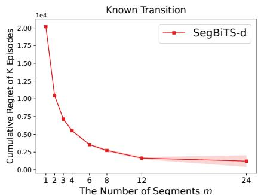
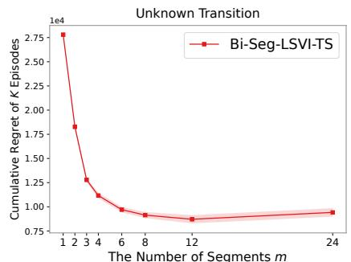
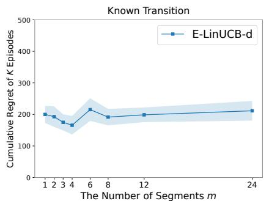
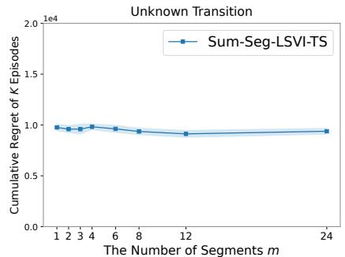
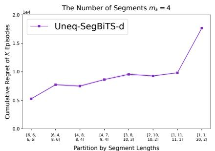
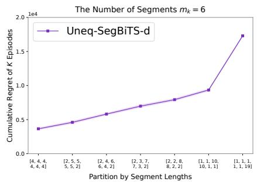
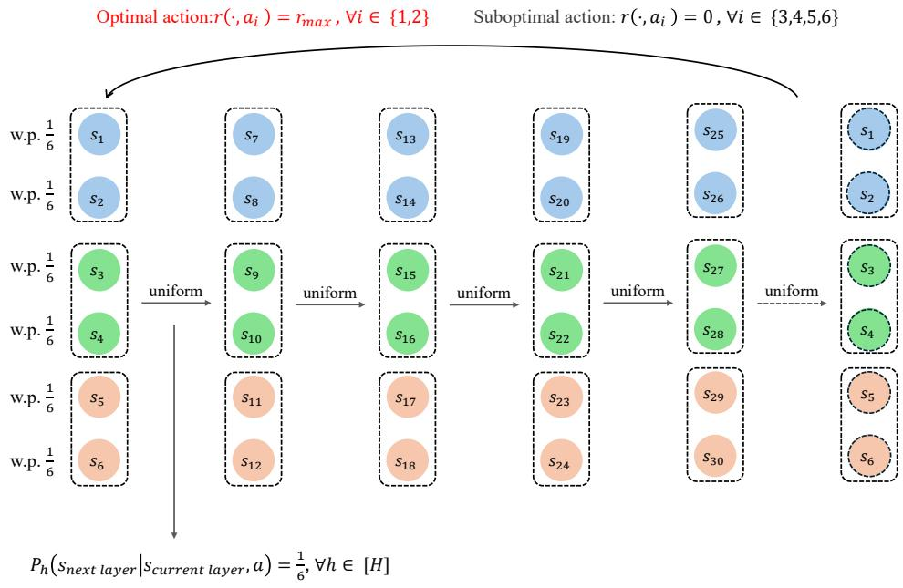

# Reinforcement Learning with Segment Reward Feedback under Linear Function Approximation

Fengxu Liu<sup>1</sup>, Siwei Wang<sup>2</sup>, Gal Dalal<sup>3</sup>, Shie Mannor<sup>3,4</sup>, Yihan Du<sup>5</sup>

<sup>1</sup>National University of Singapore.

<sup>2</sup>Microsoft Research Asia.

<sup>3</sup>NVIDIA Research.

<sup>4</sup>Technion.

<sup>5</sup>ESD, Singapore University of Technology and Design.

Contributing authors: z23v2p@gmail.com; siweiwang@microsoft.com; gdalal@nvidia.com; shie@ee.technion.ac.il; yihan du@sutd.edu.sg;

## Abstract

Classical reinforcement learning (RL) assumes that a reward is observed for every visited state-action pair. However, in real-world applications such as autonomous driving, such fine-grained feedback can be costly or dificult to collect, whereas trajectory-level feedback may be too sparse for eficient learning. To provide a general feedback model bridging these two extremes and handle large state spaces, we study RL with segment reward feedback under linear function approximation. Our work answers how the granularity of segment feedback and the choice of segmentation influence learning. For equal-length segments with known transitions, we design algorithms SegBiTS-d and E-LinUCB-d for binary and sum feedback types, respectively. They adopt posterior sampling with planning to achieve computational eficiency and the E-optimal experimental design to attain near-optimality. Nearly matching lower bounds are established. For equal-length segments with unknown transitions, we develop a unified Seg-LSVI-TS framework with two instantiations for binary and sum feedback, which carefully integrates the posterior estimated reward parameters into least-squares value iteration. These results reveal a fundamental insight: under binary feedback, increasing the number of segments significantly reduces the regret through an exponential factor, while surprisingly, under sum feedback, the granularity of segments does not afect learning much. Finally, to investigate whether segmenting according to state-action features can further expedite learning, we design an algorithm Uneq-SegBiTS-d that allows arbitrary segmentations. The resulting regret bound

shows that under the usual elliptical potential analysis, the influence of stateaction features on the regret appears only through logarithmic factors, and equal segmentation achieves the best performance.

Keywords: Reinforcement learning, segment reward feedback, linear function approximation, computationally and sample eficient algorithms, regret guarantees

## 1 Introduction

Reinforcement learning (RL) provides a general framework for sequential decision making, in which an agent interacts with an unknown environment with the goal of maximizing the long-term reward. Classical RL typically assumes that the reward associated with every visited state-action pair is observed immediately. While this reward feedback model is analytically convenient, state-action-wise rewards can be dificult and costly to obtain in real-world applications, particularly when performance is assessed by humans or through a delayed evaluation process. For example, in robotic manipulation, it is often easier to evaluate whether a robot successfully completes a task, such as folding clothes, than to assign a reliable reward to every individual action. In autonomous driving, evaluating each state-action pair according to multiple criteria such as safety, comfort, and eficiency can also be dificult and onerous. These practical applications has motivated the study of trajectory-level feedback, where only a single reward signal is revealed after an entire episode (Efroni et al., 2021; Chatterji et al., 2021).

Trajectory-level feedback reduces the frequency of reward queries, but it also aggregates the reward information from an entire episode into a single observation. When trajectories are long, such a signal may provide little information about which portions of the behavior were beneficial or detrimental to the overall performance. To resolve this challenge, segment feedback ofers an intermediate feedback granularity: an episode is divided into several segments, and one reward signal is observed for each segment. This segment feedback model provides a general paradigm interpolating between trajectory-level signals and standard state-action-wise feedback. It can naturally be applied to realistic scenarios where trajectories are presented to human evaluators in shorter clips or bags, such as autonomous driving. Under this model, there is a fundamental question: how do the granularity of segment feedback and the choice of segmentation influence learning performance?

Du et al. (2025) initiated the theoretical study of equal-length segment feedback in episodic tabular Markov decision processes (MDPs). However, the tabular representation becomes prohibitive in large or continuous state spaces, which is common in real-world applications, while fixed equal-length partitions leave open whether more flexible trajectory partitioning can be utilized to improve learning. For realistic applications with large or continuous state spaces, linear function approximation provides a widely-adopted formulation: in a linear MDP (Jin et al., 2020), rewards and transition kernels are represented through a known d-dimensional feature map. Existing work on sparse feedback with function approximation (Cassel et al., 2024) mainly considered a single aggregate observation for the entire trajectory. Consequently, it remains unclear whether segment-level reward information can be eficiently exploited in linear MDPs, how the granularity of segment feedback afects learning performance, and whether choosing segmentation according to the realized state-action features can provably benefit learning.

Motivated by these questions, in this work, we investigate RL with segment feedback under linear function approximation. We adopt the linear MDP formulation in (Jin et al. 2020), which enables generalization across large or potentially infinite stateaction spaces through known feature representations. Under the framework of segment reward feedback in linear MDPs, we first study equal-length segments and binary and sum feedback with known and unknown transitions. Specifically, binary feedback refers to a Bernoulli outcome generated by the cumulative reward over the segment, and sum feedback is a noisy observation of the cumulative reward over the segment. Beyond the equal-length segment setting, we further consider a more general variable segment setting with binary feedback, where both the number of segments and the way a trajectory is partitioned can be chosen adaptively by learning algorithms. We aim to rigorously quantify how the reward feedback type, unknown transition dynamics, and segmentation scheme impact the regret performance of learning algorithms.

This work faces several significant technical challenges: (i) When the transitions are unknown, designing a computationally and statistically eficient algorithm is highly nontrivial because reward and transition uncertainties are represented at diferent temporal scales. A per-step reward bonus is dificult to control because the reward covariance matrix is constructed by aggregate segment features and is generally incompatible with the transition covariance matrices constructed by individual state-action features, potentially leading to an unbounded regret analysis. A segment-level reward bonus, on the other hand, is history dependent and cannot be incorporated into the state-action-wise Markovian Bellman recursion. Finally, omitting reward bonuses altogether prevents the resulting value estimates from being optimistic, breaking the optimism-based regret analysis. (ii) Establishing dimension-dependent lower bounds requires encoding multiple dimensions of the reward parameter into linear features, while ensuring that sparse segment observations cannot easily distinguish them. For binary feedback, the construction must additionally quantify the information loss caused by the sigmoid curvature in order to demonstrate that the exponential dependence in the regret bound is inevitable. (iii) Under the variable segment setting, both the number of segments and the way a trajectory is partitioned may afect learning through the sigmoid curvatures and aggregated segment features. Hence, the analysis must rigorously account for all possible adaptive, episode-dependent segmentations.

To address these challenges, we develop sample eficient algorithms and establish regret guarantees for diferent settings. Table 1 summarizes the settings and our results. Our main contributions are summarized as follows.

1. We study RL with segment reward feedback with linear function approximation, which provides a general feedback paradigm emcompassing per-state-action feedback and trajectory-level feedback as two extremes. Under this framework, we consider both binary and sum feedback types with known and unknown transitions.

2. For equal-length segments with known transitions, we propose algorithms SegBiTS-d and E-LinUCB-d for binary and sum feedback, respectively. SegBiTS-d employs posterior sampling with eficient linear MDP planning and achieves a regret bound with dependence on exp( $\left( \frac { H r _ { \operatorname* { m a x } } } { 2 m } \right)$ , where H is the length of each episode, m is the number of segments, and $r _ { \mathrm { m a x } }$ is the universal upper bound of rewards. In contrast, E-LinUCB-d uses the E-optimal experimental design to refine the conditioning of the covariance matrix and achieves a near-optimal regret guarantee that does not depend on m (when ignoring logarithmic factors).

3. We establish dimension-dependent regret lower bounds for both binary and sum segment feedback in linear MDPs with known transitions. The lower bound for binary feedback demonstrates that the exponential dependence on H/m is unavoidable through a Bernoulli KL-divergence analysis, while the lower bound for sum feedback validates that our upper bound is near-optimal and m does not afect the regret up to logarthmic factors.

4. For equal-length segments with unknown transitions, we develop a unified Seg-LSVI-TS framework and provide computationally and sample eficient instantiations for both binary and sum feedback. By integrating posterior sampling of reward parameters with optimistic least-squares value iteration, the framework resolves the mismatch between segment-level reward uncertainty and state-actionwise value iteration. While transition learning introduces additional polynomial terms, the resulting regret bounds preserve the same insights as in the known transition setting: under binary feedback, increasing the number of segments m significantly reduces the regret due to the exp( $\textstyle \frac { H r _ { \operatorname* { m a x } } } { 2 m } )$ ) factor, while surprisingly, under sum feedback, increasing m does not improve learning much.

5. Finally, we investigate whether choosing segmentation according to the realized state-action features can further accelerate learning. We introduce a variable segment and binary feedback model and design an algorithm Uneq-SegBiTS-d, which accommodates adaptive, episode-dependent partitions and accounts for the sigmoid curvature of each individual segment. Its regret guarantee shows that, under the common elliptical potential analysis, the efect of the realized state-action features is absorbed into logarithmic factors and thus feature-dependent segmentation does not substantially benefit learning, and furthermore, equal segmentation achieves the best performance.

## 2 Related Work

## 2.1 RL with Sparse Feedback

A line of work relaxes the standard per-step reward observation assumption by replacing instantaneous rewards with a single trajectory-level reward signal. Efroni et al. (2021) investigated episodic tabular RL with trajectory-level sum feedback and developed UCB- and Thompson-sampling-based algorithms with regret guarantees. More recently, Zhang et al. (2025) established a near-minimax-optimal regret guarantee for episodic tabular RL with trajectory-level sum feedback using tighter reward confidence regions and a reference transition model. Chatterji et al. (2021) considered once-per-episode binary feedback by directly maximizing the probability of producing feedback one, while the resulting nonlinear objective may induce non-Markovian optimal policies and pose computational challenges. Cohen et al. (2021) addressed tabular RL with adversarial aggregate losses, and proposed a computationally eficient algorithm. For this adversarial aggregate feedback setting, Lancewicki and Mansour (2025) designed policy optimization algorithms that achieve near-optimal regret under known transitions and improve the guarantee in (Cohen et al., 2021) under unknown transitions. Ito et al. (2025) further proposed best-of-both-worlds algorithms that attain logarithmic regret under stochastic losses while retaining square-root regret under adversarial losses. Zhuo et al. (2026) studied fully bandit feedback in episodic MDPs, where only the total reward of each episode is observed while the state-action trajectory remains unobserved, and showed that exponential dependence on the horizon H is unavoidable in worst-case regret.

Table 1 Summary of our results.
<table><tr><td>Result</td><td>Segmentation Feedback Type Transition Regret</td><td></td><td></td><td></td><td></td><td></td><td></td></tr><tr><td></td><td>Theorem 1 Equal-length Binary</td><td></td><td>Known</td><td></td><td></td><td></td><td> ${ \widetilde O } \left( \exp \left( \frac { H r _ { \mathrm { m a x } } } { 2 m } \right) \nu ( K ) d \sqrt { K m \operatorname * { m a x } \left\{ \frac { H ^ { 2 } } { m \alpha \lambda } , 1 \right\} } \quad \right)$ </td></tr><tr><td></td><td>Theorem 2 Equal-length</td><td>Binary</td><td>Known</td><td></td><td></td><td> $\Omega \left( \exp \left( \frac { H r _ { \mathrm { m a x } } } { 2 m } \right) d \sqrt { K m } \right)$ </td><td></td></tr><tr><td>Theorem 4 Equal-length Sum</td><td>Theorem 3 Equal-length</td><td>Sum</td><td>Known Known</td><td> $\widetilde O \left( d \sqrt { H K } \right)$ </td><td></td><td></td><td></td></tr><tr><td></td><td></td><td></td><td></td><td> $\Omega \left( d \sqrt { H K } \right)$ </td><td></td><td></td><td> $\widetilde { O } \Bigg ( \exp \left( \frac { H r _ { \mathrm { m a x } } } { 2 m } \right) \nu ( K ) d \sqrt { K m \operatorname * { m a x } \left\{ \frac { H ^ { 2 } } { m \alpha \lambda } , 1 \right\} }$ </td></tr><tr><td></td><td></td><td></td><td>Unknown</td><td></td><td></td><td> $+ d ^ { 2 } H ^ { 2 } \sqrt K ( \frac { \nu ( K ) } { \sqrt \lambda } + r _ { \mathrm { m a x } } ) )$   $\widetilde { O } \Bigg ( d ^ { 5 / 2 } H ^ { 2 } \sqrt { K } \left( r _ { \mathrm { m a x } } + { \frac { 1 } { \sqrt { \lambda } } } \right)$ </td><td></td></tr><tr><td>Theorem 6 Equal-length Sum</td><td></td><td></td><td>Unknown</td><td></td><td></td><td></td><td> $+ d ( 1 + r _ { \operatorname* { m a x } } \sqrt { \lambda } ) \sqrt { K H d \operatorname* { m a x } \{ \frac { H } { \lambda } , 1 \} } )$ </td></tr><tr><td></td><td>Theorem 7 Variable</td><td>Binary</td><td>Known</td><td></td><td></td><td></td><td> $\widetilde { \cal O } \left( \nu _ { U } ( K ) d \sqrt { \sum _ { k = 1 } ^ { K } \operatorname* { m a x } \left\{ \frac { \sum _ { i = 1 } ^ { m _ { k } } ( \ell _ { i } ^ { k } ) ^ { 2 } } { 4 \lambda } , 1 \right\} \sum _ { i = 1 } ^ { m _ { k } } \frac { 1 } { \mathrm { s i g } ^ { \prime } ( \ell _ { i } ^ { k } r _ { \operatorname* { m a x } } ) } } \right)$ </td></tr></table>

Notation. Equal-length and variable refer to m equal-length segments per episode and arbitrary, episode-dependent segmentations, respectively. Here K, d and λ denote the number of episodes, feature dimension, and regularization parameter, respectively. Under variable segmentation, $m _ { k }$ and $\ell _ { i } ^ { k }$ denote the number of segments and the length of the i-th segment in episode k, respectively. Define the sigmoid function $\mathrm { s i g } ( x ) : = 1 / ( 1 + \exp ( - x ) )$ , where $\alpha , \nu ( K )$ and $\nu _ { U } ( K )$ are defined in Eq. (5), Eq. (7) and Eq. (17), respectively. $\widetilde { O } ( \cdot )$ hides logarithmic factors.

Trajectory-level feedback has also been studied under function approximation. In the ofline setting, Xu et al. (2024) investigated RL with trajectory-wise rewards and introduced a pessimistic value iteration method based on reward decomposition. Cassel et al. (2024) focused on aggregate bandit feedback in online linear MDPs and developed computationally eficient algorithms with $\widetilde { \cal O } ( \mathrm { p o l y } ( d , H ) \sqrt { K } )$ regret.

More generally, there have been several works considering feedback defined over segments or bags of a trajectory. Tang et al. (2024) introduced an empirical framework for RL from bagged rewards and developed a transformer-based method, but did not provide regret guarantees. Gao et al. (2025) investigated bagged decision times with non-Markovian transitions within each bag, focusing primarily on modeling the transition structure rather than recovering step-wise rewards from aggregated observations. Du et al. (2025) studied episodic tabular MDPs with equal-length segment feedback, covering both sum and binary feedback, and provided regret guarantees under both known and unknown transitions.

Prior works on binary and sum segment feedback have been primarily restricted to tabular MDPs, while function approximation results have focused on whole-trajectory signals. A general treatment of segment-level feedback under function approximation has remained an important unresolved problem, which we systematically address in this work.

## 2.2 RL with Linear Function Approximation

RL with linear function approximation has been extensively studied to handle large or continuous state spaces. A widely-adopted model is linear MDPs (Yang and Wang 2019; Jin et al., 2020), which represent transitions as linear combinations of unknown measures, with coeficients given by known state-action features. Yang and Wang (2019) investigated discounted MDPs with linearly parameterized transitions and developed a parametric Q-learning algorithm under a generative model and an anchor state-action condition. Yang and Wang (2020) subsequently proposed MatrixRL for episodic RL and extended this approach to kernel representations. Under the linear MDP model, optimism-based approaches combine least-squares value iteration with confidence bonuses to encourage exploration. Jin et al. (2020) introduced the LSVI-UCB framework, and several subsequent works improved its dependence on the feature dimension and episode horizon, leading to nearly minimax-optimal regret guarantees (Hu et al., 2022; He et al., 2023). Randomized exploration ofers an alternative to deterministic optimism and has been used for value-based approaches with function approximation (Osband et al., 2016; Zanette et al., 2020; Ishfaq et al., 2021).

A related but distinct model is the linear mixture MDP, whose transition kernel is a linear combination of known basis kernels with unknown coeficients (Jia et al., 2020; Ayoub et al., 2020; Zhou et al., 2021). He et al. (2021) established instance-dependent logarithmic regret bounds for both linear MDPs and linear mixture MDPs.

The linear function approximation literature typically assumes that the reward associated with every visited state-action pair is observed individually. Hence, their algorithms and results fail to address decision scenarios where rewards are revealed only through sparse observations. Our work bridges the above two lines of research by investigating binary and sum segment feedback in linear MDPs, with provably eficient algorithms, dimension-dependent lower bounds, and an extension to variable segment and binary feedback.

## 3 Problem Formulation

We study episodic RL in linear MDPs under segment reward feedback. In this framework, the agent does not observe per-step rewards as in classical RL. Instead, reward feedback is observed only at the end of each trajectory segment. Under this framework, we consider two feedback types: sum feedback and binary feedback. We first investigate equal-length segments with binary and sum feedback. Then, we extend the binary segment feedback model to variable segments where the number and lengths of segments may vary across episodes.

## 3.1 Episodic Linear MDPs

Consider an episodic MDP $\mathcal { M } = ( \mathcal { S } , \mathcal { A } , H , r , P , \rho )$ , where S is a measurable state space, $\mathcal { A }$ is a finite action space, H is the episode horizon, $r : \mathcal { S } \times \mathcal { A }  [ - r _ { \operatorname* { m a x } } , r _ { \operatorname* { m a x } } ]$ is the reward function, $\rho \in \Delta ( \mathcal { S } )$ is the initial-state distribution, and $\boldsymbol { P } \overset { \cdot } { = } \{ P _ { h } \} _ { h = 1 } ^ { H }$ is a collection of time-inhomogeneous transition kernels. For any $h \in [ H ]$ and $( s , a , s ^ { \prime } ) \in$ $\mathcal { S } \times \mathcal { A } \times \mathcal { S } , P _ { h } ( s ^ { \prime } \mid s , a )$ is the probability of transitioning to state $s ^ { \prime } \mathrm { i f }$ action a is taken in state s at step h. The reward function is time-homogeneous and unknown.

We define a policy $\pi = \{ \pi _ { h } \} _ { h = 1 } ^ { H }$ as a collection of mappings $\pi _ { h } : S  A$ . For any policy π, the state value function and state-action value function are defined as

$$
V _ { h } ^ { \pi } ( s ) : = \mathbb { E } \left[ \sum _ { t = h } ^ { H } r ( s _ { t } , a _ { t } ) \Bigg | s _ { h } = s , \pi \right] ,\tag{1}
$$

$$
Q _ { h } ^ { \pi } ( s , a ) : = \mathbb { E } \left[ \sum _ { t = h } ^ { H } r ( s _ { t } , a _ { t } ) \Bigg | s _ { h } = s , a _ { h } = a , \pi \right] ,\tag{2}
$$

which stand for the expected cumulative reward obtained till the end of this episode under policy $\pi ,$ starting from s and $( s , a )$ at step $h ,$ , respectively. Since the action space and episode horizon are both finite, there always exists an optimal policy $\pi ^ { * }$ that satisfies $V _ { h } ^ { \pi ^ { * } } ( s ) = \operatorname* { s u p } _ { \pi } V _ { h } ^ { \pi } ( s )$ for all $h \in [ H ]$ and $s \in S$ (Puterman 2014), and we denote $V _ { h } ^ { * } ( \bar { s } ) : = V _ { h } ^ { \pi ^ { * } } ( s )$

The agent interacts with the MDP as follows. At the beginning of each episode $k ,$ an initial state $s _ { 1 } ^ { k } \sim \rho$ is picked by the environment, and the agent chooses a policy $\pi ^ { k }$ At each step $h \in [ H ]$ , the agent observes the current state $s _ { h } ^ { \check { k } }$ and chooses an action $a _ { h } ^ { k } = \pi _ { h } ^ { k } ( s _ { h } ^ { k } )$ . Then, the agent transitions to the next state $s _ { h + 1 } ^ { k ^ { \prime } } \sim P _ { h } ( \cdot \mid s _ { h } ^ { k } , a _ { h } ^ { k } )$

The realized trajectory in episode k is denoted by $\tau ^ { k } : = ( s _ { 1 } ^ { k } , a _ { 1 } ^ { k } , \ldots , s _ { H } ^ { k } , a _ { H } ^ { k } )$ All state-action pairs in $\tau ^ { \dot { k } }$ are observable to the agent, whereas reward information is revealed only through the feedback associated with each segment of the realized trajectory, which we will introduce shortly.

In this work, we focus on the linear MDP model (Jin et al. 2020). Let $\psi : { \mathcal { S } } \times { \mathcal { A } } $ $\mathbb { R } ^ { d }$ be a known feature map. We make the following structural assumption.

Assumption 1 (Linear MDP) There exist a vector $\theta ^ { * } \in \mathbb { R } ^ { d }$ and, for every $h \in [ H ]$ , a vector of signed measures

$$
\mu _ { h } ^ { * } = \big ( \mu _ { h } ^ { * } ^ { ( 1 ) } , \ldots , \mu _ { h } ^ { * } ^ { ( d ) } \big ) ^ { \top }
$$

over $s$ such that, for every $( s , a ) \in S \times { \mathcal { A } } ,$

$$
r ( s , a ) = \langle \psi ( s , a ) , \theta ^ { * } \rangle ,\tag{3}
$$

$$
P _ { h } ( \cdot \mid s , a ) = \langle \psi ( s , a ) , \mu _ { h } ^ { * } ( \cdot ) \rangle .\tag{4}
$$

Assume the following normalization conditions:

$$
\| \psi ( s , a ) \| _ { 2 } \leq 1 , \ \forall ( s , a ) \in S \times A , \qquad \| \theta ^ { * } \| _ { 2 } \leq r _ { \operatorname* { m a x } } \sqrt { d } , \qquad \| \mu _ { h } ^ { * } ( S ) \| _ { 2 } \leq \sqrt { d } .
$$

Throughout the paper, the reward parameter $\theta ^ { * }$ is unknown. We consider both known transition and unknown transition settings. In the former setting, the transition kernel $P$ is known to the agent, whereas in the latter setting $P$ must be learned from the observed state transitions.

For any trajectory or trajectory segment $\tau ,$ define its aggregate feature as $\phi ^ { \tau } : = $ $\textstyle \sum _ { ( s , a ) \in \tau } \psi ( s , a )$ . For any policy π, define the expected trajectory feature under π as $\phi ^ { \pi } : = \mathbb { E } [ \sum _ { h = 1 } ^ { H } \psi ( s _ { h } , a _ { h } ) \mid \pi ]$ and $\begin{array} { r } { \phi ^ { \pi } ( s _ { 1 } ) : = \mathbb { E } [ \sum _ { h = 1 } ^ { H } \psi ( s _ { h } , a _ { h } ) \ | \ \pi , s _ { 1 } ] } \end{array}$ . Assumption 1 implies $\| \phi ^ { \pi } \| _ { 2 } \leq H$

## 3.2 Equal-length Segment Feedback

We first introduce the equal-length segment setting, which provides a fundamental model for investigating how the granularity of reward feedback influences learning performance in linear MDPs. In this setting, each episode is divided into m segments of equal length $H / m$ , where we assume that m divides H for convenience. For each $i \in [ m ]$ , the i-th segment of episode k is denoted by

$$
\tau _ { i } ^ { k } : = \left( \left( s _ { h } ^ { k } , a _ { h } ^ { k } \right) \right) _ { h = \frac { H } { m } ( i - 1 ) + 1 } ^ { \frac { H } { m } i } .
$$

Since $\| \psi ( s , a ) \| _ { 2 } \leq 1$ , the aggregate feature of $\tau _ { i } ^ { k }$ satisfies $\| \phi ^ { \tau _ { i } ^ { k } } \| _ { 2 } \leq H / m$ . The agent observes reward feedback only at the end of each segment, instead of each step. We consider the following two feedback types.

Binary segment feedback. In the binary feedback model, let $\operatorname { s i g } ( x ) : = 1 / ( 1 +$ $\exp ( - x ) )$ . At the end of segment $i \in [ m ]$ , the agent observes a binary outcome $y _ { i } ^ { k }$ that satisfies

$$
y _ { i } ^ { k } \mid \tau _ { i } ^ { k } \sim \operatorname { B e r n o u l l i } \left( \operatorname { s i g } \left( ( \phi ^ { \tau _ { i } ^ { k } } ) ^ { \top } \theta ^ { * } \right) \right) .
$$

Hence, the probability of receiving reward feedback 1 is determined by the cumulative reward over the corresponding segment.

Sum segment feedback. In the sum feedback model, at each step h of episode $k ,$ the environment generates an instantaneous random reward $R ( s _ { h } ^ { k } , a _ { h } ^ { k } ) = r ( s _ { h } ^ { k } , a _ { h } ^ { k } ) + \varepsilon _ { h } ^ { k } .$ where $\varepsilon _ { h } ^ { k }$ is a zero-mean and 1-sub-Gaussian noise that is independent of the transition distribution. The instantaneous random reward $R ( s _ { h } ^ { k } , a _ { h } ^ { k } )$ is not revealed to the agent.

Instead, the agent observes only the aggregate random reward of each segment $i \in [ m ]$

$$
R _ { i } ^ { k } : = \sum _ { t = \frac { H } { m } ( i - 1 ) + 1 } ^ { \frac { H } { m } i } R ( s _ { t } ^ { k } , a _ { t } ^ { k } ) = ( \phi ^ { \tau _ { i } ^ { k } } ) ^ { \top } \theta ^ { * } + \sum _ { t = \frac { H } { m } ( i - 1 ) + 1 } ^ { \frac { H } { m } i } \varepsilon _ { t } ^ { k } .
$$

When $m = H$ , the sum segment feedback model degenerates to classical RL in linear MDPs (Jin et al., 2020). When $m = 1 ,$ the binary and sum segment models reduce to RL with binary (Chatterji et al., 2021) and sum trajectory feedback (Efroni et al., 2021), respectively.

## 3.3 Variable and Binary Segment Feedback

We further extend the binary feedback model by allowing the number and lengths of the segments to vary across episodes, with both determined by the algorithm. After the policy has been executed for the entire episode $k ,$ , the algorithm observes the trajectory $\tau ^ { k }$ and decides the number of segments $m _ { k }$ and the partition of segments. Let $0 = t _ { 0 } ^ { k } < t _ { 1 } ^ { k } < \cdot \cdot \cdot < t _ { m _ { k } } ^ { k } = H$ denote the end step indices of the $m _ { k }$ segments, and define $\ell _ { i } ^ { k } : = t _ { i } ^ { k } - t _ { i - 1 } ^ { k }$ as the length of the i-th segment in episode $k .$

Once the partition has been determined, the environment reveals one binary outcome for each realized segment. Similarly, for every $i \in [ m _ { k } ]$ , the agent observes

$$
y _ { i } ^ { k } \mid \tau _ { i } ^ { k } \sim \operatorname { B e r n o u l l i } \left( \operatorname { s i g } \left( ( \phi ^ { \tau _ { i } ^ { k } } ) ^ { \top } \theta ^ { * } \right) \right) .
$$

The equal-length and binary segment feedback model is recovered by taking $m _ { k } = m$ and $t _ { i } ^ { k } = i H / m$

## 3.4 Learning Objective

The learning objective is the same under all feedback models considered above. Over K episodes, the agent aims to minimize the cumulative regret

$$
\mathcal { R } ( K ) : = \sum _ { k = 1 } ^ { K } \mathbb { E } _ { s _ { 1 } ^ { k } \sim \rho } \left( V _ { 1 } ^ { \ast } ( s _ { 1 } ^ { k } ) - V _ { 1 } ^ { \pi ^ { k } } ( s _ { 1 } ^ { k } ) \right) .
$$

Prior work for binary trajectory feedback (Chatterji et al., 2021) maximizes the expected probability of generating feedback one, whose nonlinear dependence on the cumulative reward may necessitate non-Markovian policies. In contrast, we use binary feedback to infer the underlying reward and maximize the expected cumulative reward under the standard MDP formulation. This distinction allows us to restrict attention to Markovian policies and design computationally eficient algorithms.

## 4 Equal-length Segment Feedback with Known Transitions

In this section, we first consider the equal-length segment and known transition setting, which allows us to isolate the statistical dificulty of learning the unknown reward parameter from segment feedback from the standard dificulty of learning the MDP transition dynamics. Under this setting, we study binary and sum feedback, and develop eficient algorithms with dimension-dependent regret guarantees, complemented by lower bounds that demonstrate the tightness of key dependencies.

## 4.1 Binary Feedback

For binary feedback, we propose algorithm SegBiTS-d, which drives exploration by perturbing logistic reward estimates with Gaussian noise calibrated to segment-level uncertainty and performing linear MDP planning under the perturbed rewards. Our regret analysis quantifies the benefit of finer segmentation through a sigmoid curvature term, showing that the regret bound decreases rapidly as the number of segments increases. A complementary lower bound establishes that the exponential dependence on segment length is unavoidable.

## 4.1.1 Algorithm SegBiTS-d and Regret Upper Bound

Binary segment feedback reveals the unknown reward parameter only through a Bernoulli observation whose parameter is the sigmoid of the aggregate reward for each segment. Since each segment has length $H / m$ , the aggregate reward over each segment is bounded by $H r _ { \operatorname* { m a x } } / m$ in absolute value. Accordingly, we define the uniform inverse sigmoid-curvature parameter

$$
\alpha : = \exp \left( \frac { H r _ { \operatorname* { m a x } } } { m } \right) + \exp \left( - \frac { H r _ { \operatorname* { m a x } } } { m } \right) + 2 .\tag{5}
$$

For any $k \geq 0$ , define

$$
\omega ( k ) : = \sqrt { \lambda } \left( r _ { \operatorname* { m a x } } \sqrt { d } + \frac { 1 } { 2 } \right) + \frac { d } { \sqrt { \lambda } } \log \left( \frac { 4 } { \delta ^ { \prime } } \left( 1 + \frac { H ^ { 2 } k } { 4 d \lambda m } \right) \right) ,\tag{6}
$$

and

$$
\nu ( k ) : = \frac { m \sqrt { \lambda } } { H } \left( 1 + \frac { H r _ { \operatorname* { m a x } } \sqrt { d } } { m } + \frac { H } { m \sqrt { \lambda } } \sqrt { 1 + \frac { H r _ { \operatorname* { m a x } } \sqrt { d } } { m } } \omega ( k ) + \frac { H ^ { 2 } } { m ^ { 2 } \lambda } \omega ( k ) ^ { 2 } \right) ^ { \frac { 3 } { 2 } } .\tag{7}
$$

Here $\omega ( k )$ controls the stochastic error of the regularized logistic regression estimator, and $\nu ( k )$ determines the confidence radius used to calibrate posterior sampling.

Using these quantities, we propose algorithm SegBiTS-d, a computationally eficient Thompson-sampling-style algorithm (Thompson, 1933) which adopts randomized posterior sampling and linear MDP planning and achieves a $\widetilde { O } ( \sqrt { K } )$ regret rate.

```latex
Algorithm 1 SegBiTS-d
1: Input: $\delta , \delta ^ { \prime } : = { \textstyle \frac { \delta } { 3 } } , \lambda$
2: for $k = 1 , \ldots , \tilde { K }$ do
3: $\widehat { \theta } _ { k - 1 } \gets \arg \operatorname* { m i n } _ { \theta } \ - \sum _ { k ^ { \prime } = 1 } ^ { k - 1 } \sum _ { i = 1 } ^ { m } \Big ( y _ { i } ^ { k ^ { \prime } } \log \mathrm { s i g } \Big ( ( { \phi ^ { \tau _ { i } ^ { k ^ { \prime } } } } ) ^ { \top } \theta \Big )$
$+ ( 1 - y _ { i } ^ { k ^ { \prime } } ) \log \Bigl ( 1 - \mathrm { s i g } \Bigl ( ( \phi ^ { \tau _ { i } ^ { k ^ { \prime } } } ) ^ { \top } \theta \Bigr ) \Bigr ) \Bigr ) + \frac { \lambda } { 2 } \| \theta \| _ { 2 } ^ { 2 } .$
4: $\begin{array} { r } { \Sigma _ { k - 1 }  \sum _ { k ^ { \prime } = 1 } ^ { k - 1 } \sum _ { i = 1 } ^ { m } \phi ^ { \tau _ { i } ^ { k ^ { \prime } } } ( \phi ^ { \tau _ { i } ^ { k ^ { \prime } } } ) ^ { \top } + \alpha \lambda I . } \end{array}$
5: Sample $\bar { \xi _ { k } } \sim \bar { \mathcal { N } } \big ( 0 , \dot { \alpha } \nu ( k - 1 ) ^ { 2 } \Sigma _ { k - 1 } ^ { - 1 } \big )$ , where α and $\nu ( k - 1 )$ are defined in
Eqs. (5) and (7), respectively.
6: $\widetilde { \theta } _ { k }  \hat { \theta } _ { k - 1 } + \xi _ { k } .$
7: $\pi ^ { k } \gets \arg \operatorname* { m a x } _ { \pi } ( \phi ^ { \pi } ) ^ { \top } \widetilde { \theta } _ { k } .$
8: Play episode k with policy $\pi ^ { k }$ . Observe trajectory $\tau ^ { k }$ and binary segment
feedback $\{ y _ { i } ^ { k } \} _ { i = 1 } ^ { m }$
9: end for
```

Algorithm 1 presents the pseudocode of SegBiTS-d. At each episode k, SegBiTS-d first performs regularized logistic regression to obtain the reward parameter estimate $\hat { \theta } _ { k - 1 }$ , and computes the segment covariance matrix $\Sigma _ { k - 1 }$ from past binary feedback (Line 3–4). Then, it samples a Gaussian noise $\xi _ { k } \sim \mathcal N ( 0 , \alpha \nu ( k - 1 ) ^ { 2 } \Sigma _ { k - 1 } ^ { - 1 } )$ and calculates the posterior estimated reward parameter $ { \widetilde { \theta } } _ { k } =  { \hat { \theta } } _ { k - 1 } + \xi _ { k }$ (Line 5–6). Then, SegBiTS-d computes the optimal policy for the linear MDP with reward parameter $\widetilde { \theta } _ { k }$ , and collects the resulting trajectory and binary segment feedback (Line 7–8).

The step $\pi ^ { k } = \arg \operatorname* { m a x } _ { \pi } ( \phi ^ { \pi } ) ^ { \top } \widetilde { \theta } _ { k }$ in Line 7 can be regarded as episodic linear MDP planning under known transition kernels and reward function $r ( s , a ) = \psi ( s , a ) ^ { \top } \widetilde { \theta } _ { k }$ This can be eficiently implemented using existing episodic linear MDP planning algorithms, e.g., (Wagenmaker et al., 2022).

Next, we provide a regret upper bound for algorithm SegBiTS-d.

Theorem 1 Under Assumption 1, with probability at least $1 - \delta ,$ for any $K > 0 ,$ , the regret of Algorithm 1 satisfies

$$
\mathcal { R } ( K ) = \tilde { O } \left( \exp \left( \frac { H r _ { \mathrm { m a x } } } { 2 m } \right) \nu ( K ) \sqrt { d } \left( \sqrt { K m d \operatorname* { m a x } \left\{ \frac { H ^ { 2 } } { m \alpha \lambda } , 1 \right\} } + H \sqrt { \frac { K } { \alpha \lambda } } \right) \right) .\tag{8}
$$

Under binary segment feedback, increasing the number of segments m substantially reduces the regret bound, as captured by the dominating exponential factor. This exponential dependence originates from the information loss induced by the curvature of the sigmoid function. Specifically, when m is small, each segment is long and the sigmoid output is close to either 0 or 1. In this regime, the sigmoid function curve is nearly flat, and it is statistically dificult to infer the underlying reward parameter. Otherwise, when m is large, each segment is short and the sigmoid function curve is steep, making the feedback more informative about the reward parameter. This learning dificulty is characterized by the sigmoid-curvature factor $\begin{array} { r } { \sqrt { \alpha } = \Theta ( \exp \left( \frac { H r _ { \mathrm { m a x } } } { 2 m } \right) , } \end{array}$ ).

## 4.1.2 Regret Lower Bound

Now we establish the first regret lower bound for linear MDPs with binary segment feedback to the best of our knowledge. It demonstrates that the exponential dependence on the segment length in the regret guarantee is indispensable.

Theorem 2 Consider $R L$ with binary segment feedback and known transitions. Suppose that $r _ { \operatorname* { m a x } } \ge 1 / 2$ and $\begin{array} { r } { K \ge \frac { ( d - 1 ) ^ { 2 } } { m ~ \mathrm { s i g } ^ { \prime } \left( \frac { H } { m } r _ { \mathrm { m a x } } - \frac { 1 } { 2 } \right) } } \end{array}$ max $\left\{ \frac { m ^ { 2 } } { 6 4 H ^ { 2 } r _ { \operatorname* { m a x } } ^ { 2 } } , \frac { 1 } { 4 } \right\}$ . For any algorithm, there exists an instance such that the regret satisfies

$$
\mathbb { E } \left[ \mathcal { R } ( K ) \right] = \Omega \left( \exp \left( \frac { H r _ { \operatorname* { m a x } } } { 2 m } \right) d \sqrt { K m } \right) .
$$

where $\mathbb { E } \left[ \cdot \right]$ denotes the expectation over the randomness in the reward feedback and the algorithm.

Theorem 2 exhibits that the exponential dependence on $\frac { H r _ { \operatorname* { m a x } } } { m }$ in Theorem 1 is intrinsic to binary segment feedback. In particular, as the number of segments m increases, the regret bound decreases rapidly through the exponential factor $\exp \bigl ( \frac { H r _ { \mathrm { m a x } } } { 2 m } \bigr )$ . Therefore, under binary feedback, increasing the number of segments accelerates learning.

The main challenge of the lower bound proof is to derive the exponential dependence on the segment length $\frac { H } { m }$ . We construct hard instances where the averaged action within each segment is viewed as an efective linear bandit action, and the aggregate segment reward lies in the nearly flat region of the sigmoid function. In this region, the KL divergence of Bernoulli observations under neighbouring instances is exponentially small in $\frac { H r _ { \operatorname* { m a x } } } { m }$ . Keeping the KL divergence bounded by a constant, the resulting choice of the reward gap $\Delta$ in the regret analysis gives rise to the exponential dependence. Below we provide a proof sketch of Theorem $2$

Proof sketch. Construct the following linear MDP instance: $ { \mathcal { S } } = \{ s _ { 1 } , \ldots , s _ { N } \}$ and ${ \mathcal { A } } =$ $\{ - 1 , \bar { 1 } \} ^ { d - 1 }$ , and for any $s _ { j } \in \mathcal S$

$$
\psi ( s _ { j } , a ) = \frac { 1 } { \sqrt { d } } \binom { a } { 1 } , \qquad \mu _ { h } ^ { * } ( s _ { j } ) = \binom { { \bf 0 } _ { d - 1 } } { \sqrt { d } / N } , \qquad \theta _ { \gamma } ^ { * } = \left( \frac { \sqrt { d } \Delta \gamma } { \sqrt { d } ( r _ { \mathrm { m a x } } - ( d - 1 ) \Delta ) } \right) ,
$$

where $\gamma \in \{ - 1 , 1 \} ^ { d - 1 }$ . This gives $\begin{array} { r } { P _ { h } ( s _ { j ^ { \prime } } \mid s _ { j } , a ) = \frac { 1 } { N } } \end{array}$ for every $( s _ { j } , a , s _ { j ^ { \prime } } )$ and $r _ { \gamma } ( s _ { j } , a ) =$ $r _ { \mathrm { m a x } } - ( d - 1 ) \Delta + \Delta \langle a , \gamma \rangle$ . Thus, the first $d - 1$ coordinates encode $\bar { d } - 1$ independent components of the reward parameter, while the last coordinate induces uniform transitions and a common positive reward baseline. The optimal action is $a = \gamma$ , and hence learning an optimal policy requires identifying all signs of γ.

For the t-th segment, let $\begin{array} { r } { \bar { A } _ { t } : = \frac { 1 } { H / m } \sum _ { \ell = 1 } ^ { H / m } a _ { t , \ell } . } \end{array}$ The averaged action ${ \bar { A } } _ { t }$ can be regarded as an action in a $( d - 1 )$ -dimensional linear bandit problem, since the aggregate segment reward depends on γ only through the inner product $\langle \bar { A } _ { t } , \gamma \rangle$ . Conditional on the chosen actions, the binary feedback is Bernoulli with mean sig $\begin{array} { r l } {  { \big ( \frac { H } { m } [ r _ { \operatorname* { m a x } } - ( d - 1 ) \Delta + \Delta \langle \bar { A } _ { t } , \gamma \rangle ] \big ) } \quad } & { { } } \end{array}$ We choose

$$
\Delta = \frac { 1 } { 8 \cdot \frac { H } { m } \sqrt { K m \ \mathrm { s i g } ^ { \prime } \Big ( \frac { H } { m } r _ { \mathrm { m a x } } - \frac { 1 } { 2 } \Big ) } } .\tag{9}
$$

Under the stated condition on $K$ in Theorem $^ { 2 , }$ this choice ensures that every aggregate segment reward satisfies

$$
\frac { H } { m } \left( r _ { \operatorname* { m a x } } - ( d - 1 ) \Delta + \Delta \langle \bar { A } _ { t } , \gamma \rangle \right) \geq \frac { H } { m } \left( r _ { \operatorname* { m a x } } - 2 ( d - 1 ) \Delta \right) \geq \frac { H } { m } r _ { \operatorname* { m a x } } - \frac { 1 } { 2 } \geq 0 .
$$

Hence, all aggregate segment rewards lie in the region where $\mathrm { s i g } ^ { \prime } ( \cdot )$ is decreasing.

Then, we analyze the statistical information available for distinguishing neighboring instances. Fix $i \in [ d - 1 ]$ , and let $\gamma ^ { \prime }$ difer from γ only in coordinate i. The segment aggregate rewards under these two parameters difer by $2 \frac { \bar { H } } { m } \Delta \left| \bar { A } _ { t , i } \right|$ . For any $x , y \in \mathbb { R }$ , the KL divergence of the Bernoulli distributions parameterized by x and $_ y$ satisfies

$$
\operatorname { K L } { \big ( } \mathcal { B } ( \operatorname { s i g } ( x ) ) , \mathcal { B } ( \operatorname { s i g } ( y ) ) { \big ) } \leq { \frac { 1 } { 2 } } \operatorname* { s u p } _ { u \in [ x , y ] } \operatorname { s i g } ^ { \prime } ( u ) ( x - y ) ^ { 2 } .\tag{10}
$$

Let $\mathbb { D } _ { \gamma }$ denote the distribution of the interaction history generated by the algorithm under the instance parameterized by γ. Since all aggregate segment rewards are at least $\begin{array} { r } { \frac { H } { m } r _ { \mathrm { m a x } } - \frac { 1 } { 2 } } \end{array}$ and $\mathrm { s i g } ^ { \prime } ( \cdot )$ is decreasing on $[ 0 , \infty )$ , using Eq. (10), we have

$$
\begin{array} { r l r } {  { \mathrm { K L } ( \mathbb { D } _ { \gamma } , \mathbb { D } _ { \gamma ^ { \prime } } ) \leq \frac { 1 } { 2 } \mathrm { s i g } ^ { \prime } \bigg ( \frac { H } { m } r _ { \operatorname* { m a x } } - \frac { 1 } { 2 } \bigg ) \sum _ { t = 1 } ^ { K m } \mathbb { E } _ { \gamma } [ 4 ( \frac { H } { m } ) ^ { 2 } \Delta ^ { 2 } \bar { A } _ { t , i } ^ { 2 } ] } } \\ & { } & { \leq 2 K m \mathrm { s i g } ^ { \prime } \bigg ( \frac { H } { m } r _ { \operatorname* { m a x } } - \frac { 1 } { 2 } \bigg ) ( \frac { H } { m } ) ^ { 2 } \Delta ^ { 2 } } \\ & { } & { = \frac { 1 } { 3 2 } . } \end{array}
$$

Here the derivative of the sigmoid function induces the exponential factor:

$$
\begin{array} { r l } & { \mathrm { s i g } ^ { \prime } \bigg ( \frac { H } { m } r _ { \mathrm { m a x } } - \frac { 1 } { 2 } \bigg ) = \frac { 1 } { \exp \Big ( \frac { H } { m } r _ { \mathrm { m a x } } - \frac { 1 } { 2 } \Big ) + 2 + \exp \Big ( { - \frac { H } { m } r _ { \mathrm { m a x } } + \frac { 1 } { 2 } } \Big ) } } \\ & { \quad \quad \quad \quad = \Theta \bigg ( \exp \bigg ( { - \frac { H r _ { \mathrm { m a x } } } { m } } \bigg ) \bigg ) . } \end{array}
$$

Finally, the Bretagnolle-Huber inequality implies that the sign of each coordinate under two neighbouring instances cannot be reliably distinguished. Averaging over $\gamma \in \{ - 1 , 1 \} ^ { d - 1 }$ shows that the expected number of coordinate-wise sign errors across the Km segments is at least a constant fraction of $( d - 1 ) K m$ . Since each coordinate-wise error incurs a regret of $\begin{array} { r } { \frac { H } { m } \Delta , } \end{array}$ , we have

$$
\begin{array} { r l } & { \mathbb { E } \left[ \mathcal { R } ( K ) \right] = \Omega \Bigg ( d K m \frac { H } { m } \Delta \Bigg ) } \\ & { \quad \quad = \Omega \left( d \sqrt { \frac { K m } { \mathrm { s i g } ^ { \prime } \left( \frac { H } { m } r _ { \mathrm { m a x } } - \frac { 1 } { 2 } \right) } } \right) } \\ & { \quad \quad = \Omega \left( d \exp \left( \frac { H r _ { \mathrm { m a x } } } { 2 m } \right) \sqrt { K m } \right) , } \end{array}
$$

which establishes the claimed lower bound.

## 4.2 Sum Feedback

For sum feedback, we develop algorithm E-LinUCB-d, which uses the E-optimal experimental design to refine the conditioning of the segment covariance matrix during the initial exploration phase. We provide regret upper and lower bounds to demonstrate the near-optimality of E-LinUCB-d.

## 4.2.1 Algorithm E-LinUCB-d and Regret Upper Bound

Under sum segment feedback, the reward observation collected from segment $\boldsymbol { \tau } _ { i } ^ { k }$ takes the linear form $R _ { i } ^ { k } = \langle \phi ^ { \tau _ { i } ^ { k } } , \theta ^ { * } \rangle + \varepsilon _ { i } ^ { k }$ . Moreover, since the transition kernels are known, reward learning in this setting can be viewed as a linear bandit problem (Dani et al., 2008; Abbasi-Yadkori et al., 2011) where each episode selects a policy and produces m reward observations. However, a direct application of existing linear bandit algorithms may result in overly large confidence intervals due to a poorly conditioned covariance matrix, leading to a suboptimal regret bound.

To address this issue and accurately reveal the influence of segments on the regret performance, E-LinUCB-d adopts the E-optimal design (Pukelsheim, 2006) in the initial exploration phase. The procedure of E-LinUCB-d is presented in Algorithm 2. Specifically, the E-optimal design step finds a distribution $w ^ { * }$ over policies that minimizes the spectral norm of the inverse expected covariance matrix, or equivalently, maximizes the minimum eigenvalue of the expected covariance matrix (Line 2). The distribution $w ^ { * }$ is then converted into a sequence of $K _ { 0 }$ exploration policies using the rounding procedure ROUND in (Allen-Zhu et al., 2021) (Lines 3 and 4). Next, E-LinUCB-d plays these $K _ { 0 }$ policies (Line 5). This initial exploration phase guarantees a suficiently wellconditioned covariance matrix. After this phase, E-LinUCB-d constructs a regularized least-squares estimate for reward parameter $\theta ^ { * }$ (Line 7), and selects the policy with the highest optimistically estimated cumulative reward (Line 9).

Algorithm 2 E-LinUCB-d   
1: Input: $\begin{array} { r } { \overline { { \delta , \delta ^ { \prime } : = \frac { \delta } { 3 } , \lambda : = \frac { H } { r _ { \operatorname* { m a x } } ^ { 2 } m } } } } \end{array}$ , rounding procedure ROUND, rounding approximation   
parameter $\begin{array} { r } { \gamma : = \frac { 1 } { 1 0 } . \beta ( k ) : = \sqrt { \frac { H d } { m } \left( \log ( 1 + \frac { k H ^ { 2 } } { \lambda d m } ) + 2 \log ( \frac { 1 } { \delta ^ { \prime } } ) \right) + r _ { \operatorname* { m a x } } \sqrt { \lambda d } } , \forall k > 0 . } \end{array}$   
2: Let $w ^ { * } \in \triangle _ { \Pi }$ and $z ^ { * }$ be the optimal solution and optimal value of the optimization:   
$\operatorname* { m i n } _ { w \in \triangle _ { \Pi } } \left\| \left( \sum _ { \pi \in \Pi } w ( \pi ) \bigg ( \sum _ { i = 1 } ^ { m } \mathbb { E } _ { \tau _ { i } \sim \pi } \left[ \phi ^ { \tau _ { i } } ( \phi ^ { \tau _ { i } } ) ^ { \top } \right] \bigg ) \right) ^ { - 1 } \right\|$ (11)   
3: $\begin{array} { r } { K _ { 0 } \gets \lceil \operatorname* { m a x } \{ 2 6 ( 1 + \gamma ) ^ { 2 } ( z ^ { * } ) ^ { 2 } H ^ { 4 } \log ( \frac { 2 d } { \delta ^ { \prime } } ) , \ \frac { d } { \gamma ^ { 2 } } \} \rceil } \end{array}$   
4: $\begin{array} { r } { ( \pi ^ { 1 } , \ldots , \pi ^ { K _ { 0 } } ) \gets \mathtt { R O U N D } ( \{ \sum _ { i = 1 } ^ { m } \mathbb { E } _ { \tau _ { i } \sim \pi } \left[ \phi ^ { \tau _ { i } } \binom { \dag } { \phi ^ { \tau _ { i } } } ^ { \top } \right] \} _ { \pi \in \Pi } , w ^ { * } , \gamma , K _ { 0 } ) } \end{array}$   
5: Play $K _ { 0 }$ episodes with policies $\pi ^ { 1 } , \ldots , \pi ^ { K _ { 0 } }$ . Observe trajectories $\tau ^ { 1 } , \dots , \tau ^ { K _ { 0 } }$ and   
rewards $\{ \bar { R } _ { i } ^ { 1 } \} _ { i = 1 } ^ { m } , \dots , \{ \bar { R } _ { i } ^ { K _ { 0 } } \} _ { i = 1 } ^ { m }$   
6: for $k = K _ { 0 } + 1 , \ldots , K \ \mathbf { d o }$   
7: $\begin{array} { r } { \hat { \theta } _ { k - 1 } \longleftarrow ( \lambda I + \sum _ { k ^ { \prime } = 1 } ^ { k - 1 } \sum _ { i = 1 } ^ { m } \phi ^ { \tau _ { i } ^ { k ^ { \prime } } } ( \phi ^ { \tau _ { i } ^ { k ^ { \prime } } } ) ^ { \top } ) ^ { - 1 } \sum _ { k ^ { \prime } = 1 } ^ { k - 1 } \sum _ { i = 1 } ^ { m } \phi ^ { \tau _ { i } ^ { k ^ { \prime } } } R _ { i } ^ { k ^ { \prime } } } \end{array}$   
8: $\begin{array} { r l } { } & { { } \Sigma _ { k - 1 } \gets \lambda I + \sum _ { k ^ { \prime } = 1 } ^ { k - 1 } \sum _ { i = 1 } ^ { m } \phi ^ { \tau _ { i } ^ { k ^ { \prime } } } ( \phi ^ { \tau _ { i } ^ { k ^ { \prime } } } ) ^ { \top } } \end{array}$   
9: $\begin{array} { r } { \pi ^ { k }  \mathrm { a r g m a x } _ { \pi \in \Pi } ( ( \phi ^ { \pi } ) ^ { \top } \hat { \theta } _ { k - 1 } + \beta ( k - 1 ) \cdot \| \phi ^ { \pi } \| _ { ( \Sigma _ { k - 1 } ) ^ { - 1 } } ) } \end{array}$   
10: Play episode k with policy $\pi ^ { k }$ . Observe trajectory $\tau ^ { k }$ and sum segment feedback   
$\{ R _ { i } ^ { k } \} _ { i = 1 } ^ { m }$   
11: end for

Now we state the regret guarantee for algorithm E-LinUCB-d.

Theorem 3 Under Assumption 1, with probability at least $1 - \delta _ { ; }$ , for any $K > 0$ , the regret of Algorithm 2 satisfies

$$
\mathcal { R } ( K ) = O \left( d \sqrt { H K } \log \left( \left( 1 + \frac { K H r _ { \operatorname* { m a x } } ^ { 2 } } { d m } \right) \frac { 1 } { \delta } \right) + ( z ^ { * } ) ^ { 2 } H ^ { 5 } \log \left( \frac { d } { \delta } \right) + d H \right) .
$$

When K is suficiently large, the dominant term in Theorem 3 is $\widetilde { O } ( d \sqrt { H K } )$ , while the second order terms arise from the E-optimal exploration phase. As shown by the lower bound in the next subsection, this upper bound for algorithm E-LinUCB-d is near-optimal.

This result conveys a diferent insight on the impact of segments from that under binary feedback: increasing the number of segments does not substantially decrease the regret. Specifically, a larger m provides more reward observations, but meanwhile, under shorter segments, the segment feature $\phi ^ { \tau _ { i } ^ { k ^ { \prime } } }$ contributed to the covariance matrix $\Sigma _ { k }$ is smaller, inflating the reward estimation uncertainty $\lVert \phi ^ { \pi } \rVert _ { ( \Sigma _ { k } ) ^ { - 1 } }$ . These two efects cancel out when estimating the cumulative expected reward over an entire episode. Consequently, m appears only in the logarithmic factor, and increasing m yields no polynomial improvement in regret performance.

## 4.2.2 Regret Lower Bound

We now establish a lower bound to demonstrate the tightness of our upper bound.

Theorem 4 Consider RL with sum segment feedback and known transitions. Suppose that $\begin{array} { r } { K \ge \frac { ( d - 1 ) ^ { 2 } } { H r _ { \operatorname* { m a x } } ^ { 2 } } } \end{array}$ . For any algorithm, there exists an instance such that the regret satisfies

$$
\mathbb { E } \left[ \mathcal { R } ( K ) \right] = \Omega \left( d \sqrt { H K } \right) ,
$$

where E [·] denotes the expectation over the randomness in the reward feedback and the algorithm.

Theorem 4 validates that the regret upper bound for algorithm E-LinUCB-d (Theorem 3) nearly matches the lower bound. More importantly, this lower bound confirms that the essential regret for reward learning under sum segment feedback is independent of $m$ . Therefore, unlike binary feedback, under sum feedback, increasing the number of segments does not substantially reduce the regret.

## 5 Equal-length Segment Feedback with Unknown Transitions

With known transitions, a policy can be evaluated once a candidate reward parameter is available in a manner as in linear bandits. When the transitions are unknown, however, the agent must learn the reward parameter and transition dynamics simultaneously. This introduces a mismatch between segment-level reward feedback and step-wise value iteration, preventing a straightforward application of existing linear MDP algorithms, e.g., (Jin et al. 2020). To bridge this mismatch, we develop Seg-LSVI-TS, a unified framework that establishes step-wise Bellman recursion using multiple Thompson-sampled reward models inferred from segment feedback. For binary and sum feedback, it respectively performs logistic and linear regression with posterior sampling to estimate the reward parameter using segment-level observations, and integrates the estimated reward parameters into optimistic least-squares value iteration to ensure optimism for both reward and transition uncertainty.

## 5.1 A Unified Seg-LSVI-TS Framework

Adapting least-squares value iteration to integrate segment reward feedback is highly non-trivial due to the following challenges: (i) The reward parameter is estimated from segment features $\begin{array} { r } { \phi ^ { \tau _ { i } ^ { k } } = \sum _ { h \in \tau _ { i } ^ { k } } \psi ( s _ { h } ^ { k } , a _ { h } ^ { k } ) } \end{array}$ , so the reward uncertainty is characterized by a segment-level covariance matrix $\Sigma _ { k - 1 }$ . Introducing a per-step reward bonus of the form $\| \psi ( s , a ) \| _ { \Sigma _ { k - 1 } ^ { - 1 } }$ will require controlling the accumulated reward bonus over each step using the segment-level covariance matrix. However, there is generally no positive semidefinite ordering relationship between the segment-level covariance matrix and the step-wise covariance matrix, and hence the usual elliptical potential argument fails. (ii) Alternatively, a bonus defined directly on a segment feature depends on the withinsegment transition and cannot be incorporated into a Markovian state-action value function. (iii) Finally, omitting reward exploration bonuses leaves the transition bonus insuficient to guarantee optimism and breaks the analysis of optimistic least-squares value iteration.

To present the unified algorithmic framework compatible with diferent feedback types, let $\mathsf { F } \in \{ \mathrm { b i } , \mathrm { s u m } \}$ denote the binary and sum feedback, respectively, and let $\mathcal { D } _ { k - 1 } ^ { \mathsf { F } }$ contain all trajectories and segment reward observations collected before episode k. We use

$$
\left( \hat { \theta } _ { k - 1 } ^ { \mathsf { F } } , \boldsymbol { \Sigma } _ { k - 1 } ^ { \mathsf { F } } , \rho _ { k - 1 } ^ { \mathsf { F } } \right) \gets \mathrm { R E W A R D E S T } _ { \mathsf { F } } \left( \mathcal { D } _ { k - 1 } ^ { \mathsf { F } } \right)
$$

to represent the feedback-specific reward estimator, covariance matrix, and sampling radius. We also let $B _ { \mathsf { F } }$ and $\beta _ { \mathsf { F } }$ denote the clipping and transition bonus parameters, respectively. Their concrete forms will be specified for binary and sum feedback separately. With this notation, algorithms for both feedback types are instances of the following framework.

Algorithm 3 A Unified Seg-LSVI-TS Framework   
1: Input: feedback type $\begin{array} { r } { \mathsf { F } , \delta , \delta ^ { \prime } : = \delta / 6 , \lambda , n : = \big \lceil 2 \sqrt { 2 \pi e } \log \big ( \frac { K } { \delta ^ { \prime } } \big ) \big \rceil } \end{array}$ $B _ { \mathsf { F } }$ , and $\beta _ { \mathsf { F } }$   
2: for $k = 1 , \ldots , K$ do   
3: Receive the initial state $s _ { 1 } ^ { k } .$   
4: $\begin{array} { r } { \big ( \hat { \theta } _ { k - 1 } ^ { \mathsf { F } } , \boldsymbol { \Sigma } _ { k - 1 } ^ { \mathsf { F } } , \rho _ { k - 1 } ^ { \mathsf { F } } \big ) \gets \mathrm { R E W A R D E S T } _ { \mathsf { F } } \big ( \mathcal { D } _ { k - 1 } ^ { \mathsf { F } } \big ) } \end{array}$   
5: for $j = 1 , . . . , n$ do   
6: Sample $g _ { k } ^ { ( j ) } \sim \mathcal { N } ( 0 , I _ { d } ) .$   
7: $\widetilde { \theta } _ { k } ^ { \left( j \right) } \gets \hat { \theta } _ { k - 1 } ^ { \mathsf { F } } + \rho _ { k - 1 } ^ { \mathsf { F } } \left( \Sigma _ { k - 1 } ^ { \mathsf { F } } \right) ^ { - 1 / 2 } g _ { k } ^ { \left( j \right) } .$   
8: $\big ( \{ Q _ { h } ^ { k , ( j ) } \} _ { h = 1 } ^ { H } , \{ V _ { h } ^ { k , ( j ) } \} _ { h = 1 } ^ { H } \big )  \mathtt { L S V I - T S - Q } \Big ( \widetilde { \theta } _ { k } ^ { ( j ) } , k , B _ { \mathsf { F } } , \beta _ { \mathsf { F } } \Big )$   
9: end for   
10: $j ^ { + } \gets \arg \operatorname* { m a x } _ { j \in [ n ] } V _ { 1 } ^ { k , ( j ) } ( s _ { 1 } ^ { k } )$   
11: for $h = 1 , \ldots , \dot { H }$ do   
12: $a _ { h } ^ { k }  \arg \operatorname* { m a x } _ { a \in \mathcal { A } } Q _ { h } ^ { k , ( j ^ { + } ) } ( s _ { h } ^ { k } , \underline { { a } } ) .$   
13: Take action $a _ { h } ^ { k }$ and observe $s _ { h + 1 } ^ { k } .$   
14: end for   
15: Observe the segment feedback under model F and update $\mathcal { D } _ { k } ^ { \sf F }$   
16: end for

```latex
Algorithm 4 LSVI-TS-Q (θ, k, B, β)
1: Input: $\theta , k , B ,$ and $\beta .$
2: Initialize $V _ { H + 1 } ^ { k } ( \cdot )  0 , \lambda ^ { \prime } = 1$
3: for $h = H , \ldots , 1 \ \mathbf { d o }$
4: $\begin{array} { r } { \Lambda _ { h } ^ { k - 1 } \gets \lambda ^ { \prime } \bar { I } + \sum _ { k ^ { \prime } = 1 } ^ { k - 1 } \psi ( s _ { h } ^ { k ^ { \prime } } , a _ { h } ^ { k ^ { \prime } } ) \psi ( s _ { h } ^ { k ^ { \prime } } , a _ { h } ^ { k ^ { \prime } } ) ^ { \top } . } \end{array}$
5: $\begin{array} { r } { \mathbf { w } _ { h } ^ { k }  ( \Lambda _ { h } ^ { k - 1 } ) ^ { - 1 } \sum _ { k ^ { \prime } = 1 } ^ { k - 1 } \psi ( s _ { h } ^ { k ^ { \prime } } , a _ { h } ^ { k ^ { \prime } } ) [ \psi ( s _ { h } ^ { k ^ { \prime } } , a _ { h } ^ { k ^ { \prime } } ) ^ { \top } \theta + V _ { h + 1 } ^ { k } ( s _ { h + 1 } ^ { k ^ { \prime } } ) ] . } \end{array}$
6: $\begin{array} { r l r } { Q _ { h } ^ { k } ( \cdot , \cdot ) } & {  } & { \mathrm { c l i p } _ { [ - H B , H B ] } ( ( { \bf w } _ { h } ^ { k } ) ^ { \top } \psi ( \cdot , \cdot ) + \beta \sqrt { \psi ( \cdot , \cdot ) ^ { \top } ( \Lambda _ { h } ^ { k - 1 } ) ^ { - 1 } \psi ( \cdot , \cdot ) ) } } \end{array}$ , where
c $\scriptstyle \operatorname * { l i p } _ { [ L , U ] } ( x ) : =$ min $\{ U ,$ max $\{ L , x \} \}$ for any $x , L , \bar { U } \in$ R such that $L \leq U$
7: $V _ { h } ^ { k } ( s ) \gets \operatorname* { m a x } _ { a \in \mathcal { A } } Q _ { h } ^ { k } ( s , a )$
8: end for
9: Output: $\{ Q _ { h } ^ { k } \} _ { h = 1 } ^ { H }$ and $\{ V _ { h } ^ { k } \} _ { h = 1 } ^ { H }$
```

Algorithm 3 illustrates the procedure of Seg-LSVI-TS. For each of the $n \_ =$ ${ \cal O } ( \log ( K / \delta ) )$ sampled reward parameters, Seg-LSVI-TS computes a candidate policy under the induced linear reward function by performing H-step least-squares Bellman recursion. The transition data and covariance matrices are shared across all reward parameter candidates. Seg-LSVI-TS then selects the policy with the highest optimistic initial-state value.

The key idea of $\mathtt { S e g - L S V I - T S }$ is to achieve overall optimism by connecting the reward optimism of Thompson sampling with the transition optimism of least-squares value iteration in subroutine LSVI-TS-Q. Conditional on the past, each sampled parameter $ { \widetilde { \theta } } _ { k } ^ { ( j ) }$ has a constant probability of being optimistic in the direction $\phi ^ { \pi ^ { * } } ( s _ { 1 } ^ { k } )$ . Hence, with $\ddot { n } = O ( \log ( K / \delta ) ;$ ) independent samples, with high probability, there exists $j ^ { \prime } \in [ n ]$ such that

$$
\left( \phi ^ { \pi ^ { * } } ( s _ { 1 } ^ { k } ) \right) ^ { \top } \widetilde { \theta } _ { k } ^ { ( j ^ { \prime } ) } \geq \left( \phi ^ { \pi ^ { * } } ( s _ { 1 } ^ { k } ) \right) ^ { \top } \theta ^ { * } .
$$

For this candidate reward parameter $\widetilde { \theta } _ { k } ^ { ( j ^ { \prime } ) }$ , the transition bonus in LSVI-TS-Q guarantees the optimism of its corresponding value function. With high probability, there exists a candidate $j ^ { \prime } \in [ n ]$ such that the selection of $j ^ { + }$ , the optimism of value iteration, and the optimism of the sampled reward parameter imply

$$
V _ { 1 } ^ { k , ( j ^ { + } ) } ( s _ { 1 } ^ { k } ) \geq V _ { 1 } ^ { k , ( j ^ { \prime } ) } ( s _ { 1 } ^ { k } ) \geq \left( \phi ^ { \pi ^ { * } } ( s _ { 1 } ^ { k } ) \right) ^ { \top } \widetilde { \theta } _ { k } ^ { ( j ^ { \prime } ) } \geq \left( \phi ^ { \pi ^ { * } } ( s _ { 1 } ^ { k } ) \right) ^ { \top } \theta ^ { * } .
$$

In Seg-LSVI-TS, the Thompson sampling in the outer framework handles reward uncertainty at the segment level, while the subroutine LSVI-TS-Q handles transition uncertainty at the step level. This coupling restores optimism without introducing an explicit reward bonus that depends on within-segment transition into the Bellman recursion. Therefore, this algorithmic framework efectively resolves the aforementioned challenges due to the mismatch between segment-level reward uncertainty and step-wise least-squares value iteration.

## 5.2 Binary Feedback

We first instantiate the unified framework for binary segment feedback and refer to the resulting algorithm as Bi-Seg-LSVI-TS. Recall that $\alpha = \exp ( H r _ { \mathrm { m a x } } / m ) +$ $\exp ( - H r _ { \mathrm { m a x } } / m ) + 2$ , and $\nu ( k )$ is defined as in Eq. (7). Based on the binary feedback collected before episode $k ,$ we set

$$
\begin{array} { r } { \hat { \theta } _ { k - 1 } ^ { \mathrm { b i } } : = \underset { \theta } { \operatorname { a r g m i n } } \Bigg ( - \underset { k ^ { \prime } = 1 } { \overset { k - 1 } { \sum } } \underset { i = 1 } { \overset { m } { \sum } } ( y _ { i } ^ { k ^ { \prime } } \log ( \mathrm { s i g } ( ( \phi ^ { \tau _ { i } ^ { k ^ { \prime } } } ) ^ { \top } \theta ) )   } \\ { \quad \quad \quad \quad \quad \quad \quad  + ( 1 - y _ { i } ^ { k ^ { \prime } } ) \log ( 1 - \mathrm { s i g } ( ( \phi ^ { \tau _ { i } ^ { k ^ { \prime } } } ) ^ { \top } \theta ) ) ) + \frac { \lambda } { 2 } \| \theta \| _ { 2 } ^ { 2 } \Bigg ) , } \end{array}\tag{12}
$$

$$
\begin{array} { r l } & { \Sigma _ { k - 1 } ^ { \mathrm { b i } } : = \displaystyle \sum _ { k ^ { \prime } = 1 } ^ { k - 1 } \sum _ { i = 1 } ^ { m } { \phi ^ { \tau _ { i } ^ { k ^ { \prime } } } ( { \phi ^ { \tau _ { i } ^ { k ^ { \prime } } } } ) ^ { \top } } + \alpha \lambda I , } \\ & { \rho _ { k - 1 } ^ { \mathrm { b i } } : = \sqrt { \alpha } \nu ( k - 1 ) . } \end{array}
$$

The corresponding clipping and transition bonus parameters are

$$
\begin{array} { l } { { \displaystyle B _ { \mathrm { b i } } : = \frac { \nu ( K ) } { \sqrt { \lambda } } \left( \sqrt { d } + 2 \sqrt { \log \left( \frac { K n } { \delta ^ { \prime } } \right) } + 1 \right) + r _ { \mathrm { m a x } } \sqrt { d } } , } \\ { { \displaystyle \beta _ { \mathrm { b i } } : = c _ { \beta } ^ { \prime } d H B _ { \mathrm { b i } } \sqrt { \log \left( \frac { 2 d K H } { \delta ^ { \prime } } \right) } } , } \end{array}\tag{13}
$$

respectively, where $c _ { \beta } ^ { \prime } > 0$ is a suficiently large absolute constant. Substituting Eqs. (12) and (13) into Algorithm 3 yields its binary-feedback instantiation, and we present its regret guarantee below.

Theorem 5 Suppose Assumption 1 holds. There exists a suficiently large absolute constant $c _ { \beta } ^ { \prime } > 0$ such that, for any $K > 0 ,$ , with probability at least $1 - \delta _ { i }$ , the regret of Algorithm 3 under binary segment feedback, instantiated with Eqs. (12) and (13), satisfies

$$
\mathcal { R } ( K ) = \widetilde { O } \left( \exp \left( \frac { H r _ { \operatorname* { m a x } } } { 2 m } \right) \nu ( K ) d \sqrt { K m \operatorname* { m a x } \left\{ \frac { H ^ { 2 } } { m \alpha \lambda } , 1 \right\} } + d ^ { 2 } H ^ { 2 } \sqrt { K } \left( \frac { \nu ( K ) } { \sqrt { \lambda } } + r _ { \operatorname* { m a x } } \right) \right) .
$$

The first and second terms in Theorem 5 are due to reward and transition learning, respectively. Notably, the reward learning term exhibits an exponential dependence on the segment length $H / m ,$ , arising from the sigmoid curvature under binary feedback, as in the known transition setting (Theorem 1). Learning the transition dynamics contributes an additional polynomial term. Consequently, when the reward learning term dominates, increasing the number of segments reduces the regret bound and accelerates learning.

## 5.3 Sum Feedback

We next instantiate the unified framework for sum segment feedback and refer to the resulting algorithm as Sum-Seg-LSVI-TS. In this setting, each segment observation is linear in the reward parameter, and the noise in each observation has sub-Gaussian scale $\sqrt { H / m }$ . Therefore, normalizing the segment feature and observation by $\sqrt { H / m }$ yields a ridge regression problem with unit-scale sub-Gaussian noise. Based on the normalized ridge regression with sum feedback collected before episode k, we set

$$
\begin{array} { r l r } & { \widetilde { \beta } ( k ) : = \sqrt { d \left( \log \left( 1 + \displaystyle \frac { k H } { \lambda d } \right) + 2 \log \left( \displaystyle \frac { 1 } { \delta ^ { \prime } } \right) \right) } + r _ { \operatorname* { m a x } } \sqrt { \lambda d } , } & { k \ge 0 , } \\ & { \widehat { \theta } _ { k - 1 } ^ { \operatorname* { s u m } } : = \left( \Sigma _ { k - 1 } ^ { \operatorname* { s u m } } \right) ^ { - 1 } \displaystyle \sum _ { k ^ { \prime } = 1 } ^ { k - 1 } \displaystyle \sum _ { i = 1 } ^ { m } \displaystyle \frac { m } { H } \phi ^ { r _ { k ^ { \prime } } ^ { k ^ { \prime } } } R _ { i } ^ { k ^ { \prime } } , } \\ & { \Sigma _ { k - 1 } ^ { \operatorname* { s u m } } : = \lambda I + \displaystyle \sum _ { k ^ { \prime } = 1 } ^ { k - 1 } \displaystyle \sum _ { i = 1 } ^ { m } \displaystyle \frac { m } { H } \phi ^ { \tau _ { k } ^ { k ^ { \prime } } } \left( \phi ^ { \tau _ { i } ^ { k ^ { \prime } } } \right) ^ { \top } , } & \\ & { \rho _ { k - 1 } ^ { \operatorname* { s u m } } : = \widetilde { \beta } ( k - 1 ) . } \end{array}\tag{14}
$$

The corresponding clipping and transition bonus parameters are

$$
\begin{array} { r l r } & { B _ { \mathrm { s u m } } : = \displaystyle \frac { \widetilde \beta ( K ) } { \sqrt \lambda } \left( \sqrt { d } + 2 \sqrt { \log \left( \displaystyle \frac { K n } { \delta ^ { \prime } } \right) } + 1 \right) + r _ { \mathrm { m a x } } \sqrt { d } , } & \\ & { \beta _ { \mathrm { s u m } } : = c _ { \beta } d H B _ { \mathrm { s u m } } \sqrt { \log \left( \displaystyle \frac { 2 d K H } { \delta ^ { \prime } } \right) } , } \end{array}\tag{15}
$$

respectively, where $c _ { \beta } ~ > ~ 0$ is a suficiently large absolute constant. Substituting Eqs. (14) and (15) into Algorithm 3 yields its sum-feedback instantiation, whose regret performance is stated below.

Theorem 6 Suppose Assumption 1 holds. There exists a suficiently large absolute constant $c _ { \beta } > 0$ such that, for any $K > 0$ , with probability at least $1 - \delta$ , the regret of Algorithm 3 under sum segment feedback, instantiated with Eqs. (14) and (15), satisfies

$$
\mathcal { R } ( K ) = \widetilde { O } \left( d ^ { 5 / 2 } H ^ { 2 } \sqrt { K } \left( r _ { \operatorname* { m a x } } + \frac { 1 } { \sqrt { \lambda } } \right) + d \left( 1 + r _ { \operatorname* { m a x } } \sqrt { \lambda } \right) \sqrt { K H d \operatorname* { m a x } \left\{ \frac { H } { \lambda } , 1 \right\} } \right) .
$$

The first and second terms in Theorem 6 correspond to transition and reward learning errors, respectively. In contrast to binary feedback, the reward learning error under sum feedback depends only polynomially on the problem parameters, and the higher order term arises from learning the unknown transition dynamics. The normalized ridge regression for the reward parameter in Eq. (14) reduces the reward confidence radius from $\widetilde { O } ( \sqrt { H d / m } )$ to $\widetilde { O } ( \sqrt { d } )$ , preventing the segment noise scale $\sqrt { H / m }$ from propagating into the transition learning term. As a result, the regret bound has no explicit dependence on $m ,$ and therefore increasing the number of segments does not substantially decrease the regret, consistent with the known transition setting (Theorem 3).

## 6 Variable and Binary Segment Feedback with Known Transitions

In this section, we generalize the binary feedback and known transition model to the variable segment setting, as introduced in Section 3.3. The main motivation is to investigate whether partitioning segments according to the realized state-action features can further shrink the regret and expedite learning.

Developing a provably eficient algorithm and a rigorous analysis for the variable segment setting is challenging because the segment lengths may vary both within and across episodes, and hence the Bernoulli observations no longer share a common curvature parameter. Applying a single curvature bound based on the longest segment would treat all observations according to the least informative segment and obscure the efect of the partition. Moreover, the covariance matrix is constructed from features associated with the partitioned segments, and thus the feature decomposition used in the elliptical potential argument must remain consistent with the episode-dependent segmentation.

To address these dificulties, we present algorithm Uneq-SegBiTS-d, which builds upon algorithm SegBiTS-d but adopts a segment-specific sigmoid curvature to handle variable segments. Specifically, we construct the covariance matrix using the weight sig $^ \prime ( \ell _ { i } ^ { k } r _ { \mathrm { m a x } } )$ tailored to the length of each segment, and sample a reward parameter according to the resulting confidence geometry. Here $\ell _ { i } ^ { k }$ denotes the length of the i-th segment in episode k.

Algorithm 5 gives the pseudocode of Uneq-SegBiTS-d. Diferent from algorithm SegBiTS-d, Uneq-SegBiTS-d employs the covariance matrix euipped with adaptive weights to variable segments. Since $\| \phi ^ { \tau _ { i } ^ { k } } \| _ { 2 } \leq \ell _ { i } ^ { k }$ and the reward of each state-action pair is bounded by $r _ { \mathrm { m a x } }$ , for every $\theta \in \Theta , | ( \phi ^ { \tau _ { i } ^ { k } } ) ^ { \top } \theta | \leq \ell _ { i } ^ { k } r _ { \operatorname* { m a x } }$ . The symmetry and monotonicity of $\mathrm { s i g } ^ { \prime }$ therefore imply sig $^ { \prime } \big ( ( \phi ^ { \tau _ { i } ^ { k } } ) ^ { \top } \theta \big ) \geq \mathrm { s i g } ^ { \prime } ( \ell _ { i } ^ { k } r _ { \operatorname* { m a x } } )$ . Thus, $\Sigma _ { k - 1 } ^ { U }$ provides a deterministic lower bound on the curvature of the logistic loss while preserving the diferences in the information revealed by segments of diferent lengths.

For any $k > 0$ , define

$$
L ( k ) : = \operatorname* { m a x } _ { k ^ { \prime } \leq k , i \in [ m _ { k ^ { \prime } } ] } \ell _ { i } ^ { k ^ { \prime } } ,
$$

$$
\omega _ { U } ( k ) : = \frac { \sqrt { \lambda } } { 2 } + \frac { d } { \sqrt { \lambda } } \log \left[ \frac { 4 } { \delta ^ { \prime } } \left( 1 + \frac { \mathrm { s i g } _ { \operatorname* { m a x } } ^ { \prime } \sum _ { k ^ { \prime } = 1 } ^ { k } \sum _ { i = 1 } ^ { m _ { k ^ { \prime } } } ( \ell _ { i } ^ { k ^ { \prime } } ) ^ { 2 } } { \lambda d } \right) \right] + r _ { \operatorname* { m a x } } \sqrt { \lambda d } ,\tag{16}
$$

Algorithm 5 Uneq-SegBiTS-d   
1: Input: $\delta , \delta ^ { \prime } : = { \textstyle \frac { \delta } { 3 } } , \lambda .$   
2: for $k = 1 , \ldots , K$ do   
3: $\widehat { \theta } _ { k - 1 } \gets \arg \operatorname* { m i n } _ { \theta } \ - \sum _ { k ^ { \prime } = 1 } ^ { k - 1 } \sum _ { i = 1 } ^ { m _ { k ^ { \prime } } } \left( y _ { i } ^ { k ^ { \prime } } \log \operatorname { s i g } \left( ( \phi ^ { \tau _ { i } ^ { k ^ { \prime } } } ) ^ { \top } \theta \right) + \right.$   
$( 1 - y _ { i } ^ { k ^ { \prime } } ) \log ( 1 - \mathrm { s i g } ( ( \phi ^ { \tau _ { i } ^ { k ^ { \prime } } } ) ^ { \top } \theta ) ) ) + \frac { \lambda } { 2 } \| \theta \| _ { 2 } ^ { 2 } .$   
4: $\Sigma _ { k - 1 } ^ { U }  \sum _ { k ^ { \prime } = 1 } ^ { k - 1 } \sum _ { i = 1 } ^ { m _ { k ^ { \prime } } } \mathrm { s i g } ^ { \prime } ( \ell _ { i } ^ { k ^ { \prime } } r _ { \mathrm { m a x } } ) \phi ^ { \tau _ { i } ^ { k ^ { \prime } } } ( \phi ^ { \tau _ { i } ^ { k ^ { \prime } } } ) ^ { \top } + \lambda I .$   
5: Sample $\xi _ { k } \sim \mathcal { N } \left( 0 , \nu _ { U } ( k - 1 ) ^ { 2 } \left( \Sigma _ { k - 1 } ^ { U } \right) ^ { - 1 } \right)$ , where $\nu _ { U } ( k { - } 1 )$ is defined in Eq. (17).   
6: $\widetilde { \theta } _ { k } \gets \widehat { \theta } _ { k - 1 } + \xi _ { k }$   
7: $\pi ^ { k }  \operatorname { a r g m a x } ( \phi ^ { \pi } ) ^ { \top } \widetilde { \theta } _ { k } .$   
8: Play episode k with policy $\pi ^ { k }$ and observe trajectory $\tau ^ { k }$   
9: Choose the number of segments $m _ { k }$ and a segment partition of trajectory $\tau ^ { k }$   
and observe binary segment feedback $\{ y _ { i } ^ { k } \} _ { i = 1 } ^ { m _ { k } }$   
10: end for

and

$$
\nu _ { U } ( k ) : = \frac { \sqrt { \lambda } } { L ( k ) } \left[ 1 + L ( k ) r _ { \operatorname* { m a x } } \sqrt { d } + \frac { L ( k ) } { \sqrt { \lambda } } \left( \sqrt { 1 + L ( k ) r _ { \operatorname* { m a x } } \sqrt { d } } \omega _ { U } ( k ) + \frac { L ( k ) } { \sqrt { \lambda } } \omega _ { U } ( k ) ^ { 2 } \right) \right] ^ { 3 / 2 } .\tag{17}
$$

The following theorem provides a regret guarantee of algorithm Uneq-SegBiTS-d for arbitrary segmentations.

Theorem 7 Under Assumption 1, with probability at least $1 - \delta _ { ; }$ , for any $K > 0 ,$ , the regret of Algorithm 5 satisfies

$$
\mathcal { R } ( K ) = \widetilde { O } \left( H \nu _ { U } ( K ) \sqrt { \frac { d K } { \lambda } } + \nu _ { U } ( K ) d \sqrt  \sum _ { k = 1 } ^ { K } \operatorname* { m a x } \left\{ \frac { \sum _ { i = 1 } ^ { m _ { k } } ( \ell _ { i } ^ { k } ) ^ { 2 } } { 4 \lambda } , 1 \right\} \sum _ { i = 1 } ^ { m _ { k } } \frac { 1 } { \mathrm { s i g } ^ { \prime } ( \ell _ { i } ^ { k } r _ { \mathrm { m a x } } ) } \right) .
$$

The main implication of Theorem 7 is that it explicitly captures the exponential dependence associated with each individual segment length through the factor:

$$
\sum _ { i = 1 } ^ { m _ { k } } \frac { 1 } { \mathrm { s i g } ^ { \prime } ( \ell _ { i } ^ { k } r _ { \mathrm { m a x } } ) } = \sum _ { i = 1 } ^ { m _ { k } } \left( e ^ { \ell _ { i } ^ { k } r _ { \mathrm { m a x } } } + 2 + e ^ { - \ell _ { i } ^ { k } r _ { \mathrm { m a x } } } \right) .
$$

Thus, up to polynomial factors, the regret depends on $\textstyle { \sqrt { \sum _ { k = 1 } ^ { K } \sum _ { i = 1 } ^ { m _ { k } } e ^ { \ell _ { i } ^ { k } r _ { \operatorname* { m a x } } } } }$ . Each segment therefore contributes an exponential cost determined by its own length, and a small number of long segments can substantially enlarge the regret bound. In addition, we note that under a usual elliptical potential argument, the feature decomposition should be aligned with the realized segment partition. Then, when the same segmentwise feature decomposition is used in both the elliptical norms and covariance matrix, the efect of state-action features is absorbed into logarithmic factors and only the dependence on segment lengths remains in the dominant term.

To understand the influence of segmentation more explicitly, we fix an episode k and the number of segments $m _ { k }$ . Since $\textstyle \sum _ { i = 1 } ^ { m _ { k } } \ell _ { i } ^ { k } = H$ and $1 / \mathrm { s i g } ^ { \prime } ( \ell r _ { \mathrm { m a x } } )$ is convex in $\ell ,$ Jensen’s inequality gives

$$
\sum _ { i = 1 } ^ { m _ { k } } \frac { 1 } { \mathrm { s i g } ^ { \prime } ( \ell _ { i } ^ { k } r _ { \mathrm { m a x } } ) } \geq \frac { m _ { k } } { \mathrm { s i g } ^ { \prime } \left( \frac { H } { m _ { k } } r _ { \mathrm { m a x } } \right) } .
$$

Similarly, the convexity of function $\ell ^ { 2 }$ implies

$$
\sum _ { i = 1 } ^ { m _ { k } } ( \ell _ { i } ^ { k } ) ^ { 2 } \geq \frac { H ^ { 2 } } { m _ { k } } .
$$

Both inequalities attain equality when $\ell _ { i } ^ { k } = H / m _ { k }$ for every $i \in [ m _ { k } ]$ . Therefore, when the exponential curvature term dominates, equal segmentation minimizes the dominant segment-dependent term in the regret bound. This conclusion is drawn under the usual elliptical potential analysis, and whether there exists a more advanced algorithm or analysis that can improve the regret performance through unequal segmentation, $\mathrm { e . g . }$ , exploiting the state-action features to partion diferently, remains an open problem. In a nutshell, we show in Theorem 7 that, under standard logistic-regression-based algorithm design and elliptical potential analysis, equal segmentation achieves the best regret performance for binary feedback, that is, unequal segmentation does not bring significant additional benefits.

Below we provide a proof sketch to explain how the efect of state-action features is absorbed into logarthimic factors and how the dependence on individual segment lengths is derived through a curvature-weighted elliptical potential argument.

Proof sketch. The analysis begins with the observation that each segment feature aggregates the underlying state-action features:

$$
\boldsymbol { \phi } ^ { \tau _ { i } ^ { k } } = \sum _ { h = t _ { i - 1 } ^ { k } + 1 } ^ { t _ { i } ^ { k } } \boldsymbol { \psi } ( s _ { h } ^ { k } , a _ { h } ^ { k } ) , \qquad \| \boldsymbol { \phi } ^ { \tau _ { i } ^ { k } } \| _ { 2 } \leq \ell _ { i } ^ { k } .
$$

While the partition may depend on the realized trajectory, it is fixed before the binary outcomes are revealed. Hence, conditional on the realized trajectory and the chosen partition, the feedback noises have zero mean and variances $\mathrm { s i g } ^ { \prime } ( ( \phi ^ { \tau _ { i } ^ { k } } ) ^ { \top } \theta ^ { * } )$ ). The bound $\big | \big ( \phi ^ { \tau _ { i } ^ { k } } \big ) ^ { \top } \theta ^ { * } \big | \leq$ $\ell _ { i } ^ { k } r _ { \mathrm { m a x } }$ implies

$$
\operatorname { s i g } ^ { \prime } ( \ell _ { i } ^ { k } r _ { \operatorname* { m a x } } ) \leq \operatorname { s i g } ^ { \prime } ( ( \phi ^ { \tau _ { i } ^ { k } } ) ^ { \top } \theta ^ { * } ) .
$$

Consequently, the algorithm’s covariance matrix weighted by the segment-length-dependent curvature is dominated by the covariance matrix weighted by the true feedback variances:

$$
\Sigma _ { k - 1 } ^ { U } = \lambda I + \sum _ { k ^ { \prime } = 1 } ^ { k - 1 } \sum _ { i = 1 } ^ { m _ { k ^ { \prime } } } \operatorname { s i g } ^ { \prime } ( \ell _ { i } ^ { k ^ { \prime } } r _ { \mathrm { m a x } } ) \phi ^ { \tau _ { i } ^ { k ^ { \prime } } } ( \phi ^ { \tau _ { i } ^ { k ^ { \prime } } } ) ^ { \top } \preceq \lambda I + \sum _ { k ^ { \prime } = 1 } ^ { k - 1 } \sum _ { i = 1 } ^ { m _ { k ^ { \prime } } } \operatorname { s i g } ^ { \prime } ( ( \phi ^ { \tau _ { i } ^ { k ^ { \prime } } } ) ^ { \top } \theta ^ { * } ) \phi ^ { \tau _ { i } ^ { k ^ { \prime } } } ( \phi ^ { \tau _ { i } ^ { k ^ { \prime } } } ) ^ { \top } .
$$

A variance-weighted self-normalized concentration argument (Faury et al., 2020), combined with the self-concordance property of the logistic loss, yields the following concentration bound: with high probability,

$$
| \phi ^ { \top } ( \widehat { \theta } _ { k - 1 } - \theta ^ { * } ) | \leq \nu _ { U } ( k - 1 ) \| \phi \| _ { ( \Sigma _ { k - 1 } ^ { U } ) ^ { - 1 } } , \qquad \forall k \geq 1 , \forall \phi \in \mathbb { R } ^ { d } .
$$

Conditional on the history prior to sampling $\xi _ { k } .$ , the Gaussian perturbation used for posterior sampling is optimistic along $\phi ^ { \pi ^ { * } }$ with constant probability. The posterior-sampling decomposition and martingale concentration then reduce the regret to a sum of trajectoryfeature norms under the inverse weighted covariance matrice:

$$
\mathcal { R } ( K ) = \widetilde { \mathcal { O } } \left( \nu _ { U } ( K ) \sqrt { d } \left( \sum _ { k = 1 } ^ { K } \| \boldsymbol { \phi } ^ { \tau ^ { k } } \| _ { ( \Sigma _ { k - 1 } ^ { U } ) ^ { - 1 } } + H \sqrt { \frac { K } { \lambda } } \right) + H r _ { \operatorname* { m a x } } \sqrt { K } \right) .
$$

To control these norms, we absorb the curvature weights into the segment features. These weighted features appear exactly in the matrix update:

$$
\Sigma _ { k } ^ { U } - \Sigma _ { k - 1 } ^ { U } = \sum _ { i = 1 } ^ { m _ { k } } \bigl ( \sqrt { \mathrm { s i g } ^ { \prime } ( \ell _ { i } ^ { k } r _ { \mathrm { m a x } } ) } \phi ^ { \tau _ { i } ^ { k } } \bigr ) \bigl ( \sqrt { \mathrm { s i g } ^ { \prime } ( \ell _ { i } ^ { k } r _ { \mathrm { m a x } } ) } \phi ^ { \tau _ { i } ^ { k } } \bigr ) ^ { \top } .
$$

Since all segments in an episode use the same pre-episode matrix, the elliptical potential argument is applied at the episode level. Using the fact that $\mathrm { s i g } ^ { \prime } ( x ) \leq 1 / 4$ for any $x \in \mathbb { R }$ and the segment-feature norm bound gives

$$
\sum _ { i = 1 } ^ { m _ { k } } \| \sqrt { \mathrm { s i g } ^ { \prime } ( \ell _ { i } ^ { k } r _ { \operatorname* { m a x } } ) } \phi ^ { \tau _ { i } ^ { k } } \| _ { ( \Sigma _ { k - 1 } ^ { U } ) ^ { - 1 } } ^ { 2 } \leq 2 \operatorname* { m a x } \left\{ \frac { \sum _ { i = 1 } ^ { m _ { k } } ( \ell _ { i } ^ { k } ) ^ { 2 } } { 4 \lambda } , 1 \right\} \log \left( \frac { \operatorname* { d e t } ( \Sigma _ { k } ^ { U } ) } { \operatorname* { d e t } ( \Sigma _ { k - 1 } ^ { U } ) } \right) .
$$

The triangle inequality transfers the trajectory norm to segment norms. Applying the Cauchy–Schwarz inequality to the weighted segment norms introduces the inverse curvature factor $1 / \mathrm { s i g } ^ { \prime } ( \ell _ { i } ^ { k } r _ { \mathrm { m a x } } )$ , while summing over episodes allows the log-determinant increments to telescope:

$$
\begin{array} { r l } { \displaystyle \sum _ { k = 1 } ^ { K } \| \phi ^ { \tau ^ { k } } \| _ { ( \Sigma _ { k - 1 } ^ { U } ) ^ { - 1 } } \leq \sum _ { k = 1 } ^ { K } \sum _ { i = 1 } ^ { m _ { k } } \frac { \| \sqrt { \mathrm { s i g } ^ { \prime } ( \ell _ { i } ^ { k } r _ { \mathrm { m a x } } ) \phi ^ { \tau _ { k } ^ { k } } } \| _ { ( \Sigma _ { k - 1 } ^ { U } ) ^ { - 1 } } } { \sqrt { \mathrm { s i g } ^ { \prime } ( \ell _ { i } ^ { k } r _ { \mathrm { m a x } } ) } } } & { } \\ { \leq \sqrt { 2 \displaystyle \sum _ { k = 1 } ^ { K } \operatorname* { m a x } \left\{ \frac { \sum _ { i = 1 } ^ { m _ { k } } ( \ell _ { i } ^ { k } ) ^ { 2 } } { 4 \lambda } , 1 \right\} } \displaystyle \sum _ { i = 1 } ^ { m _ { k } } \frac { 1 } { \mathrm { s i g } ^ { \prime } ( \ell _ { i } ^ { k } r _ { \mathrm { m a x } } ) } \sqrt { d \log \left( 1 + \frac { \sum _ { k = 1 } ^ { K } \sum _ { i = 1 } ^ { m _ { k } } ( \ell _ { i } ^ { k } ) ^ { 2 } } { 4 \lambda d } \right) } . } \end{array}
$$

Substituting this bound into the preceding regret decomposition bound yields:

$$
\mathcal { R } ( K ) = \widetilde { O } \left( H \nu _ { U } ( K ) \sqrt { \frac { d K } { \lambda } } + \nu _ { U } ( K ) d \sqrt  \sum _ { k = 1 } ^ { K } \operatorname* { m a x } \left\{ \frac { \sum _ { i = 1 } ^ { m _ { k } } ( \ell _ { i } ^ { k } ) ^ { 2 } } { 4 \lambda } , 1 \right\} \sum _ { i = 1 } ^ { m _ { k } } \frac { 1 } { \mathrm { s i g } ^ { \prime } ( \ell _ { i } ^ { k } r _ { \mathrm { m a x } } ) } \right) .
$$

## 7 Experiments

In this section, we provide experimental results to examine how the granularity of segment feedback influences learning performance under binary and sum feedback. Unless otherwise specified, all experiments use the same linear MDP instance with $\left| S \right| = 3 0 , \left| \mathcal { A } \right| = 6 , H = 2 4 , r _ { \mathrm { m a x } } = 0 . 1 , \delta = 0 . 1$ and $K = 2 0 0 0 0$ . The only exception is the experiment for the known transition and sum feedback setting, which uses a smaller instance with $| S | = 2 , | A | = 2 , H = 2 4 , r _ { \mathrm { m a x } } = 0 . 1 , \delta = 0 . 1$ and $K = 5 0 0 0$ since the design of algorithm E-LinUCB-d focuses more on optimality and it is computationally ineficient. In the equal-length segment setting, we consider the number of segments $m \in \{ 1 , 2 , 3 , 4 , 6 , 8 , 1 2 , 2 4 \}$ . Each algorithm is repeated for 20 independent runs. We report the average regret across runs with two-sided 95% Student-t confidence intervals.

Figure 1(a) presents the experimental results for the equal-length segment and binary feedback setting. The regret of algorithms SegBiTS-d and Bi-Seg-LSVI-TS decreases substantially as m increases. This shows that shorter segments provide more informative binary observations by moving closer to the steep region of the sigmoid function, matching the exponential dependence on $H / m$ in Theorems 1 and 5.

Figure 1(b) reports the results for the equal-length segment and sum feedback setting. The regret of algorithms E-LinUCB-d and Sum-Seg-LSVI-TS varies only mildly with m, indicating that increasing the number of segments does not yield pronounced improvement under sum segment feedback. This agrees with Theorems 3 and $6 ,$ whose leading regret terms have no explicit dependence on m.

Finally, we evaluate algorithm Uneq-SegBiTS-d under the variable segment and binary feedback setting. For computational convenience, we use the same number of segments $m _ { k }$ and the same trajectory partition across diferent episodes k. In the two subfigures of Figure 1(c), we set $m _ { k } = 4$ and $m _ { k } = 6 .$ , respectively, and evaluate the algorithm from equal to increasingly unequal segmentation. As shown in Figure 1(c), equal segmentation achieves the smallest regret, while the regret generally increases as the segmentation becomes more uneven, particularly when it contains a very long segment. This is consistent with our theoretical result in Theorem 7, where longer segments incur a larger sigmoid curvature cost and equal segmentation minimizes the dominant segment-length-dependent terms for fixed $m _ { k }$

## 8 Conclusion and Future Work

In this work, we study RL with segment reward feedback under linear function approximation. For equal-length segments with known and unknown transitions, we develop algorithms for both binary and sum feedback types and provide regret guarantees. Lower bounds under known transitions are established. These results reveal an insight: increasing the number of segments accelerates learning under binary feedback, but does not substantially expedite learning under sum feedback. We further consider variable segments with binary feedback. The resulting regret bound shows that, under the common elliptical potential analysis, equal segmentation minimizes the regret.

An important direction for future work is to investigate whether the current finding in the variable segment setting, i.e., the preference for equal segmentation, reflects an intrinsic property of the problem or stems from the limitations of the current analysis. It is interesting to develop new algorithms and more advanced analytical tools beyond the elliptical potential framework, as well as a lower bound, to fundamentally determine whether partitioning a trajectory according to the realized state-action features can provably improve learning.



  
(a) Equal-length segment and binary feedback



  
(b) Equal-length segment and sum feedback



  
(c) Variable segment and binary feedback with known transitions. The X-axis ranges from equal to increasingly unequal segmentation.  
Fig. 1 Experimental results for RL with segment feedback in linear MDPs.

## Appendix A Experimental Details

In this section, we detail the instances used in our experiments.

For the fixed equal-length binary-feedback experiments with both known and unknown transitions, the unknown-transition sum-feedback experiment, and the variable-segment binary-feedback experiment, we consider the linear MDP instance illustrated in Figure A1. There are 30 states and 6 actions. The states are arranged into five cyclic layers, with six states in each layer. The agent starts from a state chosen uniformly from the first layer. There are two optimal actions, $a _ { 1 }$ and $^ { a _ { 2 } , }$ and four suboptimal actions, $a _ { 3 } , \ldots , a _ { 6 } .$ in every state. For any $s \in S .$ the reward function satisfies

$$
r ( s , a _ { 1 } ) = r ( s , a _ { 2 } ) = r _ { \mathrm { m a x } } , \qquad r ( s , a ) = 0 , \quad a \in \{ a _ { 3 } , a _ { 4 } , a _ { 5 } , a _ { 6 } \} .
$$

At each step, independently of the current state and selected action, the agent transitions uniformly to one of the six states in the next layer. After the fifth layer, the transition returns to the first layer. Thus, for every state and action, each state in the next cyclic layer is reached with probability $1 / 6$

  
Fig. A1 The 30-state linear MDP instance used in experiments.

For the known-transition sum-feedback experiment, we consider the smaller linear MDP illustrated in Figure A2. There are two states, denoted by $s ^ { + }$ and $s ^ { - }$ , and two

$$
\begin{array} { l } { \mathrm { O p t i m a l ~ a z i c i n a r y } ( s ^ { + } , a ^ { + } ) = r _ { \mathrm { m a x } } } \\ { \mathrm { S u b o p i t i m a l ~ a x i c u o r } \ : r ( s ^ { + } , a ^ { - } ) = 0 } \\ { \displaystyle \qquad \quad \bigcap _ { s ^ { + } } \quad r _ { s } ^ { - } = \bigcap _ { s } \qquad } \\ { \displaystyle \qquad \downarrow \qquad } \\ { \displaystyle \qquad \downarrow \qquad \prod _ { s ^ { + } } \quad r _ { h } ( s ^ { + } | \cdot , a ^ { + } ) = 0 . 7 5 , \forall h \in [ H ] } \\ { \mathrm { w . p . \ } \displaystyle \sum _ { s ^ { - } } \quad s _ { h } ^ { - } = \bigcap _ { s } \qquad } \\ { \displaystyle \qquad \bigcup _ { s ^ { + } } \qquad } \\ { \displaystyle \qquad \bigcup _ { s ^ { + } \operatorname* { m a x } } \quad r ( s ^ { - } , a ^ { + } ) = 0 . 2 5 , \forall h \in [ H ] } \\ { \displaystyle \qquad \big ( \bigcup _ { s ^ { + } \operatorname* { m a x } } \quad r ( s ^ { - } , a ^ { + } ) = 0 . } \\ { \displaystyle \qquad \big ) \mathrm { s u b o p i n a l ~ a x i c u o r } \ : r ( s ^ { - } , a ^ { + } ) = - r _ { \mathrm { m a x } } } \end{array}
$$

Fig. A2 The two-state linear MDP instance used in the known-transition sum-feedback experiment.

actions, denoted by $a ^ { + }$ and $a ^ { - }$ . The initial state is chosen uniformly from $\{ s ^ { + } , s ^ { - } \}$ For the optimal action $a ^ { + }$ , we have

$$
r ( s ^ { + } , a ^ { + } ) = r _ { \mathrm { m a x } } , \qquad r ( s ^ { - } , a ^ { + } ) = 0 ,
$$

whereas for the suboptimal action $a ^ { - }$

$$
r ( s ^ { + } , a ^ { - } ) = 0 , \qquad r ( s ^ { - } , a ^ { - } ) = - r _ { \mathrm { m a x } } .
$$

In either state, under the optimal action $a ^ { + }$ , the agent transitions to $s ^ { + }$ and $s ^ { - }$ with probabilities $0 . 7 5$ and 0.25, respectively. Under the suboptimal action $a ^ { - }$ , it transitions to $s ^ { + }$ and $s ^ { - }$ with probabilities 0.25 and 0.75, respectively. These transition probabilities are the same at every step.

## Appendix B Proofs for Fixed Equal-Length Binary Feedback with Known Transitions

## B.1 Proof for the Regret Upper Bound

First, we prove the confidence interval of the estimate $\hat { \theta } _ { k - 1 }$ . For any $k > 0$ and $\theta \in \Theta$ define

$$
\begin{array} { r l } & { \qquad Z _ { k } : = \displaystyle \sum _ { k ^ { \prime } = 1 } ^ { k } \sum _ { i = 1 } ^ { m } \varepsilon _ { k ^ { \prime } , i } \cdot { \phi ^ { \tau _ { i } ^ { k ^ { \prime } } } } , } \\ & { \qquad g _ { k } ( \theta ) : = \displaystyle \sum _ { k ^ { \prime } = 1 } ^ { k } \sum _ { i = 1 } ^ { m } \operatorname { s i g } ( ( { \phi ^ { \tau _ { i } ^ { k ^ { \prime } } } } ) ^ { \top } \theta ) \cdot { \phi ^ { \tau _ { i } ^ { k ^ { \prime } } } } + \lambda \theta , } \end{array}\tag{B1}
$$

$$
\Lambda _ { k } ( \theta ) : = \sum _ { k ^ { \prime } = 1 } ^ { k } \sum _ { i = 1 } ^ { m } \mathrm { s i g } ^ { \prime } ( ( \phi ^ { \tau _ { i } ^ { k ^ { \prime } } } ) ^ { \top } \theta ) \cdot \phi ^ { \tau _ { i } ^ { k ^ { \prime } } } ( \phi ^ { \tau _ { i } ^ { k ^ { \prime } } } ) ^ { \top } + \lambda I .\tag{B2}
$$

Lemma B.1 For any $k > 0$ and $\theta \in \Theta$ , we have

$$
\operatorname* { d e t } ( \Lambda _ { k } ( \theta ) ) \leq \left( \frac { H ^ { 2 } \operatorname { s i g } _ { \operatorname* { m a x } } ^ { \prime } k } { d m } + \lambda \right) ^ { d } .
$$

Proof For any $k > 0 ,$ , by AM-GM inequality, we have

$$
\begin{array} { r l } & { \operatorname* { d e t } ( \Lambda _ { k } ( \theta ) ) \leq \left( \frac { \operatorname { t r } ( \Lambda _ { k } ( \theta ) ) } { d } \right) ^ { d } } \\ & { \qquad \leq \left( \cfrac { 1 } { d } \cdot \left( k m \cdot \operatorname { s i g } _ { \operatorname* { m a x } } ^ { \prime } \cdot \left( \frac { H } { m } \right) ^ { 2 } + \lambda d \right) \right) ^ { d } } \\ & { \qquad = \left( \frac { H ^ { 2 } \operatorname { s i g } _ { \operatorname* { m a x } } ^ { \prime } k } { d m } + \lambda \right) ^ { d } . } \end{array}
$$

For each $k > 0$ , let $F _ { k }$ denote the filtration containing all information accumulated through the end of episode k. For each $i \in [ m ]$ , let $\widetilde { F } _ { i , k }$ denote the filtration containing the information available immediately before $y _ { i } ^ { k }$ is observed in episode k. Since $\pi ^ { k }$ is determined before the observation of $y _ { i } ^ { k }$ , it is $F _ { i , k }$ -measurable.

For each $k \ > \ 0$ and $\textit { i } \in \ [ m ]$ , define the binary-feedback noise as $\varepsilon _ { k , i } : =$ $y _ { i } ^ { k } - \mathrm { s i g } ( ( \phi ^ { \tau _ { i } ^ { k } } ) ^ { \top } \theta ^ { * } )$ . Its conditional variance given $\widetilde { F } _ { i , k }$ is $v _ { k , i } ^ { 2 } : = \mathbb { E } [ \varepsilon _ { k , i } ^ { 2 } \ | \ \widetilde { F } _ { i , k } ] \ =$ $\operatorname { s i g } ( ( \phi ^ { \tau _ { i } ^ { k } } ) ^ { \top } \theta ^ { * } ) \big ( 1 - \operatorname { s i g } ( ( \phi ^ { \tau _ { i } ^ { k } } ) ^ { \top } \theta ^ { * } ) \big ) = \operatorname { s i g } ^ { \prime } ( ( \phi ^ { \tau _ { i } ^ { k } } ) ^ { \top } \theta ^ { * } )$

Lemma B.2 (Concentration of Noises under Binary Feedback) With probability at least $1 - \delta ^ { \prime }$ , for any $k > 0$ 0,

$$
\left\| \sum _ { k ^ { \prime } = 1 } ^ { k } \sum _ { i = 1 } ^ { m } \varepsilon _ { k ^ { \prime } , i } \cdot { \phi ^ { \tau } } _ { i } ^ { k ^ { \prime } } \right\| _ { \Lambda _ { k } ^ { - 1 } ( \theta ^ { * } ) } \leq \frac { \sqrt { \lambda } } { 2 } + \frac { d } { \sqrt \lambda } \log \left( \frac { 4 } { \delta ^ { \prime } } \cdot \left( 1 + \frac { H ^ { 2 } \operatorname { s i g } _ { \operatorname* { m a x } } ^ { \prime } k } { d m \lambda } \right) \right) .
$$

Proof According to Theorem 1 in (Faury et al., 2020), we have that with probability at least $1 - \delta ^ { \prime }$ , for any $k > 0$ ，

$$
\begin{array} { r l r } {  { \| { \sum _ { k ^ { \prime } = 1 } ^ { k } \sum _ { i = 1 } ^ { m } \varepsilon _ { k ^ { \prime } , i } \cdot \phi ^ { \tau _ { i } ^ { k ^ { \prime } } } } \| _ { \Lambda _ { k } ^ { - 1 } ( \theta ^ { * } ) } \leq \frac { \sqrt { \lambda } } { 2 } + \frac { 2 } { \sqrt { \lambda } } \log ( \frac { \operatorname* { d e t } ( \Lambda _ { k } ( \theta ^ { * } ) ) ^ { \frac { 1 } { 2 } } \cdot \lambda ^ { - \frac { d } { 2 } } } { \delta ^ { \prime } } ) + \frac { 2 } { \sqrt { \lambda } } d \log ( 2 ) } } \\ & { } & { \stackrel { \mathrm { ( a ) } } { \leq } \frac { \sqrt { \lambda } } { 2 } + \frac { 2 } { \sqrt { \lambda } } \log ( \frac { 1 } { \delta ^ { \prime } } ( 1 + \frac { H ^ { 2 } \operatorname* { s i g } _ { \operatorname* { m a x } } ^ { \prime } k } { d m \lambda } ) ^ { \frac { d } { 2 } } ) + \frac { 2 } { \sqrt { \lambda } } d \log ( 2 ) } \\ & { } & { \leq \frac { \sqrt { \lambda } } { 2 } + \frac { d } { \sqrt { \lambda } } \log ( \frac { 1 } { \delta ^ { \prime } } ( 1 + \frac { H ^ { 2 } \operatorname* { s i g } _ { \operatorname* { m a x } } ^ { \prime } k } { d m \lambda } ) ) + \frac { 2 } { \sqrt { \lambda } } d \log ( 2 ) } \end{array}
$$

$$
\leq \frac { \sqrt { \lambda } } { 2 } + \frac { d } { \sqrt { \lambda } } \log \left( \frac { 4 } { \delta ^ { \prime } } \left( 1 + \frac { H ^ { 2 } \operatorname { s i g } _ { \operatorname* { m a x } } ^ { \prime } k } { d m \lambda } \right) \right) ,
$$

where inequality (a) uses Lemma B.1.

Define event

$$
\mathcal { E } : = \left\{ \Big \Vert g _ { k } ( \widehat { \theta } _ { k } ) - g _ { k } ( \theta ^ { * } ) \Big \Vert _ { \Lambda _ { k } ^ { - 1 } ( \theta ^ { * } ) } \leq \omega ( k ) , \ \forall k > 0 \right\} .
$$

Lemma B.3 It holds that

$$
\operatorname* { P r } ( \mathcal { E } ) \geq 1 - \delta ^ { \prime } .
$$

Proof This proof is similar to that for Lemma 8 in (Faury et al., 2020).

For each $k > 0 ,$ define

$$
\mathcal { L } _ { k } ( \theta ) : = - \left[ \sum _ { k ^ { \prime } = 1 } ^ { k } \sum _ { i = 1 } ^ { m } \Bigl ( y _ { i } ^ { k ^ { \prime } } \cdot \log \bigl ( \mathrm { s i g } ( ( \phi ^ { \tau _ { i } ^ { k ^ { \prime } } } ) ^ { \top } \theta ) \bigr ) + ( 1 - y _ { i } ^ { k ^ { \prime } } ) \cdot \log \bigl ( 1 - \mathrm { s i g } ( ( \phi ^ { \tau _ { i } ^ { k ^ { \prime } } } ) ^ { \top } \theta ) \bigr ) \Bigr ) - \frac { \lambda } { 2 } \| \theta \| _ { 2 } ^ { 2 } \right] .
$$

Recall that <sup>ˆ</sup>θ<sub>k</sub> = arg min<sub>θ</sub> ${ \mathcal { L } } _ { k } ( \theta )$ . Since $\nabla \mathcal { L } _ { k } ( \hat { \theta } _ { k } ) = 0$ and $\mathrm { s i g } ^ { \prime } ( x ) = \mathrm { s i g } ( x ) ( 1 - \mathrm { s i g } ( x ) )$ ), the first-order optimality condition implies

$$
\underbrace { \sum _ { k ^ { \prime } = 1 } ^ { k } \sum _ { i = 1 } ^ { m } \operatorname { s i g } \biggl ( ( { \phi ^ { \tau _ { i } ^ { k ^ { \prime } } } } ) ^ { \top } \hat { \theta } _ { k } \biggr ) \phi ^ { \tau _ { i } ^ { k ^ { \prime } } } + \lambda \hat { \theta } _ { k } } _ { g _ { k } ( \hat { \theta } _ { k } ) } = \sum _ { k ^ { \prime } = 1 } ^ { k } \sum _ { i = 1 } ^ { m } y _ { i } ^ { k ^ { \prime } } \phi ^ { \tau _ { i } ^ { k ^ { \prime } } } .
$$

Therefore,

$$
\begin{array} { r l } & { g _ { k } ( \hat { \theta } _ { k } ) - g _ { k } ( \theta ^ { * } ) = \displaystyle \sum _ { k ^ { \prime } = 1 } ^ { k } \sum _ { i = 1 } ^ { m } y _ { i } ^ { k ^ { \prime } } \phi ^ { \tau _ { i } ^ { k ^ { \prime } } } - \left[ \sum _ { k ^ { \prime } = 1 } ^ { k } \sum _ { i = 1 } ^ { m } \mathrm { s i g } \Bigl ( ( \phi ^ { \tau _ { i } ^ { k ^ { \prime } } } ) ^ { \top } \theta ^ { * } \Bigr ) \phi ^ { \tau _ { i } ^ { k ^ { \prime } } } + \lambda \theta ^ { * } \right] } \\ & { \quad \quad \quad \quad \quad = \displaystyle \sum _ { k ^ { \prime } = 1 } ^ { k } \sum _ { i = 1 } ^ { m } \varepsilon _ { k ^ { \prime } , i } \phi ^ { \tau _ { i } ^ { k ^ { \prime } } } - \lambda \theta ^ { * } . } \end{array}\tag{B3}
$$

Combining Eq.(B3) with Lemma $_ { \mathrm { B . 2 , } }$ , we obtain that, with probability at least $1 - \delta ^ { \prime }$ , for any $k > 0$

$$
\begin{array} { r l } {  { \| g _ { k } ( \hat { \theta } _ { k } ) - g _ { k } ( \theta ^ { * } ) \| _ { \Lambda _ { k } ^ { - 1 } ( \theta ^ { * } ) } \leq \| \displaystyle \sum _ { k ^ { \prime } = 1 } ^ { k } \sum _ { i = 1 } ^ { m } \varepsilon _ { k ^ { \prime } , i } \phi ^ { \tau _ { i } ^ { k ^ { \prime } } } \| _ { \Lambda _ { k } ^ { - 1 } ( \theta ^ { * } ) } + r _ { \operatorname* { m a x } } \sqrt { \lambda d } } } \\ & { \leq \frac { \sqrt { \lambda } } { 2 } + \frac { d } { \sqrt { \lambda } } \log [ \frac { 4 } { \delta ^ { \prime } } ( 1 + \frac { H ^ { 2 } \operatorname { s i g } _ { \operatorname* { m a x } } ^ { \prime } k } { d m \lambda } ) ] + r _ { \operatorname* { m a x } } \sqrt { \lambda d } } \\ & { = \omega ( k ) . } \end{array}
$$

For any $\phi \in \mathbb { R } ^ { d }$ and $\theta _ { 1 } , \theta _ { 2 } \in \Theta$ , define

$$
b ( \phi , \theta _ { 1 } , \theta _ { 2 } ) : = \int _ { z = 0 } ^ { 1 } \mathrm { s i g } ^ { \prime } \left( ( 1 - z ) \cdot \phi ^ { \top } \theta _ { 1 } + z \cdot \phi ^ { \top } \theta _ { 2 } \right) d z .
$$

For any $k > 0$ and $\theta _ { 1 } , \theta _ { 2 } \in \Theta$ , define

$$
\Gamma _ { k } ( \theta _ { 1 } , \theta _ { 2 } ) : = \sum _ { k ^ { \prime } = 1 } ^ { k } \sum _ { i = 1 } ^ { m } b ( \phi ^ { \tau _ { i } ^ { k ^ { \prime } } } , \theta _ { 1 } , \theta _ { 2 } ) \cdot \phi ^ { \tau _ { i } ^ { k ^ { \prime } } } \left( \phi ^ { \tau _ { i } ^ { k ^ { \prime } } } \right) ^ { \top } + \lambda I .
$$

In the definitions of $b ( \phi , \theta _ { 1 } , \theta _ { 2 } )$ and $\Gamma _ { k } ( \theta _ { 1 } , \theta _ { 2 } )$ , the parameters $\theta _ { 1 }$ and $\theta _ { 2 }$ play symmetric roles and can therefore be interchanged.

Recall that

$$
\alpha : = \exp \left( \frac { H r _ { \operatorname* { m a x } } } { m } \right) + \exp \left( - \frac { H r _ { \operatorname* { m a x } } } { m } \right) + 2 .
$$

Then, we have

$$
\operatorname* { s u p } _ { \tau ^ { \mathrm { s e g } } , \theta } \frac { 1 } { \mathrm { s i g } ^ { \prime } ( ( \phi ^ { \tau ^ { \mathrm { s e g } } } ) ^ { \top } \theta ) } \leq \alpha ,
$$

where $\phi ^ { \tau ^ { \mathrm { s e g } } }$ denotes the cumulative feature vector associated with any possible trajectory segment $\tau ^ { \mathrm { s e g } }$

Lemma B.4 For any $k \geq 1$ and $\theta \in \Theta$ , we have

$$
\Sigma _ { k } \preceq \alpha \Lambda _ { k } ( \theta ) .
$$

Proof By the definition of $\alpha ,$ for any possible trajectory segment $\tau ^ { \mathrm { s e g } }$ and any $\theta \in \Theta$ , we have

$$
\frac { 1 } { \alpha } \leq \mathrm { s i g } ^ { \prime } \left( ( { \phi } ^ { \tau ^ { \mathrm { s e g } } } ) ^ { \top } \theta \right) .
$$

Therefore, for any $k \geq 1$ and $\theta \in \Theta$ , it follows that

$$
\begin{array} { r l } & { \Sigma _ { k } = \displaystyle \sum _ { k ^ { \prime } = 1 } ^ { k } \sum _ { i = 1 } ^ { m } \phi ^ { \tau _ { i } ^ { k ^ { \prime } } } \left( \phi ^ { \tau _ { i } ^ { k ^ { \prime } } } \right) ^ { \top } + \alpha \lambda I } \\ & { \quad = \alpha \left( \displaystyle \sum _ { k ^ { \prime } = 1 } ^ { k } \displaystyle \sum _ { i = 1 } ^ { m } \frac { 1 } { \alpha } \cdot \phi ^ { \tau _ { i } ^ { k ^ { \prime } } } \left( \phi ^ { \tau _ { i } ^ { k ^ { \prime } } } \right) ^ { \top } + \lambda I \right) } \\ & { \quad \preceq \alpha \left( \displaystyle \sum _ { k ^ { \prime } = 1 } ^ { k } \displaystyle \sum _ { i = 1 } ^ { m } \mathrm { s i g } ^ { \prime } \left( ( \phi ^ { \tau _ { i } ^ { k ^ { \prime } } } ) ^ { \top } \theta \right) \cdot \phi ^ { \tau _ { i } ^ { k ^ { \prime } } } \left( \phi ^ { \tau _ { i } ^ { k ^ { \prime } } } \right) ^ { \top } + \lambda I \right) } \\ & { \quad = \alpha \Lambda _ { k } ( \theta ) . } \end{array}
$$

Lemma B.5 For any $\phi \in \mathbb { R } ^ { d }$ and $\theta _ { 1 } , \theta _ { 2 } \in \Theta$ , we have

$$
\operatorname { s i g } ( \boldsymbol { \phi } ^ { \top } \boldsymbol { \theta } _ { 1 } ) - \operatorname { s i g } ( \boldsymbol { \phi } ^ { \top } \boldsymbol { \theta } _ { 2 } ) = \boldsymbol { b } ( \boldsymbol { \phi } , \boldsymbol { \theta } _ { 2 } , \boldsymbol { \theta } _ { 1 } ) \cdot \boldsymbol { \phi } ^ { \top } ( \boldsymbol { \theta } _ { 1 } - \boldsymbol { \theta } _ { 2 } ) .
$$

In addition, for any $k > 0$ and $\theta _ { 1 } , \theta _ { 2 } \in \Theta$ , we have

$$
\left. \theta _ { 1 } - \theta _ { 2 } \right. _ { \Gamma _ { k } ( \theta _ { 2 } , \theta _ { 1 } ) } = \left. g _ { k } ( \theta _ { 1 } ) - g _ { k } ( \theta _ { 2 } ) \right. _ { \Gamma _ { k } ^ { - 1 } ( \theta _ { 2 } , \theta _ { 1 } ) } .
$$

Proof The first claim follows directly from the mean-value theorem in integral form.

Using the first claim, for any $k > 0 ,$ , we obtain

$$
\begin{array} { r l } & { g _ { k } ( \theta _ { 1 } ) - g _ { k } ( \theta _ { 2 } ) = \displaystyle \sum _ { k ^ { \prime } = 1 } ^ { k } \sum _ { i = 1 } ^ { m } ( \mathrm { s i g } ( ( { \phi ^ { \tau _ { i } ^ { k ^ { \prime } } } } ^ { \top } \theta _ { 1 } ) - \mathrm { s i g } ( ( { \phi ^ { \tau _ { i } ^ { k ^ { \prime } } } } ^ { \top } \theta _ { 2 } ) ) \cdot { \phi ^ { \tau _ { i } ^ { k ^ { \prime } } } } + \lambda ( \theta _ { 1 } - \theta _ { 2 } )  } \\ & { \qquad \quad = \displaystyle \sum _ { k ^ { \prime } = 1 } ^ { k } \sum _ { i = 1 } ^ { m } b ( { \phi ^ { \tau _ { i } ^ { k ^ { \prime } } } } ^ { \prime } , \theta _ { 2 } , \theta _ { 1 } ) \cdot { \phi ^ { \tau _ { i } ^ { k ^ { \prime } } } } ( { \phi ^ { \tau _ { i } ^ { k ^ { \prime } } } } ^ { \prime } ) ^ { \top } ( \theta _ { 1 } - \theta _ { 2 } ) + \lambda ( \theta _ { 1 } - \theta _ { 2 } ) } \\ & { \qquad \quad = \Gamma _ { k } ( \theta _ { 2 } , \theta _ { 1 } ) \cdot ( \theta _ { 1 } - \theta _ { 2 } ) . } \end{array}
$$

Therefore,

$$
\begin{array} { r l } & { \left. \theta _ { 1 } - \theta _ { 2 } \right. _ { \Gamma _ { k } ( \theta _ { 2 } , \theta _ { 1 } ) } = \sqrt { ( \theta _ { 1 } - \theta _ { 2 } ) ^ { \top } \Gamma _ { k } ( \theta _ { 2 } , \theta _ { 1 } ) ( \theta _ { 1 } - \theta _ { 2 } ) } } \\ & { \qquad = \sqrt { ( \theta _ { 1 } - \theta _ { 2 } ) ^ { \top } \Gamma _ { k } ( \theta _ { 2 } , \theta _ { 1 } ) \Gamma _ { k } ^ { - 1 } ( \theta _ { 2 } , \theta _ { 1 } ) \Gamma _ { k } ( \theta _ { 2 } , \theta _ { 1 } ) ( \theta _ { 1 } - \theta _ { 2 } ) } } \\ & { \qquad = \left. g _ { k } ( \theta _ { 1 } ) - g _ { k } ( \theta _ { 2 } ) \right. _ { \Gamma _ { k } ^ { - 1 } ( \theta _ { 2 } , \theta _ { 1 } ) } , } \end{array}
$$

which proves the second claim.

Recall that for any $\begin{array} { r l } & { k > 0 , Z _ { k } : = \sum _ { k ^ { \prime } = 1 } ^ { k } \sum _ { i = 1 } ^ { m } { \varepsilon _ { k ^ { \prime } , i } \cdot { \phi ^ { \tau _ { i } ^ { k ^ { \prime } } } } } } \end{array}$

Lemma B.6 For any $k > 0$ , we have

$$
\Gamma _ { k } ( \theta ^ { * } , \hat { \theta } _ { k } ) \succeq \left( 1 + \frac { H r _ { \operatorname* { m a x } } \sqrt { d } } { m } + \frac { H } { m \sqrt { \lambda } } \left. Z _ { k } \right. _ { \Gamma _ { k } ^ { - 1 } ( \theta ^ { * } , \hat { \theta } _ { k } ) } \right) ^ { - 1 } \Lambda _ { k } ( \theta ^ { * } ) ,
$$

$$
\left. Z _ { k } \right. _ { \Gamma _ { k } ^ { - 1 } ( \theta ^ { * } , \hat { \theta } _ { k } ) } \le \sqrt { 1 + \frac { H r _ { \operatorname* { m a x } } \sqrt { d } } { m } } \left. Z _ { k } \right. _ { \Lambda _ { k } ^ { - 1 } ( \theta ^ { * } ) } + \frac { H } { m \sqrt { \lambda } } \left. Z _ { k } \right. _ { \Lambda _ { k } ^ { - 1 } ( \theta ^ { * } ) } ^ { 2 } .
$$

Furthermore, assuming that event E holds, we have

$$
\left. Z _ { k } \right. _ { \Gamma _ { k } ^ { - 1 } ( \theta ^ { * } , \hat { \theta } _ { k } ) } \le \sqrt { 1 + \frac { H r _ { \operatorname* { m a x } } \sqrt { d } } { m } } \cdot \omega ( k ) + \frac { H } { m \sqrt { \lambda } } \cdot \omega ( k ) ^ { 2 } .
$$

Proof From Eq. (B3), for any $k > 0 ,$ we have

$$
g _ { k } ( \hat { \theta } _ { k } ) - g _ { k } ( \theta ^ { * } ) = Z _ { k } - \lambda \theta ^ { * } .
$$

Using Lemma F.1, for any $\boldsymbol { \phi } \in \mathbb { R } ^ { d }$ satisfying ∥ϕ∥<sub>2</sub> $\leq L _ { \phi }$ , we have

$$
\begin{array} { r l } & { b ( \phi , \theta ^ { * } , \hat { \theta } _ { k } ) \geq \left( 1 + \left| \phi ^ { \top } ( \theta ^ { * } - \hat { \theta } _ { k } ) \right| \right) ^ { - 1 } \operatorname { s i g } ^ { \prime } ( \phi ^ { \top } \theta ^ { * } ) } \\ & { \quad = \left( 1 + \left| \phi ^ { \top } \Gamma _ { k } ^ { - 1 } ( \theta ^ { * } , \hat { \theta } _ { k } ) \cdot \left( g _ { k } ( \theta ^ { * } ) - g _ { k } ( \hat { \theta } _ { k } ) \right) \right| \right) ^ { - 1 } \operatorname { s i g } ^ { \prime } ( \phi ^ { \top } \theta ^ { * } ) } \\ & { \quad \geq \left( 1 + \left\| \phi \right\| _ { \Gamma _ { k } ^ { - 1 } ( \theta ^ { * } , \hat { \theta } _ { k } ) } \left\| g _ { k } ( \theta ^ { * } ) - g _ { k } ( \hat { \theta } _ { k } ) \right\| _ { \Gamma _ { k } ^ { - 1 } ( \theta ^ { * } , \hat { \theta } _ { k } ) } \right) ^ { - 1 } \operatorname { s i g } ^ { \prime } ( \phi ^ { \top } \theta ^ { * } ) } \\ & { \quad \geq \left( 1 + \frac { L _ { \phi } } { \sqrt { \lambda } } \left\| g _ { k } ( \theta ^ { * } ) - g _ { k } ( \hat { \theta } _ { k } ) \right\| _ { \Gamma _ { k } ^ { - 1 } ( \theta ^ { * } , \hat { \theta } _ { k } ) } \right) ^ { - 1 } \operatorname { s i g } ^ { \prime } ( \phi ^ { \top } \theta ^ { * } ) } \\ & { \quad \quad = \left( 1 + \frac { L _ { \phi } } { \sqrt { \lambda } } \left\| Z _ { k } - \lambda \theta ^ { * } \right\| _ { \Gamma _ { k } ^ { - 1 } ( \theta ^ { * } , \hat { \theta } _ { k } ) } \right) ^ { - 1 } \operatorname { s i g } ^ { \prime } ( \phi ^ { \top } \theta ^ { * } ) } \end{array}
$$

$$
\geq \left( 1 + L _ { \phi } r _ { \operatorname* { m a x } } { \sqrt { d } } + { \frac { L _ { \phi } } { \sqrt { \lambda } } } \left\| Z _ { k } \right\| _ { \Gamma _ { k } ^ { - 1 } ( \theta ^ { * } , { \hat { \theta } } _ { k } ) } \right) ^ { - 1 } \operatorname { s i g } ^ { \prime } ( \phi ^ { \top } \theta ^ { * } ) .
$$

Applying the preceding bound with $\phi = \phi ^ { \tau _ { i } ^ { k ^ { \prime } } }$ and ${ \cal L } _ { \phi } = H / m .$ we obtain

$$
\begin{array} { l } { \displaystyle \Gamma _ { k } ( \theta ^ { * } , \hat { \theta } _ { k } ) : = \sum _ { k ^ { \prime } = 1 } ^ { k } \sum _ { i = 1 } ^ { m } b ( \phi ^ { \tau _ { i } ^ { k ^ { \prime } } } , \theta ^ { * } , \hat { \theta } _ { k } ) \cdot \phi ^ { \tau _ { i } ^ { k ^ { \prime } } } \big ( \phi ^ { \tau _ { i } ^ { k ^ { \prime } } } \big ) ^ { \top } + \lambda I } \\ { \displaystyle \qquad \leq \sum _ { k ^ { \prime } = 1 } ^ { k } \sum _ { i = 1 } ^ { m } \left( 1 + \frac { H r _ { \operatorname* { m a x } } \sqrt { d } } { m } + \frac { H } { m \sqrt { \lambda } } \| Z _ { k } \| _ { \Gamma _ { k } ^ { - 1 } ( \theta ^ { * } , \hat { \theta } _ { k } ) } \right) ^ { - 1 } \mathrm { s i g } ^ { \prime } ( \phi ^ { \top } \theta ^ { * } ) \cdot \phi ^ { \tau _ { i } ^ { k ^ { \prime } } } \big ( \phi ^ { \tau _ { i } ^ { k ^ { \prime } } } \big ) ^ { \top } + \lambda I } \\ { \displaystyle \qquad \leq \left( 1 + \frac { H r _ { \operatorname* { m a x } } \sqrt { d } } { m } + \frac { H } { m \sqrt { \lambda } } \| Z _ { k } \| _ { \Gamma _ { k } ^ { - 1 } ( \theta ^ { * } , \hat { \theta } _ { k } ) } \right) ^ { - 1 } \Lambda _ { k } ( \theta ^ { * } ) . } \end{array}
$$

This matrix inequality implies

$$
\left. Z _ { k } \right. _ { \Gamma _ { k } ^ { - 1 } ( \theta ^ { * } , \hat { \theta } _ { k } ) } ^ { 2 } \le \left( 1 + \frac { H r _ { \operatorname* { m a x } } \sqrt { d } } { m } + \frac { H } { m \sqrt { \lambda } } \left. Z _ { k } \right. _ { \Gamma _ { k } ^ { - 1 } ( \theta ^ { * } , \hat { \theta } _ { k } ) } \right) \left. Z _ { k } \right. _ { \Lambda _ { k } ^ { - 1 } ( \theta ^ { * } ) } ^ { 2 } .
$$

Equivalently,

$$
\left. Z _ { k } \right. _ { \Gamma _ { k } ^ { - 1 } ( \theta ^ { * } , \hat { \theta } _ { k } ) } ^ { 2 } - \frac { H } { m \sqrt \lambda } \left. Z _ { k } \right. _ { \Lambda _ { k } ^ { - 1 } ( \theta ^ { * } ) } ^ { 2 } \left. Z _ { k } \right. _ { \Gamma _ { k } ^ { - 1 } ( \theta ^ { * } , \hat { \theta } _ { k } ) } - \left( 1 + \frac { H r _ { \operatorname* { m a x } } \sqrt d } { m } \right) \left. Z _ { k } \right. _ { \Lambda _ { k } ^ { - 1 } ( \theta ^ { * } ) } ^ { 2 } \leq 0 .
$$

By solving this quadratic inequality and on event $\mathcal { E } ,$ we obtain

$$
\begin{array} { r l r } {  { \| Z _ { k } \| _ { \Gamma _ { k } ^ { - 1 } ( \theta ^ { * } , \hat { \theta } _ { k } ) } \leq \sqrt { 1 + \frac { H r _ { \operatorname* { m a x } } \sqrt { d } } { m } } \| Z _ { k } \| _ { \Lambda _ { k } ^ { - 1 } ( \theta ^ { * } ) } + \frac { H } { m \sqrt { \lambda } } \| Z _ { k } \| _ { \Lambda _ { k } ^ { - 1 } ( \theta ^ { * } ) } ^ { 2 } } } \\ & { } & { \leq \sqrt { 1 + \frac { H r _ { \operatorname* { m a x } } \sqrt { d } } { m } } \cdot \omega ( k ) + \frac { H } { m \sqrt { \lambda } } \cdot \omega ( k ) ^ { 2 } . ~ } \end{array}
$$

Lemma B.7 (Concentration of $\phi ^ { \top } \hat { \theta } _ { k }$ under Binary Feedback) Assume that event E holds. Then, for any $k > 0$ and $\phi \in \mathbb { R } ^ { d }$

$$
\begin{array} { r } { | \boldsymbol { \phi } ^ { \top } \boldsymbol { \theta } ^ { * } - \boldsymbol { \phi } ^ { \top } \hat { \theta } _ { k } | \leq \sqrt { \alpha } \cdot \nu ( k ) \left\| \boldsymbol { \phi } \right\| _ { \Sigma _ { k } ^ { - 1 } } . } \end{array}
$$

Proof On event E. We have

$$
\begin{array} { r l } & { \quad | \phi ^ { \top } \theta ^ { * } - \phi ^ { \top } \hat { \theta } _ { k } | } \\ & { \le \| \phi \| _ { \Gamma _ { k } ^ { - 1 } ( \theta ^ { * } , \hat { \theta } _ { k } ) } \| \theta ^ { * } - \hat { \theta } _ { k } \| _ { \Gamma _ { k } ( \theta ^ { * } , \hat { \theta } _ { k } ) } } \\ & { \overset { \mathrm { ( a ) } } { \le } \sqrt { 1 + \frac { H r _ { \operatorname* { m a x } } \sqrt { d } } { m } + \frac { H } { m \sqrt { \lambda } } \| Z _ { k } \| _ { \Gamma _ { k } ^ { - 1 } ( \theta ^ { * } , \hat { \theta } _ { k } ) } } \| \phi \| _ { \Lambda _ { k } ^ { - 1 } ( \theta ^ { * } ) } \| \mathcal { g } _ { k } ( \theta ^ { * } ) - \mathcal { g } _ { k } ( \hat { \theta } _ { k } ) \| _ { \Gamma _ { k } ^ { - 1 } ( \theta ^ { * } , \hat { \theta } _ { k } ) } } \\ & { = \sqrt { 1 + \frac { H r _ { \operatorname* { m a x } } \sqrt { d } } { m } + \frac { H } { m \sqrt { \lambda } } \| Z _ { k } \| _ { \Gamma _ { k } ^ { - 1 } ( \theta ^ { * } , \hat { \theta } _ { k } ) } } \| \phi \| _ { \Lambda _ { k } ^ { - 1 } ( \theta ^ { * } ) } \| Z _ { k } - \lambda \theta ^ { * } \| _ { \Gamma _ { k } ^ { - 1 } ( \theta ^ { * } , \hat { \theta } _ { k } ) } } \\ &  \le \sqrt  1 + \frac { H r _ { \operatorname* { m a x } } \sqrt { d } } { m } + \frac { H } { m \sqrt { \lambda } } \| Z _ { k } \| _ { \Gamma _ { k } ^ { - 1 } ( \theta ^ { * } , \hat { \theta } _ { k } ) } \| \hat { \phi } \| _ { \Lambda _ { k } ^ { - 1 } ( \theta ^ { * } ) } ( \| Z \end{array}
$$

$$
\begin{array} { r l } & { = \cfrac { m \sqrt { \lambda } } { H } \sqrt { 1 + \cfrac { H r _ { \operatorname* { m a x } } \sqrt { d } } { m } } + \cfrac { H } { m \sqrt { \lambda } } \| \mathcal { Z } _ { k } \| _ { \Gamma _ { k } ^ { - 1 } ( \{ \theta ^ { * } , \hat { \theta } _ { k } \} ) } \| \phi \| _ { \Lambda _ { k } ^ { - 1 } ( \{ \theta ^ { * } \} ) } . } \\ & { \quad \left( \cfrac { H } { m \sqrt { \lambda } } \| \mathbb { Z } _ { k } \| _ { \Gamma _ { k } ^ { - 1 } ( \theta ^ { * } , \hat { \theta } _ { k } ) } + \cfrac { H r _ { \operatorname* { m a x } } \sqrt { d } } { m } \right) } \\ & { \leq \cfrac { m \sqrt { \lambda } } { H } \left( 1 + \cfrac { H r _ { \operatorname* { m a x } } \sqrt { d } } { m } + \cfrac { H } { m \sqrt { \lambda } } \| \mathbb { Z } _ { k } \| _ { \Gamma _ { k } ^ { - 1 } ( \theta ^ { * } , \hat { \theta } _ { k } ) } \right) ^ { \frac { 3 } { 2 } } \| \phi \| _ { \Lambda _ { k } ^ { 1 } ( \{ \theta ^ { * } \} ) } } \\ & { \overset { ( ) } { \leq } \cfrac { m } { H } \cfrac { m \sqrt { \lambda } } { H } \left( 1 + \cfrac { H r _ { \operatorname* { m a x } } \sqrt { d } } { m } + \cfrac { H } { m \sqrt { \lambda } } \left( \sqrt { 1 + \cfrac { H r _ { \operatorname* { m a x } } \sqrt { d } } { m } } \omega ( k ) + \cfrac { H } { m \sqrt { \lambda } } \omega ( k ) ^ { 2 } \right) \right) ^ { \frac { 3 } { 2 } } \| \phi \| _ { \Sigma _ { k } ^ { - 1 } } } \\ & { = \sqrt { \alpha } \cdot \nu ( k ) \| \phi \| _ { \Sigma _ { k } ^ { - 1 } } , } \end{array}
$$

where inequality (a) is due to Lemmas B.5 and B.6, and inequality (b) follows from Lemmas B.4 and B.6. □

Lemma B.8 (Gaussian Anti-Concentration) Assume that event $\mathcal { E }$ holds. Then, for any $k > 0$ and $F _ { k - 1 }$ -measurable random variable $X \in \mathbb { R } ^ { d }$ , we have

$$
\mathrm { P r } \left[ X ^ { \top } \widetilde { \theta } _ { k } \geq X ^ { \top } \theta ^ { * } \mid F _ { k - 1 } \right] \geq \frac { 1 } { 2 { \sqrt { 2 \pi e } } } .
$$

Proof This proof is originated from the analysis of Lemma 11 in ((Efroni et al., 2021).

By Lemma B.7, on event $\mathcal { E } ,$ for any $k > 0$

$$
\begin{array} { r } { \left| \boldsymbol { X } ^ { \top } \boldsymbol { \theta } ^ { * } - \boldsymbol { X } ^ { \top } \widehat { \theta } _ { k - 1 } \right| \leq \sqrt { \alpha } \cdot \nu ( k - 1 ) \left\| \boldsymbol { X } \right\| _ { \Sigma _ { k - 1 } ^ { - 1 } } . } \end{array}
$$

It follows that

$$
\begin{array} { r l } & { \operatorname* { P r } \left[ X ^ { \top } \widetilde \theta _ { k } \ge X ^ { \top } \theta ^ { * } \mid F _ { k - 1 } \right] } \\ & { = \operatorname* { P r } \left[ \frac { X ^ { \top } \widetilde \theta _ { k } - X ^ { \top } \widehat \theta _ { k - 1 } } { \sqrt { \alpha } \cdot \nu ( k - 1 ) \left\| X \right\| _ { \Sigma _ { k - 1 } ^ { - 1 } } } \ge \frac { X ^ { \top } \theta ^ { * } - X ^ { \top } \widehat \theta _ { k - 1 } } { \sqrt { \alpha } \cdot \nu ( k - 1 ) \left\| X \right\| _ { \Sigma _ { k - 1 } ^ { - 1 } } } \mid F _ { k - 1 } \right] . } \end{array}
$$

Conditioned on $F _ { k - 1 } , X ^ { \top } \widetilde { \theta } _ { k } - X ^ { \top } \widehat { \theta } _ { k - 1 } = X ^ { \top } \xi _ { k }$ is a Gaussian random variable with mean zero and standard deviation $\sqrt { \alpha } \cdot \nu ( k - 1 ) \left\| X \right\| _ { \Sigma _ { k - 1 } ^ { - 1 } }$

Moreover, on event $\mathcal { E } ,$

$$
\frac { X ^ { \top } \theta ^ { * } - X ^ { \top } \widehat \theta _ { k - 1 } } { \sqrt { \alpha } \cdot \nu ( k - 1 ) \left\| X \right\| _ { \Sigma _ { k - 1 } ^ { - 1 } } } \leq \frac { \sqrt { \alpha } \cdot \nu ( k - 1 ) \left\| X \right\| _ { \Sigma _ { k - 1 } ^ { - 1 } } } { \sqrt { \alpha } \cdot \nu ( k - 1 ) \left\| X \right\| _ { \Sigma _ { k - 1 } ^ { - 1 } } } = 1 .
$$

Hence,

$$
\begin{array} { r } { \operatorname* { P r } \left[ X ^ { \top } \widetilde { \theta } _ { k } \geq X ^ { \top } \theta ^ { * } \mid F _ { k - 1 } \right] \geq \operatorname* { P r } \left[ \frac { X ^ { \top } \widetilde { \theta } _ { k } - X ^ { \top } \widehat { \theta } _ { k - 1 } } { \sqrt { \alpha } \cdot \nu ( k - 1 ) \left. X \right. _ { \Sigma _ { k - 1 } ^ { - 1 } } } > 1 \mid F _ { k - 1 } \right] } \\ { = \operatorname* { P r } \left[ \frac { X ^ { \top } \xi _ { k } } { \sqrt { \alpha } \cdot \nu ( k - 1 ) \left. X \right. _ { \Sigma _ { k - 1 } ^ { - 1 } } } > 1 \mid F _ { k - 1 } \right] } \end{array}
$$

$$
\stackrel { \mathrm { ( a ) } } { \geq } \frac { 1 } { 2 \sqrt { 2 \pi e } } ,\tag{□}
$$

where inequality (a) follows from the standard Gaussian tail lower bound: if $Z \sim \mathcal { N } ( 0 , 1 )$ then

$$
\operatorname* { P r } [ Z > z ] \geq \frac { 1 } { \sqrt { 2 \pi } } \cdot \frac { z } { 1 + z ^ { 2 } } \exp \left( - \frac { z ^ { 2 } } { 2 } \right) ,
$$

applied with $z = 1$ (Borjesson and Sundberg, 1979).

Lemma B.9 Let $\xi _ { k } , \xi _ { k } ^ { \prime } \ \in \ \mathbb { R } ^ { d }$ be i.i.d. random variables given $F _ { k - 1 }$ . Let $\tilde { p }$ be a $F _ { k - 1 } .$ measurable transition model, and $\boldsymbol { x } _ { k - 1 } \in \mathbb { R } ^ { d }$ be a $F _ { k - 1 }$ -measurable random variable. For any policy π, denote the cumulative feature under policy π on MDP $\tilde { P }$ by $\tilde { \phi } ^ { \pi }$ . Let $\tilde { \pi } ^ { k } : =$ argmax $\bar { \cdot } _ { \pi } ( \tilde { \phi } ^ { \pi } ) ^ { \top } ( x _ { k - 1 } + \xi _ { k } )$ . Then, we have

$$
\begin{array} { r l } & { \mathbb { E } \left[ \left( ( \tilde { \phi } ^ { \tilde { \pi } ^ { k } } ) ^ { \top } ( x _ { k - 1 } + \xi _ { k } ) - \mathbb { E } \left[ ( \tilde { \phi } ^ { \tilde { \pi } ^ { k } } ) ^ { \top } ( x _ { k - 1 } + \xi _ { k } ) ~ \mid F _ { k - 1 } \right] \right) ^ { + } ~ \Big \vert ~ F _ { k - 1 } \right] } \\ & { ~ \leq \mathbb { E } \left[ \vert ( \tilde { \phi } ^ { \tilde { \pi } ^ { k } } ) ^ { \top } \xi _ { k } \vert + \vert ( \tilde { \phi } ^ { \tilde { \pi } ^ { k } } ) ^ { \top } \xi _ { k } ^ { \prime } \vert ~ \Big \vert ~ F _ { k - 1 } \right] . } \end{array}
$$

Proof This proof is originated from Lemma 12 in (Efroni et al., 2021).

First, using the definition of $\tilde { \pi } ^ { k }$ and the fact that $\xi _ { k }$ and $\xi _ { k } ^ { \prime }$ follow the same distribution, we have

$$
\mathbb { E } \left[ \left( \tilde { \phi } ^ { \tilde { \pi } ^ { k } } \right) ^ { \top } ( x _ { k - 1 } + \xi _ { k } ) \ | \ F _ { k - 1 } \right] = \mathbb { E } \left[ \operatorname* { m a x } _ { \pi } ( \tilde { \phi } ^ { \pi } ) ^ { \top } \left( x _ { k - 1 } + \xi _ { k } ^ { \prime } \right) \ | \ F _ { k - 1 } \right] .\tag{B4}
$$

Then, since given $F _ { k - 1 } , \xi _ { k }$ and $\xi _ { k } ^ { \prime }$ are independent, we have

$$
\begin{array} { r l } { \mathbb { E } \left[ \underset { \pi } { \operatorname* { m a x } } ( \tilde { \phi } ^ { \pi } ) ^ { \top } \left( x _ { k - 1 } + \xi _ { k } ^ { \prime } \right) ~ \big \rvert ~ F _ { k - 1 } \right] = \mathbb { E } \left[ \underset { \pi } { \operatorname* { m a x } } ( \tilde { \phi } ^ { \pi } ) ^ { \top } \left( x _ { k - 1 } + \xi _ { k } ^ { \prime } \right) ~ \big \rvert ~ F _ { k - 1 } , \xi _ { k } , \tilde { \pi } _ { k } \right] } & { } \\ { \geq \mathbb { E } \left[ \left( \phi ^ { \tilde { \pi } _ { k } } \right) ^ { \top } \left( x _ { k - 1 } + \xi _ { k } ^ { \prime } \right) ~ \big \rvert ~ F _ { k - 1 } , \xi _ { k } , \tilde { \pi } _ { k } \right] . } \end{array}\tag{B5}
$$

Hence, combining Eqs. (B4) and (B5), we have

$$
\begin{array} { r l } & { \mathbb { E } [ ( ( \phi ^ { \overline { { \beta } } } ) ^ { \top } ( x _ { k - 1 } + \xi _ { k } ) - \mathbb { E } [ ( \phi ^ { \overline { { \beta } } } ) ^ { \top } ( x _ { k - 1 } + \xi _ { k } ) \  \ F _ { k - 1 } ] ) ^ { + } \ \Big \vert F _ { k - 1 } ] } \\ & { \le \mathbb { E } [ ( ( \phi ^ { \overline { { \beta } } } ) ^ { \top } ( x _ { k - 1 } + \xi _ { k } ) - \mathbb { E } [ ( \phi ^ { \overline { { \beta } } } ) ^ { \top } ( x _ { k - 1 } + \xi _ { k } ^ { \prime } ) \  \ F _ { k - 1 } , \xi _ { k } , \overline { { \xi } } _ { k } ] ) ^ { + } \ \Big \vert F _ { k - 1 } ] } \\ & { = \mathbb { E } [ ( \mathbb { E } [ ( \delta ^ { \overline { { \beta } } } ) ^ { \top } ( x _ { k - 1 } + \xi _ { k } ) - ( \phi ^ { \overline { { \beta } } } ) ^ { \top } ( x _ { k } - 1 + \xi _ { k } ^ { \prime } ) \ \Big \vert \ F _ { k - 1 } , \xi _ { k } , \overline { { \xi } } _ { k } ] ) ^ { + } \ \Big \vert F _ { k - 1 } ] } \\ & { = \mathbb { E } [ ( \mathbb { E } [ ( \delta ^ { \overline { { \beta } } } ) ^ { \top } \xi _ { k - 1 } - ( \phi ^ { \overline { { \beta } } } ) ^ { \top } \xi _ { k } ^ { \prime }  \ F _ { k - 1 } , \xi _ { k } , \overline { { \xi } } _ { k } ] ) ^ { + } \ \Big \vert \ F _ { k - 1 } ] } \\ &  \le \mathbb { E } [  \mathbb { E } [ ( \phi ^ { \overline { { \beta } } } )  \end{array}
$$

For any $k > 0$ and $\delta _ { k } \in ( 0 , 1 )$ , define the event

$$
\mathcal T _ { k } ( \delta _ { k } ) : = \left\{ \forall \phi \in \mathbb R ^ { d } : \ | \phi ^ { \top } \xi _ { k } | \leq \sqrt { \alpha } \cdot \nu ( k - 1 ) \left( \sqrt { d } + 2 \sqrt { \log \left( \frac { 1 } { \delta _ { k } } \right) } \right) \| \phi \| _ { \Sigma _ { k - 1 } ^ { - 1 } } \right\} .
$$

Lemma B.10 For any $k > 0$ and $\delta _ { k } \in ( 0 , 1 )$ , we have

$$
\mathrm { P r } \left[ { \mathcal T } _ { k } ( \delta _ { k } ) \ | \ F _ { k - 1 } \right] \geq 1 - \delta _ { k } .
$$

In addition, for a random variable $X \in \mathbb { R } ^ { d }$ satisfying $\| X \| _ { \Sigma _ { k - 1 } ^ { - 1 } } \le L _ { X }$ , we have

$$
\begin{array} { r l } & { \mathbb { E } \left[ | X ^ { \top } \xi _ { k } | \bigm | F _ { k - 1 } \right] \leq \sqrt { \alpha } \cdot \nu ( k - 1 ) \left( \sqrt { d } + 2 \sqrt { \log \left( \frac { 1 } { \delta _ { k } } \right) } \right) \mathbb { E } \left[ \left\| X \right\| _ { \Sigma _ { k - 1 } ^ { - 1 } } \bigm | F _ { k - 1 } \right] } \\ & { \qquad + \sqrt { \alpha } \cdot \nu ( k - 1 ) \cdot L _ { X } \sqrt { d \delta _ { k } } . } \end{array}
$$

Proof This proof is similar to the analysis of Lemma 13 in (Efroni et al., 2021).

We first prove the first statement. For any $\phi \in \mathbb { R } ^ { d }$ , by the Cauchy-Schwarz inequality,

$$
\begin{array} { r l } & { | \phi ^ { \top } \xi _ { k } | = \left| \phi ^ { \top } \Sigma _ { k - 1 } ^ { - \frac { 1 } { 2 } } \Sigma _ { k - 1 } ^ { \frac { 1 } { 2 } } \xi _ { k } \right| } \\ & { \qquad \leq \left\| \Sigma _ { k - 1 } ^ { - \frac { 1 } { 2 } } \phi \right\| _ { 2 } \left\| \Sigma _ { k - 1 } ^ { \frac { 1 } { 2 } } \xi _ { k } \right\| _ { 2 } } \\ & { \qquad = \sqrt { \alpha } \cdot \nu ( k - 1 ) \left\| \phi \right\| _ { \Sigma _ { k - 1 } ^ { - 1 } } \left\| \frac { 1 } { \sqrt { \alpha } \cdot \nu ( k - 1 ) } \Sigma _ { k - 1 } ^ { \frac { 1 } { 2 } } \xi _ { k } \right\| _ { 2 } . } \end{array}\tag{B6}
$$

Conditioned on $\begin{array} { r } { F _ { k - 1 } , \frac { 1 } { \sqrt { \alpha } \cdot \nu ( k - 1 ) } \Sigma _ { k - 1 } ^ { \frac { 1 } { 2 } } \xi _ { k } } \end{array}$ is a standard Gaussian vector in $\mathbb { R } ^ { d }$ . Hence, its Euclidean norm is chi-distributed with parameter d .

By Lemma 1 in (Laurent and Massart, 2000), with probability at least $1 - \delta _ { k }$

$$
\begin{array} { r l } & { \left\| \frac { 1 } { \sqrt { \alpha } \cdot \nu ( k - 1 ) } \Sigma _ { k - 1 } ^ { \frac { 1 } { 2 } } \xi _ { k } \right\| _ { 2 } \leq \sqrt { d + 2 \sqrt { d \log \left( \frac { 1 } { \delta _ { k } } \right) } + 2 \log \left( \frac { 1 } { \delta _ { k } } \right) } } \\ & { \qquad = \sqrt { \left( \sqrt { d } + \sqrt { \log \left( \frac { 1 } { \delta _ { k } } \right) } \right) ^ { 2 } + \log \left( \frac { 1 } { \delta _ { k } } \right) } } \\ & { \qquad \leq \sqrt { d } + 2 \sqrt { \log \left( \frac { 1 } { \delta _ { k } } \right) } . } \end{array}
$$

Combining this bound with Eq. (B6) proves the first statement.

Next, we prove the second statement.

For a random variable $X \in \mathbb { R } ^ { d }$ , we decompose

$$
\begin{array} { r l } & { \mathbb { E } \left[ | X ^ { \top } \xi _ { k } | \ | \ F _ { k - 1 } \right] = \mathbb { E } \left[ | X ^ { \top } \xi _ { k } | \mathcal { T } _ { k } ( \delta _ { k } ) \ | \ F _ { k - 1 } \right] + \mathbb { E } \left[ | X ^ { \top } \xi _ { k } | \left( \mathcal { T } _ { k } ( \delta _ { k } ) \right) ^ { c } | \ F _ { k - 1 } \right] } \\ & { \qquad \leq \sqrt { \alpha } \cdot \nu ( k - 1 ) \left( \sqrt { d } + 2 \sqrt { \log \left( \frac { 1 } { \delta _ { k } } \right) } \right) \mathbb { E } \left[ \left. X \right. _ { \Sigma _ { k - 1 } ^ { - 1 } } \ | \ F _ { k - 1 } \right] } \\ & { \qquad + \sqrt { \operatorname* { P r } \left[ \left( \mathcal { T } _ { k } ( \delta _ { k } ) \right) ^ { c } | \ F _ { k - 1 } \right] \cdot \mathbb { E } \left[ | X ^ { \top } \xi _ { k } | ^ { 2 } \ | \ F _ { k - 1 } \right] } } \end{array}
$$

$$
\begin{array} { r l } & { \frac { \partial \eta } { \partial z } \sqrt { \alpha } - \nu ( k - 1 ) \left( \sqrt { d } + 2 \sqrt { \log \left( \frac { 1 } { \delta k } \right) } \right) \geq \left[ | X | \mathcal { N } _ { \lfloor x _ { k - 1 } ^ { - 1 } \rfloor } \mid F _ { k - 1 } \right] } \\ &  + \sqrt { \alpha } \cdot \nu ( k - 1 ) \sqrt { \delta } \mathrm { i } \mathrm { E } \Bigg [ \Bigg \| X \Big \| _ { \Sigma _ { k - 1 } ^ { - 1 } } ^ { 2 } , \ \cdot \Bigg \| \frac { 1 } { \sqrt { \alpha } \cdot \nu ( k - 1 ) ^ { \frac { \Sigma _ { k } ^ { 1 } } { \delta } - \xi } \mathbb { S } ^ { \frac { 1 } { \delta } } \Bigg \| _ { 2 } ^ { 2 } \ | F _ { k - 1 } \Bigg ] } \\ & { \leq \sqrt { \alpha } \cdot \nu ( k - 1 ) \left( \sqrt { d } + 2 \sqrt { \log \left( \frac { 1 } { \delta k } \right) } \right) \geq \left[ \left| X \right| \mathbb { S } _ { 1 - \lfloor x _ { k - 1 } ^ { - 1 } \rfloor } \ | F _ { k - 1 } \right] } \\ & { \qquad + \sqrt { \alpha } \cdot \nu ( k - 1 ) \sqrt { \delta } \mathrm { E } _ { k , 2 } \frac { 2 } { \sqrt { \alpha } \cdot \mathbb { X } } \Bigg [ \Bigg \| \frac { 1 } { \sqrt { \alpha } \cdot \nu ( k - 1 ) } \sum _ { k = 1 } ^ { \frac { 1 } { \delta } } | \mathbb { S } _ { 1 - k } | \Bigg ] ^ { 2 } \left| F _ { k - 1 } \right| } \\ & { \overset { \mathrm { B } } { \leq } \sqrt { \alpha } \cdot \nu ( k - 1 ) \left( \sqrt { d } + 2 \sqrt { \log \left( \frac { 1 } { \delta k } \right) } \right) \in \left[ \left| X \right| \mathbb { Z } _ { \varepsilon _ { k - 1 } ^ { - 1 } } \mid F _ { k - 1 } \right] } \\ &  \qquad + \sqrt { \alpha } \cdot \nu ( k - 1 ) \cdot L \mathrm { ~ a } \mathrm { ~ } \mathrm { ~ } \mathrm { ~ } \mathrm   \end{array}
$$

Here inequality (a) follows from the Cauchy-Schwarz inequality and the bound Pr $\begin{array} { r l r } { \left[ ( \mathcal { T } _ { k } ( \delta _ { k } ) ) ^ { c } \mid \dot { F } _ { k - 1 } \right] } & { { } \le } & { \delta _ { k } } \end{array}$ Inequality (b) follows because, conditioned on $\begin{array} { r l } { { \cal F } _ { k - 1 } , } & { { } \left\| \frac { 1 } { \sqrt { \alpha } \cdot \nu ( k - 1 ) } \Sigma _ { k - 1 } ^ { \frac { 1 } { 2 } } \xi _ { k } \right\| _ { \mathcal { D } } } \end{array}$ is chi-distributed with parameter $d ,$ and therefore $\begin{array} { r } { \mathbb { E } \left[ \left. \frac { 1 } { \sqrt { \alpha } \cdot \nu ( k - 1 ) } \Sigma _ { k - 1 } ^ { \frac { 1 } { 2 } } \xi _ { k } \right. _ { 2 } ^ { 2 } | F _ { k - 1 } \right] = d . } \end{array}$ □

For any $k \geq 1$ , let $\tau ^ { k }$ denote the trajectory in episode $k .$

Define event

$$
\begin{array} { r l } & { \mathcal { F } _ { \mathrm { K T r a n } } ^ { \mathrm { B } } : = \Bigg \{ \Bigg | \displaystyle \sum _ { k ^ { \prime } = 1 } ^ { k } \Bigg ( { \mathbb { E } \left[ \left\| \phi ^ { \pi ^ { k ^ { \prime } } } \right\| _ { \Sigma _ { k ^ { \prime } - 1 } ^ { - 1 } } \left| F _ { k ^ { \prime } - 1 } \right] \right)} - \left\| \phi ^ { \tau ^ { k ^ { \prime } } } \right\| _ { \Sigma _ { k ^ { \prime } - 1 } ^ { - 1 } }  \Bigg | \leq 4 H \sqrt { \frac { k } { \alpha \lambda } \log \left( \frac { 4 k } { \delta ^ { \prime } } \right) } , } \\ & { \quad \quad \quad \Bigg | \displaystyle \sum _ { k ^ { \prime } = 1 } ^ { k } \Big ( { \mathbb { E } \left[ ( \phi ^ { \pi ^ { k ^ { \prime } } } ) ^ { \top } \theta ^ { * } | F _ { k ^ { \prime } - 1 } \right] } - ( \phi ^ { \pi ^ { k ^ { \prime } } } ) ^ { \top } \theta ^ { * } \Big ) \Bigg | \leq 4 H r _ { \operatorname* { m a x } } \sqrt { k \log \left( \frac { 4 k } { \delta ^ { \prime } } \right) } , \ : \forall k > 0 \Bigg \} . } \end{array}\tag{B7}
$$

Lemma B.11 It holds that

$$
\mathrm { P r } \left[ \mathcal { F } _ { \mathrm { K T r a n } } ^ { \mathrm { B } } \right] \geq 1 - 2 \delta ^ { \prime } .
$$

Proof We prove the first inequality as follows.

For any $k ^ { \prime } \ge 1$ , we have that $\begin{array} { r } { \left\| \boldsymbol { \phi } ^ { \tau ^ { k ^ { \prime } } } \right\| _ { \Sigma _ { k ^ { \prime } - 1 } ^ { - 1 } } \leq \frac { H } { \sqrt { \alpha \lambda } } } \end{array}$ , and then |E $\left[ \left. \phi ^ { \tau ^ { k ^ { \prime } } } \right. _ { \Sigma _ { k ^ { \prime } - 1 } ^ { - 1 } } | F _ { k ^ { \prime } - 1 } \right] -$ $\begin{array} { r } { \left\| \phi ^ { \tau ^ { k ^ { \prime } } } \right\| _ { \Sigma _ { k ^ { \prime } - 1 } ^ { - 1 } } | \leq \frac { 2 H } { \sqrt { \alpha \lambda } } . } \end{array}$

Using the Azuma-Hoefding inequality, we have that for any fixed $k > 0 ,$ , with probability at least $\textstyle 1 - { \frac { \delta ^ { \prime } } { 2 k ^ { 2 } } }$ ，

$$
\left| \sum _ { k ^ { \prime } = 1 } ^ { k } \left( \mathbb { E } \left[ \left\| \phi ^ { \tau ^ { k ^ { \prime } } } \right\| _ { \Sigma _ { k ^ { \prime } - 1 } ^ { - 1 } } | F _ { k ^ { \prime } - 1 } \right] - \left\| \phi ^ { \tau ^ { k ^ { \prime } } } \right\| _ { \Sigma _ { k ^ { \prime } - 1 } ^ { - 1 } } \right) \right| \leq \sqrt { 2 \cdot \frac { 4 H ^ { 2 } } { \alpha \lambda } \cdot k \log \left( \frac { 4 k ^ { 2 } } { \delta ^ { \prime } } \right) } .
$$

Since $\begin{array} { r } { \sum _ { k = 1 } ^ { \infty } \frac { \delta ^ { \prime } } { 2 k ^ { 2 } } \le \delta ^ { \prime } ; } \end{array}$ , by a union bound over $k ,$ we have that with probability at least $1 - \delta ^ { \prime }$ , for any $k \geq 1$

$$
\begin{array} { r l } { \displaystyle \left. \displaystyle \sum _ { k ^ { \prime } = 1 } ^ { k } \left( \mathbb { E } \left[ \left. \phi ^ { \tau ^ { k ^ { \prime } } } \right. _ { \Sigma _ { k ^ { \prime } - 1 } ^ { - 1 } } | F _ { k ^ { \prime } - 1 } \right] - \left. \phi ^ { \tau ^ { k ^ { \prime } } } \right. _ { \Sigma _ { k ^ { \prime } - 1 } ^ { - 1 } } \right) \right. \leq \sqrt { 2 \cdot \frac { 4 H ^ { 2 } } { \alpha \lambda } \cdot k \log \left( \frac { 4 k ^ { 2 } } { \delta ^ { \prime } } \right) } } & { } \\ { \leq 4 H \sqrt { \frac { k } { \alpha \lambda } \log \left( \frac { 4 k } { \delta ^ { \prime } } \right) } . } \end{array}
$$

The second inequality can be obtained by a similar argument and the fact that $| ( \phi ^ { \pi ^ { k } } ) ^ { \top } \theta ^ { * } | \leq$ $H r _ { \mathrm { m a x } }$ for any $k > 0$

Lemma B.12 For any $K \geq 1$ , we have

$$
\sum _ { k = 1 } ^ { K } \sum _ { i = 1 } ^ { m } \left\| \boldsymbol { \phi } ^ { \tau _ { i } ^ { k } } \right\| _ { \Sigma _ { k - 1 } ^ { - 1 } } \leq \sqrt { 2 K m d \cdot \operatorname* { m a x } \left\{ \frac { H ^ { 2 } } { m \alpha \lambda } , 1 \right\} \cdot \log \left( 1 + \frac { K H ^ { 2 } } { \alpha \lambda d m } \right) } .
$$

Proof We have

$$
\begin{array} { r l } { \displaystyle \sum _ { k = 1 } ^ { K } \displaystyle \sum _ { i = 1 } ^ { m } \left\| \phi ^ { r _ { i } ^ { k } } \right\| _ { \Sigma _ { k - 1 } ^ { - 1 } } \leq \sqrt { K m \displaystyle \sum _ { k = 1 } ^ { K } \displaystyle \sum _ { i = 1 } ^ { m } \left\| \phi ^ { r _ { k } ^ { k } } \right\| _ { \Sigma _ { k - 1 } ^ { - 1 } } ^ { 2 } } } & { } \\ { \displaystyle \leq \sqrt { 2 K m \cdot \operatorname* { m a x } \left\{ \frac { H ^ { 2 } } { m \alpha \lambda } , 1 \right\} \cdot \displaystyle \sum _ { k = 1 } ^ { K } \log \left( 1 + \displaystyle \sum _ { i = 1 } ^ { m } \left\| \phi ^ { r _ { k } ^ { k } } \right\| _ { \Sigma _ { k - 1 } ^ { - 1 } } ^ { 2 } \right) } } & { } \\ { \leq \sqrt { 2 K m \cdot \operatorname* { m a x } \left\{ \frac { H ^ { 2 } } { m \alpha \lambda } , 1 \right\} \cdot \log \left( \frac { \operatorname* { d e t } ( \Sigma K ) } { \operatorname* { d e t } ( \alpha \lambda J ) } \right) } } & { } \\ { \leq \sqrt { 2 K m d \cdot \operatorname* { m a x } \left\{ \frac { H ^ { 2 } } { m \alpha \lambda } , 1 \right\} \cdot \log \left( 1 + \frac { K H ^ { 2 } } { \alpha \lambda d m } \right) } , } & { } \end{array}\tag{B8}
$$

where inequality (a) is due to that for any $x \in \lbrack 0 , c ]$ with constant $c \geq 0$ , it holds that $x \leq 2 \operatorname* { m a x } \{ c , 1 \} \cdot \log ( 1 + x )$ . □

Proof of Theorem 1. Let $\begin{array} { r } { \delta ^ { \prime } = \frac { \delta } { 3 } } \end{array}$ . Then, $\mathrm { P r } \left[ \mathcal { E } \cap \mathcal { F } _ { \mathrm { K T r a n } } ^ { \mathrm { B } } \right] \geq 1 - \delta .$ Therefore, it remains to prove the desired regret bound on the event $\mathcal { E } \cap \mathcal { F } _ { \mathrm { K T r a n } } ^ { \mathrm { B } } .$

Assume that event $\mathcal { E } \cap \mathcal { F } _ { \mathrm { K T r a n } } ^ { \mathrm { B } }$ holds. Then,

$$
\mathcal { R } ( K ) = \sum _ { k = 1 } ^ { K } \left( ( \boldsymbol { \phi } ^ { \pi ^ { * } } ) ^ { \top } \boldsymbol { \theta } ^ { * } - ( \boldsymbol { \phi } ^ { \pi ^ { k } } ) ^ { \top } \boldsymbol { \theta } ^ { * } \right)
$$

$$
\begin{array} { r l } & { = \displaystyle \sum _ { k = 1 } ^ { K } \left( \mathbb { E } \left[ ( { \phi ^ { \pi ^ { * } } } ) ^ { \top } \theta ^ { * } - ( { \phi ^ { \pi ^ { k } } } ) ^ { \top } \theta ^ { * } \mid F _ { k - 1 } \right] + \mathbb { E } \left[ ( { \phi ^ { \pi ^ { k } } } ) ^ { \top } \theta ^ { * } \mid F _ { k - 1 } \right] - ( { \phi ^ { \pi ^ { k } } } ) ^ { \top } \theta ^ { * } \right) } \\ & { \leq \displaystyle \sum _ { k = 1 } ^ { K } \mathbb { E } \left[ ( { \phi ^ { \pi ^ { * } } } ) ^ { \top } \theta ^ { * } - ( { \phi ^ { \pi ^ { k } } } ) ^ { \top } \theta ^ { * } \mid F _ { k - 1 } \right] + 4 H r _ { \operatorname* { m a x } } \sqrt { K \log \left( \frac { 4 K } { \delta ^ { \prime } } \right) } . } \end{array}\tag{B9}
$$

For the first term, we further decompose

$$
\begin{array} { r l } & { \displaystyle \sum _ { k = 1 } ^ { K } \mathbb { E } \left[ ( { \phi ^ { \pi ^ { * } } } ) ^ { \top } \theta ^ { * } - ( { \phi ^ { \pi ^ { k } } } ) ^ { \top } \theta ^ { * } \mid F _ { k - 1 } \right] } \\ & { = \displaystyle \sum _ { k = 1 } ^ { K } \left( \mathbb { E } \left[ ( { \phi ^ { \pi ^ { * } } } ) ^ { \top } \theta ^ { * } - ( { \phi ^ { \pi ^ { k } } } ) ^ { \top } \widetilde { \theta } _ { k } \mid F _ { k - 1 } \right] + \mathbb { E } \left[ ( { \phi ^ { \pi ^ { k } } } ) ^ { \top } \widetilde { \theta } _ { k } - ( { \phi ^ { \pi ^ { k } } } ) ^ { \top } \theta ^ { * } \mid F _ { k - 1 } \right] \right) . } \end{array}\tag{B10}
$$

We first show that

$$
\begin{array} { r } { \mathbb { E } \left[ \left( { \phi ^ { \pi ^ { * } } } \right) ^ { \top } \theta ^ { * } - ( \phi ^ { \pi ^ { k } } ) ^ { \top } \widetilde \theta _ { k } \mid F _ { k - 1 } \right] \leq 2 \sqrt { 2 \pi e } \cdot \mathbb { E } \left[ \left( ( \phi ^ { \pi ^ { k } } ) ^ { \top } \widetilde \theta _ { k } - \mathbb { E } \left[ ( \phi ^ { \pi ^ { k } } ) ^ { \top } \widetilde \theta _ { k } \mid F _ { k - 1 } \right] \right) ^ { + } \mid F _ { k - 1 } \right] . } \end{array}\tag{B11}
$$

If

$$
\begin{array} { r } { \mathbb { E } \left[ ( { \phi } ^ { \pi ^ { * } } ) ^ { \top } \theta ^ { * } - ( { \phi } ^ { \pi ^ { k } } ) ^ { \top } \widetilde { \theta } _ { k } \mid F _ { k - 1 } \right] < 0 , } \end{array}
$$

then Eq. (B11) holds trivially. Otherwise, let

$$
z : = \mathbb { E } \left[ ( { \phi } ^ { \pi ^ { * } } ) ^ { \top } { \theta } ^ { * } - ( { \phi } ^ { \pi ^ { k } } ) ^ { \top } \widetilde { \theta } _ { k } \mid F _ { k - 1 } \right] .
$$

Then,

$$
\begin{array} { r l } & { \mathbb { E } \left[ \left( \left( \phi ^ { \pi ^ { k } } \right) ^ { \top } \widetilde { \theta } _ { k } - \mathbb { E } \left[ \left( \phi ^ { \pi ^ { k } } \right) ^ { \top } \widetilde { \theta } _ { k } \mid F _ { k - 1 } \right] \right) ^ { + } \mid F _ { k - 1 } \right] } \\ & { \ge z \operatorname { P r } \left[ \left( \phi ^ { \pi ^ { k } } \right) ^ { \top } \widetilde { \theta } _ { k } - \mathbb { E } \left[ \left( \phi ^ { \pi ^ { k } } \right) ^ { \top } \widetilde { \theta } _ { k } \mid F _ { k - 1 } \right] \ge z \mid F _ { k - 1 } \right] } \\ & { \ge \mathbb { E } \left[ \left( \phi ^ { \pi ^ { * } } \right) ^ { \top } \theta ^ { * } - \left( \phi ^ { \pi ^ { k } } \right) ^ { \top } \widetilde { \theta } _ { k } \mid F _ { k - 1 } \right] \cdot \operatorname* { P r } \left[ \left( \phi ^ { \pi ^ { k } } \right) ^ { \top } \widetilde { \theta } _ { k } \ge \left( \phi ^ { \pi ^ { * } } \right) ^ { \top } \theta ^ { * } \mid F _ { k - 1 } \right] } \\ & { \overset { ( a ) } { \ge } \mathbb { E } \left[ \left( \phi ^ { \pi ^ { * } } \right) ^ { \top } \theta ^ { * } - \left( \phi ^ { \pi ^ { k } } \right) ^ { \top } \widetilde { \theta } _ { k } \mid F _ { k - 1 } \right] \cdot \operatorname* { P r } \left[ \left( \phi ^ { \pi ^ { * } } \right) ^ { \top } \widetilde { \theta } _ { k } \ge \left( \phi ^ { \pi ^ { * } } \right) ^ { \top } \theta ^ { * } \mid F _ { k - 1 } \right] } \\ &  \overset { ( b ) } { \ge } \mathbb { E } \left[ \left( \phi ^ { \pi ^ { * } } \right) ^ { \top } \theta ^ { * } - \left( \phi ^ { \pi ^ { k } } \right) ^ { \top } \widetilde { \theta } _ { k } \mid F _ { k - 1 } \right] \cdot \frac { 1 }   \end{array}
$$

where inequality (a) follows from the definition of $\pi ^ { k }$ , and inequality (b) follows from Lemma B.8. This proves Eq. (B11).

Let $\xi _ { k } ^ { \prime } \in \mathbb { R } ^ { d }$ be an independent copy of $\xi _ { k }$ conditioned on $F _ { k - 1 }$ . Applying Lemma B.9 with $\tilde { P } = P , x _ { k - 1 } = \hat { \theta } _ { k - 1 }$ , and $\widetilde { \pi } ^ { k } = \pi ^ { k } ,$ , we obtain

$$
\begin{array} { r l } & { \ \mathbb { E } \left[ ( { \phi ^ { \pi ^ { * } } } ) ^ { \top } \theta ^ { * } - ( { \phi ^ { \pi ^ { k } } } ) ^ { \top } \widetilde { \theta } _ { k } \mid F _ { k - 1 } \right] } \\ & { \leq 2 \sqrt { 2 \pi e } \cdot \mathbb { E } \left[ \left( ( { \phi ^ { \pi ^ { k } } } ) ^ { \top } \widetilde { \theta } _ { k } - \mathbb { E } \left[ ( { \phi ^ { \pi ^ { k } } } ) ^ { \top } \widetilde { \theta } _ { k } \mid F _ { k - 1 } \right] \right) ^ { + } \mid F _ { k - 1 } \right] } \\ & { \leq 2 \sqrt { 2 \pi e } \cdot \mathbb { E } \left[ \left| ( { \phi ^ { \pi ^ { k } } } ) ^ { \top } \xi _ { k } \right| + \left| ( { \phi ^ { \pi ^ { k } } } ) ^ { \top } \xi _ { k } ^ { \prime } \right| \mid F _ { k - 1 } \right] . } \end{array}
$$

Substituting the above bound into Eq. (B10), and then applying Lemma B.10 with $\delta _ { k } =$ $1 / k ^ { 4 }$ and $L _ { X } = H / \sqrt { \alpha \lambda }$ , we have

$$
\sum _ { k = 1 } ^ { K } \mathbb { E } \left[ ( \phi ^ { \pi ^ { * } } ) ^ { \top } \theta ^ { * } - ( \phi ^ { \pi ^ { k } } ) ^ { \top } \theta ^ { * } \mid F _ { k - 1 } \right]
$$

$$
\begin{array} { r l } & { \quad \quad \sum _ { k = 1 } ^ { K } \mathbb { E } [ | \hat { \sigma } ^ { \star }  ^ { T } \hat { \sigma } ^ { \star }  \  ( \hat { \sigma } ^ { \star } ) ^ { T } \hat { \sigma } _ { k }  \  \lVert \hat { \sigma } ^ { \star }  ^ { T } \hat { \sigma } _ { k }  \ \ \lVert \hat { \sigma } ^ { \star } \rangle ^ { T } \hat { \sigma } _ { k } \   \lVert \hat { \sigma } ^ { \star }  ^ { T } \hat { \sigma } _ { k } \  \ \ \lVert \hat { \sigma } ^ { \star } \rVert } \\ & { \quad \times \displaystyle \sum _ { k = 1 } ^ { K } ( 2 \sqrt { 2 \pi \epsilon } \cdot \mathbb { E } [  \hat { \sigma } ^ { \star }  ^ { T } \hat { \sigma } _ { k } ] +  \hat { \sigma } ^ { \star }  ^ { T } \hat { \sigma } _ { k } ^ { \star } ) | \hat { \sigma } _ { k }  \ \ \lVert \hat { \kappa } _ { k - 1 }  } \\ & { \quad \quad \quad + \mathbb { E } [  \hat { \sigma } ^ { \star }  ^ { T } ( \hat { \sigma } _ { k - 1 } ^ { \star } + \xi _ { k } ) -  \hat { \sigma } ^ { \star }  ^ { T } \hat { \sigma } ^ { \star }  \ \ [ \hat { \sigma } _ { k } ^ { \star } ] \ \hat { \sigma } _ { k }  \ \ \lVert \hat { \kappa } _ { k - 1 } ^ { \star } ] \ ) } \\ &  \quad \times \displaystyle \sum _ { k = 1 } ^ { K } (  2 \sqrt { 2 \pi \epsilon } \ \ [ 1 ]  \cdot \lVert \hat { \sigma } \rVert ^ { \star } \hat { \sigma } _ { k } ^ { \star } ) ^ { T } \hat { \sigma } _ { k }  \lVert \hat { \sigma } ^ { \star }  \ , \ 1 2 \sqrt { 2 \pi \epsilon } \cdot \mathbb { E } [  \end{array}\tag{B12}
$$

where inequality (a) follows from Lemmas B.7 and B.10.

Moreover, by the definition of event $\mathcal { F } _ { \mathrm { K T r a n } } ^ { \mathrm { B } }$ and Lemma B.12, we have

(B13)

$$
\begin{array} { r l } & { \displaystyle \sum _ { k = 1 } ^ { K } \mathbb { E } \left[ \left\| \phi ^ { \kappa } \right\| _ { \Sigma _ { k - 1 } ^ { - 1 } } \mid F _ { k - 1 } \right] } \\ & { \stackrel { ( a ) } { \leq } \displaystyle \sum _ { k = 1 } ^ { K } \mathbb { E } \left[ \left\| \phi ^ { \kappa } \right\| _ { \Sigma _ { k - 1 } ^ { - 1 } } \mid F _ { k - 1 } \right] } \\ & { = \displaystyle \sum _ { k = 1 } ^ { K } \left( \mathbb { E } \left[ \left\| \phi ^ { \kappa } \right\| _ { \Sigma _ { k - 1 } ^ { - 1 } } \mid F _ { k - 1 } \right] - \left\| \phi ^ { \kappa } \right\| _ { \Sigma _ { k - 1 } ^ { - 1 } } \right) + \displaystyle \sum _ { k = 1 } ^ { K } \left\| \phi ^ { \kappa } \right\| _ { \Sigma _ { k - 1 } ^ { - 1 } } } \\ & { \leq 4 H \sqrt { \displaystyle \frac { K } { \alpha \lambda } \log \left( \frac { 4 K } { \delta ^ { \prime } } \right) } } \\ & { \quad + \sqrt { 2 K m d \cdot \operatorname* { m a x } \left\{ \frac { H ^ { 2 } } { m \lambda } , 1 \right\} \cdot \log \left( 1 + \frac { K H ^ { 2 } } { \alpha \lambda d m } \right) } . } \end{array}\tag{B14}
$$

where inequality (a) follows from Jensen’s inequality, the identity $\boldsymbol { \phi } ^ { \pi ^ { k } } = \mathbb { E } [ \boldsymbol { \phi } ^ { \tau ^ { k } } \mid \tilde { F } _ { k } ]$ , and the tower property of conditional expectation. Combining Eq. (B12), Eq. (B14), and Eq. (B9), we obtain

$$
\begin{array} { r l } & { \mathcal { R } ( K ) \leq \left( 4 \sqrt { 2 \pi e } + 2 \right) \sqrt { \alpha } \cdot \nu ( K ) \left( \sqrt { d } + 4 \sqrt { \log { ( K ) } } \right) } \\ & { \qquad \cdot \left( 4 H \sqrt { \frac { K } { \alpha \lambda } } \log { \left( \frac { 4 K } { \delta ^ { \prime } } \right) } + \sqrt { 2 K m d \operatorname* { m a x } { \left\{ \frac { H ^ { 2 } } { m \alpha \lambda } , 1 \right\} } \log { \left( 1 + \frac { K H ^ { 2 } } { \alpha \lambda d m } \right) } } \right) } \\ & { \qquad + 2 \left( 4 \sqrt { 2 \pi e } + 1 \right) H \cdot \nu ( K ) \sqrt { \frac { d } { \lambda } } + 4 H r _ { \operatorname* { m a x } } \sqrt { K \log { \left( \frac { 4 K } { \delta ^ { \prime } } \right) } } } \\ & { \qquad \stackrel { \mathrm { ( a ) } } { = } \tilde { \mathcal { O } } \Bigg ( \exp { \left( \frac { H r _ { \operatorname* { m a x } } } { 2 m } \right) } \cdot \nu ( K ) \sqrt { d } \left( \sqrt { K m d \cdot \operatorname* { m a x } { \left\{ \frac { H ^ { 2 } } { m \alpha \lambda } , 1 \right\} } } + H \sqrt { \frac { K } { \alpha \lambda d m } } \right) \Bigg ) , } \end{array}
$$

where in step $\mathbf { \eta } ( \mathbf { a } ) .$ , the last two terms are absorbed into the $\widetilde { O } ( \cdot )$ notation.

## B.2 Proof for the Regret Lower Bound

In this section, we prove the regret lower bound with known transitions under fixed segment binary feedback.

Proof of Theorem 2 Consider a linear MDP instance : $\begin{array} { r } { \boldsymbol { S } = \{ s _ { 1 } , s _ { 2 } , \dotsc , s _ { N } \} , \boldsymbol { A } = \{ - 1 , 1 \} ^ { d - 1 } } \end{array}$ linear map $\psi ( s _ { j } , a ) = ( \sqrt { \textstyle { \frac { 1 } { d } } } a ^ { \top } , \sqrt { \textstyle { \frac { 1 } { d } } } ) ^ { \top }$ , where $a \in \{ - 1 , 1 \} ^ { d - 1 }$ . For any $h \in [ H ] , \mu _ { h } ^ { * } ( s _ { j } ) =$ $( \mathbf { 0 } _ { d - 1 } ^ { \top } , \frac { \sqrt { d } } { N } ) ^ { \top }$ . Under this construction, $\begin{array} { r } { P _ { h } ( s _ { j ^ { \prime } } \mid s _ { j } , a ) = \langle \psi ( s _ { j } , a ) , \mu _ { h } ^ { * } ( s _ { j ^ { \prime } } ) \rangle = \frac { 1 } { N } } \end{array}$ for all $h \in$ [H] and a ∈ A.   
We define $\begin{array} { r } { \Delta : = \frac { 1 } { 8 \cdot \frac { H } { m } \sqrt { K m \ \mathrm { s i g } ^ { \prime } \left( \frac { H } { m } r _ { \mathrm { m a x } } - \frac { 1 } { 2 } \right) } } } \end{array}$ . Then, we construct reward parameter $\theta _ { \gamma } ^ { * } =$ $( \sqrt { d } \Delta \gamma ^ { \top } , \sqrt { d } ( r _ { \operatorname* { m a x } { \mathrm { ~ - ~ } } } ( d - 1 ) \Delta ) ) ^ { \top }$ , where $\gamma ~ \in ~ \{ - 1 , 1 \} ^ { d - 1 }$ . We verify that the above construction indeed satisfies the Assumption 1.

First, for any $s _ { j } \in \mathcal S$ and $a \in { \mathcal { A } } .$ , we have

$$
\left\| \psi ( s _ { j } , a ) \right\| ^ { 2 } = { \frac { 1 } { d } } \| a \| ^ { 2 } + { \frac { 1 } { d } } = { \frac { d - 1 } { d } } + { \frac { 1 } { d } } = 1 ,
$$

where the second equality follows from $a \in \{ - 1 , 1 \} ^ { d - 1 }$

Moreover,

$$
\mu _ { h } ^ { * } ( { \mathcal { S } } ) = \sum _ { j = 1 } ^ { N } \mu _ { h } ^ { * } ( s _ { j } ) = ( \mathbf { 0 } _ { d - 1 } ^ { \top } , \sqrt { d } ) ^ { \top } ,
$$

and therefore

$$
\| \mu _ { h } ^ { * } ( S ) \| = { \sqrt { d } } .
$$

Finally, the reward is also linear in ψ. Indeed, for any $s _ { j } \in S$

$$
\begin{array} { c l l } { r _ { \gamma } ( s _ { j } , a ) = ( r _ { \operatorname* { m a x } } - ( d - 1 ) \Delta ) + \left. \sqrt { \frac { 1 } { d } } a , \sqrt { d } \Delta \gamma \right. } \\ { = r _ { \operatorname* { m a x } } - ( d - 1 ) \Delta + \Delta \langle a , \gamma \rangle . } \end{array}
$$

Furthermore,

$$
\begin{array} { r l } & { \left\| \theta _ { \gamma } ^ { * } \right\| ^ { 2 } = \left\| \sqrt { d } \Delta \gamma \right\| ^ { 2 } + d \left( r _ { \operatorname* { m a x } } - ( d - 1 ) \Delta \right) ^ { 2 } } \\ & { \qquad = d \Delta ^ { 2 } \| \gamma \| ^ { 2 } + d \left( r _ { \operatorname* { m a x } } - ( d - 1 ) \Delta \right) ^ { 2 } } \\ & { \qquad = d ( d - 1 ) \Delta ^ { 2 } + d \left( r _ { \operatorname* { m a x } } - ( d - 1 ) \Delta \right) ^ { 2 } } \\ & { \qquad = d \left[ ( d - 1 ) \Delta ^ { 2 } + ( r _ { \operatorname* { m a x } } - ( d - 1 ) \Delta ) ^ { 2 } \right] . } \end{array}
$$

When $\begin{array} { r } { K ~ \ge ~ \frac { ( d - 1 ) ^ { 2 } m } { 6 4 H ^ { 2 } r _ { \operatorname* { m a x } } ^ { 2 } \operatorname { s i g } ^ { \prime } \left( \frac { H } { m } r _ { \operatorname* { m a x } } - \frac { 1 } { 2 } \right) } . } \end{array}$ we have $| r _ { \gamma } ( s _ { j } , a ) | ~ \leq ~ r _ { \mathrm { m a x } }$ and $\| \theta _ { \gamma } ^ { * } \| ~ \le ~ r _ { \operatorname* { m a x } } \sqrt { d }$ According to all above, this linear MDP satisfies the Assumption 1.

If we set the segment length to be $\textstyle { \frac { H } { m } }$ , then for any algorithm $\mathbb { A } ,$ after running K episodes, we obtain a total of Km segments. In the t-th segment, the algorithm selects actions $a _ { t , 1 } , a _ { t , 2 } , \ldots , a _ { t , \frac { H } { m } } \in \{ - 1 , 1 \} ^ { d - 1 }$ . We define the average action selected by the algorithm in the t-th segment as

$$
\bar { A } _ { t } : = \frac { 1 } { H / m } \sum _ { \ell = 1 } ^ { H / m } a _ { t , \ell }
$$

, where $\bar { A } _ { t } \in [ - 1 , 1 ] ^ { d - 1 }$ . In addition, conditional on selected actions, the feedback of t-th segment $\begin{array} { r } { y _ { t } ^ { \gamma } \sim \mathcal { B } \Big ( \mathrm { s i g } \Big ( \frac { H } { m } \left[ r _ { \operatorname* { m a x } } - ( d - 1 ) \Delta + \Delta \left. \bar { A } _ { t } , \gamma \right. \right] \Big ) \Big ) } \end{array}$

If we further require $\begin{array} { r } { \frac { H } { m } ( d - 1 ) \Delta \leq \frac { 1 } { 4 } } \end{array}$ , we have

$$
\frac { H } { m } \left[ r _ { \operatorname* { m a x } } - ( d - 1 ) \Delta + \Delta \left. \bar { A } _ { t } , \gamma \right. \right] \geq \frac { H } { m } \left[ r _ { \operatorname* { m a x } } - 2 ( d - 1 ) \Delta \right] \geq \frac { H } { m } r _ { \operatorname* { m a x } } - \frac { 1 } { 2 } .\tag{B15}
$$

Therefore, under the condition $\begin{array} { r } { K \ge \frac { ( d - 1 ) ^ { 2 } } { m \operatorname { s i g } ^ { \prime } \left( \frac { H } { m } r _ { \operatorname* { m a x } } - \frac { 1 } { 2 } \right) } \cdot \operatorname* { m a x } \left\{ \frac { m ^ { 2 } } { 6 4 H ^ { 2 } r _ { \operatorname* { m a x } } ^ { 2 } } , \frac { 1 } { 4 } \right\} } \end{array}$ , Assumption 1 holds and Eq.(B15) also holds.

Let $\mathbb { D } _ { \gamma }$ denote the probability measure induced by algorithm A under the instance parameterized by $\gamma . \mathrm { B y }$ Theorem 24.1 in (Lattimore and Szepesv´ar, 2020) and Eq. (B15), we have for any $\gamma , \dot { \gamma ^ { \prime } } \in \dot { \{ - 1 , 1 \} } ^ { d - 1 }$ that

$$
\begin{array} { r l } & { \mathrm { K L } ( \mathbb { D } _ { \gamma } , \mathbb { D } _ { \gamma ^ { \prime } } ) = \mathbb { E } _ { \gamma } \Bigg [ \displaystyle \sum _ { t = 1 } ^ { K m } \mathrm { K L } \left( \mathcal { B } \bigg ( \mathrm { s i g } \bigg ( \frac { H } { m } \left[ r _ { \mathrm { m a x } } - ( d - 1 ) \Delta + \Delta \langle \bar { A } _ { t } , \gamma \rangle \right] \bigg ) \right) , } \\ & { \quad \quad \quad \quad \quad \quad \mathcal { B } \bigg ( \mathrm { s i g } \bigg ( \frac { H } { m } \left[ r _ { \mathrm { m a x } } - ( d - 1 ) \Delta + \Delta \langle \bar { A } _ { t } , \gamma ^ { \prime } \rangle \right] \bigg ) \bigg ) \bigg ] } \\ & { \quad \quad \quad \stackrel { \mathrm { ( a ) } } { \leq } \frac { 1 } { 2 } \mathrm { s i g } ^ { \prime } \bigg ( \frac { H } { m } r _ { \mathrm { m a x } } - \frac { 1 } { 2 } \bigg ) \displaystyle \sum _ { t = 1 } ^ { K m } \mathbb { E } _ { \gamma } \left[ \left( \frac { H \Delta } { m } \langle \bar { A } _ { t } , \gamma - \gamma ^ { \prime } \rangle \right) ^ { 2 } \right] , } \end{array}\tag{B16}
$$

where inequality (a) follows from $\begin{array} { r } { \mathrm { K L } ( \mathcal { B } ( \mathrm { s i g } ( x ) ) , \mathcal { B } ( \mathrm { s i g } ( y ) ) ) \ \leq \ \frac { 1 } { 2 } \operatorname* { s u p } _ { u \in [ x , y ] } \mathrm { s i g } ^ { \prime } ( u ) ( x - y ) ^ { 2 } } \end{array}$ By Eq.(B15), both logits are at least $\begin{array} { r } { \frac { H } { m } r _ { \mathrm { m a x } } - \frac { 1 } { 2 } } \end{array}$ . When $r _ { \operatorname* { m a x } } \ge 1 / 2$ , this lower bound is nonnegative. Hence, using the monotonicity of $\mathrm { s i g } ^ { \prime }$ on $[ 0 , \infty )$ , we get the claimed bound.

For $i \in [ d - 1 ]$ and $\gamma \in \{ - 1 , 1 \} ^ { d - 1 }$ , we define

$$
p _ { \gamma , i } = \mathbb { D } _ { \gamma } \left( \sum _ { t = 1 } ^ { K m } \mathbf { 1 } \{ \mathrm { s i g n } ( \bar { A } _ { t , i } ) \neq \mathrm { s i g n } ( \gamma _ { i } ) \} \geq \frac { K m } { 2 } \right)
$$

Now fixing $i \in [ d - 1 ]$ and $\gamma \in \{ - 1 , 1 \} ^ { d - 1 }$ , let $\gamma _ { j } ^ { \prime } = \gamma _ { j }$ for $j \neq i$ and $\gamma _ { i } ^ { \prime } = - \gamma _ { i }$ . Using $\mathrm { E q . ( B 1 6 ) }$ , we have

$$
\begin{array} { r l } & { \mathrm { K L } ( { \mathbb { D } _ { \gamma } } , { \mathbb { D } _ { \gamma ^ { \prime } } } ) \leq \frac { 1 } { 2 } \mathrm { s i g } ^ { \prime } \bigg ( \frac { H } { m } r _ { \operatorname* { m a x } } - \frac { 1 } { 2 } \bigg ) \displaystyle \sum _ { t = 1 } ^ { K m } { \mathbb { E } _ { \gamma } \bigg [ 4 \left( \frac { H } { m } \right) ^ { 2 } \Delta ^ { 2 } \bar { A } _ { t , i } ^ { 2 } \bigg ] } } \\ & { \qquad \leq 2 \mathrm { s i g } ^ { \prime } \bigg ( \frac { H } { m } r _ { \operatorname* { m a x } } - \frac { 1 } { 2 } \bigg ) { K m } \left( \frac { H } { m } \right) ^ { 2 } \Delta ^ { 2 } } \\ & { \qquad \leq 2 \mathrm { s i g } ^ { \prime } \bigg ( \frac { H } { m } r _ { \operatorname* { m a x } } - \frac { 1 } { 2 } \bigg ) { K m } \left( \frac { H } { m } \right) ^ { 2 } \cdot \frac { 1 } { 6 4 \left( \frac { H } { m } \right) ^ { 2 } { K m } \mathrm { s i g } ^ { \prime } \left( \frac { H } { m } r _ { \operatorname* { m a x } } - \frac { 1 } { 2 } \right) } . } \\ & { \qquad \leq \frac { 1 } { 3 2 } } \end{array}\tag{B17}
$$

Using the Bretagnolle–Huber inequality and Eq.(B17), we have

$$
p _ { \gamma , i } + p _ { \gamma ^ { \prime } , i } \geq \frac { 1 } { 2 } \exp \left( - \mathrm { K L } ( \mathbb { D } _ { \gamma } , \mathbb { D } _ { \gamma ^ { \prime } } ) \right) \geq \frac { 1 } { 2 } \exp \left( - \frac { 1 } { 3 2 } \right)
$$

Then taking sum over $i \in [ d - 1 ]$ and taking average over $\gamma \in \{ - 1 , 1 \} ^ { d - 1 }$ , we obtain

$$
\sum _ { \gamma \in \{ - 1 , 1 \} ^ { d - 1 } } { \frac { 1 } { 2 ^ { d - 1 } } } \sum _ { i = 1 } ^ { d - 1 } p _ { \gamma , i } \geq { \frac { d - 1 } { 4 } } \exp \left( - { \frac { 1 } { 3 2 } } \right)
$$

This show that there exists $\mathrm { ~ a ~ } \gamma \in \{ - 1 , 1 \} ^ { d - 1 }$ such that $\begin{array} { r } { \sum _ { i = 1 } ^ { d - 1 } p _ { \gamma , i } \ge \frac { d - 1 } { 4 } \exp \left( - \frac { 1 } { 3 2 } \right) } \end{array}$ .By the definition of $p _ { \gamma , i }$ and our construction, the regret for this γ is

$$
\begin{array} { r l } { \mathbb { E } \cdot \mathcal { R } ( \bar { N } ) = } & { \mathbb { E } \cdot [ \displaystyle \sum _ { i = 1 } ^ { N } ( \mathcal { F } - \nu ^ { \alpha } ) ] } \\ & { = \mathbb { E } \cdot [ \displaystyle \sum _ { i = 1 } ^ { N } \sum _ { j = 1 } ^ { N } \sum _ { i = 1 } ^ { N } ( \mathrm { s i n } ( N , i \cdot ) - \mathrm { s i n } _ { j } ^ { \alpha } ) \times ] } \\ & { \qquad \quad = \mathbb { E } \cdot [ \displaystyle \sum _ { i = 1 } ^ { N } \sum _ { j = 1 } ^ { N } \sum _ { i = 1 } ^ { N } ( \mathrm { s i n } ( N , i \cdot ) + \mathrm { s i n } _ { j } ^ { \alpha } ) \times ] } \\ & { \qquad \quad \ge \mu _ { \alpha } ( \lambda - \lambda ) ^ { 2 } \mathbb { E } \cdot [ \displaystyle \sum _ { i = 1 } ^ { N } ( \mathrm { s i n } ( \lambda \cdot ) + \mathrm { s i n } _ { j } ^ { \alpha } ) \times ] } \\ & { \qquad \quad \ge \mu _ { \alpha } ( \lambda - \lambda ) ^ { 2 } \mathbb { E } \cdot [ \displaystyle \sum _ { i = 1 } ^ { N } ( \mathrm { s i n } ( \lambda \cdot ) + \mathrm { s i n } _ { j } ^ { \alpha } ) \times   } \\ & { \qquad \quad  = \frac { \mu _ { \alpha } } { \mu _ { \alpha } } \cdot \lambda \displaystyle \sum _ { i = 1 } ^ { N } \sum _ { j = 1 } ^ { N } ( \mathrm { s i n } _ { j } ^ { \alpha } ) \cdot \  \leq \mu _ { \alpha } ( \lambda ) ^ { 2 } \mathrm { ~ s i n ~ } _ { j } ^ { \alpha } \leq \mu _ { \alpha } ( \lambda ) ^ { 2 } \mathrm { ~ s i n ~ } _ { j } ^ { \alpha } ) } \\ &  \qquad \quad = \frac { \mu _ { \alpha } } { \mu _ { \alpha } } \cdot \Delta \displaystyle \sum _ { i = 1 } ^ { N } \sum _ { j = 1 } ^ { N } \mathrm { s o t h ~ } _  i \end{array}
$$

Therefore, we can construct a Linear MDP instance satisfying the assumptions, whose state space consists of N states and whose action space has cardinality $2 ^ { d - 1 }$

For this instance, when $\begin{array} { r } { K \ge \frac { ( d - 1 ) ^ { 2 } } { m \operatorname { s i g } ^ { \prime } \left( \frac { H } { m } r _ { \operatorname* { m a x } } - \frac { 1 } { 2 } \right) } \cdot \operatorname* { m a x } \left\{ \frac { m ^ { 2 } } { 6 4 H ^ { 2 } r _ { \operatorname* { m a x } } ^ { 2 } } , \frac { 1 } { 4 } \right\} } \end{array}$ and $r _ { \mathrm { m a x } } \ge \frac { 1 } { 2 }$ , we have

$$
\mathcal { R } ( K ) = \Omega \bigg ( \exp \bigg ( \frac { H r _ { \mathrm { m a x } } } { 2 m } \bigg ) d \sqrt { K m } \bigg ) .
$$

# Appendix C Proofs for Fixed Equal-Length Sum Feedback with Known Transitions

## C.1 Proof for the Regret Upper Bound

In this section, we prove the regret upper bound for fixed equal-length sum feedback with known transitions.

Define event

$$
\begin{array} { r l } & { \mathcal { I } : = \Bigg \{ \Bigg \| \displaystyle \sum _ { k = 1 } ^ { K _ { 0 } } \left( \sum _ { i = 1 } ^ { m } \phi ^ { \tau _ { i } ^ { k } } \big ( \phi ^ { \tau _ { i } ^ { k } } \big ) ^ { \top } - \mathbb { E } _ { \tau _ { i } \sim \pi ^ { k } } \left[ \sum _ { i = 1 } ^ { m } \phi \big ( \tau _ { i } \big ) \phi \big ( \tau _ { i } \big ) ^ { \top } \right] \right) \Bigg \| } \\ & { \leq \frac { 4 H ^ { 2 } } { m } \sqrt { K _ { 0 } \log \left( \frac { 2 d } { \delta ^ { \prime } } \right) } + \frac { 4 H ^ { 2 } } { m } \log \left( \frac { 2 d } { \delta ^ { \prime } } \right) \Bigg \} . } \end{array}\tag{C18}
$$

Lemma C.1 (Concentration of Initial Sampling) It holds that

$$
\operatorname* { P r } \left[ \mathcal { I } \right] \geq 1 - \delta ^ { \prime } .
$$

Proof Note that the policies $\pi ^ { 1 } , \ldots , \pi ^ { K _ { 0 } }$ and the number $K _ { 0 }$ are fixed before sampling. Thus, conditional on these policies, the only randomness comes from the trajectories generated under them. For each $k \in [ K _ { 0 } ]$ , we have $\begin{array} { r } { \mathbb { E } [ \sum _ { i = 1 } ^ { m } \phi ^ { \tau _ { i } ^ { k } } ( \phi ^ { \tau _ { i } ^ { k } } ) ^ { \top } ] = \mathbb { E } _ { \tau _ { i } \sim \pi ^ { k } } \left[ \sum _ { i = 1 } ^ { m } \phi ( \tau _ { i } ) \phi ( \tau _ { i } ) ^ { \top } \right] } \end{array}$ L and $\begin{array} { r } { \| \sum _ { i = 1 } ^ { m } \phi ^ { \tau _ { i } ^ { k } } ( \phi ^ { \tau _ { i } ^ { k } } ) ^ { \top } \| \leq \frac { H ^ { 2 } } { m } } \end{array}$ . The lemma then follows from the matrix Bernstein inequality (Theorem 6.1.1 in Tropp et al. 2015). □

Recall that $z ^ { * }$ is the optimal value of

$$
z ^ { * } : = \operatorname* { m i n } _ { w \in \Delta _ { \Pi } } \left. \left( \sum _ { \pi \in \Pi } w ( \pi ) \sum _ { i = 1 } ^ { m } \mathbb { E } _ { \tau _ { i } \sim \pi } \left[ \phi ^ { \tau _ { i } } ( \phi ^ { \tau _ { i } } ) ^ { \top } \right] \right) ^ { - 1 } \right. .
$$

Here the expectation is over the trajectory segment induced by policy π and the transition kernels $P = \{ P _ { h } \} _ { h = 1 } ^ { H }$ . Let $w ^ { * }$ be an optimal solution attaining $z ^ { * }$

Lemma C.2 (E-optimal Design) Assume that event $\mathcal { I }$ holds. Then, we have

$$
\left\| \left( \sum _ { k = 1 } ^ { K _ { 0 } } \sum _ { i = 1 } ^ { m } \phi ^ { \tau _ { i } ^ { k } } \left( \phi ^ { \tau _ { i } ^ { k } } \right) ^ { \top } \right) ^ { - 1 } \right\| \leq \frac { 1 } { H ^ { 2 } } .
$$

Proof By the guarantee of the rounding procedure ROUND (Theorem 1.1 in Allen-Zhu et al. 2021) and the fact that $\begin{array} { r } { K _ { 0 } \geq \frac { d } { \gamma ^ { 2 } } } \end{array}$ , we have

$$
\begin{array} { r l } & { \left\| \left( \displaystyle \sum _ { k = 1 } ^ { K _ { 0 } } \mathbb { E } _ { \tau _ { i } \sim \pi ^ { k } } \left[ \displaystyle \sum _ { i = 1 } ^ { m } \phi ( \tau _ { i } ) \phi ( \tau _ { i } ) ^ { \top } \right] \right) ^ { - 1 } \right\| } \\ & { \leq ( 1 + \gamma ) \left\| \left( K _ { 0 } \displaystyle \sum _ { \pi \in \Pi } w ^ { * } ( \pi ) \cdot \mathbb { E } _ { \tau _ { i } \sim \pi ^ { k } } \left[ \displaystyle \sum _ { i = 1 } ^ { m } \phi ( \tau _ { i } ) \phi ( \tau _ { i } ) ^ { \top } \right] \right) ^ { - 1 } \right\| } \\ & { \leq \frac { ( 1 + \gamma ) z ^ { * } } { K _ { 0 } } . } \end{array}
$$

Let $\sigma _ { \mathrm { m i n } } ( \cdot )$ denote the minimum eigenvalue. We next lower bound the minimum eigenvalue of the empirical design matrix obtained from the initial sampling phase. On the event $\mathcal { I }$ , we have

$$
\begin{array} { r l } & { \sigma _ { \operatorname* { m i n } } \left( \displaystyle \sum _ { k = 1 } ^ { K _ { 0 } } \sum _ { i = 1 } ^ { m } \phi ^ { \tau _ { i } ^ { k } } ( \phi ^ { \tau _ { i } ^ { k } } ) ^ { \top } \right) } \\ & { = \sigma _ { \operatorname* { m i n } } \left( \displaystyle \sum _ { k = 1 } ^ { K _ { 0 } } \mathbb { E } _ { \tau _ { i } \sim \pi ^ { k } } \left[ \displaystyle \sum _ { i = 1 } ^ { m } \phi ( \tau _ { i } ) \phi ( \tau _ { i } ) ^ { \top } \right] + \displaystyle \sum _ { k = 1 } ^ { K _ { 0 } } \sum _ { i = 1 } ^ { m } \phi ^ { \tau _ { i } ^ { k } } ( \phi ^ { \tau _ { i } ^ { k } } ) ^ { \top } - \displaystyle \sum _ { k = 1 } ^ { K _ { 0 } } \mathbb { E } _ { \tau _ { i } \sim \pi ^ { k } } \left[ \displaystyle \sum _ { i = 1 } ^ { m } \phi ( \tau _ { i } ) \phi ( \tau _ { i } ) ^ { \top } \right] \right) } \end{array}
$$

$$
\ge \sigma _ { \operatorname* { m i n } } \left( \sum _ { k = 1 } ^ { K _ { 0 } } \mathbb { E } _ { \tau _ { i } \sim \pi ^ { k } } \left[ \sum _ { i = 1 } ^ { m } \phi ( \tau _ { i } ) \phi ( \tau _ { i } ) ^ { \top } \right] \right) - \left\| \sum _ { k = 1 } ^ { K _ { 0 } } \sum _ { i = 1 } ^ { m } \phi ^ { \tau _ { i } ^ { k } } ( \phi ^ { \tau _ { i } ^ { k } } ) ^ { \top } - \sum _ { k = 1 } ^ { K _ { 0 } } \mathbb { E } _ { \tau _ { i } \sim \pi ^ { k } } \left[ \sum _ { i = 1 } ^ { m } \phi ( \tau _ { i } ) \phi ( \tau _ { i } ) ^ { \top } \right] \right\|
$$

$$
\geq \frac { K _ { 0 } } { ( 1 + \gamma ) z ^ { * } } - \frac { 4 H ^ { 2 } } { m } \sqrt { \log \left( \frac { 2 d } { \delta ^ { \prime } } \right) } \cdot \sqrt { K _ { 0 } } - \frac { 4 H ^ { 2 } } { m } \log \left( \frac { 2 d } { \delta ^ { \prime } } \right) .\tag{C19}
$$

Let $x = \sqrt { K _ { 0 } }$ and define

$$
f ( x ) = \frac { 1 } { ( 1 + \gamma ) z ^ { * } } \cdot x ^ { 2 } - \frac { 4 H ^ { 2 } } { m } \sqrt { \log \left( \frac { 2 d } { \delta ^ { \prime } } \right) } \cdot x - \frac { 4 H ^ { 2 } } { m } \log \left( \frac { 2 d } { \delta ^ { \prime } } \right) - H ^ { 2 } .
$$

By the elementary property of quadratic functions, if

$$
x \ge \frac { \frac { 4 H ^ { 2 } } { m } \sqrt { \log \left( \frac { 2 d } { \delta ^ { \prime } } \right) } + \sqrt { \left( \frac { 4 H ^ { 2 } } { m } \sqrt { \log \left( \frac { 2 d } { \delta ^ { \prime } } \right) } \right) ^ { 2 } + 4 \cdot \frac { 1 } { ( 1 + \gamma ) z ^ { * } } \left( \frac { 4 H ^ { 2 } } { m } \log \left( \frac { 2 d } { \delta ^ { \prime } } \right) + H ^ { 2 } \right) } } { 2 \cdot \frac { 1 } { ( 1 + \gamma ) z ^ { * } } } .\tag{C20}
$$

then we have $f ( x ) \geq 0 .$

Thus, to ensure that Eq. (C20) holds, it sufices to set

$$
\begin{array} { r l } & { { K _ { 0 } } \geq \displaystyle \frac { ( 1 + \gamma ) ^ { 2 } ( z ^ { * } ) ^ { 2 } } { 4 } \cdot \left( 2 \cdot \left( \frac { 4 H ^ { 2 } } { m } \sqrt { \log \left( \displaystyle \frac { 2 d } { \delta ^ { \prime } } \right) } \right) ^ { 2 } + 2 \cdot \left( \frac { 4 H ^ { 2 } } { m } \sqrt { \log \left( \displaystyle \frac { 2 d } { \delta ^ { \prime } } \right) } \right) ^ { 2 } \right. } \\ & { \quad \quad \left. + \frac { 8 } { ( 1 + \gamma ) z ^ { * } } \cdot 5 H ^ { 2 } \log \left( \displaystyle \frac { 2 d } { \delta ^ { \prime } } \right) \right) } \\ & { = \left( \frac { 1 6 H ^ { 4 } ( 1 + \gamma ) ^ { 2 } ( z ^ { * } ) ^ { 2 } } { m ^ { 2 } } + 1 0 H ^ { 2 } ( 1 + \gamma ) z ^ { * } \right) \log \left( \displaystyle \frac { 2 d } { \delta ^ { \prime } } \right) . } \end{array}
$$

Furthermore, since $\begin{array} { r } { \Vert \sum _ { \pi \in \Pi } w ^ { * } ( \pi ) \mathbb { E } _ { \tau _ { i } \sim \pi ^ { k } } \left[ \sum _ { i = 1 } ^ { m } \phi ( \tau _ { i } ) \phi ( \tau _ { i } ) ^ { \top } \right] } \end{array}$ ∥<sub>2</sub> $\leq H ^ { 2 }$ and hence $z ^ { * } \geq$ $\frac { 1 } { H ^ { 2 } }$ , to make the right-hand side of $\operatorname { E q . }$ (C19) no smaller than $H ^ { 2 }$ , it sufices to set

$$
K _ { 0 } \ge 2 6 H ^ { 4 } ( 1 + \gamma ) ^ { 2 } ( z ^ { * } ) ^ { 2 } \log \left( \frac { 2 d } { \delta ^ { \prime } } \right) .
$$

Therefore, combining the definition of $K _ { 0 }$ with Eq. (C19), we obtain

$$
\sigma _ { \operatorname* { m i n } { \bf \rho } } \left( \sum _ { k = 1 } ^ { K _ { 0 } } \sum _ { i = 1 } ^ { m } \phi ^ { \tau _ { i } ^ { k } } ( \phi ^ { \tau _ { i } ^ { k } } ) ^ { \top } \right) \geq H ^ { 2 } .
$$

which completes the proof.

Lemma C.3 For any $k > 0$

$$
\sum _ { k ^ { \prime } = 1 } ^ { k } \log \left( 1 + \sum _ { i = 1 } ^ { m } \left\| \phi ^ { \tau _ { i } ^ { k ^ { \prime } } } \right\| _ { \Sigma _ { k ^ { \prime } - 1 } ^ { - 1 } } ^ { 2 } \right) \leq \log \left( \frac { \operatorname* { d e t } ( \Sigma _ { k } ) } { \operatorname* { d e t } ( \lambda I ) } \right) \leq d \log \left( 1 + \frac { k H ^ { 2 } } { \lambda d m } \right) .
$$

Proof For any $k > 0$ , it holds that

$$
\operatorname* { d e t } ( \Sigma _ { k } ) \ { \overset { \mathrm { ( a ) } } { = } } \ \operatorname* { d e t } \left( \Sigma _ { k - 1 } + \sum _ { i = 1 } ^ { m } \phi ^ { \tau _ { i } ^ { k } } ( \phi ^ { \tau _ { i } ^ { k } } ) ^ { \top } \right)
$$

$$
\begin{array} { r l } & { = \displaystyle \operatorname* { d e t } ( \Sigma _ { k - 1 } ) \operatorname* { d e t } \left( I + \sum _ { i = 1 } ^ { m } ( \Sigma _ { k - 1 } ) ^ { - \frac 1 2 } \phi ^ { \tau _ { i } ^ { k } } \big ( \phi ^ { \tau _ { i } ^ { k } } \big ) ^ { \top } \big ( \Sigma _ { k - 1 } \big ) ^ { - \frac 1 2 } \right) } \\ & { \stackrel { \mathrm { ( b ) } } { \geq } \operatorname* { d e t } ( \Sigma _ { k - 1 } ) \left( 1 + \displaystyle \sum _ { i = 1 } ^ { m } \Big \| \phi ^ { \tau _ { i } ^ { k } } \Big \| _ { \Sigma _ { k - 1 } ^ { - 1 } } ^ { 2 } \right) } \\ & { \stackrel { \mathrm { ( c ) } } { \geq } \operatorname* { d e t } ( \lambda I ) \displaystyle \prod _ { k ^ { \prime } = 1 } ^ { k } \left( 1 + \sum _ { i = 1 } ^ { m } \Big \| \phi ^ { \tau _ { i } ^ { k ^ { \prime } } } \Big \| _ { \Sigma _ { k ^ { \prime } - 1 } ^ { - 1 } } ^ { 2 } \right) , } \end{array}
$$

where inequality (b) uses the fact that de $( I + A ) \geq 1 + \operatorname { t r } ( A )$ for any positive semi-definite matrix $A ,$ and inquality (c) comes from repeatedly applying steps (a)-(b).

Taking the logarithm on both sides, we have

$$
\log \operatorname* { d e t } ( \Sigma _ { k } ) \geq \log \operatorname* { d e t } ( \lambda I ) + \sum _ { k ^ { \prime } = 1 } ^ { k } \log \left( 1 + \sum _ { i = 1 } ^ { m } \left\| \phi ^ { \tau _ { i } ^ { k ^ { \prime } } } \right\| _ { \Sigma _ { k ^ { \prime } - 1 } ^ { - 1 } } ^ { 2 } \right) .
$$

Then,

$$
\begin{array} { r l } { \displaystyle \sum _ { k = 1 } ^ { k } \log \left( 1 + \sum _ { i = 1 } ^ { m } \left\| \phi ^ { * , \tau ^ { \prime } } \right\| _ { \mathbb { D } _ { k - \tau - 1 } ^ { - 1 } } ^ { 2 } \right) \leq \log \left( \frac { \operatorname* { d e t } \left( \left[ \hat { \Sigma } _ { k } ^ { * } \right] \right) } { \operatorname* { d e t } \left( \left( \hat { \lambda } I \right) I \right) } \right) } & { } \\ { \displaystyle } & { \stackrel { ( a ) } { \leq } \log \left( \frac { \left( \frac { \operatorname { t r } \left( \mathbb { D } _ { k } ^ { * } \right) } { A } \right) ^ { d } } { \lambda ^ { d } } \right) } \\ & { = d \log \left( \frac { \operatorname { t r } \left( \Sigma _ { k } ^ { * } \right) } { \lambda d } \right) } \\ & { \leq d \log \left( \frac { \lambda d + k m \cdot \frac { H ^ { 2 } } { m ^ { 2 } } } { \lambda d } \right) } \\ & { = d \log \left( 1 + \frac { k H ^ { 2 } } { \lambda d m } \right) , } \end{array}
$$

where inequality (d) uses the arithmetic mean-geometric mean inequality.

which completes the proof.

Lemma C.4 (Elliptical Potential with Optimized Initialization) Assume that event J holds. Then, for any $k \geq K _ { 0 } + 1$ 2

$$
\sum _ { i = 1 } ^ { m } \left\| \phi ^ { \tau _ { i } ^ { k } } \right\| _ { \Sigma _ { k - 1 } ^ { - 1 } } ^ { 2 } \leq 1 .
$$

Furthermore, for any $K \ge K _ { 0 } + 1$

$$
\sum _ { k = K _ { 0 } + 1 } ^ { K } \sum _ { i = 1 } ^ { m } \left\| \phi ^ { \tau _ { i } ^ { k } } \right\| _ { \Sigma _ { k - 1 } ^ { - 1 } } \leq \sqrt { 2 K m d \log \left( 1 + \frac { K H ^ { 2 } } { \lambda d m } \right) } .
$$

Proof By Lemma C.2, for any $k \geq K _ { 0 } + 1$ , we have

$$
\sum _ { i = 1 } ^ { m } \left. \phi ^ { \tau _ { i } ^ { k } } \right. _ { \Sigma _ { k - 1 } ^ { - 1 } } ^ { 2 } = \sum _ { i = 1 } ^ { m } \left. \phi ^ { \tau _ { i } ^ { k } } \right. _ { \left( \lambda I + \sum _ { k ^ { \prime } = 1 } ^ { K _ { 0 } } \sum _ { i = 1 } ^ { m } \phi ^ { \tau _ { i } ^ { k ^ { \prime } } } ( \phi ^ { \tau _ { i } ^ { k ^ { \prime } } } ) ^ { \top } + \sum _ { k ^ { \prime } = K _ { 0 } + 1 } ^ { k - 1 } \sum _ { i = 1 } ^ { m } \phi ^ { \tau _ { i } ^ { k ^ { \prime } } } ( \phi ^ { \tau _ { i } ^ { k ^ { \prime } } } ) ^ { \top } \right) ^ { - 1 } }
$$

$$
\begin{array} { r l } & { \leq \displaystyle \sum _ { i = 1 } ^ { m } \left\| \phi ^ { \tau _ { i } ^ { k } } \right\| _ { \left( \sum _ { k ^ { \prime } = 1 } ^ { K _ { 0 } } \sum _ { i = 1 } ^ { m } \phi ^ { \tau _ { i } ^ { k ^ { \prime } } } ( \phi ^ { \tau _ { i } ^ { k ^ { \prime } } } ) ^ { \top } \right) ^ { - 1 } } ^ { 2 } } \\ & { \leq m \cdot \displaystyle \frac { H ^ { 2 } } { m ^ { 2 } } \cdot \frac { 1 } { H ^ { 2 } } } \\ & { \leq 1 . } \end{array}
$$

We then bound the cumulative elliptical norm by Cauchy–Schwarz,

$$
\begin{array} { r l } { \displaystyle \sum _ { k = K _ { 0 } + 1 } ^ { K } \displaystyle \sum _ { i = 1 } ^ { m } \left\| \phi ^ { r _ { i } ^ { k } } \right\| _ { \Sigma _ { k - 1 } ^ { - 1 } } \leq \sqrt { K m \displaystyle \sum _ { k = K _ { 0 } + 1 } ^ { K } \sum _ { i = 1 } ^ { m } \left\| \phi ^ { r _ { i } ^ { k } } \right\| _ { \Sigma _ { k - 1 } ^ { - 1 } } ^ { 2 } } } & { } \\ { \overset { ( a ) } { \leq } \sqrt { K m \cdot 2 \displaystyle \sum _ { k = K _ { 0 } + 1 } ^ { K } \log \left( 1 + \displaystyle \sum _ { i = 1 } ^ { m } \left\| \phi ^ { r _ { i } ^ { k } } \right\| _ { \Sigma _ { k - 1 } ^ { - 1 } } ^ { 2 } \right) } } & { } \\ { \leq \sqrt { K m \cdot 2 \displaystyle \sum _ { k = 1 } ^ { K } \log \left( 1 + \displaystyle \sum _ { i = 1 } ^ { m } \left\| \phi ^ { r _ { i } ^ { k } } \right\| _ { \Sigma _ { k - 1 } ^ { - 1 } } ^ { 2 } \right) } } & { } \\ { \overset { ( b ) } { \leq } \sqrt { 2 K m d \log \left( 1 + \frac { K H ^ { 2 } } { \lambda d m } \right) } , } & { } \end{array}
$$

where inequality (a) uses the fact that $x \leq 2 \log ( 1 + x )$ for any $x \in [ 0 , 1 ]$ , and inequality (b) follows from Lemma C.3.

which completes the proof.

Define event

$$
\mathcal { K } : = \left\{ \left\| \hat { \theta } _ { k } - \theta ^ { * } \right\| _ { \Sigma _ { k } } \leq \sqrt { \frac { H d } { m } } \left( \log \left( 1 + \frac { k H ^ { 2 } } { \lambda d m } \right) + 2 \log \left( \frac { 1 } { \delta ^ { \prime } } \right) \right) + r _ { \operatorname* { m a x } } \sqrt { \lambda d } , \ \forall k > 0 \right\} .\tag{C21}
$$

Lemma C.5 (Concentration of $\widehat { \theta } _ { k }$ under Sum Feedback) It holds that

$$
\begin{array} { r } { \operatorname* { P r } \left[ \mathcal { K } \right] \geq 1 - \delta ^ { \prime } . } \end{array}
$$

Proof For each segment, conditional on the observed trajectory, the sum feedback is $\frac { H } { m }$ -sub-Gaussian. Moreover, by Assumption 1, we have $\| \theta ^ { * } \| \leq r _ { \operatorname* { m a x } } \sqrt { d } .$ . Therefore, applying the self-normalized concentration inequality in Lemma 2 of (Abbasi-Yadkori et al., 2011) to the segment-level observations. Hence, the event K holds with probability at least $1 - \delta ^ { \prime }$ □

For any $k \geq 1$ , Recall that $\tau ^ { k }$ denotes the trajectory in episode k and $F _ { k }$ denotes the filtration that includes all information up to the end of episode k. Then, $\pi ^ { k + 1 }$ is $F _ { k }$ -measurable.

Define event

$$
\mathcal { F } _ { \mathrm { o p t } } ^ { \mathrm { S } } : = \{ | \sum _ { k ^ { \prime } = K _ { 0 } + 1 } ^ { k } ( \mathbb { E } _ { \tau \sim \pi ^ { k ^ { \prime } } } [  \boldsymbol { \phi } ^ { \tau }  _ { \Sigma _ { k ^ { \prime } - 1 } ^ { - 1 } }  F _ { k ^ { \prime } - 1 }  ] -  \boldsymbol { \phi } ^ { \tau ^ { k ^ { \prime } } }  _ { \Sigma _ { k ^ { \prime } - 1 } ^ { - 1 } } ) |
$$

$$
\leq 4 \sqrt { k \log { \left( \frac { 4 k } { \delta ^ { \prime } } \right) } } , \forall k \geq K _ { 0 } + 1 \Bigg \} .\tag{C22}
$$

Lemma C.6 It holds that

$$
\operatorname* { P r } \left[ \left( \mathcal { F } _ { \mathrm { o p t } } ^ { \mathrm { S } } \right) ^ { c } \cap \mathcal { I } \right] \leq \delta ^ { \prime } .
$$

Proof On the event ${ \mathcal { I } } ,$ Lemma C.4 implies that for any $k ^ { \prime } \geq K _ { 0 } + 1 , \left. \boldsymbol { \phi } ^ { \tau ^ { k ^ { \prime } } } \right. _ { \Sigma _ { k ^ { \prime } - 1 } ^ { - 1 } } \leq 1$ Therefore Therefore,

$$
\begin{array} { r } { \left| \mathbb { E } _ { \tau \sim \pi ^ { k ^ { \prime } } } \left[ \left\| \boldsymbol { \phi } ^ { \tau } \right\| _ { \Sigma _ { k ^ { \prime } - 1 } ^ { - 1 } } \bigm | F _ { k ^ { \prime } - 1 } \right] - \left\| \boldsymbol { \phi } ^ { \tau ^ { k ^ { \prime } } } \right\| _ { \Sigma _ { k ^ { \prime } - 1 } ^ { - 1 } } \right| \leq 2 . } \end{array}
$$

Moreover, conditional on $F _ { k ^ { \prime } - 1 } ,$ the policy $\pi ^ { k ^ { \prime } }$ and the matrix $\Sigma _ { k ^ { \prime } - 1 }$ are fixed.

Hence, using the Azuma-Hoefding inequality, for any fixed $k \geq K _ { 0 } + 1$ , with probability at least $\textstyle 1 - { \frac { \delta ^ { \prime } } { 2 k ^ { 2 } } }$

$$
\Bigg | \sum _ { k ^ { \prime } = K _ { 0 } + 1 } ^ { k } \Bigg ( \mathbb { E } _ { \tau \sim \pi ^ { k ^ { \prime } } } \left[ \left. \phi ^ { \tau } \right. _ { \Sigma _ { k ^ { \prime } - 1 } ^ { - 1 } } \vert F _ { k ^ { \prime } - 1 } \right] - \left. \phi ^ { \tau ^ { k ^ { \prime } } } \right. _ { \Sigma _ { k ^ { \prime } - 1 } ^ { - 1 } } \Bigg ) \Bigg | \leq \sqrt { 2 \cdot 4 ( k - K _ { 0 } - 1 ) \log \left( \frac { 4 k ^ { 2 } } { \delta ^ { \prime } } \right) } .
$$

Since $\begin{array} { r } { \sum _ { k = K _ { 0 } + 1 } ^ { \infty } \frac { \delta ^ { \prime } } { 2 k ^ { 2 } } \le \delta ^ { \prime } , } \end{array}$ , by a union bound over all $k \geq K _ { 0 } + 1$ , with probability at least $1 - \delta ^ { \prime }$ , the above inequality holds simultaneously for all $k \geq K _ { 0 } + 1$ . Therefore, on the event $\mathcal { I }$ , with probability at least $1 - \delta ^ { \prime }$ , for any $k \geq K _ { 0 } + 1$ ，

$$
\begin{array} { r l } { \displaystyle \left. \displaystyle \sum _ { k ^ { \prime } = K _ { 0 } + 1 } ^ { k } \left( \mathbb { E } _ { \tau \sim \pi ^ { k ^ { \prime } } } \left[ \left. \phi ^ { \tau } \right. _ { \Sigma _ { k ^ { \prime } - 1 } ^ { - 1 } } \mid F _ { k ^ { \prime } - 1 } \right] - \left. \phi ^ { \tau ^ { k ^ { \prime } } } \right. _ { \Sigma _ { k ^ { \prime } - 1 } ^ { - 1 } } \right) \right. \leq \sqrt { 2 \cdot 4 ( k - K _ { 0 } - 1 ) \log \left( \frac { 4 k ^ { 2 } } { \delta ^ { \prime } } \right) } } & { } \\ { \leq 4 \sqrt { k \log \left( \frac { 4 k } { \delta ^ { \prime } } \right) } . } \end{array}
$$

which completes the proof.

Proof of Theorem 3 Let $\begin{array} { r } { \delta ^ { \prime } = \frac { \delta } { 3 } } \end{array}$ . We have $\mathrm { P r } \left\lceil \mathcal { I } \cap \mathcal { K } \cap \mathcal { F } _ { \mathrm { o p t } } ^ { \mathrm { S } } \right\rceil \geq 1 - \delta$ . Therefore, it sufices to prove the regret bound on the event $\mathcal { I } \cap \kappa \cap \mathcal { F } _ { \mathrm { o p t } } ^ { \mathrm { S } }$

Assume that event $\mathcal { I } \cap \kappa \cap \mathcal { F } _ { \mathrm { o p t } } ^ { \mathrm { S } }$ holds. Then, we have

$$
\begin{array} { r l } & { \mathcal { R } ( K ) = \displaystyle \sum _ { k = 1 } ^ { K } \left( ( { \phi ^ { \pi ^ { * } } } ) ^ { \top } { \theta ^ { * } } - ( { \phi ^ { \pi ^ { k } } } ) ^ { \top } { \theta ^ { * } } \right) } \\ & { \stackrel { \mathrm { ( a ) } } { \leq } \displaystyle \sum _ { k = K _ { 0 } + 1 } ^ { K } \left( ( { \phi ^ { \pi ^ { * } } } ) ^ { \top } \hat { \theta } _ { k - 1 } + \beta ( k - 1 ) \cdot \| { \phi ^ { \pi ^ { * } } } \| _ { ( \Sigma _ { k - 1 } ) ^ { - 1 } } - ( { \phi ^ { \pi ^ { k } } } ) ^ { \top } { \theta ^ { * } } \right) + 2 K _ { 0 } H r _ { \operatorname* { m a x } } } \\ & { \stackrel { \mathrm { ( b ) } } { \leq } \displaystyle \sum _ { k = K _ { 0 } + 1 } ^ { K } \left( ( { \phi ^ { \pi ^ { k } } } ) ^ { \top } \hat { \theta } _ { k - 1 } + \beta ( k - 1 ) \cdot \| { \phi ^ { \pi ^ { k } } } \| _ { ( \Sigma _ { k - 1 } ) ^ { - 1 } } - ( { \phi ^ { \pi ^ { k } } } ) ^ { \top } { \theta ^ { * } } \right) + 2 K _ { 0 } H r _ { \operatorname* { m a x } } } \end{array}
$$

$$
\begin{array} { r l } & { \leq \displaystyle \sum _ { k = \mathrm { E } \kappa + 1 } ^ { \infty } 2 \beta ( k - 1 ) \cdot | \varphi ^ { \kappa } | | _ { ( \Sigma _ { k - 1 } ) ^ { - 1 } } + 2 \kappa _ { 1 } \mu \mathsf { f r } _ { \mathrm { m a x } } } \\ & { \leq 2 \beta ( \boldsymbol { X } ) \displaystyle \sum _ { k = \mathrm { E } \kappa + 1 } ^ { K } \| \mathbb { E } _ { \tau _ { k - \mathrm { o r t } } } \| \boldsymbol { \theta } ^ { \top } | F _ { k - 1 } \| _ { ( \Sigma _ { k - 1 } ) ^ { - 1 } } + 2 K _ { 0 } H \mathsf { f r } _ { \mathrm { m a x } } } \\ & { \overset { ( c ) } { \leq } 2 \beta ( \boldsymbol { X } ) \displaystyle \sum _ { k = \mathrm { E } \kappa + 1 } ^ { K } \mathbb { E } _ { \tau _ { k - \mathrm { o r t } } } \| \| \phi ^ { \top } \| _ { ( \Sigma _ { k - 1 } ) } \| _ { ( \tau _ { k - 1 } ) } \cdot | F _ { k - 1 } \| _ { ( \Sigma _ { k - 1 } ) ^ { - 1 } } + 2 K _ { 0 } H \mathsf { f r } _ { \mathrm { m a x } } } \\ & { \leq 2 \beta ( \boldsymbol { X } ) \displaystyle \sum _ { k = K + 1 } ^ { K } \mathbb { E } _ { \tau _ { k - \mathrm { o r t } } } \| \| \phi ^ { \top } \| _ { ( \Sigma _ { k - 1 } ) } \cdot | F _ { k - 1 } \| _ { ( \tau _ { k - 1 } ) } + 2 K _ { 0 } H \mathsf { f r } _ { \mathrm { m a x } } } \\ &  \leq 2 \beta ( \boldsymbol { X } ) \displaystyle \sum _ { k = K + 1 } ^ { K } \{ \mathbb { E } _ { \tau _ { k - \mathrm { o r t } } } [ \| \phi ^ { \top } \| _ { ( \Sigma _ { k - 1 } ) } - | F _ { k - 1 } ] - \| \theta ^ { \top } \| _ { ( \Sigma _ { k - 1 } ) ^ { - 1 } } + \| \phi ^   \end{array}
$$

Here, inequality (a) follows from Eq. (C21), inequality (b) follows from the definition of $\pi ^ { k }$ and inequality (c) follows from Jensen’s inequality.

Plugging Eq. (C22) and Lemma C.4 into Eq. (C23), and using $\begin{array} { r } { \lambda : = \frac { H } { r _ { \operatorname* { m a x } } ^ { 2 } m } } \end{array}$ , we obtain

$$
\begin{array} { l } { \displaystyle { \mathcal { R } ( K ) \leq 2 \left( \sqrt { \frac { H d } { m } \left( \log \left( 1 + \frac { K H ^ { 2 } } { \lambda d m } \right) + 2 \log \left( \frac { 1 } { \delta ^ { \prime } } \right) \right) } + r _ { \operatorname* { m a x } } \sqrt { \lambda d } \right) . } } \\ { \displaystyle \left( 4 \sqrt { K \log \left( \frac { 4 K } { \delta ^ { \prime } } \right) } + \sqrt { 2 K m d \log \left( 1 + \frac { K H ^ { 2 } } { \lambda d m } \right) } \right) } \\ { \displaystyle \qquad + 2 H r _ { \operatorname* { m a x } } \left\{ 2 6 H ^ { 4 } ( 1 + \gamma ) ^ { 2 } ( z ^ { * } ) ^ { 2 } \log \left( \frac { 2 d } { \delta ^ { \prime } } \right) , \frac { d } { \gamma ^ { 2 } } \right\} } \\ { \displaystyle = O \left( d \sqrt { H K } \log \left( \left( 1 + \frac { K H r _ { \operatorname* { m a x } } ^ { 2 } } { d } \right) \frac { 1 } { \delta } \right) + ( z ^ { * } ) ^ { 2 } H ^ { 5 } \log \left( \frac { d } { \delta } \right) r _ { \operatorname* { m a x } } + d H \right) . } \end{array}
$$

This completes the proof.

## C.2 Proof for the Regret Lower Bound

In this section, we prove the regret lower bound with known transitions under fixed segment sum feedback.

Proof of Theorem 4 Consider a linear MDP instance : $\begin{array} { r } { \boldsymbol { S } = \{ s _ { 1 } , s _ { 2 } , \dotsc , s _ { N } \} , \boldsymbol { A } = \{ - 1 , 1 \} ^ { d - 1 } } \end{array}$ linear map $\psi ( s _ { j } , a ) = ( \sqrt { \textstyle { \frac { 1 } { d } } } a ^ { \top } , \sqrt { \textstyle { \frac { 1 } { d } } } ) ^ { \top }$ , where $a \in \{ - 1 , 1 \} ^ { d - 1 }$ . For any $h \in [ H ] , \mu _ { h } ^ { * } ( s _ { j } ) =$ $( \mathbf { 0 } _ { d - 1 } ^ { \top } , \frac { \sqrt { d } } { N } ) ^ { \top }$ . Under this construction, $\begin{array} { r } { P _ { h } ( s _ { j ^ { \prime } } \mid s _ { j } , a ) = \langle \psi ( s _ { j } , a ) , \mu _ { h } ^ { * } ( s _ { j ^ { \prime } } ) \rangle = \frac { 1 } { N } } \end{array}$ for all $h \in$ [H] and $a \in A .$

We construct reward parameter $\begin{array} { r } { \theta _ { \gamma } ^ { * } = ( \frac { \sqrt { d } } { \sqrt { K H } } \gamma ^ { \top } , 0 ) ^ { \top } } \end{array}$ , where $\gamma \in \{ - 1 , 1 \} ^ { d - 1 }$ . Moreover, For any $( s , a ) \in S \times A .$ the reward distribution of $( s , a )$ is $\mathcal { N } ( r _ { \gamma } ( s , a ) , 1 )$ . Then, verify that the above construction indeed satisfies the Assumption 1.

First, for any $s _ { j } \in \mathcal S$ and $a \in { \mathcal { A } }$ , we have

$$
\left\| \psi ( s _ { j } , a ) \right\| ^ { 2 } = { \frac { 1 } { d } } \| a \| ^ { 2 } + { \frac { 1 } { d } } = { \frac { d - 1 } { d } } + { \frac { 1 } { d } } = 1 ,
$$

where the second equality follows from $a \in \{ - 1 , 1 \} ^ { d - 1 }$

Moreover,

$$
\mu _ { h } ^ { * } ( { \boldsymbol { S } } ) = \sum _ { j = 1 } ^ { N } \mu _ { h } ^ { * } ( \boldsymbol { s } _ { j } ) = ( \mathbf { 0 } _ { d - 1 } ^ { \top } , \sqrt { d } ) ^ { \top } ,
$$

and therefore

$$
\| \mu _ { h } ^ { * } ( S ) \| = { \sqrt { d } } .
$$

Finally, the reward is also linear in ψ. Indeed, for any $s _ { j } \in S$

$$
r _ { \gamma } ( s _ { j } , a ) = \left. \psi ( s _ { j } , a ) , \theta _ { \gamma } ^ { * } \right. = \left. \sqrt { \frac { 1 } { d } } a , \frac { \sqrt { d } } { \sqrt { K H } } \gamma \right. = \frac { 1 } { \sqrt { K H } } \langle a , \gamma \rangle .
$$

Furthermore,

$$
\| \theta _ { \gamma } ^ { * } \| = \frac { \sqrt { d } } { \sqrt { K H } } \| \gamma \| = \frac { \sqrt { d } } { \sqrt { K H } } \sqrt { d - 1 } .
$$

When $\begin{array} { r } { K \ge \frac { ( d - 1 ) ^ { 2 } } { H r _ { \operatorname* { m a x } } ^ { 2 } } } \end{array}$ , we have $| r _ { \gamma } ( s _ { j } , a ) | \le r _ { \mathrm { m a x } }$ and $\lVert \theta _ { \gamma } ^ { * } \rVert \leq r _ { \operatorname* { m a x } } \sqrt { d } .$ . Thus, this linear MDP instane satisfies the Assumption 1.

If we set the segment length to be $\begin{array} { r } { \frac { H } { m } , } \end{array}$ then for any algorithm $\mathbb { A } ,$ after running K episodes, we obtain a total of Km segments. In the t-th segment, the algorithm selects actions $a _ { t , 1 } , a _ { t , 2 } , \dotsc , a _ { t , \frac { H } { m } } \in \{ - 1 , 1 \} ^ { d - 1 }$

We define the average action selected by the algorithm in the t-th segment as

$$
\bar { A } _ { t } : = \frac { 1 } { H / m } \sum _ { \ell = 1 } ^ { H / m } a _ { t , \ell } ,
$$

where $\bar { A } _ { t } \in [ - 1 , 1 ] ^ { d - 1 }$ . In addition, conditional on selected actions, the reward of t-th segment $\begin{array} { r } { R _ { t } ^ { \gamma } = \sum _ { \ell = 1 } ^ { H / m } \left( r _ { \gamma } ( s _ { t , \ell } , a _ { t , \ell } ) + \varepsilon _ { t , \ell } \right) \sim \mathcal { N } ( \frac { H } { m } \cdot \frac { 1 } { \sqrt { K H } } \langle \bar { A } _ { t } , \gamma \rangle , \frac { H } { m } ) } \end{array}$ . We can view this as one pull of a linear bandit by the algorithm in the t-th segment.

Recall that D<sub>γ</sub> denotes the probability measure induced by algorithm A under the instance parameterized $\operatorname { b y } \gamma .$ . By Theorem 24.1 in (Lattimore and Szepesv´ar, 2020), we have for any $\dot { \gamma } , \gamma ^ { \prime } \in \{ - 1 , 1 \} ^ { d - 1 }$ that

$$
\begin{array} { r l } {  { \mathrm { K L } ( \mathbb { D } _ { \gamma } , \mathbb { D } _ { \gamma ^ { \prime } } ) = \mathbb { E } _ { \gamma } [ \sum _ { t = 1 } ^ { K m } \mathrm { K L } ( \mathcal { N } ( \frac { H } { m } \cdot \frac { 1 } { \sqrt { K H } } \langle \bar { A } _ { t } , \gamma \rangle , \frac { H } { m } ) , \mathcal { N } ( \frac { H } { m } \cdot \frac { 1 } { \sqrt { K H } } \langle \bar { A } _ { t } , \gamma ^ { \prime } \rangle , \frac { H } { m } ) ) ] } } \\ & { = \mathbb { E } _ { \gamma } [ \sum _ { t = 1 } ^ { K m } \frac { ( \frac { H } { m } \cdot \frac { 1 } { \sqrt { K H } } \langle \bar { A } _ { t } , \gamma - \gamma ^ { \prime } \rangle ) ^ { 2 } } { 2 \cdot \frac { H } { m } } ] } \\ & { = \frac { 1 } { 2 K m } \sum _ { \bar { t } = 1 } ^ { K m } \mathbb { E } _ { \gamma } [ \langle \bar { A } _ { t } , \gamma - \gamma ^ { \prime } \rangle ^ { 2 } ] . } \end{array}
$$

For $i \in [ d - 1 ]$ and $\gamma \in \{ - 1 , 1 \} ^ { d - 1 }$ ,we define

$$
p _ { \gamma , i } = \mathbb { D } _ { \gamma } \left( \sum _ { t = 1 } ^ { K m } \mathbf { 1 } \{ \mathrm { s i g n } ( \bar { A } _ { t , i } ) \neq \mathrm { s i g n } ( \gamma _ { i } ) \} \geq \frac { K m } { 2 } \right)
$$

Now fixing $i \in [ d - 1 ]$ and $\gamma \in \{ - 1 , 1 \} ^ { d - 1 }$ , let $\gamma _ { j } ^ { \prime } = \gamma _ { j }$ for $j \neq i$ and $\gamma _ { i } ^ { \prime } = - \gamma _ { i }$ . Using the Bretagnolle–Huber inequality and $\mathrm { E q . ~ ( C 2 4 ) }$ , we have

$$
p _ { \gamma , i } + p _ { \gamma ^ { \prime } , i } \geq \frac { 1 } { 2 } \exp \left( - \frac { 1 } { 2 K m } \sum _ { t = 1 } ^ { K m } \mathbb { E } _ { \gamma } \left[ \langle \bar { A } _ { t } , \gamma - \gamma ^ { \prime } \rangle ^ { 2 } \right] \right) \geq \frac { 1 } { 2 } \exp \left( - 2 \right)
$$

Then taking sum over $i \in [ d - 1 ]$ and taking average over $\gamma \in \{ - 1 , 1 \} ^ { d - 1 }$ , we obtain

$$
\sum _ { \gamma \in \{ - 1 , 1 \} ^ { d - 1 } } { \frac { 1 } { 2 ^ { d - 1 } } } \sum _ { i = 1 } ^ { d - 1 } p _ { \gamma , i } \geq { \frac { d - 1 } { 4 } } \exp { ( - 2 ) }
$$

This show that there exists a $\cdot \gamma \in \{ - 1 , 1 \} ^ { d - 1 }$ such that $\begin{array} { r } { \sum _ { i = 1 } ^ { d - 1 } p _ { \gamma , i } \ge \frac { d - 1 } { 4 } \exp \left( - 2 \right) } \end{array}$ . By the definition of $p _ { \gamma , i }$ and our construction, the regret for this $\gamma$ is

$$
\begin{array} { r l } { \mathcal { S } [ \mathcal { R } ( k ) ] = } & { \{ \displaystyle \sum _ { k = 1 } ^ { K } ( V ^ { k } - V ^ { \alpha } ) \} } \\ & { = - \mathcal { S } _ { \alpha } [ \displaystyle \sum _ { k = 1 } ^ { K } \frac { \Gamma } { \Gamma } \sum _ { k = 1 } ^ { K } \frac { 1 } { \Gamma } \frac { 1 } { \Gamma }  \sin ( \Psi ( x _ { 0 } ) - u _ { \alpha } ^ { k } )  _ { \alpha } ] } \\ & { - \frac { H } { \alpha } \cdot \frac { 1 } { \sqrt { K R } } \displaystyle \sum _ { i = 1 } ^ { K } \mathbb { E } _ { i \alpha } [ \displaystyle \sum _ { k = 1 } ^ { K } ( \frac { \Gamma _ { \alpha } \Gamma _ { \alpha } } { \Gamma _ { \alpha } ^ { k } } ) ( \frac { \Gamma _ { \alpha } \Gamma _ { \alpha } } { \Gamma _ { \alpha } ^ { k } } ) ( \frac { \Gamma _ { \alpha } \Gamma _ { \alpha } } { \Gamma _ { \alpha } ^ { k } } ) ( \frac { 1 } { \Gamma _ { \alpha } \Gamma _ { \alpha } ^ { k } } ) ( \frac { 1 } { \Gamma _ { \alpha } \Gamma _ { \alpha } ^ { k } } ) ( \frac { 1 } { \Gamma _ { \alpha } ^ { k } } ) ] } \\ & { \geq \frac { H } { \alpha } \cdot \frac { 1 } { \sqrt { K R } } \cdot \frac { 1 } { \sqrt { K R } } \sum _ { i = 1 } ^ { K } \frac { 1 } { \sum _ { i = 1 } ^ { K } \Gamma _ { \alpha } \Gamma _ { \alpha } ^ { k } } ( \displaystyle \sum _ { k = 1 } ^ { K } ( \frac { 1 } { \Gamma _ { \alpha } \Gamma _ { \alpha } ^ { k } } ) ^ { \alpha } \exp ( \mathrm { L i } \alpha _ { i } ) ) \geq \frac { E _ { \alpha } ( \alpha ) } { 2 } \} } \\ &  \geq \frac { H } { \alpha } \cdot \frac { 1 } { \sqrt { K R } } \cdot \frac  E _ { \alpha } ( \alpha - 1 \end{array}
$$

Therefore, we can construct a linear MDP instance satisfying the linear MDP assumption, whose state space consists of N states and whose action space has cardinality $2 ^ { d - 1 }$

For this instance, when $\begin{array} { r } { K \ge \frac { ( d - 1 ) ^ { 2 } } { H r _ { \operatorname* { m a x } } ^ { 2 } } } \end{array}$ , we have

$$
\mathbb { E } \left[ \mathcal { R } ( K ) \right] = \Omega \left( d \sqrt { H K } \right) .
$$

which completes the proof

## Appendix D Proofs for Fixed Equal-Length Segment Feedback with Unknown Transitions

Notation: To avoid an overly lengthy presentation, we denote $\psi _ { h } ^ { k } = \psi ( s _ { h } ^ { k } , a _ { h } ^ { k } )$ and $P _ { h } V ( s , a ) = \mathbb { E } _ { s ^ { \prime } \sim P _ { h } ( \cdot | s , a ) } \left[ V ( s ^ { \prime } ) \right]$ ].

## D.1 Proof for the Regret Upper Bound of Binary Feedback

In this section, we provide proofs of regret upper bound of binary feedback with unknown transitions.

The proof proceeds by constructing a collection of auxiliary MDPs using the sampled reward parameters. We first show that the value function estimates produced by the algorithm are optimistic with respect to these auxiliary MDPs. A Thompsonsampling argument then transfers this optimism to the original MDP by ensuring that, with high probability, at least one sampled reward parameter is optimistic along the optimal policy. Finally, we decompose the regret into one-step estimation errors accumulated along the realized trajectories and control the reward and transition errors using their respective covariance matrices, which yields the desired regret upper bound.

Define the event

$$
\mathcal { E } _ { \mathrm { T S } } : = \left\{ \forall k \in [ K ] , j \in [ n ] : \left\| g _ { k } ^ { ( j ) } \right\| _ { 2 } \leq \sqrt { d } + 2 \sqrt { \log \left( \frac { K n } { \delta ^ { \prime } } \right) } \right\} ,\tag{D25}
$$

where $g _ { k } ^ { ( j ) } \sim \mathcal { N } ( 0 , I _ { d } )$

Lemma D.1 (Universal bound of TS noise) It holds that

$$
\mathrm { P r } [ \mathcal { E } _ { \mathrm { T S } } ] \geq 1 - \delta ^ { \prime } .
$$

Proof For any fixed $k \in [ K ]$ and $j \in [ n ]$ , let $g _ { k } ^ { ( j ) } \sim \mathcal { N } ( 0 , I _ { d } )$ be a standard Gaussian vector. Then $\left\| g _ { k } ^ { ( j ) } \right\| _ { 2 }$ follows a chi-distribution with parameter d. By Lemma 1 in (Laurent and Massart, 2000), we have

$$
\operatorname* { P r } \left( \left\| g _ { k } ^ { ( j ) } \right\| _ { 2 } \leq \sqrt { d } + 2 \sqrt { \log \frac { K n } { \delta ^ { \prime } } } \right) \geq 1 - \frac { \delta ^ { \prime } } { K n } .
$$

Taking a union bound over all $( k , j ) \in [ K ] \times [ n ]$ , we obtain

$$
\operatorname* { P r } \left( \forall k \in [ K ] , j \in [ n ] : \left\| g _ { k } ^ { ( j ) } \right\| _ { 2 } \leq \sqrt { d } + 2 \sqrt { \log \frac { K n } { \delta ^ { \prime } } } \right) \geq 1 - \delta ^ { \prime } .
$$

Therefore, by the definition of $\mathcal { E } _ { \mathrm { T S } }$ , it follows that

$$
\mathrm { P r } [ \mathcal { E } _ { \mathrm { T S } } ] \geq 1 - \delta ^ { \prime } .
$$

This completes the proof.

In Algorithm Bi-Seg-LSVI-TS, the sampled reward parameter is given by

$$
\begin{array} { r } { \widetilde { \theta } _ { k } ^ { ( j ) } = \hat { \theta } _ { k - 1 } ^ { \mathrm { b i } } + \rho _ { k - 1 } ^ { \mathrm { b i } } \big ( \Sigma _ { k - 1 } ^ { \mathrm { b i } } \big ) ^ { - 1 / 2 } g _ { k } ^ { ( j ) } . } \end{array}
$$

Consider a auxiliary linear MDP $\mathcal { M } _ { k } ^ { ( j ) }$ whose reward function is $r _ { k } ^ { ( j ) } ( s , a ) \ =$ $\langle \psi ( s , a ) , \widetilde { \theta } _ { k } ^ { ( j ) } \rangle$ while transition kernel is the same as that of the original MDP.

Conditional on $ { \widetilde { \theta } } _ { k } ^ { ( j ) }$ , for any policy π, define

$$
\begin{array} { r l } & { \boldsymbol { Q } _ { h } ^ { \pi ; ( k , j ) } ( \boldsymbol { s } , \boldsymbol { a } ) : = \mathbb { E } [ \displaystyle \sum _ { t = h } ^ { H } r _ { k } ^ { ( j ) } ( \boldsymbol { s } _ { t } , \boldsymbol { a } _ { t } ) \mid \boldsymbol { s } _ { h } = \boldsymbol { s } , \boldsymbol { a } _ { h } = \boldsymbol { a } , \pi , \widetilde { \boldsymbol { \theta } } _ { k } ^ { ( j ) } ] , } \\ & { \quad \boldsymbol { V } _ { h } ^ { \pi ; ( k , j ) } ( \boldsymbol { s } ) : = \mathbb { E } [ \displaystyle \sum _ { t = h } ^ { H } r _ { k } ^ { ( j ) } ( \boldsymbol { s } _ { t } , \boldsymbol { a } _ { t } ) \mid \boldsymbol { s } _ { h } = \boldsymbol { s } , \ \pi , \widetilde { \boldsymbol { \theta } } _ { k } ^ { ( j ) } ] . } \end{array}
$$

Since $ { \widetilde { \theta } } _ { k } ^ { ( j ) }$ is random, the corresponding state-action value function and state value function are random functions. Below, we provide the linearity of state action value function on Original and auxiliary linear MDP.

Proposition D.2 (Proposition 2.3 in Jin et al. 2020) For a linear $M D P ,$ for any policy $\pi ,$ there exist weights $\{ \mathbf { w } _ { h } ^ { \pi } \} _ { h \in [ H ] }$ such that for any $( s , a , h ) \in \mathcal { S } \times \mathcal { A } \times [ H ]$ , we have $Q _ { h } ^ { \pi } ( s , a ) =$ $\langle \psi ( s , a ) , \mathbf { w } _ { h } ^ { \pi } \rangle$

Proposition D.3 For random reward parameter $\widetilde { \theta } _ { k } ^ { \left( j \right) }$ , for any policy π, there exist random weights $\{ \mathbf { w } _ { h } ^ { \pi ; ( k , j ) } \} _ { h \in [ H ] }$ such that for any $( s , a , h ) \in \mathcal { S } \times \mathcal { A } \times [ H ]$

$$
Q _ { h } ^ { \pi ; ( k , j ) } ( s , a ) = \langle \psi ( s , a ) , \mathbf { w } _ { h } ^ { \pi ; ( k , j ) } \rangle .
$$

Proof By the Bellman equation in the MDP $\mathcal { M } _ { k } ^ { ( j ) }$ and Assumption 1, we have

$$
\begin{array} { l } { { Q _ { h } ^ { \pi ; ( k , j ) } ( s , a ) = r _ { k } ^ { ( j ) } ( s , a ) + ( P _ { h } V _ { h + 1 } ^ { \pi ; ( k , j ) } ) ( s , a ) } } \\ { { \displaystyle \qquad = \langle \psi ( s , a ) , \widetilde { \theta } _ { k } ^ { ( j ) } \rangle + \left. \psi ( s , a ) , \displaystyle \int _ { S } V _ { h + 1 } ^ { \pi ; ( k , j ) } ( s ^ { \prime } ) d \mu _ { h } ^ { * } ( s ^ { \prime } ) \right. . } } \end{array}
$$

Therefore,

$$
Q _ { h } ^ { \pi ; ( k , j ) } ( s , a ) = \langle \psi ( s , a ) , \mathbf { w } _ { h } ^ { \pi ; ( k , j ) } \rangle ,
$$

where the random weight vector $\mathbf { w } _ { h } ^ { \pi ; ( k , j ) }$ is defined as $\mathbf { w } _ { h } ^ { \pi ; ( k , j ) } = \widetilde { \theta } _ { k } ^ { ( j ) } + \int _ { S } V _ { h + 1 } ^ { \pi ; ( k , j ) } ( s ^ { \prime } ) d \mu _ { h } ^ { * } ( s ^ { \prime } )$ This completes the proof. □

Then, we provide the univerisal bound of sampled reward parameter. Recall the event about concerntration of logistic estimator

$$
\mathcal { E } = \left\{ \left. g _ { k } ( \hat { \theta } _ { k } ^ { \mathrm { b i } } ) - g _ { k } ( \theta ^ { * } ) \right. _ { \Lambda _ { k } ^ { - 1 } ( \theta ^ { * } ) } \leq \omega ( k ) , \ \forall k > 0 \right\} ,
$$

and

$$
B _ { \mathrm { b i } } : = \frac { \nu ( K ) } { \sqrt { \lambda } } \left( \sqrt { d } + 2 \sqrt { \log \left( \frac { K n } { \delta ^ { \prime } } \right) } + 1 \right) + r _ { \mathrm { m a x } } \sqrt { d } .
$$

Lemma D.4 (Universal Bound of $\widetilde { \theta } _ { k } ^ { \left( j \right) }$ under Binary Feedback) Assume that event $\mathcal { E } _ { \mathrm { T S } } \cap \mathcal { E }$ holds. Then, we have

$$
\forall k \in [ K ] , j \in [ n ] , \qquad \left\| \widetilde { \theta } _ { k } ^ { ( j ) } \right\| _ { 2 } \leq \frac { \nu ( K ) } { \sqrt { \lambda } } \left( \sqrt { d } + 2 \sqrt { \log \left( \frac { K n } { \delta ^ { \prime } } \right) } + 1 \right) + r _ { \operatorname* { m a x } } \sqrt { d } = B _ { \mathrm { b i } } .
$$

Proof By the sampling rule,

$$
\xi _ { k } ^ { ( j ) } = \rho _ { k - 1 } ^ { \mathrm { b i } } \left( \Sigma _ { k - 1 } ^ { \mathrm { b i } } \right) ^ { - 1 / 2 } g _ { k } ^ { ( j ) } .
$$

Since $\Sigma _ { k - 1 } ^ { \mathrm { b i } } \succeq \alpha \lambda I$ and $\rho _ { k - 1 } ^ { \mathrm { b i } } = \sqrt { \alpha } \nu ( k - 1 )$ , on event $\mathcal { E } _ { \mathrm { T S } } \cap \mathcal { E } .$ , we have

$$
\begin{array} { r l } { \left\| \xi _ { k } ^ { ( j ) } \right\| _ { 2 } \leq \rho _ { k - 1 } ^ { \mathrm { b i } } \left\| \left( \Sigma _ { k - 1 } ^ { \mathrm { b i } } \right) ^ { - 1 / 2 } \right\| _ { \mathrm { o p } } \left\| g _ { k } ^ { ( j ) } \right\| _ { 2 } } & { } \\ { \leq \frac { \nu ( K ) } { \sqrt { \lambda } } \left( \sqrt { d } + 2 \sqrt { \log \left( \frac { K n } { \delta ^ { \prime } } \right) } \right) , \quad } & { ~ \forall k \in [ K ] , j \in [ n ] . } \end{array}
$$

For any $( k , j ) \in [ K ] \times [ n ]$ , we have

$$
\begin{array} { r l } & { \left\| \widetilde { \theta } _ { k } ^ { ( j ) } \right\| _ { 2 } = \left\| \widetilde { \theta } _ { k } ^ { ( j ) } - \theta ^ { * } + \theta ^ { * } \right\| _ { 2 } } \\ & { \qquad \leq \left\| \xi _ { k } ^ { ( j ) } \right\| _ { 2 } + \left\| \widetilde { \theta } _ { k - 1 } ^ { \mathrm { b i } } - \theta ^ { * } \right\| _ { 2 } + \left\| \theta ^ { * } \right\| _ { 2 } } \\ & { \qquad \leq \frac { \nu ( K ) } { \sqrt { \lambda } } \left( \sqrt { d } + 2 \sqrt { \log \left( \frac { K n } { \delta ^ { \prime } } \right) } \right) + \frac { \nu ( K ) } { \sqrt { \lambda } } + r _ { \operatorname* { m a x } } \sqrt { d } } \\ & { \qquad \leq \frac { \nu ( K ) } { \sqrt { \lambda } } \left( \sqrt { d } + 2 \sqrt { \log \left( \frac { K n } { \delta ^ { \prime } } \right) } + 1 \right) + r _ { \operatorname* { m a x } } \sqrt { d } = B _ { \mathrm { b i } } , } \end{array}
$$

where the second inequality follows from the definition of the event $\mathcal { E } _ { \mathrm { T S } }$ , Lemma $_ { \mathrm { ~ B . 7 , ~ } }$ and Assumption 1.

This completes the proof.

Next, we establish uniform bounds on the weight vectors associated with the value functions of the original MDP, the auxiliary $\mathrm { M D P s }$ , and those constructed by the algorithm.

Lemma D.5 (Bound on Weights of Value Functions of the Original MDP) Under Assumption 1, for any policy $\pi ,$ let $\{ \mathbf { w } _ { h } ^ { \pi } \} _ { h \in [ H ] }$ be the corresponding weight vectors satisfying

$$
Q _ { h } ^ { \pi } ( s , a ) = \left. \psi ( s , a ) , \mathbf { w } _ { h } ^ { \pi } \right. , \qquad \forall ( s , a , h ) \in \mathcal { S } \times \mathcal { A } \times [ H ] .
$$

Then, for all $h \in [ H ]$ , we have

$$
\left\| \mathbf { w } _ { h } ^ { \pi } \right\| _ { 2 } \leq 2 H r _ { \operatorname* { m a x } } \sqrt { d } .
$$

Proof This proof follows the analysis of Lemma B.1 in (Jin et al., 2020).

By Proposition D.2, we have

$$
\mathbf { w } _ { h } ^ { \pi } = \theta ^ { * } + \int _ { S } V _ { h + 1 } ^ { \pi } ( s ^ { \prime } ) d \mu _ { h } ^ { * } ( s ^ { \prime } ) .
$$

Since the reward at each step lies in $[ - r _ { \operatorname* { m a x } } , r _ { \operatorname* { m a x } } ]$ , for any state $s ^ { \prime } ,$ the state value function satisfies

$$
\begin{array} { r } { | V _ { h + 1 } ^ { \pi } ( s ^ { \prime } ) | \le H r _ { \operatorname* { m a x } } . } \end{array}
$$

Therefore,

$$
\left\| \int _ { S } V _ { h + 1 } ^ { \pi } ( s ^ { \prime } ) d \mu _ { h } ^ { * } ( s ^ { \prime } ) \right\| _ { 2 } \leq H r _ { \operatorname* { m a x } } \sqrt { d } .
$$

Hence,

$$
\begin{array} { r l r } {  { \| { \bf w } _ { h } ^ { \pi } \| _ { 2 } = \| \theta ^ { * } + \int _ { \mathcal { S } } V _ { h + 1 } ^ { \pi } ( s ^ { \prime } ) d \mu _ { h } ^ { * } ( s ^ { \prime } ) \| _ { 2 } } } \\ & { } & { \leq \| \theta ^ { * } \| _ { 2 } + \| \int _ { \mathcal { S } } V _ { h + 1 } ^ { \pi } ( s ^ { \prime } ) d \mu _ { h } ^ { * } ( s ^ { \prime } ) \| _ { 2 } } \\ & { } & { \leq r _ { \operatorname* { m a x } } \sqrt { d } + H r _ { \operatorname* { m a x } } \sqrt { d } } \\ & { } & { \leq 2 H r _ { \operatorname* { m a x } } \sqrt { d } . } \end{array}
$$

This completes the proof.

Lemma D.6 (Bound on Weights of Value Functions of MDP $\mathcal { M } _ { k } ^ { ( j ) }$ under Binary Feedback) Assume that event $\mathcal { E } \cap \mathcal { E } _ { \mathrm { T S } }$ holds. Under Assumption 1, for any policy π, let $\{ \mathbf { w } _ { h } ^ { \pi ; ( k , j ) } \} _ { h \in [ H ] }$ be the corresponding random weight vectors satisfying

$$
Q _ { h } ^ { \pi ; ( k , j ) } ( s , a ) = \left. \psi ( s , a ) , \mathbf { w } _ { h } ^ { \pi ; ( k , j ) } \right. , \qquad \forall ( s , a , h , k , j ) \in \mathcal { S } \times A \times [ H ] \times [ K ] \times [ n ] .
$$

Then, for all $( h , k , j ) \in [ H ] \times [ K ] \times [ n ]$ , we have

$$
\left. \mathbf { w } _ { h } ^ { \pi ; ( k , j ) } \right. _ { 2 } \leq 2 H B _ { \mathrm { b i } } \sqrt { d } .
$$

Proof By Proposition D.3, for any $( h , k , j ) \in [ H ] \times [ K ] \times [ n ]$ , we have

$$
\mathbf { w } _ { h } ^ { \pi ; ( k , j ) } = \widetilde { \theta } _ { k } ^ { ( j ) } + \int _ { S } V _ { h + 1 } ^ { \pi ; ( k , j ) } ( s ^ { \prime } ) d \mu _ { h } ^ { * } ( s ^ { \prime } ) .
$$

On event $\mathcal { E } \cap \mathcal { E } _ { \mathrm { T S } }$ , by Lemma D.4 and Assumption 1, we have

$$
\left| \left. \psi ( s , a ) , \widetilde { \theta } _ { k } ^ { ( j ) } \right. \right| \leq \left\| \widetilde { \theta } _ { k } ^ { ( j ) } \right\| _ { 2 } \| \psi ( s , a ) \| _ { 2 } \leq B _ { \mathrm { b i } } .
$$

Thus, the reward of MDP $\mathcal { M } _ { k } ^ { ( j ) }$ lies in $[ - B _ { \mathrm { b i } } , B _ { \mathrm { b i } } ]$ . Hence, for any state $s ^ { \prime } ,$ , the state value function satisfies

$$
\left| V _ { h + 1 } ^ { \pi ; ( k , j ) } ( s ^ { \prime } ) \right| \leq H B _ { \mathrm { b i } } .
$$

Therefore, by Assumption 1,

$$
\left\| \int _ { S } V _ { h + 1 } ^ { \pi ; ( k , j ) } ( s ^ { \prime } ) d \mu _ { h } ^ { * } ( s ^ { \prime } ) \right\| _ { 2 } \leq H B _ { \mathrm { b i } } \sqrt { d } .
$$

Hence,

$$
\begin{array} { r l } {  { \| \mathbf { w } _ { h } ^ { \pi ; ( k , j ) } \| _ { 2 } = \| \widetilde { \theta } _ { k } ^ { ( j ) } + \int _ { \mathcal { S } } V _ { h + 1 } ^ { \pi ; ( k , j ) } ( s ^ { \prime } ) d \mu _ { h } ^ { * } ( s ^ { \prime } ) \| _ { 2 } } } \\ & { \le \| \widetilde { \theta } _ { k } ^ { ( j ) } \| _ { 2 } + \| \int _ { \mathcal { S } } V _ { h + 1 } ^ { \pi ; ( k , j ) } ( s ^ { \prime } ) d \mu _ { h } ^ { * } ( s ^ { \prime } ) \| _ { 2 } } \\ & { \le B _ { \mathrm { b i } } + H B _ { \mathrm { b i } } \sqrt { d } } \\ & { \le 2 H B _ { \mathrm { b i } } \sqrt { d } . } \end{array}
$$

This completes the proof.

Lemma D.7 Assume that event $\varepsilon _ { \mathrm { T S } } \cap \mathcal { E }$ holds. Then, for any $( k , h , j ) \in [ K ] \times [ H ] \times [ n ]$ 2 the weight vector $\mathbf { w } _ { h } ^ { k , ( j ) }$ used to construct the estimated state-action value function $Q _ { h } ^ { k , ( j ) }$ in Algorithm 4 satisfies

$$
\left. \mathbf { w } _ { h } ^ { k , ( j ) } \right. _ { 2 } \leq 2 H B _ { \mathrm { b i } } \sqrt { \frac { d k } { \lambda ^ { \prime } } } .
$$

Proof This proof follows the analysis of Lemma B.2 in (Jin et al., 2020).

On event $\mathcal { E } _ { \mathrm { T S } } \cap \mathcal { E }$ , for any $( k , h , j ) \in [ K ] \times [ H ] \times [ n ]$ , the reward induced by $\widetilde { \theta } _ { k } ^ { \left( j \right) }$ is bounded by $B _ { \mathrm { b i } }$ . Moreover, the estimated state-action value function $Q _ { h } ^ { k , ( j ) }$ is bounded by $H B _ { \mathrm { b i } }$ . Hence, the regression target in Algorithm 4 is bounded in absolute value by $2 H B _ { \mathrm { b i } }$

For any vector $\mathbf { v } \in \mathbb { R } ^ { d }$ , we have

$$
\begin{array} { r l }   { | { \mathbf { v } } ^ { \top } { \mathbf { w } } _ { h } ^ { k , ( j ) } | = | { \mathbf { v } } ^ { \top } ( \Lambda _ { h } ^ { k - 1 } ) ^ { - 1 } \sum _ { k ^ { \prime } = 1 } ^ { k - 1 } \psi ( s _ { h } ^ { k ^ { \prime } } , a _ { h } ^ { k ^ { \prime } } ) [ \psi ( s _ { h } ^ { k ^ { \prime } } , a _ { h } ^ { k ^ { \prime } } ) ^ { \top } \widetilde { { \boldsymbol \theta } } _ { k } ^ { ( j ) } + \operatorname* { m a x } Q _ { h + 1 } ^ { k , ( j ) } ( s _ { h + 1 } ^ { k ^ { \prime } } , a ) ] | } \\ & { \leq 2 H B _ { \mathrm { b i } } \sum _ { k ^ { \prime } = 1 } ^ { k - 1 } | { \mathbf { v } } ^ { \top } ( \Lambda _ { h } ^ { k - 1 } ) ^ { - 1 } \psi ( s _ { h } ^ { k ^ { \prime } } , a _ { h } ^ { k ^ { \prime } } ) | } \\ &  \leq 2 H B _ { \mathrm { b i } } \sqrt { [ \displaystyle \sum _ { k ^ { \prime } = 1 } ^ { k - 1 } { \mathbf { v } } ^ { \top } ( \Lambda _ { h } ^ { k - 1 } ) ^ { - 1 } { \mathbf { v } } ] [ \displaystyle \sum _ { k ^ { \prime } = 1 } ^ { k - 1 } \psi ( s _ { h } ^ { k ^ { \prime } } , a _ { h } ^ { k ^ { \prime } } ) ^ { \top } ( \Lambda _ { h } ^ { k - 1 } ) ^ { - 1 } \psi ( s _ { h } ^ { k ^ { \prime } } , a _ { h } ^ { k ^ { \prime } } ) ] } \\ &  \leq 2 H B _ { \mathrm { b i } } \sqrt  [ \displaystyle \sum _ { k ^ { \prime } = 1 } ^ { k - 1 } { \mathbf { v } } ^ { \top } ( \Lambda _ { h } ^ { k - 1 } ) ^ { - 1 } { \mathbf { v } } ] [ \displaystyle \sum _ { k ^ { \prime } = 1 } ^  k - 1  \end{array}
$$

The last inequality follows from $\Lambda _ { h } ^ { k - 1 } \succeq \lambda ^ { \prime } I$ and

$$
\sum _ { k ^ { \prime } = 1 } ^ { k - 1 } \psi ( s _ { h } ^ { k ^ { \prime } } , a _ { h } ^ { k ^ { \prime } } ) ^ { \top } \big ( \Lambda _ { h } ^ { k - 1 } \big ) ^ { - 1 } \psi ( s _ { h } ^ { k ^ { \prime } } , a _ { h } ^ { k ^ { \prime } } ) \leq d .
$$

Therefore, by the dual characterization of the Euclidean norm,

$$
\left\| \mathbf { w } _ { h } ^ { k , ( j ) } \right\| _ { 2 } = \operatorname* { m a x } _ { \mathbf { v } : \| \mathbf { v } \| _ { 2 } = 1 } \left| \mathbf { v } ^ { \top } \mathbf { w } _ { h } ^ { k , ( j ) } \right| \leq 2 H B _ { \mathrm { b i } } \sqrt { \frac { d k } { \lambda ^ { \prime } } } .
$$

This completes the proof.

We prove a self-normalized concentration inequality for the value function estimation error under binary feedback. Fix a constant $c _ { \beta } ^ { \prime } > 0$ . For an absolute constant $C _ { L S } ^ { B i } > 0$ independent of $c _ { \beta } ^ { \prime }$ . Define the event

$$
\begin{array} { r l } & { \mathcal { E } _ { \mathrm { L S } } ^ { \mathrm { B i } } : = \Bigg \{ \Bigg \| \displaystyle \sum _ { k ^ { \prime } = 1 } ^ { k - 1 } \psi _ { h } ^ { k ^ { \prime } } \left[ V _ { h + 1 } ^ { k , ( j ) } ( s _ { h + 1 } ^ { k ^ { \prime } } ) - P _ { h } V _ { h + 1 } ^ { k , ( j ) } ( s _ { h } ^ { k ^ { \prime } } , a _ { h } ^ { k ^ { \prime } } ) \right] \Bigg \| _ { ( \Lambda _ { h } ^ { k - 1 } ) ^ { - 1 } } } \\ & { \qquad \leq C _ { L S } ^ { B i } d H B _ { \mathrm { b i } } \sqrt { \log \left( \frac { 2 ( c _ { \beta } ^ { \prime } + 1 ) d K H } { \delta ^ { \prime } } \right) } , \quad \forall ( k , h , j ) \in [ K ] \times [ H ] \times [ n ] \Bigg \} . } \end{array}\tag{D26}
$$

Lemma D.8 Let $c _ { \beta } ^ { \prime }$ be the constant in the definition of $\beta _ { \mathrm { b i } }$ and let $\lambda ^ { \prime } = 1$ . There exists an absolute constant $C _ { L S } ^ { B i } > 0$ , independent $o f c _ { \beta } ^ { \prime } .$ such that the event $ { \mathcal { E } } _ { \mathrm { L S } } ^ { \mathrm { B i } }$ defined above satisfies

$$
\mathrm { P r } \left[ \mathcal { E } \cap \mathcal { E } _ { \mathrm { T S } } \cap \left( \mathcal { E } _ { \mathrm { L S } } ^ { \mathrm { B i } } \right) ^ { c } \right] \leq \delta ^ { \prime } .
$$

Proof This proof follows the analysis of Lemma B.3 in (Jin et al., 2020).

On event $\mathcal { E } _ { \mathrm { T S } } \cap \mathcal { E } .$ , for all $( k , h , j ) \in [ K ] \times [ H ] \times [ n ]$ , Lemma D.7 gives

$$
\left\| \mathbf { w } _ { h } ^ { k , ( j ) } \right\| _ { 2 } \leq 2 H B _ { \mathrm { b i } } \sqrt { \frac { d K } { \lambda ^ { \prime } } } .
$$

In addition, by the definition of $\Lambda _ { h } ^ { k - 1 }$ , we have

$$
\lambda _ { \operatorname* { m i n } } \left( \Lambda _ { h } ^ { k - 1 } \right) \geq \lambda ^ { \prime } .
$$

Hence, on event $\varepsilon _ { \mathrm { T S } } \cap \mathcal { E }$ , for all $( k , h , j ) \in [ K ] \times [ H ] \times [ n ]$ , the function $V _ { h + 1 } ^ { k , ( j ) }$ belongs to the function class characterized in Lemma $\mathrm { F . 5 }$

Combining Lemmas F.3 and $\mathrm { F . 5 , }$ we obtain that, with probability at least $1 - \delta ^ { \prime } .$ , the following implication holds: when $\mathcal { E } _ { \mathrm { T S } } \cap \mathcal { E }$ occurs, for any fixed $\epsilon > 0$ and all $( k , h , j ) \in$ $[ K ] \times [ H ] \times [ n ]$

$$
\begin{array} { r l } & { \left\| \displaystyle \sum _ { k ^ { \prime } = 1 } ^ { k - 1 } \psi _ { h } ^ { k ^ { \prime } } \left[ V _ { h + 1 } ^ { k , ( j ) } ( s _ { h + 1 } ^ { k ^ { \prime } } ) - P _ { h } V _ { h + 1 } ^ { k , ( j ) } ( s _ { h } ^ { k ^ { \prime } } , a _ { h } ^ { k ^ { \prime } } ) \right] \right\| _ { ( \Lambda _ { h } ^ { k - 1 } ) ^ { - 1 } } ^ { 2 } } \\ & { \le 4 H ^ { 2 } B _ { \mathrm { b i } } ^ { 2 } \left[ \displaystyle \frac { d } { 2 } \log \left( \frac { k + \lambda ^ { \prime } } { \lambda ^ { \prime } } \right) + d \log \left( 1 + \frac { 8 H B _ { \mathrm { b i } } \sqrt { d K } } { \epsilon \sqrt { \lambda ^ { \prime } } } \right) + d ^ { 2 } \log \left( 1 + \frac { 8 d ^ { 1 / 2 } \beta _ { \mathrm { b i } } ^ { 2 } } { \epsilon ^ { 2 } \lambda ^ { \prime } } \right) + \log \left( \frac { H } { \delta ^ { \prime } } \right) \right] + \frac { 8 k ^ { 2 } \epsilon ^ { 2 } } { \lambda ^ { \prime } } . } \end{array}
$$

Now set $\lambda ^ { \prime } = 1$ and choose

$$
\beta _ { \mathrm { b i } } = c _ { \beta } ^ { \prime } d H B _ { \mathrm { b i } } \sqrt { \log { \left( \frac { 2 d K H } { \delta ^ { \prime } } \right) } } , \qquad \epsilon = \frac { d H B _ { \mathrm { b i } } } { K } .
$$

Plugging these choices into $\operatorname { E q } .$ . (D27), we conclude that there exists an absolute constant $C _ { 0 } ^ { \prime } > 0$ , independent of $c _ { \beta } ^ { \prime }$ , such that

$$
\left\| \sum _ { k ^ { \prime } = 1 } ^ { k - 1 } \psi _ { h } ^ { k ^ { \prime } } \left[ V _ { h + 1 } ^ { k , ( j ) } ( s _ { h + 1 } ^ { k ^ { \prime } } ) - P _ { h } V _ { h + 1 } ^ { k , ( j ) } ( s _ { h } ^ { k ^ { \prime } } , a _ { h } ^ { k ^ { \prime } } ) \right] \right\| _ { ( \Lambda _ { 1 } ^ { k - 1 } ) ^ { - 1 } } ^ { 2 } \le C _ { 0 } ^ { \prime } d ^ { 2 } H ^ { 2 } B _ { \mathrm { b i } } ^ { 2 } \log \left( \frac { 2 ( c _ { \beta } ^ { \prime } + 1 ) d K H } { \delta ^ { \prime } } \right) .
$$

Choose the constant in the definition of $ { \mathcal { E } } _ { \mathrm { L S } } ^ { \mathrm { B i } }$ such that

$$
C _ { L S } ^ { B i } \geq \sqrt { C _ { 0 } ^ { \prime } } .
$$

Then

$$
\left\| \sum _ { k ^ { \prime } = 1 } ^ { k - 1 } \psi _ { h } ^ { k ^ { \prime } } \left[ V _ { h + 1 } ^ { k , ( j ) } ( s _ { h + 1 } ^ { k ^ { \prime } } ) - P _ { h } V _ { h + 1 } ^ { k , ( j ) } ( s _ { h } ^ { k ^ { \prime } } , a _ { h } ^ { k ^ { \prime } } ) \right] \right\| _ { ( \Lambda _ { t } ^ { k - 1 } ) ^ { - 1 } } \leq C _ { L S } ^ { B i } d H B _ { \mathrm { b i } } \sqrt { \log \left( \frac { 2 ( c _ { \beta } ^ { \prime } + 1 ) d K H } { \delta ^ { \prime } } \right) } .
$$

By the definition of $ { \mathcal { E } } _ { \mathrm { L S } } ^ { \mathrm { B i } }$ , therefore,

$$
\operatorname* { P r } \left[ \mathcal { E } \cap \mathcal { E } _ { \mathrm { T S } } \cap \left( \mathcal { E } _ { \mathrm { L S } } ^ { \mathrm { B i } } \right) ^ { c } \right] \leq \delta ^ { \prime } .
$$

This completes the proof.

Next, we establish upper bounds on the value function estimation errors of Algorithm 4 in the original and auxiliary MDPs.

Lemma D.9 (Upper Bound for estimator error in Original MDP) Assume that event $\varepsilon \cap$ $\mathcal { E } _ { \mathrm { T S } } \cap \mathcal { E } _ { \mathrm { L S } } ^ { \mathrm { B i } }$ holds. Choose the absolute constant $c _ { \beta } ^ { \prime }$ in the definition of $\beta _ { \mathrm { b i } }$ suficiently large. Then, for any policy π, for all $( s , a , h , k , j ) \in \mathcal { S } \times \mathcal { A } \times [ H ] \times [ K ] \times [ n ]$ , we have

$$
\begin{array} { r l r } & { } & { \left| \left. \psi ( s , a ) , \mathbf { w } _ { h } ^ { k , ( j ) } \right. - Q _ { h } ^ { \pi } ( s , a ) - P _ { h } \left( V _ { h + 1 } ^ { k , ( j ) } - V _ { h + 1 } ^ { \pi } \right) ( s , a ) - \left. \psi ( s , a ) , \widetilde { \theta } _ { k } ^ { ( j ) } - \theta ^ { * } \right. \right| } \\ & { } & { \leq \beta _ { \mathrm { b i } } \sqrt { \left( \psi ( s , a ) \right) ^ { \top } \left( \Lambda _ { h } ^ { k - 1 } \right) ^ { - 1 } \psi ( s , a ) } . } \end{array}
$$

Proof By Proposition D.2 and the Bellman equation, for any $( s , a , h ) \in \mathcal { S } \times \mathcal { A } \times [ H ]$ , the state-action value function satisfies

$$
Q _ { h } ^ { \pi } ( s , a ) : = \left. \psi ( s , a ) , \mathbf { w } _ { h } ^ { \pi } \right. = \left( \left. \psi , \theta ^ { * } \right. + P _ { h } V _ { h + 1 } ^ { \pi } \right) ( s , a ) .
$$

Therefore,

$$
\begin{array} { r l } & { w _ { h } ^ { k ( 5 ) } ( - \mathbf { w } _ { h } ^ { k } ) } \\ & { = ( \frac { \lambda _ { h } ^ { k } - 1 } { \omega _ { h } } ) ^ { - \frac { 1 } { \omega _ { h } } } \frac { \mathrm { b } ^ { k } } { \kappa _ { h } ^ { 2 } } ( \frac { \partial _ { h } ^ { k } } { \partial _ { h } ^ { k } } \widetilde { \mathcal { H } } _ { h } ^ { k } ) + \nu _ { h + 1 } ^ { k , k } ( s _ { h + 1 } ^ { k } ) \Big | - \mathbf { w } _ { h } ^ { k } } \\ & { = ( \frac { \lambda _ { h } ^ { k - 1 } } { \omega _ { h } } ) ^ { - 1 } \left\{ - \lambda \mathbf { w } _ { h } ^ { k } \frac { \mathrm { b } ^ { k } } { \kappa _ { h - 1 } } \sum _ { k = 1 } ^ { \infty } { \Psi } _ { h } ^ { k } \left[ \mathbf { r } _ { h - 1 } ^ { k , k } ( s _ { h + 1 } ^ { k , k } ) - P _ { h } \mathbf { r } _ { h + 1 } ^ { k , k } ( s _ { h } ^ { k , k } , s _ { h } ^ { k , k } ) \right] \right. } \\ & { \qquad \quad + \left. \sum _ { k = 1 } ^ { \infty } { \Psi } _ { h } ^ { k } ( \mathbf { r } _ { h } ^ { k } ) ^ { - \frac { 1 } { \omega _ { h } } } ( \widetilde { \mathbf { w } } _ { h } ^ { k } , \mathbf { r } _ { h } ^ { k } ) - ( \widetilde { \mathbf { w } } _ { h } ^ { k } ) \right\} } \\ &  = \underbrace { - \lambda _ { h } ^ { k } \frac { \nu _ { h } ^ { k } } { \omega _ { h } } } _ { \omega _ { h } } \frac { \mathrm { b } ^ { k } } { \kappa _ { h } ^ { k } } ( \frac { \partial _ { h } ^ { k - 1 } } { \partial _ { h } ^ { k } } ) ^ { - \frac { 1 } { \omega _ { h } } } \frac { \mathrm { b } ^ { k } }  \kappa _  h + 1 \end{array}
$$

We next control the four terms above separately. For the first term,

$$
\begin{array} { r l } & { \left| \left. \psi ( s , a ) , q _ { 1 } \right. \right| = \lambda ^ { \prime } \left| \left. \psi ( s , a ) , \left( \Lambda _ { h } ^ { k - 1 } \right) ^ { - 1 } \mathbf { w } _ { h } ^ { \pi } \right. \right| } \\ & { \qquad \leq \sqrt { \lambda ^ { \prime } } \left\| \mathbf { w } _ { h } ^ { \pi } \right\| _ { 2 } \sqrt { \left( \psi ( s , a ) \right) ^ { \top } \left( \Lambda _ { h } ^ { k - 1 } \right) ^ { - 1 } \psi ( s , a ) } . } \end{array}
$$

For the second term, on event $ { \mathcal { E } } _ { \mathrm { L S } } ^ { \mathrm { B i } }$ , by $\operatorname { E q . }$ (D26), we have

$$
\left| \left. \psi ( s , a ) , q _ { 2 } \right. \right| \leq C _ { L S } ^ { B i } \cdot d H B _ { \mathrm { b i } } \sqrt { \log \left( \frac { 2 ( c _ { \beta } ^ { \prime } + 1 ) d K H } { \delta ^ { \prime } } \right) \sqrt { \left( \psi ( s , a ) \right) ^ { \top } \bigl ( \Lambda _ { h } ^ { k - 1 } \bigr ) ^ { - 1 } \psi ( s , a ) } } .
$$

For the third term, using Assumption 1, we obtain

$$
\left. \psi ( s , a ) , q _ { 3 } \right. = \left. \psi ( s , a ) , \left( \Lambda _ { h } ^ { k - 1 } \right) ^ { - 1 } \sum _ { k ^ { \prime } = 1 } ^ { k - 1 } \psi _ { h } ^ { k ^ { \prime } } P _ { h } \left( V _ { h + 1 } ^ { k , ( j ) } - V _ { h + 1 } ^ { \pi } \right) ( s _ { h } ^ { k ^ { \prime } } , a _ { h } ^ { k ^ { \prime } } ) \right.
$$

$$
\begin{array} { r l } & { = \left. \psi ( s , a ) , \big ( \Lambda _ { h } ^ { k - 1 } \big ) ^ { - 1 } \displaystyle \sum _ { k ^ { \prime } = 1 } ^ { k - 1 } \psi _ { h } ^ { k ^ { \prime } } \big ( \psi _ { h } ^ { k ^ { \prime } } \big ) ^ { \top } \displaystyle \int \left( V _ { h + 1 } ^ { k , ( j ) } - V _ { h + 1 } ^ { \pi } \right) \big ( s ^ { \prime } \big ) d \mu _ { h } ^ { * } \big ( s ^ { \prime } \big ) \right. } \\ & { = \underbrace { \Bigg \langle \psi ( s , a ) , \displaystyle \int \left( V _ { h + 1 } ^ { k , ( j ) } - V _ { h + 1 } ^ { \pi } \right) \big ( s ^ { \prime } \big ) d \mu _ { h } ^ { * } \big ( s ^ { \prime } \big ) \Bigg \rangle } _ { \begin{array} { l } { p _ { 1 } } \\ { p _ { 2 } } \end{array} } } \\ & { ~ \underbrace { - \lambda ^ { \prime } \left. \psi ( s , a ) , \big ( \Lambda _ { h } ^ { k - 1 } \big ) ^ { - 1 } \displaystyle \int \left( V _ { h + 1 } ^ { k , ( j ) } - V _ { h + 1 } ^ { \pi } \right) \big ( s ^ { \prime } \big ) d \mu _ { h } ^ { * } \big ( s ^ { \prime } \big ) \right. } _ { \mathscr { D } _ { \ge 2 } } . } \end{array}
$$

By Assumption 1 and $B _ { \mathrm { b i } } \geq r _ { \mathrm { m a x } }$ , we have

$$
p _ { 1 } = P _ { h } \left( V _ { h + 1 } ^ { k , ( j ) } - V _ { h + 1 } ^ { \pi } \right) ( s , a ) , \qquad | p _ { 2 } | \leq 4 H B _ { \mathrm { b i } } \sqrt { d \lambda ^ { \prime } } \sqrt { \left( \psi ( s , a ) \right) ^ { \top } \left( \Lambda _ { h } ^ { k - 1 } \right) ^ { - 1 } \psi ( s , a ) } .
$$

For the fourth term, on event $\mathcal { E } \cap \mathcal { E } _ { \mathrm { T S } }$ , we have

$$
\begin{array} { r l } & { | \langle \psi ( s , a ) , q _ { 4 } \rangle | = \lambda ^ { \prime } \left| \left. \psi ( s , a ) , \big ( \Lambda _ { h } ^ { k - 1 } \big ) ^ { - 1 } \big ( \widetilde { \theta } _ { k } ^ { ( j ) } - \theta ^ { * } \big ) \right. \right| } \\ & { \qquad \leq \lambda ^ { \prime } \sqrt { \big ( \psi ( s , a ) \big ) ^ { \top } \big ( \Lambda _ { h } ^ { k - 1 } \big ) ^ { - 1 } \psi ( s , a ) } \left\| \widetilde { \theta } _ { k } ^ { ( j ) } - \theta ^ { * } \right\| _ { \big ( \Lambda _ { h } ^ { k - 1 } \big ) ^ { - 1 } } } \\ & { \qquad \leq \sqrt { \lambda ^ { \prime } } B _ { \mathrm { b i } } \sqrt { \big ( \psi ( s , a ) \big ) ^ { \top } \big ( \Lambda _ { h } ^ { k - 1 } \big ) ^ { - 1 } \psi ( s , a ) } . } \end{array}
$$

Since

$$
\left. \psi ( s , a ) , \mathbf { w } _ { h } ^ { k , ( j ) } \right. - Q _ { h } ^ { \pi } ( s , a ) = \left. \psi ( s , a ) , q _ { 1 } + q _ { 2 } + q _ { 3 } + q _ { 4 } \right. + \left. \psi ( s , a ) , \widetilde { \theta } _ { k } ^ { ( j ) } - \theta ^ { * } \right. ,
$$

by Lemma D.5 and our choice of $\lambda ^ { \prime }$ , there exists an absolute constant $c ^ { \prime } > 0$ , independent of $c _ { \beta } ^ { \prime }$ , such that

$$
\begin{array} { r l } & { \left| \left. \psi ( s , a ) , \mathbf w _ { h } ^ { k , ( j ) } \right. - Q _ { h } ^ { \pi } ( s , a ) - P _ { h } \left( V _ { h + 1 } ^ { k , ( j ) } - V _ { h + 1 } ^ { \pi } \right) ( s , a ) - \left. \psi ( s , a ) , \widetilde \theta _ { k } ^ { ( j ) } - \theta ^ { * } \right. \right| } \\ & { \leq c ^ { \prime } \cdot d H B _ { \mathrm { b i } } \sqrt { \log \left( \frac { 2 \left( c _ { \beta } ^ { \prime } + 1 \right) d K H } { \delta ^ { \prime } } \right) } \sqrt { \left( \psi ( s , a ) \right) ^ { \top } \left( \Lambda _ { h } ^ { k - 1 } \right) ^ { - 1 } \psi ( s , a ) } . } \end{array}\tag{D28}
$$

It remains to ensure that the right-hand side above is bounded by the bonus term with coeficient $\beta _ { \mathrm { b i } }$ . It is suficient to choose $c _ { \beta } ^ { \prime }$ such that

$$
c ^ { \prime } { \sqrt { \log \left( { \frac { 2 d K H } { \delta ^ { \prime } } } \right) + \log ( c _ { \beta } ^ { \prime } + 1 ) } } \leq c _ { \beta } ^ { \prime } { \sqrt { \log \left( { \frac { 2 d K H } { \delta ^ { \prime } } } \right) } } .\tag{D29}
$$

Since log $\left( \frac { 2 d K H } { \delta ^ { \prime } } \right) \in \left[ \log 2 , \infty \right)$ and $c ^ { \prime }$ is an absolute constant independent of $c _ { \beta } ^ { \prime }$ , we can find a suficiently large absolute constant $c _ { \beta } ^ { \prime }$ satisfying

$$
c ^ { \prime } \sqrt { \log { 2 } + \log ( c _ { \beta } ^ { \prime } + 1 ) } \leq c _ { \beta } ^ { \prime } \sqrt { \log { 2 } } .
$$

This choice guarantees Eq. (D29). Hence,

$$
c ^ { \prime } \cdot d H B _ { \mathrm { b i } } \sqrt { \log \left( \frac { 2 ( c _ { \beta } ^ { \prime } + 1 ) d K H } { \delta ^ { \prime } } \right) } \leq \beta _ { \mathrm { b i } } .
$$

Combining this inequality with Eq. (D28) proves the result.

This completes the proof.

Lemma D.10 (Upper Bound for estimator error in $\mathcal { M } _ { k } ^ { ( j ) } )$ Assume that event $\varepsilon \cap \varepsilon _ { \mathrm { T S } } \cap \varepsilon _ { \mathrm { L S } } ^ { \mathrm { B i } }$ holds. Choose the absolute constant $c _ { \beta } ^ { \prime }$ in the definition of $\beta _ { \mathrm { b i } }$ suficiently large. Then, $f o r$ any policy π, for all $( s , a , h , k , j ) \in \mathcal { S } \stackrel {  } { \times } { \cal A } \times [ H ] \times [ K ] \times [ n ]$ , we have

$$
\begin{array} { r l r } & { } & { \left| \left. \psi ( s , a ) , \mathbf { w } _ { h } ^ { k , ( j ) } \right. - Q _ { h } ^ { \pi ; ( k , j ) } ( s , a ) - P _ { h } \left( V _ { h + 1 } ^ { k , ( j ) } - V _ { h + 1 } ^ { \pi ; ( k , j ) } \right) ( s , a ) \right| } \\ & { } & { \qquad \leq \beta _ { \mathrm { b i } } \sqrt { \left( \psi ( s , a ) \right) ^ { \top } \left( \Lambda _ { h } ^ { k - 1 } \right) ^ { - 1 } \psi ( s , a ) } . } \end{array}
$$

Proof This proof follows the analysis of Lemma B.4 in (Jin et al., 2020).

Consider the MDP $\mathcal { M } _ { k } ^ { ( j ) }$ with reward parameter $\widetilde { \theta } _ { k } ^ { \left( j \right) }$ . By Proposition D.3 and the Bellman equation, for any $( s , a , h ) \overset  \in \mathcal S \times \mathcal A \times [ H ]$ , the state-action value function satisfies

$$
\begin{array} { r l } & { Q _ { h } ^ { \pi ; ( k , j ) } ( s , a ) : = \left. \psi ( s , a ) , \mathbf { w } _ { h } ^ { \pi ; ( k , j ) } \right. } \\ & { \qquad = \left( \langle \psi , \widetilde { \theta } _ { k } ^ { ( j ) } \rangle + P _ { h } V _ { h + 1 } ^ { \pi ; ( k , j ) } \right) ( s , a ) . } \end{array}
$$

This implies

$$
\begin{array} { r l } { \mathbf { w } _ { h } ^ { k _ { ( j ) } } - \mathbf { w } _ { h } ^ { \pi _ { 1 } ^ { * } ( k _ { ( k ) } ) } = \big ( \mathbf { A } _ { h } ^ { k - 1 } \big ) ^ { - 1 } \displaystyle \sum _ { k ^ { \prime \prime } = 1 } ^ { k - 1 } \psi _ { h } ^ { k } \bigg [ \langle \psi _ { h } ^ { k } , \widetilde { \theta } _ { h } ^ { ( j ) } \rangle + V _ { h + 1 } ^ { k _ { ( j ) } } \big ( s _ { h + 1 } ^ { k _ { ( j ) } } \big ) \bigg ] - \mathbf { w } _ { h } ^ { \pi _ { 1 } ^ { * } ( k _ { ( k ) } ) } } & { } \\ & { = \big ( \mathbf { A } _ { h } ^ { k - 1 } \big ) ^ { - 1 } \Bigg \{ - \mathcal { X } \mathbf { w } _ { h } ^ { \pi _ { 1 } ^ { * } ( k _ { ( k ) } ) } + \displaystyle \sum _ { k ^ { \prime \prime } = 1 } ^ { k - 1 } \psi _ { h } ^ { k ^ { \prime } } \Big [ V _ { h + 1 } ^ { k _ { ( j ) } } \big ( s _ { h + 1 } ^ { k ^ { \prime } } \big ) - P _ { h } V _ { h + 1 } ^ { \pi _ { 1 } ^ { * } ( k _ { ( k ) } ) } \big ( s _ { h } ^ { k ^ { \prime } } , a _ { h } ^ { k ^ { \prime } } \big ) \Big ] \Bigg \} } \\ &  = \underbrace { - \mathcal { X } ^ { \prime } \big ( \mathbf { A } _ { h } ^ { k - 1 } \big ) ^ { - 1 } \mathbf { w } _ { h } ^ { \pi _ { 1 } ^ { * } ( k , j ) } } _ { \mathcal { I I } _ { 1 } } + \underbrace  \big ( \mathbf { A } _ { h } ^ { k - 1 } \big ) ^ { - 1 } \displaystyle \sum _ { k ^ { \prime \prime } = 1 } ^ { k - 1 } \psi _ { h } ^ { k ^ { \prime } } \Big [ V _ { h + 1 } ^ { k _ { ( j ) } } \big ( s _ { h + 1 } ^ { k ^ { \prime } } \end{array}
$$

We now bound these three terms separately. For the first term,

$$
\begin{array} { r l } & { | \langle \psi ( s , a ) , q _ { 1 } \rangle | = \lambda ^ { \prime } \left| \left. \psi ( s , a ) , \big ( \Lambda _ { h } ^ { k - 1 } \big ) ^ { - 1 } \mathbf w _ { h } ^ { \pi ; ( k , j ) } \right. \right| } \\ & { \qquad \leq \sqrt { \lambda ^ { \prime } } \left\| \mathbf w _ { h } ^ { \pi ; ( k , j ) } \right\| _ { 2 } \sqrt { \big ( \psi ( s , a ) \big ) ^ { \top } \big ( \Lambda _ { h } ^ { k - 1 } \big ) ^ { - 1 } \psi ( s , a ) } . } \end{array}
$$

For the second term, on event $ { \mathcal { E } } _ { \mathrm { L S } } ^ { \mathrm { B i } }$ , by $\operatorname { E q . }$ (D26), we have

$$
| \langle \psi ( s , a ) , q _ { 2 } \rangle | \leq C _ { L S } ^ { B i } \cdot d H B _ { \mathrm { b i } } \sqrt { \log \left( \frac { 2 ( c _ { \beta } ^ { \prime } + 1 ) d K H } { \delta ^ { \prime } } \right) } \sqrt { \left( \psi ( s , a ) \right) ^ { \top } \bigl ( \Lambda _ { h } ^ { k - 1 } \bigr ) ^ { - 1 } \psi ( s , a ) } .
$$

For the third term, by Assumption 1, we have

$$
\begin{array} { c } { { \displaystyle \langle \psi ( s , a ) , q _ { 3 } \rangle = \left. \psi ( s , a ) , \big ( \Lambda _ { h } ^ { k - 1 } \big ) ^ { - 1 } \displaystyle \sum _ { k ^ { \prime } = 1 } ^ { k - 1 } \psi _ { h } ^ { k ^ { \prime } } P _ { h } \left( V _ { h + 1 } ^ { k , ( j ) } - V _ { h + 1 } ^ { \pi ; ( k , j ) } \right) \big ( s _ { h } ^ { k ^ { \prime } } , a _ { h } ^ { k ^ { \prime } } \big ) \right. } } \\ { { = \left. \psi ( s , a ) , \big ( \Lambda _ { h } ^ { k - 1 } \big ) ^ { - 1 } \displaystyle \sum _ { k ^ { \prime } = 1 } ^ { k - 1 } \psi _ { h } ^ { k ^ { \prime } } \big ( \psi _ { h } ^ { k ^ { \prime } } \big ) ^ { \top } \displaystyle \int \left( V _ { h + 1 } ^ { k , ( j ) } - V _ { h + 1 } ^ { \pi ; ( k , j ) } \right) \big ( s ^ { \prime } \big ) d \mu _ { h } ^ { * } \big ( s ^ { \prime } \big ) \right. } } \end{array}
$$

$$
\begin{array} { r l } & { = \underbrace { \left. \psi ( s , a ) , \displaystyle \int \left( V _ { h + 1 } ^ { k , ( j ) } - V _ { h + 1 } ^ { \pi ; ( k , j ) } \right) ( s ^ { \prime } ) d \mu _ { h } ^ { * } ( s ^ { \prime } ) \right. } _ { p _ { 1 } } } \\ & { \underbrace { - \lambda ^ { \prime } \left. \psi ( s , a ) , ( \Lambda _ { h } ^ { k - 1 } ) ^ { - 1 } \int \left( V _ { h + 1 } ^ { k , ( j ) } - V _ { h + 1 } ^ { \pi ; ( k , j ) } \right) ( s ^ { \prime } ) d \mu _ { h } ^ { * } ( s ^ { \prime } ) \right. } _ { p _ { 2 } } . } \end{array}
$$

By Assumption 1, we have

$$
p _ { 1 } = P _ { h } \left( V _ { h + 1 } ^ { k , ( j ) } - V _ { h + 1 } ^ { \pi ; ( k , j ) } \right) ( s , a ) , \qquad | p _ { 2 } | \leq 4 H B _ { \mathrm { b i } } \sqrt { d \lambda ^ { \prime } } \sqrt { \left( \psi ( s , a ) \right) ^ { \top } \left( \Lambda _ { h } ^ { k - 1 } \right) ^ { - 1 } \psi ( s , a ) } .
$$

Since

$$
\left. \psi ( s , a ) , \mathbf { w } _ { h } ^ { k , ( j ) } \right. - Q _ { h } ^ { \pi ; ( k , j ) } ( s , a ) = \left. \psi ( s , a ) , q _ { 1 } + q _ { 2 } + q _ { 3 } \right. ,
$$

on event $\varepsilon \cap \mathcal { E } _ { \mathrm { T S } }$ , by Lemma D.6 and our choice of $\lambda ^ { \prime } ,$ , there exists an absolute constant $c _ { 0 } > 0$ , independent of $c _ { \beta } ^ { \prime }$ , such that

$$
\begin{array} { r l } & { \left. \left. \psi ( s , a ) , \mathbf { w } _ { h } ^ { k , ( j ) } \right. - Q _ { h } ^ { \pi ; ( k , j ) } ( s , a ) - P _ { h } \left( V _ { h + 1 } ^ { k , ( j ) } - V _ { h + 1 } ^ { \pi ; ( k , j ) } \right) ( s , a ) \right. } \\ & { \leq c _ { 0 } \cdot d H B _ { \mathrm { b i } } \sqrt { \log \left( \frac { 2 \left( c _ { \beta } ^ { \prime } + 1 \right) d K H } { \delta ^ { \prime } } \right) } \sqrt { \left( \psi ( s , a ) \right) ^ { \top } \left( \Lambda _ { h } ^ { k - 1 } \right) ^ { - 1 } \psi ( s , a ) } } \\ & { \leq \beta _ { \mathrm { b i } } \sqrt { \left( \psi ( s , a ) \right) ^ { \top } \left( \Lambda _ { h } ^ { k - 1 } \right) ^ { - 1 } \psi ( s , a ) } . } \end{array}\tag{D30}
$$

The last inequality follows by choosing $c _ { \beta } ^ { \prime }$ suficiently large so that Eq. (D29) and Eq. (D30) hold simultaneously.

This completes the proof.

Define event

$$
\begin{array} { r } { \mathcal { Q } ^ { \mathrm { B i } } : = \left\{ \forall k \in [ K ] , \exists j \in [ n ] : \left( \phi ^ { \pi ^ { * } } ( s _ { 1 } ^ { k } ) \right) ^ { \top } \widetilde { \theta } _ { k } ^ { ( j ) } \geq \left( \phi ^ { \pi ^ { * } } ( s _ { 1 } ^ { k } ) \right) ^ { \top } \theta ^ { * } \right\} , } \end{array}
$$

Lemma D.11 Set $\begin{array} { r } { n = \left\lceil 2 \sqrt { 2 \pi e } \log \left( \frac { K } { \delta ^ { \prime } } \right) \right\rceil } \end{array}$ . Then

$$
\operatorname* { P r } \left( ( \boldsymbol { \mathcal { Q } } ^ { \mathrm { B i } } ) ^ { c } \cap \boldsymbol { \mathcal { E } } \right) \leq \delta ^ { \prime } .
$$

Proof For each $k \in \ \lceil K \rceil$ , define $X _ { k } : = \phi ^ { \pi ^ { * } } ( s _ { 1 } ^ { k } )$ ). Let $\mathcal { G } _ { k }$ denote the filtration including the history up to the end of episode $k - 1$ and the initial state $s _ { 1 } ^ { k }$ of episode k. Then $X _ { k } , \bar { \theta } _ { k - 1 } ^ { \mathrm { b i } }$ and $\Sigma _ { k - 1 } ^ { \mathrm { b i } }$ are fixed given $\mathcal { G } _ { k }$

For any $k > 0 .$ , define the local concentration event

$$
\mathcal { E } ^ { k - 1 } = \left\{ \left. g _ { k - 1 } \big ( \hat { \theta } _ { k - 1 } ^ { \mathrm { b i } } \big ) - g _ { k - 1 } ( \theta ^ { * } ) \right. _ { \Lambda _ { k - 1 } ^ { - 1 } ( \theta ^ { * } ) } \leq \omega ( k - 1 ) \right\} .
$$

On event $\mathcal { E } ^ { k - 1 }$ , by Lemma B.7, we have

$$
\begin{array} { r } { \left| \boldsymbol X _ { k } ^ { \top } \left( \boldsymbol \theta ^ { * } - \hat { \boldsymbol \theta } _ { k - 1 } ^ { \mathrm { b i } } \right) \right| \leq \sqrt { \alpha } \cdot \nu ( k - 1 ) \left\| \boldsymbol X _ { k } \right\| _ { ( \Sigma _ { k - 1 } ^ { \mathrm { b i } } ) ^ { - 1 } } . } \end{array}
$$

In particular,

$$
\begin{array} { r } { \boldsymbol { X } _ { k } ^ { \top } \left( \boldsymbol { \theta } ^ { * } - \hat { \theta } _ { k - 1 } ^ { \mathrm { b i } } \right) \leq \sqrt { \alpha } \cdot \nu ( k - 1 ) \left\| \boldsymbol { X } _ { k } \right\| _ { ( \Sigma _ { k - 1 } ^ { \mathrm { b i } } ) ^ { - 1 } } . } \end{array}
$$

For each $j \in [ n ]$ , conditional on $\mathcal { G } _ { k }$ , we have

$$
\widetilde { \theta } _ { k } ^ { ( j ) } = \hat { \theta } _ { k - 1 } ^ { \mathrm { b i } } + \xi _ { k } ^ { ( j ) } , \qquad \xi _ { k } ^ { ( j ) } \sim \mathcal { N } \left( 0 , \alpha \cdot \nu ( k - 1 ) ^ { 2 } ( \Sigma _ { k - 1 } ^ { \mathrm { b i } } ) ^ { - 1 } \right) ,
$$

and the samples are conditionally independent. Therefore,

$$
\begin{array} { r } { X _ { k } ^ { \top } \xi _ { k } ^ { ( j ) } \sim \mathcal { N } \left( 0 , \alpha \cdot \nu ( k - 1 ) ^ { 2 } \left. X _ { k } \right. _ { ( \Sigma _ { k - 1 } ^ { \mathrm { b i } } ) ^ { - 1 } } ^ { 2 } \right) . } \end{array}
$$

Consequently, on $\mathcal { E } ^ { k - 1 }$ , following the same anti-concentration argument as in Lemma $\mathrm { { B } } . 8 ,$ we obtain

$$
\operatorname* { P r } \left[ X _ { k } ^ { \top } \widetilde { \theta } _ { k } ^ { ( j ) } \geq X _ { k } ^ { \top } \theta ^ { * } \Big | \mathcal { G } _ { k } \right] \geq \operatorname* { P r } ( Z \geq 1 ) \geq \frac { 1 } { 2 \sqrt { 2 \pi e } } = : p _ { 0 } ,
$$

where $Z \sim \mathcal { N } ( 0 , 1 ) . \mathrm { ~ I f ~ } \| X _ { k } \| _ { ( \Sigma _ { k - 1 } ^ { \mathrm { b i } } ) ^ { - 1 } } = 0 ,$ , then the same lower bound holds trivially.

Define

$$
\mathcal { Q } _ { k } ^ { \mathrm { B i } } = \left\{ \exists j \in [ n ] : X _ { k } ^ { \top } \widetilde { \theta } _ { k } ^ { ( j ) } \geq X _ { k } ^ { \top } \theta ^ { * } \right\} .
$$

By the conditional independence of $\{ \widetilde { \theta } _ { k } ^ { ( j ) } \} _ { j \in [ n ] } \mathrm { g i v e n } \mathcal { G } _ { k }$ , we have

$$
\begin{array} { r } { \mathbf { 1 } _ { \mathcal { E } ^ { k - 1 } } \operatorname* { P r } \left( \left( \mathcal { Q } _ { k } ^ { \mathrm { B i } } \right) ^ { c } \Big | \mathcal { G } _ { k } \right) \leq \mathbf { 1 } _ { \mathcal { E } ^ { k - 1 } } \big ( 1 - p _ { 0 } \big ) ^ { n } \leq \mathbf { 1 } _ { \mathcal { E } ^ { k - 1 } } \exp ( - n p _ { 0 } ) . } \end{array}
$$

Since $\mathcal { E } ^ { k - 1 }$ is also measurable with respect to $\mathcal { G } _ { k }$ , taking the tower rule of expectation on both sides, we obtain

$$
\begin{array} { r } { \operatorname* { P r } \left( \left( \mathcal { Q } _ { k } ^ { \mathrm { B i } } \right) ^ { c } \cap \mathcal { E } ^ { k - 1 } \right) \leq \exp ( - n p _ { 0 } ) . } \end{array}
$$

Moreover,

$$
\mathcal { E } = \bigcap _ { k > 0 } \mathcal { E } ^ { k - 1 } \subseteq \mathcal { E } ^ { k - 1 } .
$$

Thus,

$$
\begin{array} { r } { \mathrm { P r } \left( \left( \mathcal { Q } _ { k } ^ { \mathrm { B i } } \right) ^ { c } \cap \mathcal { E } \right) \leq \exp ( - n p _ { 0 } ) . } \end{array}
$$

Since

$$
\mathcal { Q } ^ { \mathrm { B i } } = \bigcap _ { k = 1 } ^ { K } \mathcal { Q } _ { k } ^ { \mathrm { B i } } ,
$$

by the union bound,

$$
\operatorname* { P r } \left( \left( \mathcal { Q } ^ { \mathrm { B i } } \right) ^ { c } \cap \mathcal { E } \right) \leq \sum _ { k = 1 } ^ { K } \operatorname* { P r } \left( \left( \mathcal { Q } _ { k } ^ { \mathrm { B i } } \right) ^ { c } \cap \mathcal { E } \right) \leq K \exp ( - n p _ { 0 } ) .
$$

By the choice of $n ,$ we have

$$
K \exp ( - n p _ { 0 } ) \leq \delta ^ { \prime } .
$$

Therefore,

$$
\operatorname* { P r } \left( \left( \boldsymbol { \mathcal { Q } } ^ { \mathrm { B i } } \right) ^ { c } \cap \boldsymbol { \mathcal { E } } \right) \leq \delta ^ { \prime } .
$$

This completes the proof.

Let $\pi _ { \textit { k } } ^ { * ( j ) } , Q _ { h } ^ { \pi _ { \textit { k } } ^ { * ( j ) } ; ( k , j ) }$ , and $V _ { h } ^ { \pi _ {  { k } } ^ { * ( j ) } ; ( k , j ) }$ denote the optimal policy, state-action value function, and state value function of MDP $\mathcal { M } _ { k } ^ { ( j ) }$

Lemma D.12 Assume that event $\varepsilon \cap \varepsilon _ { \mathrm { T S } } \cap \varepsilon _ { \mathrm { L S } } ^ { \mathrm { B i } }$ holds. Then, for all $( s , a , h , k , j ) \in S \times A \times$ $[ H ] \times [ K ] \times [ n ]$ , we have

$$
Q _ { h } ^ { k , ( j ) } ( s , a ) \geq Q _ { h } ^ { \pi ^ { * } { } _ { k } ^ { ( j ) } ; ( k , j ) } ( s , a ) .
$$

Proof This proof follows the analysis of Lemma B.5 in (Jin et al., 2020).

We prove the claim by backward induction on h. At the last step H, we have

$$
V _ { H + 1 } ^ { k , ( j ) } = V _ { H + 1 } ^ { \pi ^ { * } \binom { j } { k } ; ( k , j ) } = 0 .
$$

Applying Lemma D.10 with $\pi = \pi _ { \textit { k } } ^ { * ( j ) }$ , we obtain

$$
\left| \left. \psi ( s , a ) , \mathbf { w } _ { H } ^ { k , ( j ) } \right. - Q _ { H } ^ { \pi ^ { * } { } _ { k } ^ { ( j ) } ; ( k , j ) } ( s , a ) \right| \le \beta _ { \mathrm { b i } } \sqrt { \left( \psi ( s , a ) \right) ^ { \top } \left( \Lambda _ { H } ^ { k - 1 } \right) ^ { - 1 } \psi ( s , a ) } .
$$

Since $Q _ { H } ^ { \pi ^ { * ( j ) } ; ( k , j ) } ( s , a ) \in [ - H B _ { \mathrm { b i } } , H B _ { \mathrm { b i } } ]$ , it follows that

$$
\begin{array} { r } { Q _ { H } ^ { \pi ^ { * ( j ) } ; ( k , j ) } ( s , a ) \leq \mathrm { c l i p } _ { [ - H B _ { \mathrm { b i } } , H B _ { \mathrm { b i } } ] } \left( \left( \mathbf w _ { H } ^ { k , ( j ) } \right) ^ { \top } \psi ( s , a ) + \beta _ { \mathrm { b i } } \sqrt { \left( \psi ( s , a ) \right) ^ { \top } \left( \Lambda _ { H } ^ { k - 1 } \right) ^ { - 1 } \psi ( s , a ) } \right) = Q _ { H } ^ { k , ( j ) } ( s , a ) . } \end{array}
$$

Now suppose that the claim holds at step $h + 1$ . We prove it for step h. Again, applying

Lemma D.10 with $\pi = \pi _ { \textit { k } } ^ { * ( j ) }$ , we have

$$
\left| \left. \psi ( s , a ) , \mathbf { w } _ { h } ^ { k , ( j ) } \right. - Q _ { h } ^ { \pi ^ { * } ( j ) } ( k , j ) _ { \left( s , a \right) } - P _ { h } \left( V _ { h + 1 } ^ { k , ( j ) } - V _ { h + 1 } ^ { \pi ^ { * } ( j ) } ; ( k , j ) \right) ( s , a ) \right| \le \beta _ { \mathrm { b i } } \sqrt { \left( \psi ( s , a ) \right) ^ { \top } \left( \Lambda _ { h } ^ { k - 1 } \right) ^ { - 1 } \psi ( s , a ) } .
$$

By the induction hypothesis,

$$
V _ { h + 1 } ^ { k , ( j ) } ( s ^ { \prime } ) \geq V _ { h + 1 } ^ { \pi ^ { * } { } _ { k } ^ { ( j ) } ; ( k , j ) } ( s ^ { \prime } ) ,
$$

and hence $P _ { h } \left( V _ { h + 1 } ^ { k , ( j ) } - V _ { h + 1 } ^ { \pi ^ { * } { ( j ) } } ; ( k , j ) \right) ( s , a ) \geq 0$

Therefore,

$$
\begin{array} { r l } & { Q _ { h } ^ { \pi ^ { * } ( j ) } ; ^ { ( k , j ) } ( ( s , a ) \leq \mathrm { c l i p } _ { [ - H B _ { \mathrm { b i } } , H B _ { \mathrm { b i } } ] } \left( \left( \mathbf w _ { h } ^ { k , ( j ) } \right) ^ { \top } \psi ( s , a ) + \beta _ { \mathrm { b i } } \sqrt { \left( \psi ( s , a ) \right) ^ { \top } \left( \Lambda _ { h } ^ { k - 1 } \right) ^ { - 1 } \psi ( s , a ) } \right) } \\ & { \phantom { \sum } Q _ { h } ^ { k , ( j ) } ( s , a ) . } \end{array}
$$

This completes the proof.

Lemma D.13 (Optimism) Assume that event $\varepsilon \cap \varepsilon _ { \mathrm { T S } } \cap \varepsilon _ { \mathrm { L S } } ^ { { \mathrm { B i } } } \cap \mathcal { Q } ^ { { \mathrm { B i } } }$ holds. For any episode k and realized initial state $s _ { 1 } ^ { k }$ , let $j ^ { + }$ be selected $b y$ Algorithm 3 such that $j ^ { + } =$ arg ma $\mathrm { x } _ { j \in [ n ] } V _ { 1 } ^ { k , ( j ) } ( s _ { 1 } ^ { k } )$ . Then, we have

$$
V _ { 1 } ^ { k , ( j ^ { + } ) } ( s _ { 1 } ^ { k } ) \geq V _ { 1 } ^ { * } ( s _ { 1 } ^ { k } ) .
$$

Proof On event $\varepsilon \cap \varepsilon _ { \mathrm { T S } } \cap \varepsilon _ { \mathrm { L S } } ^ { \mathrm { B i } }$ , by Lemma D.12, we have

$$
\begin{array} { r } { Q _ { h } ^ { k , ( j ) } ( s , a ) \geq Q _ { h } ^ { \pi ^ { * } { \tiny \begin{array} { c } { ( j ) } ; ( k , j ) } ( s , a ) , } \end{array} \qquad \forall ( s , a , h , k , j ) \in \mathcal { S } \times \mathcal { A } \times [ H ] \times [ K ] \times [ n ] . } \end{array}
$$

Given $s _ { 1 } ^ { k }$ , it follows that

$$
V _ { 1 } ^ { k , ( j ) } ( s _ { 1 } ^ { k } ) = \operatorname* { m a x } _ { a } Q _ { 1 } ^ { k , ( j ) } ( s _ { 1 } ^ { k } , a ) \geq Q _ { 1 } ^ { k , ( j ) } \left( s _ { 1 } ^ { k } , \pi _ { ~ k } ^ { * ( j ) } ( s _ { 1 } ^ { k } ) \right) \geq V _ { 1 } ^ { \pi ^ { * ( j ) } ; ( k , j ) } ( s _ { 1 } ^ { k } ) \geq V _ { 1 } ^ { \pi ^ { * } ; ( k , j ) } ( s _ { 1 } ^ { k } ) ,
$$

where the last inequality follows from the definition of the optimal state value function $V _ { 1 } ^ { \pi ^ { * } \mathbf { \pi } _ { k } ^ { ( j ) } ; ( k , j ) } ~ \mathrm { i n }$ MDP $\mathcal { M } _ { k } ^ { ( j ) }$ , and $\pi ^ { * }$ denotes the optimal policy of the original MDP.

Moreover, under the same transition kernel, we can write $V _ { 1 } ^ { \pi ^ { * } ; ( k , j ) } ( s _ { 1 } ^ { k } )$ and $V _ { 1 } ^ { * } ( s _ { 1 } ^ { k } )$ as

$$
V _ { 1 } ^ { \pi ^ { * } ; ( k , j ) } ( s _ { 1 } ^ { k } ) = \left( \phi ^ { \pi ^ { * } } ( s _ { 1 } ^ { k } ) \right) ^ { \top } \widetilde { \theta } _ { k } ^ { ( j ) } , \qquad V _ { 1 } ^ { * } ( s _ { 1 } ^ { k } ) = \left( \phi ^ { \pi ^ { * } } ( s _ { 1 } ^ { k } ) \right) ^ { \top } \theta ^ { * } .
$$

On event ${ \mathcal { Q } } ^ { \mathrm { B i } }$ , for the given episode $k _ { : }$ there exists $j ^ { \prime } \in [ n ]$ such that

$$
\left( \boldsymbol { \phi } ^ { \pi ^ { * } } ( s _ { 1 } ^ { k } ) \right) ^ { \top } \widetilde { \boldsymbol { \theta } } _ { k } ^ { ( j ^ { \prime } ) } \geq \left( \boldsymbol { \phi } ^ { \pi ^ { * } } ( s _ { 1 } ^ { k } ) \right) ^ { \top } \boldsymbol { \theta } ^ { * } .
$$

Hence,

$$
V _ { 1 } ^ { \pi ^ { * } ; ( k , j ^ { \prime } ) } ( s _ { 1 } ^ { k } ) \geq V _ { 1 } ^ { * } ( s _ { 1 } ^ { k } ) .
$$

By the definition of $j ^ { + }$ in Algorithm $^ { 3 , }$ we have

$$
V _ { 1 } ^ { k , ( j ^ { + } ) } ( s _ { 1 } ^ { k } ) \geq V _ { 1 } ^ { k , ( j ^ { \prime } ) } ( s _ { 1 } ^ { k } ) \geq V _ { 1 } ^ { \pi ^ { * } ; ( k , j ^ { \prime } ) } ( s _ { 1 } ^ { k } ) \geq V _ { 1 } ^ { * } ( s _ { 1 } ^ { k } ) .
$$

This proves the optimism.

Lemma D.14 Assume that event $\varepsilon \cap \varepsilon _ { \mathrm { T S } } \cap \varepsilon _ { \mathrm { L S } } ^ { \mathrm { B i } }$ holds. For any episode $k ,$ let $j ^ { + }$ and $\pi ^ { k }$ be generated by Algorithm 3 . Define

$$
\Gamma _ { h } ^ { k } : = V _ { h } ^ { k , ( j ^ { + } ) } ( s _ { h } ^ { k } ) - V _ { h } ^ { \pi ^ { k } } ( s _ { h } ^ { k } ) ,
$$

and

$$
\begin{array} { r } { \zeta _ { h + 1 } ^ { k } : = \mathbb { E } \left[ \Gamma _ { h + 1 } ^ { k } \mid \boldsymbol { s } _ { h } ^ { k } , \boldsymbol { a } _ { h } ^ { k } \right] - \Gamma _ { h + 1 } ^ { k } . } \end{array}
$$

Then, for any $( k , h ) \in [ K ] \times [ H ]$ , we have

$$
\begin{array} { r } { \Gamma _ { h } ^ { k } \leq \Gamma _ { h + 1 } ^ { k } + \zeta _ { h + 1 } ^ { k } + 2 \beta _ { \mathrm { b i } } \sqrt { \left( \psi _ { h } ^ { k } \right) ^ { \top } \left( \Lambda _ { h } ^ { k - 1 } \right) ^ { - 1 } \psi _ { h } ^ { k } } + \left. \psi _ { h } ^ { k } , \widetilde { \theta } _ { k } ^ { ( j ^ { + } ) } - \theta ^ { * } \right. . } \end{array}
$$

Proof This proof follows the analysis of Lemma B.6 in (Jin et al., 2020).

On event $\varepsilon \cap \mathcal { E } _ { \mathrm { T S } } \cap \mathcal { E } _ { \mathrm { L S } } ^ { \mathrm { B i } }$ , by Lemma D.12 and its proof, the un-clipped optimistic estimate satisfies

$$
\left. \psi ( s , a ) , \mathbf { w } _ { h } ^ { k , ( j ) } \right. + \beta _ { \mathrm { b i } } \sqrt { \left( \psi ( s , a ) \right) ^ { \top } \left( \Lambda _ { h } ^ { k - 1 } \right) ^ { - 1 } \psi ( s , a ) } \ge Q _ { h } ^ { \pi ^ { * } \overset { ( j ) } { k } ; ( k , j ) } ( s , a ) \ge - H B _ { \mathrm { b i } } .
$$

Hence, the lower clipping operation is inactive. Therefore, using Lemma D.9, for any $( s , a , h , k ) \in \mathcal { S } \times \mathcal { A } \times [ H ] \times [ K ]$ , we have

$$
\begin{array} { r l } & { \textstyle Q _ { h } ^ { k , ( j ^ { + } ) } ( s , a ) - Q _ { h } ^ { \pi ^ { k } } ( s , a ) \le P _ { h } \left( V _ { h + 1 } ^ { k , ( j ^ { + } ) } - V _ { h + 1 } ^ { \pi ^ { k } } \right) ( s , a ) } \\ & { \textstyle \qquad + 2 \beta _ { \mathrm { b i } } \sqrt { \left( \psi ( s , a ) \right) ^ { \top } \left( \Lambda _ { h } ^ { k - 1 } \right) ^ { - 1 } \psi ( s , a ) } + \left. \psi ( s , a ) , \widetilde \theta _ { k } ^ { ( j ^ { + } ) } - \theta ^ { * } \right. . } \end{array}
$$

By the action-selection rule in Algorithm 3 and the definition of the state value function under $\pi ^ { k }$ , we have

$$
\Gamma _ { h } ^ { k } = V _ { h } ^ { k , ( j ^ { + } ) } ( s _ { h } ^ { k } ) - V _ { h } ^ { \pi ^ { k } } ( s _ { h } ^ { k } ) = Q _ { h } ^ { k , ( j ^ { + } ) } ( s _ { h } ^ { k } , a _ { h } ^ { k } ) - Q _ { h } ^ { \pi ^ { k } } ( s _ { h } ^ { k } , a _ { h } ^ { k } ) .
$$

Substituting $( s , a ) = ( s _ { h } ^ { k } , a _ { h } ^ { k } )$ into the previous inequality, we have

$$
\begin{array} { r l } & { \Gamma _ { h } ^ { k } \leq P _ { h } \left( V _ { h + 1 } ^ { k , ( j ^ { + } ) } - V _ { h + 1 } ^ { \pi ^ { k } } \right) ( s _ { h } ^ { k } , a _ { h } ^ { k } ) + 2 \beta _ { \mathrm { b i } } \sqrt { \left( \psi _ { h } ^ { k } \right) ^ { \top } \left( \Lambda _ { h } ^ { k - 1 } \right) ^ { - 1 } \psi _ { h } ^ { k } } + \left. \psi _ { h } ^ { k } , \widetilde { \theta } _ { k } ^ { ( j ^ { + } ) } - \theta ^ { * } \right. } \\ & { \quad = \Gamma _ { h + 1 } ^ { k } + \zeta _ { h + 1 } ^ { k } + 2 \beta _ { \mathrm { b i } } \sqrt { \left( \psi _ { h } ^ { k } \right) ^ { \top } \left( \Lambda _ { h } ^ { k - 1 } \right) ^ { - 1 } \psi _ { h } ^ { k } } + \left. \psi _ { h } ^ { k } , \widetilde { \theta } _ { k } ^ { ( j ^ { + } ) } - \theta ^ { * } \right. . } \end{array}
$$

This completes the proof.

Although the initial state $s _ { 1 } ^ { k }$ is revealed before the Gaussian noises in Algorithm $3 ,$ Gaussian noises are sampled independently of $s _ { 1 } ^ { k }$ conditional on the past history.

For the convenience of analysis, we use the equivalent revealing order in which the Gaussian noises are exposed before $s _ { 1 } ^ { k }$ . Let $\mathcal { F } _ { k - 1 } ^ { + }$ denote the filtration including the history up to the end of episode $k - 1$ and the Gaussian noises $\{ \xi _ { k } ^ { ( j ) } \} _ { j = 1 } ^ { n }$ for episode k are revealed, but before the initial state $s _ { 1 } ^ { k }$ is observed. For $h \in [ H ]$ , let $\mathcal { F } _ { k , h }$ denote the filtration including $\mathcal { F } _ { k - 1 } ^ { + }$ , the trajectory information up to step h are revealed.

We use the notation of Lemma D.14, define the event

$$
\begin{array} { r l } & { \mathcal { E } _ { \mathrm { K S } } ^ { \mathrm { B i } } : = \Bigg \{ \Bigg | \displaystyle \sum _ { k ^ { \prime } = 1 } ^ { k } \sum _ { h = 1 } ^ { H } \zeta _ { h + 1 } ^ { k ^ { \prime } } \Bigg | \leq 4 H B _ { \mathrm { b i } } \sqrt { 2 k H \log \left( \frac { 2 K } { \delta ^ { \prime } } \right) } \mathrm { , ~ } } \\ & { \qquad \Bigg | \displaystyle \sum _ { k ^ { \prime } = 1 } ^ { k } \left( \left[ V _ { 1 } ^ { * } ( s _ { 1 } ^ { k ^ { \prime } } ) - V _ { 1 } ^ { \pi ^ { k ^ { \prime } } } ( s _ { 1 } ^ { k ^ { \prime } } ) \right] - \mathbb { E } _ { s \sim \rho } \left[ V _ { 1 } ^ { * } ( s ) - V _ { 1 } ^ { \pi ^ { k ^ { \prime } } } ( s ) \right] \right) \Bigg | } \\ & { \qquad \leq 2 H r _ { \operatorname* { m a x } } \sqrt { 2 k \log \left( \frac { 2 K } { \delta ^ { \prime } } \right) } \mathrm { , ~ } \forall k \in [ K ] . \Bigg \} . } \end{array}\tag{D31}
$$

Lemma D.15 (Concentration of Martingale Diference Terms) It holds that

$$
\mathrm { P r } \left[ \mathcal { E } _ { \mathrm { K S } } ^ { \mathrm { B i } } \right] \geq 1 - 2 \delta ^ { \prime } .
$$

Proof We prove the two inequalities in the definition of $\varepsilon _ { \mathrm { K S } } ^ { \mathrm { B i } }$ separately.

First, we control the martingale diference sequence $\{ \zeta _ { h + 1 } ^ { k } \} _ { k , h }$ . Recall that $\mathcal { F } _ { k , h }$ denotes the information available after the history up to episode $k - 1$ , the Gaussian perturbations for episode $k ,$ and the trajectory information up to step $h ,$ namely $s _ { 1 } ^ { k } , a _ { 1 } ^ { k } , \ldots , s _ { h } ^ { k } , a _ { h } ^ { k }$ , are revealed.

Conditional on $\mathcal { F } _ { k , h }$ , the functions $V _ { h + 1 } ^ { k , ( j ^ { + } ) }$ and $\boldsymbol { V } _ { h + 1 } ^ { \pi ^ { k } }$ are fixed. Hence, by the definition of $\Gamma _ { h + 1 } ^ { k }$ and $\zeta _ { h + 1 } ^ { k }$ , we have

$$
\mathbb { E } \left[ \zeta _ { h + 1 } ^ { k } \mid \mathcal { F } _ { k , h } \right] = 0 .
$$

Moreover, since both state value functions are bounded in $[ - H B _ { \mathrm { b i } } , H B _ { \mathrm { b i } } ]$ , we have

$$
| \zeta _ { h + 1 } ^ { k } | \leq 4 H B _ { \mathrm { b i } } .
$$

Therefore, for any fixed $k \in \left\lceil K \right\rceil$ , by the Azuma–Hoefding inequality,

$$
\operatorname* { P r } \left( \left| \sum _ { k ^ { \prime } = 1 } ^ { k } \sum _ { h = 1 } ^ { H } \zeta _ { h + 1 } ^ { k ^ { \prime } } \right| > 4 H B _ { \mathrm { b i } } \sqrt { 2 k H \log \left( \frac { 2 K } { \delta ^ { \prime } } \right) } \right) \leq \frac { \delta ^ { \prime } } { K } .
$$

Taking a union bound over $k \in [ K ]$ , we obtain that with probability at least $1 - \delta ^ { \prime }$ , for all $k \in [ K ]$ ，

$$
\left| \sum _ { k ^ { \prime } = 1 } ^ { k } \sum _ { h = 1 } ^ { H } \zeta _ { h + 1 } ^ { k ^ { \prime } } \right| \leq 4 H B _ { \mathrm { b i } } \sqrt { 2 k H \log \left( \frac { 2 K } { \delta ^ { \prime } } \right) } .
$$

Next, we construct the concentration inequality for the randomness of the initial states. We clarify the meaning of

$$
\mathbb { E } _ { s \sim \rho } \left[ V _ { 1 } ^ { \ast } ( s ) - V _ { 1 } ^ { \pi ^ { k } } ( s ) \right] .
$$

Here, $\mathcal { F } _ { k - 1 } ^ { + }$ denotes the information including the history up to episode $k { - } 1$ and the Gaussian perturbations $\{ \xi _ { k } ^ { ( j ) } \} _ { j = 1 } ^ { n }$ for episode k are revealed, but before the initial state $s _ { 1 } ^ { k }$ is observed.

Conditional on $\mathcal { F } _ { k - 1 } ^ { + }$ , the history and the Gaussian perturbations are fixed. For an initial state s, ${ V _ { 1 } ^ { \pi ^ { k } } } ( s )$ denotes the value of the policy obtained by applying the same selection rule of Algorithm 3 with initial state s. Under this convention, the function

$$
s \mapsto V _ { 1 } ^ { * } ( s ) - V _ { 1 } ^ { \pi ^ { k } } ( s )
$$

is fixed conditional on $\mathcal { F } _ { k - 1 } ^ { + }$

Define

$$
\Delta _ { k } ( s ) : = V _ { 1 } ^ { * } ( s ) - V _ { 1 } ^ { \pi ^ { k } } ( s ) .
$$

Since $s _ { 1 } ^ { k } \sim \rho$ is sampled independently of $\mathcal { F } _ { k - 1 } ^ { + } ,$ we have

$$
\begin{array} { r } { \mathbb { E } \left[ \Delta _ { k } ( s _ { 1 } ^ { k } ) - \mathbb { E } _ { s \sim \rho } [ \Delta _ { k } ( s ) ] \mid \mathcal { F } _ { k - 1 } ^ { + } \right] = 0 . } \end{array}
$$

Furthermore, since $V _ { 1 } ^ { \ast } ( s ) , ~ V _ { 1 } ^ { \pi ^ { k } } ( s ) \in [ - H r _ { \operatorname* { m a x } } , H r _ { \operatorname* { m a x } } ]$ , we have $0 \leq \Delta _ { k } ( s ) \leq 2 H r _ { \operatorname* { m a x } } ,$ and therefore

$$
\begin{array} { r } { \Big | \Delta _ { k } \big ( s _ { 1 } ^ { k } \big ) - \mathbb { E } _ { s \sim \rho } [ \Delta _ { k } ( s ) ] \Big | \le 2 H r _ { \operatorname* { m a x } } . } \end{array}
$$

Thus, for any fixed $k \in [ K ]$ , application of the Azuma–Hoefding inequality gives

$$
\operatorname* { P r } \Bigg ( \Bigg | \sum _ { k ^ { \prime } = 1 } ^ { k } \Big ( \Delta _ { k ^ { \prime } } ( s _ { 1 } ^ { k ^ { \prime } } ) - \mathbb { E } _ { s \sim \rho } [ \Delta _ { k ^ { \prime } } ( s ) ] \Big ) \Bigg | > 2 H r _ { \operatorname* { m a x } } \sqrt { 2 k \log \Big ( \frac { 2 K } { \delta ^ { \prime } } \Big ) } \Bigg ) \leq \frac { \delta ^ { \prime } } { K } .
$$

Taking a union bound over $k \in [ K ]$ , we obtain that with probability at least $1 - \delta ^ { \prime }$ , for all $k \in [ K ]$

$$
\left| \sum _ { k ^ { \prime } = 1 } ^ { k } \left( \left[ V _ { 1 } ^ { \ast } ( s _ { 1 } ^ { k ^ { \prime } } ) - V _ { 1 } ^ { \pi ^ { k ^ { \prime } } } ( s _ { 1 } ^ { k ^ { \prime } } ) \right] - \mathbb { E } _ { s \sim \rho } \left[ V _ { 1 } ^ { \ast } ( s ) - V _ { 1 } ^ { \pi ^ { k ^ { \prime } } } ( s ) \right] \right) \right| \leq 2 H r _ { \operatorname* { m a x } } \sqrt { 2 k \log \left( \frac { 2 K } { \delta ^ { \prime } } \right) } .
$$

Combining the two concentration events by a union bound yields

$$
\mathrm { P r } \left[ \mathcal { E } _ { \mathrm { K S } } ^ { \mathrm { B i } } \right] \geq 1 - 2 \delta ^ { \prime } .
$$

This completes the proof.

Lemma D.16 Assume that $\lambda ^ { \prime } = 1$ and $\| \psi _ { h } ^ { k } \| _ { 2 } \leq 1$ for all $( k , h ) \in [ K ] \times [ H ]$ . Then,

$$
\sum _ { k = 1 } ^ { K } \sum _ { h = 1 } ^ { H } \sqrt { \left( \psi _ { h } ^ { k } \right) ^ { \top } \left( \Lambda _ { h } ^ { k - 1 } \right) ^ { - 1 } \psi _ { h } ^ { k } } \leq H \sqrt { 2 d K \log \left( 1 + \frac { K } { d } \right) } .
$$

Proof This proof follows the analysis of Lemma D.2 in (Jin et al., 2020)

Fix any $h \in [ H ]$ . Since $\lambda ^ { \prime } = 1$ , we have $\Lambda _ { h } ^ { 0 } = I$ . For each $k \in [ K ]$ , define

$$
x _ { k } : = { \left( \psi _ { h } ^ { k } \right) } ^ { \top } { \left( \Lambda _ { h } ^ { k - 1 } \right) } ^ { - 1 } \psi _ { h } ^ { k } .
$$

Because $\Lambda _ { h } ^ { k - 1 } \succeq I$ and $\begin{array} { r } { \| \psi _ { h } ^ { k } \| _ { 2 } \leq 1 . } \end{array}$ , we have $0 \leq x _ { k } \leq 1$ . Hence, using the inequality

$$
x \leq 2 \log ( 1 + x ) , \qquad \forall x \in [ 0 , 1 ] ,
$$

we obtain

$$
\sum _ { k = 1 } ^ { K } x _ { k } \leq 2 \sum _ { k = 1 } ^ { K } \log ( 1 + x _ { k } ) .
$$

By the matrix determinant lemma and the update rule

$$
\begin{array} { r } { \Lambda _ { h } ^ { k } = \Lambda _ { h } ^ { k - 1 } + \psi _ { h } ^ { k } \big ( \psi _ { h } ^ { k } \big ) ^ { \top } , } \end{array}
$$

we have

$$
\begin{array} { r l } & { \operatorname* { d e t } ( { \boldsymbol \Lambda } _ { h } ^ { k } ) = \operatorname* { d e t } ( { \boldsymbol \Lambda } _ { h } ^ { k - 1 } ) \left( 1 + \left( \psi _ { h } ^ { k } \right) ^ { \top } \left( { \boldsymbol \Lambda } _ { h } ^ { k - 1 } \right) ^ { - 1 } \psi _ { h } ^ { k } \right) } \\ & { \qquad = \operatorname* { d e t } ( { \boldsymbol \Lambda } _ { h } ^ { k - 1 } ) ( 1 + x _ { k } ) . } \end{array}
$$

Therefore,

$$
\sum _ { k = 1 } ^ { K } \log ( 1 + x _ { k } ) = \log \left[ \frac { \operatorname * { d e t } ( \Lambda _ { h } ^ { K } ) } { \operatorname * { d e t } ( \Lambda _ { h } ^ { 0 } ) } \right] .
$$

Since $\Lambda _ { h } ^ { 0 } = I ,$ we have det $( \Lambda _ { h } ^ { 0 } ) = 1$ . Moreover, by the AM–GM inequality applied to the eigenvalues of $\Lambda _ { h } ^ { K }$

$$
\operatorname* { d e t } ( \Lambda _ { h } ^ { K } ) \leq \left( \frac { { \mathrm { t r } } ( \Lambda _ { h } ^ { K } ) } { d } \right) ^ { d } .
$$

Using the definition of $\Lambda _ { h } ^ { K }$ and $\| \psi _ { h } ^ { k } \| _ { 2 } \leq 1$ , we get

$$
\begin{array} { r } { \mathrm { t r } ( \Lambda _ { h } ^ { K } ) = \mathrm { t r } ( I ) + \displaystyle \sum _ { k = 1 } ^ { K } \mathrm { t r } \left( \psi _ { h } ^ { k } \big ( \psi _ { h } ^ { k } \big ) ^ { \top } \right) } \\ { = d + \displaystyle \sum _ { k = 1 } ^ { K } \| \psi _ { h } ^ { k } \| _ { 2 } ^ { 2 } \leq d + K . } \end{array}
$$

Thus,

$$
\operatorname* { d e t } ( \Lambda _ { h } ^ { K } ) \leq \left( 1 + { \frac { K } { d } } \right) ^ { d } .
$$

Combining the above bounds gives

$$
\sum _ { k = 1 } ^ { K } \left( \psi _ { h } ^ { k } \right) ^ { \top } \left( \Lambda _ { h } ^ { k - 1 } \right) ^ { - 1 } \psi _ { h } ^ { k } \leq 2 d \log \left( 1 + \frac { K } { d } \right) .
$$

By the Cauchy–Schwarz inequality,

$$
\begin{array} { r l r } {  { \sum _ { k = 1 } ^ { K } \sqrt { ( \psi _ { h } ^ { k } ) ^ { \top } ( \Lambda _ { h } ^ { k - 1 } ) ^ { - 1 } \psi _ { h } ^ { k } } \leq \sqrt { K } \sqrt { \sum _ { k = 1 } ^ { K } ( \psi _ { h } ^ { k } ) ^ { \top } ( \Lambda _ { h } ^ { k - 1 } ) ^ { - 1 } \psi _ { h } ^ { k } } } } \\ & { } & { \leq \sqrt { 2 d K \log ( 1 + \frac { K } { d } ) } . } \end{array}
$$

Finally, summing the above inequality over $h \in [ H ]$ ,we obtain

$$
\sum _ { k = 1 } ^ { K } \sum _ { h = 1 } ^ { H } \sqrt { \left( \psi _ { h } ^ { k } \right) ^ { \top } \left( \Lambda _ { h } ^ { k - 1 } \right) ^ { - 1 } \psi _ { h } ^ { k } } \leq \sum _ { h = 1 } ^ { H } \sqrt { 2 d K \log \left( 1 + \frac { K } { d } \right) } = H \sqrt { 2 d K \log \left( 1 + \frac { K } { d } \right) } .
$$

This completes the proof.

Proof of Theorem 5 On the event $\mathcal { E } \cap \mathcal { E } _ { \mathrm { T S } } \cap \mathcal { E } _ { \mathrm { L S } } ^ { \mathrm { B i } } \cap \mathcal { Q } ^ { \mathrm { B i } } \cap \mathcal { E } _ { \mathrm { K S } } ^ { \mathrm { B i } }$ , we have

$$
\begin{array} { l } { { \displaystyle { \mathcal R } ( K ) = \sum _ { k = 1 } ^ { K } \left( V _ { 1 } ^ { * } - V _ { 1 } ^ { \pi ^ { k } } \right) ^ { \left( \frac { \alpha } { 3 } \right) } \overset { K } { \leq } \sum _ { k = 1 } ^ { K } \left( V _ { 1 } ^ { * } ( s _ { 1 } ^ { k } ) - V _ { 1 } ^ { \pi ^ { k } } ( s _ { 1 } ^ { k } ) \right) + 2 H r _ { \operatorname* { m a x } } \sqrt { 2 K \log \left( \frac { 2 K } { \delta ^ { \prime } } \right) } } } \\ { { \displaystyle \quad \overset { \mathrm { ( b ) } } { \leq } \sum _ { k = 1 } ^ { K } \Gamma _ { 1 } ^ { k } + 2 H r _ { \operatorname* { m a x } } \sqrt { 2 K \log \left( \frac { 2 K } { \delta ^ { \prime } } \right) } } } \\ { { \displaystyle \overset { \mathrm { ( c ) } } { \leq } \sum _ { k = 1 } ^ { K } \sum _ { h = 1 } ^ { H } \zeta _ { h + 1 } ^ { k } + 2 \beta _ { \mathrm { b i } } \sum _ { k = 1 } ^ { K } \sum _ { h = 1 } ^ { H } \sqrt { \left( \psi _ { h } ^ { k } \right) ^ { \top } \left( \Lambda _ { h } ^ { k - 1 } \right) ^ { - 1 } \psi _ { h } ^ { k } } } } \\ { { \displaystyle \qquad + \sum _ { k = 1 } ^ { K } \sum _ { i = 1 } ^ { m } \left. \phi ^ { \pi ^ { k } } , \tilde { \theta } _ { k } ^ { ( j ^ { + } ) } - \theta ^ { \star } \right. + 2 H r _ { \operatorname* { m a x } } \sqrt { 2 K \log \left( \frac { 2 K } { \delta ^ { \prime } } \right) } } . } \end{array}
$$

Here, inequality (a) follows from Eq. (D31), inequality (b) follows from Lemma D.13, and inequality (c) follows from Lemma D.14 and the identity

$$
\sum _ { h = 1 } ^ { H } \boldsymbol { \psi } _ { h } ^ { k } = \sum _ { i = 1 } ^ { m } \boldsymbol { \phi } ^ { \tau _ { i } ^ { k } } .
$$

For the first term, by Eq. (D31), we have

$$
\sum _ { k = 1 } ^ { K } \sum _ { h = 1 } ^ { H } \zeta _ { h + 1 } ^ { k } \leq 4 H B _ { \mathrm { b i } } \sqrt { 2 K H \log \left( \frac { 2 K } { \delta ^ { \prime } } \right) } .
$$

For the second term, by the Cauchy–Schwarz inequality and Lemma D.16, we have

$$
\sum _ { k = 1 } ^ { K } \sum _ { h = 1 } ^ { H } \sqrt { ( \psi _ { h } ^ { k } ) ^ { \top } ( \Lambda _ { h } ^ { k - 1 } ) ^ { - 1 } \psi _ { h } ^ { k } } \leq H \sqrt { 2 d K \log \left( 1 + \frac { K } { d } \right) } .
$$

For the third term, by the Cauchy–Schwarz inequality and Lemma B.12, we have

$$
\begin{array} { r l } { \displaystyle \sum _ { k = 1 } ^ { K } \sum _ { i = 1 } ^ { m } \left. \phi ^ { \tau _ { i } ^ { k } } , \tilde { \theta } _ { k } ^ { ( j ^ { + } ) } - \theta ^ { * } \right. \leq \displaystyle \sum _ { k = 1 } ^ { K } \sum _ { i = 1 } ^ { m } \left\| \phi ^ { \tau _ { k } ^ { k } } \right\| _ { ( \mathbb { T } _ { k - 1 } ^ { \mathtt { b } _ { i } } ) ^ { - 1 } } \left\| \tilde { \theta } _ { k } ^ { ( j ^ { + } ) } - \theta ^ { * } \right\| _ { \mathbb { Z } _ { k - 1 } ^ { \mathtt { b } _ { i } } } } & { } \\ { \leq \displaystyle \sum _ { k = 1 } ^ { K } \sum _ { i = 1 } ^ { m } \left\| \phi ^ { \tau _ { i } ^ { k } } \right\| _ { ( \mathbb { T } _ { k - 1 } ^ { \mathtt { b } _ { i } } ) ^ { - 1 } } \left( \left\| \bar { \theta } _ { k - 1 } ^ { \mathtt { b } _ { i } ^ { \mathtt { b } _ { i } } } - \theta ^ { * } \right\| _ { \mathbb { Z } _ { k - 1 } ^ { \mathtt { b } _ { i } } } + \sqrt { \alpha } \cdot \nu ( k - 1 ) \left\| g _ { k } ^ { ( j ^ { + } ) } \right\| \right) } & { } \\ { \leq \sqrt { \alpha } \cdot \nu ( K ) \left( \sqrt { d } + 2 \sqrt { \log \frac { K n } { \delta ^ { \prime } } } + 1 \right) \cdot \sqrt { 2 K m d \cdot \operatorname* { m a x } \left\{ \frac { H ^ { 2 } } { m \alpha \lambda } , 1 \right\} \cdot \log \left( 1 + \frac { K H ^ { 2 } } { \alpha \lambda d m } \right) } . } \end{array}
$$

Combining the three bounds above, we have

$$
\begin{array} { r } { \mathcal { R } ( K ) \leq 2 H r _ { \operatorname* { m a x } } \sqrt { 2 K \log \left( \displaystyle \frac { 2 K } { \delta ^ { \prime } } \right) } + 4 H B _ { \mathrm { b i } } \sqrt { 2 K H \log \left( \displaystyle \frac { 2 K } { \delta ^ { \prime } } \right) } + 2 \beta _ { \mathrm { b i } } H \sqrt { 2 d K \log \left( 1 + \displaystyle \frac { K } { d } \right) } } \\ { + \sqrt { \alpha } \cdot \nu ( K ) \left( \sqrt { d } + 2 \sqrt { \log \displaystyle \frac { K n } { \delta ^ { \prime } } } + 1 \right) \sqrt { 2 K m d \cdot \operatorname* { m a x } \left\{ \displaystyle \frac { H ^ { 2 } } { m \alpha \lambda } , 1 \right\} \cdot \log \left( 1 + \displaystyle \frac { K H ^ { 2 } } { \alpha \lambda d m } \right) } . } \end{array}\tag{D32}
$$

Plugging

$$
B _ { \mathrm { b i } } : = \frac { \nu ( K ) } { \sqrt { \lambda } } \left( \sqrt { d } + 2 \sqrt { \log \left( \frac { K n } { \delta ^ { \prime } } \right) } + 1 \right) + r _ { \mathrm { m a x } } \sqrt { d } ,
$$

$$
\beta _ { \mathrm { b i } } = c _ { \beta } ^ { \prime } d H B _ { \mathrm { b i } } \sqrt { \log \left( \frac { 2 d K H } { \delta ^ { \prime } } \right) } , \qquad n = \biggl \lceil 2 \sqrt { 2 \pi e } \log \left( \frac { K } { \delta ^ { \prime } } \right) \biggr \rceil
$$

into Eq. (D32), we obtain

$$
\mathcal { R } ( K ) = \tilde { O } \left( \exp \left( \frac { H r _ { \operatorname* { m a x } } } { 2 m } \right) \nu ( K ) d \sqrt { K m \cdot \operatorname* { m a x } \left\{ \frac { H ^ { 2 } } { m \alpha \lambda } , 1 \right\} } + d ^ { 2 } H ^ { 2 } \sqrt { K } \left( \frac { \nu ( K ) } { \sqrt { \lambda } } + r _ { \operatorname* { m a x } } \right) \right) .
$$

It remains to lower bound the probability of the event. By the union bound,

$$
\begin{array} { r l } & { \operatorname* { P r } \left[ \mathcal { E } \cap \mathcal { E } _ { \mathrm { T S } } \cap \mathcal { E } _ { \mathrm { L S } } ^ { \mathrm { B i } } \cap \mathcal { Q } ^ { \mathrm { B i } } \cap \mathcal { E } _ { \mathrm { K S } } ^ { \mathrm { B i } } \right] } \\ & { \geq 1 - \operatorname* { P r } ( \mathcal { E } ^ { c } ) - \operatorname* { P r } ( \mathcal { E } _ { \mathrm { T S } } ^ { c } ) - \operatorname* { P r } \left[ \mathcal { E } \cap \mathcal { E } _ { \mathrm { T S } } \cap ( \mathcal { E } _ { \mathrm { L S } } ^ { \mathrm { B i } } ) ^ { c } \right] - \operatorname* { P r } \left[ ( \mathcal { Q } ^ { \mathrm { B i } } ) ^ { c } \cap \mathcal { E } \right] - \operatorname* { P r } \left[ ( \mathcal { E } _ { \mathrm { K S } } ^ { \mathrm { B i } } ) ^ { c } \right] } \\ & { \geq 1 - \delta . } \end{array}
$$

## D.2 Proof for the Regret Upper Bound of Sum Feedback

In this section, we provide proofs of regret upper bound of sum feedback with unknown transitions. Apart from some diferences in notation, the proof follows essentially the same arguments as those presented in Appendix D.1.

Recall that, in Algorithm Sum-Seg-LSVI-TS, the sampled reward parameter is given by

$$
\widetilde { \theta } _ { k } ^ { ( j ) } = \hat { \theta } _ { k - 1 } ^ { \mathrm { s u m } } + \rho _ { k - 1 } ^ { \mathrm { s u m } } \left( \Sigma _ { k - 1 } ^ { \mathrm { s u m } } \right) ^ { - 1 / 2 } g _ { k } ^ { ( j ) } .
$$

Consider a auxiliary linear MDP $\mathcal { M } _ { k } ^ { ( j ) }$ whose reward function is $r _ { k } ^ { ( j ) } ( s , a ) \ =$ $\langle \psi ( s , a ) , \widetilde { \theta } _ { k } ^ { ( j ) } \rangle$ while transition kernel is the same as that of the original MDP.

Conditional on $ { \widetilde { \theta } } _ { k } ^ { ( j ) }$ , for any policy $\pi _ { \vdots }$ , recall

$$
\begin{array} { r l } & { \boldsymbol { Q } _ { h } ^ { \pi ; ( k , j ) } ( \boldsymbol { s } , \boldsymbol { a } ) : = \mathbb { E } [ \displaystyle \sum _ { t = h } ^ { H } \boldsymbol { r } _ { k } ^ { ( j ) } ( \boldsymbol { s } _ { t } , \boldsymbol { a } _ { t } ) \mid \boldsymbol { s } _ { h } = \boldsymbol { s } , \boldsymbol { a } _ { h } = \boldsymbol { a } , \pi , \widetilde { \boldsymbol { \theta } } _ { k } ^ { ( j ) } ] , } \\ & { \quad \boldsymbol { V } _ { h } ^ { \pi ; ( k , j ) } ( \boldsymbol { s } ) : = \mathbb { E } [ \displaystyle \sum _ { t = h } ^ { H } \boldsymbol { r } _ { k } ^ { ( j ) } ( \boldsymbol { s } _ { t } , \boldsymbol { a } _ { t } ) \mid \boldsymbol { s } _ { h } = \boldsymbol { s } , \pi , \widetilde { \boldsymbol { \theta } } _ { k } ^ { ( j ) } ] . } \end{array}
$$

Define event

$$
{ \cal K } _ { \mathrm { N o r m } } : = \left\{ \left\| \hat { \theta } _ { k } ^ { \mathrm { s u m } } - \theta ^ { * } \right\| _ { { \Sigma } _ { k } ^ { \mathrm { s u m } } } \leq \sqrt { d \left( \log \left( 1 + \frac { k H } { \lambda d } \right) + 2 \log \left( \frac { 1 } { \delta ^ { \prime } } \right) \right) } + r _ { \operatorname* { m a x } } \sqrt { \lambda d } , ~ \forall k > 0 \right\} .\tag{D33}
$$

Lemma D.17 It holds that

$$
\mathrm { P r } [ \mathcal { K } _ { \mathrm { N o r m } } ] \geq 1 - \delta ^ { \prime } .
$$

Proof Since the sum feedback on each segment is $\frac { H } { m } \mathrm { - s u b \mathrm { - G } }$ aussian conditional on the observed trajectory, and $\lVert \theta ^ { * } \rVert _ { 2 } \leq r _ { \operatorname* { m a x } } \sqrt { d } ,$ for any $k > 0 ,$ , define $\begin{array} { r } { \tilde { \phi } ^ { \tau _ { i } ^ { k } } = \frac { \phi ^ { \tau _ { i } ^ { k } } } { \sqrt { H / m } } } \end{array}$ and the corresponding observation $\begin{array} { r } { \tilde { R } _ { i } ^ { k } = \frac { R _ { i } ^ { k } } { \sqrt { H / m } } } \end{array}$ . Then the normalized noise is 1-sub-Gaussian. Applying Lemma 2 in (Abbasi-Yadkori et al., 2011) to the normalized features and observations, we can obtain this lemma.

This completes the proof.

Recall that

$$
\mathcal { E } _ { \mathrm { T S } } : = \left\{ \forall k \in [ K ] , j \in [ n ] : \left\| g _ { k } ^ { ( j ) } \right\| _ { 2 } \leq \sqrt { d } + 2 \sqrt { \log \frac { K n } { \delta ^ { \prime } } } \right\} ,
$$

where $g _ { k } ^ { ( j ) } \sim \mathcal { N } ( 0 , I _ { d } )$ and

$$
B _ { \mathrm { s u m } } : = \frac { \widetilde { \beta } ( K ) ( \sqrt { d } + 2 \sqrt { \log \frac { K n } { \delta ^ { \prime } } } + 1 ) } { \sqrt { \lambda } } + r _ { \operatorname* { m a x } } \sqrt { d } .
$$

Lemma D.18 (Universal Bound of $\widetilde { \theta } _ { k } ^ { \left( j \right) }$ under Sum Feedback) Assume that event $\varepsilon _ { \mathrm { T S } } \cap$ $\kappa _ { \mathrm { N o r m } }$ holds. Then, we have

$$
\forall k \in [ K ] , j \in [ n ] , \qquad \left\| \widetilde { \pmb { \theta } } _ { k } ^ { ( j ) } \right\| _ { 2 } \leq \frac { \widetilde { \beta } ( K ) ( \sqrt { d } + 2 \sqrt { \log \frac { K n } { \delta ^ { \prime } } } + 1 ) } { \sqrt { \lambda } } + r _ { \operatorname* { m a x } } \sqrt { d } = B _ { \mathrm { s u m } } .
$$

Proof By the sampling rule, $\xi _ { k } ^ { ( j ) } = { \widetilde \beta } ( k - 1 ) { \left( \Sigma _ { k - 1 } ^ { \mathrm { s u m } } \right) } ^ { - 1 / 2 } g _ { k } ^ { ( j ) }$ . Since $\Sigma _ { k - 1 } ^ { \mathrm { s u m } } \succeq \lambda I$ , on event $\mathcal { E } _ { \mathrm { T S } } \cap \mathcal { K } _ { \mathrm { N o r m } }$ , we have

$$
\begin{array} { r l } & { \left\| \xi _ { k } ^ { ( j ) } \right\| _ { 2 } \leq \widetilde { \beta } ( k - 1 ) \left\| \left( \Sigma _ { k - 1 } ^ { \operatorname* { s u m } } \right) ^ { - 1 / 2 } \right\| _ { \mathrm { o p } } \left\| g _ { k } ^ { ( j ) } \right\| _ { 2 } } \\ & { \qquad \quad \overset { \widetilde { \beta } ( K ) } { \leq } \frac { \left( \sqrt { d } + 2 \sqrt { \log \left( \frac { K n } { \delta ^ { \prime } } \right) } \right) } { \sqrt { \lambda } } , \qquad \forall k \in [ K ] , j \in [ n ] . } \end{array}
$$

For any $( k , j ) \in [ K ] \times [ n ]$ , we have

$$
\begin{array} { r l } { \left\| \widetilde { \theta } _ { k } ^ { ( j ) } \right\| _ { 2 } = \left\| \widetilde { \theta } _ { k } ^ { ( j ) } - \theta ^ { * } + \theta ^ { * } \right\| _ { 2 } } & { } \\ & { \leq \left\| \xi _ { k } ^ { ( j ) } \right\| _ { 2 } + \left\| \widetilde { \theta } _ { k - 1 } ^ { \mathrm { s u m } } - \theta ^ { * } \right\| _ { 2 } + \left\| \theta ^ { * } \right\| _ { 2 } } \\ & { \leq \frac { \widetilde { \beta } ( K ) ( \sqrt { d } + 2 \sqrt { \log \frac { K n } { \delta ^ { \prime } } } ) } { \sqrt { \lambda } } + \frac { \widetilde { \beta } ( K ) } { \sqrt { \lambda } } + r _ { \operatorname* { m a x } } \sqrt { d } } \\ & { \leq \frac { \widetilde { \beta } ( K ) ( \sqrt { d } + 2 \sqrt { \log \frac { K n } { \delta ^ { \prime } } } + 1 ) } { \sqrt { \lambda } } + r _ { \operatorname* { m a x } } \sqrt { d } , } \end{array}
$$

where the second inequality follows from the definition of the event $\mathcal { E } _ { \mathrm { T S } }$ , Eq. (D33) and Assumption 1.

This completes the proof.

Lemma D.19 (Bound on Weights of Value Functions of MDP $\mathcal { M } _ { k } ^ { ( j ) }$ under Sum feedback) Assume that event $\mathcal { E } _ { \mathrm { T S } } \cap \mathcal { K } _ { \mathrm { N o r m } }$ holds. Under Assumption $1 , \ f o r$ any policy π, let $\{ \mathbf { w } _ { h } ^ { \pi ; ( k , j ) } \} _ { h \in [ H ] }$ be the corresponding random weight vectors satisfying

$$
Q _ { h } ^ { \pi ; ( k , j ) } ( s , a ) = \left. \psi ( s , a ) , \mathbf { w } _ { h } ^ { \pi ; ( k , j ) } \right. , \qquad \forall ( s , a , h , k , j ) \in \mathcal { S } \times A \times [ H ] \times [ K ] \times [ n ] .
$$

Then, for all $( h , k , j ) \in [ H ] \times [ K ] \times [ n ]$ , we have

$$
\left\| \mathbf { w } _ { h } ^ { \pi ; ( k , j ) } \right\| _ { 2 } \leq 2 H B _ { \mathrm { s u m } } \sqrt { d } .
$$

Proof By Proposition D.3, for any $( h , k , j ) \in [ H ] \times [ K ] \times [ n ]$ , we have

$$
\mathbf { w } _ { h } ^ { \pi ; ( k , j ) } = \widetilde { \theta } _ { k } ^ { ( j ) } + \int _ { S } V _ { h + 1 } ^ { \pi ; ( k , j ) } ( s ^ { \prime } ) d \mu _ { h } ^ { * } ( s ^ { \prime } ) .
$$

On event $\varepsilon _ { \mathrm { T S } } \cap \mathcal { K } _ { \mathrm { N o r m } } ,$ by Lemma D.18 and Assumption 1, we have

$$
\left| \left. \psi ( s , a ) , \widetilde { \theta } _ { k } ^ { ( j ) } \right. \right| \leq \left\| \widetilde { \theta } _ { k } ^ { ( j ) } \right\| _ { 2 } \left\| \psi ( s , a ) \right\| _ { 2 } \leq B _ { \mathrm { s u m } } .
$$

Thus, the reward of MDP $\mathcal { M } _ { k } ^ { ( j ) }$ lies in $[ - B _ { \mathrm { s u m } } , B _ { \mathrm { s u m } } ]$ . Hence, for any state $s ^ { \prime } ,$ the state value function satisfies

$$
\left| V _ { h + 1 } ^ { \pi ; ( k , j ) } ( s ^ { \prime } ) \right| \leq H B _ { \mathrm { s u m } } .
$$

Therefore,

$$
\left\| \int _ { S } V _ { h + 1 } ^ { \pi ; ( k , j ) } ( s ^ { \prime } ) d \mu _ { h } ^ { \ast } ( s ^ { \prime } ) \right\| _ { 2 } \leq H B _ { \mathrm { s u m } } \sqrt { d } .
$$

Hence,

$$
\begin{array} { r l } { \left\| \mathbf { w } _ { h } ^ { \pi ; ( k , j ) } \right\| _ { 2 } = \left\| \widetilde { \theta } _ { k } ^ { ( j ) } + \displaystyle \int _ { \mathcal { S } } V _ { h + 1 } ^ { \pi ; ( k , j ) } ( s ^ { \prime } ) d \mu _ { h } ^ { * } ( s ^ { \prime } ) \right\| _ { 2 } } & { } \\ { \leq \left\| \widetilde { \theta } _ { k } ^ { ( j ) } \right\| _ { 2 } + \left\| \displaystyle \int _ { \mathcal { S } } V _ { h + 1 } ^ { \pi ; ( k , j ) } ( s ^ { \prime } ) d \mu _ { h } ^ { * } ( s ^ { \prime } ) \right\| _ { 2 } } & { } \\ { \leq B _ { \operatorname { s u m } } + H B _ { \operatorname { s u m } } \sqrt { d } } & { } \\ { \leq 2 H B _ { \operatorname { s u m } } \sqrt { d } . } \end{array}
$$

This completes the proof.

Lemma D.20 Assume that event $\mathcal { E } _ { \mathrm { T S } } \cap \mathcal { K } _ { \mathrm { N o r m } }$ holds. Then, for any $( k , h , j ) \in [ K ] \times [ H ] \times [ n ]$ the weight vector $\mathbf { w } _ { h } ^ { k , ( j ) }$ used to construct the estimated state-action value function $Q _ { h } ^ { k , ( j ) }$ in Algorithm 4 satisfies

$$
\left. \mathbf { w } _ { h } ^ { k , ( j ) } \right. _ { 2 } \leq 2 H B _ { \mathrm { s u m } } \sqrt { \frac { d k } { \lambda ^ { \prime } } } .
$$

Proof This proof follows the analysis of Lemma B.2 in (Jin et al., 2020).

On event $\mathcal { E } _ { \mathrm { T S } } \cap \mathcal { K } _ { \mathrm { N o r m } }$ , for any $( k , h , j ) \in [ K ] \times [ H ] \times [ n ]$ , the reward induced by $\widetilde { \theta } _ { k } ^ { \left( j \right) }$ is bounded by $B _ { \mathrm { s u m } }$ , and the estimated state value function $Q _ { h } ^ { k , ( j ) }$ is bounded by $H B _ { \mathrm { s u m } }$ Hence, the regression target in Algorithm 4 is bounded in absolute value by 2HB<sub>sum</sub>.

For any vector $\mathbf { u } \in \mathbb { R } ^ { d } .$ , we have

$$
\begin{array} { r l } & { \left| \mathbf { u } ^ { \top } \mathbf { w } _ { h } ^ { k , ( j ) } \right| = \left| \mathbf { u } ^ { \top } \big ( \Lambda _ { h } ^ { k - 1 } \big ) ^ { - 1 } \displaystyle \sum _ { k ^ { \prime } = 1 } ^ { k - 1 } \psi { \big ( s _ { h } ^ { k ^ { \prime } } , a _ { h } ^ { k ^ { \prime } } \big ) } \left[ \psi { \big ( s _ { h } ^ { k ^ { \prime } } , a _ { h } ^ { k ^ { \prime } } \big ) } ^ { \top } \widetilde { \theta } _ { k } ^ { ( j ) } + \operatorname* { m a x } _ { a \in A } Q _ { h + 1 } ^ { k , ( j ) } { \big ( s _ { h + 1 } ^ { k ^ { \prime } } , a \big ) } \right] \right| } \\ & { \qquad \leq 2 H B \operatorname* { m a x } _ { k ^ { \prime } = 1 } \left. \mathbf { u } ^ { \top } \big ( \Lambda _ { h } ^ { k - 1 } \big ) ^ { - 1 } \psi { \big ( s _ { h } ^ { k ^ { \prime } } , a _ { h } ^ { k ^ { \prime } } \big ) } \right. } \\ & { \qquad \leq 2 H B _ { \operatorname* { s u m } } \sqrt { \displaystyle \left[ \displaystyle \sum _ { k ^ { \prime } = 1 } ^ { k - 1 } \mathbf { u } ^ { \top } \big ( \Lambda _ { h } ^ { k - 1 } \big ) ^ { - 1 } \mathbf { u } \right] } \cdot \displaystyle \left[ \displaystyle \sum _ { k ^ { \prime } = 1 } ^ { k - 1 } \psi { \big ( s _ { h } ^ { k ^ { \prime } } , a _ { h } ^ { k ^ { \prime } } \big ) } ^ { \top } \big ( \Lambda _ { h } ^ { k - 1 } \big ) ^ { - 1 } \psi { \big ( s _ { h } ^ { k ^ { \prime } } , a _ { h } ^ { k ^ { \prime } } \big ) } \right] } \\ & { \qquad \leq 2 H B _ { \operatorname* { s u m } } \left\| \mathbf { u } \right\| _ { 2 } \sqrt { \frac { d k } { \lambda ^ { \prime } } } . } \end{array}
$$

The last inequality follows from $\Lambda _ { h } ^ { k - 1 } \succeq \lambda ^ { \prime } I$ and

$$
\sum _ { k ^ { \prime } = 1 } ^ { k - 1 } \psi ( s _ { h } ^ { k ^ { \prime } } , a _ { h } ^ { k ^ { \prime } } ) ^ { \top } \big ( \Lambda _ { h } ^ { k - 1 } \big ) ^ { - 1 } \psi ( s _ { h } ^ { k ^ { \prime } } , a _ { h } ^ { k ^ { \prime } } ) \leq d .
$$

Therefore, by the dual characterization of the Euclidean norm,

$$
\left\| \mathbf { w } _ { h } ^ { k , ( j ) } \right\| _ { 2 } = \operatorname* { m a x } _ { \mathbf { u } : \| \mathbf { u } \| _ { 2 } = 1 } \left| \mathbf { u } ^ { \top } \mathbf { w } _ { h } ^ { k , ( j ) } \right| \leq 2 H B _ { \operatorname { s u m } } \sqrt { \frac { d k } { \lambda ^ { \prime } } } .
$$

This completes the proof.

Fix a constant $c _ { \beta } > 0$ . For an absolute constant $C _ { L S } > 0$ independent of $c _ { \beta }$ . Define the event

$$
\begin{array} { r l } & { \mathcal { E } _ { \mathrm { I } , \mathrm { S } } : = \Bigg \{ \Bigg \| \displaystyle \sum _ { k ^ { \prime } = 1 } ^ { k - 1 } \psi _ { \hbar } ^ { k ^ { \prime } } \left[ V _ { \hbar + 1 } ^ { k , ( j ) } ( s _ { \hbar + 1 } ^ { k ^ { \prime } } ) - P _ { \hbar } V _ { \hbar + 1 } ^ { k , ( j ) } ( s _ { \hbar } ^ { k ^ { \prime } } , a _ { \hbar } ^ { k ^ { \prime } } ) \right] \Bigg \| _ { ( \Lambda _ { h } ^ { k - 1 } ) ^ { - 1 } } } \\ & { \qquad \leq C _ { L S } d H B _ { R } \sqrt { \log \left( \frac { 2 ( c _ { \beta } + 1 ) d K H } { \delta ^ { \prime } } \right) } , \quad \forall ( k , h , j ) \in [ K ] \times [ H ] \times [ n ] \Bigg \} . } \end{array}\tag{D34}
$$

Lemma D.21 Let c<sub>β</sub> be the constant in the definition of β<sub>sum</sub>, and let $\lambda ^ { \prime } = 1$ . There exists an absolute constant $C _ { L S } > 0$ , independent $o f c _ { \beta }$ , such that the event $\mathcal { E } _ { \mathrm { L S } }$ defined above satisfies

$$
\mathrm { P r } \left[ \mathcal { K } _ { \mathrm { N o r m } } \cap \mathcal { E } _ { \mathrm { T S } } \cap \mathcal { E } _ { \mathrm { L S } } ^ { c } \right] \leq \delta ^ { \prime } .
$$

Proof This proof follows the analysis of Lemma B.3 in (Jin et al., 2020).

On event $\mathcal { E } _ { \mathrm { T S } } \cap \mathcal { K } _ { \mathrm { N o r m } }$ , for all $( k , h , j ) \in [ K ] \times [ H ] \times [ n ]$ , Lemma D.20 gives

$$
\left. \mathbf { w } _ { h } ^ { k , ( j ) } \right. _ { 2 } \leq 2 H B _ { \mathrm { s u m } } \sqrt { \frac { d K } { \lambda ^ { \prime } } } .
$$

In addition, by the definition of $\Lambda _ { h } ^ { k - 1 }$ , we have $\lambda _ { \operatorname* { m i n } } \big ( \Lambda _ { h } ^ { k - 1 } \big ) \geq \lambda ^ { \prime } .$

Hence, on event $\mathcal { E } _ { \mathrm { T S } } \cap \mathcal { K } _ { \mathrm { N o r m } }$ , for all $( k , h , j ) \in [ K ] \times [ H ] \times [ n ]$ , function $V _ { h + 1 } ^ { k , ( j ) }$ belongs to the function class characterized in Lemma F.5.

Combining Lemmas F.3 and $\mathrm { F . 5 , }$ we obtain that, with probability at least $1 - \delta ^ { \prime } ,$ the following implication holds: when $\mathcal { E } _ { \mathrm { T S } } \cap \mathcal { K } _ { \mathrm { N o r m } }$ occurs, for any fixed $\epsilon > 0$ and all $( k , h , j ) \in$ $[ K ] \times [ H ] \times [ n ] .$

$$
\begin{array} { l } { \displaystyle \left\| \sum _ { k ^ { \prime } = 1 } ^ { k - 1 } \psi _ { h } ^ { k ^ { \prime } } \left[ V _ { h + 1 } ^ { k , ( j ) } ( s _ { h + 1 } ^ { k ^ { \prime } } ) - P _ { h } V _ { h + 1 } ^ { k , ( j ) } ( s _ { h } ^ { k ^ { \prime } } , a _ { h } ^ { k ^ { \prime } } ) \right] \right\| _ { \left( \Lambda _ { h } ^ { k - 1 } \right) ^ { - 1 } } ^ { 2 } } \\ { \displaystyle \leq 4 H ^ { 2 } B _ { \mathrm { s u m } } ^ { 2 } \left[ \frac { d } { 2 } \log \left( \frac { k + \lambda ^ { \prime } } { \lambda ^ { \prime } } \right) + d \log \left( 1 + \frac { 8 H B \mathrm { s u m } \sqrt { d K } } { \epsilon \sqrt { \lambda ^ { \prime } } } \right) + d ^ { 2 } \log \left( 1 + \frac { 8 d ^ { 1 / 2 } \beta _ { \mathrm { s u m } } ^ { 2 } } { \epsilon ^ { 2 } \lambda ^ { \prime } } \right) + \log \left( \frac { H } { \delta ^ { \prime } } \right) \right] + \frac { 8 k ^ { 2 } \epsilon ^ { 2 } } { \lambda ^ { \prime } } . } \end{array}
$$

Now set $\lambda ^ { \prime } = 1$ and choose

$$
\beta _ { \mathrm { s u m } } = c _ { \beta } d H B _ { \mathrm { s u m } } \sqrt { \log { \left( \frac { 2 d K H } { \delta ^ { \prime } } \right) } } , \qquad \epsilon = \frac { d H B _ { \mathrm { s u m } } } { K } .
$$

Plugging these choices into Eq. (D35), we conclude that there exists an absolute constant $C _ { 0 } > 0$ , independent of $c _ { \beta }$ , such that

$$
\left\| \sum _ { k ^ { \prime } = 1 } ^ { k - 1 } \psi _ { h } ^ { k ^ { \prime } } \left[ V _ { h + 1 } ^ { k , ( j ) } ( s _ { h + 1 } ^ { k ^ { \prime } } ) - P _ { h } V _ { h + 1 } ^ { k , ( j ) } ( s _ { h } ^ { k ^ { \prime } } , a _ { h } ^ { k ^ { \prime } } ) \right] \right\| _ { \left( \Lambda _ { h } ^ { k - 1 } \right) ^ { - 1 } } ^ { 2 } \le C _ { 0 } d ^ { 2 } H ^ { 2 } B _ { \mathrm { s u m } } ^ { 2 } \log \left( \frac { 2 ( c _ { \beta } + 1 ) d K H } { \delta ^ { \prime } } \right) .
$$

Choose the constant in the definition of $ { \mathcal { E } _ { \mathrm { L S } } }$ such that $C _ { L S } \geq \sqrt { C _ { 0 } }$ . Then

$$
\biggl | \sum _ { k ^ { \prime } = 1 } ^ { k - 1 } \psi _ { h } ^ { k ^ { \prime } } \left[ V _ { h + 1 } ^ { k , ( j ) } ( s _ { h + 1 } ^ { k ^ { \prime } } ) - P _ { h } V _ { h + 1 } ^ { k , ( j ) } ( s _ { h } ^ { k ^ { \prime } } , a _ { h } ^ { k ^ { \prime } } ) \right] \biggr | _ { \left( \Lambda _ { k } ^ { k - 1 } \right) ^ { - 1 } } \leq C _ { L S } d H B _ { \mathrm { s u m } } \sqrt { \log \left( \frac { 2 ( c _ { \beta } + 1 ) d K H } { \delta ^ { \prime } } \right) } .
$$

By the definition of $\mathcal { E } _ { \mathrm { L S } }$ , the event $K _ { \mathrm { N o r m } } \cap \mathcal { E } _ { \mathrm { T S } } \cap \mathcal { E } _ { \mathrm { L S } } ^ { c }$ can occur only if the high-probability implication above fails. Therefore,

$$
\mathrm { P r } \left[ \mathcal { K } _ { \mathrm { N o r m } } \cap \mathcal { E } _ { \mathrm { T S } } \cap \mathcal { E } _ { \mathrm { L S } } ^ { c } \right] \leq \delta ^ { \prime } .
$$

This completes the proof.

Lemma D.22 (Upper Bound for estimator error in Original MDP) Assume that event $\varepsilon _ { \mathrm { T S } } \cap$ $\mathcal { K } _ { \mathrm { N o r m } } \cap \mathcal { E } _ { \mathrm { L S } }$ holds.There exists a absolute constant $c _ { \beta }$ that is the constant in definition of β<sub>sum</sub>. Then, for any policy π, for all $( s , a , h , k , j ) \in \mathcal { S } \times \mathcal { A } \times [ H ] \times [ K ] \times [ n ]$ , we have

$$
\begin{array} { r l r } & { } & { \left| \left. \psi ( s , a ) , \mathbf { w } _ { h } ^ { k , ( j ) } \right. - Q _ { h } ^ { \pi } ( s , a ) - P _ { h } \left( V _ { h + 1 } ^ { k , ( j ) } - V _ { h + 1 } ^ { \pi } \right) ( s , a ) - \left. \psi ( s , a ) , \widetilde { \theta } _ { k } ^ { ( j ) } - \theta ^ { * } \right. \right| } \\ & { } & { \leq \beta _ { \operatorname* { s u m } } \sqrt { \left( \psi ( s , a ) \right) ^ { \top } \left( \Lambda _ { h } ^ { k - 1 } \right) ^ { - 1 } \psi ( s , a ) } . } \end{array}
$$

Proof By Proposition D.2 and the Bellman equation, for any $( s , a , h ) \in \mathcal { S } \times \mathcal { A } \times [ H ]$ , the state-action value function satisfies

$$
Q _ { h } ^ { \pi } ( s , a ) : = \left. \psi ( s , a ) , \mathbf { w } _ { h } ^ { \pi } \right. = \left( \left. \psi , \theta ^ { * } \right. + P _ { h } V _ { h + 1 } ^ { \pi } \right) ( s , a ) .
$$

Therefore,

$$
\begin{array} { r l } { { } } & { { \mathbf w } _ { h } ^ { k , ( j ) } - { \mathbf w } _ { h } ^ { \pi } } \\ { { } } & { { = \big ( \Lambda _ { h } ^ { k - 1 } \big ) ^ { - 1 } \displaystyle \sum _ { k ^ { \prime } = 1 } ^ { k - 1 } \psi _ { h } ^ { k ^ { \prime } } \left[ \langle \psi _ { h } ^ { k ^ { \prime } } , \widetilde \theta _ { k } ^ { ( j ) } \rangle + V _ { h + 1 } ^ { k , ( j ) } ( s _ { h + 1 } ^ { k ^ { \prime } } ) \right] - { \mathbf w } _ { h } ^ { \pi } } } \end{array}
$$

$$
\begin{array} { r l } & { = \left( \Lambda _ { h } ^ { k - 1 } \right) ^ { - 1 } \left\{ - \lambda ^ { \prime } \mathbf w _ { h } ^ { \pi } + \underset { k ^ { \prime } = 1 } { \overset { k - 1 } { \sum } } \psi _ { h } ^ { k ^ { \prime } } \left[ V _ { h + 1 } ^ { k , ( j ) } ( s _ { h + 1 } ^ { k ^ { \prime } } ) - P _ { h } V _ { h + 1 } ^ { \pi } ( s _ { h } ^ { k ^ { \prime } } , a _ { h } ^ { k ^ { \prime } } ) \right] + \underset { k ^ { \prime } = 1 } { \overset { k - 1 } { \sum } } \psi _ { h } ^ { k ^ { \prime } } ( \psi _ { h } ^ { k ^ { \prime } } ) ^ { \top } ( \widetilde { \theta } _ { k } ^ { ( j ) } - \theta ^ { * } ) \right\} } \\ & { = \underbrace { - \lambda ^ { \prime } ( \Lambda _ { h } ^ { k - 1 } ) ^ { - 1 } \mathbf w _ { h } ^ { \pi } } _ { q _ { 1 } } + \underset { k ^ { \prime } = 1 } { \overset { k - 1 } { \sum } } \underset { k ^ { \prime } = 1 } { \overset { k ^ { \prime } } { \sum } } \psi _ { h } ^ { k ^ { \prime } } \left[ V _ { h + 1 } ^ { k , ( j ) } ( s _ { h + 1 } ^ { k ^ { \prime } } ) - P _ { h } V _ { h + 1 } ^ { k , ( j ) } ( s _ { h } ^ { k ^ { \prime } } , a _ { h } ^ { k ^ { \prime } } ) \right] } \\ &  \quad + \underset { k ^ { \prime } = 1 } { \overset { k - 1 } { \sum } } \sum _ { k ^ { \prime } = 1 } ^ { k - 1 } \psi _ { h } ^ { k ^ { \prime } } P _ { h } \left( V _ { h + 1 } ^ { k , ( j ) } - V _ { h + 1 } ^ { \pi } \right) ( s _ { h } ^ { k ^ { \prime } } , a _ { h } ^ { k ^ { \prime } } ) + \widetilde { \theta } _ { k } ^ { ( j ) } - \theta ^ { * } ) \underset  q _  1  \end{array}
$$

We next control the four terms above separately. For the first term,

$$
\begin{array} { r l } & { \left| \left. \psi ( s , a ) , q _ { 1 } \right. \right| = \lambda ^ { \prime } \left| \left. \psi ( s , a ) , \left( \Lambda _ { h } ^ { k - 1 } \right) ^ { - 1 } \mathbf { w } _ { h } ^ { \pi } \right. \right| } \\ & { \qquad \leq \sqrt { \lambda ^ { \prime } } \left\| \mathbf { w } _ { h } ^ { \pi } \right\| _ { 2 } \sqrt { \left( \psi ( s , a ) \right) ^ { \top } \left( \Lambda _ { h } ^ { k - 1 } \right) ^ { - 1 } \psi ( s , a ) } . } \end{array}
$$

For the second term, on event $ { \mathcal { E } _ { \mathrm { L S } } }$ , by $\operatorname { E q . }$ (D34), we have

$$
| \langle \psi ( s , a ) , q _ { 2 } \rangle | \leq C _ { L S } \cdot d H B _ { \mathrm { s u m } } \sqrt { \log \left( \frac { 2 ( c _ { \beta } + 1 ) d K H } { \delta ^ { \prime } } \right) } \sqrt { \left( \psi ( s , a ) \right) ^ { \top } \left( \Lambda _ { h } ^ { k - 1 } \right) ^ { - 1 } \psi ( s , a ) } .
$$

For the third term, using Assumption 1, we obtain

$$
\begin{array} { r l } & { \langle \psi ( s , a ) , q _ { 3 } \rangle = \left. \psi ( s , a ) , \big ( \Lambda _ { h } ^ { k - 1 } \big ) ^ { - 1 } \displaystyle \sum _ { k ^ { \prime } = 1 } ^ { k - 1 } \psi _ { h } ^ { k ^ { \prime } } P _ { h } \left( V _ { h + 1 } ^ { k , ( j ) } - V _ { h + 1 } ^ { \pi } \right) ( s _ { h } ^ { k ^ { \prime } } , a _ { h } ^ { k ^ { \prime } } ) \right. } \\ & { \quad \quad \quad = \left. \psi ( s , a ) , \big ( \Lambda _ { h } ^ { k - 1 } \big ) ^ { - 1 } \displaystyle \sum _ { k ^ { \prime } = 1 } ^ { k - 1 } \psi _ { h } ^ { k ^ { \prime } } ( \psi _ { h } ^ { k ^ { \prime } } ) ^ { \top } \int \left( V _ { h + 1 } ^ { k , ( j ) } - V _ { h + 1 } ^ { \pi } \right) ( s ^ { \prime } ) d \mu _ { h } ^ { \ast } ( s ^ { \prime } ) \right. } \\ & { \quad \quad \quad = \underbrace { \left. \psi ( s , a ) , \int \left( V _ { h + 1 } ^ { k , ( j ) } - V _ { h + 1 } ^ { \pi } \right) ( s ^ { \prime } ) d \mu _ { h } ^ { \ast } ( s ^ { \prime } ) \right. } _ { P _ { 1 } } } \\ & { \quad \quad \quad \quad \quad \quad \quad \quad \quad \quad \quad \quad \quad \quad \frac { - \lambda ^ { \prime } \left. \psi ( s , a ) , \big ( \Lambda _ { h } ^ { k - 1 } \big ) ^ { - 1 } \displaystyle \int \left( V _ { h + 1 } ^ { k , ( j ) } - V _ { h + 1 } ^ { \pi } \right) ( s ^ { \prime } ) d \mu _ { h } ^ { \ast } ( s ^ { \prime } ) \right. } { P _ { 1 } } . } \end{array}
$$

By Assumption 1 and $B _ { \mathrm { s u m } } \geq r _ { \mathrm { m a x } }$ , we have

$$
p _ { 1 } = P _ { h } \left( V _ { h + 1 } ^ { k , ( j ) } - V _ { h + 1 } ^ { \pi } \right) ( s , a ) , \qquad | p _ { 2 } | \leq 4 H B _ { \mathrm { s u m } } \sqrt { d \lambda ^ { \prime } } \sqrt { \left( \psi ( s , a ) \right) ^ { \top } \left( \Lambda _ { h } ^ { k - 1 } \right) ^ { - 1 } \psi ( s , a ) } .
$$

For the fourth term, on event $\mathcal { E } _ { \mathrm { T S } } \cap \mathcal { K } _ { \mathrm { N o r m } }$ , we have

$$
\begin{array} { r l } & { | \langle \psi ( s , a ) , q _ { 4 } \rangle | = \lambda ^ { \prime } |  \psi ( s , a ) , \big ( \Lambda _ { h } ^ { k - 1 } \big ) ^ { - 1 } \big ( \widetilde { \theta } _ { k } ^ { ( j ) } - \theta ^ { * } \big )  | } \\ & { \qquad \leq \lambda ^ { \prime } \sqrt { ( \psi ( s , a ) \big ) ^ { \top } \big ( \Lambda _ { h } ^ { k - 1 } \big ) ^ { - 1 } \psi ( s , a ) } \| \widetilde { \theta } _ { k } ^ { ( j ) } - \theta ^ { * } \| _ { ( \Lambda _ { h } ^ { k - 1 } ) ^ { - 1 } } } \\ & { \qquad \leq \sqrt { \lambda ^ { \prime } } B _ { \mathrm { s u m } } \sqrt { ( \psi ( s , a ) ) ^ { \top } \big ( \Lambda _ { h } ^ { k - 1 } \big ) ^ { - 1 } \psi ( s , a ) } . } \end{array}
$$

Since

$$
\left. \psi ( s , a ) , \mathbf { w } _ { h } ^ { k , ( j ) } \right. - Q _ { h } ^ { \pi } ( s , a ) = \left. \psi ( s , a ) , q _ { 1 } + q _ { 2 } + q _ { 3 } + q _ { 4 } \right. + \left. \psi ( s , a ) , \widetilde { \theta } _ { k } ^ { ( j ) } - \theta ^ { * } \right. ,
$$

by Lemma D.5 and our choice of $\lambda ^ { \prime } ,$ , there exists an absolute constant $c ^ { \prime } > 0$ , independent of $c _ { \beta }$ , such that

$$
\begin{array} { r l } & { \left| \left. \psi ( s , a ) , \mathbf w _ { h } ^ { k , ( j ) } \right. - Q _ { h } ^ { \pi } ( s , a ) - P _ { h } \left( V _ { h + 1 } ^ { k , ( j ) } - V _ { h + 1 } ^ { \pi } \right) ( s , a ) - \left. \psi ( s , a ) , \widetilde \theta _ { k } ^ { ( j ) } - \theta ^ { * } \right. \right| } \\ & { \leq c ^ { \prime } \cdot d H B _ { \mathrm { s u m } } \sqrt { \log \left( \frac { 2 \left( c _ { \beta } + 1 \right) d K H } { \delta ^ { \prime } } \right) } \sqrt { \left( \psi ( s , a ) \right) ^ { \top } \left( \Lambda _ { h } ^ { k - 1 } \right) ^ { - 1 } \psi ( s , a ) } . } \end{array}\tag{D36}
$$

It remains to ensure that the right-hand side above is bounded by the bonus term with coeficient $\beta _ { \mathrm { s u m } }$ . It is suficient to choose $c _ { \beta }$ such that

$$
c ^ { \prime } { \sqrt { \log \left( { \frac { 2 d K H } { \delta ^ { \prime } } } \right) + \log ( c _ { \beta } + 1 ) } } \leq c _ { \beta } { \sqrt { \log \left( { \frac { 2 d K H } { \delta ^ { \prime } } } \right) } } ,\tag{D37}
$$

Since log $\left( \frac { 2 d K H } { \delta ^ { \prime } } \right) \in \left[ \log 2 , \infty \right)$ and $c ^ { \prime }$ is an absolute constant independent of $c _ { \beta }$ , we can find an absolute constant $c _ { \beta }$ that is suficiently large satisfying

$$
c ^ { \prime } { \sqrt { \log { 2 } + \log ( c _ { \beta } + 1 ) } } \leq c _ { \beta } { \sqrt { \log { 2 } } } .
$$

This choice guarantees Eq. (D37). Hence,

$$
c ^ { \prime } \cdot d H B _ { \mathrm { s u m } } \sqrt { \log \left( \frac { 2 ( c _ { \beta } + 1 ) d K H } { \delta ^ { \prime } } \right) } \leq \beta _ { \mathrm { s u m } } .
$$

Combining this inequality with Eq. (D36) proves the result.

This completes the proof.

Lemma D.23 (Upper Bound for estimator error in $\mathcal { M } _ { k } ^ { ( j ) } )$ Assume that event $\mathcal { E } _ { \mathrm { T S } } \cap \mathcal { K } _ { \mathrm { N o r m } } \cap$ $\mathcal { E } _ { \mathrm { L S } }$ holds.There exists a absolute constant $c _ { \beta }$ that is the constant in definition of β<sub>sum</sub>. Then, $f o r$ any policy $\pi , f o r \ a l l \ ( s , a , h , k , j ) \in \mathcal { S } \times \dot { \mathcal { A } } \times [ H ] \times [ K ] \times [ n ]$ , we have

$$
\begin{array} { r l r } & { } & { \left. \left. \psi ( s , a ) , \mathbf { w } _ { h } ^ { k , ( j ) } \right. - Q _ { h } ^ { \pi ; ( k , j ) } ( s , a ) - P _ { h } \left( V _ { h + 1 } ^ { k , ( j ) } - V _ { h + 1 } ^ { \pi ; ( k , j ) } \right) ( s , a ) \right. } \\ & { } & { \qquad \leq \beta _ { \operatorname* { s u m } } \sqrt { \left( \psi ( s , a ) \right) ^ { \top } \left( \Lambda _ { h } ^ { k - 1 } \right) ^ { - 1 } \psi ( s , a ) } . } \end{array}
$$

Proof This proof follows the analysis of Lemma B.4 in (Jin et al., 2020).

Consider the MDP $\mathcal { M } _ { k } ^ { ( j ) }$ with reward parameter $ { \widetilde { \theta } } _ { k } ^ { ( j ) }$ . By Proposition D.3 and the Bellman equation, for any $( s , a , h ) \overset {  } { \in } S \times \mathcal { A } \times [ H ]$ , the state-action value function satisfies

$$
Q _ { h } ^ { \pi ; ( k , j ) } ( s , a ) : = \left. \psi ( s , a ) , \mathbf { w } _ { h } ^ { \pi ; ( k , j ) } \right. = \left( \langle \psi , \widetilde { \theta } _ { k } ^ { ( j ) } \rangle + P _ { h } V _ { h + 1 } ^ { \pi ; ( k , j ) } \right) ( s , a ) .
$$

This implies

$$
\begin{array} { r l } & { \mathbf { w } _ { h } ^ { k , ( j ) } - \mathbf { w } _ { h } ^ { \pi ; ( k , j ) } } \\ & { = \big ( \boldsymbol { \Lambda } _ { h } ^ { k - 1 } \big ) ^ { - 1 } \displaystyle \sum _ { k ^ { \prime } = 1 } ^ { k - 1 } \psi _ { h } ^ { k ^ { \prime } } \left[ \langle \psi _ { h } ^ { k ^ { \prime } } , \widetilde { \theta } _ { k } ^ { ( j ) } \rangle + V _ { h + 1 } ^ { k , ( j ) } ( s _ { h + 1 } ^ { k ^ { \prime } } ) \right] - \mathbf { w } _ { h } ^ { \pi ; ( k , j ) } } \\ & { = \big ( \boldsymbol { \Lambda } _ { h } ^ { k - 1 } \big ) ^ { - 1 } \left\{ - \boldsymbol { \lambda } ^ { \prime } \mathbf { w } _ { h } ^ { \pi ; ( k , j ) } + \displaystyle \sum _ { k ^ { \prime } = 1 } ^ { k - 1 } \psi _ { h } ^ { k ^ { \prime } } \left[ V _ { h + 1 } ^ { k , ( j ) } ( s _ { h + 1 } ^ { k ^ { \prime } } ) - P _ { h } V _ { h + 1 } ^ { \pi ; ( k , j ) } ( s _ { h } ^ { k ^ { \prime } } , a _ { h } ^ { k ^ { \prime } } ) \right] \right\} } \end{array}
$$

$$
\begin{array} { r l } & { = \underbrace { - \lambda ^ { \prime } \big ( \Lambda _ { h } ^ { k - 1 } \big ) ^ { - 1 } \mathbf { w } _ { h } ^ { \pi ; ( k , j ) } } _ { q _ { 1 } } + \underbrace { \big ( \Lambda _ { h } ^ { k - 1 } \big ) ^ { - 1 } \displaystyle \sum _ { k ^ { \prime } = 1 } ^ { k - 1 } \psi _ { h } ^ { k ^ { \prime } } \left[ V _ { h + 1 } ^ { k , ( j ) } ( s _ { h + 1 } ^ { k ^ { \prime } } ) - P _ { h } V _ { h + 1 } ^ { k , ( j ) } ( s _ { h } ^ { k ^ { \prime } } , a _ { h } ^ { k ^ { \prime } } ) \right] } _ { q _ { 2 } } } \\ & { + \underbrace { \big ( \Lambda _ { h } ^ { k - 1 } \big ) ^ { - 1 } \displaystyle \sum _ { k ^ { \prime } = 1 } ^ { k - 1 } \psi _ { h } ^ { k ^ { \prime } } P _ { h } \left( V _ { h + 1 } ^ { k , ( j ) } - V _ { h + 1 } ^ { \pi ; ( k , j ) } \right) ( s _ { h } ^ { k ^ { \prime } } , a _ { h } ^ { k ^ { \prime } } ) } _ { q _ { 3 } } . } \end{array}
$$

We now bound these three terms separately. For the first term,

$$
\begin{array} { r l } & { | \langle \psi ( s , a ) , q _ { 1 } \rangle | = \lambda ^ { \prime } \left| \left. \psi ( s , a ) , \big ( \Lambda _ { h } ^ { k - 1 } \big ) ^ { - 1 } \mathbf w _ { h } ^ { \pi ; ( k , j ) } \right. \right| } \\ & { \qquad \leq \sqrt { \lambda ^ { \prime } } \left\| \mathbf w _ { h } ^ { \pi ; ( k , j ) } \right\| _ { 2 } \sqrt { \big ( \psi ( s , a ) \big ) ^ { \top } \big ( \Lambda _ { h } ^ { k - 1 } \big ) ^ { - 1 } \psi ( s , a ) } . } \end{array}
$$

For the second term, on event $ { \mathcal { E } _ { \mathrm { L S } } }$ , by Eq. (D34), we have

$$
| \langle \psi ( s , a ) , q _ { 2 } \rangle | \leq C _ { L S } \cdot d H B _ { \mathrm { s u m } } \sqrt { \log \left( \frac { 2 ( c _ { \beta } + 1 ) d K H } { \delta ^ { \prime } } \right) } \sqrt { \left( \psi ( s , a ) \right) ^ { \top } \left( \Lambda _ { h } ^ { k - 1 } \right) ^ { - 1 } \psi ( s , a ) } .
$$

For the third term, by Assumption 1, we have

$$
\begin{array} { r l } & { \left. \psi ( s , a ) , q _ { 3 } \right. = \left. \psi ( s , a ) , \big ( \Lambda _ { h } ^ { k - 1 } \big ) ^ { - 1 } \displaystyle \sum _ { k ^ { \prime } = 1 } ^ { k - 1 } \psi _ { h } ^ { k ^ { \prime } } P _ { h } \left( V _ { h + 1 } ^ { k , ( j ) } - V _ { h + 1 } ^ { \pi ; ( k , j ) } \right) \big ( s _ { h } ^ { k ^ { \prime } } , a _ { h } ^ { k ^ { \prime } } \big ) \right. } \\ & { \quad \quad = \left. \psi ( s , a ) , \big ( \Lambda _ { h } ^ { k - 1 } \big ) ^ { - 1 } \displaystyle \sum _ { k ^ { \prime } = 1 } ^ { k - 1 } \psi _ { h } ^ { k ^ { \prime } } \big ( \psi _ { h } ^ { k ^ { \prime } } \big ) ^ { \top } \displaystyle \int \left( V _ { h + 1 } ^ { k , ( j ) } - V _ { h + 1 } ^ { \pi ; ( k , j ) } \right) \big ( s ^ { \prime } \big ) d \mu _ { h } ^ { \ast } \big ( s ^ { \prime } \big ) \right. } \\ & { \quad \quad = \underbrace { \left. \psi ( s , a ) , \displaystyle \int \left( V _ { h + 1 } ^ { k , ( j ) } - V _ { h + 1 } ^ { \pi ; ( k , j ) } \right) \big ( s ^ { \prime } \big ) d \mu _ { h } ^ { \ast } \big ( s ^ { \prime } \big ) \right. } _ { p _ { 1 } } } \\ & { \quad \quad \quad - \lambda ^ { \prime } \left. \psi ( s , a ) , \big ( \Lambda _ { h } ^ { k - 1 } \big ) ^ { - 1 } \displaystyle \int \left( V _ { h + 1 } ^ { k , ( j ) } - V _ { h + 1 } ^ { \pi ; ( k , j ) } \right) \big ( s ^ { \prime } \big ) d \mu _ { h } ^ { \ast } \big ( s ^ { \prime } \big ) \right. . } \end{array}
$$

By Assumption 1, we have

$$
p _ { 1 } = P _ { h } \left( V _ { h + 1 } ^ { k , ( j ) } - V _ { h + 1 } ^ { \pi ; ( k , j ) } \right) ( s , a ) , \qquad | p _ { 2 } | \leq 4 H B _ { \mathrm { s u m } } \sqrt { d \lambda ^ { \prime } } \sqrt { \left( \psi ( s , a ) \right) ^ { \top } \left( \Lambda _ { h } ^ { k - 1 } \right) ^ { - 1 } \psi ( s , a ) } .
$$

Since

$$
\left. \psi ( s , a ) , \mathbf { w } _ { h } ^ { k , ( j ) } \right. - Q _ { h } ^ { \pi ; ( k , j ) } ( s , a ) = \left. \psi ( s , a ) , q _ { 1 } + q _ { 2 } + q _ { 3 } \right. ,
$$

on event $\mathcal { E } _ { \mathrm { T S } } \cap \mathcal { K } _ { \mathrm { N o r m } } .$ , by Lemma D.19 and our choice of $\lambda ^ { \prime } .$ , there exists an absolute constant $c _ { 0 } > 0$ such that

$$
\begin{array} { r l } & { \left. \left. \psi ( s , a ) , \mathbf { w } _ { h } ^ { k , ( j ) } \right. - Q _ { h } ^ { \pi ; ( k , j ) } ( s , a ) - P _ { h } \left( V _ { h + 1 } ^ { k , ( j ) } - V _ { h + 1 } ^ { \pi ; ( k , j ) } \right) ( s , a ) \right. } \\ & { \leq c _ { 0 } \cdot d H B _ { \mathrm { s u m } } \sqrt { \log \left( \frac { 2 \left( c _ { \beta } + 1 \right) d K H } { \delta ^ { \prime } } \right) } \sqrt { \left( \psi ( s , a ) \right) ^ { \top } \left( \Lambda _ { h } ^ { k - 1 } \right) ^ { - 1 } \psi ( s , a ) } } \\ & { \leq \beta _ { \mathrm { s u m } } \sqrt { \left( \psi ( s , a ) \right) ^ { \top } \left( \Lambda _ { h } ^ { k - 1 } \right) ^ { - 1 } \psi ( s , a ) } . } \end{array}\tag{D38}
$$

The last inequality follows by choosing $c _ { \beta }$ suficiently large so that Eq. (D37) and Eq. (D38) hold simultaneously.

This completes the proof.

Define event $\begin{array} { r } { \boldsymbol { \mathcal { Q } } : = \Big \{ \forall k \in [ K ] , \exists j \in [ n ] : { \phi ^ { \pi ^ { * } } } ( s _ { 1 } ^ { k } ) ^ { \top } \widetilde { \theta } _ { k } ^ { ( j ) } \ge { \phi ^ { \pi ^ { * } } } ( s _ { 1 } ^ { k } ) ^ { \top } \theta ^ { * } \Big \} . } \end{array}$

Lemma D.24 Set $\begin{array} { r } { n = \left\lceil 2 \sqrt { 2 \pi e } \log \left( \frac { K } { \delta ^ { \prime } } \right) \right\rceil } \end{array}$ . Then

$$
\operatorname* { P r } \left( \mathcal { Q } ^ { c } \cap \mathcal { K } _ { \mathrm { N o r m } } \right) \leq \delta ^ { \prime } .
$$

Proof For each $k \in [ K ]$ , recall $X _ { k } : = \phi ^ { \pi ^ { * } } ( s _ { 1 } ^ { k } )$ and $\mathcal { G } _ { k }$ denote the filtration including the history up to the end of episode $k - 1$ and the initial state $s _ { 1 } ^ { k }$ of episode k are revealed. Then $X _ { k } , \hat { \theta } _ { k - 1 } ^ { \mathrm { s u m } }$ , and $\Sigma _ { k - 1 } ^ { \mathrm { s u m } }$ are fixed given $\mathcal { G } _ { k }$

For any $k > 0$ , define the local concentration event

$$
\begin{array} { r } { \mathcal { K } _ { \mathrm { N o r m } } ^ { k - 1 } = \left\{ \| \widehat { \theta } _ { k - 1 } ^ { \mathrm { s u m } } - \theta ^ { * } \| _ { \Sigma _ { k - 1 } ^ { \mathrm { s u m } } } \leq \widetilde { \beta } ( k - 1 ) \right\} . } \end{array}
$$

On event ${ \ K } _ { \mathrm { N o r m } } ^ { k - 1 }$ , by the Cauchy–Schwarz inequality,

$$
\begin{array} { r } { \boldsymbol { X } _ { k } ^ { \top } ( \boldsymbol { \theta } ^ { * } - \hat { \theta } _ { k - 1 } ^ { \mathrm { s u m } } ) \leq \widetilde { \beta } ( k - 1 ) \| \boldsymbol { X } _ { k } \| _ { \left( \Sigma _ { k - 1 } ^ { \mathrm { s u m } } \right) ^ { - 1 . } } } \end{array}
$$

For each $j \in [ n ]$ , conditional on $\mathcal { G } _ { k }$ , we have

$$
\widetilde { \theta } _ { k } ^ { ( j ) } = \hat { \theta } _ { k - 1 } ^ { \mathrm { s u m } } + \xi _ { k } ^ { ( j ) } , \qquad \xi _ { k } ^ { ( j ) } \sim \mathcal { N } \left( 0 , \left( \widetilde { \beta } ( k - 1 ) \right) ^ { 2 } \left( \Sigma _ { k - 1 } ^ { \mathrm { s u m } } \right) ^ { - 1 } \right) ,
$$

and the samples are conditionally independent. Therefore,

$$
X _ { k } ^ { \top } \xi _ { k } ^ { ( j ) } \sim \mathcal { N } \left( 0 , \big ( \widetilde { \beta } ( k - 1 ) \big ) ^ { 2 } \| X _ { k } \| _ { \left( \frac { \mathrm { S } ^ { \mathrm { s u m } } } { k - 1 } \right) ^ { - 1 } } ^ { 2 } \right) .
$$

Consequently, on ${ \ K } _ { \mathrm { N o r m } } ^ { k - 1 }$ , following the same anti-concentration argument as in Lemma $\mathrm { B } . 8$ we obtain

$$
\operatorname* { P r } \left[ X _ { k } ^ { \top } \widetilde { \theta } _ { k } ^ { ( j ) } \ge X _ { k } ^ { \top } \theta ^ { \ast } \mid \mathcal { G } _ { k } \right] \ge \operatorname* { P r } ( Z \ge 1 ) \ge \frac { 1 } { 2 \sqrt { 2 \pi e } } = : p _ { 0 } ,
$$

where $Z \sim \mathcal { N } ( 0 , 1 ) . \mathrm { \ I f \ } \| X _ { k } \| _ { \left( \Sigma _ { k - 1 } ^ { \mathrm { s u m } } \right) ^ { - 1 } } = 0$ , then the same lower bound holds trivially.

Define

$$
\mathcal { Q } _ { k } = \left\{ \exists j \in [ n ] : X _ { k } ^ { \top } \widetilde { \theta } _ { k } ^ { ( j ) } \geq X _ { k } ^ { \top } \theta ^ { * } \right\} .
$$

By the conditional independence of $\{ \widetilde { \theta } _ { k } ^ { ( j ) } \} _ { j \in [ n ] }$ given $\mathcal { G } _ { k }$ , we have

$$
\mathbf { 1 } _ { K _ { \mathrm { N o r m } } ^ { k - 1 } } \operatorname* { P r } ( \mathcal { Q } _ { k } ^ { c } \mid \mathcal { G } _ { k } ) \leq \mathbf { 1 } _ { K _ { \mathrm { N o r m } } ^ { k - 1 } } ( 1 - p _ { 0 } ) ^ { n } \leq \mathbf { 1 } _ { K _ { \mathrm { N o r m } } ^ { k - 1 } } \exp ( - n p _ { 0 } ) .
$$

Since ${ \ K } _ { \mathrm { N o r m } } ^ { k - 1 }$ is also measurable to $\mathcal { G } _ { k }$ , taking tower rule of expectation on both sides, we obtain

$$
\operatorname* { P r } \left( \mathcal { Q } _ { k } ^ { c } \cap { \mathcal { K } } _ { \mathrm { N o r m } } ^ { k - 1 } \right) \leq \exp ( - n p _ { 0 } ) .
$$

Moreover, $\begin{array} { r } { \mathcal { K } _ { \mathrm { N o r m } } = \bigcap _ { k > 0 } \mathcal { K } _ { \mathrm { N o r m } } ^ { k - 1 } \subseteq \mathcal { K } _ { \mathrm { N o r m } } ^ { k - 1 } } \end{array}$ . Thus,

$$
\operatorname* { P r } \left( \mathcal { Q } _ { k } ^ { c } \cap { \cal K } _ { \mathrm { N o r m } } \right) \le \exp ( - n p _ { 0 } ) .
$$

Since $\begin{array} { r } { \mathcal { Q } = \bigcap _ { k = 1 } ^ { K } \mathcal { Q } _ { k } } \end{array}$ , by the union bound,

$$
\operatorname* { P r } \big ( \mathcal { Q } ^ { c } \cap \mathcal { K } _ { \mathrm { N o r m } } \big ) \leq \sum _ { k = 1 } ^ { K } \operatorname* { P r } \big ( \mathcal { Q } _ { k } ^ { c } \cap \mathcal { K } _ { \mathrm { N o r m } } \big ) \leq K \exp ( - n p _ { 0 } ) .
$$

By the choice of $n ,$ , we have $K \exp ( - n p _ { 0 } ) \leq \delta ^ { \prime }$ . Therefore,

$$
\operatorname* { P r } \left( \mathcal { Q } ^ { c } \cap \mathcal { K } _ { \mathrm { N o r m } } \right) \leq \delta ^ { \prime } .
$$

This completes the proof.

Let $\pi _ { \textit { k } } ^ { * ( j ) } , Q _ { h } ^ { \pi _ { \textit { k } } ^ { * ( j ) } ; ( k , j ) }$ , and $V _ { h } ^ { \pi _ {  { k } } ^ { * ( j ) } ; ( k , j ) }$ denote the optimal policy, state-action value function, and state value function of MDP $\mathcal { M } _ { k } ^ { ( j ) }$

Lemma D.25 Assume that event $\mathcal { E } _ { \mathrm { T S } } \cap \mathcal { K } _ { \mathrm { N o r m } } \cap \mathcal { E } _ { \mathrm { L S } }$ holds. Then, for all $( s , a , h , k , j ) \in$ $\mathcal { S } \times \mathcal { A } \times [ H ] \times [ K ] \times [ n ]$ , we have

$$
Q _ { h } ^ { k , ( j ) } ( s , a ) \geq Q _ { h } ^ { \pi ^ { * } { } _ { k } ^ { ( j ) } ; ( k , j ) } ( s , a ) .
$$

Proof This proof follows the analysis of Lemma B.5 in (Jin et al., 2020).

We prove the claim by backward induction on h. At the last step H, we have

$$
V _ { H + 1 } ^ { k , ( j ) } = V _ { H + 1 } ^ { \pi ^ { * } \mathbf { \Lambda } _ { k } ^ { ( j ) } ; ( k , j ) } = 0 .
$$

Applying Lemma D.23 with $\pi = \pi _ { \textit { k } } ^ { * ( j ) }$ , we obtain

$$
\left| \left. \psi ( s , a ) , \mathbf { w } _ { H } ^ { k , ( j ) } \right. - Q _ { H } ^ { \pi ^ { * } { } ^ { ( j ) } ; ( k , j ) } ( s , a ) \right| \leq \beta _ { \mathrm { s u m } } \sqrt { \left( \psi ( s , a ) \right) ^ { \top } \left( \Lambda _ { H } ^ { k - 1 } \right) ^ { - 1 } \psi ( s , a ) } .
$$

Since $Q _ { H } ^ { \pi _ { \mathtt { k } } ^ { * ( j ) } ; ( k , j ) } ( s , a ) \in [ - H B \mathrm { s u m } , H B \mathrm { s u m } ] ,$ it follows that

$$
\begin{array} { r l } & { Q _ { H } ^ { \pi ^ { * ( j ) } ; ( k , j ) } ( \boldsymbol { s } , \boldsymbol { a } ) \leq \mathrm { c l i p } _ { [ - H B _ { \mathrm { s u m } } , H B _ { \mathrm { s u m } } ] } \left( \left( \mathbf { w } _ { H } ^ { k , ( j ) } \right) ^ { \top } \psi ( \boldsymbol { s } , \boldsymbol { a } ) + \beta _ { \mathrm { s u m } } \sqrt { \left( \psi ( \boldsymbol { s } , \boldsymbol { a } ) \right) ^ { \top } \left( \boldsymbol { \Lambda } _ { H } ^ { k - 1 } \right) ^ { - 1 } \psi ( \boldsymbol { s } , \boldsymbol { a } ) } \right) } \\ & { \qquad = Q _ { \pi } ^ { k , ( j ) } ( \boldsymbol { s } , \boldsymbol { a } ) . } \end{array}
$$

Now suppose that the claim holds at step $h + 1$ . We prove it for step h. Again, applying Lemma D.23 with $\pi = \pi _ { \textit { k } } ^ { * ( j ) }$ , we have

$$
\begin{array} { r l r } & { } & { \left. \left. \psi ( s , a ) , \mathbf { w } _ { h } ^ { k , ( j ) } \right. - Q _ { h } ^ { \pi ^ { * } ( j ) } ; ( k , j ) \left( s , a \right) - P _ { h } \left( V _ { h + 1 } ^ { k , ( j ) } - V _ { h + 1 } ^ { \pi ^ { * } ( j ) } ; ( k , j ) \right) \left( s , a \right) \right. } \\ & { } & { \qquad \leq \beta _ { \mathrm { s u m } } \sqrt { \left( \psi ( s , a ) \right) ^ { \top } \left( \Lambda _ { h } ^ { k - 1 } \right) ^ { - 1 } \psi ( s , a ) } . } \end{array}
$$

By the induction hypothesis,

$$
V _ { h + 1 } ^ { k , ( j ) } ( s ^ { \prime } ) \geq V _ { h + 1 } ^ { \pi ^ { * } { } _ { k } ^ { ( j ) } ; ( k , j ) } ( s ^ { \prime } ) ,
$$

and hence $P _ { h } \left( V _ { h + 1 } ^ { k , ( j ) } - V _ { h + 1 } ^ { \pi ^ { * } { ( j ) } } ; ( k , j ) \right) ( s , a ) \ge 0 .$

Therefore, we have

$$
\begin{array} { r l } & { Q _ { h } ^ { \pi ^ { * } ( j ) } \colon ^ { ( k , j ) } ( { s , j } ) } \\ & { \qquad = Q _ { h } ^ { k , ( j ) } ( { s , u } ) . } \end{array}
$$

This completes the proof.

Lemma D.26 (Optimism) Assume that event $\mathcal { E } _ { \mathrm { T S } }$ ∩ $K _ { \mathrm { N o r m } } \cap \mathcal { E } _ { \mathrm { L S } } \cap \mathcal { Q }$ holds. For any episode k and realized initial state $s _ { 1 } ^ { k }$ , let $j ^ { + }$ be selected by Algorithm 3 such that $j ^ { + } =$ arg max $\cdot _ { j \in [ n ] } V _ { 1 } ^ { k , ( j ) } ( s _ { 1 } ^ { k } )$ . Then, we have

$$
V _ { 1 } ^ { k , ( j ^ { + } ) } ( s _ { 1 } ^ { k } ) \geq V _ { 1 } ^ { * } ( s _ { 1 } ^ { k } ) .
$$

Proof On event $\mathcal { E } _ { \mathrm { T S } } \cap \mathcal { K } _ { \mathrm { N o r m } } \cap \mathcal { E } _ { \mathrm { L S } } .$ , by Lemma $_ { \mathrm { D . 2 5 , } }$ we have

$$
\begin{array} { r } { Q _ { h } ^ { k , ( j ) } ( s , a ) \geq Q _ { h } ^ { \pi ^ { * } { \tiny \begin{array} { c } { ( j ) } ; ( k , j ) } ( s , a ) , } \end{array} \qquad \forall ( s , a , h , k , j ) \in \mathcal { S } \times \mathcal { A } \times [ H ] \times [ K ] \times [ n ] . } \end{array}
$$

Given $s _ { 1 } ^ { k }$ , it follows that

$$
V _ { 1 } ^ { k , ( j ) } ( s _ { 1 } ^ { k } ) = \operatorname* { m a x } _ { a } Q _ { 1 } ^ { k , ( j ) } ( s _ { 1 } ^ { k } , a ) \geq Q _ { 1 } ^ { k , ( j ) } \left( s _ { 1 } ^ { k } , \pi _ { ~ k } ^ { * ( j ) } ( s _ { 1 } ^ { k } ) \right) \geq V _ { 1 } ^ { \pi ^ { * ( j ) } ; ( k , j ) } ( s _ { 1 } ^ { k } ) \geq V _ { 1 } ^ { \pi ^ { * } ; ( k , j ) } ( s _ { 1 } ^ { k } ) ,
$$

where the last inequality follows from the definition of the optimal state value function $V _ { 1 } ^ { \pi ^ { * } \mathbf { \pi } _ { k } ^ { ( j ) } ; ( k , j ) }$ in MDP $\mathcal { M } _ { k } ^ { ( j ) }$ , and $\pi ^ { * }$ denotes the optimal policy of the original MDP.

Moreover, under the same transition kernel, we can write $V _ { 1 } ^ { \pi ^ { * } ; ( k , j ) } ( s _ { 1 } ^ { k } )$ and $V _ { 1 } ^ { * } ( s _ { 1 } ^ { k } )$ as

$$
V _ { 1 } ^ { \pi ^ { * } ; ( k , j ) } ( s _ { 1 } ^ { k } ) = \left( \phi ^ { \pi ^ { * } } ( s _ { 1 } ^ { k } ) \right) ^ { \top } \widetilde { \theta } _ { k } ^ { ( j ) } , \qquad V _ { 1 } ^ { * } ( s _ { 1 } ^ { k } ) = \left( \phi ^ { \pi ^ { * } } ( s _ { 1 } ^ { k } ) \right) ^ { \top } \theta ^ { * } .
$$

On event $\mathcal { Q } ,$ for the given episode $k ,$ there exists $j ^ { \prime } \in [ n ]$ such that

$$
\left( \boldsymbol { \phi } ^ { \pi ^ { * } } ( s _ { 1 } ^ { k } ) \right) ^ { \top } \widetilde { \boldsymbol { \theta } } _ { k } ^ { ( j ^ { \prime } ) } \geq \left( \boldsymbol { \phi } ^ { \pi ^ { * } } ( s _ { 1 } ^ { k } ) \right) ^ { \top } \boldsymbol { \theta } ^ { * } .
$$

Hence,

$$
V _ { 1 } ^ { \pi ^ { * } ; ( k , j ^ { \prime } ) } ( s _ { 1 } ^ { k } ) \geq V _ { 1 } ^ { * } ( s _ { 1 } ^ { k } ) .
$$

By the definition of $j ^ { + }$ in Algorithm $^ { 3 , }$ we have

$$
V _ { 1 } ^ { k , ( j ^ { + } ) } ( s _ { 1 } ^ { k } ) \geq V _ { 1 } ^ { k , ( j ^ { \prime } ) } ( s _ { 1 } ^ { k } ) \geq V _ { 1 } ^ { \pi ^ { * } ; ( k , j ^ { \prime } ) } ( s _ { 1 } ^ { k } ) \geq V _ { 1 } ^ { * } ( s _ { 1 } ^ { k } ) .
$$

This proves the optimism.

Lemma D.27 Assume that event $\mathcal { E } _ { \mathrm { T S } } \cap \mathcal { K }$ Norm $\cap \mathcal { E } _ { \mathrm { L S } }$ holds. For any episode $k ,$ let $j ^ { + }$ and $\pi ^ { k }$ be generated by Algorithm 3. Define

$$
\Gamma _ { h } ^ { k } : = V _ { h } ^ { k , ( j ^ { + } ) } ( s _ { h } ^ { k } ) - V _ { h } ^ { \pi ^ { k } } ( s _ { h } ^ { k } ) ,
$$

and

$$
\begin{array} { r } { \zeta _ { h + 1 } ^ { k } : = \mathbb { E } \left[ \Gamma _ { h + 1 } ^ { k } \mid \boldsymbol { s } _ { h } ^ { k } , \boldsymbol { a } _ { h } ^ { k } \right] - \Gamma _ { h + 1 } ^ { k } . } \end{array}
$$

Then, for any $( k , h ) \in [ K ] \times [ H ]$ , we have

$$
\begin{array} { r } { \Gamma _ { h } ^ { k } \leq \Gamma _ { h + 1 } ^ { k } + \zeta _ { h + 1 } ^ { k } + 2 \beta _ { \mathrm { s u m } } \sqrt { \left( \psi _ { h } ^ { k } \right) ^ { \top } \left( \Lambda _ { h } ^ { k - 1 } \right) ^ { - 1 } \psi _ { h } ^ { k } } + \left. \psi _ { h } ^ { k } , \widetilde { \theta } _ { k } ^ { ( j ^ { + } ) } - \theta ^ { * } \right. . } \end{array}
$$

Proof This proof follows the analysis of Lemma B.6 in (Jin et al., 2020).

On event $\mathcal { E } _ { \mathrm { T S } } \cap \mathcal { K } _ { \mathrm { N o r m } } \cap \mathcal { E } _ { \mathrm { L S } }$ , by Lemma D.25 and its proof, the un-clipped optimistic estimate satisfies

$$
\left. \psi ( s , a ) , \mathbf { w } _ { h } ^ { k , ( j ) } \right. + \beta _ { \mathrm { s u m } } \sqrt { \left( \psi ( s , a ) \right) ^ { \top } \left( \Lambda _ { h } ^ { k - 1 } \right) ^ { - 1 } \psi ( s , a ) } \ge Q _ { h } ^ { \pi ^ { * _ { h } ^ { * _ { h } } ; ( k , j ) } ( s , a ) } \ge - H B _ { \mathrm { s u m } } .
$$

Hence, the lower clipping operation is inactive. Therefore, using Lemma D.22, for any $( s , a , h , k ) \in \mathcal { S } \times \mathcal { A } \times [ H ] \times [ K ]$ , we have

$$
\begin{array} { r l } & { \textstyle Q _ { h } ^ { k , ( j ^ { + } ) } ( s , a ) - Q _ { h } ^ { \pi ^ { k } } ( s , a ) \le P _ { h } \left( V _ { h + 1 } ^ { k , ( j ^ { + } ) } - V _ { h + 1 } ^ { \pi ^ { k } } \right) ( s , a ) + 2 \beta _ { \operatorname* { s u m } } \sqrt { \left( \psi ( s , a ) \right) ^ { \top } \left( \Lambda _ { h } ^ { k - 1 } \right) ^ { - 1 } \psi ( s , a ) } } \\ & { \textstyle \phantom { \frac { 1 } { 1 } } + \left. \psi ( s , a ) , \widetilde { \theta } _ { k } ^ { ( j ^ { + } ) } - \theta ^ { * } \right. . } \end{array}
$$

By the action-selection rule in Algorithm 3 and the definition of the state value function under $\pi ^ { k }$ , we have

$$
\Gamma _ { h } ^ { k } = V _ { h } ^ { k , ( j ^ { + } ) } ( s _ { h } ^ { k } ) - V _ { h } ^ { \pi ^ { k } } ( s _ { h } ^ { k } ) = Q _ { h } ^ { k , ( j ^ { + } ) } ( s _ { h } ^ { k } , a _ { h } ^ { k } ) - Q _ { h } ^ { \pi ^ { k } } ( s _ { h } ^ { k } , a _ { h } ^ { k } ) .
$$

Substituting $( s , a ) = ( s _ { h } ^ { k } , a _ { h } ^ { k } )$ into the previous inequality, we have

$$
\begin{array} { r l } & { \Gamma _ { h } ^ { k } \leq P _ { h } \left( V _ { h + 1 } ^ { k , ( j ^ { + } ) } - V _ { h + 1 } ^ { \pi ^ { k } } \right) ( s _ { h } ^ { k } , a _ { h } ^ { k } ) + 2 \beta _ { \operatorname { s u m } } \sqrt { \left( \psi _ { h } ^ { k } \right) ^ { \top } \left( \Lambda _ { h } ^ { k - 1 } \right) ^ { - 1 } \psi _ { h } ^ { k } } + \left. \psi _ { h } ^ { k } , \widetilde { \theta } _ { k } ^ { ( j ^ { + } ) } - \theta ^ { * } \right. } \\ & { \quad = \Gamma _ { h + 1 } ^ { k } + \zeta _ { h + 1 } ^ { k } + 2 \beta _ { \operatorname { s u m } } \sqrt { \left( \psi _ { h } ^ { k } \right) ^ { \top } \left( \Lambda _ { h } ^ { k - 1 } \right) ^ { - 1 } \psi _ { h } ^ { k } } + \left. \psi _ { h } ^ { k } , \widetilde { \theta } _ { k } ^ { ( j ^ { + } ) } - \theta ^ { * } \right. . } \end{array}
$$

This completes the proof.

Recall that $F _ { k - 1 } ^ { + }$ denotes the filtration including the history up to the end of episode $k - 1$ and the Gaussian noises $\{ \xi _ { k } ^ { ( j ) } \} _ { j = 1 } ^ { n }$ for episode k are revealed, but before the initial state $s _ { 1 } ^ { k }$ is observed. For $h \in [ H ]$ and $F _ { k , h }$ denotes the filtration including $F _ { k - 1 } ^ { + } ;$ , the trajectory information up to step h are revealed.

We use the notation of Lemma D.27, define the event

$$
\begin{array} { r l } & { \mathcal { E } _ { \mathrm { K S } } : = \Bigg \{ \Bigg | \displaystyle \sum _ { k ^ { \prime } = 1 } ^ { k } \sum _ { h = 1 } ^ { H } \zeta _ { h + 1 } ^ { k ^ { \prime } } \Bigg | \leq 4 H B _ { \mathrm { s u m } } \sqrt { 2 k H \log \left( \frac { 2 K } { \delta ^ { \prime } } \right) } \mathrm { , ~ } } \\ & { \qquad \Bigg | \displaystyle \sum _ { k ^ { \prime } = 1 } ^ { k } \left( \left[ V _ { 1 } ^ { * } ( s _ { 1 } ^ { k ^ { \prime } } ) - V _ { 1 } ^ { \pi ^ { k ^ { \prime } } } ( s _ { 1 } ^ { k ^ { \prime } } ) \right] - \mathbb { E } _ { s \sim \rho } \left[ V _ { 1 } ^ { * } ( s ) - V _ { 1 } ^ { \pi ^ { k ^ { \prime } } } ( s ) \right] \right) \Bigg | } \\ & { \qquad \leq 2 H r _ { \operatorname* { m a x } } \sqrt { 2 k \log \left( \frac { 2 K } { \delta ^ { \prime } } \right) } \mathrm { , ~ } \forall k \in [ K ] . \Bigg \} . } \end{array}\tag{D39}
$$

Lemma D.28 It holds that

$$
\mathrm { P r } \left[ \mathcal { E } _ { \mathrm { K S } } \right] \geq 1 - 2 \delta ^ { \prime } .
$$

Proof We prove the two inequalities in the definition of $\mathcal { E } _ { \mathrm { K S } }$ separately.

Conditional on $F _ { k , h }$ , the functions $V _ { h + 1 } ^ { k , ( j ^ { + } ) }$ and $\boldsymbol { V } _ { h + 1 } ^ { \pi ^ { k } }$ are fixed. Hence, by the definition of $\Gamma _ { h + 1 } ^ { k }$ and $\zeta _ { h + 1 } ^ { k }$ , we have

$$
\mathbb { E } \left[ \zeta _ { h + 1 } ^ { k } \mid F _ { k , h } \right] = 0 .
$$

Moreover, since both state value functions are bounded in $[ - H B _ { \mathrm { s u m } } , H B _ { \mathrm { s u m } } ]$ , we have

$$
| \zeta _ { h + 1 } ^ { k } | \leq 4 H B _ { \mathrm { s u m } } .
$$

Therefore, for any fixed $k \in [ K ]$ , by the Azuma–Hoefding inequality,

$$
\operatorname* { P r } \left( \left| \sum _ { k ^ { \prime } = 1 } ^ { k } \sum _ { h = 1 } ^ { H } \zeta _ { h + 1 } ^ { k ^ { \prime } } \right| > 4 H B _ { \mathrm { s u m } } \sqrt { 2 k H \log \left( \frac { 2 K } { \delta ^ { \prime } } \right) } \right) \leq \frac { \delta ^ { \prime } } { K } .
$$

Taking a union bound over $k \in [ K ]$ , we obtain that with probability at least $1 - \delta ^ { \prime }$ , for all $k \in [ K ]$

$$
\left| \sum _ { k ^ { \prime } = 1 } ^ { k } \sum _ { h = 1 } ^ { H } \zeta _ { h + 1 } ^ { k ^ { \prime } } \right| \leq 4 H B _ { \mathrm { s u m } } \sqrt { 2 k H \log \left( \frac { 2 K } { \delta ^ { \prime } } \right) } .
$$

Next, we construct the concentration inequality for the randomness of the initial states. We clarify the meaning of

$$
\mathbb { E } _ { s \sim \rho } \left[ V _ { 1 } ^ { \ast } ( s ) - V _ { 1 } ^ { \pi ^ { k } } ( s ) \right] .
$$

Conditional on $F _ { k - 1 } ^ { + }$ , the history and the Gaussian perturbations are fixed. For an initial state $s , V _ { 1 } ^ { \pi ^ { k } } ( s )$ denotes the value of the policy obtained by applying the same selection rule of Algorithm 3 with initial state s. Under this convention, the function

$$
s \mapsto V _ { 1 } ^ { * } ( s ) - V _ { 1 } ^ { \pi ^ { k } } ( s )
$$

is fixed conditional on $F _ { k - 1 } ^ { + }$

Recall $\Delta _ { k } ( s ) : = V _ { 1 } ^ { * } ( s ) - V _ { 1 } ^ { \pi ^ { k } } ( s )$ . Since $s _ { 1 } ^ { k } \sim \rho$ is sampled independently of $F _ { k - 1 } ^ { + } ,$ we have

$$
\begin{array} { r } { \mathbb { E } \left[ \Delta _ { k } ( s _ { 1 } ^ { k } ) - \mathbb { E } _ { s \sim \rho } [ \Delta _ { k } ( s ) ] \mid F _ { k - 1 } ^ { + } \right] = 0 . } \end{array}
$$

Furthermore, since $V _ { 1 } ^ { \ast } ( s ) , ~ V _ { 1 } ^ { \pi ^ { k } } ( s ) \in [ - H r _ { \operatorname* { m a x } } , H r _ { \operatorname* { m a x } } ]$ , we have $0 \leq \Delta _ { k } ( s ) \leq 2 H r _ { \operatorname* { m a x } }$ , and therefore

$$
\begin{array} { r } { \Big | \Delta _ { k } ( s _ { 1 } ^ { k } ) - \mathbb { E } _ { s \sim \rho } [ \Delta _ { k } ( s ) ] \Big | \le 2 H r _ { \operatorname* { m a x } } . } \end{array}
$$

Thus, for any fixed $k \in [ K ]$ , application of the Azuma–Hoefding inequality gives

$$
\operatorname* { P r } \Bigg ( \Bigg | \sum _ { k ^ { \prime } = 1 } ^ { k } \Big ( \Delta _ { k ^ { \prime } } ( s _ { 1 } ^ { k ^ { \prime } } ) - \mathbb { E } _ { s \sim \rho } [ \Delta _ { k ^ { \prime } } ( s ) ] \Big ) \Bigg | > 2 H r _ { \operatorname* { m a x } } \sqrt { 2 k \log \Big ( \frac { 2 K } { \delta ^ { \prime } } \Big ) } \Bigg ) \leq \frac { \delta ^ { \prime } } { K } .
$$

Taking a union bound over $k \in [ K ]$ , we obtain that with probability at least $1 - \delta ^ { \prime }$ , for all $k \in [ K ]$ ，

$$
\left| \sum _ { k ^ { \prime } = 1 } ^ { k } \left( \left[ V _ { 1 } ^ { * } ( s _ { 1 } ^ { k ^ { \prime } } ) - V _ { 1 } ^ { \pi ^ { k ^ { \prime } } } ( s _ { 1 } ^ { k ^ { \prime } } ) \right] - \mathbb { E } _ { s \sim \rho } \left[ V _ { 1 } ^ { * } ( s ) - V _ { 1 } ^ { \pi ^ { k ^ { \prime } } } ( s ) \right] \right) \right| \le 2 H r _ { \operatorname* { m a x } } \sqrt { 2 k \log \left( \frac { 2 K } { \delta ^ { \prime } } \right) } .
$$

Combining the two concentration events by a union bound yields

$$
\mathrm { P r } [ \mathcal { E } _ { \mathrm { K S } } ] \geq 1 - 2 \delta ^ { \prime } .
$$

This completes the proof.

Lemma D.29 For any $K \geq 1$ , we have

$$
\sum _ { k = 1 } ^ { K } \sum _ { i = 1 } ^ { m } \left\| \phi ^ { \tau _ { i } ^ { k } } \right\| _ { \left( \Sigma _ { k - 1 } ^ { \mathrm { s u m } } \right) ^ { - 1 } } \leq \sqrt { 2 K H d \cdot \operatorname* { m a x } \left\{ \frac { H } { \lambda } , 1 \right\} \cdot \log \left( 1 + \frac { K H } { \lambda d } \right) }
$$

Proof For any $K \geq 1$ ,we have

$$
\sum _ { i = 1 } ^ { m } \left\| { \sqrt { \frac { m } { H } } } \phi ^ { \tau _ { i } ^ { k } } \right\| _ { \left( { \Sigma _ { k - 1 } ^ { \mathrm { s u m } } } \right) ^ { - 1 } } ^ { 2 } \leq m \cdot \frac { H } { m } \cdot \frac { 1 } { \lambda } \leq \frac { H } { \lambda }
$$

We have

$$
\sum _ { k = 1 } ^ { K } \sum _ { i = 1 } ^ { m } \left. \phi ^ { \tau _ { i } ^ { k } } \right. _ { \left( \Sigma _ { k - 1 } ^ { \mathrm { s u m } } \right) ^ { - 1 } } = \sum _ { k = 1 } ^ { K } \sum _ { i = 1 } ^ { m } \sqrt { \frac { H } { m } } \left. \sqrt { \frac { m } { H } } \phi ^ { \tau _ { i } ^ { k } } \right. _ { \left( \Sigma _ { k - 1 } ^ { \mathrm { s u m } } \right) ^ { - 1 } }
$$

$$
\begin{array} { r l } & { \leq \sqrt { K H \displaystyle \sum _ { k = 1 } ^ { K } \displaystyle \sum _ { i = 1 } ^ { m } \left\| \sqrt { \frac { m } { H } } \phi ^ { \tau _ { k } ^ { k } } \right\| _ { \left( \sum _ { k = 1 } ^ { \mathrm { s u n } } \right) ^ { - 1 } } ^ { 2 } } } \\ & { \leq \sqrt { 2 K H \cdot \operatorname* { m a x } \left\{ \frac { H } { \lambda } , 1 \right\} \cdot \displaystyle \sum _ { k = 1 } ^ { K } \log \left( 1 + \displaystyle \sum _ { i = 1 } ^ { m } \left\| \sqrt { \frac { m } { H } } \phi ^ { \tau _ { k } ^ { k } } \right\| _ { \left( \sum _ { k = 1 } ^ { \mathrm { s u n } } \right) ^ { - 1 } } ^ { 2 } \right) } } \\ & { \leq \sqrt { 2 K H d \cdot \operatorname* { m a x } \left\{ \frac { H } { \lambda } , 1 \right\} \cdot \log \left( 1 + \frac { K H } { \lambda d } \right) } } \end{array}
$$

Proof of Theorem 6 On the event $\mathcal { E } _ { \mathrm { T S } } \cap { \cal K } _ { \mathrm { N o r m } } \cap \mathcal { E } _ { \mathrm { L S } } \cap \mathcal { Q } \cap \mathcal { E } _ { \mathrm { K S } }$ , we have

$$
\begin{array} { l } { { \displaystyle { \mathcal R } ( K ) = \sum _ { k = 1 } ^ { K } \left( V _ { 1 } ^ { * } - V _ { 1 } ^ { \pi ^ { k } } \right) ^ { \left( \frac { \alpha } { 3 } \right) } \overset { K } { \leq } \sum _ { k = 1 } ^ { K } \left( V _ { 1 } ^ { * } ( s _ { 1 } ^ { k } ) - V _ { 1 } ^ { \pi ^ { k } } ( s _ { 1 } ^ { k } ) \right) + 2 H r _ { \operatorname* { m a x } } \sqrt { 2 K \log \left( \frac { 2 K } { \delta ^ { \prime } } \right) } } } \\ { { \displaystyle \quad \overset { \mathrm { ( b ) } } { \leq } \sum _ { k = 1 } ^ { K } \Gamma _ { 1 } ^ { k } + 2 H r _ { \operatorname* { m a x } } \sqrt { 2 K \log \left( \frac { 2 K } { \delta ^ { \prime } } \right) } } } \\ { { \displaystyle \overset { \mathrm { ( c ) } } { \leq } \sum _ { k = 1 } ^ { K } \sum _ { h = 1 } ^ { H } \zeta _ { h + 1 } ^ { k } + 2 \beta _ { \operatorname* { s u m } } \sum _ { k = 1 } ^ { K } \sum _ { h = 1 } ^ { H } \sqrt { \left( \psi _ { h } ^ { k } \right) ^ { \top } \left( \Lambda _ { h } ^ { k - 1 } \right) ^ { - 1 } \psi _ { h } ^ { k } } } } \\ { { \displaystyle \qquad + \sum _ { k = 1 } ^ { K } \sum _ { i = 1 } ^ { m } \left. \phi ^ { \tau _ { k } ^ { k } } , \tilde { \theta } _ { k } ^ { ( j ^ { + } ) } - \theta ^ { * } \right. + 2 H r _ { \operatorname* { m a x } } \sqrt { 2 K \log \left( \frac { 2 K } { \delta ^ { \prime } } \right) } . } } \end{array}
$$

Here, inequality (a) follows from Eq. (D39), inequality (b) follows from Lemma D.26, and inequality (c) follows from Lemma D.27 and the identity $\begin{array} { r } { \sum _ { h = 1 } ^ { H } \psi _ { h } ^ { k } = \sum _ { i = 1 } ^ { m } \phi ^ { \tau _ { i } ^ { k } } } \end{array}$

For the first term, by Eq. (D39), we have

$$
\sum _ { k = 1 } ^ { K } \sum _ { h = 1 } ^ { H } \zeta _ { h + 1 } ^ { k } \leq 4 H B _ { \mathrm { s u m } } \sqrt { 2 K H \log \left( \frac { 2 K } { \delta ^ { \prime } } \right) } .
$$

For the second term, by the Cauchy–Schwarz inequality and Lemma D.16, we have

$$
\sum _ { k = 1 } ^ { K } \sum _ { h = 1 } ^ { H } \sqrt { \left( \psi _ { h } ^ { k } \right) ^ { \top } \left( \Lambda _ { h } ^ { k - 1 } \right) ^ { - 1 } \psi _ { h } ^ { k } } \leq H \sqrt { 2 d K \log \left( 1 + \frac { K } { d } \right) } .
$$

For the third term, by the Cauchy–Schwarz inequality and Lemma D.29, we obtain

$$
\begin{array} { r l } { \displaystyle \sum _ { k = 1 } ^ { K } \sum _ { i = 1 } ^ { m } \left. \phi ^ { \tau _ { i } ^ { k } } , \widetilde { \theta } _ { k } ^ { ( j ^ { + } ) } - \theta ^ { * } \right. \leq \displaystyle \sum _ { k = 1 } ^ { K } \sum _ { i = 1 } ^ { m } \left\| \phi ^ { \tau _ { i } ^ { k } } \right\| _ { \left( \sum _ { k = 1 } ^ { \mathrm { s u m } } \right) ^ { - 1 } } \left\| \widetilde { \theta } _ { k } ^ { ( j ^ { + } ) } - \theta ^ { * } \right\| _ { \Sigma _ { k - 1 } ^ { \mathrm { s u m } } } } & \\ { \leq \displaystyle \sum _ { k = 1 } ^ { K } \sum _ { i = 1 } ^ { m } \left\| \phi ^ { \tau _ { i } ^ { k } } \right\| _ { \left( \sum _ { k = 1 } ^ { \mathrm { s u m } } \right) ^ { - 1 } } \left( \left\| \hat { \theta } _ { k - 1 } ^ { \mathrm { s u m } } - \theta ^ { * } \right\| _ { \sum _ { k = 1 } ^ { \mathrm { s u m } } } + \widetilde { \beta } ( k - 1 ) \left\| g _ { k } ^ { ( j ^ { + } ) } \right\| _ { 2 } \right) } & \\ { \leq \widetilde { \beta } ( K ) \left( \sqrt { d } + 2 \sqrt { \log \frac { K n } { \delta ^ { \prime } } } + 1 \right) \sqrt { 2 K H d \cdot \operatorname* { m a x } \left\{ \frac { H } { \lambda } , 1 \right\} \cdot \log \left( 1 + \frac { K H } { \lambda d } \right) } . } & \end{array}
$$

Combining the three bounds above, we have

$$
\mathcal { R } ( K ) \leq 2 H r _ { \operatorname* { m a x } } \sqrt { 2 K \log \left( \frac { 2 K } { \delta ^ { \prime } } \right) } + 4 H B _ { \mathrm { s u m } } \sqrt { 2 K H \log \left( \frac { 2 K } { \delta ^ { \prime } } \right) } + 2 \beta _ { \mathrm { s u m } } H \sqrt { 2 d K \log \left( 1 + \frac { K } { d } \right) }
$$

$$
+ \widetilde { \beta } ( K ) \left( \sqrt { d } + 2 \sqrt { \log \frac { K n } { \delta ^ { \prime } } } + 1 \right) \sqrt { 2 K H d \cdot \operatorname* { m a x } \left\{ \frac { H } { \lambda } , 1 \right\} \cdot \log \left( 1 + \frac { K H } { \lambda d } \right) } .\tag{D40}
$$

Plugging

$$
\begin{array} { c } { \displaystyle \widetilde { \beta } ( k ) : = \sqrt { d \left( \log \left( 1 + \frac { k H } { \lambda d } \right) + 2 \log \left( \frac 1 { \delta ^ { \prime } } \right) \right) } + { r _ { \operatorname* { m a x } } } \sqrt { \lambda d } , } \\ { \displaystyle B _ { \mathrm { s u m } } : = \frac { \widetilde { \beta } ( K ) \left( \sqrt { d } + 2 \sqrt { \log \frac { K n } { \delta ^ { \prime } } } + 1 \right) } { \sqrt { \lambda } } + { r _ { \operatorname* { m a x } } } \sqrt { d } , \qquad \beta _ { \operatorname* { s u m } } = c _ { \beta } d H B _ { \mathrm { s u m } } \sqrt { \log \left( \frac { 2 d K H } { \delta ^ { \prime } } \right) } , } \end{array}
$$

into Eq. (D40), we obtain

$$
\mathcal { R } ( K ) = \widetilde { O } \left( d ^ { 5 / 2 } H ^ { 2 } \sqrt { K } \left( r _ { \operatorname* { m a x } } + \frac { 1 } { \sqrt { \lambda } } \right) + d \left( 1 + r _ { \operatorname* { m a x } } \sqrt { \lambda } \right) \sqrt { K H d \operatorname* { m a x } \left\{ \frac { H } { \lambda } , 1 \right\} } \right) .
$$

It remains to lower bound the probability of the event on which the above regret bound holds. We have

$$
\begin{array} { r l } & { \operatorname* { P r } \left[ \mathcal { E } _ { \mathrm { T S } } \cap K _ { \mathrm { N o r m } } \cap \mathcal { E } _ { \mathrm { L S } } \cap \mathcal { Q } \cap \mathcal { E } _ { \mathrm { K S } } \right] } \\ & { = 1 - \operatorname* { P r } \left[ \left( \mathcal { E } _ { \mathrm { T S } } \cap K _ { \mathrm { N o r m } } \cap \mathcal { E } _ { \mathrm { L S } } \cap \mathcal { Q } \cap \mathcal { E } _ { \mathrm { K S } } \right) ^ { c } \right] } \\ & { = 1 - \operatorname* { P r } \left[ \mathcal { E } _ { \mathrm { T S } } ^ { c } \cup K _ { \mathrm { N o r m } } ^ { c } \cup \left( \mathcal { E } _ { \mathrm { T S } } \cap K _ { \mathrm { N o r m } } \cap \mathcal { E } _ { \mathrm { L S } } ^ { c } \right) \cup \left( K _ { \mathrm { N o r m } } \cap \mathcal { Q } ^ { c } \right) \cup \mathcal { E } _ { \mathrm { K S } } ^ { c } \right] } \\ & { \geq 1 - \operatorname* { P r } ( \mathcal { E } _ { \mathrm { T S } } ^ { c } ) - \operatorname* { P r } ( K _ { \mathrm { N o r m } } ^ { c } ) - \operatorname* { P r } \left( \mathcal { E } _ { \mathrm { T S } } \cap K _ { \mathrm { N o r m } } \cap \mathcal { E } _ { \mathrm { L S } } ^ { c } \right) - \operatorname* { P r } \left( K _ { \mathrm { N o r m } } \cap \mathcal { Q } ^ { c } \right) - \operatorname* { P r } ( \mathcal { E } _ { \mathrm { K S } } ^ { c } ) } \\ & { \geq 1 - \delta ^ { \prime } - \delta ^ { \prime } - \delta ^ { \prime } - 2 \delta ^ { \prime } } \\ & { = 1 - 6 \delta ^ { \prime } . } \end{array}
$$

Setting $\delta ^ { \prime } = \delta / 6$ , the regret bound holds with probability at least $1 - \delta .$

This completes the proof.

## Appendix E Proof for Variable Binary Feedback with Known Transitions

In this section, we prove the regret upper bound of variable binary feedback with Known transitions. Broadly, the proof follows the similar argument as in Appendix B.1, with several technical details adapted to accommodate diferent segmentation schemes.

For any $k > 0$ and $\theta \in \Theta$ , define

$$
\begin{array} { r l } & { \qquad Z _ { k } ^ { U } : = \displaystyle \sum _ { k ^ { \prime } = 1 } ^ { k } \sum _ { i = 1 } ^ { m _ { k ^ { \prime } } } \varepsilon _ { k ^ { \prime } , i } \cdot \phi ^ { \tau _ { i } ^ { k ^ { \prime } } } , } \\ & { \qquad g _ { k } ^ { U } ( \theta ) : = \displaystyle \sum _ { k ^ { \prime } = 1 } ^ { k } \sum _ { i = 1 } ^ { m _ { k ^ { \prime } } } \mathrm { s i g } \big ( ( \phi ^ { \tau _ { i } ^ { k ^ { \prime } } } ) ^ { \top } \theta \big ) \cdot \phi ^ { \tau _ { i } ^ { k ^ { \prime } } } + \lambda \theta , } \\ & { \qquad \Lambda _ { k } ^ { U } ( \theta ) : = \displaystyle \sum _ { k ^ { \prime } = 1 } ^ { k } \sum _ { i = 1 } ^ { m _ { k ^ { \prime } } } \mathrm { s i g } ^ { \prime } \big ( ( \phi ^ { \tau _ { i } ^ { k ^ { \prime } } } ) ^ { \top } \theta \big ) \cdot \phi ^ { \tau _ { i } ^ { k ^ { \prime } } } \big ( \phi ^ { \tau _ { i } ^ { k ^ { \prime } } } \big ) ^ { \top } + \lambda I . } \end{array}\tag{E41}
$$

(E42)

Lemma E.1 For any $k > 0$ and $\theta \in \Theta$ , we have

$$
\operatorname* { d e t } ( \Lambda _ { k } ^ { U } ( \theta ) ) \leq \left( \frac { \operatorname { s i g } _ { \operatorname* { m a x } } ^ { \prime } \sum _ { k ^ { \prime } = 1 } ^ { k } \sum _ { i = 1 } ^ { m _ { k ^ { \prime } } } \left( \ell _ { i } ^ { k ^ { \prime } } \right) ^ { 2 } } { d } + \lambda \right) ^ { d } .
$$

Proof For any $k > 0$ , by AM-GM equality, we have

$$
\begin{array} { r l r } {  { \operatorname* { d e t } ( \Lambda _ { k } ^ { U } ( \theta ) ) \le ( \frac { \operatorname { t r } ( \Lambda _ { k } ^ { U } ( \theta ) ) } { d } ) ^ { d } } } \\ & { } & { \le ( \frac { 1 } { d } \cdot ( \operatorname { s i g } _ { \operatorname* { m a x } } ^ { \prime } \cdot \displaystyle \sum _ { k ^ { \prime } = 1 } ^ { k } \sum _ { i = 1 } ^ { m _ { k ^ { \prime } } } ( \ell _ { i } ^ { k ^ { \prime } } ) ^ { 2 } + \lambda d ) ) ^ { d } } \\ & { } & { = ( \frac { \operatorname { s i g } _ { \operatorname* { m a x } } ^ { \prime } \sum _ { k ^ { \prime } = 1 } ^ { k } \sum _ { i = 1 } ^ { m _ { k ^ { \prime } } } ( \ell _ { i } ^ { k ^ { \prime } } ) ^ { 2 } } { d } + \lambda ) ^ { d } . } \end{array}
$$

After executing episode k, the whole trajectory $\tau ^ { k } \ = \ ( s _ { 1 } ^ { k } , a _ { 1 } ^ { k } , . . . , s _ { H } ^ { k } , a _ { H } ^ { k } )$ is observed. The algorithm then chooses the number of segments $m _ { k }$ and the partition $0 = t _ { 0 } ^ { k } < t _ { 1 } ^ { k } < \cdot \cdot \cdot < t _ { m . . } ^ { k } = H .$

Let $\mathcal { H } _ { k }$ denote the filtration containing all information available after the trajectory of episode k has been observed and its segmentation has been determined, but before any segment-level feedback is revealed.

For any $k > 0$ and $i \in [ m _ { k } ]$ , let $\varepsilon _ { k , i } : = y _ { i } ^ { k } - \mathrm { s i g } ( ( \phi ^ { \tau _ { i } ^ { k } } ) ^ { \top } \theta ^ { * } )$ denote the noise of the binary feedback. and $\begin{array} { r } { v _ { k , i } ^ { 2 } : = \mathbb { E } [ \varepsilon _ { k , i } ^ { 2 } \ \vert \ \mathcal { H } _ { k } ] = \mathrm { s i g } ( ( \phi ^ { \tau _ { i } ^ { k } } ) ^ { \top } \theta ^ { * } ) \big ( 1 - \mathrm { s i g } ( ( \phi ^ { \tau _ { i } ^ { k } } ) ^ { \top } \theta ^ { * } ) \big ) = } \end{array}$ $\mathrm { s i g } ^ { \prime } \big ( \big ( \phi ^ { \tau _ { i } ^ { k } } \big ) ^ { \top } \theta ^ { * } \big )$ . Then, we have

$$
\begin{array} { r l } & { \Lambda _ { k } ^ { U } ( \theta ^ { * } ) : = \displaystyle \sum _ { k ^ { \prime } = 1 } ^ { k } \sum _ { i = 1 } ^ { m _ { k ^ { \prime } } } \mathrm { s i g } ^ { \prime } ( ( \phi ^ { \tau _ { i } ^ { k ^ { \prime } } } ) ^ { \top } \theta ^ { * } ) \cdot \phi ^ { \tau _ { i } ^ { k ^ { \prime } } } ( \phi ^ { \tau _ { i } ^ { k ^ { \prime } } } ) ^ { \top } + \lambda I } \\ & { \quad \quad = \displaystyle \sum _ { k ^ { \prime } = 1 } ^ { k } \sum _ { i = 1 } ^ { m _ { k ^ { \prime } } } v _ { k ^ { \prime } , i } ^ { 2 } \cdot \phi ^ { \tau _ { i } ^ { k ^ { \prime } } } ( \phi ^ { \tau _ { i } ^ { k ^ { \prime } } } ) ^ { \top } + \lambda I . } \end{array}
$$

Lemma E.2 (Concentration of Noises under Binary Feedback with Unequal Segment) With probability at least $1 - \delta ^ { \prime }$ , for any $k > 0$

$$
\left. \sum _ { k ^ { \prime } = 1 } ^ { k } \sum _ { i = 1 } ^ { m _ { k ^ { \prime } } } \varepsilon _ { k ^ { \prime } , i } \cdot { \phi ^ { \tau _ { i } ^ { k ^ { \prime } } } } \right. _ { \left( \Lambda _ { k } ^ { U } ( \theta ^ { * } ) \right) ^ { - 1 } } \le \frac { \sqrt \lambda } { 2 } + \frac { d } { \sqrt \lambda } \log \left( \frac 4 { \delta ^ { \prime } } \left( 1 + \frac { \mathrm { s i g } _ { \operatorname* { m a x } } ^ { \prime } \sum _ { k ^ { \prime } = 1 } ^ { k } \sum _ { i = 1 } ^ { m _ { k ^ { \prime } } } \left( \ell _ { i } ^ { k ^ { \prime } } \right) ^ { 2 } } { \lambda d } \right) \right) .
$$

Proof According to Theorem 1 in (Faury et al. 2020), we have that with probability at least $1 - \delta ^ { \prime }$ , for any $k > 0$

$$
\begin{array} { r l } { \displaystyle \left| \displaystyle \sum _ { k = 1 } ^ { k } \sum _ { i = 1 } ^ { m _ { k ^ { \prime } , i } } z _ { k ^ { \prime } , i } \cdot \vec { \mathcal { F } } ^ { \vec { \pi } ^ { \vec { \nu } ^ { \prime } } } \right| _ { ( \Delta _ { k } ^ { \vec { \pi } } ( \theta ^ { * } ) ) ^ { - 1 } } \le \frac { \sqrt { \lambda } } { 2 } + \frac { 2 } { \sqrt { \lambda } } \log \left( \frac { \operatorname* { d e t } ( \Delta _ { k } ^ { \vec { \pi } } ( \theta ^ { * } ) ) ^ { \frac { 1 } { 2 } } \cdot \lambda - \frac { 2 } { 3 } } { \delta } \right) + \frac { 2 } { \sqrt { \lambda } } \mathrm { d } \log ( 2 ) \ ~ } & { } \\ { \displaystyle } & { \stackrel { ( a ) } { \le } \frac { \sqrt { \lambda } } { 2 } + \frac { 2 } { \sqrt { \lambda } } \log \left( \frac { 1 } { \delta ^ { \prime } } \left( 1 + \frac { 8 | \vec { g } _ { \operatorname* { m a x } } ^ { \prime } \sum _ { k ^ { \prime } = 1 } ^ { k } \sum _ { i = 1 } ^ { m _ { k ^ { \prime } } } \binom { \ell _ { i } ^ { \prime } } { 4 } ^ { 2 } } { \lambda d } \right) ^ { \frac { a } { 2 ( 1 - 1 ) } } \right) + \frac { 2 } { \sqrt { \lambda } } \mathrm { d } \log ( 2 ) \ ~ } \\ & { \le \frac { \sqrt { \lambda } } { 2 } + \frac { d } { \sqrt { \lambda } } \log \left( \frac { 1 } { \delta ^ { \prime } } \left( 1 + \frac { 8 | \vec { g } _ { \operatorname* { m a x } } ^ { \prime } \sum _ { k ^ { \prime } = 1 } ^ { k } \sum _ { i = 1 } ^ { m _ { k ^ { \prime } } } \binom { \ell _ { i } ^ { \prime } } { 4 } ^ { 2 } } { \lambda d } \right) \right) + \frac { 2 } { \sqrt { \lambda } } \mathrm { d } \log ( 2 ) \ } \\ &  \le \frac  \sqrt \end{array}
$$

where (a) uses Lemma E.1.

Define event

$$
\mathcal { E } _ { \mathrm { U } } : = \left\{ \left. g _ { k } ^ { U } ( \hat { \theta } _ { k } ) - g _ { k } ^ { U } ( \theta ^ { * } ) \right. _ { \left( \Lambda _ { k } ^ { U } ( \theta ^ { * } ) \right) ^ { - 1 } } \leq \omega _ { U } ( k ) , \ \forall k > 0 \right\} .
$$

Lemma E.3 It holds that

$$
\begin{array} { r } { \operatorname* { P r } \left[ \mathcal { E } _ { \mathrm { U } } \right] \geq 1 - \delta ^ { \prime } . } \end{array}
$$

Proof This proof is similar to that for Lemma 8 in (Faury et al., 2020).

Define

$$
\mathcal { L } _ { k } ^ { U } ( \theta ) : = - \left( \sum _ { k ^ { \prime } = 1 } ^ { k } \sum _ { i = 1 } ^ { m _ { k ^ { \prime } } } \left( y _ { i } ^ { k ^ { \prime } } \cdot \log \left( \operatorname { s i g } ( ( \phi ^ { \tau _ { i } ^ { k ^ { \prime } } } ) ^ { \top } \theta ) \right) + ( 1 - y _ { i } ^ { k ^ { \prime } } ) \cdot \log \left( 1 - \operatorname { s i g } ( ( \phi ^ { \tau _ { i } ^ { k ^ { \prime } } } ) ^ { \top } \theta ) \right) \right) - \frac 1 2 \lambda \| \theta \| _ { 2 } ^ { 2 } \right) .
$$

Recall that $\hat { \theta } _ { k } = \mathrm { a r g m i n } _ { \theta } \mathcal { L } _ { k } ^ { U } ( \theta )$ . Since $\nabla \mathcal { L } _ { k } ^ { U } ( \hat { \theta } _ { k } ) = 0$ and $\mathrm { s i g } ^ { \prime } ( x ) = \mathrm { s i g } ( x ) ( 1 - \mathrm { s i g } ( x ) )$ , we have

$$
\underbrace { \sum _ { k ^ { \prime } = 1 } ^ { k } \sum _ { i = 1 } ^ { m _ { k ^ { \prime } } } \mathrm { s i g } ( ( \phi ^ { \tau _ { i } ^ { k ^ { \prime } } } ) ^ { \top } \hat { \theta } _ { k } ) \cdot \phi ^ { \tau _ { i } ^ { k ^ { \prime } } } + \lambda \hat { \theta } _ { k } } _ { g _ { k } ^ { U } ( \hat { \theta } _ { k } ) } = \sum _ { k ^ { \prime } = 1 } ^ { k } \sum _ { i = 1 } ^ { m _ { k ^ { \prime } } } y _ { i } ^ { k ^ { \prime } } \cdot \phi ^ { \tau _ { i } ^ { k ^ { \prime } } } .
$$

Hence, we have

$$
\begin{array} { r l } & { g _ { k } ^ { U } ( \hat { \theta } _ { k } ) - g _ { k } ^ { U } ( \theta ^ { * } ) = \displaystyle \sum _ { k ^ { \prime } = 1 } ^ { k } \sum _ { i = 1 } ^ { m _ { k ^ { \prime } } } y _ { i } ^ { k ^ { \prime } } \cdot \phi ^ { \tau _ { i } ^ { k ^ { \prime } } } - \left( \displaystyle \sum _ { k ^ { \prime } = 1 } ^ { k } \sum _ { i = 1 } ^ { m _ { k ^ { \prime } } } \mathrm { s i g } ( ( \phi ^ { \tau _ { i } ^ { k ^ { \prime } } } ) ^ { \top } \theta ^ { * } ) \cdot \phi ^ { \tau _ { i } ^ { k ^ { \prime } } } + \lambda \theta ^ { * } \right) } \\ & { \quad \quad \quad \quad \quad = \displaystyle \sum _ { k ^ { \prime } = 1 } ^ { k } \sum _ { i = 1 } ^ { m _ { k ^ { \prime } } } \varepsilon _ { k ^ { \prime } , i } \cdot \phi ^ { \tau _ { i } ^ { k ^ { \prime } } } - \lambda \theta ^ { * } . } \end{array}\tag{E43}
$$

Then, using Lemma $\mathrm { E . 2 , }$ we have that with probability at least $1 - \delta ^ { \prime } ,$ for any $k > 0$

$$
\begin{array} { r l } {  { \Big \| g _ { k } ^ { U } ( \hat { \theta } _ { k } ) - g _ { k } ^ { U } ( \theta ^ { * } ) \Big \| _ { ( \Lambda _ { k } ^ { U } ( \theta ^ { * } ) ) ^ { - 1 } } \leq \| \displaystyle \sum _ { k ^ { \prime } = 1 } ^ { k } \sum _ { i = 1 } ^ { m _ { k ^ { \prime } } } \varepsilon _ { k ^ { \prime } , i } \cdot \phi ^ { \tau _ { k ^ { \prime } } ^ { k ^ { \prime } } } \| _ { ( \Lambda _ { k } ^ { U } ( \theta ^ { * } ) ) ^ { - 1 } } + r _ { \operatorname* { m a x } } \sqrt { \lambda d } } } \\ & { \leq \frac { \sqrt { \lambda } } { 2 } + \frac { d } { \sqrt { \lambda } } \log ( \frac { 4 } { \delta ^ { \prime } } ( 1 + \frac { \mathrm { s i g } _ { \operatorname* { m a x } } ^ { \prime } \sum _ { k ^ { \prime } = 1 } ^ { k } \sum _ { i = 1 } ^ { m _ { k ^ { \prime } } } ( \ell _ { i } ^ { k ^ { \prime } } ) ^ { 2 } } { \lambda d } ) ) + r _ { \operatorname* { m a x } } \sqrt { \lambda d } } \\ & { = \omega _ { U } ( k ) . } \end{array}
$$

Lemma E.4 For any $k \geq 1$ and $\theta \in \Theta .$ , we have

$$
\Sigma _ { k } ^ { U } \preceq \Lambda _ { k } ^ { U } ( \theta ) .
$$

Proof For any $\theta \in \Theta$ , we have

$$
\operatorname { s i g } ^ { \prime } ( \ell _ { \tau ^ { \mathrm { s e g } } } r _ { \mathrm { m a x } } ) \leq \operatorname { s i g } ^ { \prime } ( { ( \boldsymbol { \phi } ^ { \tau ^ { \mathrm { s e g } } } ) } ^ { \top } \boldsymbol { \theta } ) .
$$

Then, it holds that

$$
\begin{array} { r l } & { \Sigma _ { k } ^ { U } = \displaystyle \sum _ { k ^ { \prime } = 1 } ^ { k } \sum _ { i = 1 } ^ { m _ { k ^ { \prime } } } \mathrm { s i g } ^ { \prime } ( \ell _ { i } ^ { k ^ { \prime } } r _ { \mathrm { m a x } } ) \phi ^ { \tau _ { i } ^ { k ^ { \prime } } } ( \phi ^ { \tau _ { i } ^ { k ^ { \prime } } } ) ^ { \top } + \lambda I } \\ & { \qquad \preceq \displaystyle \sum _ { k ^ { \prime } = 1 } ^ { k } \sum _ { i = 1 } ^ { m _ { k ^ { \prime } } } \mathrm { s i g } ^ { \prime } ( ( \phi ^ { \tau _ { i } ^ { k ^ { \prime } } } ) ^ { \top } \theta ) \cdot \phi ^ { \tau _ { i } ^ { k ^ { \prime } } } ( \phi ^ { \tau _ { i } ^ { k ^ { \prime } } } ) ^ { \top } + \lambda I } \\ & { \qquad = \Lambda _ { k } ^ { U } ( \theta ) . } \end{array}
$$

Recall that for any $\phi \in \mathbb { R } ^ { d }$ and $\theta _ { 1 } , \theta _ { 2 } \in \Theta$ , define

$$
b ( \phi , \theta _ { 1 } , \theta _ { 2 } ) : = \int _ { z = 0 } ^ { 1 } \mu ^ { \prime } ( ( 1 - z ) \cdot \phi ^ { \top } \theta _ { 1 } + z \cdot \phi ^ { \top } \theta _ { 2 } ) d z .
$$

For any $k > 0$ and $\theta _ { 1 } , \theta _ { 2 } \in \Theta$ , define

$$
\Gamma _ { k } ^ { U } ( \theta _ { 1 } , \theta _ { 2 } ) : = \sum _ { k ^ { \prime } = 1 } ^ { k } \sum _ { i = 1 } ^ { m _ { k ^ { \prime } } } b ( \phi ^ { \tau _ { i } ^ { k ^ { \prime } } } , \theta _ { 1 } , \theta _ { 2 } ) \cdot \phi ^ { \tau _ { i } ^ { k ^ { \prime } } } ( \phi ^ { \tau _ { i } ^ { k ^ { \prime } } } ) ^ { \top } + \lambda I .
$$

In the definitions of $b ( \phi , \theta _ { 1 } , \theta _ { 2 } )$ and $\Gamma _ { k } ^ { U } ( \theta _ { 1 } , \theta _ { 2 } ) , \theta _ { 1 }$ and $\theta _ { 2 }$ have the same roles and can be interchanged.

Lemma E.5 For any $\phi \in \mathbb { R } ^ { d }$ and $\theta _ { 1 } , \theta _ { 2 } \in \Theta$ , we have

$$
\operatorname { s i g } ( \boldsymbol { \phi } ^ { \top } \boldsymbol { \theta } _ { 1 } ) - \operatorname { s i g } ( \boldsymbol { \phi } ^ { \top } \boldsymbol { \theta } _ { 2 } ) = \boldsymbol { b } ( \boldsymbol { \phi } , \boldsymbol { \theta } _ { 2 } , \boldsymbol { \theta } _ { 1 } ) \cdot \boldsymbol { \phi } ^ { \top } ( \boldsymbol { \theta } _ { 1 } - \boldsymbol { \theta } _ { 2 } ) .
$$

In addition, for any $k > 0$ and $\theta _ { 1 } , \theta _ { 2 } \in \Theta$ , we have

$$
\begin{array} { r } { \left. \theta _ { 1 } - \theta _ { 2 } \right. _ { \Gamma _ { k } ^ { U } ( \theta _ { 2 } , \theta _ { 1 } ) } = \left. g _ { k } ^ { U } ( \theta _ { 1 } ) - g _ { k } ^ { U } ( \theta _ { 2 } ) \right. _ { \left( \Gamma _ { k } ^ { U } ( \theta _ { 2 } , \theta _ { 1 } ) \right) ^ { - 1 } } . } \end{array}
$$

Proof The first statement follows from the mean-value theorem.

Then, using the first statement, we have that for any $k > 0$

$$
\begin{array} { r l } & { g _ { k } ^ { U } ( \theta _ { 1 } ) - g _ { k } ^ { U } ( \theta _ { 2 } ) = \displaystyle \sum _ { k ^ { \prime } = 1 } ^ { k } \sum _ { i = 1 } ^ { m _ { k ^ { \prime } } } \left( \mathrm { s i g } ( ( { \phi ^ { \tau _ { i } ^ { k ^ { \prime } } } } ) ^ { \top } \theta _ { 1 } ) - \mathrm { s i g } ( ( { \phi ^ { \tau _ { i } ^ { k ^ { \prime } } } } ) ^ { \top } \theta _ { 2 } ) \right) \cdot { \phi ^ { \tau _ { i } ^ { k ^ { \prime } } } } + \lambda \left( \theta _ { 1 } - \theta _ { 2 } \right) } \\ & { \quad \quad \quad \quad \quad = \displaystyle \sum _ { k ^ { \prime } = 1 } ^ { k } \sum _ { i = 1 } ^ { m _ { k ^ { \prime } } } b ( { \phi ^ { \tau _ { i } ^ { k ^ { \prime } } } } , \theta _ { 2 } , \theta _ { 1 } ) \cdot { \phi ^ { \tau _ { i } ^ { k ^ { \prime } } } } ( { \phi ^ { \tau _ { i } ^ { k ^ { \prime } } } } ) ^ { \top } ( \theta _ { 1 } - \theta _ { 2 } ) + \lambda \left( \theta _ { 1 } - \theta _ { 2 } \right) } \\ & { \quad \quad \quad \quad \quad = \Gamma _ { k } ^ { U } ( \theta _ { 2 } , \theta _ { 1 } ) \cdot ( \theta _ { 1 } - \theta _ { 2 } ) , } \end{array}
$$

and thus

$$
\begin{array} { r l } & { \| \theta _ { 1 } - \theta _ { 2 } \| _ { \Gamma _ { k } ^ { U } ( \theta _ { 2 } , \theta _ { 1 } ) } = \sqrt { ( \theta _ { 1 } - \theta _ { 2 } ) ^ { \top } \cdot \Gamma _ { k } ^ { U } ( \theta _ { 2 } , \theta _ { 1 } ) \cdot ( \theta _ { 1 } - \theta _ { 2 } ) } } \\ & { \qquad = \sqrt { ( \theta _ { 1 } - \theta _ { 2 } ) ^ { \top } \cdot \Gamma _ { k } ^ { U } ( \theta _ { 2 } , \theta _ { 1 } ) \cdot \left( \Gamma _ { k } ^ { U } ( \theta _ { 2 } , \theta _ { 1 } ) \right) ^ { - 1 } \cdot \Gamma _ { k } ^ { U } ( \theta _ { 2 } , \theta _ { 1 } ) \cdot ( \theta _ { 1 } - \theta _ { 2 } ) } } \\ & { \qquad = \Big \| g _ { k } ^ { U } ( \theta _ { 1 } ) - g _ { k } ^ { U } ( \theta _ { 2 } ) \Big \| _ { \left( \Gamma _ { k } ^ { U } ( \theta _ { 2 } , \theta _ { 1 } ) \right) ^ { - 1 } } , } \end{array}
$$

which gives the second statement.

$$
\begin{array} { r } { \mathrm { { R e c a l l ~ t h a t ~ f o r ~ a n y } } \ k > 0 , \ Z _ { k } ^ { U } = \sum _ { k ^ { \prime } = 1 } ^ { k } \sum _ { i = 1 } ^ { m _ { k ^ { \prime } } } \varepsilon _ { k ^ { \prime } , i } \cdot { \phi ^ { \tau _ { i } ^ { k ^ { \prime } } } } , L ( k ) : = \operatorname* { m a x } _ { \stackrel { k ^ { \prime } \leq k } { i \in [ m _ { k ^ { \prime } } ] } } \ell _ { i } ^ { k ^ { \prime } } . } \end{array}
$$

Lemma E.6 For any $k > 0$ , we have

$$
\begin{array} { r l } & { \qquad \Gamma _ { k } ^ { U } ( \theta ^ { * } , \hat { \theta } _ { k } ) \succeq \bigg ( 1 + L ( k ) r _ { \operatorname* { m a x } } \sqrt { d } + \frac { L ( k ) } { \sqrt { \lambda } } \left\| Z _ { k } ^ { U } \right\| _ { \left( \Gamma _ { k } ^ { U } ( \theta ^ { * } , \hat { \theta } _ { k } ) \right) ^ { - 1 } } \bigg ) ^ { - 1 } \Lambda _ { k } ^ { U } ( \theta ^ { * } ) , } \\ & { \left\| Z _ { k } ^ { U } \right\| _ { \left( \Gamma _ { k } ^ { U } ( \theta ^ { * } , \hat { \theta } _ { k } ) \right) ^ { - 1 } } \leq \sqrt { 1 + L ( k ) r _ { \operatorname* { m a x } } \sqrt { d } } \left\| Z _ { k } ^ { U } \right\| _ { \left( \Lambda _ { k } ^ { U } ( \theta ^ { * } ) \right) ^ { - 1 } } + \frac { L ( k ) } { \sqrt { \lambda } } \left\| Z _ { k } ^ { U } \right\| _ { \left( \Lambda _ { k } ^ { U } ( \theta ^ { * } ) \right) ^ { - 1 } } ^ { 2 } . } \end{array}
$$

Furthermore, assuming that event $\mathcal { E } _ { \mathrm { U } }$ holds, we have

$$
\left. Z _ { k } ^ { U } \right. _ { \left( \Gamma _ { k } ^ { U } ( \theta ^ { * } , \hat { \theta } _ { k } ) \right) ^ { - 1 } } \leq \sqrt { 1 + L ( k ) r _ { \operatorname* { m a x } } \sqrt { d } } \cdot \omega _ { U } ( k ) + \frac { L ( k ) } { \sqrt { \lambda } } \cdot \omega _ { U } ( k ) ^ { 2 } .
$$

Proof This proof follows the analysis of Proposition 6 and Corollary 5 in ((Russac et al., 2021).

From Eq. (E43), we have that for any $k > 0$

$$
g _ { k } ^ { U } ( \hat { \theta } _ { k } ) - g _ { k } ^ { U } ( \theta ^ { * } ) = Z _ { k } ^ { U } - \lambda \theta ^ { * } .
$$

Using Lemma F.1, we have that for any $\phi \in \mathbb { R } ^ { d }$ such that $\| \phi \| _ { 2 } \le L _ { \phi }$

$$
\begin{array} { r l } & { b ( \phi , \theta ^ { * } , \hat { \theta } _ { k } ) \geq \left( 1 + \left| \phi ^ { \top } ( \theta ^ { * } - \hat { \theta } _ { k } ) \right| \right) ^ { - 1 } \mathrm { s i g } ^ { \prime } ( \phi ^ { \top } \theta ^ { * } ) } \\ & { \qquad = \left( 1 + \left| \phi ^ { \top } \left( \Gamma _ { k } ^ { U } ( \theta ^ { * } , \hat { \theta } _ { k } ) \right) ^ { - 1 } \cdot ( g _ { k } ^ { U } ( \theta ^ { * } ) - g _ { k } ^ { U } ( \hat { \theta } _ { k } ) ) \right| \right) ^ { - 1 } \mathrm { s i g } ^ { \prime } ( \phi ^ { \top } \theta ^ { * } ) } \\ & { \qquad \geq \left( 1 + \| \phi \| _ { { ( \Gamma _ { k } ^ { U } ( \theta ^ { * } , \hat { \theta } _ { k } ) ) } ^ { - 1 } } \left\| g _ { k } ^ { U } ( \theta ^ { * } ) - g _ { k } ^ { U } ( \hat { \theta } _ { k } ) \right\| _ { { \left( \Gamma _ { k } ^ { U } ( \theta ^ { * } , \hat { \theta } _ { k } ) \right) ^ { - 1 }  } ^ { - 1 } \mathrm { s i g } ^ { \prime } ( \phi ^ { \top } \theta ^ { * } ) } } \\ & \right){ \qquad \geq \left( 1 + \frac { L _ { \phi } } { \sqrt { \lambda } } \left\| g _ { k } ^ { U } ( \theta ^ { * } ) - g _ { k } ^ { U } ( \hat { \theta } _ { k } ) \right\| _ { { \left( \Gamma _ { k } ^ { U } ( \theta ^ { * } , \hat { \theta } _ { k } ) \right) ^ { - 1 }  } ^ { - 1 } \mathrm { s i g } ^ { \prime } ( \phi ^ { \top } \theta ^ { * } ) } } \end{\right)array} \end{array}
$$

$$
\begin{array} { r l } & { = \left( 1 + \frac { L _ { \phi } } { \sqrt { \lambda } } \left. Z _ { k } ^ { U } - \lambda \theta ^ { * } \right. _ { \left( \Gamma _ { k } ^ { U } ( \theta ^ { * } , \hat { \theta } _ { k } ) \right) ^ { - 1 } } \right) ^ { - 1 } \mathrm { s i g } ^ { \prime } ( \phi ^ { \top } \theta ^ { * } ) } \\ & { \geq \left( 1 + L _ { \phi } r _ { \operatorname* { m a x } } \sqrt { d } + \frac { L _ { \phi } } { \sqrt { \lambda } } \left. Z _ { k } ^ { U } \right. _ { \left( \Gamma _ { k } ^ { U } ( \theta ^ { * } , \hat { \theta } _ { k } ) \right) ^ { - 1 } } \right) ^ { - 1 } \mathrm { s i g } ^ { \prime } ( \phi ^ { \top } \theta ^ { * } ) . } \end{array}
$$

Using the above equation with $\phi = \phi ^ { \tau _ { i } ^ { k ^ { \prime } } }$ and $L _ { \phi } = L ( k )$ , we have

$$
\begin{array} { r l } & { \Gamma _ { k } ^ { U } ( \theta ^ { * } , \hat { \theta } _ { k } ) : = \displaystyle \sum _ { k ^ { \prime } = 1 } ^ { k } \sum _ { i = 1 } ^ { m _ { k ^ { \prime } } } b ( \phi ^ { \tau _ { i } ^ { k ^ { \prime } } } , \theta ^ { * } , \hat { \theta } _ { k } ) \cdot \phi ^ { \tau _ { i } ^ { k ^ { \prime } } } ( \phi ^ { \tau _ { i } ^ { k ^ { \prime } } } ) ^ { \top } + \lambda I } \\ & { \quad \quad \quad \quad \quad \quad \quad \quad \quad \quad \quad \quad \quad \quad \quad \quad \quad \quad \quad \quad \quad \quad \quad \quad \quad \quad \quad \quad \quad \quad \quad \quad \quad \quad \quad \quad \quad \quad \quad \quad \quad } \\ & & { \quad \quad \quad \quad \quad \quad \quad \quad \quad \quad \quad \quad \quad \quad \quad \quad \quad \quad \quad \quad \quad \quad \quad \quad \quad \quad \quad \quad \quad \quad \quad \quad \quad \quad \quad \quad \quad \quad \quad \quad \quad \quad \quad \quad \quad \quad \quad \quad \quad \quad \quad \quad \quad \quad } \\ & { \quad \quad \quad \quad \quad \quad \quad \quad \quad \quad \quad \quad \quad \quad \quad \quad \quad \quad \quad \quad \quad \quad \quad \quad \quad \quad \quad \quad \quad \quad \quad \quad \quad \quad \quad \quad \quad \quad \quad \quad \quad \quad \quad \quad \quad \quad \quad \quad \times ^ { T } \sum _ { k } ^ { m _ { k ^ { \prime } } } ( \phi ^ { \top } \theta ^ { * } ) \cdot \phi ^ { \top } ( \phi ^ { \top } \theta ^ { * } ) \cdot \phi ^ { \tau _ { i ^ { \prime } } ^ { k ^ { \prime } } } ( \phi ^ { \top } ) ^ { \top } + \lambda I } \\ & { \quad \quad \quad \quad \quad \quad \quad \quad \quad \quad \quad \quad \quad \quad \quad \quad \quad \quad \quad \quad \quad \quad \quad \quad \quad \quad \quad \quad \quad \quad \quad \quad \quad \quad \quad \quad \quad \quad \quad \quad \quad \quad \quad \quad \quad \quad \quad \quad \quad \quad \quad \quad \quad \quad } \\ &  \quad \quad \quad \quad \quad \quad \quad \quad \end{array}
$$

This implies

$$
\left\| Z _ { k } ^ { U } \right\| _ { \left( \Gamma _ { k } ^ { U } ( \theta ^ { * } , \hat { \theta } _ { k } ) \right) ^ { - 1 } } ^ { 2 } \leq \left( 1 + L ( k ) r _ { \operatorname* { m a x } } \sqrt { d } + \frac { L ( k ) } { \sqrt { \lambda } } \left\| Z _ { k } ^ { U } \right\| _ { \left( \Gamma _ { k } ^ { U } ( \theta ^ { * } , \hat { \theta } _ { k } ) \right) ^ { - 1 } } \right) \left\| Z _ { k } ^ { U } \right\| _ { \left( \Lambda _ { k } ^ { U } ( \theta ^ { * } ) \right) ^ { - 1 } } ^ { 2 } ,
$$

which is equivalent to

$$
\left\| Z _ { k } ^ { U } \right\| _ { { \left( \Gamma _ { k } ^ { U } ( \theta ^ { * } , \hat { \theta } _ { k } ) \right) } ^ { - 1 } } ^ { 2 } - \frac { L ( k ) } { \sqrt { \lambda } } \left\| Z _ { k } ^ { U } \right\| _ { { \left( \Lambda _ { k } ^ { U } ( \theta ^ { * } ) \right) } ^ { - 1 } } ^ { 2 } \left\| Z _ { k } ^ { U } \right\| _ { { \left( \Gamma _ { k } ^ { U } ( \theta ^ { * } , \hat { \theta } _ { k } ) \right) } ^ { - 1 } } - \left( 1 + L ( k ) r _ { \operatorname* { m a x } } \sqrt { d } \right) \left\| Z _ { k } ^ { U } \right\| _ { { \left( \Lambda _ { k } ^ { U } ( \theta ^ { * } ) \right) } ^ { - 1 } } ^ { 2 } \leq 0 .
$$

By analysis of quadratic functions, we have

$$
\begin{array} { r l } & { \left\| Z _ { k } ^ { U } \right\| _ { { \left( \Gamma _ { k } ^ { U } ( \theta ^ { * } , \hat { \theta } _ { k } ) \right) } ^ { - 1 } } \leq \sqrt { 1 + L ( k ) r _ { \operatorname* { m a x } } \sqrt { d } } \left\| Z _ { k } ^ { U } \right\| _ { { \left( \Lambda _ { k } ^ { U } ( \theta ^ { * } ) \right) } ^ { - 1 } } + \frac { L ( k ) } { \sqrt { \lambda } } \left\| Z _ { k } ^ { U } \right\| _ { { \left( \Lambda _ { k } ^ { U } ( \theta ^ { * } ) \right) } ^ { - 1 } } ^ { 2 } } \\ & { \qquad \leq \sqrt { 1 + L ( k ) r _ { \operatorname* { m a x } } \sqrt { d } } \cdot \omega _ { U } ( k ) + \frac { L ( k ) } { \sqrt { \lambda } } \cdot \omega _ { U } ( k ) ^ { 2 } . } \end{array}
$$

Lemma E.7 (Concentration of $\phi ^ { \top } \hat { \theta } _ { k }$ under Unequal Segment Binary Feedback) Assume that event $\mathcal { E } _ { \mathrm { U } }$ holds. Then, for any $k > 0$ and $\boldsymbol { \phi } \in \mathbb { R } ^ { d }$

$$
\begin{array} { r } { \vert \boldsymbol { \phi } ^ { \top } \boldsymbol { \theta } ^ { * } - \boldsymbol { \phi } ^ { \top } \hat { \theta } _ { k } \vert \leq \nu _ { U } ( k ) \left. \boldsymbol { \phi } \right. _ { \left( \Sigma _ { k } ^ { U } \right) ^ { - 1 } } . } \end{array}
$$

$$
\begin{array} { r l } & { P r o \mathcal { O } f \operatorname { W e } \operatorname { h a s e r } } \\ & { \quad | \phi ^ { \top } \theta ^ { * } - \phi ^ { \top } \hat { \theta } _ { k } | } \\ & { \le \| \phi \| _ { \Gamma _ { k } ^ { \sigma } ( \theta ^ { * } , \hat { \theta } _ { k } ) } ) ^ { - 1 } \left\| \theta ^ { * } - \hat { \theta } _ { k } \right\| _ { \Gamma _ { k } ^ { \sigma } ( \theta ^ { * } , \hat { \theta } _ { k } ) } } \\ & { \overset { ( a ) } { \le } \sqrt { 1 + L ( k ) r _ { \operatorname* { m a x } } \sqrt { d } + \frac { L ( k ) } { \sqrt { \lambda } } \| Z _ { k } ^ { \top } \| _ { { ( \Gamma _ { k } ^ { \sigma } ( \theta ^ { * } , \hat { \theta } _ { k } ) ) } ^ { - 1 } } \| \phi \| _ { ( \Lambda _ { k } ^ { \tau } ( \theta ^ { * } ) ) } - 1 \left\| g _ { k } ^ { U } ( \theta ^ { * } ) - g _ { k } ^ { U } ( \hat { \theta } _ { k } ) \right\| _ { \left( \Gamma _ { k } ^ { \tau } ( \theta ^ { * } , \hat { \theta } _ { k } ) \right) } - 1 } } \\ & { = \sqrt { 1 + L ( k ) r _ { \operatorname* { m a x } } \sqrt { d } + \frac { L ( k ) } { \sqrt { \lambda } } \| Z _ { k } ^ { U } \| _ { { ( \Gamma _ { k } ^ { \tau } ( \theta ^ { * } , \hat { \theta } _ { k } ) ) } ^ { - 1 } } \| \phi \| _ { ( \Lambda _ { k } ^ { \tau } ( \theta ^ { * } ) ) } - 1 } \left\| Z _ { k } ^ { U } - \lambda \theta ^ { * } \right\| _ { \left( \Gamma _ { k } ^ { \tau } ( \theta ^ { * } , \hat { \theta } _ { k } ) \right) ^ { - 1 } } }  \\ &  \le \sqrt  1 + L ( k ) r _ { \operatorname* { m a x } } \sqrt { d } + \frac { L ( k ) } { \sqrt { \lambda } }  \end{array}
$$

$$
\begin{array} { l } { \displaystyle = \frac { \sqrt { \lambda } } { L ( k ) } \sqrt { 1 + L ( k ) r _ { \operatorname* { m a x } } \sqrt { d } + \frac { L ( k ) } { \sqrt { \lambda } } \left\| { \mathbb { Z } } _ { k } ^ { U } \right\| _ { { ( \Gamma _ { k } ^ { y } ( \theta ^ { * } , \hat { \theta } _ { k } ) ) } ^ { - 1 } } \left\| \phi \right\| _ { \left( \Lambda _ { k } ^ { U } ( \theta ^ { * } ) \right) ^ { - 1 } } } \cdot } \\ { \displaystyle \left( \frac { L ( k ) } { \sqrt { \lambda } } \left\| { \mathbb { Z } } _ { k } ^ { U } \right\| _ { { ( \Gamma _ { k } ^ { y } ( \theta ^ { * } , \hat { \theta } _ { k } ) ) } ^ { - 1 } } + L ( k ) r _ { \operatorname* { m a x } } \sqrt { d } \right) } \\ { \displaystyle \leq \frac { \sqrt { \lambda } } { L ( k ) } \left( 1 + L ( k ) r _ { \operatorname* { m a x } } \sqrt { d } + \frac { L ( k ) } { \sqrt { \lambda } } \left\| { \mathbb { Z } } _ { k } ^ { U } \right\| _ { { ( \Gamma _ { k } ^ { y } ( \theta ^ { * } , \hat { \theta } _ { k } ) ) } ^ { - 1 } } \right) ^ { \frac { 3 } { 2 } } \left\| \phi \right\| _ { \left( \Lambda _ { k } ^ { y } ( \theta ^ { * } ) \right) ^ { - 1 } } } \\ { \displaystyle \overset { ( \mathrm { b } ) } { \leq } \frac { \sqrt { \lambda } } { L ( k ) } \Bigg ( 1 + L ( k ) r _ { \operatorname* { m a x } } \sqrt { d } + \frac { L ( k ) } { \sqrt { \lambda } } \left( \sqrt { 1 + L ( k ) r _ { \operatorname* { m a x } } \sqrt { d } } \cdot \omega _ { U } ( k ) + \frac { L ( k ) } { \sqrt { \lambda } } \cdot \omega _ { U } ( k ) ^ { 2 } \right) \Bigg ) ^ { \frac { 3 } { 2 } } \| \phi \| _ { \left( \Lambda _ { k } ^ { U } ( \theta ^ { * } ) \right) ^ { - 1 } } }  \end{array}
$$

where inequality (a) is due to Lemmas E.5 and E.6, inequality (b) follows from Lemmas $\mathrm { E . 4 , }$ and inequality (c) follows from Lemma E.6. □

Recall that $F _ { k }$ is the filtration containing all information accumulated through the end of episode k.

Lemma E.8 Assume that event $\mathcal { E } _ { \mathrm { U } }$ holds. Then, for any $k > 0$ and $F _ { k - 1 }$ -measurable random variable $X \in \mathbb { R } ^ { d }$ , we have

$$
\mathrm { P r } \left[ X ^ { \top } \widetilde { \theta } _ { k } > X ^ { \top } \theta ^ { * } \enspace | \enspace F _ { k - 1 } \right] \ge \frac { 1 } { 2 \sqrt { 2 \pi e } } .
$$

Proof This proof is originated from the analysis of Lemma 11 in (Efroni et al., 2021).

Using Lemma E.7, we have that for any $k > 0$

$$
| \boldsymbol { X } ^ { \top } \boldsymbol { \theta } ^ { * } - \boldsymbol { X } ^ { \top } \hat { \theta } _ { k - 1 } | \leq \nu _ { U } ( k - 1 ) \left\| \boldsymbol { X } \right\| _ { \left( \Sigma _ { k - 1 } ^ { U } \right) ^ { - 1 } } .
$$

It holds that

$$
\begin{array} { r l } & { \operatorname* { P r } \left[ X ^ { \top } \widetilde { \theta } _ { k } > X ^ { \top } \theta ^ { * } \mid F _ { k - 1 } \right] } \\ & { = \operatorname* { P r } \left[ \frac { X ^ { \top } \widetilde { \theta } _ { k } - X ^ { \top } \widehat { \theta } _ { k - 1 } } { \nu _ { U } \left( k - 1 \right) \left. X \right. _ { \left( \Sigma _ { k - 1 } ^ { U } \right) ^ { - 1 } } } > \frac { X ^ { \top } \theta ^ { * } - X ^ { \top } \widehat { \theta } _ { k - 1 } } { \nu _ { U } \left( k - 1 \right) \left. X \right. _ { \left( \Sigma _ { k - 1 } ^ { U } \right) ^ { - 1 } } } \mid F _ { k - 1 } \right] . } \end{array}
$$

Here given $F _ { k - 1 } , X ^ { \top } \tilde { \theta } _ { k } - X ^ { \top } \hat { \theta } _ { k - 1 } = X ^ { \top } \xi _ { k }$ is a Gaussian random variable with mean 0 and standard deviation $\nu _ { U } ( k - 1 ) \lVert X \rVert _ { \left( \Sigma _ { k - 1 } ^ { U } \right) ^ { - 1 } }$

Since when event $\mathcal { E } _ { \mathrm { U } }$ holds,

$$
\frac { \boldsymbol { X } ^ { \top } \boldsymbol { \theta } ^ { * } - \boldsymbol { X } ^ { \top } \widehat { \theta } _ { k - 1 } } { \nu _ { U } ( k - 1 ) \| \boldsymbol { X } \| _ { \left( \Sigma _ { k - 1 } ^ { U } \right) ^ { - 1 } } } \leq \frac { \nu _ { U } ( k - 1 ) \| \boldsymbol { X } \| _ { \left( \Sigma _ { k - 1 } ^ { U } \right) ^ { - 1 } } } { \nu _ { U } ( k - 1 ) \| \boldsymbol { X } \| _ { \left( \Sigma _ { k - 1 } ^ { U } \right) ^ { - 1 } } } = 1 ,
$$

we have

$$
\operatorname* { P r } \left[ X ^ { \top } \widetilde { \theta } _ { k } > X ^ { \top } \theta ^ { * } \mid F _ { k - 1 } \right] \ge \operatorname* { P r } \left[ \frac { X ^ { \top } \widetilde { \theta } _ { k } - X ^ { \top } \widehat { \theta } _ { k - 1 } } { \nu _ { U } ( k - 1 ) \| X \| _ { \left( \Sigma _ { k - 1 } ^ { U } \right) ^ { - 1 } } } > 1 \mid F _ { k - 1 } \right]
$$

$$
= \operatorname* { P r } { \left[ { \frac { { X ^ { \top } } \xi _ { k } } { \nu _ { U } { ( k - 1 ) } \| X \| _ { \left( \Sigma _ { k - 1 } ^ { U } \right) ^ { - 1 } } } } > 1 \mid F _ { k - 1 } \right] }
$$

$$
\stackrel { \mathrm { ( a ) } } { \geq } \frac { 1 } { 2 \sqrt { 2 \pi e } } ,
$$

where inequality (a) comes from that if $\begin{array} { r } { Z \sim \mathcal { N } ( 0 , 1 ) , \mathrm { P r } [ Z > z ] \ge \frac { 1 } { \sqrt { 2 \pi } } \cdot \frac { z } { 1 + z ^ { 2 } } e ^ { - \frac { z ^ { 2 } } { 2 } } } \end{array}$ ((Borjesson and Sundberg, 1979). □

For any $k > 0$ and $\delta _ { k } \in ( 0 , 1 )$ , define event

$$
\mathcal { M } _ { k } ^ { \mathbb { U } } ( \delta _ { k } ) : = \left\{ \forall \phi \in \mathbb { R } ^ { d } : | \phi ^ { \top } \xi _ { k } | \leq \nu _ { U } ( k - 1 ) \left( \sqrt { d } + 2 \sqrt { \log \left( \frac { 1 } { \delta _ { k } } \right) } \right) \| \phi \| _ { { ( \Sigma _ { k - 1 } ^ { U } ) } ^ { - 1 } } \right\} .
$$

Lemma E.9 For any $k > 0$ and $\delta _ { k } \in ( 0 , 1 )$ , we have

$$
\mathrm { P r } \left[ \mathcal { M } _ { k } ^ { \mathrm { U } } ( \delta _ { k } ) \ | \ F _ { k - 1 } \right] \geq 1 - \delta _ { k } .
$$

In addition, for a random variable $X \in \mathbb { R } ^ { d }$ such that $\| X \| _ { \left( \Sigma _ { k - 1 } ^ { U } \right) ^ { - 1 } } \leq L _ { X }$ , we have

$$
\begin{array} { r l } & { \mathbb { E } [ | X ^ { \top } \xi _ { k } | | F _ { k - 1 } ] \leq \nu _ { U } ( k - 1 ) ( \sqrt { d } + 2 \sqrt { \log ( \frac { 1 } { \delta _ { k } } ) } ) \mathbb { E } [ \| X \| _ { ( \Sigma _ { k - 1 } ^ { U } ) ^ { - 1 } } | F _ { k - 1 } ]  } \\ & { \qquad + \nu _ { U } ( k - 1 ) \cdot L _ { X } \sqrt { d \delta _ { k } } . } \end{array}
$$

Proof This proof is similar to the analysis of Lemma 13 in (Efroni et al., 2021).

First, we prove the first statement.

For any $\boldsymbol { \phi } \in \mathbb { R } ^ { d }$ , we have

$$
\begin{array} { r l } & { | \phi ^ { \top } \xi _ { k } | = | \phi ^ { \top } \left( \Sigma _ { k - 1 } ^ { U } \right) ^ { - \frac { 1 } { 2 } } \left( \Sigma _ { k - 1 } ^ { U } \right) ^ { \frac { 1 } { 2 } } \xi _ { k } | } \\ & { \qquad \leq \left\| \left( \Sigma _ { k - 1 } ^ { U } \right) ^ { - \frac { 1 } { 2 } } \phi \right\| _ { 2 } \left\| \left( \Sigma _ { k - 1 } ^ { U } \right) ^ { \frac { 1 } { 2 } } \xi _ { k } \right\| _ { 2 } } \\ & { \qquad = \nu _ { U } ( k - 1 ) \left\| \phi \right\| _ { \left( \Sigma _ { k - 1 } ^ { U } \right) ^ { - 1 } } \left\| \frac { 1 } { \nu _ { U } ( k - 1 ) } \left( \Sigma _ { k - 1 } ^ { U } \right) ^ { \frac { 1 } { 2 } } \xi _ { k } \right\| _ { 2 } . } \end{array}\tag{E44}
$$

Since given $\begin{array} { r } { F _ { k - 1 } , ~ \frac { 1 } { \nu _ { U } \left( k - 1 \right) } \left( \Sigma _ { k - 1 } ^ { U } \right) ^ { \frac { 1 } { 2 } } \xi _ { k } \in \mathbb { R } ^ { d } } \end{array}$ is a vector with each entry being a standard Gaussian random variable, we have that $\begin{array} { r } { \parallel \frac { 1 } { \nu _ { U } \left( k - 1 \right) } \left( \Sigma _ { k - 1 } ^ { U } \right) ^ { \frac { 1 } { 2 } } \xi _ { k } \parallel _ { 2 } } \end{array}$ is chi-distributed with parameter $d .$

Then, using Lemma 1 in(Laurent and Massart, 2000), we have that with probability at least $1 - \delta _ { k }$

$$
\left\| \frac { 1 } { \nu _ { U } ( k - 1 ) } \Big ( \Sigma _ { k - 1 } ^ { U } \Big ) ^ { \frac { 1 } { 2 } } \xi _ { k } \right\| _ { 2 } \leq \sqrt { d + 2 \sqrt { d \log \left( \frac { 1 } { \delta _ { k } } \right) } } + 2 \log \left( \frac { 1 } { \delta _ { k } } \right)
$$

$$
\begin{array} { r l } & { = \sqrt { \left( \sqrt { d } + \sqrt { \log \left( \frac { 1 } { \delta _ { k } } \right) } \right) ^ { 2 } + \log \left( \frac { 1 } { \delta _ { k } } \right) } } \\ & { \leq \sqrt { d } + 2 \sqrt { \log \left( \frac { 1 } { \delta _ { k } } \right) } . } \end{array}
$$

Next, we prove the second statement.

For a random variable $X \in \mathbb { R } ^ { d }$ , we have

$$
\begin{array} { r l } { \mathbb { E } [ | \mathcal { R } _ { \xi } | \leq \frac { 1 } { \alpha } - \mathbb { E } [ \mathcal { R } _ { \xi } | \mathcal { R } _ { \xi } ] ^ { 2 } , } \\ { \leq \mathbb { E } ( | \mathcal { R } _ { \xi } | \leq \frac { 1 } { \alpha } ) ^ { 2 } , } \\ { \leq \exp ( - \frac { 1 } { \alpha } ) ^ { 2 } \exp ( \frac { \exp ( \alpha \xi ) } { \exp ( \frac { 1 } { \alpha } ) } ) ^ { 2 } \exp ( \frac { \exp ( \alpha \xi ) } { \exp ( \frac { 1 } { \alpha } ) } ) ^ { 2 }  } \\ & {  \exp ( - \frac { 1 } { \alpha } ) ^ { 2 } \exp ( \frac { \exp ( \alpha \xi ) } { \exp ( \frac { 1 } { \alpha } ) } ) ^ { 2 } ) [ \mathcal { R } _ { \xi } ] ( \frac { \exp ( \alpha \xi ) } { \exp ( \frac { 1 } { \alpha } ) } ) ^ { - 1 } \exp ] } \\ & {  + \frac { 1 } { \alpha } \exp ( \frac { \exp ( \alpha \xi ) } { \exp ( \frac { 1 } { \alpha } ) } ) ^ { 2 } \exp ( \frac { \exp ( \alpha \xi ) } { \exp ( \frac { 1 } { \alpha } ) } ) ^ { - 1 }  } \\  \leq \frac { 1 } { \alpha } \exp ( - \frac { 1 } { \alpha } ) ^ { 2 } \exp ( \frac { \exp ( \alpha \xi ) } { \exp ( \frac { 1 } { \alpha } ) } ) ^ { 2 } ) [ \mathcal { R } _ { \xi } ] ( \frac { \exp ( \alpha \xi ) } { \exp ( \frac { 1 } { \alpha } ) } ) ^ { - 1 } \exp ( \frac { 1 } { \alpha } ) ^ { 2 } \exp ( \frac { 1 } { \alpha } ) ^ { 2 } \exp ( \frac  1  \end{array}
$$

Here inequality (a) follows from the Cauchy-Schwarz inequality. Inequality (b) is due to the fact that given $\begin{array} { r } { F _ { k - 1 } , \| \frac { 1 } { \nu _ { U } ( k - 1 ) } \Big ( \Sigma _ { k - 1 } ^ { U } \Big ) ^ { \frac { 1 } { 2 } } \xi _ { k } \| _ { 2 } } \end{array}$ is chi-distributed with parameter $d ,$ and then $\begin{array} { r } { { \mathbb { E } } [ \| \frac { 1 } { \nu _ { U } ( k - 1 ) } \Big ( { \Sigma } _ { k - 1 } ^ { U } \Big ) ^ { \frac { 1 } { 2 } } \xi _ { k } \| _ { 2 } ^ { 2 } \ | F _ { k - 1 } ] = d . } \end{array}$ □

For any $k \geq 1$ , let $\tau ^ { k }$ denote the trajectory in episode k. Define event

$$
\begin{array} { r } { \mathcal { F } _ { \mathrm { K T r a n } } ^ { \mathrm { B U } } : = \Bigg \{ \Bigg | \displaystyle \sum _ { k ^ { \prime } = 1 } ^ { k } \Bigg ( { \mathbb { E } \left[ \left\| \phi ^ { \pi ^ { k ^ { \prime } } } \right\| _ { \left( \Sigma _ { k ^ { \prime } - 1 } ^ { U } \right) ^ { - 1 } } | F _ { k ^ { \prime } - 1 } \right] } - \left\| \phi ^ { \tau ^ { k ^ { \prime } } } \right\| _ { \left( \Sigma _ { k ^ { \prime } - 1 } ^ { U } \right) ^ { - 1 } } \Bigg ) \Bigg | \leq 4 H \sqrt { \frac { k } { \lambda } } \log \left( \frac { 4 k } { \delta ^ { \prime } } \right) , } \\ { \Bigg | \displaystyle \sum _ { k ^ { \prime } = 1 } ^ { k } \Big ( { \mathbb { E } \left[ ( \phi ^ { \pi ^ { k ^ { \prime } } } ) ^ { \top } \theta ^ { * } | F _ { k ^ { \prime } - 1 } \right] } - ( \phi ^ { \pi ^ { k ^ { \prime } } } ) ^ { \top } \theta ^ { * } \Big ) \Bigg | \leq 4 H r _ { \operatorname* { m a x } } \sqrt { k \log \left( \frac { 4 k } { \delta ^ { \prime } } \right) } , \ : \forall k > 0 \Bigg \} . } \end{array}\tag{E45}
$$

Lemma E.10 It holds that

$$
\mathrm { P r } \left[ \mathcal { F } _ { \mathrm { K T r a n } } ^ { \mathrm { B U } } \right] \geq 1 - 2 \delta ^ { \prime } .
$$

Proof We prove the first inequality as follows.

For any $k ^ { \prime } \ge 1$ , we have that

$$
\left. \phi ^ { \tau ^ { k ^ { \prime } } } \right. _ { \left( \Sigma _ { k ^ { \prime } - 1 } ^ { U } \right) ^ { - 1 } } \leq \frac { H } { \sqrt { \lambda } }
$$

, and then

$$
\mathbb { E } \left[ \left. \phi ^ { \tau ^ { k ^ { \prime } } } \right. _ { \left( \Sigma _ { k ^ { \prime } - 1 } ^ { U } \right) ^ { - 1 } } | F _ { k ^ { \prime } - 1 } \right] - \left. \phi ^ { \tau ^ { k ^ { \prime } } } \right. _ { \left( \Sigma _ { k ^ { \prime } - 1 } ^ { U } \right) ^ { - 1 } } | \leq \frac { 2 H } { \sqrt { \lambda } }
$$

Using the Azuma-Hoefding inequality, we have that for any fixed $k > 0$ , with probability at least $\textstyle 1 - { \frac { \delta ^ { \prime } } { 2 k ^ { 2 } } }$

$$
\biggl | \sum _ { k ^ { \prime } = 1 } ^ { k } \left( \mathbb { E } \left[ \left. \phi ^ { \tau ^ { k ^ { \prime } } } \right. _ { \left( \Sigma _ { k ^ { \prime } - 1 } ^ { U } \right) ^ { - 1 } } | F _ { k ^ { \prime } - 1 } \right] - \left. \phi ^ { \tau ^ { k ^ { \prime } } } \right. _ { \left( \Sigma _ { k ^ { \prime } - 1 } ^ { U } \right) ^ { - 1 } } \right) \biggr | \leq \sqrt { 2 \cdot \frac { 4 H ^ { 2 } } { \lambda } \cdot k \log \left( \frac { 4 k ^ { 2 } } { \delta ^ { \prime } } \right) } .
$$

Since $\begin{array} { r } { \sum _ { k = 1 } ^ { \infty } \frac { \delta ^ { \prime } } { 2 k ^ { 2 } } \le \delta ^ { \prime } } \end{array}$ , by a union bound over k, we have that with probability at least $1 - \delta ^ { \prime }$ , for any $k \geq 1$

$$
\begin{array} { r } { \displaystyle \left. \displaystyle \sum _ { k ^ { \prime } = 1 } ^ { k } \left( \mathbb { E } \left[ \left. \phi ^ { \tau ^ { k ^ { \prime } } } \right. _ { \left( \Sigma _ { k ^ { \prime } - 1 } ^ { U } \right) ^ { - 1 } } | F _ { k ^ { \prime } - 1 } \right] - \left. \phi ^ { \tau ^ { k ^ { \prime } } } \right. _ { \left( \Sigma _ { k ^ { \prime } - 1 } ^ { U } \right) ^ { - 1 } } \right) \right. \leq \sqrt { 2 \cdot \frac { 4 H ^ { 2 } } { \lambda } \cdot k \log \left( \frac { 4 k ^ { 2 } } { \delta ^ { \prime } } \right) } } \\ { \leq 4 H \sqrt { \frac { k } { \lambda } \log \left( \frac { 4 k } { \delta ^ { \prime } } \right) } . } \end{array}
$$

The second inequality can be obtained by a similar argument and the fact that $| ( \phi ^ { \pi ^ { k } } ) ^ { \top } \theta ^ { * } | \leq$ $H r _ { \mathrm { m a x } }$ for any $k > 0$

Lemma E.11 For any $K \geq 1$ , we have

$$
\sum _ { k = 1 } ^ { K } \sum _ { i = 1 } ^ { m _ { k } } \left. \phi ^ { \tau _ { k } ^ { k } } \right. _ { \left( \Sigma _ { k - 1 } ^ { \upsilon } \right) ^ { - 1 } } \leq \sqrt { 2 \sum _ { k = 1 } ^ { K } \operatorname* { m a x } \left\{ \frac { \sum _ { i = 1 } ^ { m _ { k } } ( \ell _ { i } ^ { k } ) ^ { 2 } } { 4 \lambda } , 1 \right\} \sum _ { i = 1 } ^ { m _ { k } } \frac { 1 } { \mathrm { s i g } ^ { \prime } ( \ell _ { i } ^ { k } r _ { \mathrm { m a x } } ) } } \cdot \sqrt { d \log \left( 1 + \frac { \sum _ { k = 1 } ^ { K } \sum _ { i = 1 } ^ { m _ { k } } ( \ell _ { i } ^ { k } ) ^ { 2 } } { 4 \lambda d } \right) } .
$$

Proof We have

$$
\begin{array} { r l } { \displaystyle \sum _ { k = 1 } ^ { K } \sum _ { i = 1 } ^ { m _ { k } } \left\| \phi ^ { \tau _ { i } ^ { k } } \right\| _ { \left( \Sigma _ { k - 1 } ^ { \upsilon } \right) ^ { - 1 } } = \displaystyle \sum _ { k = 1 } ^ { K } \sum _ { i = 1 } ^ { m _ { k } } \frac { 1 } { \sqrt { { \mathrm { s i g } } ^ { \prime } ( \ell _ { i } ^ { k } r _ { \mathrm { m a x } } ) } } \left\| \sqrt { { \mathrm { s i g } } ^ { \prime } ( \ell _ { i } ^ { k } r _ { \mathrm { m a x } } ) } \phi ^ { \tau _ { i } ^ { k } } \right\| _ { \left( \Sigma _ { k - 1 } ^ { \upsilon } \right) ^ { - 1 } } } & { } \\ { \displaystyle } & { \leq \displaystyle \sum _ { k = 1 } ^ { K } \sqrt { \displaystyle \sum _ { i = 1 } ^ { m _ { k } } \frac { 1 } { { \mathrm { s i g } } ^ { \prime } ( \ell _ { i } ^ { k } r _ { \mathrm { m a x } } ) } \sum _ { i = 1 } ^ { m _ { k } } \left\| \sqrt { { \mathrm { s i g } } ^ { \prime } ( \ell _ { i } ^ { k } r _ { \mathrm { m a x } } ) } \phi ^ { \tau _ { i } ^ { k } } \right\| _ { \left( \Sigma _ { k - 1 } ^ { \upsilon } \right) ^ { - 1 } } ^ { 2 } } } \end{array}
$$

$$
\begin{array} { r l } & { \frac { \partial ^ { 2 } } { \partial t } \leq \frac { \partial ^ { 2 } } { \partial t } \leq 2 \ln ( \frac { \sqrt { 2 \pi } \sigma ^ { 2 } ( \sigma ^ { 2 } - t ) } { \sqrt { \pi } } ) \frac { \sqrt { \pi } } { \frac { \sqrt { \sigma ^ { 2 } + \sigma ^ { 2 } ( t - t ) } } { \sqrt { \sigma ^ { 2 } + \sigma ^ { 2 } ( t - t ) } } } } \\ &  \times \{ \begin{array} { l l } { \frac { \sqrt { \sigma ^ { 2 } + \sigma ^ { 2 } } } { \sqrt { \sigma ^ { 2 } + \sigma ^ { 2 } } } ( \frac { \sqrt { \sigma ^ { 2 } + \sigma ^ { 2 } + \sigma ^ { 2 } } } { \sqrt { \sigma ^ { 2 } + \sigma ^ { 2 } } } ) \frac { \sqrt { \sigma ^ { 2 } + \sigma ^ { 2 } + \sigma ^ { 2 } } } { \sqrt { \sigma ^ { 2 } + \sigma ^ { 2 } } } } \\ { \frac { \sqrt { \sigma ^ { 2 } + \sigma ^ { 2 } + \sigma ^ { 2 } } } { \sqrt { \sigma ^ { 2 } + \sigma ^ { 2 } } } ( \frac { \sqrt { \sigma ^ { 2 } + \sigma ^ { 2 } + \sigma ^ { 2 } + \sigma ^ { 2 } } } { \sqrt { \sigma ^ { 2 } + \sigma ^ { 2 } } } ) \frac { \sqrt { \sigma ^ { 2 } + \sigma ^ { 2 } + \sigma ^ { 2 } + \sigma ^ { 2 } } } { \sqrt { \sigma ^ { 2 } + \sigma ^ { 2 } } } } \\ { \frac { \sqrt { \sigma ^ { 2 } + \sigma ^ { 2 } + \sigma ^ { 2 } } } { \sqrt { \sigma ^ { 2 } + \sigma ^ { 2 } } } ( \frac { \sqrt { \sigma ^ { 2 } + \sigma ^ { 2 } + \sigma ^ { 2 } + \sigma ^ { 2 } } } { \sqrt { \sigma ^ { 2 } + \sigma ^ { 2 } } } ) \frac { \sqrt { \sigma ^ { 2 } + \sigma ^ { 2 } + \sigma ^ { 2 } + \sigma ^ { 2 } } } { \sqrt { \sigma ^ { 2 } + \sigma ^ { 2 } + \sigma ^ { 2 } } } } \\  \end{array} \end{array}
$$

where inequality (a) is due to that for any $x \in \lbrack 0 , c ]$ with constant $c \geq 0 ,$ it holds that $x \leq 2 \operatorname* { m a x } \{ c , 1 \} \cdot \log ( 1 + x )$ □

Proof of Theorem 7 Let $\delta ^ { \prime } = \delta / 3$ . Then, $\operatorname* { P r } \left\lceil \mathcal { E } _ { \mathrm { U } } \cap \mathcal { F } _ { \mathrm { K T r a n } } ^ { \mathrm { B U } } \right\rceil \geq 1 - \delta$ . Therefore, it remains to prove the desired regret bound on the event $\mathcal { E } _ { \mathrm { U } } \cap \mathcal { F } _ { \mathrm { K T r a n } } ^ { \mathrm { B U } }$

Assume that event $\mathcal { E } _ { \mathrm { U } } \cap \mathcal { F } _ { \mathrm { K T r a n } } ^ { \mathrm { B U } }$ holds. Then,

$$
\begin{array} { l } { { \displaystyle { \mathcal R } ( K ) = \sum _ { k = 1 } ^ { K } \left( ( \phi ^ { \pi ^ { * } } ) ^ { \top } \theta ^ { * } - ( \phi ^ { \pi ^ { k } } ) ^ { \top } \theta ^ { * } \right) } \ ~ } \\ { { \displaystyle = \sum _ { k = 1 } ^ { K } \left( \mathbb { E } \left[ ( \phi ^ { \pi ^ { * } } ) ^ { \top } \theta ^ { * } - ( \phi ^ { \pi ^ { k } } ) ^ { \top } \theta ^ { * } \mid F _ { k - 1 } \right] + \mathbb { E } \left[ ( \phi ^ { \pi ^ { k } } ) ^ { \top } \theta ^ { * } \mid F _ { k - 1 } \right] - ( \phi ^ { \pi ^ { k } } ) ^ { \top } \theta ^ { * } \right) } \ ~ } \\ { { \displaystyle \leq \sum _ { k = 1 } ^ { K } \mathbb { E } \left[ ( \phi ^ { \pi ^ { * } } ) ^ { \top } \theta ^ { * } - ( \phi ^ { \pi ^ { k } } ) ^ { \top } \theta ^ { * } \mid F _ { k - 1 } \right] + 4 H r _ { \operatorname* { m a x } } \sqrt { K \log \left( \frac { 4 K } { \delta ^ { \prime } } \right) } } . } \end{array}\tag{46}
$$

For the first term, we further decompose

$$
\begin{array} { r l } & { \displaystyle \sum _ { k = 1 } ^ { K } \mathbb { E } \left[ ( { \phi ^ { \pi ^ { * } } } ) ^ { \top } \theta ^ { * } - ( { \phi ^ { \pi ^ { k } } } ) ^ { \top } \theta ^ { * } \mid F _ { k - 1 } \right] } \\ & { = \displaystyle \sum _ { k = 1 } ^ { K } \left( \mathbb { E } \left[ ( { \phi ^ { \pi ^ { * } } } ) ^ { \top } \theta ^ { * } - ( { \phi ^ { \pi ^ { k } } } ) ^ { \top } \tilde { \theta } _ { k } \mid F _ { k - 1 } \right] + \mathbb { E } \left[ ( { \phi ^ { \pi ^ { k } } } ) ^ { \top } \tilde { \theta } _ { k } - ( { \phi ^ { \pi ^ { k } } } ) ^ { \top } \theta ^ { * } \mid F _ { k - 1 } \right] \right) . } \end{array}\tag{E47}
$$

We first show that

$$
\mathbb { E } \left[ ( \boldsymbol { \phi } ^ { \pi ^ { * } } ) ^ { \top } \boldsymbol { \theta } ^ { * } - ( \boldsymbol { \phi } ^ { \pi ^ { k } } ) ^ { \top } \tilde { \boldsymbol { \theta } } _ { k } \mid F _ { k - 1 } \right]
$$

$$
\begin{array} { r l } & { \leq 2 \sqrt { 2 \pi e } \cdot \mathbb { E } \left[ \left( \left( \phi ^ { \pi ^ { k } } \right) ^ { \top } \widetilde { \theta } _ { k } - \mathbb { E } \left[ \left( \phi ^ { \pi ^ { k } } \right) ^ { \top } \widetilde { \theta } _ { k } \ | \ F _ { k - 1 } \right] \right) ^ { + } \ | \ F _ { k - 1 } \right] . } \\ & { \mathrm { I f } \ \mathbb { E } \left[ \left( \phi ^ { \pi ^ { * } } \right) ^ { \top } \theta ^ { * } - \left( \phi ^ { \pi ^ { k } } \right) ^ { \top } \widetilde { \theta } _ { k } \ | \ F _ { k - 1 } \right] < 0 , \ \mathrm { t h e n ~ E q . ~ ( E 4 8 ) ~ h o l d s ~ t r i v i a l l y . ~ O t h e r w i s e , ~ l e t ~ } } \\ & { \qquad z : = \mathbb { E } \left[ \left( \phi ^ { \pi ^ { * } } \right) ^ { \top } \theta ^ { * } - { ( \phi ^ { \pi ^ { k } } ) } ^ { \top } \widetilde { \theta } _ { k } \ | \ F _ { k - 1 } \right] . } \end{array}\tag{8}
$$

Then,

$$
\begin{array} { r l } & { \mathbb { E } \left[ \left( \left( \phi ^ { \pi ^ { k } } \right) ^ { \top } \widetilde \theta _ { k } - \mathbb { E } \left[ \left( \phi ^ { \pi ^ { k } } \right) ^ { \top } \widetilde \theta _ { k } \mid F _ { k - 1 } \right] \right) ^ { + } \mid F _ { k - 1 } \right] } \\ & { \ge z \operatorname* { P r } \left[ \left( \phi ^ { \pi ^ { k } } \right) ^ { \top } \widetilde \theta _ { k } - \mathbb { E } \left[ \left( \phi ^ { \pi ^ { k } } \right) ^ { \top } \widetilde \theta _ { k } \mid F _ { k - 1 } \right] \ge z \mid F _ { k - 1 } \right] } \\ & { \ge \mathbb { E } \left[ \left( \phi ^ { \pi ^ { * } } \right) ^ { \top } \theta ^ { * } - \left( \phi ^ { \pi ^ { k } } \right) ^ { \top } \widetilde \theta _ { k } \mid F _ { k - 1 } \right] \cdot \operatorname* { P r } \left[ \left( \phi ^ { \pi ^ { k } } \right) ^ { \top } \widetilde \theta _ { k } \ge \left( \phi ^ { \pi ^ { * } } \right) ^ { \top } \theta ^ { * } \mid F _ { k - 1 } \right] } \\ & { \overset { ( a ) } { \ge } \mathbb { E } \left[ \left( \phi ^ { \pi ^ { * } } \right) ^ { \top } \theta ^ { * } - \left( \phi ^ { \pi ^ { k } } \right) ^ { \top } \widetilde \theta _ { k } \mid F _ { k - 1 } \right] \cdot \operatorname* { P r } \left[ \left( \phi ^ { \pi ^ { * } } \right) ^ { \top } \widetilde \theta _ { k } \ge \left( \phi ^ { \pi ^ { * } } \right) ^ { \top } \theta ^ { * } \mid F _ { k - 1 } \right] } \\ & { \overset { ( b ) } { \ge } \mathbb { E } \left[ \left( \phi ^ { \pi ^ { * } } \right) ^ { \top } \theta ^ { * } - \left( \phi ^ { \pi ^ { k } } \right) ^ { \top } \widetilde \theta _ { k } \mid F _ { k - 1 } \right] \cdot \frac { 1 } { 2 \sqrt { 2 \pi e } } , } \end{array}
$$

where inequality (a) follows from the definition of $\pi ^ { k }$ , and inequality (b) follows from Lemma $\mathrm { E } . 8 .$ . This proves Eq. (E48).

Let $\boldsymbol { \xi } _ { k } ^ { \prime } \in \mathbb { R } ^ { d }$ be an independent copy of $\xi _ { k }$ conditioned on $F _ { k - 1 }$ . Applying Lemma B.9 with $\tilde { P } = P , x _ { k - 1 } = \hat { \theta } _ { k - 1 } ,$ , and $\widetilde { \pi } ^ { k } = \pi ^ { k }$ , we obtain

$$
\begin{array} { r l } & { \quad \mathbb { E } \left[ ( { \phi ^ { \pi ^ { * } } } ) ^ { \top } \theta ^ { * } - ( { \phi ^ { \pi ^ { k } } } ) ^ { \top } \tilde { \theta } _ { k } \mid F _ { k - 1 } \right] } \\ & { \leq 2 \sqrt { 2 \pi e } \cdot \mathbb { E } \left[ \left( ( { \phi ^ { \pi ^ { k } } } ) ^ { \top } \tilde { \theta } _ { k } - \mathbb { E } \left[ ( { \phi ^ { \pi ^ { k } } } ) ^ { \top } \tilde { \theta } _ { k } \mid F _ { k - 1 } \right] \right) ^ { + } \mid F _ { k - 1 } \right] } \\ & { \leq 2 \sqrt { 2 \pi e } \cdot \mathbb { E } \left[ \left| ( { \phi ^ { \pi ^ { k } } } ) ^ { \top } \xi _ { k } \right| + \left| ( { \phi ^ { \pi ^ { k } } } ) ^ { \top } \xi _ { k } ^ { \prime } \right| \mid F _ { k - 1 } \right] . } \end{array}
$$

Substituting the above bound into Eq. (E47), and then applying Lemma E.9 with $\delta _ { k } =$ $1 / k ^ { 4 }$ and $L _ { X } = H / \sqrt { \lambda }$ , we have

$$
\begin{array} { r l } & { \begin{array} { r l } & { \displaystyle \sum _ { k = 1 } ^ { N } \mathbb { E } [ ( g ^ { n - \frac { 1 } { 2 } } ) ^ { \top } ( g ^ { n } \cdot \Phi ) ^ { n } \cdot ( g ^ { n - \frac { 1 } { 2 } } ) ^ { \top } g ^ { n } \cdot | F _ { k - 1 } ] } \\ & { - \displaystyle \sum _ { k = 1 } ^ { N } \mathbb { E } [ ( g ^ { n - \frac { 1 } { 2 } } ) ^ { \top } ( g ^ { n } - ( g ^ { n } ) ^ { \top } ) ^ { \top } \widehat { \sigma } _ { k } + ( g ^ { n } ) ^ { \top } ) ^ { \top } \widehat { \sigma } _ { k } - ( g ^ { n - \frac { 1 } { 2 } } ) ^ { \top } \sigma _ { k } \cdot | F _ { k - 1 } ] } \end{array} } \\ & { \leq \begin{array} { r l } & { \displaystyle \sum _ { k = 1 } ^ { N } ( 2 \sqrt { 2 \pi \pi } \cdot \mathbb { E } [ ( g ^ { n - \frac { 1 } { 2 } } ) ^ { \top } ( g ^ { n } ) ^ { \top } +  ( g ^ { n } ) ^ { \top }  { \sigma } _ { k } ^ { \top }  ^ { 2 } ] | F _ { k - 1 } ) } \\ & { \qquad + \mathbb { E } [ ( g ^ { n } ) ^ { \top } ] ^ { \top } ( \widehat { \sigma } _ { k } + 1 \cdot | \widehat { \sigma } _ { k } ^ { \top } ) - ( g ^ { n } ) ^ { \top } \widehat { \sigma } _ { k } ^ { \top } ) | F _ { k - 1 } \Big ] } \end{array} } \\ &  \leq \begin{array} { r l } &  \displaystyle \sum _ { k = 1 } ^ { N } ( ( 2 g ^ { n } \mathrm { T } ( \widehat { \sigma } _ { k } ^ { \top } ) ^ { \top } ( \widehat { \sigma } _ { k } + 1 \cdot | g ^ { n } ) -  \sigma ^ { 2 }  ) ^ { \top } \widehat { \sigma } _ { k } ^ { \top } ) ( \mathbb \end{array} \end{array}
$$

$$
+ \bigg ( 4 \sqrt { 2 \pi e } + 1 \bigg ) \cdot \nu _ { U } \big ( k - 1 \big ) \frac { \sqrt { d } } { k ^ { 2 } } \cdot \frac { H } { \sqrt { \lambda } } \bigg ) ,\tag{E49}
$$

where inequality (a) follows from Lemmas $\mathrm { E . 7 }$ and E.9.

Moreover, by the definition of event $\mathcal { F } _ { \mathrm { K T r a n } } ^ { \mathrm { B U } }$ and Lemma E.11, we have

$$
\begin{array} { r l } & { \quad \displaystyle \sum _ { k = 1 } ^ { \infty } [ \| ( \sigma ^ { k } ) _ { \ell } ^ { n - 1 } \| ( \mathbb { R } _ { + \ell - 1 } ^ { n } ) ^ { - 1 } | \ell _ { k - 1 } ] } \\ & { \stackrel { ( a ) } { \leq } \displaystyle \sum _ { k = 1 } ^ { K } \mathbb { E } [ \| ( \sigma ^ { k } ) _ { \ell - 1 } ^ { n }  ^ { - 1 } | \ell _ { k - 1 } ] } \\ & { = \displaystyle \sum _ { k = 1 } ^ { K } ( \mathbb { E } [ \| \| \sigma ^ { k } \| _ { \ell - 1 } ^ { n }  ^ { - 1 }    } \\ & {    \sum _ { k = 1 } ^ { K } ( \mathbb { E } [ \| \| \sigma ^ { k } \| _ { \ell - 1 } ^ { n }  ^ { - 1 }     } \\ & {     \sum 4 H _ { \ell } \sqrt { \lambda _ { \ell } \log ( \frac { 4 K } { \ell } ) } + \sum _ { k = 1 } ^ { K } \sum _ { i = 1 } ^ { K } \| \| \sigma ^ { k } \| _ { \ell ( \mathbb { R } _ { i - \ell } ^ { n } ) }    } \\ & { \leq \displaystyle 4 H _ { \ell } \sqrt { \frac { K } { \lambda _ { \ell } \log ( \frac { 4 K } { \ell } ) } } + \sum _ { k = 1 } ^ { K } \sum _ { i = 1 } ^ { K } \| \sigma ^ { k } \| _ { \ell ( \mathbb { R } _ { i - \ell } ^ { n } ) }  } \end{array} ) \cdot (  \sum _ { k = 1 } ^ { K } | | \sigma ^ { k } \| _ { \ell } ^ { n }  _ { \ell - 1 } ^ { - 1 }  )  \\ &  \quad \quad \times ( \displaystyle \sqrt  \frac { K } { \lambda _ { \ell } } \log ( \frac { 4 K }\tag{E50}
$$

Here inequality (a) follows from Jensen’s inequality, the identity $\phi ^ { \pi ^ { k } } = \mathbb { E } \left[ \phi ^ { \tau ^ { k } } \mid \widetilde { F } _ { k } \right]$ , and the tower property of conditional expectation.

It can be verified that $\nu _ { U } ( k )$ is non-decreasing in k. Therefore, combining Eq. (E49), Eq. (E50), and Eq. (E46), and using $\textstyle \sum _ { k = 1 } ^ { K } k ^ { - 2 } \leq 2$ , we obtain

$$
\begin{array} { r l } {  { \mathcal { R } ( K ) \leq ( 4 \sqrt { 2 \pi e } + 2 ) \cdot \nu _ { U } ( K ) ( \sqrt { d } + 4 \sqrt { \log ( K ) } ) } } \\ & { \cdot [ 4 H \sqrt { \frac { K } { \lambda } \log ( \frac { 4 K } { \delta ^ { \prime } } ) }  } \\ & {  + \sqrt { 2 \sum _ { k = 1 } ^ { K } \operatorname* { m a x } \{ \frac { \sum _ { i = 1 } ^ { m _ { k } } ( t _ { i } ^ { k } ) ^ { 2 } } { 4 \lambda } , 1 \} } \frac { m _ { k } ^ { m } } { 1 - 1 } \frac { 1 } { \mathrm { s i } ^ { k } ( t _ { i } ^ { k } r _ { \mathrm { m a x } } ) } \cdot \sqrt { d \log ( 1 + \frac { \sum _ { k = 1 } ^ { K } \sum _ { i = 1 } ^ { m _ { k } } ( t _ { i } ^ { k } ) ^ { 2 } } { 4 \lambda d } ) } ] } \\ & { + 2 ( 4 \sqrt { 2 \pi e } + 1 ) H \cdot \nu _ { U } ( K ) \sqrt { \frac { d } { \lambda } } + 4 H r _ { \operatorname* { m a x } } \sqrt { K \log ( \frac { 4 K } { \delta ^ { \prime } } ) } } \\ & { \overset { \mathrm { ( a ) } } { = } \tilde { O } ( \nu _ { U } ( K ) d \sqrt { \frac { K } { \lambda e _ { 1 } } \operatorname* { m a x } \{ \frac { \sum _ { i = 1 } ^ { m _ { k } } ( t _ { i } ^ { k } ) ^ { 2 } } { 4 \lambda } , 1 \} } \frac { m _ { k } ^ { m } } { 1 - 1 } \frac { 1 } { \mathrm { s i } ^ { k } ( t _ { i } ^ { k } r _ { \mathrm { m a x } } ) } ) , } \end{array}
$$

This completes the proof.

## Appendix F Some Technical Tools

Lemma F.1 (Self-concordance, Lemma 9 in (Faury et al., 2020)) For any $x _ { 1 } , x _ { 2 } \in \mathbb { R }$ , we have

$$
\mu ^ { \prime } ( x _ { 1 } ) \frac { 1 - \exp ( - | x _ { 1 } - x _ { 2 } | ) } { | x _ { 1 } - x _ { 2 } | } \leq \int _ { z = 0 } ^ { 1 } \mu ^ { \prime } ( ( 1 - z ) x _ { 1 } + z x _ { 2 } ) d z \leq \mu ^ { \prime } ( x _ { 1 } ) \frac { \exp ( | x _ { 1 } - x _ { 2 } | ) - 1 } { | x _ { 1 } - x _ { 2 } | } .
$$

Furthermore, we have

$$
\int _ { z = 0 } ^ { 1 } \mu ^ { \prime } ( ( 1 - z ) x _ { 1 } + z x _ { 2 } ) d z \geq { \frac { \mu ^ { \prime } ( x _ { 1 } ) } { 1 + | x _ { 1 } - x _ { 2 } | } } .
$$

Theorem F.2 (Concentration of Self-Normalized Processes (Abbasi-Yadkori et al., 2011)) Let $\{ \varepsilon _ { t } \} _ { t = 1 } ^ { \infty }$ be a real-valued stochastic process with corresponding filtration $\{ \mathcal { F } _ { t } \} _ { t = 0 } ^ { \infty }$ . Suppose that $\varepsilon _ { t } \mid \mathcal { F } _ { t - 1 }$ is zero-mean and σ-subGaussian, i.e.,

$$
\mathbb { E } \left[ \varepsilon _ { t } \mid \mathcal { F } _ { t - 1 } \right] = 0 ,
$$

and for any $\lambda \in \mathbb { R }$

$$
\mathbb { E } \left[ \exp \left( \lambda \varepsilon _ { t } \right) \bigm | \mathcal { F } _ { t - 1 } \right] \leq \exp \left( \frac { \lambda ^ { 2 } \sigma ^ { 2 } } { 2 } \right) .
$$

Let $\{ \psi _ { t } \} _ { t = 0 } ^ { \infty }$ be an $\mathbb { R } ^ { d }$ -valued stochastic process such that $\psi _ { t } \in \mathcal { F } _ { t - 1 }$ . Assume $\Lambda _ { 0 }$ is a d × d positive definite matrix, and define

$$
\Lambda _ { t } = \Lambda _ { 0 } + \sum _ { s = 1 } ^ { t } \psi _ { s } \psi _ { s } ^ { \top } .
$$

Then for any $\delta ^ { \prime } \in ( 0 , 1 )$ , with probability at least $1 - \delta ^ { \prime } ,$ for all $t \geq 0$ we have

$$
\left. \sum _ { s = 1 } ^ { t } \psi _ { s } \varepsilon _ { s } \right. _ { \Lambda _ { t } ^ { - 1 } } ^ { 2 } \le 2 \sigma ^ { 2 } \log \left( \frac { \operatorname* { d e t } ( \Lambda _ { t } ) ^ { 1 / 2 } \operatorname* { d e t } ( \Lambda _ { 0 } ) ^ { - 1 / 2 } } { \delta ^ { \prime } } \right) .
$$

Lemma F.3 (Uniform self-normalized concentration) Let $\{ s _ { t } \} _ { t = 1 } ^ { \infty }$ be a stochastic process on the state space S adapted to the filtration $\{ \mathcal { F } _ { t } \} _ { t = 0 } ^ { \infty } .$ Let $\{ \psi _ { t } \} _ { t = 1 } ^ { \infty }$ be an $\mathbb { R } ^ { d }$ -valued predictable stochastic process such that $\psi _ { t } \in \mathcal { F } _ { t - 1 }$ and $\| \psi _ { t } \| _ { 2 } \leq 1$ for all $t \geq 1$ . For any $\lambda ^ { \prime } > 0 ;$ define

$$
\Lambda _ { T } = \lambda ^ { \prime } I + \sum _ { t = 1 } ^ { T } \psi _ { t } \psi _ { t } ^ { \top } , \qquad T \geq 0 .
$$

Let V be a class of functions $V : S  \mathbb { R }$ satisfying sup<sub>s</sub> $| V ( s ) | \le H B _ { R }$ for every $V \in \mathcal V$ . Then, for any $\epsilon > 0 _ { i }$ , with probability at least $1 - \delta ^ { \prime }$ , the following inequality holds simultaneously for all $T \geq 0$ and all $V \in \mathcal V .$

$$
\left. \sum _ { t = 1 } ^ { T } \psi _ { t } \left\{ V ( s _ { t } ) - \mathbb { E } \left[ V ( s _ { t } ) \mid \mathcal { F } _ { t - 1 } \right] \right\} \right. _ { \Lambda _ { r } ^ { - 1 } } ^ { 2 } \leq 4 H ^ { 2 } B _ { R } ^ { 2 } \left[ \frac { d } { 2 } \log \left( \frac { T + \lambda ^ { \prime } } { \lambda ^ { \prime } } \right) + \log \left( \frac { \mathcal { N } _ { \epsilon } } { \delta ^ { \prime } } \right) \right] + \frac { 8 T ^ { 2 } \epsilon ^ { 2 } } { \lambda ^ { \prime } } ,
$$

where $\mathcal { N } _ { \epsilon }$ denotes the ϵ-covering number $o f \nu$ with respect to the distance dist $( V , V ^ { \prime } ) =$ su $\mathrm { p } _ { s } \vert V ( s ) - V ^ { \prime } ( s ) \vert$

Proof This proof follows the analysis of Lemma D.4 in (Jin et al., 2020).

For any $V \in \mathcal V$ , there exists a function $\widetilde { V }$ in the ϵ-covering of V such that

$$
V = \widetilde V + \Delta _ { V } \qquad \mathrm { a n d } \qquad \operatorname* { s u p } _ { s } | \Delta _ { V } ( s ) | \leq \epsilon .
$$

Thus, we have the following decomposition:

$$
\begin{array} { r l } {  { \| \sum _ { t = 1 } ^ { T } \psi _ { t } \{ V ( s _ { t } ) - \mathbb { E } [ V ( s _ { t } ) \mid \mathcal { F } _ { t - 1 } ] \} \| _ { \Lambda _ { T } ^ { - 1 } } ^ { 2 } } } \\ & { \le 2 \| \displaystyle \sum _ { t = 1 } ^ { T } \psi _ { t } \{ \widetilde { V } ( s _ { t } ) - \mathbb { E } [ \widetilde { V } ( s _ { t } ) \mid \mathcal { F } _ { t - 1 } ] \} \| _ { \Lambda _ { T } ^ { - 1 } } ^ { 2 } + 2 \| \displaystyle \sum _ { t = 1 } ^ { T } \psi _ { t } \{ \Delta _ { V } ( s _ { t } ) - \mathbb { E } [ \Delta _ { V } ( s _ { t } ) \mid \mathcal { F } _ { t - 1 } ] \} \| _ { \Lambda _ { T } ^ { - 1 } } ^ { 2 } . } \end{array}
$$

We first control the term associated with ${ \widetilde { V } } .$ . Applying Theorem F.2 and taking a union bound over the ϵ-covering, we obtain that, with probability at least $1 - \delta ^ { \prime }$

$$
\left. \sum _ { t = 1 } ^ { T } \psi _ { t } \left\{ \widetilde { V } ( s _ { t } ) - \mathbb { E } \left[ \widetilde { V } ( s _ { t } ) \mid \mathcal { F } _ { t - 1 } \right] \right\} \right. _ { \Lambda _ { T } ^ { - 1 } } ^ { 2 } \le 2 H ^ { 2 } B _ { R } ^ { 2 } \left[ \frac { d } { 2 } \log \left( \frac { T + \lambda ^ { \prime } } { \lambda ^ { \prime } } \right) + \log \left( \frac { \mathcal { N } _ { \epsilon } } { \delta ^ { \prime } } \right) \right] .
$$

It remains to bound the approximation error term. Since su $\mathrm { p } _ { s } \mathinner { | { \Delta _ { V } \mathopen { \left( s \right) } } \mathclose | } \le \epsilon$ , we have

$$
| \Delta _ { V } ( s _ { t } ) - \mathbb { E } \left[ \Delta _ { V } ( s _ { t } ) \mid { \mathcal { F } } _ { t - 1 } \right] | \leq 2 \epsilon .
$$

Hence,

$$
\begin{array} { r l } & { \left\| \displaystyle \sum _ { t = 1 } ^ { T } \psi _ { t } \left\{ \Delta _ { V } ( s _ { t } ) - \mathbb { E } \left[ \Delta _ { V } ( s _ { t } ) \mid \mathcal { F } _ { t - 1 } \right] \right\} \right\| _ { \Lambda _ { T } ^ { - 1 } } ^ { 2 } \leq \frac { 1 } { \lambda ^ { \prime } } \left\| \displaystyle \sum _ { t = 1 } ^ { T } \psi _ { t } \left\{ \Delta _ { V } ( s _ { t } ) - \mathbb { E } \left[ \Delta _ { V } ( s _ { t } ) \mid \mathcal { F } _ { t - 1 } \right] \right\} \right\| _ { 2 } ^ { 2 } } \\ & { \qquad \leq \frac { 1 } { \lambda ^ { \prime } } \left( \displaystyle \sum _ { t = 1 } ^ { T } \| \psi _ { t } \| _ { 2 } | \Delta _ { V } ( s _ { t } ) - \mathbb { E } \left[ \Delta _ { V } ( s _ { t } ) \mid \mathcal { F } _ { t - 1 } \right] \right) ^ { 2 } } \\ & { \qquad \leq \frac { 4 T ^ { 2 } \epsilon ^ { 2 } } { \lambda ^ { \prime } } . } \end{array}
$$

Combining the two bounds above gives

$$
\left. \sum _ { t = 1 } ^ { T } \psi _ { t } \left\{ V ( s _ { t } ) - \mathbb { E } \left[ V ( s _ { t } ) \mid \mathcal { F } _ { t - 1 } \right] \right\} \right. _ { \Lambda _ { r } ^ { - 1 } } ^ { 2 } \leq 4 H ^ { 2 } B _ { R } ^ { 2 } \left[ \frac { d } { 2 } \log \left( \frac { T + \lambda ^ { \prime } } { \lambda ^ { \prime } } \right) + \log \left( \frac { \mathcal { N } _ { \epsilon } } { \delta ^ { \prime } } \right) \right] + \frac { 8 T ^ { 2 } \epsilon ^ { 2 } } { \lambda ^ { \prime } } .
$$

This completes the proof.

Lemma F.4 (Covering Number of Euclidean Ball) For any $\epsilon > 0$ , the ϵ-covering number of the Euclidean ball in $\mathbb { R } ^ { \bar { d } }$ with radius $R > 0$ is upper bounded $b y$

$$
\left( 1 + \frac { 2 R } { \epsilon } \right) ^ { d } .
$$

Lemma F.5 Let V be the class of state value functions $V : S  \mathbb { R }$ such that every $V \in \mathcal V$ represents

$$
V ( \cdot ) = \underset { a \in \mathcal { A } } { \operatorname* { m a x } } \mathrm { c l i p } _ { [ - H B _ { R } , H B _ { R } ] } \left( \mathbf w ^ { \top } \boldsymbol { \psi } ( \cdot , a ) + \beta \left[ \left( \boldsymbol { \psi } ( \cdot , a ) \right) ^ { \top } \boldsymbol { \Lambda } ^ { - 1 } \boldsymbol { \psi } ( \cdot , a ) \right] ^ { 1 / 2 } \right) ,
$$

where the parameters $( \mathbf { w } , \boldsymbol { \beta } , \boldsymbol { \Lambda } )$ satisfy

$$
\| \mathbf { w } \| _ { 2 } \leq W , \qquad \beta \in [ 0 , B ] , \qquad \lambda _ { \operatorname* { m i n } } ( \Lambda ) \geq \lambda ^ { \prime } .
$$

Suppose that $\| \psi ( s , a ) \| _ { 2 } \leq 1$ for all $( s , a ) \in S \times A .$ . For any $\epsilon > 0$ , let N<sub>ϵ</sub> denote the ϵ-covering number of $\nu$ with respect to the distance dist $\begin{array} { r } { ( V , V ^ { \prime } ) = \operatorname* { s u p } _ { s \in { \mathcal { S } } } | V ( s ) - V ^ { \prime } ( s ) | } \end{array}$ . Then,

$$
\log \mathcal { N } _ { \epsilon } \leq d \log \left( 1 + \frac { 4 W } { \epsilon } \right) + d ^ { 2 } \log \left( 1 + \frac { 8 d ^ { 1 / 2 } B ^ { 2 } } { \lambda ^ { \prime } \epsilon ^ { 2 } } \right) .
$$

Proof This proof follows the analysis of Lemma D.6 in (Jin et al., 2020).

We first reparametrize the function class V by setting $A = \beta ^ { 2 } \Lambda ^ { - 1 }$ . Then each function in $\nu$ can be written as

$$
V ( \cdot ) = \operatorname* { m a x } _ { a \in \mathcal { A } } \mathrm { c l i p } _ { [ - H B _ { R } , H B _ { R } ] } \left( \mathbf { w } ^ { \top } \boldsymbol { \psi } ( \cdot , a ) + \sqrt { \left( \boldsymbol { \psi } ( \cdot , a ) \right) ^ { \top } \boldsymbol { A } \boldsymbol { \psi } ( \cdot , a ) } \right)\tag{F51}
$$

with $\| \mathbf { w } \| _ { 2 } \leq W$ and $\| A \| _ { \mathrm { o p } } \leq B ^ { 2 } \big ( \lambda ^ { \prime } \big ) ^ { - 1 }$

For any two functions $V _ { 1 } , V _ { 2 } \in \mathcal { V }$ , let them take the above form with parameters $\left( \mathbf { w } _ { 1 } , A _ { 1 } \right)$ and $\left( \mathbf { w } _ { 2 } , A _ { 2 } \right)$ , respectively. Since both $\mathrm { c l i p } _ { [ - H B _ { R } , H B _ { R } ] } ( \cdot )$ and $\operatorname* { m a x } _ { a \in { \mathcal { A } } }$ are non-expansive under the sup-norm, we have

$$
\begin{array} { r l } & { \mathrm { d i s t } ( V _ { 1 } , V _ { 2 } ) \leq \underset { s , a } { \operatorname* { s u p } } \left| \left[ \mathbf { w } _ { 1 } ^ { \top } \psi ( s , a ) + \sqrt { \left( \psi ( s , a ) \right) ^ { \top } } A _ { 1 } \psi ( s , a ) \right] - \left[ \mathbf { w } _ { 2 } ^ { \top } \psi ( s , a ) + \sqrt { \left( \psi ( s , a ) \right) ^ { \top } } A _ { 2 } \psi ( s , a ) \right] \right| } \\ & { \quad \leq \underset { \psi : \| \psi \| _ { 2 } \leq 1 } { \operatorname* { s u p } } \left| \left( \mathbf { w } _ { 1 } - \mathbf { w } _ { 2 } \right) ^ { \top } \psi \right| + \underset { \psi : \| \psi \| _ { 2 } \leq 1 } { \operatorname* { s u p } } \left| \sqrt { \psi ^ { \top } A _ { 1 } \psi } - \sqrt { \psi ^ { \top } A _ { 2 } \psi } \right| } \\ & { \quad \leq \| \mathbf { w } _ { 1 } - \mathbf { w } _ { 2 } \| _ { 2 } + \underset { \psi : \| \psi \| _ { 2 } \leq 1 } { \operatorname* { s u p } } \sqrt { | \psi ^ { \top } \left( A _ { 1 } - A _ { 2 } \right) \psi | } } \\ & { \quad = \| \mathbf { w } _ { 1 } - \mathbf { w } _ { 2 } \| _ { 2 } + \sqrt { \| A _ { 1 } - A _ { 2 } \| _ { \infty } } } \\ & { \quad \leq \| \mathbf { w } _ { 1 } - \mathbf { w } _ { 2 } \| _ { 2 } + \sqrt { \| A _ { 1 } - A _ { 2 } \| _ { \mathcal { F } } } . } \end{array}
$$

The second last inequality follows from $| { \sqrt { x } } - { \sqrt { y } } | \leq { \sqrt { | x - y | } }$ for any $x , y \geq 0$

Let ${ \mathcal { C } } _ { \mathbf { w } }$ be an $\epsilon / 2 \AA$ -cover of the Euclidean ball

$$
\left\{ \mathbf { w } \in \mathbb { R } ^ { d } : \| \mathbf { w } \| _ { 2 } \leq W \right\}
$$

in the Euclidean norm. Similarly, let $\mathcal { C } _ { A }$ be an $\epsilon ^ { 2 } / 4$ -cover of the Frobenius ball

$$
\left\{ A \in \mathbb { R } ^ { d \times d } : \| A \| _ { F } \leq d ^ { 1 / 2 } B ^ { 2 } \big ( \lambda ^ { \prime } \big ) ^ { - 1 } \right\}
$$

in the Frobenius norm. By Lemma $\mathrm { F . 4 , }$ , we have

$$
| { \mathcal { C } } _ { \mathbf { w } } | \leq \left( 1 + { \frac { 4 W } { \epsilon } } \right) ^ { d } , \qquad | { \mathcal { C } } _ { A } | \leq \left\lceil 1 + { \frac { 8 d ^ { 1 / 2 } B ^ { 2 } } { \lambda ^ { \prime } \epsilon ^ { 2 } } } \right\rceil ^ { d ^ { 2 } } .
$$

By the distance bound above, for any $V _ { 1 } \in \mathcal { V } ,$ , there exist $\mathbf { w } _ { 2 } \in \mathcal { C } _ { \mathbf { w } }$ and $A _ { 2 } \in { \mathcal { C } } _ { A }$ such that the corresponding function $V _ { 2 }$ , parameterized by $\left( \mathbf { w } _ { 2 } , A _ { 2 } \right)$ , satisfies dis $; ( V _ { 1 } , V _ { 2 } ) ~ \le ~ \epsilon$ Therefore,

$$
\begin{array} { r l r } { \log \mathcal { N } _ { \epsilon } \leq \log \left| \mathcal { C } _ { \mathbf { w } } \right| + \log \left| \mathcal { C } _ { A } \right| } & { } & \\ { \leq d \log \left( 1 + \frac { 4 W } { \epsilon } \right) + d ^ { 2 } \log \left[ 1 + \frac { 8 d ^ { 1 / 2 } B ^ { 2 } } { \lambda ^ { \prime } \epsilon ^ { 2 } } \right] . } \end{array}
$$

This completes the proof.

## References

Ayoub, A., Jia, Z., Szepesvari, C., Wang, M., Yang, L.: Model-based reinforcement learning with value-targeted regression. In: International Conference on Machine Learning, pp. 463–474 (2020). PMLR

Abbasi-Yadkori, Y., P´al, D., Szepesv´ari, C.: Improved algorithms for linear stochastic bandits. In: Advances in Neural Information Processing Systems, vol. 24 (2011)

Allen-Zhu, Z., Li, Y., Singh, A., Wang, Y.: Near-optimal discrete optimization for experimental design: A regret minimization approach. Mathematical Programming 186, 439–478 (2021)

Borjesson, P., Sundberg, C.-E.: Simple approximations of the error function q (x) for communications applications. IEEE Transactions on Communications 27(3), 639–643 (1979)

Cohen, A., Kaplan, H., Koren, T., Mansour, Y.: Online markov decision processes with aggregate bandit feedback. In: Proceedings of Thirty Fourth Conference on Learning Theory, vol. 134, pp. 1301–1329 (2021)

Cassel, A., Luo, H., Rosenberg, A., Sotnikov, D.: Near-optimal regret in linear MDPs with aggregate bandit feedback. In: Proceedings of the 41st International Conference on Machine Learning, vol. 235, pp. 5757–5791 (2024)

Chatterji, N., Pacchiano, A., Bartlett, P., Jordan, M.: On the theory of reinforcement learning with once-per-episode feedback. In: Advances in Neural Information Processing Systems, vol. 34, pp. 3401–3412 (2021)

Dani, V., Hayes, T.P., Kakade, S.M.: Stochastic Linear Optimization Under Bandit Feedback. In: Annual Conference on Computational Learning Theory, pp. 355–366 (2008)

Du, Y., Winnicki, A., Dalal, G., Mannor, S., Srikant, R.: Reinforcement learning with segment feedback. In: Proceedings of the 42nd International Conference on Machine Learning, vol. 267, pp. 14598–14647 (2025)

Efroni, Y., Merlis, N., Mannor, S.: Reinforcement learning with trajectory feedback. In: Proceedings of the AAAI Conference on Artificial Intelligence, vol. 35, pp. 7288–7295 (2021)

Faury, L., Abeille, M., Calauz\`enes, C., Fercoq, O.: Improved optimistic algorithms for logistic bandits. In: International Conference on Machine Learning, pp. 3052–3060 (2020). PMLR

Gao, D., Lai, H.-Y., Klasnja, P., Murphy, S.: Harnessing causality in reinforcement learning with bagged decision times. In: International Conference on Artificial

Hu, P., Chen, Y., Huang, L.: Nearly minimax optimal reinforcement learning with linear function approximation. In: Proceedings of the 39th International Conference on Machine Learning, vol. 162, pp. 8971–9019 (2022)

He, J., Zhou, D., Gu, Q.: Logarithmic regret for reinforcement learning with linear function approximation. In: Proceedings of the 38th International Conference on Machine Learning, vol. 139, pp. 4171–4180 (2021)

He, J., Zhao, H., Zhou, D., Gu, Q.: Nearly minimax optimal reinforcement learning for linear markov decision processes. In: International Conference on Machine Learning, pp. 12790–12822 (2023)

Ishfaq, H., Cui, Q., Nguyen, V., Ayoub, A., Yang, Z., Wang, Z., Precup, D., Yang, L.: Randomized exploration in reinforcement learning with general value function approximation. In: International Conference on Machine Learning, pp. 4607–4616 (2021)

Ito, S., Jamieson, K., Luo, H., Maiti, A., Tsuchiya, T.: Adapting to stochastic and adversarial losses in episodic mdps with aggregate bandit feedback. In: Advances in Neural Information Processing Systems, vol. 38, Main Conference, pp. 6915–6970 (2025)

Jia, Z., Yang, L., Szepesvari, C., Wang, M.: Model-based reinforcement learning with value-targeted regression. In: Learning for Dynamics and Control, pp. 666–686 (2020). PMLR

Jin, C., Yang, Z., Wang, Z., Jordan, M.I.: Provably eficient reinforcement learning with linear function approximation. In: Proceedings of Thirty Third Conference on Learning Theory, vol. 125, pp. 2137–2143 (2020)

Laurent, B., Massart, P.: Adaptive estimation of a quadratic functional by model selection. Annals of Statistics, 1302–1338 (2000)

Lancewicki, T., Mansour, Y.: Near-optimal regret using policy optimization in online MDPs with aggregate bandit feedback. In: Proceedings of the 42nd International Conference on Machine Learning, vol. 267, pp. 32467–32491 (2025)

Lattimore, T., Szepesv´ari, C.: Bandit Algorithms. Cambridge University Press, Cambridge (2020)

Osband, I., Roy, B.V., Wen, Z.: Generalization and exploration via randomized value functions. In: Proceedings of The 33rd International Conference on Machine Learning, vol. 48, pp. 2377–2386 (2016)

Pukelsheim, F.: Optimal Design of Experiments. Classics in Applied Mathematics,

vol. 50. SIAM, Philadelphia (2006)

Puterman, M.L.: Markov Decision Processes: Discrete Stochastic Dynamic Programming. John Wiley & Sons, ??? (2014)

Russac, Y., Faury, L., Capp´e, O., Garivier, A.: Self-concordant analysis of generalized linear bandits with forgetting. In: International Conference on Artificial Intelligence and Statistics, pp. 658–666 (2021). PMLR

Tropp, J.A., et al.: An introduction to matrix concentration inequalities. Foundations and Trends® in Machine Learning 8(1-2), 1–230 (2015)

Tang, Y., Cai, X.-Q., Ding, Y.-X., Wu, Q., Liu, G., Sugiyama, M.: Reinforcement learning from bagged reward. In: ICML 2024 Workshop: Aligning Reinforcement Learning Experimentalists and Theorists (2024)

Thompson, W.R.: On the likelihood that one unknown probability exceeds another in view of the evidence of two samples. Biometrika 25(3-4), 285–294 (1933)

Wagenmaker, A.J., Chen, Y., Simchowitz, M., Du, S., Jamieson, K.: Reward-free RL is no harder than reward-aware RL in linear Markov decision processes. In: Proceedings of the 39th International Conference on Machine Learning, vol. 162, pp. 22430–22456 (2022)

Xu, T., Wang, Y., Zou, S., Liang, Y.: Provably eficient ofline reinforcement learning with trajectory-wise reward. IEEE Transactions on Information Theory 70(9), 6481–6518 (2024)

Yang, L., Wang, M.: Sample-optimal parametric q-learning using linearly additive features. In: Proceedings of the 36th International Conference on Machine Learning, vol. 97, pp. 6995–7004 (2019)

Yang, L., Wang, M.: Reinforcement learning in feature space: Matrix bandit, kernels, and regret bound. In: Proceedings of the 37th International Conference on Machine Learning, vol. 119, pp. 10746–10756 (2020)

Zanette, A., Brandfonbrener, D., Brunskill, E., Pirotta, M., Lazaric, A.: Frequentist regret bounds for randomized least-squares value iteration. In: Proceedings of the Twenty Third International Conference on Artificial Intelligence and Statistics, vol. 108, pp. 1954–1964 (2020)

Zhang, Z., Chen, Y., Lee, J.D., Du, S.S., Wang, R.: Minimax optimal regret bound for reinforcement learning with trajectory feedback. In: Proceedings of the 42nd International Conference on Machine Learning, vol. 267, pp. 74692–74713 (2025)

Zhuo, Z., Gupta, A., Nagarajan, V.: Learning markov decision processes under fully bandit feedback. ArXiv abs/2602.02260 (2026)

Zhou, D., He, J., Gu, Q.: Provably eficient reinforcement learning for discounted MDPs with feature mapping. In: International Conference on Machine Learning, pp. 12793–12802 (2021). PMLR