# Retrieval Is Not Enough: Refreshing Memory for Frozen Time-Series Forecasters

Chao He   
Aberdeen Institute of Data Science   
and Artificial Intelligence   
South China Normal University   
Foshan, China   
chaohe@m.scnu.edu.cn   
Ruiqi Liu   
School of Artificial Intelligence   
South China Normal University   
Foshan, China   
liuruiqi@m.scnu.edu.cn   
Jianyu Xu   
Aberdeen Institute of Data Science   
and Artificial Intelligence   
South China Normal University   
Foshan, China   
xujianyu@m.scnu.edu.cn   
Haobin Ding   
Aberdeen Institute of Data Science   
and Artificial Intelligence   
South China Normal University   
Foshan, China   
h.ding.262@gmail.com   
Xinyi Guo   
Aberdeen Institute of Data Science   
and Artificial Intelligence   
South China Normal University   
Foshan, China   
20233801069@m.scnu.edu.cn   
Ruiqi He   
Aberdeen Institute of Data Science   
and Artificial Intelligence   
South China Normal University   
Foshan, China   
202438012071@m.scnu.edu.cn

## Abstract

Dongqing Song∗   
School of Artificial Intelligence   
South China Normal University Foshan, China   
songdongqing@m.scnu.edu.cn

Retrieval-augmented time-series forecasting uses the continuations of historical segments similar to the current context as references for a forecaster. Most existing methods build the retrieval memory once from the training segment, leaving observations revealed after deployment unavailable as references, and generally do not cali- brate how much the retrieved information should influence a frozen forecaster. We identify two key determinants ofretrieval utility for a frozen forecaster: whether the history still reflects the current state, and whether the correction it induces aligns with the forecaster’s residual errors, an alignment that can shift between validation and deployment when the memory becomes stale. We propose Fresh- Cast, a plug-in retrieval framework that keeps the forecaster frozen, continuously updates a non-parametric memory with new observations, forms a memory forecast through relational kernel regression, and calibrates its weight in closed form on the validation segment. Under a simplified generative model, we characterize the optimal combination gain through the second-order relation between fore- caster error and memory correction, and show that a suficiently long look-back can make periodic memory information redundant. Across seven benchmarks and ten forecasting architectures, Fresh- Cast reduces average MSE for every evaluated forecaster and input length, by 14.6% and 5.6% at input lengths 96 and 720, and achieves lower MSE than the evaluated retrieval-augmented and online base- lines in their comparison settings. Ablations show that freezing the memory at the end of training removes most of the gain, identifying post-training observations as a primary source of improvement. For a frozen forecaster, useful historical references must remain timely and provide information that helps correct its remaining errors.

## 1 Introduction

Time-series forecasting underpins applications such as trafic scheduling, electricity load management, weather forecasting, and capacity planning for online services. Deep forecasters keep improving on standard benchmarks [19, 24, 29, 30, 32, 36], but each forecast is based on a fixed-length look-back window, and history outside the window can influence the forecast only indirectly, through parameters learned during training. Retrieval-augmented forecasting provides a complementary mechanism by retrieving historical segments that resemble the current context and using their con- tinuations as forecasting references, as in RAFT [8], PFRP [6], and GTR [2]. Like retrieval augmentation in Web search, recommendation, and generation systems, it draws on an external store of past data; a key distinction is that the available time-series history continues to grow after deployment, while the deployed forecaster may remain fixed. Existing work on this paradigm has largely focused on how history is represented, how segments are matched, and how retrieved information is fused, with matching quality often serving as a proxy for retrieval usefulness.

Our starting point is a gap between matching quality and forecasting gain. A retrieved segment can closely resemble the current context in shape while its continuation no longer matches the cur-rent state; and even when the reference is still valid, its gain is bounded by what the forecaster already captures. SARAF attributes the first part of this gap to non-stationarity and diversifies the segments it selects from the training data [37]. We focus on two common design choices that contribute to this gap (Figure 1(c)). First, the retrieval memory is typically fixed when training ends, so observations revealed after deployment do not enter the reference set. Second, the degree to which retrieved information influences the forecast is typically learned on the training data or fixed by de- sign; existing systems generally do not calibrate it for a frozen forecaster. Because the forecaster is optimized on the training segment, estimating retrieval utility from the same data can underestimate the value of a correction on unseen observations, as we verify in Section 5.4. Three observations support this view.

Observation 1: retrieval gains shrink as periodic context enters the look-back window. The same retrieval scheme yields smaller gains on forecasters with lower validation error (Figure 1(a)). With the forecaster fixed, extending the look-back window from 96 to 720 steps reduces the average error reduction of GTR on MLP, DLinear, and iTransformer, the forecasters for which GTR provides an imple mentation, from 3.78% to 0.71% (Figure 1(b)); on Electricity, whose main period is one week, it falls from 11.84% to 1.71%. Since GTR indexes its references by periodic position, these results suggest that a substantial part of its gain comes from periodic information that is unavailable to a short look-back window; once that structure becomes accessible within the input, this source of retrieval gain diminishes.

Observation 2: references with similar shapes can carry outdated levels. On Trafic, 95.8% to 99.8% of the segments retrieved by five rules, including those of RAFT and PFRP, lie near the query’s time of day, against 12.5% of the candidate set (Figure 2(a)). In a post hoc evaluation with the true future on Trafic, 95% of the most useful segments are newer than the newest segment in a static memory built from the training segment (Figure 2(b)). Decomposing the reference error into a level term and the remainder, the error left after removing the level, shows that error growth with segment age comes mainly from the level term (Figure 2(c)); test-period windows also drift away from the range covered by training windows in both level and amplitude (Figure 2(d)). These results suggest that historical shape can remain informative after its absolute level or amplitude becomes stale; when the level itself varies seasonally, older segments from the corresponding season can become useful again (Appendix C).

Observation 3: the value ofretrieval depends on how much it complements the forecaster. The forecast formed by combining refer-ences corrects the forecast error when it captures variation the forecaster misses; when the forecaster already models the rele- vant pattern, redundant information and estimation error in the reference-based forecast can hurt. We define complementarity on this combined forecast �: its correction � − � to the forecaster output � is useful when it aligns with the residual error � − �. The optimal combination gain estimated on validation data correlates with realized test gain (Spearman 0.70, 0.52, and 0.48 at � = 96, 336, and 720; Figure 1(d)); Appendix C compares it and complementarity with simpler indicators. With the same memory, more accurate forecasters tend to have lower complementarity and smaller gains (Appendix C), consistent with Observation 1.

These observations raise the question this paper answers: can historical references keep reflecting the current state while the forecaster stays frozen, and can the weight of the forecast they form be set by how well its correction aligns with the forecaster’s residual errors?

To this end, we propose FreshCast (Figure 3), which adds a calibrated residual correction from a streaming non-parametric mem-ory to a frozen forecaster. It requires only the forecaster output and observed time series, allowing it to be attached to a wide range of trained forecasters without modifying their parameters. Two considerations guide the design. First, the same historical segment can be read by value using its raw values, or by shape after re-anchoring it to the query’s level and amplitude. Recent segments are more likely to retain useful absolute values, whereas shape information can remain informative when the original level has become stale. A learned weighting mechanism, relational kernel regression, assigns weights to candidate readouts based on their relation to the query, including shape similarity, age, phase, level gap, and scale mismatch. Second, under squared error, the optimal linear coeficient for the residual correction has a closed form determined by the alignment and magnitude of the correction relative to the forecaster error. We estimate this coeficient in closed form on the validation seg- ment; calibration introduces no trainable parameters, and a zero estimate returns the original forecast. Keeping the memory updated reduces one important source of mismatch between validation-time calibration and deployment-time retrieval.

Our main contributions are as follows.

• We identify two key determinants of retrieval utility for frozen forecasters: the timeliness of retrieved history and the alignment between memory-induced corrections and residual forecaster errors. We further show that memory staleness can shift this relationship between validation and deployment.

• We propose FreshCast, a plug-in framework that continuously refreshes a non-parametric memory while keeping the base forecaster frozen, and calibrates its residual cor- rection in closed form on the validation segment. Under a simplified model with level and amplitude variation and periodic structure, we characterize the achievable linear- combination gain, analyze how memory age and look-back length afect retrieval utility, and bound the probability that validation-calibrated combination underperforms the base forecaster.

• Across ten forecasters, seven datasets, and three input lengths, FreshCast consistently reduces average forecasting error and achieves lower MSE than the evaluated retrieval- augmented baselines in each baseline’s comparison setting, as well as the frozen-backbone DynaME baseline. Freezing the memory at the end of training removes most of the improvement, showing that post-training observations are a primary source of the gain, and giving RAFT the same observations does not close the gap.

## 2 Related Work

Deep time-series forecasting. Architectures for long-term forecasting range from Transformers [19, 24] to linear and MLP models [5, 10, 23, 27, 32] and models that explicitly model periodicity [16, 17]. Despite their diferent architectures, these forecasters typically predict from a fixed-length look-back window. A frozen forecaster still receives new observations within its current window but cannot directly access post-training history outside that window. We leave the forecaster unchanged and supply this infor- mation from outside.

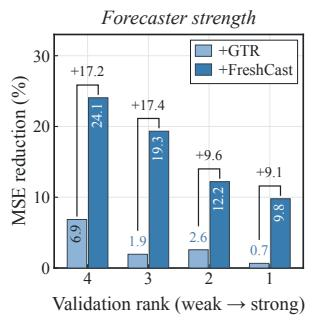  
(a)

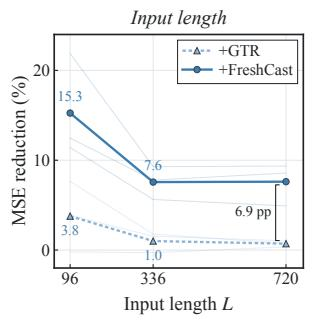  
(b)

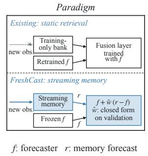  
(c)

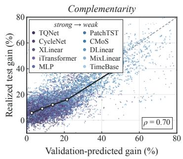  
(d)  
Figure 1: (a) MSE reduction brought by the same retrieval scheme (GTR) and by FreshCast on forecasters ranked by validation error; brackets: gap in percentage points. (b) Average MSE reduction of GTR and FreshCast relative to the forecaster as the input length � grows (MLP, DLinear, iTransformer). (c) Existing retrieval-augmented forecasting versus FreshCast. (d) Validation estimated optimal combination gain versus realized test gain of FreshCast (� = 96, ten forecasters; Spearman correlation 0.70).

Retrieval-augmented time-seriesforecasting. Retrieval-augmented methods retrieve historical segments similar to the current context and use their continuations as forecasting references [8]. Existing work improves how history is represented, as PFRP does with a contrastively trained encoder [6]; how references are organized, as GTR does with a reference table indexed by periodic position [2]; how references are selected, as SARAF does by diversifying them according to the stationarity of the data [37]; and how references are fused, as in the fusion modules of RAFT and SARAF trained jointly with the forecaster [8, 37]. In these methods, the retrieval memory is constructed from the training segment, so observations revealed after deployment do not enter the candidate set. Work on foundation models extends retrieval to other series and knowledge bases [25, 28]. Another line of work keeps the forecaster unchanged and adds retrieval results as a correction: kNN-MTS sets the mixing weight by retrieval distance [33], while CRAFT uses a small fixed coeficient [11]. In neither case is the mixing coeficient cali brated from the alignment between the retrieval-induced correction and the residual errors of the attached forecaster. KUP-BI extracts future trends from a history library restricted to the training seg- ment and injects them into the forecaster through feature-level gating [22]. RAF requires the retrieval memory to contain only time steps strictly earlier than the forecast window of the query, but constructs this memory once when the data are split [28]; we enforce the same causal constraint at every forecast origin while allowing the memory to grow with newly observed data.

Distribution shift and online forecasting. Non-stationary forecasting methods mitigate distribution variation through normalization or learned transformations of input statistics [7, 13, 20, 21, 31]. Test-time adaptation and online forecasting methods ex-ploit ground truth that arrives during deployment. TAFAS, FSNet, OneNet, SOLID, DSOF, and Proceed update the forecaster or adap- tation modules by gradient descent [3, 12, 14, 26, 34, 35]; ST-TTC updates a frequency-domain calibrator [4]; ELF fits a linear forecaster online by closed-form least squares [15]; and DynaME fits experts in closed form on period-lagged samples at every step [9]. Its periodic experts, like our seasonal analogs, use samples from the same phase several periods back. These approaches incorporate newly observed data by updating the forecaster, an adaptation mod- ule, or online-fitted predictive components. FreshCast updates no parameter during deployment: new observations are written into a non-parametric memory as raw values and read out by retrieval.

## 3 Method

## 3.1 Problem Setting

A series has � channels, each standardized with the mean and standard deviation of its training segment. At forecast origin �, a frozen base forecaster (the forecaster for short) takes the lookback window of length � over all channels and outputs the next � steps; its parameters are fixed after training. During deployment, all observations up to � have arrived, but the part outside the look- back window cannot enter the forecaster. Memory retrieval and the resulting memory forecast are constructed per channel; the combination weight introduced in Section 3.5 is shared across the channels of a dataset, for each forecaster and forecast horizon. Fixing one channel, we denote its standardized series by � and the forecaster output on this channel by $f \in \mathbb { R } ^ { H } .$ . The current query is the latest $L _ { q }$ steps of the channel, $x _ { q } ,$ with mean $\hat { \mu } _ { q }$ and standard deviation $\begin{array} { r } { \hat { \sigma } _ { q } . } \end{array}$ We call a historical segment available in the memory a candidate and require every observation it uses to be no later than the forecast origin, a condition we call causal admissibility: for a past window ending at time � together with its next � steps,

$$
s + H \leq t .\tag{1}
$$

At every forecast origin, retrieval uses only causally admissible candidates, i.e., observations available by time �. Ground-truth futures serve as labels for training relational kernel regression, for its loss scale $\varepsilon _ { c } ,$ for validation-based calibration and model selection, and for ofline evaluation on the test segment.

## 3.2 Overview

As shown in Figure 3, FreshCast has three components. (i) A streaming non-parametric memory absorbs newly arrived observations at every forecast origin and supplies causally admissible candidates for each query. (ii) Relational kernel regression weights each candidate by its relation to the query and aggregates the candidates into a memory forecast $r \in \mathbb { R } ^ { \bar { H } }$ . (iii) Combination-weight calibration estimates a combination weight $\hat { w } \in [ 0 , 1 ]$ in closed form on the validation segment. The final output combines the forecaster out- put with the residual correction $d = r - f$ through a combination weight �:

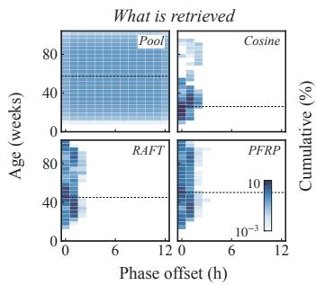  
(a)

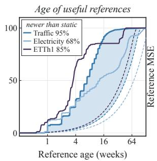  
(b)

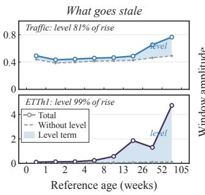  
(c)

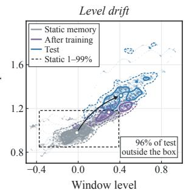  
(d)  
Figure 2: What retrieval returns. (a) On Trafic, joint distribution of phase ofset and age for the candidate pool and for segments retrieved by raw cosine similarity, RAFT, and PFRP. (b) Cumulative age distribution of the ten most useful references in a post hoc evaluation (solid) and of the candidate pool (dashed); legend: share of useful references newer than the static memory. (c) Error of same-phase value readouts by age (solid), without the level term (dashed), and the level term (shaded); Trafic, top; ETTh1, bottom. (d) Level and amplitude of Trafic windows in the static memory, after training, and at test queries; contours: 50% (solid) and 90% (dashed) of each group; circles: medians; dashed box: 1–99% range of the static memory.

$$
\hat { y } = f + w ( r - f ) ,\tag{2}
$$

and FreshCast sets � to the calibrated �ˆ of Section 3.5. During deployment only the memory is updated, and all parameters stay fixed.

## 3.3 Streaming Non-Parametric Memory and Candidates

The memory stores the standardized raw series of each channel and, for every historical window, its mean, standard deviation, and normalized shape vector, which are added as new windows arrive.

Twofamilies ofcandidates. Seasonal analogs use daily and weekly reference points 1 to � periods back, at the same phase as the query. Each candidate spans the following observed period, tiled when � exceeds the period; candidates come only from the most recent � days. The memory also maintains, for the daily and the weekly phase, two exponentially smoothed seasonal profiles with diferent half-lives; their values at the phases of the next � steps, shifted to the query mean, serve as supplementary seasonal candidates. Shape analogs are retrieved from a pool containing every window within the most recent � days that satisfies Eq. (1), together with � windows sampled at random from earlier history; the continuations of the � windows whose normalized shape vectors are most cosine- similar to the query are used.

Two readouts. The continuation $\boldsymbol { y } _ { i } ^ { + } \in \mathbb { R } ^ { H }$ of a piece of history can be read by value, using its raw values, or by shape, standardizing it with the mean $\hat { \mu } _ { c }$ and standard deviation $\hat { \sigma } _ { c }$ of the candidate’s own past window and rescaling it to the level and amplitude of the

query:

$$
\hat { y } _ { i } = \hat { \mu } _ { q } + \frac { \hat { \sigma } _ { q } } { \hat { \sigma } _ { c } } \left( y _ { i } ^ { + } - \hat { \mu } _ { c } \right) .\tag{3}
$$

Because older segments deviate mainly in level (Observation 2, Proposition 4.2), seasonal analogs provide both readouts, and relational kernel regression allocates weight between them mainly according to the level gap; shape analogs may come from distant his- tory and use the shape readout to reduce level and scale diferences from the query.

## 3.4 Relational Kernel Regression

Each query has a few hundred candidates, and which readout of a candidate can be trusted depends on how the candidate relates to the current state (Section 3.3). In our ablations, the correction from relational kernel regression is more correlated with the forecaster’s test errors than that of the untrained rule (Appendix C). For each candidate � we construct a relation descriptor $z _ { i }$ from its family and readout, shape similarity, age, phase distances, level gap $| \hat { \mu } _ { c } - \hat { \mu } _ { q } | / \hat { \sigma } _ { q } ,$ and scale ratio log $( \hat { \sigma } _ { c } / \hat { \sigma } _ { q } )$ , together with series descriptors of the training segment (14 in total; Appendix $\mathrm { A } ) .$ . The scoring function �� is the sum of a linear term and a multilayer perceptron, and the weights are normalized over the valid candidates:

$$
\pi _ { i } = \frac { \exp \bigl ( \beta _ { q } s _ { \theta } ( z _ { i } ) \bigr ) } { \sum _ { j } \exp \bigl ( \beta _ { q } s _ { \theta } ( z _ { j } ) \bigr ) } , \qquad r = \sum _ { i } \pi _ { i } \hat { y } _ { i } ,\tag{4}
$$

where the inverse temperature $\beta _ { q }$ is determined by the similarity distribution of the candidate set and the series descriptors. Rela- tional kernel regression only assigns weights and generates no values itself. It is trained with queries as samples, with the loss normalized by the validation error $\varepsilon _ { c }$ of an untrained baseline on each channel:

$$
\ell = \operatorname* { m i n } \Bigg ( \frac { \| r - y _ { t + 1 : t + H } \| _ { 2 } ^ { 2 } } { H \varepsilon _ { c } } , \ c _ { \operatorname* { m a x } } \Bigg ) \ .\tag{5}
$$

One relational kernel regression model is trained per forecast hori- zon and shared across sampled channels of all datasets; training

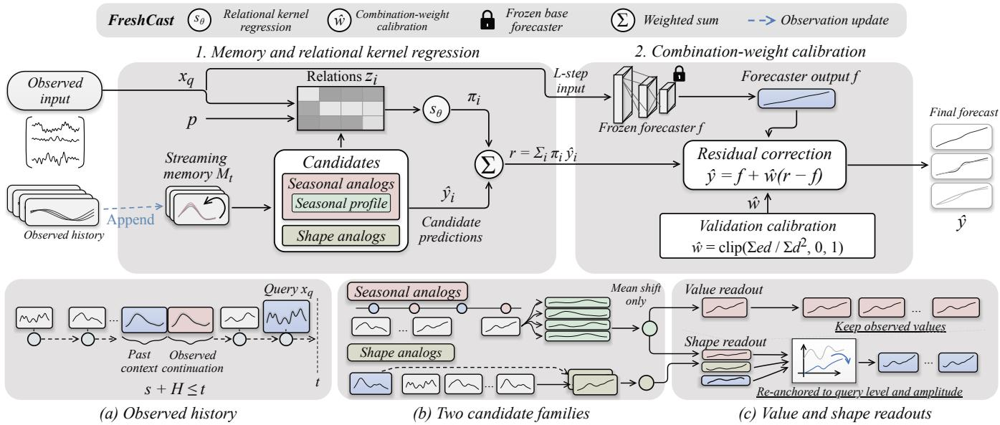  
Figure 3: Overview of FreshCast. Top: (1) the streaming memory supplies seasonal analogs, seasonal profiles, and shape analogs, and relational kernel regression weights their readouts into the memory forecast �; (2) �ˆ is estimated on the validation segment and fixed at test time. Bottom: (a) observed history and causal admissibility $s + H \leq t ; \left( \mathbf { b } \right)$ the two candidate families; (c) the value and shape readouts.

samples come from the training segment, and the loss scale is esti- mated on the validation segment.

## 3.5 Combination-Weight Calibration

Let the forecaster error be $e \ = \ y - f .$ By Eq. (2), the combined error is $e - w d _ { \colon }$ , whose mean squared error is quadratic in � and minimized at $w ^ { * } = S _ { e d } / S _ { d d }$ , with $S _ { e d } = \mathbb { E } [ e d ]$ and $S _ { d d } = \mathbb { E } [ d ^ { 2 } ]$ (Proposition 4.1). The more aligned the residual correction is with the forecaster error, the larger $\boldsymbol { w } ^ { * }$ . For a given forecaster, per dataset and forecast horizon, we compute on the validation segment

$$
\hat { w } = \mathrm { c l i p } \left( \frac { \sum _ { i } e _ { i } d _ { i } } { \sum _ { i } d _ { i } ^ { 2 } } , 0 , 1 \right) ,\tag{6}
$$

where the sums run over validation origins, channels, and forecast steps; �ˆ is then used on the test segment. When $\begin{array} { r } { \sum _ { i } e _ { i } d _ { i } \le 0 , \hat { w } = 0 } \end{array}$ and the output equals the forecaster output exactly, which we call the safe fallback.

## 3.6 Training and Inference

Within FreshCast, only the relational kernel regression module is trained, with about $5 . 5 \times 1 0 ^ { 3 }$ parameters. The forecaster is trained with its oficial configuration and frozen; there is no joint optimization, and attaching a forecaster only requires computing Eq. (6). The candidate pool and the number of candidates per query are set by �, �, �, and � and do not grow with deployment time.

## 4 Theoretical Analysis

Under a simplified generative model, we explain the three observa- tions and ground the memory, the readouts, and the calibration of FreshCast (proofs in Appendix B, checks in Appendix C).

Setting. Fix one channel and let � be the query origin.

Assumption 1. The series satisfies $y _ { t } = m _ { t } + a _ { t } \psi ( \varphi _ { t } ) + \varepsilon _ { t } ,$ where $\psi ( \cdot )$ has period � with zero mean and unit mean square over one period, $\varepsilon _ { t }$ is i.i.d. with variance $\sigma _ { \varepsilon } ^ { 2 }$ and independent of $( m , a )$ , and the increments of level and amplitude are independent of the phase.

Let $D ( \tau ) = \mathbb { E } [ ( m _ { t } - m _ { t - \tau } ) ^ { 2 } ]$ and $A ( \tau ) = \mathbb { E } [ ( a _ { t } - a _ { t - \tau } ) ^ { 2 } ]$ . The forecaster is $f = F ( X _ { L } )$ , the memory forecast $r = R ( M _ { t } , X _ { L } )$ , and the output $\hat { y } = f + w ( r - f )$ . With $e = y - f$ and $d = r - f , \operatorname { l e t } S _ { e e } =$ $\mathbb { E } [ e ^ { 2 } ] , S _ { e d } = \mathbb { E } [ e d ]$ , and $S _ { d d } = \mathbb { E } [ d ^ { 2 } ]$ , and define the uncentered correlation $\rho = S _ { e d } / \sqrt { S _ { e e } S _ { d d } }$ , the complementarity $\kappa = S _ { e d } / S _ { e e } ,$ , and the divergence $\delta = S _ { d d } / S _ { e e }$

Proposition 4.1 (Combination gain). (i) For any�, $\begin{array} { r l } { \operatorname { M S E } ( \boldsymbol { w } ) = } & { { } } \end{array}$ $S _ { e e } ( 1 - \rho ^ { 2 } ) + S _ { d d } ( w - w ^ { * } ) ^ { 2 }$ with $w ^ { * } = S _ { e d } / S _ { d d } . I f 0 \leq w ^ { * } \leq 1 ,$ , the largest error reduction relative to the forecaster is $g ^ { * } = \rho ^ { 2 } = \kappa ^ { 2 } / \delta ;$ $i f S _ { e d } \ \leq \ 0 .$ , the optimal weight is 0. (ii) $H 0 \leq w ^ { * } \leq 1$ and $( e , d )$ is zero-mean jointly Gaussian, $g ^ { * } = 1 - \exp ( - 2 I ( e ; d ) )$ . (iii) If, in addition, (�, �) is independent of�, then $I ( e ; d ) = I ( Y ; R \mid F )$

Part (i) is the classical optimal combination of two forecasts [1], written for the forecaster and the memory forecast. The attainable combination gain depends on the second-order relation between forecaster error and memory correction; under the assumptions of parts (i)–(iii), it is a monotone function of conditional mutual information.

Proposition 4.2 (Timeliness). Let a candidate share the phase of the query and have age �. (i) The error of the value readout is $\begin{array} { r } { \mathbb { E } [ ( y - r ) ^ { 2 } ] = D ( \tau ) + A ( \tau ) + 2 \sigma _ { \varepsilon } ^ { 2 } . ( i i ) . } \end{array}$ If the level process is a stationary, mixing Markov process, then $I ( m _ { t } ; m _ { t - \tau } )$ is non-increasing in � and tends to zero. (iii) If level and amplitude are approximately constant over one look-back window plus one horizon, the error ofthe shape readout does not depend on � to first order.

Consequently, with training ending at $T _ { \mathrm { t r } }$ , the minimum age of segments in a static memory, $t - T _ { \mathrm { t r } } + H$ , grows linearly with deploy- ment time, and the information about the current level carried by value-read references decays accordingly, whereas the minimum age in a streaming memory is always � (Corollary B.1 in Appen dix B). When the level oscillates seasonally, the Markov condition fails and segments from one year earlier regain low error.

Proposition 4.3 (A sufficiently long input removes the periodic part). Split the memory into a periodic part $M _ { p }$ and a state part $M _ { s }$ after the end of training. Then $I ( Y ; M \mid X _ { L } ) = \hat { I ( Y ; M _ { p } \mid }$ $X _ { L } ) + I ( Y ; M _ { s } \mid X _ { L } , M _ { p } )$ , and $i f Y$ and $M _ { p }$ are conditionally independent given $X _ { L }$ when $L \geq P ,$ the first term vanishes.

A suficiently long input window therefore removes the periodic part of the upper bound on the gain; whether the remaining state part is positive is an empirical question (Sections 5.2 and 5.5).

Theorem 4.4 (Harm probability of the calibrated weight). Let $0 < w ^ { * } \leq 1$ and let �ˆ be estimated from � validation samples by Eq. $\mathrm { ( 6 ) . } \mathrm { ( } i ) \mathrm { M S E } ( \hat { w } ) - S _ { e e } = S _ { d d } [ ( \hat { w } - w ^ { * } ) ^ { 2 } - w ^ { * 2 } ]$ , so �ˆ is worse than the forecaster if and only $i f | \hat { w } - w ^ { * } | > w ^ { * }$ . (ii) If the samples are i.i.d. and follow the test distribution, and �, � and $v _ { q } , b _ { q }$ are the variances and bounds of $\dot { \boldsymbol { d } } ( e - w ^ { * } \boldsymbol { d } )$ and $d ^ { 2 } - S _ { d d }$ , then

$$
\begin{array} { r l r } & { } & { \mathrm { P r } \big ( \mathrm { M S E } ( \hat { w } ) > S _ { e e } \big ) \leq 2 \exp \left( - \frac { n \kappa ^ { 2 } S _ { e e } ^ { 2 } } { 8 v + \frac { 4 } { 3 } b \kappa S _ { e e } } \right) } \\ & { } & { + \exp \left( - \frac { n S _ { d d } ^ { 2 } } { 8 v _ { q } + \frac { 4 } { 3 } b _ { q } S _ { d d } } \right) . } \end{array}
$$

(iii) Under the test distribution, (i) holds with $S _ { d d }$ and �∗ replaced by their test counterparts, so the harm at deployment is determined jointly by the estimation error and the shift between the optimal weights on the validation and test segments.

When $\kappa > 0 ,$ , the probability of doing worse than the forecaster decays exponentially in $n \kappa ^ { 2 }$ . In our ablations, training-segment estimates tend to be too low when the forecaster has lower training than validation error, while validation estimates for static mem ory tend to be too high at test time; part (iii) characterizes the efect of these shifts on error (Section 5.4). The optimal weight still shifts when the relative reliability of the forecaster and the memory changes between the validation and test segments (the worst setting in Section 5.6); Appendix C reports how often this causes harm. The analysis assumes an additive, per-channel model, whereas the combination weight of FreshCast pools channels within a dataset.

## 5 Experiments

## 5.1 Experimental Setup

Data and forecasters. We use seven long-term forecasting bench-marks: ETTh1, ETTh2, ETTm1, ETTm2, Weather, Electricity, and Trafic [30, 36], split chronologically into training, validation, and test segments (12/4/4 months for ETT and 7:1:2 otherwise). The main experiments are multivariate, and all consecutive test origins are evaluated. The forecasters are MLP, DLinear [32], PatchTST [24], iTransformer [19], and CycleNet [17], together with TQNet [16],

XLinear [5], MixLinear [23], TimeBase [10], and CMoS [27], pro-posed in 2025–2026; each is trained with its oficial configura- tion and then frozen. To compare short and long inputs, we use � ∈ {96, 336, 720} and horizons � ∈ {96, 192, 336, 720}; PatchTST is evaluated only at $L = 9 6$ and 336.

Baselines. We compare FreshCast with GTR [2], RAFT [8], and PFRP [6], each in the comparison setting described below. GTR provides implementations attached to MLP, DLinear, PatchTST, and iTransformer. RAFT is a complete model with a shallow lin ear backbone, and we compare it with the structurally closest MLP+FreshCast. PFRP has only a univariate implementation, and we compare on the four forecasters in its paper, SparseTSF [18], DLinear, PatchTST, and TimesNet [29], with its target channels and $L = 9 6$ . Unless otherwise stated, retrieval baselines use the hyperparameter settings reported in their original papers. The online forecasting method DynaME [9] is compared in our setting: a frozen iTransformer without time features (the variant DynaME natively supports), $L = 9 6 ,$ , and hyperparameters selected on the validation segment only (Appendix A).

Evaluation. We report MSE and MAE. Model selection, early stopping, and estimation of the combination weight use only the validation segment. We train each forecaster with three seeds and average the results; the hyperparameters of FreshCast are identical across datasets, forecasters, and input lengths (Appendix A).

## 5.2 Generality

FreshCast reduces the average error for every evaluated forecaster– input-length combination (Table 1, Figure 4(a)). Across 812 settings, FreshCast reduces MSE in 789, reproduces the forecaster’s output with zero combination weights in 13, and increases MSE in 10. The mean reduction is 14.6% across ten forecasters at $L = 9 6$ and 5.6% across nine at $L = 7 2 0$ , and on the original forecasters evaluated at each length a paired test over (dataset, �, forecaster, forecaster seed) units is significant at all three input lengths $( p \leq 1 0 ^ { - 5 0 } )$ . Taking each dataset as one unit, the most conservative grouping, all seven datasets improve at every input length (exact Wilcoxon signed-rank test, $p = 0 . 0 1 6$ , the minimum for seven units). The improvement shrinks as the input lengthens but persists at the longest input, consistent with Observation 1 and Proposition 4.3: periodic memory information can become redundant as the look-back grows, while post-training observations can still provide additional information. Lengthening the query of FreshCast itself does not restore the gain at long inputs (Appendix A). Results for all three input lengths are in Appendix E.

## 5.3 Comparison with Retrieval-Augmented and Online Methods

In each baseline’s comparison setting, FreshCast attains lower MSE (Table 2, Figure 4(b)). Relative to GTR, MSE is lower in 294 of 308 settings. With long inputs, the gain of GTR disappears or turns negative (−5.6% at $L = 3 3 6$ , mainly from PatchTST, and +0.7% at $L = 7 2 0 )$ , whereas FreshCast still improves these forecasters by 4.2%–9.4%. Relative to the original RAFT model, MSE is lower in 28/28, 24/28, and 26/28 settings at the three input lengths, including RAFT’s own $L = 7 2 0$ setting. With the trained RAFT models fixed and their test-time bank growing under the same causal rule, RAFT has access to the same information and improves by 3.1% at � = 96, but not at � = 336 and 720. FreshCast’s MSE remains 10.0%, 4.9%, and 4.3% lower: having the new observations is not enough by itself. Relative to PFRP, FreshCast’s MSE is significantly lower on all four forecasters (seed-level paired tests, $p \leq 1 . 3 \times 1 0 ^ { - 4 } )$ , and on SparseTSF, the main model of PFRP, FreshCast is better on five of the seven datasets. With the forecaster frozen, FreshCast also has lower MSE than the online forecasting method DynaME in 27 of 28 settings, by 7.1% on average $( p = 2 . 2 \times 1 0 ^ { - 1 5 } )$ . DynaME reduces the error of the forecaster by 5.8%, about half of the 12.4% achieved by FreshCast. Under this protocol, the original DynaME variant does not significantly outperform the frozen-backbone variant (17/28 settings improve; mean MSE change −0.5%, � = 0.13).

Table 1: Test MSE of the ten forecasters alone (Base) and with FreshCast at � = 96, averaged over the four horizons. The upper block shows the five original forecasters and the lower block the five forecasters proposed in 2025–2026.
<table><tr><td></td><td colspan="2">MLP</td><td colspan="2">DLinear</td><td colspan="2">PatchTST</td><td colspan="2">iTransformer</td><td colspan="2">CycleNet</td></tr><tr><td>Dataset</td><td>Base</td><td>+FreshCast</td><td>Base</td><td>+FreshCast</td><td>Base</td><td>+FreshCast</td><td>Base</td><td>+FreshCast</td><td>Base</td><td>+FreshCast</td></tr><tr><td>ETTh1</td><td>0.449</td><td>0.403</td><td>0.462</td><td>0.438</td><td>0.485</td><td>0.461</td><td>0.472</td><td>0.405</td><td>0.450</td><td>0.403</td></tr><tr><td>ETTh2</td><td>0.374</td><td>0.368</td><td>0.560</td><td>0.371</td><td>0.530</td><td>0.372</td><td>0.387</td><td>0.375</td><td>0.378</td><td>0.374</td></tr><tr><td>ETTm1</td><td>0.383</td><td>0.330</td><td>0.403</td><td>0.339</td><td>0.434</td><td>0.350</td><td>0.413</td><td>0.336</td><td>0.380</td><td>0.330</td></tr><tr><td>ETTm2</td><td>0.279</td><td>0.250</td><td>0.347</td><td>0.251</td><td>0.356</td><td>0.251</td><td>0.290</td><td>0.252</td><td>0.270</td><td>0.248</td></tr><tr><td>Weather</td><td>0.258</td><td>0.224</td><td>0.267</td><td>0.227</td><td>0.255</td><td>0.226</td><td>0.270</td><td>0.227</td><td>0.246</td><td>0.222</td></tr><tr><td>Electricity</td><td>0.190</td><td>0.158</td><td>0.210</td><td>0.159</td><td>0.190</td><td>0.155</td><td>0.175</td><td>0.153</td><td>0.168</td><td>0.155</td></tr><tr><td>Traffic</td><td>0.459</td><td>0.394</td><td>0.626</td><td>0.400</td><td>0.550</td><td>0.397</td><td>0.424</td><td>0.384</td><td>0.484</td><td>0.394</td></tr></table>

<table><tr><td></td><td colspan="2">TQNet</td><td colspan="2">XLinear</td><td colspan="2">MixLinear</td><td colspan="2">TimeBase</td><td colspan="2">CMoS</td></tr><tr><td>ETTh1</td><td>0.444</td><td>0.402</td><td>0.433</td><td>0.400</td><td>0.447</td><td>0.399</td><td>0.463</td><td>0.401</td><td>0.475</td><td>0.398</td></tr><tr><td>ETTh2</td><td>0.378</td><td>0.374</td><td>0.372</td><td>0.370</td><td>0.384</td><td>0.378</td><td>0.405</td><td>0.386</td><td>0.394</td><td>0.375</td></tr><tr><td>ETTm1</td><td>0.378</td><td>0.330</td><td>0.374</td><td>0.330</td><td>0.422</td><td>0.334</td><td>0.427</td><td>0.335</td><td>0.401</td><td>0.334</td></tr><tr><td>ETTm2</td><td>0.278</td><td>0.249</td><td>0.272</td><td>0.249</td><td>0.288</td><td>0.253</td><td>0.291</td><td>0.254</td><td>0.286</td><td>0.253</td></tr><tr><td>Weather</td><td>0.242</td><td>0.222</td><td>0.238</td><td>0.219</td><td>0.275</td><td>0.228</td><td>0.253</td><td>0.223</td><td>0.253</td><td>0.225</td></tr><tr><td>Electricity</td><td>0.165</td><td>0.150</td><td>0.172</td><td>0.154</td><td>0.224</td><td>0.160</td><td>0.227</td><td>0.160</td><td>0.203</td><td>0.160</td></tr><tr><td>Traffic</td><td>0.445</td><td>0.389</td><td>0.465</td><td>0.395</td><td>0.637</td><td>0.400</td><td>0.681</td><td>0.400</td><td>0.552</td><td>0.399</td></tr></table>

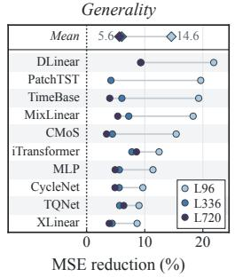  
(a)

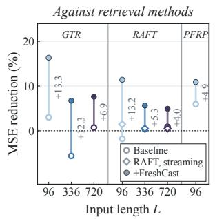  
(b)

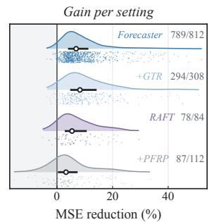  
(c)

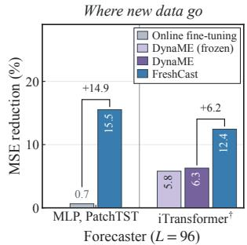  
(d)  
Figure 4: Main results. (a) MSE reduction of FreshCast relative to each forecaster at the three input lengths; top row: mean over forecasters. (b) MSE reduction relative to the forecaster of each retrieval-augmented baseline (hollow; diamonds: RAFT with a streaming bank) and of FreshCast (filled); numbers: gap in percentage points. (c) Distribution of per-setting MSE reduction of FreshCast relative to the forecaster, +GTR, RAFT, and +PFRP (bars: interquartile range; circles: medians; dots: settings), with the number of positive settings. (d) MSE reduction relative to the forecaster at � = 96 when new observations are written into parameters (online fine-tuning, DynaME) or into the memory (FreshCast); brackets: gap in percentage points.

## 5.4 Ablation

The ablations change only the design choices of Section 3 (Table 3), on seven datasets and all channels, with MLP, iTransformer, and CycleNet at $L \in \{ 9 6 , 7 2 0 \}$ ; the forecaster seed is 2024 and kernel seeds are 0–2.

Timeliness ofthe memory and where the weight is estimated. In the upper block of Table 3, we cross a static memory (frozen at the end of the training segment) or a streaming memory with a combination weight estimated by Eq. (6) on the training or the validation segment. For these three forecasters, only the streaming memory with validation estimation is best at both input lengths, with no setting worse than the forecaster. With a static memory, the error reduction at � = 96 shrinks from about 11% to about 2%. FreshCast underperforms the forecaster in some settings, and on five datasets in some of the eight equal test-period intervals (Ap- pendix C). With a streaming memory, the weight estimated on the training segment is smaller, about half of the validation estimate at

Table 2: Average MSE change of FreshCast relative to retrieval-augmented methods in their comparison settings and to DynaME with the forecaster frozen (negative: lower MSE with FreshCast; dashes: not evaluated).
<table><tr><td>Method</td><td>Forecaster</td><td>L = 96</td><td>L = 336</td><td>L = 720</td></tr><tr><td>GTR</td><td>MLP</td><td>-7.8%</td><td>-4.1%</td><td>-3.9%</td></tr><tr><td></td><td>DLinear</td><td>-15.2%</td><td>-7.6%</td><td>-8.7%</td></tr><tr><td></td><td>PatchTST</td><td>-18.3%</td><td>-21.9%</td><td></td></tr><tr><td></td><td>iTransformer</td><td>-12.6%</td><td>-8.0%</td><td>-8.2%</td></tr><tr><td>RAFT (original)</td><td>MLP</td><td>-12.7%</td><td>-5.1%</td><td>-4.0%</td></tr><tr><td>RAFT, streaming</td><td>MLP</td><td>-10.0%</td><td>-4.9%</td><td>-4.3%</td></tr><tr><td>PFRP</td><td>SparseTSF</td><td>-3.2%</td><td></td><td></td></tr><tr><td></td><td>DLinear</td><td>-8.2%</td><td></td><td></td></tr><tr><td></td><td>PatchTST</td><td>-4.5%</td><td></td><td></td></tr><tr><td></td><td>TimesNet</td><td>-4.5%</td><td></td><td></td></tr><tr><td>DynaME</td><td>iTransformer†</td><td>-7.1%</td><td></td><td></td></tr></table>

†Without time features, as natively supported by DynaME. ‡Test-time bank grows with observations (Appendix D).

$L = 7 2 0 \left( p = 8 \times 1 0 ^ { - 3 0 } \right)$ ; this holds when the forecaster has lower training than validation error (Appendix E). The two factors inter-act in the variant combining a static memory with training-segment estimation: on the training segment the two memories have identi-cal contents, and the weight estimated there reflects the value of a fresh memory. Applying it to the outdated static memory makes the error at $L = 9 6$ about 5.6% higher than that of the forecaster. These are the two shifts characterized by Theorem 4.4(iii).

Content of the memory and the readouts. Seasonal analogs provide most of the gain: using only shape analogs raises the error at $L = 9 6$ by about 4.8% relative to the full method, shape analogs add a further 0.8%, and the seasonal profiles add none (Appendix A). This gain does not grow with how periodic a channel is (Appendix E). The value readout of recent segments contributes materially: using only the shape readout for seasonal analogs raises the error by about 2.7%. With the same streaming memory, an untrained rule selected per channel already reduces the error at � = 96 by 6.2%, 7.6%, and 5.3%, more than the full method with a static memory: the freshness of the memory matters more than how it is read. For these three forecasters, the untrained rule still has about 5.5% and 3.7% higher MSE at � = 96 and 720 and underperforms the forecaster in 25 of 168 settings, whereas relational kernel regression does so in none; all 25 satisfy the harm condition in Theorem 4.4 (Appendix C). The share of the shape readout among seasonal analogs rises from 6% to 37% as the level gap grows from below 0.5 to above 4. When grouped by age, the youngest segments have the highest shape readout share in the streaming memory, although value readouts still receive over 80% of their weight (Figure 5).

## 5.5 Where Does the Improvement Come From?

Under the controls below, the improvement comes from the newly arrived observations in the memory and from the retrieved content.

Where new observations are written. The same deployment-time observations could instead be written into the parameters of the forecaster. Fine-tuning the forecaster daily on them reduces its error by only 0.65%, and FreshCast achieves 15.0% lower MSE than online fine-tuning (� = 96, MLP and PatchTST; setup in Appendix D). In these settings, neither writing new observations into parameters nor adding them to RAFT’s bank (Section 5.3) yields the gain of writing them into FreshCast’s memory (Figure 4(d)).

Table 3: Ablation: MSE change (%) relative to the forecaster; Recent averages the five forecasters proposed in 2025–2026 (Appendix E). A superscript gives the number of settings worse than the forecaster (of 28, or of 140 for Recent; omitted when zero). The upper block crosses the timeliness of the memory with where the combination weight is estimated; the lower block changes the memory content, the readout, or the kernel, with a streaming memory and the validation estimate �ˆ .
<table><tr><td></td><td colspan="4"> $L = 9 6$ </td><td colspan="4"> $L = 7 2 0$ </td></tr><tr><td>Variant</td><td>MLP</td><td>iTr.</td><td>Cyc.</td><td>Recent</td><td>MLP</td><td>iTr.</td><td>Cyc.</td><td>Recent</td></tr><tr><td>Streaming, validation  (full)</td><td>-11.4</td><td>-12.4</td><td>-9.6</td><td>-14.0</td><td>-4.7</td><td>-8.6</td><td>-4.8</td><td>-4.47</td></tr><tr><td>Streaming, training wtrain</td><td>-11.0</td><td>-12.0</td><td>-9.2</td><td>-14.2</td><td>-3.7</td><td>-5.4</td><td></td><td> $\begin{array} { r l } { - 3 . 4 } & { { } - 3 . 8 ^ { 8 } } \end{array}$ </td></tr><tr><td>Static, validation </td><td>-2.1⁵</td><td>-2.6⁴</td><td>-1.1⁶</td><td>-4.1³4</td><td>-0.75</td><td></td><td></td><td>-1.63 +0.18 +0.642</td></tr><tr><td>Static, training Wtrain</td><td> $+ 5 . 4 ^ { 1 3 }$ </td><td> $+ 5 . 7 ^ { 1 2 }$ </td><td>+5.817</td><td>+6.476</td><td>-0.47</td><td>-3.32</td><td></td><td> $- 0 . 7 ^ { 9 } + 4 . 9 ^ { 7 9 }$ </td></tr><tr><td>Shape analogs only</td><td>-7.0</td><td>-8.1</td><td>-5.7</td><td>-9.81</td><td>-3.51</td><td>-6.8</td><td></td><td> $- 3 . 5 ^ { 1 } - 3 . 3 ^ { 1 0 }$ </td></tr><tr><td>Seasonal analogs only</td><td>-10.5</td><td>-11.8</td><td>-9.0</td><td>-13.2</td><td>-4.01</td><td>-7.7</td><td></td><td> $\begin{array} { r l } { - 4 . 2 } & { { } - 3 . 5 ^ { 9 } } \end{array}$ </td></tr><tr><td>Seasonal, shape readout only</td><td>-8.9</td><td>-10.1</td><td>-7.3</td><td>-11.8 -3.81 -7.2</td><td></td><td></td><td></td><td> $- 4 . 0 \quad - 3 . 7 ^ { 1 0 }$ </td></tr><tr><td>Untrained rule for kernel</td><td>-6.21</td><td>-7.61</td><td>-5.31</td><td>-8.77 -1.78 -4.65 -1.59 -0.751</td><td></td><td></td><td></td><td></td></tr></table>

What the retrieved content contributes. We replace the channel’s memory with that of another channel while keeping the relational kernel regression parameters unchanged. With this memory, the gain disappears and the combination weight falls below 0.08, so the parameters alone do not carry the gain. Excluding the � steps before the origin from the memory, to test whether the gain rests on them, raises the error by less than 2%. A tiling of the most recent complete period supplies only the periodic structure. On Trafic and Electricity its average MSE change at � = 720 is +0.1% and −0.8%, whereas the full memory still improves by 1.8%–7.1%, consistent with Proposition 4.3. Finally, a calibrated combination with a persistence forecast in place of the memory forecast brings almost no improvement (weight below 0.13, error change within ±0.4%).

## 5.6 Safety and Eficiency

The 10 of 812 settings with higher error than the forecaster all come from the recent forecasters and from PatchTST with long inputs; the worst is CMoS on ETTh2 at � = 720, with 3.6% higher error. CMoS is worse than the memory on the validation segment but better on the test segment; the estimated weight is therefore 0.89 against a test optimum of 0.19, the failure case of Theorem 4.4(iii).

FreshCast does not retrain the forecaster. On Trafic $\left( L = H = 9 6 \right)$ candidate generation, training of relational kernel regression, and weight estimation take 3.99 minutes in total on a single CPU thread and are shared by all forecasters, whereas GTR retrains the whole model for every forecaster, at an extra 4.7 to 80.5 minutes of GPU training. Inference at one origin (862 channels) takes 1.36 s on one thread and 0.061 s with 48 processes, negligible relative to Trafic’s one-hour sampling interval. The current implementation stores the shapes of all past windows (6.36 GiB on Trafic, comparable to the 6.5 GiB retrieval keys of RAFT); a bounded-storage design is estimated at 1.6 GiB but has not been implemented or measured. Average accuracy is insensitive to the recent-window length: with � = 28, 56, or 112 days, the error difers by at most 0.3% (Appen dix A), so � can follow the storage budget; all results use $K = 1 1 2$

## 6 Conclusion

We studied why retrieval-augmented forecasting brings limited gains on frozen forecasters and identified two interrelated key determinants: historical segments with similar shapes can carry outdated levels, and the gain of the forecast formed from the refer- ences depends on how well its correction aligns with the forecaster’s residual errors. This alignment can be estimated before deployment; keeping the memory updated and estimating the weight on data the forecaster has not seen reduce the shifts caused by outdated references and by estimation on training data. Accordingly, Fresh-Cast keeps the forecaster frozen, continuously updates a streaming non-parametric memory, and calibrates the combination weight in closed form on the validation segment, reducing the error across forecasters and input lengths. For a frozen forecaster, what retrieval can ofer is the new observations it has never seen and the patterns it has not yet captured; deciding query by query whether a reference can be trusted remains an open problem.

## References

[1] J. M. Bates and C. W. J. Granger. 1969. The Combination of Forecasts. Operational Research Quarterly 20, 4 (1969), 451–468.

[2] Fanpu Cao, Lu Dai, Jindong Han, and Hui Xiong. 2026. Enhancing Multivari ate Time Series Forecasting with Global Temporal Retrieval. In International Conference on Learning Representations.

[3] Mouxiang Chen, Lefei Shen, Han Fu, Zhuo Li, Jianling Sun, and Chenghao Liu. 2024. Calibration of Time-Series Forecasting: Detecting and Adapting Context-Driven Distribution Shift. In Proceedings of the 30th ACM SIGKDD Conference on Knowledge Discovery and Data Mining. 341–352. doi:10.1145/3637528.3671926

[4] Wei Chen and Yuxuan Liang. 2025. Learning with Calibration: Exploring Test-Time Computing of Spatio-Temporal Forecasting. In Advances in Neural Information Processing Systems.

[5] Xinyang Chen, Huidong Jin, Yu Huang, and Zaiwen Feng. 2026. XLinear: A Lightweight and Accurate MLP-Based Model for Long-Term Time Series Fore- casting with Exogenous Inputs. In Proceedings of the AAAI Conference on Artificial Intelligence, Vol. 40. 20325–20335. doi:10.1609/aaai.v40i24.39121

[6] Dazhao Du, Tao Han, and Song Guo. 2026. Predicting the Future by Retrieving the Past. In Proceedings ofthe AAAI Conference on Artificial Intelligence, Vol. 40. 20896–20904. doi:10.1609/aaai.v40i25.39230

[7] Wei Fan, Pengyang Wang, Dongkun Wang, Dongjie Wang, Yuanchun Zhou, and Yanjie Fu. 2023. Dish-TS: A General Paradigm for Alleviating Distribution Shift in Time Series Forecasting. In Proceedings ofthe AAAI Conference on Artificial Intelligence, Vol. 37. 7522–7529. doi:10.1609/aaai.v37i6.25914

[8] Sungwon Han, Seungeon Lee, Meeyoung Cha, Sercan Ö. Arik, and Jinsung Yoon. 2025. Retrieval Au mented Time Series Forecastin . In Proceedings ofthe 42nd International Conference on Machine Learning.

[9] Seungha Hong, Sukang Chae, Suyeon Kim, Sanghwan Jang, and Hwanjo Yu. 2026. Dynamic Multi-period Experts for Online Time Series Forecasting. In Proceedings of the ACM Web Conference 2026. 7669–7678. doi:10.1145/3774904.3792731

[10] Qihe Huang, Zhengyang Zhou, Kuo Yang, Zhongchao Yi, Xu Wang, and Yang Wang. 2025. TimeBase: The Power of Minimalism in Eficient Long-term Time Series Forecasting. In Proceedings of the 42nd International Conference on Machine Learning.

[11] Junhyeok Kang, Jun Seo, Soyeon Park, Sangjun Han, Seohui Bae, Hyeokjun Choe, and Soonyoung Lee. 2026. Channel-Wise Retrieval for Multivariate Time Series Forecasting. In IEEE International Conference on Acoustics, Speech and Signal Processing (ICASSP). 1336–1340. doi:10.1109/ICASSP55912.2026.11463178

[12] HyunGi Kim, Siwon Kim, Jisoo Mok, and Sungroh Yoon. 2025. Battling the Nonstationarity in Time Series Forecasting via Test-time Adaptation. In Proceedings of the AAAI Conference on Artificial Intelligence, Vol. 39. 17868–17876. doi:10. 1609/aaai.v39i17.33965

[13] Taesung Kim, Jinhee Kim, Yunwon Tae, Cheonbok Park, Jang-Ho Choi, and Jaegul Choo. 2022. Reversible Instance Normalization for Accurate Time-Series Forecasting against Distribution Shift. In International Conference on Learning

Representations.

[14] Ying-yee Ava Lau, Zhiwen Shao, and Dit-Yan Yeung. 2025. Fast and Slow Streams for Online Time Series Forecasting Without Information Leakage. In International Conference on Learning Representations.

[15] Thomas L. Lee, William Toner, Rajkarn Singh, Artjom Joosen, and Martin Asenov. 2025. Lightweight Online Adaption for Time Series Foundation Model Forecasts. In Proceedings of the 42nd International Conference on Machine Learning.

[16] Shengsheng Lin, Haojun Chen, Haijie Wu, Chunyun Qiu, and Weiwei Lin. 2025. Temporal Query Network for Eficient Multivariate Time Series Forecasting. In Proceedings of the 42nd International Conference on Machine Learning.

[17] Shengsheng Lin, Weiwei Lin, Xinyi Hu, Wentai Wu, Ruichao Mo, and Haocheng Zhong. 2024. CycleNet: Enhancing Time Series Forecasting through Modeling Periodic Patterns. In Advances in Neural Information Processing Systems.

[18] Shengsheng Lin, Weiwei Lin, Wentai Wu, Haojun Chen, and Junjie Yang. 2024. SparseTSF: Modeling Long-term Time Series Forecasting with 1k Parameters. In Proceedings ofthe 41st International Conference on Machine Learning.

[19] Yong Liu, Tengge Hu, Haoran Zhang, Haixu Wu, Shiyu Wang, Lintao Ma, and Mingsheng Long. 2024. iTransformer: Inverted Transformers Are Efective for Time Series Forecasting. In International Conference on Learning Representations.

[20] Yong Liu, Haixu Wu, Jianmin Wang, and Mingsheng Long. 2022. Non-stationary Transformers: Exploring the Stationarity in Time Series Forecasting. In Advances in Neural Information Processing Systems, Vol. 35. 9881–9893.

[21] Zhiding Liu, Mingyue Cheng, Zhi Li, Zhenya Huang, Qi Liu, Yanhu Xie, and Enhong Chen. 2023. Adaptive Normalization for Non-stationary Time Series Forecasting: A Temporal Slice Perspective. In Advances in Neural Information Processing Systems.

[22] Liu Chong, Yingjie Zhou, Hao Li, Pengyang Wang, Qingsong Wen, and Ce Zhu. 2026. Beyond Extrapolation: Knowledge Utilization Paradigm with Bidirectional Ins iration for Time Series Forecastin . In Proceedings ofthe 43rd International Conference on Machine Learning.

[23] Aitian Ma, Dongsheng Luo, and Mo Sha. 2026. MixLinear: Extreme Low Resource Multivariate Time Series Forecasting with 0.1K Parameters. In International Conference on Learning Representations.

[24] Yuqi Nie, Nam H. Nguyen, Phanwadee Sinthong, and Jayant Kalagnanam. 2023. A Time Series is Worth 64 Words: Long-term Forecasting with Transformers. In International Conference on Learning Representations.

[25] Kanghui Ning, Zijie Pan, Yu Liu, Yushan Jiang, James Y. Zhang, Kashif Rasul, Anderson Schneider, Lintao Ma, Yuriy Nevmyvaka, and Dongjin Song. 2025. TS RAG: Retrieval-Augmented Generation based Time Series Foundation Models are Stronger Zero-Shot Forecaster. In Advances in Neural Information Processing Systems.

[26] Quang Pham, Chenghao Liu, Doyen Sahoo, and Steven C. H. Hoi. 2023. Learning Fast and Slow for Online Time Series Forecasting. In International Conference on Learning Representations.

[27] Haotian Si, Changhua Pei, Jianhui Li, Dan Pei, and Gaogang Xie. 2025. CMoS: Rethinking Time Series Prediction Through the Lens of Chunk-wise Spatial Correlations. In Proceedings of the 42nd International Conference on Machine Learning.

[28] Kutay Tire, Ege Onur Taga, Muhammed Emrullah Ildiz, and Samet Oymak. 2026. Retrieval Augmented Time Series Forecasting. In Proceedings ofthe 29th International Conference on Artificial Intelligence and Statistics.

[29] Haixu Wu, Tengge Hu, Yong Liu, Hang Zhou, Jianmin Wang, and Mingsheng Long. 2023. TimesNet: Temporal 2D-Variation Modeling for General Time Series Analysis. In International Conference on Learning Representations.

[30] Haixu Wu, Jiehui Xu, Jianmin Wang, and Mingsheng Long. 2021. Autoformer: Decomposition Transformers with Auto-Correlation for Long-Term Series Fore casting. In Advances in Neural Information Processing Systems.

[31] Weiwei Ye, Songgaojun Deng, Qiaosha Zou, and Ning Gui. 2024. Frequency Ada tive Normalization For Non-stationar Time Series Forecastin . In Advances in Neural Information Processing Systems.

[32] Ailing Zeng, Muxi Chen, Lei Zhang, and Qiang Xu. 2023. Are Transformers Efective for Time Series Forecasting?. In Proceedings ofthe AAAI Conference on Artificial Intelligence, Vol. 37. 11121–11128. doi:10.1609/aaai.v37i9.2631

[33] Huiliang Zhang, Ping Nie, Lijun Sun, and Benoit Boulet. 2025. Nearest Neighbor Multivariate Time Series Forecasting. IEEE Transactions on Neural Networks and Learning Systems 36, 7 (2025), 12606–12618. doi:10.1109/TNNLS.2024.3490603

[34] Yifan Zhang, Qingsong Wen, Xue Wang, Weiqi Chen, Liang Sun, Zhang Zhang, Liang Wang, Rong Jin, and Tieniu Tan. 2023. OneNet: Enhancing Time Series Forecasting Models under Concept Drift by Online Ensembling. In Advances in Neural Information Processing Systems.

[35] Lifan Zhao and Yanyan Shen. 2025. Proactive Model Adaptation Against Concept Drift for Online Time Series Forecasting. In Proceedings ofthe 31st ACM SIGKDD Conference on Knowledge Discovery and Data Mining V.1. 2020–2031. doi:10.1145/ 3690624.3709210

[36] Haoyi Zhou, Shanghang Zhang, Jieqi Peng, Shuai Zhang, Jianxin Li, Hui Xiong, and Wancai Zhang. 2021. Informer: Beyond Eficient Transformer for Long Sequence Time-Series Forecasting. In Proceedings of the AAAI Conference on Artificial Intelligence, Vol. 35. 11106–11115. doi:10.1609/aaai.v35i12.17325

[37] Shiqiao Zhou, Holger Schöner, Zipeng Wu, Edouard Fouché, I. A. G. Wilson, and Shuo Wang. 2026. Stationarity-Aware Retrieval-Augmented Time Series Forecasting. In Proceedings of the 32nd ACM SIGKDD Conference on Knowledge Discovery and Data Mining V.2. 6875–6886. doi:10.1145/3770855.3817813

## A Implementation and Protocol

Datasets. Table 4 lists the seven datasets. Metrics in the multi-variate tables are computed after rounding the forecasts to FP16, and those in the univariate table in FP32.

Table 4: Datasets.
<table><tr><td>Dataset</td><td>Channels Interval</td><td></td><td>Train / val / test</td><td>Daily</td><td>Weekly</td></tr><tr><td>ETTh1, ETTh2</td><td></td><td>7 1 hour</td><td>8640  / 2880 / 2880</td><td>24</td><td>168</td></tr><tr><td>ETTm1, ETTm2</td><td></td><td>7 15 min</td><td>34560  / 11520 / 11520</td><td>96</td><td>672</td></tr><tr><td>Weather</td><td>21</td><td>10 min</td><td>7:1:2 (52696)</td><td>144</td><td>1008</td></tr><tr><td>Electricity</td><td>321</td><td>1 hour</td><td>7:1:2 (26304)</td><td>24</td><td>168</td></tr><tr><td>Traffic</td><td>862</td><td>1 hour</td><td>7:1:2 (17544)</td><td>24</td><td>168</td></tr></table>

Forecasters and baselines. The five original forecasters are trained in the public GTR code base with the oficial scripts (Trafic with long inputs borrows the training hyperparameters of Electricity at the same input length); PatchTST at � = 336 uses the oficial script of its own repository. The five recent forecasters are trained with their oficial configurations for at most 30 epochs, with early stopping patience 5. GTR uses the scripts of its repository, RAFT the settings in Table 6 of its paper, and PFRP rebuilds its memory and encoder from the training segment only; the PFRP comparison uses our data split, unlike the 6:2:2 ETT split of the PFRP paper.

DynaME comparison. DynaME uses the authors’ public code (commit 0743ad6) without modification. Both methods use the same iTransformer checkpoints (no time features; architecture and hy perparameters as in the main table; three seeds). DynaME skips training, warms up its gate online on the validation segment, and runs online on the test segment; like FreshCast, it uses only windows whose full target sequence has been observed. Its hyperpa- rameters are selected on the validation segment only: the learning rate ({1e-5, 1e-4, 1e-3} for the frozen-backbone variant, plus 1e-6 for the original variant), then $n \in \{ 4 , 8 , 1 6 \} , k \in \{ 1 , 2 , 3 \} , \beta \in \{ 0 . 1 , 0 . 3 \}$ and bufer length {336, 672}. For $H > 9 6 ,$ the bufer is extended by � − 96 steps to include the full target sequence for each sample.

Settings of FreshCast. The query length is $L _ { q } \ = \ 9 6 ;$ seasonal analogs go back � = 8 periods within the most recent � = 112 days, each with both readouts (at most 32 candidates). Four exponentially smoothed seasonal profiles have half-lives of 1 day, 8 days, 1 week, and 4 weeks; removing them changes the average MSE by −0.01% to $+ 0 . 0 7 \% . \ N = 2 0 0$ shape analogs are selected, with � = 500 distant history windows, giving about 236 candidates per query; candidate continuations are clipped to ±1000 standardized units. The 14 relation descriptors are four flags (weekly, daily, value readout, profile), shape similarity, age, two phase distances, level gap, scale ratio, profile half-life, and three training-segment statistics (daily and weekly autocorrelation, mean squared diference). The scoring function is the sum of a linear term and a $1 4 \to 6 4 \to 6 4 \to$ 1 multilayer perceptron; the inverse temperature is a global parameter plus a correction from a small network, clipped to ±2. Relational kernel regression is trained on 209 channels with about 31,000 training- segment queries per horizon, $c _ { \operatorname* { m a x } } = 2 0$ , AdamW (learning rate $2 \bar { \times } 1 0 ^ { - 3 }$ , weight decay $1 0 ^ { - 2 } )$ , batch size 256, and a fixed 30 epochs with cosine decay, using an exponential moving average of the parameters (decay 0.995). For the main tables, we train one model with each of five seeds. The untrained baseline that normalizes the loss in Eq. (5), and that replaces relational kernel regression in the ablation, is the mean of seasonal analogs, the mean of shape analogs, or a fixed mixture of the two, selected per channel on the validation segment. The combination weight is estimated from 100 validation origins per channel.

Sensitivity of the settings. Under the ablation protocol of Section 5.4, lengthening the query from $L _ { q } = 9 6$ to 336 or 720 raises the error by 0.6%–1.2% and 1.1%–2.0% at both $L = 9 6$ and $L = 7 2 0$ Estimating $\varepsilon _ { c }$ on the training segment instead of the validation segment changes the error by −0.1% to −0.3% and leaves �ˆ nearly unchanged. Shortening the recent window from � = 112 to 56 or 28 days changes the error by −0.1% to −0.3%. The storage of the current implementation does not depend on �, since it keeps all past windows. Because distant windows are selected by fixed ran- dom keys, storing only the recent � days and � distant windows would sufice; this design is not implemented, and its storage on Trafic, estimated from the window counts, is about 1.6, 1.2, and 0.9 GiB for � = 112, 56, and 28 days.

Causal admissibility. Shape analogs come only from windows with �+� ≤ �; seasonal analogs, taken an integer number ofperiods back, end before �; seasonal profiles use only observations before �. Current targets are never retrieved; test-period observations enter memory once they arrive, under the same constraint.

Hardware and timing. Experiments run on NVIDIA L20 GPUs (48 GB) with PyTorch 2.4.1 and CUDA 12.1; candidate generation and kernel inference of FreshCast run on the CPU. Timings are measured on Trafic with $L = H = 9 6 .$ , with one dedicated GPU per method and a single CPU thread.

## B Proofs

Notation follows Section 4.

Proposition 4.1. (i) Expanding and completing the square,

$$
\begin{array} { c } { { \mathrm { M S E } ( w ) = S _ { e e } - 2 w S _ { e d } + w ^ { 2 } S _ { d d } = S _ { d d } ( w - w ^ { * } ) ^ { 2 } + S _ { e e } - S _ { e d } ^ { 2 } / S _ { d d } } } \\ { { { } } } \\ { { = S _ { e e } ( 1 - \rho ^ { 2 } ) + S _ { d d } ( w - w ^ { * } ) ^ { 2 } . } } \end{array}
$$

If $0 \leq w ^ { * } \leq 1 _ { \cdot }$ , the minimum is attained at $\boldsymbol { w } ^ { * }$ and the reduction is $\rho ^ { 2 } = \kappa ^ { 2 } / \delta ; \mathrm { i f } \ S _ { e d } \leq 0$ , MSE is non-decreasing on [0, 1] and the optimal weight is 0. (ii) With zero means the uncentered correlation equals the correlation, and jointly Gaussian variables satisfy $I ( e ; d ) = - { \textstyle \frac { 1 } { 2 } } \log ( 1 - \rho ^ { 2 } )$ . (iii) Given $F = f , ( e , d )$ is a bijective transformation of (�, �), so $I ( e ; d \ | \ F ) = I ( Y ; R \ | \ F )$ ; if (�, �) is independent of $F , I ( e ; d \mid F ) = I ( e ; d )$

Proposition 4.2. (i) Take � an integer multiple of � and write $\Delta m = m _ { t + k } - m _ { t + k - \tau }$ and $\Delta a = a _ { t + k } - a _ { t + k - \tau }$ . Then $y _ { t + k } - r _ { t + k } =$ $\Delta m + \Delta a \psi ( \varphi _ { t + k } ) + \varepsilon _ { t + k } - \varepsilon _ { t + k - \tau }$ . Squaring and taking expectations, the noise cross terms vanish by independence; since the phase is independent of (Δ�, Δ�), E[�] = 0, and $\mathbb { E } [ \psi ^ { 2 } ] = 1$ , the result is $D ( \tau ) + A ( \tau ) + 2 \sigma _ { \varepsilon } ^ { 2 }$ . (ii) By the Markov property, $m _ { t - \tau _ { 2 } }  m _ { t - \tau _ { 1 } } $ $m _ { t }$ is a Markov chain for $\tau _ { 1 } \leq \tau _ { 2 } .$ , so the data processing inequality gives monotonicity, and mixing gives the limit zero. (iii) Let level and amplitude be constant at $( m _ { c } , a _ { c } )$ within the candidate windows and at $( m _ { q } , a _ { q } )$ within the query windows. Substituting into $\operatorname { E q . } \left( 3 \right)$ and expanding to first order in the estimation errors of the window statistics, the error contains only noise and these estimation errors, and not $m _ { q } - m _ { c }$ or $\boldsymbol { a } _ { q } - \boldsymbol { a } _ { c } ;$ ; it therefore does not depend on �.

Corollary B.1. In a static memory, the continuation of the newest segment ends at $T _ { \mathrm { t r } }$ and its past window at $T _ { \mathrm { t r } } - H ,$ , so the minimum age at origin � $\cdot \ i s \ t - T _ { \mathrm { t r } } + H ,$ and by Proposition 4.2(ii) the information it carries about the current level is non-increasing in deployment time. A streaming memory absorbs every window with $s + H \leq t$ at each origin, so its minimum age is �.

Proposition 4.3. The decomposition is the chain rule of mutual information, and conditional independence gives $I ( Y ; M _ { p } \mid X _ { L } ) = 0$

Theorem 4.4. (i) By Proposition $4 . 1 ( \mathrm { i } ) , \mathrm { M S E } ( \hat { w } ) - S _ { e e } = S _ { d d } ( \hat { w } -$ $w ^ { * } ) ^ { 2 } \mathrm { ~ - ~ } S _ { e e } \rho ^ { 2 }$ , and $S _ { e e } \rho ^ { 2 } \ = \ S _ { d d } w ^ { * 2 }$ . (ii) Let $\tilde { w } = \hat { S } _ { e d } / \hat { S } _ { d d }$ be the unclipped estimate. Then $\tilde { w } - w ^ { * } = \bar { z } / \hat { S } _ { d d }$ with $z = d ( e - w ^ { * } d )$ and $\mathbb { E } [ z ] = 0$ . For $w ^ { * } \in ( 0 , 1 ]$ , clipping to [0, 1] only decreases $\lvert \hat { w } - w ^ { * } \rvert$ On the event $\hat { S } _ { d d } \geq S _ { d d } / 2 , | \hat { w } - w ^ { * } | > w ^ { * }$ implies $| \bar { z } | > S _ { e d } / 2$ , hence

$$
\begin{array} { r } { \operatorname* { P r } \bigl ( \operatorname { M S E } ( \hat { w } ) > S _ { e e } \bigr ) \leq \operatorname* { P r } \bigl ( | \bar { z } | \geq \frac { 1 } { 2 } \kappa S _ { e e } \bigr ) + \operatorname* { P r } \bigl ( \hat { S } _ { d d } - S _ { d d } < - \frac { 1 } { 2 } S _ { d d } \bigr ) . } \end{array}
$$

The two terms follow from the two-sided and one-sided Bernstein inequalities, with � and � the variance and bound of $\cdot _  z , $ and $v _ { q }$ and $b _ { q }$ those of $d ^ { 2 } - S _ { d d }$ . (iii) �ˆ is determined by the validation segment and independent of the test segment; repeating (i) under the test distribution gives the result.

## C Theoretical Checks

Units are 129 diagnostic channels × 4 horizons × each forecaster × 3 relational-kernel seeds, with one forecaster seed; $L = 9 6$ and $L = 3 3 6$ use ten forecasters and $L = 7 2 0$ nine.

Proposition 4.1. Across quintiles of the validation-estimated optimal gain, whose Spearman correlations with the realized test reduction are given in Observation 3, the realized reduction of the �ˆ combination at $L = 9 6$ is 5.7%, 9.0%, 12.0%, 16.0%, and 37.4%. �ˆ reduces the error by 16.0%, 6.8%, and 5.2%, against 17.6%, 8.0%, and 6.5% for the post hoc optimal fixed weight. Comparing forecasters on the same channel, horizon, and seed, a forecaster with lower error has lower complementarity (mean within-group Spearman correlation 0.84) and a smaller realized reduction (0.91). When all units are pooled, complementarity correlates best with the real ized reduction among the validation indicators at all three input lengths (Spearman 0.72, 0.56, and 0.51), followed by the memory- to-forecaster error ratio $( - 0 . 6 4 , - 0 . 3 9 , - 0 . 3 7 ) ;$ ; retrieval similarity (0.09–0.22), periodicity (−0.07 to +0.03), and either model’s error alone (at most 0.11 in absolute value) correlate weakly.

Proposition 4.2. On the univariate target channels of six datasets, 81% to 99% of the error growth of value-read seasonal analogs with age comes from the level term, and the remainder stays roughly constant across ages. On ETTh2 and ETTm2, whose level oscillates seasonally, the most useful segments concentrate at the same sea- son one year earlier. Figure 5 groups the weights relational kernel regression assigns to seasonal analogs by level gap and by segment age (all channels of ETT and Weather and 40 each of Electricity and Trafic, 200 test origins per channel, $H \in \{ 9 6 , 7 2 0 \}$ , three kernel seeds; ages beyond a year, 0.2% of the static memory, are omitted): the share of the shape readout rises with the level gap under both memories; when grouped by age, the youngest segments have the highest share in the streaming memory. Over 8.3 million paired readouts of the same seasonal analogs (per-channel medians and win rates by age, averaged equally within and across datasets; errors in units of each channel’s mean value-readout error), from under two days to 16–32 weeks the value-readout median rises from 0.37 to 1.22 while the shape-readout median stays within 0.40–0.48, and the shape readout’s win rate rises from 27% to 72%, crossing at two to four weeks; on Trafic (level gap below 0.25) the value readout wins at every age. As 1%–3% of shape readouts are amplified more than tenfold, this holds for medians and win rates but not means.

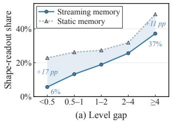

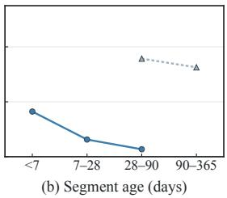  
Figure 5: Shape-readout share of the kernel weights on seasonal analogs, by level gap (a) and segment age (b); numbers in (a): gap between static and streaming memory in percentage points.

Proposition 4.3. When the memory is replaced with a periodic tiling and all other components are kept, the reduction on Trafic and Electricity falls from $2 . 5 \% - 7 . 9 \%$ at � = 96 to −0.1% and 0.8% on average at $L = 7 2 0$ (combination weights $0 . 0 3 \substack { - 0 . 1 3 }$ , whereas the full memory still improves by 1.8%–7.1%. On ETT, � = 96 already covers the daily period and the tiling carries the latest values of the previous period, so its gain persists at long inputs.

Theorem 4.4. Under i.i.d. resampling, the harm probability falls monotonically with sample size and complementarity, and its loga-rithm has a correlation $\mathrm { o f } - 0 . 7 3 , - 0 . 7 1$ , and −0.85 with $n \kappa ^ { 2 }$ . When the validation �ˆ is applied to the test segment, the combination underperforms the forecaster in 4.0%, 5.7%, and 6.9% of units at the three input lengths, all with $| \hat { w } - w _ { \mathrm { t e } } ^ { * } | > w _ { \mathrm { t e } } ^ { * }$ . When units are grouped by validation complementarity, the harm rate of the pooled �ˆ at $L = 9 6$ falls from 19.4% for � in 0–0.05 to 0.9% above 0.3; pool- ing over a dataset yields lower harm rates than per-channel weights at � = 336 and 720 (5.7% against 6.8%, 6.9% against 7.6%), consistent with the role of � in part (ii).

Two distribution shifts. On seven datasets and three forecasters, the training-segment weight $w _ { \mathrm { t r a i n } }$ is smaller than the validation �ˆ in 220 of 252 pairs at $L = 7 2 0 ( p = 8 \times 1 0 ^ { - 3 0 } )$ , with the same but weaker direction at � = 96 (154 of 252). With a static memory, the validation �ˆ exceeds the test optimum in 20–27 of 28 settings; with a streaming memory it is slightly below the test optimum. We split the test period into eight equal consecutive intervals (Figure 6). The validation weight for static memory exceeds the interval-specific optimum in 49 of the 56 intervals. With static memory, FreshCast underperforms the forecaster in some intervals on five datasets (up to +26%); with streaming memory, it improves on the forecaster in every interval on every dataset. The optimal weight of the static memory recovers late in the test period on ETTh2, ETTm2, and Electricity, reflecting the seasonal exception noted after Proposition 4.2. The gain of the streaming memory is smaller in intervals with more values outside the training range, where the memory and the forecaster err together and their complementarity falls. The untrained rule of Section 5.4 has validation complementarity 0.136 and 0.112 at $L = 9 6$ and 720 (relational kernel regression: 0.134 and 0.083), yet a lower test correlation than the kernel in 80 and 73 of 84 settings; its �ˆ exceeds the test optimum, and in all 25 settings where it is worse than the forecaster, $\lvert \hat { w } - w ^ { * } \rvert > w ^ { * }$

Table 5: Test MSE of the ten forecasters alone (Base) and with FreshCast at � = 336 and $L = 7 2 0 ,$ averaged over the four horizons. PatchTST is not evaluated at � = 720.
<table><tr><td></td><td></td><td colspan="2">MLP</td><td colspan="2">DLinear</td><td colspan="2">PatchTST</td><td colspan="2">iTransformer</td><td colspan="2">CycleNet</td></tr><tr><td>Dataset</td><td>L</td><td>Base</td><td>+FreshCast</td><td>Base</td><td>+FreshCast</td><td>Base</td><td>+FreshCast</td><td>Base</td><td>+FreshCast</td><td>Base</td><td>+FreshCast</td></tr><tr><td>ETTh1</td><td>336</td><td>0.430</td><td>0.402</td><td>0.427</td><td>0.424</td><td>0.425</td><td>0.406</td><td>0.463</td><td>0.410</td><td>0.439</td><td>0.410</td></tr><tr><td></td><td>720</td><td>0.441</td><td>0.402</td><td>0.442</td><td>0.424</td><td></td><td></td><td>0.485</td><td>0.409</td><td>0.440</td><td>0.400</td></tr><tr><td>ETTh2</td><td>336</td><td>0.373</td><td>0.361</td><td>0.476</td><td>0.365</td><td>0.344</td><td>0.344</td><td>0.376</td><td>0.359</td><td>0.374</td><td>0.362</td></tr><tr><td></td><td>720</td><td>0.362</td><td>0.357</td><td>0.552</td><td>0.361</td><td></td><td></td><td>0.386</td><td>0.364</td><td>0.367</td><td>0.358</td></tr><tr><td>ETTm1</td><td>336</td><td>0.362</td><td>0.331</td><td>0.358</td><td>0.338</td><td>0.352</td><td>0.329</td><td>0.370</td><td>0.334</td><td>0.362</td><td>0.330</td></tr><tr><td></td><td>720</td><td>0.360</td><td>0.334</td><td>0.357</td><td>0.339</td><td></td><td></td><td>0.375</td><td>0.335</td><td>0.362</td><td>0.333</td></tr><tr><td>ETTm2</td><td>336</td><td>0.267</td><td>0.250</td><td>0.287</td><td>0.247</td><td>0.257</td><td>0.246</td><td>0.279</td><td>0.250</td><td>0.270</td><td>0.250</td></tr><tr><td></td><td>720</td><td>0.266</td><td>0.248</td><td>0.269</td><td>0.246</td><td></td><td></td><td>0.288</td><td>0.251</td><td>0.263</td><td>0.249</td></tr><tr><td>Weather</td><td>336</td><td>0.234</td><td>0.220</td><td>0.245</td><td>0.225</td><td>0.230</td><td>0.219</td><td>0.239</td><td>0.222</td><td>0.226</td><td>0.217</td></tr><tr><td></td><td>720</td><td>0.234</td><td>0.223</td><td>0.237</td><td>0.226</td><td></td><td></td><td>0.237</td><td>0.224</td><td>0.224</td><td>0.219</td></tr><tr><td>Electricity</td><td>336</td><td>0.162</td><td>0.155</td><td>0.167</td><td>0.156</td><td>0.163</td><td>0.156</td><td>0.163</td><td>0.151</td><td>0.158</td><td>0.153</td></tr><tr><td></td><td>720</td><td>0.160</td><td>0.154</td><td>0.160</td><td>0.155</td><td></td><td></td><td>0.163</td><td>0.151</td><td>0.157</td><td>0.153</td></tr><tr><td>Traffic</td><td>336 720</td><td>0.397 0.391</td><td>0.384 0.384</td><td>0.450 0.443</td><td>0.397 0.396</td><td>0.410</td><td>0.390</td><td>0.392</td><td>0.378 0.376</td><td>0.413</td><td>0.387 0.386</td></tr><tr><td></td><td></td><td colspan="2"></td><td colspan="2"></td><td colspan="2"></td><td colspan="2">0.387</td><td colspan="2">0.400</td></tr><tr><td></td><td></td><td></td><td>TQNet</td><td></td><td>XLinear</td><td></td><td>MixLinear</td><td></td><td>TimeBase</td><td></td><td>CMoS</td></tr><tr><td>Dataset</td><td>L</td><td>Base</td><td>+FreshCast</td><td>Base</td><td>+FreshCast</td><td colspan="2">Base</td><td>Base</td><td>+FreshCast</td><td colspan="2">Base</td></tr><tr><td></td><td>336</td><td>0.427</td><td>0.405</td><td>0.427</td><td></td><td>0.414</td><td>+FreshCast 0.397</td><td>0.409</td><td>0.397</td><td></td><td>+FreshCast</td></tr><tr><td>ETTh1</td><td>720</td><td>0.442</td><td>0.400</td><td>0.431</td><td>0.406 0.401</td><td>0.404</td><td>0.392</td><td>0.411</td><td>0.400</td><td>0.416 0.419</td><td>0.398 0.398</td></tr><tr><td></td><td>336</td><td>0.362</td><td>0.352</td><td>0.351</td><td>0.350</td><td>0.349</td><td>0.349</td><td>0.358</td><td>0.355</td><td>0.352</td><td>0.352</td></tr><tr><td>ETTh2</td><td>720</td><td>0.365</td><td>0.352</td><td>0.355</td><td>0.355</td><td>0.341</td><td>0.343</td><td>0.358</td><td>0.355</td><td>0.350</td><td>0.353</td></tr><tr><td>ETTm1</td><td>336</td><td>0.357</td><td>0.330</td><td>0.346</td><td>0.328</td><td>0.377</td><td>0.333</td><td>0.368</td><td>0.332</td><td>0.353</td><td>0.329</td></tr><tr><td></td><td>720</td><td>0.361</td><td>0.333</td><td>0.348</td><td>0.331</td><td>0.379</td><td>0.336</td><td>0.363</td><td>0.334</td><td>0.360</td><td>0.333</td></tr><tr><td>ETTm2</td><td>336</td><td>0.262</td><td>0.247</td><td>0.258</td><td>0.247</td><td>0.260</td><td>0.248</td><td>0.259</td><td>0.248</td><td>0.260</td><td>0.249</td></tr><tr><td></td><td>720</td><td>0.264</td><td>0.248</td><td>0.258</td><td>0.248</td><td>0.257</td><td>0.247</td><td>0.252</td><td>0.246</td><td>0.258</td><td>0.249</td></tr><tr><td>Weather</td><td>336</td><td>0.232</td><td>0.219</td><td>0.225</td><td>0.216</td><td>0.250</td><td>0.226</td><td>0.225</td><td>0.217</td><td>0.227</td><td>0.218</td></tr><tr><td></td><td>720</td><td>0.238</td><td>0.225</td><td>0.228</td><td>0.222</td><td>0.241</td><td>0.226</td><td>0.219</td><td>0.216</td><td>0.223</td><td>0.218</td></tr><tr><td>Electricity</td><td>336</td><td>0.165</td><td>0.153</td><td>0.166</td><td>0.156</td><td>0.178</td><td>0.159</td><td>0.177</td><td>0.159</td><td>0.167</td><td>0.158</td></tr><tr><td></td><td>720</td><td>0.167</td><td>0.155</td><td>0.157</td><td>0.150</td><td>0.171</td><td>0.159</td><td>0.169</td><td>0.158</td><td>0.161</td><td>0.156</td></tr><tr><td>Traffic</td><td>336</td><td>0.411</td><td>0.385</td><td>0.416</td><td>0.390</td><td>0.440</td><td>0.399</td><td>0.447</td><td>0.399</td><td>0.424</td><td>0.395</td></tr><tr><td></td><td>720</td><td>0.418</td><td>0.393</td><td>0.406</td><td>0.389</td><td>0.417</td><td>0.396</td><td>0.419</td><td>0.396</td><td>0.412</td><td>0.394</td></tr></table>

Table 6: Univariate setting: test MSE of the four forecasters in the PFRP paper alone (Base), with PFRP, and with FreshCast (� = 96), averaged over the four horizons; the lowest value in each group is in bold. The target is the channel specified in the original paper; Weather is given to four decimal places.
<table><tr><td></td><td></td><td colspan="3">SparseTSF</td><td colspan="3">DLinear</td><td colspan="3">PatchTST</td><td colspan="2">TimesNet</td></tr><tr><td>Dataset</td><td>Base</td><td>+PFRP</td><td>+FreshCast</td><td>Base</td><td>+PFRP</td><td>+FreshCast</td><td>Base</td><td>+PFRP</td><td>+FreshCast</td><td>Base</td><td>+PFRP</td><td>+FreshCast</td></tr><tr><td>ETTh1</td><td>0.084</td><td>0.078</td><td>0.076</td><td>0.116</td><td>0.112</td><td>0.106</td><td>0.079</td><td>0.079</td><td>0.077</td><td>0.077</td><td>0.079</td><td>0.076</td></tr><tr><td>ETTh2</td><td>0.202</td><td>0.193</td><td>0.195</td><td>0.224</td><td>0.214</td><td>0.209</td><td>0.201</td><td>0.191</td><td>0.187</td><td>0.191</td><td>0.192</td><td>0.187</td></tr><tr><td>ETTm1</td><td>0.054</td><td>0.052</td><td>0.051</td><td>0.065</td><td>0.064</td><td>0.052</td><td>0.054</td><td>0.053</td><td>0.051</td><td>0.053</td><td>0.053</td><td>0.051</td></tr><tr><td>ETTm2</td><td>0.126</td><td>0.120</td><td>0.120</td><td>0.126</td><td>0.122</td><td>0.119</td><td>0.123</td><td>0.120</td><td>0.117</td><td>0.122</td><td>0.120</td><td>0.118</td></tr><tr><td>Weather</td><td>0.0015</td><td>0.0015</td><td>0.0014</td><td>0.0062</td><td>0.0051</td><td>0.0038</td><td>0.0019</td><td>0.0017</td><td>0.0018</td><td>0.0017</td><td>0.0017</td><td>0.0016</td></tr><tr><td>Electricity</td><td>0.473</td><td>0.363</td><td>0.346</td><td>0.393</td><td>0.372</td><td>0.339</td><td>0.408</td><td>0.404</td><td>0.322</td><td>0.417</td><td>0.402</td><td>0.330</td></tr><tr><td>Traffic</td><td>0.239</td><td>0.209</td><td>0.185</td><td>0.278</td><td>0.177</td><td>0.187</td><td>0.178</td><td>0.175</td><td>0.166</td><td>0.220</td><td>0.179</td><td>0.186</td></tr></table>

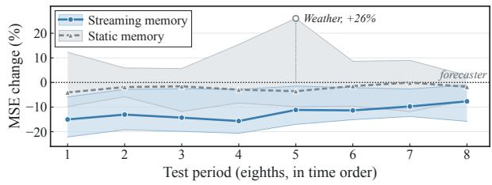  
Figure 6: MSE change relative to the forecaster in eight equal test intervals with streaming or static memory (median and range over the seven datasets; � = 96; MLP, iTransformer, CycleNet; four horizons; five kernel seeds).

## D Controls on New Observations

Online fine-tuning. All forecaster parameters are fine-tuned daily on the last 14 days of revealed ground truth; one of six configura- tions is selected on the validation segment, with no fine-tuning if the validation error does not improve (MLP and PatchTST, seven datasets, four horizons, three seeds; 168 pairs).

RAFT with a streaming bank. Both banks use the same fixed RAFT checkpoints with the lowest validation loss (Table 2; settings from Table 6 of the RAFT paper; seeds 0–2; one code base for all input lengths). At test time the streaming bank holds every window whose target sequence has been fully observed, as in FreshCast; training and validation retrieval is unchanged, and restricting the bank to training windows reproduces static results exactly.

## E Complete Results

Table 5 reports generality results at $L = 3 3 6$ and $L = 7 2 0 ( L = 9 6 \colon$ Table 1); Table 6 reports per-dataset PFRP comparisons. In MAE, FreshCast lowers the average error for every forecaster, dataset, and input length and is lower than GTR in 302 of 308 settings, RAFT in 82 of 84, and PFRP on three of four forecasters (a tie on SparseTSF); it also lowers the median relative standard deviation across seeds for every forecaster and input length. When the 129 diagnostic channels are grouped into quintiles of the larger training-segment daily or weekly autocorrelation, the mean reductions at $L = 9 6$ are 13.7%, 19.7%, 17.0%, 17.1%, and 12.6% from least to most periodic (Spearman −0.07, and +0.01 and +0.03 at � = 336 and 720); Weather, the least periodic dataset, improves by 16.7%.

For the five recent forecasters (Recent columns of Table 3), every ablation leads to the same conclusion except where the weight is estimated: the training weight is smaller than �ˆ only when the forecaster has lower training than validation error. Over eight fore- casters and two input lengths, the training-to-validation error ratio has a Spearman correlation of 0.97 with ${ w _ { \mathrm { t r a i n } } } / { \hat { w } }$ , and at $L = 9 6 ,$ MixLinear, TimeBase, and CMoS, with ratios of $1 . 1 4 \mathrm { - } 1 . 1 6 ,$ obtain a larger $w _ { \mathrm { t r a i n } }$ that is 0.5%–0.7% better. $\mathrm { A t } L = 7 2 0 $ , all seven settings worse than the forecaster are on ETTh2; six are among the ten in Section 5.6.