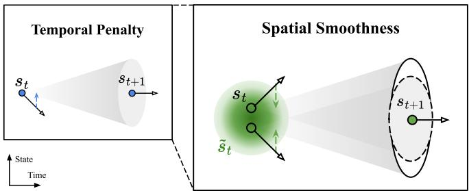
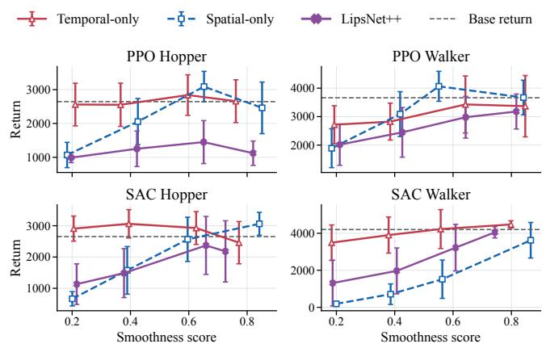
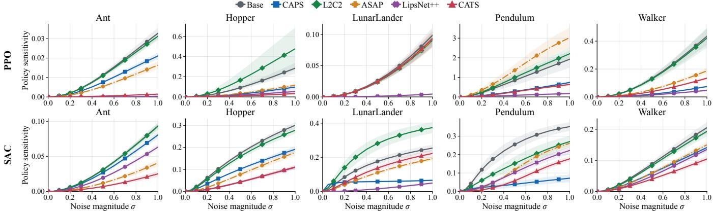
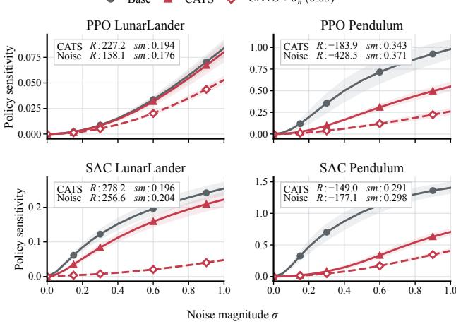
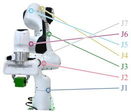
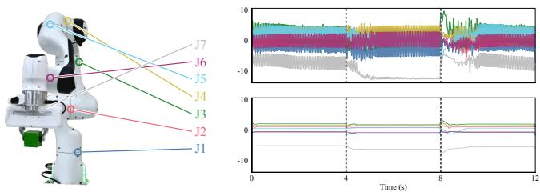

# Revisiting Temporal Regularization for Smooth Control in Deep Reinforcement Learning

SungJae Ahn1, Jeong Woon Lee1, Kyoleen Kwak1, and Hyoseok Hwang1,†

Abstract— Deep Reinforcement Learning policies can produce nonsmooth action oscillations that hinder deployment on physical robots. Existing architectural and penalty-based approaches seek spatial smoothness by directly reducing sensitivity to changes in state inputs, but their broad constraints can degrade task performance as stronger smoothing is pursued. Temporal regularization instead constrains action differences along observed transitions, but has been considered unable to provide the spatial smoothness needed under observation noise. We revisit this assumption by proving that the temporal penalty bounds the expected action differences between current states sharing a next state, revealing a spatial effect that empirically extends to spatial smoothness. Building on this finding, we propose Conditioning for Action using only Temporal Smoothness (CATS), which combines a temporal penalty with linear ramp-up. We highlight temporal regularization’s ability to provide spatial smoothness while better preserving task performance than explicit spatial regularization. Through linear ramp-up, CATS allows the policy to learn rewarding behavior before progressively smoothing its actions, improving return preservation and both temporal and spatial smoothness. Experiments in both simulation and the real world show that CATS substantially reduces action oscillation without degrading task performance, with little computational overhead.

## I. INTRODUCTION

Deep Reinforcement Learning (RL) has emerged as a powerful framework for continuous control [1], enabling robots to acquire complex motor skills through interaction with their environment [2]. However, due to optimization instability in deep RL [3] and observation noise [4], [5], policies for robotic control can produce nonsmooth action oscillations that hinder their deployment on physical systems [6], [7]. Such oscillations not only compromise control reliability [8], but also accelerate mechanical wear, jeopardize hardware safety, and increase energy consumption [4], [9].

Reducing action oscillations in real-world deployment calls for two policy properties, temporal smoothness and spatial smoothness [4]. Temporal smoothness refers to low policy sensitivity to state inputs received over time and directly relates to action oscillation in simulation. Spatial smoothness refers to low policy sensitivity to small changes in state inputs, thus reducing sensitivity to real-world noise. To promote either or both, prior work has employed corresponding regularization methods.

Although action oscillation is fundamentally a change in policy outputs over time, many existing methods view action smoothness as a property of the policy function without considering the temporal ordering of its inputs. Accordingly, these spatial regularization methods seek spatial smoothness directly by encouraging actions to vary less across any local state changes. While these approaches can reduce action oscillation and noise sensitivity, they act across all statespace directions and may therefore restrict action changes needed for high return.

  
Fig. 1. From temporal regularization to spatial smoothness. Black arrows denote actions; colored arrows indicate alignment. The temporal penalty aligns actions along transitions (left). When nearby states share possible next states, this alignment can indirectly bring their actions closer (right).

Temporal regularization, in contrast, exploits the temporal ordering of policy inputs to reduce action variation over time. Because it constrains the policy only along transition directions that are actually observed, it can pursue stronger smoothness with less degradation in task performance. This same focus, however, appears to leave other directions unconstrained, so even a policy that is smooth along its trajectories may remain sensitive to observation noise in those directions. Temporal regularization has thus been regarded as unrelated to spatial smoothness and has commonly been paired with a spatial penalty [3], [4], [10], [11], reintroducing broad state-space constraints and leaving the relative weighting of the two penalties unclear.

The complexity introduced by existing smoothness methods is another, often underappreciated challenge. While these methods aim to facilitate real-world deployment by reducing action oscillation, this complexity can hinder the very deployment they target. Robotic RL already involves many interacting hyperparameters and demanding training pipelines, while evaluations are expensive and performance is sensitive to configuration choices [12], [13]. Expanding the hyperparameter space or increasing training time therefore makes smoothness methods harder to apply in practice.

In this work, we aim to develop a practical approach that achieves both temporal and spatial smoothness while preserving task performance. To this end, we revisit the assumption that temporal regularization cannot provide the spatial smoothness needed under observation noise. During training, the temporal penalty acts on next states drawn from a distribution rather than a single fixed next state. When two current states share a next state, their actions are encouraged to approach the same next-state action, indirectly becoming similar. We establish this spatial effect by proving that the temporal penalty bounds the expected action difference between these states. We further hypothesize that this effect extends to spatial smoothness when nearby states share more possible next states (Fig. 1). Our experiments confirm this effect and the resulting spatial smoothness, showing that a temporal penalty alone is sufficient for both forms of smoothness in the evaluated tasks.

Building on this finding, we propose Conditioning for ${ \mathrm { A c } } -$ tion using only Temporal Smoothness (CATS), a lightweight regularizer that applies a temporal penalty with a linearly increasing coefficient (linear ramp-up). We highlight temporal regularization’s ability to provide spatial smoothness while preserving performance, unlike explicit spatial regularization methods. Linear ramp-up also strengthens these benefits by allowing the policy to learn rewarding behavior before smoothing its actions, rather than seeking rewarding behavior under smoothness constraints. CATS uses no spatial penalty and adds only one hyperparameter, with little computational overhead and minimal implementation changes.

Extensive experiments show that CATS substantially reduces action oscillation without decreasing return, particularly on higher-dimensional tasks, and continues to do so under observation noise. We also directly examine the spatial smoothness induced by CATS, compare it with that produced by explicit spatial regularization, and introduce a simple extension that broadens the induced spatial effect. Finally, sim-to-real experiments show that CATS effectively reduces action oscillation on a physical robot despite its simple design.

## II. RELATED WORK

## A. Spatial Regularization

Architectural approaches formulate smoothness solely as a property of the policy’s input-to-output mapping. These methods often promote spatial smoothness by reducing the policy’s Lipschitz constant [14] without assumptions about the input states. LipsNet [15] enforces this constraint in its forward pass, requiring Jacobian computation at inference. LCP [9] and LipsNet++ [5] instead constrain the policy’s Lipschitz constant through computationally expensive gradient-based penalties during training.

Penalty-based spatial regularization methods seek spatial smoothness by explicitly penalizing action differences between nearby states. CAPS [4] draws Gaussian-perturbed states around the current state. L2C2 [16] narrows the neighborhood using the displacement between consecutive states. ASAP [11] aligns the current action with an expected action prediction using transitions from the previous state. SR2L [17] instead searches for perturbations through iterative gradient ascent during each policy update.

## B. Temporal Regularization

Temporal regularization promotes temporal smoothness by penalizing policy-output differences along sampled nextstate directions, as in CAPS [4]. Grad-CAPS [18] instead penalizes changes in action differences, allowing actions to vary while changing smoothly. However, it requires two consecutive transitions, adding computation and requiring buffer modifications to retain the additional state. Because temporal regularization has been regarded as unrelated to spatial smoothness, prior methods have combined it with a separate spatial penalty [3], [4], [10], [11]. These additional penalties introduce hyperparameters and computational overhead, with no clear criterion for balancing the two penalties.

Reward penalties are a widely used form of temporal regularization that penalizes action changes over time, but prior work has reported that they can instead increase action oscillation under sparse rewards [5], [15], [19]. Other approaches exploit temporal information through policy architectures [20], [21] or action-selection mechanisms [19], [22]. Compared with loss-based regularization, these approaches can increase implementation complexity, hyperparameters, and computational cost.

## III. BACKGROUND

## A. Action Smoothness in Reinforcement Learning

Throughout this paper, action smoothness1 refers to the smoothness of generated action sequences, regardless of observation noise in the environment. For observation o and action a, let $\pi ( a \mid o )$ denote the policy interacting with the environment and $\textstyle \mu ( o ) \in \mathbb { R } ^ { d _ { a } }$ its deterministic output or stochastic mean, where $d _ { a }$ is the action dimension. Following prior work, we define regularization using $\mu$ and evaluate the resulting action sequence $a _ { t } ~ = ~ \mu ( o _ { t } )$ after training. This excludes action-sampling noise from the smoothness evaluation and reflects deterministic deployment behavior. We use the smoothness score of Mysore et al. [4], which measures high-frequency content in the action signal; lower scores indicate smoother actions.

## B. Temporal and Spatial Smoothness

We refer to the policy properties required for action smoothness as temporal and spatial smoothness. Temporal smoothness concerns policy sensitivity to inputs encountered over time, while spatial smoothness concerns its sensitivity to small state-input changes in any direction [4], [11].

To illustrate the roles of these two properties, we express action variation in continuous time. Let $J _ { \mu } ( o ) = \partial \mu ( o ) / \partial o \in$ $\mathbb { R } ^ { d _ { a } \times d _ { s } }$ denote the policy Jacobian matrix, which describes how the policy output changes with its input, where $d _ { s }$ is the dimension of the state and observation vectors. When the policy directly observes the underlying state, $o _ { t } ~ = ~ s _ { t }$ the action derivative is the instantaneous rate of change of

the policy output over time,

$$
\left\| { \frac { d a _ { t } } { d t } } \right\| = \left\| J _ { \mu } ( s _ { t } ) { \frac { d s _ { t } } { d t } } \right\| .\tag{1}
$$

Therefore, in the noise-free case, temporal smoothness is the policy property directly related to action oscillation.

To make the role of spatial smoothness explicit, as in Song et al. [5], we assume that the actor observes $o _ { t } = s _ { t } + \epsilon _ { t }$ during deployment, where $\epsilon _ { t }$ denotes the observation noise at time step $t .$ The action derivative then decomposes as

$$
\left\| \frac { d a _ { t } } { d t } \right\| = \left\| J _ { \mu } ( o _ { t } ) \underbrace { \frac { d s _ { t } } { d t } } _ { \mathrm { s t a t e ~ d i r e c t i o n } } + J _ { \mu } ( o _ { t } ) \underbrace { \frac { d \epsilon _ { t } } { d t } } _ { \mathrm { n o i s e ~ d i r e c t i o n } } \right\| .\tag{2}
$$

The noise direction in the second component is generally unknown and uncontrollable. However, its contribution can be bounded by the product of the policy Jacobian norm and the noise rate, yielding

$$
\left\| \frac { d a _ { t } } { d t } \right\| \leq \underbrace { \left\| J _ { \mu } ( o _ { t } ) \frac { d s _ { t } } { d t } \right\| } _ { \mathrm { t e m p o r a l ~ s m o o t h n e s s } } + \underbrace { \| J _ { \mu } ( o _ { t } ) \| } _ { \mathrm { s p a t i a l ~ s m o o t h n e s s } } \left\| \frac { d \epsilon _ { t } } { d t } \right\| .\tag{3}
$$

Therefore, under observation noise, spatial smoothness is also needed to limit action variation along noise directions. Methods combining temporal and spatial regularization seek the corresponding policy properties by reducing the first and second terms in (3), respectively.

Alternatively, spatial smoothness alone can provide temporal smoothness, since its low sensitivity across state-space directions also applies along the state trajectory. Applying the relaxation to the first term in (3) gives the looser bound [5]

$$
\left\| \frac { d a _ { t } } { d t } \right\| \leq \underbrace { \left\| J _ { \mu } ( o _ { t } ) \right\| } _ { \mathrm { s p a t i a l ~ s m o o t h n e s s } } \left( \left\| \frac { d s _ { t } } { d t } \right\| + \left\| \frac { d \epsilon _ { t } } { d t } \right\| \right) .\tag{4}
$$

Most architectural and spatial-only regularization methods seek to reduce the bound in (4). Specifically, LipsNet [15] controls $\| J _ { \mu } ( o _ { t } ) \|$ at inference time, whereas LipsNet++ [5] and LCP [9] constrain $\| J _ { \mu } ( s _ { t } ) \|$ during training.

## IV. REVISITING TEMPORAL REGULARIZATION

## A. Scope of Spatial and Temporal Regularization

For a sampled transition, the CAPS temporal penalty [4] measures the action difference along the direction $s _ { t + 1 } - s _ { t }$ with the local first-order approximation

$$
\lVert \mu ( s _ { t + 1 } ) - \mu ( s _ { t } ) \rVert \approx \lVert J _ { \mu } ( s _ { t } ) ( s _ { t + 1 } - s _ { t } ) \rVert .\tag{5}
$$

The key distinction between spatial and temporal regularization lies in the scope of state-space directions they constrain. Let $\hat { v } _ { t } \ = \ ( s _ { t + 1 } - s _ { t } ) / \lVert s _ { t + 1 } - s _ { t } \rVert _ { 2 }$ denote the normalized transition direction. The quantities constrained by the two regularizers are

$$
\begin{array} { r l } { \mathrm { S p a t i a l } } & { \| J _ { \mu } ( s _ { t } ) v \| _ { 2 } , \qquad v \in \mathbb { S } ^ { d _ { s } - 1 } , } \\ { \mathrm { T e m p o r a l } } & { \| J _ { \mu } ( s _ { t } ) \hat { v } _ { t } \| _ { 2 } . } \end{array}
$$

Here, $\mathbb { S } ^ { d _ { s } - 1 }$ is the unit sphere in the state space. Thus, temporal regularization constrains the policy Jacobian only along the sampled next-state direction, whereas spatial regularization constrains it along all local state-space directions.

In control tasks, retaining the current action at the next time step can still yield high return [19], [22]. An arbitrary state displaced from $s _ { t }$ by the same magnitude, however, has no such transition relation, and enforcing the same action there may incur greater return loss. Therefore, spatial regularization that does not account for the temporal relations, which govern oscillation, may prevent the policy from selecting rewarding actions. This motivates revisiting temporal regularization as a way to pursue stronger action smoothness while better preserving task performance, as examined in Section V-C.

## B. Spatial Effect of the Temporal Penalty

Temporal regularization has been regarded as unrelated to spatial smoothness because it constrains only the next-state direction of each transition. During training, however, the next state is sampled from a distribution rather than fixed. To examine the implication of this sampling, we consider the one-step temporal penalty used in CAPS [4]. Let $d _ { \pi }$ denote the current-state distribution under $\pi ,$ and let $P _ { \pi } ( \cdot \mid s )$ denote the next-state distribution jointly induced by the policy and environment dynamics. The expected temporal penalty is

$$
L _ { \mathrm { T } } : = \mathbb { E } _ { s \sim d _ { \pi } } \mathbb { E } _ { s ^ { \prime } \sim P _ { \pi } ( \cdot \vert s ) } \left[ \Vert \mu ( s ) - \mu ( s ^ { \prime } ) \Vert _ { 2 } ^ { 2 } \right] .\tag{6}
$$

Let $d _ { \pi } ^ { + }$ denote the resulting next-state distribution, and let $\rho _ { \pi } ( \cdot \mathrm { ~ \bf ~ | ~ } s ^ { \prime } )$ denote the conditional distribution over current states, given that the next state is $s ^ { \prime } .$ . We measure the induced spatial effect between two conditionally independent current states sharing $s ^ { \prime }$ as

$$
L _ { \mathrm { S } } : = \mathbb { E } _ { s ^ { \prime } \sim d _ { \pi } ^ { + } } \mathbb { E } _ { u , v } { \overset { \mathrm { i . i . d . } } { \sim } } \rho _ { \pi } ( \cdot | s ^ { \prime } ) \left[ \| \mu ( u ) - \mu ( v ) \| _ { 2 } ^ { 2 } \right] .\tag{7}
$$

$L _ { \mathrm { S } }$ measures the average squared action difference between current states that share possible next states.

Under this conditioning, the temporal penalty encourages both $\mu ( u )$ and $\mu ( v )$ to approach the common next-state action $\mu ( s ^ { \prime } )$ , indirectly encouraging similar current-state actions.

Proposition IV.1 (The Temporal Penalty Bounds the Spatial Effect). Assume the relevant second moments are finite. Then

$$
L _ { \mathrm { S } } \leq 2 L _ { \mathrm { T } } .\tag{8}
$$

Proof. Conditioning the temporal penalty on $s ^ { \prime }$ gives

$$
{ \cal L } _ { \mathrm { T } } = \mathbb { E } _ { s ^ { \prime } \sim d _ { \pi } ^ { + } } \mathbb { E } _ { u \sim \rho _ { \pi } ( \cdot | s ^ { \prime } ) } \left[ \| \mu ( u ) - \mu ( s ^ { \prime } ) \| _ { 2 } ^ { 2 } \right] .
$$

For fixed $s ^ { \prime } ,$ let $\rho = \rho _ { \pi } ( \cdot \mid s ^ { \prime } )$ , let $u , v \stackrel { \mathrm { i . i . d . } } { \sim } \rho .$ , and define $\bar { \mu } ( s ^ { \prime } ) = \mathbb { E } _ { u \sim \rho } [ \mu ( u ) ]$ , where $\bar { \mu } ( s ^ { \prime } )$ is the mean action vector at current states conditioned on the next state $s ^ { \prime } .$ The variance identity gives

$$
\begin{array} { r } { \frac 1 2 \mathbb { E } _ { u , v \sim \rho } \big [ \| \mu ( u ) - \mu ( v ) \| _ { 2 } ^ { 2 } \big ] = \mathbb { E } _ { u \sim \rho } \big [ \| \mu ( u ) - \bar { \mu } ( s ^ { \prime } ) \| _ { 2 } ^ { 2 } \big ] . } \end{array}
$$

Applying the bias–variance decomposition gives

$$
\begin{array} { r l } & { \mathbb { E } _ { u \sim \rho } \left[ \| \mu ( u ) - \mu ( s ^ { \prime } ) \| _ { 2 } ^ { 2 } \right] } \\ & { \quad = \frac { 1 } { 2 } \mathbb { E } _ { u , v \sim \rho } \left[ \| \mu ( u ) - \mu ( v ) \| _ { 2 } ^ { 2 } \right] + \| \bar { \mu } ( s ^ { \prime } ) - \mu ( s ^ { \prime } ) \| _ { 2 } ^ { 2 } . } \end{array}
$$

TABLE I CLEAN-OBSERVATION RESULTS.
<table><tr><td rowspan="2">Method</td><td colspan="7">PPO</td><td rowspan="2"></td><td colspan="8">SAC</td></tr><tr><td>Ant</td><td>Hopper</td><td></td><td>LunarLander</td><td></td><td>Pendulum</td><td>Walker</td><td>Ant</td><td></td><td>Hopper</td><td></td><td>LunarLander</td><td>Pendulum</td><td></td><td>Walker</td></tr><tr><td></td><td>R↑ sm ↓</td><td>R↑</td><td>sm ↓</td><td>R↑</td><td>sm ↓ R↑</td><td>sm ↓</td><td>R↑</td><td>sm ↓</td><td>R↑ sm ↓</td><td>R↑</td><td>sm ↓</td><td>R↑</td><td>sm ↓</td><td>R↑</td><td>sm ↓ R↑</td><td>sm ↓</td></tr><tr><td>Base</td><td>1411 (506)1.464(0.193)2658 (685)1.162 (0.265)221.2 (28.6)0.209 (0.012)</td><td></td><td></td><td></td><td>-217.7 (66.1)</td><td></td><td>0.469 (0.031)3510 (582)1.682 (0.237)</td><td></td><td></td><td>3656(675)2.286 (0.213)2656(702)1.507 (0.273)</td><td></td><td>)275.9 (6.1)</td><td>0.424 (0.052)</td><td>-149.3 (1.4)</td><td>0.984 (0.103)4189 (676)1.268 (0.126)</td><td></td></tr><tr><td>CAPS</td><td>1873 (469)1.222 (0.170)</td><td>2440 (608)</td><td>)0.471 (0.049)</td><td>205.6 (22.2) 0.214 (0.014)</td><td>-175.2 (5.4)</td><td></td><td>0.421 (0.015)3626 (666)0.505 (0.056)</td><td></td><td>3482(543)2.264(0.116)2856(393)1.235(0.087)</td><td></td><td></td><td>269.4(11.5)</td><td>0.355 (0.031)</td><td>-177.0 (54.0)</td><td>)0.376 (0.036)4651 (357)1.178 (0.101)</td><td></td></tr><tr><td>L2C2</td><td>1262 (358) 1.515 (0.157)</td><td></td><td></td><td>2704 (545)1.502 (0.435) 208.2 (26.7) 0.211 (0.020)</td><td>-184.8(17.1)</td><td>0.452 (0.019)</td><td>3342 (547) 1.744 (0.157)</td><td></td><td>2927 (379)2.276 (0.121)2965 (614)1.249 (0.105)</td><td></td><td></td><td>)272.8 (8.9)</td><td>0.441 (0.064) -149.8 (1.8)</td><td></td><td>1.189 (0.122)4413 (405)1.081 (0.191)</td><td></td></tr><tr><td>GRAD</td><td>2354 (348)1.180 (0.065)3309 (220)0.578 (0.050)</td><td></td><td></td><td>218.1 (18.0) 0.215 (0.021)</td><td>-190.7 (16.2)</td><td>0.451 (0.019)</td><td>)3384 (928)0.626 (0.057)</td><td></td><td>3609 (918)1.940 (0.152)2978 (616)0.898 (0.097)</td><td></td><td></td><td>)250.2 (62.2)</td><td>0.371 (0.087)-149.3 (1.4)</td><td></td><td>0.504 (0.019)4381 (278)0.905 (0.146)</td><td></td></tr><tr><td>ASAP</td><td>2807 (411)1.111 (0.071)2780 (557)0.441 (0.035)</td><td></td><td></td><td>190.9 (28.3) 0.213 (0.014) -</td><td></td><td></td><td>-223.2 (121.8)0.449 (0.040)3754 (530)0.490(0.034)</td><td></td><td>3588 (790)1.383 (0.168)3014 (516)0.655 (0.084)</td><td></td><td></td><td>)275.7 (8.4)</td><td>0.248 (0.034)-148.1 (0.6)</td><td></td><td>0.485 (0.041)4466 (400)0.795 (0.056)</td><td></td></tr><tr><td></td><td>LipsNet++ 2297 (295)0.266 (0.020)</td><td></td><td>)1878 (642)0.543 (0.082)</td><td>134.5 (44.0)0.144(0.021)</td><td></td><td></td><td>-671.4 (211.1) 0.553 (0.123) 2344 (556)0.993 (0.204)</td><td></td><td>4283(486)2.264 (0.190)</td><td></td><td>)2570 (800)0.886 (0.159)</td><td>)259.9 (46.6)</td><td></td><td></td><td>6)0.358 (0.266)-148.4 (0.7)0.694 (0.045)4419(197)1.093 (0.118)</td><td></td></tr><tr><td>CATS</td><td>2973(140)0.127 (0.006)3002 (488)0.222(0.033)227.2(14.2)0.194 (0.013)-183.9(12.7)0.343(0.014)4071 (614)0.407 (0.032)</td><td></td><td></td><td></td><td></td><td></td><td></td><td></td><td></td><td></td><td></td><td></td><td></td><td></td><td>4251(471)0.557 (0.049)3046(514)0.259 (0.029)278.2(2.4)0.196(0.009)-149.0 (0.9)0.291 (0.024)4714(314)0.419 (0.048)</td><td></td></tr></table>

Averaging over $s ^ { \prime } \sim d _ { \pi } ^ { + }$ then gives

$$
\begin{array} { r l r l } { L _ { \mathrm { T } } - \displaystyle \frac { 1 } { 2 } L _ { \mathrm { S } } } & { } & & { } \\ & { } & & { = \mathbb { E } _ { s ^ { \prime } \sim d _ { \pi } ^ { + } } \left[ \| \bar { \mu } ( s ^ { \prime } ) - \mu ( s ^ { \prime } ) \| _ { 2 } ^ { 2 } \right] \geq 0 . } \end{array}\tag{□}
$$

Thus, reducing the temporal penalty tightens the upper bound on $L _ { \mathrm { S } } ,$ , allowing temporal regularization to align actions between states whose next-state distributions overlap. However, this alignment does not by itself imply spatial smoothness. Motivated by the smooth-transition structure of many continuous-state environments [17], we hypothesize that nearby states often have overlapping next-state distributions. Under this assumption, action differences between nearby states contribute to $L _ { \mathrm { S } }$ across a range of shared next states. The temporal penalty can therefore indirectly reduce these differences, promoting spatial smoothness and lowering policy sensitivity to observation noise, as tested in Section V-E.

## C. Temporal Penalty with Linear Ramp-Up

The preceding analyses motivate using the temporal penalty in (6) without explicit spatial regularization. We next consider how to apply this penalty over the course of training. Despite its narrower scope, strong smoothing requires a large coefficient, which can still prevent the policy from selecting rewarding actions when applied from the start of training. Because our goal is to obtain a smooth final policy while preserving return rather than smooth behavior throughout training, the coefficient can vary over the course of training.

These considerations motivate training-dependent schedules. Although adaptive schedules and meta-optimization are possible, they add computation, require a criterion for balancing return and smoothness during training, and may not guarantee the desired final regularization strength. We begin this exploration with a simple linear ramp-up that retains direct control over the final regularization strength. By gradually increasing the penalty coefficient, we allow the policy to discover high-return behavior before smoothing its actions. For environment interaction count k, training budget K, and final coefficient λ, the CATS actor objective is

$$
\mathcal { L } _ { \pi } = \mathcal { L } _ { \mathrm { R L } } + \frac { k } { K } \lambda L _ { \mathrm { T } } , \qquad 0 \leq k \leq K ,\tag{9}
$$

where ${ \mathcal { L } } _ { \mathrm { R I } }$ is the base algorithm’s actor loss.

## V. EXPERIMENTS

Our experiments test the claims made in Section I. We evaluate CATS’s ability to reduce oscillation while preserving return under clean and noisy observations, together with its practical cost (Section V-B). We compare temporal and spatial regularization under strong smoothing (Section V-C), validate the predicted spatial effect of the temporal penalty (Section V-D), and test its extension to spatial smoothness (Section V-E). We examine the benefits of ramp-up for return and both forms of smoothness (Section V-F), followed by sim-to-real validation on a physical robot (Section V-G).

## A. Experimental Setup

We evaluated CATS on five continuous-control tasks from Gymnasium [23] and MuJoCo [24], including Antv5, Hopper-v5, LunarLander-v3 with continuous actions, Pendulum-v1, and Walker2d-v5. We applied CATS to SAC [25] and PPO [26] and compared it with the unregularized algorithms, CAPS [4], L2C2 [16], Grad-CAPS (GRAD) [18], ASAP [11], and LipsNet++ [5]. For CAPS, L2C2, Grad-CAPS, and ASAP, we used the configurations collected by ASAP. For LipsNet++ and CATS, we used the same tuning budget and selected the smoothest setting whose mean return was at least Base’s 95% confidence lower bound, or the highest-return setting otherwise. For LipsNet++, the search covered all eight combinations of its DMControl hyperparameter settings. We used the tuned SAC and PPO hyperparameters from RL Baselines3 Zoo to evaluate each regularizer with a competitive base algorithm. Unless otherwise noted, we report means and 95% confidence intervals across ten training runs, each evaluated on ten held-out seeds. We report cumulative return for task performance and the smoothness score for action smoothness, and red-shaded entries indicate results worse than Base.

## B. Main Results

We first trained and evaluated CATS, Base, and existing regularizers under clean observations to assess their return– smoothness trade-offs. Table I shows that CATS reduced the smoothness score by 63.2% on average and by up to 91.3% on PPO Ant relative to Base. Although prior work has observed that smoothness regularization can improve return, CATS substantially reduced action oscillation while preserving return. This advantage was particularly pronounced on higher-dimensional tasks, where broad spatial regularization may be more restrictive than regularization along sampled transition directions. On Ant, Hopper, and Walker, CATS was the only evaluated regularizer that did not reduce mean return relative to Base. Notably, on SAC Ant, the other evaluated regularizers either reduced return or provided little improvement in smoothness, whereas CATS alone substantially improved smoothness without reducing return. The importance of temporal regularization and linear ramp-up in achieving this result is examined in Sections V-C and V-F, respectively.

TABLE II  
OBSERVATION-NOISE RESULTS.
<table><tr><td rowspan="2">Task</td><td rowspan="2">Method</td><td colspan="2">σ = 0</td><td colspan="2">0.10</td><td colspan="2">0.20</td><td colspan="2">0.30</td><td colspan="2">0.40</td><td colspan="2">0.50</td></tr><tr><td>R↑</td><td>sm ↓</td><td>R↑</td><td>sm↓</td><td>R↑</td><td>sm↓</td><td>R↑</td><td>sm↓</td><td>R↑</td><td>sm↓</td><td>R↑</td><td>sm↓</td></tr><tr><td rowspan="11">Hopper</td><td>PPO</td><td>2658(685)</td><td>1.162 (0.265)</td><td>2681 (599)</td><td>1.491 (0.252)</td><td>2299(428)</td><td>1.730 (0.239)</td><td>1852(321)</td><td>1.832 (0.233)</td><td>1522 (306)</td><td>1.878 (0.245)</td><td>1343 (251)</td><td>1.936 (0.224)</td></tr><tr><td>CAPS</td><td>2440 (608)</td><td>0.471 (0.049)</td><td>2337 (538)</td><td>0.552 (0.056)</td><td>2205(383)</td><td>0.693 (0.068)</td><td>2040 (327)</td><td>0.835 (0.098)</td><td>1729 (416)</td><td>0.930 (0.142)</td><td>1500(386)</td><td>1.005 (0.157)</td></tr><tr><td>L2C2</td><td>2704 (545)</td><td>1.502 (0.435)</td><td>2425 (414)</td><td>1.632 (0.400)</td><td>2236(292)</td><td>1.808 (0.270)</td><td>1987 (344)</td><td>1.942 (0.274)</td><td>1621 (304)</td><td>1.957 (0.228)</td><td>1404(246)</td><td>1.981 (0.215)</td></tr><tr><td>ASAP</td><td>2780 (557)</td><td>0.441 (0.035)</td><td>2597 (481)</td><td>0.542 (0.059)</td><td>2172(251)</td><td>0.675 (0.061)</td><td>1959 (171)</td><td>0.807 (0.066)</td><td>1673 (198)</td><td>0.894 (0.084)</td><td>1343 (112)</td><td>0.929 (0.061)</td></tr><tr><td>LipsNet++</td><td>1878 (642)</td><td>0.543 (0.082)</td><td>1881 (609)</td><td>0.620 (0.071)</td><td>1670(602)</td><td>0.708 (0.099)</td><td>1487 (528)</td><td>0.813 (0.117)</td><td>1347 (465)</td><td>0.916 (0.124)</td><td>1228 (395)</td><td>0.999 (0.131)</td></tr><tr><td>CATS</td><td>3002 (488)</td><td>0.222 (0.033)</td><td>2720 (515)</td><td>0.287 (0.016)</td><td>2428(499)</td><td>0.393 (0.032)</td><td>2249 (500)</td><td>0.493 (0.053)</td><td>2006(446)</td><td>0.572 (0.059)</td><td>1743(403)</td><td>0.627 (0.070)</td></tr><tr><td>SAC</td><td>2656 (702)</td><td>1.507 (0.273)</td><td>2624 (484)</td><td>2.199 (0.237)</td><td>2176(548)</td><td>2.479 (0.319)</td><td>1777 (353)</td><td>2.585 (0.233)</td><td>1372 (250)</td><td>2.549 (0.205)</td><td>1114(161)</td><td>2.501 (0.157)</td></tr><tr><td>CAPS</td><td>2856(393)</td><td>1.235 (0.087)</td><td>2689 (398)</td><td>1.664 (0.142)</td><td>2063 (486)</td><td>1.838 (0.275)</td><td>1653 (439)</td><td>1.905 (0.311)</td><td>1345 (356)</td><td>1.933 (0.294)</td><td>1063 (270)</td><td>1.882 (0.276)</td></tr><tr><td>L2C2</td><td>2965(614)</td><td>1.249 (0.105)</td><td>2659(596)</td><td>1.666 (0.140)</td><td>2083 (413)</td><td>1.988 (0.202)</td><td>1679 (425)</td><td>2.101 (0.319)</td><td>1319 (278)</td><td>2.125 (0.296)</td><td>1233(307)</td><td>2.239 (0.339)</td></tr><tr><td>ASAP</td><td>3014(516)</td><td>0.655 (0.084)</td><td>2919 (490)</td><td>1.047 (0.096)</td><td>2427 (460)</td><td>1.401 (0.155)</td><td>1923 (355)</td><td>1.592 (0.172)</td><td>1680(324)</td><td>1.764 (0.180)</td><td>1427 (241)</td><td>1.843 (0.162)</td></tr><tr><td>LipsNet++</td><td>2570 (800)</td><td>0.886 (0.159)</td><td>2534 (747)</td><td>1.035 (0.182)</td><td>2161 (599)</td><td>1.177 (0.188)</td><td>1804 (503)</td><td>1.277 (0.208)</td><td>1579 (421)</td><td>1.380 (0.230)</td><td>1384(433)</td><td>1.457 (0.231)</td></tr><tr><td rowspan="14"></td><td>CATS</td><td>3046(514)</td><td>0.259 (0.029)</td><td>2880(392)</td><td>0.585 (0.036)</td><td>2811 (276)</td><td>0.934 (0.068)</td><td>2488 (279)</td><td>1.164 (0.078)</td><td>2150 (312)</td><td>1.325 (0.095)</td><td>1846(262)</td><td>1.429 (0.081)</td></tr><tr><td>PPO</td><td>3510 (582)</td><td>1.682 (0.237)</td><td>3706 (372)</td><td>2.002 (0.165)</td><td>3301 (504)</td><td>2.227 (0.129)</td><td>2851 (344)</td><td>2.379 (0.182)</td><td>1940(475)</td><td>2.293 (0.211)</td><td>1652(342)</td><td>2.307 (0.150)</td></tr><tr><td>CAPS</td><td>3626 (666)</td><td>0.505 (0.056)</td><td>3599 (697)</td><td>0.564 (0.062)</td><td>3831 (351)</td><td>0.706 (0.044)</td><td>3327 (382)</td><td>0.809 (0.053)</td><td>2553 (490)</td><td>0.853 (0.081)</td><td>2398 (570)</td><td>0.961 (0.110)</td></tr><tr><td>L2C2</td><td>3342 (547)</td><td>1.744 (0.157)</td><td>3353(446)</td><td>1.969 (0.149)</td><td>2841 (480)</td><td>2.095 (0.192)</td><td>2429 (363)</td><td>2.226 (0.155)</td><td>1954(378)</td><td>2.252 (0.191)</td><td>1554 (247)</td><td>2.244 (0.175)</td></tr><tr><td>ASAP</td><td>3754 (530)</td><td>0.490 (0.034)</td><td>3547 (575)</td><td>0.606 (0.040)</td><td>3418(487)</td><td>0.812 (0.051)</td><td>2941 (555)</td><td>0.974 (0.081)</td><td>2611(413)</td><td>1.122 (0.038)</td><td>2079(407)</td><td>1.203 (0.095)</td></tr><tr><td>LipsNet++</td><td>2344 (556)</td><td>0.993 (0.204)</td><td>2567 (448)</td><td>1.094 (0.204)</td><td>2521 (586)</td><td>1.183 (0.238)</td><td>2425 (604)</td><td>1.300 (0.218)</td><td>2289 (550)</td><td>1.382 (0.205)</td><td>2109 (505)</td><td>1.455 (0.191)</td></tr><tr><td>CATS</td><td>4071 (614)</td><td>0.407 (0.032)</td><td>3939 (654)</td><td>0.519 (0.040)</td><td>3588(642)</td><td>0.690 (0.060)</td><td>3384(705)</td><td>0.870 (0.075)</td><td>2774(760)</td><td>0.987 (0.103)</td><td>2427 (736)</td><td>1.116 (0.132)</td></tr><tr><td>SAC</td><td>4189 (676)</td><td>1.268 (0.126)</td><td>4072 (555)</td><td>1.581 (0.134)</td><td>4032(610)</td><td>1.982 (0.186)</td><td>3726(422)</td><td>2.282 (0.196)</td><td>3427 (777)</td><td>2.513 (0.375)</td><td>2902 (751)</td><td>2.591 (0.355)</td></tr><tr><td>CAPS</td><td>4651 (357)</td><td>1.178 (0.101)</td><td>4567 (298)</td><td>1.439 (0.098)</td><td>4468 (479)</td><td>1.789 (0.077)</td><td>4360(698)</td><td>2.090 (0.153)</td><td>3937 (852)</td><td>2.262 (0.202)</td><td>3082 (1070)</td><td>2.258 (0.298)</td></tr><tr><td>L2C2</td><td>4413 (405)</td><td>1.081 (0.191)</td><td>4460 (296)</td><td>1.372 (0.169)</td><td>4393 (390)</td><td>1.772 (0.126)</td><td>4285 (248)</td><td>2.130 (0.067)</td><td>4187 (302)</td><td>2.434 (0.077)</td><td>3492(630)</td><td>2.511 (0.193)</td></tr><tr><td>ASAP</td><td>4466(400)</td><td>0.795 (0.056)</td><td>4409 (374)</td><td>1.084 (0.053)</td><td>4398 (346)</td><td>1.481 (0.046)</td><td>4315(439)</td><td>1.833 (0.082)</td><td>3933 (481)</td><td>2.081 (0.100)</td><td>2987 (852)</td><td>2.091 (0.210)</td></tr><tr><td>LipsNet++</td><td>4419(197)</td><td>1.093 (0.118)</td><td>4441 (230)</td><td>1.271 (0.125)</td><td>4430(183)</td><td>1.581 (0.123)</td><td>4208 (362)</td><td>1.870 (0.135)</td><td>3837 (695)</td><td>2.109 (0.195)</td><td>3692(677)</td><td>2.328 (0.234)</td></tr><tr><td>CATS</td><td>4714(314)</td><td>0.419 (0.048)</td><td>4691 (321)</td><td>0.708 (0.034)</td><td>4673(323)</td><td>1.078 (0.044)</td><td>4531 (404)</td><td>1.392 (0.055)</td><td>4184(522)</td><td>1.630 (0.098)</td><td>3583 (934)</td><td>1.710 (0.187)</td></tr></table>

We next evaluated the policies from Table I under observation noise on Hopper and Walker to test whether CATS preserves these gains without spatial regularization. Table II reports this evaluation. We added independent feature-wise uniform noise within ±σ times Base’s clean-observation standard deviation to unnormalized observations so that the perturbation reflects each feature’s scale. Competing methods often sacrificed return for smoothness under clean observations, or fell below Base in return as noise increased, failing to preserve task performance under the conditions they are intended to address. In contrast, CATS remained smoother than Base while maintaining higher return in every setting, supporting its practical utility across diverse noise scales. Section V-E directly examines CATS’s low policy sensitivity underlying this result.

To compare practical cost, we optimized each method’s implementation within the public ASAP codebase and measured end-to-end wall-clock training time on PPO Walker over 1M environment steps using an NVIDIA RTX 3090

TABLE III  
TRAINING OVERHEAD.
<table><tr><td></td><td>LipsNet++</td><td>L2C2</td><td>ASAP</td><td>GRAD</td><td>CAPS</td><td>CATS</td></tr><tr><td>Overhead (%)</td><td>83.5</td><td>77.1</td><td>40.5</td><td>30.2</td><td>28.6</td><td>19.8</td></tr><tr><td>Hyperparameters</td><td>3</td><td>4</td><td>3</td><td>1</td><td>3</td><td>1</td></tr></table>

  
Fig. 2. Return at matched smoothness levels on Hopper and Walker. For each target score in {0.2, 0.4, 0.6, 0.8}, we compared configurations whose smoothness scores (lower is better) are within 10% of the target. Error bars indicate 95% confidence intervals.

GPU (24 GB). Table III reports the mean overhead relative to Base across four seeds, together with the number of methodspecific hyperparameters. At 19.8%, CATS had the lowest measured training overhead among the evaluated regularizers and required only one such hyperparameter, supporting straightforward integration into existing RL algorithms.

TABLE IV  
EMPIRICAL ${ \widehat { L } } _ { \mathrm { { S } } }$ FOR NEIGHBORHOOD SIZES k ∈ {4, 32, 128}.
<table><tr><td>Task</td><td>Method</td><td>k = 4</td><td>k = 32</td><td>k = 128</td><td></td></tr><tr><td rowspan="4">Hopper</td><td>PPO</td><td>0.384 (0.081)</td><td>0.403 (0.084)</td><td>0.421 (0.087)</td><td></td></tr><tr><td>CATS</td><td>0.006 (0.001)</td><td>0.009 (0.001)</td><td>0.012 (0.002)</td><td></td></tr><tr><td>SAC</td><td>0.172 (0.022)</td><td>0.194 (0.023)</td><td>0.214 (0.024)</td><td></td></tr><tr><td>CATS</td><td>0.007 (0.002)</td><td>0.010 (0.003)</td><td>0.013 (0.003)</td><td></td></tr><tr><td rowspan="4">Walker</td><td>PPO</td><td>0.535 (0.069)</td><td>0.608 (0.077)</td><td></td><td>0.665 (0.084)</td></tr><tr><td>CATS</td><td>0.038 (0.013)</td><td>0.054 (0.018)</td><td></td><td>0.070 (0.022)</td></tr><tr><td>SAC</td><td>0.253 (0.058)</td><td>0.303 (0.068)</td><td></td><td>0.347 (0.077)</td></tr><tr><td>CATS</td><td>0.028 (0.008)</td><td>0.039 (0.011)</td><td></td><td>0.049 (0.014)</td></tr></table>

## C. Temporal and Spatial Regularization

To test the basis for selecting temporal regularization in CATS, we compared temporal-only CAPS, spatial-only CAPS, and LipsNet++ using the same training and evaluation settings as Table I. We obtained four smoothness levels by increasing each method’s penalty coefficient; for LipsNet++, we varied only the Jacobian-penalty coefficient $\lambda _ { k }$ . In Fig. 2, the methods achieved similar returns under moderate smoothing, but temporal-only CAPS preserved substantially more return as smoothing became stronger. This result supports our choice of temporal regularization, as constraining action differences along sampled transition directions enables stronger smoothing with less performance degradation.

## D. Empirical Validation of the Spatial Effect

To empirically examine whether temporal regularization reduces the action differences bounded by Proposition IV.1, we collected 10,000 stochastic episodes for each policy, yielding between 5.3 and 9.9 million transitions across settings, and sampled 20,000 query transitions $( s , a , s ^ { \prime } )$ . For each query, we retrieved the $k \in \{ 4 , 3 2 , 1 2 8 \}$ transitions $( \tilde { s } _ { i } , \tilde { a } _ { i } , \tilde { s } _ { i } ^ { \prime } )$ from other episodes whose next states are nearest to $s ^ { \prime }$ in normalized next-state space, thereby approximating conditioning current states on a shared next state. We then estimated $\widehat { L } _ { \mathrm { S } }$ by averaging $\lVert \boldsymbol { \mu } ( \widetilde { \boldsymbol { s } } _ { i } ) - \boldsymbol { \mu } ( \widetilde { \boldsymbol { s } } _ { j } ) \rVert _ { 2 } ^ { 2 }$ over crossepisode pairs within each neighborhood.

Table IV shows that CATS achieved lower $\widehat { L } _ { \mathrm { S } }$ than Base for every neighborhood size and algorithm–environment setting. The temporal penalty alone indeed reduced action differences between current states paired by next-state proximity, without directly constraining their actions against one another.

## E. Policy Sensitivity to Observation Noise

In Section IV-B, we hypothesized that nearby states share possible next states, allowing temporal regularization to indirectly reduce their action differences and thereby promote spatial smoothness. To test this hypothesis, we measured half the mean squared difference between clean and perturbed policy outputs over ten noise draws at each visited observation, using the protocol in Table II. Figure 3 shows that CATS achieved policy sensitivity comparable to several explicit spatial regularization methods except on SAC LunarLander, despite using no spatial penalty. Notably, on Hopper, CATS and LipsNet++ achieved comparable policy sensitivity, but Table I shows that only CATS preserved task performance. These results show that spatial smoothness is not exclusive to spatial regularization and suggest that performance degradation stems from directly constraining action changes across multiple state-space directions rather than from spatial smoothness itself.

TABLE V  
EFFECT OF RAMP-UP ON RETURN AND SMOOTHNESS.
<table><tr><td rowspan="2">Method</td><td colspan="2">Ant</td><td colspan="2">Hopper</td><td colspan="2">Walker</td></tr><tr><td>R↑</td><td>sm ↓</td><td>R↑</td><td>sm↓</td><td>R↑</td><td>sm ↓</td></tr><tr><td>PPO</td><td>1411 (506)</td><td>1.464 (0.193)</td><td>2658 (685)</td><td>1.162 (0.265)</td><td>3510(582)</td><td>1.682 (0.237)</td></tr><tr><td>Fixed-middle</td><td>3024(304)</td><td>0.163 (0.012)</td><td>2784 (639)</td><td>0.266 (0.039)</td><td>3777 (339)</td><td>0.459 (0.030)</td></tr><tr><td>Fixed-final</td><td>2973 (142)</td><td>0.124 (0.005)</td><td>2664 (687)</td><td>0.211 (0.016)</td><td>3188 (1058)</td><td>0.342 (0.038)</td></tr><tr><td>CATS</td><td>2973 (140)</td><td>0.127 (0.006)</td><td>3002 (488)</td><td>0.222 (0.033)</td><td>4071 (614)</td><td>0.407 (0.032)</td></tr><tr><td>SAC</td><td>3656(675)</td><td>2.286 (0.213)</td><td>2656 (702)</td><td>1.507 (0.273)</td><td>4189 (676)</td><td>1.268 (0.126)</td></tr><tr><td>Fixed-middle</td><td>3129 (556)</td><td>0.532 (0.109)</td><td>2807 (607)</td><td>0.314 (0.015)</td><td>4465 (265)</td><td>0.433 (0.047)</td></tr><tr><td>Fixed-final</td><td>2572 (479)</td><td>0.290 (0.076)</td><td>2893 (439)</td><td>0.262 (0.031)</td><td>4362 (649)</td><td>0.398 (0.065)</td></tr><tr><td>CATS</td><td>4251 (471)</td><td>0.557 (0.049)</td><td>3046 (514)</td><td>0.259 (0.029)</td><td>4714(314)</td><td>0.419 (0.048)</td></tr></table>

TABLE VI

EFFECT OF RAMP-UP ON POLICY SENSITIVITY (PPO).
<table><tr><td rowspan="2"></td><td rowspan="2">Method</td><td colspan="6">Policy sensitivity (×10−4) ↓</td></tr><tr><td>σ = 0.05</td><td>0.10</td><td>0.15</td><td>0.20</td><td>0.25</td><td>0.30</td></tr><tr><td rowspan="2">Ant</td><td>Fixed-middle</td><td>0.06 (0.01)</td><td>0.25 (0.05)</td><td>0.56 (0.11)</td><td>0.99 (0.20)</td><td>1.54 (0.30)</td><td>2.20 (0.43)</td></tr><tr><td>CATS</td><td>0.05 (0.01)</td><td>0.19 (0.03)</td><td>0.42 (0.06)</td><td>0.75 (0.11)</td><td>1.16 (0.17)</td><td>1.65 (0.24)</td></tr><tr><td rowspan="2">Hopper</td><td>Fixed-middle</td><td>1.29 (0.20)</td><td>5.15 (0.81)</td><td></td><td>11.55 (1.81) 20.41 (3.16)</td><td>31.64(4.85)</td><td>45.17 (6.84)</td></tr><tr><td>CATS</td><td>1.04(0.11)</td><td>4.16 (0.45)</td><td>9.32 (1.01)</td><td>16.47 (1.82)</td><td>25.56 (2.88)</td><td>36.49 (4.20)</td></tr><tr><td rowspan="2">Walker</td><td>Fixed-middle</td><td>4.23 (0.43)</td><td></td><td></td><td>16.88 (1.69) 37.86 (3.78) 67.04 (6.66)</td><td>104.22 (10.28) 149.17 (14.59)</td><td></td></tr><tr><td>CATS</td><td>4.05 (0.46)</td><td></td><td></td><td>16.18 (1.82) 36.31 (4.06) 64.29 (7.13)</td><td>99.94 (10.98) 143.02 (15.52)</td><td></td></tr></table>

This induced spatial smoothness, however, depends on overlap between next-state distributions and may weaken when the overlap is limited. To illustrate how this spatial effect can be extended, we added Gaussian noise to the next state used by the temporal penalty on LunarLander and Pendulum. Figure 4 shows that broadening the next-state distribution indeed led to lower policy sensitivity. Unlike existing methods that combine temporal and spatial penalties, this extension uses the spatial effect of temporal regularization to adjust the range of spatial smoothness without additional actor forward passes or a relative weighting between penalties. However, consistent with our scope analysis, broadening this range also reduced task performance, and mitigating this trade-off remains future work.

## F. Linear Ramp-Up Ablation

Having established temporal regularization as the basis of CATS, we test whether linear ramp-up improves return preservation and both temporal and spatial smoothness. Table V compares CATS with two fixed-coefficient controls on Ant, Hopper, and Walker under PPO and SAC. Fixed-middle used $\lambda / 2$ throughout training, whereas Fixed-final used λ, matching CATS’s final coefficient. CATS achieved higher return than both fixed controls in five of the six settings, while generally matching or improving on the smoothness of Fixed-middle. On SAC Ant, CATS alone preserved Base return, whereas both fixed controls fell below it. This suggests that relaxing early regularization is important for allowing the policy to discover actions that yield higher return.

  
Fig. 3. Policy sensitivity under observation noise for PPO (top) and SAC (bottom). Shaded regions indicate 95% confidence intervals.

  
Fig. 4. Next-state-noise extension on LunarLander and Pendulum. R denotes return and sm the smoothness score. Shaded regions indicate 95% confidence intervals.

Despite using a lower coefficient throughout most of training, CATS achieved smoothness similar to Fixed-final in four of the six settings. One possible explanation is that learning rewarding behavior before smoothing it reduces conflict between reward optimization and smoothing, compared with searching for rewarding actions under strong regularization from the start. Compared with Fixed-middle, which uses the same average penalty coefficient, CATS achieved lower smoothness scores in five settings. This difference may reflect the greater influence of later regularization on the final policy, whereas subsequent policy updates may diminish the effects of early regularization. Table VI further suggests that ramp-up improves not only temporal smoothness but also the induced spatial effect, yielding lower policy sensitivity.

## G. Sim-to-Real Evaluation

To assess whether the benefits of CATS extend to robotic tasks and real-world deployment, we trained PPO policies for Reach and Place Cube in Isaac Lab. Reach requires moving the end effector to a target position in free space, whereas Place Cube starts with the cube grasped and requires placing it at a target position on the table. Reach success

SIM-TO-REAL RESULTS. REAL-WORLD SUCCESS RATES ARE MEAN ± STANDARD ERROR, AND ALL PARENTHETICAL VALUES ARE 95% CONFIDENCE INTERVALS.

<table><tr><td rowspan="2"></td><td rowspan="2">Method</td><td colspan="3">Reach</td><td colspan="2">Place Cube</td></tr><tr><td>S@5cm ↑</td><td>S@10cm ↑</td><td> $s m \downarrow$ </td><td>Success ↑</td><td>sm↓</td></tr><tr><td rowspan="3">Sim</td><td>PPO</td><td>88.5 (16.3)</td><td>100.0 (0.0)</td><td>4.345 (2.897)</td><td>99.3 (1.5)</td><td>1.700 (0.599)</td></tr><tr><td>CAPS</td><td>99.9 (0.4)</td><td>100.0 (0.0)</td><td>0.106 (0.034)</td><td> $9 8 . 9 ( 1 . 1 ) $ </td><td>0.260 (0.066)</td></tr><tr><td>CATS</td><td>100.0 (0.0)</td><td>100.0 (0.0)</td><td>0.106 (0.025)</td><td> $\underline { { 9 9 . 1 } } ( 2 . 3 )$ </td><td>0.221 (0.050)</td></tr><tr><td rowspan="3">Real</td><td>PPO</td><td> $2 . 8 \pm 2 . 7$ </td><td> $8 . 3 \pm 4 . 6$ </td><td>6.104 (0.604)</td><td> $4 0 . 0 \pm 1 5 . 5$ </td><td>0.977 (0.097)</td></tr><tr><td>CAPS</td><td> $0 . 0 \pm { 0 . 0 }$ </td><td> $5 0 . 0 \pm 8 . 3$ </td><td>0.081 (0.018)</td><td> ${ \bf 6 0 . 0 \pm } _ { 1 5 . 5 }$ </td><td>0.094 (0.011)</td></tr><tr><td>CATS</td><td> ${ \bf 1 6 . 7 \pm } 6 . 2$ </td><td> $7 2 . 2 \pm { } 7 . 5$ </td><td>0.105 (0.014)</td><td> $5 0 . 0 \pm 1 5 . 8$ </td><td>0.088 (0.009)</td></tr></table>

required staying within 5 or 10 cm of the target for one second, whereas Place Cube success required placing the cube within 5 cm of the target. Policies received targetconditioned images, target coordinates, and proprioceptive observations following Azimi et al. [7]. We compared PPO, CAPS, and CATS to test whether the temporal-only design of CATS transfers without the explicit spatial penalty used by CAPS. We used five training seeds for Reach and three for Place Cube, with five evaluation seeds per policy in both tasks. We omitted reward penalties to clarify how each regularizer changes PPO’s task-driven behavior. For both tasks, we selected each method’s simulation policy with the highest 5-cm success rate and deployed it on a Franka Research 3 without domain randomization. On the real robot, each method was evaluated on 36 Reach targets and 10 Place Cube targets. For safe PPO deployment, we applied position scaling and impedance control equally to all methods.

Table VII shows that, in simulation, CAPS and CATS reduced action oscillation relative to PPO on both tasks while preserving success rates. Figure 5 shows a representative Reach example. On real Reach, we observed that PPO produced larger oscillatory motions than in simulation, preventing the end effector from staying near the target and degrading success and smoothness. Place Cube was less affected because the arm only had to approach the target and release the cube. In contrast, CAPS and CATS retained smoother action patterns after transfer, limiting abrupt motions. CATS also preserved task performance relative to

  
Fig. 5. Franka robot with color-coded joints (left) and corresponding raw policy outputs during Reach (right). After each target change (dashed lines), CATS (bottom) responds with smaller action changes and quickly settles to stable outputs, whereas PPO (top) exhibits larger action changes followed by persistent oscillations.

PPO, achieving higher success at both Reach thresholds and on Place Cube while recording the lowest Place Cube smoothness score. Although CAPS succeeded on one more Place Cube trial than CATS, these results show that CATS remains effective in real-world deployment despite its simple temporal-only design.

## VI. CONCLUSION

Our findings show that temporal regularization can provide both temporal and spatial smoothness while better preserving return under strong smoothing. More broadly, these findings motivate designing smoothness regularization around transition directions relevant to control, avoiding unnecessary constraints on action changes needed for task performance. Linear ramp-up complements this direction by allowing the policy to learn rewarding behavior before smoothing its actions, rather than seeking rewarding behavior under smoothness constraints. CATS demonstrates the practical value of these findings through smooth control in simulation and on a physical robot with little additional complexity.

## REFERENCES

[1] T. P. Lillicrap, J. J. Hunt, A. Pritzel, N. Heess, T. Erez, Y. Tassa, D. Silver, and D. Wierstra, “Continuous control with deep reinforcement learning,” in International Conference on Learning Representations, 2016.

[2] O. M. Andrychowicz, B. Baker, M. Chociej, R. Jozefowicz, B. Mc-Grew, J. Pachocki, A. Petron, M. Plappert, G. Powell, A. Ray et al., “Learning dexterous in-hand manipulation,” The International Journal of Robotics Research, vol. 39, no. 1, pp. 3–20, 2020.

[3] J. W. Lee, K. Kwak, D. Kim, and H. Hwang, “Stabilizing the Q-gradient field for policy smoothness in actor-critic methods,” in International Conference on Machine Learning, 2026.

[4] S. Mysore, B. Mabsout, R. Mancuso, and K. Saenko, “Regularizing action policies for smooth control with reinforcement learning,” in 2021 IEEE International Conference on Robotics and Automation (ICRA). IEEE, 2021, pp. 1810–1816.

[5] X. Song, L. Chen, T. Liu, W. Wang, Y. Wang, S. Qin, Y. Ma, J. Duan, and S. E. Li, “LipsNet++: Unifying filter and controller into a policy network,” in Proceedings of the 42nd International Conference on Machine Learning, ser. Proceedings of Machine Learning Research, vol. 267. PMLR, 2025, pp. 56 204–56 241.

[6] G. Christmann, Y.-S. Luo, H. Mandala, and W.-C. Chen, “Benchmarking smoothness and reducing high-frequency oscillations in continuous control policies,” in 2024 IEEE/RSJ International Conference on Intelligent Robots and Systems (IROS). IEEE, 2024, pp. 627–634.

[7] S. A. Azimi, H. Farrahi, A. Naik, C. Bellinger, and A. R. Mahmood, “Benchmarking action spaces in reinforcement learning for visionbased robotic manipulation,” arXiv preprint arXiv:2606.18594, 2026.

[8] A. Kumar, Z. Fu, D. Pathak, and J. Malik, “Rma: Rapid motor adaptation for legged robots,” in Robotics: Science and Systems, 2021.

[9] Z. Chen, X. He, Y.-J. Wang, Q. Liao, Y. Ze, Z. Li, S. S. Sastry, J. Wu, K. Sreenath, S. Gupta et al., “Learning smooth humanoid locomotion through lipschitz-constrained policies,” in 2025 IEEE/RSJ International Conference on Intelligent Robots and Systems (IROS). IEEE, 2025, pp. 4743–4750.

[10] H.-G. Cao, I. Lee, B.-J. Hsu, Z.-Y. Lee, Y.-W. Shih, H.-C. Wang, and I.-C. Wu, “Image-based regularization for action smoothness in autonomous miniature racing car with deep reinforcement learning,” in 2023 IEEE/RSJ International Conference on Intelligent Robots and Systems (IROS). IEEE, 2023, pp. 5179–5186.

[11] K. Kwak and H. Hwang, “Enhancing control policy smoothness by aligning actions with predictions from preceding states,” in Proceedings of the AAAI Conference on Artificial Intelligence, vol. 40, no. 27, 2026, pp. 22 707–22 715.

[12] A. R. Mahmood, D. Korenkevych, G. Vasan, W. Ma, and J. Bergstra, “Benchmarking reinforcement learning algorithms on real-world robots,” in Conference on robot learning. PMLR, 2018, pp. 561– 591.

[13] T. Eimer, M. Lindauer, and R. Raileanu, “Hyperparameters in reinforcement learning and how to tune them,” in International conference on machine learning. PMLR, 2023, pp. 9104–9149.

[14] R. Takase, N. Yoshikawa, T. Mariyama, and T. Tsuchiya, “Stabilitycertified reinforcement learning control via spectral normalization,” Machine Learning with Applications, vol. 10, p. 100409, 2022.

[15] X. Song, J. Duan, W. Wang, S. E. Li, C. Chen, B. Cheng, B. Zhang, J. Wei, and X. S. Wang, “Lipsnet: A smooth and robust neural network with adaptive lipschitz constant for high accuracy optimal control,” in International Conference on Machine Learning. PMLR, 2023, pp. 32 253–32 272.

[16] T. Kobayashi, “L2c2: Locally lipschitz continuous constraint towards stable and smooth reinforcement learning,” in 2022 IEEE/RSJ International Conference on Intelligent Robots and Systems (IROS). IEEE, 2022, pp. 4032–4039.

[17] Q. Shen, Y. Li, H. Jiang, Z. Wang, and T. Zhao, “Deep reinforcement learning with robust and smooth policy,” in International Conference on Machine Learning. PMLR, 2020, pp. 8707–8718.

[18] I. Lee, H.-G. Cao, C.-T. Dao, Y.-C. Chen, and I.-C. Wu, “Gradientbased regularization for action smoothness in robotic control with reinforcement learning,” in 2024 IEEE/RSJ International Conference on Intelligent Robots and Systems (IROS). IEEE, 2024, pp. 603–610.

[19] C. Chen, H. Tang, J. Hao, W. Liu, and Z. Meng, “Addressing action oscillations through learning policy inertia,” in Proceedings of the AAAI Conference on Artificial Intelligence, vol. 35, no. 8, 2021, pp. 7020–7027.

[20] W. Wang, J. Duan, X. Song, L. Xiao, L. Chen, Y. Wang, B. Cheng, and S. E. Li, “Smooth filtering neural network for reinforcement learning,” IEEE Transactions on Intelligent Vehicles, 2024.

[21] Y. Wang, W. Wang, X. Song, T. Liu, Y. Yin, L. Chen, L. Wang, J. Duan, and S. Li, “Ode-based smoothing neural network for reinforcement learning tasks,” in International Conference on Learning Representations, Y. Yue, A. Garg, N. Peng, F. Sha, and R. Yu, Eds., vol. 2025, 2025, pp. 44 564–44 583.

[22] H. Yu, W. Xu, and H. Zhang, “Taac: Temporally abstract actor-critic for continuous control,” Advances in neural information processing systems, vol. 34, pp. 29 021–29 033, 2021.

[23] M. Towers, A. Kwiatkowski, J. Balis, G. De Cola, T. Deleu, M. Goulao, K. Andreas, M. Krimmel, A. KG, R. Perez-Vicente,˜ J. Terry, A. Pierre, S. Schulhoff, J. J. Tai, H. Tan, and O. G.´ Younis, “Gymnasium: A standard interface for reinforcement learning environments,” in Advances in Neural Information Processing Systems, D. Belgrave, C. Zhang, H. Lin, R. Pascanu, P. Koniusz, M. Ghassemi, and N. Chen, Eds., vol. 38, Main Conference. Curran Associates, Inc., 2025.

[24] E. Todorov, T. Erez, and Y. Tassa, “Mujoco: A physics engine for model-based control,” in 2012 IEEE/RSJ international conference on intelligent robots and systems. IEEE, 2012, pp. 5026–5033.

[25] T. Haarnoja, A. Zhou, P. Abbeel, and S. Levine, “Soft actor-critic: Offpolicy maximum entropy deep reinforcement learning with a stochastic actor,” in International conference on machine learning. Pmlr, 2018, pp. 1861–1870.

[26] J. Schulman, F. Wolski, P. Dhariwal, A. Radford, and O. Klimov, “Proximal policy optimization algorithms,” arXiv preprint arXiv:1707.06347, 2017.